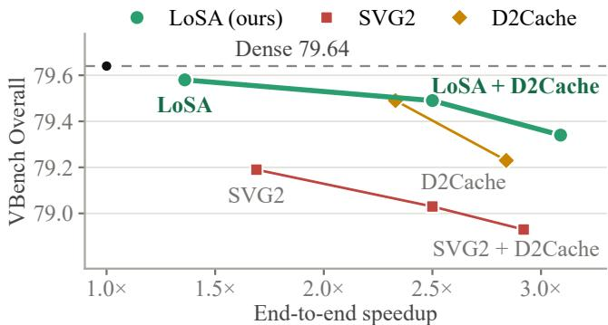
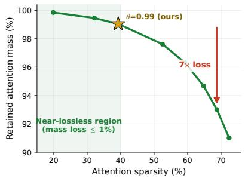
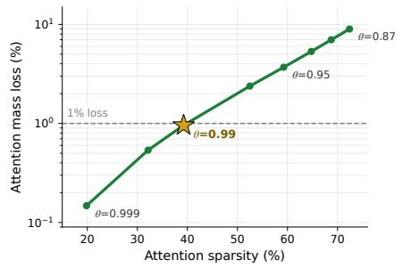
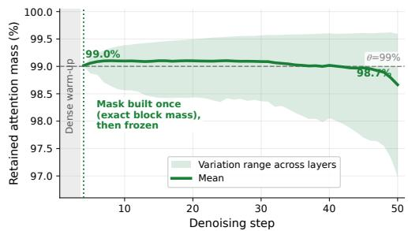
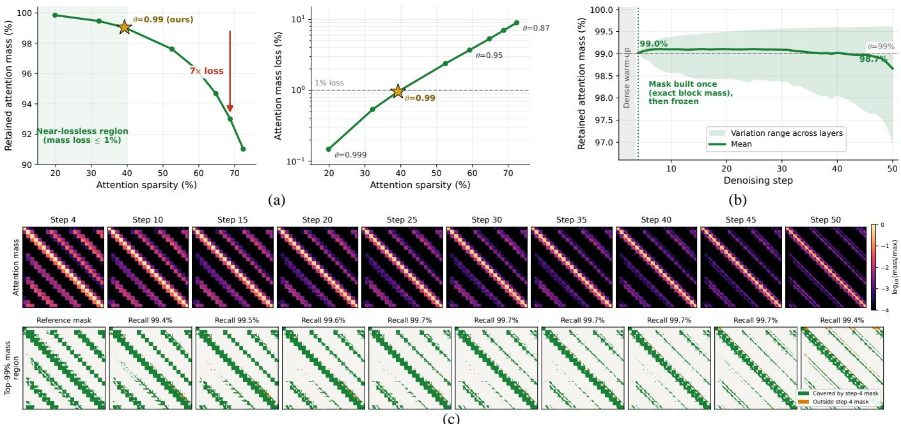
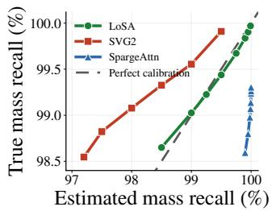
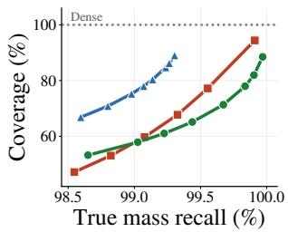
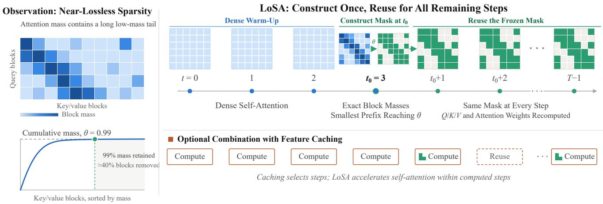

# LoSA: Near-Lossless Sparse Attention for Training-Free Video Difusion Acceleration

Enhuai Liu1, Yunke Wang1, Yutong Wang1, Changming Sun2, Chang Xu1

1The University of Sydney 2CSIRO

## Abstract

Video difusion transformers are costly to sample: every denoising step applies self-attention over a long 3D token sequence, a quadratic cost that dominates as resolution and duration grow. Sparse attention reduces this cost without retraining, but existing methods pursue aggressive sparsity, where further speedup costs disproportionately more attention fidelity. We target the opposite end of this trade-of: fix nearlossless fidelity by construction, and remove as much computation as this constraint permits. Two observations make this regime practical: roughly 40% of block interactions can be removed while retaining 99% of the attention mass, and the high-mass support remains stable across denoising steps. We propose LoSA, a training-free sparse-attention method that fixes a retained-mass threshold of 99% rather than a sparsity ratio: it measures exact block attention masses at one early dense step, keeps, for each head and query block, the smallest key/value block set meeting the threshold, and reuses the frozen block indices for all remaining steps. On Wan2.1- 1.3B, LoSA alone gives a 1.36× speedup with a 0.06-point VBench Overall drop. The benefit is largest under composition: combined with feature caching, LoSA reaches a 3.2× speedup on HunyuanVideo at a 0.02-point drop, versus 0.32 points for the strongest sparse baseline at comparable speed. Across three video difusion transformers and speedups up to 3.2×, LoSA consistently achieves the best training-free speed–quality trade-of.

## Introduction

Video difusion transformers have become a leading architecture for text-to-video generation (Team Wan et al. 2025; Kong et al. 2024; Yang et al. 2025b), but their sampling cost remains high. Each denoising step applies self-attention over a long 3D token sequence, and because attention is quadratic in sequence length, its share of the sampling cost grows with resolution and duration—from roughly half of the latency at short contexts to more than 80% at long ones (Xi et al. 2025). Training-free acceleration is therefore especially attractive, as it promises to lower inference cost without retraining the model, changing the sampler, or sacrificing generation quality.

Existing training-free accelerators reduce this cost along several complementary directions. Feature caching reduces how often transformer blocks are computed, by reusing or predicting intermediate outputs across denoising steps (Liu et al. 2025; Zhao et al. 2025b; Liu et al. 2026). Sparse attention reduces the cost of each computed attention layer by skipping less important query–key interactions (Xi et al. 2025; Yang et al. 2025a; Zhang et al. 2025b). Distillation and quantization are also efective (Li et al. 2024; Yin et al. 2024; Zhao et al. 2025a; Zhang et al. 2025a), but they require additional training, calibration, or model modification. In this work, we focus on sparse attention as a drop-in inferencetime replacement for dense self-attention.

  
Figure 1: Speed–quality trade-of on Wan2.1-1.3B. Each point reports VBench Overall versus end-to-end speedup. LoSA and its cached variants form the entire Pareto frontier: every baseline configuration is matched or dominated by a LoSA configuration, showing that near-lossless sparse attention preserves quality better than aggressive sparsity or cache-only acceleration.

Most sparse-attention methods aim for high sparsity: they push the attention density as low as possible while keeping visual quality acceptable—SVG2, for instance, typically retains only 25–30% of blocks (Yang et al. 2025a). This is a natural objective when sparse attention is evaluated as a standalone speedup module. However, it also places the method in an aggressive approximation regime, where additional sparsity can cost a disproportionate amount of attention fidelity. The error becomes more consequential in a full acceleration pipeline, where sparse attention is combined with feature caching: cached or predicted states carry attention errors forward instead of confining them to a single computation. Thus, low attention error is not merely a conservative preference, but an important design criterion for composable inference acceleration. Simply operating an existing method at a lower sparsity level does not necessarily meet this criterion. Some methods fix a sparsity ratio, leaving the retained attention mass unspecified; others rely on coarse mass estimates that are not suficiently accurate in the near-lossless regime. This leads to a diferent question: can near-lossless attention be achieved by construction while reducing computational cost enough to yield a meaningful speedup?

Video difusion attention satisfies both requirements. Its block-level distribution contains a long low-mass tail, allowing substantial computation to be removed with little mass loss, and after the rapidly changing early denoising steps, the high-mass support remains stable enough to be constructed once and reused throughout the remaining trajectory. These observations suggest that the right objective is not maximum sparsity, but controlled, near-lossless sparsity.

We propose LoSA, a training-free, near-lossless replacement for self-attention in video difusion transformers. Instead of fixing a sparsity ratio, LoSA fixes a retained-mass target. For each layer, head, and query block, it keeps the smallest set of key/value blocks whose cumulative attention mass reaches a threshold θ; we use θ = 0.99 by default. LoSA builds this pattern once after a few dense denoising steps and then freezes only the block indices. Because construction coincides with a dense step, the selection is driven by exact block masses rather than the coarse importance estimates that per-step sparse methods must rely on, so the retained-mass target is met accurately rather than approximately. At every subsequent step, it still recomputes Q/K/V and attention weights from the current hidden states, normalizing the softmax over the retained keys. Thus, LoSA changes only the attention support, not the model weights, denoising schedule, or cached features.

Empirically, LoSA consistently lies on the speed–quality Pareto frontier, both as a standalone module and when combined with feature caching, as shown in Figure 1. Its advantage over more aggressive sparse-attention configurations becomes more pronounced in cached pipelines, supporting our premise that near-lossless sparse attention is a better primitive for composable inference acceleration. This trend holds across the evaluated models and speedup levels.

Our contributions are as follows:

• We identify and characterize a near-lossless sparse regime in video difusion attention, where approximately 40% of block interactions can be removed while retaining 99% of dense attention mass.

• We introduce LoSA, which constructs a retained-mass support once per sample from exact block attention masses, independently for each layer, head, and query block, and freezes only the block indices for the remaining denoising steps.

• We demonstrate that LoSA is near-lossless as a standalone module and remains efective when combined with feature caching, improving the training-free speed–quality frontier across multiple models and speedup levels.

## Related Work

## Eficient Video Difusion Inference

Difusion transformers have become a common backbone for text-to-video generation, including Wan (Team Wan et al. 2025), HunyuanVideo (Kong et al. 2024), and CogVideoX (Yang et al. 2025b). Compared with image generation, video generation requires attention over much longer 3D token sequences, making inference substantially more expensive. Existing acceleration methods can be roughly grouped by where they reduce cost. Step distillation reduces the number of denoising steps (Li et al. 2024; Yin et al. 2024). Quantization reduces numerical precision and memory traffic (Zhao et al. 2025a; Zhang et al. 2025a; Feng et al. 2026). Caching reuses intermediate features across denoising steps, while sparse attention reduces the cost of attention inside a computed step. Our work belongs to the last category and is training-free.

## Sparse Attention for Video Generation

Sparse attention exploits the fact that attention mass in video difusion is highly concentrated. Some methods use predefined layouts. Sliding Tile Attention uses a local 3D tile pattern (Zhang et al. 2025d), Radial Attention adopts a radial layout (Li et al. 2025), and DiTFastAttn studies static sparse patterns for difusion transformers (Yuan et al. 2024). These methods are simple and cheap to apply, but a fixed layout may not match the content-dependent attention pattern of a given prompt or denoising step.

Other methods build sparse patterns from the current attention or hidden states. Sparse VideoGen selects spatial or temporal sparse masks for diferent attention heads (Xi et al. 2025). Sparse VideoGen2 permutes tokens with semanticaware clustering so that important interactions become more block-friendly (Yang et al. 2025a). SpargeAttn and XAttention estimate block importance with lightweight online predictors (Zhang et al. 2025b; Xu et al. 2025). Jenga dynamically removes less important tokens during generation (Zhang et al. 2025e), VSA learns sparse attention operators through training (Zhang et al. 2025c), and AdaSpa also exploits cross-step pattern stability by reusing each searched mask for several denoising steps (Xia et al. 2025). It uses this stability to reduce the frequency of search, but still updates the mask at preset steps and controls sparsity with a fixed budget. LoSA instead quantifies how well a single pattern preserves attention mass and shows that one pattern selected by exact retained mass can be reused for the remaining trajectory.

## Feature Caching

Feature caching accelerates difusion inference by skipping part of the computation across denoising steps. DeepCache first shows that U-Net difusion models contain substantial reusable features (Ma, Fang, and Wang 2024). For difusion transformers, Pyramid Attention Broadcast shares attention outputs across nearby steps (Zhao et al. 2025b). Delta-DiT and FORA reuse feature deltas or layer outputs at scheduled intervals (Chen et al. 2024; Selvaraju et al. 2024). ToCa and DuCa cache features at token granularity (Zou et al.

(c)  

  
Figure 2: Empirical motivation for near-lossless sparse attention. (a) Retained attention mass versus attention sparsity (left) and the corresponding mass loss under diferent thresholds θ (right). About 40% of the block area can be removed with only 1% mass loss, while further sparsity becomes disproportionately expensive. (b) Retained mass of a frozen 99%-mass pattern across denoising steps. The pattern is constructed once after the dense warm-up and keeps its recall close to 99% for the rest of the trajectory. (c) Attention maps of one head across denoising steps (top, log scale) and each step’s top-99%-mass region (bottom), colored by whether it is covered by the mask built at $t _ { 0 } = 3 ;$ the number above each panel is the covered fraction. The high-mass region stays inside the early mask throughout denoising.

2025, 2026). TeaCache, FasterCache, and AdaCache decide when to reuse features using cheap diference or redundancy signals (Liu et al. 2025; Lv et al. 2025; Kahatapitiya et al. 2025). D2Cache uses second-order delta caching to further improve the speed–quality trade-of for video difusion (Liu et al. 2026).

Caching and sparse attention are complementary: the cache decides whether a step or block is computed at all, while sparse attention lowers the cost of the attention that is still computed, so the two can be combined. However, a cache may carry attention errors from computed steps into later reused states, so the combination favors sparse attention with low error. This motivates the near-lossless design of LoSA.

## Motivation

This section presents the empirical basis of LoSA. We show that video difusion attention has a low-mass tail that can be removed with little mass loss, and that its high-mass block pattern is stable enough to be constructed once and reused across denoising steps. Unless otherwise stated, all measurements in this section are averaged over ten prompts on Wan2.1-14B, across all self-attention layers and heads.

## Measuring Sparse Attention by Retained Mass

We quantify the fidelity of a block-sparse support by the fraction of dense attention mass it retains. For attention head h at denoising step t (the layer index is omitted for brevity), let $A _ { t } ^ { h } = \operatorname { s o f t m a x } ( Q _ { t } ^ { h } K _ { t } ^ { h ^ { \top } } / \sqrt { d } )$ be the dense attention probability matrix, where d is the head dimension and the softmax is applied row-wise. We partition query tokens into blocks $B _ { i } ^ { Q }$ of size R and key/value tokens into blocks $B _ { j } ^ { K }$ of size C. The block-level attention contribution from query block i to key/value block j is

$$
M _ { t } ^ { h } ( i , j ) = \sum _ { q \in B _ { i } ^ { Q } } \sum _ { k \in B _ { j } ^ { K } } A _ { t } ^ { h } ( q , k ) .\tag{1}
$$

We refer to $M _ { t } ^ { h } ( i , j )$ as the block attention mass.

A block-sparse attention pattern keeps a subset $\Omega _ { i } ^ { h }$ of key/value blocks for each head h and query block i. We measure the dense attention mass retained by this pattern as

$$
{ \mathrm { R e c a l l } } _ { t } ( \Omega ) = \frac { \sum _ { h } \sum _ { i } \sum _ { j \in \Omega _ { i } ^ { h } } M _ { t } ^ { h } ( i , j ) } { \sum _ { h } \sum _ { i } \sum _ { j } M _ { t } ^ { h } ( i , j ) } .\tag{2}
$$

We measure the remaining block computation by the coverage $\mathrm { C o v e r a g e } ( \Omega ) = ( 1 / \breve { H } ) \sum _ { h } \sum _ { i } | \dot { \Omega } _ { i } ^ { h } | / ( n _ { q } n _ { k } )$ , where H is the number of heads and $n _ { q } , n _ { k }$ are the numbers of query and key/value blocks. A near-lossless sparse pattern should have recall close to one while reducing coverage meaningfully.

Near-Lossless Sparsity Is the Cost-Efective Regime Figure 2(a) evaluates the relationship between retained mass and removed block area. For each query block, key/value blocks are ordered by their block attention mass, and we measure how much total mass remains as more low-mass blocks are removed.

The curve shows a strong diminishing-return efect. Removing the low-mass tail incurs little mass loss: dropping roughly 40% of the block area reduces the retained mass by only about 1%. However, pushing much further is considerably more expensive. At roughly 70% sparsity, the mass loss grows to about $7 \% .$ , seven times larger. The right panel of Figure $2 ( \mathrm { a } )$ shows the same efect from the perspective of the retained-mass threshold: tightening it to $\theta = 0 . 9 9 9$ removes only about 20% of the block area, while relaxing it to $\theta = 0 . 9 5$ saves more computation but loses several times more mass than $\theta = 0 . 9 9$

These results motivate optimizing retained mass directly rather than prescribing a fixed sparsity ratio: the trade-of for near-lossless acceleration lies earlier on the curve than where aggressive methods operate. LoSA therefore fixes a retainedmass threshold, choosing $\theta = 0 . 9 9$ inside the near-lossless region identified in Figure 2(a).

## Near-Lossless Patterns Are Stable Across Denoising

The near-lossless regime reduces attention cost, but its savings per step are moderate by design, so pattern construction must be cheap and accurate. A pattern built once at an early dense step satisfies both requirements, as long as it remains valid at later steps.

Figure 2(b) tests one-time construction directly. At step $t _ { 0 } = 3 ,$ after three dense denoising steps, we construct a block pattern that retains 99% of the block attention mass at that step. We then freeze this pattern and evaluate its recall using the true dense attention mass at subsequent steps. The mean retained mass stays close to 99% throughout the remaining trajectory and is still 98.7% at the final step; even the worst-performing layers retain more than $9 7 \%$ of the mass. A near-lossless pattern therefore remains near-lossless across the subsequent denoising trajectory.

Figure 2(c) shows why. Attention starts broad and then concentrates: the top-99% region of every later step is almost a subset of the region at $t _ { 0 } .$ The support contracts within an early envelope rather than migrating, so a mask built after the initial transition keeps covering the dominant regions without being updated.

A natural alternative is to raise the thresholds of existing top-p estimation methods to target the same near-lossless regime. However, methods such as SVG2 and SpargeAttn rely on coarse mass estimates that are not suficiently accurate in this regime. Figure 3 confirms this: LoSA remains close to the perfect-calibration line in the high-recall region (left) and requires less coverage than both baselines at true recall of 99% or higher (right), even before accounting for their per-step estimation overhead.

Together, these observations lead to the core design of LoSA. After the initial attention transition, LoSA constructs a sparse pattern from exact block masses at $t _ { 0 }$ and reuses it for the rest of denoising. This preserves near-lossless recall while avoiding repeated estimation.

  
Figure 3: LoSA achieves more accurate and eficient attention-mass estimation in the near-lossless regime. The left panel plots estimated against true retained-mass recall as each method’s fidelity setting is varied. The pattern constructed by LoSA at $t _ { 0 }$ remains close to perfect calibration, whereas the per-step estimates used by SVG2 and SpargeAttn are miscalibrated. The right panel shows the coverage required to achieve each true recall. In the near-lossless regime at or above 99% recall, LoSA consistently requires less coverage than both SVG2 and SpargeAttn.

## Methodology

LoSA replaces self-attention in video difusion transformers without modifying model weights, prompts, sampling schedules, or classifier-free guidance settings. Figure 4 connects the empirical premise of LoSA to its inference procedure. LoSA operates in two stages: it constructs a mass-preserving sparse support once online for each sample and reuses the frozen support during the remaining denoising steps. No offline calibration or profiling is required. Unless otherwise stated, we use $\theta = 0 . 9 9$ , run dense attention at steps 0, 1, 2, construct the support during the dense step $t _ { 0 } = 3 ,$ , and use frozen-support sparse attention afterward.

## One-Time Pattern Construction

At the construction step $t _ { 0 }$ , LoSA computes the block attention masses $M _ { t _ { 0 } } ^ { h } ( i , j )$ defined in the Motivation section for every self-attention layer, head, query block, and key/value block. For each head h and query block i, let $\boldsymbol { \pi } _ { i } ^ { h }$ sort the key/value blocks by decreasing mass, with ties broken arbitrarily. Since each query row of $A _ { t \mathrm { n } } ^ { h }$ sums to one, the total mass of a query block of size R is $\breve { R }$ , and the retained-mass threshold θ translates into the shortest prefix

$$
s _ { i } ^ { h } = \operatorname* { m i n } \Big \{ m \in \{ 1 , \ldots , n _ { k } \} : \sum _ { r = 1 } ^ { m } M _ { t _ { 0 } } ^ { h } ( i , \pi _ { i } ^ { h } ( r ) ) \geq \theta R \Big \} .\tag{3}
$$

LoSA keeps $\Omega _ { i } ^ { h } = \{ \pi _ { i } ^ { h } ( 1 ) , \ldots , \pi _ { i } ^ { h } ( s _ { i } ^ { h } ) \}$ , stored independently for each layer, head, and query block, and separately for the conditional and unconditional branches under classifier-free guidance. Since Ω only records block indices, its memory footprint is orders of magnitude smaller than that of a token-level mask.

Because construction coincides with a dense attention step, the masses $M _ { t _ { 0 } } ^ { h } ( i , j )$ are exact rather than estimated. This gives the threshold a direct meaning: setting $\theta = 0 . 9 9$ retains 99% of the mass at $t _ { 0 }$ by construction. This guarantee is exact at $t _ { 0 } { \dot { , } }$ at later steps, near-lossless recall is maintained by the cross-step support stability shown in Figure 2(b–c). Figure 3 compares this exact construction with approximate top-p estimation. LoSA stays close to perfect calibration in the high-recall region, whereas SVG2 and SpargeAttn show larger gaps between estimated and true recall.

  
Figure 4: Overview of LoSA. Left: video difusion attention contains a low-mass tail, allowing approximately 40% of the block area to be removed while retaining approximately 99% of the attention mass. Right: after a dense warm-up, LoSA measures exact block masses at $t _ { 0 }$ and constructs the mask Ω by retaining, for each layer, head, and query block, the smallest prefix whose cumulative mass reaches θ. The same frozen mask is reused at all remaining steps, while Q/K/V and attention weights are recomputed from the current hidden states. Bottom: with optional feature caching, the cache selects which steps are computed, while LoSA accelerates self-attention within every computed step.

## Sparse Attention with a Frozen Pattern

LoSA uses dense self-attention up to and including the construction step $t _ { 0 } .$ Afterward, each query attends only to its retained keys: for a token q in query block i(q), let $\begin{array} { r } { \mathcal { K } ^ { h } ( q ) = \bigcup _ { j \in \Omega _ { i ( q ) } ^ { h } } B _ { j } ^ { K } } \end{array}$ . The output of head h at step t is

$$
O _ { t } ^ { h } ( q ) = \sum _ { k \in K ^ { h } ( q ) } \frac { \exp \bigl ( Q _ { t } ^ { h } ( q ) \cdot K _ { t } ^ { h } ( k ) / \sqrt { d } \bigr ) } { \sum _ { k ^ { \prime } \in K ^ { h } ( q ) } \exp \bigl ( Q _ { t } ^ { h } ( q ) \cdot K _ { t } ^ { h } ( k ^ { \prime } ) / \sqrt { d } \bigr ) } V _ { t } ^ { h } ( k ) ,\tag{4}
$$

with Q/K/V computed from the current hidden states.

Since discarded keys are removed from the softmax denominator, LoSA is not mathematically identical to dense attention; it is near-lossless in practice because Ω preserves nearly all block attention mass. We do not impose auxiliary local or diagonal blocks: the retained-mass criterion directly preserves whichever blocks dominate the dense distribution.

For one head, dense self-attention costs $O ( n _ { q } n _ { k } R C d )$ and frozen sparse attention costs $O ( \sum _ { i } | \Omega _ { i } ^ { h } | R C d )$ , where d is the head dimension. Thus, after the one-time construction step, the attention cost is reduced in proportion to the coverage defined in the Motivation section.

## Combination with Feature Caching

LoSA and feature caching act on diferent parts of inference. The cache decides whether a denoising step or transformer block is computed, reused, or predicted; whenever a block is computed, LoSA replaces its dense self-attention with frozen-support sparse attention. We do not change the cache threshold, reuse schedule, predictor, or cached residuals. In our combination with D2Cache, support construction is scheduled on a fully computed warm-up step, ensuring that the dense block masses required to build Ω are available. After construction, skipped steps or blocks simply reuse cached states, while computed blocks use the same frozen support as in standalone inference.

## Experiments

## Experimental Setup

Models and benchmark. We evaluate LoSA on three textto-video difusion transformers: Wan2.1-T2V-1.3B at 480p, Wan2.1-T2V-14B at 720p (Team Wan et al. 2025), and HunyuanVideo-13B at 540p (Kong et al. 2024), all with their oficial checkpoints and default sampling configurations. Generation quality is measured with VBench (Huang et al. 2024) on its full standard prompt suite; given the cost of large-scale video generation, each configuration is evaluated with a single fixed random seed. We report five representative VBench dimensions (temporal flickering, dynamic degree, aesthetic quality, scene, and overall consistency), together with the aggregate Quality and Overall scores. Each method is summarized by its Overall drop ∆ relative to the corresponding dense baseline.

Baselines and operating points. Our sparse-attention baselines are SVG1 (Xi et al. 2025), SVG2 (Yang et al. 2025a), and SpargeAttn (Zhang et al. 2025b), all trainingfree. We do not include AdaSpa (Xia et al. 2025) because its code is unavailable and its reported HunyuanVideo performance is below SVG2, our strongest reproducible baseline. Its reported operating point is also comparable to our fixed-sparsity ablation (Table 2). On the caching side we use

<table><tr><td>Method</td><td>Time (s) ↓ Speedup ↑</td><td></td><td colspan="4">VBench Dimensions</td><td colspan="4">Aggregate Scores</td></tr><tr><td></td><td></td><td></td><td></td><td>Flicker ↑ Dynamic ↑ Aesthetic ↑ Scene ↑</td><td></td><td></td><td>Consistency ↑</td><td>Quality ↑ Overall ↑</td><td></td><td>∆↑</td></tr><tr><td colspan="10">Wan2.1-T2V-1.3B, 480p</td></tr><tr><td>Dense</td><td>104</td><td>1.00×</td><td>99.72</td><td>72.22</td><td>57.34</td><td>31.10</td><td>25.03</td><td>82.45</td><td>79.64</td><td></td></tr><tr><td colspan="10">Sparse attention only</td></tr><tr><td>SpargeAttn</td><td>80</td><td>1.30×</td><td>99.10</td><td>70.83</td><td>53.58</td><td>28.34</td><td>24.78</td><td>79.51</td><td>76.80</td><td>-2.84</td></tr><tr><td>SVG1</td><td>60</td><td>1.75×</td><td>99.25</td><td>75.00</td><td>54.07</td><td>25.00</td><td>24.69</td><td>80.35</td><td>77.63</td><td>-2.01</td></tr><tr><td>SVG2</td><td>62</td><td>1.69×</td><td>99.65</td><td>70.83</td><td>56.71</td><td>31.32</td><td>24.78</td><td>81.75</td><td>79.19</td><td>-0.45</td></tr><tr><td>LoSA</td><td>77</td><td>1.36×</td><td>99.74</td><td>70.83</td><td>57.31</td><td>35.17</td><td>24.93</td><td>82.19</td><td>79.58</td><td>-0.06</td></tr><tr><td colspan="10">≈2.5× Speedup</td></tr><tr><td>D2Cache</td><td>45</td><td>2.33×</td><td>99.71</td><td>69.44</td><td>57.14</td><td>31.61</td><td>24.81</td><td>82.20</td><td>79.49</td><td>-0.15</td></tr><tr><td>SVG2 + D2Cache</td><td>42</td><td>2.50×</td><td>99.64</td><td>70.83</td><td>56.84</td><td>30.60</td><td>24.76</td><td>81.75</td><td>79.03</td><td>-0.61</td></tr><tr><td colspan="10">LoSA + D2Cache 42</td></tr><tr><td>≈3× Speedup</td><td></td><td>2.50×</td><td>99.73</td><td>72.22</td><td>57.32</td><td>32.99</td><td>24.83</td><td>82.24</td><td>79.49</td><td>-0.15</td></tr><tr><td>D2Cache</td><td>37</td><td>2.84×</td><td>99.71</td><td>70.83</td><td>56.73</td><td>29.07</td><td>24.71</td><td>82.08</td><td>79.23</td><td>-0.41</td></tr><tr><td>SVG2 + D2Cache LoSA + D2Cache</td><td>36</td><td>2.92×</td><td>99.64</td><td>72.22</td><td>56.64</td><td>29.72</td><td>24.71</td><td>81.83</td><td>78.93</td><td>-0.71</td></tr><tr><td></td><td>34</td><td>3.09×</td><td>99.73</td><td>72.22</td><td>56.97</td><td>31.18</td><td>24.90</td><td>82.10</td><td>79.34</td><td>-0.30</td></tr><tr><td colspan="10">Wan2.1-T2V-14B, 720p</td></tr><tr><td>Dense</td><td>2000</td><td>1.00×</td><td>98.97</td><td>86.11</td><td>60.39</td><td>33.94</td><td>26.20</td><td>82.51</td><td>81.02</td><td></td></tr><tr><td colspan="10">≈ 2.5× Speedup SVG2 + D2Cache</td></tr><tr><td></td><td>812</td><td>2.46×</td><td>98.97</td><td>86.11</td><td>59.50</td><td>33.50</td><td>26.01</td><td>82.00</td><td>80.31</td><td>-0.71</td></tr><tr><td>LoSA + D2Cache</td><td>801</td><td>2.50×</td><td>99.06</td><td>87.50</td><td>59.89</td><td>35.17</td><td>26.08</td><td>82.36</td><td>80.59</td><td>-0.43</td></tr><tr><td colspan="10">HunyuanVideo-13B, 540p</td></tr><tr><td>Dense</td><td>672</td><td>1.00×</td><td>98.61</td><td>79.17</td><td>60.72</td><td>29.51</td><td>26.37</td><td>83.29</td><td>79.66</td><td></td></tr><tr><td colspan="10">≈ 3.2× Speedup</td></tr><tr><td>SVG2 + D2Cache</td><td>211</td><td>3.18×</td><td>98.49</td><td>79.17</td><td>60.74</td><td>28.27</td><td>26.44</td><td>82.85</td><td>79.34</td><td>-0.32</td></tr><tr><td>LoSA + D2Cache</td><td>211</td><td>3.19×</td><td>98.54</td><td>77.78</td><td>60.60</td><td>29.14</td><td>26.47</td><td>82.94</td><td>79.64</td><td>-0.02</td></tr></table>

Table 1: End-to-end eficiency and generation quality on Wan2.1 and HunyuanVideo, with methods grouped by inference setting at approximately matched speed. ∆ is the change in VBench Overall relative to the corresponding dense baseline (gray rows); ∆ ↑ indicates that a smaller drop is better. Latencies are averaged over the full VBench prompt suite. Bold marks the highest speedup or the best quality within each group; ties after rounding are both highlighted. All scores are percentages; “Consistency” denotes VBench overall consistency.

D2Cache (Liu et al. 2026), a state-of-the-art method, and we also evaluate the sparse–cache combinations. Since quality is only comparable at equal speed, we compare methods at operating points with matched end-to-end speedup: about 2.5× and 3× on Wan2.1-1.3B, 2.5× on Wan2.1-14B, and 3.2× on HunyuanVideo. Each operating point is reached by adjusting only the reuse schedule of D2Cache. All sparse-attention methods keep their default configurations throughout, and SVG1 and SpargeAttn appear only in the standalone comparison.

Implementation. All experiments run on NVIDIA H200 GPUs in a Difusers-based inference environment. LoSA is applied to self-attention only, since cross-attention accounts for a much smaller fraction of inference cost in our target models. All layers use query block size R = 128 and key/value block size $C = 3 { \dot { 2 } } .$ , the finest granularity that did not compromise block-sparse kernel eficiency in our tests. We use θ = 0.99 and t = 3 as defaults. Block-sparse attention is implemented with FlashInfer, and the construction step uses a custom dense-attention kernel that accumulates exact block masses while computing full attention. Construction adds a one-time overhead of roughly one denoising step, which is included in all reported latencies and amortized over the remaining sparse steps.

## Main Results

Table 1 reports end-to-end latency and VBench quality for all models and operating points, and Figure 1 visualizes the resulting speed–quality frontier on Wan2.1-1.3B. Qualitative comparisons of the generated videos are provided in the supplementary material.

Standalone sparse attention. On Wan2.1-1.3B, LoSA alone accelerates sampling by 1.36× while reducing VBench Overall by only 0.06 points, staying close to dense attention on every reported dimension. SVG2 reaches a higher standalone speedup (1.69×) but loses 0.45 points, over seven times the degradation. The earlier SVG1 (1.75×) and SpargeAttn (1.30×) lose 2.01 and 2.84 points, and SpargeAttn is even slower than LoSA; we therefore treat SVG2 as the aggressive reference in the remaining comparisons. LoSA deliberately trades part of the standalone speedup for near-losslessness.

<table><tr><td>Selection rule</td><td>Coverage (%)</td><td colspan="2">Recall (%) ↑</td></tr><tr><td></td><td></td><td>Average</td><td>Worst layer</td></tr><tr><td>Fixed-ratio top-k</td><td>66.1</td><td>96.5</td><td>86.6</td></tr><tr><td>Retained-mass (θ = 0.99)</td><td>66.1</td><td>99.0</td><td>97.3</td></tr></table>

Table 2: Comparison ofselection rules at equal average coverage on Wan2.1-1.3B (100 prompts). With coverage matched, both rules run equally fast (1.37× end-to-end), but fixedratio top-k loses much more attention mass, especially in its worst layer. Recall is averaged over the denoising trajectory; “Worst layer” is the layer with the lowest average recall.

Combination with feature caching. The advantage of near-losslessness shows most clearly under composition. At the ≈ 2.5× operating point, D2Cache alone reaches 2.33× with a 0.15-point drop. Composing it with SVG2 raises the speedup to 2.50× but increases the quality loss to 0.61 points, worse than the cache alone: the attention error of the sparse module is written into cached states and propagated across reused steps, so the combination loses more quality than either component. Composing the same cache with LoSA reaches the same 2.50× with the quality drop unchanged at 0.15 points. In efect, LoSA multiplies the speedup of the cache at no measurable quality cost. At ≈ 3×, the contrast sharpens: LoSA+D2Cache is simultaneously the fastest (3.09×) and the highest-quality (∆ = −0.30) configuration, surpassing both D2Cache alone (2.84×, −0.41) and SVG2+D2Cache (2.92×, −0.71).

Larger model and diferent backbone. The advantage persists at scale. On the two larger models we evaluate only the composed, high-speedup setting: a single dense sample takes hundreds to thousands of seconds, so a full grid of operating points is prohibitively expensive, and high speedups are also the practically relevant setting at this scale. On Wan2.1- 14B at 720p, where a dense sample takes roughly 2000 seconds, LoSA+D2Cache achieves 2.50× with a 0.43-point drop, against 2.46× and 0.71 points for SVG2+D2Cache. On HunyuanVideo-13B, the margin widens further: at a matched ≈ 3.2× speedup, LoSA+D2Cache is virtually lossless (∆ = −0.02) while SVG2+D2Cache loses 0.32 points. The near-lossless regime is thus not specific to a single model family.

## Ablation Studies

The ablations examine the two design choices of LoSA: the selection rule and the retained-mass threshold. Both act directly on retained attention mass, so we evaluate them by recall rather than benchmark scores. This is also cheap: each variant is just a diferent selection rule applied to the same recorded masses, so no additional generation is needed. As a reference point, the default configuration’s 99.0% average recall corresponds to its 0.06-point Overall drop in Table 1. Following the measurement protocol of the Motivation section, masses are recorded on Wan2.1-1.3B over 100 prompts across all layers, heads, and denoising steps; latencies are measured end-to-end on the same prompts.

<table><tr><td></td><td>Dense</td><td>θ = 0.999</td><td>θ = 0.99</td><td>θ = 0.95</td></tr><tr><td>Coverage (%)</td><td>100</td><td>83.5</td><td>66.1</td><td>46.6</td></tr><tr><td>Recall (%)</td><td>100</td><td>99.9</td><td>99.0</td><td>95.9</td></tr><tr><td>Time (s)</td><td>104.8</td><td>83.1</td><td>76.3</td><td>69.0</td></tr><tr><td>Saved (s)</td><td></td><td>21.7</td><td>28.5</td><td>35.8</td></tr><tr><td>Speedup</td><td>1.00×</td><td>1.26×</td><td>1.37×</td><td>1.52×</td></tr></table>

Table 3: Efect of the retained-mass threshold θ on Wan2.1- 1.3B (100 prompts). The realized recall stays close to the target at every setting, and the savings diminish quickly: most of the time reduction is already obtained at the default θ = 0.99.

Retained mass vs. a fixed sparsity ratio. Some blocksparse methods use a fixed sparsity level shared across heads (Zhang et al. 2025b; Xia et al. 2025). However, attention concentration varies widely from head to head: some heads concentrate their mass on a few blocks, while others spread it broadly. LoSA therefore selects blocks by cumulative mass instead of a fixed ratio. To verify this choice, we compare against a fixed-ratio top-k variant matched to the same average coverage (Table 2). It runs equally fast but retains only 96.5% of the mass, more than three times the default’s loss, and its worst-layer recall falls to 86.6% against 97.3%: the uniform budget truncates exactly those heads whose attention is spread broadly.

Choice of θ. The remaining design choice is the threshold θ, LoSA’s only tuning parameter. Two things need checking: whether setting θ actually delivers the requested recall, and why 0.99 is the right default. Table 3 confirms the first: the realized recall never falls more than 0.1 points below the target (and sits above it at θ = 0.95), so θ is a reliable fidelity control. The default then follows from the sharply nonlinear trade between recall and time: giving up the first point of mass (θ = 0.99) saves 28.5 seconds, while giving up three more points (θ = 0.95) recovers only 7.3 more. We therefore default to θ = 0.99, the knee of this trade-of.

## Conclusion

We identified a near-lossless sparse regime in video difusion attention: roughly 40% of block interactions can be removed while retaining 99% of the attention mass, and the highmass support is stable enough to be constructed once and reused. LoSA exploits this regime with a deliberately simple design: one dense step yields exact block masses, the threshold θ specifies the retained mass directly, and every subsequent step reuses the frozen block indices. As a standalone module, LoSA delivers a meaningful speedup while remaining nearly lossless. Composed with feature caching, it multiplies the speedup of a strong cache at almost no additional quality cost, whereas the aggressive sparse-attention baseline degrades the combination below the cache alone. The result is the best training-free speed–quality trade-of across all evaluated models and operating points. We hope near-lossless sparse attention becomes a standard primitive for composable difusion inference acceleration.

## References

Chen, P.; Shen, M.; Ye, P.; Cao, J.; Tu, C.; Bouganis, C.- S.; Zhao, Y.; and Chen, T. 2024. ∆-DiT: A Training-Free Acceleration Method Tailored for Difusion Transformers. arXiv preprint arXiv:2406.01125.

Feng, W.; Yang, C.; Qin, H.; Wu, M.; Li, Y.; Li, X.; An, Z.; Huang, L.; Zhang, Y.; Magno, M.; and Xu, Y. 2026. QuantSparse: Comprehensively Compressing Video Difusion Transformer with Model Quantization and Attention Sparsification. In International Conference on Learning Representations (ICLR). ArXiv:2509.23681.

Huang, Z.; He, Y.; Yu, J.; Zhang, F.; Si, C.; Jiang, Y.; Zhang, Y.; Wu, T.; Jin, Q.; Chanpaisit, N.; Wang, Y.; Chen, X.; Wang, L.; Lin, D.; Qiao, Y.; and Liu, Z. 2024. VBench: Comprehensive Benchmark Suite for Video Generative Models. In Proceedings of the IEEE/CVF Conference on Computer Vision and Pattern Recognition (CVPR), 21807–21818.

Kahatapitiya, K.; Liu, H.; He, S.; Liu, D.; Jia, M.; Zhang, C.; Ryoo, M. S.; and Xie, T. 2025. Adaptive Caching for Faster Video Generation with Difusion Transformers. In Proceedings of the IEEE/CVF International Conference on Computer Vision (ICCV), 15240–15252.

Kong, W.; Tian, Q.; Zhang, Z.; Min, R.; Dai, Z.; Zhou, J.; Xiong, J.; Li, X.; Wu, B.; Zhang, J.; Wu, K.; Lin, Q.; Yuan, J.; Long, Y.; Wang, A.; Wang, A.; Li, C.; Huang, D.; Yang, F.; Tan, H.; Wang, H.; Song, J.; Bai, J.; Wu, J.; Xue, J.; Wang, J.; Wang, K.; Liu, M.; Li, P.; Li, S.; Wang, W.; Yu, W.; Deng, X.; Li, Y.; Chen, Y.; Cui, Y.; Peng, Y.; Yu, Z.; He, Z.; Xu, Z.; Zhou, Z.; Xu, Z.; Tao, Y.; Lu, Q.; Liu, S.; Zhou, D.; Wang, H.; Yang, Y.; Wang, D.; Liu, Y.; Jiang, J.; and Zhong, C. 2024. HunyuanVideo: A Systematic Framework For Large Video Generative Models. arXiv preprint arXiv:2412.03603.

Li, J.; Feng, W.; Fu, T.-J.; Wang, X.; Basu, S.; Chen, W.; and Wang, W. Y. 2024. T2V-Turbo: Breaking the Quality Bottleneck of Video Consistency Model with Mixed Reward Feedback. In Advances in Neural Information Processing Systems (NeurIPS). ArXiv:2405.18750.

Li, X.; Li, M.; Cai, T.; Xi, H.; Yang, S.; Lin, Y.; Zhang, L.; Yang, S.; Hu, J.; Peng, K.; Agrawala, M.; Stoica, I.; Keutzer, K.; and Han, S. 2025. Radial Attention: O(n log n) Sparse Attention with Energy Decay for Long Video Generation. In Advances in Neural Information Processing Systems (NeurIPS).

Liu, E.; Wang, Y.; Sun, C.; and Xu, C. 2026. D2Cache: Second-Order Delta Caching for Higher Video Difusion Acceleration. In Proceedings of the IEEE/CVF Conference on Computer Vision and Pattern Recognition (CVPR), 43589– 43599.

Liu, F.; Zhang, S.; Wang, X.; Wei, Y.; Qiu, H.; Zhao, Y.; Zhang, Y.; Ye, Q.; and Wan, F. 2025. Timestep Embedding Tells: It’s Time to Cache for Video Difusion Model. In Proceedings of the IEEE/CVF Conference on Computer Vision and Pattern Recognition (CVPR), 7353–7363.

Lv, Z.; Si, C.; Song, J.; Yang, Z.; Qiao, Y.; Liu, Z.; and Wong, K.-Y. K. 2025. FasterCache: Training-Free Video Difusion Model Acceleration with High Quality. In Inter-

national Conference on Learning Representations (ICLR). ArXiv:2410.19355.

Ma, X.; Fang, G.; and Wang, X. 2024. DeepCache: Accelerating Difusion Models for Free. In Proceedings of the IEEE/CVF Conference on Computer Vision and Pattern Recognition (CVPR), 15762–15772.

Selvaraju, P.; Ding, T.; Chen, T.; Zharkov, I.; and Liang, L. 2024. FORA: Fast-Forward Caching in Difusion Transformer Acceleration. arXiv preprint arXiv:2407.01425.

Team Wan; Wang, A.; Ai, B.; Wen, B.; Mao, C.; Xie, C.- W.; Chen, D.; Yu, F.; Zhao, H.; Yang, J.; Zeng, J.; Wang, J.; Zhang, J.; Zhou, J.; Wang, J.; Chen, J.; Zhu, K.; Zhao, K.; Yan, K.; Huang, L.; Feng, M.; Zhang, N.; Li, P.; Wu, P.; Chu, R.; Feng, R.; Zhang, S.; Sun, S.; Fang, T.; Wang, T.; Gui, T.; Weng, T.; Shen, T.; Lin, W.; Wang, W.; Wang, W.; Zhou, W.; Wang, W.; Shen, W.; Yu, W.; Shi, X.; Huang, X.; Xu, X.; Kou, Y.; Lv, Y.; Li, Y.; Liu, Y.; Wang, Y.; Zhang, Y.; Huang, Y.; Li, Y.; Wu, Y.; Liu, Y.; Pan, Y.; Zheng, Y.; Hong, Y.; Shi, Y.; Feng, Y.; Jiang, Z.; Han, Z.; Wu, Z.-F.; and Liu, Z. 2025. Wan: Open and Advanced Large-Scale Video Generative Models. arXiv preprint arXiv:2503.20314.

Xi, H.; Yang, S.; Zhao, Y.; Xu, C.; Li, M.; Li, X.; Lin, Y.; Cai, H.; Zhang, J.; Li, D.; Chen, J.; Stoica, I.; Keutzer, K.; and Han, S. 2025. Sparse Video-Gen: Accelerating Video Diffusion Transformers with Spatial-Temporal Sparsity. In Proceedings of the 42nd International Conference on Machine Learning, volume 267 of Proceedings ofMachine Learning Research, 68208–68224. PMLR.

Xia, Y.; Ling, S.; Fu, F.; Wang, Y.; Li, H.; Xiao, X.; and Cui, B. 2025. Training-free and Adaptive Sparse Attention for Eficient Long Video Generation. In Proceedings of the IEEE/CVF International Conference on Computer Vision (ICCV), 15982–15993.

Xu, R.; Xiao, G.; Huang, H.; Guo, J.; and Han, S. 2025. XAttention: Block Sparse Attention with Antidiagonal Scoring. In Proceedings of the 42nd International Conference on Machine Learning, volume 267 of Proceedings ofMachine Learning Research, 69819–69831. PMLR.

Yang, S.; Xi, H.; Zhao, Y.; Li, M.; Zhang, J.; Cai, H.; Lin, Y.; Li, X.; Xu, C.; Peng, K.; Chen, J.; Han, S.; Keutzer, K.; and Stoica, I. 2025a. Sparse VideoGen2: Accelerate Video Generation with Sparse Attention via Semantic-Aware Permutation. In Advances in Neural Information Processing Systems (NeurIPS). ArXiv:2505.18875.

Yang, Z.; Teng, J.; Zheng, W.; Ding, M.; Huang, S.; Xu, J.; Yang, Y.; Hong, W.; Zhang, X.; Feng, G.; Yin, D.; Zhang, Y.; Wang, W.; Cheng, Y.; Xu, B.; Gu, X.; Dong, Y.; and Tang, J. 2025b. CogVideoX: Text-to-Video Difusion Models with An Expert Transformer. In International Conference on Learning Representations (ICLR).

Yin, T.; Gharbi, M.; Park, T.; Zhang, R.; Shechtman, E.; Durand, F.; and Freeman, W. T. 2024. Improved Distribution Matching Distillation for Fast Image Synthesis. In Advances in Neural Information Processing Systems (NeurIPS). ArXiv:2405.14867.

Yuan, Z.; Zhang, H.; Lu, P.; Ning, X.; Zhang, L.; Zhao, T.; Yan, S.; Dai, G.; and Wang, Y. 2024. DiTFastAttn: Atten-

tion Compression for Difusion Transformer Models. In Advances in Neural Information Processing Systems (NeurIPS). ArXiv:2406.08552.

Zhang, J.; Wei, J.; Zhang, P.; Zhu, J.; and Chen, J. 2025a. SageAttention: Accurate 8-Bit Attention for Plug-and-play Inference Acceleration. In International Conference on Learning Representations (ICLR).

Zhang, J.; Xiang, C.; Huang, H.; Wei, J.; Xi, H.; Zhu, J.; and Chen, J. 2025b. SpargeAttention: Accurate and Training-free Sparse Attention Accelerating Any Model Inference. In Proceedings of the 42nd International Conference on Machine Learning, volume 267 of Proceedings of Machine Learning Research, 76397–76413. PMLR.

Zhang, P.; Chen, Y.; Huang, H.; Lin, W.; Liu, Z.; Stoica, I.; Xing, E.; and Zhang, H. 2025c. VSA: Faster Video Difusion with Trainable Sparse Attention. InAdvances in Neural Information Processing Systems (NeurIPS). ArXiv:2505.13389.

Zhang, P.; Chen, Y.; Su, R.; Ding, H.; Stoica, I.; Liu, Z.; and Zhang, H. 2025d. Fast Video Generation with Sliding Tile Attention. In Proceedings of the 42nd International Conference on Machine Learning, volume 267 of Proceedings of Machine Learning Research, 74714–74731. PMLR.

Zhang, Y.; Xing, J.; Xia, B.; Liu, S.; Peng, B.; Tao, X.; Wan, P.; Lo, E.; and Jia, J. 2025e. Training-Free Eficient Video Generation via Dynamic Token Carving. In Advances in Neural Information Processing Systems (NeurIPS). ArXiv:2505.16864.

Zhao, T.; Fang, T.; Huang, H.; Wan, R.; Soedarmadji, W.; Liu, E.; Li, S.; Lin, Z.; Dai, G.; Yan, S.; Yang, H.; Ning, X.; and Wang, Y. 2025a. ViDiT-Q: Eficient and Accurate Quantization of Difusion Transformers for Image and Video Generation. In International Conference on Learning Representations (ICLR).

Zhao, X.; Jin, X.; Wang, K.; and You, Y. 2025b. Real-Time Video Generation with Pyramid Attention Broadcast. In International Conference on Learning Representations (ICLR). ArXiv:2408.12588.

Zou, C.; Liu, X.; Liu, T.; Huang, S.; and Zhang, L. 2025. Accelerating Difusion Transformers with Token-wise Feature Caching. In International Conference on Learning Representations (ICLR). ArXiv:2410.05317.

Zou, C.; Zheng, S.; Zhang, E.; Guo, R.; Xu, H.; Shi, Z.; He, C.; Hu, X.; and Zhang, L. 2026. Rethinking Tokenwise Feature Caching: Accelerating Difusion Transformers with Dual Feature Caching. IEEE Transactions on Image Processing, 35: 6211–6220.