# MBA: Multimodal Benchmark and Agents for Real-World Business Ideation

Hojun Choi<sup>1</sup>, Jaeyo Shin<sup>1</sup>, Suin Lee<sup>1</sup>, Hyunjung Shim<sup>1∗</sup>

<sup>1</sup>KAIST AI, Republic of Korea {hchoi256, jaeyo\_shin, suinlee, kateshim}@kaist.ac.kr <sup>∗</sup>Corresponding author

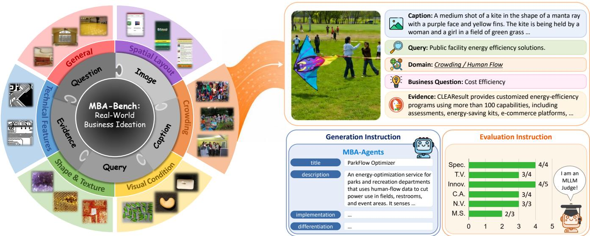  
Figure 1: We introduce MBA-Bench, the first benchmark for training and evaluating multimodal business ideation, comprising 30K samples across six domains, each with a unified question prompt integrating an image, caption, domain, query, business question, and market evidence, evaluated across six metrics (Table 2). Building on this benchmark, we propose two MBA agents that generate both creative and viable business ideas from multimodal inputs, each evaluated via multimodal LLM-as-a-Judge.

## Abstract

Agentic systems powered by large language models (LLMs) have opened new opportunities for business ideation. Yet existing approaches remain confined to a text-only paradigm, despite the inherently multimodal nature of real-world contexts. We thus introduce MBA-Bench, the first multimodal benchmark for training and evaluating business ideation agents, comprising 30K samples across six domains, each domain characterized by distinct visual cues not fully conveyed by text alone. Concretely, we automatically caption images and employ GPT-4o to generate five reference ideas for each of three business questions through retrieval query generation, market evidence retrieval, and evidence-augmented synthesis. Following prior work, we evaluate agents across six businessoriented criteria using MLLM-as-a-Judge. To consider settings where criteria are hidden or disclosed, we present MBAb and MBA-k for blind and known, respectively. We train both with two novel reward objectives—creativity and feasibility— while MBA-k further optimizes the six disclosed criteria for

eight in total. Both are trained via LoRA-based supervised fine-tuning followed by group relative policy optimization with these setting-specific rewards. For extensive experiments on MBA-Bench, we set up two baselines accommodating either captions only or multimodal inputs, with the latter nearing closed-source performance on several metrics. MBA-b and MBA-k outperform caption baselines by 63.9% and 77.1%, and multimodal baselines by 25.6% and 35.8%, respectively.

Code — https://github.com/hchoi256/MBA Datasets — https://huggingface.co/hchoi256/mba

## 1 Introduction

Agentic AI augments large language models (LLMs) with autonomous reasoning, planning, and decision-making capabilities. It has proven efective at narrowing large candidate spaces, from diagnosis (Kim et al. 2024) to fraud detection (Qu et al. 2025). Entrepreneurship poses the same challenge: venture capital firms evaluate roughly 100 deals per completed investment, each requiring months of due diligence (Gompers et al. 2020). This bottleneck motivates automated support for iterative idea generation and screening.

Toward this end, early approaches rely on zero-shot LLM prompting for ideation, with human experts manually evaluating the resulting business ideas. More recent works (Kanumolu et al. 2025; Xu et al. 2025) automate this process by generating multiple ideas from human-curated patent documents and evaluating them across six business-oriented dimensions using LLM-as-a-Judge (Zheng et al. 2023). Despite this progress, existing methods remain fundamentally bound to a “text-in, text-out” paradigm grounded in patents. That is, they are applicable only to scenarios in which the underlying information is both inherently textual and drawn from hard-to-collect patents. In real-world settings, where ideas can instead be derived from readily available multimodal sources, this assumption is neither realistic nor practical.

We hypothesize that such visual detail is pivotal to distinctive ideation. Put diferently, images contain unique information that text cannot fully capture (Yin et al. 2024). A natural way to test this premise is to compare each image against its caption for visual fidelity. Specifically, one could attach a strong image captioner (Steiner et al. 2024) to each image and feed the resulting caption into the existing pipeline. In Figure 7, captions may omit details in overly complex scenes (e.g., ethnicity, signage placement), or name a detail too complex to verbalize (e.g., swirling), precluding the opportunities such details could inspire. In practice, the caption baseline trails across all six business-oriented metrics (Figure 2)—text alone cannot sustain competitive ideation.

This modality gap motivates revisiting business ideation as a multimodal task. Indeed, multimodal inputs alone outperform their caption-based counterpart by a large margin, even approaching closed-source performance on viability (Figure 2). Yet this strong baseline still falls short on creativity, due to its heavy reliance on zero-shot MLLMs that tend to produce conventional, homogeneous ideas (Jiang et al. 2025) (Figure 2). These cliched outputs hold little commercial value once already on the market. This direction thus remains underexplored, with no dedicated benchmarks or models.

We introduce MBA-Bench, a multimodal benchmark for training and evaluating business ideation agents. As illustrated in Figure 1, it is designed to reflect real-world multimodal environments through six domains, each capturing visual characteristics not fully represented in text: General, Spatial Layout, Crowding, Visual Condition, Shape & Texture, and Technical Features. Across these domains, we select 2K images using domain-specific relevance scores derived from dataset annotations (Table 1). Each selected image is paired with an automatically generated caption and three high-level questions—cost, technology, and user experience. We further employ GPT-4o (OpenAI 2024) to implement a three-stage business ideation protocol comprising retrieval-query extraction, market-evidence retrieval through the DuckDuckGo search engine, and evidence-augmented generation. This protocol produces five reference ideas for each question. For evaluation, we follow prior work (Hirota et al. 2026) by employing an LLM or MLLM as ajudge (Chen et al. 2024) to automatically assess generated ideas, thereby reducing manual evaluation costs. The underlying rubric comprises six comprehensive, business-oriented evaluation dimensions introduced in PBIG (Hirota et al. 2025) (Table 2).

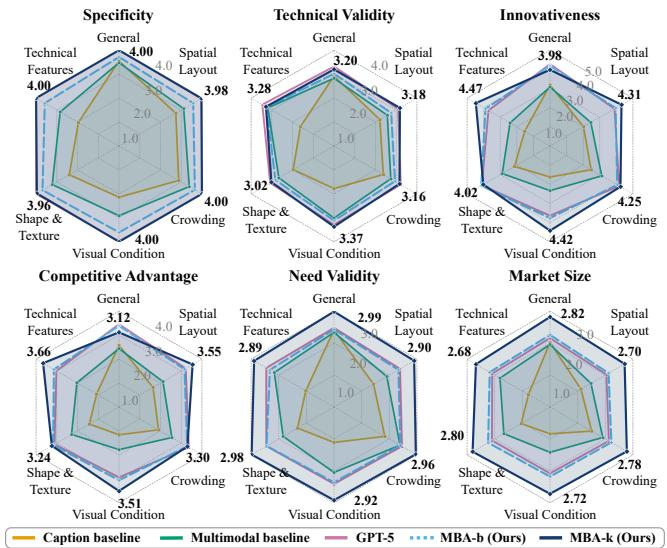  
Figure 2: Caption baselines struggle in image-specific domains, while multimodal baselines still lag behind closedsource MLLMs. Our models remain competitive with such MLLMs, opening paths for real-world business ideation.

Beyond naive multimodal prompting, we also propose two task-specialized agents, MBA-b and MBA-k, which generate both novel and viable business ideas from multimodal contexts. Each targets one of two practical deployment settings, depending on whether the evaluation system is blind or known. Where such a rubric is unknown, MBA-b instead optimizes two task-general objectives: creativity (novelty relative to reference ideas) andfeasibility (market relevance and factuality). MBA-k further leverages the same six disclosed metrics, for eight in total. Each reward is then computed by a separatejudge model for training. Feasibility is the exception: since judges are themselves prone to hallucinating real-world facts, we instead measure it against MBA-Library, our websourced Feasibility-grounding resource. Both agents follow a common two-stage training protocol: we first adapt an opensource MLLM (Bai et al. 2025) using LoRA (Hu et al. 2022) through supervised fine-tuning (SFT) and then apply group relative policy optimization (GRPO) (DeepSeek-AI 2025) with setting-specific rewards for within-group ranking.

On MBA-Bench, MBA-b outperforms the caption-based and multimodal baselines by 63.9% and 25.6%, respectively. MBA-k likewise outperforms them by 77.1% and 35.8%, while remaining competitive with closed-source MLLMs.

• We present MBA-Bench, the first multimodal benchmark for training and evaluating real-world business ideation agents, comprising 30K multimodal samples across six domains and eight business-oriented dimensions.

• We propose MBA-b and MBA-k, two business ideation agents for blind and known evaluation settings, trained with SFT and GRPO under setting-specific objectives.

• Both variants outperform caption-based and multimodal baselines on the MBA-Bench test set, while MBA-k remains competitive with closed-source MLLMs.

## 2 Related Work

## 2.1 Agentic AI for Business Ideation

Early agentic AI frameworks extend LLMs with planning and tool use for multi-step reasoning (Yao et al. 2022; Schick et al. 2023). These text-based capabilities have since extended to entrepreneurship, where AI systems must generate ideas grounded in market needs and originality. Recent work has turned to patent documents as a rich source of technologies intended for commercialization. Concretely, PBIG (Hirota et al. 2025) introduces six business-oriented dimensions for judging patent-derived product ideas. Under these criteria, Agent Ideate (Kanumolu et al. 2025) decomposes ideation across specialized, tool-augmented agents, while PBIG-Data (Hirota et al. 2026) collects and analyzes expert scores on candidate ideas. By contrast, MK2 (Xu et al. 2025) forgoes an agentic pipeline entirely, instead iteratively refining a single prompt guided by a pairwise judge. Yet text alone cannot fully capture the visual detail of real-world contexts, and no benchmark or agent has tackled this multimodal setting. In this work, we introduce the first such benchmark and agents for real-world, multimodal business ideation.

## 2.2 Reinforcement Learning (RL) Post-training

RL has become a central post-training paradigm for LLMs, first for alignment (Ouyang et al. 2022) and more recently for reasoning. For alignment, proximal policy optimization (Schulman et al. 2017) and direct preference optimization (Rafailov et al. 2023) either pair a reward model with a value network, or discard both for pairwise preference data. For reasoning, group relative policy optimization (GRPO) (DeepSeek-AI 2025) keeps a scalar reward but drops the value network, estimating advantages from relative scores within a sampled group. This simplicity has driven GRPO’s extension to MLLMs across both single-answer and openended settings. Concretely, Visual-RFT (Liu et al. 2025) applies rule-based rewards to visual perception tasks with a definite answer, whereas Debate-as-Reward (Salimi et al. 2026) trains a multi-agentjudge to reward scientific idea generation, where no single answer is correct. Business ideation similarly admits no single correct answer: a proposal should be both creative and feasible, neither fully verifiable. In this work, we optimize an MLLM with GRPO underjudge-based rewards (Chen et al. 2024) tailored to these two objectives.

## 3 Methodology

We recast business ideation as a multimodal task grounded in real-world contexts, with a dedicated benchmark and two task-specific agents. The underlying motivation is to uncover hints lost in cross-modal translation or either modality alone.

We introduce MBA-Bench, a multimodal benchmark for training and evaluation in business ideation (Figure 3- a). We sample 2K images across six domains in predefined proportions based on annotation-driven scores. Each is then paired with a caption from a captioner (Steiner et al. 2024). For each pair, we formulate three business questions and generate five reference ideas per question using GPT-4o through three stages—visual query extraction, market evidence retrieval via the DuckDuckGo API, and evidence-augmented ideation—yielding 30K image– caption–question–idea quadruplets. For evaluation, we use an MLLM-as-a-Judge (Chen et al. 2024) to assess ideas across six business-oriented dimensions (Hirota et al. 2025).

Furthermore, we propose two dedicated agents, MBA-b and MBA-k, for blind and known evaluation settings, respectively. Both models share two reward objectives—creativity and feasibility—while MBA-k further incorporates rewards for the six disclosed criteria. In both cases, training follows the same two-stage pipeline: LoRA-based (Hu et al. 2022) supervised fine-tuning (SFT) of an open-source MLLM (Bai et al. 2025) (Figure 3-b) and group relative policy optimization (GRPO) with setting-specific rewards (Figure 3-c).

## 3.1 MBA-Bench: Multimodal Business Ideation Benchmark

We introduce MBA-Bench, the first benchmark for training and evaluation on multimodal business ideation. We begin by elaborating on our data curation pipeline across six domains, each highlighting distinct characteristics. We then design a retrieval-augmented ideation protocol grounded in market information. Finally, we present the evaluation framework and six metrics used to assess agents on this benchmark.

Domain-Specific Multimodal Data Curation Real-world images provide an untapped opportunity for extending business ideation beyond the prevailing text-dependent paradigm. Since text alone cannot capture the full range of visual detail, we curate image–caption pairs across six domains, from visual content that is easily verbalized to that which is not.

As detailed in Table 1, General comprises ADE20K everyday scenes (Zhou et al. 2019), efectively represented in both visual and textual form. The remaining five domains target visual semantics hard to verbalize: Spatial Layout consists of RICO screenshots (Li et al. 2023) with densely arranged mobile interface components; Crowding comprises COCO images (Lin et al. 2014) with at least ten annotated people; Visual Condition uses VisA anomaly images (Zou et al. 2022) depicting subtle surface defects; Shape & Texture contains close-up material surfaces from DTD (Cimpoi et al. 2014) with fine-grained patterns; and Technical Features consists of circuit-board images from DeepPCB (Tang et al. 2019) with intricate structural details. Together, these domains span varying degrees of verbalizability for comparative analysis.

For each domain, we select representative samples by ranking images on dataset annotations. The criteria are object diversity for General; component count and text density for Spatial Layout; person count and object diversity for Crowding; a fixed ratio favoring anomalous cases for Visual Condition; uniform coverage of texture attributes for Shape & Texture; and prioritization of defect-annotated images for Technical Features. Through image captioning, this process finally yields 2K image–caption pairs across six domains.

Retrieval-Augmented Ideation Protocol Given each image–caption pair, we develop a business ideation protocol that defines the task on which agents are trained and evaluated. At its core, the protocol requires generating reference ideas grounded in market evidence rather than model speculation; these ideas serve as supervision only during training. Accordingly, prior work (Kanumolu et al. 2025) leverages retrieval-augmented generation (RAG) to ground ideas in market information via web search APIs like DuckDuckGo.

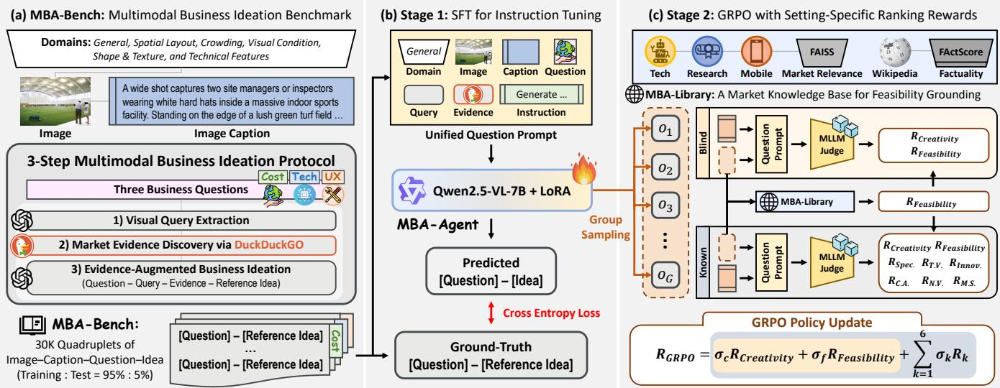  
Figure 3: Overview of MBA. (a) We present MBA-Bench, comprising 30K image–caption–question–idea quadruplets across six domains curated via a three-step protocol using GPT-4o and DuckDuckGo. (b) We then instruction-tune the base MLLM on question–idea pairs via SFT. (c) We further leverage GRPO to refine the SFT checkpoint with setting-specific ranking rewards—creativity andfeasibility for the blind agent MBA-b, plus six disclosed dimensions for the known agent MBA-k.

Building on this approach, we design a three-stage RAG pipeline for multimodal business ideation (Figure 3-a). First, we employ GPT-4o to derive retrieval queries from salient visual observations in each image (e.g., “a long customer queue at a service counter”). These queries are then submitted to the DuckDuckGo API to retrieve relevant market evidence, such as existing solutions and wait-time statistics. Since a single piece of evidence can motivate ideation across diverse angles, we structure this diversity into three broad, wellestablished question types—cost eficiency, technology, and user experience (Baldassarre et al. 2024). For each question, we construct a unified prompt integrating the four previously obtained elements—the image–caption pair, domain, query, and evidence—from which GPT-4o generates five reference ideas. Following prior work (Kanumolu et al. 2025), each idea comprises four fields—title, description, implementation, and diferentiation—thereby ensuring suficiently detailed and well-organized ideas (Figure 4). Altogether, this process yields 30K image–caption–question–idea quadruplets from 2K samples (Table 1), laying the groundwork for training and evaluating business ideation agents at scale.

Business Idea Evaluation via MLLM-as-a-Judge Manual evaluation by human annotators is inherently subjective and costly at scale. Recent work (Hirota et al. 2026) has thus adopted the LLM-as-a-Judge paradigm (Zheng et al. 2023) for automatically evaluating generated business ideas.

<table><tr><td>Domain</td><td>Source Dataset</td><td>Images</td><td>Captions</td><td>Business Questions</td><td>Reference Ideas</td></tr><tr><td>General</td><td>ADE20K (2019)</td><td>500</td><td>500</td><td>1,500</td><td>7,500</td></tr><tr><td>Spatial Layout</td><td>RICO (2023)</td><td>350</td><td>350</td><td>1,050</td><td>5,250</td></tr><tr><td>Črowding</td><td>COCO (2014)</td><td>350</td><td>350</td><td>1,050</td><td>5,250</td></tr><tr><td>Visual Condition</td><td>VisA (2022)</td><td>350</td><td>350</td><td>1,050</td><td>5,250</td></tr><tr><td>Shape &amp; Texture</td><td>DTD (2014)</td><td>350</td><td>350</td><td>1,050</td><td>5,250</td></tr><tr><td>Technical Features</td><td>DeepPCB (2019)</td><td>100</td><td>100</td><td>300</td><td>1,500</td></tr><tr><td></td><td></td><td>2,000</td><td>2,000</td><td>6,000</td><td>30,000</td></tr></table>

Table 1: Dataset statistics of MBA-Bench by domain.

To account for the multimodal nature of real-world business ideation, we extend this paradigm to an MLLM-as-a-Judge (Chen et al. 2024). On MBA-Bench, an agent is first asked to generate a business idea for each unified question prompt. The generated idea is then evaluated by a strong 78B-parameter MLLM (Wang et al. 2025b), using the same prompt with the evaluation instruction. The judge assesses each idea along six business-oriented dimensions (Hirota et al. 2025) on their respective scoring scales (Table 2). This evaluation protocol enables automated, scalable assessment of business ideas within their multimodal and market context.

## 3.2 MBA Agents: Multimodal Business Ideation Agents

Multimodal inputs enable zero-shot MLLMs to discover business opportunities from visual contexts (Figure 2). Despite strong generalization, they lag behind closed-source MLLMs in innovativeness and competitive advantage. The cause lies in general-purpose MLLMs’ tendency to produce conventional outputs (Jiang et al. 2025; Huang et al. 2025). This limitation motivates a dedicated model for the task.

Designing such a model requires addressing a key uncertainty: the real-world evaluation criteria are not always known in advance. If undisclosed, an agent must be trained without ever accessing them. We therefore consider two real-world settings—blind and known—and propose a dedicated agent for each, MBA-b and MBA-k, respectively. Concretely, we first define two task-general objectives applicable regardless of setting: creativity (novelty relative to reference ideas) and feasibility (market relevance and factual consistency). MBAb is then trained with this dual-objective reward alone, while MBA-k additionally optimizes the six evaluation metrics (Table 2). Each reward is computed by an MLLM judge, except feasibility, measured against MBA-Library—our websourced resource. Finally, our training pipeline involves two stages on an open-source MLLM (Bai et al. 2025): LoRAbased supervised fine-tuning (SFT) (Hu et al. 2022), followed by group relative policy optimization (GRPO) (DeepSeek-AI 2025) with setting-specific rewards for within-group ranking.

<table><tr><td rowspan="2">Dimension</td><td rowspan="2">Focus</td><td rowspan="2">Range (Cutoff)</td><td colspan="2">Train</td><td rowspan="2">Test</td></tr><tr><td>Blind</td><td>Known</td></tr><tr><td>Creativity†</td><td>Novelty beyond reference ideas</td><td>0-1</td><td>√</td><td>√</td><td>x</td></tr><tr><td>Feasibility</td><td>Market relevance &amp; factuality</td><td>0-1</td><td>√</td><td>7</td><td>x</td></tr><tr><td>Specificity†</td><td>Clarity of idea</td><td>1-4 (&gt; 2)</td><td>x</td><td>V</td><td></td></tr><tr><td>Technical Validity†</td><td>Feasibility</td><td>1-4 (&gt; 1)</td><td>x</td><td></td><td></td></tr><tr><td>Innovativeness†</td><td>Novelty</td><td>1-5</td><td>x</td><td></td><td></td></tr><tr><td>Competitive Advantage†</td><td>Differentiation</td><td>1-4</td><td>x</td><td></td><td></td></tr><tr><td>Need Validity†</td><td>User need</td><td>0-3</td><td>x</td><td></td><td></td></tr><tr><td>Market  $S i z e ^ { \dagger }$ </td><td>Adoption scale</td><td>0-3</td><td>x</td><td></td><td></td></tr></table>

Table 2: Business-oriented scoring dimensions by setting. † denotes the use of MLLM-as-a-Judge (Chen et al. 2024).

Quantifying Reward Objectives To quantify each objective as a reward within its range (Table 2), we employ separate MLLM judges for training and evaluation, avoiding model bias from reusing the same judge. Under this mechanism, the six known criteria are scored using the same instruction as prior work (Hirota et al. 2025), while creativity measures how novel the idea is relative to its five reference ideas.

Ironically, MLLMs are inherently prone to generating irrelevant or hallucinated content (Wang et al. 2025a). This risk may be milder for subjective dimensions such as innovativeness, but can be acute wherever real-world grounding is required. Feasibility is such a case: both its market relevance and factuality must align with reality. Beyond model-internal knowledge, we design MBA-Library—an enormous web-sourced resource for feasibility grounding— spanning mobile applications (Maqbool et al. 2023), scientific literature (Priem, Piwowar, and Orr 2022), structured entities (Shenoy et al. 2022), and Wikipedia. This database powers two scoring modules: one for market relevance and one for factuality. Concretely, we embed each idea and query the library with FAISS (Douze et al. 2026) to retrieve its top-k nearest records by cosine similarity; market relevance is then scored as the average similarity to these records. Factuality instead follows FActScore (Min et al. 2023): an LLM (Touvron et al. 2023) decomposes each idea into atomic facts, which a retriever (Ni et al. 2022) matches to relevant Wikipedia passages for verification. Both scores are then normalized to a [0, 1] range. In short, these rewards support both training and evaluation for multimodal business ideation.

SFT: Question–Reference Idea Instruction Tuning We perform SFT to instruction-tune an open-source MLLM (Bai et al. 2025) with LoRA (Hu et al. 2022) to generate a business idea given a question. On MBA-Bench, each of the five reference ideas per question serves as an independent target response, yielding 28.5K training instances in total. We optimize the next-token prediction loss over the target tokens:

$$
\mathcal { L } _ { \mathrm { S F T } } = - \sum _ { t = 1 } ^ { T } \log p _ { \theta , \phi } \left( y _ { t } \mid x , y _ { < t } \right) ,\tag{1}
$$

where $\boldsymbol { x } = ( v , c , b , q , e )$ denotes the image $v ,$ its caption $c ,$ the business question $b ,$ the retrieval query $q ,$ and the retrieved market evidence $e ;$ and $y = ( y _ { 1 } , \dots , y _ { T } )$ denotes the corresponding reference idea with T tokens (Figure 3-b).

GRPO: Setting-Specific Ranking Reward To directly tackle the mode collapse toward conventional ideas observed in MLLMs, we further fine-tune the SFT model with GRPO, using the setting-specific rewards introduced above (Figure 3-c). For each unified question prompt, the policy first samples a group of $G$ candidate ideas $\{ o _ { 1 } , \ldots , o _ { G } \}$ . Rather than scoring each candidate in isolation, the judge then ranks the group along each objective, with each rank converted into a [0, 1] score. This relative scoring avoids the judge-specific scale bias, where distinct ideas often receive identical scores.

As specified in Table 2, the setting-specific reward $r _ { i }$ for candidate $o _ { i }$ combines two objectives for MBA-b, or all eight for MBA-k. Within each group, these rewards are then normalized into an advantage of the i-th candidate’s relative strength, with group mean $\mu$ and standard deviation σ:

$$
A _ { i } = \frac { r _ { i } - \mu ( \{ r _ { j } \} _ { j = 1 } ^ { G } ) } { \sigma ( \{ r _ { j } \} _ { j = 1 } ^ { G } ) + \epsilon } .\tag{2}
$$

Using this advantage, we update the GRPO policy against a frozen reference $\pi _ { \mathrm { r e f } }$ initialized from the SFT checkpoint:

$$
\mathcal { L } _ { \mathrm { G R P O } } = - \mathbb { E } _ { i } \left[ A _ { i } \log \pi _ { \theta } ( o _ { i } \mid x ) \right] + \beta \mathbb { E } _ { i } \left[ \mathbb { D } _ { \mathrm { K L } } \left( \pi _ { \theta } \parallel \pi _ { \mathrm { r e f } } \right) \right] ,\tag{3}
$$

where $\pi _ { \theta }$ is the policy being optimized and $\beta$ controls the strength of KL regularization toward $\pi _ { \mathrm { r e f } } .$ . As a result, this group-relative optimization steers MBA-b and MBA-k beyond homogeneous priors toward creative, feasible ideas.

## 4 Experiments

We first analyze the statistical characteristics of MBA-Bench across domains and metrics. We then evaluate diverse MLLMs on MBA-Bench, showing that our agents come closest to distinctive ideation. Through ablation studies, we validate our method across modalities. Finally, we examine modality mismatch, revealing visual cues that fail to transfer.

## 4.1 Benchmark Analysis

In this section, we provide a statistical analysis of MBA-Bench spanning all domains, components, and metrics. We also specify the implementation details of our MBA agents.

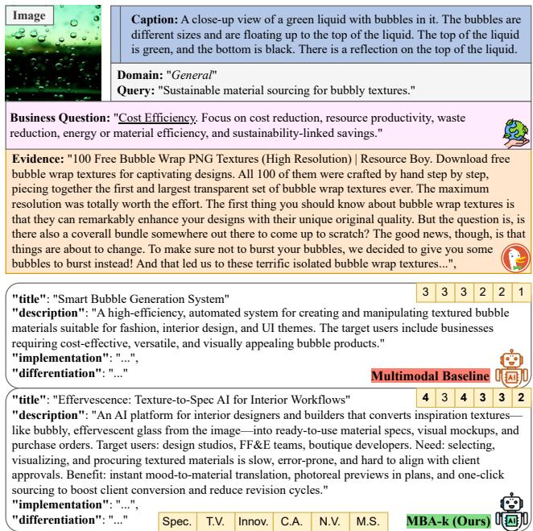  
Figure 4: The upper section indicates the unified question prompt: the image–caption pair, domain, query, question, and evidence. The lower section compares a multimodal baseline with our agent across the six metrics in the top-right box.

Datasets & Evaluation Metrics MBA-Bench comprises 30K image–caption–question–idea quadruplets across six domains, where each domain contains a predefined number of images selected from existing datasets based on dataset annotations (Table 1). Each image has its caption, three business questions, and five reference ideas per question, totaling 15 ideas per image. Also, each image–caption pair is accompanied by four supporting elements—domain, query, question, and evidence—constituting the unified question prompt for business ideation (Figures 3 and 4). These data are split by image into training and test sets at a 95%–5% ratio, respectively. Moreover, we follow the PBIG rubric (Hirota et al. 2025) to evaluate ideas (Table 2), but with an MLLM judge.

Implementation Details We use PaliGemma2 (Steiner et al. 2024) as a long-context image captioner. We employ GPT-4o to develop MBA-Bench. Our agents are initialized from Qwen2-VL-7B-Instruct using LoRA (Hu et al. 2022) with rank 32, scaling factor 64, and dropout 0.05. For judgebased rewards, we use Qwen2-VL-72B-Instruct (Bai et al. 2025) during training and InternVL2.5-78B (Wang et al. 2025b) during evaluation. For feasibility, a non-judge metric, our MBA-Library leverages FAISS (Douze et al. 2026) and FActScore (Min et al. 2023) to assess the market relevance and factuality of an idea against the large web-sourced dataset. For SFT, we train the LoRA adapters for 2 epochs with a learning rate of $2 \times 1 0 ^ { - 5 }$ , a warmup ratio of 0.1, and a global batch size of 32. We then continue training with GRPO for 1 epoch using a learning rate of $1 \times 1 0 ^ { - 6 }$ , G = 4 responses per prompt, a KL coeficient of 0.02, and a batch size of 4. The GRPO weights for Spec., T.V., Innov., C.A.,

<table><tr><td>Model</td><td>Spec.</td><td>T.V.</td><td>Innov.</td><td>C.A.</td><td>N.V.</td><td>M.S.</td></tr><tr><td>GPT4o</td><td>3.51</td><td>3.04</td><td>3.04</td><td>2.79</td><td>2.27</td><td>2.05</td></tr><tr><td>GPT5-mini</td><td>4.00</td><td>3.07</td><td>3.59</td><td>3.00</td><td>2.77</td><td>2.07</td></tr><tr><td>GPT5</td><td>3.99</td><td>3.08</td><td>3.97</td><td>3.27</td><td>2.44</td><td>2.10</td></tr><tr><td>Claude-Sonnet-4.6</td><td>3.88</td><td>3.16</td><td>3.78</td><td>3.24</td><td>2.58</td><td>2.16</td></tr><tr><td>Gemini-3.5-Flash</td><td>4.00</td><td>3.05</td><td>4.00</td><td>3.01</td><td>2.97</td><td>2.29</td></tr><tr><td>Gemini-3.1-pro-preview</td><td>4.00</td><td>3.04</td><td>3.98</td><td>3.01</td><td>2.97</td><td>2.35</td></tr><tr><td>Gemini-3.6-Flash</td><td>4.00</td><td>3.03</td><td>4.00</td><td>3.01</td><td>2.57</td><td>2.34</td></tr><tr><td>LLaVA-OneVision-Qwen2-7B</td><td>3.39</td><td>2.99</td><td>3.17</td><td>2.91</td><td>2.33</td><td>2.15</td></tr><tr><td>LLaVA-OneVision-Qwen2-7B</td><td>3.39</td><td>2.99</td><td>3.17</td><td>2.91</td><td>2.33</td><td>2.15</td></tr><tr><td>LLaVA-NeXT-Qwen-32B</td><td>3.28</td><td>2.97</td><td>3.19</td><td>2.91</td><td>2.22</td><td>2.07</td></tr><tr><td>InternVL2.5-8B</td><td>3.62</td><td>3.01</td><td>3.19</td><td>2.95</td><td>2.39</td><td>2.12</td></tr><tr><td>InternVL2.5-26B</td><td>3.58</td><td>3.01</td><td>3.27</td><td>2.97</td><td>2.46</td><td>2.20</td></tr><tr><td>Qwen2.5-VL-7B-Instruct</td><td>3.60</td><td>3.06</td><td>3.15</td><td>2.62</td><td>2.32</td><td>1.94</td></tr><tr><td>Qwen2.5-VL-32B-Instruct</td><td>3.50</td><td>2.99</td><td>3.23</td><td>2.96</td><td>2.21</td><td>2.08</td></tr><tr><td>MBA-7B-SFT (Ours)</td><td>3.68</td><td>3.09</td><td>3.22</td><td>2.57</td><td>2.31</td><td>1.99</td></tr><tr><td>MBA-b-7B (Ours)</td><td>3.64</td><td>3.12</td><td>3.98</td><td>3.19</td><td>2.38</td><td>2.20</td></tr><tr><td>MBA-k-7B (Ours)</td><td>3.99</td><td>3.00</td><td>4.00</td><td>3.32</td><td>2.94</td><td>2.75</td></tr></table>

Table 3: Benchmark results on the MBA-Bench test set, following the scoring scales in Table 2. Spec.: Specificity; T.V.: Technical Validity; Innov.: Innovativeness; C.A.: Competitive Advantage; N.V.: Need Validity; and M.S.: Market Size.

N.V., M.S., Creativity, and Feasibility are 0.12, 0.12, 0.20, 0.16, 0.12, 0.08, 0.10, and 0.10 in the known case, respectively; the blind case retains only the last two, weighted 0.70 and 0.30. All reported results are based on a single run.

## 4.2 Main Results

Table 3 compares open-source MLLMs with MBA-b and MBA-k across six metrics, reporting means and standard deviations across images. The standard deviations indicate generally consistent performance across images. For a fair comparison, all models receive the same multimodal inputs and unified question prompt. Instruction-tuned on wellorganized GPT-4o-generated reference ideas, MBA-SFT outperforms the baseline on all four feasibility metrics—Spec., T.V., N.V., and M.S. MBA-b further achieves state-of-theart performance among open-source models on nearly all metrics, particularly in Innov. and C.A. These improvements over the baseline validate our training-time rewards for creative and feasible business ideation. Moreover, MBA-k, a stronger agent trained using all eight rewards, achieves the best performance on both Creativity- and Feasibility-related metrics among all models. This result shows that our model efectively adapt to the target environment when its evaluation criteria are known—an efective direction for advancing business ideation, even at a compact 7B-parameter scale.

Figure 5 compares the image-level score distributions of MBA-k with those of nine proprietary and open-source models. For each of the 100 test images, scores are averaged over 15 responses, and the six metrics are normalized to a common 0–100 scale. MBA-k shows the clearest distributional advantages in Competitive Advantage and Market Size, with substantially higher medians and means than all comparison models. It also remains competitive with the strongest proprietary models in Innovativeness and Need Validity. In contrast, Specificity is tightly concentrated near the upper bound for several models, suggesting a ceiling efect, while MBAk shows a modest trade-of in Technical Validity. Overall, these results highlight MBA-k’s strong performance in differentiated and market-oriented business ideation, with clear advantages in dimensions closely tied to business value while remaining broadly competitive across the other metrics.

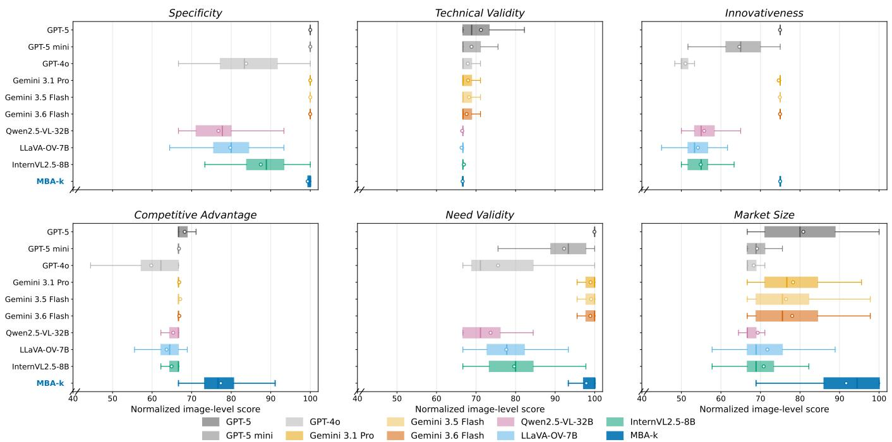  
Figure 5: Image-level distributions of six PBIG metrics across ten models. For each image, scores are averaged over 15 responses and normalized to a 0–100 scale. Boxes show the interquartile range, center lines the medians, and circles the means.

For human evaluation, prior work (Xu et al. 2025) ofers a useful reference point: under the same six PBIG criteria, a strong GPT-based system ranked first in five of six humanevaluated criteria in natural language processing and four of six in computer science. Table 3 demonstrates that MBA-b and MBA-k remain competitive with such systems on the same criteria. This suggests our agents’ ideas could similarly earn favorable ratings from human experts. Direct human evaluation ofour agents on MBA-Bench remains future work.

## 4.3 Ablation Study

In this section, we analyze our agents across domains, modalities, and internal components. We also validate our training objectives and qualitatively examine cross-modal mismatch.

Domain-wise Analysis In Figure 2, we compare our agents across six domains for each metric. Domain and metric definitions are provided in Tables 1 and 2. For Spec., MBA-k achieves near-perfect, highly consistent scores across all domains, while MBA-b exhibits a similarly uniform but slightly lower pattern. This uniformity indicates limited sensitivity to domain variation for this metric. N.V. and M.S.—which focus on user needs and adoption scale, respectively—peak in General and Crowding, which more frequently depict people, user contexts, and market-relevant scenes. For T.V.—where technical completeness is pivotal—both agents achieve generally higher scores in Technical Features and Visual Condition, where addressing salient technical flaws and visual constraints is a key challenge. Meanwhile, Innov. and C.A. achieve high scores not only in these technology-intensive domains but also in Spatial Layout, which ofers opportunities for creative mobile applications across diverse industries. These domain-aligned trends support the coherence and reliability of the benchmark design and evaluation framework.

Modality Ablation Figure 2 analyzes the impact of different modality configurations on this task. We consider four model groups: a caption-only baseline, an open-source MLLM, GPT-5, and our agents, with the latter three receiving multimodal inputs. Across nearly all metrics, the caption baseline often lacks critical visual cues and therefore performs poorly in all domains, with the exception of General, whose simpler, everyday scenes are more easily verbalized. Meanwhile, the multimodal baseline substantially improves overall performance over the caption baseline, especially in the image-specific domains. These findings demonstrate that text alone cannot fully capture visual details and is therefore insuficient for efective business ideation. With multimodal inputs, our agents achieve substantial gains in the two creativity-related metrics through GRPO, while SFT alone already improves the four feasibility-related metrics.

Validating Training-time Rewards Figure 6 examines how well our two training-time objectives align with the six evaluation criteria, using cross-model performance trends. We group the six metrics into two counterparts: Innov. and C.A. for Creativity\*, and the remaining four for Feasibility\*, mirroring our Creativity and Feasibility, respectively. We further extend the four model groups with an image-only baseline for broader comparison. As a result, model rankings show similar distributions across both metrics, with our agents leading the multimodal baseline by 51.2% and 114.3%, respectively. This trend is also confirmed by Spearman’s ρ of 0.83 and 0.71, computed across the model groups. This suggests that our two rewards generalize robustly across rubrics oriented toward both original and viable ideation.

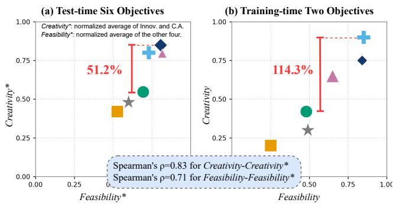  
Caption Image Multimodal GPT-5 MBA-b (Ours) MBA-k (Ours)  
Figure 6: Plot of creativity–feasibility scores. (a) aggregates creativity<sup>∗</sup> and $f e a s i b i l i t y ^ { * }$ from the six test-time metrics, while (b) uses the two training-time rewards. Rankings are consistent across panels, with Spearman rank correlations of ρ = 0.83 and ρ = 0.71, respectively.

Cross-modal Mismatch Figure 7 qualitatively analyzes modality mismatch using strong generative models (OpenAI 2024; Team 2023; Rombach et al. 2022). Each image shows its LPIPS distance from the original; higher is worse. The upper panel illustrates how detailed captions fail to preserve fine-grained visual details, yielding poor LPIPS scores (e.g., misplaced signage). The bottom panel shows that even accurate captions cannot reconstruct unverbalizable visual semantics (e.g., a swirling 3D pattern at the center), again producing poor scores. These failures reveal that each modality carries information the other cannot capture—a gap pervasive in real-world scenes. Such cross-modal translation can distort user intent, motivating multimodal business ideation.

## 5 Limitations & Future Work

Beyond patent-constrained business ideation, MBA lays the groundwork for broader multimodal business ideation while leaving three fundamental limitations to be addressed for more efective real-world deployment. These challenges point to promising directions for future research.

First, MBA currently focuses on image and text, although real-world environments also contain informative audio, olfactory, tactile, and other sensory signals. Just as visual information can reveal business-relevant factors that are difficult to express in text, these modalities may expose additional latent needs and opportunities. For example, vocal tone and background sound may indicate emotion or regional characteristics, while olfactory cues may be critical in food, healthcare, manufacturing, and safety applications. Extending MBA to richer sensory inputs could therefore improve the diversity and contextual specificity of generated ideas.

Second, MBA reasons over spatial image–text inputs and does not explicitly model temporal information. In this respect, we assume that videos can further provide motion, behavioral, and causal context that is absent from a single frame, leading to substantially diferent business opportunities. For instance, a static image of roadside vehicles may ideate or suggest parking-related services, whereas a video showing a child abruptly emerging between them reveals a safety risk and thus motivates preventive solutions. Therefore, temporal multimodal reasoning is a promising research direction for generating more robust and actionable ideas.

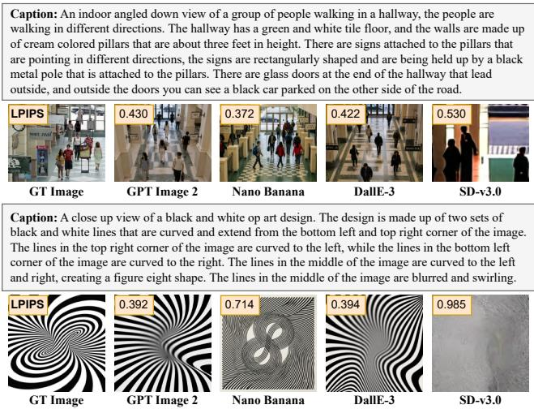  
Figure 7: Qualitative examples of modality mismatch across four strong generative models, where visual details dificult to verbalize yield high LPIPS scores relative to the GT image (lower LPIPS indicates greater perceptual similarity).

Third, MBA generates and evaluates ideas independently of the prospective entrepreneur. In practice, feasibility depends on various factors such as available capital, expertise, location, social network, and risk tolerance. The same idea may be appropriate for one user but unrealistic for another. Collecting and analyzing such personalized information is still challenging, yet it is also essential for advancing toward real-world business ideation. Future work should therefore condition both generation and evaluation on user-specific profiles, enabling personalized business ideation that is not only creative and feasible in general, but realistically executable by a particular individual.

## 6 Conclusion

We introduced MBA-Bench, the first multimodal benchmark for business ideation, comprising 30K multimodal samples across six domains with up to eight metrics. We further proposed two task-specialized agents for the blind and known evaluation settings through SFT–GRPO training. Both consistently outperform diverse baselines while remaining competitive with strong closed-source MLLMs. We hope our work inspires further academic research on multimodal business ideation and broadens access to opportunity discovery beyond text across physical environments, digital interfaces, and everyday settings for aspiring entrepreneurs at all levels.

## References

Bai, S.; Chen, K.; Liu, X.; Wang, J.; Ge, W.; Song, S.; Dang, K.; Wang, P.; Wang, S.; Tang, J.; Zhong, H.; Zhu, Y.; Yang, M.; Li, Z.; Wan, J.; Wang, P.; Ding, W.; Fu, Z.; Xu, Y.; Ye, J.; Zhang, X.; Xie, T.; Cheng, Z.; Zhang, H.; Yang, Z.; Xu, H.; and Lin, J. 2025. Qwen2.5-VL Technical Report. CoRR, abs/2502.13923.

Baldassarre, B.; Calabretta, G.; Karpen, I. O.; Bocken, N.; and Hultink, E. J. 2024. Responsible Design Thinking for Sustainable Development: Critical Literature Review, New Conceptual Framework, and Research Agenda. Journal of Business Ethics, 195.

Chen, D.; Chen, R.; Zhang, S.; Wang, Y.; Liu, Y.; Zhou, H.; Zhang, Q.; Wan, Y.; Zhou, P.; and Sun, L. 2024. MLLM-as-a-Judge: Assessing Multimodal LLM-as-a-Judge with Vision-Language Benchmark. In Forty-first International Conference on Machine Learning, ICML 2024, Vienna, Austria, July 21-27, 2024, volume 235.

Cimpoi, M.; Maji, S.; Kokkinos, I.; Mohamed, S.; and Vedaldi, A. 2014. Describing Textures in the Wild. In 2014 IEEE Conference on Computer Vision and Pattern Recognition, CVPR 2014, Columbus, OH, USA, June 23-28, 2014. IEEE Computer Society.

DeepSeek-AI. 2025. DeepSeek-R1: Incentivizing Reasoning Capability in LLMs via Reinforcement Learning. CoRR, abs/2501.12948.

Douze, M.; Guzhva, A.; Deng, C.; Johnson, J.; Szilvasy, G.; Mazaré, P.; Lomeli, M.; Hosseini, L.; and Jégou, H. 2026. The Faiss Library. IEEE Trans. Big Data, 12.

Gompers, P. A.; Gornall, W.; Kaplan, S. N.; and Strebulaev, I. A. 2020. How do venture capitalists make decisions? Journal ofFinancial Economics, 135.

Hirota, W.; Chen, C.-C.; Ohkuma, T.; Taniguchi, T.; and Ishigaki, T. 2025. Overview of PBIG Shared Task at AgentScen 2025: Product Business Idea Generation from Patents. In Proceedings of the 2nd Workshop on Agent AI for Scenario Planning.

Hirota, W.; Taniguchi, T.; Ohkuma, T.; Takahashi, K.; Omi, T.; Arima, K.; Asakura, T.; Chen, C.; and Ishigaki, T. 2026. Aggregate vs. Personalized Judges in Business Idea Evaluation: Evidence from Expert Disagreement. CoRR, abs/2604.22517.

Hu, E. J.; Shen, Y.; Wallis, P.; Allen-Zhu, Z.; Li, Y.; Wang, S.; Wang, L.; and Chen, W. 2022. LoRA: Low-Rank Adaptation of Large Language Models. In The Tenth International Conference on Learning Representations, ICLR 2022, Virtual Event, April 25-29, 2022.

Huang, Z.; Zhong, S.; Zhou, P.; Gao, S.; Zitnik, M.; and Lin, L. 2025. A Causality-Aware Paradigm for Evaluating Creativity of Multimodal Large Language Models. IEEE Trans. Pattern Anal. Mach. Intell., 47.

Jiang, L.; Chai, Y.; Li, M.; Liu, M.; Fok, R.; Dziri, N.; Tsvetkov, Y.; Sap, M.; and Choi, Y. 2025. Artificial Hivemind: The Open-Ended Homogeneity of Language Models (and Beyond). In Advances in Neural Information Processing Systems 38: Annual Conference on Neural Information

Processing Systems 2025, NeurIPS 2025, San Diego, CA, USA, December 2-7, 2025 / Mexico City, Mexico, November 30 - December 5, 2025.

Kanumolu, G.; Urlana, A.; Kumar, C. V.; and Garlapati, B. M. 2025. Agent Ideate: A Framework for Product Idea Generation from Patents Using Agentic AI. CoRR, abs/2507.01717.

Kim, Y.; Park, C.; Jeong, H.; Chan, Y. S.; Xu, X.; McDuf, D.; Lee, H.; Ghassemi, M.; Breazeal, C.; and Park, H. W. 2024. MDAgents: An Adaptive Collaboration of LLMs for Medical Decision-Making. In Advances in Neural Information Processing Systems 37: Annual Conference on Neural Information Processing Systems 2024, NeurIPS 2024, Vancouver, BC, Canada, December 10 - 15, 2024.

Li, Z.; Lyu, X.; Ding, Y.; Wang, M.; Liao, Y.; and Liu, Y. 2023. RICO: Regularizing the Unobservable for Indoor Compositional Reconstruction. In IEEE/CVF International Conference on Computer Vision, ICCV 2023, Paris, France, October 1-6, 2023. IEEE.

Lin, T.; Maire, M.; Belongie, S. J.; Hays, J.; Perona, P.; Ramanan, D.; Dollár, P.; and Zitnick, C. L. 2014. Microsoft COCO: Common Objects in Context. In Computer Vision - ECCV 2014 - 13th European Conference, Zurich, Switzerland, September 6-12, 2014, Proceedings, Part V, volume 8693, 740–755. Springer.

Liu, Z.; Sun, Z.; Zang, Y.; Dong, X.; Cao, Y.; Duan, H.; Lin, D.; and Wang, J. 2025. Visual-RFT: Visual Reinforcement Fine-Tuning. In IEEE/CVF International Conference on Computer Vision, ICCV 2025, Honolulu, HI, USA, October 19-25, 2025.

Maqbool, M. H.; Farooq, U.; Mosharrof, A.; Siddique, A. B.; and Foroosh, H. 2023. MobileRec: A Large Scale Dataset for Mobile Apps Recommendation. In Proceedings of the 46th International ACM SIGIR Conference on Research and Development in Information Retrieval, SIGIR 2023, Taipei, Taiwan, July 23-27, 2023.

Min, S.; Krishna, K.; Lyu, X.; Lewis, M.; Yih, W.; Koh, P. W.; Iyyer, M.; Zettlemoyer, L.; and Hajishirzi, H. 2023. FActScore: Fine-grained Atomic Evaluation of Factual Precision in Long Form Text Generation. In Proceedings ofthe 2023 Conference on Empirical Methods in Natural Language Processing, EMNLP 2023, Singapore, December 6-10, 2023.

Ni, J.; Qu, C.; Lu, J.; Dai, Z.; Ábrego, G. H.; Ma, J.; Zhao, V. Y.; Luan, Y.; Hall, K. B.; Chang, M.; and Yang, Y. 2022. Large Dual Encoders Are Generalizable Retrievers. In Proceedings of the 2022 Conference on Empirical Methods in Natural Language Processing, EMNLP 2022, Abu Dhabi, United Arab Emirates, December 7-11, 2022.

OpenAI. 2024. GPT-4o System Card. CoRR, abs/2410.21276.

Ouyang, L.; Wu, J.; Jiang, X.; Almeida, D.; Wainwright, C.; Mishkin, P.; Zhang, C.; Agarwal, S.; Slama, K.; Ray, A.; et al. 2022. Training language models to follow instructions with human feedback. Advances in neural information processing systems, 35: 27730–27744.

Priem, J.; Piwowar, H. A.; and Orr, R. 2022. OpenAlex: A fully-open index of scholarly works, authors, venues, institutions, and concepts. CoRR, abs/2205.01833.

K.; Qiao, Y.; Wang, W.; and Luo, G. 2025b. InternVL3.5: Advancing Open-Source Multimodal Models in Versatility, Reasoning, and Eficiency.

Qu, B.; Wang, Z.; Yagi, D.; Xu, Z.; Zhao, Y.; Shan, Y.; and Zahradnik, F. 2025. LLM-Enhanced Self-Evolving Reinforcement Learning for Multi-Step E-Commerce Payment Fraud Risk Detection. In Proceedings of the 63rd Annual Meeting of the Association for Computational Linguistics (Volume 6: Industry Track), ACL 2025, Vienna, Austria, July 27 - August 1, 2025, 92–103. Association for Computational Linguistics.

Rafailov, R.; Sharma, A.; Mitchell, E.; Ermon, S.; Manning, C. D.; and Finn, C. 2023. Direct preference optimization: Your language model is secretly a reward model. arXiv preprint arXiv:2305.18290.

Rombach, R.; Blattmann, A.; Lorenz, D.; Esser, P.; and Ommer, B. 2022. High-Resolution Image Synthesis with Latent Difusion Models. In IEEE/CVF Conference on Computer Vision and Pattern Recognition, CVPR 2022, New Orleans, LA, USA, June 18-24, 2022.

Salimi, M.; Mohtasham, B. H.; Aghakasiri, A.; Naieni, M.; Qeysarbeigi, A. H.; Nazer, M. M. S.; Azar, Z.; Siavoshani, M. J.; and Rohban, M. H. 2026. Debate as Reward: A Multi-Agent Reward System for Scientific Ideation via RL Post-Training. arXiv:2604.16723.

Schick, T.; Dwivedi-Yu, J.; Dessì, R.; Raileanu, R.; Lomeli, M.; Zettlemoyer, L.; Cancedda, N.; and Scialom, T. 2023. Toolformer: Language Models Can Teach Themselves to Use Tools. CoRR.

Schulman, J.; Wolski, F.; Dhariwal, P.; Radford, A.; and Klimov, O. 2017. Proximal policy optimization algorithms. arXiv preprint arXiv:1707.06347.

Shenoy, K.; Ilievski, F.; Garijo, D.; Schwabe, D.; and Szekely, P. A. 2022. A study of the quality of Wikidata. J. Web Semant., 72.

Steiner, A.; Pinto, A. S.; Tschannen, M.; Keysers, D.; Wang, X.; Bitton, Y.; Gritsenko, A. A.; Minderer, M.; Sherbondy, A.; Long, S.; Qin, S.; Ingle, R. R.; Bugliarello, E.; Kazemzadeh, S.; Mesnard, T.; Alabdulmohsin, I.; Beyer, L.; and Zhai, X. 2024. PaliGemma 2: A Family of Versatile VLMs for Transfer. CoRR.

Tang, S.; He, F.; Huang, X.; and Yang, J. 2019. Online PCB Defect Detector On A New PCB Defect Dataset. CoRR, abs/1902.06197.

Team, G. 2023. Gemini: A Family of Highly Capable Multimodal Models. CoRR.

Touvron, H.; Lavril, T.; Izacard, G.; Martinet, X.; Lachaux, M.; Lacroix, T.; Rozière, B.; Goyal, N.; Hambro, E.; Azhar, F.; Rodriguez, A.; Joulin, A.; Grave, E.; and Lample, G. 2023. LLaMA: Open and Eficient Foundation Language Models. CoRR.

Wang, C.; Chen, X.; Zhang, N.; Tian, B.; Xu, H.; Deng, S.; and Chen, H. 2025a. MLLM can see? Dynamic Correction Decoding for Hallucination Mitigation. In The Thirteenth International Conference on Learning Representations, ICLR 2025, Singapore, April 24-28, 2025.

Wang, W.; Gao, Z.; Gu, L.; Pu, H.; Cui, L.; Wei, X.; Liu,Z.; Jing, L.; Ye, S.; Shao, J.; Wang, Z.; Chen, Z.; Zhang, H.;Yang, G.; Wang, H.; Wei, Q.; Yin, J.; Li, W.; Cui, E.; Chen,

Xu, Y.; Hirasawa, T.; Kawano, S.; Kato, S.; and Kozuno, T. 2025. MK2 at PBIG Competition: A Prompt Generation Solution. CoRR.

Yao, S.; Zhao, J.; Yu, D.; Du, N.; Shafran, I.; Narasimhan, K.; and Cao, Y. 2022. ReAct: Synergizing Reasoning and Acting in Language Models. CoRR.

Yin, S.; Fu, C.; Zhao, S.; Li, K.; Sun, X.; Xu, T.; and Chen, E. 2024. A survey on multimodal large language models. National Science Review, 11(12): nwae403.

Zheng, L.; Chiang, W.; Sheng, Y.; Zhuang, S.; Wu, Z.; Zhuang, Y.; Lin, Z.; Li, Z.; Li, D.; Xing, E. P.; Zhang, H.; Gonzalez, J. E.; and Stoica, I. 2023. Judging LLM-as-a-Judge with MT-Bench and Chatbot Arena. In Advances in Neural Information Processing Systems 36: Annual Conference on Neural Information Processing Systems 2023, NeurIPS 2023, New Orleans, LA, USA, December 10 - 16, 2023.

Zhou, B.; Zhao, H.; Puig, X.; Xiao, T.; Fidler, S.; Barriuso, A.; and Torralba, A. 2019. Semantic Understanding of Scenes Through the ADE20K Dataset. Int. J. Comput. Vis., 127.

Zou, Y.; Jeong, J.; Pemula, L.; Zhang, D.; and Dabeer, O. 2022. SPot-the-Diference Self-supervised Pre-training for Anomaly Detection and Segmentation. In Computer Vision - ECCV 2022 - 17th European Conference, Tel Aviv, Israel, October 23-27, 2022, Proceedings, PartXXX, volume 13690, 392–408. Springer.

## Contents

A Experimental Details 11   
A.1 Device Information 11   
A.2 Implementation Details 11   
A.3 Evaluation Details 11   
A.4 Hyperparameters 11   
A.5 Pseudocode 12   
B Dataset Details 12   
B.1 MBA-Bench 12   
B.2 MBA-Library 14   
C Additional Quantitative Evaluation 15   
C.1 Further Statistical Analysis 15   
D Additional Ablation Studies 15   
D.1 Additional Captioning Models 15   
D.2 Reliability and Failure Analysis . 15   
E Additional Qualitative Results 15   
F Prompts 15

## A Experimental Details

## A.1 Device Information

All experiments were conducted on Ubuntu 22.04 LTS using eight NVIDIA RTX A6000 GPUs and dual AMD EPYC 7513 CPUs. Training used approximately 45 GiB of GPU memory per device, while evaluation used approximately 30 GiB. We used Python 3.10.13, PyTorch 2.2.0 with CUDA 12.1, and a random seed of 2026.

## A.2 Implementation Details

We use PaliGemma2 (Steiner et al. 2024) as the longcontext image captioner and GPT-4o (OpenAI 2024) to construct MBA-Bench. Our MBA agents are initialized from Qwen2.5-VL-7B-Instruct (Bai et al. 2025) and trained through LoRA-based supervised fine-tuning followed by GRPO (DeepSeek-AI 2025). Qwen2.5-VL-72B-Instruct is employed as the reward judge during training, whereas InternVL2.5-78B (Wang et al. 2025b) is used for evaluation. The feasibility reward combines market relevance, measured using FAISS (Douze et al. 2026), and factuality, assessed using FActScore (Min et al. 2023). We set the random seed to 2026 for reproducibility, and all reported results are obtained from a single run.

## A.3 Evaluation Details

We evaluate all models on the MBA-Bench test set using the same multimodal inputs and unified question prompt. Following the PBIG evaluation protocol (Hirota et al. 2025), each generated business idea is assessed by InternVL2.5- 78B (Wang et al. 2025b) as an MLLM judge across six business-oriented dimensions, with score ranges of 1–4, 1–4, 1–5, 1–4, 0–3, and 0–3, respectively. These metrics are selected to jointly capture the feasibility of an idea—including its clarity, technical soundness, user demand, and market potential—and its creativity in terms of novelty and diferentiation. We report the mean and standard deviation of each metric across test images. Detailed evaluation reward statistics are provided in Table 2.

In this work, we adopt the six PBIG metrics (Hirota et al. 2025), which jointly assess whether a business idea is concrete, technically feasible, innovative, competitively diferentiated, demand-driven, and commercially scalable. This balanced design avoids rewarding novelty alone and instead captures originality, feasibility, and market relevance. We evaluate these dimensions using an MLLM-as-a-judge protocol, as image-grounded business ideas require joint reasoning over visual evidence, technical plausibility, and market context beyond lexical similarity. For reliability and comparability, all models are evaluated with the same fixed judge and rubric, each dimension is scored independently, and the evaluationjudge is separated from the training reward model.

## A.4 Hyperparameters

For LoRA-based adaptation (Hu et al. 2022), we use a rank of 32, a scaling factor of 64, and a dropout rate of 0.05. SFT is performed for two epochs with a learning rate of $2 \times 1 0 ^ { - 5 }$ a warmup ratio of 0.1, and a global batch size of 32, followed by one epoch of GRPO (DeepSeek-AI 2025) with a learning rate of $1 \times 1 0 ^ { - 6 }$ , four sampled responses per prompt, a KL coeficient of 0.02, and a batch size of 4. For MBA-k, the reward weights for Specificity, Technical Validity, Innovativeness, Competitive Advantage, Need Validity, Market Size, Creativity, and Feasibility are set to 0.12, 0.12, 0.20, 0.16, 0.12, 0.08, 0.10, and 0.10, respectively, whereas MBA-b uses creativity and feasibility weights of 0.70 and 0.30.

Algorithm 1: Construction of MBA-Bench   
Input: Domain datasets $\{ \mathcal { D } _ { d } \} _ { d \in \mathcal { D } } ,$ , captioner $C ,$ generator   
$G ,$ web retriever $R ,$ and question set $\mathcal { Q }$   
Output: MBA-Bench training and test sets $B _ { \mathrm { t r } }$ and   
$\boldsymbol { B } _ { \mathrm { t e } }$   
1: Initialize $B \gets \emptyset$   
2: for each domain $d \in \mathcal { D }$ do   
3: Select representative images $\mathcal { T } _ { d }$ using domain-specific   
criteria   
4: for each image $v \in \mathcal { Z } _ { d }$ do   
5: Generate caption $c  C ( v )$   
6: Extract retrieval query $q  G _ { \mathrm { q u e r y } } ( v , c , d )$   
7: Retrieve market evidence $e \gets R ( q )$   
8: for each business question $b \in \mathcal { Q }$ do   
9: Construct unified prompt $x \gets ( v , c , d , b , q , e )$   
10: Generate $K$ reference ideas ${ \mathcal { V } } _ { x } \dot { \gets } G _ { \mathrm { i d e a } } ( \bar { x } , \dot { K } )$   
11: Add $\{ ( x , y ) \mid y \in \mathcal { V } _ { x } \}$ to $\boldsymbol { B }$   
12: end for   
13: end for   
14: end for   
15: Split B by image into $\boldsymbol { B } _ { \mathrm { t r } }$ and $\boldsymbol { B } _ { \mathrm { t e } }$ at a 95:5 ratio   
16: return $\vec { B _ { \mathrm { t r } } } , \vec { B _ { \mathrm { t e } } }$

## A.5 Pseudocode

MBA-Bench Construction Algorithm 1 summarizes the construction pipeline of MBA-Bench. For each domain d, we select the top $N _ { d }$ images according to an annotationderived relevance score $s _ { d }$ and generate a caption for each selected image. We then extract a visually grounded retrieval query and collect the corresponding market evidence through web retrieval. For each of the three business questions, the image, caption, domain, query, and evidence are combined into a unified prompt from which $K = 5$ reference ideas are generated. This procedure yields $\begin{array} { r } { ( \sum _ { d } N _ { d } ) | \mathcal { Q } | K = 2 , 0 0 0 \times } \end{array}$ $\bar { 3 } \times 5 = 3 0 { , } 0 0 \bar { 0 }$ samples, which are split by image into training and test sets at a ratio of 95:5 to prevent data overlap.

MBA-Agent Training Algorithm 2 presents the two-stage optimization procedure for MBA agents. We first perform LoRA-based supervised fine-tuning on the question– reference idea pairs to obtain initial policy π<sub>SFT</sub>. From this checkpoint, GRPO samples G candidate ideas for each unified prompt and assigns group-relative rewards. Creativity is measured relative to the reference ideas, whereas feasibility is computed from market relevance and factuality using MBA-Library. MBA-b optimizes only creativity and feasibility, while MBA-k additionally incorporates the six disclosed evaluation criteria. The weighted rewards are normalized within each group and used to update the policy under KL regularization toward the frozen SFT reference.

Algorithm 2: SFT–GRPO Training of an MBA Agent   
Input: Training set $B _ { \mathrm { t r } } .$ , base MLLM $M _ { 0 } ,$ , reward judge $^ { J , }$   
MBA-Library ${ \bar { \mathcal { L } } } ,$ setting $s \in \{ \mathrm { b } , \mathrm { k } \}$ , reward set $\mathcal { M } _ { s } ,$ and   
weights $\{ \sigma _ { m } ^ { ( s ) } \}$   
Output: Trained policy $\pi _ { s }$   
1: $\pi _ { \theta , \phi }  \mathrm { L o R A } ( M _ { 0 } )$   
2: Train $\pi _ { \boldsymbol { \theta } , \boldsymbol { \phi } }$ on question–reference pairs using $\mathcal { L } _ { \mathrm { S F T } } =$   
$\begin{array} { r } { - \sum _ { t } \log p _ { \theta , \phi } \big ( \dot { y } _ { t } \mid x , y _ { < t } \big ) } \end{array}$   
3: $\pi _ { s }  \pi _ { \mathrm { S F T } } , \quad \pi _ { \mathrm { r e f } } $ stopgrad(π<sub>SFT</sub>)   
4: for each training prompt x do   
5: $\{ o _ { i } \} _ { i = 1 } ^ { G } \sim \pi _ { s } ( \cdot \mid x )$   
6: $\left( R _ { c , 1 : G } , R _ { f , 1 : G } \right) \gets \mathrm { R e w a r d } \left( o _ { 1 : G } ; J , \mathcal { L } \right)$   
7: $\mathbf { i } \mathbf { \cdot } s = \mathrm { k }$ then   
8: $\{ R _ { m , 1 : G } \} _ { m \in \mathcal { E } }  \mathrm { E v a l R e w a r d } ( o _ { 1 : G } ; J , \mathcal { E } )$   
9: end if   
10: $\begin{array} { r } { r _ { i } ^ { ( s ) } \gets \sum _ { m \in \mathcal { M } _ { s } } \sigma _ { m } ^ { ( s ) } R _ { m , i } } \end{array}$   
11: $A _ { i } \gets \mathrm { G r o u p N o r m a l i z e } ( r _ { 1 : G } ^ { ( s ) } )$ ▷ Eq. (2)   
12: Update $\pi _ { s }$ by minimizing $\mathcal { L } _ { \mathrm { G R P O } }$ ▷ Eq. (3)   
13: end for   
14: return $\pi _ { s }$

Algorithm 3: Evaluation on MBA-Bench   
Input: $\{ B _ { v } \} _ { v \in \mathcal { V } _ { \mathrm { t e } } }$ , models ${ \mathcal F } ,$ judge $J _ { \mathrm { e v a l } }$ , and metrics $\mathcal { E }$   
Output: $\{ ( \mu _ { f } , \sigma _ { f } ) \} _ { f \in \mathcal { F } }$   
1: for $f \in { \dot { \mathcal { F } } }$ do   
2: $S _ { f } \gets \emptyset$   
3: for $v \in \nu _ { \mathrm { t e } }$ do   
4: $\hat { \mathcal { V } } _ { f , v } \gets \{ f ( x ) \ | \ x \in B _ { v } \}$   
5: $\mathcal { R } _ { f , v } \gets \{ J _ { \mathrm { e v a l } } ( x , \hat { y } ; \mathcal { E } ) \ | \ ( x , \hat { y } ) \in ( \mathcal { B } _ { v } , \hat { \mathcal { V } } _ { f , v } ) \}$   
6: $\bar { \mathbf { s } } _ { f , v } \gets \mathrm { M e a n } ( \mathcal { R } _ { f , v } )$   
7: $\bar { S _ { f } }  S _ { f } \cup \{ \bar { \mathbf { s } } _ { f , v } \}$   
8: end for   
9: $( \pmb { \mu } _ { f } , \pmb { \sigma } _ { f } ) \gets \mathrm { M e a n S t d } ( S _ { f } )$   
10: end for   
11: return $\{ ( \mu _ { f } , \sigma _ { f } ) \} _ { f \in \mathcal { F } }$

MBA-Bench Evaluation Algorithm 3 summarizes the evaluation procedure on MBA-Bench. Each model generates one business idea for every unified test prompt, and the evaluation judge assigns a six-dimensional score vector covering Specificity, Technical Validity, Innovativeness, Competitive Advantage, Need Validity, and Market Size. The 15 instancelevel scores associated with each image are first averaged, after which the mean and standard deviation are computed across the 100 image-level results.

## B Dataset Details

## B.1 MBA-Bench

MBA-Bench organizes each sample around six complementary components, as summarized in Tables A1 and 1. The image provides the primary visual evidence, while the domain specifies the visual and business context under which that evidence should be interpreted. The caption supplies auxiliary semantic information about salient objects, materials, attributes, and spatial relations. The business question defines the ideation objective, such as improving cost eficiency, enabling technology-driven solutions, or enhancing user experience. Based on the image and question, the retrieval query converts the visual context into a market-oriented information need, and the retrieved evidence grounds generation in relevant industry practices, customer needs, and market facts. Together, these components form the unified question prompt used to generate structured reference ideas. The following subsections introduce the six source datasets and explain how each supports its corresponding visual domain.

<table><tr><td>Component</td><td>Description</td><td>Example</td></tr><tr><td>Domain</td><td>The visual domain assigned to an image, together with a domain-specific focus that identifies the visual attributes and business opportunities relevant to ideation.</td><td>Aesthetic / Texture / Material Semantics: Identify startup opportunities from texture, material quality, surface appearance, tactile or visual differentiation, design, and product experience.</td></tr><tr><td>Image</td><td>The original visual input selected from a public source dataset using domain-specific annotation criteria. It serves as the primary source of visual evidence throughout business ideation.</td><td>A close-up DTD image of a painted canvas containing smeared blue, white, red, and black pigments, including black streaks and a small red triangular mark near the bottom-right corner.</td></tr><tr><td>Caption</td><td>An automatically generated natural-language description that provides auxiliary semantic context for the image. The caption may summarize visible objects, materials, colors, spatial relations, and surface properties, but does not replace the original image.</td><td>&quot;A close-up view of a painting on a canvas. The painting is made up of different shades of blue, white, and red paint. Blue and white paint is smeared across the canvas, together with smeared black lines and a small red triangle in the bottom-right corner.&#x27;</td></tr><tr><td>Query</td><td>A visually grounded web-search query generated for a specific image-business-question pair. It translates the visual context and business objective into a market-oriented information need.</td><td>“Sustainable materials for interior design cost reduction.&quot;</td></tr><tr><td>Evidence</td><td>Market-grounding information retrieved using the generated query. It may describe relevant customer needs, industry practices, technologies, sustainability opportunities, economic considerations, or quantitative market facts.</td><td>&quot;Eco-friendly interiors can incorporate LED lighting, energy-efficient appliances, low-VOC paints, and recycled materials. Early coordination between construction and interior design can reduce costly design changes and avoid unnecessary rework, while durable materials and efficient layouts can improve long-term functionality and property value.&quot;</td></tr><tr><td>Business Question</td><td>One of three business-oriented lenses used to guide ideation toward cost and resource efficiency, intelligent technology and automation, or customer experience and business growth.</td><td>Cost and Resource Efficiency: Focus on cost reduction, resource productivity, waste reduction, energy or material efficiency, and sustainability-linked savings.</td></tr></table>

Table A1: Components of the unified MBA-Bench prompt and an example derived from the Shape & Texture domain.

ADE20K ADE20K (Zhou et al. 2019) supplies 500 images for the General domain. Its diverse indoor and outdoor scenes contain broad combinations of everyday objects and environments, providing general-purpose visual contexts that can be comparatively well represented through captions. We rank images by the diversity of their annotated object categories and retain semantically rich scenes. This domain serves as a broadly verbalizable reference point against which the more visually implicit domains can be compared.

RICO RICO (Li et al. 2023) contributes 350 mobileinterface screenshots to the Spatial Layout domain. We prioritize screenshots with large numbers of interface components and substantial textual content, yielding visually dense layouts with varied controls, menus, and information structures. These samples are included because spatial organization and component relationships can reveal opportunities related to interface usability, service design, and user engagement that are dificult to infer from isolated textual descriptions.

MS-COCO MS-COCO (Lin et al. 2014) provides 350 images for the Crowding domain. We restrict the candidate pool to images containing at least ten annotated people and rank them using person count and object diversity. The resulting scenes represent dense human activity in public, commercial, and social environments, supporting business ideation involving customer flow, capacity management, safety, accessibility, and resource allocation.

VisA VisA (Zou et al. 2022) contributes 350 industrial images to the Visual Condition domain, using a fixed sampling ratio that favors anomalous examples while retaining normal cases for comparison. Its fine-grained surface irregularities and manufacturing defects provide visual signals that may be dificult to express completely in captions. We include VisA to support opportunities related to quality inspection, predictive maintenance, and defect-aware automation.

DTD DTD (Cimpoi et al. 2014) supplies 350 close-up texture images for the Shape & Texture domain. We sample images to maintain approximately uniform coverage across texture attributes, avoiding overrepresentation of visually frequent categories. These images emphasize material appearance, surface patterns, color composition, and tactile impressions, enabling ideation for product design, fashion, interiors, digital assets, and material-oriented applications.

<table><tr><td>Comparator</td><td>Metric</td><td></td><td>MBA-k Competitor Mean</td><td>Δ</td><td> $n _ { \mathrm { e f f } }$ </td><td>Wilcoxon (W)</td><td>Raw p</td><td>Holm p</td><td>Sig. Diff.</td></tr><tr><td rowspan="6">GPT-5 mini</td><td>Specificity</td><td>3.980</td><td>4.000</td><td>-0.020 25</td><td></td><td>0.0</td><td> $3 . 0 6 \times 1 0 ^ { - 6 }$ </td><td> $3 . 0 6 \times 1 0 ^ { - 6 }$ </td><td>Yes</td></tr><tr><td>Technical Validity</td><td>2.998</td><td>3.065</td><td>-0.06751</td><td></td><td>0.0</td><td> $2 . 9 2 \times 1 0 ^ { - 1 0 }$ </td><td> $5 . 8 3 \times 1 0 ^ { - 1 0 }$ </td><td>Yes</td></tr><tr><td>Innovativeness</td><td>3.999</td><td>3.586</td><td>0.413</td><td>97</td><td>0.0</td><td> $1 . 1 4 \times 1 0 ^ { - 1 7 }$ </td><td> $4 . 5 5 \times 1 0 ^ { - 1 7 }$ </td><td>Yes</td></tr><tr><td>Competitive Advantage</td><td>3.321</td><td>3.004</td><td>0.317</td><td>98</td><td>0.0</td><td> $7 . 4 0 \times 1 0 ^ { - 1 8 }$ </td><td> $3 . 7 0 \times 1 0 ^ { - 1 7 }$ </td><td>Yes</td></tr><tr><td>Need Validity</td><td>2.937</td><td>2.768</td><td>0.169</td><td>81</td><td>128.0</td><td> $4 . 5 6 \times 1 0 ^ { - 1 3 }$ </td><td> $1 . 3 7 \times 1 0 ^ { - 1 2 }$ </td><td>Yes</td></tr><tr><td>Market Size</td><td>2.751</td><td>2.075</td><td>0.676 100</td><td></td><td>0.0</td><td> $3 . 6 5 \times 1 0 ^ { - 1 8 }$ </td><td> $2 . 1 9 \times 1 0 ^ { - 1 7 }$ </td><td>Yes</td></tr><tr><td rowspan="6">Gemini 3.1 Pro</td><td>Specificity</td><td>3.980</td><td>4.000</td><td>-0.020</td><td>25</td><td>0.0</td><td> $3 . 0 6 \times 1 0 ^ { - 6 }$ </td><td> $9 . 1 8 \times 1 0 ^ { - 6 }$ </td><td>Yes</td></tr><tr><td>Technical Validity</td><td>2.998</td><td>3.040</td><td>-0.042</td><td>40</td><td>12.5</td><td> $4 . 6 0 \times 1 0 ^ { - 8 }$ </td><td> $1 . 8 4 \times 1 0 ^ { - 7 }$ </td><td>Yes</td></tr><tr><td>Innovativeness</td><td>3.999</td><td>3.985</td><td>0.015</td><td>26</td><td>42.0</td><td> $2 . 9 0 \times 1 0 ^ { - 4 }$ </td><td> $5 . 8 0 \times 1 0 ^ { - 4 }$ </td><td>Yes</td></tr><tr><td>Competitive Advantage</td><td>3.321</td><td>3.006</td><td>0.315</td><td>98</td><td>0.0</td><td> $7 . 4 3 \times 1 0 ^ { - 1 8 }$ </td><td> $3 . 7 2 \times 1 0 ^ { - 1 7 }$ </td><td>Yes</td></tr><tr><td>Need Validity</td><td>2.937</td><td>2.969</td><td>-0.032</td><td>52</td><td>346.5</td><td> $1 . 4 5 \times 1 0 ^ { - 3 }$ </td><td> $1 . 4 5 \times 1 0 ^ { - 3 }$ </td><td>Yes</td></tr><tr><td>Market Size</td><td>2.751</td><td>2.347</td><td>0.403</td><td>100</td><td>2.5</td><td> $3 . 9 2 \times 1 0 ^ { - 1 8 }$ </td><td> $2 . 3 5 \times 1 0 ^ { - 1 7 }$ </td><td>Yes</td></tr><tr><td rowspan="6">InternVL2.5-8B Specificity</td><td></td><td>3.980</td><td>3.625</td><td>0.355</td><td>98</td><td>0.0</td><td> $7 . 6 6 \times 1 0 ^ { - 1 8 }$ </td><td> $2 . 1 2 \times 1 0 ^ { - 1 7 }$ </td><td>Yes</td></tr><tr><td>Technical Validity</td><td>2.998</td><td>3.008</td><td>-0.01026</td><td></td><td>108.5</td><td> $7 . 8 2 \times 1 0 ^ { - 2 }$ </td><td> $7 . 8 2 \times 1 0 ^ { - 2 }$ </td><td>No</td></tr><tr><td>Innovativeness</td><td>3.999</td><td>3.195</td><td>0.804 100</td><td></td><td>0.0</td><td> $3 . 1 5 \times 1 0 ^ { - 1 8 }$ </td><td> $1 . 8 9 \times 1 0 ^ { - 1 7 }$ </td><td>Yes</td></tr><tr><td>Competitive Advantage</td><td>3.321</td><td>2.948</td><td>0.373</td><td>99</td><td>0.0</td><td> $5 . 3 1 \times 1 0 ^ { - 1 8 }$ </td><td> $2 . 1 2 \times 1 0 ^ { - 1 7 }$ </td><td>Yes</td></tr><tr><td>Need Validity</td><td>2.937</td><td>2.389</td><td>0.547 100</td><td></td><td>0.0 0.0</td><td> $3 . 6 7 \times 1 0 ^ { - 1 8 }$ </td><td> $1 . 8 9 \times 1 0 ^ { - 1 7 }$ </td><td>Yes</td></tr><tr><td>Market Size</td><td>2.751</td><td>2.125</td><td>0.626 99</td><td></td><td></td><td> $5 . 4 5 \times 1 0 ^ { - 1 8 }$ </td><td> $2 . 1 2 \times 1 0 ^ { - 1 7 }$ </td><td>Yes</td></tr></table>

Table A2: Paired two-sided Wilcoxon signed-rank tests comparing MBA-k, with GPT-5 mini, Gemini 3.1 Pro, and InternVL2.5- 8B on the same 100-image test set. For each model and metric, the 15 responses per image were averaged, yielding 100 paired image-level observations. MBA-k and Competitor Mean report the means of our model and the comparator named in each block, respectively. $\Delta = \bar { x } _ { \mathrm { M B A - k } } - \bar { x } _ { \mathrm { c o m p e t i t o r } } ,$ where positive values favor MBA-k. $n _ { \mathrm { e f f } }$ is the number of non-zero paired diferences, with zero diferences excluded following the Wilcoxon convention. Holm correction was applied across the six metrics within each comparator, and adjusted $p < 0 . 0 5$ indicates statistical significance.

DeepPCB DeepPCB (Tang et al. 2019) provides 100 printed-circuit-board images for the Technical Features domain, with priority given to samples containing annotated defects. The images contain small components, repeated structures, conductive traces, and localized manufacturing irregularities that require fine-grained visual interpretation. This dataset supports technical business opportunities involving automated inspection, manufacturing diagnostics, repair assistance, reliability monitoring, and electronics production.

## B.2 MBA-Library

MBA-Library is an external knowledge base used to ground the feasibility reward in retrieved evidence rather than relying solely on an MLLM judge. It integrates scientific literature, structured entities, and Wikipedia-based evidence to provide complementary technical, commercial, and factual knowledge. OpenAlex and Wikidata constitute its primary knowledge sources, while FAISS and FActScore support marketrelevance retrieval and factuality verification, respectively. All constituent resources and implementations are used in accordance with their respective licenses and terms of use.

OpenAlex OpenAlex (Priem, Piwowar, and Orr 2022) provides an open index ofscholarly works, authors, venues, institutions, and research concepts. We use its records to connect generated ideas with existing technologies, scientific developments, and implementation evidence, thereby strengthening the technical grounding of feasibility assessment. This dataset is released under the CC0 public-domain dedication.

Wikidata Wikidata (Shenoy et al. 2022) contributes structured entities and relations covering technologies, organizations, products, industries, and locations. This entity-centric knowledge complements unstructured documents by explicitly representing relationships among real-world concepts, improving coverage of relevant technologies and commercial ecosystems. Wikidata’s structured data is released under the CC0 public-domain dedication.

FAISS Library FAISS (Douze et al. 2026) is used as the vector-search library for indexing dense representations of MBA-Library records and retrieving the top-k entries most similar to each generated idea. Market relevance is computed from the similarity between the idea and the retrieved evidence and normalized to [0, 1] as one component of the feasibility reward. The oficial FAISS implementation is distributed under the MIT License.

FActScore FActScore (Min et al. 2023) is adapted to measure whether factual claims in a generated idea are supported by external knowledge. The idea is decomposed into atomic claims, which are verified against retrieved Wikipedia passages, and their aggregated support is normalized to [0, 1] as the factuality component of the feasibility reward. This implementation is distributed under the MIT License.

<table><tr><td>Captioner</td><td>Spec.</td><td>T.V.</td><td>Innov.</td><td>C.A.</td><td>N.V.</td><td>M.S.</td></tr><tr><td>Gemini</td><td>2.66</td><td>2.13</td><td>1.95</td><td>1.69</td><td>1.50</td><td>1.09</td></tr><tr><td>GPT-5</td><td>2.69</td><td>2.15</td><td>1.97</td><td>1.68</td><td>1.49</td><td>1.10</td></tr><tr><td>PaliGemma2-10B</td><td>2.60</td><td>2.08</td><td>1.98</td><td>1.67</td><td>1.48</td><td>1.08</td></tr></table>

Table A3: Caption-based performance using diferent image captioners. Spec.: Specificity; T.V.: Technical Validity; Innov.: Innovativeness; C.A.: Competitive Advantage; N.V.: Need Validity; and M.S.: Market Size.

## C Additional Quantitative Evaluation

## C.1 Further Statistical Analysis

As shown in Table A2, MBA-k achieves statistically significant improvements in 12 of 18 model–metric comparisons. It significantly outperforms all three comparators in Innovativeness, Competitive Advantage, and Market Size, while also improving Need Validity over GPT-5 mini and InternVL2.5-8B and Specificity over InternVL2.5-8B. Conversely, GPT-5 mini and Gemini 3.1 Pro perform better on Specificity and Technical Validity, and Gemini 3.1 Pro also on Need Validity; the Technical Validity diference from InternVL2.5-8B is not significant. Overall, the alternative reward configuration strengthens novelty, diferentiation, and market potential, with trade-ofs in clarity and technical validity.

## D Additional Ablation Studies

## D.1 Additional Captioning Models

We examine whether the choice of image captioner materially afects downstream business-ideation performance by replacing PaliGemma2 (Steiner et al. 2024) with Gemini and GPT-5 while keeping the ideation model and all remaining inputs fixed. As shown in Table A3, the three captioners achieve broadly comparable results across the six evaluation dimensions. Gemini and GPT-5 provide modest gains in Specificity and Technical Validity, whereas PaliGemma2 remains competitive in Innovativeness and Competitive Advantage, and the diferences in Need Validity and Market Size are negligible. This limited and metric-dependent variation indicates that the caption-based results are not primarily attributable to a weak captioning model, but instead reflect the information bottleneck introduced when visual observations are converted into text. Given its competitive downstream performance, fixed public weights, deterministic local inference, and independence from proprietary API updates, we therefore adopt PaliGemma2 as a reproducible and practical captioner for constructing MBA-Bench.

## D.2 Reliability and Failure Analysis

Table A4 compares severe failure and invalid-format rates across closed- and open-source models. A severe semantic failure is defined as a score of at most 2 for Specificity, Technical Validity, Innovativeness, or Competitive Advantage, or at most 1 for Need Validity or Market Size; the Technical column reports the subset attributable to Technical Validity. MBA-k achieves the lowest semantic failure rate among the open-source models at 0.40%, compared with 5.13–12.60% for the other open-source baselines, while remaining close to the zero-failure rates of the closed-source models. It also reduces invalid-format outputs to 3.40%, compared with 16.93–99.80% for the other open-source models. These violations do not necessarily indicate an inability to generate meaningful ideas; they primarily reflect incomplete or nonconforming four-field JSON outputs. The improved format reliability of MBA-k is consistent with the benefit of taskspecific supervised fine-tuning on structured question–idea pairs, although we do not attribute the improvement solely to SFT without a dedicated ablation. All of its severe semantic failures arise from Technical Validity, with no severe failures observed in the other five PBIG dimensions. Overall, MBA-k substantially closes the semantic and structured-output reliability gap between open- and closed-source models.

<table><tr><td rowspan="2">Model</td><td colspan="2">Severe Failure (%, ↓)</td><td rowspan="2">Invalid Format (%, ↓)</td></tr><tr><td>Semantic</td><td>Technical</td></tr><tr><td>Closed-source models</td><td></td><td></td><td></td></tr><tr><td>GPT-5 mini</td><td>0.00</td><td>0.00</td><td>0.07</td></tr><tr><td>Gemini 3.1 Pro</td><td>0.00</td><td>0.00</td><td>0.00</td></tr><tr><td>Open-source models</td><td></td><td></td><td></td></tr><tr><td>Qwen2.5-VL-32B</td><td>5.13</td><td>0.67</td><td>99.80</td></tr><tr><td>LLaVA-OneVision-7B</td><td>12.60</td><td>3.93</td><td>61.33</td></tr><tr><td>InternVL2.5-8B</td><td>6.73</td><td>1.00</td><td>16.93</td></tr><tr><td>MBA-k</td><td>0.40</td><td>0.40</td><td>3.40</td></tr></table>

Table A4: Severe-failure and invalid-format rates over 1,500 responses from 100 test images. Lower is better. Semantic follows the rubric-defined low-score thresholds, while Technical denotes the subset with Technical Validity ≤ 2.

## E Additional Qualitative Results

Figures A1, A2, A3, A4, A5, and A6 present representative MBA-Bench samples from each visual domain. As in Figure 4, the evaluation score for each metric is displayed in the upper-right corner of each generated idea box. Each example illustrates the complete benchmark instance, beginning with an image–caption pair and its corresponding domain, followed by the business question, generated query, and retrieved evidence, and concluding with the business idea generated by our model. These examples demonstrate how MBA integrates visually grounded observations with task-specific questions and external knowledge to produce contextually relevant and actionable business ideas across diverse real-world settings.

## F Prompts

Prompt for MBA-Bench The expert-data prompt in Figure A7 provides the model with the input image, target user question, business perspective, and retrieved market and technical evidence. It instructs the model to produce five concise and visually grounded reference business ideas that serve as expert trajectories for the subsequent training stages.

Prompt for SFT Figure A8 shows the prompt used for SFT. It combines the image with domain context, an auxiliary caption, image-specific annotations, a business lens, and paired market evidence, and requires the model to generate one grounded business idea using a four-field JSON format.

Prompt for GRPO The GRPO prompt is presented in Figure A9. It uses the same canonical input structure as the SFT stage so that policy optimization changes the quality of the generated business ideas without introducing a diferent task formulation or output schema.

Prompt for Evaluation Figure A10 presents the generation prompt used during evaluation. The same imagegrounded context and structured JSON requirements are applied consistently across the evaluated models, enabling a controlled comparison under an identical generation setting.

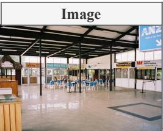

<table><tr><td rowspan=1 colspan=1>Caption: An indoor medium shot of a large open area with a tiled floor and black metal support beamsholding up the ceiling. A small group of people are sitting at a table in the center of the area. A wooden counteris visible on the left side of the area with a small sign with a white arrow pointing to the left. A white wall witha row of windows is visible in the background with a sign on the right side of the wall that reads &quot;PolynesianDuty Free / PHARMACY &amp; OPTICIAN&quot;. A blue sign is hanging from the ceiling in the top right corner of theimage with white text that reads &quot;ANZ / Right beside you&quot;.</td></tr><tr><td rowspan=1 colspan=1>Domain: &quot;General&quot;Query: &quot;Airport terminal energy efficiency solutions.&quot;</td></tr><tr><td rowspan=1 colspan=1>Business Question:lens: cost resource efficiencylens_focus: Focus on cost reduction, resource productivity, waste reduction, energy or                Bmaterial efficiency, and sustainability-linked savings.</td></tr><tr><td rowspan=1 colspan=1>Evidence:&quot;evidence id&quot;: &quot;W1&quot;,&quot;evidence text&quot;: &quot;Title: Prineville Airport In Central Oregon. Search snippet: Prineville Airport is locatedin Central Oregon with cheap fuel and has aircraft maintenance also flight instruction located on the Airport forfull service FBO, Central Oregon, Bend Oregon, Redmond Oregon, self serve fuel, full service 100LL, Jet Aservices &amp; more. ||ll|ll||llll|| Committed to exceeding the standards in aviation services by providingexceptional customer service and uncompromising safety standards; we want to be your first choice for aviationservices. With our customers in mind, we have designed a facility to provide all the service and comforts youdeserve with a strategic position in the heart of Central Oregon. Hangar Rentals Wolfe Pack Properties providesquality hangar rentals. With a variety of amenities such as overhead radiant heaters, insulated roofs, utility sinks,office and reception areas, lounge, bathrooms, washer/dryers and more. Flight Training Want to learn to fly or getyour flight review done on the next \&quot;nice day\&quot;? High Desert Aviation offers Flight Instruction...Your airplane orours! Located at the Prineville Airport, High Desert Aviation offers all levels of flight training, private pilot,commercial pilot, instrument rating and flight instructor training. See our Flight Training Section for more details.Maintenance High Desert Aviation Provides offers Aircraft Maintenance &amp; Service including: repairs, upgradesand inspections. High Desert Aviation specializes in annuals and offer fast turn-around and fair prices. For moreinformation please read our Maintenance Section. Prineville Oregon 97754 \&quot;Exceeding the Standards in AviationServices\&quot; | Prineville Airport is located in Central Oregon with cheap fuel and has aircraft maintenance alsoflight instruction located on the Airport for full service FBO, Central Oregon, Bend Oregon, Redmond Oregon,self serve fuel, full service 100LL, Jet A services &amp; more.&quot;,&quot;source_domain&quot;: &quot;prinevilleairport.com&quot;,&quot;title&quot;: &quot;Prineville Airport In Central Oregon&quot;</td></tr><tr><td rowspan=1 colspan=1>Generated Idea:                                                                        4 3     3 3 2&quot;title&quot;: &quot;Micro-Airport Energy Optimization-as-a-Service&quot;,&quot;description&quot;: &quot;A turnkey retrofit and managed service that cuts energy costs in small/regional airportterminals and FBOs. Targets airport managers who run low-traffic spaces like the café/seating area, car-rentalcounters, and adjacent hangars. Solves wasted lighting/HVAC runtime in sparsely occupied terminals by usingoccupancy, daylight, and flight-schedule data to run only what&#x27;s needed—delivering 20–40% utility savings andlower maintenance.&quot;,&quot;implementation&quot;: &quot;Deploy a quick-install kit for spaces like the one shown: swap fluorescent fixtures fornetworked LED strips; add ceiling-mounted occupancy and daylight sensors; enable demand-controlledventilation and smart thermostats zoned to seating/café vs. counters; add smart plugs for kiosks/signage; and setrefrigeration monitoring for the café. Integrate with public flight schedules to pre-condition spaces only arounddepartures/arrivals and quiet down during gaps. For attached hangars with radiant heaters (common at FBOs),install wireless valve controls and setback schedules. Provide a cellular gateway and cloud dashboard withbaselining, M&amp;V, and alerts. Offer performance contracting so fees are paid from verified savings, minimizingcapex.&quot;,&quot;differentiation&quot;: &quot;Purpose-built for small airports and FBOs: lightweight sensors for open-plan terminals,flight-schedule-driven control logic, and add-ons for hangar radiant heat—capabilities generic building systemslack. Fast, no-IT install, financing via savings, and bundled maintenance of LEDs and controls create a low-friction, defensible service for under-served micro-airports.&quot;</td></tr></table>

Figure A1: An example from the General domain in MBA-Bench.

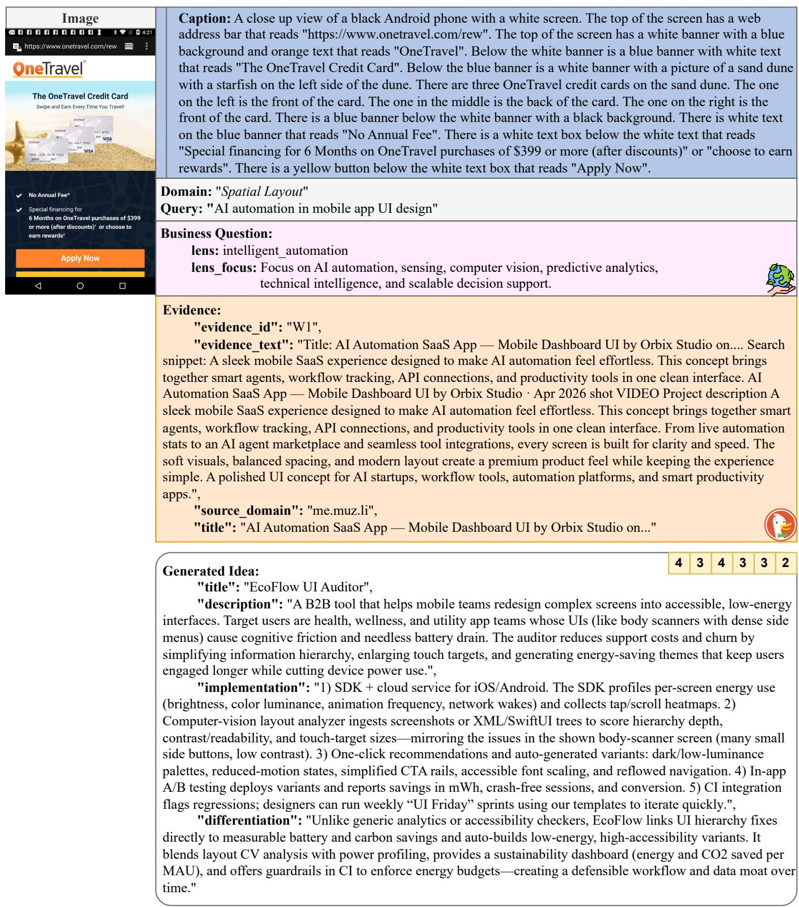  
Figure A2: An example from the Spatial Layout domain in MBA-Bench.


<table><tr><td>Caption: An outdoor medium shot of a life-size statue of Donald Duck standing on a small stone staircase in front of the &quot;It&#x27;s a Small World&quot; ride at Disneyland. Donald is wearing a red and green Christmas sweater and a Santa hat. A Christmas tree with teddy bears and presents is to the right of Donald. A large white sign with a red and white &quot;Happy Holidays&quot; banner is to the left of Donald. A crowd of people are in the background in front of the ride. A blue sky with white clouds is in the background above the ride.</td></tr><tr><td>Domain: &quot;Crowding&quot; Query: &quot;Enhancing customer experience in crowded venues.&quot; Business Question:</td></tr><tr><td>lens: customer_operations_growth lens_focus: Focus on customer experience, service workflow, conversion, retention, 烫</td></tr><tr><td>operational throughput, and business growth. Evidence: &quot;evidence_id&quot;: &quot;W1&quot;, &quot;evidence text&quot;: &quot;Title: How I tackle crowded services / tmaas.eu. Search snippet: Enhancing customer experience in crowds. Key takeaways: Crowded services lead to heightened customer dissatisfaction due to long</td></tr><tr><td>times, overwhelming environments, and increased staff stress. - Effective strategies for managing crowded situations include visiting during off-peak hours, engaging with staff, and utilizing technology for ordering and feedback. - Tools like mobile apps, social media updates, and crowd monitoring systems can enhance the experience by providing real-time information and reducing anxiety in crowded settings. Understanding crowded services When I think about crowded services, I often recall my experience at a popular coffee shop during the morning rush. Crowded services can lead to frustration, not only for customers but also for staff. When we have to wait longer than expected, it can tarnish our overall experience, leaving us questioning if it was worth it. Moreover, understanding crowded services means recognizing the impact of peak times and patterns. Common challenges in crowded services Experiencing crowded services often presents unique challenges. When demands outstrip supply, it can leave customers feeling undervalued and anxious. | Challenge | Description | ---|---| | Long Wait Times | Heightened dissatisfaction and impatience among customers. || Customer Disconnection | An overwhelming environment can dampen the overall experience and enjoyment. Techniques for efficient service delivery One effective technique I’ve found for ensuring efficient service delivery is the use of staggered appointments or reservations. This approach not only allowed them to accommodate more customers but also significantly reduced wait times, making it feel like I was prioritized instead of just another face in the crowd. I remember visiting a local coffee shop that asked customers to fill out a brief survey during the busy hours. It&#x27;s fascinating how small gestures like these can cultivate understanding and responsiveness in crowded environments, ultimately enhancing the overall experience for everyone involved. Isn&#x27;t it fascinating how these tools can transform our experiences in crowded situations? Enhancing customer experience in crowds When tackling crowded situations, I believe that tailored services can significantly uplift the customer experience. It&#x27;s</td></tr><tr><td>amazing how creating experiences can enhance the waiting moments in crowded services.&quot;, &quot;source_domain&quot;: &quot;tmaas.eu&quot;, &quot;title&quot;: &quot;How I tackle crowded services / tmaas.eu&quot;  4 3 4 3 3 3 Generated Idea: &quot;title&quot;: &quot;CharacterFlow&quot;, &quot;description&quot;: &quot;An AI-driven crowd and queue orchestration platform for theme parks that converts chaotic character hubs and seasonal attractions into smooth, bookable micro-experiences. Target users: park operators seeking higher guest satisfaction and throughput during peak days; park guests wanting shorter waits</td></tr><tr><td>and clear navigation. Need: crowded plazas and meet-and-greets (like the holiday character area shown) create long lines, confusion, and staff stress. Benefit: guests receive real-time guidance, timed access to characters and rides, and engaging alternatives; operators gain higher per-cap spending, reduced wait anxiety, and better staff deployment.&quot;, &quot;implementation&quot;: &quot;1) Sensors and vision: deploy edge CV on existing cameras around character stages, ride entrances, and plazas to produce live density maps and queue lengths (privacy-safe, no face ID). Augment with Wi-Fi/BLE pings and POS/ride throughput feeds. 2) Micro-reservations: in-app 5–10 minute windows for character meet-and-greets and seasonal photo ops; overflow guests are auto-rerouted to the next slot or to nearby low-density activities. 3) Dynamic wayfinding: park app and digital signage show color-coded paths and estimated time-to-fun, steering families from congested nodes (e.g., the tree area) to comparable attractions with shorter waits. 4) Engagement layer: if a queue exceeds thresholds, trigger location-based mini-quests/AR photo prompts for kids and time-bound discounts at nearby kiosks to disperse clusters. 5) Ops console: staff see heatmaps, predicted surges, and task prompts (open extra photo lanes, reposition characters, send roving entertainment) to preempt bottlenecks. 6) Analytics: measure dwell time, conversion from wait to spend, NPS, and throughput to refine schedules and seasonal layouts.&quot;, &quot;differentiation&quot;: &quot;Unlike generic wait-time boards or ride-only virtual queues, CharacterFlow centers on character interactions and seasonal hotspots—the toughest congestion drivers—using bookable micro-windows</td></tr></table>

Figure A3: An example from the Crowding domain in MBA-Bench.

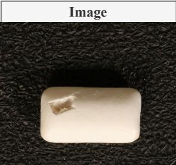

<table><tr><td rowspan=1 colspan=1>Caption: A close up view of a white rectangular eraser with a small chip in the top left corner of it. The eraseris placed on a black surface that is covered in small bumps. The eraser is casting a shadow on the black surfaceextending toward the bottom of the image.</td></tr><tr><td rowspan=1 colspan=1>Domain: &quot;Visual Condition&quot;Query: &quot;Enhancing customer experience through quality inspection.&quot;</td></tr><tr><td rowspan=1 colspan=1>Business Question:lens: customer operations growthlens focus: Focus on customer experience, service workflow, conversion, retention,                 彩operational throughput, and business growth.</td></tr><tr><td rowspan=1 colspan=1>Evidence:&quot;evidence id&quot;: &quot;W1&quot;,&quot;evidence text&quot;: &quot;Title: Home Inspection Marketing For Branding &amp; Attracting Clients. Search snippet:Enhancing the customer experience. By focusing on these key areas, you can attract more clients and build asuccessful home inspection business. To take your marketing efforts to the next level, consider reaching out toour expert marketers at Oamii in West Palm Beach, FL. Home Inspection Marketing: Building Your Brand andAttracting Clients In today&#x27;s competitive home inspection industry, effective marketing is not just an option; it’s anecessity. Marketing strategies can help establish a brand identity that not only helps you launch your businessbut also supports its growth by attracting a steady stream of clients. This article delves into the fundamentals ofhome inspection marketing, covering brand identity, client trust, effective marketing channels, differentiationfrom competitors, and enhancing customer experience. Understanding the Home Inspection Industry What is thecurrent landscape of the home inspection market? As real estate transactions continue to rise, the demand forreliable home inspections is increasing. Deliver Quality Service: Ensure thorough and accurate inspections areyour standard practice. - Communicate Clearly: Keep clients informed throughout the inspection process, usingclear, understandable language. Leveraging Effective Marketing Channels What marketing channels should youutilize for your home inspection services? Key Marketing Channels for Home Inspection Businesses -Incorporate Advanced Technology: Utilize the latest tools and technology to provide accurate and detailedinspection reports. - Provide Comprehensive Reports: Go beyond basic inspections by offering detailed, easy-to-understand reports that include photos and recommendations. - Offer Additional Services: Consider providingcomplementary services, such as pest inspections or home maintenance advice. - Focus on Exceptional CustomerService: Strive for a seamless, client-centered experience from the initial booking to the delivery of reports.Enhancing Customer Experience What impact does customer experience have on client retention? Customerexperience significantly influences client satisfaction and retention. - Communicate Effectively: Keep clientsupdated throughout the inspection process and address any questions or concerns promptly. ConclusionMarketing your home inspection business effectively requires a comprehensive approach that includes:Enhancing the customer experience By focusing on these key areas, you can attract more clients and build asuccessful home inspection business.&quot;,&quot;source_domain&quot;: &quot;oamii.com&quot;,&quot;title&quot;: &quot;Home Inspection Marketing For Branding &amp; Attracting Clients&quot;</td></tr><tr><td rowspan=1 colspan=1>4 3 4 3 3 2Generated Idea:&quot;title&quot;: &quot;ClearQC for Confectionery&quot;,&quot;description&quot;: &quot;AI-powered visual inspection and consumer-facing QA reporting for gum/candy makers. Itdetects surface anomalies (chips, dents, contaminants) like the defect shown, auto-removes bad units, andgenerates photo-rich, plain-language batch reports that brands can share via QR codes on packaging. Target users:confectionery manufacturers and private-label brands seeking fewer returns, higher retailer acceptance, andstronger consumer trust.&quot;,&quot;implementation&quot;: &quot;Install line-side cameras with controlled lighting over conveyors. Use an anomaly-segmentation model trained on normal pieces and tuned to flag/mask defects by area ratio (e.g., mask_area_ratio&gt; 0.002). Connect to ejectors for real-time removal and to a dashboard that compiles statistics (defect rate, types,timestamps) and sample images. The system produces branded, easy-to-read QA summaries—mirroring bestpractices from home-inspection reporting—with clear explanations, photos, and recommendations. Integrations:MES/ERP for traceability, CRM for retailer notifications, and a QR generator so consumers can view theirbatch&#x27;s inspection summary. Alerts and SLA tracking help QA teams communicate proactively with clients andretailers, improving experience from order to delivery.&quot;,&quot;differentiation&quot;: &quot;Unlike generic machine-vision tools, ClearQC pairs high-accuracy anomaly detectionfor glossy, small confectionery items with a customer-experience layer: branded inspection reports, proactivecommunications, and retailer-facing compliance evidence. This fuses quality control with marketing and trust-building, reducing chargebacks and boosting conversion while providing defensible transparency that competitorslack.&quot;</td></tr></table>

Figure A4: An example from the Visual Condition domain in MBA-Bench.

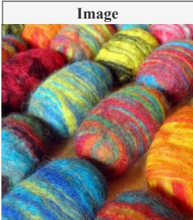

<table><tr><td>Caption: A close up view of a bunch of multi-colored wool roving that is placed on a wooden surface. The wool roving is placed side by side and is in the shape of a cylinder. The wool roving is colored red, blue, yellow, and green.</td></tr><tr><td>Domain: &quot;Shape &amp; Texture&quot; Query: &quot;Sustainable material sourcing for textile industry.</td></tr><tr><td>Business Question: lens: cost resource efficiency lens_focus: Focus on cost reduction, resource productivity, waste reduction, energy or 福 material efficiency, and sustainability-linked savings.</td></tr><tr><td>Evidence: &quot;evidence_id&quot;: &quot;W1&quot;, &quot;evidence_text&quot;: &quot;Title: Sustainability Meets Functionality in Textile Sourcing | LinkedIn. Search snippet: SUSTAINABILITY AND FUNCTIONALITY NOW SHARE THE SAME COMMERCIAL TEST FOR FABRICS | Global textile trade is moving through a more complex sourcing cycle, with buyers weighing cost, reliability, material performance, and sustainability together. SUSTAINABILITY AND FUNCTIONALITY NOW SHARE THE SAME COMMERCIAL TEST FOR FABRICS |Global textile trade is moving through a more complex sourcing cycle, with buyers weighing cost, reliability, material performance, and sustainability together. By Subir Ghosh LINK: https://lnkd.in/gxQtsXBS #textiles #apparel #fabrics #sourcing #sustainability</td></tr><tr><td>Sustainability Meets Functionality in Textile Sourcing More Relevant Posts 27 August 2026 at the National Exhibition and Convention Center (Shanghai), set to reinforce its position as a leading global sourcing platform for the ever-changing apparel textile industry. Founded in 2006, Enkai Holdings has grown from a single textile trading company to a global women&#x27;s apparel supply chain group, driven by the dual-wheel strategy of industry operation + strategic investment. Intertextile Shanghai Apparel Fabrics – Autumn Edition 2026 will return in August with expanded sourcing zones, pet textiles, functional innovations, and sustainability solutions. In today&#x27;s fashion industry, brands need more than just a supplier — they need a reliable sourcing and manufacturing partner that understands quality, sustainability, and speed. From sustainable fabric sourcing to streamlined production processes, Fabric Union is helping brands build smarter and more responsible supply chains. What</td></tr><tr><td>stands out: (1) Sustainable sourcing practices (2) End-to-end apparel manufacturing support (3) Strong supplier and production network (4) Technology-driven workflow and quality checks (5) Commitment to long-term brand partnerships As the global textile industry continues to evolve, companies that prioritize innovation and responsible manufacturing will lead the future — and Fabric Union is moving in that direction. Textile Trends in 2026: Key Insights for Brands &amp; Buyers The global textile industry is undergoing a significant transformation</td></tr><tr><td>driven by sustainability, innovation, and digitalization. Sustainability is now a baseline expectation, with 3 3</td></tr><tr><td>increased demand for recycled and bio-based materials Natural aesthetics and minimal design are influencing product development For brands and sourcing professionals, adapting to these trends is essential to remain competitive. At Shah Textiles, we continuously evolve our processes to meet these changing demands and deliver reliable, high-quality textile solutions. Intertextile Shanghai Apparel Fabrics – Autumn Edition 2026 will highlight pet textiles, climate-adaptive fabrics, sustainability, and digital textile innovations from 25–27 August in Shanghai. Sustainable Practices in Textile Manufacturing Sustainable Material Sourcing for Fashion Designers Textile Sourcing Strategies for Supply Chain Disruptions&quot;, &quot;source domain&quot;: &quot;linkedin.com&quot;, &quot;title&quot;: &quot;Sustainability Meets Functionality in Textile Sourcing | LinkedIn&quot;</td></tr><tr><td>Generated Idea: 4 3 4 3 &quot;title&quot;: &quot;ColorCycle Felt&quot;, &quot;description&quot;: &quot;A sourcing and manufacturing service that turns pre-colored textile offcuts and post-</td></tr><tr><td>consumer wool into marled, matted felt fabrics and trims resembling the vibrant, streaked textures in the image. Target users are apparel, accessories, and interior brands seeking tactile differentiation with lower cost and footprint. Benefits: eliminates dyeing water/energy, diverts waste, delivers durable, functional felt for bags footwear, outerwear panels, soft accessories, and acoustic/interior surfaces.&quot;,</td></tr></table>

Figure A5: An example from the Shape & Texture domain in MBA-Bench.

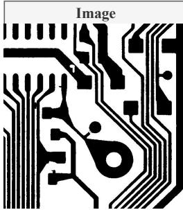

<table><tr><td>Caption: A close up view of a black and white image of a circuit board. The image is zoomed in so that only a small portion of the board is visible. The board is made up of black lines that are all different lengths. Some of the lines are straight, while others are curved. There are also small black shapes on the board. The image is black and white.</td></tr><tr><td>Domain: &quot;Technical Features&quot; Query: &quot;AI-driven PCB inspection solutions.&quot;</td></tr><tr><td>Business Question: lens: intelligent_automation 炒</td></tr><tr><td>lens_focus: Focus on AI automation, sensing, computer vision, predictive analytics technical intelligence, and scalable decision support. Evidence:</td></tr><tr><td>&quot;evidence id&quot;: &quot;W1&quot;, &quot;evidence text&quot;: &quot;Title: Automated PCB Inspection Using Machine Vision and AI. Search snippet: Intelgic provides a comprehensive AI-driven PCB inspection solution, combining high-resolution machine vision, robotic motion systems, and powerful AI algorithms to inspect PCBs for defects, component accuracy, and placement validation. Challenges in PCB Board Inspection. Published on: Jul 16, 2025 Written by: Content team, Intelgic Introduction Printed Circuit Boards (PCBs) are the backbone of all modern electronic devices, from consumer gadgets to automotive control systems and industrial automation. As PCBs grow increasingly complex—with high component density, miniaturized chips, and multi-layer structures—manual inspection becomes infeasible Manufacturers now demand automated, accurate, and high-speed inspection systems to ensure quality, prevent failures, and reduce rework costs. Intelgic provides a comprehensive AI-driven PCB inspection solution, combining high-resolution machine vision, robotic motion systems, and powerful AI algorithms to inspect PCBs</td></tr><tr><td>for defects, component accuracy, and placement validation. Inspecting PCBs is a technically demanding task due to the following challenges: Component Density: Modern PCBs may contain hundreds of micro-components in</td></tr><tr><td>tight spaces. Micron-Level Defects: Cracks in solder joints, lifted pins, or scratches in substrate need inspection at sub-millimeter or even micron resolution. Strict Quality Criteria: Every product must pass industry-specific acceptance standards (IPC-A-610, ISO 9001, etc.). High-Resolution Area Scan Camera Captures detailed 2D images of static or semi-static PCB assemblies. Macro lenses are used for high-detail close-up inspections. Robotic Motion System (X-Y-Z Movement) Intelgic integrates automated motion platforms to move the camera or PCB under inspection across the X, Y, and Z axes. Recipe-Based Inspection: Easily switch inspection parameters for different PCB models using pre-configured templates. Traceability and Reporting: All inspection data, including defect locations and images, are stored for future analysis, quality audits, and warranty support. Speed Supports inline inspection with minimal impact on throughput. Repeatability Eliminates human error and subjectivity in inspection. Flexibility Adaptable to various PCB sizes, layouts, and production environments. As PCB complexity continues to rise, Intelgic&#x27;s AI-powered machine vision system offers an intelligent, scalable, and highly accurate solution for PCB inspection automation. With a combination of area scan imaging, robotic motion control, custom illumination, and deep-learning algorithms, Intelgic ensures that your production line</td></tr></table>

Figure A6: An example from the Technical Features domain in MBA-Bench.

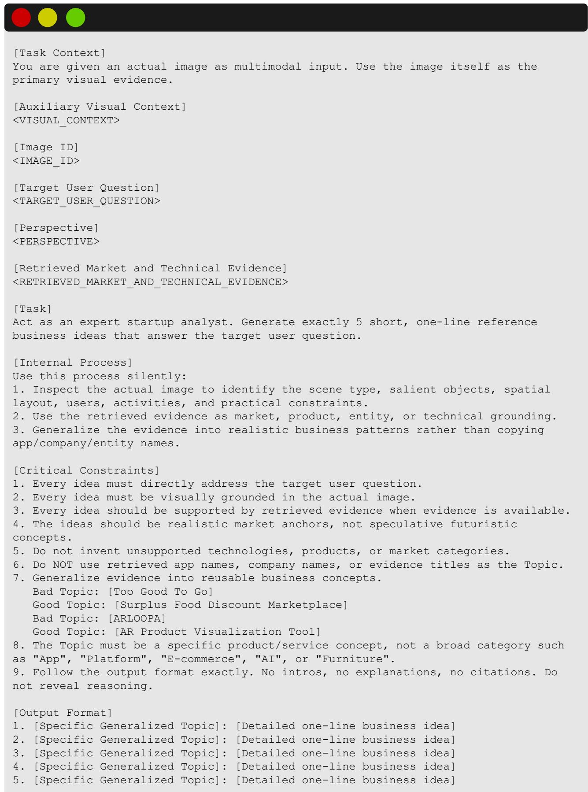  
Figure A7: Prompt template used to construct MBA-Bench.

```ini
[Task]
<TARGET_USER_QUESTION>
Use the visible image and the paired context below to generate exactly one grounded
business idea. Use only this Q<QUERY_INDEX>/W<QUERY_INDEX> pair.
[Domain Context]
domain: <DOMAIN_DISPLAY_NAME>
domain_specific_focus: <DOMAIN_SPECIFIC_FOCUS>
[Image-Specific Annotation]
<IMAGE_SPECIFIC_ANNOTATION_JSON>
[Auxiliary Image Caption]
<CAPTION>
[Business Lens]
lens: <BUSINESS_LENS>
lens_focus: <BUSINESS_LENS_FOCUS>
[DDG Query]
Q<QUERY_INDEX>: <DDG_QUERY>
[DDG Evidence]
<DDG_EVIDENCE_JSON>
[Grounding Requirements]
- Treat the actual image as the primary visual source and the annotation as
structured supporting context.
- Use the generated image caption only as auxiliary semantic context; it may be
incomplete and must not override visible image evidence.
- Ground the idea in the DDG query and evidence text without copying the source
wording.
- Make the target user, need, benefit, implementation, and differentiation concrete.
- Do not mention source URLs, citations, evidence IDs, or retrieval metadata in the
final idea.
Return exactly one business idea as valid JSON only.
Use exactly these four string keys:
{
"title": "concise business idea name",
"description": "core function, target user, need, and benefit",
"implementation": "how the business idea would be built or deployed using current
technology and the image, request, visual annotation, and DDG market-evidence
context",
"differentiation": "what makes it meaningfully different or defensible compared
with existing solutions"
}
Do not include markdown, numbering, extra keys, or text outside the JSON object.
```  
Figure A8: Prompt template used for supervised fine-tuning (SFT).

```ini
[Task]
<TARGET_USER_QUESTION>
Use the visible image and the paired context below to generate exactly one grounded
business idea. Use only this Q<QUERY_INDEX>/W<QUERY_INDEX> pair.
[Domain Context]
domain: <DOMAIN_DISPLAY_NAME>
domain_specific_focus: <DOMAIN_SPECIFIC_FOCUS>
[Image-Specific Annotation]
<IMAGE_SPECIFIC_ANNOTATION_JSON>
[Auxiliary Image Caption]
<CAPTION>
[Business Lens]
lens: <BUSINESS_LENS>
lens_focus: <BUSINESS_LENS_FOCUS>
[DDG Query]
Q<QUERY_INDEX>: <DDG_QUERY>
[DDG Evidence]
<DDG_EVIDENCE_JSON>
[Grounding Requirements]
Treat the actual image as the primary visual source and the annotation as
structured supporting context.
- Use the generated image caption only as auxiliary semantic context; it may be
incomplete and must not override visible image evidence.
- Ground the idea in the DDG query and evidence text without copying the source
wording.
Make the target user, need, benefit, implementation, and differentiation concrete.
Do not mention source URLs, citations, evidence IDs, or retrieval metadata in the
final idea.
Return exactly one business idea as valid JSON only.
Use exactly these four string keys:
{
"title": "concise business idea name",
"description": "core function, target user, need, and benefit",
"implementation": "how the business idea would be built or deployed using current
technology and the image, request, visual annotation, and DDG market-evidence
context",
"differentiation": "what makes it meaningfully different or defensible compared
with existing solutions"
}
Do not include markdown, numbering, extra keys, or text outside the JSON object.
```  
Figure A9: Prompt template used for GRPO policy rollouts.

```ini
[Task]
<TARGET_USER_QUESTION>
Use the visible image and the paired context below to generate exactly one grounded
business idea. Use only this Q<QUERY_INDEX>/W<QUERY_INDEX> pair.
[Domain Context]
domain: <DOMAIN_DISPLAY_NAME>
domain_specific_focus: <DOMAIN_SPECIFIC_FOCUS>
[Image-Specific Annotation]
<IMAGE_SPECIFIC_ANNOTATION_JSON>
[Auxiliary Image Caption]
<CAPTION>
[Business Lens]
lens: <BUSINESS_LENS>
lens_focus: <BUSINESS_LENS_FOCUS>
[DDG Query]
Q<QUERY_INDEX>: <DDG_QUERY>
[DDG Evidence]
<DDG_EVIDENCE_JSON>
[Grounding Requirements]
- Treat the actual image as the primary visual source and the annotation as
structured supporting context.
Use the generated image caption only as auxiliary semantic context; it may be
incomplete and must not override visible image evidence.
- Ground the idea in the DDG query and evidence text without copying the source
wording.
- Make the target user, need, benefit, implementation, and differentiation concrete.
Do not mention source URLs, citations, evidence IDs, or retrieval metadata in the
final idea.
Return exactly one business idea as valid JSON only.
Use exactly these four string keys:
{
"title": "concise business idea name",
"description": "core function, target user, need, and benefit",
"implementation": "how the business idea would be built or deployed using current
technology and the image, request, visual annotation, and DDG market-evidence
context",
"differentiation": "what makes it meaningfully different or defensible compared
with existing solutions"
}
Do not include markdown, numbering, extra keys, or text outside the JSON object.
```  
Figure A10: Prompt template used for evaluation.