a Exsiting flow-based inverse solvers

# Making Every Step Count: Spatio-Temporal Information Allocation for Imaging Inverse Problems

Yi Cao1, Xiangyong Cao1∗, Pei Liu1, Yong-Jin Liu2, Deyu Meng1

1Xi’an Jiaotong University 2Tsinghua University

## Abstract

Flow-based generative models have emerged as powerful image priors for training-free inverse problem solving, capturing coherent semantics and fine-grained structure. Despite these strengths, existing flow-based inverse solvers primarily focus on the design of individual updates, largely overlooking spatio-temporal information allocation under a fixed number of function evaluations (NFEs). Temporally, insuficient early exploration can trap the flow trajectory in an incorrect semantic basin, whereas excessive allocation of NFEs to early stages leaves little budget for late-stage refinement. Spatially, data consistency provides direct constraints only within observed regions, whereas the recovery of missing regions relies mainly on the generative prior. To address these two issues, we introduce two complementary and training-free components, i.e., Spectrum-Adaptive Scheduling (SAS) and Measurement-Prioritized Attention (MPA). For temporal allocation, SAS distributes the available NFEs over flow time according to the degradation spectrum and logSNR geometry, thus better balancing semantic exploration and detail refinement. For spatial propagation, MPA exploits data-prior conflicts to guide information toward weakly constrained regions, thereby enhancing semantic and structural fidelity. Extensive experiments on standard image inverse problems, e.g., super-resolution, motion deblurring, and inpainting, demonstrate that the proposed components can be integrated into existing flow-based inverse solvers in a plug-and-play manner without retraining or additional flow-model evaluations, and can also significantly improve the restoration quality of existing solvers.

## Introduction

Flow-based generative models (Lipman et al. 2023; Liu, Gong, and Liu 2023; Albergo and Vanden-Eijnden 2023), which underpin large-scale text-to-image systems such as Stable Difusion 3 (Esser et al. 2024), have demonstrated remarkable image-generation quality and consequently emerged as powerful priors for ill-posed imaging inverse problems. Accordingly, recent training-free solvers combine a pretrained flow-matching model with a known measurement operator at inference time, avoiding taskspecific retraining for super-resolution, deblurring, or inpainting. Within this paradigm, existing methods employ diverse strategies, including posterior guidance, variational optimization, Langevin–proximal refinement, and feasibleset projection (Kim, Kim, and Ye 2025; Erbach et al. 2025;

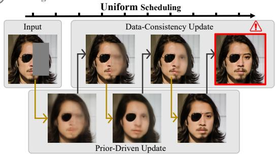  
Early trap: Leads to a wrong semantic basin Constraint gap: No direct correction in missing regions

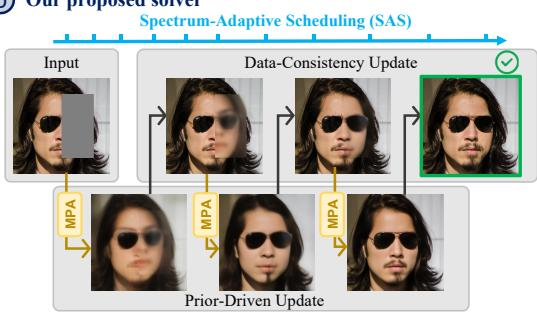  
SAS: More NFEs for semantic exploration MPA: Measurement-guided propagation into missing regions  
Figure 1: Comparison of existing solvers and our method. (a) Existing solvers adopt uniform scheduling, potentially limiting early exploration, while data-consistency updates constrain only observed regions, leaving missing regions largely dependent on the generative prior. (b) Our method contains two main components, i.e., SAS and MPA. SAS allocates NFEs based on operator demand to balance semantic exploration and detail refinement, while MPA strengthens measurement guidance in weakly constrained regions.

Park and Ye 2026; Pourya, Rawas, and Unser 2025). Collectively, these approaches have achieved strong restoration performance across a range of inverse problems. Nevertheless, under a finite NFE budget, their designs still center on how each individual update is performed, while much less attention has been paid to their temporal placement along the flow trajectory. The spatial propagation of measurement information is similarly overlooked: data consistency directly constrains only observed regions, leaving missing regions predominantly dependent on the generative prior.

In practice, existing solvers typically adopt a uniform timestep schedule at a fixed NFE budget, treating stages from semantic formation to detail refinement equally. Yet diferent degradation operators require diferent balances of these stages. Inpainting provides the clearest example, as illustrated in Figure 1(a). Insuficient early-stage exploration can trap the trajectory in an incorrect semantic basin, causing structures such as sunglass frames to be omitted from the completion. Meanwhile, data consistency directly constrains only observed pixels and ofers no direct correction inside the missing region, which therefore remains predominantly dependent on the generative prior. Other operators also exhibit distinct information deficits. High-factor super-resolution leaves high-frequency details unobserved, whereas motion deblurring preserves coarse semantics but weakly observes many modes. These operator-specific deficits place diferent demands on how a finite NFE budget should be allocated, while unobserved or weakly observed details receive little direct correction from data consistency.

These observations suggest that flow inversion under a finite NFE budget is not only an update-design problem, but also a problem of temporal budget allocation and spatial information propagation. Temporally, the goal is to allocate the NFE budget based on degradation-specific demand, balancing semantic exploration and detail refinement; spatially, it is to strengthen measurement guidance for recovery in weakly constrained regions. To address these challenges, we introduce Spectrum-Adaptive Scheduling (SAS) for NFE budget allocation and Measurement-Prioritized Attention (MPA) for spatial information propagation. Figure 1(b) illustrates the complementary design, which improves restoration quality without retraining or additional flow-model evaluations.

SAS determines how a finite NFE budget should be distributed along flow time according to the degradation spectrum and logSNR geometry. The spectrum distinguishes missing modes that rely more strongly on prior-driven synthesis from attenuated modes that retain partial measurement support. LogSNR characterizes how the demands for semantic exploration and detail refinement change along flow time. Based on the degradation spectrum and logSNR geometry, SAS defines an operator demand and constructs an operator-specific schedule, placing more timesteps in highdemand portions of the trajectory while keeping the total NFE budget unchanged. Meanwhile, MPA directly modulates image-token self-attention within the DiT backbone to strengthen measurement guidance in weakly constrained regions. This design builds on the observation that the prior– data discrepancy highlights structures poorly captured by the current prior. MPA summarizes this discrepancy as a conflict heatmap and transforms it through conflict-guided bias generation into an image-token attention bias, which reshapes the attention weights to improve structural fidelity in weakly constrained regions.

Our contributions are as follows:

• We identify a shared bottleneck in training-free flow inverse solvers and formulate it in terms of the temporal allocation of a finite NFE budget and the spatial information propagation.

• We introduce SAS and MPA to address the temporal and spatial dimensions, respectively. SAS distributes the NFE budget over flow time according to the degradation spectrum and logSNR geometry, while MPA uses prior–data conflicts to strengthen measurement guidance in weakly constrained regions.

• Both components can be integrated into existing solvers without retraining or additional flow-model evaluations. Experiments on super-resolution, motion deblurring, and inpainting demonstrate consistent improvements in restoration quality and better preservation of instancespecific semantic and structural details.

## Background and Related Work

## Flow Priors for Inverse Problems

We consider an imaging inverse problem

$$
y = A x + \nu ,\tag{1}
$$

where $\mathcal { A }$ is the degradation operator and ν is measurement noise. Because A is generally non-invertible or illconditioned, recovery requires a natural-image prior in addition to data fidelity. Difusion-based methods have established pretrained generative models as broadly applicable priors: RePaint propagates observed-region constraints through resampling, DPS injects likelihood gradients into reverse diffusion, DDRM and DDNM exploit the spectrum or null space of a linear operator, and DAPS decouples noise annealing to make early errors easier to correct (Lugmayr et al. 2022; Chung et al. 2023; Kawar et al. 2022; Wang, Yu, and Zhang 2023; Zhang et al. 2024).

With recent advances in flow matching, pretrained flow models have also been adopted as generative priors for inverse problems. A common afine probability path is

$$
\begin{array} { r } { x _ { t } = a _ { t } x _ { 0 } + b _ { t } \epsilon , \qquad \epsilon \sim \mathcal { N } ( 0 , I ) , } \end{array}\tag{2}
$$

whose signal-to-noise state is commonly parameterized by the log signal-to-noise ratio (logSNR) (Kingma et al. 2021):

$$
\ell ( t ) = \log \frac { a _ { t } ^ { 2 } } { b _ { t } ^ { 2 } } .\tag{3}
$$

For the linear path used in this work, $a _ { t } = 1 - t$ and $b _ { t } = t .$ A velocity prediction $v _ { \theta } ( x _ { t } , t )$ then induces

$$
\hat { x } _ { 0 \mid t } = x _ { t } - t v _ { \theta } ( x _ { t } , t ) , \qquad \hat { \epsilon } _ { \mid t } = x _ { t } + ( 1 - t ) v _ { \theta } ( x _ { t } , t ) .\tag{4}
$$

These endpoint estimates provide convenient interfaces for likelihood, projection, or proximal corrections while retaining the pretrained flow trajectory. FlowDPS applies posterior guidance through these endpoint predictions (Kim, Kim, and Ye 2025); FLAIR alternates a variational flow regularizer with hard data consistency (Erbach et al. 2025); FlowLPS combines Langevin exploration with proximal refinement (Park and Ye 2026); and FLOWER alternates flow-consistent denoising with measurement-aware projection (Pourya, Rawas, and Unser 2025). Despite their diferent formulations, these solvers all combine prior-driven and data-consistency updates at a sequence of flow timesteps. Under a finite inference budget, however, they largely overlook where these updates should be placed along flow time and how measurement guidance can be strengthened in weakly constrained regions.

## Timestep Scheduling

Sampling schedules determine how a limited evaluation budget is distributed along a generative trajectory. EDM shows that noise parameterization and timestep placement should be designed together, with logSNR providing a natural coordinate for the progression from noise-dominant synthesis to clean-dominant refinement (Karras et al. 2022). More recent training-free methods design the grid itself: TORS allocates timesteps according to the geometry of the sampling trajectory (Zhou et al. 2026), while Lipschitz-guided schedules use numerical regularity to resolve dificult intervals (Chen, Vanden-Eijnden, and Xu 2025). These schedules are designed primarily around the generative trajectory or its numerical properties and do not account for the degradationspecific demands of inverse problems. SAS instead combines the degradation spectrum with logSNR geometry to construct an operator-specific schedule that allocates the fixed timestep budget according to restoration demand.

## Attention-Based Spatial Guidance

Attention control ofers a complementary means of guiding spatial information. Prompt-to-Prompt and Attend-and-Excite manipulate text-conditioned attention, while MasaCtrl and Plug-and-Play Difusion Features reuse reference attention or intermediate features (Hertz et al. 2023; Chefer et al. 2023; Cao et al. 2023; Tumanyan et al. 2023). ControlNet and T2I-Adapter instead learn additional conditioning modules (Zhang, Rao, and Agrawala 2023; Mou et al. 2024). These methods rely on prompts, reference features, or learned conditioning and may require extra optimization, feature injection, or task-specific modules. Existing inverse solvers, meanwhile, use measurements primarily for data-fidelity correction, and rarely use them to guide image-token attention within the generative backbone. MPA instead converts prior– data conflicts into an image-token attention bias to strengthen measurement guidance in weakly constrained regions, without additional flow-model evaluations. Together, SAS and MPA make more efective use of a finite inference budget through operator-specific temporal allocation and stronger measurement guidance in weakly constrained regions.

## Methodology

## Overview

This section details how SAS and MPA address temporal budget allocation and spatial information propagation, respectively, under a finite NFE budget. SAS determines when inverse updates are executed by distributing timesteps over flow time according to degradation spectrum and logSNR geometry. MPA strengthens measurement guidance in weakly constrained regions by converting prior–data conflicts into image-token attention bias within the DiT backbone.

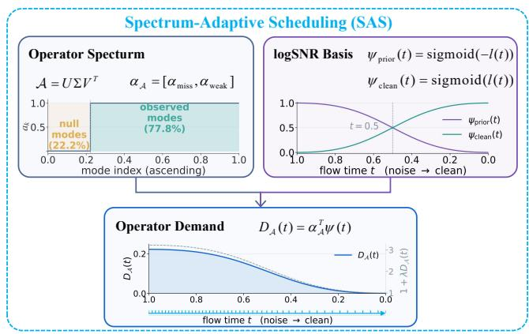  
Figure 2: Overview of Spectrum-Adaptive Scheduling (SAS). SAS combines the operator spectrum and logSNRderived temporal bases into an operator demand, which is used to distribute the finite NFE budget over flow time.

## Spectrum-Adaptive Scheduling

As illustrated in Figure. 2, SAS constructs an operatorspecific schedule by quantifying missing and attenuated spectral modes, mapping their demands over flow time through logSNR, and allocating the fixed timestep budget by equalmass quantiles.

Operator spectrum. For measurements with $y = A x _ { 0 } +$ $\nu ,$ the standard quadratic data-consistency objective is

$$
\mathcal { L } _ { \mathrm { d c } } ( { \boldsymbol { x } } ) = \frac { 1 } { 2 } \| \mathcal { A } { \boldsymbol { x } } - { \boldsymbol { y } } \| _ { 2 } ^ { 2 } ,\tag{5}
$$

whose Hessian is

$$
\nabla _ { x } ^ { 2 } \mathcal { L } _ { \mathrm { d c } } ( x ) = \mathcal { A } ^ { \top } \mathcal { A } .\tag{6}
$$

Hence, for any unit signal direction v, the quadratic form $v ^ { \top } A ^ { \top } A v = \| A v \| _ { 2 } ^ { 2 }$ measures how strongly it is constrained by the measurement. Moreover, under isotropic Gaussian noise, $\mathcal { A } ^ { \top } \mathcal { A }$ is also proportional to the Fisher information matrix. However, these directions are generally coupled in image coordinates. Following DDRM (Kawar et al. 2022), we therefore decouple them via the SVD:

$$
\begin{array} { r } { \boldsymbol { \mathcal { A } } = \boldsymbol { U } \boldsymbol { \Sigma } \boldsymbol { V } ^ { \top } , \qquad \boldsymbol { \Sigma } = \mathrm { d i a g } ( a _ { 1 } , \dots , a _ { d } ) , } \end{array}\tag{7}
$$

where U and V provide orthonormal bases for the measurement and image spaces, respectively, and Σ is rectangular diagonal. Let $r = { \mathrm { r a n k } } ( A )$ , with $a _ { 1 } \geq \cdot \cdot \cdot \geq a _ { r } > 0 =$ $a _ { r + 1 } = \cdots = a _ { d } . $ . Then

$$
\begin{array} { r } { \boldsymbol { \mathcal { A } } ^ { \top } \boldsymbol { \mathcal { A } } = V \mathrm { d i a g } ( a _ { 1 } ^ { 2 } , \ldots , a _ { d } ^ { 2 } ) \boldsymbol { V } ^ { \top } . } \end{array}\tag{8}
$$

Thus, $v _ { k }$ is an independent signal direction and $a _ { k } ^ { 2 }$ is the measurement strength along that direction.

We normalize $a _ { k }$ as $\bar { a } _ { k } = a _ { k } / a _ { \operatorname* { m a x } } ,$ where $a _ { \mathrm { m a x } } = \| \mathcal { A } \| _ { 2 } .$ and obtain

$$
G _ { \ r { \mathcal A } } : = \frac { \mathcal { A } ^ { \top } \mathcal { A } } { \Vert \mathcal { A } \Vert _ { 2 } ^ { 2 } } = V \mathrm { d i a g } ( \bar { a } _ { 1 } ^ { 2 } , \ldots , \bar { a } _ { d } ^ { 2 } ) V ^ { \top } .\tag{9}
$$

By construction, each $\bar { a } _ { k } ^ { 2 } \in [ 0 , 1 ]$ measures how strongly the k-th direction is observed relative to the strongest direction.

The ordinary rank r counts all nonzero singular directions equally, including those that are severely attenuated. We instead use the stable rank (Tropp 2015; Cohen, Nelson, and Woodruf 2016):

$$
\operatorname { s r a n k } ( A ) : = { \frac { \| A \| _ { F } ^ { 2 } } { \| A \| _ { 2 } ^ { 2 } } } = \operatorname { t r } ( G _ { { \mathcal { A } } } ) = \sum _ { k = 1 } ^ { d } { \bar { a } } _ { k } ^ { 2 } .\tag{10}
$$

Stable rank is a scale-invariant efective dimension: a direction contributes according to its relative measurement strength rather than through a binary zero/nonzero decision. For every nonzero operator,

$$
1 \leq \mathrm { s r a n k } ( \mathcal { A } ) \leq r \leq d ,\tag{11}
$$

Relative to full observation, the normalized stable-rank gap separates as

$$
{ \frac { d - \operatorname { s r a n k } ( A ) } { d } } = \underbrace { \frac { d - r } { d } } _ { \alpha _ { \operatorname { m i s s } } } + \underbrace { \frac { r - \operatorname { s r a n k } ( A ) } { d } } _ { \alpha _ { \operatorname { w e a k } } } ,\tag{12}
$$

where $\alpha _ { \mathrm { m i s s } }$ is the fraction of unobservable directions, while α aggregates attenuation over the observable directions.

LogSNR temporal bases. The spectral coeficients above summarize the operator’s missing and attenuated modes. To translate this information into temporal allocation, we first characterize how the role of an update changes along flow time. At the noise-dominant early stage, restoration relies more strongly on the prior for semantic synthesis; toward the clean endpoint, measurement-supported details can be refined more efectively. We describe this transition using the logSNR $\ell ( t ) = \log ( a _ { t } ^ { 2 } / b _ { t } ^ { 2 } )$ (Kingma and Gao 2023), which provides a natural coordinate for the progression from the noise-dominant stage to the clean endpoint.

We map logSNR to two complementary temporal bases:

$$
\begin{array} { l l } { \psi _ { \mathrm { p r i o r } } ( t ) = \mathrm { s i g m o i d } ( - \ell ( t ) ) = \frac { b _ { t } ^ { 2 } } { a _ { t } ^ { 2 } + b _ { t } ^ { 2 } } , } \\ { \psi _ { \mathrm { c l e a n } } ( t ) = \mathrm { s i g m o i d } ( \ell ( t ) ) = \frac { a _ { t } ^ { 2 } } { a _ { t } ^ { 2 } + b _ { t } ^ { 2 } } } \end{array}\tag{13}
$$

For the linear flow path $a _ { t } = 1 - t$ and $b _ { t } = t$ , they reduce to

$$
\begin{array} { l } { \displaystyle \psi _ { \mathrm { p r i o r } } ( t ) = \frac { t ^ { 2 } } { t ^ { 2 } + ( 1 - t ) ^ { 2 } } , } \\ { \displaystyle \psi _ { \mathrm { c l e a n } } ( t ) = \frac { ( 1 - t ) ^ { 2 } } { t ^ { 2 } + ( 1 - t ) ^ { 2 } } . } \end{array}\tag{14}
$$

Here, the two bases are nonnegative and satisfy $\psi _ { \mathrm { p r i o r } } ( t ) +$ $\psi _ { \mathrm { c l e a n } } ( t ) ~ = ~ 1 \colon \psi _ { \mathrm { p r i o r } }$ emphasizes early prior-driven exploration, whereas $\psi _ { \mathrm { c l e a n } }$ gradually shifts emphasis toward clean-stage detail refinement.

From operator demand to an adaptive schedule. With the degradation spectrum summarized by the operatorspectrum weights and the restoration demand along flow time characterized by the temporal bases, we define the operator demand as

$$
D _ { \cal A } ( t ) : = \alpha _ { \mathrm { m i s s } } \psi _ { \mathrm { p r i o r } } ( t ) + \alpha _ { \mathrm { w e a k } } \psi _ { \mathrm { c l e a n } } ( t ) .\tag{15}
$$

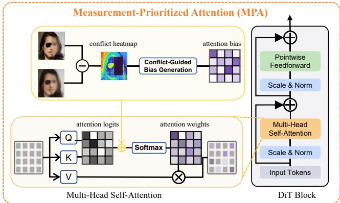  
Figure 3: Overview of Measurement-Prioritized Attention (MPA). MPA summarizes prior–data conflicts as a conflict heatmap and converts it into an image-token attention bias within the DiT backbone, strengthening measurement guidance in weakly constrained regions.

The pairing reflects the diferent measurement support of missing and attenuated modes. Missing modes receive no direct measurement correction and hence predominantly rely on prior-driven synthesis, whereas attenuated modes retain partial measurement support and can benefit more from clean-stage refinement. The resulting $D _ { \mathcal { A } } ( t )$ summarizes the operator-specific restoration demand along the flow time and serves as the temporal weighting profile for constructing the adaptive schedule.

Let $\tau = [ t _ { \mathrm { m i n } } , t _ { \mathrm { m a x } } ]$ . We convert this demand directly into a normalized allocation density:

$$
q _ { A , \lambda } ( t ) = \frac { 1 + \lambda D _ { A } ( t ) } { \int _ { t _ { \operatorname* { m i n } } } ^ { t _ { \operatorname* { m a x } } } [ 1 + \lambda D _ { A } ( u ) ] d u } , \qquad \lambda \geq 0 ,\tag{16}
$$

where λ controls the deviation from uniform allocation, with $\lambda = 0$ recovering the uniform schedule. Given N solver intervals, we take reverse-time equal-mass quantiles of $q _ { \ r { A } , \lambda } \colon$

$$
\begin{array} { r l } & { \displaystyle F _ { A , \lambda } ( t ) : = \int _ { t _ { \operatorname* { m i n } } } ^ { t } q _ { A , \lambda } ( u ) d u , } \\ & { \displaystyle t _ { i } = F _ { A , \lambda } ^ { - 1 } \left( 1 - \frac { i } { N } \right) , \quad i = 0 , \hdots , N . } \end{array}\tag{17}
$$

Thus, $t _ { 0 } = t _ { \mathrm { m a x } }$ and $t _ { N } = t _ { \operatorname* { m i n } } .$ , while portions of the trajectory with larger operator demand receive denser solver times. Overall, SAS converts the degradation spectrum and logSNR geometry into an operator-specific schedule, allowing the fixed timestep budget to be allocated more efectively between semantic exploration and detail refinement.

## Measurement-Prioritized Attention

As illustrated in Figure 3, MPA strengthens measurement guidance in weakly constrained regions by directly modulating image-token self-attention within the DiT backbone. It first extracts spatial conflicts from the prior–data discrepancy and then converts them into an attention bias that reshapes information flow between image tokens.

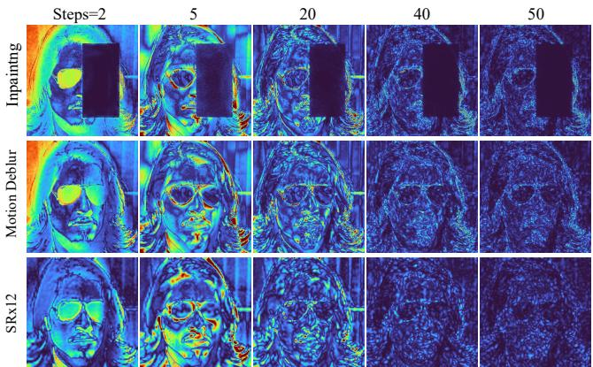  
Figure 4: Data-consistency conflict heatmaps over the restoration trajectory for inpainting, motion deblurring, and ×12 super-resolution. Brighter values indicate larger corrections between the prior and data-consistent estimates.

Let $z _ { t } ^ { \mathrm { p r i } }$ and $\boldsymbol { z } _ { t } ^ { \mathrm { d c } }$ denote the latent estimates produced by the prior and data-consistency updates at step t, respectively. Their token-wise discrepancy measures the correction introduced by data consistency relative to the current prior estimate and we use its magnitude and summarize it as the conflict heatmap

$$
c _ { t } = \mathrm { N o r m P o o l } \left( \left| z _ { t } ^ { \mathrm { d c } } - z _ { t } ^ { \mathrm { p r i } } \right| \right) \in [ 0 , 1 ] ^ { n } ,\tag{18}
$$

where NormPool performs channel pooling, robust normalization, and spatial smoothing. Figure 4 visualizes how these conflicts evolve across solver steps. At early stages, strong responses already delineate major structural contours and highlight high-frequency details that the prior tends to suppress. Toward the clean endpoint, the conflicts diminish and become increasingly concentrated on fine textures. These patterns provide spatial evidence for the subsequent attention modulation.

Suppressing the attention-head index for clarity, let $Q _ { t } , \dot { K _ { t } } \in \mathbb R ^ { n \times d _ { h } }$ denote the image-token queries and keys, where $d _ { h }$ is the feature dimension of each head. The original image-token attention logits are

$$
L _ { t } = \frac { Q _ { t } K _ { t } ^ { \top } } { \sqrt { d _ { h } } } \in \mathbb { R } ^ { n \times n } .\tag{19}
$$

The rows of $L _ { t }$ correspond to query tokens and its columns correspond to key tokens. These logits capture feature compatibility between image tokens but do not explicitly account for prior–data conflicts.

To match the pairwise attention logits, MPA broadcasts the token-wise map along the query dimension, giving the attention bias

$$
B _ { t } = \mathbf { 1 } c _ { t } ^ { \top } \in \mathbb { R } ^ { n \times n } ,\tag{20}
$$

where $\mathbf { 1 } \in \mathbb { R } ^ { n }$ broadcasts $c _ { t }$ across all image-token queries, assigning larger key-side biases to locations with stronger measurement responses. MPA then adds $B _ { t }$ to the original image-token attention logits $L _ { t }$ before softmax:

$$
\widetilde { P } _ { t } = \mathrm { S o f t m a x } _ { \mathrm { r o w } } \left( L _ { t } + \beta _ { t } B _ { t } \right) ,\tag{21}
$$

where $\beta _ { t }$ controls the bias strength. The resulting attention weights place greater emphasis on measurement-responsive tokens, thereby strengthening measurement guidance in weakly constrained regions.

## Experiments

## Setup

Datasets and Evaluation Metrics. We conducted comprehensive evaluations across multiple inverse problems using high-resolution images from two datasets: 1k images from FFHQ (Karras, Laine, and Aila 2019) and 0.8k images from DIV2K (Agustsson and Timofte 2017). All experiments were performed at 768 × 768 resolution by resizing the original images. Our evaluation employs PSNR and SSIM to quantify pixel-level reconstruction fidelity, complemented by FID and LPIPS for perceptual quality and naturalness.

Baselines. We compare with FlowDPS (Kim, Kim, and Ye 2025), FlowChef (Patel et al. 2025), FLAIR (Erbach et al. 2025), and FlowLPS (Park and Ye 2026). The FlowDPS and FlowChef results follow the SD3.0-Medium protocol reported b FlowDPS, whereas FLAIR and FlowLPS use their SD3.5-Medium implementations. Our main controlled comparisons integrate SAS and MPA into FLAIR and FlowLPS, denoted by “+ Ours”; each augmented solver retains the inference settings and number of flow-model evaluations of its corresponding baseline.

Problem Setting. We run and evaluate all methods at a fixed output resolution of 768×768 pixels. For single image superresolution, we consider scaling factors of 8× and 12×. The corresponding low-resolution inputs are generated by bicubic downsampling. Motion blur is simulated with a blur kernel of size 61. For box inpainting, we mask large, continuous rectangles that cover approximately one third of the observation. All synthesized observations are corrupted with additive Gaussian noise, with standard deviation $\sigma _ { v } = 0 . 3 \%$ .

Following previous work on flow-based inverse problems (Erbach et al. 2025; Park and Ye 2026), we use the fixed prompt ”A high quality photo of a face” for FFHQ. For DIV2K, we concatenate ”A high quality photo of” with an image-specific description extracted from the observation using DAPE (Wu et al. 2024).

## Main Results

Table 1 reports the quantitative results. The gains are most consistent for super-resolution and motion deblurring. Adding our modules to FLAIR improves most metrics for ×12 super-resolution and motion deblurring on both datasets. FlowLPS also obtains clear improvements on FFHQ super-resolution.

For inpainting, the clearest quantitative gains occur in fidelity: PSNR improves for both augmented solvers. Figure 5 further shows the qualitative advantage. The baselines often fail to recover instance-specific attributes, including sunglasses and facial markings, whereas our method preserves these structures consistently. The baselines use the observed content mainly through data-consistency correction, leaving its structural and semantic cues underused within the generative backbone; their reconstructions can therefore drift toward a generic semantic basin favored by the prior. Under the same NFE budget, SAS provides finer temporal resolution at the noise end for early semantic exploration, while MPA uses measurement-supported cues to guide spatial feature aggregation toward weakly constrained regions. Our method also recovers finer textures in super-resolution and leaves less residual blur in motion deblurring.

<table><tr><td rowspan="2">Method</td><td colspan="3">SR8×</td><td colspan="4"></td><td colspan="4">Motion Deblur</td><td colspan="4">Inpainting</td></tr><tr><td>PSNR↑</td><td>SSIM↑ FID↓</td><td></td><td>LPIPS↓</td><td>PSNR↑ SSIM↑</td><td>FID↓</td><td>LPIPS↓</td><td>PSNR↑</td><td>SSIM↑</td><td>FID↓</td><td>LPIPS↓</td><td>PSNR↑</td><td>SSIM↑</td><td>FID↓</td><td>LPIPS↓</td></tr><tr><td colspan="10"></td><td colspan="7"></td></tr><tr><td>FlowChef</td><td>27.33</td><td>0.755</td><td>41.93</td><td>0.340</td><td>26.13</td><td>0.726 58.99</td><td>0.376</td><td></td><td>27.41</td><td>0.756</td><td>36.99</td><td>0.339</td><td>18.96</td><td>0.769</td><td>65.30</td><td>0.407</td></tr><tr><td>FlowDPS</td><td>27.52</td><td>0.702</td><td>29.13</td><td>0.419</td><td>26.62</td><td>0.691</td><td>31.54 0.453</td><td></td><td>25.93</td><td>0.681</td><td>40.58</td><td>0.485</td><td>19.98</td><td>0.761</td><td>40.84</td><td>0.336</td></tr><tr><td>FlowLPS</td><td>24.20</td><td>0.424</td><td>53.05</td><td>0.609</td><td>23.53</td><td>0.405</td><td>65.59</td><td>0.660</td><td>33.18</td><td>0.871</td><td>31.01</td><td>0.247</td><td>21.92</td><td>0.863</td><td>17.31</td><td>0.215</td></tr><tr><td>FlowLPS + Ours</td><td>26.67</td><td>0.611</td><td>36.03</td><td>0.429</td><td>26.09</td><td>0.627</td><td>39.281</td><td>0.462</td><td>33.10</td><td>0.872</td><td>29.47</td><td>0.251</td><td>24.55</td><td>0.868</td><td>20.86</td><td>0.230</td></tr><tr><td>FLAIR</td><td>29.41</td><td>0.796</td><td>83.66</td><td>0.468</td><td>26.68</td><td>0.712</td><td>58.75</td><td>0.381</td><td>32.04</td><td>0.830</td><td>11.26</td><td>0.158</td><td>23.76</td><td>0.849</td><td>14.63</td><td>0.170</td></tr><tr><td>FLAIR + Ours</td><td>29.61</td><td>0.803</td><td>85.50</td><td>0.449</td><td>26.81</td><td>0.712</td><td>52.65</td><td>0.346</td><td>32.10</td><td>0.829</td><td>10.80</td><td>0.155</td><td>24.49</td><td>0.852</td><td>15.28</td><td>0.169</td></tr><tr><td colspan="10">DIV2K 0.8k</td><td colspan="7"></td></tr><tr><td>FlowChef</td><td>21.25</td><td>0.532</td><td>55.81</td><td>0.508</td><td>20.15</td><td>0.490</td><td>65.42</td><td>0.543</td><td>21.38</td><td>0.537</td><td>55.82</td><td>0.506</td><td>19.91</td><td>0.632</td><td>64.82</td><td>0.511</td></tr><tr><td>FlowDPS</td><td>21.93</td><td>0.526</td><td>43.99</td><td>0.482</td><td>20.94</td><td>0.490</td><td>53.91</td><td>0.549</td><td>20.74</td><td>0.493</td><td>60.98</td><td>0.566</td><td>21.39</td><td>0.668</td><td>41.97</td><td>0.333</td></tr><tr><td>FlowLPS</td><td>20.01</td><td>0.382</td><td>53.95</td><td>0.526</td><td>19.40</td><td>0.351</td><td>68.06</td><td>0.585</td><td>27.02</td><td>0.765</td><td>26.96</td><td>0.310</td><td>23.36</td><td>0.840</td><td>20.94</td><td>0.194</td></tr><tr><td>FlowLPS + Ours</td><td>19.76</td><td>0.384</td><td>54.45</td><td>0.558</td><td>19.42</td><td>0.379</td><td>65.76</td><td>0.598</td><td>27.04</td><td>0.770</td><td>25.90</td><td>0.302</td><td>24.19</td><td>0.829</td><td>20.86</td><td>0.213</td></tr><tr><td>FLAIR</td><td>23.44</td><td>0.616</td><td>58.64</td><td>0.585</td><td>21.19</td><td>0.512</td><td>62.10</td><td>0.507</td><td>26.74</td><td>0.743</td><td>16.54</td><td>0.215</td><td>23.83</td><td>0.834</td><td>17.18</td><td>0.164</td></tr><tr><td>FLAIR + Ours</td><td>23.51</td><td>0.622</td><td>59.17</td><td>0.573</td><td>21.32</td><td>0.517</td><td>60.36</td><td>0.493</td><td>26.87</td><td>0.745</td><td>15.89</td><td>0.207</td><td>24.07</td><td>0.833</td><td>16.61</td><td>0.167</td></tr></table>

Table 1: Quantitative results on FFHQ (1k) and DIV2K (0.8k) at 768 × 768 resolution. All methods use the same number of function evaluations. “+ Ours” augments the corresponding solver with SAS and MPA.

GT  
FlowLPS  
FlowLPS+Ours  
FLAIR  
FLAIR+Ours  
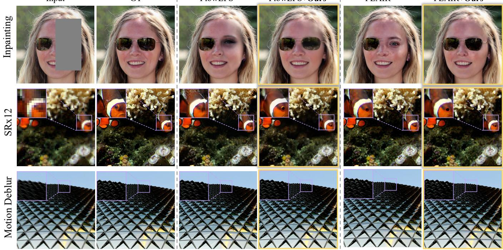  
Figure 5: Qualitative comparison across inpainting, ×12 super-resolution, and motion deblurring. Adding our components to FlowLPS or FLAIR improves semantic and structural fidelity while maintaining consistency with the observed content. Best viewed zoomed in.

## Ablation Study

Component Ablation. We evaluate the contribution of SAS and MPA in a representative controlled experimental setting based on FlowLPS for FFHQ ×12 super-resolution. All variants use the same 100-image subset and NFE budget. Table 2 reports the results when SAS and MPA are enabled individually and jointly. SAS contributes most of the quantitative gain and improves all four metrics over the base schedule. MPA alone produces smaller changes in these aggregate metrics, consistent with its main role in preserving semantic and structural details.

<table><tr><td>SAS</td><td>MPA</td><td>PSNR↑</td><td>SSIM ↑</td><td>LPIPS ↓</td><td>FID↓</td></tr><tr><td>X</td><td>X</td><td>24.34</td><td>0.435</td><td>0.595</td><td>87.11</td></tr><tr><td>√</td><td>X</td><td>26.33</td><td>0.574</td><td>0.471</td><td>72.94</td></tr><tr><td>X</td><td>√</td><td>24.41</td><td>0.445</td><td>0.585</td><td>86.27</td></tr><tr><td>√</td><td>√</td><td>26.19</td><td>0.576</td><td>0.465</td><td>73.38</td></tr></table>

Table 2: Ablation study for ×12 super-resolution on FFHQ (100 images). SAS and MPA are individually switched on or of. Bold: best; underline: second best.

Although SAS provides the largest improvements on aggregate metrics, its semantic recovery remains sensitive to sampling randomness. Allocating more steps to the noise end provides additional opportunities for early semantic exploration, but does not guarantee that the trajectory enters the correct semantic basin. Figure 6 examines this limitation on the same challenging box-inpainting case across diferent random seeds. The base solver consistently converges to a generic face favored by the generative prior, while SAS recovers the complete sunglasses only for some seeds. Changing the seed can still lead to diferent semantic outcomes, showing that additional early exploration alone does not ensure stable semantic recovery.

MPA complements this temporal allocation by acting as a semantic stabilizer. By strengthening measurement guidance in weakly constrained regions, MPA allows the missing region to make better use of measurement-supported structure from the observed content. As shown in Figure 6, MPA consistently recovers the complete sunglasses across seeds. This stronger structural constraint may slightly reduce visual quality in some cases, but it produces markedly more stable semantic recovery, which is not fully reflected by aggregate metrics. Combining SAS and MPA retains this semantic stability while improving visual quality over MPA alone.

<table><tr><td>Schedule</td><td>PSNR↑</td><td>SSIM ↑</td><td>LPIPS ↓</td><td>FID↓</td></tr><tr><td>Uniform</td><td>26.39</td><td>0.573</td><td>0.463</td><td>73.07</td></tr><tr><td>Noise-end dense</td><td>26.83</td><td>0.616</td><td>0.426</td><td>68.87</td></tr><tr><td>Mid-trajectory dense</td><td>23.68</td><td>0.378</td><td>0.695</td><td>95.57</td></tr><tr><td>Signal-end dense</td><td>24.03</td><td>0.396</td><td>0.662</td><td>90.69</td></tr><tr><td>SAS (Ours)</td><td>26.89</td><td>0.620</td><td>0.420</td><td>67.99</td></tr></table>

Table 3: Schedule ablation for FlowLPS on FFHQ 8× superresolution using 100 images and 50 NFEs.

Schedule Ablation. To evaluate whether the NFE distribution produced by SAS reflects operator-specific demand over flow time, we conduct a controlled schedule ablation with FlowLPS on FFHQ 8× super-resolution. The experiment uses a 100-image subset and the same 50-NFE budget for all schedules. All other solver and evaluation settings remain fixed across schedules. We compare SAS with a uniform schedule and three hand-crafted alternatives. Specifically, for the hand-crafted alternatives, we divide the trajectory into three equal segments and assign a larger share of the NFE budget to the noise end, middle, or clean end, respectively.

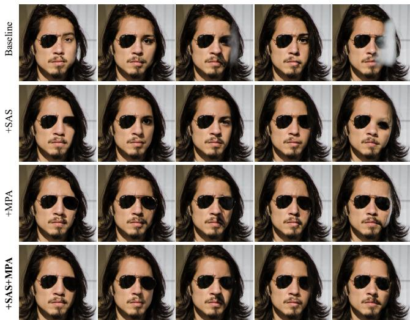  
Figure 6: Box-inpainting results across random seeds. Columns correspond to diferent seeds, and rows show the Baseline, +SAS, +MPA, and +SAS+MPA settings.

Table 3 shows that SAS performs best on all four metrics, while the noise-end-dense schedule consistently ranks second. This result confirms that allocating more steps to early semantic exploration is beneficial, but also shows that concentrating timesteps in a manually selected segment is insuficient. By distributing the same NFE budget according to operator-specific demand, SAS better balances early semantic exploration and late-stage detail refinement.

## Conclusion

Existing training-free flow-based inverse solvers largely overlook temporal budget allocation and spatial information propagation under a finite inference budget. To address these limitations, we introduced Spectrum-Adaptive Scheduling (SAS) and Measurement-Prioritized Attention (MPA). SAS combines operator-spectrum weights with logSNR-derived temporal bases to allocate the fixed timestep budget more efectively between semantic exploration and detail refinement. MPA uses prior–data conflicts to bias image-token attention in the DiT backbone, strengthening measurement guidance in weakly constrained regions. Both components integrate into existing solvers without retraining or additional inference steps. Experiments across super-resolution, motion deblurring, and inpainting show consistent improvements in restoration quality and preservation of instance-specific semantic and structural details. These results highlight the value of spatio-temporal information allocation under finite inference budgets.

## References

Agustsson, E.; and Timofte, R. 2017. NTIRE 2017 Challenge on Single Image Super-Resolution: Dataset and Study. In Proceedings of the IEEE Conference on Computer Vision and Pattern Recognition Workshops, 126–135.

Albergo, M. S.; and Vanden-Eijnden, E. 2023. Building Normalizing Flows with Stochastic Interpolants. In International Conference on Learning Representations.

Cao, M.; Wang, X.; Qi, Z.; Shan, Y.; Qie, X.; and Zheng, Y. 2023. MasaCtrl: Tuning-Free Mutual Self-Attention Control for Consistent Image Generation and Editing. In IEEE/CVF International Conference on Computer Vision.

Chefer, H.; Alaluf, Y.; Vinker, Y.; Wolf, L.; and Cohen-Or, D. 2023. Attend-and-Excite: Attention-Based Semantic Guidance for Text-to-Image Difusion Models. In ACM SIG-GRAPH.

Chen, Y.; Vanden-Eijnden, E.; and Xu, J. 2025. Lipschitz-Guided Design of Interpolation Schedules in Generative Models. arXiv preprint arXiv:2509.01629.

Chung, H.; Kim, J.; McCann, M. T.; Klasky, M. L.; and Ye, J. C. 2023. Difusion Posterior Sampling for General Noisy Inverse Problems. In International Conference on Learning Representations.

Cohen, M. B.; Nelson, J.; and Woodruf, D. P. 2016. Optimal Approximate Matrix Product in Terms of Stable Rank. In 43rd International Colloquium on Automata, Languages, and Programming (ICALP 2016), volume 55 of Leibniz International Proceedings in Informatics (LIPIcs), 11:1–11:14. Schloss Dagstuhl–Leibniz-Zentrum fuer Informatik.

Erbach, J.; Narnhofer, D.; Dombos, A.; Schiele, B.; Lenssen, J. E.; and Schindler, K. 2025. Solving Inverse Problems with FLAIR. arXiv preprint arXiv:2506.02680.

Esser, P.; Kulal, S.; Blattmann, A.; Entezari, R.; Müller, J.; Saini, H.; Levi, Y.; Lorenz, D.; Sauer, A.; Boesel, F.; Podell, D.; Dockhorn, T.; English, Z.; Lacey, K.; Goodwin, A.; Marek, Y.; and Rombach, R. 2024. Scaling Rectified Flow Transformers for High-Resolution Image Synthesis. In International Conference on Machine Learning.

Hertz, A.; Mokady, R.; Tenenbaum, J.; Aberman, K.; Pritch, Y.; and Cohen-Or, D. 2023. Prompt-to-Prompt Image Editing with Cross Attention Control. In International Conference on Learning Representations.

Karras, T.; Aittala, M.; Aila, T.; and Laine, S. 2022. Elucidating the Design Space of Difusion-Based Generative Models. In Advances in Neural Information Processing Systems, volume 35.

Karras, T.; Laine, S.; and Aila, T. 2019. A Style-Based Generator Architecture for Generative Adversarial Networks. In Proceedings of the IEEE/CVF Conference on Computer Vision and Pattern Recognition, 4401–4410.

Kawar, B.; Elad, M.; Ermon, S.; and Song, J. 2022. Denoising Difusion Restoration Models. In Advances in Neural Information Processing Systems, volume 35.

Kim, J.; Kim, B. S.; and Ye, J. C. 2025. FlowDPS: Flow-Driven Posterior Sampling for Inverse Problems. arXiv preprint arXiv:2503.08136.

Kingma, D.; and Gao, R. 2023. Understanding difusion objectives as the elbo with simple data augmentation. Advances in Neural Information Processing Systems, 36: 65484–65516.

Kingma, D. P.; Salimans, T.; Poole, B.; and Ho, J. 2021. Variational Difusion Models. In Advances in Neural Information Processing Systems, volume 34.

Lipman, Y.; Chen, R. T. Q.; Ben-Hamu, H.; Nickel, M.; and Le, M. 2023. Flow Matching for Generative Modeling. In International Conference on Learning Representations.

Liu, X.; Gong, C.; and Liu, Q. 2023. Flow Straight and Fast: Learning to Generate and Transfer Data with Rectified Flow. In International Conference on Learning Representations.

Lugmayr, A.; Danelljan, M.; Romero, A.; Yu, F.; Timofte, R.; and Van Gool, L. 2022. RePaint: Inpainting using Denoising Difusion Probabilistic Models. In IEEE/CVF Conference on Computer Vision and Pattern Recognition, 11461–11471.

Mou, C.; Wang, X.; Xie, L.; Wu, Y.; Zhang, J.; Qi, Z.; and Shan, Y. 2024. T2I-Adapter: Learning Adapters to Dig out More Controllable Ability for Text-to-Image Difusion Models. In AAAI Conference on Artificial Intelligence.

Park, J.; and Ye, J. C. 2026. FlowLPS: Langevin-Proximal Sampling for Flow-based Inverse Problem Solvers. arXiv preprint arXiv:2512.07150.

Patel, M.; Wen, S.; Metaxas, D. N.; and Yang, Y. 2025. FlowChef: Steering of Rectified Flow Models for Controlled Generations. In Proceedings ofthe IEEE/CVF International Conference on Computer Vision, 15308–15318.

Pourya, M.; Rawas, B. E.; and Unser, M. 2025. FLOWER: A Flow-Matching Solver for Inverse Problems. arXiv preprint arXiv:2509.26287.

Tropp, J. A. 2015. An Introduction to Matrix Concentration Inequalities. Foundations and Trends in Machine Learning, 8(1–2): 1–230.

Tumanyan, N.; Geyer, M.; Bagon, S.; and Dekel, T. 2023. Plug-and-Play Difusion Features for Text-Driven Image-to-Image Translation. In IEEE/CVF Conference on Computer Vision and Pattern Recognition.

Wang, Y.; Yu, J.; and Zhang, J. 2023. Zero-Shot Image Restoration Using Denoising Difusion Null-Space Model. In International Conference on Learning Representations.

Wu, R.; Yang, T.; Sun, L.; Zhang, Z.; Li, S.; and Zhang, L. 2024. Seesr: Towards semantics-aware real-world image super-resolution. In Proceedings of the IEEE/CVF conference on computer vision and pattern recognition, 25456– 25467.

Zhang, B.; Chu, W.; Berner, J.; Meng, C.; Anandkumar, A.; and Song, Y. 2024. Improving Difusion Inverse Problem Solving with Decoupled Noise Annealing. arXiv preprint arXiv:2407.01521.

Zhang, L.; Rao, A.; and Agrawala, M. 2023. Adding Conditional Control to Text-to-Image Difusion Models. In IEEE/CVF International Conference on Computer Vision.

Zhou, Z.; Chen, D.; Lyu, S.; Chen, C.; and Wang, C. 2026. Analyzing and Improving Fast Sampling of Text-to-Image Difusion Models. arXiv preprint arXiv:2603.00763.

## A Overview

This supplement provides concise analysis and implementation details for SAS and MPA. Sections B and C relate operator spectra and trajectory sensitivity to temporal allocation and analyze conflict-guided attention, respectively. Sections D and E document solver settings and additiona experiments.

## B Additional Analysis of Spectrum-Adaptive Scheduling

Operator spectrum and data-consistency deficit

Let $\mathcal { A } \in \mathbb { R } ^ { m \times d }$ have singular values $a _ { 1 } \geq \cdot \cdot \cdot \geq a _ { r } > 0 =$ $a _ { r + 1 } = \cdot \cdot \cdot = a _ { d }$ and rank r. With $\bar { a } _ { k } = a _ { k } / a _ { 1 }$ (and $\bar { a } _ { k } = 0$ for $k > r )$ , define

$$
G _ { \mathcal { A } } = \frac { A ^ { \top } \mathcal { A } } { \Vert \mathcal { A } \Vert _ { 2 } ^ { 2 } } = V \mathrm { d i a g } ( \bar { a } _ { 1 } ^ { 2 } , \ldots , \bar { a } _ { d } ^ { 2 } ) V ^ { \top } .\tag{22}
$$

SAS uses

$$
\begin{array} { l } { \displaystyle \alpha _ { \mathrm { m i s s } } = \displaystyle \frac { d - r } { d } , \quad \displaystyle \alpha _ { \mathrm { w e a k } } = \frac { r - \mathrm { s r a n k } ( \mathcal { A } ) } { d } , } \\ { \displaystyle \mathrm { s r a n k } ( A ) = \sum _ { k = 1 } ^ { r } \bar { a } _ { k } ^ { 2 } . } \end{array}\tag{23}
$$

Proposition 1 (Exact decomposition of measurement deficit). The SAS spectral weights are nonnegative, invariant to any nonzero scalar rescaling ofA, and satisfy

$$
\alpha _ { \mathrm { m i s s } } + \alpha _ { \mathrm { w e a k } } = \frac { 1 } { d } \mathrm { t r } ( I - G _ { \cal A } ) = \frac { 1 } { d } \sum _ { k = 1 } ^ { d } ( 1 - \bar { a } _ { k } ^ { 2 } ) .\tag{24}
$$

For isotropic u with $\mathbb { E } [ u u ^ { \top } ] = I / d ,$

$$
\begin{array} { r } { \mathbb E \big [ { \boldsymbol u } ^ { \top } ( { \boldsymbol I } - { \boldsymbol G } _ { \mathcal { A } } ) { \boldsymbol u } \big ] = \alpha _ { \mathrm { m i s s } } + \alpha _ { \mathrm { w e a k } } . } \end{array}\tag{25}
$$

Proof. Substituting the two definitions yields the sum in Equation (24). The isotropic identity follows from $\mathbb { E } [ u ^ { \top } \dot { M } u ] ~ = ~ \mathrm { t r } ( M ) / d .$ . Normalization by $a _ { 1 }$ establishes scale invariance and nonnegativity. □

For $\begin{array} { r } { f ( x ) = \frac { 1 } { 2 } \| \mathcal { A } x - \mathcal { A } x ^ { \star } \| _ { 2 } ^ { 2 } , } \end{array}$ , a gradient step of size $\| \boldsymbol { A } \| _ { 2 } ^ { - 2 }$ gives

$$
e ^ { + } = ( I { - } G _ { A } ) e , \qquad e _ { k } ^ { + } = ( 1 { - } \bar { a } _ { k } ^ { 2 } ) e _ { k }
$$

in the right-singular basis.

(26)

Missing modes receive no correction, whereas attenuated modes contract slowly; $\alpha _ { \mathrm { m i s s } }$ and $\alpha _ { \mathrm { w e a k } }$ separate these effects.

## LogSNR bases as endpoint sensitivities

Consider the afine flow path

$$
x _ { t } = a _ { t } x _ { 0 } + b _ { t } \epsilon , \qquad v _ { t } = \dot { a } _ { t } x _ { 0 } + \dot { b } _ { t } \epsilon ,\tag{27}
$$

with $\Delta _ { t } = a _ { t } \dot { b } _ { t } - \dot { a } _ { t } b _ { t } \neq 0 .$

Proposition 2 (Velocity-error sensitivity of endpoint estimates). Perturbing the predicted velocity by $\delta \boldsymbol { v } _ { t }$ while holding xt fixed gives endpoint errors

$$
\delta \widehat { x } _ { 0 \mid t } = - \frac { b _ { t } } { \Delta _ { t } } \delta v _ { t } , \qquad \delta \widehat { \epsilon } _ { \mid t } = \frac { a _ { t } } { \Delta _ { t } } \delta v _ { t } .\tag{28}
$$

whose normalized squared sensitivities are

$$
\frac { b _ { t } ^ { 2 } } { a _ { t } ^ { 2 } + b _ { t } ^ { 2 } } = \mathrm { s i g m o i d } [ - \ell ( t ) ] , \qquad \frac { a _ { t } ^ { 2 } } { a _ { t } ^ { 2 } + b _ { t } ^ { 2 } } = \mathrm { s i g m o i d } [ \ell ( t ) ] ,\tag{29}
$$

where $\ell ( t ) = \log ( a _ { t } ^ { 2 } / b _ { t } ^ { 2 } )$

Proof. Invert Equation (27); normalization cancels the shared factor $\Delta _ { t } ^ { - 2 }$ □

For the linear path, define the normalized sensitivities $\psi _ { \mathrm { p r i o r } } ( t ) = t ^ { 2 } / [ t ^ { 2 } + ( 1 - t ) ^ { 2 } ]$ and $\psi _ { \mathrm { c l e a n } } ( t ) = ( 1 - t ) ^ { 2 } / [ t ^ { 2 } +$ $( 1 - t ) ^ { 2 } ]$ . Coupling them to the spectral deficits gives

$$
D _ { \cal A } ( t ) = \alpha _ { \mathrm { m i s s } } \psi _ { \mathrm { p r i o r } } ( t ) + \alpha _ { \mathrm { w e a k } } \psi _ { \mathrm { c l e a n } } ( t ) .\tag{30}
$$

Missing modes therefore shift demand toward the noise endpoint, whereas weak modes shift it toward the clean endpoint.

## Trajectory error and allocation density

Consider $\dot { z } ( t ) ~ = ~ f ( t , z ( t ) )$ and variable-step Euler times $t _ { \mathrm { m i n } } = t _ { 0 } < \cdots < t _ { N } = t _ { \mathrm { m a x } } ,$ with $h _ { i } = t _ { i + 1 } - t _ { i }$

Proposition 3 (Variable-step trajectory-error bound). $A s \mathrm { - }$ sume $f ( t , \cdot )$ is L-Lipschitz and $\begin{array} { r } { \| \ddot { z } ( t ) \| _ { 2 } \leq \kappa _ { i } } \end{array}$ on $[ t _ { i } , t _ { i + 1 } ]$ Startingfrom the exact initial state, Euler satisfies

$$
\| e _ { N } \| _ { 2 } \le \frac { 1 } { 2 } \exp [ L ( t _ { \operatorname* { m a x } } - t _ { \operatorname* { m i n } } ) ] \sum _ { i = 0 } ^ { N - 1 } \kappa _ { i } h _ { i } ^ { 2 } .\tag{31}
$$

Proof. Taylor’s theorem gives local error at most $\kappa _ { i } h _ { i } ^ { 2 } / 2 .$ Unrolling the Lipschitz recursion and using $1 + L h _ { i } \leq \dot { e } ^ { L h _ { i } }$ proves the claim. □

For a normalized allocation density $q ( t ) ~ > ~ 0$ , locally $h ( t ) \simeq [ N q ( t ) ] ^ { - 1 }$ , and Equation (31) approaches

$$
{ \frac { 1 } { N } } \int _ { t _ { \operatorname* { m i n } } } ^ { t _ { \operatorname* { m a x } } } { \frac { \kappa ( t ) } { q ( t ) } } d t .\tag{32}
$$

For positive continuous $\kappa ( t )$ , Cauchy–Schwarz gives the unique normalized density minimizing this surrogate:

$$
q ^ { \star } ( t ) = \frac { \sqrt { \kappa ( t ) } } { \int _ { t _ { \operatorname* { m i n } } } ^ { t _ { \operatorname* { m a x } } } \sqrt { \kappa ( u ) } d u } .\tag{33}
$$

SAS uses

$$
q _ { \mathcal { A } , \lambda } ( t ) = \frac { 1 + \lambda D _ { \mathcal { A } } ( t ) } { \int _ { t _ { \operatorname* { m i n } } } ^ { t _ { \operatorname* { m a x } } } [ 1 + \lambda D _ { \mathcal { A } } ( u ) ] d u } .\tag{34}
$$

Modeling $\sqrt { \kappa _ { \mathcal { A } } ( t ) }$ as $C [ 1 + \lambda D _ { \mathcal { A } } ( t ) ]$ makes SAS optimal for the bound in Proposition 3. Here $D _ { \mathcal { A } }$ is an operator-aware proxy rather than the exact local error of every host solver.

## Numerical schedule construction

We evaluate $q _ { \ A , \lambda }$ on an 8192-point grid. For $K = 5 0$ , the cumulative distribution and reverse-time global quantiles are

$$
\begin{array} { l } { \displaystyle { F _ { A , \lambda } ( t ) = \int _ { 0 . 1 8 } ^ { t } q _ { A , \lambda } ( u ) d u , } } \\ { \displaystyle { t _ { j } = F _ { A , \lambda } ^ { - 1 } \left( 1 - \frac { j } { K + 1 } \right) , \quad j = 1 , \dots , K . } } \end{array}\tag{35}
$$

The endpoints are not evaluations, and $\lambda = 0$ recovers the uniform schedule.

## C Additional Analysis of Measurement-Prioritized Attention

## Conflict score used by the implementation

At solver step s, let $\begin{array} { r c l } { \delta _ { s } } & { = } & { z _ { s } ^ { \mathrm { d c } } - z _ { s } ^ { \mathrm { p r i } } } \end{array}$ and $h _ { s } ( p ) \ =$ $\begin{array} { r l } { { C } ^ { - 1 } \sum _ { c } | \delta _ { s , c } ( \dot { p } ) | } & { { } } \end{array}$ . With threshold τ, scale $v _ { \mathrm { m a x } } ,$ , and exponent γ,

$$
\bar { c } _ { s } ( p ) = m _ { \mathrm { k n o w n } } ( p ) \left[ \mathrm { c l i p } \left( \frac { h _ { s } ( p ) - \tau } { v _ { \mathrm { m a x } } - \tau } , 0 , 1 \right) \right] ^ { \gamma } .\tag{36}
$$

Average pooling gives the final gate

$$
c _ { s } = m _ { \mathrm { k n o w n } } \odot \mathrm { c l i p } \left( \mathrm { A v g P o o l } _ { k } ( \bar { c } _ { s } ) , 0 , 1 \right) .\tag{37}
$$

The resulting measurement-responsive gate is areainterpolated to each token grid.

## Gated outer-product attention bias

MPA uses $\boldsymbol { B _ { s } } = g _ { s } \boldsymbol { c } _ { s } ^ { \intercal }$ , with $g _ { s } = { \bf 1 }$ for super-resolution and deblurring and $g _ { s } = 1 - m _ { \mathrm { k n o w n } }$ for inpainting. Appending $\sqrt { \beta _ { s } \sqrt { d _ { h } } } g _ { s }$ s and $\sqrt { \beta _ { s } \sqrt { d _ { h } } } c _ { s }$ to the queries and keys gives

$$
\frac { Q _ { s } ^ { \prime } K _ { s } ^ { \prime \top } } { \sqrt { d _ { h } } } = \frac { Q _ { s } K _ { s } ^ { \top } } { \sqrt { d _ { h } } } + \beta _ { s } g _ { s } c _ { s } ^ { \top } .\tag{38}
$$

without materializing $B _ { s }$ or disabling fused attention.

## MPA as a query-gated exponential tilt

For original attention probabilities $p _ { i j } = \mathrm { s o f t m a x } _ { j } ( L _ { i j } )$ Equation (38) gives

$$
\begin{array} { l } { \displaystyle \widetilde { p } _ { i j } ( \beta ) = \frac { p _ { i j } \exp ( \beta g _ { i } c _ { j } ) } { Z _ { i } ( \beta ) } , } \\ { \displaystyle Z _ { i } ( \beta ) = \sum _ { k } p _ { i k } \exp ( \beta g _ { i } c _ { k } ) . } \end{array}\tag{39}
$$

Taking the ratio for keys $j$ and k gives

$$
\frac { \widetilde { p } _ { i j } ( \beta ) } { \widetilde { p } _ { i k } ( \beta ) } = \frac { p _ { i j } } { p _ { i k } } \exp [ \beta g _ { i } ( c _ { j } - c _ { k } ) ] .\tag{40}
$$

Thus larger $c _ { j }$ increases relative attention when $\beta g _ { i } > 0 ,$ whereas $g _ { i } = 0$ leaves the row unchanged. In inpainting, only missing-region queries prioritize high-conflict observed keys.

Let $\mu _ { i } ( \beta ) = \mathbb { E } _ { \widetilde { p } _ { i } ( \beta ) } [ c ]$ . Direct diferentiation gives

$$
\frac { d \mu _ { i } ( \beta ) } { d \beta } = g _ { i } \operatorname { V a r } _ { \widetilde { p } _ { i } ( \beta ) } ( c ) \geq 0 .\tag{41}
$$

so increasing $\beta$ monotonically raises the expected attended conflict score for gated queries.

## Conflict correction in FLAIR

Using FLAIR as the host solver, MPA records the native posterior correction

$$
\delta _ { s } ^ { \mathrm { F L A I R } } = z _ { s } ^ { \mathrm { a f t e r \ d a t a } } - z _ { s } ^ { \mathrm { a f t e r \ r e g u l a r i z e r } } .\tag{42}
$$

between its data and regularizer updates. For $\begin{array} { r } { f ( z ) = \frac { 1 } { 2 } \lVert A z - } \end{array}$ $y \| _ { 2 } ^ { 2 } .$ , a gradient correction gives

$$
\delta = - \eta A ^ { \top } ( A z ^ { \mathrm { p r i } } - y ) \in \mathrm { r a n g e } ( A ^ { \top } ) = \mathrm { n u l l } ( A ) ^ { \bot } .\tag{43}
$$

For inpainting this correction is supported only on observed coordinates; Equation (36) selects this measurementanchored evidence, and Equation (38) directs it through attention.

## D Implementation Details

## Common evaluation protocol

All reconstructions are produced at 768 × 768 resolution. FFHQ uses the fixed prompt “A high quality photo of a face.” DIV2K uses an image-specific description extracted from the observation and prefixed by “A high quality photo of,” following the main paper. Images, captions, measurement realizations, and seeds are matched across every controlled comparison. Seeds are 3 for super-resolution and 42 for motion deblurring and inpainting. The measurement-noise level and metric definitions are identical to those in the main paper.

The local FLAIR and FlowLPS implementations use Stable Difusion 3.5-Medium, the TAESD3 lightweight autoencoder, a classifier-free-guidance scale of 2, and an empty negative prompt. Computation uses half-precision model weights and bfloat16 inference states. The FlowDPS and FlowChef protocol below follows the matched Stable Difusion 3.5-Medium adaptation reported by FLAIR.

The super-resolution operators use bicubic downsampling with factors 8 and 12. Motion deblurring uses a kernel size of 61. FFHQ box inpainting removes rows 128:640 and columns 384:640, corresponding to a missing fraction of 2/9. DIV2K inpainting uses the same fixed two-rectangle mask for every method. All methods use the same preprocessed targets and observations.

## Host-solver configurations

We integrate SAS and MPA into FLAIR and FlowLPS without changing their within-step update rules.

FLAIR. We use a regularizer SGD learning rate of 1 and 15 data-term steps at every flow time. The data-term learning rate is 12 for 8× and 12× super-resolution and 0.1 for motion deblurring and inpainting. Data-term optimization stops when its loss falls below $\mathrm { \check { 1 0 } ^ { - 4 } }$ times the number of measurements. The regularizer scale is 0.5 with the released time-dependent calibration. The regularizer and data term are optimized sequentially; the conflict correction in Equation (42) is recorded between these two states.

FlowLPS. For 8× and 12× super-resolution, we use 4 Langevin steps and 11 proximal steps, with initial proximal learning rate 0.5 multiplied by 0.85 every five proximal iterations. Motion deblurring uses 6 Langevin steps, 9 proximal steps, and a fixed proximal learning rate of 0.1. Inpainting uses 4 Langevin steps and 11 proximal steps, with initial proximal learning rate 0.1 multiplied by 0.65 every ten proximal iterations. All tasks use a Langevin step size of $\mathrm { i 0 ^ { - 4 } }$ one pCN step, and variance $s _ { t } ^ { 2 } = t$ . The model predicts

$$
\widehat { z } _ { 0 \mid t } = z _ { t } - t v _ { \theta } ( z _ { t } , t ) , \qquad \widehat { z } _ { 1 \mid t } = z _ { t } + ( 1 - t ) v _ { \theta } ( z _ { t } , t ) .\tag{44}
$$

The solver applies its Langevin, proximal, and single pCN updates, and records the diference between the proximal and prior endpoint estimates after the proximal update. The next state is

$$
z _ { t ^ { \prime } } = ( 1 - t ^ { \prime } ) z _ { 0 \mid t } ^ { \mathrm { p r o x } } + t ^ { \prime } z _ { 1 \mid t } ^ { \mathrm { r e f r e s h e d } } .\tag{45}
$$

<table><tr><td>Task</td><td> $\beta$   $\tau$ </td><td> $v _ { \mathrm { m a x } }$ </td><td></td><td>Pool Query gate</td></tr><tr><td>SR 8×/12×</td><td>2.00.15</td><td>1.0</td><td>17</td><td>all</td></tr><tr><td>Motion deblur 0.5 0.02</td><td></td><td>0.5</td><td>17</td><td>all</td></tr><tr><td>Inpainting</td><td>4.00.15</td><td>1.0</td><td>9</td><td>missing</td></tr></table>

Table 4: Task-dependent MPA parameters. “Pool” is the side length of the average-pooling kernel in latent space.

## SAS parameters

All SAS experiments use 50 solver times, $t _ { \mathrm { m i n } } ~ = ~ 0 . 1 8 ,$ $t _ { \operatorname* { m a x } } = 1 , \lambda = 1$ , an 8192-point numerical grid, and spectral null threshold $1 0 ^ { - 1 0 }$ . The numerical construction is detailed in Section B. Super-resolution uses

$$
\alpha _ { \mathrm { m i s s } } = 1 - \frac { 1 } { s ^ { 2 } } , \qquad \alpha _ { \mathrm { w e a k } } = 0\tag{46}
$$

for scale s. Inpainting reads the missing fraction directly from the mask. The super-resolution expression is the ideal rank-deficit approximation: it treats the $\lceil 1 / s ^ { 2 }$ retained samples as observed modes and does not assign a separate weakmode term to the bicubic prefilter. This avoids making the schedule depend on padding and boundary conventions while retaining the dominant null-space fraction. For motion deblurring, the singular values are the magnitudes of the twodimensional discrete Fourier transform of the normalized length-61 kernel at image resolution. This is the circulant spectral approximation used only to construct the schedule; it does not alter the forward operator used for evaluation. Each singular value is divided by its maximum before applying Equation (23).

## MPA parameters

Table 4 gives all task-dependent settings. Shared settings are $\gamma = 0 . 7$ , no exponential moving average, gate updates after completed solver steps 2 through 35, all transformer layers, and application only to the conditional half of classifier-free guidance. A gate computed after one solver step is consumed by the following transformer evaluation. The same settings are used for both FLAIR and FlowLPS.

## Baseline configurations

For both baselines, we use Stable Difusion 3.5-Medium and the same task definitions, observations, captions, and seeds as the host solvers.

FlowDPS. We use the standard FlowDPS implementation adapted by FLAIR, with a classifier-free-guidance scale of 2 and 50 NFEs. The update step size is 15 for inpainting and 10 for the other tasks.

FlowChef. We use the FLAIR implementation with a classifier-free-guidance scale of 2 and update step size 1. FlowChef uses 50 NFEs for super-resolution and motion deblurring and 200 NFEs for inpainting.

## E Additional Experiments

## Operator spectra and schedules

Table 5 reports the normalized spectra and the resulting SAS coeficients. These quantities depend only on the measurement operator and require no flow-model evaluation.

Super-resolution. For scale s, SAS uses the ideal rank surrogate

$$
\begin{array} { r } { A _ { \mathrm { S R } , s } = \bigl ( I _ { d / s ^ { 2 } } \otimes h _ { s } ^ { \top } \bigr ) P _ { s } , \qquad h _ { s } = s ^ { - 2 } \mathbf { 1 } _ { s ^ { 2 } } , } \end{array}\tag{47}
$$

where $P _ { s }$ groups nonoverlapping $s \times s$ patches. Since $h _ { s } ^ { \top }$ has one singular value $1 / s ,$ , the normalized spectrum contains $d / s ^ { 2 }$ ones and $d ( 1 - 1 / s ^ { 2 } )$ zeros. Hence $( \alpha _ { \mathrm { m i s s } } , \alpha _ { \mathrm { w e a k } } ) =$ $( \dot { 1 } - 1 / s ^ { 2 } , 0 )$

Motion deblurring. Under the circular approximation, the length-61 line-kernel surrogate is Fourier diagonal:

$$
\mathcal { A } _ { \mathrm { b l u r } } = \mathcal { F } ^ { * } \mathrm { d i a g } ( \widehat { k } _ { 6 1 } ) \mathcal { F } , \qquad \bar { a } _ { \omega } ^ { 2 } = \frac { | \widehat { k } _ { 6 1 } ( \omega ) | ^ { 2 } } { \| \widehat { k } _ { 6 1 } \| _ { \infty } ^ { 2 } } .\tag{48}
$$

All sampled magnitudes are nonzero, so $r \ = \ d ;$ Parseval’s identity gives srank $: ( A ) / d \ = \ 1 / 6 1$ . Therefore $( \alpha _ { \mathrm { m i s s } } , \alpha _ { \mathrm { w e a k } } ) = ( 0 , 6 0 / 6 1 )$

Inpainting. If $P _ { m }$ moves the r observed pixels first, the exact decomposition is

$$
\mathcal { A } _ { \mathrm { i n p } } = \left[ I _ { r } \quad 0 \right] P _ { m } .\tag{49}
$$

The spectrum thus has r ones and $d - r$ zeros. The fixed FFHQ box removes 512 × $2 5 6 / 7 6 8 ^ { 2 } = 2 / 9$ of the pixels, giving $( \alpha _ { \mathrm { m i s s } } , \alpha _ { \mathrm { w e a k } } ) = ( 2 / 9 , 0 )$

Accordingly, Figure 7 allocates SR and inpainting by missing modes, with inpainting closer to uniform because its coeficient is smaller, while motion deblurring is driven by weak modes.

## Validating the data-consistency deficit

This diagnostic tests the first link in SAS: operator spectrum → spectral coeficients. It verifies that $\alpha _ { \mathrm { m i s s } } + \alpha _ { \mathrm { w e a k } }$ measures the average error retained by one normalized dataconsistency update, giving the coeficients an operational meaning. It does not evaluate schedule quality or reconstruction quality; those are tested by the schedule ablation. For an isotropic error $u ,$ a larger retained residual means that data consistency leaves more work to the flow prior. The measured coeficients subsequently weight the two temporal bases in $D _ { \mathcal { A } } ( t )$ . We define

$$
R _ { \mathrm { l i n } } ( u ) = \frac { u ^ { \top } ( I - G _ { \cal A } ) u } { \| u \| _ { 2 } ^ { 2 } } , \qquad R _ { \mathrm { s q } } ( u ) = \frac { \| ( I - G _ { \cal A } ) u \| _ { 2 } ^ { 2 } } { \| u \| _ { 2 } ^ { 2 } } .\tag{50}
$$

The expectations are $d ^ { - 1 } \operatorname { t r } ( I - G _ { \mathcal { A } } )$ and $d ^ { - 1 } \operatorname { t r } [ ( I - G _ { \mathcal { A } } ) ^ { 2 } ]$ respectively. We draw 100 Gaussian errors at $7 6 8 \times 7 6 8$ resolution and evaluate the update in the right-singular basis, without a flow model or decoder.

<table><tr><td>Operator</td><td>Normalized squared spectrum</td><td> $r / d$ </td><td> $\operatorname { s r a n k } ( \mathcal { A } ) / d$ </td><td> $\alpha _ { \mathrm { m i s s } }$ </td><td> $\alpha _ { \mathrm { w e a k } }$ </td></tr><tr><td>SR 8×</td><td> $1 ( d / 6 4 ) , 0 ( 6 3 d / 6 4 )$ </td><td>0.01563</td><td>0.01563</td><td>0.98438</td><td>0</td></tr><tr><td>SR 12×</td><td> $1 ( d / 1 4 4 ) , 0 ( 1 4 3 \dot { d } / 1 \dot { 4 } 4 )$ </td><td>0.00694</td><td>0.00694</td><td>0.99306</td><td>0</td></tr><tr><td>Motion deblur</td><td> $| \mathcal { F } k _ { 6 1 } | ^ { 2 } / \| \mathcal { F } k _ { 6 1 } \| _ { \infty } ^ { 2 }$ </td><td>1.00000</td><td>0.01639</td><td>0</td><td>0.98361</td></tr><tr><td>Inpainting (FFHQ)</td><td> $1 ( 7 d / 9 ) , 0 ( 2 d / 9 )$ </td><td>0.77778</td><td>0.77778</td><td>0.22222</td><td>0</td></tr></table>

Table 5: Normalized spectral statistics used by SAS at 768 × 768 resolution. Super-resolution uses the ideal rank model, motion deblurring uses the circulant spectrum of the length-61 kernel, and inpainting uses the fixed FFHQ box mask.
<table><tr><td rowspan="3">Operator</td><td colspan="2"> $R _ { \mathrm { { l i n } } }$ </td><td colspan="2"> $R _ { \mathrm { s q } }$ </td></tr><tr><td>Theory</td><td>Measured</td><td>Theory</td><td>Measured</td></tr><tr><td>SR 8×</td><td>0.98438</td><td>0.98439±0.00023</td><td>0.98438</td><td>0.98439±0.00023</td></tr><tr><td>Motion deblur</td><td>0.98361</td><td>0.98361±0.00019</td><td></td><td>0.97814 0.97815±0.00023</td></tr><tr><td>Inpainting</td><td>0.22222</td><td>0.22224±0.00081 0.22222</td><td></td><td> $0 . 2 2 2 2 4 { \scriptstyle \pm 0 . 0 0 0 8 1 }$ </td></tr></table>

Table 6: Theory and numerical measurement of the residual after one normalized data-consistency update. Values are means and standard deviations over 100 isotropic errors. SR uses the ideal rank model, motion deblurring uses the circulant spectrum, and inpainting uses the FFHQ box mask.

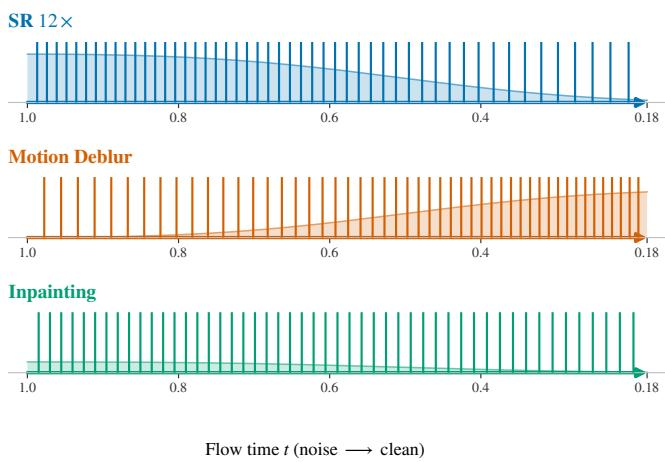  
Figure 7: Global SAS schedules for SR 12×, motion deblurring, and inpainting. Each vertical mark denotes one of the 50 solver times; colors distinguish the degradation operators, and the translucent profile shows the normalized local density of the displayed times. Flow time proceeds from noise to clean.

## MPA spatial localization and bias strength

We use one 100-image FFHQ box-inpainting experiment to distinguish spatially meaningful conflict guidance from a generic increase in attention bias, and to examine sensitivity to the bias strength β. All variants use FLAIR, Global SAS with λ = 1, 50 NFEs, $\tau = 0 . 1 5 , v _ { \mathrm { m a x } } = 1 , \gamma = 0 . 7 .$ a $9 \times 9$ pooling kernel, missing-region queries, completed solver steps 2–35, and all transformer layers.

At the default $\beta = 4$ , we compare:

1. No MPA: the attention bias is disabled.

2. Correct: use the conflict heatmap in Equation (37).

3. Shufled: deterministically permute the heatmap values within the known region for each image and active step, preserving its histogram and total mass but destroying spatial correspondence.

4. Uniform: replace all known-region values by their spatial mean,

$$
c _ { s } ^ { \mathrm { u n i } } = m _ { \mathrm { k n o w n } } \frac { \sum _ { j } c _ { s , j } } { \sum _ { j } m _ { \mathrm { k n o w n } , j } } ,\tag{51}
$$

preserving support and total heatmap mass while removing localization.

The spatial controls test whether MPA benefits from where the conflict occurs, rather than merely from adding a positive key-side bias. We separately evaluate bias-strength sensitivity with the correct heatmap for $\beta \in \{ 0 , 2 , 3 , \bar { 4 } , 6 \}$ . The $\beta = 0$ endpoint is equivalent to disabling MPA; all positive values use the same heatmap, threshold, normalization, pooling, query gate, active steps, and layers. Figure 8 reports all four restoration metrics as functions of β, keeping the strength analysis separate from the spatial controls.

<table><tr><td>Heatmap</td><td>β</td><td>PSNR↑</td><td>SSIM ↑</td><td>LPIPS↓</td><td>FID↓</td></tr><tr><td>None</td><td>0</td><td>23.52</td><td>0.8500</td><td>0.1692</td><td>32.44</td></tr><tr><td>Correct</td><td>4</td><td>23.89</td><td>0.8529</td><td>0.1655</td><td>32.15</td></tr><tr><td>Shuffled</td><td>4</td><td>23.88</td><td>0.8528</td><td>0.1654</td><td>32.41</td></tr><tr><td>Uniform</td><td>4</td><td>23.83</td><td>0.8526</td><td>0.1660</td><td>32.08</td></tr></table>

Table 7: MPA spatial controls for FLAIR on 100 FFHQ boxinpainting images. Correct, shufled, and uniform heatmaps all use $\beta = 4$ and preserve the remaining MPA settings. Bold denotes the best result in each column.

The correct heatmap gives the highest PSNR and SSIM, while the shufled and uniform controls are close and give the best LPIPS and FID, respectively. Thus spatially matched conflict guidance is most evident in the fidelity metrics under this 100-image protocol. In the strength sweep, $\beta = 4$ achieves the best PSNR, LPIPS, and FID; the small further

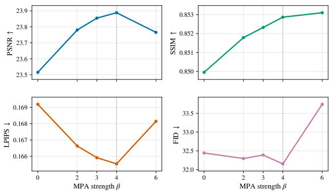  
Figure 8: MPA bias-strength sensitivity with the correct heatmap on 100 FFHQ box-inpainting images using FLAIR and Global SAS with $\lambda = 1$ . The four panels report PSNR, SSIM, LPIPS, and FID over $\beta \in \{ 0 , 2 , \bar { 3 } , 4 , 6 \} ; \bar { \beta } = 0$ is the no-MPA endpoint.

SSIM gain at $\beta = 6$ is accompanied by worse values for the other three metrics.

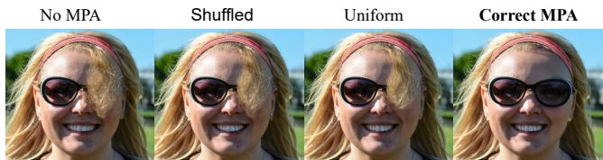  
Figure 9: Layout for the MPA spatial-control comparison. The final figure should show the key-side heatmap, reconstruction, and enlarged missing-region crop for the same input and seed. This placeholder must be replaced with experimental outputs before submission.

## Runtime, memory, and NFE accounting

Table 9 separates computational overhead from reconstruction quality. We benchmark FLAIR with batch size one on SR 8×, SR 12×, motion deblurring, and box inpainting using an NVIDIA RTX 4090. For each setting, runtime is averaged over the same 10 FFHQ images. Model loading, image I/O, and metric computation are excluded; CUDA is synchronized before and after each reconstruction, and three warm-up trials are discarded. Peak allocated memory is reset before every measured image, and we report the maximum of the 10 per-image peaks. All variants use the same 50 flow-model evaluations.

Across all four tasks, SAS changes runtime by only −0.02 to +0.14 seconds per image and leaves peak memory unchanged at the reported precision. The measurable overhead comes from MPA: Full adds 3.44–3.60 seconds per image and approximately 0.54 GiB of peak memory, while preserving the 50-NFE budget. The small signed diferences for SAS are within the run-to-run variation of this timing protocol.

## Additional Inpainting Results

Figure 10 provides further qualitative evidence for the inpainting behavior discussed in the main paper. Under matched observations, seeds, and the same 50-NFE budget, the proposed components more consistently preserve instance-specific semantic and structural cues across the masked boundary, rather than allowing the completion to drift toward a generic solution favored by the prior. These examples reinforce that the improvement extends beyond pixel fidelity to semantic and structural consistency within the missing region.

## Sensitivity to the SAS strength λ

We examine the density-strength parameter using FLAIR on 100 FFHQ 8× super-resolution images. All variants use the same images, measurements, seeds, 50-NFE budget, and numerical schedule construction, with MPA disabled. We vary only $\lambda \in \{ 0 , 0 . 5 , 1 , 2 , 4 \}$ in $1 + \lambda D _ { \mathcal { A } } ( t )$ and hold all host-solver settings fixed. Because these are test images, we report sensitivity rather than use them for hyperparameter selection.

<table><tr><td>λ</td><td>PSNR ↑ SSIM↑</td><td>LPIPS ↓ FID↓</td></tr><tr><td>0</td><td>29.67 0.8067</td><td>0.4481 116.77</td></tr><tr><td>0.5</td><td>29.74 0.8094</td><td>0.4407 116.79</td></tr><tr><td>1</td><td>29.80 0.8116</td><td>0.4348 117.28</td></tr><tr><td>2</td><td>29.85 0.8134</td><td>0.4278 117.04</td></tr><tr><td>4</td><td>29.93 0.8163</td><td>0.4190 117.14</td></tr></table>

Table 8: Sensitivity to the SAS strength on 100 FFHQ 8× super-resolution images using FLAIR, 50 NFEs, and no MPA. Bold denotes the best result in each column.

Increasing λ steadily improves PSNR, SSIM, and LPIPS over the tested range, while FID varies by only 0.51 without a monotonic trend. These results show that stronger operatoraware allocation has a consistent but gradual efect on the perimage metrics rather than introducing an abrupt operating point.

## Statistical reporting for 100-image experiments

For each comparison, we form 100 paired per-image differences using the same images, measurements, and seeds. We resample these 100 pairs with replacement 10,000 times (seed 2027) and report the observed mean diference with the 2.5th and 97.5th percentiles as a paired 95% bootstrap confidence interval. For PSNR and SSIM, the diference is Ours minus baseline; for LPIPS, it is baseline minus Ours, so positive values always indicate improvement. An interval excluding zero is treated as significant at the 5% level. FID is reported only as a set-level metric because 100 samples do not provide a reliable per-image significance test.

## F Computational Overhead

SAS is computed once per operator and does not evaluate the flow model. Its spectral calculations are analytic for superresolution and inpainting and use one FFT of the blur kernel for motion deblurring. The one-dimensional schedule construction is performed on an 8192-point grid.

MPA reuses the prior and data-consistent estimates already produced by the host solver. Constructing the conflict gate costs $O ( n d _ { z } )$ for n image tokens and latent width $d _ { z }$ . Equation (38) adds one feature to each query and key, changing a head’s dot-product cost from $O ( n ^ { 2 } d _ { h } )$ to $O [ n ^ { \mathbf { \bar { 2 } } } ( d _ { h } + \mathbf { \bar { 1 } } ) ]$ It does not materialize the outer product, does not add a transformer call, and introduces no additional flow-model evaluations. Both components preserve the fixed NFE budget.

<table><tr><td>Task</td><td>Variant</td><td>Time (∆Time)</td><td>GPU memory</td></tr><tr><td>SR 8×</td><td>Base</td><td>23.79</td><td>15.89</td></tr><tr><td>SR 8×</td><td>+SAS</td><td>23.78 (0.00)</td><td>15.89</td></tr><tr><td>SR 8×</td><td>+MPA</td><td>27.23 (+3.44)</td><td>16.43</td></tr><tr><td>SR 8×</td><td>Full</td><td>27.24 (+3.45)</td><td>16.43</td></tr><tr><td>SR 12×</td><td>Base</td><td>23.81</td><td>15.89</td></tr><tr><td>SR 12×</td><td>+SAS</td><td>23.78 (−0.02)</td><td>15.89</td></tr><tr><td>SR 12×</td><td>+MPA</td><td>27.20 (+3.39)</td><td>16.43</td></tr><tr><td>SR 12×</td><td>Full</td><td>27.25 (+3.44)</td><td>16.43</td></tr><tr><td>Motion deblur</td><td>Base</td><td>32.27</td><td>15.88</td></tr><tr><td>Motion deblur</td><td>+SAS</td><td>32.37 (+0.10)</td><td>15.88</td></tr><tr><td>Motion deblur</td><td>+MPA</td><td>35.89 (+3.63)</td><td>16.42</td></tr><tr><td>Motion deblur</td><td>Full</td><td>35.87 (+3.60)</td><td>16.42</td></tr><tr><td>Inpainting</td><td>Base</td><td>22.70</td><td>15.89</td></tr><tr><td>Inpainting</td><td>+SAS</td><td>22.84 (+0.14)</td><td>15.89</td></tr><tr><td>Inpainting</td><td>+MPA</td><td>26.08 (+3.38)</td><td>16.43</td></tr><tr><td></td><td>Full</td><td>26.14 (+3.44)</td><td>16.43</td></tr><tr><td>Inpainting</td><td></td><td></td><td></td></tr></table>

Table 9: Runtime and peak allocated GPU memory for FLAIR on 10 FFHQ images per setting. Times are seconds per image; each parenthesized change is measured relative to the corresponding Base row. Full denotes SAS+MPA, and all variants use 50 NFEs.

## G Limitations of the Analysis

The trajectory result in Proposition 3 is a first-order discretization bound and does not prove that the proposed demand equals the exact local error of a nonlinear latent inverse solver. The link to SAS is conditional on an explicit operator-aware dificulty model. Likewise, the MPA analysis characterizes the attention redistribution but does not by itself guarantee improvement in the final decoded image. Their role is to establish the direction, selectivity, and stability of the intervention; the controlled experiments evaluate whether those properties improve restoration in practice.

## H Inpainting Failure Case

The remaining failures tend to occur near complex mask boundaries where multiple visually similar contours overlap or intersect. Because the missing region removes the connections between observed contour fragments, several continuations may remain plausible, making it dificult to associate each fragment with its correct counterpart. The full method may consequently merge or misconnect these contours even when the overall completion remains semantically plausible. Figure 11 shows a representative example of this boundary ambiguity.

Input  
GT  
FlowLPS  
FlowLPS+Ours  
FLAIR  
FLAIR+Ours  
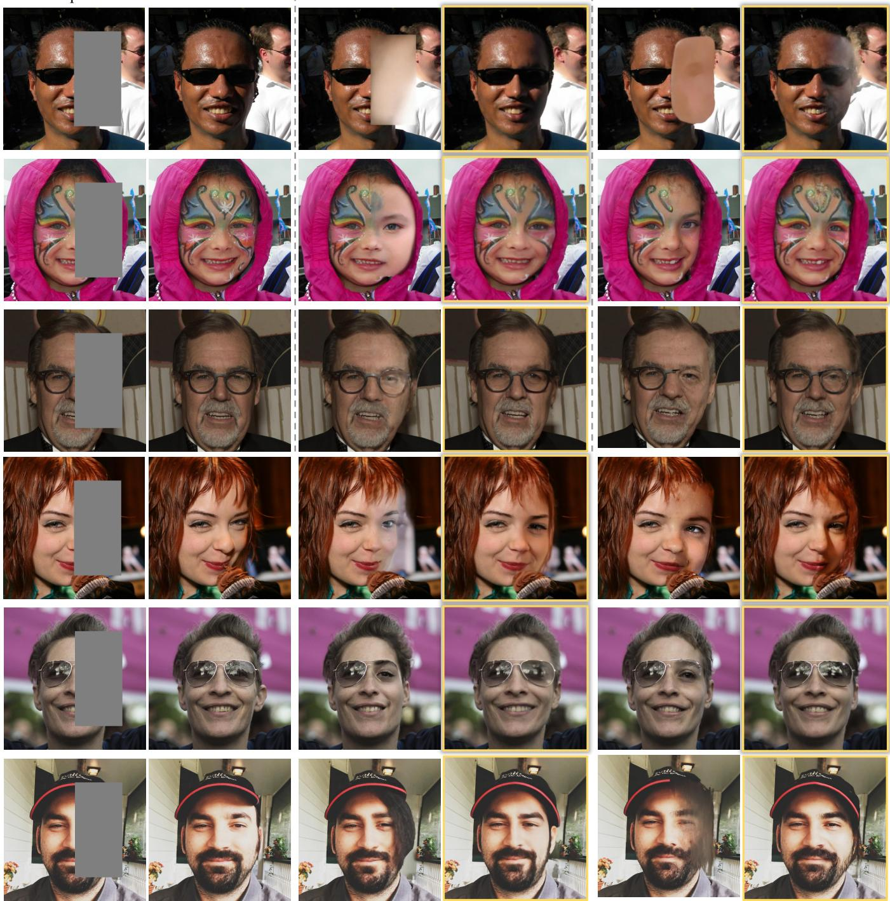  
Figure 10: Additional qualitative results on FFHQ box inpainting. Under the same observations, seeds, and NFE budget, the proposed components more consistently preserve instance-specific semantic and structural cues across the masked boundary, reinforcing the inpainting observations in the main paper.

Input  
GT  
FlowLPS  
FlowLPS+Ours  
FLAIR  
FLAIR+Ours  
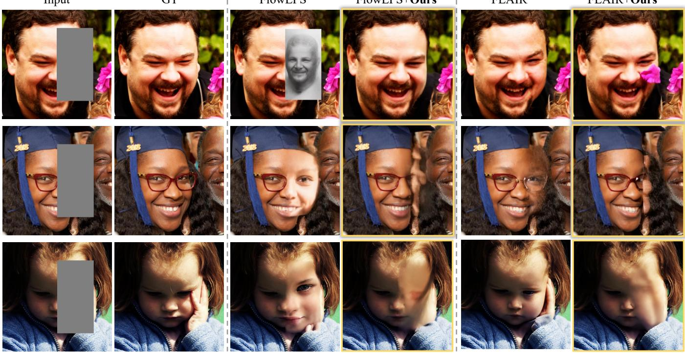  
Figure 11: Qualitative failure case on FFHQ box inpainting. Columns show the target, masked observation, host baseline, and full method for the same image and seed. When several similar contours overlap near the masked boundary, the full method can produce a plausible but incorrect contour association inside the missing region.