# Measuring Browser Webcam Gaze Honestly: A Capture-Clock Methodology and Open Reference Implementation

Chi-Sheng Chen1 and Gabriel A. Brat1,2 m50816m50816@gmail.com, gbrat@bidmc.harvard.edu

1 Department of Surgery, Beth Israel Deaconess Medical Center, Harvard Medical School, Boston, MA, USA

2 Department of Biomedical Informatics, Harvard Medical School, Boston, MA, USA

Abstract. Browser-based webcam gaze trackers are increasingly used for crowd-scale data collection and in clinical settings where lab eye trackers are impractical, but the reported latency numbers may not represent real world functionality. The common practice of timestamping each gaze sample when it is emitted, rather than when its source frame was captured, makes the measured inference latency read about 0 ms no matter how slow the engine really is. We show how to measure it honestly, recovering a per-frame capture clock from the browser’s requestVideo-FrameCallback (rVFC) API (captureTime where the browser exposes it for local camera streams, else presentationTime, in which case every recovered latency is a verifiable lower bound): exact source-frame pairing through a per-frame queue for engines that expose their inference pipeline, and a further lower bound for engines that do not, such as WebGazer. We release an open TypeScript implementation and benchmark harness, demonstrated on two interchangeable engines: WebGazer and a new FaceMesh+KRR pipeline.

On commodity hardware (N = 1), correct timestamping raises the reported inference latency from about 0 ms to a 22–34 ms median (27– 52 ms p95), a 20–50 ms gap that is enough to change whether a 50 ms interactive-latency budget is met. The harness also separates two notions of precision that aggregate error conflates: the spatial spread of a fixation cluster and its temporal jitter. Cross-engine accuracy diferences sit within the $\sim 4 . 6 ^ { \circ }$ between-run variability band our ablation surfaces, so we treat them as observations, not a ranking. Finally, we feed the webcam gaze into a published clinical weak-supervision pipeline (GazeMedSeg on Kvasir-SEG) held fixed end-to-end: expert eye-tracker gaze trains a usable polyp segmenter (Dice 0.68) and our non-expert webcam gaze does not (Dice ≈ 0) — an upper bound on the hardware-only penalty, since annotator expertise changes along with the hardware. At the accuracy we measure, fine lesion labelling is out of reach. A multi-user replication is in preparation.

Keywords: Webcam eye tracking · Latency measurement · Weakly-supervised segmentation · Reproducibility.

## 1 Introduction

Browser-based webcam-gaze tracking is the only deployable option for two classes of application: crowd-scale collection of gaze data without supplying hardware [13,7], and embedded settings such as reviewing surgical video on a hospital laptop where infrared eye trackers are budgetarily or operationally out of reach. WebGazer [7] fits a ridge regression from raw eye-patch pixels to screen coordinates and remains the standard baseline a decade later. It underpins downstream work on gaze-prompted segmentation [11,5,14] that itself relies on lab eye trackers for the gaze signal.

Less recognised is that the measurement of these systems is easy to get wrong. A browser gaze pipeline routes samples across several asynchronous stages (video decoder, inference loop, rendering pipeline), and common practice timestamps each sample at the emit site with performance.now(), reporting inference latency as the gap between that timestamp and a captured-frame timestamp that was never recorded; the missing value defaults to the emit timestamp, so the reported latency comes out near zero. We hit this bug twice in our own code while collecting data for this paper (§3.4).

The fix is to recover a per-frame capture clock from the browser’s requestVideoFrameCallback (rVFC) API, which fires once per decoded video frame with per-frame metadata: a captureTime (the camera capture timestamp, exposed for local camera streams) and a presentationTime (when the decoded frame was submitted for compositing). Our implementation prefers captureTime and falls back to presentationTime, recording which clock served each run; under the fallback, every recovered latency is a verifiable lower bound on the capture-referenced quantity (§3.2). For engines that expose their inference pipeline at per-frame granularity, such as our FaceMesh+KRR engine, we keep a FIFO queue of frame timestamps and pair every gaze sample with the exact source frame it was computed from. For engines that hide the frame queue (such as WebGazer), we record the most recent frame’s timestamp as a further lower bound on inference latency (§3.3).

This paper makes three contributions:

(C1) A capture-clock methodology for browser webcam gaze that recovers per-frame inference latency via rVFC, with exact pairing for queue-exposing engines and a documented lower-bound approximation for opaque engines (§3).

(C2) An open TypeScript reference implementation and benchmark harness on two interchangeable engines (WebGazer baseline; a new FaceMesh+KRR pipeline), with an analysis suite released in source (§3.4).

(C3) Findings the methodology produces on commodity hardware (§4): the 20–50 ms gap between the naive timestamp (≈ 0 ms) and the corrected median (22–34 ms); a split between the spatial spread of a fixation cluster and its within-fixation velocity; and a downstream probe (§5) feeding the webcam gaze into a published clinical weak-supervision pipeline, where expert eye-tracker gaze trains a usable polyp segmenter (Dice 0.68) and commodity webcam gaze does not $( \approx 0 )$ . Cross-engine accuracy diferences fall within the $\sim 4 . 6 ^ { \circ }$ between-run variability band we observe (§C), so we hold of ranking the engines on accuracy.

Scope. The findings come from a single-user evaluation (N = 1, four runs in one session). The within-subject engine comparison is robust at this N, but the spatial-structure result needs a multi-user replication, which is in preparation, as is a clinical pilot on surgical-video annotation [10], the pipeline’s motivating application.

## 2 Related work

Browser webcam gaze and latency. WebGazer [7] introduced the ridge-regressionfrom-eye-patches pipeline used by virtually all subsequent browser-gaze work, including TurkerGaze [13]; its headline single-user accuracy (4–5◦) is far better than the as-deployed 8–11◦ our evaluation finds (§4.2). MediaPipe FaceMesh [4] provides per-frame iris landmarks and is an obvious feature source for a successor pipeline, but to our knowledge has not been paired with kernel ridge regression and a published benchmark harness in open source. On latency, the rVFC [12] API provides a per-frame capture and presentation timestamps, yet we are not aware of prior browser-gaze work that uses it for inference-latency measurement; standard practice remains a performance.now() timestamp at the gaze callback, which our methodology (§3) corrects. Our control-layer primitives (One-Euro [1], I-VT [9], smooth-pursuit calibration [8]) are standard in desk-mounted eye tracking but rarely composed in browser pipelines.

Gaze-prompted segmentation (motivating application). GazeSAM [11] demonstrates gaze-prompted SAM [6] using a Tobii Pro Nano; Zhong et al. [14] contribute the GazeMedSeg dataset and a weakly-supervised method that turns gaze points into Gaussian heatmaps for ensemble supervision, on Kvasir-SEG and NCI-ISBI; Gaze2Segment [5] integrated eye-tracking into volumetric segmentation. All rely on lab eye trackers and do not address the browser case; the present work is upstream of these, making the gaze signal itself deployable without specialised hardware.

## 3 Capture-clock methodology

## 3.1 The capture-clock problem

A browser webcam-gaze pipeline can be modelled as a sequence of asynchronous boundaries that each gaze sample must traverse:

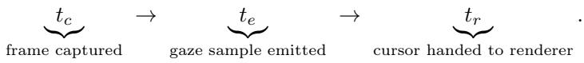

(1)

The natural measurements are inference latency $\ell _ { I } = t _ { e } - t _ { c }$ (how long the engine took to produce a gaze estimate from a captured frame) and pipeline latency $\ell _ { P } = t _ { r } - t _ { c }$ (capture to render-handof). We sample $t _ { r }$ in the next requestAnimationFrame callback, which runs before layout, paint, and compositor submission, so $\ell _ { P }$ is a lower bound on the user-visible (photon) latency: actual display adds compositing plus up to one display refresh, and a true photonto-photon measurement would need an external camera. Both quantities depend on a reliable value of $t _ { c } ,$ the source frame’s capture clock.

The browser webcam-gaze APIs we surveyed do not surface $t _ { c }$ to the gaze callback: WebGazer’s gaze callback returns $( x , y )$ only, leaving downstream code to read performance.now() itself at the callback site, which yields $t _ { e } ,$ not $t _ { c } .$ If that code then also treats $t _ { e }$ as a proxy for the missing $t _ { c } ,$ we get $\ell _ { I } = 0$ identically, and over thousands of samples the reported median and $p _ { 9 5 }$ inference latency are both 0 ms. The bug survives code review because an all-zero column looks innocuous (“the engine is fast”) rather than impossible.

## 3.2 Exact pairing via rVFC for queue-exposing engines

The requestVideoFrameCallback (rVFC) API fires a caller-supplied function once per decoded video frame, passing a metadata object with two clocks [12]: captureTime, the time the frame was captured by the camera (exposed for local getUserMedia streams), and presentationTime, the time the user agent submitted the decoded frame for composition. Let the frame clock τ be captureTime where the browser provides it and presentationTime otherwise. Since capture precedes presentation, $\tau \geq t _ { c } ^ { \mathrm { t r u e } }$ under the fallback, and any latency computed against $\tau$ is then a verifiable lower bound on the capture-referenced quantity; our implementation prefers captureTime, records which clock served each run in the exported header (capture\_clock\_source), and the runs reported in this paper used the presentationTime fallback, so their latencies carry this lowerbound reading. The reading is tight on this hardware: a 30 s, 900-frame probe on the collection rig (released as clock\_probe.html) puts presentationTime just 0.6 ms median behind captureTime (0.9 ms $p _ { 9 5 }$ , 1.7 ms max, with captureTime present on every frame), so the fallback understates the capture-referenced latencies by under 2 ms here. What remains is to pair each gaze sample with the specific frame that produced it.

When the engine exposes its inference loop the pairing can be made exact: we push the most-recent frame clock into a FIFO queue as each frame is handed to the engine, and dequeue the front when a gaze sample is emitted to tag it:

$$
t _ { c } ^ { ( k ) } = q _ { F } \bigl [ k \bigr ] , \qquad q _ { F } = \bigl [ \tau _ { i } \bigr ] _ { i } \in \mathrm { f r a m e s ~ p r o c e s s e d ~ s o ~ f a r } .\tag{2}
$$

If the engine processes frames in arrival order and emits one sample per frame, this recovers the source frame’s clock exactly, so $\ell _ { I }$ is the engine’s actual inference latency (up to the clock-reference caveat above). Our FaceMesh+KRR engine satisfies these conditions.

## 3.3 Lower-bound pairing for opaque engines

Many libraries expose no per-frame entry point: they take the <video> element at init and emit on their own schedule, with opaque queue depth and ordering, so q cannot be constructed (WebGazer is the main example).

In this regime we maintain a single scalar $\tilde { t } _ { c } ,$ the most recently observed frame clock, updated on every rVFC firing. At each gaze emission we tag the sample with the current $\tilde { t } _ { c }$

$$
\tilde { t } _ { c } = \operatorname* { m a x } \big \{ \tau _ { i } : i \leq \mathrm { n o w } \big \} .\tag{3}
$$

The actual source frame arrived at some earlier time $t _ { c } ^ { \mathrm { t r u e } } \leq \tilde { t } _ { c }$ (it can never have arrived after the moment the engine emitted a sample derived from it). Therefore:

$$
\tilde { \ell } _ { I } = t _ { e } - \tilde { t } _ { c } \leq t _ { e } - t _ { c } ^ { \mathrm { t r u e } } = \ell _ { I } ^ { \mathrm { t r u e } } .\tag{4}
$$

The reported $\tilde { \ell } _ { I }$ is a verifiable lower bound on the true inference latency. Its slack is the engine’s efective queue depth d times the frame interval $( d \times 3 3$ ms at 30 Hz); WebGazer’s d is not observable from outside the library, so we do not bound the slack — the number is a floor, not an estimate. We report it alongside the FaceMesh column in §4.2, marked with †.

## 3.4 Benchmark harness and analysis suite

The harness collects samples under two protocols. Sweep presents targets on a full-screen 16×8 grid (128 cells) row-major with a 3 s dwell. Drift draws a random N =10 subset from a coarser 12×8 grid (2 s dwell, idle gaps), so calibration decay shows up as a slope of per-target error against wall-clock time. For every sample the harness records $\left( t _ { c } , t _ { e } , t _ { r } \right)$ plus target and gaze coordinates; $t _ { r }$ is sampled in the next requestAnimationFrame callback after the cursor’s DOM update, i.e. at hand-of to the rendering pass, before paint and composite (§3.1). The CSV export carries a header block of aggregate metrics — including which rVFC clock served as $t _ { c }$ (capture\_clock\_source) — followed by per-sample rows.

The analysis suite computes the per-cell mean-error heatmap, the 3×3 region partition [9], the within-fixation velocity distribution, and the linear drift slope.

Catching the bug in our own code. We hit this collapse twice. The FaceMesh engine first passed performance.now() for both $t _ { e }$ and $t _ { c } ,$ reporting 0.00 ms median inference latency over 7 720 samples; sourcing $t _ { c }$ from the rVFC queue (§3.2) raised it to $2 2 / 2 7$ ms median $/ p _ { 9 5 }$ . The WebGazer path still read 0 ms after that fix until we applied the lower-bound loop of §3.3 (34/52 ms). The pattern is detectable only once the methodology is in place.

Reference implementation (C2). We release an open TypeScript single-page application implementing the methodology on two interchangeable engines behind a common gaze-callback contract (Fig. 4, appendix): the new FaceMesh+KRR engine, which maps a 13-dimensional MediaPipe-landmark feature vector [4] to screen coordinates with an RBF kernel ridge regressor [2], and the WebGazer baseline [7] (ridge regression on eye-patch pixels), which exposes no per-frame timestamp and so takes the lower-bound pairing of §3.3. Both feed a control layer (One-Euro smoothing [1], I-VT fixation classification [9], dwell-clicks) and share one smooth-pursuit calibration, so comparisons difer only in the engine. Full feature definitions, parameters, and file paths are in the released code and Appendix A.1.

## 4 Empirical findings

## 4.1 Protocol

We evaluate both engines on both tasks (sweep, drift), giving four runs, all from a single user $( N = 1 )$ in one session under fixed lighting, posture, viewing distance (60 cm), and window geometry: a full-screen-width browser window of 1890 × 1071 CSS px on a 14-inch MacBook Pro (M4, 2024; 30.24 cm-wide panel, integrated webcam), i.e. the 1512-pt scaled desktop at 80% browser zoom, so 1890 CSS px span the panel width and 1 cm = 62.5 CSS px. Angular quantities use the exact conversion $\theta ( e ) = \arctan \left( e / ( 6 2 . 5 \mathrm { p x / c m } \times 6 0 \mathrm { c m } ) \right)$  for a pixel distance $e ~ ( 1 ^ { \circ } \approx 6 5 . 5 $ px near the screen centre); per-sample errors in the released CSVs are in pixels, so any reader can re-derive the angles under a diferent geometry. One start-of-session pursuit calibration is shared, with no recalibration between runs. The four runs were executed in a fixed order (WebGazer sweep, FaceMesh sweep, WebGazer drift, FaceMesh drift) without counterbalancing, separated by short rests. The within-subject design removes between-user variance, and the ablation (§C) surfaces $\mathrm { a \sim 4 . 6 ^ { \circ } }$ between-run variability band under a filter-parameter sweep — an imperfect proxy for a replicate-based noise floor (§C) that we use only conservatively, to refrain from ranking. We read the differences below against that band.

## 4.2 Finding 1: a 20–50 ms latency gap between honest and naive measurement

Table 1 reports the headline metrics under the capture-clock methodology of §3; the inference-latency columns are the central finding. Under exact pairing FaceMesh+KRR reports 22.0–22.8 ms median (26.8–27.0 ms p95); under lowerbound pairing WebGazer reports 32.8–34.0 ms median (50.6–52.0 ms $p _ { 9 5 } )$ . A naive implementation reports all of these as ≈ 0 ms, a 20–50 ms gap large enough to decide whether a 50 ms interactive-latency target is met. FaceMesh’s p95 pipeline latency (27–28 ms) clears it on 30 Hz video; WebGazer’s lower bound already exceeds the budget at 51–52 ms p95, so its true latency fails it by at least that margin.

Table 1: Cross-engine evaluation, all four runs $( N = 1 )$ ; bold marks the better value per task, as a reading aid only — accuracy diferences fall within the between-run variability band (§4.1) and we do not rank the engines. † WebGazer latency uses the lower-bound capture clock (§3.4). Region columns are mean error in the central / corner thirds of a 3×3 partition; a dash marks buckets unsampled in drift’s random subset.
<table><tr><td>Engine</td><td>Task</td><td>Mean°</td><td>Med°</td><td>Hit %</td><td> $\mathrm { C e n . / C o r . } ^ { \circ }$ </td><td></td><td> $\mathrm { J i t . } ^ { \circ }$ </td><td> ${ v _ { p 9 9 } } ^ { \circ } / \mathrm { s }$ </td><td>Inf. p95 ms</td><td>Pipe. p95 ms</td></tr><tr><td>WebGazer</td><td>sweep</td><td>11.11</td><td>11.21</td><td>1.56</td><td> $8 . 5 9 \ / \ 1 1 . 9 4$ </td><td></td><td>2.24</td><td>41.8</td><td>52.0†</td><td>52.2†</td></tr><tr><td>FaceMesh+KRR</td><td>sweep</td><td>8.05</td><td>7.88</td><td>2.34</td><td> ${ \bf 4 . 4 2 \ / \ 9 . 6 8 }$ </td><td></td><td>2.49</td><td>65.8</td><td>27.0</td><td>27.3</td></tr><tr><td>WebGazer</td><td>drift</td><td>11.09</td><td>10.56</td><td>0.00</td><td> $- / 1 1 . 5 1$ </td><td></td><td>1.83</td><td>40.7</td><td>50.6†</td><td>51.0†</td></tr><tr><td>FaceMesh+KRR</td><td>drift</td><td>6.50</td><td>5.74</td><td>20.00</td><td> ${ \bf 4 . 7 1 } \ / \ { \bf 8 . 8 7 }$ </td><td></td><td>4.33</td><td>145.7</td><td>26.8</td><td>27.4</td></tr></table>

Accuracy. FaceMesh’s mean error is $3 . 1 ^ { \circ }$ (sweep) and $4 . 6 ^ { \circ }$ (drift) lower than WebGazer’s. Both diferences sit inside the $\sim 4 . 6 ^ { \circ }$ between-run variability band the ablation surfaces (§C), so at $N = 1$ they are a property of this session. The grid-resolution study (§B, appendix) reinforces this: the apparent ordering reverses when each engine uses its own default calibration, so the winner depends on the calibration each engine happened to use. Neither engine reaches sub- $\cdot 2 ^ { \circ }$ accuracy at full grid density, and both behave as region-prompting signals.

Hit rate (per-cell centroid-in-cell criterion, Appendix A.1) is low for both on the sweep task, where a 16×8 grid demands landing in a ${ \sim } 1 . 8 ^ { \circ } { \times } 2 . 0 ^ { \circ }$ cell; on the drift task FaceMesh reaches 20.0% while WebGazer stays at 0%. Calibration drift is not measurable over our 4.5 min sessions (both show a slight negative error-vs-time slope, consistent with posture settling rather than model decay).

## 4.3 Findings 2–3: precision and per-cell error structure

Spatial spread and within-fixation jitter come apart. The engines are indistinguishable in spatial spread (radial p95 $6 . 1 3 ^ { \circ }$ vs. 6.21◦), yet within-fixation $v _ { p 9 9 }$ difers 1.6–3.5×, and the per-cell error structure difers qualitatively (FaceMesh radial, WebGazer diagonal). Both diferences fall within the same $\sim 4 . 6 ^ { \circ }$ variability band as the accuracy figures above, with the full analysis in Appendix $\mathrm { A . 7 } .$

## 5 Downstream utility: gaze-prompted polyp segmentation

The sections so far measure the gaze signal in isolation; we now ask whether commodity webcam gaze is useful as a weak supervision label, or a lab eye tracker remains a hard requirement. We test this directly against GazeMed-Seg [14], the MICCAI 2024 work that released expert EyeLink gaze annotations for medical-image segmentation and a weakly-supervised pipeline that turns them into masks.

## 5.1 Protocol

GazeMedSeg’s pipeline consumes per-image fixations $( x , y ,$ , duration), convolves them into a gaze heatmap (isotropic Gaussian, $\sigma { = } 7 0 \mathrm { p x } )$ , applies hierarchical thresholds and a dense CRF to derive pseudo-masks, and trains a 2-level ensemble of from-scratch 2D U-Nets (2242) supervised only by those masks; Dice is evaluated against ground truth on a held-out test set. On Kvasir-SEG [3] (polyp endoscopy; 900 train, 100 test) their expert gaze, collected on an SR Research EyeLink 1000 $( 1 0 0 0 \mathrm { H z } , \leq 0 . 5 ^ { \circ } )$ , reaches 77.80 Dice, 94.8% of the 82.12 fullmask upper bound and ahead of bounding-box (73.33) and point (73.05) labels. Polyps vary widely in size and position (Fig. 9, appendix), which a localisationonly weak label must capture.

We hold the downstream pipeline fixed and swap the gaze CSV it consumes. A single non-expert annotator free-views each image $( \sim 6 \mathrm { s ) }$ on the same laptop’s webcam, and the online I-VT classifier (§3.4) emits one fixation per episode in GazeMedSeg’s exact CSV schema. The screen shows no gaze cursor or feedback, preventing the viewer from chasing a displayed estimate. That CSV replaces the EyeLink CSV with every downstream stage unchanged. The swap necessarily changes more than the tracker: GazeMedSeg’s gaze was collected from annotators experienced with medical images under a locate-then-scan instruction, whereas our arm is a non-expert free-viewing with webcam-grade calibration and online I-VT fixation extraction. The comparison is therefore expert EyeLink collection vs. our non-expert webcam collection through an identical training pipeline, not an isolated hardware manipulation; §5.2 reads the result accordingly.

We feed each gaze source through the unchanged pipeline and report the downstream test Dice alongside the weak-label quality that drives it; our $4 ^ { - 7 ^ { \circ } }$ accuracy (§B) already predicts a poor weak label, and the experiment quantifies how poor, and why.

## 5.2 Results: webcam gaze fails as a weak label

We ran the full GazeMedSeg pipeline on an RTX 3090, training the 2-level U-Net separately on each gaze source’s pseudo-masks (15k iterations, $b s { = } 4$ , identical otherwise). Swapping the gaze CSV flips the outcome (Table 2): expert EyeLink gaze yields a usable segmenter (test Dice 0.679) while our commodity webcam gaze does not (≈ 0.000 at every checkpoint). Training loss was near-identical in both runs, so the webcam model fits its pseudo-masks; it simply learns the wrong region.

The collapse follows the weak-label chain. Webcam fixations land inside the polyp only 17% of the time (median) versus 90% for EyeLink, with ${ \sim } 7 \times$ the per-image scatter, so the heatmaps hit the polyp far less often (peak inside 32% vs. 89%; Figs. 1–3, appendix). The resulting pseudo-masks overlap ground truth at Dice 0.12–0.17 (webcam) against 0.75–0.78 (EyeLink). That training ceiling is already near-useless, and the downstream score is exactly zero because the sparse, of-target level-1 foreground collapses to all-background and drags the two-level logit average below threshold. We read this as the failure of this non-expert, free-viewing webcam collection under the unchanged pipeline. Because annotator expertise and viewing instruction change along with the tracker (§5.1), the observed gap is an upper bound on the hardware-only penalty what it establishes is that at $4 ^ { - 7 ^ { \circ } }$ error a commodity tracker gives a coarse region prompt, well short of a lesion-level label; isolating the pure hardware effect needs a protocol-matched collection, which the multi-user replication will include.

Table 2: Downstream Kvasir-SEG segmentation under an identical weaklysupervised pipeline, swapping only the gaze source (RTX 3090, bs=4, 15k iters). Paper rows are GazeMedSeg’s reported bs=8 numbers [14].
<table><tr><td>Weak-label source</td><td>fix-in-polyp pseudo-mask Dice test Dice (median) vs GT (L1/L2)</td><td></td></tr><tr><td>EyeLink-1000 (control, bs=4)</td><td>0.90 0.17</td><td>0.75 / 0.78 0.679 ≈0.000</td></tr><tr><td>Webcam (ours, bs=4)</td><td></td><td>0.12 / 0.17</td></tr><tr><td>EyeLink (paper, bs=8) [14] Full-mask upper bound [14]</td><td></td><td>0.778 0.821</td></tr></table>

Caveats. We trained at bs=4 (a VRAM concession) equally for both arms, so the within-experiment contrast is internally consistent, though our in-house EyeLink control (0.679) sits below GazeMedSeg’s bs=8 result (0.778) and is an internal reference, not a reproduction. The arms confound hardware with annotator expertise and viewing instruction (§5.1), so the gap is an upper bound on the hardware-only penalty. 36 of 900 webcam train images yielded no usable pseudomask and were excluded from the webcam arm’s training set (EyeLink had full coverage), which if anything favours the webcam arm. Both arms were trained with a single seed; multi-seed runs are part of the planned replication.

## 6 Discussion

Where the contribution lies. None of the components we compose is novel in isolation. The novelty is at the measurement layer (§3), and it holds even when the engine is superseded. The main threat to the empirical findings is N = 1: the within-task cross-engine comparison is a strict within-subject design defensible at this N, but the spatial-structure result could reflect one user’s head pose, so a multi-user replication (N =5 on the released SPA) is in preparation.

Deployment and privacy. Lowering the hardware barrier extends gaze-prompted segmentation toward multi-annotator deployments, but only for coarse regionlevel prompting (§5); the released pipeline processes frames in-browser and persists only (x, y) coordinates, and we recommend opt-in sessions with a visible in-use indicator.

## 7 Conclusion

We presented a way to recover browser webcam-gaze latency from a per-frame capture clock (C1) — rVFC captureTime where available, with every fallback explicitly reported as a lower bound — with exact pairing for queue-exposing engines and a further verifiable lower bound for opaque ones. We released an open TypeScript implementation (C2) and reported the findings it makes visible (C3): a 20–50 ms latency gap, a precision split, and a clinical downstream result where, with a published weak-supervision pipeline held fixed, expert eye-tracker gaze trains a usable polyp segmenter (Dice 0.68) and our non-expert webcam collection does not (≈ 0) — an upper bound on the hardware-only penalty. A multi-user replication and an end-to-end clinical evaluation on surgical video are in preparation.

## References

1. Casiez, G., Roussel, N., Vogel, D.: One-Euro filter: A simple speed-based lowpass filter for noisy input in interactive systems. In: Proceedings of the SIGCHI Conference on Human Factors in Computing Systems (CHI). pp. 2527–2530 (2012). https://doi.org/10.1145/2207676.2208639, original title uses the euro currency symbol as the “1”-sufix; spelled-out form used here.

2. Hofmann, T., Schölkopf, B., Smola, A.J.: Kernel methods in machine learning. The Annals of Statistics 36(3), 1171–1220 (2008). https://doi.org/10.1214/ 009053607000000677

3. Jha, D., Smedsrud, P.H., Riegler, M.A., Halvorsen, P., de Lange, T., Johansen, D., Johansen, H.D.: Kvasir-SEG: A segmented polyp dataset. In: MultiMedia Modeling (MMM). Lecture Notes in Computer Science, vol. 11962, pp. 451–462. Springer (2020). https://doi.org/10.1007/978-3-030-37734-2\_37

4. Kartynnik, Y., Ablavatski, A., Grishchenko, I., Grundmann, M.: Real-time facial surface geometry from monocular video on mobile GPUs. In: CVPR Workshop on Computer Vision for Augmented and Virtual Reality (CV4ARVR) (2019), arXiv:1907.06724

5. Khosravan, N., Celik, H., Turkbey, B., Cheng, R., McCreedy, E., McAulife, M., Bednarova, S., Jones, E., Chen, X., Choyke, P.L., Wood, B.J., Bagci, U.: Gaze2Segment: A pilot study for integrating eye-tracking technology into medical image segmentation. In: Medical Computer Vision and Bayesian and Graphical Models for Biomedical Imaging (MCV & BAMBI), MICCAI 2016 International Workshops, Revised Selected Papers. pp. 94–104. Springer (2017). https: //doi.org/10.1007/978-3-319-61188-4\_9

6. Kirillov, A., Mintun, E., Ravi, N., Mao, H., Rolland, C., Gustafson, L., Xiao, T., Whitehead, S., Berg, A.C., Lo, W.Y., Dollár, P., Girshick, R.: Segment anything. In: Proceedings of the IEEE/CVF International Conference on Computer Vision (ICCV). pp. 4015–4026 (2023)

7. Papoutsaki, A., Sangkloy, P., Laskey, J., Daskalova, N., Huang, J., Hays, J.: WebGazer: Scalable webcam eye tracking using user interactions. In: Proceedings of the 25th International Joint Conference on Artificial Intelligence (IJCAI). pp. 3839–3845 (2016)

8. Pfeufer, K., Vidal, M., Turner, J., Bulling, A., Gellersen, H.: Pursuit calibration: Making gaze calibration less tedious and more flexible. In: Proceedings of the 26th Annual ACM Symposium on User Interface Software and Technology (UIST). pp. 261–270 (2013). https://doi.org/10.1145/2501988.2501998

9. Salvucci, D.D., Goldberg, J.H.: Identifying fixations and saccades in eye-tracking protocols. In: Proceedings of the Symposium on Eye Tracking Research and Applications (ETRA). pp. 71–78 (2000). https://doi.org/10.1145/355017.355028

10. Twinanda, A.P., Shehata, S., Mutter, D., Marescaux, J., de Mathelin, M., Padoy, N.: EndoNet: A deep architecture for recognition tasks on laparoscopic videos. IEEE Transactions on Medical Imaging 36(1), 86–97 (2017). https://doi.org/ 10.1109/TMI.2016.2593957, the Cholec80 dataset was introduced in this paper

11. Wang, B., Aboah, A., Zhang, Z., Pan, H., Bagci, U.: GazeSAM: Interactive image segmentation with eye gaze and segment anything model. In: Proceedings of The 2nd Gaze Meets ML Workshop. Proceedings of Machine Learning Research, vol. 226, pp. 254–265. PMLR (2024), earlier arXiv preprint: arXiv:2304.13844 (4 authors, predecessor title)

12. Web Incubator Community Group: HTMLVideoElement.requestVideoFrameCallback() specification. W3C WICG Editor’s Draft (2024), editor: T. Guilbert. https: //wicg.github.io/video-rvfc/, accessed 2026

13. Xu, P., Ehinger, K.A., Zhang, Y., Finkelstein, A., Kulkarni, S.R., Xiao, J.: TurkerGaze: Crowdsourcing saliency with webcam based eye tracking. arXiv preprint arXiv:1504.06755 (2015)

14. Zhong, Y., Tang, C., Yang, Y., Qi, R., Zhou, K., Gong, Y., Heng, P.A., Hsiao, J.H., Dou, Q.: Weakly-supervised medical image segmentation with gaze annotations. In: Medical Image Computing and Computer Assisted Intervention – MICCAI 2024. Lecture Notes in Computer Science, vol. 15003, pp. 530–540. Springer Cham (2024). https://doi.org/10.1007/978-3-031-72384-1\_50, contributes the GazeMedSeg dataset; arXiv:2407.07406

## A Supplementary material

This appendix collects implementation detail, the grid-resolution scaling study, the ablation, and figures relocated from the main text for space. The main paper stands alone; everything here is released in the accompanying source bundle.

## A.1 Implementation details

The FaceMesh+KRR feature vector (§3.4) is 13-dimensional: horizontal and vertical iris displacement relative to the inter-corner midpoint of each eye (4); inter-corner distance per eye as a head-distance proxy (2); horizontal asymmetry between the eyes (1); and raw iris and corner coordinates normalised to facebounding-box space (6). The kernel ridge regressor standardises each feature (mean-centre, divide by SD with a $2 \times 1 0 ^ { - 2 }$ floor against ill-conditioning) and solves in closed form. RBF $\gamma$ is set by the median-pairwise-distance heuristic on the standardised calibration features (recomputed at every fit, so it varies with the calibration distribution; §C); ridge λ is fixed at $1 0 ^ { - 3 }$ , chosen once during development and held constant across all runs and kernels — neither is crossvalidated. Calibration delay-compensates each pursuit sample by a fixed 100 ms lag — the canonical smooth-pursuit onset latency assumed by pursuit-based calibration [8] — before pairing it with the screen target; a sensitivity analysis over this constant is future work.

Metric definitions. The online I-VT classifier uses a velocity threshold of 1200 px/s $( { \approx } 1 8 ^ { \circ } / \mathrm { s }$ under the conversion of §4.1), declares a saccade after 2 consecutive above-threshold frames, and requires $\geq 3$ samples before a fixation centroid is considered stable. Samples retained is the fraction of raw gaze callbacks surviving the per-cell warm-up window plus the I-VT fixation gate. $J i t . ^ { \circ }$ (Table 1) is temporal precision: for each target, the root-sum-square of the per-axis standard deviations of its samples, averaged over targets. Radial $p _ { 9 5 }$ is spatial precision: the 95th percentile of sample distance from the cluster centroid. $v _ { p 9 9 }$ is the 99th percentile of instantaneous within-fixation gaze speed. Hit (Table 1, §B) is the per-cell centroid criterion: a cell scores a hit when the centroid of its dwellwindow samples lands inside the cell itself, so it depends only on pixel geometry, not on the angular conversion.

## A.2 Webcam vs. EyeLink gaze localisation

Fig. 1 contrasts webcam and EyeLink gaze heatmaps on three representative Kvasir-SEG images; Figs. 2 and 3 extend this to the 10 best- and 10 worstlocalised images (ranked by webcam heatmap mass inside the ground-truth polyp). On the best cases webcam gaze is visually indistinguishable from Eye-Link in landing on the lesion; on the worst it collapses toward image centre while EyeLink stays on target, the two ends of the $4 ^ { - 7 ^ { \circ } }$ accuracy floor of §B.

## A.3 Kernel-ablation per-cell heatmaps

The per-cell heatmaps for the linear and poly2 kernel ablation runs (§C) are released as PNGs in the accompanying source bundle. The linear-kernel heatmap shows the top half of the viewport with many cells under $1 . 4 ^ { \circ }$ and the bottom half uniformly above $1 7 ^ { \circ }$ , consistent with linear ridge extrapolating outside the convex hull of the pursuit calibration trajectory. The poly2 heatmap shows extreme outliers (one cell exceeds 59◦), consistent with under-regularised polynomial expansion at λ tuned for RBF.

## A.4 Extended ablation table

The full per-run metrics, including KRR diagnostics (calibration $N , \gamma , \lambda ,$ perfeature standardised std), are provided in the accompanying source bundle.

## A.5 Reproducibility

All raw per-sample CSV logs and the analysis scripts are provided in the accompanying source bundle. Re-running the entire analysis from the released CSVs takes under 30 s on commodity hardware; re-running the data collection requires a webcam and a ∼30-minute time budget for the ablation sweep (∼30-minute additional for the 4-run paper matrix).

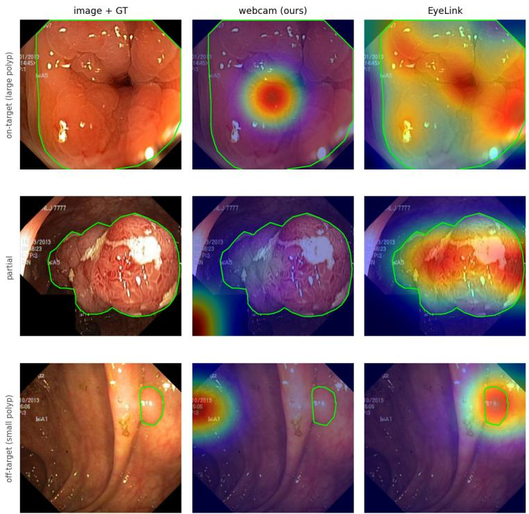  
Fig. 1: Webcam vs. EyeLink gaze heatmaps on three Kvasir-SEG images (green = GT polyp). Webcam (ours) is our FaceMesh + KRR engine on the laptop’s integrated webcam; EyeLink is an SR Research EyeLink 1000 infrared lab eyetracker, hardware orders of magnitude more expensive than a webcam. Webcam gaze lands on large, central polyps (top) but drifts of small or peripheral ones (bottom); EyeLink stays on-target throughout.

Webcam (FaceMesh, ours) vs. EyeLink (expensive lab eye-tracker) — 10 best-localised (green = GT polyp)  
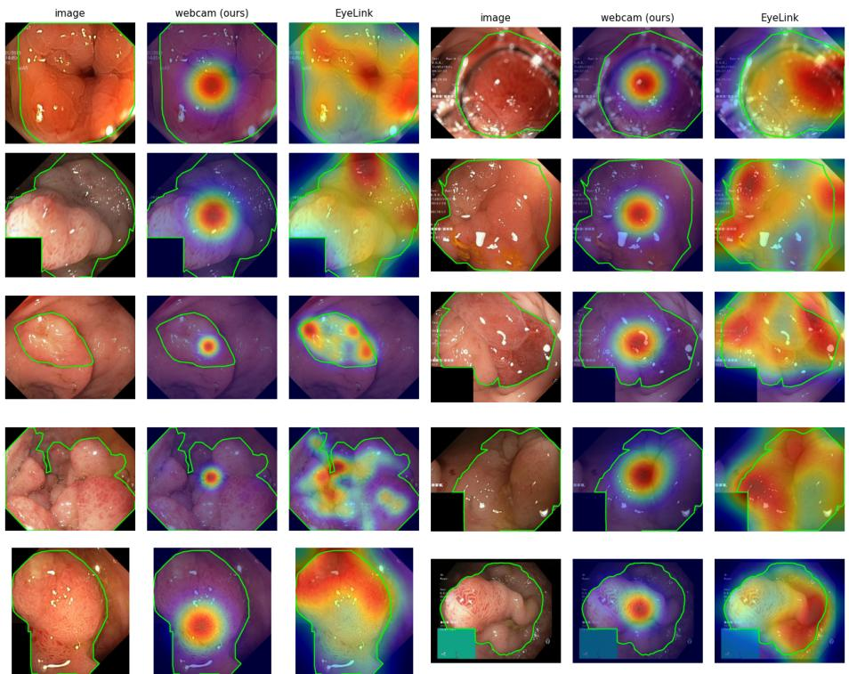  
Fig. 2: Webcam (ours) vs. EyeLink gaze on the 10 best-localised Kvasir-SEG images; each triplet is the raw image, the webcam heatmap, and the EyeLink heatmap (GT polyp in green). Webcam = our FaceMesh + KRR engine on a commodity webcam; EyeLink = an expensive infrared lab eye-tracker.

Webcam (FaceMesh, ours) vs. EyeLink (expensive lab eye-tracker) — 10 worst-localised (green = GT polyp)  
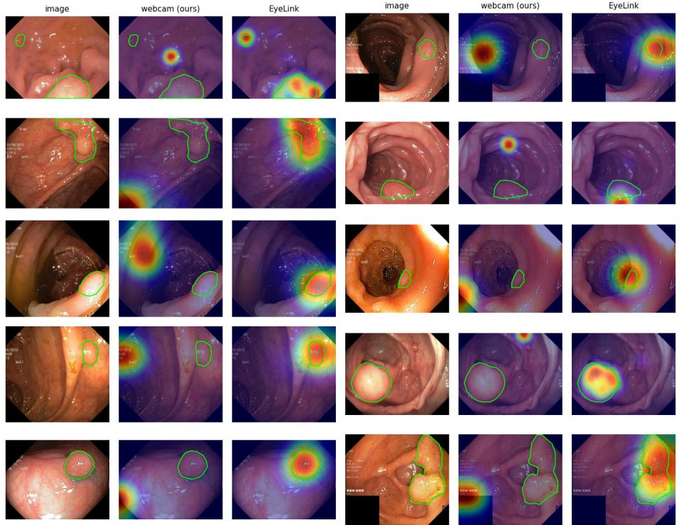  
Fig. 3: Webcam (ours) vs. EyeLink gaze on the 10 worst-localised Kvasir-SEG images; each triplet is the raw image, the webcam heatmap, and the EyeLink heatmap (GT polyp in green). Webcam = our FaceMesh + KRR engine on a commodity webcam; EyeLink = an expensive infrared lab eye-tracker. Webcam gaze sits near image centre or of the lesion while EyeLink remains on target.

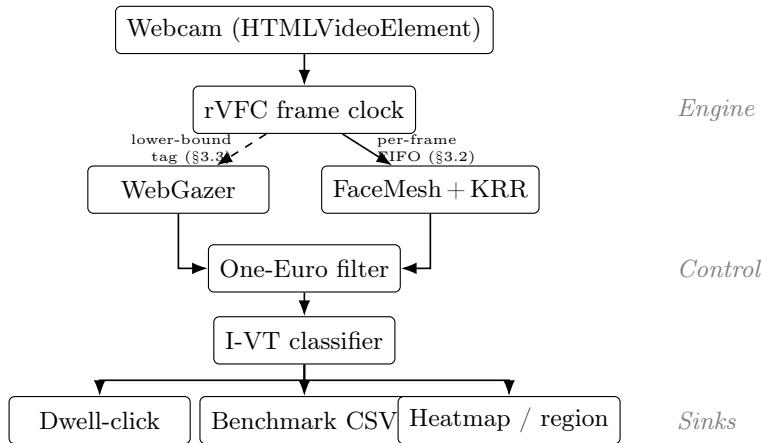  
Fig. 4: Reference-implementation architecture. The rVFC frame clock (captureTime where available, else presentationTime) reaches the two engines diferently: FaceMesh+KRR receives it per frame through a FIFO queue (exact pairing, §3.2), while WebGazer’s samples are tagged retrospectively with the most recent frame clock (dashed; lower bound, §3.3). The control layer smooths raw gaze with a One-Euro filter and segments fixation / saccade with I-VT; sinks include the dwell-click emitter, the benchmark CSV exporter, and the per-cell heatmap / region renderers.

Environment. The runs used Chrome (arm64) on macOS Sequoia 15.6 on a 14- inch MacBook Pro (M4, 2024; integrated 1080p webcam captured at 1280×720), with MediaPipe FaceMesh 0.4.1633559619 and WebGazer 3.4.0; the analysis environment is Chrome 150.0.7871.128. The collection window was a full-screenwidth browser window on the 1512-pt scaled desktop at 80% browser zoom (§4.1); the collection-time browser build was not logged — the harness records the viewport, its nominal px\_per\_degree assumption, and capture\_clock\_source in every CSV header. The four paper runs executed in the fixed order WebGazer sweep, FaceMesh sweep, WebGazer drift, FaceMesh drift, with ≥30 s rest between runs, DevTools closed, and no window resizing; engine/task order was not counterbalanced.

## A.6 Additional figures

Figures relocated from the main text for space; referenced from the sections indicated in their captions.

## A.7 Precision split and per-cell error structure (detail)

Spatial spread and temporal jitter do not co-vary in our data. The per-sample ofset scatter (Fig. 7, appendix) places the WebGazer cluster ${ \sim } 9 . 5 ^ { \circ }$ into the bottom-left and FaceMesh within ${ \sim } 1 . 6 ^ { \circ }$ of the target, yet the radial $p _ { 9 5 }$ spread of the two is nearly identical $( 6 . 1 3 ^ { \circ } \mathrm { \ v s . \ 6 . 2 1 ^ { \circ } } )$ , spatially indistinguishable. The within-fixation $v _ { p 9 9 }$ column of Table 1 is the opposite, FaceMesh 1.6–3.5× higher, from per-frame iris-landmark micro-movements that WebGazer’s coarser features do not expose; a pipeline can be tight on one axis and loose on the other, so reporting one alone under-describes the engine.

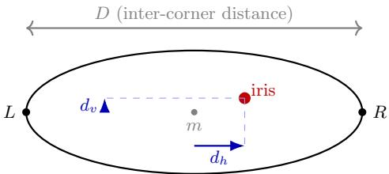  
Fig. 5: Per-eye landmark schematic for the FaceMesh+KRR feature vector. From each eye we extract horizontal and vertical iris displacement $( d _ { h } , d _ { v } )$ relative to the inter-corner midpoint $m ,$ and the inter-corner distance D as a coarse headdistance proxy. Two eyes contribute 6 features; a left/right asymmetry term contributes 1 feature; the remaining 6 features are raw iris and corner coordinates normalised to face-bounding-box space, for a total of 13 dimensions per frame.

The per-cell error structure also difers qualitatively (Fig. 8, appendix): FaceMesh+KRR’s error grows radially from a small central region (best cell 1.3◦) to the corners (worst 19.3◦), as KRR extrapolates poorly outside a pursuit trajectory that under-covers the corners, whereas WebGazer’s is diagonal (accurate bottom-left, degraded top-right at 17–23◦). Both diferences fall within the $\sim 4 . 6 ^ { \circ }$ betweenrun variability band (§C), so neither survives as a claim about either engine until a multi-user replication.

## B Grid-resolution scaling

The matrix of §4 pins one grid and asks how the two engines behave on it. This section asks the orthogonal question: holding engine, dwell, and viewing geometry fixed, how does measured accuracy scale as we shrink cell pitch from a trivial 1×2 partition toward a dense 8×16 grid? Separating error (does the estimate get worse?) from per-cell hit rate (do we still land in the right cell?) turns out to matter, because the two answer diferently, and fixes which of the two is the right lens for cross-resolution claims.

## B.1 Protocol

We sweep six grid levels, holding the aspect ratio at rows : cols=1:2 so each cell stays near-square on the 16:9 display and cell pitch is the only dimension that varies: L1 1×2 (2 cells), L2 2×4 (8), L3 3×6 (18), L4 4×8 (32), L5 6×12 (72) and L6 8×16 (128). We express each level by its cell pitch $\sqrt { A _ { \mathrm { s c r e e n } } / N _ { \mathrm { c e l l s } } }$ converted to degrees of visual angle (§4.1), which ranges from $1 5 . 0 ^ { \circ } ~ ( \mathrm { L 1 } )$ down to $1 . 9 ^ { \circ }$ (L6). Dwell is 1.5 s per cell; we run four sessions per (engine, grid) condition and interleave the two engines within each grid so that any slow session-level drift is shared rather than aliased onto one engine (48 sessions, ∼1 h wall-clock). All six levels share one physical setup, with the same user, seat, viewing distance, and lighting held fixed throughout. As a fixed-grid control on the calibration confound below, we also overlay the single-run 8×16 baseline of §4.2, in which both engines used pursuit.

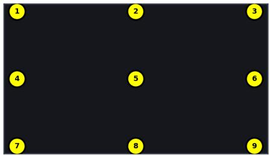  
(a) 9-point click

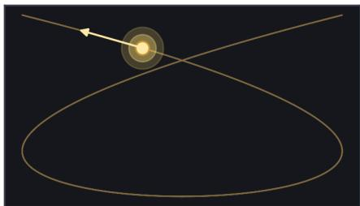  
(b) smooth-pursuit Lissajous  
Fig. 6: The two calibration target patterns, reproduced from the reference implementation. (a) The 9-point grid: nine fixed dots at {5, 50, 95}% of each axis, each fixated and clicked five times (∼45 training pairs); WebGazer’s default. (b) Smooth pursuit: a single dot traces a 3:2 Lissajous curve (amplitude 0.90 of half-screen, so 5–95% of each axis) for 18 s, yielding ∼500 pairs at 30 Hz; FaceMesh+KRR’s default. The denser, edge-reaching pursuit set is what lets the non-linear KRR head model the eye-to-screen map (§3.4); the two patterns cover the same screen extent but difer by ∼10× in sample count.

Two protocol facts qualify the numbers below and we state them up front. First, each engine uses its native default calibration in this sweep (pursuit for FaceMesh+KRR, nine-point for WebGazer) rather than the matched pursuit calibration of §4.1; FaceMesh additionally re-fits its KRR map on every page reload, so each session carries an independent calibration. Cross-engine comparison in this section is therefore “engine + its default calibration,” not the engine in isolation. Second, a posture/lighting change between the second and third repeat of L1 depressed both engines simultaneously and persisted into L2, inflating the L1–L2 run-to-run spread (visible as the large error bars at the two coarsest pitches in Fig. 10). We keep all four runs per condition and read the section for the shape of the curves, leaving the engine ordering open.

## B.2 Error versus cell pitch

Fig. 10 and Table 3 report mean angular error as a function of cell pitch. The central observation is that error is essentially flat against pitch: across L1–L5 a linear fit gives a slope of $- 0 . 0 1 ^ { \circ }$ per degree of pitch for FaceMesh and +0.10◦ for WebGazer, both negligible against the $0 . 6 { - 2 . 5 } ^ { \circ }$ run-to-run SD. FaceMesh+KRR holds $6 . 0 – 7 . 1 ^ { \circ }$ and WebGazer $4 . 2 \substack { - 6 . 6 ^ { \circ } }$ over that range; neither trace trends. Densifying the grid from two targets to seventy-two does not make the per-target estimate worse: the estimator’s error is set by the calibration and the capture geometry, not by how finely we probe the screen. The densest grid (L6, 128 cells) shows a modest uptick to $9 . 4 ^ { \circ }$ (FaceMesh) and $7 . 1 ^ { \circ }$ (WebGazer), on the order of the four-run SD; even there the slope stays gentle, where a resolution-limited estimator would grow far more steeply.

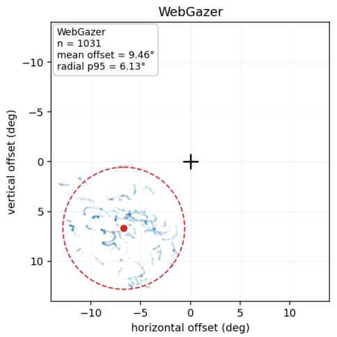

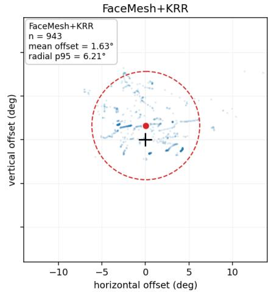  
Fig. 7: Finding 2: per-sample gaze ofset relative to target, central cells of the sweep grid (rows 2–4, columns 6–10). Each dot is one gaze sample; the black crosshair is the target; the red dot is the cluster centroid (mean ofset, accuracy component); the dashed red circle is the radial $p _ { 9 5 }$ (spatial precision component). WebGazer’s centroid is ofset by ${ \sim } 9 . 5 ^ { \circ }$ into the bottom-left, consistent with the diagonal pattern of Fig. 8 (a). FaceMesh+KRR’s centroid is within ${ \sim } 1 . 6 ^ { \circ }$ of the target. The cluster spread is comparable between engines, even though the temporal within-fixation jitter velocity $( v _ { p 9 9 }$ in Table 1) is not: the two notions of precision do not co-vary in this setup.

The cross-engine ordering reflects the calibration method, and L6 isolates this because the same 8×16 grid was run both ways. With each engine on its default (WebGazer nine-point, FaceMesh pursuit), WebGazer leads at every level including L6 $( 7 . 1 ^ { \circ } ~ \mathrm { { v s . } ~ 9 . 4 ^ { \circ } ) }$ . Switching WebGazer to pursuit on that identical grid (open diamond) sends it to 11.1◦, worse than FaceMesh’s 8.1◦ in the matched-pursuit regime of Table 1. FaceMesh, always on pursuit, barely moves. WebGazer’s accuracy is far more sensitive to the nine-point-versus-pursuit choice than FaceMesh+KRR’s, so the cross-engine gap is confounded with calibration. The L1 point carries the widest spread for both engines, an artifact of the midsweep posture drift.

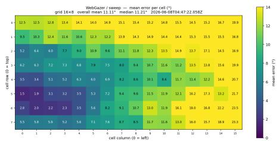  
(a) WebGazer / sweep (16 × 8)

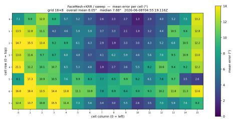  
(b) FaceMesh+KRR / sweep (16 × 8)

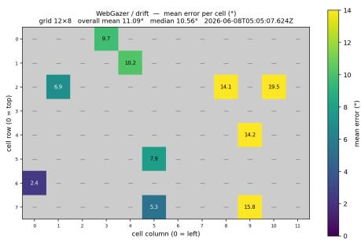  
(c) WebGazer / drift $( 1 2 \times 8 ,$ 10 random visits)

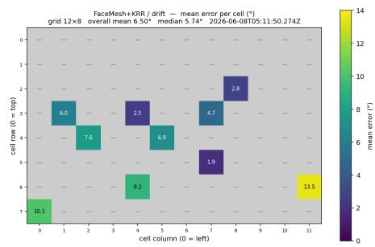  
(d) FaceMesh+KRR / drift $( 1 2 \times 8 ,$ 10 random visits)  
Fig. 8: Finding 3: per-cell mean error (◦ of visual angle), shared $0 { - } 1 4 ^ { \circ }$ colour scale (viridis). Grey cells were not sampled in drift’s random subset. FaceMesh’s error is radially structured around a central low-error region; WebGazer’s error is diagonally structured with best accuracy in the bottom-left of the viewport. Aggregate mean / median in Table 1 does not reveal this asymmetry.

## B.3 Per-cell classification accuracy

Reading each grid as a closed-set classifier (the fraction of dwell samples whose estimate falls inside the ground-truth cell) gives the complementary view in Fig. 11. Here the curves do move: hit rate falls monotonically with pitch for both engines, from ${ \sim } 7 5 \%$ at L1 $( 1 5 . 0 ^ { \circ }$ cells) to ${ \sim } 2 \%$ at L6 $( 1 . 9 ^ { \circ }$ cells). This fall is a direct consequence of the flat error in ${ \mathrm { F i g } } .$ . 10: a ${ \sim } 5 { - } 7 ^ { \circ }$ estimate lands inside a $1 5 ^ { \circ }$ cell most of the time and inside a $2 . 6 ^ { \circ }$ cell almost never. Hit rate thus measures cell size against a fixed error budget; the estimator itself is not degrading, which is why we report cross-density accuracy through Fig. 10 and treat the classification curve as a target-size budget. With a $5 { - } 7 ^ { \circ }$ single-session error, the crossover below which closed-set selection stops being reliable for this user sits between L2 and L3, i.e. cells no smaller than ${ \sim } 7 ^ { \circ }$ of visual angle.

## B.4 Latency stability across grid resolutions

The spatial protocol should not touch the capture-clock axis: cell count changes what we draw, not the per-frame inference cost. Fig. 12 and the Inf. ms columns of Table 3 confirm this. FaceMesh+KRR holds a median inference latency of 16–22 ms across all six levels (a 64× change in cell count moves it $\mathrm { b y } \le 6 \mathrm { m s } )$ and WebGazer holds 28–44 ms once two L4 runs degraded by transient host-CPU contention are excluded (those read 48 and 60 ms at 24–25 Hz, with the rest of the sweep at the nominal ∼30 Hz). L6 (22 and 44 ms) falls on the same two bands, as does the pursuit reference (22 and 34 ms). Within each engine the trace is flat, so the spatial and capture-clock axes are decoupled in the harness and Fig. 10 can be read at face value. The contention episode belongs to the host machine during those two runs, not to grid resolution; we flag it rather than smooth it.

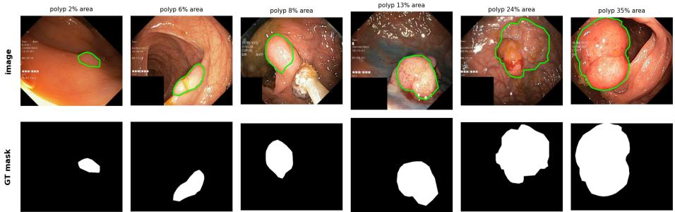  
Fig. 9: Kvasir-SEG examples spanning the polyp-size range (∼2% to ∼35% of image area). Top: endoscopy image with the ground-truth polyp boundary (green). Bottom: the corresponding binary segmentation mask. The segmentation target is the mask; gaze (expert EyeLink or our webcam) supplies only a weak localisation prompt that the pipeline expands into a pseudo-mask.

## B.5 Where the limit appears

Two limits emerge. The first is a resolution ceiling: because error is pitchinvariant (Fig. 10) while cell size shrinks, usefulness for any cell-addressed sink (dwell-click targets, region-of-interest tagging) is bounded by the ratio of the single-session error to the cell pitch, not by the engine’s behaviour on a denser grid. For this user, with a $5 { - } 7 ^ { \circ }$ error, that ceiling lands around a $7 ^ { \circ }$ cell (between L2 and L3); below it, closed-set selection is noise-dominated for both engines.

The second is that most cross-condition diferences do not survive the $4 . 6 ^ { \circ }$ between-run variability band of §C. The L3–L5 means for both engines sit within ${ \sim } 2 . 5 ^ { \circ }$ of that band, the cross-engine gaps (Table 3) are comparable to or smaller than the four-run SD at the same level, and even the modest L6 uptick is on the order of that SD. The absolute numbers and the apparent engine ordering therefore hold for a single user and session (the same caveat as §4.2), and we report only the three efects that survive the floor: within a session error is flat in pitch, hit rate falls mechanically with it, and the cross-engine ordering is set by calibration method (the L6 fixed-grid control). The resolution ceiling is a practical limit the capture-clock methodology of §3 lets us see, but the $7 ^ { \circ }$ figure is this user’s alone. Iris geometry, inter-ocular distance, and habitual head pose all feed the feature vector, so a viewer with a tighter calibration spread or steadier posture could move the crossover a degree or two either way, and the L1 posture episode shows how readily a single session shifts. Whether the ceiling is a property of webcam gaze or of this one pair of eyes is what the multi-user replication of §6 has to settle. At $N { = } 1$ we cannot.

Table 3: Grid-resolution scaling, four runs per (engine, grid), single user. Error is the per-run mean angular error (mean ± SD over four runs); hit is the percell classification rate (§B.3); Inf. is the median inference latency. Each L1– L6 level uses each engine’s default calibration (FaceMesh pursuit, WebGazer nine-point), so columns compare engine + calibration, not engines in isolation (§B.1). † WebGazer latency excludes two L4 runs degraded by transient host-CPU contention. ‡ Reference row: the $8 \times 1 6$ baseline of §4.2 at the same grid but with both engines on pursuit (N=1); the WebGazer entry jumps from 7.1 to 11.1◦, isolating the calibration efect at fixed grid and engine.
<table><tr><td></td><td></td><td></td><td colspan="2">Mean error</td><td colspan="2">Hit %</td><td colspan="2">Inf. ms</td></tr><tr><td>Level</td><td>Grid</td><td> $\operatorname { P i t c h } ^ { \circ }$ </td><td>FM</td><td>WG</td><td>FM</td><td>WG</td><td>FM</td><td>WG</td></tr><tr><td>L1</td><td> $1 \times 2$ </td><td>15.0</td><td> $6 . 2 \pm 1 . 7$ </td><td> $6 . 6 \pm 2 . 5$ </td><td>75</td><td>75</td><td>17</td><td>31</td></tr><tr><td>L2</td><td> $2 \times 4$ </td><td>7.6</td><td> $7 . 1 \pm 1 . 6$ </td><td> ${ \bf 4 . 2 \pm 0 . 6 }$ </td><td>31</td><td>62</td><td>16</td><td>38</td></tr><tr><td>L3</td><td> $3 \times 6$ </td><td>5.1</td><td> $7 . 1 \pm 2 . 0$ </td><td> ${ \bf 5 . 6 \pm 1 . 0 }$ </td><td>17</td><td>22</td><td>17</td><td>28</td></tr><tr><td>L4</td><td> $4 \times 8$ </td><td>3.8</td><td> $6 . 0 \pm 1 . 2$ </td><td> ${ \bf 4 . 9 \pm 1 . 0 }$ </td><td>23</td><td>22</td><td>19</td><td>38†</td></tr><tr><td>L5</td><td> $6 \times 1 2$ </td><td>2.6</td><td> $6 . 4 \pm 1 . 8$ </td><td> ${ \bf 5 . 5 \pm 0 . 9 }$ </td><td>8</td><td>10</td><td>20</td><td>38</td></tr><tr><td>L6</td><td> $8 \times 1 6$ </td><td>1.9</td><td> $9 . 4 \pm 1 . 4$ </td><td> ${ \bf 7 . 1 \pm 1 . 9 }$ </td><td>1</td><td>3</td><td>22</td><td>44</td></tr><tr><td> $\mathrm { L 6 ^ { \frac { \ddagger } { \ddagger } } }$ </td><td>pursuit (N=1)</td><td></td><td>8.1</td><td>11.1</td><td>2</td><td>2</td><td>22</td><td>34</td></tr></table>

The gaze maps in Fig. 13 make the ceiling concrete: the per-target scatter is visually similar across pitches, but by L5–L6 it spans several cells, so the same estimate that classifies cleanly on the coarse grid no longer does on the dense ones.

## C Ablation

The accuracy–precision split of §4.3 and the KRR-vs.-ridge framing of the FaceMesh+KRR engine (§3.4) raise two natural questions that the reference implementation can answer directly: how much of the within-fixation jitter velocity is the One-Euro filter’s responsibility rather than the engine ${ } ^ { , } { s } ,$ and how much of the accuracy gain over WebGazer comes from the non-linear kernel rather than the 13-dim feature space alone. We isolate each in a one-knob sweep, holding everything else at the protocol of §4.1. Results are summarised in Fig. 14.

One-Euro $\beta$ sweep: noise-dominated. We re-ran the FaceMesh+KRR sweep at $\beta \in \{ 0 . 0 0 3 , 0 . 0 0 7$ (default), 0.015, 0.030} with minCutoff fixed at 1.0. The four-

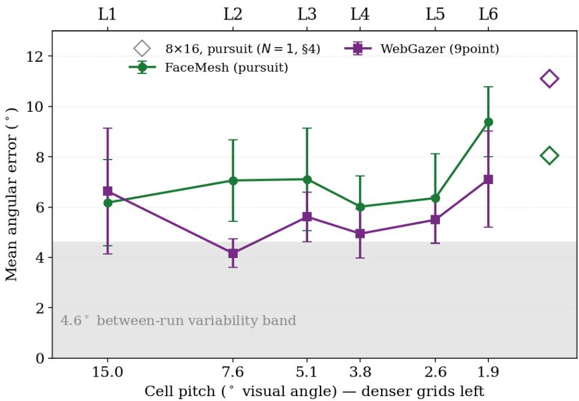  
Fig. 10: Mean angular error versus cell pitch, one trace per engine (mean ± SD over four runs); the x-axis is logarithmic with denser grids (smaller pitch) to the left, top labels mark the grid level. Both traces are nearly flat from L1 to L5 across $\mathrm { a } \sim 6 \times$ change in pitch $( 1 5 . 0 ^ { \circ }  2 . 6 ^ { \circ } )$ : error does not grow as the grid densifies, with a modest rise at the densest grid (L6). The shaded band is the $4 . 6 ^ { \circ }$ between-run variability band of §C. The two open diamonds at the right (green FaceMesh, purple WebGazer) are the 8×16 baseline of $\ S 4 . 2 \ : ( N = 1 )$ re-run with both engines on pursuit: WebGazer jumps from $7 . 1 ^ { \circ }$ (its L6 square) to 11.1◦ while FaceMesh barely moves, isolating the calibration efect at fixed grid and engine.

point curve does not produce a monotonic, U-shaped, or otherwise interpretable trend:
<table><tr><td> $\beta$  0.003 0.007 0.015 0.030</td></tr><tr><td>mean o 12.63 8.05 11.73</td></tr><tr><td>8.36  $\%$ </td></tr><tr><td>samples retained 52 67 41 63 within-fix  ${ v _ { p 9 9 } } ^ { \circ } / \mathrm { s }$  120 66 156 79</td></tr></table>

Mean angular error and samples-retained proportion are tightly correlated across the four runs $( r \approx 0 . 9 7 )$ : runs with high retention are accurate, runs with low retention are not. The calibration-time RBF $\gamma$ (set by a median-pairwisedistance heuristic on the calibration features) also varies across runs from 8.88× $1 0 ^ { - 2 }$ to $1 . 3 1 \times 1 0 ^ { - 1 }$ , indicating that the calibration feature distribution itself moved between runs: user posture and lighting drifted between runs by more than the $\beta$ knob meaningfully altered the pipeline output.

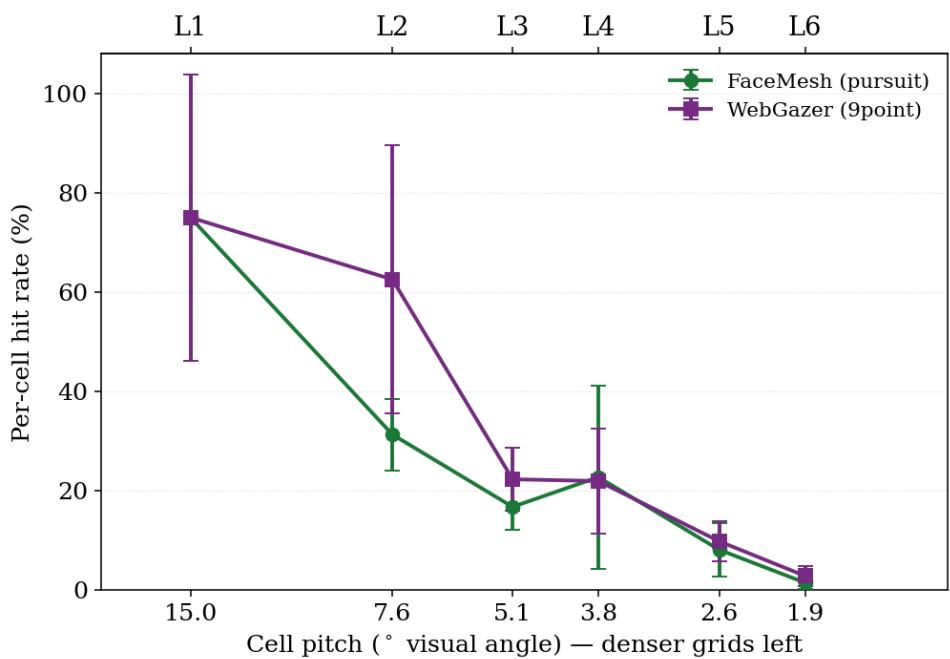  
Fig. 11: Per-cell hit rate versus cell pitch (mean ± SD over four runs; axes as in Fig. 10). Unlike error, hit rate falls steeply as the grid densifies, from ${ \sim } 7 5 \%$ at L1 to ${ \sim } 2 \%$ at L6, because a fixed gaze error clears an ever-smaller cell less often. The decline is mechanical: tracking quality is unchanged (cf. the flat error in Fig. 10). At the densest grids the hit rate and its spread are both near zero, so the dense-grid error bars are within the marker.

At $N { = } 1$ per condition the conclusion is methodological: between-run posture and lighting variance on the order of $4 . 6 ^ { \circ }$ swamps any signal in the tested $\beta$ range. Two caveats bound what this spread can support. First, the four runs difer in $\beta ,$ so they are treatment conditions, not replicates: the $\sim 4 . 6 ^ { \circ }$ range can contain genuine parameter efects on top of calibration, posture, lighting, and sampling variation, and a true noise floor requires repeated runs at one fixed configuration, which we have not collected. Second, we therefore use the band in one direction only — as grounds to refrain from ranking engines whose diferences fall inside it — never to certify that an observed diference is noise. We recommend ${ \mathrm { a } } \geq 3$ replicate-per-condition protocol for future One-Euro tuning ablations.

KRR kernel comparison: structural signal above the variability band. We compared three kernels at otherwise-default configuration: RBF (the headline nonlinear kernel of §3.4); linear (under which KRR collapses to ridge regression on the 13-dim feature space and isolates the contribution of the features alone);

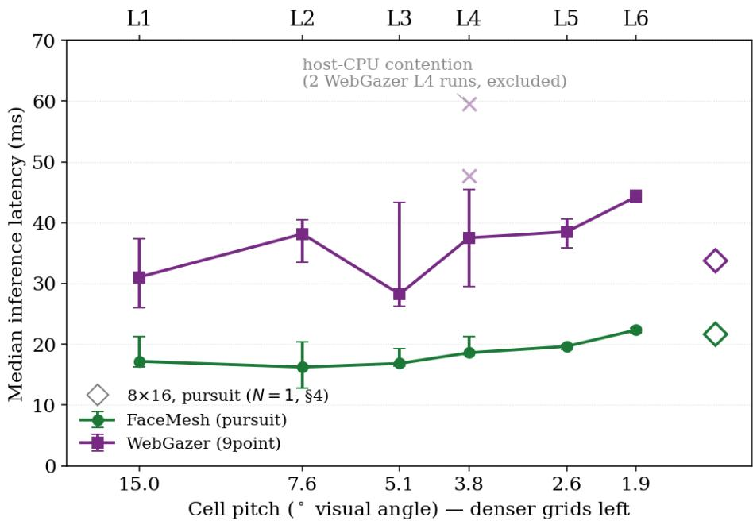  
Fig. 12: Median inference latency versus cell pitch (markers at the per-level median, whiskers spanning the four-run min–max; axes as in Fig. 10). The two open diamonds at the right (green FaceMesh, purple WebGazer) are the same pursuit 8×16 baseline (N=1) as in Fig. 10; latency, unlike accuracy, is unchanged by the calibration switch. Both traces are flat across all six levels: latency is set by the per-frame pipeline, not by grid resolution. The two faint × at L4 (purple) are WebGazer runs degraded by transient host-CPU contention (48 and 60 ms at 24–25 Hz); they are excluded from the median.

and poly2 (a degree-2 polynomial that captures all pairwise feature interactions without the locality property of RBF). Unlike the $\beta$ sweep, the kernel comparison produces a clear structural signal (Fig. 14(b)):
<table><tr><td>kernel</td><td>RBF linear poly2</td></tr><tr><td>mean 0</td><td>8.0511.42 18.62</td></tr><tr><td>hit rate (cell) %</td><td>2.34 7.81 1.56</td></tr><tr><td>samples retained %</td><td>67 69 43</td></tr></table>

The mean error grows monotonically from RBF to linear to poly2, but the shape of each kernel’s error distribution difers qualitatively, in a way the mean alone does not show. Linear ridge produces a bimodal distribution (highest hit rate of the three despite the highest mean among RBF/linear), and the percell heatmap (released as supplementary material) reveals that the bimodality is spatial: the top half of the viewport contains many cells under 1.4◦ while the bottom half is uniformly degraded above 17◦. This is consistent with linear ridge extrapolating beyond the convex hull of the pursuit calibration trajectory, which under-covers the bottom edge of the screen. RBF, by contrast, localises out-of-distribution predictions to the training centroid (target-mean after target centring), producing a more uniform but generally moderate error everywhere. This is the radial structure observed in ${ \mathrm { F i g . ~ } } 8 \ ( { \mathrm { b } } )$ . Poly2 is intermediate in kernel locality but, at the same regularisation strength $\lambda = 1 0 ^ { - 3 }$ as RBF, produces uniformly noisy predictions: the diagonal-vs-of-diagonal scale of the poly2 kernel matrix is much wider than RBF’s, so the same nominal λ provides far less efective regularisation; the result is high-variance predictions (single cell up to 59◦ in our supplementary heatmap) that the I-VT classifier filters aggressively (only 43 % samples retained).

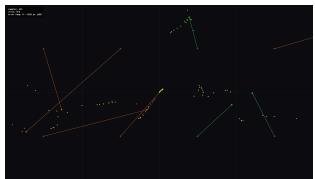  
(a) FaceMesh / L2 (2×4)

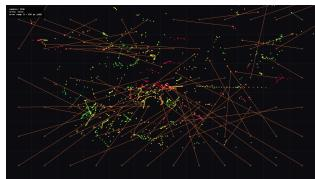  
(b) FaceMesh / L5 (6×12)

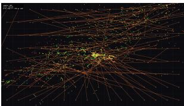  
(c) FaceMesh / L6 (8×16)

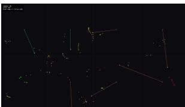  
(d) WebGazer / L2 (2×4)

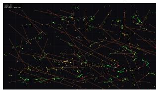  
(e) WebGazer / L5 (6×12)

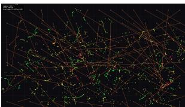  
(f) WebGazer / L6 (8×16)  
Fig. 13: Representative gaze maps (near-mean run per condition): dots are dwellwindow samples coloured by per-sample error (green low, red high), segments join each target to its sample cluster. The coarse grid (left, L2) resolves into separable per-target clusters for both engines; as the grid densifies (L5, L6) the same ${ \sim } 5 { - } 9 . 5 ^ { \circ }$ scatter overruns neighbouring cells, so clusters merge: the qualitative form of the mechanical hit-rate fall in Fig. 11, while the underlying scatter is unchanged.

Poly2 is worse than both RBF and linear, so the comparison does not support “non-linear > linear.” What it does support is narrower:

§6 ablation, FaceMesh+KRR on sweep task, single user

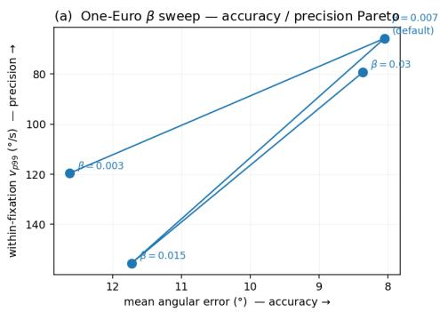

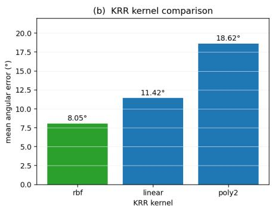  
Fig. 14: Ablation on FaceMesh+KRR, single user. (a) One-Euro $\beta$ sweep: each point is one full 16×8 sweep run; x-axis is mean angular error (accuracy, loweris-better, inverted), y-axis is within-fixation $v _ { p 9 9 }$ (precision, lower-is-better, inverted). Points do not form a monotonic or Pareto-shaped curve; the four conditions are noise-dominated at $N { = } 1$ per cell (see prose). We use the $\sim 4 . 6 ^ { \circ }$ spread of mean error across these four runs as a conservative between-run variability band; because the runs difer in $\beta$ they are not replicates, so the band is used only to refrain from ranking, not as a validated noise floor (see prose). (b) Three KRR kernels at default One-Euro settings. Mean error nominally increases from RBF through linear to poly2, but the poly2 condition uses the λ tuned for RBF and is therefore under-regularised on its much higher-dimensional feature expansion, so the bar ordering reflects regularisation, not a clean kernel ranking.

A clean kernel comparison would re-tune λ per kernel (e.g. leave-one-out cross-validation per kernel separately). We did not, so the $\mathrm { p o l y 2 }$ column mostly shows what to control for in a kernel ablation.