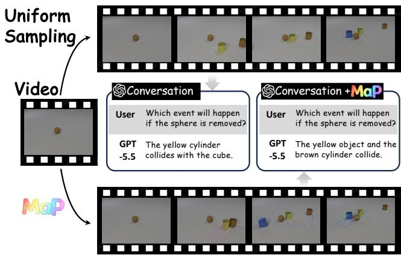
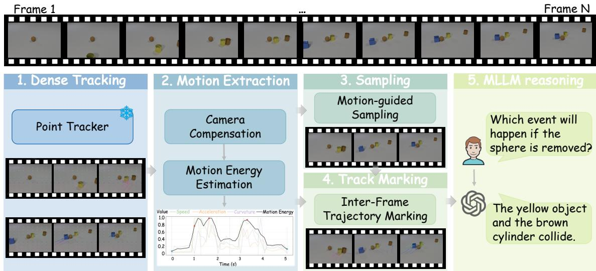
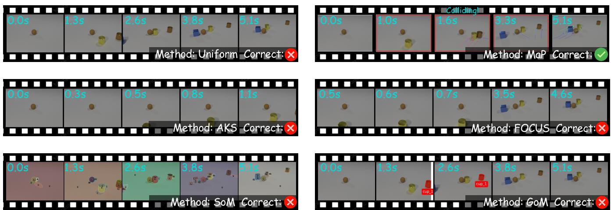
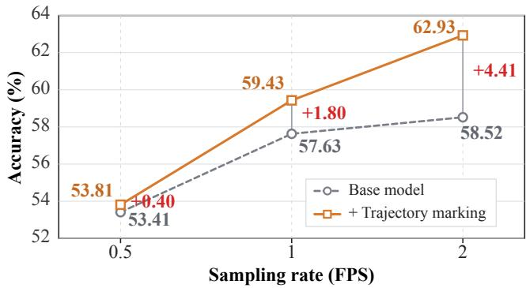
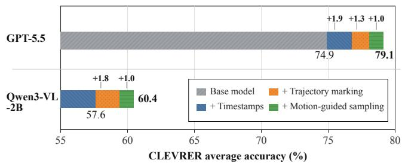

# Motion-as-Prompt: Enhancing Motion Reasoning in Multimodal Large Language Models via Motion-Guided Cross-Frame Visual Prompting ∗

Xikai Sun1, Kebin Liu1, Haotian Wang2, Li Liu1, Xu Wang1, Yunhao Liu1

1Tsinghua University, Beijing, China 2JD Logistics, Beijing, China

## Abstract

Motion-centric video reasoning is fundamental to inter- active applications such as robotic manipulation and au- tonomous navigation. However, multimodal large language models (MLLMs) typically process videos through sparse uniform sampling to control visual-token and attention costs. This strategy may discard critical transitions between sam- pled frames, limiting reasoning about object movement, collisions, and causal interactions. To mitigate this issue, we pro- pose Motion-as-Prompt (MaP), a track-guided cross-frame visual prompting framework. MaP recovers dense point trajectories, selects motion-informative frames, and marks the trajectories accumulated between consecutive sampled frames directly onto the visual inputs, making otherwise hidden displacement, direction changes, and interactions observ- able to frozen MLLMs. Experiments on CLEVRER and Something-Something-v2 show that MaP consistently im-proves average motion-reasoning accuracy, yielding gains of 4.2% and 8.9% for GPT-5.5, respectively. Notably, these im-provements are obtained without degrading non-motion un- derstanding, highlighting the robustness of MaP. These results demonstrate that MaP provides a simple and efective solution for enhancing motion-centric video reasoning with- out model training or architectural modification. Project page: https://github.com/SunVictor23/MaP.

## 1 Introduction

Motion-centric video reasoning is a fundamental capability of multimodal large language models (MLLMs). It requires not only recognizing objects and scenes, but also understanding how entities move, interact, and cause state changes over time. This capability underpins a wide range of safety-critical and interactive applications, such as robotic manipulation, autonomous navigation, and augmented-reality assistance, where decisions depend on accurately perceiving trajecto-ries, contacts, direction changes, and short-lived events. Al- though recent MLLMs have achieved strong performance on general video understanding (Maaz et al. 2024; Li et al. 2025b; Cheng et al. 2024; Lin et al. 2024), their motion rea-soning remains constrained by the way videos are presented to the model.

To control visual-token and attention costs, MLLMs typ- ically process only a sparse subset of video frames (Shen et al. 2024; Tang et al. 2025) by uniform sampling. While computationally eficient, sparse sampling converts a contin- uous motion process into a sequence of snapshots. Critical transitions occurring between sampled frames, such as ac- celeration, direction changes, and collisions, may therefore become completely invisible to the MLLM. This informa- tion bottleneck is referred to as inter-frame motion loss in our paper. Figure 1 illustrates this limitation. Sparse uniform sampling may preserve observations before and after an inter- action while omitting the collision event between them. The MLLM must then infer the event from incomplete evidence and may consequently produce an incorrect prediction.

  
Figure 1: Illustration of inter-frame motion loss and its re- covery with MaP. Uniform sampling retains disconnected snapshots, while MaP makes the missing motion observable.

Existing approaches do not directly mitigate this inter- frame motion loss. Motion-aware video models improve temporal perception by introducing specialized motion rep- resentations, architectural components, or task-specific fine- tuning (Li et al. 2025a; Huang et al. 2024; Cheng et al. 2024). However, these approaches require additional training or ac- cess to the model architecture. Visual prompting provides a more flexible alternative by augmenting the model’s vi- sual input with explicit guidance (Zhang et al. 2024). Yet existing pixel-level prompts are predominantly frame-local: they annotate object regions, identities, or spatial relations within individual frames (Yang et al. 2023; Frisoni et al.

2026). Such prompts help the model understand what and where, but do not reveal how objects move across the unsampled intervals. This creates a fundamental mismatch, i.e., the missing evidence is cross-frame, whereas existing visual prompts primarily describe sampled single-frame semantics.

Our key observation is that the discarded motion can be recovered from the original video and re-encoded into the sparse visual inputs. Based on this insight, we propose Motion-as-Prompt (MaP), a motion-guided cross-frame vi-sual prompting framework for motion-centric video under- standing. MaP recovers dense point trajectories from the video, adaptively selects frames according to motion inten- sity, and explicitly marks the trajectories accumulated between consecutive sampled frames directly onto the visual inputs. In this way, MaP transforms otherwise hidden tem-poral transitions into explicit visual prompts that can be in- terpreted by a frozen MLLM. The resulting framework is training-free, model-agnostic, and requires no architectural modification.

Our contributions are summarized as follows:

• We identify inter-frame motion loss as an input-side bottleneck of sparsely sampled MLLMs and introduce cross- frame motion-recovery prompting, which recovers dis- carded motion from the original video and makes it di- rectly observable in sparse visual inputs.

• We instantiate this idea as Motion-as-Prompt (MaP), a training-free framework that combines motion-guided sampling with inter-frame trajectory marking for motion-centric video reasoning.

• Experiments on motion benchmarks show that MaP con-sistently improves the performance ofMLLMs, with gains of 4.2% ∼ 8.9% on GPT-5.5. Ablations further show that trajectory marking is the primary source of improvement and becomes more efective with larger frame budgets.

## 2 Related Work

Keyframe sampling. MLLMs typically process only a small subset of frames, since dense video encoding in- curs prohibitive visual-token and attention costs. Recent works aim to preserve the most informative frames under a fixed frame budget. For example, Adaptive Keyframe Sam- pling (AKS) balances query relevance and temporal coverage (Tang et al. 2025). FOCUS and other learned selectors estimate frame importance from semantic cues (Zhu et al. 2025). VideoTree organizes video evidence into a query- adaptive hierarchy (Wang et al. 2025b). MDP3 jointly accounts for relevance, diversity, and temporal order (Sun et al. 2025). Token-compression methods such as LongVU (Shen et al. 2024), Dynamic-VLM (Wang et al. 2025a), and FastVID (Shen et al. 2026) further reduce redundant frames or spatial tokens to support longer inputs. Despite their dif- ferences, they largely treat sparse sampling as an evidence- selection problem, and their decisions rest on semantic rele- vance, visual similarity, or token redundancy. Consequently, they may retain frames that describe what appears in a video, but discard how objects move between frames.

Spatiotemporal modeling and visual prompting. An-other line of work enhances the spatiotemporal reasoning of MLLMs through model architecture (Munasinghe et al. 2025), supervision, or explicit motion features (Zhao et al. 2025; Yashima et al. 2026). TimeChat binds visual content to timestamps (Ren et al. 2024), VTimeLLM introduces temporal-boundary-aware training (Huang et al. 2024), and Seq2Time transfers sequential knowledge to temporal grounding (Deng et al. 2025). SlowFocus combines lowfrequency global observation with high-frequency sampling of query-relevant clips (Nie et al. 2024), while Time-R1 improves temporal grounding through task-specific post- training (Wang et al. 2026). Although these methods acknowledge that the motion evidence supplied by keyframes alone is insuficient, they typically require modifying mod- els, using specialized video representations, or fine-tuning. Visual prompting ofers a lightweight alternative. It can op- erate in the embedding space through learnable prompt to- kens (Jia et al. 2022), or directly in the pixel space through visible points, boxes, masks, and scribbles (Cai et al. 2024). Set-of-Mark (SoM) supports visual grounding by overlay- ing segmented regions and numeric identifiers (Yang et al. 2023), while Graph-of-Mark (GoM) encodes objects and their spatial relations as a visible scene graph (Frisoni et al. 2026). ViKey uses visible frame identifiers as temporal anchors (Lee et al. 2026), and STOP introduces spatial and temporal prompts to emphasize discriminative regions (Liu et al. 2025b). Those visual-prompting methods inject object indices, temporal panels, or learned spatiotemporal prompts to improve temporal correspondence. However, they mainly encode intra-frame semantics in individual frames, e.g., object identity, region membership, or spatial layout. MaP com-plements this line: it selects motion-informative keyframes and recovers inter-frame motion information, making it ob- servable and usable by the MLLM.

Motion-aware video understanding. Recent studies ex-plicitly incorporate motion cues into MLLMs rather than relying solely on frame-level semantics. VideoExpert pro- cesses high-frame-rate compressed features with a dedicated temporal expert to capture dynamic variations (Zhao et al. 2026). Flow4Agent introduces optical-flow priors for tem-poral content organization and motion-aware token prun- ing (Liu et al. 2025a). DynImg uses non-key frames as temporal prompts to highlight regions containing rapid mo- tion (Bao et al. 2025), while MotionSight employs object-centric spotlight and motion-blur prompts for zero-shot fine- grained motion understanding (Du et al. 2025). Unlike these methods, MaP reconstructs explicit point trajectories from the full-frame-rate video and directly renders the motion accumulated between consecutive sampled frames, without modifying or training the MLLM. This ensures the general- ization ability of MaP across diverse scenarios.

## 3 Method

In this section, we present MaP, which aims to shift an MLLM’s perception from reasoning across disconnected snapshots to a direct understanding of motion. A compact algorithmic overview of MaP, expressed as pseudocode, is provided in the Supplementary Material.

  
Figure 2: Overview of MaP. Given a full-frame-rate video, MaP first recovers dense point trajectories using a frozen point tracker. It then compensates for global camera motion, estimates frame-wise motion energy, and selects motion-informative frames under a fixed frame budget. Finally, trajectory segments accumulated between consecutive sampled frames are rendered onto the later frames and provided to the frozen MLLM for motion-aware reasoning.

## 3.1 Problem Definition and Overview of MaP

Given a video V with N frames at full frame rate and with a duration of t seconds, and a text prompt T containing the task instruction, an MLLM completes text as a response according to the distribution $P _ { \mathrm { M L L M } } ( \cdot \ | \ F ( V ) , T )$ , where $F$ is the confi ured sam lin rate. Recent studies show that strategically altering the visual tokens can indirectly steer the model’s output. (Wu et al. 2024). Building on this premise, we propose MaP as an operator acting on $\check { V }$ that produces an augmented frame sequence:

$$
P _ { \mathrm { M L L M } } ( \cdot \mid \mathsf { M a P } ( V ) , T ) .
$$

Without changing the total frame budget $B = F \cdot t , \mathsf { M a P } ( V )$ produces two things: (i) a motion-aware set ofselected frames ${ \bf \dot { \boldsymbol { S } } } ^ { \prime } \left( \left. \boldsymbol { S } ^ { \prime } \right. = B \right)$ , and (ii) a set of inter-frame motion marks $\mathcal { M }$ overlaid on those frames.

The overview of MaP is shown in Figure 2. Given a motionreasoning task, MaP first employs a frozen point tracker to recover dense trajectories from the full-frame-rate video and aggregates them into motion-energy scores. These scores guide the adaptive selection of motion-informative frames ${ \bar { \boldsymbol { S } } } ^ { \prime }$ . MaP then renders the inter-frame trajectories as visual markers M on the selected frames and feeds the augmented sequence into the MLLM for motion reasoning.

## 3.2 Motion Signal Extraction

Dense tracking. To characterize the motion at each frame, we track a $G \times G$ grid of query points with a frozen point tracker T over the full-rate frames, re-seeding the grid at a fixed interval (e.g., every second) to admit new objects that enter mid-clip (Doersch et al. 2023). It yields point tracks $\mathbf { p } _ { \ell } ^ { i } \in \mathbb { R } ^ { 2 }$ and visibility flags $o _ { \ell } ^ { i } \in \{ 0 , 1 \}$ for $\ell = 1 , \ldots , N$ frames and $i = 1 , \dots , { \overline { { G ^ { 2 } } } }$ query points.

Camera-compensated query point velocity. The raw inter-frame displacement $\mathbf { p } _ { \ell + 1 } ^ { i } - \mathbf { p } _ { \ell } ^ { i }$ contains both the query point’s object motion and camera self-motion. We model the latter using a global similarity transformation that best ex- plains the displacement of all visible query points, including translation b, rotation R, and scale $s , \ i . e . , \ \mathbf { p } \mapsto \ s \mathbf { R p } \ +$ b (Wang and Schmid 2013). For eficient estimation, we pa-rameterize the transformation by $\pmb \theta = ( a , b , t _ { x } , t _ { y } )$ (where $a = s \cos \phi , b = s \sin \phi )$ and fit it over the set of points visible in both adjacent frames, i.e., $\mathcal { V } _ { \ell } = \{ i : o _ { \ell } ^ { i } o _ { \ell + 1 } ^ { i } \dot { = } 1 \}$

$$
\begin{array} { c } { \displaystyle \pmb { \theta } _ { \ell } ^ { \star } = \arg \underset { \pmb { \theta } } { \operatorname* { m i n } } \sum _ { i \in \mathcal { V } _ { \ell } } \big \| \mathbf { S } _ { \pmb { \theta } } ( \mathbf { p } _ { \ell } ^ { i } ) - \mathbf { p } _ { \ell + 1 } ^ { i } \big \| ^ { 2 } , } \\ { \displaystyle \mathbf { S } _ { \pmb { \theta } } ( x , y ) = \Big [ \frac { a x - b y + t _ { x } } { b x + a y + t _ { y } } \Big ] , } \end{array}
$$

which is a linear least-squares problem in $\pmb \theta$ (closed-form, solved when $| \nu _ { \ell } | \ge 3$ , else the camera term is 0). The object velocity is the residual after removing the fitted camera flow:

$$
\mathbf { v } _ { \ell } ^ { i } = \big ( \mathbf { p } _ { \ell + 1 } ^ { i } - \mathbf { p } _ { \ell } ^ { i } \big ) - \big ( \mathbf { S } _ { \theta _ { \ell } ^ { \star } } ( \mathbf { p } _ { \ell } ^ { i } ) - \mathbf { p } _ { \ell } ^ { i } \big ) , \quad i \in \mathcal { V } _ { \ell } .
$$

For a static camera, $\mathbf { S } _ { \theta _ { \ell } ^ { \star } }$ is approximately the identity trans- formation, and the compensation has little efect. For a moving camera, it suppresses camera-induced displacement, yielding a cleaner estimate of query points’ motion.

Motion energy. Given $\{ \mathbf { v } _ { \ell } ^ { i } \}$ , we define a scalar motion energy score $M ( \ell )$ for each frame. Specifically, we char- acterize the motion at frame ℓ along three complementary dimensions, including speed, acceleration, and curvature, as follows:

$$
\mathsf { s p d } _ { \ell } = \frac { 1 } { n _ { \ell } } \sum _ { i = 1 } ^ { G ^ { 2 } } o _ { \ell } ^ { i } \frac { \| \mathbf { v } _ { \ell } ^ { i } \| } { d } , \quad \mathsf { a c c } _ { \ell } = \frac { 1 } { n _ { \ell } } \sum _ { i = 1 } ^ { G ^ { 2 } } o _ { \ell } ^ { i } \frac { \| \mathbf { v } _ { \ell } ^ { i } - \mathbf { v } _ { \ell - 1 } ^ { i } \| } { d } ,
$$

$$
\mathsf { c u r } _ { \ell } = \frac { 1 } { n _ { \ell } } \sum _ { i } ^ { G ^ { 2 } } o _ { \ell } ^ { i } \operatorname { a r c c o s } \frac { \langle \mathbf { v } _ { \ell - 1 } ^ { i } , \mathbf { v } _ { \ell } ^ { i } \rangle } { \| \mathbf { v } _ { \ell - 1 } ^ { i } \| \left\| \mathbf { v } _ { \ell } ^ { i } \right\| } \cdot \frac { \operatorname* { m i n } ( \| \mathbf { v } _ { \ell - 1 } ^ { i } \| , \| \mathbf { v } _ { \ell } ^ { i } \| ) } { d } ,
$$

where $\begin{array} { r } { n _ { \ell } = \operatorname* { m a x } ( \sum _ { i } o _ { \ell } ^ { i } , 1 ) } \end{array}$ is the number of visible points on the frame and $d = \sqrt { H ^ { 2 } + W ^ { 2 } }$ is the frame diagonal used for normalization. The turn angle in $\operatorname { c u r } _ { \ell }$ is weighted by the smaller of the two adjacent velocities, preventing nearly static points from producing spurious curvature. Each descriptor is then normalized by its 95th percentile to re- duce sensitivity to outliers, $i . e . , \hat { u } = \mathrm { c l i p } ( \bar { u / } \mathrm { p c t _ { 9 5 } } ( u ) , 0 , 1 )$ for $u \in \{ { \mathrm { s p d } } _ { \ell } , { \mathrm { a c c } } _ { \ell } , { \mathrm { c u r } } _ { \ell } \}$ . The normalized descriptors are equally weighted and summed, smoothed using a length-w moving-average operator $\Phi _ { w }$ with $w = 3 .$ , and finally re- normalized as follows:

$$
M ( \ell ) = \Phi _ { w } \widehat { \mathrm { ( s p d } _ { \ell } \mathrm { + } \widehat { \mathrm { a c c } } _ { \ell } \mathrm { + } \widehat { \mathrm { c u r } } _ { \ell } \mathrm { ) ~ \in [ 0 , 1 ] . } }
$$

$M ( \ell )$ quantifies the intensity of motion at frame ℓ, assigning higher scores to moments of rapid movement, acceleration, or directional change. These frames contain motion evidence that sparse sampling should preserve.

## 3.3 Motion-Guided Sampling

Given the motion-energy sequence $M ( \cdot )$ over an N-frame video and a frame budget $B < N$ , we introduce a motion- guided sampling mechanism to select an index set $S ^ { \prime } \subset$ $\mathbf { \bar { \{ 1 , \dots , } }  N \mathbf  \} , \mathbf { \bar { | } } S ^ { \prime } \mathbf { \bar { | } } = B$ . It consists of the following 3 stages.

Anchors for coverage. To prevent selected frames from clustering around local motion peaks and ignoring the overall video, we uniformly sample $n _ { a } = \operatorname* { m a x } ( 2 , \lceil \alpha B \rceil )$ frames as anchors, where $0 < \alpha < 1$ . Their indices are defined as:

$$
\begin{array} { r } { \mathcal { A } = \big \{ \mathrm { r o u n d } \big ( \frac { k ( N - 1 ) } { n _ { a } - 1 } \big ) : k = 0 , \dots , n _ { a } - 1 \big \} . } \end{array}
$$

These anchors preserve global temporal coverage.

Motion peaks with non-maximum suppression. The re-maining $\bar { \boldsymbol { B } } - | \boldsymbol { A } |$ frames are allocated to high-energy motion peaks using greedy non-maximum suppression (NMS). We impose a minimum temporal gap $r \stackrel {  } { = } \operatorname* { m a x } ( 1 , \lfloor N / ( 2 B ) \rfloor )$ between each candidate peak and all previously selected frames, including the anchors. Specifically, candidate indices are examined in descending order of $M ( { \bar { \ell } } )$ . An index j is selected only if no selected index lies within $[ j - r , j + r ]$ after which this interval is suppressed. Because r is approxi-mately half the uniform sampling interval $N / B ,$ , peak frames may pack up to twice as densely as uniform samples, while avoiding excessive concentration at a single instant.

Importance-sampling fallback. If NMS returns fewer than B frames, as may occur when $M ( \ell )$ is nearly flat, or the suppression intervals cover most candidates, the remaining slots are filled in descending order of motion energy without enforcing the gap constraint.

Finally, the selected indices are mapped to timestamps for constructing the visual prompt. The complete motion-guided sampling is summarized as pseudocode in Algorithm 1.

Algorithm 1 Motion-Guided Sampling   
Require: Motion energy scores $M \in [ 0 , 1 ] ^ { N }$ ; frame budget   
$B ;$ anchor ratio α   
Ensure: selected frame indices $S ^ { \prime }$   
1: $r \gets \operatorname* { m a x } ( 1 , \lfloor N / ( 2 B ) \rfloor )$   
2: $n _ { a } \gets \operatorname* { m a x } ( 2 , \lceil \tilde { \alpha } B \rceil )$   
3: $S ^ { \prime } \gets \mathrm { U } _ { \mathrm { N I F O R M } } ( n _ { a } )$   
{Motion-peak selection with temporal NMS}   
4: block interval $\left[ j - r , j + r \right]$ for all $j \in \mathcal A$   
5: for j in argsort ↓M while $| { \cal S } ^ { \prime } | < \dot { \cal B }$ do   
6: if j is unblocked then   
7: $S ^ { \prime } \gets S ^ { \prime } \cup \{ j \} \{$ ; block $\left[ j - r , j + r \right]$   
8: end if   
9: end for   
{Motion-energy fallback}   
10: if $| { \cal S } ^ { \prime } | < B$ then   
11: add top-M indices until $| { \cal S } ^ { \prime } | = { \cal B }$   
12: end if   
13: return sor $( S ^ { \prime } )$

## 3.4 Inter-Frame Trajectory Marking

After sampling the video frames, we introduce an inter- frame trajectory-marking mechanism that renders the query point motion between adjacent sampled frames onto the later frame, as a Set-of-Marks-style visual symbol.

Moving-point selection. To reduce visual clutter, we retain only query points with suficiently large motion. For each grid point i initialized on sampled frame ℓ, we measure its maximum displacement over the following $\Delta$ frames. Point i is retained if its maximum displacement exceeds a fraction $\tau = 0 . 0 3$ of the frame width $W ^ { \dot {  } } .$ , as follows:

$$
\operatorname* { m a x } _ { m = 1 , \ldots , \Delta } \left\| \mathbf { p } _ { \ell + m } ^ { i } - \mathbf { p } _ { \ell } ^ { i } \right\| > \tau W .
$$

The retained points are ordered by total motion, and at most K points are kept to control annotation density.

Inter-frame trajectory rendering. Let the sampled frame indices be $\pmb { S } ^ { \prime } = \left\{ s _ { 1 } < \cdots < s _ { B } \right\}$ . On the $s _ { k } \mathrm { - t h }$ frame, for each retained visible point i, we render only the trajectory segment $\gamma _ { k } ^ { i } = \left( \mathbf { p } _ { \ell } ^ { i } \right) _ { \ell = s _ { k - 1 } } ^ { s _ { k } }$ accumulated since the $s _ { k - 1 } \mathopen { } \mathclose \bgroup \left. \mathrm { - t h } \aftergroup \egroup \right.$ frame. Each trajectory is drawn as a single-colored polyline, with a circular marker at its endpoint $\mathbf { p } _ { s _ { k } } ^ { i }$ . By constructing the inter-frame trajectories as marks, MaP explicitly fuses the missing inter-frame motion into the sampled frames. To- gether with a corresponding text prompt, MaP guides the MLLM to exploit the motion cues during motion reasoning.

## 4 Experiments

## 4.1 Experimental Setup

Benchmarks and metrics. We evaluate MaP on two com-plementary motion-reasoning benchmarks: CLEVRER (Yi et al. 2019), which focuses on motion-intensive rea-soning in synthetic scenes, and Something-Something-v2 (SSv2) (Goyal et al. 2017), which evaluates fine-grained human–object interactions in real-world videos. CLEVRER comprises five sub-tasks (as defined in MVBench): object existence (OE), moving direction (MD), moving count (MC), moving attribute (MA), and counterfactual inference (CI) (Li et al. 2024). For SSv2, we evaluate on its validation set using a four-way multiple-choice formulation in which all object ref-erences in the answer options are replaced with “something.” This abstraction requires the model to identify the underlying action rather than rely on object recognition. In addition, we test on the video-reasoning benchmark TempCompass (Liu et al. 2024), whose tasks are not about motion, to examine the generality of our method. Accuracy is reported for all tasks.

<table><tr><td rowspan="2">MLLM</td><td rowspan="2">Method</td><td rowspan="2">Sel.</td><td rowspan="2">Mark.</td><td colspan="6">CLEVRER</td><td rowspan="2">SSv2</td></tr><tr><td>OE</td><td>MD</td><td>MC</td><td>MA</td><td>CI</td><td>Avg.</td></tr><tr><td>Own--2B</td><td>uniform</td><td>X</td><td>X</td><td>63.1</td><td>40.5</td><td>53.5</td><td>76.0</td><td>55.0</td><td>57.6</td><td>51.8</td></tr><tr><td></td><td>AKS</td><td>sem.</td><td>X</td><td>62.6</td><td>27.5</td><td>50.0</td><td>62.5</td><td>50.0</td><td>50.5</td><td>53.3</td></tr><tr><td></td><td>FOCUS</td><td>sem.</td><td>X</td><td>57.1</td><td>31.5</td><td>47.5</td><td>66.0</td><td>56.5</td><td>51.7</td><td>57.2</td></tr><tr><td></td><td>SoM</td><td>X</td><td>sem.</td><td>51.0</td><td>26.5</td><td>34.5</td><td>55.0</td><td>38.0</td><td>41.0</td><td>41.5</td></tr><tr><td></td><td>GoM</td><td>X</td><td>sem.</td><td>58.6</td><td>34.5</td><td>51.0</td><td>70.5</td><td>44.5</td><td>51.8</td><td>42.0</td></tr><tr><td></td><td>MaP (ours)</td><td>mot.</td><td>mot.</td><td>69.2</td><td>40.5</td><td>54.0</td><td>79.5</td><td>59.0</td><td>60.4</td><td>53.2</td></tr><tr><td rowspan="6">GP-55</td><td>uniform</td><td>X</td><td>X</td><td>87.9</td><td>72.5</td><td>69.5</td><td>81.5</td><td>63.0</td><td>74.9</td><td>71.1</td></tr><tr><td>AKS</td><td>sem.</td><td>X</td><td>73.2</td><td>57.5</td><td>49.5</td><td>69.0</td><td>57.5</td><td>61.4</td><td>67.9</td></tr><tr><td>FOCUS</td><td>sem.</td><td>X</td><td>77.8</td><td>67.5</td><td>61.0</td><td>74.0</td><td>59.0</td><td>67.9</td><td>77.6</td></tr><tr><td>SoM</td><td>X</td><td>sem.</td><td>68.7</td><td>84.5</td><td>44.0</td><td>63.5</td><td>48.5</td><td>61.8</td><td>66.1</td></tr><tr><td>GoM</td><td>X</td><td>sem.</td><td>78.8</td><td>70.5</td><td>66.0</td><td>76.5</td><td>62.0</td><td>70.8</td><td>67.1</td></tr><tr><td>MaP (ours)</td><td>mot.</td><td>mot.</td><td>87.4</td><td>75.5</td><td>72.0</td><td>85.0</td><td>75.5</td><td>79.1</td><td>80.0</td></tr></table>

Table 1: Accuracy comparison with baselines on CLEVRER and SSv2. “Sel.” and “Mark.” denote frame selection and visual prompt marking. “sem.” and “mot.” denote semantic and motion cues, respectively.

Baselines. We compare against two representative families of training-free methods. For keyframe selection, AKS and FOCUS select query-relevant frames based on semantic cues. For pixel-level visual prompting, SoM overlays ob- ject segmentation masks and indices on the video frames, whereas GoM renders objects and their spatial relations as an in-frame scene graph.

Implementation. We evaluate MaP and the baselines on Qwen3-VL-2B-Instruct (local weights) (Bai et al. 2025), and GPT-5.5 (remote, OpenAI-compatible API) (OpenAI 2026). Both models are frozen. The point tracker is CoTracker3, tracking a 10 × 10 grid of query points. Anchor sampling defaults to α = 1/4 with NMS radius r = max(1, ⌊N/2B⌋). The sampling rate is uniformly set to 1 FPS.

In our experiments, we aim to answer: Q1 (§4.2): How does MaP perform on motion-reasoning tasks? Q2 (§4.3): Does the motion-guided sampling harm non-motion video- reasoning tasks? Q3 (§4.4): How sensitive is the gain of interframe trajectory marking to the frame budget? Q4 (§4.5): What is the marginal contribution of each component? Q5 (§4.6): Is MaP’s preprocessing overhead acceptable?

## 4.2 Results on Motion Benchmarks

We compare MaP against the base model and four repre-sentative baselines on two motion-reasoning benchmarks, as shown in Table 1. On CLEVRER, MaP achieves the high-est average accuracy for both MLLMs, indicating that the models can efectively exploit trajectory marks to recover object motion from sparsely sampled frames. The larger im-provement on GPT-5.5 further suggests that stronger models are better able to integrate the recovered motion cues into their reasoning. In contrast, semantic keyframe selectors such as AKS and FOCUS substantially degrade performance on CLEVRER. The critical evidence in this benchmark often lies in continuous transitions whose frame-level semantics vary only slightly, rather than in a few semantically salient snapshots. Consequently, non-uniform sampling may omit short-lived events such as collisions and direction changes. It also produces irregular temporal intervals between frames, making motion more dificult to infer. Similarly, the dense static annotations introduced by SoM and GoM obscure task- relevant visual evidence and generally reduce performance. Figure 3 compares the visual inputs produced by MaP and the baselines. In this example, correct reasoning requires preserving both the critical collision moment and its sur- rounding motion. AKS and FOCUS miss the event because the semantic changes between adjacent frames are subtle, while the annotations introduced by SoM and GoM interfere with the MLLM’s reasoning. In contrast, MaP preserves the collision and explicitly visualizes the associated inter-frame motion, leading to the MLLM’s correct prediction.

An exception appears in the moving-direction task on GPT-5.5, where SoM achieves the highest score (84.5% versus 75.5% for MaP). This task asks about the movement of a single specified object (e.g., “which way is the cyan sphere moving”), and SoM’s segmentation-and-index annotations make that object easy to localize consistently across frames. However, such object-centric identity cues provide less ben-efit for other tasks, resulting in a lower overall average. This observation also motivates the object-abstracted SSv2 for-mulation, which reduces the possibility of solving the task through object recognition or explicit identity cues rather than motion understanding.

Question: “Which event will happen if the sphere is removed?”

  
Fi ure 3: Qualitative com arison on a 5.1-second CLEVRER video sam led at 1 FPS (i.e., five-frame bud et). Red boxe highlight the keyframes selected by MaP’s motion-guided sampler.

Ground truth: The yellow object and the brown cylinder collide.

To assess generalization beyond synthetic scenes, we fur- ther evaluate MaP on SSv2. On GPT-5.5, MaP achieves the best accuracy of 80.0%, outperforming uniform sampling by 8.9% and the strongest baseline, FOCUS, by 2.4%. This re- sult is consistent with CLEVRER, showing that a capable model can efectively exploit the recovered motion cues in real-world videos. On Qwen3-VL-2B, MaP improves over the base model (53.2% versus 51.8%), but remains below FO-CUS (57.2%) and comparable to AKS (53.3%). We attribute this to the nature of SSv2, whose choices often depend on recognizing action semantics, such as “pushing something from right to left,” which directly favors the query-relevance signals used by AKS and FOCUS. In contrast, interpreting trajectory overlays in visually dense scenes places greater demands on the model’s perceptual and reasoning capacity.

## 4.3 Generalization to Natural Videos

TempCompass does not specifically target object-motion rea-soning, and we use it to evaluate whether motion-guided sam- pling transfers robustly to broader video-reasoning tasks, as shown in Table 2. Due to anchors for coverage, MaP’s sam-pling mechanism matches or slightly improves performance on both MLLMs, achieving average accuracy of 67.6% ver- sus 67.3% on Qwen3-VL-2B and 88.6% versus 88.3% on GPT-5.5. It also yields small gains on most individual tasks, whereas the other baselines generally reduce performance for the reasons discussed in 4.2. These results suggest that motion-guided sampling does not compromise performance on non-motion-oriented video-reasoning tasks.

## 4.4 Frame-Budget Analysis

Beyond motion-guided sampling, we examine how the efec- tiveness of trajectory marking varies with the frame budget. Specifically, we evaluate CLEVRER at three sampling rates, {0.5, 1, 2}FPS. To isolate the contribution of marking, we fix the sampler to uniform sampling and vary only whether trajectory marks are rendered, ensuring that both variants use identical frame positions. Figure 4 reports the marking gain in diferent FPS settings. The gain increases consistently with the sampling rate, indicating that trajectory marking becomes more efective when denser observations provide richer and more continuous motion evidence.

<table><tr><td>MLLM</td><td>Method</td><td>MC</td><td>Y/N</td><td>CM</td><td>Cap.</td><td>Avg.</td></tr><tr><td rowspan="5">Own--2B</td><td>uniform</td><td>65.8</td><td>68.8</td><td>76.8</td><td>57.8</td><td>67.3</td></tr><tr><td>AKS</td><td>52.6</td><td>61.4</td><td>66.9</td><td>46.8</td><td>56.9</td></tr><tr><td>FOCUS</td><td>61.1</td><td>65.1</td><td>73.5</td><td>49.6</td><td>62.3</td></tr><tr><td>SoM</td><td>55.6</td><td>61.1</td><td>68.6</td><td>43.3</td><td>57.2</td></tr><tr><td>GoM Mot. (ours)</td><td>60.6 66.4</td><td>63.0 68.8</td><td>70.5</td><td>47.6</td><td>60.4</td></tr><tr><td rowspan="5">GPT-55</td><td></td><td></td><td></td><td>77.2</td><td>57.9</td><td>67.6</td></tr><tr><td>uniform AKS</td><td>85.9 68.5</td><td>87.4 73.1</td><td>92.3 79.6</td><td>87.8</td><td>88.4</td></tr><tr><td>FOCUS</td><td>81.5</td><td>82.1</td><td>87.8</td><td>63.2 78.1</td><td>71.1</td></tr><tr><td>SoM</td><td>77.4</td><td>79.8</td><td>87.1</td><td>78.6</td><td>82.4</td></tr><tr><td>GoM</td><td>81.8</td><td>82.5</td><td>88.5</td><td>83.3</td><td>80.7</td></tr><tr><td></td><td>Mot. (ours)</td><td>86.2</td><td>88.2</td><td>92.3</td><td>87.7</td><td>84.0 88.6</td></tr></table>

Table 2: Accuracy comparison on TempCompass, which con- sists of four tasks. MC, Y/N, CM, and Cap. denote multiple- choice, yes/no, caption matching, and captioning, respec- tively. “Mot.” denotes motion-guided sampling of MaP.

This result is initially counterintuitive. If sparse sampling discards more motion, one might expect trajectory marking to provide larger gains under smaller frame budgets. The opposite trend reveals that marking efectiveness depends not only on how much motion is missing, but also on how faithfully that motion can be represented between sampled frames. At 0.5 FPS, some videos contain only two sampled frames, causing the inter-frame trajectory to collapse into a coarse stroke. Moreover, overlaying a mark on one of only a few frames can obscure raw visual evidence and compete for the model’s attention. As the frame budget increases, the temporal interval between sampled frames becomes shorter, allowing each trajectory to capture motion with greater fidelity and better preserve curvature, direction changes, and variations in speed. The cost of visual overlay is also dis- tributed across more frames.

Figure 4: Trajectory-marking gains of Qwen3-VL-2B on CLEVRER under diferent frame budgets.  
  
without timestamps. Timestamps are an input convention; trajectory marking and motion-guided sampling are the two contributed components.Figure 5: Cumulative ablation of timestamps, trajectory marking, and motion-guided sampling on CLEVRER.

Thus, trajectory marking does not simply restore a fixed amount of motion lost by sparse sampling. Its value depends on the fidelity of motion representations constructed between sampled frames, which improves with denser temporal obser- vations. This finding suggests that a moderate frame budget with trajectory marking may ofer a better trade-of than ag-gressive sparsity, improving motion reasoning while keep- ing the visual context manageable. Overall, the benefit of trajectory marking grows with the frame budget because it is governed by trajectory fidelity rather than frame scarcity alone.

## 4.5 Ablation: Cumulative Gains

To quantify the marginal contribution of each component, we conduct a cumulative ablation on CLEVRER for both models, as shown in Figure 5. Since timestamp encoding is natively supported by Qwen3-VL but the treatment of timestamps is unclear to GPT-5.5, the two ablation sequences be- gin from diferent uniform-sampling baselines. For GPT-5.5, we first add timestamps to the base model, whereas Qwen3- VL-2B starts directly from its native timestamped baseline. We then successively introduce inter-frame trajectory marking and motion-guided sampling. Trajectory marking improves GPT-5.5 and Qwen3-VL-2B by +1.3% and +1.8%, respectively, while motion-guided sampling provides addi- tional gains of +1.0% and +1.0%. The consistent improve-ments across both models demonstrate that $\mathrm { { M a p } ^ { \prime } { s } }$ efective- ness comes from explicitly modeling the key motion infor- mation. More importantly, trajectory marking accounts for the larger share of the total gain, confirming that explic- itly exposing inter-frame motion is the primary source of improvement. Motion-guided sampling serves as a comple- mentary component by allocating more of the frame budget to dynamically informative intervals.

<table><tr><td rowspan="2">Method</td><td colspan="3">Time (ms)</td><td colspan="2">Memory (GB)</td></tr><tr><td>CLEVRER (~5.12 s)</td><td>SSv2 (~4.21 s)</td><td>TempCompass (~10.88 s)</td><td>Avg.</td><td>Peak</td></tr><tr><td>AKS</td><td>1022</td><td>795</td><td>1924</td><td>1.70</td><td>2.70</td></tr><tr><td>FOCUS</td><td>2012</td><td>1271</td><td>2678</td><td>1.69</td><td>2.70</td></tr><tr><td>SoM</td><td>43203</td><td>23910</td><td>47583</td><td>2.70</td><td>6.11</td></tr><tr><td>GoM</td><td>2381</td><td>7057</td><td>19681</td><td>5.60</td><td>9.55</td></tr><tr><td>MaP</td><td>783</td><td>609</td><td>1920</td><td>0.35</td><td>3.41</td></tr></table>

Table 3: Per-video preprocessing time and GPU memory overhead of these methods. $^ { 6 6 } ( \sim ) ^ { 5 }$ denotes average duration.

## 4.6 Preprocessing Cost

We further report the preprocessing latency and GPU mem- ory overhead of each method across the three benchmarks, as shown in Table 3. MaP achieves the lowest or compa-rable preprocessing latency across the three benchmarks, with an average per-video processing time of 783 ms on CLEVRER, 609 ms on SSv2, and 1,920 ms on TempCom- pass. It is substantially faster than the pixel-level prompting methods SoM and GoM, while remaining competitive with the frame-selection baselines AKS and FOCUS. MaP also maintains low average GPU memory overhead. Owing to its compact 98 MB tracker and window-based streaming track- ing, it uses only 0.35 GB on average. Its peak memory is slightly higher than that of selection-only methods because point tracking temporarily allocates large intermediate ten- sors and incurs allocator-cache fragmentation, but it remains below SoM and GoM. Overall, MaP introduces only modest com utational, memor , and stora e overhead.

## 5 Conclusion

We present Motion-as-Prompt (MaP), a training-free, plug- and-play visual-prompting framework that mitigates inter- frame motion loss sufered by MLLMs under sparse sam- pling in videos. MaP recovers inter-frame motion from fullframe-rate video with a frozen point tracker, computes mo- tion energy scores to guide keyframe sampling, and explic- itly marks the trajectories between adjacent sampled frames onto the keyframes, so that the MLLM can directly perceive object displacement, direction change, and dynamic interaction. Experiments show that MaP consistently improves MLLM performance on motion-reasoning tasks, and causes no degradation on broader video-reasoning tasks. At a low preprocessing cost, MaP enhances the motion understanding of MLLMs, ofering a simple and efective visual-prompting augmentation for training-free video motion reasoning.

## References

Bai, S.; Cai, Y.; Chen, R.; Chen, K.; Chen, X.; Cheng, Z.; Deng, L.; Ding, W.; Gao, C.; Ge, C.; et al. 2025. Qwen3-vl technical report. arXiv preprint arXiv:2511.21631.

Bao, X.; Xie, C.; Tang, H.; Weng, T.; Wang, X.; Zheng, Y.; and Wang, X. 2025. Dynimg: Key frames with visual prompts are good representation for multi-modal video un- derstanding. In Proceedings ofthe IEEE/CVF International Conference on Computer Vision, 23678–23688.

Cai, M.; Liu, H.; Mustikovela, S. K.; Meyer, G. P.; Chai, Y.; Park, D.; and Lee, Y. J. 2024. Vip-llava: Making large multimodal models understand arbitrary visual prompts. In Proceedings ofthe IEEE/CVF Conference on Computer Vision and Pattern Recognition, 12914–12923.

Cheng, Z.; Leng, S.; Zhang, H.; Xin, Y.; Li, X.; Chen, G.; Zhu, Y.; Zhang, W.; Luo, Z.; Zhao, D.; et al. 2024. Videol- lama 2: Advancing spatial-temporal modeling and audio un- derstanding in video-llms. arXiv preprint arXiv:2406.07476.

Deng, A.; Gao, Z.; Choudhuri, A.; Planche, B.; Zheng, M.; Wang, B.; Chen, T.; Chen, C.; and Wu, Z. 2025. Seq2time: Sequential knowledge transfer for video llm tem- poral grounding. In Proceedings of the IEEE/CVF Conference on Computer Vision and Pattern Recognition, 13766– 13775.

Doersch, C.; Yang, Y.; Vecerik, M.; Gokay, D.; Gupta, A.; Aytar, Y.; Carreira, J.; and Zisserman, A. 2023. Tapir: Track- ing any point with per-frame initialization and temporal re- finement. In Proceedings of the IEEE/CVF International Conference on Computer Vision, 10061–10072.

Du, Y.; Fan, T.; Nan, K.; Xie, R.; Zhou, P.; Li, X.; Yang, J.; Yang, Z.; and Tai, Y. 2025. Motionsight: Boosting fine- grained motion understanding in multimodal llms. arXiv preprint arXiv:2506.01674.

Frisoni, G.; Molfetta, L.; Buzzoni, M.; and Moro, G. 2026. Graph-of-mark: Promote spatial reasoning in multimodal language models with graph-based visual prompting. In Proceedings of the AAAI Conference on Artificial Intelligence, volume 40, 30726–30734.

Goyal, R.; Ebrahimi Kahou, S.; Michalski, V.; Materzynska, J.; Westphal, S.; Kim, H.; Haenel, V.; Fruend, I.; Yianilos, P.; Mueller-Freitag, M.; et al. 2017. The" something something" video database for learning and evaluating visual common sense. In Proceedings of the IEEE international conference on computer vision, 5842–5850.

Huang, B.; Wang, X.; Chen, H.; Song, Z.; and Zhu, W. 2024. Vtimellm: Empower llm to grasp video moments. In Proceedings of the IEEE/CVF Conference on Computer Vision and Pattern Recognition, 14271–14280.

Jia, M.; Tang, L.; Chen, B.-C.; Cardie, C.; Belongie, S.; Hariharan, B.; and Lim, S.-N. 2022. Visual prompt tuning. In European conference on computer vision, 709–727. Springer.

Lee, Y.; Ju, D.; Kim, Y.; Kang, S.; and Hwang, S. J. 2026. ViKey: Enhancing Temporal Understanding in Videos via Visual Prompting. In Proceedings ofthe IEEE/CVF Conference on Computer Vision and Pattern Recognition, 38880– 38890.

Li, J.; Shi, Y.; Ma, Z.; Xu, H.; Xiao, H.; Kang, R.; Yang, F.; Gao, T.; Zhang, D.; et al. 2025a. imove: Instance-motion- aware video understanding. In Findings of the Association for Computational Linguistics: ACL 2025, 23959–23975.

Li, K.; He, Y.; Wang, Y.; Li, Y.; Wang, W.; Luo, P.; Wang, Y.; Wang, L.; and Qiao, Y. 2025b. Videochat: Chat-centric video understanding. Science China Information Sciences, 68(10): 200102.

Li, K.; Wang, Y.; He, Y.; Li, Y.; Wang, Y.; Liu, Y.; Wang, Z.; Xu, J.; Chen, G.; Luo, P.; et al. 2024. Mvbench: A com- prehensive multi-modal video understanding benchmark. In Proceedings of the IEEE/CVF Conference on Computer Vision and Pattern Recognition, 22195–22206.

Lin, B.; Ye, Y.; Zhu, B.; Cui, J.; Ning, M.; Jin, P.; and Yuan, L. 2024. Video-llava: Learning united visual representation by alignment before projection. In Proceedings of the 2024 conference on empirical methods in natural language processing, 5971–5984.

Liu, R.; Sun, S.; Tang, H.; Gao, W.; and Li, G. 2025a. Flow4agent: Long-form video understanding via motion prior from optical flow. In Proceedings ofthe IEEE/CVF International Conference on Computer Vision, 23817–23827.

Liu, Y.; Li, S.; Liu, Y.; Wang, Y.; Ren, S.; Li, L.; Chen, S.; Sun, X.; and Hou, L. 2024. Tempcompass: Do video llms really understand videos? In Findings ofthe Associationfor Computational Linguistics: ACL 2024, 8731–8772.

Liu, Z.; Xu, K.; Su, B.; Zou, X.; Peng, Y.; and Zhou, J. 2025b. Stop: Integrated spatial-temporal dynamic prompting for video understanding. In Proceedings of the Computer Vision and Pattern Recognition Conference, 13776–13786.

Maaz, M.; Rasheed, H.; Khan, S.; and Khan, F. 2024. Video- chatgpt: Towards detailed video understanding via large vi- sion and language models. In Proceedings of the 62nd Annual Meeting of the Association for Computational Linguistics (Volume 1: Long Papers), 12585–12602.

Munasinghe, S.; Gani, H.; Zhu, W.; Cao, J.; Xing, E.; Khan, F. S.; and Khan, S. 2025. Videoglamm: A large multimodal model for pixel-level visual grounding in videos. In Proceedings of the Computer Vision and Pattern Recognition Conference, 19036–19046.

Nie, M.; Ding, D.; Wang, C.; Guo, Y.; Han, J.; Xu, H.; and Zhang, L. 2024. Slowfocus: Enhancing fine-grained temporal understanding in video llm. Advances in Neural Information Processing Systems, 37: 81808–81835.

OpenAI. 2026. Introducing GPT-5.5. https://openai.com/index/introducing-gpt-5-5/. Accessed: 2026-07-04.

Ren, S.; Yao, L.; Li, S.; Sun, X.; and Hou, L. 2024. Timechat: A time-sensitive multimodal large language model for long video understanding. In Proceedings of the IEEE/CVF Conference on Computer Vision and Pattern Recognition, 14313–14323.

Shen, L.; Gong, G.; He, T.; Zhang, Y.; Liu, P.; Zhao, S.; et al. 2026. Fastvid: Dynamic density pruning for fast video large language models. Advances in Neural Information Processing Systems, 38: 123553–123581.

Shen, X.; Xiong, Y.; Zhao, C.; Wu, L.; Chen, J.; Zhu, C.; Liu, Z.; Xiao, F.; Varadarajan, B.; Bordes, F.; et al. 2024. Longvu: Spatiotemporal adaptive compression for long video-language understanding. arXiv preprint arXiv:2410.17434.

Sun, H.; Lu, S.; Wang, H.; Chen, Q.-G.; Xu, Z.; Luo, W.; Zhang, K.; and Li, M. 2025. Mdp3: A training-free approach for list-wise frame selection in video-llms. In Proceedings ofthe IEEE/CVF International Conference on Computer Vision, 24090–24101.

Tang, X.; Qiu, J.; Xie, L.; Tian, Y.; Jiao, J.; and Ye, Q. 2025. Adaptive keyframe sampling for long video understanding. In Proceedings of the Computer Vision and Pattern Recognition Conference, 29118–29128.

Wang, H.; Nie, Y.; Ye, Y.; Wang, Y.; Li, S.; Yu, H.; Lu, J.; and Huang, C. 2025a. Dynamic-vlm: Simple dynamic visual token compression for videollm. In Proceedings of the IEEE/CVF International Conference on Computer Vision, 20812–20823.

Wang, H.; and Schmid, C. 2013. Action recognition with im- proved trajectories. In Proceedings ofthe IEEE international conference on computer vision, 3551–3558.

Wang, Y.; Wang, Z.; Xu, B.; Du, Y.; Lin, K.; Xiao, Z.; Yue, Z.; Ju, J.; Zhang, L.; Yang, D.; et al. 2026. Time- r1: Post-training large vision language model for temporal video grounding. Advances in Neural Information Processing Systems, 38: 83330–83364.

Wang, Z.; Yu, S.; Stengel-Eskin, E.; Yoon, J.; Cheng, F.; Bertasius, G.; and Bansal, M. 2025b. Videotree: Adaptive tree-based video representation for llm reasoning on long videos. In Proceedings of the Computer Vision and Pattern Recognition Conference, 3272–3283.

Wu, M.; Cai, X.; Ji, J.; Li, J.; Huang, O.; Fei, H.; Jiang, G.; Sun, X.; and Ji, R. 2024. Controlmllm: Training-free visual prompt learning for multimodal large language mod- els. Advances in Neural Information Processing Systems, 37: 45206–45234.

Yang, J.; Zhang, H.; Li, F.; Zou, X.; Li, C.; and Gao, J. 2023. Set-of-mark prompting unleashes extraordinary visual grounding in gpt-4v. arXiv preprint arXiv:2310.11441.

Yashima, D.; Kurita, S.; Oda, Y.; and Sugiura, K. 2026. ReMoRa: Multimodal Large Language Model based on Re- fined Motion Representation for Long-Video Understanding. In Proceedings of the IEEE/CVF Conference on Computer Vision and Pattern Recognition, 31845–31855.

Yi, K.; Gan, C.; Li, Y.; Kohli, P.; Wu, J.; Torralba, A.; and Tenenbaum, J. B. 2019. Clevrer: Collision events for video representation and reasoning. arXiv preprint arXiv:1910.01442.

Zhang, Y.; Dong, Y.; Zhang, S.; Min, T.; Su, H.; and Zhu, J. 2024. Exploring the transferability of visual prompting for multimodal large language models. In Proceedings of the IEEE/CVF Conference on Computer Vision and Pattern Recognition, 26562–26572.

Zhao, H.; Ji, G.-P.; Yan, R.; Xiong, H.; and Li, Z. 2026. Videoexpert: Augmented llm for temporal-sensitive video

understanding. IEEE Transactions on Circuits and Systems for Video Technology.

Zhao, Z.; Huo, Y.; Yue, T.; Guo, L.; Lu, H.; Wang, B.; Chen, W.; and Liu, J. 2025. Eficient motion-aware video mllm. In Proceedings of the Computer Vision and Pattern Recognition Conference, 24159–24168.

Zhu, Z.; Xu, H.; Luo, Y.; Liu, Y.; Sarkar, K.; Yang, Z.; and You, Y. 2025. Focus: Eficient keyframe selection for long video understanding. arXiv preprint arXiv:2510.27280.