# New Orthogonal Multiwavelet Filters Derived By Matrix Spectral Factorization

Vasil Kolev∗, Todor Cooklev and Fritz Keinert

Institute ofInformation and Communication Technologies, Bulgarian Academy ofSciences, Bl. 2, Acad. G. Bonchev St., 1113 Sofia, Bulgaria   
Wireless Technology Center, Purdue University, Fort Wayne, IN 46805, USA   
Department ofMathematics, Iowa State University, Ames, IA 50011, USA

## A R T I C L E I N F O

## A BS T R AC T

Keywords:   
Supercompact multiwavelet   
spectral factorization   
classical and exact Bauer’s method   
signal denoising   
image compression   
subband-based edge detection

The paper considers the construction of two new orthogonal multiwavelets with supercompact support by using the Fast Bauer’s method for matrix spectral factorization on the matrix product filter of the orthogonal CL multiwavelet filter. The new multiwavelets possess orthogonality, symmetry/antisymmetry, and one of them provides better coding and smoothness than other supercompact multiwavelets. The performance of the new multiwavelet filters in subband-based edge detection, grayscale and color image compression and 1D and 2D signal denoising is compared with the GHM, SA4, CL, Integer Haar and Alpert multifilters. The comparative analysis shows that new multiwavelets can provides better human visual measures, SSIM and MS-SSIM in image compression and denoising applications.

## 1. Introduction

Multiwavelets, as extensions of scalar wavelets, can possess important features such as orthogonality, compact support, symmetry and high-order vanishing moments. Their structure makes them useful in mathematical theory and many applications. Supercompact multiwavelets have support [0, 1] and retain the spatial compactness and orthogonality of Haar wavelets [1]. They are simple to implement in applications on a finite interval and/or for analysis of signals that are piecewise continuous, since no special treatment of external or internal boundaries is necessary. This compactness becomes more important where strong gradients occur, such as near shock waves and in boundary regions. Numerical evidence also illustrates that these supercompact multiwavelets could be utilized without modification even near boundaries [2].

Supercompact multiwavelets are orthogonal vectors of � scaling functions $\pmb { \phi } ( t ) = [ \phi _ { 0 } , \phi _ { 1 } , \dots , \phi _ { r - 1 } ] ^ { * }$ and � wavelet functions $\pmb { \psi } ( t ) = [ \psi _ { 0 } , \psi _ { 1 } , \dots , \psi _ { r - 1 } ] ^ { * }$ , which belong to $L _ { 2 } ( [ 0 , 1 ] ) ^ { r }$ [3] and satisfy matrix recursion equations with only two coeficients

$$
\begin{array} { r l } & { \pmb { \phi } ( t ) = \sqrt { 2 } \left[ H _ { 0 } \pmb { \phi } ( 2 t ) + H _ { 1 } \pmb { \phi } ( 2 t - 1 ) \right] , } \\ & { \pmb { \psi } ( t ) = \sqrt { 2 } \left[ G _ { 0 } \pmb { \phi } ( 2 t ) + G _ { 1 } \pmb { \phi } ( 2 t - 1 ) \right] . } \end{array}
$$

The multiscaling symbols $H ( z ) = H _ { 0 } + H _ { 1 } z ^ { - 1 }$ and $G ( z ) = G _ { 0 } + G _ { 1 } z ^ { - 1 }$ are linear matrix polynomials.

The orthogonality conditions $\langle \phi _ { i } , \phi _ { j } \rangle = \langle \psi _ { i } , \psi _ { j } \rangle = \delta _ { i j }$ and $\langle \phi _ { i } , \psi _ { j } \rangle = 0$ for $i , j = 0 : r - 1$ , can be expressed in terms of the coeficients as

$$
H _ { 0 } H _ { 0 } ^ { * } + H _ { 1 } H _ { 1 } ^ { * } = G _ { 0 } G _ { 0 } ^ { * } + G _ { 1 } G _ { 1 } ^ { * } = { \cal I } , \quad H _ { 0 } G _ { 0 } ^ { * } + H _ { 1 } G _ { 1 } ^ { * } = 0 .
$$

The Hermitian transpose of a matrix polynomial $\begin{array} { r } { A ( z ) = \sum _ { j } A _ { j } z ^ { j } } \end{array}$ is given by $\begin{array} { r } { A ( z ) ^ { * } = \sum _ { j } A _ { j } ^ { * } z ^ { - j } } \end{array}$ . The matrix product filter $P ( z )$ is defined as the autocovariance function

$$
\begin{array} { r } { P ( z ) = H ( z ) H ( z ) ^ { * } = P _ { 1 } z ^ { - 1 } + P _ { 0 } + P _ { - 1 } z , } \end{array}\tag{1}
$$

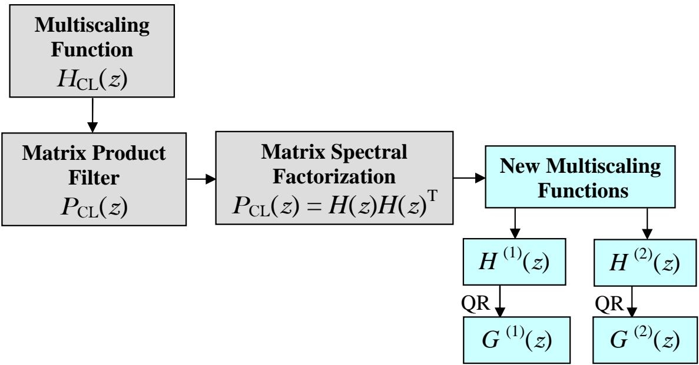  
Figure 1: The main steps in the construction of new supercompact multiscaling and multiwavelet functions

which is a positive semidefinite polynomial matrix. The matrix product coeficients are

$$
P _ { 0 } = H _ { 0 } H _ { 0 } ^ { * } + H _ { 1 } H _ { 1 } ^ { * } , \quad P _ { 1 } = H _ { 0 } H _ { 1 } ^ { * } , \quad P _ { - 1 } = P _ { 1 } ^ { * } = H _ { 1 } H _ { 0 } ^ { * } .\tag{2}
$$

It is Hermitian, and satisfies the half band condition $P ( z ) + P ( - z ) = 2 I \ [ 4 ]$

The stability and causality conditions translate to requiring that �(�) has all its poles and zeros inside the unit circle. Matrix Spectral Factorization (MSF) refers to finding a matrix spectral factor �(�), given $P ( z )$ . The existence of such a factor is guaranteed under a condition on �(�) due to Paley and Wiener, requiring that log(det(�(�))) have a finite integral over an interval of length 2�. MSF is a key step for the construction of minimum phase spectral factors from matrix product filters. Unlike the spectral factorization of scalar Hermitian polynomial functions, where an explicit formula exists, there is no explicit expression for matrix spectral factorization. However, for low-degree para-Hermitian polynomial matrix polynomials a fast algorithm has been constructed in [5, 6].

Our main goal in this paper is to present a new approach for the construction of new supercompact orthogonal multiwavelets by matrix spectral factorization of a suitable product filter. The main steps are shown in Fig. 1.

The new multiwavelets are obtained from the product filter of the Chui-Lian (CL) multiwavelet filter [7]. This immediately leads to three main problems:

1. Does the Fast Bauer’s method for matrix spectral factorization converge in this case?

2. Is possible to obtain an orthogonal multiscaling filter with exact coeficients from existing multifilters?

3. Do the newly derived multiwavelets have better coding gain than other well-known orthogonal or biorthogonal multifilters?

We have the following main contributions:

• Obtain the matrix product filter of the CL orthogonal multiwavelet filter;

• Apply Fast Bauer’s method for spectral factorization to find two new supercompact multiscaling functions with exact recursion coeficients;

• Find the complementary new supercompact multiwavelet functions;

• Compare the performance of new multiwavelet filters in subband-based edge detection, 1D signal denoising and grayscale and color image denoising and compression with with the Integer Haar, Alpert, GHM, SA4 and CL multiwavelet filter banks.

## 2. Theory of Matrix Spectral Factorization

Spectral factorization is an important mathematical tool in signal processing, control theory, and other areas. The fundamental theorem of the spectral factorization is the Fejér-Riesz theorem for positive definite functions. The terminology comes from prediction theory, where the nonnegative function plays the role of a spectral density for a multidimensional stationary stochastic process. Fejér [8] first showed the importance of the class of trigonometric polynomials that admit only positive real values; as a theorem it was proved by Riesz [9]. The definition of a trigonometric univariate polynomial is

$$
\nu ( z ) = \sum _ { k = - N } ^ { N } \nu _ { k } z ^ { k } .
$$

When the function $\nu ( z )$ is real for all $z \in \ \mathbb { T }$ , where � is the unit circle in the complex plane, then the coeficients satisfy $\overline { { \nu } } _ { k } = \nu _ { - k }$ for all �. If $\nu ( z ) \ge 0$ for all $z \in \ \mathbb { T }$ , the spectralfactorization of the function is

$$
\nu ( z ) = p ( z ) p ( z ) ^ { * } ,
$$

where $\begin{array} { r } { p ( z ) = \sum _ { k = 0 } ^ { N } p _ { k } z ^ { k } } \end{array}$ is called a scalar spectral factor.

Matrix spectral factorization (MSF) refers to finding a matrix spectral factor $H ( z )$ , given $P ( z )$ , so that

$$
P ( z ) = H ( z ) H ( z ) ^ { * } .
$$

Such a factorization exists if $P ( z )$ is positive definite on �, absolutely integrable and satisfies the Paley-Wiener condition [10, 11, 12]

$$
\left| \int _ { - \pi } ^ { \pi } \ln \operatorname* { d e t } P ( e ^ { i \omega } ) d \omega \right| < \infty .
$$

There is a unique minimal phase solution $H _ { M } ( z )$ . All other solutions are of the form

$$
H ( z ) = H _ { M } ( z ) U ,
$$

where � is a unitary matrix multiplier.

Usually, $P ( z )$ is a half-band filter with $P _ { 0 } = I , P _ { 2 k } = 0 { \mathrm { f o r } } k \neq 0$

## 2.1. Classical Bauer’s method of Matrix Spectral Factorization

Let the multiscaling function $H ( z )$ and its complex conjugate $H ^ { * } ( z )$ be

$$
\begin{array} { r } { H ( z ) = H _ { 0 } + H _ { 1 } z ^ { - 1 } + \cdots + H _ { m } z ^ { - m } , } \\ { H ^ { * } ( z ) = H _ { 0 } ^ { * } + H _ { 1 } ^ { * } z + \cdots + H _ { m } ^ { * } z ^ { m } , } \end{array}\tag{3}
$$

where $H _ { k }$ are real matrices of size $r \times r$ and $z \in \mathbb { C }$ . Let $\mathbb { T } = \{ z : | z | = 1 \}$ be the unit circle in the complex plane. For $z \in \ \mathbb { T }$ we have $z ^ { - 1 } = { \overline { { z } } }$ . Then the matrix product

$$
P ( z ) = H ( z ) H ^ { * } ( z ) = P _ { m } ^ { * } z ^ { - m } + \cdots P _ { 1 } ^ { * } z ^ { - 1 } + P _ { 0 } + P _ { 1 } z + \cdots P _ { m } z ^ { m }\tag{4}
$$

is called the matrix productfilter, where each matrix coeficient is determined by

$$
P _ { k } = H _ { m - k } H _ { m } ^ { * } + H _ { m - k - 1 } H _ { m - 1 } ^ { * } + \cdots + H _ { 0 } H _ { k } ^ { * } .\tag{5}
$$

Supercompact multifilters represent the simplest case $m = 1$ , with the coeficients $P _ { 0 }$ and $P _ { 1 }$ shown in (2).

Bauer’s matrix spectral factorization finds the Cholesky factor $L _ { n }$ of the $( n + 1 ) \times ( n + 1 )$ banded block Toeplitz matrix

$$
T _ { n } = \left( \begin{array} { c c c c c c } { { P _ { 0 } } } & { { P _ { 1 } } } & { { 0 } } & { { 0 } } & { { 0 } } \\ { { P _ { 1 } ^ { * } } } & { { P _ { 0 } } } & { { P _ { 1 } } } & { { 0 } } & { { 0 } } \\ { { 0 } } & { { \ddots } } & { { \ddots } } & { { \ddots } } & { { 0 } } \\ { { 0 } } & { { 0 } } & { { 0 } } & { { P _ { 1 } ^ { * } } } & { { P _ { 0 } } } \end{array} \right) = L _ { n } L _ { n } ^ { * } ,\tag{6}
$$

where

$$
L _ { n } = \left( \begin{array} { c c c c } { { H _ { 0 } ^ { ( 0 ) } } } & { { 0 } } & { { 0 } } & { { 0 } } \\ { { H _ { 1 } ^ { ( 1 ) } } } & { { H _ { 0 } ^ { ( 1 ) } } } & { { 0 } } & { { 0 } } \\ { { 0 } } & { { \ddots } } & { { \ddots } } & { { 0 } } \\ { { 0 } } & { { 0 } } & { { H _ { 1 } ^ { ( n ) } } } & { { H _ { 0 } ^ { ( n ) } } } \end{array} \right)
$$

is a lower bidiagonal matrix.

The last row of $L _ { n }$ converges to the true matrix coeficients $H _ { 0 } ^ { ( n ) } \to H _ { 0 } , H _ { 1 } ^ { ( n ) } \to H _ { 1 }$ as $n  \infty$

The classical Bauer’s method is very efective for nonsingular matrix product filters $P ( \mathbf { z } )$ . Convergence can be very fast, so n does not need to be large to accurately estimate the spectral factors.

However, since in our applications the matrix product filters are required to possess multiple zeros on the unit circle, the method converges very slowly and requires a very large Toeplitz matrix. In one example, it required a matrix of size around $1 0 ^ { 6 } \times 1 0 ^ { 6 }$ for achieving a precision of $1 0 ^ { - 1 \dot { 3 } }$

In addition, for larger multiplicity $r \geqslant 3$ high precision often cannot be achieved. In one example in [6] with $r { = } 5$ $m { = } 1$ and a decuple zero singularity, the maximum achievable accuracy in the classical Bauer’s method was around $1 0 ^ { - 3 }$

## 2.2. Fast Bauer’s method of Matrix Spectral Factorization

Obviously the Cholesky decomposition (6) can be realized row by row. If we assume that $H _ { 0 } ^ { ( n ) } , H _ { 1 } ^ { ( n ) }$ have already been found, with the initial value $H _ { 0 } ^ { ( 0 ) }$ obtained as the Cholesky factor of $P _ { 0 }$ , then it follows that

$$
H _ { 1 } ^ { ( n + 1 ) } = P _ { 1 } ^ { * } \left[ H _ { 0 } ^ { ( n ) } \right] ^ { - * }\tag{7}
$$

from $\begin{array} { r } { P _ { 1 } ^ { * } = H _ { 1 } ^ { ( n + 1 ) } \left[ H _ { 0 } ^ { ( n ) } \right] ^ { * } } \end{array}$ , and

$$
H _ { 0 } ^ { ( n + 1 ) } \left[ H _ { 0 } ^ { ( n + 1 ) } \right] ^ { * } = P _ { 0 } - H _ { 1 } ^ { ( n + 1 ) } \left[ H _ { 1 } ^ { ( n + 1 ) } \right] ^ { * }\tag{8}
$$

from $P _ { 0 } = H _ { 0 } ^ { ( n + 1 ) } \left[ H _ { 0 } ^ { ( n + 1 ) } \right] ^ { * } + H _ { 1 } ^ { ( n + 1 ) } \left[ H _ { 1 } ^ { ( n + 1 ) } \right] ^ { * } .$

Then (7) substituted into (8) leads to

$$
H _ { 0 } ^ { ( n + 1 ) } \left[ H _ { 0 } ^ { ( n + 1 ) } \right] ^ { * } = P _ { 0 } - P _ { 1 } ^ { * } \left[ H _ { 0 } ^ { ( n ) } \right] ^ { - * } \left[ H _ { 0 } ^ { ( n ) } \right] ^ { - 1 } P _ { 1 } .\tag{9}
$$

If we define $X ^ { ( n + 1 ) } = H _ { 0 } ^ { ( n + 1 ) } \left[ H _ { 0 } ^ { ( n + 1 ) } \right] ^ { * }$ , then

$$
X ^ { ( n + 1 ) } = P _ { 0 } - P _ { 1 } ^ { * } \left[ X _ { 0 } ^ { ( n ) } \right] ^ { - 1 } P _ { 1 } .\tag{10}
$$

The limit $n  \infty$ leads to the solution $X ^ { ( n + 1 ) }  X$ of the nonlinear matrix equation (NME)

$$
X = P _ { 0 } - P _ { 1 } ^ { * } X ^ { - 1 } P _ { 1 } .\tag{11}
$$

Our focus in this paper is the supercompact case $m { = } 1$ , but we note that the general case can be reduced to this by replacing the original coeficients with block matrices. For $m { = } 3$ , for example, we set

$$
\begin{array} { r } { \hat { P } _ { - 1 } = \hat { P } _ { 1 } ^ { * } = \left[ \begin{array} { l l l } { P _ { 3 } ^ { * } } & { P _ { 2 } ^ { * } } & { P _ { 1 } ^ { * } } \\ { 0 } & { P _ { 3 } ^ { * } } & { P _ { 2 } ^ { * } } \\ { 0 } & { 0 } & { P _ { 3 } ^ { * } } \end{array} \right] , \qquad \hat { P } _ { 0 } = \left[ \begin{array} { l l l } { P _ { 0 } } & { P _ { 1 } } & { P _ { 2 } } \\ { P _ { 1 } ^ { * } } & { P _ { 0 } } & { P _ { 1 } } \\ { P _ { 2 } ^ { * } } & { P _ { 1 } ^ { * } } & { P _ { 0 } } \end{array} \right] , \qquad \hat { P } _ { 1 } = \left[ \begin{array} { l l l } { P _ { 3 } } & { 0 } & { 0 } \\ { P _ { 2 } } & { P _ { 3 } } & { 0 } \\ { P _ { 1 } } & { P _ { 2 } } & { P _ { 3 } } \end{array} \right] . } \end{array}
$$

The resulting coeficients $\hat { H } _ { 0 } , \hat { H } _ { 1 }$ have the form

$$
\hat { H } _ { 1 } = \left[ \begin{array} { c c c } { H _ { 3 } } & { H _ { 2 } } & { H _ { 1 } } \\ { 0 } & { H _ { 3 } } & { H _ { 2 } } \\ { 0 } & { 0 } & { H _ { 3 } } \end{array} \right] , \qquad \hat { H } _ { 0 } = \left[ \begin{array} { c c c } { H _ { 0 } } & { 0 } & { 0 } \\ { H _ { 1 } } & { H _ { 0 } } & { 0 } \\ { H _ { 2 } } & { H _ { 1 } } & { H _ { 0 } } \end{array} \right] .
$$

Once $\hat { H } _ { 0 } , \hat { H } _ { 1 }$ have been computed, we can extract the origina $H _ { 0 } , H _ { 1 } , H _ { 2 } , H _ { 3 }$ as submatrices.

Setting up the symmetrical nonsingular matrix � from the above Fast Bauer’s method with symbolic entries $x _ { i j }$ converts (11) into a system of nonlinear equations. For small matrix sizes this can be solved with exact values by a computer algebra system (CAS).

For larger r, (11) could be solved numerically by fixed point iteration, which is identical to the original Bauer’s method, but Newton’s method converges much faster and gives more accurate results. See [6] for more details.

## 3. Design of the supercompact multiwavelet filter

## 3.1. The matrix product filter of the CL multiscaling function

The matrix coeficients of the orthogonal CL scaling functions [7]

$$
H _ { \mathrm { C L } } ( z ) = { \frac { 1 } { 4 } } \left[ { \left( { \begin{array} { l l } { 0 } & { 2 + { \sqrt { 7 } } } \\ { 0 } & { 2 - { \sqrt { 7 } } } \end{array} } \right) } + { \left( { \begin{array} { l l } { 3 } & { 1 } \\ { 1 } & { 3 } \end{array} } \right) } z ^ { - 1 } + { \left( { \begin{array} { l l } { 2 - { \sqrt { 7 } } } & { 0 } \\ { 2 + { \sqrt { 7 } } } & { 0 } \end{array} } \right) } z ^ { - 2 } \right]
$$

lead to the matrix product filter

$$
P _ { \mathrm { C L } } ( z ) = \frac { 1 } { 8 } \left[ \left( \begin{array} { c c } { { 4 } } & { { 1 + \sqrt { 7 } } } \\ { { - ( 1 + \sqrt { 7 } ) } } & { { - \sqrt { 7 } } } \end{array} \right) z ^ { - 1 } + \left( \begin{array} { c c } { { 8 } } & { { 0 } } \\ { { 0 } } & { { 8 } } \end{array} \right) + \left( \begin{array} { c c } { { 4 } } & { { - ( 1 + \sqrt { 7 } ) } } \\ { { 1 + \sqrt { 7 } } } & { { - \sqrt { 7 } } } \end{array} \right) z \right]
$$

with

$$
\operatorname* { d e t } ( P _ { \mathrm { C L } } ( z ) ) = ( 4 - { \sqrt { 7 } } ) { \frac { ( 1 + z ) ^ { 4 } } { 3 2 z ^ { 2 } } } ,
$$

which satisfies the regularity criterion that det(�(�)) has a quadruple zero at $z = - 1$

## 3.2. New supercompact multiscaling functions from the Exact Bauer’s method

In order to obtain multiscaling functions with exact coeficients, we solve eq.(11) by an appropriate CAS, for example the Matlab Symbolic Toolbox. The solution is a symmetric matrix

$$
X = \frac { 1 } { 8 } \left( \begin{array} { c c } { { 4 } } & { { \sqrt { 7 } + 1 } } \\ { { \sqrt { 7 } + 1 } } & { { 4 } } \end{array} \right) .
$$

The standard Cholesky factor is

$$
H _ { 0 } ^ { ( 1 ) } = { \frac { \sqrt { 2 } } { 8 } } \left( \begin{array} { c c } { { 4 } } & { { 0 } } \\ { { \sqrt { 7 } + 1 } } & { { \sqrt { 8 - 2 \sqrt { 7 } } } } \end{array} \right)
$$

The square root has two possible values

$$
{ \sqrt { 8 - 2 { \sqrt { 7 } } } } = \pm ( { \sqrt { 7 } } - 1 )
$$

which leads to two solutions

$$
H _ { 0 } ^ { ( 1 ) } = \frac { \sqrt { 2 } } { 8 } \left( \begin{array} { c c } { { 4 } } & { { 0 } } \\ { { \sqrt { 7 } + 1 } } & { { \sqrt { 7 } - 1 } } \end{array} \right)
$$

and

$$
H _ { 0 } ^ { ( 2 ) } = \frac { \sqrt { 2 } } { 8 } \left( \begin{array} { c c } { { 4 } } & { { 0 } } \\ { { \sqrt { 7 } + 1 } } & { { - ( \sqrt { 7 } - 1 ) } } \end{array} \right)
$$

(a)  
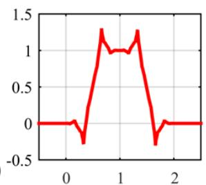

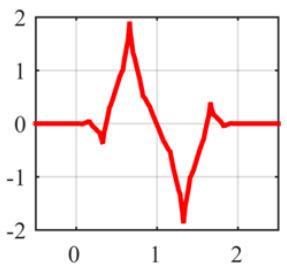

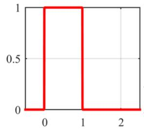

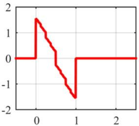

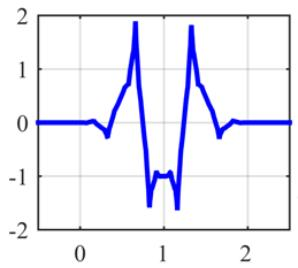  
(b)

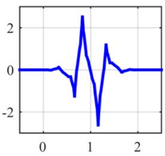

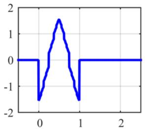

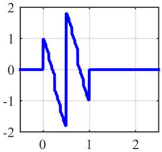

(c)  
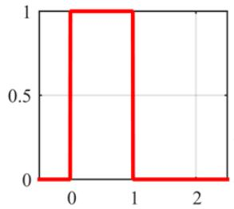

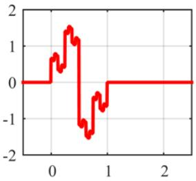

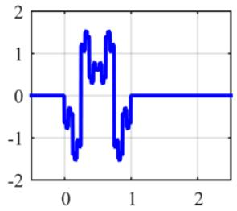

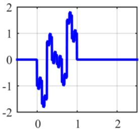  
Figure 2: (a) CL multiscaling function $\phi _ { C L }$ (red) and multiwavelet function $\psi _ { C L }$ (blue); (b) New supercompact multiscaling function $\dot { \phi } ^ { ( \mathrm { i } ) }$ (red) and multiwavelet function $\pmb { \psi } ^ { ( 1 ) }$ (blue); (c) New supercompact multiscaling function $\phi ^ { ( 2 ) }$ (red) and multiwavelet function $\psi ^ { ( 2 ) }$ (blue);

The second coeficients $H _ { 1 } ^ { ( i ) }$ is found from (7) as $H _ { 1 } ^ { ( i ) } ~ = ~ P _ { 1 } ^ { * } \left[ H _ { 0 } ^ { ( i ) } \right] ^ { - * }$ . We call the resulting supercompact multiscaling function New1 and New2.

The resulting coeficients, as well as the coeficients of the corresponding multiwavelet functions and the determinants of the symbols are tabulated in Tab 1. It is important to note that the determinants of both multiscaling functions include a factor of $( 1 + z ^ { - 1 } ) / 2$ , which according to [4] leads to regular scaling functions and a desirable supercompact multiscaling function.

## 3.3. New supercompact multiwavelet functions

In order to obtain the wavelet matrix coeficients $G _ { 0 }$ and $G _ { 1 }$ we can employ the QR decomposition as in [5], or in the present case, the orthogonal vectors method. This multiwavelet possesses the all the desirable properties of the Alpert multiwavelet. The recursion coeficients of the new orthogonal multiscaling and multiwavelet functions obtained by QR decomposition are shown in Table 1; the functions are shown in Fig. 2.

## 4. Performance Analysis

## 4.1. Numerical errors

The classical Bauer’s method is applied to the spectral factorization of the matrix product filter. The numerical errors obtained for the matrix product filter $P ( z )$ and the matrix spectral factor �(�) are defined as

$$
\begin{array} { r } { \epsilon _ { H } ^ { ( n ) } = \Big | H - H ^ { ( n ) } \Big | } \\ { \epsilon _ { P } ^ { ( n ) } = \Big | P - P ^ { ( n ) } \Big | . } \end{array}\tag{12}
$$

The matrix coeficients of the two new multiscaling and multiwavelet functions New1 and New2.
<table><tr><td>Multiscaling Functions  $H ^ { ( 1 ) } ( z )$ </td><td> $H ^ { ( 2 ) } ( z )$ </td></tr><tr><td> $\begin{array} { r } { H _ { 0 } ^ { ( 1 ) } = \frac { \sqrt { 2 } } { 8 } \left( \begin{array} { c c } { 4 } & { 0 } \\ { \sqrt { 7 } + 1 } & { \sqrt { 7 } - 1 } \end{array} \right) } \end{array}$   $\begin{array} { r } { H _ { 1 } ^ { ( 1 ) } = \frac { \sqrt { 2 } } { 8 } \left( \begin{array} { c c } { 4 } & { 0 } \\ { - ( \sqrt { 7 } + 1 ) } & { \sqrt { 7 } - 1 } \end{array} \right) } \end{array}$   $\operatorname* { d e t } ( H ^ { ( 1 ) } ( z ) ) = \operatorname* { d e t } ( H _ { 0 } ^ { ( 1 ) } + H _ { 1 } ^ { ( 1 ) } z ^ { - 1 } )$ </td><td> $\begin{array} { r } { H _ { 0 } ^ { ( 2 ) } = \frac { \sqrt { 2 } } { 8 } \left( \begin{array} { c c } { 4 } & { 0 } \\ { \sqrt { 7 } + 1 } & { 1 - \sqrt { 7 } } \end{array} \right) } \end{array}$   $\begin{array} { r } { H _ { 1 } ^ { ( 2 ) } = \frac { \sqrt { 2 } } { 8 } \left( \begin{array} { c c } { 4 } & { 0 } \\ { - ( \sqrt { 7 } + 1 ) } & { 1 - \sqrt { 7 } } \end{array} \right) } \end{array}$   $\operatorname* { d e t } ( H ^ { ( 2 ) } ( z ) ) = \operatorname* { d e t } ( H _ { 0 } ^ { ( 2 ) } + H _ { 1 } ^ { ( 2 ) } z ^ { - 1 } )$ </td></tr><tr><td colspan="2"> $\begin{array} { r } { = \frac { \sqrt { 7 } - 1 } { \sqrt { 2 } } ( 1 + z ^ { - 1 } ) ^ { 2 } } \end{array}$   $\begin{array} { r } { = \frac { 1 - \sqrt { 7 } } { \sqrt { 2 } } ( 1 + z ^ { - 1 } ) ^ { 2 } } \end{array}$ </td></tr><tr><td colspan="2">Multiwavelet Functions  $G ^ { ( 1 ) } ( z )$ </td></tr></table>

The values are shown in Fig. 3, in a log-log plot. The convergence of the two errors $\epsilon _ { H }$ and $\epsilon _ { P }$ is well modeled by the linear fit $p _ { \epsilon _ { H } ( x ) } = - 1 . 0 1 0 1 n$ and $p _ { \epsilon _ { P } ( x ) } = - 2 . 0 4 5 4 r$ respectively, where the logarithm of the error $\log ( \epsilon _ { H } ^ { ( n ) } )$ has slope (−1) (a red line), while log $( \epsilon _ { H } ^ { ( n ) } )$ has a slope of (−2) (cyan line).

In [6], after applying the fast Bauer’s method using a general discrete algebraic Riccati equation (GDARE) in Matlab R2018a, the best achieved precision for the matrix spectral factor $\epsilon _ { H } ^ { ( n ) } = 6 . 1 6 \times 1 0 ^ { - 5 }$ and the matrix product filter $\epsilon _ { P } ^ { ( n ) } = 6 . 6 6 \times 1 0 ^ { - 1 4 }$ , while with Matlab R2010a,b the best precisions are $\epsilon _ { H } ^ { ( n ) } = 6 . 7 0 7 7 \times 1 0 ^ { - 5 }$ and $\epsilon _ { P } ^ { ( n ) } = 3 . 3 3 0 7 { \times } 1 0 ^ { - 1 6 }$ respectively.

It is important to note that the classical Bauer’s method for spectral factorization obtained errors for $n = 1 0 , 0 0 0$ of $\epsilon _ { H } ^ { ( n ) } = 8 . 3 9 6 \times 1 0 ^ { - 5 }$ and $\epsilon _ { P } ^ { ( n ) } = 2 . 0 5 5 \times 1 0 ^ { - 9 }$ shown in Fig. 3. They can easily be modeled by regression functions. The empirical results show minimal possible errors $\epsilon _ { H } ^ { ( n ) } = 9 . 6 1 4 5 \times 1 0 ^ { - 1 7 }$ and $\epsilon _ { H } ^ { ( n ) } = 6 . 9 7 9 \times 1 0 ^ { - 5 }$ that can be achieved for $n = 3 8 . 6 3 9$

## 4.2. Statistical Characteristic Analysis of the Test Images 4.2.1. Histograms

The histogram of an image is a one-dimensional statistical characteristic of the given image and represents the frequency of intensity in separate groups of pixels in the image. The groups usually contain the same number of adjacent intensity levels. The most representative (precise) are histograms on all possible single levels.

As an application, the histogram values are in some (engineering) range of intensities of useful (measured) quantities, of course appropriately quantized. Visually, the histogram allows for diferent interpretations by pixels and groups of pixels, for example how the brightness (luminance) correlates with the number of pixels in it, as well as some easily apparent characteristics such as contrast, dynamic range and saturation efects, which make problems easily visible and facilitate the analysis of the image (and the problem it reflects).

The color of images is represented by color models. The most popular of them is RGB, but we can also mention many others, YUV, HSV, etc., emphasizing diferent characteristics of color. While a halftone image is a scalar function over the discrete area of pixels, color images are usually vector functions. RGB is a 3-dimensional function, one vector for each of the 3 channels (all halftones).

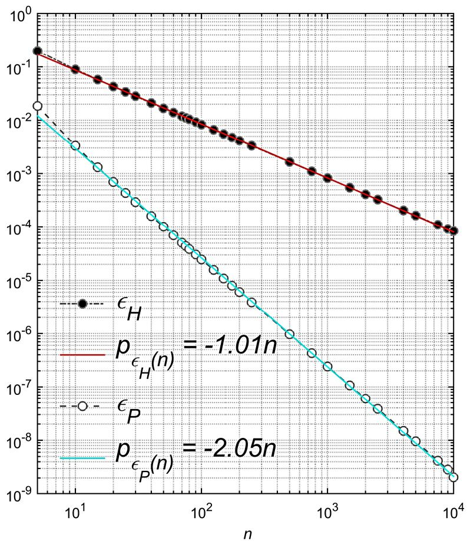  
Figure 3: Influence of the size � of the Toeplitz matrix on the precision of the matrix spectral factor (in log-log format): The numerical error of matrix spectral factor $\epsilon _ { H } ^ { ( n ) } ( \mathsf { r e d } )$ and of the matrix product filter $\epsilon _ { P } ^ { ( n ) } ( \mathsf { c y a n } )$

For better decomposition at multiple levels of detail and better encoding as well, in the future we could apply a suitable 3D transform based on 3D convolution and extraction of color channels by a inflated 3D convNet (I3D) model [26] instead of extraction of RGB channels.

The abscissa �� shows the pixel intensities in the range from 0 to 255 for each color channel (R, G, B). The value 0 corresponds to the "black" level, and 255 to the "white" level. If the image is halftone, successive levels of "gray" are placed between them. If the channel is color, the "gray" level represents the corresponding base colors (R, G, B) in the given color image. The ordinate �� shows the frequency of the corresponding pixel intensity levels. Color histograms are triplets of halftone histograms, one for each color (red (R), green (G), and blue (B) channels. The size of the intervals in the figures is not specified and the value of each pixel is displayed separately. Some characteristic tests for seven color and seven grayscale images with diferent sizes and textures are illustrated in Fig. 4(a)–(f) and Fig. 5(a)–(g).

• Bart Run has an extremely low dynamic range with only 14 intensity values;

• Cameraman has 2 isolated spikes, as can be see from the histogram in Fig. 4(b). The big peak on the far left side of the graph means that the image is made up of a lot of shadows or black tones. Therefore the image has low brightness. The peaks in the middle of the histogram indicate lots of midtones which mean muted color grays;

• Kiel has distributed intensity values with 2 isolated peaks. The histogram in Fig. 4(c) shows peaks that are cut of on the left or right side, which means an underexposed image;

• House is underexposed (intensity values are clustered) and has high contrast for all three colors. The blue channel, see Fig. 4(d), has many pixels in the high intensity region, while the red and green spectra remain mostly low. This means that the image has shades of blue, but not much red and green.

• Cara has saturated and underexposed pixel values (intensity values are clustered) and has also an isolated peak for all three colors. This is shown in Fig. 4(e), where the histogram peaks in the middle of each color indicate a large presence of dark pixels for each color. Each color has peaks scattered around the middle, indicating a midtone, which means a muted color.

• Voit has properly exposed normal contrast (intensity values are scattered).

• House has low contrast histogram by a slight increase in contrast. The big peak on the right side shown in Fig. 5(a).

• Couple has low contrast histogram gaps caused by a slight increase in contrast shown in Fig. 5(b).

• Brick wall has a normal contrast and many pixels in the low intensity region which means that the image has shades or dark color tones shown in Fig. 5(c).

• Texture 1 has low high and overexposed contrast for R, G and B channels respectively. The blue channel has many pixels with in the lowest intensity region, while the red and green channels remain mostly low shown in Fig. 5(d).

• Subwater has normal contrast for channels, blur the red and blue channels and isolated peak shown in Fig. 5(e).

• Texture 4 Texture 4 has extremely low dynamic range for R, G, B channels with 2 isolated peaks shown in Fig. 5(f).

• Texture 5 histogram gaps caused by a slight increase in contrast shown in Fig. 5(g).

## 4.2.2. Adjacent Pixel Correlations

Neighboring pixel correlation refers to the relationship between two adjacent pixels in horizontal and vertical coordinates, respectively. The more the pixel values remain concentrated near the linear fit, the stronger the correlation between neighboring pixels in the image; conversely, the more pixels are scattered throughout the plot, the weaker the correlation between neighboring pixels in the image.

The correlation coeficient $R ^ { 2 }$ is a primary measure of how well a regression model fits the data. This correlation coeficient is simply the square of Pearson’s correlation coeficient �. To check the existence of a high correlation among neighboring pixels in the test images, a pixel correlation analysis test has performed. The correlation analysis of adjacent pixels of this encryption scheme is shown in Fig. 6(a)-(f). High correlation among pixels in the original image is represented by the linear fit it converges to. The scatterplot of Fig. 6 leads to the values of $R ^ { 2 }$ for the regression models shown in Table 2.

The correlation coeficient $R ^ { 2 }$ , which is the square of the Pearson correlation coeficient, is a basic measure of how well a regression model fits the data; when $R ^ { 2 } = 1$ , the regression line predicts a perfect fit of the pixel values. The values of the regression lines for all test images are shown in Table 2. Fig. 6 shows the scatter plot of all regression models from Table 2.

The images Bart Run and Cara have quite a bit of scatter, but the scatter plot of Fig. 6(a) and (e) (red, green, and blue channels) shows a clear linear trend with correlation 88% − 98%. The images Kiel and Voit have a moderate positive correlation in the interval 62% − 68%. It’s not a very strong relationship, as some values show no correlation. Obviously, for these two images there is quite a lot of scatter, but the trend is reasonably linear, despite the fact that the big number of data points makes it dificult to do a full correlation assessment. Fig. 5(b) and (f) (red, green, and blue channels) shows that there is no correlation in some subset pixels and a strong correlation in the whole pixels data set.

The images Bart Run and Cara have quite a large scatter, but the scatter plot in Fig. 6(a) and (e) (RGB channels) shows a clear linear trend with a correlation of 88% − 98%. The two images Kiel and Voit have a moderate positive correlation in the interval 62% − 68%. This is not a very strong relationship, as some values show no correlation. It is clear that there is quite a bit of scatter for these two images, but the trend is relatively linear, despite the large number of data points, which makes it dificult to fully assess the correlation. Fig. 6(b) and (f) (RGB channels) show that there is no correlation in some subsets of pixels and a strong correlation in the entire pixel dataset.

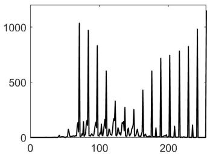  
(a)

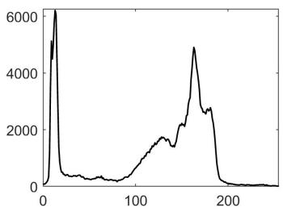  
(b)

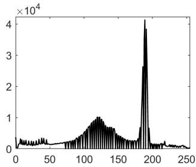  
(c)

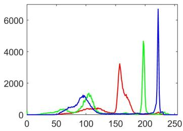  
(d)

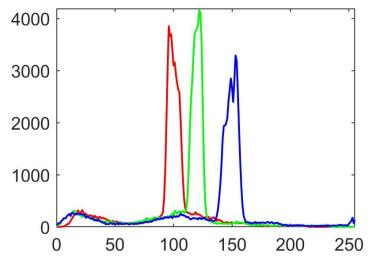  
(e)

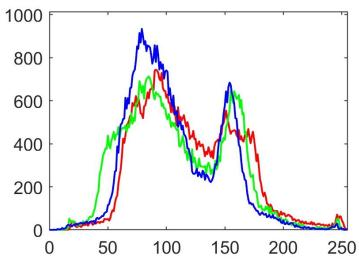  
(f)  
Figure 4: Test images and their histograms; (a)Bart Run(128 × 128); (b)Cameraman(256 × 256); (c)Kiel(512 × 512);(d)House(256 × 256); (e)Cara(256 × 256);(f)Voit(256 × 256).

The grayscale images House,Cameraman, Texture 5 and color image (for R,G,B channels)Subwater have a strong correlation shown of Fig. 7. The grayscale image House and color images (for R,G,B channels) Texture 1, Texture 4 there is no correlation of pixels and a strong correlation in the entire pixel dataset shown of Fig. 7.

## 4.3. General multifilter characteristics

We compare the performance of the proposed new multifilters with some well-known orthogonal and biorthogonal filter banks.The results are given in Table 3, with the criteria being coding gain (CG), Sobolev smoothness (S) [13], symmetry/anti-symmetry (S/A) and length.

The CG is the ratio of arithmetic and geometric means of channel variances and is a good indication of the performance in signal processing. To estimate the CG, the variance is computed using a first order Markov model AR(1) with intersample autocorrelation coeficient � = 0.95 [20]. As shown in Table 3, the supercompact multiwavelets have smaller CGs than SA4 and Geronimo-Hardin-Massopust (GHM), but better CGs, by at least a quarter dB, than even CL and most other orthogonal and biorthogonal multifilters, including designs with three or more matrix coeficients.

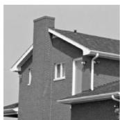

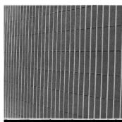

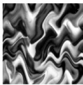

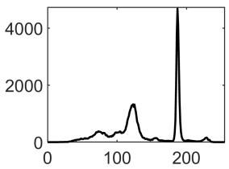  
(a)

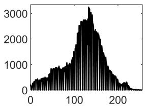  
(b)

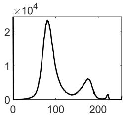  
(c)

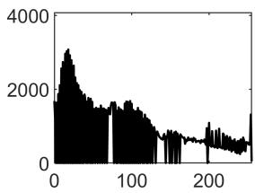  
(d)

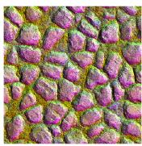

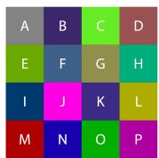

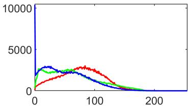  
(e)

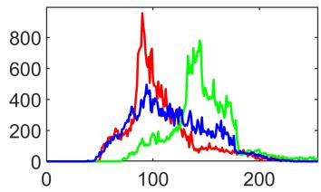  
(f)

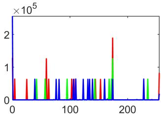  
(g)  
Figure 5: Test images and their histograms; (a)House(256 × 256); (b)Couple(256 × 256); (c)Brick Wall(1024 × 1024); (d) Texture 5 (256 × 256); (e) Texture 1(512 × 512); (f) Subwater(256 × 128); (g)Texture 4(1024 × 1024).

## 4.4. Applications

## 4.4.1. Subband-based edge detection

Edge detection is one of the fundamental operations in image processing and computer vision. It is used to identify the edges in an image, for image segmentation and data extraction, and for easy processing as well.

Since the choice of edge detection operator has to be responsive to gradual changes, the Canny method is used, which provides good edge detection. It uses two diferent threshold types to detect strong and weak edges [21].

The location and orientation of edges in an image can be determined from the encoded subbands of the origina image [22]. Note that in many edge detection algorithms, the detail subbands which can be used in multiwavelet subband-based edge detection are using vector quantization (VQ) via �-means-based deep network architecture [23] to encode the multiwavelet coeficients. The main advantage of VQ is the construction of the code book consisting of code vectors. The goal of quantization is to obtain suficiently small multiwavelet coeficients with a quantized distribution so that they can be encoded at a low bit rate. This motivated us to consider a simple example of a multiwavelet subbandbased edge detection.

The Canny method is applied to the present multiwavelet filters for one decomposition level of a simple image, where we obtain sixteen subbands. The results from the subband-based edge detection are shown in Fig. 8. The contour lines of the SA1 filter show that this is an excellent detector, better than the other six transformations.

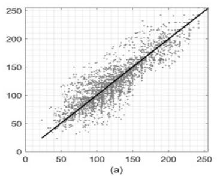

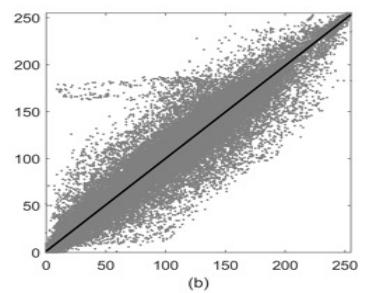

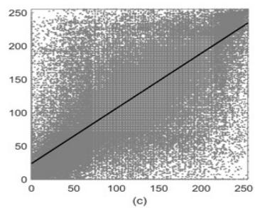

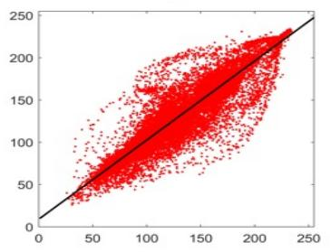

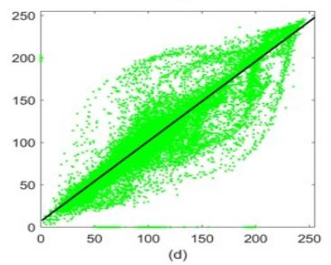

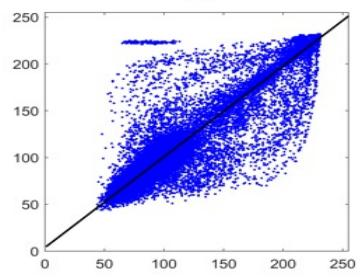

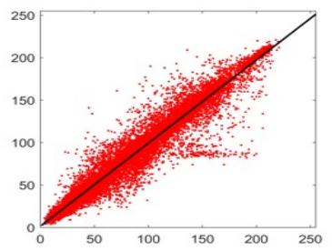

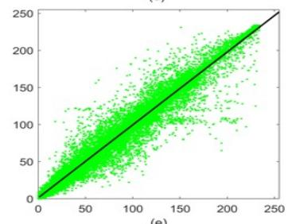

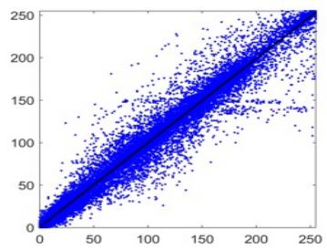

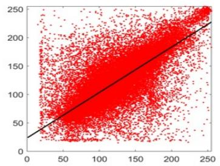

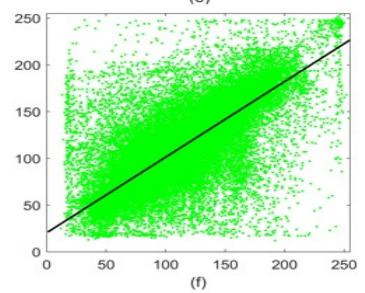

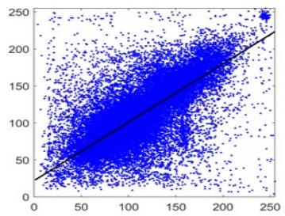  
Figure 6: Pixel correlations and linear fit lines for the gray and color (RGB channels) images; (a) Bart Run (128x128) (b) Cameraman (256x256) (c) Kiel (512x512) (d) House (256×256); (e) Cara (256×256); (f) Voit (256×256).

## 4.4.2. Image Compression

The measurement for comparative analysis between the original $\mathbf { I } ( x , y )$ and the noise $\tilde { \mathbf { I } } ( x , y )$ images of size $N ^ { 2 }$ is the mean square error (MSE),

$$
M S E = \frac { 1 } { N ^ { 2 } } \sum _ { ( x , y ) } ( \mathbf { I } - \tilde { \mathbf { I } } ) ^ { 2 } ,
$$

which in decibels on a logarithmic scale is the Peak Signal-to-Noise Ratio (PSNR)

$$
P S N R = 1 0 \log _ { 1 0 } ( \frac { 2 5 5 ^ { 2 } } { M S E } )
$$

for $x , y = 1 : N$ . PSNR of the compression ratio (CR) is defined as the ratio between the original and compressed image size. Results are shown in Table 5.

The structural information of natural images is based on the human visual system (HVS). Quality assessment of compressed images is obtained through the structural similarity index measures (SSIM) [24] and its multiscale extension, the multiscale structural similarity index (MS-SSIM) [25], where the objective quality evaluation at each image scale contributes to the overal scorel.

Table 2  
The coeficients of the linear regression lines for the gray and color images
<table><tr><td>Images</td><td colspan="2">The coefficients of the linear regression equation  $y = p _ { 1 } x + p _ { 2 }$ </td><td>Coefficient of determination  $R ^ { 2 }$ </td></tr><tr><td>Bart Run</td><td> $p _ { 1 }$  0.9912</td><td> $p _ { 2 }$  1.3412</td><td>0.9824</td></tr><tr><td>Cameraman</td><td>0.9887</td><td>1.3424</td><td>0.9774</td></tr><tr><td>Kiel</td><td>0.8271</td><td>23.5374</td><td>0.6841</td></tr><tr><td>House</td><td>0.9586</td><td>5.7160</td><td>0.9189</td></tr><tr><td>Couple</td><td>0.8927</td><td>12.9530</td><td>0.7970</td></tr><tr><td>Brick wall</td><td>0.9053</td><td>9.5085</td><td>0.8195</td></tr><tr><td>Texture 5</td><td>0.9727</td><td>2.9083</td><td>0.9461</td></tr><tr><td rowspan="3">House</td><td>R</td><td>0.9326</td><td>9.8814 0.8697</td></tr><tr><td>G</td><td>0.9408 7.8723</td><td>0.8852</td></tr><tr><td>B 0.9668</td><td>4.7158</td><td>0.9347</td></tr><tr><td rowspan="3">Cara</td><td>R</td><td>0.9763 2.2668</td><td>0.9531</td></tr><tr><td>G</td><td>0.9797 2.1628</td><td>0.9598</td></tr><tr><td>B 0.9861</td><td>1.8061</td><td>0.9723</td></tr><tr><td rowspan="3">Voit</td><td>R 0.7972</td><td>24.2278</td><td>0.6356</td></tr><tr><td>G</td><td>0.8058 21.2176</td><td>0.6493</td></tr><tr><td>B 0.7870</td><td>22.8056</td><td>0.6194</td></tr><tr><td rowspan="3">Texture 1</td><td>R 0.5361</td><td>35.3482</td><td>0.2874</td></tr><tr><td>G</td><td>0.4606 34.0091</td><td>0.2121</td></tr><tr><td>B 0.6607</td><td>17.9257</td><td>0.4365</td></tr><tr><td rowspan="3">Subwater</td><td>R</td><td>0.9761 2.5480</td><td>0.9527</td></tr><tr><td>G</td><td>0.9762 3.4688</td><td>0.9530</td></tr><tr><td>B 0.9689</td><td>3.6210</td><td>0.9387</td></tr><tr><td rowspan="3">Texture 4</td><td>R</td><td>0.9927</td><td>0.7649 0.9854</td></tr><tr><td>G</td><td>0.9947</td><td>0.5201 0.9894</td></tr><tr><td>B 0.9923</td><td>0.7514</td><td>0.9846</td></tr></table>

Comparison of CGs, S, S/A, for autocorrelation matrix $R _ { x }$ of $\mathsf { A R } ( 1 )$ and $\rho = 0 . 9 5$
<table><tr><td rowspan=1 colspan=1>Multifilter</td><td rowspan=1 colspan=1>CG</td><td rowspan=1 colspan=1>S</td><td rowspan=1 colspan=1>S/A</td><td rowspan=1 colspan=1>length</td></tr><tr><td rowspan=1 colspan=1>Biorthogonal Hermitian cubic spline(bih34n) [14]</td><td rowspan=1 colspan=1>1.51</td><td rowspan=1 colspan=1>2.5</td><td rowspan=1 colspan=1>yes</td><td rowspan=1 colspan=1>3/5</td></tr><tr><td rowspan=1 colspan=1>Biorthogonal (dual to Hermitian cubic spline)(bih32s) [15]</td><td rowspan=1 colspan=1>1.01</td><td rowspan=1 colspan=1>2.5</td><td rowspan=1 colspan=1>yes</td><td rowspan=1 colspan=1>3/5</td></tr><tr><td rowspan=1 colspan=1>Integer Haar [16] (supercompact)</td><td rowspan=1 colspan=1>1.83</td><td rowspan=1 colspan=1>0.5</td><td rowspan=1 colspan=1>yes</td><td rowspan=1 colspan=1>2</td></tr><tr><td rowspan=1 colspan=1>CL [7]</td><td rowspan=1 colspan=1>2.06</td><td rowspan=1 colspan=1>1.06</td><td rowspan=1 colspan=1>yes</td><td rowspan=1 colspan=1>3</td></tr><tr><td rowspan=1 colspan=1>Alpert [17] (supercompact)</td><td rowspan=1 colspan=1>2.13</td><td rowspan=1 colspan=1>0.5</td><td rowspan=1 colspan=1>yes</td><td rowspan=1 colspan=1>2</td></tr><tr><td rowspan=1 colspan=1>New2 (supercompact)</td><td rowspan=1 colspan=1>2.24</td><td rowspan=1 colspan=1>1.28</td><td rowspan=1 colspan=1>yes</td><td rowspan=1 colspan=1>2</td></tr><tr><td rowspan=1 colspan=1>New1 (supercompact)</td><td rowspan=1 colspan=1>2.38</td><td rowspan=1 colspan=1>1.28</td><td rowspan=1 colspan=1>yes</td><td rowspan=1 colspan=1>2</td></tr><tr><td rowspan=1 colspan=1>SA4 [18]</td><td rowspan=1 colspan=1>3.73</td><td rowspan=1 colspan=1>0.99</td><td rowspan=1 colspan=1>yes</td><td rowspan=1 colspan=1>4</td></tr><tr><td rowspan=1 colspan=1>GHM [19]</td><td rowspan=1 colspan=1>4.41</td><td rowspan=1 colspan=1>1.5</td><td rowspan=1 colspan=1>yes</td><td rowspan=1 colspan=1>4</td></tr></table>

The SSIM metric combines local image structure, luminance, and contrast into a single local quality score. In this metric, structures are patterns of pixel intensities, especially among neighboring pixels, after normalizing for luminance and contrast. Because the human visual system is good at perceiving structure, the SSIM quality metric agrees more closely with the subjective quality score. The SSIM perceived quality by quantifying the SSIM between an image and

a reference image [24]:

$$
S S I M ( { \bf I } , { \tilde { \bf I } } ) = m _ { K } ( { \bf I } , { \tilde { \bf I } } ) v _ { K } ( { \bf I } , { \tilde { \bf I } } ) = \frac { ( 2 \mu _ { x } \mu _ { y } + C _ { 1 } ) ( 2 \sigma _ { x y } + C _ { 2 } ) } { ( \mu _ { x } ^ { 2 } + \mu _ { y } ^ { 2 } + C _ { 1 } ) ( \sigma _ { x } ^ { 2 } + \sigma _ { y } ^ { 2 } + C _ { 2 } ) } ,
$$

where $m _ { K } ( { \bf I } , \tilde { { \bf I } } )$ is the luminance distortion, $v _ { K } ( { \bf { I } } , \tilde { { \bf { I } } } )$ are the contrast components, and $\mu _ { x } , \mu _ { y } , \sigma _ { x } , \sigma _ { y }$ and $\sigma _ { x y }$ are the local means, standard deviations, and cross-covariance for images $\mathbf { I } ( x , y )$ and $\tilde { \mathbf { I } } ( x , y )$ with $C _ { 1 } = 2 . 5 5 , C _ { 2 } = 7 . 6 5$

MS-SSIM [25] expands on the SSIM index by combining luminance information with the variance and crosscorrelation components at scale �. The multiple scales account for variability in the perception of image details caused by factors such as viewing distance from the image, distance from the scene to the sensor, and resolution of the image acquisition sensor.

The MS-SSIM index for scale � is given by [25]

$$
M S - S S I M = m _ { K } ( { \bf I } , { \tilde { \bf I } } ) ^ { \alpha _ { K } } \prod _ { k = 1 } ^ { K } v _ { k } ( { \bf I } , { \tilde { \bf I } } ) ^ { \beta _ { k } } r _ { k } ( { \bf I } , { \tilde { \bf I } } ) ^ { \gamma _ { k } } ,
$$

where

$$
r _ { K } ( { \bf I } , { \tilde { \bf I } } ) = \frac { \sigma _ { x y } + C _ { 3 } } { \sigma _ { x } \sigma _ { y } + C _ { 3 } } ,
$$

and $C _ { 3 } = C _ { 2 } / 2$ is the structure component at scale � (where $K = 1$ is the full-resolution image). For $K = 5 ,$ , the exponents are $\beta _ { 1 } = \gamma _ { 1 } = 0 . 0 4 4 8 , \beta _ { 2 } = \gamma _ { 2 } = 0 . 2 8 5 6 , \beta _ { 3 } = \gamma _ { 3 } = 0 . 3 0 0 1 , \beta _ { 4 } = \gamma _ { 4 } = 0 . 2 3 6 3 , \mathrm { a n d } \alpha _ { 5 } = \beta _ { 5 } = \gamma _ { 5 } = 0 . 1 3 3 3$ The best quality values for structural information are obtained for ${ \mathrm { S S I M } } = { \mathrm { M S } } { \mathrm { - } } { \mathrm { S S I M } } = 1$

Image compression of the gray level images Bart Run, Cameraman and Kiel, with sizes $1 2 8 ^ { 2 } , 2 5 6 ^ { 2 }$ , and $5 1 2 ^ { 2 }$ pixels respectively, is applied using balanced GHM, CL, SA4, Alpert, and the two new supercompact multifilters. The balancing for GHM and CL is according to [17]; for SA4, Alpert, and the new supercompact multifilters it is of the Haar type.

Results are shown in Tables 4–9. All minimal MSE and maximal PSNR, SSIM and MS-SSIM values are marked in bold.

Table 4 shows results for the gray level image Bart Run. When CR = 4, all multiwavelet filter banks from decomposition levels 2 through 5 achieve nearly constant SSIM and MS-SSIM. The lowest MSE and highest values for PSNR, SSIM and MS-SSIM are obtained by the Integer Haar multiwavelet. The supercompact multiwavelets compared with other multiwavelets (GHM, SA4 and CL) leads to better PSNR, SSIM and MS-SSIM.

When CR = 8, nearly constant SSIM and MS-SSIM are achieved for all multiwavelet filter banks from the third to the fifth level decomposition. The lowest MSE and highest values for PSNR are achieved by using the Alpert multiwavelet. We need to note that better MSE and PSNR do not lead to better SSIM and MS-SSIM. The highest SSIM is by using CL multiwavelet while and highest MS-SSIM values are achieved for 3 and more level decompositions from the New1 supercompact multiwavelet.

The next two CR = 16 and 32 show that at the first compression level all the measured values for the Alpert, New1 and New2 multiwavelets are equal. This comes from the similarity in structure of the pairs of scaling and wavele functions. Moreover, Alpert and New1 multiwavelet filters achieve best PSNRs, SSIMs and MS-SSIMs. For CR =16, best MSEs and PSNRs values are for the New1 multiwavelet at 3 and more decomposition level, while for $\mathrm { C R } = 3 2$ it is the Alpert multiwavelet. With respect to SSIMs and MS-SSIMs for CR = 16, the Alpert multiwavelet achieved the best values for 3 and more decomposition levels, while for CR= 32 the best values are from 1 to 3 decomposition levels with the New1 multiwavelet filter.

Table 5 shows results for the gray level image Cameraman. For CR = 4 GHM has better MS-SSIM, but for $\mathrm { C R } =$ 8, 16 and 32 the New1 supercompact multifilter filter for 3 and more decomposition levels achieved better values than all the rest. It is important to note that all supercompact multiwavelets have nearly constant values for PSNR, SSIM and MS-SSIM for 4 and more decomposition levels.

Table 6 shows results for the gray level image Kiel. For 4 and more decomposition levels and CR = 4, 8 and 16 all multiwavelets achieved nearly constant MSEs and PSNRs. Better results are obtained for the two supercompact Alpert and New1 multiwavelet filters. For the three considered CRs, the New1 multiwavelet has better values for MS-SSIM, MSE and PSNR.

Table 7 shows results for the color image House. The PSNR values of all multiwavelet filters for CR = 4 and 8 for 4 and more decomposition levels and for CR = 16 and 32 for 5 and 6 decomposition levels are nearly constant, For all CRs, the best PSNR, SSIM and MS-SSIM with 3 and more decomposition levels were achieved again by the New1 multiwavelet filter. Moreover, with CR = 4, its MS-SSIM values equal those the of the SA4 multiwavelet filter, which is longer with more vanishing moments.

Table 8 shows results for the color image Cara. The best measured values for CR = 4 of all decomposition levels are achieved by the New1 multiwavelet. The SSIM and MS-SSIM values of GHM, SA4 and Alpert multiwavelets are equal for 2 and more levels. We need to note that for CR = 4 and 8 at 3 and more decomposition levels all multifilters have nearly constant SSIM and MS-SSIM values. For CR = 8, best measured values are achieved again by the New1 multiwavelet, except for 1 and 2 decomposition levels, and the MS-SSIM values are equal with GHM and Alpert for 3 and more levels. For CR = 16, for 1 and 2 decomposition levels the SA4 multifilter has the best SSIM values, for the rest the best measured values are achieved by the New1 multiwavelet. For CR = 32, the New1 multiwavelet achieves all best measured values, except MSE and PSNR at 1, 2 and 3 decomposition levels. The MS-SSIM values of the supercompact multiwavelet filters are nearly constant for more than 4 decomposition levels.

Table 9 shows results for the color image Voit. For CR = 4 and 8, all multiwavelet filters at 4 and more decomposition levels have nearly constants measured values. With a minimal diference from the SA4 multiwavelet, all best measured values are achieved again by the New1 multiwavelet filter. For CR = 4 and 8, the New1 multiwavelet filter has the best MSE, PSNR and SSIM for 3 and more decomposition levels. The best MS-SSIM, is achieved by the SA4 multiwavelet, except at the 2nd level. For CR = 32, from 1 to 3 decomposition level the best SSIM is with the SA4 multiwavelet filter, while the best MS-SSIM values are for CL, New1 and SA4 multiwavelets, respectively. For 4 and more decomposition level, the New1 multiwavelet has the best SSIM and MS–SSIM values, while its PSNR values are equal with Alpert multiwavelet.

Table 10 shows results for the color image Texture 1. For CR = 2 for decomposition levels bigger than 1, the New1 multifilter has max PSNR, SSIM and MS-SSIM values. For CR = 4, the SA4 multifilter has max PSNR and SSIM values for all decomposition levels, which are slightly higher (0.03dB and 0.020 respectively) than New1, while New1 has max MS-SSIM slightly higher (0.20dB, 0.020dB and 0.03dB, respectively) than New2. For CR = 8, SA4 has max PSNR and SSIM values for all decomposition level, which are slightly higher (0.03dB, 0.04dB and 0.012dB, respectively) than New1.

Table 11 shows results for the color image Texture 4. Since the image allows superb values at higher compression levels, the beginning value is CR = 64.

For CR=64, the max PSNR value at the first decomposition level is achieved by the SA4 multifilter, slightly higher (by 0.04dB) than New1. At the second decomposition level, New1 is better. For decompositin levels 3 to 7, Integer Haar has the max PSNR levels, significantly higher (by 0.64dB – 1.36dB) than New1.

For SSIM and MS-SSIM, the maximal values at the first 3 decomposition levels are for New1 and New2, and at levels 4 to 7 the Integer Haar multifilter has negligibly higher levels (by 0.003dB).

For CR = 128, max PSNR at the first decomposition level is for SA4, higher by 0.02dB than New1. The New1 multifilter has superior values for PSNR, SSIM and MS-SSIM at levels 2 to 7 (6.5dB better than CL and SA4, 12dB better than GHM and 6.5dB better than New2).

For CR = 256, SA4 has the maximal PSNR values at the first and second decomposition levels, better by 0.03dB and 0.05dB respectively) than New1. New1 has max SSIM and MS-SSIM values. From levels 3 to 7 all maximal values are for New1, bigger by around 5.0dB than SA4 and CL, and around 8.0dB better than GHM.

For CR = 512, SA4 achieves the maximal PSNR values at the first and second decomposition levels, negligibly higher (by 0.03dB and 0.04dB, respectively) than New1. At the second level, New1 have max SSIM and MS-SSIM values. From levels 3 to 7 New1 has all maximal values, bigger by around 5.0dB than SA4 and CL, and around 6.0dB better than GHM.

The multifilter New1 applied to the image Texture 4, which has a strongly combed histogram, achieves better results for all metrics, with minimal diferences for all compression levels.

Table 12 shows results for the grayscale image Brick wall. For CR=16, at the first decomposition level SA4 has max PSNR values, while at levels 3 to 7 CL is best, negligibly higher (by 0.01dB) than New1. The max SSIM is for the GHM multifilter, while the SA4 multifilter has max MS-SSIM, negligible higher (by 0.004dB) than New1. For CR=32 and 64, SA4 has the max PSNR, SSIM and MS-SSIM values at decomposition levels 1 and 2, whuile for levels 3 to 7 the SA4 multifilter New1 has all max values.

Table 13 shows results for the grayscale image Texture 5. For CR = 4, 8 and 16, the New1 multifilter has max PSNR, SSIM and MS-SSIM values at all decomposition levels. For CR=32, the SA4 multifilter has maximal values for the first and second decomposition levels, while New1 has max values for the third to seventh decomposition levels.

Table 14 shows results for the color image Subwater. For CR= 8 all maximal values are obtained for SA4, slightly higher (by 0.17dB and 0.004dB, respectively) than New1; the values of MS-SSIM are equal. For CR=16, max PSNR, SSIM ans MS-SSIM values are obtained by New1, except at the second level, where the values are negligible lower (by 0.06dB, 0.0007dB and 0.0001dB, respectively) than SA4. Note that SA4 and New1 multifilters have constant MS-SSIM from the third to the seventh decomposition level. For CR=32, all maximal values are obtained for New1, significantly higher than the others (by around 1.00dB for CL, around 0.70dB) for SA4 and even by 3.00dB for GHM).

## 4.4.3. Signal denoising

Multiwavelet denoising is a non-linear process, which depends heavily on the choice of a thresholding parameter. For a better comparison of the new supercompact and orthogonal multifilters New1 and New2 with orthogonal GHM, SA4, CL, Alpert and Integer Haar multifilters, noise reduction in 1D and 2D is considered.

1D denoising We apply denoising with seven orthogonal multifilters (GHM, SA4, CL, Alpert, Integer Haar, New1 and New2) to three 1D three test signals s(t) (Piece-Polynomial and Cusp with a length of 1024 values and HeaviSine with 4096), with two diferent additive white Gaussian noise (AWGN) values (�=10, 15). The original, noisy signals are shown in Fig. 9(a)-(f). The denoised signals, with a zoom of some parts are shown in Fig. 10(a)-(f). The Piece-Polynomial noisy signal is more complex; it consists of exponential and others polynomial segments with edges and jumps.

The zoom images of the simulation plots give us enough information to recognize the quality of approximation for all multifilters. For all three test signals and both noise values, Fig. 10(c) and (d) show that the New2 multifilter has the best plots for cruder numerical approximations. The scaling part of the HeaviSine signal shows better approximations of sudden changes by both the New2 and New1 multifilters. The zoom plots of Piece-Polynomial and Cusp signals for �=10, 15 show better approximation using the New1 and GHM multifilters, as shown in Fig. 10(a),(b),(c) and (d). Using the Alpert multifilter for Piece-Polynomial and Cusp signals leads to spurious peak values.

To complete the analysis, we use the maximal absolute error (MAE):

$$
\epsilon = | | s ( t ) - \hat { s } ( t ) | | _ { \infty } .\tag{13}
$$

The MAE values are tabulated in Table 15.

Since the Piece-Polynomial noisy signal is more complex, its MAEs are bigger than for other signals. We see that the minimal MAE values for �=10 are obtained by both the New1 and New2 multifilters, for �=15 only by New1. The noise suppression results obtained for the Cusp signal shows again minimal MAE values for both New1 and New2 multifilters for �=10, 15. The results for the HeaviSine signal show minimal MAE value using for �=10, 15. A comparison of the results shows that the proposed New1 and New2 multifilters can provide more efective noise suppression and better approximation than the other five multifilters

2D denoising Image denoising is the process of removing noise from a noisy image while preserving the structure of the original image. The best way to test the efect of noise on a standard grayscale image is to add AWGN. We apply thresholding methods to suppress noise from grayscale images of size 256 × 256 and 512 × 512 pixels shown in Fig.4 and Fig.5 and the multiwavelet decomposition for seven orthogonal multiwavelets GHM, SA4, CL, Alpert, Integer Haar, New1 and New2. The AWGN has variances �=10, 20. In order to suppress the noise coeficients in all test images, soft or hard vector thresholding is applied at five decomposition levels. Best results are shown in boldface.

Since a single one criterion is not enough to compare denoising quality, four well-defined criteria are introduced: MSE, PSNR, SSIM, and MS-SSIM.

Table 16 gives denoising results for the soft and hard thresholds of a noisy Cameraman image with $\sigma { = } 1 0$ . The SA4 multifilter has max PSNR, SSIM and MS-SSIM values for all measures only for a soft threshold at the first decomposition level. The New1 multifilter achieves highest PSNR, SSIM and MS-SSIM values from the second to the fifth decomposition level for both thresholding methods, while the New2 multifilter achieves only for the hard thresholding method.

Table 17 gives denoising results with the soft and hard thresholds and �=10 for the Couple image. The results shows that for all decomposition levels the highest PSNR and SSIM values are achieved by the SA4 multifilter with soft thresholding, while New1 achieves the highest MS-SSIM values. With hard thresholding, the New1 multifilter achieves the highest PSNR, SSIM and MS-SSIM values for all decomposition levels.

Table 18 gives denoising results with soft and hard thresholding and �=10 for the Kiel image. The results show that, except for the first level of decomposition, the multifilter New1 has highest PSNR, SSIM and MS-SSIM values for both thresholding methods.

Table 19 gives denoising results with soft and hard thresholding and �=20 for the House image. The New1 multifilter achieves the highest PSNR, SSIM and MS-SSIM values for soft thresholding from the second to fifth decomposition levels, as well as for hard thresholding from the third to the fifth level .

Table 20 gives denoising results with soft and hard thresholding and �=20 forthe Kiel image. The results show that for soft thresholding the highest PSNR, SSIM, and MS-SSIM values are achieved by New1 from the second to the fifth decomposition levels, and for hard thresholding from the third to the fifth level.

From the results, we can see that in the case of small noise variance �=10 the New1 multifilter has the best denoising. Finally, MS-SSIM, which generalizes SSIM over all decomposition levels, gives us information that the New1 multiwavelet filter has better HVPs for image quality and structure.

## 5. Conclusions

Two new orthogonal bases for supercompact multiscaling functions with exact recursion coeficients are obtained from the CL matrix product filter by the fast Bauer’s method of matrix spectral factorization. The complementary supercompact multiwavelet functions are also found by QR decomposition. The two new multifilters, even with very short support, show relatively good CG performance, and better Sobolev smoothness than other well-known orthogonal and biorthogonal multiwavelets.

Considering the highest MSE, PSNR, SSIM, and MS-SSIM(in bold) for CR at all decomposition levels for image compression and denoising, the new supercompact multiwavelet New1 (in same case also New2) achieves better performance than the other multiwavelet filters. The measure MS-SSIM tells us that by applying New1 multifilters, better HVPs for image quality and structure can be achieved in some cases.

From comparison with the well-known orthogonal Alpert, GHM, SA4, CL and Integer Haar multiwavelets, we can conclude that the multifilters New1 and New2 can provide more efective noise suppression of some one-dimensiona signals, can be also useful in image compression and subband-based edge detection applications as well.

In the future, these new supercompact bases could be used for solving other diferent mathematical and engineering applications.

## 6. Conflict of interest

The author declares that there is no conflict of interest.

## 7. Data availability statement

Data available on request from the authors.

## 8. Acknowledgments

The authors would like to thank the editor, two anonymous reviewers for their careful reading, their constructive and valuable comments and very helpful suggestions which helped us to improve the manuscript.

## References

[1] R. M. Beam, R. F. Warming, Multiresolution analysis and supercompact multiwavelets, SIAM Journal on Scientific Computing 22 (4) (2000) 1238–1268.

[2] D. Lee, R. M. Beam, R. F. Warming, Supercompact multiwavelets for flow field simulation, Computers & Fluids 30 (7) (2001) 783–805.

[3] G. Strang, T. Nguyen, Wavelets and Filter Banks, Wellesley-Cambridge Press, Wellesley, MA, 1996.

[4] T. Cooklev, A. Nishihara, M. Kato, M. Sablatash, Two-channel multifilter banks and multiwavelets, in: 1996 IEEE International Conference on Acoustics, Speech, and Signal Processing Conference Proceedings, Vol. 5, 1996, pp. 2769–2772.

[5] V. Kolev, T. Cooklev, F. Keinert, Matrix spectral factorization for SA4 multiwavelet, Multidimensional Systems and Signal Processing 29 (4) (2018) 1613–1641.

[6] V. Kolev, T. Cooklev, F. Keinert, Bauer’s spectral factorization method for low order multiwavelet filter design, Journal of Computational and Applied Mathematics 441, article 115713 (2024).

[7] C. K. Chui, J.-A. Lian, A study of orthonormal multi-wavelets, Appl. Numer. Math. 20 (3) (1996) 273–298.

[8] L. Fejér, Über trigonometrische Polynome, J. Reine Angew. Math. (Crelles J.) 146 (1916) 53–82.

[9] F. Riesz, Über ein Problem des Herrn Carathéodory, J. Reine Angew. Math. (Crelles J.) 146 (1916) 83–87.

[10] R. E. A. C. Paley, N. Wiener, Fourier Transforms in the Complex Domain, Colloquium Publications AMS, New York, 1933.

[11] N. Wiener, On the factorization of matrices, Commentarii Mathematici Helvetici 29 (1) (1955) 97–111.

[12] A. H. Sayed, T. Kailath, A survey of spectral factorization methods, Numerical Linear Algebra With Applications 8 (6–7) (2001) 467–496.

[13] Q. Jiang, On the regularity of matrix refinable functions, SIAM J. Math. Anal. 29 (5) (1998) 1157–1176.

[14] V. Strela, A note on construction of biorthogonal multi-scaling functions, in: Wavelets, Multiwavelets, and their Applications (San Diego, CA, 1997), Vol. 216 of Contemp. Math., Amer. Math. Soc., Providence, RI, 1998, pp. 149–157.

[15] A. Z. Averbuch, V. A. Zheludev, T. Cohen, Multiwavelet frames in signal space originated from Hermite splines, IEEE Trans. Signal Process. 55 (3) (2007) 797–808.

[16] K. Rajakumar, T. Arivoli, Lossy image compression using multiwavelet transform for wireless transmission, Wireless Personal Communications 87 (2) (2016) 315–333.

[17] V. Strela, A. Walden, Signal and image denoising via wavelet thresholding: Orthogonal and biorthogonal, scalar and multiple wavelet transforms, in: W. J. Fitzgerald, R. L. Smith, A. T. Walden, P. C. Young (Eds.), Nonlinear and Nonstationary Signal Processing, Cambridge University Press, 2001, pp. 395–441.

[18] L. Shen, H. H. Tan, J. Y. Tham, Symmetric-antisymmetric orthonormal multiwavelets and related scalar wavelets, Appl. Comput. Harmon. Anal. 8 (3) (2000) 258–279.

[19] J. S. Geronimo, D. P. Hardin, P. R. Massopust, Fractal functions and wavelet expansions based on several scaling functions, J. Approx. Theory 78 (3) (1994) 373–401.

[20] P. P. Vaidyanathan, Theory of optimal orthonormal subband coders, IEEE Transactions on Signal Processing 46 (6) (1998) 1528–1543.

[21] J. Canny, A computational approach to edge detection, IEEE Transactions on pattern analysis and machine intelligence (6) (2009) 679–698

[22] N. Mohsenian, N. M. Nasrabadi, Edge-based subband vq techniques for images and video, IEEE transactions on circuits and systems for video technology 4 (1) (2002) 53–67.

[23] S.-K. Im, K.-H. Chan, Vector quantization using k-means clustering neural network, Electronics Letters 59 (7) (2023) e12758.

[24] R. D. M., H. S. S, Understanding and simplifying the structural similarity metric, in: 15th IEEE International Conference on Image Processing, 2008, pp. 1188–1191.

[25] Z. Wang, E. P. Simoncelli, A. C. Bovik, Multiscale structural similarity for image quality assessment, in: The Thirty-Seventh Asiloma Conference on Signals, Systems & Computers, Vol. 2, 2003, pp. 1398—-1402.

[26] Huang X., Chan K.H., Wu W., Sheng H. and Ke W., Fusion of multi-modal features to enhance dense video caption, Sensors, vol. 23, no.12, p.5565, 2023.

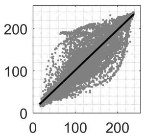  
(a)

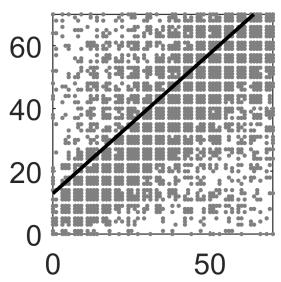  
(b)

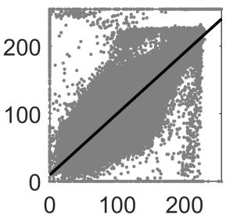  
(c)

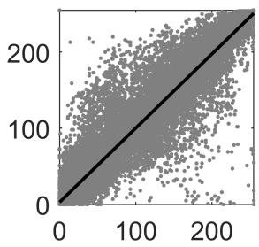  
(d)

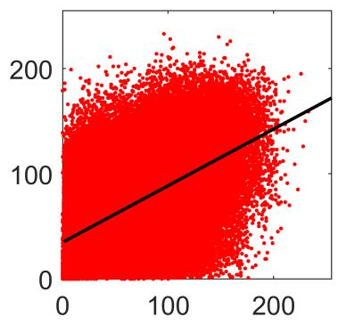

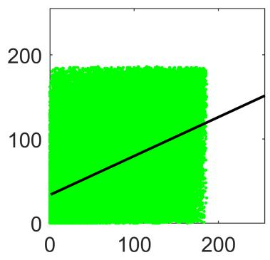

  
(e)

  
(f)

  
(g)

  
Figure 7: Pixel correlations and linear fit lines for the gray and color (RGB channels) images; (a)House (256 × 256); (b)Couple(256×256); (c)Brick Wall(1024×1024); (d)Texture 5(256×256); (e)Texture 1(512×512); (f)Subwater(256× 128); (g)Texture 4(1024 × 1024).

  
(a)

  
(b)

  
(c)

  
(d)

  
(e)

  
(f)

  
(g)

  
(h)  
Figure 8: Subband-based edge detection for a one decomposition level of following orthogonal transforms by using the Canny method: (a) Original image; (b) GHM multiwavelet; (c) SA4 multiwavelet; (d) CL multiwavelet; (e) Alpert multiwavelet; (f) New1 multiwavelet; (g) New2 multiwavelet; (h) Integer Haar multiwavelet.

Table 4  
Results for Bart Run. The four lines for each multiwavelet represent MSE, PSNR, SSIM and MS-SSIM, in this order.
<table><tr><td rowspan=2 colspan=1>Image</td><td rowspan=2 colspan=1>CR</td><td rowspan=2 colspan=1>Multi-wavelet</td><td rowspan=1 colspan=3>Decomposition</td><td rowspan=1 colspan=2>level</td></tr><tr><td rowspan=1 colspan=1>1</td><td rowspan=1 colspan=1>2</td><td rowspan=1 colspan=1>3</td><td rowspan=1 colspan=1>4</td><td rowspan=1 colspan=1>5</td></tr><tr><td rowspan=17 colspan=2>4:1Bart Run8:1</td><td rowspan=2 colspan=1>GHM</td><td rowspan=2 colspan=1>86.16728.780.90310.9509</td><td rowspan=2 colspan=1>3.060343.270.98300.9984</td><td rowspan=2 colspan=1>2.431244.270.98570.9986</td><td rowspan=1 colspan=1>2.389644.35</td><td rowspan=1 colspan=1>2.389644.35</td></tr><tr><td rowspan=1 colspan=1>0.98590.9986</td><td rowspan=1 colspan=1>0.98590.9986</td></tr><tr><td rowspan=2 colspan=1>SA4</td><td rowspan=2 colspan=1>1.041647.950.99350.9995</td><td rowspan=2 colspan=1>1.015348.070.99320.9994</td><td rowspan=2 colspan=1>1.030548.000.9930.9994</td><td rowspan=1 colspan=1>1.055947.89</td><td rowspan=1 colspan=1>1.054847.9</td></tr><tr><td rowspan=1 colspan=1>0.99290.9994</td><td rowspan=1 colspan=1>0.99290.9994</td></tr><tr><td rowspan=1 colspan=1>CL</td><td rowspan=1 colspan=1>0.586650.450.99670.9997</td><td rowspan=1 colspan=1>0.519250.980.99690.9997</td><td rowspan=1 colspan=1>0.499551.150.99690.9997</td><td rowspan=1 colspan=1>0.506551.080.99690.9997</td><td rowspan=1 colspan=1>0.511151.050.99690.9997</td></tr><tr><td rowspan=1 colspan=1>Alpert</td><td rowspan=1 colspan=1>0.663049.920.99660.9997</td><td rowspan=1 colspan=1>0.509051.060.99700.9997</td><td rowspan=1 colspan=1>0.495551.180.99710.9997</td><td rowspan=1 colspan=1>0.499351.150.99710.9997</td><td rowspan=1 colspan=1>0.504051.110.9970.9997</td></tr><tr><td rowspan=1 colspan=1>New1</td><td rowspan=1 colspan=1>0.609650.280.99670.9997</td><td rowspan=1 colspan=1>0.498751.150.99720.9997</td><td rowspan=1 colspan=1>0.492351.210.99720.9997</td><td rowspan=1 colspan=1>0.498351.160.99710.9997</td><td rowspan=1 colspan=1>0.502151.120.99710.9997</td></tr><tr><td rowspan=1 colspan=1>New2</td><td rowspan=1 colspan=1>1.140847.560.99480.9995</td><td rowspan=1 colspan=1>0.991248.170.99490.9994</td><td rowspan=1 colspan=1>0.957048.320.99510.9994</td><td rowspan=1 colspan=1>0.978248.230.99500.9994</td><td rowspan=1 colspan=1>0.992148.170.99490.9994</td></tr><tr><td rowspan=1 colspan=1>Integer Haar</td><td rowspan=1 colspan=1>0.623450.180.99720.9997</td><td rowspan=1 colspan=1>0.424651.850.99770.9998</td><td rowspan=1 colspan=1>0.389152.230.99780.9998</td><td rowspan=1 colspan=1>0.391952.200.99780.9998</td><td rowspan=1 colspan=1>0.398452.130.99780.9998</td></tr><tr><td rowspan=1 colspan=1></td><td rowspan=1 colspan=1></td><td rowspan=1 colspan=1></td><td rowspan=1 colspan=1></td><td rowspan=1 colspan=1></td><td rowspan=1 colspan=1></td><td rowspan=1 colspan=1></td></tr><tr><td rowspan=1 colspan=1>GHM</td><td rowspan=1 colspan=1>5385.110.820.25380.6421</td><td rowspan=1 colspan=1>15.46336.240.92410.9912</td><td rowspan=1 colspan=1>11.50537.520.94040.9934</td><td rowspan=1 colspan=1>11.12737.670.94250.9936</td><td rowspan=1 colspan=1>11.07137.690.94280.9936</td></tr><tr><td rowspan=1 colspan=1>SA4</td><td rowspan=1 colspan=1>9.982838.140.95070.9953</td><td rowspan=1 colspan=1>6.965539.700.96330.9957</td><td rowspan=1 colspan=1>6.81539.800.96340.9955</td><td rowspan=1 colspan=1>6.907139.740.96340.9954</td><td rowspan=1 colspan=1>6.923439.730.96320.9954</td></tr><tr><td rowspan=1 colspan=1>CL</td><td rowspan=1 colspan=1>9.847738.200.95310.9936</td><td rowspan=1 colspan=1>6.646339.910.96680.9956</td><td rowspan=1 colspan=1>5.93140.400.96990.9957</td><td rowspan=1 colspan=1>5.97340.370.96960.9956</td><td rowspan=1 colspan=1>6.014340.340.96950.9956</td></tr><tr><td rowspan=1 colspan=1>Alpert</td><td rowspan=1 colspan=1>10.409037.960.94580.9955</td><td rowspan=1 colspan=1>6.378040.080.96580.9962</td><td rowspan=1 colspan=1>5.727140.550.96830.9961</td><td rowspan=1 colspan=1>5.704040.570.96820.9960</td><td rowspan=1 colspan=1>5.753440.530.96800.9960</td></tr><tr><td rowspan=1 colspan=1>New1</td><td rowspan=1 colspan=1>9.960638.150.94940.9958</td><td rowspan=1 colspan=1>6.413240.060.96460.9960</td><td rowspan=1 colspan=1>5.937440.390.96840.9962</td><td rowspan=1 colspan=1>5.964240.380.96820.9962</td><td rowspan=1 colspan=1>6.019740.340.96810.9960</td></tr><tr><td rowspan=1 colspan=1>New2</td><td rowspan=1 colspan=1>14.02336.660.92440.9918</td><td rowspan=1 colspan=1>11.19337.640.93810.9919</td><td rowspan=1 colspan=1>10.57537.890.94600.9932</td><td rowspan=1 colspan=1>10.77637.810.9440.9931</td><td rowspan=1 colspan=1>10.76737.810.94440.9931</td></tr><tr><td rowspan=1 colspan=1>Integer Haar</td><td rowspan=1 colspan=1>12.7637.070.94110.9932</td><td rowspan=1 colspan=1>8.260738.960.95930.9950</td><td rowspan=1 colspan=1>7.460839.400.96280.9953</td><td rowspan=1 colspan=1>7.503839.380.96250.9952</td><td rowspan=1 colspan=1>7.604239.320.96200.9952</td></tr></table>

Table 4(continued)  
Results for Bart Run. The four lines for each multiwavelet represent MSE, PSNR, SSIM and MS-SSIM, in this order.
<table><tr><td rowspan=2 colspan=1>Image</td><td rowspan=2 colspan=1>CR</td><td rowspan=2 colspan=1>Multi-wavelet</td><td rowspan=1 colspan=3>Decomposition</td><td rowspan=1 colspan=3>level</td></tr><tr><td rowspan=1 colspan=1>1</td><td rowspan=1 colspan=1>2</td><td rowspan=1 colspan=1>3</td><td rowspan=1 colspan=2>4</td><td rowspan=1 colspan=1>5</td></tr><tr><td rowspan=29 colspan=1>Bart Run</td><td rowspan=15 colspan=1>16:1</td><td rowspan=2 colspan=1>GHM</td><td rowspan=2 colspan=1>118377.3990.01420.4809</td><td rowspan=2 colspan=1>189.725.350.78200.8622</td><td rowspan=1 colspan=1>27.63633.72</td><td rowspan=1 colspan=2>25.71234.03</td><td rowspan=1 colspan=1>25.59634.05</td></tr><tr><td rowspan=1 colspan=1>0.87190.9792</td><td rowspan=1 colspan=2>0.87980.9806</td><td rowspan=1 colspan=1>0.88020.9806</td></tr><tr><td rowspan=2 colspan=1>SA4</td><td rowspan=2 colspan=1>189.2325.360.7660.9008</td><td rowspan=2 colspan=1>19.97535.130.90330.9850</td><td rowspan=2 colspan=1>18.57235.440.90990.9869</td><td rowspan=2 colspan=2>18.81835.390.90890.9863</td><td rowspan=1 colspan=1>18.88935.37</td></tr><tr><td rowspan=1 colspan=1>0.90860.9862</td></tr><tr><td rowspan=1 colspan=1>CL</td><td rowspan=1 colspan=1>240.8724.310.77950.8490</td><td rowspan=1 colspan=1>22.23434.660.89460.9829</td><td rowspan=1 colspan=1>18.82735.380.90760.9852</td><td rowspan=1 colspan=2>18.76335.400.90760.9848</td><td rowspan=1 colspan=1>18.88835.370.90720.9846</td></tr><tr><td rowspan=3 colspan=1>Alpert</td><td rowspan=3 colspan=1>64.56130.030.77300.9622</td><td rowspan=3 colspan=1>20.53935.000.89430.9852</td><td rowspan=2 colspan=1>17.28935.750.9111</td><td rowspan=2 colspan=2>17.24335.760.9113</td><td rowspan=1 colspan=1>17.26435.76</td></tr><tr><td rowspan=1 colspan=1>0.9113</td></tr><tr><td rowspan=1 colspan=1>0.9881</td><td rowspan=1 colspan=2>0.9879</td><td rowspan=1 colspan=1>0.9878</td></tr><tr><td rowspan=2 colspan=1>New1</td><td rowspan=2 colspan=1>64.56130.030.77300.9622</td><td rowspan=2 colspan=1>20.15235.090.89690.9856</td><td rowspan=2 colspan=1>17.05535.810.91070.9878</td><td rowspan=2 colspan=2>17.05435.810.91050.9874</td><td rowspan=1 colspan=1>17.25135.76</td></tr><tr><td rowspan=1 colspan=1>0.90960.9872</td></tr><tr><td rowspan=2 colspan=1>New2</td><td rowspan=2 colspan=1>64.56130.030.77300.9622</td><td rowspan=2 colspan=1>29.79733.390.84780.9743</td><td rowspan=2 colspan=1>27.83833.680.85970.9777</td><td rowspan=1 colspan=2>28.11433.64</td><td rowspan=1 colspan=1>28.2533.62</td></tr><tr><td rowspan=1 colspan=2>0.85860.9770</td><td rowspan=1 colspan=1>0.85810.9768</td></tr><tr><td rowspan=3 colspan=1>Integer Haar</td><td rowspan=3 colspan=1>317.9923.110.75590.8150</td><td rowspan=3 colspan=1>26.17233.950.87600.9791</td><td rowspan=3 colspan=1>23.22134.470.88780.9816</td><td rowspan=2 colspan=2>23.30234.460.8872</td><td rowspan=1 colspan=1>23.49434.42</td></tr><tr><td rowspan=1 colspan=1>.8872</td><td rowspan=1 colspan=1></td></tr><tr><td rowspan=1 colspan=2>0.9811</td></tr><tr><td rowspan=1 colspan=1></td><td rowspan=1 colspan=1></td><td rowspan=1 colspan=1></td><td rowspan=1 colspan=1></td><td rowspan=1 colspan=1></td><td rowspan=1 colspan=2></td><td rowspan=1 colspan=1></td></tr><tr><td rowspan=13 colspan=1>32:1</td><td rowspan=2 colspan=1>GHM</td><td rowspan=2 colspan=1>173685.7330.008140.4401</td><td rowspan=2 colspan=1>4704.311.410.26710.5499</td><td rowspan=2 colspan=1>73.56329.460.76430.9338</td><td rowspan=2 colspan=2>51.50431.010.79420.9531</td><td rowspan=1 colspan=1>50.79431.07</td></tr><tr><td rowspan=1 colspan=1>0.79760.9542</td></tr><tr><td rowspan=2 colspan=1>SA4</td><td rowspan=2 colspan=1>5415.310.790.37880.4941</td><td rowspan=2 colspan=1>47.80931.340.80260.9528</td><td rowspan=2 colspan=1>37.96732.340.84120.9681</td><td rowspan=1 colspan=2>37.85932.35</td><td rowspan=1 colspan=1>38.05832.33</td></tr><tr><td rowspan=1 colspan=2>0.84240.9664</td><td rowspan=1 colspan=1>0.8420.9663</td></tr><tr><td rowspan=2 colspan=1>CL</td><td rowspan=2 colspan=1>5269.810.910.3780.5236</td><td rowspan=2 colspan=1>56.57530.600.74390.9347</td><td rowspan=2 colspan=1>38.71232.250.83110.9650</td><td rowspan=2 colspan=2>37.71432.370.83420.9654</td><td rowspan=1 colspan=1>37.99332.33</td></tr><tr><td rowspan=1 colspan=1>0.83380.9652</td></tr><tr><td rowspan=1 colspan=1>Alpert</td><td rowspan=1 colspan=1>501811.130.37350.6502</td><td rowspan=1 colspan=1>44.84931.610.79930.9596</td><td rowspan=1 colspan=1>32.80632.970.84630.9711</td><td rowspan=1 colspan=2>32.49833.010.84630.9722</td><td rowspan=1 colspan=1>32.64832.990.84620.9718</td></tr><tr><td rowspan=3 colspan=1>New1</td><td rowspan=3 colspan=1>501811.130.37350.6502</td><td rowspan=3 colspan=1>44.0831.690.80290.9609</td><td rowspan=3 colspan=1>32.80332.970.84780.9728</td><td rowspan=1 colspan=2>32.60133.00</td><td rowspan=1 colspan=1>32.92732.96</td></tr><tr><td rowspan=1 colspan=2>0.8469</td><td rowspan=1 colspan=1>0.8462</td></tr><tr><td rowspan=1 colspan=2>0.9717</td><td rowspan=1 colspan=1>0.9713</td></tr><tr><td rowspan=1 colspan=1>New2</td><td rowspan=1 colspan=1>501811.130.37350.6502</td><td rowspan=1 colspan=1>57.57130.530.75030.9389</td><td rowspan=1 colspan=1>51.01531.050.77030.9510</td><td rowspan=1 colspan=2>51.22431.040.76920.9500</td><td rowspan=1 colspan=1>51.49731.010.76930.9495</td></tr><tr><td rowspan=2 colspan=1>Integer Haar</td><td rowspan=2 colspan=1>5524.410.710.36840.4943</td><td rowspan=2 colspan=1>58.61430.450.74950.9393</td><td rowspan=2 colspan=1>48.13531.310.8010.9586</td><td rowspan=2 colspan=2>47.57231.360.80230.9585</td><td rowspan=1 colspan=1>47.9331.32</td></tr><tr><td rowspan=1 colspan=1>0.80030.9579</td></tr></table>

Table 5  
Results for Cameramsan. The four lines for each multiwavelet represent MSE, PSNR, SSIM and MS-SSIM, in this order.
<table><tr><td colspan="1" rowspan="2">Image</td><td colspan="1" rowspan="2">CR</td><td colspan="1" rowspan="2">Multi-wavelet</td><td colspan="4" rowspan="1">Decomposition</td><td colspan="2" rowspan="1">level</td></tr><tr><td colspan="1" rowspan="1">1</td><td colspan="1" rowspan="1">2</td><td colspan="1" rowspan="1">3</td><td colspan="1" rowspan="1">4</td><td colspan="1" rowspan="1">5</td><td colspan="1" rowspan="1">6</td></tr><tr><td colspan="2" rowspan="32">4:1cameraman8:1</td><td colspan="1" rowspan="3">GHM</td><td colspan="1" rowspan="3">65.77329.950.8460.9778</td><td colspan="1" rowspan="3">9.81438.210.95960.9945</td><td colspan="1" rowspan="3">7.946839.130.9630.9947</td><td colspan="1" rowspan="1">7.766339.23</td><td colspan="1" rowspan="1">7.757839.23</td><td colspan="1" rowspan="1">7.757939.23</td></tr><tr><td colspan="1" rowspan="2">0.96330.9947</td><td colspan="1" rowspan="1">0.9633</td><td colspan="1" rowspan="1">0.9634</td></tr><tr><td colspan="1" rowspan="1">0.9947</td><td colspan="1" rowspan="1">0.9947</td></tr><tr><td colspan="1" rowspan="2">SA4</td><td colspan="1" rowspan="2">6.477240.020.96460.9946</td><td colspan="1" rowspan="2">5.679840.590.96560.9945</td><td colspan="1" rowspan="2">5.704640.570.96590.9945</td><td colspan="1" rowspan="2">5.716540.560.96590.9945</td><td colspan="1" rowspan="1">5.720840.56</td><td colspan="1" rowspan="1">5.720440.56</td></tr><tr><td colspan="1" rowspan="1">0.96590.9945</td><td colspan="1" rowspan="1">0.96590.9945</td></tr><tr><td colspan="1" rowspan="2">CL</td><td colspan="1" rowspan="2">6.325840.120.96370.9941</td><td colspan="1" rowspan="2">5.218640.960.96550.9939</td><td colspan="1" rowspan="2">5.131441.030.96630.9942</td><td colspan="1" rowspan="2">5.12941.030.96640.9941</td><td colspan="1" rowspan="1">5.122641.04</td><td colspan="1" rowspan="1">5.123541.04</td></tr><tr><td colspan="1" rowspan="1">0.96650.9941</td><td colspan="1" rowspan="1">0.96650.9941</td></tr><tr><td colspan="1" rowspan="3">Alpert</td><td colspan="1" rowspan="3">6.180840.220.96370.9952</td><td colspan="1" rowspan="2">5.115841.040.9662</td><td colspan="1" rowspan="2">4.944541.190.9672</td><td colspan="1" rowspan="2">4.929941.200.9672</td><td colspan="1" rowspan="1">4.937541.20</td><td colspan="1" rowspan="1">4.935641.20</td></tr><tr><td colspan="1" rowspan="1">0.9672</td><td colspan="1" rowspan="1">0.9672</td></tr><tr><td colspan="1" rowspan="1">0.9941</td><td colspan="1" rowspan="1">0.9946</td><td colspan="1" rowspan="1">0.9945</td><td colspan="1" rowspan="1">0.9945</td><td colspan="1" rowspan="1">0.9945</td></tr><tr><td colspan="1" rowspan="2">New1</td><td colspan="1" rowspan="2">6.110340.270.9640.9953</td><td colspan="1" rowspan="2">5.070341.080.96640.9942</td><td colspan="1" rowspan="2">4.907241.220.96750.9947</td><td colspan="1" rowspan="2">4.898241.230.96750.9946</td><td colspan="1" rowspan="1">4.903341.23</td><td colspan="1" rowspan="1">4.904441.22</td></tr><tr><td colspan="1" rowspan="1">0.96740.9946</td><td colspan="1" rowspan="1">0.96740.9946</td></tr><tr><td colspan="1" rowspan="2">New2</td><td colspan="1" rowspan="2">8.086139.050.95840.9944</td><td colspan="1" rowspan="2">7.052839.650.95850.9920</td><td colspan="1" rowspan="2">7.094239.620.95850.9923</td><td colspan="1" rowspan="1">7.125639.6</td><td colspan="1" rowspan="1">7.148139.59</td><td colspan="1" rowspan="1">7.149239.59</td></tr><tr><td colspan="1" rowspan="1">0.95840.9923</td><td colspan="1" rowspan="1">0.95830.9923</td><td colspan="1" rowspan="1">0.95830.9923</td></tr><tr><td colspan="1" rowspan="1">Integer Haar</td><td colspan="1" rowspan="1">7.04539.650.96160.9935</td><td colspan="1" rowspan="1">5.967340.370.96280.9933</td><td colspan="1" rowspan="1">5.874340.440.96330.9935</td><td colspan="1" rowspan="1">5.863140.450.96340.9936</td><td colspan="1" rowspan="1">5.873940.440.96330.9935</td><td colspan="1" rowspan="1">5.87440.440.96330.9935</td></tr><tr><td colspan="1" rowspan="1"></td><td colspan="1" rowspan="1"></td><td colspan="1" rowspan="1"></td><td colspan="1" rowspan="1"></td><td colspan="1" rowspan="1"></td><td colspan="1" rowspan="1"></td><td colspan="1" rowspan="1"></td><td colspan="1" rowspan="1"></td></tr><tr><td colspan="1" rowspan="1">GHM</td><td colspan="1" rowspan="1">448811.610.14780.6785</td><td colspan="1" rowspan="1">54.00330.810.88830.98</td><td colspan="1" rowspan="1">37.3432.410.90860.9835</td><td colspan="1" rowspan="1">35.65832.610.91110.9833</td><td colspan="1" rowspan="1">35.5632.620.91130.9833</td><td colspan="1" rowspan="1">35.53832.620.91130.9833</td></tr><tr><td colspan="1" rowspan="2">SA4</td><td colspan="1" rowspan="2">39.52532.160.90500.9826</td><td colspan="1" rowspan="2">27.10133.80.91970.9838</td><td colspan="1" rowspan="2">26.90833.830.91880.9820</td><td colspan="1" rowspan="2">26.98733.820.9190.9818</td><td colspan="1" rowspan="1">27.01233.82</td><td colspan="1" rowspan="1">27.01333.82</td></tr><tr><td colspan="1" rowspan="1">0.9190.9818</td><td colspan="1" rowspan="1">0.91890.9818</td></tr><tr><td colspan="1" rowspan="3">CL</td><td colspan="1" rowspan="3">41.28431.970.89950.9793</td><td colspan="1" rowspan="3">26.05233.970.91920.9819</td><td colspan="1" rowspan="3">25.50234.060.92030.9809</td><td colspan="1" rowspan="3">25.3934.080.92090.9813</td><td colspan="1" rowspan="3">25.43334.080.92080.9815</td><td colspan="1" rowspan="1">25.42734.08</td></tr><tr><td colspan="1" rowspan="1">0.9208</td></tr><tr><td colspan="1" rowspan="1">0.9815</td></tr><tr><td colspan="1" rowspan="3">Alpert</td><td colspan="1" rowspan="3">40.3832.070.89860.9859</td><td colspan="1" rowspan="3">25.84934.010.91930.9841</td><td colspan="1" rowspan="3">24.79134.190.92150.9831</td><td colspan="1" rowspan="3">24.63534.220.92220.9839</td><td colspan="1" rowspan="3">24.69334.210.92210.9838</td><td colspan="1" rowspan="1">24.69834.20</td></tr><tr><td colspan="1" rowspan="1">0.922</td></tr><tr><td colspan="1" rowspan="1">0.9838</td></tr><tr><td colspan="1" rowspan="3">New1</td><td colspan="1" rowspan="3">39.70632.140.90040.9863</td><td colspan="1" rowspan="3">25.50334.060.92040.9844</td><td colspan="1" rowspan="3">24.48834.240.92260.9836</td><td colspan="1" rowspan="3">24.35134.270.92310.9841</td><td colspan="1" rowspan="3">24.41334.250.92280.9841</td><td colspan="1" rowspan="1">24.42934.25</td></tr><tr><td colspan="1" rowspan="1">0.9228</td></tr><tr><td colspan="1" rowspan="1">0.9841</td></tr><tr><td colspan="1" rowspan="2">New2</td><td colspan="1" rowspan="2">52.83330.900.88190.9822</td><td colspan="1" rowspan="2">37.00832.450.89950.9793</td><td colspan="1" rowspan="2">36.22932.540.89900.9743</td><td colspan="1" rowspan="2">36.61232.490.89760.9753</td><td colspan="1" rowspan="2">36.77532.480.89710.975</td><td colspan="1" rowspan="1">36.79632.47</td></tr><tr><td colspan="1" rowspan="1">0.89710.9751</td></tr><tr><td colspan="1" rowspan="2">Integer Haar</td><td colspan="1" rowspan="2">48.80331.250.88690.9742</td><td colspan="1" rowspan="2">32.36933.030.90780.9794</td><td colspan="1" rowspan="2">31.12233.200.90800.9783</td><td colspan="1" rowspan="2">31.1033.200.90770.9787</td><td colspan="1" rowspan="1">31.15133.20</td><td colspan="1" rowspan="1">31.1533.20</td></tr><tr><td colspan="1" rowspan="1">0.90750.9787</td><td colspan="1" rowspan="1">0.90740.9787</td></tr><tr><td colspan="2" rowspan="16">16:1cameraman32:1</td><td colspan="1" rowspan="1">GHM</td><td colspan="1" rowspan="1">9398.38.40.056970.5289</td><td colspan="1" rowspan="1">206.1624.990.69390.9337</td><td colspan="1" rowspan="1">97.87328.220.83040.9586</td><td colspan="1" rowspan="1">89.40528.620.8370.959</td><td colspan="1" rowspan="1">88.79428.650.83790.959</td><td colspan="2" rowspan="1">88.72928.650.83790.959</td></tr><tr><td colspan="1" rowspan="1">SA4</td><td colspan="1" rowspan="1">180.7625.560.67730.9446</td><td colspan="1" rowspan="1">75.63529.340.84680.9618</td><td colspan="1" rowspan="1">71.01529.620.84720.9562</td><td colspan="1" rowspan="1">71.51129.590.84580.9564</td><td colspan="1" rowspan="1">71.68429.580.84550.956</td><td colspan="2" rowspan="1">71.65629.580.84560.9559</td></tr><tr><td colspan="1" rowspan="1">CL</td><td colspan="1" rowspan="1">203.4325.050.66680.9383</td><td colspan="1" rowspan="1">75.69129.340.84450.9594</td><td colspan="1" rowspan="1">70.13329.670.84660.9550</td><td colspan="1" rowspan="1">70.07529.680.84860.956</td><td colspan="1" rowspan="1">70.23329.670.84810.9555</td><td colspan="2" rowspan="1">70.21729.670.84820.9556</td></tr><tr><td colspan="1" rowspan="1">Alpert</td><td colspan="1" rowspan="1">202.9925.060.6650.9601</td><td colspan="1" rowspan="1">75.02429.380.84360.9641</td><td colspan="1" rowspan="1">67.80929.820.84720.9582</td><td colspan="1" rowspan="1">67.45429.840.84920.962</td><td colspan="1" rowspan="1">67.67329.830.84880.962</td><td colspan="2" rowspan="1">67.70429.820.84880.9622</td></tr><tr><td colspan="1" rowspan="1">New1</td><td colspan="1" rowspan="1">199.7225.130.66650.9605</td><td colspan="1" rowspan="1">73.97129.440.84480.9651</td><td colspan="1" rowspan="1">66.88629.880.84970.9594</td><td colspan="1" rowspan="1">66.61529.900.85160.9631</td><td colspan="1" rowspan="1">66.84229.880.85150.9628</td><td colspan="2" rowspan="1">66.85829.880.85160.9630</td></tr><tr><td colspan="1" rowspan="1">New2</td><td colspan="1" rowspan="1">234.8324.420.65410.9566</td><td colspan="1" rowspan="1">105.8627.880.81310.954</td><td colspan="1" rowspan="1">99.37828.160.81350.9460</td><td colspan="1" rowspan="1">100.6228.10.810.9444</td><td colspan="1" rowspan="1">101.1928.080.80880.9441</td><td colspan="2" rowspan="1">101.328.070.80870.9442</td></tr><tr><td colspan="1" rowspan="1">Integer Haar</td><td colspan="1" rowspan="1">229.8924.520.6550.9284</td><td colspan="1" rowspan="1">97.67628.230.81900.9495</td><td colspan="1" rowspan="1">87.72128.70.82120.9467</td><td colspan="1" rowspan="1">87.6128.710.81930.9479</td><td colspan="1" rowspan="1">87.70728.70.81910.9479</td><td colspan="2" rowspan="1">87.69928.70.81910.9478</td></tr><tr><td colspan="1" rowspan="1"></td><td colspan="1" rowspan="1"></td><td colspan="1" rowspan="1"></td><td colspan="1" rowspan="1"></td><td colspan="1" rowspan="1"></td><td colspan="1" rowspan="1"></td><td colspan="2" rowspan="1"></td></tr><tr><td colspan="1" rowspan="1">GHM</td><td colspan="1" rowspan="1">125897.1310.029680.4926</td><td colspan="1" rowspan="1">3469.712.730.13070.5191</td><td colspan="1" rowspan="1">214.4224.820.73250.9122</td><td colspan="1" rowspan="1">179.1425.600.75930.92</td><td colspan="1" rowspan="1">175.6725.680.76150.9203</td><td colspan="2" rowspan="1">175.2525.690.76160.9201</td></tr><tr><td colspan="1" rowspan="2">SA4</td><td colspan="1" rowspan="2">4094.812.010.42190.6840</td><td colspan="1" rowspan="2">180.7925.560.74780.9209</td><td colspan="1" rowspan="2">145.7226.500.76730.9179</td><td colspan="1" rowspan="2">147.1726.450.76370.9132</td><td colspan="1" rowspan="1">147.6226.44</td><td colspan="2" rowspan="1">147.5926.44</td></tr><tr><td colspan="1" rowspan="1">0.76360.9131</td><td colspan="2" rowspan="1">0.76350.9133</td></tr><tr><td colspan="1" rowspan="1">CL</td><td colspan="1" rowspan="1">4190.911.910.41910.6926</td><td colspan="1" rowspan="1">188.2125.380.74320.9178</td><td colspan="1" rowspan="1">150.3326.360.76760.9184</td><td colspan="1" rowspan="1">149.3826.390.76720.9156</td><td colspan="1" rowspan="1">149.5426.380.7670.9154</td><td colspan="2" rowspan="1">149.6826.380.76700.9152</td></tr><tr><td colspan="1" rowspan="1">Alpert</td><td colspan="1" rowspan="1">4250.411.850.42140.7224</td><td colspan="1" rowspan="1">186.8725.420.74670.931</td><td colspan="1" rowspan="1">144.5526.530.77390.9274</td><td colspan="1" rowspan="1">143.1126.570.77530.9283</td><td colspan="1" rowspan="1">143.526.560.77350.9268</td><td colspan="2" rowspan="1">143.7126.560.77340.9269</td></tr><tr><td colspan="1" rowspan="1">New1</td><td colspan="1" rowspan="1">4250.411.850.42140.7224</td><td colspan="1" rowspan="1">183.7725.490.75030.9319</td><td colspan="1" rowspan="1">142.5626.590.77560.9276</td><td colspan="1" rowspan="1">140.9326.640.77680.9285</td><td colspan="1" rowspan="1">141.3526.630.77550.9264</td><td colspan="2" rowspan="1">141.4126.630.77520.9263</td></tr><tr><td colspan="1" rowspan="1">New2</td><td colspan="1" rowspan="1">4250.411.850.42140.7224</td><td colspan="1" rowspan="1">247.8324.190.70570.9141</td><td colspan="1" rowspan="1">20924.930.73830.9092</td><td colspan="1" rowspan="1">208.5924.940.73070.8941</td><td colspan="1" rowspan="1">211.2924.880.72730.8962</td><td colspan="2" rowspan="1">211.8724.870.7270.8954</td></tr><tr><td colspan="1" rowspan="1">Integer Haar</td><td colspan="1" rowspan="1">4295.211.800.41150.6747</td><td colspan="1" rowspan="1">238.7824.350.70340.8994</td><td colspan="1" rowspan="1">188.0225.390.74080.9052</td><td colspan="1" rowspan="1">185.1325.460.73360.9036</td><td colspan="1" rowspan="1">185.4725.450.73310.9044</td><td colspan="2" rowspan="1">185.2425.450.7330.9046</td></tr></table>

Table 6  
Results for Kiel. The four lines for each multiwavelet represent MSE, PSNR, SSIM and MS-SSIM, in this order.
<table><tr><td rowspan=2 colspan=2>Image</td><td rowspan=2 colspan=1>CR</td><td rowspan=2 colspan=1>Multi-wavelet</td><td rowspan=1 colspan=1></td><td rowspan=1 colspan=1></td><td rowspan=1 colspan=2>Decomposition level</td><td rowspan=1 colspan=2></td></tr><tr><td rowspan=1 colspan=1>1</td><td rowspan=1 colspan=1>2</td><td rowspan=1 colspan=1>3</td><td rowspan=1 colspan=1>4</td><td rowspan=1 colspan=1>5</td><td rowspan=1 colspan=1>6</td></tr><tr><td rowspan=27 colspan=3>4:1Kiel8:1</td><td rowspan=2 colspan=1>GHM</td><td rowspan=2 colspan=1>235.8424.400.94320.9688</td><td rowspan=2 colspan=1>34.75632.720.98440.9911</td><td rowspan=2 colspan=1>28.61933.560.98530.9917</td><td rowspan=2 colspan=1>27.84433.680.98550.9917</td><td rowspan=1 colspan=1>27.76133.70</td><td rowspan=1 colspan=1>27.75833.70</td></tr><tr><td rowspan=1 colspan=1>0.98550.9916</td><td rowspan=1 colspan=1>0.98550.9916</td></tr><tr><td rowspan=3 colspan=1>SA4</td><td rowspan=2 colspan=1>24.97534.160.9846</td><td rowspan=2 colspan=1>21.19834.87</td><td rowspan=1 colspan=1>20.82534.94</td><td rowspan=1 colspan=1>20.84934.94</td><td rowspan=1 colspan=1>20.85434.94</td><td rowspan=1 colspan=1>20.85934.94</td></tr><tr><td rowspan=2 colspan=1>0.9913</td><td rowspan=2 colspan=1>0.9830.9909</td><td rowspan=1 colspan=1>0.983</td><td rowspan=1 colspan=1>0.983</td><td rowspan=1 colspan=1>0.983</td></tr><tr><td rowspan=1 colspan=1>0.9913</td><td rowspan=1 colspan=1>0.9907</td><td rowspan=1 colspan=1>0.9908</td><td rowspan=1 colspan=1>0.9908</td></tr><tr><td rowspan=1 colspan=1>CL</td><td rowspan=1 colspan=1>25.13934.130.98050.9903</td><td rowspan=1 colspan=1>20.19435.080.98260.9911</td><td rowspan=1 colspan=1>19.69435.190.98240.9908</td><td rowspan=1 colspan=1>19.67935.190.98240.9907</td><td rowspan=1 colspan=1>19.7035.190.98230.9906</td><td rowspan=1 colspan=1>19.69835.190.98230.9907</td></tr><tr><td rowspan=2 colspan=1>Alpert</td><td rowspan=2 colspan=1>25.24134.110.98440.9926</td><td rowspan=2 colspan=1>20.37235.040.98420.9918</td><td rowspan=2 colspan=1>19.71335.180.98410.9914</td><td rowspan=2 colspan=1>19.63435.200.98410.9914</td><td rowspan=1 colspan=1>19.63135.20</td><td rowspan=1 colspan=1>19.61935.20</td></tr><tr><td rowspan=1 colspan=1>0.98420.9914</td><td rowspan=1 colspan=1>0.98420.9914</td></tr><tr><td rowspan=1 colspan=1>New1</td><td rowspan=1 colspan=1>25.02834.150.98470.9927</td><td rowspan=1 colspan=1>20.2535.070.98440.9919</td><td rowspan=1 colspan=1>19.60535.210.98420.9914</td><td rowspan=1 colspan=1>19.54735.220.98420.9915</td><td rowspan=1 colspan=1>19.54235.220.98430.9915</td><td rowspan=1 colspan=1>19.53935.220.98430.9915</td></tr><tr><td rowspan=2 colspan=1>New2</td><td rowspan=2 colspan=1>29.82833.380.98030.9911</td><td rowspan=2 colspan=1>26.69133.870.97880.9893</td><td rowspan=2 colspan=1>26.33733.930.97830.9886</td><td rowspan=2 colspan=1>26.37833.920.97810.9884</td><td rowspan=2 colspan=1>26.42333.910.9780.9883</td><td rowspan=1 colspan=1>26.42233.91</td></tr><tr><td rowspan=1 colspan=1>0.9780.9883</td></tr><tr><td rowspan=2 colspan=1>Integer Haar</td><td rowspan=2 colspan=1>27.44333.750.98240.99</td><td rowspan=2 colspan=1>23.16734.480.98180.9902</td><td rowspan=1 colspan=1>22.62934.580.9817</td><td rowspan=1 colspan=1>22.64434.580.9817</td><td rowspan=2 colspan=1>22.66434.580.98170.9899</td><td rowspan=2 colspan=1>22.66834.580.98170.9899</td></tr><tr><td rowspan=1 colspan=1>0.9899</td><td rowspan=1 colspan=1>0.9898</td></tr><tr><td rowspan=1 colspan=1></td><td rowspan=1 colspan=1></td><td rowspan=1 colspan=1></td><td rowspan=1 colspan=1></td><td rowspan=1 colspan=1></td><td rowspan=1 colspan=1></td><td rowspan=1 colspan=1></td><td rowspan=1 colspan=1></td><td rowspan=1 colspan=1></td></tr><tr><td rowspan=2 colspan=1>GHM</td><td rowspan=2 colspan=1>5841.710.470.27960.6034</td><td rowspan=2 colspan=1>156.6926.180.93970.9669</td><td rowspan=2 colspan=1>109.8527.720.94820.9722</td><td rowspan=2 colspan=1>104.6127.930.94910.9724</td><td rowspan=1 colspan=1>104.0827.96</td><td rowspan=1 colspan=1>104.0627.96</td></tr><tr><td rowspan=1 colspan=1>0.94920.9723</td><td rowspan=1 colspan=1>0.94920.9723</td></tr><tr><td rowspan=2 colspan=1>SA4</td><td rowspan=2 colspan=1>118.9827.380.94110.9677</td><td rowspan=2 colspan=1>82.23128.980.94760.9732</td><td rowspan=2 colspan=1>78.49629.180.94750.9722</td><td rowspan=2 colspan=1>78.29929.190.94690.971</td><td rowspan=1 colspan=1>78.34529.19</td><td rowspan=1 colspan=1>78.35529.19</td></tr><tr><td rowspan=1 colspan=1>0.94680.9709</td><td rowspan=1 colspan=1>0.94670.9708</td></tr><tr><td rowspan=2 colspan=1>CL</td><td rowspan=2 colspan=1>123.0027.230.92710.9645</td><td rowspan=2 colspan=1>80.57329.070.94410.9719</td><td rowspan=2 colspan=1>76.11229.320.94400.9710</td><td rowspan=1 colspan=1>75.72129.34</td><td rowspan=1 colspan=1>75.79129.33</td><td rowspan=1 colspan=1>75.78529.33</td></tr><tr><td rowspan=1 colspan=1>0.94350.9703</td><td rowspan=1 colspan=1>0.94340.9701</td><td rowspan=1 colspan=1>0.94340.9702</td></tr><tr><td rowspan=2 colspan=1>Alpert</td><td rowspan=2 colspan=1>123.427.220.94080.9748</td><td rowspan=2 colspan=1>81..21629.030.94820.9747</td><td rowspan=2 colspan=1>76.27129.310.94860.9734</td><td rowspan=2 colspan=1>75.63229.340.94840.9731</td><td rowspan=2 colspan=1>75.66429.340.94840.9732</td><td rowspan=1 colspan=1>75.65429.34</td></tr><tr><td rowspan=1 colspan=1>0.94830.9732</td></tr><tr><td rowspan=2 colspan=1>New1</td><td rowspan=2 colspan=1>122.3827.250.94200.9751</td><td rowspan=2 colspan=1>80.80529.060.94900.9751</td><td rowspan=2 colspan=1>75.99929.320.94920.9738</td><td rowspan=2 colspan=1>75.44729.350.94910.9736</td><td rowspan=2 colspan=1>75.48729.350.94890.9735</td><td rowspan=1 colspan=1>75.45129.350.9488</td></tr><tr><td rowspan=1 colspan=1>0.9734</td></tr><tr><td rowspan=1 colspan=1>New2</td><td rowspan=1 colspan=1>137.6726.740.93440.9724</td><td rowspan=1 colspan=1>102.0728.040.93220.9672</td><td rowspan=1 colspan=1>98.62928.190.9310.9652</td><td rowspan=1 colspan=1>98.49228.200.93070.9645</td><td rowspan=1 colspan=1>98.68828.190.93050.9643</td><td rowspan=1 colspan=1>98.73328.190.93030.9643</td></tr><tr><td rowspan=2 colspan=1>Integer Haar</td><td rowspan=2 colspan=1>132.0226.920.93510.964</td><td rowspan=2 colspan=1>90.96228.540.94080.9693</td><td rowspan=2 colspan=1>86.34328.770.94160.9687</td><td rowspan=2 colspan=1>85.97628.790.9410.968</td><td rowspan=2 colspan=1>86.11428.780.94080.9679</td><td rowspan=1 colspan=1>86.13428.78</td></tr><tr><td rowspan=1 colspan=1>0.94080.9679</td></tr></table>

## Table 6(continued)

Results for Kiel. The four lines for each multiwavelet represent MSE, PSNR, SSIM and MS-SSIM, in this order.
<table><tr><td rowspan="2">Image</td><td rowspan="2">CR</td><td rowspan="2">Multi- wavelet</td><td colspan="6">Decomposition level</td></tr><tr><td>1 11418</td><td>2 549</td><td>3 259.13</td><td>4</td><td>5 236.06</td><td>6</td></tr><tr><td colspan="2"></td><td>GHM</td><td>7.555 0.1151</td><td>20.74 0.8160</td><td>24.00 0.8871</td><td>238.48 24.36 0.8902</td><td>24.40 0.8908</td><td>235.88 24.40 0.8909</td></tr><tr><td colspan="2" rowspan="3"></td><td rowspan="3">SA4</td><td>0.4868 536.64</td><td>0.8957</td><td>0.9384</td><td>0.9393</td><td>0.9392</td><td>0.9391</td></tr><tr><td></td><td>202.31</td><td>182.95</td><td>181.18</td><td>181.18</td><td>181.26</td></tr><tr><td>20.83 0.8016</td><td>25.07</td><td>25.51</td><td>25.55</td><td>25.55</td><td>25.55</td></tr><tr><td colspan="2"></td><td>0.8826</td><td>0.8867 0.9405</td><td>0.8895 0.9393</td><td>0.8881 0.9365</td><td>0.8875 0.9358</td><td>0.8876</td></tr><tr><td rowspan="6"></td><td rowspan="3">CL</td><td>548.81</td><td>201.50</td><td></td><td></td><td></td><td>177.97</td><td>0.9358 177.99</td></tr><tr><td>20.74</td><td>25.09</td><td>180.29 25.57</td><td>178.04 25.63</td><td></td><td>25.63</td><td>25.63</td></tr><tr><td>0.7703</td><td>0.8840</td><td>0.8857</td><td></td><td>0.8855</td><td>0.8850</td><td>0.8849</td></tr><tr><td rowspan="3"></td><td>0.8838</td><td></td><td></td><td></td><td></td><td></td><td></td></tr><tr><td></td><td>0.9395 201.99</td><td>0.9381 180.07</td><td></td><td>0.9371</td><td>0.9365</td><td>0.9365</td></tr><tr><td>560.92</td><td></td><td></td><td></td><td>176.93</td><td>176.94</td><td>176.88</td></tr><tr><td rowspan="5">16:1 Kiel</td><td rowspan="3">Alpert</td><td>20.64</td><td>25.08</td><td>25.58</td><td></td><td>25.65</td><td>25.65</td><td>25.65</td></tr><tr><td>0.7958</td><td>0.8878</td><td>0.8930</td><td></td><td>0.8932</td><td>0.8929</td><td>0.8929</td></tr><tr><td>0.9193</td><td>0.9451</td><td></td><td>0.9446</td><td>0.9434</td><td>0.9431</td><td>0.9433</td></tr><tr><td>20.66</td><td>558.71</td><td>201.49</td><td>180.21</td><td>177.25</td><td></td><td>177.28</td><td>177.19</td></tr><tr><td rowspan="4">New1</td><td>0.7982</td><td></td><td>25.09</td><td>25.57</td><td>25.64</td><td>25.64</td><td>25.65</td></tr><tr><td>0.9201</td><td></td><td>0.8875</td><td>0.8931</td><td>0.8934</td><td>0.8927</td><td>0.8928</td></tr><tr><td>571.14</td><td></td><td>0.9451</td><td>0.9445</td><td>0.9436</td><td>0.9428</td><td>0.9429</td></tr><tr><td rowspan="3">New2</td><td>20.56</td><td>242.55 24.28</td><td></td><td>225.26</td><td>223.77 24.63</td><td>224.12 24.63</td><td>224.32 24.62</td></tr><tr><td>0.7904</td><td></td><td>0.8645</td><td>24.60 0.8655</td><td>0.8651</td><td>0.8636</td><td>0.8634</td></tr><tr><td rowspan="3">Integer Haar</td><td>0.917</td><td>0.9334</td><td></td><td>0.9298</td><td>0.9285</td><td>0.927</td><td>0.9268</td></tr><tr><td rowspan="2"></td><td>578.87</td><td>223.72</td><td>201.15</td><td>198.84</td><td></td><td>199.08</td><td>199.13</td></tr><tr><td>20.5 0.7879</td><td>24.63 0.8767</td><td>25.10 0.8810</td><td>25.15 0.8794</td><td>0.8787</td><td>25.14</td><td>25.14 0.8785</td></tr></table>

Table 7  
Results for House. The four lines for each multiwavelet represent MSE, PSNR, SSIM and MS-SSIM, in this order.
<table><tr><td rowspan=2 colspan=1>Image</td><td rowspan=2 colspan=1>CR</td><td rowspan=2 colspan=1>Multi-wavelet</td><td rowspan=1 colspan=1></td><td rowspan=1 colspan=1>De</td><td rowspan=1 colspan=1>composit</td><td rowspan=1 colspan=1>ion level</td><td rowspan=1 colspan=1></td></tr><tr><td rowspan=1 colspan=1>1</td><td rowspan=1 colspan=1>2</td><td rowspan=1 colspan=1>3</td><td rowspan=1 colspan=1>4</td><td rowspan=1 colspan=1>6</td></tr><tr><td rowspan=17 colspan=2>4:1House8:1</td><td rowspan=1 colspan=1>GHM</td><td rowspan=1 colspan=1>62.45430.430.86830.9746</td><td rowspan=1 colspan=1>6.66439.950.95470.9949</td><td rowspan=1 colspan=1>5.922240.460.95930.9952</td><td rowspan=1 colspan=1>5.849740.510.95980.9952</td><td rowspan=1 colspan=1>5.845940.510.95990.9952</td></tr><tr><td rowspan=1 colspan=1>SA4</td><td rowspan=1 colspan=1>4.997241.220.96430.9953</td><td rowspan=1 colspan=1>4.379141.790.96880.9957</td><td rowspan=1 colspan=1>4.371741.800.96890.9956</td><td rowspan=1 colspan=1>4.389241.780.96880.9956</td><td rowspan=1 colspan=1>4.389941.780.96880.9957</td></tr><tr><td rowspan=1 colspan=1>CL</td><td rowspan=1 colspan=1>5.061741.160.96360.9946</td><td rowspan=1 colspan=1>4.337441.820.96860.9952</td><td rowspan=1 colspan=1>4.274341.890.96910.9951</td><td rowspan=1 colspan=1>4.280341.880.96910.9951</td><td rowspan=1 colspan=1>4.284641.880.96900.9951</td></tr><tr><td rowspan=1 colspan=1>Alpert</td><td rowspan=1 colspan=1>5.149941.070.96300.9957</td><td rowspan=1 colspan=1>4.386341.760.96820.9956</td><td rowspan=1 colspan=1>4.29141.850.96890.9956</td><td rowspan=1 colspan=1>4.287141.860.96900.9956</td><td rowspan=1 colspan=1>4.291241.850.96890.9956</td></tr><tr><td rowspan=1 colspan=1>New1</td><td rowspan=1 colspan=1>5.073741.140.96360.9958</td><td rowspan=1 colspan=1>4.319941.830.96870.9957</td><td rowspan=1 colspan=1>4.22941.920.96950.9957</td><td rowspan=1 colspan=1>4.233941.920.96940.9957</td><td rowspan=1 colspan=1>4.235241.920.96940.9957</td></tr><tr><td rowspan=2 colspan=1>New2</td><td rowspan=2 colspan=1>6.404840.090.95430.9945</td><td rowspan=2 colspan=1>5.84840.480.95800.9940</td><td rowspan=2 colspan=1>5.807240.510.95840.9939</td><td rowspan=2 colspan=1>5.829340.490.95820.9939</td><td rowspan=2 colspan=1>5.838940.480.95810.9939</td></tr><tr><td rowspan=1 colspan=1>0.95820.9939</td></tr><tr><td rowspan=1 colspan=1>Integer Haar</td><td rowspan=1 colspan=1>6.043340.350.9570.9939</td><td rowspan=1 colspan=1>5.372640.860.96150.9941</td><td rowspan=1 colspan=1>5.317440.900.96190.9942</td><td rowspan=1 colspan=1>5.329740.890.96180.9942</td><td rowspan=1 colspan=1>5.331740.890.96170.9942</td></tr><tr><td rowspan=1 colspan=1></td><td rowspan=1 colspan=1></td><td rowspan=1 colspan=1></td><td rowspan=1 colspan=1></td><td rowspan=1 colspan=1></td><td rowspan=1 colspan=1></td></tr><tr><td rowspan=1 colspan=1>GHM</td><td rowspan=1 colspan=1>5510.510.930.27120.657</td><td rowspan=1 colspan=1>21.22534.900.87400.9824</td><td rowspan=1 colspan=1>16.41536.010.89560.9853</td><td rowspan=1 colspan=1>15.99336.120.89810.9856</td><td rowspan=1 colspan=1>15.97236.130.89820.9856</td></tr><tr><td rowspan=2 colspan=1>SA4</td><td rowspan=2 colspan=1>16.12736.100.89640.9843</td><td rowspan=2 colspan=1>12.19437.330.92000.9874</td><td rowspan=2 colspan=1>12.05737.380.92130.9872</td><td rowspan=2 colspan=1>12.1537.350.92070.9871</td><td rowspan=2 colspan=1>12.16937.340.92060.9872</td></tr><tr><td rowspan=1 colspan=1>0.92060.9872</td></tr><tr><td rowspan=1 colspan=1>CL</td><td rowspan=1 colspan=1>16.40936.020.89210.9826</td><td rowspan=1 colspan=1>12.00737.390.91880.9865</td><td rowspan=1 colspan=1>11.67137.510.92130.9866</td><td rowspan=1 colspan=1>11.68637.510.92120.9865</td><td rowspan=1 colspan=1>11.70737.500.92110.9865</td></tr><tr><td rowspan=1 colspan=1>Alpert</td><td rowspan=1 colspan=1>16.54935.970.89200.9866</td><td rowspan=1 colspan=1>12.09137.340.91880.9876</td><td rowspan=1 colspan=1>11.61237.520.92230.9878</td><td rowspan=1 colspan=1>11.61537.520.92220.9878</td><td rowspan=1 colspan=1>11.63437.510.92200.9878</td></tr><tr><td rowspan=1 colspan=1>New1</td><td rowspan=1 colspan=1>16.3736.020.89310.9868</td><td rowspan=1 colspan=1>11.9637.390.91970.9879</td><td rowspan=1 colspan=1>11.52537.560.92290.9880</td><td rowspan=1 colspan=1>11.53437.550.92280.9879</td><td rowspan=1 colspan=1>11.54137.550.92270.9879</td></tr><tr><td rowspan=1 colspan=1>New2</td><td rowspan=1 colspan=1>20.27135.080.87700.9843</td><td rowspan=1 colspan=1>16..37436.000.89550.9828</td><td rowspan=1 colspan=1>16.16836.060.89700.9826</td><td rowspan=1 colspan=1>16.2736.030.89650.9826</td><td rowspan=1 colspan=1>16.32336.020.89620.9825</td></tr><tr><td rowspan=1 colspan=1>Integer Haar</td><td rowspan=1 colspan=1>19.54835.240.87900.9812</td><td rowspan=1 colspan=1>14.88336.420.90330.9837</td><td rowspan=1 colspan=1>14.52136.530.90580.9838</td><td rowspan=1 colspan=1>14.60936.510.90510.9837</td><td rowspan=1 colspan=1>14.61336.500.90510.9837</td></tr></table>

## Table 7(continued)

Results for House. The four lines for each multiwavelet represent MSE, PSNR, SSIM and MS-SSIM, in this order.

<table><tr><td rowspan=2 colspan=1>Image</td><td rowspan=2 colspan=1>CR</td><td rowspan=2 colspan=1>Multi-wavelet</td><td rowspan=1 colspan=1></td><td rowspan=1 colspan=1>De</td><td rowspan=1 colspan=1>composit</td><td rowspan=1 colspan=1>ion level</td><td rowspan=1 colspan=1></td><td rowspan=1 colspan=1></td></tr><tr><td rowspan=1 colspan=1>1</td><td rowspan=1 colspan=1>2</td><td rowspan=1 colspan=1>3</td><td rowspan=1 colspan=1>4</td><td rowspan=1 colspan=1>5</td><td rowspan=1 colspan=1>6</td></tr><tr><td rowspan=32 colspan=2>16:1House32:1</td><td rowspan=2 colspan=1>GHM</td><td rowspan=2 colspan=1>110547.7380.03910.5900</td><td rowspan=2 colspan=1>170.526.070.73980.9162</td><td rowspan=2 colspan=1>38.22432.380.82710.9691</td><td rowspan=2 colspan=1>35.03332.740.83260.9697</td><td rowspan=1 colspan=1>34.84532.77</td><td rowspan=1 colspan=1>34.8432.77</td></tr><tr><td rowspan=1 colspan=1>0.8330.9696</td><td rowspan=1 colspan=1>0.8330.9696</td></tr><tr><td rowspan=3 colspan=1>SA4</td><td rowspan=2 colspan=1>198.4425.370.7350</td><td rowspan=2 colspan=1>26.9033.880.8481</td><td rowspan=1 colspan=1>25.68334.08</td><td rowspan=1 colspan=1>26.0334.02</td><td rowspan=1 colspan=1>26.11634.01</td><td rowspan=1 colspan=1>26.12634.01</td></tr><tr><td rowspan=1 colspan=1>0.8541</td><td rowspan=1 colspan=1>0.8529</td><td rowspan=1 colspan=1>0.8527</td><td rowspan=1 colspan=1>0.8525</td></tr><tr><td rowspan=1 colspan=1>0.9111</td><td rowspan=1 colspan=1>0.9727</td><td rowspan=1 colspan=1>0.9728</td><td rowspan=1 colspan=1>0.9721</td><td rowspan=1 colspan=1>0.9722</td><td rowspan=1 colspan=1>0.9722</td></tr><tr><td rowspan=3 colspan=1>CL</td><td rowspan=3 colspan=1>190.8825.510.74260.9088</td><td rowspan=3 colspan=1>26.6333.910.84480.9712</td><td rowspan=3 colspan=1>24.52834.270.85270.9718</td><td rowspan=1 colspan=1>24.53334.27</td><td rowspan=1 colspan=1>24.66334.24</td><td rowspan=1 colspan=1>24.66234.24</td></tr><tr><td rowspan=2 colspan=1>0.85290.9715</td><td rowspan=2 colspan=1>0.85240.9715</td><td rowspan=1 colspan=1>0.8524</td></tr><tr><td rowspan=1 colspan=1>0.9715</td></tr><tr><td rowspan=3 colspan=1>Alpert</td><td rowspan=3 colspan=1>196.0325.380.72210.9476</td><td rowspan=3 colspan=1>26.21933.970.84780.9735</td><td rowspan=1 colspan=1>23.88334.37</td><td rowspan=1 colspan=1>23.80634.39</td><td rowspan=1 colspan=1>23.87734.37</td><td rowspan=1 colspan=1>23.88734.37</td></tr><tr><td rowspan=2 colspan=1>0.85730.9742</td><td rowspan=1 colspan=1>0.8575</td><td rowspan=1 colspan=1>0.8571</td><td rowspan=1 colspan=1>0.8571</td></tr><tr><td rowspan=1 colspan=1>0.9741</td><td rowspan=1 colspan=1>0.9741</td><td rowspan=1 colspan=1>0.9741</td></tr><tr><td rowspan=3 colspan=1>New1</td><td rowspan=3 colspan=1>197.1725.370.72220.9477</td><td rowspan=3 colspan=1>25.82734.030.85020.9741</td><td rowspan=2 colspan=1>23.69534.410.8591</td><td rowspan=2 colspan=1>23.70734.410.8590</td><td rowspan=1 colspan=1>23.76334.40</td><td rowspan=1 colspan=1>23.77534.39</td></tr><tr><td rowspan=1 colspan=1>0.8588</td><td rowspan=2 colspan=1>0.85870.9748</td></tr><tr><td rowspan=1 colspan=1>0.9747</td><td rowspan=1 colspan=1>0.9747</td><td rowspan=1 colspan=1>0.9748</td></tr><tr><td rowspan=2 colspan=1>New2</td><td rowspan=2 colspan=1>201.125.290.72080.9482</td><td rowspan=2 colspan=1>37.96732.360.82140.9656</td><td rowspan=2 colspan=1>35.90132.600.82530.9636</td><td rowspan=2 colspan=1>36.25432.560.82440.9634</td><td rowspan=1 colspan=1>36.51932.53</td><td rowspan=1 colspan=1>36.5632.53</td></tr><tr><td rowspan=1 colspan=1>0.82360.9633</td><td rowspan=1 colspan=1>0.82340.9633</td></tr><tr><td rowspan=2 colspan=1>Integer Haar</td><td rowspan=2 colspan=1>236.1924.640.72220.8881</td><td rowspan=2 colspan=1>33.7632.870.82820.9664</td><td rowspan=1 colspan=1>31.28333.200.8336</td><td rowspan=2 colspan=1>31.5233.160.83260.9666</td><td rowspan=2 colspan=1>31.55833.160.83230.9666</td><td rowspan=2 colspan=1>31.5633.160.83220.9666</td></tr><tr><td rowspan=1 colspan=1>0.967</td></tr><tr><td rowspan=1 colspan=1></td><td rowspan=1 colspan=1></td><td rowspan=1 colspan=1></td><td rowspan=1 colspan=1></td><td rowspan=1 colspan=1></td><td rowspan=1 colspan=1></td><td rowspan=1 colspan=1></td><td rowspan=1 colspan=1></td></tr><tr><td rowspan=3 colspan=1>GHM</td><td rowspan=3 colspan=1>154406.2610.028410.5604</td><td rowspan=3 colspan=1>4641.111.600.25250.5453</td><td rowspan=3 colspan=1>102.1228.260.76050.9369</td><td rowspan=3 colspan=1>80.22329.270.77660.9433</td><td rowspan=3 colspan=1>78.78929.340.77790.9433</td><td rowspan=1 colspan=1>78.70029.35</td></tr><tr><td rowspan=1 colspan=1>0.7779</td></tr><tr><td rowspan=1 colspan=1>0.9434</td></tr><tr><td rowspan=2 colspan=1>SA4</td><td rowspan=2 colspan=1>5465.510.970.35280.6279</td><td rowspan=2 colspan=1>64.41230.150.78600.9507</td><td rowspan=2 colspan=1>53.23730.960.79560.9518</td><td rowspan=2 colspan=1>53.81730.920.79400.9485</td><td rowspan=2 colspan=1>54.28530.880.79350.9481</td><td rowspan=1 colspan=1>54.31730.88</td></tr><tr><td rowspan=1 colspan=1>0.79350.9482</td></tr><tr><td rowspan=2 colspan=1>CL</td><td rowspan=2 colspan=1>5586.610.880.35260.6347</td><td rowspan=2 colspan=1>73.5129.580.77920.9485</td><td rowspan=2 colspan=1>53.26630.940.79580.9510</td><td rowspan=2 colspan=1>52.70830.990.79610.9509</td><td rowspan=1 colspan=1>53.51230.93</td><td rowspan=1 colspan=1>53.51630.93</td></tr><tr><td rowspan=1 colspan=1>0.79480.9500</td><td rowspan=1 colspan=1>0.79490.9500</td></tr><tr><td rowspan=1 colspan=1>Alpert</td><td rowspan=1 colspan=1>5710.410.790.34190.6331</td><td rowspan=1 colspan=1>66.37130.000.78280.9543</td><td rowspan=1 colspan=1>48.51831.330.80170.9561</td><td rowspan=1 colspan=1>47.63431.410.80250.9551</td><td rowspan=1 colspan=1>47.92131.380.8020.9550</td><td rowspan=1 colspan=1>48.0231.370.80170.9550</td></tr><tr><td rowspan=1 colspan=1>New1</td><td rowspan=1 colspan=1>5710.410.790.34190.6331</td><td rowspan=1 colspan=1>64.63130.120.78530.9551</td><td rowspan=1 colspan=1>47.65131.410.80370.9564</td><td rowspan=1 colspan=1>47.05131.460.80410.9555</td><td rowspan=1 colspan=1>47.36131.440.80330.9553</td><td rowspan=1 colspan=1>47.43431.430.80329551</td></tr><tr><td rowspan=2 colspan=1>New2</td><td rowspan=2 colspan=1>5710.410.790.34190.6331</td><td rowspan=2 colspan=1>103.0528.120.75210.9425</td><td rowspan=1 colspan=1>80.82329.140.7643</td><td rowspan=1 colspan=1>81.06529.130.7627</td><td rowspan=1 colspan=1>82.41629.060.7605</td><td rowspan=2 colspan=1>82.7129.040.75990.9355</td></tr><tr><td rowspan=1 colspan=1>0.9397</td><td rowspan=1 colspan=1>0.9372</td><td rowspan=1 colspan=1>0.9358</td></tr><tr><td rowspan=2 colspan=1>Integer Haar</td><td rowspan=2 colspan=1>5738.710.760.34230.6235</td><td rowspan=2 colspan=1>90.7728.650.75940.9421</td><td rowspan=2 colspan=1>68.69629.830.77310.9453</td><td rowspan=2 colspan=1>68.17429.860.77060.9431</td><td rowspan=1 colspan=1>68.32929.85</td><td rowspan=1 colspan=1>68.39829.85</td></tr><tr><td rowspan=1 colspan=1>0.77000.9426</td><td rowspan=1 colspan=1>0.76980.9427</td></tr></table>

Table 8  
Results for Cara. The four lines for each multiwavelet represent MSE, PSNR, SSIM and MS-SSIM, in this order.
<table><tr><td colspan="1" rowspan="2">Image</td><td colspan="1" rowspan="2">CR</td><td colspan="1" rowspan="2">Multi-wavelet</td><td colspan="1" rowspan="1"></td><td colspan="1" rowspan="1">De</td><td colspan="1" rowspan="1">composit</td><td colspan="1" rowspan="1">ion level</td><td colspan="1" rowspan="1"></td><td colspan="1" rowspan="1"></td></tr><tr><td colspan="1" rowspan="1">1</td><td colspan="1" rowspan="1">2</td><td colspan="1" rowspan="1">3</td><td colspan="1" rowspan="1">4</td><td colspan="1" rowspan="1">5</td><td colspan="1" rowspan="1">6</td></tr><tr><td colspan="2" rowspan="37">4:1Cara8:1</td><td colspan="1" rowspan="2">GHM</td><td colspan="1" rowspan="2">14.66936.470.94710.9927</td><td colspan="1" rowspan="2">1.544346.270.98290.998</td><td colspan="1" rowspan="2">1.391146.720.98410.9981</td><td colspan="1" rowspan="1">1.372746.78</td><td colspan="1" rowspan="1">1.37246.78</td><td colspan="1" rowspan="1">1.371946.78</td></tr><tr><td colspan="1" rowspan="1">0.98430.9981</td><td colspan="1" rowspan="1">0.98430.9981</td><td colspan="1" rowspan="1">0.98430.9981</td></tr><tr><td colspan="1" rowspan="3">SA4</td><td colspan="1" rowspan="1">1.247947.19</td><td colspan="1" rowspan="1">1.125847.64</td><td colspan="1" rowspan="1">1.120647.66</td><td colspan="1" rowspan="1">1.120847.66</td><td colspan="1" rowspan="1">1.120947.66</td><td colspan="1" rowspan="1">1.12147.65</td></tr><tr><td colspan="1" rowspan="2">0.98470.9979</td><td colspan="1" rowspan="2">0.98600.9981</td><td colspan="1" rowspan="1">0.9861</td><td colspan="1" rowspan="1">0.9860</td><td colspan="1" rowspan="1">0.9860</td><td colspan="1" rowspan="1">0.9860</td></tr><tr><td colspan="1" rowspan="1">0.9981</td><td colspan="1" rowspan="1">0.9981</td><td colspan="1" rowspan="1">0.9981</td><td colspan="1" rowspan="1">0.9981</td></tr><tr><td colspan="1" rowspan="2">CL</td><td colspan="1" rowspan="2">1.279147.080.98430.9976</td><td colspan="1" rowspan="2">1.123647.650.98580.9978</td><td colspan="1" rowspan="2">1.107447.710.98600.9978</td><td colspan="1" rowspan="2">1.106547.710.98600.9978</td><td colspan="1" rowspan="1">1.105247.72</td><td colspan="1" rowspan="1">1.105247.72</td></tr><tr><td colspan="1" rowspan="1">0.98600.9978</td><td colspan="1" rowspan="1">0.98600.9978</td></tr><tr><td colspan="1" rowspan="2">Alpert</td><td colspan="1" rowspan="2">1.258247.160.98470.9980</td><td colspan="1" rowspan="2">1.111147.700.98610.9980</td><td colspan="1" rowspan="2">1.089647.780.98640.9980</td><td colspan="1" rowspan="2">1.085247.800.98640.9980</td><td colspan="1" rowspan="1">1.084747.80</td><td colspan="1" rowspan="1">1.084647.80</td></tr><tr><td colspan="1" rowspan="1">0.98640.9980</td><td colspan="1" rowspan="1">0.98640.9980</td></tr><tr><td colspan="1" rowspan="2">New1</td><td colspan="1" rowspan="2">1.239747.220.98490.9980</td><td colspan="1" rowspan="2">1.096147.760.98630.9981</td><td colspan="1" rowspan="1">1.075947.840.9866</td><td colspan="1" rowspan="2">1.07247.850.98660.9981</td><td colspan="1" rowspan="2">1.071747.850.98660.9981</td><td colspan="1" rowspan="2">1.071647.850.98660.9981</td></tr><tr><td colspan="1" rowspan="1">0.9981</td></tr><tr><td colspan="1" rowspan="2">New2</td><td colspan="1" rowspan="2">1.507346.370.9820.9975</td><td colspan="1" rowspan="2">1.377946.760.98320.9973</td><td colspan="1" rowspan="2">1.371646.790.98320.9973</td><td colspan="1" rowspan="2">1.372846.780.98320.9973</td><td colspan="1" rowspan="1">1.372846.78</td><td colspan="1" rowspan="1">1.373346.78</td></tr><tr><td colspan="1" rowspan="1">0.98320.9973</td><td colspan="1" rowspan="1">0.98320.9973</td></tr><tr><td colspan="1" rowspan="3">Integer Haar</td><td colspan="1" rowspan="3">1.499446.390.98210.9972</td><td colspan="1" rowspan="3">1.33246.910.98360.9974</td><td colspan="1" rowspan="2">1.314946.960.9837</td><td colspan="1" rowspan="3">1.313146.970.98370.9974</td><td colspan="1" rowspan="1">1.313146.97</td><td colspan="1" rowspan="1">1.313346.97</td></tr><tr><td colspan="1" rowspan="1">0.9837</td><td colspan="1" rowspan="2">0.98370.9974</td></tr><tr><td colspan="1" rowspan="1">0.9974</td><td colspan="1" rowspan="1">0.9974</td></tr><tr><td colspan="1" rowspan="1"></td><td colspan="1" rowspan="1"></td><td colspan="1" rowspan="1"></td><td colspan="1" rowspan="1"></td><td colspan="1" rowspan="1"></td><td colspan="1" rowspan="1"></td><td colspan="1" rowspan="1"></td><td colspan="1" rowspan="1"></td></tr><tr><td colspan="1" rowspan="3">GHM</td><td colspan="1" rowspan="3">4659.811.560.058610.5297</td><td colspan="1" rowspan="3">5.915340.440.96110.9945</td><td colspan="1" rowspan="3">4.086142.050.9680.9952</td><td colspan="1" rowspan="3">3.905142.240.96880.9952</td><td colspan="1" rowspan="3">3.890842.260.96890.9952</td><td colspan="1" rowspan="1">3.890742.26</td></tr><tr><td colspan="1" rowspan="1">0.9689</td></tr><tr><td colspan="1" rowspan="1">0.9952</td></tr><tr><td colspan="1" rowspan="3">SA4</td><td colspan="1" rowspan="3">4.774641.370.96380.9946</td><td colspan="1" rowspan="3">3.203643.100.97080.9953</td><td colspan="1" rowspan="3">3.146143.180.97130.9951</td><td colspan="1" rowspan="3">3.150843.170.97130.9951</td><td colspan="1" rowspan="1">3.157643.17</td><td colspan="1" rowspan="1">3.157943.16</td></tr><tr><td colspan="1" rowspan="2">0.97120.9951</td><td colspan="1" rowspan="1">0.9712</td></tr><tr><td colspan="1" rowspan="1">0.9951</td></tr><tr><td colspan="1" rowspan="3">CL</td><td colspan="1" rowspan="3">5.070441.110.96190.9940</td><td colspan="1" rowspan="3">3.202243.100.97020.9949</td><td colspan="1" rowspan="2">3.069143.290.9711</td><td colspan="1" rowspan="1">3.049143.32</td><td colspan="1" rowspan="1">3.053443.31</td><td colspan="1" rowspan="1">3.053843.31</td></tr><tr><td colspan="1" rowspan="1">0.9712</td><td colspan="1" rowspan="1">0.9711</td><td colspan="1" rowspan="1">0.9711</td></tr><tr><td colspan="1" rowspan="1">0.9948</td><td colspan="1" rowspan="1">0.9949</td><td colspan="1" rowspan="1">0.9949</td><td colspan="1" rowspan="1">0.9949</td></tr><tr><td colspan="1" rowspan="2">Alpert</td><td colspan="1" rowspan="2">4.896641.260.96280.9951</td><td colspan="1" rowspan="2">3.137743.200.97100.9950</td><td colspan="1" rowspan="2">2.981643.420.97180.9951</td><td colspan="1" rowspan="2">2.955443.460.97190.9952</td><td colspan="1" rowspan="1">2.950543.46</td><td colspan="1" rowspan="1">2.951843.46</td></tr><tr><td colspan="1" rowspan="1">0.97190.9952</td><td colspan="1" rowspan="1">0.97190.9952</td></tr><tr><td colspan="1" rowspan="3">New1</td><td colspan="1" rowspan="3">4.776541.370.96340.9952</td><td colspan="1" rowspan="3">3.059943.300.97150.9951</td><td colspan="1" rowspan="3">2.909443.520.97230.9952</td><td colspan="1" rowspan="2">2.882843.560.9724</td><td colspan="1" rowspan="1">2.879443.57</td><td colspan="1" rowspan="1">2.881943.56</td></tr><tr><td colspan="1" rowspan="1">0.9725</td><td colspan="1" rowspan="1">0.9724</td></tr><tr><td colspan="1" rowspan="1">0.9952</td><td colspan="1" rowspan="1">0.9952</td><td colspan="1" rowspan="1">0.9952</td></tr><tr><td colspan="1" rowspan="3">New2</td><td colspan="1" rowspan="2">6.613839.960.9538</td><td colspan="1" rowspan="3">4.723241.420.96160.9934</td><td colspan="1" rowspan="3">4.580441.560.96230.9930</td><td colspan="1" rowspan="3">4.614141.530.96190.9930</td><td colspan="1" rowspan="3">4.61941.520.96180.9930</td><td colspan="1" rowspan="1">4.62441.52</td></tr><tr><td colspan="1" rowspan="2">0.96180.9930</td></tr><tr><td colspan="1" rowspan="1">0.9935</td></tr><tr><td colspan="1" rowspan="3">Integer Haar</td><td colspan="1" rowspan="3">6.746739.870.95420.9925</td><td colspan="1" rowspan="3">4.378541.750.96370.9938</td><td colspan="1" rowspan="3">4.192941.940.96470.9938</td><td colspan="1" rowspan="3">4.194641.940.96440.9940</td><td colspan="1" rowspan="1">4.196941.93</td><td colspan="1" rowspan="1">4.197341.93</td></tr><tr><td colspan="1" rowspan="1">0.9644</td><td colspan="1" rowspan="2">0.96440.9940</td></tr><tr><td colspan="1" rowspan="1">0.9940</td></tr><tr><td colspan="1" rowspan="2">Image</td><td colspan="1" rowspan="2">CR</td><td colspan="1" rowspan="2">Multi-wavelet</td><td colspan="1" rowspan="1"></td><td colspan="2" rowspan="1">Decomposition</td><td colspan="1" rowspan="1">level</td><td colspan="1" rowspan="1"></td><td colspan="2" rowspan="1"></td></tr><tr><td colspan="1" rowspan="1">1</td><td colspan="1" rowspan="1">2</td><td colspan="1" rowspan="1">3</td><td colspan="1" rowspan="1">4</td><td colspan="1" rowspan="1">5</td><td colspan="2" rowspan="1">6</td></tr><tr><td colspan="1" rowspan="16">Cara</td><td colspan="1" rowspan="8">16:1</td><td colspan="1" rowspan="1">GHM</td><td colspan="1" rowspan="1">8248.79.0650.036180.503</td><td colspan="1" rowspan="1">38.54132.290.88830.9728</td><td colspan="1" rowspan="1">11.34537.620.94210.9894</td><td colspan="1" rowspan="1">10.2438.070.94530.9899</td><td colspan="1" rowspan="1">10.13838.110.94570.9899</td><td colspan="2" rowspan="1">10.13538.120.94570.9899</td></tr><tr><td colspan="1" rowspan="2">SA4</td><td colspan="1" rowspan="2">44.0631.710.86480.9668</td><td colspan="1" rowspan="2">9.003538.620.94750.9902</td><td colspan="1" rowspan="2">8.259339.000.94960.9895</td><td colspan="1" rowspan="2">8.319838.970.94950.9895</td><td colspan="1" rowspan="1">8.365738.95</td><td colspan="2" rowspan="2">8.369638.940.94920.9895</td></tr><tr><td colspan="2" rowspan="1">0.94920.9895</td></tr><tr><td colspan="1" rowspan="1">CL</td><td colspan="1" rowspan="1">47.14231.420.85980.9691</td><td colspan="1" rowspan="1">9.064838.590.94620.9896</td><td colspan="1" rowspan="1">8.084739.090.94940.9894</td><td colspan="1" rowspan="1">8.023339.120.94960.9896</td><td colspan="1" rowspan="1">8.060339.100.94950.9897</td><td colspan="2" rowspan="1">8.054739.100.94950.9897</td></tr><tr><td colspan="1" rowspan="1">Alpert</td><td colspan="1" rowspan="1">43.91631.730.86210.9751</td><td colspan="1" rowspan="1">8.928638.660.94630.9905</td><td colspan="1" rowspan="1">7.740239.280.95030.9904</td><td colspan="1" rowspan="1">7.675639.320.95040.9909</td><td colspan="1" rowspan="1">7.652939.330.95050.9909</td><td colspan="2" rowspan="1">7.662839.330.95040.9909</td></tr><tr><td colspan="1" rowspan="1">New1</td><td colspan="1" rowspan="1">43.58131.770.86250.9753</td><td colspan="1" rowspan="1">8.718838.760.94740.9907</td><td colspan="1" rowspan="1">7.592939.360.95120.9906</td><td colspan="1" rowspan="1">7.507539.410.95140.9910</td><td colspan="1" rowspan="1">7.497739.420.95140.9910</td><td colspan="2" rowspan="1">7.504739.410.95140.9910</td></tr><tr><td colspan="1" rowspan="1">New2</td><td colspan="1" rowspan="1">48.67931.300.85710.9739</td><td colspan="1" rowspan="1">14.15936.670.92650.9852</td><td colspan="1" rowspan="1">13.08337.010.92910.9849</td><td colspan="1" rowspan="1">13.24236.960.92830.9846</td><td colspan="1" rowspan="1">13.25736.960.92820.9846</td><td colspan="2" rowspan="1">13.29336.940.92800.9846</td></tr><tr><td colspan="1" rowspan="1">Integer Haar</td><td colspan="1" rowspan="1">54.3530.810.84850.9602</td><td colspan="1" rowspan="1">13.13336.990.93110.9862</td><td colspan="1" rowspan="1">11.8337.440.93440.9864</td><td colspan="1" rowspan="1">11.8637.430.93380.9864</td><td colspan="1" rowspan="1">11.86137.430.93360.9865</td><td colspan="2" rowspan="1">11.88137.430.93360.9865</td></tr><tr><td colspan="1" rowspan="1"></td><td colspan="1" rowspan="1"></td><td colspan="1" rowspan="1"></td><td colspan="1" rowspan="1"></td><td colspan="1" rowspan="1"></td><td colspan="1" rowspan="1"></td><td colspan="1" rowspan="1"></td><td colspan="2" rowspan="1"></td></tr><tr><td colspan="1" rowspan="7">32:1</td><td colspan="1" rowspan="1">GHM</td><td colspan="1" rowspan="1">105018.0510.015850.521</td><td colspan="1" rowspan="1">348812.820.067790.3933</td><td colspan="1" rowspan="1">27.74233.750.90440.9764</td><td colspan="1" rowspan="1">22.49734.660.91530.9796</td><td colspan="1" rowspan="1">22.00934.760.91650.9796</td><td colspan="2" rowspan="1">21.98134.760.91650.9796</td></tr><tr><td colspan="1" rowspan="1">SA4</td><td colspan="1" rowspan="1">4664.811.570.38330.5896</td><td colspan="1" rowspan="1">22.99634.560.91110.9780</td><td colspan="1" rowspan="1">18.12335.600.92210.9799</td><td colspan="1" rowspan="1">18.22835.580.92160.9783</td><td colspan="1" rowspan="1">18.41435.540.92100.9783</td><td colspan="2" rowspan="1">18.42535.530.92100.9784</td></tr><tr><td colspan="1" rowspan="1">CL</td><td colspan="1" rowspan="1">4721.111.520.38410.5860</td><td colspan="1" rowspan="1">24.74934.250.90510.9765</td><td colspan="1" rowspan="1">18.5735.490.91910.9800</td><td colspan="1" rowspan="1">18.07635.610.92030.9798</td><td colspan="1" rowspan="1">18.27235.560.91970.9798</td><td colspan="2" rowspan="1">18.25435.570.91980.9798</td></tr><tr><td colspan="1" rowspan="1">Alpert</td><td colspan="1" rowspan="1">476111.490.38670.6056</td><td colspan="1" rowspan="1">23.86134.410.9050.9789</td><td colspan="1" rowspan="1">17.32435.800.92040.9823</td><td colspan="1" rowspan="1">17.00135.880.9210.9822</td><td colspan="1" rowspan="1">16.9635.890.92110.9826</td><td colspan="2" rowspan="1">17.01535.880.92080.9826</td></tr><tr><td colspan="1" rowspan="1">New1</td><td colspan="1" rowspan="1">4761.0011.490.38670.6056</td><td colspan="1" rowspan="1">23.36434.500.90700.9795</td><td colspan="1" rowspan="1">17.13935.840.92180.9826</td><td colspan="1" rowspan="1">16.80335.930.92280.9827</td><td colspan="1" rowspan="1">16.78735.930.92280.9831</td><td colspan="2" rowspan="1">16.84535.920.92260.9831</td></tr><tr><td colspan="1" rowspan="1">New2</td><td colspan="1" rowspan="1">476111.490.38670.6056</td><td colspan="1" rowspan="1">35.31832.730.88010.9710</td><td colspan="1" rowspan="1">29.30933.530.88880.9719</td><td colspan="1" rowspan="1">29.57333.500.88710.9696</td><td colspan="1" rowspan="1">29.67533.480.88650.9694</td><td colspan="2" rowspan="1">29.85933.450.8860.9694</td></tr><tr><td colspan="1" rowspan="1">Integer Haar</td><td colspan="1" rowspan="1">4770.811.480.37920.5835</td><td colspan="1" rowspan="1">33.30932.970.88520.9703</td><td colspan="1" rowspan="1">26.20234.010.89640.9740</td><td colspan="1" rowspan="1">26.04934.030.89530.9729</td><td colspan="1" rowspan="1">26.04234.030.89500.9730</td><td colspan="2" rowspan="1">26.14634.020.89460.9731</td></tr></table>

Table 9  
Results for Voit. The four lines for each multiwavelet represent MSE, PSNR, SSIM and MS-SSIM, in this order.
<table><tr><td rowspan=2 colspan=1>Image</td><td rowspan=2 colspan=1>CR</td><td rowspan=2 colspan=1>Multi-wavelet</td><td rowspan=1 colspan=1></td><td rowspan=1 colspan=2></td><td rowspan=1 colspan=2>Decomposition level</td><td rowspan=1 colspan=1></td><td rowspan=1 colspan=1></td></tr><tr><td rowspan=1 colspan=1>1</td><td rowspan=1 colspan=2>2</td><td rowspan=1 colspan=1>3</td><td rowspan=1 colspan=1>4</td><td rowspan=1 colspan=1>5</td><td rowspan=1 colspan=1>6</td></tr><tr><td rowspan=24 colspan=2>4:1Voit8:1</td><td rowspan=2 colspan=1>GHM</td><td rowspan=2 colspan=1>192.8925.290.72990.9547</td><td rowspan=2 colspan=2>34.81232.730.88960.9867</td><td rowspan=2 colspan=1>31.38933.180.8980.9876</td><td rowspan=2 colspan=1>31.08433.220.89880.9877</td><td rowspan=1 colspan=1>31.06133.22</td><td rowspan=1 colspan=1>31.05633.22</td></tr><tr><td rowspan=1 colspan=1>0.89890.9877</td><td rowspan=1 colspan=1>0.89890.9877</td></tr><tr><td rowspan=3 colspan=1>SA4</td><td rowspan=2 colspan=1>27.37433.770.9055</td><td rowspan=1 colspan=2>24.71734.22</td><td rowspan=1 colspan=1>24.3734.28</td><td rowspan=1 colspan=1>24.36934.28</td><td rowspan=1 colspan=1>24.37734.27</td><td rowspan=1 colspan=1>24.37834.27</td></tr><tr><td rowspan=1 colspan=1>0.9</td><td rowspan=1 colspan=1>136</td><td rowspan=1 colspan=1>0.9147</td><td rowspan=1 colspan=1>0.9148</td><td rowspan=1 colspan=1>0.9148</td><td rowspan=1 colspan=1>0.9148</td></tr><tr><td rowspan=1 colspan=1>0.9874</td><td rowspan=1 colspan=2>0.9881</td><td rowspan=1 colspan=1>0.9882</td><td rowspan=1 colspan=1>0.9882</td><td rowspan=1 colspan=1>0.9882</td><td rowspan=1 colspan=1>0.9882</td></tr><tr><td rowspan=2 colspan=1>CL</td><td rowspan=2 colspan=1>27.63933.730.90320.9854</td><td rowspan=2 colspan=2>24.31134.290.91340.9865</td><td rowspan=2 colspan=1>23.96734.350.91470.9865</td><td rowspan=2 colspan=1>23.91734.360.91490.9866</td><td rowspan=1 colspan=1>23.93234.35</td><td rowspan=1 colspan=1>23.93134.35</td></tr><tr><td rowspan=1 colspan=1>0.91480.9866</td><td rowspan=1 colspan=1>0.91480.9866</td></tr><tr><td rowspan=3 colspan=1>Alpert</td><td rowspan=3 colspan=1>27.55433.740.90360.9888</td><td rowspan=3 colspan=2>24.03634.330.91360.9881</td><td rowspan=3 colspan=1>23.54434.420.9150.9879</td><td rowspan=3 colspan=1>23.43234.440.91550.9879</td><td rowspan=1 colspan=1>23.42434.45</td><td rowspan=1 colspan=1>23.42934.44</td></tr><tr><td rowspan=1 colspan=1>0.9155</td><td rowspan=1 colspan=1>0.9154</td></tr><tr><td rowspan=1 colspan=1>0.9878</td><td rowspan=1 colspan=1>0.9879</td></tr><tr><td rowspan=1 colspan=1>New1</td><td rowspan=1 colspan=1>27.20533.800.90470.9891</td><td rowspan=1 colspan=2>23.89134.360.91440.9883</td><td rowspan=1 colspan=1>23.42734.450.91590.9882</td><td rowspan=1 colspan=1>23.34734.460.91620.9881</td><td rowspan=1 colspan=1>23.33834.460.91630.9881</td><td rowspan=1 colspan=1>23.34234.460.91630.9881</td></tr><tr><td rowspan=2 colspan=1>New2</td><td rowspan=2 colspan=1>30.7833.260.8960.9874</td><td rowspan=2 colspan=2>28.9233.540.90140.9853</td><td rowspan=2 colspan=1>29.17133.500.90110.9845</td><td rowspan=2 colspan=1>29.25233.490.90090.9845</td><td rowspan=2 colspan=1>29.26033.490.90090.9846</td><td rowspan=1 colspan=1>29.26733.49</td></tr><tr><td rowspan=1 colspan=1>0.90090.9846</td></tr><tr><td rowspan=1 colspan=1>Integer Haar</td><td rowspan=1 colspan=1>29.8533.390.89710.9847</td><td rowspan=1 colspan=2>26.89333.850.90530.9856</td><td rowspan=1 colspan=1>26.70233.880.9060.9856</td><td rowspan=1 colspan=1>26.6533.890.90610.9856</td><td rowspan=1 colspan=1>26.65233.890.90620.9855</td><td rowspan=1 colspan=1>26.65533.890.90610.9855</td></tr><tr><td rowspan=1 colspan=1></td><td rowspan=1 colspan=1></td><td rowspan=1 colspan=1></td><td rowspan=1 colspan=2></td><td rowspan=1 colspan=1></td><td rowspan=1 colspan=1></td><td rowspan=1 colspan=1></td><td rowspan=1 colspan=1></td></tr><tr><td rowspan=1 colspan=1>GHM</td><td rowspan=1 colspan=1>3941.912.200.22930.6774</td><td rowspan=1 colspan=2>105.4427.930.74730.9559</td><td rowspan=1 colspan=1>82.27729.010.78460.9632</td><td rowspan=1 colspan=1>80.2929.110.7890.9637</td><td rowspan=1 colspan=1>80.13829.120.78940.9638</td><td rowspan=1 colspan=1>80.11229.120.78940.9638</td></tr><tr><td rowspan=2 colspan=1>SA4</td><td rowspan=2 colspan=1>82.8128.970.78000.9581</td><td rowspan=2 colspan=2>64.55830.060.81970.9668</td><td rowspan=2 colspan=1>62.66430.180.82420.9669</td><td rowspan=2 colspan=1>62.67130.180.82420.9669</td><td rowspan=2 colspan=1>62.66730.180.82420.9669</td><td rowspan=1 colspan=1>62.68830.18</td></tr><tr><td rowspan=1 colspan=1>0.82410.9669</td></tr><tr><td rowspan=2 colspan=1>CL</td><td rowspan=2 colspan=1>85.12728.860.77390.9543</td><td rowspan=2 colspan=2>64.22830.080.81670.9630</td><td rowspan=2 colspan=1>62.13430.220.82160.9636</td><td rowspan=2 colspan=1>61.89130.240.82230.9636</td><td rowspan=1 colspan=1>61.93430.24</td><td rowspan=2 colspan=1>61.93330.240.82220.9636</td></tr><tr><td rowspan=1 colspan=1>0.82220.9636</td></tr><tr><td rowspan=1 colspan=1>Alpert</td><td rowspan=1 colspan=1>85.65428.830.77120.9665</td><td rowspan=1 colspan=2>63.80830.100.81720.9665</td><td rowspan=1 colspan=1>61.20230.290.82280.9661</td><td rowspan=1 colspan=1>60.71430.320.82390.966</td><td rowspan=1 colspan=1>60.67430.320.8240.966</td><td rowspan=1 colspan=1>60.69630.320.82390.966</td></tr><tr><td rowspan=1 colspan=1>New1</td><td rowspan=1 colspan=1>84.41228.890.7740.9672</td><td rowspan=1 colspan=2>63.32830.140.81910.9672</td><td rowspan=1 colspan=1>60.74630.320.82470.9666</td><td rowspan=1 colspan=1>60.37930.350.82560.9667</td><td rowspan=1 colspan=1>60.35430.350.82570.9667</td><td rowspan=1 colspan=1>60.37930.350.82560.9667</td></tr><tr><td rowspan=1 colspan=1>New2</td><td rowspan=1 colspan=1>93.63628.440.7570.9626</td><td rowspan=1 colspan=2>75.32729.390.79390.9588</td><td rowspan=1 colspan=1>74.94729.410.79590.957</td><td rowspan=1 colspan=1>75.22429.400.79530.9567</td><td rowspan=1 colspan=1>75.27529.390.79520.9567</td><td rowspan=1 colspan=1>75.31429.390.79510.9567</td></tr><tr><td rowspan=1 colspan=1>Integer Haar</td><td rowspan=1 colspan=1>90.45628.590.76320.9514</td><td rowspan=1 colspan=2>69.43429.740.8040.9604</td><td rowspan=1 colspan=1>67.94829.830.80670.9603</td><td rowspan=1 colspan=1>67.66129.850.80720.9605</td><td rowspan=1 colspan=1>67.63329.850.80730.9605</td><td rowspan=1 colspan=1>67.63729.850.80730.9605</td></tr></table>

Table 9(continued)  
Results for Voit. The four lines for each multiwavelet represent MSE, PSNR, SSIM and MS-SSIM, in this order.
<table><tr><td rowspan=2 colspan=1>Image</td><td rowspan=2 colspan=1>CR</td><td rowspan=2 colspan=1>Multi-wavelet</td><td rowspan=1 colspan=1></td><td rowspan=1 colspan=1>Decomposition</td><td rowspan=1 colspan=3>level</td><td rowspan=1 colspan=1></td></tr><tr><td rowspan=1 colspan=1>1</td><td rowspan=1 colspan=1>2</td><td rowspan=1 colspan=1>3</td><td rowspan=1 colspan=1>4</td><td rowspan=1 colspan=1>5</td><td rowspan=1 colspan=1>6</td></tr><tr><td rowspan=35 colspan=2>16:1Voit32:1</td><td rowspan=2 colspan=1>GHM</td><td rowspan=2 colspan=1>7554.69.3670.08260.6229</td><td rowspan=2 colspan=1>375.8222.390.50010.8494</td><td rowspan=2 colspan=1>164.2926.000.65750.9211</td><td rowspan=2 colspan=1>154.6726.270.67070.9228</td><td rowspan=1 colspan=1>153.9126.29</td><td rowspan=1 colspan=1>153.8426.29</td></tr><tr><td rowspan=1 colspan=1>0.67180.9232</td><td rowspan=1 colspan=1>0.67190.9232</td></tr><tr><td rowspan=3 colspan=1>SA4</td><td rowspan=1 colspan=1>395.0322.17</td><td rowspan=1 colspan=1>129.4827.04</td><td rowspan=1 colspan=1>121.3627.32</td><td rowspan=1 colspan=1>121.2327.32</td><td rowspan=1 colspan=1>121.2327.32</td><td rowspan=1 colspan=1>121.2727.32</td></tr><tr><td rowspan=1 colspan=1>0.5099</td><td rowspan=1 colspan=1>0.6940</td><td rowspan=1 colspan=1>0.7097</td><td rowspan=1 colspan=1>0.7098</td><td rowspan=1 colspan=1>0.7099</td><td rowspan=1 colspan=1>0.7098</td></tr><tr><td rowspan=1 colspan=1>0.8262</td><td rowspan=1 colspan=1>0.9278</td><td rowspan=1 colspan=1>0.9293</td><td rowspan=1 colspan=1>0.9295</td><td rowspan=1 colspan=1>0.9295</td><td rowspan=1 colspan=1>0.9295</td></tr><tr><td rowspan=3 colspan=1>CL</td><td rowspan=3 colspan=1>405.9022.060.50110.8423</td><td rowspan=1 colspan=1>130.0527.02</td><td rowspan=1 colspan=1>120.5427.35</td><td rowspan=1 colspan=1>119.5527.38</td><td rowspan=1 colspan=1>119.5927.38</td><td rowspan=1 colspan=1>119.6227.38</td></tr><tr><td rowspan=2 colspan=1>0.69140.9208</td><td rowspan=2 colspan=1>0.70730.9236</td><td rowspan=2 colspan=1>0.70920.9235</td><td rowspan=1 colspan=1>0.7095</td><td rowspan=1 colspan=1>0.7094</td></tr><tr><td rowspan=1 colspan=1>0.9233</td><td rowspan=1 colspan=1>0.9233</td></tr><tr><td rowspan=3 colspan=1>Alpert</td><td rowspan=1 colspan=1>415.6521.97</td><td rowspan=1 colspan=1>128.0427.08</td><td rowspan=1 colspan=1>118.2227.43</td><td rowspan=1 colspan=1>116.6327.49</td><td rowspan=1 colspan=1>116.5227.49</td><td rowspan=1 colspan=1>116.5827.49</td></tr><tr><td rowspan=2 colspan=1>0.48040.8864</td><td rowspan=2 colspan=1>0.69210.9269</td><td rowspan=2 colspan=1>0.70840.9293</td><td rowspan=1 colspan=1>0.7112</td><td rowspan=1 colspan=1>0.7115</td><td rowspan=1 colspan=1>0.7113</td></tr><tr><td rowspan=1 colspan=1>0.9300</td><td rowspan=1 colspan=1>0.9299</td><td rowspan=1 colspan=1>0.9299</td></tr><tr><td rowspan=3 colspan=1>New1</td><td rowspan=2 colspan=1>414.6121.980.4808</td><td rowspan=2 colspan=1>127.1127.120.6939</td><td rowspan=2 colspan=1>117.4827.460.7108</td><td rowspan=1 colspan=1>116.1427.51</td><td rowspan=1 colspan=1>116.0527.51</td><td rowspan=1 colspan=1>116.1227.51</td></tr><tr><td rowspan=1 colspan=1>0.7132</td><td rowspan=1 colspan=1>0.7134</td><td rowspan=1 colspan=1>0.7133</td></tr><tr><td rowspan=1 colspan=1>0.8861</td><td rowspan=1 colspan=1>0.9280</td><td rowspan=1 colspan=1>0.9305</td><td rowspan=1 colspan=1>0.9308</td><td rowspan=1 colspan=1>0.9307</td><td rowspan=1 colspan=1>0.9306</td></tr><tr><td rowspan=2 colspan=1>New2</td><td rowspan=2 colspan=1>417.1621.950.48080.8871</td><td rowspan=2 colspan=1>149.2126.420.66360.9144</td><td rowspan=2 colspan=1>143.5626.590.67410.9121</td><td rowspan=2 colspan=1>144.0026.580.67360.9112</td><td rowspan=1 colspan=1>144.3326.57</td><td rowspan=1 colspan=1>144.4326.57</td></tr><tr><td rowspan=1 colspan=1>0.6730.9106</td><td rowspan=1 colspan=1>0.67290.9107</td></tr><tr><td rowspan=3 colspan=1>Integer Haar</td><td rowspan=3 colspan=1>422.8121.880.49230.8197</td><td rowspan=2 colspan=1>139.2926.720.6754</td><td rowspan=2 colspan=1>131.0326.980.6887</td><td rowspan=1 colspan=1>130.0127.02</td><td rowspan=1 colspan=1>129.6827.03</td><td rowspan=1 colspan=1>129.7227.03</td></tr><tr><td rowspan=1 colspan=1>0.6903</td><td rowspan=1 colspan=1>0.6907</td><td rowspan=1 colspan=1>0.6908</td></tr><tr><td rowspan=1 colspan=1>0.9178</td><td rowspan=1 colspan=1>0.9189</td><td rowspan=1 colspan=1>0.9201</td><td rowspan=1 colspan=1>0.9199</td><td rowspan=1 colspan=1>0.9199</td></tr><tr><td rowspan=1 colspan=1></td><td rowspan=1 colspan=1></td><td rowspan=1 colspan=1></td><td rowspan=1 colspan=1></td><td rowspan=1 colspan=1></td><td rowspan=1 colspan=1></td><td rowspan=1 colspan=1></td><td rowspan=1 colspan=1></td></tr><tr><td rowspan=3 colspan=1>GHM</td><td rowspan=3 colspan=1>9930.88.1780.04840.5877</td><td rowspan=3 colspan=1>3519.912.690.16320.5275</td><td rowspan=3 colspan=1>283.2123.640.53270.8622</td><td rowspan=3 colspan=1>248.9824.200.56330.8701</td><td rowspan=1 colspan=1>246.1424.25</td><td rowspan=1 colspan=1>245.924.25</td></tr><tr><td rowspan=2 colspan=1>0.56640.871</td><td rowspan=1 colspan=1>0.5667</td></tr><tr><td rowspan=1 colspan=1>0.8711</td></tr><tr><td rowspan=2 colspan=1>SA4</td><td rowspan=2 colspan=1>3805.512.350.24870.6103</td><td rowspan=2 colspan=1>236.6124.420.56280.8725</td><td rowspan=2 colspan=1>201.4825.120.60220.8811</td><td rowspan=2 colspan=1>199.925.150.60380.8805</td><td rowspan=1 colspan=1>199.6725.16</td><td rowspan=1 colspan=1>199.8625.15</td></tr><tr><td rowspan=1 colspan=1>0.60430.8804</td><td rowspan=1 colspan=1>0.60420.8803</td></tr><tr><td rowspan=2 colspan=1>CL</td><td rowspan=2 colspan=1>3939.512.200.240.6241</td><td rowspan=2 colspan=1>244.5924.270.56190.8595</td><td rowspan=2 colspan=1>201.4725.110.60090.8706</td><td rowspan=1 colspan=1>197.7925.20</td><td rowspan=1 colspan=1>197.6425.20</td><td rowspan=1 colspan=1>197.7525.20</td></tr><tr><td rowspan=1 colspan=1>0.60520.8716</td><td rowspan=1 colspan=1>0.60540.8713</td><td rowspan=1 colspan=1>0.60530.8713</td></tr><tr><td rowspan=1 colspan=1>Alpert</td><td rowspan=1 colspan=1>4044.612.080.22420.6053</td><td rowspan=1 colspan=1>236.8124.410.56040.8754</td><td rowspan=1 colspan=1>197.7125.200.59990.8799</td><td rowspan=1 colspan=1>192.2125.320.60610.8817</td><td rowspan=1 colspan=1>191.7025.330.60690.8817</td><td rowspan=1 colspan=1>191.9025.330.60670.8816</td></tr><tr><td rowspan=2 colspan=1>New1</td><td rowspan=2 colspan=1>4044.612.080.22420.6053</td><td rowspan=2 colspan=1>236.4624.420.56110.8760</td><td rowspan=2 colspan=1>197.5425.200.60080.8805</td><td rowspan=2 colspan=1>192.3325.320.60670.8820</td><td rowspan=1 colspan=1>191.9325.33</td><td rowspan=1 colspan=1>192.1625.32</td></tr><tr><td rowspan=1 colspan=1>0.60750.8819</td><td rowspan=1 colspan=1>0.60730.8818</td></tr><tr><td rowspan=3 colspan=1>New2</td><td rowspan=2 colspan=1>4044.612.080.2242</td><td rowspan=2 colspan=1>273.3623.790.5342</td><td rowspan=2 colspan=1>238.924.380.5636</td><td rowspan=2 colspan=1>238.6924.390.5634</td><td rowspan=2 colspan=1>239.1724.380.563</td><td rowspan=1 colspan=1>239.6724.37</td></tr><tr><td rowspan=2 colspan=1>0.56280.8522</td></tr><tr><td rowspan=1 colspan=1>0.6053</td><td rowspan=1 colspan=1>0.8639</td><td rowspan=1 colspan=1>0.8544</td><td rowspan=1 colspan=1>0.8527</td><td rowspan=1 colspan=1>0.8520</td></tr><tr><td rowspan=2 colspan=1>Integer Haar</td><td rowspan=2 colspan=1>4029.112.100.23290.6029</td><td rowspan=2 colspan=1>264.9423.930.54060.8535</td><td rowspan=1 colspan=1>222.8224.68</td><td rowspan=1 colspan=1>218.2924.77</td><td rowspan=1 colspan=1>216.5624.8</td><td rowspan=1 colspan=1>216.8224.8</td></tr><tr><td rowspan=1 colspan=1>0.57340.8621</td><td rowspan=1 colspan=1>0.57530.8637</td><td rowspan=1 colspan=1>0.57710.8631</td><td rowspan=1 colspan=1>0.57680.863</td></tr></table>

Table 10  
Results for Texture 1. The four lines for each multiwavelet represent MSE, PSNR, SSIM and MS-SSIM, in this order.
<table><tr><td rowspan=2 colspan=1>Image</td><td rowspan=2 colspan=1>CR</td><td rowspan=2 colspan=1>Multi-wavelet</td><td rowspan=1 colspan=2>De</td><td rowspan=1 colspan=2>composition leve</td><td rowspan=1 colspan=2>l</td></tr><tr><td rowspan=1 colspan=1>1</td><td rowspan=1 colspan=1>2</td><td rowspan=1 colspan=1>3</td><td rowspan=1 colspan=1>4</td><td rowspan=1 colspan=1>5</td><td rowspan=1 colspan=1>6</td></tr><tr><td rowspan=27 colspan=2>2:1Texture 14:1</td><td rowspan=1 colspan=1>GHM</td><td rowspan=1 colspan=1>79.71329.310.98750.9919</td><td rowspan=1 colspan=1>53.97330.990.98980.9939</td><td rowspan=1 colspan=1>51.12931.220.99000.9941</td><td rowspan=1 colspan=1>50.78431.250.99000.9941</td><td rowspan=1 colspan=1>50.76131.250.99000.9941</td><td rowspan=1 colspan=1>50.75431.250.99000.9941</td></tr><tr><td rowspan=2 colspan=1>SA4</td><td rowspan=2 colspan=1>46.47631.630.98540.9922</td><td rowspan=2 colspan=1>43.13531.950.98470.9924</td><td rowspan=2 colspan=1>42.60832.000.98480.9924</td><td rowspan=2 colspan=1>42.55432.010.98480.9924</td><td rowspan=2 colspan=1>42.55632.010.98480.9924</td><td rowspan=1 colspan=1>42.55432.01</td></tr><tr><td rowspan=1 colspan=1>0.98480.9924</td></tr><tr><td rowspan=1 colspan=1>CL</td><td rowspan=1 colspan=1>46.34131.650.97880.9905</td><td rowspan=1 colspan=1>43.04931.970.980.9909</td><td rowspan=1 colspan=1>42.43232.030.980.9908</td><td rowspan=1 colspan=1>42.34432.040.980.9908</td><td rowspan=1 colspan=1>42.33432.040.980.9908</td><td rowspan=1 colspan=1>42.3332.040.980.9908</td></tr><tr><td rowspan=3 colspan=1>Alpert</td><td rowspan=3 colspan=1>213.624.970.97680.9829</td><td rowspan=2 colspan=1>274.2623.880.8952</td><td rowspan=2 colspan=1>312.2723.310.8301</td><td rowspan=2 colspan=1>361.8722.640.7752</td><td rowspan=2 colspan=1>437.2321.790.7414</td><td rowspan=1 colspan=1>485.4921.31</td></tr><tr><td rowspan=1 colspan=1>0.7329</td></tr><tr><td rowspan=1 colspan=1>0.9545</td><td rowspan=1 colspan=1>0.9156</td><td rowspan=1 colspan=1>0.8599</td><td rowspan=1 colspan=1>0.7942</td><td rowspan=1 colspan=1>0.7681</td></tr><tr><td rowspan=2 colspan=1>New1</td><td rowspan=2 colspan=1>46.02431.670.98530.9938</td><td rowspan=2 colspan=1>42.95331.970.98480.9928</td><td rowspan=2 colspan=1>42.3232.030.98480.9926</td><td rowspan=2 colspan=1>42.24232.040.98470.9926</td><td rowspan=1 colspan=1>42.22332.04</td><td rowspan=1 colspan=1>42.22732.04</td></tr><tr><td rowspan=1 colspan=1>0.98470.9926</td><td rowspan=1 colspan=1>0.98470.9926</td></tr><tr><td rowspan=2 colspan=1>New2</td><td rowspan=2 colspan=1>46.17731.660.98540.9922</td><td rowspan=2 colspan=1>44.06931.850.98430.9920</td><td rowspan=2 colspan=1>44.15831.840.98440.9920</td><td rowspan=2 colspan=1>44.24331.830.98450.9920</td><td rowspan=1 colspan=1>44.2431.83</td><td rowspan=1 colspan=1>44.23831.83</td></tr><tr><td rowspan=1 colspan=1>0.98450.9920</td><td rowspan=1 colspan=1>0.98450.9920</td></tr><tr><td rowspan=1 colspan=1>Integer Haar</td><td rowspan=1 colspan=1>45.86531.690.98440.9936</td><td rowspan=1 colspan=1>45.22231.740.98250.9918</td><td rowspan=1 colspan=1>45.11231.750.98250.9916</td><td rowspan=1 colspan=1>45.12331.750.98250.9916</td><td rowspan=1 colspan=1>45.11231.750.98250.9916</td><td rowspan=1 colspan=1>45.10831.750.98250.9916</td></tr><tr><td rowspan=1 colspan=1></td><td rowspan=1 colspan=1></td><td rowspan=1 colspan=1></td><td rowspan=1 colspan=1></td><td rowspan=1 colspan=1></td><td rowspan=1 colspan=1></td><td rowspan=1 colspan=1></td><td rowspan=1 colspan=1></td></tr><tr><td rowspan=1 colspan=1>GHM</td><td rowspan=1 colspan=1>432.5821.940.90510.9442</td><td rowspan=1 colspan=1>230.4424.660.94660.9702</td><td rowspan=1 colspan=1>212.9250.94880.9717</td><td rowspan=1 colspan=1>210.9225.040.94930.9718</td><td rowspan=1 colspan=1>210.7625.050.94930.9718</td><td rowspan=1 colspan=1>210.7325.050.94930.9718</td></tr><tr><td rowspan=3 colspan=1>SA4</td><td rowspan=3 colspan=1>204.6525.170.93010.9626</td><td rowspan=3 colspan=1>184.3825.620.92880.9648</td><td rowspan=3 colspan=1>181.1825.70.92960.9650</td><td rowspan=3 colspan=1>180.8225.710.92960.9649</td><td rowspan=1 colspan=1>180.8125.71</td><td rowspan=1 colspan=1>180.7825.71</td></tr><tr><td rowspan=2 colspan=1>0.92960.9649</td><td rowspan=1 colspan=1>0.9296</td></tr><tr><td rowspan=1 colspan=1>0.9649</td></tr><tr><td rowspan=1 colspan=1>CL</td><td rowspan=1 colspan=1>206.1625.140.90490.9568</td><td rowspan=1 colspan=1>185.7125.590.91140.9586</td><td rowspan=1 colspan=1>182.1125.680.91200.9586</td><td rowspan=1 colspan=1>181.5525.690.91220.9586</td><td rowspan=1 colspan=1>181.5325.690.91220.9586</td><td rowspan=1 colspan=1>181.5225.690.91220.9586</td></tr><tr><td rowspan=1 colspan=1>Alpert</td><td rowspan=1 colspan=1>326.7223.130.94350.9658</td><td rowspan=1 colspan=1>366.7222.620.85290.9328</td><td rowspan=1 colspan=1>401.0222.220.78240.8902</td><td rowspan=1 colspan=1>450.0721.700.7250.833</td><td rowspan=1 colspan=1>525.3821.000.68970.7671</td><td rowspan=1 colspan=1>573.6620.600.68070.7410</td></tr><tr><td rowspan=3 colspan=1>New1</td><td rowspan=3 colspan=1>205.6825.150.92990.9705</td><td rowspan=3 colspan=1>185.7125.590.92720.9657</td><td rowspan=3 colspan=1>182.1625.670.92770.9649</td><td rowspan=3 colspan=1>181.6125.690.92760.9648</td><td rowspan=3 colspan=1>181.5325.690.92770.9648</td><td rowspan=1 colspan=1>181.5325.69</td></tr><tr><td rowspan=1 colspan=1>0.9277</td></tr><tr><td rowspan=1 colspan=1>0.9648</td></tr><tr><td rowspan=3 colspan=1>New2</td><td rowspan=3 colspan=1>206.3725.140.92960.9622</td><td rowspan=3 colspan=1>190.6625.470.92430.9617</td><td rowspan=3 colspan=1>190.6125.470.92460.9612</td><td rowspan=3 colspan=1>191.0725.460.92470.9613</td><td rowspan=1 colspan=1>191.0825.46</td><td rowspan=1 colspan=1>191.0725.46</td></tr><tr><td rowspan=2 colspan=1>0.92480.9613</td><td rowspan=1 colspan=1>0.9248</td></tr><tr><td rowspan=1 colspan=1>0.9613</td></tr><tr><td rowspan=2 colspan=1>Integer Haar</td><td rowspan=2 colspan=1>207.1325.120.92450.9690</td><td rowspan=2 colspan=1>189.5925.500.92010.9625</td><td rowspan=2 colspan=1>187.4225.550.92030.9614</td><td rowspan=2 colspan=1>187.3225.550.92050.9614</td><td rowspan=1 colspan=1>187.2925.55</td><td rowspan=1 colspan=1>187.2725.55</td></tr><tr><td rowspan=1 colspan=1>0.92050.9614</td><td rowspan=1 colspan=1>0.92050.9614</td></tr></table>

Table 11  
Results for Texture 4. The four lines for each multiwavelet represent MSE, PSNR, SSIM and MS-SSIM, in this order.
<table><tr><td rowspan=2 colspan=4>Image</td><td rowspan=2 colspan=1>CR</td><td rowspan=2 colspan=1>Multi-wavelet</td><td rowspan=1 colspan=1></td><td rowspan=1 colspan=1></td><td rowspan=1 colspan=1>Decompo</td><td rowspan=1 colspan=1>sition le</td><td rowspan=1 colspan=1>vel</td><td rowspan=1 colspan=1></td><td rowspan=1 colspan=1></td></tr><tr><td rowspan=1 colspan=1>1</td><td rowspan=1 colspan=1>2</td><td rowspan=1 colspan=1>3</td><td rowspan=1 colspan=1>4</td><td rowspan=1 colspan=1>5</td><td rowspan=1 colspan=1>6</td><td rowspan=1 colspan=1>7</td></tr><tr><td rowspan=17 colspan=4>A    B    C    DF    G    H</td><td rowspan=17 colspan=1>64:1</td><td rowspan=2 colspan=1>GHM</td><td rowspan=2 colspan=1>1.10E+047.540.29190.7652</td><td rowspan=2 colspan=1>4985.011.160.30800.6724</td><td rowspan=2 colspan=1>58.3230.520.98150.9716</td><td rowspan=2 colspan=1>15.8136.190.99760.9921</td><td rowspan=2 colspan=1>12.5837.200.99570.9926</td><td rowspan=2 colspan=1>12.0037.410.99530.9928</td><td rowspan=1 colspan=1>12.0037.41</td></tr><tr><td rowspan=1 colspan=1>0.99520.9928</td></tr><tr><td rowspan=3 colspan=1>SA4</td><td rowspan=3 colspan=1>5995.010.360.43840.8289</td><td rowspan=3 colspan=1>28.0333.720.98440.9828</td><td rowspan=2 colspan=1>4.13942.010.9983</td><td rowspan=1 colspan=1>3.310742.99</td><td rowspan=1 colspan=1>3.537342.70</td><td rowspan=1 colspan=1>3.7742.42</td><td rowspan=1 colspan=1>3.74542.45</td></tr><tr><td rowspan=1 colspan=1>0.9963</td><td rowspan=2 colspan=1>0.99450.9954</td><td rowspan=2 colspan=1>0.99450.9951</td><td rowspan=1 colspan=1>0.9944</td></tr><tr><td rowspan=1 colspan=1>0.9962</td><td rowspan=1 colspan=1>0.9962</td><td rowspan=1 colspan=1>0.9951</td></tr><tr><td rowspan=2 colspan=1>CL</td><td rowspan=2 colspan=1>603510.330.44430.8326</td><td rowspan=2 colspan=1>37.5332.480.98380.9789</td><td rowspan=2 colspan=1>1.91345.400.99950.9989</td><td rowspan=2 colspan=1>1.19147.500.99950.9991</td><td rowspan=2 colspan=1>1.19347.490.99860.9989</td><td rowspan=2 colspan=1>1.22247.390.99850.9988</td><td rowspan=1 colspan=1>1.25147.29</td></tr><tr><td rowspan=1 colspan=1>0.99850.9988</td></tr><tr><td rowspan=3 colspan=1>Alpert</td><td rowspan=3 colspan=1>603910.320.43620.8236</td><td rowspan=3 colspan=1>19.8535.160.98750.9975</td><td rowspan=2 colspan=1>37.3732.410.9937</td><td rowspan=3 colspan=1>86.7328.750.97580.9813</td><td rowspan=3 colspan=1>119.827.350.94970.9672</td><td rowspan=3 colspan=1>14126.640.91350.9625</td><td rowspan=1 colspan=1>179.225.60</td></tr><tr><td rowspan=2 colspan=1>0.88590.9658</td></tr><tr><td rowspan=1 colspan=1>0.9936</td></tr><tr><td rowspan=2 colspan=1>New1</td><td rowspan=2 colspan=1>603910.320.43620.8236</td><td rowspan=2 colspan=1>7.11639.720.98820.9983</td><td rowspan=1 colspan=1>0.523250.950.9998</td><td rowspan=2 colspan=1>0.404552.070.99980.9996</td><td rowspan=2 colspan=1>0.492151.220.99980.9995</td><td rowspan=2 colspan=1>0.442751.680.99980.9996</td><td rowspan=2 colspan=1>0.436851.740.99980.9996</td></tr><tr><td rowspan=1 colspan=1>0.9996</td></tr><tr><td rowspan=1 colspan=1>New2</td><td rowspan=1 colspan=1>606410.310.44210.8311</td><td rowspan=1 colspan=1>40.4932.140.98300.9790</td><td rowspan=1 colspan=1>1.64246.090.99960.9992</td><td rowspan=1 colspan=1>0.936648.520.99970.9995</td><td rowspan=1 colspan=1>0.967848.390.99960.9995</td><td rowspan=1 colspan=1>1.13547.700.99950.9994</td><td rowspan=1 colspan=1>1.10847.800.99950.9994</td></tr><tr><td rowspan=4 colspan=1>Integer Haar</td><td rowspan=4 colspan=1>603910.320.43620.8236</td><td rowspan=4 colspan=1>8.79538.800.98800.9981</td><td rowspan=4 colspan=1>0.451351.590.99980.9996</td><td rowspan=3 colspan=1>0.310953.210.9999</td><td rowspan=4 colspan=1>0.289353.540.99990.9998</td><td rowspan=4 colspan=1>0.323753.050.99990.9997</td><td rowspan=2 colspan=1>0.319753.10</td></tr><tr><td rowspan=3 colspan=1>E</td></tr><tr><td rowspan=2 colspan=1>0.99990.9997</td></tr><tr><td rowspan=1 colspan=1>0.9998</td></tr><tr><td rowspan=2 colspan=1></td><td rowspan=2 colspan=1>J</td><td rowspan=2 colspan=1>K</td><td rowspan=2 colspan=1>L</td><td rowspan=1 colspan=1></td><td rowspan=1 colspan=1></td><td rowspan=1 colspan=1></td><td rowspan=1 colspan=1></td><td rowspan=1 colspan=1></td><td rowspan=1 colspan=1></td><td rowspan=1 colspan=1></td><td rowspan=1 colspan=1></td><td rowspan=1 colspan=1></td></tr><tr><td rowspan=4 colspan=1></td><td rowspan=3 colspan=1>GHM</td><td rowspan=3 colspan=1>1.30E+046.990.23810.7586</td><td rowspan=1 colspan=1>81899.00</td><td rowspan=1 colspan=1>135216.90</td><td rowspan=1 colspan=1>57.8130.53</td><td rowspan=1 colspan=1>44.9031.63</td><td rowspan=1 colspan=1>42.6531.85</td><td rowspan=1 colspan=1>42.6331.85</td></tr><tr><td rowspan=3 colspan=1>M</td><td rowspan=3 colspan=1>N</td><td rowspan=3 colspan=1>0</td><td rowspan=3 colspan=1>P</td><td rowspan=2 colspan=1>0.23860.6887</td><td rowspan=2 colspan=1>0.52780.7073</td><td rowspan=2 colspan=1>0.97680.9683</td><td rowspan=2 colspan=1>0.98410.9734</td><td rowspan=2 colspan=1>0.98310.9742</td><td rowspan=1 colspan=1>0.9826</td></tr><tr><td rowspan=1 colspan=1>0.9741</td></tr><tr><td rowspan=4 colspan=1></td><td rowspan=4 colspan=1>SA4</td><td rowspan=4 colspan=1>94968.360.31200.7853</td><td rowspan=4 colspan=1>160716.180.68110.8825</td><td rowspan=4 colspan=1>29.7833.410.97480.9739</td><td rowspan=2 colspan=1>20.0735.13</td><td rowspan=2 colspan=1>20.7534.99</td><td rowspan=2 colspan=1>22.4434.64</td><td rowspan=2 colspan=1>22.1834.69</td></tr><tr><td rowspan=3 colspan=1></td><td rowspan=3 colspan=2>Texture 4</td><td rowspan=3 colspan=1></td></tr><tr><td rowspan=2 colspan=1>0.97770.9779</td><td rowspan=2 colspan=1>0.97570.9757</td><td rowspan=1 colspan=1>0.9749</td><td rowspan=1 colspan=1>0.9741</td></tr><tr><td rowspan=1 colspan=1>0.9740</td><td rowspan=1 colspan=1>0.9742</td></tr><tr><td rowspan=2 colspan=1></td><td rowspan=2 colspan=1></td><td rowspan=2 colspan=1></td><td rowspan=4 colspan=1></td><td rowspan=4 colspan=1>128:1</td><td rowspan=2 colspan=1>CL</td><td rowspan=2 colspan=1>95408.340.31680.7950</td><td rowspan=2 colspan=1>171015.880.64880.8553</td><td rowspan=2 colspan=1>28.2033.660.98390.9820</td><td rowspan=2 colspan=1>16.9435.870.99340.9871</td><td rowspan=2 colspan=1>15.6136.230.98990.9860</td><td rowspan=2 colspan=1>15.6236.220.98650.9856</td><td rowspan=1 colspan=1>15.9136.14</td></tr><tr><td rowspan=1 colspan=1>0.98640.9854</td></tr><tr><td rowspan=7 colspan=4></td><td rowspan=2 colspan=1></td><td rowspan=2 colspan=1></td><td rowspan=2 colspan=1>Alpert</td><td rowspan=2 colspan=1>95518.340.31140.7847</td><td rowspan=2 colspan=1>155416.320.68950.9100</td><td rowspan=2 colspan=1>41.0232.010.99300.9925</td><td rowspan=2 colspan=1>88.5728.660.97510.9805</td><td rowspan=2 colspan=1>121.627.290.94900.9664</td><td rowspan=2 colspan=1>143.126.580.91250.9614</td></tr><tr><td rowspan=1 colspan=1>0.88500.9648</td></tr><tr><td rowspan=5 colspan=1></td><td rowspan=1 colspan=1>New1</td><td rowspan=1 colspan=1>95518.340.31140.7847</td><td rowspan=1 colspan=1>155316.320.68950.9102</td><td rowspan=1 colspan=1>5.5540.690.99870.9979</td><td rowspan=1 colspan=1>2.95643.430.99870.9981</td><td rowspan=1 colspan=1>2.86943.560.99850.9980</td><td rowspan=1 colspan=1>3.47542.730.99790.9974</td><td rowspan=1 colspan=1>3.35342.890.99790.9974</td></tr><tr><td rowspan=2 colspan=1>New2</td><td rowspan=2 colspan=1>95758.330.31300.7922</td><td rowspan=2 colspan=1>170715.910.68270.8808</td><td rowspan=2 colspan=1>37.3132.450.97950.9774</td><td rowspan=2 colspan=1>20.0235.180.99030.9854</td><td rowspan=2 colspan=1>20.0835.170.98690.9840</td><td rowspan=2 colspan=1>23.1834.540.98430.9813</td><td rowspan=1 colspan=1>22.4634.68</td></tr><tr><td rowspan=1 colspan=1>0.98260.9816</td></tr><tr><td rowspan=2 colspan=1>Integer Haar</td><td rowspan=2 colspan=1>95518.340.31140.7847</td><td rowspan=2 colspan=1>155516.310.68930.9096</td><td rowspan=2 colspan=1>6.97639.700.99840.9975</td><td rowspan=2 colspan=1>3.42242.800.99830.9979</td><td rowspan=2 colspan=1>3.30842.950.99820.9978</td><td rowspan=1 colspan=1>3.86342.28</td><td rowspan=2 colspan=1>3.73242.430.99690.9971</td></tr><tr><td rowspan=1 colspan=1>0.99690.9971</td></tr></table>

Table 11(continued)  
Results for Texture 4. The four lines for each multiwavelet represent MSE, PSNR, SSIM and MS-SSIM, in this order.
<table><tr><td rowspan=2 colspan=5>Image</td><td rowspan=2 colspan=1>CR</td><td rowspan=2 colspan=1>Multi-wavelet</td><td rowspan=1 colspan=2></td><td rowspan=1 colspan=5>Decomposition level</td></tr><tr><td rowspan=1 colspan=1>1</td><td rowspan=1 colspan=1>2</td><td rowspan=1 colspan=1>3</td><td rowspan=1 colspan=1>4</td><td rowspan=1 colspan=1>5</td><td rowspan=1 colspan=1>6</td><td rowspan=1 colspan=1>7</td></tr><tr><td rowspan=19 colspan=6>256:1A     B     C    DE     F    G    H</td><td rowspan=2 colspan=1>GHM</td><td rowspan=2 colspan=1>1.41E+046.660.19360.6961</td><td rowspan=2 colspan=1>1.10E+047.710.20700.7198</td><td rowspan=2 colspan=1>498311.160.28060.5966</td><td rowspan=2 colspan=1>188.425.410.89380.8823</td><td rowspan=2 colspan=1>94.6428.380.94240.9365</td><td rowspan=1 colspan=1>86.3728.78</td><td rowspan=1 colspan=1>86.3728.78</td></tr><tr><td rowspan=1 colspan=1>0.95050.9428</td><td rowspan=1 colspan=1>0.94680.9425</td></tr><tr><td rowspan=3 colspan=1>SA4</td><td rowspan=3 colspan=1>1.18E+047.420.24060.7621</td><td rowspan=3 colspan=1>609410.290.40890.7943</td><td rowspan=1 colspan=1>129.127.06</td><td rowspan=1 colspan=1>62.0330.22</td><td rowspan=1 colspan=1>64.0830.08</td><td rowspan=1 colspan=1>72.0929.57</td><td rowspan=1 colspan=1>70.1029.69</td></tr><tr><td rowspan=1 colspan=1>0.9504</td><td rowspan=1 colspan=1>0.9417</td><td rowspan=1 colspan=1>0.9329</td><td rowspan=1 colspan=1>0.9268</td><td rowspan=1 colspan=1>0.9241</td></tr><tr><td rowspan=1 colspan=1>0.9373</td><td rowspan=1 colspan=1>0.9405</td><td rowspan=1 colspan=1>0.9323</td><td rowspan=1 colspan=1>0.9253</td><td rowspan=1 colspan=1>0.9266</td></tr><tr><td rowspan=3 colspan=1>CL</td><td rowspan=3 colspan=1>1.18E+047.410.24220.7600</td><td rowspan=3 colspan=1>617510.230.40480.7877</td><td rowspan=3 colspan=1>155.126.260.93140.9183</td><td rowspan=3 colspan=1>61.7530.240.96920.9614</td><td rowspan=3 colspan=1>52.8430.920.96850.9617</td><td rowspan=1 colspan=1>52.2330.97</td><td rowspan=1 colspan=1>53.4430.87</td></tr><tr><td rowspan=1 colspan=1>0.9637</td><td rowspan=1 colspan=1>0.9617</td></tr><tr><td rowspan=1 colspan=1>0.9616</td><td rowspan=1 colspan=1>0.9606</td></tr><tr><td rowspan=3 colspan=1>Alpert</td><td rowspan=3 colspan=1>1.19E+047.390.23700.7431</td><td rowspan=3 colspan=1>616410.240.42300.8101</td><td rowspan=1 colspan=1>78.5929.18</td><td rowspan=1 colspan=1>98.2528.21</td><td rowspan=1 colspan=1>130.526.98</td><td rowspan=1 colspan=1>153.926.26</td><td rowspan=1 colspan=1>191.125.32</td></tr><tr><td rowspan=2 colspan=1>0.97560.9858</td><td rowspan=2 colspan=1>0.97210.9776</td><td rowspan=2 colspan=1>0.94580.9632</td><td rowspan=1 colspan=1>0.9085</td><td rowspan=1 colspan=1>0.8807</td></tr><tr><td rowspan=1 colspan=1>0.9568</td><td rowspan=1 colspan=1>0.9604</td></tr><tr><td rowspan=3 colspan=1>New1</td><td rowspan=3 colspan=1>1.19E+047.390.23700.7431</td><td rowspan=3 colspan=1>616410.240.42300.8101</td><td rowspan=3 colspan=1>53.0530.900.97880.9883</td><td rowspan=3 colspan=1>15.8936.120.99290.9926</td><td rowspan=3 colspan=1>15.0536.360.99020.9909</td><td rowspan=1 colspan=1>18.7435.41</td><td rowspan=1 colspan=1>17.7235.65</td></tr><tr><td rowspan=2 colspan=1>0.98390.9864</td><td rowspan=1 colspan=1>0.9839</td></tr><tr><td rowspan=1 colspan=1>0.9870</td></tr><tr><td rowspan=2 colspan=1>New2</td><td rowspan=2 colspan=1>1.19E+047.390.24140.7546</td><td rowspan=2 colspan=1>622310.190.41310.7978</td><td rowspan=2 colspan=1>208.124.980.93900.9253</td><td rowspan=2 colspan=1>81.8329.020.95200.9537</td><td rowspan=2 colspan=1>79.5229.140.94080.9466</td><td rowspan=1 colspan=1>90.3828.59</td><td rowspan=1 colspan=1>87.2928.74</td></tr><tr><td rowspan=1 colspan=1>0.91840.9329</td><td rowspan=1 colspan=1>0.92020.9362</td></tr><tr><td rowspan=3 colspan=1>Integer Haar</td><td rowspan=3 colspan=1>1.19E+047.390.23700.7431</td><td rowspan=3 colspan=1>616410.240.42300.8101</td><td rowspan=3 colspan=1>67.1629.870.97670.9863</td><td rowspan=3 colspan=1>19.0035.350.99160.9919</td><td rowspan=3 colspan=1>17.9135.600.98920.9905</td><td rowspan=3 colspan=1>20.9834.920.98080.9855</td><td rowspan=1 colspan=1>19.7835.17</td></tr><tr><td rowspan=1 colspan=1>0.9810</td></tr><tr><td rowspan=1 colspan=1>0.9862</td></tr><tr><td rowspan=2 colspan=1></td><td rowspan=2 colspan=1></td><td rowspan=2 colspan=1>J</td><td rowspan=2 colspan=1>K</td><td rowspan=2 colspan=1>L</td><td rowspan=1 colspan=1></td><td rowspan=1 colspan=1></td><td rowspan=1 colspan=1></td><td rowspan=1 colspan=1></td><td rowspan=1 colspan=1></td><td rowspan=1 colspan=1></td><td rowspan=1 colspan=1></td><td rowspan=1 colspan=1></td><td rowspan=1 colspan=1></td></tr><tr><td rowspan=3 colspan=1></td><td rowspan=3 colspan=1>GHM</td><td rowspan=3 colspan=1>1.48E+046.440.17440.6838</td><td rowspan=3 colspan=1>1.27E+047.110.19560.7316</td><td rowspan=1 colspan=1>82138.99</td><td rowspan=3 colspan=1>163116.060.44460.6104</td><td rowspan=3 colspan=1>199.025.150.85710.8629</td><td rowspan=1 colspan=1>159.726.11</td><td rowspan=1 colspan=1>158.326.15</td></tr><tr><td rowspan=2 colspan=2>M</td><td rowspan=2 colspan=1>N</td><td rowspan=2 colspan=1>0</td><td rowspan=2 colspan=1>P</td><td rowspan=2 colspan=1>0.21810.6184</td><td rowspan=2 colspan=1>0.89060.8875</td><td rowspan=1 colspan=1>0.8844</td></tr><tr><td rowspan=1 colspan=1>0.8874</td></tr><tr><td rowspan=3 colspan=2></td><td></td><td></td><td></td><td></td><td></td><td></td><td></td><td></td><td></td><td></td><td></td><td></td></tr><tr><td></td><td></td><td></td><td rowspan=8 colspan=1>512:1</td><td rowspan=4 colspan=1>SA4</td><td rowspan=4 colspan=1>1.36E+046.810.20920.7466</td><td rowspan=4 colspan=1>95858.320.29080.7514</td><td rowspan=4 colspan=1>175115.780.63480.8420</td><td rowspan=4 colspan=1>130.726.980.91280.9097</td><td rowspan=4 colspan=1>134.226.870.87020.8847</td><td rowspan=2 colspan=1>155.926.21</td><td rowspan=2 colspan=1>149.626.39</td></tr><tr><td rowspan=3 colspan=2>Texture 4</td><td rowspan=3 colspan=1></td></tr><tr><td rowspan=2 colspan=2></td><td rowspan=2 colspan=1>0.85150.8666</td><td rowspan=1 colspan=1>0.8526</td></tr><tr><td rowspan=1 colspan=1>0.8703</td></tr><tr><td rowspan=2 colspan=2></td><td rowspan=2 colspan=1></td><td rowspan=2 colspan=1></td><td rowspan=4 colspan=1></td><td rowspan=2 colspan=1>CL</td><td rowspan=2 colspan=1>1.36E+046.790.20940.7419</td><td rowspan=2 colspan=1>96848.280.28200.7520</td><td rowspan=2 colspan=1>208315.000.55810.7533</td><td rowspan=1 colspan=1>144.526.55</td><td rowspan=1 colspan=1>10827.81</td><td rowspan=1 colspan=1>105.227.92</td><td rowspan=1 colspan=1>108.227.80</td></tr><tr><td rowspan=1 colspan=1>0.93170.9184</td><td rowspan=1 colspan=1>0.94260.9365</td><td rowspan=1 colspan=1>0.93820.9373</td><td rowspan=1 colspan=1>0.93330.9352</td></tr><tr><td rowspan=10 colspan=5></td><td rowspan=2 colspan=1></td><td rowspan=2 colspan=1></td><td rowspan=2 colspan=1>Alpert</td><td rowspan=2 colspan=1>1.37E+046.780.20260.7207</td><td rowspan=2 colspan=1>96808.280.29560.7580</td><td rowspan=2 colspan=1>174715.790.64760.8690</td><td rowspan=2 colspan=1>124.627.180.95580.9721</td><td rowspan=2 colspan=1>152.526.30.93760.9559</td><td rowspan=1 colspan=1>179.825.59</td></tr><tr><td rowspan=1 colspan=1>0.89820.9460</td><td rowspan=1 colspan=1>0.87140.9511</td></tr><tr><td rowspan=8 colspan=1></td><td rowspan=3 colspan=1>New1</td><td rowspan=3 colspan=1>1.37E+046.780.20260.7207</td><td rowspan=3 colspan=1>96808.280.29560.7580</td><td rowspan=3 colspan=1>174515.800.64850.8704</td><td rowspan=3 colspan=1>49.3031.210.97340.9841</td><td rowspan=3 colspan=1>44.0931.690.96960.9755</td><td rowspan=1 colspan=1>56.0530.65</td><td rowspan=1 colspan=1>51.3431.03</td></tr><tr><td rowspan=1 colspan=1>0.9436</td><td rowspan=1 colspan=1>0.9448</td></tr><tr><td rowspan=1 colspan=1>0.9588</td><td rowspan=1 colspan=1>0.9614</td></tr><tr><td rowspan=3 colspan=1>New2</td><td rowspan=3 colspan=1>1.37E+046.780.20560.7302</td><td rowspan=3 colspan=1>97288.260.29530.7685</td><td rowspan=3 colspan=1>190515.410.63840.8447</td><td rowspan=3 colspan=1>193.425.280.93180.9242</td><td rowspan=3 colspan=1>178.125.640.89360.9051</td><td rowspan=1 colspan=1>199.325.15</td><td rowspan=1 colspan=1>193.225.28</td></tr><tr><td rowspan=2 colspan=1>0.83710.8780</td><td rowspan=1 colspan=1>0.8451</td></tr><tr><td rowspan=1 colspan=1>0.8819</td></tr><tr><td rowspan=2 colspan=1>Integer Haar</td><td rowspan=2 colspan=1>1.37E+046.780.20260.7207</td><td rowspan=2 colspan=1>96808.280.29560.7580</td><td rowspan=2 colspan=1>175015.780.64700.8678</td><td rowspan=2 colspan=1>60.0230.350.97130.9827</td><td rowspan=2 colspan=1>53.9530.820.96620.9730</td><td rowspan=1 colspan=1>62.1230.21</td><td rowspan=1 colspan=1>56.7330.60</td></tr><tr><td rowspan=1 colspan=1>0.93860.9589</td><td rowspan=1 colspan=1>0.94140.9619</td></tr></table>

Table 12  
Results for Brick wall. The four lines for each multiwavelet represent MSE, PSNR, SSIM and MS-SSIM, in this order.
<table><tr><td colspan="1" rowspan="2">Image</td><td colspan="1" rowspan="2">CR</td><td colspan="1" rowspan="2">Multi-wavelet</td><td colspan="1" rowspan="1"></td><td colspan="1" rowspan="1"></td><td colspan="6" rowspan="1">Decomposition level</td></tr><tr><td colspan="1" rowspan="1">1</td><td colspan="1" rowspan="1">2</td><td colspan="1" rowspan="1">3</td><td colspan="1" rowspan="1">4</td><td colspan="1" rowspan="1">5</td><td colspan="1" rowspan="1">6</td><td colspan="2" rowspan="1">7</td></tr><tr><td colspan="2" rowspan="24">16:1Brick wall32:1</td><td colspan="1" rowspan="2">GHM</td><td colspan="1" rowspan="2">561710.640.51770.7018</td><td colspan="1" rowspan="2">278.923.680.98700.9006</td><td colspan="1" rowspan="2">141.726.620.98600.9383</td><td colspan="1" rowspan="2">13526.830.98590.9414</td><td colspan="1" rowspan="2">133.826.870.98590.9420</td><td colspan="1" rowspan="1">133.626.87</td><td colspan="2" rowspan="1">133.626.87</td></tr><tr><td colspan="1" rowspan="1">0.98590.9421</td><td colspan="2" rowspan="1">0.98590.9421</td></tr><tr><td colspan="1" rowspan="2">SA4</td><td colspan="1" rowspan="2">288.723.530.96480.8836</td><td colspan="1" rowspan="2">111.827.650.98540.9463</td><td colspan="1" rowspan="2">106.727.850.98500.9493</td><td colspan="1" rowspan="2">105.827.890.98520.9499</td><td colspan="1" rowspan="2">105.527.900.98510.9501</td><td colspan="1" rowspan="1">105.527.90</td><td colspan="2" rowspan="1">105.427.90</td></tr><tr><td colspan="1" rowspan="1">0.98510.9501</td><td colspan="2" rowspan="1">0.98510.9501</td></tr><tr><td colspan="1" rowspan="1">CL</td><td colspan="1" rowspan="1">319.423.090.92310.8869</td><td colspan="1" rowspan="1">109.127.750.98560.9432</td><td colspan="1" rowspan="1">103.427.990.98430.9463</td><td colspan="1" rowspan="1">102.528.020.98420.9467</td><td colspan="1" rowspan="1">102.228.040.98410.9469</td><td colspan="1" rowspan="1">102.228.040.98410.9469</td><td colspan="2" rowspan="1">102.228.040.98410.9469</td></tr><tr><td colspan="1" rowspan="1">Alpert</td><td colspan="1" rowspan="1">298.823.380.95940.9162</td><td colspan="1" rowspan="1">167.625.890.97820.9340</td><td colspan="1" rowspan="1">252.124.120.92850.8850</td><td colspan="1" rowspan="1">366.522.490.83810.8149</td><td colspan="1" rowspan="1">459.321.510.81000.7861</td><td colspan="1" rowspan="1">495.921.180.80580.7817</td><td colspan="2" rowspan="1">511.321.040.80460.7801</td></tr><tr><td colspan="1" rowspan="1">New1</td><td colspan="1" rowspan="1">296.123.420.95930.9165</td><td colspan="1" rowspan="1">109.127.750.98480.9467</td><td colspan="1" rowspan="1">103.527.980.98440.9491</td><td colspan="1" rowspan="1">102.728.010.98460.9496</td><td colspan="1" rowspan="1">102.528.020.98450.9497</td><td colspan="1" rowspan="1">102.528.030.98450.9497</td><td colspan="2" rowspan="1">102.528.030.98450.9497</td></tr><tr><td colspan="1" rowspan="1">New2</td><td colspan="1" rowspan="1">33222.920.95330.8750</td><td colspan="1" rowspan="1">112.227.630.98350.9431</td><td colspan="1" rowspan="1">107.127.830.98290.9463</td><td colspan="1" rowspan="1">106.827.840.98300.9468</td><td colspan="1" rowspan="1">106.827.850.98300.9469</td><td colspan="1" rowspan="1">106.827.850.98300.9469</td><td colspan="2" rowspan="1">106.827.850.98300.9469</td></tr><tr><td colspan="1" rowspan="1">Integer Haar</td><td colspan="1" rowspan="1">307.223.260.95810.9138</td><td colspan="1" rowspan="1">112.427.620.98310.9422</td><td colspan="1" rowspan="1">106.227.870.98300.9449</td><td colspan="1" rowspan="1">105.327.910.98320.9454</td><td colspan="1" rowspan="1">105.227.910.98320.9456</td><td colspan="1" rowspan="1">105.327.910.98320.9454</td><td colspan="2" rowspan="1">105.227.910.98320.9456</td></tr><tr><td colspan="1" rowspan="1"></td><td colspan="1" rowspan="1"></td><td colspan="1" rowspan="1"></td><td colspan="1" rowspan="1"></td><td colspan="1" rowspan="1"></td><td colspan="1" rowspan="1"></td><td colspan="1" rowspan="1"></td><td colspan="2" rowspan="1"></td></tr><tr><td colspan="1" rowspan="2">GHM</td><td colspan="1" rowspan="2">76659.290.35340.7400</td><td colspan="1" rowspan="2">271913.790.57300.6433</td><td colspan="1" rowspan="2">232.324.470.96970.8972</td><td colspan="1" rowspan="2">20025.120.97130.9075</td><td colspan="1" rowspan="2">195.425.220.97160.9092</td><td colspan="1" rowspan="2">194.525.240.97160.9096</td><td colspan="2" rowspan="1">194.425.24</td></tr><tr><td colspan="2" rowspan="1">0.97170.9097</td></tr><tr><td colspan="1" rowspan="2">SA4</td><td colspan="1" rowspan="2">320513.070.59090.6891</td><td colspan="1" rowspan="2">171.825.780.97260.9117</td><td colspan="1" rowspan="2">149.926.370.97350.9214</td><td colspan="1" rowspan="2">146.626.470.97420.9234</td><td colspan="1" rowspan="2">145.826.490.97420.9238</td><td colspan="1" rowspan="1">145.726.50</td><td colspan="2" rowspan="1">145.726.50</td></tr><tr><td colspan="1" rowspan="1">0.97420.9239</td><td colspan="2" rowspan="1">0.97420.9239</td></tr><tr><td colspan="1" rowspan="2">CL</td><td colspan="1" rowspan="2">332712.910.60120.6929</td><td colspan="1" rowspan="2">175.225.70.97510.9109</td><td colspan="1" rowspan="2">145.426.50.97330.9191</td><td colspan="1" rowspan="1">142.526.59</td><td colspan="1" rowspan="1">141.626.62</td><td colspan="1" rowspan="1">141.526.62</td><td colspan="2" rowspan="1">141.526.62</td></tr><tr><td colspan="1" rowspan="1">0.97330.9204</td><td colspan="1" rowspan="1">0.97340.9209</td><td colspan="1" rowspan="1">0.97350.9210</td><td colspan="2" rowspan="1">0.97350.9210</td></tr><tr><td colspan="1" rowspan="2">Alpert</td><td colspan="1" rowspan="2">334412.890.58700.6540</td><td colspan="1" rowspan="2">217.724.750.96640.9086</td><td colspan="1" rowspan="2">282.623.620.91930.8656</td><td colspan="1" rowspan="2">394.922.170.82900.7967</td><td colspan="1" rowspan="2">48721.260.79970.7673</td><td colspan="1" rowspan="2">523.520.940.79530.7629</td><td colspan="2" rowspan="1">538.920.82</td></tr><tr><td colspan="2" rowspan="1">0.79410.7612</td></tr><tr><td colspan="1" rowspan="3">New1</td><td colspan="1" rowspan="3">334412.890.5870.654</td><td colspan="1" rowspan="3">17325.750.97220.9166</td><td colspan="1" rowspan="3">145.326.510.97350.9215</td><td colspan="1" rowspan="3">142.526.590.97380.9228</td><td colspan="1" rowspan="1">141.726.62</td><td colspan="1" rowspan="1">141.626.62</td><td colspan="2" rowspan="1">141.526.62</td></tr><tr><td colspan="1" rowspan="2">0.97380.9231</td><td colspan="1" rowspan="2">0.97380.9231</td><td colspan="2" rowspan="1">0.9738</td></tr><tr><td colspan="2" rowspan="1">0.9232</td></tr><tr><td colspan="1" rowspan="1">New2</td><td colspan="1" rowspan="1">345112.750.58710.6808</td><td colspan="1" rowspan="1">191.225.320.9680.9093</td><td colspan="1" rowspan="1">15526.230.96990.9163</td><td colspan="1" rowspan="1">152.126.310.97030.9175</td><td colspan="1" rowspan="1">151.726.320.97020.9177</td><td colspan="1" rowspan="1">151.726.320.97030.9177</td><td colspan="2" rowspan="1">151.626.320.97030.9177</td></tr><tr><td colspan="1" rowspan="2">Integer Haar</td><td colspan="1" rowspan="2">334412.890.58710.6539</td><td colspan="1" rowspan="2">192.125.30.96860.9115</td><td colspan="1" rowspan="2">152.426.30.97070.9156</td><td colspan="1" rowspan="2">148.526.410.97110.9170</td><td colspan="1" rowspan="2">147.926.430.97090.9171</td><td colspan="1" rowspan="2">147.826.430.97100.9171</td><td colspan="2" rowspan="1">147.826.43</td></tr><tr><td colspan="2" rowspan="1">0.97100.9171</td></tr><tr><td rowspan="2">Image</td><td rowspan="2">CR</td><td rowspan="2">Multi- wavelet</td><td colspan="7">Decomposition level</td></tr><tr><td>1</td><td>2</td><td>3</td><td>4</td><td>5</td><td>6</td><td>7</td></tr><tr><td rowspan="9"></td><td rowspan="5">64:1</td><td rowspan="2">GHM</td><td rowspan="2">9198 8.494 0.1961</td><td rowspan="2">5278 10.91</td><td rowspan="2">576.6 20.52</td><td rowspan="2">308.7 23.24</td><td rowspan="2">288.3 23.53</td><td rowspan="2">284.4 23.59</td><td>283.8 23.60</td></tr><tr><td></td></tr><tr><td rowspan="2"></td><td rowspan="2">0.6883 5513.0</td><td rowspan="2">0.4234 0.6511</td><td rowspan="2">0.8255 0.7417 216.5</td><td rowspan="2">0.9446 0.8630 201.3</td><td rowspan="2">0.9481 0.8697 198</td><td rowspan="2">0.9493 0.8715 197.5</td><td rowspan="2">0.9495 0.8718 197.4</td></tr><tr><td>624.0</td></tr><tr><td rowspan="2">SA4</td><td rowspan="2">10.72</td><td>20.18 0.7833</td><td>24.78 0.9552</td><td></td><td>25.09</td><td>25.16</td><td>25.18</td><td>25.18</td></tr><tr><td colspan="2">0.4275 0.6928</td><td>0.7199 0.8904</td><td>0.9591 0.8968</td><td>0.9595 0.8981</td><td>0.9597 0.8984</td><td>0.9597</td></tr><tr><td rowspan="6">CL</td><td rowspan="3">5624 5644</td><td></td><td>649.3</td><td>218.5</td><td>203</td><td>199.2</td><td>198.6</td><td>0.8984 198.5</td></tr><tr><td>10.63</td><td>20.01</td><td>24.74</td><td>25.06</td><td>25.14 0.9609</td><td>25.15 0.9611</td><td>25.15</td></tr><tr><td colspan="2">0.4359 0.7105</td><td>0.7845 0.7042</td><td>0.9614 0.8912</td><td>0.9608 0.8948</td><td>0.8958</td><td>0.8960</td><td>0.9611 0.8961</td></tr><tr><td rowspan="3">Alpert</td><td rowspan="3"></td><td>650.1</td><td>337.1 22.85</td><td>439.2 21.70</td><td>528.9 20.90</td><td>564.9 20.61</td><td>580.2</td></tr><tr><td>10.62</td><td>20.00</td><td></td><td></td><td></td><td>20.50</td></tr><tr><td>0.4280 0.6696</td><td>0.7709 0.7310</td><td></td><td></td><td></td><td>0.7813</td></tr><tr><td colspan="2" rowspan="4">Brick wall</td><td></td><td>5644</td><td></td><td>0.9047 0.8469</td><td>0.8160 0.7807</td><td>0.7858 0.7510</td><td>0.7465</td><td>0.7801 0.7449</td></tr><tr><td rowspan="3">New1</td><td rowspan="3"></td><td>641.2</td><td>215.7 24.79</td><td>201.1 25.10</td><td>197.6 25.17</td><td>197.0 25.19</td><td>196.9 25.19</td></tr><tr><td>10.62</td><td>20.06</td><td></td><td></td><td></td><td></td></tr><tr><td>0.4280 0.6696</td><td>0.7674 0.7299</td><td>0.9596 0.8987</td><td>0.9608 0.9012</td><td>0.9608 0.9017</td><td>0.9609 0.9609 0.9019</td></tr><tr><td colspan="2">New2</td><td>5779 10.51 0.4263</td><td>692 19.73</td><td>279 23.67</td><td>242.1 24.29</td><td>235.6 24.41</td><td>234.9 24.42</td><td>0.9019 234.7 24.43</td></tr><tr><td rowspan="2">Integer Haar</td><td rowspan="2">0.6910</td><td></td><td>0.7541 0.6892</td><td>0.9380 0.8691</td><td>0.9473 0.8841</td><td>0.9487 0.8867</td><td>0.9487 0.8871</td><td>0.9488 0.8871</td></tr><tr><td>5644 10.62 0.4280</td><td></td><td>0.9530</td><td></td><td>218.3 24.74</td><td>217.9 24.75</td><td>217.8 24.75</td></tr><tr><td rowspan="2"></td><td rowspan="2"></td><td rowspan="2">0.6695</td><td>647 20.02 0.7617</td><td>244.6 24.25</td><td>222.2 24.66 0.9557</td><td></td><td></td><td></td></tr><tr><td>0.7253</td><td></td><td>0.8910</td><td>0.8943 0.8946</td><td>0.9557 0.9558 0.8946</td><td>0.9558 0.8947</td></tr></table>

Table 13  
Results for Texture 5. The four lines for each multiwavelet represent MSE, PSNR, SSIM and MS-SSIM, in this order.
<table><tr><td colspan="1" rowspan="2">Image</td><td colspan="1" rowspan="2">CR</td><td colspan="1" rowspan="2">Multi-wavelet</td><td colspan="4" rowspan="1">Decomposition</td><td colspan="2" rowspan="1">level</td></tr><tr><td colspan="1" rowspan="1">1</td><td colspan="1" rowspan="1">2</td><td colspan="1" rowspan="1">3</td><td colspan="1" rowspan="1">4</td><td colspan="1" rowspan="1">5</td><td colspan="1" rowspan="1">6</td></tr><tr><td colspan="2" rowspan="18">4:1Texture 58:1</td><td colspan="1" rowspan="2">GHM</td><td colspan="1" rowspan="2">67.9629.810.90550.9922</td><td colspan="1" rowspan="2">16.9535.840.96050.9967</td><td colspan="1" rowspan="2">16.2536.020.96160.9968</td><td colspan="1" rowspan="1">16.2236.03</td><td colspan="1" rowspan="1">16.2136.03</td><td colspan="1" rowspan="1">16.2136.03</td></tr><tr><td colspan="1" rowspan="1">0.96170.9968</td><td colspan="1" rowspan="1">0.96170.9968</td><td colspan="1" rowspan="1">0.96170.9968</td></tr><tr><td colspan="1" rowspan="2">SA4</td><td colspan="1" rowspan="2">11.6337.480.96930.9972</td><td colspan="1" rowspan="2">7.9539.130.97880.9981</td><td colspan="1" rowspan="2">7.8239.200.97930.9981</td><td colspan="1" rowspan="2">7.8239.200.97930.9981</td><td colspan="1" rowspan="2">7.8139.200.97930.9981</td><td colspan="1" rowspan="1">7.8139.20</td></tr><tr><td colspan="1" rowspan="1">0.97930.9981</td></tr><tr><td colspan="1" rowspan="1">CL</td><td colspan="1" rowspan="1">21.7534.760.94620.9949</td><td colspan="1" rowspan="1">13.2136.920.96610.9967</td><td colspan="1" rowspan="1">12.8937.030.96690.9968</td><td colspan="1" rowspan="1">12.8937.030.96690.9968</td><td colspan="1" rowspan="1">12.8937.030.96690.9968</td><td colspan="1" rowspan="1">12.8937.030.96690.9968</td></tr><tr><td colspan="1" rowspan="1">Alpert</td><td colspan="1" rowspan="1">29.0833.500.96330.9965</td><td colspan="1" rowspan="1">63.9830.070.92980.9905</td><td colspan="1" rowspan="1">213.9824.830.81600.9495</td><td colspan="1" rowspan="1">575.520.530.71210.8567</td><td colspan="1" rowspan="1">104317.950.68690.7826</td><td colspan="1" rowspan="1">1412.516.630.67410.7496</td></tr><tr><td colspan="1" rowspan="1">New1</td><td colspan="1" rowspan="1">5.7140.570.98350.9985</td><td colspan="1" rowspan="1">3.7342.410.98980.9991</td><td colspan="1" rowspan="1">3.6542.510.99000.9991</td><td colspan="1" rowspan="1">3.6542.510.99000.9991</td><td colspan="1" rowspan="1">3.6542.510.99000.9991</td><td colspan="1" rowspan="1">3.6542.510.99000.9991</td></tr><tr><td colspan="1" rowspan="1">New2</td><td colspan="1" rowspan="1">8.2838.950.97660.9978</td><td colspan="1" rowspan="1">8.6738.750.97580.9977</td><td colspan="1" rowspan="1">8.9138.630.97550.9977</td><td colspan="1" rowspan="1">8.9238.630.97550.9977</td><td colspan="1" rowspan="1">8.9238.630.97550.9977</td><td colspan="1" rowspan="1">8.9238.630.97550.9977</td></tr><tr><td colspan="1" rowspan="1">Integer Haar</td><td colspan="1" rowspan="1">7.8139.200.97770.9976</td><td colspan="1" rowspan="1">7.939.150.97800.9977</td><td colspan="1" rowspan="1">7.9139.150.97800.9977</td><td colspan="1" rowspan="1">7.8939.160.97800.9977</td><td colspan="1" rowspan="1">7.8939.160.97800.9977</td><td colspan="1" rowspan="1">7.8939.160.97800.9977</td></tr><tr><td colspan="1" rowspan="1"></td><td colspan="1" rowspan="1"></td><td colspan="1" rowspan="1"></td><td colspan="1" rowspan="1"></td><td colspan="1" rowspan="1"></td><td colspan="1" rowspan="1"></td><td colspan="1" rowspan="1"></td><td colspan="1" rowspan="1"></td></tr><tr><td colspan="1" rowspan="1">GHM</td><td colspan="1" rowspan="1">1569.816.170.43480.8711</td><td colspan="1" rowspan="1">59.0130.420.91000.99100</td><td colspan="1" rowspan="1">51.7930.990.91410.9913</td><td colspan="1" rowspan="1">51.4831.010.91460.9914</td><td colspan="1" rowspan="1">51.4631.020.91460.9914</td><td colspan="1" rowspan="1">51.46231.020.91460.9914</td></tr><tr><td colspan="1" rowspan="2">SA4</td><td colspan="1" rowspan="2">54.5930.760.89310.9860</td><td colspan="1" rowspan="2">29.0233.500.94100.9936</td><td colspan="1" rowspan="2">27.9433.670.94350.9939</td><td colspan="1" rowspan="2">27.9033.670.94350.9939</td><td colspan="1" rowspan="1">27.8733.68</td><td colspan="1" rowspan="1">27.8633.68</td></tr><tr><td colspan="1" rowspan="1">0.94350.9939</td><td colspan="1" rowspan="1">0.94350.9939</td></tr><tr><td colspan="1" rowspan="1">CL</td><td colspan="1" rowspan="1">95.1728.350.83660.9816</td><td colspan="1" rowspan="1">46.0131.500.91430.9900</td><td colspan="1" rowspan="1">43.4031.760.91830.9905</td><td colspan="1" rowspan="1">43.3231.760.91820.9905</td><td colspan="1" rowspan="1">43.3231.760.91820.9905</td><td colspan="1" rowspan="1">43.3231.760.91820.9905</td></tr><tr><td colspan="1" rowspan="1">Alpert</td><td colspan="1" rowspan="1">61.6530.230.90700.9882</td><td colspan="1" rowspan="1">80.8929.050.90020.9865</td><td colspan="1" rowspan="1">229.3124.530.79340.9448</td><td colspan="1" rowspan="1">590.7720.420.69470.8515</td><td colspan="1" rowspan="1">1058.317.880.67090.7771</td><td colspan="1" rowspan="1">1427.716.580.65880.7441</td></tr><tr><td colspan="1" rowspan="1">New1</td><td colspan="1" rowspan="1">40.3332.070.91360.9889</td><td colspan="1" rowspan="1">20.6234.990.95370.9950</td><td colspan="1" rowspan="1">19.3135.270.95550.9952</td><td colspan="1" rowspan="1">19.2735.280.95560.9952</td><td colspan="1" rowspan="1">19.2735.280.95560.9952</td><td colspan="1" rowspan="1">19.2735.280.95560.9952</td></tr><tr><td colspan="1" rowspan="1">New2</td><td colspan="1" rowspan="1">44.3731.660.90740.9864</td><td colspan="1" rowspan="1">44.2331.670.91070.9867</td><td colspan="1" rowspan="1">47.8431.330.90510.9857</td><td colspan="1" rowspan="1">47.9931.320.90510.9857</td><td colspan="1" rowspan="1">47.96831.320.90520.9857</td><td colspan="1" rowspan="1">47.96831.320.90520.9857</td></tr><tr><td colspan="1" rowspan="1">Integer Haar</td><td colspan="1" rowspan="1">49.6531.170.90020.9856</td><td colspan="1" rowspan="1">47.3431.380.90030.9862</td><td colspan="1" rowspan="1">46.8431.420.90120.9868</td><td colspan="1" rowspan="1">46.8831.420.90110.9868</td><td colspan="1" rowspan="1">46.9031.420.90100.9868</td><td colspan="1" rowspan="1">46.88931.420.90110.9868</td></tr><tr><td colspan="1" rowspan="2">Image</td><td colspan="1" rowspan="2">CR</td><td colspan="1" rowspan="2">Multi-wavelet</td><td colspan="1" rowspan="1"></td><td colspan="1" rowspan="1">Decomposition</td><td colspan="3" rowspan="1">level</td><td colspan="1" rowspan="1"></td></tr><tr><td colspan="1" rowspan="1">1</td><td colspan="1" rowspan="1">2</td><td colspan="1" rowspan="1">3</td><td colspan="1" rowspan="1">4</td><td colspan="1" rowspan="1">5</td><td colspan="2" rowspan="1">6</td></tr><tr><td colspan="1" rowspan="38">Texture 5</td><td colspan="1" rowspan="18">16:1</td><td colspan="1" rowspan="2">GHM</td><td colspan="1" rowspan="2">572010.560.13130.6833</td><td colspan="1" rowspan="1">170.525.81</td><td colspan="1" rowspan="1">118.227.41</td><td colspan="1" rowspan="1">116.527.47</td><td colspan="1" rowspan="1">116.427.47</td><td colspan="2" rowspan="1">116.427.47</td></tr><tr><td colspan="1" rowspan="1">0.81970.9729</td><td colspan="1" rowspan="1">0.85780.9810</td><td colspan="1" rowspan="1">0.85940.9812</td><td colspan="1" rowspan="1">0.85960.9813</td><td colspan="2" rowspan="1">0.85960.9813</td></tr><tr><td colspan="1" rowspan="3">SA4</td><td colspan="1" rowspan="1">221.1324.68</td><td colspan="1" rowspan="1">80.2129.09</td><td colspan="1" rowspan="1">71.7729.57</td><td colspan="1" rowspan="1">71.3229.60</td><td colspan="1" rowspan="1">71.2229.61</td><td colspan="2" rowspan="1">71.229.61</td></tr><tr><td colspan="1" rowspan="1">0.7388</td><td colspan="1" rowspan="1">0.8777</td><td colspan="1" rowspan="1">0.8902</td><td colspan="1" rowspan="1">0.8908</td><td colspan="1" rowspan="1">0.8910</td><td colspan="2" rowspan="1">0.8910</td></tr><tr><td colspan="1" rowspan="1">0.9544</td><td colspan="1" rowspan="1">0.9819</td><td colspan="1" rowspan="1">0.9845</td><td colspan="1" rowspan="1">0.9845</td><td colspan="1" rowspan="1">0.9845</td><td colspan="2" rowspan="1">0.9845</td></tr><tr><td colspan="1" rowspan="2">CL</td><td colspan="1" rowspan="2">341.322.800.64590.9508</td><td colspan="1" rowspan="2">11627.490.83910.9751</td><td colspan="1" rowspan="2">102.328.030.85580.9786</td><td colspan="1" rowspan="1">101.728.06</td><td colspan="1" rowspan="1">101.628.06</td><td colspan="2" rowspan="1">101.628.06</td></tr><tr><td colspan="1" rowspan="1">0.85600.9787</td><td colspan="1" rowspan="1">0.85630.9787</td><td colspan="2" rowspan="1">0.85640.9787</td></tr><tr><td colspan="1" rowspan="3">Alpert</td><td colspan="1" rowspan="3">208.524.940.76550.9610</td><td colspan="1" rowspan="3">129.427.010.84460.9752</td><td colspan="1" rowspan="3">267.823.850.75450.9347</td><td colspan="1" rowspan="1">629.120.14</td><td colspan="1" rowspan="1">109717.73</td><td colspan="2" rowspan="1">146616.47</td></tr><tr><td colspan="1" rowspan="2">0.66280.8403</td><td colspan="1" rowspan="1">0.6411</td><td colspan="2" rowspan="1">0.6299</td></tr><tr><td colspan="1" rowspan="1">0.7653</td><td colspan="2" rowspan="1">0.7323</td></tr><tr><td colspan="1" rowspan="3">New1</td><td colspan="1" rowspan="3">195.6425.220.76510.9609</td><td colspan="1" rowspan="3">72.6629.520.88080.9818</td><td colspan="1" rowspan="2">61.1730.270.8967</td><td colspan="1" rowspan="2">60.8230.290.8971</td><td colspan="1" rowspan="1">60.8530.29</td><td colspan="2" rowspan="1">60.8430.29</td></tr><tr><td colspan="1" rowspan="1">0.8972</td><td colspan="2" rowspan="1">0.8971</td></tr><tr><td colspan="1" rowspan="1">0.9849</td><td colspan="1" rowspan="1">0.9850</td><td colspan="1" rowspan="1">0.9850</td><td colspan="2" rowspan="1">0.9850</td></tr><tr><td colspan="1" rowspan="2">New2</td><td colspan="1" rowspan="2">215.924.790.75180.9521</td><td colspan="1" rowspan="2">149.626.380.78970.9556</td><td colspan="1" rowspan="2">166.125.930.77240.9499</td><td colspan="1" rowspan="2">168.925.850.76910.9493</td><td colspan="1" rowspan="1">168.725.86</td><td colspan="2" rowspan="2">168.725.860.76910.9495</td></tr><tr><td colspan="2" rowspan="1">0.76920.9494</td></tr><tr><td colspan="1" rowspan="3">Integer Haar</td><td colspan="1" rowspan="3">214.6724.810.75680.9577</td><td colspan="1" rowspan="3">149.726.380.77720.9588</td><td colspan="1" rowspan="2">148.2426.420.7764</td><td colspan="1" rowspan="2">148.526.410.7760</td><td colspan="1" rowspan="1">148.826.41</td><td colspan="2" rowspan="2">148.626.410.7757</td></tr><tr><td colspan="2" rowspan="1">0.7756</td></tr><tr><td colspan="1" rowspan="1">0.9612</td><td colspan="1" rowspan="1">0.9613</td><td colspan="1" rowspan="1">0.9613</td><td colspan="2" rowspan="1">0.9613</td></tr><tr><td colspan="1" rowspan="1"></td><td colspan="1" rowspan="1"></td><td colspan="1" rowspan="1"></td><td colspan="1" rowspan="1"></td><td colspan="1" rowspan="1"></td><td colspan="1" rowspan="1"></td><td colspan="1" rowspan="1"></td><td colspan="2" rowspan="1"></td></tr><tr><td colspan="1" rowspan="19">32:1</td><td colspan="1" rowspan="3">GHM</td><td colspan="1" rowspan="3">94088.40.05380.5223</td><td colspan="1" rowspan="3">144316.540.44110.8358</td><td colspan="1" rowspan="3">217.324.760.77610.9554</td><td colspan="1" rowspan="3">206.224.990.78360.9579</td><td colspan="1" rowspan="1">205.425.01</td><td colspan="2" rowspan="1">205.425.01</td></tr><tr><td colspan="1" rowspan="1">0.7843</td><td colspan="2" rowspan="1">0.7843</td></tr><tr><td colspan="1" rowspan="1">0.9582</td><td colspan="2" rowspan="1">0.9582</td></tr><tr><td colspan="1" rowspan="3">SA4</td><td colspan="1" rowspan="3">169915.830.41320.8201</td><td colspan="1" rowspan="3">205.325.010.75120.9469</td><td colspan="1" rowspan="3">154.426.240.81320.9634</td><td colspan="1" rowspan="1">152.726.29</td><td colspan="1" rowspan="1">152.326.30</td><td colspan="2" rowspan="1">152.126.31</td></tr><tr><td colspan="1" rowspan="2">0.81570.9644</td><td colspan="1" rowspan="1">0.8161</td><td colspan="2" rowspan="2">0.81620.9646</td></tr><tr><td colspan="2" rowspan="1">0.9645</td></tr><tr><td colspan="1" rowspan="3">CL</td><td colspan="1" rowspan="3">193215.270.35080.8272</td><td colspan="1" rowspan="3">264.523.910.70980.9350</td><td colspan="1" rowspan="3">20724.970.77200.9545</td><td colspan="1" rowspan="1">203.725.04</td><td colspan="1" rowspan="1">203.525.05</td><td colspan="2" rowspan="1">203.425.05</td></tr><tr><td colspan="1" rowspan="2">0.77570.9556</td><td colspan="1" rowspan="1">0.7761</td><td colspan="2" rowspan="2">0.77600.9557</td></tr><tr><td colspan="2" rowspan="1">0.9557</td></tr><tr><td colspan="1" rowspan="2">Alpert</td><td colspan="1" rowspan="2">173215.740.41980.8061</td><td colspan="1" rowspan="2">260.123.980.72340.9380</td><td colspan="1" rowspan="2">341.522.80.70210.9161</td><td colspan="1" rowspan="2">700.419.680.61920.8205</td><td colspan="1" rowspan="1">116817.46</td><td colspan="2" rowspan="1">153816.26</td></tr><tr><td colspan="1" rowspan="1">0.59890.7446</td><td colspan="2" rowspan="1">0.58810.7112</td></tr><tr><td colspan="1" rowspan="3">New1</td><td colspan="1" rowspan="3">173215.740.41980.8061</td><td colspan="1" rowspan="3">215.824.790.73440.9387</td><td colspan="1" rowspan="3">150.526.360.81050.9616</td><td colspan="1" rowspan="3">148.926.40.81260.9624</td><td colspan="1" rowspan="1">148.726.41</td><td colspan="2" rowspan="1">148.726.41</td></tr><tr><td colspan="1" rowspan="2">0.81270.9623</td><td colspan="2" rowspan="1">0.8127</td></tr><tr><td colspan="2" rowspan="1">0.9623</td></tr><tr><td colspan="1" rowspan="3">New2</td><td colspan="1" rowspan="2">182315.520.4163</td><td colspan="1" rowspan="2">371.522.430.6328</td><td colspan="1" rowspan="2">398.322.130.6186</td><td colspan="1" rowspan="2">411.721.980.6038</td><td colspan="1" rowspan="1">412.221.98</td><td colspan="2" rowspan="1">412.121.98</td></tr><tr><td colspan="1" rowspan="1">0.6031</td><td colspan="2" rowspan="2">0.60310.8823</td></tr><tr><td colspan="1" rowspan="1">0.8126</td><td colspan="1" rowspan="1">0.8987</td><td colspan="1" rowspan="1">0.8844</td><td colspan="1" rowspan="1">0.8824</td><td colspan="2" rowspan="1">0.8822</td></tr><tr><td colspan="1" rowspan="2">Integer Haar</td><td colspan="1" rowspan="2">173215.740.41960.8061</td><td colspan="1" rowspan="2">347.122.730.63400.9101</td><td colspan="1" rowspan="2">327.922.970.63820.9176</td><td colspan="1" rowspan="2">329.922.950.63310.9171</td><td colspan="1" rowspan="1">331.322.93</td><td colspan="2" rowspan="1">33122.93</td></tr><tr><td colspan="1" rowspan="1">0.63190.9169</td><td colspan="2" rowspan="1">0.63230.9170</td></tr></table>

Table 14  
Results for Subwater. The four lines for each multiwavelet represent MSE, PSNR, SSIM and MS-SSIM, in this order.
<table><tr><td colspan="1" rowspan="2">Image</td><td colspan="1" rowspan="2">CR</td><td colspan="1" rowspan="2">Multi-wavelet</td><td colspan="1" rowspan="1"></td><td colspan="2" rowspan="1">Decomposition</td><td colspan="2" rowspan="1">level</td></tr><tr><td colspan="1" rowspan="1">1</td><td colspan="1" rowspan="1">2</td><td colspan="1" rowspan="1">3</td><td colspan="1" rowspan="1">4</td><td colspan="1" rowspan="1">5</td></tr><tr><td colspan="1" rowspan="25">Subwater</td><td colspan="1" rowspan="14">8:1</td><td colspan="1" rowspan="3">GHM</td><td colspan="1" rowspan="3">41406.910.05690.3204</td><td colspan="1" rowspan="3">0.904631.220.65890.6656</td><td colspan="1" rowspan="3">0.70331.950.66010.6657</td><td colspan="1" rowspan="1">0.693132.00</td><td colspan="1" rowspan="1">0.691732.00</td></tr><tr><td colspan="1" rowspan="1">0.6601</td><td colspan="1" rowspan="2">0.66020.6657</td></tr><tr><td colspan="1" rowspan="1">0.6657</td></tr><tr><td colspan="1" rowspan="2">SA4</td><td colspan="1" rowspan="2">0.835931.450.65810.6651</td><td colspan="1" rowspan="2">0.481233.050.66170.6659</td><td colspan="1" rowspan="2">0.456733.190.66190.6659</td><td colspan="1" rowspan="1">0.456133.20</td><td colspan="1" rowspan="1">0.456933.19</td></tr><tr><td colspan="1" rowspan="1">0.66190.6659</td><td colspan="1" rowspan="1">0.66190.6659</td></tr><tr><td colspan="1" rowspan="2">CL</td><td colspan="1" rowspan="2">1.00430.910.65660.6652</td><td colspan="1" rowspan="2">0.544832.680.66110.6657</td><td colspan="1" rowspan="2">0.503632.910.66140.6658</td><td colspan="1" rowspan="1">0.500232.93</td><td colspan="1" rowspan="1">0.49932.94</td></tr><tr><td colspan="1" rowspan="1">0.66150.6658</td><td colspan="1" rowspan="1">0.66150.6658</td></tr><tr><td colspan="1" rowspan="3">Alpert</td><td colspan="1" rowspan="3">1.44329.860.65540.6651</td><td colspan="1" rowspan="2">2.78627.950.6518</td><td colspan="1" rowspan="2">7.51525.110.6399</td><td colspan="1" rowspan="1">15.1323.11</td><td colspan="1" rowspan="1">39.2620.45</td></tr><tr><td colspan="1" rowspan="1">0.6309</td><td colspan="1" rowspan="1">0.6255</td></tr><tr><td colspan="1" rowspan="1">0.6641</td><td colspan="1" rowspan="1">0.6561</td><td colspan="1" rowspan="1">0.6420</td><td colspan="1" rowspan="1">0.6150</td></tr><tr><td colspan="1" rowspan="1">New1</td><td colspan="1" rowspan="1">0.944231.100.65690.6650</td><td colspan="1" rowspan="1">0.511732.870.66130.6659</td><td colspan="1" rowspan="1">0.471633.110.66160.6659</td><td colspan="1" rowspan="1">0.468633.130.66170.6659</td><td colspan="1" rowspan="1">0.468733.130.66170.6659</td></tr><tr><td colspan="1" rowspan="2">New2</td><td colspan="1" rowspan="2">1.11430.610.65570.6646</td><td colspan="1" rowspan="2">0.845731.410.65850.6651</td><td colspan="1" rowspan="2">0.84431.410.65850.6651</td><td colspan="1" rowspan="1">0.843131.42</td><td colspan="1" rowspan="1">0.843831.41</td></tr><tr><td colspan="1" rowspan="1">0.65850.6651</td><td colspan="1" rowspan="1">0.65850.6651</td></tr><tr><td colspan="1" rowspan="1">Integer Haar</td><td colspan="1" rowspan="1">1.38529.980.65320.6644</td><td colspan="1" rowspan="1">0.968531.010.65720.6650</td><td colspan="1" rowspan="1">0.908731.200.65770.6651</td><td colspan="1" rowspan="1">0.902331.220.65770.6651</td><td colspan="1" rowspan="1">0.903131.220.65770.6651</td></tr><tr><td colspan="1" rowspan="1"></td><td colspan="1" rowspan="1"></td><td colspan="1" rowspan="1"></td><td colspan="1" rowspan="1"></td><td colspan="1" rowspan="1"></td><td colspan="1" rowspan="1"></td><td colspan="1" rowspan="1"></td></tr><tr><td colspan="1" rowspan="10">16:1</td><td colspan="1" rowspan="1">GHM</td><td colspan="1" rowspan="1">70275.350.01030.3318</td><td colspan="1" rowspan="1">29.3821.280.62780.6234</td><td colspan="1" rowspan="1">2.21428.630.65120.6634</td><td colspan="1" rowspan="1">2.06328.830.65200.6635</td><td colspan="1" rowspan="1">2.05328.840.65210.6635</td></tr><tr><td colspan="1" rowspan="2">SA4</td><td colspan="1" rowspan="2">43.5920.070.61210.6073</td><td colspan="1" rowspan="2">1.64729.480.65320.6636</td><td colspan="1" rowspan="1">1.37230.01</td><td colspan="1" rowspan="1">1.35530.04</td><td colspan="1" rowspan="1">1.3630.03</td></tr><tr><td colspan="1" rowspan="1">0.65560.6642</td><td colspan="1" rowspan="1">0.65570.6642</td><td colspan="1" rowspan="1">0.65570.6642</td></tr><tr><td colspan="1" rowspan="2">CL</td><td colspan="1" rowspan="2">37.8120.500.61090.6218</td><td colspan="1" rowspan="2">1.91429.050.65130.6631</td><td colspan="1" rowspan="2">1.52329.700.65430.6639</td><td colspan="1" rowspan="2">1.48229.780.65450.6639</td><td colspan="1" rowspan="1">1.47429.80</td></tr><tr><td colspan="1" rowspan="1">0.65460.6639</td></tr><tr><td colspan="1" rowspan="1">Alpert</td><td colspan="1" rowspan="1">13.623.380.60790.6555</td><td colspan="1" rowspan="1">3.7227.110.64510.6625</td><td colspan="1" rowspan="1">8.11924.880.63550.6549</td><td colspan="1" rowspan="1">15.723.000.62680.6407</td><td colspan="1" rowspan="1">39.8220.400.62140.6137</td></tr><tr><td colspan="1" rowspan="1">New1</td><td colspan="1" rowspan="1">13.623.380.60790.6555</td><td colspan="1" rowspan="1">1.68129.420.65250.6635</td><td colspan="1" rowspan="1">1.32230.110.65520.6643</td><td colspan="1" rowspan="1">1.28430.200.65550.6643</td><td colspan="1" rowspan="1">1.28230.200.65550.6643</td></tr><tr><td colspan="1" rowspan="1">New2</td><td colspan="1" rowspan="1">47.9619.800.60380.6047</td><td colspan="1" rowspan="1">3.2427.520.64060.6599</td><td colspan="1" rowspan="1">3.30427.460.64050.6597</td><td colspan="1" rowspan="1">3.27327.480.64050.6598</td><td colspan="1" rowspan="1">3.2927.470.64030.6598</td></tr><tr><td colspan="1" rowspan="2">Integer Haar</td><td colspan="1" rowspan="2">13.623.380.607900.6555</td><td colspan="1" rowspan="2">2.95327.780.64300.6608</td><td colspan="1" rowspan="2">2.55328.200.64600.6622</td><td colspan="1" rowspan="2">2.51628.240.64630.6623</td><td colspan="1" rowspan="1">2.51928.24</td></tr><tr><td colspan="1" rowspan="1">0.64620.6622</td></tr><tr><td colspan="1" rowspan="2">Image</td><td colspan="1" rowspan="2">CR</td><td colspan="1" rowspan="2">Multi-wavelet</td><td colspan="5" rowspan="1">Decomposition level</td></tr><tr><td colspan="1" rowspan="1">1</td><td colspan="1" rowspan="1">2</td><td colspan="1" rowspan="1">3</td><td colspan="1" rowspan="1">4</td><td colspan="1" rowspan="1">5</td></tr><tr><td colspan="1" rowspan="9">Subwater</td><td colspan="1" rowspan="9">32:1</td><td colspan="1" rowspan="2">GHM</td><td colspan="1" rowspan="2">89764.630.00650.3774</td><td colspan="1" rowspan="2">32507.620.06520.2303</td><td colspan="1" rowspan="1">9.484</td><td colspan="1" rowspan="1">6.745</td><td colspan="1" rowspan="1">6.603</td></tr><tr><td colspan="1" rowspan="1">24.460.63220.6523</td><td colspan="1" rowspan="1">25.420.63620.6553</td><td colspan="1" rowspan="1">25.480.63660.6555</td></tr><tr><td colspan="1" rowspan="1">SA4</td><td colspan="1" rowspan="1">39447.090.25980.3466</td><td colspan="1" rowspan="1">6.57525.480.62760.6531</td><td colspan="1" rowspan="1">4.26426.720.64090.6578</td><td colspan="1" rowspan="1">4.01826.890.64230.6583</td><td colspan="1" rowspan="1">4.03626.880.64220.6583</td></tr><tr><td colspan="1" rowspan="1">CL</td><td colspan="1" rowspan="1">3977.47.080.26380.3683</td><td colspan="1" rowspan="1">7.3725.140.62210.6523</td><td colspan="1" rowspan="1">4.77126.390.63820.6572</td><td colspan="1" rowspan="1">4.27126.710.64070.6585</td><td colspan="1" rowspan="1">4.22226.740.64090.6586</td></tr><tr><td colspan="1" rowspan="1">Alpert</td><td colspan="1" rowspan="1">3955.27.10.26260.3969</td><td colspan="1" rowspan="1">6.84625.350.62510.6543</td><td colspan="1" rowspan="1">9.57224.40.62750.6523</td><td colspan="1" rowspan="1">16.94322.770.62030.6382</td><td colspan="1" rowspan="1">41.07320.310.61500.6112</td></tr><tr><td colspan="1" rowspan="1">New1</td><td colspan="1" rowspan="1">39557.100.26260.3968</td><td colspan="1" rowspan="1">5.41626.020.62820.6542</td><td colspan="1" rowspan="1">3.427.370.64300.6603</td><td colspan="1" rowspan="1">3.15527.590.64440.6606</td><td colspan="1" rowspan="1">3.13727.600.64460.6607</td></tr><tr><td colspan="1" rowspan="2">New2</td><td colspan="1" rowspan="2">40467.020.25520.3440</td><td colspan="1" rowspan="2">11.3523.880.60380.6463</td><td colspan="1" rowspan="2">10.1124.220.60700.6452</td><td colspan="1" rowspan="2">9.91424.270.60660.646</td><td colspan="1" rowspan="1">10.04</td></tr><tr><td colspan="1" rowspan="1">24.230.60590.6458</td></tr><tr><td colspan="1" rowspan="1">Integer Haar</td><td colspan="1" rowspan="1">3955.27.100.26260.3968</td><td colspan="1" rowspan="1">7.68925.010.61640.6507</td><td colspan="1" rowspan="1">5.976225.740.62750.6557</td><td colspan="1" rowspan="1">5.688725.880.62890.6562</td><td colspan="1" rowspan="1">5.666225.890.62900.6563</td></tr></table>

Table 15

The � values for denoising of 1D Piece-Polynomial,Cusp and HeaviSine signals by using orthogonal multiwavelet filters.
<table><tr><td rowspan=2 colspan=1>Signal</td><td rowspan=2 colspan=1>Multiwavelet</td><td rowspan=1 colspan=2>€</td></tr><tr><td rowspan=1 colspan=1> $\overline { { \sigma = 1 0 } }$ </td><td rowspan=1 colspan=1> $\sigma = 1 5$ </td></tr><tr><td rowspan=1 colspan=1>Peoa1</td><td rowspan=1 colspan=1>GHMSA4CLAlpertInteger HaarNew1New2</td><td rowspan=1 colspan=1>28.6028.3631.4769.6629.5226.3227.34</td><td rowspan=1 colspan=1>41.6741.5446.4974.9136.0031.8036.89</td></tr><tr><td rowspan=5 colspan=1>Cnp</td><td rowspan=5 colspan=1>GHMSA4CLAlpertInteger HaarNew1New2</td><td rowspan=1 colspan=1>0.0900</td><td rowspan=2 colspan=1>0.08870.1086</td></tr><tr><td rowspan=1 colspan=1>0.0974</td></tr><tr><td rowspan=2 colspan=1>0.09050.04950.05620.0440</td><td rowspan=1 colspan=1>0.0919</td></tr><tr><td rowspan=2 colspan=1>0.05340.06870.05060.0464</td></tr><tr><td rowspan=1 colspan=1>0.0398</td></tr><tr><td rowspan=7 colspan=1>Heane</td><td rowspan=7 colspan=1>GHMSA4CLAlpertInteger HaarNew1New2</td><td rowspan=1 colspan=1>0.7560</td><td rowspan=1 colspan=1>0.8731</td></tr><tr><td rowspan=1 colspan=1>0.6690</td><td rowspan=1 colspan=1>0.8544</td></tr><tr><td rowspan=1 colspan=1>0.7089</td><td rowspan=1 colspan=1>0.8032</td></tr><tr><td rowspan=1 colspan=1>1.1430</td><td rowspan=1 colspan=1>1.2355</td></tr><tr><td rowspan=1 colspan=1>0.5114</td><td rowspan=1 colspan=1>0.7404</td></tr><tr><td rowspan=1 colspan=1>0.5496</td><td rowspan=1 colspan=1>0.7658</td></tr><tr><td rowspan=1 colspan=1>0.4250</td><td rowspan=1 colspan=1>0.6944</td></tr></table>

  
(a)

  
—Noisy signal — Original signal

(b)  
  
(c)

  
(d)

  
(e)

  
(f)  
Figure 9: Original and Noisy 1D signals with added AWGN with variance $\sigma = 1 0$ , 15; (a) Piece-Polynomial with variance $\sigma = 1 0 ;$ (b) Piece-Polynomial with variance $\sigma = 1 5 ;$ (c) Cusp with variance $\sigma = 1 0 ^ { . }$ ; (d) Cusp with variance $\sigma = 1 5 ;$ (e) HeaviSine with variance $\sigma = 1 0 ;$ (f) HeaviSine with variance $\sigma = 1 5$

  
Figure 10: Denoising of 1D signals with added AWGN with variance $\sigma = 1 0 ,$ 15 by using orthogonal multiwavelet banks and applied soft thresholding; (a) Piece-Polynomial with variance $\sigma = 1 0 ;$ (b) Piece-Polynomial with variance $\sigma =$ 15; (c) Cusp with variance $\sigma = 1 0$ ; (d) Cusp with variance $\sigma = 1 5 ;$ (e) HeaviSine with variance $\sigma = 1 0 ;$ (f) HeaviSine with variance $\sigma = 1 5$

Table 16  
Comparative results of MSE,PSNR, SSIM and MS-SSIM of denoised image ’Cameraman’ of size 256 × 256 pixels for seven orthogonal multiwavelets through � = 5 decomposition levels with AWGN and variance � = 10.
<table><tr><td rowspan=2 colspan=1>Image</td><td rowspan=2 colspan=1>Threshold</td><td rowspan=2 colspan=1>Multi-wavelet</td><td rowspan=1 colspan=1></td><td rowspan=1 colspan=2>Decomposition</td><td rowspan=1 colspan=1>Levels</td><td rowspan=1 colspan=1></td></tr><tr><td rowspan=1 colspan=1>1</td><td rowspan=1 colspan=1>2</td><td rowspan=1 colspan=1>3</td><td rowspan=1 colspan=1>4</td><td rowspan=1 colspan=1>5</td></tr><tr><td rowspan=26 colspan=1>Cameraman</td><td rowspan=15 colspan=1>Soft</td><td rowspan=2 colspan=1>GHM</td><td rowspan=2 colspan=1>71.0829.610.78030.8077</td><td rowspan=1 colspan=1>72.0229.56</td><td rowspan=1 colspan=1>75.9529.33</td><td rowspan=1 colspan=1>78.1629.2</td><td rowspan=1 colspan=1>78.9929.16</td></tr><tr><td rowspan=1 colspan=1>0.84500.8125</td><td rowspan=1 colspan=1>0.85390.8101</td><td rowspan=1 colspan=1>0.85420.8043</td><td rowspan=1 colspan=1>0.85420.8026</td></tr><tr><td rowspan=3 colspan=1>SA4</td><td rowspan=2 colspan=1>66.529.900.7892</td><td rowspan=1 colspan=1>70.0029.68</td><td rowspan=1 colspan=1>74.2329.42</td><td rowspan=1 colspan=1>76.6429.29</td><td rowspan=1 colspan=1>77.2429.25</td></tr><tr><td rowspan=1 colspan=1>0.8495</td><td rowspan=1 colspan=1>0.8566</td><td rowspan=1 colspan=1>0.8563</td><td rowspan=1 colspan=1>0.8565</td></tr><tr><td rowspan=1 colspan=1>0.8025</td><td rowspan=1 colspan=1>0.8165</td><td rowspan=1 colspan=1>0.8149</td><td rowspan=1 colspan=1>0.7991</td><td rowspan=1 colspan=1>0.7960</td></tr><tr><td rowspan=2 colspan=1>CL</td><td rowspan=2 colspan=1>69.5729.710.78510.8117</td><td rowspan=2 colspan=1>72.4929.530.84670.8100</td><td rowspan=2 colspan=1>76.7029.280.85530.8104</td><td rowspan=2 colspan=1>78.8629.160.85540.7972</td><td rowspan=1 colspan=1>79.4829.13</td></tr><tr><td rowspan=1 colspan=1>0.85580.7953</td></tr><tr><td rowspan=3 colspan=1>Alpert</td><td rowspan=3 colspan=1>129.7327.000.75080.7972</td><td rowspan=3 colspan=1>212.8824.850.7510.7809</td><td rowspan=3 colspan=1>318.7923.100.70100.7246</td><td rowspan=1 colspan=1>431.9121.78</td><td rowspan=1 colspan=1>550.3520.72</td></tr><tr><td rowspan=1 colspan=1>0.6738</td><td rowspan=1 colspan=1>0.6599</td></tr><tr><td rowspan=1 colspan=1>0.6410</td><td rowspan=1 colspan=1>0.5467</td></tr><tr><td rowspan=1 colspan=1>New1</td><td rowspan=1 colspan=1>67.7729.820.78550.8013</td><td rowspan=1 colspan=1>69.4529.710.84580.8140</td><td rowspan=1 colspan=1>73.0729.490.85520.8277</td><td rowspan=1 colspan=1>75.0229.380.85580.8207</td><td rowspan=1 colspan=1>75.6629.340.85590.8168</td></tr><tr><td rowspan=2 colspan=1>New2</td><td rowspan=2 colspan=1>67.7729.820.78550.8013</td><td rowspan=2 colspan=1>72.41629.530.83970.8043</td><td rowspan=2 colspan=1>76.0829.320.84940.8016</td><td rowspan=2 colspan=1>77.9929.210.85080.7870</td><td rowspan=1 colspan=1>78.7729.17</td></tr><tr><td rowspan=1 colspan=1>0.85130.7862</td></tr><tr><td rowspan=2 colspan=1>Integer Haar</td><td rowspan=2 colspan=1>72.3329.540.77840.8044</td><td rowspan=2 colspan=1>74.8229.390.83510.8174</td><td rowspan=1 colspan=1>78.2929.190.8451</td><td rowspan=2 colspan=1>80.2829.080.84590.8088</td><td rowspan=2 colspan=1>80.9729.050.84510.8033</td></tr><tr><td rowspan=1 colspan=1>0.8190</td></tr><tr><td rowspan=1 colspan=1></td><td rowspan=1 colspan=1></td><td rowspan=1 colspan=1></td><td rowspan=1 colspan=1></td><td rowspan=1 colspan=1></td><td rowspan=1 colspan=1></td><td rowspan=1 colspan=1></td></tr><tr><td rowspan=10 colspan=1>hard</td><td rowspan=1 colspan=1>GHM</td><td rowspan=1 colspan=1>62.9630.140.77330.8121</td><td rowspan=1 colspan=1>56.4530.610.83370.8270</td><td rowspan=1 colspan=1>55.5230.690.84300.8352</td><td rowspan=1 colspan=1>55.4330.690.84350.8374</td><td rowspan=1 colspan=1>55.4630.690.84350.8370</td></tr><tr><td rowspan=2 colspan=1>SA4</td><td rowspan=2 colspan=1>59.730.370.78060.8033</td><td rowspan=2 colspan=1>53.3830.860.83930.8285</td><td rowspan=2 colspan=1>52.6430.920.84630.8336</td><td rowspan=2 colspan=1>52.6530.920.84640.8326</td><td rowspan=1 colspan=1>52.6530.92</td></tr><tr><td rowspan=1 colspan=1>0.84640.8324</td></tr><tr><td rowspan=2 colspan=1>CL</td><td rowspan=2 colspan=1>59.8430.360.77830.8170</td><td rowspan=2 colspan=1>53.1230.880.83900.8228</td><td rowspan=2 colspan=1>52.1430.960.84800.8311</td><td rowspan=2 colspan=1>52.0630.970.84830.8320</td><td rowspan=1 colspan=1>52.0730.970.8483</td></tr><tr><td rowspan=1 colspan=1>0.8318</td></tr><tr><td rowspan=1 colspan=1>Alpert</td><td rowspan=1 colspan=1>95.1228.350.77150.8004</td><td rowspan=1 colspan=1>146.326.480.80030.8006</td><td rowspan=1 colspan=1>228.2924.550.76490.7708</td><td rowspan=1 colspan=1>326.622.990.73920.7074</td><td rowspan=1 colspan=1>435.0121.750.72550.6176</td></tr><tr><td rowspan=1 colspan=1>New1</td><td rowspan=1 colspan=1>59.4230.390.77970.8028</td><td rowspan=1 colspan=1>52.4530.930.83880.8201</td><td rowspan=1 colspan=1>51.3531.030.84910.8383</td><td rowspan=1 colspan=1>51.3631.030.84940.8367</td><td rowspan=1 colspan=1>51.3631.020.84930.8364</td></tr><tr><td rowspan=2 colspan=1>New2</td><td rowspan=2 colspan=1>59.4230.390.77970.8028</td><td rowspan=1 colspan=1>52.4930.930.8346</td><td rowspan=1 colspan=1>51.5731.010.8449</td><td rowspan=2 colspan=1>51.4931.010.84570.8244</td><td rowspan=2 colspan=1>51.4931.010.84570.8241</td></tr><tr><td rowspan=1 colspan=1>0.8142</td><td rowspan=1 colspan=1>0.8207</td></tr><tr><td rowspan=1 colspan=1>Integer Haar</td><td rowspan=1 colspan=1>61.2430.260.77270.8075</td><td rowspan=1 colspan=1>54.2630.790.82920.8264</td><td rowspan=1 colspan=1>53.1730.870.83850.8342</td><td rowspan=1 colspan=1>53.2130.870.83890.8311</td><td rowspan=1 colspan=1>53.230.870.83890.8311</td></tr></table>

Table 17  
Comparative results of MSE,PSNR, SSIM and MS-SSIM of denoised image ’Couple’ of size $2 5 6 \times 2 5 6$ pixels for seven orthogonal multiwavelets through � = 5 decomposition levels with AWGN and variance �=10.
<table><tr><td rowspan=2 colspan=1>Image</td><td rowspan=2 colspan=1>Threshold</td><td rowspan=2 colspan=1>Multi-wavelet</td><td rowspan=1 colspan=1></td><td rowspan=1 colspan=2>Decomposition</td><td rowspan=1 colspan=2>Levels</td><td rowspan=1 colspan=1></td></tr><tr><td rowspan=1 colspan=1>1</td><td rowspan=1 colspan=1>2</td><td rowspan=1 colspan=1>3</td><td rowspan=1 colspan=2>4</td><td rowspan=1 colspan=1>5</td></tr><tr><td rowspan=35 colspan=1>Couple</td><td rowspan=2 colspan=1></td><td rowspan=2 colspan=1>GHM</td><td rowspan=2 colspan=1>92.2928.480.81620.9488</td><td rowspan=1 colspan=1>100.3528.12</td><td rowspan=1 colspan=1>107.1927.83</td><td rowspan=1 colspan=2>110.2327.71</td><td rowspan=1 colspan=1>111.1927.67</td></tr><tr><td rowspan=1 colspan=1>0.80490.9370</td><td rowspan=1 colspan=1>0.79550.9238</td><td rowspan=1 colspan=2>0.79360.9181</td><td rowspan=1 colspan=1>0.79350.9181</td></tr><tr><td rowspan=15 colspan=1>Soft</td><td rowspan=15 colspan=1>SA4CLAlpertNew1New2Integer Haar</td><td rowspan=2 colspan=1>87.9128.690.8206</td><td rowspan=1 colspan=1>98.6228.19</td><td rowspan=2 colspan=1>105.6927.890.7967</td><td rowspan=2 colspan=2>108.2227.790.7953</td><td rowspan=1 colspan=1>109.1227.75</td></tr><tr><td rowspan=1 colspan=1>0.8060</td><td rowspan=1 colspan=1>0.7951</td></tr><tr><td rowspan=1 colspan=1>0.9505</td><td rowspan=1 colspan=1>0.9398</td><td rowspan=1 colspan=1>0.9275</td><td rowspan=1 colspan=2>0.9241</td><td rowspan=1 colspan=1>0.9236</td></tr><tr><td rowspan=2 colspan=1>91.4428.520.81690.9460</td><td rowspan=2 colspan=1>102.9928.000.79980.9339</td><td rowspan=2 colspan=1>110.0927.710.78950.9181</td><td rowspan=2 colspan=2>112.7627.610.78850.9133</td><td rowspan=1 colspan=1>113.727.57</td></tr><tr><td rowspan=1 colspan=1>0.78830.9130</td></tr><tr><td rowspan=1 colspan=1>155.7226.21</td><td rowspan=1 colspan=1>239.4624.34</td><td rowspan=1 colspan=1>320.2223.08</td><td rowspan=1 colspan=2>394.9822.17</td><td rowspan=1 colspan=1>479.7621.32</td></tr><tr><td rowspan=1 colspan=1>0.7496</td><td rowspan=1 colspan=1>0.6423</td><td rowspan=1 colspan=1>0.5611</td><td rowspan=1 colspan=2>0.5394</td><td rowspan=1 colspan=1>0.5347</td></tr><tr><td rowspan=1 colspan=1>0.9435</td><td rowspan=1 colspan=1>0.8982</td><td rowspan=1 colspan=1>0.7995</td><td rowspan=1 colspan=2>0.7082</td><td rowspan=1 colspan=1>0.6526</td></tr><tr><td rowspan=2 colspan=1>89.1928.630.8164</td><td rowspan=3 colspan=1>100.2628.120.80020.9425</td><td rowspan=3 colspan=1>106.9927.840.79040.9290</td><td rowspan=3 colspan=2>109.5227.740.78960.9245</td><td rowspan=1 colspan=1>110.3727.70</td></tr><tr><td rowspan=1 colspan=1>0.7895</td></tr><tr><td rowspan=1 colspan=1>0.9509</td><td rowspan=1 colspan=1>0.9238</td></tr><tr><td rowspan=2 colspan=1>89.1928.630.81640.9509</td><td rowspan=2 colspan=1>106.4627.860.78850.9339</td><td rowspan=2 colspan=1>113.4127.580.78200.9162</td><td rowspan=2 colspan=2>116.1427.480.78280.9116</td><td rowspan=1 colspan=1>117.0927.45</td></tr><tr><td rowspan=1 colspan=1>0.78320.9113</td></tr><tr><td rowspan=2 colspan=1>95.0428.350.80510.9493</td><td rowspan=2 colspan=1>107.0427.840.78640.9364</td><td rowspan=2 colspan=1>114.1927.550.77820.9197</td><td rowspan=2 colspan=2>116.8727.450.77750.9135</td><td rowspan=1 colspan=1>117.7327.420.7777</td></tr><tr><td rowspan=1 colspan=1>0.9130</td></tr><tr><td rowspan=1 colspan=1></td><td rowspan=1 colspan=1></td><td rowspan=1 colspan=1></td><td rowspan=1 colspan=1></td><td rowspan=1 colspan=1></td><td rowspan=1 colspan=2></td><td rowspan=1 colspan=1></td></tr><tr><td rowspan=17 colspan=1>hard</td><td rowspan=11 colspan=1>GHMSA4CLAlpert</td><td rowspan=3 colspan=1>77.3129.250.83240.9542</td><td rowspan=2 colspan=1>75.3829.360.8384</td><td rowspan=2 colspan=1>75.6329.340.8379</td><td rowspan=2 colspan=2>75.6629.340.8378</td><td rowspan=1 colspan=1>75.6629.34</td></tr><tr><td rowspan=1 colspan=1>0.8378</td></tr><tr><td rowspan=1 colspan=1>0.9549</td><td rowspan=1 colspan=1>0.9539</td><td rowspan=1 colspan=2>0.9538</td><td rowspan=1 colspan=1>0.9538</td></tr><tr><td rowspan=3 colspan=1>73.929.440.83660.9529</td><td rowspan=3 colspan=1>72.0629.550.84200.9547</td><td rowspan=3 colspan=1>72.129.550.84210.9546</td><td rowspan=3 colspan=2>72.1229.550.84200.9545</td><td rowspan=1 colspan=1>72.1229.55</td></tr><tr><td rowspan=1 colspan=1>0.8420</td></tr><tr><td rowspan=1 colspan=1>0.9545</td></tr><tr><td rowspan=2 colspan=1>74.3329.420.8357</td><td rowspan=1 colspan=1>72.4729.53</td><td rowspan=1 colspan=1>72.6529.52</td><td rowspan=1 colspan=2>72.6829.52</td><td rowspan=1 colspan=1>72.6829.52</td></tr><tr><td rowspan=1 colspan=1>0.8408</td><td rowspan=1 colspan=1>0.8402</td><td rowspan=1 colspan=1>0.</td><td rowspan=1 colspan=1>8402</td><td rowspan=1 colspan=1>0.8402</td></tr><tr><td rowspan=1 colspan=1>0.9550</td><td rowspan=1 colspan=1>0.9539</td><td rowspan=1 colspan=1>0.9522</td><td rowspan=1 colspan=2>0.9520</td><td rowspan=1 colspan=1>0.9520</td></tr><tr><td rowspan=2 colspan=1>109.9427.720.79590.9488</td><td rowspan=2 colspan=1>155.6826.210.74470.9268</td><td rowspan=2 colspan=1>210.0124.910.69600.8716</td><td rowspan=2 colspan=2>269.0423.830.67920.8082</td><td rowspan=1 colspan=1>344.722.760.6743</td></tr><tr><td rowspan=1 colspan=1>0.7615</td></tr><tr><td rowspan=2 colspan=1>New1</td><td rowspan=1 colspan=1>73.9129.44</td><td rowspan=2 colspan=1>71.8529.570.84230.9547</td><td rowspan=2 colspan=1>71.8829.560.84250.9548</td><td rowspan=2 colspan=2>71.89329.560.84240.9548</td><td rowspan=1 colspan=1>71.8929.56</td></tr><tr><td rowspan=5 colspan=1>New2Integer Haar</td><td rowspan=1 colspan=1>0.83600.9533</td><td rowspan=1 colspan=1>0.84240.9548</td></tr><tr><td rowspan=2 colspan=1>73.9129.440.8360</td><td rowspan=2 colspan=1>73.0829.490.8382</td><td rowspan=2 colspan=1>73.2929.480.8384</td><td rowspan=2 colspan=2>73.3429.480.8383</td><td rowspan=1 colspan=1>73.3429.48</td></tr><tr><td rowspan=1 colspan=1>0.8383</td></tr><tr><td rowspan=1 colspan=1>0.9533</td><td rowspan=1 colspan=1>0.9521</td><td rowspan=1 colspan=1>0.9522</td><td rowspan=1 colspan=2>0.9521</td><td rowspan=1 colspan=1>0.9521</td></tr><tr><td rowspan=1 colspan=1>76.61629.290.83080.9541</td><td rowspan=1 colspan=1>74.5729.40.83610.9548</td><td rowspan=1 colspan=1>74.7529.390.83590.9540</td><td rowspan=1 colspan=2>74.7829.390.83580.9540</td><td rowspan=1 colspan=1>74.7829.390.83580.9540</td></tr></table>

Table 18  
Comparative results of MSE,PSNR, SSIM and MS-SSIM of denoised image ’Kiel’ of size 512 × 512 pixels for seven orthogonal multiwavelets through � = 5 decomposition levels with AWGN and variance �=10.
<table><tr><td rowspan=2 colspan=1>Image</td><td rowspan=2 colspan=1>Threshold</td><td rowspan=2 colspan=1>Multi-wavelet</td><td rowspan=1 colspan=1></td><td rowspan=1 colspan=3>Decomposition</td><td rowspan=1 colspan=1>Levels</td><td rowspan=1 colspan=1></td></tr><tr><td rowspan=1 colspan=1>1</td><td rowspan=1 colspan=1>2</td><td rowspan=1 colspan=2>3</td><td rowspan=1 colspan=1>4</td><td rowspan=1 colspan=1>5</td></tr><tr><td rowspan=30 colspan=2>Kielhard</td><td rowspan=17 colspan=2>GHMSA4CLAlpertNew1New2Integer Haar</td><td rowspan=2 colspan=1>105.0227.920.91390.8155</td><td rowspan=1 colspan=2>114.9627.53</td><td rowspan=1 colspan=1>121.1727.3</td><td rowspan=1 colspan=1>123.6827.21</td></tr><tr><td rowspan=1 colspan=1>0.92470.8069</td><td rowspan=1 colspan=2>0.92360.7988</td><td rowspan=1 colspan=1>0.92210.7941</td><td rowspan=1 colspan=1>0.92200.7924</td></tr><tr><td rowspan=2 colspan=1>102.1428.040.9026</td><td rowspan=1 colspan=1>114.4327.55</td><td rowspan=1 colspan=2>120.927.31</td><td rowspan=1 colspan=1>123.527.21</td><td rowspan=1 colspan=1>124.327.19</td></tr><tr><td rowspan=1 colspan=1>0.9271</td><td rowspan=1 colspan=2>0.9268</td><td rowspan=1 colspan=1>68</td><td rowspan=1 colspan=1>0.9250</td><td rowspan=1 colspan=1>0.9249</td></tr><tr><td rowspan=1 colspan=1>0.8183</td><td rowspan=1 colspan=1>0.8085</td><td rowspan=1 colspan=2>0.7996</td><td rowspan=1 colspan=1>0.7949</td><td rowspan=1 colspan=1>0.7922</td></tr><tr><td rowspan=2 colspan=1>104.9427.920.9178</td><td rowspan=3 colspan=1>116.9927.450.92000.8042</td><td rowspan=3 colspan=2>123.3927.220.91750.7944</td><td rowspan=3 colspan=1>125.8227.130.91640.7924</td><td rowspan=1 colspan=1>126.5927.11</td></tr><tr><td rowspan=2 colspan=1>0.91620.7894</td></tr><tr><td rowspan=1 colspan=1>0.8120</td></tr><tr><td rowspan=1 colspan=1>248.6824.17</td><td rowspan=2 colspan=1>369.0922.460.8484</td><td rowspan=2 colspan=2>470.6321.400.7684</td><td rowspan=2 colspan=1>555.7120.680.7140</td><td rowspan=1 colspan=1>630.5220.13</td></tr><tr><td rowspan=1 colspan=1>0.9000</td><td rowspan=1 colspan=1>0.6970</td></tr><tr><td rowspan=1 colspan=1>0.8081</td><td rowspan=1 colspan=1>0.7658</td><td rowspan=1 colspan=2>0.6911</td><td rowspan=1 colspan=1>0.6106</td><td rowspan=1 colspan=1>0.5539</td></tr><tr><td rowspan=2 colspan=1>103.0228.000.90690.8184</td><td rowspan=2 colspan=1>114.2627.550.92630.8121</td><td rowspan=2 colspan=2>120.6427.320.92610.8085</td><td rowspan=2 colspan=1>122.9127.230.92520.8095</td><td rowspan=1 colspan=1>123.6627.210.9252</td></tr><tr><td rowspan=1 colspan=1>0.8109</td></tr><tr><td rowspan=2 colspan=1>103.0228.000.90690.8184</td><td rowspan=2 colspan=1>118.527.390.91920.8063</td><td rowspan=2 colspan=2>124.7427.170.91950.7977</td><td rowspan=2 colspan=1>127.1227.090.91920.7937</td><td rowspan=1 colspan=1>127.8727.06</td></tr><tr><td rowspan=1 colspan=1>0.91980.7878</td></tr><tr><td rowspan=2 colspan=1>107.7627.810.91620.8164</td><td rowspan=2 colspan=1>119.9327.340.92270.8091</td><td rowspan=2 colspan=2>126.4727.110.91910.8058</td><td rowspan=2 colspan=1>128.727.030.91810.8047</td><td rowspan=1 colspan=1>129.4627.01</td></tr><tr><td rowspan=1 colspan=1>0.91810.8057</td></tr><tr><td rowspan=1 colspan=1></td><td rowspan=1 colspan=1></td><td rowspan=1 colspan=1></td><td rowspan=1 colspan=1></td><td rowspan=1 colspan=2></td><td rowspan=1 colspan=1></td><td rowspan=1 colspan=1></td></tr><tr><td rowspan=12 colspan=1>GHMSA4CLAlpertNew1New2Integer Haar</td><td rowspan=1 colspan=1>75.2629.370.92090.8244</td><td rowspan=1 colspan=1>71.6229.580.94260.8296</td><td rowspan=1 colspan=2>71.2129.610.95040.8345</td><td rowspan=1 colspan=1>71.1229.610.95170.8384</td><td rowspan=1 colspan=1>71.1129.610.95180.8385</td></tr><tr><td rowspan=2 colspan=1>72.9129.500.90320.8222</td><td rowspan=1 colspan=1>69.4929.71</td><td rowspan=2 colspan=2>69.1729.730.94820.8306</td><td rowspan=2 colspan=1>69.1629.730.94870.8312</td><td rowspan=1 colspan=1>69.1629.73</td></tr><tr><td rowspan=1 colspan=1>0.94000.8291</td><td rowspan=1 colspan=1>0.94870.8316</td></tr><tr><td rowspan=1 colspan=1>73.1529.490.9322</td><td rowspan=2 colspan=1>69.1529.730.94160.8277</td><td rowspan=2 colspan=2>68.6429.760.94900.8308</td><td rowspan=2 colspan=1>68.5729.770.95020.8350</td><td rowspan=2 colspan=1>68.5929.770.95010.8341</td></tr><tr><td rowspan=1 colspan=1>0.8257</td></tr><tr><td rowspan=1 colspan=1>167.8325.880.90630.8147</td><td rowspan=1 colspan=1>241.124.310.89130.7932</td><td rowspan=1 colspan=2>314.3123.160.84620.7522</td><td rowspan=1 colspan=1>384.322.280.80690.6975</td><td rowspan=1 colspan=1>451.2521.590.79180.6503</td></tr><tr><td rowspan=1 colspan=1>72.75729.510.9088</td><td rowspan=2 colspan=1>68.8929.750.94080.8249</td><td rowspan=2 colspan=2>68.3529.780.95030.8323</td><td rowspan=2 colspan=1>68.2629.790.95170.8374</td><td rowspan=2 colspan=1>68.2429.790.95180.8379</td></tr><tr><td rowspan=1 colspan=1>0.8221</td></tr><tr><td rowspan=1 colspan=1>72.7629.510.9088</td><td rowspan=2 colspan=1>69.5829.710.93840.8223</td><td rowspan=2 colspan=2>69.0029.740.94810.8270</td><td rowspan=2 colspan=1>68.9129.750.94960.8289</td><td rowspan=2 colspan=1>68.929.750.94970.8283</td></tr><tr><td rowspan=1 colspan=1>0.8221</td></tr><tr><td rowspan=2 colspan=1>74.4129.410.92340.8227</td><td rowspan=2 colspan=1>70.7429.630.94450.8272</td><td rowspan=2 colspan=2>70.2229.670.95120.8354</td><td rowspan=2 colspan=1>70.1329.670.95250.8384</td><td rowspan=1 colspan=1>70.1129.67</td></tr><tr><td rowspan=1 colspan=1>0.95260.8386</td></tr></table>

Table 19  
Comparative results of MSE,PSNR, SSIM and MS-SSIM of denoised image ’House’ of size $2 5 6 \times 2 5 6$ pixels for seven orthogonal multiwavelets through � = 5 decomposition levels with AWGN and variance �=20.
<table><tr><td rowspan=2 colspan=1>Image</td><td rowspan=2 colspan=1>Threshold</td><td rowspan=2 colspan=1>Multi-wavelet</td><td rowspan=1 colspan=1></td><td rowspan=1 colspan=2>Decomposition</td><td rowspan=1 colspan=1>Levels</td><td rowspan=1 colspan=1></td></tr><tr><td rowspan=1 colspan=1>1</td><td rowspan=1 colspan=1>2</td><td rowspan=1 colspan=1>3</td><td rowspan=1 colspan=1>4</td><td rowspan=1 colspan=1>5</td></tr><tr><td rowspan=35 colspan=1>House</td><td rowspan=17 colspan=1>Soft</td><td rowspan=2 colspan=1>GHM</td><td rowspan=2 colspan=1>142.4526.590.55310.6539</td><td rowspan=1 colspan=1>96.1828.30</td><td rowspan=1 colspan=1>96.2928.30</td><td rowspan=1 colspan=1>101.7528.06</td><td rowspan=1 colspan=1>104.5127.94</td></tr><tr><td rowspan=1 colspan=1>0.72960.6569</td><td rowspan=1 colspan=1>0.78030.6459</td><td rowspan=1 colspan=1>0.78560.6264</td><td rowspan=1 colspan=1>0.78720.6176</td></tr><tr><td rowspan=15 colspan=1>SA4CLAlpertNew1New2Integer Haar</td><td rowspan=2 colspan=1>130.6126.970.5651</td><td rowspan=1 colspan=1>87.7328.70</td><td rowspan=2 colspan=1>90.2828.570.7842</td><td rowspan=2 colspan=1>95.7928.320.7878</td><td rowspan=1 colspan=1>98.4528.20</td></tr><tr><td rowspan=1 colspan=1>0.7388</td><td rowspan=1 colspan=1>0.7887</td></tr><tr><td rowspan=1 colspan=1>0.6466</td><td rowspan=1 colspan=1>0.6643</td><td rowspan=1 colspan=1>0.6473</td><td rowspan=1 colspan=1>0.6351</td><td rowspan=1 colspan=1>0.6320</td></tr><tr><td rowspan=2 colspan=1>138.8426.710.5577</td><td rowspan=3 colspan=1>100.2128.120.72720.6531</td><td rowspan=3 colspan=1>99.728.140.77990.6477</td><td rowspan=3 colspan=1>105.127.910.78620.6297</td><td rowspan=1 colspan=1>107.6627.81</td></tr><tr><td rowspan=1 colspan=1>0.7875</td></tr><tr><td rowspan=1 colspan=1>0.6554</td><td rowspan=1 colspan=1>0.6172</td></tr><tr><td rowspan=2 colspan=1>141.8826.610.5528</td><td rowspan=2 colspan=1>132.4526.910.6944</td><td rowspan=2 colspan=1>200.0225.120.6912</td><td rowspan=2 colspan=1>283.4923.610.6868</td><td rowspan=1 colspan=1>384.3722.28</td></tr><tr><td rowspan=1 colspan=1>0.6927</td></tr><tr><td rowspan=1 colspan=1>0.6480</td><td rowspan=1 colspan=1>0.6505</td><td rowspan=1 colspan=1>0.5989</td><td rowspan=1 colspan=1>0.5288</td><td rowspan=1 colspan=1>0.4256</td></tr><tr><td rowspan=1 colspan=1>133.6326.870.5597</td><td rowspan=2 colspan=1>87.5428.710.73350.6644</td><td rowspan=2 colspan=1>85.92528.790.78370.6758</td><td rowspan=1 colspan=1>89.23428.630.7917</td><td rowspan=1 colspan=1>91.4828.520.7932</td></tr><tr><td rowspan=1 colspan=1>0.6476</td><td rowspan=1 colspan=1>0.6801</td><td rowspan=1 colspan=1>0.6740</td></tr><tr><td rowspan=2 colspan=1>133.6326.870.55970.6476</td><td rowspan=2 colspan=1>100.6228.100.70950.6520</td><td rowspan=2 colspan=1>101.4328.070.76120.6508</td><td rowspan=2 colspan=1>105.8827.880.77540.6391</td><td rowspan=1 colspan=1>108.3327.78</td></tr><tr><td rowspan=1 colspan=1>0.77710.6247</td></tr><tr><td rowspan=2 colspan=1>143.6726.560.54750.6517</td><td rowspan=2 colspan=1>101.0428.090.70720.6625</td><td rowspan=1 colspan=1>100.5328.110.7585</td><td rowspan=2 colspan=1>104.2127.950.76680.6627</td><td rowspan=1 colspan=1>106.3527.860.7706</td></tr><tr><td rowspan=1 colspan=1>0.6673</td><td rowspan=1 colspan=1>0.6537</td></tr><tr><td rowspan=1 colspan=1></td><td rowspan=1 colspan=1></td><td rowspan=1 colspan=1></td><td rowspan=1 colspan=1></td><td rowspan=1 colspan=1></td><td rowspan=1 colspan=1></td><td rowspan=1 colspan=1></td></tr><tr><td rowspan=17 colspan=1>hard</td><td rowspan=17 colspan=1>GHMSA4CLAlpertNew1New2Integer Haar</td><td rowspan=2 colspan=1>166.7725.910.5216</td><td rowspan=2 colspan=1>118.5727.390.6514</td><td rowspan=2 colspan=1>110.5727.690.6826</td><td rowspan=2 colspan=1>109.7927.730.6850</td><td rowspan=1 colspan=1>109.7727.73</td></tr><tr><td rowspan=1 colspan=1>0.6850</td></tr><tr><td rowspan=1 colspan=1>0.6563</td><td rowspan=1 colspan=1>0.6721</td><td rowspan=1 colspan=1>0.6790</td><td rowspan=1 colspan=1>0.6796</td><td rowspan=1 colspan=1>0.6801</td></tr><tr><td rowspan=1 colspan=1>156.48</td><td rowspan=3 colspan=1>109.2527.750.66200.6739</td><td rowspan=3 colspan=1>102.4828.020.68760.6786</td><td rowspan=3 colspan=1>102.1728.040.68840.6792</td><td rowspan=2 colspan=1>102.228.04</td></tr><tr><td rowspan=2 colspan=1>26.190.53360.6457</td></tr><tr><td rowspan=1 colspan=1>0.68840.6795</td></tr><tr><td rowspan=2 colspan=1>161.7226.040.5262</td><td rowspan=2 colspan=1>113.6727.570.6575</td><td rowspan=2 colspan=1>105.0827.920.6907</td><td rowspan=2 colspan=1>104.2227.950.6930</td><td rowspan=1 colspan=1>104.2827.95</td></tr><tr><td rowspan=1 colspan=1>0.6930</td></tr><tr><td rowspan=1 colspan=1>0.6589</td><td rowspan=1 colspan=1>0.6681</td><td rowspan=1 colspan=1>0.6772</td><td rowspan=1 colspan=1>0.6768</td><td rowspan=1 colspan=1>0.6767</td></tr><tr><td rowspan=2 colspan=1>137.4226.750.55590.6485</td><td rowspan=2 colspan=1>101.7228.060.7210.6607</td><td rowspan=2 colspan=1>139.3426.690.74170.6396</td><td rowspan=2 colspan=1>200.7925.100.73850.5943</td><td rowspan=1 colspan=1>284.3223.590.7405</td></tr><tr><td rowspan=1 colspan=1>0.5093</td></tr><tr><td rowspan=1 colspan=1>157.1226.170.53070.6463</td><td rowspan=1 colspan=1>107.1627.830.66690.6640</td><td rowspan=1 colspan=1>99.0428.170.69960.6785</td><td rowspan=1 colspan=1>98.128.210.70340.6861</td><td rowspan=1 colspan=1>98.0728.220.70350.6870</td></tr><tr><td rowspan=2 colspan=1>157.1226.170.5307</td><td rowspan=2 colspan=1>113.3827.590.6502</td><td rowspan=2 colspan=1>106.2227.870.6859</td><td rowspan=2 colspan=1>105.3327.910.6915</td><td rowspan=1 colspan=1>105.2727.91</td></tr><tr><td rowspan=2 colspan=1>0.69180.6646</td></tr><tr><td rowspan=1 colspan=1>0.6463</td><td rowspan=1 colspan=1>0.6579</td><td rowspan=1 colspan=1>0.6674</td><td rowspan=1 colspan=1>0.6665</td></tr><tr><td rowspan=2 colspan=1>163.326.000.52180.6509</td><td rowspan=2 colspan=1>115.5227.500.64710.6662</td><td rowspan=2 colspan=1>107.5527.810.67950.6805</td><td rowspan=2 colspan=1>106.8827.840.68300.6826</td><td rowspan=1 colspan=1>106.8627.84</td></tr><tr><td rowspan=1 colspan=1>0.68310.6806</td></tr></table>

Table 20  
Comparative results of MSE,PSNR, SSIM and MS-SSIM of denoised image ’Kiel’ of size 512 × 512 pixels for seven orthogonal multiwavelets through � = 5 decomposition levels with AWGN and variance �=20.
<table><tr><td rowspan=2 colspan=1>Image</td><td rowspan=2 colspan=1>Threshold</td><td rowspan=2 colspan=1>Multi-wavelet</td><td rowspan=1 colspan=1></td><td rowspan=1 colspan=2>Decomposition</td><td rowspan=1 colspan=1>Levels</td><td rowspan=1 colspan=1></td></tr><tr><td rowspan=1 colspan=1>1</td><td rowspan=1 colspan=1>2</td><td rowspan=1 colspan=1>3</td><td rowspan=1 colspan=1>4</td><td rowspan=1 colspan=1>5</td></tr><tr><td rowspan=36 colspan=1>Kiel</td><td rowspan=18 colspan=2>GHMSA4CLSoft        AlpertNew1New2Integer Haar</td><td rowspan=2 colspan=1>272.7123.770.78210.7432</td><td rowspan=1 colspan=1>268.6623.84</td><td rowspan=1 colspan=1>281.7823.63</td><td rowspan=1 colspan=1>289.6123.51</td><td rowspan=1 colspan=1>292.6523.47</td></tr><tr><td rowspan=1 colspan=1>0.82540.7304</td><td rowspan=1 colspan=1>0.83850.7120</td><td rowspan=1 colspan=1>0.83600.6992</td><td rowspan=1 colspan=1>0.83560.6950</td></tr><tr><td rowspan=2 colspan=1>261.7423.950.7550</td><td rowspan=2 colspan=1>264.2823.910.8282</td><td rowspan=2 colspan=1>278.3923.680.8447</td><td rowspan=2 colspan=1>286.4623.560.8416</td><td rowspan=1 colspan=1>289.3523.52</td></tr><tr><td rowspan=1 colspan=1>0.8413</td></tr><tr><td rowspan=1 colspan=1>0.7447</td><td rowspan=1 colspan=1>0.7331</td><td rowspan=1 colspan=1>0.7145</td><td rowspan=1 colspan=1>0.7010</td><td rowspan=1 colspan=1>0.7007</td></tr><tr><td rowspan=2 colspan=1>269.9723.820.8041</td><td rowspan=3 colspan=1>271.6323.790.82110.7282</td><td rowspan=3 colspan=1>285.8323.570.82830.7063</td><td rowspan=3 colspan=1>293.4523.460.82750.6973</td><td rowspan=1 colspan=1>296.1523.42</td></tr><tr><td rowspan=2 colspan=1>0.82730.6955</td></tr><tr><td rowspan=1 colspan=1>0.7408</td></tr><tr><td rowspan=1 colspan=1>397.3422.14</td><td rowspan=2 colspan=1>507.7721.070.7572</td><td rowspan=2 colspan=1>625.3620.170.6895</td><td rowspan=2 colspan=1>723.4519.540.6297</td><td rowspan=1 colspan=1>805.919.07</td></tr><tr><td rowspan=1 colspan=1>0.7625</td><td rowspan=1 colspan=1>0.6121</td></tr><tr><td rowspan=1 colspan=1>0.7376</td><td rowspan=1 colspan=1>0.6973</td><td rowspan=1 colspan=1>0.6087</td><td rowspan=1 colspan=1>0.5148</td><td rowspan=1 colspan=1>0.4615</td></tr><tr><td rowspan=1 colspan=1>266.3823.880.7635</td><td rowspan=2 colspan=1>266.523.870.82500.7374</td><td rowspan=2 colspan=1>281.1123.640.83980.7212</td><td rowspan=2 colspan=1>288.1623.530.83940.7160</td><td rowspan=1 colspan=1>290.823.490.8398</td></tr><tr><td rowspan=1 colspan=1>0.7448</td><td rowspan=1 colspan=1>0.7216</td></tr><tr><td rowspan=2 colspan=1>266.3823.880.76350.7448</td><td rowspan=2 colspan=1>282.6723.620.80610.7269</td><td rowspan=2 colspan=1>296.4323.410.82210.7024</td><td rowspan=2 colspan=1>303.6723.310.82460.6943</td><td rowspan=1 colspan=1>306.2923.27</td></tr><tr><td rowspan=1 colspan=1>0.82690.6920</td></tr><tr><td rowspan=3 colspan=1>279.2923.670.78700.7435</td><td rowspan=2 colspan=1>281.9423.630.8229</td><td rowspan=2 colspan=1>297.1123.400.8262</td><td rowspan=1 colspan=1>304.1223.30</td><td rowspan=1 colspan=1>306.8123.26</td></tr><tr><td rowspan=1 colspan=1>0.8249</td><td rowspan=2 colspan=1>0.82540.7106</td></tr><tr><td rowspan=1 colspan=1>0.7312</td><td rowspan=1 colspan=1>0.7130</td><td rowspan=1 colspan=1>0.7051</td></tr><tr><td rowspan=1 colspan=1></td><td rowspan=1 colspan=1></td><td rowspan=1 colspan=1></td><td rowspan=1 colspan=1></td><td rowspan=1 colspan=1></td><td rowspan=1 colspan=1></td><td rowspan=1 colspan=1></td></tr><tr><td rowspan=17 colspan=1>hard</td><td rowspan=17 colspan=1>GHMSA4CLAlpertNew1New2Integer Haar</td><td rowspan=1 colspan=1>242.4324.280.78920.7518</td><td rowspan=1 colspan=1>215.7524.790.84530.7577</td><td rowspan=1 colspan=1>212.9924.850.87220.7605</td><td rowspan=1 colspan=1>212.6824.850.87730.7642</td><td rowspan=1 colspan=1>212.6724.850.87750.7644</td></tr><tr><td rowspan=2 colspan=1>232.7924.460.7550</td><td rowspan=1 colspan=1>206.9124.97</td><td rowspan=1 colspan=1>204.3725.03</td><td rowspan=1 colspan=1>204.525.02</td><td rowspan=1 colspan=1>204.4925.02</td></tr><tr><td rowspan=2 colspan=1>0.84180.7572</td><td rowspan=2 colspan=1>0.87100.7577</td><td rowspan=2 colspan=1>0.87380.7588</td><td rowspan=2 colspan=1>0.87400.7597</td></tr><tr><td rowspan=1 colspan=1>0.7479</td></tr><tr><td rowspan=2 colspan=1>235.5124.410.8170</td><td rowspan=2 colspan=1>207.8624.95</td><td rowspan=3 colspan=1>204.9525.010.86820.7555</td><td rowspan=3 colspan=1>204.5125.020.87340.7610</td><td rowspan=1 colspan=1>204.525.02</td></tr><tr><td rowspan=1 colspan=1>0.8441</td><td rowspan=2 colspan=1>0.87340.7611</td></tr><tr><td rowspan=1 colspan=1>0.7536</td><td rowspan=1 colspan=1>0.7549</td></tr><tr><td rowspan=2 colspan=1>303.5923.310.7678</td><td rowspan=3 colspan=1>344.7522.760.80290.7245</td><td rowspan=3 colspan=1>413.5121.970.78180.6792</td><td rowspan=3 colspan=1>482.1821.300.74740.6277</td><td rowspan=1 colspan=1>548.8420.74</td></tr><tr><td rowspan=2 colspan=1>0.73290.5912</td></tr><tr><td rowspan=1 colspan=1>0.7428</td></tr><tr><td rowspan=2 colspan=1>232.724.460.7650</td><td rowspan=2 colspan=1>205.7125.00</td><td rowspan=2 colspan=1>202.8325.060.8717</td><td rowspan=2 colspan=1>202.3625.070.8780</td><td rowspan=2 colspan=1>202.2625.070.8786</td></tr><tr><td rowspan=1 colspan=1>0.8412</td></tr><tr><td rowspan=1 colspan=1>0.7485</td><td rowspan=1 colspan=1>0.7533</td><td rowspan=1 colspan=1>0.7575</td><td rowspan=1 colspan=1>0.7658</td><td rowspan=1 colspan=1>0.7698</td></tr><tr><td rowspan=2 colspan=1>232.724.460.76500.7485</td><td rowspan=2 colspan=1>211.2924.880.83130.7482</td><td rowspan=2 colspan=1>207.9524.950.86230.7509</td><td rowspan=2 colspan=1>207.6424.960.86860.7556</td><td rowspan=1 colspan=1>207.5724.96</td></tr><tr><td rowspan=1 colspan=1>0.86940.7551</td></tr><tr><td rowspan=1 colspan=1>239.5324.34</td><td rowspan=1 colspan=1>213.7424.83</td><td rowspan=1 colspan=1>210.9424.89</td><td rowspan=1 colspan=1>210.7224.89</td><td rowspan=1 colspan=1>210.6324.90</td></tr><tr><td rowspan=1 colspan=1>0.79470.7504</td><td rowspan=1 colspan=1>0.85070.7550</td><td rowspan=1 colspan=1>0.87290.7594</td><td rowspan=1 colspan=1>0.87780.7645</td><td rowspan=1 colspan=1>0.87840.7689</td></tr></table>