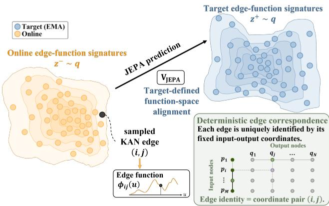
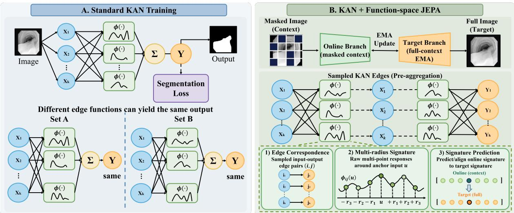
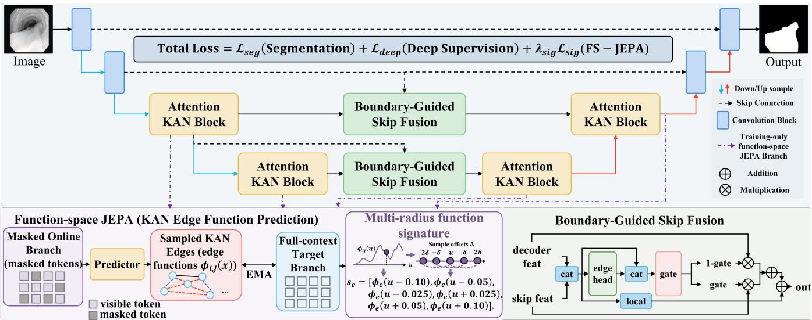
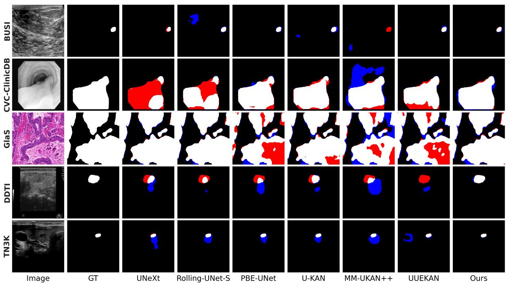
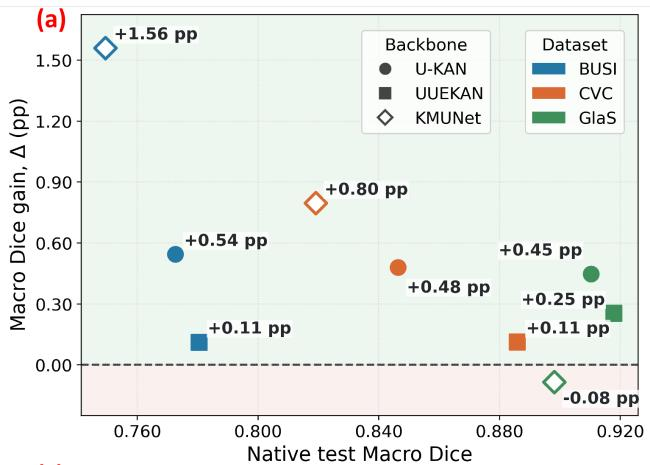
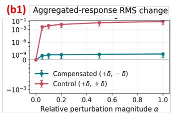
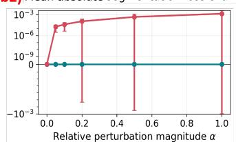
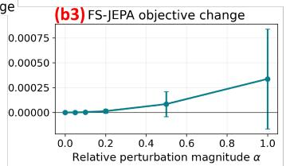

# Predicting Functions, Not Features: KANs with Function-Space Joint-Embedding Predictive Learning for Medical Image Segmentation

Yungeng Liu1∗, Xuanzi Fang1∗, Yuge Zhang2, Shuqi Ren1, Haijin Zeng1, Yongyong Chen1†

1Harbin Institute of Technology,Shenzhen

2The University of Hong Kong

25B951006@stu.hit.edu.cn, firetreehouse0@gmail.com, u3645972@connect.hku.hk, konosubame@gmail.com, haijin.zeng2018@gmail.com, cyy2020@hit.edu.cn

## Abstract

Kolmogorov–Arnold Networks (KANs) introduce explicit functional representations by parameterizing each network edge as a learnable univariate function. However, existing KAN-based segmentation models optimize edge functions only through objectives defined after edge aggregation, leaving individual functions without an explicit preaggregation learning target. To address this limitation, we propose Function-Space Joint-Embedding Predictive Learning (FS-JEPA) for medical image segmentation. Our FS-JEPA framework moves predictive learning into the pre-aggregation function space of KANs. A masked online branch predicts structured signatures of sampled KAN edge functions generated by a full-context exponential moving average target branch, while shared edge indices preserve correspondence between predictions and targets. Rather than predicting an isolated edge response, we represent each sampled edge function using a multi-radius signature composed of function evaluations around its input anchor. This structured representation captures local functional variations that cannot be characterized by a single response and provides a more informative predictive target. The function-space objective is jointly optimized with the segmentation loss during training, while the predictive branch is removed at inference. Experiments on five medical image segmentation benchmarks show that our FS-JEPA achieves the best average Dice and outperforms the strongest competing KAN-based method by +2.25 percentage points.

## Introduction

Medical image segmentation requires dense prediction under weak contrast, ambiguous boundaries, artifacts, and large appearance variations. Encoder–decoder architectures address these challenges through multi-scale feature fusion and improved token interaction (Ronneberger, Fischer, and Brox 2015; Zhou et al. 2018; Valanarasu and Patel 2022; Liu et al. 2024), but their nonlinear transformations remain implicitly defined by scalar weights and fixed activations rather than explicit functional objects.

Kolmogorov–Arnold Networks (KANs) place a learnable univariate function on each network edge (Liu et al. 2025). Given an input $x _ { i } ,$ the j-th output is defined as $\begin{array} { r } { y _ { j } = \sum _ { i } \phi _ { j , i } ( x _ { i } ) } \end{array}$ , where $\phi _ { j , i }$ denotes the function from input node i to output node j. This representation has been introduced into medical image segmentation by U-KAN (Li et al.

  
Figure 1: Motivation of Our FS-JEPA for KANs. To overcome the limitations of feature-level prediction, predictive learning is extended to structured representations of preaggregation KAN edge functions. Multi-radius signatures characterize local functional variations, enabling predictive learning directly in KAN function space.

2025) and extended to visual token processing by KAT (Yang and Wang 2025). However, existing KAN-based vision models are optimized only through losses on aggregated node outputs. Such supervision constrains the sum of incoming edge responses, allowing diferent edge-function configurations to produce similar outputs and leaving individual functions without an explicit pre-aggregation objective. Moreover, each function is evaluated only at an input-dependent anchor during a forward pass, although functions with the same response at that point may behave diferently nearby. Thus, edge-specific behavior and local functional variation remain only implicitly constrained by the downstream task.

Joint-embedding predictive learning provides a way to learn structured representations beyond task supervision. Instead of reconstructing raw inputs, JEPA predicts target representations from contextual observations (Assran et al. 2023). Existing methods, however, mainly operate on image-, token-, or feature-level embeddings and do not consider learnable neural functions as prediction targets. As shown in Fig. 1, extending predictive learning to KAN function space is nontrivial. First, a single edge response cannot characterize the local behavior of a function. Second, because diferent KAN edges represent diferent input–output connections, the sampled edges in the online and target branches must remain explicitly aligned. These challenges raise the question: can predictive learning be extended from feature representations to structured representations oflearnable neuralfunctions?

  
Figure 2: Standard KAN training versus the proposed FS-JEPA framework. (A) Standard KAN training optimizes edge functions only through post-aggregation task supervision, under which diferent edge-function configurations may yield the same node output. (B) Our framework directly performs predictive learning on sampled pre-aggregation edge functions by predicting their multi-radius signatures from masked online contexts to full-context EMA targets, with shared edge indices ensuring correspondence.

We answer this question with FS-JEPA for KAN-based medical image segmentation. As illustrated in Fig. 2, during training, a masked online branch predicts structured signatures generated by a full-context exponential moving average target branch before KAN edge aggregation. The two branches share the same sampled edge indices, ensuring that each prediction corresponds to the same input–output edge function. Rather than predicting an isolated response, we represent each sampled edge function using a multi-radius signature composed of function evaluations around its input anchor. This signature captures local functional variations and provides an explicit pre-aggregation predictive objective for individual KAN edges. The objective is jointly optimized with the supervised segmentation loss, while all predictive components are removed at inference. Across five medical image segmentation benchmarks, FS-JEPA achieves the highest average Dice and outperforms the strongest competing KAN-based method by +2.25 percentage points. Our contributions are summarized as follows:

• We formulate joint-embedding predictive learning in the native pre-aggregation function space of KANs, shifting the prediction target from feature embeddings to structured edge-function signatures.

• We introduce a multi-radius function signature representation that captures local functional behavior of KAN edge functions and provides an efective prediction target for function-space learning.

• We develop a training-only predictive framework that jointly learns KAN edge-function signatures and segmentation representations from random initialization while maintaining online-target edge correspondence under controlled training cost.

## Related Work

## Medical Image Segmentation

U-Net established the encoder–decoder paradigm with skip connections for medical image segmentation and inspired numerous variants (Ronneberger, Fischer, and Brox 2015; Jiangtao, Ruhaiyem, and Panpan 2025; Xia et al. 2025). UNet++ reduces semantic gaps through nested skip pathways (Zhou et al. 2018), while recent architectures explore eficient feature interaction, such as tokenized MLPs in UNeXt, compact long-range modeling in Rolling-UNet, and boundaryaware attention in PBE-UNet (Valanarasu and Patel 2022; Liu et al. 2024; Wang et al. 2026). Beyond architectural design, optimization strategies including deep supervision and boundary-aware objectives are explored (Lee et al. 2015; Kervadec et al. 2019). These techniques are adopted as a fixed segmentation scafold, while our contribution focuses on learning structured representations of KAN functions.

## Kolmogorov–Arnold Networks for Vision

KANs replace fixed activations with learnable univariate edge functions, providing an explicit functional representation beyond conventional weight-based networks (Liu et al. 2025). This formulation has inspired various vision architectures, including U-KAN for medical segmentation, KAT for visual token processing, MM-UKAN++ for boundary refinement, and UUEKAN with uncertainty-guided attention (Li et al. 2025; Yang and Wang 2025; Zhang et al. 2025a; Chen et al. 2026). However, existing KAN-based vision models still optimize edgefunctions indirectly through task objectives after edge aggregation. Although gradients are propagated to individual edges, the underlyingfunctional structures are not explicitly modeled as learning targets. Our work addresses this limitation by introducing predictive learning directly on pre-aggregation KAN edgefunctions.

## Joint-Embedding Predictive Learning

Self-supervised predictive learning aims to learn representations by predicting intrinsic data structures rather than relying on manual annotations. BYOL and VICReg demonstrate the efectiveness of prediction-based objectives without contrastive negative samples (Grill et al. 2020; Bardes, Ponce, and LeCun 2022). JEPA further shifts prediction from input reconstruction to latent representation prediction, where I-JEPA learns target representations from visible contexts and subsequent variants extend this paradigm to temporal and video domains (Assran et al. 2023; Monemi et al. 2025; Bardes, Ponce, and LeCun 2023; Bardes et al. 2024). However, existing JEPA methods remain limited to genericfeature embeddings and do not consider learnable neural operators as prediction targets. We extend JEPA from feature space to KAN function space, where edge functions are represented by structured multi-radius signatures and directly optimized through predictive learning.

## Method

## Overview

Let $f _ { \theta }$ denote a U-shaped KAN segmentation network. The segmentation stream receives the complete image and is optimized with standard supervision. As illustrated in Fig. 3, our framework adopts established components, including Attention KAN Blocks and Boundary-Guided Skip Fusion. The Attention KAN Block follows recent attention-enhanced KAN designs such as KAT (Yang and Wang 2025), while the boundary-guided fusion module is used to improve feature integration across scales. Full module definitions and layer-wise configurations are provided in Section A of our Supplementary. During training, we attach a function-space JEPA branch to the KAN blocks. The online branch receives a partially masked token sequence and predicts function signatures generated by a full-context EMA target branch, following the predictive learning principle of JEPA. Unlike feature-level predictive learning, our objective is defined before KAN edge aggregation and directly targets individual edge functions $\phi _ { j , i }$ . Since the complete target representation is generated from the same sampled KAN edges, the prediction preserves edge-level correspondence. Instead of predicting isolated edge responses, we represent each function using a multi-radius signature that captures local functional behavior. This design enables direct predictive learning over structured KAN edge functions without contrastive negatives, reconstruction losses, or manually imposed derivative constraints.

## KAN Edge Functions and Edge Sampling

KANs represent network transformations through learnable functions assigned to individual edges. Consider a KAN layer with $d _ { \mathrm { i n } }$ input nodes and $d _ { \mathrm { o u t } }$ output nodes. In the spline-based parameterization adopted in our backbone, the response of edge $( i , j )$ to a scalar input u is

$$
\phi _ { j , i } ( u ) = w _ { j , i } ^ { b } \mathrm { S i L U } ( u ) + s _ { j , i } \sum _ { \ell = 1 } ^ { L } { w _ { j , i , \ell } ^ { s } B _ { \ell } ^ { p } ( u ) } ,\tag{1}
$$

where $w _ { j , i } ^ { b }$ denotes the base function coeficient, $w _ { j , i , \ell } ^ { s }$ denotes the spline coeficients, $s _ { j , i }$ is the learnable spline scale, and $B _ { \ell } ^ { p }$ represents a B-spline basis function of order $p .$ The standard KAN forward operation aggregates all incoming edge functions $\begin{array} { r } { { \bf \langle { y } \rvert } = \sum _ { i } \phi _ { j , i } ( x _ { i } ) } \end{array}$ . Although this aggregation enables eficient computation, it also introduces a many-toone mapping from edge functions to node representations. Diferent combinations of edge functions may produce similar aggregated outputs, making the individual functional behaviors of edges dificult to supervise through task objectives alone. Therefore, our framework exposes the pre-aggregation edge functions as predictive targets. Directly constructing responses for all possible edges requires $O ( \dot { B } N d _ { \mathrm { i n } } d _ { \mathrm { o u t } } )$ auxiliary activations, which becomes prohibitively expensive for large KAN layers. Instead, we randomly sample K inputoutput edge pairs: ${ \cal { S } } = \{ ( i _ { k } , j _ { k } ) \} _ { k = 1 } ^ { K }$ . For sampled edges, we define a selected-edge operator:

$$
\Phi _ { S } ( U ) _ { b , n , k } = \phi _ { j _ { k } , i _ { k } } ( U _ { b , n , i _ { k } } ) ,\tag{2}
$$

which evaluates only the required edge functions by gathering their corresponding spline parameters and knot grids. This operation is equivalent to computing the complete edgeresponse tensor followed by selecting the same entries, while reducing auxiliary activation cost from $O ( B N d _ { \mathrm { i n } } d _ { \mathrm { o u t } } )$ to O(BNK). The sampled edge functions obtained by $\Phi _ { S }$ are subsequently used to construct multi-radius function signatures for the proposed function-space predictive objective.

## Multi-radius Edge Function Signature

A single point evaluation cannot fully characterize a KAN edge function. Two diferent functions may produce identical responses at one input location while exhibiting diferent local behaviors around that point. Therefore, we represent each sampled edge function using a multi-radius signature constructed from neighboring function evaluations.

For a sampled edge $e = ( i , j )$ with anchor input u, we define a set of local ofsets:

$$
\mathcal { D } = \{ - 0 . 1 0 , - 0 . 0 5 , - 0 . 0 2 5 , 0 . 0 2 5 , 0 . 0 5 , 0 . 1 0 \} .\tag{3}
$$

The function signature is obtained by evaluating the same edge function at multiple neighboring locations:

$$
s _ { e } ( \Delta ) = \phi _ { e } ( u + \Delta ) , \quad \Delta \in \mathcal { D } .\tag{4}
$$

The final multi-radius signature is defined as:

$$
\begin{array} { r } { s _ { e } = [ \phi _ { e } ( u - 0 . 1 0 ) , \phi _ { e } ( u - 0 . 0 5 ) , \phi _ { e } ( u - 0 . 0 2 5 ) , } \\ { \phi _ { e } ( u + 0 . 0 2 5 ) , \phi _ { e } ( u + 0 . 0 5 ) , \phi _ { e } ( u + 0 . 1 0 ) ] . } \end{array}\tag{5}
$$

  
Figure 3: Overview of the FS-JEPA framework. The segmentation network is jointly optimized with a training-only predictive branch that learns multi-radius signatures of sampled KAN edge functions before aggregation. The online branch predicts EMA target signatures under explicit edge correspondence, enabling predictive representation learning in KAN function space.

Unlike single-response prediction, the proposed signature transforms each KAN edge function into a structured local representation. By preserving the response pattern around the input anchor, it captures local functional variations and provides a more informative prediction target for functionspace JEPA without introducing manually designed auxiliary losses.

## Deterministic Edge Correspondence

The stochastic sampling of KAN edges introduces a correspondence problem: the same sampled position may refer to diferent input-output edges across iterations. Since function signatures describe local functional behavior but do not inherently encode edge identity, explicit edge correspondence is required for stable predictive learning. For a sampled edge $( i , j )$ , we encode its source and target node positions using deterministic coordinates:

$$
p _ { i } = 2 \frac { i - 1 } { d _ { \mathrm { i n } } - 1 } - 1 , \qquad p _ { j } = 2 \frac { j - 1 } { d _ { \mathrm { o u t } } - 1 } - 1 .\tag{6}
$$

The coordinate pair $( p _ { i } , p _ { j } )$ is concatenated with the multiradius function signature and provided as the condition of the signature predictor. Since the online and target branches share identical sampled edge indices, these deterministic coordinates establish consistent correspondence between predicted and target signatures without introducing additional learnable parameters. This design separates functional representation from edge indexing: the signature captures the local behavior of an edge function, while the coordinates identify the corresponding input-output connection.

## Function Signature Prediction Objective

Given the predicted signature $\hat { s } _ { e }$ from the masked online branch and the target signature $s _ { e } ^ { + }$ generated by the fullcontext EMA branch, we formulate the function-space predictive objective by aligning the two signatures. Specifically, the online predictor receives the masked context representation together with the sampled edge information and produces: $\bar { s } _ { e } ^ {  } = q _ { \psi } ( z _ { e } ) , s _ { e } ^ { + } = \mathrm { s g } \bar { ( s _ { e } ^ { E M A } ) }$ , Here, $z _ { e }$ concatenates the masked online edge response, its input anchor, and the deterministic coordinates $( p _ { i } , p _ { j } )$ of edge $e \ = \ ( i , j )$ , and $q _ { \psi }$ denotes the signature predictor and $\operatorname { s g } ( \cdot )$ indicates stopgradient operation. The EMA target branch provides a stable prediction target without receiving gradient updates. The predictive loss is defined as: $\mathcal { L } _ { s i g } \equiv \mathrm { S m o o t h L 1 } ( \hat { s } _ { e } , s _ { e } ^ { + } )$ Following the JEPA principle, the online branch learns to infer the complete function signature from partially observed contexts, while the EMA branch provides a slowly evolving target representation. Unlike feature-level predictive learning, the prediction target here is defined over the structured representation of individual KAN edge functions before aggregation. Therefore, the objective directly constrains the functional behavior of KAN edges rather than only their aggregated node outputs. Since the online and target branches share identical sampled edge indices, each predicted signature corresponds to the same input-output edge function. The deterministic edge coordinates provide explicit correspondence information, while the multi-radius signature captures local functional behavior around the input anchor. The proposed objective learns structured KAN edge-function representations without auxiliary constraints or contrastive objectives. By predicting multi-radius function signatures, it enables predictive learning directly in KAN function space beyond conventional feature representations.

## Joint Optimization and Inference

The proposed function-space predictive objective is jointly optimized with the supervised segmentation task. The segmentation objective consists of the main segmentation loss $\mathcal { L } _ { s e g }$ and decoder-side deep supervision loss $\mathcal { L } _ { d e e p } .$ . For the four KAN blocks equipped with the predictive branch, the final training objective is defined as:

<table><tr><td rowspan="2">Methods</td><td colspan="2">BUSI</td><td colspan="2">DDTI</td><td colspan="2">TN3K</td><td colspan="2">CVC</td><td colspan="2">GlaS</td><td colspan="2">Average</td><td rowspan="2">Params(M)</td></tr><tr><td>Dice</td><td>IoU</td><td>Dice</td><td>IoU</td><td>Dice</td><td>IoU</td><td>Dice</td><td>IoU</td><td>Dice</td><td>IoU</td><td>Dice IoU</td><td></td></tr><tr><td>UNet++(2018)</td><td>0.7093</td><td>0.6232</td><td>0.7179</td><td>0.6030</td><td>0.8008</td><td>0.7137</td><td>0.8702</td><td>0.8045</td><td>0.9105</td><td>0.8423</td><td>0.8017</td><td>0.7173</td><td>9.16</td></tr><tr><td>UNeXt(2022)</td><td>0.6671</td><td>0.5655</td><td>0.6657</td><td>0.5325</td><td>0.7593</td><td>0.6582</td><td>0.7262</td><td>0.6211</td><td>0.8469</td><td>0.7427</td><td>0.7330</td><td>0.6240</td><td>1.47</td></tr><tr><td>Rolling-UNet-S(2024)</td><td>0.6932</td><td>0.5967 0.6574</td><td>0.7077</td><td>0.5826 0.5664</td><td>0.7985 0.8065</td><td>0.7077 0.7167</td><td>0.7978 0.8268</td><td>0.7117 0.7478</td><td>0.8903 0.8264</td><td>0.8097 0.7198</td><td>0.7775</td><td>0.6817</td><td>1.78</td></tr><tr><td>PBE-UNet(2026) 0.7490 0.6912</td><td colspan="9"></td><td>0.7800</td><td>0.6816</td><td>4.26</td></tr><tr><td></td><td colspan="14">KAN-based Methods</td></tr><tr><td>U-KAN(2025)</td><td>0.7011</td><td>0.6097</td><td>0.6893</td><td>0.5610</td><td>0.7865</td><td>0.6948</td><td>0.7607</td><td>0.6741</td><td>0.8680</td><td>0.7748</td><td>0.7611</td><td>0.6629</td><td>6.36</td></tr><tr><td>MM-UKAN++(2025a)</td><td>0.5786</td><td>0.4808</td><td>0.6187</td><td>0.4802</td><td>0.7371</td><td>0.6370</td><td>0.7065</td><td>0.5946</td><td>0.7826</td><td>0.6541</td><td>0.6847</td><td>0.5693</td><td>7.68</td></tr><tr><td>KMUNet(2025b)</td><td>0.7494</td><td>0.6599</td><td>0.7372</td><td>0.6287</td><td>0.8132</td><td>0.7237</td><td>0.8191</td><td>0.7431</td><td>0.8982</td><td>0.8239</td><td>0.8034</td><td>0.7159</td><td>7.01</td></tr><tr><td>Implicit U-KAN2.0(2025)</td><td>0.7644</td><td>0.6722</td><td>0.7067</td><td>0.5854</td><td>0.7699</td><td>0.6685</td><td>0.7962</td><td>0.7145</td><td>0.8718</td><td>0.7855</td><td>0.7818</td><td>0.6852</td><td>7.85</td></tr><tr><td>UÚEKAN(2026)</td><td>0.7569</td><td>0.6732</td><td>0.7447</td><td>0.6338</td><td>0.8206</td><td>0.7349</td><td>0.8346</td><td>0.7697</td><td>0.8992</td><td>0.8253</td><td>0.8112</td><td>0.7274</td><td>35.02</td></tr><tr><td>Matched Scaffold</td><td>0.7808</td><td>0.7017</td><td>0.7289</td><td>0.6152</td><td>0.8217</td><td>0.7332</td><td>0.8798</td><td>0.8113</td><td>0.9149</td><td>0.8505</td><td>0.8252</td><td>0.7424</td><td>7.74</td></tr><tr><td>FS-JEPA(Ours)</td><td>0.7926</td><td>0.7035</td><td>0.7432</td><td>0.6275</td><td>0.8258</td><td>0.7401</td><td>0.8852</td><td>0.8199</td><td>0.9215</td><td>0.8611</td><td>0.8337</td><td>0.7504</td><td>7.74</td></tr></table>

Table 1: Comparison with state-of-the-art methods on five medical image segmentation benchmarks. The best results are highlighted in bold and the second-best results are underlined. All results are reported using image-level Dice and IoU. The Matched Scafold denotes the complete segmentation architecture in Fig. 3 trained without the FS-JEPA branch.

$$
\mathcal { L } _ { t o t a l } = \mathcal { L } _ { s e g } + \lambda _ { d e e p } \mathcal { L } _ { d e e p } + \frac { \lambda _ { s i g } } { 4 } \sum _ { b = 1 } ^ { 4 } \mathcal { L } _ { s i g } ^ { ( b ) } .\tag{7}
$$

The segmentation and function-space predictive objectives are jointly optimized from random initialization, without pretrained checkpoints or external teacher models. The EMA target branch and signature predictor are used only during training and removed at inference, leaving the original segmentation pathway unchanged.

## Experiments

Experimental Setup: To evaluate the proposed method, as shown in Table 1, we conduct experiments on five medical image segmentation benchmarks covering diferent imaging modalities: BUSI (Al-Dhabyani et al. 2020) and DDTI (Pedraza et al. 2015) for ultrasound-based lesion and nodule segmentation, TN3K (Gong et al. 2021) for thyroid region and nodule segmentation, CVC-ClinicDB (Bernal et al. 2015) for polyp segmentation, and GlaS (Sirinukunwattana et al. 2017) for gland segmentation in histopathology images. All methods are evaluated under the same data partition for each dataset to ensure a fair comparison. All models are trained from random initialization under identical data splits and optimization settings without external pre-training or teacher models. The proposed function-space predictive objective is jointly optimized with the segmentation objective, while the auxiliary predictive components are removed during inference. All models are trained for 300 epochs on a server equipped with eight NVIDIA RTX 4090 GPUs. Main benchmark comparisons are averaged over three independent random seeds. Controlled ablation and cross-backbone studies use two shared seeds for all compared configurations under identical training and evaluation protocols.

Comparison with State-of-the-Art Methods: Table 1 reports the comparison between the proposed method and representative medical image segmentation approaches across five benchmarks, including ultrasound, endoscopy, and histopathology datasets. The compared methods include CNN-based architectures, such as U-Net (Ronneberger, Fischer, and Brox 2015), UNet++ (Zhou et al. 2018), UNeXt (Valanarasu and Patel 2022), Rolling-UNet-S (Liu et al. 2024) and PBE-UNet (Wang et al. 2026), as well as recent KAN-based segmentation models, including U-KAN (Li et al. 2025), MM-UKAN++ (Zhang et al. 2025a), KMUNet (Zhang et al. 2025b), Implicit U-KAN2.0 (Cheng et al. 2025) and UUEKAN (Chen et al. 2026).

Our method consistently achieves superior performance across most datasets, obtaining the highest average Dice and IoU scores of 83.37% and 75.04%, respectively. Compared with the matched scafold, FS-JEPA improves the average Dice from 82.52% to 83.37%, corresponding to gains of 0.85 percentage points, respectively. Since the two models share the same segmentation architecture and inference-time parameter count, these improvements isolate the contribution of the proposed function-space predictive objective. FS-JEPA also outperforms the strongest competing KANbased method, UUEKAN, by +2.25 percentage points Dice percentage points while using substantially fewer inferencetime parameters. These results indicate that the performance improvement mainly originates from function-space predictive supervision rather than increased model capacity. As shown in Fig. 4, qualitative comparison demonstrates that the proposed framework also achieves competitive performance across diferent imaging modalities, producing more accurate boundary delineation and lesion localization. By learning multi-radius KAN edge-function signatures, the framework provides more efective functional representations for challenging medical segmentation scenarios with complex appearance variations and ambiguous boundaries. Overall, these results demonstrate the efectiveness of predicting structured function representations beyond conventional feature embeddings for KAN-based segmentation.

Mechanistic Analysis and Cross-Backbone Generalization: As shown in Fig. 5(a), FS-JEPA improves Dice in eight of the nine backbone–dataset settings, with an overall average gain of 0.47 percentage points. The gains across U-KAN, UUEKAN, and KMUNet suggest that FS-JEPA is not restricted to a specific segmentation scafold. Fig. 5(b1– b3) shows that compensated perturbations $( + \delta , - \bar { \delta } )$ leave the aggregated response and segmentation loss nearly unchanged, while the FS-JEPA objective remains sensitive to these edge-level variations. Fig. 5(c) further shows that FS-JEPA induces edge-specific changes in KAN function responses under paired initialization, edge indices, and input grids. Together, these results indicate that FS-JEPA provides an explicit pre-aggregation learning signal and directly reshapes KAN edge-function representations.

Figure 4: Qualitative comparison of segmentation results. From left to right: input images, ground truth, and predictions from diferent methods. White, red, and blue regions indicate true positive, false positive, and false negative regions, respectively.
<table><tr><td>Predictive method</td><td>Target space</td><td>Pre-sum</td><td>Dice ↑</td><td>IoU↑</td></tr><tr><td>No predictive objective</td><td></td><td></td><td> $0 . 7 8 0 8 { \pm } 0 . 0 0 9 3$ </td><td> $0 . 7 0 1 7 { \scriptstyle \pm 0 . 0 1 0 3 }$ </td></tr><tr><td>Token-JEPA</td><td>Token feature</td><td></td><td> $0 . 7 8 0 8 { \scriptstyle \pm 0 . 0 0 9 7 }$ </td><td> $0 . 6 9 2 1 { \scriptstyle \pm 0 . 0 1 1 4 }$ </td></tr><tr><td>Node-JEPA</td><td>KAN node feature</td><td></td><td> $0 . 7 8 4 5 { \pm } 0 . 0 1 4 5$ </td><td> $0 . 6 9 9 5 { \pm } 0 . 0 1 5 1$ </td></tr><tr><td>Edge-JEPA</td><td>Single edge response</td><td>√</td><td> $0 . 7 7 7 1 { \scriptstyle \pm 0 . 0 1 2 3 }$ </td><td> $0 . 6 9 3 3 { \pm } 0 . 0 1 0 9$ </td></tr><tr><td>Ours</td><td>Multi-radius edge-function signature</td><td>√</td><td> $\mathbf { 0 . 7 9 2 6 { \pm 0 . 0 0 4 9 } }$ </td><td> $\mathbf { 0 . 7 0 3 5 \pm 0 . 0 0 5 4 }$ </td></tr></table>

Table 2: Comparison of predictive target spaces on BUSI under the same segmentation scafold and 300-epoch budget. “Presum” indicates that prediction is performed before KAN edge aggregation.

Ablation Studies: We conduct ablation studies to investigate three aspects of the proposed function-space predictive learning framework: (1) the efect of diferent predictive target spaces, (2) whether multi-radius signatures improve function prediction quality, and (3) how diferent signature constructions afect the downstream segmentation performance.

Efect of Predictive Target Space: Table 2 compares different predictive targets under the same segmentation scaffold and optimization budget. Without predictive learning, the baseline achieves a Dice score of 0.7808. Token- and Node-JEPA obtain 0.7808 and 0.7845, respectively, indicating that feature-level and node-level prediction do not provide consistent benefits. When prediction is performed on pre-aggregation edge responses, Edge-JEPA achieves 0.7771 Dice, suggesting that a single function evaluation is insufficient to characterize the underlying KAN edge functions. In contrast, the proposed multi-radius edge-function signature achieves the best performance with 0.7926 Dice. These results demonstrate that efective function-space predictive learning requires not only moving beyond feature representations, but also constructing an informative representation of individual KAN edge functions.

Efect of Function Signature Construction: Table 3 evaluates the quality of function prediction under diferent signature constructions. Compared with single-response prediction, Raw multi-point signatures substantially improve function prediction, reducing Relative MAE from 0.9910 to 0.9175 and NRMSE from 0.9893 to 0.8999. It also increases Pearson correlation from 0.3139 to 0.4622, indicating that multi-radius responses better preserve the functiona behavior of KAN edges. Although diferent normalization strategies improve certain statistics, they do not consistently enhance functional prediction. Raw multi-point achieves the best overall prediction quality, with the lowest regression errors and highest correlation among signature variants.

Figure 5: Mechanistic and cross-backbone analysis of FS-JEPA. (a) Paired Dice gains obtained by applying FS-JEPA to U-KAN, UUEKAN, and KMUNet across BUSI, CVC, and GlaS. (b) Sensitivity of the aggregated KAN response, segmentation loss, and FS-JEPA objective to compensated and control edge perturbations. (c) Paired edge-function analysis on BUSI, showing the responses of native U-KAN and U-KAN with FS-JEPA, their edge-wise changes, and representative paired curves.
<table><tr><td>Configuration</td><td>Multi-radius</td><td>Rel. MAE↓</td><td>NRMSE↓</td><td>Pearson r ↑</td><td> $\mathrm { S t d . \ r a t i o  1 }$ </td><td>Corr. error ↓</td></tr><tr><td>Response only</td><td></td><td> $0 . 9 9 1 0 { \scriptstyle \pm 0 . 0 0 8 3 }$ </td><td> $0 . 9 8 9 3 { \scriptstyle \pm 0 . 0 1 2 4 }$ </td><td> $0 . 3 1 3 9 { \pm } 0 . 1 1 9 1$ </td><td> $0 . 0 5 7 6 { \scriptstyle \pm 0 . 0 7 4 6 }$ </td><td> $0 . 0 8 5 9 { \pm } 0 . 0 0 6 3$ </td></tr><tr><td>Raw multi-point</td><td>V</td><td> $\mathbf { 0 . 9 1 7 5 { \scriptstyle \pm 0 . 0 4 4 9 } }$ </td><td> $\mathbf { 0 . 8 9 9 9 } 2 \mathbf { 0 . 0 4 2 9 }$ </td><td> $\mathbf { 0 . 4 6 2 2 { \scriptstyle \pm 0 . 0 7 9 6 } }$ </td><td> $\mathbf { 0 . 2 9 7 4 } \pm \mathbf { 0 . 0 9 1 0 }$ </td><td> $0 . 0 6 7 9 { \scriptstyle \pm 0 . 0 0 2 9 }$ </td></tr><tr><td>Centered signature</td><td>√</td><td> $1 . 0 0 5 2 { \pm } 0 . 0 0 2 3$ </td><td> $0 . 9 9 2 3 { \pm } 0 . 0 0 3 8$ </td><td> $0 . 1 4 9 0 { \pm } 0 . 0 3 5 5$ </td><td> $0 . 0 6 3 7 { \pm } 0 . 0 1 7 8$ </td><td> $0 . 0 5 8 6 { \pm } 0 . 0 0 8 4$ </td></tr><tr><td>Diagonal signature</td><td>√</td><td> $1 . 0 0 5 2 { \scriptstyle \pm 0 . 0 0 0 9 }$ </td><td> $0 . 9 9 2 1 { \scriptstyle \pm 0 . 0 0 0 1 }$ </td><td> $0 . 1 6 0 8 { \pm } 0 . 0 0 6 2$ </td><td> $0 . 0 6 0 3 { \pm } 0 . 0 0 2 8$ </td><td> $\mathbf { 0 . 0 5 4 2 } \pm \mathbf { 0 . 0 0 5 8 }$ </td></tr><tr><td>ZCA signature</td><td>√</td><td> $0 . 9 9 2 8 { \pm } 0 . 0 0 1 9$ </td><td> $0 . 9 9 4 9 { \pm } 0 . 0 0 2 9$ </td><td> $0 . 2 1 2 7 { \pm } 0 . 0 5 3 1$ </td><td> $0 . 0 2 4 4 { \pm } 0 . 0 0 8 7$ </td><td> $0 . 0 5 9 9 { \pm } 0 . 0 0 4 6$ </td></tr></table>

Table 3: Function-prediction diagnostics for diferent edge-function signature constructions on BUSI. The matched scafold has no predictive branch and therefore no function-prediction diagnostics.

<table><tr><td>Configuration</td><td>Dice ↑</td><td>IoU↑</td><td>∆Dice</td></tr><tr><td>Matched scaffold</td><td> $0 . 7 8 0 8 { \pm } 0 . 0 0 9 3$ </td><td> $0 . 7 0 1 7 { \scriptstyle \pm 0 . 0 1 0 3 }$ </td><td>+0.0037</td></tr><tr><td>Response only</td><td> $0 . 7 7 7 1 { \scriptstyle \pm 0 . 0 1 2 3 }$ </td><td> $0 . 6 9 3 3 { \pm } 0 . 0 1 0 9$ </td><td>0.0000</td></tr><tr><td>Raw multi-point</td><td> $\mathbf { 0 . 7 9 2 6 { \pm 0 . 0 0 4 9 } }$ </td><td> $0 . 7 0 3 5 { \pm } 0 . 0 0 5 4$ </td><td>+0.0155</td></tr><tr><td>Centered signature</td><td> $0 . 7 7 8 6 { \pm } 0 . 0 0 2 5$ </td><td> $0 . 6 9 2 5 { \pm } 0 . 0 0 3 9$ </td><td>+0.0015</td></tr><tr><td>Diagonal signature</td><td> $0 . 7 8 9 7 { \scriptstyle \pm 0 . 0 1 6 7 }$ </td><td> $\mathbf { 0 . 7 0 4 7 { \pm } 0 . 0 1 3 2 }$ </td><td>+0.0126</td></tr><tr><td>ZCA signature</td><td> $0 . 7 8 1 0 { \pm } 0 . 0 0 4 8$ </td><td> $0 . 6 9 2 7 { \scriptstyle \pm 0 . 0 0 6 6 }$ </td><td>+0.0039</td></tr></table>

Table 4: Segmentation performance of edge-function signature variants on BUSI.

Efect of Signature Design on Segmentation: Table 4 further evaluates the impact of signature construction on the final segmentation task. Compared with Response only, Raw multi-point improves Dice from 0.7771 to 0.7926, yielding a gain of +1.55%. Additional normalization strategies do not provide consistent improvements. Centered and ZCA signatures achieve Dice scores of 0.7786 and 0.7810, respectively. Diagonal normalization obtains the highest IoU, but with larger seed variation. The multi-point signature achieves the highest Dice and is therefore adopted as the final design.

## Conclusion

We introduced FS-JEPA, a function-space joint-embedding predictive framework that extends predictive learning from feature embeddings to structured KAN edge-function signatures. By predicting multi-radius function signatures before edge aggregation, the proposed method enables direct representation learning over KAN edge functions. The framework is trained jointly with segmentation supervision from random initialization, while all predictive components are removed during inference. Experiments across medical image segmentation benchmarks demonstrate consistent improvements over existing KAN-based methods, validating the effectiveness of predictive learning in KAN function space.

## References

Al-Dhabyani, W.; Gomaa, M.; Khaled, H.; and Fahmy, A. 2020. Dataset of breast ultrasound images. Data in Brief, 28: 104863.

Assran, M.; Duval, Q.; Misra, I.; Bojanowski, P.; Vincent, P.; Rabbat, M.; LeCun, Y.; and Ballas, N. 2023. Self-Supervised Learning From Images With a Joint-Embedding Predictive Architecture. In Proceedings of the IEEE/CVF Conference on Computer Vision and Pattern Recognition (CVPR), 15619–15629.

Bardes, A.; Garrido, Q.; Ponce, J.; Chen, X.; Rabbat, M.; LeCun, Y.; Assran, M.; and Ballas, N. 2024. Revisiting Feature Prediction for Learning Visual Representations from Video. arXiv:2404.08471.

Bardes, A.; Ponce, J.; and LeCun, Y. 2022. VICReg: Variance-Invariance-Covariance Regularization for Self-Supervised Learning. In International Conference on Learning Representations.

Bardes, A.; Ponce, J.; and LeCun, Y. 2023. MC-JEPA: A Joint-Embedding Predictive Architecture for Self-Supervised Learning of Motion and Content Features. arXiv:2307.12698.

Bernal, J.; Sanchez, F. J.; Fernandez-Esparrach, G.; Gil, D.; Rodriguez, C.; and Vilarino, F. 2015. WM-DOVA Maps for Accurate Polyp Highlighting in Colonoscopy: Validation versus Saliency Maps from Physicians. Computerized Medical Imaging and Graphics, 43: 99–111.

Chen, Q.; Wan, H.; Yue, X.; and Zhang, X. 2026. UUEKAN: An edge-enhanced Kolmogorov-Arnold Network with uncertainty-guided attention for medical image segmentation. Biomedical Signal Processing and Control, 124: 110649.

Cheng, C.-W.; Zhao, Y.; Cheng, Y.; Montoya-Zegarra, J. A.; Schönlieb, C.-B.; and Aviles-Rivero, A. I. 2025. Implicit U-KAN2.0: Dynamic, Eficient and Interpretable Medical Image Segmentation. In Gee, J. C.; Alexander, D. C.; Hong, J.; Iglesias, J. E.; Sudre, C. H.; Venkataraman, A.; Golland, P.; Kim, J. H.; and Park, J., eds., Medical Image Computing and Computer Assisted Intervention – MICCAI 2025, 304– 314. Cham: Springer Nature Switzerland. ISBN 978-3-032- 05141-7.

Gong, H.; Chen, G.; Wang, R.; Xie, X.; Mao, M.; Yu, Y.; Chen, F.; and Li, G. 2021. Multi-Task Learning For Thyroid Nodule Segmentation With Thyroid Region Prior. In 2021 IEEE 18th International Symposium on Biomedical Imaging (ISBI), 257–261.

Grill, J.-B.; Strub, F.; Altché, F.; Tallec, C.; Richemond, P.; Buchatskaya, E.; Doersch, C.; Avila Pires, B.; Guo, Z.; Gheshlaghi Azar, M.; Piot, B.; kavukcuoglu, k.; Munos, R.; and Valko, M. 2020. Bootstrap Your Own Latent - A New Approach to Self-Supervised Learning. In Larochelle, H.;

Ranzato, M.; Hadsell, R.; Balcan, M.; and Lin, H., eds., Advances in Neural Information Processing Systems, volume 33, 21271–21284. Curran Associates, Inc.

Jiangtao, W.; Ruhaiyem, N. I. R.; and Panpan, F. 2025. A comprehensive review of U-Net and its variants: advances and applications in medical image segmentation. IET Image Processing, 19(1): e70019.

Kervadec, H.; Bouchtiba, J.; Desrosiers, C.; Granger, E.; Dolz, J.; and Ben Ayed, I. 2019. Boundary loss for highly unbalanced segmentation. In Cardoso, M. J.; Feragen, A.; Glocker, B.; Konukoglu, E.; Oguz, I.; Unal, G.; and Vercauteren, T., eds., Proceedings ofThe 2nd International Conference on Medical Imaging with Deep Learning, volume 102 of Proceedings of Machine Learning Research, 285– 296. PMLR.

Lee, C.-Y.; Xie, S.; Gallagher, P.; Zhang, Z.; and Tu, Z. 2015. Deeply-Supervised Nets. In Lebanon, G.; and Vishwanathan, S. V. N., eds., Proceedings ofthe Eighteenth International Conference on Artificial Intelligence and Statistics, volume 38 of Proceedings of Machine Learning Research, 562–570. San Diego, California, USA: PMLR.

Li, C.; Liu, X.; Li, W.; Wang, C.; Liu, H.; Liu, Y.; Chen, Z.; and Yuan, Y. 2025. U-KAN Makes Strong Backbone for Medical Image Segmentation and Generation. In Proceedings of the AAAI conference on artificial intelligence, volume 39, 4652–4660.

Liu, Y.; Zhu, H.; Liu, M.; Yu, H.; Chen, Z.; and Gao, J. 2024. Rolling-UNet: Revitalizing MLP’s Ability to Eficiently Extract Long-Distance Dependencies for Medical Image Segmentation. In Proceedings of the AAAI conference on artificial intelligence, volume 38, 3819–3827.

Liu, Z.; Wang, Y.; Vaidya, S.; Ruehle, F.; Halverson, J.; Soljacic, M.; Hou, T.; and Tegmark, M. 2025. KAN: Kolmogorov–Arnold Networks. In Yue, Y.; Garg, A.; Peng, N.; Sha, F.; and Yu, R., eds., International Conference on Learning Representations, 70367–70413.

Monemi, M.; Chinipardaz, M.; Rasti, M.; Bennis, M.; and Latva-Aho, M. 2025. Tutorial on Joint Embedding Predictive Architectures (JEPA): Foundations, Applications, and Future Directions. Authorea Preprints.

Pedraza, L.; Vargas, C.; Narváez, F.; Durán, O.; Muñoz, E.; and Romero, E. 2015. An open access thyroid ultrasound image database. In Romero, E.; and Lepore, N., eds., 10th International Symposium on Medical Information Processing and Analysis, volume 9287, 92870W. International Society for Optics and Photonics, SPIE.

Ronneberger, O.; Fischer, P.; and Brox, T. 2015. U-Net: Convolutional Networks for Biomedical Image Segmentation. In Navab, N.; Hornegger, J.; Wells, W. M.; and Frangi, A. F., eds., Medical Image Computing and Computer-Assisted Intervention – MICCAI 2015, 234–241. Cham: Springer International Publishing.

Sirinukunwattana, K.; Pluim, J. P.; Chen, H.; Qi, X.; Heng, P.-A.; Guo, Y. B.; Wang, L. Y.; Matuszewski, B. J.; Bruni, E.; Sanchez, U.; Böhm, A.; Ronneberger, O.; Cheikh, B. B.; Racoceanu, D.; Kainz, P.; Pfeifer, M.; Urschler, M.; Snead, D. R.; and Rajpoot, N. M. 2017. Gland segmentation in colon

histology images: The glas challenge contest. Medical Image Analysis, 35: 489–502.

Valanarasu, J. M. J.; and Patel, V. M. 2022. UNeXt: MLP-Based Rapid Medical Image Segmentation Network. In Wang, L.; Dou, Q.; Fletcher, P. T.; Speidel, S.; and Li, S., eds., Medical Image Computing and Computer Assisted Intervention – MICCAI 2022, 23–33. Cham: Springer Nature Switzerland.

Wang, C.; Zhu, Y.; Zhu, Y.; Shi, F.; Li, Q.; Wang, J.; Liu, Z.; and Hu, K. 2026. PBE-UNet: A light weight Progressive Boundary-Enhanced U-Net with Scale-Aware Aggregation for Ultrasound Image Segmentation. arXiv:2604.13791.

Xia, Q.; Zheng, H.; Zou, H.; Luo, D.; Tang, H.; Li, L.; and Jiang, B. 2025. A comprehensive review of deep learning for medical image segmentation. Neurocomputing, 613: 128740.

Yang, X.; and Wang, X. 2025. Kolmogorov-Arnold Transformer. In Yue, Y.; Garg, A.; Peng, N.; Sha, F.; and Yu, R., eds., International Conference on Learning Representations, 76063–76086.

Zhang, B.; Huang, H.; Shen, Y.; and Sun, M. 2025a. MM-UKAN++: A Novel Kolmogorov–Arnold Network-Based U-Shaped Network for Ultrasound Image Segmentation. IEEE Transactions on Ultrasonics, Ferroelectrics, and Frequency Control, 72(4): 498–514.

Zhang, H.; Duan, Y.; Liu, T.; Zhang, W.; and Tang, H. 2025b. KMUNet: A Novel Medical Image Segmentation Model Based on KAN and Mamba. In Medical Image Computing and Computer Assisted Intervention – MICCAI 2025, 298–307. Cham: Springer Nature Switzerland.

Zhou, Z.; Rahman Siddiquee, M. M.; Tajbakhsh, N.; and Liang, J. 2018. UNet++: A Nested U-Net Architecture for Medical Image Segmentation. In Stoyanov, D.; Taylor, Z.; Carneiro, G.; Syeda-Mahmood, T.; Martel, A.; Maier-Hein, L.; Tavares, J. M. R.; Bradley, A.; Papa, J. P.; Belagiannis, V.; Nascimento, J. C.; Lu, Z.; Conjeti, S.; Moradi, M.; Greenspan, H.; and Madabhushi, A., eds., Deep Learning in Medical Image Analysis and Multimodal Learningfor Clinical Decision Support, 3–11. Cham: Springer Internationa Publishing.