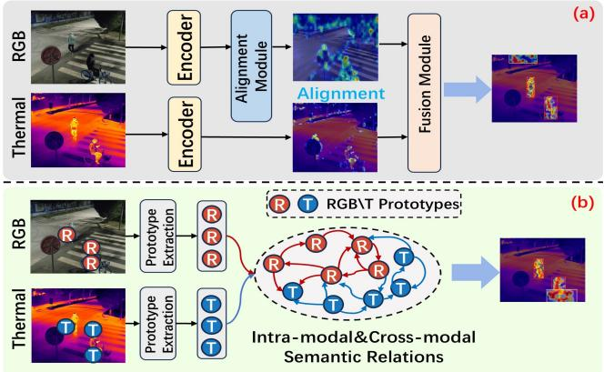
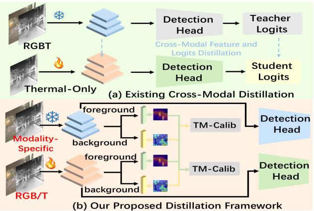
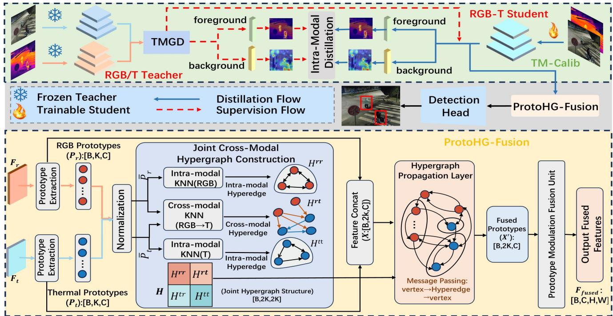
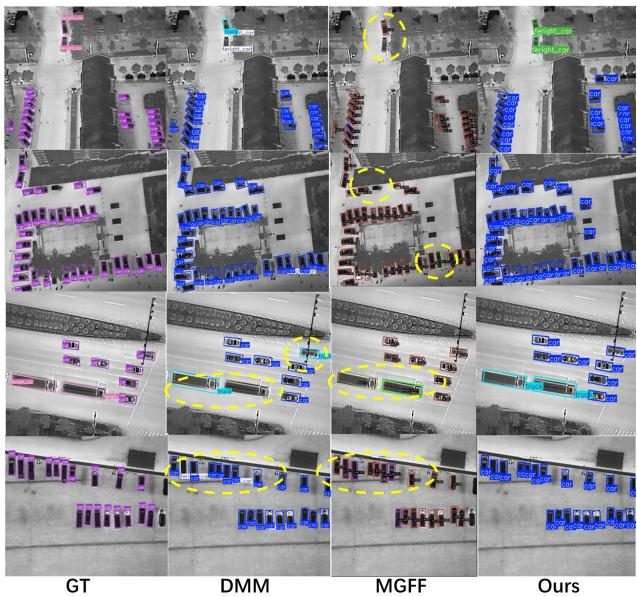
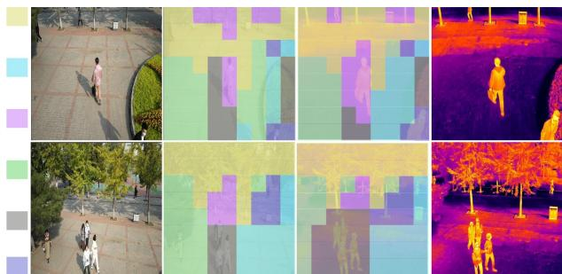

# ProtoHGF-Net: Prototype HyperGraph Fusion with Intra-modal Calibration for RGBT Object Detection

Xiangqi Chen†   
Zhejiang Normal   
University   
Jinhua, Zhejiang, China   
zjnu\_cxq@zjnu.edu.cn   
Dawei Zhang   
Zhejiang Normal   
University   
Jinhua, Zhejiang, China   
davidzhang@zjnu.edu.cn

Xiuling Zhang National University of Defense Technology Changsha, Hunan, China xiuling@nudt.edu.cn

Yanchao Wang   
Zhejiang Normal   
University   
Jinhua, Zhejiang, China   
yanchaowang@zjnu.edu.cn   
Hao Peng   
Zhejiang Normal   
University   
Jinhua, Zhejiang, China   
hpeng@zjnu.edu.cn   
Chengzhuan Yang Zhejiang Normal University   
Jinhua, Zhejiang, China czyang@zjnu.edu.cn

Liyuan Chen∗ National University of Defense Technology Changsha, Hunan, China chenliyuan0905@nudt.edu.cn

Zhonglong Zheng∗†‡ Zhejiang Normal University   
Jinhua, Zhejiang, China   
zhonglong@zjnu.edu.cn   
Li Zhao   
Zhejiang Normal   
University   
Jinhua, Zhejiang, China   
zhaoli2023@zjnu.edu.cn Hua Wang   
Victoria University   
Melbourne, Victoria Australia   
hua.wang@vu.edu.au

## Abstract

RGB-Thermal (RGBT) object detection enables robust perception in complex scenes by leveraging the complementary strengths of visi ble textures and thermal cues. However, existing methods mainly rely on dense cross-modal interactions over full-resolution features, which inevitably introduce background interference and hinder the learning of target-relevant representations. In this paper, we propose the Prototype HyperGraph Fusion Network (ProtoHGF-Net), a novel framework that redefines cross-modal fusion as prototypelevel semantic interaction rather than the dense cross-modal interaction paradigm. Specifically, we design Prototype HyperGraph Fusion to perform cross-modal interaction in a compact prototypelevel semantic space. This design enables more selective fusion among target-relevant prototypes. To support this prototype-level fusion, we propose Teacher-Mask Calibration Distillation, which calibrates modality features before fusion using modality-specific teachers and target-aware masks. This strategy suppresses background-dominant responses and produces more target-focused features. Extensive experiments on DroneVehicle, DVTOD, and FLIR demonstrate that ProtoHGF-Net achieves state-of-the-art performance with 85.9% ��� , 88.2% ��� , and 79.1% ��� , respectively. Our code is available at GitHub.

†Xiangqi Chen and Zhonglong Zheng are with the Zhejiang Key Laboratory of Intelligent Education Technology and Application, Zhejiang Normal University.   
∗Co-corresponding authors.   
‡Zhonglong Zheng is also with the China–Mozambique Belt and Road Joint Laboratory on Smart Agriculture, Zhejiang Normal University.

CCS Concepts

Keywords

RGBT object detection, Distillation, Hypergraph fusion

ACM Reference Format:

Xiangqi Chen, Xiuling Zhang, Chengzhuan Yang, Li Zhao, Dawei Zhang, Yanchao Wang, Liyuan Chen, Hua Wang, Hao Peng, and Zhonglong Zheng. 2026. ProtoHGF-Net: Prototype HyperGraph Fusion with Intra-modal Calibration for RGBT Object Detection. In Proceedings ofthe 34th ACM International Conference on Multimedia (MM ’26), November 10–14, 2026, Rio de Janeiro, Brazil. ACM, New York, NY, USA, 10 pages. https://doi.org/10.1145/ 3767308.3835030

## 1 Introduction

RGB-Thermal (RGBT) has been widely used in UAV inspection [6], nighttime trafic surveillance [32], and emergency response [33] by exploiting the complementary strengths of visible textures and thermal cues. Visible (RGB) images provide rich texture and structural details, but degrade severely under low illumination and occlusion. In contrast, thermal infrared (Thermal) images capture heat-radiation cues and are more robust under adverse conditions, yet often lack clear boundaries and fine-grained appearance details due to limited spatial resolution [20]. These complementary properties make RGBT detection a promising solution for robust perception in complex environments.

Most existing RGBT object detection methods are based on crossmodal feature fusion, aiming to fully exploit the complementary information between visible and thermal infrared modalities. To achieve this, a large body of research has focused on the design of complex feature-level fusion architectures [5, 28, 30, 35] and pixel-level fusion strategies [1, 29, 47]. However, these dominant paradigm still relies on dense interaction over full-resolution feature maps. In other words, it implicitly assumes that all spatial locations and all modal responses should participate in cross-modalfusion. This assumption may subject the model to two key challenges.

  
Figure 1: Comparison of cross-modal fusion paradigms for RGBT object detection. (a) Dense full-resolution interaction. (b) ProtoHG-Fusion aggregates target-relevant information into semantic prototypes.

First, dense cross-modal interaction over full-resolution feature maps is prone to introducing substantial background interference. In real-world scenes, target regions usually occupy only a small portion of the spatial positions, while a large number of feature responses come from the irrelevant background. As illustrated in Figure 1(a), when existing methods indiscriminately interact across the entire feature map, background regions also participate in information propagation and fusion. This leads to unnecessary background coupling and further causes unstable cross-modal interference. As a result, the target-related features are weakened, such that the model is limited to fusing discriminative semantics. In other words, existing dense interaction mechanisms favor broad fusion but lack selective aggregation of target-relevant information.

Second, existing distillation paradigms lack efective targetoriented calibration before fusion, making it dificult to provide clean and foreground-focused modal representations for crossmodal fusion. Some methods [8, 39] attempt to enhance dual-modal feature learning through teacher-student distillation. However, the common practice usually relies on a multimodal teacher after fusion for supervision. As shown in Figure 2(a), when the teacher features themselves still contain strong background responses, such background-dominated information may also be transferred to the student network during distillation. This issue becomes more severe in scenes with complex backgrounds, weak targets, or imbalanced modality quality. Therefore, another important challenge in RGBT detection is how to obtain more target-focused and backgroundsuppressed modal features before fusion.

To address the above limitations, we propose the Prototype HyperGraph Fusion Network (ProtoHGF-Net), a novel framework that redefines cross-modal fusion as prototype-level semantic interaction.

This framework contains two complementary components: Prototype HyperGraph Fusion (ProtoHG-Fusion) and Teacher-Mask Calibration

  
Figure 2: Comparison of distillation paradigms for RGBT detection. (a) Distillation from a fused multimodal teacher. (b) TM-Calib uses modality-specific teachers and target-aware masks for foreground-focused pre-fusion calibration.

Distillation (TM-Calib). ProtoHG-Fusion serves as the core fusion module, while TM-Calib serves as a pre-fusion calibration module. Specifically, ProtoHG-Fusion addresses the first limitation by moving cross-modal interaction from dense spatial maps to a compact prototype-level semantic space. It compresses modality-specific features into a small set of semantic prototypes and models their intramodal structures and cross-modal relations via sparse hypergraph propagation, as illustrated in Figure 1(b). In this way, information exchange is carried out among target-relevant semantic units rather than all spatial positions, which reduces unnecessary background coupling during fusion. TM-Calib addresses the second limitation by improving the quality of modality features before prototype construction. Diferent from fused-teacher distillation, TM-Calib employs frozen modality-specific teachers to generate target-aware masks and performs foreground-focused intra-modal calibration for RGB and Thermal branches independently, as shown in Figure 2(b). By suppressing background-dominant responses before fusion, TM-Calib provides more target-focused features for prototype construction and improves the efectiveness of subsequent prototype-level interaction.

Overall, ProtoHGF-Net follows a simple principle: first calibrate modality features to suppress irrelevant background responses, and then perform cross-modal fusion in a compact prototype-level semantic space. By jointly addressing the granularity of cross-modal interaction and the quality of pre-fusion modality features, ProtoHGF-Net reduces background interference and enables more efective exploitation of RGB-Thermal complementarity.

## 2 Related Works

## 2.1 RGBT Object Detection

Existing RGBT object detection methods can be broadly categorized into two lines. The first line focuses on improving multimodal fusion to better exploit complementary information from RGB and Thermal modalities. Representative methods mainly enhance crossmodal feature interaction through tailored fusion mechanisms.

Chen et al. [5] propose MGFF, which uses mask guidance to fuse frequency-domain features. Jin et al. [23] present CSSFDet, which employs a state-space mechanism to dynamically adjust contextual regional features for fusion. The second line aims to alleviate weak alignment in RGBT object detection. For instance, Zhao et al. [51] propose RGFNet, which exploits illumination-invariant properties to align and calibrate cross-modal features. Gao et al. [17] adopt multi-scale features together with a Transformer-based alignment network to achieve spatial alignment between modalities. OAFA [3] projects features into a common subspace and learns ofsets via deformable convolution to perform feature alignment. Although these methods have achieved promising performance, many of them still rely on dense spatial interaction over full-resolution feature maps. Such dense fusion may unnecessarily involve background responses and introduce unstable cross-modal interference, especially in cluttered scenes or under weak correspondence. In contrast, our method moves multimodal interaction from full-resolution maps to a prototype-level semantic space, enabling more target-aware and selective cross-modal collaboration.

## 2.2 Cross-Modal Knowledge Distillation

Cross-modal knowledge distillation aims to transfer knowledge learned from one modality to another (the student modality), and it has been widely adopted across various vision tasks. For example, Ma et al. [31] formalize the misalignment of knowledge between modalities and proposed a meta-matching strategy to reduce modality gaps before transfer. In early object detection studies, distillation was typically achieved by learning RoI features [26] from a teacher model, or by mimicking the teacher’s intermediate representations and soft logits [4]. More recently, researchers have leveraged largescale models to distill rich prior knowledge into lightweight detectors. Li et al. propose SemFusion [27], which exploits the abundant semantic priors of SAM [25] to facilitate knowledge acquisition for object detectors. Zhao et al. [50] design unimodal distillation together with an illumination-aware module to enhance unimodal feature learning. C2KD [22] further adopts a dynamic selection mechanism to mine cross-modal information from non-target categories. Nevertheless, distilling dense representations may also propagate background-dominant responses together with target cues, making it less efective for learning cleaner object-centric semantics prior to cross-modal fusion.

## 2.3 Hypergraph Learning Methods

Hypergraphs [16] connect multiple vertices simultaneously via hy peredges, naturally capturing group interactions and higher-order relations. Recent studies have focused on propagation mechanisms and normalization designs for deep hypergraph models. Dong et al. [11] propose HNHN, which treats hyperedges as learnable neu rons and improves eficiency and generalization through an adjustable normalization scheme. Feng et al. [14] introduce HGNN, which performs hyperedge-based convolution to propagate and aggregate features across hypergraph structures while preserving the ability to model high-order correlations. Subsequent work further incorporates attention mechanisms and set-function perspectives to enhance expressiveness and robustness. More recently, Han et al. [19] present Vision HGNN, applying HGNN to visual tasks by treating image patches as nodes and explicitly modeling high-level interactions within backbone networks. Later, Feng et al. [13] integrate hypergraphs into the YOLO architecture, using hypergraph propagation to capture more complex high-order feature relations. Diferent from prior hypergraph methods that primarily focus on generic visual representation learning, our work explores hypergraph-based relation modeling in RGBT object detection, where hypergraphs are used to support prototype-level cross-modal interaction rather than dense full-resolution fusion.

## 3 Method

## 3.1 Overview

As shown in Figure 3, we propose ProtoHGF-Net for RGBT object detection. ProtoHGF-Net is built upon a dual-branch backbone and contains two key designs: ProtoHG-Fusion, which conducts prototype-level cross-modal interaction for multimodal fusion, and TM-Calib, which performs target-aware pre-fusion calibration for each modality. Given paired RGB and Thermal images, the backbone extracts multi-scale features. ProtoHG-Fusion is used to transform these features into compact semantic prototypes and model their interactions via sparse hypergraph propagation, producing fused representations for the detection head. To improve the quality of features before fusion, TM-Calib employs frozen unimodal teachers to generate target-aware masks and calibrate modality-specific representations by emphasizing foreground regions and suppressing background responses. In our implementation, we adopt a dualbranch RGBT detector based on YOLOv8 as the student, and employ two frozen unimodal detectors, namely an RGB-only detector and a Thermal-only detector, as teachers.

## 3.2 Prototype HyperGraph Fusion

Given the RGBT feature maps extracted by the backbone network, $\mathbf { F } _ { \mathrm { r } } , \mathbf { F } _ { \mathrm { t } } \in \mathbb { R } ^ { C \times H \times W }$ , C, H, and W represent the number ofchannels and width/height of the feature map. We propose the ProtoHG-Fusion module to enable stable cross-modal complementary fusion. The key idea ofProtoHG-Fusion is to compress pixel-level features into a small set of semantic prototypes, model intra-modal structures and cross-modal correspondences only at the prototype level, and then feed the prototype-level interactions back to the full feature maps in a modulation manner. Finally, a lightweight gating mechanism is applied to produce the fused output.

3.2.1 Prototype Extraction. We first extract � semantic prototypes from the features of each modality (default � is 6). Specifically, we employ a simple convolutional block composed of convolution and normalization layers to generate � attention maps, and apply a softmax over the spatial dimension to obtain weights $a _ { m } ^ { k } \in \bar { \mathbb { R } } ^ { \bar { H } \times W }$ (� ∈ {�, �}). The �-th prototype vector is defined as

$$
{ \mathfrak { p } } _ { m } ^ { k } = \sum _ { u = 1 } ^ { H } \sum _ { v = 1 } ^ { W } a _ { m } ^ { k } ( u , v ) \cdot F _ { m } ( : , u , v ) , \quad m \in \{ r , t \} ,\tag{1}
$$

where $F _ { m } ( : , u , v ) \in \mathbb { R } ^ { C }$ denotes the channel feature of modality � at spatial location $( u , v )$ , and $a _ { m } ^ { k } ( u , v )$ is the contribution weight of that location to the �-th prototype. Stacking all prototypes yields $P _ { m } = [ P _ { m } ^ { 1 } , \dots , P _ { m } ^ { K } ] \in \bar { \mathbb { R } } ^ { \hat { K } \times C }$ . This prototype representation compresses the �� spatial positions into � semantic nodes, thereby substantially reducing the scale of subsequent cross-modal relation modeling.

  
Figure 3: Overview of the ProtoHGF-Net framework, which integrates a ProtoHG-Fusion, and TM-Calib for RGBT object detection. Among, TMGD refers to the Teacher-Mask Guided Decomposition operation.

3.2.2 Hypergraph Construction and Propagation. We construct a joint relation matrix $\mathbf { H } \in \mathbb { R } ^ { 2 K \times 2 K }$ over the prototypes to capture both intra-modal semantic structures and cross-modal correspon dences. Specifically, we concatenate the prototypes from the two modalities as $\mathbf { X } = \left[ \mathbf { \bar { P } } _ { \mathrm { r } } ; \mathbf { \bar { P } } _ { \mathrm { t } } \right] \in \mathbb { R } ^ { 2 K \times C }$ , where [·; ·] denotes concatenation along the prototype dimension. The resulting relation matrix is block-structured:

$$
\mathbf { H } = \left[ \begin{array} { l l } { \mathbf { H } ^ { r r } } & { \mathbf { H } ^ { r t } } \\ { \mathbf { H } ^ { t r } } & { \mathbf { H } ^ { t t } } \end{array} \right] ,\tag{2}
$$

where $\mathbf { H } ^ { r r } , \mathbf { H } ^ { t t } \in \mathbb { R } ^ { K \times K }$ represent intra-modal connections for the RGB and Thermal modalities, respectively, and $\mathbf { H } ^ { r t } , \mathbf { H } ^ { t r } \in \mathbb { R } ^ { K \times K }$ represent cross-modal connections.

Intra-modal connections. To facilitate each modality’s cosine similarity computation, we first apply $\ell _ { 2 }$ normalization to the prototypes, $\mathrm { i . e . , } \bar { \mathbf { P } } _ { m } = \mathrm { N o r m } ( \mathbf { P } _ { m } )$ , and construct intra-modal connections via �-nearest neighbors (KNN). For each prototype in modality �, we connect it to the $k _ { \mathrm { i n t r a } }$ most similar prototypes within the same modality and retain self-loops to stabilize propagation:

$$
\begin{array} { r } { \mathbf { H } _ { i , j } ^ { m m } = \left\{ \begin{array} { l l } { 1 , } & { j \in \mathrm { T o p K } ( \mathbf { S } _ { i , : } ^ { m m } , k _ { \mathrm { i n t r a } } ) \ \mathrm { o r } \ j = i , } \\ { 0 , } & { \mathrm { o t h e r w i s e } , } \end{array} \right. } \end{array}\tag{3}
$$

where � $\in \ \{ \mathrm { r } , \mathrm { t } \}$ and $i , j \in \{ 1 , . . . , K \}$ denote prototype indices. Here, $\mathsf { S } ^ { m m } = \bar { \mathbf { P } } _ { m } \bar { \mathbf { P } } _ { m } ^ { \top } \in \mathbb { R } ^ { K \times K }$ is the intra-modal cosine similarity matrix, and $\mathrm { T o p K } ( \cdot , k )$ returns the indices of the top-� values in each row. $k _ { \mathrm { i n t r a } }$ controls the intra-modal connectivity $( k _ { \mathrm { i n t r a } } = 3 )$

We define $\mathbf { H } _ { i , j } ^ { m m } = 1$ to indicate message passing from prototype � (source column) to prototype � (target row).

Cross-modal connections. Cross-modal relations are constructed from the similarity matrix $\mathbf { S } ^ { r t } = \bar { \mathbf { P } } _ { r } ( \bar { \mathbf { P } } _ { t } ) ^ { \top } \in \mathbb { R } ^ { K \times K }$ . For each RGB prototype (row index �), we select the $k _ { \mathrm { c r o s s } }$ Thermal prototypes (column indices �) with the highest similarity scores to form crossmodal connections:

$$
\mathbf { H } _ { i , j } ^ { r t } = \left\{ \begin{array} { l l } { 1 , \quad j \in \mathrm { T o p K } ( \mathbf { S } _ { i , : } ^ { r t } , k _ { \mathrm { c r o s s } } ) , } \\ { 0 , \quad \mathrm { o t h e r w i s e } , } \end{array} \right.\tag{4}
$$

we further set $\mathbf { H } ^ { t r } = ( \mathbf { H } ^ { r t } ) ^ { \top }$ to obtain bidirectional cross-modal links, where $k _ { \mathrm { c r o s s } }$ controls the sparsity of cross-modal interactions (default: $k _ { \mathrm { c r o s s } } = 3 )$ . This block structure allows H to jointly encode intra-modal semantic neighborhoods and cross-modal correspondence neighborhoods, thereby providing a structural prior for subsequent prototype propagation. The sparse top-� connectivity also restricts the propagation scope, alleviating noise accumulation and over-smoothing caused by dense relations.

Based on H, we perform two-step prototype propagation in a “vertex → hyperedge → vertex” manner:

$$
\mathbf { E } = \mathbf { A g g } ( \mathbf { X } , \mathbf { H } ^ { \top } ) , \qquad \mathbf { X } ^ { \prime } = \mathbf { A g g } ( \mathbf { E } , \mathbf { H } ) ,\tag{5}
$$

where $\operatorname { A g g } ( \cdot , \cdot )$ is a normalized mean aggregation operator that averages the source features connected to each target according to the relation matrix and normalizes them by the corresponding degree. The resulting $\mathbf { X } ^ { \prime } \in \mathbb { R } ^ { 2 K \times C }$ represents the propagated prototype features. To preserve the original semantics and alleviate over-smoothing, we adopt a residual connection:

$$
\tilde { \mathbf { X } } = \mathbf { X } + \mathbf { X } ^ { \prime } .\tag{6}
$$

We then split X˜ along the prototype dimension to obtain the updated modality-specific prototypes $\tilde { \mathbf { P } } _ { \mathrm { r } } , \tilde { \mathbf { P } } _ { \mathrm { t } } \in \mathbb { R } ^ { K \times C }$

3.2.3 Prototype Hypergraph-Guided Fusion. Since the propagated prototypes encode cross-modal interaction information, we use them to generate modulation parameters for recalibrating the full feature maps. For modality �, we flatten the propagated prototypes $\tilde { \mathbf { P } } _ { m }$ into $z _ { m } \in \mathbb { R } ^ { K C }$ and apply linear projections to obtain channelwise modulation parameters:

$$
\gamma _ { m } = f _ { \gamma } ( z _ { m } ) , ~ \beta _ { m } = f _ { \beta } ( z _ { m } ) , ~ \hat { \mathbf { F } } _ { m } = \mathbf { F } _ { m } \odot ( 1 + \gamma _ { m } ) + \beta _ { m } ,\tag{7}
$$

where, $f _ { \gamma } ( \cdot )$ and $f _ { \beta } ( \cdot )$ are learnable linear mappings, $\gamma _ { m } , \beta _ { m } \in$ $\mathbb { R } ^ { C \times 1 \times 1 }$ , and ⊙ denotes element-wise multiplication. This modulation allows the prototype-level propagation outcomes to influence global channel responses with low computational cost, thereby enhancing cross-modal complementarity.

Finally, we employ a lightweight global module to fuse the two modalities’ features:

$$
\begin{array} { r } { \left[ w _ { \mathrm { r } } , w _ { \mathrm { t } } \right] = \mathrm { S o f t m a x } \left( \psi \left( \left[ \mathrm { G A P } ( \phi ( \hat { \mathbf { F } } _ { \mathrm { r } } ) ) ; \mathrm { G A P } ( \phi ( \hat { \mathbf { F } } _ { \mathrm { t } } ) ) \right] \right) \right) , } \\ { F _ { \mathrm { f u s e d } } = w _ { \mathrm { r } } \cdot \hat { \mathbf { F } } _ { \mathrm { r } } + w _ { \mathrm { t } } \cdot \hat { \mathbf { F } } _ { \mathrm { t } } . } \end{array}\tag{8}
$$

In this formulation, $\phi$ denotes $\mathbf { \varepsilon } _ { 1 1 } \times \mathbf { \varepsilon } 1$ channel transformation followed by normalization, GAP(·) is global average pooling, and $\psi ( \cdot )$ is a two-layer MLP used to predict the modality weights. The scalars $w ^ { \mathrm { r } }$ and $w ^ { \mathrm { t } }$ correspond to the weights ofthe RGBT modalities, respectively. Compared with pixel-wise gating, this global gating strategy is more stable: it can adaptively select the dominant contribution from RGBT across diverse scenes, while avoiding perturbations in detection ranking induced by local noise.

## 3.3 Teacher-Mask Calibration Distillation

3.3.1 Teacher-Mask Guided Decomposition. To tackle background interference and modality misalignment in RGBT object detection, TM-Calib uses modality-specific teacher networks to generate target-aware masks. This suppresses irrelevant background information and ensures each modality learns cleaner, object-centric features, reducing misalignment before fusion.

Specifically, we denote the teacher and student features as $\mathbf { F } _ { m } ^ { T }$ and $\mathbf { \bar { F } } _ { m } ^ { S }$ , respectively. TM-Calib first generates target-relevant masks from the teacher features. We compute channel and spatial attention and fuse them, and further introduce a lightweight refinement module for calibration:

$$
\begin{array} { r l r } & { \mathbf { A } _ { c } ^ { m } = \mathrm { C A } ( \mathbf { F } _ { m } ^ { T } ) , } & { \mathbf { A } _ { s g } ^ { m } = \mathrm { S G } ( \mathbf { F } _ { m } ^ { T } ) , } \\ & { \mathbf { A } ^ { m } = \mathrm { c l i p } \left( \mathbf { A } _ { c } ^ { m } \odot \mathbf { A } _ { s g } ^ { m } \odot \rho ( \mathbf { F } _ { m } ^ { T } ) , 0 , 1 \right) , } \end{array}\tag{9}
$$

where $\mathbf { A } _ { c } ^ { m } \in [ 0 , 1 ] ^ { C \times 1 \times 1 }$ is the channel attention [21], $\mathbf { A } _ { s q } ^ { m } \in [ 0 , 1 ]$ 1×�×� is the spatial attention (SpatialGate), and $\rho ( \cdot )$ denotes a two-layer $1 \times 1$ refinement network; ⊙ indicates element-wise multiplication, and clip(·) truncates values to [0,1]. The resulting $\mathbf { A } ^ { m } \in$ $[ 0 , 1 ] ^ { C \times H \times W }$ is a joint channel–spatial mask used to extract foreground responses, while $\mathbf { A } _ { s g } ^ { m }$ serves as a pure spatial prior that enables more direct modeling of background-region weights. We then use $\mathbf { A } ^ { m }$ to decompose both the teacher and the student features

into foreground and background components:

$$
\begin{array} { r } { \mathbf { F } _ { \mathrm { f g } } ^ { ( T , m ) } = \mathbf { A } ^ { m } \odot \mathbf { F } _ { m } ^ { T } , \quad \mathbf { F } _ { \mathrm { b g } } ^ { ( T , m ) } = \mathbf { F } _ { m } ^ { T } - \mathbf { F } _ { \mathrm { f g } } ^ { ( T , m ) } , } \\ { \mathbf { F } _ { \mathrm { f g } } ^ { ( S , m ) } = \mathbf { A } ^ { m } \odot \mathbf { F } _ { m } ^ { S } , \quad \mathbf { F } _ { \mathrm { b g } } ^ { ( S , m ) } = \mathbf { F } _ { m } ^ { S } - \mathbf { F } _ { \mathrm { f g } } ^ { ( S , m ) } , } \end{array}\tag{10}
$$

where $\mathbf { F } _ { \mathrm { f g } } ^ { ( T , m ) }$ and $\mathbf { F } _ { \mathrm { b g } } ^ { ( T , m ) }$ denote the foreground and background features, respectively. This explicit decomposition allows distillation to be optimized separately for representation transfer in object regions and suppression of background responses, which better aligns with the characteristics of RGBT imagery, where backgrounds dominate the scene and supervision for small targets is relatively sparse.

3.3.2 Foreground Alignment Distillation and Background Suppression Distillation. Foreground alignment aims to align the student’s target-relevant representations with the teacher’s cleaner foreground representations, while applying constraints only within object regions to avoid negative transfer from the background. We define the foreground alignment loss as a weighted squared feature error:

$$
\mathcal { L } _ { \mathrm { f g } } ^ { m } = \frac { \sum _ { ( u , v ) } \mathbf { W } ^ { m } ( u , v ) \left. \mathbf { F } _ { \mathrm { f g } } ^ { ( S , m ) } ( : , u , v ) - \mathbf { F } _ { \mathrm { f g } } ^ { ( T , m ) } ( : , u , v ) \right. _ { 2 } ^ { 2 } } { \sum _ { ( u , v ) } \mathbf { W } ^ { m } ( u , v ) + \epsilon } ,\tag{11}
$$

where (�, �) indexes spatial locations, � is a numerical stability constant (default is $1 \times 1 0 ^ { - 6 } )$ , and $\| \cdot \| _ { 2 } ^ { 2 }$ denotes the sum of squared errors over the channel dimension. $\mathbf { W } ^ { \mathbf { \bar { \ b { m } } } } \in [ 0 , 1 ] ^ { C \times H \times W }$ is a regionweighting map that emphasizes object areas where the teacher’s responses are more reliable, thereby reducing the dominance of boundary, occluded, or low-confidence regions in the distillation gradients and making distillation more focused on the objects and key regions.

Foreground alignment alone is insuficient to suppress background activations. In RGBT imagery, the background is often complex and covers a large portion of the scene. This can easily induce false positives. We therefore introduce background suppression, which constrains the student’s background energy at locations that the teacher deems as background:

$$
\mathcal { L } _ { b g } ^ { m } = \frac { \sum _ { u , v } \left( 1 - \mathbf { A } _ { s g } ^ { m } ( u , v ) \right) \cdot \left( \frac { 1 } { C } \Vert \mathbf { F } _ { b g } ^ { ( s , m ) } ( : , u , v ) \Vert _ { 2 } ^ { 2 } \right) } { \sum _ { u , v } \left( 1 - \mathbf { A } _ { s g } ^ { m } ( u , v ) \right) + \epsilon } ,\tag{12}
$$

where $\begin{array} { r } { \frac { 1 } { C } \| \cdot \| _ { 2 } ^ { 2 } } \end{array}$ measures the energy of background responses, and $1 - \mathbf { A } _ { s q } ^ { m }$ acts as a spatial background weighting map. This term complements ${ \mathcal { L } } _ { \mathrm { f g } } ^ { m }$ by aligning object-region representations with the teacher and suppressing irrelevant background activations, thereby alleviating background-dominated distillation bias and reducing false detections.

3.3.3 Foreground–Background Decoupling Regularization and Overall Objective. Although background suppression can reduce the magnitude of background responses, foreground and background representations may still remain highly correlated in the feature space, allowing background patterns to leak into the foreground subspace and thus degrade localization accuracy. To further enhance separability, we introduce Orthogonality Regularization:

$$
\begin{array} { r } { \mathcal { L } _ { \mathrm { o r t h } } ^ { m } = \left| \cos \left( \mathrm { v e c } ( \mathbf { F } _ { \mathrm { f g } } ^ { ( S , m ) } ) , \mathrm { v e c } ( \mathbf { F } _ { \mathrm { b g } } ^ { ( S , m ) } ) \right) \right| , } \end{array}\tag{13}
$$

Table 1: Comparison on the DroneVehicle dataset. All methods employ oriented bounding box detection heads. The best and second-best results among RGB–T methods are highlighted in bold and underlined, respectively.
<table><tr><td>Method</td><td>RGB T Car Freight Truck Bus Van</td></tr><tr><td>RGB-only methods S2ANet [18] √</td><td>× 80.0 54.2 42.2 X 61.6</td></tr><tr><td>61.0 RoITrans [10] √</td><td>84.943.8 55.1 42.3 85.5 44.8</td></tr><tr><td>Oriented R-CNN [42] √ X 80.1</td><td>61.6 53.8 41.6 85.4 43.3 60.8</td></tr><tr><td>YOLOv8m [43] √ X 90.9</td><td>59.1 72.7 93.9 60.0 75.3</td></tr><tr><td>Thermal-only methods</td><td>88.948.4 67.5</td></tr><tr><td>S2ANet [18]</td><td>×√ 89.9 54.5 55.8 ×√</td></tr><tr><td>RoITrans [10] Oriented R-CNN [42] ×√</td><td>89.6 51.0 53.4 88.9 44.5 65.5 89.8 57.4 53.1 89.345.4 67.0</td></tr><tr><td>YOLOv8m [43] ×√</td><td>98.3 77.4 80.2 97.0 68.1 84.2</td></tr><tr><td>RGB-T methods</td><td></td></tr><tr><td>SLBAF [9] √√</td><td>90.2 68.6 72.0 89.9 59.9 76.1</td></tr><tr><td>DMM [52] √√ 90.4</td><td>63.0 77.8 88.7 66.0 77.2 79.6</td></tr><tr><td>SemFusion [27] √√</td><td>90.4 68.9 80.0 89.9 68.5</td></tr><tr><td>OAFA [3]</td><td>√√ 90.3 73.3 76.8 90.3 66.0</td></tr><tr><td>√√</td><td>79.4 90.4 69.6 80.9 89.9 68.0 79.8</td></tr><tr><td>MGFF [5] √ √ 98.6</td><td>69.8 83.9 96.9 66.1 83.0</td></tr><tr><td>UAVD [28] √√</td><td>90.5 66.2 78.2 90.3 69.4 80.9 85.9</td></tr><tr><td>IGIANet [7] ProtoHGF-Net √√</td><td>98.5 79.5 83.5 97.4 70.7</td></tr></table>

where vec(·) denotes the flattening operation, and $\cos ( \cdot , \cdot )$ is the cosine similarity.

TM-Calib computes and sums the three loss terms for each modality � $\in \{ r , t \}$ , yielding the overall distillation objective:

$$
\mathcal { L } _ { \mathrm { t m c a l i b } } = \sum _ { m \in \{ r , t \} } \left( \lambda _ { \mathrm { f g } } \mathcal { L } _ { \mathrm { f g } } ^ { m } + \lambda _ { \mathrm { b g } } \mathcal { L } _ { \mathrm { b g } } ^ { m } + \lambda _ { \mathrm { o r t h } } \mathcal { L } _ { \mathrm { o r t h } } ^ { m } \right) ,\tag{14}
$$

where $\lambda _ { \mathrm { f g } } , \lambda _ { \mathrm { b g } } , \lambda _ { \mathrm { o r t h } }$ are weighting coeficients, set to 1.0, 2.0, and 0.07 by default, controlling foreground alignment, background sup pression, and decoupling regularization, respectively.

In summary, we utilize $\mathcal { L } _ { \mathrm { t m c a l i b } }$ to optimize our TM-Calib. Therefore, for the entire framework of ProtoHGF-Net, the overall loss function is defined as:

$$
\begin{array} { r } { \mathcal { L } = \mathcal { L } _ { \mathrm { d e t } } + \mathcal { L } _ { \mathrm { t m c a l i b } } , } \end{array}\tag{15}
$$

where $\mathcal { L } _ { \mathrm { d e t } }$ represents the loss of classification and localization of the original YOLOv8 model.

## 4 Experiments

## 4.1 Experimental Settings

All experiments are conducted on an NVIDIA DGX A100 GPU. Our proposed ProtoHGF-Net is a dual-backbone branch detector based on YOLOv8m and implemented using the Ultralytics framework [40]. The teacher model employs a pre-trained modalityspecific detector based on YOLOv8m.

4.1.1 Datasets and Training details. We evaluate our method on three RGBT detection benchmarks: DroneVehicle [38], DVTOD [37], and FLIR [46]. Unless otherwise specified, all models are optimized using Stochastic Gradient Descent (SGD) [34] with an initial learning rate of 0.001 and a momentum of 0.937, and the input pairs are resized to 640×640.

Table 2: Comparison on the DVTOD dataset.
<table><tr><td>Method</td><td>Type</td><td>Person</td><td>Car</td><td> $\overline { { \mathrm { B i c y c l e } } }$ </td><td> $\overline { { m A P _ { 5 0 } ( \% ) } }$ </td></tr><tr><td>YOLOv5 [24] YOLOv8 [43]</td><td>R</td><td>23.3 28.4</td><td>50.2 52.7</td><td>26.7 24.7</td><td>33.4 35.3</td></tr><tr><td>YOLOv10 [41] YOLOv5 [24]</td><td>T</td><td>30.4 86.2</td><td>50.8 75.9</td><td>23.8 86.2</td><td>35.0 82.8</td></tr><tr><td>YOLOv8 [43] YOLOv10 [41]</td><td></td><td>86.2 85.9</td><td>75.6 74.9</td><td>88.1 85.3</td><td>83.3 82.1</td></tr><tr><td>YOLOv5 [24]</td><td></td><td></td><td></td><td></td><td></td></tr><tr><td>CMX [48]</td><td></td><td>88.8</td><td>74.3</td><td>74.6</td><td>79.2</td></tr><tr><td></td><td></td><td>88.9</td><td>75.9</td><td>79.6</td><td>81.6</td></tr><tr><td>CFT [12]</td><td>R+T</td><td>88.9</td><td>78.0</td><td>81.3</td><td>82.7</td></tr><tr><td>CMA [37]</td><td></td><td></td><td></td><td></td><td></td></tr><tr><td></td><td></td><td>90.3</td><td>81.6</td><td>83.1</td><td>85.0</td></tr><tr><td>Ours</td><td></td><td>92.1</td><td>85.3</td><td>87.1</td><td>88.2</td></tr></table>

For DroneVehicle [38], we adopt an oriented bounding-box detection head and report mean Average Precision (���) at IoU 0.5 on the val split. The model is trained for 60 epochs with a batch size of 8. During testing, rotated boxes are evaluated using the same IoU computation as MMRotate [53], while horizontal boxes follow the default IoU computation in YOLOv8. For DVTOD [37], we use a horizontal bounding-box (HBB) detection head. Following [37], evaluation is conducted with an IoU threshold of 0.5 and a confidence threshold of 0.05, reporting both $A P _ { 5 0 }$ and ���. The model is trained for 150 epochs with a batch size of 16. For FLIR [46], we also use a horizontal bounding-box detector and evaluate with the standard $m A P _ { 5 0 }$ and $m A P$ metrics. The model is trained for 36 epochs with a batch size of 16.

## 4.2 Comparison with State-of-the-Art Methods

4.2.1 Comparison on DroneVehicle. As shown in Table 1, the multimodal approach significantly outperforms unimodal (RGB or thermal) methods. Specifically, compared with the unimodal teacher model (YOLOv8m) trained on either RGB or thermal data, our method achieves substantially better results (75.3% vs. 85.9%; 84.2% vs. 85.9%). These findings demonstrate that our method can efectively leverage the two unimodal teacher models to achieve eficient crossmodal fusion. Moreover, compared with the SOTA method UAVD, our method achieve an overall gain of 2.9% $m A P _ { 5 0 }$ . These results show that our approach efectively leverages the advantages of distillation and cross-modal fusion, resulting in superior performance. This comparison highlights the advantage of our fusion design.

4.2.2 Comparison on DVTOD. As reported in Table 2, our proposed ProtoHGF-Net also demonstrates outstanding performance on the DVTOD dataset. Compared with unimodal methods, our method shows a clear advantage. Under the thermal-only setting, ProtoHGF-Net surpasses YOLOv5 [24], YOLOv8 [43], and YOLOv10 [41] by 5.4%, 4.9%, and 6.1% in terms of �� $\mathsf { 1 } P _ { 5 0 } ,$ respectively. Under the multimodal input setting, we outperform CMX [48] by 6.6% �� $\Omega _ { 5 0 } .$ and achieve higher $m A P _ { 5 0 }$ than CFT [12] and CMA [37] by 5.5% and 3.2%, respectively. These results verify the efectiveness of the proposed approach.

Table 3: Comparison on the FLIR dataset.
<table><tr><td>Method</td><td> $\mathrm { T y p e }$ </td><td> $m A P _ { 5 0 } ( \% )$ </td><td> $m A P ( \% )$ </td></tr><tr><td>YOLOv5 [24]</td><td>T</td><td> $7 6 . 2$ </td><td>40.8</td></tr><tr><td>YOLOv5 [24]</td><td>R</td><td>62.7</td><td>30.4</td></tr><tr><td>YOLOv8 [43]</td><td>T</td><td>76.4</td><td>41.1</td></tr><tr><td>YOLOv8 [43]</td><td>R</td><td>63.9</td><td>30.4</td></tr><tr><td>YOLOv10 [41]</td><td>T</td><td>74.9</td><td>40.6</td></tr><tr><td>YOLOv10 [41]</td><td>R</td><td>58.4</td><td>28.3</td></tr><tr><td>YOLOv5 [24]</td><td>R+T</td><td>76.9</td><td>41.1</td></tr><tr><td>CFT [12]</td><td>R+T</td><td>78.7</td><td>40.2</td></tr><tr><td>CMX [48]</td><td>R+T</td><td>82.2</td><td>41.4</td></tr><tr><td>LRAF-Net [15]</td><td>R+T</td><td>80.5</td><td>42.8</td></tr><tr><td>Ours</td><td>R+T</td><td>79.1</td><td>45.1</td></tr></table>

Table 4: Ablation study of diferent module components on the DVTOD and DroneVehicle datasets. Among them PHG denotes ProtoHG-Fusion, TMC refers to TM-Calib.
<table><tr><td colspan="2">Component</td><td colspan="2">DVTOD</td><td colspan="2">DroneVehicle</td></tr><tr><td>PHG</td><td>TMC</td><td> $\overline { { m A P _ { 5 0 } ( \% ) } }$ </td><td> $\overline { { m A P ( \% ) } }$ </td><td> $\overline { { m A P _ { 5 0 } ( \% ) } }$ </td><td> $\overline { { m A P ( \% ) } }$ </td></tr><tr><td>X</td><td>X</td><td>86.4</td><td>55.4</td><td>84.5</td><td>55.4</td></tr><tr><td>√</td><td>X</td><td>86.8</td><td>55.8</td><td>85.1</td><td>55.5</td></tr><tr><td>X</td><td>√</td><td>87.2</td><td>55.9</td><td>85.8</td><td>56.0</td></tr><tr><td>√</td><td>√</td><td>88.2</td><td>56.1</td><td>85.9</td><td>56.5</td></tr></table>

Table 5: Ablation study of diferent loss terms.
<table><tr><td> $\overline { { m A P _ { 5 0 } ( \% ) } }$ </td><td> $\overline { { m A P ( \% ) } }$ </td><td> $\overline { { \mathcal { L } _ { \mathrm { f g } } ^ { m } } }$ </td><td> $\underline { { \mathcal { L } _ { \mathrm { b g } } ^ { m } } }$ </td><td> $\underline { { \mathcal { L } _ { \mathrm { o r t h } } ^ { m } } }$ </td></tr><tr><td>85.1</td><td>55.5</td><td rowspan="3"></td><td rowspan="3">L</td><td rowspan="9"></td></tr><tr><td>84.9</td><td>55.8</td></tr><tr><td>84.8</td><td>55.5</td></tr><tr><td>85.0</td><td>55.8</td><td rowspan="3">¬ L</td><td rowspan="3">L √</td></tr><tr><td>85.6</td><td>56.3</td></tr><tr><td>85.5</td><td>56.1</td></tr><tr><td>85.9</td><td>56.5</td><td>√</td><td>√ √</td></tr></table>

Table 6: Ablation experiments on diferent distillation strategies.
<table><tr><td rowspan="2">Method</td><td colspan="2">DVTOD</td><td colspan="2">DroneVehicle</td></tr><tr><td> $\overline { { m A P _ { 5 0 } ( \% ) } }$ </td><td> $\overline { { m A P ( \% ) } }$ </td><td> $\overline { { m A P _ { 5 0 } ( \% ) } }$ </td><td> $\overline { { m A P ( \% ) } }$ </td></tr><tr><td>CWD</td><td> $8 7 . 0$ </td><td> $5 6 . 1$ </td><td> $8 5 . 6$ </td><td>56.1</td></tr><tr><td>PKD</td><td>87.0</td><td>55.5</td><td>84.2</td><td>54.7</td></tr><tr><td>TM-Calib</td><td>88.2</td><td>56.1</td><td>85.9</td><td>56.5</td></tr></table>

4.2.3 Comparison on FLIR. As shown in Table 3, our proposed method remains highly competitive on the FLIR dataset when compared with a wide range of SOTA approaches. Although our $m A P _ { 5 0 }$ is slightly lower than that of LRAF-Net [15] and CMX, the overall ��� better reflects the comprehensive performance of the detector. In this regard, our method surpasses LRAF-Net by 2.3% in ��� and exceeds CMX by 3.7% in ���. In general, the results on these three datasets validate the strong generalizability of our approach.

## 4.3 Ablation Study

4.3.1 Studyon the Efectiveness ofIndividual Components. As shown in Table 4, we conduct ablation studies on the proposed components on the DVTOD and DroneVehicle datasets to comprehensively val idate the efectiveness of our model. Compared with the baseline, introducing the ProtoHG-Fusion module and the TM-Calib strategy improves ��� by 0.4% and 0.5%, respectively; meanwhile, ��� increases from 86.4% to 86.8% and 87.2%. Similar performance gains are observed on the DroneVehicle dataset. These results indicate that the proposed modules and distillation strategy can efectively exploit complementary information from diferent modalities.

4.3.2 Study on the Efectiveness ofDiferent Loss Terms. To further investigate the efectiveness of the proposed loss design in TM-Calib, we perform a detailed ablation study on the individual loss terms on the DroneVehicle dataset, as shown in Table 5. While using any single loss term alone improves upon the baseline, combining them yields larger gains. In particular, jointly applying $\mathcal { L } _ { \mathrm { f g } } ^ { m }$ and $\mathcal { L } _ { \mathrm { b g } } ^ { m }$ boosts � $4 P _ { 5 0 }$ from 85.1% to 85.6%, and further adding $\breve { \mathscr { L } } _ { \mathrm { o r t h } } ^ { m }$ leads to additional improvements, achieving the best performance of 85.9%. These results indicate that jointly enhancing foreground features, suppressing background interference, and enforcing feature decoupling are crucial for efective modality calibration.

4.3.3 Study on the Efectiveness ofDistillation Strategies. To verify that our distillation design is crucial for RGBT detection, we compare TM-Calib with representative distillation baselines under the same detector, backbone, training schedule, and evaluation protocol. Specifically, we evaluate (i) CWD [36], which distills dense feature responses in a channel-wise manner, and (ii) PKD [2], a prediction/logit-based distillation that transfers supervisory signals from the teacher’s outputs. In contrast, TM-Calib performs teacher-mask guided, region-aware distillation to calibrate targetrelevant representations while suppressing background-driven negative transfer. As shown in Table 6, TM-Calib achieves the best performance on both DVTOD and DroneVehicle. Compared to PKD, it improves ��� by 0.6% on DVTOD and 1.8% on DroneVehicle. When compared with CWD, TM-Calib outperforms it by 1.2% in $m A P _ { 5 0 }$ on DVTOD and 0.4% in ��� on DroneVehicle. These results demonstrate that region-aware distillation, which minimizes background interference, leads to more efective knowledge transfer and enhanced detection performance.

4.3.4 Study on the Efectiveness ofthe Fusion Method. To evaluate the efectiveness of ProtoHG-Fusion, we conduct ablation experiments by replacing it with diferent fusion strategies. Using Add as the baseline, we compare it with Concat and LIFAdd [50]. As shown in Table 7, ProtoHG-Fusion improves �� $P _ { 5 0 }$ by 1.8% on DVTOD and 1.1% ��� on DroneVehicle over the baseline. Compared to the graph-based model, the hypergraph-based formulation consistently performs better. On DVTOD, the proposed hypergraph model improves �� $P _ { 5 0 }$ by 0.8%, and similar improvements are observed on DroneVehicle. This highlights that the performance gain stems not only from prototype compression or sparse interactions, but also from hypergraph propagation’s ability to capture higherorder dependencies among prototypes. We further investigate the prototype-level joint relation matrix by comparing the default hard top-� construction with a soft alternative. Specifically, soft intramodal relations are computed using masked softmax over the top-� neighbors, while soft cross-modal relations are obtained via softmax on cross-modal connections. As shown in Table 7, the soft-relation variant achieves 86.3%/55.7% mAP /mAP on DVTOD and 84.3%/55.5% on DroneVehicle, both lower than ProtoHG-Fusion. This suggests that soft relations weaken the sparsity of prototype interactions and introduce less reliable connections. In contrast, the hard 0/1 relation matrix enforces a stronger structural prior and confines message passing to more confident connections, leading to better detection performance. See the appendix for details.

  
Figure 4: Comparison of diferent detection results, where the yellow dashed line represents detection errors.

Table 7: Ablation experiments on diferent fusion strategies.
<table><tr><td rowspan="2">Method</td><td colspan="2">DVTOD</td><td colspan="2">DroneVehicle</td></tr><tr><td> $\overline { { m A P _ { 5 0 } ( \% ) } }$ </td><td>mAP(%)</td><td> $\overline { { m A P _ { 5 0 } ( \% ) } }$ </td><td>mAP(%)</td></tr><tr><td>Add (baseline)</td><td>86.4</td><td>55.4</td><td>84.5</td><td>55.4</td></tr><tr><td>Concat</td><td>87.0</td><td>54.9</td><td>85.2</td><td>56.2</td></tr><tr><td>LIFAdd</td><td>86.7</td><td>55</td><td>85.3</td><td>56.4</td></tr><tr><td>Soft-relation</td><td>86.3</td><td>55.7</td><td>84.3</td><td>55.5</td></tr><tr><td>Graph-based</td><td>87.4</td><td>55.8</td><td>85.1</td><td>55.6</td></tr><tr><td>ProtoHG-Fusion</td><td>88.2</td><td>56.1</td><td>85.9</td><td>56.5</td></tr></table>

Table 8: Cost comparison between the ProtoHGF-Net method and other SOTA methods.
<table><tr><td>Methods</td><td>FLOPs(G)↓</td><td>Params(M)↓</td><td>mAP50 (%) ↑</td></tr><tr><td>CIAN [49]</td><td>70.0</td><td></td><td>70.8</td></tr><tr><td>TSFADet [44]</td><td>109.0</td><td>104.0</td><td>73.9</td></tr><tr><td>C2Former [45]</td><td>89.9</td><td>100.8</td><td>74.2</td></tr><tr><td>CoDAF [54]</td><td>224.9</td><td>67.3</td><td>78.6</td></tr><tr><td>MGFF [5]</td><td>114.0</td><td>123.0</td><td>79.8</td></tr><tr><td>ProtoHGF-Net</td><td>133.38</td><td>50.4</td><td>85.9</td></tr></table>

## 4.4 Computational Cost Comparison

We compare the computational cost and model size of ProtoHGF-Net with several state-of-the-art RGBT fusion methods, including CIAN [49], TSFADet [44], C2Former [45], and CoDAF [54]. As shown in Table 8, ProtoHGF-Net achieves the highest ��� of 85.9%, with moderate computational cost (133.38 GFLOPs) and a compact model size (50.4M parameters). Compared with MGFF (114 GFLOPs, 123M parameters), ProtoHGF-Net outperforms it by +6.1% in $m A P _ { 5 0 }$ while using fewer parameters. It also outperforms CoDAF by +7.3% in � $\displaystyle { \Omega } P _ { 5 0 } .$ , with more than 50% reduction in FLOPs. Despite CIAN’s lightweight design (70G FLOPs), it falls short in performance (70.8% ���). These results demonstrate that ProtoHGF-Net ofers a strong trade-of between accuracy and eficiency, making it ideal for resource-constrained RGBT object detection tasks.

  
RGB Image RGB Prototypes Thermal PrototypesThermal Image  
Figure 5: Visualization of prototype attention maps.

## 4.5 Visual Analysis

We provide qualitative comparisons of detection results produced by diferent methods on the DroneVehicle dataset. As shown in Figure 4, existing approaches are prone to missed detections and false alarms under complex scenes. In contrast, our proposed ProtoHGF-Net efectively enhances foreground target features and yields the fewest false positives. In addition, we visualize the � semantic prototypes in the proposed ProtoHG-Fusion module. As illustrated in Figure 5, each semantic prototype attends to diferent regions, which facilitates efective cross-modal information interaction. Therefore, the visualizations demonstrate that ProtoHGF-Net efectively enhances foreground target features and facilitates selective crossmodal interaction, leading to improved detection performance.

## 5 Conclusion

In this paper, we propose ProtoHGF-Net for RGBT object detection, featuring intra-modal calibration distillation and prototype-level structural fusion. ProtoHG-Fusion performs hypergraph propagation over compact prototypes with sparse interactions and gated fusion, which mitigates noise difusion and mismatched cross-modal message passing. TM-Calib leverages frozen unimodal teachers to generate object masks, enabling foreground-weighted alignment and reducing background-driven negative transfer before fusion. Experiments on multiple RGBT benchmarks verify the efectiveness and generalization of our approach. In future work, we will extend ProtoHGF-Net to more challenging settings, such as multi-spectral or video-based detection with temporal consistency.

## Acknowledgments

This work was supported in part by the Project of the China–Mozambique “Belt and Road” Joint Laboratory on Smart Agriculture (No. 2024YFE0214000), in part by the National Natural Science Foundation of China (Nos. 62272419 and 62402449), in part by the Zhejiang Provincial Natural Science Foundation ofChina (No. LQK26F020003), in part by the Major Program of the Natural Science Foundation of Zhejiang Province (No. LD26F020003), and in part by the Key Project of the Jinhua Science and Technology Bureau (No. 2024-2- 015).

## References

[1] Haowen Bai, Jiangshe Zhang, Zixiang Zhao, Yichen Wu, Lilun Deng, Yukun Cui, Tao Feng, and Shuang Xu. 2025. Task-driven Image Fusion with Learnable Fusion Loss. In Proceedings ofthe IEEE/CVF Conference on Computer Vision and Pattern Recognition. 7457–7468.

[2] Weihan Cao, Yifan Zhang, Jianfei Gao, Anda Cheng, Ke Cheng, and Jian Cheng. 2022. Pkd: General distillation framework for object detectors via pearson correlation coeficient. Advances in Neural Information Processing Systems 35 (2022), 15394–15406.

[3] Chen Chen, Jiahao Qi, Xingyue Liu, Kangcheng Bin, Ruigang Fu, Xikun Hu, and Ping Zhong. 2024. Weakly misalignment-free adaptive feature alignment for uavs based multimodal object detection. In Proceedings of the IEEE/CVF Conference on Computer Vision and Pattern Recognition. 26836–26845.

[4] Guobin Chen, Wongun Choi, Xiang Yu, Tony Han, and Manmohan Chandraker. 2017. Learning eficient object detection models with knowledge distillation. Advances in Neural Information Processing Systems 30 (2017), 742–751.

[5] Xiangqi Chen, Shan Jin, Li Zhao, Chengzhuan Yang, Dawei Zhang, Xiao Wang, Xiaowei He, Hua Wang, Zhongyu Chen, and Zhonglong Zheng. 2025. Mask Guided Frequency Feature Fusion for Visible–Infrared Remote Sensing Object Detection. IEEE Transactions on Geoscience and Remote Sensing 63 (2025), 1–15. doi:10.1109/TGRS.2025.3612495

[6] Xiangqi Chen, Chengzhuan Yang, Jiashuaizi Mo, Yaxin Sun, Li Zhao, Hao Chen, and Zhonglong Zheng. 2025. A Cross-domain Feature Fusion Network for Night time Drone-view Object Detection. Pattern Recognition (2025), 112635.

[7] Xiangqi Chen, Dawei Zhang, Li Zhao, Chengzhuan Yang, Zhongyu Chen, Jun gang Lou, Zhonglong Zheng, Sang-Woon Jeon, and Hua Wang. 2026. IGIANet: Illumination Guided Implicit Alignment Network for Infrared–Visible UAV De tection. In Proceedings ofthe AAAI Conference on Artificial Intelligence, Vol. 40. 3056–3064.

[8] Zizhao Chen, Yeqiang Qian, Xiaoxiao Yang, Chunxiang Wang, and Ming Yang. 2025. AMFD: Distillation via Adaptive Multimodal Fusion for Multispectral Pedestrian Detection. IEEE Transactions on Multimedia 27 (2025), 8298–8310. doi:10.1109/TMM.2025.360493

[9] Xiaolong Cheng, Keke Geng, Ziwei Wang, Jinhu Wang, Yuxiao Sun, and Pengbo Ding. 2023. SLBAF-Net: Super-Lightweight bimodal adaptive fusion network for UAV detection in low recognition environment. Multimedia Tools and Applications 82, 30 (2023), 47773–47792.

[10] Jian Ding, Nan Xue, Yang Long, Gui-Song Xia, and Qikai Lu. 2019. Learning RoI transformer for oriented object detection in aerial images. In Proceedings ofthe IEEE/CVF Conference on Computer Vision and Pattern Recognition. 2849–2858.

[11] Yihe Dong, Will Sawin, and Yoshua Bengio. 2020. Hnhn: Hypergraph networks with hyperedge neurons. arXiv preprint arXiv:2006.12278 (2020).

[12] Qingyun Fang, Dapeng Han, and Zhaokui Wang. 2021. Cross-modality fusion transformer for multispectral object detection. arXiv preprint arXiv:2111.00273 (2021).

[13] Yifan Feng, Jiangang Huang, Shaoyi Du, Shihui Ying, Jun-Hai Yong, Yipeng Li, Guiguang Ding, Rongrong Ji, and Yue Gao. 2024. Hyper-yolo: When visual object detection meets hypergraph computation. IEEE Transactions on Pattern Analysis and Machine Intelligence 47, 4 (2024), 2388–2401

[14] Yifan Feng, Haoxuan You, Zizhao Zhang, Rongrong Ji, and Yue Gao. 2019. Hypergraph neural networks. In Proceedings of the AAAI Conference on Artificial Intelligence, Vol. 33. 3558–3565

[15] Haolong Fu, Shixun Wang, Puhong Duan, Changyan Xiao, Renwei Dian, Shutao Li, and Zhiyong Li. 2024. LRAF-Net: Long-Range Attention Fusion Network for Visible–Infrared Object Detection. IEEE Transactions on Neural Networks and Learning Systems 35, 10 (2024), 13232–13245.

[16] Yue Gao, Yifan Feng, Shuyi Ji, and Rongrong Ji. 2022. Hgnn+: General hypergraph neural networks. IEEE Transactions on Pattern Analysis and Machine Intelligence 45, 3 (2022), 3181–3199.

[17] Zhinan Gao, Dongdong Li, Yangliu Kuai, Rui Chen, and Gongjian Wen. 2025. Visible-Infrared Image Alignment for UAVs: Benchmark and New Baseline. IEEE Transactions on Geoscience and Remote Sensing 63 (2025), 1–14. doi:10.1109/TGRS.

2025.3528634

[18] Jiaming Han, Jian Ding, Jie Li, and Gui-Song Xia. 2021. Align deep features for oriented object detection. IEEE Transactions on Geoscience and Remote Sensing 60 (2021), 1–11.

[19] Yan Han, Peihao Wang, Souvik Kundu, Ying Ding, and Zhangyang Wang. 2023. Vision hgnn: An image is more than a graph of nodes. In Proceedings of the IEEE/CVF International Conference on Computer Vision. 19878–19888.

[20] Xiao He, Chang Tang, Xin Zou, and Wei Zhang. 2023. Multispectral object detection via cross-modal conflict-aware learning. In Proceedings ofthe ACM International Conference on Multimedia. 1465–1474.

[21] Jie Hu, Li Shen, and Gang Sun. 2018. Squeeze-and-excitation networks. In Proceedings ofthe IEEE Conference on Computer Vision and Pattern Recognition. 7132– 7141.

[22] Fushuo Huo, Wenchao Xu, Jingcai Guo, Haozhao Wang, and Song Guo. 2024. C2kd: Bridging the modality gap for cross-modal knowledge distillation. In Proceedings ofthe IEEE/CVFConference on ComputerVision andPattern Recognition. 16006–16015.

[23] Guyue Jin, Tianming Zhao, Jiacan Yan, and Tian Tian. 2025. Contextually-Guided State Space Fusion for Misaligned Multi-Spectral Object Detection. In Proceedings ofthe ACM International Conference on Multimedia. 2526–2535.

[24] Glenn Jocher. 2020. Ultralytics YOLOv5. doi:10.5281/zenodo.3908559

[25] Alexander Kirillov, Eric Mintun, Nikhila Ravi, Hanzi Mao, Chloe Rolland, Laura Gustafson, Tete Xiao, Spencer Whitehead, Alexander C Berg, Wan-Yen Lo, et al. 2023. Segment anything. In Proceedings ofthe IEEE/CVF International Conference on Computer Vision. 4015–4026

[26] Quanquan Li, Shengying Jin, and Junjie Yan. 2017. Mimicking very eficient network for object detection. In Proceedings ofthe IEEE Conference on Computer Vision and Pattern Recognition. 6356–6364.

[27] Ting Li, Songtao Li, Shuaifeng Li, Xiaolin Qin, Maoyuan Zhao, Luping Ji, and Mao Ye. 2025. SAM-Guided Semantic Knowledge Fusion for Visible-Infrared Object Detection. In Proceedings ofthe ACM International Conference on Multimedia. 8835–8844.

[28] Wei Li, Jiaman Tang, Yang Li, Beihao Xia, Ligang Tan, and Hongmao Qin. 2025. UAVD-Mamba: Deformable Token Fusion Vision Mamba for Multimodal UAV Detection. In Proceedings of the IEEE Intelligent Vehicles Symposium. 561–568. doi:10.1109/IV64158.2025.11097442

[29] Jinyuan Liu, Bowei Zhang, Qingyun Mei, Xingyuan Li, Yang Zou, Zhiying Jiang, Long Ma, Risheng Liu, and Xin Fan. 2025. DCEvo: Discriminative Cross-Dimensional Evolutionary Learning for Infrared and Visible Image Fusion. In Proceedings of the Computer Vision and Pattern Recognition Conference. 2226–2235.

[30] Kewei Liu, Tao Li, and Dongliang Peng. 2025. Aerial Image Object Detection Based on RGB-Infrared Multibranch Progressive Fusion. IEEE Transactions on Geoscience and Remote Sensing 63 (2025), 1–14. doi:10.1109/TGRS.2025.3552787

[31] Wenxuan Ma, Shuang Li, Lincan Cai, and Jingxuan Kang. 2024. Learning modality knowledge alignment for cross-modality transfer. arXiv preprint arXiv:2406.18864 (2024).

[32] Yalong Pi, Nipun D Nath, and Amir H Behzadan. 2020. Convolutional neural networks for object detection in aerial imagery for disaster response and recovery. Advanced Engineering Informatics 43 (2020), 101009.

[33] Liuxiang Qiu, Si Chen, Jing-Hao Xue, Da-Han Wang, Shunzhi Zhu, and Yan Yan. 2026. HOH-Net: High-Order Hierarchical Middle-Feature Learning Network for Visible-Infrared Person Re-Identification. IEEE Transactions on Circuits and Systems for Video Technology 36, 2 (2026), 2607–2622. doi:10.1109/TCSVT.2025. 3609840

[34] Herbert Robbins and Sutton Monro. 1951. A stochastic approximation method. The Annals ofMathematical Statistics (1951), 400–407.

[35] Jifeng Shen, Yifei Chen, Yue Liu, Xin Zuo, Heng Fan, and Wankou Yang. 2024. ICAFusion: Iterative cross-attention guided feature fusion for multispectral object detection. Pattern Recognition 145 (2024), 109913.

[36] Changyong Shu, Yifan Liu, Jianfei Gao, Zheng Yan, and Chunhua Shen. 2021. Channel-wise knowledge distillation for dense prediction. In Proceedings ofthe IEEE/CVF International Conference on Computer Vision. 5311–5320.

[37] Kechen Song, Xiaotong Xue, Hongwei Wen, Yingying Ji, Yunhui Yan, and Qinggang Meng. 2024. Misaligned Visible-Thermal Object Detection: A Drone-Based Benchmark and Baseline. IEEE Transactions on Intelligent Vehicles 9, 11 (2024), 7449–7460. doi:10.1109/TIV.2024.3398429

[38] Yiming Sun, Bing Cao, Pengfei Zhu, and Qinghua Hu. 2022. Drone-Based RGB-Infrared Cross-Modality Vehicle Detection Via Uncertainty-Aware Learning. IEEE Transactions on Circuits and Systemsfor Video Technology 32, 10 (2022), 6700–6713. doi:10.1109/TCSVT.2022.3168279

[39] Xiaozhong Tong, Xiaojun Guo, Xiaoyong Sun, Runze Guo, Shaojing Su, and Zhen Zuo. 2025. CMDistill: Cross-Modal Distillation Framework for AAV Image Object Detection. IEEE Journal of Selected Topics in Applied Earth Observations and Remote Sensing 18 (2025), 1395–1409. doi:10.1109/JSTARS.2024.3479717

[40] Dahang Wan, Rongsheng Lu, Yang Fang, Xianli Lang, Shuangbao Shu, Jingjing Chen, Siyuan Shen, Ting Xu, and Zecong Ye. 2025. YOLOv11-RGBT: Towards a Comprehensive Single-Stage Multispectral Object Detection Framework. arXiv preprint arXiv:2506.14696 (2025).

[41] Ao Wang, Hui Chen, Lihao Liu, Kai Chen, Zijia Lin, Jungong Han, et al. 2024. Yolov10: Real-time end-to-end object detection. Advances in Neural Information Processing Systems 37 (2024), 107984–108011.

[42] Xingxing Xie, Gong Cheng, Jiabao Wang, Xiwen Yao, and Junwei Han. 2021. Oriented R-CNN for object detection. In Proceedings ofthe IEEE/CVF International Conference on Computer Vision. 3520–3529.

[43] Muhammad Yaseen. 2024. What is YOLOv8: An In-Depth Exploration of the Internal Features of the Next-Generation Object Detector. arXiv preprint arXiv:2408.15857 (2024).

[44] Maoxun Yuan, Yinyan Wang, and Xingxing Wei. 2022. Translation, scale and rota tion: cross-modal alignment meets RGB-infrared vehicle detection. In Proceedings ofthe European Conference on Computer Vision. Springer, 509–525.

[45] Maoxun Yuan and Xingxing Wei. 2024. C2former: Calibrated and complementary transformer for rgb-infrared object detection. IEEE Transactions on Geoscience and Remote Sensing 62 (2024), 1–12.

[46] Heng Zhang, Elisa Fromont, Sébastien Lefevre, and Bruno Avignon. 2020. Multispectral Fusion for Object Detection with Cyclic Fuse-and-Refine Blocks. In IEEE International Conference on Image Processing. 276–280. doi:10.1109/ICIP40778. 2020.9191080

[47] Jiaqing Zhang, Jie Lei, Weiying Xie, Zhenman Fang, Yunsong Li, and Qian Du. 2023. SuperYOLO: Super resolution assisted object detection in multimodal remote sensing imagery. IEEE Transactions on Geoscience and Remote Sensing 61 (2023), 1–15.

[48] Jiaming Zhang, Huayao Liu, Kailun Yang, Xinxin Hu, Ruiping Liu, and Rainer Stiefelhagen. 2023. CMX: Cross-modal fusion for RGB-X semantic segmentation

with transformers. IEEE Transactions on Intelligent Transportation Systems 24, 12 (2023), 14679–14694.

[49] Lu Zhang, Zhiyong Liu, Shifeng Zhang, Xu Yang, Hong Qiao, Kaizhu Huang, and Amir Hussain. 2019. Cross-modality interactive attention network for multispectral pedestrian detection. Information Fusion 50 (2019), 20–29.

[50] Tianyi Zhao, Boyang Liu, Yanglei Gao, Yiming Sun, Maoxun Yuan, and Xingxing Wei. 2025. Rethinking Multi-modal Object Detection from the Perspective of Mono-Modality Feature Learning. In Proceedings ofthe IEEE/CVF International Conference on Computer Vision. 6364–6373.

[51] Zhicheng Zhao, Wei Zhang, Yun Xiao, Chenglong Li, and Jin Tang. 2025. Reflectance-Guided Progressive Feature Alignment Network for All-Day UAV Object Detection. IEEE Transactions on Geoscience and Remote Sensing 63 (2025), 1–15. doi:10.1109/TGRS.2025.3574963

[52] Minghang Zhou, Tianyu Li, Chaofan Qiao, Dongyu Xie, Guoqing Wang, Ningjuan Ruan, Lin Mei, Yang Yang, and Heng Tao Shen. 2025. DMM: Disparity-guided multispectral mamba for oriented object detection in remote sensing. IEEE Transactions on Geoscience and Remote Sensing (2025), 1–13.

[53] Yue Zhou, Xue Yang, Gefan Zhang, Jiabao Wang, Yanyi Liu, Liping Hou, Xue Jiang, Xingzhao Liu, Junchi Yan, Chengqi Lyu, et al. 2022. Mmrotate: A rotated object detection benchmark using pytorch. In Proceedings of the ACM International Conference on Multimedia. 7331–7334.

[54] Liu Zongzhen, Luo Hui, Wang Zhixing, Wei Yuxing, Zuo Haorui, and Zhang Jianlin. 2025. Cross-modal Ofset-guided Dynamic Alignment and Fusion for Weakly Aligned UAV Object Detection. arXiv preprint arXiv:2506.16737 (2025).