# RA-ClipScore: Making Generative Model Evaluation More Interpretable

Yifan Lu1, Taras Kucherenko2⋆, Hedvig Kjellström1, and Judith Bütepage3⋆⋆

1 KTH Royal Institute of Technology

2 National Library of Sweden

3 SEED, Electronic Arts (EA)

Abstract. Generative models can produce images nearly indistinguishable from real data, yet rigorous and interpretable evaluation remains challenging. Conventional metrics such as FID provide only scalar scores with limited diagnostic insight. Widely adopted CLIP-based metrics enable semantic evaluation beyond simple training class labels, but inherit limitations from CLIP’s training paradigm that restrict attribute-wise analysis. We propose RA-CLIPScore, a novel metric that mitigates these issues and extends CLIP-based evaluation to spatial distribution alignment, measuring whether generated objects adhere to the positional priors found in the training data. RA-CLIPScore introduces dual prompts to decouple competing attributes and leverages local patch tokens to capture fine-grained regional semantics. We evaluate image generative models on their ability to match both attribute and spatial distributions of the training data. Extensive experiments show that RA-CLIPScore provides more robust and interpretable evaluations than prior methods, particularly under distribution misalignment or partially irrelevant textual attributes. We further demonstrate how it reveals spatial biases in generative models. User evaluations confirm that Regional Single Attribute Divergence based on our RA-CLIPScore aligns more closely with human perception of visual diversity than existing semantic metrics.

Keywords: Explainable evaluation metrics · Generative model evaluation · Spatial analysis

## 1 Introduction

Generative models have advanced at an unprecedented pace in recent years. Architectures such as Variational Autoencoders (VAE) [25], Generative Adversarial

Most of the work was performed while Taras was at Electronic Arts (EA). This work was conducted as part of academic research at KTH Royal Institute of Technology. Taras Kucherenko provided supervisory input only and was not involved in the design, implementation, or evaluation of the experiments.

Networks (GAN) [21–23,48], Difusion Models (DM) [18,38,44,50] and Normalizing Flows [9, 43] can now produce images nearly indistinguishable from real samples. However, even state-of-the-art generative models can produce unreliable or biased outputs, making rigorous and interpretable evaluation a critical challenge for ensuring the practical utility of synthetic data.

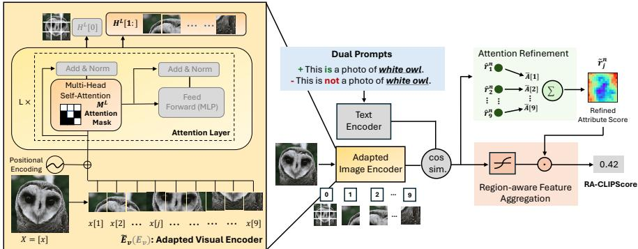  
Fig. 1: Our proposed RA-CLIPScore. We introduce dual prompts and regional feature extraction to improve interpretability of CLIP-based evaluation metrics while extending to spatial domain. Dual prompts decouple correlations among attributes, whereas regional feature extraction enhances fine-grained sensitivity through an adapted visual encoder, attention refinement, and region-aware feature aggregation. Grey blocks (left) denote components unchanged from the original visual encoder.

The evaluation of generative models in the image domain has attracted significant research interest. Classical metrics such as the Fréchet Inception Distance (FID) [17], Kernel Inception Distance (KID) [52] and precision/recall [29, 46] quantify distributional dissimilarity or sample diversity. Despite their popularity, these metrics produce only scalar scores, ofering limited interpretability and diagnostic insight. They cannot reveal whether performance diferences arise from failures on implausible attributes (e.g. baby with beard) [24], nor can they identify spatial biases such as generating objects in fixed poses or restricted regions. Understanding attribute and spatial failures can guide improved training strategies, such as targeted data resampling, and inform model selection for downstream applications. This motivates the need for semantically grounded metrics beyond statistics to explain why and where models difer.

With the rise of large-scale vision–language pretraining, CLIP [41] has emerged as a powerful foundation model and is increasingly used to replace Inception-V3 [53] as a feature extractor for traditional generative evaluation metrics, since Inception-V3 is agnostic to features unrelated to ImageNet [3, 28, 35, 39]. Building on this trend, CLIPScore [16] and Heterogeneous CLIPScore (HCS) [24] leverage CLIP’s joint vision–language embedding space to measure semantic alignment between generated images and captions. However, both of them rely on CLIP’s original feature embedding. Revisiting CLIP’s training paradigm, we identify two core limitations that hinder fine-grained attribute-wise evaluation: (1) its softmax-based contrastive training introduces competition among textual categories, imposing a mutual exclusivity that limits the representation of overlapping attributes; (2) each image is encoded as a single global token without explicit regional tokens, thereby reducing sensitivity to fine-grained details.

To overcome these issues, we propose Region-and-Attribute-Aware CLIP-Score (RA-CLIPScore). As shown in Fig.1, RA-CLIPScore adopts modified dual prompts [51] to disentangle attributes by modeling both their presence and absence, efectively treating attribute detection as a multi-label recognition task to mitigate competition introduced by softmax training. It further leverages CLIP’s local patch tokens to capture fine-grained regional features through attention refinement and feature aggregation modules. By incorporating localized information, RA-CLIPScore extends CLIP-based evaluation to spatial distribution alignment, enabling analysis of whether generative models exhibit biases toward specific regions or poses.

Historically, diversity metrics for image generation have focused on feature or class diversity. We argue that spatial diversity is a missing dimension in existing measures. This is supported by our user study, which shows that Regional Single-Attribute Divergence (R-SAD, see Sec.3.3) achieves perfect correlation (r = 1.0) with human estimates of sample diversity, while traditional metrics like FID exhibit significantly lower alignment (r = 0.5). Detecting systematic spatial biases is critical to avoid spurious correlations in downstream systems. For example, if synthetic images are used to train a medical classifier, consistently generating pathological features (e.g. cancer cells) at the center of images may cause the model to learn this spatial bias instead of relevant biological patterns, failing to detect cells in other regions. Notably, RA-CLIPScore achieves these capabilities without additional training and with minimal computational overhead.

Extensive experiments demonstrate that RA-CLIPScore provides more robust and interpretable attribute-wise evaluation than previous methods [16, 24], particularly in practical settings. It also captures spatial biases not addressed by prior metrics [17, 29, 46, 52], ofering additional insights into generative models.

Our contributions are summarized as follows: We introduce RA-CLIPScore, a robust metric that overcomes the limitations of CLIP’s contrastive pretraining paradigm to enable precise attribute-wise and spatial evaluation. Central to this metric is a novel aggregation scheme that jointly exploits local and global tokens in a single forward pass, providing high-resolution spatial insights without the computational overhead or additional training required by prior work [31, 51]. With this eficient framework, we conduct the first systematic study of spatial biases in generative models, uncovering distinct regional generation tendencies—such as localized object placement—that represent a form of diversity currently ignored by standard benchmarks.

## 2 Related Work

Traditional Metrics. Unlike other computer vision tasks such as classification or detection, evaluating generative models must account for multiple aspects including fidelity, diversity, and novelty. Fidelity metrics such as the Fréchet Inception Distance (FID) [17], Inception Score (IS) [47], and Kernel Inception Distance (KID) [52] measure the similarity between generated and real images, typically via statistical distances such as Fréchet Distance or Maximum Mean Discrepancy (MMD). Diversity-oriented metrics, including precision/recall [29, 46] and density/coverage [37], evaluate how comprehensively the generated samples span the underlying data distribution. To assess perceptual quality, Learned Perceptual Image Patch Similarity (LPIPS) [58] computes distances in deep feature space to mirror human visual judgment. More recently, metrics such as Authenticity Percentage (AuthPct) [2], CT-Score [34], and Feature Likelihood Divergence (FLD) [20] have been proposed to assess memorization, aiming to distinguish genuinely novel samples from memorized training instances. Despite their broad utility, these metrics produce only scalar scores that capture isolated aspects of performance and ofer limited diagnostic insight into why one model outperforms another. In contrast, RA-CLIPScore reveals human-understandable semantic and spatial distribution shifts instead of a black-box scalar score, improving explainability and diagnostic power.

CLIPScore and Variants. Hessel et al. [16] introduced CLIPScore, a referencefree evaluation metric that leverages the pretrained CLIP [41] to measure semantic alignment between images and captions. It computes the cosine similarity between CLIP embeddings of a generated image and its corresponding caption:

$$
\mathrm { C L I P S c o r e } ( x , t ) = 1 0 0 \cdot \cos \big ( \mathbf { E } _ { v } ( x ) , \mathbf { E } _ { t } ( t ) \big ) ,\tag{1}
$$

where $\mathbf { E } _ { v }$ and $\mathbf { E } _ { t }$ denote CLIP’s image and text encoders, while x and t represent the input image and textual caption. While efective, CLIPScore provides only a global similarity score and lacks the granularity to identify which visual attributes contribute to misalignment or where these discrepancies occur. In contrast, our RA-CLIPScore enables finer-grained semantic and spatial analysis.

Kim et al. [24] proposed Heterogeneous CLIPScore (HCS), extending CLIP-Score for attribute-wise evaluation by introducing separate reference centers for image and text embeddings:

$$
\mathrm { H C S } ( x , t _ { i } ) = 1 0 0 \cdot \cos \bigl ( \mathbf { E } _ { v } ( x ) - \mathbf { C } _ { \mathrm { i m g } } , \mathbf { E } _ { t } ( t _ { i } ) - \mathbf { C } _ { \mathrm { t e x t } } \bigr ) ,\tag{2}
$$

where $\begin{array} { r } { \mathbf { C } _ { \mathrm { i m g } } = \frac { 1 } { N _ { \mathrm { i m g } } } \sum _ { i = 1 } ^ { N _ { \mathrm { i m g } } } \mathbf { E } _ { v } ( x _ { i } ) } \end{array}$ and $\begin{array} { r } { \mathbf { C } _ { \mathrm { t e x t } } = \frac { 1 } { N _ { \mathrm { t e x t } } } \sum _ { i = 1 } ^ { N _ { \mathrm { t e x t } } } \mathbf { E } _ { t } ( t _ { i } ) } \end{array}$ represent the average embedding of the training images and textual attributes, respectively. Note that $t _ { i }$ denotes an individual attribute, in contrast to t in Eq. (1), which represents a holistic caption.

Although HCS enables attribute-level evaluation, it remains constrained by the original CLIP training paradigm. Furthermore, $\mathbf { C } _ { \mathrm { i m g } }$ and $\mathbf { C } _ { \mathrm { t e x t } }$ introduce contextual dependencies on both the training distribution and selected attribute set, making the metric sensitive to distributional shifts and vocabulary choices. Its efectiveness relies on the assumption that the chosen attributes adequately represent the image manifold. When this assumption is violated, HCS becomes unreliable. We empirically demonstrate that HCS is unstable under attribute perturbation. As illustrated in Fig.2, removing either long hair or elder changes HCS for other attributes while our RA-CLIPScore remains stable across diferent attribute sets. In Supp.A, we theoretically prove that in a two-attribute setting, the metric collapses into a forced zero-sum relationship, where $\mathrm { H C S } ( x , t _ { p } ) =$ $- \mathrm { H C S } ( x , t _ { q } )$ . In contrast, RA-CLIPScore avoids these pitfalls by addressing CLIP’s limitations at the representation level through dual prompts and regional patch extraction, enabling robust attribute-wise evaluation and extending CLIP-based metrics to the spatial domain for the first time.

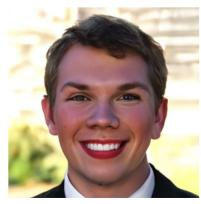  
(a) Image

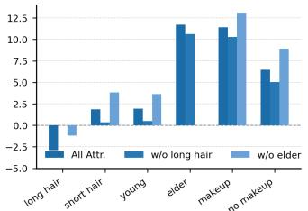  
(b) HCS

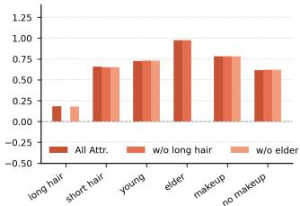  
(c) RA-CLIPScore  
Fig. 2: Sensitivity to attribute removal. Removing a single attribute (long hair or elder) causes noticeable shifts in HCS, while RA-CLIPScore remains consistent under the same perturbations. Horizontal axes enumerate evaluated attributes. Three settings are compared: (1) using all 6 attributes (2) removing long hair (3) removing elder.

## 3 Methodology

To address the limitations, namely competition among textual categories introduced by softmax-based training and limited sensitivity to localized or regionspecific cues [10], we propose RA-CLIPScore (Sec.3.1), introducing two key components: dual prompts and local patch tokens modules. Furthermore, we incorporate RA-CLIPScore into Single-Attribute Divergence (SaD), Pair-Attribute Divergence (PaD) [24] (Sec.3.2) and Regional Single-Attribute Divergence (R-SaD) (Sec.3.3), to enable a quantitative analysis between generated and real datasets at both attribute and spatial levels.

## 3.1 Region-and-Attribute-Aware CLIPScore

Dual Prompts To mitigate limitations arising from CLIP’s softmax-based contrastive training, which enforces competition among attributes, we adapt dual prompts [51] to reformulate attribute evaluation as independent binary recognition tasks, thereby disentangling attribute correlations. The original dualprompt strategy was designed for CLIP-based multi-class classification and requires learnable context tokens. Since our objective is evaluation rather than training, we instead use fixed prompts consistent with CLIP’s pretraining.

For each attribute $t _ { i }$ , we construct a pair of prompts:

\smal {\tex {Prompt}\_{ i ^+ = \tex {\` This  a phot f } t\_i\ ext {.' }\quad tex {Prompt}\_{ i ^- = \tex {\` This  a phot wi hout } \_i\tex {.' } \labe { q: $\mathbf { \chi } _ { t _ { i } } ^ { + } = \mathop { \cdots } \mathbf { I }$ his is a photo of $t _ { i } . ^ { , } \mathrm { P r o m p t } _ { t _ { i } } ^ { - } = \mathrm { \ " T h i }$ is is a photo without $t _ { i } . ^ { \dag }$ (3)

Given an image $x ^ { n }$ , where the superscript $n = 1 , \ldots , N _ { \mathrm { i m g } }$ indexes images in a dataset, the coarse attribute score for its j-th visual token $x ^ { n } [ j ]$ is defined as

$$
\begin{array} { r } { \hat { r } _ { j } ^ { n } ( t _ { i } ) = \sigma \Big ( \langle \tilde { \mathbf { E } } _ { v } ( x ^ { n } [ j ] ) , \mathbf { E } _ { t } ( \mathrm { P r o m p t } _ { t _ { i } } ^ { + } ) \rangle , \langle \tilde { \mathbf { E } } _ { v } ( x ^ { n } [ j ] ) , \mathbf { E } _ { t } ( \mathrm { P r o m p t } _ { t _ { i } } ^ { - } ) \rangle \Big ) , } \end{array}\tag{4}
$$

where $\sigma ( \cdot )$ denotes the softmax operation, $\tilde { \mathbf { E } } _ { \imath }$ represents the adapted CLIP image encoder described below that integrates local patch information, and $\mathbf { E } _ { t }$ denotes CLIP’s text encoder. This formulation eliminates direct competition between attributes, enabling each to be assessed independently as a binary decision, thereby yielding a more stable and interpretable evaluation of attributes.

Regional Feature Extraction To clarify our adaptations, we first describe CLIP’s original visual encoder $\mathbf { E } _ { v }$ (Fig. 1) and briefly recall the attention mechanism. CLIP employs either a modified ResNet [15] with an attention-pooling head or a Vision Transformer (ViT) [10] as its visual backbone. The encoder consists of multiple attention layers, each comprising a Multi-Head Self-Attention (MHSA) module followed by a feed-forward MLP. The global token $H ^ { l } [ 0 ]$ aggregates information from the entire image x, while the remaining tokens $\bar { H } ^ { l } [ j ] , j \geq$ 1, correspond to local patches x[j]. After L layers, the final global token $H ^ { L } [ 0 ]$ encodes the overall image semantics. The process is described mathematically in Eq.(5). For clarity, we illustrate how the final layer L is derived from layer L−1:

$$
\hat { H } ^ { L } = H ^ { L - 1 } + A ^ { L } \big ( H ^ { L - 1 } W _ { V } ^ { L } \big ) , \quad H ^ { L } = \hat { H } ^ { L } + \mathrm { M L P } ^ { L } ( \hat { H } ^ { L } ) , \quad \mathbf { E } _ { v } ( X ) = H ^ { L } [ 0 ]\tag{5}
$$

where $A ^ { L }$ denotes the attention weight matrix, $W _ { V } ^ { L }$ is value projection matrix. The output of CLIP’s visual encoder is Ev(X). Here $X = [ x ^ { 1 } , \ldots , x ^ { N } ]$ denotes a batch of input images, and $H ^ { L - 1 }$ represents the hidden features at layer $L - 1$

CLIP only retains the [CLS] token $H ^ { L } [ 0 ]$ , which aggregates global context. The remaining patch tokens $H ^ { L } [ 1 : ]$ , which contain localized spatial information, are discarded. We now describe how our adapted encoder E˜v incorporates these patch tokens to form region-sensitive representations without additional computational overhead, achieved within a single forward pass.

Prior work [13, 31, 59] shows that spatial information is preserved in intermediate CLIP feature maps but largely diminishes in the final layer. The global [CLS] token primarily aggregates global information in the final attention layer. Motivated by this observation, we utilize local visual features from layer $L - 1$ while retaining the global [CLS] token after the final attention layer. To achieve this, local patch tokens are projected directly into $\mathrm { C L I P ^ { \prime } s }$ unified vision–language embedding space, bypassing the final attention operation to preserve locality, as defined in Eq.(6). These dense features are then combined with the global token from $\operatorname { E q . } ( 5 )$ to form a fine-grained spatially aware representation.

$$
H _ { \mathrm { d e n s e } } ^ { L } = \hat { H } _ { \mathrm { d e n s e } } ^ { L } + \mathrm { M L P } ^ { L } ( \hat { H } _ { \mathrm { d e n s e } } ^ { L } ) , \quad \tilde { \mathbf { E } } _ { v } ( X ) = [ H ^ { L } [ 0 ] , H _ { \mathrm { d e n s e } } ^ { L } [ 1 : ] ] ,\tag{6}
$$

where $\hat { H } _ { \mathrm { d e n s e } } ^ { L } = H ^ { L - 1 } + H ^ { L - 1 } W _ { V } ^ { L }$ . In PyTorch [40], $A ^ { L }$ is implemented as in $\operatorname { E q . } ( 7 )$ , where $W _ { Q } ^ { L }$ and $W _ { K } ^ { L }$ denote the query and key projection matrices, $d _ { k }$ is the feature dimension, and $M ^ { L }$ is the attention mask that blocks interactions with specific positions. The above process can be realized by setting $M ^ { L }$ as shown in Eq. 7. The first row contains all 0s, ensuring that tokens can still attend to the global [CLS] token, while assigning − inf forces the corresponding attention weights to zero, making the attention submatrix for local patch tokens efectively an identity matrix, i.e. bypassing the attention operation for local patch tokens.

$$
A ^ { L } = \sigma \left( { \frac { ( H ^ { L - 1 } W _ { Q } ^ { L } ) ( H ^ { L - 1 } W _ { K } ^ { L } ) ^ { \top } } { \sqrt { d _ { k } } } } + M ^ { L } \right) , M ^ { L } = \left[ { \begin{array} { c c c } { 0 } & { 0 } & { \cdots } & { 0 } \\ { - \operatorname* { i n f } } & { 0 } & { \cdots - \operatorname* { i n f } } \\ { - \operatorname* { i n f } - \operatorname* { i n f } } & { \cdots - \operatorname* { i n f } } \\ { - \operatorname* { i n f } - \operatorname* { i n f } } & { \cdots } & { 0 } \end{array} } \right]\tag{7}
$$

This modification preserves the global token after the final attention layer while retaining local patch tokens from layer $L - 1$ , enabling interpretable attribute evaluation at both global and regional scales without any additional computational overhead. In contrast, prior work either uses local patch tokens from the last layer despite reduced spatial information [51], requires additional training [1], or obtains global [CLS] embeddings and local patch tokens through separate forward passes [31], increasing complexity and computational cost.

Refinement via Attention The initial patch-level scores from $\operatorname { E q . } ( 4 )$ may contain noise due to limited contextual informationn [12,55], reducing their reliability for evaluation. We leverage the self-attention mechanism, which captures pairwise dependencies among local patch tokens, to refine these coarse scores:

$$
\tilde { r } _ { j } ^ { n } ( t _ { i } ) = \frac { 1 } { | \psi | } \sum _ { l \in \psi } A ^ { l } [ j ] \cdot \hat { r } _ { j } ^ { n } ( t _ { i } ) , \quad \forall j , j \ne 0\tag{8}
$$

where $A ^ { l } [ j ]$ denotes attention weights between the j-th patch and other patches within the attention layer $l , l \in \psi$ . We define $\psi = \{ 1 , 2 , \dots , L - 1 \}$ to include all attention layers except the final one, which primarily globalizes the [CLS] token $H ^ { L } [ 0 ]$ . Empirically, this configuration yields the most stable qualitative results. The refinement is applied only to local patch tokens $( j \neq 0 )$ that bypass the final attention layer, and not to the global [CLS] token. As $A ^ { l } [ j ]$ is available from the forward pass, this refinement introduces negligible computational overhead.

Regional Feature Aggregation To obtain an overall assessment for a given attribute $t _ { i } ,$ we aggregate the refined regional scores in $\operatorname { E q . } ( 8 )$ via a weighted summation. The weights are proportional to the similarity between the local patch tokens and the positive prompt from Eq.(3):

$$
\mathrm { R A - C L I P S c o r e } ( x ^ { n } , t _ { i } ) = \sum _ { j } \sigma \Big ( \langle \tilde { \mathbf { E } } _ { v } ( x ^ { n } [ j ] ) , \mathbf { E } _ { t } ( \mathrm { P r o m p t } ^ { + } ) \rangle \Big ) \cdot \tilde { r } _ { j } ^ { n } ( t _ { i } ) ,\tag{9}
$$

where $\sigma ( \cdot )$ denotes softmax normalization over local patch tokens. This weighted aggregation emphasizes regions with a greater confidence in containing the target attribute while maintaining spatial completeness.

## 3.2 Single-Attribute Divergence (SaD) and Pair-Attribute Divergence (PaD)

We employ the Kullback–Leibler (KL) divergence to quantify distributional discrepancies between training and generated datasets. Unlike [24], we do not use

Gaussian kernel density estimation to model score distributions. Instead, we find that fitting a single Gaussian to the scores is suficient to capture distributional shifts, significantly reducing computational cost and runtime compared to [24].

Given a training dataset $\chi _ { \mathrm { t r a i n } } = \{ x ^ { 1 } , \ldots , x ^ { N } \}$ , a generated dataset $\begin{array} { r } { \gamma _ { \mathrm { g e n } } = } \end{array}$ $\{ y ^ { 1 } , \ldots , y ^ { M } \}$ , and an attribute list $\tau = \{ t _ { 1 } , \ldots , t _ { C } \}$ , we compute RA-CLIPScore for all images in both $\chi _ { \mathrm { t r a i n } }$ and $\boldsymbol { \Upsilon } _ { \mathrm { g e n } }$ according to $\operatorname { E q . } ( 9 )$ .

For a single attribute or an attribute pair t, we obtain two sets of scores:

$$
\mathcal { R } ( t ) = \{ r ^ { 1 } ( t ) , \ldots , r ^ { N } ( t ) \} , \mathcal { R } ^ { \prime } ( t ) = \{ r ^ { \prime 1 } ( t ) , \ldots , r ^ { \prime M } ( t ) \}\tag{10}
$$

where each element in $\mathcal { R } ( t )$ and $\mathcal { R } ^ { \prime } ( t )$ denotes the RA-CLIPScore of a single image from $\chi _ { \mathrm { t r a i n } }$ or $\boldsymbol { \Upsilon } _ { \mathrm { g e n } }$ with respect to t:

$$
r ^ { n } ( t ) = { \mathrm { R A - C L I P S c o r e } } ( x ^ { n } , t ) , \quad r ^ { \prime m } ( t ) = { \mathrm { R A - C L I P S c o r e } } ( y ^ { m } , t )\tag{11}
$$

We approximate the empirical score distributions $\mathcal { R } ( t )$ and $\mathcal { R } ^ { \prime } ( t )$ with Gaussian densities, denoted as $p _ { \chi _ { \mathrm { t r a i n } } } ( \mathcal { R } ( t _ { i } ) )$ and $p r _ { \mathrm { g e n } } ( \mathcal { R } ^ { \prime } ( t _ { i } ) )$ . The divergence between the two distributions is then measured using KL divergence. The input t can represent either a single attribute $t = t _ { i }$ or a pair of attributes $t = ( t _ { p } , t _ { q } )$ . We define Single-attribute Divergence (SaD) in Eq.(12) to quantify distributional shifts along individual semantic dimensions. To detect implausible attribute combinations (e.g. baby with beard), we compute Pair-attribute Divergence (PaD) in Eq.(13) over the joint distribution of attribute pairs, capturing deviations in attribute co-occurrence patterns between generated and real data.

$$
\operatorname { S a D } ( t _ { i } ) \mathrm { { = K L } } \Big ( p \tau _ { \mathrm { g e n } } ( \mathcal { R } ^ { \prime } ( t _ { i } ) ) \Big | \Big | p _ { \chi _ { \mathrm { t r a i n } } } ( \mathcal { R } ( t _ { i } ) ) \Big ) ,\tag{12}
$$

$$
\mathrm { P a D } ( t _ { p } , t _ { q } ) { = } \mathrm { K L } \Big ( p _ { Y _ { \mathrm { g e n } } } ( \mathcal { R } ^ { \prime } ( ( t _ { p } , t _ { q } ) ) \Big | \Big | p _ { \mathcal { X } _ { \mathrm { t r a i n } } } ( \mathcal { R } ( ( t _ { p } , t _ { q } ) ) \Big )\tag{13}
$$

## 3.3 Extension to Spatial Evaluation: Regional Single-Attribute Divergence (R-SaD)

Existing metrics [29, 37, 46] typically focus on appearance diversity (e.g. color, texture) or category diversity, but do not explicitly measure spatial diversity such as object position or layout variation. As synthetic data are increasingly used in downstream tasks, detecting spatial bias becomes critical. Some frameworks leverage detection models [14, 54], but these approaches either target spatial reasoning benchmarks rather than evaluation metrics, or introduce more complex pipelines with higher computational cost. Building on $\operatorname { E q . } ( 8 )$ , we extend our evaluation to spatial domain to fill this gap, providing insights into where generative models exhibit attribute-specific biases with negligible computational overhead. Regional Single-attribute Divergence (R-SaD) is formulated as:

$$
\mathrm { R } { \mathrm { - } } \mathrm { S a D } _ { j } ( t _ { i } ) = \frac { 1 } { N } \sum _ { n \in \chi _ { \mathrm { t r a i n } } } \tilde { r } _ { j } ^ { n } ( t _ { i } ) - \frac { 1 } { M } \sum _ { m \in  { \mathcal { T } } _ { \mathrm { g e n } } } \tilde { r } _ { j } ^ { \prime m } ( t _ { i } ) ,\tag{14}
$$

where $j$ indexes spatial patch tokens. $\tilde { r } _ { j } ^ { n } ( t _ { i } )$ and $\tilde { r } _ { j } ^ { \prime m } ( t _ { i } )$ denote the refined regional scores from Eq.(8), computed on the j-th patch for attribute $t _ { i }$ in the real dataset $\chi _ { \mathrm { t r a i n } }$ and generated dataset $\boldsymbol { \Upsilon } _ { \mathrm { g e n } }$ respectively.

We adopt a simple mean-diference measure, as it empirically yields the most stable results and ofers more interpretable insights. While KL divergence is always non-negative, mean diference can take both positive and negative values, allowing us to distinguish biases. A positive R-SaD value indicates that the attribute appears more prominently in a specific region of the real dataset, whereas a negative value reflects a higher occurrence of the attribute in the generated images within the corresponding spatial region.

## 4 Experiments and Results

We conduct experiments to evaluate efectiveness and robustness of our metri using real data in controlled settings (Sec.4.1), enabling direct comparison with ground-truth annotations for sanity check. The contribution of each component is analyzed through an ablation study (Sec.4.2), demonstrating that all components are necessary for stable and interpretable evaluation. Using SaD, PaD, and R-SaD, we assess generative image models and present quantitative and spatial evaluation results in Sec.4.3 and Sec.4.4. Finally, we conduct a user study on how perceived sample diversity correlates with our and existing metrics in Sec.4.5.

## 4.1 Toy Experiments

Here we replicate experiments reported in [24]. An additional experiment is provided in Supp.B.3, where we show that our metric more efectively detects changes in joint attribute distributions, such as baby with beard.

CelebA Attribute Classification To demonstrate that RA-CLIPScore achieves performance comparable to HCS [24] while ofering improved robustness, we reproduce the experimental setup of [24] that aims to classify images from CelebA dataset [32] using predicted scores. Please see [24] for details on the setup. We report accuracy and F1 scores in Tab.1 under two evaluation settings: (1) using relevant image–attribute pairs, denoted as $r ; ( 2 )$ using additional irrelevant attributes to test robustness, denoted as ir. The lists of relevant and irrelevant attributes are provided in Supp. B.1.

RA-CLIPScore and CLIPScore evaluate each attribute independently and therefore produce identical results under both settings in Tab.1. Our metric
<table><tr><td>Method</td><td>Acc.</td><td>F1</td></tr><tr><td>HCS [24]</td><td>81.42 (r) 79.30 (ir)</td><td>58.91 (r) 54.20 (ir)</td></tr><tr><td>RA-CLIPScore 79.75 (r/ir) 5</td><td></td><td>55.20 (r/ir)</td></tr><tr><td>CLIPScore [16] 79.44 (r/ir)</td><td></td><td>54.52 (r/ir)</td></tr></table>

Table 1: CelebA attribute classification results reported in Accuracy (Acc.) and F1 scores for relevant (r) and irrelevant (ir) image–attribute pairs.
<table><tr><td>Setting</td><td>Prompts Feat. Token Src.</td><td>Dual Local</td><td>Global</td></tr><tr><td>w/o DP</td><td>x</td><td>√</td><td>Layer L</td></tr><tr><td>w/o LT</td><td>√</td><td>x</td><td>Layer L</td></tr><tr><td>w/o GE</td><td>√</td><td>√</td><td>Layer L-1</td></tr><tr><td>Ours (Full)</td><td>√</td><td>√</td><td>Layer L</td></tr></table>

Table 2: Ablation study configurations. Each variant removes one component at a time from dual prompts, local tokens, or global embeddings.

  
(a) Original

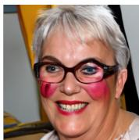  
(b) Makeup

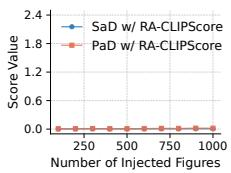  
(e) Original

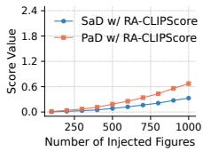  
(f) Makeup

  
(c) Bangs

  
(d) Person

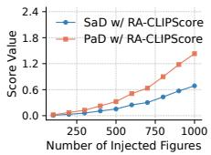  
(g) Bangs

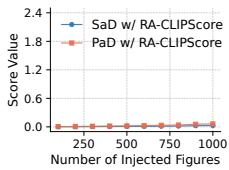  
(h) Person  
Fig. 3: Left: an example FFHQ image and its DifuseIT translations under diferent prompts. Right: SaD and PaD responses as the fraction of injected images increases.

outperforms others when irrelevant attributes are included, whereas HCS performance degrades under this setting (see Sec.2 and Supp.A for explainations). This demonstrates the robustness of RA-CLIPScore under semantic mismatches, which commonly occur in practice.

Injection Experiment To verify that SaD and PaD respond to attribute variations, we gradually inject translated images into the original FFHQ dataset [22] and measure score changes as the injection ratio increases. The translated biased images are generated using DifuseIT [27] with two prompts modifying specific attributes, namely makeup and bangs. As controls, we also inject images translated with the neutral prompt person and reinsert unmodified FFHQ images. The list of used attributes is provided in Supp.B.2.

We present translated samples and corresponding experiment results in Fig.3. Both SaD and PaD increase monotonically when biased images (translated with makeup or bangs) are injected, while remaining nearly constant when unbiased images (translated with person or original FFHQ samples) are injected. This confirms that SaD and PaD reliably detect attribute-specific changes without false positive responses under unbiased conditions. Similar trends are observed on manipulated COCO [30] datasets, demonstrating efectiveness of our metrics beyond facial domain (details are provided in Supp.B.2).

## 4.2 Ablation Study

To verify the necessity and efectiveness of each component, we conduct an ablation study on a mixed dataset of human faces from CelebA [32] and furniture from [36]. We remove one component at a time from dual prompts (w/o DP), local tokens (w/o LT), or global embeddings (w/o GE), and analyze the resulting performance drop. Experimental settings are summarized in Tab.2. For each attribute, we compute scores separately for images where the attribute is present (positive) and absent (negative). Score distributions are estimated using Gaussian kernel density estimation (KDE) for each group. We then evaluate how well the scores separate positive and negative samples using Cohen’s d [6], where higher values indicate better separation (see Sec. B.4 for details).

<table><tr><td>Method</td><td> $\begin{array} { c } { { \bf E y e - } } \\ { { \bf g l a s s e s } } \end{array}$  Male</td><td>Smiling</td></tr><tr><td>CLIPScore [16]</td><td>1.22</td><td>2.05 1.67</td></tr><tr><td>HCS [24]</td><td>1.55</td><td>2.01 1.70</td></tr><tr><td>Ours (Full)</td><td>3.16</td><td>3.03 2.45</td></tr><tr><td>w/o DP</td><td>1.11</td><td>1.12 1.42</td></tr><tr><td>w/o LT</td><td>3.35</td><td>2.07 2.18</td></tr><tr><td>w/o GE</td><td>0.85</td><td>4.41 2.44</td></tr></table>

<table><tr><td colspan="2">Style GAN2</td><td colspan="2">Style LDM LDM GAN3 (50) (200)</td></tr><tr><td>FID ↓</td><td>2.94</td><td>5.20 8.85</td><td>9.53</td></tr><tr><td> $\mathrm { K I D ~ ( \times 1 0 ^ { - 4 } ) ~ \downarrow }$ </td><td>5.0</td><td>8.2</td><td>60 69</td></tr><tr><td> $\operatorname* { P r e c i s i o n } \uparrow$ </td><td>0.792</td><td>0.769</td><td>0.703 0.700</td></tr><tr><td>Recall ↑</td><td>0.665</td><td>0.700</td><td>0.666 0.663</td></tr><tr><td>Coverage ↑</td><td>0.948</td><td>0.947 0.832</td><td>0.827</td></tr><tr><td>Density ↑</td><td>1.11</td><td>1.02 0.72</td><td>0.67</td></tr><tr><td>SaD  $( \times 1 0 ^ { - 3 } ) \downarrow$ </td><td>2.25</td><td>2.98 5.64</td><td>6.44</td></tr><tr><td>PaD  $( \times 1 0 ^ { - 3 } ) \downarrow$ </td><td>4.9</td><td>6.8 12.3</td><td>14.0</td></tr></table>

Table 3: Ablation study results under diferent settings. The best result for each attribute is highlighted in bold.  
Table 4: Quantitative evaluation results of image generative models on FFHQ.

Results are summarized in Tab. 3. Overall, diferent variants of RA-CLIPScore achieve the strongest distributional separation across all evaluated attributes, consistently outperforming HCS and CLIPScore. For dominant attributes such as gender, we observe that removing the global token causes the largest overall performance drop, while removing local patch tokens has limited impact. This indicates that global embeddings are most critical for global attributes. In contrast, for fine-grained, localized attributes such as eyeglasses, removing global embeddings has minor impact, whereas removing local tokens leads to substantial degradation, showing that local patch tokens are essential for spatially precise detection. From Fig.4, dual prompts consistently enhance discriminability across all attributes by pushing negative scores toward 0 and positive scores toward 1. Our full method combines all components, achieving strong performance for both localized and global attributes. Since practical evaluation scenarios typically involve a mixture of attribute types, our full method that jointly considers global and local features is more suitable.

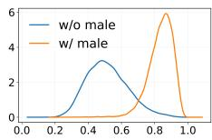  
Male (Full)

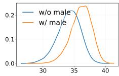  
Male (w/o DP)

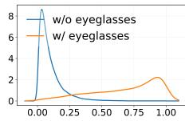  
Eyeglasses (Full)

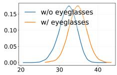  
Eyeglasses (w/o DP)  
Fig. 4: Ablation study comparing full method with w/o DP. Orange curves show score distributions for images with the attribute present, and blue curves for images without the attribute. Dual prompts improve distribution separation for both attributes.

## 4.3 Evaluation of Generative Image Models

We evaluate several generative image models [22, 23, 45] trained on the FFHQ dataset [22]. For each model, 50,000 images are generated using oficial checkpoints and compared with 50,000 real FFHQ samples. For attribute-level evaluation, we use 20 face-related attributes derived from CelebA annotations [32]. The full attribute list is provided in Supp.B.5.

The results in Tab.4 report conventional image-quality metrics (FID [17], KID [52], Precision/Recall [29, 46] and Density/Coverage [37]) alongside our attribute-aware metrics (SaD and PaD). Arrows indicate whether higher (↑) or lower (↓) values are better. Bar charts highlighting the most discrepant attributes are provided in Supp. B.5. Overall, our metrics show strong alignment with traditional quality measures. Across most metrics, StyleGAN2 performs best, followed by StyleGAN3, while difusion-based models (LDM) underperform in the face domain. This is expected, as StyleGAN family is specialized for high-fidelity face synthesis, whereas difusion models prioritize broader generalization. Interestingly, LDM(50) outperforms LDM(200) despite using fewer sampling steps. From bar charts (Supp.B.5), SaD reveals that bald head contributes most to the higher divergence in difusion models, and larger sampling steps worsen this gap. We also observe that excessive denoising steps may overemphasize fine details (e.g. wearing earrings), leading to distributions that deviate from real data.

## 4.4 Spatial Evaluation of Generative Image Models

We further evaluate the spatial and semantic consistency of generative image models [4, 45, 49] using the proposed R-SaD on ImageNet [7]. Each model generates class-conditional images using oficial checkpoints, and the samples are compared with corresponding real ImageNet subsets. The 1,000 class names serve as textual attributes for spatial evaluation. We report the top three categories with the largest spatial inconsistencies, measured by the mean absolute R-SaD across local patch tokens, i.e. arg max $\begin{array} { r } { \frac { 1 } { | j | } \sum _ { j } \big | \mathrm { R - S a D } _ { j } ( t _ { i } ) \big | } \end{array}$ in Tab.5.

We qualitatively visualize local scores from Eq.(8) on single image in Fig.6 and visualize the mean absolute R-SaD over datasets using normalized heatmaps in Fig.5. Values are scaled to [0, 1], where red indicates higher occurrence in training data and blue indicates higher occurrence in generated samples. For clarity, we display one representative example per category for real and generated datasets, additional randomly selected samples are provided in Supp.B.6, where similar trends are observed. The results reveal distinct spatial bias patterns across models. StyleGAN-XL [49] generates rotary dial phones at more varied locations, whereas real images are mostly centered, resulting in prominent red regions at the center. BigGAN [4] consistently produces certain objects, such as electric guitars, at an approximately $4 5 ^ { \circ }$ diagonal orientation, while real ImageNet samples exhibit more diverse poses. For LDM [45], categories such as burrito show a spatial shift toward the upper image region in generated samples.

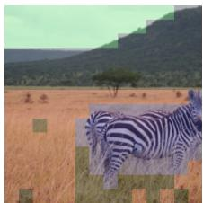

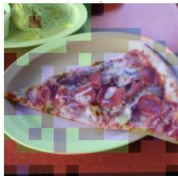

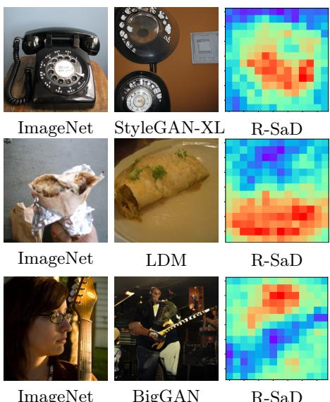  
ImageNet  
BigGAN  
R-SaD  
Fig. 5: Spatial evaluation on ImageNet. Each row shows a real example (left), a generated sample (middle), and the corresponding R-SaD heatmap (right). Heatmaps visualize regional divergence normalized from 0 (blue, higher occurrence in generated images) to 1 (red, higher occurrence in training data).

Fig. 6: Qualitative visualizations on single images. Left: zebra (blue), sky (green), grass (orange). Right: pizza (blue), plate (green), table (orange).
<table><tr><td>Model Top Classes</td></tr><tr><td>rotary dial telephone StyleGAN-XL carousel iPod</td></tr><tr><td>balloon BigGAN electric guitar microphone</td></tr><tr><td>burrito LDM (250) chain-link fence carton</td></tr></table>

Table 5: The top three classes exhibiting the largest spatial divergence under mean R-SaD criterion.

## 4.5 Alignment with Human Perception

We conduct a user study to assess the importance of spatial metrics. Images are generated using StyleGAN-XL [49], BigGAN [4], and LDM [45] trained on ImageNet. For each model, we select classes exhibiting clear spatial biases (Tab. 5). A total of 29 participants were asked to choose whether a set of 9 images generated by model A or model B more closely resembled 9 reference training images in terms of diversity (see Fig.7). One of the models (A or B) was chosen to be the model with high R-SaD score for a given attribute, while the other was chosen from the remaining two models with lower R-SaD scores. The order was randomized. Each participant evaluated 20 attributes. We computed R-SAD and RA-CLIPScore, along with 9 widely used evaluation metrics, using generated images from each model and real ImageNet samples for the selected classes (1000 samples per class). Unlike other metrics, LPIPS [58] does not use the training dataset as a reference. Nonetheless, as it measures perceptual diversity, we include it for comparison. For each class, we determine whether model A or B is preferable according to each metric. Human preference is determined by majority voting with an overall agreement of 72.9 % among raters.

We report Pearson Correlation Coeficient (r) between metric preference and human judgment in Tab. 6. R-SaD shows high correlation with human prefer-

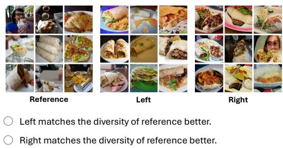

Burrito

Fig. 7: Experimental setup for human user study
<table><tr><td rowspan=1 colspan=2>Metric          Correlation r</td></tr><tr><td rowspan=1 colspan=2>R-SaD                  1.0RA-CLIPScore        0.60</td></tr><tr><td rowspan=1 colspan=2>CLIPScore [16]        0.49</td></tr><tr><td rowspan=1 colspan=2>HCS [24]               0.21</td></tr><tr><td rowspan=1 colspan=2>FID [17]               0.50</td></tr><tr><td rowspan=1 colspan=2>KID [52]               0.60</td></tr><tr><td rowspan=1 colspan=2>LPIPS [58]            0.53</td></tr><tr><td rowspan=1 colspan=2>Precision [29, 46]      0.39</td></tr><tr><td rowspan=1 colspan=1>Recall [29, 46]</td><td rowspan=1 colspan=1>0.29</td></tr><tr><td rowspan=1 colspan=1>Density [37]</td><td rowspan=1 colspan=1>0.70</td></tr><tr><td rowspan=1 colspan=1>Coverage [37]</td><td rowspan=1 colspan=1>0.29</td></tr></table>

Table 6: Pearson Correlation Coeficient between metric preference and human judgment.

ences (r=1) , demonstrating its efectiveness in capturing diversity, including spatial diversity. In contrast, other diversity metrics focus on aspects such as class and do not explicitly reflect spatial consistency. These metrics all show lower correlation with human-perceived diversity (r between 0.29 and 0.7). Interestingly, the metrics most directly designed to quantify distributional diversity or mode coverage in the literature, Recall and Coverage, correlate the least with human judgment of diversity. RA-CLIPScore also exhibits a lower correlation with human perception (r = 0.6). We hypothesize that in some cases the global features might dominate and override the spatial diversity signals captured by the local features, thus RA-CLIPScore is not as sensitive as R-SaD for diversity.

## 5 Conclusions and Discussion

Most existing evaluation metrics [17, 52] for generative models provide only aggregate scalar scores, ofering limited diagnostic utility. We propose RA-CLIPScore a robust and interpretable alternative that addresses limitations rooted in CLIP’s contrastive pretraining paradigm through two key innovations: dual prompts and local patch tokens. Our aggregation scheme requires no additional training or extra computational overhead, operating in a single forward pass. By incorporating localized features, RA-CLIPScore extends CLIP-based evaluation to the spatial domain for the first time, enabling the detection of systematic biases, such as the fixed-angle generation of objects in BigGAN [4], that remain invisible to existing diversity benchmarks. Extensive experiments and human studies confirm that R-SAD achieves a perfect correlation (r=1.0) with human-perceived diversity, significantly outperforming standard diversity metrics like Coverage (r=0.29), LPIPS (r=0.53) and Density (r=0.7). Our spatial evaluation further reveals previously undocumented regional tendencies, providing a new dimension for model selection and failure analysis in specialized applications.

Limitations and Future Work. Motivated by minimalism and comparability, we adopt CLIP as central feature extractor, as it increasingly replaces Inception-

V3 [53] in traditional metrics [3,19,28,35,39] and serves as a backbone in many modern generative models [8, 33, 42]. This design maintains compatibility with prior evaluation metrics while avoiding additional sources of bias. However, CLIP itself has known limitations [56]. Exploring alternative encoders for attributelevel and spatial evaluation would therefore be valuable. Future work could investigate other spatial feature extractors, such as SigLIP [57], SAM [26], or DINO [5]. These models may introduce higher computational cost due to more complex backbones. Nevertheless, their stronger representation capabilities could address some limitations of CLIP and provide complementary insights. Although our focus is on image generation, our design could be extended to other modalities, e.g. using CLAP [11] for audio evaluation in future work.

## References

1. Abdelfattah, R., Guo, Q., Li, X., Wang, X., Wang, S.: Cdul: Clip-driven unsupervised learning for multi-label image classification. In: Proceedings of the IEEE/CVF international conference on computer vision. pp. 1348–1357 (2023)

2. Alaa, A., Van Breugel, B., Saveliev, E.S., Van Der Schaar, M.: How faithful is your synthetic data? sample-level metrics for evaluating and auditing generative models. In: International Conference on Machine Learning (2022)

3. Betzalel, E., Penso, C., Navon, A., Fetaya, E.: A study on the evaluation of generative models. arXiv preprint arXiv:2206.10935 (2022)

4. Brock, A., Donahue, J., Simonyan, K.: Large scale GAN training for high fidelity natural image synthesis. In: International Conference on Learning Representations (2019)

5. Caron, M., Touvron, H., Misra, I., Jégou, H., Mairal, J., Bojanowski, P., Joulin, A.: Emerging properties in self-supervised vision transformers. In: Proceedings of the IEEE/CVF international conference on computer vision. pp. 9650–9660 (2021)

6. Cohen, J.: Statistical Power Analysis for the Behavioral Sciences. Lawrence Erlbaum Associates, Hillsdale, NJ, 2 edn. (1988)

7. Deng, J., Dong, W., Socher, R., Li, L.J., Li, K., Fei-Fei, L.: Imagenet: A largescale hierarchical image database. In: 2009 IEEE conference on computer vision and pattern recognition. pp. 248–255. Ieee (2009)

8. Dhariwal, P., Nichol, A.: Difusion models beat gans on image synthesis. Advances in neural information processing systems 34, 8780–8794 (2021)

9. Dinh, L., Sohl-Dickstein, J., Bengio, S.: Density estimation using real nvp. In: International Conference on Learning Representations (2017)

10. Dosovitskiy, A., Beyer, L., Kolesnikov, A., Weissenborn, D., Zhai, X., Unterthiner, T., Dehghani, M., Minderer, M., Heigold, G., Gelly, S., Uszkoreit, J., Houlsby, N.: An image is worth 16×16 words: Transformers for image recognition at scale. In: International Conference on Learning Representations (2021)

11. Elizalde, B., Deshmukh, S., Al Ismail, M., Wang, H.: Clap learning audio concepts from natural language supervision. In: ICASSP 2023-2023 IEEE International Conference on Acoustics, Speech and Signal Processing (ICASSP). pp. 1–5. IEEE (2023)

12. Gao, W., Wan, F., Pan, X., Peng, Z., Tian, Q., Han, Z., Zhou, B., Ye, Q.: Ts-cam: Token semantic coupled attention map for weakly supervised object localization. In: Proceedings of the IEEE/CVF international conference on computer vision. pp. 2886–2895 (2021)

13. Ghiasi, A., Kazemi, H., Borgnia, E., Reich, S., Shu, M., Goldblum, M., Wilson, A.G., Goldstein, T.: What do vision transformers learn? a visual exploration. arXiv preprint arXiv:2212.06727 (2022)

14. Ghosh, D., Hajishirzi, H., Schmidt, L.: Geneval: An object-focused framework for evaluating text-to-image alignment. Advances in Neural Information Processing Systems 36, 52132–52152 (2023)

15. He, K., Zhang, X., Ren, S., Sun, J.: Deep residual learning for image recognition. In: Proceedings of the IEEE conference on computer vision and pattern recognition. pp. 770–778 (2016)

16. Hessel, J., Holtzman, A., Forbes, M., Bras, R.L., Choi, Y.: CLIPScore: a referencefree evaluation metric for image captioning. In: EMNLP (2021)

17. Heusel, M., Ramsauer, H., Unterthiner, T., Nessler, B., Hochreiter, S.: Gans trained by a two time-scale update rule converge to a local nash equilibrium. In: Advances in Neural Information Processing Systems (2017)

18. Ho, J., Jain, A., Abbeel, P.: Denoising difusion probabilistic models. In: Advances in Neural Information Processing Systems (2020)

19. Jayasumana, S., Ramalingam, S., Veit, A., Glasner, D., Chakrabarti, A., Kumar, S.: Rethinking fid: Towards a better evaluation metric for image generation. In: IEEE/CVF Conference on Computer Vision and Pattern Recognition (2024)

20. Jiralerspong, M., Bose, J., Gemp, I., Qin, C., Bachrach, Y., Gidel, G.: Feature likelihood divergence: evaluating the generalization of generative models using samples. In: Advances in Neural Information Processing Systems (2023)

21. Karras, T., Aittala, M., Laine, S., Härkönen, E., Hellsten, J., Lehtinen, J., Aila, T.: Alias-free generative adversarial networks. In: Advances in Neural Information Processing Systems (2021)

22. Karras, T., Laine, S., Aila, T.: A style-based generator architecture for generative adversarial networks. In: Proceedings of the IEEE/CVF conference on computer vision and pattern recognition. pp. 4401–4410 (2019)

23. Karras, T., Laine, S., Aittala, M., Hellsten, J., Lehtinen, J., Aila, T.: Analyzing and improving the image quality of stylegan. In: Proceedings of the IEEE/CVF conference on computer vision and pattern recognition. pp. 8110–8119 (2020)

24. Kim, D., Kwon, M., Uh, Y.: Attribute based interpretable evaluation metrics for generative models. In: Proceedings of the 41st International Conference on Machine Learning. Proceedings of Machine Learning Research, vol. 235, pp. 24271–24293. PMLR (21–27 Jul 2024)

25. Kingma, D.P., Welling, M.: Auto-encoding variational bayes. In: International Conference on Learning Representations (2014)

26. Kirillov, A., Mintun, E., Ravi, N., Mao, H., Rolland, C., Gustafson, L., Xiao, T., Whitehead, S., Berg, A.C., Lo, W.Y., et al.: Segment anything. In: Proceedings of the IEEE/CVF international conference on computer vision. pp. 4015–4026 (2023)

27. Kwon, G., Ye, J.: Difusion-based image translation using disentangled style and content representation. In: International Conference on Learning Representations (2023)

28. Kynkäänniemi, T., Karras, T., Aittala, M., Aila, T., Lehtinen, J.: The role of imagenet classes in fréchet inception distance. In: International Conference on Learning Representations (2023)

29. Kynkäänniemi, T., Karras, T., Laine, S., Lehtinen, J., Aila, T.: Improved precision and recall metric for assessing generative models. In: Advances in Neural Information Processing Systems (2019)

30. Lin, T.Y., Maire, M., Belongie, S., Hays, J., Perona, P., Ramanan, D., Dollár, P., Zitnick, C.L.: Microsoft coco: Common objects in context. In: European conference on computer vision. pp. 740–755. Springer (2014)

31. Lin, Y., Chen, M., Zhang, K., Li, H., Li, M., Yang, Z., Lv, D., Lin, B., Liu, H., Cai, D.: Tagclip: A local-to-global framework to enhance open-vocabulary multi-label classification of clip without training. In: Proceedings of the AAAI Conference on Artificial Intelligence. vol. 38, pp. 3513–3521 (2024)

32. Liu, Z., Luo, P., Wang, X., Tang, X.: Deep learning face attributes in the wild. In: Proceedings of International Conference on Computer Vision (ICCV) (December 2015)

33. Lorenz, D., Esser, P., Ommer, B.: High-resolution image synthesis with latent diffusion models. In: Proceedings of the IEEE/CVF Conference on Computer Vision and Pattern Recognition (2022)

34. Meehan, C., Chaudhuri, K., Dasgupta, S.: A non-parametric test to detect datacopying in generative models. In: International conference on artificial intelligence and statistics (2020)

35. Morozov, S., Voynov, A., Babenko, A.: On self-supervised image representations for gan evaluation. In: International Conference on Learning Representations (2021)

36. Mukherjee, U.S.: Furniture image dataset. https://www.kaggle.com/datasets/ udaysankarmukherjee/furniture-image-dataset (2020)

37. Naeem, M.F., Oh, S.J., Uh, Y., Choi, Y., Yoo, J.: Reliable fidelity and diversity metrics for generative models. In: International conference on machine learning. pp. 7176–7185. PMLR (2020)

38. Nichol, A.Q., Dhariwal, P., Ramesh, A., Shyam, P., Mishkin, P., Mcgrew, B., Sutskever, I., Chen, M.: GLIDE: Towards photorealistic image generation and editing with text-guided difusion models. In: Proceedings of the 39th International Conference on Machine Learning. Proceedings of Machine Learning Research, vol. 162, pp. 16784–16804. PMLR (17–23 Jul 2022)

39. Parmar, G., Zhang, R., Zhu, J.Y.: On aliased resizing and surprising subtleties in gan evaluation. In: Proceedings of the IEEE/CVF conference on computer vision and pattern recognition. pp. 11410–11420 (2022)

40. Paszke, A., Gross, S., Massa, F., Lerer, A., Bradbury, J., Chanan, G., Killeen, T., Lin, Z., Gimelshein, N., Antiga, L., et al.: Pytorch: An imperative style, highperformance deep learning library. In: Advances in Neural Information Processing Systems (2019)

41. Radford, A., Kim, J.W., Hallacy, C., Ramesh, A., Goh, G., Agarwal, S., Sastry, G., Askell, A., Mishkin, P., Clark, J., et al.: Learning transferable visual models from natural language supervision. In: International conference on machine learning. pp. 8748–8763. PmLR (2021)

42. Ramesh, A., Dhariwal, P., Nichol, A., Chu, C., Chen, M.: Hierarchical textconditional image generation with clip latents. arXiv preprint arXiv:2204.06125 1(2), 3 (2022)

43. Rezende, D., Mohamed, S.: Variational inference with normalizing flows. In: International conference on machine learning. pp. 1530–1538. PMLR (2015)

44. Rombach, R., Blattmann, A., Lorenz, D., Esser, P., Ommer, B.: High-resolution image synthesis with latent difusion models. In: Proceedings of the IEEE/CVF conference on computer vision and pattern recognition. pp. 10684–10695 (2022)

45. Rombach, R., Blattmann, A., Lorenz, D., Esser, P., Ommer, B.: High-resolution image synthesis with latent difusion models. In: IEEE/CVF Conference on Computer Vision and Pattern Recognition (CVPR). pp. 10684–10695 (2022)

46. Sajjadi, M.S., Bachem, O., Lucic, M., Bousquet, O., Gelly, S.: Assessing generative models via precision and recall. In: Advances in Neural Information Processing Systems (2018)

47. Salimans, T., Goodfellow, I., Zaremba, W., Cheung, V., Radford, A., Chen, X.: Improved techniques for training gans. In: Advances in Neural Information Processing Systems (2016)

48. Sauer, A., Chitta, K., Müller, J., Geiger, A.: Projected gans converge faster. In: Advances in Neural Information Processing Systems (2021)

49. Sauer, A., Schwarz, K., Geiger, A.: Stylegan-xl: Scaling stylegan to large diverse datasets. In: ACM SIGGRAPH 2022 conference proceedings. pp. 1–10 (2022)

50. Song, J., Meng, C., Ermon, S.: Denoising difusion implicit models. In: International Conference on Learning Representations (2021)

51. Sun, X., Hu, P., Saenko, K.: Dualcoop: Fast adaptation to multi-label recognition with limited annotations. In: Advances in Neural Information Processing Systems (2022)

52. Sutherland, J., Arbel, M., Gretton, A.: Demystifying mmd gans. In: International conference for learning representations. vol. 6 (2018)

53. Szegedy, C., Vanhoucke, V., Iofe, S., Shlens, J., Wojna, Z.: Rethinking the inception architecture for computer vision. In: Proceedings of the IEEE conference on computer vision and pattern recognition. pp. 2818–2826 (2016)

54. Uchida, Y., Togo, R., Maeda, K., Ogawa, T., Haseyama, M.: Objectness similarity: Capturing object-level fidelity in 3d scene evaluation. In: Proceedings of the IEEE/CVF International Conference on Computer Vision (ICCV) 2025 Workshops (2025)

55. Xu, L., Ouyang, W., Bennamoun, M., Boussaid, F., Xu, D.: Multi-class token transformer for weakly supervised semantic segmentation. In: Proceedings of the IEEE/CVF conference on computer vision and pattern recognition. pp. 4310–4319 (2022)

56. Yuksekgonul, M., Bianchi, F., Kalluri, P., Jurafsky, D., Zou, J.Y.: When and why vision-language models behave like bags-of-words, and what to do about it? In: International Conference on Learning Representations (2023)

57. Zhai, X., Mustafa, B., Kolesnikov, A., Beyer, L.: Sigmoid loss for language image pre-training. In: Proceedings of the IEEE/CVF international conference on computer vision. pp. 11975–11986 (2023)

58. Zhang, R., Isola, P., Efros, A.A., Shechtman, E., Wang, O.: The unreasonable efectiveness of deep features as a perceptual metric. In: Proceedings of the IEEE conference on computer vision and pattern recognition. pp. 586–595 (2018)

59. Zhou, D., Kang, B., Jin, X., Yang, L., Lian, X., Hou, Q., Feng, J.: Deepvit: Towards deeper vision transformer. arXiv preprint arXiv:2103.11886 (2021)

## Supplementary Material

## A Rethinking HCS

Kim et al. [24] introduced the HCS to enable attribute-wise evaluation of generative models. HCS computes attribute scores by subtracting the global mean centers of image and text embeddings $\left( \operatorname { E q . } ( 2 ) \right)$ , with the aim to reduce ambiguity between opposing attributes [24]. While conceptually appealing, this formulation inherently couples the score with both the training distribution and the attribute set, making it sensitive to dataset bias and attribute selection. Its efectiveness relies on strong assumptions: the training and generated datasets must be well aligned, and the selected textual attributes must be semantically relevant to the images. When these assumptions are violated, HCS becomes theoretically problematic and lacks robustness in realistic evaluation scenarios. We demonstrate this instability through both empirical and theoretical analyses.

## A.1 Empirical Observations

As illustrated in Fig.2, HCS scores are highly sensitive to the choice of attributes. Removing a single attribute from the evaluation list can drastically alter the results, especially for semantically related or opposing attributes. For instance, excluding long hair reduces the score for short hair to nearly zero, while removing elder increases the score for young to almost twice its original value. In contrast, our proposed metric remains stable under such perturbations, demonstrating robustness to variations in attribute composition.

## A.2 Analytical Case: Two-Attribute Scenario

To further illustrate the limitation, consider a simplified case with two attributes, $t _ { p }$ and $t _ { q } ,$ with corresponding text embeddings $\mathbf { E } _ { t } ( t _ { p } )$ and $\mathbf { E } _ { t } ( t _ { q } ) \in \mathbb { R } ^ { N _ { E } }$ , where $N _ { E }$ denotes the CLIP text embedding dimension. According to $\operatorname { E q . } ( 2 )$ , the global text mean is given by:

$$
\mathbf { C } _ { \mathrm { t e x t } } = { \frac { \mathbf { E } _ { v } ( t _ { p } ) + \mathbf { E } _ { v } ( t _ { q } ) } { 2 } }\tag{15}
$$

Subtracting this center yields the following:

$$
\begin{array} { l } { { \displaystyle { \bf E } _ { v } ( t _ { p } ) - { \bf C } _ { \mathrm { t e x t } } = \frac { { \bf E } _ { v } ( t _ { p } ) - { \bf E } _ { v } ( t _ { q } ) } { 2 } } \ ~ } \\ { { \displaystyle ~ = - \frac { { \bf E } _ { v } ( t _ { q } ) - { \bf E } _ { v } ( t _ { p } ) } { 2 } = - \big ( { \bf E } _ { v } ( t _ { q } ) - { \bf C } _ { \mathrm { t e x t } } \big ) } } \end{array}\tag{16}
$$

This derivation shows that the two attributes become exact opposites in the embedding space, regardless of their true semantic relationship. Even synonymous attributes would thus be treated as opposing directions, distorting their relative semantics. Therefore, subtracting a global mean center does not guarantee attribute disentanglement.

## A.3 Hypothesis of Limitations

Both HCS [24] and CLIPScore [16] rely on CLIP [41] for feature extraction and therefore inherit its structural constraints for attribute-level and regionwise evaluation. We revisit CLIP’s embedding design and identify two key issues underlying these limitations [31, 51]: (1) its softmax-based training objective introduces competition among textual categories, amplifying dominant attributes while suppressing co-occurring or overlapping ones, thereby hindering the accurate representation of multi-attribute concepts at the same time; and (2) each image is encoded into a single global embedding via the [CLS] token, limiting its ability to capture localized or region-specific cues [10].

We argue that these factors fundamentally restrict the reliability of HCS and CLIPScore for attribute-wise and spatial evaluation. Mean-centering the embeddings, as done in HCS $\left( \operatorname { E q . } ( 2 ) \right)$ , can ofer correction under idealized conditions but fails to address these deeper architectural issues rooted in CLIP’s contrastive pretraining paradigm.

## B Details of Experiments

## B.1 CelebA Attribute Classification

The CelebA dataset [32] provides 40 facial attributes annotations. Some of them are subjective and ambiguous (e.g. attractive, blurry), which may lead to unfair evaluation. To avoid subjective bias and ensure a fair comparison, we follow the experimental setup of [24] and retain only the attributes with relatively objective semantic definitions. In total, we use 28 CelebA attributes and 12 human-faceirrelevant attributes for classification experiments to test robustness (Sec. 4.1). The full list of all 40 attributes, along with the selected 28 and the 12 irrelevant attributes used in our experiments, is provided in Tab. 7.

## B.2 Injection Experiment

List of Used Attributes For the injection experiments (Sec. 4.1), we strictly follow the same setup as [24] and use a subset of 20 attributes from CelebA [32]. A complete list of 20 selected attributes is provided in Tab. 7.

COCO Experiment To validate eficacy beyond CelebA-style facial attributes, we conduct experiments analogous to Sec.4.1 by injecting diferent attributes into a 50k-image COCO base dataset, using original COCO images as the control group. We use the 80 COCO class names as attributes for evaluation. An example with injected chair images is shown in Fig.8. The results closely mirror those observed on CelebA in Fig.3. As the proportion of injected chair images increases, both SaD and PaD increase monotonically. In contrast, when randomly sampled COCO images are injected, which preserve the original distribution, SaD and PaD remain nearly constant. Compared with the CelebA results, the curves are less smooth due to the greater complexity of COCO images, which often contain multiple objects (examples in Fig.8). Nevertheless, our metrics remain efective under these more complex conditions.

<table><tr><td>Attribute type</td><td>Attributes</td></tr><tr><td>20 attributes from CelebA Injection Experiment (Sec.4.1) Dataset Comparison (Sec.B.3)</td><td>Arched Eyebrows, Bald, Bangs, Black_Hair, Blond_Hair, Double_Chin, Eyeglasses, Gray_Hair, Heavy Makeup, Male, Mustache, Rosy Cheeks, Smiling, Straight_Hair, Wavy_Hair, Wearing Earrings, Wearing Hat, Wearing_Lipstick, Wearing_Necklace, Young</td></tr><tr><td>28 attributes from CelebA Attribute Classification (Sec.4.1) Big Nose, Black_Hair, Blond_Hair, Brown_Hair,</td><td>Arched_Eyebrows, Bags_Under_Eyes, Bald, Bangs, Chubby, Double Chin, Eyeglasses, Goatee, Gray_Hair, Heavy_Makeup, Male, Mouth_Slightly_Open, Mustache, No_Beard, Sideburns, Smiling, Straight_Hair, Wavy_Hair, Wearing_Earrings, Wearing_Hat, Wearing_Lipstick, Wearing_Necklace, Wearing_Necktie, Young</td></tr><tr><td>all 40 attributes from CelebA</td><td>5_o_Clock_Shadow, Arched_Eyebrows, Attractive, Bags_Under_Eyes, Bald, Bangs, Big_Lips, Big_Nose, Black_Hair, Blond_Hair, Blurry, Brown Hair, Chubby, Double_Chin, Eyeglasses, Goatee, Gray_Hair, Heavy_Makeup, High_Cheekbones, Male, Mouth_Slightly_Open, Mustache, Narrow Eyes, No_Beard, Oval_ Face, Pale_Skin, Pointy_Nose, Receding_Hairline, Rosy_Cheeks, Sideburns, Smiling, Straight_Hair, Wavy_Hair, Wearing_Earrings, Wearing_Hat, Wearing_Lipstick, Wearing_Necklace,</td></tr><tr><td>Attribute Classification (Sec.4.1) Carpet, Refrigerator, Washing Machine, Pillow</td><td>Wearing_Necktie, Young human face irrelevant attributes Giraffe, Zebra, Penguin, Sofa, Chair, Nightstand, Microwave Oven, Curtain</td></tr></table>

Table 7: Attributes used for experiments.

## B.3 Dataset Comparison

In this section we provide one additional experiment in manipulated experimental setup complementary to experiments in Sec.4.1 to assess whether SaD and PaD capture joint attribute dependencies rather than marginal distributions as in injection experiment (refer to Sec.4.1 and Sec.B.2 for details). We construct three datasets with inverse combinations of eyeglasses and gender from CelebA. In Datasets A and B, only men wear eyeglasses, while all women are without eyeglasses. Dataset C reverses this pattern, with only women wearing eyeglasses and all men without eyeglasses. Example images used in the experiments are provided in Fig.9. We evaluate whether SaD and PaD detect this reversal in attribute coupling. The list of used attributes is provided in Tab.7.

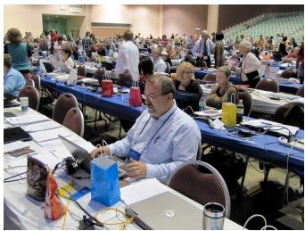

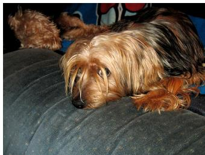

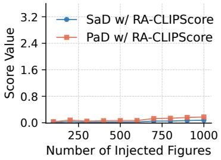

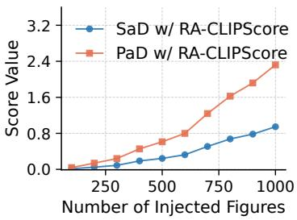  
Fig. 8: Top: example COCO images containing chair, typically in complex scenes. Bottom: SaD and PaD responses as a function of the fraction of injected images. Bottom-left: injecting original COCO images (control group). Bottom-right: injecting chair images from COCO.

Results are summarized in Tab.8. For SaD, we report results for eyeglasses (EG) and other remaining attributes (¬EG). Our metric shows a strong response (over 100× increase) to changes in eyeglasses attribute alone, whereas HCS exhibits a weaker response (≈ 30× increase) and also increases for unafected attributes. This demonstrates improved attribute disentanglement and sensitivity. A similar trend is observed for PaD, where our metric more efectively detects changes in joint attribute distributions. We further visualize bar charts of the top attributes or attribute pairs with the highest SaD and PaD scores in Fig.10. For SaD, eyeglasses is the most distinctive attribute. For PaD, the top responses correspond to the joint distributions of gender and eyeglasses, confirming that PaD efectively captures reversals in attribute dependencies.

## B.4 Ablation Study

In Sec.4.2, we present ablation results evaluating the ability of CLIPScore [16], HCS [24], and our proposed RA-CLIPScore to separate attribute presence from absence, as well as the impact of each component in our framework by removing them individually. Below, we provide the definition of the metric used in Tab.3, namely Cohen’s d. We also conduct experiments with other complementary metrics, including Hellinger distance (HD) and 1-OVL, and report the full results in Tab.9. Visualized results are provided in Fig.11-Fig.13.

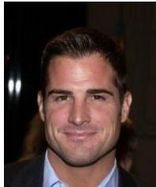

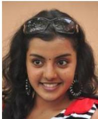

Fig. 9: Example images from CelebA (left to right): man without eyeglasses, man with eyeglasses, woman without eyeglasses, woman with eyeglasses.
<table><tr><td>Method</td><td>Metric A vs. B A vs. C</td><td></td><td></td></tr><tr><td rowspan="3">RA-CLIPScore</td><td>SaDEG</td><td>4.52</td><td>693.97</td></tr><tr><td> $\mathrm { S a D } _ { \lnot E G }$ </td><td>1.11</td><td>1.10</td></tr><tr><td>PaD</td><td>2.80</td><td>79.00</td></tr><tr><td rowspan="3">HCS</td><td>SaDEG</td><td>3.89</td><td>93.86</td></tr><tr><td> $\mathrm { S a D } _ { \lnot E G }$ </td><td>3.43</td><td>5.94</td></tr><tr><td>PaD</td><td>20.97</td><td>54.98</td></tr></table>

Table 8: Results of dataset comparison under inverse attribute coupling (eyeglasses × gender). RA-CLIPScore shows higher sensitivity to attribute changes (over 100× increase).

Distribution Separation Metrics We report results using three distribution separation criteria, namely Cohen’s d (C’s d), Hellinger distance (HD), and 1- OVL, to quantify how well the score distributions are separated for attribute presence and absence. We detail the computation of these criteria here.

We define positive images as those where the attribute is present and negative images as those where the attribute is absent. For each attribute t, we compute scores for all positive and negative images using Eq.(1) for CLIPScore, Eqs.(2) for HCS, and Eq.(9) for our RA-CLIPScore, as well as the corresponding variants with components removed according to Tab.2. This yields one set of scores for positive images and another for negative images. We then estimate the empirical score distributions using Kernel Density Estimation (KDE) with Gaussian kernels, obtaining two continuous distributions over the score r (r denotes CLIPScore, HCS, or RA-CLIPScore): p(r) for positive scores and q(r) for negative scores. The separation metrics are subsequently computed based on these distributions.

Cohen’s d (C’s d) is defined as follows:

$$
\mathrm { C o h e n " s ~ } d = \frac { \left| \mu _ { p } - \mu _ { n } \right| } { \sqrt { \frac { 1 } { 2 } ( \sigma _ { p } ^ { 2 } + \sigma _ { n } ^ { 2 } ) } }\tag{17}
$$

where $\mu _ { p }$ and $\mu _ { n }$ denote the means, and $\sigma _ { p }$ and $\sigma _ { n }$ the standard deviations, of the positive and negative score distributions, respectively. Cohen’s d measures how far apart the two distributions are relative to their pooled variance and larger values indicate stronger separation.

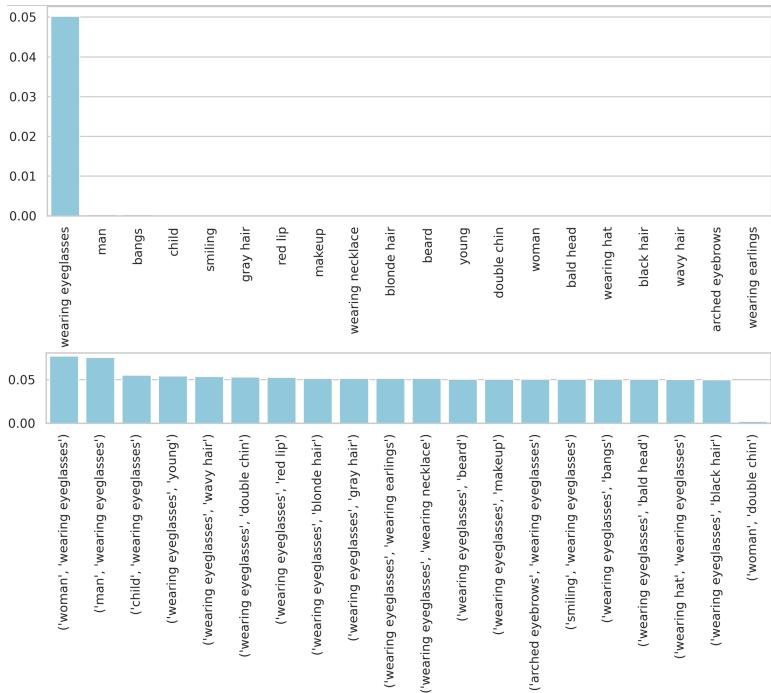  
Fig. 10: Visualization of the top attributes and attribute pairs with the largest SaD and PaD scores. Eyeglasses and gender consistently rank among the top two attributes or attribute pairs, demonstrating successful detection of reversed attribute combinations.

Hellinger Distance measures how much two probability distributions difer in shape. It quantifies the amount of overlap between them: a value of 0 means the distributions are identical, while values closer to 1 indicate less overlap and stronger separation. It’s defined below:

$$
{ \mathrm { H e l l i n g e r ~ D i s t a n c e } } = { \sqrt { 1 - \int _ { r } { \sqrt { p ( r ) q ( r ) } } d r } }\tag{18}
$$

1−OVL measures how well two distributions can be separated by their nonoverlapping area. The overlap coeficient is defined as:

$$
{ \mathrm { O V L } } = \int _ { r } \operatorname* { m i n } ( p ( r ) , q ( r ) ) d r ,\tag{19}
$$

which quantifies the shared probability mass between two distributions. Thus, 1−OVL reports the non-overlapping region, where larger values indicate stronger separation.

Distribution of scores We visualize the distributions of positive and negative scores in Fig.11–13, allowing us to observe the influence of each component directly. For dominant attributes such as male, a reliable decision requires information from multiple regions, and thus the global embedding plays a decisive role. Removing global embedding makes the score distributions overlap (Fig.11 (f)). In contrast, for localized attributes such as wearing eyeglasses, local features have an overriding efect. Removing local tokens flattens the negative score distribution (Fig.12 (e)). In addition, dual prompts enlarge the separation between positive and negative score distributions, making the distinction more pronounced.

<table><tr><td>Criteria Attr.</td><td></td><td>CLIP Score</td><td>HCS</td><td>Ours (Full)</td><td> ${ \bf w } / { \bf o }$  DP</td><td> ${ \bf w } / { \bf o }$  LT</td><td> ${ \bf w } / { \bf o }$  GE</td></tr><tr><td> $\mathrm { C } \mathrm { { s } \ d }$ </td><td rowspan="3">Male</td><td>1.22</td><td>1.55</td><td>3.16</td><td>1.11</td><td>3.35</td><td>0.85</td></tr><tr><td>HD</td><td>0.41</td><td>0.51</td><td>0.80</td><td>0.40</td><td>0.87</td><td>0.30</td></tr><tr><td> $1 - \mathrm { O V L }$ </td><td>0.47</td><td>0.57</td><td>0.88</td><td>0.42</td><td>0.90</td><td>0.34</td></tr><tr><td> $\mathrm { C } \mathrm { { s } \ d }$  HD</td><td rowspan="3"> ${ \mathrm { E y e - } }$  glasses</td><td>2.05</td><td>2.01</td><td>3.03</td><td>1.12</td><td>2.07</td><td>4.41</td></tr><tr><td rowspan="2"> $1 - \mathrm { O V L }$ </td><td>0.63</td><td>0.63</td><td>0.78</td><td>0.38</td><td>0.67</td><td>0.82</td></tr><tr><td>0.73</td><td>0.71</td><td>0.85</td><td>0.41</td><td>0.74</td><td>0.91</td></tr><tr><td> $\mathrm { C } \mathrm { { s } \ d }$ </td><td rowspan="3">Smiling</td><td>1.67</td><td>1.70</td><td>2.45</td><td>1.42</td><td>2.18</td><td>2.44</td></tr><tr><td>HD</td><td>0.53</td><td>0.54</td><td>0.68</td><td>0.46</td><td>0.64</td><td>0.66</td></tr><tr><td> $1 - \mathrm { O V L }$ </td><td>0.60</td><td>0.60</td><td>0.74</td><td>0.52</td><td>0.71</td><td>0.72</td></tr></table>

Table 9: Ablation study under diferent settings and criteria: Cohen’s d $( \mathrm { C } \mathrm { s } \ \mathrm { d } )$ Hellinger distance (HD) and 1-OVL . Higher values indicate better separation between the score distributions of positive and negative images. Our RA-CLIPScore consistently outperforms HCS and CLIPScore.

## B.5 Evaluation of Generative Models

In Sec.4.3, we evaluate several generative models on the FFHQ dataset and report results in Tab.4. Difusion models [45] perform worse than $\mathrm { S t y l e G A N }$ variants [22,23] in the face domain, and increasing the number of denoising steps further widens this gap. To illustrate the attribute-level diferences from real FFHQ data, we present bar charts in Fig.14. The attribute bald head contributes most to the observed divergence, with larger denoising steps amplifying this efect. Meanwhile, difusion models tend to generate more fine details, such as earrings and necklaces.

## B.6 Spatial Evaluation

We extend the evaluation to the spatial domain without additional computational cost using Eq.(14), and apply it to evaluate state-of-the-art generative models in Sec.4.4. We rank class-wise divergences using mean absolute R-SaD in Tab.5, which is defined as:

$$
\underset { t _ { i } } { \arg \operatorname* { m a x } } \frac { 1 } { | j | } \sum _ { j } \big | \mathrm { R \mathrm { - } S a D } _ { j } ( t _ { i } ) \big | ,\tag{20}
$$

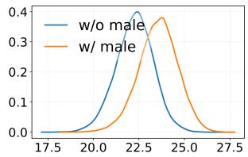  
(a) CLIPScore

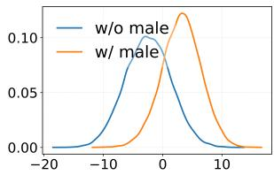  
(b) HCS

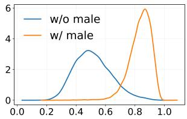  
(c) Ours

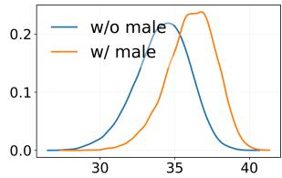  
(d) w/o Dual Prompts

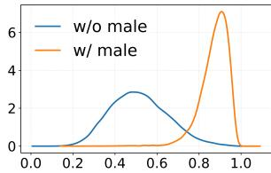  
(e) w/o Local Tokens

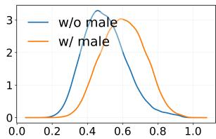  
(f) w/o Global  
Embeddings  
Fig. 11: Ablation study on the male attribute.

where R- $\mathrm { { S a D } } _ { j } ( t _ { i } )$ is computed from Eq.(14), $t _ { i }$ denotes the i-th ImageNet class, and $j$ indexes local patches. For each class $t _ { i } ,$ , mean R-SaD measures the average magnitude of regional bias over all patches. We sort all classes by this metric and report the top three most biased classes per model.

More Examples We provide additional qualitative examples for diferent classes and generative models in Fig. 15–23. In each set of figures, the first row shows real images from ImageNet [7], while the second row shows samples generated by the model specified in the figure caption. The image on the far right is the corresponding normalized R-SaD heatmap, where red indicates higher occurrence in training data and blue indicates higher occurrence in generated samples.

## B.7 User Study

We report the alignment between human perception and our proposed metrics in Sec.4.5, showing that R-SaD based on RA-CLIPScore aligns more closely with human-judged diversity than other metrics, highlighting the importance of spatial diversity not captured by existing measures. Here we provide additional details of the user study to further support its validity. The 29 participants were aged between 23 and 42, with an average age of 30 (age distribution shown in Fig.24); 65% were male and 35% female. Each participant answered questions on 20 attributes listed in Tab.10.

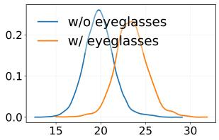  
(a) CLIPScore

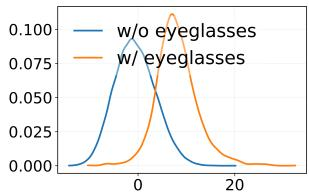  
(b) HCS

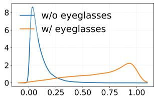  
(c) Ours

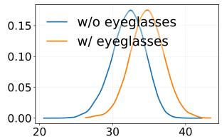  
(d) w/o Dual Prompts

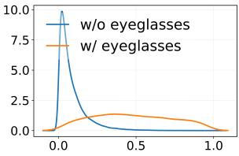  
(e) w/o Local Tokens

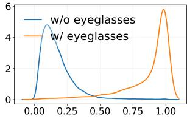  
(f) w/o Global  
Embeddings  
Fig. 12: Ablation study on the eyeglasses attribute.

## Attributes

Burrito, Carton, Shopping cart, School bus, Frying pan, Broccoli, Church, iPod, Ballon, Rotary dial telephone, Leather back sea turtle, Computer mouse, Flute, Spaghetti squash, Electric guitar, Paddle wheel, Clawn fish, Computer keyboard, Remote control, Radio telescope

Table 10: 20 attributes used for user study.  
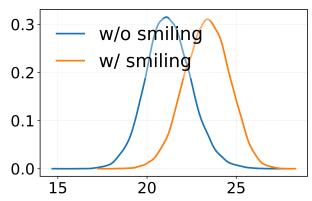  
(a) CLIPScore

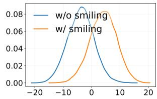  
(b) HCS

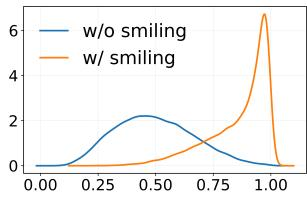  
(c) Ours

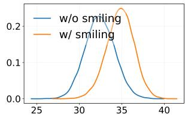  
(d) $\mathrm { w / o }$ Dual Prompts

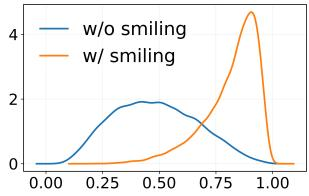  
(e) w/o Local Tokens

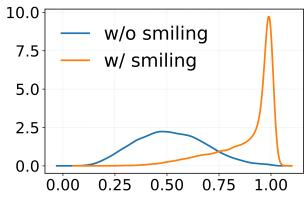  
(f) w/o Global  
Embeddings  
Fig. 13: Ablation study on the smiling attribute.

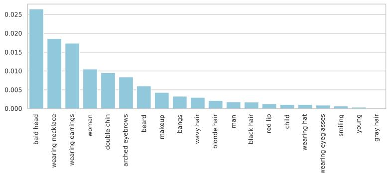

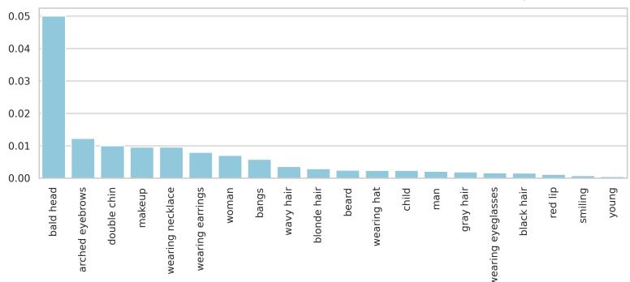  
Fig. 14: Visualization of the top attributes with the largest SaD scores. Top: LDM [45] with 50 denoising steps; Bottom: LDM [45] with 200 steps. Bald head consistently ranks as the top attribute, with larger denoising steps further increasing the divergence. Additionally, wearing necklace and wearing earrings appear among the top attributes in both settings.

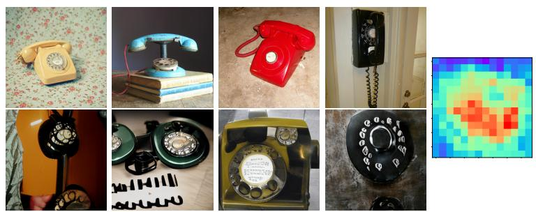  
Fig. 15: Rotary dial telephone. The first row shows samples from ImageNet, and the second row shows images generated by StyleGAN [49].

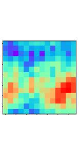

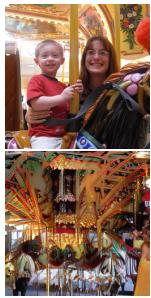

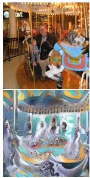  
Fig. 16: Carousel. The first row shows samples from ImageNet, and the second row shows images generated by StyleGAN [49].

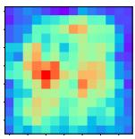  
Fig. 17: iPod. The first row shows samples from ImageNet, and the second row shows images generated by StyleGAN [49].

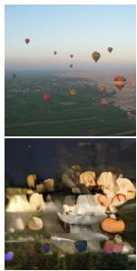

  
Fig. 18: Balloon. The first row shows samples from ImageNet, and the second row shows images generated by BigGAN [4].

  
Fig. 19: Electric guitar. The first row shows samples from ImageNet, and the second row shows images generated by BigGAN [4].

  
Fig. 20: Microphone. The first row shows samples from ImageNet, and the second row shows images generated by BigGAN [4].

  
Fig. 21: Burrito. The first row shows samples from ImageNet, and the second row shows images generated by LDM(250) [45].

  
Fig. 22: Chain-link fence. The first row shows samples from ImageNet, and the second row shows images generated by LDM(250) [45].

  
Fig. 23: Carton. The first row shows samples from ImageNet, and the second row shows images generated by LDM(250) [45].

  
Fig. 24: Age and gender distributions of participants in the user study.