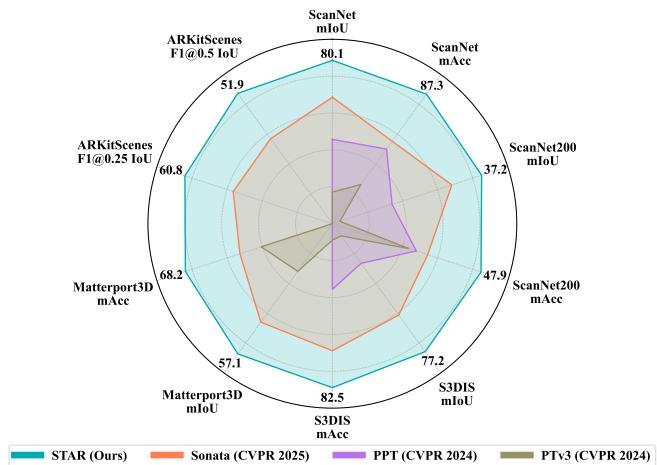
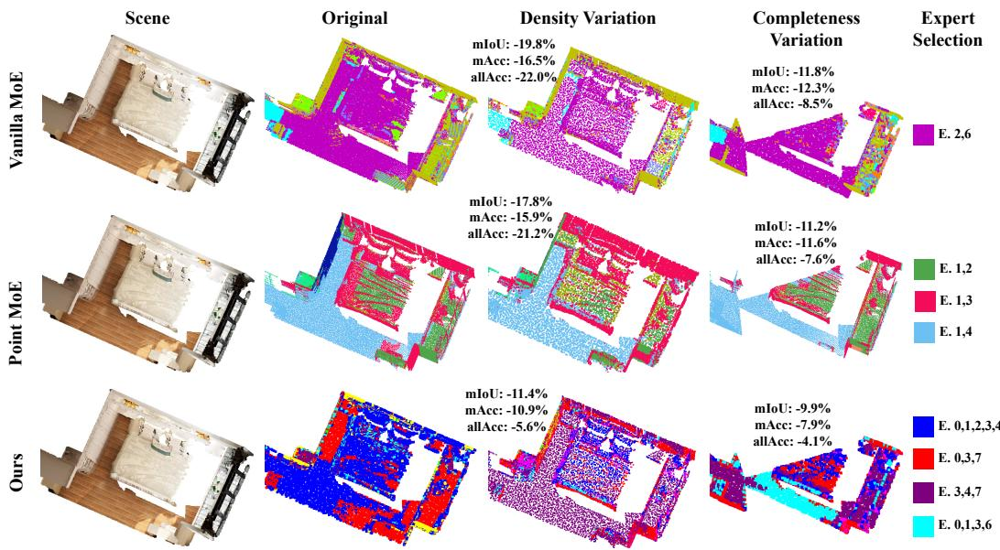
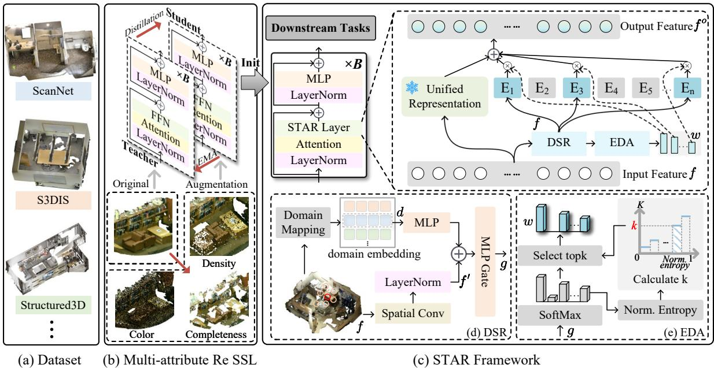
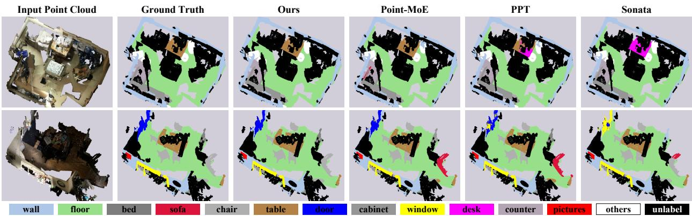
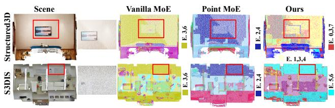

# STAR: A Spatial-Topology Aware Routing Framework for Generalizable 3D Scene Understanding

Mingwei Xing\* Xinliang Wang\* Yifeng Shi†

KE Holdings Inc. Beijing, China

xingmingwei@stu.xmu.edu.cn wangxinliang@buaa.edu.cn shiyifeng@tju.edu.cn

## Abstract

Constructing a unified 3D scene understanding model has long been hindered by the topological discrepancies across sensor modalities. While applying the Mixture-of-Experts (MoE) architecture is a flexible approach for multi-domain 3D understanding, we observe that conventional featureonly MoE routers may underrepresent local sampling topology under semantic supervision, making expert allocation difficult when semantic consistency coexists with geometric heterogeneity. To overcome this challenge, we propose STAR (Spatial-Topology Aware Routing Framework). Specifically, we introduce a multi-attribute selfsupervised pre-training branch, covering topological and textural variations, to anchor cross-domain structural priors. Building upon this, we design a domain-aware expert branch with two mechanisms: Domain-Spatial-Guided Routing (DSR), which captures local topological variations from spatial context, and Entropy-controlled Dynamic Allocation (EDA), which adjusts the number of activated experts according to routing uncertainty. Together, these branches combine stable cross-domain representation learning with adaptive expert allocation. Extensive experiments across various tasks, encompassing both indoor and outdoor scenes, demonstrate the effectiveness of STAR. It achieves 80.1% mIoU on the ScanNet validation set and 77.2% mIoU on S3DIS, consistently improving over strong baselines. Code is available at our project page.

## 1. Introduction

Recent advances in visual representation learning have enabled diverse perception systems, spanning dense visual understanding [44, 52], autonomous and multi-sensor perception [7, 13, 17, 18, 21, 26, 39], and multimodal understanding and tracking [24, 25, 28]. In parallel, rapid progress in 3D reconstruction, generation, and spatial modeling [14, 15, 19, 27, 45, 54] has diversified the sensing modalities, acquisition pipelines, and geometric representations used to capture and model 3D scenes. While these developments provide increasingly rich and complementary sources of 3D data, they create a growing need for generalizable representations that can integrate heterogeneous data and support unified scene understanding across domains.

  
Figure 1. Performance of STAR. STAR achieves state-of-the-art performance across multiple 3D scene understanding benchmarks.

Toward this goal, leveraging large-scale multi-source 3D data for unified scene understanding has become a prominent research direction [6, 46, 49, 50]. However, joint learning across heterogeneous 3D domains remains challenging because different sensing, acquisition, and generation pipelines impose fundamentally different sampling structures on the same underlying geometry. For example, LiDAR produces sparse, ray-wise measurements, whereas RGB-D fusion, multi-view reconstruction, and mesh-surface sampling generally yield denser and more continuous surface observations. Consequently, the same semantic object, such as a wall, may exhibit markedly different local structures across domains, ranging from sparse and discontinuous point patterns to dense and nearly complete surfaces. This semantic consistency yet topological heterogeneity makes it difficult for a unified model to reconcile conflicting geometric patterns during joint training, potentially degrading learned representations and causing negative transfer across domains.

  
Figure 2. Routing behavior under topology variations. Vanilla MoE denotes our standard feature-only MoE baseline. We compare Vanilla MoE, Point-MoE [6], and STAR under controlled density and completeness perturbations. For samples from the same semantic category (e.g., “bed” or “floor”), feature-only routers tend to keep similar expert assignments despite local geometric changes, causing larger performance drops (e.g., a 19.8% mIoU drop under density variation for Vanilla MoE). In contrast, STAR incorporates spatial topology cues into routing, adjusts expert subsets, and shows smaller degradation under fine-grained geometric variations.

To address this challenge, existing joint training methods primarily follow two paradigms: unified representation learning and modularized adaptation. Unified representation learning seeks a shared feature space for multisource data [32, 50, 53]. However, such alignment may suppress sensor-specific geometric details when fitting heterogeneous cross-domain distributions, compromising precision. In contrast, modularized adaptation paradigms maintain flexibility by introducing specialized modules into a shared backbone, yet they are limited by insufficient modeling of 3D heterogeneity. Static strategies such as [46, 49] can only learn globally fixed parameters and do not respond dynamically to drastic variations in density within 3D point clouds. Although dynamic strategies such as 3D Mixture of Experts (MoE) [6, 56, 58] introduce routing mechanisms, most routers use intermediate task features as routing inputs. Under semantic supervision, such feature-only routing may underrepresent local sampling topology, as illustrated in Figure 2 and further discussed in Section 4. As a result, when semantically similar objects exhibit different density, completeness, or neighborhood patterns across sensors, expert allocation can become suboptimal, leading to degraded cross-domain performance.

Thus, we propose STAR, a topology-sensitive routing framework for multi-domain 3D scene understanding. Our primary setting is multi-domain joint training: STAR learns a shared backbone from multiple source datasets, while dataset-specific heads or fine-tuning are used only when label spaces or task formats differ. STAR has two complementary branches. The frozen Unified Representation branch (Re) uses multi-attribute self-supervised pre-training to provide stable cross-domain structural priors. The Domain-aware branch (Do) introduces Domain-Spatial-Guided Routing (DSR) and Entropy-controlled Dynamic Allocation (EDA) for adaptive expert allocation. DSR injects local spatial context into routing, enabling expert selection to respond to density, completeness, and neighborhood-structure variations, while EDA adjusts activated experts according to routing uncertainty for stable training. Through these branches, STAR combines stable cross-domain representation learning with topologysensitive expert routing. As illustrated in Figure 1, STAR shows consistent gains across multiple 3D understanding benchmarks. Our contributions are as follows:

• Topology-sensitive routing for 3D MoE. We identify that feature-only routers may underrepresent sensorinduced local geometric variations under semantic supervision. STAR incorporates spatial context into routing, improving sensitivity to density, completeness, and neighborhood-structure variations.

• Synergistic design of dual-branch framework. STAR decouples representation learning into two mutually reinforcing branches. The frozen Re branch employs selfsupervised augmentations simulating physical variations to filter domain noise and establish a robust cross-domain structural anchor. Grounded in this prior, the Do branch leverages DSR and EDA for highly adaptive, topologyaware expert allocation.

• Comprehensive evaluation. Extensive experiments on multiple indoor and outdoor 3D understanding benchmarks demonstrate that STAR consistently outperforms existing approaches. Specifically, it achieves 80.1% mIoU on ScanNet Val and 77.2% mIoU on S3DIS, showing consistent gains over strong baselines.

## 2. Related Work

## 2.1. 3D Understanding

3D scene understanding is fundamental to computer vision, covering tasks such as semantic segmentation [33– 35, 43, 53], object detection [22, 38, 63], and instance segmentation [12, 16]. While early voxel-based methods faced scalability limits, modern point-based [34, 43] and transformer-based [47, 48] architectures have significantly improved performance. However, most models remain domain-specific and lack robust cross-domain generalization. In this context, our proposed STAR serves as a generalizable 3D backbone that improves domain-adaptive representation learning for downstream 3D understanding tasks.

## 2.2. Unified and Adaptive 3D Representation Learning

Building a generalizable 3D scene understanding model requires balancing cross-domain generalization and domainspecific adaptation. Current joint training paradigms can be roughly categorized into two groups. Unified representation learning constructs a shared feature space through largescale self-supervised pre-training [20, 32, 40, 50, 53, 59, 62]. While effective for generalization, such shared representations may suppress sensor-specific geometric details when aligning heterogeneous point-cloud distributions. In contrast, modularized adaptation paradigms [46, 49, 51] introduce specialized parameters to improve flexibility, but are usually less responsive to fine-grained local topology variations. Different from purely unified or static adaptation strategies, STAR complements shared structural priors with topology-sensitive routing. By incorporating local geometric cues into expert allocation, STAR enables finegrained adaptation across heterogeneous point clouds while preserving cross-domain representation stability.

## 2.3. Mixture-of-Experts

Mixture of Experts (MoE) has been extensively applied to address multi-domain joint training and domain generalization. In 2D vision, existing works [9, 23, 55, 61] integrate experts into Transformer architectures to achieve effective adaptation for large-scale image distributions. Concurrently, recent research has begun to explore the application of MoE in the 3D domain, including Point-MoE [6], Uni3D-MoE [58], and LiMoE [56]. However, most existing 3D MoE methods route tokens using learned task features. While effective, these features may not explicitly encode local sampling topology, making expert allocation less responsive to density, completeness, and neighborhoodstructure variations. In contrast, STAR introduces dynamic spatial routing to perceive such variations and adapt expert scheduling across heterogeneous sensor distributions.

## 3. Method

## 3.1. Overview

We propose STAR, a spatial-topology aware routing framework for generalizable 3D understanding. It jointly models domain-aware expert features and unified representation features, enabling adaptive modeling of diverse domain distributions while maintaining cross-domain consistency and generalization capability. The overall architecture is illustrated in Figure 3. Specifically, we first employ a teacherstudent network framework [42] to conduct multi-attribute self-supervised learning across multiple datasets, thereby learning geometric domain-structure priors that generalize across domains. Subsequently, the STAR architecture undergoes multi-domain supervised joint training, with its weights initialized from the student network. FFN weights are duplicated for both the Re and Do branches, while the Re branch remains frozen. The Do branch consists of two components: Domain-Spatial-Guided Routing (DSR) and Entropy-Controlled Dynamic Allocation (EDA). DSR leverages local geometric cues to enable the model to perceive topological variations, while EDA maintains the stability of the system by balancing the distribution of experts. By integrating these two mechanisms, the model adaptively activates expert subsets conditioned on spatial and sourcedomain structural cues.

## 3.2. Unified Representation Branch

We introduce a frozen Unified Representation branch (Re), constructed via large-scale multi-attribute self-supervised learning to provide robust cross-domain feature representations. Motivated by common discrepancies across pointcloud domains, we focus on three variation factors that affect cross-domain generalization: color distribution, point density, and object completeness caused by occlusions or limited viewpoints. Accordingly, we design three selfsupervised alignment tasks tailored to color, density, and completeness, respectively. Specifically, we partition the point cloud into multiple patches. Within each patch, points are randomly assigned black coloration at varying ratios and probabilities, while certain points are also randomly discarded. Additionally, we apply masking operations to entire patches to simulate variations in point cloud completeness. Inspired by DINOv2 [31] and Sonata [50], we adopt a feature distillation framework based on a teacher-student network architecture, where the teacher’s weights are updated via an exponential moving average (EMA) of the student’s weights. The teacher receives raw data, while the student receives augmented data. The student is trained to align with the teacher through a cluster-based loss [4, 37], ensuring uniform feature consistency across diverse augmentations of the same point cloud. This encourages invariance to common domain perturbations, providing stable features for domain-specific experts. Furthermore, we initialize the STAR architecture with the weights of the student network, duplicating its FFN for all experts in both Re and Do branches, while keeping Re branch frozen. Given pointlevel tokens $f \in \mathbb { R } ^ { N \times \bar { D } }$ , where N denotes the number of tokens and D denotes the feature dimension, the output of Re branch is: $f ^ { \mathrm { R e } } = E _ { R e } ( f )$ , where $E _ { R e }$ denotes the expert in the Re branch.

  
Figure 3. STAR architecture. It combines two branches: a domain-aware branch (Do) and a unified-representation branch (Re). STAR starts with a pretrained model generated through self-supervised learning on multi-attribute data. Re freezes this pretrained knowledge to extract cross-domain geometric and structural patterns. Do uses Domain-Spatial-Guided Routing (DSR) and Entropy-Controlled Dynamic Allocation (EDA) to capture domain-specific features. Together, these branches enhance both domain adaptability and generalization.

## 3.3. Domain-Spatial-Guided Routing

To achieve topology-aware expert selection, we design DSR. Given f and its corresponding domain embedding $d ,$ we first reshape f into a 3D sparse tensor to capture its local topological structure and positional correlations in the spatial dimensions, and then apply a 3D spatial convolution operation for feature extraction. Through a set of learnable convolutional kernels and normalization, the model effectively extracts feature representations $f ^ { \prime }$ with spatial locality awareness. Subsequently, we map the current scene to the corresponding domain embedding d based on its dataset affiliation, and a lightweight MLP then transforms d into a continuous vector $\mathbf { e } _ { d } \in \mathbb { R } ^ { D }$ for channel alignment, which encodes source-domain structural priors. We add $e _ { d }$ to the spatially convolved feature $f ^ { \prime }$ via broadcasting to generate the domain-aware routing input: $z = f ^ { \prime } + e _ { d } ,$ , where $z ~ \in ~ \mathbb { R } ^ { N \times D }$ This fusion makes routing depend on both local spatial context and source-domain structural information, thereby enhancing the domain adaptability of expert assignment. The resulting z is then fed into a gating network G, composed of a MLP with nonlinear activation functions. G outputs routing logits: $g = \mathcal { G } ( z ) \in \mathbb { R } ^ { N \times K }$ , where K is the number of experts.

## 3.4. Entropy-Controlled Dynamic Allocation

To achieve robust and adaptive expert allocation, we propose EDA. First, we apply the softmax function to the gating outputs along the last dimension to obtain a probability distribution $p = \mathbf { \bar { S } } \mathbf { o f t M a x } ( g ) \in \mathbb { R } ^ { N \times K }$ , and calculate the Shannon entropy for each token:

$$
H = - \sum _ { j = 1 } ^ { K } p [ : , j ] \odot \log p [ : , j ] ,\tag{1}
$$

where ⊙ denotes element-wise multiplication and $H \in \mathbb { R } ^ { N }$ reflects the model’s decision-making uncertainty for that token. Next, we linearly map the entropy values to the number of experts k to dynamically determine the number of activated experts:

$$
k = \left\lceil k _ { \operatorname* { m i n } } + \frac { H } { H _ { \operatorname* { m a x } } } \cdot ( k _ { \operatorname* { m a x } } - k _ { \operatorname* { m i n } } ) \right\rceil ,\tag{2}
$$

where $\boldsymbol { k } \in \mathbb { R } ^ { N }$ represents the number of selected experts, $H _ { \mathrm { m a x } } ~ = ~ \log K$ represents the theoretical maximum entropy, with $k _ { \operatorname* { m i n } { } } ~ = { } ~ 1$ and $k _ { \operatorname* { m a x } { } } ~ = ~ K$ , and ⌈·⌉ denotes the ceiling function. Tokens with higher entropy (uncertainty) activate more experts to enhance representation capacity, whereas low-entropy tokens activate fewer experts to improve computational efficiency. We sort the experts in descending order of their probabilities $p ,$ and activate the top-k experts with the highest probabilities. Each expert’s weight assignment is given by:

$$
w [ i , j ] = { \left\{ \begin{array} { l l } { p [ i , j ] , } & { j \in E _ { i } ^ { \mathrm { a c t } } } \\ { 0 , } & { o t h e r w i s e , } \end{array} \right. }\tag{3}
$$

where $E _ { i } ^ { \mathrm { a c t } }$ denotes the activated expert indices for the i-th token and $w \in \mathbb { R } ^ { N \times K }$

We apply load-balancing loss [10] to prevent expert imbalance:

$$
\begin{array} { c } { \displaystyle \mathcal { L } _ { \mathrm { b a l a n c e } } = K \cdot \sum _ { j = 1 } ^ { K } { c _ { j } \cdot r _ { j } } , } \\ { \displaystyle { c _ { j } = \frac { 1 } { N } \sum _ { i = 1 } ^ { N } { \mathbb 1 } \{ j \in E _ { i } ^ { a c t } \} } , r _ { j } = \frac { 1 } { N } \sum _ { i = 1 } ^ { N } { p [ i , j ] } , } \end{array}\tag{4}
$$

where $c _ { j }$ is the proportion of tokens routed to expert $j ,$ and $r _ { j }$ is the average probability assigned by DSR via the softmax function. This loss promotes uniform routing, fostering collaborative learning across all experts.

Finally, the Do branch output is computed as a weighted sum of the top-k experts selected by routing probabilities.

$$
f ^ { \mathrm { D o } } = \sum _ { j = 1 } ^ { K } w [ : , j ] \odot E _ { j } ( f ) .\tag{5}
$$

The domain-aware branch accurately captures spatial contexts for targeted expert selection, ensuring stable, robust, and adaptive allocation across diverse domains. The output feature is computed as: $f ^ { o } = f ^ { \mathrm { D o } } + f ^ { \mathrm { R e } }$

## 3.5. Training Recipe

We focus on multi-domain joint training for 3D scene understanding: a shared backbone is trained on source datasets, while dataset-specific heads or fine-tuning are used only for different label spaces or task formats. First, we obtain a pretrained model through multi-attribute selfsupervised learning and use the student model’s weights to initialize the parameters of the STAR network. Subsequently, we adopt multi-dataset joint training as in PPT [49], unifying category representations through a CLIP-head and InfoNCE loss [30]. The training loss is:

$$
\begin{array} { r } { \mathcal { L } _ { \mathrm { j o i n t } } = \mathcal { L } _ { \mathrm { I n f o N C E } } + \lambda \mathcal { L } _ { \mathrm { b a l a n c e } } . } \end{array}\tag{6}
$$

After completing the joint training, the resulting model can be directly deployed for the primary tasks within the joint training framework and further fine-tuned to address diverse downstream tasks on novel datasets.

Taking semantic segmentation and multimodal detection as examples, the segmentation loss is defined as the standard cross-entropy loss:

$$
\mathcal { L } _ { \mathrm { s e g } } = - \frac { 1 } { M } \sum _ { i = 1 } ^ { M } \sum _ { c = 1 } ^ { C } y _ { i , c } \log ( q _ { i , c } ) ,\tag{7}
$$

where M denotes the number of samples, C is the number of classes, $y _ { i , c }$ represents the ground-truth label, and $q _ { i , c }$ is the predicted probability for class c of sample i.

For the multi-modal detection task, we follow SpatialLM [29] and leverage the autoregressive property of the Qwen2.5 language model [? ] to treat coordinate prediction as a sequence generation task. We adopt the same standard cross-entropy loss as used in Qwen [36]:

$$
\mathcal { L } _ { \mathrm { d e t } } = - \frac { 1 } { T } \sum _ { t = 1 } ^ { T } \log P ( w _ { t } | w _ { < t } , \theta ) ,\tag{8}
$$

where T is the length of the coordinate sequence, $w _ { t }$ denotes the t-th coordinate element in the sequence, $w _ { < t }$ represents the history of previously generated coordinates, and θ denotes the model parameters.

The overall fine-tune training objective is:

$$
\begin{array} { r } { \mathcal { L } _ { \mathrm { f t } } = \mathcal { L } _ { \mathrm { t a s k } } + \lambda \mathcal { L } _ { \mathrm { b a l a n c e } } , } \end{array}\tag{9}
$$

where $\mathcal { L } _ { \mathrm { t a s k } }$ denotes the task-specific loss $( \mathrm { e . g . } , \mathcal { L } _ { \mathrm { s e g } }$ for segmentation, $\mathcal { L } _ { \mathrm { d e t } }$ for detection).

## 4. Experiments

## 4.1. Implementation Details

We conduct self-supervised pretraining on six datasets: ScanNet [8], S3DIS [1], Structured3D [60], 3D-Front [11], ARKitScenes [2], and HM3D [57], totaling 47,273 training samples. The network follows Sonata, using 5 stages with block counts of 3, 3, 3, 12, and 3 per stage. Pretraining uses a batch size of 64, a learning rate of 0.0004, and 50 epochs. Following Sonata [50], patch masking employs a cosine scheduler. Density variations and color dropout use different sampling ratios across patches. Further details are provided in the supplementary material. For STAR, the maximum expert number K is 8 and λ is 0.001. The encoder architecture closely follows the pretrained network, with Re and Do branches added only to the final block of each stage. Domain embeddings are randomly initialized. All experiments are conducted on 8 NVIDIA A100 GPUs, with the AdamW optimizer employed throughout.

Table 1. Indoor semantic segmentation.
<table><tr><td rowspan="2">Method</td><td rowspan="2">Source</td><td colspan="3">ScanNet Val</td><td colspan="3">ScanNet200 Val</td><td colspan="3">S3DIS Area 5</td></tr><tr><td>mIoU</td><td>mAcc</td><td>allAcc</td><td>mIoU</td><td>mAcc</td><td>allAcc</td><td>mIoU</td><td>mAcc</td><td>allAcc</td></tr><tr><td>PTv3 [48]</td><td>CVPR 2024</td><td>77.6</td><td>85.0</td><td>92.0</td><td>35.3</td><td>46.0</td><td>83.4</td><td>73.4</td><td>78.9</td><td>91.7</td></tr><tr><td>PPT [49]</td><td>CVPR 2024</td><td>78.6</td><td>85.9</td><td>92.3</td><td>36.0</td><td>46.2</td><td>83.8</td><td>74.3</td><td>80.1</td><td>92.0</td></tr><tr><td>Point-MoE [6]</td><td>ICLR 2026</td><td>77.2</td><td>85.0</td><td>92.0</td><td>36.2</td><td>44.5</td><td>83.8</td><td>72.9</td><td>78.1</td><td>90.9</td></tr><tr><td>Point-MoE+Re [6]</td><td>ICLR 2026</td><td>78.2</td><td>86.7</td><td>92.2</td><td>36.5</td><td>45.2</td><td>84.1</td><td>74.1</td><td>79.8</td><td>91.8</td></tr><tr><td>Sonata [50]</td><td>CVPR 2025</td><td>79.4</td><td>86.1</td><td>92.5</td><td>36.8</td><td>46.5</td><td>84.4</td><td>76.0</td><td>81.6</td><td>93.0</td></tr><tr><td>STAR (Ours)</td><td></td><td>80.1</td><td>87.3</td><td>93.1</td><td>37.2</td><td>47.9</td><td>84.4</td><td>77.2</td><td>82.5</td><td>93.1</td></tr></table>

  
Figure 4. Qualitative analysis. Visualization of different methods on ScanNet.

Table 2. Outdoor semantic segmentation. ⋆ indicates results reproduced from the official repository.
<table><tr><td rowspan="2">Method</td><td colspan="3">nuScenes Val</td><td colspan="3">Waymo Val</td></tr><tr><td>mIoU</td><td>mAcc</td><td>allAcc</td><td>mIoU</td><td>mAcc</td><td>allAcc</td></tr><tr><td>PTv3 [48]</td><td>80.4</td><td>87.2</td><td>94.7</td><td>71.3</td><td>80.5</td><td>94.7</td></tr><tr><td>Sonata* [50]</td><td>81.2</td><td>87.7</td><td>94.8</td><td>72.1</td><td>82.6</td><td>94.8</td></tr><tr><td>STAR (Ours)</td><td>81.7</td><td>87.4</td><td>94.8</td><td>72.7</td><td>82.7</td><td>94.8</td></tr></table>

## 4.2. Experimental Results

Indoor Semantic Segmentation. Following PPT [49], we conduct joint training on three datasets: ScanNet (20 classes), S3DIS (13 classes), and Structured3D (25 classes). To achieve cross-dataset semantic alignment of categories, we incorporate a CLIP-based classification head. We directly evaluate performance on ScanNet and S3DIS. Furthermore, we fine-tune our model on the more challenging ScanNet200 benchmark, achieving strong performance across all three core metrics (mIoU, mAcc, and allAcc), as detailed in Table 1. Specifically, our method attains mIoU scores of 80.1%, 37.2%, and 77.2% respectively, representing improvements of 0.5%, 0.4%, and 1.2% over Sonata. Figure 4 presents a qualitative comparison with other methods. In the first scenario, given an incomplete chair, other approaches misidentify it as a sofa, whereas ours recognizes it as a chair. This demonstrates that the Re obtained through SSL significantly enhances the model’s capability to extract discriminative features from incomplete objects. In the second scenario, while other methods erroneously classify a table as a desk, our approach leverages DSR to integrate surrounding spatial context. This helps route inputs to suitable experts through spatial context, improving recognition of ambiguous objects. These results suggest better crossdomain adaptability in complex indoor scenarios.

Outdoor Semantic Segmentation. Following the established indoor experimental setup, we conduct comprehensive joint training and direct cross-dataset evaluation on the nuScenes [3] and Waymo [41] benchmarks. As presented in Table 2, our model achieves mIoU scores of 81.7% and 72.7% on the nuScenes and Waymo datasets respectively, outperforming Sonata by 0.5% and 0.6%. These quantitative results validate STAR’s improved generalization capability and robustness in challenging outdoor scenarios.

Extension to Unseen Scenes. To validate STAR’s zeroshot generalization to unseen domains, we evaluate on two datasets—SpatialLM and Matterport3D—using three different domain embeddings for inference, as shown in Table 3. SpatialLM is derived from professional CAD interior models, with point clouds generated by sampling virtual meshes. The data contains no real-world noise, and structural surfaces such as walls and floors form complete, continuous topologies. Using the Structured3D domain embedding yields the best performance (mIoU = 38.7), clearly outperforming Sonata (36.0) and Point-MoE (36.4). This result is consistent with the data source: Structured3D is also derived from synthetic sampling of CAD interior models, allowing DSR to use similar geometric characteristics for expert allocation. Matterport3D [5] is a largescale complex indoor scene dataset captured by real RGB-D sensors, featuring substantial real-world noise, occlusion gaps, and non-uniform point density. Using the ScanNet domain embedding achieves the best performance (mIoU = 49.5), surpassing Sonata (48.1) and Point-MoE (41.8). This is because ScanNet is also a real RGB-D indoor scan dataset, sharing similar sensor patterns, noise characteristics, and geometric distributions with Matterport3D, which helps route features toward experts adapted to real scan data. These experiments suggest that, for an unseen domain, STAR can select a source-domain embedding according to available acquisition metadata or sampling characteristics, enabling zero-shot transfer without target-domain training.

Table 3. Zero-shot generalization to unseen scenes. Results on SpatialLM and Matterport3D val using different domain embeddings for inference.
<table><tr><td>Method</td><td>SpatialLM mIoU mAcc allAcc mIoU mAcc allAcc</td><td>Matterport3D</td></tr><tr><td>Point-MoE [6]</td><td>36.4 42.6 68.2</td><td>41.8 一 一</td></tr><tr><td>Sonata [50]</td><td>36.0 43.6 68.6</td><td>48.1 61.0 77.6</td></tr><tr><td>STAR (ScanNet emb.)</td><td>35.5 41.7 67.8</td><td>49.5 62.1 78.6</td></tr><tr><td>STAR (S3DIS emb.)</td><td>32.5 39.6 69.3</td><td>47.8 60.3 77.8</td></tr><tr><td>STAR (Structured3D emb.) 38.7</td><td>46.5 72.0</td><td>47.7 61.3 77.6</td></tr></table>

Table 4. Multimodal object detection results on the ARKitScenes validation set.
<table><tr><td>Method</td><td>F1@0.25</td><td>F1@0.5</td></tr><tr><td>SpatialLM [29] + Sonata [50]</td><td>58.9</td><td>49.5</td></tr><tr><td>SpatialLM [29] + STAR (Ours)</td><td>60.8</td><td>51.9</td></tr></table>

Multimodal Object Detection. Beyond segmentation, our method also extends effectively to detection tasks. In this experiment, we implement the SpatialLM [29] for object detection on the ARKitScenes dataset [2]. Evaluation employs F1-score metrics under two IoU thresholds (0.25 and 0.5). We establish the baseline using officially fine-tuned SpatialLM weights with Sonata-based point cloud encoder, which serves as the initialization for STAR’s subsequent fine-tuning. The optimization employs a learning rate of $\mathbf { 5 \times 1 0 ^ { - 5 } }$ over 10 epochs. As shown in Table 4, our method achieves 60.8% F1@0.25 and 51.9% F1@0.5, outperforming the baseline by 1.9% and 2.4%. These results validate the cross-task effectiveness of our framework and demonstrate its potential for extension to diverse vision tasks.

Table 5. Ablation study on each component.
<table><tr><td rowspan="2">Re</td><td rowspan="2">DSR</td><td rowspan="2">EDA</td><td colspan="3">ScanNet Val</td><td colspan="3">S3DIS Val</td></tr><tr><td>mIoU</td><td>mAcc</td><td>allAcc</td><td>mIoU</td><td>mAcc</td><td>allAcc</td></tr><tr><td>×</td><td>X</td><td>×</td><td>77.5</td><td>85.4</td><td>92.1</td><td>73.5</td><td>78.9</td><td>92.0</td></tr><tr><td>√</td><td>X</td><td>X</td><td>78.8</td><td>85.9</td><td>92.5</td><td>75.7</td><td>81.4</td><td>92.5</td></tr><tr><td>√</td><td>√</td><td>X</td><td>79.5</td><td>87.0</td><td>92.9</td><td>76.4</td><td>82.1</td><td>93.0</td></tr><tr><td></td><td>√</td><td>√</td><td>80.1</td><td>87.3</td><td>93.1</td><td>77.2</td><td>82.5</td><td>93.1</td></tr></table>

## 4.3. Ablation Studies

Component Ablation. As shown in Table 5, we validate STAR components on ScanNet and S3DIS. Adding Re improves mIoU by 1.3% and 2.2% over the framework without STAR components, showing the benefit of shared pretrained representations. Adding DSR with two experts brings another 0.7% gain on both datasets, confirming the value of spatial context in routing. A DSR decomposition in the supplementary material shows that the spatial-convolutiononly variant outperforms the domain-embedding-only variant (79.4% vs. 79.1% mIoU on ScanNet), while combining both reaches 79.5%. This suggests that local spatial topology contributes more than domain embedding, with sourcedomain priors providing complementary guidance. Finally, EDA improves performance to 80.1% and 77.2% mIoU by stabilizing expert utilization and activation counts. Overall, Re provides robust cross-domain representations, while DSR and EDA enable adaptive expert routing under complex distribution shifts.

Efficiency Comparison. We analyze the efficiency–accuracy trade-off of STAR against previous methods. Table 7 shows Sonata [50] outperforms PPT [49] but at the cost of a large activated parameter increase. In contrast, STAR further improves mIoU over Sonata (+0.7%) with moderate parameter growth. To verify that performance gains are not merely from model scaling, we implement two larger variants of Sonata. The first (#4) sets stage depths to [2, 2, 6, 2] and expands channels to [64, 128, 256, 512], while the second (#5) increases all four decoder stage depths to 5. Both variants have comparable parameters to STAR and follow official training settings. Despite similar capacity, they still underperform STAR, demonstrating that our improvements primarily stem from the proposed routing design and dual-branch representation rather than parameter scaling. The total per-sample latency is approximately 207.9ms, where DSR accounts for 7.9ms (3.8%) and EDA accounts for 2.2ms (1.06%), showing a minor impact on inference efficiency. Overall, STAR provides a favorable accuracy–efficiency trade-off, converting limited additional computation into consistent improvements.

Table 6. Quantitative analysis of performance under two point cloud topological variations.
<table><tr><td rowspan="2">Method</td><td colspan="2">Original</td><td rowspan="2"></td><td rowspan="2">Dropout 0.9</td><td rowspan="2"></td><td rowspan="2"></td><td rowspan="2"></td><td rowspan="2">Dropout 0.7</td><td rowspan="2"></td><td rowspan="2">mask_size=0.6 mask_ratio=0.5</td><td rowspan="2"></td><td rowspan="2"></td><td rowspan="2">mask_size=0.8 mask_ratio=0.5</td><td rowspan="2"></td><td rowspan="2"></td><td rowspan="2">mask_size=0.8 mask_ratio=0.8</td><td rowspan="2"></td></tr><tr><td>mIoU mAcc</td><td>allAcc</td></tr><tr><td>Vanilla MoE</td><td>78.5</td><td>85.8</td><td>92.3</td><td>68.7</td><td>75.9</td><td>87.9</td><td>75.2</td><td>82.4</td><td>91.0</td><td>70.7</td><td>79.4</td><td>88.5</td><td>66.8 76.4</td><td>87.3</td><td>59.7</td><td>70.0</td><td>83.9</td></tr><tr><td>Δ</td><td></td><td></td><td></td><td>-9.8</td><td>-9.9</td><td>-4.4</td><td>-3.3</td><td>-3.4</td><td>-1.3 -7.8</td><td>-6.4</td><td>-3.8</td><td>-11.7</td><td>-9.4</td><td>-5.0</td><td>-18.8</td><td>-15.8</td><td>-8.4</td></tr><tr><td>Point-MoE</td><td>77.2</td><td>85.0</td><td>92.0</td><td>69.4</td><td>77.3</td><td>88.9</td><td>73.9</td><td>81.7</td><td>90.8 67.0</td><td>75.8</td><td>87.8</td><td>67.7</td><td>76.6</td><td>88.2</td><td>55.4</td><td>64.8</td><td>82.5</td></tr><tr><td>Δ</td><td></td><td></td><td></td><td>-7.8</td><td>-7.7</td><td>-3.1</td><td>-3.3</td><td>-3.3</td><td>-1.2 -9.5</td><td>-8.4</td><td>-3.8</td><td>-10.2</td><td>-9.2</td><td>-4.2</td><td>-21.8</td><td>-20.2</td><td>-9.5</td></tr><tr><td>Ours</td><td>80.1</td><td>87.3</td><td>93.1</td><td>74.1</td><td>81.5</td><td>90.7</td><td>77.7</td><td>85.1</td><td>92.1 73.9</td><td>82.5</td><td>90.4</td><td>71.9</td><td>81.4</td><td>89.8</td><td>63.2</td><td>73.4</td><td>86.0</td></tr><tr><td>∆</td><td></td><td></td><td></td><td>-6.0</td><td>-5.8</td><td>-2.4</td><td>-2.4</td><td>-2.2</td><td>-1.0 -6.2</td><td>-4.8</td><td>-2.7</td><td>-8.2</td><td>-5.9</td><td>-3.3</td><td>-16.9</td><td>-13.9</td><td>-7.1</td></tr></table>

Table 7. Efficiency comparison. ′ and ′′ denote two scaled variants of Sonata. † represents the Point-MoE reproduced using PTv3-L. “Act. Params” indicates the number of activated parameters. FPS is measured on one A100 GPU.
<table><tr><td></td><td>Method</td><td>Act. Params FPS</td><td>mIoU</td></tr><tr><td>#1</td><td>PTv3 [48]</td><td>46.2M 11.0</td><td>77.6</td></tr><tr><td>#2</td><td>PPT [49]</td><td>46.3M 7.2</td><td>78.6</td></tr><tr><td>#3</td><td>Sonata [50]</td><td>124.8M 5.9</td><td>79.4</td></tr><tr><td>#4</td><td>Sonata&#x27;</td><td>147.6M</td><td>5.3 79.4</td></tr><tr><td>#5</td><td> $\mathrm { { S o n a t a ^ { \prime \prime } } }$ </td><td>148.6M</td><td>4.9 79.6</td></tr><tr><td>#6</td><td> $\mathrm { P o i n t - M o E ^ { \dagger } }$ </td><td>147.7M</td><td>5.3 77.2</td></tr><tr><td>#7</td><td>STAR (Ours)</td><td>147.5M</td><td>4.9 80.1</td></tr></table>

Expert Activation Analysis. As discussed in Section 1 and demonstrated in Figure 2, Vanilla MoE and Point-MoE [6] perform expert assignment primarily based on intermediate task features. Under semantic supervision, such routing may be less sensitive to local sampling topology. Therefore, when samples from the same semantic categories (e.g., “bed” or “floor”) undergo local geometric fluctuations caused by occlusion or scanning patterns, Vanilla MoE tends to keep similar expert assignments, whereas STAR adjusts expert subsets according to spatial-topology cues. Taking the “wall” category as an example, S3DIS and Structured3D exhibit different local sampling statistics (6,237 pts/m2 / 0.91 cm vs. 5,512 pts/m2 / 1.20 cm in density / 5-NN distance). As illustrated in Figure 5, STAR activates different expert subsets under these genuine crossdomain sampling differences, while Vanilla MoE and Point-MoE produce more similar assignments. This indicates that STAR responds to real cross-domain topological variations rather than merely to synthetic perturbation scenarios.

Robustness Analysis Against Point Cloud Topological Variations. To evaluate STAR’s robustness to point cloud topological variations, we conduct experiments on the ScanNet validation set and compare its performance with Vanilla MoE and Point-MoE [6]. We construct two representative perturbation scenarios: random dropout and regional masking. Random dropout stochastically removes a specified proportion of points to alter spatial density, whereas regional masking varies mask size and probability to simulate local structural loss caused by occlusions or sensor limitations in real-world scans. Table 6 shows STAR outperforms both baselines under standard inputs. Though topological perturbations affect STAR, it shows smaller performance drops and maintains consistent gains even in severe scenarios. This robustness primarily stems from DSR’s topology-aware routing, which captures fine-grained local geometric context and dynamically adapts expert selection to point cloud structural changes instead of relying solely on high-level task features. EDA stabilizes routing distributions under perturbed inputs, preventing expert collapse and ensuring balanced activation. Detailed comparisons of expert activation groups across point cloud topological variations are provided in the supplementary material.

  
Figure 5. Expert activation across real cross-domain sampling differences. For the same “wall” category, S3DIS and Structured3D exhibit different local sampling statistics: 6,237 pts/m2 / 0.91 cm vs. 5,512 pts/m2 / 1.20 cm in density / 5-NN distance. STAR activates different expert subsets under these differences, while Vanilla MoE and Point-MoE produce more similar assignments.

## 5. Conclusion

This paper presents STAR, a spatial-topology-aware routing framework for multi-domain 3D scene understanding. STAR combines a frozen Unified Representation branch for cross-domain structural priors with a Domain-aware branch using DSR and EDA for topology-sensitive expert allocation. Experiments on indoor and outdoor benchmarks show improved robustness and generalization under density and completeness variations.

## References

[1] Iro Armeni, Ozan Sener, Amir R Zamir, Helen Jiang, Ioannis Brilakis, Martin Fischer, and Silvio Savarese. 3d semantic parsing of large-scale indoor spaces. In CVPR, 2016. 5

[2] Gilad Baruch, Zhuoyuan Chen, Afshin Dehghan, Tal Dimry, Yuri Feigin, Peter Fu, Thomas Gebauer, Brandon Joffe, Daniel Kurz, Arik Schwartz, et al. Arkitscenes: A diverse real-world dataset for 3d indoor scene understanding using mobile rgb-d data. arXiv preprint arXiv:2111.08897, 2021. 5, 7

[3] Holger Caesar, Varun Bankiti, Alex H Lang, Sourabh Vora, Venice Erin Liong, Qiang Xu, Anush Krishnan, Yu Pan, Giancarlo Baldan, and Oscar Beijbom. nuscenes: A multimodal dataset for autonomous driving. In CVPR, 2020. 6

[4] Mathilde Caron, Ishan Misra, Julien Mairal, Priya Goyal, Piotr Bojanowski, and Armand Joulin. Unsupervised learning of visual features by contrasting cluster assignments. NeurIPS, 2020. 4

[5] Angel Chang, Angela Dai, Thomas Funkhouser, Maciej Halber, Matthias Niessner, Manolis Savva, Shuran Song, Andy Zeng, and Yinda Zhang. Matterport3d: Learning from rgb-d data in indoor environments. arXiv preprint arXiv:1709.06158, 2017. 7

[6] Xuweiyi Chen, Wentao Zhou, Aruni RoyChowdhury, and Zezhou Cheng. Point-moe: Towards cross-domain generalization in 3d semantic segmentation via mixture-of-experts. arXiv preprint arXiv:2505.23926, 2025. 1, 2, 3, 6, 7, 8

[7] Ziming Chen, Yifeng Shi, and Jinrang Jia. Transiff: An instance-level feature fusion framework for vehicleinfrastructure cooperative 3d detection with transformers. In Proceedings of the IEEE/CVF International Conference on Computer Vision, pages 18205–18214, 2023. 1

[8] Angela Dai, Angel X Chang, Manolis Savva, Maciej Halber, Thomas Funkhouser, and Matthias Nießner. Scannet: Richly-annotated 3d reconstructions of indoor scenes. In CVPR, 2017. 5

[9] Yongxing Dai, Xiaotong Li, Jun Liu, Zekun Tong, and Ling-Yu Duan. Generalizable person re-identification with relevance-aware mixture of experts. In Proceedings of the IEEE/CVF conference on computer vision and pattern recognition, pages 16145–16154, 2021. 3

[10] William Fedus, Barret Zoph, and Noam Shazeer. Switch transformers: Scaling to trillion parameter models with simple and efficient sparsity. JMLR, 2022. 5

[11] Huan Fu, Bowen Cai, Lin Gao, Ling-Xiao Zhang, Jiaming Wang, Cao Li, Qixun Zeng, Chengyue Sun, Rongfei Jia, Binqiang Zhao, et al. 3d-front: 3d furnished rooms with layouts and semantics. In ICCV, 2021. 5

[12] Tong He, Wei Yin, Chunhua Shen, and Anton Van den Hengel. Pointinst3d: Segmenting 3d instances by points. In ECCV, 2022. 3

[13] Jinrang Jia, Guangqi Yi, and Yifeng Shi. Ropebev: A multi-camera roadside perception network in bird’s-eyeview. arXiv preprint arXiv:2409.11706, 2024. 1

[14] Jinrang Jia, Zhenjia Li, Yijiang Hu, and Yifeng Shi. Panoworld: A generative spatial world model for con-

sistent whole-house panorama synthesis. arXiv preprint arXiv:2605.17916, 2026. 1

[15] Jinrang Jia, Zhenjia Li, and Yifeng Shi. You only gaussian once: Controllable 3d gaussian splatting for ultra-densely sampled scenes. arXiv preprint arXiv:2604.21400, 2026. 1

[16] Li Jiang, Hengshuang Zhao, Shaoshuai Shi, Shu Liu, Chi-Wing Fu, and Jiaya Jia. Pointgroup: Dual-set point grouping for 3d instance segmentation. In CVPR, 2020. 3

[17] Jia Jinrang, Zhenjia Li, and Yifeng Shi. Monouni: A unified vehicle and infrastructure-side monocular 3d object detection network with sufficient depth clues. Advances in Neural Information Processing Systems, 36:11703–11715, 2023. 1

[18] Bo Ju, Wei Yang, Jinrang Jia, Xiaoqing Ye, Qu Chen, Xiao Tan, Hao Sun, Yifeng Shi, and Errui Ding. Danet: Dimen sion apart network for radar object detection. In Proceedings ofthe 2021 international conference on multimedia retrieval, pages 533–539, 2021. 1

[19] Yijie Kang, Xinliang Wang, Zhenyu Wu, Yifeng Shi, and Hailong Zhu. Sat2realcity: Geometry-aware and appearance-controllable 3d urban generation from satellite imagery. arXiv preprint arXiv:2511.11470, 2025. 1

[20] Maksim Kolodiazhnyi, Anna Vorontsova, Matvey Skripkin, Danila Rukhovich, and Anton Konushin. Unidet3d: Multidataset indoor 3d object detection. In Proceedings of the AAAI Conference on Artificial Intelligence, pages 4365– 4373, 2025. 3

[21] Xianghao Kong, Wentao Jiang, Jinrang Jia, Yifeng Shi, Runsheng Xu, and Si Liu. Dusa: Decoupled unsupervised sim2real adaptation for vehicle-to-everything collaborative perception. In Proceedings of the 31st ACM International Conference on Multimedia, pages 1943–1954, 2023. 1

[22] Alex H Lang, Sourabh Vora, Holger Caesar, Lubing Zhou, Jiong Yang, and Oscar Beijbom. Pointpillars: Fast encoders for object detection from point clouds. In CVPR, pages 12697–12705, 2019. 3

[23] Bo Li, Yifei Shen, Jingkang Yang, Yezhen Wang, Jiawei Ren, Tong Che, Jun Zhang, and Ziwei Liu. Sparse mixtureof-experts are domain generalizable learners. arXiv preprint arXiv:2206.04046, 2022. 3

[24] Hao Li, Yuhao Wang, Wenning Hao, Pingping Zhang, Dong Wang, and Huchuan Lu. Ragtrack: Language-aware rgbt tracking with retrieval-augmented generation. arXiv preprint arXiv:2603.03617, 2026. 1

[25] Hao Li, Yuhao Wang, Xiantao Hu, Wenning Hao, Pingping Zhang, Dong Wang, and Huchuan Lu. Cadtrack: Learning contextual aggregation with deformable alignment for robust rgbt tracking. In Proceedings of the AAAI Conference on Artificial Intelligence, pages 6109–6117, 2026. 1

[26] Zhenjia Li, Jinrang Jia, and Yifeng Shi. Monolss: Learnable sample selection for monocular 3d detection. In 2024 International Conference on 3D Vision (3DV), pages 1125–1135. IEEE, 2024. 1

[27] Zhenjia Li, Jinrang Jia, and Yifeng Shi. Pano2world: Endto-end 3d generation via unified multi-view sequences. arXiv preprint arXiv:2607.00832, 2026. 1

[28] Haoran Lou, Chunxiao Fan, Ziyan Liu, Yuexin Wu, and Xinliang Wang. Llava-sp: Enhancing visual representa-

tion with visual spatial tokens for mllms. arXiv preprint arXiv:2507.00505, 2025. 1

[29] Yongsen Mao, Junhao Zhong, Chuan Fang, Jia Zheng, Rui Tang, Hao Zhu, Ping Tan, and Zihan Zhou. Spatiallm: Training large language models for structured indoor modeling. In NeurIPS, 2025. 5, 7

[30] Aaron van den Oord, Yazhe Li, and Oriol Vinyals. Representation learning with contrastive predictive coding. arXiv preprint arXiv:1807.03748, 2018. 5

[31] Maxime Oquab, Timothee Darcet, Theo Moutakanni, Huy V.´ Vo, Marc Szafraniec, Vasil Khalidov, Pierre Fernandez, Daniel Haziza, Francisco Massa, Alaaeldin El-Nouby, Russell Howes, Po-Yao Huang, Hu Xu, Vasu Sharma, Shang-Wen Li, Wojciech Galuba, Mike Rabbat, Mido Assran, Nicolas Ballas, Gabriel Synnaeve, Ishan Misra, Herve Jegou, Julien Mairal, Patrick Labatut, Armand Joulin, and Piotr Bojanowski. Dinov2: Learning robust visual features without supervision, 2023. 4

[32] Yatian Pang, Wenxiao Wang, Francis EH Tay, Wei Liu, Yonghong Tian, and Li Yuan. Masked autoencoders for point cloud self-supervised learning. In ECCV, 2022. 2, 3

[33] Charles R Qi, Hao Su, Kaichun Mo, and Leonidas J Guibas. Pointnet: Deep learning on point sets for 3d classification and segmentation. In CVPR, 2017. 3

[34] Charles Ruizhongtai Qi, Li Yi, Hao Su, and Leonidas J Guibas. Pointnet++: Deep hierarchical feature learning on point sets in a metric space. NeurIPS, 2017. 3

[35] Guocheng Qian, Yuchen Li, Houwen Peng, Jinjie Mai, Hasan Hammoud, Mohamed Elhoseiny, and Bernard Ghanem. Pointnext: Revisiting pointnet++ with improved training and scaling strategies. NeurIPS, 2022. 3

[36] Qwen, :, An Yang, Baosong Yang, Beichen Zhang, Binyuan Hui, Bo Zheng, Bowen Yu, Chengyuan Li, Dayiheng Liu, Fei Huang, Haoran Wei, Huan Lin, Jian Yang, Jianhong Tu, Jianwei Zhang, Jianxin Yang, Jiaxi Yang, Jingren Zhou, Junyang Lin, Kai Dang, Keming Lu, Keqin Bao, Kexin Yang, Le Yu, Mei Li, Mingfeng Xue, Pei Zhang, Qin Zhu, Rui Men, Runji Lin, Tianhao Li, Tianyi Tang, Tingyu Xia, Xingzhang Ren, Xuancheng Ren, Yang Fan, Yang Su, Yichang Zhang, Yu Wan, Yuqiong Liu, Zeyu Cui, Zhenru Zhang, and Zihan Qiu. Qwen2.5 technical report, 2025. 5

[37] Alexandre Sablayrolles, Matthijs Douze, Cordelia Schmid, and Herve J´ egou. Spreading vectors for similarity search.´ arXiv preprint arXiv:1806.03198, 2018. 4

[38] Shaoshuai Shi, Chaoxu Guo, Li Jiang, Zhe Wang, Jianping Shi, Xiaogang Wang, and Hongsheng Li. Pv-rcnn: Pointvoxel feature set abstraction for 3d object detection. In CVPR, 2020. 3

[39] Yifeng Shi, Feng Lv, Xinliang Wang, Chunlong Xia, Shaojie Li, Shujie Yang, Teng Xi, and Gang Zhang. Open-transmind: A new baseline and benchmark for 1st foundation model challenge of intelligent transportation. In Proceedings of the IEEE/CVF Conference on Computer Vision and Pattern Recognition, pages 6328–6335, 2023. 1

[40] Louis Soum-Fontez, Jean-Emmanuel Deschaud, and Franc¸ois Goulette. Mdt3d: Multi-dataset training for lidar 3d object detection generalization. In 2023 IEEE/RSJ

International Conference on Intelligent Robots and Systems (IROS), pages 5765–5772. IEEE, 2023. 3

[41] Pei Sun, Henrik Kretzschmar, Xerxes Dotiwalla, Aurelien Chouard, Vijaysai Patnaik, Paul Tsui, James Guo, Yin Zhou, Yuning Chai, Benjamin Caine, et al. Scalability in perception for autonomous driving: Waymo open dataset. In CVPR, 2020. 6

[42] Antti Tarvainen and Harri Valpola. Mean teachers are better role models: Weight-averaged consistency targets improve semi-supervised deep learning results. NeurIPS, 2017. 3

[43] Hugues Thomas, Charles R Qi, Jean-Emmanuel Deschaud, Beatriz Marcotegui, Franc¸ois Goulette, and Leonidas J Guibas. Kpconv: Flexible and deformable convolution for point clouds. In ICCV, 2019. 3

[44] Shuo Wang, Chunlong Xia, Feng Lv, and Yifeng Shi. Rtdetrv3: Real-time end-to-end object detection with hierarchical dense positive supervision. In WACV, pages 1628–1636, 2025. 1

[45] Xinliang Wang, Yifeng Shi, and Zhenyu Wu. Artifactworld: Scaling 3d gaussian splatting artifact restoration via video generation models. arXiv preprint arXiv:2604.12251, 2026. 1

[46] Zhenyu Wang, Yali Li, Hengshuang Zhao, and Shengjin Wang. One for all: Multi-domain joint training for point cloud based 3d object detection. Advances in Neural Information Processing Systems, 37:56859–56877, 2024. 1, 2, 3

[47] Xiaoyang Wu, Yixing Lao, Li Jiang, Xihui Liu, and Heng shuang Zhao. Point transformer v2: Grouped vector atten tion and partition-based pooling. NeurIPS, 2022. 3

[48] Xiaoyang Wu, Li Jiang, Peng-Shuai Wang, Zhijian Liu, Xihui Liu, Yu Qiao, Wanli Ouyang, Tong He, and Hengshuang Zhao. Point transformer v3: Simpler faster stronger. In CVPR, 2024. 3, 6, 8

[49] Xiaoyang Wu, Zhuotao Tian, Xin Wen, Bohao Peng, Xihui Liu, Kaicheng Yu, and Hengshuang Zhao. Towards large scale 3d representation learning with multi-dataset point prompt training. In CVPR, 2024. 1, 2, 3, 5, 6, 7, 8

[50] Xiaoyang Wu, Daniel DeTone, Duncan Frost, Tianwei Shen, Chris Xie, Nan Yang, Jakob Engel, Richard Newcombe, Hengshuang Zhao, and Julian Straub. Sonata: Selfsupervised learning of reliable point representations. In CVPR, 2025. 1, 2, 3, 4, 5, 6, 7, 8

[51] Yao Wu, Mingwei Xing, Yachao Zhang, Fangyong Wang, Xiaopei Zhang, and Yanyun Qu. Beyondsparse: Facilitating mamba to enhance cross-domain 3d semantic segmentation in adverse weather. In Proceedings of the AAAI Conference on Artificial Intelligence, 2026. 3

[52] Chunlong Xia, Xinliang Wang, Feng Lv, Xin Hao, and Yifeng Shi. Vit-comer: Vision transformer with convolutional multi-scale feature interaction for dense predictions. In CVPR, 2024. 1

[53] Saining Xie, Jiatao Gu, Demi Guo, Charles R Qi, Leonidas Guibas, and Or Litany. Pointcontrast: Unsupervised pretraining for 3d point cloud understanding. In ECCV, 2020. 2, 3

[54] Mingwei Xing, Xinliang Wang, and Yifeng Shi. Adaptsplat: Adapting vision foundation models for feed-forward

3d gaussian splatting. arXiv preprint arXiv:2605.10239, 2026. 1

[55] Fangbin Xu, Dongyue Chen, Tong Jia, Shizhuo Deng, and Hao Wang. Cbdmoe: Consistent-but-diverse mixture of experts for domain generalization. IEEE Transactions on Multimedia, 26:9814–9824, 2024. 3

[56] Xiang Xu, Lingdong Kong, Hui Shuai, Liang Pan, Ziwei Liu, and Qingshan Liu. Limoe: Mixture of lidar representation learners from automotive scenes. In IEEE/CVF Conference on Computer Vision and Pattern Recognition, pages 27368– 27379, 2025. 2, 3

[57] Karmesh Yadav, Ram Ramrakhya, Santhosh Kumar Ramakrishnan, Theo Gervet, John Turner, Aaron Gokaslan, Noah Maestre, Angel Xuan Chang, Dhruv Batra, Manolis Savva, et al. Habitat-matterport 3d semantics dataset. In CVPR, 2023. 5

[58] Yue Zhang, Yingzhao Jian, Hehe Fan, Yi Yang, and Roger Zimmermann. Uni3d-moe: Scalable multimodal 3d scene understanding via mixture of experts. arXiv preprint arXiv:2505.21079, 2025. 2, 3

[59] Yujia Zhang, Xiaoyang Wu, Yixing Lao, Chengyao Wang, Zhuotao Tian, Naiyan Wang, and Hengshuang Zhao. Concerto: Joint 2d-3d self-supervised learning emerges spatial representations. In NeurIPS, 2025. 3

[60] Jia Zheng, Junfei Zhang, Jing Li, Rui Tang, Shenghua Gao, and Zihan Zhou. Structured3d: A large photo-realistic dataset for structured 3d modeling. In ECCV, 2020. 5

[61] Tao Zhong, Zhixiang Chi, Li Gu, Yang Wang, Yuanhao Yu, and Jin Tang. Meta-dmoe: Adapting to domain shift by metadistillation from mixture-of-experts. Advances in Neural Information Processing Systems, 35:22243–22257, 2022. 3

[62] Junsheng Zhou, Jinsheng Wang, Baorui Ma, Yu-Shen Liu, Tiejun Huang, and Xinlong Wang. Uni3d: Exploring unified 3d representation at scale. arXiv preprint arXiv:2310.06773, 2023. 3

[63] Yin Zhou and Oncel Tuzel. Voxelnet: End-to-end learning for point cloud based 3d object detection. In CVPR, 2018. 3