# ScaleVid: Geometry-Aware Video Object Scaling with Mesh-Free Inference

Youze Huang1∗, Penghui Ruan2∗, Bojia Zi3∗, Xianbiao Qi4†, Shihao Zhao5, Xiao Rong4

1University of Electronic Science and Technology of China

2The Hong Kong Polytechnic University

3The Chinese University of Hong Kong

4Intellif Inc.

5The University of Hong Kong

## Abstract

Geometry-aware video object scaling aims to anisotropically resize the object along object-centric axes while preserving geometric plausibility, temporal coherence, and background consistency. Existing text-guided methods mainly operate in the 2D image plane, while depth-guided approaches provide coarse control and mesh-based methods require costly 3D reconstruction. We present a progressive two-stage training framework that decouples geometry-aware foreground transformation from background preservation and realistic video composition, without mesh-pixel alignment and explicit 3D reconstruction at inference. In both stages, geometrically perturbed pseudo-sources are constructed from real videos, while the original complete videos are retained as reconstruction targets. The first stage uses planar transformations to learn robust foreground-background composition, whereas the second introduces object-centric 3D deformation guidance for geometry-aware scaling. This pseudo-source reconstruction formulation enables real-video synthesis without paired realworld scaling targets. We construct complementary pairedgeometry and real-background benchmarks and further evaluate on in-the-wild videos. Extensive experiments demonstrate superior geometric consistency, foreground fidelity, and background preservation, together with faster and more practical inference than methods requiring explicit 3D reconstruction.

## Introduction

Difusion models have achieved remarkable progress in visual generation and editing, spanning image inpainting, instruction-based image manipulation (Blattmann et al. 2023; Rombach et al. 2022; Zhao et al. 2024; Hui et al. 2025; Chen et al. 2023; Wang et al. 2025), and video editing (Guo et al. 2024; Chen et al. 2024; Yang et al. 2024b; Wan et al. 2025; Zhuang et al. 2024; Wu et al. 2025a). By learning strong appearance priors from diverse data, these models can synthesize highly realistic content and have improved the quality of controllable visual generation.

However, many real-world editing tasks are not purely appearance-driven, but inherently geometric. Representative examples are object rotation, translation and scaling, where the target object should change its position or size while remaining geometrically plausible under perspective projection. To address this limitation, a number of works have attempted to incorporate 3D knowledge into difusion-based editing (Liu et al. 2026; Wang et al. 2026; Chen et al. 2026; Hu et al. 2025; Ruan et al. 2026; Chen et al. 2025; Wu et al. 2024; He et al. 2026). Moreover, some pixel-tomesh works (Liu et al. 2023; Zhao et al. 2025; Sabathier et al. 2026) also facilitate incorporating 3D knowledge into pixel domain. These methods show that geometric priors are crucial for moving beyond purely 2D manipulation.

Despite recent progress, existing methods remain limited for controllable video object scaling. Text- and depth-guided approaches provide imprecise geometric control, while explicit 3D pipelines require reconstruction, camera estimation, rendering, and sometimes manual editing. Extending such control to videos is further complicated by temporal consistency and the absence of paired real-world training videos with controllable geometry-aware transformations. Recent attempts to address this issue by constructing paired training data with 3D assets still require expensive video-specific 3D reconstruction and frame-wise alignment between meshes and real videos, limiting scalability for dataset.

In this paper, we study a sub-task: geometry-aware video object scaling, with a particular focus on controllable 3D object scaling in videos. Our goal is to scale the object according to user-specified 3D scaling factors, while preserving geometric plausibility, temporal coherence, object realism, and background consistency, without resorting to explicit 3D reconstruction at inference time. Controllable object scaling is useful for short-video editing, advertising, and AR/VR, where object size afects composition and visual emphasis.

Our key insight is to decouple controllable geometric transformation from realistic video synthesis through pseudo-source reconstruction. Since paired real-world scaling videos are unavailable, we construct geometrically perturbed pseudo-sources while always retaining the original complete videos as real-video targets. Our design allows geometric control to be learned from paired geometric supervision, while composition, appearance refinement, temporal coherence, and background preservation are learned in the real-video domain, without explicit mesh–pixel alignment. We further adopt a progressive 2D-to-3D strategy: Stage I learns robust composition from planar transformations, and Stage II introduces object-centric 3D deformation guidance, enabling geometry-aware reshaping upon the synthesis prior learned in Stage I. Our contributions are three-fold:

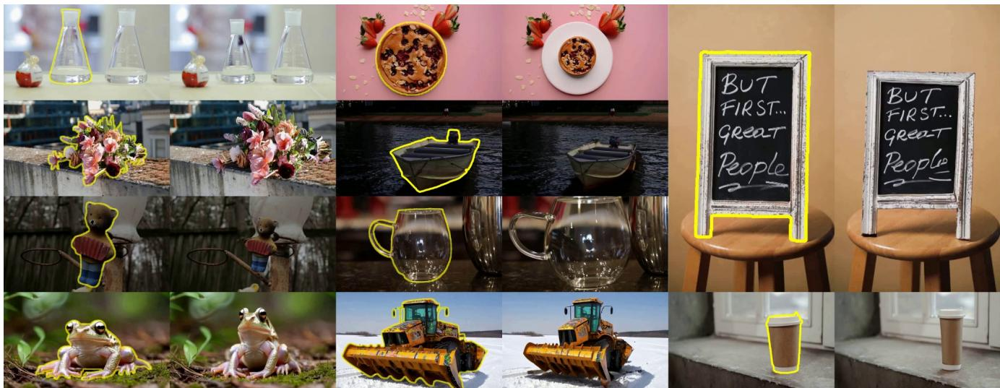  
Figure 1: Visual results of ScaleVid on diverse objects and scenes. In each pair, the left frame is the source, and the right frame is the scaled result. The examples cover transparent and geometrically complex objects, anisotropic scaling along object-centric width, height, and depth axes, isotropic enlargement and shrinkage, and inputs of varying resolutions.

• We formulate video object scaling through object-centric anisotropic factors and learn its projected geometric effects without explicit 3D reconstruction at inference.

• We propose a progressive 2D-to-3D training strategy that constructs pseudo-sources while always using the original complete real video as the target, enabling robust composition learning from planar transformations and geometry-aware scaling from 3D deformation guidance.

• We establish complementary paired-geometry, realbackground, and real-world video evaluations for scale control, geometric alignment, appearance fidelity, background preservation, and temporal quality.

## Related Works

Recent works highlight the importance of geometric priors for overcoming the limitations of purely 2D difusionbased editing. Early attempts mainly exploit depth or pseudo-3D cues. Parihar et al. (Parihar, VS, and Babu 2025) propose a training-free framework that decomposes scenes into depth-ordered layers, while GeoDifuser (Sajnani et al. 2025) injects geometric transformations into difusion attention through DDIM inversion for object-level manipulation. Beyond depth-based methods, several works explicitly lift images into 3D representations. BlenderFusion (Chen et al. 2025) and Image Sculpting (Yenphraphai et al. 2024) reconstruct object-centric meshes, perform editing in external 3D environments, and then re-render and refine the results with difusion models. 3DIT (Michel et al. 2023) further combines language guidance with 3D-aware scene representations. Another line of work introduces implicit geometry control. ShapeWords (Petrov et al. 2025) encodes 3D shape information into tokenized embeddings for text-to-image diffusion models, and Neural Assets (Wu et al. 2024) adopts object-level tokens for multi-object generation.

These ideas have also been extended to video. VideoHandles (Koo et al. 2025) and Shape-for-Motion (Liu et al. 2025) lift videos into 3D proxy representations and propagate geometry and texture across frames for temporal consistency. Lee et al. (Lee et al. 2026) use 3D point trajectories as control signals for manipulating object motion and camera dynamics, while Gu et al. (Gu et al. 2025) formulate video generation as coloring tracked 3D points for unified controllable generation. Ctrl&Shift (Ruan et al. 2026) introduces camera-aware embeddings to enhance geometric controllability, and Refaçade (Huang et al. 2026) disentangles structure and texture via a texture remover.

## Methodology

## Problem Formulation and Preliminaries

Given an input video $V = \{ I _ { n } \} _ { n = 1 } ^ { N }$ , where $I _ { n } \in \mathbb { R } ^ { H \times W \times 3 }$ its corresponding target-object masks $\begin{array} { c l } { \displaystyle { M } } & { \displaystyle { = } } & { \{ M _ { n } \} _ { n = 1 } ^ { N } } \end{array}$ where $M _ { n } ^ { \bullet } \in \{ \breve { 0 } , 1 \} ^ { \breve { H } \times W }$ , and user-specified anisotropic scaling factors $\dot { \mathbf { s } } = ( \dot { s } _ { x } , s _ { y } , s _ { z } ) \in \mathbb { R } _ { > 0 } ^ { 3 } .$ , our goal is to generate an edited video $V ^ { \prime } = \{ I _ { n } ^ { \prime } \} _ { n = 1 } ^ { N }$ in which the target object is rescaled according to s, while preserving object identity, temporal coherence, and background fidelity.

Object-Centric 3D Scaling. A geometrically accurate realization of object scaling is to transform the underlying object geometry in 3D space and then project the transformed object onto the image plane. Let ${ \bf x } _ { n } \in \mathbb { R } ^ { 3 }$ denote a mesh vertex at frame n in the original mesh-local coordinate system, and let $\mathbf { c } _ { n }$ denote the scaling center. We define $\mathbf { A } \in \mathbb { R } ^ { 3 \times 3 }$ as an orthonormal basis whose columns correspond to the canonical object-centric axes. The desired anisotropic scaling is performed in this canonical coordinate system:

$$
\mathbf { x } _ { n } ^ { \prime } = \mathbf { c } _ { n } + \mathbf { A S A } ^ { \top } \left( \mathbf { x } _ { n } - \mathbf { c } _ { n } \right) , \mathbf { S } = \mathrm { d i a g } ( s _ { x } , s _ { y } , s _ { z } ) .\tag{1}
$$

Here, $\mathbf { x } _ { n } ^ { \prime }$ is the transformed vertex, $\mathbf { A } ^ { \top }$ transforms the centered vertex into the canonical object-centric frame, S applies axis-wise scaling, and A maps the transformed vertex back to the original mesh-local coordinate system.

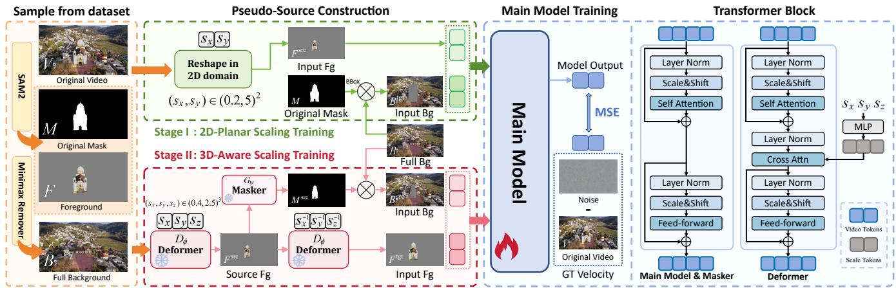  
Figure 2: Overview of the ScaleVid training pipeline and model architecture. Left: given a video V , its mask M, and completed background B, Stage I constructs planar pseudo-sources using $( s _ { x } , s _ { y } )$ and a bounding-box background mask, whereas Stage II uses the pretrained Deformer and Masker to construct geometry-aware foreground, mask, and background conditions under $( s _ { x } , s _ { y } , s _ { z } )$ . Middle: the Main Model is trained with flow matching to reconstruct the original complete video. Right: mode architecture. We remove cross-attention modules from the Main Model and Masker.

Canonical Axis Alignment. In this paper, mesh is stored as a standard 3D asset (GLB in our implementation). Its vertices are represented in an asset-specific mesh-local coordinate system, whose axes are not necessarily consistent across diferent objects. Directly applying S along these raw axes may therefore cause the same scaling factor to control diferent geometric directions.

We estimate an oriented bounding box (OBB) of the mesh geometry, use its three orthogonal directions as the dominant object-centric axes and use the center of the OBB as the scaling center $\mathbf { c } _ { n } .$ However, the OBB axes are ambiguous in ordering, and therefore do not by themselves provide a consistent axis convention across objects. To assign unified scaling semantics, we align them with the renderer’s right-handed canonical frame, in which the y-axis is upright and the $x \mathrm { - }$ and z-axes denote width and depth, respectively. Specifically, we determine the one-to-one axis assignment by maximizing the absolute directional agreement with the renderer axes, obtaining the basis A used in Eq. (1). Finally, the transformed surface points are projected onto the image plane by the renderer. A is fixed across frames to ensure temporal consistency, while the scaling center $\mathbf { c } _ { n }$ is recomputed from the current-frame OBB for deformable objects.

Conditional Flow Matching. Given a target sample $\scriptstyle { \mathbf { \mathscr { x } } } _ { 1 }$ we sample Gaussian noise $\mathbf { \boldsymbol { x } } _ { 0 } \sim \mathcal { N } ( \mathbf { \boldsymbol { 0 } } , I )$ and $t \sim \mathcal { U } ( 0 , 1 )$ then construct the interpolated noisy sample $\mathbf { { x } } _ { t } ~ = ~ ( 1 ~ -$ $t ) { \pmb x } _ { 0 } + t { \pmb x } _ { 1 }$ , with target velocity ${ \pmb v } = { \pmb x } _ { 1 } - { \pmb x } _ { 0 }$ . For a predictor g with condition $^ { c , }$ the training objective is

$$
\begin{array} { r } { \mathcal { L } _ { \mathrm { F M } } ( g ; \pmb { x } _ { 1 } , \pmb { c } ) = \mathbb { E } _ { t , \pmb { x } _ { 0 } } \left[ \| g ( \pmb { x } _ { t } , t , \pmb { c } ) - \pmb { v } \| _ { 2 } ^ { 2 } \right] . } \end{array}\tag{2}
$$

## ScaleVid Overview

ScaleVid performs geometry-aware object scaling directly in the video domain, without explicit 3D reconstruction, camera estimation, or mesh rendering at inference time. Our key idea is to decouple geometry transformation from highquality video synthesis through progressive pseudo-source reconstruction. The original complete real video is always used as the reconstruction target. The pipeline is shown in Fig. 2. All generative modules in ScaleVid operate in the latent space of a pretrained video VAE. For simplicity, we omit the latent encoding operations in the following formulations.

## Geometry-Aware Guidance Modules

We first describe how the geometry-aware guidance used by the Main Model is learned from paired synthetic supervision.

Synthetic Paired Supervision To train the Deformer and Masker, we construct a large-scale synthetic paired-video dataset, as illustrated in Fig. 3. The meshes are reconstructed using Hunyuan3D (Zhao et al. 2025) and canonicalized through the OBB-based alignment procedure. We sample anisotropic scaling factors $s \bar { = } ( s _ { x } , s _ { y } , s _ { z } ) \in \mathbb { R } _ { > 0 } ^ { 3 }$ and apply Eq. (1) along the resulting object-centric axes. The canonical basis A is used only to construct consistent synthetic supervision and is not required at inference time. The Deformer instead learns the projected deformation efects associated with these canonical axes directly from the input video.

The foreground masks are obtained from rasterized mesh silhouettes using Kaolin (Jatavallabhula et al. 2019). Each training sample is represented as $( V _ { \mathrm { o r i } } , M _ { \mathrm { o r i } } , V _ { \mathrm { s c l } } , M _ { \mathrm { s c l } } , \mathbf { s } )$ providing strict supervision for Deformer and Masker.

Deformer The Deformer $D _ { \phi }$ is a latent-space conditional flow model that learns geometry-aware transformations according to continuous anisotropic scaling parameters. We denote the original foreground video and its scaled counterpart as $V _ { \mathrm { o r i } }$ and $V _ { \mathrm { s c l } }$ . Scaling factor s is projected by an MLP into scale tokens and injected into the transformer blocks through cross-attention. Conditioned on $V _ { \mathrm { o r i } }$ and s, the Deformer’s forward objective is

$$
\mathcal { L } _ { \mathrm { f w d } } = \mathcal { L } _ { \mathrm { F M } } \left( D _ { \phi } ; V _ { \mathrm { s c l } } , \{ V _ { \mathrm { o r i } } , \mathbf { s } \} \right) .\tag{3}
$$

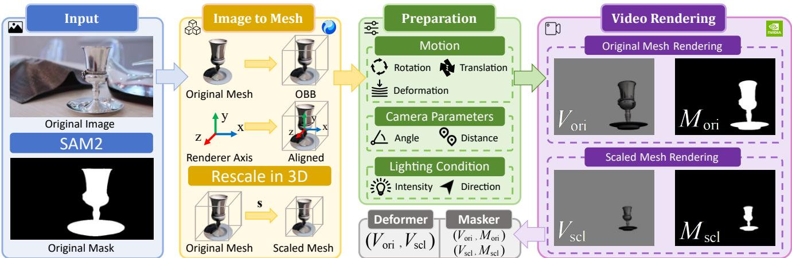  
Figure 3: Overview of our synthetic data construction pipeline for training the Deformer and Masker modules. Given an input image and its SAM2 mask, we reconstruct a 3D mesh, align its OBB axes with the renderer frame to define consistent object centric scaling directions, and apply $\boldsymbol { s } = ( s _ { x } , s _ { y } , s _ { z } )$ . The original and scaled meshes are rendered using identical motion, camera, and lighting configurations, yielding paired tuples $( V _ { \mathrm { o r i } } , \bar { M } _ { \mathrm { o r i } } , V _ { \mathrm { s c l } } , M _ { \mathrm { s c l } } , s )$ for training the Deformer and Masker.

Bidirectional Training The Deformer is applied in both scaling directions in our training pipeline: it first constructs a geometrically perturbed foreground and is subsequently applied with the inverse scaling factors to produce targetaligned guidance. We therefore encourage the learned transformation to remain consistent under bidirectional scaling.

Since direct cycle reconstruction requires backpropagation through two multi-step sampling trajectories, we instead avoid end-to-end cycle optimization and impose reverse supervision in a step-wise manner at the velocity-prediction level. Specifically, the inverse objective is

$$
\mathcal { L } _ { \mathrm { i n v } } = \mathcal { L } _ { \mathrm { F M } } \left( D _ { \phi } ; V _ { \mathrm { o r i } } , \{ V _ { \mathrm { s c l } } , \mathbf { s } ^ { - 1 } \} \right) .\tag{4}
$$

Combining (3) and (4), the bidirectional objective is

$$
\mathcal { L } _ { \mathrm { b i } } = \frac { 1 } { 2 } \mathcal { L } _ { \mathrm { f w d } } + \frac { 1 } { 2 } \mathcal { L } _ { \mathrm { i n v } } .\tag{5}
$$

During training, we use the standard forward objective with probability 1 − λ and the bidirectional objective with probability λ, where $\lambda \in [ 0 , 1 ]$ . The expected objective is

$$
\mathcal { L } _ { \mathrm { d e f } } = ( 1 - \lambda ) \mathcal { L } _ { \mathrm { f w d } } + \lambda \mathcal { L } _ { \mathrm { b i } } .\tag{6}
$$

Masker The Masker $G _ { \psi }$ predicts the temporally consistent spatial support of a transformed foreground video. It is trained using both directions of the rendered supervision:

$$
G _ { \psi } ( V _ { \mathrm { o r i } } ) \to M _ { \mathrm { o r i } } , \qquad G _ { \psi } ( V _ { \mathrm { s c l } } ) \to M _ { \mathrm { s c l } } .
$$

The Masker adopts the same latent flow-matching backbone as the Deformer and is optimized using the general objective in Eq. (2), with the corresponding mask video as the target and the input foreground video as the condition.

Its predicted mask is used to construct the masked background condition and localize the transformed foreground for the Main Model. To reduce the computational cost and accelerate the training of the Main Model, we further distill it into a three-step generator using DMD (Yin et al. 2024).

## Progressive Training of the Main Model

We progressively train the Main Model using the two stages illustrated in Fig. 2. Given a video V and its mask M, we first obtain a clean background B using Minimax Remover (Zi et al. 2025a) and extract the foreground F. With the target V and condition c, the Main Model objective is

$$
\mathcal { L } _ { \mathrm { m a i n } } = \mathcal { L } _ { \mathrm { F M } } \left( f _ { \theta } ; V , \mathbf { c } \right) .\tag{7}
$$

Stage I: 2D-Planar Scaling Training Given the original mask M, we compute its bounding box BBox(M) and use the box center as the scaling center. We randomly sample planar scaling factors $( s _ { x } , s _ { y } ) \in ( 0 . 2 , 5 ) ^ { 2 }$ and apply them to the foreground F, producing a transformed foreground $F ^ { \mathrm { s r c } }$ We further construct the target background by removing the rectangular region specified by BBox(M) from the original background B, i.e., $\mathbf { \bar { \phi } } B ^ { \mathrm { t g t } } = ( \bar { 1 } - \operatorname { B B o x } ( \bar { M } ) ) \odot B$ . The condition $\mathbf { c } = \{ F ^ { \mathrm { s r c } } , B ^ { \mathrm { t g t } } , \mathrm { B B o x } ( M ) \}$ . Bounding box avoids explicit transformed-silhouette leakage. This pseudo-source construction teaches the model to recover a high-quality object from geometrically perturbed foreground guidance while completing the removed region and preserving the surrounding scene. Since only planar transformations are required, this stage can be trained eficiently on large-scale data.

Stage II: 3D-Aware Scaling Training Stage II introduces geometry-aware transformations using the pretrained Deformer and Masker. Given the original foreground, we sample anisotropic scaling factors $\mathbf { s } = ( s _ { x } , s _ { y } , s _ { z } ) \in \mathbb { R } _ { > 0 } ^ { 3 } .$ Conditioned on the original foreground and s, the Deformer generates a geometrically transformed foreground $F ^ { \mathrm { s r c } }$ , while the Masker predicts its corresponding spatial support $M ^ { \mathrm { s r c } }$

Directly providing the original foreground to the Main Model would allow it to learn a trivial copy-and-paste solution. We therefore apply the Deformer again with $\mathbf { s } ^ { - 1 } =$ $( s _ { x } ^ { - 1 } , s _ { y } ^ { - 1 } , s _ { z } ^ { - 1 } )$ , using $\bar { F } ^ { \mathrm { s r c } }$ as the visual condition, and resulting in $F ^ { \mathrm { t g t } }$ which is aligned with the target geometry but retains realistic deformation and generation errors introduced by the Deformer. It therefore serves as non-trivial foreground guidance without exposing the ground-truth foreground.

Original Video  
2D Planar Scaling  
ScaleVid  
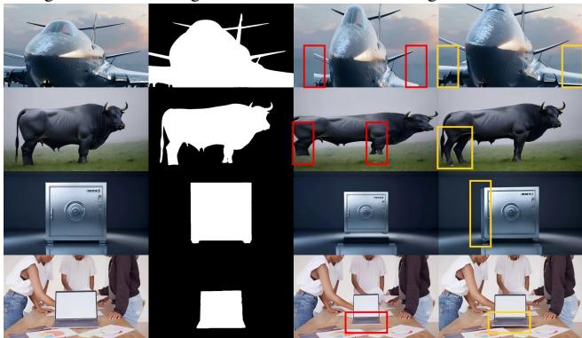  
Figure 4: Visual comparison between 2D scaling & ScaleVid.

Finally, we obtain the input background using $\begin{array} { r l } { B ^ { \mathrm { s r c } } } & { { } = } \end{array}$ $B \odot ( 1 ^ { \cdot } - M ^ { \mathrm { s r c } } )$ . Thus the Main Model is conditioned on $\mathbf { c } = \{ \mathbf { \tilde { \it F } ^ { \mathrm { t g t } } } , \boldsymbol { B } ^ { \mathrm { s r c } } , \boldsymbol { M } ^ { \mathrm { s r c } } \}$ . In this way, the Deformer provides geometry-aware transformation guidance, while the Main Model focuses on appearance refinement, temporal coherence, and seamless foreground–background composition.

The complete training procedure is summarized in Algorithm 1 in the Supplementary.

Inference The user specifies s and selects the object to be edited through SAM2 (Ravi et al. 2024) to provide source mask $M ^ { \mathrm { s r c } }$ . We directly mask the selected object from the input video to construct $B ^ { \mathrm { s r c } }$ , without using an additional object-removal model. The Deformer is applied only once to produce the desired target-aligned foreground $F ^ { \mathrm { t g t } }$ , which is then integrated with $\tilde { B ^ { \mathrm { s r c } } }$ by the Main Model. The learned Masker and inverse deformation are not required. This works because Stage II training motivates the Main Model to treat its foreground condition’s geometry as the specification ofthe desired output; supplying a single target-scale deformation at inference therefore sufices.

## Experiment

## Training Data

Main Model. Stage I is trained on a mixture of 1.8M filtered WebVid-10M videos, 900K synthetic videos generated by SelfForcing (Huang et al. 2025), and 800K synthetic images produced by Stable Difusion 3.5 Large (Stability AI Team 2024). Stage II is finetuned on 180K Pexels videos.

Deformer and Masker. We construct 1.5M paired videos from 300K object meshes by rendering five augmented pairs per mesh. Each pair contains the original and anisotropically scaled object under same configurations. Full training details are provided in the Supplementary.

## Benchmark Construction

We collect 48 high-quality meshes from Poly Haven (Haven 2026) and render each under manually configured settings. All benchmark meshes are excluded from our training set.

Scaling factors $\mathbf { s } = ( s _ { x } , s _ { y } , s _ { z } ) \in ( 0 . 3 , 3 . 0 ) ^ { 3 }$ are randomly sampled and applied to form strictly aligned video pairs.

We establish three complementary benchmarks. (1) Geometry Benchmark. Objects are rendered on a uniform gray canvas to isolate geometric accuracy and foreground fidelity. For each object, we generate four synchronized outputs: the original video $V _ { \mathrm { o r i } } ,$ the original mask $M _ { \mathrm { o r i } } ,$ , the scaled video $\bar { V } _ { \mathrm { s c l } }$ , and the scaled mask $M _ { \mathrm { s c l } } .$ , resulting in 48 video groups. (2) Real-Background Benchmark. Meshes are composited into real-world background videos collected from the Pexels dataset, yielding another 48 video groups.

(3) Real-World Benchmark. To assess overall performance in realistic scenarios, we evaluate on two real-world datasets, including 50 videos from the Pexels (Pexels 2024) dataset and 91 videos with fast-motion from the DAVIS dataset (Perazzi et al. 2016). Since paired 3D-scaled ground truth is unavailable for real videos, real-world evaluation focuses on perceptual quality and temporal consistency.

## Evaluation Metrics

To evaluate controllable object scaling in videos, we adopt four categories of metrics that measure editing quality.

Background and Foreground Evaluation. We evaluate the background and foreground regions, separated by the ground-truth mask $M _ { \mathrm { g t } }$ , using MSE, PSNR, SSIM, and LPIPS (Zhang et al. 2018). Foreground fidelity is further assessed by DINOv2 (Oquab et al. 2023) and DreamSim (Fu et al. 2023) for identity and perceptual similarities.

Scale Accuracy and Geometric Alignment. We first evaluate the mask of model outputs and measure 2D mask accuracy using mask IoU and area error:

$$
\mathrm { I o U } = \frac { \left| M _ { \mathrm { p r e d } } \cap M _ { \mathrm { g t } } \right| } { \left| M _ { \mathrm { p r e d } } \cup M _ { \mathrm { g t } } \right| } , \mathrm { A r e a } = \frac { | \left| M _ { \mathrm { p r e d } } \right| - \left| M _ { \mathrm { g t } } \right| | } { \left| M _ { \mathrm { g t } } \right| } ,
$$

where $M _ { \mathrm { p r e d } }$ is the predicted foreground mask by SAM2.

To further assess 3D geometric alignment, we adopt a mesh-based fitting evaluation inspired by Ctrl&Shift (Ruan et al. 2026). Given the ground-truth scaled mesh and the predicted foreground mask, we optimize the camera and pose parameters $( y , p , d , t _ { x } , t _ { y } )$ corresponding to yaw angle, pitch angle, camera distance, and image-plane translations — to best align the projected mesh silhouette with the predicted mask. Let $( y ^ { * } , p ^ { * } , d ^ { * } , t _ { x } ^ { * } , t _ { y } ^ { * } )$ denote the corresponding ground-truth values. We then report the following errors:

$$
\begin{array} { r l } & { \mathrm { Y a w } = | y - y ^ { * } | , \mathrm { P i t c h } = | p - p ^ { * } | , \mathrm { D i s t } = | d - d ^ { * } | / d ^ { * } , } \\ & { \qquad \mathrm { T r a n s } = \sqrt { ( t _ { x } - t _ { x } ^ { * } ) ^ { 2 } + ( t _ { y } - t _ { y } ^ { * } ) ^ { 2 } } , } \end{array}
$$

along with the silhouette fitting IoU (FIoU) between the rendered mesh silhouette and the predicted mask. These metrics collectively quantify how well the edited object preserves geometric alignment with the underlying 3D structure.

Temporal and Global Perceptual Quality. We evaluate temporal consistency using Ewarp (Lai et al. 2018). For global perceptual quality, GPT-5 (OpenAI 2025) and Gemini-2.5 Pro (Comanici et al. 2025) score the Real-World Benchmark based on scale accuracy, background preservation, transformation correctness, structure consistency, and appearance preservation. We further conduct a human preference study with 29 participants using 10 multiple-choice questions. Details are provided in the Supplementary.

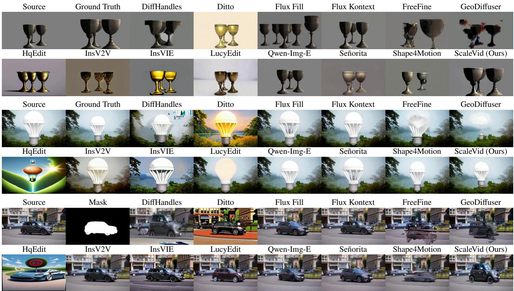  
Figure 5: Comparison results on the Geometry Benchmark, Real-Background Benchmark, and Real-World Benchmark. For the goblets, s = (1.80, 1.50, 0.80); for the bulb, s = (0.75, 0.75, 0.75); and for the car, s = (0.95, 2.28, 1.27).

<table><tr><td rowspan=1 colspan=1>Method</td><td rowspan=1 colspan=1>Condition|</td><td rowspan=1 colspan=1>Videobased</td><td rowspan=1 colspan=2>Background Preservation    Scale AccMSE↓PSNR↑ SSIM↑ LPIPS↓ IoU↑ Area↓</td><td rowspan=1 colspan=1>Geometric AlignmentYaw↓ Pitch↓ Dist↓ Trans↓ FIoU↑</td></tr><tr><td rowspan=5 colspan=1>Ditto (Bai et al. 2026)HqEdit (Hui et al. 2025)InsV2V (Cheng, Xiao, and He 2024)InsVIE (Wu et al. 2025b)LucyEdit (Team 2025)Qwen-Image-E (Wu et al. 2025a)</td><td rowspan=5 colspan=1>Text</td><td rowspan=2 colspan=1>√x</td><td rowspan=2 colspan=1>2028.5117.79 0.645 0.3126819.1210.33 0.456 0.482</td><td rowspan=1 colspan=1>|0.442 0.759</td><td rowspan=2 colspan=1>|0.4950.3830.4030.2960.7970.2870.7130.6500.6000.555</td></tr><tr><td rowspan=1 colspan=1>0.2611.375</td></tr><tr><td rowspan=3 colspan=1>V√√x</td><td rowspan=1 colspan=1>1291.9218.59 0.703 0.259</td><td rowspan=1 colspan=1>0.4080.709</td><td rowspan=1 colspan=1>0.2680.6240.6470.5240.627</td></tr><tr><td rowspan=2 colspan=1>2831.6314.59 0.508 0.374905.49 23.32 0.847 0.400331.1827.41 0.904 0.075</td><td rowspan=1 colspan=1>0.4600.8040.4351.102</td><td rowspan=2 colspan=1>0.2660.5150.4530.3090.7690.2920.4980.4890.3790.7830.2880.5180.4230.2940.786</td></tr><tr><td rowspan=1 colspan=1>0.4340.668</td></tr><tr><td rowspan=1 colspan=1>Flux Kontext (Labs et al. 2025)</td><td rowspan=1 colspan=1>Image</td><td rowspan=1 colspan=1>x</td><td rowspan=1 colspan=1>989.5419.68 0.652 0.150</td><td rowspan=1 colspan=1>|0.4250.675|</td><td rowspan=1 colspan=1>0.2920.3770.2690.2260.771</td></tr><tr><td rowspan=1 colspan=1>Flux Fill (Black Forest Labs 2024)Señorita (Zi et al. 2025b)</td><td rowspan=1 colspan=1>2D Mask</td><td rowspan=1 colspan=1>xJ</td><td rowspan=1 colspan=1>343.3225.59 0.902 0.072408.55 24.14 0.858 0.131</td><td rowspan=1 colspan=1>|0.378 0.706|0.4320.675</td><td rowspan=1 colspan=1>|0.2600.712 0.5960.4440.6610.2780.778 0.4910.3890.751</td></tr><tr><td rowspan=3 colspan=1>DiffHandles (Pandey et al. 2024)FreeFine (Zhu et al. 2025)GeoDiffuser (Sajnani et al. 2025)</td><td rowspan=3 colspan=1>Depth</td><td rowspan=1 colspan=1>x</td><td rowspan=1 colspan=1>1599.5618.27 0.678 0.263</td><td rowspan=1 colspan=1>0.6040.674|</td><td rowspan=3 colspan=1>0.4910.3130.2730.2940.8120.2580.616 0.4090.3950.740|0.304 0.5520.4390.3080.741</td></tr><tr><td rowspan=1 colspan=1>x</td><td rowspan=2 colspan=1>520.58 22.46 0.766 0.356333.92 24.97 0.821 0.120</td><td rowspan=1 colspan=1>0.5230.489</td></tr><tr><td rowspan=1 colspan=1>x</td><td rowspan=1 colspan=1>0.5440.350</td></tr><tr><td rowspan=1 colspan=1>Shape4Motion (Liu et al. 2025)</td><td rowspan=1 colspan=1>Point Cloud</td><td rowspan=1 colspan=1>√</td><td rowspan=1 colspan=1>250.31 26.640.877 0.086</td><td rowspan=1 colspan=1>|0.3510.710|</td><td rowspan=1 colspan=1>0.2530.5780.4800.3560.797</td></tr><tr><td rowspan=1 colspan=1>ScaleVid (Ours)</td><td rowspan=1 colspan=1>3D Scale</td><td rowspan=1 colspan=1>√</td><td rowspan=1 colspan=1>161.2330.580.920 0.049</td><td rowspan=1 colspan=1>|0.804 0.227|</td><td rowspan=1 colspan=1>0.2370.2050.2100.1780.836</td></tr></table>

Table 1: Quantitative evaluation of background preservation on the Real-Background Benchmark, and scale accuracy and geometric alignment on the Geometry Benchmark. Best and second-best results are bold and underlined, respectively.

## Qualitative Results

As shown in Fig. 4, planar 2D scaling cannot recover outof-frame regions or perspective changes, causing broken airplane wings, misaligned bull legs, and implausible newly exposed safe faces. For a fair comparison, the planar baseline uses the same in-plane scaling factors $( s _ { x } , s _ { y } )$ as ScaleVid. Moreover, it ignores object-scene interactions, leading to unnatural shadows and boundary transitions around the laptop. In contrast, ScaleVid produces geometry-consistent results by learning transformation priors from 3D supervision.

<table><tr><td rowspan="2">Method</td><td colspan="6">Foreground Fidelity PSNR↑ SSIM↑ LPIPS↓ i</td><td colspan="4">Pexels</td><td colspan="4">DAVIS GPT↑ Gemini↑ User↑</td></tr><tr><td>MSE↓</td><td></td><td></td><td></td><td>DINO↑ Dream↑</td><td></td><td>Ewarp↓</td><td></td><td>GPT↑ Gemini↑ User↑</td><td></td><td>Ewarp↓</td><td></td><td></td><td></td></tr><tr><td>Ditto</td><td>2362.73</td><td>16.06</td><td>0.782</td><td>0.220</td><td>0.536</td><td>0.821</td><td>0.441</td><td>0.14</td><td>0.06</td><td>0.08</td><td>2.156</td><td>0.40</td><td>0.60</td><td>0.09</td></tr><tr><td>HqEdit</td><td>1575.52</td><td>17.96</td><td>0.797</td><td>0.216</td><td>0.506</td><td>0.827</td><td>9.475</td><td>0.14</td><td>0.34</td><td>0.03</td><td>9.128</td><td>0.14</td><td>0.08</td><td>0.05</td></tr><tr><td>InsV2V</td><td>1008.17</td><td>20.50</td><td>0.812</td><td>0.205</td><td>0.641</td><td>0.874</td><td>0.344</td><td>2.46</td><td>3.64</td><td>0.23</td><td>1.529</td><td>2.34</td><td>3.03</td><td>0.19</td></tr><tr><td>InsVIE</td><td>1724.08</td><td>17.47</td><td>0.793</td><td>0.216</td><td>0.556</td><td>0.831</td><td>0.329</td><td>1.78</td><td>2.72</td><td>0.25</td><td>2.772</td><td>1.57</td><td>1.62</td><td>0.10</td></tr><tr><td>LucyEdit</td><td>1751.22</td><td>19.12</td><td>0.801</td><td>0.190</td><td>0.645</td><td>0.870</td><td>0.155</td><td>3.08</td><td>3.22</td><td>0.32</td><td>1.329</td><td>2.34</td><td>2.53</td><td>0.25</td></tr><tr><td>Qwen-Image-E</td><td>666.06</td><td>22.41</td><td>0.825</td><td>0.204</td><td>0.763</td><td>0.910</td><td>1.799</td><td>2.22</td><td>2.60</td><td>0.13</td><td>2.204</td><td>3.22</td><td>3.43</td><td>0.14</td></tr><tr><td>Flux Kontext</td><td>653.20</td><td>22.59</td><td>0.825</td><td>0.207</td><td>0.761</td><td>0.907</td><td>0.387</td><td>3.12</td><td>3.06</td><td>0.30</td><td>1.485</td><td>2.01</td><td>2.62</td><td>0.30</td></tr><tr><td>Flux Fill</td><td>898.85</td><td>21.63</td><td>0.816</td><td>0.217</td><td>0.561</td><td>0.843</td><td>2.307</td><td>1.46</td><td>1.74</td><td>0.06</td><td>2.064</td><td>1.27</td><td>2.06</td><td>0.05</td></tr><tr><td>Señorita</td><td>988.02</td><td>21.41</td><td>0.825</td><td>0.218</td><td>0.577</td><td>0.855</td><td>0.097</td><td>0.94</td><td>1.02</td><td>0.08</td><td>0.886</td><td>2.01</td><td>2.05</td><td>0.23</td></tr><tr><td>DiffHandles</td><td>387.18</td><td>25.09</td><td>0.852</td><td>0.154</td><td>0.726</td><td>0.882</td><td>4.586</td><td>0.56</td><td>0.66</td><td>0.09</td><td>6.316</td><td>0.63</td><td>0.80</td><td>0.06</td></tr><tr><td>FreeFine</td><td>688.98</td><td>22.72</td><td>0.812</td><td>0.180</td><td>0.611</td><td>0.862</td><td>1.566</td><td>1.38</td><td>1.46</td><td>0.04</td><td>2.897</td><td>1.18</td><td>1.62</td><td>0.02</td></tr><tr><td>GeoDiffuser</td><td>581.98</td><td>23.03</td><td>0.843</td><td>0.170</td><td>0.650</td><td>0.860</td><td>1.738</td><td>0.36</td><td>0.46</td><td>0.08</td><td>2.528</td><td>1.10</td><td>1.02</td><td>0.03</td></tr><tr><td>Shape4Motion</td><td>540.86</td><td>22.83</td><td>0.846</td><td>0.201</td><td>0.631</td><td>0.861</td><td>0.122</td><td>1.78</td><td>2.04</td><td>0.37</td><td>0.943</td><td>1.24</td><td>0.45</td><td>0.17</td></tr><tr><td>ScaleVid (Ours)</td><td>329.73</td><td>25.33</td><td>0.867</td><td>0.133</td><td>0.850</td><td>0.934</td><td>0.133</td><td>3.74</td><td>4.22</td><td>0.81</td><td>1.102</td><td>4.14</td><td>4.41</td><td>0.80</td></tr></table>

Table 2: Quantitative evaluation of foreground fidelity on the Geometry Benchmark and real-world editing performance on Pexels and DAVIS. Ewarp is reported in the range of $1 \times \mathrm { 1 \dot { 0 } ^ { - 3 } }$ . Best and second-best results are bold and underlined, respectively.

In Fig. 5, image-based methods show noticeable flickering. Text-controlled methods struggle to accurately interpret specific scale values. HqEdit, Ditto, InsV2V, and InsVIE show limited ability to preserve the identity of the edited object. Señorita shows similar artifacts due to its Flux Fill first-frame guidance. Additional visual results and videos are provided in the Technical and Media Supplementary.

## Quantitative Results

As shown in Table 1, ScaleVid achieves the best scale accuracy, geometric alignment, and background preservation. Although textual prompts can explicitly specify numerical scaling factors, text-driven editing methods often fail to translate these values into precise and consistent geometric transformations. In contrast, geometry-aware methods achieve noticeably better scale accuracy and geometric alignment by explicitly incorporating geometric priors. However, trainingfree and depth-guided approaches still preserve fine-grained object structure less efectively than mesh-based methods.

Table 2 further shows that our method achieves the best foreground fidelity on all metrics, including pixel-level error and perceptual similarity. On the real-world Pexels and DAVIS datasets, it obtains the highest GPT, Gemini, and userpreference scores, demonstrating superior perceptual quality and overall realism, together with competitive Ewarp.

Inference cost, baseline details, extensive quantitative results and more ablations are provided in Supplementary.

## Ablation Studies

Efectiveness of Progressive Training Table 3 evaluates the geometric contribution of each training stage on the Geometry Benchmark. The Deformer performs competitively due to its closely matched rendered training distribution. Stage II substantially improves over Stage I, confirming that 3D deformation guidance is essential for geometric control. Combining both stages achieves competitive overall performance, showing that planar pretraining provides a beneficial initialization for subsequent geometry-aware finetuning.

<table><tr><td>Method</td><td>IoU↑</td><td>Area↓</td><td>Yaw↓</td><td>Pitch↓</td><td>Dist↓</td><td>Trans↓</td><td>FIoU↑</td></tr><tr><td>Deformer</td><td>0.776</td><td>0.222</td><td>0.267</td><td>0.241</td><td>0.259</td><td>0.230</td><td>0.821</td></tr><tr><td>Stage I</td><td>0.525</td><td>0.813</td><td>0.447</td><td>0.365</td><td>0.576</td><td>0.339</td><td>0.762</td></tr><tr><td>Stage II</td><td>0.746</td><td>0.345</td><td>0.294</td><td>0.303</td><td>0.280</td><td>0.223</td><td>0.804</td></tr><tr><td>Stage I+II</td><td>0.804</td><td>0.227</td><td>0.237</td><td>0.205</td><td>0.210</td><td>0.178</td><td>0.836</td></tr></table>

Table 3: Stage-wise ablation on scale & geometric alignment.
<table><tr><td>λ</td><td>IoU↑</td><td>Area↓</td><td>Yaw↓</td><td>Pitch↓</td><td>Dist↓</td><td>Trans↓</td><td>FIoU↑</td></tr><tr><td>1.0</td><td>0.616</td><td>0.579</td><td>0.475</td><td>0.371</td><td>0.347</td><td>0.234</td><td>0.710</td></tr><tr><td>0.5</td><td>0.716</td><td>0.345</td><td>0.412</td><td>0.308</td><td>0.269</td><td>0.221</td><td>0.801</td></tr><tr><td>0.2</td><td>0.742</td><td>0.280</td><td>0.402</td><td>0.287</td><td>0.230</td><td>0.216</td><td>0.817</td></tr><tr><td>0</td><td>0.702</td><td>0.420</td><td>0.412</td><td>0.339</td><td>0.325</td><td>0.222</td><td>0.797</td></tr></table>

Table 4: Ablation study on loss design of Deformer.

Efectiveness of the Bidirectional Loss for Deformer As shown in Table 4, moderate bidirectional loss consistently improves scale accuracy and geometric alignment over the unidirectional setting (λ = 0). A moderate sampling probability performs best: λ = 0.2 achieves the highest IoU and FIoU and the lowest errors across all geometric metrics, while larger values gradually degrade performance. This indicates that bidirectional supervision is beneficial, but overly frequent reverse constraints restrict deformation flexibility.

## Conclusion

We present ScaleVid, a geometry-aware framework for controllable video object scaling without explicit 3D reconstruction at inference. Through progressive pseudo-source construction with real-video targets, ScaleVid decouples geometric transformation from video synthesis and supports geometry-aware scaling directly in video domain. We also introduce complementary benchmarks for evaluating geometric alignment, foreground fidelity, background preservation, and overall quality. Extensive experiments demonstrate strong and practical performance.

## References

Avrahami, O.; Lischinski, D.; and Fried, O. 2022. Blended Difusion for Text-driven Editing of Natural Images. In 2022 IEEE/CVFConference on Computer Vision and Pattern Recognition (CVPR), 18187–18197. IEEE.

Bai, Q.; Wang, Q.; Ouyang, H.; Yu, Y.; Wang, H.; Wang, W.; Cheng, K. L.; Ma, S.; Zeng, Y.; Liu, Z.; Xu, Y.; Shen, Y.; and Chen, Q. 2026. Scaling Instruction-Based Video Editing with a High-Quality Synthetic Dataset. In Proceedings of the IEEE/CVF Conference on Computer Vision and Pattern Recognition, 37971–37981.

Bian, Y.; Zhang, Z.; Ju, X.; Cao, M.; Xie, L.; Shan, Y.; and Xu, Q. 2025. Videopainter: Any-length video inpainting and editing with plug-and-play context control. In Proceedings of the Special Interest Group on Computer Graphics and Interactive Techniques Conference Conference Papers, 1–12.

Birkl, R.; Wofk, D.; and Müller, M. 2023. MiDaS v3.1 – A Model Zoo for Robust Monocular Relative Depth Estimation. arXiv preprint arXiv:2307.14460.

Black Forest Labs. 2024. Black Forest Labs. https://github. com/black-forest-labs/flux/.

Blattmann, A.; Rombach, R.; Ling, H.; Dockhorn, T.; Kim, S. W.; Fidler, S.; and Kreis, K. 2023. Align your latents: Highresolution video synthesis with latent difusion models. In Proceedings ofthe IEEE/CVF conference on computer vision and pattern recognition, 22563–22575.

Chen, H.; Zhang, Y.; Cun, X.; Xia, M.; Wang, X.; Weng, C.; and Shan, Y. 2024. Videocrafter2: Overcoming data limitations for high-quality video difusion models. In Proceedings of the IEEE/CVF Conference on Computer Vision and Pattern Recognition, 7310–7320.

Chen, J.; Mehran, R.; Jia, X.; Xie, S.; and Woo, S. 2025. Blenderfusion: 3d-grounded visual editing and generative compositing. arXiv preprint arXiv:2506.17450.

Chen, J.; Yu, J.; Ge, C.; Yao, L.; Xie, E.; Wu, Y.; Wang, Z.; Kwok, J.; Luo, P.; Lu, H.; et al. 2023. Pixart-alpha: Fast training of difusion transformer for photorealistic text-toimage synthesis. arXiv preprint arXiv:2310.00426.

Chen, Y.; Wang, J.; Liu, L.; Chu, R.; Zhang, X.; Tian, Q.; and Yang, Y. 2026. O-disco-edit: Object distortion control for unified realistic video editing. In Proceedings of the AAAI Conference onArtificial Intelligence, volume 40, 3165–3173.

Cheng, J.; Xiao, T.; and He, T. 2024. Consistent Videoto-Video Transfer Using Synthetic Dataset. In The Twelfth International Conference on Learning Representations.

Comanici, G.; Bieber, E.; Schaekermann, M.; Pasupat, I.; Sachdeva, N.; Dhillon, I.; Blistein, M.; Ram, O.; Zhang, D.; Rosen, E.; et al. 2025. Gemini 2.5: Pushing the frontier with advanced reasoning, multimodality, long context, and next generation agentic capabilities. arXiv preprint arXiv:2507.06261.

Fu, S.; Tamir, N. Y.; Sundaram, S.; Chai, L.; Zhang, R.; Dekel, T.; and Isola, P. 2023. DreamSim: Learning New Dimensions of Human Visual Similarity Using Synthetic Data. In NeurIPS, volume 36.

Gu, B.; Luo, H.; Guo, S.; and Dong, P. 2024. Advanced Video Inpainting Using Optical Flow-Guided Eficient Difusion. arXiv preprint arXiv:2412.00857.

Gu, Z.; Yan, R.; Lu, J.; Li, P.; Dou, Z.; Si, C.; Dong, Z.; Liu, Q.; Lin, C.; Liu, Z.; et al. 2025. Difusion as shader: 3daware video difusion for versatile video generation control. In Proceedings of the Special Interest Group on Computer Graphics and Interactive Techniques Conference Conference Papers, 1–12.

Guo, Y.; Yang, C.; Rao, A.; Liang, Z.; Wang, Y.; Qiao, Y.; Agrawala, M.; Lin, D.; and Dai, B. 2024. AnimateDif: Animate Your Personalized Text-to-Image Difusion Models without Specific Tuning. In The Twelfth International Conference on Learning Representations.

Haven, P. 2026. https://polyhaven.com/.

He, Y.; Wang, J.; Wang, X.; Fong, M.; Zhang, S.; Xue, Y.; Zheng, H.-T.; and Ma, Y. 2026. GeoEdit: Geometry-Aware Object Editing via Dual-Branch Denoising. arXiv:2606.30003.

Ho, J.; and Salimans, T. 2022. Classifier-free difusion guidance. arXiv preprint arXiv:2207.12598.

Hu, T.; Peng, H.; Liu, X.; and Ma, Y. 2025. Ex-4d: Extreme viewpoint 4d video synthesis via depth watertight mesh. arXiv preprint arXiv:2506.05554.

Huang, X.; Li, Z.; He, G.; Zhou, M.; and Shechtman, E. 2025. Self Forcing: Bridging the Train-Test Gap in Autoregressive Video Difusion. In Advances in Neural Information Processing Systems, volume 38.

Huang, Y.; Ruan, P.; Zi, B.; Qi, X.; Wang, J.; and Xiao, R. 2026. Refacade: Editing Object with Given Reference Texture. In Proceedings of the IEEE/CVF Conference on Computer Vision and Pattern Recognition, 1961–1972.

Hui, M.; Yang, S.; Zhao, B.; Shi, Y.; Wang, H.; Wang, P.; Xie, C.; and Zhou, Y. 2025. HQ-Edit: A High-Quality Dataset for Instruction-Based Image Editing. In The Thirteenth International Conference on Learning Representations.

Jatavallabhula, K. M.; Smith, E.; Lafleche, J.-F.; Tsang, C. F.; Rozantsev, A.; Chen, W.; Xiang, T.; Lebaredian, R.; and Fidler, S. 2019. Kaolin: A pytorch library for accelerating 3d deep learning research. arXiv preprint arXiv:1911.05063.

Jiang, Z.; Han, Z.; Mao, C.; Zhang, J.; Pan, Y.; and Liu, Y. 2025. Vace: All-in-one video creation and editing. arXiv preprint arXiv:2503.07598.

Ju, X.; Liu, X.; Wang, X.; Bian, Y.; Shan, Y.; and Xu, Q. 2024. BrushNet: A Plug-and-Play Image Inpainting Model with Decomposed Dual-Branch Difusion. arXiv:2403.06976.

Koo, J.; Guerrero, P.; Huang, C.-H. P.; Ceylan, D.; and Sung, M. 2025. Videohandles: Editing 3d object compositions in videos using video generative priors. In Proceedings of the Computer Vision and Pattern Recognition Conference, 17692–17701.

Labs, B. F.; Batifol, S.; Blattmann, A.; Boesel, F.; Consul, S.; Diagne, C.; Dockhorn, T.; English, J.; English, Z.; Esser, P.; et al. 2025. FLUX. 1 Kontext: Flow Matching for In-Context Image Generation and Editing in Latent Space. arXiv preprint arXiv:2506.15742.

Lai, W.-S.; Huang, J.-B.; Wang, O.; Shechtman, E.; Yumer, E.; and Yang, M.-H. 2018. Learning blind video temporal consistency. In Proceedings of the European conference on computer vision (ECCV), 170–185.

Lee, Y.-C.; Zhang, Z.; Huang, J.; Wang, J.-H.; Lee, J.-Y.; Huang, J.-B.; Shechtman, E.; and Li, Z. 2026. Generative Video Motion Editing with 3D Point Tracks. In Proceedings of the IEEE/CVF Conference on Computer Vision and Pattern Recognition, 18306–18318.

Li, R.; Yang, T.; Guo, S.; and Zhang, L. 2025a. RORem: Training a Robust Object Remover with Human-in-the-Loop. In Proceedings of the Computer Vision and Pattern Recognition Conference, 14024–14035.

Li, X.; Xue, H.; Ren, P.; and Bo, L. 2025b. Difueraser: A difusion model for video inpainting. arXiv preprint arXiv:2501.10018.

Liu, F.; Sun, W.; Wang, H.; Wang, Y.; Sun, H.; Ye, J.; Zhang, J.; and Duan, Y. 2026. Reconx: Reconstruct any scene from sparse views with video difusion model. IEEE Transactions on Image Processing.

Liu, K.; Zhu, Z.; Li, C.; Liu, H.; Zeng, H.; and Hou, J. 2024. PrefPaint: Aligning Image Inpainting Difusion Model with Human Preference. arXiv:2410.21966.

Liu, R.; Wu, R.; Van Hoorick, B.; Tokmakov, P.; Zakharov, S.; and Vondrick, C. 2023. Zero-1-to-3: Zero-shot one image to 3d object. In Proceedings ofthe IEEE/CVF international conference on computer vision, 9298–9309.

Liu, Y.; Wang, T.; Liu, F.; Wang, Z.; and Lau, R. W. 2025. Shape-for-motion: Precise and consistent video editing with 3d proxy. In Proceedings ofthe SIGGRAPHAsia 2025 Conference Papers, 1–12.

Michel, O.; Bhattad, A.; VanderBilt, E.; Krishna, R.; Kembhavi, A.; and Gupta, T. 2023. Object 3dit: Language-guided 3d-aware image editing. Advances in Neural Information Processing Systems, 36: 3497–3516.

OpenAI. 2025. Introducing GPT-5. https://openai.com/ index/introducing-gpt-5/. Accessed: 2026-03-28.

Oquab, M.; Darcet, T.; Moutakanni, T.; Vo, H.; Szafraniec, M.; Khalidov, V.; Fernandez, P.; Haziza, D.; Massa, F.; El-Nouby, A.; et al. 2023. Dinov2: Learning robust visual features without supervision. arXiv preprint arXiv:2304.07193.

Pandey, K.; Guerrero, P.; Gadelha, M.; Hold-Geofroy, Y.; Singh, K.; and Mitra, N. J. 2024. Difusion Handles: Enabling 3D Edits for Difusion Models by Lifting Activations to 3D. In Proceedings of the IEEE/CVF Conference on Computer Vision and Pattern Recognition, 7693–7703.

Parihar, R.; VS, S.; and Babu, R. V. 2025. Zero-Shot Depth Aware Image Editing with Difusion Models. In Proceedings ofthe IEEE/CVFInternational Conference on Computer Vision, 15748–15759.

Perazzi, F.; Pont-Tuset, J.; McWilliams, B.; Van Gool, L.; Gross, M.; and Sorkine-Hornung, A. 2016. A benchmark dataset and evaluation methodology for video object segmentation. In Proceedings of the IEEE conference on computer vision and pattern recognition, 724–732.

Petrov, D.; Goyal, P.; Shivashok, D.; Tao, Y.; Averkiou, M.; and Kalogerakis, E. 2025. Shapewords: Guiding text-toimage synthesis with 3d shape-aware prompts. In CVPR, 13305–13314.

Pexels. 2024. https://www.pexels.com/.

Podell, D.; English, Z.; Lacey, K.; Blattmann, A.; Dockhorn, T.; Müller, J.; Penna, J.; and Rombach, R. 2023. SDXL: Improving Latent Difusion Models for High-Resolution Image Synthesis. arXiv:2307.01952.

Ravi, N.; Gabeur, V.; Hu, Y.-T.; Hu, R.; Ryali, C.; Ma, T.; Khedr, H.; Rädle, R.; Rolland, C.; Gustafson, L.; et al. 2024. Sam 2: Segment anything in images and videos. arXiv preprint arXiv:2408.00714.

Rombach, R.; Blattmann, A.; Lorenz, D.; Esser, P.; and Ommer, B. 2022. High-resolution image synthesis with latent difusion models. In CVPR, 10684–10695.

Ruan, P.; Zi, B.; Qi, X.; Huang, Y.; Xiao, R.; Wang, P.; Cao, J.; and Shi, Y. 2026. CTRL&SHIFT: High-Quality Geometry-Aware Object Manipulation in Visual Generation. In ICLR.

Sabathier, R.; Novotny, D.; Mitra, N. J.; and Monnier, T. 2026. ActionMesh: Animated 3D Mesh Generation with Temporal 3D Difusion. arXiv preprint arXiv:2601.16148.

Sajnani, R.; Vanbaar, J.; Min, J.; Katyal, K. D.; and Sridhar, S. 2025. Geodifuser: Geometry-based image editing with difusion models. In Proceedings of the Winter Conference on Applications ofComputer Vision, 472–482.

Stability AI Team. 2024. Introducing Stable Difusion 3.5. https://stability.ai/news/introducing-stable-difusion-3- 5. Accessed 2025-10-28.

Team, D. 2025. Lucy Edit: Open-weight Text-guided Video Editing. Accessed: 2025-11-13.

Voleti, V.; Yao, C.-H.; Boss, M.; Letts, A.; Pankratz, D.; Tochilkin, D.; Laforte, C.; Rombach, R.; and Jampani, V. 2024. Sv3d: Novel multi-view synthesis and 3d generation from a single image using latent video difusion. In European Conference on Computer Vision, 439–457. Springer.

Wan, T.; Wang, A.; Ai, B.; Wen, B.; Mao, C.; Xie, C.-W.; Chen, D.; Yu, F.; Zhao, H.; Yang, J.; et al. 2025. Wan: Open and advanced large-scale video generative models. arXiv preprint arXiv:2503.20314.

Wang, X.; Yuan, H.; Zhang, S.; Chen, D.; Wang, J.; Zhang, Y.; Shen, Y.; Zhao, D.; and Zhou, J. 2023. Videocomposer: Compositional video synthesis with motion controllability. Advances in Neural Information Processing Systems, 36: 7594–7611.

Wang, Z.; Lan, Y.; Zhou, S.; and Loy, C. C. 2026. ObjCtrl-2.5D: Training-Free Object Control with Camera Poses. International Journal ofComputer Vision, 134(249).

Wang, Z.; Wang, X.; Xie, L.; Qi, Z.; Shan, Y.; Wang, W.; and Luo, P. 2025. StyleAdapter: A Unified Stylized Image Generation Model. International Journal of Computer Vision, 133(4): 1894–1911.

Wu, C.; Li, J.; Zhou, J.; Lin, J.; Gao, K.; Yan, K.; Yin, S.-m.; Bai, S.; Xu, X.; Chen, Y.; et al. 2025a. Qwen-image technical report. arXiv preprint arXiv:2508.02324.

Wu, Y.; Chen, L.; Li, R.; Wang, S.; Xie, C.; and Zhang, L. 2025b. Insvie-1m: Efective instruction-based video editing with elaborate dataset construction. In CVPR, 16692–16701.

Wu, Z.; Rubanova, Y.; Kabra, R.; Hudson, D. A.; Gilitschenski, I.; Aytar, Y.; Van Steenkiste, S.; Allen, K. R.; and Kipf, T. 2024. Neural assets: 3d-aware multi-object scene synthesis with image difusion models. Advances in Neural Information Processing Systems, 37: 76289–76318.

Xie, L.; Pakhomov, D.; Wang, Z.; Wu, Z.; Chen, Z.; Zhou, Y.; Zheng, H.; Zhang, Z.; Lin, Z.; Zhou, J.; and Dong, C. 2025. TurboFill: Adapting Few-step Text-to-image Model for Fast Image Inpainting. arXiv:2504.00996.

Yang, L.; Kang, B.; Huang, Z.; Xu, X.; Feng, J.; and Zhao, H. 2024a. Depth anything: Unleashing the power of large-scale unlabeled data. In Proceedings ofthe IEEE/CVF conference on computer vision and pattern recognition, 10371–10381.

Yang, S.; Gu, Z.; Hou, L.; Tao, X.; Wan, P.; Chen, X.; and Liao, J. 2025. Mtv-inpaint: Multi-task long video inpainting. arXiv preprint arXiv:2503.11412.

Yang, Z.; Teng, J.; Zheng, W.; Ding, M.; Huang, S.; Xu, J.; Yang, Y.; Hong, W.; Zhang, X.; Feng, G.; et al. 2024b. Cogvideox: Text-to-video difusion models with an expert transformer. arXiv preprint arXiv:2408.06072.

Yenphraphai, J.; Pan, X.; Liu, S.; Panozzo, D.; and Xie, S. 2024. Image sculpting: Precise object editing with 3d geometry control. In Proceedings of the IEEE/CVF Conference on Computer Vision and Pattern Recognition, 4241–4251.

Yin, T.; Gharbi, M.; Park, T.; Zhang, R.; Shechtman, E.; Durand, F.; and Freeman, B. 2024. Improved distribution matching distillation for fast image synthesis. Advances in neural information processing systems, 37: 47455–47487.

Zhang, J.; Cheng, S.; Sun, Q.; Liu, J.; Luyang, W.; Feng, C.; Fang, C.; Lei, L.; Wang, J.; and Liu, S. 2025. Ultra High-Resolution Image Inpainting with Patch-Based Content Consistency Adapter. arXiv:2510.13419.

Zhang, R.; Isola, P.; Efros, A. A.; Shechtman, E.; and Wang, O. 2018. The unreasonable efectiveness of deep features as a perceptual metric. In Proceedings of the IEEE conference on computer vision and pattern recognition, 586–595.

Zhang, Z.; Wu, B.; Wang, X.; Luo, Y.; Zhang, L.; Zhao, Y.; Vajda, P.; Metaxas, D.; and Yu, L. 2024. Avid: Any-length video inpainting with difusion model. In Proceedings of the IEEE/CVF conference on computer vision and pattern recognition, 7162–7172.

Zhao, H.; Ma, X. S.; Chen, L.; Si, S.; Wu, R.; An, K.; Yu, P.; Zhang, M.; Li, Q.; and Chang, B. 2024. Ultraedit: Instruction-based fine-grained image editing at scale. NeurIPS, 37: 3058–3093.

Zhao, Z.; Lai, Z.; Lin, Q.; Zhao, Y.; Liu, H.; Yang, S.; Feng, Y.; Yang, M.; Zhang, S.; Yang, X.; et al. 2025. Hunyuan3d 2.0: Scaling difusion models for high resolution textured 3d assets generation. arXiv preprint arXiv:2501.12202.

Zhou, S.; Li, C.; Chan, K. C.; and Loy, C. C. 2023. ProPainter: Improving Propagation and Transformer for Video Inpainting. In Proceedings of IEEE International Conference on Computer Vision (ICCV).

Zhu, H.; Zhu, Z.; Zhang, K.; Gong, Y.; Liu, Y.; and Bai, X. 2025. Training-free Geometric Image Editing on Difusion Models. In Proceedings ofthe IEEE/CVF International Conference on Computer Vision, 19130–19140.

Zhuang, J.; Zeng, Y.; Liu, W.; Yuan, C.; and Chen, K. 2023. A Task is Worth One Word: Learning with Task Prompts for High-Quality Versatile Image Inpainting. arXiv:2312.03594.

Zhuang, J.; Zeng, Y.; Liu, W.; Yuan, C.; and Chen, K. 2024. A task is worth one word: Learning with task prompts for highquality versatile image inpainting. In European Conference on Computer Vision, 195–211. Springer.

Zi, B.; Peng, W.; Qi, X.; Wang, J.; Zhao, S.; Xiao, R.; and Wong, K.-F. 2025a. MiniMax-Remover: Taming Bad Noise Helps Video Object Removal. In Advances in Neural Information Processing Systems, volume 38.

Zi, B.; Ruan, P.; Chen, M.; Qi, X.; Hao, S.; Zhao, S.; Huang, Y.; Liang, B.; Xiao, R.; and Wong, K.-F. 2025b. Se norita-2M: A High-Quality Instruction-Based Dataset for General Video Editing by Video Specialists. In Advances in Neural Information Processing Systems, volume 38.

Zi, B.; Zhao, S.; Qi, X.; Wang, J.; Shi, Y.; Chen, Q.; Liang, B.; Xiao, R.; Wong, K.-F.; and Zhang, L. 2025c. Cococo: Improving text-guided video inpainting for better consistency, controllability and compatibility. In Proceedings of the AAAI Conference on Artificial Intelligence, volume 39, 11067–11076.

## Extensive Related Works

Image inpainting has been extensively studied over the past years (Ju et al. 2024; Black Forest Labs 2024; Zhuang et al. 2023; Rombach et al. 2022; Li et al. $2 0 2 5 \mathrm { a } ;$ Liu et al. 2024; Xie et al. 2025; Avrahami, Lischinski, and Fried 2022; Zhang et al. 2025; Podell et al. 2023). Stable Difusion Inpainting is a representative approach that concatenates masked latents with noisy latents to predict the original latent representation. BrushNet (Ju et al. 2024) adopts a decomposed dual-branch difusion architecture, leading to improved inpainting performance. PowerPaint (Zhuang et al. 2023) is a versatile inpainting framework that supports text-guided object editing across a wide range of tasks. Flux-Fill (Black Forest Labs 2024) is built upon the Flux generative model and further extends its capabilities for image inpainting.

Video inpainting has advanced rapidly in recent years (Zhang et al. 2024; Zi et al. 2025a; Bian et al. 2025; Jiang et al. 2025; Yang et al. 2025; Li et al. 2025b; Wang et al. 2023; Zhou et al. 2023; Gu et al. 2024). AVID (Zhang et al. 2024) is the first method to introduce text-guided video inpainting, employing sparse control to modify object appearance and proposing a strategy for long video generation. COCOCO (Zi et al. 2025c) improves consistency and controllability by incorporating damped global attention and enhanced textual cross-attention within motion blocks. MiniMax-Remover (Zi et al. 2025a) focuses on object removal, leveraging a min–max optimization framework to prevent undesired object regeneration within masked regions. VideoPainter (Bian et al. 2025) proposes a plugand-play module that supports video inpainting of arbitrary length. Finally, VACE (Jiang et al. 2025) presents an all-inone video editing framework capable of performing video inpainting via a ControlNet-based architecture.

## Implementation Details

## Training Details

Training Details of Main Model During training, we randomly resize and downsample frames. In addition, we randomly drop the conditioning information with probability 0.1 by replacing the foreground video with an all-gray video, so that classifier-free guidance can be applied at inference time. The global batch size is 256 in Stage I and 64 in Stage II, with constant learning rate of 1e-5.

Training Details of Deformer and Masker The training procedure for the Deformer and Masker are similar. We use DMD2 to distill the Masker from 20 sampling steps to 3 steps. We didn’t perform random drop during the training stage of Masker. For Deformer, we randomly drop the s with probability 0.1 by replacing it with a learnable negative embedding. Table 5 summarizes the key hyperparameters of Main Model, Deformer and Masker.

## Inference Details of ScaleVid

Inference pipeline is shown in Fig. 6. The user first provides a source video V and obtains the source mask M using SAM2, based on which the source foreground $F ^ { \mathrm { s r c } }$ and source background $B ^ { \mathrm { s r c } }$ are separated. Following Minimax Remover (Zi et al. 2025a), we dilate the mask for 3-5 pixels to avoid boundary leakage. The source foreground $\bar { F } ^ { \mathrm { s r c } }$ is then deformed by the Deformer under the guidance of the scaling factor $\mathbf { s } ~ = ~ ( s _ { x } , s _ { y } , s _ { z } )$ , yielding the deformed foreground $F ^ { \mathrm { t g t } }$ Finally, $M , F ^ { \mathrm { t g t } } , B ^ { \mathrm { s r c } }$ , and the noise N are concatenated and fed into the Main Model, and the output is decoded by a pretrained VAE decoder. Note that the Masker and object remover are not needed during inference stage.

Algorithm 1: Progressive Training of the Main Model   
Require: Video V , object mask M, Main Model θ   
1: Extract foreground $F = V \odot M$   
2: Obtain the complete bg B using Minimax Remover   
3: if Stage I then   
4: Sample planar scaling factors $( s _ { x } , s _ { y } )$   
5: Apply bounding box $M ^ { \mathrm { b o x } } = \mathrm { B B o x } \bar { ( M ) }$   
6: Transform foreground F to obtain $F ^ { \mathrm { s r c } }$   
7: Construct $R ^ { \mathrm { t g t } } = B \odot ( 1 - M ^ { \mathrm { b o x } } )$   
8: Set $\mathbf { c } = \{ F ^ { \mathrm { s r c } } , B ^ { \mathrm { t g t } } , M ^ { \mathrm { b o x } } \}$   
9: else   
10: Sample anisotropic scaling factors $\mathbf { s } = ( s _ { x } , s _ { y } , s _ { z } )$   
11: Generate pseudo source fg $F ^ { \mathrm { s r c } } = D _ { \phi } ( { \bf \dot { \cal F } } , { \bf s } )$   
12: Predict pseudo source mask $M ^ { \mathrm { s r c } } = \dot { G _ { \psi } } ( \dot { F ^ { \mathrm { s r c } } } )$   
13: Construct $B ^ { \mathrm { s r c } } = B \odot ( 1 - M ^ { \mathrm { s r c } } )$   
14: Generate target-aligned guidance:   
$\mathbf { \bar { \xi } } _ { F } \mathrm { { t g t } } \mathbf { \bar { \xi } } = D _ { \phi } \mathbf { \bar { ( } } F ^ { \mathrm { { s r c } } } , \mathbf { s } ^ { - 1 } )$   
15: Set $\mathbf { c } = \{ F ^ { \mathrm { t g t } } , B ^ { \mathrm { s r c } } , M ^ { \mathrm { s r c } } \}$   
16: end if   
17: Encode the original complete sample: $z _ { V } = \mathcal { E } _ { \mathrm { V A E } } ( V )$   
18: Compute $\mathcal { L } _ { \mathrm { m a i n } } = \mathcal { L } _ { \mathrm { F M } } ( f _ { \theta } ; z _ { V } , \mathbf { c } )$   
19: Update θ

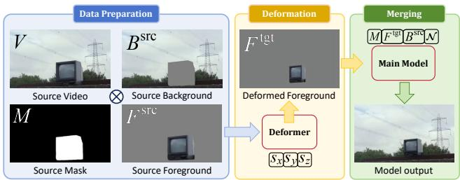  
Figure 6: Inference pipeline of ScaleVid.

## Benchmark Construction

To construct our benchmark, we collect 48 high-quality object meshes from publicly available websites. The selected objects cover several semantic categories, including furniture, decorative objects, industrial items, appliances, natural objects, electronics, and tools. All videos are rendered using Kaolin (Jatavallabhula et al. 2019).

Each object is used to render one video group. Specifically, each group contains four aligned components: the original video, the original mask, the scaled foreground video, and the scaled foreground mask. The masks are directly provided by the renderer, and therefore serve as accurate pixel-level silhouettes for evaluation.

To cover diverse motion patterns, the 48 rendered groups are divided into three subsets, including 15 translation sequences, 17 rotation sequences, and 16 collision-deformation sequences. For each object, we randomly sample anisotropic 3D scaling factors $\mathbf { s } = ( s _ { x } , s _ { y } , s _ { z } ) \in ( 0 . 3 , \bar { 3 . } 0 ) ^ { 3 }$ and apply them to the object geometry.

Background
<table><tr><td rowspan="2">Config</td><td colspan="4">Model</td></tr><tr><td>Main Model</td><td>Deformer</td><td>Masker</td><td></td></tr><tr><td></td><td colspan="2">Stage I Stage II</td><td>Stage I</td><td>Stage I Distill</td></tr><tr><td>Batch Size / GPU</td><td colspan="2">4 2</td><td>4</td><td>4 2</td></tr><tr><td>Accumulation Step</td><td colspan="2">1</td><td>1</td><td>1</td></tr><tr><td>Gradient Ckpt</td><td colspan="2">True</td><td>True</td><td>True</td></tr><tr><td>Optimizer</td><td colspan="2">AdamW</td><td>AdamW</td><td>AdamW -6</td></tr><tr><td>Learning Rate LR Schedule</td><td colspan="2"> $1 \times 1 0 ^ { - 5 }$ </td><td> $1 \times 1 0 ^ { - 5 }$  Constant</td><td> $1 \times 1 0 ^ { - 5 } \ 5 \times 1 0 ^ { - }$  Constant</td></tr><tr><td>Timestep Sampling</td><td colspan="2">Constant Uniform</td><td>Uniform</td><td>Uniform</td></tr><tr><td>Num GPUs</td><td colspan="2">64 32</td><td>32</td><td>32 8</td></tr><tr><td>Training Steps</td><td>24000 6000</td><td></td><td>23000</td><td>23000 50</td></tr><tr><td>Training Hours</td><td>128</td><td>71</td><td>100</td><td>100 1</td></tr><tr><td>Num Main Layers</td><td></td><td></td><td></td><td></td></tr><tr><td>Token Dimension</td><td colspan="2">30 1536</td><td>30</td><td>10 1536</td></tr><tr><td>Parameters</td><td colspan="2">1.2869B</td><td>1536 1.4225B</td><td></td></tr><tr><td></td><td colspan="2"></td><td></td><td>0.3871B</td></tr><tr><td>Control Layer Indices Pre-trained Model</td><td colspan="2">0,4,8,12 Minimax Remover</td><td>Wan2.1-1.3B</td><td>Wan2.1-1.3B</td></tr><tr><td></td><td colspan="2"></td><td></td><td></td></tr><tr><td>Sample Steps Sampler</td><td>20</td><td>20</td><td>20</td><td>3</td></tr><tr><td></td><td>Flow Euler</td><td>Flow Euler</td><td></td><td>Flow Euler</td></tr><tr><td>Input Resolution(s)</td><td></td><td>Multi-resolution Multi-resolution</td><td>Multi-resolution</td><td></td></tr></table>

Table 5: Hyperparameter and training details of Main Model, Deformer and Masker.  
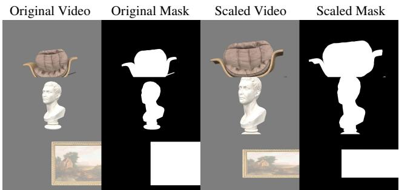  
Figure 7: Visualization of our Geometry Benchmark.

To ensure strict pairwise comparability, the original video and the scaled foreground video in each group are rendered with exactly the same motion trajectory, lighting setup, and camera parameters. Therefore, the only controlled variation comes from the applied 3D scaling, which enables reliable quantitative evaluation of both geometric alignment and visual fidelity. All rendered videos are generated at a resolution of 480 × 832 with 33 frames. The scaled foreground video contains only the transformed foreground object, without background content. This is shown in Fig. 7.

Since the background in our Geometry Benchmark is uniformly gray, the evaluation of background preservation may appear relatively simplified. To address this concern, we further build an additional benchmark by replacing the gray background in the original synthetic pipeline with realistic open-scene video backgrounds, such as beaches and other spacious natural environments, as shown in Fig. 8. We then render the foreground mesh onto these backgrounds to construct paired data under the same controllable setup. Compared with the original benchmark, this new benchmark introduces richer scene content and more realistic background variations, thereby providing a more convincing evaluation of background preservation.

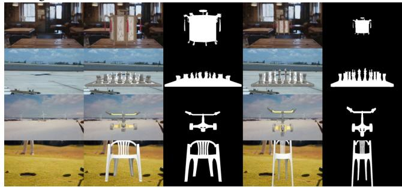  
Figure 8: Visualization of our Real-Background Benchmark.

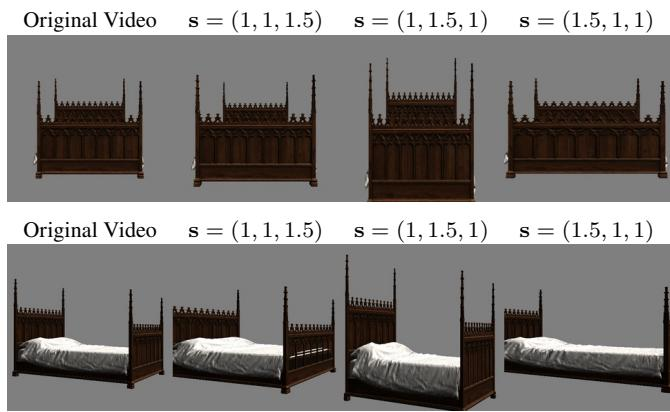  
Figure 9: Pose-consistent axis-wise controllability ofthe constructed geometry benchmark. Top: axis-wise scaling of the original mesh. Bottom: the same scaling operations after rotating the original mesh by 60◦ around the y-axis. In each case, one canonical axis is independently enlarged by 1.5×, while the remaining two axes are unchanged.

To verify the controllability of the constructed geometric transformations, we visualize axis-wise scaling examples in Fig. 9. Starting from the original object, we independently scale one canonical axis by 1.5× while keeping the other two scale factors fixed to one. The results demonstrate that the proposed canonical alignment produces disentangled transformations along diferent object-centric directions.

## Inference Details of Baselines

## Prompt Template for Text-guided Methods

Rescale the {object} by {sx} times in width, $\left\{ s _ { y } \right\}$ times in height, and $\displaystyle { \bar { \{ s _ { z } \} } }$ times in depth. Keep background unchanged.

Implementation Details of DifusionHandles. This method is depth-guided, we use s to edit the depth map. Pretrained MiDaS (Birkl, Wofk, and Müller 2023) and SD2-Depth model are used for inference. We use default configurations: bg\_weight = 1.25, fg\_weight = 1.5, and perform 50 inference steps on 512 × 512 images frame by frame.

Implementation Details ofDitto. We use a pretrained LoRA with Wan2.1-VACE-14B. Inference is performed at a resolution of 480×832 with 33 frames, conditioned on the instructive prompt, while keeping all other settings at their default configuration. The generated videos are resized back to the original resolution.

Implementation Details of FreeFine. We use pretrained SV3D (Voleti et al. 2024), SD v1.5 and Depth Anything model (Yang et al. 2024a) for inference. We set the translation and rotation as zero, and use s for inference. Moreover, we set CFG scale as 3.5, performing 50 denoising steps on 512×512 images frame by frame.

Implementation Details of GeoDifuser. We use the pretrained MiDaS (Birkl, Wofk, and Müller 2023) and SD v1.5 for inference. We use s for object rescaling task. We set CFG scale as 3.0, with 50 DDIM denoising steps. Other configurations remain default value.

Implementation Details of InsV2V. We use the pretrained InsV2V checkpoint for evaluation. Input videos are resized to a resolution of 384 × 384 and truncated to 33 frames. We set text\_cfg to 7.5 and img\_cfg to 1.2, while keeping all other parameters at their default settings. The generated videos are resized back to the original resolution.

Implementation Details of InsVIE. We use the pretrained InsVIE checkpoint together with the CogVideoX-2B (Yang et al. 2024b) base model. Input videos are resized to a resolution of 480 × 720 and truncated to 49 frames. The model is conditioned on the instructive prompt, with a negative prompt of “bad quality”, while all other parameters follow the default configuration.

Implementation Details of LucyEdit. We use the Lucy-Edit-1.1-Dev model for evaluation. Input videos are resized to a resolution of 480 × 832 and truncated to 33 frames. We set CFG to 5.0 and condition the model on the instructive prompt, using empty prompt as the negative prompt. All other settings follow the default configuration. Finally, the generated videos are resized back to the original resolution.

Implementation Details of Señorita. We use the pretrained Señorita checkpoint with the CogVideoX-5b-I2V base model for evaluation. Input videos are resized to 448 × 768 and truncated to 33 frames. The first frame is edited by Flux-Fill and then used as the starting frame for generation. We set CFG to 4.0 and perform 50 denoising steps, conditioning the model on the instructive prompt, while keeping all other parameters at their default settings.

Implementation Details of Flux-Fill. We use the FLUX.1- Fill-dev model and perform inference at the original image resolution. The pipeline takes the source image, its corresponding mask and a descriptive prompt as input. We set the CFG scale to 30.0 and use 50 steps for inference.

Implementation Details of Flux-Kontext. We use the FLUX.1-Kontext-dev model conditioned on the instructive prompt and reference image. Inference is performed at the original image resolution with 28 denoising steps and CFG is set to 3.0.

Implementation Details of HQ-Edit. We use the released pretrained checkpoint of HQ-Edit. Input images are resized to resolution $5 1 2 \times 5 1 2$ before inference. We set the CFG to 7.0, perform 30 denoising steps and set image\_guidance\_scale to 1.5 while conditioning on the instructive prompt. Finally, the generated images are resized back to the original resolution for comparison.

Implementation Details of Qwen-Image-Edit. For Qwen-Image-Edit, we perform inference at the original resolution of each input image. We run 50 denoising steps with true\_cfg\_scale set to 4.0, conditioning the model on the instruction prompt.

Implementation Details of Shape for Motion. We use their pretrained weight and SV3D for inference. We follow the sixstep inference: (1) preprocess the frames of input video by extracting the depth and mask; (2) reconstructing the object; (3) test the optimized model and save the canonical mesh; (4) manually editing the point cloud guided by the same s: following the oficial implementation, we import the reconstructed canonical point cloud into Blender and apply the exact anisotropic scaling factors $\left( s _ { x } , s _ { y } , s _ { z } \right)$ using Blender’s numerical scaling operator; (5) propagate the editing from one frame to all other frames; (6) generative rendering.

## Evaluation Metrics Implementation

Implementation Details of Background Evaluation. We first dilate original mask by 16 pixels to mitigate mask inaccuracy. We then compute the average MSE, PSNR, SSIM, and LPIPS over the remaining background region. For videos, these metrics are computed on a per-frame basis and then averaged over all frames of all videos.

Implementation Details of Foreground Evaluation. As discussed in Sec. 4.3 of the main text, we use DINO, LPIPS, and DreamSim for foreground evaluation. Specifically, we first extract the foreground regions from the videos. For DINO and DreamSim, we use their corresponding base models to extract features from both the generated videos and the ground truth, and then compute the cosine similarity between the two feature vectors, where a larger value indicates higher similarity in material, color, and structure.

Implementation Details of LLM Evaluation. Given the source image or videos and the output of one method, we ask GPT-5 (OpenAI 2025) and Gemini-2.5-Pro (Comanici et al. 2025) to assign a score. The instruction is as follows:

## Template for LLM Evaluation on Geometry Benchmark

You will receive four images:

A, B: the first and middle frames of the ground-truth video. C, D: the first and middle frames of the generated video. Please evaluate generated against ground truth from the following four aspects:

1) Object scale accuracy: whether the target object’s size matches the ground truth.

2) Background preservation: whether the background is preserved correctly.

3) Transformation correctness: whether the object is scaled around its center, without unwanted translation or rotation. 4) Structure and appearance preservation: whether the object’s structure and visual appearance are preserved.

Scoring rule:

\- Give 1 point for each satisfied aspect.

\- Total score must be an integer from 0 to 4.

\- Return ONLY the integer score.

## Template for LLM Evaluation on Real-World Benchmark

You are asked to evaluate an object scaling result.   
The target object is: {object\_name}.

The task is to scale the specified object according to the given 3D scaling factors: $\operatorname { s x } = s _ { x } , \operatorname { s y } = s _ { y } , \operatorname { s z } = s _ { z }$ sx, sy, and sz control object-centric width/length, height/upright, and depth/thickness, respectively.

You will receive four images: A, B: the input images before editing. C, D: the edited images after object scaling.

Please compare the input image and the edited image, and rate the edited result from 0 to 5 on the following aspects: 1. Scale Accuracy: whether the target object is scaled according to the instruction. 2. Transformation Correctness: whether the scaling is centered on the object without undesired translation or rotation. 3. Background Preservation: whether the background remains unchanged and free of artifacts. 4. Overall Quality: the overall realism and editing quality. 5. Appearance Preservation: whether the appearance of original object is preserved.

Scoring rule: - If one aspect is satisfied, add one point. - The total score must be an integer from 0 to 5. - Please only return the integer score. - Do not return any explanation, JSON, punctuation, or extra text.

Implementation Details of Camera Pose Estimation. To estimate camera pose from the predicted foreground mask, we adopt a two-stage mesh-fitting procedure. First, the ground-truth mesh is centered at its centroid and uniformly normalized to a canonical scale. We use a perspective camera with fixed vertical field of view $6 0 ^ { \circ }$ and optimize five parameters $( y , p , d , t _ { x } , t _ { y } )$ , corresponding to yaw, pitch, camera distance, and image-plane translations. Here, the yaw angle $y ~ \in ~ \left( - \pi , \pi \right]$ describes the horizontal rotation of the object, the pitch angle $p \ \in \ [ - \frac { \pi } { 2 } , \frac { \pi } { 2 } ]$ describes the vertical rotation, d represents the camera-object distance, and $( t _ { x } , t _ { y } ) \in [ - 1 , \dot { 1 } ] ^ { 2 }$ denotes the normalized image-plane translation.

For each frame, the predicted mask is binarized and resized to two resolutions, i.e., 240 × 416 and $4 8 0 \times 8 3 2$ . The low-resolution mask is used for coarse initialization, while the high-resolution mask is used for final refinement. We compute the centroid of the low-resolution mask and convert it into normalized image-plane coordinates, which provides an initialization for $( t _ { x } , t _ { y } )$

In the coarse stage, we randomly sample $M = 2 5 6$ camera candidates, with yaw sampled from $( - \pi , \pi ]$ , pitch from $[ - \pi / 2 , \pi / 2 ]$ , distance from [0.5, 4.0], and translations sampled around the centroid-based initialization. Silhouette rendering is then performed, and candidates with fitting IoU larger than 0.35 are retained. This process is repeated until 64 valid candidates are collected or the maximum number of sampling rounds is reached.

In the fine stage, the retained candidates are further optimized by Adam for 150 iterations with learning rate 0.05. The optimization objective is the silhouette IoU loss between the rendered mesh mask and the predicted foreground mask. We early-stop the optimization once the fitting IoU exceeds 0.96. In addition, when processing videos frame by frame, we use the optimized result from the previous frame as initialization for the current frame whenever available, which improves temporal stability and reduces optimization dificulty. We report the optimized pose parameters and the final silhouette fitting IoU for evaluation.

Implementation Details of User Preference. To evaluate human preferences over diferent editing methods, we design a questionnaire that presents the results of various image and video editing approaches. Participants are asked to assess the outputs from multiple aspects and select all options they find satisfactory. The questionnaire instructions are as in Figures 10, 11.

For a method m, its user preference score is computed as

$$
\mathrm { U s e r P r e f } ( m ) = \frac { N _ { m } } { N _ { \mathrm { q } } \times N _ { \mathrm { i t e m } } } ,\tag{8}
$$

where $N _ { m }$ denotes the total number of times method m is selected, $N _ { \mathrm { q } }$ is the number of valid questionnaires, and $N _ { \mathrm { i t e m } }$ is the number of questions in each questionnaire.

## Extensive Quantitative Results

## Consistency between LLM and Human Evaluation

Following (Zi et al. 2025a), we compare the evaluation results of human evaluators and LLM evaluators, including GPT-5 and Gemini-2.5 Pro. We randomly sampled 90 method outputs from the Geometry Benchmark and asked 10 human evaluators to score them using the same four criteria. To further investigate the consistency between LLM-based and human evaluation, we compute the mean absolute error (MAE) and Spearman rank correlation between LLM scores and human scores.

As shown in Table $^ { 6 , }$ both GPT-5 and Gemini-2.5 Pro demonstrate strong agreement with human evaluation, achieving Spearman correlations of 0.766 and 0.738, respectively. Gemini-2.5 Pro achieves a closer score calibration with human evaluators, obtaining a lower MAE of 0.278, while GPT-5 shows slightly stronger ranking consistency and a more conservative scoring tendency. These results indicate that LLM-based evaluation can provide consistent assessments with human judgments for our video editing task.

## User Study on Video Object Scaling Quality

• Thank vou for participating in this study. In this survey, you will watch one ground-truth video and two edited videos produced by different methods. Your task is to compare the two edited results based on how well they perform object scaling in the video. Please evaluate the results according to the following aspects:

• 1) whether the object size matches the ground-truth video

• 2) whether the background is preserved naturally

• 3) whether the obiect is scaled correctly without unwanted translation or rotation.

• 4) whether the object's structure and visual appearance are preserved

• FEEL FREE TO SELECT MULTIPLE ANSWERS IF YOU LIKE!

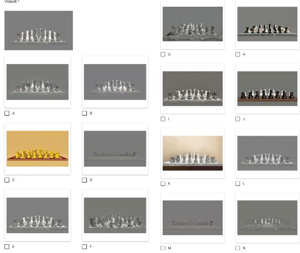  
Figure 10: User study on Geometry Benchmark.

<table><tr><td>Evaluator</td><td>Average Score</td><td>MAE↓</td><td>Spearmanρ↑</td></tr><tr><td>Human</td><td>3.09</td><td></td><td></td></tr><tr><td>GPT-5</td><td>2.86</td><td>0.344</td><td>0.766</td></tr><tr><td>Gemini-2.5 Pro</td><td>3.01</td><td>0.278</td><td>0.738</td></tr></table>

Table 6: Consistency analysis between human and LLMbased evaluations over 90 samples. MAE measures the score deviation from human judgments, while Spearman correlation measures the ranking consistency.

## Inference Cost

We report the wall-clock inference time and peak GPU memory usage under the same setting: all methods are evaluated on videos of resolution 512×512 with 33 frames, using their default inference steps on a single A800 GPU. The results are summarized in Table 7. Image-based methods require performing VAE encoding and decoding for each frame of the video, which introduces substantial computational overhead. In addition, DifusionHandles requires two complete forward passes for each edited image, further increasing the inference cost. GeoDifuser further incurs per-frame optimization cost. Shape-for-Motion requires estimating camera parameters and relies on manual external mesh editing, which also leads to considerable computational overhead.

# User Study for Object Scaling in Realworld Video

This questionnaire aims to evaluate the quality of 3D obiect scaling in videos. In each question, you will see one original video and several edited results.

The task is to scale the specified object around its own center in 3D. The scaling is controlled by three factors: sx, sy, and sz. Here, sx controls the horizontal size, sy controls the vertical size, and sz controls the depth direction, which is perpendicular to the image plane.

Please select one or more edited videos that you think best satisfy the target scaling effect, When making your choice, please consider whether the object is scaled correctly. whether it stays centered without obvious shifting or rotation, whether its appearance and structure remain natural, and whether the background and temporal consistency are well preserved.

This is a multiple-choice questionnaire. You may select multiple results if you think more than one video is satisfactory.

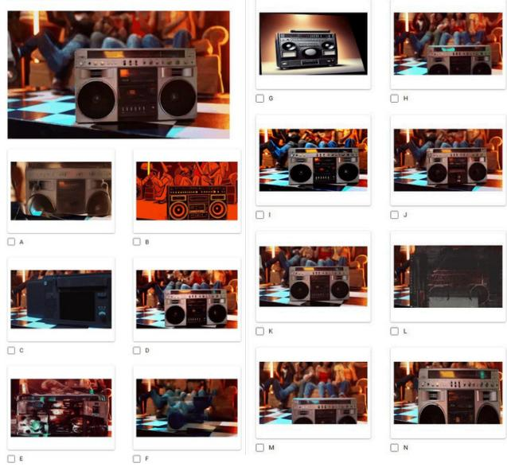  
Figure 11: User study on the Real-World Benchmark.

## Foreground Fidelity under Realistic Backgrounds

Paired geometry-aware scaling targets are generally unavailable for in-the-wild videos. To approximate realistic evaluation while retaining accurate paired supervision, our Real-Background Benchmark composites controllably rendered foregrounds with background videos collected from realworld scenes. This hybrid paired setting bridges the gap between fully controlled synthetic evaluation and unpaired in-the-wild video evaluation. As shown in Table 8, ScaleVid achieves the best results on five of the six metrics, including MSE, PSNR, SSIM, DINO and DreamSim, while obtaining the second-best LPIPS. These results demonstrate that the foreground-fidelity advantage of ScaleVid is not limited to the uniform gray background of the Geometry Benchmark, but remains consistent under realistic scene textures, colors, and background complexity.

## Comparison with 2D Afine Scaling

We further compare ScaleVid with a deterministic 2D afinescaling baseline on the Geometry Benchmark. We do not report foreground-fidelity metrics for this comparison because the afine baseline directly transforms the ground-truth foreground pixels in the image plane, giving it privileged access to the original appearance and making pixel-level or perceptual foreground comparisons inherently unfair. Backgroundpreservation metrics are also omitted, since the Geometry Benchmark uses a uniform gray canvas and is designed primarily to isolate geometric transformation quality rather than realistic background reconstruction. We therefore focus on scale accuracy and geometric alignment. As shown in Table 9, ScaleVid consistently outperforms 2D afine scaling, demonstrating that directly resizing foreground pixels cannot adequately reproduce the perspective-dependent shape changes and newly exposed surfaces induced by objectcentric 3D scaling.

<table><tr><td>Method</td><td>DiffHandles</td><td>Ditto</td><td>Flux-Fill</td><td>Flux-Ktx</td></tr><tr><td>Time↓</td><td>33m33s</td><td>6m29s</td><td>4m41s</td><td>15m40s</td></tr><tr><td>GPU (GB)↓</td><td>13.08</td><td>42.97</td><td>34.41</td><td>35.85</td></tr><tr><td>Steps</td><td>50</td><td>50</td><td>50</td><td>28</td></tr><tr><td>Method</td><td>FreeFine</td><td>GeoDiffuser</td><td>HqEdit</td><td>InsV2V</td></tr><tr><td>Time↓</td><td>6m12s</td><td>23min58s</td><td>48.51s</td><td>2m29s</td></tr><tr><td>GPU (GB)↓</td><td>11.74</td><td>23.62</td><td>3.48</td><td>16.14</td></tr><tr><td>Steps</td><td>50</td><td>50</td><td>30</td><td>20</td></tr><tr><td>Method</td><td>InsVIE</td><td>LucyEdit</td><td>Qwen-Img-E Señorita</td><td></td></tr><tr><td>Time↓</td><td>1m33s</td><td>22.17s</td><td>41m29s</td><td>1m58s</td></tr><tr><td>GPU (GB)↓</td><td>31.05</td><td>27.66</td><td>59.67</td><td>30.04</td></tr><tr><td>Steps</td><td>50</td><td>50</td><td>50</td><td>50</td></tr><tr><td>Method</td><td>Shape4Motion Ours(E2E)</td><td></td><td>Deformer</td><td>Masker</td></tr><tr><td>Time↓</td><td>56m58s</td><td>21.78s</td><td>6.18s</td><td>0.16s</td></tr><tr><td>GPU (GB)↓</td><td>23.06</td><td>7.61</td><td>7.61</td><td>7.61</td></tr><tr><td>Steps</td><td>6</td><td>20</td><td>20</td><td>3</td></tr></table>

Table 7: Inference cost on videos.

<table><tr><td>Method</td><td colspan="5">MSE↓ PSNR↑ SSIM↑ LPIPS↓ DINO↑ Dream↑</td></tr><tr><td>DiffHandles</td><td>660.55 22.90</td><td>0.822</td><td>0.155</td><td>0.697</td><td>0.885</td></tr><tr><td>Ditto</td><td>2373.49 16.02</td><td>0.779</td><td>0.214</td><td>0.542</td><td>0.819</td></tr><tr><td>Flux Fill</td><td>1221.53 19.90</td><td>0.815</td><td>0.178</td><td>0.560</td><td>0.834</td></tr><tr><td>Flux Kontext</td><td>944.86 20.90</td><td>0.818</td><td>0.161</td><td>0.718</td><td>0.885</td></tr><tr><td>FreeFine</td><td>846.85 21.21</td><td>0.803</td><td>0.156</td><td>0.652</td><td>0.872</td></tr><tr><td>GeoDiffuser</td><td>758.17 22.23</td><td>0.848</td><td>0.136</td><td>0.691</td><td>0.883</td></tr><tr><td>HqEdit</td><td>1906.73 17.12</td><td>0.789</td><td>0.212</td><td>0.468</td><td>0.809</td></tr><tr><td>InsV2V</td><td>969.61 20.34</td><td>0.820</td><td>0.176</td><td>0.670</td><td>0.871</td></tr><tr><td>InsVIE</td><td>1584.23 18.28</td><td>0.795</td><td>0.188</td><td>0.610</td><td>0.847</td></tr><tr><td>LucyEdit</td><td>1291.69 19.55</td><td>0.803</td><td>0.180</td><td>0.621</td><td>0.859</td></tr><tr><td>Qwen-Image-E</td><td>983.23 20.58</td><td>0.820</td><td>0.164</td><td>0.713</td><td>0.884</td></tr><tr><td>Señorita</td><td>1194.44 20.04</td><td>0.823</td><td>0.177</td><td>0.577</td><td>0.845</td></tr><tr><td>Shape4Motion</td><td>1187.29 19.78</td><td>0.812</td><td>0.188</td><td>0.578</td><td>0.842</td></tr><tr><td>ScaleVid (Ours)</td><td>430.87 24.98</td><td>0.864</td><td>0.140</td><td>0.834</td><td>0.927</td></tr></table>

Table 8: Quantitative evaluation of foreground fidelity on the Real-Background Benchmark.

<table><tr><td>Method</td><td>IoU↑</td><td>Area↓</td><td>Yaw↓</td><td>Pitch↓</td><td>Dist↓</td><td>Trans↓</td><td>FIoU↑</td></tr><tr><td>Affine2D</td><td>0.514</td><td>0.830</td><td>0.496</td><td>0.401</td><td>0.603</td><td>0.369</td><td>0.730</td></tr><tr><td>ScaleVid</td><td>0.804</td><td>0.227</td><td>0.237</td><td>0.205</td><td>0.210</td><td>0.178</td><td>0.836</td></tr></table>

Table 9: Quantitative comparison with planar afine scaling on the Geometry Benchmark.
<table><tr><td>Evaluated Mask Reference Mask</td><td></td><td>IoU↑</td><td>Area Error↓</td></tr><tr><td> $M _ { \mathrm { d e f } }$ </td><td> $M _ { \mathrm { { g t } } }$ </td><td>0.776</td><td>0.222</td></tr><tr><td> $M _ { \mathrm { m a i n } }$ </td><td> $M _ { \mathrm { { g t } } }$ </td><td>0.804</td><td>0.227</td></tr><tr><td> $M _ { \mathrm { m a i n } }$ </td><td> $M _ { \mathrm { d e f } }$ </td><td>0.924</td><td>0.169</td></tr></table>

Table 10: Geometry consistency between the Deformer guidance and the Main Model output on the Geometry Benchmark. The first two rows measure target-geometry accuracy, while the last row directly measures how well the Main Model preserves the geometry encoded by the Deformer condition.

## Geometry Consistency between Deformer Guidance and Main Model Output

To examine whether the Main Model preserves the geometry encoded by the Deformer guidance, we compare the foreground masks of the Deformer condition, the final Main Model output, and the ground truth. Let $M _ { \mathrm { d e f } } , M _ { \mathrm { m a i n } } .$ , and $M _ { \mathrm { { g t } } }$ denote the foreground masks of the Deformer output, Main Model output, and ground-truth target, respectively. Masks are extracted by SAM2. For two masks $\textstyle { M _ { a } } ^ { - }$ and $M _ { b } ,$ where $M _ { b }$ is treated as the reference, we compute

$$
\mathrm { A r e a E r r } ( M _ { a } , M _ { b } ) = \frac { \vert \vert M _ { a } \vert - \vert M _ { b } \vert \vert } { \vert M _ { b } \vert } .\tag{9}
$$

As shown in Table 10, the Main Model output remains highly consistent with the Deformer guidance, achieving an IoU of 0.924 and an area error of 0.169. This high overlap indicates that the Main Model largely preserves the geometry specified by its foreground condition, supporting our design assumption that the condition geometry determines the desired output geometry.

Meanwhile, the consistency is not expected to be perfect. As shown in Fig. 16, the Deformer may occasionally produce blurry or imprecise foreground boundaries, whereas the Main Model can refine the object structure and compensate for such deformation artifacts. Consequently, the Main Model does not simply copy the Deformer guidance pixel by pixel, but preserves its overall target geometry while improving foreground quality and boundary accuracy. This is also reflected in the comparison with the ground truth: the Main Model improves the mask IoU from 0.776 to 0.804, while maintaining a comparable area error (0.227 versus 0.222).

## Safe-Region Background Preservation

For in-the-wild videos, the valid background region is ambiguous because object enlargement may cover previously visible background, whereas object shrinkage reveals regions that are unobserved in the source video. Therefore, we do not evaluate pixel fidelity in regions close to either the source or edited object. Let $M _ { \mathrm { s r c } }$ and $M _ { \mathrm { o u t } } ^ { ( k ) }$ denote the source-object mask and the output-object mask of method $k ,$ respectively. We define a shared conservative exclusion region as

<table><tr><td>Method</td><td>MSE↓</td><td>PSNR↑</td><td>SSIM↑</td><td>LPIPS↓</td></tr><tr><td>DiffHandles</td><td>1340.13</td><td>18.24</td><td>0.598</td><td>0.242</td></tr><tr><td>Ditto</td><td>1882.43</td><td>17.51</td><td>0.678</td><td>0.424</td></tr><tr><td>Flux Fill</td><td>181.72</td><td>28.78</td><td>0.874</td><td>0.060</td></tr><tr><td>Flux Kontext</td><td>1147.84</td><td>18.84</td><td>0.488</td><td>0.133</td></tr><tr><td>FreeFine</td><td>476.07</td><td>23.57</td><td>0.705</td><td>0.111</td></tr><tr><td>GeoDiffuser</td><td>377.18</td><td>24.93</td><td>0.746</td><td>0.129</td></tr><tr><td>HqEdit</td><td>7098.23</td><td>10.88</td><td>0.276</td><td>0.371</td></tr><tr><td>InsV2V</td><td>2008.26</td><td>16.73</td><td>0.506</td><td>0.288</td></tr><tr><td>InsVIE</td><td>3179.37</td><td>13.78</td><td>0.349</td><td>0.330</td></tr><tr><td>LucyEdit</td><td>515.51</td><td>25.95</td><td>0.792</td><td>0.116</td></tr><tr><td>Qwen-Image-E</td><td>345.02</td><td>29.12</td><td>0.876</td><td>0.060</td></tr><tr><td>Señorita</td><td>255.74</td><td>26.34</td><td>0.795</td><td>0.138</td></tr><tr><td>Shape4Motion</td><td>86.10</td><td>30.55</td><td>0.863</td><td>0.074</td></tr><tr><td>ScaleVid (Ours)</td><td>79.11</td><td>30.37</td><td>0.871</td><td>0.054</td></tr></table>

Table 11: Quantitative comparison of safe-region background preservation on the DAVIS subset of our Real-World Benchmark. The best results are boldfaced, and the secondbest results are underlined.

$$
M _ { \mathrm { u n s a f e } } = \mathrm { D i l a t e } \left( M _ { \mathrm { s r c } } \cup \bigcup _ { k } M _ { \mathrm { o u t } } ^ { ( k ) } , r \right) ,\tag{10}
$$

where the dilation radius is set to $r ~ = ~ 1 6$ pixels for all methods. We then evaluate background fidelity only on

$$
M _ { \mathrm { s a f e } } = 1 - M _ { \mathrm { u n s a f e } } .\tag{11}
$$

We report MSE, PSNR, SSIM, and LPIPS within this safe region in Tab. 11. This measures unintended changes in the far background, rather than the quality of newly revealed background regions or local object–scene interactions.

## Comparison with FlowDrag

FlowDrag is a geometry-aware image editing method based on point-drag control. Although it does not natively support global object-centric anisotropic scaling specified by continuous factors $( s _ { x } , s _ { y } , s _ { z } )$ , we include it as an additional geometry-aware baseline for completeness.

To adapt FlowDrag to our task, we derive drag constraints from the target scaling transformation and apply the method frame by frame. Since sparse local drag control cannot fully specify the global shape changes induced by anisotropic 3D scaling, this comparison should be regarded as a complementary reference rather than a directly matched control setting.

As reported in Tab. 12, FlowDrag attains a relatively high fitting IoU, indicating that sparse drag control can partially match the target silhouette. However, its substantially worse mask IoU, area error, and camera- pose deviations show that local drag constraints do not reliably recover the intended global anisotropic scaling.

<table><tr><td>Gray Background</td><td>Real Background</td></tr><tr><td>MSE↓ PSNR↑SSIM↑LPIPS↓</td><td>MSE↓ PSNR↑ SSIM↑ LPIPS↓</td></tr><tr><td>268.14 26.38 0.944 0.104 |1425.78</td><td>19.11 0.698 0.286</td></tr><tr><td>Foreground Fidelity</td><td>LLM Eval</td></tr><tr><td>MSE↓ PSNR↑SSIM↑LPIPS↓ DINO↑ Dream↑|</td><td>|GPT↑ Gemini↑</td></tr><tr><td>697.63 21.87 0.826 0.224</td><td>0.635 0.791 1.833 2.146</td></tr><tr><td>Scale Accuracy : and Geometric Alignment</td><td>|Temporal</td></tr><tr><td>IoU↑ Area↓ Yaw↓ Pitch↓ Dist↓</td><td>Trans↓1 FIoU↑| Ewarp↓</td></tr><tr><td>0.449 0.837 0.460 0.256 0.403</td><td>0.375 0.830 13.738</td></tr></table>

Table 12: Quantitative results of FlowDrag on our three benchmarks. Ewarp is at the range of $1 \times 1 0 ^ { - 3 }$

<table><tr><td>Method</td><td>Ewarp↓</td><td>GPT↑</td><td>Gemini↑</td><td>User Pref.↑</td></tr><tr><td>DiffHandles</td><td>8.1166</td><td>1.6522</td><td>1.8867</td><td>0.0379</td></tr><tr><td>Ditto</td><td>4.7164</td><td>1.1875</td><td>0.8667</td><td>0.0517</td></tr><tr><td>Flux Fill</td><td>25.3799</td><td>1.4375</td><td>1.6341</td><td>0.0517</td></tr><tr><td>Flux Kontext</td><td>4.9252</td><td>2.5625</td><td>2.4359</td><td>0.0724</td></tr><tr><td>FreeFine</td><td>9.0984</td><td>1.0638</td><td>1.9756</td><td>0.0552</td></tr><tr><td>GeoDiffuser</td><td>5.6394</td><td>1.4167</td><td>1.6809</td><td>0.1138</td></tr><tr><td>HqEdit</td><td>147.4057</td><td>0.6875</td><td>0.5882</td><td>0.0276</td></tr><tr><td>InsV2V</td><td>4.8068</td><td>1.8958</td><td>1.3659</td><td>0.0517</td></tr><tr><td>InsVIE</td><td>3.8690</td><td>1.3958</td><td>2.1591</td><td>0.0345</td></tr><tr><td>LucyEdit</td><td>3.2542</td><td>1.5625</td><td>1.4773</td><td>0.0241</td></tr><tr><td>Qwen-Image-E</td><td>3.3570</td><td>2.7083</td><td>2.1951</td><td>0.0345</td></tr><tr><td>Señorita</td><td>0.5659</td><td>1.4043</td><td>1.5500</td><td>0.0207</td></tr><tr><td>Shape4Motion</td><td>0.6178</td><td>1.2632</td><td>1.9091</td><td>0.0345</td></tr><tr><td>ScaleVid (Ours)</td><td>0.7771</td><td>2.7542</td><td>3.1471</td><td>0.7793</td></tr></table>

Table 13: Quantitative comparison of temporal consistency on Geometry Benchmark and perceptual quality. The best results are boldfaced and the second-best results are underlined. Ewarp is at the range of $1 \times 1 0 ^ { - 3 }$

## Overall Performance Evaluation on Geometry Benchmark

Table 13 reports temporal consistency and perceptual quality on the Geometry Benchmark, where all videos are rendered on a uniform gray background to eliminate the influence of background variation. Under this controlled setting, the evaluation focuses solely on the quality of geometric editing and temporal coherence. Our method achieves the highest GPT, Gemini, and user preference scores, demonstrating that it produces the most realistic and perceptually faithful scaling results. Although Se norita achieves the lowest Ewarp, it receives substantially lower perceptual scores, indicating that low temporal warping error alone does not necessarily translate into better visual quality. These results suggest that our method strikes a better balance between temporal consistency and faithful geometry-aware editing.

Background Preservation and Temporal Consistency
<table><tr><td rowspan="2">Method</td><td colspan="2">Real-world Background</td><td colspan="2">Overall Quality</td></tr><tr><td>MSE↓ PSNR↑ SSIM↑ LPIPS↓|Ewarp↓ GPT↑ Gemini↑</td><td></td><td></td><td></td></tr><tr><td>Deformer</td><td></td><td></td><td>0.524</td><td>2.813 2.711</td></tr><tr><td>StageI</td><td>130.95 31.53</td><td>0.935</td><td>0.042 0.862</td><td>1.833 1.951</td></tr><tr><td>StageII</td><td>181.17 28.62</td><td>0.862 0.065</td><td>1.342</td><td>2.506 2.211</td></tr><tr><td>StageI+II</td><td>161.23 30.58</td><td>0.920</td><td>0.049 0.777</td><td>2.754 3.147</td></tr></table>

<table><tr><td colspan="6">Foreground Fidelity</td></tr><tr><td>Method</td><td colspan="3">|MSE↓ PSNR↑ SSIM↑ LPIPS↓ DINO↑</td><td></td><td>Dream↑</td></tr><tr><td>Deformer</td><td>401.90 24.37</td><td>0.838</td><td>0.137</td><td>0.838</td><td>0.924</td></tr><tr><td>StageI</td><td>533.87 23.53</td><td>0.829</td><td>0.180</td><td>0.718</td><td>0.875</td></tr><tr><td>StageII</td><td>544.73 22.85</td><td>0.823</td><td>0.161</td><td>0.739</td><td>0.897</td></tr><tr><td>StageI+II</td><td>329.73 25.33</td><td>0.867</td><td>0.133</td><td>0.850</td><td>0.934</td></tr></table>

Table 14: Ablation study of diferent training stages.

## Extensive Ablation Studies

Impact of Stage I Pretraining We extend the experiments in [Main text, Table 3], as shown in Table 14. As shown in Table 14, the two training stages provide complementary benefits. Stage I mainly improves background preservation, while Stage II enhances temporal consistency and foreground fidelity through explicit deformation modeling. Stage I+II achieves the best foreground fidelity and global perceptual quality while retaining strong background preservation, achieving the highest Gemini score and the best results across all foreground fidelity metrics. Although the standalone Deformer obtains the lowest Ewarp and competitive semantic scores, it cannot directly preserve the real-world background. These results demonstrate that Stage I provides reliable background reconstruction, whereas Stage II introduces efective geometry-aware deformation, and their combination produces more faithful editing results.

## Impact of Masker Distillation Steps

We analyze the influence of DMD training steps on the distilled Masker, where the student performs 3-step inference and the baseline is the undistilled 20-step model. As shown in Fig. 12, distillation improves both IoU and MSE across a wide range of training steps, indicating that the distilled Masker can preserve, and even enhance, mask quality under much fewer inference steps. Notably, the best results are obtained around 50 training steps, where the model achieves the highest IoU and the lowest MSE. After that, the performance fluctuates and gradually declines, with a clear degradation in the late stage of training. Therefore, we adopt 50 DMD training steps in the final model, as it yields the most favorable balance between eficiency and segmentation accuracy.

## Impact of Deformer Distillation Steps

We also attempted to distill the Deformer into a 6-step model using DMD, and evaluated it every 10 distillation steps. We compare the full output video of the distilled 6-step Deformer against the ground-truth video using global MSE, PSNR, SSIM, and LPIPS. The results are shown in Fig. 13, where the dashed line denotes the performance of the original undistilled Deformer with 20-step inference. As shown in the figure, the distilled Deformer fails to achieve performance comparable to the undistilled model. Furthermore, increasing the number of distillation steps causes the model to deviate progressively from the desired distribution. We conjecture that the deformation task requires relatively accurate multi-step refinement, which is dificult to preserve under aggressive step reduction. Therefore, in training the Main Model, we continue to use the full 20-step Deformer at every training step.

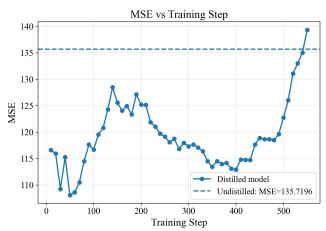  
(a) MSE versus training step.

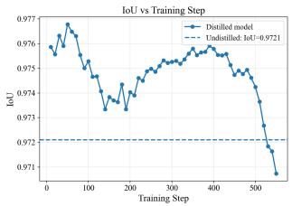  
(b) IoU versus training step.

Figure 12: Performance of the distilled Masker across training steps. We report MSE and IoU, and compare them with the undistilled baseline (step 0) under 20 denoising steps.  
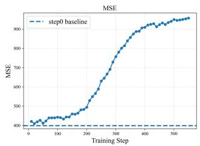  
(a) MSE versus training step.

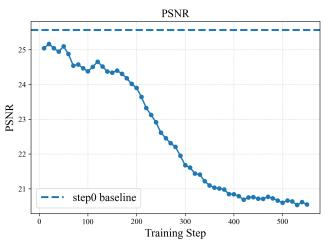  
(b) PSNR versus training step.

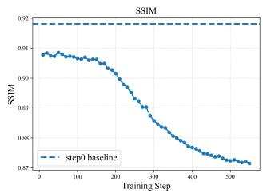  
(c) SSIM versus training step.

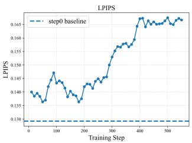  
(d) LPIPS versus training step.  
Figure 13: Performance across diferent distillation training steps. Step 0 denotes the undistilled baseline with 20 inference steps and is shown as a dashed reference line.

## Impact of Scale Sampling Strategies

As shown in Table 15, log-uniform (Log-uni) sampling achieves better results than uniform sampling on all metrics. This is mainly because the scale range (0.4, 2.5) is asymmetric in the original scale domain: uniform sampling places more probability mass on enlargement cases, while loguniform sampling makes shrinking and enlargement more balanced. Consequently, the model trained with uniform sampling performs worse on shrinking cases at inference time, leading to inferior foreground fidelity and geometric alignment. In contrast, log-uniform sampling provides a more balanced training distribution and thus yields more robust overall performance.

<table><tr><td colspan="4">Foreground Fidelity</td></tr><tr><td>Method</td><td>|MSE↓ PSNR↑ SSIM↑ LPIPS↓ DINO↑</td><td></td><td>Dream↑</td></tr><tr><td>Uniform</td><td>560.79 22.92 0.822</td><td>0.164 0.788</td><td>0.910</td></tr><tr><td>Log-uni</td><td>329.73 25.33 0.867</td><td>0.133 0.850</td><td>0.934</td></tr></table>

Scale Accuracy and Geometric Alignment
<table><tr><td>Method</td><td>IoU↑</td><td>Area↓</td><td>Yaw↓</td><td>Pitch↓</td><td>Dist↓</td><td>Trans↓ FIoU↑</td></tr><tr><td>Uniform</td><td>0.677</td><td>0.397</td><td>0.280</td><td>0.263</td><td>0.401</td><td>0.291 0.784</td></tr><tr><td>Log-uni</td><td>0.804</td><td>0.227</td><td>0.237</td><td>0.205</td><td>0.210</td><td>0.178 0.836</td></tr></table>

Table 15: Comparison of diferent scale sampling strategies on the Geometry Benchmark.

<table><tr><td rowspan="2">Method</td><td>Background Preservation</td><td></td><td>|Scale Accuracy</td><td></td></tr><tr><td>MSE↓</td><td>PSNR↑ SSIM↑ LPIPS↓</td><td>IoU↑</td><td>Area↓</td></tr><tr><td rowspan="2">w/o Inv. Def. 358.63 Ours</td><td>25.01</td><td>0.864</td><td>0.102 0.754</td><td>0.269</td></tr><tr><td>161.23 30.58</td><td>0.920 0.049</td><td>0.799</td><td>0.232</td></tr><tr><td rowspan="2">Method</td><td colspan="4">Foreground Fidelity</td></tr><tr><td>MSE↓ PSNR↑ SSIM↑ LPIPS↓</td><td></td><td>DINO↑</td><td>Dream↑</td></tr><tr><td>w/o Inv. Def. 703.56</td><td>21.84</td><td>0.827 0.170</td><td>0.818</td><td>0.890</td></tr><tr><td>Ours</td><td>430.87 24.98</td><td>0.864 0.144</td><td>0.834</td><td>0.927</td></tr></table>

Table 16: Quantitative ablation of inverse deformation on the Real-Background Benchmark. We evaluate background preservation, scale accuracy, and foreground fidelity.

## Impact of Inverse Deformation

We quantitatively evaluate the impact of inverse deformation on the Real-Background Benchmark. As shown in Table 16, inverse deformation consistently improves both background preservation and foreground fidelity. Without inverse deformation, the Main Model is trained with clean foreground conditions but receives Deformer-generated guidance during inference, resulting in a training–inference gap. Therefore, it is less capable of handling deformation artifacts and imperfect object boundaries introduced by the Deformer. By applying inverse deformation during training, the Main Model is exposed to target-aligned but imperfect foreground conditions, which better match the inference scenario. This enables the model to refine the deformed foreground while maintaining high-quality foreground appearance and seamless composition with the background. The improved mask IoU and area error further indicate that the Main Model better follows the target-scale foreground guidance, rather than improving appearance by restoring the object toward its original geometry.

<table><tr><td>CFG</td><td>MSE↓</td><td>PSNR↑</td><td>SSIM↑</td><td>LPIPS↓</td><td>DINO↑</td><td>Dream↑</td></tr><tr><td>1.0</td><td>333.43</td><td>25.01</td><td>0.853</td><td>0.137</td><td>0.850</td><td>0.933</td></tr><tr><td>2.0</td><td>374.72</td><td>24.59</td><td>0.843</td><td>0.141</td><td>0.831</td><td>0.933</td></tr><tr><td>3.0</td><td>404.26</td><td>24.25</td><td>0.834</td><td>0.144</td><td>0.832</td><td>0.928</td></tr><tr><td>5.0</td><td>423.50</td><td>23.96</td><td>0.823</td><td>0.148</td><td>0.793</td><td>0.921</td></tr></table>

Table 17: Foreground fidelity evaluation on the Geometry Benchmark of Main Model.

<table><tr><td>CFG</td><td>IoU↑</td><td>Area↓</td><td>Yaw↓</td><td>Pitch↓</td><td>Dist↓</td><td>Trans↓</td><td>FIoU↑</td></tr><tr><td>1.0</td><td>0.793</td><td>0.238</td><td>0.252</td><td>0.256</td><td>0.210</td><td>0.212</td><td>0.821</td></tr><tr><td>2.0</td><td>0.784</td><td>0.241</td><td>0.239</td><td>0.274</td><td>0.217</td><td>0.184</td><td>0.832</td></tr><tr><td>3.0</td><td>0.799</td><td>0.187</td><td>0.241</td><td>0.198</td><td>0.204</td><td>0.188</td><td>0.829</td></tr><tr><td>5.0</td><td>0.802</td><td>0.197</td><td>0.266</td><td>0.247</td><td>0.219</td><td>0.165</td><td>0.813</td></tr></table>

Table 18: Scale accuracy and geometric alignment evaluation of the Geometry Benchmark on Main Model.

## Impact of CFG on Main Model

As shown in Fig. 14, Tables 17 and 18, the CFG (Ho and Salimans 2022) scale introduces a clear trade-of between foreground fidelity and geometric control. When the CFG scale is set to 1.0, the model achieves competitive foreground reconstruction quality on most appearance metrics, including MSE, PSNR, SSIM, LPIPS, DINO, and DreamSim, indicating that weaker guidance is beneficial for preserving object appearance. However, its geometric accuracy is not consistently optimal. As the CFG scale increases to 2.0 and 3.0, the model obtains more balanced performance, with clear improvements on several geometry-related metrics such as area error, yaw/pitch error, and distance error, while maintaining competitive foreground quality. In contrast, an excessively large CFG scale, such as 5.0, degrades foreground fidelity noticeably and does not further improve the overall geometric alignment in a stable manner. Therefore, we find that a moderate CFG scale around 2.0 provides the best trade-of between appearance preservation and controllable 3D-aware scaling, and is thus more suitable for the Main Model.

## Impact of CFG on Deformer

As shown in Fig. 15, Table 19, applying CFG to the Deformer does not consistently improve overall performance. When CFG is disabled (i.e., CFG= 1.0), the Deformer achieves the best results on most reconstruction metrics, including MSE, PSNR, SSIM, LPIPS, DINO, and DreamSim, indicating that unguided sampling already provides strong foreground fidelity. Although CFG= 2.0 remains competitive on several perceptual metrics, the improvement is limited and does not justify the additional inference cost. As the CFG scale increases further, the Deformer output quality degrades noticeably across almost all metrics, showing that overly strong guidance is harmful in this setting. Therefore, considering both eficiency and performance, we adopt CFG= 1.0 in training and inference by default. This choice yields low latency while remaining comparable to CFG= 2.0 in quality.

<table><tr><td>CFG</td><td>MSE↓</td><td>PSNR↑</td><td>SSIM↑</td><td>LPIPS↓</td><td>DINO↑</td><td>Dream↑</td></tr><tr><td>1.0</td><td>401.90</td><td>24.37</td><td>0.838</td><td>0.137</td><td>0.838</td><td>0.924</td></tr><tr><td>2.0</td><td>495.34</td><td>23.52</td><td>0.825</td><td>0.129</td><td>0.865</td><td>0.935</td></tr><tr><td>3.0</td><td>667.12</td><td>22.24</td><td>0.811</td><td>0.146</td><td>0.821</td><td>0.918</td></tr><tr><td>4.0</td><td>934.97</td><td>20.61</td><td>0.803</td><td>0.176</td><td>0.705</td><td>0.873</td></tr></table>

Table 19: Impact of CFG on the Geometry Benchmark of Deformer.

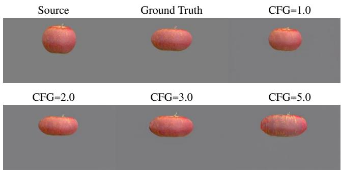  
Figure 14: Visualization of Main Model under various CFG scales on the Geometry Benchmark.

## Extensive Qualitative Results

## Main Model Can Compensate for Deformer Errors

As shown in Fig. 16, the Deformer does not always generate accurate foreground videos. Nevertheless, the Main Model can efectively mitigate the resulting blur artifacts. We believe this property arises from the bidirectional deformation strategy during training: although the conditioning inputs are always provided by the Deformer, the reconstruction target is consistently the real video. Consequently, discrepancies between imperfect deformed conditions and ground-truth videos are naturally introduced during training, which encourages the Main Model to learn to compensate for Deformer failures.

Impact of the Bidirectional Loss for Deformer As shown in Fig. 17, the bidirectional loss brings clear improvements to the Deformer in geometric alignment. This suggests that the bidirectional formulation efectively constrains the deformation trajectory and mitigates accumulated spatial drift. We attribute this improvement to the fact that the bidirectional objective encourages the model to preserve transformation consistency under forward and reverse scaling, thereby learning a more geometrically faithful deformation field.

Why Inverse Deformation is Needed As shown in Fig. 18, without inverse deformation the model sufers from a training–inference mismatch: during training it always receives the ground-truth foreground as input, while at inference time only the Deformer output is available. This encourages shortcut learning, where the model tends to copy and paste the foreground appearance instead of adapting to deformation artifacts. As a result, when the Deformer output is inaccurate, the model lacks the ability to correct such errors. Inverse deformation alleviates this issue by making the training input distribution more consistent with inference.

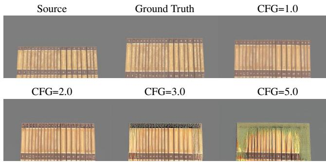  
Figure 15: Visualization of Deformer under various CFG scales on the Geometry Benchmark.

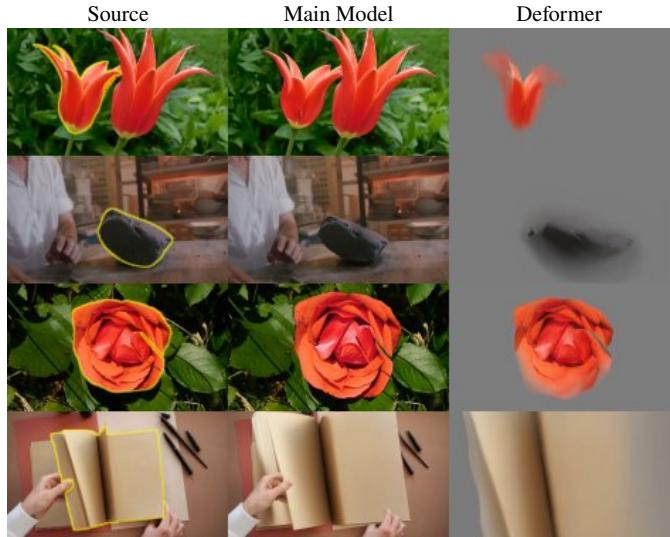  
Figure 16: Visualization of Error-correction mechanism of Main Model. Though Deformer may provide blurred outputs, Main Model can still fix this.

## Axis-wise Controllability of the Deformer

Figure 19 qualitatively evaluates whether the Deformer can distinguish the projected directions of the canonical object axes. We independently shrink one axis to 0.7 while keeping the other two scaling factors fixed to 1. Compared with the corresponding mesh-rendered ground truth, the Deformer produces consistent axis-specific changes in object extent and visible structure. These results indicate that the Deformer can respond diferently to $s _ { x } , s _ { y }$ , and $s _ { z }$ , rather than treating them as equivalent image-plane scaling controls.

## Efect of Mask Dilation on Boundary Leakage

Figure 20 illustrates the importance of mask dilation during preprocessing. SAM2 occasionally produces masks that slightly under-segment the target object (Zi et al. 2025a; Huang et al. 2026). Without dilation, a narrow band of the original object boundary remains in the estimated background and is therefore treated as valid background content by the Main Model.

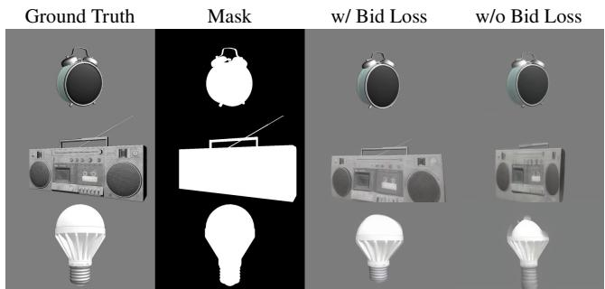  
Figure 17: Efectiveness of the Bidirectional Loss.

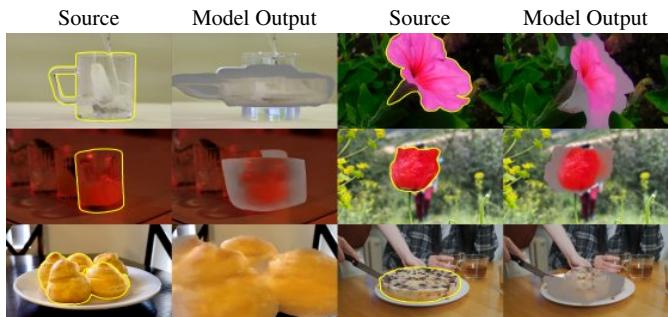  
Figure 18: Inference results without inverse deformation during Main Model training.

As shown in Figure 20, the edited result still exhibits plausible perspective changes induced by 3D scaling, including the exposure of additional umbrella ribs. However, multiple white streaks appear below the umbrella canopy. These artifacts spatially correspond to the original umbrella boundary, indicating that they are caused by residual foreground pixels leaking into the background condition rather than by the geometric transformation itself.

We therefore dilate the SAM2 mask during both training and inference to remove uncertain boundary pixels and reduce foreground leakage into the background condition.

## Visual Results of Deformer and Masker

Figures 23, 24 present qualitative results of the Deformer and Masker, respectively. The Masker is able to predict accurate masks for regular objects, while being slightly weaker at capturing fine hollow structures in more complex objects. We attribute this limitation to the lightweight architecture design applied to the Masker for reducing training and inference latency, which reduces its model capacity. Nevertheless, the subsequent Main Model is able to tolerate and further correct such imperfect masks during video synthesis.

## Comparison on Real-World Videos

While the main benchmark used in this work is synthetic, it does not fully cover the distribution of real-world videos. To further assess the practical object scaling ability of our method against other baselines, we conduct additional qualitative experiments on real videos from the Pexels (Pexels 2024) and DAVIS (Perazzi et al. 2016) datasets.

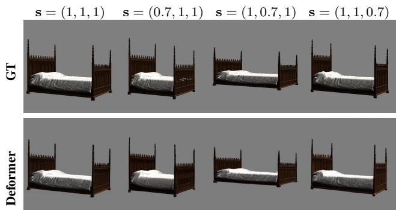

Figure 19: Axis-wise scaling results. The top row shows mesh-rendered ground truth, and the bottom row shows Deformer outputs under identical scaling factors.  
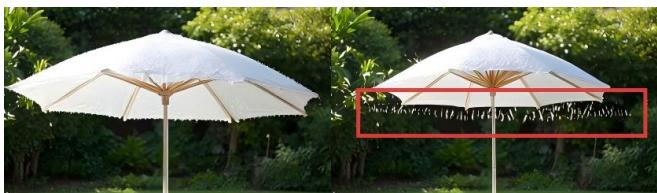  
Figure 20: Efect of missing mask dilation. Left: the original frame. Right: the edited result obtained without dilating the SAM2 mask.

Pexels mainly contains relatively stable objects and highquality scenes, whereas DAVIS includes faster object motion and more severe deformation, making the scaling task more challenging. As illustrated in Fig. 27 and Fig. 28, our method consistently produces more accurate scaling results, with object transformations that better align with the target deformation parameters s.

## Discussion

Why do we evaluate on a synthetic benchmark? The main reason is that real videos generally do not provide geometry-aware object scaling pairs: in most cases, only the source video is available, while the corresponding target video after controlled 3D-aware scaling does not exist. If one attempts to construct such pairs from real data, the common practice is to resize the foreground object in the 2D image plane and then composite it back into the background. However, this process cannot guarantee physically plausible lighting, consistent surface appearance, or object structures that conform to true 3D geometric transformations, as the Geobench (Zhu et al. 2025) shown in Fig. 21. Figure 22 presents a visual comparison between 2D planar scaling and our benchmark, where the 2D baseline shares the same $( s _ { x } , s _ { y } )$ . Unlike 2D planar scaling, our benchmark captures the perspective changes caused by 3D transformations. For instance, when $s _ { x } < 1$ , the rear wheel of the car becomes visible, which cannot be reproduced by a purely 2D operation. In addition, because scaling is applied to all selected objects jointly, transformations in multi-object scenes may also lead to new occlusion relationships.

Source  
Target  
Source  
Target  
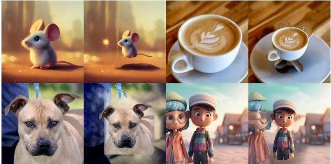  
Figure 21: Visualization of Geobench (Zhu et al. 2025).

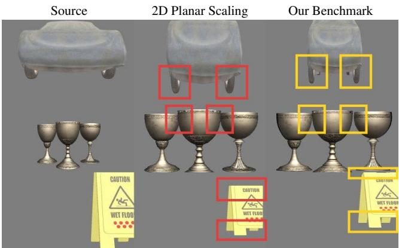  
Figure 22: Visual comparison between 2D scaling and our benchmark. 2D scaling shares the same $( s _ { x } , s _ { y } )$

In contrast, our synthetic benchmark is built from meshrendered paired videos and is strictly paired under controlled transformations. Beyond object motion and shape variation, it also preserves geometry-aware surface material changes and lighting consistency induced by 3D scaling, making it much more suitable for quantitative evaluation. Therefore, although synthetic data cannot fully cover the distribution of real videos, it provides a controlled and reliable testbed for measuring scale accuracy, geometric alignment, and appearance preservation. To complement this controlled benchmark, we further provide qualitative comparisons on real datasets, where our method also demonstrates strong object scaling capability in practical scenarios.

Role of the Real-Background Benchmark. The Real-Background Benchmark serves as a semi-realistic paired evaluation between fully controlled synthetic testing and unpaired real-world evaluation. It combines controllably rendered foregrounds with real video backgrounds, preserving exact geometric targets while introducing realistic scene textures, motion, and background complexity. It therefore enables quantitative evaluation of foreground fidelity and background preservation under more realistic conditions.

How is illumination consistency supported? In our framework, illumination consistency is encouraged by the Deformer and the Main Model in complementary ways. For the Deformer, it is learned from rendered training pairs in which only the mesh vertices are rescaled, while the camera, motion, and scene configurations remain unchanged. In particular, the lighting direction and intensity are fixed across each pair. This provides controlled supervision for learning geometry-dependent appearance changes under consistent illumination. For the Main Model, illumination consistency is learned implicitly from real-video supervision. During training, the complete real video is always used as the target, while the source-side conditions are constructed from the foreground, mask, and background. This encourages the model to refine the deformed foreground and recover an appearance that is compatible with the observed real scene. Overall, the Deformer provides geometry-aware guidance under controlled illumination, while the Main Model restores realistic appearance through real-video targets.

Why do we use multiple modules? Our framework uses two modules at inference time: the Deformer and the Main Model. A natural question is why we do not merge the Deformer into the Main Model and train a single end-to-end model. The main reason is the lack of strictly paired realvideo training data. If the Deformer were absorbed into the Main Model, the whole system could only be trained on mesh-rendered paired videos, since only such synthetic data provide controllable geometry-aware scaling pairs. However, real videos do not have strictly aligned target pairs under 3Daware scaling. As a result, a unified model trained purely on rendered pairs would likely struggle to generalize to real videos: it may fail to preserve the real background and may also produce foregrounds that remain biased toward the rendered domain rather than the real pixel domain.

By separating the two modules, we assign them diferent roles. The Deformer is responsible for providing object structure that matches the target scaling parameter s, while the Main Model focuses on foreground-background fusion and realism enhancement. This decoupled design allows the geometric transformation to be learned from controllable rendered data, while the final video synthesis is learned in the real-video domain. Therefore, our method can perform inference on real videos without sufering from a direct domain gap between rendered supervision and real-world outputs.

Relationship between Training Objective and Inference Geometry. A potential concern is whether the reconstruction objective of the Main Model would restore the object to its original geometry during training, since the original video is used as the reconstruction target. However, the Main Model is not trained to infer or reverse the scaling operation. Instead, the geometric configuration of its foreground condition defines the desired output geometry. During training, the inverse deformation step is introduced only to align the transformed foreground with the original video target while retaining the appearance artifacts produced by the Deformer. Therefore, the Main Model learns geometry-preserving appearance refinement and foreground-background composition rather than inverse scaling. At inference time, replacing the training foreground condition with a scaled foreground changes the target geometry specified to the model, while the learned refinement capability remains unchanged.

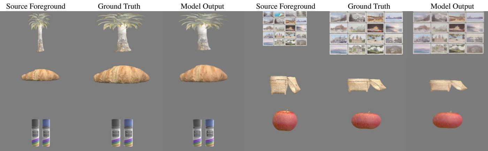  
Figure 23: Visualization of our Deformer.

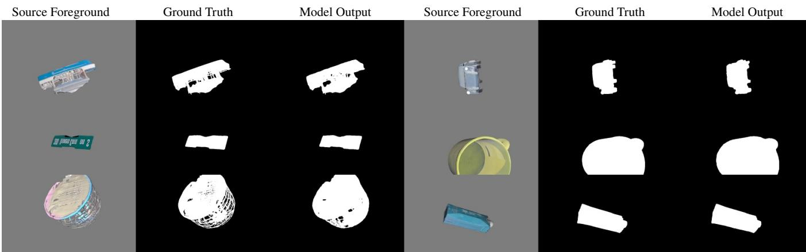  
Figure 24: Visualization of our Masker.

## Limitations and Failure Cases

## Limitations

The main limitation of ScaleVid comes from the Deformer. Its training data are entirely constructed from mesh-rendered video pairs, which still exhibit a distribution gap from real pixel-space videos. Although the Main Model can partially bridge this gap through learned appearance synthesis and foreground-background fusion, the overall performance of ScaleVid is still bounded by the quality of the Deformer outputs. As a result, our method remains limited in reconstructing very fine object details in real videos, especially when the deformation results are imperfect. Moreover, the OBB-based canonical axis definition can be ambiguous for geometrically symmetric objects, such as spheres and cylinders; for example, a cylinder does not provide a unique distinction between its two radial directions, making the semantics of $s _ { x }$ and $s _ { z }$ underdetermined.

## Failure Cases

We show four representative failure cases in Fig. 25. In the boat example, the target object is globally enlarged with a very large scaling parameter s, causing the bow to extend onto the shore and resulting in an unrealistic collision artifact. In the other examples, the target objects are globally shrunk. Although the main objects become smaller as intended, undesired content appears around their original sil houettes. Moreover, the reconstructed object depends on the quality of original mask, a visible gap can be observed on the roof of the car.

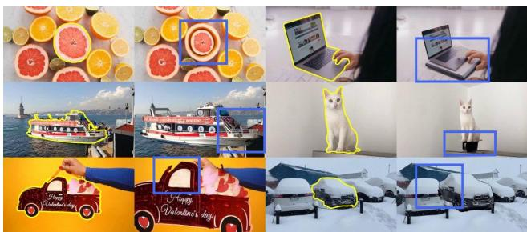  
Figure 25: Visualization of failure cases.

We attribute these failures to two factors. First, though our method uses real videos as targets, it still lacks suficient modeling of object–scene interaction, especially under large geometric changes. Second, object shrinking inevitably reveals previously occluded background regions, making the final result highly dependent on object removal quality. In our pipeline, this capability is inherited from Minimax Remover as the Main Model is initialized by it, which is not perfect and may introduce spurious content or inconsistent background completion. As a result, such artifacts can be propagated to the final edited videos.

## Future Work

In the future, we plan to improve ScaleVid from four aspects. First, a more powerful Deformer trained with more realistic data or synthetic-to-real adaptation may further reduce the distribution gap between mesh-rendered supervision and real videos. Second, explicitly modeling object–scene interaction could help handle challenging cases involving collision, occlusion, or large geometric changes. Third, improving object removal and background completion would likely enhance performance in shrinking scenarios, where previously occluded regions need to be plausibly revealed. Fourth, the current framework could be extended to more general object manipulation tasks, including translation and rotation. Following the nine-dimensional transformation representation used in GeoBench (Zhu et al. 2025), the current scaling vector $\mathbf { s } \in \mathbb { R } ^ { 3 }$ could be generalized to

$$
{ \bf u } = ( t _ { x } , t _ { y } , t _ { z } , r _ { x } , r _ { y } , r _ { z } , s _ { x } , s _ { y } , s _ { z } ) \in \mathbb { R } ^ { 9 } ,\tag{12}
$$

where the first three dimensions parameterize translation, the next three parameterize rotation, and the last three retain anisotropic scaling control.

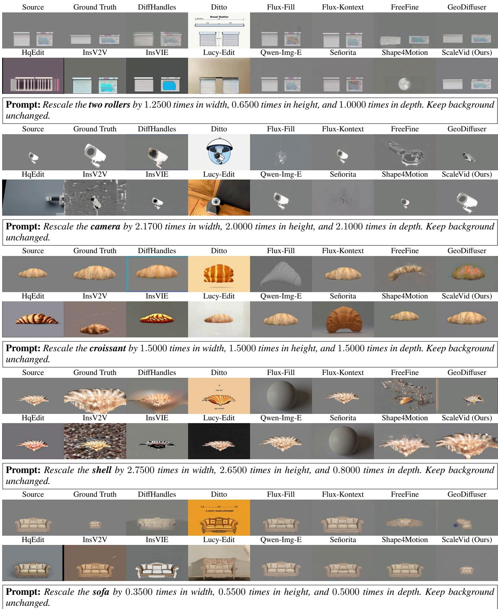  
Figure 26: Comparison results of ScaleVid and baselines on the Geometry Benchmark.

<table><tr><td>Source</td><td>Ground Truth</td><td>DiffHandles</td><td>Ditto</td><td>Flux-Fill</td><td>Flux-Kontext</td><td>FreeFine</td><td>GeoDiffuser</td></tr><tr><td>HqEdit</td><td>InsV2V</td><td>InsVIE</td><td>Lucy-Edit</td><td>Qwen-Img-E</td><td>Señorita</td><td>Shape4Motion</td><td>ScaleVid (Ours)</td></tr><tr><td colspan="8">Prompt: Rescale the bear by 2.2391 times in width, 1.7172 times in height, and 1.1951 times in depth. Keep background unchanged.</td></tr><tr><td>Source</td><td>Ground Truth</td><td>DiffHandles</td><td>Ditto</td><td>Flux-Fill</td><td>Flux-Kontext</td><td>FreeFine</td><td>GeoDiffuser</td></tr><tr><td>HqEdit</td><td>InsV2V</td><td>InsVIE</td><td>Lucy-Edit</td><td>Qwen-Img-E</td><td>Señorita</td><td>Shape4Motion</td><td>ScaleVid (Ours)</td></tr><tr><td colspan="8">Prompt: Rescale the car by 0.8567 times in width, 1.7076 times in height, and 2.2359 times in depth. Keep background</td></tr><tr><td>unchanged. Source</td><td>Ground Truth</td><td>DiffHandles</td><td>Ditto</td><td>Flux-Fill</td><td>Flux-Kontext</td><td>FreeFine</td><td>GeoDiffuser</td></tr><tr><td>HqEdit</td><td>InsV2V</td><td>InsVIE</td><td>Lucy-Edit</td><td>Qwen-Img-E</td><td>Señorita</td><td>Shape4Motion</td><td>ScaleVid (Ours)</td></tr><tr><td colspan="8">Prompt: Rescale the fishes by 2.3211 times in width, 1.4238 times in height, and 0.8527 times in depth. Keep background</td></tr><tr><td>Source</td><td>Ground Truth</td><td>DiffHandles</td><td>Ditto</td><td>Flux-Fill</td><td>Flux-Kontext</td><td>FreeFine</td><td>GeoDiffuser</td></tr><tr><td>HqEdit</td><td>InsV2V</td><td>InsVIE</td><td>Lucy-Edit</td><td>Qwen-Img-E</td><td>Señorita</td><td>Shape4Motion</td><td>ScaleVid (Ours)</td></tr><tr><td colspan="8">Prompt: Rescale the horse and rider by 1.1826 times in width, 2.1752 times in height, and 1.2873 times in depth. Keep background unchanged.</td></tr><tr><td>Source</td><td>Ground Truth</td><td>DiffHandles</td><td>Ditto</td><td>Flux-Fill</td><td>Flux-Kontext</td><td>FreeFine</td><td>GeoDiffuser</td></tr><tr><td>HqEdit</td><td>InsV2V</td><td>InsVIE</td><td>Lucy-Edit</td><td>Qwen-Img-E</td><td>Señorita</td><td>Shape4Motion</td><td>ScaleVid (Ours)</td></tr><tr><td colspan="8">Prompt: Rescale the kid and football by 0.5851 times in width, 1.6757 times in height, and 2.2253 times in depth. Keep background unchanged.</td></tr><tr><td>Source</td><td>Mask</td><td>DiffHandles</td><td>Ditto</td><td>Flux-Fill</td><td>Flux-Kontext</td><td>FreeFine</td><td>GeoDiffuser</td></tr><tr><td>HqEdit</td><td>InsV2V</td><td>InsVIE</td><td>Lucy-Edit</td><td>Qwen-Img-E</td><td>Señorita</td><td>Shape4Motion</td><td>ScaleVid (Ours)</td></tr><tr><td colspan="8">Prompt: Rescale the boombox by 1.5776 times in width, 2.2173 times in height, and 1.3454 times in depth. Keep background unchanged.</td></tr><tr><td>Source</td><td>Mask</td><td>DiffHandles</td><td>Ditto</td><td>Flux-Fill</td><td>Flux-Kontext</td><td>FreeFine</td><td>GeoDiffuser</td></tr><tr><td>HqEdit</td><td>InsV2V</td><td>InsVIE</td><td>Lucy-Edit</td><td>Qwen-Img-E</td><td>Señorita</td><td>Shape4Motion</td><td>ScaleVid (Ours)</td></tr><tr><td colspan="8">Prompt: Rescale the mountain by 1.7379 times in width, 1.0378 times in height, and 1.5644 times in depth. Keep background</td></tr><tr><td>unchanged. Source</td><td>Mask</td><td>DiffHandles</td><td>Ditto</td><td>Flux-Fill</td><td>Flux-Kontext</td><td>FreeFine</td><td>GeoDiffuser</td></tr><tr><td>HqEdit</td><td>InsV2V</td><td>InsVIE</td><td>Lucy-Edit</td><td>Qwen-Img-E</td><td>Señorita</td><td>Shape4Motion</td><td>ScaleVid (Ours)</td></tr><tr><td colspan="8">Prompt: Rescale the bottle by 1.3458 times in width, 0.6378 times in height, and 0.4284 times in depth. Keep background</td></tr><tr><td>unchanged. Source</td><td>Mask</td><td>DiffHandles</td><td>Ditto</td><td>Flux-Fill</td><td>Flux-Kontext</td><td>FreeFine</td><td>GeoDiffuser</td></tr><tr><td>HqEdit</td><td>InsV2V</td><td>InsVIE</td><td>Lucy-Edit</td><td>Qwen-Img-E</td><td>Señorita</td><td>Shape4Motion</td><td>ScaleVid (Ours)</td></tr><tr><td colspan="8">Prompt: Rescale the leaves and flowers by 2.2579 times in width, 1.3811 times in height, and 1.0421 times in depth. Keep background unchanged.</td></tr><tr><td>Source</td><td>Mask</td><td>DiffHandles</td><td>Ditto</td><td>Flux-Fill</td><td>Flux-Kontext</td><td>FreeFine</td><td>GeoDiffuser</td></tr><tr><td>HqEdit</td><td>InsV2V</td><td>InsVIE</td><td>Lucy-Edit</td><td>Qwen-Img-E</td><td>Señorita</td><td>Shape4Motion</td><td>ScaleVid (Ours)</td></tr><tr><td colspan="8">Prompt: Rescale the man on the left by 1.4131 times in width, 0.7471 times in height, and 2.3173 times in depth. Keep background unchanged.</td></tr></table>

Figure 27: Comparison results of ScaleVid and baselines on DAVIS.

Figure 28: Comparison results of ScaleVid and baselines on Pexels.

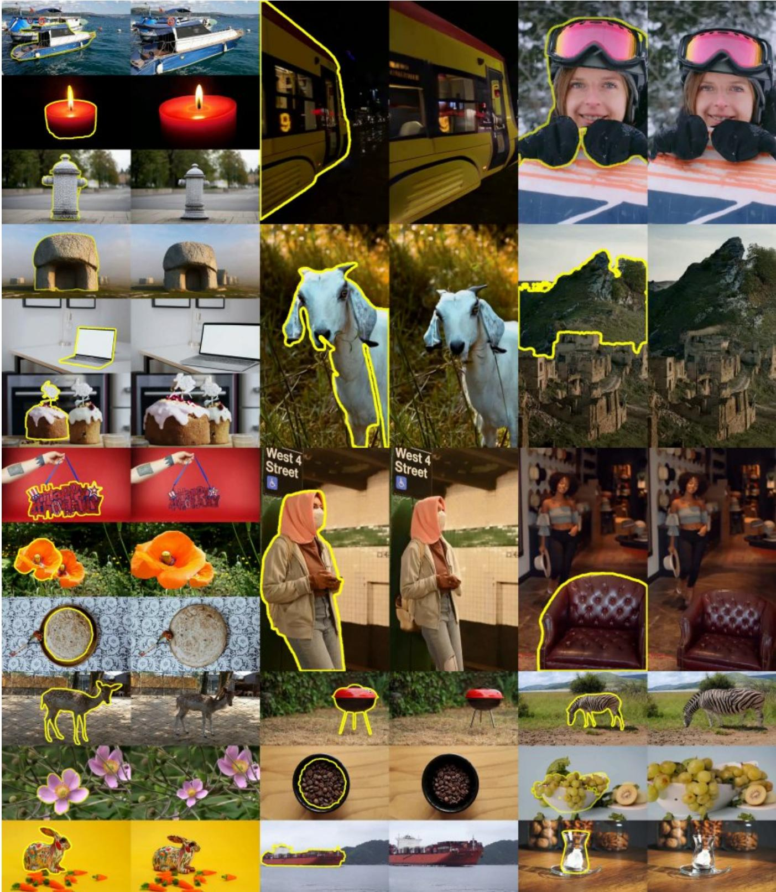  
Figure 29: Visual results of ScaleVid. In each pair, the left frame shows the source with the target object highlighted in yellow, and the right frame shows the ScaleVid output.