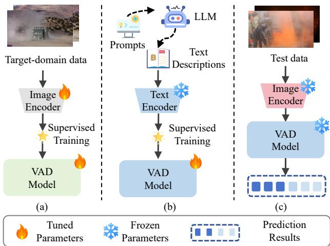
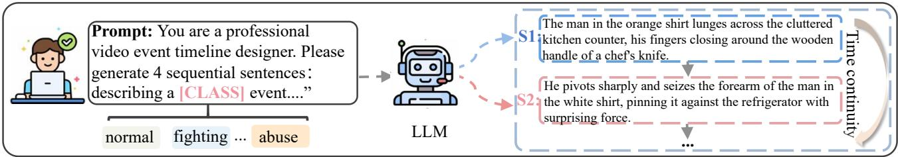
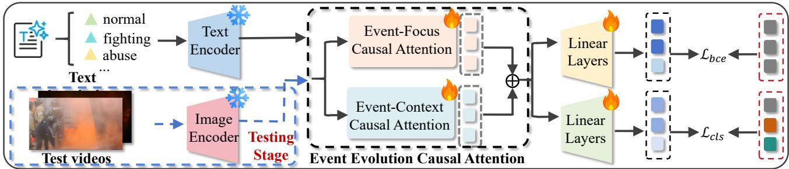
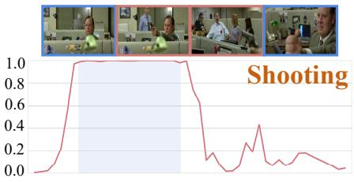
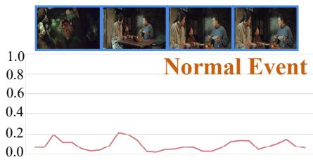
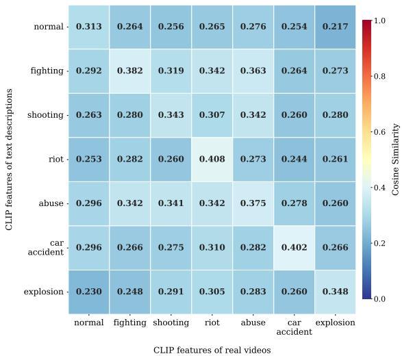
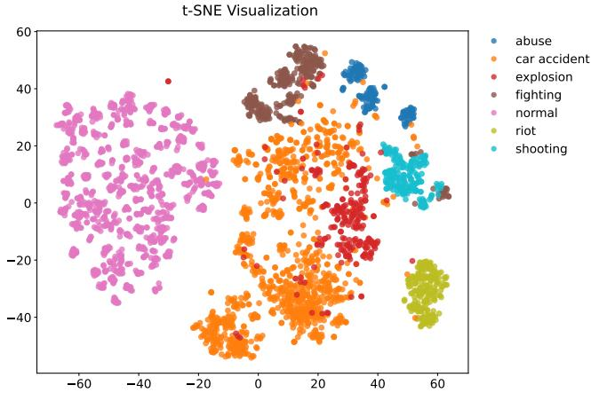
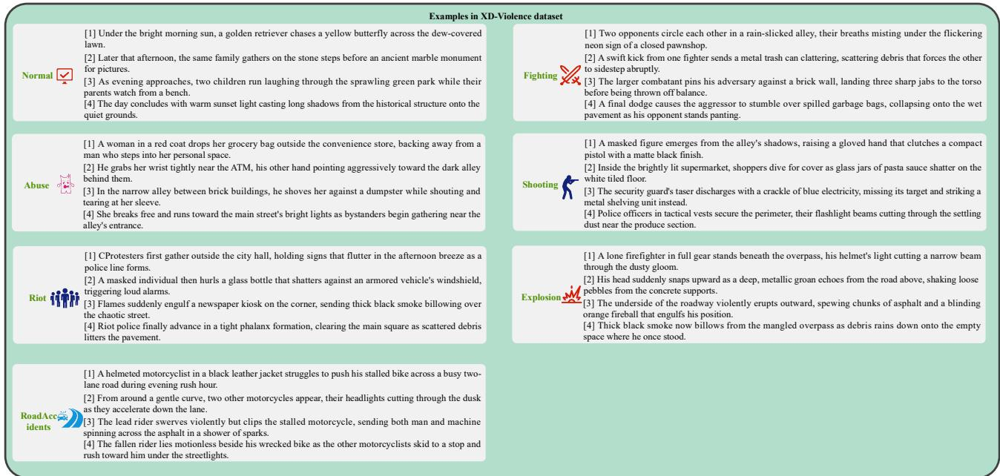

# TD-VAD: Breaking Visual Dependence in Video Anomaly Detection with Text-Driven Learning

Shuangqing Zhang 1 Lei-Lei Ma 2 Zhao Wang 3 Wen Dong 1 Xinyi Xu 1 Guo-Sen Xie 4 Caifeng Shan 1 Fang Zhao 1

## Abstract

Visual data is typically a prerequisite for training existing video anomaly detection (VAD) methods. However, obtaining sufficient annotated anomaly data for training is challenging and not scalable due to the rarity of anomaly data and the wide variety of abnormal events. In this work, we advocate that the effectiveness of treating texts as video sequences for the VAD model and propose a novel Text-Driven Video Anomaly Detection (TD-VAD) approach to break visual dependence. In contrast to the anomaly video data, text descriptions of abnormal events are easy to collect, and their class labels can be directly derived. Specifically, our method utilizes video-like text descriptions with temporal characteristics generated by LLM to train a VAD model, without any reliance on target-domain anomaly data. To capture the long and short-range temporal logic of events, we design the event evolution causal attention module to model contextual dependencies across time. During inference, considering the domain gap between the texts and video sequences, we use the frozen CLIP encoder to extract embeddings of video frames to align the text modality while retaining crucial visual information. Comprehensive experiments on two large-scale VAD datasets, XD-Violence and UCF-Crime, demonstrate that our method outperforms prior one-class and unsupervised VAD methods by a large margin.

  
Figure 1. A comparison between prior VAD methods and the proposed approaches. (a) Prior methods use huge annotated domainspecific video data to train the VAD model. (b) The proposed approach only uses the easily-accessible text descriptions of anomaly categories to train the VAD model. (c) During testing, the proposed TD-VAD can be applied to video sequences directly.

## 1. Introduction

Video anomaly detection (VAD) aims to identify abnormal events automatically within video sequences and has attracted significant attention due to its overcoming the impracticality of manual monitoring in surveillance security (Sultani et al., 2018), and industrial inspection (Duan et al., 2025). Prior works have mainly focused on oneclass (Hasan et al., 2016; Lu et al., 2013) or weaksupervised (Tian et al., 2021; Wu et al., 2022; Zhang et al., 2026) VAD tasks, wherein the former typically fit a model to the normal videos and treat any deviations from it as anomalous, and the latter needs to provide frame-level anomaly confidences with video-level annotations merely.

Existing VAD approaches typically assume that training video examples in the target domain are available for learning the VAD models. However, the assumption may not hold in various scenarios, such as i) when training data violates the data privacy policies (e.g., to protect the sensitive information) (Wang et al., 2025), or ii) when the target domain does not have relevant video data (e.g., the violence events in the city) (Wu et al., 2020). Vision-free video anomaly detection is an emerging task for VAD in such scenarios, to which the aforementioned VAD approaches, including weakly-supervised, one-class, or unsupervised paradigms (Thakare et al., 2023a; Zhang et al., 2025), are not viable, as it requires VAD models to detect anomaly events in video sequences without any video example in as target dataset, imposing prohibitive time and cost burdens when target-domain samples are unavailable. The challenge of anomaly data collection led us to explore a novel research question: Can we develop a VAD method without using visual data in training?

In this paper, we aim to answer this challenging question. Developing a vision-free VAD model is hard due to the lack of explicit visual priors about anomaly events. Recently, large pre-trained vision-language models (VLMs) (Liu et al., 2023) and large language models (LLMs) (Touvron et al., 2023) have demonstrated strong generalization capability in various vision tasks, including anomaly detection (Jeong et al., 2023; Zhou et al., 2023). Such visual priors for anomaly events might be drawn using large foundation models, renowned for their generalization capability and wide knowledge encapsulation. Generally speaking, compared with the collection of large-scale annotated anomaly video datasets, it is significantly easier to collect large amounts of natural text descriptions generated from LLMs. However, there are several critical challenges that need to be addressed. First, video is a continuous stream of visual frames that relies on temporal dynamics, which hinders the knowledge transfer from the concise texts to the video domain. Second, the modality gap between the text and video domains further degrades the generalization. If we can find a cohesive alignment of semantics across video and text modalities, then we can explore the information in text data to promote the performance of VAD in the video space. The aligned embedding space of pre-trained VLMs provides a possible solution for this challenge. Therefore, we investigate the potential of combining existing LLMs with VLMs in addressing vision-free VAD.

On top of our preliminary findings, we propose a novel Text-Driven Video Anomaly Detection (TD-VAD) approach to break visual dependence, which treats text descriptions as alternatives to videos to train the VAD model. The main idea of the proposed framework is illustrated in Fig. 1. Specifically, we exploit an LLM such as DeepSeek-V3 (Liu et al., 2024) to generate textual descriptions for all anomaly categories in a target dataset. Compared with collecting textual data on the web, generating data using LLM is more straightforward and requires less manual post-processing. In particular, for the challenge that texts lack temporal information, we use LLM to generate text descriptions with temporal logic that include both precise timestamps and detailed event descriptions to simulate the temporal characteristics of video sequences. Additionally, considering that only training the VAD model with text data will lead to a modality gap between texts and video frames, we take full advantage of the pre-trained CLIP model to extract both the text and visual embeddings to utilize its strong alignment space to reduce the impact of the modality gap. Moreover, to capture the long and short-range temporal logic of events from the generated video-like text descriptions, we design a novel event-evolution causal attention (EC-Attn) module to model contextual dependencies across time. This module contains an event-context causal attention (ECC-Attn) and an event-focus causal attention (EFC-Attn), wherein the former models the long-range temporal logic of full text sequences to capture the evolution chain, and the latter focuses on supplementing short-window action details. Moreover, a hierarchical anomaly-aware branch is designed to determine if an anomaly exists in video frames. During testing, we can replace the input from text descriptions with video sequences. The video features extracted from the frozen CLIP image encoder can directly feed into the text-trained VAD model to obtain frame anomaly confidence.

The main contributions can be summarized as follows:

• We propose a novel method to train VAD based only from text generated by LLM, which allows the model to be trained with fully supervised data without any video data, to address the pressing issue of data scarcity and privacy in anomaly detection.

• We propose text descriptions as videos to train a model to detect anomaly events in videos. Text descriptions are easily accessible and, in contrast to images, their class labels can be directly derived, making the proposed method compelling in practice.

• We propose a simple yet efficient temporal modeling method based on the pre-trained CLIP model to align the text and video modalities, which can effectively reduce the modality gap.

## 2. Related Work

Video Anomaly Detection. Early video anomaly detection (VAD) studies primarily minimize the reconstruction errors on normal-only video sequences (Hasan et al., 2016; Lu et al., 2013; Thakare et al., 2023a), and thus regard large reconstruction errors as a signal of anomaly one. A parallel line formulates VAD as weakly-supervised multipleinstance learning, leveraging video-level labels but no reliable frame labels to localize frame-level anomalies (Sultani et al., 2018; Wu & Liu, 2021; Wu et al., 2024), avoiding the prohibitive cost of frame annotation. Sultani et al. (Sultani et al., 2018) collect a large-scale VAD dataset with video-level annotation and use a multiple instance ranking strategy to localize temporally anomalous events. Additionally, recent works incorporate audio modality (Wu et al., 2020; 2025) or instruction-tunes detectors on the collected video-caption corpus (Zhang et al., 2024) to broaden coverage. Recently, there has been a surge in efforts to leverage multi-modal knowledge of vision-language models (VLMs) to boost VAD performance via prompt tuning or lightweight adapters (Ye et al., 2025; Wu et al., 2024; Zhang et al., 2024; Chen et al., 2025). However, these approaches still need target-domain videos for fine-tuning, consuming huge amounts of manual labor to collect and annotate this data. In contrast, the proposed approach requires no additional video data yet matches the accuracy of tuned models with fast inference speed and little GPU costs.

Large Foundation Models for VAD. Large language models (LLMs) (Liu et al., 2024; Wang et al., 2022; Wei et al., 2022), and vision-language models (VLMs) (Alayrac et al., 2022; Dai et al., 2023; Li et al., 2023) have been explored and already achieve impressive performance across diverse tasks such as visual question answering. Kim et al. (Kim et al., 2023) apply the text descriptions generated via LLM for the unsupervised anomaly detection. Recently, LAVAD (Zanella et al., 2024) extends this power to anomaly detection: it generates textual descriptions for each video frame with a VLM and scores each one with an LLM, achieving superior anomaly detection performance. Chen et al.(Chen et al., 2025) propose a novel method for understanding video anomalies with LLMs by aligning effective tokens in terms of temporal and spatial space. Ye et al. (Ye et al., 2025) refine prompts to adapt frozen VLMs as an integrated system for VAD. Later work via adding a temporal graph module (Shao et al., 2025), or fusing audio cues (Dev et al., 2024) to improve anomaly detection performance. However, the deployment of these aforementioned large models markedly escalates the demand for high-end GPUs compared to conventional ConvNet approaches.

Different from the above methods, the proposed method only leverages the text descriptions generated by LLM to address temporal anomaly detection on videos to break visual dependence, requiring no video collection and annotation.

## 3. Methodology

## 3.1. Problem Formulation

Let a video be represented as a frame sequence $V =$ $\{ v _ { t } \} _ { t = 1 } ^ { T _ { v } }$ . The goal of video anomaly detection (VAD) is to learn a scoring function $\varphi : v _ { t } \mapsto p _ { t } \in [ 0 , 1 ]$ , where $p _ { t }$ denotes the anomaly likelihood of frame $v _ { t } .$ . Depending on the level of supervision, prior VAD approaches can be categorized as: (i) weakly-supervised methods, which train on videos with only video-level labels (normal or abnormal); (ii) one-class methods, which train solely on normal videos and detect deviations during inference; and (iii) unsupervised methods, which assume no labels at all. In contrast, the proposed vision-free VAD setting assumes that no target-domain training videos are available, i.e., $D _ { \mathrm { t r a i n } } = \emptyset$ Instead, the model is provided only with a set of semantic anomaly concepts $\mathcal { C } = \{ c _ { k } \} _ { k = 1 } ^ { K }$ . Given an unseen test video $V _ { \mathrm { t e s t } }$ , the model infers frame-level anomaly scores $\{ p _ { t } \} _ { t = 1 } ^ { T _ { v } }$ 1 conditioned solely on textual semantics:

$$
\varphi _ { \theta } : ( V _ { \mathrm { t e s t } } , \mathcal { C } ) \mapsto \{ p _ { t } \} _ { t = 1 } ^ { T _ { v } } .
$$

## 3.2. Overview

(1)

The proposed framework is shown in Fig. 2. In the first step (generating text descriptions), we adopt an LLM, DeepSeek-V3 (Liu et al., 2024), to generate text descriptions with timestamps for anomaly events. In the second step (training a VAD model only using text data), we use the frozen CLIP text encoder (Radford et al., 2021) to encode the input text, and present an event evolution causal attention module to capture the evolution chain by modeling contextual dependencies over time. This module involves two components, i.e., an event-context causal attention (ECC-Attn) and an event-focus causal attention (EFC-Attn), which capture the global temporal pattern and local action details of anomaly events, respectively. More importantly, thanks to the aligned image-text embedding space of CLIP, we can transfer the VAD model trained on text to the visual domain by utilizing the alignment between text and video frames. During inference, video frame embeddings are extracted using the frozen CLIP image encoder to replace text input. Overall, we propose a simple and efficient method to achieve vision-free VAD using only text data.

## 3.3. Generating Text Descriptions via LLM

A key challenge of vision-free VAD is the absence of annotated video clips for learning the temporal evolution of anomaly events. To enable training without any visual data, we construct a large-scale, temporally structured textual dataset using a Large Language Model (LLM) to reflect real-world visual dynamics. The generated text sequences aim to (i) convey anomaly semantics faithfully, (ii) exhibit clear temporal progression, and (iii) provide balanced coverage across event categories.

Category Preparation. We first collect all normal and abnormal categories from the target dataset, e.g., fighting, shooting, and riot in XD-Violence (Wu et al., 2020). To prevent distributional bias, we allocate different numbers of generated samples per category, with normal scenes receiving the largest portion and rare anomaly types receiving fewer but representative samples. This strategy ensures both diversity and balance in the textual corpus.

Temporal Prompt Design. To mimic the temporal structure of video events, we design a prompt instructing the LLM to produce sequential descriptions:

Step A: Text descriptions of normal and abnormal events generated by a frozen LLM  

Step B: A VAD model trained only based on the text data  
  
Figure 2. An overview of the proposed TD-VAD approach. The proposed method is based on a pre-trained CLIP containing the frozen text encoder and image encoder. (Top) A frozen LLM (Liu et al., 2024) generates a diverse set of normal and anomalous scene sentences using a prompt. (Bottom) During training, the generated text descriptions are embedded by the frozen CLIP text encoder, and then these embeddings are used to train a VAD model. During testing, we replace the input text descriptions with videos.

“You are a professional video event timeline designer. Generate 4 sequential sentences describing a [CLASS] event.”

Each sample thus containsfour time-ordered sentences covering the beginning, development, climax, and resolution ofthe event, and the action is introduced with where, when, and how it happens to reflect real-world visual dynamics. This four-step structure offers concise yet expressive temporal evolution while avoiding unnecessary verbosity. We repeatedly apply the prompt with randomized sampling parameters to encourage diversity in vocabulary, narrative detail, and contextual cues.

Quality Control and Text Augmentation. We remove samples with incomplete sentences, redundancy, or temporal inconsistencies. To enrich linguistic diversity, concise event captions from (Liu et al., 2025) (unrelated to the target domain) are expanded into sequential descriptions using the same prompt, introducing additional variation while preserving anomaly-related semantics.

In summary, category-aware sampling, temporally structured prompts, and quality control collectively yield a diverse, video-like textual corpus that effectively substitutes video data for training. Details are provided in Appendix C.

To ensure temporal coherence between textual descriptions and visual streams, we proportionally repeat each description to a fixed length of 16 time steps during text encoding.

The resulting 16-step text embeddings are then zero-padded to 256 dimensions, enabling frame-level alignment with video representations.

## 3.4. Text-only Training of VAD Model

Training a vision-free VAD model requires learning temporal anomaly patterns without access to any video data. This is made possible by the pre-trained CLIP model, whose image and text encoders project visual frames and textual descriptions into a shared semantic space. As a result, text descriptions that depict the temporal evolution of an event can serve as effective surrogates for video sequences, with each sentence functioning analogously to a video frame.

Assumption 3.1 (Bounded Cross-Modal Metric Distortion). We assume that the pre-trained CLIP model induces a shared vision–language embedding space with bounded cross-modal distortion at the instance level.

Let $\phi _ { \mathrm { t } } ( \cdot )$ and $\phi _ { \mathrm { v } } ( \cdot )$ denote the frozen text and image encoders. For any semantic concept $c \in { \mathcal { C } } ,$ , let $S \sim P _ { \mathrm { t } } ( \cdot | \ c )$ and $V \sim P _ { \mathrm { v } } ( \cdot | \ c )$ denote random text and video samples associated with concept c. There exists a constant $\varepsilon > 0$ such that

$$
\begin{array} { r } { \operatorname* { P r } ( \| \phi _ { \mathrm { t } } ( S ) - \phi _ { \mathrm { v } } ( V ) \| _ { 2 } \leq \varepsilon \mid c ) \geq 1 - \rho , } \end{array}\tag{2}
$$

for some small $\rho \in ( 0 , 1 )$ . More details in Assumption A.3

Text Embedding and Training Input. Under Assumption 3.1, the text-only training set is defined as $\mathcal { D } =$ $\{ ( S _ { i } , Y _ { i } ) \} _ { i = 1 } ^ { M }$ , where $\bar { S } _ { i } = \{ s _ { \tau } \} _ { \tau = 1 } ^ { T _ { s } }$ denotes the text descriptions, $s _ { \tau }$ denotes the sentence at position τ , and

$Y _ { i } \in \{ 0 , 1 \} ^ { K }$ is its multi-hot label. Each description is encoded by the frozen CLIP text encoder

$$
\phi _ { \mathsf { t } } : S \to \mathbb { R } ^ { T _ { s } \times d } , \quad F _ { i } ^ { \star } = \phi _ { \mathsf { t } } ( S _ { i } ) , \quad \forall i \in [ M ] ,\tag{3}
$$

yielding a sequence of $T _ { s }$ text-derived embeddings. After applying the temporal alignment operator ${ \mathcal { A } } ,$ , the training input to the temporal predictor is given by $F _ { i } = \mathcal { A } ( F _ { i } ^ { \star } ) \in$ $\mathbb { R } ^ { \mathbf { \Delta } _ { T \times d } }$ . Although purely textual, these descriptions exhibit a clear and well-structured temporal progression, thereby motivating the need for subsequent temporal modeling to capture their sequential dependencies.

Event Evolution Causal Attention. To capture the temporal structure inherent in the generated text sequences, we introduce the Event-evolution Causal Attention (EC-Attn) module. It consists of two complementary components:

(1) Event-Focus Causal Attention (EFC-Attn). LLMgenerated descriptions typically contain fine-grained action cues that correspond to short, localized temporal patterns within an event. To effectively capture such local dynamics, EFC-Attn divides the sequence into fixed, non-overlapping windows and applies masked self-attention within each window using a causal constraint (i.e., a lower-triangular attention mask). This windowed causal attention encourages the model to focus on the immediate temporal neighborhood, producing localized representations that preserve short-range temporal order and highlight subtle action transitions, which can be formulated as follows:

$$
{ \bf H } ^ { \mathrm { i n s } } = \mathrm { E F C - A t t n } ( \phi _ { t } ( S _ { i } ) ) , \quad S _ { i } = \{ s _ { \tau } \} _ { \tau = 1 } ^ { T _ { s } } .\tag{4}
$$

(2) Event-Context Causal Attention (ECC-Attn). While EFC-Attn focuses on localized temporal cues, many anomalous events evolve gradually and require reasoning over the full sequence. To capture such long-range dependencies without breaking temporal causality, ECC-Attn performs global attention modulated by a learnable causal bias. Given queries $\mathbf { Q } \in \mathbb { R } ^ { T \times d _ { k } }$ , keys $\mathbf { \dot { K } } \in \mathbb { R } ^ { T \times d _ { k } }$ , and values $\mathbf { V } \in \hat { \mathbb { R } } ^ { T \times d _ { \tau } }$ the standard attention score matrix $\mathbf { S } \in \mathbb { R } ^ { T \times T }$ is computed as: $\mathbf { S } = \mathbf { Q } \mathbf { K } ^ { \top } / \sqrt { d _ { k } }$ . To impose soft causal ordering, a distance-aware bias $\mathbf { B } \in \mathbb { R } ^ { T \times T }$ is introduced. This bias encourages attention toward nearby history while still allowing the model to access more distant past information, and strictly prevents attending to the future. The global causal attention weights are computed as:

$$
\mathbf { A } = \mathrm { s o f t m a x } ( \mathbf { S } + \mathbf { B } ) , \qquad \mathbf { A } \in \mathbb { R } ^ { T \times T } ,\tag{5}
$$

and the resulting context-enhanced representation is obtained as follows:

$$
{ \bf H } ^ { \mathrm { e v o } } = \mathrm { E C C - A t t n } ( \phi _ { t } ( S _ { i } ) ) , \quad S _ { i } = \{ s _ { \tau } \} _ { \tau = 1 } ^ { T _ { s } } .\tag{6}
$$

Event Representation Integration and Hierarchical Classification. The Event-Focus and Event-Context causal attention modules yield two complementary representations:

an instant-level representation $\mathbf { H } ^ { \mathrm { i n s } }$ that captures short-term motion primitives, and an evolution-level representation $\mathbf { H } ^ { \mathrm { e v o } }$ that models the long-range temporal evolution of an event. To consolidate these two temporal perspectives in a lightweight yet expressive manner, we derive a unified event representation through element-wise integration:

$$
{ \bf H } ^ { \mathrm { e v t } } = { \bf H } ^ { \mathrm { i n s t } } + { \bf H } ^ { \mathrm { e v o } } .\tag{7}
$$

This unified representation retains both fine-grained temporal details and holistic event-evolution structure, yielding a more discriminative description of the underlying event.

The event representation $\mathbf { H } ^ { \mathrm { e v t } }$ is then passed to a hierarchical anomaly-aware classification branch, which includes a binary head for anomaly detection and a multi-class head for distinguishing among specific anomaly types for yielding prediction results $\{ p _ { \tau } \} _ { \tau = 1 } ^ { \tilde { T } _ { s } }$ and $\{ z _ { \tau } \} _ { \tau = 1 } ^ { T _ { s } }$ , respectively. By jointly modeling instant-level cues and long-range event evolution, our text-only framework effectively learns anomaly patterns without requiring any visual supervision.

## 3.5. Optimization Objective

The model is trained under a composite objective that jointly optimizes coarse-grained anomaly detection and finegrained event recognition for every part of generated text descriptions, guided by a multiple-instance learning paradigm to navigate temporal ambiguity.

Binary Anomaly Detection. For the i-th text description, the temporal predictor outputs anomaly scores $\{ p _ { \tau } ^ { i } \} _ { \tau = 1 } ^ { T _ { s } }$ 1 after temporal alignment. Following a multiple-instance learning strategy, we select the top-ki most salient positions:

$$
\mathcal { T } _ { i } = \underset { | \mathcal { Z } | = k _ { i } } { \arg \log \{ p _ { \tau } ^ { i } \} } { \textstyle \sp { T _ { s } } } { \textstyle \operatorname { \operatorname { \mathbb { \Psi } } } } _ { \tau = 1 } ^ { T _ { s } } , \qquad \bar { p } _ { i } = \frac { 1 } { k _ { i } } \sum _ { \tau \in \mathcal { T } _ { i } } p _ { \tau } ^ { i } .\tag{8}
$$

The aggregated score $\bar { p } _ { i }$ is supervised by a binary label $y _ { i } \in \{ 0 , 1 \}$ derived from $Y _ { i }$ using the binary cross-entropy:

$$
\mathcal { L } _ { \mathrm { b c e } } = - \frac { 1 } { M } \sum _ { i = 1 } ^ { M } \left[ y _ { i } \log \bar { p } _ { i } + ( 1 - y _ { i } ) \log ( 1 - \bar { p } _ { i } ) \right] .\tag{9}
$$

This formulation emphasizes the most anomalous temporal segments while being robust to irrelevant text snippets.

Multi-Class Event Classification. The predictor outputs logits $z _ { \tau , k } ^ { i }$ for each temporal position τ and anomaly concept $c _ { k } \in \mathcal { C }$ . Following the same top-ki aggregation strategy, the aggregated logits are computed as

$$
\bar { z } _ { k } ^ { i } = \frac { 1 } { k _ { i } } \sum _ { \tau \in \mathcal { Z } _ { i } } z _ { \tau , k } ^ { i } , \qquad \hat { y } _ { k } ^ { i } = \frac { \exp ( \bar { z } _ { k } ^ { i } ) } { \sum _ { k ^ { \prime } = 1 } ^ { K } \exp ( \bar { z } _ { k ^ { \prime } } ^ { i } ) } .\tag{10}
$$

The multi-class classification loss is defined as

$$
\mathcal { L } _ { \mathrm { c l s } } = - \frac { 1 } { M } \sum _ { i = 1 } ^ { M } \sum _ { k = 1 } ^ { K } y _ { k } ^ { i } \log \hat { y } _ { k } ^ { i } ,\tag{11}
$$

where $y ^ { i } \in \{ 0 , 1 \} ^ { K }$ indicates the ground-truth anomaly concept.

Table 1. Comparison with weakly-supervised, one-class, unsupervised, and vision-free video anomaly detection methods on XD-Violence. The best results are bolded.
<table><tr><td>Method CLIP (Radford et al., 2021)</td><td>Backbone ViT</td><td>AP(%) 17.83</td><td>AUC(%) 38.21</td></tr><tr><td colspan="4">Weakly-supervised VAD</td></tr><tr><td>Wu et al. (Wu et al., 2020)</td><td>C3D-RGB</td><td>67.19</td><td></td></tr><tr><td>Wu et al. (Wu et al., 2020)</td><td>I3D-RGB</td><td>73.20</td><td></td></tr><tr><td>MSL (Li et al., 2022)</td><td>C3D-RGB</td><td>75.53</td><td></td></tr><tr><td colspan="4">One-class VAD</td></tr><tr><td>HASAN et al. (Hasan et al., 2016)</td><td> $\mathbf { A E } ^ { \mathrm { R G B } }$ </td><td></td><td>50.32</td></tr><tr><td>LU et al. (Lu et al., 2013)</td><td>Dictionary</td><td></td><td>53.56</td></tr><tr><td>BODS (Wang &amp; Cherian, 2Ó19)</td><td>I3D-RGB</td><td></td><td>57.32</td></tr><tr><td>GODS (Wang &amp; Cherian, 2019)</td><td>I3D-RGB</td><td></td><td>61.56</td></tr><tr><td colspan="4">Unsupervised VAD</td></tr><tr><td>RareAnom (Thakare et al., 2023a)</td><td>I3D-RGB</td><td></td><td>68.33</td></tr><tr><td>Ours</td><td>ViT</td><td>75.83</td><td>89.50</td></tr></table>

## 3.6. Inference for Videos

After training a VAD model using video-like textual descriptions generated by an LLM, our target is to transfer the VAD model trained only with text-only data to the vision modality. Therefore, the encoded text embeddings should match the corresponding video frames. Thanks to the pre-trained contrastive model CLIP, which aligns the text embedding and image embedding, we can directly feed the embeddings from video frames $v _ { i }$ into the VAD model trained by the text embedding. Therefore, to reduce the influence of the modality gap, we use the frozen CLIP image encoder $\phi _ { \mathrm { v } } ( \cdot )$ to extract video frame features. Then, the obtained image embeddings are fed into the trained VAD model to compute the anomaly scores of all test video sequences. The frame-level anomaly degree can be obtained via the multi-class classifier. Specifically, subtracting the softmax probability of normal by one is the anomaly degree. The proposed approach retains the visual information of the image embedding for anomaly detection. When adapting to different datasets, we can simply replace the classes in the text prompt with the classes of the target dataset.

## 4. Experiment

## 4.1. Experimental Setup

Datasets. We evaluate the proposed approach on two largescale benchmarks for the VAD task, i.e., UCF-Crime (Sultani et al., 2018) (UCF) and XD-Violence (Wu et al., 2020) (XD). As our method does not use any video data for training, we adopt their official test set to evaluate our method. Specifically, the UCF dataset contains 290 test videos (140 abnormal and 150 normal) with 13 anomaly types. As for XD, this dataset includes 800 test videos (500 abnormal and 300 normal) from six categories.

Metrics. Following prior work (Wang & Chen, 2025), we report the area under the frame-level ROC curve (AUC) for both evaluation datasets and the frame-level average precision (AP) for the XD dataset.

Table 2. Comparison with weakly-supervised, one-class, unsupervised, and vision-free video anomaly detection methods on UCF-Crime. The best results are bolded.
<table><tr><td>Method CLIP (Radford et al., 2021)</td><td>Backbone ViT</td><td>AUC(%) 53.16</td></tr><tr><td colspan="3">Weakly-supervised VAD</td></tr><tr><td>SULTANI et al. (Sultani et al., 2018)</td><td>C3D-RGB</td><td>75.41</td></tr><tr><td>SULTANI et al. (Sultani et al., 2018)</td><td>I3D-RGB</td><td>77.92</td></tr><tr><td>IBL (Zhang et al., 2019)</td><td>C3D-RGB</td><td>78.66</td></tr><tr><td>GCL (Zaheer et al., 2022)</td><td>ResNext</td><td>79.84</td></tr><tr><td colspan="3">One-class VAD</td></tr><tr><td>SVM (Sultani et al., 2018)</td><td></td><td>50.00</td></tr><tr><td>SSV (Sohrab et al., 2018)</td><td></td><td>58.50</td></tr><tr><td>BODS (Wang &amp; Cherian, 2019)</td><td>I3D-RGB</td><td>68.26</td></tr><tr><td>GODS (Wang &amp; Cherian, 2019)</td><td>I3D-RGB</td><td>70.46</td></tr><tr><td colspan="3">Unsupervised VAD</td></tr><tr><td>GCL (Zaheer et al., 2022)</td><td>ResNext</td><td>74.20</td></tr><tr><td>TUR et al. (Tur et al., 2023a)</td><td>ResNet</td><td>65.22</td></tr><tr><td>TUR et al. (Tur et al., 2023b)</td><td>ResNet</td><td>66.85</td></tr><tr><td>DYANNET (Thakare et al., 2023b)</td><td>I3D</td><td>79.76</td></tr><tr><td>Ours</td><td>ViT</td><td>80.82</td></tr></table>

Baselines. We compare with representative methods at each supervision level: weakly-supervised (Sultani et al., 2018; Zhang et al., 2019; Zaheer et al., 2022; Wu et al., 2020), oneclass (Hasan et al., 2016; Lu et al., 2013; Wang & Cherian, 2019), unsupervised (Thakare et al., 2023a).

Implementation. For the model structure, frozen image and text encoders are adopted from pre-trained CLIP (ViT-B/16). We generate 17674 and 3253 text descriptions for XD and UCF datasets, respectively. For the local window length in the local-action causal attention module, we set it as 4 and 16 for XD and UCF datasets, respectively. We set top-k as 16 in loss function computation. For training, the proposed TD-VAD is trained on a single RTX 4090 using the PyTorch framework. We use AdamW as the optimizer with a batch size of 64. On XD-Violence, the learning rate and total epoch are set as $3 \times 1 0 ^ { - 5 }$ and 10, respectively, and on UCF-Crime, the learning rate and total epoch are set as $2 \times 1 0 ^ { - 4 }$ and 10, respectively.

## 4.2. Comparison Results

We undertake a comprehensive evaluation of the proposed TD-VAD’s anomaly detection capabilities by benchmarking it against widely-used approaches across XD-Violence and UCF-Crime datasets in Table 1 and Table 2, respectively.

For the XD-Violence dataset, TD-VAD’s AP on this dataset are 8.64% higher than the advanced weakly-supervised method (Wu et al., 2020), even though no visual data is used. Also, our method outperforms the baseline CLIP (Radford et al., 2021) (38.21 vs. 75.83). The proposed method (AUC 89.50) also surpasses strong unsupervised (vs. 68.33), oneclass (vs. 61.56), and several weakly-supervised baselines. Table 2 also shows the competitive anomaly detection performance of the proposed approach on the UCF-Crime dataset. We can observe that the performance of our method on this dataset is 5.41% higher than the weakly-supervised method SULTANI et al. (Sultani et al., 2018). At the same time, our method achieves an impressive 80.82 AUC, making a significant 2.16 absolute improvement compared to the advanced method (Zhang et al., 2019). Also, the proposed TD-VAD outperforms all unsupervised and one-class methods, as well as some weakly-supervised methods, on UCF-Crime. Different from the above methods, our approach adopts the pure text data generated by LLM for training. These presented results demonstrate our approach’s superiority and robustness even if no visual data is available. The season for such performance we analyzed is that the generated text precisely captures the essential semantics and temporal logic of abnormal events. Leveraging CLIP’s cross-modal alignment and EC-Attn’s structured temporal modeling, TD-VAD learns universal anomaly discrimination rules from text, which effectively generalize to real videos.

Table 3. Real-time performance comparison with the LAVAD method. The best results are bolded.
<table><tr><td rowspan="2">Method</td><td colspan="2">XD-Violence</td><td rowspan="2">UCF-Crime AUC(%)</td><td rowspan="2">Frame rate (frames/sec)</td><td rowspan="2">Params Size</td></tr><tr><td>AP(%)</td><td>AUC(%)</td></tr><tr><td>LAVAD (Zanella et al., 2024)</td><td>62.01</td><td>85.36</td><td>80.28</td><td>1.26</td><td>13B</td></tr><tr><td>Ours</td><td>75.83</td><td>89.50</td><td>80.82</td><td>183</td><td>0.31B</td></tr></table>

Table 4. Cross-dataset results on UCF-Crime and XD-Violence.
<table><tr><td rowspan=1 colspan=1>Test⇒Train↓</td><td rowspan=1 colspan=1>UCF-CrimeAUC(%)</td><td rowspan=1 colspan=1>XD-ViolenceAP(%) AUC(%)</td></tr><tr><td rowspan=2 colspan=1>UCF-CrimeXD-Violence</td><td rowspan=1 colspan=1>80.82</td><td rowspan=1 colspan=1>81.39   59.53</td></tr><tr><td rowspan=1 colspan=1>77.08</td><td rowspan=1 colspan=1>75.83   89.50</td></tr></table>

As shown in Table 3, we compare the proposed TD-VAD approach with LAVAD (Zanella et al., 2024), which also leverages the off-the-shelf LLMs and VLMs and follows a language-driven pathway for estimating the anomaly scores, in terms of accuracy, frame rate, and parameter size. Even though the proposed TD-VAD has significantly fewer model parameters (including the frozen CLIP encoder) than LAVAD, its performance shows a substantial improvement compared to LAVAD. This can significantly reduce computational and deployment costs for the model. Moreover, on the XD dataset, TD-VAD improves AP from LAVAD’s 62.01 to 75.83, while boosting frame rate from 1.26 FPS to 183 FPS, a speed-up of roughly 145 times. TD-VAD achieves a higher frame rate, lower parameter size, and higher accuracy compared to LAVAD, thereby demonstrating the effectiveness of the proposed approach.

Cross-Dataset Validation. In Table 4, we conduct the cross-dataset experiment to evaluate the generalization of the proposed TD-VAD model. For the scenario where the trained TD-VAD model is tested on an unseen dataset, TD-VAD still achieves competitive performance. This indicates that the semantic patterns learned from generated text descriptions can generalize to distinct scene distributions, verifying the cross-dataset transferability of our text-driven paradigm. Additionally, such performance also validates that the proposed TD-VAD approach can detect truly unseen or unknown anomalies.

## 4.3. Ablation Study

We conduct extensive ablation studies to validate the effectiveness of the key components in our method on the XD-Violence dataset.

Timestamps of Text Descriptions. To investigate the influence of timestamps of generated text descriptions, we conduct experiments to generate text descriptions with different timestamps. The experimental results are provided in Table 5a. We find that increasing the timestamps of generated text descriptions can effectively improve the performance in training. It is worth noting that the 4 timestamps achieve better results than the 8 timestamps. The reason we analyzed is that the text descriptions of anomaly events with 4 timestamps align more closely with the actual anomaly boundaries, yielding smaller semantic gaps.

Window Length in ECC-Attn. We explore the influence of different window lengths in the proposed event-focus causal attention. As shown in the table 5b, the window length set as 4 achieves the best performance. Additionally, from the table, we find that even with different window lengths, the TD-VAD still performs well, which demonstrates the insensitivity to this hyper-parameter.

Table 5. Ablation studies of timestamps of generated text descriptions, and the window length in ECC-Attn.
<table><tr><td colspan="3">(a) Timestamps</td></tr><tr><td>Timestamps</td><td>AP</td><td>AUC</td></tr><tr><td>1</td><td>71.79</td><td>87.57</td></tr><tr><td>2</td><td>72.91</td><td>87.94</td></tr><tr><td>4</td><td>75.83</td><td>89.50</td></tr><tr><td>8</td><td>74.67</td><td>88.89</td></tr></table>

<table><tr><td>Length</td><td>AP</td><td>AUC</td></tr><tr><td>2</td><td>75.24</td><td>89.08</td></tr><tr><td>4</td><td>75.83</td><td>89.50</td></tr><tr><td>8</td><td>74.98</td><td>89.43</td></tr><tr><td>16</td><td>75.12</td><td>89.57</td></tr></table>

Event-Evolution Causal Attention Module. The abla-

Table 6. Ablation studies of the proposed event evolution causal attention module. The best results are bolded.
<table><tr><td>ECC-Attn</td><td>EFC-Attn</td><td>AP</td><td>AUC</td></tr><tr><td>-</td><td>一</td><td>30.48</td><td>60.33</td></tr><tr><td>√</td><td>一</td><td>71.29</td><td>88.18</td></tr><tr><td>-</td><td>√</td><td>73.09</td><td>87.84</td></tr><tr><td>√</td><td>√</td><td>75.83</td><td>89.50</td></tr></table>

  
Figure 3. Qualitative visualization results of the proposed TD-VAD approach. As illustrated in this figure, the red curves represent the anomaly scores, and the blue regions denote the ground-truth abnormal temporal location. As we can see, the proposed approach detects abnormal regions of different categories precisely. Meanwhile, it also produces low anomaly scores on purely normal video sequences.

  
Figure 4. Similarity Matrix of CLIP Cross-Modal Features: Text Descriptions vs. Real Videos from XD-Violence dataset.

Table 7. Ablation studies of the proposed hierarchical anomalyaware classifier module. The best results are bolded.
<table><tr><td>Binary</td><td>Multi-class</td><td>AP</td><td>AUC</td></tr><tr><td>√</td><td></td><td>68.22</td><td>86.77</td></tr><tr><td>-</td><td>V</td><td>74.83</td><td>89.35</td></tr><tr><td>√</td><td>√</td><td>75.83</td><td>89.50</td></tr></table>

tion results in table 6 demonstrate that combining EFC-attn with the ECC-attn mechanism yields strong performance gains. The EFC-attn captures local dynamics of events, while the ECC-attn mechanism models long-range dependencies. Their integration enables the VAD model to learn both short dynamics and global event patterns of anomaly events, which is crucial to the overall performance improvement. This highlights the complementary roles of the two components and the effectiveness of their joint design.

Hierarchical Anomaly-aware Branch. In Table 7, we conduct an in-depth analysis to examine the impact of the binary and multi-class classifiers in the proposed hierarchical anomaly-aware branch on anomaly detection performance on XD-Violence. With the assistance of feature optimization in the binary branch, the multi-class classifier obtains a performance improvement compared to the previous one. Experimental results clearly show that a dual approach can boost the performance by leveraging the complementarity of different granularities.

## 4.4. Qualitative Analyses

Qualitative Visualization. Fig. 3 shows the qualitative results of the proposed TD-VAD with sample videos from XD-Violence. Upon examination, it becomes evident that the proposed TD-VAD is capable of detecting anomaly events accurately. Additionally, our method also produces considerably low anomaly scores in normal areas. The visualization results demonstrate that the proposed TD-VAD approach can effectively detect anomaly events in video sequences.

Visualization of Similarity between Text and Visual Features. As shown in Fig. 4, for each event category, the similarity between intra-class text and video features is significantly higher than inter-class pairs. This confirms that text descriptions accurately capture the core semantic features of corresponding real-world anomalies. However, one limitation of the generated text corpus is that due to the shared violent semantics and overlapping visual manifestations, the relatively high cross-category similarity between text features from the fighting event and video features from the abuse event may confuse fine-grained classification. This is a common limitation for fine-grained VAD task.

## 5. Conclusion

To break the dependence on annotated video data, a novel TD-VAD approach is proposed only using text data. We propose a new view of treating text descriptions as videos for training a VAD model in a vision-free manner. The LLM is exploited to efficiently generate a high-quality textual dataset for training. To address the modality gap between the video and text, we design a simple yet effective video-like text generation method and utilize the aligned space of the CLIP model. Extensive experimental results demonstrate the effectiveness of the proposed TD-VAD. In the future, we will continue to explore the vision-language pre-trained knowledge and further devote to the vision-free VAD task.

## Acknowledgements

This work was supported by the Fundamental and Interdisciplinary Disciplines Breakthrough Plan of the Ministry of Education of China (JYB2025XDXM902), the National Natural Science Foundation of China (No. 62476124, 62276134), the Natural Science Foundation of Jiangsu Province (No. BK20242015), the Gusu Innovation and Entrepreneur Leading Talents (No. ZXL2025322), and Nanjing University - China Mobile Communications Group Co., Ltd. Joint Institute.

## Impact Statement

This paper presents work whose goal is to advance the field of Machine Learning. There are many potential societal consequences of our work, none of which we feel must be specifically highlighted here.

## References

Alayrac, J.-B., Donahue, J., Luc, P., Miech, A., Barr, I., Hasson, Y., Lenc, K., Mensch, A., Millican, K., Reynolds, M., et al. Flamingo: a visual language model for fewshot learning. Advances in neural information processing systems, 35:23716–23736, 2022.

Brown, T., Mann, B., Ryder, N., Subbiah, M., Kaplan, J. D., Dhariwal, P., Neelakantan, A., Shyam, P., Sastry, G., Askell, A., et al. Language models are few-shot learners. Advances in neural information processing systems, 33: 1877–1901, 2020.

Chen, Y., Liu, J., Fan, R., Li, Y., Chang, C., Zhao, S., Fok, W. W., Qi, X., and Wu, Y.-C. Aligning effective tokens with video anomaly in large language models. In Proceedings of the IEEE/CVF International Conference on Computer Vision, pp. 22695–22706, 2025.

Dai, W., Li, J., Li, D., Tiong, A., Zhao, J., Wang, W., Li, B., Fung, P. N., and Hoi, S. Instructblip: Towards generalpurpose vision-language models with instruction tuning. Advances in neural information processing systems, 36: 49250–49267, 2023.

Dev, P. P., Hazari, R., and Das, P. Mcanet: Multimodal caption aware training-free video anomaly detection via large language model. In International Conference on Pattern Recognition, pp. 362–379. Springer, 2024.

Duan, Y., Xu, W., Wu, Q., Xie, G.-S., Zhao, F., and Shan, C. Anomalycontrol: Highly-aligned anomalous image generation with controlled diffusion model. In Proceedings of the 33rd ACM International Conference on Multimedia, pp. 8048–8057, 2025.

Hasan, M., Choi, J., Neumann, J., Roy-Chowdhury, A. K., and Davis, L. S. Learning temporal regularity in video sequences. In Proceedings of the IEEE conference on computer vision and pattern recognition, pp. 733–742, 2016.

Jeong, J., Zou, Y., Kim, T., Zhang, D., Ravichandran, A., and Dabeer, O. Winclip: Zero-/few-shot anomaly classification and segmentation. In Proceedings of the IEEE/CVF Conference on Computer Vision and Pattern Recognition, pp. 19606–19616, 2023.

Kim, J., Yoon, S., Choi, T., and Sull, S. Unsupervised video anomaly detection based on similarity with predefined text descriptions. Sensors, 23(14):6256, 2023.

Langley, P. Crafting papers on machine learning. In Langley, P. (ed.), Proceedings of the 17th International Conference on Machine Learning (ICML 2000), pp. 1207–1216, Stanford, CA, 2000. Morgan Kaufmann.

Li, J., Li, D., Savarese, S., and Hoi, S. Blip-2: Bootstrapping language-image pre-training with frozen image encoders and large language models. In International conference on machine learning, pp. 19730–19742. PMLR, 2023.

Li, S., Liu, F., and Jiao, L. Self-training multi-sequence learning with transformer for weakly supervised video anomaly detection. In Proceedings of the AAAI Conference on Artificial Intelligence, volume 36, pp. 1395–1403, 2022.

Liu, A., Feng, B., Xue, B., Wang, B., Wu, B., Lu, C., Zhao, C., Deng, C., Zhang, C., Ruan, C., et al. Deepseek-v3 technical report. arXiv preprint arXiv:2412.19437, 2024.

Liu, B., Qiao, P., Ma, M., Zhang, X., Tang, Y., Xu, P., Liu, K., and Yuan, T. Surveillancevqa-589k: A benchmark for comprehensive surveillance video-language understanding with large models. arXiv preprint arXiv:2505.12589, 2025.

Liu, H., Li, C., Wu, Q., and Lee, Y. J. Visual instruction tuning. Advances in neural information processing systems, 36:34892–34916, 2023.

Lu, C., Shi, J., and Jia, J. Abnormal event detection at 150 fps in matlab. In Proceedings ofthe IEEE international conference on computer vision, pp. 2720–2727, 2013.

Muller, A. Integral probability metrics and their generating¨ classes of functions. Advances in applied probability, 29 (2):429–443, 1997.

Radford, A., Kim, J. W., Hallacy, C., Ramesh, A., Goh, G., Agarwal, S., Sastry, G., Askell, A., Mishkin, P., Clark, J., et al. Learning transferable visual models from natural language supervision. In International Conference on Machine Learning, pp. 8748–8763, 2021.

Shao, Y., He, H., Li, S., Chen, S., Long, X., Zeng, F., Fan, Y., Zhang, M., Yan, Z., Ma, A., et al. Eventvad: Trainingfree event-aware video anomaly detection. arXiv preprint arXiv:2504.13092, 2025.

Sohrab, F., Raitoharju, J., Gabbouj, M., and Iosifidis, A. Subspace support vector data description. In 2018 24th International Conference on Pattern Recognition (ICPR), pp. 722–727. IEEE, 2018.

Sultani, W., Chen, C., and Shah, M. Real-world anomaly detection in surveillance videos. In Proceedings ofthe IEEE conference on computer vision and pattern recognition, pp. 6479–6488, 2018.

Team, K., Bai, T., Bai, Y., Bao, Y., Cai, S., Cao, Y., Charles, Y., Che, H., Chen, C., Chen, G., et al. Kimi k2. 5: Visual agentic intelligence. arXiv preprint arXiv:2602.02276, 2026.

Thakare, K. V., Dogra, D. P., Choi, H., Kim, H., and Kim, I.-J. Rareanom: A benchmark video dataset for rare type anomalies. Pattern Recognition, 140:109567, 2023a.

Thakare, K. V., Raghuwanshi, Y., Dogra, D. P., Choi, H., and Kim, I.-J. Dyannet: A scene dynamicity guided selftrained video anomaly detection network. In Proceedings of the IEEE/CVF Winter conference on applications of computer vision, pp. 5541–5550, 2023b.

Tian, Y., Pang, G., Chen, Y., Singh, R., Verjans, J. W., and Carneiro, G. Weakly-supervised video anomaly detection with robust temporal feature magnitude learning. In Proceedings ofthe IEEE/CVF international conference on computer vision, pp. 4975–4986, 2021.

Touvron, H., Martin, L., Stone, K., Albert, P., Almahairi, A., Babaei, Y., Bashlykov, N., Batra, S., Bhargava, P., Bhosale, S., et al. Llama 2: Open foundation and finetuned chat models. arXiv preprint arXiv:2307.09288, 2023.

Tur, A. O., Dall’Asen, N., Beyan, C., and Ricci, E. Exploring diffusion models for unsupervised video anomaly detection. In 2023 IEEE international conference on image processing (ICIP), pp. 2540–2544. IEEE, 2023a.

Tur, A. O., Dall’Asen, N., Beyan, C., and Ricci, E. Unsupervised video anomaly detection with diffusion models conditioned on compact motion representations. In International Conference on Image Analysis and Processing, pp. 49–62. Springer, 2023b.

Valiant, L. G. A theory of the learnable. Communications of the ACM, 27(11):1134–1142, 1984.

Wang, B., Huang, C., Wen, J., Wang, W., Liu, Y., and Xu, Y. Federated weakly supervised video anomaly detection with multimodal prompt. In Proceedings of the AAAI Conference on Artificial Intelligence, volume 39, pp. 21017–21025, 2025.

Wang, J. and Cherian, A. Gods: Generalized one-class discriminative subspaces for anomaly detection. In Proceedings ofthe IEEE/CVF International Conference on Computer Vision, pp. 8201–8211, 2019.

Wang, Y. and Chen, S. Learning event completeness for weakly supervised video anomaly detection. arXiv preprint arXiv:2506.13095, 2025.

Wang, Y., Kordi, Y., Mishra, S., Liu, A., Smith, N. A., Khashabi, D., and Hajishirzi, H. Self-instruct: Aligning language models with self-generated instructions. arXiv preprint arXiv:2212.10560, 2022.

Wei, J., Wang, X., Schuurmans, D., Bosma, M., Xia, F., Chi, E., Le, Q. V., Zhou, D., et al. Chain-of-thought prompting elicits reasoning in large language models. Advances in neural information processing systems, 35:24824–24837, 2022.

Wu, J.-C., Hsieh, H.-Y., Chen, D.-J., Fuh, C.-S., and Liu, T.-L. Self-supervised sparse representation for video anomaly detection. In European Conference on Computer Vision, pp. 729–745. Springer, 2022.

Wu, P. and Liu, J. Learning causal temporal relation and feature discrimination for anomaly detection. IEEE Transactions on Image Processing, 30:3513–3527, 2021.

Wu, P., Liu, J., Shi, Y., Sun, Y., Shao, F., Wu, Z., and Yang, Z. Not only look, but also listen: Learning multimodal violence detection under weak supervision. In European conference on computer vision, pp. 322–339. Springer, 2020.

Wu, P., Zhou, X., Pang, G., Zhou, L., Yan, Q., Wang, P., and Zhang, Y. Vadclip: Adapting vision-language models for weakly supervised video anomaly detection. In Proceedings of the AAAI Conference on Artificial Intelligence, volume 38, pp. 6074–6082, 2024.

Wu, P., Su, W., Pang, G., Sun, Y., Yan, Q., Wang, P., and Zhang, Y. Avadclip: Audio-visual collaboration for robust video anomaly detection. arXiv preprint arXiv:2504.04495, 2025.

Ye, M., Liu, W., and He, P. Vera: Explainable video anomaly detection via verbalized learning of vision-language models. In Proceedings ofthe Computer Vision and Pattern Recognition Conference, pp. 8679–8688, 2025.

Zaheer, M. Z., Mahmood, A., Khan, M. H., Segu, M., Yu, F., and Lee, S.-I. Generative cooperative learning for unsupervised video anomaly detection. In Proceedings of the IEEE/CVF conference on computer vision and pattern recognition, pp. 14744–14754, 2022.

Zanella, L., Menapace, W., Mancini, M., Wang, Y., and Ricci, E. Harnessing large language models for trainingfree video anomaly detection. In Proceedings of the IEEE/CVF Conference on Computer Vision and Pattern Recognition, pp. 18527–18536, 2024.

Zhai, X., Mustafa, B., Kolesnikov, A., and Beyer, L. Sigmoid loss for language image pre-training. In Proceedings of the IEEE/CVF international conference on computer vision, pp. 11975–11986, 2023.

Zhang, H., Xu, X., Wang, X., Zuo, J., Han, C., Huang, X., Gao, C., Wang, Y., and Sang, N. Holmes-vad: Towards unbiased and explainable video anomaly detection via multi-modal llm. arXiv preprint arXiv:2406.12235, 2024.

Zhang, H., Cao, C., Lv, Q., Min, L., and Zhang, Y. Autoregressive denoising score matching is a good video anomaly detector. arXiv preprint arXiv:2506.23282, 2025.

Zhang, J., Qing, L., and Miao, J. Temporal convolutional network with complementary inner bag loss for weakly supervised anomaly detection. In 2019 IEEE International Conference on Image Processing (ICIP), pp. 4030– 4034. IEEE, 2019.

Zhang, S., Dong, W., Xu, W., Chu, G., Fang, Y., Lyu, F., Zhao, G., and Zhao, F. Contextual clue mining and class calibration for weakly supervised video anomaly detection. In ICASSP 2026-2026 IEEE International Conference on Acoustics, Speech and Signal Processing (ICASSP), pp. 10687–10691. IEEE, 2026.

Zhou, Q., Pang, G., Tian, Y., He, S., and Chen, J. Anomalyclip: Object-agnostic prompt learning for zero-shot anomaly detection. arXiv preprint arXiv:2310.18961, 2023.

## A. Preliminaries

In Section A.1, we introduce basic notation used throughout the appendix. In Section A.2, we formally define the vision-free VAD problem and the surrogate-training setup.

## A.1. Notations

For a positive integer $n ,$ , let $[ n ] : = \{ 1 , 2 , \dots , n \}$ . We use $k \in [ K ]$ to index anomaly concepts in $\mathcal { C } = \{ c _ { k } \} _ { k = 1 } ^ { K }$ . The Euclidean norm is denoted by $\| \cdot \| _ { 2 }$ . A video is represented as a frame sequence $V = \{ v _ { t } \} _ { t = 1 } ^ { T _ { v } }$ , and a surrogate text sequence as $S = \{ s _ { \tau } \} _ { \tau = 1 } ^ { T _ { s } }$ , where $T _ { v }$ and $T _ { s }$ need not be equal. Let $\phi _ { \mathrm { v } } ( \cdot )$ and $\phi _ { \mathrm { t } } ( \cdot )$ denote the frozen CLIP image and text encoders, mapping inputs to a d-dimensional embedding space. The resulting embedding sequences are $X ^ { \star } \mathbf { \Psi } = \phi _ { \mathrm { v } } ( V ) \in \mathbb { R } ^ { T _ { v } \times d }$ and $F ^ { \star } = \phi _ { \mathrm { t } } ( S ) \in \mathbb { R } ^ { T _ { s } \times d }$ . Both sequences are mapped to a common length $T$ using a deterministic temporal alignment operator ${ \mathcal { A } } ,$ yielding $X = \mathcal { A } ( X ^ { \star } ) \in \mathbb { R } ^ { T \times d }$ and $F = \mathcal { A } ( F ^ { \star } ) \in \mathbb { R } ^ { T \times d }$ . We denote by $g _ { \boldsymbol { \theta } } : \mathbb { R } ^ { T \times d }  [ 0 , 1 ] ^ { T }$ a temporal predictor. At the population level, $( F , Y )$ and $( X , Y )$ are random variables drawn from the surrogate and target distributions $P _ { S }$ and $P _ { T } ,$ respectively.

## A.2. Problem Definition and Assumption

We formalize the vision-free VAD setting studied in this work: the learner has no access to target-domain training videos and must rely on semantic anomaly concepts only. To enable learning without visual supervision, we train a temporal predictor on surrogate text sequences in a frozen CLIP embedding space and deploy it on videos via modality substitution. We next provide the formal definitions used in our theoretical analysis.

Definition A.1 (Vision-Free Video Anomaly Detection). In the vision-free setting, no target-domain training videos are available, i.e., $D _ { \mathrm { t r a i n } } = \emptyset$ . Instead, the learner is given only a set of semantic anomaly concepts $\mathcal { C } = \{ c _ { k } \} _ { k = 1 } ^ { K }$ . Given an unseen test video $V _ { \mathrm { t e s t } } = \left\{ v _ { t } \right\} _ { t = 1 } ^ { T _ { v } }$ , the goal is to produce frame-level anomaly scores

$$
\varphi _ { \theta } : ( V _ { \mathrm { t e s t } } , \mathcal { C } ) \mapsto \{ p _ { t } \} _ { t = 1 } ^ { T _ { v } } \in [ 0 , 1 ] ^ { T _ { v } } .
$$

Here $\varphi _ { \theta }$ denotes the end-to-end anomaly scoring function induced by the temporal predictor $g _ { \theta }$ together with the frozen CLIP encoders and temporal alignment operator.

Definition A.2 (Surrogate Training and Modality Substitution). Let $S = \{ s _ { \tau } \} _ { \tau = 1 } ^ { T _ { s } }$ denote a surrogate text sequence and $V _ { \mathrm { t e s t } } = \{ v _ { t } \} _ { t = 1 } ^ { T _ { v } }$ a test video, where $T _ { s }$ and $T _ { v }$ need not be equal. We assume that both sequences are mapped to a common length $T$ via a deterministic temporal alignment operator (e.g., repetition or interpolation).

Let $\phi _ { \mathrm { t } } ( \cdot )$ and $\phi _ { \mathrm { v } } ( \cdot )$ be the frozen CLIP text and image encoders. Training is performed using aligned surrogate embeddings $F = \phi _ { \mathrm { t } } ( S ) \in \mathbb { R } ^ { T \times d }$ , and inference is performed by applying the same predictor to aligned video embeddings $X =$ $\phi _ { \mathrm { v } } ( V _ { \mathrm { t e s t } } ) \in \mathbb { R } ^ { T \times d }$

We train a temporal predictor $g _ { \boldsymbol { \theta } } : \mathbb { R } ^ { T \times d }  [ 0 , 1 ] ^ { T }$ on surrogate embeddings, and deploy it on video embeddings via modality substitution, yielding $p = g _ { \boldsymbol { \theta } } ( X ) \in [ 0 , 1 ] ^ { T }$

Assumption A.3 (Bounded Cross-Modal Metric Distortion). We assume that the pre-trained CLIP model induces a shared vision–language embedding space with bounded cross-modal distortion at the instance level.

Let $\phi _ { \mathrm { t } } ( \cdot )$ and $\phi _ { \mathrm { v } } ( \cdot )$ denote the frozen text and image encoders. For any semantic concept $c \in { \mathcal { C } } .$ , let $S \sim P _ { \mathrm { t } } ( \cdot \mid c )$ and $V \sim P _ { \mathrm { v } } ( \cdot | \ c )$ denote random text and video samples associated with concept c. There exists a constant $\varepsilon > 0$ such that

$$
\begin{array} { r } { \operatorname* { P r } ( \| \phi _ { \mathrm { t } } ( S ) - \phi _ { \mathrm { v } } ( V ) \| _ { 2 } \leq \varepsilon \mid c ) \geq 1 - \rho , } \end{array}\tag{12}
$$

for some small $\rho \in ( 0 , 1 )$

Moreover, for any pair of concepts $c , c ^ { \prime } \in { \mathcal { C } }$ and independent samples $S \sim P _ { \mathrm { t } } ( \cdot \mid c ) , S ^ { \prime } \sim P _ { \mathrm { t } } ( \cdot \mid c ^ { \prime } ) , V \sim P _ { \mathrm { v } } ( \cdot \mid c )$ $V ^ { \prime } \sim P _ { \mathrm { v } } ( \cdot | \ c ^ { \prime } )$ , we have

$$
| | \phi _ { \mathrm { t } } ( S ) - \phi _ { \mathrm { t } } ( S ^ { \prime } ) | | _ { 2 } - | | \phi _ { \mathrm { v } } ( V ) - \phi _ { \mathrm { v } } ( V ^ { \prime } ) | | _ { 2 } | \le 2 \varepsilon\tag{13}
$$

with probability at least $1 - 2 \rho$

Remark A.4 (Relation to PAC consistency (Valiant, 1984)). The bounded distortion condition in Assumption 3.1 resembles a PAC-style consistency assumption at the representation level, where ε controls the accuracy of cross-modal alignment and $\rho$ the failure probability. Unlike classical PAC learning, we do not make claims about sample complexity or empirical risk minimization; instead, the assumption serves to justify generalization under modality substitution.

## B. Theoretical Analysis

This section explains why text-only training can generalize to videos in the vision-free setting. Our analysis follows three steps: (i) we view text embeddings as surrogate data and relate the target (video) risk to the surrogate (text) risk via a standard domain-discrepancy decomposition; (ii) we characterize the effect of modality substitution (replacing text embeddings by video-frame embeddings at test time) through a stability bound, and (iii) we discuss additional gaps introduced by surrogate sequence construction (LLM generation and temporal alignment). The key enabling condition throughout our analysis is the bounded cross-modal metric distortion induced by the pre-trained CLIP embedding space, formalized in Assumption 3.1.1 This assumption states that text and video instances sharing the same semantic concept are mapped to nearby points in the embedding space, while relative distances between different concepts are approximately preserved across modalities.

## B.1. Surrogate-to-Target Generalization via Domain Discrepancy

Recall that $F = \phi _ { \mathrm { t } } ( S )$ and $X = \phi _ { \mathrm { v } } ( V )$ denote the surrogate (text-derived) and target (video-derived) sequence embeddings in the shared CLIP space (Section A.1). Let $P _ { S }$ and $P _ { T }$ be the distributions over $( F , Y )$ and $( X , Y )$ , respectively, and let $\ell \in [ 0 , 1 ]$ be a bounded loss. For any hypothesis $g \in { \mathcal { G } }$ , define the risks

$$
R _ { S } ( g ) : = \mathbb { E } _ { ( F , Y ) \sim P _ { S } } \big [ \ell ( g ( F ) , Y ) \big ] , \qquad R _ { T } ( g ) : = \mathbb { E } _ { ( X , Y ) \sim P _ { T } } \big [ \ell ( g ( X ) , Y ) \big ] .
$$

A Concrete Discrepancy. To quantify the surrogate–target mismatch, we instantiate $\operatorname { D i v } _ { \mathcal { G } } ( P _ { S } , P _ { T } )$ using an integral probability metric (IPM)-style discrepancy (Muller¨ , 1997). Under the bounded cross-modal metric distortion Assumption A.3, text-derived and video-derived representations corresponding to the same semantic concepts are expected to induce similar prediction statistics, leading to a small surrogate–target discrepancy in the CLIP embedding space.

Definition B.1 (G-IPM discrepancy). Let $\mathcal { G }$ be a class of measurable predictors $g : \mathbb { R } ^ { T \times d }  [ 0 , 1 ] ^ { T }$ . Define

$$
\mathrm { I P M } _ { \mathcal { G } } ( P _ { S } , P _ { T } ) : = \operatorname* { s u p } _ { g \in \mathcal { G } } \left| \mathbb { E } _ { ( F , Y ) \sim P _ { S } } [ \ell ( g ( F ) , Y ) ] - \mathbb { E } _ { ( X , Y ) \sim P _ { T } } [ \ell ( g ( X ) , Y ) ] \right| .\tag{14}
$$

Proposition B.2 (Surrogate-to-Target Risk Decomposition). Fix a hypothesis class $\mathcal { G }$ and a bounded loss $\ell \in [ 0 , 1 ]$ . For any $g \in { \mathcal { G } } ,$

$$
R _ { T } ( g ) \ \leq \ R _ { S } ( g ) \ + \ \mathrm { I P M } _ { \mathcal { G } } ( P _ { S } , P _ { T } ) \ + \ \lambda ^ { \star } ,\tag{15}
$$

where $\begin{array} { r } { \lambda ^ { \star } : = \operatorname* { i n f } _ { h \in \mathcal { G } } \left( R _ { S } ( h ) + R _ { T } ( h ) \right) } \end{array}$ is the shared optimal joint error.

Proof. Let $\begin{array} { r } { g ^ { \star } \in \arg \operatorname* { m i n } _ { h \in \mathcal { G } } \left( R _ { S } ( h ) + R _ { T } ( h ) \right) } \end{array}$ . We start by adding and subtracting the surrogate risk term:

$$
R _ { T } ( g ) = R _ { S } ( g ) + \bigl ( R _ { T } ( g ) - R _ { S } ( g ) \bigr ) .
$$

By Definition B.1 (the G-IPM discrepancy), for any fixed $g \in { \mathcal { G } }$ we have

$$
\left| R _ { T } ( g ) - R _ { S } ( g ) \right| = \left| \mathbb { E } _ { ( X , Y ) \sim P _ { T } } [ \ell ( g ( X ) , Y ) ] - \mathbb { E } _ { ( F , Y ) \sim P _ { S } } [ \ell ( g ( F ) , Y ) ] \right| \le \mathrm { I P M } _ { \mathcal { G } } ( P _ { S } , P _ { T } ) .
$$

Hence, $R _ { T } ( g ) \leq R _ { S } ( g ) + \mathrm { I P M } _ { \mathcal { G } } ( P _ { S } , P _ { T } )$ . To introduce the shared optimal joint error $\lambda ^ { \star }$ , note that

$$
\lambda ^ { \star } : = \operatorname* { i n f } _ { h \in \mathcal { G } } \big ( R _ { S } ( h ) + R _ { T } ( h ) \big ) = R _ { S } ( g ^ { \star } ) + R _ { T } ( g ^ { \star } ) ,
$$

and since risks are nonnegative, $\lambda ^ { \star } \geq 0 .$ . Therefore, adding $\lambda ^ { \star }$ to the right-hand side preserves the inequality:

$$
R _ { T } ( g ) \leq R _ { S } ( g ) + \mathrm { I P M } _ { \mathcal { G } } ( P _ { S } , P _ { T } ) + \lambda ^ { \star } .
$$

This is exactly (15).

Interpretation for TD-VAD. Eq. (15) formalizes text as surrogate data: minimizing surrogate risk $R _ { S }$ yields small target risk $R _ { T }$ when (i) the surrogate and target distributions are close in the CLIP embedding space (small $\operatorname { I P M } _ { \mathcal { G } } )$ , and (ii) there exists a predictor that performs well on both domains (small λ⋆). Both conditions are enabled by the bounded cross-modal metric distortion of CLIP, which limits semantic and geometric mismatch between text and video representations. In TD-VAD, both modalities are embedded by frozen CLIP encoders, and inference explicitly feeds video-frame embeddings into the text-trained model.

## B.2. Stability of Modality Substitution

Unlike the surrogate-to-target analysis in Section B.1, which relates distribution-level risks, this subsection focuses on an instance-level stability property of the learned predictor. Specifically, we analyze the effect of replacing the surrogate (text-derived) embeddings with target (video-derived) embeddings at test time and show that, under bounded cross-modal metric distortion, modality substitution can be interpreted as a controlled perturbation in the representation space.

Definition B.3 (Concept-wise alignment error). Let $\mu _ { \mathrm { t } } ( c ) : = \mathbb { E } [ F \mid c ]$ and $\mu _ { \mathrm { v } } ( c ) : = \mathbb { E } [ X \mid c ]$ denote the class-conditional prototypes of text and video embeddings, respectively, in the shared CLIP space. We define the alignment error as

$$
\varepsilon : = \operatorname* { s u p } _ { c \in { \mathcal C } } \| \mu _ { \mathrm { t } } ( c ) - \mu _ { \mathrm { v } } ( c ) \| _ { 2 } .
$$

The alignment error quantifies the maximum discrepancy between text and video representations of the same semantic concept and provides a measure of cross-modal mismatch at the prototype level.

Proposition B.4 (Modality Substitution Stability). Assume that the temporal predictor $g _ { \theta }$ is L-Lipschitz with respect to its sequence input, i.e.,for all A, $B \in \mathbb { R } ^ { T \times d }$

$$
\lVert g _ { \theta } ( A ) - g _ { \theta } ( B ) \rVert _ { 2 } \leq L \lVert A - B \rVert _ { 2 } .
$$

If a test instance satisfies $\| F - X \| _ { 2 } \leq \varepsilon ,$ then

$$
\| g _ { \theta } ( X ) - g _ { \theta } ( F ) \| _ { 2 } \leq L \varepsilon .
$$

Proof. The result follows directly from the Lipschitz continuity of $g _ { \theta }$ by setting $( A , B ) = ( X , F )$

Discussion. Proposition B.4 establishes a pointwise stability guarantee: when text-derived and video-derived embeddings corresponding to the same semantic concept are close in the representation space, replacing F with X induces a bounded change in the model predictions. This result does not rely on any distributional assumptions and complements the surrogateto-target generalization analysis in Section B.1 by justifying the modality substitution step at the functional level.

## B.3. Surrogate Construction Gaps

Beyond cross-modal alignment, the surrogate domain itself is constructed rather than naturally observed. In TD-VAD, temporally ordered text descriptions are generated by an LLM and subsequently transformed to a fixed length for frame-level processing. This construction process introduces additional sources of mismatch that are not captured by cross-modal alignment alone.

To disentangle these effects, we conceptually decompose the surrogate-to-target gap as

$$
R _ { T } ( g ) \leq R _ { S } ( g ) + \Delta _ { \mathrm { g e n } } + \Delta _ { \mathrm { t e m p } } + \Delta _ { \mathrm { a l i g n } } .
$$

This decomposition serves as an analytical tool rather than a tight generalization bound.

Cross-modal alignment error. The term $\Delta _ { \mathrm { a l i g n } }$ captures residual mismatch between text-derived and video-derived representations in the shared CLIP embedding space and is controlled by the alignment error ε (Definition B.3) under the bounded cross-modal metric distortion assumption (Assumption 3.1). Its effect on predictions is analyzed in Section B.2.

Temporal alignment error. Let $F ^ { \star } \in \mathbb { R } ^ { T ^ { \star } \times d }$ denote the original text-derived embedding sequence prior to temporal alignment, and let A denotes the deterministic alignment operator that maps $F ^ { \star }$ to a fixed-length sequence $F = \mathcal { A } ( F ^ { \star } )$ . We define the temporal alignment error as

$$
\Delta _ { \mathrm { t e m p } } : = \mathbb { E } \big [ \ell \big ( g ( \boldsymbol { A } ( \boldsymbol { F } ^ { \star } ) ) , \boldsymbol { Y } \big ) - \ell \big ( g ( \boldsymbol { F } ^ { \star } ) , \boldsymbol { Y } \big ) \big ] ,
$$

which quantifies the distortion introduced by enforcing frame-level temporal structure through repetition, padding, or interpolation.

Generation error. Let $P _ { t } ^ { \star }$ denote an idealized text distribution that perfectly captures the semantic and temporal variability of video events, and let $P _ { t } ^ { \mathrm { L L M } }$ denote the distribution induced by LLM-based text generation. We define the generation error as

$$
\Delta _ { \mathrm { g e n } } : = \operatorname* { s u p } _ { g \in \mathcal { G } } \left| \mathbb { E } _ { ( F , Y ) \sim P _ { t } ^ { \mathrm { L L M } } } [ \ell ( g ( F ) , Y ) ] - \mathbb { E } _ { ( F , Y ) \sim P _ { t } ^ { \star } } [ \ell ( g ( F ) , Y ) ] \right| ,
$$

which captures the distributional bias introduced by the text generation process.

Practical implication. This decomposition clarifies that, while cross-modal alignment and modality substitution stability governs representation transfer. Overall performance in the vision-free setting is also influenced by temporal alignmen design and the quality of the LLM-generated surrogate data.

## C. More Results

In this supplementary material, we provide the exact form of the prompt details for LLM to generate text descriptions for events, class distributions, and representative examples of the generated text corpus.

Prompt Detail. To mimic the temporal structure of video events, we design a prompt instructing the LLM to produce sequential descriptions. The prompt differs for XD-Violence (Wu et al., 2020) and UCF-Crime (Sultani et al., 2018). For XD-Violence, the prompt is structured as:

“You are a professional video event timeline designer. Generate 4 sequential sentences describing a [CLASS] event. Follow these strict rules: 1. Each sentence must depict a completely unique visual scene with no repeated actions, objects, or elements from previous descriptions; 2. Timeline logic must be natural: start→development→climax→resolution (for abnormal events) or causal sequence (for normal events); 3. Use present tense and concrete language - describe only what can be visually observed; 4. Each sentence mus be 15-25 words long with a varied structure. 5. Include specific details (colors, locations, actions) to ensure uniqueness; 6. Never reuse phrasesfrom the examples provided in the template.”

Additionally, for UCF-Crime, the prompt has a similar form, which is structured as follows:

“Generate 4 sequential surveillance camera descriptions of a ’[CLASS]’ event. Ensure each description is 20-35 words from a security camera perspective. Create logical progression: detection→incident development→climax→resolution. Include surveillance-specific details: camera angle, monitoring coverage, and visibility limitations. Focus on visible behavior only - no internal thoughts or off-camera events. Use surveillance terminology: CCTV, securityfootage, monitoring system, camera view. Make this sample uniquefor surveillance training data.”

Prompt Sensitivity Analysis. We evaluate the proposed TD-VAD approach’s robustness to various prompt formulations while keeping the core information unchanged. This reveals whether LLM depends on specific prompt engineering or has genuine semantic understanding for anomalous events. We test three prompt styles: (1) Law Enforcement uses professional surveillance terminology; (2) Education adopts explanatory language for teaching; (3) Domain expert incorporates special ized security vocabulary. As shown in Table 8, performance varies within ±1% AUC across all styles, demonstrating robust stability. These results validate our prompt design for generating anomalous descriptions via LLM while conforming to stability across prompt formulations.

Table 8. Prompt sensitivity analysis on XD-Violence dataset. Baseline uses the video event timeline designer style.
<table><tr><td>Prompt Style</td><td>AUC Change (%)</td></tr><tr><td>Law Enforcement Style</td><td>-0.50</td></tr><tr><td>Educational Style</td><td>+0.02</td></tr><tr><td>Domain Expert Style</td><td>-0.97</td></tr></table>

Robustness to Noisy Descriptions. To validate the robustness to noisy text descriptions, we randomly remove 10%–40% of temporal text segments during training to simulate incomplete and missing descriptions from LLMs. As shown in Table 9, interestingly, the TD-VAD model achieves slightly better performance rather than degradation. This demonstrates that our approach is highly robust to incomplete textual narratives. The model focuses on learning the core semantic concepts of anomalies instead of relying on full temporal details. The mild information dropout acts as gentle regularization that reduces overfitting to text patterns, leading to improved generalization on the test set.

Table 9. Effect of removing varying percentages of temporal text on the XD-Violence dataset. Values in parentheses indicate the change compared to the baseline.
<table><tr><td></td><td>AUC</td><td>AP</td></tr><tr><td>Remove 10%</td><td>89.65(+0.15)</td><td>76.19(+0.36)</td></tr><tr><td>Remove 20%</td><td>89.51(+0.01)</td><td>75.84(+0.01)</td></tr><tr><td>Remove 30%</td><td>89.65(+0.15)</td><td>76.18(+0.35)</td></tr><tr><td>Remove 40%</td><td>88.98(-0.52)</td><td>74.32(-1.51)</td></tr></table>

Effect of Different LLMs. To investigate the influence of different text data generation models, we further used Kimik2.5 (Team et al., 2026) and GPT-3 (Brown et al., 2020) to generate the text dataset. As shown in Table 10, we find that the model based on the text dataset generated by DeepSeek-V3 used in the manuscript works best. Specifically, both Kimi-k2.5 and GPT-3 lead to performance drops compared with our baseline, demonstrating that DeepSeek-V3 (Liu et al., 2024) is more capable of producing high-quality, semantically accurate, and video-aligned text descriptions. The relatively superior performance of GPT-3 over Kimi-k2.5 also indicates that the logical expression and contextual modeling capabilities of LLMs affect the quality of generated text supervision. These results validate that choosing an appropriate LLM for text dataset construction is crucial in our task.

Table 10. Performance comparison of different large language models on the XD-Violence dataset. Values in parentheses indicate the change compared to the DeepSeek-V3 baseline.
<table><tr><td>LLM</td><td>AUC</td><td>AP</td></tr><tr><td>Kimi-k2.5 (Team et al., 2026)</td><td>89.02(-0.48)</td><td>74.50(-0.33)</td></tr><tr><td>GPT-3 (Brown et al., 2020)</td><td>89.42(-0.08)</td><td>75.54(-0.29)</td></tr></table>

Effect of Different Vision-Language Models. To investigate the influence of different vision-language models (VLMs) for alignment across video and text modalities, we evaluate our approach with CLIP and two SigLIP backbones (Zhai et al., 2023) on XD-Violence in Table 11. While SigLIP excels on general image-text benchmarks via its pairwise sigmoid loss, CLIP’s global softmax contrastive alignment better captures the fine-grained, long-range visual-text correspondences critical for temporal anomaly detection. This explains why CLIP achieves higher performance in our video anomaly detection task.

Table 11. Performance comparison of different VLMs on the XD-Violence dataset. Values in parentheses indicate the change compared to the CLIP baseline.
<table><tr><td>VLM</td><td>AUC</td><td>AP</td></tr><tr><td>CLIP (Radford et al., 2021)</td><td>89.50</td><td>75.83</td></tr><tr><td>Siglip-base-patch16-224 (Zhai et al., 2023)</td><td>87.19 (-2.31)</td><td>67.55 (-8.28)</td></tr><tr><td>Siglip-base-patch16-512 (Zhai et al., 2023)</td><td>89.18 (-0.32)</td><td>71.84 (-3.99)</td></tr></table>

Limitation Analysis. We present the per-category AUC performance using the multi-class anomaly-aware branch in Table 12. Our approach achieves consistent performance across most anomaly categories, showing reliable capability in detecting anomalies. However, as discussed in Section 4.4 and illustrated in Fig. 4, Abuse and Shooting share highly similar violent semantics and visual patterns with other anomalous events, leading to higher fine-grained classification difficulty This high semantic overlap creates a more challenging distinction for the proposed TD-VAD approach, resulting in relatively lower raw performance for these two fine-grained anomaly categories. In future work, we plan to design a dedicated cross-modal alignment paradigm tailored for video anomaly detection to further refine fine-grained subtle event modeling.

Visualization of Text Features. We visualize the feature distribution of generated text descriptions by using t-SNE, and present results in Fig. 5. As we can see, the features of text descriptions generated by LLM have distinguishable boundaries, show features of texts that describe a certain type of anomaly event, and exhibit categorical discriminability. It demonstrates the effectiveness of using text data generated in training.

Table 12. Per-class AUC performance on the XD-Violence dataset.
<table><tr><td>Category</td><td>AUC</td></tr><tr><td>Normal</td><td>89.22</td></tr><tr><td>Fighting</td><td>86.46</td></tr><tr><td>Shooting</td><td>72.68</td></tr><tr><td>Riot</td><td>96.10</td></tr><tr><td>Abuse</td><td>61.47</td></tr><tr><td>Car Accident</td><td>84.67</td></tr><tr><td>Explosion</td><td>95.03</td></tr></table>

  
Figure 5. The Visualization of the normal and abnormal embeddings of generated text descriptions in 2D space by t-SNE.

Class Distribution and Examples for Text Corpus. In Table 13a and Table 13b, we present the detailed amounts of generated text descriptions for different categories in the XD-Violence and UCF-Crime datasets, respectively. We allocate more generated samples for usual anomaly categories, yet the rare anomaly types receive fewer but representative samples. This strategy ensures both diversity and balance in the textual corpus to reflect the distribution of real-world anomalies.

Table 13. The amount of generated text descriptions for different categories in XD-Violence and UCF-Crime datasets  
(a) XD-Violence dataset
<table><tr><td>Category</td><td>Amount</td><td>Category</td><td>Amount</td></tr><tr><td>Normal</td><td>12450</td><td>Shooting</td><td>559</td></tr><tr><td>Car accident</td><td>2204</td><td>Explosion</td><td>505</td></tr><tr><td>Fighting</td><td>1066</td><td>Riot</td><td>200</td></tr><tr><td>Abuse</td><td>690</td><td></td><td></td></tr></table>

(b) UCF-Crime dataset
<table><tr><td>Category</td><td>Amount</td><td>Category</td><td>Amount</td></tr><tr><td>Normal</td><td>483</td><td>Shoplifting</td><td>50</td></tr><tr><td>Road accidents</td><td>1756</td><td>Arrest</td><td>60</td></tr><tr><td>Explosion</td><td>282</td><td>Assault</td><td>60</td></tr><tr><td>Fighting</td><td>135</td><td>Vandalism</td><td>60</td></tr><tr><td>Shooting</td><td>90</td><td>Burglary</td><td>50</td></tr><tr><td>Abuse</td><td>77</td><td>Robbery</td><td>50</td></tr><tr><td>Arson</td><td>60</td><td>Stealing</td><td>40</td></tr></table>

In Fig. 6 and Fig. 7, we present the examples of generated text descriptions via LLM in the XD-Violence and UCF-Crime dataset, respectively. These generated examples exhibit a clear temporal progression to mimic the temporal structure of different video events. As illustrated in Fig. 6 and Fig. 7, the generated text descriptions are not limited to describing actions alone, which inherently encode the coupling of actions, scenes, and spatial-temporal contexts, which forces the model to learn “context-dependent anomaly” rather than “action-only anomaly”. For example, a clear illustration in in Fig. 6 lies in the identical run action across our anomalous and normal text descriptions: the abuse-related text “She breaks free and runs toward the main street’s bright lights as bystanders begin gathering near the alley’s entrance” embeds run in abnormality-indicative context cues—the subject’s ”breaking free” implies a prior threatening interaction, the dark alley connotes a high-risk scenario, and bystanders’ gathering reflects a response to deviance. By contrast, the normal text “As evening approaches, two children run laughing through the sprawling green park while their parents watch from a bench” denotes the same run action with normality signatures, where the tranquil park setting, children’s joyful affect, and parental supervision collectively denote a routine, non-deviant scenario.

  
Figure 6. Examples of generated text descriptions via LLM in the XD-Violence dataset.

<table><tr><td rowspan=1 colspan=1></td><td rowspan=1 colspan=1>[1] CornerCC</td><td rowspan=5 colspan=6>[1] Corner CCTV detects minor entering southeast corridor 19:42, camera view partially obscured by fireextinguisher cabinet; child appears to be dragging smaller sibling by arm against resistance.[2] Security footage shows escalating altercation near stairwell B; older child forcibly pushes youngeragainst wall within camera coverage area, causing visible distress and attempted escape movements.[3] Perpetrator repeatedly strikes victim in upper body region while monitoring system records clearaudio of distressed vocalizations from both subjects.[4] Resolution phase shows adult resident intervening from northeast apartment, separating children asthey move out of surveillance range toward elevator bank at 19:46, incident logged for security review.</td><td rowspan=1 colspan=1></td><td></td><td></td><td></td></tr><tr><td rowspan=4 colspan=1>Abuse</td><td></td><td></td><td rowspan=1 colspan=1>oring system</td><td></td><td></td></tr><tr><td></td><td rowspan=3 colspan=5>RoadAcidents</td><td></td><td></td><td></td><td></td></tr><tr><td></td><td></td><td rowspan=1 colspan=1>child trips </td><td></td><td></td></tr><tr><td></td><td rowspan=1 colspan=2></td><td></td><td></td><td></td><td></td></tr><tr><td></td><td rowspan=1 colspan=4></td><td></td><td rowspan=1 colspan=2></td><td rowspan=1 colspan=3></td><td></td></tr><tr><td rowspan=3 colspan=1>山ArrestR</td><td rowspan=3 colspan=5>[1] CCTV camera #7 captures two figures in hooded jackets running north on Elm Street at 19:45,triggering the motion alert system within its fixed wide-angle view under streetlights.[2] Security footage shows police vehicles converging, officers exiting with flashlights; one suspectresists by pushing an officer near the edge of camera coverage, partially obscured by a parked van.[3] The wall-mounted surveillance cam records multiple officers subduing and handcuffing the resistingindividual on the pavement while another is detained calmly within clear monitoring range[4] Final video log shows both suspects secured in separate patrol cars as additional units arrive; infraredmode activates due to low light, concluding incident logging at 19:52 local time.</td><td rowspan=1 colspan=1></td><td rowspan=2 colspan=1></td><td rowspan=2 colspan=3>[1] CCTV footage from wall-mounted camera shows two masked figures approaching the jewelry storeentrance at 02:17, triggering perimeter motion sensors and initial security alert to monitoring station.[2] Security camera view captures suspects forcing entry through reinforced glass door using crowbars,</td><td rowspan=10 colspan=1></td></tr><tr><td rowspan=1 colspan=3></td></tr><tr><td rowspan=1 colspan=4>Robbery</td><td rowspan=1 colspan=3>with shattered glass falling within camera&#x27;s 120-degree coverage area as internal alarm strobes activate.[3] Surveillance footage shows primary suspect smashing display cases while accomplice emptiescontents into duffel bag, both moving rapidly within fixed camera&#x27;s limited visibility.[4] Monitoring system records perpetrators fleeing through emergency exit as response team enters mainentrance, leaving scattered merchandise in camera view</td></tr><tr><td rowspan=1 colspan=1></td><td rowspan=1 colspan=3></td><td></td><td></td><td rowspan=1 colspan=2></td><td rowspan=1 colspan=3></td></tr><tr><td rowspan=6 colspan=1>Arson八</td><td rowspan=6 colspan=4>[1] CCTV detects individual approaching residence, carrying container; fixed overhead view limits facialrecognition but captures fluid being poured near structure&#x27;s foundation at 12:07.[2] Security footage shows ignition source applied to pooled liquid; flames immediately spread alongbase of wall while subject moves out of camera coverage area during incident development.[3] Monitoring system records fire engulfing building facade with dense smoke obscuring portions of thescene; thermal limitations prevent clear visibility through smoke plume at climax stage.[4] Resolution phase shows emergency services arriving within camera view; fixed angle captures firecontainment efforts but cannot monitor rear property access due to coverage gaps in surveillance system.</td><td></td><td rowspan=1 colspan=2></td><td rowspan=1 colspan=3>[1] CCTV detects an individual entering the south hallway at 14:32, carrying a long object partiallyobscured by their body and jacket. Camera view from ceiling mount limits identification of the item.</td></tr><tr><td rowspan=4 colspan=3>ShootingA</td><td rowspan=1 colspan=3>[2] Security footage shows subject raising what is now identifiable as a black semi-automatic rifle incorridor B3. Monitoring coverage captures them aiming down the hall.</td></tr><tr><td rowspan=1 colspan=1></td><td></td><td></td><td></td></tr><tr><td rowspan=2 colspan=2></td><td></td><td></td><td></td></tr><tr><td rowspan=1 colspan=3>[3] Muzzle flashes visible from weapon during rapid discharge; spent casings eject rightward onto tiledfloor within camera&#x27;s field of view before rolling out of sight behind lockers due to perspective limitation.</td></tr><tr><td rowspan=1 colspan=4></td><td rowspan=1 colspan=3>[4] Subject seen dropping firearm—a dark-colored rifle with a collapsible stock—before fleeingeastward beyond monitoring range at 14:34, leaving the weapon stationary on surveillance video.</td></tr><tr><td rowspan=4 colspan=12>[3] Surveillance monitoring detects theft culmination as subject completes concealment sequence andmonitoring system maintains complete visual documentation of unauthorized departure[1] CCTV detects figure approaching unattended beach bag near shoreline at 23:47, visible within cornersurveillance unit&#x27;s coverage but partially obscured by darkness beyond floodlight range.[2] Subject kneels beside bag while scanning perimeter, manipulating zipper under pretense of adjustingfootwear as monitoring system records movement in overlapping camera views.[3] Security footage shows subject removing wallet from bag during peak theft action, face angled awayfrom primary camera but captured by secondary night-vision unit.[4] Public monitoring system tracks suspect departing eastward along beach promenade with stolen itemconcealed in jacket before exiting fixed camera coverage at pier entrance.[1] CCTV Unit C4 detects sudden intense flash in northeast parking lot corner, causing brief exposure             [1] CCTV monitoring system detects two figures approaching storefront perimeter after hours; camerawashout on security footage before auto-adjustment activates.                                   view adjusts to track movement within 20-meter security coverage zone under streetlight illumination.[2] Security monitoring system captures debris cloud expanding across camera coverage area, with             [2] Security footage shows subjects deploying spray paint cans and crowbars against glass entrance; pan-visible shockwave distortion affecting image stability as objects become airborne.                         tilt-zoom maintains focus despite partial obstruction from decorative shrubbery in camera angle.晋ExplosionVandalism[3] Corner surveillance unit records structural collapse at epicenter while secondary fires ignite within         [3] Surveillance captures climax as primary window shatters under repeated tool impacts; infrared moderemaining camera view despite smoke-obscured visibility limitations.                               activates automatically due to reduced visibility from displaced exterior lighting fixtures.[4] Camera angle shows emergency vehicle lights penetrating residual haze during post-incident             [4] Monitoring system documents perpetrators fleeing scene, leaving visible property damage includingassessment phase, with thermal imaging activated to monitor smoldering hotspots.                         graffiti and broken glass before automated alert triggers remote security response protocol.</td></tr><tr><td rowspan=2 colspan=1></td><td rowspan=2 colspan=6></td><td rowspan=2 colspan=1></td><td rowspan=1 colspan=3></td></tr><tr><td rowspan=1 colspan=3></td></tr><tr><td rowspan=1 colspan=8>一一</td><td rowspan=1 colspan=1></td><td rowspan=1 colspan=3></td></tr></table>

Figure 7. Examples of generated text descriptions via LLM in the UCF-Crime dataset.