# TGRHuman: Text-Guided Realistic 3D Human Generation via Difusion Renderer

Muxin Zhanga, Chaohui Yub, Yuanwang Yanga, Min Weib, Zhuo Sub, Kun Li∗,a

aTianjin University, Tianjin, 300350, China bIndependent Scholar, Beijing, 100080, China

## Abstract

Realistic 3D human generation plays a crucial role in many graphics applications. However, current methods still struggle to generate high-quality human geometry and texture while maintaining 3D consistency and inference eficiency. In this work, we address these limitations by introducing TGRHuman, a novel approach for generating realistic 3D humans from text. Our method decouples geometry and texture generation to alleviate the issues commonly encountered in NeRF-based methods. Instead of relying on slow, implicit score-distillation-based optimization, we directly use explicit multi-view observation generation and optimization for eficient 3D synthesis. For geometry generation, we propose a high-resolution generative module for multi-view normals together with a geometry-carving strategy that preserves view consistency and supports loose clothing. For texture generation, we produce spatially consistent RGB observations from densely sampled surrounding views using a carefully designed texture-prior acquisition strategy and a difusion renderer, enabling detailed human texture synthesis. Experiments show that our method can generate highquality and consistent 3D human geometry and texture eficiently. TGRHuman outperforms existing text-to-3D human methods in both geometry and texture quality.

Keywords: 3D human generation, Texture prior, Difusion renderer, Diferentiable rendering

## 1. Introduction

Realistic 3D human generation is essential for digital human modeling in immersive VR/AR experiences, gaming, and the film industry, and benefits a wide range of graphics applications. Existing methods have made notable progress, but they still struggle to reliably generate high-quality human geometry and texture while ensuring multi-view consistency and inference eficiency. In this paper, we aim to eficiently generate diverse, high-quality, and consistent 3D human geometry and texture from text descriptions, while also supporting humans with loose clothing.

Existing approaches can be broadly divided into native 3D generation methods and two-stage generation methods. Native 3D generative models are directly trained on 3D repre-. sentations such as tri-planes [1], SDFs [2], and FOF [3]. Although these methods naturally possess strong 3D awareness and consistency, the feature dimensionality of the 3D representations used for training is typically much higher than that of 2D images. This discrepancy makes it dificult to leverage pre-trained difusion models [4], often requiring training from scratch and incurring high computational cost. Furthermore, the limited availability of real 3D human datasets hampers generalization. Two-stage generation methods [5, 6] are based on pre-trained 2D difusion models and typically adopt score distillation and diferentiable rendering to optimize 3D representations such as NeRF [7] and DMTet [8]. The Score Distillation Sampling (SDS) loss [9] from 2D difusion is commonly used in the optimization process of two-stage methods [6, 10], but it is highly time-consuming and may take hours per instance. Because these methods rely on 2D difusion models, they often lack suficient 3D structural awareness and sufer from poor view consistency, leading to multi-face artifacts and over-smoothed results [10, 11]. In addition, some NeRF-based methods [12, 13] struggle to efectively decouple high-quality geometry and texture from volume-rendering results. Some multi-view-difusion-based methods [14, 15] find it dificult to synthesize detailed 3D humans because the generated observations are limited in both viewpoint coverage and resolution. Some works [16] generate displacements based on the SMPL template mesh; however, due to the fixed topology of SMPL, they fail to support loose clothing.

In summary, existing methods fail to simultaneously achieve diversity, high quality, 3D consistency, eficiency, and support for loose clothing in text-driven human geometry and texture generation. In particular, producing high-quality geometry and high-resolution textures often requires complex optimization procedures and substantial computational resources, making it dificult to balance performance and eficiency.

In this work, we introduce TGRHuman to address these challenges in text-driven realistic 3D human generation while maintaining both eficiency and consistency. To avoid the tight cou pling of geometry and texture in NeRF-based methods, we generate geometry and the corresponding texture separately. For eficiency, we utilize explicit multi-view normal maps and RGB observations to synthesize human geometry and texture through fast optimization. This scheme avoids the slow implicit supervision and optimization processes typical of SDS-based methods.

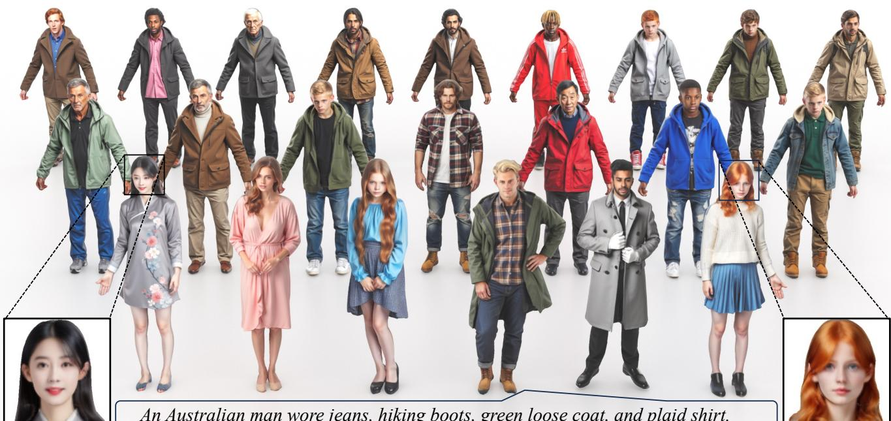  
An Australian man wore jeans, hiking boots, green loose coat, and plaid shirt.

Figure 1: Given text descriptions as input, TGRHuman generates diverse and realistic 3D humans with high-quality geometry and texture eficiently. Our approach not only supports humans wearing loose clothing, but also outputs explicit meshes and texture maps, facilitating downstream graphics applications. The key idea is to leverage consistent 2D multi-view observations together with explicit optimization for eficient 3D human generation.

Meanwhile, using multi-view normals and RGB observations allows us to leverage the capabilities of pre-trained 2D difusion models while maintaining suficient 3D awareness.

Specifically, for high-quality and diverse geometry generation, we carefully design a strategy to generate consistent fourview normal maps at a resolution of 1024 by leveraging both synthetic and real 3D human datasets. The generated highresolution normals are then fed into our mesh-carving strategy, which supports humans with loose clothing without requiring any refinement process.

Unlike geometry, texture optimization requires RGB observations from many more viewpoints. To generate densely sampled surrounding RGB observations, we first devise a strategy for obtaining a texture prior. Based on this prior, we design a difusion renderer capable of high-resolution and consistent rendering from dense views for human texture extraction. The 3D models generated by our method are presented in Fig. 1. Both qualitative and quantitative experiments demonstrate the superiority of our approach.

Our main contributions can be summarized as follows:

• We propose a strategy that decouples geometry and texture generation via explicit 2D observation generation and dimension elevation, making it more eficient than implicit SDS-based methods while preserving diversity.

• We propose a high-resolution generative module for multiview normals together with a geometry-carving strategy that is view-consistent and well suited to humans with loose clothing.

• We propose a human texture prior acquisition strategy and a difusion renderer to ensure view consistency and obtain dense, surround-view RGB observations for highresolution texture generation.

## 2. Related Work

## 2.1. 3D Human Geometry Generation

There are two main approaches to 3D geometry generation: one directly models 3D content using 3D representations and datasets, and the other lifts 2D generative priors to 3D content.

Direct 3D Generative Models. Rodin [17] first fits a volumetric neural representation for each training sample and then uses difusion models to learn and sample the distribution of these 3D instances. GETAvatar [18] is based on a tri-plane representation, using a GAN to generate geometry and texture tri-planes and employing DMTet to extract an explicit mesh. Joint2Human [19] learns the distribution of the 3D FOF representation [3], enabling eficient 3D human geometry generation. SCULPT [16] utilizes a StyleGAN-based generator to learn displacement maps on top of SMPL [20] for clothed human generation. Shi et al. [21] further explore generative modeling for diverse clothed 3D human animations.

Lifting 2D Generative Priors to 3D Content. These methods achieve 3D-aware generation by leveraging 2D difusion mod els together with image collections, following the rapid devel opment of difusion models for 3D generation [22]. Most of them [6, 10] rely on optimization-based workflows. They optimize 3D representations (e.g., NeRF [7] and DMTet [8]) under the supervision of 2D difusion priors. Generalizable human NeRF methods such as EG-HumanNeRF [23] also exploit human priors for eficient sparse-view human rendering. TeCH [10] and HumanNorm [6] produce 3D humans by using pre-trained difusion models together with Score Distillation Sampling (SDS) [9] to optimize DMTet. However, the SDS-based optimization process is time-consuming (more than 2 hours) for each instance. Chupa [15] leverages a dual normal-map generation model and geometry optimization to lift 2D difusion priors to 3D, but it does not support texture generation. En3D [5] employs a tri-plane-based generator to learn a generalizable 3D representation from 2D synthetic data while using DMTet. TADA [24] creates detailed 3D avatars from text using an optimized SMPL-X model with 3D displacements and texture mapping, enhanced by hierarchical rendering and SDS. AvatarVerse [25] develops a DensePoseconditioned 2D difusion model to achieve precise and flexible view-consistency control between 2D and 3D representations. Other works [13, 26, 27, 28, 12, 29, 30] also integrate optimization methods to create avatars.

## 2.2. 3D Human Texture Generation

Shert [31] uses SMPL UV space to complement texture information, but it is limited by the topology of SMPL. Human-Norm and TeCH [6, 10] utilize optimization schemes based on score distillation, which tend to produce overly smooth appearances. Some methods [32, 33, 30] rely on back-view estimation and blending. TEXTure [11] and Text2Tex [34] employ 2D difusion models to iteratively paint the mesh from each viewpoint, with each step conditioned on previous results. However, such a strategy falls short of capturing global information, resulting in inconsistencies across views. TexFusion [35] proposes texture aggregation from diferent camera views and maintains a latent texture map during denoising. Works such as [36, 37] further improve the texture-sampling strategy to reduce view discrepancy. Paint3D [38] introduces a coarse-tofine generative framework that integrates texture sampling from each new viewpoint with UV inpainting to refine the texture map. However, view inconsistency and local artifacts remain unavoidable due to the limited implicit guidance provided by 2D difusion priors.

## 2.3. Multi-view Difusion Model

Another line of work combines multi-view consistent image generation with 3D reconstruction for 3D content creation. Difusion models have demonstrated strong multi-view generation ability: MVDream [14] simultaneously generates all images with global awareness through cross-view interactions, while Zero-1-to-3 [39] and Wonder3D [40] ofer zeroshot, viewpoint-conditioned novel-view synthesis from a single image. SV3D [41] utilizes a video difusion model for multiview synthesis. For multi-view human image synthesis, MvHuman [42] proposes a multi-view sampling strategy to generate multi-view images, which are then used to train a neural radiance field for free-view rendering. MagicMan [43] employs a 3D-aware difusion model and a post-processing procedure to generate multi-view human images from a reference image. More recent methods [44, 45, 46, 47, 48, 49, 50] achieve multiview generation and reconstruction in both realistic and cartoon styles.

Table 1: Comparison with existing methods.
<table><tr><td>Method</td><td>Geometry Quality</td><td>Texture Quality</td><td>Realistic</td><td>Consistency</td><td>Free of SDS</td></tr><tr><td>Chupa [15]</td><td>√</td><td>None</td><td>√</td><td>X</td><td>√</td></tr><tr><td>TEXTure [11]</td><td>None</td><td>X</td><td>√</td><td>X</td><td>X</td></tr><tr><td>TADA [24]</td><td>X</td><td>√</td><td>X</td><td>√</td><td>X</td></tr><tr><td>Joint2Human [19]</td><td>√</td><td>None</td><td>√</td><td>√</td><td>√</td></tr><tr><td>SCULPT [16]</td><td>X</td><td>X</td><td>√</td><td>√</td><td>√</td></tr><tr><td>HumanNorm [6]</td><td>X</td><td>√</td><td>X</td><td>√</td><td>X</td></tr><tr><td>En3D [5]</td><td>X</td><td>√</td><td>√</td><td>X</td><td>√</td></tr><tr><td>Ours</td><td>√</td><td>√</td><td>√</td><td>√</td><td>√</td></tr></table>

General 3D generation methods are dificult to apply directly to realistic human generation because of their limited output resolution. For example, MagicMan and PSHuman generate only 24 multi-view images at a resolution of 512 and 6 images at a resolution of 768, which constrains high-quality 3D human generation. Rather than relying solely on unstable and complex multi-view attention, we exploit both novel-view and global cues from coarse vertex colors to generate high resolution (1024) images from arbitrary viewpoints through our texture prior and difusion renderer. As summarized in Tab. 1, our approach can generate high-quality geometry and texture without relying on SDS, enabling eficient generation of realistic and consistent 3D humans.

## 3. Methodology

Our method aims to generate realistic clothed 3D humans with high-quality geometry and texture from text descriptions. To avoid the coupling of texture and geometry in previous methods [12, 13], we decouple geometry and texture generation via explicit 2D observation generation and dimension elevation. As illustrated in Fig. 2, TGRHuman mainly contains two stages. The geometry stage focuses on a high-resolution normal-map generative module (Sec. 3.1) and a geometry-carving strategy (Sec. 3.2) for human shape reconstruction. In the texture stage, unlike multi-view generation methods with a limited number of views, our approach enables free-view rendering directly through the texture prior (Sec. 3.3) and difusion renderer (Sec. 3.4), without training intermediate 3D representations or performing post-processing.

## 3.1. Multi-view Human Normals Generation

To capture geometric details globally, we generate normal maps of a clothed human from multiple views. Due to VRAM limitations, previous methods [15] found it dificult to simultaneously satisfy the requirements on viewpoint number and image resolution for high-quality generation. With our carefully designed pipeline, our method supports the generation of four-view (front, back, left, and right) normal maps at a resolution of 1024. Benefiting from these high-quality geometric observations, our model does not require local post-refinement or super-resolution, unlike Chupa [15].

To achieve pose-controllable human generation, we leverage SMPL [20], a parametric human template denoted as $M ( \theta , \beta )$ where θ and $\beta$ represent pose and shape parameters, respectively. We first obtain the SMPL mesh $M ( \theta , \beta )$ by sampling θ and $\beta$ to provide pose guidance. We then render the SMPL mesh from four target views as conditional images. The SMPL condition also alleviates self-occlusion issues of the limbs. Next, we employ a pre-trained variational autoencoder (VAE) encoder to transform these SMPL renderings into latent vectors. To control human geometric details, we extract the text condition using CLIP [51]. We encode the camera parameters with MLPs and add the resulting camera embeddings to the time embeddings as residuals, following [14]. Conditioned on the SMPL latents, text embeddings, and camera embeddings, we leverage a pre-trained latent difusion model (LDM) [4] to generate normal maps while inheriting the 2D priors of the LDM. The latent vectors from SMPL renderings are concatenated with noise and fed into the denoising UNet.

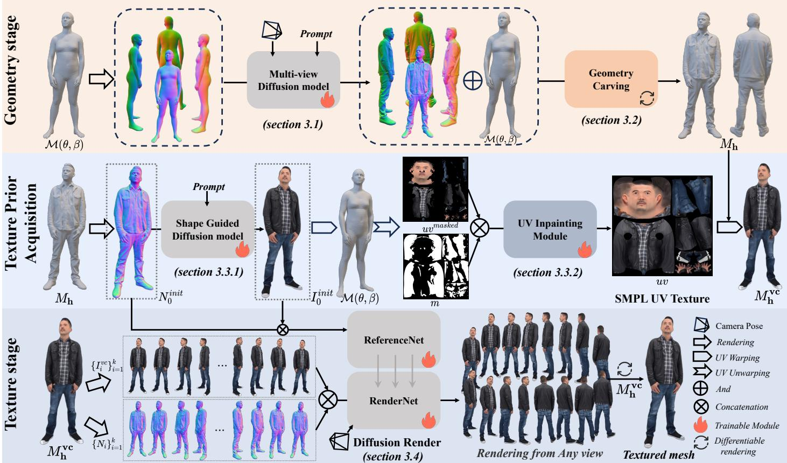  
Figure 2: The overall architecture of TGRHuman. We decouple geometry and texture generation to produce realistic, high-quality humans via explicit 2D observation generation and dimension elevation. Specifically, our model includes: (a) a geometry stage with a high-resolution generative module for multi-view normals and a geometry-carving strategy for human shape; (b) a texture-prior acquisition stage with a shape-guided difusion model for front-view appearance generation and a UV inpainting module for global texture prior construction; and (c) a texture stage with a difusion renderer based on the texture prior for consistent, dense free-view rendering.

A common challenge in multi-view generation is maintaining view consistency. To address this issue, we employ cross-view interaction during the difusion process. This approach enables information from each viewpoint to extend beyond its features, integrating it into a comprehensive representation that includes global details from all views. Specifically, we collect all intermediate results to serve as queries and values when computation reaches a self-attention layer rather than relying solely on the outcomes from the current branch. This strategy ensures efective information integration across diferent views, guaranteeing coherence in the generated results among these views. We use the v-prediction target [52] during training. The corresponding optimization objective is:

$$
\begin{array} { r } { \mathcal { L } ^ { \mathbf { m v n } } = \mathbb { E } _ { \mathbf { n } , \mathbf { v } , \mathbf { y } _ { s m p l } , t , c , \pi } \left[ \left\| \hat { \mathbf { v } } _ { \theta } \left( \mathbf { n } _ { t } , \mathbf { y } _ { s m p l } , t , c , \pi \right) - \mathbf { v } _ { t } ^ { \mathbf { x } } \right\| _ { 2 } ^ { 2 } \right] , } \end{array}\tag{1}
$$

where $\mathbf { y } _ { s m p l }$ denotes the conditional SMPL latents, t denotes the timestep, c is the prompt, and π denotes the camera parameters. $\mathbf { n } _ { t } = \alpha _ { t } \mathbf { n } + \sigma _ { t } \epsilon _ { \mathbf { n } }$ denotes the latent representation of the human normal maps, where $\epsilon _ { \mathbf { n } } \sim { \cal N } ( 0 , \mathbf { I } )$ is independently sampled noise. $\mathbf { v } _ { t } ^ { \mathbf { n } } = \alpha _ { t } \epsilon _ { \mathbf { n } } - \sigma _ { t } \mathbf { n }$ denotes the v-prediction target at timestep $t , \ \sigma _ { t }$ and $\alpha _ { t }$ are the parameters of the difusion scheduler. To implement classifier-free guidance (CFG), we use blank text embeddings with a probability of 10% during training. During CFG inference, the model output is extrapolated toward $\mathbf { v } _ { \theta } \left( \mathbf { n } _ { t } , \mathbf { y } _ { s m p l } , t , c , \pi \right)$ and away from $\mathbf { v } _ { \theta } \left( \mathbf { n } _ { t } , \mathbf { y } _ { s m p l } , t , \pi \right)$ .

## 3.2. Human Geometry Carving with Normal Maps

In Sec. 3.1, we obtain multi-view normal maps $\left( \mathbf { n ^ { f } } , \mathbf { n ^ { b } } , \mathbf { n ^ { l } } , \mathbf { n ^ { r } } \right)$ aligned with world coordinates from four views covering 360°. To fuse these observations into a human mesh, we deform the vertices and topology of the initial SMPL mesh $M ( \theta , \beta )$ into a detailed human mesh $M _ { h }$ by comparing the normal maps with renderings produced by a diferentiable rasterizer [53]. Notably, although our geometry optimization is initialized from SMPL, it still performs well for humans wearing loose-fitting clothing because we dynamically adjust the topology while optimizing vertex displacements. Our goal is to minimize the pixel-aligned error between the normal observations and the rendered results. The optimization loss is formulated as follows:

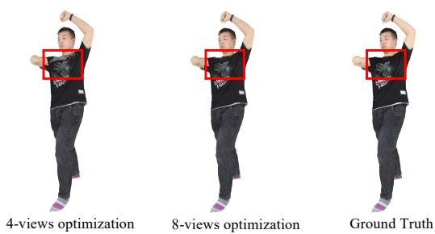  
Figure 3: Texture optimization results using RGB observations from diferent numbers of views.

$$
\begin{array} { r } { \mathcal { L } ^ { \mathrm { r e c } } = \mathcal { L } ^ { \mathrm { n } } + \mathcal { L } ^ { \mathrm { m a s k } } + \lambda \cdot \mathcal { L } ^ { \mathrm { r e g } } , } \end{array}\tag{2}
$$

where $\begin{array} { r } { \mathcal { L } ^ { \bf n } = \sum _ { i \in \{ { \bf f } , { \bf b } , { \bf l } , { \bf r } \} } \| { \bf n } ^ { \bf i } - \hat { \bf n } ^ { \bf i } \| _ { 1 } } \end{array}$ 1 denotes the normal-rendering loss, and $\begin{array} { r } { \mathcal { L } ^ { \bf m a s k } = \sum _ { i \in \{ { \bf f } , { \bf b } , { \bf l } , { \bf r } \} } \| { \bf m } ^ { \mathrm { i } } - \hat { \bf m } ^ { \mathrm { i } } \| } \end{array}$ denotes the mask loss, which characterizes the diference in mesh contours. $\mathcal { L } ^ { \mathbf { r e g } }$ is a regularization term that minimizes the cosine similarity between face normals of neighboring surfaces to encourage smoothness, and $\lambda ~ = ~ 1$ . After each optimization step, following [54], we remesh the intermediate geometry to obtain a new topology by merging or splitting triangle faces. In this way, by leveraging the strong geometric prior provided by the SMPL mesh, we transform the generated 2D normal maps into a 3D human mesh. We can further adopt Poisson reconstruction to enhance visual quality, or use the SMPL-H hand model to replace the generated hand geometry as in [55]. Other than that, our human geometry does not require additional postprocessing.

## 3.3. Human Texture Prior Acquisitionfrom SMPL

In Sec. 3.2, by leveraging the SMPL mesh as a robust ${ \mathrm { g e - } }$ ometric prior, we can optimize human geometry using normal maps from only four views. However, because no texture prior is available, directly applying the same mechanism to texture generation is highly challenging. As shown in Fig. 3, fourview RGB images fail to cover certain self-occluded regions. In addition, generating a large number of consistent RGB observations from multiple views simultaneously is computationally demanding. In this section, we propose a strategy to construct a robust texture prior based on SMPL UV space. We first apply a shape-aligned difusion model to generate a coarse front-view appearance aligned with the geometry. We then unwrap this front-view observation into SMPL UV space and use a UV inpainting model to complete the missing regions.

Front Appearance Generation Aligned with the Shape. To initialize and guide the difusion renderer, we first select a view of the current geometry and obtain the initial texture observation $I _ { 0 } ^ { i n i t }$ from camera view $p _ { 0 }$ . We use the normal map rendered from this viewpoint as a condition to ensure that the initial texture aligns with the human geometry. We formulate this step as a Pix2Pix task and progressively fine-tune a shape-guided difu sion model on both synthetic and real datasets. During training, we extract normal-map latents using the VAE and concatenate them with noise to train the UNet of the LDM. As in Sec. 3.1, we also use the v-prediction objective. The training objective of the shape-guided difusion model is:

$$
\begin{array} { r } { \mathcal { L } ^ { \mathrm { i n i t } } = \mathbb { E } _ { \mathbf { x } , \mathbf { v } , \mathbf { y } _ { n o r m a l } , t , c } \left[ \left\| \hat { \mathbf { v } } _ { \theta } \left( \mathbf { x } _ { t } , \mathbf { y } _ { n o r m a l } , t , c \right) - \mathbf { v } _ { t } ^ { \mathbf { x } } \right\| _ { 2 } ^ { 2 } \right] , } \end{array}\tag{3}
$$

where $\mathbf { y } _ { n o r m a l }$ corresponds to the rendered normal maps.

SMPL UV Unwrapping and Completion. We aim to extract a complete texture map of the SMPL template from the generated front-view observation so as to capture the full texture and ensure consistency. First, we extract the visible portion of the SMPL texture map by leveraging the correspondence among pixels in the front-view image, faces of both the human mesh and the SMPL mesh, and UV texture pixels, as shown in Fig. 2. Next, we compute the visibility of each face and the SMPL UV mask via ray casting. In this way, we project the visible appearance and mask from image space to UV space. To complete the invisible regions of the UV texture, we fine-tune the Stable Difusion inpainting model [4]. The optimization objective is:

$$
\begin{array} { r } { \mathcal { L } ^ { \mathrm { i n p a i n t i n g } } = \mathbb { E } _ { u \nu ^ { m a s k e d } , \mathbf { v } , m , t , c } \left[ \left\| \hat { \mathbf { v } } _ { \theta } \left( u \nu ^ { m a s k e d } , m , t , c \right) - \mathbf { v } _ { t } ^ { \mathbf { x } } \right\| _ { 2 } ^ { 2 } \right] , } \end{array}\tag{4}
$$

where $u \nu ^ { m a s k e d }$ denotes the masked UV map, m denotes the UV mask, t denotes the timestep, and c is the prompt. During inference, we feed the partial UV texture map $u \nu ^ { m a s k e d }$ and the corresponding visibility mask m into the UV inpainting module to obtain a completed SMPL UV texture map uv for the SMPL mesh $M ( \theta , \beta )$

SMPL UV Mapping to Human Geometry. Given the texture map of SMPL, we project it onto the human mesh $M _ { \mathbf { h } }$ through vertex coloring. This process results in the initial human textured mesh $M _ { \mathbf { h } } ^ { \mathrm { v c } }$ , which serves as an approximation of the final human texture. In this way, we efectively establish the human texture prior.

## 3.4. Texture Painting with Difusion Renderer

In this stage, we aim to obtain realistic texture for the human geometry generated in Sec. 3.2. Some methods [41, 42] create textures by generating multi-view images, similar to multiview normal generation. However, such a scheme struggles to recover accurate textures for self-occluded regions of the human mesh because the observation views are sparse and lowresolution. To address this issue, based on the texture prior proposed in Sec. 3.3, we introduce a 360-degree high-resolution difusion renderer to obtain a UV texture map for the mesh.

Free-View Rendering with the Difusion Renderer. To achieve 360-degree rendering, we propose a reference-based rendering strategy and use a difusion model as the renderer. Given camera views $\displaystyle { \{ p _ { i } \} _ { i = 1 } ^ { k } }$ , we first render $M _ { \mathbf { h } } ^ { \mathrm { v c } }$ to obtain RGB images $I _ { i } ^ { \nu c }$ and normal maps $N _ { i }$ as guidance conditions. The normal maps encode geometric details and mesh orientation, while the RGB

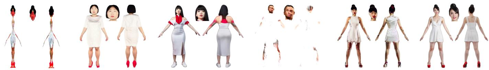  
A young Asian woman with a white dress, red heels, and black hair, looking ahead and facing straight ahead.

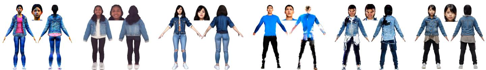

A teenage girl with medium-length, straight black hair, lightly tanned skin, wearing a blue denim jacket, black leggings, and white sneakers.

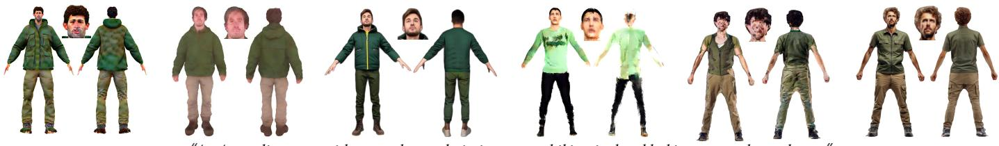

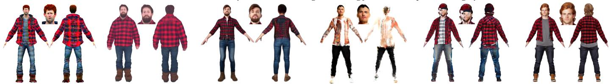  
A Canadian man with short, red hair, layered a red plaid shirt jacket over a gray t-shirt dark jeans, and brown snow boots.

Figure 4: Qualitative comparison of human textures. For fair comparison, our method does not perform post-processing during inference, such as replacing hands with the SMPL model. Our approach generates highly realistic appearances.

observations of $M _ { \mathbf { h } } ^ { \mathrm { v c } }$ provide important texture priors. Using these conditions, we train our difusion renderer.

Our difusion renderer consists of two modules: the main RenderNet and a ReferenceNet. The input to RenderNet includes the camera parameters $\pi _ { i }$ corresponding to view $p _ { i } .$ , the rendered RGB image $I _ { i } ^ { \nu c }$ , and the normal map $N _ { i }$ of the initial textured human mesh $M _ { \mathbf { h } } ^ { \mathrm { v c } }$ . These inputs are first encoded by the VAE into image latents and then concatenated with the latent noise. To ensure multi-view consistency, we inject ReferenceNet features into the frozen RenderNet layer by layer. The appearance and geometry features of the same character, namely $I _ { 0 } ^ { i n i t }$ and $N _ { 0 } ^ { i n i t }$ , are fed into ReferenceNet, which is designed to maintain identity consistency between renderings from diferent views and the front observation $I _ { 0 } ^ { i n i t }$ . Specifically, as shown in Fig. 6, the core idea is to sum the self-attention input features from ReferenceNet and RenderNet, and then feed the combined feature into the self-attention layers of Render-Net’s UNet. This design allows RenderNet to directly reference features from ReferenceNet during self-attention computation, thereby improving the 3D consistency of appearance and texture.

Both RenderNet and ReferenceNet are initialized from clones of a pre-trained latent difusion model [4]. The diference is that the former uses cross-view attention layers, whereas the latter does not. Our training process is divided into two stages. In Stage 1, we train RenderNet with the following objective:

$$
\begin{array} { r } { \mathcal { L } ^ { \mathrm { r e n d e r } } = \mathbb { E } _ { \mathrm { I } , \mathrm { v } , I ^ { \nu c } , N , t , \pi } \left[ \left\| \hat { \mathbf { v } } _ { \theta } ( \mathbf { I } _ { t } , I ^ { \nu c } , N , t , \pi ) - \mathbf { v } _ { t } ^ { \mathrm { x } } \right\| _ { 2 } ^ { 2 } \right] , } \end{array}\tag{5}
$$

where $I ^ { \nu c }$ and $N$ denote the texture and geometry guidance conditions derived from $M _ { \mathbf { h } } ^ { \mathrm { v c } }$

In Stage 2, the parameters of RenderNet θ are frozen, and only the parameters of ReferenceNet ϕ are optimized via $\mathcal { L } ^ { \bf { r e f } }$ while keeping the same v-prediction objective as in $\mathcal { L } ^ { \mathrm { r e n d e r } }$ . The optimization objective for ReferenceNet is:

$$
\begin{array} { r } { \mathcal { L } ^ { \mathrm { r e f } } = \mathbb { E } _ { \mathbf { I } , \mathbf { v } , I ^ { \mathrm { v c } } , N , I _ { 0 } ^ { \mathrm { i n i t } } , N _ { 0 } ^ { \mathrm { i n i t } } , t , \pi } \left[ \left\| \hat { \mathbf { v } } _ { \boldsymbol { \theta } , \boldsymbol { \phi } } ( \mathbf { I } _ { t } , I ^ { \nu c } , N , I _ { 0 } ^ { \mathit { i n i t } } , N _ { 0 } ^ { \mathit { i n i t } } , t , \pi ) - \mathbf { v } _ { t } ^ { \mathbf { x } } \right\| _ { 2 } ^ { 2 } \right] , } \end{array}\tag{6}
$$

During inference, we first sample $k = 3 2$ successive viewpoints around the yaw axis of the human and render the corresponding normals $\left\{ N _ { i } \right\} _ { i = } ^ { k }$ and texture priors $\left\{ I _ { i } ^ { \nu c } \right\} _ { i = 1 } ^ { k }$ . Guided by the front observation $I _ { 0 } ^ { i n i t }$ , RenderNet produces realistic observations $\left\{ I _ { i } ^ { r e a l } \right\} _ { i = 1 } ^ { k }$ from arbitrary selected views. From these

#

A teenage girl with medium-length, straight black hair, lighxtly tanned skin, wearing a blue denim jacket, black leggings, and sneakers.

#

An Australian man with messy brown hair, in a green hiking jacket, khaki pants, and grey boots  
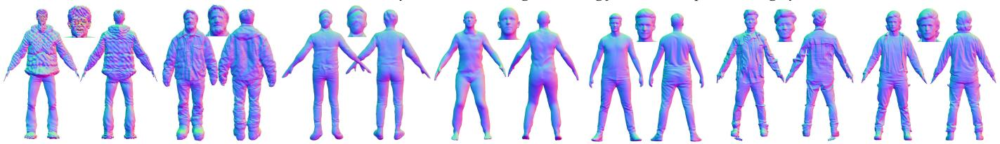

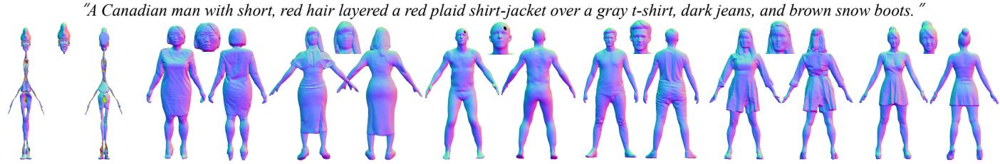

Figure 5: Qualitative comparison of human geometry. The normal maps are rendered from the generated 3D human meshes.  
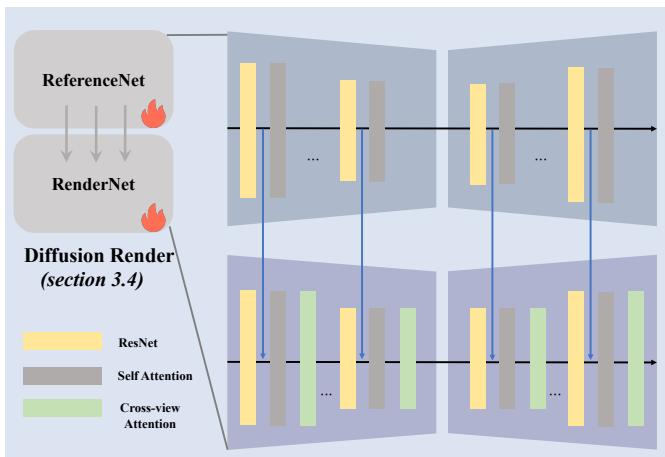  
Figure 6: The detailed architecture of the difusion renderer.

rendered observations, we can easily extract a complete texture map for the human mesh while avoiding the occlusion issues caused by sparse views.

Multi-view Rendering Integration for the Texture Map. Given the multi-view rendering observations and the human mesh $M _ { \mathbf { h } } .$ we aim to recover the texture map of $M _ { \mathbf { h } } .$ First, we use XAtlas [56] to generate UV coordinates for each vertex of $M _ { \mathbf { h } }$

Based on the initial textured human mesh $M _ { \mathbf { h } } ^ { \mathrm { v c } }$ and the UV coordinates produced by XAtlas, we obtain a coarse texture map Tˆ through UV unwrapping. Then, using the paired data $\left\{ \pi _ { i } , I _ { i } ^ { r e a l } \right\} _ { i = 1 } ^ { k } ,$ we optimize the texture map $\hat { T }$ with a diferentiable rasterizer [53]. The optimization objective is:

$$
\mathcal { L } ^ { \mathrm { t e x } } = \mathcal { L } ^ { \mathrm { T } } + \lambda _ { \mathrm { s s i m } } \cdot \mathcal { L } ^ { \mathrm { s s i m } } + \lambda _ { t \nu } \cdot \mathcal { L } ^ { \mathrm { t v } } ,\tag{7}
$$

where $\lambda _ { s s i m } = 1 0$ and $\lambda _ { t \nu } = 1 . \mathcal { L } ^ { \bf T }$ denotes the L1 loss between the rendered RGB image and the observation $I _ { i } ^ { r e a l } , \mathcal { L } ^ { \bf s s i m }$ is the SSIM loss [57] that measures structural similarity between two images, and $\mathcal { L } ^ { \mathrm { t v } }$ denotes the total variation loss [58], which encourages smoothness while preserving details.

## 4. Experiments

## 4.1. Experimental Setup

Training data. We train TGRHuman sequentially on synthetic and real human datasets. For real human data, we use 10k human scans from the THuman2.1 [59], 2K2K [60], and Human4DiT [61] datasets, and allocate 50 samples from THuman2.0, 200 from THuman2.1, 200 from 2K2K, and 500 from Human4DiT for evaluation. The RGB and normal images are rendered at a resolution of 1024 using both perspective and orthographic cameras from 32 fixed views. These viewpoints are evenly distributed with azimuth angles ranging from 0 to 360 degrees, ensuring comprehensive coverage of each scan.

Baselines. We compare our 3D synthesis results with the textto-3D human SOTA methods, including HumanNorm, En3D, TADA, Joint2Human, Chupa, SCULPT, and TEXTure. Additionally, to demonstrate the superiority of our proposed difusion renderer, we compare our method with several novel view synthesis works, including Wonder3D, SV3D, Zero123, and the latest method, MagicMan, for human-specific novel view synthesis.

Metrics. Evaluation is conducted on two tasks: (1) human texture and geometry generation, where we use FID (Fréchet Inception Distance) to evaluate the quality of generated textures and geometry, and then use the CLIP score to assess the compatibility between prompts and rendered views of the generated 3D human models; and (2) novel-view synthesis in the texture stage, where we compare generated views with ground-truth images using PSNR, SSIM [57], and LPIPS [62].

Table 2: Quantitative evaluation on the 3D human generation.
<table><tr><td colspan="5">Methods  $\mathrm { F I D } _ { n o r m a l }$  →  $\mathrm { F I D } _ { r g b }$  ↓  ${ \mathrm { C L I P } } _ { r g b }$  ↑  $\operatorname { C L I P } _ { n o r m a l } \uparrow$ </td></tr><tr><td>Chupa</td><td>32.91</td><td></td><td></td><td>0.0816</td></tr><tr><td>TEXTure</td><td></td><td>53.56</td><td>0.2318</td><td></td></tr><tr><td>TADA</td><td>47.56</td><td>40.74</td><td>0.2297</td><td>0.1419</td></tr><tr><td>Joint2Human</td><td>31.24</td><td></td><td></td><td>0.1903</td></tr><tr><td>SCULPT</td><td>55.79</td><td>50.91</td><td>0.1306</td><td>0.0986</td></tr><tr><td>HumanNorm</td><td>40.14</td><td>34.72</td><td>0.2547</td><td>0.1840</td></tr><tr><td>En3D</td><td>33.86</td><td>28.64</td><td>0.2334</td><td>0.1589</td></tr><tr><td>Ours</td><td>29.48</td><td>25.36</td><td>0.2552</td><td>0.2171</td></tr></table>

Table 3: Quantitative evaluation on 3D human generation under complex poses.
<table><tr><td>Methods</td><td> $\mathrm { F I D } _ { n o r m a l }$  ↓</td><td> $\mathrm { F I D } _ { r g b }$  ↓</td><td> ${ \mathrm { C L I P } } _ { r g b }$  ↑  $\operatorname { C L I P } _ { n o r m a l } \uparrow$ </td></tr><tr><td>Chupa</td><td>33.88</td><td>一</td><td>0.0750 -</td></tr><tr><td>Joint2Human</td><td>36.72</td><td>-</td><td>0.1508 -</td></tr><tr><td>Ours</td><td>28.91</td><td>- -</td><td>0.2059</td></tr></table>

Table 4: Quantitative evaluation on the novel view synthesis.
<table><tr><td>Methods</td><td>PSNR ↑</td><td>SSIM ↑</td><td>LPIPS ↓</td></tr><tr><td>MagicMan</td><td>22.4</td><td>0.937</td><td>0.051</td></tr><tr><td>Wonder3D</td><td>15.9</td><td>0.895</td><td>0.106</td></tr><tr><td>SV3D</td><td>12.2</td><td>0.798</td><td>0.207</td></tr><tr><td>Stable Zero123</td><td>16.1</td><td>0.813</td><td>0.157</td></tr><tr><td>TRELLIS.2</td><td>19.1</td><td>0.905</td><td>0.062</td></tr><tr><td>LHM</td><td>26.5</td><td>0.947</td><td>0.047</td></tr><tr><td>Ours</td><td>28.3</td><td>0.951</td><td>0.043</td></tr></table>

## 4.2. Comparisons

Quantitative comparison. To assess the quality of generated human geometry and texture separately, we render normal maps and RGB images from 32 views to compute FID. As mentioned above, FID measures the visual similarity and distribution discrepancy between renderings of generated 3D content and real images. We then evaluate text-to-3D consistency by calculating the CLIP score between the prompts and rendered views of the generated 3D humans. We randomly select 50 prompts for text-guided generation and render observations from the corresponding generated results to compute the CLIP score. Tab. 2 shows that our method outperforms other methods on both FID and CLIP score, indicating superior overall human-generation quality. In addition, Tab. 5 reports the average inference time of methods that can generate both geometry and texture with arbitrary topology. This demonstrates the significant speed advantage of our method over SDS-based methods. For fair compari son, all tests are conducted on one A800 GPU, and we compare only methods capable of generating both human geometry and texture. The runtime of each part of our pipeline is Geometry (1min52s), Texture Prior (40s), and Texture (2min36s).

Table 5: Quantitative evaluation of inference time.
<table><tr><td>Methods</td><td>HumanNorm</td><td>TADA</td><td>En3D</td><td>Ours</td></tr><tr><td>Time</td><td>2h+</td><td>1h+</td><td>30min+</td><td>5min</td></tr></table>

To evaluate the performance of our difusion renderer, we compare novel-view synthesis results. Tab. 4 shows that our diffusion renderer significantly outperforms the baselines in terms of PSNR, SSIM, and LPIPS. It provides high consistency and quality while also enabling free-viewpoint rendering. Overall, our method eficiently achieves high-quality and consistent 3D human geometry and texture generation from text descriptions. Qualitative comparison. Although our strategy uses geometry and texture priors derived from SMPL, as shown in Fig. 1, our method still supports the generation of humans with loose clothing. In the following, we qualitatively compare humangeneration quality and novel-view synthesis quality. Fig. 4 and Fig. 5 show that our method produces higher-quality and more realistic 3D humans. As shown in Fig. 8, the difusion renderer also generates more consistent and higher-quality novel views than prior methods [41, 40, 43, 39].

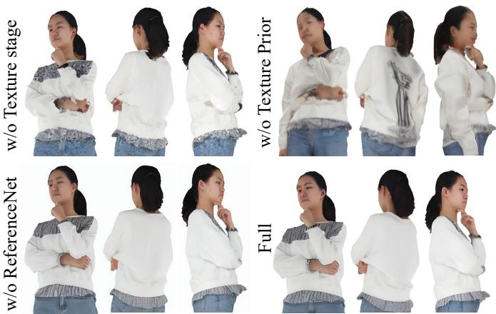  
Figure 7: Qualitative ablation of the modules in the texture stage.

Table 6: Ablation studies for the ReferenceNet and the Texture Prior in the difusion renderer.
<table><tr><td>Methods</td><td>PSNR ↑</td><td>SSIM ↑</td><td>LPIPS ↓</td></tr><tr><td>w/o ReferenceNet</td><td>24.6</td><td>0.897</td><td>0.053</td></tr><tr><td>w/o Texture Prior</td><td>19.3</td><td>0.729</td><td>0.071</td></tr><tr><td>w/o Texture stage</td><td>22.7</td><td>0.801</td><td>0.060</td></tr><tr><td>Full</td><td>28.3</td><td>0.951</td><td>0.043</td></tr></table>

## 4.3. Ablation study

In the geometry and texture-prior stages, removing any module would break the entire pipeline, making module-level ablation infeasible. Therefore, we focus only on certain hyperparameters in these two stages, and the corresponding ablation studies are provided in the supplementary material.

In the texture stage, we compare the full difusion renderer with variants without ReferenceNet or without the texture prior in Fig. 7 and Tab. 6. Both qualitative and quantitative ablations demonstrate the importance of each component. Removing the texture prior significantly degrades 3D consistency, highlighting the necessity of the texture-prior acquisition stage. In addition, without ReferenceNet or the full texture stage, the generated results become less realistic and less consistent.

## 4.4. User Study

To better evaluate diferent methods qualitatively, we conduct a user study to analyze the quality of generated results, as detailed in the supplementary material.

## 4.5. Application

Texture editing. We enable flexible texture editing by modifying the SMPL UV and the front-view texture during the textureprior stage, which allows local appearance editing without introducing artifacts into other regions, as demonstrated in Fig. 9.

3D human animation. Since our model directly generates explicit digital assets (meshes and textures), it naturally supports skeleton-driven animation. Our animation pipeline transfers standard skeletal motion (from motion capture or keyframing) to the generated 3D human character. The main steps include auto-rigging, animation retargeting, and linear blend skinning (LBS). This pipeline handles complex poses well and can also support cases in which the character carries objects. We provide a demo video with more dynamic animation results and multi-view renderings in the accompanying material.

## 5. Limitations and Discussions

## 5.1. Limitations and Failure Cases

Fine-detail degradation in small regions (fingers and hair). Since fingers and hair occupy relatively small image regions and exhibit high-frequency structures, as shown in Fig. 10 and Fig. 11, our difusion-based generation may produce oversmoothed results or inconsistent fine details (e.g., fused fingers or blurry or unstable hair strands), especially under complex

poses or severe self-occlusion.

Out-of-distribution poses. Our method may underperform when guided by poses that are rarely covered by the training distribution, particularly heavily occluded, unusual, or highly articulated poses. As demonstrated in Fig. 12, the pose guidance may be insuficient to resolve severe ambiguities, leading to local anatomical artifacts or implausible geometry.

Inference latency. To prioritize generation quality and controllability, our pipeline is not fully end-to-end and involves multiple stages and modules, which increases inference time compared with single-pass feed-forward approaches.

## 5.2. Robustness evaluation

Robustness to SMPL topology and loose clothing. Unlike reconstruction methods, our approach takes a known 3D SMPL body as input and uses it only as initialization for normal-based optimization. Therefore, it is not afected by SMPL estimation noise or depth ambiguities typical of reconstruction settings. In practice, as illustrated in Fig. 13, even for prompts describing very loose clothing, the generated body geometry remains stable and does not exhibit noticeable degradation.

Robustness to suboptimal UV inpainting results. We assess the robustness of the difusion renderer under imperfect intermediate UV inpainting outputs. As demonstrated in Fig. 14, the results show the robustness of the difusion renderer to such imperfections.

Robustness to diferent poses. As shown in Fig. 15 and Fig. 16, thanks to extensive pretraining on large-scale synthetic data that better approximates the real-world human data distribution, our model demonstrates stronger robustness to pose variation than other methods.

## 6. Conclusions

In this work, we propose TGRHuman, a novel framework for 3D human generation. Unlike previous methods, we decouple geometry and texture generation through explicit 2D observation generation and supervision. Both the geometry and texture stages leverage consistent 2D multi-view observations and explicit optimization to achieve eficient and high-quality 3D human generation. In the geometry stage, we propose a high-resolution generative module for multi-view normals together with a geometry-carving strategy for human shape reconstruction. In the texture stage, we introduce a textureprior acquisition strategy and a difusion renderer for free-view rendering. Experimental results demonstrate that our model outperforms existing text-to-3D human generation methods in both geometry and texture quality. Although our current study focuses on text-to-3D human generation, the method is inherently flexible and can be extended to image-conditioned settings.

Acknowledgements. This work was supported in part by National Key R&D Program of China (2023YFC3082100) and Science Fund for Distinguished Young Scholars of Tianjin (No.22JCJQJC00040).

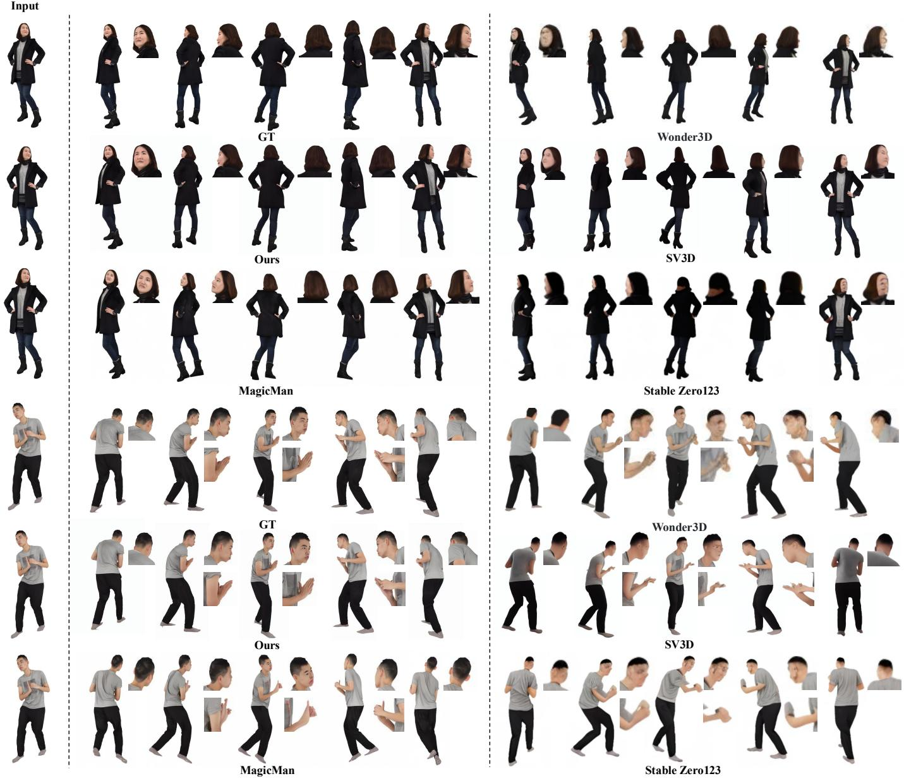  
Figure 8: Qualitative comparison of novel-view synthesis.

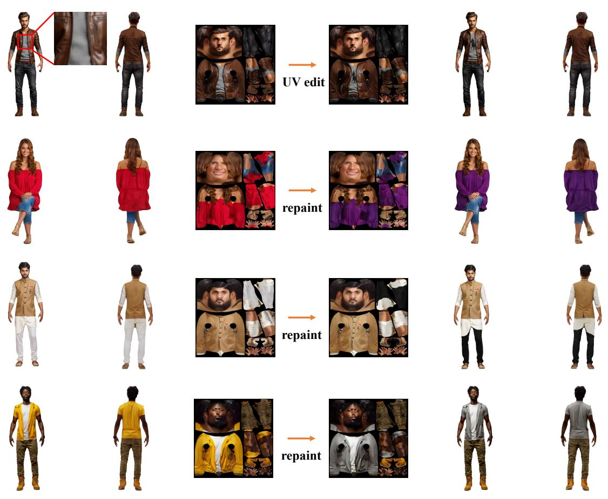  
Figure 9: Local-region editing of 3D humans via SMPL UV repainting.

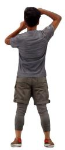

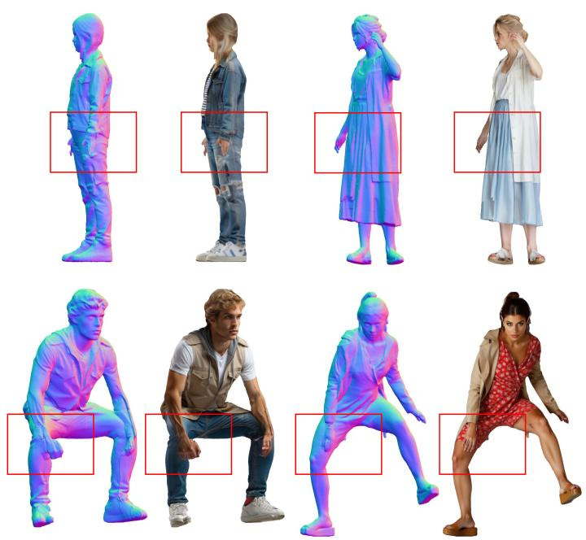  
Figure 10: Failure cases involving fingers.

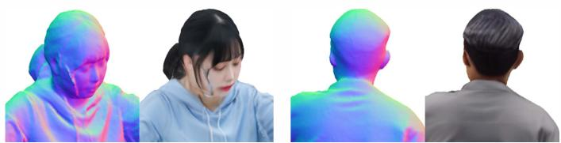  
Figure 11: Failure cases involving hair.

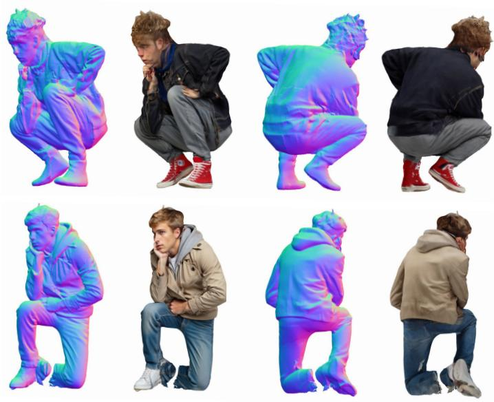  
Figure 12: Failure cases of generated results under out-of-distribution pose guidance.

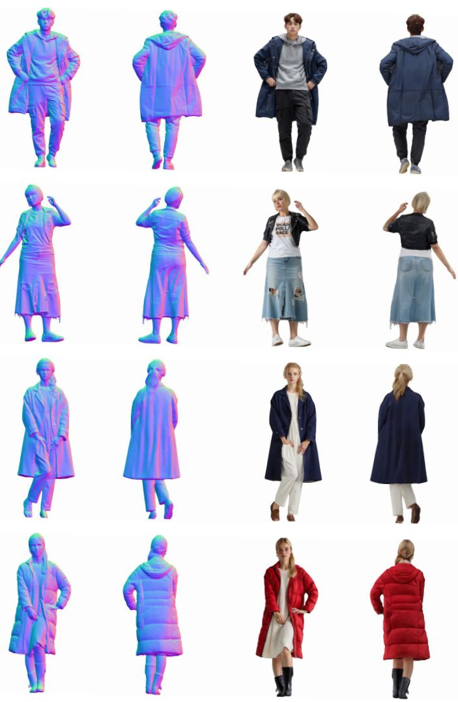  
Figure 13: Generated results for prompts describing loose clothing.

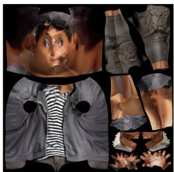

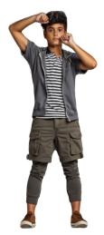

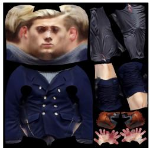

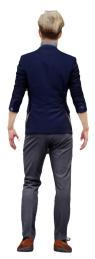  
Figure 14: Generated results under suboptimal UV inpainting conditions.

Joint2Human

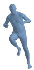

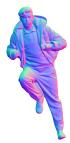

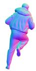

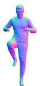  
A Greek boy with olive skin, wavy chestnut bowl-cut hair, layered a charcoal blazer over a white striped polo & gray dress trousers, black leather oxfords.

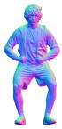

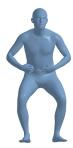

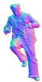

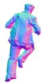

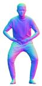

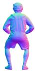

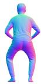

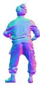  
A Brazilian man with golden tan skin, messy blond hair, layered a red sports jacket over a black t-shirt & shorts, neon green trainers.

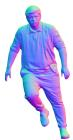

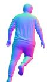

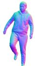

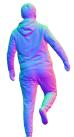

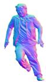

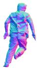

A Canadian boy with pale skin, straight ash-blonde hair, layered a black blazer over a gray polo & khakis, white loafers

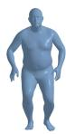

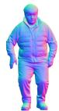

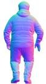

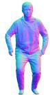

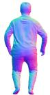

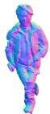

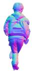

An Australian boy with pale skin, straight brown hair, layered a gray down jacket over a blu polo & jeans, black hiking shoes.

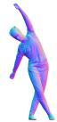

A Black young man with short textured afro hair, deep dark skin, layered burgundy coat over black shirt, slim jeans, high-top leather shoes.

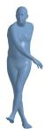

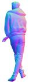

  
A South Asian man with warm brown skin, wavy dark hair, pale blue shirt, charcoal cardigan, oversized camel topcoat, dark jeans, brown brogues

  
Pose

  
A South Asian man with neat black hair, wheatish skin, modern layered Tang suit jacket, matching formal pants, black cloth shoes.

  
Chupa

  
Ours

  
A Greek boy with olive skin, wavy chestnut bowl-cut hair, layered a charcoal blazer over a white striped polo & gray dress trousers, black leather oxfords.

  
A Brazilian man with golden tan skin, messy blond hair, layered a red sports jacket over a black t-shirt & shorts, neon green trainers.

A Canadian boy with pale skin, straight ash-blonde hair, layered a black blazer over a gray polo & khakis, white loafers.

An Australian boy with pale skin, straight brown hair, layered a gray down jacket over a blue polo & jeans, black hiking shoes.

  
A Black young man with short textured afro hair, deep dark skin, layered burgundy coat over black shirt, slim jeans, high-top leather shoes.

  
A South Asian man with warm brown skin, wavy dark hair, pale blue shirt, charcoal cardigan, oversized camel topcoat, dark jeans, brown brogues.

  
Pose

  
Ours

  
A South Asian man with neat black hair, wheatish skin, modern layered Tang suit jacket, matching formal pants, black cloth shoes.  
LHM

  
TRELLIS.2

Figure 15: Qualitative comparison of human geometry under complex poses.

Figure 16: Qualitative comparison of human texture under complex poses.

## References

[1] E. R. Chan, C. Z. Lin, M. A. Chan, K. Nagano, B. Pan, S. De Mello, O. Gallo, L. J. Guibas, J. Tremblay, S. Khamis, et al., Eficient geometry-aware 3d generative adversarial networks, in: CVPR, 2022, pp. 16123–16133.

[2] J. J. Park, P. Florence, J. Straub, R. Newcombe, S. Lovegrove, Deepsdf: Learning continuous signed distance functions for shape representation, in: CVPR, 2019, pp. 165–174.

[3] Q. Feng, Y. Liu, Y.-K. Lai, J. Yang, K. Li, Fof: Learning fourier occupancy field for monocular real-time human reconstruction, 2022.

[4] R. Rombach, A. Blattmann, D. Lorenz, P. Esser, B. Ommer, High-resolution image synthesis with latent difusion models, in: ICCV, 2022, pp. 10684–10695.

[5] Y. Men, B. Lei, Y. Yao, M. Cui, Z. Lian, X. Xie, En3d: An enhanced generative model for sculpting 3d humans from 2d synthetic data, in: CVPR, 2024.

[6] X. Huang, R. Shao, Q. Zhang, H. Zhang, Y. Feng, Y. Liu, Q. Wang, Humannorm: Learning normal difusion model for high-quality and realistic 3d human generation, in: CVPR, 2024.

[7] B. Mildenhall, P. P. Srinivasan, M. Tancik, J. T. Barron, R. Ramamoorthi, R. Ng, Nerf: Representing scenes as neural radiance fields for view synthesis, in: ECCV, 2020.

[8] T. Shen, J. Gao, K. Yin, M.-Y. Liu, S. Fidler, Deep marching tetrahedra: a hybrid representation for high-resolution 3d shape synthesis, 2021.

[9] B. Poole, A. Jain, J. T. Barron, B. Mildenhall, Dreamfusion: Text-to-3d using 2d difusion, arXiv preprint arXiv:2209.14988 (2022).

[10] Y. Huang, H. Yi, Y. Xiu, T. Liao, J. Tang, D. Cai, J. Thies, TeCH: Text-guided Reconstruction of Lifelike Clothed Humans, 2024.

[11] E. Richardson, G. Metzer, Y. Alaluf, R. Giryes, D. Cohen-Or, Texture: Text-guided texturing of 3d shapes, 2023.

[12] N. Kolotouros, T. Alldieck, A. Zanfir, E. G. Bazavan, M. Fieraru, C. Sminchisescu, Dreamhuman: Animatable 3d avatars from text (2023).

[13] Y. Cao, Y.-P. Cao, K. Han, Y. Shan, K.-Y. K. Wong, Dreamavatar: Text-and-shape guided 3d human avatar generation via difusion models, in: ICCV, 2024.

[14] Y. Shi, P. Wang, J. Ye, M. Long, K. Li, X. Yang, Mvdream: Multi-view difusion for 3d generation, arXiv preprint arXiv:2308.16512 (2023).

[15] B. Kim, P. Kwon, K. Lee, M. Lee, S. Han, D. Kim, H. Joo, Chupa: Carving 3d clothed humans from skinned shape priors using 2d difusion probabilistic models, in: ICCV, 2023.

[16] S. Sanyal, P. Ghosh, J. Yang, M. J. Black, J. Thies, T. Bolkart, SCULPT: Shape-conditioned unpaired learning of pose-dependent clothed and textured human meshes, in: CVPR, 2024.

[17] T. Wang, B. Zhang, T. Zhang, S. Gu, J. Bao, T. Baltrusaitis, J. Shen, D. Chen, F. Wen, Q. Chen, B. Guo, Rodin: A generative model for sculpting 3d digital avatars using difusion, in: CVPR, 2023.

[18] X. Zhang, J. Zhang, C. Rohan, H. Xu, G. Song, Y. Yang, J. Feng, Getavatar: Generative textured meshes for animatable human avatars, in: ICCV, 2023.

[19] M. Zhang, Q. Feng, Z. Su, C. Wen, Z. Xue, K. Li, Joint2human: High-quality 3d human generation via compact spherical embedding of 3d joints, in: CVPR, 2024.

[20] M. Loper, N. Mahmood, J. Romero, G. Pons-Moll, M. J. Black, Smpl: a skinned multi-person linear model, ACM TOG (2015).

[21] M. Shi, W. Feng, L. Gao, D. Zhu, Generating diverse clothed 3d human animations via a generative model, Computational Visual Media 10 (2) (2024) 261–277.

[22] C. Wang, H.-Y. Peng, Y.-T. Liu, J. Gu, S.-M. Hu, Difusion models for 3d generation: A survey, Computational Visual Media 11 (1) (2025) 1–28.

[23] Z. Wang, Y. Kanamori, Y. Endo, Eg-humannerf: Eficient generalizable human nerf utilizing human prior for sparse view, Computational Visual Media 12 (2) (2026) 355– 379.

[24] T. Liao, H. Yi, Y. Xiu, J. Tang, Y. Huang, J. Thies, M. J. Black, TADA! Text to Animatable Digital Avatars, 2024.

[25] H. Zhang, B. Chen, H. Yang, L. Qu, X. Wang, L. Chen, C. Long, F. Zhu, K. Du, M. Zheng, Avatarverse: Highquality stable 3d avatar creation from text and pose, in: AAAI, 2024.

[26] F. Hong, M. Zhang, L. Pan, Z. Cai, L. Yang, Z. Liu, Avatarclip: Zero-shot text-driven generation and animation of 3d avatars, ACM TOG (2022).

[27] R. Jiang, C. Wang, J. Zhang, M. Chai, M. He, D. Chen, J. Liao, Avatarcraft: Transforming text into neural human avatars with parameterized shape and pose control, arXiv preprint arXiv:2303.17606 (2023).

[28] Y. Huang, J. Wang, A. Zeng, H. Cao, X. Qi, Y. Shi, Z.-J. Zha, L. Zhang, DreamWaltz: Make a Scene with Complex 3D Animatable Avatars, 2023.

[29] Y. Zeng, Y. Lu, X. Ji, Y. Yao, H. Zhu, X. Cao, Avatarbooth: High-quality and customizable 3d human avatar generation, 2023.

[30] S. Saito, Z. Huang, R. Natsume, S. Morishima, A. Kanazawa, H. Li, Pifu: Pixel-aligned implicit function for high-resolution clothed human digitization, in: ICCV, 2019.

[31] X. Zhan, J. Yang, Y. Li, J. Guo, Y. Guo, W. Wang, Semantic human mesh reconstruction with textures, in: CVPR, 2024.

[32] B. AlBahar, S. Saito, H.-Y. Tseng, C. Kim, J. Kopf, J.-B. Huang, Single-image 3d human digitization with shapeguided difusion, 2023, pp. 1–11.

[33] I. Ho, J. Song, O. Hilliges, et al., Sith: Single-view textured human reconstruction with image-conditioned diffusion, in: CVPR, 2024.

[34] D. Z. Chen, Y. Siddiqui, H.-Y. Lee, S. Tulyakov, M. Nießner, Text2tex: Text-driven texture synthesis via difusion models, in: ICCV, 2023.

[35] T. Cao, K. Kreis, S. Fidler, N. Sharp, K. Yin, Texfusion: Synthesizing 3d textures with text-guided image difusion models, in: ICCV, 2023.

[36] D. Huo, Z. Guo, X. Zuo, Z. Shi, J. Lu, P. Dai, S. Xu, L. Cheng, Y.-H. Yang, Texgen: Text-guided 3d texture generation with multi-view sampling and resampling, in: ECCV, 2024.

[37] S. R. K. Perla, Y. Wang, A. Mahdavi-Amiri, H. Zhang, Easi-tex: Edge-aware mesh texturing from single image, ACM TOG 43 (4) (2024). doi:10.1145/3658222. URL https://github.com/sairajk/easi-tex

[38] X. Zeng, X. Chen, Z. Qi, W. Liu, Z. Zhao, Z. Wang, B. Fu, Y. Liu, G. Yu, Paint3d: Paint anything 3d with lightingless texture difusion models, in: CVPR, 2024.

[39] R. Liu, R. Wu, B. Van Hoorick, P. Tokmakov, S. Zakharov, C. Vondrick, Zero-1-to-3: Zero-shot one image to 3d object, in: ICCV, 2023.

[40] X. Long, Y.-C. Guo, C. Lin, Y. Liu, Z. Dou, L. Liu, Y. Ma, S.-H. Zhang, M. Habermann, C. Theobalt, et al., Wonder3d: Single image to 3d using cross-domain difusion, in: CVPR, 2024, pp. 9970–9980.

[41] V. Voleti, C.-H. Yao, M. Boss, A. Letts, D. Pankratz, D. Tochilkin, C. Laforte, R. Rombach, V. Jampani, Sv3d: Novel multi-view synthesis and 3d generation from a single image using latent video difusion, in: ECCV, 2024, pp. 439–457.

[42] S. Jiang, H. Luo, H. Jiang, Z. Wang, J. Yu, L. Xu, Mvhuman: Tailoring 2d difusion with multi-view sampling for realistic 3d human generation, arXiv preprint arXiv:2312.10120 (2023).

[43] X. He, X. Li, D. Kang, J. Ye, C. Zhang, L. Chen, X. Gao, H. Zhang, Z. Wu, H. Zhuang, Magicman: Generative novel view synthesis of humans with 3d-aware difusion and iterative refinement, arXiv preprint arXiv:2408.14211 (2024).

[44] Y. Xue, X. Xie, R. Marin, G. Pons-Moll, Human 3difusion: Realistic avatar creation via explicit 3d consistent difusion models, Arxiv (2024).

[45] P. Li, W. Zheng, Y. Liu, T. Yu, Y. Li, X. Qi, M. Li, X. Chi, S. Xia, W. Xue, et al., Pshuman: Photorealistic single-view human reconstruction using cross-scale difusion, arXiv preprint arXiv:2409.10141 (2024).

[46] Z. Huang, Y. Guo, H. Wang, R. Yi, L. Ma, Y.-P. Cao, L. Sheng, Mv-adapter: Multi-view consistent image generation made easy, arXiv preprint arXiv:2412.03632 (2024).

[47] Y. Xu, Z. Yang, Y. Yang, Seeavatar: Photorealistic text-to-3d avatar generation with constrained geometry and appearance, arXiv preprint arXiv:2312.08889 (2023).

[48] L. Qiu, X. Gu, P. Li, Q. Zuo, W. Shen, J. Zhang, K. Qiu, W. Yuan, G. Chen, Z. Dong, L. Bo, Lhm: Large animatable human reconstruction model from a single image in seconds, in: ICCV, 2025.

[49] J. Xiang, X. Chen, S. Xu, R. Wang, Z. Lv, Y. Deng, H. Zhu, Y. Dong, H. Zhao, N. J. Yuan, J. Yang, Native and compact structured latents for 3d generation, Tech re port (2025).

[50] J. Yang, B.-T. Zhang, F.-L. Liu, H. Fu, Y.-K. Lai, L. Gao, Humanlift: Single-image 3d human reconstruction with 3d-aware difusion priors and facial enhancement, in: ACM SIGGRAPH Asia, 2025.

[51] A. Radford, J. W. Kim, C. Hallacy, A. Ramesh, G. Goh, S. Agarwal, G. Sastry, A. Askell, P. Mishkin, J. Clark, et al., Learning transferable visual models from natural language supervision, PMLR, 2021, pp. 8748–8763.

[52] T. Salimans, J. Ho, Progressive distillation for fast sampling of difusion models, ICLR (2022).

[53] S. Laine, J. Hellsten, T. Karras, Y. Seol, J. Lehtinen, T. Aila, Modular primitives for high-performance diferentiable rendering, ACM TOG 39 (6) (2020).

[54] W. Palfinger, Continuous remeshing for inverse rendering, Computer Animation and Virtual Worlds 33 (5) (2022) e2101.

[55] Y. Xiu, J. Yang, X. Cao, D. Tzionas, M. J. Black, ECON: Explicit Clothed humans Optimized via Normal integration, in: CVPR, 2023.

[56] J. Young, Mesh parameterization / uv unwrapping library (2018). URL https://github.com/jpcy/xatlas

[57] Z. Wang, A. C. Bovik, H. R. Sheikh, E. P. Simoncelli, Image quality assessment: from error visibility to structural similarity, IEEE TIP 13 (4) (2004) 600–612.

[58] L. I. Rudin, S. Osher, E. Fatemi, Nonlinear total variation based noise removal algorithms, Physica D: nonlinear phenomena 60 (1-4) (1992) 259–268.

[59] T. Yu, Z. Zheng, K. Guo, P. Liu, Q. Dai, Y. Liu, Function4d: Real-time human volumetric capture from very sparse consumer rgbd sensors, in: CVPR, 2021.

[60] S.-H. Han, M.-G. Park, J. H. Yoon, J.-M. Kang, Y.-J. Park, H.-G. Jeon, High-fidelity 3d human digitization from single 2k resolution images, in: CVPR, 2023.

[61] R. Shao, Y. Pang, Z. Zheng, J. Sun, Y. Liu, Human4dit: 360-degree human video generation with 4d difusion transformer, ACM TOG 43 (6) (2024).

[62] R. Zhang, P. Isola, A. A. Efros, E. Shechtman, O. Wang, The unreasonable efectiveness of deep features as a perceptual metric, in: CVPR, 2018, pp. 586–595.