# Through Van Gogh’s Eyes: Global Style Transfer with Difusion Model

Jeongha Lee\*1,2 , Yujin Kim\*3 , Ghazanfar Ali4 , Suhyun Kim†5 , and Jae-In Hwang†1

1Korea Institute of Science and Technology, 2University of Science and Technology, 3 Korea University, 4 Gachon University, 5 Kyung Hee University wjdgk1029@gmail.com, lakeeye1220@gmail.com, ghazan@gachon.ac.kr, dr.suhyun.kim@gmail.com, hji@kist.re.kr

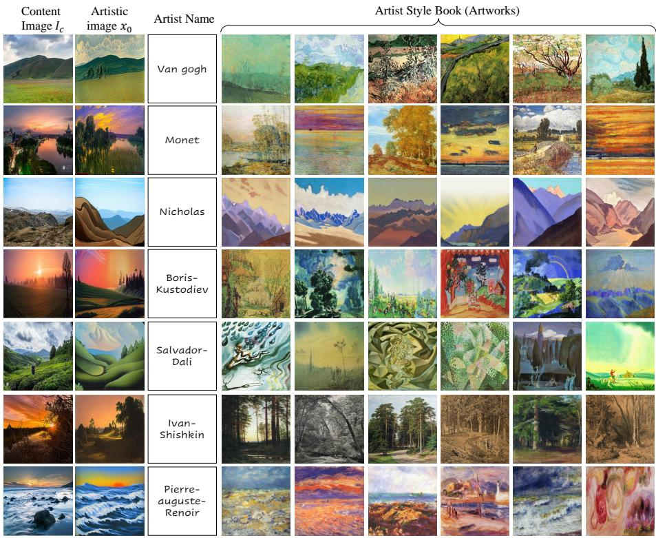  
Fig. 1: Artist-level Global Style Transfer results. Given a content image I (first col umn), our framework synthesizes an artistic image x0 (second column) that reflects the global style of the target artist. The Artist Style Book (remaining columns) displays the top-6 real artworks from the artist’s corpus with the highest semantic similarity to $x _ { 0 } .$ , measured by CLIP distance. This demonstrates that our generated results are influenced by a diverse range of the artist’s genuine works, successfully capturing the global stylistic distribution rather than overfitting to a single iconic exemplar.

Abstract. Artistic image synthesis aims to recreate the expressive visual identity of a target artist, yet existing methods often fail to capture an artist’s global style. Conventional style transfer methods transfer the style of one or a few reference artworks to a content image in a One-to-One manner, making them efective for artwork-level stylization but limited in representing the broader stylistic distribution of an artist. Text-to-image difusion models conditioned on artist names, such as ‘∼ in Van Gogh style’, ofer greater flexibility, but they often sufer from text-induced bias and reproduce patterns from only a few iconic works. To address these limitations, we introduce Global Style Transfer (GST), an artistic image synthesis paradigm, in a Many-to-One manner,that aggregates multiple artworks from a target artist and transfers their shared global style to a single content image. For GST, we propose Global Style Guidance (GSG), which learns a residual global style ofset $\varDelta ( \iota _ { t }$ in the intermediate feature space, or h-space, of a difusion model under a fixed prompt. By learning artist-level style semantics purely from visual statistics, GSG mitigates text-dependent artistic bias. We further propose Content Alignment Guidance (CAG), a training-free perceptual guidance mechanism that preserves the semantic structure of the content image while allowing artist-specific geometric deformation. Experiments on WikiArt demonstrate that GST achieves superior stylistic fidelity, content preservation, and output diversity compared to existing style transfer and difusion-based artistic synthesis methods.

Keywords: Global Style Transfer · Difusion Models · Artistic Image Synthesis

## 1 Introduction

If the great painters of the past were alive today, how would they perceive and depict our modern world on canvas? This question lies at the core of artistic image synthesis, which aims to recreate the expressive visual identity of a target artist. Existing approaches mainly fall into two paradigms: Style Transfer [6, 11, 16] and Text-to-Image (T2I) difusion-based artistic image synthesis [22, 34]. Conventional style transfer methods extract style from a single or a few reference artworks and transfer it to a content image, efectively reproducing the characteristics of specific artworks, called the One-to-One approach. Unfortunately, such instance-level style transfer fails to capture the broader stylistic distribution that defines an artist’s overall visual identity, shown in Fig. 2. On the other hand, T2I difusion models conditioned on artist names (e.g., ‘∼ in the style of Van Gogh’) ofer a more flexible synthesis pipeline but sufer from text-dependent artistic bias. T2I difusion model often reproduces textures and compositions from a handful of iconic works, collapsing the stylistic diversity of an artist into a narrow, mode-biased distribution. Consequently, neither paradigm reliably captures the coherent visual identity that defines an artist’s global style.

To overcome these limitations, we introduce Global Style Transfer (GST), a new paradigm that reformulates artistic image synthesis as a Many-to-One approach. Instead of relying on a single reference artwork or a text prompt, GST aggregates multiple artworks from a target artist and transfers their shared global style to a single content image, as shown in Fig. 12. This formulation naturally mitigates instance-level bias by capturing coherent style representations across the full breadth of an artist’s artworks, and eliminates linguistic dependence by grounding stylistic guidance entirely in visual statistics. As a result, GST enables artist-level style transfer that faithfully reflects the coherent visual identity of the target artist while allowing diverse and expressive content re-rendering.

Concretely, we realize Global Style Transfer through two complementary components. First, we propose Global Style Guidance (GSG), which operates in the intermediate h-space of a difusion U-Net bottleneck. GSG trains a lightweight Style Extraction Function (SEF) to predict a residual global style ofset ∆ht from multiple artworks under a fixed, unified text condition (e.g., ‘A painting’), thereby learning purely visual style semantics free from text-induced variance. Second, we propose Content Alignment Guidance (CAG), a training-free mechanism that performs DDIM inversion [26] on the content image and applies perceptual guidance at each difusion timestep. CAG preserves the abstract structure and semantic composition of the content while allowing style-driven geometric deformations, reflecting the expressive intent characteristic of a target artist.

Extensive experiments on WikiArt dataset [28] demonstrate that our framework achieves superior stylistic fidelity and content preservation compared to existing style transfer and T2I difusion-based artistic synthesis methods, while producing diverse outputs that better reflect the global stylistic spectrum of the target artist. Our main contributions are as follows:

We introduce Global Style Transfer, a novel many-to-one artistic image synthesis paradigm that learns a unified global style distribution from multiple artworks of a target artist, overcoming the artwork (instance)-level and text-dependent artistic bias of prior methods.

– We propose Global Style Guidance (GSG), a guidance mechanism operating in h-space that learns artist-level global stylistic semantics only from visual statistics, mitigating linguistic dependence and artistic mode collapse. We propose Content Alignment Guidance (CAG), a training-free perceptual guidance that preserves the semantic integrity of the content while enabling artist-specific style-based deformation during the difusion process.

## 2 Related Works

## 2.1 Style Transfer (1 content image, 1 style image)

Style Transfer aims to generate a stylized image by combining the semantic structure of a content image with the visual characteristics (e.g., texture, color, and brushstroke) of a style image, typically in a One-to-One setting (Content image: 1, Style image: 1) [8, 16]. Early Neural Style Transfer (NST) methods [6,15] achieved this by matching feature statistics between content and style images, while later methods improved stylization quality through normalization [11, 29], attention mechanisms [17, 20]. Recent difusion-based approaches, such as StyleInjection [2], CSGO [31], InST [35] and Dif-NST [24] further improve style fidelity by injecting style features into the denoising process. However, because these methods rely on only one or few style images, they capture instance-level style rather than the broader stylistic distribution of an artist.

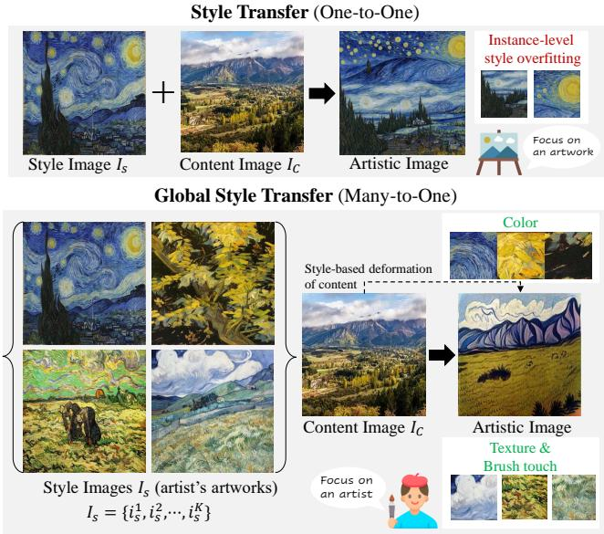  
Fig. 2: Comparison between conventional style transfer and the proposed Global Style Transfer. (Top) Traditional style transfer applies the style of a single reference artwork to a content image, leading to instance-level overfitting. (Bottom) In contrast, Global Style Transfer leverages various artworks from the same artist to learn unified stylistic features, including color palettes, texture patterns, and brushwork, enabling richer style-based content deformation and more faithful artistic image synthesis.

## 2.2 Style Personalization (× or 1 content image, Few style image)

Recent style personalization methods focus on adapting pretrained text-to-image difusion models to generate images in a customized artistic style, typically using a small number of reference styles and either no content image or a single content image to be stylized (Content: × or 1, Style: few). These approaches fall into two categories. The first fine-tunes the difusion backbone itself: DreamBooth [23], Custom Difusion [12], and StyleDrop [25] fine-tune the model, cross-attention projections, or lightweight adapters, respectively, to bind the style to a unique identifier. The second embeds style into the specific module without modifying model weights: Textual Inversion [5] optimizes a word embedding for the target style, while StyleAligned [9] propagates stylistic consistency across generated images via shared attention at inference. However, these methods often memorize dominant visual patterns, limiting stylistic diversity.

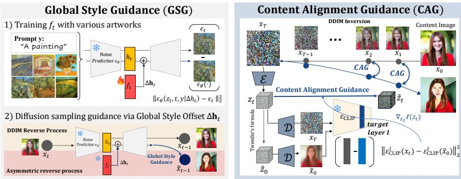  
Fig. 3: Overall framework of Global Style Transfer (GST). (Left) Global Style Guidance (GSG) trains a lightweight Style Extraction Function $f _ { t }$ on multiple artworks under the fixed prompt ‘A painting’, learning a residual global style ofset $\Delta \mathbf { h } _ { t }$ that modulates the U-Net bottleneck representation $h _ { t }$ in a text-independent manner. During reverse difusion, $\Delta \mathbf { h } _ { t }$ steers the denoising trajectory toward the artist’s global style distribution. (Right) Content Alignment Guidance (CAG) first maps the content image $I _ { c }$ into a noisy latent via DDIM inversion, then applies CLIP-based perceptual guidance at each timestep to align the semantic structure of the generated image with the content while permitting style-driven deformation, yielding artist-level stylization.

In contrast to both methods, our Global Style Transfer learns an artist-level global style distribution from multiple artworks and applies it to a content image in Many-to-One manner, enabling faithful artistic synthesis without relying on single-instance style cues or text-dependent supervision.

## 3 Methods

## 3.1 Preliminary

Latent Difusion Models. Latent Difusion Models (LDM) [22] operate in a lower-dimensional latent space, enabling cost-eficient and scalable text-conditioned image synthesis. Given an image $x _ { 0 }$ , an autoencoder $\mathcal { E } : \mathbb { R } ^ { k }  \mathbb { R } ^ { d }$ maps images into the latent vector $z _ { 0 } = \mathcal { E } ( x _ { 0 } )$ . A forward difusion process gradually adds Gaussian noise according to a variance schedule $\beta _ { t } .$ , yielding:

$$
z _ { t } = \sqrt { \bar { \alpha } _ { t } } z _ { 0 } + \sqrt { 1 - \bar { \alpha } _ { t } } \epsilon , \ \epsilon \sim \mathcal { N } ( 0 , I ) ,\tag{1}
$$

where $\begin{array} { r } { \bar { \alpha } _ { t } = \prod _ { s = 1 } ^ { t } ( 1 - \beta _ { s } ) } \end{array}$ . Then, the denoising model $\epsilon _ { \theta }$ learns to predict the noise $\boldsymbol { \epsilon } _ { \theta } \big ( \boldsymbol { z } _ { t } , t , \boldsymbol { c } \big )$ given the noisy latent $z _ { t }$ at every time step t with text condition c encoded by the text encoder $\tau _ { \phi }$ during the sampling process as below:

$$
\mathbf { z } _ { t - 1 } = \sqrt { \bar { \alpha } _ { t - 1 } } \tilde { z } _ { 0 } + \sqrt { 1 - \bar { \alpha } _ { t - 1 } - \sigma _ { t } ^ { 2 } } \epsilon _ { \theta } ^ { t } \bigl ( z _ { t } \bigr ) + \sigma _ { t } \epsilon _ { t } ,\tag{2}
$$

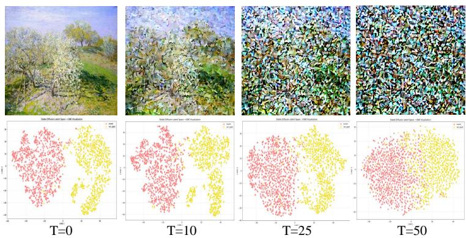  
Fig. 4: Time-step robustness of Global Style Guidance in h-space. (Top) Artistic images generated at difusion timesteps $t = \{ 0 , 1 0 , 2 5 , 5 0 \}$ , showing increasing noise levels as t grows. (Bottom) t-SNE visualizations of 500 $h _ { t }$ feature vectors from artworks by Van Gogh (yellow) and Monet (red) at the corresponding t. Despite progressive noise corruption, clusters remain well-separated across all timesteps, validating h-space as a stable domain for artist-level style representation during the difusion process.

where $\sigma _ { t } ~ = ~ \eta \sqrt { ( 1 - { \bar { \alpha } } _ { t - 1 } ) / ( 1 - { \bar { \alpha } } _ { t } ) } \sqrt { 1 - { \bar { \alpha } } _ { t } / { \bar { \alpha } } _ { t - 1 } } . ~ \epsilon _ { \theta } ^ { t } ( z _ { t } )$ denotes the modelpredicted noise, abbreviated from $\epsilon _ { \theta } ( \mathbf { z } _ { t } , t , c )$ , and $\tilde { \mathbf { z } } _ { 0 }$ means the approximation of the clean latent $\mathbf { z } _ { 0 }$ at time step t obtained via Tweedie’s formula. The training objective of the LDM is defined as:

$$
\begin{array} { r } { \mathcal { L } _ { \mathrm { L D M } } : = \mathbb { E } _ { z \sim \mathcal { E } ( x ) , \epsilon _ { t } , t } \left[ \| \epsilon _ { \theta } ( z _ { t } , t , c ) - \epsilon _ { t } \| _ { 2 } ^ { 2 } \right] , } \end{array}\tag{3}
$$

After training, the difusion process starts from a noisy latent $z _ { t }$ and iteratively denoises it to $z _ { \mathrm { 0 } }$ . The LDM then decodes $z _ { 0 }$ into pixel space using the decoder $\mathcal { D } : \mathbb { R } ^ { d }  \mathbb { R } ^ { k }$ , yielding the clean image $x _ { 0 } = \mathcal { D } ( z _ { 0 } )$

Asymmetric Reverse Process for Semantic Guidance. Asyrp [13] discovers that the pre-trained difusion model inherently contains a semantic space, referred to as the h-space, corresponding to the activations of the U-Net bottleneck layer. To enable controllable generation within LDM, Asyrp reformulates the reverse process by modifying Eq. (2) into an asymmetric form as follows:

$$
\mathbf { z } _ { t - 1 } = \sqrt { \bar { \alpha } _ { t - 1 } } \mathbf { P } _ { t } ( \epsilon _ { \theta } ^ { t } ( z _ { t } | \varDelta \mathbf { h } _ { t } ) ) + \mathbf { D } _ { t } ( \epsilon _ { \theta } ^ { t } ( z _ { t } ) ) + \sigma _ { t } \epsilon _ { t } ,\tag{4}
$$

where $\mathbf { P } _ { t }$ denotes the predicted $\tilde { \mathbf { z } } _ { 0 }$ , and $\mathbf { D } _ { t }$ represents the denoising direction toward $\mathbf { z } _ { t }$ . The asymmetric control updates only $\epsilon _ { \theta } ^ { t } ( { \bf z } _ { t } )$ via $\epsilon _ { \theta } ^ { t } ( \mathbf { z } _ { t } | \varDelta \mathbf { h } _ { t } )$ , adding $\Delta \mathbf { h } _ { t }$ as a residual to the U-Net bottleneck features $\mathbf { h } _ { t } ,$ while preserving $\mathbf { D } _ { t } .$ This enables semantic manipulation in latent space without compromising reconstruction fidelity. Consequently, the h-space exhibits stable and transferable semantics across time steps, supporting consistent, and multi-attribute guidance for latent difusion models.

## 3.2 Global Style Transfer

We introduce Global Style Transfer, a new paradigm that extends the conventional one-to-one style transfer setting to a many-to-one formulation, as illustrated in Fig. 2. Unlike traditional methods that rely on a single style instance to guide the appearance of a content image, our approach aggregates multiple artworks from a single artist to learn a unified and consistent representation of that artist’s global style.

Given a content image $I _ { c }$ and a set of style exemplars $I _ { s } = \{ i _ { s } ^ { 1 } , i _ { s } ^ { 2 } , \cdots , i _ { s } ^ { K } \}$ drawn from an artist’s $K$ artworks, Global Style Guidance (GSG) guides the difusion model that encapsulates artist-specific semantic and style cues across various artworks. To preserve the semantic integrity of the content, we further introduce Content Alignment Guidance (CAG), which maintains the abstract structure and semantics of $I _ { c }$ while allowing flexible, style-based deformation. Through CAG, the content image is re-rendered with the distinctive visual characteristics of the target artworks without compromising its original composition.

Global Style Transfer ofers two key advantages over text-conditioned artistic synthesis. (1) Text-independent Guidance: Rather than relying on textual prompts $( \mathrm { e . g . , \ell \sim }$ in the style of Van Gogh’), Global Style Transfer extracts visual semantics directly from the aggregated style artworks. (2) Artistic bias mitigation in difusion-based artistic image synthesis: Vanilla Text-to-Image difusion models conditioned on artist names tend to exhibit stylistic bias, over-representing textures and compositions from a few iconic works. By guiding a global style prior from multiple style exemplars, our framework regularizes the difusion process, mitigating such artistic mode bias and yielding diverse yet faithful images that better reflect the full stylistic spectrum of the artist.

## 3.3 Global Style Guidance in h-Space

Finding Artist’s Global Style. To guide the difusion model toward the global style of a specific artist, we define the residual global style ofset $\varDelta \mathbf { h } _ { t } ,$ which modulates the U–Net bottleneck representation $h _ { t }$ at each timestep t:

$$
h _ { t } = h _ { t } + w \cdot \varDelta \mathbf { h } _ { t } ,\tag{5}
$$

where w controls the strength of stylistic modulation. The residual global style ofset $\Delta \mathbf { h } _ { t }$ captures the global stylistic semantics of the artist, enhancing the U-Net’s intermediate representations with consistent style attributes. To estimate $\Delta \mathbf { h } _ { t }$ , we define a Style Extraction Function (SEF) $f _ { t }$ that transforms the given $h _ { t }$ into global style–conditioned feature:

$$
\Delta \mathbf { h } _ { t } = f _ { t } ( h _ { t } ; \theta ) .\tag{6}
$$

$f _ { t }$ is a lightweight multilayer perceptron (MLP) with one hidden layer parameterized by θ and conditioned on timestep t. Specifically, we apply the zeroinitialization strategy, which initializes the weights of $f _ { t }$ to zero [34] to avoid stochastic bias from random initialization. Zero-initialization ensures training process begins from an unbiased state and learns purely data-driven global style semantics. Then, we train the $f _ { t }$ with multiple artworks using the noise reconstruction loss same as Eq. (3):

Algorithm 1 Global Style Guidance Algorithm   
Require: Style exemplars (=artworks) $I _ { s } ,$ Style Extraction Function (SEF) $f _ { t } ,$   
Model(Latent difusion model) $\epsilon _ { \theta } ( \cdot , t )$ , text encoder $\tau _ { \phi } ,$ image decoder $\mathcal { D } ,$ Prompt y   
Output: SEF $f _ { t }$   
1: $y = \mathsf { \tilde { A } }$ painting’ {All artworks are paired with this prompt}   
2: for epoch $, = 0$ to E do   
for $k = 1$ to K do   
4: /\*Difusion Forward Proces $^ * /$   
5: for $t = 0$ to $T - 1$ do   
6: $z _ { 0 } ^ { k } = \mathcal { E } ( I _ { s } ^ { k } )$ {instance style image sampling $i _ { s } ^ { k } \in I _ { s } \}$   
7: $\epsilon _ { t } \sim \mathcal { N } ( 0 , I )$   
8: $z _ { t } = \sqrt { \bar { \alpha } _ { t } } z _ { 0 } + \sqrt { 1 - \bar { \alpha } _ { t } } \epsilon$   
9: end for   
10: /\*Difusion Denoising Process\*/   
11: for $t = T - 1$ to 0 do   
12: LSEF $\mathrm { : } = \mathbb { E } _ { z \sim \mathcal { E } ( x ) , \epsilon _ { t } , t } \left[ | | \epsilon _ { \theta } ( z _ { t } , t , \tau _ { \phi } ( y ) | \varDelta \mathbf { h } _ { t } ) - \epsilon _ { t } | | _ { 2 } ^ { 2 } \right]$   
13: $/ / \Delta \mathbf { h } _ { t } = f _ { t } ( h _ { t } ; \theta )$ from Eq. (6)   
14: $f _ { t } ( h _ { t } ; \theta ) \gets f _ { t } ( h _ { t } ; \theta ) - \eta \nabla _ { f _ { t } } \mathcal { L } _ { \mathrm { S E F } }$   
15: $\mathbf { z } _ { t - 1 } = \sqrt { \bar { \alpha } _ { t - 1 } } \mathbf { P } _ { t } ( \epsilon _ { \theta } ^ { t } ( z _ { t } | \varDelta \mathbf { h } _ { t } ) ) + \mathbf { D } _ { t } ( \epsilon _ { \theta } ^ { t } ( z _ { t } ) ) + \sigma _ { t } \epsilon _ { t }$   
16: end for   
17: end for   
18: end for   
19: Return $f _ { t } ( h _ { t } ; \theta )$

Algorithm 2 Global Style Transfer Algorithm   
Require: Content Image ${ \cal I } _ { c } ,$ Model(Latent difusion model) $\epsilon _ { \theta } ( \cdot , t )$ , text encoder $\tau _ { \phi } ,$   
image decoder $\mathcal { D } ,$ prompt y, CLIP image encoder $\mathcal { E } _ { \mathrm { C L I P } }$   
Output: Artistic image x0   
1: $\mathbf { z } _ { T } \gets$ DDIM Inversion with respect to the $I _ { c }$   
2: for $t = T - 1$ to 1 do   
3: $\epsilon _ { t } \sim \mathcal { N } ( 0 , I )$   
4: //obtain ∆h from Algorithm 1   
5: $\mathbf { z } _ { t - 1 } = \sqrt { \bar { \alpha } _ { t - 1 } } \mathbf { P } _ { t } \big ( \epsilon _ { \theta } ^ { t } \big ( z _ { t } \big | \Delta \mathbf { h } _ { t } \big ) \big ) + \mathbf { D } _ { t } \big ( \epsilon _ { \theta } ^ { t } \big ( z _ { t } \big ) \big ) + \sigma _ { t } \epsilon _ { t }$   
6: //Approximate z˜ from Tweedie formula [4] and $\tilde { x } _ { 0 } \approx \mathcal { D } ( \tilde { z } _ { 0 } | z _ { t } )$   
7: $\ell ( z _ { t } ) = \| \mathcal { E } _ { \mathrm { C L I P } } ^ { l } ( \tilde { x } _ { 0 } ) - \mathcal { E } _ { \mathrm { C L I P } } ^ { l } ( x _ { t } ) \| _ { 2 }$   
8: Content Alignment Guidance   
9: $\tilde { z } _ { t } \gets z _ { t } - s \nabla _ { z _ { t } } \ell ( z _ { t } )$   
10: //Classifier Free Guidance   
11: $\tilde { \epsilon } _ { t } \gets \epsilon _ { \theta } ( \tilde { z } _ { t } , t , \mathcal { D } ) + g ( \epsilon _ { \theta } ( \tilde { z } _ { t } , t , \tau _ { \phi } ( y ) ) - \epsilon _ { \theta } ( \tilde { z } _ { t } , t , \mathcal { D } ) )$   
12: end for   
13: Return $x _ { 0 } = \mathcal { D } ( \tilde { \mathbf { z } } _ { 0 } )$

$$
\mathcal { L } _ { \mathrm { S E F } } : = \mathbb { E } _ { z \sim \mathcal { E } ( x ) , \epsilon _ { t } , t } \left[ \Vert \epsilon _ { \theta } \bigl ( z _ { t } , t , \tau _ { \phi } ( y ) | \Delta \mathbf { h } _ { t } \bigr ) - \epsilon _ { t } \Vert _ { 2 } ^ { 2 } \right] .\tag{7}
$$

Table 1: Comparison of implicit function learning between Asyrp and our framework.
<table><tr><td>Difference</td><td>Asyrp</td><td>Global Style Transfer (Ours)</td></tr><tr><td>Goal</td><td>Instance-conditional attribute manipulation (Image Editing)</td><td>Distribution-level global style training</td></tr><tr><td colspan="3">Supervision signal Text-driven attribute change</td></tr><tr><td>on training ft</td><td>Text conditioning Explicit source-target prompts (high variance), e.g., &#x27;A girl&#x27; (ysource) → &#x27;A smiling girl&#x27;(yref)</td><td>Fixed prompt (zero variance) e.g., &#x27;A painting&#x27;</td></tr><tr><td>Training data</td><td>Single (or few) source images</td><td>Hundreds of artworks from a single artist</td></tr><tr><td>Loss function for learning ft</td><td>CLIP directional editing loss + reconstruction loss:  $\lambda _ { \mathrm { C L I P } } L _ { \mathrm { d i r e c t i o n } } ( P _ { t } ^ { \mathrm { e d i t } } , y _ { \mathrm { r e f } } , P _ { t } ^ { \mathrm { s o u r c e } } , y _ { \mathrm { s o u r c e } } ) + \lambda _ { \mathrm { r e c o n } } \| x _ { t } ^ { \mathrm { e d i t } } - x _ { t } ^ { \mathrm { s o u r c e } } \| _ { 2 } \overset { \star \lor { n o u } \star \land { \mathrm { o u r c e } } } { \sim } , t [ \| \epsilon _ { \theta } ( z _ { t } , t , \tau _ { \phi } ( y ) \| \varDelta h _ { t } ) - \epsilon _ { \phi } ( z _ { t } , t , \tau _ { \phi } ( z _ { t } ) ) \| _ { 2 } ]$ </td><td>Noise reconstruction loss over artist distribution: - t||2]</td></tr></table>

Specifically, to ensure that training focuses purely on visual statistics rather than text conditioning, all artworks images $I _ { s }$ are paired with the fixed simple prompt y, ‘A painting’. By enforcing a unified prompt across all artworks, the variance of text conditioning efectively approaches zero, allowing $f _ { t }$ to rely purely on visual cues for capturing global style semantics. Consequently, our SEF learns global stylistic representations directly from the visual semantics of the artworks rather than from linguistic information, resulting in visually grounded and unbiased Global Style Guidance. After training, the difusion process proceeds toward a unified global style distribution, enabling the generation of images that reflect the coherent stylistic identity of the target artist without additional textual conditioning. The overall algorithms of GSG is described in Algorithm 1.

Time-Step Robustness of Global Style Guidance. To motivate our design choice of performing Global Style Guidance (GSG) in the intermediate $h -$ space, we analyze whether h-space provides a stable representation of global style across difusion timesteps. As shown in Fig. 4, 500 artworks per artist form well-separated clusters in h-space even under Gaussian noise across diferent timesteps. This demonstrates that $h _ { t }$ remains robust to noise and timestep variation while preserving artist-level semantic global style, allowing GSG to maintain coherent stylization throughout the difusion generative process.

Diference between Asyrp and our Global Style Transfer. Although our framework shares the same implicit function architecture as Asyrp [13], the two methods difer fundamentally in objective and supervision, as summarized in Tab. 1. Asyrp uses $f _ { t }$ as an instance-level editing operator for single-image manipulation, optimized with a CLIP directional loss between source–reference text prompts $( ^ { \cdot } \tt A \ g i r 1 ^ { \cdot } \to { ^ \cdot } \tt A$ smiling $\mathtt { g i r 1 } ^ { \prime } )$ . Consequently, the optimization is inherently text-dependent, aligning $f _ { t }$ with semantic attribute directions under highly varying prompt conditions. In contrast, we optimize $f _ { t }$ to model the global stylistic distribution of an artist from hundreds of artworks using only visual supervision. By fixing the text condition $y$ to a constant prompt (e.g., ‘A painting’), we eliminate text-induced variance, allowing $f _ { t }$ to be learned purely from artwork visual statistics via noise reconstruction.

## 3.4 Content Alignment Guidance

Motivated by how artists reinterpret real-world objects, preserving abstract structure while expressing unique artistic style, we propose the training-free Content Alignment Guidance (CAG). In Neural Style Transfer (NST) [24, 36], style-based deformation of content can be desirable, as artistic styles often involve intentional geometric or structural alterations beyond color and texture changes. Inspired by NST, our CAG aims to preserve the recognizable structure of the original content while allowing controlled, style-driven deformations that reflect the artist’s expressive intent.

We first perform DDIM inversion [26] to map the input content image into its noisy latent vector. Then, we measure perceptual similarity using the CLIP image encoder $\mathcal { E } _ { \mathrm { C L I P } }$ within a Stable Difusion [22] between the generated image $x _ { t } ~ = ~ \mathcal { D } ( z _ { t } )$ at every timestep t and approximated image $\tilde { x } _ { 0 } \approx \mathcal { D } ( \tilde { z } _ { 0 } | z _ { t } )$ via Tweedie’s formula [4]:

$$
\ell ( z _ { t } ) = \| \mathcal { E } _ { \mathrm { C L I P } } ^ { l } ( \tilde { x } _ { 0 } ) - \mathcal { E } _ { \mathrm { C L I P } } ^ { l } ( x _ { t } ) \| _ { 2 } ,\tag{8}
$$

where $\mathcal { E } _ { \mathrm { C L I P } } ^ { l }$ extracts high-level semantic features from layer l of CLIP. Since the approximated image x˜0 preserves the abstract structure of the content image, aligning its feature representation with that of the generated image $x _ { t }$ encourages structural consistency while allowing style-driven deformation. Following the SDE formulation [27], we incorporate this perceptual loss as the guidance by replacing the unconditional score $\nabla z _ { t } \log p ( z _ { t } )$ with the conditional score $\nabla _ { z _ { t } } \log { p ( z _ { t } | \boldsymbol { \ell } ) }$ , decomposed as:

$$
\nabla _ { z _ { t } } \log p ( z _ { t } | \ell ) = \nabla _ { z _ { t } } \log p ( z _ { t } ) + s \nabla _ { z _ { t } } \log p ( \ell | z _ { t } ) ,\tag{9}
$$

where s is a parameter controlling the guidance strength. The second term is interpreted as the gradient of the perceptual loss with respect to the image latent $\nabla _ { z _ { t } } \ell ( z _ { t } )$ . Formally, the guided image latent is expressed as:

$$
\tilde { z } _ { t } = z _ { t } - s \nabla _ { z _ { t } } \ell ( z _ { t } ) ,\tag{10}
$$

where s controls the guidance strength. Consequently, CAG refines the latent trajectory in a training-free manner at each timestep to preserve content structure while enabling artist-specific compositional and geometric transformations. The overall algorithm and framework are illustrated in Algorithm 2 and Fig. 3.

## 4 Experiments

Datasets. We define the style reference images in the WikiArt dataset [28], which includes over 80,000 artworks created by more than 1,000 artists across 27 art movements. For content images, we utilize the VanGogh2Photo dataset [37] , which contains real-world photographic scenes paired with artistic counterparts, enabling consistent evaluation of content preservation in artistic synthesis. This dataset combination serves as a standard benchmark for the style transfer.

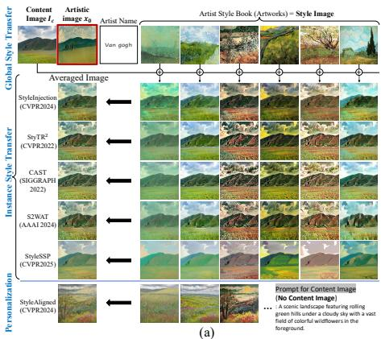

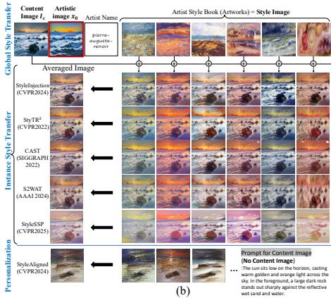  
Fig. 5: Comparison of Global Style Transfer (GST) with representative style transfer baselines. We compare GST with instance-level style transfer and style personalization methods, using artworks from the same artist as style exemplars: (a) Van Gogh and (b) Pierre-Auguste Renoir. Since baseline methods utilize only a single style image $I _ { s } ,$ we perform stylization separately using multiple artworks from the same artist and average the resulting outputs to approximate artist-level style. Baselines preserve only low-level appearance cues and produce inconsistent global styles, whereas GST learns the artist-level style and enables coherent global stylization.

Evaluation Metrics. We evaluate using five metrics: FID [10] and ArtFID [30] for global style fidelity, CFSD [2] for content preservation, and CLIP-Div [1] and 1-Precision [14,18] for stylistic diversity and memorization, respectively. Detailed definitions are provided in the Appendix.

## 4.1 Main Results

Sample Visualization. Fig. 12 shows the artistic images produced by the Global Style Transfer. This is achieved as the difusion model performs Global Style Guidance (GSG) within the intermediate feature space (h-space), ensuring semantic stability across time steps and producing consistent style transformation throughout the generative process.

Comparison with Style Transfer Methods. Our method introduces a new paradigm, Global Style Transfer (GST), which fundamentally difers from conventional style transfer. Traditional style-transfer methods operate in a one-toone setting, where a single content image $I _ { c }$ is transferred to an artistic image with only single style image $I _ { s }$ through feature injection or attention modulation. While efective for instance-level stylization, such approaches cannot capture an artist-level style distribution spanning hundreds or thousands of artworks. To verify this limitation, we compare our method with representative Style Transfer baselines, including StyleInjection [2], StyTR2 [3], CAST [36], S2WAT [33], StyleSSP [32], as well as the shared-attention personalization method StyleAligned [9], grouped separately in Fig. 5. Since these baselines take a single style image, we run each on the artist’s artworks individually and average the resulting outputs to approximate an artist-level style. As shown in Fig. 5, this strategy fails to recover coherent artist-level style. Existing methods primarily capture lowlevel appearance cues such as dominant colors or coarse brush textures from each exemplar, but fail to preserve consistent stylistic characteristics shared across the artist’s full corpus. Even averaging multiple stylized outputs does not meaningfully represent the global style distribution, often producing blurred or inconsistent results. In contrast, our method directly learns the artist-level style manifold from multiple artworks, enabling coherent global stylization while avoiding overfitting to specific exemplars.

Table 2: Quantitative comparison across artists. ArtFID measures style and content fidelity, CFSD measures content preservation, CLIP-Div and 1-Prec. assess stylistic diversity and memorization-avoidance. CLIP-Div is reported as Ours/Real for direct comparison with the real artwork corpus. Bold: best; underline: second best.  
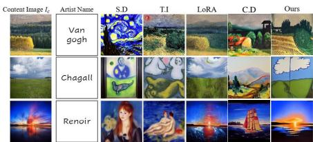

<table><tr><td>Artist</td><td>Method</td><td colspan="5">FID (↓) ArtFID (↓) CFSD (↓) CLIP-Div (↑) 1–Prec (↑)</td></tr><tr><td rowspan="5"></td><td>S.D</td><td>11.97</td><td>23.78</td><td>0.7428</td><td>0.178</td><td>0.257</td></tr><tr><td>Textual Inversion</td><td>7.67</td><td>13.68</td><td>0.1674</td><td>0.220</td><td>0.550</td></tr><tr><td>Van Gogh Custom Diffusion</td><td>9.49</td><td>14.71</td><td>0.1208</td><td>0.289</td><td>0.933</td></tr><tr><td>LoRA based Fine-tuning</td><td>11.01</td><td>21.38</td><td>0.1886</td><td>0.261</td><td>0.913</td></tr><tr><td>Ours</td><td>9.46</td><td>19.25</td><td>0.2896</td><td>0.297/0.335</td><td>0.988</td></tr><tr><td rowspan="5">Chagall</td><td>S.D</td><td>16.26</td><td>32.44</td><td>0.3117</td><td>0.224</td><td>0.844</td></tr><tr><td>Textual Inversion</td><td>11.72</td><td>21.15</td><td>0.1683</td><td>0.238</td><td>0.877</td></tr><tr><td>Custom Diffusion</td><td>18.06</td><td>26.70</td><td>0.1108</td><td>0.289</td><td>0.962</td></tr><tr><td>LoRA based Fine-tuning 17.30</td><td></td><td>32.59</td><td>0.1674</td><td>0.266</td><td>0.928</td></tr><tr><td>Ours</td><td>13.25</td><td>26.39</td><td>0.2626</td><td>0.311/0.293</td><td>0.977</td></tr><tr><td rowspan="5">Renoir</td><td>S.D</td><td>16.72</td><td>33.70</td><td>0.1584</td><td>0.225</td><td>0.987</td></tr><tr><td>Textual Inversion</td><td>12.14</td><td>21.99</td><td>0.1100</td><td>0.238</td><td>0.895</td></tr><tr><td>Custom Diffusion</td><td>15.15</td><td>22.77</td><td>0.1160</td><td>0.294</td><td>0.987</td></tr><tr><td>LoRA based Fine-tuning 15.36</td><td></td><td>29.23</td><td>0.1749</td><td>0.279</td><td>0.988</td></tr><tr><td>Ours</td><td>12.27</td><td>24.70</td><td>0.1566</td><td>0.318/0.313</td><td>0.999</td></tr></table>

Fig. 6: Visual comparison of previous style personalization methods and vanilla Stable Difusion. Qualitative results corresponding to Tab. 2 are shown, demonstrating the comparative performance of each method in terms of style alignment and visual coherence.

Comparison with Style Personalization Methods. We compare GST with representative personalization methods, including Textual Inversion (TI) [5], which optimizes a token embedding over the full artwork collection, Dream-Booth [23] with LoRA-based fine-tuning, and Custom Difusion [12], which finetunes only the cross-attention layers. We also provide a qualitative comparison with StyleAligned [9] in Fig. 5. For a fair comparison in the GST setting, we train each baseline on the full artwork collection of each artist rather than using the few-shot setting adopted in their original formulations.

As shown in Tab. 2, GST achieves consistently strong performance across all three artists, demonstrating efective modeling of artist-level global style. GST achieves competitive ArtFID, indicating strong overall style and content fidelity without overfitting to content structure. It also achieves the highest CLIP-Diversity across all artists, showing that GST captures a broader stylistic distribution rather than collapsing to a narrow set of visual patterns. Notably, the CLIP-Diversity values of GST are highly consistent with those computed from the real artwork collections (reported as Ours / Real), suggesting that GST

Van gogh’s artworks

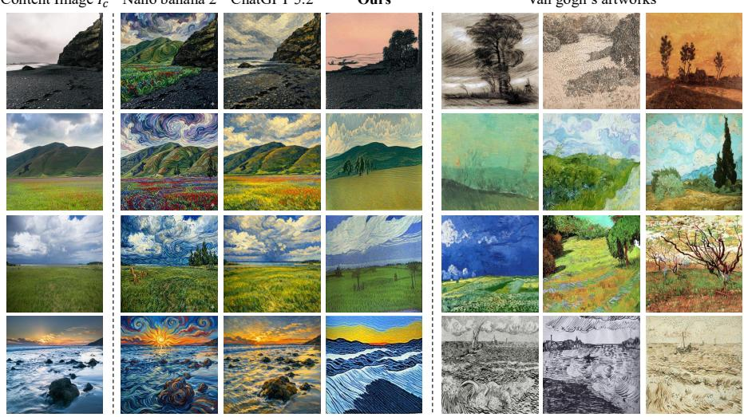  
Fig. 7: Visual comparison with T2I models (Nano Banana 2, ChatGPT 5.2) prompted with ‘Van Gogh style’ for a given content image $I _ { c } .$ The rightmost columns display the top three Van Gogh artworks with the lowest CLIP distance to our generated result.

successfully reproduces the diversity of the true artist-level style distribution. The 1-Precision results further show that GST best avoids memorization while preserving stylistic consistency. In contrast, prior personalization methods often rely on memorized exemplar patterns or overfit to dominant visual motifs, as also observed in Fig. 6. For example, Textual Inversion is limited by its fixeddimensional token embedding, while fine-tuning methods often collapse toward iconic compositions. Consequently, our method scales efectively with increasing artwork diversity and better captures the full artist-level style distribution.

## 4.2 Analysis of Global Style Transfer

Analysis of Text-Independence in Global Style Transfer. We analyze whether the learned style representation depends on text prompts.

Since the Style Extraction Function (SEF) is trained using a large collection of artworks, we use a fixed prompt, ‘A painting’, during training to minimize textual influence and encourage the model to learn style primarily from visual cues. To evaluate prompt sensitivity, we replace the prompt with alternative generic prompts during training SEF and compute the corresponding style ofset ∆h.

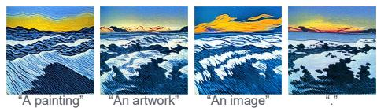  
Fig. 8: The sensitivity of prompt for training the Style Extraction Function $f _ { t }$

Table 3: Ablation study on Content Alignment Guidance (CAG). Removing CAG leads to a consistent increase in both FID and ArtFID, demonstrating its crucial role in preserving content fidelity under global style modulation  
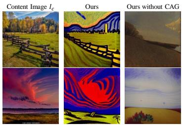

<table><tr><td>Method FID ArtFID</td></tr><tr><td>Ours  $\mathrm { w / o }$  CAG 11.05</td><td>22.45</td></tr><tr><td>Ours</td><td>9.46 19.25</td></tr></table>

Fig. 9: Qualitative ablation on CAG. Without CAG, the images exhibit content degradation despite strong stylization.

As shown in Fig. 8, the generated images remain nearly identical across prompts, indicating that the learned representation is largely text-independent and primarily captures artist-level visual style.

Analysis of Stylistic Bias in T2I Models. We compare our framework with large-scale text-to-image baselines, Nano Banana 2 [7] and ChatGPT 5.2 [19], using the prompt ‘Van Gogh style’. As shown in Fig. 13, these baselines exhibit strong stylistic bias, repeatedly generating images dominated by iconic Van Gogh features such as swirling patterns and thick brushstrokes, often resembling Starry Night. In contrast, our Global Style Transfer learns a unified artist-level representation, mitigating such bias and producing diverse outputs that better reflect the true global style distribution.

Efect of the Content Alignment Guidance. To verify the efectiveness of CAG, we compare the full methods with a variant without CAG. As shown in Fig. 9 and Tab. 3, removing CAG leads to noticeable content degradation, reflected by a significant increase in ArtFID, which measures both style and content fidelity. These results demonstrate that CAG plays a crucial role in preserving content under strong global style modulation. Additional ablations on the embedding layer selection and training epochs are provided in Figs. 11 and 14.

Efect of Layer Level for Content Alignment Guidance. We examine how applying Content Alignment Guidance (CAG) at diferent layers of the CLIP image encoder afects the preservation of content structure during global style transfer. As shown in Fig. 14, applying CAG at lower or mid-level layers (1–9) produces unintended artifacts, such as house-like structures absent from the content image $I _ { c } ,$ indicating poor preservation of global composition. This occurs because lower layers mainly encode low-level features such as edges, color and textures. In contrast, applying CAG at Layer 11 preserves the original scene structure and yields semantically consistent results, showing that higher-level semantic features provide more reliable content alignment.

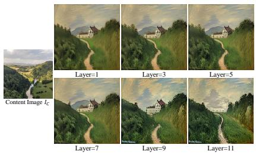

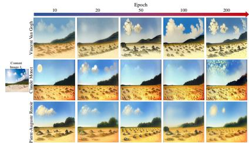  
Fig. 10: Efect of layer level of CLIP encoder in Content Alignment Guidance for content preservation.  
Fig. 11: Efect of training epochs on Style Extraction Function: higher epochs yield stronger artist-specific characteristics.

Efect of Training Epochs on Style Extraction Function. We investigate the efect of training epochs on the Style Extraction Function (SEF) f to evaluate how training duration influences global style learning. We train SEF with five epoch settings (10, 20, 50, 100, 200) using artworks from three representative artists: Van Gogh, Monet, and Renoir. As shown in Fig. 11, models trained for only 10 or 20 epochs fail to capture distinctive stylistic characteristics, producing visually similar results across artists. As training progresses, the model gradually learns artist-specific brushwork, composition, and color distributions. At 200 epochs, the generated images exhibit clear stylistic separation, indicating that suficient training is essential for learning a stable global style representation.

## 5 Conclusion

We propose Global Style Transfer, a novel artistic image synthesis paradigm that represents the global artistic style of a target artist from multiple artworks. Through Global Style Guidance and Content Alignment Guidance, our method captures artist-level stylistic semantics while preserving the content structure and allowing style-driven geometric deformation. By moving beyond instancelevel style transfer and text-dependent artistic synthesis, GST provides a more faithful and unbiased way to model an artist’s coherent visual identity.

## Acknowledgment

This work was partly supported by Institute of Information & Communications Technology Planning & Evaluation (IITP) grant funded by the Korea government (RS-2026-25516375), the Korea Institute of Science and Technology (KIST) Institutional Program (No. 26E0212). This work was supported by the IITP(Institute of Information & Communications Technology Planning & Evaluation)-ITRC(Information Technology Research Center) grant funded by the Korea government(Ministry of Science and ICT)(IITP-2026-RS-2023- 00258649,33%).

## References

1. Alanov, A., Titov, V., Nakhodnov, M., Vetrov, D.: Styledomain: Eficient and lightweight parameterizations of stylegan for one-shot and few-shot domain adaptation. In: Proceedings of the IEEE/CVF International Conference on Computer Vision. pp. 2184–2194 (2023)

2. Chung, J., Hyun, S., Heo, J.P.: Style injection in difusion: A training-free approach for adapting large-scale difusion models for style transfer. In: Proceedings of the IEEE/CVF conference on computer vision and pattern recognition. pp. 8795–8805 (2024)

3. Deng, Y., Tang, F., Dong, W., Ma, C., Pan, X., Wang, L., Xu, C.: Stytr2: Image style transfer with transformers. In: Proceedings of the IEEE/CVF conference on computer vision and pattern recognition. pp. 11326–11336 (2022)

4. Efron, B.: Tweedie’s formula and selection bias. Journal of the American Statistical Association 106(496), 1602–1614 (2011)

5. Gal, R., Alaluf, Y., Atzmon, Y., Patashnik, O., Bermano, A.H., Chechik, G., Cohen-Or, D.: An image is worth one word: Personalizing text-to-image generation using textual inversion. arXiv preprint arXiv:2208.01618 (2022)

6. Gatys, L.A., Ecker, A.S., Bethge, M.: Image style transfer using convolutional neural networks. In: Proceedings of the IEEE conference on computer vision and pattern recognition. pp. 2414–2423 (2016)

7. Google: Gemini image generation: Create images with gemini. https://gemini. google/overview/image-generation/ (2026), accessed: 2026-01-22

8. Gu, S., Chen, C., Liao, J., Yuan, L.: Arbitrary style transfer with deep feature reshufle. In: Proceedings of the IEEE conference on computer vision and pattern recognition. pp. 8222–8231 (2018)

9. Hertz, A., Voynov, A., Fruchter, S., Cohen-Or, D.: Style aligned image generation via shared attention. In: Proceedings of the IEEE/CVF Conference on Computer Vision and Pattern Recognition. pp. 4775–4785 (2024)

10. Heusel, M., Ramsauer, H., Unterthiner, T., Nessler, B., Hochreiter, S.: Gans trained by a two time-scale update rule converge to a local nash equilibrium. Advances in neural information processing systems 30 (2017)

11. Huang, X., Belongie, S.: Arbitrary style transfer in real-time with adaptive instance normalization. In: Proceedings of the IEEE international conference on computer vision. pp. 1501–1510 (2017)

12. Kumari, N., Zhang, B., Zhang, R., Shechtman, E., Zhu, J.Y.: Multi-concept customization of text-to-image difusion. In: Proceedings of the IEEE/CVF conference on computer vision and pattern recognition. pp. 1931–1941 (2023)

13. Kwon, M., Jeong, J., Uh, Y.: Difusion models already have a semantic latent space. arXiv preprint arXiv:2210.10960 (2022)

14. Kynkäänniemi, T., Karras, T., Laine, S., Lehtinen, J., Aila, T.: Improved precision and recall metric for assessing generative models. Advances in neural information processing systems 32 (2019)

15. Li, Y., Wang, N., Liu, J., Hou, X.: Demystifying neural style transfer. arXiv preprint arXiv:1701.01036 (2017)

16. Li, Y., Fang, C., Yang, J., Wang, Z., Lu, X., Yang, M.H.: Universal style transfer via feature transforms. Advances in neural information processing systems 30 (2017)

17. Liu, S., Lin, T., He, D., Li, F., Wang, M., Li, X., Sun, Z., Li, Q., Ding, E.: Adaattn: Revisit attention mechanism in arbitrary neural style transfer. In: Proceedings of the IEEE/CVF international conference on computer vision. pp. 6649–6658 (2021)

18. Naeem, M.F., Oh, S.J., Uh, Y., Choi, Y., Yoo, J.: Reliable fidelity and diversity metrics for generative models. In: International conference on machine learning. pp. 7176–7185. PMLR (2020)

19. OpenAI: Chatgpt: Get answers. find inspiration. be productive. https://openai. com/ko-KR/index/chatgpt/ (2026), accessed: 2026-01-22

20. Park, D.Y., Lee, K.H.: Arbitrary style transfer with style-attentional networks. In: proceedings of the IEEE/CVF conference on computer vision and pattern recognition. pp. 5880–5888 (2019)

21. Radford, A., Kim, J.W., Hallacy, C., Ramesh, A., Goh, G., Agarwal, S., Sastry, G., Askell, A., Mishkin, P., Clark, J., et al.: Learning transferable visual models from natural language supervision. In: International conference on machine learning. pp. 8748–8763. PmLR (2021)

22. Rombach, R., Blattmann, A., Lorenz, D., Esser, P., Ommer, B.: High-resolution image synthesis with latent difusion models. In: Proceedings of the IEEE/CVF conference on computer vision and pattern recognition. pp. 10684–10695 (2022)

23. Ruiz, N., Li, Y., Jampani, V., Pritch, Y., Rubinstein, M., Aberman, K.: Dreambooth: Fine tuning text-to-image difusion models for subject-driven generation. In: Proceedings of the IEEE/CVF conference on computer vision and pattern recognition. pp. 22500–22510 (2023)

24. Ruta, D., Tarrés, G.C., Gilbert, A., Shechtman, E., Kolkin, N., Collomosse, J.: Dif-nst: Difusion interleaving for deformable neural style transfer. In: European Conference on Computer Vision. pp. 50–66. Springer (2024)

25. Sohn, K., Ruiz, N., Lee, K., Chin, D.C., Blok, I., Chang, H., Barber, J., Jiang, L., Entis, G., Li, Y., et al.: Styledrop: Text-to-image generation in any style. arXiv preprint arXiv:2306.00983 (2023)

26. Song, J., Meng, C., Ermon, S.: Denoising difusion implicit models. arXiv preprint arXiv:2010.02502 (2020)

27. Song, Y., Sohl-Dickstein, J., Kingma, D.P., Kumar, A., Ermon, S., Poole, B.: Scorebased generative modeling through stochastic diferential equations. arXiv preprint arXiv:2011.13456 (2020)

28. Tan, W.R., Chan, C.S., Aguirre, H.E., Tanaka, K.: Improved artgan for conditional synthesis of natural image and artwork. IEEE Transactions on Image Processing 28(1), 394–409 (2018)

29. Ulyanov, D., Vedaldi, A., Lempitsky, V.: Instance normalization: The missing ingredient for fast stylization. arXiv preprint arXiv:1607.08022 (2016)

30. Wright, M., Ommer, B.: Artfid: Quantitative evaluation of neural style transfer. In: DAGM German Conference on Pattern Recognition. pp. 560–576. Springer (2022)

31. Xing, P., Wang, H., Sun, Y., Wang, Q., Bai, X., Ai, H., Huang, R., Li, Z.: Csgo: Content-style composition in text-to-image generation. arXiv preprint arXiv:2408.16766 (2024)

32. Xu, R., Xi, W., Wang, X., Mao, Y., Cheng, Z.: Stylessp: Sampling startpoint enhancement for training-free difusion-based method for style transfer. In: Proceedings of the Computer Vision and Pattern Recognition Conference. pp. 18260–18269 (2025)

33. Zhang, C., Xu, X., Wang, L., Dai, Z., Yang, J.: S2wat: Image style transfer via hierarchical vision transformer using strips window attention. In: Proceedings of the AAAI conference on artificial intelligence. vol. 38, pp. 7024–7032 (2024)

34. Zhang, L., Rao, A., Agrawala, M.: Adding conditional control to text-to-image difusion models. In: Proceedings of the IEEE/CVF international conference on computer vision. pp. 3836–3847 (2023)

35. Zhang, Y., Huang, N., Tang, F., Huang, H., Ma, C., Dong, W., Xu, C.: Inversionbased style transfer with difusion models. In: Proceedings of the IEEE/CVF conference on computer vision and pattern recognition. pp. 10146–10156 (2023)

36. Zhang, Y., Tang, F., Dong, W., Huang, H., Ma, C., Lee, T.Y., Xu, C.: Domain enhanced arbitrary image style transfer via contrastive learning. In: ACM SIG-GRAPH 2022 conference proceedings. pp. 1–8 (2022)

37. Zhu, J.Y., Park, T., Isola, P., Efros, A.A.: Unpaired image-to-image translation using cycle-consistent adversarial networks. In: Proceedings of the IEEE international conference on computer vision. pp. 2223–2232 (2017)

## A Experiment Settings

Model. We use Stable Difusion v1.4 [22] as the default base generator for our Global Style Transfer experiments unless otherwise specified. To implement our proposed Content Alignment Guidance (CAG), we use CLIP [21] as the image encoder, specifically the ViT-L/14 model, to extract high-fidelity content features.

Hyper Parameter Settings. To produce our proposed Global Style Guidance (GSG) on Text-to-Image latent difusion model, we train the Style Extraction Function (SEF) $f _ { t }$ on the WikiArt dataset [28], using between 500 and 1800 artworks per artist. Our proposed Style Extraction Function is implemented as an MLP with a single hidden layer (1280×1280). Training is conducted with a batch size of 8 during 200 training epochs. We use a learning rate of 0.1 with an Adam optimizer with $( \beta _ { 1 } , \beta _ { 2 } )$ =(0.9, 0.999), weight decay is 0, and Adam epsilon is 1e-8. The impact of training epochs is presented in Fig. 7 of the main paper. Furthermore, we control the magnitude of the global style ofset ∆ht using a scaling factor w in Eq. (5), for which we utilize values {1.0, 1.25, 1.5}, and we set the CAG guidance scale to $s = 5 0 . 0$ . Fig. 14 illustrates the qualitative efect of jointly varying both scales over a broader range (w from 0.1 to 2.0 and s from 1 to 80); within this range, our main experiments use $w \in \{ 1 . 0 , 1 . 2 5 , 1 . 5 \}$ and $s = 5 0$ . We recommend that selecting an appropriate scale is essential, as it reflects the trade-of between the proposed Global Style Guidance and Content Alignment Guidance.

Computation Overhead. On a single NVIDIA RTX 3090 GPU, training the Style Extraction Function for one epoch takes approximately 216 seconds. The total training time scales with the number of artworks used per artist. After training, generating a 512×512 image on the same GPU takes roughly 20 seconds.

Evaluation Metrics. To comprehensively evaluate the quality of our synthesized images, we employ five complementary metrics: FID, ArtFID, CFSD, CLIP-Div, and 1-Precision, each capturing a diferent aspect of style and content fidelity.

First, we measure Frechet Inception Distance (FID) [10] between the generated images and the full set of artworks for each artist. This allows us to assess stylistic bias by quantifying how closely the synthesized samples align with the overall style distribution of the original artworks. Second, we report ArtFID [30], a metric designed to evaluate style-transfer performance by jointly considering content and style preservation. ArtFID reflects both resemblance to the artwork distribution and consistency with the content-image distribution, and is known to strongly correlate with human perceptual judgment. Following prior work, ArtFID is computed as $A r t F I D = ( 1 + L P I P S )$ $( 1 + F I D )$ . Third, to isolate content fidelity from stylistic influence, we compute the Content Feature Structural Distance (CFSD) [2]. CFSD measures structural similarity by capturing only the spatial correlations between local image patches, independent of stylistic appearance. Fourth, we measure CLIP-Diversity (CLIP-Div) to assess the stylistic spread of the generated images. Following [1], it is computed as the mean pairwise cosine distance between the CLIP image embeddings (ViT-L/14) of a generated set; higher values indicate greater stylistic diversity. In Tab. 2 of the main paper, we report it as (Ours/Real) to enable direct comparison with the real artwork corpus. Finally, we report 1-Precision to quantify memorization avoidance. Precision is the improved precision metric [14], measuring the fraction of generated samples that fall within the real-artwork manifold, computed with the prdc implementation (k=5) [18]. A higher 1-Precision indicates less memorization of the training corpus.

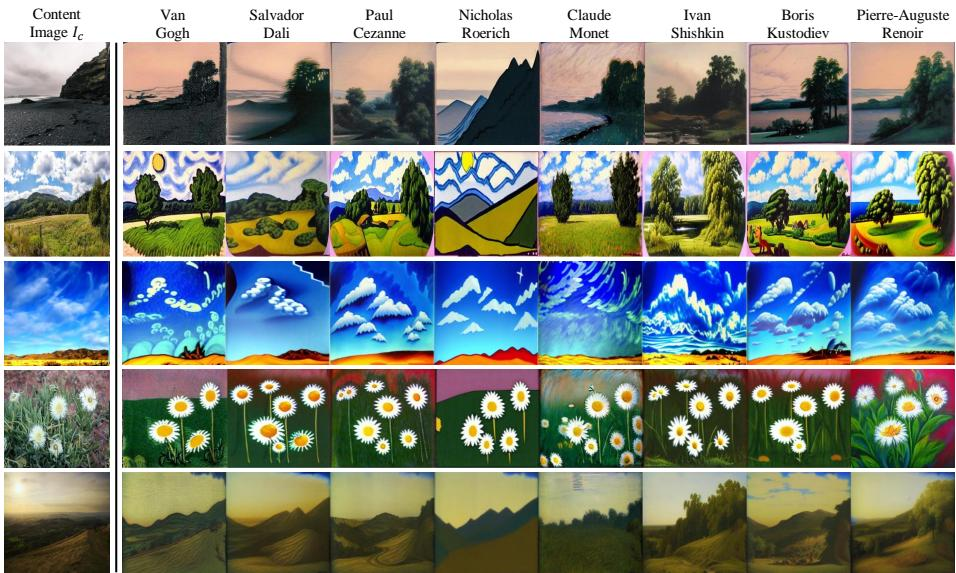  
Fig. 12: Global Style Transfer results across multiple artists for the same content image. Given the same content images ${ \cal I } _ { c } ,$ our framework transfers the images into the global styles of eight diferent painters. All images are generated using a textindependent prompt (“A painting”) to eliminate stylistic bias in the difusion model. For each content image Ic (left column), our framework applies Global Style Guidance (GSG) to capture artist-specific global semantics and Content Alignment Guidance (CAG) to preserve flexible, style-based deformation of content. The results show that a single content image is rendered into distinctly diferent artistic styles across various artists, demonstrating our framework’s ability to synthesize artist-faithful images.

## B Further Analysis

Global Style Transfer Results of Multiple Artists for the Same Content Image. We extend Fig. 1 of the main paper by visualizing stylization results across multiple artists for the same content image. Fig. 12 illustrates the results of applying our Global Style Transfer framework to the same content image $\mathit { I } _ { c } ,$ where the image is stylized using the global styles of eight diferent painters. For each artist, we generate 1,500 artistic images by applying the corresponding global style to the same set of content images. Fig. 12 shows representative examples from these results, where a randomly selected content image is stylized according to each artist’s global style. Despite sharing the same content image, the generated artistic images clearly reflect the distinctive global stylistic characteristics of each artist.

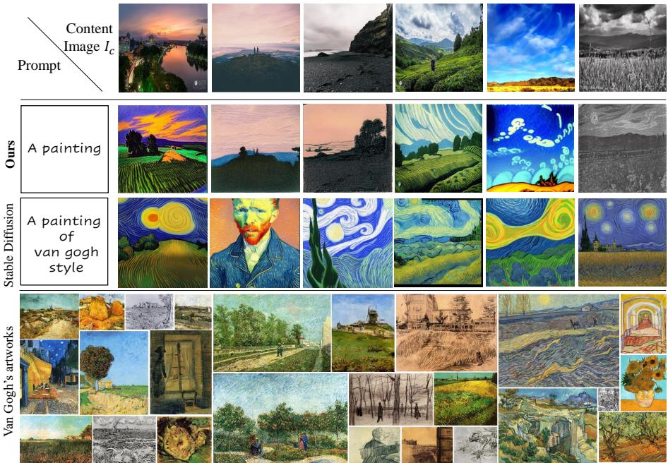  
Fig. 13: Comparison of stylistic bias between vanilla Stable Difusion (SD) and our Global Style Transfer. Given the same content images, vanilla SD conditioned on the prompt ‘A painting of van gogh style’ tends to bias toward a few iconic patterns (e.g., ‘Starry Night’-like swirls), often distorting the original structure and semantic content. In contrast, our method generates diverse stylizations while preserving the underlying content structure by learning a global stylistic representation from the full corpus of Van Gogh’s artworks. The bottom panel shows the real Van Gogh artwork distribution.

Further Analysis of Stylistic Bias on Stable Difusion. Extending the experimental results of Fig. 7 of the main paper, we further examine whether stylistic bias also appears in vanilla Stable Difusion [22]. Since our Global Style Transfer framework is built upon Stable Difusion, we further compare our method with vanilla Stable Difusion to investigate whether artistic stylistic bias also emerges in the original difusion model. To conduct this analysis, we generate artistic images using both vanilla Stable Difusion and our proposed Global Style Transfer framework. We use 1,500 photographs from the Vangogh2photo dataset [37] as content images $I _ { c }$ and obtain their latent representations via DDIM inversion. Our method produces stylized outputs from these latents using the prompt ‘A painting’, whereas vanilla Stable Difusion generates images conditioned on the prompt ‘A painting of {artist} style’.

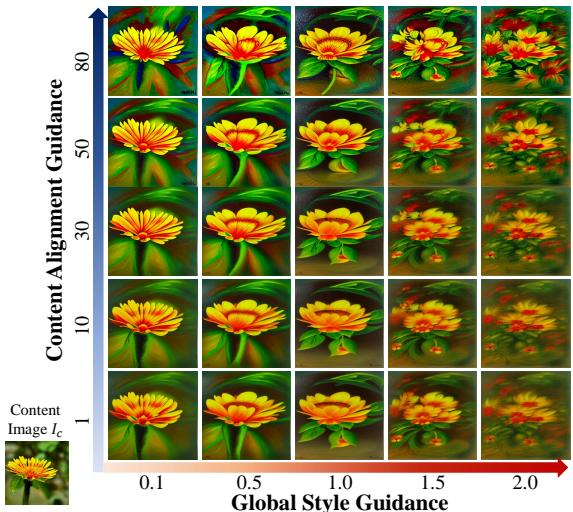  
Fig. 14: Efect of guidance strength on the style–content balance, illustrating how Global Style and Content Alignment Guidance jointly control stylistic expressiveness and content preservation.

Our analysis reveals that vanilla Stable Difusion frequently collapses toward a small subset of iconic artworks. Furthermore, in many cases, the generated images lose the original content structure and semantic information, while being transformed into compositions that resemble specific well-known paintings by the artist. This phenomenon indicates that the model overemphasizes a few dominant stylistic patterns rather than capturing the broader stylistic distribution of the artist. To quantitatively evaluate this efect, we compute ArtFID between the generated images and the full artwork corpus for each artist, as reported in Tab. 2 in the main paper. Our method consistently achieves lower ArtFID for most artists, demonstrating improved alignment with the global artistic distribution. To further illustrate this phenomenon, Fig. 13 visualizes representative samples from the Van Gogh experiments, where the stylistic bias of vanilla Stable Difusion becomes particularly evident. These results confirm that our method efectively mitigates stylistic bias and better preserves stylistic diversity across the artist’s corpus.

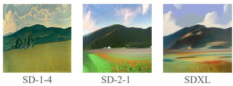  
Fig. 15: Backbone generalization. Global Style Transfer applied on diferent T2I difusion backbones (SD-1.4, SD-2.1, SDXL) for the same content image, showing that our framework transfers consistently across backbones.

Efect of Guidance Scales on Style-Content Trade Of. We qualitatively analyze the interplay between the Global Style Guidance (GSG) and the Content Alignment Guidance (CAG) in our framework. As shown in Fig. 14, increasing the Global Style Guidance enhances stylistic expressiveness, yielding richer color saturation and brushstroke abstraction, while excessive strength may distort the geometric structure of the content. Conversely, stronger Content Alignment Guidance preserves the semantic integrity and spatial layout of the content but limits stylistic diversity. A balanced configuration of both guidance scales produces the most harmonious results, maintaining recognizable content structure while expressing vivid stylistic characteristics. This trade-of highlights that proper coordination between style and content guidance is essential for generating perceptually coherent and semantically consistent images.

Sample Visualization with Diferent T2I Difusion Backbones. To verify that Global Style Transfer is not tied to a specific base generator, we apply our framework on three diferent text-to-image difusion backbones: Stable Difusion v1.4, Stable Difusion v2.1, and SDXL. Since the U-Net bottleneck (h-space) dimensionality difers across these backbones, we train a separate Style Extraction Function on the corresponding h-space for each backbone. As shown in Fig. 15, given the same content image, GST produces coherent artist-level stylization across all three backbones, indicating that our framework is applicable across diferent difusion architectures rather than being tied to a specific one.

## C Limitation

Our method relies on the visual diversity of an artist’s training data. When an artist’s works mostly depict limited subjects, such as natural scenes, the model struggles to generalize to unseen content like humans or vehicles, as shown in Fig. 16. Thus, the efectiveness of style transfer depends on whether the artist’s dataset includes the target content type.

## D Broader Impact

Our Global Style Transfer framework enables artist-level style synthesis from large artwork collections, ofering new possibilities for artistic creation, digital heritage preservation, and accessible content generation. It can support cultural institutions, educators, and creators by providing faithful stylistic reinterpretations without extensive generative AI model training. However, reproducing artistic styles at scale also raises concerns regarding authorship, cultural integrity, and responsible use of copyrighted material. We encourage the deployment of this technology in ways that respect artistic ownership and contribute positively to creative and cultural domains.

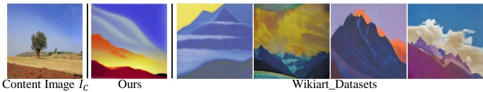  
Fig. 16: Failure case of Global Style Transfer when the artist’s dataset contains highly biased content. As shown in Nicholas Roerich, whose works predominantly depict mountains, our framework fails to generalize to non-mountain content. When a treefield landscape is provided as input, the model still reconstructs mountain-like shapes, reflecting the strong content bias encoded in the artist’s dataset.