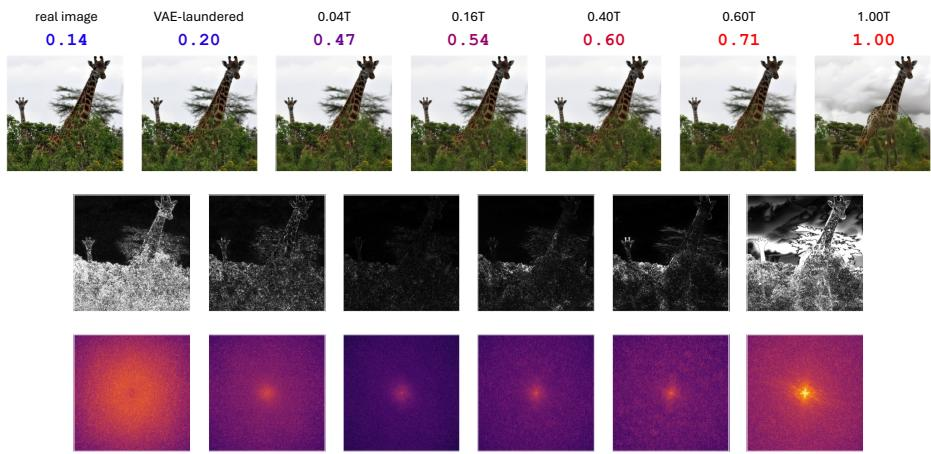
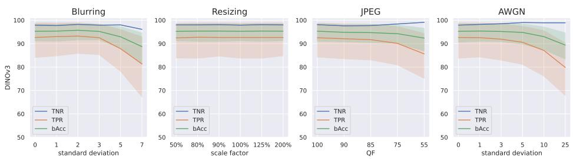
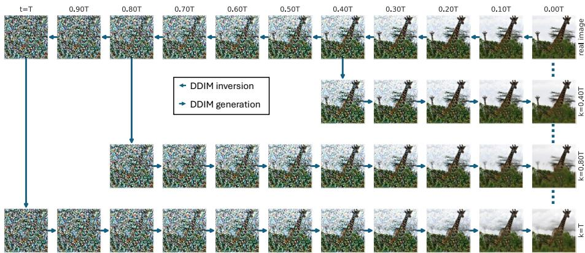
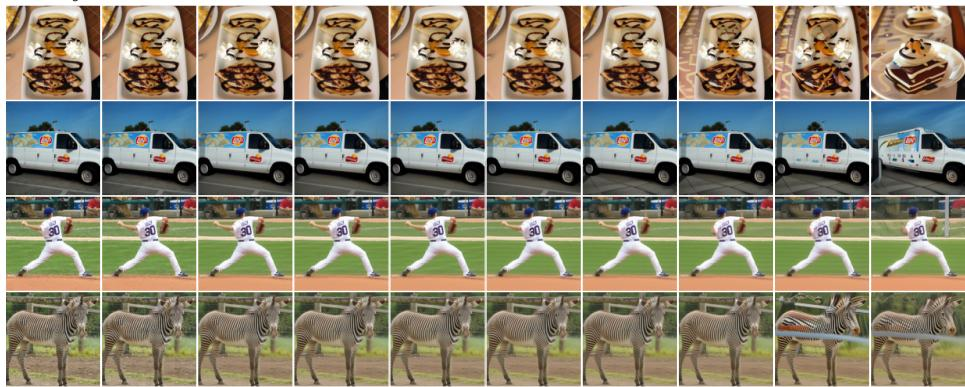
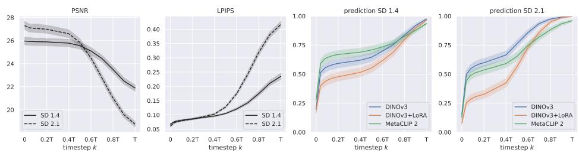
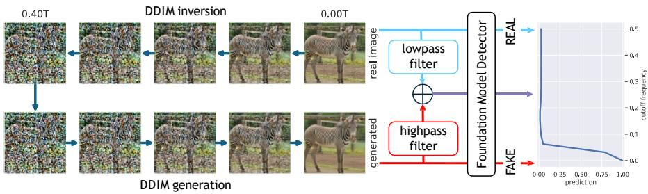
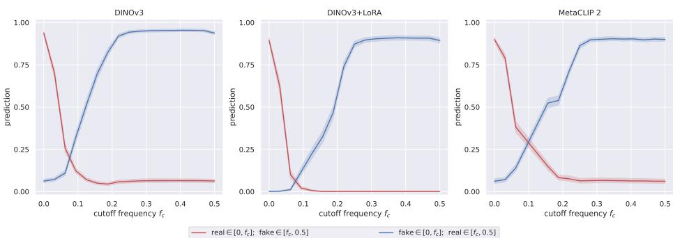
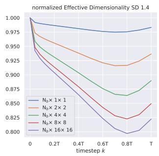
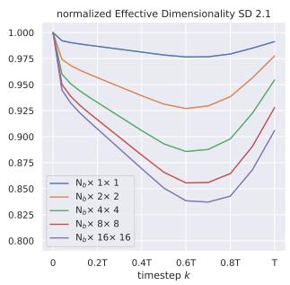
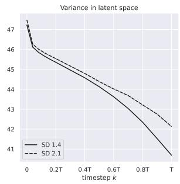

# Understanding Why Foundation Models Work for Difusion-Generated Image Detection

Davide Cozzolino , Giovanni Poggi , and Luisa Verdoliva

University Federico II of Naples, 80125 Naples, Italy {davide.cozzolino,poggi,verdoliv}@unina.it

Abstract. Vision foundation models have recently emerged as powerful feature extractors for detecting AI-generated images, achieving strong generalization across generators and robustness to common image degradations. However, the reason behind their efectiveness is poorly understood. In this work, we investigate what cues are exploited by foundationmodel-based detectors to distinguish real images from difusion-generated ones. To this end, we design an ad hoc analysis protocol based on DDIM inversion. Given a real image we generate a sequence of synthetic copies by changing the depth of DDIM inversion. Even though most copies are semantically identical to the real reference, the detector score varies significantly across them due to subtle traces introduced by the difusion synthesis, showing that its decision is not primarily driven by semantic failures. Through a frequency-swapping analysis, we further reveal that the discriminative cues exploited by the detectors are mainly localized in the low-to-mid frequency range, rather than only in the high-frequency range, as is the case for artifacts commonly associated with generative models. Finally, a latent-space analysis shows that regenerated images exhibit reduced variance and efective dimensionality, indicating that diffusion models do not fully reproduce the variability of real data. Overall, our results suggest that foundation-model-based detectors succeed by capturing non-semantic low-to-mid frequency distributional discrepancies between real and difusion-generated images. These findings provide new insight into the robustness and generalization of such detectors and suggest directions for more interpretable forensic methods.

## 1 Introduction

Detecting whether an image is real or synthetically generated has become increasingly important, as modern generative models can produce highly realistic visual content that may be misused for disinformation [4,5]. Accordingly, a large body of work has focused on designing detectors capable of distinguishing real from generated images [2,33]. Beyond obvious visual failures, such as clear asymmetries, inconsistent perspective or implausible object geometry, that can be analyzed by vision-language models [48,49], synthetic images often contain subtle statistical traces. As generative models produce increasingly realistic images, such hidden artifacts become more relevant to design efective detectors.

  
Fig. 1: Visualization of difusion-induced traces across regeneration timesteps. The first row shows the original real image, its VAE-laundered version, and DDIM-regenerated images obtained from increasing inversion timesteps k, together with the corresponding detector scores. The second row reports the pixel-wise diference with respect to the previous image, while the third row shows the corresponding power spectra. As k increases, the detector score progressively shifts toward the fake class, and the diference maps reveal increasingly structured artifacts. Notably, these traces are visible not only at high frequencies but especially in the low-frequency region of the spectrum.

Early works have shown that synthetic images exhibit telltale artifacts in the Fourier domain [62] such as pronounced peaks at harmonic frequencies and anomalous shapes of the power spectrum. These artifacts are typically referred to as low-level traces, since they are not related to the semantic content of the image but arise from the image generative process itself. For example, in generative adversarial networks, spectral peaks are due to common architectural components that perform the necessary upsampling operations [17, 19]. Likewise, similar artifacts appear in images generated by difusion models (DM), introduced in the final decoding process from the latent space. In addition, power spectrum anomalies have been also observed at the medium and high frequencies, especially along diagonal directions [10]. These are precious cues for discrimination, largely exploited, either explicitly or implicitly, by a plethora of dedicated models proposed in recent years for AI-generated content detection [11, 21, 28, 31, 32]. However, relying on high-frequency artifacts is a double-edged sword: it yields strong performance under ideal conditions but leads to a drastic drop in performance when these traces are attenuated by low-pass filtering. This often occurs in real-world settings, where images shared on social networks are resized and compressed, removing many low-level cues. As a result, detectors sufer from poor robustness and limited generalization, making them unreliable in the wild [50].

In this challenging scenario, detectors based on foundation models stand out as a notable exception. Recent studies have shown that frozen pre-trained large Vision Foundation Models (VFMs) provide remarkably efective and robust representations for detecting AI-generated images. A simple linear classifier working on features extracted from foundation models provides excellent results and strong generalization across diferent generative models, often outperforming detectors specifically trained for the real-versus-fake task [37]. Furthermore, this simple detector proves robust to common low-level perturbations and even laundering attacks, suggesting that it does not rely primarily on spectral peaks or high-frequency artifacts, but that alternative discriminating features come into play. This was explicitly shown in [13], where CLIP features were found to be largely independent of, and complementary to, low-level forensic traces. Further evidence comes from experiments on more recent models, such as MetaCLIP 2 and DINOv3, which show better performance and greater robustness than previous models, even on more challenging in-the-wild datasets [26,64]. Nevertheless, the reasons underlying this success are not yet fully understood. Shedding light on this mechanism is the primary goal of this paper.

We will show that difusion models introduce artifacts at the medium and low frequencies of the spectrum, besides those already well-known at the high frequencies. Furthermore, we show that foundation model-based detectors rely on these artifacts to make their decision. To support this conclusion, we design a testing strategy based on DDIM inversion. Given a real image, we apply DDIM inversion [46] to derive a noise-like seed that once fed to the DDIM generation process, allows us to re-generate an image very similar to the original image. In this way, we obtain two images, one real and one generated by a difusion model, which are semantically identical, but whose diferent origins are not lost to the detector. Continuing along this path, we run the DDIM generation multiple times, starting form diferent timesteps, thus generating a sequence of semantically coherent images that change very gradually along the process, which allows us to study in detail when and where artifacts appear and how they impact on the detector decision. Fig. 1 shows an example subsequence. The rightmost image is generated with full DDIM inversion (1.00T) and is the only one that, due to process imperfections, difers semantically from the real image (the leftmost one). With partial inversion (≤0.60T) semantic consistency is always ensured, yet the detector provides high (fake) scores down to values close to 0 (≤0.04T). The diference images show that artifacts appear throughout the entire process, not just at the end, and the corresponding spectra prove that they are mainly localized at low frequencies.

Overall, this work provides new insights into the behavior of foundationmodel-based detectors and makes the following contributions:

– We design a testing strategy based on DDIM inversion to expose the nonsemantic artifacts introduced by difusion models and arguably exploited by foundation models to detect synthetic images;

– We reveal a clear distributional gap between real and DM-generated images, with the most relevant diferences emerging at mid and low spectral frequencies;

– We introduce several latent-space measures to quantify experimentally the inconsistencies observed in difusion-based generative models.

## 2 Related Work

Forensic detectors based on large VFMs. The advent of large language and vision models, with their unprecedented representation ability, has stimulated intense research in the computer vision community, including image forensics, where they have demonstrated strong potential [13, 37, 43]. CLIP features have proven highly efective for distinguishing real images from synthetic ones, even based on a simple nearest-neighbor or linear classifier [37], and even when trained on just a few images [13]. These properties hold even more true for recent pretrained large models, such as MetaCLIP2, DINOv3, PE-Core [8, 26, 30, 64]. In particular, simple detectors based on VFM features consistently achieve better generalization and improved robustness than more sophisticated detectors working on dedicated features [53]. Especially significant is the high robustness to blurring, resizing and JPEG compression, as well as to low-level fingerprint injection, which suggests that these features do not capture (only) traditional high-frequency artifacts but deeper low-frequency cues [13,23,26,64]. These cues have often been referred to as “semantic” in the literature, but their true nature remains poorly understood. In this work, we shed light on this issue and investigate which image components are exploited by foundation-model-based detectors, revealing a distribution mismatch between real and generated images that extends to medium and low frequencies and is unrelated to image semantics.

Difusion-generated vs real images. Assessing whether generated images follow the distribution of real images is inherently dificult. The target distribution is accessible only through sampling, while the distribution learned by a generative model is often specified only implicitly, preventing exact likelihood evaluation. On the other hand, even likelihood-based criteria are only partially informative, since high-likelihood samples are not typical in high-dimensional spaces [12], that is, high-likelihood images are not perceptually pleasing or realistic [51]. Difusion models, in particular, sufer from known mismatch: the distribution reached at the end of the (finite) forward noising process does not exactly match the distribution used to start the reverse sampling, usually a white Gaussian noise. This prior mismatch causes the generated samples to deviate from the true data distribution, even when the score model is learned accurately [56]. Practical evidence comes from studies on synthetic dataset: models trained on generated images underperform those trained on real data when evaluated on real test sets, suggesting that synthetic images do not fully capture real-world variability [1, 20, 44]. Furthermore, direct measurements on spectral distributions show that difusion-generated images difer significantly from real images at high frequencies [1,10]. The present work provides evidence that this spectral mismatch extends well beyond this, involving also medium-low frequencies.

Difusion-based image inversion. In the context of difusion models, image inversion is a process that takes an image x and derives a noise vector z that, when used as a seed by a given difusion model, allows it to regenerate x exactly. In practice, regeneration is never perfect for a variety of reasons, but image inversion can still be leveraged to perform important forensic tasks. In particular, DIRE [57] observes that difusion-generated images are typically reconstructed better than real images by a pre-trained difusion model and uses the reconstruction error as a decision statistic. DIRE’s good results suggest that real and generated images occupy diferent regions with respect to the dynamics learned by a difusion model and that generated images may be closer to the manifold learned by the model than real images. This basic idea has been further explored in subsequent works, through analysis of the latent space [6], considering intermediate reconstruction steps [54, 58], adopting a single denoising step [35, 55], forcing the detection network to predict the reconstruction error [63]. Unlike all these works, we do not blindly use reconstruction error as decision statistics, but instead force the inversion to ensure semantic identity with the original image. Under this constraint, we study the appearance and structure of forensic artifacts and their impact on the decision of foundation model-based detectors.

## 3 Motivation

This section reviews the evidence supporting the use of current vision foundation models as excellent feature extractors for AI-generated image detection. We consider multiple pretrained models: OpenCLIP [27,40], MetaCLIP 1 [59], Meta-CLIP 2 [9], DINOv3 [45], as feature extractors. Only for DINOv3 we also explore diferent backbones together with a version based on LoRA [25]. We demonstrate that detectors based on these features deliver state-of-the-art performance. Furthermore, even when trained on images from a single difusion model, they generalize well to images generated by all other unseen difusion models. Finally, they prove extremely robust to all common types of image degradation, including distortions that strongly afect high-frequency content.

Generalization analysis. For all models, input images are resized to 224 × 224 pixels, with no data augmentation, backbone parameters are frozen, and a linear head is optimized for binary classification (training at 2 epochs, AdamW optimizer, learning rate $1 0 ^ { - 3 }$ , batch size 128). The training set is taken from the unbiased GenImage dataset [22], with 162K fake images generated using Stable Difusion 1.4 [41], and as many real images taken from the ImageNet dataset [15]. For testing, real images are taken from a diferent dataset, the

Table 1: AUC performance of VFM-based detectors.
<table><tr><td>AUC</td><td></td><td>SD 1.4</td><td>SD 2.1</td><td>SDXL</td><td>SD 3</td><td>Flux</td><td>DALL·E 3</td><td>Firefly</td><td>Midj.</td><td>Scale- RAE</td><td>Pixel DiT</td><td>AVG</td></tr><tr><td>OpenCLIP</td><td></td><td>89.6</td><td>76.2</td><td>72.7</td><td>87.9</td><td>84.7</td><td>95.0</td><td>89.5</td><td>77.7</td><td>91.6</td><td>83.6</td><td>84.9</td></tr><tr><td></td><td>MetaCLIP 1</td><td>97.4</td><td>88.8</td><td>95.1</td><td>82.2</td><td>94.6</td><td>97.3</td><td>85.1</td><td>93.7</td><td>97.0</td><td>95.1</td><td>92.6</td></tr><tr><td></td><td>MetaCLIP 2</td><td>98.9</td><td>97.5</td><td>99.1</td><td>93.6</td><td>96.7</td><td>96.9</td><td>92.9</td><td>96.5</td><td>99.5</td><td>96.8</td><td>96.9</td></tr><tr><td></td><td>ConvNeXt B</td><td>90.2</td><td>86.2</td><td>95.3</td><td>76.0</td><td>92.2</td><td>98.0</td><td>64.2</td><td>90.7</td><td>94.8</td><td>94.5</td><td>88.2</td></tr><tr><td>DNO</td><td>ConvNeXt L</td><td>93.5</td><td>92.7</td><td>97.7</td><td>80.5</td><td>94.5</td><td>98.5</td><td>68.5</td><td>93.6</td><td>98.9</td><td>97.1</td><td>91.5</td></tr><tr><td>ViT-B/16</td><td></td><td>86.0</td><td>81.6</td><td>93.0</td><td>79.6</td><td>96.4</td><td>98.8</td><td>73.2</td><td>93.4</td><td>96.3</td><td>97.3</td><td>89.6</td></tr><tr><td>ViT-L/16</td><td></td><td>97.9</td><td>97.3</td><td>98.7</td><td>81.1</td><td>96.1</td><td>99.5</td><td>76.9</td><td>94.6</td><td>99.9</td><td>98.9</td><td>94.1</td></tr><tr><td></td><td>ViT-7B/16</td><td>100.</td><td>99.9</td><td>100.</td><td>96.2</td><td>99.6</td><td>100.</td><td>92.2</td><td>99.7</td><td>100.</td><td>100.</td><td>98.8</td></tr><tr><td></td><td>+ LoRA</td><td>100.</td><td>100.</td><td>100.</td><td>98.7</td><td>99.2</td><td>99.9</td><td>97.4</td><td>99.7</td><td>100.</td><td>100.</td><td>99.5</td></tr></table>

  
Fig. 2: Performance of a DINOv3-based detector under diferent post-processing operations. Results are in terms of true positive rate (TPR), true negative rate (TNR), and balanced Accuracy (bAcc). Shaded bands indicate 95% confidence intervals (CIs). The detector is robust to all degradations over a wide range of parameter values.

RAISE dataset [14], to reduce the risk of dataset-specific bias. The analysis covers ten generators: SD 1.4, SD 2 [41], SDXL [39], SD3 [47], Flux [29], DALL-E 3 [38], Firefly [18], Midjourney [36], Scale-RAE [52], and PixelDiT [60]. Such synthetic images are taken from [3, 23], except for Scale-RAE, and PixelDiT images which we generated ourselves.

Table 1 presents all results in terms of Area Under the ROC Curve (AUC). Only the first (gray) column shows the results for a model seen in training, while all the others refer to out-of-training models and demonstrate generalization ability. Overall, performance improves steadily along the rows, that is, with model size and backbone capacity. Smaller models, such as OpenCLIP and MetaCLIP, already perform well, but generalize poorly on some DMs (SDXL, Flux, Firefly, and PixelDiT). In contrast, larger models show much higher transferability. Among the DINOv3 variants, performance increases steadily from ConvNeXt-B to ViT-7B/16, with the latter achieving an average AUC close to 99. LoRA achieves the best overall generalization, with an average AUC of 99.5 and nearperfect performance on most generators.

It is worth underlining that Scale-RAE and PixelDiT adopt substantially different architectures than Stable Difusion 1.4. Scale-RAE replaces the traditional latent-space VAE with a Representation Autoencoder based on pre-trained visual representations, while PixelDiT removes the autoencoder altogether and performs difusion directly in the pixel space using a two-level transformer architecture. Furthermore, these models are very recent: PixelDiT was released in November 2025 and Scale-RAE in January 2026. This means that the excellent performance observed on these generators cannot be explained by direct or indirect data leakage from the detector’s training set. Rather, they suggest that the generated images share common features that foundation models are able to capture and exploit even when the detector is trained only on SD 1.4 images.

Robustness analysis. We now turn to analyzing robustness to image distortions, with a focus on degradations that remove or severely attenuate highfrequency content. This is particularly relevant in digital forensics, as images shared online are commonly resized, compressed, or otherwise processed by social media platforms. Conventional detectors often experience significant performance degradation following these operations, suggesting they rely heavily on subtle forensic traces that can be easily weakened or removed by standard post-processing [50].

Figure 2 shows the performance of the detector based on the DINOv3 (Vit-7B/16 backbone) features on the same test set used in the previous paragraph, under four common image degradations: blurring, resizing, JPEG compression, and white Gaussian noise addition. Overall, the detector is remarkably stable under moderate perturbations, with TNR, TPR, and balanced accuracy remaining close to the original values in most settings. For JPEG compression and resizing, the balanced accuracy remains relatively stable even under severe distortions (e.g., JPEG quality factor 55). Significant impairments are observed only under strong blurring and noising, when the TPR decreases noticeably. A possible interpretation is that such severe degradations corrupt the features that most qualify the image as synthetic. In general, these results support the idea that the detector does not rely only on mid- and high-frequency artifacts. If it did, performance would worsen under compression or resizing. Instead, the relatively stable behavior indicates that the model captures more robust cues that are degraded only when distortions become severe enough to alter broader image structures or suppress informative spectral components. Remarkably, the detector achieves an almost negligible false alarm rate in all situations.

It is also worth noting that this behavior makes the detector robust to biases introduced by image coding or post-processing pipelines. Because these distortions primarily afect high-frequency components, they have limited influence on decisions that appear to be based on deeper discrepancies between real and synthetic images, as shown in [64]. For the same reason, the detector is largely insensitive to traces left by the auto-encoder alone [13], since these also reside primarily in the high-frequency portion of the image spectrum. Indeed a laundering operation using the VAE of SD 1.4 reduces the true negative rate of DINOv3-based detector from 97.9% to 95.5%.

## 4 What Do Foundation Models See?

In the previous sections we argued that foundation models are able to see discriminative traces that reveal the synthetic nature of images generated by diffusion models, and that such traces reside in the low- to mid-frequency range of the spectrum. However, just because of their low-frequency nature, such traces are not easily visualized. At low frequencies, the image spectrum is dominated by the semantic content, and conventional filtering techniques are unable to separate these two components, image and artifacts, nor can they extract one component without disrupting the other. To overcome this limitation and gain insights into what cues the foundation models see, we design a custom strategy based on the DDIM inversion procedure [46]. Given a real test image, we use a difusion model to generate a stream of images that all share the same semantic content but exhibit appreciable diferences. Then, we extract various statistics from these diferences and study how they relate to the detector score, gaining eventually further evidence in support of our initial claim. In the remainder of this section, we first recall the basic concepts of the DDIM generation process and its inversion, and then present the proposed analysis.

  
Fig. 3: Difusion process for an image sample. Starting from a real image (top-right), noise is progressively added in latent space using the DDIM inversion procedure [46], obtaining noisy samples at various timesteps t (first row), until the sample approaches an almost pure-noise distribution at $t = 1 . 0 T$ . For each selected timestep k (following rows) the reverse denoising process produces a diferent regenerated image.

## 4.1 Background

Difusion models learn to synthesize images by gradually reversing a forward noise-corruption process. In the forward process, noise is progressively added to a clean image until it becomes approximately white Gaussian noise. To invert this process, a denoiser is trained to predict the noise added at each timestep, thus allowing the generation of new samples starting from pure noise.

Denoising Difusion Implicit Models (DDIMs) [46] transform noise into a clean image adopting a deterministic sampling strategy. The DDIM generation process starts from a suficiently large timestep $t = T \ ( { \mathrm { e . g . , } } \ T = 1 0 0 0 )$ and proceeds until $t = 0$ . Each timestep is associated with a monotonic cumulative noise strength $\beta _ { t } .$ where $\beta _ { 0 } = 0$ and $\beta _ { T } \approx 1$ . The initial sample $x _ { T }$ is randomly drawn from a normal distribution. Then, at each step, a new sample $x _ { \tau }$ , with $\tau < t ,$ is generated as:

$$
x _ { \tau } = \sqrt { 1 - \beta _ { \tau } } \cdot \left( \frac { x _ { t } - \sqrt { \beta _ { t } } \cdot \hat { \epsilon } _ { \theta } ( x _ { t } , t ) } { \sqrt { 1 - \beta _ { t } } } \right) + \sqrt { \beta _ { \tau } } \cdot \hat { \epsilon } _ { \theta } ( x _ { t } , t )\tag{1}
$$

where $\hat { \boldsymbol { \epsilon } } _ { \boldsymbol { \theta } } ( x _ { t } , t )$ is the output of a pretrained denoising model, which predicts the noise added to sample $x _ { t }$ at a known timestep t. Then the new timestep $\tau$ becomes the current timestep t and the iterations proceed until $t = 0$ , where $x _ { 0 }$ represents the generated sample.

k=0.20T  
  
Fig. 4: Examples of DDIM-based regeneration sequences. Starting from a real image, we apply DDIM inversion up to diferent timesteps k, and then regenerate the image through the corresponding DDIM sampling process. For small and intermediate values of k, the regenerated images preserve the semantic content of the original sample, while progressively introducing difusion-related traces. For large values of k, especially close to T, stronger deviations from the original content may appear.

Compared to previous difusion sampling strategies, DDIMs allow image generation with fewer denoising steps while preserving high sample quality. Its more relevant peculiarity, however, is that the noise added at each step is not random but strictly deterministic. As a consequence, with DDIM, the same initial noise sample always produces the same output image. This property allows us to reverse this path and recover the initial noise sample from a given real image. In [46] an approximate strategy was also proposed to this end, known as DDIM inversion. In this case, $x _ { 0 }$ is the initial sample and x the target, but new samples $x _ { \tau }$ , with $\tau > t ,$ keep being generated using Eq. (1).

## 4.2 Methodology

Our objective, here, is to generate a sequence of DM images all semantically identical to a reference real image but all diferent from it at pixel level, so as to study which non-semantic artifacts drive the decisions of a VFM-based detector. For each real image, we generate multiple reconstructed versions by applying DDIM inversion at various depths followed by the corresponding generation procedure. With reference to Figure 3, the first row shows the DDIM inversion process where noise is gradually added to the reference image1 (top-right) until at the final timestep, $k = T$ , the noisiest sample is obtained (top-left). Now, starting from this sample we can use the standard DDIM generation process to produce a clean image (bottom row) which should be identical to the original image. However, the DDIM inversion process is only approximate and starting from this very noisy sample the result is very often diferent from the original, not only at pixel level but also semantically. So, to overcome this problem, we select closer starting points, $k < T$ , to run DDIM generation (intermediate rows in the figure), ending up with images more similar to the original. These generated images are shown in the rightmost column of the figure. Some of them, typically, those with remote starting points $k \simeq T$ , will difer semantically from the reference image, but the majority, with closer starting points, $k \ll T$ , will exhibit the same semantic content.

  
Fig. 5: Efect of the inversion timestep k on image reconstruction and detector response. Left: PSNR and LPIPS between the original real images and their DDIMregenerated versions for SD 1.4 and SD 2.1. Both metrics remain relatively stable for small and intermediate values of k, then degrade as k approaches $T ,$ indicating stronger deviations from the original image. Right: average detector prediction for images regenerated with SD 1.4 and SD 2.1. The detector score increases sharply with k well before the onset of appreciable objective degradations (PSNR, LPIPS), suggesting that difusion-related traces are introduced before semantic changes become visible. Shaded bands indicate 95% confidence intervals (CIs).

In Figure 4 we show some examples of the generated sequences. For low values of $k ,$ the regenerated images are almost identical to the reference. In contrast, when $k = T .$ , the regenerated image difers significantly from it, while still preserving its high-level (textual) semantics and overall visual style. Intermediate values of k provide a sequence of regenerated variants of the same real image, with progressively increasing traces of their synthetic origin. To study systematically the efects of such traces, we experiment on 1,000 pristine images of size $5 1 2 \times 5 1 2$ pixels extracted from the MS-COCO dataset [34]. We consider two difusion models, Stable Difusion 1.4 (SD 1.4) and Stable Difusion 2.1 (SD 2.1). In both cases, the maximum number of steps is 50, and the process is textconditioned using the caption associated with the pristine image, with guidance scale of 1. Higher guidance values tend to overly degrade the inversion result, reducing its semantic consistency with the reference real image [24, 61].

In Figure 5 (left), we report PSNR and LPIPS as a function of the inversion timestep k. They remain almost stable for $k < 0 . 5 T$ and then exhibit a decreasing trend. This confirms that, for low values of k, the regenerated images are nearly identical to the original image. In Figure 5 (right), we also show that the detector response increases steadily, and often very fast, as k grows, with prediction exceeding 0.5 (synthetic) even for low values of k. Since regenerated images are not part of the training data of detector, the observed response is unlikely to be driven by artifacts specific to the inversion procedure. Instead, it suggests that the detector is responding to traces introduced by the generative process itself. Moreover, the detector does not seem to rely on style and semantics to make its decision, considering that for low values of k the regenerated images closely resemble the original ones under these aspects. In the following, we carry out additional analyses to understand what makes synthetic images distinguishable from real ones.

  
Fig. 6: Overview of the frequency domain analysis. Starting from a real image and its regenerated version at $\mathrm { k } = 0 . 4 \mathrm { T }$ with SD 2.1. Hybrid images are constructed by combining the low-frequency components of real image with the high-frequency components of the genereted one. On the right, the response of the VFM-based detector as a function of the cutof frequency shows that the detector relies mainly on low-frequency image cues to make the decision.

## 4.3 Analysis in the frequency domain

In this section, we aim to identify the frequency components that are most relevant for the classification decision. To this end, we consider each real image together with its near-identical corresponding regenerated version at $k = 0 . 4 T$ with SD 2.1. We then construct hybrid images in the frequency domain by exchanging low- and high-frequency components between the real and regenerated samples, see Figure 6. Note that the high similarity between the two source images reduces the risk that the exchange process introduces artifacts into the hybrid image. Specifically, we combine the low-frequency content of the real image with the high-frequency content of the regenerated one, and vice versa. The resulting images are then evaluated by the VFM-based detectors to assess which frequency bands carry the most discriminative cues. This analysis is restricted to those samples for which the regenerated image is classified as fake more than 50% of the total.

Figure 7 reports the detector predictions obtained on the hybrid images as a function of the cutof frequency for DINOv3, DINOv3+LoRA and MetaCLIP2. The red curve corresponds to a fake image $( f _ { c } = 0 )$ that is progressively modified so as to include low-frequency components of the real image extracted with a filter with cut-of frequency equal to $f _ { c } ,$ , while the blue curve corresponds to the inverse combination. Across all considered detectors, the response is mainly driven by the low-frequency content. When the low-frequency components are taken from the generated image and the high-frequency components from the real image, the prediction rapidly increases as the cutof frequency grows, up to the frequency of 0.25 where it remains constant. Likewise, when the low-frequency components are taken from the real image and only the high-frequency components from the generated one, the detector output tends to decrease, indicating a classification in the real class. These results suggest that the synthetic traces exploited by the these detectors are primarily localized in the lower-frequencies of the image. It is particularly interesting that injecting frequencies within the limited range ([0, 0.05]) shifts the model’s decision from fake to real. This indicates that the generation process produces low-frequency components that are not fully coherent with the natural image manifold. This is also consistent with [23], where training data are built from real images and their self-conditioned counterparts. Since these pairs difer at the lowest frequencies, detectors can exploit inconsistencies across a broad frequency range rather than relying only on highfrequency traces.

  
Fig. 7: Frequency-based analysis of the detectors response. We build hybrid images by exchanging low- and high-frequency components between real images and their regenerated counterparts at $k ~ = ~ 0 . 4 T$ with SD 2.1. The red curves correspond to images with real low frequencies and regenerated high frequencies, while the blue curves correspond to regenerated low frequencies and real high frequencies.

## 4.4 Analysis in the latent space

Here we evaluate several measures in latent-space. We start from the re-generated latent samples $z _ { k } ^ { i } \in \mathbb { R } ^ { N _ { b } \times N _ { r } \times N _ { c } }$ , where i is the image index, k is the inversion timestep, and $N _ { b } , N _ { r }$ and $N _ { c }$ are the number of channels, rows and columns of latent vector. We compute the efective dimensionality [42] of the latent representations. This measure estimates the intrinsic dimensionality of data and is therefore useful to quantify their variability. In detail, we evaluate the efective dimensionality on latent-space blocks of size $N _ { b } \times s \times s$ , with $s \in \{ 1 , 2 , 4 , 8 , 1 6 \}$ For each block-size s and inversion timestep $k ,$ we consider all blocks of our dataset and compute the associated covariance matrix $\mathbf { C } _ { s , k } \in \mathbb { R } ^ { D \times D }$ , with dimensionality $D = s ^ { 2 } N _ { b }$ . Let $\lambda _ { 1 } , \lambda _ { 2 } , \ldots , \lambda _ { D }$ be the eigenvalues of $\mathbf { C } _ { s , k }$ , the efective dimensionality (ED), proposed in [42], is then defined as

  
Fig. 8: Latent-space variability analysis as a function of the inversion timestep k. Left and Middle: normalized efective dimensionality for SD 1.4 and SD 2.1, respectively, computed on latent blocks of diferent spatial sizes. In both models, the efective dimensionality decreases with $k ,$ indicating that the regenerated samples span a lowerdimensional latent distribution than the original real images. Right: average latent variance for SD 1.4 and SD 2.1, showing a progressive reduction as k increases.

$$
\mathrm { E D } = \exp { \left( - \sum _ { j = 1 } ^ { D } p _ { j } \ln p _ { j } \right) } \quad \mathrm { w i t h } \ p _ { j } = { \lambda _ { j } } / { \sum _ { i = 1 } ^ { D } { \lambda _ { i } } }\tag{2}
$$

If the variance is uniformly distributed across all directions, the efective dimensionality equals D. Conversely, if most of the variance is concentrated along a few dominant directions, the ED is much lower than D. Figure 8 (left-mid) reports the efective dimensionality as a function of the inversion timestep k for both SD 1.4 and SD 2.1. Specifically, values are normalized to the value for $k = 0$ , to allow comparison across diferent block sizes s. For both models, the normalized value decreases as k increases, reaching a minimum around $k \simeq 0 . 7 5$ . It then partially recovers, but never returns to its initial value at $k = 0$ . This increase at large k, where the denoising process starts from highly noisy latent states, is likely due to stronger alterations of the original image content during generation.

To further prove this efect, we consider the averaged variance of blocks of dimension $N _ { b } \times 4 \times 4$ (other dimensions follow the same trend). In Figure 8 (right), we can observe that variance decreases as $k$ increases, implying a lower variability of the generated data. Overall, these results suggest that the generation process does not fully reproduce the variability present in real data, but concentrates content in a reduced number of dominant directions. This observation is consistent with recent studies [16, 44] showing that generative models often cover only a subset of the real data distribution, producing samples with lower diversity and missing parts of the distributional tail.

## 5 Discussion

Conclusions. Our analyses provide evidence that the strong performance of foundation-model-based detectors is only marginally related to semantic visual failures or high-frequency artifacts. Instead, it mostly relies on traces at the midlow frequency range of the spectrum originated by the DM generation process. By exploiting DDIM inversion, we generate image sequences that preserve the content of the original real image while progressively introducing the efect of the difusion generation process. The detector response increases with the inversion timestep even when the generated images are semantically close to the original ones, suggesting that the decision is not driven by semantic traces but rather by high-level scene inconsistencies.

The frequency-swapping analysis shows that detector responses are mainly driven by the low-frequency components of regenerated images. When the low frequencies come from the generated image, the sample is still classified as fake; when they come from the real image, the prediction shifts toward real. This suggests that foundation models exploit distributional discrepancies between real and difusion-generated images that extend beyond high frequencies to the lowand mid-frequency ranges. The latent-space analysis provides complementary evidence. As the inversion timestep increases, both average latent variance and efective dimensionality decrease, indicating that regeneration does not fully preserve the variability of real data but uses a smaller number of dominant directions. This supports the view that difusion-generated images occupy a restricted region of the natural-image distribution. These findings help explain why detectors based on large vision foundation models generalize well across generators and remain robust to common image degradations. They are mostly unafected by resizing, compression, blurring, or laundering operations simply because their decisions are not driven by subtle high-frequency artifacts.

Future work. This work focuses on difusion-generated images and on detectors built from frozen vision foundation models followed by a simple classifier. Although this setting allows us to isolate the role of pretrained representations, it is limited to two variants of Stable Difusion generators. Future work will extend the analysis to older GAN-based generators and to more recent difusion-based generation pipelines, including those that apply the difusion process directly in the pixel space [7,60]. Although experiments show (see Table 1) that these latter generators are successfully detected as well, suggesting the existence of similar statistical signatures, it is important to understand whether the same or diferent cues are exploited. Furthermore, our results suggest the existence of common low-to-mid frequency statistical features shared by difusion-generated images, but they do not yet provide a complete mathematical characterization of such traces. Understanding their origin in the difusion process is an open problem. Answering this question could improve both the interpretability of foundationmodel-based detectors and the design of more robust forensic methods for future generations of synthetic images.

## References

1. Adamkiewicz, K., Moser, B.B., Frolov, S., Nauen, T.C., Raue, F., Dengel, A.: When Pretty Isn’t Useful: Investigating Why Modern Text-to-Image Models Fail as Reliable Training Data Generators. In: CVPR. pp. 36660–36669 (2026)

2. Amerini, I., Barni, M., Battiato, S., Bestagini, P., Boato, G., Bruni, V., Caldelli, R., De Natale, F., De Nicola, R., Guarnera, L., Mandelli, S., Majid, T., Marcialis, G.L., Micheletto, M., Montibeller, A., Orrù, G., Ortis, A., Perazzo, P., Puglisi, G., Purnekar, N., Salvi, D., Tubaro, S., Villari, M., Vitulano, D.: Deepfake Media Forensics: Status and Future Challenges. Journal of Imaging 11(3), 73 (2025)

3. Bammey, Q.: Synthbuster: Towards detection of difusion model generated images. IEEE Open Journal of Signal Processing (2023)

4. Barrett, C., Boyd, B., Burzstein, E., Carlini, N., Chen, B., Choi, J., Chowdhury, A.R., Christodorescu, M., Datta, A., Feizi, S., Fisher, K., Hashimoto, T., Hendrycks, D., Jha, S., Kang, D., Kerschbaum, F., Mitchell, E., Mitchell, J., Ramzan, Z., Shams, K., Song, D., Taly, A., Yang, D.: Identifying and Mitigating the Security Risks of Generative AI. Now Foundations and Trends (2024)

5. Bontcheva, K., Papadopoulous, S., Tsalakanidou, F., Gallotti, R., Dutkiewicz, L., Krack, N., Teyssou, D., Nucci, F.S., Spangenberg, J., Srba, I., Aichroth, P., Cuccovillo, L., Verdoliva, L.: Generative AI and disinformation: recent advances, challenges, and opportunities (2024)

6. Cazenavette, G., Sud, A., Leung, T., Usman, B.: FakeInversion: Learning to Detect Images from Unseen Text-to-Image Models by Inverting Stable Difusion. In: CVPR. pp. 10759–10769 (June 2024)

7. Chen, Z., Zhu, J., Chen, X., Zhang, J., Chen, J., Zeng, Z., Zhang, W., Wang, C., Yang, J., Tai, Y.: L2P: Unlocking Latent Potential for Pixel Generation. arXiv preprint arXiv:2605.12013 (2026)

8. Choi, H., Lee, J., Cozzolino, D., Verdoliva, L., Woo, S.S.: Anchor-Regularized Adaptation for Generalizable AI-Generated Image Detection with DINOv3. In: ACM Multimedia (2026)

9. Chuang, Y.S., Li, Y., Wang, D., Yeh, C.F., Lyu, K., Raghavendra, R., Glass, J., Huang, L., Weston, J.E., Zettlemoyer, L., Chen, X., Liu, Z., Xie, S., Yih, S., Li, S.W., Xu, H.: MetaCLIP2: A Worldwide Scaling Recipe. NeurIPS 38, 48009–48036 (2025)

10. Corvi, R., Cozzolino, D., Poggi, G., Nagano, K., Verdoliva, L.: Intriguing properties of synthetic images: from generative adversarial networks to difusion models. In: CVPR Workshops. pp. 973–982 (2023)

11. Corvi, R., Cozzolino, D., Prashnani, E., Mello, S.D., Nagano, K., Verdoliva, L.: Seeing What Matters: Generalizable AI-generated Video Detection with Forensic-Oriented Augmentation. In: NeurIPS (2025)

12. Cover, T.M., Thomas, J.A.: Elements of Information Theory. Wiley-Interscience, 2 edn. (2009)

13. Cozzolino, D., Poggi, G., Corvi, R., Nießner, M., Verdoliva, L.: Raising the Bar of AI-generated Image Detection with CLIP. In: CVPR Workshops. pp. 4356–4366 (2024)

14. Dang-Nguyen, D.T., Pasquini, C., Conotter, V., Boato, G.: RAISE: a raw images dataset for digital image forensics. In: ACM Multimedia Systems Conference. p. 219–224 (2015)

15. Deng, J., Dong, W., Socher, R., Li, L.J., Li, K., Fei-Fei, L.: ImageNet: A large-scale hierarchical image database. In: CVPR. pp. 248–255 (2009)

16. Dombrowski, M., Zhang, W., Cechnicka, S., Reynaud, H., Kainz, B.: Image generation diversity issues and how to tame them. In: CVPR (2025)

17. Durall, R., Keuper, M., Keuper, J.: Watch Your Up-Convolution: CNN Based Generative Deep Neural Networks Are Failing to Reproduce Spectral Distributions. In: CVPR (2020)

18. Firefly, A.: https : / / www . adobe . com / sensei / generative - ai / firefly . html (2023)

19. Frank, J., Eisenhofer, T., Schönherr, L., Fischer, A., Kolossa, D., Holz, T.: Leveraging frequency analysis for deep fake image recognition. In: ICML (2020)

20. Geng, S., Hsieh, C.Y., Ramanujan, V., Wallingford, M., Li, C.L., Koh, P.W., Krishna, R.: The unmet promise of synthetic training images: Using retrieved real images performs better. In: NeurIPS (2024)

21. Gong, T., Wang, D., Chu, Q., Liu, B., Yu, N.: Cross-modal Representation Learning for Difusion-generated Image Detection. In: CVPR. pp. 36092–36102 (2026)

22. Grommelt, P., Weiss, L., Pfreundt, F.J., Keuper, J.: Fake or JPEG? Revealing Common Biases in Generated Image Detection Dataset. In: ECCV Workshops. pp. 80–95 (2024)

23. Guillaro, F., Zingarini, G., Usman, B., Sud, A., Cozzolino, D., Verdoliva, L.: A Bias-Free Training Paradigm for More General AI-generated Image Detection. In: CVPR (2025)

24. Han, L., Wen, S., Chen, Q., Zhang, Z., Song, K., Ren, M., Gao, R., Stathopoulos, A., He, X., Chen, Y., et al.: ProxEdit: Improving Tuning-Free Real Image Editing with Proximal Guidance . In: WACV. pp. 4279–4289 (2024)

25. Hu, E.J., Shen, Y., Wallis, P., Allen-Zhu, Z., Li, Y., Wang, S., Wang, L., Chen, W.: LoRA: Low-Rank Adaptation of Large Language Models. In: ICLR (2022)

26. Huang, Z., Li, J., Wen, H., Li, T., Yang, X., Qi, L., Peng, B., Huang, X., Yang, M.H., Cheng, G.: Rethinking Cross-Generator Image Forgery Detection through DINOv3. arXiv preprint arXiv:2511.22471v1 (2025)

27. Ilharco, G., Wortsman, M., Wightman, R., Gordon, C., Carlini, N., Taori, R., Dave, A., et al.: Openclip https://doi.org/10.5281/zenodo.5143773 (Jul 2021)

28. Karageorgiou, D., Papadopoulos, S., Kompatsiaris, I., Gavves, E.: Any-Resolution AI-Generated Image Detection by Spectral Learning. In: CVPR (2025)

29. Labs, B.F.: https://github.com/black-forest-labs/flux (2024)

30. Lee, S., Kim, B., Nam, J., Lee, K., Shin, J.: SSAFE: Simple and Strong AI-Generated Image Detection via Frozen Vision Encoders. arXiv preprint arXiv:2606.08634v1 (2026)

31. Li, X., Zhang, J., Li, Y., Cao, Y., Wang, W.: Spectral Tail Auxiliary Learning for AI-Generated Image Detection. arXiv preprint arXiv:2605.22751 (2026)

32. Li, Y., Bammey, Q., Gardella, M., Nikoukhah, T., Morel, J.M., Colom, M., Grompone von Gioi, R.: MaskSim: Detection of Synthetic Images by Masked Spectrum Similarity Analysis. In: CVPR Workshops. pp. 3855–3865 (2024)

33. Lin, L., Gupta, N., Zhang, Y., Ren, H., Liu, C.H., Ding, F., Wang, X., Li, X., Verdoliva, L., Hu, S.: Detecting multimedia generated by large AI models: A survey. arXiv preprint arXiv:2402.00045 (2024)

34. Lin, T.Y., Maire, M., Belongie, S., Hays, J., Perona, P., Ramanan, D., Dollár, P., Zitnick, C.L.: Microsoft COCO: Common Objects in Context. In: ECCV. pp. 740–755 (2014)

35. Luo, Y., Du, J., Yan, K., Ding, S.: LaRE2: Latent reconstruction error based method for difusion-generated image detection. In: CVPR. pp. 17006–17015 (2024)

36. Midjourney: https://www.midjourney.com/home (2023)

37. Ojha, U., Li, Y., Lee, Y.J.: Towards universal fake image detectors that generalize across generative models. In: CVPR. pp. 24480–24489 (2023)

38. OpenAI: https://openai.com/dall-e-3 (2023)

39. Podell, D., English, Z., Lacey, K., Blattmann, A., Dockhorn, T., Müller, J., Penna, J., Rombach, R.: SDXL: Improving Latent Difusion Models for High-Resolution Image Synthesis. In: ICLR. vol. 2024, pp. 1862–1874 (2024)

40. Radford, A., Kim, J.W., Hallacy, C., Ramesh, A., Goh, G., Agarwal, S., Sastry, G., Askell, A., Mishkin, P., Clark, J., Krueger, G., Sutskever, I.: Learning transferable visual models from natural language supervision. In: ICML (2021)

41. Rombach, R., Blattmann, A., Lorenz, D., Esser, P., Ommer, B.: https://github. com/CompVis/stable-diffusion (2022)

42. Roy, O., Vetterli, M.: The Efective Rank: a Measure of Efective Dimensionality. In: EUSIPCO. pp. 606–610 (2007)

43. Sha, Z., Li, Z., Yu, N., Zhang, Y.: DE-FAKE: Detection and Attribution of Fake Images Generated by Text-to-Image Difusion Models. In: ACM SIGSAC Conference on Computer and Communications Security. p. 3418–3432 (2023)

44. Shumailov, I., Shumaylov, Z., Zhao, Y., Papernot, N., Anderson, R., Gal, Y.: AI models collapse when trained on recursively generated data. Nature 631, 755–759 (2024)

45. Siméoni, O., Vo, H.V., Seitzer, M., Baldassarre, F., Oquab, M., Jose, C., Khalidov, V., Szafraniec, M., Yi, S., Ramamonjisoa, M., Massa, F., Haziza, D., Wehrstedt, L., Wang, J., Darcet, T., Moutakanni, T., Sentana, L., Roberts, C., Vedaldi, A., Tolan, J., Brandt, J., Couprie, C., Mairal, J., Jégou, H., Labatut, P., Bojanowski, P.: DINOv3. arXiv preprint arXiv:2508.10104 (2025)

46. Song, J., Meng, C., Ermon, S.: Denoising Difusion Implicit Models. In: ICLR (2021)

47. Stable Difusion 3: https://stability.ai/news/stable-diffusion-3 (2024)

48. Sun, X., Zhang, R., Huang, J., Burgess, J., Yeung-Levy, S.: SalArt-VQA: Diagnosing Whether VLMs Understand Salient Artifacts in Generated Images. arXiv preprint arXiv:2606.12671 (2026)

49. Tan, C., Wang, J., Ming, X., Tao, R., Wei, Y., Zhao, Y., Lu, Y.: ForenDeX: Unlocking Forensic Insights for Explainable AI-Generated Image Detection. In: CVPR. pp. 6592–6601 (2026)

50. Tariang, D., Corvi, R., Cozzolino, D., Poggi, G., Nagano, K., Verdoliva, L.: Synthetic Image Verification in the Era of Generative AI: What Works and What Isn’t There Yet. IEEE Security & Privacy 22, 37–49 (2024)

51. Theis, L., van den Oord, A., Bethge, M.: A note on the evaluation of generative models. In: ICLR (2016)

52. Tong, S., Zheng, B., Wang, Z., Tang, B., Ma, N., Brown, E., Yang, J., Fergus, R., LeCun, Y., Xie, S.: Scaling Text-to-Image Difusion Transformers with Representation Autoencoders. arXiv preprint arXiv:2601.16208 (2026)

53. Uhlenbrock, L., Bergmann, S., Riess, C.: Latent Landscapes: Topology of the CLIP Feature Space for Synthetic Image Detection. In: EUSIPCO (2025)

54. Vasilcoiu, A., Najdenkoska, I., Geradts, Z., Worring, M.: LATTE: Latent Trajectory Embedding for Difusion-Generated Image Detection. arXiv preprint arXiv:2507.03054v2 (2025)

55. Wang, X., Kalogeiton, V.: Your Difusion Model is an Implicit Synthetic Image Detector. In: ECCV Workshops. vol. 15643, pp. 418–434 (2025)

56. Wang, Z., Li, S., Che, J., Wang, C., Jui, S., Lei, N., Luo, Z.: Solving Prior Distribution Mismatch in Difusion Models via Optimal Transport. arXiv preprint arXiv:2410.13431 (2024)

57. Wang, Z., Bao, J., Zhou, W., Wang, W., Hu, H., Chen, H., Li, H.: DIRE for difusion-generated image detection. In: ICCV. pp. 22445–22455 (2023)

58. Wu, Y., Zhang, F., Shi, T., Yin, R., Wang, Z., Gan, Z., Wang, X., Lv, C., Zheng, X., Huang, X.: Explainable Synthetic Image Detection Through Difusion Timestep Ensembling. In: AAAI. vol. 40, pp. 10844–10852 (2026)

59. Xu, H., Xie, S., Tan, X., Huang, P.Y., Howes, R., Sharma, V., Li, S.W., Ghosh, G., Zettlemoyer, L., Feichtenhofer, C.: Demystifying CLIP Data. In: ICLR. vol. 2024, pp. 47812–47831 (2024)

60. Yu, Y., Xiong, W., Nie, W., Sheng, Y., Liu, S., Luo, J.: PixelDiT: Pixel Difusion Transformers for Image Generation. In: CVPR. pp. 14273–14282 (2026)

61. Zeng, Y., Hosoya, Y., Tran, H.T., Okatani, T.: When Does High-CFG Difusion Inversion Fail? A Controlled Study of Prompt–Latent Interactions. arXiv preprint arXiv:2607.04731 (2026)

62. Zhang, X., Karaman, S., Chang, S.F.: Detecting and Simulating Artifacts in GAN Fake Images. In: WIFS (2019)

63. Zhong, N., Chen, H., Xu, Y., Qian, Z., Zhang, X.: Beyond Generation: A Difusionbased Low-level Feature Extractor for Detecting AI-generated Images. In: CVPR. pp. 8258–8268 (2025)

64. Zhou, Y., He, X., Lin, K., Fan, B., Ding, F., Li, B.: Simplicity Prevails: The Emergence of Generalizable AIGI Detection in Visual Foundation Models. arXiv preprint arXiv:2602.01738v2 (2026)