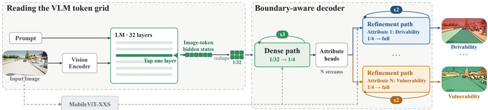
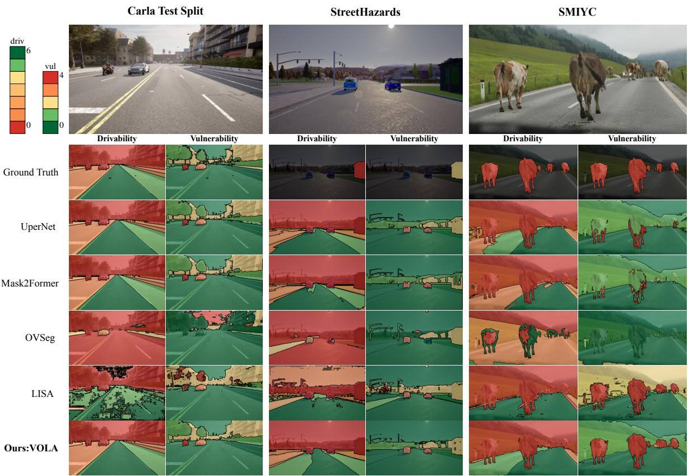
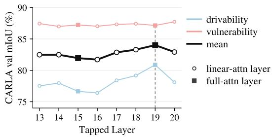
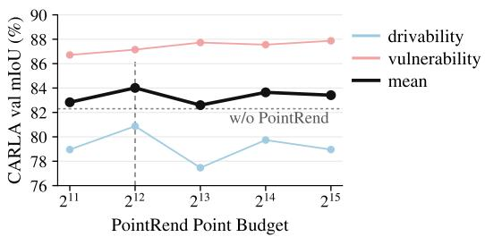
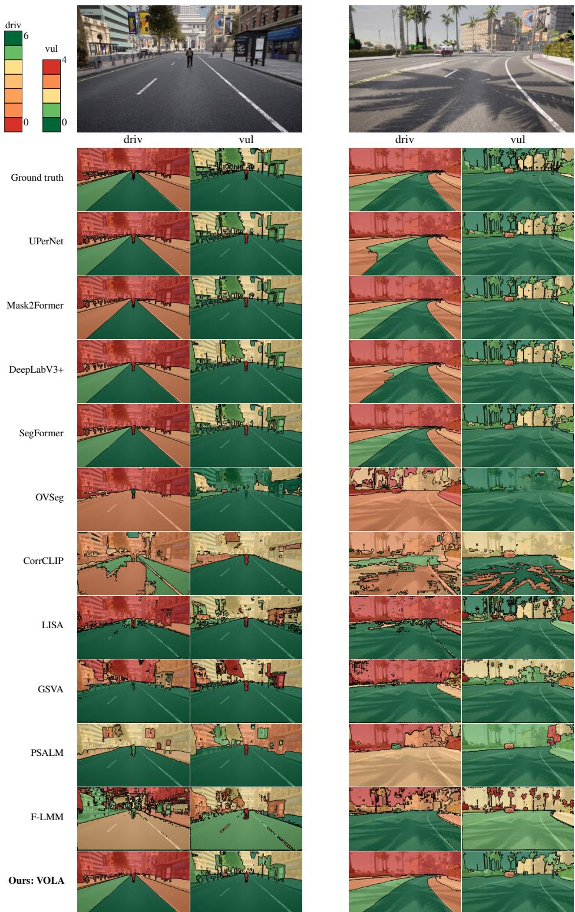
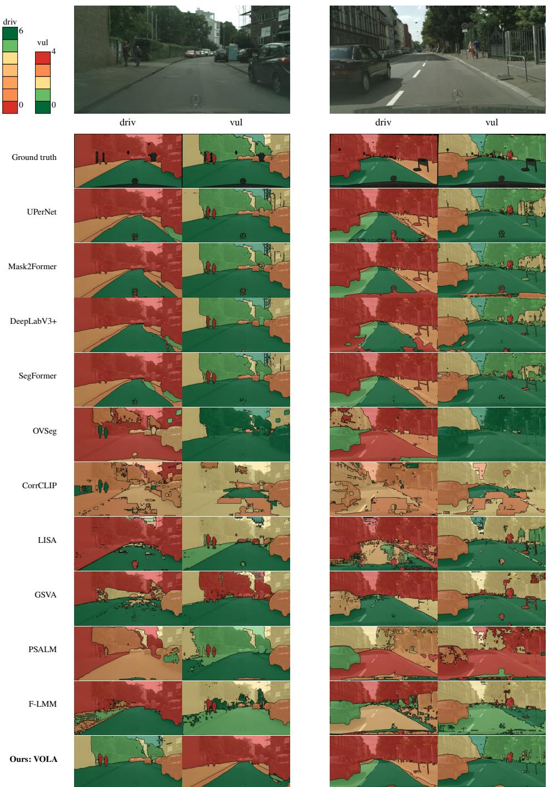
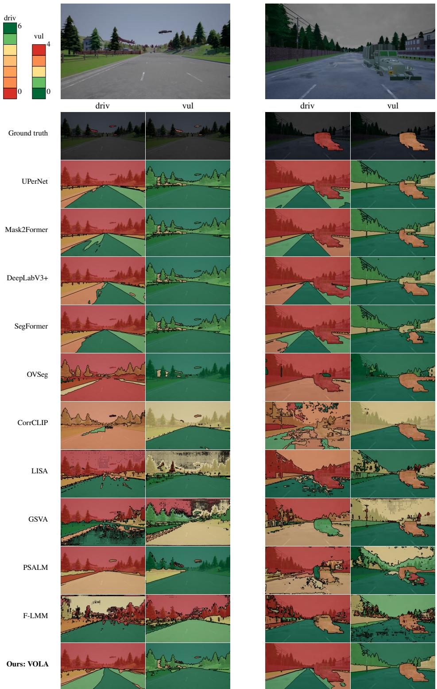
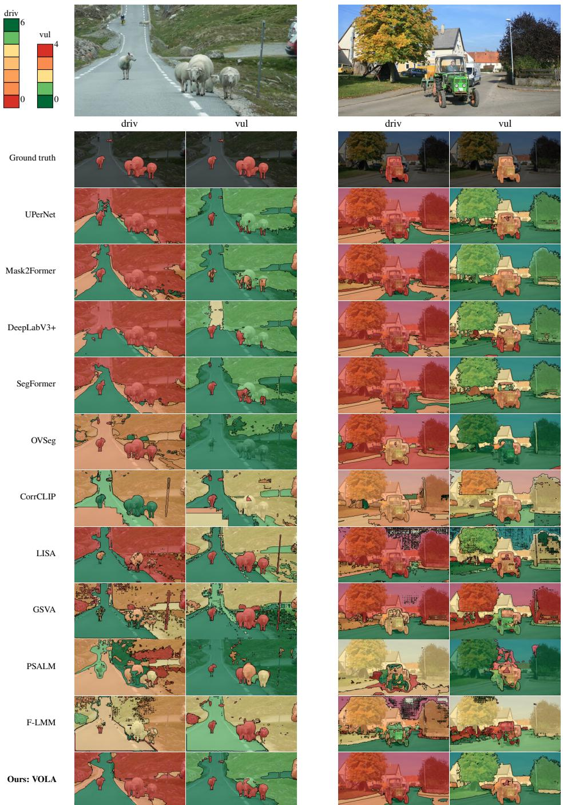

# VOLA: IMPROVING OPEN-WORLD DRIVING BY VLM-BASEDSEMANTIC ATTRIBUTE PREDICTION

A PREPRINT

Yuchen Zhang1, Yuan Gao1, Sebastian Schmidt2, and Johannes Betz1

1Professorship of Autonomous Vehicle Systems, Technical University of Munich, Munich, Germany 2Data Analytics and Machine Learning Group, Technical University of Munich, Munich, Germany Contact: {yuchen2.zhang, yuan\_avs.gao, sebastian95.schmidt, johannes.betz}@tum.de

## ABSTRACT

Driving in the real world is open-world: a car may encounter a fallen mattress, a deer, or other objects outside its training data. Naming them is not enough. The system must know how to treat each region: can it drive over it, how severe would a collision be? We therefore shift scene perception from category labels to dense action-relevant attributes, where each pixel is labeled by how it should affect motion rather than by object name. We instantiate this general formulation with two ordered attributes: 7-rank drivability and 5-rank vulnerability. We read Qwen3.5 image-token hidden states directly as a spatial semantic representation. A lightweight boundary-aware decoder then turns this coarse token grid into sharp full-resolution attribute maps. The whole process requires neither autoregressive text generation nor an external mask model such as SAM. We train on dense attribute labels built in CARLA and test transfer to real scenes and to novel obstacles never seen in training. We compare with vision-only segmenters trained on the same attributes and prompted VLM segmenters. Our model matches strong vision-only segmenters on familiar categories and improves transfer to real open-world anomalies, reaching 69.4% mean vulnerability-rank recall versus 57.1% for the best visiononly baseline and 53.9% for the best prompted VLM baseline. These results show that VLM image tokens provide useful semantic cues for transferring driving attributes to objects outside the training vocabulary. Code is available here.

## 1 Introduction

Autonomous driving in the real world is fundamentally an open-world problem, where rare objects and unknown hazards may appear during deployment [1, 2]. A mattress that fell from a truck, a loose tire on the highway, or a deer crossing a rural road may each be rare, but such long tail cases are collectively unavoidable. Handling them safely is one of the main remaining obstacles to reliable autonomy [3, 4].

The first bottleneck is the closed-set nature of standard semantic segmentation: every pixel must be assigned to one class from a label set fixed before training [5, 6, 7]. This interface works when the scene fits the annotation taxonomy, but it has no reliable output for an object outside the label set. The model must either ignore the region, absorb it into background, or force it into the nearest known class.

Open-set and open-world perception address this failure by adding a discovery mechanism. Instead of forcing every pixel into a known class, these methods use signals such as energy scores [8, 9], objectness priors [10, 11], or evidential uncertainty [12, 13] to flag regions outside the known label set. They separate regions into known classes and a generic "unknown" bucket. This reduces silent failure, but the system still does not know what to do with that region. An “unknown” label does not say whether the region is safe to enter, costly to hit, or occupied by a vulnerable agent.

A different route is to draw on vision-language models (VLMs), whose large-scale image-text training provides broader visual knowledge [14, 15]. Recent work [16, 17] has applied VLMs to driving scenes for captioning, where they can produce rich descriptions of what they observe. However, simply reporting what the model sees, calling a tire “tire” and a mattress “mattress”, is not enough. Planning operates on costs and constraints, such as whether a region can be entered and whether a collision would be severe. For common categories such as cars, pedestrians, cyclists, and traffic signs, these meanings are usually already encoded in the driving stack. For rare or unseen categories, they are not. If perception reports a “tire”or a “mattress”, the planner still needs to know how that region should affect motion. The system must either maintain a class-to-cost mapping for the long tail of objects that may appear during deployment, which is unrealistic, or learn this mapping from sparse long-tail data. Shifting from category-centered perception to attribute-centered perception could remove this extra step by describing how each region matters for driving rather than only naming what is there.

We therefore recast driving-scene perception as dense ordinal attribute prediction. Instead ofassigning each pixel a visual category, we predict per-pixel ranksfor drivingrelevant properties such as drivability and vulnerability. To predict these maps, we use Qwen3.5 [18] as a dense semantic source rather than as a text generator. Its image token hidden states form a coarse spatial grid, preserving broad image-text knowledge in a localized representation. A lightweight boundary-aware decoder turns this grid into full resolution attribute rank maps, without relying on an external promptable segmentation model such as SAM [19].

In summary, our contributions are:

• We formulate open-world driving perception as dense attribute prediction, shifting the output space from fixed object classes to driving-relevant properties.

• We show with VOLA that image tokens can serve as a dense semantic source, allowing attribute prediction without text generation or special segmentation tokens.

• We build dense attribute supervision in CARLA simulator, and show that the learned attributes generalize beyond the simulator to real scenes and beyond the training taxonomy to unseen open-world obstacles.

## 2 Related Work

Closed-set segmentation. Semantic segmentation is a fixed-label dense prediction task: given an image and a label set, predict a class for every pixel. Fully convolutional networks made the task end-to-end by turning imagelevel classifiers into dense predictors [20]. Later work strengthened the dense representation with context and multi-scale reasoning: pyramid pooling in PSPNet [21], atrous encoder-decoder features in DeepLabv3+ [22], and multi-level parsing in UPerNet [5]. Transformer and mask-classification methods improved quality further: SegFormer [6] pairs a hierarchical transformer encoder with a light decoder, MaskFormer [23] recasts segmentation as mask classification, and Mask2Former [7] extends that interface across semantic, instance, and panoptic segmentation.

All of these approaches can only predict classes induced in their fixed training vocabulary. Content outside the vocabulary is absorbed into the background, ignored, or forced into the nearest known class.

Open-world detection and segmentation. Open-world methods relax the fixed vocabulary by flagging pixels or regions that do not fit any known class. They differ mainly in where the unknown signal comes from. Some methods use model-internal confidence [24], energy [8], or evidential uncertainty [13] scores to reject regions outside the known classes. Others derive unknown supervision from the training data itself, for example, by mining objectlike regions that do not match known annotations [25]. Other methods learn category-agnostic objectness from known instances [10, 11] or use external negative data to strengthen unknown detection [26, 9, 27].

While those methods are able to reduce silent failure on out-of-taxonomy regions, the discovery stops at an “unknown” flag. Knowing that a region is “unknown” says nothing about how to treat it: a deer and a fallen mattress may both be unknown, yet one is vulnerable and the other is an obstacle.

Open-vocabulary and VLM-based segmentation. Open-vocabulary and VLM-based segmentation offer a different route to the open world. The target there is specified in language rather than fixed by a label index. Existing methods differ in which representation conditions the mask. CLIP-style open-vocabulary methods condition on class-name embeddings: OVSeg [28] scores class-agnostic mask proposals against CLIP [29] text embeddings, and CAT-Seg [30] builds dense CLIP features and matches them to class names per pixel. Instructiontuned segmenters condition on language-side tokens instead. LISA [31] prompts SAM [19] with the hidden state of one generated segmentation token, PixelLM [32] feeds learned segmentation tokens to a pixel decoder, and GSVA [33] adds empty-target rejection. F-LMM [34] grounds words of an ordinary assistant response through attention maps before mask decoding and SAM refinement, while PSALM [35] appends learnable mask tokens to the input and decodes masks from their output embeddings. Table 1 summarizes the main design choices along which these methods differ.

While these methods make segmentation more flexible by conditioning masks on language, the output remains tied to a queried concept or generated segmentation token. A prompt such as “mattress” or “deer” can localize the object, yet the resulting mask still does not specify how the region should matter for driving, which we address in our work.

<table><tr><td></td><td>No special tok.</td><td>No autoreg. gen.</td><td>Without Reads SAM [19] img. tok.</td></tr><tr><td>LISA [31]</td><td>X</td><td>X X</td><td>X</td></tr><tr><td>PixelLM [32]</td><td>X</td><td>X</td><td>X</td></tr><tr><td>GSVA [33]</td><td>X</td><td>X</td><td>X</td></tr><tr><td>PSALM [35]</td><td>X</td><td>X J √</td><td>X</td></tr><tr><td>F-LMM [34]</td><td></td><td>X X</td><td>X</td></tr><tr><td>VOLA [ours]</td><td></td><td></td><td></td></tr></table>

Table 1: VLM-based segmenters. Unlike prior methods, VOLA reads image tokens directly, without special tokens, text generation, or SAM.

  
Figure 1: Method overview. Given an image and a short prompt, we run the VLM once and read image-token hidden states from an intermediate layer, without text generation or added special tokens. The tokens are reshaped into a 1/32 spatial grid, which provides semantic scene features but is too coarse for accurate boundaries. A boundary-aware decoder upsamples this grid to 1/4 resolution while fusing RGB features from a lightweight MobileViT-XXS [36] branch. Attribute heads then split the shared feature map into per-attribute streams. Each stream is refined from 1/4 to full resolution at uncertain points, producing one dense rank map per driving attribute.

## 3 Method

VOLA addresses two gaps in dense perception for openworld driving. First, closed-set segmenters and openworld methods still describe regions through object classes or unknown flags. Neither output says how the region should affect driving. We therefore predict ordered driving attributes, such as drivability and vulnerability. Second, VLM-based segmenters usually localize queried concepts through generated text, special tokens, or external mask decoders. VOLA instead reads image-token hidden states directly and treats them as a spatial semantic field. Figure 1 shows how this field is decoded: the image-token grid is reshaped, upsampled by a boundaryaware decoder, split into attribute streams, and refined to full-resolution rank maps.

## 3.1 Problem formulation

Let $I \in \mathbb { R } ^ { 3 \times H \times W }$ be an input image. Given a set of ordered attributes A, VOLA predicts one dense rank map for each attribute. For attribute $^ { a , }$ ranks take values in $\mathcal { Y } _ { a } = \{ 0 , \ldots , K _ { a } - 1 \}$ . The final output has size $| { \mathcal { A } } | \times$ $H \times W$

In this work, as a concrete instantiation of the general framework, we use two attributes, drivability and vulnerability. The framework does not depend on these two attributes or on these exact numbers of ranks. Other tasks can define other ordered attributes.

We define the ranks according to two principles. First, each rank should correspond to a different motion or contact consequence. Second, the order should be meaningful, so distant mistakes are more severe than nearby mistakes.

Following these principles, drivability measures how suitable a region is as a motion target for the ego vehicle. Higher ranks mean better motion targets. Rank 6 denotes normal motion in the current lane and its forward continuation. Rank 5 denotes a legal same-direction lane change target. Rank 4 denotes same direction road that is not legally reachable from the current lane. Rank 3 denotes road that would otherwise be usable but is currently blocked by a red light. Rank 2 denotes an emergency off road fallback. Rank 1 denotes an opposite direction lane. Rank 0 denotes no valid motion target, including occupied regions and non-driving regions such as sky.

Vulnerability measures how severe the consequences of contact with a region would be. Higher ranks mean higher contact cost. Rank 4 denotes unprotected biological agents, such as pedestrians, cyclists, and animals. Rank 3 denotes high-cost contact with protected agents, such as cars, trucks, and buses. Rank 2 denotes heavy rigid structures such as wall and buildings. Rank 1 denotes light obstacles and roadside structures. Rank 0 denotes regions where there is no object to collide with.

## 3.2 Reading the VLM token grid

Predicting drivability and vulnerability needs semantic knowledge about objects, scenes, and what they mean for driving. VLMs hold this knowledge from large-scale image-text pretraining, but they usually expose it as generated text, whereas dense attributes need a spatial form. This form actually already exists inside the model before text generation, since the VLM encodes the image as a grid of token features with one vector per region. We read this grid directly and use it as our spatial semantic field.

This keeps the method simple and cheap. It needs only a single forward pass, with no autoregressive text generation. It also adds no special tokens, since the image tokens the model already produces are exactly what we read.

We give the model a short text prompt of m tokens followed by the image. The visual encoder splits the image into a $g _ { h } \times g _ { w }$ patch grid. It then merges every $s \times s$ block into one image token, giving $\begin{array} { r } { n = { \frac { g _ { h } g _ { w } } { s ^ { 2 } } } } \end{array}$ image tokens. During visual encoding, image tokens exchange information with other image tokens. Thus, each token carries local appearance and image context before it enters the language model.

The VLM then processes the prompt tokens and image tokens as one sequence,

$$
X = ( \underbrace { p _ { 1 } , \ldots , p _ { m } } _ { \mathrm { p r o m p t } } , \underbrace { v _ { 1 } , \ldots , v _ { n } } _ { \mathrm { i m a g e } } ) .\tag{1}
$$

Each transformer layer can enrich the content of each token, but it does not change the number or order of image token positions. The hidden state at an image token position can therefore carry context from the image and the prompt, while still corresponding to a fixed region of the input image. We then select the n image token hidden states and reshape them into an image-aligned grid of $\begin{array} { r } { \frac { g _ { h } } { s } \times \frac { g _ { w } } { s } } \end{array}$ cells.

More concretely, we read image token hidden states from layer 19 of 32, selected by the ablation in Sec. 6.1. Qwen3.5 uses $1 6 \times 1 6$ patches with a $2 \times 2$ merge. Each cell therefore spans a $3 2 \times 3 2$ image region, giving about $\begin{array} { r } { \frac { H } { 3 2 } \times \frac { W } { 3 2 } } \end{array}$ cells for an $H \times W$ image.

## 3.3 Boundary-aware decoder

The VLM grid is semantically rich but spatially coarse, with each token summarizing a 32 × 32 image region. Directly projecting this grid to full resolution would blur thin structures and object boundaries. We therefore use a boundary-aware decoder that preserves the VLM semantic signal while recovering missing spatial detail from the image. It upsamples the grid through two successive paths: a dense path that progressively fuses RGB appearance features, and a refinement path that sharpens predictions at still-uncertain pixels, which typically lie near object boundaries.

The dense path upsamples the VLM token grid in three stages, from 1/32 to 1/4 resolution, while fusing RGB features from a lightweight MobileViT-XXS encoder [36]. At each scale, the RGB fusion branch is zero-initialized, so the decoder starts from the VLM semantic signal and learns to add local appearance cues only when useful. RGB features, therefore, restore detail for thin structures and object boundaries without taking over the semantic prediction. Finally, at $1 / 4$ resolution, each attribute has its own head: a $1 \times 1$ convolution that maps the decoder feature at every pixel p to coarse logits $\boldsymbol { z } _ { a } ( \boldsymbol { \hat { p } } ) \in \mathbb { R } ^ { K _ { a } }$ , one entry per rank.

The refinement path follows PointRend [37] and refines uncertain points, which are often concentrated near thin structures and object boundaries. For each selected point p, a small MLP predicts refined logits $\hat { z } _ { a } ( p )$ from the coarse logits $z _ { a } ( p )$ and a fine image feature sampled at the same location. We apply this refinement in two $\times 2$ stages, lifting the prediction from $1 / 4$ resolution to full resolution. During training, we sample a fixed point budget biased toward uncertain locations, while at inference, we refine the most uncertain points at each upsampling stage. We ablate this refinement against bilinear upsampling in Sec. 6.2.

Since each attribute label is ordered, the loss should reflect rank distance. For example, predicting drivability rank 5 instead of rank 6 is a smaller error than predicting rank 0. Ordinal losses such as CORAL [38] and CORN [39] encode this ordering by decomposing rank prediction into ordered binary decisions. They are, therefore, natural choices for our attributes. However, we find that a simple sigmoid focal loss performs better in practice (Sec. 6.3). The final training contains a dense term on the coarse logits and a sparse term on the refined points:

$$
\begin{array} { c } { \displaystyle \mathcal { L } = \sum _ { a \in \mathcal { A } } \bigg [ \sum _ { p \in \Omega _ { c } } \ell \big ( z _ { a } ( p ) , y _ { a } ( p ) \big ) } \\ { \displaystyle + \sum _ { p \in P } \ell \big ( \hat { z } _ { a } ( p ) , y _ { a } ( p ) \big ) \bigg ] , } \end{array}\tag{2}
$$

where ℓ is the focal loss, $y _ { a } ( p )$ is the ground-truth rank, $\Omega _ { c }$ is the pixel grid of the coarse prediction, and $P$ is the set of points selected for refinement. At inference, each pixel takes the highest-scoring rank on each attribute.

## 4 Dataset Construction

Our model needs dense per-pixel attribute supervision. We considered building such supervision from existing real-world segmentation datasets such as Cityscapes [40] and nuImages [41] by mapping each annotated class to a fixed attribute combination, but this approach has two limitations.

First, their object taxonomies are fixed and incomplete, so out-of-distribution objects are often unlabeled or absorbed into broad fallback classes such as “static” and “dynamic”. Second, the road class is itself too coarse. It alone covers 32.6% of all pixels in Cityscapes and 21.2% in nuImages, but it merges regions that should receive different attribute labels. For example, the ego lane is currently drivable by the ego vehicle, a bicycle lane is reserved for cyclists, and an oncoming lane belongs to traffic moving in the opposite direction. A single road label cannot distinguish these cases. As a result, class-to-attribute conversion would be incomplete for some objects and ambiguous for road structure.

Collection in CARLA. We instead collect data in the CARLA simulator [42], where the class of every object and lane connectivity are directly available. The ego vehicle drives under autopilot through CARLA’s Traffic Man ager, with traffic and pedestrians populating the scene under continuously varying weather. Frames are sampled every two seconds of simulated time, and any frame whose ego pose has moved less than 0.1 m from the previous saved frame is discarded to remove near-duplicates from idling at signals or in dense traffic.

Label construction. Labels are built from three sources. (i) Lane structure comes from the CARLA map. Starting at the ego’s waypoint, we trace the lane network forward through successor waypoints, branching at intersections, and label each visible road pixel by its connectivity to the ego: the current lane and its forward continuation, lanes reachable through legal lane changes and their forward continuations, same-direction lanes that are not reachable, or oncoming lanes. (ii) Temporary lane availability is added on top of the lane structure map. This context marks lanes in the ego’s travel direction that are temporarily unavailable because of a red light. (iii) Object semantics come from CARLA’s segmentation camera.

Splits. We split the CARLA data by town instead of randomly splitting frames. A random frame split would create leakage between the training and test sets because each CARLA town covers a limited road network. Since the autopilot naturally revisits the same streets during data collection, repeated views of the same road segments could appear in both splits. A town-level split gives a stricter evaluation, since each held-out town contains road layouts that the model has not seen during training. The training set contains Town02, Town03, Town04, and Town05, for a total of 3,752 frames. The validation set contains Town01, with 736 frames, and the test set contains Town10HD, with 200 frames.

## 5 Experiments

Our experiments test the central claim that VLM image tokens can support dense driving-attribute prediction beyond the training vocabulary. We ask two questions. First, does a VLM backbone improve attribute prediction compared with strong vision-only segmenters trained on the same labels? Second, is attribute supervision necessary, or can existing VLM segmenters produce these maps by prompting alone? We answer these questions under progressively stronger distribution shifts: from a style-shifted CARLA town, to real-world Cityscapes [40] images, to synthetic novel-object anomalies, and finally to real novelobject anomalies.

## 5.1 Datasets and Metrics

We train on the CARLA training split then evaluate under two kinds of shift: visual shift and semantic novelty.

For visual shift, we evaluate on the CARLA validation split, the CARLA test split, and Cityscapes. The CARLA test split is collected in Town10HD, which is a special CARLA town with a modern downtown layout and a visual style that is clearly different from the training towns. Cityscapes moves from simulation to real driving images. All datasets provide dense labels, so we report per-axis mIoU. Since Cityscapes has no lane connectivity or traffic-rule labels, we collapse drivability into three groups: non-drivable, off-road, and on-road, while keeping vulnerability at five ranks.

For semantic novelty, we evaluate on StreetHazards [43] and SegmentMeIfYouCan (SMIYC) [2] AnomalyTrack. StreetHazards places unseen objects into the CARLA simulator. SMIYC contains real-world anomalous objects such as animals and lost cargo. StreetHazards and SMIYC label only anomaly pixels, not the full scene, so we report anomaly-pixel recall. For drivability, recall means predicting the anomaly as non-drivable. For vulnerability, recall means predicting the correct manually annotated rank.

## 5.2 Experiment 1: Is a VLM backbone necessary?

Modern vision-only segmenters are strong dense predictors, and our attribute maps are dense prediction targets. It is therefore possible that, when trained with the same attribute supervision, a conventional segmenter can already learn the appearance, geometry, and scene-context cues needed to infer how each region should be treated. Experiment 1 tests this alternative by comparing VOLA with standard dense segmenters under identical supervision, asking whether intermediate VLM image-token features offer stronger transfer than vision-only features as evaluation shifts from familiar scenes to novel objects.

Baselines. We use four standard segmenters that span convolutional and transformer designs: DeepLabV3+ [22], UperNet [5], SegFormer [6], and Mask2Former [7]. These models are designed to produce a single label map. To produce both attributes while leaving their architectures untouched, we train a separate model for each, one for drivability and one for vulnerabil ity. All baselines use their standard ImageNet-pretrained backbones and default training recipe, and are trained on the same CARLA images, attribute labels, and splits as our model.

Results. Table 2 shows that the benefit of VLM image tokens is small under visual shift but clear under semantic novelty. The three dense splits (CARLA val, CARLA test, and Cityscapes) contain familiar object types, although their appearance shifts from the training towns to real Cityscapes images. They therefore mainly test transfer across visual style. The vision-only baselines handle this setting well, likely because their ImageNet-pretrained backbones already provide strong appearance features. Our model is competitive with them on these splits: it performs best on drivability and remains close on vulnerability. In other words, when the objects are familiar, a strong conventional segmenter is often enough.

The two novel-object splits (SMIYC and StreetHazards) are different because they contain object categories never seen during training, such as horses and excavators. This makes them a test of semantic generalization, not just visual domain transfer. Here, our model shows a clear advantage. The largest gains are on the most safety-critical rank 4 (unprotected biological agents such as humans or animals): our model recalls 77.5% of them on SMIYC and 54.9% on StreetHazards, compared with at most 69.6% and 48.1% for any baseline. Mask2Former, despite being the strongest model on familiar scenes, recalls only 20.4% and 25.4% in this setting. Thus, strong performance on seen objects does not necessarily translate to strong performance on novel objects. In the SMIYC example in Fig. 2, UPerNet and Mask2Former assign the correct vulnerability rank to only small parts of the nearby cows and largely ignore the distant cows. Our model assigns the vulnerable rank more consistently across both nearby and distant objects. For anomaly drivability, the task reduces to detecting that each labeled anomaly is non-drivable. All methods perform similarly on this binary check, with 97.8–99.4% recall on SMIYC and 98.7–99.2% on Street-Hazards.

Table 2: Comparison with vision-only segmenters. CARLA and Cityscapes report per-axis mIoU. StreetHazards and SMIYC report vulnerability-rank recall on anomaly pixels. Bold: best, underline: second best.
<table><tr><td></td><td colspan="6">mIoU (%) ↑</td><td colspan="8">Novel-object vulnerability recall (%) ↑</td></tr><tr><td></td><td colspan="2">CARLA val</td><td colspan="2">CARLA test</td><td colspan="2">Cityscapes</td><td colspan="4">StreetHazards</td><td colspan="4">SMIYC</td></tr><tr><td>Model</td><td>driv</td><td>vul</td><td>driv</td><td>vul</td><td>driv</td><td>vul rank 1</td><td>rank 2</td><td>rank 3</td><td>rank 4</td><td>mean</td><td>rank 1</td><td>rank 3</td><td>rank 4</td><td>mean</td></tr><tr><td>SegFormer [6]</td><td>80.80</td><td>87.03</td><td>79.50</td><td>80.82</td><td>81.21</td><td>77.46 59.96</td><td>73.64</td><td>23.65</td><td>4.98</td><td>40.56</td><td>17.73</td><td>83.83</td><td>69.58</td><td>57.05</td></tr><tr><td>UperNet [5]</td><td>75.63</td><td>91.15</td><td>74.85</td><td>85.45</td><td>81.27</td><td>80.73 64.59</td><td>86.85</td><td>44.27</td><td>39.21</td><td>58.73</td><td>25.84</td><td>83.04</td><td>44.99</td><td>51.29</td></tr><tr><td>DeepLabV3+ [22]</td><td>80.41</td><td>85.69</td><td>74.02</td><td>72.84</td><td>68.19</td><td>74.23 62.04</td><td>75.14</td><td>36.21</td><td>48.10</td><td>55.37</td><td>8.09</td><td>78.32</td><td>60.00</td><td>48.80</td></tr><tr><td>Mask2Former [7]</td><td>76.51</td><td>88.79</td><td>73.50</td><td>83.97</td><td>83.16 81.48</td><td>70.71</td><td>70.05</td><td>41.37</td><td>25.42</td><td>51.89</td><td>20.53</td><td>89.95</td><td>20.40</td><td>43.63</td></tr><tr><td>Ours: VOLA</td><td>80.87</td><td>87.15</td><td>79.74</td><td>83.57</td><td>84.38</td><td>80.39 78.94</td><td>79.22</td><td>55.88</td><td>54.91</td><td>67.24</td><td>38.25</td><td>92.27</td><td>77.52</td><td>69.35</td></tr></table>

## 5.3 Experiment 2: Is training necessary?

Experiment 1 shows that VLM image-token features improve transfer under semantic novelty. This raises a second question: if VLMs already contain broad visual knowledge, can existing VLM-based segmenters recover these maps without additional training? These methods accept language prompts and produce masks, so one might expect them to obtain our attribute maps by prompting each rank description directly. Experiment 2 tests this zero-shot alternative by comparing VOLA with prompted VLM segmenters, asking whether prompting alone can yield reliable dense attribute maps without attribute-specific training.

Baselines. We compare with VLM-based segmentation methods under a zero-shot protocol, with no attributespecific fine-tuning. Since these methods take language as input, we prompt each model with the text description of each rank, covering seven drivability ranks and five vulnerability ranks.

Since existing VLM segmenters expose different interfaces, we adapt their outputs to a common dense rankmap format. For CLIP-based open-vocabulary methods, OVSeg [28] and CorrCLIP [44], the rank descriptions are used directly as the class vocabulary, and each pixel is assigned to its best-matching rank. Generative VLM-based referring methods, LISA [31], GSVA [33], PSALM [35], and F-LMM [34], are designed to answer “where is X?”, where X is a text description of the target. We set X to each rank description in turn, stack the returned masks, and select the highest-scoring rank at each pixel.

<table><tr><td></td><td colspan="2">mIoU (%) ↑</td><td colspan="4">Recall (%) ↑</td></tr><tr><td></td><td colspan="2">CARLA test</td><td colspan="2">SH</td><td colspan="2">SMIYC</td></tr><tr><td>Model</td><td>driv</td><td>vul</td><td>driv</td><td>vul</td><td>driv</td><td>vul</td></tr><tr><td>OVSeg [28]</td><td>10.41</td><td>26.75</td><td>71.83</td><td>45.97</td><td>61.75</td><td>18.91</td></tr><tr><td>CorrCLIP [44]</td><td>3.77</td><td>48.23</td><td>12.92</td><td>41.95</td><td>1.35</td><td>31.42</td></tr><tr><td>LISA [31]</td><td>30.79</td><td>55.72</td><td>91.57</td><td>44.41</td><td>69.43</td><td>53.90</td></tr><tr><td>GSVA [33]</td><td>26.46</td><td>40.14</td><td>34.83</td><td>42.70</td><td>32.18</td><td>40.27</td></tr><tr><td>PSALM [35]</td><td>9.95</td><td>32.32</td><td>21.80</td><td>41.13</td><td>19.92</td><td>19.69</td></tr><tr><td>F-LMM [34]</td><td>6.58</td><td>36.33</td><td>28.23</td><td>54.60</td><td>14.34</td><td>40.56</td></tr><tr><td>Ours: VOLA</td><td>79.74</td><td>83.57</td><td>99.11</td><td>67.24</td><td>98.63</td><td>69.35</td></tr></table>

Table 3: Comparison with prompted VLM segmenters. CARLA test reports per-axis mIoU. Street-Hazards and SMIYC report anomaly-pixel recall. Bold: best, underline: second.

Results. Experiment 2 asks whether training on the attributes is necessary, and Table 3 answers it: no zeroshot VLM segmenter reproduces the dense maps. On the CARLA test set, our model outperforms all baselines on both attributes, with 79.74 / 83.57 drivability/vulnerability mIoU compared with 30.79 / 55.72 for the strongest baseline, LISA.

This gap is not uniform across attributes. All baselines obtain higher mIoU on vulnerability than on drivability, e.g., 55.72 vs. 30.79 for LISA and 48.23 vs. 3.77 for CorrCLIP. This trend reflects the different reasoning demands of the two attributes. Vulnerability can often be inferred from local region appearance, since it mainly asks how severe a collision with that region would be. Drivability, however, is inherently relational: it depends on lane connectivity, direction of travel, and the traffic-rule state of the surrounding scene. Consequently, the baselines fall furthest behind on drivability. The CARLA test column of Figure 2 makes this visible. LISA fragments the drivability map into scattered patches, yet on vulnerability, it still segments the car, the motorcycle, and the buildings. OVSeg is worse on both, collapsing the scene into almost a single drivability class and a single vulnerability rank.

  
Figure 2: Qualitative comparison across datasets. Columns follow an increasing distribution shift: CARLA Test changes visual style, StreetHazards introduces synthetic novel objects, and SMIYC introduces real novel objects. Rows compare ground truth, two vision-only segmenters trained on our attribute labels (UPerNet and Mask2Former), two prompted VLM segmenters used without attribute training (OVSeg and LISA), and our model VOLA. CARLA provides dense scene labels, while StreetHazards and SMIYC provide masks only for anomalous objects. Green denotes high drivability or low vulnerability, and red denotes non-drivable regions or highly vulnerable agents. Vision-only models handle CARLA test well but generalize poorly to novel objects, such as the distant cows in SMIYC. Prompted VLM segmenters show clear limitations. OVSeg often assigns one rank to most of the scene. LISA usually captures the coarse vulnerability level, but its maps remain noisy. For drivability, it often merges different road areas into one rank and misses the finer lane ordering.

The anomaly benchmarks further support this conclusion, although their drivability metric is less strict. Unlike CARLA, where drivability is evaluated as a dense scenelevel map, SMIYC and StreetHazards evaluate only the labeled anomaly object and ask whether it is predicted as non-drivable. Our model reliably identifies novel objects as non-drivable, achieving 98.63% on SMIYC and 99.11% on StreetHazards. But most baselines fail this check, with CorrCLIP, F-LMM, and PSALM below 30% recall on both anomaly sets. Only LISA approaches our performance (69.43 / 91.57). This is a safety-relevant failure because those models often leave anomalous objects drivable.

A second trend appears across model families. The strongest baseline in each column is a referring segmentation method, whereas the CLIP-based open-vocabulary methods never achieve the best result. This is consistent with their different mechanisms: CLIP-based models pri marily rely on image-text embedding similarity, which provides limited support for relational reasoning. Referring methods can leverage generative VLM reasoning and therefore perform better, but they still remain below our model.

The question here is not which model segments better in general, but whether these maps can be produced by prompting alone. They cannot. Prompting existing VLM segmenters is insufficient to reproduce the dense attribute maps learned by our model.

## 6 Ablation

## 6.1 Tapped layer

We read dense features from a single layer of Qwen, which makes the tapped layer a design choice. Skean et al. [45] show that the intermediate layers of a language model encode its most informative and transferable features, whereas the final layers specialize to next-token prediction and transfer less well. Motivated by this, we sweep the read-out across the middle of Qwen’s 32-layer stack, from layer 13 to 20, retraining the model at each depth with all other settings fixed (Fig. 3). The two attributes depend on depth in different ways. Vulnerability changes little, whereas drivability is more depth-sensitive. The mean mIoU peaks at layer 19, which lies at about 0.6 relative depth, and we use this layer in all experiments.

  
Figure 3: Tapped Qwen layer. CARLA val mIoU when dense features are read from different Qwen layers. Layer 19 gives the best mean mIoU. Vulnerability is stable across layers, while drivability depends more on depth. Marker shape indicates the tapped layer’s attention type.

## 6.2 PointRend

The decoder uses PointRend [37] in the final two upsampling stages. At each stage, PointRend samples pixels with high prediction uncertainty and re-predicts them at a higher spatial resolution. Thus, both the use of PointRend and the number of sampled points are design choices. We first remove PointRend entirely, replacing the refinement stages with bilinear upsampling, and then sweep the point budget from $2 ^ { 1 1 }$ to $\mathbf { \hat { 2 } } ^ { 1 5 }$ (Fig. 4). PointRend improves the mean mIoU at every tested budget, with gains over the bilinear baseline ranging from 0.30 points at $2 ^ { 1 3 }$ to 1.71 points at $2 ^ { 1 2 }$ . For vulnerability, the gain is steady and saturates beyond $2 ^ { 1 3 }$ , whereas drivability varies more across budgets. The asymmetric gain is expected because vulnerability is more directly tied to visual boundary cues in the RGB image, while drivability depends more on contextual and relational evidence. We set the PointRend budget to $2 ^ { 1 2 }$ points, which gives the highest mean mIoU in this sweep.

## 6.3 Loss

Our attribute labels are ordered: drivability ranges from non-drivable regions to the ego lane, and vulnerability ranges from inert background to people. This makes ordinal losses a natural baseline. We compare CORAL [38] and CORN [39] with the sigmoid focal loss used in our model (Tab. 4). We also report rank mean absolute error (rank-MAE), which is the average absolute difference between the predicted and ground-truth rank indices over all valid pixels. Although ordinal losses explicitly model the rank structure, they do not improve rank-MAE, and they give lower mIoU on both attributes. We therefore use sigmoid focal loss in all experiments.

  
Figure 4: PointRend refinement budget. CARLA val mIoU across point budgets. The dashed line is bilinear upsampling without PointRend. The best mean mIoU is obtained with $2 ^ { 1 2 }$ points.

Table 4: Loss ablation. CARLA val mIoU and rank-MAE under different training losses. Sigmoid focal loss improves mIoU over the ordinal losses without increasing rank-MAE.
<table><tr><td rowspan="2">Loss</td><td colspan="2">mIoU↑</td><td colspan="2">rank-MAE↓</td></tr><tr><td>Driv.</td><td>Vuln.</td><td>Driv.</td><td>Vuln.</td></tr><tr><td>CORAL</td><td>64.77</td><td>81.49</td><td>0.2548</td><td>0.0324</td></tr><tr><td>CORN</td><td>78.53</td><td>83.95</td><td>0.2251</td><td>0.0299</td></tr><tr><td>Sigmoid focal (ours)</td><td>80.87</td><td>87.15</td><td>0.2250</td><td>0.0298</td></tr></table>

## 7 Limitation and Conclusion

Limitation VOLA predicts how each region should be treated, but it does not yet act on those predictions. Future work can close this loop by coupling dense attribute prediction with planning, so that predicted region properties directly shape driving decisions and improve the robustness of open-world driving.

Conclusion We recast open-world driving perception as dense attribute prediction. Instead of naming what is in a scene, we predict how each pixel region should be treated. We instantiate this idea with two safety-relevant attributes: drivability and vulnerability. The key idea is to read this knowledge directly from a VLM by tapping a single intermediate layer and use its image tokens as a dense view of the scene, with no SAM-style mask model, no added special tokens, and no autoregressive text generation. Each image token summarizes a $3 2 \times 3 2$ patch, so the semantics are present but fine spatial detail is lost. A lightweight decoder restores it from the image and produces sharp full-resolution maps. Experiments show that VLM image tokens form a strong dense backbone for open-world attribute prediction, while attribute-specific training is needed for producing reliable maps.

## References

[1] Peter Pinggera, Sebastian Ramos, Stefan Gehrig, Uwe Franke, Carsten Rother, and Rudolf Mester. Lost and found: Detecting small road hazards for self-driving vehicles. In IEEE/RSJ International Conference on Intelligent Robots and Systems, pages 1099–1106, 2016.

[2] Robin Chan, Krzysztof Lis, Svenja Uhlemeyer, Hermann Blum, Sina Honari, Roland Siegwart, Pascal Fua, Mathieu Salzmann, and Matthias Rottmann. Segmentmeifyoucan: A benchmark for anomaly segmentation. In Advances in Neural Information Processing Systems Datasets and Benchmarks Track, 2021.

[3] Philip Koopman and Michael Wagner. Challenges in autonomous vehicle testing and validation. SAE International journal of transportation safety, 4(2016-01-0128): 15–24, 2016.

[4] Osama Makansi, Özgün Çiçek, Yassine Marrakchi, and Thomas Brox. On exposing the challenging long tail in future prediction of traffic actors. In Proceedings of the IEEE/CVF International Conference on Computer Vision, pages 13147–13157, 2021.

[5] Tete Xiao, Yingcheng Liu, Bolei Zhou, Yuning Jiang, and Jian Sun. Unified perceptual parsing for scene understanding. In Proceedings of the European Conference on Computer Vision, pages 418–434, 2018.

[6] Enze Xie, Wenhai Wang, Zhiding Yu, Anima Anandkumar, Jose M Alvarez, and Ping Luo. Segformer: Simple and efficient design for semantic segmentation with transformers. In Advances in Neural Information Processing Systems, volume 34, pages 12077–12090, 2021.

[7] Bowen Cheng, Ishan Misra, Alexander G Schwing, Alexander Kirillov, and Rohit Girdhar. Masked-attention mask transformer for universal image segmentation. In Proceedings of the IEEE/CVF conference on computer vision and pattern recognition, pages 1290–1299, 2022.

[8] KJ Joseph, Salman Khan, Fahad Shahbaz Khan, and Vineeth N Balasubramanian. Towards open world object detection. In Proceedings of the IEEE/CVF conference on computer vision and pattern recognition, pages 5830– 5840, 2021.

[9] Yu Tian, Yuyuan Liu, Guansong Pang, Fengbei Liu, Yuanhong Chen, and Gustavo Carneiro. Pixel-wise energybiased abstention learning for anomaly segmentation on complex urban driving scenes. In European Conference on Computer Vision, pages 246–263. Springer, 2022.

[10] Dahun Kim, Tsung-Yi Lin, Anelia Angelova, In So Kweon, and Weicheng Kuo. Learning open-world object proposals without learning to classify. IEEE Robotics and Automation Letters, 7(2):5453–5460, 2022.

[11] Orr Zohar, Kuan-Chieh Wang, and Serena Yeung. Prob: Probabilistic objectness for open world object detection. In Proceedings ofthe IEEE/CVF conference on computer vision and pattern recognition, pages 11444–11453, 2023.

[12] Siddharth Ancha, Philip R Osteen, and Nicholas Roy. Deep evidential uncertainty estimation for semantic segmentation under out-of-distribution obstacles. In 2024 IEEE International Conference on Robotics and Automation (ICRA), pages 6943–6951. IEEE, 2024.

[13] Sebastian Schmidt, Julius Körner, Dominik Fuchsgruber, Stefano Gasperini, Federico Tombari, and Stephan Günnemann. Prior2former-evidential modeling of mask transformers for assumption-free open-world panoptic segmentation. In Proceedings ofthe IEEE/CVF International Conference on Computer Vision, pages 23646–23656, 2025.

[14] Shuai Bai, Yuxuan Cai, Ruizhe Chen, Keqin Chen, Xionghui Chen, Zesen Cheng, Lianghao Deng, Wei Ding, Chang Gao, Chunjiang Ge, et al. Qwen3-vl technical report. arXiv preprint arXiv:2511.21631, 2025.

[15] Zhe Chen, Jiannan Wu, Wenhai Wang, Weijie Su, Guo Chen, Sen Xing, Muyan Zhong, Qinglong Zhang, Xizhou Zhu, Lewei Lu, et al. Internvl: Scaling up vision foundation models and aligning for generic visual-linguistic tasks. In Proceedings ofthe IEEE/CVF conference on computer vision and pattern recognition, pages 24185–24198, 2024.

[16] Bu Jin, Yupeng Zheng, Pengfei Li, Weize Li, Yuhang Zheng, Sujie Hu, Xinyu Liu, Jinwei Zhu, Zhijie Yan, Haiyang Sun, et al. Tod3cap: Towards 3d dense captioning in outdoor scenes. In European Conference on Computer Vision, pages 367–384. Springer, 2024.

[17] Yuichi Inoue, Yuki Yada, Kotaro Tanahashi, and Yu Yamaguchi. Nuscenes-mqa: Integrated evaluation of captions and qa for autonomous driving datasets using markup annotations. In Proceedings of the IEEE/CVF Winter Conference on Applications of Computer Vision, pages 930–938, 2024.

[18] Qwen Team. Qwen3.5: Accelerating productivity with native multimodal agents, February 2026. URL https: //qwen.ai/blog?id=qwen3.5.

[19] Alexander Kirillov, Eric Mintun, Nikhila Ravi, Hanzi Mao, Chloe Rolland, Laura Gustafson, Tete Xiao, Spencer Whitehead, Alexander C Berg, Wan-Yen Lo, et al. Segment anything. In Proceedings ofthe IEEE/CVF international conference on computer vision, pages 4015–4026, 2023.

[20] Jonathan Long, Evan Shelhamer, and Trevor Darrell. Fully convolutional networks for semantic segmentation. In Proceedings of the IEEE Conference on Computer Vision and Pattern Recognition, pages 3431–3440, 2015.

[21] Hengshuang Zhao, Jianping Shi, Xiaojuan Qi, Xiaogang Wang, and Jiaya Jia. Pyramid scene parsing network. In Proceedings ofthe IEEE Conference on Computer Vision and Pattern Recognition, pages 2881–2890, 2017.

[22] Liang-Chieh Chen, Yukun Zhu, George Papandreou, Florian Schroff, and Hartwig Adam. Encoder-decoder with atrous separable convolution for semantic image segmentation. In Proceedings of the European Conference on Computer Vision, pages 801–818, 2018.

[23] Bowen Cheng, Alexander G Schwing, and Alexander Kirillov. Per-pixel classification is not all you need for semantic segmentation. In Advances in Neural Information Processing Systems, volume 34, pages 17864–17875, 2021.

[24] Sanghun Jung, Jungsoo Lee, Daehoon Gwak, Sungha Choi, and Jaegul Choo. Standardized max logits: A simple yet effective approach for identifying unexpected road obstacles in urban-scene segmentation. In Proceedings of the IEEE/CVF international conference on computer vision, pages 15425–15434, 2021.

[25] Akshita Gupta, Sanath Narayan, KJ Joseph, Salman Khan, Fahad Shahbaz Khan, and Mubarak Shah. Ow-detr: Open-world detection transformer. In Proceedings ofthe IEEE/CVF conference on computer vision and pattern recognition, pages 9235–9244, 2022.

[26] Robin Chan, Matthias Rottmann, and Hanno Gottschalk. Entropy maximization and meta classification for out-ofdistribution detection in semantic segmentation. In Proceedings ofthe ieee/cvfinternational conference on computer vision, pages 5128–5137, 2021.

[27] Matej Grcic, Petra Bevandi´ c, and Siniša Šegvi´ c. Densehy-´ brid: Hybrid anomaly detection for dense open-set recognition. In European Conference on Computer Vision, pages 500–517. Springer, 2022.

[28] Feng Liang, Bichen Wu, Xiaoliang Dai, Kunpeng Li, Yinan Zhao, Hang Zhang, Peizhao Zhang, Peter Vajda, and Diana Marculescu. Open-vocabulary semantic segmentation with mask-adapted clip. In Proceedings of the IEEE/CVF conference on computer vision and pattern recognition, pages 7061–7070, 2023.

[29] Alec Radford, Jong Wook Kim, Chris Hallacy, Aditya Ramesh, Gabriel Goh, Sandhini Agarwal, Girish Sastry, Amanda Askell, Pamela Mishkin, Jack Clark, et al. Learning transferable visual models from natural language supervision. In International conference on machine learning, pages 8748–8763. PmLR, 2021.

[30] Seokju Cho, Heeseong Shin, Sunghwan Hong, Anurag Arnab, Paul Hongsuck Seo, and Seungryong Kim. Cat-seg: Cost aggregation for open-vocabulary semantic segmentation. In Proceedings of the IEEE/CVF Conference on Computer Vision and Pattern Recognition, pages 4113– 4123, 2024.

[31] Xin Lai, Zhuotao Tian, Yukang Chen, Yanwei Li, Yuhui Yuan, Shu Liu, and Jiaya Jia. Lisa: Reasoning segmentation via large language model. In Proceedings of the IEEE/CVF conference on computer vision and pattern recognition, pages 9579–9589, 2024.

[32] Zhongwei Ren, Zhicheng Huang, Yunchao Wei, Yao Zhao, Dongmei Fu, Jiashi Feng, and Xiaojie Jin. Pixellm: Pixel reasoning with large multimodal model. In Proceedings of the IEEE/CVF Conference on Computer Vision and Pattern Recognition, pages 26374–26383, 2024.

[33] Zhuofan Xia, Dongchen Han, Yizeng Han, Xuran Pan, Shiji Song, and Gao Huang. Gsva: Generalized segmentation via multimodal large language models. In Proceedings ofthe IEEE/CVF Conference on Computer Vision and Pattern Recognition, pages 3858–3869, 2024.

[34] Size Wu, Sheng Jin, Wenwei Zhang, Lumin Xu, Wentao Liu, Wei Li, and Chen Change Loy. F-lmm: Grounding frozen large multimodal models. In Proceedings of the IEEE/CVF Conference on Computer Vision and Pattern Recognition, pages 24710–24721, 2025.

[35] Zheng Zhang, Yeyao Ma, Enming Zhang, and Xiang Bai. Psalm: Pixelwise segmentation with large multi-modal model. In European Conference on Computer Vision, pages 74–91. Springer, 2024.

[36] Sachin Mehta and Mohammad Rastegari. Mobilevit: Light-weight, general-purpose, and mobile-friendly vision transformer. In International Conference on Learning Representations, 2022. URL https://openreview. net/forum?id=vh-0sUt8HlG.

[37] Alexander Kirillov, Yuxin Wu, Kaiming He, and Ross Girshick. Pointrend: Image segmentation as rendering. In Proceedings of the IEEE/CVF conference on computer vision and pattern recognition, pages 9799–9808, 2020.

[38] Wenzhi Cao, Vahid Mirjalili, and Sebastian Raschka. Rank consistent ordinal regression for neural networks with application to age estimation. Pattern Recognition Letters, 140:325–331, 2020.

[39] Xintong Shi, Wenzhi Cao, and Sebastian Raschka. Deep neural networks for rank-consistent ordinal regression based on conditional probabilities. Pattern Analysis and Applications, 26(3):941–955, 2023.

[40] Marius Cordts, Mohamed Omran, Sebastian Ramos, Timo Rehfeld, Markus Enzweiler, Rodrigo Benenson, Uwe Franke, Stefan Roth, and Bernt Schiele. The cityscapes dataset for semantic urban scene understanding. In Proceedings of the IEEE Conference on Computer Vision and Pattern Recognition, pages 3213–3223, 2016.

[41] Holger Caesar, Varun Bankiti, Alex H Lang, Sourabh Vora, Venice Erin Liong, Qiang Xu, Anush Krishnan, Yu Pan, Giancarlo Baldan, and Oscar Beijbom. nuscenes: A multimodal dataset for autonomous driving. In Proceedings of the IEEE/CVF conference on computer vision and pattern recognition, pages 11621–11631, 2020.

[42] Alexey Dosovitskiy, German Ros, Felipe Codevilla, Antonio Lopez, and Vladlen Koltun. Carla: An open urban driving simulator. In Conference on robot learning, pages 1–16. PMLR, 2017.

[43] Dan Hendrycks, Steven Basart, Mantas Mazeika, Andy Zou, Joe Kwon, Mohammadreza Mostajabi, Jacob Steinhardt, and Dawn Song. Scaling out-of-distribution detection for real-world settings. ICML, 2022.

[44] Dengke Zhang, Fagui Liu, and Quan Tang. Corrclip: Reconstructing patch correlations in clip for open-vocabulary semantic segmentation. In Proceedings ofthe IEEE/CVF International Conference on Computer Vision, pages 24677–24687, 2025.

[45] Oscar Skean, Md Rifat Arefin, Dan Zhao, Niket Nikul Patel, Jalal Naghiyev, Yann Lecun, and Ravid Shwartz-Ziv. Layer by layer: Uncovering hidden representations in language models. In International Conference on Machine Learning, pages 55854–55875. PMLR, 2025.

## A Implementation Details

Table 5 shows the configuration of our model and its training.

Table 5: Configuration from the run used for the main results.
<table><tr><td colspan="2">Backbone and read-out</td></tr><tr><td>Backbone</td><td>Qwen3.5-4B</td></tr><tr><td>LM layers</td><td>32</td></tr><tr><td>Tapped layer</td><td>19  $( \mathrm { r o u n d } ( 0 . 6 { \times } 3 2 ) )$ </td></tr><tr><td>Patch / merge</td><td>16×16/2×2</td></tr><tr><td>Token grid</td><td>≈ 1/32 of input</td></tr><tr><td colspan="2">Decoder</td></tr><tr><td>Decoder width</td><td>256</td></tr><tr><td>Dense upsample</td><td>3 stages (1/32→1/4)</td></tr><tr><td>RGB skip width</td><td>64 (zero-init fusion)</td></tr><tr><td>Fine-feature width</td><td>128</td></tr><tr><td>Attribute heads</td><td>1×1, 7 driv / 5 vuln</td></tr><tr><td>PointRend stages</td><td>2 stages (1/4→1/1)</td></tr><tr><td>Points per stage</td><td> $2 ^ { 1 2 } = 4 0 9 6$ </td></tr><tr><td>Point sampling</td><td>oversample 3, importance 0.75</td></tr><tr><td>Decoder dropout</td><td>0.1</td></tr><tr><td colspan="2">Optimization</td></tr><tr><td>Epochs</td><td>12</td></tr><tr><td>Batch size</td><td>4</td></tr><tr><td>LoRA LR</td><td> $1 \times 1 0 ^ { - 4 }$ </td></tr><tr><td>Decoder LR</td><td> $5 \times 1 0 ^ { - 4 }$ </td></tr><tr><td>Schedule</td><td>3% warmup, cosine, min 0.1 ×</td></tr><tr><td>Weight decay</td><td>0.01</td></tr><tr><td>Loss</td><td>sigmoid focal  $( \gamma { = } 2 . 0 , \alpha { = } 0 . 2 5 )$ </td></tr></table>

## B Prompt Fed to the VLM

As described in Sec. 3.2 of the main paper, we place a short text prompt before the image so that the image-token hidden states become prompt-conditioned through causal attention. The exact strings are below.

## System prompt.

You are a perception system for autonomous driving. Examine the image carefully before answering.

## User prompt.

For every region of this image, think about these two questions:

1. Drivability. How safe is it for the ego vehicle to drive across this region? Consider whether the surface supports motion, whether the path is obstructed, and whether crossing it would endanger other agents.

2. Vulnerability. How harmful would a collision be for whatever occupies this region? Consider how badly the thing or person there would be damaged.

Your reasoning should be about the attributes ofeach region rather than the category of what’s there. Two regions with similar attributes should get similar answers.

## C Cityscapes Label Mapping

Cityscapes has no lane-connectivity or traffic-rule annotations, so we cannot build the full 7-rank drivability map. We therefore collapse drivability into three groups, nondrivable, off-road, and on-road, and keep vulnerability at its five ranks. Tables 6 and 7 give the mapping from Cityscapes label ids to the two axes. For scoring, we collapse our model’s seven drivability ranks to the same three groups: every lane rank (current, reachable, not-reachable, opposite, and red-light blocked) counts as on-road, the emergency off-road rank as off-road, and rank 0 as nondrivable. The Cityscapes void ids (unlabeled, ego vehicle, rectification border, out of roi, static, and dynamic) are ignored on both axes.

Table 6: Cityscapes vulnerability mapping. Cityscapes classes grouped into our five vulnerability ranks.
<table><tr><td>Rank</td><td>Name</td><td>Cityscapes classes</td></tr><tr><td>4</td><td>biologicals</td><td>person, rider</td></tr><tr><td>3</td><td>vehicles</td><td>car, truck, bus, caravan, trailer, train, motorcycle, bicycle</td></tr><tr><td>2 1</td><td>walls</td><td>building, wall, bridge, tunnel fence, guard rail, pole, pole</td></tr><tr><td></td><td>obstacles</td><td>group, traffic light, traffic sign,</td></tr><tr><td>0</td><td>non-vuln.</td><td>vegetation, terrain ground, road, sidewalk, parking, rail track, sky</td></tr></table>

Table 7: Cityscapes drivability mapping. Cityscapes classes grouped into the three drivability groups.
<table><tr><td>Group</td><td>Cityscapes classes</td></tr><tr><td>on-road</td><td>road</td></tr><tr><td>off-road</td><td>ground, sidewalk, parking, rail track, terrain</td></tr><tr><td>non-drivable</td><td>all other labeled classes (building, wall, fence, guard rail, bridge, tunnel, pole, traffic light, traffic sign, vegetation, sky, and all people and</td></tr></table>

## D Additional Qualitative Results

The main paper shows one qualitative figure with a subset of strongest methods. Here we give larger panels with all ten baseline methods so every baseline can be read on the same input. Figures 5–8 cover the four datasets along our distribution-shift gradient: CARLA Test, Cityscapes, StreetHazards, and SMIYC. In each panel the input image is on top, followed by one row per method, and for every method the drivability map (driv) and the vulnerability map (vul) are shown side by side.

Carla Test  
  
Figure 5: Additional qualitative results on CARLA Test.

  
Cityscapes  
Figure 6: Additional qualitative results on Cityscapes.

StreetHazards  
  
Figure 7: Additional qualitative results on StreetHazards.

SMIYC  
  
Figure 8: Additional qualitative results on SMIYC AnomalyTrack.