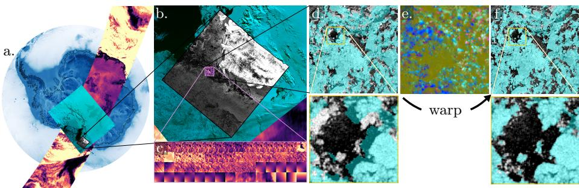
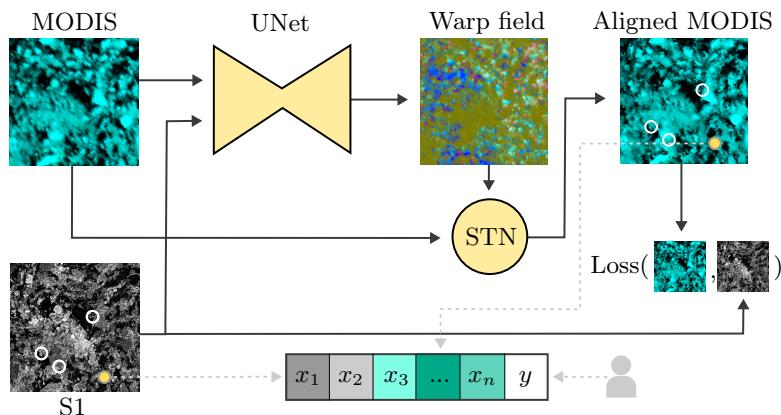
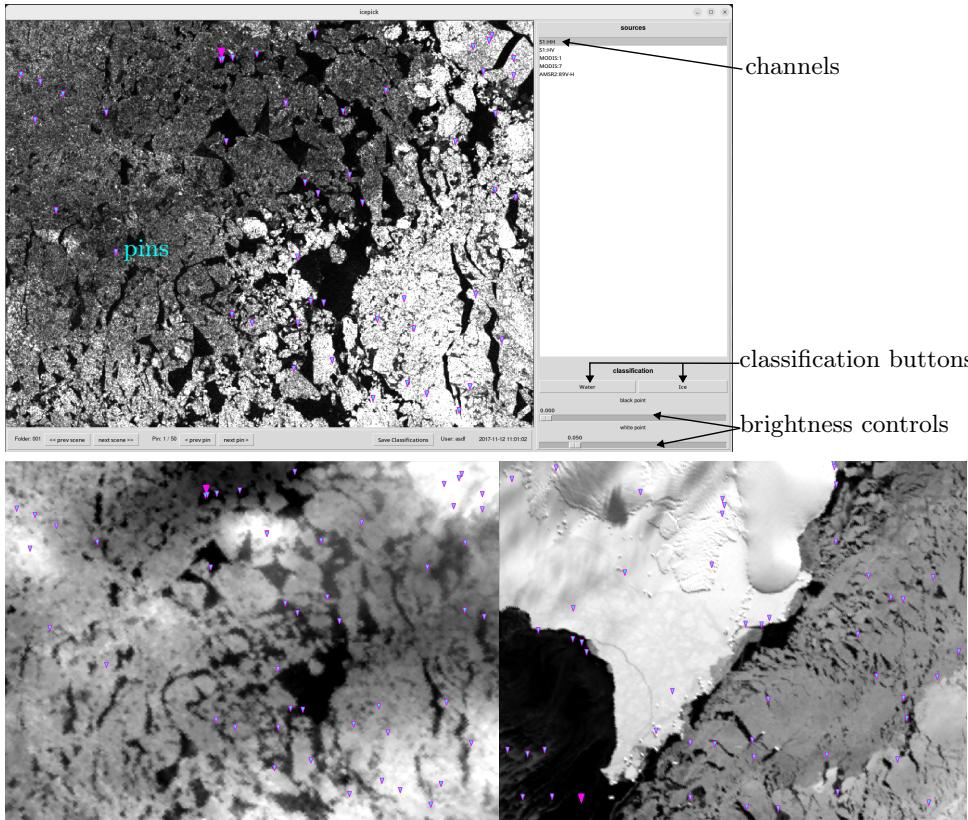
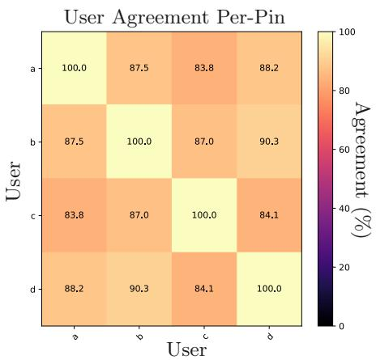
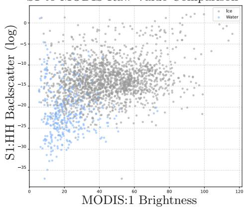
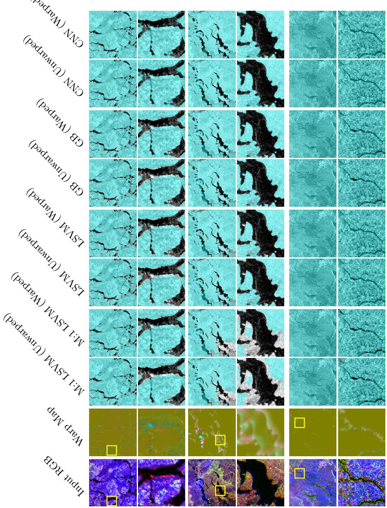
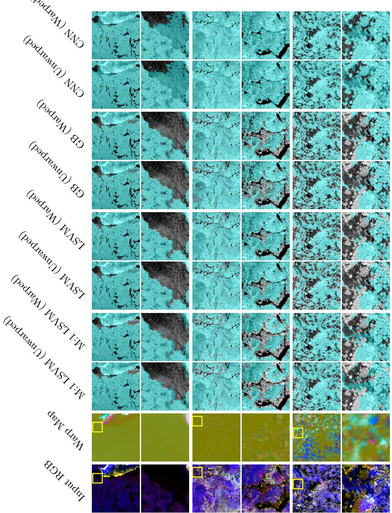

# Warping Earth Observations for better ice labeling in the Marginal Marginal Ice Zone

Tom Kelly and Martin S. J. Rogers

British Antarctic Survey, Cambridge {thokel, marrog}@bas.ac.uk

Abstract. Multimodal satellite imagery provides complementary information for Earth Observation, but accurately combining heterogeneous sensors remains challenging in dynamic environments. Fast-changing regions, such as the Antarctic marginal ice zone, cannot fully exploit multimodal information from diferent satellite sensors because surface features move between image acquisitions. This spatial and temporal mismatch challenges efective perceptual grounding, violating the assumption of pixel-level correspondence that underpins most multimodal reasoning and downstream classification pipelines. Antarctic sea ice provides a challenging benchmark due to the rapid, heterogeneous drift of individual ice floes and the difering responses of sea ice to radar, visible and thermal sensing modalities. Accurate, dense supervision of sea ice remains scarce because generating pixel-wise labels requires timeconsuming expert interpretation of noisy data, leading to historical reliance on coarse-resolution maritime ice charts for model training. This paper presents a novel architecture based on mutual information warping to align multi-satellite (Sentinel-1 and Moderate Resolution Imaging Spectroradiometer platforms) multimodal (visible, thermal, radar) satellite scenes. To demonstrate the approach, we introduce a sparse expertlabeled dataset of 2,088 pixel-wise annotations (7,046 expert point classifications) located at the ice-water margin interface across 43 scenes. Our results demonstrate that spatially grounding and aligning modalities prior to segmentation improves classification accuracy, and enables accurate, dense sea ice segmentation from sparse point-wise supervision.

Keywords: Perceptual Grounding · Multimodal Reasoning · Evidence Localization · Sea Ice · Image Warping · Earth Observation

## 1 Introduction

Climate change is driving Antarctica towards an increasingly low-ice state, reshaping global ocean circulation, climate, and marine navigation, making accurate and timely sea ice monitoring essential [1,33,34,41]. Meanwhile, the proliferation of Earth Observation (EO) satellites has created a vast catalog of imagery, spurring rapid advances in multimodal foundation and self-supervised models for downstream forecasting, segmentation, and classification tasks.

  
Fig. 1: Diferent satellite sources image Antarctica at various locations and scales, taken at similar, but not identical, times (a, b), leading to a lack of alignment on fastmoving objects such as sea ice across modalities (c). We demonstrate that by aligning these modalities with warping, we improve learning results; (d) shows the ice masks from one satellite (MODIS, blue) and a second (S1, gray) before our warping technique, and (f) after. The optimized warp map displaces one set of channels to align to another (e: horizontal displacement (red), vertical (green), magnitude(blue)).

Diferent sensors provide complementary information. ESA’s Sentinel-1 (S1) satellites acquire high-resolution (20-80 meter), cloud-penetrating Synthetic Aperture Radar (SAR) imagery, but their backscatter measurements are dificult to interpret, even for experienced sea ice analysts [32]. In contrast, NASA’s Moderate Resolution Imaging Spectroadiometr (MODIS) satellite captures hyperspectral imagery with a wide field of view, allowing temporal alignment with S1, but at the cost of lower spatial resolution (250-1000 meters).

Despite these advancements, existing pipelines typically assume static scenes, overlooking temporal displacement between acquisitions and sensor misalignment in rapidly evolving environments. This limitation extends beyond sea ice to other dynamic EO applications, including ocean surface processes, cloud systems, floods and natural hazards, e.g., wildfires. Sea ice is particularly dynamic and can drift more than 50 km per day [2, 10], meaning even acquisitions separated by less than an hour can exhibit substantial pixel-wise displacements. While multiple approaches for multimodal sea ice segmentation have been developed, none of these consider the movement of sea ice between acquisitions. This low-level misalignment poses a fundamental problem for multimodal representation learning, preventing accurate cross-modal correspondence and limiting the quality of labeled supervision available for downstream vision tasks.

Our contributions are as follows:

– An architecture for warping diferent satellite modalities using mutual information.

– A sparse dataset of 2,088 expert-labeled pins that identify ice in dificult marginal conditions.

– A demonstration that warping improves segmentation performance and overall accuracy at boundary locations.

– An application to the dense labeling of sea ice.

## 2 Related Work

Sea Ice Classification and Segmentation. Producing dense sea ice classifications has traditionally relied heavily on SAR imagery and manually interpreted ice charts [5,28,37,38,42]. Early automated approaches remain challenging because ambiguous backscatter signals and acquisition geometry can cause overlapping backscatter signatures, making ice-water discrimination challenging [32]. Recent work demonstrates that combining multiple SAR polarizations with visible [24, 35], thermal [7, 21], passive microwave [43], and climatic variables [8] significantly improves class separation. To scale these analyses, operational pipelines have transitioned from classical classifiers to deep convolutional architectures, predominantly employing extended-receptive-field UNet [36] variants [7, 38] or more recently transformer architectures [3]. Modalities have been fused via low-level input concatenation [8, 37, 43] or higher-level deep-layer fusion [35], enabling models to learn complementary representations across sensors. However, the scarcity of high-quality sea ice labels remains a major limitation. Producing accurate annotations is time-consuming and dependent upon a small number of experienced sea ice analysts to interpret noisy SAR imagery. Existing labeled datasets lack scale [27], only sample non-ice edges [21], utilize oversimplified thresholding techniques [35], or provide inaccurate polygonal segmentation over the fractal-like ice-water boundary [37, 42]. While curating expertly labeled, sparse data would reduce the ingestion of contaminated pixels [17, 21], these pixel-wise labeled datasets remain rare. Furthermore, despite advances in architecture design and supervision strategies, these methods generally assume that multimodal observations are spatially aligned.

Multimodal Foundation Models for EO. There has been a rapid expansion in foundation models adapted for EO. These self-supervised Geospatial Foundation Model s (GFMs) leverage vast, unlabeled multimodal catalogs for tasks ranging from forecasting to segmentation, employing explicit 3D spatiotemporal patch embeddings [39] and coordinate encoders to encapsulate topological context [23]. State-of-the-art architectures target the complete unification of disparate sensor modalities through multi-granularity contrastive learning [15] and wavelength-conditioned dynamic hypernetworks [44], enabling the seamless imputation of missing bands via generative architectures like EDCGAN [45]. However, zero-shot deployment of mid-latitude GFMs into the polar cryosphere reveals a severe domain gap, strictly mandating partial fine-tuning of encoder layers via few-shot learning to exceed standard convolutional baselines [20]. Crucially, while these approaches fuse multimodal data to improve classification, they assume static scenes between acquisitions [15, 23, 39], generally aligning pixels based on spatial coordinates alone and disregarding the sub-daily motion of the underlying surface.

Image Alignment and Drift Compensation. Estimating dense sea ice motion fields has long been studied for forecasting and drift analysis. Early approaches relied on classical optical flow and feature tracking between consecutive SAR acquisitions [18, 25, 31], but classical motion estimation heuristics struggle under large non-rigid deformation, ambiguous backscatter, and image noise. More recently, unsupervised deep learning approaches have substantially improved dense motion estimation by learning non-linear displacement fields directly from image pairs, ofering greater robustness to changing image conditions to extract dense, sub-kilometer drift fields [13,30,40]. However, these approaches estimate motion within a single sensing modality and are not designed to establish dense correspondence across heterogeneous satellite observations. Dense multimodal registration has instead been explored for training deformable registration networks to learn correspondences between medical images [4, 9, 11, 26]. Transformer-based architectures have further improved non-rigid alignment accuracy by tracking global structural dependencies [6, 16]. Although these methods demonstrate the feasibility of cross-modal registration, they assume comparatively controlled imaging geometries and static anatomy assumptions that do not hold for rapidly evolving EO scenes. To our knowledge, unsupervised deformable registration to align EO imagery across time, image spatial resolutions, and modalities remains underexplored, where both modality diferences and physical surface motion must be jointly addressed.

## 3 Method

## 3.1 Mutual Information Warping Architecture

  
Fig. 2: In the first stage (solid arrows), we warp the MODIS channels to match the S1 channels using a warp field created by a UNet. This field is applied to the MODIS channels to create an aligned MODIS image. This optimization takes place on a loss, L. In the second stage the warped dataset is built from the pixel feature vectors (xn) with the expert’s ice/water labels (circles, y).

We observe that ice is more easily identified in MODIS imagery, but it is not well aligned with the higher-resolution S1 channels at the pixel level. Our approach is to warp the lower-resolution MODIS to match the S1 using a spatial transformer network [19] to create a per-pixel warp (displacement) field which translates each MODIS channel to align with the S1, simultaneously increasing the native spatial resolution of MODIS to match S1. This approach is applied in medical imaging to align deformable organs [4] between scans with the same modality. However, the larger diferences in appearance between satellite modalities cause Mean Squared Error (MSE), Laplacian, or cross-correlation losses to fail.

In the visible MODIS channels, the transition from ice to water typically appears as a transition from white to black. However, in SAR images, the high-low backscatter transition may be reversed (low-high) due to low satellite incidence angles or smooth melting ice. Given these challenges, we found that a robust alignment is provided by maximizing the Local Mutual Information (LMI) between the SAR backscatter and the MODIS thermal/optical reflectance. LMI can identify misaligned spatial features and pull them together in a wide variety of geographic features. In addition, the physics of ice is a well-known prior, our objective function also includes informed regularization to cap the speed and compressibility of sea ice. Together with standard terms such as smoothness and a zero-movement prior, these allow us to find a suitable warp field between modalities. Therefore, our objective function is a composite loss to align the distinct sensor distributions while enforcing physically plausible deformations:

$$
{ \mathcal { L } } = { \mathcal { L } } _ { L M I } + \lambda _ { j a c } { \mathcal { L } } _ { j a c } + \lambda _ { s m o o t h } { \mathcal { L } } _ { s m o o t h } + \lambda _ { c a p } { \mathcal { L } } _ { c a p } + \lambda _ { z e r o } { \mathcal { L } } _ { z e r o }\tag{1}
$$

Minimizing $\mathcal { L } _ { L M I }$ maximizes the statistical dependence between the normalized SAR backscatter and MODIS reflectance. By computing probability distributions over a local spatial window, it efectively aligns disparate modalities where global intensity mappings fail, bridging non-linear radiometric diferences between sensors.

$$
\mathcal { L } _ { L M I } = - \frac { 1 } { | \varOmega | } \sum _ { x \in \varOmega } \left( H ( X _ { x } ) + H ( Y _ { x } ) - H ( X _ { x } , Y _ { x } ) \right)\tag{2}
$$

where H denotes the Shannon entropy computed via soft Gaussian binning over a local neighborhood at pixel x, Ω is the spatial domain $( 3 1 \times 3 1 ~ \mathrm { p i x e l s } )$ , and X and Y are the images to align (SAR and MODIS channels). The Jacobian Loss $( \mathcal { L } _ { j a c } )$ encourages physical flow by penalizing local expansion or compression to enforce area preservation. This acts as a physical constraint on sea ice drift, helping the modeled deformation remain incompressible over the image.

$$
\mathcal { L } _ { j a c } = \frac { 1 } { | \varOmega | } \sum _ { x \in \varOmega } ( | J _ { \phi } ( x ) | - 1 ) ^ { 2 }\tag{3}
$$

where $J _ { \phi }$ is the Jacobian determinant of the spatial transformation $\phi ( x ) = $ $x + \mathbf { u } ( x )$ . The Smoothness Loss $( \mathcal { L } _ { s m o o t h } )$ enforces spatial coherence in the continuous warp field, preventing non-physical tearing or folding by penalizing large

local gradients in the displacement vectors u:

$$
\mathcal { L } _ { s m o o t h } = \frac { 1 } { | \varOmega | } \sum _ { x \in \varOmega } \left( | | \nabla _ { x } \mathbf { u } ( x ) | | _ { 1 } + | | \nabla _ { y } \mathbf { u } ( x ) | | _ { 1 } \right)\tag{4}
$$

The Magnitude Capping Loss $( \mathcal { L } _ { c a p } )$ restricts the maximum permitted displacement to reflect physical boundaries of sea ice drift during the temporal gap. A quadratic penalty is applied exclusively to vectors exceeding a predefined pixel threshold $u _ { m a x } .$

$$
\mathcal { L } _ { c a p } = \frac { 1 } { | \varOmega | } \sum _ { x \in \varOmega } \operatorname* { m a x } ( 0 , | | \mathbf { u } ( x ) | | _ { 2 } - u _ { m a x } ) ^ { 2 }\tag{5}
$$

Finally, the Zero-Displacement Loss $( \mathcal { L } _ { z e r o } )$ is an $L _ { 1 }$ sparsity regularizer. It encourages the network to default to zero displacement in regions of high ambiguity (such as featureless open water), preventing spurious deformations driven by noise:

$$
\mathcal { L } _ { z e r o } = \frac { 1 } { | \varOmega | } \sum _ { x \in \varOmega } \| \mathbf { u } ( x ) \| _ { 1 }\tag{6}
$$

This loss drives the weights of a UNet [36], whose multi-scale resolution combines global smoothness and local detail. The symmetric UNet encoder takes 512px inputs and contains four layers, with a 32-channel bottleneck.

Optimization takes place over the combined loss using the parameters $\lambda _ { j a c } =$ $1 \times 1 0 ^ { - 3 }$ $\lambda _ { s m o o t h } = 5 . 7 2 \times 1 0 ^ { - 2 } , \lambda _ { c a p } = 9 . 8 7 2$ , and $\lambda _ { z e r o } = 6 . 9 4 6 \times 1 0 ^ { - 7 }$ . We compute the $\mathcal { L } _ { L M I }$ between the S1 HH polarization and MODIS channel 2. These parameters were found over a sweep of 152 parameter sets. The UNet parameters are optimized directly using Adam [22] with $\beta _ { 1 } = 0 . 9 , \beta _ { 2 } = 0 . 9 9 9$ and a learning rate of $1 \times 1 0 ^ { - 4 }$ for 500 iterations with a cosine annealing learning rate scheduler.

## 3.2 Data and Sparse Label Collection

To validate our approach, we collected a sparse dataset of high-precision pixel labels. It comprises multispectral imagery from the MODIS Aqua and Terra satellites and SAR scenes from Sentinel-1A and Sentinel-1B. Following standard convention [14], the SAR data is scaled to decibels. We utilize the HH, HV polarizations from S1 (2 channels), and all visible and thermal channels from MODIS (38 channels). Auxiliary channels include low-resolution passive microwave Advanced Microwave Scanning Radiometer (AMSR) (16 channels) and static topography features (2 channels). Locations were sampled from the Antarctic Marginal Ice Zone (MIZ), and the time gap between S1 and MODIS acquisitions was limited to 1 hour to bound the maximum ice drift between images.

To address the limitations in the quality of pre-existing sea ice labels, the dataset emphasizes quality over quantity: four ice experts labeled up to 2,088 sparse pins each, distributed over the most challenging ice-water boundary pixels.

These locations were selected by normally sampling MODIS channel 1 around the interface (as the ice/water transition is typically light/dark in the visible channels), generating 7,046 total classifications across 43 distinct areas 1. The experts labeled the pixels of the high-resolution S1 channel with access to coincident MODIS and AMSR to inform their decisions. As shown in Figure 3, the experts used a custom interface to label individual pixels.

  
Fig. 3: The user interface (above) and the MODIS channel 1 used to distribute pins over the marginal ice (below: left shows same scene as above). The users can zoom and pan with the mouse.

This dataset results in binary labels with point-wise classifications and corresponding satellite features per point. While not all experts labeled every pin, we observed strong agreement (Figure 4). The challenging task ensured some disagreement; an oracle achieves a Balanced Accuracy (bAcc) of 0.91. The dataset is split into a 60/20/20 train/val/test configuration, with pins in separate geographic chips in diferent partitions to allow dense UNet labeling.

S1 to MODIS Raw Value Comparison  
  
Fig. 4: Dataset statistics demonstrating strong agreement among experts (left) and non-trivial overlap between classifications and two representative modalities (right).

## 4 Experiments

Table 1: Top 4 features (univariate bAcc) for selected S1 and AMSR channels.
<table><tr><td>channel</td><td>Linear Support Vector Machine (LSVM) [Gradient Boosting (GB) bAcc</td><td> $\scriptstyle \mathrm { b A c c }$ </td></tr><tr><td>s1:hh</td><td>0.7741</td><td>0.7925</td></tr><tr><td>s1:hv</td><td>0.7765</td><td>0.7620</td></tr><tr><td>amsr:btemp_89.0ah</td><td>0.5837</td><td>0.5746</td></tr><tr><td>amsr:btemp_89.0bh</td><td>0.5866</td><td>0.5691</td></tr></table>

## 4.1 Evaluation Metrics

Given the complex nature of the MIZ, regular accuracy is often a poor metric due to class imbalances within our dataset. Even though the pixel-wise annotations were positioned at the dynamic ice-water interfaces, inherent imbalances persist in the labeled samples. To provide a fair evaluation that penalizes models exhibiting a bias toward the majority class, we primarily report bAcc across our experiments. bAcc normalizes true positive and true negative rates by the number of true instances in each class, ensuring that performance improvements reflect genuine enhancements in distinguishing both ice and water.

## 4.2 Individual Feature Importance

To assess the discriminative power of the available features prior to any warping, we first analyze the individual feature importance using Linear Support Vector Machine

Machine (LSVM) and Histogram Gradient Boosting (GB) classifiers. Table 1 demonstrates the univariate bAcc for the high-resolution S1 (SAR) and AMSR (microwave) features. These bands align with pre-existing literature, providing foundational discriminative capability for ice classification.

By comparing the predictive utility of regular MODIS features against their warped counterparts, we observe a significant redistribution of importance when the modalities are physically aligned. Table 2 demonstrates this efect for the warped MODIS features.

Table 2: Top 15 MODIS Features (Univariate bAcc) comparing performance with and without warping. Best feature per model in bold.
<table><tr><td rowspan=2 colspan=1>channel</td><td rowspan=2 colspan=1>LSVMUnwarped</td><td rowspan=1 colspan=1>LSVM</td><td rowspan=2 colspan=1>GB[Unwarped</td><td rowspan=2 colspan=1>GBWarped</td></tr><tr><td rowspan=1 colspan=1>Warped</td></tr><tr><td rowspan=1 colspan=1>modis:1</td><td rowspan=1 colspan=1>0.7928</td><td rowspan=1 colspan=1>0.8207</td><td rowspan=1 colspan=1>0.7942</td><td rowspan=1 colspan=1>0.8193</td></tr><tr><td rowspan=1 colspan=1>modis:2</td><td rowspan=1 colspan=1>0.7697</td><td rowspan=1 colspan=1>0.7933</td><td rowspan=1 colspan=1>0.7813</td><td rowspan=1 colspan=1>0.8060</td></tr><tr><td rowspan=1 colspan=1>modis:4</td><td rowspan=1 colspan=1>0.7378</td><td rowspan=1 colspan=1>0.7541</td><td rowspan=1 colspan=1>0.7202</td><td rowspan=1 colspan=1>0.7490</td></tr><tr><td rowspan=1 colspan=1>modis:3</td><td rowspan=1 colspan=1>0.7211</td><td rowspan=1 colspan=1>0.7287</td><td rowspan=1 colspan=1>0.7197</td><td rowspan=1 colspan=1>0.7115</td></tr><tr><td rowspan=1 colspan=1>modis:18</td><td rowspan=1 colspan=1>0.6663</td><td rowspan=1 colspan=1>0.6788</td><td rowspan=1 colspan=1>0.6800</td><td rowspan=1 colspan=1>0.6793</td></tr><tr><td rowspan=1 colspan=1>modis:5</td><td rowspan=1 colspan=1>0.6586</td><td rowspan=1 colspan=1>0.6744</td><td rowspan=1 colspan=1>0.6734</td><td rowspan=1 colspan=1>0.6805</td></tr><tr><td rowspan=1 colspan=1>modis:19</td><td rowspan=1 colspan=1>0.6766</td><td rowspan=1 colspan=1>0.6890</td><td rowspan=1 colspan=1>0.6430</td><td rowspan=1 colspan=1>0.6402</td></tr><tr><td rowspan=1 colspan=1>modis:22</td><td rowspan=1 colspan=1>0.6422</td><td rowspan=1 colspan=1>0.6627</td><td rowspan=1 colspan=1>0.6304</td><td rowspan=1 colspan=1>0.6509</td></tr><tr><td rowspan=1 colspan=1>modis:31</td><td rowspan=1 colspan=1>0.6306</td><td rowspan=1 colspan=1>0.6560</td><td rowspan=1 colspan=1>0.6324</td><td rowspan=1 colspan=1>0.6466</td></tr><tr><td rowspan=1 colspan=1>modis:23</td><td rowspan=1 colspan=1>0.6436</td><td rowspan=1 colspan=1>0.6522</td><td rowspan=1 colspan=1>0.6252</td><td rowspan=1 colspan=1>0.6496</td></tr><tr><td rowspan=1 colspan=1>modis:17</td><td rowspan=1 colspan=1>0.6799</td><td rowspan=1 colspan=1>0.6857</td><td rowspan=1 colspan=1>0.6044</td><td rowspan=1 colspan=1>0.6092</td></tr><tr><td rowspan=1 colspan=1>modis:32</td><td rowspan=1 colspan=1>0.6306</td><td rowspan=1 colspan=1>0.6507</td><td rowspan=1 colspan=1>0.6246</td><td rowspan=1 colspan=1>0.6423</td></tr><tr><td rowspan=1 colspan=1>modis:29</td><td rowspan=1 colspan=1>0.6296</td><td rowspan=1 colspan=1>0.6430</td><td rowspan=1 colspan=1>0.6236</td><td rowspan=1 colspan=1>0.6470</td></tr><tr><td rowspan=1 colspan=1>modis:20</td><td rowspan=1 colspan=1>0.6174</td><td rowspan=1 colspan=1>0.6408</td><td rowspan=1 colspan=1>0.6351</td><td rowspan=1 colspan=1>0.6465</td></tr><tr><td rowspan=1 colspan=1>modis:6</td><td rowspan=1 colspan=1>0.6131</td><td rowspan=1 colspan=1>0.6265</td><td rowspan=1 colspan=1>0.6173</td><td rowspan=1 colspan=1>0.6454</td></tr></table>

## 4.3 Multivariate Performance

We evaluated performance with and without warping on pairs of channels, as well as all available channels. Learning from pairs of channels showed an uplift over individual high-resolution channels and the majority of channel combinations overall. We observed maximal performance on all 56 channels, evaluating several standard single-pixel segmentation models to quantify performance with and without our warping approach. The unwarped models were trained and tested on the raw, unwarped features. The warped models were trained and tested on the non-MODIS channels and the warped MODIS data. Table 3 summarizes the bAcc achieved by each model. The results indicate a performance uplift across most models when the modalities are aligned via warping. Notably, the three most performant models all benefited from warping.

Table 3: Comparison of bAcc for classification models with and without warping, including ‘All Ice’ majority class and human-labeled ‘Oracle’ baselines.
<table><tr><td>Model</td><td>bAcc ↑ Unwarped</td><td>bAcc ↑ Warped</td><td>Macro F1 ↑ Unwarped</td><td>Macro F1 ↑ Warped</td></tr><tr><td>LSVM</td><td>0.8570</td><td>0.8814</td><td>0.8122</td><td>0.8362</td></tr><tr><td>GB</td><td>0.8538</td><td>0.8658</td><td>0.8253</td><td>0.8367</td></tr><tr><td>Random Forest</td><td>0.8115</td><td>0.8428</td><td>0.7633</td><td>0.8094</td></tr><tr><td>RBF SVM</td><td>0.7907</td><td>0.7873</td><td>0.8168</td><td>0.8122</td></tr><tr><td>Logistic Regression All Ice Baseline</td><td>0.7457</td><td>0.7740</td><td>0.7718</td><td>0.8010</td></tr><tr><td>Oracle Baseline</td><td colspan="2">0.5000 0.9100</td><td colspan="2">0.2009 0.8993</td></tr></table>

## 4.4 Larger Spatial Contexts

Ice labeling in satellite scenes is inherently a spatial (2D) problem. The expectation is that the pixels surrounding a pin provide valuable context. Here we present the results of segmentation using diferent context-aware techniques. Given that LSVM yielded strong initial results, an attractive approach is to expand the feature window provided to traditional ML techniques. However, for both 3 × 3 and 5 × 5 pixel context windows, the warped LSVM bAcc dropped to 0.8648 and 0.8276, respectively.

A traditional candidate for spatial segmentation is the UNet architecture [36]. From two basic architectures, a sweep of 256 experiments explored the hyperparameter space for both warped and unwarped data, identifying an optimal model for the unwarped (model A) and warped data (model B). Table 4 presents the accuracies of these networks. Both networks performed better on the warped data; however, providing a spatial context of either 12 × 12 or 20 × 20 pixels yielded very limited improvements over a single-pixel LSVM.

Table 4: The bAcc for the best architectures on both the unwarped (A) and warped (B) data.
<table><tr><td rowspan=1 colspan=1>architecture</td><td rowspan=1 colspan=1>receptive fieldpixels</td><td rowspan=1 colspan=1>bAccUnwarped</td><td rowspan=1 colspan=1>bAccWarped</td></tr><tr><td rowspan=1 colspan=1>A</td><td rowspan=2 colspan=1>1220</td><td rowspan=1 colspan=1>0.8688</td><td rowspan=2 colspan=1>0.873190.88364</td></tr><tr><td rowspan=1 colspan=1>B</td><td rowspan=1 colspan=1>0.86106</td></tr></table>

## 4.5 Dense Labeling

A practical application of classifying the single pixel pins is dense labeling. Figures 5 and 6 illustrate the visual impact of warping on single-channel, singlepixel, and UNet classifications for a sample scene from the test partition. We observe that models utilizing the full suite of aligned channels—particularly the CNN architectures—produce substantially more coherent and physically plausible ice margins.

## 4.6 Warp Field Ablations

To identify the optimal warping hyperparameters (Section 3.1) given limited training data points, we fit an LSVM to the validation partition and calculated the Mean Geometric Margin (Mean Signed Distance) from each sample to the learned decision boundary. A higher mean geometric margin implies that semantically corresponding structures across diverse modalities were more successfully aligned by the warp parameters. Through a Bayesian sweep of 152 parameter configurations, we identified the aforementioned hyperparameters and found that optimizing the mutual information strictly between the S1:HH polarization and MODIS channel 2 produced the most distinct ice/water class separation (Table 5). Formulations that used the Laplacian or MSE loss in place of LMI consistently yielded lower mean geometric margins.

<table><tr><td>Channel Groups</td><td>Mean Signed Distance</td></tr><tr><td>S1:HH, S1:HV ↔ MODIS:1, MODIS:2 S1:HH ↔ MODIS:1</td><td>0.8267 0.8254</td></tr><tr><td>S1:HH ↔ MODIS:2</td><td>0.8359</td></tr><tr><td>S1:HV ↔ MODIS:1</td><td>0.8014</td></tr><tr><td>S1:HV ↔ MODIS:2</td><td></td></tr><tr><td>S1:HH ↔ MODIS:1 &amp;</td><td>0.8348</td></tr><tr><td>S1:HH ↔ MODIS:2 &amp;</td><td>0.7815</td></tr><tr><td>S1:HV ↔ MODIS:1 &amp;</td><td></td></tr><tr><td></td><td></td></tr><tr><td>S1:HV ↔ MODIS:2</td><td></td></tr></table>

Table 5: Efect of Channel Groups on Mean Signed Distance, where ↔ is the LMI, from which we take the mean diference between the groups (separated by a &).

## 5 Acknowledgments

We thank David Wyld, Penelope Wagner, Andrew Fleming, and Andreas Cziferszky for supporting software, providing advice on analyzing the EO datasets, and creating the expert sea ice pin classifications. This work was funded by NERC award NE/Z504269/1 and EPSRC award UKRI2703.

## 6 Discussion and Conclusion

Our results demonstrate that explicitly modeling spatial and temporal correspondence between multimodal satellite image acquisitions is an efective step for improving the performance of models on downstream reasoning tasks in dynamic environments. By performing spatial evidence localization and warping imagery prior to multimodal fusion, segmentation performance of pixel-wise and deep learning classifiers significantly improved for our challenging sea ice use case, achieving a maximum bAcc score of 0.88, approaching the oracle performance of 0.91. Baseline segmentation accuracy is higher when more channels are introduced, reducing the relative gain provided by our method, although consistent improvements remain, suggesting that accurate grounding of multimodal imagery provides additional complementary information to multimodal reasoning rather than replacing it.

Our findings challenge the widespread assumption within GFMs that perceptual observations from diferent sensors natively correspond to the same grounded physical feature. This implicit assumption does not hold in many dynamic systems, including coastal and ocean surfaces, atmospheric systems, and natural hazards. As satellite imagery continues to increase in spatial resolution, progressively smaller physical displacements become observable. Consequently, assumptions of pixel-level correspondence between acquisitions are likely to become increasingly invalid. We hope that explicit perceptual grounding and spatial co-registration of multimodal imagery will become an increasingly important component of GFM pretraining and that this is a first step in reducing the reliance of GFMs on multi-day mosaics of satellite data.

We also demonstrate that sparse, pixel-wise, high-quality labels can be sufficient for training dense segmentation models. Both pixel-wise and convolutional classifiers achieved comparable performance (bAcc=0.88) when trained on warped imagery, suggesting that explicitly correcting geometric misalignment is more beneficial than relying on convolutional architectures to implicitly learn spatial correspondence. This finding is consistent with the growing trend towards pixel-level representation learning in GFMs [12,29], suggesting that sparse, highquality annotations may provide a scalable alternative to exhaustively labeled datasets.

Future work will investigate integrating motion-aware multimodal correspondence into GFM pretraining, by jointly optimizing dense correspondence and multimodal representations, rather than treating it as a separate preprocessing step. We will also initialize models using other externally estimated motion fields or physics-informed priors to increase model robustness, particularly in areas of large-scale, heterogeneous image deformation. We believe this work will motivate a shift towards explicit perceptual grounding and spatial co-registration as a fundamental component of future GFM pretraining.

  
Fig. 5: Input RGB shows S1:HH, S1:HV, and MODIS channels. The label results show S1:HH in gray and the segmentation in cyan. M:1 LSVM is the first MODIS channel only. The other LSVM and GB columns are created with all channels.

  
Fig. 6: As Table 5, randomly selected chips from the test partition, with randomly (yellow boxes) selected zoom locations over mixed ice/water. The CNN uses the found configuration of base channels and topography.

## References

1. Aksenov, Y., Popova, E.E., Yool, A., Nurser, A.G., Williams, T.D., Bertino, L., Bergh, J.: On the future navigability of arctic sea routes: High-resolution projections of the arctic ocean and sea ice. Marine Policy 75, 300–317 (2017)

2. Alberello, A., Bennetts, L., Heil, P., Eayrs, C., Vichi, M., MacHutchon, K., Onorato, M., Tofoli, A.: Drift of pancake ice floes in the winter antarctic marginal ice zone during polar cyclones. Journal of Geophysical Research: Oceans 125(3), e2019JC015418 (2020)

3. Alkaee Taleghan, S., Karimzadeh, M., Barrett, A.P., Meier, W.N., Banaei-Kashani, F.: Ice-fmbench a foundation model benchmark for sea ice type segmentation. In: Proceedings of the 1st ACM SIGSPATIAL International Workshop on Polar Data Science. pp. 1–10 (2025)

4. Balakrishnan, G., Zhao, A., Sabuncu, M.R., Guttag, J., Dalca, A.V.: Voxelmorph: a learning framework for deformable medical image registration. IEEE transactions on medical imaging 38(8), 1788–1800 (2019)

5. Boulze, H., Korosov, A., Brajard, J.: Classification of sea ice types in sentinel-1 sar data using convolutional neural networks. Remote Sensing 12(13), 2165 (2020)

6. Chen, J., Frey, E.C., He, Y., Segars, W.P., Li, Y., Du, Y.: Transmorph: Transformer for unsupervised medical image registration. Medical image analysis 77, 102339 (2022)

7. Chen, X., Patel, M., Pena Cantu, F.J., Park, J., Noa Turnes, J., Xu, L., Scott, K.A., Clausi, D.A.: Mmseaice: a collection of techniques for improving sea ice mapping with a multi-task model. The Cryosphere 18(4), 1621–1632 (2024)

8. De Gelis, I., Colin, A., Longépé, N.: Prediction of categorized sea ice concentration from sentinel-1 sar images based on a fully convolutional network. IEEE Journal of Selected Topics in Applied Earth Observations and Remote Sensing 14, 5831–5841 (2021)

9. Deng, L., Lan, Q., Zhi, Q., Huang, S., Wang, J., Yang, X.: Deep learning-based 3d brain multimodal medical image registration. Medical & Biological Engineering & Computing 62(2), 505–519 (2024)

10. Farooq, U., Rack, W., McDonald, A., Howell, S.: Long-term analysis of sea ice drift in the western ross sea, antarctica, at high and low spatial resolution. Remote Sensing 12(9), 1402 (2020)

11. Feenstra, L., Lambregts, M., Ruers, T.J., Dashtbozorg, B.: Deformable multimodal image registration for the correlation between optical measurements and histology images. Journal of biomedical optics 29(6), 066007–066007 (2024)

12. Feng, Z., Atzberger, C., Jafer, S., Knezevic, J., Sormunen, S., Young, R., Lisaius, M.C., Immitzer, M., Jackson, T., Ball, J., et al.: Tessera: Temporal embeddings of surface spectra for earth representation and analysis. In: Proceedings of the IEEE/CVF Conference on Computer Vision and Pattern Recognition. pp. 34818– 34831 (2026)

13. Gao, T., Lan, C., Zhou, C., Zhang, Y., Huang, W., Wang, Y., Wang, L.: Arctic sea ice motion retrieval from multisource sar images using a keypoint-free feature tracking algorithm. ISPRS Journal of Photogrammetry and Remote Sensing 230, 258–274 (2025)

14. Gorelick, N., Hancher, M., Dixon, M., Ilyushchenko, S., Thau, D., Moore, R.: Google earth engine: Planetary-scale geospatial analysis for everyone. Remote sensing of Environment 202, 18–27 (2017)

15. Guo, X., Lao, J., Dang, B., Zhang, Y., Yu, L., Ru, L., Zhong, L., Huang, Z., Wu, K., Hu, D., et al.: Skysense: A multi-modal remote sensing foundation model towards universal interpretation for earth observation imagery. In: Proceedings of the IEEE/CVF Conference on Computer Vision and Pattern Recognition. pp. 27672–27683 (2024)

16. He, Y., Liu, M., Liu, Q., Wang, J., Wang, Y., Zhang, H., Chen, X.: Samir, an eficient registration framework via robust feature learning from sam. arXiv preprint arXiv:2509.13629 (2025)

17. Hefring, M., Xu, L.L.: Geographically-weighted weakly supervised bayesian highresolution transformer for 200 m resolution pan-arctic sea ice concentration mapping and uncertainty estimation using sentinel-1, rcm, and amsr2 data. ISPRS Journal of Photogrammetry and Remote Sensing 238, 624–649 (2026)

18. Howell, S.E., Brady, M., Komarov, A.S.: Generating large-scale sea ice motion from sentinel-1 and the radarsat constellation mission using the environment and climate change canada automated sea ice tracking system. The Cryosphere 16(3), 1125–1139 (2022)

19. Jaderberg, M., Simonyan, K., Zisserman, A., et al.: Spatial transformer networks. Advances in neural information processing systems 28 (2015)

20. Kaushik, S., Maurya, L., Tellman, B., Marsocci, V.: Cryo-bench: Benchmarking foundation models for cryosphere applications. arXiv preprint arXiv:2603.01576 (2026)

21. Khachatrian, E., Lohse, J., Karlsen, T., Dierking, W., Johansson, M.: When classes look alike: leveraging multifrequency sar and tir for separating early-stage sea ice types. Remote Sensing Letters 17(9), 1027–1040 (2026)

22. Kingma, D.P., Ba, J.: Adam: A method for stochastic optimization. arXiv preprint arXiv:1412.6980 (2014)

23. Klemmer, K., Rolf, E., Robinson, C., Mackey, L., Rußwurm, M.: Satclip: Global, general-purpose location embeddings with satellite imagery. In: Proceedings of the AAAI Conference on Artificial Intelligence. vol. 39, pp. 4347–4355 (2025)

24. König, C., König, T., Singha, S., Frost, A., Jacobsen, S.: Combined use of space borne optical and sar data to improve knowledge about sea ice for shipping. Remote Sensing 13(23), 4842 (2021)

25. Korosov, A.A., Rampal, P.: A combination of feature tracking and pattern matching with optimal parametrization for sea ice drift retrieval from sar data. Remote Sensing 9(3), 258 (2017)

26. Lee, D., Alam, S., Jiang, J., Cervino, L., Hu, Y.C., Zhang, P.: Seq2morph: A deep learning deformable image registration algorithm for longitudinal imaging studies and adaptive radiotherapy. Medical physics 50(2), 970–979 (2023)

27. Li, W., Hsu, C.Y., Tedesco, M.: Advancing arctic sea ice remote sensing with ai and deep learning: now and future. EGUsphere 2024, 1–36 (2024)

28. Pires de Lima, R., Vahedi, B., Hughes, N., Barrett, A.P., Meier, W., Karimzadeh, M.: Enhancing sea ice segmentation in sentinel-1 images with atrous convolutions. International Journal of Remote Sensing 44(17), 5344–5374 (2023)

29. Lisaius, M.C., Blake, A., Keshav, S., Atzberger, C.: Using barlow twins to create representations from cloud-corrupted remote sensing time series. IEEE Journal of Selected Topics in Applied Earth Observations and Remote Sensing 17, 13162– 13168 (2024)

30. Martin, D., Gallego, J.: Towards reliable sea ice drift estimation in the arctic deep learning optical flow on radarsat-2. arXiv preprint arXiv:2510.26653 (2025)

31. Muckenhuber, S., Korosov, A.A., Sandven, S.: Open-source feature-tracking algorithm for sea ice drift retrieval from sentinel-1 sar imagery. The Cryosphere 10(2), 913–925 (2016)

32. Najem, S., Baghdadi, N., Bazzi, H., Zribi, M.: Incidence angle normalization of c-band radar backscattering coeficient over agricultural surfaces using dynamic cosine method. Remote Sensing 16(20), 3838 (2024)

33. Raphael, M.N., Maierhofer, T.J., Fogt, R.L., Hobbs, W.R., Handcock, M.S.: A twenty-first century structural change in antarctica’s sea ice system. Communications Earth & Environment 6(1), 131 (2025)

34. Riihelä, A., Bright, R.M., Anttila, K.: Recent strengthening of snow and ice albedo feedback driven by antarctic sea-ice loss. Nature Geoscience 14(11), 832–836 (2021)

35. Rogers, M.S., Fox, M., Fleming, A., van Zeeland, L., Wilkinson, J., Hosking, J.S.: Sea ice detection using concurrent multispectral and synthetic aperture radar imagery. Remote Sensing of Environment 305, 114073 (2024)

36. Ronneberger, O., Fischer, P., Brox, T.: U-net: Convolutional networks for biomedical image segmentation. In: Medical image computing and computer-assisted intervention–MICCAI 2015: 18th international conference, Munich, Germany, October 5-9, 2015, proceedings, part III 18. pp. 234–241. Springer (2015)

37. Stokholm, A., Buus-Hinkler, J., Wulf, T., Korosov, A., Saldo, R., Pedersen, L.T., Arthurs, D., Dragan, I., Modica, I., Pedro, J., et al.: The autoice challenge. The Cryosphere 18(8), 3471–3494 (2024)

38. Stokholm, A., Kucik, A., Longépé, N., Hvidegaard, S.M.: Ai4seaice: Task separation and multistage inference cnns for automatic sea ice concentration charting. EGUsphere 2023, 1–25 (2023)

39. Szwarcman, D., Roy, S., Fraccaro, P., Gíslason, O.E., Blumenstiel, B., Ghosal, R., De Oliveira, P.H., de Sousa Almeida, J.L., Sedona, R., Kang, Y., et al.: Prithvieo-2.0: A versatile multi-temporal foundation model for earth observation applications. IEEE Transactions on Geoscience and Remote Sensing (2025)

40. Uusinoka, M., Haapala, J., Polojärvi, A.: Deep learning-based optical flow in finescale deformation mapping of sea ice dynamics. Geophysical Research Letters 52(2), e2024GL112000 (2025)

41. Vihma, T., Uotila, P.: Antarctic sea ice and climate change. In: Indicators of Climate Change, pp. 81–102. Elsevier (2026)

42. Wulf, T., Buus-Hinkler, J., Singha, S., Dasgupta, N., Athanasiadis, A., Kreiner, M.B.: A decade of sea ice concentration retrieved from sentinel-1. Remote Sensing of Environment 337, 115252 (2026)

43. Wulf, T., Buus-Hinkler, J., Singha, S., Shi, H., Kreiner, M.B.: Pan-arctic sea ice concentration from sar and passive microwave. The Cryosphere 18(11), 5277–5300 (2024)

44. Xiong, Z., Wang, Y., Zhang, F., Stewart, A.J., Hanna, J., Borth, D., Papoutsis, I., Saux, B.L., Camps-Valls, G., Zhu, X.X.: Neural plasticity-inspired multimodal foundation model for earth observation. arXiv preprint arXiv:2403.15356 (2024)

45. Yu, T., Zhang, J., Zhou, J.: Conditional gan with efective attention for sar-tooptical image translation. In: 2021 3rd International Conference on Advances in Computer Technology, Information Science and Communication (CTISC). pp. 7– 11. IEEE (2021)