# Zero-OVCD: Bridging Training-Free Foundation Models and Pseudo-Label Learning for Open-Vocabulary Change Detection

Daifeng Peng, Yuanke Peng, and Haiyan Guan, Senior Member, IEEE

Abstract—Open-vocabulary change detection (OVCD) enables the identification of user-specified land-cover changes in bitemporal remote sensing images, but existing training-free pipelines remain vulnerable to inaccurate candidate masks, ambiguous semantic assignments, and accumulated inference errors. To address these issues, we propose Zero-OVCD, a two-stage framework that requires no pixel-level annotations from the target domain. In the first stage, high-quality change pseudo-labels are generated through complementary candidate-mask refinement, multiscale semantic similarity fusion with margin-based reliability filtering, and response-guided mask correction and completion. These components jointly suppress noisy candidates, enhance mask-level semantic discrimination, and recover missed change regions. In the second stage, a change detector is trained using the generated pseudo-labels, while checkpoint voting and high-agreement sample selection are introduced to mitigate residual pseudo-label noise. On LEVIR-CD, WHU-CD, and S2Looking, Stage I achieves F1 scores of 86.25%, 85.82%, and 50.48%, while Stage II further improves them to 88.65%, 88.85%, and 57.96%, respectively. On SECOND, the macro-average F1 across six category-wise one-vs-rest tasks increases from 47.91% to 50.92%. These results demonstrate that bridging training-free foundation-model inference with noise-aware pseudo-label learning provides an effective solution for open-vocabulary change detection without target-domain pixel-level annotations. Code will be available at https://github.com/1321663019/Zero-OVCD.

Index Terms—Open-vocabulary change detection, pseudo-label learning, remote sensing, training-free inference, vision foundation models.

## I. INTRODUCTION

by analyzing spectral, spatial, and structural discrepancies between remote sensing images acquired over the same area at different times. As a fundamental Earth observation task, CD plays an important role in land management, environmental monitoring, disaster assessment, and other real-world applications [1]–[3].

Traditional CD methods typically rely on handcrafted features and domain-specific priors, limiting their generalization to complex scenarios and often resulting in false alarms and missed detections. With recent advances in deep learning, datadriven models have substantially improved remote sensing CD through their powerful feature representation and nonlinear change-pattern modeling capabilities. Accordingly, convolutional neural networks (CNNs) [4], Transformers [5], Mambabased architectures [6], and other deep models have been widely applied to CD, leading to substantial performance improvements. However, these methods remain heavily dependent on manually annotated data, and their performance is sensitive to the quality and distribution of the training samples. Moreover, most existing approaches operate under a closed-set assumption and can recognize only the predefined categories observed during training, making it difficult to identify unseen or previously undefined changes. This limitation weakens their generalization ability and restricts their deployment across diverse real-world scenarios. To reduce dependence on predefined categories and manual annotations, open-vocabulary change detection (OVCD) introduces text prompts to identify changes in user-specified categories, improving generalization in open-world scenarios. In this context, recent vision foundation models (VFMs), including the Segment Anything Model (SAM) [7], Self-Distillation with No Labels (DINO) [8], and Contrastive Language–Image Pretraining (CLIP) [9], offer strong segmentation, feature representation, and semantic understanding capabilities, providing a promising foundation for zero-shot OVCD.

Motivated by these advances, early studies have demonstrated the potential of VFMs for zero-shot CD. AnyChange [10] leverages SAM’s zero-shot segmentation capability and detects changes by comparing features of corresponding regions. SCM [11] integrates FastSAM [12] and CLIP with piecewise semantic attention (PSA) to enable category-specific CD. DynamicEarth [13] further formalizes the OVCD task and introduces two training-free pipelines: 1) Mask Proposal– Comparator–Identifier (M-C-I), which generates candidate masks, identifies changed regions through bitemporal feature comparison, and assigns semantic categories; and 2) Identifier– Mask Proposal–Comparator (I-M-C), which first localizes category-relevant regions, generates their instance masks, and then determines changes through bitemporal feature comparison.

Despite these advances, zero-shot OVCD methods based on the M-C-I or I-M-C paradigm remain susceptible to errors during staged inference. As illustrated in Fig. 1(a), three major limitations persist. 1) Their performance depends heavily on the initial candidate masks: automatically generated masks often suffer from under- or oversegmentation, whereas semantic masks may omit target regions. 2) Single-scale similarity estimation cannot adequately represent targets of varying sizes, while direct maximum-similarity assignment produces unreliable predictions when the target and background scores are close. 3) The sequential pipeline lacks an effective errorcorrection mechanism, causing errors to propagate across stages. Consequently, unchanged regions may be retained as changes, whereas true change regions may be discarded and remain unrecovered.

To address these limitations, we propose Zero-OVCD, an OVCD framework built upon vision foundation models (VFMs), as shown in Fig. 1(b). Without requiring targetdomain pixel-level annotations, Zero-OVCD progressively generates high-quality change pseudo-labels through three key components: the mask refinement module (MRM), similaritybased multiscale fusion module (SMFM), and mask correction and completion module (MCCM). MRM first integrates automatically generated masks with text-guided semantic masks to suppress redundant and severely merged candidates while preserving complementary target regions. Building on the refined candidate set, SMFM aggregates multiscale category-similarity scores and applies a target-to-background similarity margin to filter ambiguous masks. Finally, MCCM further exploits pixel-level category-response maps to remove semantically inconsistent candidates and recover missed change regions.

Despite progressive refinement, residual pseudo-label noise remains unavoidable. Rather than directly treating the generated masks as final predictions, Zero-OVCD uses them to train a change detector with a two-phase noise-aware strategy based on checkpoint voting and high-agreement sample selection. This strategy mitigates noisy supervision and enables the detector to learn stable change structures and spatial context, yielding more accurate predictions than the initial pseudolabels.

The main contributions of this work are summarized as follows.

1) We propose Zero-OVCD, a target-domain annotationfree framework that integrates training-free openvocabulary pseudo-label generation with pseudo-labelsupervised CD model optimization. Unlike existing methods that terminate at staged inference, Zero-OVCD bridges open-vocabulary semantic inference and taskspecific CD model learning without requiring manually annotated target-domain pixels.

2) We develop an error-aware pseudo-label generation pipeline that progressively refines candidate masks, improves semantic reliability, and corrects incomplete predictions. Specifically, MRM removes redundant and severely merged masks while complementing retained candidates with text-guided semantic masks. SMFM fuses multiscale similarity scores and filters unreliable masks using background-aware margin filtering, while MCCM exploits bitemporal activation discrepancies to eliminate semantically inconsistent masks and identify previously missed change regions.

3) We further introduce a noise-aware learning strategy that refines pseudo-labels through checkpoint voting and selects high-agreement samples for model optimization. Experiments on LEVIR-CD, WHU-CD, S2Looking, and SECOND demonstrate the effectiveness and efficiency of Zero-OVCD in both binary and category-wise onevs-rest settings.

## II. RELATED WORK

## A. Annotation-Efficient Remote Sensing Change Detection

Deep learning has substantially advanced remote sensing change detection (CD) through discriminative bitemporal representation learning. Existing architectures have evolved from CNNs [4], [14] to Transformers [15], [16] and state-space models [17], [18], progressively improving local and global context modeling. However, these supervised methods rely on extensive pixel-level annotations and predefined label spaces, limiting their ability to recognize unseen change categories. To reduce annotation costs, unsupervised and weakly supervised methods learn change cues through deep feature comparison [19], [20], reconstruction-based modeling [21], [22], or pseudo-label supervision [23], [24]. Although these approaches reduce reliance on manual annotations, they primarily address binary change localization and remain confined to task-specific label spaces.

More recently, vision foundation models have been introduced into annotation-efficient CD. Methods such as SAM-CD [25], SCD-SAM [26], ESAM-CD [27], CS-WSCDNet [28], and SemSAM-CD [29] exploit promptable segmentation and generic visual representations to improve change localization and reduce task-specific supervision. Nevertheless, despite improving spatial localization and feature representation, most foundation-model-based methods remain restricted to closedset categories and cannot recognize unseen changes through text guidance, highlighting the need for open-vocabulary CD.

B. Foundation Models for Open-Vocabulary Change Detection

Open-vocabulary change detection (OVCD) requires three complementary capabilities: candidate-region generation, cross-temporal comparison, and text-guided semantic recog nition. To fulfill these requirements, segmentation foundation models provide class-agnostic or text-conditioned masks [7], [30], [31], self-supervised models offer discriminative features for temporal comparison [8], [32], [33], and vision– language models align image regions with textual categories [9], [34]–[36]. Together, these capabilities form the foundation of OVCD. Among these components, open-vocabulary semantic segmentation is particularly important for dense textguided prediction. Representative methods, such as MaskCLIP [37], SCLIP [38], and ProxyCLIP [39], derive pixel-level semantic predictions from vision–language representations. However, as these methods are designed for single-image semantic parsing, applying them independently to bitemporal images neither establishes temporal correspondences nor reliably distinguishes genuine changes from appearance variations caused by imaging conditions, seasonal differences, or spatial misalignment. Accordingly, effective OVCD requires openvocabulary semantic recognition to be integrated with explicit cross-temporal comparison.

Building on these foundations, existing OVCD methods can be broadly categorized into optimization-based and trainingfree approaches. Optimization-based methods adapt foundation models to bitemporal imagery through supervised, weakly supervised, or unsupervised learning. Semantic-CD [40] explores a degraded open-vocabulary setting by decoupling binary change localization from semantic prediction, while UniVCD [41] learns a lightweight unsupervised module to align frozen SAM2 and CLIP features. OpenDPR-W [42] incorporates weakly supervised change filtering into OpenDPR, whereas Seg2Change [43] adapts open-vocabulary semantic segmentation models to bitemporal imagery through a category-agnostic change head. Although these methods enhance change modeling, they introduce additional optimization costs and may reduce deployment flexibility in unseen domains.

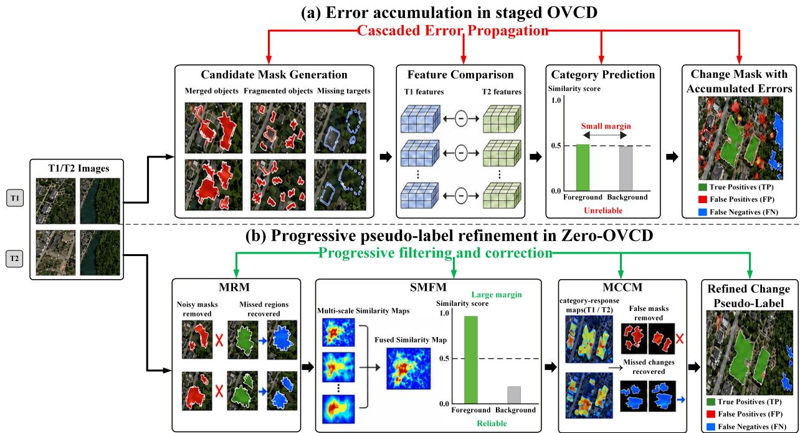  
Fig. 1. Schematic comparison between existing staged OVCD and progressive pseudo-label refinement in Zero-OVCD. (a) Candidate-mask defects and ambiguous semantic predictions propagate through staged inference, producing accumulated false positives and false negatives. (b) MRM, SMFM, and MCCM progressively refine candidate masks, improve semantic reliability, and correct incomplete predictions to generate refined pseudo-labels.

In contrast, training-free methods combine pretrained foundation models without parameter updates on target-domain CD data. AnyChange [10] leverages SAM features and point queries for category-specific change localization, while SCM [11] integrates FastSAM with CLIP to suppress semantically irrelevant changes. DynamicEarth [13] formalizes the M-C-I and I-M-C paradigms by decomposing OVCD into mask proposal, cross-temporal comparison, and semantic identification. OpenDPR [42] introduces diffusion-guided visual prototypes, whereas AdaptOVCD [44] promotes collaboration among heterogeneous foundation models through adaptive information fusion. More recent methods further improve OVCD through instance decoupling in OmniOVCD [45], semantic consistency regularization in CoRegOVCD [46], cross-temporal memory reasoning in MemOVCD [47], and semantic–spatial reliability refinement in ReA-OVCD [48].

Despite these advances, error propagation across intermediate stages remains a major challenge in training-free OVCD. Specifically, single-source candidate masks may merge multiple objects, fragment target regions, or miss certain targets, while semantic identification remains vulnerable to scale variation and foreground–background ambiguity. Moreover, existing refinement methods typically use corrected masks only as final predictions, leaving their supervisory value underexplored. To address this limitation, Zero-OVCD unifies complementary class-agnostic and text-guided masks, multiscale margin-aware semantic estimation, response-guided mask refinement, and noise-aware pseudo-label learning. It progressively refines VFM predictions and uses the resulting pseudo-labels to train a task-specific change detector without target-domain pixel-level annotations.

## III. PROPOSED METHOD

The overall architecture of the proposed Zero-OVCD framework is illustrated in Fig. 2 and comprises two stages. Specifically, Stage I performs training-free, prompt-conditioned pseudo-label generation by integrating complementary priors from multiple vision foundation models. MRM refines candidate masks from multiple sources, SMFM improves masklevel semantic reliability through multiscale similarity fusion, and MCCM suppresses false changes while recovering missed change regions using bitemporal activation cues. In Stage II, the resulting pseudo-labels are used to train a task-specific change detector. Residual label noise is further mitigated through checkpoint voting for pseudo-label refinement and high-agreement sample selection for subsequent model optimization. In this way, Zero-OVCD bridges training-free VFM inference and pseudo-label-supervised change detector learning without requiring target-domain pixel-level annotations.

## A. Training-Free Change Pseudo-Label Generation

The complete procedure of this stage is summarized in Algorithm 1, which sequentially performs multi-source mask refinement, cross-temporal semantic verification, and responseguided correction.

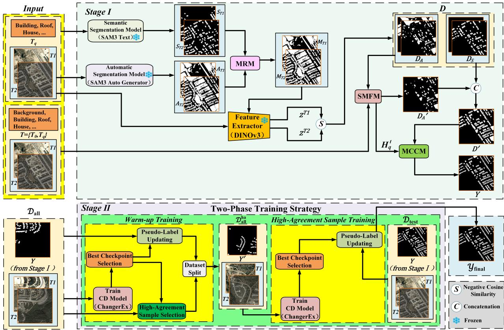  
Fig. 2. Overview of Zero-OVCD. Stage I generates refined change pseudo-labels using frozen vision foundation models, whereas Stage II updates the pseudo-labels, selects high-agreement samples, and trains a task-specific detector. Final masks are obtained by voting over selected checkpoint predictions and the corresponding Stage I pseudo-labels.

1) Multi-Source Candidate Mask Refinement: Given an input image $I ^ { t }$ acquired at time point $t \in \{ T _ { 1 } , T _ { 2 } \}$ , the automatic segmentation branch generates a set of class-agnostic candidate masks, denoted by $A ^ { t } ~ = ~ \{ A _ { i } ^ { t } \} _ { i = 1 } ^ { N _ { A } ^ { t } }$ . Meanwhile, conditioned on $I ^ { t }$ and the target-category text prompt $T _ { q } ,$ the text-guided segmentation branch produces a set of categoryconditioned semantic masks, denoted by ${ S ^ { t } = \{ S _ { j } ^ { t } \} } _ { j = 1 } ^ { N _ { S } ^ { t } }$ . The automatic masks provide broad object coverage but may contain inaccurate or merged regions, whereas the semantic masks provide category-relevant spatial support but may omit target instances. These complementary mask sets are fed into the Mask Refinement Module (MRM) for further refinement. For clarity, the temporal superscript t is omitted in the following derivation.

The structure of the MRM is illustrated in Fig. 3. MRM first examines the spatial redundancy between each automatic mask and the semantic masks. When most of an automatic mask is already covered by the semantic masks, removing this automatic mask at the instance-set level does not discard its category-aligned overlapping support, because the corresponding semantic masks are retained in the refined mask set. Instead, the residual support contributed exclusively by the automatic mask is suppressed. By contrast, an automatic mask with substantial non-overlapping support is retained as a complementary candidate, because these regions may correspond to targets omitted by the text-guided segmentation branch. Therefore, the non-overlap ratio is used to measure mask complementarity rather than mask reliability.

Specifically, let $U _ { S }$ denote the union of all semantic masks. For each automatic mask $A _ { i } ,$ we calculate the proportion of its area that is not covered by $U _ { S }$ . Automatic masks with $r _ { i } \geq \tau _ { 1 }$ are retained as complementary candidates:

$$
U _ { S } = \bigcup _ { j = 1 } ^ { N _ { S } } S _ { j }\tag{1}
$$

$$
r _ { i } = \frac { \left| A _ { i } \cap \overline { { U _ { S } } } \right| } { \left| A _ { i } \right| }\tag{2}
$$

$$
A _ { f } = \{ A _ { i } \mid r _ { i } \geq \tau _ { 1 } \}\tag{3}
$$

where $\overline { { U _ { S } } }$ denotes the complement of $U _ { S }$ within the image domain, | · | denotes mask area, $\tau _ { 1 }$ denotes the non-overlapratio threshold, and $A _ { f }$ denotes the retained automatic-mask set.

For the retained automatic masks in $A _ { f }$ , MRM further examines their containment relationships with the semantic masks. An automatic mask that nearly contains several independent semantic masks is likely to merge multiple target instances into a coarse region. However, a small containment count does not necessarily indicate erroneous segmentation. We therefore count the semantic masks that are almost completely covered by each automatic mask and remove only those automatic masks whose containment counts indicate severe instance merging.

Algorithm 1: Training-Free Change Pseudo-Label Generation   
Require:   
Bitemporal images $I ^ { T _ { 1 } } , I ^ { T _ { 2 } } \in \mathbb { R } ^ { H \times W \times 3 }$   
Text prompt set $T = \{ T _ { 0 } , T _ { q } \}$ , where $T _ { 0 }$ and $T _ { q }$ denote the   
background and target-category prompts, respectively   
Ensure:   
High-quality change pseudo-label $Y \in \{ 0 , 1 \} ^ { H \times W }$   
1: Step 1: Multi-Source Candidate Mask Refinement   
2: for $t \in \{ T _ { 1 } , T _ { 2 } \}$ do   
3: $A ^ { t } \Leftarrow \mathrm { S A M 3 } ( I ^ { t } ;$ mode = auto)   
4: $S ^ { t } \Leftarrow \mathrm { S A M 3 } ( I ^ { t } , T _ { q } ,$ mode = text)   
5: $A _ { f } ^ { t }  \mathrm { E q s . } ~ ( 1 ) – ( 3 ) , ~ A _ { f f } ^ { t }  \mathrm { E q s . } ~ ( 4 ) – ( 5 )$   
6: end for   
7: $M \Leftarrow \mathrm { C o n c a t } \Big ( A _ { f f } ^ { T _ { 1 } } , S ^ { T _ { 1 } } , A _ { f f } ^ { T _ { 2 } } , S ^ { T _ { 2 } } \Big )$   
8: Step 2: Cross-Temporal Change Proposal and Multiscale   
Semantic Verification   
9: $F ^ { T _ { 1 } } \gets \mathrm { I n t e r p o l a t e } \big ( \mathrm { D I N O v 3 } ( I ^ { T _ { 1 } } ) , ( H , W ) \big )$   
10: ${ \cal F } ^ { T _ { 2 } } \gets \mathrm { I n t e r p o l a t e } \big ( \mathrm { D I N O v 3 } ( I ^ { T _ { 2 } } ) , ( H , W ) \big )$   
11: $D \Leftarrow \varnothing$   
12: for each refined candidate mask $M _ { i } \in M$ do   
13: $z _ { i } ^ { T _ { 1 } }  \frac { 1 } { \vert M _ { i } \vert } \sum _ { x \in M _ { i } } F ^ { T _ { 1 } } ( x ) , \quad z _ { i } ^ { T _ { 2 } }  \frac { 1 } { \vert M _ { i } \vert } \sum _ { x \in M _ { i } } F ^ { T _ { 2 } } ( x )$   
14: $s _ { i } \Leftarrow \mathrm { E q . ~ } ( 6 )$   
15: if $s _ { i } < \cos ( { \theta } )$ then   
16: $D \Leftarrow \mathrm { C o n c a t } ( D , \{ M _ { i } \} )$   
17: end if   
18: end for   
19: Group the proposals in D into $D _ { A }$ and $D _ { S }$ according to their   
preserved mask-generation sources   
20: for $t \in \{ T _ { 1 } , T _ { 2 } \}$ do   
21: $P ^ { t , c } \Leftarrow \mathrm { E q . }$ (8)   
22: for each automatic-source proposal $D _ { A , i } \in D _ { A }$ do   
23: $P _ { \mathrm { m } , i } ^ { t , c } \Leftarrow \frac { 1 } { | D _ { A , i } | } \sum _ { x \in D _ { A , i } } \stackrel { \cdot \nonumber } { P } { } ^ { t , c } ( x ) , \quad c \in \{ 0 , q \}$   
24: $\hat { c } _ { i } ^ { t } \gets \arg \operatorname* { m a x } _ { { \bf \phi } _ { \mathrm { ~ - ~ } \epsilon _ { \mathrm { ~ c ~ } } } } P _ { \mathrm { ~ m ~ } , i } ^ { t , c }$   
$c \in \{ 0 , q \}$   
25: $\delta _ { i } ^ { t } \Leftarrow \mathrm { E q . ~ } ( 9 ) , \quad \tilde { c } _ { i } ^ { t } \Leftarrow \mathrm { E q . ~ }$ (10)   
26: end for   
27: end for   
28: ${ D _ { A } } ^ { \prime }  \mathrm { E q . ~ ( 1 1 ) } , \quad { D ^ { \prime } }  \mathrm { C o n c a t } ( { D _ { A } } ^ { \prime } , { D _ { S } } )$   
29: Step 3: Response-Guided Mask Correction and Completion   
30: $H _ { q } ^ { T _ { 1 } } \Leftarrow P ^ { T _ { 1 } , q } , \quad H _ { q } ^ { T _ { 2 } } \Leftarrow P ^ { T _ { 2 } , q }$   
31: $D _ { R } \Leftarrow \mathrm { E q s . ~ } ( 1 2 ) \ – ( 1 4 ) , \quad D _ { \Delta } \in \mathrm { E q s . }$ (15)-(17)   
32: DC ⇐ ConnectedComponents $\left( D _ { \Delta } \right)$   
33: ${ D _ { C } } ^ { \prime } \Leftarrow \{ { D _ { C , i } } \in D _ { C } \mid | D _ { C , i } | \geq \gamma \}$   
34: $D _ { Y } \Leftarrow \mathrm { M R M } ( D _ { R } , D _ { C } \prime )$   
35: $Y ( x ) \gets \mathbf { 1 } \left( x \in \bigcup _ { D _ { i } \in D _ { Y } } D _ { i } \right)$   
36: return $Y$

Specifically, for each retained automatic mask, we calculate the number of semantic masks it almost completely covers and retain only those automatic masks whose containment count is smaller than a fixed threshold $\tau _ { 2 } { : }$

$$
n _ { i } = \sum _ { j = 1 } ^ { N _ { S } } \mathbf { 1 } \biggl ( \frac { | A _ { f , i } \cap S _ { j } | } { | S _ { j } | } \geq \tau _ { c } \biggr )\tag{4}
$$

$$
A _ { f f } = \{ A _ { f , i } \mid n _ { i } < \tau _ { 2 } \}\tag{5}
$$

where $A _ { f , i }$ denotes the i-th mask in $A _ { f } , \ \tau _ { c }$ denotes the containment-ratio threshold, $\mathbf { 1 } ( \cdot )$ denotes the indicator function, $n _ { i }$ denotes the containment count for $A _ { f , i } , \tau _ { 2 }$ denotes the mask-count threshold, and $A _ { f f }$ denotes the refined automaticmask set.

Finally, restoring the temporal superscript, the retained automatic masks and semantic masks from both time points are concatenated at the instance-set level to obtain $M \ =$ Concat $\left( A _ { f f } ^ { T _ { 1 } } , S ^ { T _ { 1 } } , A _ { f f } ^ { T _ { 2 } } , S ^ { T _ { 2 } } \right)$ . This operation preserves the individual masks and their generation and temporal origins rather than merging them into a single binary mask or performing additional deduplication. The i-th mask in M is denoted by $M _ { i } ,$ , and M retains category-conditioned semantic masks together with complementary automatic masks for subsequent change proposal construction.

2) Cross-Temporal Change Proposal and Multiscale Semantic Verification:

a) Cross-temporal change proposal construction: A frozen DINOv3 encoder is used to extract dense feature maps from the bitemporal images $I ^ { T _ { 1 } }$ and $I ^ { T _ { 2 } }$ , which are interpolated to the input-image resolution. Each refined candidate mask $M _ { i } \in M ,$ , regardless of its temporal source, is used as the same spatial support to perform masked average pooling on both aligned feature maps, yielding the bitemporal mask-level features $\overline { { z _ { i } ^ { T _ { 1 } } } }$ and $z _ { i } ^ { T _ { 2 } }$ . Their cosine similarity is then calculated and compared with the boundary determined by the angular threshold θ to construct the preliminary change proposal set $D \colon$

$$
s _ { i } = \frac { \left. z _ { i } ^ { T _ { 1 } } , z _ { i } ^ { T _ { 2 } } \right. } { \left\| z _ { i } ^ { T _ { 1 } } \right\| _ { 2 } \left\| z _ { i } ^ { T _ { 2 } } \right\| _ { 2 } }\tag{6}
$$

$$
D = \{ M _ { i } \in M \mid s _ { i } < \cos ( \theta ) \}\tag{7}
$$

where $s _ { i }$ denotes the cosine similarity between the bitemporal mask-level features of $M _ { i } ,$ and θ denotes the fixed angular threshold.

The proposals in $D$ are then grouped according to their mask-generation sources. Let $D _ { A }$ and $D _ { S }$ denote the proposals originating from the automatic and text-guided semantic mask branches, respectively.

Since $D _ { S }$ is generated using target-conditioned prompts and already encodes category-specific priors, the subsequent multiscale semantic verification is applied only to $D _ { A }$ to avoid redundant mask-level semantic verification. Under the adopted category-transition criterion, automatic-source proposals assigned the same semantic label at both time points are treated as unchanged, whereas those assigned different labels are considered potential target-category changes.

b) Multiscale semantic verification: The structure of SMFM is illustrated in Fig. 4. For each time point $t ~ \in ~ \{ T _ { 1 } , T _ { 2 } \}$ and category $c \in \{ 0 , q \}$ , SegEarth-OV3 processes the input image at multiple scales and produces category similarity maps conditioned on the corresponding text prompt $T _ { c } .$ . The maps obtained at different scales are interpolated to the original image resolution and averaged to aggregate coarse-scale contextual information and fine-scale spatial details:

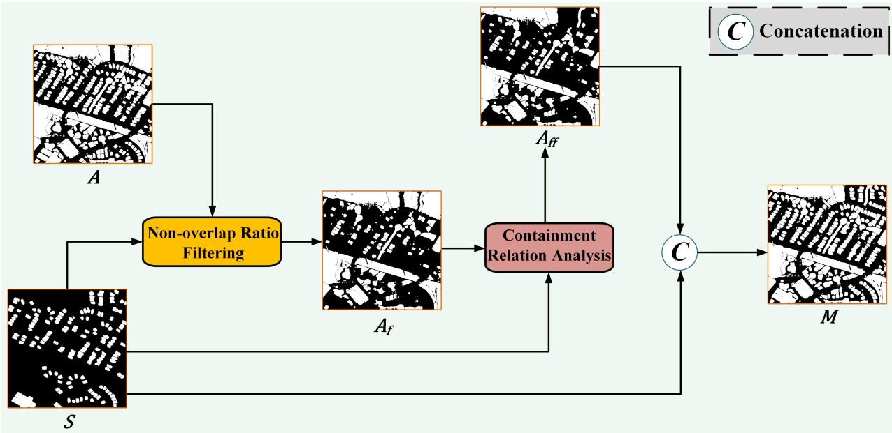  
Fig. 3. Illustration of multi-source candidate mask refinement (MRM). Automatic masks are filtered according to their complementarity to and containment of semantic masks, after which the retained masks are concatenated at the instance level.

$$
P ^ { t , c } = \frac { 1 } { J } \sum _ { j = 1 } ^ { J } E _ { j } \big ( \Phi _ { \mathrm { s e m } } \big ( R _ { j } ( I ^ { t } ) , T _ { c } \big ) \big )\tag{8}
$$

where $T _ { c }$ denotes the text prompt associated with category $c , \ J$ denotes the number of selected scales, $j$ indexes the scales, $\Phi _ { \mathrm { s e m } }$ denotes SegEarth-OV3, $R _ { j } ( \cdot )$ and $E _ { j } ( \cdot )$ denote image resizing and interpolation alignment at the j-th scale, respectively, and $P ^ { t , c }$ denotes the fused category similarity map at time point t.

For each $D _ { A , i }$ , the fused similarity maps are averaged within the mask to obtain the mask-level scores $P _ { \mathrm { m } , i } ^ { t , c }$ , and $\hat { c } _ { i } ^ { t }$ denotes the category with the highest score. When the predicted-category score is close to the background score, SegEarth-OV3 exhibits weak foreground–background discriminability within the corresponding proposal. SMFM therefore employs margin-based category calibration, in which the score difference between the predicted category and the background category is calculated independently at each time point. A lowmargin prediction is reassigned to the background index 0 for subsequent cross-temporal comparison, whereas a sufficiently separated prediction retains its predicted category:

$$
\delta _ { i } ^ { t } = P _ { \mathrm { m } , i } ^ { t , \hat { c } _ { i } ^ { t } } - P _ { \mathrm { m } , i } ^ { t , 0 } , \quad t \in \{ T _ { 1 } , T _ { 2 } \}
$$

$$
\tilde { c } _ { i } ^ { t } = \left\{ \begin{array} { l l } { 0 , } & { \delta _ { i } ^ { t } < \tau _ { \delta } } \\ { \hat { c } _ { i } ^ { t } , } & { \delta _ { i } ^ { t } \geq \tau _ { \delta } } \end{array} \right.\tag{9}
$$

(10)

where $\delta _ { i } ^ { t }$ denotes the foreground–background semantic margin of $D _ { A , i }$ at time point $t , \ \tau _ { \delta }$ denotes the fixed margin threshold, and $\widetilde { c } _ { i } ^ { t }$ denotes the calibrated category label.

Finally, the calibrated category labels are compared across the two time points. Under the adopted category-transition criterion, an automatic-source proposal is retained when its bitemporal labels differ:

$$
{ D _ { A } } ^ { \prime } = \left\{ { D _ { A , i } } \in D _ { A } \mid { \tilde { c } _ { i } } ^ { T _ { 1 } } \neq { \tilde { c } _ { i } } ^ { T _ { 2 } } \right\}\tag{11}
$$

where ${ D _ { A } } ^ { \prime }$ denotes the automatic-source change proposals retained after cross-temporal semantic verification.

The verified automatic-source proposals ${ D _ { A } } ^ { \prime }$ are concatenated with the semantic-source proposals $D _ { S }$ at the instanceset level to obtain the updated change proposal set $D ^ { \prime }$ , which is subsequently refined by MCCM.

3) Response-Guided Mask Correction and Completion: Errors accumulated during change proposal construction and semantic verification may leave false-positive candidate masks in $D ^ { \prime }$ while removing or omitting genuine change regions. To address this issue, we propose the response-guided Mask Correction and Completion Module (MCCM) to further refine $D ^ { \prime }$ and generate final change pseudo-labels for bitemporal remote sensing images.

As illustrated in Fig. 5, MCCM contains two complementary branches followed by MRM-based mask refinement. The semantic-support filtering branch evaluates the target-category response coverage within each proposal and filters candidates with insufficient semantic support, whereas the crosstemporal response-discrepancy completion branch identifies regions with high target response at one time point and low target response at the other to recover potentially omitted changes. The retained proposals and completion candidates are subsequently processed by MRM to obtain the final instance mask set before pseudo-label rasterization.

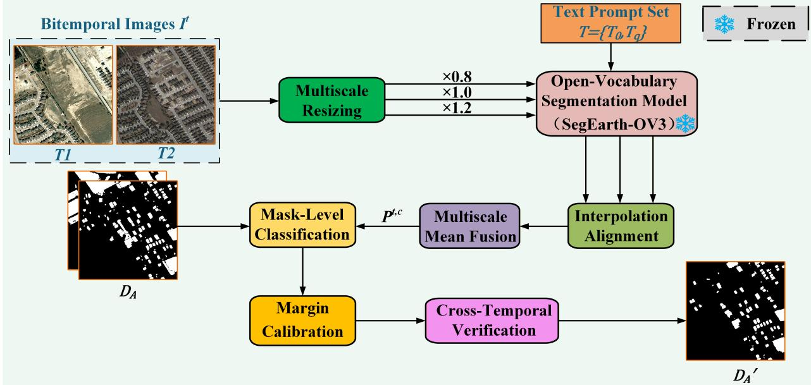  
Fig. 4. Illustration of similarity-based multiscale fusion (SMFM). Multiscale category-similarity maps are fused for mask-level classification, followed by background-aware margin filtering and cross-temporal verification to retain reliable change proposals.

a) Semantic-supportfiltering: MCCM reuses the multiscalefused target-category response maps obtained in SMFM, denoted by $H _ { q } ^ { t } = P ^ { t , q }$ for $t \in \{ T _ { 1 } , T _ { 2 } \}$ , where q denotes the target category.

For each candidate mask $D _ { i } ^ { \prime } \in D ^ { \prime } $ , its target-response coverage at each time point is evaluated using an areaadaptive thresholding strategy. Since the coverage ratio of a small mask can be strongly affected by a small number of spurious response pixels, separate response-intensity and coverage thresholds are used for small and large masks:

$$
u _ { i } ^ { t } ( \tau ) = \frac { 1 } { | D _ { i } ^ { \prime } | } \sum _ { x \in D _ { i } ^ { \prime } } \mathbf { 1 } \big ( H _ { q } ^ { t } ( x ) \geq \tau \big ) , \quad t \in \{ T _ { 1 } , T _ { 2 } \}\tag{12}
$$

$$
( \tau _ { i } , \eta _ { i } ) = \left\{ \begin{array} { l l } { { ( \tau _ { s } , \eta _ { s } ) , } } & { { | D _ { i } ^ { \prime } | < \gamma } } \\ { { ( \tau _ { l } , \eta _ { l } ) , } } & { { | D _ { i } ^ { \prime } | \geq \gamma } } \end{array} \right.\tag{13}
$$

$$
D _ { R } = \left\{ D _ { i } ^ { \prime } \in D ^ { \prime } \mid \operatorname* { m a x } _ { t \in \{ T _ { 1 } , T _ { 2 } \} } u _ { i } ^ { t } ( \tau _ { i } ) \geq \eta _ { i } \right\}\tag{14}
$$

where $u _ { i } ^ { t } ( \tau )$ denotes the target-response coverage of $D _ { i } ^ { \prime }$ under response threshold τ at time point t, γ denotes the area threshold separating small and large masks, $( \tau _ { i } , \eta _ { i } )$ denotes the threshold pair assigned to $D _ { i } ^ { \prime } , \left( \tau _ { s } , \eta _ { s } \right)$ and $( \tau _ { l } , \eta _ { l } )$ denote the response-intensity and coverage threshold pairs for small and large masks, respectively, and $D _ { R }$ denotes the retained proposal set.

b) Cross-temporal response-discrepancy completion: To recover regions omitted in preceding stages, MCCM identifies pixels with high target response at one time point and low target response at the other. The corresponding high- and lowresponse pixel sets and the resulting cross-temporal responsediscrepancy region are defined as follows:

$$
\Omega _ { q , h } ^ { t } = \left\{ x \in \Omega \vert H _ { q } ^ { t } ( x ) \geq \tau _ { h } \right\}
$$

$$
\Omega _ { q , o } ^ { t } = \left\{ x \in \Omega \vert H _ { q } ^ { t } ( x ) \leq \tau _ { o } \right\}\tag{15}
$$

(16)

$$
D _ { \Delta } = \left( \Omega _ { q , h } ^ { T _ { 1 } } \cap \Omega _ { q , o } ^ { T _ { 2 } } \right) \cup \left( \Omega _ { q , h } ^ { T _ { 2 } } \cap \Omega _ { q , o } ^ { T _ { 1 } } \right)\tag{17}
$$

where Ω denotes the image domain, $\tau _ { h }$ and $\tau _ { o }$ denote the high- and low-response thresholds, respectively, $\Omega _ { q , h } ^ { t }$ and $\Omega _ { q , o } ^ { t }$ denote the corresponding high- and low-response pixel sets, and $D _ { \Delta }$ denotes the cross-temporal response-discrepancy region.

The response-discrepancy region $D _ { \Delta }$ is decomposed into connected components $D _ { C } ~ = ~ \{ D _ { C , i } \} _ { i = 1 } ^ { N _ { C } }$ , and components smaller than the same area threshold γ used above are removed, yielding ${ D _ { C } } ^ { \prime } = \{ D _ { C , i } \in D _ { C } \mid | D _ { C , i } | \geq \gamma \}$

Finally, MRM is reused with $D _ { R }$ as the primary mask set and ${ D _ { C } } ^ { \prime }$ as the reference mask set. Following the same complementarity and containment criteria defined in MRM, the completion candidates in $D _ { C } { ' }$ are used to refine the retained proposals in $D _ { R }$ . The proposals retained after refinement are then concatenated with $D _ { C } { ' }$ at the instance-set level to obtain the final instance mask set $D _ { Y } \ = \ \mathrm { M R M } \big ( D _ { R } , D _ { C } { ' } \big )$ . The instance masks in $D _ { Y }$ are subsequently rasterized to obtain the final binary change pseudo-label Y for subsequent training.

## B. Noise-Aware Pseudo-Label Learning

Although the change pseudo-labels generated in Stage I provide effective supervision, they may still contain residual errors, and their reliability varies across image pairs. To mitigate the effect of noisy supervision, we introduce a twophase training strategy combining voting-based pseudo-label updating with high-agreement sample selection. For clarity, the change pseudo-labels generated in Stage I are hereafter referred to as original pseudo-labels. For each queried target category, we adopt ChangerEx, derived from the MetaChanger architecture introduced in Changer [49], as the changemask prediction network in both phases. ChangerEx realizes bitemporal feature interaction through a parameter- and computation-free exchange operation, providing an efficient architecture for change-mask prediction. The two output states represent unchanged and changed pixels.

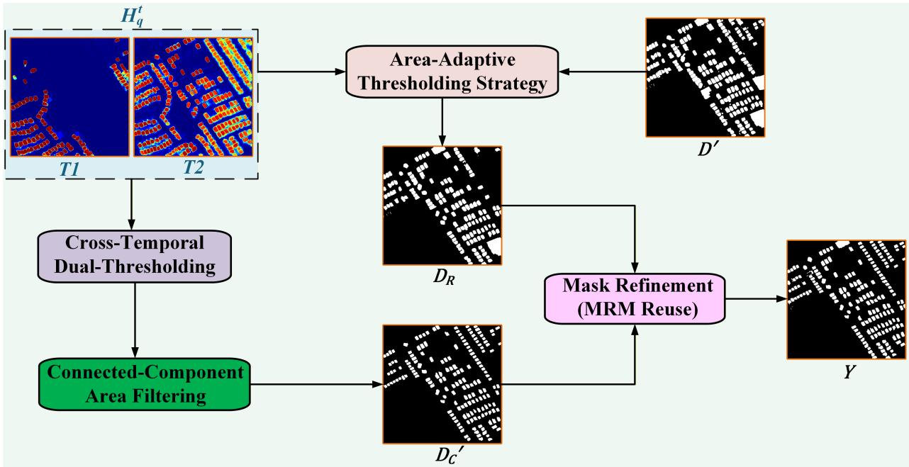  
Fig. 5. Illustration of response-guided mask correction and completion (MCCM). Semantic-support filtering removes unreliable proposals, whereas cross temporal response differences identify changes missed by earlier stages.

Motivated by the use of SCE for learning from noisy pseudo-labels in [50], we optimize ChangerEx using a composite loss function that combines the symmetric crossentropy (SCE) loss [51] for robustness to noisy supervision, the Lovasz-Softmax loss [52] for mitigating class imbalance´ through overlap-oriented optimization, and the Dice loss [53] for enhanced foreground-region overlap. The three terms follow the standard formulations in the cited works, are assigned equal external weights, and are used in both training phases.

$$
\mathcal { L } = \mathcal { L } _ { \mathrm { s c e } } + \mathcal { L } _ { \mathrm { l o v a s z } } + \mathcal { L } _ { \mathrm { d i c e } }\tag{18}
$$

As shown in Fig. 6, the strategy consists of warm-up training and high-agreement sample training. ChangerEx is first trained on the original pseudo-labels, retaining the last K checkpoints that improve the proxy-validation F1 score. The retained predictions are then combined with the original labels through equal-weight pixel-wise voting to refine the pseudo-labels and select high-agreement samples. ChangerEx is subsequently reinitialized and trained on these samples. At inference, predictions from the selected checkpoints are fused with the Stage I test pseudo-labels using the same voting rule to produce the final change masks.

1) Warm-up Training Phase: In this phase, ChangerEx is trained using the original pseudo-labels as supervision. The original training and validation splits are retained during this phase. Every 500 iterations, a proxy validation F1-score is computed between the validation predictions and the corresponding original pseudo-labels, and a checkpoint is retained when this score exceeds all previously observed scores:

$$
F _ { k } ^ { \mathrm { b e s t } } = \left\{ \begin{array} { l l } { 0 , } & { k = 1 , } \\ { \displaystyle \operatorname* { m a x } _ { 1 \leq t < k } F _ { t } ^ { \mathrm { v a l } } , } & { k > 1 , } \end{array} \right.\tag{19}
$$

$$
B = \left\{ \omega _ { k } \in \mathcal { W } \mid { \cal F } _ { k } ^ { \mathrm { v a l } } > { \cal F } _ { k } ^ { \mathrm { b e s t } } \right\}\tag{20}
$$

where k indexes the validation steps, $F _ { k } ^ { \mathrm { v a l } }$ denotes the proxy validation F1-score obtained at the k-th validation step, and $F _ { k } ^ { \mathrm { b e s t } }$ denotes the best proxy validation score observed before that step. ${ \boldsymbol { \mathcal { W } } } = \{ { \boldsymbol { \omega } } _ { k } \}$ denotes the checkpoint collection, $\omega _ { k }$ denotes the checkpoint obtained at the k-th validation step, and B denotes the chronologically ordered collection of recordimproving checkpoints.

After the warm-up training phase, the original training and validation splits are merged and indexed as $\begin{array} { r l } { \mathcal { D } _ { \mathrm { a l l } } } & { { } = } \end{array}$ $\mathcal { D } _ { \mathrm { t r a i n } } \cup \mathcal { D } _ { \mathrm { v a l } } = \mathsf { \bar { \{ } }  ( X _ { i } , Y _ { i } ) \} _ { i = 1 } ^ { N _ { \mathrm { a l l } } }$ , where $X _ { i }$ and $Y _ { i }$ denote the i-th bitemporal image pair and its original pseudo-label in the merged dataset, respectively. Let $B _ { K } = \{ \omega _ { \ell } ^ { * } \} _ { \ell = 1 } ^ { K }$ denote the last K record-improving checkpoints in B, where $\omega _ { \ell } ^ { * }$ denotes the ℓ-th selected checkpoint after reindexing according to the saving order. These checkpoints are used to predict all samples in $\mathcal { D } _ { \mathrm { a l l } }$ . The original test split remains separate and is not involved in pseudo-label updating or high-agreement sample selection.

The predictions of the selected checkpoints are fused with the original pseudo-label through equal-weight pixel-wise voting. For the i-th sample, the original pseudo-label is treated as an additional voter, and a pixel is assigned to the changed state when at least $\lceil ( K + 1 ) / 2 \rceil$ of the resulting $K + 1$ votes support the changed state. In our implementation, $K \ : = \ : 3 ,$ yielding four equal-weight votes and a decision threshold of two votes; thus, a 2:2 tie is assigned to the changed state:

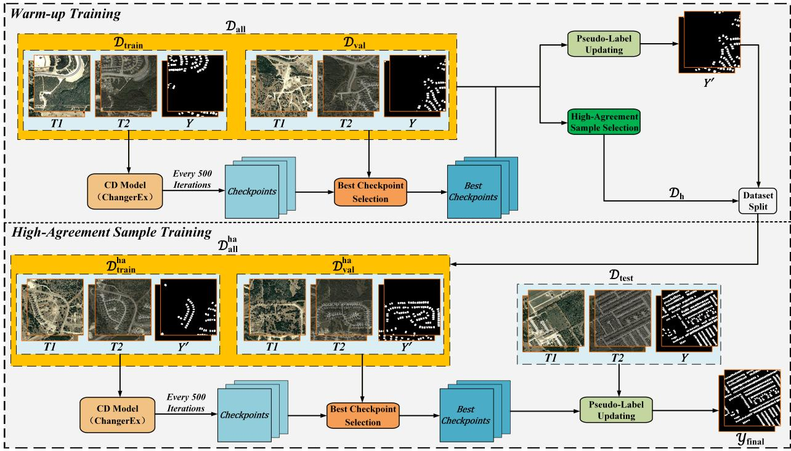  
Fig. 6. Overview of noise-aware pseudo-label learning. Warm-up checkpoints are used for voting-based pseudo-label updating and high-agreement sample selection, after which the detector is reinitialized and trained on the selected data. Final masks are obtained by voting over the selected checkpoint predictions and Stage I test pseudo-labels.

$$
Y _ { i } ^ { \prime } ( x ) = \mathbf { 1 } \left( Y _ { i } ( x ) + \sum _ { \ell = 1 } ^ { K } { \hat { Y } } _ { \ell , i } ( x ) \geq \left\lceil { \frac { K + 1 } { 2 } } \right\rceil \right)\tag{21}
$$

where $Y _ { i } ( x )$ denotes the original pseudo-label at pixel $x ,$ $\hat { Y } _ { \ell , i } ( x )$ denotes the prediction of the ℓ-th selected checkpoint at pixel $x ,$ and $Y _ { i } ^ { \prime } ( x )$ denotes the updated pseudo-label.

For high-agreement sample selection, we compute the sample-level F1 agreement between each selected checkpoint prediction and the corresponding original pseudo-label. For each checkpoint, only samples with positive F1 agreement are ranked in descending order, and the top 60% are retained. Pairs of empty masks are skipped, while a comparison containing only one empty mask yields an F1-score of zero and does not participate in the ranking. Let $\mathcal { H } _ { \ell }$ denote the index set of the top 60% positively scored samples under the ℓ-th selected checkpoint. To avoid overly restrictive filtering based on noisy pseudo-label supervision, a sample is retained if it belongs to the top-ranked subset of at least one selected checkpoint. The final selected subset is:

$$
\mathcal { D } _ { h } = \left\{ ( X _ { i } , Y _ { i } , Y _ { i } ^ { \prime } ) \mid i \in \bigcup _ { \ell = 1 } ^ { K } \mathcal { H } _ { \ell } \right\}\tag{22}
$$

where $\mathcal { D } _ { h }$ denotes the selected high-agreement sample subset.

Finally, for each sample in $\mathcal { D } _ { h }$ , we compute the F1 agreement between the updated pseudo-label $Y _ { i } ^ { \prime }$ and the original pseudo-label $Y _ { i }$ . Only samples with positive agreement are ranked in descending order. The top 10% form the highagreement validation set $\mathcal { D } _ { \mathrm { v a l } } ^ { \mathrm { h a } } .$ , while the remaining ranked samples form the high-agreement training set $\mathcal { D } _ { \mathrm { t r a i n } } ^ { \mathrm { h a } }$ . Together, these two subsets constitute the complete high-agreement dataset $\mathcal { D } _ { \mathrm { a l l } } ^ { \mathrm { h a } } = \mathcal { D } _ { \mathrm { t r a i n } } ^ { \mathrm { h a } } \cup \mathcal { D } _ { \mathrm { v a l } } ^ { \mathrm { h a } }$ . The same empty-mask handling is applied during this second ranking step.

2) High-Agreement Sample Training Phase: In this phase, ChangerEx is reinitialized using the same model initialization settings as in the warm-up training phase, without loading any warm-up checkpoint, and trained on $\mathcal { D } _ { \mathrm { t r a i n } } ^ { \mathrm { h a } }$ using the updated pseudo-labels, while $\mathcal { D } _ { \mathrm { v a l } } ^ { \mathrm { h a } }$ is used for pseudolabel-based validation. The same composite loss and recordimproving checkpoint-selection criterion as in the warm-up training phase are adopted. Let $B _ { K } ^ { \mathrm { h a } } = \{ \omega _ { \ell } ^ { * , \mathrm { h a } } \} _ { \ell = 1 } ^ { K }$ denote the last $K$ record-improving checkpoints retained in this phase, ordered by saving time. Let $\mathcal { \bar { D } } _ { \mathrm { t e s t } } ~ = ~ \{ ( X _ { i } ^ { \mathrm { t e s t } } , Y _ { i } ^ { \mathrm { t e s t } } ) \} _ { i = 1 } ^ { N _ { \mathrm { t e s t } } }$ where $X _ { i } ^ { \mathrm { t e s t } }$ denotes the i-th test image pair and $Y _ { i } ^ { \mathrm { t e s t } }$ denotes its corresponding Stage I pseudo-label. For each test image pair, the predictions generated by the checkpoints in $B _ { K } ^ { \mathrm { h a } }$ are fused with $Y _ { i } ^ { \mathrm { t e s t } }$ using the equal-weight pixel-wise voting rule defined in Eq. (21) to produce the final change mask. The test images are used only for inference, and their groundtruth labels are not used for model training, sample selection, checkpoint selection, or final fusion.

## IV. EXPERIMENTS

## A. Datasets

To comprehensively evaluate Zero-OVCD, we conduct experiments on four representative benchmarks: LEVIR-CD [54], WHU-CD [55], S2Looking [56], and SECOND [57].

LEVIR-CD comprises 637 1024 × 1024 bitemporal pairs at 0.5-m resolution, with a 445/64/128 training/validation/test split. For WHU-CD, one 32507 × 15354 aerial image pair at 0.2-m resolution is cropped into 7,434 nonoverlapping 256 × 256 pairs and split into 5,947/743/744 samples. S2Looking, meanwhile, contains 5,000 1024 × 1024 pairs at 0.5–0.8- m resolution, divided into 3,500/500/1,000 samples. Unlike the preceding binary benchmarks, SECOND contains 4,662 512×512 pairs at 0.5–3-m resolution and covers six land-cover categories. We adopt a 2,079/1,990/593 split and, following DynamicEarth [13], evaluate each category independently under a one-vs-rest binary protocol.

## B. Implementation Details

We implement the proposed Zero-OVCD using the PyTorch framework, and all experiments are conducted on a single NVIDIA GeForce RTX 4060 Ti GPU with 16 GB memory.

1) Pseudo-label generation: SAM3 is used in automatic and text-guided modes to generate class-agnostic and categoryconditioned masks, respectively; DINOv3 extracts bitemporal features, and SegEarth-OV3 provides open-vocabulary category-similarity maps. All VFM parameters remain frozen. Target-category prompts define the foreground, while scenariodependent non-target prompts define the background. We set the MRM containment-ratio threshold to $\tau _ { c } = 0 . 9 5$ , use scales {0.8, 1.0, 1.2} in SMFM, and set the MCCM area threshold to γ = 500 pixels. The other default parameters are indicated by asterisks in the sensitivity analyses.

2) Pseudo-label learning: ChangerEx is trained for 20000 warm-up iterations and, after independent reinitialization, for 60000 high-agreement sample training iterations. We use AdamW with a learning rate of 0.001, weight decay of 0.05, polynomial learning-rate decay, and batch size 8. The external weights of $\mathcal { L } _ { \mathrm { s c e } } , \ \mathcal { L } _ { \mathrm { l o v a s z } }$ , and ${ \mathcal { L } } _ { \mathrm { d i c e } }$ are all 1; within SCE, α = 1 and $\beta = 2$ . Pseudo-label-based validation is performed every 500 iterations, and the last K = 3 record-improving checkpoints are retained.

## C. Evaluation Metrics

We report changed-class precision (Pre), recall (Rec), F1- score (F1), and intersection over union (IoU):

$$
{ \begin{array} { r l } & { \operatorname { P r e } = { \frac { T P } { T P + F P } } , \quad \operatorname { R e c } = { \frac { T P } { T P + F N } } , } \\ & { \operatorname { F 1 } = { \frac { 2 \operatorname { P r e R e c } } { \operatorname { P r e } + { \mathrm { R e c } } } } , \quad \operatorname { I o U } = { \frac { T P } { T P + F P + F N } } . } \end{array} }\tag{23}
$$

where T P denotes correctly classified changed pixels, $F P$ denotes unchanged pixels incorrectly classified as changed, and FN denotes changed pixels incorrectly classified as unchanged.

## D. Comparison With State-of-the-Art Methods

To evaluate the effectiveness and competitiveness of Zero-OVCD, we compare it with recent zero-shot CD methods, including AnyChange [10], STU-SAMI [24], SCM [11], BiSAM-CD [58], S2C [19], DynamicEarth [13], OmniOVCD [45], UniVCD [41], AdaptOVCD [44], CoRegOVCD [46], MemOVCD [47], OpenDPR [42], and OpenDPR-W [42]. For a fair comparison, training-free and training-required methods are reported separately. Methods with available code and compatible experimental settings are re-evaluated on the same test sets using identical metrics; otherwise, results are taken from the original papers and marked with “†”.

1) Binary Change Detection: Table I compares Zero-OVCD with existing methods on LEVIR-CD, WHU-CD, and S2Looking. Without target-domain manual annotations, Stage I achieves F1 scores of 86.25%, 85.82%, and 50.48%, together with IoU scores of 75.82%, 75.17%, and 33.76%, respectively. Compared with the strongest competing method on each dataset, Stage I obtains F1 gains of 2.15, 3.68, and 9.18 percentage points and IoU gains of 3.32, 5.47, and 7.76 percentage points, respectively. Stage II further improves the F1 scores by 2.40, 3.03, and 7.48 percentage points and the IoU scores by 3.79, 4.76, and 7.05 percentage points over Stage I, respectively. These results demonstrate that Stage I generates accurate change pseudo-labels under diverse imaging conditions, while Stage II effectively exploits them as supervision to further improve overall CD performance. Notably, although some competing methods achieve competitive precision or recall, their imbalance often results in lower overall F1 scores.

As illustrated in Fig. 7, competing methods frequently produce false alarms in unchanged regions, omit small changed buildings, or merge adjacent objects in the displayed examples. In contrast, Stage I yields more complete change regions with clearer object boundaries, benefiting from complementary mask refinement, semantic reliability filtering, and responseguided correction and completion. Stage II further suppresses residual detection errors and improves the spatial coherence of the predicted masks. These qualitative observations are consistent with the F1 and IoU improvements reported in Table I.

2) Category-Wise Change Detection: Table II reports the category-wise results on SECOND, where each semantic category is independently evaluated in a one-vs-rest manner. In Stage I, Zero-OVCD achieves class-average F1 and IoU scores of 47.91% and 32.28%, outperforming CoRegOVCD by 0.41 and 0.61 percentage points, respectively. It obtains the best training-free results on building, tree, low vegetation, and non-vegetated ground surface, with the largest F1 gains on low vegetation (+4.77 points) and building (+3.84 points). Stage II further improves the class-average F1 and IoU to 50.92% and 34.93% and achieves the best results in five of six categories. Water improves to 46.20% F1 and 30.04% IoU, whereas playground slightly decreases from 39.78%/24.83% to 38.72%/24.01%. These results indicate that pseudo-labelsupervised learning provides consistent overall gains, although the improvements remain category-dependent. The qualitative results in Fig. 8 are consistent with Table II. Specifically, Zero-OVCD better preserves changed regions and object boundaries for building, water, low vegetation, and non-vegetated ground surface, while reducing false responses for tree.

TABLE I  
PERFORMANCE COMPARISON ON BINARY BUILDING-CHANGE BENCHMARKS
<table><tr><td rowspan="2">Methods</td><td colspan="4">LEVIR-CD (%)</td><td colspan="4">WHU-CD (%)</td><td colspan="4">S2Looking (%)</td></tr><tr><td>F1</td><td>Rec</td><td>Pre</td><td>IoU</td><td>F1</td><td>Rec</td><td>Pre</td><td>IoU</td><td>F1</td><td>Rec</td><td>Pre</td><td>IoU</td></tr><tr><td>Training-free methods</td><td></td><td></td><td></td><td></td><td></td><td></td><td></td><td></td><td></td><td></td><td></td><td></td></tr><tr><td>AnyChange [10]</td><td>24.88</td><td>83.41</td><td>14.62</td><td>14.21</td><td>19.20</td><td>83.70</td><td>10.84</td><td>10.62</td><td>6.83</td><td>70.68</td><td>3.59</td><td>3.54</td></tr><tr><td>SCM [11]</td><td>32.14</td><td>48.72</td><td>23.98</td><td>19.15</td><td>29.32</td><td>66.58</td><td>18.80</td><td>17.18</td><td>12.04</td><td>69.30</td><td>6.59</td><td>6.41</td></tr><tr><td>BiSAM-CD [58]</td><td>46.15</td><td>40.38</td><td>53.85</td><td>30.00</td><td>69.92</td><td>77.51</td><td>63.68</td><td>53.75</td><td>35.17</td><td>28.70</td><td>45.41</td><td>21.34</td></tr><tr><td>APE-DINO* [13]</td><td>69.71</td><td>78.18</td><td>62.90</td><td>53.51</td><td>72.62</td><td>66.62</td><td>79.80</td><td>57.01</td><td>18.42</td><td>11.55</td><td>45.45</td><td>10.15</td></tr><tr><td>APE-DINOv2* [13]</td><td>66.69</td><td>81.38</td><td>56.49</td><td>50.03</td><td>75.85</td><td>73.96</td><td>77.84</td><td>61.10</td><td>10.11</td><td>18.19</td><td>7.00</td><td>5.32</td></tr><tr><td>SAM-DINOv2-SOV [13]</td><td>54.41</td><td>66.37</td><td>46.10</td><td>37.37</td><td>57.41</td><td>62.71</td><td>52.93</td><td>40.26</td><td>38.21</td><td>38.48</td><td>37.95</td><td>23.62</td></tr><tr><td>SAM2-DINOv2-SOV [13]</td><td>49.96</td><td>60.40</td><td>42.59</td><td>33.30</td><td>57.98</td><td>60.23</td><td>55.90</td><td>40.83</td><td>37.62</td><td>36.79</td><td>38.48</td><td>23.16</td></tr><tr><td>AdaptOVCD† [44]</td><td>68.00</td><td>74.10</td><td>62.83</td><td>51.52</td><td>76.53</td><td>72.85</td><td>80.60</td><td>61.99</td><td>一</td><td>一</td><td></td><td></td></tr><tr><td>OpenDPR† [42]</td><td>61.90</td><td></td><td></td><td>44.80</td><td>70.40</td><td></td><td></td><td>54.30</td><td>一</td><td>一</td><td>一</td><td>1</td></tr><tr><td>CoRegOVCD† [46]</td><td>83.01</td><td>86.57</td><td>79.72</td><td>70.95</td><td>82.14</td><td>77.12</td><td>87.86</td><td>69.70</td><td>一</td><td>1</td><td></td><td>1</td></tr><tr><td>OmniOVCD [45]</td><td>67.53</td><td>73.85</td><td>62.20</td><td>50.98</td><td>66.62</td><td>78.06</td><td>58.11</td><td>49.95</td><td>39.09</td><td>48.89</td><td>32.56</td><td>24.29</td></tr><tr><td>MemOVCD† [47]</td><td>84.10</td><td></td><td></td><td>72.50</td><td></td><td></td><td></td><td></td><td>41.30</td><td></td><td></td><td>26.00</td></tr><tr><td>Zero-OVCD (Stage I)</td><td>86.25</td><td>88.87</td><td>83.78</td><td>75.82</td><td>85.82</td><td>83.36</td><td>88.44</td><td>75.17</td><td>50.48</td><td>47.71</td><td>53.58</td><td>33.76</td></tr><tr><td>Training-required methods</td><td></td><td></td><td></td><td></td><td></td><td></td><td></td><td></td><td></td><td></td><td></td><td></td></tr><tr><td>STU-SAMI [24]</td><td>34.37</td><td>69.71</td><td>22.81</td><td>20.75</td><td>31.71</td><td>37.68</td><td>27.37</td><td>18.84</td><td>17.99</td><td>17.22</td><td>18.83</td><td>9.88</td></tr><tr><td>S2C [19]</td><td>32.57</td><td>51.84</td><td>23.74</td><td>19.45</td><td>37.26</td><td>71.40</td><td>25.21</td><td>22.90</td><td>6.29</td><td>22.51</td><td>3.66</td><td>3.25</td></tr><tr><td>UniVCD† [41]</td><td>70.70</td><td>77.90</td><td>64.70</td><td>54.70</td><td>63.40</td><td>71.40</td><td>57.00</td><td>46.40</td><td>一</td><td>1</td><td>一</td><td>一</td></tr><tr><td>OpenDPR-W† [42]</td><td>65.00</td><td></td><td></td><td>48.10</td><td>81.20</td><td></td><td></td><td>68.30</td><td>1</td><td>1</td><td></td><td>一</td></tr><tr><td>Zero-OVCD (Stage II)</td><td>88.65</td><td>90.48</td><td>86.90</td><td>79.61</td><td>88.85</td><td>87.75</td><td>89.97</td><td>79.93</td><td>57.96</td><td>51.53</td><td>66.23</td><td>40.81</td></tr></table>

Best, second-best, and third-best results in each column are shown in red bold, blue bold, and black bold, respectively. \* denotes methods reproduced following the settings of the original papers; † denotes quantitative results directly cited from the corresponding papers; SOV denotes SegEarth-OV.

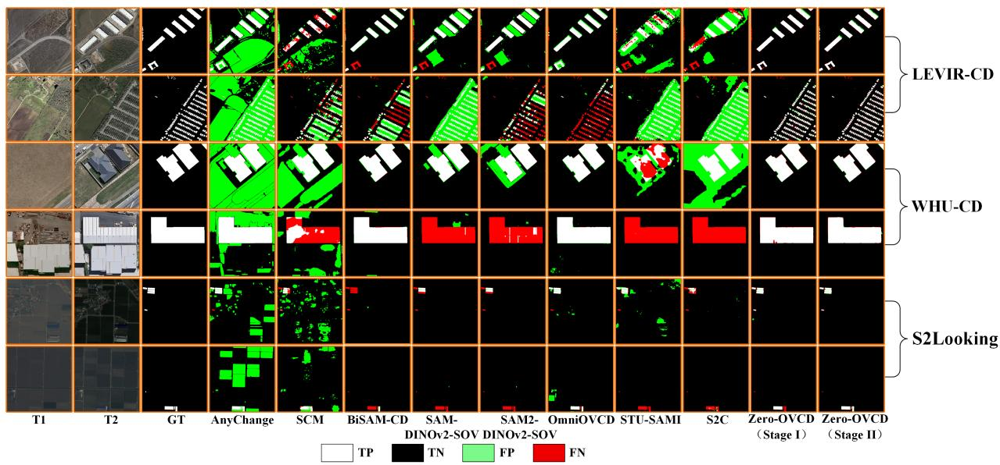  
Fig. 7. Qualitative comparison on LEVIR-CD, WHU-CD, and S2Looking. SOV denotes SegEarth-OV.

## E. Ablation and Sensitivity Analysis

1) Effect of the Pseudo-Label Generation Modules: To assess the incremental contributions of the pseudo-label generation modules, we establish a Stage I baseline without MRM, SMFM, or MCCM and progressively incorporate the three modules under identical settings. The quantitative and qualitative results are presented in Table III and Fig. 9, respectively. Adding MRM improves the average F1 and IoU across the three building CD datasets by 5.38 points, while reducing omitted change regions and merged adjacent objects. This demonstrates that MRM effectively exploits the complementarity between automatic and semantic masks to improve candidate-mask coverage and quality. Incorporating SMFM into the MRM-only configuration further increases the average F1 and IoU by 7.82 and 8.78 points, respectively, while substantially reducing false detections. These gains arise from multiscale similarity fusion and reliability-based mask filtering, which suppress pseudo-changes caused by semantic misclassification. Finally, adding MCCM to the MRM+SMFM configuration yields additional average improvements of 8.29 and 11.07 points in F1 and IoU, respectively, with further reductions in false alarms and missed detections. By exploiting bitemporal target-category response maps, MCCM removes semantically inconsistent masks and restores true change regions that were previously discarded or omitted. Overall, MRM, SMFM, and MCCM progressively improve candidatemask quality, semantic prediction reliability, and change-mask completeness.

TABLE II  
CATEGORY-WISE OVCD PERFORMANCE ON SECOND DATASET
<table><tr><td rowspan="2">Methods</td><td colspan="2">Building (%)</td><td colspan="2">Playground (%)</td><td colspan="2">Water (%)</td><td colspan="2">Tree (%)</td><td colspan="2">Low vegetation (%)</td><td colspan="2">Surface (%)</td><td colspan="2">Class Avg (%)</td></tr><tr><td>F1</td><td>IoU</td><td>F1</td><td>IoU</td><td>F1</td><td>IoU</td><td>F1</td><td>IoU</td><td>F1</td><td>IoU</td><td>F1</td><td>IoU</td><td>F1</td><td>IoU</td></tr><tr><td>Training-free methods</td><td></td><td></td><td></td><td></td><td></td><td></td><td></td><td></td><td></td><td></td><td></td><td></td><td></td><td></td></tr><tr><td>APE-DINO* [13]</td><td>41.95</td><td>26.54</td><td>28.33</td><td>16.50</td><td>17.91</td><td>9.84</td><td>23.65</td><td>13.41</td><td>0.00</td><td>0.00</td><td>0.00</td><td>0.00</td><td>18.64</td><td>11.05</td></tr><tr><td>APE-DINOv2* [13]</td><td>43.84</td><td>28.08</td><td>27.57</td><td>15.99</td><td>21.73</td><td>12.19</td><td>24.64</td><td>14.05</td><td>0.00</td><td>0.00</td><td>0.00</td><td>0.00</td><td>19.63</td><td>11.72</td></tr><tr><td>SAM-DINOv2-SOV [13]</td><td>55.15</td><td>38.07</td><td>30.84</td><td>18.23</td><td>24.82</td><td>14.17</td><td>33.46</td><td>20.09</td><td>38.87</td><td>24.12</td><td>41.84</td><td>26.46</td><td>37.49</td><td>23.52</td></tr><tr><td>SAM2-DINOv2-SOV [13]</td><td>53.67</td><td>36.68</td><td>31.25</td><td>18.52</td><td>24.31</td><td>13.84</td><td>31.37</td><td>18.60</td><td>35.92</td><td>21.89</td><td>32.29</td><td>19.26</td><td>34.80</td><td>21.47</td></tr><tr><td>AdaptOVCD† [44]</td><td>63.81</td><td>46.85</td><td>45.30</td><td>29.28</td><td>37.84</td><td>23.34</td><td>22.49</td><td>12.67</td><td>36.27</td><td>22.15</td><td>50.74</td><td>33.99</td><td>42.74</td><td>28.05</td></tr><tr><td>OpenDPR† [42]</td><td>59.50</td><td>42.40</td><td>54.30</td><td>37.30</td><td>29.80</td><td>17.50</td><td>34.50</td><td>20.90</td><td>37.40</td><td>23.00</td><td>46.40</td><td>30.20</td><td>43.70</td><td>28.60</td></tr><tr><td>CoRegOVCD† [46]</td><td>65.69</td><td>48.91</td><td>46.52</td><td>30.31</td><td>46.01</td><td>29.88</td><td>34.61</td><td>20.93</td><td>43.40</td><td>27.71</td><td>48.79</td><td>32.27</td><td>47.50</td><td>31.67</td></tr><tr><td>OmniOVCD [45]</td><td>60.47</td><td>43.34</td><td>37.52</td><td>23.10</td><td>31.08</td><td>18.40</td><td>29.81</td><td>17.51</td><td>40.19</td><td>25.15</td><td>44.30</td><td>28.45</td><td>40.56</td><td>25.99</td></tr><tr><td>Zero-OVCD (Stage I)</td><td>69.53</td><td>53.30</td><td>39.78</td><td>24.83</td><td>40.75</td><td>25.59</td><td>35.98</td><td>21.94</td><td>48.17</td><td>31.73</td><td>53.27</td><td>36.30</td><td>47.91</td><td>32.28</td></tr><tr><td>Training-required methods</td><td></td><td></td><td></td><td></td><td></td><td></td><td></td><td></td><td></td><td></td><td></td><td></td><td></td><td></td></tr><tr><td>UniVCD† [41]</td><td>58.40</td><td>41.20</td><td>0.00</td><td>0.00</td><td>27.40</td><td>15.80</td><td>32.50</td><td>19.40</td><td>37.60</td><td>23.20</td><td>42.60</td><td>27.10</td><td>33.08</td><td>21.12</td></tr><tr><td>Zero-OVCD (Stage II)</td><td>72.11</td><td>56.39</td><td>38.72</td><td>24.01</td><td>46.20</td><td>30.04</td><td>42.51</td><td>26.99</td><td>50.27</td><td>33.58</td><td>55.68</td><td>38.58</td><td>50.92</td><td>34.93</td></tr></table>

Best, second-best, and third-best results in each column are shown in red bold, blue bold, and black bold, respectively. \* denotes methods reproduced following the settings of the original papers; † denotes quantitative results directly cited from the corresponding papers; Surface denotes the non-vegetated ground surface category.

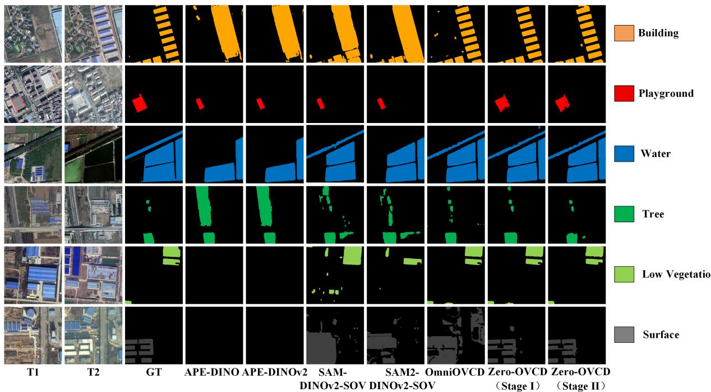  
Fig. 8. Category-wise qualitative comparison on SECOND. Colored pixels indicate changes in the queried category, whereas black denotes background.

2) Hyperparameter Sensitivity Analysis

a) Effects of $\tau _ { 1 }$ and $\tau _ { 2 }$ in MRM: Table IV evaluates the nonoverlap-ratio threshold $\tau _ { 1 } . \ \mathrm { A s } \ \tau _ { 1 }$ varies from 0.4 to 0.8, the average F1 and IoU range from 85.55% to 86.04% and from 74.75% to 75.50%, respectively. The best average performance is obtained at $\tau _ { 1 } = 0 . 6$ . A smaller $\tau _ { 1 }$ may retain automatic masks whose non-overlapping regions lack semantic support and introduce noise, whereas a larger value may remove automatic masks that complement target regions missed by semantic masks.

Table V further evaluates the mask-count threshold $\tau _ { 2 } .$ Its average F1 and IoU vary by only 0.14 and 0.21 percentage points, respectively, with the best average performance obtained at $\tau _ { 2 } = 4 . \mathrm { ~ A ~ }$ smaller $\tau _ { 2 }$ may discard automatic masks containing valid target information, whereas a larger value may retain severely merged automatic masks. The identical results obtained for $\tau _ { 2 } \in \{ 6 , 8 , 1 0 \}$ indicate that the detection performance becomes stable in this range. Accordingly, $\tau _ { 1 } = 0 . 6$ and $\tau _ { 2 } = 4$ are used as the default settings.

TABLE III  
ABLATION OF STAGE I MODULES ON BINARY CD BENCHMARKS
<table><tr><td></td><td>Modules</td><td></td><td colspan="4">LEVIR-CD (%)</td><td colspan="4">WHU-CD (%)</td><td colspan="4">S2Looking (%)</td></tr><tr><td>MRM</td><td>SMFM</td><td>MCCM</td><td>F1</td><td>Rec</td><td> $\mathrm { P r e }$ </td><td>IoU</td><td>F1</td><td>Rec</td><td> $\mathrm { P r e }$ </td><td>IoU</td><td>F1</td><td>Rec</td><td>Pre</td><td>IoU</td></tr><tr><td>X</td><td>X</td><td>X</td><td>60.99</td><td>68.94</td><td>54.69</td><td>43.88</td><td>58.23</td><td>74.10</td><td>47.96</td><td>41.07</td><td>38.84</td><td>38.26</td><td>39.44</td><td>24.10</td></tr><tr><td>√</td><td>X</td><td>X</td><td>69.07</td><td>86.73</td><td>57.38</td><td>52.75</td><td>62.09</td><td>86.49</td><td>48.43</td><td>45.02</td><td>43.05</td><td>44.46</td><td>41.74</td><td>27.43</td></tr><tr><td>√</td><td>√</td><td>X</td><td>74.99</td><td>88.13</td><td>65.27</td><td>59.99</td><td>75.60</td><td>85.74</td><td>67.60</td><td>60.77</td><td>47.08</td><td>49.19</td><td>45.14</td><td>30.79</td></tr><tr><td>√</td><td>√</td><td>√</td><td>86.25</td><td>88.87</td><td>83.78</td><td>75.82</td><td>85.82</td><td>83.36</td><td>88.44</td><td>75.17</td><td>50.48</td><td>47.71</td><td>53.58</td><td>33.76</td></tr></table>

The best result in each column is shown in bold.

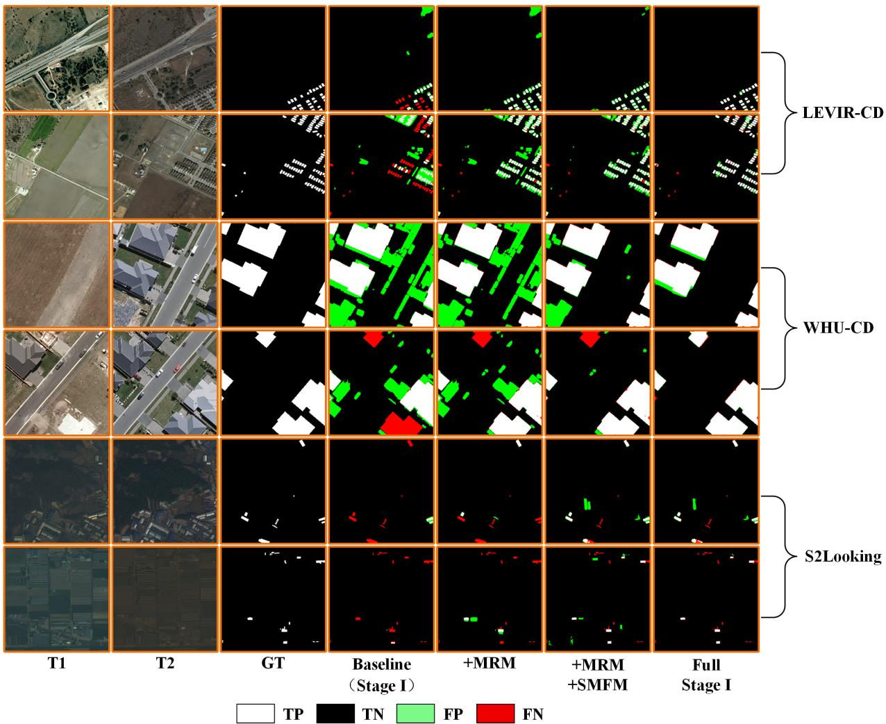  
Fig. 9. Qualitative ablation of the Stage I modules on binary CD benchmarks.

b) Effects of $\tau _ { \delta }$ in SMFM: Table VI evaluates the semanticmargin threshold $\tau _ { \delta }$ over the range [0.1, 0.5]. The average F1 and IoU vary by only 0.04 and 0.06 percentage points, respectively, indicating that the performance is insensitive to $\tau _ { \delta }$ within the evaluated range. Increasing $\tau _ { \delta }$ imposes stricter rejection of predictions with small foreground–background margins but yields no additional accuracy gains. Accordingly, $\tau _ { \delta } ~ = ~ 0 . 1$ is adopted as the default setting, as it yields the highest average F1 and IoU scores.

c) Effects of the Coupled Threshold Pairs in MCCM: We analyze the effects of three coupled threshold pairs on detection performance. For large-area masks, the responseintensity threshold $\tau _ { l }$ and coverage threshold $\eta _ { l }$ are coupled by $\tau _ { l } + \eta _ { l } = 1 . \mathrm { A s } \ \tau _ { l }$ increases, the corresponding high-response regions become smaller; therefore, $\eta _ { l }$ is reduced accordingly to balance response intensity and spatial coverage. For small-area masks, fewer pixels make response coverage more susceptible to interference from nontarget regions. We therefore adopt stricter constraints by setting $\tau _ { s } + \eta _ { s } = 1 . 5$ . For the thresholds $\tau _ { h }$ and $\tau _ { o } ,$ which distinguish high- and low-response regions during change-region completion, we set $\tau _ { h } + \tau _ { o } ~ = ~ 1$ to maintain a consistent separation between them. A controlledvariable strategy is adopted: when evaluating each threshold pair, all remaining parameters are fixed at their default values, while the selected pair is varied according to its coupling constraint. Performance is measured using the mean changedclass IoU across LEVIR-CD and WHU-CD, with the results presented in Fig. 10.

TABLE IV  
SENSITIVITY TO THE MRM THRESHOLD τ1
<table><tr><td rowspan="2">T1</td><td colspan="2">LEVIR-CD (%)</td><td colspan="2">WHU-CD (%)</td><td colspan="2">Average (%)</td></tr><tr><td>F1</td><td>IoU</td><td>F1</td><td>IoU</td><td>F1</td><td>IoU</td></tr><tr><td>0.4</td><td>86.18</td><td>75.71</td><td>85.81</td><td>75.14</td><td>86.00</td><td>75.43</td></tr><tr><td>0.5</td><td>86.23</td><td>75.79</td><td>85.82</td><td>75.17</td><td>86.03</td><td>75.48</td></tr><tr><td> $0 . 6 ^ { * }$ </td><td>86.25</td><td>75.82</td><td>85.82</td><td>75.17</td><td>86.04</td><td>75.50</td></tr><tr><td>0.7</td><td>86.27</td><td>75.86</td><td>85.00</td><td>73.92</td><td>85.64</td><td>74.89</td></tr><tr><td>0.8</td><td>86.16</td><td>75.68</td><td>84.94</td><td>73.82</td><td>85.55</td><td>74.75</td></tr></table>

The best result in each column is shown in bold. \* denotes the default parameter setting used in our experiments.

TABLE V  
SENSITIVITY TO THE MRM THRESHOLD τ2
<table><tr><td rowspan="2"> $\tau _ { 2 }$ </td><td colspan="2">LEVIR-CD (%)</td><td colspan="2">WHU-CD (%)</td><td colspan="2">Average (%)</td></tr><tr><td>F1</td><td>IoU</td><td>F1</td><td>IoU</td><td>F1</td><td>IoU</td></tr><tr><td>2</td><td>86.25</td><td>75.83</td><td>85.64</td><td>74.88</td><td>85.95</td><td>75.36</td></tr><tr><td>4</td><td>86.25</td><td>75.82</td><td>85.82</td><td>75.17</td><td>86.04</td><td>75.50</td></tr><tr><td>6</td><td>86.15</td><td>75.67</td><td>85.65</td><td>74.90</td><td>85.90</td><td>75.29</td></tr><tr><td>8</td><td>86.15</td><td>75.67</td><td>85.65</td><td>74.90</td><td>85.90</td><td>75.29</td></tr><tr><td>10</td><td>86.15</td><td>75.67</td><td>85.65</td><td>74.90</td><td>85.90</td><td>75.29</td></tr></table>

The best result in each column is shown in bold. \* denotes the default parameter setting used in our experiments.

TABLE VI  
SENSITIVITY TO THE SMFM MARGIN THRESHOLD τδ
<table><tr><td rowspan="2"> $\tau _ { \delta }$ </td><td colspan="2">LEVIR-CD (%)</td><td colspan="2">WHU-CD (%)</td><td colspan="2">Average (%)</td></tr><tr><td>F1</td><td>IoU</td><td>F1</td><td>IoU</td><td>F1</td><td>IoU</td></tr><tr><td>0.1*</td><td>86.25</td><td>75.82</td><td>85.82</td><td>75.17</td><td>86.04</td><td>75.50</td></tr><tr><td>0.2</td><td>86.23</td><td>75.79</td><td>85.82</td><td>75.17</td><td>86.03</td><td>75.48</td></tr><tr><td>0.3</td><td>86.23</td><td>75.79</td><td>85.79</td><td>75.11</td><td>86.01</td><td>75.45</td></tr><tr><td>0.4</td><td>86.22</td><td>75.78</td><td>85.79</td><td>75.11</td><td>86.01</td><td>75.45</td></tr><tr><td>0.5</td><td>86.22</td><td>75.78</td><td>85.78</td><td>75.09</td><td>86.00</td><td>75.44</td></tr></table>

The best result in each column is shown in bold. \* denotes the default parameter setting used in our experiments.

Among the evaluated settings, large-area masks achieve the highest mean IoU at $( \tau _ { l } , \eta _ { l } ) \ = \ ( 0 . 4 , 0 . 6 )$ . A lower $\tau _ { l }$ may insufficiently suppress semantically irrelevant masks, whereas a higher value excessively contracts the high-response regions and may discard valid change masks. For small-area masks, the mean IoU increases modestly and consistently with $\tau _ { s } ,$ reaching its highest evaluated value at $( \tau _ { s } , \eta _ { s } ) = ( 0 . 9 , 0 . 6 )$ . For the completion thresholds, the best performance is obtained at $( \tau _ { h } , \tau _ { o } ) = ( 0 . 7 5 , 0 . 2 5 )$ . A smaller $\tau _ { h }$ may introduce pseudochange regions, whereas a larger value imposes an overly strict response criterion, resulting in a marked IoU decrease. Accordingly, these three threshold pairs are adopted as the default settings in all experiments.

3) Effect of Noise-Aware Pseudo-Label Learning: To assess the contribution of the proposed two-phase training strategy, we use the results without pseudo-label training as the baseline. Under identical experimental settings, pseudolabel training, checkpoint-based pseudo-label updating, and high-agreement sample selection are introduced sequentially. The results are reported in Table VII. One can observe that directly training the CD model with the original pseudo-labels improves the average F1 and IoU across the three building CD datasets by 2.58 and 3.22 percentage points, respectively, confirming the supervisory value of the generated pseudolabels. Subsequently, checkpoint-based pixel-wise voting further increases F1 and IoU by 0.49 and 0.58 percentage points, indicating its ability to correct unreliable pixel predictions. The subsequent introduction of high-agreement sample selection yields additional improvements of 1.24 and 1.40 percentage points, respectively, by filtering low-quality samples and reducing the influence of noisy supervision. Consequently, the complete two-phase strategy achieves the best performance on all three datasets. Compared with direct training using the original pseudo-labels, it improves the average F1 and IoU by 1.73 and 1.98 percentage points, respectively, demonstrating the effectiveness of pseudo-label updating and high-agreement sample selection.

4) Evaluation Across Foundation-Model Combinations: To assess the adaptability of Zero-OVCD to different VFM configurations, we evaluate four foundation-model combinations before and after incorporating MRM, SMFM, and MCCM. All modules use the same default parameters without configuration-specific tuning. As reported in Table VIII, SAM3–DINOv3–SOV3 consistently achieves the best CD performance across all three datasets in both configurations, indicating that stronger mask generation, feature representation, and semantic recognition provide a more effective foundation for OVCD. More importantly, incorporating the three modules improves all four VFM combinations across the three datasets, yielding average F1 and IoU gains of 19.34–21.50 and 20.37– 25.23 points, respectively. These consistent improvements demonstrate the robustness of Zero-OVCD across different foundation-model combinations.

## F. Accuracy–Efficiency Trade-Off

To further assess the practical applicability of Zero-OVCD, we evaluate the tradeoff between CD performance and computational efficiency on the WHU-CD test set. Table IX reports the parameter count, peak GPU memory usage, and average inference time per image pair under a unified environment, where methods without available code or compatible settings are excluded. As can be observed, Stage I of Zero-OVCD achieves the highest F1 score of 85.82% among the trainingfree methods, with a shorter inference time than AnyChange, SCM, and SAM2–DINOv2–SOV. Although BiSAM-CD and OmniOVCD are faster, Zero-OVCD outperforms them by

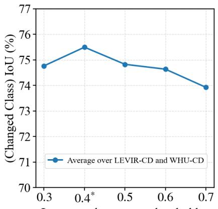  
Large-mask response threshold $\tau _ { l }$

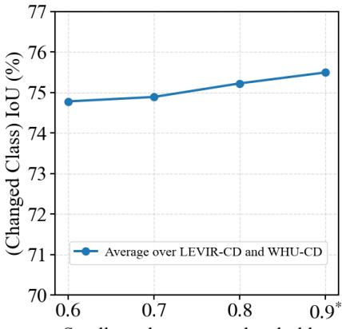  
Small-mask response threshold $\tau _ { s }$

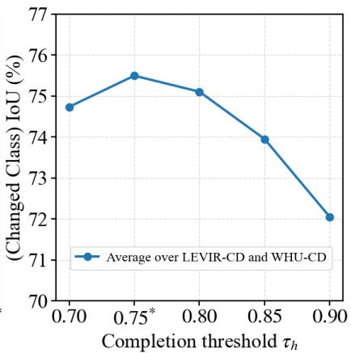  
Fig. 10. Sensitivity to the coupled MCCM thresholds. Mean changed-class IoU is reported over LEVIR-CD and WHU-CD, and asterisks indicate the default settings.

TABLE VII  
ABLATION OF THE NOISE-AWARE PSEUDO-LABEL LEARNING STRATEGY
<table><tr><td colspan="3">Training Strategy</td><td colspan="2">LEVIR-CD (%)</td><td colspan="2">WHU-CD (%)</td><td colspan="2">S2Looking (%)</td></tr><tr><td>Train</td><td>Update</td><td>Select</td><td>F1</td><td>IoU</td><td>F1</td><td>IoU</td><td>F1</td><td>IoU</td></tr><tr><td>X</td><td>X</td><td>X</td><td>86.25</td><td>75.82</td><td>85.82</td><td>75.17</td><td>50.48</td><td>33.76</td></tr><tr><td> $\checkmark$ </td><td>X</td><td>X</td><td>87.97</td><td>78.52</td><td>88.06</td><td>78.66</td><td>54.25</td><td>37.22</td></tr><tr><td> $\checkmark$ </td><td>√</td><td>X</td><td>88.28</td><td>79.01</td><td>88.31</td><td>79.06</td><td>55.16</td><td>38.08</td></tr><tr><td> $\checkmark$ </td><td>√</td><td>√</td><td>88.65</td><td>79.61</td><td>88.85</td><td>79.93</td><td>57.96</td><td>40.81</td></tr></table>

Train, Update, and Select denote pseudo-label training, pseudo-label updating, and high-agreement sample selection, respectively. The best result in each column is shown in bold.

TABLE VIII  
EFFECT OF FOUNDATION-MODEL COMBINATIONS ON ZERO-OVCD
<table><tr><td rowspan="2">Model Combination</td><td rowspan="2">MRM+SMFM+MCCM</td><td colspan="2">LEVIR-CD (%)</td><td colspan="2">WHU-CD (%)</td><td colspan="2">S2Looking (%)</td></tr><tr><td> $\mathrm { F 1 }$ </td><td>IoU</td><td>F1</td><td>IoU</td><td>F1</td><td>IoU</td></tr><tr><td rowspan="2">SAM-DINO-SOV</td><td>X</td><td>49.70</td><td>33.00</td><td>53.70</td><td>36.70</td><td>36.70</td><td>22.50</td></tr><tr><td>√</td><td>80.26</td><td>67.03</td><td>72.69</td><td>57.10</td><td>45.18</td><td>29.18</td></tr><tr><td rowspan="2">SAM-DINOv2-SOV</td><td>X</td><td>54.41</td><td>37.37</td><td>57.41</td><td>40.26</td><td>38.21</td><td>23.62</td></tr><tr><td>√</td><td>84.75</td><td>73.54</td><td>74.44</td><td>59.29</td><td>49.61</td><td>32.99</td></tr><tr><td rowspan="2">SAM2-DINOv2-SOV</td><td>X</td><td>49.96</td><td>33.30</td><td>57.98</td><td>40.83</td><td>37.62</td><td>23.16</td></tr><tr><td>√</td><td>84.77</td><td>73.57</td><td>74.04</td><td>58.78</td><td>49.40</td><td>32.80</td></tr><tr><td rowspan="2">SAM3-DINOv3-SOV3</td><td>X</td><td>60.99</td><td>43.88</td><td>58.23</td><td>41.07</td><td>38.84</td><td>24.10</td></tr><tr><td>√</td><td>86.25</td><td>75.82</td><td>85.82</td><td>75.17</td><td>50.48</td><td>33.76</td></tr></table>

The best result in each column is shown in bold. SOV and SOV3 denote SegEarth-OV and SegEarth-OV3, respectively.

15.90% and 19.20% in F1, respectively. This gain arises from progressive refinement using multiple VFMs, while MRM, SMFM, and MCCM introduce only moderate overhead by operating mainly on existing masks and features. Nevertheless, the joint use of multiple VFMs remains the primary computational bottleneck. Furthermore, Stage II improves F1 by 3.03% through pseudo-label supervision without altering the ChangerEx architecture, leaving its single-checkpoint inference cost unchanged. ChangerEx also requires fewer parameters, less GPU memory, and shorter inference time than STU-SAMI and S2C.

Overall, Zero-OVCD achieves a favorable balance between CD performance and computational efficiency by integrating high-quality pseudo-label generation with a noise-aware CD

model.

## V. CONCLUSION

This paper presented Zero-OVCD, a two-stage targetdomain annotation-free OVCD framework. Stage I performs training-free open-vocabulary pseudo-label generation, in which MRM, SMFM, and MCCM progressively refine change pseudo-labels through complementary mask integration, multiscale margin-aware semantic filtering, and responseguided mask correction and completion. Stage II uses the refined pseudo-labels to optimize a task-specific change detector without manually annotated target-domain pixels, while checkpoint voting and high-agreement sample selection further mitigate residual label noise. Consequently, Zero-OVCD bridges training-free open-vocabulary inference and pseudolabel-supervised detector optimization. Extensive experiments on LEVIR-CD, WHU-CD, S2Looking, and SECOND demonstrate that the proposed framework generates reliable pseudolabels and achieves superior performance in both binary and category-wise settings. Moreover, sensitivity analyses confirm that Zero-OVCD maintains stable performance over reasonable parameter ranges. Nevertheless, the current framework has several limitations. Fixed thresholds may not generalize well across diverse imaging conditions, and query-specific adaptation in Stage II increases the cost of handling multiple categories. Moreover, agreement-based sample selection may preserve shared prediction errors. Future work will investigate adaptive thresholding, uncertainty-aware pseudo-label selection, and category-shared adaptation to improve robustness and reduce per-category training cost.

TABLE IX  
ACCURACY–EFFICIENCY COMPARISON ON THE WHU-CD DATASET
<table><tr><td>Methods</td><td>F1 (%)</td><td>Parameters (M)</td><td>Memory (GB)</td><td>Inference Time (ms)</td></tr><tr><td>Training-free methods</td><td></td><td></td><td></td><td></td></tr><tr><td>AnyChange [10]</td><td>19.20</td><td>641.09</td><td>6.4</td><td>4213.71</td></tr><tr><td>SCM [11]</td><td>29.32</td><td>223.48</td><td>1.2</td><td>4502.69</td></tr><tr><td>BiSAM-CD [58]</td><td>69.92</td><td>224.45</td><td>2.4</td><td>1032.50</td></tr><tr><td>APE-DINO [13]</td><td>72.62</td><td>1160.45</td><td>15.1</td><td>2572.58</td></tr><tr><td>APE-DINOv2 [13]</td><td>75.85</td><td>1161.23</td><td>15.3</td><td>2643.82</td></tr><tr><td>SAM-DINOv2-SOV [13]</td><td>57.41</td><td>877.59</td><td>7.1</td><td>2678.76</td></tr><tr><td>SAM2-DINOv2-SOV [13]</td><td>57.98</td><td>460.94</td><td>6.6</td><td>5286.29</td></tr><tr><td>OmniOVCD [45]</td><td>66.62</td><td>840.51</td><td>5.8</td><td>552.42</td></tr><tr><td>Zero-OVCD (Stage I)</td><td>85.82</td><td>1143.67</td><td>11.4</td><td>2857.53</td></tr><tr><td colspan="5">Training-required methods</td></tr><tr><td>STU-SAMI [24]</td><td>31.71</td><td>18.87</td><td>1.7</td><td>103.49</td></tr><tr><td>S2C [19]</td><td>37.26</td><td>303.62</td><td>2.6</td><td>206.99</td></tr><tr><td>Zero-OVCD (Stage II)</td><td>88.85</td><td>11.39</td><td>1.1</td><td>12.10</td></tr></table>

Peak GPU memory usage and average inference time per image pair are measured over the WHU-CD test set. For Zero-OVCD Stage II, the reported inference time corresponds to a single ChangerEx checkpoint. SOV denotes SegEarth-OV.

## REFERENCES

[1] S. Das and D. P. Angadi, “Land use land cover change detection and monitoring of urban growth using remote sensing and GIS techniques: A micro-level study,” GeoJournal, vol. 87, no. 3, pp. 2101–2123, 2022.

[2] T. Wellmann, A. Lausch, E. Andersson, S. Knapp, C. Cortinovis, J. Jache, S. Scheuer, P. Kremer, A. Mascarenhas, R. Kraemer, A. Haase, F. Schug, and D. Haase, “Remote sensing in urban planning: Contributions towards ecologically sound policies?” Landscape and Urban Planning, vol. 204, p. 103921, 2020.

[3] S. Saha, F. Bovolo, and L. Bruzzone, “Destroyed-buildings detection from VHR SAR images using deep features,” in Image and Signal Processing for Remote Sensing XXIV, L. Bruzzone and F. Bovolo, Eds., vol. 10789, International Society for Optics and Photonics. SPIE, 2018, p. 107890Z.

[4] R. Caye Daudt, B. Le Saux, and A. Boulch, “Fully convolutional siamese networks for change detection,” in 2018 25th IEEE International Conference on Image Processing (ICIP), 2018, pp. 4063–4067.

[5] H. Chen, Z. Qi, and Z. Shi, “Remote sensing image change detection with transformers,” IEEE Transactions on Geoscience and Remote Sensing, vol. 60, pp. 1–14, 2022.

[6] A. Gu and T. Dao, “Mamba: Linear-time sequence modeling with selective state spaces,” in First Conference on Language Modeling, 2024.

[7] A. Kirillov, E. Mintun, N. Ravi, H. Mao, C. Rolland, L. Gustafson, T. Xiao, S. Whitehead, A. C. Berg, W.-Y. Lo, P. Dollar, and R. Girshick,´ “Segment anything,” in 2023 IEEE/CVF International Conference on Computer Vision (ICCV), 2023, pp. 3992–4003.

[8] M. Caron, H. Touvron, I. Misra, H. Jegou, J. Mairal, P. Bojanowski, and A. Joulin, “Emerging properties in self-supervised vision transformers,” in 2021 IEEE/CVF International Conference on Computer Vision (ICCV), 2021, pp. 9630–9640.

[9] A. Radford, J. W. Kim, C. Hallacy, A. Ramesh, G. Goh, S. Agarwal, G. Sastry, A. Askell, P. Mishkin, J. Clark, G. Krueger, and I. Sutskever, “Learning transferable visual models from natural language supervision,” in Proceedings of the 38th International Conference on Machine Learning, ser. Proceedings of Machine Learning Research, M. Meila and T. Zhang, Eds., vol. 139. PMLR, 18–24 Jul 2021, pp. 8748–8763.

[10] Z. Zheng, Y. Zhong, L. Zhang, and S. Ermon, “Segment any change,” in Advances in Neural Information Processing Systems, A. Globerson, L. Mackey, D. Belgrave, A. Fan, U. Paquet, J. Tomczak, and C. Zhang, Eds., vol. 37. Curran Associates, Inc., 2024, pp. 81 204–81 224.

[11] X. Tan, G. Chen, T. Wang, J. Wang, and X. Zhang, “Segment change model (SCM) for unsupervised change detection in VHR remote sensing images: A case study of buildings,” in IGARSS 2024 - 2024 IEEE International Geoscience and Remote Sensing Symposium, 2024, pp. 8577–8580.

[12] X. Zhao, W. Ding, Y. An, Y. Du, T. Yu, M. Li, M. Tang, and J. Wang, “Fast segment anything,” 2023, arXiv:2306.12156.

[13] K. Li, X. Cao, Y. Deng, C. Pang, Z. Xin, H. Qiao, T. Gong, D. Meng, and Z. Wang, “DynamicEarth: How far are we from open-vocabulary change detection?” Proceedings of the AAAI Conference on Artificial Intelligence, vol. 40, no. 8, pp. 6279–6287, 2026.

[14] D. Peng, Y. Zhang, and H. Guan, “End-to-end change detection for high resolution satellite images using improved UNet++,” Remote Sensing, vol. 11, no. 11, p. 1382, 2019.

[15] W. G. C. Bandara and V. M. Patel, “A transformer-based siamese network for change detection,” in IGARSS 2022 - 2022 IEEE International Geoscience and Remote Sensing Symposium, 2022, pp. 207–210.

[16] C. Xu, Z. Ye, L. Mei, H. Yu, J. Liu, Y. Yalikun, S. Jin, S. Liu, W. Yang, and C. Lei, “Hybrid attention-aware transformer network collaborative multiscale feature alignment for building change detection,” IEEE Transactions on Instrumentation and Measurement, vol. 73, pp. 1–14, 2024.

[17] H. Chen, J. Song, C. Han, J. Xia, and N. Yokoya, “ChangeMamba: Remote sensing change detection with spatiotemporal state space model,” IEEE Transactions on Geoscience and Remote Sensing, vol. 62, pp. 1– 20, 2024.

[18] H. Zhang, K. Chen, C. Liu, H. Chen, Z. Zou, and Z. Shi, “CDMamba: Incorporating local clues into Mamba for remote sensing image binary change detection,” IEEE Transactions on Geoscience and Remote Sensing, vol. 63, pp. 1–16, 2025.

[19] L. Ding, X. Zuo, H. Guo, J. Lu, Z. Gong, X. Liu, and J. Lu, “S2C: A noise-resistant difference learning framework for unsupervised change detection in VHR remote sensing images,” Proceedings of the AAAI Conference on Artificial Intelligence, vol. 40, no. 5, pp. 3596–3604, 2026.

[20] Y. Oh, M. Seo, D. Kim, and J. Seo, “Prototype-oriented unsupervised change detection for disaster management,” in NeurIPS 2023 Workshop on Tackling Climate Change with Machine Learning, 2023.

[21] H. Noh, J. Ju, M. Seo, J. Park, and D.-G. Choi, “Unsupervised change detection based on image reconstruction loss,” in 2022 IEEE/CVF Conference on Computer Vision and Pattern Recognition Workshops (CVPRW), 2022, pp. 1351–1360.

[22] H. Noh, J. Ju, Y. Kim, M. Kim, and D.-G. Choi, “Unsupervised change detection based on image reconstruction loss with segment anything,” Remote Sensing Letters, vol. 15, no. 9, pp. 919–929, 2024.

[23] H. Chen, J. Song, C. Wu, B. Du, and N. Yokoya, “Exchange means change: An unsupervised single-temporal change detection framework based on intra- and inter-image patch exchange,” ISPRS Journal of Photogrammetry and Remote Sensing, vol. 206, pp. 87–105, 2023.

[24] X. Zuo, J. Rui, L. Ding, F. Jin, Y. Lin, S. Wang, X. Liu, and J. Lei, “Integrating segment anything model with instance-level change generation for single-temporal unsupervised change detection,” IEEE Transactions on Geoscience and Remote Sensing, vol. 63, pp. 1–17, 2025.

[25] L. Ding, K. Zhu, D. Peng, H. Tang, K. Yang, and L. Bruzzone, “Adapting Segment Anything Model for change detection in VHR remote sensing images,” IEEE Transactions on Geoscience and Remote Sensing, vol. 62, pp. 1–11, 2024.

[26] L. Mei, Z. Ye, C. Xu, H. Wang, Y. Wang, C. Lei, W. Yang, and Y. Li, “SCD-SAM: Adapting Segment Anything Model for semantic change

detection in remote sensing imagery,” IEEE Transactions on Geoscience and Remote Sensing, vol. 62, pp. 1–13, 2024.

[27] M. Wang, L. Zhou, K. Zhang, X. Li, M. Hao, and Y. Ye, “ESAM-CD: Fine-tuned EfficientSAM network with LoRA for weakly supervised remote sensing image change detection,” IEEE Transactions on Geoscience and Remote Sensing, vol. 62, pp. 1–16, 2024.

[28] L. Wang, M. Zhang, and W. Shi, “CS-WSCDNet: Class activation mapping and Segment Anything Model-based framework for weakly supervised change detection,” IEEE Transactions on Geoscience and Remote Sensing, vol. 61, pp. 1–12, 2023.

[29] M. Liu, D. Peng, Y. Zhang, and H. Guan, “SemSAM-CD: A novel weakly supervised change detection method based on semantic guidance and Segment Anything Model refinement,” IEEE Journal of Selected Topics in Applied Earth Observations and Remote Sensing, vol. 19, pp. 3352–3370, 2026.

[30] N. Ravi, V. Gabeur, Y.-T. Hu, R. Hu, C. Ryali, T. Ma, H. Khedr, R. Radle, C. Rolland, L. Gustafson, E. Mintun, J. Pan, K. V. Alwala,¨ N. Carion, C.-Y. Wu, R. Girshick, P. Dollar, and C. Feichtenhofer, “SAM 2: Segment anything in images and videos,” in International Conference on Learning Representations, Y. Yue, A. Garg, N. Peng, F. Sha, and R. Yu, Eds., vol. 2025, 2025, pp. 28 085–28 128.

[31] N. Carion, L. Gustafson, Y.-T. Hu, S. Debnath, R. Hu, D. S. Coll-Vinent, C. Ryali, K. V. Alwala, H. Khedr, A. Huang, J. Lei, T. Ma, B. Guo, A. Kalla, M. Marks, J. Greer, M. Wang, P. Sun, R. Radle, T. Afouras,¨ E. Mavroudi, K. Xu, T.-H. Wu, Y. Zhou, L. Momeni, R. HAZRA, S. Ding, S. Vaze, F. Porcher, F. Li, S. Li, A. Kamath, H. K. Cheng, P. Dollar, N. Ravi, K. Saenko, P. Zhang, and C. Feichtenhofer, “SAM 3: Segment anything with concepts,” in The Fourteenth International Conference on Learning Representations, 2026.

[32] M. Oquab, T. Darcet, T. Moutakanni, H. V. Vo, M. Szafraniec, V. Khalidov, P. Fernandez, D. HAZIZA, F. Massa, A. El-Nouby, M. Assran, N. Ballas, W. Galuba, R. Howes, P.-Y. Huang, S.-W. Li, I. Misra, M. Rabbat, V. Sharma, G. Synnaeve, H. Xu, H. Jegou, J. Mairal, P. Labatut, A. Joulin, and P. Bojanowski, “DINOv2: Learning robust visual features without supervision,” Transactions on Machine Learning Research, 2024.

[33] O. Simeoni, H. V. Vo, M. Seitzer, F. Baldassarre, M. Oquab, C. Jose,´ V. Khalidov, M. Szafraniec, S. E. Yi, M. Ramamonjisoa, F. Massa, D. HAZIZA, L. Wehrstedt, J. Wang, T. Darcet, T. Moutakanni, L. Sentana, C. Roberts, A. Vedaldi, J. Tolan, J. Brandt, C. Couprie, J. Mairal, H. Jegou, P. Labatut, and P. Bojanowski, “DINOv3,” Transactions on Machine Learning Research, 2026.

[34] Y. Shen, C. Fu, P. Chen, M. Zhang, K. Li, X. Sun, Y. Wu, S. Lin, and R. Ji, “Aligning and prompting everything all at once for universal visual perception,” in 2024 IEEE/CVF Conference on Computer Vision and Pattern Recognition (CVPR), 2024, pp. 13 193–13 203.

[35] K. Li, R. Liu, X. Cao, X. Bai, F. Zhou, D. Meng, and Z. Wang, “SegEarth-OV: Towards training-free open-vocabulary segmentation for remote sensing images,” in 2025 IEEE/CVF Conference on Computer Vision and Pattern Recognition (CVPR), 2025, pp. 10 545–10 556.

[36] K. Li, S. Zhang, Y. Wang, Y. Deng, Z. Wang, D. Meng, and X. Cao, “SegEarth-OV3: Exploring SAM 3 for open-vocabulary semantic segmentation in remote sensing images,” 2026, arXiv:2512.08730.

[37] C. Zhou, C. C. Loy, and B. Dai, “Extract free dense labels from CLIP,” in Computer Vision – ECCV 2022, S. Avidan, G. Brostow, M. Cisse, G. M.´ Farinella, and T. Hassner, Eds. Cham: Springer Nature Switzerland, 2022, pp. 696–712.

[38] F. Wang, J. Mei, and A. Yuille, “SCLIP: Rethinking self-attention for dense vision-language inference,” in Computer Vision – ECCV 2024, A. Leonardis, E. Ricci, S. Roth, O. Russakovsky, T. Sattler, and G. Varol, Eds. Cham: Springer Nature Switzerland, 2025, pp. 315–332.

[39] M. Lan, C. Chen, Y. Ke, X. Wang, L. Feng, and W. Zhang, “ProxyCLIP: Proxy attention improves CLIP for open-vocabulary segmentation,” in Computer Vision – ECCV 2024, A. Leonardis, E. Ricci, S. Roth, O. Russakovsky, T. Sattler, and G. Varol, Eds. Cham: Springer Nature Switzerland, 2025, pp. 70–88.

[40] Y. Zhu, L. Li, K. Chen, C. Liu, F. Zhou, and Z. Shi, “Semantic-CD: Remote sensing image semantic change detection towards open-vocabulary setting,” in IGARSS 2025 - 2025 IEEE International Geoscience and Remote Sensing Symposium, 2025, pp. 6388–6392.

[41] Z. Zhu and B. Yang, “UniVCD: A new method for unsupervised change detection in the open-vocabulary era,” 2025, arXiv:2512.13089.

[42] Q. Guo, J. Wang, Y. Liu, and Y. Zhong, “OpenDPR: Open-vocabulary change detection via vision-centric diffusion-guided prototype retrieval for remote sensing imagery,” in Proceedings of the IEEE/CVF Conference on Computer Vision and Pattern Recognition (CVPR), June 2026, pp. 20 399–20 409.

[43] Y. Su, Y. Song, J. Chen, and Z. Wen, “Seg2Change: Adapting openvocabulary semantic segmentation model for remote sensing change detection,” 2026, arXiv:2604.11231.

[44] M. Dou, S. Qiu, M. Hu, Y. Chen, H. Ye, X. Liao, and Z. Sun, “AdaptOVCD: Training-free open-vocabulary remote sensing change detection via adaptive information fusion,” 2026, arXiv:2602.06529.

[45] X. Zhang, D. Li, Y. Xia, X. Dong, H. Yu, J. Wang, and Q. Li, “OmniOVCD: Streamlining open-vocabulary change detection with SAM 3,” 2026, arXiv:2601.13895.

[46] W. Tang, H. Sun, Z. Li, Y. Wang, and F. Zhang, “CoRegOVCD: Consistency-regularized open-vocabulary change detection,” 2026, arXiv:2604.02160.

[47] Z. Kuang, H. Chang, B. Liang, H. Wang, L. He, F. Li, and H. Bi, “MemOVCD: Training-free open-vocabulary change detection via crosstemporal memory reasoning and global-local adaptive rectification,” 2026, arXiv:2604.26774.

[48] H. Zhu, H. Chen, B. Du, S. Liu, and Q. Liu, “ReA-OVCD: Reliabilityaware open-vocabulary change detection via semantic and spatial refinement,” 2026, arXiv:2606.20032.

[49] S. Fang, K. Li, and Z. Li, “Changer: Feature interaction is what you need for change detection,” IEEE Transactions on Geoscience and Remote Sensing, vol. 61, pp. 1–11, 2023.

[50] W. Liu, Z. Wang, X. Guo, P. Duan, X. Kang, and S. Li, “Learning from noisy pseudo-labels for all-weather land cover mapping,” in IGARSS 2025 - 2025 IEEE International Geoscience and Remote Sensing Symposium, 2025, pp. 219–222.

[51] Y. Wang, X. Ma, Z. Chen, Y. Luo, J. Yi, and J. Bailey, “Symmetric cross entropy for robust learning with noisy labels,” in 2019 IEEE/CVF International Conference on Computer Vision (ICCV), 2019, pp. 322– 330.

[52] M. Berman, A. R. Triki, and M. B. Blaschko, “The Lovasz-Softmax loss: A tractable surrogate for the optimization of the intersection-overunion measure in neural networks,” in 2018 IEEE/CVF Conference on Computer Vision and Pattern Recognition, 2018, pp. 4413–4421.

[53] F. Milletari, N. Navab, and S.-A. Ahmadi, “V-Net: Fully convolutional neural networks for volumetric medical image segmentation,” in 2016 Fourth International Conference on 3D Vision (3DV), 2016, pp. 565– 571.

[54] H. Chen and Z. Shi, “A spatial-temporal attention-based method and a new dataset for remote sensing image change detection,” Remote Sensing, vol. 12, no. 10, p. 1662, 2020.

[55] S. Ji, S. Wei, and M. Lu, “Fully convolutional networks for multisource building extraction from an open aerial and satellite imagery data set,” IEEE Transactions on Geoscience and Remote Sensing, vol. 57, no. 1, pp. 574–586, 2019.

[56] L. Shen, Y. Lu, H. Chen, H. Wei, D. Xie, J. Yue, R. Chen, S. Lv, and B. Jiang, “S2Looking: A satellite side-looking dataset for building change detection,” Remote Sensing, vol. 13, no. 24, p. 5094, 2021.

[57] K. Yang, G.-S. Xia, Z. Liu, B. Du, W. Yang, M. Pelillo, and L. Zhang, “Asymmetric siamese networks for semantic change detection in aerial images,” IEEE Transactions on Geoscience and Remote Sensing, vol. 60, pp. 1–18, 2022.

[58] Y. Qin, J. Chen, C. Wang, and C. Pan, “BiSAM-CD: Zero-shot remote sensing change detection via bidirectional temporal memory in SAM2,” IEEE Transactions on Geoscience and Remote Sensing, vol. 63, pp. 1– 12, 2025.