# PatchGen: Learning Soft Intra-Image Predictive Subsets for Visual Generalization

Zhaorui Tan1∗, Weimiao Yu1, Xi Yang2∗

1Agency for Science, Technology and Research (A\*STAR), Singapore 2Xi’an Jiaotong-Liverpool University, Suzhou, China

## Abstract

Visual classifiers are expected to generalize under data shifts, target shifts, and their combinations, yet most existing methods focus on domain invariance while failing to address intra-image predictive suficiency. We investigate the structural hypothesis that each image contains a sample-adaptive oracle intra-image predictive subset suficient for label prediction, while the remaining patches form non-essential complementary context that may correlate with the label. The theoretical analysis shows that restricting prediction to this oracle subset preserves the Bayes risk achievable by the full-patch representation while admitting a complexity bound that tightens with the oracle-subset size. Based on this view, we propose PatchGen, a text-free module that learns a sample-dependent soft predictive-subset mask as a task-driven proxy for the unobserved oracle subset mask. Specifically, histopathology visualizations suggest that PatchGen assigns higher scores to tumor-consistent regions than to some frequently co-occurring inflammatory context. Extensive experiments on natural and histopathological image benchmarks spanning all three shift settings show that Patch-Gen improves average performance over matched-backbone baselines in most evaluated configurations, enhances generalization to unknown classes, and remains competitive with vision-language methods without text supervision.

## 1 Introduction

Generalization remains a longstanding challenge in visual classification (Gulrajani and Lopez-Paz 2020; Kukleva, Kuehne, and Schiele 2021; Liu et al. 2021; Vaze et al. 2022; Cha et al. 2022; Abbe et al. 2024; Tan, Yang, and Huang 2024; Tan et al. 2024), particularly because real-world distribution shifts rarely stem from a single factor. Instead, they often involve both data shifts, such as domain changes, and target shifts, such as novel or evolving categories, which are collectively referred to as all shifts (Tan et al. 2024).

Existing visual generalization methods primarily address data shifts by suppressing domain-dependent spurious correlations. Typical approaches learn domain-invariant representations through statistical alignment (Yuan et al. 2023; Li et al. 2018c; Hu et al. 2020; Cha et al. 2022; Tan, Yang, and Huang 2024) or causal-inspired formulations (Gong et al. 2025; Wang et al. 2025; Liu et al. 2025). However, domain invariance alone may not distinguish prediction-suficient evidence from a complementary context that repeatedly cooccurs with predictive evidence in the source data but becomes unreliable under domain or label-space shifts. For example, a model may exploit inflammation, which may usually accompany tumor-specific morphology in a source dataset, yet it is a non-specific response that can also arise from nonneoplastic injury. Meanwhile, vision-language models such as CLIP (Radford et al. 2021) ofer strong transferability, but their dependence on image-text alignment may limit their applicability to category-discovery settings in which novel classes lack reliable textual specifications.

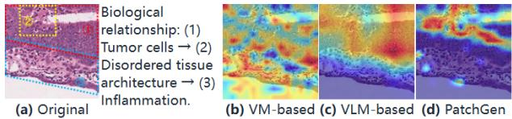  
Figure 1: Qualitative histopathology visualization on an unseen-domain tumor image: PatchGen’s learned soft predictive-subset mask compared with the corresponding attention maps of previous methods.

These observations motivate an intra-image predictive view of visual generalization. As shown in Figure 2 (a), we hypothesize that, in one image, there exists a sample-adaptive oracle intra-image predictive subset $( C ^ { \star } ( X ) )$ that contains evidence suficient for label prediction, while the remaining complementary context subset (R⋆(X)) is non-essential. Specifically, $R ^ { \star } ( \dot { X } )$ may be heterogeneous, comprising labelcorrelated co-occurring regions, domain-varying shortcuts, domain-stable but conditionally redundant regions, and regions with little or no marginal label information. Despite their diferent properties, these patches provide no additional label information once the oracle predictive-subset representation $\Phi _ { C } ( X )$ is given. Under explicit stable predictive-suficiency and bounded oracle-subset-size assumptions, we show that an oracle predictive subset containing at most s of the P patches $( s \leq P )$ preserves the Bayes risk achievable by the full-patch representation $\Phi _ { \mathrm { a l l } }$ while admitting an oracle-subset-sizedependent complexity upper bound that is no larger than its all-patch counterpart, and is strictly tighter whenever $s < P .$

Based on this perspective, we propose PatchGen, which learns a sample-dependent soft predictive-subset mask as a task-driven proxy for the unobserved oracle subset mask associated with $C ^ { \star } ( X )$ . This subset is not assumed to have a fixed size: it may be small when evidence is localized and may equal the full patch set when predictive evidence occupies the whole image, as in tumor-dominant histopathology tiles. The mask is derived from cross-patch interactions and jointly optimized through low-score mask suppression, selectedconfidence regularization, and class-conditional feature alignment. Histopathological images provide a morphology-rich setting for inspecting the learned patch-selection maps. In Figure 1, PatchGen assigns relatively higher weights to regions morphologically consistent with tumor tissue and lower weights to some surrounding inflammatory regions that distract other methods.

PatchGen is validated across three challenging tasks (details in Appendix A): 1) Multi-domain generalization (mDG) for data shifts, 2) Continual category discovery (CCD) for target shifts, and 3) Multi-domain generalization with GCD (mDG+GCD) for all-shift scenario. Extensive experiments on natural and histopathological image benchmarks show that PatchGen improves matched-backbone baselines in most evaluated configurations, yields positive average gains in the reported matched comparisons, and remains competitive with methods built on vision-language backbones, without requiring text inputs or text-side adaptation objectives.

## 2 Related Work

We summarize the most relevant literature here and defer a broader discussion to Appendix B. Generalization under multiple shifts. Multi-domain generalization transfers from source to unseen domains through alignment or pretrainedfeature regularization (Ganin et al. 2016; Li et al. 2018c; Cha et al. 2022; Tan, Yang, and Huang 2024). CCD addresses sequential novel category discovery, while mDG+GCD jointly considers unseen domains and unknown classes (Zhang et al. 2022; Kim et al. 2023; Wu et al. 2023; Cendra, Zhao, and Han 2024; Tan et al. 2024). PatchGen provides a shared sample-dependent patch-selection mechanism across these settings. Causal generalization and patch selection. Causal DG mainly models invariant mechanisms at the domain or representation level (Liu et al. 2025; Wang et al. 2025; Gong et al. 2025), whereas token pruning and attention visualization primarily target eficiency or post-hoc interpretation (Rao et al. 2021; Abnar and Zuidema 2020). PatchGen instead jointly learns soft patch masks for generalization through task supervision and regularization.

## 3 Theoretical Motivation

Setup and structural assumptions. Let $X \in \mathcal { X } , Y \in \mathcal { Y } .$ , and $D \in \mathcal { D }$ denote an input image, its class label, and its domain, respectively. Let $[ \dot { P } ] = \{ 1 , \ldots , P \}$ denote the patch-index set. A backbone $f _ { \theta }$ produces the patch representations

$$
\begin{array} { r } { Z ( \boldsymbol { X } ) = [ z _ { 1 } ( \boldsymbol { X } ) , \ldots , z _ { P } ( \boldsymbol { X } ) ] ^ { \top } \in \mathbb { R } ^ { P \times d _ { z } } , } \end{array}
$$

where $z _ { p } ( X ) \in \mathbb { R } ^ { d _ { z } }$ is the representation of patch $p .$ We use $\mathbb { P } _ { d }$ and $\mathbb { E } _ { d }$ to denote probability and expectation under domain $D = d$ . For each image, we posit an unobserved sample-dependent partition

$$
C ^ { \star } ( X ) \cup R ^ { \star } ( X ) = [ P ] ,\tag{1}
$$

where $C ^ { \star } ( X )$ is the oracle intra-image predictive subset and $R ^ { \star } ( X )$ is its complementary context. For a mask m $\in [ 0 , 1 ] ^ { \scriptscriptstyle P }$ , define the masked concatenation $\Phi _ { \mathbf { m } } ( X ) =$ vec $( \mathring { m _ { 1 } z _ { 1 } } ^ { \prime } ( X ) , \dots , m _ { P } z _ { P } ( X ) ) \ \in \ \mathbb { R } ^ { P d _ { z } }$ . Let $\mathbf { m } _ { C } ^ { \star } ( X ) \ \in$ $\{ 0 , \dot { 1 } \} ^ { P }$ denote the oracle predictive-subset mask, and let ${ \bf 1 } _ { P }$ denote the all-ones vector. We define $\Phi _ { C } ( X ) \ : = $ $\begin{array} { r c l } { \Phi _ { \mathbf { m } _ { C } ^ { \star } ( X ) } ( X ) , \Phi _ { R } ( X ) } & { : = } & { \Phi _ { \mathbf { 1 } _ { P } - \mathbf { m } _ { C } ^ { \star } ( X ) } ( X ) , \Phi _ { \mathrm { a l l } } ( X ) } \end{array} : : =$ $\Phi _ { \mathbf { 1 } _ { P } } ( X )$ . We omit the argument X when no ambiguity arises.

Shift taxonomy. To align the analysis with our evaluation settings, we consider: (i) data $s h i f t s$ , modeled as changes in the complementary-context distribution while the joint law of $( \Phi _ { C } , \overbar { Y } )$ remains fixed; (ii) target $s h i f i s .$ , modeled through a partition into known and unknown classes under an oracle clusterability condition; and (iii) all $s h i f i s ,$ , in which these two modeled components occur simultaneously. The following results apply only to these explicit shift models and do not provide guarantees for arbitrary distribution shifts.

Assumption 3.1 (Representation-measurable oracle partition). The oracle mask $\mathbf { m } _ { C } ^ { \star } ( X )$ is a deterministic function of $\Phi _ { \mathrm { a l l } } ( X )$

Assumption 3.1 prevents the oracle mask from introducing side information unavailable in the full patch representation.

Assumption 3.2 (Stable predictive suficiency). For every domain $\bar { d } \in \mathcal { D } , \mathbb { P } _ { d } \left( Y \mid \bar { \Phi _ { \mathrm { a l l } } } \right) = \mathbb { P } _ { d } \left( Y \mid \Phi _ { C } \right) \bar { = } \mathbb { P } \left( Y \mid \bar { \Phi _ { C } } \right)$

The first equality states that the full patch representation provides no additional label information beyond $\Phi _ { C }$ Thus, complementary context may remain marginally labelcorrelated, but is conditionally redundant once $\Phi _ { C }$ is given. The second equality states that the label-predictive mechanism based on $\Phi _ { C }$ is shared across domains. Complementary context may therefore include both domain-varying shortcuts and domain-stable but conditionally redundant regions.

Assumption 3.3 (Bounded oracle-subset size). There exist constants $s ~ \leq ~ P$ and $B > 0$ such that $\left| C ^ { \star } ( X ) \right| \ \leq$ $s , \qquad \| z _ { p } ( X ) \| _ { 2 } \leq B$ for every image X and patch $p \in [ P ]$

Oracle predictive-subset advantage. For a norm bound $\Lambda \ > \ 0$ , define the scalar-valued score classes $\begin{array} { r c l } { \mathscr { H } _ { C } } & { = } & { \{ X \mapsto \langle \mathbf { v } , \Phi _ { C } ( X ) \rangle : \| \mathbf { v } \| _ { 2 } \leq \Lambda \} } \end{array}$ , and $\mathcal { H } _ { \mathrm { a l l } } =$ $\{ X \mapsto \langle \mathbf { v } , \Phi _ { \mathrm { a l l } } ( X ) \rangle : \| \mathbf { v } \| _ { 2 } \leq \Lambda \}$

Proposition 3.1 (Oracle suficiency and oracle-subset-size-dependent complexity). Under Assumptions 3.2 and 3.3, for every domain $d \in \mathcal { D }$ , the unrestricted Bayes risk based on $\Phi _ { C }$ equals that based on $\Phi _ { \mathrm { a l l } }$ . Moreover, their empirical Rademacher complexities satisfy

$$
\widehat { \mathfrak { R } } _ { n } ( \mathcal { H } _ { C } ) \leq \Lambda B \sqrt { s } / \sqrt { n } , \widehat { \mathfrak { R } } _ { n } ( \mathcal { H } _ { \mathrm { a l l } } ) \leq \Lambda B \sqrt { P } / \sqrt { n } .\tag{2}
$$

Here, $\textstyle { \widehat { \mathfrak { R } } } _ { n }$ denotes empirical Rademacher complexity. Thus, restricting prediction to the oracle subset preserves optimal predictive information while admitting an oracle-subset-sizedependent complexity bound. The oracle-subset bound is no larger than the all-patch bound and is strictly tighter whenever $s < P .$ . The full proof is provided in Appendix C.3.

Data shifts: complementary-context variation. PatchGen learns a sample-dependent soft mask $\mathbf { m } _ { \phi } ( X ) \in [ 0 , 1 ] ^ { P }$ . Let $G : \mathbb { R } ^ { P d _ { z } }  \mathbb { R } ^ { d _ { g } }$ be a fixed non-expansive map satisfying $\lVert G ( u ) - G ( v ) \rVert _ { 2 } \leq \lVert u - v \rVert _ { 2 }$ . Let h be a fixed classifier operating on $\mathbb { R } ^ { d _ { g } }$ , and let ℓ denote its loss. Define the learned selected representation and the oracle representation as $\widetilde { z } _ { \phi } ^ { + } ( X ) = G \bigl ( \Phi _ { \mathbf { m } _ { \phi } ( X ) } ( X ) \bigr ) , \widetilde { z } _ { C } ( X ) = G \Bigl ( \Phi _ { \mathbf { m } _ { C } ^ { \star } ( X ) } ( X ) \Bigr )$

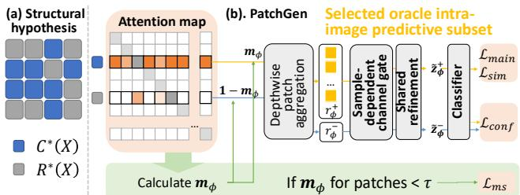  
Figure 2: Overview of PatchGen. (a) The structural hypothesis. (b) PatchGen learns a soft mask as a task-driven proxy for the oracle intra-image predictive subset.

For domain d, define the normalized mask-approximation error $\epsilon _ { d } ( \phi ) = \mathbb { E } _ { d } \left[ \| \mathbf { m } _ { \phi } ( X ) - \mathbf { m } _ { C } ^ { \star } ( X ) \| _ { 1 } / P \right]$ , and define the corresponding risk as $R _ { d } ( h , \phi ) = \mathbb { E } _ { d } \left[ \ell \Big ( h ( \widetilde { z } _ { \phi } ^ { + } ( X ) ) , Y \Big ) \right]$

Proposition 3.2 (Robustness under complementary-context data shifts). Consider two domains $\bar { d } , d ^ { \prime } \in \mathcal { D }$ satisfying $\mathbb { P } _ { d } ( \Phi _ { C } , Y ) = \mathbb { P } _ { d ^ { \prime } } ( \Phi _ { C } , Y )$ , but potentially difering in their complementary-context distributions. If the mapping $u \mapsto \ell ( h ( u ) , y )$ is L-Lipschitz for every $y \in \mathcal { V }$ , then $\bar { | R _ { d } ( h , \phi ) - R _ { d ^ { \prime } } ( h , \phi ) | } \le L \bar { B } P \left( \epsilon _ { d } ( \bar { \phi } ) + \epsilon _ { d ^ { \prime } } ( \bar { \phi } ) \right)$

Here, L is the Lipschitz constant, B is the patch-feature norm bound, and $P$ is the total number of patches. Thus, under the modeled data shift, the risk discrepancy of the learned predictor is controlled by its mask-approximation error in the two domains. The full proof is provided in Appendix C.4.

Target shifts: preservation of class separation. Let the complete label space be partitioned as $\boldsymbol { \bar { y } } = \boldsymbol { y } _ { \mathrm { k n o w n } } \ : \boldsymbol { \dot { \cup } }$ $\mathcal { V } _ { \mathrm { u n k n o w n } }$ . Predictive suficiency alone does not guarantee geometric separation of known and unknown classes. We therefore impose an explicit clusterability condition on the oracle representation.

Proposition 3.3 (Preservation of class separation under target shifts). Suppose that there exist $r \geq 0 , \gamma > 0 $ , and class centers $\mu _ { c } \bar { \in \mathbb { R } ^ { d _ { g } } } , c \in \mathcal { V } _ { \mathrm { k n o w n } } \cup \mathcal { V } _ { \mathrm { u n k n o w n } } ,$ such that, $f o r$ every sample with $Y = c \mathrm { , ~ } \| \widetilde { z } _ { C } ( X ) - \mu _ { c } \| _ { 2 } \leq r _ { \mathrm { ; } }$ , and $\| \mu _ { c } -$ $\mu _ { c ^ { \prime } } \| _ { 2 } \geq \gamma$ for all $c \neq c ^ { \prime } .$ Assume further that there exists $\eta \geq 0$ such that $\| \widetilde { z } _ { \phi } ^ { + } ( X ) - \widetilde { z } _ { C } ( X ) \| _ { 2 } \le \eta$ for every sample. Then learned representations from distinct classes are separated by at least $\gamma - 2 ( r + \eta )$ . In particular, the learned class-conditional representation sets remain pairwise disjoint whenever $\gamma > 2 ( r + \eta )$

The result establishes the stability of an assumed oracle class geometry under representation approximation. Note that it does not state that predictive suficiency alone guarantees unknown-class discovery. See full proof in Appendix C.5.

All shifts: Componentwise implications. Now, we have:

Corollary 3.1 (Componentwise implications under all shifts). Suppose the assumptions of Propositions 3.2 and 3.3 hold simultaneously for the modeled data- and target-shift components. Then the learned predictor satisfies the complementarycontext risk-discrepancy bound ofProposition 3.2, while the distance between learned representationsfrom distinct classes remains at least $\gamma - 2 ( r + \eta )$

This corollary provides componentwise implications for the all-shift setting. It is not a unifiedjoint-risk bound and does not control interactions between the two shift components. See full proof and additional discussion in Appendix C.6.

## 4 Learning a Soft Predictive-Subset Proxy

Figure 2 summarizes the oracle structural hypothesis and its operationalization in PatchGen. The oracle intra-image predictive subset $C ^ { \star } ( X )$ and its mask $\mathbf { m } _ { C } ^ { \star } ( X )$ are unobserved. PatchGen therefore learns a sample-dependent soft predictive-subset mask ${ \bf m } _ { \phi } ( X )$ as a task-driven proxy for $\mathbf { m } _ { C } ^ { \star } ( X )$ . The learned mask and its complement are used to construct the selected and complementary representations, respectively. Additional design and implementation details are provided in Appendix D.

Soft predictive-subset mask estimation. Under the structural hypothesis, the oracle predictive-subset representation $\Phi _ { C } ( X )$ is suficient for label prediction. Because $\mathbf { m } _ { C } ^ { \star } ( X )$ is unavailable during training, we estimate the learned soft predictive-subset mask ${ \bf m } _ { \phi } ( X )$ from cross-patch interaction scores. Let $S _ { \phi } ^ { ( a ) } ( X ) \in \mathbb { R } ^ { P \times P }$ denote the pre-softmax interaction-score matrix of attention head a, where H is the number of heads and $d _ { k }$ is the query/key dimension of each head: $S _ { \phi , p \to q } ^ { ( a ) } ( X ) = \Bigl \langle q _ { \phi , p } ^ { ( a ) } ( X ) , k _ { \phi , q } ^ { ( a ) } ( X ) \Bigr \rangle / \sqrt { d _ { k } }$ . The patch-selection score is obtained by averaging the outgoing interaction scores over heads and target patches:

$$
m _ { \phi , p } ( X ) = \sigma \biggl ( 1 / H P \sum _ { a = 1 } ^ { H } \sum _ { q = 1 } ^ { P } S _ { \phi , p \to q } ^ { ( a ) } ( X ) \biggr ) \ ,\tag{3}
$$

where $\sigma ( \cdot )$ denotes the sigmoid function. The resulting soft mask is $\mathbf { \tilde { m } } _ { \phi } ( X ) = ( m _ { \phi , 1 } ^ { - } ( X ) , \dots , m _ { \phi , P } ( X ) ) \in ( \bar { 0 , 1 } ) ^ { P }$ The query and key projections are initialized so that the raw interaction scores begin in a moderate, non-saturated regime, allowing patch selectivity to emerge progressively during optimization. Crucially, unlike post-hoc attention visualization methods (Abnar and Zuidema 2020), the attention parameters and ${ \bf m } _ { \phi } ( X )$ are jointly optimized by the generalization objectives below. The ablation in Appendix Figure 2 supports this distinction: standard attention and attention with only $\mathcal { L } _ { m s }$ (Tasks 2.3–2.4) underperform the complete PatchGen objective (Tasks 3.3–3.5).

The softmax-normalized interaction scores are used to construct attention-contextualized patch representations $U _ { \phi } ( X ) = [ u _ { \phi , 1 } ( X ) , \ldots , u _ { \phi , P } ( X ) ] ^ { \top }$ . Specifically, for each head, ${ \cal A } _ { \phi , p \to q } ^ { ( a ) } ( X ) = \mathrm { s o f t m a x } _ { q } \left( S _ { \phi , p \to q } ^ { ( a ) } ( X ) / \exp ( t _ { \phi } ) \right)$ where $t _ { \phi }$ is a learned log-temperature parameter and the multihead attention output defines $U _ { \phi } ( X )$ . We then use a learnable channel-wise patch aggregator $A _ { \rho }$ to construct the selected and complementary aggregates: ${ r } _ { \phi } ^ { + } = \mathcal { A } _ { \rho } \left( U _ { \phi } , \mathbf { m } _ { \phi } \right) , { r } _ { \phi } ^ { - } =$ $\mathcal { A } _ { \rho } \left( U _ { \phi } , \mathbf { 1 } _ { P } - \mathbf { m } _ { \phi } \right)$ . The aggregator is implemented as a depthwise full-width one-dimensional convolution over the patch dimension, with kernel size equal to the total patch count

$P .$ . It therefore performs a channel-specific learnable global aggregation of the masked patch features. For feature channel $\begin{array} { r } { j \in \{ 1 , \dots , d _ { z } \} , [ A _ { \rho } ( U , { \bf m } ) ] _ { j } = \sum _ { p = 1 } ^ { P } \rho _ { j , p } m _ { p } u _ { p , j } } \end{array}$ , where $\boldsymbol { \rho } \in \mathbb { R } ^ { d _ { z } \times P }$ contains learnable channel- and patch-positionspecific aggregation weights. The same parameters $\rho$ are shared by the selected and complementary branches, and no bias or additional normalization is used within $A _ { \rho } . \mathrm { ~ A ~ }$ sample-dependent channel gate is computed from the selected aggregate: $\mathbf { w } _ { \psi } ( X ) \stackrel { - } { = } g _ { \psi } ( r _ { \phi } ^ { + } ) \in \bar { ( 0 , 1 ) } ^ { d _ { z } }$ . With $F _ { \omega }$ as the shared feature-refinement map, the final selected and complementary representations are

$$
\begin{array} { r } { \widetilde { z } _ { \phi } ^ { + } = F _ { \omega } \left( \mathbf { w } _ { \psi } ( X ) \odot r _ { \phi } ^ { + } \right) , \widetilde { z } _ { \phi } ^ { - } = F _ { \omega } \left( \mathbf { w } _ { \psi } ( X ) \odot r _ { \phi } ^ { - } \right) , } \end{array}
$$

where the classifier operates on $\widetilde { z } _ { \phi } ^ { + }$

Low-score mask suppression. For a minibatch $B ,$ , define the set of weak mask entries $\begin{array} { r l r } { \mathcal { W } _ { \tau } ( B ) } & { { } = } & { \{ ( i , p ) : i \in \mathcal { B } , p \in [ P ] , m _ { \phi , i , p } < \tau \} } \end{array}$ . The mask-suppression loss is

$$
\mathcal { L } _ { m s } = 1 / | \mathcal { W } _ { \tau } ( \boldsymbol { \mathcal { B } } ) | \cdot \sum _ { ( i , p ) \in \mathcal { W } _ { \tau } ( \boldsymbol { \mathcal { B } } ) } m _ { \phi , i , p } ,\tag{4}
$$

when $| \mathscr { W } _ { \tau } ( B ) | > 0$ , otherwise $\mathcal { L } _ { m s } = 0$ . We use $\tau = 0 . 2 5$ in all experiments. It pushes weak mask responses toward zero and sharpens the separation between weakly and strongly weighted patches. Importantly, it imposes no fixed sparsity, allowing the mask to select all patches when the entire image is task-relevant, as in tumor-dominant histopathology tiles.

Selected-confidence regularization. Let $p _ { h } ( y \mid z )$ denote the softmax probability assigned to class $y .$ . For labeled samples, the target is the ground-truth label; for unlabeled samples in CCD and mDG+GCD, we use the same non-diferentiable pseudo-label ${ \bar { Y } } _ { i }$ as in the host discovery objective. Let $\bar { B }$ denote the samples for which either a label or pseudo-label is available. We use the bounded confidence objective

$$
\mathcal { L } _ { \mathrm { c o n f } } = - 1 / | \bar { \mathcal { B } } | \sum _ { i \in \bar { \mathcal { B } } } p _ { h } ( \bar { Y } _ { i } \mid \widetilde { z } _ { \phi , i } ^ { + } ) .\tag{5}
$$

This objective encourages the selected representation $\widetilde { z } _ { \phi } ^ { + }$ to retain suficient label evidence. Together with ${ \mathcal { L } } _ { m s } .$ , it prevents the mask from becoming trivially sparse: weak responses are suppressed, but the selected subset must still support confident task prediction. See details in Appendix D.

Class-conditional feature alignment. For a minibatch $B ,$ let ${ \bar { Y } } _ { i } = Y _ { i }$ for labeled samples and let ${ \bar { Y } } _ { i }$ be the task-specific pseudo-label for unlabeled samples. Define the active label set ${ \bar { y } } _ { B } = \{ { \bar { Y } } _ { i } : i \in B \}$ and the corresponding sample index set ${ \mathcal { T } } _ { c } = \{ { \dot { i } } \in { \mathcal { B } } : { \bar { Y } } _ { i } = c \}$ . The loss is

$$
\mathcal { L } _ { s i m } = \frac { 1 } { | \bar { \mathcal { V } } _ { B } | } \sum _ { c \in \bar { \mathcal { V } } _ { B } } \left( 1 - \frac { 1 } { | \mathcal { T } _ { c } | ^ { 2 } } \sum _ { i , j \in \mathcal { T } _ { c } } \cos \Bigl ( \widetilde { z } _ { \phi , i } ^ { + } , \widetilde { z } _ { \phi , j } ^ { + } \Bigr ) \right) ,
$$

which is termed class-conditional similarity loss. The summation includes self-pairs, so a singleton class contributes zero. For multi-domain tasks, minibatches draw from all source domains, enabling cross-domain same-class alignment when such pairs are available. Thus, $\mathcal { L } _ { s i m }$ serves as an empirical class-conditional alignment surrogate, but does not directly minimize or guarantee zero conditional mutual information. It requires no explicit class prototypes and extends to unlabeled samples using pseudo-labels from L-Reg for CCD and mDG+GCD, respectively.

Overall learning objective. Using $\widetilde { z } _ { \phi } ^ { + }$ as the task representation, the overall objective is $\mathcal { L } _ { \mathrm { { P a t c h G e n } } } = \mathcal { L } _ { \mathrm { { m a i n } } } +$ $\lambda _ { m s } \mathcal { L } _ { m s } + \lambda _ { s i m } \mathcal { L } _ { s i m } + \mathcal { L } _ { \mathrm { c o n f } }$ . Here, $\mathcal { L } _ { \mathrm { m a i n } }$ denotes the taskspecific objective for mDG, CCD, or mDG+GCD, while $\mathcal { L } _ { m s }$ suppresses weak mask responses, $\mathcal { L } _ { s i m }$ promotes withinclass alignment, and ${ \mathcal { L } } _ { \mathrm { c o n f } }$ regularizes confidence on the selected representation with a gradient equivalent to that of a detached complementary-confidence reference. Unlike standard attention, PatchGen distinguishes an oracle intraimage predictive subset from complementary context, which may be domain-varying, domain-stable but label-correlated, or marginally uninformative. It therefore learns a sampledependent soft predictive-subset proxy rather than relying on domain invariance alone.

## 5 Experiments

For all experiments, we fix the random seed to 1 (stability across seeds and hyperparameters is reported in Appendix Table 10) and use the same hyperparameters across datasets unless stated otherwise. To preserve the pretrained representation while enabling parameter-eficient adaptation, we fine-tune only the layer-normalization parameters of the backbone, following (De Min et al. 2023; Tan et al. 2025). Results that are re-implemented or re-evaluated using the oficially released code are marked with \*. We will release the training code and associated files upon publication to support reproduction. Appendix G reports 1) PatchGen with full-model fine-tuning, 2) Comparisons with other masking strategies and 3) Standard attention, 4) Ablation of proposed components, 5) Sensitivity and robustness analysis, and 6) More histopathological visualizations.

## 5.1 MDG experiments for natural images

We compare PatchGen with representative VLM-based, VMbased, and causal-inspired DG methods. The comparison methods are grouped as follows. VLM-based methods: SWAD (Cha et al. 2021) with VLM, KAdaptation (Lee et al. 2025), GESTUR (Lew, Son, and Chang 2023), DPR (Cheng et al. 2024), CLIPCEIL++ (Yu, Yoo, and Lin 2024). VMbased methods: ERM (Vapnik 1999), SagNet (Nam et al. 2021), SelfReg (Kim et al. 2021), CORAL (Sun and Saenko 2016), mDSDI (Bui et al. 2021), GMDG (Tan, Yang, and Huang 2024), L-Reg (Tan et al. 2024). Causal-based methods: CI-DGA (Gong et al. 2025), SMIDG (Wang et al. 2025), BFMix (Zhang et al. 2024), CauRDG (Liu et al. 2025). A complete list of all 36 methods is given in Appendix E. Following methods like CLIPCEIL++, we report results of a single seed. See across-seed results in Appendix Table 10.

Experimental settings. We conduct experiments using the DomainBed benchmark suite (Gulrajani and Lopez-Paz 2020) under the standard leave-one-domain-out evaluation protocol. Our method is evaluated with DINOv2 (Oquab et al. 2023) (ViT-B/14 and ViT-L/14) and MAE (He et al. 2022) backbones on five real-world datasets: PACS (Li et al. 2017), VLCS (Fang,

<table><tr><td colspan="4">P PACS V VLCS o OfficeHome T Terralncognita</td><td colspan="4">D DomainNet Missing value Acc. across datasets</td><td colspan="2">Avg.</td></tr><tr><td colspan="8">VLM-based methods · CLIP ViT-B/16</td></tr><tr><td colspan="8">SWAD (NIPS21) 79.4 76.9 45.4</td></tr><tr><td>KAdaptaion (WACV25)</td><td>91.3 97.5</td><td></td><td>83.0</td><td>90.3</td><td colspan="2">51.7 51.9</td><td>62.7</td><td>68.9 77.1</td></tr><tr><td>GESTUR (ICCV23)</td><td>96.0</td><td>82.8</td><td></td><td colspan="2">84.2</td><td>55.7 58.9</td><td></td><td>75.5</td></tr><tr><td>DPR (CVPR24)</td><td>97.5</td><td></td><td>86.4</td><td colspan="2">86.1</td><td>57.1</td><td>62.1</td><td>77.8</td></tr><tr><td>CLIPCEIL++ (NeurIPS24)</td><td>97.2</td><td></td><td>85.2</td><td colspan="2">87.7</td><td>62.0</td><td>63.6</td><td>79.1</td></tr><tr><td colspan="9">VM-based methods • ResNet50</td></tr><tr><td colspan="9"></td></tr><tr><td>ERM SagNet</td><td></td><td>84.2 86.3</td><td>77.3 77.8</td><td>67.6 68.1</td><td>47.8 48.6</td><td>44.0 40.3</td><td></td><td>64.2 64.2</td></tr><tr><td>SelfReg</td><td>85.6</td><td></td><td></td><td>67.9</td><td></td><td>42.8</td><td></td><td>64.2</td></tr><tr><td>CORAL</td><td></td><td></td><td>77.8</td><td></td><td>47.0</td><td></td><td></td><td></td></tr><tr><td>mDSDI</td><td>86.2 86.2</td><td></td><td>78.8</td><td>68.7</td><td>47.6</td><td>41.5</td><td></td><td>64.5</td></tr><tr><td>VM-based methods · RegNetY-16GF</td><td></td><td>79.0</td><td></td><td>69.2</td><td>48.1</td><td>42.8</td><td></td><td>65.1</td></tr><tr><td colspan="9"></td></tr><tr><td>MIRO + SWAD (ECCV23)</td><td></td><td>97.4</td><td>79.9</td><td>80.4</td><td colspan="2">58.9</td><td>53.8</td><td>74.1</td></tr><tr><td>GMDG + SWAD (CVPR24)</td><td></td><td>97.3</td><td>82.4</td><td>80.8</td><td>60.7</td><td></td><td>54.6</td><td>75.1</td></tr><tr><td>L-Reg + SWAD (NeurlPS24)</td><td>97.4</td><td></td><td>82.4</td><td>80.9</td><td colspan="2">62.9</td><td>55.3</td><td>75.8</td></tr><tr><td colspan="10">Baselines and ours • DINOv2 ViT-B/14</td></tr><tr><td>LP*</td><td></td><td>93.0</td><td>77.0</td><td>84.2</td><td>56.7</td><td></td><td>53.5</td><td>72.9</td></tr><tr><td>LP+LN finetune (Baseline)*</td><td></td><td>96.2</td><td>80.0</td><td>86.1</td><td>61.5</td><td></td><td>56.3</td><td>76.0</td></tr><tr><td>PatchGen</td><td>96.4</td><td></td><td>82.4</td><td>83.7</td><td>65.8</td><td></td><td>56.0</td><td>76.9</td></tr><tr><td>LP+LN finetune (Baseline) + SWAD*</td><td>96.7</td><td></td><td>80.3</td><td>86.8</td><td>64.7</td><td></td><td>58.3</td><td>77.4</td></tr><tr><td>PatchGen + SWAD</td><td>97.1</td><td></td><td>82.5</td><td>87.5</td><td>69.7</td><td></td><td>59.2</td><td>79.2</td></tr><tr><td></td><td colspan="8">Baselines and ours • MAE ViT-B/16</td></tr><tr><td colspan="10">LP* 49.5 26.1 17.0</td></tr><tr><td>LP+LN finetune (Baseline)*</td><td>58.4 70.1</td><td>75.9 78.5</td><td>53.2</td><td>25.0 25.2</td><td colspan="2"></td><td></td><td>45.4 50.4</td></tr><tr><td>PatchGen</td><td>72.5</td><td>77.5</td><td>50.7</td><td>32.0 25.6</td><td colspan="2"></td><td></td><td>51.7</td></tr><tr><td>LP+LN finetune (Baseline) + SWAD*</td><td>72.1</td><td>78.5</td><td>56.3</td><td>24.5 26.6</td><td colspan="2"></td><td></td><td>51.6</td></tr><tr><td>PatchGen + SWAD</td><td>73.9</td><td>79.0</td><td>55.1</td><td>27.3 27.2</td><td colspan="2"></td><td></td><td>52.5</td></tr><tr><td colspan="9">Baselines and ours • DINOv2 ViT-L/14</td></tr><tr><td>LP*</td><td colspan="8">97.0</td></tr><tr><td>LP+LN finetune (Baseline)*</td><td></td><td>78.6</td><td></td><td colspan="2">86.7</td><td>65.7</td><td>54.3</td><td>76.5</td></tr><tr><td></td><td>97.0</td><td></td><td>78.6</td><td>86.7</td><td colspan="2">65.7</td><td>54.3</td><td>76.5</td></tr><tr><td>LP+LN finetune (Baseline) + SWAD*</td><td>97.5</td><td></td><td>81.0</td><td colspan="2">89.7</td><td>67.4</td><td>58.1</td><td>78.7</td></tr><tr><td>Baseline + GMDG*</td><td>96.1</td><td></td><td>79.2</td><td colspan="2">85.7</td><td>67.9</td><td>54.0</td><td>76.6</td></tr><tr><td>PatchGen</td><td>97.1</td><td></td><td>83.6</td><td colspan="2">88.0</td><td>68.1</td><td>59.2</td><td>79.2</td></tr><tr><td>Baseline + GMDG + SWAD*</td><td>96.8</td><td></td><td>81.1</td><td>89.5</td><td colspan="2">68.5</td><td>57.7</td><td>78.7</td></tr><tr><td>PatchGen + SWAD</td><td>97.6</td><td></td><td>83.4</td><td>90.6</td><td colspan="2">70.2</td><td>62.7</td><td>80.9</td></tr></table>

Figure 3: Main MDG results for natural images: Main comparison between PatchGen and previous MDG methods, including VLM-based and VM-based methods. Detailed results for all 36 methods are in Appendix Table 1.

Xu, and Rockmore 2013), OficeHome (Venkateswara et al. 2017), TerraIncognita (Beery, Van Horn, and Perona 2018), and DomainNet (Peng et al. 2019). For fair comparison, we include the following comparisons using the same backbones and identical shared hyperparameters as our method: (1) linear probing (LP); (2) LP with layer-normalization finetuning (LP + LN); (3) GMDG (Tan, Yang, and Huang 2024) under the matched DINOv2 ViT-L/14 setting reported in Appendix Table 1. Where applicable, we additionally report results obtained by integrating SWAD (Cha et al. 2021). $\lambda _ { m s }$ and $\lambda _ { s i m }$ are selected from {0.01, 0.001, 0.0001} using source-domain validation splits only.

Results. Matched comparisons. Figure 3 shows that, for natural images under identical backbones and hyperparameters, PatchGen improves the reported averages over LP+LN baselines. It improves over comparable VM-based DG methods such as GMDG. Reference comparisons. Figure 3 also shows that PatchGen is competitive with previously reported methods using diferent backbones and adaptation protocols. Specifically, DINOv2 ViT-L/14 + PatchGen achieves 79.2% without SWAD and 80.9% with SWAD, the highest reported average in our reference comparison. Figure 4 shows that, with comparable backbones, our method matches or surpasses previous causal-inspired mDG approaches. These results empirically support PatchGen’s efectiveness under data shifts and are consistent with Proposition 3.2.

## 5.2 MDG experiments for histopathological images

Datasets. We evaluate PatchGen on HISTOPANTUM (Zamanitajeddin et al. 2024), where four organs define domains sharing a binary normal/tumor label space, and on HIS-TOCOLON, constructed from CRC-TP (Javed et al. 2020), K-16 (Kather et al. 2016), and K-19 (Kather et al. 2019). HIS-

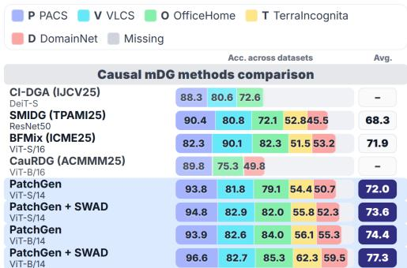  
Figure 4: MDG results for natural images: Reference comparison between the proposed and selected causal-inspired DG methods using VMs. See details in Appendix Table 2.

TOCOLON is treated as a harder partial-label histopathology DG benchmark rather than a fully closed-set mDG protocol. All experiments follow leave-one-domain-out evaluation, with model selection restricted to source data to prevent any leakage. More details are in Appendix E.3.

Experimental settings. We conduct experiments on the aforementioned datasets under the standard leave-one-domainout protocol in the mDG setting, with large-scale pretrained Vision Transformers as backbones: DINOv2 (Oquab et al. 2023) (ViT-B/14, ViT-L/14) and MAE (He et al. 2022). For fair comparison, we include: (1) linear probing (LP); (2) LP with layer-norm fine-tuning (LP + LN); (3) MIRO (Cha et al. 2022) with DINOv2 ViT-B/14; and (4) GMDG (Tan, Yang, and Huang 2024) with DINOv2 ViT-B/14. VLM-based methods such as DPR (Cheng et al. 2024) and CLIPCEIL++ (Yu, Yoo, and Lin 2024) rely on refining text-image alignment. This partial-label limitation applies to HISTOCOLON, whose domains have partially overlapping label spaces; HISTOPAN-TUM uses a shared binary label space, so CLIP-based GES-TUR is reported there as a reference VLM-compatible baseline. For comparisons under a VLM backbone, we report CLIP-based GESTUR (Lew, Son, and Chang 2023), which does not rely on text–image alignment, and also apply Patch-Gen to CLIP (Radford et al. 2021) to compare against purely VM-based methods. All experiments use identical experimental settings whenever applicable; otherwise, method-specific settings follow their oficial implementations. Where applicable, we also report results with SWAD (Cha et al. 2021). For all experiments, $\lambda _ { m s } = 0 . 0 0 1 , \lambda _ { s i m } = 0 . 0 0 1$

Results. As shown in Figure 5, our method improves the matched baselines in average performance across most backbone and evaluation settings, achieving the best or tied-best average results in the reported comparisons. Although primarily designed for purely visual models, where image features are well preserved, it also yields clear gains when applied to CLIP. PatchGen substantially improves the matched CLIP LP+LN baseline and remains competitive with GESTUR on HISTOCOLON. Figures 1 and Appendix Figure 4 provide qualitative morphological evidence from histopathology.

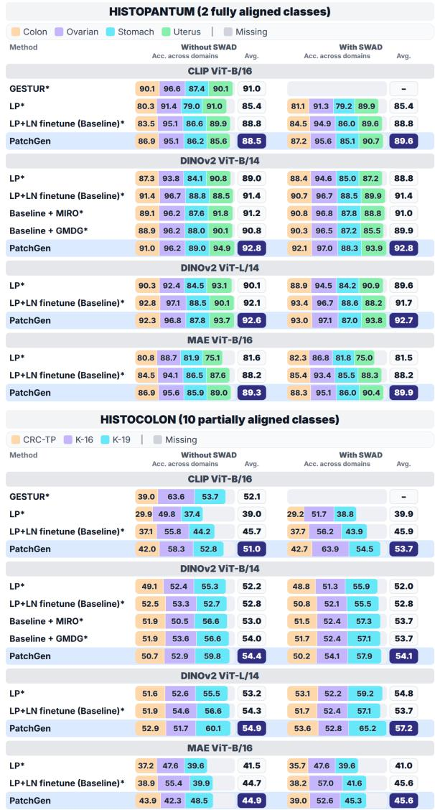  
Figure 5: MDG results for histopathological images: Comparison between the baselines and PatchGen with average and per-domain results across diferent backbones on the histopathological datasets (HISTOPANTUM and HISTO-COLON). Detailed results are in Appendix Table 3&4.

## 5.3 Experiments on CCD tasks

Experimental settings. Following PromptCCD’s experimental protocol (Cendra, Zhao, and Han 2024), we conduct experiments on CIFAR-100 (Krizhevsky, Hinton et al. 2009) and CUB (Wah et al. 2011) using DINO ViT-B/16 and DI-NOv2 ViT-B/14. We reproduce PromptCCD with its oficial code and then apply our method in the same framework. For each comparison, methods share identical settings whenever applicable; otherwise, method-specific settings follow their oficial implementations. We set $\mathrm { { \dot { \lambda } } } _ { m s } = 1 e ^ { - 3 } , \lambda _ { s i m } = 1 e ^ { - 3 }$ in all experiments. PatchGen does not introduce a new pseudolabeling rule in CCD; it uses the detached pseudo-labels from the PromptCCD host objective.

Results. As shown in Figure 6, PatchGen yields its largest average gains on unknown classes. The gains are more evident in several of the more challenging later-session settings. The lower panel shows that the largest average improvements occur on unknown classes, while all-class accuracy also improves, and known-class performance is largely preserved. These results support the practical value of the soft predictive-subset proxy for unknown-class generalization, consistent with the class-separation motivation of Proposition 3.3.

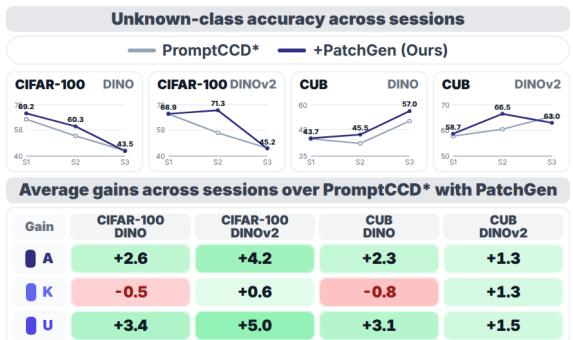  
Figure 6: CCD results (A/K/U = all/known/unknown classes): Unknown-class accuracy across CCD sessions and average A/K/U gains of PatchGen over PromptCCD for DI-NO/DINOv2. Detailed results for each dataset, backbone, and session are in Appendix Table 5.

## 5.4 Experiments on mDG+GCD tasks

Experimental settings. Following L-Reg (Tan et al. 2024), we use the same natural image datasets originally designed for mDG to construct the mDG+GCD setting. Half of the classes are designated as unknown, and their training samples are provided without labels. Although the unlabeled set in this protocol contains only samples from unknown classes, the learner is not given their semantic identities or class assignments. Thus, this is an unknown-class-only unlabeled-pool protocol following L-Reg, rather than a mixed known/unknown unlabeled-pool GCD protocol. We follow the evaluation protocol of L-Reg for direct comparison, and report baseline results using various backbones, including L-Reg with DINOv2 ViT-B/14. We set $\lambda _ { m s } = 0 . 0 0 1$ and $\lambda _ { s i m } = 0 . 0 0 1$ for all experiments. As in CCD, pseudo-labels are inherited from the L-Reg host protocol and are treated as non-diferentiable targets for PatchGen-specific losses.

Results. Figure 7 summarizes the mDG+GCD comparisons, where models must handle both unseen test domains and unknown classes. PatchGen improves average all-class accuracy for all three matched backbones. Unknown-class accuracy also improves on average, while the MAE setting shows a modest trade-of in known-class accuracy.

## 5.5 Patch-selection diagnostics and eficiency

To further examine whether PatchGen selects decisionrelevant patches beyond post-hoc attribution, we perform a comprehensive suite of diagnostic tests on VLCS (unseen domain: SUN09) using DINOv2-ViT-S/14 under the mDG setting. Results are visualized in Figure 8.

A. Patch perturbation test. Let ${ \widehat { C } } _ { \phi } ( X )$ where ${ \widehat { C } } _ { \phi } ( X ) =$ $\{ p : m _ { \phi , p } ( X ) \geq 0 . 5 \}$ denote the thresholded selected patch set, and let ${ \widehat { R } } _ { \phi } ( X ) = [ P ] \backslash { \widehat { C } } _ { \phi } ( X )$ denote its thresholded complement. We assess approximate suficiency by preserving ${ \widehat { C } } _ { \phi } ( X )$ while perturbing $\widehat { R } _ { \phi } ( X )$ , and assess empirical decision necessity for the trained classifier by perturbing ${ \widehat { C } } _ { \phi } ( X )$ while preserving $\widehat { R } _ { \phi } ( X )$ . A small accuracy drop in the first test and a large drop in the second provide evidence of approximate suficiency and decision relevance for the trained classifier under this perturbation protocol. B. Deletion/insertion. Patches are ranked by each method and progressively inserted or deleted. We report insertion AUC (↑), for which faster confidence recovery is better, and deletion AUC (↓), for which faster confidence removal is better. PatchGen achieves stronger insertion and deletion performance than the baselines, indicating a more decision-relevant patch ranking. C. Cross-domain representation geometry. The UMAP visualization shows more compact class clusters with less apparent domain-wise separation, a geometry consistent with reduced domain-related variation. D. Natural image visualizations. Visualization of patch-selection maps shows that PatchGen places greater emphasis on object-relevant regions while reducing attention to surrounding context. These qualitative results support the decision relevance of the learned patch ranking, but do not validate the oracle structural assumption or identify $C ^ { \star } ( X )$ . E. Computational eficiency. Relative to the matched LP+LN baseline with DINOv2-ViT-S/14 on a single NVIDIA RTX 3090 GPU, PatchGen introduces approximately 4% additional trainable parameters and increases the per-epoch training time by roughly 8% under the same batch size. The peak GPU memory consumption is comparable to the baseline. See the eficiency comparison in Figure 8 E.

<table><tr><td>P PACS</td><td>V VLCS</td><td></td><td>O OfficeHome</td><td></td><td>T Terralncognita</td><td></td><td>D DomainNet</td><td></td></tr><tr><td rowspan="2"></td><td rowspan="2"></td><td colspan="5">Acc. across datasets</td><td rowspan="2">Avg.</td></tr><tr><td>A 57.3</td><td></td><td>61.5 44.8</td><td>37.3</td><td></td><td>44.69</td></tr><tr><td rowspan="3">ERM ReqNetY-16GF</td><td>K</td><td>77.8</td><td>82.9</td><td></td><td>74.7</td><td>40.9</td><td></td><td>59.34</td></tr><tr><td>U</td><td>34.9</td><td>45.1</td><td></td><td></td><td></td><td></td><td>23.54</td></tr><tr><td>A</td><td>56.4</td><td>63.2</td><td>43.4</td><td>47.8</td><td></td><td></td><td>46.95</td></tr><tr><td rowspan="3">PIM ReqNetY-16GF</td><td>K</td><td>71.1</td><td>80.3</td><td>72.4</td><td>35.3</td><td>42.6</td><td></td><td>60.35</td></tr><tr><td>U</td><td>27.4 40.2</td><td>50.9</td><td></td><td></td><td></td><td></td><td>26.90</td></tr><tr><td>A</td><td>58.3</td><td>61.4</td><td>48.9</td><td>40.0 31.1</td><td></td><td></td><td>47.94</td></tr><tr><td rowspan="3">GMDG ReqNetY-16GF</td><td>K</td><td>91.5</td><td></td><td>83.3</td><td>81.4</td><td>32.4</td><td>55.2</td><td>68.75</td></tr><tr><td>U</td><td>33.8</td><td>40.1</td><td></td><td></td><td></td><td></td><td>20.68</td></tr><tr><td>A</td><td></td><td>61.5</td><td>48.3</td><td>50.2 31.5</td><td></td><td></td><td>49.67</td></tr><tr><td rowspan="3">MIRO ReqNetY-16GF</td><td>K</td><td>56.8</td><td></td><td>82.7</td><td>80.6</td><td>39.9</td><td>55.4</td><td>68.86</td></tr><tr><td>U</td><td>85.6</td><td>49.5</td><td></td><td></td><td></td><td></td><td>25.79</td></tr><tr><td>A</td><td>35.0</td><td>62.3</td><td>52.0</td><td>45.9 31.8</td><td></td><td></td><td>51.94</td></tr><tr><td rowspan="3">L-Reg ReqNetY-16GF</td><td>K</td><td>67.8</td><td></td><td>82.8</td><td>79.7</td><td>39.8</td><td>55.2</td><td>69.86</td></tr><tr><td>U</td><td>91.9</td><td>41.5</td><td></td><td></td><td></td><td></td><td>27.68</td></tr><tr><td>A</td><td>31.3 36.1</td><td></td><td>76.9</td><td>40.826.5</td><td></td><td></td><td>53.59</td></tr><tr><td rowspan="3">Baseline* MAE ViT-B/16</td><td>K</td><td>69.8</td><td>53.9</td><td></td><td></td><td></td><td></td><td>54.95</td></tr><tr><td></td><td>72.7</td><td>59.8</td><td>87.7</td><td>49.7</td><td>28.725.8</td><td></td><td>50.40</td></tr><tr><td>U</td><td>62.7</td><td>46.9</td><td>65.6</td><td>27.1</td><td></td><td></td><td></td></tr><tr><td rowspan="3">PatchGen MAE ViT-B/16</td><td>A</td><td>70.7</td><td>55.0</td><td>76.2</td><td>45.4</td><td>27.2</td><td></td><td>54.90</td></tr><tr><td>K</td><td>74.9</td><td>59.8</td><td>85.1</td><td></td><td>26.3</td><td></td><td>54.08</td></tr><tr><td>U</td><td>61.4</td><td>49.1</td><td>66.0</td><td>59.3</td><td>27.9</td><td></td><td>52.74</td></tr><tr><td rowspan="3">L-Reg* DINOv2 ViT-B/14</td><td>A</td><td>96.1</td><td></td><td>84.0</td><td>81.4</td><td>59.5</td><td>55.7</td><td>75.35</td></tr><tr><td>K</td><td>95.6</td><td></td><td>86.5</td><td>91.7</td><td></td><td>47.4 55.8</td><td>75.39</td></tr><tr><td>U</td><td>97.0</td><td></td><td>80.9</td><td>72.1</td><td>67.7</td><td>56.1</td><td>74.76</td></tr><tr><td rowspan="2">Baseline* DINOv2 ViT-B/14</td><td>A</td><td>96.2</td><td></td><td>85.2</td><td>79.3</td><td>63.3</td><td>56.4</td><td>76.08</td></tr><tr><td>K</td><td>96.4</td><td></td><td>87.5</td><td>87.5</td><td></td><td>58.8 57.0</td><td>77.42</td></tr><tr><td rowspan="3">PatchGen DINOv2 ViT-B/14</td><td>U</td><td>96.5</td><td></td><td>82.5</td><td>72.0</td><td>67.8</td><td>56.4</td><td>75.04</td></tr><tr><td>A</td><td>96.5</td><td></td><td>85.7</td><td>82.5</td><td>63.9</td><td>56.4</td><td>76.99</td></tr><tr><td>K</td><td>96.8</td><td></td><td>88.4</td><td>92.8</td><td>54.0</td><td>56.7</td><td>77.74</td></tr><tr><td rowspan="3">Baseline* DINOv2 ViT-L/14</td><td>u</td><td>96.3</td><td></td><td>82.3</td><td>73.0</td><td>69.8</td><td>56.5</td><td>75.59</td></tr><tr><td>A</td><td>96.8</td><td></td><td>88.8</td><td>79.5</td><td>68.5</td><td>59.5</td><td>78.63</td></tr><tr><td>K</td><td>97.7</td><td></td><td>90.4</td><td>85.0</td><td>58.8</td><td>59.8</td><td>78.34</td></tr><tr><td rowspan="4">PatchGen DINOv2 ViT-L/14</td><td>U</td><td>96.2</td><td></td><td>86.9</td><td>74.4</td><td>76.1</td><td>59.7</td><td>78.68</td></tr><tr><td></td><td></td><td></td><td></td><td>82.9</td><td>68.7</td><td>59.9</td><td>79.52</td></tr><tr><td>A K</td><td>97.1</td><td></td><td>89.1</td><td></td><td></td><td></td><td>80.33</td></tr><tr><td>U</td><td>97.5 96.9</td><td></td><td>90.9 86.9</td><td>91.8 75.0</td><td>61.5 75.3</td><td>60.0 60.1</td><td>78.85</td></tr></table>

Figure 7: MDG+GCD results: Stacked per-dataset comparison across prior methods, matched baselines, and PatchGen under simultaneous unseen-domain and unknown-class shifts. See numeric results in Appendix Tables 6&7.

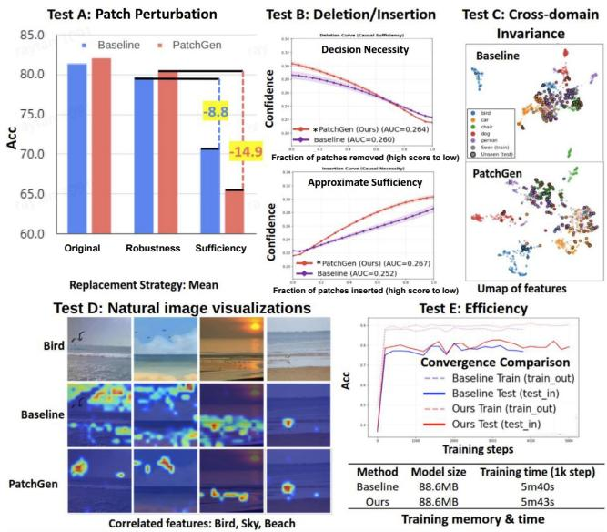  
Figure 8: Patch-selection diagnostics on VLCS (SUN09 unseen) with DINOv2-ViT-S/14. (A) Patch perturbation: keeping selected patches is robust, while replacing selected patches causes a sharp accuracy drop. (B) Insertion/deletion AUC curves. (C) UMAP of baseline vs. PatchGen features showing tighter cross-domain clusters. (D) Visualization on natural images: PatchGen focuses on label-relevant objects while the baseline is distracted by spurious context. (E) Training eficiency comparison.

Taken together, these diagnostics provide empirical evidence that the learned soft predictive-subset mask yields a decision-relevant patch ranking for the trained classifier.

## 6 Discussion and Conclusion

Conclusion. This work theoretically motivates an oracle intra-image predictive subset and empirically evaluates learning a soft predictive-subset proxy for visual generalization. Empirical results show that PatchGen yields competitive or improved performance relative to matched-backbone baselines across data-shift, target-shift, and all-shift benchmarks in the evaluated settings while producing sample-dependent patch-selection maps and decision-relevance diagnostics.

Limitations. Because the oracle intra-image predictive subset and its mask are unobserved, neither the training objectives nor the diagnostic experiments guarantee that the learned soft predictive-subset mask recovers m⋆ (X). For vision-language backbones, image–text pretraining may already emphasize class-semantic regions, potentially leaving less room for additional patch selection.

## References

Abbe, E.; Bengio, S.; Lotfi, A.; and Rizk, K. 2024. Generalization on the unseen, logic reasoning and degree curriculum. Journal ofMachine Learning Research, 25(331): 1–58.

Abnar, S.; and Zuidema, W. 2020. Quantifying attention flow in transformers. In Proceedings ofthe 58th annual meeting ofthe associationfor computational linguistics, 4190–4197.

Arjovsky, M.; Bottou, L.; Gulrajani, I.; and Lopez-Paz, D. 2019. Invariant risk minimization. arXiv preprint arXiv:1907.02893.

Arpit, D.; Wang, H.; Zhou, Y.; and Xiong, C. 2022. Ensemble of averages: Improving model selection and boosting performance in domain generalization. Advances in Neural Information Processing Systems, 35: 8265–8277.

Beery, S.; Van Horn, G.; and Perona, P. 2018. Recognition in terra incognita. In Proceedings ofthe European conference on computer vision (ECCV), 456–473.

Blanchard, G.; Deshmukh, A. A.; Dogan, U.; Lee, G.; and Scott, C. 2021. Domain generalization by marginal transfer learning. Journal ofmachine learning research, 22(2): 1–55.

Bui, M.-H.; Tran, T.; Tran, A.; and Phung, D. 2021. Exploiting domain-specific features to enhance domain generalization. Advances in Neural Information Processing Systems, 34: 21189–21201.

Cendra, F. J.; Zhao, B.; and Han, K. 2024. Promptccd: Learning gaussian mixture prompt pool for continual category discovery. In European conference on computer vision, 188– 205. Springer.

Cha, J.; Chun, S.; Lee, K.; Cho, H.-C.; Park, S.; Lee, Y.; and Park, S. 2021. Swad: Domain generalization by seeking flat minima. Advances in Neural Information Processing Systems, 34: 22405–22418.

Cha, J.; Lee, K.; Park, S.; and Chun, S. 2022. Domain generalization by mutual-information regularization with pretrained models. In European conference on computer vision, 440–457. Springer.

Cheng, D.; Xu, Z.; Jiang, X.; Wang, N.; Li, D.; and Gao, X. 2024. Disentangled prompt representation for domain generalization. In Proceedings ofthe IEEE/CVF Conference on Computer Vision and Pattern Recognition, 23595–23604.

Chiaroni, F.; Dolz, J.; Masud, Z. I.; Mitiche, A.; and Ben Ayed, I. 2023. Parametric information maximization for generalized category discovery. In Proceedings of the IEEE/CVF international conference on computer vision, 1729–1739.

Cho, J.; Nam, G.; Kim, S.; Yang, H.; and Kwak, S. 2023. Promptstyler: Prompt-driven style generation for source-free domain generalization. In Proceedings of the IEEE/CVF International Conference on Computer Vision, 15702–15712.

De Min, T.; Mancini, M.; Alahari, K.; Alameda-Pineda, X.; and Ricci, E. 2023. On the efectiveness of layernorm tuning for continual learning in vision transformers. In 2023 IEEE/CVF International Conference on Computer Vision Workshops (ICCVW), 3577–3586. IEEE.

Fang, C.; Xu, Y.; and Rockmore, D. N. 2013. Unbiased metric learning: On the utilization of multiple datasets and

web images for softening bias. In Proceedings ofthe IEEE international conference on computer vision, 1657–1664.

Ganin, Y.; Ustinova, E.; Ajakan, H.; Germain, P.; Larochelle, H.; Laviolette, F.; March, M.; and Lempitsky, V. 2016. Domain-adversarial training of neural networks. Journal of machine learning research, 17(59): 1–35.

Gong, Q.; Pan, Y.; Lai, H.; and Yin, J. 2025. A Causal Intervention Method for Domain Generalization with a Self-Supervised Auxiliary Task. International Journal of Computer Vision, 133(10): 7110–7127.

Gulrajani, I.; and Lopez-Paz, D. 2020. In search of lost domain generalization. arXiv preprint arXiv:2007.01434.

He, K.; Chen, X.; Xie, S.; Li, Y.; Dollár, P.; and Girshick, R. 2022. Masked autoencoders are scalable vision learners. In Proceedings of the IEEE/CVF conference on computer vision and pattern recognition, 16000–16009.

Hu, S.; Zhang, K.; Chen, Z.; and Chan, L. 2020. Domain generalization via multidomain discriminant analysis. In Uncertainty in artificial intelligence, 292–302. PMLR.

Huang, Z.; Wang, H.; Xing, E. P.; and Huang, D. 2020. Self-challenging improves cross-domain generalization. In European conference on computer vision, 124–140. Springer.

Javed, S.; Mahmood, A.; Fraz, M. M.; Koohbanani, N. A.; Benes, K.; Tsang, Y.-W.; Hewitt, K.; Epstein, D.; Snead, D.; and Rajpoot, N. 2020. Cellular community detection for tissue phenotyping in colorectal cancer histology images. Medical image analysis, 63: 101696.

Kather, J. N.; Krisam, J.; Charoentong, P.; Luedde, T.; Herpel, E.; Weis, C.-A.; Gaiser, T.; Marx, A.; Valous, N. A.; Ferber, D.; et al. 2019. Predicting survival from colorectal cancer his tology slides using deep learning: A retrospective multicenter study. PLoS medicine, 16(1): e1002730.

Kather, J. N.; Weis, C.-A.; Bianconi, F.; Melchers, S. M.; Schad, L. R.; Gaiser, T.; Marx, A.; and Zöllner, F. G. 2016. Multi-class texture analysis in colorectal cancer histology. Scientific reports, 6(1): 27988.

Kim, D.; Yoo, Y.; Park, S.; Kim, J.; and Lee, J. 2021. Selfreg: Self-supervised contrastive regularization for domain generalization. In Proceedings ofthe IEEE/CVF international conference on computer vision, 9619–9628.

Kim, H.; Suh, S.; Kim, D.; Jeong, D.; Cho, H.; and Kim, J. 2023. Proxy anchor-based unsupervised learning for continuous generalized category discovery. In Proceedings of the IEEE/CVF international conference on computer vision, 16688–16697.

Krizhevsky, A.; Hinton, G.; et al. 2009. Learning multiple layers of features from tiny images.

Krueger, D.; Caballero, E.; Jacobsen, J.-H.; Zhang, A.; Binas, J.; Zhang, D.; Le Priol, R.; and Courville, A. 2021. Out-ofdistribution generalization via risk extrapolation (rex). In International conference on machine learning, 5815–5826. PMLR.

Kukleva, A.; Kuehne, H.; and Schiele, B. 2021. Generalized and incremental few-shot learning by explicit learning and calibration without forgetting. In Proceedings ofthe IEEE/CVF International Conference on Computer Vision, 9020–9029.

Lee, G.; Jang, W.; Kim, J.; Jung, J.; and Kim, S. 2025. Domain generalization using large pretrained models with mixture-of-adapters. In 2025 IEEE/CVF Winter Conference on Applications of Computer Vision (WACV), 8259–8269. IEEE.

Lew, B.; Son, D.; and Chang, B. 2023. Gradient estimation for unseen domain risk minimization with pre-trained models. 4436–4446.

Li, D.; Yang, Y.; Song, Y.-Z.; and Hospedales, T. 2018a. Learning to generalize: Meta-learning for domain generalization. In Proceedings ofthe AAAI conference on artificial intelligence, volume 32.

Li, D.; Yang, Y.; Song, Y.-Z.; and Hospedales, T. M. 2017. Deeper, broader and artier domain generalization. In Proceedings of the IEEE international conference on computer vision, 5542–5550.

Li, H.; Pan, S. J.; Wang, S.; and Kot, A. C. 2018b. Domain generalization with adversarial feature learning. In Proceedings ofthe IEEE conference on computer vision and pattern recognition, 5400–5409.

Li, Y.; Gong, M.; Tian, X.; Liu, T.; and Tao, D. 2018c. Domain generalization via conditional invariant representations. In Proceedings of the AAAI conference on artificial intelligence, volume 32.

Li, Y.; Tian, X.; Gong, M.; Liu, Y.; Liu, T.; Zhang, K.; and Tao, D. 2018d. Deep domain generalization via conditional invariant adversarial networks. In Proceedings ofthe European conference on computer vision (ECCV), 624–639.

Liu, L.; Zhou, T.; Long, G.; Jiang, J.; Dong, X.; and Zhang, C. 2021. Isometric propagation network for generalized zero-shot learning. arXiv preprint arXiv:2102.02038.

Liu, Z.; Liu, Y.; Lu, G.; Luo, X.; and Chen, B. 2025. Cau-RDG: Enhancing Domain Generalization with Causal-Driven Semantic Consistency Reasoning. In Proceedings ofthe 33rd ACM International Conference on Multimedia, 11101–11110.

Nam, H.; Lee, H.; Park, J.; Yoon, W.; and Yoo, D. 2021. Reducing domain gap by reducing style bias. In Proceedings of the IEEE/CVF conference on computer vision and pattern recognition, 8690–8699.

Niu, H.; Li, H.; Zhao, F.; and Li, B. 2022. Domain-unified prompt representations for source-free domain generalization. arXiv preprint arXiv:2209.14926.

Oquab, M.; Darcet, T.; Moutakanni, T.; Vo, H.; Szafraniec, M.; Khalidov, V.; Fernandez, P.; Haziza, D.; Massa, F.; El-Nouby, A.; et al. 2023. Dinov2: Learning robust visual features without supervision. arXiv preprint arXiv:2304.07193.

Peng, X.; Bai, Q.; Xia, X.; Huang, Z.; Saenko, K.; and Wang, B. 2019. Moment matching for multi-source domain adaptation. In Proceedings ofthe IEEE/CVF international conference on computer vision, 1406–1415.

Radford, A.; Kim, J. W.; Hallacy, C.; Ramesh, A.; Goh, G.; Agarwal, S.; Sastry, G.; Askell, A.; Mishkin, P.; Clark, J.; et al. 2021. Learning transferable visual models from natural language supervision. In International conference on machine learning, 8748–8763. PmLR.

Rao, Y.; Zhao, W.; Liu, B.; Lu, J.; Zhou, J.; and Hsieh, C.-J. 2021. Dynamicvit: Eficient vision transformers with dynamic token sparsification. Advances in neural information processing systems, 34: 13937–13949.

Sagawa, S.; Koh, P. W.; Hashimoto, T. B.; and Liang, P. 2019. Distributionally robust neural networks for group shifts: On the importance of regularization for worst-case generalization. arXiv preprint arXiv:1911.08731.

Shi, Y.; Seely, J.; Torr, P. H.; Siddharth, N.; Hannun, A.; Usunier, N.; and Synnaeve, G. 2021. Gradient matching for domain generalization. arXiv preprint arXiv:2104.09937.

Shu, Y.; Guo, X.; Wu, J.; Wang, X.; Wang, J.; and Long, M. 2023. Clipood: Generalizing clip to out-of-distributions. In International conference on machine learning, 31716–31731. PMLR.

Sun, B.; and Saenko, K. 2016. Deep coral: Correlation alignment for deep domain adaptation. In European conference on computer vision, 443–450. Springer.

Tan, Z.; Pan, T.; Huang, K.; Yu, W.; Yao, K.; Jiang, C.; Wang, Q.; Nguyen, A.; Guo, X.; Cheng, Y.; et al. 2025. Exploiting Layer Normalization Fine-tuning in Visual Transformer Foundation Models for Classification. arXiv preprint arXiv:2508.07577.

Tan, Z.; Yang, X.; and Huang, K. 2024. Rethinking multidomain generalization with a general learning objective. In proceedings of the IEEE/CVF conference on computer vision and pattern recognition, 23512–23522.

Tan, Z.; Yang, X.; Wang, Q.; Nguyen, A.; and Huang, K. 2024. Interpret your decision: Logical reasoning regularization for generalization in visual classification. Advances in Neural Information Processing Systems, 37: 18166–18204.

Vapnik, V. N. 1999. An overview of statistical learning theory. IEEE transactions on neural networks, 10(5): 988–999.

Vaze, S.; Han, K.; Vedaldi, A.; and Zisserman, A. 2022. Generalized category discovery. In Proceedings ofthe IEEE/CVF conference on computer vision and pattern recognition, 7492– 7501.

Venkateswara, H.; Eusebio, J.; Chakraborty, S.; and Panchanathan, S. 2017. Deep hashing network for unsupervised domain adaptation. In Proceedings ofthe IEEE conference on computer vision and pattern recognition, 5018–5027.

Wah, C.; Branson, S.; Welinder, P.; Perona, P.; Belongie, S.; et al. 2011. The caltech-ucsd birds-200-2011 dataset. Technical report, Technical Report CNS-TR-2011-001, California Institute of Technology.

Wang, F.; Yang, T.; Yu, Y.; Ren, S.; Wei, G.; Wang, A.; Shao, W.; Zhou, Y.; Yuille, A.; and Xie, C. 2024. Causal image modeling for eficient visual understanding.

Wang, S.; He, H.; Yang, X.; Liu, Z.; Zhong, Y.; Zhang, X.; and Wang, M. 2025. Exploring invariance matters for domain generalization. IEEE Transactions on Image Processing.

Wu, Y.; Chi, Z.; Wang, Y.; and Feng, S. 2023. Metagcd: Learning to continually learn in generalized category discovery. In Proceedings of the IEEE/CVF International Conference on Computer Vision, 1655–1665.

Yu, X.; Yoo, S.; and Lin, Y. 2024. Clipceil: Domain generalization through clip via channel refinement and image-text alignment. Advances in Neural Information Processing Systems, 37: 4267–4294.

Yuan, J.; Ma, X.; Chen, D.; Kuang, K.; Wu, F.; and Lin, L. 2023. Domain-specific bias filtering for single labeled domain generalization. International Journal of Computer Vision, 131(2): 552–571.

Zamanitajeddin, N.; Jahanifar, M.; Xu, K.; Siraj, F.; and Rajpoot, N. 2024. Benchmarking domain generalization algorithms in computational pathology. arXiv preprint arXiv:2409.17063.

Zhang, M.; Marklund, H.; Dhawan, N.; Gupta, A.; Levine, S.; and Finn, C. 2021. Adaptive risk minimization: Learning to adapt to domain shift. Advances in neural information processing systems, 34: 23664–23678.

Zhang, X.; Gu, S. S.; Matsuo, Y.; and Iwasawa, Y. 2023. Domain prompt learning for eficiently adapting clip to unseen domains. Transactions ofthe Japanese Societyfor Artificial Intelligence, 38(6): B–MC2\_1.

Zhang, X.; Jiang, J.; Feng, Y.; Wu, Z.-F.; Zhao, X.; Wan, H.; Tang, M.; Jin, R.; and Gao, Y. 2022. Grow and merge: A unified framework for continuous categories discovery. Advances in Neural Information Processing Systems, 35: 27455–27468.

Zhang, Z.; Cai, F.; Liu, D.; Liu, G.; and Fang, X. 2024. Mix background and foreground separately: Transformer-based Augmentation Strategies for Domain Generalization. In 2024 IEEE International Conference on Multimedia and Expo (ICME), 1–6. IEEE.

Zhou, K.; Yang, J.; Loy, C. C.; and Liu, Z. 2022. Learning to prompt for vision-language models. International journal of computer vision, 130(9): 2337–2348.

Zhou, K.; Yang, Y.; Qiao, Y.; and Xiang, T. 2021. Domain generalization with mixstyle. arXiv preprint arXiv:2104.02008.

## A Details of diferent generalization tasks

To provide a comprehensive evaluation ofgeneralization under diverse and challenging conditions, we conduct experiments on the following tasks to validate our method:

• Multi-domain generalization (mDG) (Yuan et al. 2023; Li et al. 2018c; Hu et al. 2020; Cha et al. 2022; Tan, Yang, and Huang 2024). The mDG task aims to learn a classifier from labeled data collected across multiple seen domains, such that it generalizes to unseen domains whose data distributions are inaccessible during training. The central challenge lies in handling severe domain shifts while preserving class-discriminative semantics.

• Continual category discovery (CCD) (Cendra, Zhao, and Han 2024). In CCD, the model is first trained on labeled data in an initial session, followed by a sequence of unlabeled data streams in subsequent sessions. The goal is to progressively discover novel categories while retaining performance on previously learned classes.

• Multi-domain generalization with generalized category discovery (mDG+GCD) (Tan et al. 2024). The mDG+GCD task extends mDG by additionally accounting for unknown categories, i.e., Generalized category discovery (GCD). During training, the model has access to labeled and unlabeled samples from multiple seen domains, and is required to classify samples from known classes while clustering those from unknown classes. At test time, the model is evaluated on unseen domains, where it must simultaneously generalize across domains and handle open-set category shifts without access to target-domain data.

## B Full related work

Data-shift scenario. Multi-domain generalization (mDG) addresses learning models that generalize to unseen domains with potentially large domain shifts , assuming no targetdomain data is available during training, unlike domain adaptation. Existing mDG methods for image classification mainly learn domain-invariant representations across multiple source domains (Yuan et al. 2023). The original DANN (Ganin et al. 2016) was proposed for domain adaptation with unlabeled target-domain data; multi-source adversarial variants adapt this idea to mDG by aligning source-domain feature distributions. Later methods, including CDANN (Li et al. 2018d), CIDG (Li et al. 2018c), and MDA (Hu et al. 2020), incorporate class labels to learn conditionally invariant features. More recent approaches such as MIRO (Cha et al. 2022) and GMDG (Tan, Yang, and Huang 2024) exploit large-scale pretrained models and representation regularization to further improve generalization under severe domain shifts.

Target-shift scenario. Continual category discovery (CCD) combines generalized category discovery (GCD) with continual learning (CL) to incrementally discover new categories over time while mitigating catastrophic forgetting (Zhang et al. 2022; Kim et al. 2023; Wu et al. 2023; Cendra, Zhao, and Han 2024). Unlike standard GCD, CCD must handle sequential data streams without knowing the total number of categories in advance. PromptCCD (Cendra, Zhao, and Han 2024) addresses this using dynamic prompt-based representation updates, enabling concurrent novel category discovery and knowledge retention. By decoupling category expansion from fixed classifier architectures, it avoids reliance on pre-defined category counts and performs well in long-term continual discovery.

All-shift scenario. Multi-domain generalization and generalized category discovery (mDG+GCD), a more challenging setting, was introduced by (Tan et al. 2024). Here, models are trained on partially labeled data from multiple seen domains and evaluated on unseen domains, where they must both classify samples from known categories and discover and cluster samples from unknown categories.

Causal-based multi-domain generalization methods. To isolate invariant mechanisms from domain-specific spurious factors, recent causal DG approaches employ prototypeguided causal disentanglement (CauRDG (Liu et al. 2025)), latent confounders and causal intervention (SMIDG (Wang et al. 2025)), and structural causal alignment across domains (CI-DGA (Gong et al. 2025)). However, these methods focus on domain-level causality but ignore fine-grained, samplespecific structure. Mix-based methods (Zhang et al. 2024) mitigate spurious background correlations by separating foreground and background, but rely on clear object–context boundaries, which are often absent in histopathological images. Causal image modeling and explanation methods also study how visual factors afect model behavior (Wang et al. 2024). Unlike causal identification, we do not estimate causal variables or efects. Instead, we use predictive suficiency to structurally guide learning decision-relevant patch masks that improve classification generalization.

Improving generalization across diverse scenarios. A notable study, L-Reg (Tan et al. 2024), adopts a logic-based framework to enhance generalization under various settings. In contrast, PatchGen improves pretrained visual representations through sample-dependent patch selection.

Token pruning and attention-based patch selection. Diferent from token pruning approaches such as DynamicViT (Rao et al. 2021) for improving eficiency or post-hoc attention visualization methods (Abnar and Zuidema 2020) for interpretability, PatchGen jointly optimizes attention-derived masks using generalization-oriented objectives.

## C Theoretical Details

This appendix separates three levels of analysis. First, we study the statistical benefit of a sample-adaptive oracle intra-image predictive subset. Second, we quantify how learned-mask approximation afects robustness to shifts in complementary context. Third, we analyze preservation of class separation under target shift. The results do not claim exact recovery of the oracle predictive-subset mask or bound the capacity of the complete learned selector.

## C.1 Interpretation of the structural assumptions

Assumption 3.1 prevents the oracle mask from introducing side information unavailable in $\Phi _ { \mathrm { a l l } }$ . Under this assumption, $\Phi _ { C }$ and $\Phi _ { R }$ are deterministic functions of $\Phi _ { \mathrm { a l l } }$ , while $\Phi _ { \mathrm { a l l } } =$ $\Phi _ { C } + \Phi _ { R } .$

Together with Assumption 3.2, this implies

$$
I _ { d } ( Y ; \Phi _ { R } \mid \Phi _ { C } ) = 0 ,
$$

although $I _ { d } ( Y ; \Phi _ { R } )$ may remain positive. Thus, complementary context may be label-correlated, domain-varying, or domain-stable, while providing no additional label information once $\Phi _ { C }$ is given.

The assumptions do not require $C ^ { \star } ( X )$ to be unique or minimal. Moreover, the theoretical analysis concerns idealized masked concatenations and does not bound the capacity of the complete learned PatchGen architecture.

## C.2 Stability of masked representations

Lemma C.1 (Stability of masked concatenations). Assume $\| z _ { p } ( X ) \| _ { 2 } \leq B$ for every patch, and let G be a fixed nonexpansive map. Then, for any m, $\mathbf { m } ^ { \prime } \in [ 0 , 1 ] ^ { P }$

$$
\begin{array} { r } { \| G ( \Phi _ { \mathbf { m } } ( X ) ) - G ( \Phi _ { \mathbf { m ^ { \prime } } } ( X ) ) \| _ { 2 } } \\ { \le B \| \mathbf { m } - \mathbf { m ^ { \prime } } \| _ { 2 } \le B \| \mathbf { m } - \mathbf { m ^ { \prime } } \| _ { 1 } . } \end{array}\tag{6}
$$

Proof. By non-expansiveness of $G ,$

$$
\begin{array} { r l } & { \| G ( \Phi _ { \mathbf { m } } ( X ) ) - G ( \Phi _ { \mathbf { m ^ { \prime } } } ( X ) ) \| _ { 2 } } \\ & { \leq \| \Phi _ { \mathbf { m } } ( X ) - \Phi _ { \mathbf { m ^ { \prime } } } ( X ) \| _ { 2 } . } \end{array}\tag{7}
$$

Moreover,

$$
\begin{array} { r l } { \| \Phi _ { \mathbf { m } } ( X ) - \Phi _ { \mathbf { m } ^ { \prime } } ( X ) \| _ { 2 } ^ { 2 } = \displaystyle \sum _ { p = 1 } ^ { P } ( m _ { p } - m _ { p } ^ { \prime } ) ^ { 2 } \| z _ { p } ( X ) \| _ { 2 } ^ { 2 } } & { } \\ { \leq B ^ { 2 } \| \mathbf { m } - \mathbf { m } ^ { \prime } \| _ { 2 } ^ { 2 } . } \end{array}\tag{8}
$$

Taking square roots and using $\| \mathbf { a } \| _ { 2 } \leq \| \mathbf { a } \| _ { 1 }$ completes the proof. □

## C.3 Proof of Paper Proposition 3.1

Let $\mathcal { H } _ { C } : = \mathcal { H } _ { \mathbf { m } _ { \alpha } ^ { \star } }$ and $\mathcal { H } _ { \mathrm { a l l } } : = \mathcal { H } _ { \mathbf { 1 } _ { \mathit { i } } }$ denote the hypothesis classes of norm-bounded linear predictors from the main text. Formally, for a fixed mask function m(X),

$$
\mathcal { H } _ { \mathbf { m } } = \left\{ X \mapsto \langle \mathbf { v } , \Phi _ { \mathbf { m } } ( X ) \rangle : \| \mathbf { v } \| _ { 2 } \leq \Lambda \right\} .\tag{9}
$$

For clarity, we state the argument for scalar scores; the standard vector contraction argument gives the corresponding multiclass extension.

Proof. Stable predictive suficiency gives

$$
\mathbb { P } ( Y \mid \Phi _ { \mathrm { a l l } } ) = \mathbb { P } ( Y \mid \Phi _ { C } ) .
$$

Hence the conditional label law, and therefore the Bayes decision, depends only on $\Phi _ { C }$ . The unrestricted Bayes risks based on $\Phi _ { C }$ and $\Phi _ { \mathrm { a l l } }$ are equal.

For the complexity bound, let

$$
u _ { i } = \Phi _ { \mathbf { m } _ { C } ^ { \star } ( X _ { i } ) } ( X _ { i } ) .
$$

Since at most s patches are selected and each has norm at most $B ,$

$$
\| u _ { i } \| _ { 2 } \leq B { \sqrt { s } } .
$$

Therefore,

$$
\begin{array} { r l r } {  { \widehat { \mathfrak { R } } _ { n } ( \mathcal { H } _ { \mathbf { m } _ { \mathcal { C } } ^ { * } } ) = \mathbb { E } _ { \sigma } [ \operatorname* { s u p } _ { \| \mathbf { V } \| _ { 2 } \leq \Lambda } \frac { 1 } { n } \sum _ { i = 1 } ^ { n } \sigma _ { i } \langle \mathbf { v } , u _ { i } \rangle ] } } \\ & { } & { = \frac { \Lambda } { n } \mathbb { E } _ { \sigma } \| \sum _ { i = 1 } ^ { n } \sigma _ { i } u _ { i } \| _ { 2 } } \\ & { } & { \leq \frac { \Lambda } { n } \sqrt { \mathbb { E } _ { \sigma } \| \displaystyle \sum _ { i = 1 } ^ { n } \sigma _ { i } u _ { i } \| _ { 2 } ^ { 2 } } = \frac { \Lambda } { n } \sqrt { \displaystyle \sum _ { i = 1 } ^ { n } \| u _ { i } \| _ { 2 } ^ { 2 } } } \\ & { } & { \leq \frac { \Lambda B \sqrt { s } } { \sqrt { n } } . \qquad ( 1 } \end{array}\tag{0}
$$

For the all-patch mask, $\| u _ { i } \| _ { 2 } \leq B \sqrt { P } .$ , yielding the second bound. □

Note. The following corollary extends the result with a standard generalization bound; it is not stated in the main text. Corollary C.1 (Oracle-subset generalization bound). $U n -$ der the same conditions, $i f \ell \in [ 0 , 1 ]$ is $\rho { - } L i p s c h i t z$ in the prediction score, then with probability at least $1 - \delta ,$ every $\bar { h } \in \mathcal { H } _ { \operatorname* { m } _ { C } ^ { \star } }$ satisfies

$$
R ( h ) \leq \widehat { R } ( h ) + \frac { 2 \rho \Lambda B \sqrt { s } } { \sqrt { n } } + 3 \sqrt { \frac { \log ( 2 / \delta ) } { 2 n } } .\tag{11}
$$

The analogous all-patch bound replaces s by $P .$

Proof of Corollary C.1. The result follows by applying the contraction inequality to the ρ-Lipschitz loss and then the standard Rademacher generalization bound using the complexity estimate established in Paper Proposition 3.1. □

Scope. This comparison keeps the predictor class and norm bound fixed, and only changes the input representation: using the oracle predictive subset $\Phi _ { C }$ versus using all patches $\Phi _ { \mathrm { a l l } }$ . Under the same predictor capacity, restricting the representation to at most s oracle predictive patches yields a Rademacher-complexity upper bound scaling with $\sqrt { s } ,$ whereas the all-patch representation scales with ${ \sqrt { P } } .$ Therefore, when $s < { \bar { P } } .$ , the oracle-subset representation admits a strictly tighter complexity upper bound. This result concerns the ideal oracle representation. Our ablations include Task 3.1, which uses the same sample-dependent selector as PatchGen but removes the proposed predictive-subset constraints; this equal-parameter comparison shows that the constrained selector gives better empirical generalization.

## C.4 Proof of Paper Proposition 3.2

For a fixed classifier $h ,$ , define

$$
R _ { d } ( h , \phi ) = \mathbb { E } _ { d } \left[ \ell \left( h ( \widetilde { z } _ { \phi } ^ { + } ( X ) ) , Y \right) \right] ,
$$

and define the corresponding oracle risk

$$
R _ { d } ( h , C ) = \mathbb { E } _ { d } \left[ \ell \left( h ( \widetilde { z } _ { C } ( X ) ) , Y \right) \right] .
$$

Lemma C.2 (Risk deviation from the oracle predictive-subset mask). Suppose $u \mapsto \ell ( h ( u ) , y )$ is L-Lipschitz. Then

$$
| R _ { d } ( h , \phi ) - R _ { d } ( h , C ) | \leq L B P \epsilon _ { d } ( \phi ) .\tag{12}
$$

Proof. By Lemma C.1,

$$
\left\| \widetilde { z } _ { \phi } ^ { + } ( X ) - \widetilde { z } _ { C } ( X ) \right\| _ { 2 } \leq B \left\| \mathbf { m } _ { \phi } ( X ) - \mathbf { m } _ { C } ^ { \star } ( X ) \right\| _ { 1 } .
$$

The Lipschitz condition therefore gives

$$
\begin{array} { r l r } & { | R _ { d } ( h , \phi ) - R _ { d } ( h , C ) | \leq L B \mathbb { E } _ { d } \left[ \| \mathbf { m } _ { \phi } ( X ) - \mathbf { m } _ { C } ^ { \star } ( X ) \| _ { 1 } \right] } & \\ & { } & { ~ = L B P \epsilon _ { d } ( \phi ) . } & \end{array}
$$

This completes the proof.

ProofofPaper Proposition 3.2. Because $\widetilde { z } _ { C }$ is a deterministic function of $\Phi _ { C }$ and the same fixed refinement map is used in both domains,

$$
R _ { d } ( h , C ) = R _ { d ^ { \prime } } ( h , C ) .
$$

Using the triangle inequality and Lemma C.2,

$$
\begin{array} { r l r } & { } & { | R _ { d } ( h , \phi ) - R _ { d ^ { \prime } } ( h , \phi ) | \le | R _ { d } ( h , \phi ) - R _ { d } ( h , C ) | } \\ & { } & { ~ + | R _ { d } ( h , C ) - R _ { d ^ { \prime } } ( h , C ) | } \\ & { } & { ~ + | R _ { d ^ { \prime } } ( h , C ) - R _ { d ^ { \prime } } ( h , \phi ) | } \\ & { } & { ~ \le L B P \left( \epsilon _ { d } ( \phi ) + \epsilon _ { d ^ { \prime } } ( \phi ) \right) . ~ \quad } \end{array}\tag{14}
$$

This completes the proof.

Note. This result isolates shifts in complementary context while keeping the joint distribution of the oracle predictivesubset representation and label fixed. It does not cover changes in $\mathbb { P } ( \Phi _ { C } , Y )$ , label noise, or changes in the predictive mechanism.

## C.5 Proof of Paper Proposition 3.3

Proof. Consider any two samples X and $X ^ { \prime }$ with labels $Y = c$ and $Y ^ { \prime } = { \dot { c } } ^ { \prime }$ , where $c \neq c ^ { \prime }$ . For a sample X with $Y = c ,$

$$
\begin{array} { r l } & { \| \widetilde { z } _ { \phi } ^ { + } ( X ) - \mu _ { c } \| _ { 2 } \leq } \\ & { \| \widetilde { z } _ { \phi } ^ { + } ( X ) - \widetilde { z } _ { C } ( X ) \| _ { 2 } + \| \widetilde { z } _ { C } ( X ) - \mu _ { c } \| _ { 2 } \leq \eta + r . } \end{array}\tag{15}
$$

Likewise, $\| \widetilde { z } _ { \phi } ^ { + } ( X ^ { \prime } ) - \mu _ { c ^ { \prime } } \| _ { 2 } \leq \eta + r$ . The reverse triangle inequality gives

$$
\begin{array} { r l r } & { \left\| \widetilde { z } _ { \phi } ^ { + } ( X ) - \widetilde { z } _ { \phi } ^ { + } ( X ^ { \prime } ) \right\| _ { 2 } } & \\ & { \geq \| \mu _ { c } - \mu _ { c ^ { \prime } } \| _ { 2 } - \| \widetilde { z } _ { \phi } ^ { + } ( X ) - \mu _ { c } \| _ { 2 } - \| \widetilde { z } _ { \phi } ^ { + } ( X ^ { \prime } ) - \mu _ { c ^ { \prime } } \| _ { 2 } } & \\ & { \geq \gamma - 2 ( r + \eta ) . } & { \quad { ( 1 6 ) } } \end{array}
$$

This completes the proof.

Corollary C.2 (Mask-error condition for separation). If $\| \mathbf { m } _ { \phi } ( X ) ^ { \cdot } - \mathbf { m } _ { C } ^ { \star } ( X ) \| _ { 1 } \leq q$ for every sample, then $\eta \le B q$ and the learned class-separation margin is at least

$$
\gamma - 2 ( r + B q ) .\tag{17}
$$

Proof. The result follows immediately from Lemma C.1 and Paper Proposition 3.3. □

The expected mask error $\epsilon _ { d } ( \phi )$ used in the complementarycontext-shift result does not by itself imply the uniform error condition required here. Target-shift preservation, therefore, relies on an additional, explicitly stated approximation assumption.

## C.6 Proof of Paper Corollary 3.1

Proof. The risk-discrepancy conclusion follows by applying Paper Proposition 3.2 to the modeled data-shift component, while the class-separation conclusion follows from Paper Proposition 3.3 for the target-shift component. No interaction term between the two components is bounded; hence, the result is componentwise rather than a unified joint-risk guarantee. □

## D Additional design and implementation details

More details of soft predictive-subset mask estimation. Task 3.1 outperforms the channel-only variant in Task 2.2, showing that sample-dependent spatial patch selection provides additional value beyond channel-wise refinement.

More details of selected-confidence regularization. In the implementation, the confidence objective is expressed using a detached complementary-confidence reference. For unlabeled samples in CCD and mDG+GCD, Y¯i denotes the non-diferentiable pseudo-label supplied by the host discovery objective:

$$
\mathcal { L } _ { n e g } = \frac { 1 } { | \bar { \mathcal { B } } | } \sum _ { i \in \bar { \mathcal { B } } } \left[ \mathrm { s g } \left( p _ { h } ( \bar { Y } _ { i } \mid \widetilde { z } _ { \phi , i } ^ { - } ) \right) - p _ { h } ( \bar { Y } _ { i } \mid \widetilde { z } _ { \phi , i } ^ { + } ) \right] .\tag{18}
$$

Because the complementary term is detached,

$$
\nabla { \mathcal L } _ { n e g } = \nabla \left[ - \frac { 1 } { | \bar { B } | } \sum _ { i \in \bar { B } } p _ { h } ( \bar { Y } _ { i } | \widetilde { z } _ { \phi , i } ^ { + } ) \right] .
$$

Thus, the trainable efect is identical to ${ \mathcal { L } } _ { \mathrm { c o n f } }$ (defined in Paper Eq. (5)). The complementary confidence acts as a detached, sample-dependent reference that contributes no gradient. The objective does not directly train the complementary branch to produce lower confidence.

## E More experimental details

Detailed reproducibility settings, including hyperparameters and implementation configurations, are documented in the reproducibility\_parameters.md file.

## E.1 Shared details.

All PatchGen results are reported with seed 1, consistent with the re-implemented baselines. Table 10 reports results under seeds {0, 1, 2} and varying $\lambda _ { m s }$ and $\lambda _ { s i m }$ on TerraIncognita in the mDG setting. Across seeds {0, 1, 2}, the standard deviation of average accuracy is below 0.3 percentage points. Across the tested loss weights, average accuracy varies within 1.4 percentage points without SWAD and 1.6 percentage points with SWAD when the default setting is included. For CCD and mDG+GCD, we follow the same single-seed convention as the compared baselines (Cendra, Zhao, and Han 2024; Tan et al. 2024). Please refer to results across seeds in Table 10.

For mDG and mDG+GCD, hyperparameters and checkpoints are selected using source-domain validation splits only; no samples, labels, or statistics from the held-out test domain are used for model selection. For CCD, we follow the PromptCCD protocol and use only the validation data available up to the current session for checkpoint and hyperparameter selection; future-session test labels are never used. For CCD and mDG+GCD, PatchGen follows the pseudo-labeling rules of the corresponding host methods, PromptCCD and L-Reg. The pseudo-labels are treated as detached targets for PatchGen-specific losses; analyzing alternative pseudo-label generators is outside the scope of this work. We will release the training code, configuration files, and data-split scripts upon publication.

The optional original-feature contrast, MIRO oracle regularization, and domain-invariance regularization available in the codebase are disabled in all main PatchGen experiments. Their coeficients are set to zero, and these terms are not part of the main-paper overall objective.

Patch-selection diagnostic protocol. For the patch perturbation diagnostics, the learned mask satisfies $\mathbf { m } _ { \phi } ( X ) \in$ $[ 0 , 1 ] ^ { P }$ , and we define the selected set as $\widehat { C } _ { \phi } ( X ) = \{ p$ $m _ { \phi , p } ( X ) \geq 0 . 5 \}$ using a fixed mask threshold of 0.5. The same perturbation operator is then applied to the selected or complementary set for all methods.

## E.2 Detailed method list for mDG natural-image experiments

We compare PatchGen with the following methods.

VLM-based methods: SWAD (Cha et al. 2021) with VLM, CLIP (Radford et al. 2021), SMA (Arpit et al. 2022), DUPRG (Niu et al. 2022), CoOp (Zhou et al. 2022), MIRO (Cha et al. 2022), DPL (Zhang et al. 2023), CLIPOOD (Shu et al. 2023), Promptstyler (Cho et al. 2023), KAdaptation (Lee et al. 2025), GESTUR (Lew, Son, and Chang 2023), DPR (Cheng et al. 2024), CLIPCEIL++ (Yu, Yoo, and Lin 2024).

VM-based methods: MMD (Li et al. 2018b), Mixstyle (Zhou et al. 2021), GroupDRO (Sagawa et al. 2019), IRM (Arjovsky et al. 2019), ARM (Zhang et al. 2021), VREx (Krueger et al. 2021), CDANN (Li et al. 2018d), DANN (Ganin et al. 2016), RSC (Huang et al. 2020), MTL (Blanchard et al. 2021), MLDG (Li et al. 2018a), Fish (Shi et al. 2021), ERM (Vapnik 1999), SagNet (Nam et al. 2021), SelfReg (Kim et al. 2021), CORAL (Sun and Saenko 2016), mDSDI (Bui et al. 2021), GMDG (Tan, Yang, and Huang 2024), L-Reg (Tan et al. 2024).

Causal-based methods: CI-DGA (Gong et al. 2025), SMIDG (Wang et al. 2025), BFMix (Zhang et al. 2024), CauRDG (Liu et al. 2025).

## E.3 More details of mDG histopathological image datasets

To evaluate whether our method captures diagnosis-relevant visual patterns, we use histopathological image datasets with validated links between visual patterns and diagnostic labels.

1) HISTOPANTUM (Zamanitajeddin et al. 2024). HISTOPANTUM contains histopathology images of normal and tumor tissues from four organs. Each organ defines a domain, and all domains share the same two classes, yielding fully aligned binary label spaces. This provides a controlled setting with shared label support; any remaining shifts may include organ appearance and possible label-prior diferences.

2) HISTOCOLON. We construct HISTOCOLON, a new benchmark formed by combining three colon histopathology datasets from diferent institutions and time periods: CRC-TP (Javed et al. 2020), K-16 (Kather et al. 2016), and K-19 (Kather et al. 2019). Across these sub-datasets, there are ten semantic classes, but some classes are missing from certain sub-datasets. HISTOCOLON thus exhibits both domain shifts and partial class misalignment. Each constituent dataset is treated as a separate domain. In every leave-onedomain-out fold, one entire dataset is reserved as the unseen test domain, while the other two datasets are used exclusively as source domains. Consequently, no image, slide, or patient from the held-out dataset appears in source-domain training or validation. Model selection is performed using splits constructed only from the two source datasets. This protocol prevents patient-level leakage between the source and unseen test domains.

## F Detailed numeric results of main experiments

This section presents detailed results of the figures in the paper’s Experiments Section. The following tables preserve the exact numeric values used to generate the main-paper visual summaries. We keep these tables in the appendix to avoid shrinking dense tables in the main text while retaining a complete audit trail from each plotted value to its original result. Table 1 reports the full mDG comparison across VLM-based, VM-based, and our baseline methods. Table 2 compares with causal-inspired DG methods. Tables 3 and 4 report histopathology mDG results. Table 5 reports the CCD session-wise results. Tables 6 and 7 give the per-dataset and averaged mDG+GCD results. Table 8 provides the full ablation numeric values.

Specifically, we provides the full results visualization as Figure 9 of Table 1 for a clear exhibition.

## G Additional results

## G.1 Patch-selection design analysis

Figure 10 reports additional results analyzing the contribution of each framework component; exact numeric values are provided in Table 8.

The first block (Tasks 1.1–1.2) presents baseline methods.

The second block (Tasks 2.1–2.4) evaluates alternative design choices to justify our formulation: • $\mathbf { B } + \mathcal { M } _ { s } \colon$ Baseline with a learnable patch mask $\mathcal { M } _ { s }$ shared across all samples (static). • $\mathbf { B } + { \mathcal { M } } _ { d } \colon$ Baseline with a learnable dimension-wise mask on feature channels. • B + Attn: Baseline with an additional standard attention module. $\bullet \mathbf { B } + A t t n + L _ { m s } ;$ Attention-based variant further optimized with our masksharpening loss ${ \mathcal { L } } _ { m s } .$ , where attention maps are normalized to [0, 1] before applying the loss. For this variant, the scalar patch score is computed from the pre-softmax attention logits using the same outgoing-score reduction as main-paper Eq. (3), followed by min–max normalization over patches within each image before applying $\mathcal { L } _ { m s } .$

The third block (Tasks 3.1–3.5) presents ablations of our proposed components, where $\mathcal { M } _ { p }$ denotes the sampledependent mask module that outputs $\dot { \mathbf { m } } _ { \phi } ( X )$ , and $m _ { \phi , p } ( X )$ denotes the weight assigned to patch p. Note that $B + \mathcal { M } _ { p }$ (Task 3.1) is an equal-parameter selector control: it uses the same sample-dependent mask module as PatchGen but omits the predictive-subset constraints. This comparison helps isolate the efect of the proposed constraints from added trainable capacity.

<table><tr><td rowspan=2 colspan=19>P PACS V VLCS o OfficeHome T TerralncognitaD DomainNetMissing valueAcc. across datasets             Avg.VLM-based methods • CLIP ViT-B/16SWAD (NIPS21)                                45.4</td></tr><tr><td rowspan=1 colspan=2></td><td rowspan=1 colspan=2>91.3</td><td rowspan=1 colspan=1>79.4</td><td rowspan=1 colspan=2>76.9</td><td rowspan=1 colspan=4>45.451.7</td><td rowspan=1 colspan=3></td><td rowspan=1 colspan=1>68.9</td></tr><tr><td rowspan=1 colspan=2>CLIP (ICML21)</td><td></td><td></td><td rowspan=1 colspan=2></td><td rowspan=1 colspan=2>96.2</td><td rowspan=1 colspan=1>81.7</td><td rowspan=1 colspan=2>82.0</td><td rowspan=1 colspan=4>33.4 57.5</td><td rowspan=1 colspan=3></td><td rowspan=1 colspan=1>70.2</td></tr><tr><td rowspan=2 colspan=3>SMA (NIPS22)DUPRG (ICLR23)</td><td rowspan=1 colspan=3></td><td rowspan=2 colspan=2></td><td rowspan=1 colspan=1>92.1</td><td rowspan=1 colspan=2>79.7</td><td rowspan=1 colspan=2>78.1</td><td rowspan=1 colspan=5>48.3 55.9</td><td rowspan=1 colspan=1></td></tr><tr><td></td><td></td><td></td><td rowspan=1 colspan=2>97.1</td><td rowspan=1 colspan=1>83.9</td><td rowspan=1 colspan=2>83.6</td><td rowspan=1 colspan=4>42.0 59.6</td><td></td><td rowspan=1 colspan=2></td><td rowspan=1 colspan=1>73.2</td></tr><tr><td rowspan=2 colspan=5></td><td></td><td rowspan=1 colspan=2>96.2</td><td rowspan=1 colspan=1>77.6</td><td rowspan=1 colspan=2>83.9</td><td rowspan=1 colspan=5>48.8 59.8</td><td rowspan=1 colspan=2></td><td rowspan=1 colspan=1>73.3</td></tr><tr><td rowspan=1 colspan=2>MIRO (ECCV22)</td><td rowspan=3 colspan=4></td><td rowspan=1 colspan=2>95.6</td><td rowspan=1 colspan=1>82.2</td><td rowspan=1 colspan=2>82.5</td><td rowspan=1 colspan=5>54.3  54.0</td><td rowspan=1 colspan=2></td><td rowspan=1 colspan=1>73.7</td></tr><tr><td rowspan=3 colspan=4>DPL (TAI23)CLIPOOD (ICML23)Promptstyler (ICCV23)</td><td rowspan=1 colspan=1></td><td rowspan=1 colspan=2>97.3</td><td rowspan=1 colspan=1>84.3</td><td rowspan=1 colspan=2>84.2</td><td rowspan=1 colspan=5>52.6  56.7</td><td rowspan=1 colspan=2></td><td rowspan=1 colspan=1>75.0</td></tr><tr><td rowspan=1 colspan=1></td><td rowspan=1 colspan=2>97.3</td><td rowspan=1 colspan=1>85.0</td><td rowspan=1 colspan=2>87.0</td><td rowspan=1 colspan=5>60.4  63.</td><td rowspan=1 colspan=2>5</td><td rowspan=1 colspan=1>78.6</td></tr><tr><td rowspan=1 colspan=3></td><td rowspan=1 colspan=2>97.2</td><td rowspan=1 colspan=1>82.9</td><td rowspan=1 colspan=2>83.6</td><td rowspan=1 colspan=7>59.4</td><td rowspan=1 colspan=1>-</td></tr><tr><td rowspan=4 colspan=6>KAdaptation (WACV25)GESTUR (ICCV23)DPR (CVPR24)</td><td rowspan=2 colspan=2></td><td rowspan=2 colspan=1></td><td></td><td></td><td></td><td></td><td></td><td></td><td></td><td></td><td></td><td></td></tr><tr><td rowspan=1 colspan=2>97.5</td><td rowspan=1 colspan=1>83.0</td><td rowspan=1 colspan=2>90.3</td><td rowspan=1 colspan=7>51.9  62.7</td><td rowspan=1 colspan=1>77.1</td></tr><tr><td rowspan=1 colspan=2>96.0</td><td rowspan=1 colspan=1>82.8</td><td rowspan=1 colspan=2>84.2</td><td rowspan=1 colspan=7>55.7  58.9</td><td rowspan=1 colspan=1>75.5</td></tr><tr><td rowspan=2 colspan=6>CLIPCEIL++ (NeurIPS24)</td><td rowspan=1 colspan=2>97.5</td><td rowspan=1 colspan=1>86.4</td><td rowspan=1 colspan=2>86.1</td><td rowspan=1 colspan=7>57.1  62.1</td><td rowspan=1 colspan=1>77.8</td></tr><tr><td rowspan=1 colspan=2>97.2</td><td rowspan=1 colspan=1>85.2</td><td rowspan=1 colspan=2>87.7</td><td rowspan=1 colspan=7>62.0   63.6</td><td rowspan=1 colspan=1>79.1</td></tr><tr><td rowspan=9 colspan=6>VMMMDMixstyleGroupDROIRMARMVREXCDANN</td><td rowspan=1 colspan=2>-based me</td><td rowspan=1 colspan=10>thods · ResNet50</td><td rowspan=1 colspan=1></td></tr><tr><td rowspan=1 colspan=2>84.7</td><td rowspan=1 colspan=10>77.5  66.342.2 23.4</td><td rowspan=1 colspan=1>58.8</td></tr><tr><td rowspan=1 colspan=2>85.2</td><td rowspan=1 colspan=1>77.9</td><td rowspan=1 colspan=1>60.4</td><td rowspan=1 colspan=8>44.034.0</td><td rowspan=1 colspan=1>60.3</td></tr><tr><td rowspan=1 colspan=2>84.4</td><td rowspan=1 colspan=1>76.7</td><td rowspan=1 colspan=1>66.0</td><td rowspan=1 colspan=2>43.2</td><td rowspan=1 colspan=6>33.3</td><td rowspan=1 colspan=1>60.7</td></tr><tr><td rowspan=1 colspan=2>83.5</td><td rowspan=1 colspan=1>78.5</td><td rowspan=1 colspan=1>64.3</td><td rowspan=1 colspan=2>47.6</td><td rowspan=1 colspan=1>33.9</td><td rowspan=1 colspan=5></td><td rowspan=1 colspan=1>61.6</td></tr><tr><td rowspan=1 colspan=2>85.1</td><td rowspan=1 colspan=1>77.6</td><td rowspan=1 colspan=1>64.8</td><td rowspan=1 colspan=2>45.5</td><td rowspan=1 colspan=1>35.5</td><td rowspan=1 colspan=5></td><td rowspan=1 colspan=1>61.7</td></tr><tr><td rowspan=1 colspan=2>84.9</td><td rowspan=1 colspan=1>78.3</td><td rowspan=1 colspan=1>66.4</td><td rowspan=1 colspan=2>46.4</td><td rowspan=1 colspan=1>33.6</td><td rowspan=1 colspan=5></td><td rowspan=1 colspan=1>61.9</td></tr><tr><td rowspan=1 colspan=2>82.6</td><td rowspan=1 colspan=1>77.5</td><td rowspan=1 colspan=1>65.8</td><td rowspan=1 colspan=2>45.8</td><td rowspan=1 colspan=1>38.3</td><td rowspan=1 colspan=5></td><td rowspan=1 colspan=1>62.0</td></tr><tr><td rowspan=1 colspan=1>DANN</td><td rowspan=1 colspan=2>83.6</td><td rowspan=1 colspan=1>78.6</td><td rowspan=1 colspan=1>65.9</td><td rowspan=1 colspan=2>46.7</td><td rowspan=1 colspan=1>38.3</td><td rowspan=1 colspan=5></td><td rowspan=1 colspan=1>62.6</td></tr><tr><td rowspan=1 colspan=2>RSC</td><td rowspan=1 colspan=5></td><td rowspan=1 colspan=1>85.2</td><td rowspan=1 colspan=1>77.1</td><td rowspan=1 colspan=1>65.5</td><td rowspan=1 colspan=2>46.6</td><td rowspan=1 colspan=1>38.9</td><td rowspan=1 colspan=5></td><td rowspan=1 colspan=1>62.7</td></tr><tr><td rowspan=1 colspan=1>MTL</td><td rowspan=3 colspan=8>MLDGFish</td><td rowspan=1 colspan=2>84.6</td><td rowspan=1 colspan=2>77.2</td><td rowspan=1 colspan=3>66.4</td><td rowspan=1 colspan=2>45.6</td><td rowspan=1 colspan=1>40.6</td></tr><tr><td rowspan=1 colspan=1></td><td rowspan=1 colspan=2>84.9</td><td rowspan=1 colspan=1>77.2</td><td rowspan=1 colspan=1>66.8</td><td rowspan=1 colspan=2>47.7</td><td rowspan=1 colspan=1>41.2</td><td></td><td rowspan=1 colspan=4></td><td rowspan=1 colspan=1>63.6</td></tr><tr><td></td><td rowspan=1 colspan=2>85.5</td><td rowspan=1 colspan=1>77.8</td><td rowspan=1 colspan=1>68.6</td><td rowspan=1 colspan=2>45.1</td><td rowspan=1 colspan=1>42.7</td><td></td><td rowspan=1 colspan=4></td><td rowspan=1 colspan=1>63.9</td></tr><tr><td rowspan=1 colspan=6>ERM</td><td rowspan=1 colspan=2></td><td rowspan=1 colspan=1>84.2</td><td rowspan=1 colspan=2>77.3</td><td rowspan=1 colspan=2>67.6</td><td rowspan=1 colspan=2>47.8</td><td rowspan=1 colspan=2>44.0</td><td rowspan=1 colspan=2></td></tr><tr><td rowspan=1 colspan=2>SagNet</td><td rowspan=1 colspan=5></td><td rowspan=1 colspan=1>86.3</td><td rowspan=1 colspan=1>77.8</td><td rowspan=1 colspan=1>68.1</td><td rowspan=1 colspan=2>48.6</td><td rowspan=1 colspan=1>40.3</td><td></td><td rowspan=1 colspan=4></td><td rowspan=1 colspan=1>64.2</td></tr><tr><td rowspan=1 colspan=2>SelfReg</td><td rowspan=1 colspan=4></td><td rowspan=1 colspan=2>85.6</td><td rowspan=1 colspan=1>77.8</td><td rowspan=1 colspan=1>67.9</td><td rowspan=1 colspan=2>47.0</td><td rowspan=1 colspan=1>42.8</td><td></td><td rowspan=1 colspan=4></td><td rowspan=1 colspan=1>64.2</td></tr><tr><td rowspan=1 colspan=1>CORAL</td><td rowspan=2 colspan=8>mDSDI</td><td rowspan=1 colspan=2>86.2</td><td rowspan=1 colspan=2>78.8</td><td rowspan=1 colspan=3>68.7</td><td rowspan=1 colspan=2>47.6</td><td rowspan=1 colspan=1>41.5</td></tr><tr><td></td><td rowspan=1 colspan=2>86.2</td><td rowspan=1 colspan=1>79.0</td><td rowspan=1 colspan=1>69.2</td><td rowspan=1 colspan=2>48.1</td><td rowspan=1 colspan=1>42.8</td><td></td><td rowspan=1 colspan=4></td><td rowspan=1 colspan=1>65.1</td></tr><tr><td rowspan=1 colspan=6>VM-b</td><td rowspan=1 colspan=2>ased met</td><td rowspan=1 colspan=10>hods · RegNetY-16GF</td><td rowspan=1 colspan=1></td></tr><tr><td rowspan=1 colspan=6>MIRO + SWAD (ECCV23)</td><td rowspan=1 colspan=2>97.4</td><td rowspan=1 colspan=10>79.9  80.4  58.9  53.8</td><td rowspan=1 colspan=1>74.1</td></tr><tr><td rowspan=1 colspan=6>GMDG + SWAD (CVPR24)</td><td rowspan=1 colspan=2>97.3</td><td rowspan=1 colspan=1>82.4</td><td rowspan=1 colspan=9>80.8  60.7  54.6</td><td rowspan=1 colspan=1>75.1</td></tr><tr><td rowspan=1 colspan=6>L-Reg + SWAD (NeurIPS24)</td><td rowspan=1 colspan=2>97.4</td><td rowspan=1 colspan=1>82.4</td><td rowspan=1 colspan=9>80.9  62.9  55.3</td><td rowspan=1 colspan=1>75.8</td></tr><tr><td rowspan=1 colspan=6>Basel</td><td rowspan=1 colspan=2>ines and</td><td rowspan=1 colspan=10>ours • DINOv2 ViT-B/14</td><td rowspan=1 colspan=1></td></tr><tr><td rowspan=1 colspan=6>LP*</td><td rowspan=1 colspan=2>93.0</td><td rowspan=1 colspan=10>77.0  84.2  56.7  53.5</td><td rowspan=1 colspan=1>72.9</td></tr><tr><td rowspan=1 colspan=6>LP+LN finetune (Baseline)*</td><td rowspan=1 colspan=2>96.2</td><td rowspan=1 colspan=1>80.0</td><td rowspan=1 colspan=2>86.1</td><td rowspan=1 colspan=2>61.5</td><td></td><td rowspan=1 colspan=4>56.3</td><td rowspan=1 colspan=1>76.0</td></tr><tr><td rowspan=1 colspan=6>PatchGen</td><td rowspan=1 colspan=2>96.4</td><td rowspan=1 colspan=1>82.4</td><td rowspan=1 colspan=2>83.7</td><td rowspan=1 colspan=2>65.8</td><td></td><td rowspan=1 colspan=3>56.0</td><td rowspan=1 colspan=1></td><td rowspan=1 colspan=1>76.9</td></tr><tr><td rowspan=1 colspan=6>LP+LN finetune (Baseline) + SWAD*</td><td rowspan=1 colspan=2>96.7</td><td rowspan=1 colspan=1>80.3</td><td rowspan=1 colspan=2>86.8</td><td rowspan=1 colspan=2>64.7</td><td></td><td rowspan=1 colspan=3>58.3</td><td rowspan=1 colspan=1></td><td rowspan=1 colspan=1>77.4</td></tr><tr><td rowspan=1 colspan=6>PatchGen + SWAD</td><td rowspan=1 colspan=2>97.1</td><td rowspan=1 colspan=1>82.5</td><td rowspan=1 colspan=2>87.5</td><td rowspan=1 colspan=2>69.7</td><td></td><td rowspan=1 colspan=4>59.2</td><td rowspan=1 colspan=1>79.2</td></tr><tr><td rowspan=1 colspan=6>Bas</td><td rowspan=1 colspan=12>elines and ours • MAE ViT-B/16</td><td rowspan=1 colspan=1></td></tr><tr><td rowspan=1 colspan=6>LP*</td><td rowspan=1 colspan=12>58.4 75.9 49.5 26.117.0</td><td rowspan=1 colspan=1>45.4</td></tr><tr><td rowspan=1 colspan=6>LP+LN finetune (Baseline)*</td><td rowspan=1 colspan=5>70.1  78.5 53.225.025.</td><td rowspan=1 colspan=7>2</td><td rowspan=1 colspan=1>50.4</td></tr><tr><td rowspan=1 colspan=6>PatchGen</td><td rowspan=1 colspan=2>72.5</td><td rowspan=1 colspan=3>77.5 50.732.0</td><td rowspan=1 colspan=7>25.6</td><td rowspan=1 colspan=1>51.7</td></tr><tr><td rowspan=1 colspan=6>LP+LN finetune (Baseline) + SWAD*</td><td rowspan=1 colspan=2>72.1</td><td rowspan=1 colspan=3>78.5 56.324.526</td><td rowspan=1 colspan=7>.6</td><td rowspan=1 colspan=1>51.6</td></tr><tr><td rowspan=1 colspan=6>PatchGen + SWAD</td><td rowspan=1 colspan=2>73.9</td><td rowspan=1 colspan=10>79.0  55.127.3 27.2</td><td rowspan=1 colspan=1>52.5</td></tr><tr><td rowspan=1 colspan=6>Base</td><td rowspan=1 colspan=2>lines and</td><td rowspan=1 colspan=10>ours • DINOv2 ViT-L/14</td><td rowspan=1 colspan=1></td></tr><tr><td rowspan=1 colspan=6>LP*</td><td rowspan=1 colspan=2>97.0</td><td rowspan=1 colspan=1>78.6</td><td rowspan=1 colspan=2>86.7</td><td rowspan=1 colspan=2>65.7</td><td></td><td rowspan=1 colspan=4>54.3</td><td rowspan=1 colspan=1>76.5</td></tr><tr><td rowspan=1 colspan=6>LP+LN finetune (Baseline)*</td><td rowspan=1 colspan=2>97.0</td><td rowspan=1 colspan=1>78.6</td><td rowspan=1 colspan=2>86.7</td><td rowspan=1 colspan=2>65.7</td><td></td><td rowspan=1 colspan=4>54.3</td><td rowspan=1 colspan=1>76.5</td></tr><tr><td rowspan=1 colspan=6>LP+LN finetune (Baseline) + SWAD*</td><td rowspan=1 colspan=2>97.5</td><td rowspan=1 colspan=1>81.0</td><td rowspan=1 colspan=2>89.7</td><td rowspan=1 colspan=2>67.4</td><td></td><td rowspan=1 colspan=4>58.1</td><td rowspan=1 colspan=1>78.7</td></tr><tr><td rowspan=1 colspan=6>Baseline + GMDG*</td><td rowspan=1 colspan=2>96.1</td><td rowspan=1 colspan=1>79.2</td><td rowspan=1 colspan=2>85.7</td><td rowspan=1 colspan=2>67.9</td><td></td><td rowspan=1 colspan=4>54.0</td><td rowspan=1 colspan=1>76.6</td></tr><tr><td rowspan=1 colspan=6>PatchGen</td><td rowspan=1 colspan=2>97.1</td><td rowspan=1 colspan=1>83.6</td><td rowspan=1 colspan=2>88.0</td><td rowspan=1 colspan=2>68.1</td><td></td><td rowspan=1 colspan=4>59.2</td><td rowspan=1 colspan=1>79.2</td></tr><tr><td rowspan=1 colspan=6>Baseline + GMDG + SWAD*</td><td rowspan=1 colspan=2>96.8</td><td rowspan=1 colspan=1>81.1</td><td rowspan=1 colspan=2>89.5</td><td rowspan=1 colspan=2>68.5</td><td></td><td rowspan=1 colspan=4>57.7</td><td rowspan=1 colspan=1>78.7</td></tr><tr><td rowspan=1 colspan=6>PatchGen + SWAD</td><td rowspan=1 colspan=2>97.6</td><td rowspan=1 colspan=1>83.4</td><td rowspan=1 colspan=2>90.6</td><td rowspan=1 colspan=2>70.2</td><td></td><td rowspan=1 colspan=4>62.7</td><td rowspan=1 colspan=1>80.9</td></tr></table>

Figure 9: MDG results for natural images: Comparison between PatchGen and previous MDG methods, including VLM-based, VM-based methods, and causal-based methods using VMs. The detailed results are in Appendix Table 1.

Comparison with other masking strategies. Compared with static patch masking $( \mathcal { M } _ { s } )$ and dimension-wise masking $( \mathcal { M } _ { d } )$ , our learned patch-wise masking $\mathcal { M } _ { p }$ yields higher average accuracy in both SWAD settings, although the gain is not uniform for every individual dataset. This suggests that sample-adaptive patch modeling is more efective than globally shared or channel-level masking at learning a useful soft proxy for the oracle intra-image predictive subset.

Comparison with standard attention. The sampledependent mask module is competitive with standard attention without SWAD and provides a small average advantage with SWAD. Applying $\mathcal { L } _ { m s }$ directly to standard attention does not improve its average performance, indicating that lowscore suppression alone is insuficient. The strongest results are obtained when the proposed selector is combined with mask suppression, selected-confidence regularization, and class-conditional feature alignment.

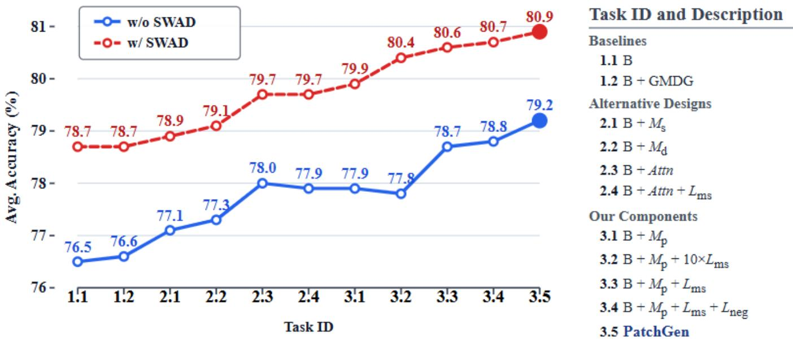  
Figure 10: Ablation results: Average-accuracy trend as components are added, plus per-dataset gains of the full model over the baseline. The detailed results of each dataset are in Appendix Table 8.

Ablation of proposed components. Tasks 3.1 and 3.3–3.5 form the principal incremental ablation, whereas Task 3.2 evaluates an increased weight on $\mathcal { L } _ { m s }$ . The selected-confidence and class-conditional objectives provide modest additiona average gains, and the complete model achieves the strongest overall result, although individual intermediate variants do not improve monotonically. This suggests that the objectives are most efective when combined.

## G.2 Other results and analysis

PatchGen with full-model fine-tune. Table 9 reports the performance of PatchGen under full model fine-tuning across all mDG datasets. We observe that full fine-tuning may disturb the pretrained knowledge of the backbone, leading to inferior performance compared to LN fine-tuning. With full-model fine-tuning and SWAD, PatchGen improves the corresponding baseline average by 0.3 percentage points, although the gains are not uniform across individual datasets.

Sensitivity and robustness analysis. As shown in Table 10, our method exhibits stable performance across diferent loss weights and random seeds without and with SWAD, indicating the robustness of PatchGen to hyperparameter choices and initialization. Across seeds {0, 1, 2}, the standard deviation of average accuracy is below 0.3 percentage points. Across the tested loss weights, average accuracy varies within 1.4 percentage points without SWAD and 1.6 percentage points with SWAD when the default setting is included. The numeric results are shown in Table 10.

More histopathology visualizations. Figure 11 presents additional learned patch-selection maps under the mDG setting. In the displayed examples, PatchGen assigns higher weights to regions that are morphologically consistent with diagnostic tissue patterns, whereas the compared baselines more frequently emphasize surrounding contextual regions. These visualizations provide qualitative evidence about the learned selector but do not constitute clinical or causal validation. The displayed pathology examples were reviewed by a pathology expert for morphological plausibility. This review supports the qualitative description of the highlighted regions, but the heatmaps are still model-selection maps rather than pixel-level clinical annotations or a diagnostic gold standard.

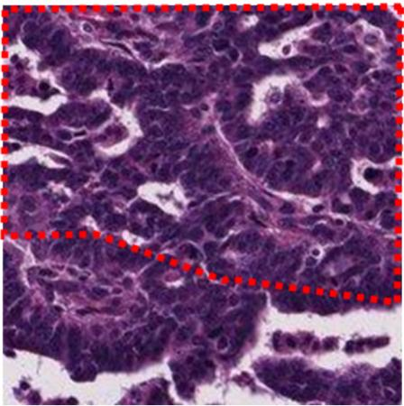  
Original Image

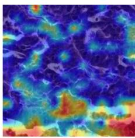  
Baseline.

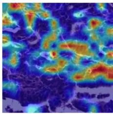

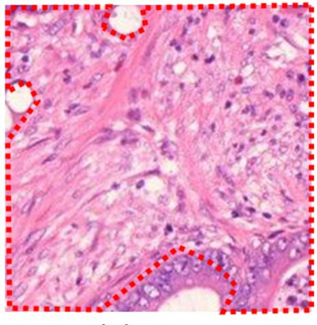

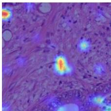  
Original Image  
Baseline.  
PatchGen

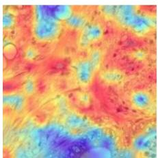  
PatchGen

Figure 11: Additional pathology tumor examples under the mDG setting. Highlighted regions correspond to regions visually consistent with diagnostic tissue morphology. Please check datasets’s oficial metadata for details.

Table 1: MDG results for natural images: Comparison between the proposed and previous MDG methods, including VLMbased, VM-based methods, and causal-based methods using VMs. Dataset notation: P: PACS, V: VLCS, O: OficeHome, T: TerraIncognita, D: DomainNet. Note: For DINOv2 ViT-L/14, LP and LP+LN have identical values after rounding; their unrounded averages difer by less than 0.1 percentage points.
<table><tr><td colspan="2">Test domain Pretrain</td><td colspan="2">P V</td><td>0</td><td>T</td><td>D</td><td>|Avg.</td></tr><tr><td>Method</td><td colspan="6">VLM-based methods</td></tr><tr><td>SWAD (Cha et al. 2021) (NIPS21)</td><td>CLIP ViT-B/16</td><td>91.3</td><td>79.4</td><td>76.9</td><td>45.4</td><td>51.7</td><td>|68.9</td></tr><tr><td>CLIP (Radford et al. 2021) (ICML21)</td><td>CLIP ViT-B/16</td><td>96.2</td><td>81.7</td><td>82.0</td><td>33.4</td><td>57.5</td><td>70.2</td></tr><tr><td>SMA (Arpit et al. 2022) (NIPS22)</td><td>CLIP ViT-B/16</td><td>92.1</td><td>79.7</td><td>78.1</td><td>48.3</td><td>55.9</td><td>70.8</td></tr><tr><td>DUPRG (Niu et al. 2022) (ICLR23)</td><td>CLIP ViT-B/16</td><td>97.1</td><td>83.9</td><td>83.6</td><td>42.0</td><td>59.6</td><td>73.2</td></tr><tr><td>CoOp (Zhou et al. 2022) (IJCV22)</td><td>CLIP ViT-B/16</td><td>96.2</td><td>77.6</td><td>83.9</td><td>48.8</td><td>59.8</td><td>73.3</td></tr><tr><td>MIRO (Cha et al. 2022) (ECCV22)</td><td>CLIP ViT-B/16</td><td>95.6</td><td>82.2</td><td>82.5</td><td>54.3</td><td>54.0</td><td>73.7</td></tr><tr><td>DPL (Zhang et al. 2023) (TAI23)</td><td>CLIP ViT-B/16</td><td>97.3</td><td>84.3</td><td>84.2</td><td>52.6</td><td>56.7</td><td>75.0</td></tr><tr><td>CLIPOOD (Shu et al. 2023) (ICML23)</td><td>CLIP ViT-B/16</td><td>97.3</td><td>85.0</td><td>87.0</td><td>60.4</td><td>63.5</td><td>78.6</td></tr><tr><td>Promptstyler (Cho et al. 2023) (ICCV23)</td><td>CLIP ViT-B/16</td><td>97.2</td><td>82.9</td><td>83.6</td><td></td><td>59.4</td><td>-</td></tr><tr><td>KAdaptation (Lee et al. 2025) (WACV25)</td><td>CLIP ViT-B/16</td><td>97.5</td><td>83.0</td><td>90.3</td><td>51.9</td><td>62.7</td><td>77.1</td></tr><tr><td>GESTUR (Lew, Son, and Chang 2023) (ICCV23)</td><td>CLIP ViT-B/16</td><td>96.0</td><td>82.8</td><td>84.2</td><td>55.7</td><td>58.9</td><td>75.5</td></tr><tr><td>DPR (Cheng et al. 2024) (CVPR24)</td><td>CLIP ViT-B/16</td><td>97.5</td><td>86.4</td><td>86.1</td><td>57.1</td><td>62.1</td><td>77.8</td></tr><tr><td>CLIPCEIL++ (Yu, Yoo, and Lin 2024) (NeurIPS24)</td><td>CLIP ViT-B/16</td><td>97.2</td><td>85.2</td><td>87.7</td><td>62.0</td><td>63.6</td><td>79.1</td></tr><tr><td>Method</td><td colspan="7">Pretrain VM-based methods</td></tr><tr><td>MMD (Li et al. 2018b)</td><td>ResNet50</td><td></td><td>84.7±0.5 77.5±0.9 66.3±0.1 42.2±1.6</td><td></td><td></td><td></td><td>58.8</td></tr><tr><td>Mixstyle (Zhou et al. 2021)</td><td>ResNet50</td><td></td><td>85.2±0.3 77.9±0.5 60.4±0.3 44.0±0.7</td><td></td><td></td><td>23.4±9.5 34.0±0.1</td><td>60.3</td></tr><tr><td>GroupDRO (Sagawa et al. 2019)</td><td>ResNet50</td><td>84.4±0.8 76.7±0.6 66.0±0.7 43.2±1.1</td><td></td><td></td><td></td><td>33.3±0.2</td><td>60.7</td></tr><tr><td>IRM (Arjovsky et al. 2019)</td><td>ResNet50</td><td>83.5±0.8</td><td></td><td>78.5±0.5 64.3±2.2 47.6±0.8</td><td></td><td>33.9±2.8</td><td>61.6</td></tr><tr><td>ARM (Zhang et al. 2021)</td><td>ResNet50</td><td>85.1±0.4</td><td></td><td>77.6±0.3 64.8±0.3 45.5±0.3</td><td></td><td>35.5±0.2</td><td>61.7</td></tr><tr><td>VREx (Krueger et al. 2021)</td><td>ResNet50</td><td>84.9±0.6</td><td>78.3±0.2</td><td>66.4±0.6 46.4±0.6</td><td></td><td>33.6±2.9</td><td>61.9</td></tr><tr><td>CDANN (Li et al. 2018d)</td><td>ResNet50</td><td>82.6±0.9</td><td>77.5±0.1</td><td>65.8±1.3 45.8±1.6</td><td></td><td>38.3±0.3</td><td>62.0</td></tr><tr><td>DANN (Ganin et al. 2016)</td><td>ResNet50</td><td>83.6±0.4</td><td>78.6±0.4</td><td>65.9±0.6</td><td>46.7±0.5</td><td>38.3±0.1</td><td>62.6</td></tr><tr><td>RSC (Huang et al. 2020)</td><td>ResNet50</td><td>85.2±0.9</td><td>77.1±0.5</td><td>65.5±0.9</td><td>46.6±1.0</td><td>38.9±0.5</td><td>62.7</td></tr><tr><td>MTL (Blanchard et al. 2021)</td><td>ResNet50</td><td>84.6±0.5</td><td>77.2±0.4</td><td>66.4±0.5</td><td>45.6±1.2</td><td>40.6±0.1</td><td>62.9</td></tr><tr><td>MLDG (Li et al. 2018a)</td><td>ResNet50</td><td>84.9±1.0</td><td>77.2±0.4</td><td>66.8±0.6 47.7±0.9</td><td></td><td>41.2±0.1</td><td>63.6</td></tr><tr><td>Fish (Shi et al. 2021)</td><td>ResNet50</td><td>85.5±0.3</td><td>77.8±0.3</td><td>68.6±0.4 45.1±1.3</td><td></td><td>42.7±0.2</td><td>63.9</td></tr><tr><td>ERM (Vapnik 1999)</td><td>ResNet50</td><td>84.2±0.1</td><td>77.3±0.1</td><td>67.6±0.2</td><td>47.8±0.6 44.0±0.1</td><td></td><td>64.2</td></tr><tr><td>SagNet (Nam et al. 2021)</td><td>ResNet50</td><td>86.3±0.2</td><td>77.8±0.5</td><td>68.1±0.1</td><td>48.6±1.040.3±0.1</td><td></td><td>64.2</td></tr><tr><td>SelfReg (Kim et al. 2021)</td><td>ResNet50</td><td>85.6±0.4</td><td>77.8±0.9</td><td>67.9±0.7</td><td>47.0±0.3</td><td>42.8±0.0</td><td>64.2</td></tr><tr><td>CORAL (Sun and Saenko 2016)</td><td>ResNet50</td><td>86.2±0.3</td><td>78.8±0.6</td><td>68.7±0.3</td><td>47.6±1.0</td><td>41.5±0.1</td><td>64.5</td></tr><tr><td>mDSDI (Bui et al. 2021)</td><td>ResNet50</td><td>86.2±0.2</td><td>79.0±0.3</td><td>69.2±0.4</td><td>48.1±1.4</td><td>42.8±0.1</td><td>65.1</td></tr><tr><td>MIRO + SWAD (Cha et al. 2022) (ECCV22)</td><td>RegNetY-16GF</td><td>97.4±0.2</td><td>79.9±0.6</td><td>80.4±0.2</td><td>58.9±1.3</td><td>53.8±0.1</td><td>74.1</td></tr><tr><td>GMDG + SWAD (Tan, Yang, and Huang 2024) (CVPR24) RegNetY-16GF</td><td></td><td>97.3±0.1</td><td>82.4±0.6</td><td>80.8±0.6</td><td>60.7±1.8</td><td>54.6±0.1</td><td>75.1</td></tr><tr><td>L-Reg + SWAD (Tan et al. 2024) (NeurIPS24)</td><td>RegNetY-16GF</td><td>97.4±0.2</td><td>82.4±0.0</td><td>80.9±0.5</td><td>62.9±0.9</td><td>55.3±0.0</td><td>75.8</td></tr><tr><td>Method</td><td></td><td></td><td>Results of baselines and ours</td><td></td><td></td><td></td><td></td></tr><tr><td>LP*</td><td>Pretrain</td><td></td><td></td><td></td><td></td><td></td><td></td></tr><tr><td>LP+LN finetune (Baseline)*</td><td>DINOv2 ViT-B/14 DINOv2 ViT-B/14</td><td>93.0 96.2</td><td>77.0 80.0</td><td>84.2 86.1</td><td>56.7 61.5</td><td>53.5 56.3</td><td>|72.9 76.0</td></tr><tr><td>PatchGen</td><td>DINOv2 ViT-B/14</td><td>96.4</td><td>82.4</td><td>83.7</td><td>65.8</td><td>56.0</td><td>76.9</td></tr><tr><td>LP+LN finetune (Baseline) + SWAD*</td><td>DINOv2 ViT-B/14</td><td>96.7</td><td>80.3</td><td>86.8</td><td>64.7</td><td>58.3</td><td>77.4</td></tr><tr><td>PatchGen + SWAD</td><td>DINOv2 ViT-B/14</td><td>97.1</td><td>82.5</td><td>87.5</td><td>69.7</td><td>59.2</td><td>79.2</td></tr><tr><td>LP*</td><td>MAE ViT-B/16</td><td>58.4</td><td>75.9</td><td>49.5</td><td>26.1</td><td>17.0</td><td>|45.4</td></tr><tr><td>LP+LN finetune (Baseline)*</td><td>MAE ViT-B/16</td><td>70.1</td><td>78.5</td><td>53.2</td><td>25.0</td><td>25.2</td><td>50.4</td></tr><tr><td>PatchGen</td><td>MAE ViT-B/16</td><td>72.5</td><td>77.5</td><td>50.7</td><td>32.0</td><td>25.6</td><td>51.7</td></tr><tr><td>LP+LN finetune (Baseline) + SWAD*</td><td>MAE ViT-B/16</td><td>72.1</td><td>78.5</td><td>56.3</td><td>24.5</td><td>26.6</td><td>51.6</td></tr><tr><td>PatchGen + SWAD</td><td>MAE ViT-B/16</td><td>73.9</td><td>79.0</td><td>55.1</td><td>27.3</td><td>27.2</td><td>52.5</td></tr><tr><td>LP*</td><td>DINOv2 ViT-L/14</td><td>97.0</td><td>78.6</td><td>86.7</td><td>65.7</td><td>54.3</td><td>|76.5</td></tr><tr><td>LP+LN finetune (Baseline)*</td><td>DINOv2 ViT-L/14</td><td>97.0</td><td>78.6</td><td>86.7</td><td>65.7</td><td>54.3</td><td>76.5</td></tr><tr><td>LP+LN finetune (Baseline) + SWAD*</td><td>DINOv2 ViT-L/14</td><td>97.5 96.1</td><td>81.0 79.2</td><td>89.7 85.7</td><td>67.4 67.9</td><td>58.1 54.0</td><td>78.7 76.6</td></tr><tr><td>Baseline + GMDG*</td><td>DINOv2 ViT-L/14 DINOv2 ViT-L/14</td></table>

Table 2: MDG results for natural images: Comparison between the proposed and selected causal-inspired DG methods using VMs. Dataset notation: P: PACS, V: VLCS, O: OficeHome, T: TerraIncognita, D: DomainNet.
<table><tr><td>Test domain</td><td>Backbone</td><td>P</td><td>V</td><td>0</td><td>T</td><td>D</td><td>Avg.</td></tr><tr><td>CI-DGA (Gong et al. 2025) (IJCV25)</td><td>DeiT-S</td><td>88.3</td><td>80.6</td><td>72.6</td><td></td><td></td><td></td></tr><tr><td>SMIDG (Wang et al. 2025) (TPAMI25)</td><td>ResNet50</td><td>90.4</td><td>80.8</td><td>72.1</td><td>52.8</td><td>45.5</td><td>68.3</td></tr><tr><td>BFMix (Zhang et al. 2024) (ICME25)</td><td>ViT-S/16</td><td>82.3</td><td>90.1</td><td>82.3</td><td>51.5</td><td>53.2</td><td>71.9</td></tr><tr><td>CauRDG (Liu et al. 2025) (ACMMM25)</td><td>ViT-B/16</td><td>89.8</td><td></td><td>75.3</td><td></td><td>49.8</td><td></td></tr><tr><td>PatchGen</td><td>ViT-S/14</td><td>93.8</td><td>81.8</td><td>79.1</td><td>54.4</td><td>50.7</td><td>72.0</td></tr><tr><td>PatchGen + SWAD</td><td>ViT-S/14</td><td>94.8</td><td>82.9</td><td>82.0</td><td>55.8</td><td>52.3</td><td>73.6</td></tr><tr><td>PatchGen</td><td>ViT-B/14</td><td>93.9</td><td>82.6</td><td>84.0</td><td>56.1</td><td>55.3</td><td>74.4</td></tr><tr><td>PatchGen + SWAD</td><td>ViT-B/14</td><td>96.6</td><td>82.7</td><td>85.3</td><td>62.3</td><td>59.5</td><td>77.3</td></tr></table>

Table 3: MDG results for histopathological images: Comparison between the proposed and baselines with average and per-domain results across diferent backbones on the HISTOPANTUM dataset (two fully aligned classes).
<table><tr><td></td><td></td><td colspan="5">Without SWAD (Cha et al. 2021)</td><td colspan="5">With SWAD (Cha et al. 2021)</td></tr><tr><td>Method</td><td>Backbone</td><td>Colon Ovarian Stomach Uterus Avg.</td><td></td><td></td><td></td><td></td><td>Colon Ovarian Stomach Uterus Avg.</td><td></td><td></td><td></td><td></td></tr><tr><td>GESTUR*</td><td>CLIP ViT-B/16</td><td>90.1</td><td>96.6</td><td>87.4</td><td>90.1</td><td>91.0</td><td></td><td></td><td></td><td></td><td></td></tr><tr><td>LP*</td><td>CLIP ViT-B/16</td><td>80.3</td><td>91.4</td><td>79.0</td><td>91.0</td><td>85.4</td><td>81.1</td><td>91.3</td><td>79.2</td><td>89.9</td><td>85.4</td></tr><tr><td>LP + LN finetune (Baseline)*</td><td>CLIP ViT-B/16</td><td>83.5</td><td>95.1</td><td>86.6</td><td>89.9</td><td>88.8</td><td>84.5</td><td>94.9</td><td>86.0</td><td>89.6</td><td>88.8</td></tr><tr><td>PatchGen</td><td>CLIP ViT-B/16</td><td>86.9</td><td>95.1</td><td>86.2</td><td>85.6</td><td>88.5</td><td>87.2</td><td>95.6</td><td>85.1</td><td>90.7</td><td>89.6</td></tr><tr><td>LP*</td><td>DINOv2 ViT-B/14</td><td>87.3</td><td>93.8</td><td>84.1</td><td>90.8</td><td>89.0</td><td>88.4</td><td>94.6</td><td>85.0</td><td>87.2</td><td>88.8</td></tr><tr><td>LP + LN finetune (Baseline)*</td><td>DINOv2 ViT-B/14</td><td>91.4</td><td>96.7</td><td>88.8</td><td>88.5</td><td>91.4</td><td>90.7</td><td>96.7</td><td>88.5</td><td>89.9</td><td>91.4</td></tr><tr><td>Baseline + MIRO*</td><td>DINOv2 ViT-B/14</td><td>89.1</td><td>96.2</td><td>87.6</td><td>91.8</td><td>91.2</td><td>90.8</td><td>96.8</td><td>87.8</td><td>88.8</td><td>91.0</td></tr><tr><td>Baseline + GMDG*</td><td>DINOv2 ViT-B/14</td><td>88.9</td><td>96.2</td><td>88.0</td><td>90.1</td><td>90.8</td><td>90.3</td><td>96.5</td><td>87.2</td><td>85.5</td><td>89.9</td></tr><tr><td>PatchGen</td><td>DINOv2 ViT-B/14</td><td>91.0</td><td>96.2</td><td>89.0</td><td>94.9</td><td>92.8</td><td>92.1</td><td>97.0</td><td>88.3</td><td>93.9</td><td>92.8</td></tr><tr><td>LP*</td><td>DINOv2 ViT-L/14</td><td>90.3</td><td>92.4</td><td>84.5</td><td>93.1</td><td>90.1</td><td>88.9</td><td>94.5</td><td>84.2</td><td>90.9</td><td>89.6</td></tr><tr><td>LP + LN finetune (Baseline)*</td><td>DINOv2 ViT-L/14</td><td>92.8</td><td>97.1</td><td>88.5</td><td>90.1</td><td>92.1</td><td>93.4</td><td>96.7</td><td>88.6</td><td>88.2</td><td>91.7</td></tr><tr><td>PatchGen</td><td>DINOv2 ViT-L/14</td><td>92.3</td><td>96.8</td><td>87.8</td><td>93.7</td><td>92.6</td><td>93.0</td><td>97.1</td><td>87.0</td><td>93.8</td><td>92.7</td></tr><tr><td>LP*</td><td>MAE ViT-B/16</td><td>80.8</td><td>88.7</td><td>81.9</td><td>75.1</td><td>81.6</td><td>82.3</td><td>86.8</td><td>81.8</td><td>75.0</td><td>81.5</td></tr><tr><td>LP + LN finetune (Baseline)*</td><td>MAE ViT-B/16</td><td>84.5</td><td>94.1</td><td>86.5</td><td>87.6</td><td>88.2</td><td>85.4</td><td>93.4</td><td>85.5</td><td>88.3</td><td>88.2</td></tr><tr><td>PatchGen</td><td>MAE ViT-B/16</td><td>86.9</td><td>95.6</td><td>85.9</td><td>89.0</td><td>89.3</td><td>88.3</td><td>95.1</td><td>86.0</td><td>90.4</td><td>89.9</td></tr></table>

Table 4: MDG results for histopathological images: Comparison between the proposed and baselines with average and per-domain results across diferent backbones on the HISTOCOLON dataset (ten partially aligned classes).
<table><tr><td></td><td></td><td colspan="4">Without SWAD</td><td colspan="4">With SWAD</td></tr><tr><td>Method</td><td>Backbone</td><td>CRC-TP</td><td>K-16</td><td>K-19</td><td>Avg.</td><td>CRC-TP</td><td>K-16</td><td>K-19</td><td>Avg.</td></tr><tr><td>GESTUR*</td><td>CLIP ViT-B/16</td><td>39.0</td><td>63.6</td><td>53.7</td><td>52.1</td><td></td><td></td><td></td><td></td></tr><tr><td>LP*</td><td>CLIP ViT-B/16</td><td>29.9</td><td>49.8</td><td>37.4</td><td>39.0</td><td>29.2</td><td>51.7</td><td>38.8</td><td>39.9</td></tr><tr><td>LP + LN finetune (Baseline)*</td><td>CLIP ViT-B/16</td><td>37.1</td><td>55.8</td><td>44.2</td><td>45.7</td><td>37.7</td><td>56.2</td><td>43.9</td><td>45.9</td></tr><tr><td>PatchGen</td><td>CLIP ViT-B/16</td><td>42.0</td><td>58.3</td><td>52.8</td><td>51.0</td><td>42.7</td><td>63.9</td><td>54.5</td><td>53.7</td></tr><tr><td>LP*</td><td>DINOv2 ViT-B/14</td><td>49.1</td><td>52.4</td><td>55.3</td><td>52.2</td><td>48.8</td><td>51.3</td><td>55.9</td><td>52.0</td></tr><tr><td>LP + LN finetune (Baseline)*</td><td>DINOv2 ViT-B/14</td><td>52.5</td><td>53.3</td><td>52.7</td><td>52.8</td><td>50.8</td><td>52.1</td><td>55.5</td><td>52.8</td></tr><tr><td>Baseline + MIRO*</td><td>DINOv2 ViT-B/14</td><td>51.9</td><td>50.5</td><td>56.6</td><td>53.0</td><td>51.5</td><td>52.4</td><td>57.3</td><td>53.7</td></tr><tr><td>Baseline + GMDG*</td><td>DINOv2 ViT-B/14</td><td>51.9</td><td>53.6</td><td>56.6</td><td>54.0</td><td>51.7</td><td>52.4</td><td>57.1</td><td>53.7</td></tr><tr><td>PatchGen</td><td>DINOv2 ViT-B/14</td><td>50.7</td><td>52.9</td><td>59.8</td><td>54.4</td><td>50.2</td><td>54.1</td><td>57.9</td><td>54.1</td></tr><tr><td>LP*</td><td>DINOv2 ViT-L/14</td><td>51.6</td><td>52.6</td><td>55.5</td><td>53.2</td><td>53.1</td><td>52.2</td><td>59.2</td><td>54.8</td></tr><tr><td>LP + LN finetune (Baseline)*</td><td>DINOv2 ViT-L/14</td><td>51.9</td><td>54.6</td><td>56.6</td><td>54.3</td><td>51.7</td><td>52.4</td><td>57.1</td><td>53.7</td></tr><tr><td>PatchGen</td><td>DINOv2 ViT-L/14</td><td>52.9</td><td>51.7</td><td>60.1</td><td>54.9</td><td>53.6</td><td>52.8</td><td>65.2</td><td>57.2</td></tr><tr><td>LP*</td><td>MAE ViT-B/16</td><td>37.2</td><td>47.6</td><td>39.6</td><td>41.5</td><td>35.7</td><td>47.6</td><td>39.6</td><td>41.0</td></tr><tr><td>LP + LN finetune (Baseline)*</td><td>MAE ViT-B/16</td><td>38.9</td><td>55.4</td><td>39.9</td><td>44.7</td><td>38.2</td><td>57.0</td><td>41.6</td><td>45.6</td></tr><tr><td>PatchGen</td><td>MAE ViT-B/16</td><td>43.9</td><td>42.3</td><td>48.5</td><td>44.9</td><td>39.0</td><td>52.6</td><td>45.3</td><td>45.6</td></tr></table>

Table 5: CCD results: Results of applying our method to PromptCCD with various backbones. A: All classes; K: Known classes; U: Unknown classes.
<table><tr><td rowspan="2" colspan="2">Backbone Method</td><td colspan="6">DINO</td><td colspan="6">DINOv2</td></tr><tr><td colspan="3">PromptCCD*</td><td colspan="3">+PatchGen</td><td colspan="3">PromptCCD*</td><td colspan="3">+PatchGen</td></tr><tr><td>Datasets</td><td>Session</td><td>A</td><td>K</td><td>U</td><td>A</td><td>K</td><td>U</td><td>A</td><td>K</td><td>U</td><td>A</td><td>K</td><td>U</td></tr><tr><td>CIFAR-100</td><td>1</td><td>72.0</td><td>81.8</td><td>65.2</td><td>75.3</td><td>84.0</td><td>69.2</td><td>77.2</td><td>89.1</td><td>68.9</td><td>76.3</td><td>86.9</td><td>68.9</td></tr><tr><td></td><td>2</td><td>57.7</td><td>77.9</td><td>53.8</td><td>62.6</td><td>74.6</td><td>60.3</td><td>59.6</td><td>78.6</td><td>55.9</td><td>73.1</td><td>82.8</td><td>71.3</td></tr><tr><td></td><td>3</td><td>48.2</td><td>73.2</td><td>43.8</td><td>47.9</td><td>72.8</td><td>43.5</td><td>49.9</td><td>75.0</td><td>45.5</td><td>49.6</td><td>74.9</td><td>45.2</td></tr><tr><td></td><td>Avg.</td><td>59.3</td><td>77.6</td><td>54.3</td><td>61.9</td><td>77.1</td><td>57.7</td><td>62.2</td><td>80.9</td><td>56.8</td><td>66.4</td><td>81.5</td><td>61.8</td></tr><tr><td>CUB</td><td>1</td><td>56.5</td><td>76.1</td><td>43.4</td><td>55.7</td><td>73.6</td><td>43.7</td><td>70.4</td><td>89.3</td><td>57.8</td><td>70.5</td><td>88.2</td><td>58.7</td></tr><tr><td></td><td>2</td><td>46.3</td><td>70.0</td><td>41.2</td><td>50.3</td><td>72.9</td><td>45.5</td><td>64.1</td><td>81.4</td><td>60.5</td><td>69.6</td><td>84.3</td><td>66.5</td></tr><tr><td></td><td>3</td><td>56.3</td><td>77.9</td><td>52.1</td><td>59.9</td><td>75.0</td><td>57.0</td><td>68.2</td><td>82.1</td><td>65.5</td><td>66.4</td><td>84.3</td><td>63.0</td></tr><tr><td></td><td>Avg.</td><td>53.0</td><td>74.6</td><td>45.6</td><td>55.3</td><td>73.8</td><td>48.7</td><td>67.6</td><td>84.3</td><td>61.2</td><td>68.9</td><td>85.6</td><td>62.7</td></tr></table>

Table 6: MDG+GCD results: Accuracy scores of each dataset. A: All classes; K: Known classes; U: Unknown classes.
<table><tr><td></td><td>Test domain</td><td colspan="3">PACS</td><td colspan="3">OfficeHome</td><td colspan="3">VLCS</td><td colspan="3">TerraIncognita</td><td colspan="3">DomainNet</td></tr><tr><td>Method</td><td>Backbone</td><td>A</td><td>K</td><td>U</td><td>A</td><td>K</td><td>U</td><td>A</td><td>K</td><td>U</td><td>A</td><td>K</td><td>U</td><td>A</td><td>K</td><td>U</td></tr><tr><td>ERM (Vapnik 1999)</td><td>RegNetY-16GF</td><td>57.26</td><td>77.77</td><td>22.33</td><td>44.80</td><td>74.67</td><td>8.50</td><td>61.51</td><td>82.89</td><td>34.88</td><td>37.34</td><td>20.46</td><td>45.15</td><td>22.56</td><td>40.89</td><td>6.85</td></tr><tr><td>PIM (Chiaroni et al. 2023)</td><td>RegNetY-16GF</td><td>56.35</td><td>71.06</td><td>27.43</td><td>43.42</td><td>72.44</td><td>8.13</td><td>63.19</td><td>80.34</td><td>40.24</td><td>47.75</td><td>35.31</td><td>50.85</td><td>24.03</td><td>42.59</td><td>7.86</td></tr><tr><td>MIRO (Cha et al. 2022)</td><td>RegNetY-16GF</td><td>56.83</td><td>85.62</td><td>24.85</td><td>48.28</td><td>80.61</td><td>9.03</td><td>61.53</td><td>82.72</td><td>35.03</td><td>50.22</td><td>39.92</td><td>49.45</td><td>31.49</td><td>55.44</td><td>10.57</td></tr><tr><td>GMDG (Tan, Yang, and Huang 2024) RegNetY-16GF</td><td></td><td>58.33</td><td>91.46</td><td>10.18</td><td>48.85</td><td>81.41</td><td>9.22</td><td>61.36</td><td>83.31</td><td>33.75</td><td>40.02</td><td>32.38</td><td>40.07</td><td>31.15</td><td>55.17</td><td>10.18</td></tr><tr><td>L-Reg (Tan et al. 2024)</td><td>RegNetY-16GF</td><td>67.82</td><td>91.86</td><td>31.33</td><td>51.96</td><td>79.74</td><td>18.15</td><td>62.32</td><td>82.77</td><td>36.09</td><td>45.86</td><td>39.77</td><td>41.55</td><td>31.75</td><td>55.18</td><td>11.30</td></tr><tr><td>Baseline*</td><td>DINOv2 ViT-B/14</td><td>96.18</td><td>96.38</td><td>96.45</td><td>79.26</td><td>87.52</td><td>72.02</td><td>85.22</td><td>87.45</td><td>82.52</td><td>63.32</td><td>58.80</td><td>67.82</td><td>56.44</td><td>56.96</td><td>56.38</td></tr><tr><td>L-Reg*</td><td>DINOv2 ViT-B/14</td><td>96.13</td><td>95.63</td><td>96.98</td><td>81.36</td><td>91.72</td><td>72.11</td><td>84.00</td><td>86.46</td><td>80.89</td><td>59.54</td><td>47.36</td><td>67.69</td><td>55.74</td><td>55.76</td><td>56.11</td></tr><tr><td>PatchGen</td><td>DINOv2 ViT-B/14</td><td>96.48</td><td>96.81</td><td>96.28</td><td>82.55</td><td>92.84</td><td>72.97</td><td>85.66</td><td>88.39</td><td>82.33</td><td>63.87</td><td>53.98</td><td>69.85</td><td>56.38</td><td>56.68</td><td>56.53</td></tr><tr><td>Baseline*</td><td>DINOv2 ViT-L/14</td><td>96.82</td><td>97.73</td><td>96.21</td><td>79.49</td><td>85.02</td><td>74.44</td><td>88.78</td><td>90.38</td><td>86.89</td><td>68.55</td><td>58.79</td><td>76.11</td><td>59.53</td><td>59.78</td><td>59.73</td></tr><tr><td>PatchGen</td><td>DINOv2 ViT-L/14</td><td>97.11</td><td>97.50</td><td>96.91</td><td>82.92</td><td>91.84</td><td>74.98</td><td>89.08</td><td>90.92</td><td>86.90</td><td>68.66</td><td>61.46</td><td>75.34</td><td>59.85</td><td>59.95</td><td>60.13</td></tr><tr><td>Baseline*</td><td>MAE ViT-B/16</td><td>69.79</td><td>72.74</td><td>62.67</td><td>76.91</td><td>87.71</td><td>65.60</td><td>53.93</td><td>59.77</td><td>46.86</td><td>40.84</td><td>28.70</td><td>49.74</td><td>26.47</td><td>25.84</td><td>27.11</td></tr><tr><td>PatchGen</td><td>MAE ViT-B/16</td><td>70.73</td><td>74.86</td><td>61.37</td><td>76.24</td><td>85.11</td><td>65.97</td><td>54.97</td><td>59.82</td><td>49.11</td><td>45.41</td><td>24.28</td><td>59.30</td><td>27.16</td><td>26.32</td><td>27.93</td></tr></table>

Table 7: MDG+GCD results: Accuracy scores averaged across all datasets. A: All classes; K: Known classes; U: Unknown classes. Detailed results of each dataset are presented in Table 6.
<table><tr><td>Method</td><td>Backbone</td><td>A</td><td>K</td><td>U</td></tr><tr><td>ERM PIM</td><td>RegNetY-16GF RegNetY-16GF</td><td>44.69 46.95</td><td>59.34 60.35</td><td>23.54 26.90</td></tr><tr><td>MIRO GMDG L-Reg</td><td>RegNetY-16GF RegNetY-16GF RegNetY-16GF</td><td>49.67 47.94 51.94</td><td>68.86 68.75 69.86</td><td>25.79 20.68 27.68</td></tr><tr><td>Baseline* L-Reg*</td><td>DINOv2 ViT-B/14 DINOv2 ViT-B/14</td><td>76.08 75.35</td><td>77.42</td><td>75.04</td></tr><tr><td>PatchGen</td><td></td><td>76.99</td><td>75.39</td><td>74.76</td></tr><tr><td></td><td>DINOv2 ViT-B/14</td><td></td><td>77.74</td><td>75.59</td></tr><tr><td>Baseline*</td><td>DINOv2 ViT-L/14</td><td>78.63</td><td>78.34</td><td>78.68</td></tr><tr><td>PatchGen</td><td>DINOv2 ViT-L/14</td><td>79.52</td><td>80.33</td><td>78.85</td></tr><tr><td></td><td></td><td></td><td></td><td></td></tr><tr><td>Baseline*</td><td>MAE ViT-B/16</td><td>53.59</td><td>54.95</td><td>50.40</td></tr><tr><td></td><td>PatchGen MAE ViT-B/16</td><td>54.90</td><td>54.08</td><td>52.74</td></tr></table>

Table 8: Ablation results across five mDG datasets. P: PACS, V: VLCS, O: OficeHome, T: TerraIncognita, D: DomainNet.
<table><tr><td rowspan="2" colspan="2">Task ID</td><td colspan="6">Without SWAD</td><td colspan="6">With SWAD</td></tr><tr><td>V</td><td></td><td>0</td><td>T</td><td>D</td><td>Avg.</td><td>P</td><td>V</td><td>0</td><td>T</td><td>D</td><td>Avg.</td></tr><tr><td>1.1</td><td>LP + LN finetune (Baseline: B)</td><td>97.0 78.6</td><td></td><td>86.7</td><td>65.7</td><td>54.3</td><td>76.5</td><td>97.5</td><td>81.0</td><td>89.7</td><td>67.4</td><td>58.1</td><td>78.7</td></tr><tr><td>1.2</td><td> $\mathbf { B } + \mathbf { G M D G }$ </td><td>96.1 79.2</td><td></td><td>85.7</td><td>67.9</td><td>54.0</td><td>76.6</td><td>96.8</td><td>81.1</td><td>89.5</td><td>68.5</td><td>57.7</td><td>78.7</td></tr><tr><td>2.1</td><td> $\mathbf { B } + \mathcal { M } _ { s }$ </td><td>96.8 81.4 85.3</td><td></td><td></td><td></td><td></td><td>64.7 57.4 77.1</td><td>97.4</td><td>81.4</td><td>88.9</td><td>66.8</td><td>60.1 78.9</td><td></td></tr><tr><td>2.2 2.3</td><td> $\mathbf { B } + \mathcal { M } _ { d }$ </td><td>96.7 80.9</td><td></td><td>86.3</td><td>65.9</td><td></td><td>956.7 77.3</td><td>97.7</td><td>81.1</td><td>88.9</td><td></td><td>67.1 60.5</td><td>79.1</td></tr><tr><td>2.4</td><td> $\mathbf { B } + A t t n$   $\mathbf { B } + A t t n + L _ { m s }$ </td><td>96.8 82.1 86.7 97.8 81.9</td><td></td><td>86.4</td><td>67.3</td><td>56.9</td><td>78.0</td><td>97.5</td><td>82.0 89.1</td><td></td><td>69.2</td><td>60.5 79.7</td><td></td></tr><tr><td></td><td></td><td></td><td></td><td></td><td></td><td>65.857.7</td><td>77.9</td><td>97.8</td><td>81.6</td><td>89.6</td><td></td><td>69.0 60.5</td><td>79.7</td></tr><tr><td>3.1 3.2</td><td> $\mathbf { B } + \mathcal { M } _ { p }$ </td><td>96.7 82.2</td><td></td><td>86.6</td><td>66.5</td><td>57.3</td><td>77.9</td><td>97.9</td><td>82.4</td><td>89.7</td><td></td><td>69.060.6 79.9</td><td></td></tr><tr><td>3.3</td><td> $\mathbf { B } + \mathcal { M } _ { p } + 1 0 \times L _ { m s }$ </td><td>96.981.5 86.7</td><td>96.8 83.4 86.8</td><td></td><td></td><td></td><td>66.2 57.9 77.8</td><td>97.5</td><td>83.3</td><td>90.0</td><td></td><td>70.2 60.9 80.4</td><td></td></tr><tr><td>3.4</td><td> $\mathbf { B } + \mathcal { M } _ { p } + L _ { m s }$ </td><td></td><td>97.5 82.6 87.4 67.4 58.9</td><td></td><td></td><td></td><td>68.4 58.4 78.7</td><td>97.0 97.5</td><td>83.1 83.0</td><td>90.0 90.2</td><td>70.5</td><td>70.6 62.2 62.5</td><td>80.6</td></tr><tr><td>3.5</td><td> $\mathbf { B } + { \mathcal { M } } _ { p } + { \cal L } _ { m s } + { \mathcal { L } } _ { \mathrm { c o n f } }$ </td><td></td><td></td><td></td><td></td><td></td><td>78.8</td><td>(PatchGen) 97.1 83.6 88.0 68.1 59.2 79.2 97.6 83.4 90.6 70.2 62.7 80.9</td><td></td><td></td><td></td><td></td><td>80.7</td></tr><tr><td></td><td> $\mathbf { B } + \mathcal { M } _ { p } + L _ { m s } + \mathcal { L } _ { \mathrm { c o n f } } + L _ { s i m }$  Improvements from the baseline</td><td>0.1↑ 5.0↑ 1.3↑ 2.5↑ 4.9↑ 2.7↑ 0.1↑ 2.4↑ 0.9↑ 2.8↑ 4.6↑ 2.2↑</td><td></td><td></td><td></td><td></td><td></td><td></td><td></td><td></td><td></td><td></td><td></td></tr></table>

Table 9: Additional mDG results comparing LN and full finetuning. P: PACS, V: VLCS, O: OficeHome, T: TerraIncognita, D: DomainNet.
<table><tr><td>Test domain</td><td></td><td>P</td><td>V</td><td>0</td><td>T</td><td>D</td><td>|Avg.</td></tr><tr><td>Method</td><td>Pretrain</td><td colspan="6">Results of baselines and ours</td></tr><tr><td>LP*</td><td>DINOv2 ViT-B/14</td><td>93.0</td><td>77.0</td><td>84.2</td><td>56.7</td><td>53.5</td><td>72.9</td></tr><tr><td>LP+LN finetune (Baseline)*</td><td>DINOv2 ViT-B/14</td><td>96.2</td><td>80.0</td><td>86.1</td><td>61.5</td><td>56.3</td><td>76.0</td></tr><tr><td>LP+LN finetune (Baseline) + SWAD*</td><td>DINOv2 ViT-B/14</td><td>96.7</td><td>80.3</td><td>86.8</td><td>64.7</td><td>58.3</td><td>77.4</td></tr><tr><td>LP+full finetune (Baseline)*</td><td>DINOv2 ViT-B/14</td><td>95.9</td><td>82.6</td><td>82.2</td><td>61.6</td><td>56.2</td><td>75.7</td></tr><tr><td>LP+full finetune  $\mathrm { ( B a s e l i n e ) + S W A D ^ { * } }$ </td><td>DINOv2 ViT-B/14</td><td>96.5</td><td>82.2</td><td>82.3</td><td>64.8</td><td>59.3</td><td>77.0</td></tr><tr><td>PatchGen+full finetune + SWAD</td><td>DINOv2 ViT-B/14</td><td>96.6</td><td>82.7</td><td>85.3</td><td>62.3</td><td>59.5</td><td>77.3</td></tr></table>

Table 10: Sensitivity and robustness analysis on TerraIncognita for mDG.
<table><tr><td colspan="10"></td><td colspan="4">With SWAD</td></tr><tr><td>Seed</td><td> $\lambda _ { m s }$ </td><td> $\lambda _ { s i m }$ </td><td colspan="9">Location100 Location38 Location43 Location46 Avg. Location100 Location38 Location43 Location46 Avg.</td></tr><tr><td></td><td></td><td></td><td></td><td></td><td></td><td></td><td>Sensitivity to weight of</td><td> $\lambda _ { s i m }$ </td><td></td><td></td><td></td><td></td></tr><tr><td>1</td><td>0.001</td><td>0.01</td><td>75.8</td><td>63.4</td><td>71.0</td><td>62.0</td><td>68.1</td><td>76.6</td><td>64.7</td><td>72.7</td><td>64.5</td><td>69.6</td></tr><tr><td>1</td><td>0.001</td><td>0.001</td><td>76.1</td><td>61.8</td><td>68.8</td><td>60.1</td><td>66.7</td><td>79.1</td><td>63.8</td><td>71.6</td><td>66.3</td><td>70.2</td></tr><tr><td>1</td><td>0.001</td><td>0.0001</td><td>76.2</td><td>61.2</td><td>70.2</td><td>64.8</td><td>68.1</td><td>77.2</td><td>64.0</td><td>71.1</td><td>65.9</td><td>69.6</td></tr><tr><td></td><td></td><td colspan="9">Sensitivity to weight of</td><td></td></tr><tr><td>1</td><td>0.01</td><td>0.001</td><td>74.5</td><td>61.1</td><td>70.4</td><td>63.3</td><td>67.3</td><td> $\lambda _ { m s }$  78.8</td><td>59.5</td><td>72.3</td><td>65.0</td><td>68.9</td></tr><tr><td>1</td><td>0.001</td><td>0.001</td><td>76.1</td><td>61.8</td><td>68.8</td><td>60.1</td><td>66.7</td><td>79.1</td><td>63.8</td><td>71.6</td><td>66.3</td><td>70.2</td></tr><tr><td>1</td><td>0.0001</td><td>0.001</td><td>78.2</td><td>61.9</td><td>69.6</td><td>62.8</td><td>68.1</td><td>77.2</td><td>62.5</td><td>69.8</td><td>65.0</td><td>68.6</td></tr><tr><td></td><td></td><td></td><td colspan="9">Results acorss different seeds</td></tr><tr><td>0</td><td>0.001</td><td>0.001</td><td>75.7</td><td>61.5</td><td>71.3</td><td>60.0</td><td>67.1</td><td>79.3</td><td>64.0</td><td>72.1</td><td>64.4</td><td>70.0</td></tr><tr><td>1</td><td>0.001</td><td>0.001</td><td>76.1</td><td>61.8</td><td>68.8</td><td>60.1</td><td>66.7</td><td>79.1</td><td>63.8</td><td>71.6</td><td>66.3</td><td>70.2</td></tr><tr><td>2</td><td>0.001</td><td>0.001</td><td>76.0</td><td>63.2</td><td>68.6</td><td>58.8</td><td>66.6</td><td>77.7</td><td>65.0</td><td>70.2</td><td>66.1</td><td>69.8</td></tr></table>