# Paths: Prompt-aware Spatio-temporal Transformer with Hierarchical Multi-modal Fusion for RGB-Event Video Person Re-Identification

Yakun Huo   
Dalian University of   
Technology   
Dalian, China   
huoyakun@mail.dlut.edu.cn   
Yingquan Wang   
Dalian University of   
Technology   
Dalian, China Yunzhi Zhuge   
Dalian University of Technology Dalian, China   
zgyz@dlut.edu.cn

Pingping Zhang Dalian University of Technology Dalian, China zhpp@dlut.edu.cn

Yangyang Liu   
Dalian University of   
Technology   
Dalian, China   
yyliu@mail.dlut.edu.cn   
Tianyu Yan   
Dalian University of   
Technology   
Dalian, China   
2981431354@mail.dlut.edu.cn   
Huchuan Lu   
Dalian University of   
Technology   
Dalian, China   
lhchuan@dlut.edu.cn

## Abstract

RGB-Event Video Person Re-Identification (RE-VReID) aims to retrieve specific person across non-overlapping cameras with complementary RGB videos and event streams. However, existing methods often decouple spatial and temporal modeling, which limits their interaction. In addition, global-level RGB-Event fusion fails to fully exploit fine-grained discriminative cues. To address these issues, we propose Paths, a unified framework with spatio-temporal modeling and hierarchical multi-modal fusion for RE-VReID. Specifically, we first design a Memory-Augmented Backbone (MAB) to maintain modality-specific identity prototypes for stable intra-modal representation learning. Then, we propose a Prompt-aware Spatiotemporal Transformer (PST) to jointly model spatial and temporal cues within a unified Transformer. Finally, we introduce a Hierarchical Multi-modal Fusion (HMF) to integrate RGB and event features at global and local levels. With these modules, our framework can learn robust and discriminative representations for RE-VReID. Extensive experiments on three public RE-VReID benchmarks including EvReID, MARS and iLIDS-VID, demonstrate the efectiveness of our proposed method. The code is available at https://github.com/Reflection0427/Paths.

## CCS Concepts

• Computing methodologies → Computer vision; • Information systems → Multimedia and multimodal retrieval.

## Keywords

RGB-Event Video Person Re-Identification, Event Camera, Spatiotemporal Modeling, Prompt Learning, Multi-modal Fusion

ACM Reference Format: Yakun Huo, Yingquan Wang, Yangyang Liu, Tianyu Yan, Yunzhi Zhuge, Pingping Zhang, and Huchuan Lu. 2026. Paths: Prompt-aware Spatio-temporal Transformer with Hierarchical Multi-modal Fusion for RGB-Event Video Person Re-Identification. In Proceedings ofthe 34th ACM International Conference on Multimedia (MM ’26), November 10–14, 2026, Rio de Janeiro, Brazil. ACM, New York, NY, USA, 10 pages. https://doi.org/10.1145/3767308.3835505

## 1 Introduction

Video-based Person Re-Identification (VReID) aims to retrieve specific person from video tracklets captured by non-overlapping cameras [6, 26, 32–34, 37]. It has important applications in intelligent surveillance and multimedia retrieval. Most RGB-based VReID methods extract frame-level appearance features and aggregate them to capture temporal information [8, 26, 37, 51, 56]. More recent methods further strengthen frame-to-frame interaction through graph reasoning or spatio-temporal attention [10, 14, 30, 31, 55]. However, RGB videos sampled at a fixed frame rate often contain substantial inter-frame redundancy [3, 45]. Event cameras provide a complementary modality by asynchronously recording pixel-level brightness changes. Such asynchronous sensing is particularly sensitive to motion variations and temporal changes [9]. This complementarity enables RGB-Event Video Person Re-Identification to jointly exploit appearance cues from RGB videos and motion cues from event streams. Existing studies have explored sparse-dense complementary learning [3], cross-modality and temporal collaboration [25], and attribute-guided semantic interaction [45]. These studies fully demonstrate the benefit of jointly exploiting RGB and event information for video person representation learning.

Despite these advances, previous RE-VReID methods still face two key limitations. As shown in Fig. 1 (a), previous methods usually extract RGB and event frame features separately and fuse them only at the global or video level via temporal average pooling [3]. Although this strategy can combine complementary information from the two modalities, it overlooks the modality diferences and the fine-grained spatial misalignment between RGB and event streams. Moreover, we further observe a common bottleneck in the spatiotemporal modeling of existing methods. Spatial feature extraction and temporal modeling are decoupled into two sequential stages.

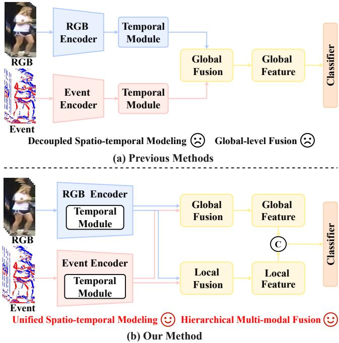  
Figure 1: Comparison of diferent methods. (a) Previous methods decouple spatial and temporal modeling and rely on global-level fusion. (b) Our method unifies spatio-temporal modeling and employs hierarchical multi-modal fusion.

Such a two-stage pipeline restricts the interaction between spatial semantics and temporal dynamics, leading to insuficient spatiotemporal representations.

Based on the above analysis, we rethink the RE-VReID paradigm from two perspectives: (i) spatial and temporal modeling should be unified rather than sequentially decoupled; (ii) cross-modal fusion should interact at both global and local levels to bridge the modal ity gap. Motivated by these insights, we propose Paths, a novel framework with spatio-temporal modeling and hierarchical crossmodal fusion for RE-VReID. As illustrated in Fig. 1 (b), our framework consists of three components: Memory-Augmented Backbone (MAB), Prompt-aware Spatio-temporal Transformer (PST), and Hi erarchical Multi-modal Fusion (HMF). Specifically, MAB maintains modality-specific identity prototypes for stable intra-modal repre sentation learning. PST leverages learnable temporal prompts to jointly capture spatial semantics and temporal dynamics within a unified Transformer. Furthermore, to bridge the modality gap, HMF integrates RGB and event features at both global and local levels. By integrating these components, our framework can learn more robust and discriminative identity representations for RE-VReID. Extensive experiments on three public RE-VReID benchmarks demonstrate the efectiveness of our method.

In summary, our main contributions are as follows:

• We propose Paths, a novel framework with spatio-temporal modeling and hierarchical multi-modal fusion for RE-VReID.

• We design a Memory-Augmented Backbone (MAB) to maintain modality-specific identity prototypes for stable intramodal representation learning.

• We develop a Prompt-aware Spatio-temporal Transformer (PST) to jointly model spatial and temporal cues.

• We introduce a Hierarchical Multi-modal Fusion (HMF) to fuse RGB and event features at both global and local levels.

• Extensive experiments on three benchmark datasets demonstrate the efectiveness of our proposed framework.

## 2 Related Work

## 2.1 RGB-Event Video Person ReID

RGB-Event Video Person Re-Identification (RE-VReID) aims to retrieve specific person by jointly exploiting appearance cues from RGB videos and motion information from event streams. Existing studies mainly focus on event representation enhancement, RGB-Event complementary learning, and semantic-guided crossmodal interaction [3, 5, 25, 42, 45]. For event representation enhancement, SFE-Net [42] combines frequency-domain filtering and multi-granularity spatial enhancement to suppress event noise. HSCPS-Net [5] uses global and local proxy memories to model multi-level semantics and an event inversion model to capture finegrained event information. For RGB-Event complementary learning, SDCL [3] uses separate CNN and SNN branches to encode RGB and event features, and further performs cross-modal alignment. CMTC [25] generates auxiliary representations from raw events and enhances their complementarity through modality and temporal collaboration. More recently, TriPro-ReID [45] uses person attributes as intermediate semantic information and introduces attribute and cross-modal prompts to facilitate collaborative learning between RGB and event. These methods improve RGB-Event representation learning from diferent perspectives. Despite continuous progress, existing fusion methods still rely on global-level representations. In contrast, our method jointly models spatial and temporal information within a unified Transformer and performs hierarchical RGB-Event fusion at both global and local levels.

## 2.2 Prompt Learning

Prompt learning adapts visual models by introducing a small number of learnable prompt tokens [18, 19, 64]. In person ReID, CLIP-ReID [27] learns identity-specific textual tokens to encode identity semantics and transfers the resulting text knowledge to visual representation learning. LATex [16] exploits attribute-based textual knowledge through structured textual prompts. APC [52] constructs identity-relevant adaptive prompt composition to improve the discriminative and generalizable person ReID. �-VL [29] further incorporates part-aware prompts, allowing local body regions to interact with semantic descriptions for fine-grained identity learning. For video-based person ReID, TF-CLIP [58] introduces a video-level prompt to dynamically update the identity-specific memory for robust representation learning. For RE-VReID, TriPro-ReID [45] introduces attribute and cross-modal prompts to inject person semantics and facilitate interaction between RGB and event representations. Beyond the above works, prompt learning has also been extended to temporal modeling. For example, VoP [17] introduces learnable video prompts to incorporate temporal information across frames, while STOP [36] generates dynamic spatio-temporal prompts according to video variations. These studies demonstrate the potential of prompts for semantic guidance and video representation learning.

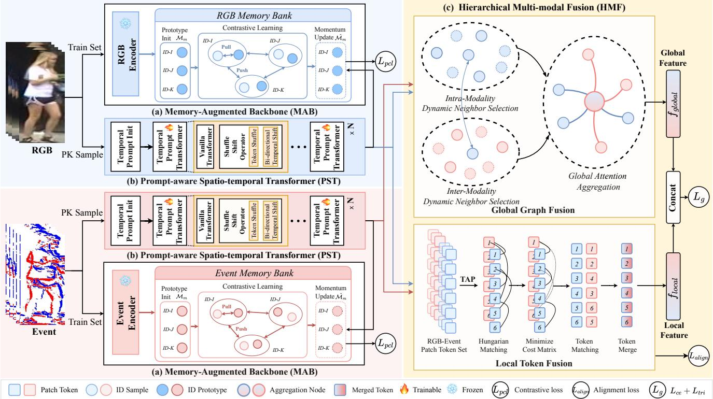  
Figure 2: Overview of the proposed framework, including Memory-Augmented Backbone (MAB), Prompt-aware Spatio-temporal Transformer (PST), and Hierarchical Multi-modal Fusion (HMF).

However, they mainly use prompts for representation adaptation or temporal aggregation, without explicitly using them to propagate temporal information across frames. In contrast, our method introduces learnable temporal prompts for spatio-temporal modeling. It allows spatial and temporal cues to be jointly modeled within a unified Transformer.

## 2.3 Multi-modal Fusion

Multi-modal fusion leverages complementary information from heterogeneous modalities to improve feature robustness [12, 16, 22, 23, 38, 46, 57]. Recent studies increasingly focus on fine-grained interactions among multi-modal representations. For example, TOP-ReID [48] introduces token permutation to exchange local information across diferent spectra, with complementary reconstruction ❄️for cross-modal learning. IEEE [53] exchanges information across modalities and incorporates fine-grained local cues into multimodal representations. Magic Tokens [61] selects object-centric tokens and performs hierarchical masked aggregation within and across modalities. AIO [24] projects heterogeneous modalities into a unified representation space for multi-modal ReID. DeMo [49] decouples multi-modal features and adaptively balances them through a mixture-of-experts architecture. DMPT [28] introduces modalityaware prompts to exchange complementary information across modalities. Uni-Prompt ReID [11] utilizes modality and platform aware prompts for representation learning across heterogeneous inputs. MambaPro [47] combines synergistic prompts with Mamba aggregation for cross-modal interaction. IDEA [50] incorporates text semantics into multi-modal representation learning and uses deformable aggregation to capture complementary global and local information. More recently, Signal [35] selects informative tokens for cross-modal interaction and aligns multi-modal representations at both global and local levels. These methods demonstrate the efectiveness of fine-grained interaction and hierarchical aggregation for multi-modal representation learning. Diferent from these methods, our method performs hierarchical RGB-Event fusion at both global and local levels.

## 3 Methodology

As shown in Fig. 2, our proposed framework comprises three main components: Memory-Augmented Backbone (MAB), Prompt-aware Spatio-temporal Transformer (PST), and Hierarchical Multi-modal Fusion (HMF). Details of the each component are as follows.

## 3.1 Memory-Augmented Backbone

Existing RE-VReID methods [4] mainly rely on samples within the current mini-batch for representation learning, making the learned features sensitive to the batch sampling. Inspired by X-ReID [59], we propose a Memory-Augmented Backbone (MAB) to maintain modality-specific identity prototypes across mini-batches.

Multi-modal Feature Encoding. In this work, the training set is denoted as $\mathcal { D } = \{ ( V _ { i } ^ { r } , V _ { i } ^ { e } , y _ { i } ) \} _ { i = 1 } ^ { I }$ . Here, $V _ { i } ^ { r }$ and $V _ { i } ^ { e }$ are the RGB and event video sequences of the �-th training sample, respectively.

$y _ { i } \in \{ 1 , . . . , Y \}$ is the corresponding identity label. � is the number of training samples. � is the total number of training identities. � $\in \{ r , e \}$ is the modality, where � and � represent RGB and event, respectively. For each modality, we uniformly sample � frames from the video sequence, denoted as $V ^ { m } = \{ I _ { t } ^ { m } \} _ { t = 1 } ^ { T }$ , where $I _ { t } ^ { m }$ is the �-th frame image. Each frame $I _ { t } ^ { m }$ is divided into � patches and fed into the visual encoder $\Phi ^ { m } ( \cdot )$

$$
\left[ \hat { f } _ { t } ^ { m } ; f _ { t , 1 } ^ { m } ; . . . ; f _ { t , N } ^ { m } \right] = \Phi ^ { m } ( I _ { t } ^ { m } ) ,\tag{1}
$$

where $\hat { f } _ { t } ^ { m } \in \mathbb { R } ^ { D }$ is the class token, $f _ { t , n } ^ { m } \in \mathbb { R } ^ { D }$ is the �-th patch token, $n \in \{ 1 , \ldots , N \}$ , and � is the feature dimension. We then apply a Temporal Average Pooling (TAP) to the class tokens of all frames to obtain the sequence-level representation:

$$
\bar { f } ^ { m } = \frac { 1 } { T } \sum _ { t = 1 } ^ { T } \hat { f } _ { t } ^ { m } .\tag{2}
$$

The resulting ${ \bar { f } } ^ { m }$ provides a compact representation of the entire video sequence and is used for identity-level prototype learning.

Prototype Memory Learning. To provide stable cross-batch identity references, we construct a modality-specific prototype memory for each modality, as follows:

$$
\boldsymbol { \mathcal { M } ^ { m } } = \left\{ \boldsymbol { p } _ { y } ^ { m } \right\} _ { y = 1 } ^ { Y } ,\tag{3}
$$

where $\boldsymbol { p } _ { \boldsymbol { u } } ^ { m } \in \mathbb { R } ^ { D }$ is the prototype of identity � under modality �, and $\boldsymbol { M ^ { m } } \in \mathbb { R } ^ { Y \times D }$ stores each training identity prototype. Before training, we initialize the prototype memory using the frozen pretrained visual encoder. Specifically, we extract and aggregate the sequence-level representations of all training samples. For identity � under modality �, its prototype is initialized as follows:

$$
\mathcal { P } _ { y } ^ { m } = \frac { 1 } { | \mathcal { D } _ { y } ^ { m } | } \sum _ { q \in \mathcal { D } _ { y } ^ { m } } \bar { f } _ { q } ^ { m } ,\tag{4}
$$

where $\mathcal { D } _ { y } ^ { m }$ is the set of training samples belonging to identity � under modality �, and $\bar { f } _ { q } ^ { m }$ is the sequence-level representation of the sample �. After initialization, the prototypes are progressively updated with the current mini-batch features using a momentum update strategy, as follows:

$$
\begin{array} { r } { p _ { y } ^ { m } \gets \mu p _ { y } ^ { m } + ( 1 - \mu ) \tilde { f } _ { y } ^ { m } , } \end{array}\tag{5}
$$

where $\mu \in \left[ 0 , 1 \right]$ is the momentum coeficient. For identity �, the mean representation of its samples in the current mini-batch is computed as:

$$
\tilde { f } _ { y } ^ { m } = \frac { 1 } { | \mathcal { B } _ { y } ^ { m } | } \sum _ { q \in \mathcal { B } _ { y } ^ { m } } \bar { f } _ { q } ^ { m } ,\tag{6}
$$

where $\mathcal { B } _ { y } ^ { m }$ is the set of samples belonging to identity � under modality � in the current mini-batch.

Prototypical Contrastive Learning. To guide intra-modal representation learning, we further introduce a prototypical contrastive learning loss. For a sequence representation ${ \bar { f } } ^ { m }$ with identity label �, the loss is defined as:

$$
\mathcal { L } _ { p c l } ^ { m } = - \log \frac { \exp \left( \sin \left( \bar { f } ^ { m } , \boldsymbol { p } _ { y } ^ { m } \right) / \tau \right) } { \sum _ { y ^ { \prime } = 1 } ^ { Y } \exp \left( \sin \left( \bar { f } ^ { m } , \boldsymbol { p } _ { y ^ { \prime } } ^ { m } \right) / \tau \right) } ,\tag{7}
$$

where � is the temperature parameter and sim $. ( \cdot , \cdot )$ is the cosine sim ilarity. Here, $\boldsymbol { p } _ { y } ^ { m }$ is the prototype corresponding to the ground-truth identity, while $\boldsymbol { p } _ { y ^ { \prime } } ^ { m }$ enumerates all identity prototypes in modality �. Therefore, each sequence representation is compared against the prototypes of all training identities rather than only the current mini-batch. By pulling each sequence representation toward its corresponding prototype while separating it from other identity prototypes, MAB reduces intra-identity variation and improves the discrimination of intra-modal representations.

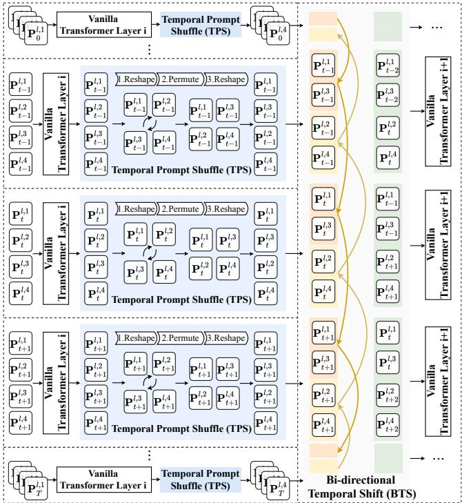  
Figure 3: Detailed structure of the proposed Prompt-aware Spatio-temporal Transformer (PST).

## 3.2 Prompt-aware Spatio-temporal Transformer

Existing RE-VReID methods commonly separate spatial representation learning from temporal modeling, limiting the interaction between spatial semantics and temporal information. To alleviate this issue, we propose a Prompt-aware Spatio-temporal Transformer (PST), which leverages learnable temporal prompts to jointly capture spatial semantics and temporal dynamics. As shown in Fig. 3, it consists of Temporal Prompt Shufle (TPS) and Bidirectional Temporal Shift (BTS). The TPS reorganizes the temporal prompt groups, while the BTS exchanges them between adjacent frames before they are fed into the next Transformer layer.

Temporal Prompt Initialization. For each Transformer layer, we introduce � learnable temporal prompt tokens for every frame. At the �-th layer, the temporal prompts are denoted as $\mathring { P ^ { l } } \in \mathbb { R } ^ { T \times G \times D }$ where � is the number of frames, � is the number of prompt tokens, and � is the feature dimension. For the �-th frame, the prompt tokens are represented as $\{ P _ { t } ^ { l , g } \} _ { q = 1 } ^ { G } . P _ { t } ^ { l , g }$ is the �-th temporal prompt group of the �-th frame at the �-th Transformer layer. Following the notation in the MAB, the input tokens of the �-th frame at layer �

are constructed as:

$$
F _ { t } ^ { m , l } = \left[ \widehat { f } _ { t } ^ { m , l } ; f _ { t , 1 } ^ { m , l } ; \ldots ; f _ { t , N } ^ { m , l } ; P _ { t } ^ { l } ; \ldots ; P _ { t } ^ { l , G } \right] \in \mathbb { R } ^ { ( 1 + N + G ) \times D } ,\tag{8}
$$

where $\hat { f } _ { t } ^ { m , l } \in \mathbb { R } ^ { D }$ and $f _ { t , n } ^ { m , l } \in \mathbb { R } ^ { D }$ denote the class token and the �-th patch token of modality � at the �-th layer, respectively. The temporal prompts interact with the class and patch tokens through Transformer layers, allowing temporal information to participate directly in spatial representation learning. Although temporal prompts interact with spatial tokens within each frame, direct information exchange across diferent frames is still limited. We therefore introduce the temporal prompt shufle and bidirectional temporal shift to propagate the prompt information along the temporal dimension. Temporal Prompt Shufle. To reorganize the prompts before temporal propagation, we divide the $G$ prompts into � groups, each containing $n _ { g } = G / g$ tokens. The prompt tensor is first reshaped as:

$$
P _ { r e s } ^ { l } = \mathrm { R e s h a p e } ( P ^ { l } ) \in \mathbb { R } ^ { T \times g \times n _ { g } \times D } .\tag{9}
$$

We then exchange the group and token dimensions:

$$
\boldsymbol { P } _ { p e r m } ^ { l } = \mathrm { P e r m u t e } \left( \boldsymbol { P } _ { r e s } ^ { l } \right) \in \mathbb { R } ^ { T \times n _ { g } \times g \times D } .\tag{10}
$$

Finally, the permuted tensor is reshaped back to the original layout:

$$
\begin{array} { r } { \hat { P } ^ { l } = \mathrm { R e s h a p e } \left( P _ { \mathit { p e r m } } ^ { l } \right) \in \mathbb { R } ^ { T \times G \times D } . } \end{array}\tag{11}
$$

The above operation redistributes prompts across diferent groups, so that diferent temporal spans can participate in the subsequent temporal exchange.

Bidirectional Temporal Shift. After the temporal prompt shuffle, we split the prompts into two equal subsets along the prompt dimension: the forward group $\hat { P } _ { f w d }$ and the backward group $\hat { P } _ { b w d }$ each containing half prompts:

$$
\begin{array} { r } { \hat { P } ^ { l } = \left[ \hat { P } _ { f w d } ^ { l } ; \hat { P } _ { b w d } ^ { l } \right] , } \end{array}\tag{12}
$$

where $\hat { P } _ { f w d } ^ { l } , \hat { P } _ { b w d } ^ { l } \in \mathbb { R } ^ { T \times \frac { G } { 2 } \times D }$ . The forward subset is shifted from the previous frame to the current frame:

$$
\begin{array} { r } { \tilde { P } _ { f w d , t } ^ { l } = \left\{ \begin{array} { l l } { \hat { P } _ { f w d , t } ^ { l } , } & { t = 1 , } \\ { \hat { P } _ { f w d , t - 1 } ^ { l } , } & { 1 < t \le T , } \end{array} \right. } \end{array}\tag{13}
$$

while the backward subset is shifted from the next frame:

$$
\begin{array} { r } { \tilde { P } _ { b w d , t } ^ { l } = \left\{ \begin{array} { l l } { \hat { P } _ { b w d , t + 1 } ^ { l } , } & { 1 \le t < T , } \\ { \hat { P } _ { b w d , t } ^ { l } , } & { t = T . } \end{array} \right. } \end{array}\tag{14}
$$

The two shifted subsets are then concatenated:

$$
\begin{array} { r } { \tilde { P } ^ { l } = \left[ \tilde { P } _ { f w d } ^ { l } ; \tilde { P } _ { b w d } ^ { l } \right] \in \mathbb { R } ^ { T \times G \times D } . } \end{array}\tag{15}
$$

In this way, the prompts associated with each frame receive information from its preceding and succeeding frames. By combining prompt-based spatial interaction with bidirectional cross-frame propagation, the proposed PST allows spatial and temporal cues to be jointly modeled within the same Transformer backbone without introducing an additional temporal encoder.

## 3.3 Hierarchical Multi-modal Fusion

Existing RE-VReID methods mainly focus on global-level feature fusion, while fine-grained interactions between RGB and event remain insuficiently explored. To address this limitation, we propose a Hierarchical Multi-modal Fusion (HMF), which integrates RGB and event features at both global and local levels. It consists of Global Graph Fusion (GGF) and Local Token Fusion (LTF).

(a) Inter-Modal Dynamic Neighbor Selection  
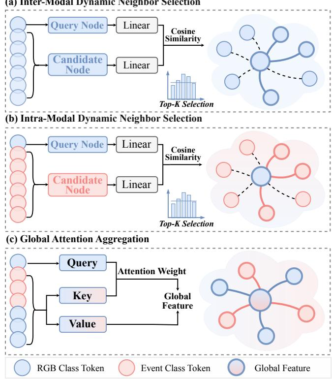  
Figure 4: Illustration of our Global Graph Fusion.

Global Graph Fusion (GGF). As shown in Fig. 4, GGF models cross-modal and cross-temporal relationships among frame-level representations. We regard the RGB and event frame features as nodes of a dynamic graph. Let $u _ { t } ^ { m } \in \mathbb { R } ^ { D }$ denote the frame-level representation of the �-th frame under modality �, obtained from the class token $\hat { f } _ { t } ^ { m , L }$ of the last PST layer. For each query node $u _ { t } ^ { m } .$ , GGF first selects informative intra-modal and inter-modal neighbors and then aggregates them through a multi-head attention.

(1) Dynamic Neighbor Selection. For a query node ${ \boldsymbol { u } } _ { t } ^ { m }$ , we construct an intra-modal candidate set from the remaining frames of the same modality, as follows:

$$
C _ { t } ^ { i n t r a } = \left\{ u _ { s } ^ { m } \ | \ s \neq t , \ 1 \leq s \leq T \right\} ,\tag{16}
$$

and an inter-modal candidate set from the other modality as:

$$
C _ { t } ^ { i n t e r } = \left\{ u _ { s } ^ { \bar { m } } \ | \ 1 \leq s \leq T \right\} ,\tag{17}
$$

where �¯ denotes the modality complementary to �, i.e., $\bar { r } = e$ and ${ \bar { e } } = r .$ This construction captures both intra-modal temporal context and cross-modal complementary information. The relevance of candidate node $c _ { i }$ to query node ${ \boldsymbol { u } } _ { t } ^ { m }$ is computed by:

$$
a _ { t i } = \frac { \left( W _ { q } u _ { t } ^ { m } \right) ^ { \top } \left( W _ { k } c _ { i } \right) } { \gamma \sqrt { D / N _ { h } } } ,\tag{18}
$$

where $W _ { q }$ and $W _ { k }$ are learnable projection matrices. $N _ { h }$ is the number of attention heads, and $\gamma$ is a temperature parameter. We independently select the Top-� candidates from the intra-modal and

inter-modal candidate sets:

$$
\begin{array} { r } { N _ { t } ^ { i n t r a } = \mathrm { T o p K } \left( C _ { t } ^ { i n t r a } , a _ { t i } , K \right) , } \end{array}\tag{19}
$$

$$
\begin{array} { r } { N _ { t } ^ { i n t e r } = \mathrm { T o p K } \left( C _ { t } ^ { i n t e r } , a _ { t i } , K \right) . } \end{array}\tag{20}
$$

The local graph centered at ${ \boldsymbol { u } } _ { t } ^ { m }$ is then constructed as:

$$
{ \mathcal { G } } _ { t } ^ { m } = \left\{ u _ { t } ^ { m } \right\} \cup N _ { t } ^ { i n t r a } \cup N _ { t } ^ { i n t e r } .\tag{21}
$$

The dynamic neighbor selection filters out less relevant frames and retains the most informative temporal and cross-modal cues for each query node, improving the efective of feature aggregation. (2) Global Attention Aggregation. Given the constructed graph ${ \mathcal { G } } _ { t } ^ { m }$ we aggregate information from the selected neighbors using a multihead attention. For the ℎ-th attention head, the query, key, and value features are computed as:

$$
\begin{array} { r } { \boldsymbol { q } _ { t } ^ { ( h ) } = \boldsymbol { W } _ { \boldsymbol { q } } ^ { ( h ) } \boldsymbol { u } _ { t } ^ { m } , \qquad \boldsymbol { k } _ { j } ^ { ( h ) } = \boldsymbol { W } _ { \boldsymbol { k } } ^ { ( h ) } \boldsymbol { g } _ { j } , \qquad \boldsymbol { v } _ { j } ^ { ( h ) } = \boldsymbol { W } _ { \boldsymbol { v } } ^ { ( h ) } \boldsymbol { g } _ { j } , } \end{array}\tag{22}
$$

where $g _ { j } \in \mathcal { G } _ { t } ^ { m }$ denotes a node in the constructed graph. The corresponding attention weight is defined as:

$$
\omega _ { t j } ^ { ( h ) } = \frac { \exp \left( \frac { ( q _ { t } ^ { ( h ) } ) ^ { \top } k _ { j } ^ { ( h ) } } { \sqrt { D / N _ { h } } } \right) } { \displaystyle \sum _ { g _ { s } \in \mathcal { G } _ { t } ^ { m } } \exp \left( \frac { ( q _ { t } ^ { ( h ) } ) ^ { \top } k _ { s } ^ { ( h ) } } { \sqrt { D / N _ { h } } } \right) } .\tag{23}
$$

The aggregated representation of the ℎ-th head is:

$$
z _ { t } ^ { ( h ) } = \sum _ { g _ { j } \in \mathscr { G } _ { t } ^ { m } } \omega _ { t j } ^ { ( h ) } v _ { j } ^ { ( h ) } .\tag{24}
$$

The outputs of all attention heads are concatenated and projected to obtain the enhanced node representation:

$$
\hat { u } _ { t } ^ { m } = W _ { o u t } \left[ z _ { t } ^ { ( 1 ) } ; \dots ; z _ { t } ^ { ( N _ { h } ) } \right] .\tag{25}
$$

Finally, the enhanced frame-level representations from diferent modalities are aggregated into a global representation:

$$
f _ { g l o b a l } = { \cal W } _ { a g g } \left( \frac { 1 } { 2 T } \sum _ { m \in \{ r , e \} } \sum _ { t = 1 } ^ { T } \hat { u } _ { t } ^ { m } \right) ,\tag{26}
$$

where $W _ { a g g }$ is a learnable projection matrix. By dynamically selecting and aggregating informative intra-modal and inter-modal neighbors, GGF models cross-temporal dependencies and complementary RGB-Event cues, producing a unified global representation. Local Token Fusion (LTF). Although GGF captures cross-modal and cross-temporal features at the global level, such global fusion cannot resolve the fine-grained spatial misalignment between RGB and event streams. To establish local correspondences and integrate complementary token-level information, we introduce a Local Token Fusion (LTF). Specifically, LTF consists of two stages: Optimal Token Matching and Adaptive Gated Fusion.

(1) Optimal Token Matching. We use the patch tokens from the last PST layer for local cross-modal matching. For each patch position �, a Temporal Average Pooling (TAP) is first applied across all frames:

$$
\bar { f } _ { n } ^ { m } = \frac { 1 } { T } \sum _ { t = 1 } ^ { T } f _ { t , n } ^ { m , L } ,\tag{27}
$$

where $f _ { t , n } ^ { m , L } \in \mathbb { R } ^ { D }$ is the �-th patch token of the �-th frame from the last PST layer. $\bar { f } _ { n } ^ { m } \in \mathbb { R } ^ { D }$ is the sequence-level representation of the �-th local token under modality �. We then compute the cosine

similarity between the RGB and event tokens:

$$
S _ { i j } = \frac { \left( \bar { f } _ { i } ^ { r } \right) ^ { \top } \bar { f } _ { j } ^ { e } } { \left\| \bar { f } _ { i } ^ { r } \right\| _ { 2 } \left\| \bar { f } _ { j } ^ { e } \right\| _ { 2 } } ,\tag{28}
$$

where $i , j \in \{ 1 , . . . , N \}$ . The matching cost is defined as:

$$
C _ { i j } = 1 - S _ { i j } .\tag{29}
$$

To establish explicit one-to-one correspondences between RGB and event tokens, we employ the Hungarian algorithm [21] to obtain the minimum-cost assignment:

$$
\pi ^ { * } = \arg \operatorname* { m i n } _ { \pi } \sum _ { i = 1 } ^ { N } C _ { i , \pi ( i ) } ,\tag{30}
$$

where �(�) denotes the event token assigned to the �-th RGB token. Based on the optimal assignment, the matched token pair is denoted as $\left( \bar { f } _ { i } ^ { r } , \bar { f } _ { \pi ^ { * } ( i ) } ^ { e } \right)$ . We define the cross-modal alignment loss as:

$$
\mathcal { L } _ { a l i g n } = \frac { 1 } { N } \sum _ { i = 1 } ^ { N } \left[ 1 - \cos \left( \bar { f } _ { i } ^ { r } , \bar { f } _ { \pi ^ { * } ( i ) } ^ { e } \right) \right] .\tag{31}
$$

(2) Adaptive Gated Fusion. Although the optimal matching establishes cross-modal correspondences, RGB and event tokens contribute diferently to the fused representation. Therefore, we introduce an adaptive fusion gate to dynamically balance the information from each matched token pair. For the �-th matched pair, the fusion coeficient is computed as:

$$
g _ { i } = \sigma \left( W _ { 2 } \delta \left( W _ { 1 } \left[ \bar { f } _ { i } ^ { r } ; \bar { f } _ { \pi ^ { * } ( i ) } ^ { e } \right] \right) \right) ,\tag{32}
$$

where $W _ { 1 }$ and $W _ { 2 }$ are learnable projection matrices. $\delta ( \cdot )$ is the ReLU activation function, and $\sigma ( \cdot )$ is the Sigmoid function. The adaptively fused local token is formulated as:

$$
\tilde { f } _ { i } = \mathrm { L N } \left( g _ { i } \bar { f } _ { i } ^ { r } + \left( 1 - g _ { i } \right) \bar { f } _ { \pi ^ { * } \left( i \right) } ^ { e } \right) ,\tag{33}
$$

where $\operatorname { L N } ( \cdot )$ is layer normalization. Finally, we use a learnable pooling query $q _ { p o o l } \in \mathbb { R } ^ { D }$ to aggregate the fused local tokens, where $\beta _ { i }$ is the normalized attention weight of the �-th fused token computed with $q _ { \mathit { p o o l } }$ . The final local representation is obtained as:

$$
f _ { l o c a l } = \sum _ { i = 1 } ^ { N } \beta _ { i } \tilde { f } _ { i } .\tag{34}
$$

Through the above operations, LTF can establish fine-grained correspondences between local patch tokens from the two modalities and then fuses the matched tokens.

## 3.4 Objective Functions

As shown in Fig. 2, our proposed framework is jointly optimized with four objectives: the cross-entropy loss $\mathcal { L } _ { c e } \ [ 4 1 ]$ , the triplet loss $\mathcal { L } _ { t r i } \left[ 1 3 \right]$ „ the prototypical contrastive loss $\mathcal { L } _ { p c l : }$ , and the crossmodal alignment loss $\mathcal { L } _ { a l i g n }$ . The prototypical contrastive loss is computed over two modalities as:

$$
\mathcal { L } _ { p c l } = \mathcal { L } _ { p c l } ^ { r } + \mathcal { L } _ { p c l } ^ { e } ,\tag{35}
$$

and the overall training objective is formulated as:

$$
\mathcal { L } _ { t o t a l } = \mathcal { L } _ { c e } + \mathcal { L } _ { t r i } + \lambda _ { 1 } \mathcal { L } _ { p c l } + \lambda _ { 2 } \mathcal { L } _ { a l i g n } ,\tag{36}
$$

where $\lambda _ { 1 }$ and $\lambda _ { 2 }$ are the weighting coeficients of the prototypical contrastive loss and cross-modal alignment loss, respectively.

Table 1: Comparison with diferent methods on EvReID.
<table><tr><td>Method</td><td>Backbone</td><td>mAP</td><td>R-1</td><td>R-5</td><td>R-10</td></tr><tr><td>OSNet [65]</td><td>ResNet50</td><td>23.7</td><td>49.1</td><td>65.4</td><td>72.3</td></tr><tr><td>TCLNet [15]</td><td>ResNet50</td><td>55.8</td><td>77.4</td><td>89.0</td><td>93.1</td></tr><tr><td>AP3D [10]</td><td>ResNet50</td><td>66.9</td><td>86.5</td><td>95.6</td><td>96.5</td></tr><tr><td>MGH [55]</td><td>ResNet50</td><td>43.2</td><td>70.9</td><td>89.4</td><td>92.7</td></tr><tr><td>STMN [8]</td><td>ResNet50</td><td>42.1</td><td>73.8</td><td>一</td><td>1</td></tr><tr><td>PSTA [51]</td><td>ResNet50</td><td>68.2</td><td>82.3</td><td>90.8</td><td>94.5</td></tr><tr><td>GRL [33]</td><td>ResNet50</td><td>38.9</td><td>62.6</td><td>78.0</td><td>83.6</td></tr><tr><td>BiCnet-TKS [14]</td><td>ResNet50</td><td>50.8</td><td>80.5</td><td>89.62</td><td>92.45</td></tr><tr><td>SINet [2]</td><td>ResNet50</td><td>50.2</td><td>77.4</td><td>92.8</td><td>96.2</td></tr><tr><td>SDCL [3]</td><td>ResNet50</td><td>54.2</td><td>69.3</td><td>83.8</td><td>87.1</td></tr><tr><td>DCCT [31]</td><td>ViT-B/16</td><td>24.6</td><td>42.7</td><td>64.9</td><td>75.5</td></tr><tr><td>CLIP-ReID [27]</td><td>CLIP-B/16</td><td>49.2</td><td>73.0</td><td>85.5</td><td>91.5</td></tr><tr><td>TF-CLIP [58]</td><td>CLIP-B/16</td><td>56.9</td><td>78.6</td><td>91.8</td><td>94.3</td></tr><tr><td>DeMo [49]</td><td>CLIP-B/16</td><td>59.4</td><td>75.7</td><td>90.1</td><td>92.8</td></tr><tr><td>CLIMB-ReID [60]</td><td>CLIP-B/16</td><td>68.3</td><td>85.2</td><td>92.8</td><td>95.8</td></tr><tr><td>TriPro-ReID [45]</td><td>CLIP-B/16</td><td>69.3</td><td>88.6</td><td>94.3</td><td>95.4</td></tr><tr><td>Paths*</td><td>CLIP-B/16</td><td>71.1</td><td>89.3</td><td>94.6</td><td>96.5</td></tr><tr><td>Paths†</td><td>DINOv3</td><td>73.6</td><td>90.8</td><td>96.2</td><td>97.8</td></tr></table>

## 4 Experiments

## 4.1 Datasets and Evaluation Metrics

To evaluate the efectiveness of our proposed method, we conduct experiments on three RE-VReID benchmarks: the large-scale realworld EvReID dataset [45] and two simulated datasets, MARS [62] and iLIDS-VID [44]. Following previous works, we adopt the mean Average Precision (mAP) and Cumulative Matching haracteristics (CMC) at Rank-K (K= 1,5,10) as our evaluation metrics.

## 4.2 Implementation Details

Our model is implemented in PyTorch and trained on a single NVIDIA A100 GPU with 80 GB of memory. We evaluate two pretrained visual backbones, CLIP-B/16 [7] and DINOv3 [40]. For each backbone, the RGB and event encoders are initialized with the corresponding pre-trained weights. For each tracklet, we uniformly sample � = 8 frames and resize each frame to 256 × 128. Each mini-batch contains 16 identities and 4 paired RGB-Event tracklets per identity, resulting in 64 paired tracklets. For data augmentation, we apply random horizontal flipping, padding followed by random cropping, and random erasing [63]. The model is optimized using Adam [20] with a base learning rate of $5 \times 1 0 ^ { - 6 }$ . We apply linear learning-rate warm-up for the first 10 epochs,followed by cosine annealing. The model is trained for 80 epochs in total. For MAB, the momentum coeficient is set to � = 0.2. For PST, the number of temporal prompt tokens is set to � = 8, and the number of prompt groups is set to � = 2. For GGF, the numbers of selected intra-modal and inter-modal neighbors are both set to 3, i.e., $K _ { i n t r a } = K _ { i n t e r } = 3 .$ The loss weights are set to $\lambda _ { 1 } = 0 . 3$ and $\lambda _ { 2 } = 0 . 1$ for the prototypical contrastive loss and cross-modal alignment loss, respectively.

## 4.3 Comparison with State-of-the-art Methods

To evaluate the efectiveness of the proposed framework, we conduct a comprehensive comparison with SOTA methods.

Table 2: Comparison with diferent methods on MARS.
<table><tr><td>Method</td><td>Backbone</td><td>mAP</td><td>R-1</td></tr><tr><td>GRL [33]</td><td>ResNet50</td><td>82.8</td><td>88.7</td></tr><tr><td>OSNet [65]</td><td>ResNet50</td><td>81.9</td><td>87.7</td></tr><tr><td>SRS-Net [43]</td><td>ResNet50</td><td>83.8</td><td>89.3</td></tr><tr><td>STMN [8]</td><td>ResNet50</td><td>83.4</td><td>89.0</td></tr><tr><td>CTL [30]</td><td>ResNet50</td><td>85.3</td><td>89.6</td></tr><tr><td>PSTA [51]</td><td>ResNet50</td><td>85.1</td><td>89.9</td></tr><tr><td>SDCL [3]</td><td>ResNet50</td><td>86.5</td><td>91.1</td></tr><tr><td>TriPro-ReID [45]</td><td>CLIP-B/16</td><td>88.4</td><td>91.1</td></tr><tr><td>Paths*</td><td>CLIP-B/16</td><td>88.1</td><td>91.3</td></tr><tr><td>Paths†</td><td>DINOv3</td><td>89.4</td><td>92.5</td></tr></table>

Table 3: Comparison with diferent methods on iLIDS-VID.
<table><tr><td>Method</td><td>Backbone</td><td>Blur-mAP</td><td>Blur-R1</td><td>Occ.-mAP</td><td>Occ.-R1</td></tr><tr><td>HashReID [39]</td><td>ResNet50</td><td>67.0</td><td>55.3</td><td>65.5</td><td>55.3</td></tr><tr><td>Event-ReID [3]</td><td>ResNet50</td><td>65.0</td><td>52.7</td><td>65.7</td><td>54.0</td></tr><tr><td>BiCnet-TKS [14]</td><td>ResNet50</td><td>65.2</td><td>54.0</td><td>68.4</td><td>56.7</td></tr><tr><td>TCLNet [15]</td><td>ResNet50</td><td>64.1</td><td>51.3</td><td>74.6</td><td>64.7</td></tr><tr><td>SINet [2]</td><td>ResNet50</td><td>55.5</td><td>43.3</td><td>69.4</td><td>58.0</td></tr><tr><td>STRF [1]</td><td>ResNet50</td><td>65.1</td><td>53.3</td><td>73.4</td><td>60.7</td></tr><tr><td>GRL [33]</td><td>ResNet50</td><td>65.2</td><td>56.0</td><td>79.2</td><td>70.7</td></tr><tr><td>SRS-Net [43]</td><td>ResNet50</td><td>60.8</td><td>48.7</td><td>69.0</td><td>58.7</td></tr><tr><td>STMN [8]</td><td>ResNet50</td><td>62.2</td><td>49.3</td><td>73.5</td><td>62.7</td></tr><tr><td>CTL [30]</td><td>ResNet50</td><td>62.4</td><td>50.7</td><td>75.9</td><td>65.3</td></tr><tr><td>PSTA [51]</td><td>ResNet50</td><td>62.8</td><td>48.0</td><td>77.7</td><td>67.3</td></tr><tr><td>SDCL [3]</td><td>ResNet50</td><td>69.2</td><td>58.0</td><td>80.7</td><td>71.3</td></tr><tr><td>LER-ReID [4]</td><td>ResNet50</td><td>73.4</td><td>62.0</td><td>84.0</td><td>74.7</td></tr><tr><td>CAViT [54]</td><td>ViT-B/16</td><td>66.2</td><td>54.7</td><td>65.8</td><td>55.3</td></tr><tr><td>Paths*</td><td>CLIP-B/16</td><td>74.0</td><td>63.1</td><td>86.0</td><td>75.1</td></tr><tr><td>Paths†</td><td>DINOv3</td><td>74.9</td><td>65.2</td><td>88.3</td><td>76.4</td></tr></table>

Results on EvReID. As shown in Tab. 1, our method achieves competitive performance across all evaluation metrics on EvReID. With CLIP-B/16, Paths∗ obtains 71.1% mAP and 89.3% Rank-1. Compared with TriPro-ReID [45], Paths∗ improves mAP and Rank-1 by 1.8% and 0.7%, respectively. When using DINOv3, Paths† further improves mAP to 73.6% and Rank-1 to 90.8%. These results demonstrate the strong overall performance of our method.

Results on MARS. As shown in Tab. 2, Paths∗ achieves 88.1% mAP and 91.3% Rank-1 with CLIP-B/16. With DINOv3, Paths† reaches 89.4% mAP and 92.5% Rank-1. Compared with TriPro-ReID [45], Paths† improves mAP and Rank-1 by 1.0% and 1.4% , respectively. The consistent performance gains demonstrate the generalization of our method on large-scale simulated event data.

Results on iLIDS-VID. As shown in Tab. 3, Paths† achieves the best performance under both Blur and Occlusion settings. Under Blur, it obtains 74.9% mAP and 65.2% Rank-1. Under Occlusion, Paths† achieves 88.3% mAP and 76.4% Rank-1, exceeding LER-ReID by 4.3% and 1.7%, respectively. These results indicate that our method remains efective under blur and occlusion.

## 4.4 Ablation Study

We conduct ablation experiments on the EvReID dataset using DINOv3 as the backbone to evaluate the contribution of Paths. Efects of Key Modules. Tab. 4 reports the contribution of the main components in our method. MAB improves cross-batch identity supervision, while PST and HMF enhance spatio-temporal modeling and global-local interaction, respectively. Combining all modules achieves 73.6% mAP, 90.8% Rank-1, 96.2% Rank-5, and 97.8% Rank-10, demonstrating the benefits of these components.

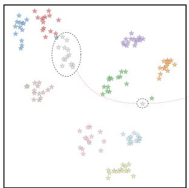  
(a) Baseline

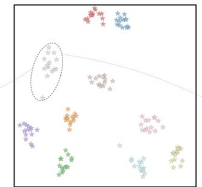  
(b) Baseline+MAB

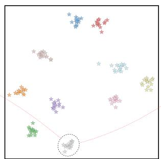  
(c) Baseline+MAB+PST

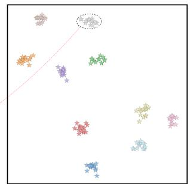  
(d) Baseline+MAB+PST+HMF  
Figure 5: Visualization of the feature distributions with t-SNE. Diferent colors stand for diferent identities.

Table 4: Component ablation on EvReID.
<table><tr><td>No.</td><td>MAB</td><td>PST</td><td>HMF</td><td>mAP</td><td>R-1</td><td>R-5</td><td>R-10</td></tr><tr><td>1</td><td>×</td><td>×</td><td>×</td><td>61.0</td><td>80.5</td><td>88.4</td><td>92.2</td></tr><tr><td>2</td><td>√</td><td>X</td><td>X</td><td>63.4</td><td>82.3</td><td>90.1</td><td>93.5</td></tr><tr><td>3</td><td>√</td><td>√</td><td>X</td><td>68.8</td><td>86.5</td><td>92.4</td><td>95.2</td></tr><tr><td>4</td><td>√</td><td>X</td><td>√</td><td>69.2</td><td>87.8</td><td>94.8</td><td>96.6</td></tr><tr><td>5</td><td>√</td><td>√</td><td>√</td><td>73.6</td><td>90.8</td><td>96.2</td><td>97.8</td></tr></table>

Table 5: Ablation of the PST design on EvReID.
<table><tr><td>No.</td><td>Prompts</td><td>TPS</td><td>BTS</td><td>mAP</td><td>R-1</td></tr><tr><td>1</td><td>√</td><td>×</td><td>×</td><td>69.9</td><td>89.4</td></tr><tr><td>2</td><td>√</td><td>√</td><td>×</td><td>71.5</td><td>89.9</td></tr><tr><td>3</td><td>√</td><td>×</td><td>√</td><td>71.8</td><td>90.2</td></tr><tr><td>4</td><td>√</td><td>√</td><td>√</td><td>73.6</td><td>90.8</td></tr></table>

Table 6: Ablation of the HMF design on EvReID.
<table><tr><td>No.</td><td>Global</td><td>Local</td><td>Hungarian</td><td> $\underline { { { \mathcal { L } } _ { a l i g n } } }$ </td><td>mAP</td><td>R-1</td></tr><tr><td>1</td><td>√</td><td>×</td><td>X</td><td>X</td><td>71.6</td><td>89.3</td></tr><tr><td>2</td><td>X</td><td>√</td><td>√</td><td>√</td><td>71.1</td><td>88.9</td></tr><tr><td>3</td><td>√</td><td>√</td><td>X</td><td>X</td><td>72.0</td><td>89.6</td></tr><tr><td>4</td><td>√</td><td>√</td><td>√</td><td>X</td><td>72.7</td><td>90.1</td></tr><tr><td>5</td><td>√</td><td>√</td><td>√</td><td>√</td><td>73.6</td><td>90.8</td></tr></table>

Efects of PST. Tab. 5 evaluates the main components of PST. Using temporal prompts alone yields 69.9% mAP and 89.4% Rank-1. Combining the TPS with BTS yields the best performance, leading to 73.6% mAP and 90.8% Rank-1.

Efects of HMF. Tab. 6 evaluates the main components of HMF. The global branch alone obtains 71.6% mAP, while combining global and local branches with token matching and $\mathcal { L } _ { a l i g n }$ achieves the best performance of 73.6% mAP and 90.8% Rank-1.

Efects of Prompt Number in PST. As shown in Fig. 6, we evaluate the number of temporal prompts by $G \in \{ 2 , 4 , 8 , 1 6 , 3 2 \}$ . The performance improves with increasing �, reaching its best at � = 8. Thus, we set $G = 8$ in all experiments.

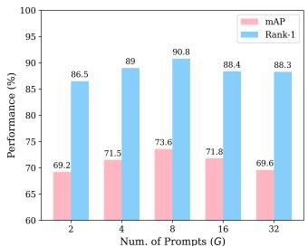

Efects of Neighborhood Size in HMF. As shown in Fig. 6, we evaluate the number of selected neighbors � in GGF from 1 to 7. The best performance is achieved at � = 3.

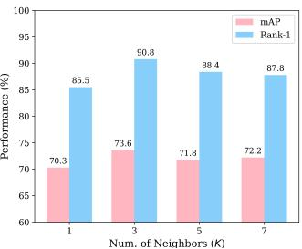  
Figure 6: Efect of hyperparameters � and � on EvReID.

(a) Baseline  
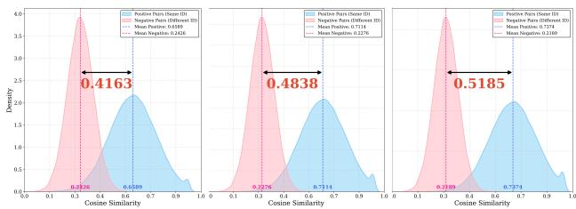  
(b) Baseline + PST  
(c) Baseline + PST + HMF  
Figure 7: Visualization of the cosine similarity distribution.

## 4.5 Visualization Analysis

Visualization of Multi-modal Feature Distributions. Fig. 5 presents the t-SNE offeature distributions on the test set. Compared with the baseline, PST produces more compact identity clusters, and HMF further strengthens feature compactness and class separation. Cosine Similarity Distributions. Fig. 7 presents the cosine similarity distributions of positive and negative pairs on the test set. Compared with the baseline, PST reduces the overlap between the two distributions, and HMF further increases the similarity margin between positive and negative pairs.

## 5 Conclusion

In this paper, we present Paths, a novel framework with spatiotemporal modeling and hierarchical multi-modal fusion for RE-VReID. More specifically, we first propose MAB to maintain modalityspecific identity prototypes for intra-modal representation learning. Then, we introduce PST with learnable temporal prompts to jointly model spatial and temporal cues within a unified Transformer. Finally, we use HMF to fuse RGB and event features at both global and local levels. Extensive experiments on three RE-VReID benchmarks demonstrate the efectiveness of our proposed method.

## References

[1] Abhishek Aich, Meng Zheng, Srikrishna Karanam, Terrence Chen, Amit K Roy-Chowdhury, and Ziyan Wu. 2021. Spatio-temporal representation factorization for video-based person re-identification. In Proceedings ofthe IEEE/CVF International Conference on Computer Vision. 152–162.

[2] Shutao Bai, Bingpeng Ma, Hong Chang, Rui Huang, and Xilin Chen. 2022. Salient-to-broad transition for video person re-identification. In Proceedings of the IEEE/CVF Conference on Computer Vision and Pattern Recognition. 7339–7348.

[3] Chengzhi Cao, Xueyang Fu, Hongjian Liu, Yukun Huang, Kunyu Wang, Jiebo Luo, and Zheng-Jun Zha. 2023. Event-guided person re-identification via sparse-dense complementary learning. In Proceedings ofthe IEEE/CVF Conference on Computer Vision and Pattern Recognition. 17990–17999.

[4] Chengzhi Cao, Xueyang Fu, Senyan Xu, Chengjie Ge, Kunyu Wang, and Zheng-Jun Zha. 2026. Learning Robust Event-Guided Representations for Person Re Identification. International Journal of Computer Vision 134, 2 (2026), 82.

[5] Wanzhang Chen, Jun Kong, Min Jiang, and Xuefeng Tao. 2025. Hierarchical semantic compactness and proxy sparsity learning with event inversion for event person re-identification. Journal ofElectronic Imaging 34, 2 (2025), 023045.

[6] Ju Dai, Pingping Zhang, Dong Wang, Huchuan Lu, and Hongyu Wang. 2019. Video Person Re-Identification by Temporal Residual Learning. IEEE Transactions on Image Processing 28, 3 (2019), 1366–1377.

[7] Alexey Dosovitskiy, Lucas Beyer, Alexander Kolesnikov, Dirk Weissenborn, Xi aohua Zhai, Thomas Unterthiner, Mostafa Dehghani, Matthias Minderer, Georg Heigold, Sylvain Gelly, Jakob Uszkoreit, and Neil Houlsby. 2021. An Image Is Worth 16x16 Words: Transformers for Image Recognition at Scale. In International Conference on Learning Representations.

[8] Chanho Eom, Geon Lee, Junghyup Lee, and Bumsub Ham. 2021. Video-based per son re-identification with spatial and temporal memory networks. In Proceedings of the IEEE/CVF International Conference on Computer Vision. 12036–12045.

[9] Guillermo Gallego, Tobi Delbruck, Garrick Orchard, Chiara Bartolozzi, Brian Taba, Andrea Censi, Stefan Leutenegger, Andrew J. Davison, Jorg Conradt, Kostas Daniilidis, and Davide Scaramuzza. 2022. Event-Based Vision: A Survey. IEEE Transactions on Pattern Analysis and Machine Intelligence 44, 1 (2022), 154–180.

[10] Xinqian Gu, Hong Chang, Bingpeng Ma, Hongkai Zhang, and Xilin Chen. 2020. Appearance-preserving 3d convolution for video-based person re-identification. In Proceedings ofthe European Conference on Computer Vision. 228–243.

[11] Ruiyang Ha, Songyi Jiang, Bin Li, Bikang Pan, Yihang Zhu, Junjie Zhang, Xiatian Zhu, Shaogang Gong, and Jingya Wang. 2025. Multi-modal Multi-platform Person Re-Identification: Benchmark and Method. In Proceedings of the IEEE/CVF International Conference on Computer Vision. 10251–10261.

[12] Kailash A. Hambarde, Hugo Proenca, Md Rashidunnabi, Pranita Samale, Qiwei Yang, Pingping Zhang, Zijing Gong, Yuhao Wang, Xi Zhang, Ruoshui Qu, Qiaoyun He, Yuhang Zhang, Thi Ngoc Ha Nguyen, Tien-Dung Mai, Cheng-Jun Kang, Yu-Fan Lin, Jin-Hui Jiang, Chih-Chung Hsu, Tamas Endrei, Gyorgy Cserey, and Ashwat Rajbhandari. 2026. VReID-XFD: Video-Based Person Re-Identification at Extreme Far Distance Challenge Results. In Proceedings ofthe IEEE/CVF Winter Conference on Applications ofComputer Vision Workshops.

[13] Alexander Hermans, Lucas Beyer, and Bastian Leibe. 2017. In Defense of the Triplet Loss for Person Re-Identification. arXiv preprint arXiv:1703.07737 (2017).

[14] Ruibing Hou, Hong Chang, Bingpeng Ma, Rui Huang, and Shiguang Shan. 2021. Bicnet-tks: Learning eficient spatial-temporal representation for video person re-identification. In Proceedings ofthe IEEE/CVF Conference on Computer Vision and Pattern Recognition. 2014–2023.

[15] Ruibing Hou, Hong Chang, Bingpeng Ma, Shiguang Shan, and Xilin Chen. 2020. Temporal complementary learning for video person re-identification. In Proceedings of the European Conference on Computer Vision. 388–405.

[16] Xiang Hu, Yuhao Wang, Pingping Zhang, and Huchuan Lu. 2025. LATex: Leveraging Attribute-based Text Knowledge for Aerial-Ground Person Re-Identification. arXiv preprint arXiv:2503.23722 (2025).

[17] Siteng Huang, Biao Gong, Yulin Pan, Jianwen Jiang, Yiliang Lv, Yuyuan Li, and Donglin Wang. 2023. VoP: Text-Video Co-Operative Prompt Tuning for Cross Modal Retrieval. In Proceedings of the IEEE/CVF Conference on Computer Vision and Pattern Recognition. 6565–6574.

[18] Menglin Jia, Luming Tang, Bor-Chun Chen, Claire Cardie, Serge Belongie, Bharath Hariharan, and Ser-Nam Lim. 2022. Visual Prompt Tuning. In Proceedings ofthe European Conference on Computer Vision. 709–727.

[19] Muhammad Uzair Khattak, Hanoona Rasheed, Muhammad Maaz, Salman Khan, and Fahad Shahbaz Khan. 2023. MaPLe: Multi-Modal Prompt Learning. In Proceedings ofthe IEEE/CVF Conference on Computer Vision and Pattern Recognition. 19113–19122.

[20] Diederik P. Kingma and Jimmy Ba. 2014. Adam: A Method for Stochastic Optimization. arXiv preprint arXiv:1412.6980 (2014).

[21] H. W. Kuhn. 1955. The Hungarian method for the assignment problem. Naval Research Logistics Quarterly 2, 1-2 (1955), 83–97.

[22] Hao Li, Yuhao Wang, Wenning Hao, Pingping Zhang, Dong Wang, and Huchuan Lu. 2026. RAGTrack: Language-Aware RGBT Tracking with Retrieval-Augmented Generation. In Proceedings ofthe IEEE/CVF Conference on Computer Vision and

Pattern Recognition. 28179–28189.

[23] Hao Li, Yuhao Wang, Xiantao Hu, Wenning Hao, Pingping Zhang, Dong Wang, and Huchuan Lu. 2026. CADTrack: Learning Contextual Aggregation with Deformable Alignment for Robust RGBT Tracking. In Proceedings of the AAAI Conference on Artificial Intelligence. 6109–6117.

[24] He Li, Mang Ye, Ming Zhang, and Bo Du. 2024. All in One Framework for Multi modal Re-identification in the Wild. In Proceedings ofthe IEEE/CVF Conference on Computer Vision and Pattern Recognition. 17459–17469.

[25] Renkai Li, Xin Yuan, Wei Liu, and Xin Xu. 2025. Event-based Video Person Reidentification via Cross-Modality and Temporal Collaboration. In Proceedings of the 2025 IEEE International Conference on Acoustics, Speech and Signal Processing. 1–5.

[26] Shuang Li, Slawomir Bak, Peter Carr, and Xiaogang Wang. 2018. Diversity regularized spatiotemporal attention for video-based person re-identification. In Proceedings ofthe IEEE Conference on Computer Vision and Pattern Recognition. 369–378.

[27] Siyuan Li, Li Sun, and Qingli Li. 2023. CLIP-reid: exploiting vision-language model for image re-identification without concrete text labels. In Proceedings of the AAAI Conference on Artificial Intelligence. 1405–1413.

[28] Minghui Lin, Shu Wang, Xiang Wang, Jianhua Tang, Longbin Fu, Zhengrong Zuo, and Nong Sang. 2025. DMPT: Decoupled Modality-Aware Prompt Tuning for Multi-Modal Object Re-Identification. In Proceedings ofthe IEEE/CVF Winter Conference on Applications ofComputer Vision. 2103–2112.

[29] Yin Lin, Yehansen Chen, Baocai Yin, Jinshui Hu, Bing Yin, Cong Liu, and Zengfu Wang. 2025. Exploring part-informed visual-language learning for person reidentification. In Proceedings ofthe 2025 IEEE International Conference on Multimedia and Expo. 1–6.

[30] Jiawei Liu, Zheng-Jun Zha, Wei Wu, Kecheng Zheng, and Qibin Sun. 2021. Spatialtemporal correlation and topology learning for person re-identification in videos. In Proceedings of the IEEE/CVF Conference on Computer Vision and Pattern Recognition. 4370–4379.

[31] Xuehu Liu, Chenyang Yu, Pingping Zhang, and Huchuan Lu. 2023. Deeply coupled convolution–transformer with spatial–temporal complementary learning for video-based person re-identification. IEEE Transactions on Neural Networks and Learning Systems 35, 10 (2023), 13753–13763.

[32] Xuehu Liu, Pingping Zhang, and Huchuan Lu. 2023. Video-Based Person Re-Identification with Long Short-Term Representation Learning. In Image and Graphics (Lecture Notes in Computer Science, Vol. 14355). Springer, 55–67.

[33] Xuehu Liu, Pingping Zhang, Chenyang Yu, Huchuan Lu, and Xiaoyun Yang. 2021. Watching you: Global-guided reciprocal learning for video-based person re-identification. In Proceedings ofthe IEEE/CVF Conference on Computer Vision and Pattern Recognition. 13334–13343.

[34] Xuehu Liu, Pingping Zhang, Chenyang Yu, Xuesheng Qian, Xiaoyun Yang, and Huchuan Lu. 2024. A Video Is Worth Three Views: Trigeminal Transformers for Video-Based Person Re-Identification. IEEE Transactions on Intelligent Transportation Systems 25, 9 (2024), 12818–12828.

[35] Yangyang Liu, Yuhao Wang, and Pingping Zhang. 2026. Signal: Selective Interaction and Global-local Alignment for Multi-Modal Object Re-Identification. In Proceedings ofthe AAAI Conference on Artificial Intelligence. 7359–7367.

[36] Zichen Liu, Kunlun Xu, Bing Su, Xu Zou, Yuxin Peng, and Jiahuan Zhou. 2025. STOP: Integrated Spatial-Temporal Dynamic Prompting for Video Understanding. In Proceedings ofthe IEEE/CVF Conference on Computer Vision and Pattern Recognition. 13776–13786.

[37] Niall McLaughlin, Jesus Martinez Del Rincon, and Paul Miller. 2016. Recurrent convolutional network for video-based person re-identification. In Proceedings of the IEEE Conference on Computer Vision and Pattern Recognition. 1325–1334.

[38] Kien Nguyen, Clinton Fookes, Sridha Sridharan, Huy Nguyen, Feng Liu, Xiaoming Liu, Arun Ross, Dana Michalski, Tamas Endrei, Ivan DeAndres-Tame, Ruben Tolosana, Ruben Vera-Rodriguez, Aythami Morales, Julian Fierrez, Javier Ortega-Garcia, Zijing Gong, Yuhao Wang, Xuehu Liu, Pingping Zhang, Md Rashidunnabi, Hugo Proenca, Kailash A. Hambarde, and Saeid Rezaei. 2025. AG-VPReID 2025: Aerial-Ground Video-Based Person Re-Identification Challenge Results. In 2025 IEEE International Joint Conference on Biometrics. IEEE, 1–10.

[39] Kshitij Nikhal, Yujunrong Ma, Shuvra S Bhattacharyya, and Benjamin S Riggan. 2024. HashReID: Dynamic network with binary codes for eficient person re identification. In Proceedings ofthe IEEE/CVF Winter Conference on Applications ofComputer Vision. 6046–6055.

[40] Oriane Siméoni, Huy V. Vo, Maximilian Seitzer, Federico Baldassarre, Maxime Oquab, Cijo Jose, Vasil Khalidov, Marc Szafraniec, Seungeun Yi, Michaël Rama monjisoa, et al. 2025. DINOv3. arXiv preprint arXiv:2508.10104 (2025).

[41] Christian Szegedy, Vincent Vanhoucke, Sergey Iofe, Jonathon Shlens, and Zbigniew Wojna. 2016. Rethinking the Inception Architecture for Computer Vision. In Proceedings ofthe IEEE Conference on Computer Vision and Pattern Recognition. 2818–2826.

[42] Hongchen Tan, Yi Zhang, Xiuping Liu, Baocai Yin, Nan Ma, Xin Li, and Huchuan Lu. 2026. Spectrum-Guided Feature Enhancement Network for Event Person Re-Identification. Pattern Recognition 172 (2026), 112705.

[43] Haoran Wang, Licheng Jiao, Shuyuan Yang, Lingling Li, and Zexin Wang. 2022. Simple and Efective: Spatial Rescaling for Person Reidentification. IEEE Transactions on Neural Networks and Learning Systems 33, 1 (2022), 145–156.

[65] Kaiyang Zhou, Yongxin Yang, Andrea Cavallaro, and Tao Xiang. 2019. Omniscale feature learning for person re-identification. In Proceedings ofthe IEEE/CVF International Conference on Computer Vision. 3702–3712.

[44] Taiqing Wang, Shaogang Gong, Xiatian Zhu, and Shengjin Wang. 2014. Person re-identification by video ranking. In Proceedings of the European Conference on Computer Vision. 688–703.

[45] Xiao Wang, Qian Zhu, Shujuan Wu, Bo Jiang, and Shiliang Zhang. 2026. When Person Re-Identification Meets Event Camera: A Benchmark Dataset and an Attribute-Guided Re-Identification Framework. In Proceedings of the AAAI Conference on Artificial Intelligence. 10172–10180.

[46] Yuhao Wang, Xiang Hu, Lixin Wang, Pingping Zhang, and Huchuan Lu. 2026. SD-ReID: View-Aware Stable Difusion for Aerial-Ground Person Re-Identification. IEEE Transactions on Image Processing 35 (2026), 5686–5697.

[47] Yuhao Wang, Xuehu Liu, Tianyu Yan, Yang Liu, Aihua Zheng, Pingping Zhang, and Huchuan Lu. 2025. MambaPro: Multi-Modal Object Re-identification with Mamba Aggregation and Synergistic Prompt. In Proceedings ofthe AAAI Conference on Artificial Intelligence. 8150–8158.

[48] Yuhao Wang, Xuehu Liu, Pingping Zhang, Hu Lu, Zhengzheng Tu, and Huchuan Lu. 2024. TOP-ReID: Multi-Spectral Object Re-identification with Token Permu tation. In Proceedings ofthe AAAIConference on Artificial Intelligence. 5758–5766

[49] Yuhao Wang, Yang Liu, Aihua Zheng, and Pingping Zhang. 2025. DeMo: Decoupled Feature-Based Mixture of Experts for Multi-Modal Object Re-Identification. In Proceedings ofthe AAAI Conference on Artificial Intelligence. 8141–8149.

[50] Yuhao Wang, Yongfeng Lv, Pingping Zhang, and Huchuan Lu. 2025. IDEA: Inverted Text with Cooperative Deformable Aggregation for Multi-modal Object Re-Identification. In Proceedings ofthe IEEE/CVF Conference on Computer Vision and Pattern Recognition. 29701–29710.

[51] Yingquan Wang, Pingping Zhang, Shang Gao, Xia Geng, Hu Lu, and Dong Wang. 2021. Pyramid spatial-temporal aggregation for video-based person reidentification. In Proceedings ofthe IEEE/CVFInternational Conference on Computer Vision. 12026–12035.

[52] Yingquan Wang, Pingping Zhang, Chong Sun, Dong Wang, and Huchuan Lu. 2026. What Makes You Unique? Attribute Prompt Composition for Object Re-Identification. IEEE Transactions on Circuits and Systems for Video Technology 36, 3 (2026), 3173–3184.

[53] Zi Wang, Chenglong Li, Aihua Zheng, Ran He, and Jin Tang. 2022. Interact, Embed, and EnlargE: Boosting Modality-Specific Representations for Multi-Modal Person Re-identification. Proceedings of the AAAI Conference on Artificial Intelligence 36, 3 (2022), 2633–2641.

[54] Jinlin Wu, Lingxiao He, Wu Liu, Yang Yang, Zhen Lei, Tao Mei, and Stan Z Li. 2022. Cavit: Contextual alignment vision transformer for video object re-identification. In Proceedings ofthe European Conference on Computer Vision. 549–566.

[55] Yichao Yan, Jie Qin, Jiaxin Chen, Li Liu, Fan Zhu, Ying Tai, and Ling Shao. 2020. Learning multi-granular hypergraphs for video-based person re-identification. In Proceedings ofthe IEEE/CVFConference on ComputerVision andPattern Recognition. 2899–2908.

[56] Qiwei Yang and Pingping Zhang. 2026. HiHR: Hierarchical Hyperbolic Representation for Aerial-Ground Person Re-Identification. In European Conference on Computer Vision.

[57] Qiwei Yang, Pingping Zhang, Yuhao Wang, and Zijing Gong. 2026. SAS-VPReID: A Scale-Adaptive Framework with Shape Priors for Video-Based Person Re-Identification at Extreme Far Distances. In Proceedings ofthe IEEE/CVF Winter Conference on Applications ofComputer Vision Workshops. 1599–1608.

[58] Chenyang Yu, Xuehu Liu, Yingquan Wang, Pingping Zhang, and Huchuan Lu. 2024. Tf-clip: Learning text-free clip for video-based person re-identification. In Proceedings ofthe AAAI Conference on Artificial Intelligence. 6764–6772.

[59] Chenyang Yu, Xuehu Liu, Pingping Zhang, and Huchuan Lu. 2026. X-ReID: Multigranularity Information Interaction for Video-Based Visible-Infrared Person Re-Identification. In Proceedings ofthe AAAI Conference on Artificial Intelligence. 12117–12125.

[60] Chenyang Yu, Xuehu Liu, Jiawen Zhu, Yuhao Wang, Pingping Zhang, and Huchuan Lu. 2025. Climb-reid: A hybrid clip-mamba framework for person re-identification. In Proceedings ofthe AAAI Conference on Artificial Intelligence. 9589–9597.

[61] Pingping Zhang, Yuhao Wang, Yang Liu, Zhengzheng Tu, and Huchuan Lu. 2024. Magic Tokens: Select Diverse Tokens for Multi-modal Object Re-Identification. In Proceedings ofthe IEEE/CVFConference on ComputerVision andPattern Recognition. 17117–17126.

[62] Liang Zheng, Zhi Bie, Yifan Sun, Jingdong Wang, Chi Su, Shengjin Wang, and Qi Tian. 2016. MARS: A video benchmark for large-scale person re-identification. In Proceedings ofthe European Conference on Computer Vision. 868–884.

[63] Zhun Zhong, Liang Zheng, Guoliang Kang, Shaozi Li, and Yi Yang. 2020. Random erasing data augmentation. In Proceedings ofthe AAAI Conference on Artificial Intelligence. 13001–13008

[64] Kaiyang Zhou, Jingkang Yang, Chen Change Loy, and Ziwei Liu. 2022. Learning to Prompt for Vision-Language Models. International Journal of Computer Vision 130, 9 (2022), 2337–2348.