# PixSDS: Why Latent SDS Makes Noisy Pixels

Vsevolod Skorokhodov

EPFL, Lausanne, Switzerland

vsevolod.skorokhodov@epfl.ch

Abstract. Score Distillation Sampling (SDS) enables text-to-3D generation by optimizing rendered images with a pretrained difusion prior, but latent SDS often produces structured color artifacts and high-frequenc texture noise. We identify a failure mode of latent SDS caused by VAEinduced pixel drift: the optimized image can move along pixel-space directions that are weakly constrained by the VAE encoder, so its latent representation remains clean and semantically meaningful while the image itself accumulates visible artifacts. We support this diagnosis with controlled 2D SDS experiments, VAE-only optimization, and a simplified analysis showing that encoder-like latent objectives can amplify imagespace noise when the inverse mapping to pixels is underconstrained. Motivated by this observation, we propose PixSDS, a lightweight VAEconsistent gradient repair method. PixSDS decodes a latent SDS lookahead step and uses the decoded image as a clean direction for pixelspace optimization, reducing motion in VAE-inconsistent directions without retraining the difusion model, changing the renderer, or replacing the SDS objective. Experiments in 2D optimization and text-to-3D generation show that PixSDS substantially reduces structured artifacts while preserving semantic content. Code is publicly available at https://sevashasla.github.io/pixsds-webpage/.

Keywords: difusion models · score distillation sampling · image generation

## 1 Introduction

Score Distillation Sampling (SDS) [16] has become a central tool for optimizationbased text-to-3D generation. By using a pretrained text-to-image difusion model as a prior, SDS makes it possible to optimize 3D representations from text prompts without training a dedicated 3D generative model. This flexibility has made SDS useful across neural fields [16,21], meshes [2], and Gaussian splats [9, 12, 20], especially when large-scale paired text–3D data is unavailable.

Despite its success, SDS often produces visually distracting artifacts [9, 20], including structured color patterns, high-frequency texture noise, and noisy floating geometry. These artifacts are especially common in latent-difusion-based pipelines, where the difusion prior operates on the latent representation of a variational autoencoder (VAE) rather than directly on pixels. Prior work has proposed practical remedies, such as modifying the SDS objective [7], changing the optimization procedure [20], or clipping large pixel-space gradients [15]. However, these methods mostly address the symptoms of the artifact, while the underlying cause remains unclear.

In this paper, we argue that a key source of these structured artifacts is the mismatch between pixel-space optimization and the VAE representation used by latent difusion models. Latent SDS constrains an optimized rendering through its encoded latent, but the inverse mapping from latents to pixels is underconstrained. As a result, the optimized image can drift along pixel-space directions that are weakly visible to the VAE encoder: the latent code remains clean and semantically valid, while the directly optimized pixel image accumulates structured noise.

We support this view with controlled 2D experiments, VAE-only optimization, and a simplified theoretical model. Together, these results show that structured artifacts can arise even without 3D rendering or texture extraction, and that encoder-like latent objectives can amplify image-space noise when the inverse mapping to pixels is underconstrained. This diagnosis suggests that artifact reduction should not merely suppress large gradients, but should instead guide pixel-space updates toward directions that are consistent with the VAE latent space.

Motivated by this observation, we introduce PixSDS, a lightweight VAEconsistent gradient repair method for latent SDS. At each optimization step, PixSDS decodes the latent-space SDS update and uses the decoded image as a clean direction for pixel-space optimization. This repair does not require retraining the difusion model, modifying the renderer, or changing the underlying 3D representation, and can be combined with existing SDS-style objectives. Experiments in controlled 2D optimization and text-to-3D generation show that PixSDS substantially reduces structured artifacts while preserving semantic content.

In summary, our contributions are:

1. We identify VAE-induced pixel drift as a failure mode of latent score distillation, where pixel-space parameters accumulate structured high-frequency artifacts while their VAE latents remain clean and semantically valid.

2. We provide controlled evidence and a simplified theoretical analysis showing that encoder-like latent objectives can amplify image-space noise when the inverse mapping from latents to pixels is underconstrained.

3. We introduce PixSDS, a lightweight VAE-consistent gradient repair method that decodes the latent-space SDS step and uses it as a clean direction for pixel-space optimization.

4. We show that PixSDS reduces structured artifacts in controlled 2D SDS optimization and improves visual cleanliness when integrated into existing text-to-3D pipelines.

## 2 Related Works

## 2.1 Score Distillation Sampling

DreamFusion [16] introduced Score Distillation Sampling (SDS) as a way to optimize a 3D representation using a pretrained 2D difusion prior. Let $x = R _ { \theta } ( c )$ denote a rendering of the current 3D representation under camera $c ,$ and let

$$
z _ { t } = \alpha _ { t } x + \sigma _ { t } \epsilon
$$

be the corresponding noised sample at timestep t. The SDS update can be written as

$$
\nabla _ { \boldsymbol { \theta } } \mathcal { L } _ { \mathrm { S D S } } = \mathbb { E } _ { t , \epsilon } \left[ w ( t ) \left( \frac { \partial x } { \partial \boldsymbol { \theta } } \right) ^ { \top } \left( \hat { \epsilon } _ { \boldsymbol { \phi } } ( z _ { t } ; \boldsymbol { y } , t ) - \epsilon \right) \right] ,\tag{1}
$$

where $\hat { \epsilon } _ { \phi }$ is the noise predicted by the difusion model, y is the text prompt, and $w ( t )$ is a timestep-dependent weighting term.

Several works improve SDS by changing the distillation objective or modifying its gradient. ProlificDreamer [21] introduces Variational Score Distillation, HiFA [23] combines latent-space and pixel-space guidance, NFSD [7] removes an undesired noise component from the SDS signal, and PGC [15] clips decoded pixel-wise gradients. Recent reformulations such as SDI [12] and SDS-Bridge [13] derive alternative distillation directions from sampling or transport perspectives. These methods can be written abstractly as

$$
g _ { \theta } = \mathbb { E } _ { t , \epsilon } \left[ w ( t ) \left( \frac { \partial x } { \partial \theta } \right) ^ { \top } \varDelta _ { t } \right] ,\tag{2}
$$

where $\varDelta _ { t }$ is a method-specific distillation direction; for vanilla SDS, $\begin{array} { r l } { \Delta _ { t } } & { { } = } \end{array}$ $\hat { \epsilon } _ { \phi } ( z _ { t } ; y , t ) - \epsilon .$

Our work is complementary to these methods. Rather than deriving a new score distillation objective, we study why latent SDS can produce structured pixel-space artifacts even when the corresponding latent representation remains clean, and use this analysis to repair the pixel-space update.

## 2.2 Artifacts and Noise in SDS

SDS-based optimization often sufers from oversaturation, blurriness, and highfrequency texture artifacts [7, 12]. In this work, we focus on structured color artifacts and spatially coherent noise patterns, as illustrated in Fig. 4.

Prior work has attributed such artifacts to diferent mechanisms. Dream-Gaussian [20] observes that SDS can introduce high-frequency texture noise in 3D Gaussian optimization and relates part of the problem to texture extraction and mipmap sampling. PGC [15] instead focuses on latent difusion guidance and argues that decoded SDS gradients can contain large pixel-wise outliers, which motivates clipping the pixel-space gradient.

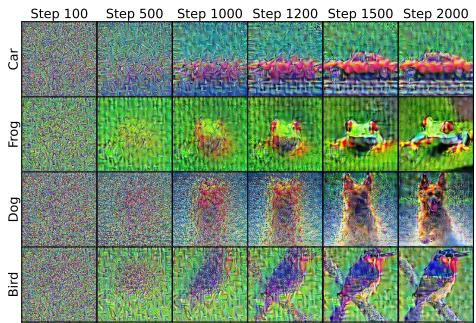  
Fig. 1: Small latent difusion model. SDS with a low-resolution latent difusion model still produces structured artifacts, suggesting that tensor shape alone does not explain the failure mode.

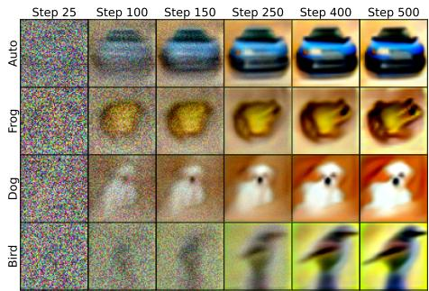  
Fig. 2: Small pixel difusion model. SDS with a pixel-space difusion model produces realistic images without the same structured artifacts, suggesting that pixelspace optimization alone is not the cause.

Our analysis is complementary to these explanations. We show that similar structured artifacts can arise even in purely 2D optimization, without mesh extraction, mipmap sampling, or a 3D renderer. This suggests that rendererspecific efects may amplify the artifacts, but are not necessary for them to occur. We instead link the artifact formation to the underconstrained geometry of the VAE mapping: an optimized image can drift into noisy pixel-space directions while its encoded latent, and the image decoded from that latent, remain clean.

## 3 Diagnosing SDS Artifacts

In this section, we study why latent SDS produces structured pixel-space artifacts. Latent SDS difers from pixel-space SDS in several ways: the optimized signal has a diferent tensor shape, the difusion prior operates in a diferent representation space [1, 17], and the update is propagated through the VAE mapping. We isolate these factors with controlled experiments and show that the VAE mapping is a suficient mechanism for the observed artifacts.

Tensor shape. One possible explanation is that artifacts arise because latent difusion operates on a compressed low-resolution tensor rather than on an image. To test this, we run SDS with stable-difusion-nano-2-1 [4], a Stable Difusion 2.1 model fine-tuned at 128×128 resolution. As shown in Fig. 1, structured artifacts still appear. This suggests that latent tensor resolution or tensor shape alone does not explain the artifact formation.

Pixel-space optimization. Another possibility is that SDS optimization itself is unstable when applied directly to pixels. To test this, we perform SDS in pixel space using a small conditional difusion model trained on CIFAR-10 [8] at 64×64 resolution. As shown in Fig. 2, the optimized images remain realistic and do not exhibit the same structured artifacts as latent SDS. This indicates that optimizing pixels with SDS is not by itself suficient to produce the observed failure mode.

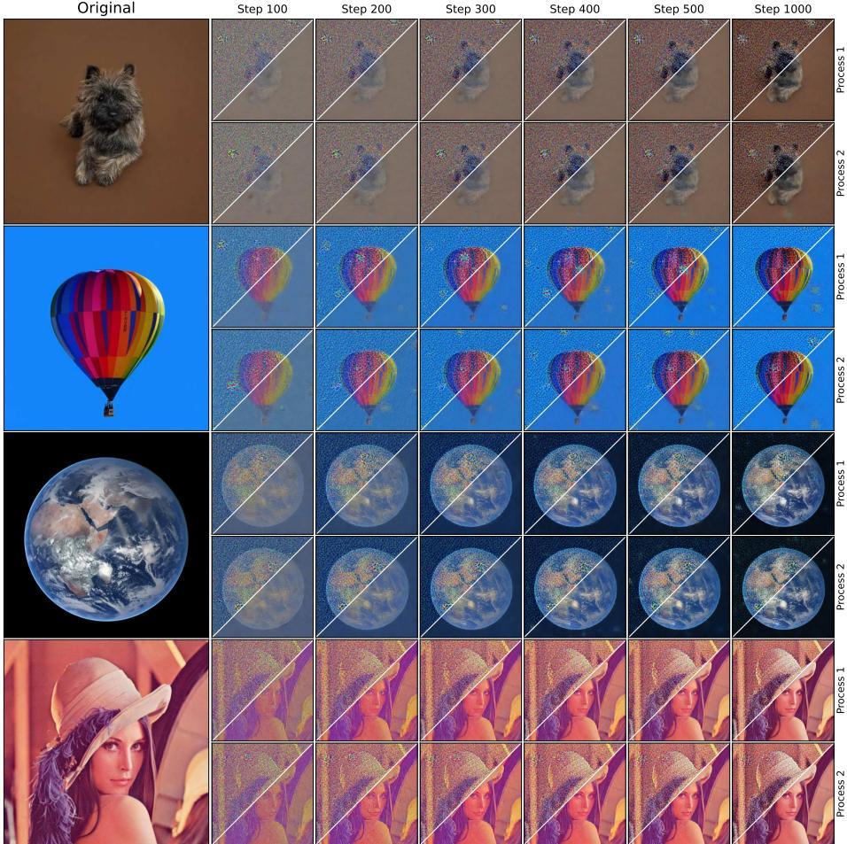  
Fig. 3: VAE-only optimization. Column 1 shows the target image X. Columns 2–7 show optimized images Z<sub>i</sub> from two diferent random initializations, with their decoded latents dec(enc(Z<sub>i</sub>)) shown in the bottom-right inset. Even without a difusion model, optimizing only through the VAE encoder produces structured noise in Z<sub>i</sub>, while the decoded latents remain clean.

VAE mapping. The remaining diference is the VAE mapping used by latent difusion models. In latent SDS, the difusion loss is defined in the latent space, but the optimized variable may live in pixel space and receive updates through the VAE encoder or decoder. This creates an underconstrained inverse problem: many visually diferent images can map to similar latent codes. As a result, an image can move in directions that are weakly constrained by the latent objective while still preserving a clean latent representation.

To isolate this efect from the difusion model, we optimize an image using only the VAE encoder. Let

$$
{ \mathrm { e n c } } : \mathbb { R } ^ { 3 \times H \times W }  \mathbb { R } ^ { c \times h \times w }
$$

denote the VAE encoder, and let X be a target image with latent code $x =$ enc(X). Starting from a randomly initialized image $Z \sim \mathcal { U } ( 0 , 1 )$ , we optimize Z to match the target latent by minimizing

$$
\mathcal { L } _ { \mathrm { V A E } } ( Z ) = \left\| \mathrm { e n c } ( Z ) - x \right\| _ { 2 } ^ { 2 }\tag{3}
$$

with SGD and learning rate 0.1. As shown in Fig. 3, the optimized images develop structured noise patterns similar to those observed in latent SDS, even though no difusion model is used. At the same time, the decoded latents dec $\left( \operatorname { e n c } ( Z ) \right)$ remain visually clean. This experiment shows that the VAE mapping alone can produce the clean-latent/noisy-image mismatch.

Toy analogy. A simple low-dimensional example illustrates the same issue. Consider minimizing

$$
\ell ( x , y ) = ( x + 2 y ) ^ { 2 } .
$$

The set of minimizers is the line $x + 2 y = 0 { \mathrm { . } }$ , so the objective does not select a unique solution. Starting from $( x _ { 0 } , y _ { 0 } ) = ( 1 , 1 )$ , gradient descent converges to $( x ^ { * } , y ^ { * } ) = ( 0 . 4 , - 0 . 2 )$ , although (0, 0) is also a minimizer. The solution $( 0 . 4 , - 0 . 2 )$ is noisier than (0, 0). Therefore, the optimization does not necessary converge to a less noisy solution without any additional constraints.

We formalize this intuition in the Appendix (Sec. A). For a 1D convolution with weights $\omega \in \mathbb { R } ^ { m } , m \geq 3$ , and $\Sigma _ { i = 1 } ^ { m } \omega _ { i } \neq 0$ , we show that for any $C > 0$ there exists an input $x \in \mathbb { R } ^ { n }$ whose initial noise is below $C ,$ , but minimizing ${ \frac { 1 } { 2 } } \left\| \omega * x \right\| _ { 2 } ^ { 2 }$ by gradient descent increases the noise in the solution. Thus, noise amplification can occur even in simple encoder-like objectives.

Together, these experiments show that structured artifacts are not fully explained by latent tensor shape, pixel-space SDS optimization, or renderer-specific efects. Instead, they identify the VAE mapping as a suficient and previously underemphasized mechanism: latent objectives can keep the encoded representation clean while allowing the optimized image to drift into noisy pixel-space directions.

## 4 Method

In this section, we introduce PixSDS. The method is motivated by a simple observation: during latent SDS optimization, the optimized image can accumulate structured pixel-space artifacts, while its VAE latent representation and decoded latent remain visually clean. We use this decoded latent update as a VAE-consistent direction to repair the SDS update in pixel space.

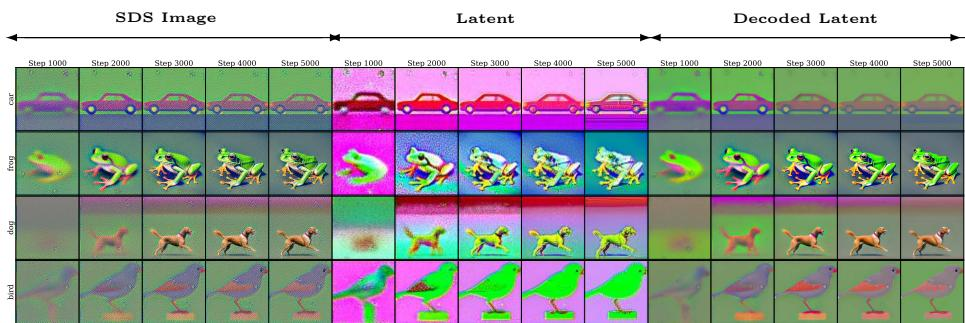  
Fig. 4: Clean latents. During SDS optimization, images (columns 1–5) contain structured noise, while their latents (columns 6–10) and decoded latents (columns 11–15) remain visually clean.

## 4.1 Clean Latents

Directly defining or penalizing the noise produced by SDS is dificult, because the artifacts are structured, spatially dependent, and often entangled with semantic image content. Instead, we rely on a more stable signal provided by the VAE itself. As shown in Fig. 4, although the optimized image may become noisy, its encoded latent remains semantically meaningful, and decoding this latent produces a much cleaner image with similar overall content.

This suggests that the artifact is not fully visible to the latent difusion model: the image can drift in pixel-space directions that are weakly constrained by the VAE encoder, while its latent representation remains clean. PixSDS uses this observation to construct a clean update direction. Rather than adding an explicit reconstruction loss toward decoded latent, which may pull the image backward toward the previous iterate, we decode the next latent SDS step and use it as a clean approximation of where the image should move. This distinction is important: reconstructing the current latent would only pull the image back toward its present VAE projection, whereas PixSDS decodes the next latent SDS step and therefore repairs the update without discarding the semantic direction of SDS.

## 4.2 PixSDS

Let $Z \in \mathbb { R } ^ { C \times H \times W }$ denote the optimized image, and let

$$
\mathrm { e n c } : \mathbb { R } ^ { C \times H \times W }  \mathbb { R } ^ { c \times h \times w } , \qquad \operatorname* { d e c } : \mathbb { R } ^ { c \times h \times w }  \mathbb { R } ^ { C \times H \times W }
$$

denote the VAE encoder and decoder. For clarity, we write $g _ { \mathrm { s d s } }$ for the imagespace SDS update direction applied to $Z ,$ and $g _ { \mathrm { s d s } } ^ { \mathrm { l a t e n t } }$ for the corresponding latentspace update direction.

At each iteration, PixSDS first computes the standard latent SDS update. Instead of applying the image-space update directly, we also take the corresponding step in latent space and decode it:

$$
\widehat { Z } = \operatorname* { d e c } \left( \operatorname { e n c } ( Z ) - \beta g _ { \mathrm { s d s } } ^ { \mathrm { l a t e n t } } \right) ,\tag{4}
$$

```python
image = random_image() # [C, H, W]
image_optimizer = get_optimizer(image, image_lr)
diffusion_model = diffusion.load_model()
vae = diffusion.load_vae()
prompt = get_prompt()
for nstep in range(num_iterations):
latent = vae.encode(image) # [c, h, w]
# compute SDS gradients in image and latent space
image_grad, latent_grad = sds_grad(latent, prompt)
# estimate a clean target after the SDS step
vae_decoded_image = vae.decode(latent - beta * latent_grad)
vae_direction = normalize(vae_decoded_image - image, dim=0)
vae_direction *= norm(image_grad, dim=0)
# repair the SDS gradient
image_grad += vae_direction
image_optimizer.step(image_grad)
return image
```  
Fig. 5: Python-like pseudocode of PixSDS. Given a text prompt, PixSDS computes the standard SDS gradient and then adds a clean-up direction obtained by decoding the SDS-updated latent. The sds\_grad(·) function samples t, ε and computes the SDS gradient (Eq. 1) in image and latent space.

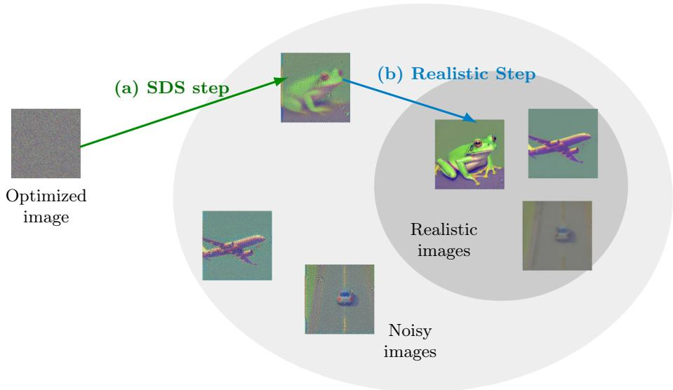  
Fig. 6: Overview of PixSDS. The (a) step points towards noisy images, while (b) removes the noise and points towards clean images.

where $\beta \geq 0$ controls the size of the latent look-ahead step. The image $\widehat { Z }$ can be interpreted as a clean, VAE-consistent approximation of the image that the latent SDS update is moving toward.

We then define the clean direction

$$
g _ { \mathrm { c l e a n } } = { \widehat { Z } } - Z .\tag{5}
$$

This direction pulls the optimized image toward the decoded latent update, thereby reducing motion in pixel-space directions that are not supported by the VAE latent representation.

To combine this direction with the original SDS update, we dynamically match its per-pixel magnitude to the magnitude of the SDS update. Let

$$
\mathrm { c n o r m } ( U ) _ { i , j } = \left( \sum _ { k = 1 } ^ { C } U _ { k , i , j } ^ { 2 } \right) ^ { 1 / 2 }
$$

denote the per-pixel channel norm, with the resulting $H \times W$ map broadcast over channels when multiplied with a $C \times H \times W$ tensor. The repaired update is

$$
\widetilde { g } _ { \mathrm { s d s } } = g _ { \mathrm { s d s } } + \frac { g _ { \mathrm { c l e a n } } } { \mathrm { c n o r m } ( g _ { \mathrm { c l e a n } } ) } \odot \mathrm { c n o r m } ( g _ { \mathrm { s d s } } ) ,\tag{6}
$$

The normalization preserves the spatial scale of the original SDS update while replacing part of its noisy pixel-space motion with a cleaner VAE-consistent direction.

Finally, the image is updated using $ { \widetilde { g } } _ { \mathrm { s d s } }$ . Since PixSDS only modifies the update after the SDS direction has been computed, it does not require changing the difusion model, the renderer, or the underlying SDS objective. This makes the method lightweight and compatible with other SDS-style objectives. Pythonlike pseudocode is provided in Fig. 5, and the update is illustrated in Fig. 6.

## 5 Experiments

We evaluate PixSDS in controlled 2D optimization and in text-to-3D generation pipelines. All experiments are run on a single NVIDIA V100 32GB GPU. The method is implemented in PyTorch using Hugging Face libraries [22].

## 5.1 2D Generation

We first evaluate PixSDS in a controlled 2D setting, where the optimized variable is an image rather than a 3D representation. This removes renderer-specific efects and allows us to directly measure whether the proposed gradient repair reduces pixel-space artifacts.

We evaluate two variants of our method, using either SGD or Adam to update the optimized image. In both cases, we use learning rate 0.05, guidance\_scale = 25.0 in classifier-free guidance, and set $\beta = 0 . 1$ . We initialize each image to the constant value (0.5, 0.5, 0.5) and optimize it for N = 1,000 steps in fp16 precision. Unless otherwise stated, all latent SDS experiments use stable-diffusion-2-base. We use a linearly annealed timestep schedule,

<table><tr><td rowspan=1 colspan=1>Method</td><td rowspan=1 colspan=5>CLIP-IQACLIP-IQAFID (↓)CLIP Score (↑) BRISQUE (↓)Quality (↑) Noisiness (↑)</td></tr><tr><td rowspan=7 colspan=1>SDSSDS-BridgeHIFANFSDPGCSDIVSD</td><td rowspan=1 colspan=2>431.877   16.442</td><td rowspan=1 colspan=1>82.120</td><td rowspan=1 colspan=1>0.859</td><td rowspan=1 colspan=1>0.031</td></tr><tr><td rowspan=1 colspan=2>352.007    14.895</td><td rowspan=1 colspan=1>90.030</td><td rowspan=1 colspan=1>0.429</td><td rowspan=1 colspan=1>0.174</td></tr><tr><td rowspan=1 colspan=2>304.815    16.311</td><td rowspan=1 colspan=1>41.764</td><td rowspan=1 colspan=1>0.246</td><td rowspan=1 colspan=1>0.025</td></tr><tr><td rowspan=1 colspan=2>296.397    15.252</td><td rowspan=1 colspan=1>67.856</td><td rowspan=1 colspan=1>0.402</td><td rowspan=1 colspan=1>0.142</td></tr><tr><td rowspan=1 colspan=1>293.886</td><td rowspan=1 colspan=1>15.455</td><td rowspan=1 colspan=1>75.095</td><td rowspan=1 colspan=1>0.455</td><td rowspan=1 colspan=1>0.121</td></tr><tr><td rowspan=1 colspan=1>424.977</td><td rowspan=1 colspan=1>16.539</td><td rowspan=1 colspan=1>72.976</td><td rowspan=1 colspan=1>0.719</td><td rowspan=1 colspan=1>0.072</td></tr><tr><td rowspan=1 colspan=1>321.474</td><td rowspan=1 colspan=1>15.902</td><td rowspan=1 colspan=1>85.845</td><td rowspan=1 colspan=1>0.387</td><td rowspan=1 colspan=1>0.104</td></tr><tr><td rowspan=1 colspan=1>2-step-SDS</td><td rowspan=1 colspan=1>229.813</td><td rowspan=1 colspan=1>16.225</td><td rowspan=1 colspan=1>26.448</td><td rowspan=1 colspan=1>0.760</td><td rowspan=1 colspan=1>0.479</td></tr><tr><td rowspan=1 colspan=1>PixSDS+SGD</td><td rowspan=1 colspan=1>223.021</td><td rowspan=1 colspan=1>15.962</td><td rowspan=1 colspan=1>12.850</td><td rowspan=1 colspan=1>0.837</td><td rowspan=1 colspan=1>0.590</td></tr><tr><td rowspan=1 colspan=1>PixSDS+Adam</td><td rowspan=1 colspan=1>229.638</td><td rowspan=1 colspan=1>15.570</td><td rowspan=1 colspan=1>31.013</td><td rowspan=1 colspan=1>0.801</td><td rowspan=1 colspan=1>0.465</td></tr><tr><td rowspan=1 colspan=1>Stable Diffusion</td><td rowspan=1 colspan=1>190.851</td><td rowspan=1 colspan=1>16.345</td><td rowspan=1 colspan=1>12.020</td><td rowspan=1 colspan=1>0.933</td><td rowspan=1 colspan=1>0.655</td></tr></table>

Table 1: 2D Generation Results. The first column lists the method names, while the subsequent columns report the evaluation metrics. PixSDS achieves the best results in FID, BRISQUE, and CLIP-IQA Noisiness, while remaining competitive in CLIP Score and CLIP-IQA Quality.

$$
t = 1 0 0 0 \cdot \mathrm { c l i p } \left( 1 - { \frac { \mathrm { s t e p } } { N } } , 0 . 4 , 1 . 0 \right) ,
$$

so that timesteps decrease from 1000 to 400 during optimization. We found this schedule to reduce oversaturation; as discussed in the Appendix (Sec. E), the SDS image gradient norms become larger after timestep 400 for linear timestep annealing.

We randomly sample 100 captions from MS-COCO 2014 [10] and generate one image per caption for each method. We report standard image-generation metrics, including FID [6] and CLIP Score [5]. Since our main goal is artifact reduction, we also report no-reference image quality and noise-related metrics: BRISQUE [14], CLIP-IQA quality, and CLIP-IQA noisiness. As a directsampling reference, we also include images sampled directly from Stable Difusion. This reference is not an SDS optimization method, but it indicates the quality of the underlying pretrained difusion model.

Quantitative results are shown in Tab. 1. Among SDS-style optimization methods, PixSDS achieves the best FID, BRISQUE, and CLIP-IQA Noisiness scores, while remaining competitive in CLIP Score and CLIP-IQA quality. Qualitative results in Fig. 7 show the same trend. Vanilla SDS [16], SDS-Bridge [13], HiFA [23], NFSD [7], PGC [15], SDI, and VSD [21] often produce visible structured noise or color artifacts. 2-step-SDS [18] produces cleaner images than most baselines, but its results are often oversmoothed. In contrast, PixSDS reduces artifacts while preserving more local detail, such as the blender buttons in the first row and the chair structures in the fifth row. Although direct Stable Difusion sampling remains stronger as an image generator, our objective is diferent:

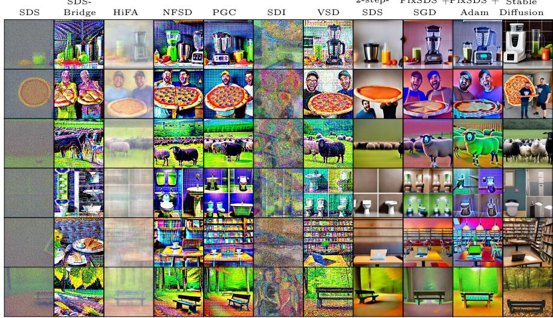  
Fig. 7: 2D generation comparison. Each column shows a diferent method, and each row corresponds to the same text prompt. PixSDS reduces the structured artifacts that appear in several SDS-style optimization baselines while preserving semantic content.

we aim to improve SDS-style optimization rather than replace direct difusion sampling.

## 5.2 3D Generation

We next test whether the same repair mechanism helps in text-to-3D optimization. We integrate PixSDS into the second stage of DreamGaussian [20], replacing the SDS update used when SDEdit is disabled. Following the original pipeline, we apply Gaussian smoothing with kernel size 11 to reduce highfrequency noise. For a fair comparison, we apply the same smoothing to the SDS baseline.

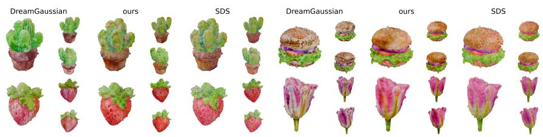  
Fig. 8: DreamGaussian comparison. We apply PixSDS in the second optimization stage of DreamGaussian [20]. Compared with SDS, PixSDS produces cleaner textures and fewer structured artifacts.

As shown in Fig. 8, PixSDS produces cleaner results than the SDS baseline, with fewer noisy texture patterns. This experiment also supports the diagnosis from Sec. 3: structured artifacts can already be introduced during latent SDS optimization, before mesh extraction or mipmap sampling. Renderer and texture-processing choices may amplify these artifacts, but they are not necessary for the failure mode to appear.

We also apply PixSDS to LucidDreamer [9], as shown in Fig. 9. In this setting, we run optimization for 3000 steps, sample timesteps from [0.3, 0.8], and set $\beta = 1 0 0$ · learning\_rate because latent-space gradients are small during optimization. We do not perform extensive hyperparameter tuning. Even so, PixSDS consistently reduces the noisy artifacts visible in the baseline. For example, the football helmet contains fewer noisy Gaussians inside the object, and the hamburger produces fewer floating artifacts around the asset. The white hair ironman result is also cleaner around the head, although the white-hair attribute is not fully preserved, suggesting that further tuning may be needed for some prompts.

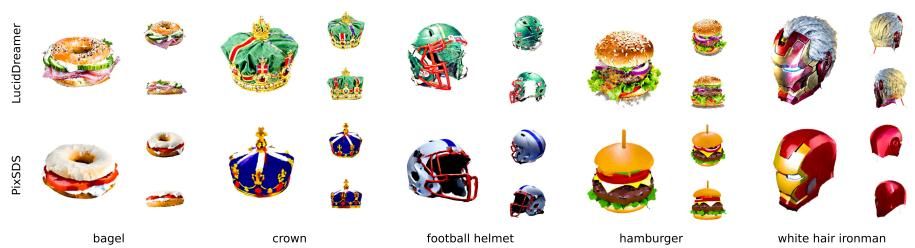  
Fig. 9: LucidDreamer comparison. We integrate PixSDS into LucidDreamer [9]. The repaired update reduces floating noisy Gaussians and structured texture artifacts.

## 5.3 Ablation Study

We ablate the key components of PixSDS in Fig. 10. (a) Only $\mathbf { \mathit { g } _ { c l e a n } : }$ we remove the original SDS direction and set $\tilde { g } _ { \mathrm { s d s } } = g _ { \mathrm { c l e a n } }$ . The result is clean but poorly composed, with the object often appearing near the image boundary. This shows that $g _ { \mathrm { s d s } }$ is still necessary for semantic placement and generation. (b) No channel normalization: we remove the per-pixel normalization and set $\widetilde { g } _ { \mathrm { s d s } } = g _ { \mathrm { s d s } } + g _ { \mathrm { c l e a n } }$ . This can produce clean 2D images, but fails in 3D because the magnitude of $g _ { \mathrm { s d s } }$ can dominate $g _ { \mathrm { c l e a n } }$ . The normalization is therefore important for balancing the noisy SDS direction with the clean VAE-consistent direction. (c) $\beta = \mathbf { 0 } \colon$ we remove the latent look-ahead step and set ${ \widehat { Z } } = \operatorname* { d e c } ( \operatorname { e n c } ( Z ) )$ ). This pulls the image toward its current VAE reconstruction, producing clean but unrealistic results. This shows that the clean direction should point toward the next latent SDS update, not merely toward the current decoded latent. (d) Full method: the full PixSDS update combines $g _ { \mathrm { s d s } }$ with the normalized clean direction obtained from the decoded latent look-ahead step. This preserves semantic guidance while reducing structured artifacts in both 2D and 3D optimization.

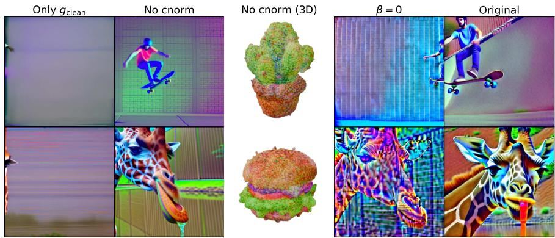  
Fig. 10: Ablation study. We ablate the main design choices of PixSDS. The full method preserves the SDS update while adding a normalized VAE-consistent clean direction.

## 6 Conclusion

We studied a structured artifact failure mode in latent score distillation. Through controlled experiments, we showed that these artifacts are not fully explained by latent tensor resolution, pixel-space SDS optimization, or renderer-specific efects. Instead, they can arise from VAE-induced pixel drift: the optimized image moves along pixel-space directions that are weakly constrained by the VAE encoder, while its latent representation remains clean and semantically meaningful. Motivated by this diagnosis, we introduced PixSDS, a lightweight VAEconsistent gradient repair method. PixSDS decodes a latent SDS look-ahead step and uses it to construct a clean pixel-space direction, which is combined with the original SDS update using per-pixel normalization. Experiments in 2D optimization and text-to-3D pipelines show that PixSDS reduces structured artifacts while preserving semantic guidance, without retraining the difusion model or changing the renderer. Our results suggest that the geometry of the VAE latentto-pixel mapping is an important factor in latent SDS optimization, and should be considered when designing future score distillation methods.

## Acknowledgements

The calculations have been performed using the facilities of the Scientific IT and Application Support Center of EPFL.

## References

1. Camboulin, C., Doimo, D., Glielmo, A.: Understanding variational autoencoders with intrinsic dimension and information imbalance (2024), https://arxiv.org/ abs/2411.01978

2. Chen, R., Chen, Y., Jiao, N., Jia, K.: Fantasia3d: Disentangling geometry and appearance for high-quality text-to-3d content creation. In: Proceedings of the IEEE/CVF international conference on computer vision. pp. 22246–22256 (2023)

3. Esser, P., Kulal, S., Blattmann, A., Entezari, R., Müller, J., Saini, H., Levi, Y., Lorenz, D., Sauer, A., Boesel, F., Podell, D., Dockhorn, T., English, Z., Lacey, K., Goodwin, A., Marek, Y., Rombach, R.: Scaling rectified flow transformers for high-resolution image synthesis (2024), https://arxiv.org/abs/2403.03206

4. Guisard, B.: Stable difusion nano 2.1. https://huggingface.co/bguisard/stablediffusion-nano-2-1 (2023), hugging Face model card. Accessed: 2026-05-24

5. Hessel, J., Holtzman, A., Forbes, M., Le Bras, R., Choi, Y.: Clipscore: A referencefree evaluation metric for image captioning. In: Proceedings of the 2021 conference on empirical methods in natural language processing. pp. 7514–7528 (2021)

6. Heusel, M., Ramsauer, H., Unterthiner, T., Nessler, B., Hochreiter, S.: Gans trained by a two time-scale update rule converge to a local nash equilibrium. Advances in neural information processing systems 30 (2017)

7. Katzir, O., Patashnik, O., Cohen-Or, D., Lischinski, D.: Noise-free score distillation (2023), https://arxiv.org/abs/2310.17590

8. Krizhevsky, A., Nair, V., Hinton, G.: Learning multiple layers of features from tiny images. Tech. rep., University of Toronto (2009)

9. Liang, Y., Yang, X., Lin, J., Li, H., Xu, X., Chen, Y.: Luciddreamer: Towards highfidelity text-to-3d generation via interval score matching. In: Proceedings of the IEEE/CVF conference on computer vision and pattern recognition. pp. 6517–6526 (2024)

10. Lin, T.Y., Maire, M., Belongie, S., Hays, J., Perona, P., Ramanan, D., Dollár, P., Zitnick, C.L.: Microsoft coco: Common objects in context. In: European conference on computer vision. pp. 740–755. Springer (2014)

11. Liu, X., Gong, C., Liu, Q.: Flow straight and fast: Learning to generate and transfer data with rectified flow (2022), https://arxiv.org/abs/2209.03003

12. Lukoianov, A., de Ocáriz Borde, H.S., Greenewald, K., Guizilini, V.C., Bagautdinov, T., Sitzmann, V., Solomon, J.: Score distillation via reparametrized ddim. Advances in Neural Information Processing Systems 37, 26011–26044 (2024)

13. McAllister, D., Ge, S., Huang, J.B., Jacobs, D.W., Efros, A.A., Holynski, A., Kanazawa, A.: Rethinking score distillation as a bridge between image distributions. Advances in Neural Information Processing Systems 37, 33779–33804 (2024)

14. Mittal, A., Moorthy, A.K., Bovik, A.C.: No-reference image quality assessment in the spatial domain. IEEE Transactions on Image Processing 21(12), 4695–4708 (2012). https://doi.org/10.1109/TIP.2012.2214050

15. Pan, Z., Lu, J., Zhu, X., Zhang, L.: Enhancing high-resolution 3d generation through pixel-wise gradient clipping (2024), https://arxiv.org/abs/2310.12474

16. Poole, B., Jain, A., Barron, J.T., Mildenhall, B.: Dreamfusion: Text-to-3d using 2d difusion. arXiv preprint arXiv:2209.14988 (2022)

17. Pope, P., Zhu, C., Abdelkader, A., Goldblum, M., Goldstein, T.: The intrinsic dimension of images and its impact on learning (2021), https://arxiv.org/abs/ 2104.08894

18. Skorokhodov, V., Durasov, N., Fua, P.: Difusion models are secretly zero-shot 3dgs harmonizers. arXiv preprint arXiv:2503.06740 (2025)

19. Spielman, D.A.: Spectral graph theory lecture 2: The laplacian (Sep 2009), https: //www.cs.yale.edu/homes/spielman/561/2009/lect02-09.pdf, lecture notes

20. Tang, J., Ren, J., Zhou, H., Liu, Z., Zeng, G.: Dreamgaussian: Generative gaussian splatting for eficient 3d content creation. In: International Conference on Learning Representations. vol. 2024, pp. 33879–33896 (2024)

21. Wang, Z., Lu, C., Wang, Y., Bao, F., Li, C., Su, H., Zhu, J.: Prolificdreamer: High-fidelity and diverse text-to-3d generation with variational score distillation. Advances in neural information processing systems 36, 8406–8441 (2023)

22. Wolf, T., Debut, L., Sanh, V., Chaumond, J., Delangue, C., Moi, A., Cistac, P., Rault, T., Louf, R., Funtowicz, M., et al.: Huggingface’s transformers: State-ofthe-art natural language processing. arXiv preprint arXiv:1910.03771 (2019)

23. Zhu, J., Zhuang, P., Koyejo, S.: Hifa: High-fidelity text-to-3d generation with advanced difusion guidance (2024), https://arxiv.org/abs/2305.18766

## A Noise Proof

We first prove a more general statement, from which the result for one-dimensional convolutions follows as a special case. Since there is no universally accepted definition for measuring the amount of noise in an image, we introduce a simple proxy for this purpose. This proxy is consistent with our qualitative observations in the 2D generation experiments: its value is 2584.2 for PixSDS +SGD and 249573.9 for SDS, meaning that the SDS value is more than 95× larger. This agrees with the visual observation that SDS-generated images contain substantially more noise.

Definition 1 (Noise functional). Let $D \in \mathbb { R } ^ { ( n - 1 ) \times n }$ be the first-order diference operator defined by

$$
D _ { i , i } = 1 , \quad D _ { i , i + 1 } = - 1 , \quad i = 1 , \ldots , n - 1 ,
$$

and $D _ { i , j } = 0$ otherwise, i.e.,

$$
D = \left( { \begin{array} { l l l l } { 1 - 1 } & { 0 } & { \cdots } & { 0 } \\ { 0 } & { 1 } & { - 1 } & { \cdots } & { 0 } \\ { \vdots } & { \ddots } & { \ddots } & { \vdots } \\ { 0 } & { \cdots } & { 0 } & { 1 } & { - 1 } \end{array} } \right) .
$$

Define the functional $N : \mathbb { R } ^ { n } $ R $b y$

$$
N ( x ) : = \| D x \| ^ { 2 } = x ^ { T } D ^ { T } D x = \sum _ { i = 1 } ^ { n - 1 } ( x _ { i } - x _ { i + 1 } ) ^ { 2 } .
$$

We call $N ( x )$ the noise functional.

Lemma 1. Let $x \in \mathbb { R } ^ { n }$ satisfy

$$
\sum _ { i = 1 } ^ { n } x _ { i } = 0 .
$$

Then

$$
N ( x ) \geq 2 { \Big ( } 1 - \cos { \Big ( } { \frac { \pi } { n } } { \Big ) } { \Big ) } \| x \| ^ { 2 } .
$$

Proof. First observe that

$$
D ^ { T } D = \left( \begin{array} { c c c c c } { { 1 } } & { { - 1 } } & { { 0 } } & { { \cdots } } & { { 0 } } \\ { { - 1 } } & { { 2 } } & { { - 1 } } & { { \cdots } } & { { 0 } } \\ { { } } & { { } } & { { } } & { { } } & { { } } \\ { { 0 } } & { { - 1 } } & { { 2 } } & { { \ddots } } & { { \vdots } } \\ { { \vdots } } & { { \ddots } } & { { \ddots } } & { { \ddots } } & { { } } \\ { { 0 } } & { { \cdots } } & { { 0 } } & { { - 1 } } & { { 1 } } \end{array} \right) .
$$

This is the (combinatorial) Laplacian of the path graph on n vertices. Its eigenvalues are given by

$$
\lambda _ { k } = 2 - 2 \cos \left( { \frac { \pi ( k - 1 ) } { n } } \right) , \quad k = 1 , \ldots , n ,
$$

see, $\mathrm { e . g . , [ 1 9 ] }$

Let $\{ e _ { 1 } , \ldots , e _ { n } \}$ be an orthonormal basis of eigenvectors. The eigenvector corresponding to $\lambda _ { 1 } = 0$ is

$$
e _ { 1 } = { \frac { 1 } { \sqrt { n } } } ( 1 , \ldots , 1 ) ^ { T } .
$$

Since $\textstyle \sum _ { i = 1 } ^ { n } x _ { i } = 0$ , we have $\boldsymbol { x } \perp \boldsymbol { e } _ { 1 }$ , and hence

$$
x = \sum _ { k = 2 } ^ { n } \alpha _ { k } e _ { k } \quad { \mathrm { f o r ~ s o m e ~ } } \alpha _ { k } \in \mathbb { R } .
$$

By orthonormality,

$$
\| x \| ^ { 2 } = \sum _ { k = 2 } ^ { n } \alpha _ { k } ^ { 2 } .
$$

Now,

$$
N ( x ) = x ^ { T } D ^ { T } D x = \sum _ { k = 2 } ^ { n } \alpha _ { k } ^ { 2 } \lambda _ { k } \geq \lambda _ { 2 } \sum _ { k = 2 } ^ { n } \alpha _ { k } ^ { 2 } = \lambda _ { 2 } \| x \| ^ { 2 } .
$$

Since

$$
\lambda _ { 2 } = 2 - 2 \cos \left( \frac { \pi } { n } \right) ,
$$

the result follows.

Lemma 2. Let $x , y \in \mathbb { R } ^ { n }$ with

$$
x ^ { T } D ^ { T } D y \neq 0 .
$$

Then there exists $\alpha \in \mathbb { R }$ such that

$$
N ( x + \alpha y ) < N ( x ) .
$$

Proof. Using the definition of N, for any $\alpha \in \mathbb { R }$ we have

$$
\begin{array} { r l } & { N ( x + \alpha y ) = \| D ( x + \alpha y ) \| ^ { 2 } } \\ & { \qquad = \| D x + \alpha D y \| ^ { 2 } } \\ & { \qquad = \| D x \| ^ { 2 } + 2 \alpha ( D x ) ^ { T } ( D y ) + \alpha ^ { 2 } \| D y \| ^ { 2 } } \\ & { \qquad = N ( x ) + 2 \alpha x ^ { T } D ^ { T } D y + \alpha ^ { 2 } N ( y ) . } \end{array}
$$

Therefore,

$$
N ( x + \alpha y ) - N ( x ) = 2 \alpha x ^ { T } D ^ { T } D y + \alpha ^ { 2 } N ( y ) .
$$

By assumption,

$$
x ^ { T } D ^ { T } D y \neq 0 .
$$

Hence, for suficiently small α with sign opposite to $x ^ { T } D ^ { T } D y$ , the linear term dominates the quadratic term, and so

$$
N ( x + \alpha y ) - N ( x ) < 0 .
$$

Thus, there exists $\alpha \in \mathbb { R }$ such that

$$
N ( x + \alpha y ) < N ( x ) .
$$

Lemma 3. Let $A \in \mathbb { R } ^ { n \times n }$ and suppose that dim ker $A < n$ . The two following statements are equivalent:

1. $\forall x \in \ker A \backslash \{ 0 \} : D ^ { T } D x \neq 0$

$$
{ \mathcal { Z } } . \ \forall x \in \ker A \backslash \backslash \{ 0 \} \exists z \not \in \ker ( A ) \ s u c h \ t h a t \ x ^ { T } D ^ { T } D z \not = 0
$$

Proof. (⇒)

Assume (1) holds. Then we fix an arbitrary $x \in$ ker $A \backslash \{ 0 \}$ . Let $D ^ { T } D = L$ Due to symmetry $x ^ { T } L z \ = \ z ^ { T } ( L x )$ , and we need to find z. Let $H \ = \ \{ z \in$ $\mathbb { R } ^ { n } | z ^ { T } ( L x ) = 0 \}$ , it is a vector space and dim $H < n$ (otherwise $L x = 0 )$ . The z for the statement (2) is any $z \in \mathbb { R } ^ { n } \backslash ( \ker A \cup H )$ . Note that $\mathbb { R } ^ { n } \backslash ( \ker A \cup H ) \neq \emptyset$ because a vector space is not a union of its two proper subspaces.

(⇐)

Assume (1) does not hold, then $\exists \tilde { x } \in$ ker $A \backslash \{ 0 \} : L \tilde { x } = 0$ . But in that case for any $z \in \mathbb { R } ^ { n }$ we get $z ^ { T } L \tilde { x } = z ^ { T } \mathbf { 0 } = 0$ and (2) does not hold.

Theorem 1 (Noise amplification under gradient descent).

Let $A \in \mathbb { R } ^ { m \times n }$ and suppose that:

1. $r =$ dim ker $( A ) , r \geq 2$

2. $\forall x \in \ker ( A ) \backslash \{ 0 \} : D ^ { T } D x \neq \mathbf { 0 } .$

Let $x ^ { * }$ be a minimizer of

$$
\operatorname* { m i n } _ { x \in \mathbb { R } ^ { n } } { \frac { 1 } { 2 } } \| A x \| ^ { 2 } ,
$$

obtained via gradient descent.

Then for every $C > 0$ , there exists $x \in \mathbb { R } ^ { n }$ such that

$$
N ( x ^ { * } ) \geq C \quad a n d \quad N ( x ) < N ( x ^ { * } ) .
$$

In particular, gradient descent can increase the noise level.

Proof. Let

$$
L ( x ) = { \frac { 1 } { 2 } } \| A x \| ^ { 2 } = { \frac { 1 } { 2 } } x ^ { T } A ^ { T } A x .
$$

Then

$$
\nabla L ( x ) = A ^ { T } A x .
$$

Let $\{ e _ { 1 } , \ldots , e _ { n } \}$ be an orthonormal eigenbasis of $A ^ { T } A$ , with

$$
A ^ { T } A e _ { i } = \lambda _ { i } e _ { i } ,
$$

where

$$
\lambda _ { 1 } = \cdot \cdot \cdot = \lambda _ { r } = 0 , \qquad \lambda _ { i } > 0 \quad \mathrm { f o r } \ i > r .
$$

By assumption $( 1 ) , r \geq 2$

For an initial point

$$
x _ { 0 } = \sum _ { i = 1 } ^ { n } c _ { i } e _ { i } ,
$$

One gradient descent with step size $\gamma > 0$ gives

$$
\begin{array} { c l } { \displaystyle } & { \displaystyle \boldsymbol { x _ { 1 } } = \boldsymbol { x _ { 0 } } - \gamma A ^ { T } A \boldsymbol { x _ { 0 } } = \sum _ { i = 1 } ^ { n } c _ { i } \boldsymbol { e _ { i } } - \gamma \sum _ { i = 1 } ^ { n } c _ { i } A ^ { T } A \boldsymbol { e _ { i } } = } \\ { \displaystyle } & { \displaystyle = \sum _ { i = 1 } ^ { n } c _ { i } ( 1 - \gamma \lambda _ { i } ) \boldsymbol { e _ { i } } } \end{array}
$$

Hence

$$
x _ { t } = \sum _ { i = 1 } ^ { n } c _ { i } ( 1 - \gamma \lambda _ { i } ) ^ { t } e _ { i } .
$$

Choose $\gamma$ such that

$$
0 < \gamma < \frac { 2 } { \operatorname* { m a x } _ { i > m } \lambda _ { i } } .
$$

Then

$$
\operatorname* { l i m } _ { t  \infty } ( 1 - \gamma \lambda _ { i } ) ^ { t } = 0 \quad \mathrm { f o r } \ i > m ,
$$

and therefore

$$
x ^ { * } = \operatorname* { l i m } _ { t \to \infty } x _ { t } = \sum _ { i = 1 } ^ { m } c _ { i } e _ { i } \in \ker ( A ) .
$$

Since dim ker $\left( A \right) \geq 2$ , there exists a nonzero vector

$$
u \in \ker ( A )
$$

such that

$$
\sum _ { i = 1 } ^ { n } u _ { i } = 0 .
$$

By Lemma 1,

$$
N ( u ) \geq 2 \left( 1 - \cos \left( { \frac { \pi } { n } } \right) \right) \| u \| ^ { 2 } > 0 .
$$

Using assumption (2) and Lemma 3, there exists $z \not \in \ker ( A )$ such that

$$
u ^ { T } D ^ { T } D z \ne 0 .
$$

Therefore, by Lemma 2, there exists $\alpha \in \mathbb { R }$ such that

$$
N ( u + \alpha z ) < N ( u ) .
$$

Now choose $s > 0$ such that

$$
s ^ { 2 } N ( u ) \geq C \qquad \mathrm { a n d } \qquad s ^ { 2 } N ( u + \alpha z ) < C .
$$

Such an s exists because $N ( u + \alpha z ) < N ( u )$

Set

$$
x _ { 0 } : = s ( u + \alpha z ) .
$$

Since $z \not \in \ker ( A )$ , the non-kernel component of $x _ { 0 }$ vanishes under gradient descent, while the kernel component remains. Hence the limit point is

$$
x ^ { * } = s u .
$$

Consequently,

$$
N ( x _ { 0 } ) = s ^ { 2 } N ( u + \alpha z ) < C ,
$$

whereas

$$
N ( x ^ { * } ) = s ^ { 2 } N ( u ) \ge C .
$$

Thus, there exists an initial vector whose noise is below $C ,$ but whose gradient descent limit has noise at least C.

Corollary 1. Let w with weights $\{ w _ { 1 } , \ldots , w _ { m } \}$ is a 1d−convolution over $x \in \mathbb { R } ^ { n }$ satisfying

$$
1 . \ m \geq 3 ;
$$

$$
\mathcal { Q } . \sum _ { i = 1 } ^ { m } w _ { i } \neq 0 .
$$

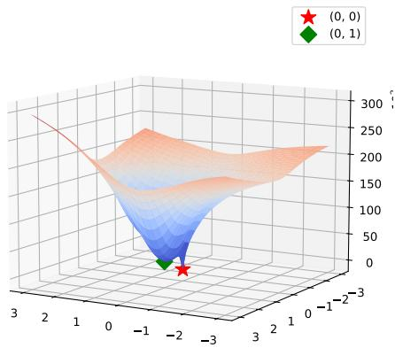

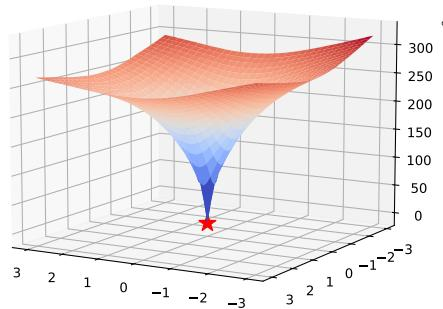  
Fig. 11: (a) Specified directions  
Fig. 12: (b) Random directions

Fig. 13: Visualization of the VAE-only optimization loss landscape. The red star denotes the original image X, while the green diamond denotes an optimized solution Z satisfying $f ( Z ) \approx f ( X )$

Then the Theorem 1 holds for that operation.

Proof. We can present w as a matrix $A \in \mathbb { R } ^ { ( n - m + 1 ) \times n }$

$$
A = \left( \begin{array} { c } { { w _ { 1 } w _ { 2 } 0 \ldots w _ { m } 0 \ldots 0 } } \\ { { 0 w _ { 1 } w _ { 2 } \ldots w _ { m - 1 } w _ { m } \ldots 0 } } \\ { { \ldots \ldots } } \\ { { 0 0 0 \ldots w _ { 1 } w _ { 2 } \ldots w _ { m } } } \end{array} \right)
$$

Note that rank $A \leq n - m + 1$ due to the matrix dimensions. Therefore, dim ker $A \geq n - ( n - m + 1 ) = m - 1$ . If $m \geq 3$ then dim ker $A \geq 2$

Find vectors x that satisfy $D ^ { T } D x = \mathbf { 0 }$

$$
D ^ { T } D x = \mathbf { 0 } \Leftrightarrow x ^ { T } D ^ { T } D x = 0 \Leftrightarrow | | D x | | ^ { 2 } = 0 \Leftrightarrow D x = \mathbf { 0 } .
$$

This is exactly when $x _ { 1 } = x _ { 2 } = \cdot \cdot \cdot = x _ { n } , { \mathrm { i . e . ~ } } x = c \mathbf { 1 }$ for $c \in \mathbb { R }$ . Note that due to the condition (2) for any $c \neq 0 : c { \mathbf { 1 } } \notin$ ker A. It means that $\forall x \in \mathbb { R } ^ { n } \backslash \{ 0 \} | L x =$ $\mathbf { 0 } \Rightarrow x \notin$ ker A. Therefore, the second condition of the theorem holds.

## B VAE Optimization Loss Landscape

We further analyze the loss landscape of the VAE-only optimization experiment described in Sec. 3 (Diagnosing SDS Artifacts). We follow the notation from that experiment. For visualization, we center the coordinate system at the original image X and evaluate the loss on a two-dimensional afine subspace. Specifically, given two directions $v _ { 1 } , v _ { 2 } \in \mathbb { R } ^ { C \times H \times W }$ , we compute the loss at points of the form

$$
X + \alpha _ { 1 } v _ { 1 } + \alpha _ { 2 } v _ { 2 } , \qquad \left( \alpha _ { 1 } , \alpha _ { 2 } \right) \in [ - 1 , 1 ] ^ { 2 } .
$$

This allows us to inspect how the optimization objective behaves around both the clean image X and alternative solutions $Z$ that reconstruct to a similar latent representation.

Fig. 13 shows the resulting landscapes for two choices of directions. In Fig. 11, we use specified directions constructed from optimized solutions: $v _ { i } = Z _ { i } - X$ where each $Z _ { i }$ is obtained by VAE-only optimization and satisfies $f ( Z _ { i } ) \approx f ( X )$ In this case, the landscape contains local minima away from the origin. These minima correspond to noisy images that remain close to $X$ in the VAE latent space. Important ${ \mathrm { l y } } ,$ moving from such a solution $Z _ { i }$ back toward the clean image X requires first increasing the objective, which can prevent gradient descent from recovering the global solution once it reaches the local minimum.

In contrast, in Fig. 12, we sample random directions $v _ { i } \sim \mathcal { U } [ - 1 , 1 ]$ . Along these directions, we do not observe the same spurious local minima. This suggests that the problematic solutions are not arbitrary perturbations of the image, but instead have a specific structure aligned with directions that are weakly constrained by the VAE representation.

Overall, this visualization supports our hypothesis that VAE-only optimization can admit structured noisy solutions $Z$ for which $f ( Z ) \approx f ( X )$ . Such solutions form undesirable basins in the pixel-space loss landscape. Although the clean image X remains the global optimum, these basins can trap gradient-based optimization and make recovery of the clean solution dificult.

## C β Hyperparameter Study

We study the sensitivity of our method to the choice of the hyperparameter $\beta .$ To this end, we vary $\beta$ in the range $0 \leq \beta \leq 1 0$ and generate images for each value, while keeping all other settings identical to the 2D generation experiments described in Sec. 5.1.

As shown in Fig. 14, the method produces realistic and visually clean images across a broad range of values, particularly for $\beta \in [ 0 . 0 7 5 , 1 . 0 ]$ . This suggests that PixSDS is not overly sensitive to the exact choice of $\beta$ within this interval. At very small values, the efect of the clean-direction correction becomes limited, while excessively large values may overemphasize the look-ahead direction and lead to less stable updates. In our experiments, we therefore use $\beta$ within the stable range identified above.

## D PixSDS for Stable Difusion 3

We further evaluate whether PixSDS can be applied beyond the standard latent difusion setting by testing it with Stable Difusion 3 [3], which is based on Rectified Flow [11]. We use the same hyperparameters as in the 2D generation experiments described in Sec. 5.1, except that we set the number of optimization steps to $N = 5 0 0$

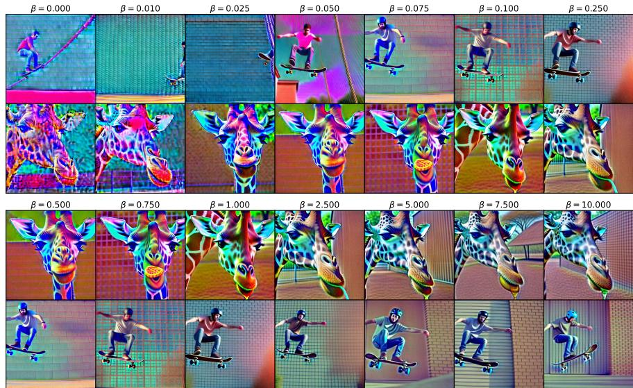  
Fig. 14: Sensitivity to $\beta .$ We vary the look-ahead hyperparameter $\beta$ while keeping all other settings fixed. The results remain realistic and visually clean for a wide range of values, especially for $\beta \in [ 0 . 0 7 5 , 1 . 0 ]$ , indicating that the method is robust to moderate changes in this parameter.

As shown in Fig. 15, PixSDS produces clean and realistic images with Stable Difusion 3. These results suggest that the proposed correction is not specific to a single difusion backbone, and can be integrated with diferent generative formulations, including rectified-flow-based models.

## E Timestep Strategy

We compare our proposed timestep strategy with a standard linear annealing schedule using the 2D generation setup described in Sec. 5.1. We randomly sample M = 10 prompts from MS-COCO [10] and evaluate both timestep strategies for each prompt, keeping all other hyperparameters fixed. During optimization, we record the latent-space and image-space gradient norms at each step and aggregate the results across prompts.

Figure 16 shows qualitative generations obtained with the two schedules. Compared to linear timestep annealing, our proposed strategy produces images with more balanced colors and fewer oversaturated regions. In contrast, linear annealing often leads to stronger color biases, such as overemphasized green backgrounds (second and ninth rows).

Figure 17 reports the image-space gradient norms throughout optimization. Linear timestep annealing produces substantially larger gradient norms after approximately step 600, which corresponds to difusion timestep t = 400 under a 1000-step schedule. Such large gradients can make the optimization less stable, as a single step may introduce excessive changes in image space. By comparison, our timestep strategy maintains more moderate gradient magnitudes during the later stages of optimization, helping preserve visual stability and improve generation quality.

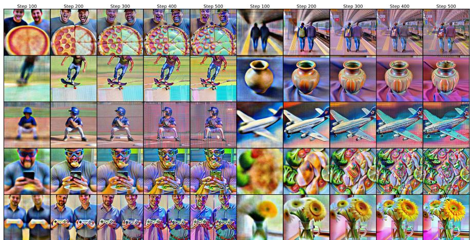

Fig. 15: PixSDS with Stable Difusion 3. Qualitative examples generated using PixSDS with Stable Difusion 3. The results remain clean and realistic, suggesting that the method can be applied beyond standard latent difusion models.  
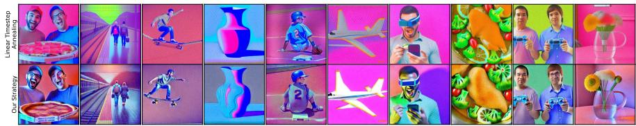  
Fig. 16: Comparison of timestep annealing strategies. The top row shows results obtained with linear timestep annealing, while the bottom row shows results obtained with our proposed timestep strategy. Our schedule produces more balanced colors and fewer oversaturated regions.

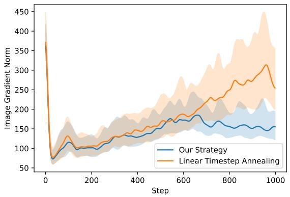  
Fig. 17: Image-space gradient norms during generation. We compare linear timestep annealing with our proposed timestep strategy, averaged across 10 MS-COCO prompts. Solid lines indicate the median gradient norm at each optimization step, and shaded regions indicate the interquartile range between the 0.25 and 0.75 quantiles.