# ProME: Prototype-Margin Environments with Repair-Aware Selection for Group-Robust Learning

Qianqian Wanga,b, Yunshan Lib, Dawei Huangb, Wenwu Gongb,∗ and Lili Yanga,b,∗

aShenzhen Key Laboratory ofSafety and Securityfor Next Generation ofIndustrial Internet, Shenzhen, China bDepartment ofStatistics and Data Science, Southern University ofScience and Technology, Shenzhen, China

## A R T I C L E I N F O

Keywords:   
group robustness   
spurious correlations   
invariant risk minimization   
repair-aware model selection   
prototype margin   
out-of-distribution generalization

## A BS T RA C T

Group-robust learning is crucial for maintaining accuracy on rare subpopulations when traininggroup labels are unavailable. However, existing methods often infer environments from a separate reference model and select representations before fitting the classifier used at deployment, leaving both decisions misaligned with the deployed predictor. In this work, we formulate group robustness without training-group labels as the endogenous environments with repair-aware selection (ERAS) problem, and propose ProME (Prototype-Margin Environments) to align both decisions with the deployed predictor. ProME splits prototype margins at their median to construct approximately balanced environments along the training trajectory, and fits a group-balanced linear head on group-annotated validation data to rank the resulting predictors by validation worst-group accuracy. We theoretically bound the worst risk across the inferred environments for a fixed predictor and partition, showing that this bound transfers to the oracle groups under an explicit alignment condition. Extensive experiments show that prototype margins enrich shortcut-conflicting examples, classifier repair reshapes candidate evaluation, and ProME achieves the highest average worst-group accuracy among the compared methods with the same group-label access.

## 1. Introduction

Group-robust learning seeks to preserve accuracy across label–attribute groups whose proportions difer between training and deployment, as in medical diagnosis, content moderation, and attribute recognition [1, 2]. Rare groups contribute little to the average loss, allowing empirical risk minimization (ERM) to achieve high overall accuracy while accuracy on rare groups remains low. This disparity often arises when ERM relies on shortcut features whose correlations with labels hold for common groups but fail for rare groups [3]. For example, background and gender can serve as shortcut features for predicting bird type and hair color in Waterbirds and CelebA, respectively [1, 4, 5]. Errors caused by these shortcuts have greater impact when rare groups become more prevalent at deployment. Worst-group accuracy (WGA) captures this vulnerability by reporting the accuracy of the least accurate group instead of averaging across groups [1]. Fig. 1 illustrates this setting through the Waterbirds training-group proportions and reported WGA on three benchmarks. The challenge is to maintain WGA as group proportions shift.

Group distributionally robust optimization (Group DRO) targets WGA by minimizing the worst empirical group risk [1, 6, 7]. It requires a group label for every training example, yet such labels are costly or infeasible to collect for large training datasets. We use oracle groups to denote the label–attribute groups whose labels are unavailable during training. Methods without training-group labels commonly use a two-stage pipeline. A reference model infers environments by clustering learned features [8–10] or identifying misclassified examples [6, 7, 11, 12]. A separate predictor is trained using the resulting fixed assignments [6, 8, 9]. This separation creates an environment–representation mismatch. This mismatch can weaken invariant learning [13, 14] and limit WGA on the oracle groups.

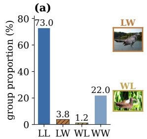  
LL: landbird on land WL: waterbird on land LW: landbird on water WW: waterbird on water

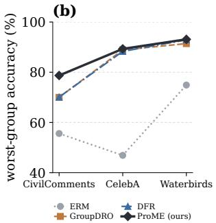  
Fig. 1. Training-group imbalance and worst-group accuracy. (a) Group proportions in the Waterbirds training set. (b) Reported WGA of representative methods, including deep feature reweighting (DFR), on three benchmarks.

A second misalignment arises during model selection, when an encoder checkpoint must be chosen for deployment. An encoder checkpoint with low pre-repair WGA can still retain features that support a stronger classifier after repair. Classifier repair refits the last layer on group-balanced data [15–17]. Selecting encoder checkpoints by pre-repair WGA, or retaining the final checkpoint by default, can reject the checkpoint with the highest post-repair WGA. Together, the environment–representation mismatch and prerepair model selection leave both decisions misaligned with the deployed predictor. This limitation raises a pivotal issue:

How can we align environment construction and model selection with the deployed predictor without traininggroup labels?

In this work, we formulate group robustness without training-group labels as the endogenous environments with repair-aware selection (ERAS) problem to align both decisions with the deployed predictor (Definition 1), and propose ProME (Prototype-Margin Environments) to implement this formulation. In ERAS, an environment partition is endogenous when an encoder checkpoint creates the partition used to regularize later checkpoints on the same trajectory. Model selection is repair-aware when encoder checkpoints are ranked by WGA after classifier repair. To construct endogenous environments, ProME assigns every example a prototype margin between its observed class and the strongest competing class under a cosine-prototype classifier. A median split of these margins produces two approximately balanced environments for invariant learning. In Stage 2, ProME freezes each retained encoder checkpoint, fits a group-balanced linear head on group-annotated validation data, and deploys the encoder–head pair with the highest validation WGA (Eq. (18)). Environment construction and representation learning use only inputs and class labels. Group-annotated validation data support candidate tracking, classifier repair, regularization tuning, and selection; they do not update the Stage 1 representation. Overall, ProME constructs environments without traininggroup labels, ranks candidates after classifier repair, and deploys a single encoder–head pair.

Theoretically, we characterize three Stage 1 properties under explicit conditions. First, low prototype margins mark shortcut-conflicting examples when the causal and spurious components are suficiently distinguishable (Proposition 1). Second, the induced assignments change by a controlled amount as the representation changes (Proposition 2). Third, for a fixed predictor and partition, we bound the worst inferred-environment risk by the mean and variance of the environment risks (Proposition 3). Under an explicit totalvariation alignment condition, this bound transfers to the oracle groups (Corollary 1). Classifier repair and repairaware selection in Stage 2 are evaluated experimentally.

To evaluate ProME and examine its two alignment mechanisms, we study three real-world benchmarks (Waterbirds [1], CelebA [5], and CivilComments [18]) and one controlled benchmark (ColoredMNIST [19]). The main comparison uses published baseline results under their original protocols. Controlled studies use matched settings. They show that trajectory-derived margins improve pre-repair WGA in the matched source comparison and that classifier repair reshapes candidate evaluation. Among the methods compared with the same group-label access, ProME raises average WGA from 83.9% to 87.0%.

Our contributions are summarized as follows:

• Deployment-aligned formulation. We formulate group robustness without training-group labels as endogenous environments with repair-aware selection (ERAS).

ERAS aligns environment construction and model selection with the deployed predictor.

• Two-stage ProME framework. We propose ProME, a two-stage framework that constructs approximately balanced environments from prototype margins and ranks encoder–head pairs after classifier repair. It requires no training-group labels, is backbone-agnostic, and deploys only the selected encoder–head pair.

• Mechanism-aligned theory. We establish theoretical results. Under explicit conditions, low prototype margins mark shortcut-conflicting examples, and the induced partition changes by a controlled amount with the representation. We also bound the worst inferredenvironment risk for a fixed predictor and partition. This bound transfers to oracle groups under an explicit alignment condition.

## 2. Related Work

ProME builds on three lines of work: environment inference without training-group labels, prototype geometry for environment inference, and classifier repair with groupannotated validation data.

Environment inference without training-group labels. When group labels are available, Group DRO directly optimizes the worst empirical group risk, and group-balanced training provides a strong supervised baseline [1, 20]. Without traininggroup labels, error-based methods identify hard or misclassified examples with a reference classifier and use them for reweighting or contrastive learning [6, 11, 21, 22]. Other methods exploit feature clusters, confidence, disagreement, or pretrained representations to identify spurious structure or estimate pseudo-groups [8, 10, 23–26]. Counterfactual alignment provides a complementary diagnostic for spurious correlations in black-box classifiers [27]. Environmentinference methods instead optimize a partition through invariant-learning or cross-risk signals [7, 9, 28, 29]. In these pipelines, an auxiliary model, reference predictor, or clustering stage produces environments that are subsequently used by a robust objective. This separation can create an environment–representation mismatch when the partition does not track the representation being optimized. ProME derives its inferred environments from the representationlearning trajectory itself.

prototype geometry for environment inference. Invariant learning seeks predictors that remain stable across environments [19, 30–33]. Learning such predictors without a supplied environment partition requires additional information or an explicit inductive bias [34], and weak variation in the relevant shortcut can leave invariant objectives with a nonrobust solution [35, 36]. Prototypical classifiers summarize each class by a mean representation, while neural collapse relates class means to terminal classifier geometry [37, 38]. Diverse prototypical ensembles further use multiple class prototypes to capture latent subpopulations [39]. ProME gives prototype geometry a diferent role: the observed-class prototype margin from the current representation-learning trajectory defines the environments used for invariant learning.

Classifier repair and repair-aware selection. ERM representations can retain core features even when the corresponding classifier has poor worst-group accuracy [15, 40]. Deep feature reweighting (DFR) freezes the encoder and retrains its last layer on group-balanced held-out data [15]. Subsequent work reduces the annotation requirements of last-layer retraining or revisits its implementation choices [16, 41, 42]. Automatic feature reweighting (AFR), group-aware priors, and related two-stage corrections also improve group robustness through a repaired or reweighted final layer [12, 43, 44]. These studies establish the value of classifier repair, yet the last-layer methods above typically evaluate a fixed or preselected representation. Their setup leaves model selection tied to a fixed or preselected representation. ProME fits the same type of group-balanced linear head to every retained encoder and ranks the resulting encoder–head pairs by validation WGA. This repair-aware comparison aligns model selection with the deployed predictor. Stage 1 environment construction and representation learning use no training-group labels; group-annotated validation data support candidate tracking, classifier repair, regularization tuning, and selection without updating the Stage 1 representation.

## 3. Preliminaries

In this section, we introduce subpopulation shift and group-robust risk, review invariant learning when environments are observed, and define endogenous environment inference and repair-aware selection when they are not. For reference, The notations used in this paper are presented in Table 1.

## 3.1. Subpopulation Shift

Let $D _ { \mathrm { t r } } ~ = ~ \{ ( x _ { i } , y _ { i } ) \} _ { i = 1 } ^ { n }$ be the observed training set, where $x _ { i } ~ \in ~ { \mathcal { X } }$ and $y _ { i } \in \{ 0 , 1 \}$ . Each benchmark defines a finite collection  of oracle evaluation groups from the target and one or more spurious attributes. Stage 1 observes only $( x _ { i } , y _ { i } )$ . Group membership is available in the validation set for model selection and in the test set for evaluation. Let $Q _ { g }$ denote the conditional distribution of group �. When  partitions the training population, let $\pi _ { g } ^ { \mathrm { t r } }$ denote its training proportion. The training distribution is then the mixture

$$
\mathbb { P } _ { \mathrm { t r } } = \sum _ { g \in \mathcal { G } } \pi _ { g } ^ { \mathrm { t r } } Q _ { g } .\tag{1}
$$

Under subpopulation shift, the group proportions may change at deployment even when the group-conditional distributions remain fixed. A predictor that performs well on the training mixture can still fail on a rare group whose correlation structure difers from that of the majority [1]. Average training accuracy hides these failures, and the weakest group decides whether the predictor we finally deploy is usable. Group robustness. For any distribution index �, let $P _ { q }$ denote the corresponding distribution over (�, �). Given a representation $\phi ,$ a linear classifier �, and a surrogate loss �, define

$$
\mathcal { R } _ { q } ( \phi , w ) : = \mathbb { E } _ { ( X , Y ) \sim P _ { q } } \left[ \ell ( \langle w , \phi ( X ) \rangle , Y ) \right] .\tag{2}
$$

ERM minimizes the average training risk. Group-robust learning instead controls the largest group risk:

$$
\begin{array} { r l } & { \mathcal { R } _ { \mathrm { t r } } ( \phi , w ) : = \mathbb { E } _ { \mathbb { P } _ { \mathrm { t r } } } \left[ \ell ( \langle w , \phi ( X ) \rangle , Y ) \right] , } \\ & { \mathcal { R } _ { \mathrm { w g } } ( \phi , w ) : = \displaystyle \operatorname* { m a x } _ { g \in \mathcal { G } } \mathcal { R } _ { g } ( \phi , w ) . } \end{array}\tag{3}
$$

The accuracy counterpart of ${ \mathcal { R } } _ { \mathrm { w g } }$ is worst-group accuracy

$$
\operatorname { W G A } ( h ) : = \operatorname* { m i n } _ { g \in { \mathcal { G } } } \operatorname* { P r } _ { ( X , Y ) \sim Q _ { g } } \left[ h ( X ) = Y \right] ,
$$

where ℎ is the hard classifier induced by the prediction score. Both ${ \mathcal R } _ { \mathrm { w g } }$ and WGA need oracle group identities, which Stage 1 does not have. They remain available for validation and evaluation. Without training-group labels, the learning problem shifts from optimizing known groups to building training environments that can stand in for them. The only signal available for that construction is the geometry of the representation being trained.

## 3.2. Problem Formulation

Standard invariant-learning methods assume access to a partition of the training data into environments $\mathcal { E } _ { \mathrm { t r } }$ across which predictive correlations vary. Given these assignments, invariant risk minimization (IRM) [19] learns a representation $\phi$ and classifier � using the scale-gradient objective

$$
\begin{array} { r l } {  { \mathcal { L } _ { \mathrm { I R M } } = \displaystyle \sum _ { e \in { \mathcal E } _ { \mathrm { t r } } } { \mathcal R } _ { e } ( \phi , w ) } \quad } & { } \\ & { + \lambda \displaystyle \sum _ { e \in { \mathcal E } _ { \mathrm { t r } } } \Big \| \nabla _ { \alpha } { \mathcal R } _ { e } ( \phi , \alpha w ) \Big \| _ { \alpha = 1 } \Big \| _ { 2 } ^ { 2 } , } \end{array}\tag{4}
$$

where � is the scalar dummy classifier and $\lambda \geq 0$ controls the IRMv1 penalty. While well defined when environment assignments are observed, Eq. (4) does not specify how to construct them. To supply the missing assignments, a natural strategy is to read them of a detached reference encoder $\phi _ { \mathrm { r e f } }$ trained beforehand. However, a partition fixed by $\phi _ { \mathrm { r e f } }$ reflects the geometry of that encoder, not that of the representation trained downstream. This environment– representation mismatch then persists for the rest of training. We call such a construction exogenous, and reserve endogenous for a partition drawn from a checkpoint on the trajectory that it later regularizes. To remove the mismatch, we make environment construction part of the representation-learning problem rather than a preprocessing step.

Let Π map a representation to a two-cell partition of $D _ { \mathrm { t r } } ,$ and let $\mathcal { P } _ { \mathrm { i n v } } ( \phi , \mathcal { E } )$ denote an invariance penalty evaluated on environments . For compactness, ${ \mathcal { R } } _ { \mathrm { t r } } ( \phi )$ denotes the training risk of the prediction rule associated with $\phi .$ Let $c \ = \ \{ \theta _ { t } \}$ denote the retained encoder candidates, let $f _ { t }$ be the Stage 1 classifier attached to $\theta _ { t }$ , and let $\widehat { h } _ { t }$ be a group-balanced head fitted after freezing $\theta _ { t }$ . We formalize the resulting problem as follows.

Table 1 Notations.
<table><tr><td>Notation</td><td>Explanation</td><td>Notation</td><td>Explanation</td></tr><tr><td> $x \in \mathcal { X }$  a  $D _ { \mathrm { t r } } , D _ { \mathrm { v a l } }$ </td><td>input spurious attribute used to define oracle groups training data without group labels and validation data with group labels</td><td> $y \in \{ 0 , 1 \}$   $g \in { \mathcal { G } }$   $Q _ { g } , \pi _ { g } ^ { \mathrm { t r } }$   $\phi _ { \xi , \omega }$ </td><td>binary target label oracle group; G is the set of oracle groups distribution of oracle group  $g$  and its training pro- portion</td></tr><tr><td> $b _ { \xi } , p _ { \omega }$   $\phi _ { \mathrm { r e f } }$   $\tau$ </td><td>backbone and projection head fixed auxiliary encoder used by exogenous environment-inference methods</td><td> $s ( x ; y )$ </td><td>normalized representation map defined by  $b _ { \xi }$  and  $p _ { \omega }$  observed-class prototype similarity minus the</td></tr><tr><td> $\mu _ { c }$   $\Pi ( \phi )$   $\lambda _ { t }$   $\mathcal { R } _ { \mathrm { t r } } , \mathcal { R } _ { \mathrm { w g } }$ </td><td>temperature of the prototype classifier normalized prototype of class c</td><td> $f _ { \phi } ( x )$  m</td><td>strongest competing similarity, Eq. (11) prototype logit, Eq. (10) median prototype margin on  ${ \cal { D } } _ { \mathrm { t r } }$ </td></tr><tr><td> $\mathcal { E } _ { \mathrm { t r } }$   ${ \mathcal { M } } _ { \mathrm { m s } }$   $T _ { \mathrm { w a r m } } , T _ { \mathrm { I R M } }$ </td><td>split into low- and high-margin cells at m, Eq. (12) invariance-penalty weight at training step t average training risk and worst-group risk observed training environments used by invariant</td><td> $\hat { \mathcal { E } } _ { 0 } , \hat { \mathcal { E } } _ { 1 }$   $P _ { q } , \mathcal { R } _ { q }$   $\mathcal { P } _ { \mathrm { I R M } } , \mathcal { P } _ { \mathrm { R E x } }$  ρ an oracle group and a matched inferred cell</td><td>inferred low- and high-margin environment cells distribution indexed by q and its expected loss IRM gradient penalty and risk extrapolation (REx) variance penalty upper bound on the total-variation distance between</td></tr></table>

Definition 1 (Endogenous environments with repair-aware selection (ERAS)). Given a checkpoint $\tilde { \phi }$ on the encoder trajectory, a pair $( \phi ^ { \star } , t ^ { \star } )$ solves the ERASproblem when the induced partition, optimized representation, and retained candidates arisefrom the same trajectory and satisfy

$$
\begin{array} { r l } & { \hat { \mathcal { E } } = \Pi ( \tilde { \phi } ) , } \\ & { \phi ^ { \star } \in \arg \operatorname* { m i n } _ { \phi } \left\{ \mathcal { R } _ { \mathrm { t r } } ( \phi ) + \lambda \mathcal { P } _ { \mathrm { i n v } } \big ( \phi , \hat { \mathcal { E } } \big ) \right\} . } \end{array}\tag{5}
$$

and ranks the retained candidates after classifier repair,

$$
t ^ { \star } \in \arg \operatorname* { m a x } _ { t : \theta _ { t } \in C } \mathrm { W G A } _ { \mathrm { v a l } } \big ( \widehat { h } _ { t } \circ \theta _ { t } \big ) .\tag{6}
$$

The checkpoint �̃ lies on the same representation-learning trajectory subsequently optimized under its induced partition. Equation (6) ranks candidate encoders after fitting a matched deployment head to each one.

The second condition is decisive because standard twostage pipelines rank candidates before repair, using the Stage 1 classifier $f _ { t }$

Definition 1 aligns candidate generation with the learning trajectory and candidate selection with the repaired predictor used at deployment; neither condition requires training-group labels.

$$
t _ { \mathrm { p r e } } \in \arg \operatorname* { m a x } _ { t : \theta _ { t } \in C } \mathrm { W G A } _ { \mathrm { v a l } } \big ( f _ { t } \circ \theta _ { t } \big ) .\tag{7}
$$

This criterion mixes representation quality with the bias of $f _ { t } ,$ and it can discard an encoder that would have repaired well. This motivates comparing candidates under the repaired classifier used at deployment.

The ideal endogenous objective would update Π(�) with $\phi .$ Equation (5) uses a trajectory checkpoint $\tilde { \phi }$ to make this coupling tractable during training.

## 4. Method

In this section, we present ProME, a two-stage framework for group robustness without training-group labels. ProME instantiates the ERAS problem of Definition 1. It derives environments from the representation being trained, and it ranks candidates after classifier repair.

Figure 2 separates candidate generation from deploymentaligned selection. Stage 1 performs a prototype-guided ERM warm-up, partitions the training data by the median prototype margin, and learns across the induced low- and high-margin environments. Checkpoints retained along this trajectory form the candidate set. Stage 2 removes each Stage 1 head, fits a matched group-balanced linear head to every frozen encoder, and ranks the repaired encoder–head pairs by validation WGA. The search is performed ofline; test-time inference uses only the selected pair.

## 4.1. Cosine-Prototype Classification

ProME requires an environment signal that follows the same representation geometry used for prediction. We adopt a cosine-prototype classifier to provide this shared geometric basis. Let $b _ { \xi }$ denote the backbone and $p _ { \omega }$ denote the projection layer. The normalized representation is defined as

$$
\phi _ { \xi , \omega } ( x ) = \mathrm { n o r m a l i z e } \big ( p _ { \omega } ( b _ { \xi } ( x ) ) \big ) ,\tag{8}
$$

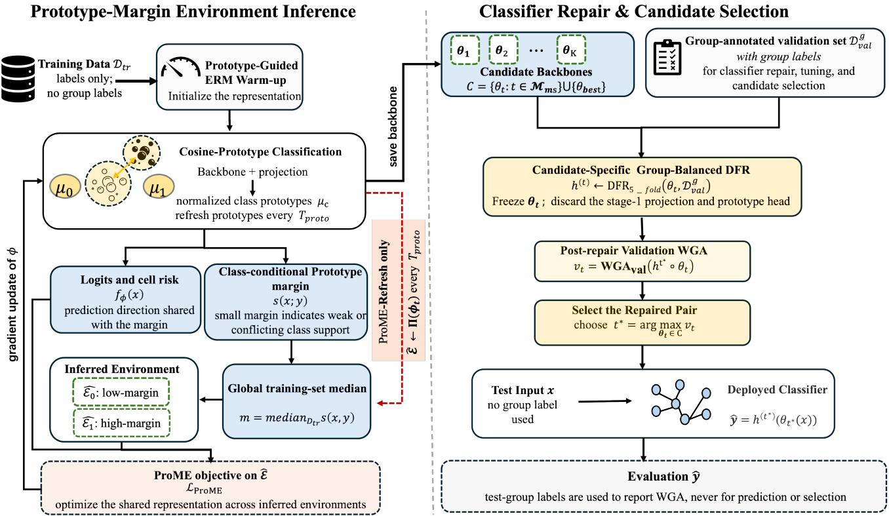  
Fig. 2. Overview of ProME. Stage 1 learns representation candidates from prototype-margin environments without traininggroup labels. Stage 2 repairs and selects candidates using group-annotated validation data, with five-fold cross-validation for regularization tuning. The dashed path denotes ProME-Refresh.

where normalize $\mathbf { \boldsymbol { \cdot } } ( \boldsymbol { u } ) ~ = ~ \boldsymbol { u } / \| \boldsymbol { u } \| _ { 2 }$ . For each class �, ProME computes the class prototype from the current representation:

$$
\begin{array} { r l } & { \mu _ { c }  \mathrm { n o r m a l i z e } \displaystyle \Bigg ( \frac { 1 } { | D _ { c } | } \sum _ { ( x _ { i } , y _ { i } ) \in D _ { c } } \phi ( x _ { i } ) \Bigg ) , } \\ & { D _ { c } = \{ ( x , y ) \in \displaystyle D _ { \mathrm { t r } } : y = c \} . } \end{array}\tag{9}
$$

Given the two prototypes $\mu _ { 0 }$ and $\mu _ { 1 }$ , the prediction score is defined as

$$
f _ { \phi } ( x ; \mu _ { 0 } , \mu _ { 1 } ) = \frac { 1 } { \tau } \left[ \cos ( \phi ( x ) , \mu _ { 1 } ) - \cos ( \phi ( x ) , \mu _ { 0 } ) \right] .\tag{10}
$$

where $\tau > 0$ is the temperature. The sign of $f _ { \phi } ( x )$ determines the binary prediction, and its magnitude measures the diference in cosine support for the two classes. This makes the prediction rule directly interpretable through the feature– prototype geometry.

Prototype updates. ProME treats prototypes as non-trainable state variables that are periodically refreshed during training. Every $T _ { \mathrm { p r o t o } }$ steps, we update the prototypes using the closed-form class-mean rule in $\operatorname { E q . }$ (9) and stop gradients through the prototype computation. During backpropagation, the refreshed prototypes remain fixed, and gradients update only $b _ { \xi }$ and $p _ { \omega }$ through $f _ { \phi }$ . This construction follows the class-mean geometry of prototypical classifiers [37]. The alignment between normalized class means and terminal classifier geometry is further supported by neural-collapse results [28, 38].

The updated prototypes provide a geometric measure of label support for each example. This measure defines the partitioning signal used in the next module.

## 4.2. Prototype-Margin Environment Inference

Without training-group labels, ProME constructs environments from the geometric signals available in the learned representation. Under the shortcut-first hypothesis, examples violating the dominant spurious correlation receive weaker support for their observed labels after ERM warmup. We quantify this support through the prototype margin:

$$
s ( x ; y , \phi , \mu _ { 0 } , \mu _ { 1 } ) = \cos ( \phi ( x ) , \mu _ { y } ) - \cos ( \phi ( x ) , \mu _ { 1 - y } ) .\tag{11}
$$

The margin measures the relative prototype support of the observed class. A larger value indicates stronger alignment with the observed label, while a smaller value indicates ambiguous or conflicting class support. The margin is computed from the same classifier used for prediction, which provides a unified geometric basis for environment inference.

Environment construction. After prototype-guided ERM warm-up, we compute the margins over ${ \cal D } _ { \mathrm { t r } }$ and construct two environments through a global median split:

$$
\hat { \mathcal { E } } _ { 0 } = \{ ( x , y ) : s ( x ; y ) \leq m \} ,
$$

$$
\begin{array} { l } { { \hat { \mathcal E } _ { 1 } = \{ ( x , y ) : s ( x ; y ) > m \} , } } \\ { { m = \operatorname * { m e d i a n } _ { D _ { \mathrm { t r } } } s . } } \end{array}\tag{12}
$$

The median split produces two balanced cells up to ties without requiring group proportions. The low-margin environment contains examples with weaker prototype support for their observed labels, while the high-margin environment contains examples with stronger class agreement. Section 6.2.2 measures shortcut-conflict enrichment and downstream WGA. Corollary 1 separately uses the totalvariation quantity � to state its transfer condition.

Invariant objective. Let $\boldsymbol { K } ~ = ~ | \hat { \boldsymbol { \varepsilon } } |$ . Over the inferred environments, we optimize the average environment risk together with the IRMv1 and REx penalties:

$$
\begin{array} { r l } & { \quad \bar { \mathcal { R } } ( f _ { \phi } ) = K ^ { - 1 } \displaystyle \sum _ { \hat { e } \in \hat { \mathcal { E } } } { \mathcal { R } } _ { \hat { e } } ( f _ { \phi } ) , } \\ & { \quad \mathcal { P } _ { \mathrm { I R M } } ( f _ { \phi } ) = K ^ { - 1 } \displaystyle \sum _ { \hat { e } \in \hat { \mathcal { E } } } \Big \| \nabla _ { w ^ { \prime } } \mathcal { R } _ { \hat { e } } ( w ^ { \prime } f _ { \phi } ) \Big | _ { w ^ { \prime } = 1 } \Big \| _ { 2 } ^ { 2 } , } \\ & { \quad \mathcal { P } _ { \mathrm { R E x } } ( f _ { \phi } ) = K ^ { - 1 } \displaystyle \sum _ { \hat { e } \in \hat { \mathcal { E } } } \left( \mathcal { R } _ { \hat { e } } ( f _ { \phi } ) - \bar { \mathcal { R } } ( f _ { \phi } ) \right) ^ { 2 } . } \end{array}\tag{13}
$$

The Stage 1 objective is

$$
\mathcal { L } _ { \mathrm { P r o M E } } ( \phi ) = \bar { \mathcal { R } } ( f _ { \phi } ) + \lambda _ { t } \left( \mathcal { P } _ { \mathrm { I R M } } ( f _ { \phi } ) + \mathcal { P } _ { \mathrm { R E x } } ( f _ { \phi } ) \right) .\tag{14}
$$

where $w ^ { \prime }$ denotes the scalar dummy classifier in IRMv1, and $\lambda _ { t }$ controls the invariance regularization strength. The IRM penalty enforces consistent classifier optimality across environments, while the REx penalty reduces risk variation across inferred environments [45]. Section 5 bounds the gap between average and worst inferred-environment risk through the REx penalty (Proposition 3). IRMv1 adds a complementary constraint on environment-wise classifier optimality.

Partition updates. Both ProME variants refresh the prototypes every $T _ { \mathrm { p r o t o } }$ steps. The standard protocol constructs $\hat { \mathcal { E } }$ from the post-warm-up encoder and keeps the partition fixed during invariant training. ProME-Refresh updates $\hat { \mathcal { E } }$ by recomputing Eq. (12) after each prototype refresh. Both variants optimize the same objective and difer only in the update frequency of the representation-induced partition.

Prototype refinement. For the label-augmented sensitivity analysis in Section 6.3, we replace Eq. (9) with groupbalanced prototypes:

$$
\begin{array} { l } { \displaystyle \mu _ { c } ^ { \mathrm { b a l } } \gets \mathrm { n o r m a l i z e } \left( \frac { 1 } { 2 } \bar { \phi } _ { c , 0 } + \frac { 1 } { 2 } \bar { \phi } _ { c , 1 } \right) , } \\ { \displaystyle \bar { \phi } _ { c , a } = \frac { 1 } { | D _ { c , a } | } \sum _ { ( x , y ) \in D _ { c , a } } \phi ( x ) , } \end{array}\tag{15}
$$

where $D _ { c , a } = \{ ( x , y ) \in \mathcal { D } _ { \mathrm { t r } } : y = c , A ( x ) = a \}$ . This construction balances the contribution of spurious attributes within each class for sensitivity analysis. ProME uses class labels only to compute prototypes in the standard setting, following Eq. (9).

## 4.3. Classifier Repair and Candidate Selection

Stage 2 makes classifier repair the basis of representation selection. Given the retained backbones and groupannotated validation data, ProME fits the same groupbalanced linear-head family to every candidate and selects the repaired encoder–head pair with the highest validation WGA. Validation groups serve for candidate tracking, head fitting, hyperparameter tuning, and final model selection, without updating the Stage 1 representation.

Candidate construction. Pre-repair performance is treated as one source of candidates, not as the deployment decision. ProME retains frozen backbones at fixed milestones ${ \mathcal { M } } _ { \mathrm { m s } }$ and includes $\theta _ { \mathrm { b e s t } } .$ the checkpoint with the highest prerepair validation WGA under the prototype classifier. All candidates are subsequently compared only after matched repair:

$$
C = \{ \theta _ { t } : t \in \mathcal { M } _ { \mathrm { m s } } \} \cup \{ \theta _ { \mathrm { b e s t } } \} .\tag{16}
$$

Each $\theta _ { t }$ is a frozen backbone checkpoint at step �. Before classifier repair, ProME removes the Stage 1 projection and cosine-prototype head. This construction preserves representation diversity and evaluates all candidates under the same downstream classifier family.

Candidate-specific classifier repair. For each $\theta _ { t } \in \ C ,$ we freeze the encoder and fit a linear DFR head $h ^ { ( t ) }$ on the group-annotated validation set [15]. Let $\mathcal { D } _ { \mathrm { v a l } } ^ { g }$ denote the validation examples in oracle group $g \in { \mathfrak { C } } .$ For a regularization strength $\gamma ,$ the group-balanced objective is

$$
\mathcal { L } _ { \mathrm { D F R } } ^ { ( t ) } ( h ; \gamma ) = \frac { 1 } { | \mathcal { G } | } \sum _ { g \in \mathcal { G } } \frac { 1 } { | \mathcal { D } _ { \mathrm { v a l } } ^ { g } | } \sum _ { ( x , y ) \in \mathcal { D } _ { \mathrm { v a l } } ^ { g } } \ell \big ( h ( \theta _ { t } ( x ) ) , y \big ) + \gamma \| h \| _ { 2 } ^ { 2 } .\tag{17}
$$

The objective assigns equal weight to each validation group regardless of its empirical frequency. For each candidate, we select $\gamma$ by five-fold cross-validation and refit the head with the selected value. Freezing the encoder and using the same classifier family make the repaired candidates directly comparable.

Validation selection. After fitting all candidate-specific heads, ProME evaluates each encoder–head pair using validation WGA:

$$
v _ { t } = \mathrm { W G A } _ { \mathrm { v a l } } \big ( h ^ { ( t ) } \circ \theta _ { t } \big ) , \qquad t ^ { \star } = \underset { \theta _ { t } \in C } { \arg \operatorname* { m a x } } v _ { t } .\tag{18}
$$

The selected predictor is $( \theta _ { t ^ { \star } } , h ^ { ( t ^ { \star } ) } )$ . The group-annotated validation set is used for Stage 2 candidate tracking, head fitting, regularization tuning, and encoder–head ranking, whereas Stage 1 requires no training-group labels. Section 6.2.3 examines how candidate coverage and matched repair afect post-repair evaluation.

Test-time prediction. Given a test input �, ProME applies the selected encoder and linear head:

$$
\hat { y } = h ^ { ( t ^ { \star } ) } \big ( \theta _ { t ^ { \star } } ( x ) \big ) .\tag{19}
$$

Algorithm 1 ProME training and candidate selection.   
Input: $D _ { \mathrm { t r } } ,$ , group-annotated $\mathcal { D } _ { \mathrm { v a l } } , \tau , \{ \lambda _ { t } \} , T _ { \mathrm { w a r m } } , T _ { \mathrm { I R M } } , T _ { \mathrm { p r o t o } } , T _ { \mathrm { e v a l } } ,$   
${ \mathcal { M } } _ { \mathrm { m s } } ,$ and environment-update mode ����.   
Output: Selected encoder–head pair $( \theta _ { t ^ { \star } } , h ^ { ( t ^ { \star } ) } )$   
Stage 1: Prototype-Margin Environment Learning   
1: Initialize backbone $b _ { \xi }$ and projection $p _ { \omega } .$   
2: Optimize $( \xi , \omega )$ for $T _ { \mathrm { w a r m } }$ epochs with $f _ { \phi } .$   
3: $\{ \mu _ { c } \} \gets \mathrm { R e f r e s h } ( \phi _ { \xi , \omega } , D _ { \mathrm { t r } } ) ; \hat { \mathcal { E } } \gets \Pi ( \phi _ { \xi , \omega } ) .$   
4: $( u _ { \mathrm { b e s t } } , \theta _ { \mathrm { b e s t } } ) \gets ( \mathbf { W } \mathbf { G } \mathbf { A } _ { \mathrm { v a l } } ( f _ { \phi } ) , \mathrm { c o p y } ( b _ { \xi } ) ) .$   
5: for $t = 1 , \ldots , T _ { \mathrm { I R M } }$ do   
6: i $\cdot _ { t > 1 }$ and $t \equiv 1$ (mod $T _ { \mathrm { p r o t o } } )$ then   
7: $\{ \mu _ { c } \} \gets \mathrm { R e f r e s h } ( \phi _ { \xi , \omega } , \dot { \boldsymbol { D } } _ { \mathrm { t r } } ) .$   
8: $\hat { \mathcal { E } } \gets \Pi ( \phi _ { \xi , \omega } )$ if ���� = Refresh.   
9: end if   
10: Update $( \xi , \omega )$ with $\operatorname { E q . } \left( 1 4 \right)$ over ${ \hat { \varepsilon } } .$   
11: i $\cdot _ { t } \equiv 0$ (mod $T _ { \mathrm { e v a l } } )$ then   
12: $u _ { t } \gets \mathrm { W G A } _ { \mathrm { v a l } } ( f _ { \phi } ) .$   
13: $( u _ { \mathrm { b e s t } } , \theta _ { \mathrm { b e s t } } ) \gets ( \dot { u } _ { t } , \mathrm { c o p y } ( b _ { \xi } ) ) \mathbf { i f } u _ { t } > u _ { \mathrm { b e s t } } .$   
14: end if   
15: i $: t \in \mathcal { M } _ { \mathrm { m s } }$ then   
16: $\theta _ { t } \gets \mathrm { c o p y } ( b _ { \xi } ) .$   
17: end if   
18: end for   
Stage 2: Classifier Repair and Candidate Selection   
19: $C \gets \{ \theta _ { t } : t \in \mathcal { M } _ { \mathrm { m s } } \} \cup \{ \theta _ { \mathrm { b e s t } } \}$   
20: for $\theta _ { t } \in \mathcal { C }$ do   
21: $\begin{array} { r } { h ^ { ( t ) } \gets \mathrm { D F R } _ { 5 - \mathrm { f o l d } } ( \theta _ { t } , D _ { \mathrm { v a l } } ) . } \end{array}$   
22: $v _ { t } \gets \mathrm { W G A } _ { \mathrm { v a l } } ( h ^ { ( t ) } \circ \theta _ { t } ) .$   
23: end for   
24: $t ^ { \star } \gets \arg \operatorname* { m a x } _ { \theta _ { t } \in C } v _ { t } .$   
25: return $( \theta _ { t ^ { \star } } , h ^ { ( t ^ { \star } ) } ) .$

We tune the regularization strength by five-fold crossvalidation on the group-annotated validation set, refit each candidate-specific head on the full set, and rank the repaired encoder–head pairs by validation WGA. Further implementation details are provided in Appendix B.

Notably, ProME ofers several practical advantages:

• Training-group-free candidate generation. Prototypemargin environments use class labels only and require no auxiliary environment model.

• Repair-aware representation selection. Every candidate is evaluated under the matched classifier family used for deployment.

• Single-model deployment. Candidate search is offline; inference uses one selected encoder and one linear head.

We summarize the complete ProME paradigm in Algorithm 1.

## 5. Theoretical Analysis

This section analyzes the Stage 1 mechanism required by the first condition of Definition 1. Lemma 1 links the prototype margin to the classifier used for training. Proposition 1 states when low margins mark shortcut-conflicting examples. Proposition 2 bounds how far the induced partition moves when the representation changes. Proposition 3 connects the REx term to the worst inferred-environment risk. The deployment-aligned selection condition is evaluated experimentally in Section 6.

IRM and REx assume that the environments are already given. Identifying invariant structure from the pooled distribution of $( X , Y )$ needs an additional inductive bias. ProME supplies that bias through prototype-margin geometry. Section 2 places the alternatives in context.

## 5.1. When prototype margins expose shortcut conflicts

For binary labels, write $\widetilde { Y } = 2 Y - 1 \in \{ - 1 , + 1 \}$ . Let $\widetilde { A } \in \{ - 1 , + 1 \}$ encode a binary spurious attribute and define $Q = { \widetilde { Y } } { \widetilde { A } }$ . Here $Q = + 1$ denotes shortcut-aligned examples and $Q \ = \ - 1$ denotes shortcut-conflicting examples. This notation is used only for analysis. ProME never observes � during Stage 1. The margin and the training logit must first be shown to share one direction.

Lemma 1 (Prototype-margin identity). Under Assumption 1, let $w ^ { \star } = \mu _ { 1 } - \mu _ { 0 } .$ For every (�, �),

$$
s ( x ; y ) = \widetilde { y } \langle \phi ( x ) , w ^ { \star } \rangle , \qquad \widetilde { y } = 2 y - 1 .\tag{20}
$$

Moreover, $f _ { \phi } ( x ) = \tau ^ { - 1 } \langle \phi ( x ) , w ^ { \star } \rangle$ . The environment score and the prediction logit share one linear direction.

The proof is given in Appendix A.1. The identity alone does not imply shortcut-conflict separation. Proposition 1 gives suficient conditions under which shortcut-conflicting examples receive lower margins.

Proposition 1 (Shortcut-conflict separation). Suppose the signed representation after ERM warm-up satisfies

$$
\widetilde { Y } \phi ( X ) = u + Q v + \xi , \qquad u ^ { \top } v = 0 .\tag{21}
$$

Here, $Q \ = \ + 1$ denotes shortcut alignment and $Q \ = \ - 1$ denotes shortcut conflict. Let the prototype contrast be $w ^ { \star } =$ $\alpha u + \beta v ,$ where $\alpha , \beta > 0 .$ Assume $\mathbb { P } ( Q = q ) > 0 f o r$ each $q \in \{ - 1 , + 1 \} . \ I f \mathbb { E } [ \left. \xi , w ^ { \star } \right. | \ Q ] = 0 ,$ then

$$
\operatorname { \mathbb { E } } [ s ( X ; Y ) \mid Q = + 1 ] - \operatorname { \mathbb { E } } [ s ( X ; Y ) \mid Q = - 1 ] = 2 \beta \| v \| _ { 2 } ^ { 2 } .\tag{22}
$$

If, in addition, $| \langle \xi , w ^ { \star } \rangle | \ \leq \ \delta$ almost surely for some $0 ~ \leq$ $\begin{array} { r } { \delta < \beta \| v \| _ { 2 } ^ { 2 } , } \end{array}$ every shortcut-conflicting example has a smaller margin than every shortcut-aligned example almost surely. For a sample of size � with distinct margins, let $n _ { \mathrm { c f } }$ be its number of conflicting examples and $\pi _ { \mathrm { c f } } ~ = ~ n _ { \mathrm { c f } } / n .$ . If $\pi _ { \mathrm { c f } } \leq 1 / 2 ,$ , the low-margin cell contains all $n _ { \mathrm { c f } }$ conflicting examples and has conflict fraction $n _ { \mathrm { c f } } / \left| n / 2 \right|$ . This fraction equals $2 \pi _ { \mathrm { c f } }$ when � is even.

The proof is given in Appendix A.2. The margin is informative when ERM learns a shortcut direction and the projected noise preserves its separation. Proposition 1 states as a condition what error- and bias-based methods observe empirically. Section 6.2.2 tests it on real data.

## 5.2. Stability of the endogenous partition

ProME computes both prototypes and the median on the training sample. A useful stability result must account for this data dependence. Let ${ \hat { \Pi } } _ { n } ( \phi )$ denote the empirical split in Eq. (12). Consistent with that equation, define $\hat { e } _ { i } ( \phi ) = 0$ when $s _ { i } ( \phi ) \leq \hat { m } _ { n } ( \phi )$ and $\hat { e } _ { i } ( \phi ) = 1$ otherwise.

Proposition 2 (Same-sample partition stability). Fix a labeled sample $D _ { \mathrm { t r } } = \{ ( x _ { i } , y _ { i } ) \} _ { i = 1 } ^ { n }$ with $| D _ { c } | > 0 f o r$ both classes. Let � and �′ be unit-normalized representations whose class prototypes are computed from this same sample by Eq. (9). Define

$$
\begin{array} { r l r l } & { \varepsilon = \underset { i } { \operatorname* { m a x } } \ \lVert \phi ( x _ { i } ) - \phi ^ { \prime } ( x _ { i } ) \rVert _ { 2 } , } & & { } \\ & { \beta _ { n } = \underset { c , \psi \in \{ \phi , \phi ^ { \prime } \} } { \operatorname* { m i n } } \left. \frac { 1 } { | D _ { c } | } \sum _ { i : y _ { i } = c } \psi ( x _ { i } ) \right. _ { 2 } , } & & { L _ { s } = 2 + \frac { 4 } { \beta _ { n } } . } \end{array}
$$

Assume $\beta _ { n } \ > \ 0 .$ . Let $\hat { m } _ { n } ( \phi )$ be the empirical median and define the empirical concentrationfunction

$$
\hat { \omega } _ { \phi } ( t ) = \frac { 1 } { n } \sum _ { i = 1 } ^ { n } \mathbb { 1 } \big [ | s _ { i } ( \phi ) - \hat { m } _ { n } ( \phi ) | \leq t \big ] .
$$

Then the prototype, margin, and median perturbations satisfy

$$
\begin{array} { r } { \displaystyle \operatorname* { m a x } _ { c } \| \mu _ { c } ( \phi ) - \mu _ { c } ( \phi ^ { \prime } ) \| _ { 2 } \leq \frac { 2 \varepsilon } { \beta _ { n } } , } \\ { \displaystyle \operatorname* { m a x } _ { i } | s _ { i } ( \phi ) - s _ { i } ( \phi ^ { \prime } ) | \leq L _ { s } \varepsilon , } \\ { \displaystyle | \hat { m } _ { n } ( \phi ) - \hat { m } _ { n } ( \phi ^ { \prime } ) | \leq L _ { s } \varepsilon . } \end{array}\tag{23}
$$

Consequently, the fraction of reassigned examples obeys

$$
\frac { 1 } { n } \sum _ { i = 1 } ^ { n } 1 [ \hat { e } _ { i } ( \phi ) \neq \hat { e } _ { i } ( \phi ^ { \prime } ) ] \leq \hat { \omega } _ { \phi } ( 2 L _ { s } \varepsilon ) .\tag{24}
$$

The proof is given in Appendix A.3. Proposition 2 is deterministic and covers the implementation that ProME actually runs, in which prototypes and the median come from the same training set. A concentration argument with independently fixed prototypes would not. Equation (24) also identifies the failure modes. Instability increases when class means approach zero, which enlarges $L _ { s } ,$ or when many margins accumulate near the median, which enlarges $\hat { \omega } _ { \phi }$

## 5.3. Risk control on inferred environments

Margin separation and partition stability explain how the environments are formed, but neither result alone guarantees robustness. We next characterize the quantity controlled directly by the REx penalty in Eq. (13). For a fixed classifier �, write $\begin{array} { r } { r _ { e } = \mathcal { R } _ { \hat { e } } ( f ) , \bar { \mathcal { R } } = K ^ { - 1 } \sum _ { e } r _ { e } , } \end{array}$ , and $\mathcal { R } _ { \mathrm { w g } } ^ { ( \hat { \mathcal { E } } ) } = \operatorname* { m a x } _ { e } r _ { e } .$ Proposition 3 (Worst inferred-environment risk bound). For any $K \geq 2$ inferred environments,

$$
\mathcal { R } _ { \mathrm { w g } } ^ { ( \hat { \mathcal { E } } ) } ( f ) \leq \bar { \mathcal { R } } ( f ) + \sqrt { ( K - 1 ) \mathcal { P } _ { \mathrm { R E x } } ( f ) } .\tag{25}
$$

For the two-cell partition used by ProME, equality holds.

The proof is given in Appendix A.4. Equation (25) is a deterministic inequality for a fixed predictor, partition, and vector of cell risks. Both terms on its right are aligned with the Stage 1 objective, but the inequality does not by itself bound the empirical-to-population gap or guarantee that optimization reaches a small right-hand side. It requires no calibration assumption linking the IRMv1 gradient penalty to worst-cell risk. IRMv1 remains a complementary optimization signal, while REx supplies the direct riskdispersion control.

We next relate inferred-cell risk to oracle-group risk under an alignment condition.

Corollary 1 (Conditional transfer to oracle groups). Assume the loss takes values in [0, �]. Condition on the learned predictor and partition, and define $\mathrm { T V } ( P , Q ) = \operatorname* { s u p } _ { A } | P ( A ) - $ �(�)| for distributions over (�, � ). If every oracle group distribution $Q _ { g }$ is within total variation � of some inferredcell distribution $Q _ { e ( g ) }$ , then

$$
\mathcal { R } _ { \mathrm { w g } } ^ { ( \mathcal { G } ) } ( f ) \leq \bar { \mathcal { R } } ( f ) + \sqrt { ( K - 1 ) \mathcal { P } _ { \mathrm { R E x } } ( f ) } + B \rho .\tag{26}
$$

The same appendix section proves the corollary. Corollary 1 controls oracle-group risk only under the stated alignment condition. For the 0–1 loss, where $B = 1$ , it equivalently yields $\begin{array} { r } { \mathrm { W G A } ( f ) \geq 1 - \bar { \mathcal { R } } ( f ) - \sqrt { ( K - 1 ) \mathcal { P } _ { \mathrm { R E x } } ( f ) } - \rho . } \end{array}$ The experiments measure shortcut-conflict enrichment; they do not estimate �.

Together, the results characterize three Stage 1 properties under explicit conditions: shortcut-conflict separation, same-sample partition stability, and fixed-risk control across inferred environments. Classifier repair and repair-aware selection remain outside the analysis.

## 6. Experiments

In this section, we present the experimental results to evaluate two claims: (i) ProME improves worst-group accuracy without training-group labels; and (ii) prototype margins enrich shortcut-conflicting examples, while classifier repair reshapes candidate evaluation.

## 6.1. Setup

Datasets. We evaluate ProME on four subpopulation-shift benchmarks, each pairing a label with a spurious attribute: Waterbirds [1], bird type against background; CelebA [5], blond hair against gender; CivilComments [46], toxicity across identity-based subpopulations; and ColoredMNIST [19], digit parity against a controllable color shortcut. The first three datasets form the main evaluation, while ColoredM-NIST provides a controlled test under shortcut reversal.

Baselines. We group the baselines by their access to group labels. When training-group labels are available, Group DRO [1] minimizes the worst-group loss, while RWG [20] balances group sampling. Without validation-group access, ERM [47] minimizes average loss, while XRM+GroupDRO [7] infers groups without oracle group labels. EIIL [9], JTT [6], CnC [11], and AFR [12] use validation groups only for

model selection. When validation groups can also be used for fitting, SSA [48] infers training-group labels, MAPLE [49] learns weights for training examples, and DFR [15] fits a balanced classifier on a frozen representation. GSR-HF and GSR [50] use influence scores to reweight examples for lastlayer retraining. This grouping makes the supervision budget of each comparison explicit.

Implementation and Evaluation. We use ImageNet-pretrain ResNet-50 encoders for Waterbirds and CelebA, BERTbase-uncased for CivilComments, and the three-layer convolutional network of IRM [19] for ColoredMNIST. The candidate pool contains fixed milestone checkpoints and the validation-best pre-repair encoder. We freeze each candidate and fit a group-balanced logistic-regression head, selecting its $\ell _ { 2 }$ penalty by five-fold cross-validation. We report WGA over the oracle test groups. Waterbirds, CelebA, and ColoredMNIST contain four (�, �) groups, while Civil-Comments uses the standard 16 identity–label groups. The headline results report the mean and population standard deviation over seeds {42, 0, 1}, and we also evaluate a fixed pool of ten seeds. Table 2 uses published baseline results from their original protocols, while the source, penalty, and candidate-set comparisons use matched settings; labelaugmented diagnostics are identified explicitly. Appendix B provides the remaining training details. Because baseline entries follow their published protocols, Table 2 provides reported rather than controlled comparisons.

## 6.2. Main Results

## 6.2.1. Overall Group Robustness

ProME achieves the highest average WGA among methods compared at the same group-label access. ProME uses validation groups for classifier fitting and selection, matching the access of SSA, MAPLE, DFR, GSR-HF, and GSR. Its average WGA is 87.0%, 3.1 points above GSR (83.9%), the highest baseline entry at this access level. ProME ranks first on Waterbirds (93.1%) and CivilComments (78.7%), and second on CelebA $( 8 9 . 3 { \pm } 0 . 5 \% )$ . The CivilComments result is 6.5 points above the strongest prior entry in the table (72.2%). These diferences compare published results under their original protocols. The following analyses use matched settings to examine the two alignment mechanisms.

## 6.2.2. Prototype Margins Enrich Shortcut Conflicts

Definition 1 draws the partition from a checkpoint on the trajectory it later regularizes. This subsection examines the induced environments through conflict enrichment and downstream controls over the partition signal, its source encoder, and the invariance penalty.

Prototype margins concentrate shortcut conflicts in the low-margin environment. Under the global-median rule, shortcut-conflicting examples constitute 0.68 of the lowmargin environment and 0.01 of the high-margin environment (Fig. 3). Fig. 4 shows the same ordering at the example level. In the label-augmented Waterbirds diagnostic, the prototype-margin pipeline reaches $9 0 . 3 1 \pm 1 . 2 9 \%$

WGA, compared with $8 6 . 7 6 \pm 2 . 3 0 \%$ for the ERM-loss control (Table 3). This auxiliary comparison complements the class-only conflict-enrichment evidence in Fig. 3. The result is consistent with the conditional separation in Proposition 1. Prototype margins also reach 75.77% on ColoredMNIST, compared with 74.09% for ERM loss. In the label-augmented CelebA diagnostic, the two pipelines yield means that difer by 0.56 points, with a shared standard deviation of 0.94 points. Section 6.2.3 examines candidate coverage on CelebA.

Trajectory-derived margins improve pre-repair WGA in the matched source comparison. The live-margin and frozen-reference variants use the same margin criterion and invariance weight, but derive margins from diferent encoders (Table 4). The live source raises pre-repair WGA from $6 8 . 9 5 \pm 3 . 3 9 \%$ to $7 8 . 8 5 \pm 3 . 5 6 \%$ . After matched classifier repair, their final WGA values are $9 0 . 3 4 \pm 1 . 7 5 \%$ and $9 0 . 6 0 \pm 0 . 9 5 \%$ , respectively. This matched comparison tests the efect of the partition source before repair. Proposition 2 separately bounds assignment changes as the representation evolves.

The invariance penalty afects pre-repair WGA, while the global median matches the class-wise diagnostic. Removing the penalty lowers pre-repair WGA from $7 8 . 8 5 \pm$ 3.56% to $7 2 . 9 5 \pm 1 . 0 2 \%$ (Table 4). Their final WGA values after matched repair are $9 0 . 3 4 \pm 1 . 7 5 \%$ and $9 0 . 7 1 \pm 1 . 6 6 \%$ respectively. The observed penalty efect is concentrated in pre-repair WGA. Replacing the global median with a class-wise median produces similar environment composition (0.68 and 0.02) and conflict balanced accuracy $( 0 . 7 4 \pm$ 0.01 and $0 . 7 4 \pm 0 . 0 2 )$ . The global rule provides comparable diagnostic separation with one threshold.

## 6.2.3. Classifier Repair Reshapes Candidate Evaluation

The second ERAS condition ranks encoder–head pairs by validation WGA after matched classifier repair (Definition 1). We examine how candidate coverage and classifier repair afect post-repair evaluation.

Multi-candidate selection improves post-repair WGA on CelebA. Fig. 5(c) holds the repair procedure fixed and varies only the candidate set. A single retained checkpoint reaches 86.94% WGA after repair. Ranking repaired candidates from milestone and random pools reaches 89.31% and 89.87%, respectively. Both pools outperform the single-checkpoint setting in these runs.

Classifier repair narrows performance diferences among Stage 1 variants. Across four Waterbirds variants, prerepair WGA spans 12.20 points, whereas matched repair reduces the final spread to 1.25 points (Table 4). CivilComments shows the same pattern under the shortened schedule in Fig. 5(b), where the spread contracts from 9.98 to 0.34 points. These contractions show that comparisons based on Stage 1 heads need not persist after repair. Repair-aware selection instead evaluates the encoder–head pairs used at deployment.

Performance comparison on three real-world benchmarks. For ProME, we report the mean and standard deviation (± std) of WGA over seeds {42, 0, 1}; baseline entries are taken from their original protocols. Train indicates whether oracle training-group labels update the representation, and Val indicates oracle validation-group use: S for selection or hyperparameter tuning, F+S for classifier fitting and selection, and – for none. Rows are grouped by increasing group-label access. Average is the unweighted mean across datasets. bolded and underlined values mark the highest and second-highest reported means.
<table><tr><td rowspan="2">Method</td><td colspan="2">Group-label</td><td colspan="4">Worst-group accuracy (%)</td></tr><tr><td>Train</td><td>Val</td><td>Waterbirds</td><td>CelebA</td><td>CivilComments</td><td>Average</td></tr><tr><td colspan="7">Training-group supervision (reference)</td></tr><tr><td>Group DRO [1]</td><td>Yes</td><td>S</td><td>91.4±1.1</td><td>88.9±2.3</td><td>70.0±2.0</td><td>83.4</td></tr><tr><td>RWG [20]</td><td>Yes</td><td>S</td><td> $8 7 . 6 { \pm } 1 . 6 $ </td><td> $8 4 . 3 { \pm } 1 . 8 $ </td><td> $7 2 . 0 { \pm } 1 . 9 $ </td><td>81.3</td></tr><tr><td colspan="7">No group labels</td></tr><tr><td>ERM [47]</td><td>No</td><td>一</td><td>74.9±2.4</td><td>46.9±2.8</td><td>55.6±0.6</td><td>59.1</td></tr><tr><td>XRM+GroupDRO [7]</td><td>No</td><td>一</td><td>88.1</td><td>89.1</td><td>72.2</td><td>83.1</td></tr><tr><td colspan="7">Validation groups for selection</td></tr><tr><td>EIIL [9]</td><td>No</td><td>S</td><td>78.7</td><td>83.3</td><td>67.0</td><td>76.3</td></tr><tr><td>JTT [6]</td><td>No</td><td>S</td><td>86.7</td><td>81.1</td><td>69.3</td><td>79.0</td></tr><tr><td>CnC [11]</td><td>No</td><td>S</td><td>88.5±0.3</td><td> $8 8 . 8 { \pm } 0 . 9 $ </td><td>68.9±2.1</td><td>82.1</td></tr><tr><td>AFR [12]</td><td>No</td><td>S</td><td> $9 0 . 4 { \pm } 1 . 1 $ </td><td> $8 2 . 0 { \pm } 0 . 5 $ </td><td>68.7±0.6</td><td>80.4</td></tr><tr><td colspan="7">Validation groups for fitting and selection</td></tr><tr><td>SSA [48]</td><td>No</td><td>F+S</td><td>89.0±0.6</td><td>89.8±1.3</td><td>69.9±2.0</td><td>82.9</td></tr><tr><td>MAPLE [49]</td><td>No</td><td>F+S</td><td>91.7</td><td>88.0</td><td>64.1</td><td>81.3</td></tr><tr><td>DFR [15]</td><td>No</td><td> $\mathsf { F } { + } \mathsf { S }$ </td><td> $9 2 . 9 { \pm } 0 . 2 $ </td><td> $8 8 . 3 { \pm } 1 . 1 $ </td><td> $7 0 . 1 { \pm } 0 . 8 $ </td><td>83.8</td></tr><tr><td>GSR-HF [50]</td><td>No</td><td>F+S</td><td>87.5±0.1</td><td> $8 6 . 3 { \pm } 0 . 4 $ </td><td> $6 8 . 9 { \pm } 0 . 2 $ </td><td>80.9</td></tr><tr><td>GSR [50]</td><td>No</td><td>F+S</td><td> $9 2 . 9 { \pm } 0 . 0 $ </td><td> $8 7 . 0 { \pm } 0 . 4 $ </td><td> $7 1 . 7 { \pm } 0 . 6 $ </td><td>83.9</td></tr><tr><td>ProME (ours)</td><td>No</td><td>F+S</td><td> $\overline { { 9 3 . 1 \pm 0 . 3 } }$ </td><td> $8 9 . 3 { \pm } 0 . 5 $ </td><td> $7 8 . 7 { \pm } 0 . 2 $ </td><td>87.0</td></tr></table>

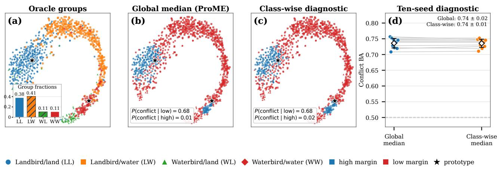  
Fig. 3. Prototype-margin enrichment of shortcut conflicts on Waterbirds. Panels (a–c) show the same seed-42 test examples in a shared t-distributed stochastic neighbor embedding (t-SNE). (a) Oracle groups; the inset reports their fractions in the displayed subset. (b) Environments induced by the global-median rule used by ProME. (c) Environments induced by a class-wise median diagnostic. Marker shapes denote oracle groups, colors denote inferred environments, and stars denote class prototypes. (d) Conflict balanced accuracy on the training split over ten seeds. Gray lines connect the same seed; diamonds and error bars show the mean and standard deviation.

Classifier repair reduces a posterior-alignment diagnostic on ColoredMNIST. Fig. 6 compares empirical ℙ(�=1 ∣ $h , e )$ across two training environments and the reversed test environment. ProME has the largest integrated gap before repair and the smallest gap after repair, below ERM and the ERM-loss control. he posterior-alignment gap characterizes how classifier repair changes score geometry under shortcut reversal. Corollary 1 states the transfer condition in terms of the total-variation quantity �.

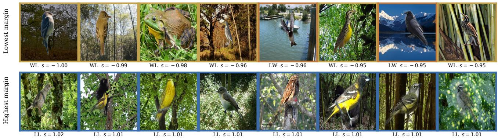  
Fig. 4. Waterbirds examples ranked by prototype margin. The displayed lowest-margin examples contain label–background conflicts, whereas the displayed highest-margin examples show aligned pairs. Oracle group labels are included only to support interpretation of the examples.

(a) Waterbirds  
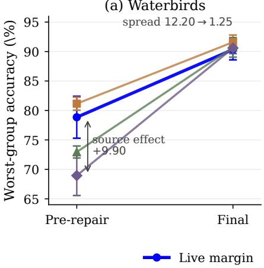

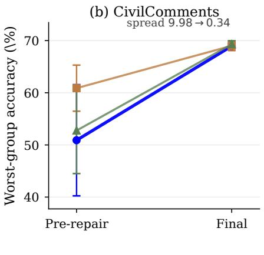

(c) CelebA candidate coverage  
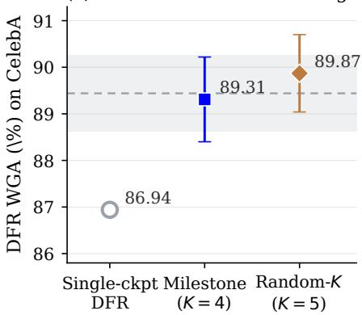  
Fig. 5. Repair-aware candidate evaluation. (a) Waterbirds and (b) CivilComments before and after classifier repair; each line connects one Stage 1 variant of Table 4. (c) CelebA with single-checkpoint, milestone, and random candidate sets under a fixed repair procedure; the band marks the full multi-candidate pipeline.

Table 3  
Downstream WGA for prototype-margin and ERM-loss partitions. This is a pipeline-level comparison: each partition passes through the same Stage 2 repair and selection protocol. For the prototype-margin row, Waterbirds and CelebA are labelaugmented diagnostics using the group-balanced prototypes of Eq. (15), reported over five and three seeds; ColoredMNIST follows the class-only protocol over ten seeds.
<table><tr><td rowspan="2">Partition</td><td colspan="3">Worst-group accuracy (%)</td></tr><tr><td></td><td>Waterbirds CelebA</td><td>ColoredMNIST</td></tr><tr><td>ERM-loss</td><td>86  $7 6 \pm 2 . 3 0$ </td><td> $8 5 . 9 3 { \scriptstyle \pm 0 . 9 4 }$ </td><td> $7 4 . 0 9 { \scriptstyle \pm 5 . 7 5 }$ </td></tr><tr><td>Prototype-margin</td><td> $9 0 . 3 1 { \scriptstyle \pm 1 . 2 9 }$ </td><td> $8 5 . 3 7 { \scriptstyle \pm 0 . 9 4 }$ </td><td> $7 5 . 7 7 { \scriptstyle \pm 5 . 4 8 }$ </td></tr></table>

Table 4

## 6.3. Seed Budget, Label Budget, and Hyperparameters

Real-world WGA remains stable across the fixed seed budgets. Across ten fixed seeds, Waterbirds, CelebA, and CivilComments have standard deviations of 0.62, 0.51, and

Waterbirds WGA before and after classifier repair. Each variant changes one element of Stage 1 and then passes through the same Stage 2. Source is the encoder the partition is read from. Mean ± standard deviation over three seeds.
<table><tr><td rowspan="2">Variant</td><td colspan="2">Partition</td><td rowspan="2">λ</td><td colspan="2">Worst-group accuracy (%)</td></tr><tr><td>Source Criterion</td><td></td><td>Pre-repair</td><td>Final</td></tr><tr><td>Live margin</td><td>Live</td><td>Margin</td><td>3</td><td> $7 8 . 8 5 { \scriptstyle \pm 3 . 5 6 }$ </td><td> $9 0 . 3 4 { \scriptstyle \pm 1 . 7 5 }$ </td></tr><tr><td>Live loss</td><td>Live</td><td>Loss 3</td><td></td><td> $8 1 . 1 5 { \pm } 1 . 1 1 $ </td><td> $9 1 . 5 9 { \scriptstyle \pm 1 . 2 1 }$ </td></tr><tr><td>No penalty</td><td>Live</td><td>Margin 0</td><td></td><td> $7 2 . 9 5 { \scriptstyle \pm 1 . 0 2 }$ </td><td> $9 0 . 7 1 { \scriptstyle \pm 1 . 6 6 }$ </td></tr><tr><td>Frozen reference Frozen Margin 3</td><td></td><td></td><td></td><td> $6 8 . 9 5 { \scriptstyle \pm 3 . 3 9 }$ </td><td> $9 0 . 6 0 { \scriptstyle \pm 0 . 9 5 }$ </td></tr></table>

0.30 WGA points (Fig. 7). Their ten-seed means remain within 0.62 points of the three-seed results in Table 2. Fig. 9(d) shows little change as the seed budget grows from 3 to 10. ColoredMNIST has a wider standard deviation of 5.48 points, so the stability conclusion is limited to the three real-world benchmarks.

(a) ERM  
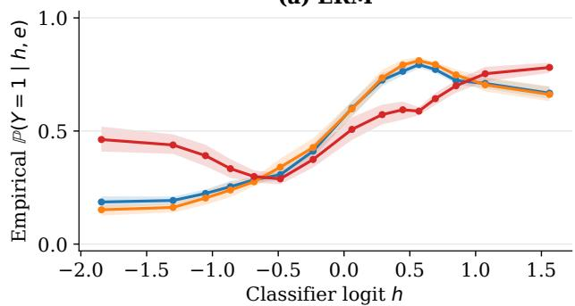  
(c) ProME

(b) ERM-loss  
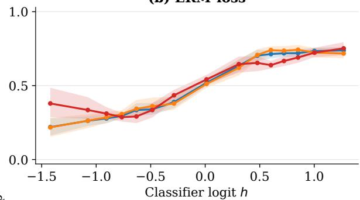

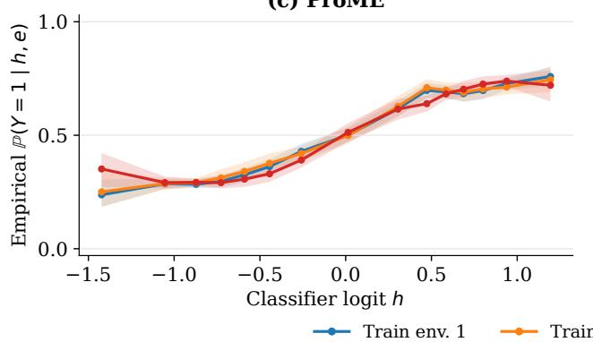

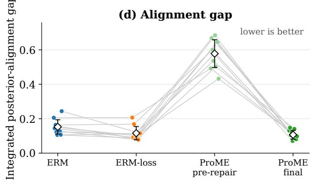  
Fig. 6. Classifier repair reduces the posterior-alignment gap on ColoredMNIST. Panels (a)–(c) plot the empirical $\mathbb { P } ( y = 1 \mid h , e )$ for two training environments and the reversed test environment under ERM, ERM-loss, and ProME after classifier repair. Panel (d) reports the integrated posterior-alignment gap for ERM, ERM-loss, and ProME before and after repair. A lower value indicates better alignment. Gray lines connect the same seed. Curves use 50 equal-width bins with at least five samples per bin.

Table 5  
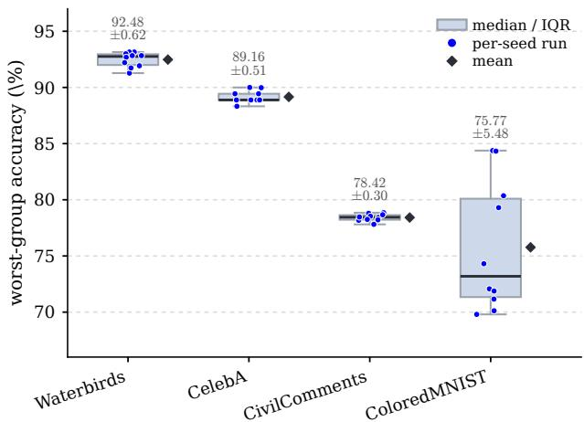  
Fig. 7. WGA across ten fixed seeds. Boxes show interquartile ranges, center lines show medians, points show individual runs, and diamonds show means.

The value ofvalidation-group labels depends on minoritygroup support. Stage 2 uses group-annotated validation data for classifier repair. Table 5 holds the ProME representation fixed and changes only the group-balanced data used to fit the head. Val-DFR exceeds train-DFR by 18.68 points on Waterbirds, whose smallest training group contains 56 examples. The gap is 1.83 points on CelebA, whose smallest group contains 1,387 examples. Across six ColoredMNIST settings, the train-DFR minus val-DFR gap approaches zero as $n _ { \mathrm { m i n } }$ increases (Fig. 8). These results support validationgroup labels for classifier repair when training minority support is limited. The source and partition controls above examine the Stage 1 environment mechanism. Stage 1 representation learning uses no training-group labels.

Efect of the data used to fit the classifier-repair head. The ProME representation is fixed; only the group-balanced fitting data changes. Mean ± standard deviation over ten seeds. � is the training-set size and $n _ { \mathrm { m i n } }$ its smallest (�, �) group.
<table><tr><td>Dataset (N)</td><td>Smallest group  $n _ { \mathrm { m i n } }$ </td><td>train-DFR (%) val-DFR (%)</td><td></td></tr><tr><td>Waterbirds (4,795)</td><td>56</td><td> $7 3 . 8 0 { \scriptstyle \pm 2 . 5 1 }$ </td><td> $9 2 . 4 8 { \scriptstyle \pm 0 . 6 2 }$ </td></tr><tr><td>CelebA (162,770)</td><td>1,387</td><td> $8 7 . 6 1 { \scriptstyle \pm 1 . 0 0 }$ </td><td> $8 9 . 4 4 { \scriptstyle \pm 0 . 8 2 }$ </td></tr></table>

The label-augmented Waterbirds diagnostic is stable across the swept settings. Fig. 9(a–c) sweeps the invariance weight, the temperature, and the prototype-refresh period on Waterbirds under the label-augmented refinement with group-balanced prototypes. Every swept value of all three hyperparameters stays inside a 0.93-point band, from 92.14% to 93.07%, and this includes the endpoints $\lambda = 3 0$ at ten times the default weight and $T _ { \mathrm { p r o t o } } ~ = ~ \infty$ , which suspends prototype refreshing altogether. Within this Waterbirds sweep, WGA is insensitive to an order-of-magnitude change in the Stage 1 invariance weight.

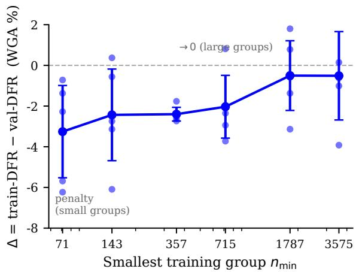

Fig. 8. Efect of minority support on classifier-repair label source. train-DFR minus val-DFR WGA versus the smallest training group $n _ { \mathrm { m i n } } ,$ reported as mean ± standard deviation over five seeds.  
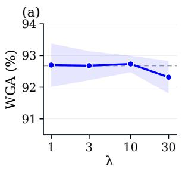

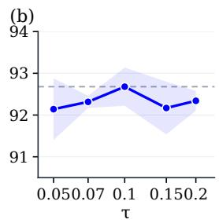

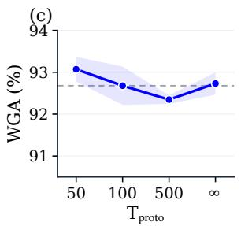

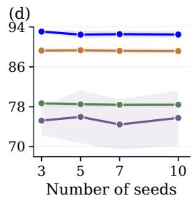  
Waterbirds CelebA CivilComments ColoredMNIST  
Fig. 9. Hyperparameter and seed-budget sensitivity. (a– c) Label-augmented Waterbirds diagnostic across the invariance weight, temperature, and prototype-refresh period; bands show standard deviations and dashed lines mark defaults. (d) WGA across seed budgets.

## 7. Conclusion

In this paper, we presented ProME, a two-stage and backbone-agnostic framework designed to align environment construction and model selection with the deployed predictor when training-group labels are unavailable. By formulating group robustness without training-group labels as the endogenous environments with repair-aware selection (ERAS) problem, ProME couples trajectory-based environment construction with post-repair comparison of encoder– head pairs. Theoretically, we characterize shortcut-conflict separation and partition stability under explicit conditions, and bound worst inferred-environment risk for a fixed predictor and partition, with transfer to oracle groups under total-variation alignment. Empirically, ProME achieves the highest average WGA among methods under matched group-label access, while analyses show pre-repair gains from trajectory-derived margins and reduced diferences among Stage 1 variants after classifier repair. As a backboneagnostic framework that learns representations without trainin group labels and deploys a single encoder–head pair, ProME ofers deployment alignment as a practical design principle for group-robust learning, and we hope this work facilitates future research across diverse forms of subpopulation shift.

## CRediT authorship contribution statement

Qianqian Wang: Conceptualization, Methodology, Software, Validation, Formal analysis, Investigation, Writing – original draft. Yunshan Li: Writing – review & editing. Dawei Huang: Software, Resources. Wenwu Gong: Writing – review & editing, Methodology, Conceptualization. Lili Yang: Supervision, Resources, Writing – review & editing.

## Declaration of competing interest

The authors declare that they have no known competing financial interests or personal relationships that could have appeared to influence the work reported in this paper.

## Acknowledgements

This research was funded by the SUSTech Presidential Postdoctoral Fellowship, the China Postdoctoral Science Foundation (Grant No. 2025M773057), Shenzhen Science and Technology Program (Grant No. ZDSYS20210623092007023), and the Shenzhen Key Laboratory of Safety and Security for Next Generation of Industrial Internet, Southern University of Science and Technology.

## Data availability

The three real-world datasets are publicly available from their cited sources. ColoredMNIST is generated from MNIST using the protocol in Section 6. Our code will be publicly available upon acceptance.

## Declaration of generative AI use

The authors used generative AI tools only for language polishing and readability improvement. All technical ideas, experiments, analyses, and conclusions were developed and verified by the authors, who take full responsibility for the content of this paper.

## A. Proofs for Theoretical Analysis

This appendix provides the complete proofs for Section 5. The assumptions are local to the corresponding results and do not alter the algorithm in Section 4. Lemma 1 and Proposition 1 are conditional structural results; Proposition 2 is deterministic on a fixed sample; and Proposition 3 is an algebraic bound for fixed cell risks. Corollary 1 adds a conditional population-risk transfer under total-variation alignment. No finite-sample empirical-to-population guarantee is claimed.

Assumption 1 (Prototype geometry). The representation is sphere-normalized, $\| \phi ( { \boldsymbol { x } } ) \| _ { 2 } ~ = ~ 1$ . The labeled sample used toform the prototypes contains both classes, and each empirical class mean is non-zero:

$$
\bar { \phi } _ { c } = \frac { 1 } { | D _ { c } | } \sum _ { i : y _ { i } = c } \phi ( x _ { i } ) , \qquad \mu _ { c } = \bar { \phi } _ { c } / \| \bar { \phi } _ { c } \| _ { 2 } .
$$

The two empirical prototypes are distinct and the temperature satisfies $\tau > 0 .$

## A.1. Proof of Lemma 1

Proof. Because �(�) and both prototypes have unit norm, every cosine in Eqs. (10) and (11) is an inner product. Hence

$$
f _ { \phi } ( x ) = \tau ^ { - 1 } \langle \phi ( x ) , \mu _ { 1 } - \mu _ { 0 } \rangle = \tau ^ { - 1 } \langle \phi ( x ) , w ^ { \star } \rangle .
$$

If $y ~ = ~ 1$ , the margin is $\langle \phi ( x ) , \mu _ { 1 } - \mu _ { 0 } \rangle$ . If $y \ = \ 0 ,$ , it is $\langle \phi ( x ) , \mu _ { 0 } - \mu _ { 1 } \rangle$ . Since $\widetilde y = + 1$ in the first case and −1 in the second, both cases are summarized by Eq. (20). □

## A.2. Proof of Proposition 1

Proof. Lemma 1 and Eq. (21) give

$$
\begin{array} { r l } & { s ( X ; Y ) = \langle \widetilde { Y } \phi ( X ) , w ^ { \star } \rangle } \\ & { \qquad = \langle u + Q v + \xi , \alpha u + \beta v \rangle } \\ & { \qquad = \alpha \| u \| _ { 2 } ^ { 2 } + Q \beta \| v \| _ { 2 } ^ { 2 } + \langle \xi , w ^ { \star } \rangle , } \end{array}
$$

where the last equality uses $u ^ { \top } v = 0$ . Taking the conditional expectation and using $\mathbb { E } [ \langle \xi , w ^ { \star } \rangle | Q ] = 0$ yields

$$
\begin{array} { r } { \mathbb { E } [ s \mid Q = q ] = \alpha \| u \| _ { 2 } ^ { 2 } + q \beta \| v \| _ { 2 } ^ { 2 } , \qquad q \in \{ - 1 , + 1 \} . } \end{array}
$$

Subtracting the two conditional means proves Eq. (22).

On the probability-one event where the bounded projectednoise condition holds, every conflicting example satisfies

$$
s \leq \alpha \| u \| _ { 2 } ^ { 2 } - \beta \| v \| _ { 2 } ^ { 2 } + \delta ,
$$

whereas every aligned example satisfies

$$
s \geq \alpha \| u \| _ { 2 } ^ { 2 } + \beta \| v \| _ { 2 } ^ { 2 } - \delta .
$$

The second lower bound exceeds the first upper bound by $2 ( \beta \| v \| _ { \gamma } ^ { 2 } - \delta ) > 0$ . Thus all conflicting margins precede all aligned margins in the empirical ordering almost surely. With distinct margins, the conventional empirical median assigns exactly $\lceil n / 2 \rceil$ observations to the low-margin cell. If $n _ { \mathrm { c f } } ~ \le ~ n / 2$ , all conflicting observations lie in that cell, whose conflict fraction is $n _ { \mathrm { c f } } / \vert n / 2 \vert$ ; for even �, this reduces to $2 \pi _ { \mathrm { c f } }$ □

## A.3. Proof of Proposition 2

Proof. Write

$$
\bar { \phi } _ { c } = | \mathcal { D } _ { c } | ^ { - 1 } \sum _ { i : y _ { i } = c } \phi ( x _ { i } ) , \qquad \bar { \phi } _ { c } ^ { \prime } = | \mathcal { D } _ { c } | ^ { - 1 } \sum _ { i : y _ { i } = c } \phi ^ { \prime } ( x _ { i } ) .
$$

The definition of � and the triangle inequality give

$$
\| \bar { \phi } _ { c } - \bar { \phi } _ { c } ^ { \prime } \| _ { 2 } \leq \varepsilon .\tag{A.1}
$$

For non-zero vectors � and �,

$$
\left\| { \frac { a } { \| a \| _ { 2 } } } - { \frac { b } { \| b \| _ { 2 } } } \right\| _ { 2 } \leq { \frac { 2 \| a - b \| _ { 2 } } { \operatorname* { m i n } ( \| a \| _ { 2 } , \| b \| _ { 2 } ) } } .\tag{A.2}
$$

Applying Eq. (A.2) to the two empirical class means and using Eq. (A.1) proves

$$
\operatorname* { m a x } _ { c } \| \mu _ { c } ( \phi ) - \mu _ { c } ( \phi ^ { \prime } ) \| _ { 2 } \leq 2 \varepsilon / \beta _ { n } .\tag{A.3}
$$

For any example and either class $^ { c , }$ adding and subtracting $\left. { \phi ^ { \prime } ( x _ { i } ) , \mu _ { c } ( \phi ) } \right.$ gives

$$
\begin{array} { r l } & { | \langle \phi ( x _ { i } ) , \mu _ { c } ( \phi ) \rangle - \langle \phi ^ { \prime } ( x _ { i } ) , \mu _ { c } ( \phi ^ { \prime } ) \rangle | } \\ & { \qquad \leq \| \phi ( x _ { i } ) - \phi ^ { \prime } ( x _ { i } ) \| _ { 2 } + \| \mu _ { c } ( \phi ) - \mu _ { c } ( \phi ^ { \prime } ) \| _ { 2 } } \\ & { \qquad \leq ( 1 + 2 / \beta _ { n } ) \varepsilon . } \end{array}
$$

The margin is the diference of two such terms. Therefore

$$
\operatorname* { m a x } _ { i } | s _ { i } ( \phi ) - s _ { i } ( \phi ^ { \prime } ) | \leq ( 2 + 4 / \beta _ { n } ) \varepsilon = L _ { s } \varepsilon .\tag{A.4}
$$

Set $\eta = L _ { s } \varepsilon .$ A coordinatewise perturbation of a finite sequence by at most � changes each order statistic by at most $\eta .$ The same bound applies to the empirical median, whether defined as the central order statistic or the average of the two central order statistics. Equation (A.4) gives

$$
| \hat { m } _ { n } ( \phi ) - \hat { m } _ { n } ( \phi ^ { \prime } ) | \leq \eta .
$$

Equations (A.3)–(A.5) prove Eq. (23).

(A.5)

It remains to characterize which assignments can change. Consider an example assigned to the low-margin cell under $\phi$ and to the high-margin cell under $\phi ^ { \prime }$ . Equations (A.4) and (A.5) imply

$$
\hat { m } _ { n } ( \phi ) - 2 \eta < s _ { i } ( \phi ) \leq \hat { m } _ { n } ( \phi ) .
$$

The reverse reassignment similarly implies

$$
\hat { m } _ { n } ( \phi ) < s _ { i } ( \phi ) \leq \hat { m } _ { n } ( \phi ) + 2 \eta .
$$

Thus every reassigned example lies in $\{ | s _ { i } ( \phi ) - \hat { m } _ { n } ( \phi ) | \ \leq$ $2 \eta \}$ . Summing its indicator over the fixed sample and dividing by � proves Eq. (24).

A.4. Proof of Proposition 3 and Corollary 1 ProofofProposition 3. Let $d _ { e } = r _ { e } - \bar { \mathcal { R } }$ , choose one $e ^ { \star } \in$ arg max � , and set $M = d _ { e ^ { \star } }$ . Since $\begin{array} { r } { \sum _ { e } d _ { e } = 0 } \end{array}$ , the $K - 1$ deviations indexed by $\textit { e } \neq \textit { e } ^ { \star }$ sum to −�. By Cauchy– Schwarz,

$$
\sum _ { e \ne e ^ { \star } } d _ { e } ^ { 2 } \ge \frac { 1 } { K - 1 } \left( \sum _ { e \ne e ^ { \star } } d _ { e } \right) ^ { 2 } = \frac { M ^ { 2 } } { K - 1 } .
$$

Table B.1  
ColoredMNIST under two evaluation protocols. Published ERM and oracle-IRM results use reversed-environment test accuracy; the remaining rows use WGA under the ProME protocol. Results are mean ± standard deviation over ten seeds.
<table><tr><td>Method</td><td>Seeds</td><td>Metric</td><td>Score (%)</td></tr><tr><td>ERM (published)</td><td>10</td><td>Test accuracy</td><td> $1 7 . 1 { \pm } 0 . 6 $ </td></tr><tr><td>IRM, oracle environments (published)</td><td>10</td><td>Test accuracy</td><td>66.9±2.5</td></tr><tr><td>JTT</td><td>10</td><td>WGA</td><td> $6 8 . 1 4 { \scriptstyle \pm 2 . 0 9 }$ </td></tr><tr><td>DFR</td><td>10</td><td>WGA</td><td> $7 0 . 8 6 { \scriptstyle \pm 0 . 5 5 }$ </td></tr><tr><td>Loss-split (EIIL-style)</td><td>10</td><td>WGA</td><td> $7 4 . 0 9 { \scriptstyle \pm 5 . 7 5 }$ </td></tr><tr><td>ProME</td><td>10</td><td>WGA</td><td> $7 5 . 7 7 { \scriptstyle \pm 5 . 4 8 }$ </td></tr></table>

Note. Published ERM and IRM values are quoted from Table 2 of [19]. The WGA block follows Section 6; its loss-split row changes the partition criterion within the same pipeline.

Consequently,

$$
\mathcal { P } _ { \mathrm { R E x } } = \frac { 1 } { K } \sum _ { e } d _ { e } ^ { 2 } \geq \frac { 1 } { K } \left( M ^ { 2 } + \frac { M ^ { 2 } } { K - 1 } \right) = \frac { M ^ { 2 } } { K - 1 } .
$$

Therefore $\begin{array} { r c l } { M } & { \le } & { \sqrt { ( K - 1 ) { \mathcal P } _ { \mathrm { R E x } } } . } \end{array}$ , and adding $\bar { \mathcal { R } }$ proves Eq. (25). For $K = 2 ,$ , the two centered risks are � and −�, so $\mathcal { P } _ { \mathrm { R E x } } = d ^ { 2 }$ and the bound is an equality.

Proof of Corollary 1. Under the convention $\mathrm { T V } ( P , Q ) =$ $\operatorname* { s u p } _ { A } | P ( A ) - Q ( A ) |$ , the variational characterization for a loss in [0, �] gives

$$
| \mathbb { E } _ { Q _ { g } } \ell - \mathbb { E } _ { Q _ { e ( g ) } } \ell | \le B \mathrm { T V } ( Q _ { g } , Q _ { e ( g ) } ) \le B \rho .
$$

Hence $\mathcal { R } _ { g } ( f ) \leq \mathcal { R } _ { e ( g ) } ( f ) + B \rho$ . Maximizing over oracle groups gives

$$
\mathcal { R } _ { \mathrm { w g } } ^ { ( \mathcal { G } ) } ( f ) \leq \mathcal { R } _ { \mathrm { w g } } ^ { ( \hat { \mathcal { E } } ) } ( f ) + B \rho .
$$

Applying Proposition 3 to the first term proves Eq. (26).

## B. Supplementary Experiments and Tables

## B.1. ColoredMNIST Protocol Comparison

Table B.1 separates two evaluation conventions. Published ERM and oracle-IRM results use reversed-environment test accuracy. The matched block uses WGA under the ProME protocol and supports the diagnostic discussion in Section 6.2.2.

## B.2. Single-Seed Pipeline Decomposition

Table B.2 provides a seed-42 decomposition under a fixed budget and candidate set. Classifier repair and repairaware selection produce the largest change in all displayed arms. Replacing the partition also changes the final result, while removing the invariance penalty has a smaller efect in this run. Because the table contains one seed, it is used as a mechanism diagnostic rather than a population estimate. The multi-seed controls in Table 4 provide the main evidence.

Table B.2  
Single-seed Waterbirds pipeline decomposition. All variants use class-only prototypes and the same training budget, candidate set, and validation protocol. Pre-repair evaluates Stage 1; Final includes classifier repair and selection; Gain = Final − Pre-repair.
<table><tr><td>Variant</td><td>Partition</td><td></td><td></td><td>Invariance DFR Pre-repair</td><td>Final</td><td>Gain</td></tr><tr><td>ProME (full)</td><td>Prototype margin</td><td>√</td><td>√</td><td>72.27</td><td></td><td>91.74 +19.47</td></tr><tr><td>ERM-loss control</td><td>ERM loss</td><td>√</td><td>√</td><td>85.36</td><td></td><td> $8 6 . 2 9 + 0 . 9 3$ </td></tr><tr><td>Without invariance Prototype margin</td><td></td><td>x</td><td>√</td><td>72.90</td><td></td><td> $9 1 . 2 8 ~ + 1 8 . 3 8 ~$ </td></tr></table>

## B.3. Training Details

Training schedules. The ERM warm-up lasts 5 epochs on the real-world benchmarks and 100 epochs on ColoredM-NIST. Invariant training then runs for 3,000 steps on Waterbirds and CivilComments, 5,000 on CelebA, and 1,000 on ColoredMNIST. AdamW uses learning rates of $1 0 ^ { - 4 }$ for ResNet-50 and $2 \times 1 0 ^ { - 5 }$ for BERT-base, with weight decay $1 0 ^ { - 4 }$ and $1 0 ^ { - 2 }$ , respectively. Batch sizes are 32, 64, and 16 on Waterbirds, CelebA, and CivilComments. The penalty weight increases linearly from 1 to 3 on the vision benchmarks and to 10 on CivilComments. Prototypes are refreshed every $T _ { \mathrm { p r o t o } } ~ = ~ 1 0 0$ steps by default, while the three-seed Waterbirds headline runs use $T _ { \mathrm { p r o t o } } = 5 0$ . The training loss is logistic cross-entropy. Loss boundedness is required only for the optional total-variation transfer in Corollary 1. The controlled analyses in Sec. 6.2.2 and Sec. 6.2.3 run repeated seeds and repeated repair passes over each candidate pool, so we run the seed-heavy sweeps on Waterbirds and ColoredM-NIST and reserve CelebA, whose 162,770 training images make each pass an order of magnitude more expensive, for the settings where it carries the comparison.

## References

[1] S. Sagawa\*, P. W. Koh\*, T. B. Hashimoto, P. Liang, Distributionally robust neural networks, in: International Conference on Learning Representations, 2020. URL https://openreview.net/forum?id=ryxGuJrFvS

[2] Y. Yang, H. Zhang, D. Katabi, M. Ghassemi, Change is hard: A closer look at subpopulation shift, in: A. Krause, E. Brunskill, K. Cho, B. Engelhardt, S. Sabato, J. Scarlett (Eds.), Proceedings of the 40th International Conference on Machine Learning, Vol. 202 of Proceedings of Machine Learning Research, PMLR, 2023, pp. 39584–39622. URL https://proceedings.mlr.press/v202/yang23s.html

[3] W. Ye, L. Jiang, E. Xie, G. Zheng, Y. Ma, X. Cao, D. Guo, D. Qi, Z. He, Y. Tian, C. W. Porter, M. Cofee, Z. Zeng, S. Li, Z. Wang, T.-H. K. Huang, J. M. Rehg, H. Kautz, A. Zhang, The clever hans mirage: A comprehensive survey on spurious correlations in machine learning, Transactions on Machine Learning Research (2026). URL https://openreview.net/forum?id=kIuqPmS1b1

[4] R. Geirhos, J.-H. Jacobsen, C. Michaelis, R. Zemel, W. Brendel, M. Bethge, F. A. Wichmann, Shortcut learning in deep neural networks, Nature Machine Intelligence 2 (11) (2020) 665–673. doi: 10.1038/s42256-020-00257-z. URI,https://doi.org/10.1038/s42256-020-00257-z ttps: oi.org 10.1038 s42256-020-00257-z

[5] Z. Liu, P. Luo, X. Wang, X. Tang, Deep learning face attributes in the wild, in: 2015 IEEE International Conference on Computer Vision (ICCV), 2015, pp. 3730–3738. doi:10.1109/ICCV.2015.425.

[6] E. Z. Liu, B. Haghgoo, A. S. Chen, A. Raghunathan, P. W. Koh, S. Sagawa, P. Liang, C. Finn, Just train twice: Improving group robustness without training group information, in: M. Meila, T. Zhang

URL https://proceedings.mlr.press/v202/qiu23c.html

(Eds.), Proceedings of the 38th International Conference on Machine Learning, Vol. 139 of Proceedings of Machine Learning Research, PMLR, 2021, pp. 6781–6792.

URL https://proceedings.mlr.press/v139/liu21f.html

[7] M. Pezeshki, D. Bouchacourt, M. Ibrahim, N. Ballas, P. Vincent, D. Lopez-Paz, Discovering environments with XRM, in: R. Salakhutdinov, Z. Kolter, K. Heller, A. Weller, N. Oliver, J. Scarlett, F. Berkenkamp (Eds.), Proceedings of the 41st International Conference on Machine Learning, Vol. 235 of Proceedings of Machine Learning Research, PMLR, 2024, pp. 40551–40569. URL https://proceedings.mlr.press/v235/pezeshki24a.html

[8] N. Sohoni, J. Dunnmon, G. Angus, A. Gu, C. Ré, No subclass left behind: Fine-grained robustness in coarse-grained classification problems, in: H. Larochelle, M. Ranzato, R. Hadsell, M. Balcan, H. Lin (Eds.), Advances in Neural Information Processing Systems, Vol. 33, Curran Associates, Inc., 2020, pp. 19339–19352. URL https://proceedings.neurips.cc/paper\_files/paper/2020/file/ e0688d13958a19e087e123148555e4b4-Paper.pdf

[9] E. Creager, J.-H. Jacobsen, R. Zemel, Environment inference for invariant learning, in: M. Meila, T. Zhang (Eds.), Proceedings of the 38th International Conference on Machine Learning, Vol. 139 of Proceedings of Machine Learning Research, PMLR, 2021, pp. 2189– 2200.

[10] Y. Han, D. Zou, Improving group robustness on spurious correlation requires preciser group inference, in: R. Salakhutdinov, Z. Kolter, K. Heller, A. Weller, N. Oliver, J. Scarlett, F. Berkenkamp (Eds.), Proceedings of the 41st International Conference on Machine Learning, Vol. 235 ofProceedings ofMachine Learning Research, PMLR, 2024, pp. 17480–17504.

URL https://proceedings.mlr.press/v235/han24g.html

[11] M. Zhang, N. S. Sohoni, H. R. Zhang, C. Finn, C. Re, Correct-ncontrast: a contrastive approach for improving robustness to spurious correlations, in: K. Chaudhuri, S. Jegelka, L. Song, C. Szepesvari, G. Niu, S. Sabato (Eds.), Proceedings of the 39th International Conference on Machine Learning, Vol. 162 of Proceedings of Machine Learning Research, PMLR, 2022, pp. 26484–26516. URL https://proceedings.mlr.press/v162/zhang22z.html

[12] S. Qiu, A. Potapczynski, P. Izmailov, A. G. Wilson, Simple and fast group robustness by automatic feature reweighting, in: A. Krause, E. Brunskill, K. Cho, B. Engelhardt, S. Sabato, J. Scarlett (Eds.), Proceedings of the 40th International Conference on Machine Learning, Vol. 202 ofProceedings ofMachine Learning Research, PMLR, 2023, pp. 28448–28467.

[13] Y. Liao, Q. Wu, Y. Wu, X. Yan, Decorr: Environment partitioning for invariant learning and ood generalization, Neural Networks 199 (2026) 108727. doi:https://doi.org/10.1016/j.neunet.2026.108727. URL https://www.sciencedirect.com/science/article/pii/ S0893608026001899

[14] S. Wang, M. Sun, Q. Huang, Y. Wang, Environment promoted invariant information learning for graph out-of-distribution generalization, Artificial Intelligence 355 (2026) 104522. doi:https://doi.org/10.1016/j.artint.2026.104522. URL https://www.sciencedirect.com/science/article/pii/ S0004370226000482

[15] P. Kirichenko, P. Izmailov, A. G. Wilson, Last layer re-training is suficient for robustness to spurious correlations, in: ICML 2022: Workshop on Spurious Correlations, Invariance and Stability, 2022. URL https://openreview.net/forum?id=THOOBy1uWVH

[16] T. LaBonte, V. Muthukumar, A. Kumar, Towards last-layer retraining for group robustness with fewer annotations, in: A. Oh, T. Naumann, A. Globerson, K. Saenko, M. Hardt, S. Levine (Eds.), Advances in Neural Information Processing Systems, Vol. 36, Curran Associates, Inc., 2023, pp. 11552–11579. doi:10.52202/075280-0509. URL https://proceedings.neurips.cc/paper\_files/paper/2023/file/ 265bee74aee86df77e8e36d25e786ab5-Paper-Conference.pdf

[17] J. C. Hill, T. LaBonte, X. Zhang, V. Muthukumar, On the unreasonable efectiveness of last-layer retraining, Transactions on Machine Learning Research (2026). URL https://openreview.net/forum?id=h81ztbrkFb

[18] P. W. Koh, S. Sagawa, H. Marklund, S. M. Xie, M. Zhang, A. Balsubramani, W. Hu, M. Yasunaga, R. L. Phillips, I. Gao, T. Lee, E. David, I. Stavness, W. Guo, B. Earnshaw, I. Haque, S. M. Beery, J. Leskovec, A. Kundaje, E. Pierson, S. Levine, C. Finn, P. Liang, Wilds: A benchmark of in-the-wild distribution shifts, in: M. Meila, T. Zhang (Eds.), Proceedings of the 38th International Conference on Machine Learning, Vol. 139 of Proceedings of Machine Learning Research, PMLR, 2021, pp. 5637–5664. URL https://proceedings.mlr.press/v139/koh21a.html

[19] M. Arjovsky, L. Bottou, I. Gulrajani, D. Lopez-Paz, Invariant risk minimization, arXiv preprint arXiv:1907.02893 (2019). doi:10. 48550/arXiv.1907.02893. URL https://doi.org/10.48550/arXiv.1907.02893

[20] B. Y. Idrissi, M. Arjovsky, M. Pezeshki, D. Lopez-Paz, Simple data balancing achieves competitive worst-group-accuracy, in: B. Schölkopf, C. Uhler, K. Zhang (Eds.), Proceedings of the First Conference on Causal Learning and Reasoning, Vol. 177 of Proceedings of Machine Learning Research, PMLR, 2022, pp. 336–351. URL https://proceedings.mlr.press/v177/idrissi22a.html

[21] J. Nam, H. Cha, S. Ahn, J. Lee, J. Shin, Learning from failure: Debiasing classifier from biased classifier, in: H. Larochelle, M. Ranzato, R. Hadsell, M. Balcan, H. Lin (Eds.), Advances in Neural Information Processing Systems, Vol. 33, Curran Associates, Inc., 2020, pp. 20673–20684. URL https://proceedings.neurips.cc/paper\_files/paper/2020/file/ eddc3427c5d77843c2253f1e799fe933-Paper.pdf

[22] G. Li, J. Liu, W. Hu, Bias amplification enhances minority group performance, Transactions on Machine Learning Research (2024). URL https://openreview.net/forum?id=75OwvzZZBT

[23] G. Zheng, W. Ye, A. Zhang, Learning robust classifiers with selfguided spurious correlation mitigation, in: Proceedings of the Thirty-Third International Joint Conference on Artificial Intelligence, IJCAI ’24, 2024. doi:10.24963/ijcai.2024/619. URL https://doi.org/10.24963/ijcai.2024/619

[24] H. Han, S. Kim, H. Joo, S. Hong, J. Lee, Mitigating spurious correlations via disagreement probability, in: A. Globerson, L. Mackey, D. Belgrave, A. Fan, U. Paquet, J. Tomczak, C. Zhang (Eds.), Advances in Neural Information Processing Systems, Vol. 37, Curran Associates, Inc., 2024, pp. 74363–74382. doi:10.52202/079017-2366. URL https://proceedings.neurips.cc/paper\_files/paper/2024/file/ 879c5890a9d2ecdcb590c9674cda4a59-Paper-Conference.pdf

[25] C. Tsirigotis, J. Monteiro, P. Rodriguez, D. Vazquez, A. Courville, Group robust classification without any group information, in: A. Oh, T. Naumann, A. Globerson, K. Saenko, M. Hardt, S. Levine (Eds.), Advances in Neural Information Processing Systems, Vol. 36, Curran Associates, Inc., 2023, pp. 56553–56575. doi:10.52202/075280-2468. URL https://proceedings.neurips.cc/paper\_files/paper/2023/file/ b0d9ceb3d11d013e55da201d2a2c07b2-Paper-Conference.pdf

[26] P. Q. Le, J. Schlötterer, C. Seifert, Out of spuriousity: Improving robustness to spurious correlations without group annotations, Transactions on Machine Learning Research (2025). URL https://openreview.net/forum?id=EEeVYfXor5

[27] J. P. Cohen, L. Blankemeier, A. S. Chaudhari, Identifying spurious correlations using counterfactual alignment, Transactions on Machine Learning Research (2025). URL https://openreview.net/forum?id=Utjw2z1ale

[28] Z. Chen, M. Zhang, S. Cui, H. Li, G. Niu, M. Gong, C. Zhang, K. Zhang, Neural collapse inspired feature alignment for out-ofdistribution generalization, in: A. Globerson, L. Mackey, D. Belgrave, A. Fan, U. Paquet, J. Tomczak, C. Zhang (Eds.), Advances in Neural Information Processing Systems, Vol. 37, Curran Associates, Inc., 2024, pp. 93671–93689. doi:10.52202/079017-2970. URL https://proceedings.neurips.cc/paper\_files/paper/2024/file/ aa56c74513a5e35768a11f4e82dd7ffb-Paper-Conference.pdf

[29] N. Stromberg, R. Ayyagari, M. Welfert, S. Koyejo, R. Nock, L. Sankar, Robustness to subpopulation shift with domain label noise via regularized annotation of domains, Transactions on Machine Learning Research 2024, publisher Copyright: © 2024, Transactions on Machine Learning Research. All rights reserved. (2024).

[30] J. Peters, P. Bühlmann, N. Meinshausen, Causal inference by using invariant prediction: Identification and confidence intervals, Journal of the Royal Statistical Society Series B: Statistical Methodology 78 (5) (2016) 947–1012. arXiv:https://academic.oup.com/ jrsssb/article-pdf/78/5/947/49235444/jrsssb\_78\_5\_947.pdf, doi:10. 1111/rssb.12167.

[31] M. Rojas-Carulla, B. Schölkopf, R. Turner, J. Peters, Invariant models for causal transfer learning, Journal of Machine Learning Research 19 (36) (2018) 1–34. URL http://jmlr.org/papers/v19/16-432.html

[32] K. Ahuja, K. Shanmugam, K. Varshney, A. Dhurandhar, Invariant risk minimization games, in: H. D. III, A. Singh (Eds.), Proceedings of the 37th International Conference on Machine Learning, Vol. 119 of Proceedings of Machine Learning Research, PMLR, 2020, pp. 145– 155.

[33] J. Liu, Z. Hu, P. Cui, B. Li, Z. Shen, Integrated latent heterogeneity and invariance learning in kernel space, in: M. Ranzato, A. Beygelzimer, Y. Dauphin, P. Liang, J. W. Vaughan (Eds.), Advances in Neural Information Processing Systems, Vol. 34, Curran Associates, Inc., 2021, pp. 21720–21731. URL https://proceedings.neurips.cc/paper\_files/paper/2021/file/ b59a51a3c0bf9c5228fde841714f523a-Paper.pdf

[34] Y. Lin, S. Zhu, L. Tan, P. Cui, Zin: When and how to learn invariance without environment partition?, in: S. Koyejo, S. Mohamed, A. Agarwal, D. Belgrave, K. Cho, A. Oh (Eds.), Advances in Neural Information Processing Systems, Vol. 35, Curran Associates, Inc., 2022, pp. 24529–24542. doi:10.52202/068431-1781. URL https://proceedings.neurips.cc/paper\_files/paper/2022/file/ 9b77f07301b1ef1fe810aae96c12cb7b-Paper-Conference.pdf

[35] E. Rosenfeld, P. Ravikumar, A. Risteski, The risks of invariant risk minimization, International Conference on Learning Representations 9. URL https://par.nsf.gov/biblio/10222689

[36] P. Kamath, A. Tangella, D. Sutherland, N. Srebro, Does invariant risk minimization capture invariance?, in: A. Banerjee, K. Fukumizu (Eds.), Proceedings of The 24th International Conference on Artificial Intelligence and Statistics, Vol. 130 of Proceedings of Machine Learning Research, PMLR, 2021, pp. 4069–4077. URL https://proceedings.mlr.press/v130/kamath21a.html

[37] J. Snell, K. Swersky, R. Zemel, Prototypical networks for few-shot learning, in: Proceedings of the 31st International Conference on Neural Information Processing Systems, NIPS’17, Curran Associates Inc., Red Hook, NY, USA, 2017, p. 4080–4090.

[38] V. Papyan, X. Y. Han, D. L. Donoho, Prevalence of neural collapse during the terminal phase of deep learning training, Proceedings of the National Academy of Sciences 117 (40) (2020) 24652–24663. arXiv:https://www.pnas.org/doi/pdf/10.1073/pnas. 2015509117, doi:10.1073/pnas.2015509117. URL,https://www.pnas.org/doi/abs/10.1073/pnas.2015509117

[39] M. N. N. To, P. F. R. Wilson, V. Nguyen, M. Harmanani, M. Cooper, F. Fooladgar, P. Abolmaesumi, P. Mousavi, R. G. Krishnan, Diverse prototypical ensembles improve robustness to subpopulation shift, in: Proceedings of the 42nd International Conference on Machine Learning, ICML’25, JMLR.org, 2025.

[40] P. Izmailov, P. Kirichenko, N. Gruver, A. G. Wilson, On feature learning in the presence of spurious correlations, in: S. Koyejo, S. Mohamed, A. Agarwal, D. Belgrave, K. Cho, A. Oh (Eds.), Advances in Neural Information Processing Systems, Vol. 35, Curran Associates, Inc., 2022, pp. 38516–38532. doi:10.52202/068431-2791. URL https://proceedings.neurips.cc/paper\_files/paper/2022/file/ fb64a552feda3d981dbe43527a80a07e-Paper-Conference.pdf

[41] T. LaBonte, J. C. Hill, X. Zhang, V. Muthukumar, A. Kumar, The group robustness is in the details: Revisiting finetuning under spurious correlations, in: A. Globerson, L. Mackey, D. Belgrave, A. Fan, U. Paquet, J. Tomczak, C. Zhang (Eds.), Advances in Neural Information Processing Systems, Vol. 37, Curran Associates, Inc., 2024, pp. 121598–121629. doi:10.52202/079017-3865. URL https://proceedings.neurips.cc/paper\_files/paper/2024/file/ dc4db2ff2c1aefce3b594f821ea82fe6-Paper-Conference.pdf

[42] N. Stromberg, R. Ayyagari, M. Welfert, S. Koyejo, R. Nock, L. Sankar, For robust worst-group accuracy, ignore group annotations, Transactions on Machine Learning Research (2024). URL https://openreview.net/forum?id=l8E68fD6yp

[43] T. G. J. Rudner, Y. Shi Zhang, A. G. Wilson, J. Kempe, Mind the GAP: Improving robustness to subpopulation shifts with group-aware priors, in: S. Dasgupta, S. Mandt, Y. Li (Eds.), Proceedings of The 27th International Conference on Artificial Intelligence and Statistics, Vol. 238 ofProceedings ofMachine Learning Research, PMLR, 2024, pp. 127–135.

[44] N. Stromberg, R. Ayyagari, S. Koyejo, R. Nock, L. Sankar, Enhancing robustness of last layer two-stage fair model corrections, in: A. Globerson, L. Mackey, D. Belgrave, A. Fan, U. Paquet, J. Tomczak, C. Zhang (Eds.), Advances in Neural Information Processing Systems, Vol. 37, Curran Associates, Inc., 2024, pp. 139380–139401. doi:10.52202/079017-4424. URL https://proceedings.neurips.cc/paper\_files/paper/2024/file/ fba9133d7fa896ab9414ddd1a6b1ecbf-Paper-Conference.pdf

[45] D. Krueger, E. Caballero, J.-H. Jacobsen, A. Zhang, J. Binas, D. Zhang, R. L. Priol, A. Courville, Out-of-distribution generalization via risk extrapolation (rex), in: M. Meila, T. Zhang (Eds.), Proceedings of the 38th International Conference on Machine Learning, Vol. 139 of Proceedings of Machine Learning Research, PMLR, 2021, pp. 5815–5826. URL https://proceedings.mlr.press/v139/krueger21a.html

[46] D. Borkan, L. Dixon, J. Sorensen, N. Thain, L. Vasserman, Nuanced metrics for measuring unintended bias with real data for text classification, in: Companion Proceedings of The 2019 World Wide Web Conference, WWW ’19, Association for Computing Machinery, New York, NY, USA, 2019, p. 491–500. doi:10.1145/3308560.3317593. URL https://doi.org/10.1145/3308560.3317593

[47] S. Sagawa, A. Raghunathan, P. W. Koh, P. Liang, An investigation of why overparameterization exacerbates spurious correlations, in: H. D. III, A. Singh (Eds.), Proceedings of the 37th International Conference on Machine Learning, Vol. 119 of Proceedings of Machine Learning Research, PMLR, 2020, pp. 8346–8356. URL https://proceedings.mlr.press/v119/sagawa20a.html

[48] J. Nam, J. Kim, J. Lee, J. Shin, Spread spurious attribute: Improving worst-group accuracy with spurious attribute estimation, in: International Conference on Learning Representations, 2022. URL https://openreview.net/forum?id=\_F9xpOrqyX9

[49] X. Zhou, Y. Lin, R. Pi, W. Zhang, R. Xu, P. Cui, T. Zhang, Model agnostic sample reweighting for out-of-distribution learning, in: K. Chaudhuri, S. Jegelka, L. Song, C. Szepesvari, G. Niu, S. Sabato (Eds.), Proceedings of the 39th International Conference on Machine Learning, Vol. 162 of Proceedings of Machine Learning Research, PMLR, 2022, pp. 27203–27221. URL https://proceedings.mlr.press/v162/zhou22d.html

[50] R. Qiao, Z. Wu, J. Wang, P. W. Koh, B. K. H. Low, Group-robust sample reweighting for subpopulation shifts via influence functions, in: Y. Yue, A. Garg, N. Peng, F. Sha, R. Yu (Eds.), International Conference on Learning Representations, Vol. 2025, 2025, pp. 36959–36980. URL https://proceedings.iclr.cc/paper\_files/paper/2025/file/ 5b6c1a77153c9d11861e26f92780cf2f-Paper-Conference.pdf