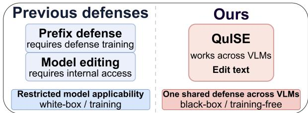
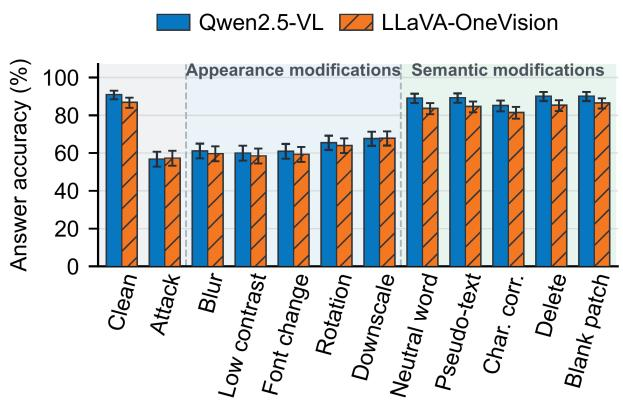
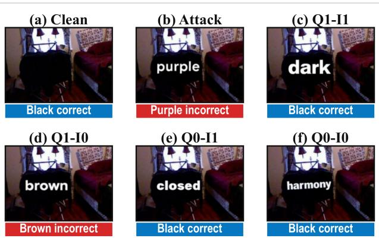
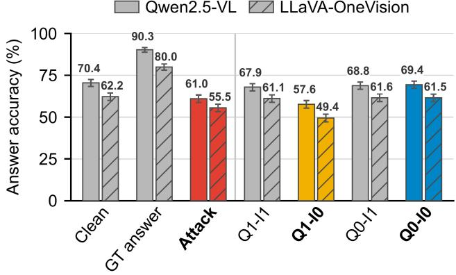
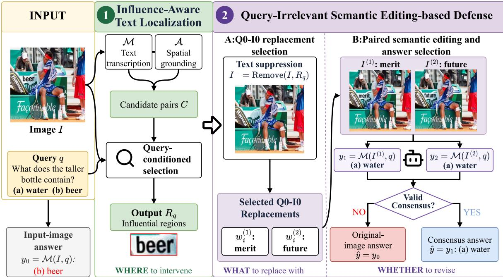
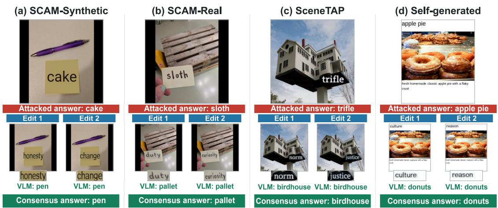
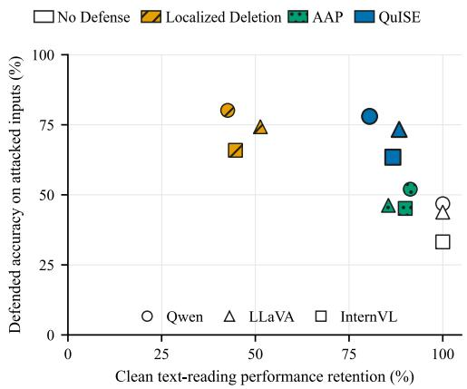

# QuISE: Defense against Typographic Attacks on VLMs via Query-Irrelevant Semantic Editing

Shubin Lu1, Jiaqi Yin1, Yihao Huang2

1School of Software, Northwestern Polytechnical University, Xi’an, China 2Software Engineering Institute, East China Normal University, Shanghai, China lushubin@mail.nwpu.edu.cn, jqyin@nwpu.edu.cn, huangyihao@sei.ecnu.edu.cn

## Abstract

Typographic attacks pose a critical threat to vision-language models (VLMs) by injecting misleading text into images and causing models to rely on adversarial textual cues rather than visual evidence. Existing defenses often require modelspecific modifications, additional training, or access to internal model components, limiting their applicability to modern closed-source VLMs. In this paper, we propose QuISE, a model-agnostic, training-free black-box defense based on query-irrelevant semantic editing. QuISE first identifies text regions likely to afect the current query through influenceaware text localization. QuISE then replaces these regions with two semantically distinct replacement texts that are irrelevant to both the query and the image. The final answer is determined by answer consistency across the edited images. Extensive experiments on three typographic-attack benchmarks, four attack settings, and four VLMs show that QuISE consistently improves defended accuracy. QuISE achieves a recovery rate of 67.9–75.0% with a harm rate of 0.5–1.1%.

## 1 Introduction

Vision-language models (VLMs) use text embedded in images to answer queries about documents and charts (Mathew, Karatzas, and Jawahar 2021; Masry et al. 2022), signs, and everyday scenes (Singh et al. 2019; Biten et al. 2019). This capability also creates a semantic attack surface: typographic attacks insert misleading text that redirects answers away from visual evidence without changing the queried object. Unlike pixel-level perturbations, these attacks exploit readable semantics and remain efective in synthetic, real-world, and scene-coherent settings (Westerhof et al. 2026; Cao et al. 2025). A practical defense should therefore suppress the influence of misleading attack text without requiring access to the target VLM’s internals.

Existing defenses only partly meet this requirement. Defense-Prefix (Azuma and Matsui 2023) and Dyslexify (Hufe et al. 2026) are specifically designed for CLIPstyle models. Defense-Prefix learns model-specific prefixes that are tightly coupled with the CLIP representation space, while Dyslexify requires identifying and ablating internal attention heads in the CLIP vision encoder. Although efective for their target architectures, these approaches are dificult to generalize to closed-source VLMs, where model internals are inaccessible and the task paradigm extends beyond CLIPstyle classification. Figure 1 contrasts existing defenses with QuISE’s black-box design across VLMs.

  
Figure 1: Comparison of existing defenses and QuISE.

To explore a black-box defense against typographic attacks on VLMs, we modify the inserted attack text to mitigate its efect. We first investigate which properties of attack text should be modified. Specifically, attack text has two fundamental aspects: appearance and semantics. Controlled modifications show that appearance modifications provide limited defense, whereas semantic modifications restore answer accuracy close to that on clean images.

We further investigate what semantics the attack text should be transformed into. Simply removing visible text is undesirable, because direct deletion may damage local visual evidence and disrupt the surrounding visual structure. Meanwhile, arbitrary semantic replacement may introduce new answer-related cues and remain influential to the model. Therefore, we analyze textual influence in the context of the complete multimodal input, where the efect of image text is determined by its interaction with both the query and the visual content. Specifically, we characterize replacement semantics from two perspectives: (1) query relevance, which measures whether the text directly provides information needed to answer the query; and (2) image relevance, which measures whether the text is supported by or consistent with the visual content. We compare replacements under the four semantic conditions formed by these two properties. The comparison shows that query relevance largely determines textual influence. Image relevance substantially afects the answer when the text is query-relevant, but has limited impact once the text becomes query-irrelevant. Consequently, query-irrelevant text is less likely to steer the model and is better suited for defensive replacement. Among the four conditions, Q0-I0, which is irrelevant to both the query and the image, provides the strongest defense.

Based on these observations, we propose QuISE, a model-agnostic, training-free black-box defense based on query-irrelevant semantic editing. Without first determining whether an image is clean or attacked, QuISE applies two stages to each image–query pair. Influence-Aware Text Localization combines target-VLM semantic judgment with auxiliary spatial grounding to identify text regions that may afect the current query. Query-Irrelevant Semantic Editingbased Defense then creates two edited images using semantically distinct replacements verified to be irrelevant to both the query and the image. QuISE adopts an edited answer only when both edited images yield the same valid answer. Otherwise, it uses the target VLM’s answer on the input image. This consensus-based selection supports answer recovery under attack.

The main contributions of this paper are as follows:

• To the best of our knowledge, we present the first blackbox defense against typographic attacks on VLMs via semantic editing. Our design stems from two key observations: semantic modifications outperform appearance modifications against the evaluated attacks, and query relevance largely determines textual influence.

• We propose QuISE, a model-agnostic, training-free blackbox defense combining influence-aware localization, query-irrelevant semantic editing and consensus-based answer selection.

• We evaluate QuISE across three attack benchmarks and four open-weight and closed-source VLMs, and show that it outperforms three representative defenses.

## 2 Related Work

## 2.1 Visual Text Understanding in VLMs

VLMs have progressed from contrastive image–text representation learning to general-purpose visual assistants. LLaVA (Liu et al. 2023) introduced visual instruction tuning for open-ended question answering and multimodal dialogue. Subsequent models have further strengthened fine-grained perception and text-rich image understanding. The Qwen-VL family (Bai et al. 2023, 2025) supported visual grounding, text reading, high-resolution perception, and document parsing, while LLaVA-OneVision (Li et al. 2025) and InternVL (Chen et al. 2024) extended multimodal reasoning across diverse visual tasks and input settings. Within this broader progression, interpreting image text has become an important component of VLM reasoning. TextVQA (Singh et al. 2019) and ST-VQA (Biten et al. 2019) evaluated whether models could answer queries by jointly reasoning over scene text and visual context, whereas OCRBench (Liu et al. 2024) broadened this evaluation to text recognition, scene-text VQA, and document understanding.

## 2.2 Typographic Attacks on VLMs

Typographic attacks exploit the tendency of VLMs to treat image text as semantic evidence. Multimodal Neurons (Goh et al. 2021) demonstrated that misleading labels could override depicted content in CLIP classification. Disentangling

Visual and Written Concepts in CLIP (Materzyńska, Torralba, and Bau 2022) related this behavior to the entanglement of written and visual concepts in the image encoder. Recent studies have extended the threat to generative VLMs and more realistic settings. Self-generated Typographic Attacks (Qraitem et al. 2024) used an LVLM to produce contextdependent misleading text, while SCAM (Westerhof et al. 2026) evaluated both synthetic and physically captured attacks. SceneTAP (Cao et al. 2025) jointly planned adversarial text and its placement to produce scene-coherent attacks. Typographic Attacks in a Multi-Image Setting (Wang, Zhao, and Larson 2025) improved stealth by selecting diverse, nonrepeating attack words across an image set. Image text can also redirect model behavior as an instruction. FigStep (Gong et al. 2025) converted harmful instructions into typographic visual prompts to bypass text-side safety alignment, whereas Goal Hijacking via Visual Prompt Injection (Kimura et al. 2024) embedded an alternative task in the image to replace the model’s objective. These studies show that typographic attacks afect not only classification and query answering, but also instruction following and multimodal safety.

## 2.3 Defense against Typographic Attacks

Only a limited number of defense approaches have been proposed for typographic attacks. Defense-Prefix (Azuma and Matsui 2023) learned a special prefix token placed before class names, making CLIP-based classifiers less sensitive to misleading words in the image. PAINT (Ilharco et al. 2022) fine-tuned an open-vocabulary model on a target patching task and interpolated the original and fine-tuned weights to improve the target capability while preserving general performance. Dyslexify (Hufe et al. 2026) identified attention heads that causally transmitted typographic information through the CLIP vision encoder and selectively ablated them without retraining. Defense-Prefix depends on a CLIPstyle class-name interface, whereas PAINT and Dyslexify require access to model weights or internal components. These requirements limit their direct application to openended and closed-source VLMs. QuISE instead localizes query-conditioned influential text, applies semantically distinct replacements verified to be irrelevant to both the query and the image, and changes the input-image answer only when the two edited answers form a valid consensus. This design enables a training-free input-level defense without access to the target model’s internal components.

## 3 Motivation

To inform the design of a black-box defense against typographic attacks, we examine how modifications to inserted attack text afect VLM answers. We first compare appearance modifications with semantic modifications, and then identify which replacement semantics most efectively weaken the influence of attack text.

## 3.1 Change What: Appearance or Semantics?

Setup. We sample 600 attacked image–query pairs, with 200 each from SCAM, SceneTAP, and SELF. Each modification is applied only within the inserted-text region. Qwen2.5-

  
Figure 2: Acc under appearance & semantic modifications.

VL-7B-Instruct and LLaVA-OneVision-8B answer the same query on each resulting image.

Clean denotes the image before attack text is added, whereas Attack denotes the corresponding image containing the misleading attack text. The five appearance modifications preserve the semantics of the attack text: Blur, Low contrast, Font change, Rotation, and Downscale. The five semantic modifications alter or remove the textual meaning: Neutral word replaces attack text with a more abstract concept (e.g., “pen” → “object”); Pseudo-text replaces it with meaningless characters; Character corruption randomly replaces characters with symbols; Delete removes the text region; and Blank patch fills the region with background color.

Observation 1: Semantic modifications provide a stronger defense than appearance modifications. Figure 2 compares the two modification families across both VLMs. Attacked images achieve an average accuracy of 57.08%. Appearance modifications improve the accuracy to 64.64%. Semantic modifications substantially raise it to 86.57%, approaching the 88.92% accuracy on clean images. This indicates that the semantic content of inserted text is the primary factor driving typographic attacks.

## 3.2 Which Semantics for Defense?

Semantic properties. Observation 1 shows that semantic modification is more efective than appearance modification. We therefore study which replacement semantics can minimize the influence of inserted text. Specifically, we characterize semantics along two dimensions: query relevance (Q) and image relevance (I), where 1 and 0 denote relevance and irrelevance, yielding four conditions: Q1-I1 (relevant to both), Q1-I0 (query-relevant only), Q0-I1 (image-relevant only), and Q0-I0 (irrelevant to both). Figure 3 illustrates these conditions with an example.

Setup. We generate all four verified semantic variants for 1,810 image–query pairs: 1,010 from SCAM and 800 from SceneTAP. For each pair, we evaluate the Clean and Attack versions, a version with the ground-truth answer inserted as image text, and the four semantic variants. The Clean and Attack versions serve as the pre-attack and attacked references, respectively. The four semantic variants are evaluated as controlled defense modifications.

Query: What color is the cloth on the drying rack?

  
Figure 3: Example of the four controlled semantic modifica tions and the corresponding VLM answers.

  
Figure 4: Acc under four semantic conditions.

Observation 2: Query relevance largely determines textual influence. Figure 4 compares the four semantic conditions. For query-relevant replacements, Q1-I1 consistently outperforms Q1-I0 by 10.28 and 11.66 points on Qwen2.5- VL and LLaVA-OneVision, respectively. In contrast, Q0- I1 and Q0-I0 achieve comparable performance, indicating that image relevance has limited impact once the text is query-irrelevant. These results show that query relevance is the primary factor determining whether inserted text influences VLM decisions. Among the four conditions, Q0-I0 provides the strongest defense. It improves accuracy over the Attack condition by 8.40 and 6.02 points on Qwen2.5- VL and LLaVA-OneVision, respectively, while approaching Clean performance. We therefore select Q0-I0 as the target replacement semantics for QuISE.

## 4 Method

## 4.1 Problem Formulation

Given an image–query pair (I, q), let M denote the target VLM, which produces:

$$
y _ { 0 } = { \mathcal { M } } ( I , q ) .\tag{1}
$$

  
Figure 5: Overview of QuISE.

The input image may contain visible text. It may also contain attack text inserted by a typographic attack. We call I a clean image if it contains no attack text, and an attacked image if it contains attack text. At inference, the defense only observes $( I , q )$ and does not know whether I is clean or attacked.

We aim to design a defense D that outputs a correct answer:

$$
\begin{array} { r } { \hat { y } = { \mathcal { D } } ( { \mathcal { M } } ; I , q ) , } \end{array}\tag{2}
$$

where the ground-truth answer $y ^ { * }$ is evaluation-only. An effective defense should suppress attack-induced textual influence without indiscriminately editing all visible text regions.

We consider a black-box setting where D can only interact with M through input manipulation and output analysis, without access to model parameters, gradients, probabilities, or intermediate representations.

## 4.2 Overview

Figure 5 shows the two stages of QuISE. First, Influence-Aware Text Localization identifies text regions that may afect the answer to the current query. Second, Query-Irrelevant Semantic Editing-based Defense replaces each localized region with two verified Q0-I0 replacements to generate two edited images. QuISE accepts an edited answer only if both edited images yield consistent responses.

## 4.3 Influence-Aware Text Localization

Not every visible text region afects the answer to the current query, so it is unnecessary to edit all detected text. QuISE identifies text regions that may influence the target model’s answer and edits only the selected regions. Specifically, QuISE first extracts candidate text regions from the image. The target model M is used to recognize visible text, while a fixed auxiliary component A provides the corresponding spatial locations. The resulting candidate set is represented as:

$$
C = \mathrm { A s s o c i a t e } _ { \mathcal { M } , \mathcal { A } } ( I ) = \{ ( l _ { j } , t _ { j } ) \} _ { j = 1 } ^ { N } ,\tag{3}
$$

where $C$ contains $N$ candidate location–text pairs. For the j-th candidate, $l _ { j }$ denotes the text location and $t _ { j }$ denotes its content. The candidate set only describes visible text and does not indicate whether a region afects the current query. Given $( I , q , C )$ , QuISE uses the target model to select influential regions:

$$
R _ { q } = \mathrm { S e l e c t } _ { \mathcal { M } } ( I , q , C ) = \{ ( l _ { i } , t _ { i } ) \} _ { i = 1 } ^ { K } \subseteq C ,\tag{4}
$$

where $R _ { q }$ contains K selected location–text pairs for subsequent semantic editing.

## 4.4 Query-Irrelevant Semantic Editing-based Defense

Q0-I0 replacement selection. After locating potentially influential text regions, QuISE edits their semantics. Direct removal may discard useful visual information and disrupt the local structure. Arbitrary replacement may introduce new answer-related cues. QuISE therefore replaces the text in each localized region with content irrelevant to both the current query and the image. This operation reduces the influence of potentially misleading semantics while preserving the visual form and layout of the selected regions as much as possible.

To obtain suitable replacements, QuISE first removes the localized text regions $R _ { q } \mathrm { . }$

$$
I ^ { - } = \mathrm { R e m o v e } ( I , R _ { q } ) ,\tag{5}
$$

$I ^ { - }$ is the text-removed image for evaluating image relevance.

For each localized region, QuISE uses the target model M to generate candidate replacements conditioned on the query q and the text-removed image $I ^ { - }$ . It retains only candidates that are irrelevant to both the query and the image, referred to as Q0-I0 replacements. For the i-th localized region, QuISE selects two replacements with diferent semantics:

$$
P _ { i } = ( w _ { i } ^ { ( 1 ) } , w _ { i } ^ { ( 2 ) } ) , \qquad i = 1 , \dots , K ,\tag{6}
$$

where $K$ is the number of localized regions, and $w _ { i } ^ { ( 1 ) }$ and $w _ { i } ^ { ( 2 ) }$ denote the two replacements selected for region i.

Paired semantic editing and answer selection. Using the replacement pairs, QuISE generates two edited images:

$$
( I ^ { ( 1 ) } , I ^ { ( 2 ) } ) = \mathrm { E d i t } \left( I , R _ { q } , \{ P _ { i } \} _ { i = 1 } ^ { K } \right) ,\tag{7}
$$

where each edited image applies one replacement from every pair. The target model produces:

$$
\ d \ b { y } _ { 1 } = \mathcal { M } ( \ b { I } ^ { ( 1 ) } , \ b { q } ) , \qquad \ b { y } _ { 2 } = \mathcal { M } ( \ b { I } ^ { ( 2 ) } , \ b { q } ) .\tag{8}
$$

QuISE accepts the edited answer only when both answers are valid and consistent:

$$
\hat { y } = \left\{ \begin{array} { l l } { y _ { 1 } , } & { y _ { 1 } , y _ { 2 } \mathrm { ~ a r e ~ v a l i d ~ a n d ~ } y _ { 1 } = y _ { 2 } , } \\ { y _ { 0 } , } & { \mathrm { o t h e r w i s e } , } \end{array} \right.\tag{9}
$$

where $y _ { 0 } = \mathcal { M } ( I , q )$ is the target model’s answer on the input image. An answer is valid if it can be parsed into the task-specific answer space and is neither empty nor a refusal.

Preserving clean-image predictions. QuISE is designed to limit unnecessary answer changes on clean images. If no candidate text region is identified or no region is selected, QuISE skips editing and retains the input-image answer y0. On a clean image, a selected region can contain text whose content is needed to answer the query, such as a sign label or a chart value. The two edited images replace this text with diferent Q0-I0 replacements. If the answer depends on the selected text, the edited answers may difer or become invalid. No valid consensus is then formed, and QuISE retains $y _ { 0 } .$ . This fallback can limit performance loss on clean images, including queries that require reading visible text.

## 5 Experiments

We primarily evaluate QuISE’s defense against typographic attacks. We also assess whether it preserves performance on clean images. A clean image contains no attack text. It may contain no visible text or text unrelated to the query. It may also contain text that must be read to answer the query.

## 5.1 Experimental Settings

Datasets. We evaluate defense efectiveness on SCAM (Westerhof et al. 2026), SceneTAP (Cao et al. 2025), and the self-generated typographic attack benchmark (SELF) (Qraitem et al. 2024). SCAM contains 1,162 image–query pairs with both synthetic and real-world attacked variants, which we report separately. SceneTAP and SELF contain 1,572 and 4,662 attacked pairs, respectively. Each target model is therefore evaluated on

8,558 attacked instances and their clean counterparts. To evaluate performance on clean text-reading tasks, we use fixed subsets of 500 unique image–query pairs from each of TextVQA (Singh et al. 2019) and ST-VQA (Biten et al. 2019). These images contain no attack text, and each query requires reading visible text to obtain the answer.

Target models. We evaluate our method on Qwen2.5-VL-7B-Instruct (Bai et al. 2025), LLaVA-OneVision-8B (Li et al. 2025), InternVL3.5-8B (Wang et al. 2025), and GPT-4.1- mini (OpenAI 2025).

Baselines. We compare QuISE with representative defenses. Artifact-aware Prompting (AAP) (Qraitem et al. 2025) is a prompt-based mitigation that first asks the VLM to inspect suspicious text or logos and then answers the query using the inspection context. Defense-Prefix (Azuma and Matsui 2023) learns defensive prefixes to reduce CLIP’s sensitivity to typographic text, while Dyslexify (Hufe et al. 2026) removes attention heads responsible for textual information transmission in CLIP vision encoders. We further include Localized Deletion, which shares QuISE’s localization stage but removes text regions instead of editing their semantics, to evaluate the contribution of semantic editing.

AAP is evaluated on the same target models and instances as QuISE. Since Defense-Prefix and Dyslexify rely on CLIPfamily backbones, we compare their defense gains, RR, and HR on the same benchmark inputs while noting the diferent target models. CLIP-based defenses are excluded from TextVQA and ST-VQA because they do not support openended scene-text question answering.

Metrics. Following prior typographic-attack evaluations (Westerhof et al. 2026; Cao et al. 2025; Qraitem et al. 2024), we use answer accuracy as the primary metric. We report attacked accuracy $\mathrm { A c c } _ { \mathrm { a t t } }$ , defended accuracy $\mathrm { A c c } _ { \mathrm { d e f } } ,$ and the improvement $\Delta = \mathrm { A c c } _ { \mathrm { d e f } } - \mathrm { A c c } _ { \mathrm { a t t } }$

To distinguish attack recovery from defense-induced degradation, we additionally report Recovery Rate (RR) and Harm Rate (HR). For sample i, let $c _ { i } , a _ { i } , d _ { i } \in \{ 0 , 1 \}$ denote the correctness of the clean, attacked, and defended answers, respectively. RR measures the fraction of attack-induced errors corrected by the defense:

$$
\mathrm { R R } = 1 0 0 \frac { | \{ i : c _ { i } = 1 , a _ { i } = 0 , d _ { i } = 1 \} | } { | \{ i : c _ { i } = 1 , a _ { i } = 0 \} | } .\tag{10}
$$

HR measures the fraction of originally correct attacked answers that become incorrect after defense:

$$
\mathrm { H R } = 1 0 0 \frac { | \{ i : a _ { i } = 1 , d _ { i } = 0 \} | } { | \{ i : a _ { i } = 1 \} | } .\tag{11}
$$

Higher accuracy and RR, together with lower HR, indicate better defense performance. We report overall results across 8,558 attacked instances and per-setting results.

For these clean text-reading tasks, we evaluate TextVQA using VQA soft accuracy and ST-VQA using the average normalized Levenshtein similarity (ANLS) with a threshold of 0.5. For each defense policy r, we compute the macroaverage score $M _ { r } = ( S _ { r } ^ { \mathrm { T e x t V Q \bar { A } } } + S _ { r } ^ { \mathrm { S T - V Q \bar { A } } } ) / 2$ and define performance retention as $\mathrm { R e t } _ { r } = 1 0 0 \dot { M } _ { r } / M _ { 0 }$ , where $M _ { 0 }$ is the corresponding macro-average score without defense.

<table><tr><td>Target model</td><td>Defense method</td><td>SCAM-S</td><td>SCAM-R</td><td>SceneTAP</td><td>SELF</td><td>Overall </td><td>RR↑</td><td>HR↓</td></tr><tr><td rowspan="2">OpenAI CLIP ViT-B/32 OpenCLIP ViT-B/16</td><td>Defense-Prefix</td><td>63.1 (+20.2)</td><td>79.3 (+13.0)</td><td>58.8 (+14.8)</td><td>47.0 (+14.7)</td><td>55.7 (+15.2)</td><td>39.3</td><td>3.2</td></tr><tr><td>Dyslexify</td><td>|83.8 (+30.7)</td><td>89.0 (+18.8)</td><td>55.2 (+14.7)</td><td>57.2 (+33.3)</td><td>64.8 (+27.6)</td><td>57.9</td><td>1.9</td></tr><tr><td>Qwen2.5-VL-7B-Instruct Attacked</td><td></td><td>89.2</td><td>89.7</td><td>71.9</td><td>17.1</td><td>46.8</td><td></td><td></td></tr><tr><td rowspan="4">LLaVA-OneVision-8B</td><td>AAP</td><td>97.5 (+8.3)</td><td>96.6 (+6.9)</td><td>83.3 (+11.4)</td><td>19.0 (+1.9)</td><td>52.0 (+5.2)</td><td>18.8</td><td>6.3</td></tr><tr><td>QuISE</td><td>99.2 (+10.0)</td><td>98.6 (+9.0)</td><td>89.5 (+17.6)</td><td>63.7 (+46.5)</td><td>78.0 (+31.2)</td><td>73.9</td><td>0.8</td></tr><tr><td>Attacked</td><td>86.8</td><td>92.9</td><td>72.3</td><td>11.3</td><td>43.8</td><td></td><td></td></tr><tr><td>AAP</td><td>88.3 (+1.5)</td><td>86.9 (-6.0)</td><td>79.6 (+7.4)</td><td>14.4 (+3.1)</td><td>46.2 (+2.4)</td><td>19.9</td><td>13.0</td></tr><tr><td rowspan="3">InternVL3.5-8B</td><td>QuISE</td><td>98.6 (+11.8)</td><td>98.7 (+5.8)</td><td>92.7 (+20.5)</td><td>54.2 (+42.9)</td><td>73.3 (+29.5)</td><td>75.0</td><td>0.5</td></tr><tr><td>Attacked</td><td>67.6</td><td>78.7</td><td>59.3</td><td>4.5</td><td></td><td>33.2</td><td></td></tr><tr><td>AAP</td><td>91.0 (+23.4)</td><td>89.4 (+10.8)</td><td>80.7 (+21.4)</td><td>10.7 (+6.2)</td><td>45.2 (+11.9)</td><td>29.2</td><td>2.3</td></tr><tr><td rowspan="4">GPT-4.1-mini</td><td>QuISE</td><td>96.0 (+28.5)</td><td>95.6 (+17.0)</td><td>87.3 (+28.1)</td><td>39.2 (+34.7)</td><td>63.4 (+30.2)</td><td>70.3</td><td>1.1</td></tr><tr><td>Attacked</td><td>99.0</td><td>99.1</td><td>86.8</td><td>54.8</td><td>72.7</td><td></td><td></td></tr><tr><td>AAP</td><td>99.7 (+0.8)</td><td>99.7 (+0.5)</td><td>93.4 (+6.6)</td><td>50.8 (-4.0)</td><td>71.9 (−0.8)</td><td>18.8</td><td>7.0</td></tr><tr><td>QuISE</td><td>99.4 (+0.4)</td><td>99.7 (+0.5)</td><td>92.4 (+5.6)</td><td>76.7 (+21.9)</td><td>85.8 (+13.1)</td><td>67.9</td><td>0.8</td></tr></table>

Table 1: Defense efectiveness under typographic attacks (%). SCAM-S/R denote synthetic/real-world SCAM conditions; parentheses show gains over attacked inputs. Bold marks the better of AAP and QuISE within each target model. Defense-Prefix and Dyslexify use their native CLIP backbones.  
  
Figure 6: Qualitative examples of QuISE. For each attacked image, two query-irrelevant edits lead to a consistent recovered answer. Red and green bars denote the attacked and recovered consensus answers, respectively.

Implementation. We use PP-OCRv6 in PaddleOCR 3.7.0 (Zhang et al. 2026) as the auxiliary text-localization component, LaMa (Suvorov et al. 2022) to remove the localized text, and RS-STE (Fang et al. 2025) to render replacement text. We use the same components, prompts, and hyperparameters across all target models and attack datasets. We run all local inference on a single NVIDIA vGPU-32GB with 32 GB of memory and access GPT-4.1-mini through its API. If any defense stage fails, we retain the input-image answer and include the sample in all metrics. Further implementation details are provided in the supplementary material.

## 5.2 Qualitative Analysis

Figure 6 presents representative defense cases across four attack settings. Query-irrelevant edits suppress the misleading text and produce the same correct answer.

## 5.3 Defense Efectiveness

Table 1 compares QuISE with representative defenses to evaluate its efectiveness against typographic attacks. For each target model, we report the attacked accuracy, defended accuracy, and the improvement over attacked inputs in parentheses. We additionally report RR and HR, which measure the ability to recover attack-induced errors and the risk of introducing new errors, respectively. Higher accuracy and RR, together with lower HR, indicate better defense performance.

QuISE consistently outperforms existing defenses overall across target models and attack settings. Compared with AAP, which is the strongest VLM-based baseline, QuISE improves overall defended accuracy by 13.9–27.1 percentage points, achieving 67.9–75.0% RR with only 0.5–1.1% HR. In contrast, AAP achieves only 18.8–29.2% RR and introduces higher HRs of 2.3–13.0%. These results show that semantic editing is substantially more efective than promptbased mitigation for removing misleading textual influence.

  
Figure 7: Defense efectiveness and performance retention on clean text-reading tasks for three open-weight VLMs.

<table><tr><td>Policy</td><td>Acc.↑</td><td>RR↑ HR↓</td><td></td><td>Ret.↑ Edits↓</td></tr><tr><td>No Defense</td><td>46.83</td><td></td><td>100.00</td><td>0</td></tr><tr><td>Single Edit (avg.)</td><td>79.38</td><td>876.48 0.94</td><td>40.46</td><td>1</td></tr><tr><td>Three-Edit Majority</td><td>79.4776.70</td><td>0.92</td><td>76.21</td><td>3</td></tr><tr><td>Three-Edit Unanimous</td><td>77.3772.43</td><td>0.72</td><td>83.24</td><td>3</td></tr><tr><td>QuISE</td><td>78.0073.85</td><td>0.80</td><td>80.49</td><td>2</td></tr></table>

Table 2: Edit-count and consensus analysis.

QuISE also outperforms CLIP-based defenses. Defense-Prefix and Dyslexify achieve 39.3% and 57.9% RR with 3.2% and 1.9% HR, respectively, whereas QuISE achieves higher RR and lower HR. Although these methods rely on diferent CLIP-family backbones, the comparison on the same benchmark inputs shows that QuISE provides stronger attack recovery without requiring model-specific modification.

The advantage of QuISE is particularly evident under stronger attacks. On SELF, where attacked accuracy is substantially lower, QuISE improves accuracy by 21.9–46.5 points, while AAP provides limited gains and even decreases GPT-4.1-mini accuracy. These results demonstrate that directly modifying misleading text semantics is more efective than relying only on prompting when VLMs are strongly afected by typographic attacks.

## 5.4 Efectiveness on Clean Text-Reading Tasks

Figure 7 compares QuISE with AAP and Localized Deletion. The comparison considers defense efectiveness against typographic attacks and performance retention on clean textreading tasks. Localized Deletion achieves strong defense performance by removing selected text regions but may also remove text needed to answer the query. QuISE remains within 0.9–2.5 accuracy points of Localized Deletion while achieving 37.0–42.0 percentage points higher performance retention. Compared with AAP, QuISE improves defense efectiveness on all target models. These results show that QuISE better balances defense efectiveness with performance on clean text-reading tasks.

## 5.5 Analysis of Edit Count and Consensus Policy

We analyze how the number of edited images and consensus policy afect QuISE on Qwen2.5-VL-7B-Instruct, with all other components fixed. For Single Edit, we separately evaluate three fixed one-edit settings and average their datasetlevel metrics. Three-Edit Majority accepts an answer when at least two edited answers agree, whereas Three-Edit Unanimous requires all three answers to agree. QuISE uses two edited images and accepts the edited answer only when both answers agree. Otherwise, it retains the input-image answer.

As shown in Table 2, Single Edit achieves 76.48% RR. However, it achieves only 40.46% performance retention on the clean text-reading tasks. This result indicates that consensus verification substantially improves performance retention. Compared with QuISE, Three-Edit Majority slightly improves accuracy and RR but requires an additional edited image and target-model query. Three-Edit Unanimous increases performance retention to 83.24% and reduces HR to 0.72%, but lowers RR to 72.43%. QuISE achieves 73.85% RR, 0.80% HR, and 80.49% performance retention using only two edited images. These results show that two-edit consensus balances attack recovery, performance retention on clean text-reading tasks, and inference cost.

## 5.6 Performance on Clean Recognition Tasks Not Requiring Image Text

We further evaluate QuISE on clean recognition tasks not requiring image text. We use fixed multiple-choice subsets of FGVC-Aircraft (Maji et al. 2013), Food-101 (Bossard, Guillaumin, and Van Gool 2014), and ImageNet-100 (Shekhar 2021), with 1,001, 1,001, and 1,000 samples.

As shown in Table 3, QuISE causes no accuracy drop on any model–dataset pair and introduces no harmful correctto-incorrect flips across 9,006 predictions. The pairedconsensus and fallback rule preserves target-model predictions on the evaluated clean-image recognition tasks.

<table><tr><td rowspan="2">Model</td><td colspan="3">Clean Images</td></tr><tr><td>Aircraft</td><td>Food-101</td><td>ImageNet-100</td></tr><tr><td>Qwen2.5-VL</td><td>64.64 (0.00)</td><td>75.72 (0.00)</td><td>98.70 (0.00)</td></tr><tr><td>LLaVA-OneVision</td><td>58.94 (0.00)</td><td>77.32 (+0.10)</td><td>98.80 (0.00)</td></tr><tr><td>InternVL3.5</td><td>41.46 (0.00)</td><td>67.63 (0.00)</td><td>98.40 (0.00)</td></tr></table>

Table 3: Accuracy on clean recognition tasks not requiring image text. Parentheses show changes from No Defense.

## 6 Conclusion

We investigated defense against typographic attacks on vision-language models and showed that attack efectiveness mainly stems from the semantic content of inserted text rather than its visual appearance. Based on this insight, we proposed QuISE, a model-agnostic, training-free black-box defense that mitigates misleading textual influence. Extensive experiments demonstrate that QuISE achieves strong attack recovery across diverse VLMs and attack settings while preserving clean-image performance.

## References

Azuma, H.; and Matsui, Y. 2023. Defense-Prefix for Preventing Typographic Attacks on CLIP. In Proceedings of the IEEE/CVF International Conference on Computer Vision Workshops, 3644–3653.

Bai, J.; Bai, S.; Yang, S.; Wang, S.; Tan, S.; Wang, P.; Lin, J.; Zhou, C.; and Zhou, J. 2023. Qwen-VL: A Versatile Vision-Language Model for Understanding, Localization, Text Reading, and Beyond. arXiv:2308.12966.

Bai, S.; Chen, K.; Liu, X.; Wang, J.; Ge, W.; Song, S.; Dang, K.; Wang, P.; Wang, S.; Tang, J.; Zhong, H.; Zhu, Y.; Yang, M.; Li, Z.; Wan, J.; Wang, P.; Ding, W.; Fu, Z.; Xu, Y.; Ye, J.; Zhang, X.; Xie, T.; Cheng, Z.; Zhang, H.; Yang, Z.; Xu, H.; and Lin, J. 2025. Qwen2.5-VL Technical Report. arXiv:2502.13923.

Biten, A. F.; Tito, R.; Mafla, A.; Gomez, L.; Rusiñol, M.; Valveny, E.; Jawahar, C. V.; and Karatzas, D. 2019. Scene Text Visual Question Answering. In Proceedings of the IEEE/CVF International Conference on Computer Vision, 4291–4301.

Bossard, L.; Guillaumin, M.; and Van Gool, L. 2014. Food-101: Mining Discriminative Components with Random Forests. In European Conference on Computer Vision, 446–461.

Cao, Y.; Xing, Y.; Zhang, J.; Lin, D.; Zhang, T.; Tsang, I.; Liu, Y.; and Guo, Q. 2025. SceneTAP: Scene-Coherent Typographic Adversarial Planner against Vision-Language Models in Real-World Environments. In Proceedings of the IEEE/CVF Conference on Computer Vision and Pattern Recognition, 25050–25059.

Chen, Z.; Wu, J.; Wang, W.; Su, W.; Chen, G.; Xing, S.; Zhong, M.; Zhang, Q.; Zhu, X.; Lu, L.; Li, B.; Luo, P.; Lu, T.; Qiao, Y.; and Dai, J. 2024. InternVL: Scaling up Vision Foundation Models and Aligning for Generic Visual-Linguistic Tasks. In Proceedings of the IEEE/CVF Conference on Computer Vision and Pattern Recognition, 24185– 24198.

Fang, Z.; Lyu, P.; Wu, J.; Zhang, C.; Yu, J.; Lu, G.; and Pei, W. 2025. Recognition-Synergistic Scene Text Editing. In Proceedings of the IEEE/CVF Conference on Computer Vision and Pattern Recognition, 13104–13113.

Goh, G.; Cammarata, N.; Voss, C.; Carter, S.; Petrov, M.; Schubert, L.; Radford, A.; and Olah, C. 2021. Multimodal Neurons in Artificial Neural Networks. Distill.

Gong, Y.; Ran, D.; Liu, J.; Wang, C.; Cong, T.; Wang, A.; Duan, S.; and Wang, X. 2025. FigStep: Jailbreaking Large Vision-Language Models via Typographic Visual Prompts. In Proceedings of the AAAI Conference on Artificial Intelligence, 23951–23959.

Hufe, L.; Venhof, C.; Purelku, E.; Dreyer, M.; Lapuschkin, S.; and Samek, W. 2026. Dyslexify: A Mechanistic Defense Against Typographic Attacks in CLIP. In International Conference on Learning Representations.

Ilharco, G.; Wortsman, M.; Gadre, S. Y.; Song, S.; Hajishirzi, H.; Kornblith, S.; Farhadi, A.; and Schmidt, L. 2022. Patching Open-Vocabulary Models by Interpolating Weights. In

Advances in Neural Information Processing Systems, volume 35, 29262–29277.

Kimura, S.; Tanaka, R.; Miyawaki, S.; Suzuki, J.; and Sakaguchi, K. 2024. Empirical Analysis of Large Vision-Language Models against Goal Hijacking via Visual Prompt Injection. arXiv:2408.03554.

Li, B.; Zhang, Y.; Guo, D.; Zhang, R.; Li, F.; Zhang, H.; Zhang, K.; Zhang, P.; Li, Y.; Liu, Z.; and Li, C. 2025. LLaVA-OneVision: Easy Visual Task Transfer. Transactions on Machine Learning Research.

Liu, H.; Li, C.; Wu, Q.; and Lee, Y. J. 2023. Visual Instruction Tuning. In Advances in Neural Information Processing Systems, volume 36, 34892–34916.

Liu, Y.; Li, Z.; Huang, M.; Yang, B.; Yu, W.; Li, C.; Yin, X.-C.; Liu, C.-L.; Jin, L.; and Bai, X. 2024. OCRBench: On the Hidden Mystery of OCR in Large Multimodal Models. Science China Information Sciences, 67(12): 220102.

Maji, S.; Kannala, J.; Rahtu, E.; Blaschko, M.; and Vedaldi, A. 2013. Fine-Grained Visual Classification of Aircraft. Technical Report arXiv:1306.5151, arXiv.

Masry, A.; Long, D. X.; Tan, J. Q.; Joty, S.; and Hoque, E. 2022. ChartQA: A Benchmark for Question Answering about Charts with Visual and Logical Reasoning. In Findings ofthe Associationfor Computational Linguistics: ACL 2022, 2263–2279. Association for Computational Linguistics.

Materzyńska, J.; Torralba, A.; and Bau, D. 2022. Disentangling Visual and Written Concepts in CLIP. In Proceedings of the IEEE/CVF Conference on Computer Vision and Pattern Recognition, 16410–16419.

Mathew, M.; Karatzas, D.; and Jawahar, C. V. 2021. DocVQA: A Dataset for VQA on Document Images. In Proceedings of the IEEE/CVF Winter Conference on Applications ofComputer Vision, 2200–2209.

OpenAI. 2025. Introducing GPT-4.1 in the API. https:// openai.com/index/gpt-4-1/. Accessed: 2026-07-24.

Qraitem, M.; Tasnim, N.; Teterwak, P.; Saenko, K.; and Plummer, B. A. 2024. Vision-LLMs Can Fool Themselves with Self-Generated Typographic Attacks. arXiv:2402.00626.

Qraitem, M.; Teterwak, P.; Saenko, K.; and Plummer, B. A. 2025. Web Artifact Attacks Disrupt Vision Language Models. In Proceedings of the IEEE/CVF International Conference on Computer Vision, 1048–1057.

Shekhar, A. 2021. ImageNet100: A Sample of ImageNet Classes. Kaggle Dataset, https://www.kaggle.com/datasets/ ambityga/imagenet100.

Singh, A.; Natarajan, V.; Shah, M.; Jiang, Y.; Chen, X.; Batra, D.; Parikh, D.; and Rohrbach, M. 2019. Towards VQA Models That Can Read. In Proceedings of the IEEE/CVF Conference on Computer Vision and Pattern Recognition, 8317–8326.

Suvorov, R.; Logacheva, E.; Mashikhin, A.; Remizova, A.; Ashukha, A.; Silvestrov, A.; Kong, N.; Goka, H.; Park, K.; and Lempitsky, V. 2022. Resolution-Robust Large Mask Inpainting with Fourier Convolutions. In Proceedings of the IEEE/CVF Winter Conference on Applications of Computer Vision, 2149–2159.

Wang, W.; Gao, Z.; Gu, L.; Pu, H.; Cui, L.; Wei, X.; Liu, Z.; Jing, L.; Ye, S.; Shao, J.; Wang, Z.; Chen, Z.; Zhang, H.; Yang, G.; Wang, H.; Wei, Q.; Yin, J.; Li, W.; Cui, E.; Chen, G.; Ding, Z.; Tian, C.; Wu, Z.; Xie, J.; Li, Z.; Yang, B.; Duan, Y.; Wang, X.; Hou, Z.; Hao, H.; Zhang, T.; Li, S.; Zhao, X.; Duan, H.; Deng, N.; Fu, B.; He, Y.; Wang, Y.; He, C.; Shi, B.; He, J.; Xiong, Y.; Lv, H.; Wu, L.; Shao, W.; Zhang, K.; Deng, H.; Qi, B.; Ge, J.; Guo, Q.; Zhang, W.; Zhang, S.; Cao, M.; Lin, J.; Tang, K.; Gao, J.; Huang, H.; Gu, Y.; Lyu, C.; Tang, H.; Wang, R.; Lv, H.; Ouyang, W.; Wang, L.; Dou, M.; Zhu, X.; Lu, T.; Lin, D.; Dai, J.; Su, W.; Zhou, B.; Chen, K.; Qiao, Y.; Wang, W.; and Luo, G. 2025. InternVL3.5: Advancing Open-Source Multimodal Models in Versatility, Reasoning, and Eficiency. arXiv:2508.18265.

Wang, X.; Zhao, Z.; and Larson, M. 2025. Typographic Attacks in a Multi-Image Setting. In Proceedings of the 2025 Conference of the Nations of the Americas Chapter of the Association for Computational Linguistics: Human Language Technologies, 12594–12604. Association for Computational Linguistics.

Westerhof, J.; Purelku, E.; Hackstein, J.; Loos, J.; Pinetzki, L.; Rodner, E.; and Hufe, L. 2026. SCAM: A Real-World Typographic Robustness Evaluation for Multimodal Foundation Models. Journal of Data-centric Machine Learning Research, 3(4): 1–30.

Zhang, Y.; Wang, X.; Lin, M.; Zhang, Y.; Deng, P.; Sun, T.; Gao, T.; Zhang, Z.; Liu, J.; Zhou, C.; Liu, H.; Liang, S.; Cui, C.; Liu, Y.; Yu, D.; and Ma, Y. 2026. PP-OCRv6: From 1.5M to 34.5M Parameters, Surpassing Billion-Scale VLMs on OCR Tasks. arXiv:2606.13108.

## A Additional Details of the Motivation Studies

## A.1 Appearance and Semantic Modifications

The 600-sample study uses 200 attacked pairs from each of SCAM, SceneTAP, and SELF. SCAM contains equal synthetic and real subsets, SceneTAP is stratified by question type, and SELF is balanced across its five source categories. Pilot samples are excluded. Every operator is restricted to the same inserted-text region, obtained by aligning the clean– attack diference mask with frozen OCR boxes. Qwen2.5- VL-7B-Instruct and LLaVA-OneVision-8B answer the same fixed multiple-choice question under every condition. Table 4 gives the fixed operators used in Figure 2 of the main paper.

<table><tr><td colspan="2">Appearance modifications</td></tr><tr><td>Blur</td><td>Gaussian blur blended with α = 0.65; kernel ≈ 0.55 of median text height</td></tr><tr><td>Low contrast</td><td>retain 0.65 of each text-stroke value and mix 0.35 local background</td></tr><tr><td>Font change</td><td>erase and redraw the same string in DejaVuSerif- Italic</td></tr><tr><td>Rotation</td><td>affine transform with 6° rotation, 0.04 shear, and 0.98 scale</td></tr><tr><td>Downscale</td><td>scale the original text layer by 0.5 and center it in the source box</td></tr><tr><td colspan="2">Semantic modifications</td></tr><tr><td>Neutral word</td><td>replace with a task-level abstract term, e.g., ob- ject, color, or number</td></tr><tr><td>Pseudo-text</td><td>substitute letters from qzxvk jw and digits ran- domly while preserving length and case</td></tr><tr><td></td><td>Char. corruption replace 40% of alphanumeric positions with symbols</td></tr><tr><td>Delete</td><td>inpaint the selected support mask with LaMa</td></tr><tr><td>Blank patch</td><td>fill each OCR rectangle with its surrounding-ring mean color</td></tr></table>

Table 4: Controlled modification settings used for Observation 1.

## A.2 Construction of the Four Semantic Conditions

Table 5 summarizes how the four semantic variants defined by query relevance (Q) and image relevance (I) are constructed and accepted.

<table><tr><td></td><td>Condition Construction and acceptance rule</td></tr><tr><td>Q1-I1</td><td>Generate non-copy proposals in the queried an- swer category from the text-removed image, ques- tion, task type, and ground-truth answer; select one supported by the queried image content.</td></tr><tr><td>Q1-I0</td><td>Form a fixed task-category pool, remove ground- truth-answer and attack-text surfaces, and select a same-category concept that is false or unsupported</td></tr><tr><td>Q0-I1</td><td>for the queried image content. Generate 8–12 visible concepts from seven visual dimensions; remove overlaps with the query tar- get, ground-truth answer, attack text, and queried dimension, then select a visible query-irrelevant</td></tr><tr><td>Q0-I0</td><td>concept. Select deterministically from a frozen abstract pool after removing overlaps with the question, ground- truth answer, attack text, and the other Q/I condi- tions.</td></tr></table>

Table 5: Construction of the four semantic conditions in Observation 2.

The four variants are generated from 2,237 eligible noncomplex SCAM and SceneTAP pairs and evaluated on the common 1,810-pair subset for which all conditions are available. Answer options are removed, and all conditions use the same concise-answer prompt. Qwen2.5-VL-7B-Instruct performs the image-conditioned proposal and selection steps, while Q0-I0 is selected deterministically. Rule-based checks reject copied anchors, invalid categories, cross-condition duplicates, and malformed surfaces. The protocol is frozen after validation on two disjoint 175-sample sets and a sampled human audit, and the resulting edits are held fixed across target models. Responses unresolved by deterministic normalization are judged without access to the semantic condition.

## B Additional Implementation Details of QuISE

## B.1 Defense-Time Localization

At inference time, the target VLM first recognizes candidate text in the input image, while PaddleOCR provides spatial text boxes. Normalized text matching associates the VLMrecognized strings with individual or merged adjacent OCR boxes. Given the image, query, answer options, and grounded candidates, the same target VLM selects all text regions that may influence its answer. Only these grounded regions are passed to semantic editing. If no influential text can be reliably localized, or any localization stage fails, QuISE retains the input-image answer.

## B.2 Defense-Time Q0-I0 Selection

For each localized text group, QuISE constructs a deterministic, geometry-compatible shortlist from a frozen abstract candidate pool after removing candidates that overlap with the source text, query, or answer options. The target VLM then evaluates every candidate against the query and the textremoved image, accepting it as Q0-I0 only when it is judged irrelevant to both; uncertain candidates are rejected. If fewer than two candidates are accepted, QuISE performs one additional attempt with a disjoint shortlist. It selects two verified candidates, preferring diferent semantic classes, and uses them to create the two edited images. The ground-truth answer and the input-image answer are never provided during selection. Insuficient verified candidates or any subsequent editing failure triggers the original-answer fallback.