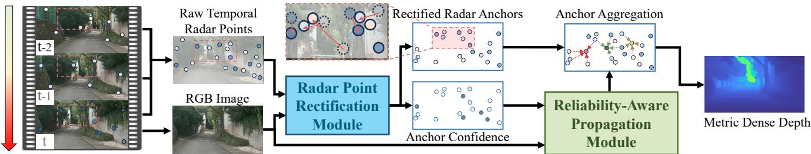
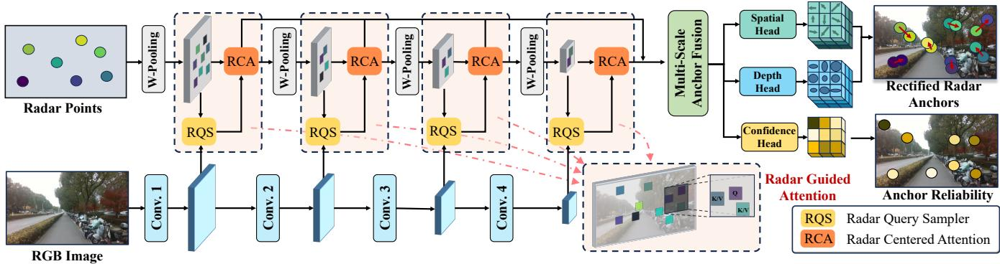
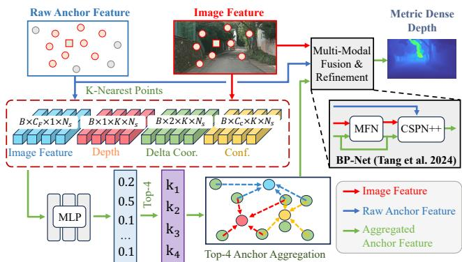
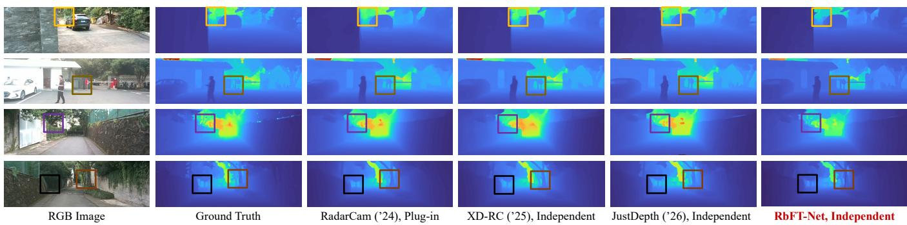
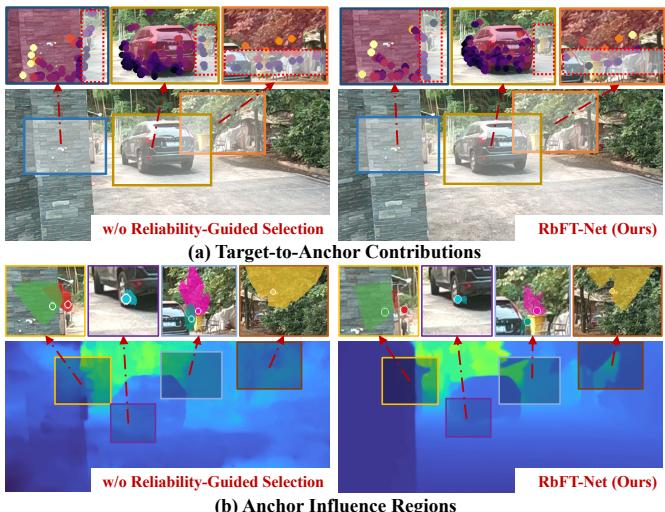
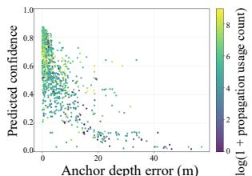
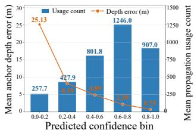

# RbFT-Net: Rectify-Before-Fuse Temporal Radar Anchors for 4D Radar–Camera Depth Completion

Wentao Zhao1, Shouxuan Wu2, Yongtao Cen1, Tianchen Deng1, Yuyang Zhang3, Jingchuan Wang1

1School of Automation and Intelligent Sensing, Institute of Medical Robotics, Shanghai Jiao Tong University, Shanghai

200240, China

2School of Electronic and Information Engineering, Beijing Jiaotong University, Beijing, China 3State Key Laboratory of Advanced Rail Autonomous Operation and School of Electronic and Information Engineering, Beijing Jiaotong University, Beijing 100044, China

## Abstract

Dense metric depth prediction from cameras and millimeterwave radar ofers a cost-efective sensing solution for autonomous systems. However, radar measurements are inherently sparse and susceptible to clutter, multipath reflections, and projection errors. While aggregating multiple radar frames provides denser metric cues, it also introduces temporal misalignment and dynamic-object interference. Directly propagating such unreliable measurements can therefore corrupt large regions of the predicted depth map. To address this issue, we propose RbFT-Net, an end-to-end rectify-before-fuse framework for multi-frame 4D radar–camera depth completion. Rather than assuming accumulated radar returns to be accurate, RbFT-Net treats them as noisy temporal anchor candidates. An image-conditioned rectification module jointly corrects their image-plane locations and metric depths while estimating pointwise reliability. The rectified anchors are then selectively propagated before high-level multi-modal fusion, suppressing the influence of unreliable measurements. Experiments on ZJU-4DRadarCam and a newly collected 4D radar– camera–LiDAR dataset show that RbFT-Net consistently outperforms the evaluated independent radar–camera methods and remains competitive with plug-in pipelines using auxiliary monocular depth models. Cross-platform evaluation and component analyses further support the efectiveness of the proposed rectification and reliability-aware propagation strategy.

## Introduction

Dense metric depth estimation is fundamental to autonomous driving, robotic navigation, and 3D scene understanding. Cameras provide rich appearance cues but cannot directly resolve metric scale and may degrade under adverse visual conditions, whereas LiDAR provides accurate geometry at a relatively high cost. Millimeter-wave radar ofers direct metric ranging and robustness to illumination changes, making it an attractive complementary sensor for dense depth prediction (Lin, Dai, and Van Gool 2020; Lo and Vandewalle 2021; Long et al. 2021; Singh et al. 2023). In particular, 4D radar resolves elevation in addition to range, azimuth, and Doppler, allowing height-aware radar returns to be projected into the camera view as sparse metric cues (Li et al. 2024b; Sun et al. 2024; Wang et al. 2025).

Existing radar–camera depth completion methods commonly propagate projected radar measurements to dense image regions under visual guidance (Long et al. 2021; Singh et al. 2023; Li et al. 2024b; Sun et al. 2024, 2025b). However, radar returns are extremely sparse and may be inconsistent with visual structures because of limited angular resolution, multipath efects, clutter, calibration uncertainty, and radarto-image misprojection. Once propagated, inaccurate radar measurements can contaminate much larger image regions, particularly around object boundaries, thin structures, and distant objects. Recent plug-in methods alleviate the limited structural information of radar by incorporating dense predictions from separately trained monocular depth models (Li et al. 2024b; Qin et al. 2025; Wang et al. 2025). Although these predictions provide strong structural priors, they introduce an additional model dependency and increase the size and complexity of the complete inference pipeline. This motivates an independent solution that directly predicts dense metric depth from radar and RGB inputs.

A complementary source of information is the temporal measurements naturally available in radar streams. Consecutive radar frames provide complementary metric observations and can alleviate the sparsity of single-frame input. A conventional temporal fusion strategy is to use ego-motion to warp historical measurements into the current view (Zhou et al. 2025). Although such geometric alignment reduces rigid inter-frame displacement, it does not guarantee accurate radar-to-image anchors: the warped returns may still be afected by calibration uncertainty, radar depth noise, multipath reflections, and independently moving objects. Direct accumulation further retains temporal misalignment while also aggregating clutter and other unreliable returns. Multiframe radar can therefore become denser without becoming more reliable, potentially amplifying errors during subsequent propagation. This raises the central question of this work: how can noisy temporal radar measurements be rectified and selectively exploited before their errors propagate into dense depth predictions?

To address this question, we propose RbFT-Net, an endto-end rectify-before-fuse framework for multi-frame 4D radar–camera depth completion. Rather than assuming accumulated radar returns to be accurate depth measurements, RbFT-Net treats them as noisy temporal anchor candidates. An image-conditioned rectification module jointly corrects their image-plane locations and metric depths while estimating pointwise reliability. The resulting anchors are then selectively propagated according to their reliability and target– anchor compatibility before high-level multi-modal fusion and dense refinement. This design suppresses unreliable temporal measurements before their errors spread over the image. Operating directly on accumulated radar returns, RbFT-Net predicts dense metric depth from radar and RGB without relying on an auxiliary monocular depth model. Combined with an eficient dense prediction backbone, it forms a compact independent pipeline.

We conduct extensive experiments on ZJU-4DRadarCam (Li et al. 2024b) and a newly collected dataset acquired using a diferent 4D radar–camera platform. RbFT-Net achieves the strongest overall performance among independent methods and remains competitive with plug-in pipelines across both datasets. Zero-shot and limited-data adaptation experiments further evaluate its cross-sensor transferability, while comprehensive ablations and eficiency analyses validate the proposed components and demonstrate a favorable accuracy– eficiency trade-of.

Our main contributions are summarized as follows:

• We propose RbFT-Net, an end-to-end rectify-before-fuse framework that rectifies noisy temporal radar anchors before reliability-aware propagation and high-level multimodal fusion.

• We introduce an image-conditioned temporal anchor rectification module that jointly corrects the image-plane locations and metric depths of noisy radar returns while estimating their pointwise reliability.

• We develop a reliability-aware propagation strategy that combines anchor reliability with target–anchor compatibility to selectively transfer trustworthy metric evidence to dense image regions.

• We collect a new 4D radar–camera–LiDAR dataset using a diferent sensing platform and conduct in-domain, zero-shot, and limited-data cross-sensor evaluations. The dataset and evaluation protocol will be made publicly available.

## Related Work

Following TacoDepth (Wang et al. 2025), we categorize radar–camera depth completion methods as independent or plug-in. Independent methods directly predict metric depth from radar and RGB, whereas plug-in methods additionally rely on an auxiliary monocular depth model. We also review temporal fusion for depth estimation.

Independent Radar–Camera Depth Completion. Depth completion commonly propagates sparse measurements using learned spatial afinities or image-conditioned weights. Representative methods such as CSPN++ (Cheng et al. 2020) and BP-Net (Tang et al. 2024) are efective for relatively accurate LiDAR samples, but can be sensitive to the substantially sparser and noisier measurements provided by radar.

Independent radar–camera methods directly fuse radar and RGB inputs. Early studies explored sensor complementarity, pixel–depth association, and ordinal depth prediction (Lin,

Dai, and Van Gool 2020; Long et al. 2021; Lo and Vandewalle 2021; Singh et al. 2023). Subsequent methods improve radar utilization through confidence modeling (Sun et al. 2024), sparse supervision (Li et al. 2024a), geometric upsampling (Sun et al. 2025b), lightweight distillation (Sun et al. 2025a,c), transformer-based fusion (Huang et al. 2024), and structure-aware modeling (Zhang et al. 2025). Just-Depth (Yun, Kim, and Lee 2026) focuses on eficient estimation under sparse supervision, while TacoDepth (Wang et al. 2025) provides an independent one-stage configuration. Despite recent eforts to recalibrate projected radar returns (Qin et al. 2025), existing methods generally do not jointly rectify their image locations and metric depths while estimating reliability before dense propagation.

Plug-in Radar–Camera Depth Completion. Plug-in methods combine radar measurements with predictions from a separately trained monocular depth model. RadarCam-Depth (Li et al. 2024b) incorporates 4D radar into an auxiliary monocular depth representation, while radar-guided polynomial fitting (Rim et al. 2025) and RaCalNet (Qin et al. 2025) recover the metric scale and shift of afine-invariant depth predictions. TacoDepth (Wang et al. 2025) also supports a plug-in configuration. Although these methods benefit from dense monocular structure, their complete inference pipelines require an additional depth network, motivating more compact independent alternatives.

Temporal Fusion for Depth Estimation. Multi-frame monocular methods exploit neighboring images through geometric matching, cost volumes, or motion-aware modeling (Watson et al. 2021; Guizilini et al. 2022; Zhou et al. 2025), typically relying on relative poses or geometric warping. Radar–camera methods commonly accumulate consecutive radar sweeps to increase input density (Lin, Dai, and Van Gool 2020; Long et al. 2021; Gasperini et al. 2021; Lo and Vandewalle 2021). However, direct accumulation can introduce temporal misalignment, dynamic returns, clutter, and multipath interference, making denser radar input not necessarily more reliable. In contrast, RbFT-Net treats accumulated returns as noisy temporal anchors and jointly rectifies their locations and depths while estimating their reliability before dense propagation.

## Method

## Overview

Given the current RGB image $I _ { t }$ and a short temporal window of 4D radar frames $\{ \mathcal { R } _ { t - k } \} _ { k = 0 } ^ { T - 1 }$ , our goal is to predict a dense metric depth map $D _ { t }$ in the current camera view. As illustrated in Fig. 1, RbFT-Net follows a rectify-before-fuse paradigm: it first rectifies temporal radar anchors using image context and then performs reliability-aware propagation and high-level multi-modal fusion.

Radar returns from all T frames are directly projected into the current image using the calibrated radar–camera extrinsics and camera intrinsics, without ego-motion compensation:

$$
\mathcal { A } _ { t } = \{ a _ { i } = ( { \bf p } _ { i } , z _ { i } , { \bf r } _ { i } ) \} _ { i = 1 } ^ { N } ,\tag{1}
$$

  
Figure 1: Overview of RbFT-Net. Directly accumulated multi-frame 4D radar returns are treated as noisy temporal anchor candidates. Image-conditioned rectification corrects their image-plane locations and metric depths while estimating pointwise reliability. The resulting anchors are selectively propagated according to their reliability and target–anchor compatibility to produce dense metric depth.

where $\mathbf { p } _ { i } = ( u _ { i } , v _ { i } )$ is the projected location in the current image, $z _ { i }$ is the corresponding metric depth, and ri contains the radar attributes. The candidates are processed as an unordered set without explicit temporal-index encoding. Although direct accumulation increases observation density, it also introduces temporal misalignment under sensor or object motion and retains cluttered returns. Therefore, $\boldsymbol { A } _ { t }$ is treated as a set of noisy anchor candidates rather than reliable depth measurements.

The image-conditioned anchor rectification module samples local visual context around each candidate and predicts its spatial ofset, depth residual, and pointwise reliability. The resulting rectified anchor is represented as

$$
\hat { a } _ { i } = ( \hat { \mathbf { p } } _ { i } , \hat { z } _ { i } , c _ { i } , \mathbf { f } _ { i } ^ { a } ) ,\tag{2}
$$

where $\hat { \bf p } _ { i } = ( \hat { u } _ { i } , \hat { v } _ { i } )$ and $\hat { z } _ { i }$ are the rectified image location and metric depth, $c _ { i } \in [ 0 , 1 ]$ is the estimated reliability, and ${ \bf f } _ { i } ^ { a }$ is the anchor feature used for propagation.

The reliability-aware propagation module evaluates nearby anchors according to their reliability and target– anchor compatibility, aggregates informative metric evidence, and performs image-guided refinement to produce the final depth map. The overall framework is summarized as

$$
\hat { \mathcal { A } } _ { t } = \mathcal { F } _ { \mathrm { r e c t } } \left( \mathcal { A } _ { t } , I _ { t } \right) , \qquad D _ { t } = \mathcal { F } _ { \mathrm { p r o p } } \left( I _ { t } , \mathcal { R } _ { t } , \hat { \mathcal { A } } _ { t } \right) ,\tag{3}
$$

where $\mathcal { F } _ { \mathrm { r e c t } }$ denotes image-conditioned anchor rectification, while $\mathcal { F } _ { \mathrm { p r o p } }$ includes reliability-aware propagation, highlevel multi-modal fusion, and dense refinement.

## Image-Conditioned Radar Anchor Rectification

Accumulated radar returns provide metric measurements but may contain inaccurate projections and depths due to limited angular resolution, multipath, clutter, and temporal inconsistency. We therefore rectify each temporal anchor candidate using local image evidence before propagation.

As shown in Fig. 2, the module comprises a radar query sampler (RQS), radar-centered attention (RCA), multiscale anchor fusion (MAF), and three prediction heads. RQS samples local image features, while RCA first models radar-neighborhood consistency through self-attention and weighted pooling and then retrieves compatible visual evidence through cross-attention. MAF integrates the resulting multi-scale representations before three prediction heads estimate the spatial ofset, depth residual, and reliability.

For each candidate $a _ { i } \in \mathcal A _ { t }$ , its depth and radar attributes are encoded as

$$
\mathbf { f } _ { i } ^ { r } = \mathcal { E } _ { \mathrm { r a d } } ( [ z _ { i } , \mathbf { r } _ { i } ] ) .\tag{4}
$$

Meanwhile, the image encoder extracts a multi-scale feature pyramid:

$$
\{ \mathbf { F } ^ { s } \} _ { s = 1 } ^ { S } = \mathcal { E } _ { \mathrm { i m g } } ( I _ { t } ) ,\tag{5}
$$

where $\mathbf { p } _ { i } ^ { s }$ denotes $\mathbf { p } _ { i }$ mapped to the coordinate system of $\mathbf { F } ^ { s }$ .

Radar Query Sampler. Directly sampling at $\mathbf { p } _ { i } ^ { s }$ may provide unreliable visual evidence when the radar projection is inaccurate. At each scale, RQS therefore predicts M radarconditioned sampling ofsets:

$$
\{ \delta _ { i , m } ^ { s } \} _ { m = 1 } ^ { M } = \mathcal { H } _ { \mathrm { o f f } } ^ { s } ( \mathbf { f } _ { i } ^ { r } ) ,\tag{6}
$$

and extracts the corresponding image features through bilinear sampling:

$$
\begin{array} { r } { \mathbf { x } _ { i , m } ^ { s } = \operatorname { B i l } \left( \mathbf { F } ^ { s } , \mathbf { p } _ { i } ^ { s } + \delta _ { i , m } ^ { s } \right) , \qquad m = 1 , \dotsc , M . } \end{array}\tag{7}
$$

This local sampling allows visual evidence to be collected around the initial projection without requiring explicit correspondence search.

Radar-Centered Attention. RCA first models the local consistency among radar candidates and then retrieves visually compatible evidence through cross-modal attention. For each candidate $a _ { i } .$ , we collect a local radar neighborhood $\mathcal { N } _ { i } ^ { r }$ and form its radar tokens as

$$
\mathbf { G } _ { i } ^ { r } = \{ \mathbf { g } _ { i , j } ^ { r } \mid a _ { j } \in \mathcal { N } _ { i } ^ { r } \} , \qquad \mathbf { g } _ { i , j } ^ { r } = [ \mathbf { f } _ { j } ^ { r } , \phi ( \mathbf { p } _ { j } - \mathbf { p } _ { i } ) ] ,\tag{8}
$$

where $\phi ( \cdot )$ encodes the relative position with respect to the center candidate.

Self-attention is first applied within the radar neighborhood:

$$
\mathbf { Z } _ { i } ^ { r } = \mathrm { A t t n } \left( \mathbf { G } _ { i } ^ { r } \mathbf { W } _ { q } ^ { r } , \mathbf { G } _ { i } ^ { r } \mathbf { W } _ { k } ^ { r } , \mathbf { G } _ { i } ^ { r } \mathbf { W } _ { v } ^ { r } \right) .\tag{9}
$$

The resulting neighbor features are summarized by weighted pooling:

$$
\bar { \mathbf { f } } _ { i } ^ { r } = \sum _ { a _ { j } \in \mathcal { N } _ { i } ^ { r } } \beta _ { i , j } \{ \mathbf { z } _ { i , j } ^ { r } , \qquad \beta _ { i } = \mathrm { s o f t m a x } \left( \mathcal { H } _ { \mathrm { w p } } ( \mathbf { Z } _ { i } ^ { r } ) \right) .\tag{10}
$$

  
Figure 2: Image-conditioned radar anchor rectification. RQS and RCA aggregate local visual evidence around each radar candidate across multiple scales, while MAF predicts spatial and depth corrections with pointwise reliability to produce rectified temporal anchors.

This radar self-attention and weighted pooling characterize the local measurement consistency while suppressing unreliable neighboring returns.

At each image scale, the pooled radar representation serves as the query, while the image features sampled by RQS provide the keys and values:

$$
\mathbf { q } _ { i } ^ { s } = \mathbf { W } _ { q } ^ { s } \bar { \mathbf { f } } _ { i } ^ { r } , \qquad \mathbf { k } _ { i , m } ^ { s } = \mathbf { W } _ { k } ^ { s } \mathbf { x } _ { i , m } ^ { s } , \qquad \mathbf { v } _ { i , m } ^ { s } = \mathbf { W } _ { v } ^ { s } \mathbf { x } _ { i , m } ^ { s } .\tag{11}
$$

The cross-attention output is computed as

$$
\alpha _ { i , m } ^ { s } = \mathrm { s o f t m a x } _ { m } \left( \frac { ( \mathbf { q } _ { i } ^ { s } ) ^ { \top } \mathbf { k } _ { i , m } ^ { s } } { \sqrt { d } } \right) , \quad \bar { \mathbf { f } } _ { i } ^ { s } = \sum _ { m = 1 } ^ { M } \alpha _ { i , m } ^ { s } \mathbf { v } _ { i , m } ^ { s } .\tag{12}
$$

Finally, the radar and visual representations are fused to produce the scale-specific anchor feature:

$$
\tilde { \mathbf { f } } _ { i } ^ { s } = \mathcal { F } _ { \mathrm { r c a } } ^ { s } \left( [ \bar { \mathbf { f } } _ { i } ^ { r } , \bar { \mathbf { f } } _ { i } ^ { s } ] \right) .\tag{13}
$$

Multi-Scale Anchor Fusion. Fine-scale features preserve local boundaries, whereas coarse-scale features provide broader contextual information. MAF integrates the representations from all scales while retaining the original radar feature:

$$
\mathbf { h } _ { i } = \mathcal { F } _ { \operatorname* { m a f } } \left( \tilde { \mathbf { f } } _ { i } ^ { 1 } , \ldots , \tilde { \mathbf { f } } _ { i } ^ { S } , \mathbf { f } _ { i } ^ { r } \right) .\tag{14}
$$

Three lightweight heads predict the image-plane ofset, depth residual, and pointwise reliability:

$$
\Delta \mathbf { p } _ { i } = \mathcal { H } _ { \mathrm { s p a } } ( \mathbf { h } _ { i } ) , \Delta z _ { i } = \mathcal { H } _ { \mathrm { d e p } } ( \mathbf { h } _ { i } ) , c _ { i } = \sigma ( \mathcal { H } _ { \mathrm { c o n f } } ( \mathbf { h } _ { i } ) ) .\tag{15}
$$

The rectified location and depth are obtained through residual updates:

$$
\hat { { \bf p } } _ { i } = { \bf p } _ { i } + \Delta { \bf p } _ { i } , \qquad \hat { z } _ { i } = z _ { i } + \Delta z _ { i } .\tag{16}
$$

Finally, we retain $\mathbf { f } _ { i } ^ { a } = \mathbf { h } _ { i }$ and define the rectified temporal anchor set as

$$
\hat { \mathcal { A } } _ { t } = \{ \hat { a } _ { i } = ( \hat { \bf p } _ { i } , \hat { z } _ { i } , c _ { i } , { \bf f } _ { i } ^ { a } ) \} _ { i = 1 } ^ { N } .\tag{17}
$$

Rather than serving as a binary mask, $c _ { i }$ continuously modulates each anchor’s contribution during subsequent dense propagation.

  
Figure 3: Reliability-aware anchor propagation. For each target location, spatially neighboring anchors are scored, and the top four are aggregated using reliability-modulated weights.

## Reliability-Aware Anchor Propagation

Although rectification improves the quality of temporal radar anchors, they remain sparse and unevenly distributed. Moreover, directly propagating all nearby anchors may spread residual misalignment, clutter, and dynamic returns into dense image regions. We therefore introduce reliabilityaware anchor propagation, which selects informative anchors for each target location and adaptively aggregates their metric evidence before dense refinement.

Reliability-Guided Anchor Selection. Given the rectified temporal anchors $\hat { \mathcal { A } } _ { t }$ , we first retrieve the K nearest anchors for each target location p on the propagation feature map:

$$
\begin{array} { r } { \mathcal { N } _ { K } ( \mathbf { p } ) = \mathrm { K N N } \left( \mathbf { p } , \hat { \mathcal { A } } _ { t } \right) . } \end{array}\tag{18}
$$

For each candidate $\hat { a } _ { i } \in \mathcal { N } _ { K } ( \mathbf { p } )$ , we construct a target– anchor representation from the target image context, anchor feature, rectified depth, and relative projected position:

$$
\mathbf { m } _ { p , i } = \left[ \mathbf { F } ( \mathbf { p } ) , \mathbf { f } _ { i } ^ { a } , \hat { z } _ { i } , \phi _ { p } ( \mathbf { p } - \hat { \mathbf { p } } _ { i } ) \right] ,\tag{19}
$$

where $\mathbf { F } ( \mathbf { p } )$ denotes the image feature at the target location, and $\phi _ { p } ( \cdot )$ encodes the relative position between the target and rectified anchor.

Table 1: Quantitative comparison on ZJU-4DRadarCam. All plug-in methods use the same DPT-Hybrid (Ranftl, Bochkovskiy, and Koltun 2021). N/A denotes results not reported in the original paper. Bold and underlined values indicate the category-wise best and second-best results, respectively, while best and second-best indicate the corresponding overall rankings.
<table><tr><td rowspan="2">Type Method</td><td rowspan="2"></td><td colspan="5">0-50m</td><td colspan="5">0-70m</td><td colspan="5">0-80m</td></tr><tr><td>MAE↓ RMSE↓</td><td></td><td>iMAE↓ iRMSE↓</td><td></td><td>Rel.↓  $\delta _ { 1 } \uparrow$ </td><td>MAE↓ RMSE↓ iMAE↓</td><td></td><td></td><td>iRMSE↓</td><td>Rel.↓  $\delta _ { 1 } \uparrow$ </td><td>MAE↓</td><td></td><td></td><td>RMSE↓ iMAE↓ iRMSE↓ Rel↓</td><td>δ1↑</td></tr><tr><td rowspan="2">Plug-in</td><td>RadarCam (&#x27;24)</td><td>1067.5 930.2</td><td>2817.4</td><td>10.5</td><td>22.9</td><td>0.087 0.920</td><td>1157.0</td><td>3117.7</td><td>10.4</td><td>22.9</td><td>0.087 0.921</td><td>1183.5</td><td>3229.0</td><td>10.4</td><td>22.8</td><td>0.090 0.920</td></tr><tr><td>TacoDepth (&#x27;25)</td><td></td><td>2477.3</td><td>9.3</td><td>20.8</td><td>N/A N/A</td><td>983.1</td><td>2779.6</td><td>9.3</td><td>20.9</td><td>0.076 0.932</td><td>1032.5</td><td>2850.3</td><td>9.4</td><td>20.9</td><td>N/A N/A</td></tr><tr><td rowspan="9">Indep- endent</td><td>DORN (&#x27;21)</td><td>2210.2</td><td>4129.7</td><td>19.8</td><td>31.9</td><td>0.157 0.7832402.2</td><td></td><td>4625.2</td><td>19.8</td><td>31.9</td><td>0.160 0.777</td><td>2447.6</td><td>4760.0</td><td>19.9</td><td>31.9</td><td>0.161 0.776</td></tr><tr><td>Singh (&#x27;23)</td><td>1785.4</td><td>3704.6</td><td>18.1</td><td>35.3</td><td>0.146 0.831</td><td>1932.7</td><td>4137.1</td><td>18.0</td><td>35.2</td><td>0.1470.828</td><td>1979.5</td><td>4309.3</td><td>17.9</td><td>35.1</td><td>0.147 0.828</td></tr><tr><td>BP-Net (&#x27;24)</td><td>1404.8</td><td>2923.1</td><td>10.6</td><td>21.2</td><td>0.104 0.895</td><td>1531.0</td><td>3259.6</td><td>10.5</td><td>21.0</td><td>0.105 0.892</td><td>1568.2</td><td>3383.4</td><td>10.4</td><td>21.0</td><td>0.105 0.892</td></tr><tr><td>XD-RC (&#x27;25)</td><td>1155.0</td><td>2863.0</td><td>11.7</td><td>24.6</td><td>0.094 0.891</td><td>1248.0</td><td>3223.0</td><td>11.7</td><td>24.5</td><td>0.095 0.890</td><td>1275.0</td><td>3341.0</td><td>11.7</td><td>24.5</td><td>0.095 0.889</td></tr><tr><td>TacoDepth (&#x27;25)</td><td>1120.1</td><td>2686.7</td><td>12.8</td><td>25.0</td><td>N/A N/A</td><td>1181.8</td><td>2906.3</td><td>12.7</td><td>24.9</td><td>N/A N/A</td><td>1201.1</td><td>2990.7</td><td>12.7</td><td>24.9</td><td>N/A N/A</td></tr><tr><td>JustDepth (&#x27;26)</td><td>1224.7</td><td>3157.5</td><td>12.8</td><td>25.2</td><td>0.096 0.888</td><td>1307.8</td><td>3479.0</td><td>12.7</td><td>25.2</td><td>0.096 0.888</td><td>1334.6</td><td>3618.1</td><td>12.7</td><td>25.2</td><td>0.096 0.888</td></tr><tr><td>SomeDepth (&#x27;26)</td><td>1029.2</td><td>2631.6</td><td>10.4</td><td>22.8</td><td>N/A N/A</td><td>1111.6</td><td>2946.9</td><td>10.4</td><td>22.8</td><td>N/A N/A</td><td>1137.2</td><td>3053.0</td><td>10.4</td><td>22.8</td><td>N/A N/A</td></tr><tr><td>RbFT-Net</td><td>917.4</td><td>2473.4</td><td>6.8</td><td>16.9</td><td>0.067 0.944</td><td>1001.0</td><td>2740.8</td><td>6.8</td><td>16.8</td><td>0.068 0.943 1023.7</td><td></td><td>2827.6</td><td>6.7</td><td>16.8</td><td>0.068 0.942</td></tr></table>

A lightweight MLP predicts a compatibility score:

$$
s _ { i } ( \mathbf { p } ) = \mathcal { M } _ { \mathrm { s e l } } \left( \mathbf { m } _ { p , i } \right) .\tag{20}
$$

Rather than propagating all neighboring anchors, we retain the $K _ { s }$ candidates with the highest compatibility scores:

$$
\mathcal { T } _ { K _ { s } } ( \mathbf { p } ) = \mathrm { \mathop { T o p K } } _ { \hat { a } _ { i } \in \mathcal { N } _ { K } ( \mathbf { p } ) } \left( s _ { i } ( \mathbf { p } ) , K _ { s } \right) .\tag{21}
$$

We set $K _ { s } = 4$ in all experiments.

The selected anchors are adaptively weighted according to both their target compatibility and predicted reliability:

$$
w _ { i } ( \mathbf { p } ) = \frac { c _ { i } \exp ( s _ { i } ( \mathbf { p } ) ) } { \displaystyle \sum _ { \hat { a } _ { j } \in \mathcal { T } _ { K _ { s } } ( \mathbf { p } ) } c _ { j } \exp ( s _ { j } ( \mathbf { p } ) ) } .\tag{22}
$$

The propagated anchor representation is then obtained as

$$
\bar { \mathbf { f } } ^ { a } ( \mathbf { p } ) = \sum _ { \hat { a } _ { i } \in \mathcal { T } _ { K _ { s } } ( \mathbf { p } ) } w _ { i } ( \mathbf { p } ) \mathcal { E } _ { a } ( [ \mathbf { f } _ { i } ^ { a } , \hat { z } _ { i } ] ) ,\tag{23}
$$

where ${ \mathcal { E } } _ { a }$ embeds the anchor feature together with its rectified metric depth.

This two-stage strategy first restricts candidates by spatial proximity and then selects visually compatible anchors through learned relevance. The explicit reliability modulation suppresses residual erroneous returns during propagation.

Multi-Modal Fusion and Refinement. After rectification and reliability-aware propagation, the temporal anchors form the propagated feature map $\bar { \mathbf { F } } ^ { a }$ . We then adopt the lightweight MFN-CSPN++ architecture of BP-Net (Tang et al. 2024) for high-level multi-modal fusion and dense refinement:

$$
D _ { t } = \mathcal { R } _ { \mathrm { r e f } } \left( \mathbf { F } , \mathbf { F } _ { \mathrm { r a d } } ^ { t } , \bar { \mathbf { F } } ^ { a } \right) ,\tag{24}
$$

where $\mathbf { F } _ { \mathrm { r a d } } ^ { t }$ preserves the directly observed current-frame measurements, while ${ \bar { \mathbf { F } } } ^ { a }$ provides reliability-aware metric evidence from the rectified temporal anchors.

Unlike BP-Net, which directly aggregates the four nearest sparse measurements, RbFT-Net performs reliabilityaware aggregation over rectified temporal anchors before lightweight MFN-CSPN refinement.

## Training Objectives

The network is trained end-to-end using LiDAR-projected depth supervision. The overall objective is

$$
\begin{array} { r } { \mathcal { L } = \lambda _ { d } \mathcal { L } _ { \mathrm { d e p t h } } + \lambda _ { a } \mathcal { L } _ { \mathrm { a n c h o r } } + \lambda _ { c } \mathcal { L } _ { \mathrm { c o n f } } + \lambda _ { p } \mathcal { L } _ { \mathrm { p r o p } } . } \end{array}\tag{25}
$$

Here, ${ \mathcal { L } } _ { \mathrm { d e p t h } }$ supervises the final depth prediction, while $\mathcal { L } _ { \mathrm { a n c h o r } }$ constrains the rectified anchor depths. ${ \mathcal { L } } _ { \mathrm { c o n f } }$ provides error-aware supervision for anchor reliability, and ${ \mathcal { L } } _ { \mathrm { p r o p } }$ encourages the propagation module to favor depth-consistent anchors. Detailed loss definitions and supervision construction are provided in the supplementary material.

## Experiments

## Experimental Setup

Datasets. We evaluate RbFT-Net on ZJU-4DRadarCam (Li et al. 2024b) and a newly collected dataset from a diferent 4D radar–camera platform. Both provide synchronized radar, camera, and LiDAR data, with projected radar as input and LiDAR depth as ground truth.

Compared Methods. We compare with representative plug-in methods (Li et al. 2024b; Wang et al. 2025) and independent methods (Lo and Vandewalle 2021; Singh et al. 2023; Sun et al. 2025c; Wang et al. 2025; Yun, Kim, and Lee 2026; Hou and Ohtsuki 2026). The evaluated plug-in methods use DPT-Hybrid (Ranftl, Bochkovskiy, and Koltun 2021) for auxiliary monocular depth. We also adapt BP-Net (Tang et al. 2024) to radar inputs as a propagation baseline without anchor rectification or reliability modeling.

Evaluation Metrics. We report MAE and RMSE in millimeters, iMAE and iRMSE in 1/km, and the unitless AbsRel and $\delta _ { 1 }$ over valid ground-truth pixels. Lower values are better except for $\delta _ { 1 }$

Implementation Details. RbFT-Net is trained at 288 × 864 on ZJU-4DRadarCam and 288 × 832 on our dataset, using five accumulated radar frames by default. For each target location, it retrieves $K \ = \ 8$ rectified anchors and aggregates the top $K _ { s } = 4$ based on learned compatibility scores. Additional settings and dataset statistics are provided in the supplementary material.

  
Figure 4: Qualitative comparison on ZJU-4DRadarCam.

Table 2: Evaluation on our newly collected dataset within the 0–70 m range under diferent target-domain data regimes. Zero-shot models are trained only on ZJU-4DRadarCam; adaptation models are fine-tuned for three epochs using 10% of the target-domain training set.
<table><tr><td>Setting</td><td>Method</td><td>MAE</td><td>RMSE ↓ iMAE ↓ iRMSE</td><td></td><td></td><td>Rel ↓ δ1↑</td></tr><tr><td rowspan="5">Standard 100%</td><td>DORN</td><td>2243.2</td><td>4928.2</td><td>6.4</td><td>16.6</td><td>0.106 0.884</td></tr><tr><td>Singh</td><td>1824.6</td><td>4685.2</td><td>5.9</td><td>15.7</td><td>0.092 0.918</td></tr><tr><td>RadarCam</td><td>1644.9</td><td>4120.7</td><td>5.7</td><td>14.4</td><td>0.078 0.938</td></tr><tr><td>JustDepth</td><td>1559.7</td><td>4229.3</td><td>4.5</td><td>15.4</td><td>0.072 0.938</td></tr><tr><td>RbFT-Net</td><td>1430.4</td><td>3622.1</td><td>4.1</td><td>12.4</td><td>0.069 0.941</td></tr><tr><td rowspan="3">Zero-shot 0%</td><td>RadarCam</td><td>9373.0</td><td>13073.8</td><td>32.4</td><td>44.8</td><td>0.412 0.284</td></tr><tr><td>JustDepth</td><td>9286.3</td><td>13431.7</td><td>27.9</td><td>38.2</td><td>0.360 0.331</td></tr><tr><td>RbFT-Net</td><td>7185.9</td><td>10692.7</td><td>21.5</td><td>31.1</td><td>0.319 0.421</td></tr><tr><td rowspan="3">Adaptation 10%</td><td>RadarCam</td><td>3416.7</td><td>5792.0</td><td>8.0</td><td>16.1</td><td>0.137 0.835</td></tr><tr><td>JustDepth</td><td>4082.6</td><td>6821.5</td><td>11.2</td><td>27.1</td><td>0.186 0.752</td></tr><tr><td>RbFT-Net 2312.3</td><td></td><td>4696.8</td><td>6.4</td><td>15.0</td><td>0.105 0.895</td></tr></table>

## Comparison with State-of-the-Art Methods

ZJU-4DRadarCam. Table 1 reports the quantitative results on ZJU-4DRadarCam. RbFT-Net consistently achieves the best performance among independent methods across all metrics and evaluation ranges. Compared with the strongest independent baseline for each metric, it reduces MAE by approximately 10%, iMAE by about 35%, and iRMSE by over 25%. Without relying on the auxiliary DPT-Hybrid monocular depth model, RbFT-Net remains competitive with, and in most reported settings surpasses, the plug-in TacoDepth configuration. The qualitative comparisons in Fig. 4 show cleaner depth predictions with sharper object boundaries and fewer artifacts in distant regions.

Evaluation on the Newly Collected Dataset. Table 2 compares the methods under standard training, zero-shot transfer, and limited-data adaptation. With the full target-domain training set, RbFT-Net achieves the strongest overall performance. For cross-platform evaluation, ZJU-4DRadarCam serves as the source domain and the newly collected dataset as the target domain. Under zero-shot transfer, RbFT-Net consistently outperforms the compared methods despite diferences in sensing platforms and scene distributions, reducing MAE by 22.6% relative to JustDepth and RMSE by 18.2% relative to RadarCam. When fine-tuned for three epochs using the same 10% target-domain subset, RbFT-Net again achieves the best results across all metrics, demonstrating effective adaptation under limited target-domain supervision.

Table 3: 0–70 m accuracy–eficiency comparison on ZJU-4DRadarCam. FPS is measured on an NVIDIA RTX PRO 5000. RbFT-Net uses five radar frames; all other methods use one. Plug-in parameter counts include auxiliary depth models.
<table><tr><td>Type</td><td>Method</td><td>Params (M)↓</td><td>FPS↑</td><td>MAE↓ RMSE↓</td></tr><tr><td rowspan="2">Plug-in</td><td>RadarCam (Li et al. 2024b)</td><td>156.26</td><td>12.04</td><td>1157.0 3117.7</td><td>0.921</td></tr><tr><td>TacoDepth (Wang et al. 2025)</td><td>137.25</td><td>N/A</td><td>983.1</td><td>2779.6 0.932</td></tr><tr><td rowspan="4">Indep- endent</td><td>DORN (Lo and Vandewalle 2021)</td><td>107.88</td><td>24.74</td><td>2402.2</td><td>4625.2 0.777</td></tr><tr><td>BP-Net (Tang et al. 2024)</td><td>89.87</td><td>12.04</td><td>1531.0</td><td>3259.6 0.892</td></tr><tr><td>JustDepth (Yun, Kim, and Lee 2026)</td><td>16.07</td><td>110.06</td><td>1307.8</td><td>3479.0 0.888</td></tr><tr><td>RbFT-Net (Ours)</td><td>44.20</td><td>44.88</td><td>1001.0</td><td>2740.8 0.943</td></tr></table>

Accuracy and Eficiency. Table 3 compares representative methods under their default input configurations. RbFT-Net uses only about 1/3 of the parameters of complete plug-in pipelines, whose parameter counts include the auxiliary 123M-parameter DPT-Hybrid, while achieving the best overall accuracy. Despite processing five radar frames, it runs in real time at 44.88 FPS. Table 5 further shows that directly extending competing methods to multiple frames yields only limited accuracy gains, demonstrating the favorable accuracy–eficiency trade-of of RbFT-Net.

## Ablation Studies

We conduct ablation studies on ZJU-4DRadarCam under the 0–70 m evaluation range to analyze the contributions of the proposed components and the efect of temporal radar input.

Component Analysis. Table 4 evaluates the proposed rectification and propagation designs. With reliability estimation retained, spatial and depth rectification individually reduce RMSE by 258.2 and 180.2 mm, respectively, and their combination provides further improvement. Given fully rectified anchors, learned propagation outperforms direct 4-NN aggregation, while confidence guidance further reduces RMSE from 2980.1 to 2740.8 mm. These results demonstrate the complementary efects of anchor rectification and reliabilityaware propagation.

Table 4: Component ablation on ZJU-4DRadarCam. All variants use five radar frames. 4-NN directly aggregates the four nearest anchors, whereas Learned denotes feature-based propagation.
<table><tr><td colspan="2">Rectification</td><td rowspan="2">Anchor |Propagation</td><td rowspan="2">Metrics [0–70 m] Rel ↓  $\delta _ { 1 }$  ↑</td></tr><tr><td>Spatial Depth Conf.</td><td></td></tr><tr><td rowspan="2"></td><td>了</td><td>Learned</td><td>|MAE↓ RMSE↓ 1287.1 3064.6</td></tr><tr><td>√ √ √</td><td>Learned Learned</td><td>0.087 0.920 1055.5 2806.4 0.071 0.938 1135.7 2884.4 0.077 0.929</td></tr><tr><td>√</td><td>√</td><td>4-NN</td><td>1355.7 3062.6 0.096 0.904</td></tr><tr><td>√</td><td>√</td><td>Learned</td><td>1207.3 2980.1 0.081 0.923</td></tr><tr><td>V</td><td>L</td><td>Learned</td><td>1001.0 2740.8 0.068 0.943</td></tr></table>

Table 5: Efect of the number of radar frames within the 0– 70 m range in RMSE (mm). Radar points denote the average number of valid projected returns per sample.
<table><tr><td rowspan="2">Method</td><td colspan="5">Number of Radar Frames</td></tr><tr><td>1</td><td>2</td><td>3</td><td>5</td><td>7</td></tr><tr><td>Avg. radar points</td><td>493.5</td><td>987.2</td><td>1480.9</td><td>2468.0</td><td>3455.3</td></tr><tr><td>RadarCam (Li et al. 2024b)</td><td>3117.7</td><td>3104.1</td><td>3092.4</td><td>3071.9</td><td>3085.1</td></tr><tr><td>BP-Net (Tang et al. 2024)</td><td>3259.6</td><td>3172.4</td><td>3135.8</td><td>3121.3</td><td>3156.8</td></tr><tr><td>RbFT-Net (Ours)</td><td>2987.3</td><td>2841.5</td><td>2794.0</td><td>2740.8</td><td>2760.2</td></tr></table>

Efect of Temporal Input. Table 5 compares methods retrained for each temporal window under the same directaccumulation setting. Despite the near-linear increase in projected points, RadarCam and BP-Net gain only modestly from additional frames, whereas RbFT-Net reduces RMSE by 246.5 mm from one to five frames, demonstrating the benefit of rectifying temporal returns before propagation. The slight degradation at seven frames suggests increased misalignment and noise, while processing more radar points also incurs additional computational cost. We therefore use five frames by default as a practical trade-of among observation density, temporal noise, and eficiency.

## Analysis and Visualization

Reliability Analysis. Fig. 5 examines the relationship among predicted reliability, anchor depth error, and propagation usage. Both the point-wise correlation and binned statistics show that anchor depth error generally decreases with increasing reliability. High-reliability anchors also tend to contribute more frequently to the learned target–anchor associations. This relationship is not absolute, since anchor selection additionally depends on target–anchor compatibility and the relative quality of nearby candidates. Overall, these results indicate that the predicted reliability provides an efective cue for identifying accurate and informative rectified anchors during dense depth propagation.

Structure-Consistent Propagation. Fig. 6 visualizes target–anchor associations from two complementary perspectives. Fig. 6(a) shows the anchors aggregated for selected target locations, while Fig. 6(b) shows the target regions influenced by selected anchors. Without reliability-guided selection, the four nearest anchors are directly aggregated based on spatial proximity, often propagating information across unrelated structures and object boundaries. In contrast, RbFT-Net selects reliable anchors compatible with each target location, favoring depth evidence from the same local surface and reducing propagation across object boundaries. This structure-consistent behavior emerges without explicit semantic supervision.

  
(a) Confidence--Error Correlation

  
(b) Anchor Reliability Statistics  
Figure 5: Reliability analysis of rectified radar anchors. Higher reliability corresponds to lower depth error and greater propagation usage.  
(b) Anchor Influence Regions  
Figure 6: Visualization oflearned target–anchor associations. (a) Anchors contributing to selected target regions. (b) Target regions influenced by selected anchors. Reliability-guided selection reduces propagation across unrelated structures and object boundaries.

## Conclusion

This paper presented RbFT-Net, a compact independent framework for multi-frame 4D radar–camera depth completion. Its rectify-before-fuse design corrects noisy temporal anchors before reliability-aware propagation and multimodal fusion. By modeling anchor locations, depths, and reliability, RbFT-Net exploits denser temporal cues while suppressing unreliable propagation. Experiments on a public benchmark and a newly collected dataset, including crossplatform transfer and limited-data adaptation, demonstrate its robustness across radar–camera platforms.

## References

Cheng, X.; Wang, P.; Guan, C.; and Yang, R. 2020. Cspn++: Learning context and resource aware convolutional spatial propagation networks for depth completion. In Proceedings ofthe AAAI conference on artificial intelligence, volume 34, 10615–10622.

Gasperini, S.; Koch, P.; Dallabetta, V.; Navab, N.; Busam, B.; and Tombari, F. 2021. R4dyn: Exploring radar for selfsupervised monocular depth estimation of dynamic scenes. In 2021 International Conference on 3D Vision (3DV), 751– 760. IEEE.

Guizilini, V.; Ambrus, R.; Chen, D.; Zakharov, S.; and Gaidon, A. 2022. Multi-Frame Self-Supervised Depth with Transformers. In Proceedings of the IEEE/CVF Conference on Computer Vision and Pattern Recognition, 160–170.

Hou, Z.; and Ohtsuki, T. 2026. Selection, Not Fusion: Radar-Modulated State Space Models for Radar-Camera Depth Estimation. arXiv preprint arXiv:2605.11840.

Huang, X.; Ma, Y.; Yu, Z.; and Zhao, H. 2024. RCDformer: Transformer-based dense depth estimation by sparse radar and camera. Neurocomputing, 589: 127668.

Li, H.; Jing, M.; Jin, W.; Dong, S.; Liang, J.; Fan, H.; and Ji, R. 2024a. Sparse beats dense: Rethinking supervision in radar-camera depth completion. In European Conference on Computer Vision, 127–143. Springer.

Li, H.; Ma, Y.; Gu, Y.; Hu, K.; Liu, Y.; and Zuo, X. 2024b. Radarcam-depth: Radar-camera fusion for depth estimation with learned metric scale. In 2024 IEEE International Conference on Robotics and Automation (ICRA), 10665–10672. IEEE.

Lin, J.-T.; Dai, D.; and Van Gool, L. 2020. Depth estimation from monocular images and sparse radar data. In 2020 IEEE/RSJ International Conference on Intelligent Robots and Systems (IROS), 10233–10240. IEEE.

Lo, C.-C.; and Vandewalle, P. 2021. Depth estimation from monocular images and sparse radar using deep ordinal regression network. In 2021 IEEE International Conference on Image Processing (ICIP), 3343–3347. IEEE.

Long, Y.; Morris, D.; Liu, X.; Castro, M.; Chakravarty, P.; and Narayanan, P. 2021. Radar-camera pixel depth association for depth completion. In Proceedings ofthe IEEE/CVF Conference on Computer Vision and Pattern Recognition, 12507–12516.

Qin, X.; Zhao, W.; Cao, C.; Niu, Y.; Deng, T.; Jiang, H.; Guo, R.; and Wang, J. 2025. RaCalNet: Radar Calibration Network for Sparse-Supervised Metric Depth Estimation. arXiv preprint arXiv:2506.15560.

Ranftl, R.; Bochkovskiy, A.; and Koltun, V. 2021. Vision transformers for dense prediction. In Proceedings of the IEEE/CVF international conference on computer vision, 12179–12188.

Rim, P.; Park, H.; Ezhov, V.; Moon, J.; and Wong, A. 2025. Radar-guided polynomial fitting for metric depth estimation. arXiv preprint arXiv:2503.17182.

Singh, A. D.; Ba, Y.; Sarker, A.; Zhang, H.; Kadambi, A.; Soatto, S.; Srivastava, M.; and Wong, A. 2023. Depth estimation from camera image and mmwave radar point cloud. In Proceedings of the IEEE/CVF Conference on Computer Vision and Pattern Recognition, 9275–9285.

Sun, H.; Feng, H.; Ott, J.; Servadei, L.; and Wille, R. 2024. Cafnet: A confidence-driven framework for radar camera depth estimation. In 2024 IEEE/RSJ International Conference on Intelligent Robots and Systems (IROS), 2734–2740. IEEE.

Sun, H.; Vysotskaya, N.; Sukianto, T.; Feng, H.; Ott, J.; Peng, X.; Servadei, L.; and Wille, R. 2025a. Lircdepth: Lightweight radar-camera depth estimation via knowledge distillation and uncertainty guidance. In ICASSP 2025-2025 IEEE International Conference on Acoustics, Speech and Signal Processing (ICASSP), 1–5. IEEE.

Sun, H.; Wang, Z.; Feng, H.; Ott, J.; Servadei, L.; and Wille, R. 2025b. Get-up: Geometric-aware depth estimation with radar points upsampling. In 2025 IEEE/CVF Winter Conference on Applications ofComputer Vision (WACV), 1850– 1860. IEEE.

Sun, H.; Wang, Z.; Peng, X.; Ott, J.; Stettinger, G.; Servadei, L.; and Wille, R. 2025c. XD-RCDepth: Lightweight Radar-Camera Depth Estimation with Explainability-Aligned and Distribution-Aware Distillation. arXiv preprint arXiv:2510.13565.

Tang, J.; Tian, F.-P.; An, B.; Li, J.; and Tan, P. 2024. Bilateral propagation network for depth completion. In Proceedings of the IEEE/CVF Conference on Computer Vision and Pattern Recognition, 9763–9772.

Wang, Y.; Li, J.; Hong, C.; Li, R.; Sun, L.; Song, X.; Wang, Z.; Cao, Z.; and Lin, G. 2025. Tacodepth: Towards eficient radar-camera depth estimation with one-stage fusion. In Proceedings of the IEEE/CVF Conference on Computer Vision and Pattern Recognition, 10523–10533.

Watson, J.; Mac Aodha, O.; Prisacariu, V.; Brostow, G.; and Firman, M. 2021. The temporal opportunist: Selfsupervised multi-frame monocular depth. In Proceedings of the IEEE/CVF conference on computer vision and pattern recognition, 1164–1174.

Yun, W.; Kim, D.; and Lee, S. 2026. JustDepth: Real-Time Radar-Camera Depth Estimation With Single-Scan LiDAR Supervision. IEEE Robotics and Automation Letters.

Zhang, F.; Yu, Z.; Li, C.; Zhang, R.; Bai, X.; Zhou, Z.; Cao, S.-Y.; Wang, F.; and Shen, H.-L. 2025. Structure-Aware Radar-Camera Depth Estimation. In 2025 IEEE International Conference on Robotics andAutomation (ICRA), 13028–13035. IEEE.

Zhou, K.; Bian, J.-W.; Zheng, J.-Q.; Zhong, J.; Xie, Q.; Trigoni, N.; and Markham, A. 2025. Manydepth2: Motionaware self-supervised monocular depth estimation in dy namic scenes. IEEE Robotics and Automation Letters.