HunyuanVideo-13B Text-to-Video

# SCOPE: Subspace Clustering with Online Per-Head Top-K Estimation for Sparse Video Attention

Qi Zhao1,∗,‡, Qirui Li1,∗,‡, Hanlin Tang2,†, Yiduo Li2, Zhen Guo2, Cuifeng Shen2, Chao Xu2, Zhaosheng Chi2, Xiaojin Lu2, Kan Liu2, Tao Lan2, Lin Qu2, Xi Li1,§

1Zhejiang University, 2Alibaba Group

## Abstract

Difusion Transformers (DiTs) incur quadratic self-attention cost over spatiotemporal tokens. Existing training-free sparse attention methods often construct sparse masks from block-level or cluster-level proxy scores, which can obscure fine-grained diferences among keys and miss high contribution keys under aggressive sparsity. Moreover, such proxy scores may yield overly concentrated softmax distributions, causing Top-p to retain too few keys for some query clusters. Although a fixed Top-k minimum alleviates this failure mode, a shared value cannot adapt to variations across heads and inputs. To address both limitations, we propose SCOPE, a training-free sparse attention framework that combines 3D-RoPE-aligned key subspace clustering with online per-head Top-k estimation for eficient video-DiT inference. SCOPE partitions post-RoPE keys into temporal, height, and width subspaces, clusters them independently, and aggregates the corresponding centroid scores through lookup tables to obtain per key proxy scores for each query cluster. Building on existing hybrid Top-p/fixed Top-k selection, SCOPE derives a head-specific Top-k value online by averaging the initial retained key counts within each head, weighted by query cluster size, and selects additional keys only for query clusters whose initial retained key counts fall below this value. Sparse attention is then computed over the selected original keys and values. Across six model–task configurations, SCOPE consistently outperforms existing trainingfree baselines in both fidelity and latency, achieving up to a 1.99× end-to-end speedup on 720p HunyuanVideo with 28.46 dB PSNR relative to dense attention.

E-mail: qizhao@zju.edu.cn,qirui.l@zju.edu.cn,wanghaisheng.whs@alibaba-inc.com

Dense Attention  

SpargeAttn  
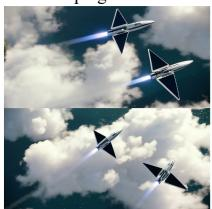

Wan2.2-A14B Text-to-Video SVG2  
  
Latency=1034s (1.55x) PSNR=24.37

SVOO  
  
SCOPE (Ours)  
Latency=968s (1.66x) PSNR=24.68

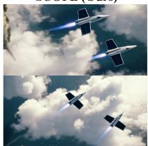  
Latency = 931s (1.73x) PSNR = 26.13

  
Latency = 1193s (1.51x) PSNR = 25.12

  
Latency = 906s (1.99x) PSNR = 27.72

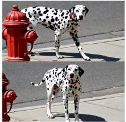  
Latency = 987s (1.83x) PSNR = 28.37

  
Latency = 901s (2.00x) PSNR = 29.15

Figure 1 Representative 720p T2V runs on Wan2.2-A14B and HunyuanVideo-13B. SCOPE achieves significant speedup while maintaining fidelity to dense attention. The displayed metrics are per-run.

## 1 Introduction

Modern video Difusion Transformers (DiTs) flatten spatiotemporal latents into tens of thousands of tokens [13, 24, 25, 34, 43], making the $O ( N ^ { 2 } d )$ cost of self-attention a major bottleneck at high resolutions and long video durations. Training-free sparse attention reduces this cost by evaluating only selected query–key interactions without modifying the pretrained model. An efective sparse selector must therefore answer two coupled questions: which keys matter to each query group and how many to retain so that sparse attention remains faithful to the dense-attention reference.

Existing training-free methods avoid constructing the dense score matrix through predefined sparsity patterns [3, 6, 17, 44, 48], block-level proxies [8, 28, 39, 40, 46], or clustering-based proxies [14, 23, 33, 41]. The latter two reduce online selection cost by representing multiple keys with a pooled block or cluster centroid. However, keys sharing the same representative receive the same estimated importance, obscuring key-level diferences and potentially omitting influential keys whose importance is not reflected by the shared proxy.

A natural way to recover this lost granularity is to exploit the 3D rotary position embeddings (RoPE) used by video DiTs [31, 36]. Temporal, height and width coordinates act on disjoint channel ranges, whose post-RoPE key subspaces exhibit distinct clustering patterns, as shown in Figure 4. Representing each key with one full-dimensional assignment couples these heterogeneous groupings, modeling the three ranges separately preserves their distinct structures, yielding finer-grained key discrimination.

Reliable masks also require calibrated retained key counts. Top-p adapts to the estimated distribution but may under-select when approximation over-concentrates it. A fixed Top-k floor helps [47], but one global value cannot capture variations across heads and inputs. Ofline head-wise schedules require dense calibration [23] and remain static, motivating an online, input-adaptive estimation.

Based on these observations, we propose SCOPE (Subspace Clustering with Online Per-Head Top-k Estimation), a training-free sparse attention framework for accelerating video-DiT inference. SCOPE keeps query clustering full-dimensional, while partitioning each post-RoPE key into temporal, height and width ranges of 3D RoPE and clustering them independently, following the compositional principle of product quantization [11]. Querycentroid slices score the corresponding subspace centroids to form compact lookup tables, each key retrieves and sums one entry per table to obtain its proxy score. These compositional scores improve key discrimination without expensive query–key scoring and are used only for selection, sparse attention is computed with the original tokens.

For count estimation, SCOPE applies hybrid Top-p/fixed-Top-k selection to each query cluster, sets the online per-head Top-k to the query-size-weighted average of the initial selected counts and extends only those query clusters below this value. Larger selections remain unchanged, so no ofline dense profiling or stored head-wise schedules are required.

Experiments across six 720p model–task settings spanning text-to-video and image-to-video generation on Wan2.1, Wan2.2 and HunyuanVideo demonstrate consistent improvements in fidelity and latency over training-free sparse attention baselines. In particular, SCOPE achieves up to a 1.99× end-to-end speedup on HunyuanVideo-T2V, with 28.46 dB PSNR relative to the corresponding dense-attention output. Representative T2V comparisons in Figure 1 further illustrate this fidelity–eficiency trade-of. At matched attention density, Figure 2 further shows that SCOPE consistently achieves the highest attention recall and PSNR across the evaluated densities, with especially clear gains in PSNR. These results indicate that SCOPE uses the same sparse attention budget more efectively. Our main contributions are:

• We propose 3D-RoPE-aligned key subspace clustering, which independently clusters the temporal, height and width channel ranges and composes their centroid scores into fine-grained key-level proxy logits with additive scoring cost.

• We introduce online per-head Top-k estimation, which derives an adaptive retention floor from base counts weighted by query cluster size and extends only clusters below this floor, without ofline dense calibration.

• We evaluate SCOPE on six 720p T2V and I2V settings across three video DiT families. SCOPE achieves the best dense-reference fidelity and lowest measured latency among the evaluated training-free baselines, delivering 1.67×–1.99× end-to-end speedups.

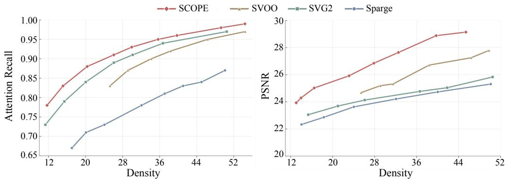  
Figure 2 Attention recall and PSNR under matched attention density. SCOPE consistently achieves higher attention recall and PSNR than competing sparse attention methods at the same retained density.

## 2 Related Work

## Predefined and Offline-Calibrated Sparse Masks

Predefined methods restrict attention using local windows, sliding tiles, or distance-aware layouts, while oflinecalibrated methods exploit cross-input regularities to derive sparse configurations [3, 6, 7, 16, 17, 44, 48, 54]. These approaches incur little online mask-construction overhead and often admit regular, hardware-friendly execution. However, masks determined before observing the current activations may miss prompt-dependent long-range interactions, nonlocal motion, or abrupt scene changes.

## Dynamic Sparse Attention for Video Generation

Dynamic methods infer sparse attention patterns from current activations, adapting selection to the input and denoising state [1, 8, 20, 22, 29, 32, 37, 39]. Some use lightweight approximations of current attention [28, 38, 40, 46, 49], while others group or reorder tokens by semantic similarity or query–key afinity [2, 23, 27, 33, 41, 52], complementary work improves sparse execution, reduces approximation error, or adapts retained-key counts [4, 5, 15, 18, 19, 26, 51, 53, 55]. SpargeAttention2 [47] studies hybrid Top-p/Top-k selection in a trainable setting. Yet many practical methods represent multiple keys with one pooled block or full-dimensional centroid, forcing heterogeneous keys to share a proxy score. SCOPE instead combines 3D-RoPE-aligned subspace codewords into per-key proxy scores and estimates a head-specific Top-k online from current query-cluster statistics, without retraining or ofline dense calibration.

## Subspace Decomposition for Efficient Attention

Product quantization [11] decomposes vectors into low-dimensional subspaces with independent codebooks. In LLM inference, it supports KV-cache compression [45] and codebook-based query–key score approximation through indexed accumulation [12, 30, 42, 50]. FASA [35] and RTPurbo [56] also estimate key relevance in reduced feature spaces, using informative RoPE frequency chunks and a learned low-dimensional indexer with query-dependent Top-p selection, respectively. These approaches mainly target autoregressive LLMs. For difusion transformers, RoPeSLR [21] combines 3D-RoPE-aware sparse attention with low-rank approximation. SCOPE instead keeps query clustering full-dimensional, independently clusters post-RoPE keys along the temporal, height and width channel ranges of 3D RoPE, and sums the resulting subspace scores for fine-grained per-key ranking in bidirectional video DiTs. Sparse attention then uses the selected original keys and values.

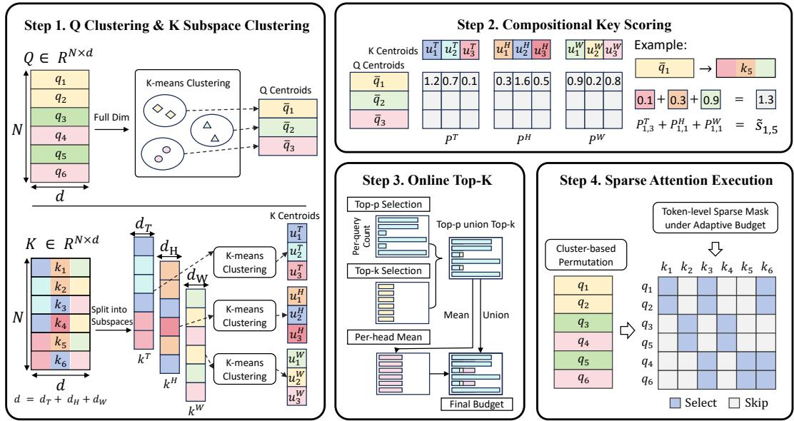  
Figure 3 Overview of SCOPE. Queries are clustered in the full feature space, while each post-RoPE key is represented by temporal, height and width subspace assignments. Query-centroid slices score the corresponding subspace centroids to form lookup tables, and indexed summation reconstructs a proxy logit for every key. Hybrid Top-p/fixed-Top-k selection produces the initial key counts, from which SCOPE estimates an online per-head Top-k value. Sparse attention is computed using the selected original K and V.

## 3 Method

Figure 3 presents an overview of SCOPE. Given post-RoPE queries and keys, SCOPE first clusters the queries in the full feature space, allowing all queries in a cluster to share one proxy ranking of the keys. It then splits each key along the temporal, height and width channel ranges of 3D RoPE and clusters the three subspaces independently. The corresponding slices of each query centroid score the subspace codebooks and indexed summation reconstructs a proxy logit for every key. Finally, SCOPE combines hybrid Top-p/fixed-Top-k selection with an online per-head Top-k estimate and computes sparse attention using the selected original keys and values.

## Problem Formulation

Consider one self-attention head at a fixed layer and denoising step. Let $Q , K \in \mathbb { R } ^ { N \times d }$ denote the query and key matrices after 3D RoPE, with rows $q _ { i }$ and $k _ { j }$ , and let $V \in \mathbb { R } ^ { N \times d }$ denote the value matrix. Dense attention computes

$$
O = \operatorname { s o f t m a x } \left( \frac { Q K ^ { \top } } { \sqrt { d } } \right) V ,\tag{1}
$$

which evaluates all $N ^ { 2 }$ query–key interactions. Our goal is to construct a retained key set for each query cluster without materializing the dense score matrix. SCOPE amortizes key selection through full-dimensional query clustering and approximates query-centroid–key logits with 3D-RoPE-aligned key codebooks. The original queries and selected original keys and values are then used for sparse attention.

## Full-Dimensional Query Clustering

Following clustering-based sparse attention methods [23, 33, 41], we partition the post-RoPE queries into $C _ { q } \ll N$ clusters using K-means. Let $g _ { i } \in \{ 1 , \ldots , C _ { q } \}$ denote the cluster assignment of $q _ { i }$ . For cluster $c ,$ define

$$
\mathcal { Q } _ { c } = \{ i : g _ { i } = c \} , \quad n _ { c } = | \mathcal { Q } _ { c } | , \quad \bar { q } _ { c } = \frac { 1 } { n _ { c } } \sum _ { i \in \mathcal { Q } _ { c } } q _ { i } .\tag{2}
$$

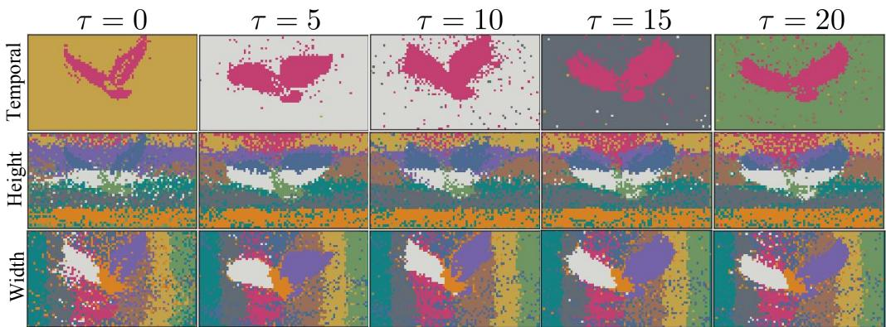  
Figure 4 Cluster assignments in 3D-RoPE key subspaces. Post-RoPE keys on a $2 1 \times 4 5 \times 8 0$ grid are clustered independently over the temporal, height and width channel ranges with $C _ { \mathrm { v i s } } = 1 0$ , columns show temporal positions $\tau \in \{ 0 , 5 , 1 0 , 1 5 , 2 0 \}$ . Height and width assignments exhibit predominantly horizontal and vertical structures, while temporal assignments vary more across frames. Variations near foreground regions further indicate content-dependent structure. Results are shown for Wan2.2-T2V-A14B at layer 30, head 10 and denoising step 35. Colors are comparable across columns only within each row.

All queries in $\mathcal { Q } _ { c }$ share the same proxy ranking and selected key set $\textstyle S _ { c } ,$ reducing the number of independently constructed rankings from N to $C _ { q }$ . The centroid $\bar { q } _ { c }$ is used only for key selection, the final sparse attention uses the original query vectors.

Queries are not clustered independently in the RoPE subspaces. Instead, each full-dimensional centroid $\bar { q } _ { c }$ is sliced only when scoring the corresponding key codebooks. This preserves one query grouping while allowing the key subspaces to form diferent cluster assignments.

## 3D-RoPE-Aligned Key Subspace Scoring

In 3D RoPE, the rotary transformations for temporal, height, and width coordinates act on three disjoint channel ranges. SCOPE follows these native ranges to split each post-RoPE key $k _ { j }$ into $k _ { j } ^ { \mathrm { T } } , k _ { j } ^ { \mathrm { H } }$ , and $k _ { j } ^ { \mathrm { W } }$ Each full-dimensional query centroid $\bar { q } _ { c }$ is sliced in the same way only when scoring the corresponding key subspaces. As illustrated in Figure 4, the three post-RoPE key subspaces exhibit distinct clustering patterns, motivating them to be modeled independently.

For each subspace m $\iota \in \{ \mathrm { T } , \mathrm { H } , \mathrm { W } \}$ , SCOPE applies K-means to $\{ k _ { j } ^ { m } \} _ { j = 1 } ^ { N }$ and obtains $C _ { m }$ subspace centroids, denoted by $u _ { 1 } ^ { m } , \ldots , u _ { C _ { m } } ^ { m }$ . The assignment of key j in subspace m is

$$
z _ { j } ^ { m } = \underset { 1 \leq r \leq C _ { m } } { \arg \operatorname* { m i n } } \left. k _ { j } ^ { m } - u _ { r } ^ { m } \right. _ { 2 } ^ { 2 } .\tag{3}
$$

The three assignments jointly form the composite code of key $j \colon$

$$
\begin{array} { r } { { \bf z } _ { j } = \left( z _ { j } ^ { \mathrm { T } } , z _ { j } ^ { \mathrm { H } } , z _ { j } ^ { \mathrm { W } } \right) . } \end{array}\tag{4}
$$

Unlike a single full-dimensional cluster assignment, $\mathbf { z } _ { j }$ allows the three RoPE subspaces to organize keys independently. Keys assigned to the same centroid in one subspace can still be distinguished by their assignments in the other subspaces.

To score the keys for a query cluster, SCOPE compares each query-centroid slice only with the centroids in the corresponding key subspace. For each subspace $m ,$ these partial dot products form a compact score table $P _ { m } \in \mathbb { R } ^ { C _ { q } \times C _ { m } }$ , whose entry is

$$
P _ { m } [ c , r ] = \langle \bar { q } _ { c } ^ { m } , u _ { r } ^ { m } \rangle .\tag{5}
$$

The columns of $P _ { m }$ correspond to subspace centroids rather than individual key tokens. The assignment $z _ { j } ^ { m }$ maps key j to one column of each table. Retrieving and summing the three corresponding entries gives its

proxy logit:

$$
\tilde { s } _ { c , j } = \frac { 1 } { \sqrt { d } } \sum _ { m \in \{ \mathrm { T } , \mathrm { H } , \mathrm { W } \} } P _ { m } [ c , z _ { j } ^ { m } ] .\tag{6}
$$

Applying Eq. (6) to all query clusters and keys produces $\tilde { S } = [ \tilde { s } _ { c , j } ] \in \mathbb { R } ^ { C _ { q } \times N }$ , the query-cluster–key proxy-score matrix used for subsequent key selection.

This compositional scoring provides a favorable trade-of between computation and key discrimination. For each query cluster, constructing the three compact tables requires only $C _ { \mathrm { T } } + C _ { \mathrm { H } } + C _ { \mathrm { W } }$ centroid dot products, while the independent codebooks admit up to $C _ { \mathrm { T } } C _ { \mathrm { H } } C _ { \mathrm { W } }$ composite key representations. Once the tables are constructed, each key score requires only three indexed reads and two additions. Thus, the number of expensive dot products grows additively with the codebook sizes, whereas the number of possible composite representations grows multiplicatively.

Because dot products are additive across disjoint channel ranges, summing the three partial scores introduces no additional approximation. The key-side approximation comes from replacing each key slice with its assigned subspace centroid. The resulting proxy scores are used only for key selection, while the subsequent sparse attention is computed using the selected original keys and values.

## Online Per-Head Top-k Estimation

Given the proxy-logit matrix $\tilde { S }$ obtained in Eq. (6), SCOPE first determines a base retained key count for each query cluster and then derives an online minimum for the current attention head.

Hybrid Top-p/fixed-Top-k selection. Let $\tilde { s } _ { c }$ denote the c-th row of ${ \tilde { S } } ,$ and let $\tilde { \mathbf { a } } _ { c } = \mathrm { s o f t m a x } ( \tilde { \mathbf { s } } _ { c } )$ be the corresponding normalized proxy distribution. We use $\tilde { \boldsymbol { a } } _ { c , j }$ to denote the probability assigned to key j. Let $\pi _ { c }$ be a permutation of the key indices that orders them by decreasing proxy logit. Given a Top-p threshold $\rho \in ( 0 , 1 ]$ , the retained key count is

$$
t _ { c } ^ { ( p ) } = \operatorname* { m i n } \left\{ t : \sum _ { \ell = 1 } ^ { t } \tilde { a } _ { c , \pi _ { c } ( \ell ) } \geq \rho \right\} .\tag{7}
$$

Approximation errors may make the normalized proxy distribution overly concentrated, causing Top-p to retain too few keys. We therefore combine it with a fixed Top-k ratio $\alpha \in ( 0 , 1 ]$

$$
k _ { \mathrm { f i x } } = \lceil \alpha N \rceil , \qquad b _ { c } = \operatorname* { m a x } \left\{ t _ { c } ^ { ( p ) } , k _ { \mathrm { f i x } } \right\} .\tag{8}
$$

Because both selections are prefixes of the same ranking $\pi _ { c } ,$ their union contains exactly $b _ { c }$ keys.

Online per-head estimation. The fixed minimum prevents severe under-selection but cannot account for variations across attention heads and inputs. SCOPE instead derives a head-specific minimum from the base counts observed in the current head:

$$
k _ { \mathrm { h e a d } } = \left\lceil \frac { \sum _ { c = 1 } ^ { C _ { q } } n _ { c } b _ { c } } { \sum _ { c = 1 } ^ { C _ { q } } n _ { c } } \right\rceil .\tag{9}
$$

Before rounding, Eq. (9) is the average base retained key count over all queries in the current head. Weighting by $n _ { c }$ makes each query, rather than each query cluster, contribute equally to the estimate. The final retained key count and selected key set are

$$
r _ { c } = \operatorname* { m a x } \big \{ b _ { c } , k _ { \mathrm { h e a d } } \big \} , \qquad S _ { c } = \big \{ \pi _ { c } ( 1 ) , \dots , \pi _ { c } ( r _ { c } ) \big \} .\tag{10}
$$

Clusters with $b _ { c } \geq k _ { \mathrm { h e a d } }$ remain unchanged, while those below the head-specific minimum are extended along the same proxy-logit ranking. The estimate is derived entirely from the current head and input, requiring no ofline dense-attention profiling or stored head-wise schedules.

<table><tr><td>Model</td><td>Baseline</td><td>PSNR ↑</td><td></td><td></td><td></td><td></td><td></td><td>SSIM ↑ LPIPS ↓ ImageQual ↑ AesQual ↑ SubConsist ↑ BackConsist ↑ Latency Speedup</td><td></td><td></td></tr><tr><td rowspan="5">Wan 2.1-14B- T2V-720P</td><td>Full</td><td></td><td></td><td></td><td>70.03%</td><td>59.06%</td><td>96.01%</td><td>96.31%</td><td>1913s</td><td>1.00x</td></tr><tr><td>SpargeAttn</td><td>23.86</td><td>0.791</td><td>0.1461</td><td>69.78%</td><td>59.09%</td><td>95.94%</td><td>96.21%</td><td>1293s</td><td>1.48x</td></tr><tr><td>SVG2</td><td>24.63</td><td>0.804</td><td>0.1268</td><td>70.12%</td><td>58.76%</td><td>95.58%</td><td>95.84%</td><td>1211s</td><td>1.58x</td></tr><tr><td>SVOO</td><td>25.71</td><td>0.831</td><td>0.1083</td><td>69.93%</td><td>59.06%</td><td>95.22%</td><td>95.57%</td><td>1117s</td><td>1.71x</td></tr><tr><td>Ours</td><td>26.11</td><td>0.844</td><td>0.1004</td><td>69.96%</td><td>59.07%</td><td>95.93%</td><td>96.14%</td><td>1085s</td><td>1.76x</td></tr><tr><td rowspan="5">Wan 2.2-A14B- T2V-720P</td><td>Full</td><td></td><td></td><td></td><td>71.18%</td><td>61.56%</td><td>95.16%</td><td>95.77%</td><td>1599s</td><td>1.00x</td></tr><tr><td>SpargeAttn</td><td>24.37</td><td>0.813</td><td>0.1231</td><td>70.98%</td><td>61.48%</td><td>95.12%</td><td>95.75%</td><td>1138s</td><td>1.41x</td></tr><tr><td>SVG2</td><td>24.85</td><td>0.829</td><td>0.1128</td><td>71.06%</td><td>61.53%</td><td>94.92%</td><td>95.64%</td><td>1036s</td><td>1.54x</td></tr><tr><td>SVOO</td><td>25.42</td><td>0.837</td><td>0.1018</td><td>71.02%</td><td>61.48%</td><td>94.98%</td><td>95.62%</td><td>966s</td><td>1.66x</td></tr><tr><td>Ours</td><td>26.01</td><td>0.859</td><td>0.0953</td><td>71.08%</td><td>61.57%</td><td>95.09%</td><td>95.76%</td><td>930s</td><td>1.72x</td></tr><tr><td rowspan="5">HunyuanVideo-T2V</td><td>Full</td><td></td><td></td><td></td><td>66.46%</td><td>57.80%</td><td>95.74%</td><td>96.20%</td><td>1801s</td><td>1.00x</td></tr><tr><td>SpargeAttn</td><td>24.54</td><td>0.809</td><td>0.1631</td><td>66.50%</td><td>58.06%</td><td>95.61%</td><td>96.04%</td><td>1197s</td><td>1.50x</td></tr><tr><td>SVG2</td><td>27.41</td><td>0.845</td><td>0.1067</td><td>65.06%</td><td>56.96%</td><td>95.48%</td><td>95.88%</td><td>907s</td><td>1.99x</td></tr><tr><td>SVOO</td><td>28.08</td><td>0.871</td><td>0.0971</td><td>65.99%</td><td>57.58%</td><td>95.66%</td><td>96.09%</td><td>991s</td><td>1.82x</td></tr><tr><td>Ours</td><td>28.46</td><td>0.878</td><td>0.0927</td><td>66.55%</td><td>57.82%</td><td>95.68%</td><td>96.11%</td><td>904s</td><td>1.99x</td></tr></table>

Table 1 720p text-to-video results. PSNR, SSIM and LPIPS are measured against dense attention, latency and speedup are end to end. Best sparse method results are bold.

Sparse attention execution. After $S _ { c }$ has been constructed, all queries in $\mathcal { Q } _ { c }$ reuse the same selected key set. Although the key set is shared, each query computes its own attention weights using its original representation. Let $Q _ { \mathcal { Q } _ { c } }$ denote the corresponding query rows, and let $K _ { S _ { c } }$ and $V _ { S _ { c } }$ denote the selected rows of the original key and value matrices. SCOPE computes

$$
O _ { \mathcal { Q } _ { c } } = \mathrm { s o f t m a x } \left( \frac { Q _ { \mathcal { Q } _ { c } } K _ { \mathcal { S } _ { c } } ^ { \top } } { \sqrt { d } } \right) V _ { \mathcal { S } _ { c } } .\tag{11}
$$

Once $ { \boldsymbol { S } } _ { c }$ is determined, the query centroids, subspace centroids, assignments and proxy logits are no longer used in the attention computation. The approximation is therefore confined to selecting the retained interactions, their attention logits and value aggregation are computed from the original tokens. SCOPE requires neither retraining nor modification of the pretrained model parameters.

## 4 Experiment

## Experimental Setup

Models and datasets. We evaluate T2V and I2V generation on Wan2.1-14B, Wan2.2-A14B and HunyuanVideo-13B, yielding six model–task settings. T2V uses Penguin Benchmark prompts released with HunyuanVideo, and I2V uses VBench++ [10]. All videos are generated at $1 2 8 0 \times 7 2 0$ , I2V inputs are cropped to 16:9.

Baselines and metrics. We compare SCOPE with three training-free sparse attention methods: SpargeAttn [46], SVG2 [41] and SVOO [23], using dense attention as the reference. We adopt their oficial implementations and default configurations, adjusting only exposed sparsity controls for the reported operating points. All methods share model weights, conditioning inputs, random seeds and sampling configurations. PSNR, SSIM and LPIPS measure fidelity to dense outputs. ImageQual, AesQual, SubConsist and BackConsist from VBench [9] assess generation quality. Eficiency is reported as end-to-end latency and speedup over dense attention.

Implementation details. All experiments are conducted on NVIDIA H200 GPUs. All K-means operations use the same implementation as SVG2 [41]. SCOPE uses $C _ { q } = 3 0 0$ query clusters and $C _ { \mathrm { T } } = C _ { \mathrm { H } } = C _ { \mathrm { W } } = 3 3 3$ centroids for the temporal, height and width key subspaces. The global fixed Top-k ratio is set to $\alpha = 0 . 1$ for all models, heads and inputs, corresponding to $k _ { \mathrm { f i x } } = \lceil 0 . 1 N \rceil$ . The first attention layer remains dense at every denoising step. Wan2.1 and Wan2.2 generate 81 frames, for all remaining layers, dense attention is retained during the first 20% of denoising steps and SCOPE is applied thereafter. HunyuanVideo generates 129 frames and uses the same strategy with a 10% dense prefix.

Dense Attention  
SVOO  
SpargeAttn  
SCOPE  
SVG2
<table><tr><td>Model</td><td>Baseline</td><td>PSNR ↑</td><td></td><td></td><td></td><td></td><td></td><td>SSIM ↑ LPIPS ↓ ImageQual ↑ AesQual ↑ SubConsist ↑ BackConsist ↑ Latency Speedup</td><td></td><td></td></tr><tr><td rowspan="5">Wan 2.1-14B- I2V-720P</td><td>Full</td><td></td><td></td><td></td><td>72.09%</td><td>60.95%</td><td>95.16%</td><td>95.63%</td><td>1672s</td><td>1.00x</td></tr><tr><td>SpargeAttn</td><td>23.14</td><td>0.722</td><td>0.1484</td><td>72.11%</td><td>60.68%</td><td>95.02%</td><td>95.59%</td><td>1121s</td><td>1.49x</td></tr><tr><td>SVG2</td><td>23.87</td><td>0.757</td><td>0.1341</td><td>72.27%</td><td>60.37%</td><td>94.32%</td><td>95.11%</td><td>1063s</td><td>1.57x</td></tr><tr><td>SVOO</td><td>24.82</td><td>0.787</td><td>0.1153</td><td>72.11%</td><td>60.72%</td><td>94.22%</td><td>95.24%</td><td>997s</td><td>1.68x</td></tr><tr><td>Ours</td><td>26.77</td><td>0.838</td><td>0.0854</td><td>72.15%</td><td>60.78%</td><td>94.96%</td><td>95.61%</td><td>966s</td><td>1.73x</td></tr><tr><td rowspan="5">Wan 2.2-A14B- I2V-720P</td><td>Full</td><td></td><td></td><td></td><td>72.20%</td><td>62.21%</td><td>96.56%</td><td>96.42%</td><td>1628s</td><td>1.00x</td></tr><tr><td>SpargeAttn</td><td>24.79</td><td>0.788</td><td>0.1022</td><td>72.12%</td><td>62.08%</td><td>96.42%</td><td>96.31%</td><td>1143s</td><td>1.42x</td></tr><tr><td>SVG2</td><td>25.31</td><td>0.805</td><td>0.0984</td><td>72.29%</td><td>61.62%</td><td>96.17%</td><td>96.10%</td><td>1085s</td><td>1.50x</td></tr><tr><td>SVOO</td><td>27.38</td><td>0.849</td><td>0.0706</td><td>72.21%</td><td>62.15%</td><td>96.32%</td><td>96.37%</td><td>1021s</td><td>1.59x</td></tr><tr><td>Ours</td><td>27.76</td><td>0.865</td><td>0.0665</td><td>72.16%</td><td>62.18%</td><td>96.43%</td><td>96.32%</td><td>974s</td><td>1.67x</td></tr><tr><td rowspan="5">HunyuanVideo-I2V</td><td>Full</td><td></td><td></td><td></td><td>72.53%</td><td>60.76%</td><td>96.99%</td><td>96.51%</td><td>1783s</td><td>1.00x</td></tr><tr><td>SpargeAttn</td><td>22.68</td><td>0.778</td><td>0.1243</td><td>72.56%</td><td>60.68%</td><td>97.03%</td><td>96.56%</td><td>1154s</td><td>1.55x</td></tr><tr><td>SVG2</td><td>23.06</td><td>0.796</td><td>0.1183</td><td>72.11%</td><td>60.14%</td><td>96.91%</td><td>96.25%</td><td>1029s</td><td>1.73x</td></tr><tr><td>SVOO</td><td>23.34</td><td>0.813</td><td>0.1168</td><td>72.06%</td><td>60.50%</td><td>96.94%</td><td>96.43%</td><td>1091s</td><td>1.63x</td></tr><tr><td>Ours</td><td>24.11</td><td>0.837</td><td>0.0962</td><td>72.56%</td><td>60.57%</td><td>97.04%</td><td>96.45%</td><td>1022s</td><td>1.74x</td></tr></table>

Table 2 720p image-to-video results. PSNR, SSIM and LPIPS are measured against dense attention, latency and speedup are end to end. Best sparse method results are bold.  
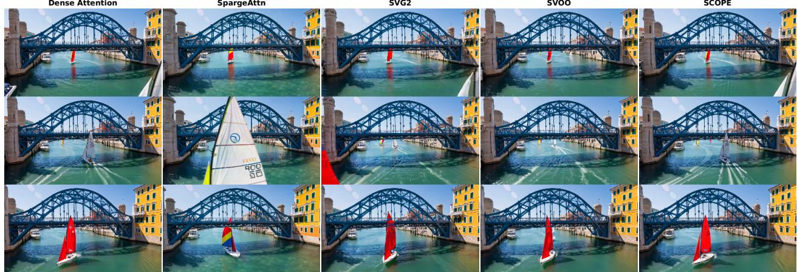  
Figure 5 Qualitative comparison. Representative frames generated using identical prompt and seed. SCOPE preserves the appearance and structure of the dense-attention reference more faithfully than the competing sparse attention methods.

## Main Results

Quality and eficiency. Tables 1 and 2 compare SCOPE with training-free sparse attention baselines across six 720p T2V and I2V settings. SCOPE is the only method that records the lowest measured latency while ranking first on all three dense-reference fidelity metrics (PSNR, SSIM and LPIPS) in every setting. It achieves 1.67×– 1.99× end-to-end speedups, while its VBench scores remain close to the dense-attention reference and comparable to those of the competing methods. Figure 5 further shows that SCOPE preserves the appearance and structure of the dense-attention output more faithfully than the competing sparse attention methods.

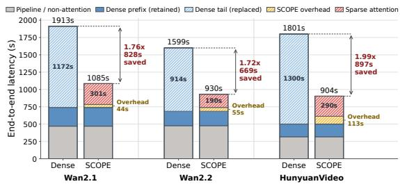  
Figure 6 Runtime composition across three text-to-video models. SCOPE retains the dense prefix and replaces the dense-attention tail with sparse attention. The additional overhead remains small, resulting in 1.72×–1.99× end-to-end speedups.

Runtime breakdown. As shown in Figure 6, the addi-

tional cost of subspace clustering, proxy scoring and online key selection is consistently outweighed by the reduction in attention time. SCOPE therefore converts sparse attention into substantial end-to-end acceleration across all three T2V models.

## Ablation Studies

Online per-head Top-k estimation. Figure 7 compares Top-p, hybrid Top-p/fixed-Top-k and the complete online strategy under matched realized attention density. The fixed floor strongly improves over pure Top-p, confirming under-selection from approximate proxy distributions. With realized density matched, the further PSNR gains from online estimation indicate better allocation across query clusters rather than a larger budget.

Key subspace partitioning. Using 333 centroids per subspace, Table 3 compares diferent key-space partitions. Full-dimensional clustering reaches only 24.17 dB, while all decomposed variants improve PSNR. The proposed 3D-RoPE-aligned partition achieves 25.90 dB, outperforming the random three-way split by 0.29 dB at slightly lower latency and the four-way split by 0.18 dB while saving 21 s. Increasing to eight subspaces yields only another 0.17 dB but adds 84 s. The temporal–height–width partition therefore ofers the most favorable fidelity–eficiency trade-of.

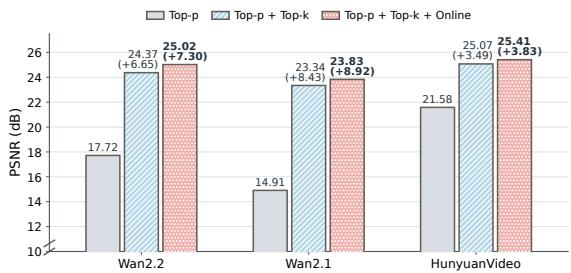  
Figure 7 Ablation of online per-head Top-k estimation. We set p seperately for each variant to match realized attention density(α = 0.1 when Top-k is used). The fixed floor miti gates Top-p under-selection, while online estimation further improves PSNR on all three models.

<table><tr><td>Partition</td><td>PSNR ↑</td><td>Latency ↓</td></tr><tr><td>1 (Full-dim)</td><td>24.17</td><td>878s</td></tr><tr><td>2</td><td>25.53</td><td>897s</td></tr><tr><td>3 (Random)</td><td>25.61</td><td>931s</td></tr><tr><td>3 (3D RoPE)</td><td>25.90</td><td>927s</td></tr><tr><td>4</td><td>25.72</td><td>948s</td></tr><tr><td>8</td><td>26.07</td><td>1011s</td></tr></table>

Table 3 Ablation of key subspace partitioning. Each subspace uses 333 centroids. “1 (Full-dim)” denotes fulldimensional clustering without decomposition, “3 (Random)” randomly partitions the channels into three subspaces and “3 (3D RoPE)” follows the temporal, height, and width channel ranges defined by 3D RoPE.

## 5 Conclusion

We presented SCOPE, a training-free sparse attention framework for eficient video DiT inference. SCOPE partitions post-RoPE keys according to the temporal, height and width channel ranges of 3D RoPE and clusters the three subspaces independently. Compositional centroid lookups then recover proxy logits for individual keys without scoring every key against every query centroid. SCOPE also estimates a Top-k value online for each head by averaging the initial retained counts with weights given by query cluster size and extends only clusters whose counts fall below this estimate. These proxy quantities are used solely for key selection, while attention is computed with the original tokens. Across six 720p T2V and I2V settings on Wan2.1, Wan2.2 and HunyuanVideo, SCOPE achieves higher fidelity to dense attention and lower measured latency than competing training-free methods, delivering 1.67×–1.99× end-to-end speedups while maintaining generation quality. Together, these results validate subspace clustering and online Top-k estimation as complementary mechanisms for accurate and eficient sparse video attention.

## References

[1] Aiyue Chen, Bin Dong, Jingru Li, Jing Lin, Kun Tian, Yiwu Yao, and Gongyi Wang. Rainfusion: Adaptive video generation acceleration via multi-dimensional visual redundancy. arXiv preprint arXiv:2505.21036, 2025.

[2] Aiyue Chen, Yaofu Liu, Junjian Huang, Guang Lian, Yiwu Yao, Wangli Lan, Jing Lin, Zhixin Ma, and Tingting Zhou. Rainfusion2.0: Temporal-spatial awareness and hardware-eficient block-wise sparse attention. arXiv preprint arXiv:2512.24086, 2025.

[3] Pengtao Chen, Xianfang Zeng, Maosen Zhao, Mingzhu Shen, Wei Cheng, Gang Yu, and Tao Chen. Sparse-vdit: Unleashing the power of sparse attention to accelerate video difusion transformers. In Proc. AAAI, volume 40, pages 2957–2965, 2026.

[4] Ruichen Chen, Keith Mills, Liyao Jiang, Chao Gao, and Di Niu. Re-ttention: Ultra sparse visual generation via attention statistical reshape. Proc. NeurIPS, 38:58029–58055, 2026.

[5] Weilun Feng, Chuanguang Yang, Haotong Qin, Mingqiang Wu, Yuqi Li, Xiangqi Li, Zhulin An, Libo Huang, Yulun Zhang, Michele Magno, et al. Quantsparse: Comprehensively compressing video difusion transformer with model quantization and attention sparsification. arXiv preprint arXiv:2509.23681, 2025

[6] Gael Glorian, Ioannis Lamprou, Zhen Zhang, Yujie Yuan, and Hongsheng Liu. Lvsa: Training-free sparse attention for long video difusion. arXiv preprint arXiv:2605.31057, 2026.

[7] Ali Hassani, Fengzhe Zhou, Aditya Kane, Jiannan Huang, Chieh-Yun Chen, Min Shi, Steven Walton, Markus Hoehnerbach, Vijay Thakkar, Mikhail Isaev, et al. Generalized neighborhood attention: Multi-dimensional sparse attention at the speed of light. In Proc. CVPR, pages 3009–3018, 2026.

[8] Jie Hu, Zixiang Gao, Yutong He, and Kun Yuan. Dfsattn: Dynamic fine-grained sparse attention for eficient video generation. arXiv preprint arXiv:2605.23445, 2026.

[9] Ziqi Huang, Yinan He, Jiashuo Yu, Fan Zhang, Chenyang Si, Yuming Jiang, Yuanhan Zhang, Tianxing Wu, Qingyang Jin, Nattapol Chanpaisit, et al. Vbench: Comprehensive benchmark suite for video generative models. In Proc. CVPR, pages 21807–21818, 2024.

[10] Ziqi Huang, Fan Zhang, Xiaojie Xu, Yinan He, Jiashuo Yu, Ziyue Dong, Qianli Ma, Nattapol Chanpaisit, Chenyang Si, Yuming Jiang, et al. Vbench++: Comprehensive and versatile benchmark suite for video generative models. arXiv preprint arXiv:2411.13503, 2024.

[11] Herve Jegou, Matthijs Douze, and Cordelia Schmid. Product quantization for nearest neighbor search. IEEE transactions on pattern analysis and machine intelligence, 33(1):117–128, 2010.

[12] Aryan Karmore. Lookat: Lookup-optimized key-attention for memory-eficient transformers. arXiv preprint arXiv:2601.10155, 2026.

[13] Weijie Kong, Qi Tian, Zijian Zhang, Rox Min, Zuozhuo Dai, Jin Zhou, Jiangfeng Xiong, Xin Li, Bo Wu, Jianwei Zhang, et al. Hunyuanvideo: A systematic framework for large video generative models. arXiv preprint arXiv:2412.03603, 2024.

[14] Dongyeun Lee, Amir Zandieh, Vahab Mirrokni, Junmo Kim, and Insu Han. Hypervattention: Eficient sparse attention with spatio-temporal clustering for video difusion. arXiv preprint arXiv:2607.03012, 2026.

[15] Haopeng Li, Shitong Shao, Wenliang Zhong, Zikai Zhou, Lichen Bai, Hui Xiong, and Zeke Xie. Pisa: Piecewise sparse attention is wiser for eficient difusion transformers. arXiv preprint arXiv:2602.01077, 2026.

[16] Qirui Li, Guangcong Zheng, Qi Zhao, Jie Li, Bin Dong, Yiwu Yao, and Xi Li. Compact attention: Exploiting structured spatio-temporal sparsity for fast video generation. arXiv preprint arXiv:2508.12969, 2025.

[17] Xingyang Li, Muyang Li, Tianle Cai, Haocheng Xi, Shuo Yang, Yujun Lin, Lvmin Zhang, Songlin Yang, Jinbo Hu, Kelly Peng, et al. Radial attention: O(n log n) sparse attention with energy decay for long video generation. Proc. NeurIPS, 38:16822–16852, 2026.

[18] Haosong Liu, Yuge Cheng, Wenxuan Miao, Zihan Liu, Aiyue Chen, Jing Lin, Yiwu Yao, Chen Chen, Jingwen Leng, Yu Feng, et al. Astraea: A token-wise acceleration framework for video difusion transformers. arXiv preprint arXiv:2506.05096, 2025.

[19] Xuewen Liu, Zhikai Li, Jing Zhang, Mengjuan Chen, and Qingyi Gu. Rectified spaattn: Revisiting attention sparsity for eficient video generation. arXiv preprint arXiv:2511.19835, 2025.

[20] Yuxi Liu, Yipeng Hu, Zekun Zhang, Kunze Jiang, and Kun Yuan. Mixture of distributions matters: Dynamic sparse attention for eficient video difusion transformers. arXiv preprint arXiv:2601.11641, 2026.

[21] Yuxi Liu, Zekun Zhang, Yixiang Cai, Renjia Deng, Yutong He, and Kun Yuan. Ropeslr: 3d rope-driven sparse-lowrank attention for eficient difusion transformers. arXiv preprint arXiv:2605.20659, 2026.

[22] Yongji Long, Shijun Liang, Jintao Li, and Yun Li. Dynamicrad: Content-adaptive sparse attention for long video difusion. arXiv preprint arXiv:2604.20470, 2026.

[23] Jiayi Luo, Jiayu Chen, Jiankun Wang, Cong Wang, Hanxin Zhu, Qingyun Sun, Chen Gao, Zhibo Chen, and Jianxin Li. Attention sparsity is input-stable: Training-free sparse attention for video generation via ofline sparsity profiling and online qk co-clustering. arXiv preprint arXiv:2603.18636, 2026.

[24] Xin Ma, Yaohui Wang, Xinyuan Chen, Gengyun Jia, Ziwei Liu, Yuan-Fang Li, Cunjian Chen, and Yu Qiao. Latte: Latent difusion transformer for video generation. arXiv preprint arXiv:2401.03048, 2024.

[25] William Peebles and Saining Xie. Scalable difusion models with transformers. In Proc. ICCV, pages 4195–4205, 2023.

[26] Liang Qiao, Yue Dai, Yeqi Huang, Hongyu Kan, Jun Shi, and Hong An. Flashomni: A unified sparse attention engine for difusion transformers. arXiv preprint arXiv:2509.25401, 2025.

[27] Sucheng Ren, Qihang Yu, Ju He, Alan Yuille, and Liang-Chieh Chen. Grouping first, attending smartly: Training-free acceleration for difusion transformers. arXiv preprint arXiv:2505.14687, 2025.

[28] Xuan Shen, Chenxia Han, Yufa Zhou, Yanyue Xie, Yifan Gong, Quanyi Wang, Yiwei Wang, Yanzhi Wang, Pu Zhao, and Jiuxiang Gu. Draftattention: Fast video difusion via low-resolution attention guidance. arXiv preprint arXiv:2505.14708, 2025.

[29] Dor Shmilovich, Tony Wu, Aviad Dahan, and Yuval Domb. Liteattention: A temporal sparse attention for difusion transformers. arXiv preprint arXiv:2511.11062, 2025.

[30] Chuxu Song, Zhencan Peng, Jiuqi Wei, and Chuanhui Yang. Csattention: Centroid-scoring attention for accelerating llm inference. arXiv preprint arXiv:2604.08584, 2026.

[31] Jianlin Su, Murtadha Ahmed, Yu Lu, Shengfeng Pan, Wen Bo, and Yunfeng Liu. Roformer: Enhanced transformer with rotary position embedding. Neurocomputing, 568:127063, 2024.

[32] Wenhao Sun, Rong-Cheng Tu, Yifu Ding, Jingyi Liao, Zhao Jin, Shunyu Liu, and Dacheng Tao. Vorta: Eficient video difusion via routing sparse attention. Proc. NeurIPS, 38:7837–7863, 2026.

[33] Haoyue Tan, Shengnan Wang, Yulin Qiao, Juncheng Zhang, Youhui Bai, Ping Gong, Zewen Jin, and Cheng Li. Adacluster: Adaptive query-key clustering for sparse attention in video generation. In Proc. CVPR, pages 43249–43259, 2026.

[34] Team Wan, Ang Wang, Baole Ai, Bin Wen, Chaojie Mao, Chen-Wei Xie, Di Chen, Feiwu Yu, Haiming Zhao, Jianxiao Yang, et al. Wan: Open and advanced large-scale video generative models. arXiv preprint arXiv:2503.20314, 2025.

[35] Yifei Wang, Yueqi Wang, Zhenrui Yue, Huimin Zeng, Yong Wang, Ismini Lourentzou, Zhengzhong Tu, Xiangxiang Chu, and Julian McAuley. Fasa: Frequency-aware sparse attention. arXiv preprint arXiv:2602.03152, 2026.

[36] Xilin Wei, Xiaoran Liu, Yuhang Zang, Xiaoyi Dong, Pan Zhang, Yuhang Cao, Jian Tong, Haodong Duan, Qipeng Guo, Jiaqi Wang, et al. Videorope: What makes for good video rotary position embedding? arXiv preprint arXiv:2502.05173, 2025.

[37] Jianzong Wu, Liang Hou, Haotian Yang, Xin Tao, Ye Tian, Pengfei Wan, Di Zhang, and Yunhai Tong. Vmoba: Mixture-of-block attention for video difusion models. arXiv preprint arXiv:2506.23858, 2025.

[38] Haocheng Xi, Shuo Yang, Yilong Zhao, Chenfeng Xu, Muyang Li, Xiuyu Li, Yujun Lin, Han Cai, Jintao Zhang, Dacheng Li, et al. Sparse video-gen: Accelerating video difusion transformers with spatial-temporal sparsity. In Proc. ICML, pages 68208–68224, 2025.

[39] Yifei Xia, Suhan Ling, Fangcheng Fu, Yujie Wang, Huixia Li, Xuefeng Xiao, and Bin Cui. Training-free and adaptive sparse attention for eficient long video generation. In Proc. ICCV, pages 15982–15993, 2025.

[40] Ruyi Xu, Guangxuan Xiao, Haofeng Huang, Junxian Guo, and Song Han. Xattention: Block sparse attention with antidiagonal scoring. In Proc. ICML, pages 69819–69831, 2025.

[41] Shuo Yang, Haocheng Xi, Yilong Zhao, Muyang Li, Jintao Zhang, Han Cai, Yujun Lin, Xiuyu Li, Chenfeng Xu, Kelly Peng, et al. Sparse videogen2: Accelerate video generation with sparse attention via semantic-aware permutation. Proc. NeurIPS, 38:96965–96991, 2026.

[42] Xu Yang, Jiapeng Zhang, Dongyang Zhao, Guo Chen, and Zhuo Tang. Self-indexing kvcache: Predicting sparse attention from compressed keys. In Proc. AAAI, volume 40, pages 27675–27683, 2026.

[43] Zhuoyi Yang, Jiayan Teng, Wendi Zheng, Ming Ding, Shiyu Huang, Jiazheng Xu, Yuanming Yang, Wenyi Hong, Xiaohan Zhang, Guanyu Feng, et al. Cogvideox: Text-to-video difusion models with an expert transformer. In Proc. ICLR, volume 2025, pages 83048–83077, 2025.

[44] Shai Yehezkel, Shahar Yadin, Noam Elata, Yaron Ostrovsky-Berman, and Bahjat Kawar. Accelerating text-to-video generation with calibrated sparse attention. arXiv preprint arXiv:2603.05503, 2026.

[45] Hailin Zhang, Xiaodong Ji, Yilin Chen, Fangcheng Fu, Xupeng Miao, Xiaonan Nie, Weipeng Chen, and Bin Cui. Pqcache: Product quantization-based kvcache for long context llm inference. Proceedings of the ACM on Management of Data, 3(3):1–30, 2025.

[46] Jintao Zhang, Chendong Xiang, Haofeng Huang, Jia Wei, Haocheng Xi, Jun Zhu, and Jianfei Chen. Spargeattention: Accurate and training-free sparse attention accelerating any model inference. In Proc. ICML, pages 76397–76413, 2025.

[47] Jintao Zhang, Kai Jiang, Chendong Xiang, Weiqi Feng, Yuezhou Hu, Haocheng Xi, Jianfei Chen, and Jun Zhu. Spargeattention2: Trainable sparse attention via hybrid top-k+ top-p masking and distillation fine-tuning. arXiv preprint arXiv:2602.13515, 2026.

[48] Peiyuan Zhang, Yongqi Chen, Runlong Su, Hangliang Ding, Ion Stoica, Zhengzhong Liu, and Hao Zhang. Fast video generation with sliding tile attention. In Proc. ICML, pages 74714–74731, 2025.

[49] Peiyuan Zhang, Yongqi Chen, Haofeng Huang, Will Lin, Zhengzhong Liu, Ion Stoica, Eric Xing, and Hao Zhang. Faster video difusion with trainable sparse attention. Proc. NeurIPS, 38:152509–152534, 2026.

[50] Tianyi Zhang, Jonah Yi, Bowen Yao, Zhaozhuo Xu, and Anshumali Shrivastava. Nomad-attention: Eficient llm inference on cpus through multiply-add-free attention. Proc. NeurIPS, 37:112706–112730, 2024.

[51] Wentai Zhang, Ronghui Xi, Shiyao Peng, Jiayu Huang, Haoran Luo, Zichen Tang, et al. Ride the wave: Precision-allocated sparse attention for smooth video generation. arXiv preprint arXiv:2604.12219, 2026.

[52] Tianchen Zhao, Ke Hong, Xinhao Yang, Xuefeng Xiao, Huixia Li, Feng Ling, Ruiqi Xie, Siqi Chen, Hongyu Zhu, Zhang Yichong, et al. Paroattention: Pattern-aware reordering for eficient sparse and quantized attention in visual generation models. Proc. NeurIPS, 38:126484–126511, 2026.

[53] Xuzhe Zheng, Yuexiao Ma, Jing Xu, Xiawu Zheng, Rongrong Ji, and Fei Chao. Haste: Training-free video difusion acceleration via head-wise adaptive sparse attention. arXiv preprint arXiv:2605.14513, 2026.

[54] Ruiliang Zhou, Xuecheng Wu, Kang He, Guangyun Han, Bin Liu, Qinqin Chen, Wende Xu, Qingjie Zhao, and Chengru Song. Scalingattention: Discovering intrinsic sparse attention topology for video difusion transformers. arXiv preprint arXiv:2606.23019, 2026.

[55] Xuanyi Zhou, Qiuyang Mang, Shuo Yang, Haocheng Xi, Jintao Zhang, Huanzhi Mao, Joseph E Gonzalez, Kurt Keutzer, Ion Stoica, and Alvin Cheung. Svg-ear: Parameter-free linear compensation for sparse video generation via error-aware routing. arXiv preprint arXiv:2603.08982, 2026.

[56] Yanke Zhou, Yiduo Li, Hanlin Tang, Maohua Li, Kan Liu, Tao Lan, Lin Qu, Yuan Yao, and Xiaoxing Ma. Full attention strikes back: Transferring full attention into sparse within hundred training steps. arXiv preprint arXiv:2605.16928, 2026.

## Appendix

## A Algorithmic Details

We provide pseudocode for SCOPE. All quantities in this section refer to one attention head at a fixed layer and denoising step. Let $Q , K \in \mathbb { R } ^ { N \times d }$ denote the post-3D-RoPE query and key matrices, and let $V \in \mathbb { R } ^ { N \times d }$ denote the value matrix. We write $\mathcal { M } = \{ T , H , W \}$ for the temporal, height and width RoPE subspaces. Their channel-index sets $\{ \mathcal { T } _ { m } \} _ { m \in \mathcal { M } }$ are disjoint, cover all d channels and have dimensions $d _ { m } = | \mathcal { I } _ { m } | .$ , so that $\textstyle \sum _ { m \in { \mathcal { M } } } d _ { m } = d .$

For $X \in \mathbb { R } ^ { n \times d _ { x } }$ , KMeans $( X , C )$ returns C centroids and an assignment vector $a \in \{ 1 , \ldots , C \} ^ { n }$ , where $a _ { i }$ is the index of the centroid assigned to row $X [ i , : ]$ . Full-dimensional query clustering therefore produces $\bar { Q } \in \mathbb { R } ^ { C _ { q } \times d }$ and $g \in \{ 1 , \ldots , C _ { q } \} ^ { N }$ , where row c of $\bar { Q }$ is $\bar { q } _ { c }$ . We define $\mathcal { Q } _ { c } = \{ i : g _ { i } = c \}$ and $n _ { c } = | \mathcal { Q } _ { c } |$ . Algorithm 1 summarizes the complete per-head SCOPE pipeline.

Algorithm 1 SCOPE for one attention head   
Require: Post-RoPE queries $Q \in \mathbb { R } ^ { N \times d } ;$ post-RoPE keys $K \in \mathbb { R } ^ { N \times d } ;$ ; values $V \in \mathbb { R } ^ { N \times d } ;$ channel ranges   
$\{ { \mathcal { T } } _ { m } \} _ { m \in { \mathcal { M } } } ;$ query-cluster count $C _ { q } ;$ key-codebook sizes $\{ C _ { m } \} _ { m \in \mathcal { M } } ;$ Top-p threshold $\rho ;$ fixed Top-k ratio α   
Ensure: Output $O \in \mathbb { R } ^ { N \times d }$ and selected key sets $\{ \boldsymbol { S _ { c } } \} _ { c = 1 } ^ { C _ { q } }$   
1: $( { \bar { Q } } , g ) \gets \mathrm { K N }$ eans $( Q , C _ { q } )$   
2: for $c = 1 , \ldots , C _ { q }$ do   
3: $\mathcal { Q } _ { c }  \{ i : g _ { i } = c \} ; n _ { c }  | \mathcal { Q } _ { c } |$   
4: end for   
5: for m $\in \mathcal { M }$ do   
6: $\bar { Q } ^ { m } \gets \bar { Q } [ : , \mathcal { T } _ { m } ] ; K ^ { m } \gets K [ : , \mathcal { T } _ { m } ]$   
7: end for   
8: $\widetilde S \gets$ KeySubspaceScoring $\bigl ( \{ \bar { Q } ^ { m } , K ^ { m } , C _ { m } \} _ { m \in \mathcal { M } } \bigr )$   
9: $\{ S _ { c } \} _ { c = 1 } ^ { C _ { q } } $ OnlinePerHeadTopK $\cdot ( \widetilde { S } , \{ n _ { c } \} _ { c = 1 } ^ { C _ { q } } , \rho , \alpha )$   
10: for $c = 1 , \ldots , C _ { q }$ do   
11: $O [ \mathcal { Q } _ { c } , : ] $ softmax $\left( \frac { Q [ \mathcal { Q } _ { c } , : ] K [ \mathcal { S } _ { c } , : ] ^ { \top } } { \sqrt { d } } \right) V [ \mathcal { S } _ { c } , : ]$   
12: end for   
13: return O and $\{ S _ { c } \} _ { c = 1 } ^ { C _ { q } }$

## 3D-RoPE-Aligned Key Subspace Scoring

Algorithm 2 details the key-side operations in Steps 1–2 of the method overview in the main paper. It independently clusters the temporal, height and width key subspaces and then constructs the corresponding query-centroid–key-centroid score tables. For subspace m, the centroid matrix is $U ^ { m } \in \mathbb { R } ^ { C _ { m } \times \bar { d } _ { m } }$ , and $z _ { i } ^ { m } \in \{ 1 , \dots , C _ { m } \}$ is the centroid assignment of key $j .$ The three assignments form the composite code $\mathbf { z } _ { j } = ( z _ { j } ^ { T } , z _ { j } ^ { H } , z _ { j } ^ { W } )$ defined in the main paper.

The input to Algorithm 2 consists of the sliced matrices $\bar { Q } ^ { m }$ and $K ^ { m }$ . K-means is applied to $K ^ { m }$ to obtain Um and $z ^ { m }$ , whereas proxy-score dot products are computed between $\bar { Q } ^ { m }$ and the key-subspace centroids $U ^ { m }$ $P _ { m } = \bar { Q } ^ { m } ( U ^ { m } ) ^ { \top }$ . Thus, the proxy-scoring stage does not directly multiply Q¯ by the original key matrix K. For $z ^ { m } = ( z _ { 1 } ^ { m } , \dots , z _ { N } ^ { m } )$ , the notation $P _ { m } [ : , z ^ { m } ] \in \mathbb { R } ^ { C _ { q } \times N }$ denotes the matrix whose j-th column is $P _ { m } [ : , z _ { j } ^ { m } ]$ Adding $P _ { m } [ : , z ^ { m } ]$ therefore applies the indexed proxy-score lookup to all keys simultaneously.

## Online Per-Head Top-k Selection

Algorithm 3 implements Step 3 of the method overview in the main paper. It first computes the base retained count $b _ { c }$ from hybrid Top-p/fixed-Top-k selection. Because both selections are prefixes of the same

descending ranking $\pi _ { c } ,$ their union contains exactly $b _ { c } = \operatorname* { m a x } \{ t _ { c } ^ { ( p ) } , k _ { \mathrm { f i x } } \}$ keys. The online stage then computes a query-size-weighted head-level minimum and extends only the clusters below that minimum, without constructing another token-level ranking.

The weighting by $n _ { c }$ makes the estimator a per-query average rather than an unweighted per-cluster average. In particular,

$$
k _ { \mathrm { h e a d } } = \left\lceil \frac { 1 } { N } \sum _ { i = 1 } ^ { N } b _ { g _ { i } } \right\rceil = \left\lceil \frac { \sum _ { c = 1 } ^ { C _ { q } } n _ { c } b _ { c } } { \sum _ { c = 1 } ^ { C _ { q } } n _ { c } } \right\rceil .\tag{12}
$$

The cluster-based query permutation shown in the main-paper overview only groups queries with the same assignment $g _ { i }$ . Algorithm 1 writes the same computation directly using the index sets $\mathcal { Q } _ { c } .$ , so no separate permutation variable is required.

Algorithm 2 3D-RoPE-aligned key subspace clus  
tering and scoring   
Require: Query-centroid slices $\{ \bar { Q } ^ { m } \in \mathbb { R } ^ { C _ { q } \times d _ { m } } \}$ m∈M;   
post-RoPE key subspaces $\bar { \{ K ^ { m } \in \mathbb { R } ^ { N \times d _ { m } } \} }$ m∈M;   
codebook sizes $\{ C _ { m } \}$ m∈M   
Ensure: Proxy-logit matrix $ { \widetilde { S } } \in \mathbb { R } ^ { C _ { q } \times N }$   
1: $\boldsymbol { \widetilde { S } } \gets \boldsymbol { 0 } \in \mathbf { \mathbb { R } } ^ { C _ { q } \times N }$   
2: for $m \in \mathcal { M }$ do   
3: $( U ^ { m } , z ^ { m } ) \gets \mathrm { K I }$ Means $( K ^ { m } , C _ { m } )$   
4: $\bar { P } _ { m } \gets \bar { Q } ^ { m } ( U ^ { m } ) ^ { \top }$ ▷ $\boldsymbol { P } _ { m } \in \mathbb { R } ^ { C _ { q } \times C _ { m } }$   
5: $\widetilde { S } \gets \widetilde { S } + P _ { m } [ : , z ^ { m } ]$   
6: end for   
7: $\widetilde { S }  \widetilde { S } / \sqrt { d }$   
8: return $\widetilde { S }$

$$
\widetilde { s } _ { c , j } = \frac { 1 } { \sqrt { d } } \sum _ { m \in \mathcal { M } } P _ { m } [ c , z _ { j } ^ { m } ] ,\tag{13}
$$

which is the proxy-logit definition in the main method. The score tables, subspace assignments and proxy logits are used only to construct the selected key sets, sparse attention subsequently uses the original Q, K and V.

Algorithm 3 Online per-head Top-k selection   
Require: Proxy logits $\widetilde { S } \in \mathbb { R } ^ { C _ { q } \times N } \colon$ query-cluster sizes   
$\{ n _ { c } \} _ { c = 1 } ^ { C _ { q } } ;$ Top-p threshold $\rho \in ( 0 , 1 ] ;$ fixed Top-k   
ratio $\alpha \in ( 0 , 1 ]$   
Ensure: Selected key sets $\{ \boldsymbol { S _ { c } } \} _ { c = 1 } ^ { C _ { q } }$   
1: $N \gets \mathrm { n c o l s } ( \widetilde { S } ) ; k _ { \mathrm { f i x } } \gets \lceil \alpha N \rceil$   
2: for $c = 1 , \ldots , C _ { q }$ do   
3: $\pi _ { c } \gets \mathrm { a r g s o r t } _ { \downarrow } ( \widetilde { S } [ c , : ] )$   
4: $\widetilde { a } _ { c } \gets \mathrm { s o f t m a x } ( \widetilde { S } [ c , : ] )$   
5: $t _ { c } ^ { ( p ) } \gets \operatorname* { m i n } \left\{ t : \sum _ { \ell = 1 } ^ { t } \widetilde { a } _ { c , \pi _ { c } ( \ell ) } \geq \rho \right\}$   
6: $b _ { c } \gets \operatorname* { m a x } \{ t _ { c } ^ { ( p ) } , k _ { \mathrm { f i x } } \}$   
7: end for   
8: $k _ { \mathrm { h e a d } }  \lceil \frac { \sum _ { c = 1 } ^ { C _ { q } } n _ { c } b _ { c } } { \sum _ { c = 1 } ^ { C _ { q } } n _ { c } } \rceil$   
9: for $c = 1 , \ldots , C _ { q }$ do   
10: r ← max $\{ b _ { c } , k _ { \mathrm { h e a d } } \}$   
11: $S _ { c } \gets \{ \pi _ { c } ( 1 ) , \dots , \pi _ { c } ( r _ { c } ) \}$   
12: end for   
13: return $\{ S _ { c } \} _ { c = 1 } ^ { C _ { q } }$

## B Complexity Analysis

We analyze the compositional key-scoring module for one attention head, treating the query centroids, key-subspace codebooks and key assignments as its inputs. This isolates SCOPE’s central computation– representation trade-of: the high-dimensional scoring cost is determined by an additive sum over subspaces, whereas the available compositional code space grows multiplicatively. Let $\bar { Q } \in \mathbb { R } ^ { C _ { q } \times d }$ contain the $C _ { q }$ query centroids. The key channels are partitioned into M disjoint subspaces with dimensions $d _ { 1 } , \ldots , d _ { M }$ , where $\textstyle \sum _ { m = 1 } ^ { M } d _ { m } = d .$ Subspace m contains $C _ { m }$ centroids $U ^ { m } \in \mathbb { R } ^ { C _ { m } \times d _ { m } }$ and an assignment vector $z ^ { m }$ for the N keys. SCOPE uses $M = 3$ for the temporal, height and width ranges of 3D RoPE.

## Compositional Scoring Cost

Directly scoring every key against every query centroid evaluates

$$
S ^ { \star } = \frac { \bar { Q } K ^ { \top } } { \sqrt { d } } , \qquad S ^ { \star } \in \mathbb { R } ^ { C _ { q } \times N } ,\tag{14}
$$

and requires

$$
T _ { \mathrm { d i r e c t } } ^ { \mathrm { M A C } } = C _ { q } N d\tag{15}
$$

high-dimensional multiply–accumulate operations (MACs).

SCOPE instead constructs one compact score table per key subspace,

$$
\begin{array} { r } { P _ { m } = \bar { Q } ^ { m } ( U ^ { m } ) ^ { \top } , \qquad P _ { m } \in \mathbb { R } ^ { C _ { q } \times C _ { m } } . } \end{array}\tag{16}
$$

The total table-construction cost is

$$
T _ { \mathrm { t a b l e } } ^ { \mathrm { M A C } } = C _ { q } \sum _ { m = 1 } ^ { M } C _ { m } d _ { m } .\tag{17}
$$

The proxy logits are then expanded through indexed accumulation,

$$
\widetilde { S } = \frac { 1 } { \sqrt { d } } \sum _ { m = 1 } ^ { M } P _ { m } [ : , z ^ { m } ] ,\tag{18}
$$

which requires M table lookups and M−1 scalar additions per query-cluster–key pair. Hence, the d-dimensional dot products are confined to the compact centroid tables, while all per-key proxy scores are recovered using scalar operations.

When all subspaces use the same codebook size $C _ { m } = C$

$$
T _ { \mathrm { t a b l e } } ^ { \mathrm { M A C } } = C _ { q } C \sum _ { m = 1 } ^ { M } d _ { m } = C _ { q } C d .\tag{19}
$$

Relative to direct query-centroid–key scoring, the high-dimensional scoring cost is reduced by

$$
{ \frac { T _ { \mathrm { d i r e c t } } ^ { \mathrm { M A C } } } { T _ { \mathrm { t a b l e } } ^ { \mathrm { M A C } } } } = { \frac { N } { C } } .\tag{20}
$$

## Additive Scoring Cost and Multiplicative Code Space

Each key is represented by the composite assignment

$$
\begin{array} { r } { \mathbf { z } _ { j } = ( z _ { j } ^ { 1 } , \dots , z _ { j } ^ { M } ) . } \end{array}\tag{21}
$$

The number of centroid scores required for each query cluster grows additively with the subspace codebook sizes,

$$
C _ { \mathrm { s c o r e } } = \sum _ { m = 1 } ^ { M } C _ { m } ,\tag{22}
$$

whereas the number of available composite key codes grows multiplicatively,

$$
C _ { \mathrm { c o d e } } = \prod _ { m = 1 } ^ { M } C _ { m } .\tag{23}
$$

For equal codebook sizes,

$$
C _ { \mathrm { s c o r e } } = M C , \qquad C _ { \mathrm { c o d e } } = C ^ { M } , \qquad \sum _ { m = 1 } ^ { M } C _ { m } d _ { m } = C d .\tag{24}
$$

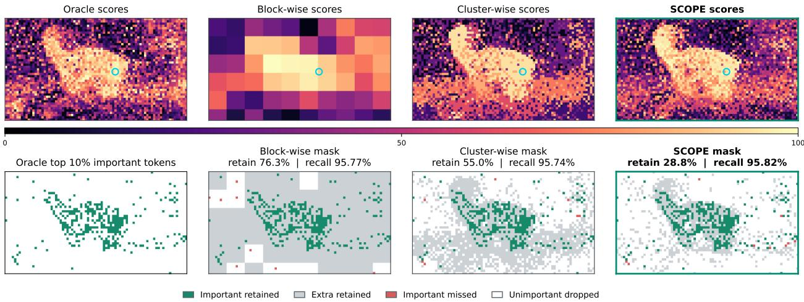  
Figure 8 Fine-grained key selection at matched oracle recall. For a representative query token marked by the cyan circle, the top row compares exact and proxy query–key score maps, while the bottom row compares the oracle top-10% key set with the selected masks. At approximately 95.8% oracle recall, SCOPE retains only 28.8% of all keys, compared with 55.0% for full-dimensional cluster-wise scoring and 76.3% for block-wise scoring.

Thus, a single full-dimensional codebook with C centroids and the SCOPE product code require the same centroid storage, Cd, and the same high-dimensional score-table MAC count, $C _ { q } C d .$ . However, the full dimensional codebook provides only C assignment labels, whereas the product construction provides up to $C ^ { M }$ structured assignment tuples. At matched centroid storage and high-dimensional scoring cost, SCOPE enlarges the available code space by

$$
{ \frac { C ^ { M } } { C } } = C ^ { M - 1 } .\tag{25}
$$

By comparison, a monolithic full-dimensional codebook with $C ^ { M }$ centroids would require $C ^ { M } d$ centroid scalars and $C _ { q } C ^ { M } d$ MACs to construct its score table, whereas the product construction requires only Cd centroid scalars and $C _ { q } C d$ score-table MACs. Here, $C ^ { M }$ denotes the cardinality of the available structured code space, at most min $\{ N , C ^ { M } \}$ distinct codes can be instantiated by the observed keys, and distinct codes need not yield distinct scalar proxy logits for a given query centroid.

Finally, define the product-code representative of key $j$ as

$$
\widehat { k } _ { j } = \mathrm { c o n c a t } \Big ( u _ { z _ { j } ^ { 1 } } ^ { 1 } , \ldots , u _ { z _ { j } ^ { M } } ^ { M } \Big ) .\tag{26}
$$

Because the subspaces occupy disjoint channel ranges,

$$
\widetilde { s } _ { c , j } = \frac { 1 } { \sqrt { d } } \sum _ { m = 1 } ^ { M } \left. \bar { q } _ { c } ^ { m } , { u } _ { z _ { j } ^ { m } } ^ { m } \right. = \frac { \left. \bar { q } _ { c } , \widehat { k } _ { j } \right. } { \sqrt { d } } .\tag{27}
$$

Thus, the lookup-and-sum operation exactly evaluates the inner product with the product-code representative, it introduces no approximation beyond replacing each key with that representative.

## C Additional Quantitative Results

## Fine-Grained Key Selection at Matched Oracle Recall

Figure 8 compares the key-selection granularity of diferent proxy scoring schemes for a representative query token. The exact query–key scores define the oracle top-10% key set. For each proxy, keys are ranked by their estimated scores and retained until approximately the same oracle recall is reached. Retention denotes the fraction of all key tokens selected, whereas oracle recall denotes the fraction of oracle-important keys recovered.

Block-wise scoring assigns one proxy score to all keys in the same block, so retaining an important key may also retain many unimportant keys from that block. Full-dimensional cluster-wise scoring provides a finer grouping, but all keys assigned to the same centroid still share one score and tend to be retained together. SCOPE instead combines temporal, height and width subspace assignments to construct more fine-grained proxy scores. Keys that share a representative in one subspace can therefore still be distinguished by their assignments in the other subspaces.

All three methods recover approximately 95.8% of the oracle-important keys. SCOPE achieves this recall while retaining only 28.8% of all key tokens, compared with 55.0% for full-dimensional cluster-wise scoring and 76.3% for block-wise scoring. The substantially lower retention ratio shows that SCOPE reduces the over-selection of unimportant keys at comparable oracle recall.

## D Additional Qualitative Results

We provide additional dense-reference visual comparisons across all six 720p model–task configurations. All subsequent figures use the same layout. Each pair of rows corresponds to one generation example, with Dense Attention in the upper row and SCOPE in the lower row, the three columns show generated frames sampled at matched temporal positions. The paired outputs use identical prompts, conditioning images when applicable, random seeds and sampling configurations.

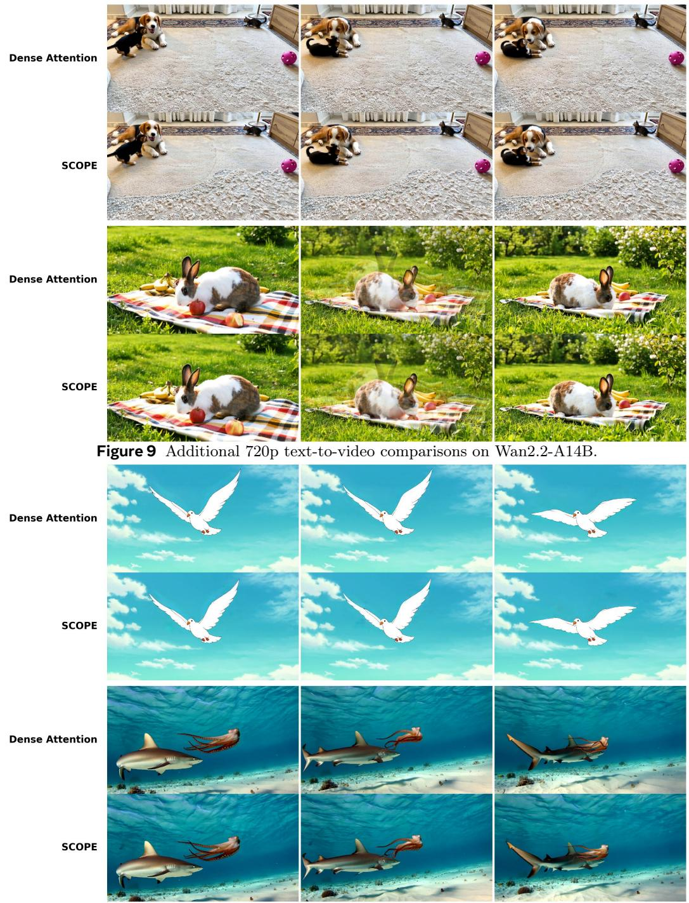  
Figure 10 Additional 720p text-to-video comparisons on Wan2.1-14B.

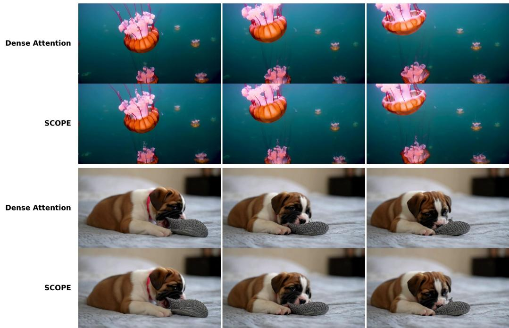

Figure 11 Additional 720p text-to-video comparisons on HunyuanVideo-13B.  
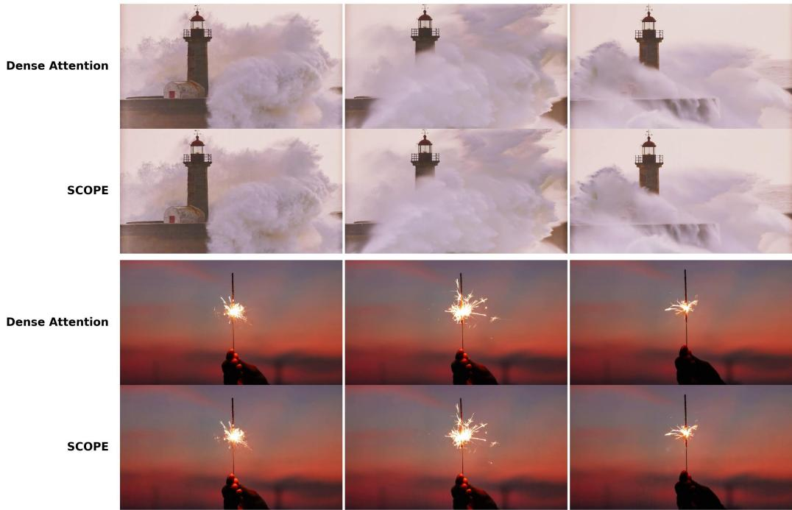  
Figure 12 Additional 720p image-to-video comparisons on Wan2.2-A14B.

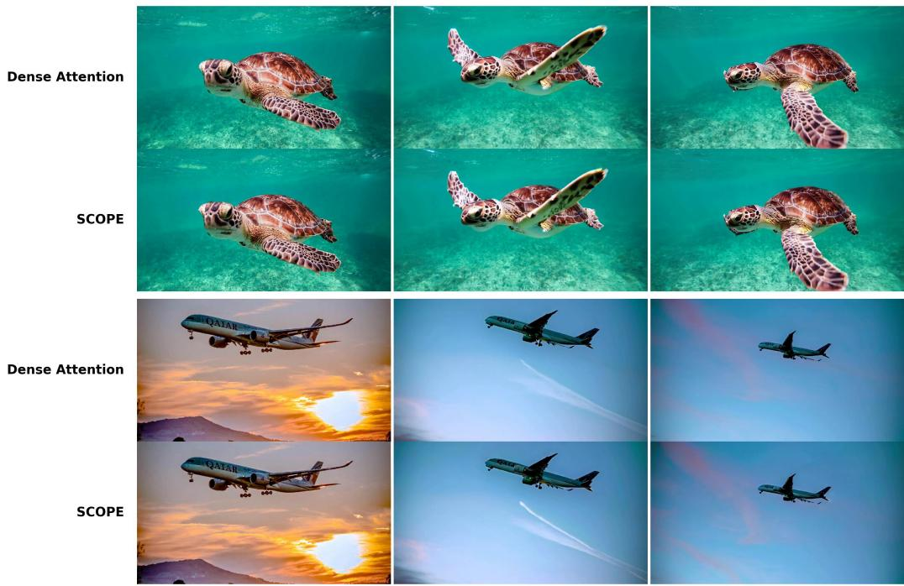

Figure 13 Additional 720p image-to-video comparisons on Wan2.1-14B.  
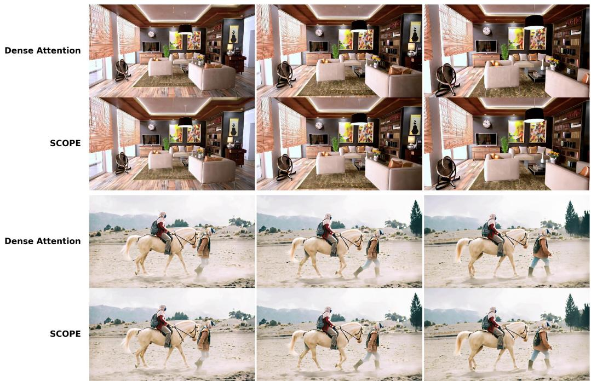  
Figure 14 Additional 720p image-to-video comparisons on HunyuanVideo-13B.