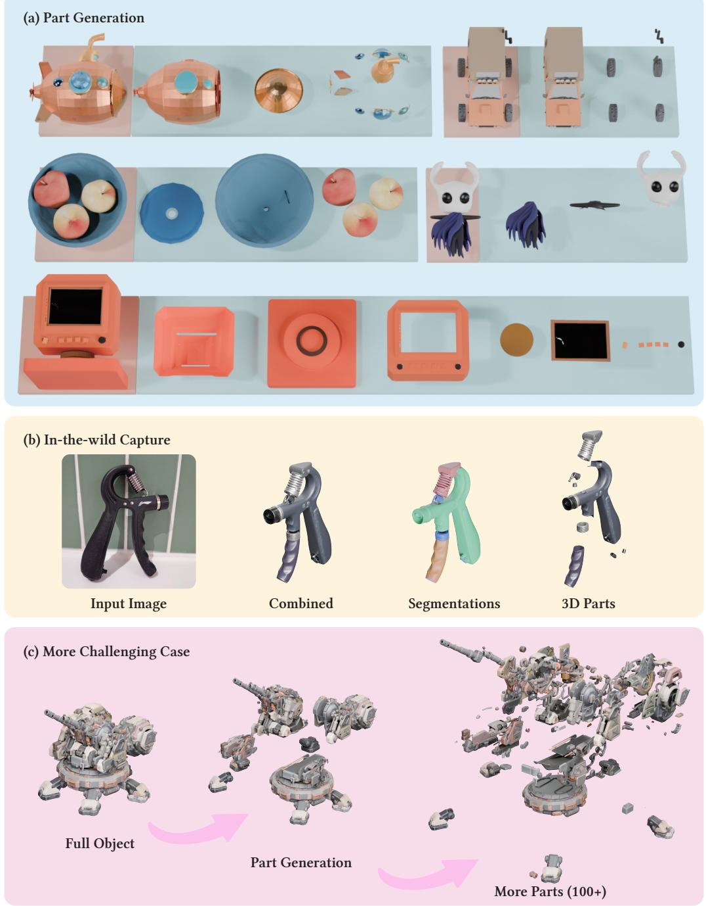
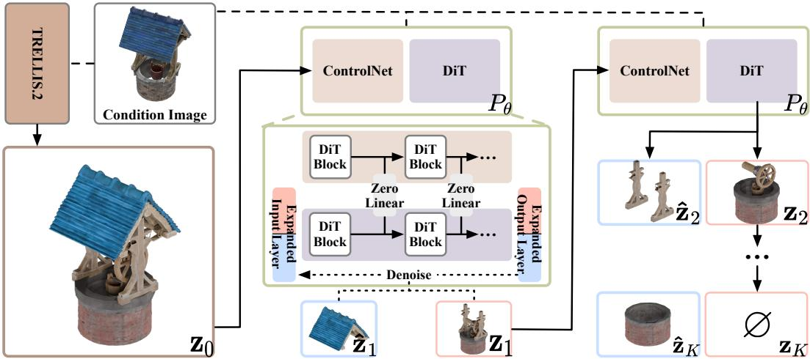
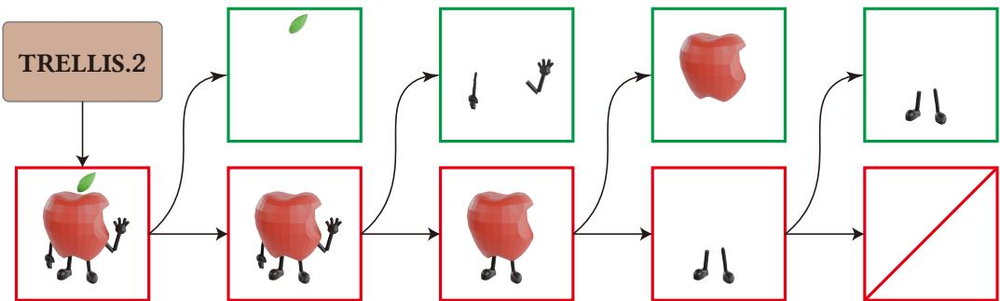
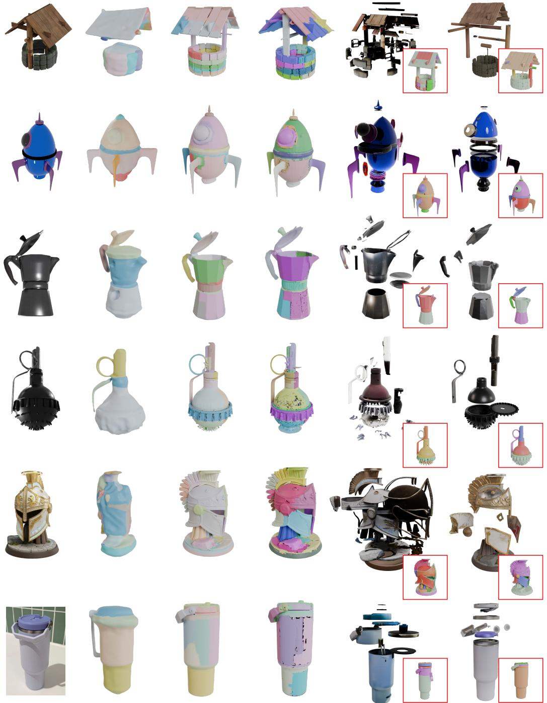

# SCULPT: SUBTRACTIVE COMPOSITION FOR 3D PART GENERATION

Sikuang Li1∗ † Chen Yang2∗ Jiemin Fang2B§ Jiazhong Cen1 Yuhe Wei1 Jichen Pang1 Wei Shen1B Qi Tian2B

1Shanghai Jiao Tong University 2Huawei

{uranusits, jiazhongcen, turtledoveden}@sjtu.edu.cn {jiyuechenxing, wei.shen}@sjtu.edu.cn {chenyang.res, jaminfong}@gmail.com tian.qi1@huawei.com

https://sculpt-part.github.io/

## ABSTRACT

Part-aware 3D generation aims to create digital assets that are coherent as complete objects while exposing structural parts for editing, material assignment, animation, and reuse. Existing methods impose this structure outside the native generation loop: segmentation-based methods partition an already generated shape, while additive methods synthesize parts from predefined layouts, boxes, or tokens and then reconcile them into a whole. The former preserves the generated geometry but fixes the object before part boundaries are determined; the latter exposes part cardinality but often leaves shared boundaries vulnerable to gaps, interpenetrations, and material discontinuities. In this paper, we propose SCULPT, a framework that addresses these challenges through subtractive composition. Given a complete object represented in a structured 3D latent space, SCULPT iteratively applies a joint split predictor to generate one extracted part together with the remaining object. The predictor performs a coupled denoising process conditioned on both the image and the current 3D state, so the extracted part and updated remainder are generated together rather than reconciled after generation. The joint split predictor processes both outputs on the union of their native sparse 3D supports, allowing neighboring supports to overlap rather than imposing a disjoint voxel partition. The rollout ends when the remainder support becomes empty or reaches a fixed safety cap, allowing the number of generated parts to adapt to each object within that bound. Extensive experiments demonstrate state-of-the-art geometry on PartObjaverse while preserving strong complete-object reconstruction after part assembly. Results on four dataset images, one text-to-image-generated input, and one real-world photograph further show fine-grained textured part decomposition beyond the benchmark.

## 1 INTRODUCTION

In modern graphics pipelines, a 3D asset is rarely treated as a monolithic shape; rather, it is constructed as an assembly of meaningful parts. Whether for character animation, multi-material fabrication, or interactive content creation, artists routinely rig limbs, assign distinct materials to individual components, and edit sub-parts independently, yet they expect the assembled whole to remain visually coherent. While recent single-image 3D generative models such as TRELLIS (Xiang et al., 2025), TRELLIS. 2 (Xiang et al., 2026), and Hunyuan3D 2.5 (Lai et al., 2025) excel at synthesizing detailed geometry and appearance from visual cues, they typically output a single, indivisible asset without considering the part structure. Part-aware 3D generation asks these models to produce both: a coherent whole and an object-dependent number of semantic components that can be manipulated independently and reassembled. This variable output cardinality is central to the task.

  
Figure 1: SCULPT generates complete 3D objects together with coherent part structure. Starting from an image-conditioned complete object, SCULPT subtractively extracts semantically meaningful components while retaining their alignment in the original object frame. (a) Part generation: complete objects and their extracted parts across diverse object categories, with coherent geometry, boundaries, and appearance. (b) In-the-wild capture: SCULPT generalizes well beyond its training distribution— given a single casually captured real photograph, it still produces a faithful combined object, semantic segmentations, and separated textured 3D parts. (c) More challenging case: recursive subtractive decomposition—by applying the split operation to previously extracted parts, SCULPT decomposes a complex 3D asset into more than 100 fine-grained components.

Existing approaches handle part structure in two main ways, neither of which fully resolves this challenge. One line of work directly generates or reconstructs the complete part set. Part123 (Liu et al., 2024) and PartGen (Chen et al., 2025a) derive components through image-space decomposition and per-part reconstruction, while OmniPart (Yang et al., 2025) plans a variable-length box layout and jointly synthesizes its parts. More generally, direct part synthesis must represent the complete part set through image-space decisions, fixed slots, explicit layouts, or variable-length sequences. Fixed slots tie the output capacity to a chosen maximum, whereas variable-length representations must learn when and how many elements to emit. In either case, the object-dependent cardinality becomes part of a global output prediction. Segmentation-based methods take the complementary route: they defer the part decision until after generation and label components on an already produced mesh or volume. Among these, 2D-guided methods such as SAMPart3D (Yang et al., 2024d) transfer supervision from image foundation models, whereas native 3D methods such as PartField (Liu et al., 2025) and P3-SAM (Ma et al., 2025) operate directly on meshes or 3D feature fields. Because these methods operate on a completed asset, they preserve its generated exterior geometry. A segmentation alone, however, partitions the existing surface rather than generatively completing the extracted components: it does not ask the generator to determine and complete both sides of a part boundary, including newly exposed contact surfaces and their geometry and materials. These complementary limitations motivate a formulation that retains the generator throughout decomposition without predicting the entire variable-cardinality part set at once.

Modern holistic 3D generators themselves provide the missing prior. Through whole-object generation, they learn recurring substructures—such as legs, wheels, handles, and panels—and how those substructures form coherent geometry and appearance. This suggests treating decomposition as a generation problem rather than only as recognition over a fixed asset. We therefore introduce SCULPT1 and formulate part-aware generation as subtractive composition. Instead of emitting the complete part set in one prediction, SCULPT repeatedly applies a fixed-signature operation: given the current object state, it jointly generates one extracted part and the remaining object. The remainder is then passed to the next split, and the same operation is reused until its predicted support becomes empty or the rollout reaches a fixed safety cap. By expressing cardinality through the rollout length rather than the dimensionality of a single prediction, subtractive composition alleviates the difficulty of modeling variable part cardinality. At the same time, generating each part together with its remainder allows their boundary to be determined during generation rather than imposed afterward.

To realize this generative split, we train a joint split predictor that maps the current object state to the next extracted part and the updated remainder. The predictor accepts heterogeneous conditions: a 2D conditioning image and the current 3D state. Internally, it is implemented with decomposition flow transformer blocks, where a joint denoising branch initialized from the holistic generator produces the coupled part–remainder target and a remainder-control branch injects features from the current 3D state. In the initial step, the predictor operates on the complete structured latent of the object, yielding the first extracted part and the remaining object. Each subsequent iteration feeds the updated remaining latent back into the predictor to emit the next part. This native 3D coupling is particularly useful at part boundaries. Unlike 2D separation methods constrained by projected pixels, or voxelized partitions that snap boundaries to grid faces, SCULPT jointly processes the part and remainder on the union of their native sparse supports and allows them to share a non-empty interface shell. Boundary voxels can belong to both sides instead of being assigned by a hard voxel-face partition, while all outputs remain in the coordinate frame of the complete object. Fig. 1 shows representative results.

In summary, our main contributions are:

• We formulate part-aware 3D generation as subtractive composition, turning a variablecardinality output into recurrent, fixed-signature part–remainder splits. The number of parts follows the rollout rather than a fixed set of output slots or a pre-specified layout.

• We instantiate this formulation with a joint split predictor built from decomposition flow transformer blocks. The predictor adapts the prior of a holistic image-to-3D generator through image-conditioned joint denoising and remainder-conditioned control, allowing each extracted part and its remainder to be generated in a shared trajectory rather than reconciled after independent synthesis.

• We introduce native-support constraints for subtractive generation, including a sparsesupport composition loss, inference-time support clipping, and empty-remainder termination. Together, these choices preserve coverage of the current object support and keep the recurrent state within the object being decomposed.

• We evaluate SCULPT on a part-annotated Objaverse benchmark and image-driven generalization cases. SCULPT achieves state-of-the-art quantitative performance among partstructured generation and reconstruction baselines, including the best Chamfer distance at the part, semantic-group, and object levels, while producing coherent qualitative decompositions for four dataset images, one text-to-image-generated input, and one real-world photograph.

## 2 RELATED WORK

## 2.1 HOLISTIC 3D OBJECT GENERATION

3D object generation has seen rapid progress in recent years, with a variety of approaches for generating complete assets from text or images. Optimization-based methods (Poole et al., 2023; Yi et al., 2024; Lin et al., 2023; Shi et al., 2024) use 2D or multi-view diffusion priors (Ho et al., 2020; Song et al., 2021) to optimize 3D representations. Direct 3D diffusion models generate point clouds or implicit functions (Nichol et al., 2022; Jun & Nichol, 2023), while feed-forward and sparse view reconstruction pipelines improve efficiency and view consistency (Long et al., 2024; Yang et al., 2024a; Hong et al., 2024; Tang et al., 2024; Xu et al., 2024). More recent systems, including TRELLIS (Xiang et al., 2025), TRELLIS. 2 (Xiang et al., 2026), Hunyuan3D 2.5 (Lai et al., 2025), UniLat3D (Wu et al., 2025), and TIGON (Cen et al., 2026), build on native 3D latent representations to support high-quality asset generation. Beyond single objects, generative pipelines have also been scaled to full scenes, where layouts or language arrange assets into coherent environments (Yang et al., 2024b;c).

## 2.2 3D PART SEGMENTATION

3D part segmentation methods decompose an object into semantically meaningful components, providing a basis for part-level understanding and manipulation. Early approaches segment shapes into geometric primitives with learned point-wise features (Yan et al., 2021), often trained on partannotated datasets such as PartNet (Mo et al., 2019). Recent methods obtain part cues from 2D foundation models (Oquab et al., 2024; Simeoni et al.´ , 2025; Kirillov et al., 2023) or operate with native 3D backbones (Qi et al., 2017; Wu et al., 2024), including PartSLIP, Point-SAM, PartSAM, SAMPart3D, and P3-SAM (Liu et al., 2023; Zhou et al., 2025; Zhu et al., 2026; Yang et al., 2024d; Ma et al., 2025). Their features are clustered, classified, or decoded to produce part labels. Segmentation has also been lifted to reconstructed scene representations: Gaussian Grouping (Ye et al., 2024) attaches identity encodings to 3D Gaussians supervised by 2D masks, enabling open-world scene segmentation and editing. Because these methods operate on a fixed asset, they preserve the generated geometry and provide a strong reference for part-level decomposition. Their output, however, is a partition of an existing shape rather than a generative process, so the decomposition does not directly update the object state as parts are extracted.

## 2.3 PART-STRUCTURED 3D GENERATION AND RECONSTRUCTION

Part-structured 3D generation and reconstruction make part structure native to the synthesis or recovery process. Early structure-aware methods represent shapes as part hierarchies and learn structural variations for generation and editing (Mo et al., 2020). Building on modern generative backbones, some methods use multi-view generation or image-space part cues to recover complete semantic assemblies, including PartGen (Chen et al., 2025a), HoloPart (Yang et al., 2026), and Part123 (Liu et al., 2024). Other systems model part-structured objects through dual volume packing (Tang et al., 2025), compositional latent diffusion in PartCrafter (Lin et al., 2025), semantic decoupling and structural cohesion in OmniPart (Yang et al., 2025), contextual part latents in CoPart (Dong et al., 2025), bounding-box-prompted shape decomposition in X-Part (Yan et al., 2026), or full-resolution per-part synthesis in FullPart (Ding et al., 2026). Part structure has further been exposed through alternative interfaces: BANG (Zhang et al., 2025) separates an asset by generating exploded-view dynamics with spatial prompts, and Part-X-MLLM (Wang et al., 2026) plans part-level boxes and edit commands with a language frontend that drives downstream geometry modules. These methods expose part cardinality and semantics during synthesis or reconstruction, giving them direct control over the structure being produced. Maintaining coherence among generated parts remains an explicit design problem, addressed through packing, joint modeling, structural conditioning, or completion. Closest to our formulation, UniPart (He et al., 2026) likewise taps the part-aware priors that emerge in whole-object generative learning, yet it realizes decomposition as a latent segmentation stage followed by per-part diffusion. AutoPartGen (Chen et al., 2025b) generates parts autoregressively with automatic termination, but each part is added by conditioning on the whole object and previously generated parts, so no explicit remainder state constrains what remains to be generated, and its geometry-only latents do not model appearance. In contrast, SCULPT carries an explicit remaining-object state through every split and denoises each part jointly with that remainder on the union of their native sparse supports, keeping boundaries, geometry, and materials consistent as the decomposition proceeds.

## 2.4 CONDITIONAL CONTROL AND JOINT GENERATION

Conditional control studies how to steer pretrained generative models with additional signals while retaining their learned priors. ControlNet (Zhang et al., 2023) adds trainable branches to text-to-image diffusion models for spatial conditions such as edges, depth, or pose, and adapter-based methods such as T2I-Adapter (Mou et al., 2024) and IP-Adapter (Ye et al., 2023) inject spatial controls or image prompts with lightweight modules. JointNet (Zhang et al., 2024) and JointDiT (Kwon et al., 2025) further show that diffusion backbones can be extended to coupled outputs such as RGB-depth generation, while text-image conditioned 3D generation (Cen et al., 2026) explores multimodal control by combining visual exemplars with textual specifications. These works demonstrate the potential of conditioning and joint generation to steer pretrained models toward more complex outputs, but they do not directly address recurrent 3D part decomposition conditioned on an evolving remaining-object state.

## 3 METHOD

## 3.1 OVERVIEW

Given a conditioning image I, SCULPT generates an ordered, variable-length collection of 3D parts. Each part latent decodes to a textured mesh with geometry and material in the coordinate frame of the complete object, so the decoded parts can be combined directly into one asset. We call the process subtractive composition: starting from a complete object, the model repeatedly separates one part and carries the remaining object to the next step.

SCULPT uses the pretrained image-conditioned TRELLIS. 2 generator $G _ { \phi }$ (Xiang et al., 2026) to obtain the complete-object latent $z _ { \mathrm { 0 } }$ . Its core module is a joint split predictor $P _ { \theta }$ . Let zi−1 be the current remaining-object latent before split i. The predictor takes this latent together with the image and returns the next part $\hat { z } _ { i }$ and the updated remainder $z _ { i } )$

$$
z _ { 0 } = G _ { \phi } ( \mathcal { T } ) ,\tag{1}
$$

$$
( \hat { z } _ { i } , z _ { i } ) = P _ { \boldsymbol { \theta } } ( z _ { i - 1 } , \mathcal { T } ) .\tag{2}
$$

Here and below, a hatted quantity denotes the extracted part and the corresponding unhatted quantity denotes the remainder. The extracted latent is stored, while the remainder is used as the input to the next split. Repeating the same two-output prediction allows different objects to produce different numbers of parts, up to the fixed rollout cap. Fig. 2 summarizes this process.

  
Figure 2: SCULPT turns whole-object generation into recurrent part–remainder prediction. We first use TRELLIS. 2 mapping the conditioning image I to a complete structured latent $z _ { \mathrm { 0 } }$ . At split i, the image- and remainder-conditioned predictor $P _ { \theta }$ jointly denoises an extracted part $\hat { z } _ { i }$ (blue) and the updated remainder $z _ { i }$ (red); only the remainder state is carried into the next split, until its sparse support becomes empty or the rollout reaches its safety cap. The inset expands $P _ { \theta } \colon$ a ControlNet branch encodes the current remainder and injects zero-initialized residuals into the DiT blocks.

The remainder of this section follows the pipeline. We first review the structured 3D latent used for complete objects, parts, and remainders. We then describe the subtractive training sequences, the joint predictor and its objective, and the recurrent inference procedure.

## 3.2 PRELIMINARIES: STRUCTURED LATENT BACKBONE

Jointly predicting a part and a remainder requires both outputs to encode geometry and material in the coordinate system of the complete object. We therefore use the structured latent representation of TRELLIS. 2 (Xiang et al., 2026) for every complete object, part, and remainder:

$$
z = ( z ^ { v } , z ^ { g } , z ^ { m } ) , \qquad s \in \{ v , g , m \} ,\tag{3}
$$

where $v , g ,$ and m index the sparse-structure, geometry, and material stages. The sparse-structure latent determines an active O-Voxel support $\mathcal { O } \in \{ 0 , 1 \} ^ { \bar { N } ^ { 3 } }$ on an O-Voxel grid, the backbone’s sparse voxel representation, at resolution N. The geometry stage generates features on this support, and the material stage generates features aligned with the geometry. We use ∪, ∩, and ∅ for elementwise operations on these supports. The decoder D converts the three latent components into a textured mesh in a shared $[ - 1 , \dot { 1 } ] ^ { 3 }$ object frame. Because parts and remainders use this same frame, they do not require independent normalization or registration before composition.

Each of the three TRELLIS. 2 stages is a rectified-flow generator. For a clean target ${ \pmb x } _ { 0 } ,$ noise $\epsilon ,$ and time $t \in [ 0 , 1 ]$ , the forward path is

$$
\begin{array} { r } { \pmb { x } ( t ) = ( 1 - t ) \pmb { x } _ { 0 } + t \pmb { \epsilon } , \qquad \pmb { \dot { x } } ( t ) = \pmb { \epsilon } - \pmb { x } _ { 0 } . } \end{array}\tag{4}
$$

A velocity network ${ \pmb v } _ { \pmb \theta }$ is trained by conditional flow matching to predict this vector field,

$$
\begin{array} { r } { \mathcal { L } _ { \mathrm { C F M } } ( \theta ) = \mathbb { E } _ { t , \mathbf { x } _ { 0 } , \epsilon } \left\| v _ { \theta } ( \mathbf { x } ( t ) , t ) - ( \epsilon - \mathbf { x } _ { 0 } ) \right\| _ { 2 } ^ { 2 } . } \end{array}\tag{5}
$$

SCULPT retains this stage order and flow parameterization, but changes the clean target from one latent to a coupled part–remainder pair and conditions the velocity network on the current remainder. Fig. 3 gives a concrete view of the resulting recurrence: each split stores one part and carries the updated remainder into the next step.

## 3.3 SUBTRACTIVE TRAINING SEQUENCES

Training the split predictor requires supervision for both outputs of every step. We construct this supervision from part-structured 3D assets that provide a complete mesh and its part meshes. The

  
Figure 3: A decomposition unfolds as a sequence of part–remainder transitions. Starting from the TRELLIS. 2 whole-object state (red), each split emits one stored part (green) and carries only the updated remainder forward. In this example, the leaf, arms, body, and legs are removed successively; the rollout terminates when the remainder becomes empty.

complete mesh and all of its parts are jointly normalized to the shared object frame; individual parts are never rescaled. We then sort the parts lexicographically by their centroids along the z–x–y axes, giving one deterministic extraction order per asset.

Let $\mathcal { M } _ { 0 }$ be a complete mesh with K ordered parts, let $\hat { \mathcal { M } } _ { i }$ be the part extracted at step i, and let $\mathcal { M } _ { i }$ be the mesh remaining after the first i parts have been extracted. These meshes satisfy

$$
\mathcal { M } _ { i - 1 } = \hat { \mathcal { M } } _ { i } \oplus \mathcal { M } _ { i } ,
$$

$$
i = 1 , \ldots , K ,\tag{6}
$$

$$
\begin{array} { r } { \mathcal { T } _ { i } ^ { \mathcal { M } } = ( \mathcal { M } _ { i - 1 } ; \hat { \mathcal { M } } _ { i } , \mathcal { M } _ { i } ) , } \end{array}
$$

$$
i = 1 , \ldots , K ,\tag{7}
$$

$$
\mathcal { M } _ { K } = \emptyset ,
$$

$$
\begin{array} { r } { \pmb { S } ( \mathcal { M } _ { 0 } ) = \{ \mathcal { T } _ { i } ^ { \mathcal { M } } \} _ { i = 1 } ^ { K } , } \end{array}\tag{8}
$$

where $\oplus$ denotes mesh union in the shared frame. Thus, one annotated asset provides $K$ examples of splitting a current object into one part and a new remainder. The final tuple has an empty target remainder and provides the supervision used to learn termination.

We render the conditioning image $\mathcal { T }$ from the complete mesh. Each extracted part $\hat { \mathscr { M } } _ { i }$ and remainder $\mathcal { M } _ { i }$ is then converted independently to an O-Voxel in the common frame and encoded as $\hat { z } _ { i }$ and $z _ { i }$ . Independent conversion allows the part support $\hat { \mathcal { O } } _ { i }$ and remainder support $\mathcal { O } _ { i }$ to overlap at their contact region instead of forcing a disjoint voxel partition. For the terminal state, the sparse-structure target is an all-empty occupancy grid, while the geometry and material targets are zero-length sparse tensors. The resulting latent training tuple is

$$
\mathcal { T } _ { i } = ( \mathbb { Z } , z _ { i - 1 } ; \hat { z } _ { i } , z _ { i } ) , \qquad i = 1 , \ldots , K .\tag{9}
$$

This construction matches the input and outputs of Eq. 2, keeps all targets geometrically aligned, and uses the same predictor interface for nonempty and terminal remainders. During training, $z _ { i - 1 }$ is encoded from the annotated remainder mesh; during inference, it is the remainder predicted by the preceding split.

## 3.4 DECOMPOSITION FLOW TRANSFORMER

The split predictor must use two complementary conditions: the image describes the complete asset, while the current remainder specifies which 3D content is still present at the current step. We implement $P _ { \theta }$ as three stage-wise decompositionflow transformers, $\grave { P _ { \theta } } = \{ P _ { \theta } ^ { v } , P _ { \theta } ^ { g } , P _ { \theta } ^ { m } \}$ , following the sparse-structure, geometry, and material order of the backbone.

Stage-wise joint prediction. For stage s, we pack the extracted-part and remainder targets into $\pmb { y } _ { i } ^ { s } = ( \hat { \pmb { z } } _ { i } ^ { s } , \pmb { z } _ { i } ^ { s } )$ . One split runs the three predictors in order:

$$
( \hat { z } _ { i } ^ { v } , z _ { i } ^ { v } ) = P _ { \theta } ^ { v } ( z _ { i - 1 } ^ { v } , { \cal T } ) ,\tag{10}
$$

$$
\begin{array} { r } { ( \hat { z } _ { i } ^ { g } , z _ { i } ^ { g } ) = P _ { \theta } ^ { g } ( z _ { i - 1 } ^ { g } , \mathcal { T } ; \hat { \mathcal { O } } _ { i } , \mathcal { O } _ { i } ) , } \end{array}\tag{11}
$$

$$
\begin{array} { r } { ( \hat { z } _ { i } ^ { m } , z _ { i } ^ { m } ) = P _ { \theta } ^ { m } ( z _ { i - 1 } ^ { m } , \boldsymbol { \mathcal { T } } ; \hat { z } _ { i } ^ { g } , z _ { i } ^ { g } ) . } \end{array}\tag{12}
$$

At the sparse-structure stage, $\mathbf { \Delta } y _ { i } ^ { v }$ is represented as a two-channel dense tensor on the $N ^ { 3 }$ grid. At the geometry and material stages, the part and remainder can occupy different sparse coordinates. We place their features on the union support $\hat { \mathcal { O } } _ { i } \cup \mathcal { O } _ { i }$ , retain masks for the two destinations, jointly denoise the packed features, and route the two outputs back to their respective supports. The two outputs therefore share the same denoising computation and image context at every stage.

Remainder-conditioned blocks. Each stage predictor contains a joint denoising branch and a parallel remainder-control branch. Let $h _ { \ell , i } ^ { s }$ be the packed feature in the joint branch at block $\ell ,$ let $c _ { \ell , i } ^ { s }$ be the control feature, and let $e _ { \mathcal { T } }$ and $e _ { t }$ be the image and flow-time embeddings. We denote the control and joint transformer blocks by $C _ { \ell } ^ { s }$ and $B _ { \ell } ^ { s }$ , and their residual projection by $Z _ { \ell } ^ { s }$ . A block updates the two branches as

$$
\boldsymbol { c } _ { \ell + 1 , i } ^ { s } = C _ { \ell } ^ { s } \left( \boldsymbol { c } _ { \ell , i } ^ { s } , \boldsymbol { z } _ { i - 1 } ^ { s } ; \boldsymbol { e } _ { \mathcal { T } } , \boldsymbol { e } _ { t } \right) ,\tag{13}
$$

$$
\begin{array} { r } { \pmb { h } _ { \ell + 1 , i } ^ { s } = B _ { \ell } ^ { s } \big ( \pmb { h } _ { \ell , i } ^ { s } ; \pmb { e } _ { \mathcal { T } } , \pmb { e } _ { t } \big ) + Z _ { \ell } ^ { s } \big ( \pmb { c } _ { \ell + 1 , i } ^ { s } \big ) . } \end{array}\tag{14}
$$

The joint blocks $B _ { \ell } ^ { s }$ are initialized from the corresponding TRELLIS. 2 checkpoint. The residual projections $Z _ { \ell } ^ { s }$ are initialized to zero, and both branches are then trained for the split task. This design starts from the pretrained image-to-3D generator while adding the current 3D remainder as a block-wise condition.

Training objectives. For each stage s, the packed target follows the rectified-flow path

$$
\pmb { y } _ { i } ^ { s } ( t ) = ( 1 - t ) \pmb { y } _ { i } ^ { s } + t \pmb { \epsilon } .\tag{15}
$$

We train the stage-wise velocity predictor with

$$
\mathcal { L } _ { \mathrm { f l o w } } ^ { s } = \mathbb { E } \left[ \left\| v _ { \theta } ^ { s } ( \pmb { y } _ { i } ^ { s } ( t ) , t , \mathbb { Z } , z _ { i - 1 } ^ { s } ) - ( \epsilon - \pmb { y } _ { i } ^ { s } ) \right\| _ { 2 } ^ { 2 } \right] ,\tag{16}
$$

where the expectation is over latent training tuples, flow times, and noise. The packed target fixes the roles of the two outputs, while joint denoising lets their predictions interact throughout the flow trajectory.

The flow loss supervises the two target latents but does not directly compare their combined sparse support with the input remainder. We therefore add a composition loss at the sparse-structure stage. From the predicted velocity, we first estimate the clean packed state,

$$
\begin{array} { r } { \tilde { { \pmb y } } _ { i , 0 } ^ { v } ( t ) = { \pmb y } _ { i } ^ { v } ( t ) - t { \pmb v } _ { \theta } ^ { v } ( { \pmb y } _ { i } ^ { v } ( t ) , t , { \mathbb T } , z _ { i - 1 } ^ { v } ) . } \end{array}\tag{17}
$$

After unpacking its two occupancy-logit channels and applying a sigmoid, we obtain part and remainder occupancy probabilities $( \hat { \pmb { p } } _ { i } , \pmb { p } _ { i } )$ . Their differentiable union is

$$
\pmb { u } _ { i } = \mathbf { 1 } - ( \mathbf { 1 } - \pmb { \hat { p } } _ { i } ) \odot ( \mathbf { 1 } - \pmb { p } _ { i } ) .\tag{18}
$$

where $\odot$ denotes elementwise multiplication. We compare this union with the support $\mathcal { O } _ { i - 1 }$ of the input remainder using voxel-wise binary cross-entropy, where q indexes grid voxels. The sparse-stage objective adds this term with weight $\lambda _ { \mathrm { c o m p } } \mathrm { . }$

$$
\mathcal { L } _ { \mathrm { c o m p } } = - \frac { 1 } { N ^ { 3 } } \sum _ { q } \left[ \mathcal { O } _ { i - 1 , q } \log u _ { i , q } + ( 1 - \mathcal { O } _ { i - 1 , q } ) \log ( 1 - u _ { i , q } ) \right] ,\tag{19}
$$

$$
\begin{array} { r } { \mathcal { L } ^ { v } = \mathcal { L } _ { \mathrm { f o w } } ^ { v } + \lambda _ { \mathrm { c o m p } } \mathcal { L } _ { \mathrm { c o m p } } , \qquad \mathcal { L } ^ { g } = \mathcal { L } _ { \mathrm { f o w } } ^ { g } , \qquad \mathcal { L } ^ { m } = \mathcal { L } _ { \mathrm { f o w } } ^ { m } . } \end{array}\tag{20}
$$

The three stages are trained separately with their corresponding objectives. The composition term encourages the predicted part and remainder together to cover the current input support. It constrains their union, not their intersection, so voxels may be active in both outputs. We call such overlapping boundary voxels an interface shell; they avoid imposing a hard voxel-face partition between two parts that meet in 3D.

## 3.5 SUBTRACTIVE COMPOSITION

At inference time, predictions from one split become the input to the next. To keep this recurrent state within the current object, we convert the two sparse-stage probability maps into hard supports with a fixed occupancy threshold $\tau _ { \mathrm { o c c } }$ and clip both supports to $\mathcal { O } _ { i - 1 }$

$$
\hat { \mathcal { O } } _ { i } = \mathbf { 1 } [ \hat { p } _ { i } > \tau _ { \mathrm { o c c } } ] \cap \mathcal { O } _ { i - 1 } , \qquad \mathcal { O } _ { i } = \mathbf { 1 } [ p _ { i } > \tau _ { \mathrm { o c c } } ] \cap \mathcal { O } _ { i - 1 } .\tag{21}
$$

Algorithm 1 SCULPT recurrent inference. Each split predicts and clips an extracted part and   
updated remainder. The rollout stops at an empty remainder or after $K _ { \operatorname* { m a x } } = 2 4$ splits, retaining a   
nonempty capped remainder before decoding and assembly.   
Require: image $\boldsymbol { \mathcal { T } } ;$ whole-object generator $G _ { \phi } ;$ trained split predictors $P _ { \theta } ^ { v } , P _ { \theta } ^ { g } , P _ { \theta } ^ { m }$ ; decoder $\mathcal { D } ;$   
threshold $\tau _ { \mathrm { o c c } } ;$ cap $K _ { \operatorname* { m a x } } \dot { = } 2 4$   
Ensure: ordered output sequence ${ \mathcal { Z } } _ { \mathrm { o u t } }$ and assembled asset   
1: $z _ { 0 } \gets G _ { \phi } ( \mathcal { T } )$ and extract $\mathcal { O } _ { 0 }$ from $\boldsymbol { z } _ { 0 } ^ { v }$   
2: $\mathcal { Z } _ { \mathrm { o u t } }  [ ]$   
3: for $i = 1 , \ldots , K _ { \mathrm { m a x } }$ do   
4: $( \hat { z } _ { i } ^ { v } , z _ { i } ^ { v } ) \gets P _ { \theta } ^ { v } ( z _ { i - 1 } ^ { v } , \mathcal { T } )$   
5: Threshold and mask both sparse latents, yielding the clipped supports in Eq. 21   
6: $( \hat { z } _ { i } ^ { g } , z _ { i } ^ { g } ) \gets P _ { \theta } ^ { g } ( z _ { i - 1 } ^ { g } , \mathcal { T } ; \hat { \mathcal { O } } _ { i } , \mathcal { O } _ { i } )$   
7: $( \hat { z } _ { i } ^ { m } , z _ { i } ^ { m } ) \gets P _ { \theta } ^ { m } ( z _ { i - 1 } ^ { m } , \mathbb { { T } } ; \hat { z } _ { i } ^ { g } , z _ { i } ^ { g } )$   
8: Assemble $\hat { z } _ { i }$ and $z _ { i }$ from their $v , g , m$ components   
9: append $( \mathcal { Z } _ { \mathrm { o u t } } , \hat { z } _ { i } ) ; K \gets i$   
10: if $\mathcal { O } _ { i } = \dot { \mathcal { O } }$ then   
11: break   
12: end if   
13: end for   
14: $\mathbf { i f } { \mathcal { O } } _ { K } \neq \emptyset$ then   
15: append $\left( \mathcal { Z } _ { \mathrm { o u t } } , z _ { K } \right)$ ▷ retain capped remainder   
16: end if   
17: return ${ \mathcal { Z } } _ { \mathrm { o u t } }$ and $\bigcup \ D ( z )$   
z∈Zout

Here $\mathbf { 1 } [ \cdot ]$ is the indicator function. We mask the predicted sparse latents to these clipped supports before running the geometry and material stages. The updated remainder latent $z _ { i }$ is then carried to the next split, while $\hat { z } _ { i }$ is stored as an output part. Algorithm 1 gives the complete procedure.

Clipping gives a non-expanding sequence of supports,

$$
\hat { \mathcal { O } } _ { i } \subseteq \mathcal { O } _ { i - 1 } , \qquad \mathcal { O } _ { i } \subseteq \mathcal { O } _ { i - 1 } \subseteq \cdots \subseteq \mathcal { O } _ { 0 } .\tag{22}
$$

The rollout stops when the remainder support is empty or when it reaches the fixed cap $K _ { \operatorname* { m a x } } = 2 4$ Equivalently, its final split index is

$$
K = \operatorname* { m i n } ( \{ i \leq K _ { \operatorname* { m a x } } : | \mathcal { O } _ { i } | = 0 \} \cup \{ K _ { \operatorname* { m a x } } \} ) .\tag{23}
$$

If an empty support is predicted first, the output contains the K extracted part latents. If the cap is reached while the remainder is nonempty, that remainder is retained as one additional output instead of being discarded. Finally, each output latent is decoded independently by D, and the decoded meshes are united in the shared object frame without per-part rescaling, snapping, or registration. The recurrent formulation therefore keeps a fixed two-output prediction interface while allowing the number of generated parts to follow the rollout length. At the same time, clipping keeps every predicted state inside the initial object support, and retaining a nonempty capped remainder prevents unresolved geometry from being silently discarded.

## 4 EXPERIMENTS

## 4.1 EXPERIMENTAL SETUP

Training data. PartVerse-XL (Ding et al., 2026) provides the supervision required by our subtractive formulation: each asset contains human-refined part meshes aligned with its complete mesh. The dataset is curated from Objaverse-XL (Deitke et al., 2023). We remove assets with excessive component counts, extremely small components, missing PBR materials, or low-quality geometry and texture. After filtering, the training set contains 37,425 objects and 330,455 supervised part– remainder splits. To prevent evaluation leakage, we also remove every training asset whose SHA-256 identifier matches an evaluation mesh.

Input

Part123

PartField\*

HoloPart\*

OmniPart

SCULPT

Figure 4: Qualitative Comparison. All methods in each row use the same conditioning image. The columns show results from Part123, PartField, HoloPart, OmniPart, and SCULPT for four dataset images, one text-to-image example, and one real photograph (bottom row). An asterisk marks a baseline rendered with semantic part colors rather than generated textures. Red-framed insets show the complete objects obtained by reassembling the predicted OmniPart and SCULPT parts in their common object frame.

Table 1: Geometry comparison on PartObjaverse under matched single-image conditioning. Part-level scores use Hungarian-matched instances; semantic-group scores union parts sharing a semantic label; object-level scores use the assembled union. Lower CD and higher F1 are better. Bold and underlined entries mark the best and second-best available values within each level, respectively; “–” denotes an unavailable measurement.
<table><tr><td>Method</td><td>CD↓</td><td>F1@.1↑</td><td>F1@.05↑</td></tr><tr><td colspan="4">Part level</td></tr><tr><td>Part123</td><td>0.0188</td><td>0.8133</td><td>0.6279</td></tr><tr><td>OmniPart</td><td>0.0136</td><td>0.8612</td><td>0.7025</td></tr><tr><td>TRELLIS+PartField</td><td>0.0127</td><td>0.8750</td><td>0.7169</td></tr><tr><td>TRELLIS+SAM3D</td><td>0.0278</td><td>0.7410</td><td>0.5520</td></tr><tr><td>TRELLIS+PartField+HoloPart</td><td>0.0137</td><td>0.8521</td><td>0.6862</td></tr><tr><td>TRELLIS.2+PartField</td><td>0.0115</td><td>0.8897</td><td>0.7554</td></tr><tr><td>TRELLIS.2+SAM3D</td><td>0.0531</td><td>0.5323</td><td>0.3283</td></tr><tr><td>TRELLIS.2+PartField+HoloPart</td><td>0.0453</td><td>0.6016</td><td>0.3966</td></tr><tr><td>SCULPT (ours)</td><td>0.0107</td><td>0.8858</td><td>0.7599</td></tr><tr><td colspan="4">Semantic-group level</td></tr><tr><td>Part123</td><td>0.0194</td><td>0.8105</td><td>0.6299</td></tr><tr><td>OmniPart</td><td>0.0135</td><td>0.8623</td><td>0.7060</td></tr><tr><td>TRELLIS+PartField</td><td>0.0130</td><td>0.8734</td><td>0.7197</td></tr><tr><td>TRELLIS+SAM3D</td><td>0.0261</td><td>0.7483</td><td>0.5583</td></tr><tr><td>TRELLIS+PartField+HoloPart</td><td>0.0139</td><td>0.8510</td><td>0.6879</td></tr><tr><td>TRELLIS.2+PartField</td><td>0.0117</td><td>0.8903</td><td>0.7595</td></tr><tr><td>TRELLIS.2+SAM3D</td><td>0.0505</td><td>0.5528</td><td>0.3486</td></tr><tr><td>TRELLIS.2+PartField+HoloPart</td><td>0.0441</td><td>0.6156</td><td>0.4106</td></tr><tr><td>SCULPT (ours)</td><td>0.0107</td><td>0.8851</td><td>0.7614</td></tr><tr><td colspan="4">Object level</td></tr><tr><td>Part123</td><td>0.0126</td><td>0.8229</td><td>0.5739</td></tr><tr><td>OmniPart</td><td>0.0032</td><td>0.9690</td><td>0.8732</td></tr><tr><td>TRELLIS+PartField</td><td>0.0037</td><td>0.9634</td><td>0.8563</td></tr><tr><td>TRELLIS+SAM3D</td><td></td><td></td><td></td></tr><tr><td>TRELLIS+PartField+HoloPart</td><td>0.0034</td><td>0.9654</td><td>0.8639</td></tr><tr><td>TRELLIS.2+PartField</td><td>0.0021</td><td>0.9793</td><td>0.9119</td></tr><tr><td>TRELLIS.2+SAM3D</td><td></td><td></td><td></td></tr><tr><td>TRELLIS.2+PartField+HoloPart</td><td>0.0332</td><td>0.6474</td><td>0.4345</td></tr><tr><td>SCULPT (ours)</td><td>0.0020</td><td>0.9839</td><td>0.9212</td></tr><tr><td></td><td></td><td></td><td></td></tr></table>

Evaluation data. We evaluate geometry on PartObjaverse, the benchmark released with SAM-Part3D (Yang et al., 2024d). It contains 200 meshes with both instance-level and semantic part annotations, enabling evaluation of individual parts, semantic groups, and the reassembled object. The annotations were created independently of PartVerse-XL, and no labels are transferred between the training and evaluation sets. We complement this benchmark with the four dataset images, one text-to-image-generated input, and one real photograph shown in Fig. 4 to examine image-conditioned outputs beyond the benchmark meshes.

Implementation details. We initialize the three stage-specific split predictors from the corresponding public TRELLIS. 2 checkpoints (Xiang et al., 2026); each predictor contains 30 transformer blocks. The stages are trained for 800K optimization steps in total with AdamW $( \beta _ { 1 } = 0 . 9 , \beta _ { 2 } = 0 . 9 9 9$ weight decay $1 0 ^ { - 2 } )$ , a constant learning rate of $1 0 ^ { - 4 }$ , and a per-GPU batch size of one on 32 GPUs. We set the composition-loss weight to $\mathrm { \check { \lambda } _ { c o m p } = 0 . 1 }$ . For the geometry and material stages, we omit splits whose extracted part contains fewer than 8 or more than 8192 tokens. This removes 1.5% of splits and 2.3% of assets from those two stages; the sparse-structure stage uses the full training set.

Metrics. To separate the quality of generated components from the fidelity of their assembled whole, we evaluate geometry at three levels. At the part level, predicted and reference parts are paired by Hungarian matching and scored individually. At the semantic-group level, each matched prediction inherits the semantic label of its reference part, and predictions with the same label are unioned before scoring. At the object level, all predicted parts are assembled and compared with the complete reference mesh. For every level, we report Chamfer distance (CD) and F1 at thresholds 0.1 and 0.05; lower CD and higher F1 are better, and the 0.05 threshold measures finer geometric agreement. All meshes are evaluated in the shared [−1, 1]3 object frame.

Compared methods. The baselines cover the two main alternatives to subtractive generation. The first group generates explicit part structure directly and includes Part123 (Liu et al., 2024) and Omni-Part (Yang et al., 2025). The second group first generates a complete object with TRELLIS (Xiang et al., 2025) or TRELLIS. 2 (Xiang et al., 2026), then decomposes it using PartField (Liu et al., 2025) or SAM3D (Yang et al., 2023); we additionally evaluate HoloPart completion (Yang et al., 2026) where applicable. All methods receive the same conditioning image when supported. We use official checkpoints and the inference settings recommended by the respective authors. A dash in Table 1 denotes an unavailable measurement. This grouping lets us compare SCULPT with both direct part synthesis and post-hoc decomposition under the same evaluation protocol.

## 4.2 QUANTITATIVE COMPARISON

The central quantitative question is whether a method can improve individual parts without degrading the object obtained after assembly. Table 1 evaluates both requirements. SCULPT achieves the lowest CD and the highest F1@.05 at the part, semantic-group, and object levels, together with the best object-level F1@.1. Its advantage is therefore not confined to either isolated components or the final union: the same model remains strong throughout the hierarchy from parts to the complete object.

Direct part generation. OmniPart is the strongest baseline in this group. SCULPT reduces its part-level CD from 0.0136 to 0.0107 and increases F1@.05 from 0.7025 to 0.7599. The improvement remains after assembly: object-level CD decreases from 0.0032 to 0.0020, while F1@.05 increases from 0.8732 to 0.9212. These results show that starting from a complete-object latent does not merely preserve the initial whole; it also yields more accurate individual components than direct part generation.

Post-hoc decomposition. TRELLIS. 2+PartField provides the most competitive post-hoc decomposition baseline and shares the same family of complete-object generator. Relative to this baseline, SCULPT reduces CD by 7.0%, 8.5%, and 4.8% at the part, semantic-group, and object levels, respectively, and also improves F1@.05 at all three levels. TRELLIS. 2+PartField remains slightly higher on the coarser part- and semantic-group-level F1@.1 scores (0.8897 vs. 0.8858 and 0.8903 vs. 0.8851). At the stricter 0.05 threshold, however, SCULPT is better at both levels, consistent with its lower CD and stronger fine-scale geometric agreement. The object-level gains further show that these more accurate splits reassemble into a faithful complete shape.

## 4.3 QUALITATIVE COMPARISON

The benchmark metrics measure geometry, but they do not show whether the predicted components remain visually meaningful under more varied image conditions. Fig. 4 therefore compares the methods on four dataset images, one text-to-image-generated input, and one real photograph, using the same input within each row. The figure presents both the separated components and red-framed reassemblies, making it possible to inspect part structure and complete-object coherence together.

The examples cover several structures that are difficult to recover as useful parts. The well combines a broad roof with thin supports and a recessed bucket; the rocket contains a central body, a nose, and narrow appendages; and the moka pot requires the lid, handle, body, and base to remain distinct while meeting at close interfaces. The remaining rows add a ring-shaped handle, a dense ornament with many small protrusions, and a real tumbler with a lid and handle. Across these cases, SCULPT separates recognizable components without moving them out of the coordinate frame of the complete object.

The red-framed insets expose a second requirement that is hidden when parts are viewed separately: their union should recover the complete asset. SCULPT’s reassemblies retain the silhouette and relative placement of the conditioning object across both coarse structures and small accessories. This distinguishes subtractive generation from treating the components as independent objects that must be normalized or positioned after synthesis. The same property also explains why the part-level improvements in Table 1 remain visible at the object level rather than being lost during assembly.

Finally, SCULPT decodes geometry and texture for every predicted part, so the separated outputs retain visual cues such as wood, metal, ceramic, and stylized color patterns. Asterisks mark baselines rendered with semantic part colors rather than generated textures. The bottom row shows that the same part–remainder process can separate the lid, handle, and body of an object conditioned on a real photograph. Together, the figure complements the benchmark by showing how geometric fidelity, shared-frame assembly, and textured part generation appear in the final assets.

Table 2: Component ablations on PartObjaverse at the part level. “Adapt $g , m ^ { \overrightarrow { } \mathbf { \Gamma } }$ denotes adaptation of the geometry and material stages, $\mathcal { L } _ { \mathrm { c o m p } }$ is composition supervision, and “Clip” is inference-time clipping to the current remainder. A checkmark enables a component and “–” disables it. Lower CD and higher F1 are better; bold marks the best value.
<table><tr><td>Variant</td><td>Adapt g, m</td><td> $\mathcal { L } _ { \mathrm { c o m p } }$ </td><td>Clip</td><td> $\mathrm { C D \downarrow }$ </td><td>F1@.1↑</td><td>F1@.05↑</td></tr><tr><td>Voxel only</td><td>一</td><td>√</td><td>√</td><td>0.0439</td><td>0.6801</td><td>0.5405</td></tr><tr><td>w/o comp. loss</td><td>√</td><td>一</td><td>√</td><td>0.0279</td><td>0.7379</td><td>0.5636</td></tr><tr><td>w/o clipping</td><td>√</td><td>√</td><td>一</td><td>0.0260</td><td>0.7517</td><td>0.5728</td></tr><tr><td>Full</td><td>√</td><td>√</td><td>√</td><td>0.0107</td><td>0.8858</td><td>0.7599</td></tr></table>

## 4.4 ABLATION STUDIES

Having established the quality of the complete system, we next isolate the design choices that turn a whole-object generator into a recurrent split predictor. Table 2 starts from the full model and removes one capability at a time: adaptation of the downstream geometry and material stages, composition supervision during training, or support clipping during inference. All variants are evaluated with the same part-level protocol as the main comparison.

Adapting the full latent hierarchy. The Voxel only variant adapts the sparse-structure predictor but leaves the downstream geometry and material stages unchanged. Its CD increases from 0.0107 to 0.0439, while F1@.1 and F1@.05 fall from 0.8858/0.7599 to 0.6801/0.5405. Sparse support alone is therefore insufficient: the downstream stages must also adapt to convert the predicted supports into accurate part geometry.

Constraining the subtractive state. The remaining two variants test the training- and inferencetime support constraints. Without composition supervision, CD increases to 0.0279 and F1@.1/F1@.05 decrease to 0.7379/0.5636, showing that it is important to train the predicted part and remainder to cover the current object together. Without support clipping, CD increases to 0.0260 and F1@.1/F1@.05 decrease to 0.7517/0.5728. Allowing a predicted split to extend beyond the current remainder thus substantially weakens the recurrent decomposition.

Together, these ablations connect the end-to-end gains to the formulation: full-stage adaptation carries the split through the structured latent hierarchy, composition supervision trains the two predicted supports to cover the current object together, and clipping keeps successive predictions within the current subtractive state.

## 5 CONCLUSION

We introduced SCULPT, a subtractive formulation of part-aware 3D generation. Instead of labeling a completed surface or synthesizing a prescribed collection of separately represented components, SCULPT turns a complete-object latent into the initial state of a recurrent generative split. Each step jointly produces one part and the object that remains. This part–remainder transition provides a fixed prediction signature, an explicit state for later decisions, and a representation of variable cardinality through the trajectory length.

On PartObjaverse, SCULPT achieves state-of-the-art quantitative performance among part-structured generation and reconstruction baselines, including the best CD and F1@.05 at the part, semanticgroup, and object levels. Its strong object-level scores show that fine-grained decomposition does not come at the expense of the assembled shape. Ablations establish the practical value of adapting the downstream stages, composition supervision, and inference-time clipping. Qualitative comparisons further illustrate textured components in a shared object frame for four dataset images, one text-toimage-generated input, and one real photograph.

These results identify the explicit remainder state as a useful organizing principle for part-aware generation: each prediction is conditioned on what remains to be generated, and the same state provides the termination signal. Extending this formulation with calibrated stopping, direct granularity control, and interface-aware objectives is a natural next step.

## REFERENCES

Jiazhong Cen, Jiemin Fang, Sikuang Li, Guanjun Wu, Chen Yang, Taoran Yi, Zanwei Zhou, Zhikuan Bao, Lingxi Xie, Wei Shen, and Qi Tian. Text-image conditioned 3d generation. In Proceedings of the IEEE/CVF Conference on Computer Vision and Pattern Recognition (CVPR), pp. 604–614, June 2026.

Minghao Chen, Roman Shapovalov, Iro Laina, Tom Monnier, Jianyuan Wang, David Novotny, and Andrea Vedaldi. Partgen: Part-level 3d generation and reconstruction with multi-view diffusion models. In Proceedings of the IEEE/CVF Conference on Computer Vision and Pattern Recognition (CVPR), pp. 5881–5892, June 2025a.

Minghao Chen, Jianyuan Wang, Roman Shapovalov, Tom Monnier, Hyunyoung Jung, Dilin Wang, Rakesh Ranjan, Iro Laina, and Andrea Vedaldi. AutoPartGen: Autoregressive 3D part generation and discovery. In The Thirty-ninth Annual Conference on Neural Information Processing Systems, 2025b. URL https://openreview.net/forum?id=ljJGBcpn7q.

Matt Deitke, Ruoshi Liu, Matthew Wallingford, Huong Ngo, Oscar Michel, Aditya Kusupati, Alan Fan, Christian Laforte, Vikram Voleti, Samir Yitzhak Gadre, Eli VanderBilt, Aniruddha Kembhavi, Carl Vondrick, Georgia Gkioxari, Kiana Ehsani, Ludwig Schmidt, and Ali Farhadi. Objaverse-xl: A universe of 10m+ 3d objects. In Advances in Neural Information Processing Systems, volume 36, 2023.

Lihe Ding, Shaocong Dong, Yaokun Li, Chenjian Gao, Xiao Chen, Rui Han, Yihao Kuang, Hong Zhang, Bo Huang, Zhanpeng Huang, Zibin Wang, Dan Xu, and Tianfan Xue. Fullpart: Generating each 3d part at full resolution. In The Fourteenth International Conference on Learning Representations, 2026. URL https://openreview.net/forum?id=QlRlE7a1p4.

Shaocong Dong, Lihe Ding, Xiao Chen, Yaokun Li, Yuxin Wang, Yucheng Wang, Qi Wang, Jaehyeok Kim, Chenjian Gao, Zhanpeng Huang, Zibin Wang, Tianfan Xue, and Dan Xu. From one to more: Contextual part latents for 3d generation. In Proceedings ofthe IEEE/CVF International Conference on Computer Vision (ICCV), pp. 8230–8240, October 2025.

Xufan He, Yushuang Wu, Xiaoyang Guo, Chongjie Ye, Jiaqing Zhou, Tianlei Hu, Xiaoguang Han, and Dong Du. UniPart: Part-level 3D generation with unified 3D geom-seg latents. In Proceedings of the IEEE/CVF Conference on Computer Vision and Pattern Recognition (CVPR), pp. 34227–34236, June 2026.

Jonathan Ho, Ajay Jain, and Pieter Abbeel. Denoising diffusion probabilistic models. In H. Larochelle, M. Ranzato, R. Hadsell, M.F. Balcan, and H. Lin (eds.), Advances in Neural Information Processing Systems, volume 33, pp. 6840–6851. Curran Associates, Inc., 2020. URL https://proceedings. neurips.cc/paper files/paper/2020/file/4c5bcfec8584af0d967f1ab10179ca4b-Paper.pdf.

Yicong Hong, Kai Zhang, Jiuxiang Gu, Sai Bi, Yang Zhou, Difan Liu, Feng Liu, Kalyan Sunkavalli, Trung Bui, and Hao Tan. LRM: Large reconstruction model for single image to 3d. In The Twelfth International Conference on Learning Representations, 2024. URL https://openreview.net/forum? id=sllU8vvsFF.

Heewoo Jun and Alex Nichol. Shap-e: Generating conditional 3d implicit functions, 2023. URL https://arxiv.org/abs/2305.02463.

Alexander Kirillov, Eric Mintun, Nikhila Ravi, Hanzi Mao, Chloe Rolland, Laura Gustafson, Tete Xiao, Spencer Whitehead, Alexander C. Berg, Wan-Yen Lo, Piotr Dollar, and Ross Girshick. Segment anything. In Proceedings ofthe IEEE/CVF International Conference on Computer Vision (ICCV), pp. 4015–4026, October 2023.

Byung-Ki Kwon, Qi Dai, Hyoseok Lee, Chong Luo, and Tae-Hyun Oh. Jointdit: Enhancing rgbdepth joint modeling with diffusion transformers. In Proceedings of the IEEE/CVF International Conference on Computer Vision (ICCV), pp. 25261–25271, October 2025.

Zeqiang Lai, Yunfei Zhao, Haolin Liu, Zibo Zhao, Qingxiang Lin, Huiwen Shi, Xianghui Yang, Mingxin Yang, Shuhui Yang, Yifei Feng, Sheng Zhang, Xin Huang, Di Luo, Fan Yang, Fang Yang, Lifu Wang, Sicong Liu, Yixuan Tang, Yulin Cai, Zebin He, Tian Liu, Yuhong Liu, Jie Jiang, Linus,

Jingwei Huang, and Chunchao Guo. Hunyuan3d 2.5: Towards high-fidelity 3d assets generation with ultimate details. arXiv preprint arXiv:2506.16504, 2025.

Chen-Hsuan Lin, Jun Gao, Luming Tang, Towaki Takikawa, Xiaohui Zeng, Xun Huang, Karsten Kreis, Sanja Fidler, Ming-Yu Liu, and Tsung-Yi Lin. Magic3d: High-resolution text-to-3d content creation. In Proceedings of the IEEE/CVF Conference on Computer Vision and Pattern Recognition (CVPR), pp. 300–309, June 2023.

Yuchen Lin, Chenguo Lin, Panwang Pan, Honglei Yan, Yiqiang Feng, Yadong Mu, and Katerina Fragkiadaki. Partcrafter: Structured 3d mesh generation via compositional latent diffusion transformers. In The Thirty-ninth Annual Conference on Neural Information Processing Systems, 2025. URL https://openreview.net/forum?id=0e1KaHtgvU.

Anran Liu, Cheng Lin, Yuan Liu, Xiaoxiao Long, Zhiyang Dou, Hao-Xiang Guo, Ping Luo, and Wenping Wang. Part123: Part-aware 3d reconstruction from a single-view image. In ACM SIGGRAPH 2024 Conference Papers, SIGGRAPH ’24, New York, NY, USA, 2024. Association for Computing Machinery. ISBN 9798400705250. doi: 10.1145/3641519.3657482. URL https://doi.org/10.1145/3641519.3657482.

Minghua Liu, Yinhao Zhu, Hong Cai, Shizhong Han, Zhan Ling, Fatih Porikli, and Hao Su. Partslip: Low-shot part segmentation for 3d point clouds via pretrained image-language models. In Proceedings ofthe IEEE/CVF Conference on Computer Vision and Pattern Recognition (CVPR), pp. 21736–21746, June 2023.

Minghua Liu, Mikaela Angelina Uy, Donglai Xiang, Hao Su, Sanja Fidler, Nicholas Sharp, and Jun Gao. Partfield: Learning 3d feature fields for part segmentation and beyond. In Proceedings of the IEEE/CVF International Conference on Computer Vision (ICCV), pp. 9704–9715, October 2025.

Xiaoxiao Long, Yuan-Chen Guo, Cheng Lin, Yuan Liu, Zhiyang Dou, Lingjie Liu, Yuexin Ma, Song-Hai Zhang, Marc Habermann, Christian Theobalt, and Wenping Wang. Wonder3d: Single image to 3d using cross-domain diffusion. In Proceedings ofthe IEEE/CVF Conference on Computer Vision and Pattern Recognition (CVPR), pp. 9970–9980, June 2024.

Changfeng Ma, Yang Li, Xinhao Yan, Jiachen Xu, Yunhan Yang, Chunshi Wang, Zibo Zhao, Yanwen Guo, Zhuo Chen, and Chunchao Guo. P3-sam: Native 3d part segmentation, 2025. URL https://arxiv.org/abs/2509.06784.

Kaichun Mo, Shilin Zhu, Angel X. Chang, Li Yi, Subarna Tripathi, Leonidas J. Guibas, and Hao Su. PartNet: A large-scale benchmark for fine-grained and hierarchical part-level 3D object understanding. In The IEEE Conference on Computer Vision and Pattern Recognition (CVPR), June 2019.

Kaichun Mo, Paul Guerrero, Li Yi, Hao Su, Peter Wonka, Niloy J. Mitra, and Leonidas J. Guibas. StructEdit: Learning structural shape variations. In Proceedings ofthe IEEE/CVF Conference on Computer Vision and Pattern Recognition (CVPR), pp. 8859–8868, June 2020.

Chong Mou, Xintao Wang, Liangbin Xie, Yanze Wu, Jian Zhang, Zhongang Qi, and Ying Shan. T2iadapter: learning adapters to dig out more controllable ability for text-to-image diffusion models. In Proceedings of the Thirty-Eighth AAAI Conference on Artificial Intelligence and Thirty-Sixth Conference on Innovative Applications ofArtificial Intelligence and Fourteenth Symposium on Educational Advances in Artificial Intelligence, AAAI’24/IAAI’24/EAAI’24. AAAI Press, 2024. ISBN 978-1-57735-887-9. doi: 10.1609/aaai.v38i5.28226. URL https://doi.org/10.1609/aaai. v38i5.28226.

Alex Nichol, Heewoo Jun, Prafulla Dhariwal, Pamela Mishkin, and Mark Chen. Point-e: A system for generating 3d point clouds from complex prompts, 2022. URL https://arxiv.org/abs/2212.08751.

Maxime Oquab, Timothee Darcet, Th´ eo Moutakanni, Huy V. Vo, Marc Szafraniec, Vasil Khali-´ dov, Pierre Fernandez, Daniel Haziza, Francisco Massa, Alaaeldin El-Nouby, Mido Assran, Nicolas Ballas, Wojciech Galuba, Russell Howes, Po-Yao Huang, Shang-Wen Li, Ishan Misra, Michael Rabbat, Vasu Sharma, Gabriel Synnaeve, Hu Xu, Herve J´ egou, Julien Mairal, Patrick´ Labatut, Armand Joulin, and Piotr Bojanowski. DINOv2: Learning robust visual features without supervision. Transactions on Machine Learning Research, 2024. ISSN 2835-8856. URL https://openreview.net/forum?id=a68SUt6zFt. Featured Certification.

Ben Poole, Ajay Jain, Jonathan T. Barron, and Ben Mildenhall. Dreamfusion: Text-to-3d using 2d diffusion. In The Eleventh International Conference on Learning Representations, 2023. URL https://openreview.net/forum?id=FjNys5c7VyY.

Charles Ruizhongtai Qi, Li Yi, Hao Su, and Leonidas J. Guibas. Pointnet++: deep hierarchical feature learning on point sets in a metric space. In Proceedings of the 31st International Conference on Neural Information Processing Systems, NIPS’17, pp. 5105–5114, Red Hook, NY, USA, 2017. Curran Associates Inc. ISBN 9781510860964.

Yichun Shi, Peng Wang, Jianglong Ye, Long Mai, Kejie Li, and Xiao Yang. MVDream: Multi-view diffusion for 3d generation. In The Twelfth International Conference on Learning Representations, 2024. URL https://openreview.net/forum?id=FUgrjq2pbB.

Oriane Simeoni, Huy V. Vo, Maximilian Seitzer, Federico Baldassarre, Maxime Oquab, Cijo Jose,´ Vasil Khalidov, Marc Szafraniec, Seungeun Yi, Michael Ramamonjisoa, Francisco Massa, Daniel¨ Haziza, Luca Wehrstedt, Jianyuan Wang, Timothee Darcet, Th´ eo Moutakanni, Leonel Sentana,´ Claire Roberts, Andrea Vedaldi, Jamie Tolan, John Brandt, Camille Couprie, Julien Mairal, Herve´ Jegou, Patrick Labatut, and Piotr Bojanowski. Dinov3, 2025. URL´ https://arxiv.org/abs/2508. 10104.

Jiaming Song, Chenlin Meng, and Stefano Ermon. Denoising diffusion implicit models. In International Conference on Learning Representations, 2021. URL https://openreview.net/forum?id= St1giarCHLP.

Jiaxiang Tang, Zhaoxi Chen, Xiaokang Chen, Tengfei Wang, Gang Zeng, and Ziwei Liu. Lgm: Large multi-view gaussian model for high-resolution 3d content creation. In Computer Vision – ECCV 2024: 18th European Conference, Milan, Italy, September 29–October 4, 2024, Proceedings, Part IV, pp. 1–18, Berlin, Heidelberg, 2024. Springer-Verlag. ISBN 978-3-031-73234-8. doi: 10.1007/978-3-031-73235-5 1. URL https://doi.org/10.1007/978-3-031-73235-5 1.

Jiaxiang Tang, Ruijie Lu, Max Li, Zekun Hao, Xuan Li, Fangyin Wei, Shuran Song, Gang Zeng, Ming-Yu Liu, and Tsung-Yi Lin. Efficient part-level 3d object generation via dual volume packing. In The Thirty-ninth Annual Conference on Neural Information Processing Systems, 2025. URL https://openreview.net/forum?id=qbVbZWxUib.

Chunshi Wang, Junliang Ye, Yunhan Yang, Yang Li, Zizhuo Lin, Jun Zhu, Zhuo Chen, Yawei Luo, and Chunchao Guo. Part-X-MLLM: Part-aware 3D multimodal large language model. In The Fourteenth International Conference on Learning Representations, 2026. URL https: //openreview.net/forum?id=WffiETiSeU.

Guanjun Wu, Jiemin Fang, Chen Yang, Sikuang Li, Taoran Yi, Jia Lu, Zanwei Zhou, Jiazhong Cen, Lingxi Xie, Xiaopeng Zhang, Wei Wei, Wenyu Liu, Xinggang Wang, and Qi Tian. Unilat3d: Geometry-appearance unified latents for single-stage 3d generation, 2025. URL https://arxiv.org/ abs/2509.25079.

Xiaoyang Wu, Li Jiang, Peng-Shuai Wang, Zhijian Liu, Xihui Liu, Yu Qiao, Wanli Ouyang, Tong He, and Hengshuang Zhao. Point transformer v3: Simpler faster stronger. In Proceedings ofthe IEEE/CVF Conference on Computer Vision and Pattern Recognition (CVPR), pp. 4840–4851, June 2024.

Jianfeng Xiang, Zelong Lv, Sicheng Xu, Yu Deng, Ruicheng Wang, Bowen Zhang, Dong Chen, Xin Tong, and Jiaolong Yang. Structured 3d latents for scalable and versatile 3d generation. In Proceedings of the IEEE/CVF conference on computer vision and pattern recognition, pp. 21469–21480, 2025.

Jianfeng Xiang, Xiaoxue Chen, Sicheng Xu, Ruicheng Wang, Zelong Lv, Yu Deng, Hongyuan Zhu, Yue Dong, Hao Zhao, Nicholas Jing Yuan, and Jiaolong Yang. Native and compact structured latents for 3d generation. In Proceedings ofthe IEEE/CVF Conference on Computer Vision and Pattern Recognition (CVPR), pp. 14419–14429, June 2026.

Jiale Xu, Weihao Cheng, Yiming Gao, Xintao Wang, Shenghua Gao, and Ying Shan. Instantmesh: Efficient 3d mesh generation from a single image with sparse-view large reconstruction models. arXiv preprint arXiv:2404.07191, 2024.

Siming Yan, Zhenpei Yang, Chongyang Ma, Haibin Huang, Etienne Vouga, and Qixing Huang. HPNet: Deep primitive segmentation using hybrid representations. In Proceedings ofthe IEEE/CVF International Conference on Computer Vision (ICCV), pp. 2753–2762, October 2021.

Xinhao Yan, Jiachen Xu, Yang Li, Changfeng Ma, Yunhan Yang, Chunshi Wang, Zibo Zhao, Zeqiang Lai, Yunfei Zhao, Zhuo Chen, and Chunchao Guo. X-part: High fidelity and structure coherent shape decomposition and completion. In Proceedings ofthe IEEE/CVF Conference on Computer Vision and Pattern Recognition (CVPR), pp. 27062–27071, June 2026.

Chen Yang, Sikuang Li, Jiemin Fang, Ruofan Liang, Lingxi Xie, Xiaopeng Zhang, Wei Shen, and Qi Tian. Gaussianobject: High-quality 3d object reconstruction from four views with gaussian splatting. ACM Trans. Graph., 43(6), November 2024a. ISSN 0730-0301. doi: 10.1145/3687759. URL https://doi.org/10.1145/3687759.

Xiuyu Yang, Yunze Man, Jun-Kun Chen, and Yu-Xiong Wang. SceneCraft: Layout-guided 3D scene generation. In Advances in Neural Information Processing Systems, volume 37, 2024b.

Yue Yang, Fan-Yun Sun, Luca Weihs, Eli VanderBilt, Alvaro Herrasti, Winson Han, Jiajun Wu, Nick Haber, Ranjay Krishna, Lingjie Liu, Chris Callison-Burch, Mark Yatskar, Aniruddha Kembhavi, and Christopher Clark. Holodeck: Language guided generation of 3D embodied AI environments. In Proceedings ofthe IEEE/CVF Conference on Computer Vision and Pattern Recognition (CVPR), pp. 16227–16237, June 2024c.

Yunhan Yang, Xiaoyang Wu, Tong He, Hengshuang Zhao, and Xihui Liu. Sam3d: Segment anything in 3d scenes, 2023. URL https://arxiv.org/abs/2306.03908.

Yunhan Yang, Yukun Huang, Yuan-Chen Guo, Liangjun Lu, Xiaoyang Wu, Edmund Y. Lam, Yan-Pei Cao, and Xihui Liu. Sampart3d: Segment any part in 3d objects, 2024d. URL https://arxiv.org/abs/ 2411.07184.

Yunhan Yang, Yufan Zhou, Yuan-Chen Guo, Zi-Xin Zou, Yukun Huang, Ying-Tian Liu, Hao Xu, Ding Liang, Yan-Pei Cao, and Xihui Liu. Omnipart: Part-aware 3d generation with semantic decoupling and structural cohesion. In Proceedings of the SIGGRAPH Asia 2025 Conference Papers, SA Conference Papers ’25, New York, NY, USA, 2025. Association for Computing Machinery. ISBN 9798400721373. doi: 10.1145/3757377.3763872. URL https://doi.org/10.1145/3757377.3763872.

Yunhan Yang, Yuan-Chen Guo, Yukun Huang, Zi-Xin Zou, Zhipeng Yu, Yangguang Li, Yan-Pei Cao, and Xihui Liu. Holopart: Generative 3d part amodal segmentation. In The Fourteenth International Conference on Learning Representations, 2026. URL https://openreview.net/forum? id=2VsBJwefDC.

Hu Ye, Jun Zhang, Sibo Liu, Xiao Han, and Wei Yang. Ip-adapter: Text compatible image prompt adapter for text-to-image diffusion models, 2023. URL https://arxiv.org/abs/2308.06721.

Mingqiao Ye, Martin Danelljan, Fisher Yu, and Lei Ke. Gaussian grouping: Segment and edit anything in 3D scenes. In Computer Vision – ECCV 2024, Cham, 2024. Springer Nature Switzerland. doi: 10.1007/978-3-031-73397-0 10.

Taoran Yi, Jiemin Fang, Junjie Wang, Guanjun Wu, Lingxi Xie, Xiaopeng Zhang, Wenyu Liu, Qi Tian, and Xinggang Wang. Gaussiandreamer: Fast generation from text to 3d gaussians by bridging 2d and 3d diffusion models. In Proceedings of the IEEE/CVF Conference on Computer Vision and Pattern Recognition (CVPR), pp. 6796–6807, June 2024.

Jingyang Zhang, Shiwei Li, Yuanxun Lu, Tian Fang, David Neil McKinnon, Yanghai Tsin, Long Quan, and Yao Yao. Jointnet: Extending text-to-image diffusion for dense distribution modeling. In The Twelfth International Conference on Learning Representations, 2024. URL https://openreview. net/forum?id=kv5xE1p3jz.

Longwen Zhang, Qixuan Zhang, Haoran Jiang, Yinuo Bai, Wei Yang, Lan Xu, and Jingyi Yu. BANG: Dividing 3D assets via generative exploded dynamics. ACM Transactions on Graphics, 44(4), 2025. doi: 10.1145/3730840. URL https://doi.org/10.1145/3730840.

Lvmin Zhang, Anyi Rao, and Maneesh Agrawala. Adding conditional control to text-to-image diffusion models. In Proceedings ofthe IEEE/CVF International Conference on Computer Vision (ICCV), pp. 3836–3847, October 2023.

Yuchen Zhou, Jiayuan Gu, Tung Yen Chiang, Fanbo Xiang, and Hao Su. Point-SAM: Promptable 3d segmentation model for point clouds. In The Thirteenth International Conference on Learning Representations, 2025. URL https://openreview.net/forum?id=yXCTDhZDh6.

Zhe Zhu, Le Wan, Rui Xu, Yiheng Zhang, Honghua Chen, Zhiyang Dou, Cheng Lin, Yuan Liu, and Mingqiang Wei. PartSAM: A scalable promptable part segmentation model trained on native 3d data. In The Fourteenth International Conference on Learning Representations, 2026. URL https://openreview.net/forum?id=y8sZUQPYXC.

## A IMPLEMENTATION DETAILS

## A.1 SPARSE PACKING AND STAGE ROUTING

The implementation preserves the sparse structure, geometry, and material order of the TRELLIS. 2 backbone. At the sparse-structure stage, the packed part–remainder target is represented as a twochannel dense $N ^ { 3 }$ tensor. At the geometry and material stages, the two outputs generally occupy different sparse supports. We therefore place their features on the union denoising grid, retain masks for the part and remainder destinations, and route the jointly denoised features back to their respective supports. This packing lets the two outputs share the denoising computation without requiring identical sparse coordinates.

## A.2 CHECKPOINT AND CONTROL INITIALIZATION

The joint denoising branch is initialized from the corresponding public TRELLIS. 2 checkpoint. The residual projections that inject features from the remainder-control branch are zero-initialized, so the added control path makes no residual contribution at initialization. The joint and control branches are then optimized for the part–remainder prediction task.

## A.3 TERMINAL-STATE REPRESENTATION AND PIPELINING

For the terminal empty mesh, the sparse-structure target is an all-empty occupancy grid, while the geometry and material targets are zero-length sparse tensors. The terminal state therefore uses the same stage-wise predictor interfaces as nonempty remainders, without a separate terminal output type. Terminal tuples are included during training so that these representations are observed by the predictors.

The stage factorization also permits pipelined execution across recurrent splits. Once step i produces its remainder sparse latent, sparse-structure prediction for step i + 1 can begin while step i continues through geometry and material generation. This schedule changes execution overlap but not the predicted states or their decoding order.

## B ADDITIONAL DETAILS

## B.1 NOTATION

Table 3 summarizes the main symbols used in SCULPT. We use subscripts to index subtractive decomposition steps and superscripts $s \in \{ v , g , m \}$ to index the sparse-structure, geometry, and material stages of the structured latent.

## B.2 DATASET DETAILS

Evaluation-set exclusion. To prevent geometry leakage, we remove any PartVerse-XL training asset whose SHA-256 identifier matches a PartObjaverse evaluation mesh before filtering and tuple construction. SAMPart3D and PartVerse-XL are treated as independent annotation sources: their part vocabularies, boundary placements, and decomposition granularities may differ, so no PartVerse-XL labels are transferred to the evaluation benchmark and no SAMPart3D labels are used during training.

## B.3 ADDITIONAL QUANTITATIVE RESULTS

Table 4 reports the object-class-wise SCULPT results on PartObjaverse. The class mean is the unweighted average over the eight evaluation object classes.

Table 3: Notation used in SCULPT. Hats denote extracted-part quantities; for mesh, latent, support, and occupancy pairs, the corresponding unhatted quantity denotes the remainder. Initial whole-object states are $\mathcal { M } _ { \mathrm { 0 } } , z _ { \mathrm { 0 } } .$ , and $\mathcal { O } _ { 0 }$
<table><tr><td>Symbol</td><td>Meaning</td></tr><tr><td> $\mathcal { T }$ </td><td>Conditioning image.</td></tr><tr><td> $\mathcal { M } _ { 0 }$ </td><td>Complete normalized training mesh in the shared object frame.</td></tr><tr><td> $\hat { \mathscr { M } } _ { i }$ </td><td>Mesh of the ¿-th extracted part under the deterministic part order.</td></tr><tr><td> $\mathcal { M } _ { i }$ </td><td>Remaining mesh after extracting the first i ordered parts;  $\mathcal { M } _ { K } = \emptyset$ </td></tr><tr><td>⊕</td><td>Mesh-level union in the shared object frame.</td></tr><tr><td>z</td><td>Generic structured 3D latent.</td></tr><tr><td> $\boldsymbol { z } = ( z ^ { v } , z ^ { g } , z ^ { m } )$ </td><td>Sparse-structure, geometry, and material latent components.</td></tr><tr><td> ${ \boldsymbol { z } } _ { \mathrm { 0 } }$ </td><td>Initial complete-object latent before any part is extracted.</td></tr><tr><td> $z _ { i - 1 }$ </td><td>Current remaining-object latent before the i-th split.</td></tr><tr><td> $\hat { z } _ { i }$ </td><td>Extracted part latent predicted at step ¿.</td></tr><tr><td> $z _ { i }$ </td><td>Updated remaining-object latent after extracting  $\hat { z } _ { i } .$ </td></tr><tr><td> $K$ </td><td>Final split index, determined by empty support or the safety cap.</td></tr><tr><td> $K _ { \mathrm { m a x } }$ </td><td>Maximum number of recurrent splits;  $K _ { \mathrm { m a x } } = 2 4 .$ </td></tr><tr><td> $\mathcal { D }$ </td><td>TRELLIS. 2 decoder used to decode each structured latent into a 3D asset</td></tr><tr><td> $P _ { \theta }$ </td><td>Joint split predictor,  $( \hat { z } _ { i } , z _ { i } ) = P _ { \boldsymbol { \theta } } ( z _ { i - 1 } , \mathcal { T } ) .$ </td></tr><tr><td> $P _ { \theta } ^ { s }$ </td><td>Stage-wise split predictor for  $s \in \{ v , g , m \} .$ </td></tr><tr><td> $\pmb { y } _ { i } ^ { s }$ </td><td>Packed joint target at stage s:  $\pmb { y } _ { i } ^ { s } \dot { = } ( \hat { \pmb { z } } _ { i } ^ { s } , \pmb { z } _ { i } ^ { \hat { s } } ) .$ </td></tr><tr><td> $\pmb { y } _ { i } ^ { s } ( t )$ </td><td>Noisy rectified-flow sample,  $( 1 - t ) { \pmb y } _ { i } ^ { s } + t { \pmb \epsilon } .$ </td></tr><tr><td> $\pmb { v } _ { \theta } ^ { s }$ </td><td>Stage-wise velocity predictor for the packed joint target.</td></tr><tr><td> $\scriptscriptstyle \mathcal { O }$ </td><td>Generic hard sparse-structure support map on the O-Voxel grid.</td></tr><tr><td> $\mathcal { O } _ { 0 }$ </td><td>Complete-object support associated with  $\begin{array} { r } { z _ { 0 } ^ { v } . } \end{array}$ </td></tr><tr><td> $\hat { \mathcal { O } } _ { i }$ </td><td>Extracted part support associated with  $\hat { z } _ { i } ^ { v } .$ </td></tr><tr><td> $\mathcal { O } _ { i }$ </td><td>Remaining support associated with  $\begin{array} { r } { z _ { i } ^ { v } . } \end{array}$ </td></tr><tr><td> $\cup , \cap , \emptyset$ </td><td>Elementwise support union, support intersection, and empty support.</td></tr><tr><td> $\left( \hat { \pmb { p } } _ { i } , \pmb { p } _ { i } \right)$ </td><td>Predicted clean occupancy probabilities for part and remainder.</td></tr><tr><td> $\tau _ { \mathrm { o c c } }$ </td><td>Fixed inference-time occupancy threshold.</td></tr><tr><td> $N$ </td><td>O-Voxel grid resolution, with  $\mathcal { O } \in \{ 0 , 1 \} ^ { N ^ { 3 } }$ </td></tr><tr><td></td><td>Clean target sample used only in the generic flow-matching path.</td></tr><tr><td> $\scriptstyle \mathbf { { \vec { x } } } 0$   ${ \pmb x } ( t )$ </td><td>Interpolated flow sample,  $( 1 - t ) { \pmb x } _ { 0 } + t { \pmb \epsilon } .$ </td></tr><tr><td> $t$ </td><td>Flow timestep in  $[ 0 , 1 ] .$ </td></tr><tr><td> $\epsilon$ </td><td>Random noise sample for rectified-flow training or sampling.</td></tr><tr><td></td><td></td></tr><tr><td> $\mathcal { L } _ { \mathrm { { f l o w } } } ^ { s }$ </td><td>Stage-wise rectified-flow loss on  $\pmb { y } _ { i } ^ { s } .$ </td></tr><tr><td> $\mathcal { L } _ { \mathrm { c o m p } }$ </td><td>BCE between the previous hard support and the differentiable probabilistic union.</td></tr><tr><td> $\lambda _ { \mathrm { c o m p } }$ </td><td>Weight for the composition loss.</td></tr></table>

Table 4: Semantic-group geometry by object class for SCULPT on PartObjaverse. Lower CD and higher F1 at thresholds 0.1 and 0.05 are better. “Class mean” is the unweighted mean over the eight listed classes.
<table><tr><td>Object class</td><td>CD↓</td><td>F1-0.1↑ F1-0.05↑</td></tr><tr><td>Class mean</td><td>0.0107 0.8851</td><td>0.7614</td></tr><tr><td>Human-Shape</td><td>0.0090 0.8979</td><td>0.7632</td></tr><tr><td>Animals</td><td>0.0116 0.8508</td><td>0.6956</td></tr><tr><td>Daily-Used</td><td>0.0070 0.9314</td><td>0.8399</td></tr><tr><td>Buildings &amp; Outdoor</td><td>0.0142 0.8671</td><td>0.7411</td></tr><tr><td>Transportations</td><td>0.0091 0.8942</td><td>0.7736</td></tr><tr><td>Plants</td><td>0.0113 0.8735</td><td>0.7360</td></tr><tr><td>Food</td><td>0.0099 0.8901</td><td>0.7977</td></tr><tr><td>Electronics</td><td>0.0136 0.8753</td><td>0.7441</td></tr></table>