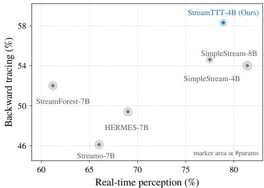
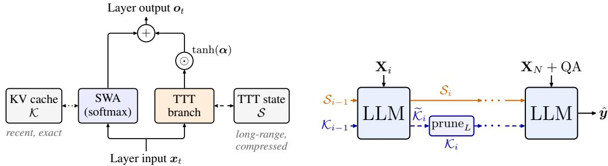
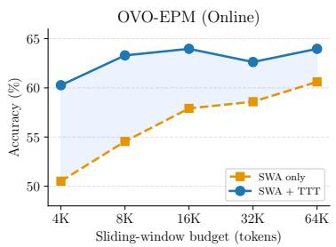
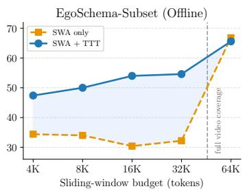
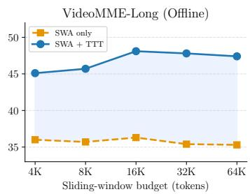

# STREAMTTT: RECONCILING REAL-TIME PERCEPTION AND LONG-TERM MEMORY IN STREAMING VLMS

Joya Chen1 Zeyun Zhong2 Mike Zheng Shou1

1National University of Singapore

2Karlsruhe Institute of Technology

## ABSTRACT

Humans effortlessly perceive the present while remembering the past, yet streaming VLMs often trade off real-time perception against long-term memory. Prior work shows that shortening the context can sharpen current-scene perception at the expense of long-range recall. To reconcile these abilities, we introduce StreamTTT, which writes long-range history into online-updated fast weights outside the attention context. This leaves a short sliding key-value cache dedicated to recent evidence, mitigating attention dilution. We train StreamTTT jointly on offline long-video QA and a newly constructed real-time QA corpus. On OVO-Bench, StreamTTT-4B outperforms SimpleStream-4B by 1.4 points in real-time perception and 3.7 points in backward tracing. It also remains competitive with the larger SimpleStream-8B on StreamingBench’s Real-Time Visual Understanding (RTVU) subset. Our code will be released.

## 1 INTRODUCTION

Like JARVIS in Marvel’s Iron Man, an ideal streaming video assistant should understand the present, remember the past, and provide timely assistance in real-world scenarios. Toward this vision, streaming VLMs now support online dialogue (Chen et al., 2024; Huang et al., 2025; Xiong et al., 2025), continuous commentary (Chen et al., 2025; Xu et al., 2026; Zhong et al., 2026b), proactive response (Chen et al., 2024; Qian et al., 2025; Azad et al., 2026; Zhang et al., 2026b; Lu et al., 2026a), and native multimodal interaction (TML, 2026). These advances are reflected in online video understanding benchmarks (Niu et al., 2025; Huang et al., 2025; Lin et al., 2026; Shi et al., 2026), which highlight real-time perception and long-term memory as two central capabilities.

Despite this progress, Shen et al. (2026) reveal a perception–memory trade-off. Their recency baseline, which retains only a short window of recent frames, outperforms more elaborate streaming systems on real-time perception, while adding historical context can improve recall but often weakens current-scene perception. This motivates separating recent context from long-range state. However, most existing memory methods preserve history through compression, retrieval, or token merging (Yang et al., 2025b; Zhang et al., 2026a; Di et al., 2025; Zeng et al., 2025; Chen et al., 2026; Xiao et al., 2026; Ge et al., 2026; Fan et al., 2026), but ultimately feed selected history back into the attention context. Injected history then consumes context capacity and may dilute attention over recent evidence (Shen et al., 2026; Liu et al., 2024).

  
Figure 1: StreamTTT-4B retains recency-level perception while improving backward tracing on OVO-Bench (Niu et al., 2025).

To realize this principle, we introduce StreamTTT, a streaming VLM that stores long-range history in online-updated fast weights (Sun et al., 2024; Behrouz et al., 2025; Zhang et al., 2025b; Zhong et al., 2026a; Sun et al., 2026; Liu et al., 2026) outside the attention context. A gated test-time training (TTT) branch realizes this memory alongside self-attention, whose short sliding KV cache (Xiao et al., 2024) remains dedicated to recent context. This separation preserves recent evidence without expanding the attention context. To enable StreamTTT to learn both abilities, we jointly train it on offline long-video QA (Zhang et al., 2024b) and a real-time QA corpus built from existing streaming and video datasets (Xia et al., 2026; Grauman et al., 2022; Pan et al., 2023; Krishna et al., 2017). Together, the dual-memory architecture and joint supervision allow StreamTTT to preserve real-time perception while recovering long-range history.

On OVO-Bench (Niu et al., 2025), StreamTTT-4B achieves 68.59 averaged over real-time perception and backward tracing. Compared with SimpleStream-4B (Shen et al., 2026), it improves real-time perception by 1.4 points (78.9 vs. 77.5) and backward tracing by 3.7 points (58.3 vs. 54.6). This matched-scale comparison shows stronger recall without sacrificing current-scene perception. On StreamingBench (Lin et al., 2026), we evaluate the Real-Time Visual Understanding (RTVU) subset; StreamTTT-4B scores 80.48, within 0.11 points of SimpleStream-8B (80.59) at half the parameter count.

In summary, our contributions are:

• Reconciling real-time perception and long-term memory. StreamTTT separates the two demands: a short sliding KV cache preserves recent evidence for accurate real-time perception, while a parallel TTT branch stores long-range history outside the attention context for recall. This separation avoids displacing or diluting recent context.

• A data construction strategy for both abilities. We build a 112.4K real-time QA corpus by relocating proactive queries to their answer time and adding action, spatial-reasoning, and captioning supervision. Combining this corpus with offline long-video QA provides complementary training for real-time perception and long-range recall.

• Strong streaming results. StreamTTT-4B reaches 68.59 on OVO-Bench and 80.48 on StreamingBench RTVU. Against SimpleStream-4B, it improves real-time perception by 1.4 points and backward tracing by 3.7 points.

## 2 RELATED WORK

Test-time training. Fast-weight memory treats rapidly updated parameters as sequence state (Schmidhuber, 1992; Ba et al., 2016; Munkhdalai & Yu, 2017). Related recurrent mechanisms carry information across context boundaries through segment recurrence, compressive memory, recurrent tokens, or fast-weight linear attention (Dai et al., 2019; Rae et al., 2020; Bulatov et al., 2022; Katharopoulos et al., 2020; Schlag et al., 2021; Irie et al., 2021). Test-time training originated as self-supervised adaptation under distribution shift (Sun et al., 2020) and was later reformulated as a sequence layer whose online-trained model is the recurrent state (Sun et al., 2024). Titans and chunkwise TTT improve memory dynamics and efficiency (Behrouz et al., 2025; Zhang et al., 2025b; Zhong et al., 2026a). Video applications include long-form generation (Dalal et al., 2025), streaming audio-visual memory in video-SALMONN S (Sun et al., 2026), and long-horizon spatial reasoning in Spatial-TTT (Liu et al., 2026). These works focus on generation or domain-specific memory, whereas StreamTTT targets the general problem of balancing real-time perception and long-range recall in streaming VLMs.

Streaming VLM memory. Streaming VLMs extend earlier video memory and token-reduction techniques (Wu et al., 2019; 2022; He et al., 2024; Song et al., 2024; Ryoo et al., 2021; Bolya et al., 2023) to a continually growing observed history. Existing systems retain token summaries or event structures (Qian et al., 2024; Zhang et al., 2025a; Zeng et al., 2025; Fan et al., 2026), manage historical KV states (Di et al., 2025; Yang et al., 2025b; Zhang et al., 2026a; Kim et al., 2025; Ning et al., 2026; Chen et al., 2026), or retrieve hierarchical and on-demand memories (Ge et al., 2026; Xie et al., 2026b; Liang et al., 2026; Xie et al., 2026a). StreamingVLM (Xu et al., 2026) retains attention sinks with asymmetric recent vision and text windows. Because these approaches generally return history to backbone attention, the injected history can compete with recent evidence (Shen et al., 2026). SelectStream (Ge et al., 2026) and FOLIO (Fan et al., 2026) mitigate this through selective retrieval; StreamTTT instead stores history in a parallel fast-weight state, leaving the KV cache for recent context.

Streaming VLM datasets. Training corpora for streaming VLMs span three main interaction formats. VideoLLM-online (Chen et al., 2024), VideoChat-Online (Huang et al., 2025), Stream-Chat (Xiong et al., 2025), and ProVideLLM (Chatterjee et al., 2025) use temporally aligned dialogue or procedural assistance. Supervision for answer timing appears in Dispider (Qian et al., 2025), Streamo (Xia et al., 2026), QueryStream, StreamReady, and Response-G1 (Zhang et al., 2026b; Azad et al., 2026; Ma et al., 2026). StreamBridge, LiveStar, and StreamMind provide proactive-response supervision (Wang et al., 2025a; Yang et al., 2025d; Ding et al., 2025), whereas LiveCC (Chen et al., 2025) densely interleaves video and speech for continuous commentary. These corpora emphasize dialogue and response timing. We instead construct real-time perception supervision by moving each proactive query to its first answerable frame, then pair it with offline long-video QA for recall.

Streaming VLM benchmarks. OVO-Bench (Niu et al., 2025), OVBench (Huang et al., 2025), and StreamingBench (Lin et al., 2026) evaluate observed video prefixes through real-time perception, retrospective recall, or proactive response. RIVER (Shi et al., 2026) further structures questions by temporal demand, while SVBench, OmniMMI, LiViBench, and PhoStream extend evaluation to multi-turn, livestream, or mobile audio-visual settings (Yang et al., 2025c; Wang et al., 2025c; 2026; Lu et al., 2026b). Complementary offline benchmarks expose the complete video and test reasoning over minutes to days (Wu et al., 2024; Zhou et al., 2025; Wang et al., 2025b; Yang et al., 2025a). We use both regimes to assess current perception and recall after evidence leaves the recent window.

## 3 METHOD

A streaming VLM must preserve recent evidence for real-time perception while retaining older information for later recall. Existing systems often route both through the same finite attention context, where historical tokens can displace or dilute recent evidence. StreamTTT separates these roles: sliding-window attention models recent context, while an online-trained fast-weight state stores a compressed trace of earlier context outside attention.

## 3.1 FAST-WEIGHT MEMORY WITH LARGE-CHUNK TTT

Test-time training (TTT) treats the parameters W of a small model $f _ { \mathbf { W } }$ as recurrent fast-weight state (Sun et al., 2024; Zhang et al., 2025b; Zhong et al., 2026a). Given an input token, a TTT layer forms a query, a key, and a value $\left( q _ { t } , k _ { t } , v _ { t } \right)$ . The standard TTT write operation minimizes a self-supervised key–value reconstruction loss and updates the fast weights online:

$$
\begin{array} { r } { \ell _ { t } ( \mathbf { W } ) = \left\| f _ { \mathbf { W } } ( k _ { t } ) - v _ { t } \right\| _ { 2 } ^ { 2 } , \qquad \mathbf { W } _ { t } = \mathbf { W } _ { t - 1 } - \eta _ { t } \nabla _ { \mathbf { W } } \ell _ { t } ( \mathbf { W } ) | _ { \mathbf { W } = \mathbf { W } _ { t - 1 } } . } \end{array}\tag{1}
$$

The updated model is read in the following query:

$$
r _ { t } = f _ { \mathbf { W } _ { t } } ( \mathbf { q } _ { t } ) .\tag{2}
$$

The fast weights thereby summarize previous key–value associations without explicitly retaining all past tokens. Direct tokenwise updates are sequential. Large-Chunk TTT (LaCT) (Zhang et al., 2025b) instead partitions the sequence into chunks of C tokens and aggregates their weighted losses into a single update, where chunk j spans tokens $( j - 1 ) C + 1 , \ldots , { \bar { j } } C { \mathrm { : } }$

$$
g _ { j } = \nabla _ { \mathbf { W } } \sum _ { t = ( j - 1 ) C + 1 } ^ { j C } \eta _ { t } \ell _ { t } ( \mathbf { W } ) \Bigg | _ { \mathbf { W } = \mathbf { W } _ { j - 1 } } , \qquad \mathbf { W } _ { j } = \mathrm { U p d a t e } ( \mathbf { W } _ { j - 1 } , g _ { j } ) .\tag{3}
$$

LaCT decouples the apply and update operations. For causal streaming, we use an apply-then-update order: chunk $j$ is read with $\mathbf { W } _ { j - 1 }$ , and $\mathbf { W } _ { j }$ is exposed only to later chunks. Sliding-window attention handles within-chunk interactions, while fast weights carry cross-chunk history.

Original LaCT compares gradient descent, momentum, and Muon with fast-weight normalization but no explicit decay. StreamTTT uses momentum with input-dependent decay; its reconstruction target and buffering are detailed in Appendix A.1.

  
(a) Hybrid layer with parallel SWA and TTT  
(b) Streaming with two carried memories

Figure 2: StreamTTT overview. (a) At token t, the pretrained sliding-window attention branch maps $( \mathbf { { x } } _ { t } , \mathrm { { K } } _ { t - 1 } )$ to $( o _ { t } ^ { \operatorname { S W A } } , \mathcal { K } _ { t } )$ , while the parallel TTT branch maps $( \pmb { x } _ { t } , \pmb { S } _ { t - 1 } )$ to $( o _ { t } ^ { \operatorname { T T T } } , S _ { t } )$ . The bounded cache K stores recent KV pairs inside the attention context, whereas the fixed-size state $s$ stores compressed history outside it. Their outputs are fused by the channel-wise gate tanh(α), initialized near zero. (b) Here i indexes temporal windows. One LLM forward consumes $\mathbf { X } _ { i }$ and the two memories left by the preceding window. After the token/chunk updates within that forward, $s _ { i }$ is carried without eviction, while the resulting cache $\widetilde { \kappa } _ { i }$ is pruned to $\kappa _ { i } ,$ its most recent $L$ tokens, before the next window. M-RoPE positions remain globally continuous. The textual prefix and QA suffix enter the first and final windows, respectively; the final forward yields next-token logits $\hat { y }$

## 3.2 OVERVIEW

We process a video as ordered temporal windows $\{ \mathbf { X } _ { i } \} _ { i = 1 } ^ { N } ( \mathrm { F i g } . 2 )$ . Every decoder layer carries two complementary memories: a sliding key–value (KV) cache K for recent context, and a recurrent TTT state S that compresses information from earlier windows. The two branches are fused by a learnable gate. Across windows, both memories are carried forward while globally continuous positions preserve temporal order. Their sizes do not grow with elapsed video length, although the fixed-size TTT state remains a lossy summary whose capacity is evaluated in §4.3. We index tokens by t, TTT chunks of C tokens by j, and temporal windows by i. A window spans one or more chunks, and both memories are carried across all three levels.

## 3.3 PARALLEL TTT MEMORY BRANCH

We build on Qwen3-VL and convert each self-attention block into a hybrid layer that retains the pretrained attention path and adds a parallel TTT branch. For layer input $\mathbf { \Delta } \mathbf { x } _ { t } .$ , sliding-window attention (SWA) reads recent KV states, while TTT reads and updates its recurrent state:

$$
\bigl ( o _ { t } ^ { \mathrm { S W A } } , K _ { t } \bigr ) = \mathrm { S W A } \bigl ( \mathbf { x } _ { t } ; K _ { t - 1 } \bigr ) , \qquad \bigl ( o _ { t } ^ { \mathrm { T T T } } , S _ { t } \bigr ) = \mathrm { T T T } \bigl ( \mathbf { x } _ { t } ; S _ { t - 1 } \bigr ) ,\tag{4}
$$

where $\textstyle { \boldsymbol { \mathcal { K } } } _ { t }$ is the sliding cache of recent keys and values, and $S _ { t }$ is the fixed-size recurrent state. Its central component is the fast weights $\mathbf { W } _ { t } .$ , which carry the compressed history through write and read operations in Eqs. (1)–(2). Alongside them, $S _ { t }$ holds the small, bounded auxiliary quantities needed to resume the update rule at a forward-pass boundary, so that a chunked multi-pass run reproduces a single continuous pass (Appendix A.1). All components are of fixed size, so $\left. S _ { t } \right.$ is constant in the number of processed tokens. Because $S _ { t }$ remains outside the attention context, long-range recall does not consume slots from the recent window. We evaluate this placement at matched budget in §4.3 (Table 3). The branch outputs are fused through a learnable channel-wise gate α $\in \mathbb { R } ^ { d }$

$$
\begin{array} { r } { \pmb { O } _ { t } = \pmb { O } _ { t } ^ { \mathrm { S W A } } + \operatorname { t a n h } ( \pmb { \alpha } ) \odot \pmb { O } _ { t } ^ { \mathrm { T T T } } . } \end{array}\tag{5}
$$

The gate is initialized near zero (Alayrac et al., 2022; Zhang et al., 2024a; Dalal et al., 2025), keeping the initial function close to the pretrained attention path while the model learns to use long-term memory.

## 3.4 STREAMING INFERENCE OVER TEMPORAL WINDOWS

Temporal windowing. We partition the sampled frames into N contiguous windows by wall-clock time. Given a target window duration ∆, window i gathers the frames whose timestamps fall in $[ ( i - 1 ) \Delta , i \Delta )$ , and the visual encoder maps them to a token block $\mathbf { X } _ { i }$ . The textual prefix and QA suffix are placed in the first and final windows, respectively (App. A.2).

Algorithm 1 Multi-Forward Streaming Inference over Temporal Windows   
Require: windows $\{ \mathbf { X } _ { i } \} _ { i = 1 } ^ { N }$ with per-window video grids; attention span L   
Ensure: next-token logits yˆ at the QA position   
1: K ← ∅; $\begin{array} { r } { S \gets S _ { \mathrm { { i n i t } } } ^ { \top } , } \end{array}$ m ← −1 // KV cache, recurrent state, running pos. max   
2: for $i = 1$ to N do   
3: $p _ { i } ^ { \mathrm { l o c } } \gets \mathrm { M \mathrm { - } R o P E \mathrm { - } I N D E X } ( \mathbf { X } _ { i } )$ // recompute window positions from a zero cursor   
4: $p _ { i } \gets p _ { i } ^ { \mathrm { l o c } } + ( m + 1 )$ // add scalar offset to all axes, Eq. (6)   
5: m ← max(pi) // single max over the (t, h, w) axes and sequence   
6: $( \hat { y } , \widetilde { \mathcal { K } } , \mathcal { S } ) \gets \mathrm { L L M } ( \mathbf { X } _ { i } , p _ { i } , \mathcal { K } , \mathcal { S } )$ // forward through both memories   
7: K ← prune $_ L ( \widetilde { \mathcal { K } } )$ // keep most recent L token   
8: end for   
9: return yˆ // logits from the final (QA) window

Dual memory and sequential forward. We feed windows in order, carrying both memories across steps. After each window, the KV cache is pruned to its most recent L tokens, whereas the recurrent TTT state S is carried without eviction as a fixed-size compressed history. The final window produces the answer logits (Alg. 1). We denote the initialized per-layer TTT state before the first window by $S _ { \mathrm { i n i t } }$

Globally continuous M-RoPE. The M-RoPE indexer (Wang et al., 2024; Bai et al., 2025) resets its cursor for each window, which would reuse positions across the stream. We preserve each window’s locally computed 3D positions and add a running scalar offset:

$$
p _ { i } \ = \ p _ { i } ^ { \mathrm { l o c } } + ( m _ { i - 1 } + 1 ) , \qquad m _ { i } \ = \ \mathrm { m a x } \ ( p _ { i } ) , \qquad m _ { 0 } = - 1 ,\tag{6}
$$

where $m _ { i }$ is the running maximum over all position axes. This preserves intra-window spatialtemporal structure while matching the contiguous positions of a single full-video pass.

## 4 RESULTS

## 4.1 TRAINING DATA FOR REAL-TIME PERCEPTION AND BACKWARD TRACING

Addressing the perception–memory trade-off requires supervision for both temporal regimes (§1): the model must learn to interpret the current scene while retaining information needed by later queries. Long-range recall supervision is readily available from long-video QA corpora. We therefore sample 119K offline whole-video QA pairs from the long (2–3 min) subset of LLaVA-Video-178K (Zhang et al., 2024b). Real-time perception supervision is scarcer because existing streaming corpora primarily target proactive response timing. To fill this gap, we build a 112.4K real-time QA corpus and combine it with the offline sample. The resulting mixture is nearly balanced; §4.3 evaluates the contribution of each half.

Streamo (Xia et al., 2026) reformulates existing video corpora as large-scale proactive QA. A question is issued at time $t _ { q } ,$ strictly before the answer-relevant event ends at $t _ { a } ,$ so the model must wait and respond only after the necessary evidence arrives. This setup teaches when to answer, but does not specifically supervise perception when the evidence first becomes available. We instead relocate each query to its answer time, $t _ { q } : = t _ { a } .$ . The converted query is thus posed as soon as its answer becomes available and can be answered without waiting for future evidence.

We apply two filters to keep this supervision temporally local. Because many Streamo items originate from temporal-grounding annotations, their answers are tied to labeled segments rather than single frames. We retain only segments shorter than 10 s, concentrating the supporting evidence near $t _ { q } .$ and restrict source videos to 45–180 s to match the training horizon. Applying this conversion to Streamo’s refactored corpora—LLaVA-Video, QVHighlights (Lei et al., 2021), EgoTimeQA (Di & Xie, 2024), ActivityNet Captions (Krishna et al., 2017), and HowToCaption (Shvetsova et al., 2024)—produces the 80.1K converted block in Table 4.

Table 1: Streaming benchmark results. Following SimpleStream (Shen et al., 2026), we report OVO-Bench (Niu et al., 2025) Real-Time Visual Perception and Backward Tracing task accuracies, category means, and their mean, together with StreamingBench (Lin et al., 2026) RTVU accuracy. “#Frames” retains source settings: SimpleStream-8B/4B use their best-average windows (4/16 frames at 1 fps), while StreamTTT-4B uses 2 fps. “–” is unreported and † denotes Qwen2.5-VL-7B with HERMES (4K tokens). Task abbreviations follow OVO-Bench. Yellow bold and underlined entries are best and second-best; blue marks our model.
<table><tr><td rowspan="3">Model</td><td rowspan="3">#Frames</td><td rowspan="3">StreamingBench RTVU</td><td colspan="11">OVO-Bench</td></tr><tr><td colspan="6">Real-Time Visual Perception</td><td colspan="3">Backward Tracing</td><td rowspan="2">Avg. 92.77</td></tr><tr><td>OCR ACR</td><td></td><td>ATR STU</td><td>FPD</td><td>OJR</td><td>Avg.</td><td>EPM</td><td>ASI</td><td>HLD</td><td>Avg.</td></tr><tr><td colspan="11">91.46 94.0 92.6 94.8 92.7 91.1 94.0 93.2 92.6 93.0 91.4</td></tr><tr><td></td><td></td><td></td><td></td><td>Offline Video LLMs</td><td></td><td></td><td></td><td></td><td></td><td></td><td></td><td></td><td></td></tr><tr><td>Qwen2.5-VL-7B</td><td>1 fps</td><td>73.31</td><td>67.8</td><td>55.1</td><td>67.2 42.1</td><td>66.3</td><td>60.9</td><td>59.9</td><td>51.5 54.2</td><td>58.8</td><td>23.7</td><td>44.7</td><td>52.28 53.85</td></tr><tr><td>LLaVA-OneVision-7B</td><td>32</td><td>71.12</td><td>66.4</td><td>57.8</td><td>73.3</td><td>53.4 71.3</td><td>62.0</td><td>64.0</td><td></td><td>55.4</td><td>21.5</td><td>43.7</td><td></td></tr><tr><td>InternVL2-8B LLaVA-Video-7B</td><td>16 64</td><td>63.72</td><td>67.1</td><td>60.6</td><td>63.8</td><td>46.1 68.3</td><td>56.5</td><td>60.4</td><td>48.2</td><td>57.4</td><td>24.7</td><td>43.4</td><td>51.90</td></tr><tr><td></td><td>64</td><td></td><td>69.1</td><td>58.7</td><td>68.8</td><td>49.4 74.3</td><td>59.8</td><td>63.4</td><td>56.2</td><td>57.4</td><td>7.5</td><td>40.4</td><td>51.86</td></tr><tr><td>Qwen2-VL-7B LongVU-7B</td><td></td><td>69.04</td><td>69.1</td><td>53.2</td><td>63.8 50.6</td><td>66.3</td><td>60.9</td><td>60.7</td><td>44.4</td><td>66.9</td><td>34.4</td><td>48.6</td><td>54.62</td></tr><tr><td></td><td>1 fps</td><td></td><td>55.7</td><td>49.5</td><td>59.5</td><td>48.3 68.3</td><td>63.0</td><td>57.4</td><td>43.1</td><td>66.2</td><td>9.1</td><td>39.5</td><td>48.45</td></tr><tr><td colspan="10">Online / Streaming VLMs</td><td colspan="3"></td></tr><tr><td>VideoLLM-online-8B</td><td>2 fps</td><td>35.99</td><td>8.1</td><td>23.9</td><td>12.1</td><td>14.0 45.5</td><td>21.2</td><td>20.8</td><td>22.2</td><td>18.8</td><td>12.2</td><td>17.7</td><td>19.26</td></tr><tr><td>Flash-VStream-7B</td><td>1 fps</td><td>23.23</td><td>24.2</td><td>29.4</td><td>28.5</td><td>33.7 25.7</td><td>28.8</td><td>28.4</td><td>39.1</td><td>37.2</td><td>5.9</td><td>27.4</td><td>27.90</td></tr><tr><td>Dispider-7B</td><td>1 fps</td><td>67.63</td><td>57.7</td><td>49.5</td><td>62.1 44.9</td><td>61.4</td><td>51.6</td><td>54.6</td><td>48.5</td><td>55.4</td><td>4.3</td><td>36.1</td><td>45.35</td></tr><tr><td>TimeChat-Online-7B</td><td>1 fps</td><td>75.28</td><td>75.2</td><td>46.8</td><td>70.7 47.8</td><td>69.3</td><td>61.4</td><td>61.9</td><td>55.9</td><td>59.5</td><td>9.7</td><td>41.7</td><td>51.80</td></tr><tr><td>StreamForest-7B</td><td>1 fps</td><td>77.26</td><td>68.5</td><td>53.2</td><td>71.6 47.8</td><td>65.4</td><td>60.9</td><td>61.2</td><td>58.9</td><td>64.9</td><td>32.3</td><td>52.0</td><td>56.60</td></tr><tr><td>Streamo-7B</td><td>1 fps</td><td></td><td>79.2</td><td>57.8</td><td>75.0 49.4</td><td>64.4</td><td>70.1</td><td>66.0</td><td>54.6</td><td>52.0</td><td>31.7</td><td>46.1</td><td>56.05</td></tr><tr><td>HERMES-7B†</td><td>1 fps 4</td><td>79.44</td><td>85.2</td><td>64.2</td><td>71.6</td><td>53.4 74.3</td><td>65.2</td><td>69.0</td><td>48.5</td><td>62.2</td><td>37.6</td><td>49.4</td><td>59.20</td></tr><tr><td>SimpleStream-8B</td><td>16</td><td>80.59</td><td>94.0</td><td>85.3</td><td>82.8 65.7</td><td>77.2</td><td>83.2</td><td>81.4</td><td>51.9</td><td>58.1</td><td>52.1</td><td>54.0</td><td>67.70 66.06</td></tr><tr><td>SimpleStream-4B</td><td></td><td>80.48</td><td></td><td></td><td>81.0</td><td></td><td></td><td>77.5</td><td></td><td></td><td></td><td>54.6</td><td></td></tr><tr><td>StreamTTT-4B</td><td>2 fps</td><td></td><td>91.3</td><td>82.6</td><td>58.4</td><td>83.2</td><td>76.6</td><td>78.9</td><td>60.3</td><td>58.8</td><td>55.9</td><td>58.3</td><td>68.59</td></tr></table>

Because the converted data inherit their source distribution, action and spatial reasoning remain underrepresented. We add 32.3K constructed or repurposed examples whose labels come directly from ground-truth annotations rather than model-generated answers. We select action- and spatialcentric questions from EgoTimeQA (Di & Xie, 2024). We also construct anticipation questions from Ego4D Short-Term Anticipation (Grauman et al., 2022); by construction, the target hand–object interaction is not yet visible at query time. For spatial reasoning, we generate four-option questions from the 2D/3D geometry of the Aria Digital Twin (Pan et al., 2023). These questions cover imageplane direction, inter-object layout, and relative distance, and each is answerable from a single query frame. A small captioning split repurposed from ActivityNet completes the 32.3K block in Table 4. Appendix B details the full corpus composition, offline sampling, answerability and visibility filters, question families, leakage-free timing, deduplication, and distractor sampling.

## 4.2 COMPARISON WITH STREAMING BASELINES

StreamTTT-4B achieves a two-track average of 68.59 on OVO-Bench, outperforming HERMES-7B (59.20) by 9.39 points and SimpleStream-8B (Shen et al., 2026) (67.70) by 0.89 points, despite using half as many parameters as the latter. The matched-scale comparison with SimpleStream-4B uses its highest-average reported window (16 frames). StreamTTT-4B raises the two-track average from 66.06 to 68.59, real-time perception from 77.5 to 78.9, and the official Backward Tracing average from 54.6 to 58.3. SimpleStream does not report the 4B per-task scores needed to compute the episodic-recall metric ER = (EPM + ASI)/2, so we use ER only for our controlled ablations below. The matched-scale result therefore improves backward tracing without sacrificing current-scene perception. Larger concurrent systems report higher absolute OVO-Bench scores through selective latent or semantic memory (Ge et al., 2026; Fan et al., 2026); our result isolates the effectiveness of separating recent context from long-range state at the 4B scale.

On the StreamingBench RTVU subset, StreamTTT-4B achieves 80.48, exceeding HERMES-7B (79.44) by 1.04 points and trailing SimpleStream-8B (80.59) by only 0.11 points with half as many parameters.

Table 2: Memory architecture × training data. All trained cells use the Qwen3-VL-4B backbone, the same optimization schedule and seed. Following Shen et al. (2026), evaluation covers OVO-Bench’s Real-Time Visual Perception and Backward Tracing categories at 2 fps. “Sliding KV only” disables the TTT branch while leaving the remaining architecture unchanged. The frozen recency baseline (Shen et al., 2026-style, 4 frames) requires no training. The hybrid model with joint supervision achieves the strongest balance across the two tracks. Because HLD primarily measures hallucination robustness rather than episodic event recall, we report $\mathrm { E R } = ( \mathrm { E P \bar { M } + A S I ) / 2 }$ as the recall metric.
<table><tr><td>Memory</td><td>Training data</td><td>RT Avg</td><td>ER</td><td>Avg.</td></tr><tr><td>Frozen reference (no training) Recency window (4 frames)</td><td></td><td>78.66</td><td>51.25</td><td>64.96</td></tr><tr><td>Sliding KV only</td><td>joint</td><td>68.19</td><td>49.58</td><td>58.89</td></tr><tr><td>Hybrid (KV + TTT)</td><td>offline-only</td><td>65.08</td><td>57.50</td><td>61.29</td></tr><tr><td>Hybrid (KV + TTT)</td><td>realtime-only</td><td>78.15</td><td>57.00</td><td>67.58</td></tr><tr><td>Hybrid (KV + TTT)</td><td>joint</td><td>78.85</td><td>59.55</td><td>69.20</td></tr></table>

## 4.3 ABLATION STUDIES

Ablation protocol. For all ablation studies, we use the Qwen3-VL-4B backbone with the same optimizer, schedule, number of steps, and random seed across trained cells. Each condition trains on the full data pool for its supervision sources (119K offline, 112.4K real-time, and their union for joint). Following Shen et al. (2026), we evaluate every cell on OVO-Bench’s Real-Time Visual Perception and Backward Tracing categories at 2 fps, falling back to a video’s native frame rate where it is below 2 fps, using the same windowed-inference protocol. Because HLD primarily measures hallucination robustness rather than episodic event recall, we report $\mathrm { E R } = ( \mathrm { E P } \mathbf { \bar { M } } + \mathrm { A S I } ) / 2$ as the recall metric. We omit StreamingBench from the ablations to reduce compute. The final model in Table 1 uses the full training recipe.

Architecture × data (Table 2). The architecture and data axes are complementary. With joint supervision, disabling the TTT branch reduces the real-time average from 78.85 to 68.19 and ER from 59.55 to 49.58. With the full hybrid architecture, offline-only training improves ER over the KV-only condition but lowers real-time perception to 65.08, below the frozen recency reference (78.66). Real-time-only training largely preserves current perception (78.15) but yields lower ER than joint training (57.00 vs. 59.55). Among the controlled variants, only the hybrid architecture with joint supervision attains both the highest real-time score and the highest ER.

Learned vs. heuristic memory at matched budget (Table 3). We compare the fast-weight memory against heuristic KV-selection stores at a matched inference-time memory footprint. All variants use an identical 4K sliding KV cache as short-range memory. For StreamMem (Yang et al., 2025b) and HERMES (Zhang et al., 2026a), we add a long-range KV store to the trained sliding-KV checkpoint at inference, without method-specific retraining, and match its physical memory to that of the fast weights. The fast-weight row instead uses the jointly trained hybrid checkpoint. Under this protocol, the fast-weight configuration reaches 78.85 on real-time perception and 59.55 on ER, outperforming both heuristic configurations. Because their training procedures differ, this comparison evaluates the complete configurations at matched inference memory rather than isolating the memory mechanism alone.

Window-budget analysis (Fig. 3). Prior work varies memory-bank or visual-window size to characterize bounded-context behavior, and recent diagnostics measure sensitivity to frame budgets (He et al., 2024; Xu et al., 2026; Tian, 2026). We adapt this analysis to ask how much recent attention context the learned state can replace. Holding all other settings fixed, we vary the sliding-window budget from 4K to 64K tokens, with and without the TTT branch. We evaluate one online episodic-memory track, OVO-EPM (Niu et al., 2025), and two offline long-video settings, EgoSchema-Subset (Mangalam et al., 2023) and VideoMME-Long (Fu et al., 2025).

Table 3: Learned recurrent memory vs. heuristic compression at matched budget. All rows use the Qwen3-VL-4B backbone and checkpoints trained on the joint data. The heuristic rows add a long-range store to the trained sliding-KV+joint checkpoint at inference, without method-specific retraining; the fast-weight row uses the jointly trained hybrid checkpoint. The current table holds the 4K short-range KV cache fixed and matches each heuristic store’s storage footprint to that of the fast weights.
<table><tr><td>Long-range memory</td><td>Short-range memory</td><td>RT Avg ER</td><td>Avg.</td></tr><tr><td>None (sliding KV only) StreamMem (Yang et al., 2025b)</td><td>KV cache (4K)</td><td>68.19 49.58 75.48 55.82</td><td>58.89 65.65</td></tr><tr><td>HERMES (Zhang et al., 2026a) Fast weights (ours)</td><td></td><td>75.11 57.34 78.85 59.55</td><td>66.23 69.20</td></tr></table>

  
Figure 3: Window-budget analysis. Accuracy with and without the TTT state as the sliding attention window grows from 4K to 64K tokens.

Across bounded 4K–32K windows, the TTT state improves EgoSchema by 13.0–23.6 points and VideoMME-Long by approximately 9–12 points. On VideoMME-Long, sliding-window attention alone remains near 36 because the relevant evidence often falls outside the window. The fraction of missing context recovered by TTT, however, depends on the recall demand. We quantify this at a 4K operating budget relative to the 64K sliding-window reference. On OVO-EPM, increasing the window from 4K to 64K raises the sliding-window baseline from 50.51 to 60.61, a 10.10-point gap. Adding TTT at 4K raises accuracy to 60.27, recovering approximately 97% of that gap. On EgoSchema, the sliding-window baseline rises from 34.4 at 4K to 66.8 at 64K, a 32.4-point gap. TTT raises the 4K result to 47.4, recovering 13.0 points, or approximately 40% of the gap. At 64K, where the EgoSchema window covers the full short clip, the TTT configuration scores 65.6 versus 66.8 for sliding-window attention alone. The fixed-size state therefore recovers substantial missing context under bounded attention, but it complements rather than replaces full-video attention when the entire video fits in context.

## 5 CONCLUSION

We address the perception–memory trade-off in streaming video understanding by separating recent context from long-range state. StreamTTT combines a bounded sliding KV cache with a parallel recurrent TTT memory and is jointly trained for real-time perception and backward tracing. On OVO-Bench, StreamTTT-4B preserves the real-time perception of a same-scale recency baseline while improving long-range recall; it also remains competitive on the StreamingBench RTVU subset. Our ablations show that the hybrid architecture and joint supervision provide the strongest balance between the two capabilities. The fixed-size recurrent state remains a lossy summary on recallintensive videos, however, and should complement rather than replace full attention when the entire sequence fits in context. Improving its capacity and selectivity is a promising direction for reliable long-horizon streaming assistants.

## ETHICS STATEMENT

This work does not raise any foreseeable ethical concerns. No human subjects or personally identifiable data were used. We disclose that large language models (LLMs) were used only for minor copy-editing and language polishing (grammar and phrasing). LLMs played no role in ideation, algorithm design, experiments, data analysis, or results. All scientific claims and artifacts are the original work of the authors.

## REPRODUCIBILITY STATEMENT

The paper describes the model architecture (Sec. 3), training-data construction (Sec. 4.1), and reported evaluation tracks. Ablation studies (Sec. 4.3) clarify component contributions. Appendix A specifies the memory branch and temporal-windowing implementation.

## REFERENCES

Jean-Baptiste Alayrac, Jeff Donahue, Pauline Luc, Antoine Miech, Iain Barr, Yana Hasson, Karel Lenc, Arthur Mensch, Katherine Millican, Malcolm Reynolds, et al. Flamingo: A visual language model for few-shot learning. In NeurIPS, pp. 23716–23736, 2022.

Shehreen Azad, Vibhav Vineet, and Yogesh S. Rawat. StreamReady: Learning what to answer and when in long streaming videos. In CVPR, pp. 40494–40504, 2026.

Jimmy Ba, Geoffrey E. Hinton, Volodymyr Mnih, Joel Z. Leibo, and Catalin Ionescu. Using fast weights to attend to the recent past. In NeurIPS, pp. 4331–4339, 2016.

Shuai Bai, Yuxuan Cai, Ruizhe Chen, Keqin Chen, Xionghui Chen, Zesen Cheng, Lianghao Deng, Wei Ding, Chang Gao, Chunjiang Ge, et al. Qwen3-VL technical report. arXiv preprint arXiv:2511.21631, 2025.

Ali Behrouz, Peilin Zhong, and Vahab Mirrokni. Titans: Learning to memorize at test time. In NeurIPS, pp. 113506–113543, 2025.

Daniel Bolya, Cheng-Yang Fu, Xiaoliang Dai, Peizhao Zhang, Christoph Feichtenhofer, and Judy Hoffman. Token merging: Your ViT but faster. In ICLR, 2023.

Aydar Bulatov, Yury Kuratov, and Mikhail Burtsev. Recurrent memory transformer. In NeurIPS, pp. 11079–11091, 2022. doi: 10.52202/068431-0805.

Dibyadip Chatterjee, Edoardo Remelli, Yale Song, Bugra Tekin, Abhay Mittal, Bharat Bhatnagar, Necati Cihan Camgoz, Shreyas Hampali, Eric Sauser, Shugao Ma, Angela Yao, and Fadime Sener. Streaming VideoLLMs for real-time procedural video understanding. In ICCV, pp. 22586–22598, 2025.

Joya Chen, Zhaoyang Lv, Shiwei Wu, Kevin Qinghong Lin, Chenan Song, Difei Gao, Jia-Wei Liu, Ziteng Gao, Dongxing Mao, and Mike Zheng Shou. VideoLLM-online: Online video large language model for streaming video. In CVPR, pp. 18407–18418, 2024.

Joya Chen, Ziyun Zeng, Yiqi Lin, Wei Li, Zejun Ma, and Mike Zheng Shou. LiveCC: Learning video LLM with streaming speech transcription at scale. In CVPR, pp. 29083–29095, 2025.

Xueyi Chen, Keda Tao, Kele Shao, and Huan Wang. StreamingTOM: Streaming token compression for efficient video understanding. In CVPR, pp. 24675–24685, 2026.

Zihang Dai, Zhilin Yang, Yiming Yang, Jaime Carbonell, Quoc Le, and Ruslan Salakhutdinov. Transformer-XL: Attentive language models beyond a fixed-length context. In ACL, pp. 2978– 2988, 2019. doi: 10.18653/v1/P19-1285.

Karan Dalal, Daniel Koceja, Jiarui Xu, Yue Zhao, Shihao Han, Ka Chun Cheung, Jan Kautz, Yejin Choi, Yu Sun, and Xiaolong Wang. One-minute video generation with test-time training. In CVPR, pp. 17702–17711, 2025.

Shangzhe Di and Weidi Xie. Grounded question-answering in long egocentric videos. In CVPR, pp. 12934–12943, 2024. doi: 10.1109/CVPR52733.2024.01235.

Shangzhe Di, Zhelun Yu, Guanghao Zhang, Haoyuan Li, Hao Cheng, Bolin Li, Wanggui He, Fangxun Shu, and Hao Jiang. Streaming video question-answering with in-context video KV-cache retrieval. In ICLR, 2025.

Xin Ding, Hao Wu, Yifan Yang, Shiqi Jiang, Qianxi Zhang, Donglin Bai, Zhibo Chen, and Ting Cao. StreamMind: Unlocking full frame rate streaming video dialogue through event-gated cognition. In ICCV, pp. 13448–13459, 2025.

Haoyang Fan, Dhruv Parikh, Anvitha Ramachandran, Sameh Gobriel, Nilesh Jain, Rajgopal Kannan, and Viktor Prasanna. FOLIO: Focused semantic memory for streaming video understanding. arXiv preprint arXiv:2607.13298, 2026.

Chaoyou Fu, Yuhan Dai, Yongdong Luo, Lei Li, Shuhuai Ren, Renrui Zhang, Zihan Wang, Chenyu Zhou, Yunhang Shen, Mengdan Zhang, et al. Video-MME: The first-ever comprehensive evaluation benchmark of multi-modal LLMs in video analysis. In CVPR, pp. 24108–24118, 2025.

Haonan Ge, Yiwei Wang, Hang Wu, and Yujun Cai. What should a streaming video model remember? arXiv preprint arXiv:2606.16353, 2026.

Kristen Grauman, Andrew Westbury, Eugene Byrne, Zachary Chavis, Antonino Furnari, Rohit Girdhar, Jackson Hamburger, Hao Jiang, Miao Liu, Xingyu Liu, et al. Ego4D: Around the world in 3,000 hours of egocentric video. In CVPR, pp. 18995–19012, 2022. doi: 10.1109/CVPR52688. 2022.01842.

Bo He, Hengduo Li, Young Kyun Jang, Menglin Jia, Xuefei Cao, Ashish Shah, Abhinav Shrivastava, and Ser-Nam Lim. MA-LMM: Memory-augmented large multimodal model for long-term video understanding. In CVPR, pp. 13504–13514, 2024.

Zhenpeng Huang, Xinhao Li, Jiaqi Li, Jing Wang, Xiangyu Zeng, Cheng Liang, Tao Wu, Xi Chen, Liang Li, and Limin Wang. Online video understanding: OVBench and VideoChat-Online. In CVPR, pp. 3328–3338, 2025.

Kazuki Irie, Imanol Schlag, Róbert Csordás, and Jürgen Schmidhuber. Going beyond linear transformers with recurrent fast weight programmers. In NeurIPS, pp. 7703–7717, 2021.

Angelos Katharopoulos, Apoorv Vyas, Nikolaos Pappas, and François Fleuret. Transformers are RNNs: Fast autoregressive transformers with linear attention. In ICML, pp. 5156–5165, 2020.

Minsoo Kim, Kyuhong Shim, Jungwook Choi, and Simyung Chang. InfiniPot-V: Memoryconstrained KV cache compression for streaming video understanding. In NeurIPS, pp. 138983– 139013, 2025.

Ranjay Krishna, Kenji Hata, Frederic Ren, Li Fei-Fei, and Juan Carlos Niebles. Dense-captioning events in videos. In ICCV, pp. 706–715, 2017. doi: 10.1109/ICCV.2017.83.

Jie Lei, Tamara L. Berg, and Mohit Bansal. Detecting moments and highlights in videos via natural language queries. In NeurIPS, pp. 11846–11858, 2021.

Zhijia Liang, Jiaming Li, Weikai Chen, Yanhao Zhang, Haonan Lu, and Guanbin Li. OASIS: Ondemand hierarchical event memory for streaming video reasoning. In CVPR, pp. 2821–2831, 2026.

Junming Lin, Zheng Fang, Chi Chen, Haoxuan Cheng, Zihao Wan, Fuwen Luo, Ziyue Wang, Peng Li, Yang Liu, and Maosong Sun. StreamingBench: Assessing the gap for MLLMs to achieve streaming video understanding. In ICASSP, pp. 12147–12151, 2026.

Fangfu Liu, Diankun Wu, Jiawei Chi, Yimo Cai, Yi-Hsin Hung, Xumin Yu, Hao Li, Han Hu, Yongming Rao, and Yueqi Duan. Spatial-TTT: Streaming visual-based spatial intelligence with test-time training. In ECCV, 2026.

Nelson F. Liu, Kevin Lin, John Hewitt, Ashwin Paranjape, Michele Bevilacqua, Fabio Petroni, and Percy Liang. Lost in the middle: How language models use long contexts. TACL, 12:157–173, 2024. doi: 10.1162/tacl\_a\_00638.

Xudong Lu, Yang Bo, Jinpeng Chen, Shuhan Li, Xintong Guo, Huankang Guan, Fang Liu, Dunyuan Xu, Peiwen Sun, Heyang Sun, Rui Liu, and Hongsheng Li. AURA: Always-on understanding and real-time assistance via video streams. arXiv preprint arXiv:2604.04184, 2026a.

Xudong Lu, Huankang Guan, Yang Bo, Jinpeng Chen, Xintong Guo, Shuhan Li, Fang Liu, Peiwen Sun, Xueying Li, Wei Zhang, Xue Yang, Rui Liu, and Hongsheng Li. PhoStream: Benchmarking real-world streaming for omnimodal assistants in mobile scenarios. In ICML, 2026b.

Ke Ma, Jiaqi Tang, Bin Guo, Xueting Han, Ruonan Xu, Qingfeng He, Ziheng Wang, Xu Wang, Qifeng Chen, Zhiwen Yu, and Yunhao Liu. Response-G1: Explicit scene graph modeling for proactive streaming video understanding. In ACL, pp. 44139–44153, 2026. doi: 10.18653/v1/2026. acl-long.2042.

Karttikeya Mangalam, Raiymbek Akshulakov, and Jitendra Malik. EgoSchema: A diagnostic benchmark for very long-form video language understanding. In NeurIPS, pp. 46212–46244, 2023. doi: 10.52202/075280-2004.

Tsendsuren Munkhdalai and Hong Yu. Meta networks. In ICML, pp. 2554–2563, 2017.

Zhenyu Ning, Guangda Liu, Qihao Jin, Chengwei Li, Wenchao Ding, Minyi Guo, and Jieru Zhao. LiveVLM: Efficient online video understanding via streaming-oriented KV cache and retrieval. In DAC, pp. 1–6, 2026. doi: 10.1145/3770743.3804012.

Junbo Niu, Yifei Li, Ziyang Miao, Chunjiang Ge, Yuanhang Zhou, Qihao He, Xiaoyi Dong, Haodong Duan, Shuangrui Ding, Rui Qian, et al. OVO-Bench: How far is your Video-LLMs from real-world online video understanding? In CVPR, pp. 18902–18913, 2025.

Xiaqing Pan, Nicholas Charron, Yongqian Yang, Scott Peters, Thomas Whelan, Chen Kong, Omkar Parkhi, Richard Newcombe, and Yuheng Carl Ren. Aria Digital Twin: A new benchmark dataset for egocentric 3D machine perception. In ICCV, pp. 20133–20143, 2023.

Rui Qian, Xiaoyi Dong, Pan Zhang, Yuhang Zang, Shuangrui Ding, Dahua Lin, and Jiaqi Wang. Streaming long video understanding with large language models. In NeurIPS, pp. 119336–119360, 2024. doi: 10.52202/079017-3792.

Rui Qian, Shuangrui Ding, Xiaoyi Dong, Pan Zhang, Yuhang Zang, Yuhang Cao, Dahua Lin, and Jiaqi Wang. Dispider: Enabling video LLMs with active real-time interaction via disentangled perception, decision, and reaction. In CVPR, pp. 24045–24055, 2025.

Jack W. Rae, Anna Potapenko, Siddhant M. Jayakumar, Chloe Hillier, and Timothy P. Lillicrap. Compressive transformers for long-range sequence modelling. In ICLR, 2020.

Michael Ryoo, AJ Piergiovanni, Anurag Arnab, Mostafa Dehghani, and Anelia Angelova. Token-Learner: Adaptive space-time tokenization for videos. In NeurIPS, pp. 12786–12797, 2021.

Imanol Schlag, Kazuki Irie, and Jürgen Schmidhuber. Linear transformers are secretly fast weight programmers. In ICML, pp. 9355–9366, 2021.

Jürgen Schmidhuber. Learning to control fast-weight memories: An alternative to dynamic recurrent networks. Neural Computation, 4(1):131–139, 1992. doi: 10.1162/neco.1992.4.1.131.

Yujiao Shen, Shulin Tian, Jingkang Yang, and Ziwei Liu. A simple baseline for streaming video understanding. arXiv preprint arXiv:2604.02317, 2026.

Yansong Shi, Qingsong Zhao, Tianxiang Jiang, Xiangyu Zeng, Yi Wang, and Limin Wang. RIVER: A real-time interaction benchmark for video LLMs. In ICLR, 2026.

Nina Shvetsova, Anna Kukleva, Xudong Hong, Christian Rupprecht, Bernt Schiele, and Hilde Kuehne. HowToCaption: Prompting LLMs to transform video annotations at scale. In ECCV, pp. 1–18, 2024. doi: 10.1007/978-3-031-72992-8\_1.

Enxin Song, Wenhao Chai, Guanhong Wang, Yucheng Zhang, Haoyang Zhou, Feiyang Wu, Haozhe Chi, Xun Guo, Tian Ye, Yanting Zhang, Yan Lu, Jenq-Neng Hwang, and Gaoang Wang. MovieChat: From dense token to sparse memory for long video understanding. In CVPR, pp. 18221–18232, 2024. doi: 10.1109/CVPR52733.2024.01725.

Guangzhi Sun, Yixuan Li, Xiaodong Wu, Yudong Yang, Wei Li, Zejun Ma, and Chao Zhang. video-SALMONN S: Memory-enhanced streaming audio-visual LLM. In ICML, 2026.

Yu Sun, Xiaolong Wang, Zhuang Liu, John Miller, Alexei Efros, and Moritz Hardt. Test-time training with self-supervision for generalization under distribution shifts. In ICML, pp. 9229–9248, 2020.

Yu Sun, Xinhao Li, Karan Dalal, Jiarui Xu, Arjun Vikram, Genghan Zhang, Yann Dubois, Xinlei Chen, Xiaolong Wang, Sanmi Koyejo, et al. Learning to (learn at test time): RNNs with expressive hidden states. arXiv preprint arXiv:2407.04620, 2024.

Yixian Tian. How well can your video model remember? measuring memory-budget trade-offs in long video understanding. arXiv preprint arXiv:2606.20726, 2026.

TML. Interaction models: A scalable approach to human–ai collaboration. https:// thinkingmachines.ai/blog/interaction-models/, 2026. Thinking Machines Lab research preview.

Haibo Wang, Bo Feng, Zhengfeng Lai, Mingze Xu, Shiyu Li, Weifeng Ge, Afshin Dehghan, Meng Cao, and Ping Huang. StreamBridge: Turning your offline video large language model into a proactive streaming assistant. In NeurIPS, pp. 132332–132359, 2025a.

Peng Wang, Shuai Bai, Sinan Tan, Shijie Wang, Zhihao Fan, Jinze Bai, Keqin Chen, Xuejing Liu, Jialin Wang, Wenbin Ge, et al. Qwen2-VL: Enhancing vision-language model’s perception of the world at any resolution. arXiv preprint arXiv:2409.12191, 2024.

Weihan Wang, Zehai He, Wenyi Hong, Yean Cheng, Xiaohan Zhang, Ji Qi, Ming Ding, Xiaotao Gu, Shiyu Huang, Bin Xu, Yuxiao Dong, and Jie Tang. LVBench: An extreme long video understanding benchmark. In ICCV, pp. 22958–22967, 2025b. doi: 10.1109/ICCV51701.2025.02131.

Xiaodong Wang, Langling Huang, Zhirong Wu, Xu Zhao, Teng Xu, Xuhong Xia, and Peixi Peng. LiViBench: An omnimodal benchmark for interactive livestream video understanding. AAAI, 40 (31):26517–26525, 2026. doi: 10.1609/aaai.v40i31.39859.

Yuxuan Wang, Yueqian Wang, Bo Chen, Tong Wu, Dongyan Zhao, and Zilong Zheng. OmniMMI: A comprehensive multi-modal interaction benchmark in streaming video contexts. In CVPR, pp. 18925–18935, 2025c.

Chao-Yuan Wu, Christoph Feichtenhofer, Haoqi Fan, Kaiming He, Philipp Krahenbuhl, and Ross Girshick. Long-term feature banks for detailed video understanding. In CVPR, pp. 284–293, 2019.

Chao-Yuan Wu, Yanghao Li, Karttikeya Mangalam, Haoqi Fan, Bo Xiong, Jitendra Malik, and Christoph Feichtenhofer. MeMViT: Memory-augmented multiscale vision transformer for efficient long-term video recognition. In CVPR, pp. 13587–13597, 2022.

Haoning Wu, Dongxu Li, Bei Chen, and Junnan Li. LongVideoBench: A benchmark for longcontext interleaved video-language understanding. In NeurIPS, pp. 28828–28857, 2024. doi: 10.52202/079017-0907.

Jiaer Xia, Peixian Chen, Mengdan Zhang, Xing Sun, and Kaiyang Zhou. Streaming video instruction tuning. In CVPR, pp. 31219–31229, 2026.

Guangxuan Xiao, Yuandong Tian, Beidi Chen, Song Han, and Mike Lewis. Efficient streaming language models with attention sinks. In ICLR, 2024.

Junbin Xiao, Jiajun Chen, Tianxiang Sun, Xun Yang, and Angela Yao. MuKV: Multi-grained KV cache compression for long streaming video question-answering. In CVPR, pp. 11381–11391, 2026.

Junlin Xie, Quanlong Zheng, Ruifei Zhang, Kuo Wang, Yanhao Zhang, Jinguo Luo, Haonan Lu, Xiang Wan, and Guanbin Li. StreamRAG: Enhancing real-time video understanding with retrieval augmentation. In CVPR, pp. 38870–38879, 2026a.

Yiweng Xie, Bo He, Junke Wang, Xiangyu Zheng, Ziyi Ye, and Zuxuan Wu. FluxMem: Adaptive hierarchical memory for streaming video understanding. In CVPR, pp. 31272–31282, 2026b.

Haomiao Xiong, Zongxin Yang, Jiazuo Yu, Yunzhi Zhuge, Lu Zhang, Jiawen Zhu, and Huchuan Lu. Streaming video understanding and multi-round interaction with memory-enhanced knowledge. In ICLR, 2025.

Ruyi Xu, Guangxuan Xiao, Yukang Chen, Liuning He, Kelly Peng, Yao Lu, and Song Han. StreamingVLM: Real-time understanding for infinite video streams. In ICLR, 2026.

Jingkang Yang, Shuai Liu, Hongming Guo, Yuhao Dong, Xiamengwei Zhang, Sicheng Zhang, Pengyun Wang, Zitang Zhou, Binzhu Xie, Ziyue Wang, et al. EgoLife: Towards egocentric life assistant. In CVPR, pp. 28885–28900, 2025a.

Yanlai Yang, Zhuokai Zhao, Satya Narayan Shukla, Aashu Singh, Shlok Kumar Mishra, Lizhu Zhang, and Mengye Ren. StreamMem: Query-agnostic KV cache memory for streaming video understanding. arXiv preprint arXiv:2508.15717, 2025b.

Zhenyu Yang, Yuhang Hu, Zemin Du, Dizhan Xue, Shengsheng Qian, Jiahong Wu, Fan Yang, Weiming Dong, and Changsheng Xu. SVBench: A benchmark with temporal multi-turn dialogues for streaming video understanding. In ICLR, 2025c.

Zhenyu Yang, Kairui Zhang, Yuhang Hu, Bing Wang, Shengsheng Qian, Bin Wen, Fan Yang, Tingting Gao, Weiming Dong, and Changsheng Xu. LiveStar: Live streaming assistant for real-world online video understanding. In NeurIPS, pp. 31266–31304, 2025d.

Xiangyu Zeng, Kefan Qiu, Qingyu Zhang, Xinhao Li, Jing Wang, Jiaxin Li, Ziang Yan, Kun Tian, Meng Tian, Xinhai Zhao, et al. StreamForest: Efficient online video understanding with persistent event memory. In NeurIPS, pp. 75804–75835, 2025.

Haoji Zhang, Yiqin Wang, Yansong Tang, Yong Liu, Jiashi Feng, and Xiaojie Jin. Flash-VStream: Efficient real-time understanding for long video streams. In ICCV, pp. 21059–21069, 2025a.

Haowei Zhang, Shudong Yang, Jinlan Fu, See-Kiong Ng, and Xipeng Qiu. HERMES: KV cache as hierarchical memory for efficient streaming video understanding. arXiv preprint arXiv:2601.14724, 2026a.

Kairui Zhang, Zhenyu Yang, Bing Wang, Shengsheng Qian, and Changsheng Xu. QueryStream: Advancing streaming video understanding with query-aware pruning and proactive response. In ICLR, 2026b.

Renrui Zhang, Jiaming Han, Chris Liu, Peng Gao, Aojun Zhou, Xiangfei Hu, Shilin Yan, Pan Lu, Hongsheng Li, and Yu Qiao. LLaMA-Adapter: Efficient fine-tuning of language models with zero-init attention. In ICLR, 2024a.

Tianyuan Zhang, Sai Bi, Yicong Hong, Kai Zhang, Fujun Luan, Songlin Yang, Kalyan Sunkavalli, William T Freeman, and Hao Tan. Test-time training done right. arXiv preprint arXiv:2505.23884, 2025b.

Yuanhan Zhang, Jinming Wu, Wei Li, Bo Li, Zejun Ma, Ziwei Liu, and Chunyuan Li. LLaVA-Video: Video instruction tuning with synthetic data. arXiv preprint arXiv:2410.02713, 2024b.

Zeyun Zhong, Joya Chen, Manuel Martin, Frederik Diederichs, Juergen Gall, and Jürgen Beyerer. Rethinking expressivity and efficiency in test-time training, 2026a. Preprint.

Zeyun Zhong, Manuel Martin, Chengzhi Wu, David Schneider, Frederik Diederichs, Juergen Gall, and Jürgen Beyerer. FlowNar: Scalable streaming narration for long-form videos. In ICML, 2026b.

Junjie Zhou, Yan Shu, Bo Zhao, Boya Wu, Zhengyang Liang, Shitao Xiao, Minghao Qin, Xi Yang, Yongping Xiong, Bo Zhang, Tiejun Huang, and Zheng Liu. MLVU: Benchmarking multi-task long video understanding. In CVPR, pp. 13691–13701, 2025.

## A IMPLEMENTATION DETAILS

This appendix specifies the memory branch, the recurrent state carried across forward passes, and the temporal-windowing procedure deferred from §3.1 and §3.4.

## A.1 MEMORY-BRANCH INSTANTIATION

Memory heads and reconstruction target. The TTT branch contains multiple fast-weight heads. Omitting the head index, each head parameterizes the gated MLP

$$
{ \displaystyle { f } _ { \bf W } ( { \bf x } ) = { \bf W } ^ { ( 1 ) } \left( \mathrm { S i L U } ( { \bf W } ^ { ( 0 ) } { \pmb x } ) \odot ( { \bf W } ^ { ( 2 ) } { \pmb x } ) \right) . }\tag{7}
$$

A branch-specific projection followed by a causal depthwise convolution produces $\left( q _ { t } , k _ { t } , v _ { t } \right)$ , with ℓ2-normalized queries and keys. Let $\check { \mathcal { N } }$ denote an affine LayerNorm learned with the rest of the model. Following Dalal et al. (2025), we specialize the write objective in Eq. (1) to

$$
\widetilde { v } _ { t } = \mathcal { N } ( v _ { t } - k _ { t } ) , \qquad \ell _ { t } ( \mathbf { W } ) = \big \| \mathcal { N } ( f _ { \mathbf { W } } ( k _ { t } ) ) - \widetilde { v } _ { t } \big \| _ { 2 } ^ { 2 } ,\tag{8}
$$

and use the residual readout $r _ { t } = { q _ { t } } + \mathcal { N } ( f _ { \mathbf { W } } ( { q _ { t } } ) )$ . The per-head residual readouts are concatenated and mapped by the branch output projection to $\bar { { \mathbf { \Lambda } } } _ { { \mathbf { 0 } } _ { t } ^ { \mathrm { { T T T } } } }$ in Eq. (5).

Momentum and decay. The main configuration predicts head-wise learning-rate and momentum coefficients from the input. Its decay factor is derived from an input-dependent gate and the learning rate (Zhong et al., 2026a). Suppressing head and matrix indices, the corresponding token-level recurrence is

$$
\mathbf { M } _ { t } = \beta _ { t } \mathbf { M } _ { t - 1 } + \eta _ { t } \mathbf { G } _ { t } , \qquad \mathbf { W } _ { t } = \gamma _ { t } \mathbf { W } _ { t - 1 } + \mathbf { M } _ { t } , \quad \mathbf { G } _ { t } = - \left. \nabla \mathbf { w } \ell _ { t } ( \mathbf { W } ) \right| _ { \mathbf { W } = \mathbf { W } _ { t - 1 } } .\tag{9}
$$

Per-layer recurrent state. Let $\mathbf { W } = ( \mathbf { W } ^ { ( 0 ) } , \mathbf { W } ^ { ( 1 ) } , \mathbf { W } ^ { ( 2 ) } )$ collect the three fast-weight matrices of every memory head, and let M collect their momentum states. Two auxiliary buffers make the chunked, multi-pass execution of §3.4 equivalent to a single continuous pass. The first retains the last few tokens seen by the depthwise convolution, so that its receptive field carries across a pass boundary. The second handles chunk boundaries: a forward pass may end before a chunk of C tokens is complete, and such a trailing partial chunk does not update W immediately. Instead its per-token quantities (k, v, η, log γ, log β) are retained and prepended to the next pass, so that the chunk produces its update once enough new tokens arrive. The decay and momentum gates are kept in log space because the chunkwise update accumulates their products along the chunk as cumulative sums. Since this buffer holds at most $C - 1$ tokens, chunk boundaries follow the global token index and are unaffected by how the stream is cut into windows. The per-layer state carried across windows is therefore

$$
\mathcal { S } = \big ( \underbrace { \mathbf { W } } _ { \mathrm { f a s t w e i g h t s } } , \underbrace { \mathbf { M } } _ { \mathrm { m o m e n t u m } } , \mathrm { c o n v o l u t i o n p r e f i x , \ p a r t i a l { \mathrm { - } } c h u n k \ b u f f e r } \big ) ,\tag{10}
$$

where every component has a fixed maximum size, so $| S |$ is independent of the number of tokens processed.

## A.2 TEMPORAL WINDOWING

Patch-size alignment. Frames are assigned to windows by wall-clock time as in §3.4, giving N contiguous windows for a target duration $\Delta .$ . The visual encoder additionally requires each window’s frame count to be a multiple of its temporal patch size $p .$ . We satisfy this by advancing the boundary index rather than by padding. Let $c _ { i }$ be the number of sampled frames that fall strictly before the i-th split time i∆. Window i then ends at frame $e _ { i } = p [ c _ { i } / p ]$ , and window i+1 begins at frame $e _ { i } + 1 . { \mathrm { W i t h } } p = 2$ , for instance, a wall-clock boundary falling after frame 7 is advanced to frame 8, so window i takes one frame that by timestamp belongs to its successor.

In general a window borrows at most $p - 1$ frames from the next one, and the windows remain a contiguous partition of the sampled frames. Since the frame sampler already yields a multiple of $p$ frames in total, the trailing window is aligned as well and no padding frame is ever inserted.

The per-window visual token blocks therefore concatenate into exactly the token layout of a single full-video pass, with the same number of tokens in the same order. We require $\Delta$ to be large enough that every wall-clock window contains at least p sampled frames, which guarantees that alignment never empties a window.

Token layout across windows. The full prompt forms a single conceptual sequence

$$
\Big [ \underbrace { \mathrm { s y s t e m + i n s t r u c t i o n } } _ { \mathrm { p r e f i x } } \Big ] ~ \Big [ \underbrace { \mathbf { X } _ { 1 } \mathbf { X } _ { 2 } \cdot \cdot \cdot \mathbf { X } _ { N } } _ { \mathrm { v i s u a l ~ t o k e n s } } \Big ] ~ \Big [ \underbrace { \mathrm { q u e s t i o n + a n s w e r } } _ { \mathrm { Q A ~ s u f f i x } } \Big ] ,\tag{11}
$$

where $\mathbf { X } _ { i }$ denotes the visual tokens from window i. The first forward pass contains the textual prefix and $\mathbf { X } _ { 1 }$ , intermediate passes contain only their visual tokens, and the final pass contains $\mathbf { X } _ { N }$ followed by the QA suffix. During training, the answer tokens are teacher-forced targets; during inference, the question and assistant prefix are supplied in the final pass and the answer is generated autoregressively.

## B DATA CONSTRUCTION DETAILS

This appendix documents the training-corpus composition (Table 4) and the construction procedures deferred from §4.1. We describe the offline sampling protocol, the proactive-to-real-time conversion, and the two annotation-derived datasets: Aria Digital Twin (ADT) spatial reasoning and futureaction prediction (FAP). For the generated datasets, labels are computed directly from ground-truth annotations rather than synthesized by a model.

<table><tr><td>Split</td><td>Source</td><td>Task type</td><td># QA</td></tr><tr><td colspan="4">Converted from Streamo proactive QA  $( t _ { q } : = t _ { a } )$ </td></tr><tr><td>LLaVA-Video</td><td>LLaVA-Video</td><td></td><td>32.0K</td></tr><tr><td>QVHighlights</td><td>QVHighlights</td><td></td><td>19.6K</td></tr><tr><td>EgoTimeQA</td><td>EgoTimeQA</td><td></td><td>6.8K</td></tr><tr><td>ActivityNet</td><td>ActivityNet</td><td></td><td>9.0K</td></tr><tr><td>HowToCaption</td><td>HowToCaption</td><td>Captioning</td><td>12.7K</td></tr><tr><td></td><td></td><td>subtotal</td><td>80.1K</td></tr><tr><td colspan="4">Constructed / repurposed in this work</td></tr><tr><td>Caption-ActivityNet</td><td>ActivityNet</td><td>Captioning</td><td>3.0K</td></tr><tr><td>EgoTimeQA-act</td><td>EgoTimeQA</td><td>Action QA</td><td>10.8K</td></tr><tr><td>EgoTimeQA-spatial</td><td>EgoTimeQA</td><td>Spatial QA</td><td>1.1K</td></tr><tr><td>ADT*</td><td>ADT</td><td>Spatial reasoning</td><td>6.8K</td></tr><tr><td> $\mathrm { F A P } ^ { \star }$ </td><td>Ego4D-STA</td><td>Anticipation</td><td>10.6K</td></tr><tr><td></td><td></td><td></td><td></td></tr><tr><td></td><td></td><td>subtotal Total</td><td>32.3K 112.4K</td></tr></table>

Table 4: Composition of the 112.4K real-time training corpus. The upper block converts Streamo’s proactive QA by moving each query to its annotated answer time $( t _ { q } : = t _ { a } ; \ S \mathbf { B } . 2 )$ . A dash indicates that the source construction does not provide a task label. The lower block contains examples constructed or repurposed in this work; stars mark the two annotation-derived datasets detailed in §B.3 and §B.4. The separate 119K offline whole-video sample is not included.

## B.1 OFFLINE WHOLE-VIDEO SUPERVISION

The offline half of training is sampled from existing long-video QA rather than newly constructed. We restrict the long-video subset of LLaVA-Video-178K (Zhang et al., 2024b) to clips lasting 2–3 minutes and randomly retain 50%, yielding approximately 119K whole-video $\mathrm { Q A }$ pairs. Combining these with the 112.4K real-time examples in Table 4 produces the near-balanced joint mixture used to train the main model.

## B.2 PROACTIVE-TO-REAL-TIME CONVERSION

The 80.1K upper block of Table 4 is derived from Streamo’s proactive QA (Xia et al., 2026). In the original construction, a question arrives at $t _ { q }$ before its answer-relevant event ends at $t _ { a } ,$ and the model must defer its response until the evidence becomes available. We convert each item by setting $t _ { q } : = t _ { a }$ , thereby posing the question at its annotated answer time rather than before it. The conversion changes only the query timestamp; the source question, answer, and answer options remain unchanged. We apply the procedure to Streamo’s versions of LLaVA-Video, QVHighlights (Lei et al., 2021), EgoTimeQA (Di & Xie, 2024), ActivityNet Captions (Krishna et al., 2017), and HowToCaption (Shvetsova et al., 2024).

We apply two filters to keep the converted supervision temporally local. Many Streamo items originate from temporal-grounding annotations and are associated with a segment $[ s , e ]$ rather than a single frame. We retain only short segments and restrict source videos to the 45–180 s duration range. After filtering, the conversion yields the 80.1K real-time block in Table 4.

## B.3 QA GENERATION FROM ADT ANNOTATIONS

We construct spatial-reasoning QA directly from the ground-truth annotations of the Aria Digital Twin dataset (Pan et al., 2023). ADT provides per-frame 2D object boxes, per-object oriented 3D boxes, object poses in a shared world frame, and the device trajectory for each egocentric sequence. We use the RGB stream and its unique annotation timestamps as the time axis. Each query is anchored to one timestamp, and its label is computed from the corresponding annotations.

Single-frame answerability. Every referenced object must be visible in the query frame. We therefore discard questions about off-screen objects, including single-object egocentric “behind me” relations. An object at frame $f$ passes the visibility gate only if its 2D box covers more than 2% of the image, its annotated visibility exceeds 0.8, and its center falls within 591 pixels $( 0 . 4 2 \times 1 4 0 8 )$ of the image center, which restricts objects to the un-vignetted central disk of the fisheye RGB sensor. We retain an object as an anchor only if it is annotated static, so that a single world pose is exact for the whole sequence, and passes this gate in at least 30 frames.

Object references are generated conservatively. We use the semantic category when it identifies a unique instance in the scene, and otherwise use a normalized instance name only when that name is unique. We discard structural parts and names distinguished solely by an arbitrary index (e.g. “cabinet door A”), which may not be resolvable from the image.

Question families. The pipeline specifies the following three families of four-option multiplechoice questions, with the correct option’s verbatim text as the answer and option order shuffled. Let $\mathbf { c } _ { u } \in \mathbb { R } ^ { \mathbf { \bar { 3 } } }$ be the world-frame center of object $u ,$ obtained by transforming its local 3D box by the object pose, and let $\mathbf { p } _ { f }$ be the ground-truth device position at frame $f .$

• Ego-quadrant. “In my current view, where is the $X ? ^ { \dag }$ The answer is the image quadrant (UPPER/LOWER×LEFT/RIGHT) containing the center of $X ^ { \prime } \mathrm { s } 2 \mathrm { D }$ box, which we require to be at least 140 pixels (10% of the image width) from both image midlines so that boundary cases are excluded. This family uses only 2D boxes.

• Object–object. “Where is A relative to B from my point of view?” with four options {FRONT,BACK} × {LEFT,RIGHT}. The horizontal relation is determined from the 2D box centers, which must differ by at least 120 pixels. The depth relation is determined by the sign of $\| \mathbf { c } _ { A } - \mathbf { p } _ { f } \| - \| \mathbf { c } _ { B } - \mathbf { p } _ { f } \|$ , whose magnitude must be at least 0.40 m.

• Relative distance. “Among these objects, which is closest to $T ? ^ { \mathfrak { s } }$ The label is the minimum corner-to-corner distance between world-frame 3D boxes. We retain an example only if the closest candidate beats the runner-up by a multiplicative margin of 1.3× and if T and all four candidates pass the visibility gate in the query frame.

To limit simple label priors, we balance answers within each family, cap the number of questions per object and object pair, and prefer query frames that maximize the minimum visibility among referenced objects. The resulting ADT split contributes 6.8K examples to Table 4.

## B.4 FUTURE-ACTION PREDICTION (FAP) DATA CONSTRUCTION

We construct the Future-Action Prediction (FAP) training split from Ego4D Short-Term Object Interaction Anticipation (STA) annotations (Grauman et al., 2022). Given an egocentric clip truncated at observation time $t _ { \mathrm { o b s } } ,$ , the task is to predict the next annotated hand–object interaction as a (verb, noun) pair selected from four options. We use STA rather than Long-Term Anticipation because it provides an observation frame and a time-to-contact (TTC) for each interaction, so contact occurs at $t _ { \mathrm { o b s } } + \mathrm { T T C }$ . We retain examples with $\mathrm { T T C } \in [ 0 . 5 , 2 . 0 ]$ s (mean 1.58 s), which keeps the target outside the observed prefix while remaining close enough to be anticipated from pre-contact evidence such as reaching motion and gaze.

Deduplication and disambiguation. STA may annotate the same action at multiple nearby observation frames with decreasing TTC. We group candidates by (clip, verb, noun) and retain the frame whose TTC is closest to the midpoint of the retained range, leaving at most one example per action type in a clip. We then discard frames carrying multiple simultaneous interaction labels, and restrict $t _ { \mathrm { o b s } }$ to [45, 180] s so that every question has substantial observed context.

Distractor sampling. We pair each ground-truth action with three distractors. Whenever possible, one is a hard in-context negative: an action annotated elsewhere in the same clip, making it sceneplausible but incorrect at the query time. Such an option is available for 95.9% of the questions. The remaining distractors are drawn from a global frequency-weighted pool of observed (verb, noun) pairs. The four options must refer to distinct objects, and we exclude a distractor if its object is interacted with within ±2 s of the target contact time, so that no distractor is incidentally correct. The final option order is randomized.

Resulting corpus. The pipeline yields 10,613 FAP questions from 2,029 Ego4D clips. Observation times range from 45 to 180 s, with a mean of 107.9 s. Correct-option frequencies range from 24.4% to 25.7% across the four positions, indicating no substantial marginal position imbalance. For each question, the provenance sidecar records the source annotation UID, TTC, contact time, ground-truth action, and selected distractors.