# Scaling Representation Diversity: Modulated Attention and Reconstructive Regularization for Visual Grounding

Junyi Hu1Tian Bai2Fengyi Wu2 Yian Huang2 Wei Wen3 Zaoli Li3 Junli Lin4 Xingchen Li5 Zhenming Peng2 Yi Zhang1∗

1Department of Automation, Tsinghua University

2School of Information and Communication Engineering, University of Electronic Science and Technology of China 3Chinalco Digital Intelligence (Chengdu) Technology Co., Ltd.

4Linsulabs 5PetroChina Southwest Oil and Gas Field Company, CNPC

## Abstract

Referring Expression Comprehension (REC) is commonly studied under dataset-specific fine-tuning, resulting in specialist models with limited cross-dataset generalization. In this work, we revisit REC from the perspective of unified open-vocabulary grounding and identify representation degeneration as a key obstacle to scaling a single generalist model. To preserve representation diversity, we propose a holistic data-model co-design framework. Architecturally, we introduce the Modulated Attention-Contrastive Head (mACH) for eficient token-level vision-language alignment and a textconditioned JEPA auxiliary stream that provides complementary gradient support to preserve alignment-active representations without inference overhead. On the data side, we introduce Objects365-Caption, enriching Objects365 with context-aware referring expressions for large-scale language supervision. We further provide a theoretical analysis showing that complementary gradient subspaces preserve alignment capacity and thereby scale representation diversity. Extensive experiments demonstrate that our single-checkpoint framework achieves highly competitive performance on standard REC benchmarks while exhibiting strong generalization across heterogeneous grounding datasets without benchmarkspecific adaptation.

Code — https://github.com/inlmouse/MACH Datasets — https://huggingface.co/datasets/ EndlessnessSoul/Objects365\_captions

## 1 Introduction

Referring Expression Comprehension (REC) aims to localize an object in an image according to an open-ended natural language query (Yu et al. 2016). Existing REC methods can be broadly categorized into three computational paradigms. Text-conditioned spatial regression methods repeatedly fuse language and visual features inside the backbone, leading to query-dependent computation (Yu et al. 2018; Deng et al. 2021; Kamath et al. 2021). Region-word dot alignment methods instead project visual regions and text embeddings into a shared space, enabling eficient parallel grounding through matrix similarity (Li et al. 2022; Liu et al. 2024; Wang et al. 2022). Finally, autoregressive multimodal LLMs formulate grounding as language generation, ofering remarkable reasoning ability at the cost of substantially higher inference latency (Chen et al. 2023).

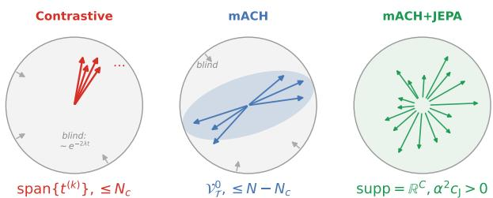  
Figure 1: Conceptual illustration of representation diversity. Diferent training objectives provide supervision over diferent subsets of the shared visual representation. Conventional contrastive learning mainly optimizes a limited set of alignment directions, while the proposed mACH expands supervision to finer token-level interactions. The auxiliary JEPA objective further supplies complementary learning signals beyond language supervision, encouraging diverse and robust visual representations. Together, the dual-stream objective preserves a richer set of discriminative directions for unified open-vocabulary grounding.

Among these paradigms, region-word dot alignment offers an attractive balance between text-conditioned spatial regression and autoregressive MLLMs, making it well suited for resource-constrained devices and as a proposal generator for LLM-based pipelines. We therefore adopt this paradigm as our base architecture. However, scaling it to unified multi-dataset training exposes two fundamental bottlenecks: a model-level representation degeneration where contrastive objectives induce low-rank polysemantic bottlenecks (Chaudhuri et al. 2025), and a data-level linguistic deficit arising from discrete category annotations.

In this work, we use representation diversity as the number of independent alignment-active directions preserved in the learned visual representation. As conceptually illustrated in Fig. 1, diferent training objectives preserve diferent subsets of the shared visual representation. Increasing representation diversity therefore requires complementary supervision that progressively expands the alignment-active subspace. To resolve these dual bottlenecks, we propose a holistic data-model co-design framework. Architecturally, we integrate the Modulated Attention-Contrastive Head (mACH) with an inference-free Joint Embedding Predictive Architecture (JEPA) auxiliary stream (LeCun et al. 2022), which complements language-conditioned gradients with visual predictive supervision to preserve representation diversity. On the data front, we construct Objects365- Caption (O365-Caption), enriching discrete object labels with context-aware descriptions to provide the linguistic diversity required for robust open-vocabulary grounding.

Our goal is to learn a unified grounding model that generalizes across heterogeneous referring expression distributions, rather than optimizing for individual benchmarks. To this end, our contributions are threefold:

• We propose a data-model co-design comprising the Modulated Attention-Contrastive Head (mACH) and an inference-free JEPA auxiliary objective. We further show theoretically that the two objectives activate complementary gradient subspaces, preserving alignment capacity and scaling representation diversity.

• We introduce O365-Caption, enriching discrete detection labels with dense natural language descriptions to enhance linguistic-geometric grounding.

• Extensive experiments demonstrate that our unified model achieves competitive performance across standard REC benchmarks using a single static checkpoint, showing superior robustness in out-of-distribution evaluations.

## 2 Related Work

Visual Grounding Paradigms: Visual grounding has evolved from benchmark-specific specialists using crossattention regression (Yu et al. 2018; Deng et al. 2021; Xiao et al. 2024) to unified open-vocabulary architectures. Modern generative MLLMs (Chen et al. 2023; You et al. 2024) ofer strong open-domain reasoning via coordinate token generation, yet their high decoding latency hampers real-time edge deployment. Alternatively, discriminative region-word dot alignment models (Kamath et al. 2021; Li et al. 2022; Liu et al. 2024) achieve superior eficiency by decoupling visual proposal extraction from parallel text matching. However, these frameworks often rely on dataset-specific fine-tuning or purely discriminative objectives, limiting single-weight unified generalization.

Representation Degeneration & Predictive Regularization: Discriminative and contrastive learning objectives tend to compress feature variance into low-rank, anisotropic subspaces, leading to representation collapse (Papyan, Han, and Donoho 2020; Jing et al. 2021; Liang et al. 2022). Under large-scale multimodal supervision, this degeneration severely impairs out-of-distribution generalization (Chaudhuri et al. 2025). Although JEPA and its variants (LeCun et al. 2022; Assran et al. 2023; Bardes et al. 2023) provide non-contrastive latent prediction that preserves semantic variance, their application is largely restricted to foundation model pre-training (Chen et al. 2025a; Huang et al. 2026). Utilizing JEPA as an auxiliary regularizer to expand gradient span and prevent degeneration in unified grounding remains unexplored.

Grounding Corpora & Data-Model Co-Design: Existing grounding benchmarks inherently trade of scale, annotation reliability, and linguistic richness (Krishna et al. 2017; Peng et al. 2024; Rasheed et al. 2024). Large-scale detection datasets like Objects365 (Shao et al. 2019) provide vast spatial supervision but sufer from discrete category labels. To resolve this data-level deficit, we curate O365-Caption, converting Objects365 category labels into dense, contextaware descriptions. This supplies the linguistic diversity required for robust open-vocabulary alignment within a scalable and accessible pipeline.

## 3 Methodology

The overall architecture of our framework is illustrated in Fig. 2. Given an input image and a set of referring expressions, the vision backbone extracts multi-scale visual features, while the language encoder produces the corresponding textual embeddings. Unlike conventional grounding frameworks that optimize only discriminative alignment, our method jointly supervises the same visual features with two complementary objectives during training: (1) a discriminative Modulated Attention-Contrastive Head (mACH) for open-vocabulary grounding, and (2) a reconstructive JEPA auxiliary stream that regularizes the shared visual representation. Since the JEPA branch is removed after training, it introduces no additional inference cost.

## 3.1 Modulated Attention-Contrastive Head (mACH)

To eficiently align visual features with multiple referring expressions concurrently, we adopt a lightweight, broadcastbased cross-attention head, termed mACH. The proposed mACH is not intended as a fundamentally new attention operator. Instead, it serves as an eficient implementation of standard cross-attention that reformulates query-text interaction into a broadcasted computation topology for unified open-vocabulary grounding. This design allows a single visual forward pass across the backbone and neck to simultaneously interact with an arbitrary number of linguistic candidates, drastically accelerating multi-query inference while remaining fully compatible with conventional legacy detector architectures.

Let $X \in \mathbb { R } ^ { B \times M \times C }$ denote the flattened visual feature map extracted from one feature level of the detector, where B is the image batch size, M is the number of spatial locations, and C is the feature dimension. Let $W \in \mathbb { R } ^ { \pmb { \imath } _ { n c } \times L \times C }$ denote the text embedding sequence, where L is the token length and $B _ { n c } = B \times N _ { c }$ corresponds to the expanded batch containing $N _ { c }$ referring expressions for each image.

To avoid redundant visual computation, the visual features are broadcast along the batch dimension,

$$
Q = { \mathrm { B r o a d c a s t } } ( X ) \in \mathbb { R } ^ { B _ { n c } \times M \times C } ,\tag{1}
$$

such that each visual feature map is paired with every referring expression. Meanwhile, the textual embeddings are linearly projected to generate the corresponding keys and values $\dot { K , } \dot { V } = \operatorname { L i n e a r } ( W )$ .

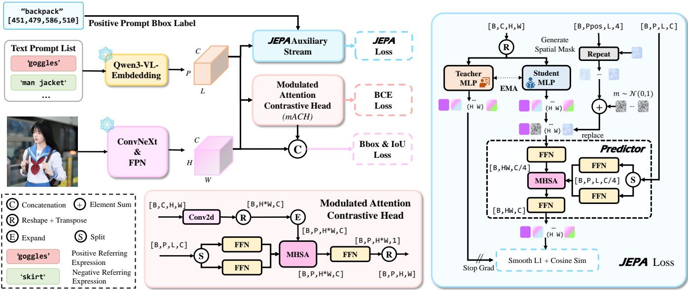  
Figure 2: Overview of the proposed framework (illustrated using a CNN-based detector). The visual backbone extracts visual features, while the language encoder produces text embeddings from referring expressions. The proposed Modulated Attention-Contrastive Head (mACH) performs token-level cross-attention to generate grounding predictions supervised by classification and localization losses. In parallel, a text-conditioned JEPA auxiliary branch reconstructs masked visual features under language guidance using an EMA teacher-student framework. Both branches operate on the same visual representations during training, allowing reconstructive regularization to complement discriminative grounding without introducing additional inference cost.

Cross-modal interaction is then established through scaled dot-product attention,

$$
\boldsymbol { O } = \operatorname { S o f t m a x } \left( \boldsymbol { Q } \boldsymbol { K } ^ { \top } / \sqrt { C } \right) \boldsymbol { V } ,\tag{2}
$$

where $O \in \mathbb { R } ^ { B _ { n c } \times M \times C }$ denotes the aligned visual representation. In practice, mACH is implemented using the standard multi-head attention formulation together with the variablelength implementation of FlashAttention-2 (Dao 2024) to eficiently eliminate computation on padded text tokens.

Finally, the aligned features are projected to grounding logits through a lightweight prediction layer. The final grounding score is computed as

$$
S = \psi ( O ) \cdot \exp ( \tau ) + b ,\tag{3}
$$

where $\psi ( \cdot )$ denotes a lightweight grounding head that maps the language-conditioned feature $O \in \overline { { \mathbb { R } } } ^ { B _ { n c } \times M \times C }$ to grounding logits $\psi ( O ) \in \mathbb { R } ^ { B _ { n c } \times M }$ . τ is a learnable logit scale, and b is a learnable bias. The resulting score map is optimized using the standard binary cross-entropy objective,

$$
\mathcal { L } _ { \mathrm { m A C H } } = \mathcal { L } _ { \mathrm { B C E } } ( S , Y ) ,\tag{4}
$$

where Y denotes the ground-truth grounding map. Although the above description is based on our CNN implementation for clarity, the proposed mACH head is architecture-agnostic and can be readily integrated into transformer-based grounding frameworks with only minor modifications. The detailed implementation is presented in Supp. Mat. A Fig. 1.

## 3.2 JEPA Auxiliary Stream

Although mACH provides strong discriminative supervision, optimizing only the grounding objective may gradually reduce feature diversity under large-scale heterogeneous language supervision. To alleviate this issue, we introduce a JEPA auxiliary branch that regularizes the same visual features during training through latent feature prediction. Since the branch is discarded after training, it incurs no inference overhead.

Given the visual feature map X, we construct an asymmetric online-target architecture consisting of a student projection head ${ \mathcal { P } } _ { \theta }$ and an EMA teacher ${ \mathcal { P } } _ { \mathrm { E M A } }$ . Both projection heads share the same architecture composed of lightweight $1 \times 1$ convolutions, GroupNorm, and GELU activations. The teacher parameters are updated using exponential moving average,

$$
\mathcal { P } _ { \mathrm { E M A } } ^ { ( t + 1 ) } = \lambda _ { \mathrm { e m a } } \mathcal { P } _ { \mathrm { E M A } } ^ { ( t ) } + ( 1 - \lambda _ { \mathrm { e m a } } ) \mathcal { P } _ { \theta } ^ { ( t ) } .\tag{5}
$$

The student and teacher generate latent representations

$$
Z _ { \mathrm { s t u } } , Z _ { \mathrm { t e a c h } } \in \mathbb { R } ^ { B \times C \times M } ,\tag{6}
$$

respectively. During training, spatial regions corresponding to the ground-truth bounding boxes are randomly masked. The masked student features are replaced with a learnable mask token, forming Zmaskedstu . stu

Unlike conventional I-JEPA, our predictor additionally receives the language embedding as contextual guidance, encouraging the masked visual regions to recover semantics relevant to the referring expression,

$$
\hat { Z } _ { \Omega } = \mathcal { F } _ { \phi } \left( Z _ { \mathrm { s t u } } ^ { \mathrm { m a s k e d } } , W \right) _ { m } , \quad m \in \Omega ,\tag{7}
$$

where Ω denotes the masked spatial locations.

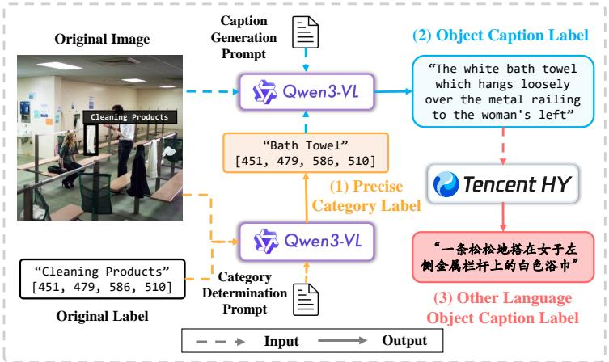  
(a) Data generation pipeline of O365-Caption

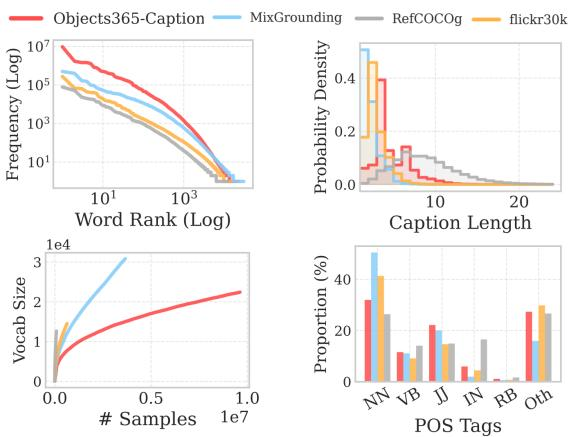  
(b) Linguistic and Statistical landscape of O365-Caption  
Figure 3: (a) The detailed three-stage data generation pipeline of O365-Caption and (b) Comprehensive linguistic and statistical landscape of O365-Caption compared with prominent baselines. Zoom in for best view.

The reconstruction objective is defined on normalized latent features,

$$
\begin{array} { r l } & { \mathcal { L } _ { \mathrm { J E P A } } = \displaystyle \frac { 1 } { | \Omega | } \sum _ { m \in \Omega } \big ( 1 - \langle \bar { \hat { z } } _ { m } , \bar { z } _ { \mathrm { t a r g e t } , m } \rangle \big ) } \\ & { \quad \quad \quad + \displaystyle \frac { \beta } { | \Omega | } \sum _ { m \in \Omega } \mathrm { S m o o t h L } 1 ( \bar { \hat { z } } _ { m } , \bar { z } _ { \mathrm { t a r g e t } , m } ) , } \end{array}\tag{8}
$$

where z¯ denotes $\ell _ { 2 } \cdot$ -normalized latent features.

Finally, the overall training objective combines discriminative grounding supervision and latent reconstructive regularization,

$$
\mathcal { L } _ { \mathrm { T o t a l } } = \mathcal { L } _ { \mathrm { m A C H } } + \alpha \mathcal { L } _ { \mathrm { J E P A } } ,\tag{9}
$$

where α controls the weight of the auxiliary objective. By jointly optimizing both losses on the same visual representation, the JEPA branch complements discriminative alignment with reconstructive supervision, encouraging richer feature diversity and improving the robustness of unified open-vocabulary grounding.

## 3.3 O365-Caption

To fully unlock the capacity of our alignment pipeline and anchor robust open-vocabulary scaling, we introduce O365-Caption. Existing unified multi-dataset training is frequently bottlenecked by a structural linguistic trade-of: massive detection corpora like Objects365 (Shao et al. 2019) are restricted to rigid, discrete tags, whereas most REC datasets ofer rich expressions but lack scale. O365-Caption bridges this gap by systematically upgrading discrete category labels into dense, context-aware grounding expressions, injecting essential linguistic compositionality into unified pre-training.

As illustrated in Fig. 3(a), the dataset is constructed via an automated, three-stage generative pipeline. First, Coarseto-Fine Disambiguation utilizes a lightweight MLLM (Qwen3-VL-2B) to refine generalized tags into precise

Table 1: Comprehensive statistics and linguistic diversity comparisons of open-vocabulary visual grounding and detection corpora. We compare our curated O365-Caption against dominant detection, phrase grounding, and referring expression comprehension (REC) benchmarks. $\mathcal { P } _ { t x t }$ denotes the unique phrase size, UCR represents the Unique Caption Ratio $( \frac { \# \dot { \mathrm { U n i q u e } } \mathrm { C a p t i o n s } } { \# \mathrm { T o t a l } \mathrm { C a p t i o n s } } \times 1 0 0 \% )$ reflecting the text-level compositionality and freedom from repetitive collapsed patterns.

<table><tr><td>Dataset # Images # Annos Avg. Len.</td></tr><tr><td colspan="3"> $\mathcal { P } _ { t x t }$  UCR (%) Object Detection Corpora (Discrete Categories) 860K ~0.0</td></tr><tr><td colspan="3">COCO 118K 1.0 80 Objects365 638K 9.6M 1.0 365 ~0.0</td></tr><tr><td colspan="3"></td></tr><tr><td colspan="3">Phrase Grounding &amp; Mixed Corpora (VLM Pre-training) Flickr30K 31K 638K 2.4 94K 14.7</td></tr><tr><td colspan="3">MixedGrounding 614K 3.7M 1.8 386K 10.5</td></tr><tr><td colspan="3">Referring Expression Comprehension (REC Training Set)</td></tr><tr><td colspan="3">RefCOCO 20K 121K 3.5 68K 56.0 RefCOCO+ 95.9</td></tr><tr><td colspan="3">20K 120K 3.5 77K RefCOCOg</td></tr><tr><td colspan="3">26K 80K 8.3 77K 64.3 638K 6.2</td></tr><tr><td colspan="3">9.6M 4.2 597K</td></tr></table>

taxonomies, safeguarded by a spatial coverage threshold $( \gamma < 0 . 0 5 \% )$ to prevent small-object hallucinations. Second, Context-Aware Captioning employs a powerful 32B MLLM to synthesize descriptive expressions that fuse the refined category with fine-grained visual attributes and spatial dynamics. Finally, Cross-Lingual Extension leverages machine translation to support multilingual evaluation beyond English-centric paradigms (Nogueira, Bernardino, and Martins 2025). Despite the massive generation scale, random manual verification demonstrates an error rate strictly below 0.1%. Exhaustive prompt templates, bounding-box guardrails, and filtering heuristics are deferred to the Supp.

Mat. C.

This curation replaces legacy labels with 9.6M openvocabulary descriptions across 638K images. As analyzed in Table 1 and Fig. 3(b), O365-Caption exhibits superior statistical properties compared to dominant baselines. It maintains a healthy long-tail vocabulary distribution (Zipf’s law) and an optimal syntactic density peaking at four words. Crucially, the dataset dismantles the “noun monopoly” prevalent in standard corpora by elevating the proportion of adjectives to 22%. This dense population of visual modifiers supplies the critical high-entropy variations required to prevent representation collapse during large-scale unified grounding.

## 4 Theoretical Analysis: Representation Diversity

We characterize representation diversity by which feature directions receive sustained alignment supervision (Fig. 1). $\operatorname { L e t } x _ { m } \in \mathbb { R } ^ { C }$ be the shared visual token at spatial location m (after the final fusion layer) and k a unit text (key) direction. Since the attention logit $\dot { a } _ { m } = x _ { m } ^ { \top } k$ is linear in $x _ { m } .$ the discriminative signal carried by k is the spatial variance of the logits, defining the directional alignment capacity

$$
\begin{array} { r } { \mathrm { c a p } ( k ) : = \mathrm { V a r } _ { m } ( x _ { m } ^ { \top } k ) = k ^ { \top } \Xi _ { X } k , } \end{array}\tag{10}
$$

with $\Xi _ { X }$ the covariance of $\{ x _ { m } \}$ ; directions with ca $) ( k ) = 0$ form the alignment-blind subspace. Appendix B shows that under weight decay only gradient-sustained directions retain non-zero capacity, so the diversity of an objective is governed by the subspace its gradients span.

With $N _ { c }$ expressions per image, N total text tokens, and feature dimension C, the three objectives span gradient subspaces of dimension

$$
\underbrace { N _ { c } } _ { \mathrm { C o n t r a s t i v e } } < \underbrace { N - N _ { c } } _ { \mathrm { m a c H } } < \underbrace { C } _ { \mathrm { m A C H } + \mathrm { J E P A } } ,\tag{11}
$$

as upper bounds (requiring $N _ { c } ~ < ~ N / 2$ and $N \mathrm { ~ - ~ } N _ { c } \mathrm { ~ < ~ }$ C; both hold in our data): contrastive learning supervises only the pooled-expression subspace; mACH expands to the centered token subspace (softmax invariance removes one common-mode direction per expression); and the auxiliary JEPA objective provides gradient support in almost every direction. Thus, only the dual-stream objective is almost surely free of alignment-blind directions and preserves representation diversity throughout the feature space. Formal statements and proofs are in Supp. Mat. B.

## 5 Experiments

## 5.1 Datasets and Evaluation Metrics

We evaluate our method on three widely used referring expression comprehension benchmarks: RefCOCO/+/g. To ensure a rigorous and fair comparison, all evaluated models are strictly benchmarked on a cleaned version of these datasets (Chen et al. 2025b), which rectifies original annotation noise and spatial ambiguities. Following the standard evaluation protocol, a prediction is regarded as correct if its Intersection over Union (IoU) with the ground-truth bounding box exceeds 0.5, and Top-1 accuracy (%) is reported as the evaluation metric.

## 5.2 Implementation Details

We implement both CNN-based and DETR-based variants within a unified PyTorch framework. Unless otherwise specified, a DINOv3 ConvNeXt-Tiny (Siméoni et al. 2025) is adopted as the visual backbone. The CNN variant employs an FPN neck with the proposed mACH head, while the DETR variant(detailed in Supp. Mat. A) follows the RT-DETR architecture with text embeddings injected into the AIFI module for early vision-language interaction. To support multilingual grounding, we use the frozen Qwen3-VL-Embedding-2B (Li et al. 2026) as the language encoder. All models are trained using AdamW with standard data augmentation. Detailed architectural configurations, optimization settings, and hyperparameters are provided in Supp. Mat. E.

## 5.3 Main Results

We evaluate our framework on RefCOCO, RefCOCO+, and RefCOCOg under both zero-shot (unified generalist) and benchmark-specific fine-tuning protocols (Tab. 2).

Unified Generalist Evaluation. Without target fine-tuning, our compact 75M model demonstrates strong zero-shot generalization across all three benchmarks. On RefCOCO, it achieves 85.3/89.0/82.5 (val/testA/testB), outperforming the 172M GDINO-T by +11.3/+14.1/+23.2% and matching heavy MLLMs (e.g., 13B LISA++-L2 and 7B GSVA) using only 0.6% of LISA’s parameters and a lower resolution (6402 vs. 10242). This strong capability extends to attribute-rich RefCOCO+ (71.8/78.2/62.7) and longexpression RefCOCOg (76.3/75.8), consistently outperforming lightweight OVD baselines (e.g., YOLOE, ExpAlign, GLIP-T) by substantial margins. We attribute this advantage to our O365-Caption pre-training and JEPA regularization, which preserve fine-grained spatial-linguistic correspondence rather than disrupting it with aggressive geometric augmentations common in standard OVD recipes.

Benchmark-Specific Fine-Tuning. When fine-tuned on target datasets, our framework achieves state-of-the-art performance across all three benchmarks. On RefCOCO, our model reaches 91.7/93.0/90.2, consistently outperforming fine-tuned GDINO-T (89.2/91.9/86.0) and PropVG (89.0/91.6/85.7). On RefCOCO+, it achieves 76.9% accuracy on testB. Furthermore, on RefCOCOg, our model achieves 85.1/86.0 (val/test), outperforming PropVG (83.5/84.4) despite using significantly fewer parameters (75M vs. 490M) and a lower input resolution (6402 vs. 800×1333). These gains confirm that our unified pre-training serves as a robust initialization for downstream REC.

Qualitative visualizations in Fig. 4 further validate the superior localization capability of our unified framework.

## 5.4 Ablation Studies

We perform ablation studies under the zero-shot generalist setting using ConvNeXt-Tiny as the default backbone unless otherwise specified. Tab. 3 systematically deconstructs the contributions of our head design, pre-training data, auxiliary loss weighting, and architectural choices.

Table 2: Performance on standard referring expression comprehension (REC) benchmarks. Results are reported as Top-1 accuracy (%) on RefCOCO/+/g. Training datasets are abbreviated as follows: O365: Objects365; OG: Objects365 + GoldG; GoldG-f: GoldG after annotation refinement (deferred to the Supp. Mat. D); O365-C: our proposed Objects365-Caption; RefC: training set of RefCOCO, RefCOCO+, and RefCOCOg (Yu et al. 2016). gRefC: training set of gRefCOCO(Wang et al. 2025). \* indicates estimated from the corresponding paper.
<table><tr><td rowspan="2">Method</td><td rowspan="2">Pre-Train Data</td><td rowspan="2">Input Size</td><td rowspan="2">#Params</td><td rowspan="2">FT</td><td colspan="3">RefCOCO testA testB</td><td colspan="3">RefCOCO+</td><td colspan="2">RefCOCOg</td></tr><tr><td>val</td><td></td><td></td><td>val</td><td>testA</td><td>testB</td><td>val</td><td>test</td></tr><tr><td>GLIP-T (Li et al. 2022)</td><td>OG</td><td>800×1333</td><td>232M</td><td>N</td><td>50.0</td><td>54.7</td><td>43.1</td><td>49.0</td><td>53.4</td><td>43.4</td><td>65.6</td><td>66.0</td></tr><tr><td>GDINO-T (Liu et al. 2024)</td><td>OG, RefC</td><td>800×1333</td><td>172M</td><td>N</td><td>74.0</td><td>74.9</td><td>59.3</td><td>66.8</td><td>69.9</td><td>56.1</td><td>71.1</td><td>72.1</td></tr><tr><td>PBREC-MT (Zhao et al. 2024) ExpAlign (Hu et al. 2026)</td><td>RefC, ReferItGame</td><td>640x640</td><td>205M*</td><td>N</td><td>71.4</td><td>73.2</td><td>70.1</td><td>63.8</td><td>67.1</td><td>56.6</td><td>62.9</td><td>62.6</td></tr><tr><td></td><td>OG, RefC</td><td>640x640</td><td>60M</td><td>N</td><td>51.6</td><td>59.3</td><td>47.7</td><td>48.9</td><td>47.5</td><td>45.5</td><td>65.6</td><td>64.0</td></tr><tr><td>LISA++-L2 (Yang et al. 2023) GSVA (Xia et al. 2024)</td><td>N/A</td><td>1024×1024</td><td>13B</td><td>N</td><td>85.9</td><td>88.8</td><td>81.7</td><td>74.5</td><td>80.6</td><td>68.3</td><td>80.1</td><td>81.3</td></tr><tr><td>Ours</td><td>N/A</td><td>1024×1024</td><td>7B</td><td>N</td><td>86.3</td><td>89.2</td><td>83.8</td><td>72.8</td><td>78.8</td><td>68.0</td><td>81.6</td><td>81.8</td></tr><tr><td></td><td>GoldG-f, O365-C</td><td>640x640</td><td>75M</td><td>N</td><td>85.3</td><td>89.0</td><td>82.5</td><td>71.8</td><td>78.2</td><td>62.7</td><td>76.3</td><td>75.8</td></tr><tr><td>MTKREC(Mi et al. 2024)</td><td>novel categories RefC</td><td>640x640</td><td>200M*</td><td>Y</td><td>81.1</td><td>86.8</td><td>73.9</td><td>75.0</td><td>80.8</td><td>65.5</td><td>74.6</td><td>74.7</td></tr><tr><td>HieA2G(Wang et al. 2025)</td><td>RefC, Flickr30K, gRefC</td><td>640x640</td><td>350M*</td><td></td><td>87.8</td><td>90.3</td><td>84.0</td><td>80.7</td><td>85.6</td><td>72.9</td><td>83.7</td><td>83.8</td></tr><tr><td>GDINO-T</td><td>OG, RefC</td><td>800×1333</td><td>172M</td><td></td><td>89.2</td><td>91.9</td><td>86.0</td><td>81.1</td><td>87.4</td><td>74.7</td><td>84.2</td><td>84.9</td></tr><tr><td>PropVG (Dai et al. 2025)</td><td>N/A</td><td>800×1333</td><td>490M</td><td></td><td>89.0</td><td>91.6</td><td>85.7</td><td>83.7</td><td>88.0</td><td>76.6</td><td>83.5</td><td>84.4</td></tr><tr><td>Ours</td><td>GoldG-f, RefC, O365-C</td><td>640x640</td><td>75M</td><td>YYYY</td><td>91.7</td><td>93.0</td><td>90.2</td><td>83.5</td><td>87.5</td><td>76.9</td><td>85.1</td><td>86.0</td></tr></table>

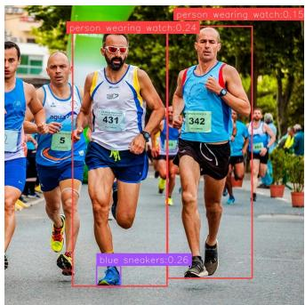

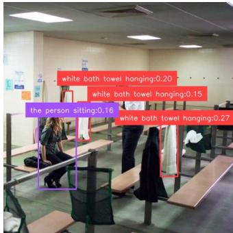

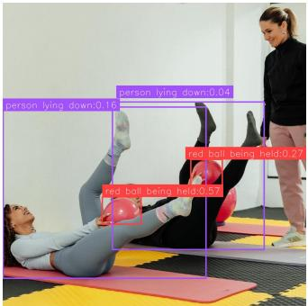

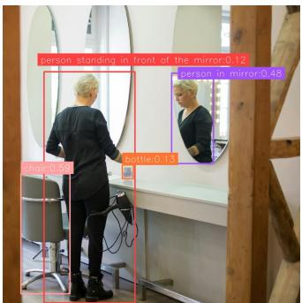  
(a) person wearing watch. blue (b) the person sitting. white bath(c) person lying down. red ball be- (d) person in mirror. person stand sneakers. towel hanging. ing held. ing in front of the mirror. chair.  
Figure 4: Qualitative grounding results. Text queries and corresponding predicted bounding boxes are rendered in matching colors, demonstrating robust multi-target localization under complex natural language descriptions. Zoom in for best view.

Head Components (Tab. 3a). Replacing the basic contrastive head with mACH boosts RefCOCO val accuracy by +5.3% (78.6% vs. 83.9%), validating the necessity of dense token-level cross-modal interaction. Integrating the auxiliary JEPA stream further lifts performance across all splits (reaching 85.3% on RefCOCO val and 82.5% on testB), demonstrating that auxiliary representation learning provides efective regularization for grounding.

Linguistic Supervision (Tab. 3b). Converting Objects365 tags into context-rich referring expressions yields a substantial +8.3% improvement on RefCOCO val (77.0% vs. 85.3%) using identical images and bounding boxes, confirming that textual richness is vital for unified pre-training. Further annotation cleaning (GoldG-f) provides additional gains on challenging test splits (e.g., +0.9% on RefCOCO testA).

Auxiliary JEPA Weight (Tab. 3c). Setting the loss weight to α = 0.1 achieves an optimal balance between discriminative grounding and generative reconstruction, whereas higher weights (α = 0.2) slightly diminish performance due to over-

regularization.

Architecture & Convergence (Tab. 3d). While our CNNbased default converges rapidly within 30 epochs (85.3% on RefCOCO val), training an RT-DETR architecture for 90 epochs reaches the global peak performance of 86.8/90.0/83.5 on RefCOCO, demonstrating strong architectural flexibility and scaling potential for our pipeline.

Scalability Across Backbone Sizes. We evaluate framework scalability across ConvNeXt Tiny, Small, and Base variants in Tab. 4. Performance improves steadily as visual capacity and head feature dimension C expand. Notably, while scaling backbone depth from Tiny to Small (C = 768) yields moderate gains, widening the cross-modal interaction channel to C = 1024 in ConvNeXt-Base produces a significant jump, boosting RefCOCO+ testA by +2.9% and RefCOCOg test by +1.4% over Tiny. This confirms expanding the head capacity C efectively eliminates representation bottlenecks, allowing our mACH and JEPA modules to scale seamlessly with larger feature spaces without saturation.

Table 3: Ablation studies on core framework components. Evaluated under the unified setting across RefCOCO/+/g. Bold indicates the default configuration.
<table><tr><td>Configuration</td><td>RefCOCO val testA testB</td><td>RefCOCO+ val testA testB</td><td>val</td><td>RefCOCOg test</td></tr><tr><td colspan="5">(a) Head Components (Fixed Data: GoldG-f, O365-C)</td></tr><tr><td>Contrastive mACH  $\mathtt { m A C H } + \mathtt { J E P A }$ </td><td>|78.680.3 73.8 83.987.5 79.3 85.3 89.0 82.5</td><td>|61.0 66.4 53.2 68.577.0 59.4 71.8 78.2 62.7</td><td>|72.7 74.8 76.3</td><td>72.3 75.0 75.8</td></tr><tr><td colspan="5">(b) Pre-train Data (Fixed Head Architecture: full pipeline)</td></tr><tr><td>GoldG, O365 77.0 GoldG, O365-C 85.3 GoldG-f, O365-C 85.3</td><td>69.3 71.7 88.1 82.1 89.0 82.5</td><td>|62.7 69.2 71.777.9 71.878.2</td><td>56.0 |66.6 61.4 76.2 62.7 76.3</td><td>65.7 75.7 75.8</td></tr><tr><td colspan="5">(c) Effect of Auxiliary Jepa Weight α</td></tr><tr><td> $\alpha = 0 . 0$   $\alpha = 0 . 0 5$   $\alpha = \mathbf { 0 . 1 }$   $\alpha = 0 . 2$ </td><td>|83.987.5 79.3 84.888.5 81.4 85.3 89.0 82.5 84.788.3 81.1</td><td>|68.5 77.0 70.877.9 71.8 78.2 70.577.6</td><td>59.4 |74.8 61.5 75.9 62.7 76.3 61.9 75.4</td><td>75.0 75.5 75.8 75.2</td></tr><tr><td colspan="5">(d) Architectural Components</td></tr><tr><td>CNN(30 ep)</td><td>|85.389.0 82.5</td><td>|71.8 78.2</td><td>62.7 |76.3</td><td>75.8</td></tr><tr><td>RT-DETR(30 ep)</td><td>84.087.8 80.2</td><td>69.977.562.7</td><td>75.4</td><td>75.2</td></tr><tr><td>RT-DETR(90 ep)</td><td>86.8 90.0 83.5</td><td>74.5 82.464.1</td><td>78.6</td><td>77.9</td></tr><tr><td></td><td></td><td></td><td></td><td></td></tr></table>

Table 4: Scalability across visual backbone sizes. Zeroshot performance evaluated across ConvNeXt scales.
<table><tr><td>Backbone Scale</td><td>RefCOCO val testA testB</td><td>RefCOCO+ val testA testB</td><td>val</td><td>RefCOCOg</td><td>test</td></tr><tr><td></td><td>85.3 89.0</td><td>82.5</td><td>|71.8 78.2 62.7</td><td>|76.3</td><td>75.8</td></tr><tr><td>Tiny (C = 768) Small  $\begin{array} { r } { ( C = 7 6 8 ) } \end{array}$ </td><td>86.1 89.1</td><td>82.6</td><td>72.479.3 63.3</td><td>76.8</td><td>76.1</td></tr><tr><td>Base  $\left( C = 1 0 2 4 \right)$ </td><td>86.3 89.883.8</td><td></td><td>73.781.1 64.4</td><td>76.8</td><td>77.2</td></tr></table>

Inference Eficiency. We evaluate framework latency and peak GPU memory across varying numbers of text queries (N) in Tab. 5. Measurements are conducted on a single NVIDIA RTX 4090 at batch size 1.

## 5.5 Spectral Evidence

To examine how diferent objectives shape the learned representation, we collect the shared visual token features after the final fusion layer from all RefCOCOg images and estimate their empirical feature covariance $\begin{array} { r } { \Xi _ { X } = \frac { 1 } { M } \sum _ { i = 1 } ^ { M } ( x _ { i } - } \end{array}$ ${ \bar { x } } ) ( x _ { i } - { \bar { x } } ) ^ { \top }$ , where M is the total number of visual tokens. According to our theory, the eigenspectrum of $\Xi _ { X }$ measures the distribution of directional alignment capacity: discriminative objectives preserve capacity only inside the languageconditioned subspace, whereas the additional JEPA objective maintains capacity in the remaining directions.

Figure 5 confirms this prediction. Contrastive learning and mACH exhibit an identical spectral clif around $j \approx 2 0 0$ after which the eigenvalues fall below the numerical precision of float32 accumulation $( \lesssim 1 0 ^ { - 6 } \lambda _ { 1 } )$ , indicating feature variation is confined to a language-conditioned subspace. In contrast, mACH+JEPA preserves a non-vanishing spectral tail $( \sim 1 0 ^ { - 5 } )$ , consistent with the positive spectral floor predicted by our theory, and maintains measurable variance throughout the entire ambient space $( C = 7 6 8 )$ .

Table 5: Inference eficiency comparison. Results are reported as triplets corresponding to $N = 1 / 5 / 1 0$ , where N denotes the number of text queries (average 5 tokens/query) evaluated per image.
<table><tr><td>Method</td><td>Latency (ms) ↓ | Peak Mem. (GB) ↓</td><td></td></tr><tr><td>Contrastive</td><td>21/23/24</td><td>1.06/1.08/1.10</td></tr><tr><td>mACH</td><td>26/26/27</td><td>1.13/1.26/1.35</td></tr></table>

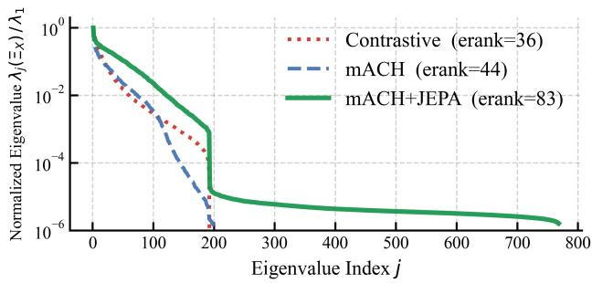  
Figure 5: Alignment-capacity spectrum. Normalized eigenspectra of the empirical feature covariance $\Xi _ { X }$ computed from shared visual token features after the final fusion layer on RefCOCOg-val. Contrastive learning and mACH exhibit a shared spectral clif around $j \approx 2 0 0$ , whereas mACH+JEPA retains a non-vanishing spectral tail across all 768 dimensions, consistent with the predicted spectral floor (eigenvalues below $\mathrm { \sim } 1 0 ^ { - 6 }$ are at the numerical floor; clif positions, not depths, are interpretable). Reported efective ranks summarize the spectrum and indicate progressively richer representation diversity.

To summarize the spectrum with a single statistic, we report the efective rank: erank $\begin{array} { r } { ( \Xi _ { X } ) = \exp ( - \sum _ { j } p _ { j } \log p _ { j } ) } \end{array}$ $\begin{array} { r } { p _ { j } = \frac { \lambda _ { j } } { \sum _ { k } \lambda _ { k } } } \end{array}$ which measures how many feature directions carry comparable variance (Garrido et al. 2023). The effective rank increases monotonically from 36 (Contrastive) to 44 (mACH) and 83 (mACH+JEPA), consistent with the predicted dimension ladder $N _ { c } < N - N _ { c } < C$ , and indicating progressively richer representation diversity under the dual-stream objective.

## 6 Conclusion

We revisited referring expression comprehension from the perspective of unified open-vocabulary grounding and presented a holistic data-model co-design that jointly improves linguistic supervision and visual representation learning. Specifically, our framework combines a lightweight broadcast-based grounding head with an inference-free JEPA auxiliary objective to preserve representation diversity, while O365-Caption enriches grounding supervision through diverse natural language descriptions. Extensive experiments demonstrate strong cross-dataset generalization and competitive performance using a static checkpoint. Beyond the proposed framework, our theoretical and empirical results suggest preserving representation diversity is an important design principle for scaling unified vision-language grounding models beyond benchmark-specific specialization.

## References

Assran, M.; Duval, Q.; Misra, I.; Bojanowski, P.; Vincent, P.; Rabbat, M.; LeCun, Y.; and Ballas, N. 2023. Self-supervised learning from images with a joint-embedding predictive architecture. In Proceedings of the IEEE/CVF conference on computer vision and pattern recognition, 15619–15629.

Bai, S.; Cai, Y.; Chen, R.; Chen, K.; Chen, X.; Cheng, Z.; Deng, L.; Ding, W.; Gao, C.; Ge, C.; et al. 2025. Qwen3-vl technical report. arXiv preprint arXiv:2511.21631.

Bardes, A.; Garrido, Q.; Ponce, J.; Chen, X.; Rabbat, M.; LeCun, Y.; Assran, M.; and Ballas, N. 2023. V-jepa: Latent video prediction for visual representation learning.

Chaudhuri, A.; Dutta, A.; Bui, T.; and Georgescu, S. 2025. A Closer Look at Multimodal Representation Collapse. In International Conference on Machine Learning, 7555–7577. PMLR.

Chen, D.; Shukor, M.; Moutakanni, T.; Chung, W.; Yu, J.; Kasarla, T.; Bang, Y.; Bolourchi, A.; LeCun, Y.; and Fung, P. 2025a. Vl-jepa: Joint embedding predictive architecture for vision-language. arXiv preprint arXiv:2512.10942.

Chen, J.; Wei, F.; Zhao, J.; Song, S.; Wu, B.; Peng, Z.; Chan, S.-H. G.; and Zhang, H. 2025b. Revisiting referring expression comprehension evaluation in the era of large multimodal models. In Proceedings of the IEEE/CVF Conference on Computer Vision and Pattern Recognition, 513–524.

Chen, K.; Zhang, Z.; Zeng, W.; Zhang, R.; Zhu, F.; and Zhao, R. 2023. Shikra: Unleashing Multimodal LLM’s Referential Dialogue Magic. arXiv preprint arXiv:2306.15195.

Dai, M.; Cheng, W.; Zhuang, J.; Liu, J.-j.; Zhao, H.; Feng, Z.; and Yang, W. 2025. Propvg: End-to-end proposal-driven visual grounding with multi-granularity discrimination. In Proceedings of the IEEE/CVF International Conference on Computer Vision, 7058–7068.

Dao, T. 2024. FlashAttention-2: Faster Attention with Better Parallelism and Work Partitioning. In International Conference on Learning Representations (ICLR).

Deng, J.; Yang, Z.; Chen, T.; Zhou, W.; and Li, H. 2021. Transvg: End-to-end visual grounding with transformers. In Proceedings of the IEEE/CVF international conference on computer vision, 1769–1779.

Garrido, Q.; Balestriero, R.; Najman, L.; and Lecun, Y. 2023. Rankme: Assessing the downstream performance of pretrained self-supervised representations by their rank. In International conference on machine learning, 10929–10974. PMLR.

Heaps, H. S. 1978. Information retrieval: Computational and theoretical aspects. Academic Press, Inc.

Hu, J.; Bai, T.; Wu, F.; Li, W.; Peng, Z.; and Zhang, Y. 2026. ExpAlign: Expectation-Guided Vision-Language Alignment for Open-Vocabulary Grounding. arXiv preprint arXiv:2601.22666.

Huang, C.; Li, X.; Thilak, V.; Littwin, E.; and Susskind, J. 2026. Text-Conditional JEPA for Learning Semantically Rich Visual Representations. arXiv preprint arXiv:2605.03245.

Jing, L.; Vincent, P.; LeCun, Y.; and Tian, Y. 2021. Understanding dimensional collapse in contrastive self-supervised learning. arXiv preprint arXiv:2110.09348.

Kamath, A.; Singh, M.; LeCun, Y.; Synnaeve, G.; Misra, I.; and Carion, N. 2021. Mdetr-modulated detection for end-to-end multi-modal understanding. In Proceedings of the IEEE/CVF international conference on computer vision, 1780–1790.

Krishna, R.; Zhu, Y.; Groth, O.; Johnson, J.; Hata, K.; Kravitz, J.; Chen, S.; Kalantidis, Y.; Li, L.-J.; Shamma, D. A.; et al. 2017. Visual genome: Connecting language and vision using crowdsourced dense image annotations. International journal ofcomputer vision, 123(1): 32–73.

LeCun, Y.; et al. 2022. A path towards autonomous machine intelligence version 0.9. 2, 2022-06-27. Open Review, 62(1): 1–62.

Li, L. H.; Zhang, P.; Zhang, H.; Yang, J.; Li, C.; Zhong, Y.; Wang, L.; Yuan, L.; Zhang, L.; Hwang, J.-N.; et al. 2022. Grounded language-image pre-training. In Proceedings of the IEEE/CVF conference on computer vision and pattern recognition, 10965–10975.

Li, M.; Zhang, Y.; Long, D.; Chen, K.; Song, S.; Bai, S.; Yang, Z.; Xie, P.; Yang, A.; Liu, D.; et al. 2026. Qwen3- VL-Embedding and Qwen3-VL-Reranker: A Unified Framework for State-of-the-Art Multimodal Retrieval and Ranking. arXiv preprint arXiv:2601.04720.

Liang, V. W.; Zhang, Y.; Kwon, Y.; Yeung, S.; and Zou, J. Y. 2022. Mind the gap: Understanding the modality gap in multi-modal contrastive representation learning. Advances in Neural Information Processing Systems, 35: 17612–17625.

Liu, S.; Zeng, Z.; Ren, T.; Li, F.; Zhang, H.; Yang, J.; Jiang, Q.; Li, C.; Yang, J.; Su, H.; et al. 2024. Grounding dino: Marrying dino with grounded pre-training for open-set object detection. In European conference on computer vision, 38– 55. Springer.

Loper, E.; and Bird, S. 2002. Nltk: The natural language toolkit. In Proceedings of the ACL-02 Workshop on Efective tools and methodologies for teaching natural language processing and computational linguistics, 63–70.

Mi, W.; Wang, J.; Zhuang, F.; An, Z.; and Guo, W. 2024. Open-category referring expression comprehension via multi-modal knowledge transfer. Neurocomputing, 598: 128063.

Nogueira, F.; Bernardino, A.; and Martins, B. 2025. Comprehension of Multilingual Expressions Referring to Target Objects in Visual Inputs. arXiv preprint arXiv:2511.11427.

Papyan, V.; Han, X.; and Donoho, D. L. 2020. Prevalence of neural collapse during the terminal phase of deep learning training. Proceedings of the National Academy of Sciences, 117(40): 24652–24663.

Peng, Z.; Wang, W.; Dong, L.; Hao, Y.; Huang, S.; Ma, S.; Ye, Q.; and Wei, F. 2024. Grounding multimodal large

language models to the world. In International Conference on Learning Representations, volume 2024, 51575–51598.

Zipf, G. K. 2016. Human behavior and the principle of least efort: An introduction to human ecology. Ravenio books.

Rasheed, H.; Maaz, M.; Shaji, S.; Shaker, A.; Khan, S.; Cholakkal, H.; Anwer, R. M.; Xing, E.; Yang, M.-H.; and Khan, F. S. 2024. Glamm: Pixel grounding large multimodal model. In Proceedings of the IEEE/CVF Conference on Computer Vision and Pattern Recognition, 13009–13018.

Shao, S.; Li, Z.; Zhang, T.; Peng, C.; Yu, G.; Zhang, X.; Li, J.; and Sun, J. 2019. Objects365: A large-scale, high-quality dataset for object detection. In Proceedings ofthe IEEE/CVF international conference on computer vision, 8430–8439.

Siméoni, O.; Vo, H. V.; Seitzer, M.; Baldassarre, F.; Oquab, M.; Jose, C.; Khalidov, V.; Szafraniec, M.; Yi, S.; Ramamonjisoa, M.; et al. 2025. Dinov3. arXiv preprint arXiv:2508.10104.

Wang, J.; Lan, C.; Liu, C.; Ouyang, Y.; Qin, T.; Lu, W.; Chen, Y.; Zeng, W.; and Yu, P. S. 2022. Generalizing to unseen domains: A survey on domain generalization. IEEE transactions on knowledge and data engineering, 35(8): 8052–8072.

Wang, Y.; Ding, H.; He, S.; Jiang, X.; Wei, B.; and Liu, J. 2025. Hierarchical alignment-enhanced adaptive grounding network for generalized referring expression comprehension. In Proceedings of the AAAI Conference on Artificial Intelligence, volume 39, 8042–8050.

Xia, Z.; Han, D.; Han, Y.; Pan, X.; Song, S.; and Huang, G. 2024. Gsva: Generalized segmentation via multimodal large language models. In Proceedings of the IEEE/CVF Conference on Computer Vision and Pattern Recognition, 3858–3869.

Xiao, L.; Yang, X.; Peng, F.; Wang, Y.; and Xu, C. 2024. Hivg: Hierarchical multimodal fine-grained modulation for visual grounding. In Proceedings ofthe 32nd ACM International Conference on Multimedia, 5460–5469.

Yang, S.; Qu, T.; Lai, X.; Tian, Z.; Peng, B.; Liu, S.; and Jia, J. 2023. Lisa++: An improved baseline for reasoning segmentation with large language model. arXiv preprint arXiv:2312.17240.

You, H.; Zhang, H.; Gan, Z.; Du, X.; Zhang, B.; Wang, Z.; Cao, L.; Chang, S.-F.; and Yang, Y. 2024. Ferret: Refer and ground anything anywhere at any granularity. In International Conference on Learning Representations, volume 2024, 57153–57180.

Yu, L.; Lin, Z.; Shen, X.; Yang, J.; Lu, X.; Bansal, M.; and Berg, T. L. 2018. Mattnet: Modular attention network for referring expression comprehension. In Proceedings of the IEEE conference on computer vision and pattern recognition, 1307–1315.

Yu, L.; Poirson, P.; Yang, S.; Berg, A. C.; and Berg, T. L. 2016. Modeling context in referring expressions. In European conference on computer vision, 69–85. Springer.

Zhao, P.; Zheng, S.; Zhao, W.; Xu, D.; Li, P.; Cai, Y.; and Huang, Q. 2024. Rethinking two-stage referring expression comprehension: A novel grounding and segmentation method modulated by point. In Proceedings of the AAAI Conference onArtificial Intelligence, volume 38, 7487–7495.

Zheng, M.; Li, Z.; Chen, T.; Song, M.; and Wang, D. 2025. HY-MT1.5 Technical Report. arXiv:2512.24092.

## Appendix A: Generalization to Transformer-based Grounding Frameworks

Although the main paper presents the CNN-based implementation for clarity, the proposed Modulated Attention-Contrastive Head (mACH) is architecture-agnostic and can be seamlessly integrated into transformer-based grounding detectors.

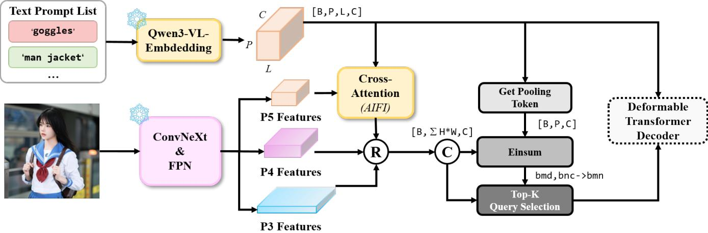  
Figure A1: Transformer-based implementation of the proposed mACH framework. Early multimodal interaction is introduced through the AIFI module, while the conventional grounding head is replaced by mACH. The deformable transformer decoder and box regression branch remain identical to the original detector.

Figure A1 illustrates our transformer-based implementation using a deformable DETR-style framework. Two lightweight modifications are introduced while preserving the original detection pipeline. First, to enable early vision-language interaction, the finest-scale visual features are concatenated with the language embeddings and jointly processed by the AIFI module. Second, the conventional grounding head is replaced by the proposed mACH head, while the deformable transformer decode and the bounding-box regression branch remain unchanged.

Figure A2 further compares our grounding framework with Grounding DINO. Unlike Grounding DINO, which injects language cross-attention into every decoder layer, our design keeps the deformable decoder purely visual and performs cross modal interaction only in the lightweight mACH head after object decoding. This decouples object decoding from language grounding, preserves the standard box-level Hungarian assignment during training, and avoids the token-aware matching strategy adopted by Grounding DINO, resulting in a substantially simpler training pipeline.

As demonstrated by the experimental results in the main paper, this design consistently improves both CNN-based and transformer-based grounding architectures, indicating that mACH serves as a generic grounding head independent of the underlying visual backbone.

## Appendix B: Directional Alignment Capacity

This appendix formalizes the argument of the Theoretical Analysis section: each architecture determines which gradient directions are reachable on the shared features, and the reachable dimensions of the three objectives form the ladder $N _ { c } <$ $N - N _ { c } < C$ . We define a directional measure of localization signal (Definition 1), show that it persists only on gradientsustained directions (Lemma 2), compute the reachable subspace of each objective (Lemmas 3–7), and compare the three paradigms (Theorem 8, Corollaries 9 and 10).

## 6.1 Setup

Notation. Each image is represented by visual tokens $X = [ x _ { 1 } , \dots , x _ { M } ] \in \mathbb { R } ^ { C \times M }$ (the shared trunk output; the query projection is absorbed into X), paired with $N _ { c }$ referring expressions, the i-th given by token embeddings $T ^ { ( i ) } = [ t _ { 1 } ^ { ( i ) } , \dots , t _ { L _ { i } } ^ { ( i ) } ] \in \mathbb { R } ^ { d \times L _ { i } }$ ; write $\begin{array} { r } { N : = \sum _ { i = 1 } ^ { N _ { c } } L _ { i } } \end{array}$ . Positive expressions are fixed per image; negatives are resampled every iteration. Let $\Xi _ { X } : = \mathbb { E } [ ( x _ { m } -$ $\bar { x } ) ( x _ { m } - \bar { x } ) ^ { \top } ]$ be the centered token covariance, and for any objective $\mathcal { L }$ acting on X, define its gradient field and gradient second moment

$$
G ( \mathcal { L } ) : = \nabla _ { X } \mathcal { L } , \qquad \Gamma ( \mathcal { L } ) : = \mathbb { E } \big [ G ( \mathcal { L } ) G ( \mathcal { L } ) ^ { \top } \big ] .\tag{A1}
$$

The head broadcasts X along the text axis; backpropagation through a broadcast is branch summation, so all $N _ { c }$ text branches accumulate their gradients on the same $X$ :

$$
G ( \mathcal { L } _ { \mathrm { m } } ) = \frac { 1 } { N _ { c } } \sum _ { i = 1 } ^ { N _ { c } } G ^ { ( i ) } .\tag{A2}
$$

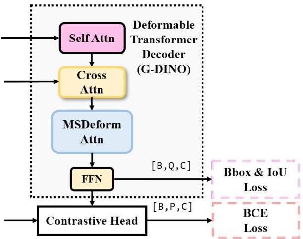

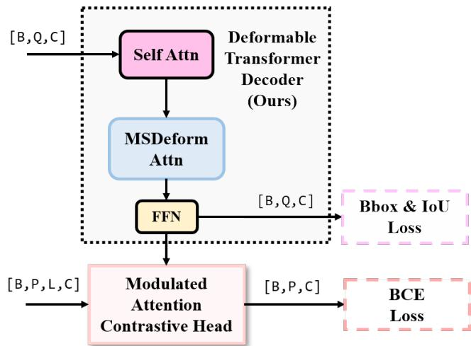  
Figure A2: Comparison between Grounding DINO and the proposed transformer-based grounding framework. Grounding DINO performs language cross-attention inside every decoder layer, whereas our approach keeps the decoder purely visual and delegates cross-modal interaction to the lightweight mACH prediction head. Consequently, the proposed design preserves the standard box-level Hungarian assignment and simplifies the overall training pipeline.

mACH forward map. Keys $k _ { l } ^ { ( i ) } = W _ { K } t _ { l } ^ { ( i ) }$ , logits $a _ { m , l } ^ { ( i ) } = { x _ { m } ^ { \top } k _ { l } ^ { ( i ) } } / { \sqrt { C } } ,$ attention $A _ { m , l } ^ { ( i ) } = \mathrm { s o f t m a x } _ { l } ( a _ { m , l } ^ { ( i ) } )$ , and scores

$$
S _ { m } ^ { ( i ) } = \sum _ { l = 1 } ^ { L _ { i } } A _ { m , l } ^ { ( i ) } c _ { l } ^ { ( i ) } + b , \qquad c _ { l } ^ { ( i ) } : = e ^ { \tau } w _ { \psi } ^ { \top } W _ { V } t _ { l } ^ { ( i ) } \in \mathbb { R } .\tag{A3}
$$

The logit scale $e ^ { \tau }$ and bias b shift and rescale scores uniformly and play no directional role. The grounding objective is ${ \mathcal { L } } _ { \mathrm { m } } = { \mathcal { L } } _ { \mathrm { B C E } } ( S )$

JEPA stream. A student $\mathcal { P } _ { \theta } : \mathbb { R } ^ { C }  \mathbb { R } ^ { C }$ is paired with an EMA teacher updated as

$$
\mathcal { P } _ { \mathrm { E M A } }  \lambda \mathcal { P } _ { \mathrm { E M A } } + ( 1 - \lambda ) \mathcal { P } _ { \theta } , \qquad \lambda \in ( 0 , 1 ) .\tag{A4}
$$

For $z _ { m } = \mathcal { P } _ { \theta } ( x _ { m } )$ and a stochastically resampled mask Ω,

$$
z _ { m } ^ { \mathrm { m s k } } = \left\{ \begin{array} { l l } { \mu + \epsilon , } & { m \in \Omega , } \\ { z _ { m } , } & { m \not \in \Omega , } \end{array} \right. \quad \epsilon \sim { \mathcal N } ( 0 , \sigma ^ { 2 } I ) \quad \Longrightarrow \quad \frac { \partial z _ { m } ^ { \mathrm { m s k } } } { \partial x _ { m } } = \mathbf { 0 } , \ m \in \Omega .\tag{A5}
$$

With $T ^ { \prime } = W _ { \mathrm { p r o j } } [ T ^ { ( 1 ) } , \dots , T ^ { ( N _ { c } ) } ] \in \mathbb { R } ^ { C \times N }$ , a joint self-attention predictor (parameters $\phi )$ operates on $[ ( Z ^ { \mathrm { m s k } } ) ^ { \top } ; ( T ^ { \prime } ) ^ { \top } ]$ with block afinity

$$
\mathcal { A } = \left( \begin{array} { l l } { \mathcal { A } _ { v v } } & { \mathcal { A } _ { v t } } \\ { \mathcal { A } _ { t v } } & { \mathcal { A } _ { t t } } \end{array} \right) , \qquad \hat { z } _ { \mathrm { p r e d } , o } = \sum _ { j \notin \Omega } \mathcal { A } _ { v v , o , j } W _ { V } ^ { ( v ) } z _ { j } + \sum _ { l = 1 } ^ { N } \mathcal { A } _ { v t , o , l } W _ { V } ^ { ( t ) } t _ { l } ^ { \prime } , \quad o \in \Omega ,\tag{A6}
$$

where constant contributions of masked-token values are absorbed into the predictor bias. With ${ \bar { u } } : = u / \| u \|$ and $z _ { \mathrm { t g t } , o } =$ $\mathcal { P } _ { \mathrm { E M A } } ( x _ { o } )$

$$
\mathcal { L } _ { \mathrm { J } } = \frac { 1 } { | \Omega | } \sum _ { o \in \Omega } \Big [ \big ( 1 - \langle \bar { \bar { z } } _ { \mathrm { p r e d } , o } , \bar { z } _ { \mathrm { t g t } , o } \rangle \big ) + \beta \operatorname { S m o o t h L 1 } \big ( \bar { \bar { z } } _ { \mathrm { p r e d } , o } , \bar { z } _ { \mathrm { t g t } , o } \big ) \Big ] , \qquad \mathcal { L } _ { \mathrm { t o t } } = \mathcal { L } _ { \mathrm { m } } + \alpha \mathcal { L } _ { \mathrm { J } } .\tag{A7}
$$

Roles of the four blocks. The loss supervises only masked visual predictions. Gradient therefore flows back to X through $A _ { v v } .$ , which routes the driving signal from masked positions to unmasked visual tokens. The $\mathcal { A } _ { v t }$ path lets text context modulate the predictions – and couples the afinities to T through the softmax normalization – but the results below do not rely on it. The text-side outputs, governed by $\mathcal { A } _ { t v }$ and $A _ { t t } ,$ receive no supervision and carry no gradient.

Grounding requires the score map to vary across positions: a flat score map carries no localization signal. Since the attention logits are linear in the visual tokens, $a _ { m } = x _ { m } ^ { \top } k$ , their spatial discriminability is exactly $\mathrm { V a r } _ { m } ( a _ { m } )$ ; the following definition is therefore a property of the attention mechanism itself rather than an ad hoc construct.

Definition 1 (Directional Alignment Capacity). For a unit direction $k \in \mathbb { R } ^ { C }$

$$
\mathrm { c a p } ( k ) : = \mathrm { V a r } _ { m } \big ( x _ { m } ^ { \top } k \big ) \ = \ k ^ { \top } \Xi _ { X } k .\tag{A8}
$$

$\exp ( k )$ is the spatial variance of the attention logits available to any token whose key points along $k ; \mathrm { c a p } ( k ) = 0$ implies position-independent attention and hence a flat score map. We call $\mathbf { \dot { \{ k : \cos ( k ) = 0 \} } }$ the alignment-blind subspace and its complement the alignment-active subspace.

## 6.2 Gradient-Sustained Capacity

Alignment capacity is not a static property of the representation: under weight decay, feature variance contracts unless contin uously replenished by the optimization signal. We model this as $\dot { X } = - G B - \lambda X$ , where $\lambda > 0$ is the decay rate and $B \succeq 0$ an arbitrary backbone-induced preconditioner (exact for a terminal linear map $X = W H$ with decayed W, where $B = H ^ { \top } H$ and for degree-1 homogeneous feature maps with full decay, where $B = J J ^ { \dagger } )$ . Only one property is used below: the excitation term vanishes on directions orthogonal to all gradient columns.

Lemma 2 (Gradient sustains directional variance). $I f k ^ { \top } G ( \mathcal { L } ) = \mathbf { 0 }$ almost surely along the trajectory, then

$$
k ^ { \top } \Xi _ { X } ^ { ( t ) } k \ \leq \ e ^ { - 2 \lambda t } k ^ { \top } \Xi _ { X } ^ { ( 0 ) } k ,\tag{A9}
$$

i.e. $\displaystyle \exp ( k ) \to 0 ;$ directional variance persists only where the gradient signal sustains it.

Proof. For $\begin{array} { r } { e _ { m } : = ( k ^ { \top } x _ { m } ) ^ { 2 } , \dot { e } _ { m } = - 2 ( k ^ { \top } x _ { m } ) k ^ { \top } [ G B ] _ { m } - 2 \lambda e _ { m } } \end{array}$ . Since $\begin{array} { r } { [ G B ] _ { m } = \sum _ { i } g _ { j } B _ { j m } } \end{array}$ and $k ^ { \top } g _ { j } = 0$ a.s. for every column $j ,$ the first term vanishes for any $B \succeq 0$ , giving $\dot { e } _ { m } = - 2 \lambda e _ { m } ;$ the token mean decays at the same rate, yielding the claim for the centered variance. □

## 6.3 Gradient Subspaces of the Three Objectives

Lemma 3 (Pooled contrastive head). For $S _ { m } ^ { ( i ) } = ( t ^ { ( i ) } ) ^ { \top } x _ { m }$ with pooled text vector $t ^ { ( i ) } \in \mathbb { R } ^ { C }$ , writing the BCE residual $\delta _ { m } ^ { ( i ) } : = \partial \mathcal { L } _ { \mathrm { B C E } } / \partial S _ { m } ^ { ( i ) }$

$$
G _ { \mathrm { c o n t r a s t } } = \frac { 1 } { N _ { c } } \sum _ { i = 1 } ^ { N _ { c } } t ^ { ( i ) } ( \delta ^ { ( i ) } ) ^ { \top } , \qquad \mathrm { C o l } ( G _ { \mathrm { c o n t r a s t } } ) \subseteq \mathrm { s p a n } \{ t ^ { ( i ) } \} _ { i = 1 } ^ { N _ { c } } , \quad \dim \leq N _ { c } .\tag{A10}
$$

Proof. Since $\nabla _ { x _ { m } } S _ { m } ^ { ( i ) } = t ^ { ( i ) }$ , the branch gradient at token m is $g _ { m } ^ { ( i ) } = \delta _ { m } ^ { ( i ) } t ^ { ( i ) }$ ; stacking the M columns, $G ^ { ( i ) } = t ^ { ( i ) } { \left( \delta ^ { ( i ) } \right) } ^ { \top }$ with $\pmb { \delta } ^ { ( i ) } : = ( \delta _ { 1 } ^ { ( i ) } , \dots , \delta _ { M } ^ { ( i ) } ) ^ { \top }$ . Assembling via (A2),

$$
G _ { \mathrm { c o n t r a s t } } = \frac { 1 } { N _ { c } } \sum _ { i = 1 } ^ { N _ { c } } t ^ { ( i ) } \left( \delta ^ { ( i ) } \right) ^ { \top } \longrightarrow \mathrm { C o l } ( G _ { \mathrm { c o n t r a s t } } ) \subseteq \sum _ { i = 1 } ^ { N _ { c } } \mathrm { s p a n } \{ t ^ { ( i ) } \} = \mathrm { s p a n } \{ t ^ { ( i ) } \} _ { i = 1 } ^ { N _ { c } } , \qquad \mathrm { d i m } \le N _ { c } .\tag{A11}
$$

Lemma 4 (mACH head). With the centered key subspace

$$
\mathcal { V } _ { T } ^ { 0 } : = \sum _ { i = 1 } ^ { N _ { c } } \left\{ W _ { K } T ^ { ( i ) } \beta : \mathbf { 1 } ^ { \top } \beta = 0 \right\} , \qquad \mathrm { C o l } ( G _ { \mathrm { m a C H } } ) \subseteq \mathcal { V } _ { T } ^ { 0 } , \qquad \mathrm { r a n k } ( G _ { \mathrm { m a C H } } ) \leq \operatorname* { m i n } \left( C , \ N - N _ { c } \right) ,\tag{A12}
$$

per iteration. Over training, the visited union of these subspaces remains within the image of the frozen text-embedding manifold, whose efective dimension is measurable ofline.

Proof. $S _ { m } ^ { ( i ) }$ depends on $x _ { m }$ only through the logits $a _ { m , l } ^ { ( i ) }$ . The softmax Jacobian $\partial A _ { m , l } ^ { ( i ) } / \partial a _ { m , j } ^ { ( i ) } = A _ { m , l } ^ { ( i ) } ( \delta _ { l j } - A _ { m , j } ^ { ( i ) } )$ gives

$$
\nabla _ { x _ { m } } S _ { m } ^ { ( i ) } = \frac { 1 } { \sqrt { C } } \sum _ { l , j } c _ { l } ^ { ( i ) } A _ { m , l } ^ { ( i ) } \left( \delta _ { l j } - A _ { m , j } ^ { ( i ) } \right) k _ { j } ^ { ( i ) } = \frac { 1 } { \sqrt { C } } \sum _ { j } \beta _ { m , j } ^ { ( i ) } k _ { j } ^ { ( i ) } , \qquad \beta _ { m , j } ^ { ( i ) } : = A _ { m , j } ^ { ( i ) } \left( c _ { j } ^ { ( i ) } - \sum _ { l } A _ { m , l } ^ { ( i ) } c _ { l } ^ { ( i ) } \right) .\tag{A13}
$$

Since $\begin{array} { r } { \sum _ { j } A _ { m , j } ^ { ( i ) } = 1 } \end{array}$

$$
\sum _ { j } \beta _ { m , j } ^ { ( i ) } = \sum _ { j } A _ { m , j } ^ { ( i ) } c _ { j } ^ { ( i ) } - \biggl ( \sum _ { j } A _ { m , j } ^ { ( i ) } \biggr ) \biggl ( \sum _ { l } A _ { m , l } ^ { ( i ) } c _ { l } ^ { ( i ) } \biggr ) = 0 .\tag{A14}
$$

In matrix form, with $\beta _ { m } ^ { ( i ) } : = ( \beta _ { m , 1 } ^ { ( i ) } , \ldots , \beta _ { m , L _ { i } } ^ { ( i ) } ) ^ { \top }$ and $k _ { j } ^ { ( i ) } = W _ { K } t _ { j } ^ { ( i ) }$

$$
\nabla _ { x _ { m } } S _ { m } ^ { ( i ) } = \frac { 1 } { \sqrt { C } } W _ { K } T ^ { ( i ) } \beta _ { m } ^ { ( i ) } , \qquad { \bf 1 } ^ { \top } \beta _ { m } ^ { ( i ) } = 0 .\tag{A15}
$$

The branch gradient $g _ { m } ^ { ( i ) } = \delta _ { m } ^ { ( i ) } \nabla _ { x _ { m } } S _ { m } ^ { ( i ) }$ difers only by the scalar BCE residual, so every column of $G ^ { ( i ) }$ lies in $\{ W _ { K } T ^ { ( i ) } \beta$ $\mathbf { 1 } ^ { \top } \beta = 0 \}$ , a subspace of dimension at most $L _ { i } - 1$ . Assembling via (A2),

$$
\mathrm { C o l } ( G _ { \mathrm { m a x G H } } ) \subseteq \sum _ { i = 1 } ^ { N _ { c } } \mathrm { C o l } ( G ^ { ( i ) } ) \subseteq \sum _ { i = 1 } ^ { N _ { c } } \left\{ W _ { K } T ^ { ( i ) } \beta : \mathbf { 1 } ^ { \top } \beta = 0 \right\} = : \mathcal { V } _ { T } ^ { 0 } , \qquad \dim \mathcal { V } _ { T } ^ { 0 } \leq \sum _ { i = 1 } ^ { N _ { c } } ( L _ { i } - 1 ) = N - N _ { c } .\tag{A16}
$$

Lemma 5 (Text-free driving signal). The JEPA field is driven by text-free targets: the loss gradients $h _ { o } : = \nabla _ { \hat { z } _ { \mathrm { p r e d } , o } } \mathcal { L } _ { \mathrm { J } }$ point toward EMA targets ${ \mathcal { P } } _ { \mathrm { E M A } } ( x _ { o } )$ ,functions ofX alone $( \mathbf { A } 4 ) – ( \mathbf { A } 7 )$ . Hence $\operatorname { C o l } ( G _ { \mathrm { J } } )$ is not algebraically confined to $\mathcal { V } _ { T } ^ { 0 }$ , in contrast to Lemmas 3 and 4.

Proof. Let $p _ { o } : = \hat { z } _ { \mathrm { p r e d } , o }$ and $\ell ( p , z )$ denote the per-token loss in (A7), and let $J _ { \bar { z } } : = \partial \bar { z } / \partial z = ( I - \bar { z } \bar { z } ^ { \top } ) / \| z \|$ be the sphere-projection Jacobian. The driving signal is

$$
h _ { o } = \nabla _ { p _ { o } } \mathcal { L } _ { \mathrm { J } } = \frac { 1 } { | \Omega | } J _ { \bar { p } _ { o } } ^ { \top } \Big [ - \bar { z } _ { \mathrm { t g t } , o } + \beta J _ { \bar { z } _ { \mathrm { t g t } , o } } \phi _ { \beta } \big ( \bar { p } _ { o } - \bar { z } _ { \mathrm { t g t } , o } \big ) \Big ] ,\tag{A17}
$$

where $\phi _ { \beta }$ is the SmoothL1 derivative applied componentwise. Since $z _ { \mathrm { t g t } , o } = \mathcal { P } _ { \mathrm { E M A } } ( x _ { o } )$ , every term in $h _ { o }$ is a function of $( X , \theta )$ alone. Chain rule through (A6) then gives the field on unmasked tokens:

$$
\begin{array} { r } { G _ { \mathfrak { I } } \big | _ { \Omega ^ { c } } = \underbrace { ( W _ { V } ^ { ( v ) } ) ^ { \top } { \displaystyle \sum _ { o \in \Omega } } h _ { o } ( \mathcal { A } _ { v v , o , \cdot } ) ^ { \top } } _ { \mathrm { v a l u e ~ p a t h } } + \underbrace { \sum _ { o \in \Omega } \left( \frac { \partial \mathcal { A } _ { o , \cdot } } { \partial Z } \right) ^ { \top } \big ( h _ { o } ( p _ { o } ^ { ( \mathrm { v a l } ) } ) ^ { \top } \big ) } _ { \mathrm { a f f i n i t y p a t h } } , } \end{array}\tag{A18}
$$

with $p _ { o } ^ { \mathrm { ( v a l ) } }$ the value vectors aggregated in (A6). Both terms, and hence $G _ { \mathrm { . I } } ^ { ( x ) } = J _ { \theta } ^ { \top } G _ { \mathrm { . } }$ , are functions of $( X , \Omega , \epsilon , \theta , \phi )$ . In contrast to Lemmas 3 and 4, no term is a structured linear combination of text vectors: $\operatorname { C o l } ( G _ { \mathrm { J } } )$ is not algebraically confined to $\mathcal { V } _ { T } ^ { 0 }$ □

Write $G _ { \mathrm { m } } : = G ( \mathcal { L } _ { \mathrm { m } } )$ and $G _ { \mathrm { J } } : = G ( \mathcal { L } _ { \mathrm { J } } )$ , so that the joint field of ${ \mathcal L } _ { \mathrm { t o t } }$ is

$$
G = G _ { \mathrm { m } } + \alpha G _ { \mathrm { J } } .\tag{A19}
$$

Centering the JEPA field over the mask noise defines the fluctuation and its second moment,

$$
\xi _ { \mathrm { J } } : = G _ { \mathrm { J } } - \mathbb { E } _ { \Omega , \epsilon } \big [ G _ { \mathrm { J } } \big | X , T \big ] , \qquad \Gamma _ { \mathrm { J } } : = \mathbb { E } \big [ \xi _ { \mathrm { J } } \xi _ { \mathrm { J } } ^ { \top } \big ] \succeq 0 .\tag{A20}
$$

The conditional mean is absorbed by the deterministic discriminative component; $\Gamma _ { \mathrm { J } }$ measures the part of the JEPA signal that varies under mask resampling and therefore cannot cancel against $G _ { \mathrm { m } }$

Assumption 6 (Nondegenerate JEPA fluctuation). The mask-noise fluctuation $\xi _ { \mathrm { J } }$ is not almost surely confined to any hyperplane: for every unit $u , \mathbb { E } [ ( u ^ { \top } \xi _ { \mathrm { J } } ) ^ { 2 } ] > 0$

Lemma 7 (Full-support spectral floor). Under Assumption $6 , \Gamma _ { \mathrm { J } } \succeq c _ { \mathrm { J } } I$ with $c _ { \mathrm { J } } : = \lambda _ { \mathrm { m i n } } ( \Gamma _ { \mathrm { J } } ) > 0$ , and the joint field of ${ \mathcal L } _ { \mathrm { t o t } }$ satisfies

$$
\begin{array} { r } { k ^ { \top } \mathbb { E } \big [ G G ^ { \top } \big ] k \ge \alpha ^ { 2 } k ^ { \top } \Gamma _ { \mathrm { J } } k \ge \alpha ^ { 2 } c _ { \mathrm { J } } f o r e \nu e r y u n i t k . } \end{array}\tag{A21}
$$

Proof. By definition $\Gamma _ { \mathrm { { J } } } \succeq 0$ , and $u ^ { \top } \Gamma _ { \mathrm { J } } u = \mathbb { E } [ ( u ^ { \top } \xi _ { \mathrm { J } } ) ^ { 2 } ] > 0$ for every unit u by Assumption 6; hence $\Gamma _ { \mathrm { J } } \succ 0$ and $c _ { \mathrm { J } } > 0$ . For the joint field, conditional on $( X , T )$ the vector $k ^ { \top } ( \dot { G } _ { \mathrm { m } } + \alpha \mathbb { E } _ { \Omega , \epsilon } G _ { \mathrm { J } } )$ is constant and $\mathbb { E } _ { \Omega , \epsilon } [ \xi _ { \mathrm { J } } \mid X , T ] = 0 .$ , so

$$
\begin{array} { r } { k ^ { \top } \mathbb { E } \big [ G G ^ { \top } \big ] k = \mathbb { E } _ { X , T } \Big [ \Big \lVert k ^ { \top } \big ( G _ { \mathrm { m } } + \alpha \mathbb { E } _ { \Omega , \epsilon } G _ { \mathrm { J } } \big ) \Big \rVert ^ { 2 } + \alpha ^ { 2 } k ^ { \top } \mathrm { C o v } _ { \Omega , \epsilon } \big ( G _ { \mathrm { J } } \big | X , T \big ) k \Big ] \ge \alpha ^ { 2 } k ^ { \top } \Gamma _ { \mathrm { J } } k \ge \alpha ^ { 2 } c _ { \mathrm { J } } . } \end{array}\tag{A22}
$$

The cross term vanishes since $\mathbb { E } _ { \Omega , \epsilon } [ \xi _ { \mathrm { J } } | X , T ] = 0 .$

## 6.4 Comparison

Theorem 8 (Capacity comparison). At steady state, the reachable gradient subspaces of the three objectives are span $\{ t ^ { ( i ) } \}$ $\mathcal { V } _ { T } ^ { 0 }$ , and $\mathbb { R } ^ { C }$ , with dimension budgets

$$
\dim \leq N _ { c } \quad ( c o n t r a s t i v e ) ; \qquad \dim \leq N - N _ { c } \quad ( m \mathrm { a } C H ) ; \qquad \dim = C a . s . \quad ( d u a l . s t r e a m ) .\tag{A23}
$$

Whenever $N _ { c } < N / 2$ and $N - N _ { c } < C$ (both hold in our data), the budgets are strictly increasing, forming the ladder $N _ { c } < N - N _ { c } < C$ . Consequently, only the dual-stream objective is almost surely free of alignment-blind directions—the only paradigm that preserves alignment capacity in every direction.

Proof. For the two discriminative heads, Lemmas 3 and 4 confine the gradient fields to the stated subspaces; every direction in the complements then satisfies the premise of Lemma 2 and decays to zero capacity. For the dual-stream objective, write $\Gamma : = \mathbb { E } [ G \dot { G } ^ { \top } ] \succeq 0$ and note that for any unit k,

$$
k \in \mathrm { \mathrm { n u l l } } ( \Gamma ) \ \Longleftrightarrow \ k ^ { \top } \Gamma k = \mathbb { E } \big | \big | k ^ { \top } G \big | \big | ^ { 2 } = 0 \ \Longleftrightarrow \ k ^ { \top } G = { \bf 0 } \ \mathrm { \mathrm { a . s . } } ,\tag{A24}
$$

so the premise of Lemma 2 holds exactly on null(Γ). Lemma 7 gives

$$
\Gamma \succeq \alpha ^ { 2 } c _ { \mathrm { J } } I \succ 0 \iff \mathrm { C o l } ( \Gamma ) = \mathbb { R } ^ { C } , \qquad \mathrm { n u l l } ( \Gamma ) = \{ \bf 0 \} .\tag{A25}
$$

Hence the reachable gradient subspace has dimension $C ,$ and no direction satisfies the decay premise at any iteration; under the sustained-excitation mechanism of Section 6.2, every direction retains positive capacity. □

Corollary 9 (Representation diversity). Since $\Xi _ { X } \succeq 0 ,$

$$
\mathrm { c a p } ( k ) = 0 \iff k ^ { \intercal } \Xi _ { X } k = 0 \iff k \in \mathrm { n u l l } ( \Xi _ { X } ) , \qquad \mathrm { r a n k } ( \Xi _ { X } ) = \dim ( a l i g n m e n t - a c t i v e s u b s p a c e ) .\tag{A26}
$$

At steady state, thefeature rank therefore obeys the ladder ofTheorem 8: rank $( \Xi _ { X } ) \leq N _ { c }$ under contrastive training, $\leq N - N _ { c }$ under mACH, and = C under the dual-stream objective (Assumption 6).

Corollary 10 (Novel expressions). If an out-of-distribution expression produces a key direction $k _ { \perp }$ outside the reachable subspace visited during training, then at steady state

$$
\mathrm { c a p } _ { \mathrm { c o n t r a s t } } ( k _ { \perp } ) = \mathrm { c a p } _ { \mathrm { m A C H } } ( k _ { \perp } ) = 0 , \qquad \mathrm { c a p } _ { \mathrm { t o t } } ( k _ { \perp } ) > 0 \quad ( A s s u m p t i o n \theta ) ,\tag{A27}
$$

the first two by Lemma 2, the last by Theorem 8: such expressions are alignment-blindfor both discriminative-only heads and retain positive capacity under the dual-stream objective.

## Appendix C: Curation Pipeline, Prompt Specifications, and Empirical Properties of O365-Caption

In this section, we present the comprehensive engineering specifications, algorithmic boundaries, structural system prompts, and deep empirical properties that characterize the curation of the O365-Caption dataset. To facilitate full reproducibilit and provide an exhaustive disclosure of our data-side contributions, our exposition is organized into three complementary subsections: (1) The Three-Stage Generative Pipeline, detailing the algorithmic taxonomy mapping and automated geometric guardrails; (2) Prompt Specifications, providing the exact, unedited English and Chinese systemic prompt templates used to instruct our Multimodal Large Language Models (MLLMs); and (3) Linguistic and Statistical Properties, delivering a global quantitative deconstruction of our dataset’s vocabulary density, syntax length, and part-of-speech distributions against standard visual grounding baselines.

Through this multi-dimensional documentation, we demonstrate how O365-Caption systematically upgrades the rigid, discrete single-word category tags of legacy detection assets into high-density, context-aware, and open-vocabulary referring expressions suitable for industrial-scale generalist pre-training.

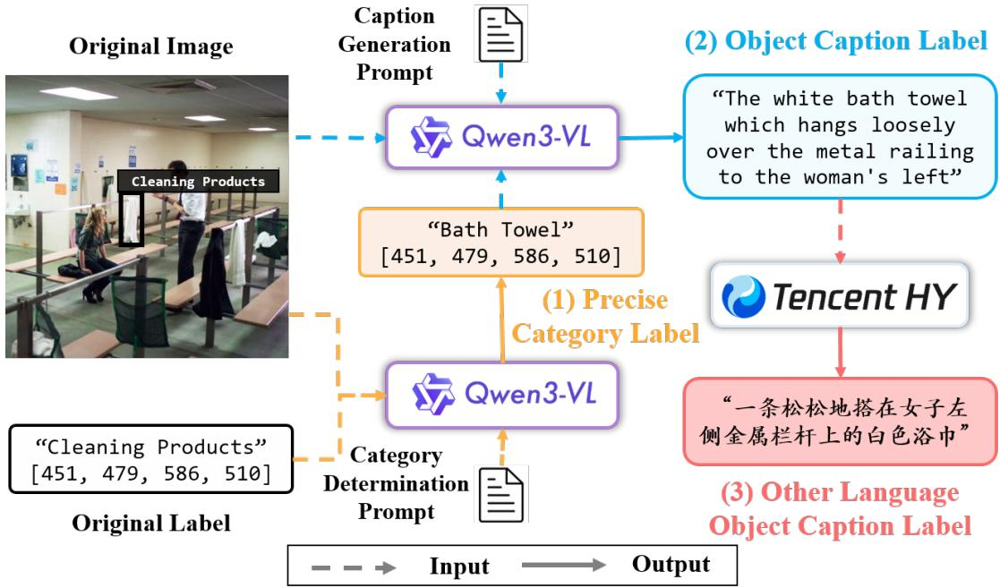  
Figure A3: The detailed three-stage data generation pipeline of O365-Caption.(An enlarged detailed view of $F i g .$ 3(a) from the main text.) The framework sequentially executes coarse-to-fine semantic disambiguation via Qwen3-VL-2B, dense context-aware object-level captioning via Qwen3-VL-32B, and cross-lingual translation via the Tencent HY-MT-1.5-7B engine.

## 6.5 The Pipeline of Constructing Objects365-Caption

Crucially, a definitive advantage of this three-stage pipeline is its dataset-agnostic versatility; the underlying framework is completely decoupled from Objects365-specific topologies. It can be seamlessly deployed across virtually any legacy object detection asset (such as COCO, OpenImages, or LVIS) to systematically upgrade rigid, closed-set categorical annotations into rich, open-vocabulary grounding tokens without requiring expensive manual re-labeling. The transformation workflow is strictly compartmentalized into three sequential stages, accompanied by automated geometric guardrails.

Stage 1: Coarse-to-Fine Semantic Disambiguation The original vocabulary of Objects365 frequently relies on highly coarse or generalized container tags (e.g., “Cleaning Products” or “Other Shoes”) to optimize manual labeling throughput. Directly optimizing open-vocabulary heads on such fuzzy semantic anchors introduces substantial cross-modal gradient contradictions. To resolve this, we leverage a lightweight yet eficient Qwen3-VL-2B model (Bai et al. 2025) to perform visual semantic disambiguation.

Conditioned on the original image, target bounding box coordinates $[ x _ { \mathrm { m i n } } , y _ { \mathrm { m i n } } , x _ { \mathrm { m a x } } , y _ { \mathrm { m a x } } ]$ , and a specialized Category Determination Prompt, the model dynamically inspects the localized region to identify the precise subordinate taxonomy. For instance, as visualized in Fig. A3, the coarse tag “Cleaning Products” is accurately mapping onto the granular classification “Bath Towel”.

Critically, Multimodal Large Language Models (MLLMs) inherently sufer from performance degradation and low classification accuracy when processing severely downscaled visual patches. To safeguard our pipeline against small-object hallucinations, we instantiate a rigid spatial filtering threshold based on the relative bounding box coverage:

$$
\gamma = \frac { \mathrm { A r e a } _ { \mathrm { b b o x } } } { \mathrm { A r e a } _ { \mathrm { i m a g e } } } = \frac { \left( x _ { \mathrm { m a x } } - x _ { \mathrm { m i n } } \right) \times \left( y _ { \mathrm { m a x } } - y _ { \mathrm { m i n } } \right) } { H _ { \mathrm { i m a g e } } \times W _ { \mathrm { i m a g e } } }\tag{A28}
$$

For any target instance where $\gamma < 0 . 0 5 \%$ , the semantic refinement stage is bypassed, and the pipeline safely falls back to the original coarse label. This defensive engineering constraint protects data cleanliness but structurally explains the conservative unique caption ratio (UCR) observed in the small-object slices of the final corpus.

Stage 2: Context-Aware Caption Generation Once the precise taxonomy is anchored, the instance is forwarded to a powerful Qwen3-VL-32B model tasked with dense language synthesis. This stage introduces a dedicated Caption Generation Prompt that instructs the model to construct a rich, continuous referring expression by combining three essential dimensions: (1) the purified fine-grained category name from Stage 1, (2) localized visual attributes such as color, material, and state, and (3) relative spatial dynamics with surrounding objects.

The model outputs highly descriptive, context-aware phrases, successfully upgrading a simple noun phrase into an openvocabulary grounding target (e.g., transforming “Bath Towel” into “The white bath towel which hangs loosely over the metal railing to the woman’s left”). This extensive linguistic compositionality injects the exact high-entropy variations required to prevent the task head’s gradient field from collapsing into low-rank sub-manifolds.

Stage 3: Cross-Lingual Extension via Translation To scale the capacity of our generalist grounding architecture across global linguistic boundaries, the generated English captions undergo an automated multi-lingual expansion. We employ the advanced Tencent HY-MT-1.5-7B translation engine (Zheng et al. 2025) to convert the synchronized object-level descriptions into target languages, such as Chinese, while preserving exact syntactic mapping and spatial indices. This step transforms the corpus into a parallelized cross-lingual visual grounding benchmark, ensuring the mACH alignment weights remain robust under diverse multi-lingual prompt distributions without requiring test-time structural adaptation.

Post-Processing Quality Control Following the three-stage generation, a non-parametric quality filter is executed to strip away textual noise. We discard any generated descriptions that contain dangling pronouns or fail to exceed a baseline length of three tokens. Through this data-model co-design pipeline, O365-Caption establishes a robust, highly compositional, and structurally clean data asset comprising 10.0M precise spatial-textual alignment targets.

## 6.6 Prompt Specifications

## Stage 1: Category Determination Prompt

## Role

You are a fine-grained visual classifier and semantic disambiguation assistant, specialized in identifying the exact sub-category of an object within a designated bounding box.

## Inputs

• Image: The full image.

• Bounding Box: [x1, y1, x2, y2]

• Coarse Category Label: The initial broad category name from Objects365 (e.g., "Cleaning Products", "Other Shoes", "Vehicle").

## Core Task

Examine the region defined by the bounding box. Perform semantic disambiguation and fine-grained refinement on the provided Coarse Category Label based on the visual context. Determine the precise, specific name of the target object (e.g., refine "Cleaning Products" to "Bath Towel", "Other Shoes" to "Boots", or "Vehicle" to "SUV").

## Output Rules (Strictly Enforced)

1. Return ONLY the refined, fine-grained category name (a single noun or short noun phrase).

2. Do NOT include any quantifiers, articles ("a", "an", "the"), descriptive adjectives, punctuation, or conversational explanations.

3. If the object is too small, blurry, or heavily obscured to be further specified, return the original [Coarse Category Label] exactly.

## Examples

• Input: Box=[451, 479, 586, 510], Coarse Category=Cleaning Products Output: Bath Towel

• Input: Box=[100, 200, 150, 250], Coarse Category=Other Shoes Output: Boots

• Input: Box=[50, 50, 70, 70], Coarse Category=Bird (Too small to specify the species) Output: Bird

## Stage 2: Caption Generation Prompt

## Role

You are a precise visual grounding description assistant, specialized in generating standardized, open-vocabulary phrases for specific target objects within a designated bounding box.

## Inputs

• Image: The full image.

• Bounding Box: [x1, y1, x2, y2]

• Refined Target Category: The precise category name purified from Stage 1 (e.g., "SUV", "Bath Towel", "Tree").

## Core Task

1. Attribute and Context Extraction: Observe the target within the bounding box, capturing its salient visual attributes (color, material, state) and its spatial relationships relative to the surrounding environment.

2. Instance Counting: Examine the bounding box region carefully to determine the density or distribution of the specified target category.

## Output Rules (Strictly Enforced)

## 1. Format Specification:

• Output ONLY a single, continuous descriptive noun phrase in the format: "[Quantifier] + [Descriptive Attributes/Context] + [Refined Target Category]".

• Do NOT include any punctuation (periods, quotation marks), line breaks, or conversational explanations.

• Correct: a red SUV, several roadside green trees

• Incorrect: A red umbrella. (Contains a period), There are three umbrellas in this box (Contains explanation)

## 2. Quantifier Constraints:

• If Count = 1: Must use a standard singular quantifier (e.g., "a", "an", "the", or "one").

• If Count > 1: Never use exact numbers. You must use indefinite or vague plural quantifiers (e.g., "multiple", "several", "a row of", "a group of").

## 3. Spatial Context and Partial Cropping:

• If the box contains only a subset of a group of identical items (e.g., framing only the 2 leftmost cars in a long row): The description must incorporate relative positioning, e.g., "the leftmost white sedans".

• If the box encompasses the entirety of the visible group: Describe only the attributes and vague quantity, e.g., "several white sedans".

4. Uncertainty Fallback:

• If details or counts are severely obscured, fallback to the vague plural quantifier "multiple" and retain the base [Refined Target Category] name exactly.

## Examples

• Input: Box=[100,100,300,300], Refined Target=SUV, 1 red SUV inside Output: a red SUV

• Input: Box=[200,200,800,400], Refined Target=Tree, a row of 5 trees inside Output: several roadside green trees

• Input: Box=[0,0,200,200], Refined Target=Apple, a countless pile of red apples inside Output: multiple red apples

## 6.7 Detailed Linguistic and Statistical Properties of O365-Caption

To provide a transparent, macro-level evaluation of the proposed O365-Caption dataset, we conduct a comprehensive statistical and linguistic analysis across four core dimensions: vocabulary scaling behaviors, sentence length distributions, lexical growth patterns, and part-of-speech (POS) compositions. We benchmark our corpus against three prominent grounding and phrase alignment datasets: MixGrounding, flickr30k, and RefCOCOg. The aggregated empirical results are visualized in Fig. A4.

By analyzing the four-quadrant distribution in Fig. A4, we derive the following critical observations regarding the compositionality and scaling capacity of O365-Caption:

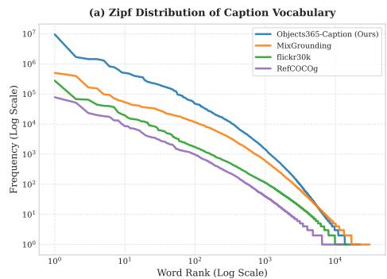  
(c) Vocabulary Growth Curve (Heaps' Law)

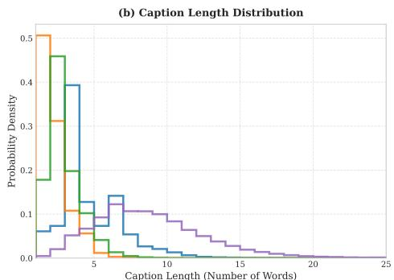

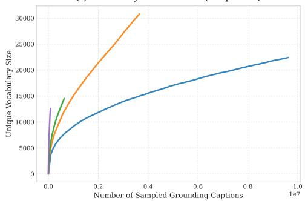

(d) Part-of-Speech (POS) Compositional Comparison  
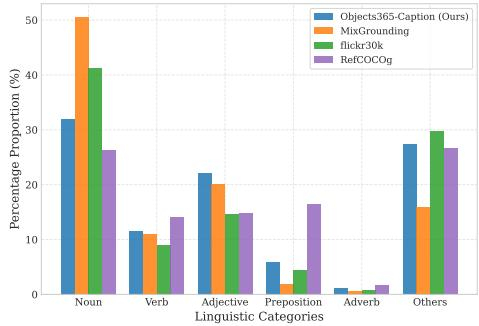  
Figure A4: Comprehensive linguistic and statistical landscape of O365-Caption compared with prominent baselines.(An enlarged detailed view of Fig. 3(b) from the main text.) (a) Zipf’s law distribution tracking absolute word frequencies agains vocabulary ranks. (b) Probability density estimation of caption length (word count per expression). (c) Unique vocabulary growth curves as a function of sampled grounding captions (Heaps’ Law). (d) Relative percentage composition of granular part-of-speech (POS) tags calculated via the NLTK parser(Loper and Bird 2002). Zoom in for best view.

• Zipfian Vocabulary Distribution (Fig. A4a): In the log-log frequency-rank plane, all examined corpora conform to standard power-law scaling(Zipf 2016). Crucially, our O365-Caption (blue curve) dominates the vertical frequency spectrum, exceeding comparative baselines by 1 to 2 orders of magnitude with an absolute peak frequency approaching 107. Moreover, its tail extends continuously toward the high-rank open-vocabulary domain without sharp truncation, proving that our dataset efectively injects massive scaling volume while maintaining a structurally healthy long-tail vocabulary distribution.

• Density Alignment of Caption Lengths (Fig. A4b): The probability density estimation unveils sharp topological discrepancies in expression length. While MixGrounding collapses into a sparse noun-phrase peak (1 ∼ 2 words) and RefCOCOg exhibits an over-dispersed, redundant long-tail stretching beyond 15 words, O365-Caption exhibits an idealized, tightly bound bell-shaped distribution peaking precisely at 4 words. This structure ensures high linguistic density and syntactic conciseness, filtering out irrelevant narrative noise while supplying optimal token-level cross-modal information for standard grounding detection heads.

• Sub-linear Vocabulary Growth (Fig. A4c): Evaluating through the lens of Heaps’ Law $( V = K \cdot N ^ { \beta } ) ( \mathrm { H e a p s }$ 1978), our dataset provides an unprecedented horizontal data span, scale-stretching to over $\mathrm { { \bar { 1 } } . 0 \times 1 0 ^ { 7 } }$ training descriptions. Although the unique vocabulary size displays a natural sub-linear asymptotic behavior as it approaches a saturation bound of over 22, 500 unique tokens, the growth trajectory retains a steady, upward-sloping derivative. This persistent elasticity serves as a critical data-side safeguard, guaranteeing that the model continually encounters novel syntactic patterns during large-scale pre-training, thereby fundamentally mitigating representation collapse.

• Deconstruction of Noun Monopoly via POS Matrix (Fig. A4d): The part-of-speech composition reveals the deeper grammatical diversity of our corpus. Traditional automated visual-grounding pairs sufer heavily from a noun monopoly, where rigid object categories dominate the text distribution (e.g., MixGrounding exhibits over 50% noun density). In contrast, O365-Caption successfully dilutes the noun ratio to a balanced 32%, while significantly lifting the proportion of Adjectives (22%) and maintaining structural distributions of Verbs and Prepositions. This high density of modifiers and spatial markers empirically verifies that our dataset is richly populated with fine-grained visual attributes and target-context relational descriptors, unlocking robust open-vocabulary grounding capability.

## 6.8 Qualitative Examples of O365-Caption

Figure A5 presents representative annotations from O365-Caption. Unlike conventional grounding datasets that typically associate each object with a short noun phrase, O365-Caption substantially enriches the linguistic diversity while preserving (b) Examples illustrating long-form descriptions, attribute composition, and multi-object reasoning.

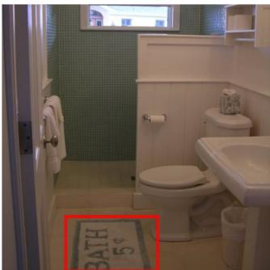  
A carpet with the words "BATH 5¢” printed on it

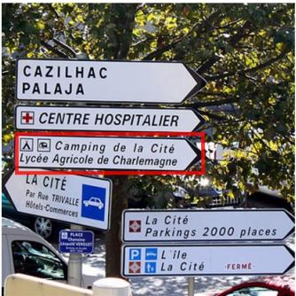  
A traffic sign indicating the directions to Camping de la Cité and Lycée Agricole de Charlemagne

  
A round Mickey Mousethemed decorative painting

  
A computer monitor displaying a Google search page

(a) Examples containing scene text, multilingual expressions, and OCR-related grounding targets.  
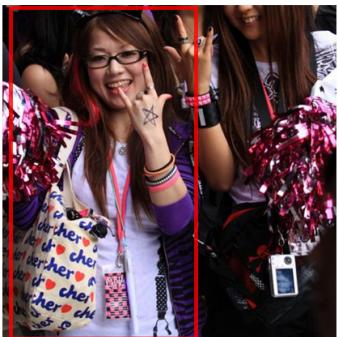  
A young woman wearing glasses, with reddish-brown hair, dressed in a purple jacket and a white T-shirt, carrying a canvas bag printed with the word "cher" and red heart patterns, and having a fivepointed star pattern painted on the back of her left hand, while also making a rockinspired gesture with her hand.

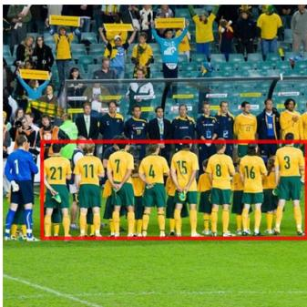  
Several football players wearing yellow jerseys are facing the stands, with many people in the substitutes' bench and spectator areas.

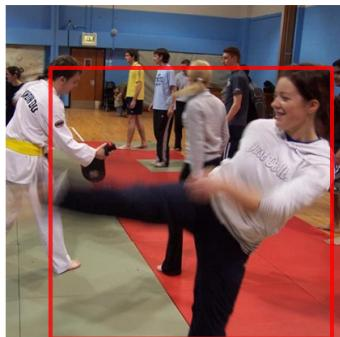  
A girl wearing a white hoodie printed with "just do it’ who is kicking her leg.

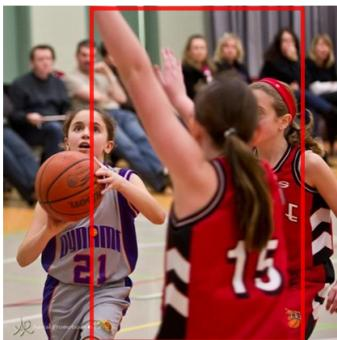  
A girl in a red No. 15 jersey is defending a girl in a No. 21 jersey.

Figure A5: Representative annotation examples from O365-Caption. Compared with conventional grounding datasets, our annotations contain richer compositional descriptions, long-form referring expressions, multi-object reasoning, and naturally preserved scene text (including multilingual and non-ASCII content), while retaining the original Objects365 bounding-box annotations.

the original Objects365 bounding-box annotations.

Specifically, the generated expressions exhibit several desirable properties:

• Rich semantic descriptions. Objects are described using complete natural language expressions instead of isolated category names, providing substantially stronger compositional supervision.

• Long-form referring expressions. Many annotations include appearance, attributes, actions, and surrounding context, producing significantly longer descriptions than existing REC datasets.

• Multi-object reasoning. Expressions frequently describe groups of objects (e.g., “Several football players wearing yellow jerseys...”) rather than a single isolated instance, encouraging relational understanding.

• Scene text and multilingual content. O365-Caption naturally preserves textual content appearing in images, including signage, trademarks, and non-English words (e.g., “Camping de la Cité”), which introduces numerous non-ASCII tokens (e.g. “5¢”) rarely covered by previous grounding datasets.

These examples illustrate the substantially richer linguistic supervision provided by O365-Caption, complementing the quantitative vocabulary statistics presented in Section Methodology.

## Appendix D: Annotation Refinement for Existing Grounding Datasets

Although the primary objective of our annotation pipeline is to construct the proposed O365-Caption dataset, the pipeline itself is general and can also be applied to improve existing automatically constructed grounding corpora. To investigate thi capability, we analyze the widely used MixedGrounding (GoldG) dataset, which serves as the pre-training corpus for several open-vocabulary grounding models.

Table A1: Representative low-information grounding expressions occurring more than 100 times in MixedGrounding (GoldG).
<table><tr><td>Category</td><td>Examples</td></tr><tr><td>Pronouns</td><td>he, she, his, him, they</td></tr><tr><td>Attributes</td><td>blue, white, red, gray, silver</td></tr><tr><td>Incomplete phrases</td><td>back, side, section, end, view</td></tr><tr><td>Generic references</td><td>object, item, someone, lot</td></tr><tr><td>Malformed fragments</td><td>wh, aprt, are t</td></tr></table>

Unlike human-written referring expressions, MixedGrounding is assembled by automatically merging heterogeneous visionlanguage datasets. Consequently, we observe that a considerable portion of its annotations are semantically incomplete or linguistically ambiguous. Typical examples include isolated pronouns (e.g., “he”, “she”, “his”, “they”), standalone attributes (e.g., “blue”, “white”, “red”), truncated noun phrases (e.g., “back”, “side”, “section”), generic object references (e.g., “object”, “item”, “someone”), and malformed text fragments (e.g., “wh”, “aprt”, “are t”). Although these expressions may correspond to valid image regions, they generally fail to uniquely identify an object and therefore provide weak supervision for referring expression grounding.

To quantify this phenomenon, Table A1 summarizes representative noisy grounding expressions that appear more than 100 times in MixedGrounding. The high frequency of these low-information annotations indicates that the problem is systematic rather than occasional.

Our annotation pipeline automatically detects such low-quality expressions and reconstructs them into complete, context aware referring descriptions while preserving the original bounding-box annotations. Specifically, the repaired captions enrich the original annotations with explicit object semantics, visual attributes, and contextual cues, substantially increasing their linguistic informativeness without modifying the associated localization labels.

These observations suggest that our annotation pipeline is not limited to constructing O365-Caption. More generally, it serves as a scalable annotation refinement framework that can systematically improve the linguistic quality of existing grounding datasets while maintaining their original spatial supervision.

## Appendix E: Implementation and Hyperparameter Details

To ensure complete empirical transparency and guarantee absolute reproducibility, we provide the exhaustive configuration profiling, optimization strategies, and hardware deployment metrics utilized across our entire pipeline. The training execution is managed via a centralized hyperparameter protocol and parallelized across a high-capacity distributed clusters. The precise operational layout across both CNN-based and DETR-based variants is structured in Tab. A2.

Table A2: Comprehensive hyperparameter and training configuration layout. This unified profile governs both the default generalist training protocol and benchmark-specific downstream adaptation variants across diferent architectural backbones.
<table><tr><td>Configuration Layer</td><td>Hyperparameter Item</td><td>Default Operational Value</td><td>Hardware / Library Anchor</td></tr><tr><td rowspan="6">(a) Infrastructure &amp; Base</td><td>Model Identifier Visual Input Resolution</td><td>CNN /DETR 640 × 640 pixels</td><td>PyTorch Pipeline Framework Downstream Edge-friendly Deployment</td></tr><tr><td>Total Pre-training Volume</td><td>30 epochs</td><td>Training Iteration Boundary</td></tr><tr><td></td><td>2.0 × 10−3 (CNN) / 1.0 × 10−4 (DETR)</td><td></td></tr><tr><td>Base Learning Rate (η)</td><td></td><td>Linear Scaling Topology Rule</td></tr><tr><td>Weight Decay Metric</td><td>0.025 (CNN) / 1.0 × 10−4 (DETR)</td><td>L2 Regularization Boundary</td></tr><tr><td>Learning Rate Schedule</td><td>Cosine Annealing (CNN) / Step Decay (DETR)</td><td>Optimization Convergence Path</td></tr><tr><td rowspan="6">(b) Hardware, System &amp; Cache</td><td>Warmup Optimization Duration Mixed-Precision Setting</td><td>3 epochs / 1 epoch Floating-Point 16 (AMP)</td><td>Linear Learning Rate Step Ascent torch.cuda.amp Acceleration</td></tr><tr><td></td><td></td><td></td></tr><tr><td>Pre-training Hardware Profile</td><td>8× NVIDIA RTX PRO 6000 (96GB PCIe) GPUs</td><td>Distributed Cluster Topology</td></tr><tr><td>Data Cache Architecture</td><td>Serialization Pickle</td><td>Persistent Meta-storage Disk Cache</td></tr><tr><td>Per-GPU Batch Capacity</td><td>16 samples</td><td>Micro-batch Dimension Boundary</td></tr><tr><td>Dataloader Throughput</td><td>4 workers per GPU</td><td>Multi-threaded Asynchronous Prefetching</td></tr><tr><td rowspan="6">(c) Model &amp; Representation</td><td>Visual Backbone Scale</td><td>[Tiny-Small-Base]</td><td>DINOv3 Self-Supervised Initialization</td></tr><tr><td>Primary Language Encoder</td><td>Frozen Qwen3-VL-Embedding-2B</td><td>Pristine Multilingual Latent Space Anchor</td></tr><tr><td>Hidden Latent Task Dimension</td><td>[768-768-1024] channels</td><td>Multi-modal Cross-Attention Gating Map</td></tr><tr><td>InfoNCE Categorical Batch Constraints</td><td>Nclass = 20 blocks</td><td>Contrastive Alignment Gating Vector</td></tr><tr><td></td><td></td><td></td></tr><tr><td>Evaluation Inference Hardware</td><td>Single NVIDIA V100 (32GB) GPU</td><td>Standardized Evaluation Node</td></tr><tr><td rowspan="6">(d) Deployment &amp; Inference Efficiency</td><td>Latency (Fixed Text / Cached Embeddings)</td><td>33.2 ms / image</td><td>Multi-query Category Decoupling Pass</td></tr><tr><td>Latency (Dynamic Text / On-the-fly)</td><td>140.5 ms / image</td><td></td></tr><tr><td></td><td></td><td>Real-time End-to-end REC Tracking</td></tr><tr><td>Peak Training VRAM Footprint</td><td>~90.3 GB per GPU</td><td>Memory-capped Scalable Clustering</td></tr><tr><td>Peak Inference VRAM Footprint</td><td>~1.4 GB</td><td>Low-resource Edge Node Constraint</td></tr><tr><td></td><td></td><td></td></tr></table>

Optimization and Convergence Controls. All hyperparameters are frozen deterministically across the cross-dataset evaluation matrix to validate generalist transfer stability. The optimization trajectory utilizes the AdamW optimizer paired with variant-specific decay behaviors, under standard numerical coeficients $( \bar { \beta } _ { 1 } = \bar { 0 . 9 } , \beta _ { 2 } = 0 . 9 5 , \epsilon = 1 0 ^ { - 8 } )$ . Specifically, the CNN-based variant is optimized with an initial learning rate of $2 . 0 \times 1 0 ^ { - 3 }$ and weight decay of 0.025 regulated by a cosine annealing scheduler with a 3-epoch linear warmup. Concurrently, the DETR-based variant adopts an initial learning rate of $1 . 0 \times 1 0 ^ { - 4 }$ and weight decay of $1 . 0 \times 1 0 ^ { - 4 }$ , governed by a step decay schedule activated at 80% and 90% of the total milestone, utilizing a 1-epoch warmup duration to handle Transformer-based structural updates. To support the multi-modal text-conditioned dense representations during pre-training, the model maximizes the memory capacity of an 8-GPU NVIDIA RTX PRO 6000 cluster, maintaining a stable ∼90.3 GB VRAM allocation per node.

Decoupled Latency Analysis. The visual encoder is initialized using the self-supervised DINOv3-ConvNeXt-Tiny weights pre-trained on the LVD-1689M corpus, while the language encoder routes representations from the pristine multilingual Qwen3-VL-Embedding-2B repository. Crucially, as profiled in Tab. A2(d), our framework exhibits distinctive operational advantages under varying deployment conditions when benchmarked on a standard NVIDIA V100 (32GB) evaluation GPU.

When evaluated under the Dynamic Text setting (standard in sequential online REC tasks), the language encoder must be invoked on-the-fly for each text query, yielding an end-to-end processing latency of 140.5 ms per image. This empirical baseline highlights the massive computational bottleneck imposed by running large-scale linguistic models forward passes in real-time tracking loops. In sharp contrast, under the Fixed Text configuration (standard in vocabulary-fixed open-vocabulary detection settings), the high-capacity linguistic representations of the frozen text encoder are pre-cached. This entirely bypasses the LLM extraction overhead during runtime, allowing the decoupled visual stream and the broadcast-based mACH layer to process the image frame in only 33.2 ms (saving ∼76.3% computation time). This dramatic latency reduction combined with a lightweight inference VRAM footprint of only ∼3.4 GB empirically validates the framework’s architecture-agnostic suitability for high-throughput, edge-deployable real-time visual grounding applications.

## Appendix F: Limitations

Our theoretical analysis characterizes the representational properties of the learned visual features rather than end-task grounding accuracy. Specifically, the proposed notion of directional alignment capacity explains which semantic directions remain available for vision-language alignment, but does not account for optimization dynamics, supervision quality, or score calibration, all of which also afect empirical performance.

Furthermore, while the dual-stream objective eliminates alignment-blind directions and preserves representation diversity, it does not explicitly address confidence calibration under distribution shift. Consequently, out-of-distribution objects may still receive conservative (low-confidence) predictions despite retaining suficient representational capacity for alignment. Addressing calibration and open-set confidence estimation remains an important direction for future work.