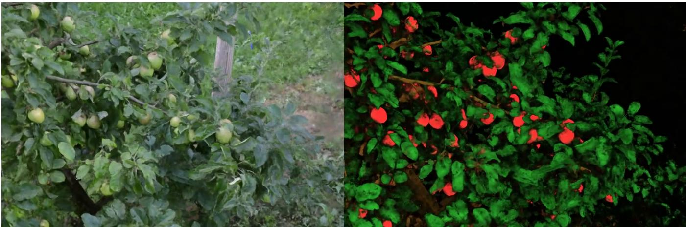
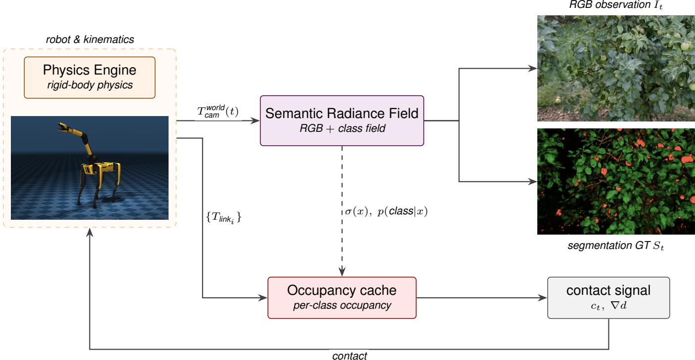

# Semantic Radiance Fields as Simulators for Spatial Reasoning in Real-World Scenes

Nico Heider1 , Michał Jan Włodarczyk2 , Katarzyna Wasielewska-Michniewska2 , Przemysław Hołda2 , Martin Schieck1 , Marcin Paprzycki2 , Maria Ganzha2 and Bogdan Franczyk 1,3

1Leipzig University

2Systems Research Institute Polish Academy of Sciences 3Wrocław University of Economics heider@wifa.uni-leipzig.de

## Abstract

Training and evaluating spatial reasoning in embodied agents requires diverse environments that are both geometrically faithful and semantically queryable. Synthetic simulators offer ground truth semantics but sacrifice realism; simulators based on reconstructions of real-world environments have realistic appearance but lack ground truth semantics by default. We propose using Semantic Radiance Fields (SRF) as simulators for spatial reasoning agents. SRFs are a representation that unifies these requirements by lifting 2D semantic segmentations from pretrained vision models into a 3D radiance field that jointly encodes geometry, appearance, and per-class semantic identity. The resulting fields are reconstructed from posed RGB captures of real scenes and support novel-view synthesis, semantic and free-space queries within a single grounded representation. This enables the efficient generation of diverse real-world environments to train and evaluate spatial reasoning models. As an example application, we outline an SRF-driven simulator for an orchard apple-reaching task, in which the radiance field supplies camera rendering, semantic ground truth, and occupancy queries to a physics engine.

## 1 Introduction

Representing the diversity of real-world environments is a central bottleneck for training embodied AI systems [Deitke et al., 2023]. Agents that navigate, manipulate, or answer questions about their surroundings must reason not only about what objects are present, but about where they are, what occludes them, and how the scene would appear from unseen viewpoints. Progress on these problems depends on the environments in which reasoning systems are trained and evaluated. Two paradigms currently dominate to create a large amount of diverse training data to train these agents. Synthetic procedural simulators [Duan et al., 2022] offer programmatic control, ground-truth supervision, and scene perturbations, but sacrifice the visual and geometric appearance of natural scenes. Generative simulators [Brooks et al., 2024; Bruce et al., 2024; Yang et al., 2024] can produce large amounts of training data and, given sufficient training, cover a wide range of visual scenes. However, they do not guarantee multiview consistency, and do not natively expose a persistent, queryable 3D state. Neural scene representations such as radiance fields (NeRFs) [Mildenhall et al., 2020] enable photorealistic reconstruction of real environments from posed images, and recent extensions lift 2D segmentations into the field to produce per-class semantic outputs [Zhi et al., 2021; Meyer et al., 2024]. These semantic radiance fields have primarily been developed as tools for reconstruction and querying and have so far mainly been used as RL training environments for locomotion [Byravan et al., 2023; Zhou et al., 2024], but not for tasks that require the agent to reason about object identity. We argue that a semantic radiance field, exposing rendered views, per-class labels, and free-space queries, is sufficient to train a vision-based RL agent directly in reconstructions of real scenes, bridging procedural and reconstruction-based simulators.

## 2 Semantic Radiance Fields

We extend the FruitNeRF formulation [Meyer et al., 2024] from a single semantic channel to C class channels, yielding a representation in which any subset of the scene can be queried by semantic identities. Our pipeline takes an unordered set of posed RGB images $\{ I _ { i } \} _ { i = 1 } ^ { N }$ of a real scene, generates perimage multi-class segmentation masks with a pretrained vision model, and jointly optimizes a radiance field whose C semantic heads each predict an independent binary probability for their respective class at every 3-D point.

## 2.1 Volumetric Rendering

A neural radiance field [Mildenhall et al., 2020] represents a scene as a continuous function mapping a 3D position $\mathbf { x } \in \mathbb { R } ^ { 3 }$ and view direction d $\in ~ \mathbb { S } ^ { 2 }$ to a density $\sigma ~ \in ~ \mathbb { R } _ { > 0 }$ and an emitted RGB radiance $\mathbf { c } \in [ 0 , 1 ] ^ { 3 }$ We adopt the Nerfacto [Tancik et al., 2023] factorization, in which a density field $\mathcal { F } _ { \sigma } : \mathbf { x }  ( \sigma , \mathbf { h } )$ produces a latent feature h alongside the density, and an appearance field $\mathcal { F } _ { \mathbf { c } } : ( { \mathbf { h } } , { \mathbf { d } } ) \to { \mathbf { c } }$ produces color. The expected color of a pixel is computed by alpha-compositing $\dot { K }$ samples along a ray $\mathbf { r } ( t ) = \mathbf { o } + t \mathbf { d } ;$

  
Figure 1: Radiance Field rendering (left) and Semantic Field blend rendering (right) from a trained Semantic Radiance Field. Classes for the SRF blend rendering: apple, branch, leaf; colored to match the class for visualization.

$$
\hat { \mathbf { C } } ( \mathbf { r } ) = \sum _ { k = 1 } ^ { K } \hat { T } ( t _ { k } ) \alpha ( \sigma ( t _ { k } ) \delta _ { k } ) \mathbf { c } ( t _ { k } ) ,\tag{1}
$$

with $\begin{array} { r } { \hat { T } ( t _ { k } ) = \exp \Bigl ( - \sum _ { a = 1 } ^ { k - 1 } \sigma ( t _ { a } ) \delta _ { a } \Bigr ) , \delta _ { k } = t _ { k + 1 } - t _ { k } } \end{array}$ , and $\alpha ( x ) = 1 - \exp ( - \stackrel { . } { x } ) .$

## 2.2 Multi-Class Semantic Field

To encode semantics, we attach C independent binary semantic heads to the shared density backbone:

$$
\mathcal { F } _ { s } : { \mathbf h }  { \mathbf s } \in \mathbb { R } ^ { C } ,\tag{2}
$$

where each output $s _ { c }$ is an unconstrained logit for class c. Unlike SemanticNeRF [Zhi et al., 2021], which uses a single softmax head that enforces mutual exclusion across classes, our C heads are independent: each is activated by a sigmoid, so a point may simultaneously belong to multiple classes. Following [Zhi et al., 2021; Meyer et al., 2024], the semantic head depends only on position, semantic identity is viewindependent, and gradients from the semantic loss are not propagated back through the density field, preventing the geometry from collapsing onto class boundaries. The expected per-class logits at a pixel are obtained by the same volumetric accumulation used for color:

$$
\hat { \mathbf { S } } ( \mathbf { r } ) = \sum _ { k = 1 } ^ { K } \hat { T } ( t _ { k } ) \alpha ( \sigma ( t _ { k } ) \delta _ { k } ) \mathbf { s } ( t _ { k } ) .\tag{3}
$$

## 2.3 Lifting 2D Segmentations to 3D

We do not assume hand-labeled semantic ground truth. For each input image $I _ { i }$ we obtain a multi-class segmentation $M _ { i } : \mathring \Omega  \{ 0 , 1 \} ^ { C }$ from a pretrained model. In our experiments, we use SAM 3 [Carion et al., 2025] queried with a fixed vocabulary of class prompts. Letting $y _ { c } ( \mathbf { r } ) \in \{ 0 , 1 \}$ denote the binary ground-truth label class for the pixel through which ray r passes, the semantic loss applies independent binary cross-entropy to each class:

$$
\mathcal { L } _ { \mathrm { s e m } } = \frac { 1 } { | \mathcal { R } | } \sum _ { \mathbf { r } \in \mathcal { R } } \mathrm { B C E } \big ( \sigma ( \hat { \mathbf { S } } ( \mathbf { r } ) ) , \mathbf { y } ( \mathbf { r } ) \big ) ,\tag{4}
$$

where $\begin{array} { r } { \mathrm { B C E } ( \hat { \mathbf { p } } , \mathbf { y } ) = - \sum _ { c = 1 } ^ { C } \left[ y _ { c } \log \hat { p } _ { c } + ( 1 - y _ { c } ) \log ( 1 - \hat { y } ^ { C } ) \right. } \end{array}$ $\hat { p } _ { c } ) ]$ and $\sigma$ is the sigmoid applied element-wise. The total training objective combines this with the standard photometric loss:

$$
\mathcal { L } = \mathcal { L } _ { \mathrm { p h o t o } } + \lambda \mathcal { L } _ { \mathrm { s e m } } , \quad \mathcal { L } _ { \mathrm { p h o t o } } = \frac { 1 } { | \mathcal { R } | } \sum _ { \mathbf { r } \in \mathcal { R } } \| \mathbf { C } ( \mathbf { r } ) - \hat { \mathbf { C } } ( \mathbf { r } ) \| _ { 2 } ^ { 2 } .
$$

We set $\lambda = 1$ in all experiments.

(5)

## 2.4 Query Interface

A trained SRF exposes three operations that downstream reasoning agents can call:

• Render(P): given a camera pose $\mathbf { P } \in \mathrm { S E } ( 3 )$ , produce a posed RGB image, a semantic map, and a depth map by evaluating Eq. 1 and Eq. 3 over the corresponding rays.

• Semantic(x): return the per-class probability $\sigma ( \mathbf { s } ( \mathbf { x } ) ) \in$ $[ 0 , 1 ] ^ { C }$ at any 3D point.

• Occupancy(x): return $\sigma ( \mathbf { x } )$ , for collision detection.

Together these support the viewpoint sampling, object localization, collision-detection, and the per-pixel ground-truth supervision.

## 3 Example Application: Apple-Reaching in an Orchard SRF

As an example application of our pipeline, we show how SRFs can serve embodied agent training by acting as the camera renderer and segmentation mask provider for an applereaching policy, where the goal of a robot is to bring its manipulator end-effector close to a target apple.

  
Figure 2: Semantic Radiance Field as a simulator. A physics engine (e.g., MuJoCo) handles rigid-body dynamics and exposes the camera pose $T _ { \mathrm { c a m } } ^ { \mathrm { w o r l d } } ( t )$ and link transforms $\{ T _ { \mathrm { l i n k } _ { i } } \}$ each step. The SRF renders an RGB observation It and a semantic map St from the camera pose; its density and per-class probabilities can be distilled offline into an occupancy cache (e.g., a voxel grid or octree) used for collision and goal-reaching queries. Contact signals are returned to the physics engine to close the loop.

## 3.1 Setup

Scenes. We reconstruct an apple tree scene from Fruit-NeRF [Meyer et al., 2024], captured with 311 posed RGB images at 6000 × 4000 px. We use the provided camera poses without refinement. Per-image segmentation masks are generated by SAM 3 [Carion et al., 2025] queried independently with three text prompts (apple, branch, and leaf) producing one binary mask per class per frame. These masks are composited into a single label image per frame (background = 0, apple = 1, branch = 2, leaf = 3) and passed to the NeRF training pipeline as semantic supervision.

SRF Training. We build on FruitNeRF [Meyer et al., 2024] with the C independent binary semantic heads described in Sec. 2.2. The model is trained for 500 000 iterations with a batch size of 4 096 rays, using the Adam optimiser with an initial learning rate of $1 0 ^ { - 2 }$ decayed exponentially, and mixed-precision arithmetic. Input images are downscaled by a factor of 4 (to 1500 × 1000 px) before training. Each scene trains in approximately 4 hours on a single NVIDIA H100 GPU.

Simulator Setup. The SRF can be distilled offline into an occupancy cache (e.g., a voxel grid or octree) to efficiently query contact information for the simulator and to provide reward information for the policy. A physics engine such as MuJoCo handles the rigid-body dynamics and exposes the pose of the robot’s wrist camera and the link transforms at each step. The SRF serves as the renderer, providing RGB observations and a semantic map from the camera pose. Contact signals returned to the physics engine close the loop.

Task and Agent. The reward formulation is designed to encourage the agent to approach target objects (fruits), whose positions are obtained from the semantic occupancy cache. To promote collision-free kinematics, the system utilizes the derived contact signal to terminate episodes upon detecting collisions with designated avoidance classes, such as branches. A full training study is beyond the scope of this work; the example specifies the set of signals (observations, semantic ground truth, and rewards) that an SRF reconstructed from captures of a real scene can supply to close the simulation loop.

## 4 Conclusion

We presented Semantic Radiance Fields, a representation that lifts multi-class 2D segmentations into a radiance field to produce queryable, photorealistic reconstructions of real-world scenes as suitable training and evaluation environments for spatial reasoning agents. By extending real-world geometry with discrete semantic structure, SRFs can serve as dropin simulators for any task that requires novel view synthesis with ground truth semantics. Our example application illustrates that a single SRF can serve simultaneously as a renderer, a segmentation oracle, and a collision detector for embodied agents. Several extensions are immediate. The same lifting procedure applied to 3D Gaussian Splatting [Kerbl et al., 2023] would reduce training time and enable real-time rollouts. Dynamic SRFs, in which a temporal axis is added to the semantic field, would extend the SRF from spatial to spatio-temporal reasoning, a natural next step for the present work.

## References

[Brooks et al., 2024] Tim Brooks, Bill Peebles, Connor Holmes, Will DePue, Yufei Guo, Li Jing, David Schnurr, Joe Taylor, Troy Luhman, Eric Luhman, Clarence Ng, Ricky Wang, and Aditya Ramesh. Video generation models as world simulators. https://openai.com/research/ video-generation-models-as-world-simulators, 2024. OpenAI Technical Report.

[Bruce et al., 2024] Jake Bruce, Michael Dennis, Ashley Edwards, Jack Parker-Holder, Yuge Shi, Edward Hughes, Matthew Lai, Aditi Mavalankar, Richie Steigerwald, Chris Apps, et al. Genie: Generative interactive environments. In International Conference on Machine Learning (ICML), 2024.

[Byravan et al., 2023] Arunkumar Byravan, Jan Humplik, Leonard Hasenclever, Arthur Brussee, Francesco Nori, Tuomas Haarnoja, Ben Moran, Steven Bohez, Fereshteh Sadeghi, Bojan Vujatovic, and Nicolas Heess. NeRF2Real: Sim2real transfer of vision-guided bipedal motion skills using neural radiance fields. In 2023 IEEE International Conference on Robotics and Automation (ICRA), pages 9362–9369, 2023.

[Carion et al., 2025] Nicolas Carion, Laura Gustafson, Yuan-Ting Hu, Shoubhik Debnath, Ronghang Hu, Didac Suris, Chaitanya Ryali, Kalyan Vasudev Alwala, Haitham Khedr, Andrew Huang, Jie Lei, Tengyu Ma, Baishan Guo, Arpit Kalla, Markus Marks, Joseph Greer, Meng Wang, Peize Sun, Roman Radle, Triantafyllos Afouras, Effrosyni¨ Mavroudi, Katherine Xu, Tsung-Han Wu, Yu Zhou, Liliane Momeni, Rishi Hazra, Shuangrui Ding, Sagar Vaze, Francois Porcher, Feng Li, Siyuan Li, Aishwarya Kamath, Ho Kei Cheng, Piotr Dollar, Nikhila Ravi, Kate´ Saenko, Pengchuan Zhang, and Christoph Feichtenhofer. Sam 3: Segment anything with concepts, 2025.

[Deitke et al., 2023] Matt Deitke, Rose Hendrix, Ali Farhadi, Kiana Ehsani, and Aniruddha Kembhavi. Phone2Proc: Bringing robust robots into our chaotic world. In IEEE/CVF Conference on Computer Vision and Pattern Recognition (CVPR), 2023.

[Duan et al., 2022] Jiafei Duan, Samson Yu, Hui Li Tan, Hongyuan Zhu, and Cheston Tan. A survey of embodied AI: From simulators to research tasks. IEEE Transactions on Emerging Topics in Computational Intelligence, 6(2):230–244, 2022.

[Kerbl et al., 2023] Bernhard Kerbl, Georgios Kopanas, Thomas Leimkuhler, and George Drettakis. 3D gaus- ¨ sian splatting for real-time radiance field rendering. ACM Transactions on Graphics, 42(4), 2023.

[Meyer et al., 2024] Lukas Meyer, Andreas Gilson, Ute Schmid, and Marc Stamminger. FruitNeRF: A unified neural radiance field based fruit counting framework. In

IEEE/RSJ International Conference on Intelligent Robots and Systems (IROS), 2024.

[Mildenhall et al., 2020] Ben Mildenhall, Pratul P. Srinivasan, Matthew Tancik, Jonathan T. Barron, Ravi Ramamoorthi, and Ren Ng. NeRF: Representing scenes as neural radiance fields for view synthesis. In European Conference on Computer Vision (ECCV), 2020.

[Tancik et al., 2023] Matthew Tancik, Ethan Weber, Evonne Ng, Ruilong Li, Brent Yi, Justin Kerr, Terrance Wang, Alexander Kristoffersen, Jake Austin, Kamyar Salahi, Abhik Ahuja, David McAllister, and Angjoo Kanazawa. Nerfstudio: A modular framework for neural radiance field development. In ACM SIGGRAPH Conference Proceedings, 2023.

[Yang et al., 2024] Sherry Yang, Yilun Du, Kamyar Ghasemipour, Jonathan Tompson, Leslie Kaelbling, Dale Schuurmans, and Pieter Abbeel. Learning interactive real-world simulators. In International Conference on Learning Representations (ICLR), 2024.

[Zhi et al., 2021] Shuaifeng Zhi, Tristan Laidlow, Stefan Leutenegger, and Andrew J. Davison. In-place scene labelling and understanding with implicit scene representation. In IEEE/CVF International Conference on Computer Vision (ICCV), 2021.

[Zhou et al., 2024] Liyou Zhou, Oleg Sinavski, and Athanasios Polydoros. Robotic learning in your backyard: A neural simulator from open source components. In 2024 Eighth IEEE International Conference on Robotic Computing (IRC), pages 131–138, 2024.