# Semantic Steering for Controllable Generation: Tuning-Free Concept Erasure in Multimodal Difusion Transformers

Qiao Li   
Institute of Information Engineering,   
Chinese Academy of Sciences   
Beijing, China   
School of Cyber Security, University   
of Chinese Academy of Sciences   
Beijing, China   
liqiao@iie.ac.cn   
Qipeng Wang   
Institute of Information Engineering,   
Chinese Academy of Sciences   
Beijing, China   
School of Cyber Security, University   
of Chinese Academy of Sciences   
Beijing, China   
wangqipeng@iie.ac.cn   
Xiaomeng Fu   
Institute of Information Engineering,   
Chinese Academy of Sciences   
Beijing, China   
School of Cyber Security, University   
of Chinese Academy of Sciences   
Beijing, China   
fuxiaomeng@iie.ac.cn

Jiao Dai✉ Institute of Information Engineering, Chinese Academy of Sciences Beijing, China daijiao@iie.ac.cn

Yuanshu Zhao   
Institute of Information Engineering,   
Chinese Academy of Sciences   
Beijing, China   
School of Cyber Security, University   
of Chinese Academy of Sciences   
Beijing, China   
zhaoyuanshu@iie.ac.cn

Jizhong Han Institute of Information Engineering, Chinese Academy of Sciences Beijing, China hanjizhong@iie.ac.cn

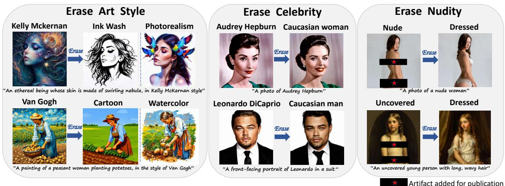  
Figure 1: During the generation process with the multimodal difusion transformer, our method applies steering vectors to erase diverse unwanted concepts, such as art styles, celebrities, and nudity, while supporting controllable generation.

## Abstract

Multimodal Difusion Transformers (MM-DiTs) have demonstrated remarkable text-to-image generation performance, surpassing traditional U-Net-based difusion models. Nevertheless, their powerful generative capabilities also raise significant safety concerns, as they may generate sensitive or inappropriate content. While existing concept erasure methods aim to mitigate such risks, most require modifying model parameters, which are often architecture-specific and impractical for deployed larger models. Several tuning-free approaches face challenges when applied to advanced large-scale MM-DiTs due to their deeply embedded knowledge, broad semantic space, and context-dependent text encoders. To address these challenges, we propose to erase concepts by directly manipulating the model’s internal representations. Our key insight, derived from an in-depth analysis of MM-DiT’s block-wise generative roles, is that text-conditioned semantic representations are most salient in the middle blocks of MM-DiTs. Based on this, we extract representations of an unwanted concept and a desirable safe one from the middle block, construct a steering vector from their diference, and inject this single vector into consecutive early and middle blocks.

By operating exclusively on the sparse text-branch tokens and leveraging the straight sampling trajectory of rectified flow, our method achieves efective concept erasure with negligible overhead and without any training. Extensive experiments across MM-DiT models demonstrate that our method achieves state-of-the-art performance in erasing diverse concepts, enables efective control over the final output, and remains robust to adversarial attacks.

## CCS Concepts

• Security and privacy → Usability in security and privacy; • Computing methodologies → Computer vision.

## Keywords

Multimodal Difusion Transformers; Concept Erasure

## ACM Reference Format:

Qiao Li, Xiaomeng Fu, Yuanshu Zhao, Qipeng Wang, Jiao Dai, and Jizhong Han. 2026. Semantic Steering for Controllable Generation: Tuning-Free Concept Erasure in Multimodal Difusion Transformers. In Proceedings of the 34th ACM International Conference on Multimedia (MM ’26), November 10–14, 2026, Rio de Janeiro, Brazil. ACM, New York, NY, USA, 10 pages. https://doi.org/10.1145/3767308.3835565

## 1 Introduction

Recently, multimodal difusion transformers (MM-DiTs) [33], such as Stable Difusion 3 series [9] and FLUX series [22], have emerged as the leading paradigm in text-to-image generation. These models demonstrate stronger multimodal understanding and superior generation quality at high resolutions, outperforming traditional U-Net-based difusion models [18, 38, 41, 42]. However, their remarkable generative capabilities also pose significant safety risks [3, 47]. Trained on large-scale web-crawled data, these models may inadvertently synthesize inappropriate or sensitive content, including not-safe-for-work (NSFW) material, copyrighted works, and images of real persons. To mitigate these risks, concept erasure techniques have been developed to prevent models from generating undesirable target concepts.

Most existing concept erasure methods [5, 10, 12–14, 16, 21, 25, 50] require modifying the model parameters to remove or suppress unwanted concepts. However, many are architecture-specific and not directly transferable to more advanced MM-DiTs. Moreover, these methods may significantly degrade model’s generative capabilities and typically impose substantial computational overhead, making them impractical for large-scale, real-world deployments.

To address these issues, several model tuning-free concept erasure methods [20, 32, 40, 49] have been proposed. Most of these methods typically leverage prompt-based interventions to guide the model away from predefined negative terms, demonstrating efectiveness in traditional U-Net-based difusion models.

Unfortunately, these tuning-free erasure methods face critical limitations when applied to MM-DiT. First, due to extensive pretraining on large-scale datasets, MM-DiT embeds target concepts within its deep representations, forming intrinsic and robust knowledge that is largely unresponsive to superficial prompt-based interventions. Second, MM-DiT has an expanded semantic space, making it dificult for negative prompts (which rely on explicit keyword specifications) to address the full range of concept variations and implicit associations, often leading to incomplete erasure. Third, some methods rely on linear separability of concepts in the token-level textual embedding space, which makes it challenging to apply them to sentence-level, context-dependent representations in the larger T5-XXL [35] text encoder used in MM-DiT.

These limitations motivate a paradigm shift from external prompt engineering to direct intervention within the model’s internal representations. Recent works in large language models [7, 36, 43, 45, 52] and text-to-image models [8, 11, 37] have demonstrated the feasibility of controlling model’s output by steering internal activations at inference time. However, LLM-based methods are tailored to the discrete, autoregressive generation paradigm of language, rendering them ill-suited for the continuous, iterative denoising process and the fundamentally diferent dual-modality architecture of MM-DiT. Most existing T2I-based methods are designed for small-scale UNet architectures and either demand per-block/per-timestep interventions or extensive training, making them inherently ineficient or even infeasible for the deeper, multimodal blocks of MM-DiT architecture. As a result, steering internal representations for controllable generation in MM-DiT remains largely unexplored.

To fill this gap, we investigate the internal generative mechanisms of MM-DiT and propose a lightweight yet efective semantic steering method for controllable concept erasure, exploiting its intrinsic properties. We first conduct an in-depth analysis of the role of diferent multimodal blocks in image generation, revealing that middle blocks primarily encode the semantic representations of target concepts, while early and late blocks encode the overall image structures and fine-grained details, respectively. Such observation leads to a key insight: we can extract highly salient semantic representations of a concept directly from the middle block of MM-DiT. This naturally inspires us to leverage such representations to provide precise control over the model’s output. Specifically, given a contrastive pair ofan unwanted concept and a desirable safe concept, we extract their respective semantic representations from the middle block and construct a steering vector by computing their diference. We then leverage the distinct roles of early and middle blocks to inject the vector into key consecutive blocks, achieving controllable concept erasure while preserving overall image fidelity with a single vector. Unlike prior text-to-image intervention works that rely on image token representations, our method eficiently constructs and injects the steering vector purely on the sparser text-branch tokens, thereby avoiding the redundancy introduced by the large number of image tokens. The steering vector guides generation coherently across all denoising steps by following the straight sampling trajectory of rectified flow in MM-DiT, enabling efective erasure with negligible overhead.

Experiments on MM-DiT models demonstrate that our method achieves state-of-the-art performance in erasing diverse concepts, including celebrity, art style, and nudity, without requiring any training or fine-tuning, while enabling efective control over the output and exhibiting strong robustness to adversarial attacks.

Our contributions are summarized as:

• We propose a lightweight yet efective semantic steering method tailored to large-scale MM-DiT architecture for controllable concept erasure at inference time.

• We design a steering framework that exploits MM-DiT’s properties, including block-wise roles in generation, information disparity in dual modalities, and rectified flow sampling, thereby achieving concept erasure while preserving image quality with a single vector and negligible overhead.

• Extensive experiments demonstrate that our method achieves state-of-the-art performance in erasing diverse concepts (celebrity, art style, and nudity) across MM-DiT models (SDv3.5 and FLUX.1), with controllable outputs and robustness against multiple adversarial attacks.

## 2 Related Work

## 2.1 Multimodal Difusion Transformers

Traditional text-to-image difusion models are based on UNet [39] architectures and incorporate self-attention and text-to-image crossattention mechanisms. These models are trained to predict noise during denoising process, using noise schedulers such as DDPM [18].

Recently, multimodal difusion transformers have brought about two paradigm shifts: architecture and training formulation. In terms of architecture, these models adopt Transformer-based backbones [33] with multiple blocks and introduce cross-modal attention. For instance, models like Stable Difusion 3 series [9] employ joint self-attention mechanisms to concatenate text and image tokens within the key, query, and value vectors of the Transformer architecture. They also integrate a T5-XXL [35] text encoder and CLIP-based [34] text encoders (CLIP-L/14 and OpenCLIP-bigG/14) to improve text-image alignment and cross-modal representation. In terms of training formulation, these new models leverage rectified flow [27, 29] with velocity predictions, directly connecting noise and data distributions via straight trajectories rather than curved paths in traditional difusion models.

## 2.2 Concept Erasure in Difusion Models

Concept erasure techniques aim to prevent models from generating undesirable concepts, such as not-safe-for-work (NSFW) content, copyrighted artworks, and personal portraits. Most existing methods [5, 13, 14, 16, 21, 25, 30, 50] achieve concept erasure by updating the model’s weights. For example, FMN [50] forces the model to forget unwanted concepts by locating and suppressing their corresponding cross-attention maps through fine-tuning. MACE [30] uses LoRA [19] to fine-tune the cross-attention blocks for each concept and jointly optimizes the parameters across multiple concepts. UCE [13] derives a closed-form edition of the weights in difusion models without fine-tuning. However, most of these methods sufer from degraded generative capability and substantial computational overhead, and some methods are highly architecturespecific, making them dificult to extend to MM-DiT. To overcome these problems, several tuning-free erasure methods [20, 32, 40, 49] typically rely on prompt-based intervention to alter the model’s denoising trajectories. For instance, Negative Prompting (NP) is a commonly used technique that replaces the unconditional input in classifier-free guidance with a negative prompt. Safe Latent Difusion (SLD) [40] extends NP by incorporating three noise predictions to exclude unwanted semantics during denoising. TraSCE [20] introduces a loss-based guidance mechanism to enhance the flexibility of negative prompting. Nevertheless, current tuning-free concept erasure methods struggle to efectively erase concepts when applied to larger-scale MM-DiTs, which embed target concepts deeply and exhibit a broader semantic space.

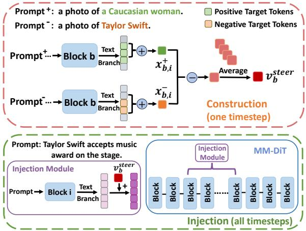  
Figure 2: The overall pipeline of our proposed method. We construct a steering vector from the output target tokens in the text branch of the middle block b (top). We then inject the vector into consecutive early and middle blocks (bottom). The construction process is performed at an intermediate denoising timestep, while the injection process is conducted coherently across all timesteps.

## 2.3 Internal Activation Intervention

Recent works have explored manipulating internal activations at inference time to control model behavior. LLM-based methods [7, 24, 36, 43, 45, 46, 52] construct steering vectors based on key activation values that encode human-interpretable features, and induce desired changes in the generated textual output when added to the forward passes of a frozen LLM. However, these approaches are tailored to the discrete, autoregressive nature of language modeling, rendering them incompatible with the continuous denoising process and multi-modal architecture of MM-DiT. For T2I-based methods, CASteer [11] constructs per-block and per-timestep steering vectors from cross-attention activations. SAeUron [8] trains additional sparse autoencoders to identify interpretable features for target manipulation. Both are primarily designed for small-scale UNet-based architectures, and their significant computational overhead limits their scalability to deeper and larger-scale MM-DiTs. ACT [37] controls the model output by learning transport maps. Although it can be applied to DiT-based models, it still needs per-block mapping learning, thereby incurring non-negligible overhead. Moreover, these methods rely on image token representations, which may contain largely redundant information that hinders eficient and precise manipulation of the target concept.

## 3 Method

Given an unwanted target concept and a desirable safe one, our goal is to construct a steering vector by computing the diference between their semantic representations, and inject it into key MM-DiT blocks to shift the unwanted output toward safe semantics.

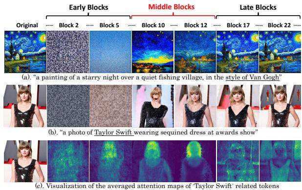  
Figure 3: (a) and (b) are images generated by SDv3.5, where random Gaussian noise is injected into distinct Transformer blocks (each image corresponds to noise injection in a specific block, with other blocks unchanged). (c) is a visualization of the averaged attention maps of target-related tokens.

We first provide the preliminaries (Section 3.1), then analyze the role of various blocks and denoising timesteps in image generation, and construct a steering vector in the text branch accordingly (Section 3.2). Finally, we describe how the vector is injected spatially and temporally (Section 3.3) to achieve efective target redirection. A pipeline of our method is illustrated in Figure 2.

## 3.1 Preliminaries

We begin by analyzing MM-DiT’s architecture. As a hierarchical model, it comprises numerous multimodal Transformer blocks. Taken Stable Difusion-v3.5 as an example, it contains 24 Transformer blocks, and establishes a unified token space for visual and text modalities: 64×64 image tokens (flattened to 4096) in the image branch (when generating 1024 × 1024 images), and 154 or 333 text tokens (77 CLIP tokens plus 77 or 256 T5 tokens) in the text branch. Within each block, tokens interact via bidirectional cross-modal attention, with queries, keys, and values formed by concatenation: $Q = [ Q _ { t e x t } ; Q _ { i m a g e } ] , K = [ K _ { t e x t } ; K _ { i m a g e } ]$ , and $V = \left[ V _ { t e x t } ; V _ { i m a g e } \right]$ This enables four interaction types: text-to-image (T2I), image-totext (I2T), image-to-image (I2I), and text-to-text (T2T). The resulting representations from both modalities are output from block � through separate branches and serve as input to block $b + 1$ , denoted as $X _ { t e x t , b }$ and $X _ { i m a q e , b }$ (where $b \in \{ 1 , . . . , B \} _ { } ^ { } ,$ ).

Besides architecture, MM-DiT also difers significantly from traditional difusion models in its sampling strategy, adopting rectified flow. Rectified flow models a transport map between two distributions $\pi _ { 0 }$ (noise $N \sim ( 0 , I ) )$ and $\pi _ { 1 }$ (real data) by constructing straight-line trajectories between samples. To define these straight paths, the forward process is formulated as a linear interpolation in the latent space �:

$$
D _ { t } = t D _ { 1 } + ( 1 - t ) D _ { 0 } , D _ { 0 } \sim \pi _ { 0 } , D _ { 1 } \sim \pi _ { 1 }\tag{1}
$$

The velocity field $V ( D _ { t } , t )$ is then trained to approximate the $\mathrm { { d y } \mathrm { { - } } }$ namics of $D _ { t } .$ . Once trained, it generates an image from a noise $Z$ across discrete steps from $t _ { T } = 0$ to $t _ { 0 } = 1$ by utilizing the velocity

field to update $Z _ { t }$ at each step:

$$
Z _ { t _ { i - 1 } } = Z _ { t _ { i } } + ( t _ { i - 1 } - t _ { i } ) V ( Z _ { t _ { i } } , t _ { i } ) , \ i = T , . . . , 1\tag{2}
$$

## 3.2 Steering Vector Construction

To address the challenge of transferring existing tuning-free, prompt engineering-based concept erasure methods to MM-DiT, we seek to directly manipulate the model’s internal representations to guide the generation process. To better understand the semantic distribution patterns within MM-DiT, we first analyze the role of diferent Transformer blocks, as well as denoising timesteps, in image generation. Based on the analysis, we then selectively leverage token representations from the text branch to construct a steering vector, which represents a shift direction to guide the unwanted concepts toward desired semantics.

Semantic Focus in Middle Blocks. To understand the distributions of primary semantic representations within MM-DiT, we first analyze how diferent blocks influence the image generation process. Specifically, we inject random Gaussian noise into the output features of intermediate blocks and observe the resulting image generation (examples in Figure 3 (a)-(b)). Noise in early blocks renders images completely unrecognizable due to global disruption, while noise in late blocks causes only minor fine-detail variations. Conversely, injecting noise into middle blocks significantly afects the formation of primary conceptual semantics (e.g., the swirling starry sky or Taylor Swift’s face). These observations highlight the strong hierarchical characteristic of MM-DiT architecture: early blocks model global structure, late blocks refine surface details, and middle blocks are most expressive of core semantic content.

To further confirm that the middle blocks are the most representative for target semantics, we visualize the averaged T2I attention maps of target-related tokens (e.g., “Taylor Swift”) across blocks (Figure 3 (c)). The attention patterns reveal that only in the middle blocks do such tokens attend significantly to the primary subject itself (e.g., Taylor’s face). These findings suggest that the middle blocks are the most suitable for extracting target concept’s primary semantics. Conversely, capturing the primary semantics in the early or late blocks is inefective, as target semantics are entangled with coarse global structures or overwhelming fine-grained details and thus dificult to extract.

Balanced Representation at Intermediate Timesteps. Besides analyzing the roles ofmodel’s blocks, it is also crucial to consider the efect of denoising timesteps on semantic distributions. During the denoising process, MM-DiT adopts rectified flow sampling, where generations are iterative with representations evolving from coarse structures to fine details across timesteps. Similarly to the laws in MM-DiT blocks, early timesteps are dominated by global noise and contain limited semantics, whereas very late timesteps primarily encode minor details. Inspired by previous work [31], which shows that features at intermediate timesteps preserve meaningful structural cues while retaining salient details and filtering out redundant ones, the intermediate denoising steps can provide a faithful representation of the target’s core semantics, efectively balancing structural coherence and key visual details.

Text Branch Vector Derivation. The analysis on MM-DiT’s blocks and denoising timesteps provide a key insight to achieve target concept erasure: primary concept semantics can be extracted most accurately in the middle blocks at intermediate timesteps. Inspired by prior works in LLMs [7, 45], we can extract the representations of an unwanted concept along with a safe one. Their semantic difference can naturally serve as a steering vector encoding a safe shift direction. Our construction method begins with data preparation. Let �− be a prompt containing the target concept $( \mathrm { e . g . , a }$ photo of Taylor Swift), and $C ^ { + }$ be an identical prompt where the target concept is replaced with a desired safe content (e.g., a photo of a Caucasian woman). For each target concept, we establish a dataset of n carefully curated paired prompts $( C _ { i } ^ { - } , C _ { i } ^ { + } .$ ), where $i \in \{ 1 , . . . , n \}$ This dataset is used to compute a steering vector by extracting the diference between the pairs. To derive the steering vector, we feed the prompt pairs into MM-DiT to obtain the output vectors from both modality branches in an intermediate block �: $X _ { t e x t , b } ^ { - } ,$ $X _ { t e x t , b } ^ { + }$ for text, and $X _ { i m a g e , b } ^ { - } , X _ { i m a g e , b } ^ { + }$ for image. Each vector lies in $\mathbb { R } ^ { N _ { t } \times D _ { f } }$ , where $N _ { t }$ is the number of tokens, and $D _ { f }$ is the feature dimension. Given the overwhelming tokens in the image branch (4096 tokens), pinpointing critical tokens for diference extraction is dificult due to the large information redundancy. We therefore leverage the sparsity of the text branch (154 or 333 tokens), focusing exclusively on those textual tokens that difer between the paired prompts. The summed vectors of these targeted tokens for the i-th pair in block b are denoted as $x _ { b , i } ^ { - }$ and $x _ { b , i } ^ { + }$ (vectors in $\mathbb { R } ^ { D _ { f } } )$ , which are used for the steering vector computation. We then compute the average diference between $x _ { b , i } ^ { + }$ and $x _ { b , i } ^ { - }$ for all the n pairs in block � to derive a steering vector $v _ { b } ^ { s t e e r }$

Table 1: Performance comparison between our method and baselines on erasing three conceptual categories from Stable Difusion-v3.5-medium and FLUX.1. Metrics are color-coded by their evaluation objective: Yellow for erasure efectiveness, Green for aesthetic quality post-erasure, and Magenta for the impact on unrelated image quality (COCO-30K dataset). ↑ represents that a higher value indicates better performance, and vice versa. (Bold: best. Underline: second-best.)
<table><tr><td rowspan="2">Method</td><td colspan="5">Celebrity</td><td colspan="5">Art Style</td><td colspan="4">Nudity</td></tr><tr><td>GIPHY↓</td><td>LLaVA↓</td><td>Aesthetic↑</td><td>FID↓</td><td>CLIP↑</td><td>Gram↓</td><td>LPIPS↑</td><td>Aesthetic↑</td><td>FID↓</td><td>CLIP↑</td><td>NudeNet↓</td><td>Aesthetic↑</td><td>FID↓</td><td>CLIP↑</td></tr><tr><td>SDv3.5 (base)</td><td>0.602</td><td>0.524</td><td>5.621</td><td>17.85</td><td>0.329</td><td>1</td><td>0</td><td>6.621</td><td>17.85</td><td>0.329</td><td>0.739</td><td>5.706</td><td>17.85</td><td>0.329</td></tr><tr><td>SLD</td><td>0.029</td><td>0.022</td><td>5.376</td><td>18.77</td><td>0.318</td><td>0.271</td><td>0.318</td><td>6.474</td><td>18.99</td><td>0.324</td><td>0.526</td><td>5.716</td><td>18.69</td><td>0.288</td></tr><tr><td>TraSCE</td><td>0.061</td><td>0.043</td><td>5.504</td><td>18.42</td><td>0.299</td><td>0.167</td><td>0.574</td><td>6.608</td><td>18.97</td><td>0.320</td><td>0.460</td><td>5.366</td><td>18.81</td><td>0.291</td></tr><tr><td>STG</td><td>0.046</td><td>0.063</td><td>5.511</td><td>18.79</td><td>0.294</td><td>0.266</td><td>0.402</td><td>6.601</td><td>18.94</td><td>0.312</td><td>0.490</td><td>5.799</td><td>18.78</td><td>0.284</td></tr><tr><td>NP</td><td>0.034</td><td>0.022</td><td>5.414</td><td>18.49</td><td>0.315</td><td>0.180</td><td>0.536</td><td>6.442</td><td>18.66</td><td>0.318</td><td>0.296</td><td>5.865</td><td>18.77</td><td>0.293</td></tr><tr><td>Ours</td><td>0.020</td><td>0.002</td><td>5.522</td><td>18.34</td><td>0.305</td><td>0.137</td><td>0.636</td><td>6.367</td><td>18.91</td><td>0.325</td><td>0.220</td><td>5.868</td><td>18.60</td><td>0.299</td></tr><tr><td>FLUX.1 (base)</td><td>0.613</td><td>0.602</td><td>5.989</td><td>19.83</td><td>0.319</td><td>1</td><td>0</td><td>6.832</td><td>19.83</td><td>0.319</td><td>0.359</td><td>6.315</td><td>19.83</td><td>0.319</td></tr><tr><td>SLD</td><td>0.433</td><td>0.398</td><td>5.918</td><td>19.99</td><td>0.316</td><td>0.234</td><td>0.708</td><td>6.626</td><td>20.34</td><td>0.295</td><td>0.268</td><td>6.093</td><td>19.97</td><td>0.308</td></tr><tr><td>NP</td><td>0.532</td><td>0.482</td><td>5.939</td><td>20.34</td><td>0.307</td><td>0.217</td><td>0.717</td><td>6.653</td><td>21.02</td><td>0.298</td><td>0.364</td><td>6.189</td><td>21.37</td><td>0.315</td></tr><tr><td>STG</td><td>0.396</td><td>0.387</td><td>6.003</td><td>20.15</td><td>0.304</td><td>0.264</td><td>0.682</td><td>6.595</td><td>20.54</td><td>0.290</td><td>0.248</td><td>6.611</td><td>20.53</td><td>0.306</td></tr><tr><td>UCE</td><td>0.117</td><td>0.056</td><td>5.940</td><td>19.94</td><td>0.301</td><td>0.209</td><td>0.714</td><td>6.587</td><td>20.69</td><td>0.303</td><td>0.167</td><td>6.124</td><td>20.98</td><td>0.301</td></tr><tr><td>ESD</td><td>0.059</td><td>0.005</td><td>5.886</td><td>21.15</td><td>0.299</td><td>0.220</td><td>0.704</td><td>6.357</td><td>20.33</td><td>0.283</td><td>0.239</td><td>6.606</td><td>20.31</td><td>0.298</td></tr><tr><td>CA</td><td>0.192</td><td>0.086</td><td>6.133</td><td>20.78</td><td>0.297</td><td>0.362</td><td>0.347</td><td>6.940</td><td>20.97</td><td>0.286</td><td>0.044</td><td>6.373</td><td>21.43</td><td>0.304</td></tr><tr><td>Ours</td><td>0.014</td><td>0.004</td><td>6.248</td><td>19.92</td><td>0.310</td><td>0.192</td><td>0.729</td><td>6.662</td><td>20.01</td><td>0.294</td><td>0.023</td><td>6.631</td><td>20.12</td><td>0.316</td></tr></table>

$$
v _ { b } ^ { s t e e r } = l \cdot \frac { v _ { b } } { | | v _ { b } | | }\tag{3}
$$

where:

$$
{ v _ { b } } = \frac { 1 } { n } \sum _ { i = 1 } ^ { n } \left( { x _ { b , i } ^ { + } - x _ { b , i } ^ { - } } \right)\tag{4}
$$

The steering strength � is determined empirically. The steering vector $\boldsymbol { v } _ { b } ^ { s t e e r } \in \mathbb { R } ^ { D _ { f } }$ defines the direction and magnitude for steering from a target concept to the erased safe content.

## 3.3 Steering Vector Injection

Once a steering vector $v _ { b } ^ { s t e e r }$ is constructed, we add it to the output vectors of all text-encoded tokens in the key blocks of MM-DiT during generation, thereby steering the target concept’s representations toward the desired safe one while preserving overall image quality. The strategy for injecting the steering vector is determined based on two key dimensions: (1) which intermediate blocks to target, and (2) which denoising timesteps to intervene.

Progressive Injection into Specific Blocks. A naive idea is to inject the vector directly into its construction block. However, this is proved inefective for MM-DiT. This is because image features evolve progressively across blocks, and a small steering force in a single block is unlikely to alter the overall generation process.

To address this, we propose injecting the steering vector across multiple consecutive blocks, leveraging their cumulative efect for coherent steering. However, not all block combinations yield optimal results: (1) steering confined to middle or late blocks is inefective, as the key structural and semantic basis is primarily established by early blocks, leaving limited room for subsequent alteration. (2) steering applied only to early blocks strongly influences image structure and may redirect the target semantics. Yet, the resulting structural changes often conflict with the subjects encoded by unchanged textual tokens in the middle blocks, causing distorted outputs or unintended semantic shifts.

To balance these trade-ofs, we adopt a selective multi-block injection strategy: we inject the vector consecutively across multiple early and middle blocks. By gradually biasing feature representations in a unified direction, the steering signal accumulates across blocks, consistently guiding the model away from the original target while preserving image coherence. The very first few blocks, which primarily define the global layout without yet encoding main semantics, can be selectively omitted to avoid large distortion. Sim ilarly, late blocks focusing on minor details have minimal impact on the overall semantic shift and can thus be selectively skipped.

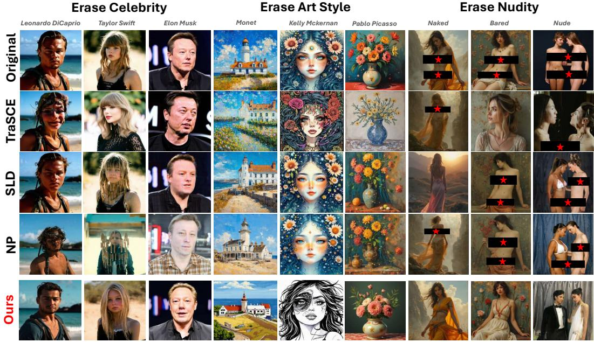  
Figure 4: Qualitative comparison between our method and baselines on Stable Difusion-v3.5-medium. Our method efectively erases diverse concepts while largely preserving the overall image layout and quality. Specifically, for style erasure, our method erases Monet style to pixel art style, Kelly McKernan style to ink wash style, and Picasso style to photorealism style.

Stepwise Steering Across Denoising Timesteps. Beyond selecting suitable blocks, the choice of denoising timestep plays a critical role in applying the steering vector. Unlike conventional difusion models such as DDPM, which rely on a stochastic, nonlinear, and time-varying denoising trajectory, MM-DiT employs rectified flow, a deterministic generative process that follows a straight and stable sampling trajectory throughout generation. As a result, the features evolve in a more coherent and predictable manner, ensuring that a steering vector computed at any intermediate timestep captures a globally consistent semantic adjustment direction. This property enables the same vector to be applied consistently across all denoising steps, thereby ensuring temporally coherent and unified guidance throughout image generation process.

## 4 Experiments

## 4.1 Experimental Setup

Model and Datasets. We evaluate the efectiveness of our method on widely adopted multimodal difusion transformer models, i.e., Stable Difusion-v3.5-medium (SDv3.5) [9] and FLUX.1[DEV] [22] in the experiments. We target three conceptual categories: nudity, celebrity (Elon Musk, Taylor Swift, Leonardo DiCaprio, Steve Jobs, and Audrey Hepburn), and art styles (Van Gogh, Monet, Pablo Picasso, Kelly Mckernan, and Andy Warhol). We leverage GPT-4o [2] to generate 100 test prompts for each concept. We utilize regular prompts from COCO-30K dataset [26] to assess the impact of our method on irrelevant image generation. For robustness evaluation, we use adversarial prompts from four datasets: Ring-A-Bell [44], MMA-Difusion [48], I2P [40], and P4D [6].

Evaluation Metrics. We evaluate our method from three aspects. First, to assess the erasure efectiveness, we employ GIPHY detector [1] and the pretrained vision-language model LLaVA-1.5 [28] for celebrity detection, Gram matrix score [15] and LPIPS score [51] for style evaluation, and NudeNet [4] for nudity detection. Second, to evaluate the image applicability after erasure, we use Aesthetic Predictor V2 Score [23] for measuring visual appeal. Third, we use Frechet Inception Distance (FID) [17] and CLIP score [34] for regular image quality evaluation.

## 4.2 Comparison to Baselines

We compare our methods with model tuning-free baselines that are applicable to SDv3.5 and FLUX.1: Safe Latent Difusion (SLD) [40], TraSCE [20], STG [32], and Negative Prompt (NP). We also choose model modification baselines that provide support for FLUX.1: UCE [13], ESD [12], and CA [21]. Quantitative and qualitative results are shown in Table 1 and Figure 4, respectively.

For celebrity and nudity erasure, our method outperforms all the baselines on the two models in both erasure efectiveness and aesthetic score, indicating that it precisely steers target concepts to desired safe content without compromising image quality. Besides, our method achieves nearly the lowest FID score among all baselines, demonstrating minimal impact on normal image generation.

For art style erasure, our method achieves the best erasure performance on both models, as validated by Gram matrix and LPIPS score. The aesthetic score is slightly lower than that of some baselines.

Table 2: Quantitative results of constructing steering vectors in diferent blocks or at diferent denoising timesteps.
<table><tr><td rowspan="2">Construction Method</td><td colspan="2">Celebrity</td><td colspan="2">Art Style</td></tr><tr><td>GIPHY↓</td><td>Aesthetic↑</td><td></td><td>Gram↓ Aesthetic↑</td></tr><tr><td>Early block</td><td>0.002</td><td>5.053</td><td>0.186</td><td>6.287</td></tr><tr><td>Late block</td><td>0.025</td><td>5.384</td><td>0.402</td><td>6.452</td></tr><tr><td>Ours (middle block)</td><td>0.020</td><td>5.522</td><td>0.137</td><td>6.367</td></tr><tr><td>Early timestep</td><td>0.001</td><td>5.436</td><td>0.162</td><td>6.416</td></tr><tr><td>Late timestep</td><td>0.028</td><td>5.331</td><td>0.203</td><td>6.474</td></tr><tr><td>Ours (intermediate timestep)</td><td>0.020</td><td>5.522</td><td>0.137</td><td>6.367</td></tr></table>

Construct in different blocks Construct in different timesteps  
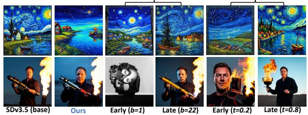  
Figure 5: Images generated using steering vectors constructed in diferent Transformer blocks or at diferent denoising timesteps. (Top: Van Gogh style. Bottom: Elon Musk).

We note, however, that this does not necessarily indicate a degradation in perceptual image quality. MM-DiTs inherently generate high-aesthetic images, and baselines with weaker erasure eficacy produce results that are visually similar to the original, thereby retaining high aesthetic scores. In contrast, our method performs a more complete style transformation, sometimes toward styles that are underrepresented in the predictor’s training set, which may lower the score. Therefore, a slight drop in aesthetic score is an acceptable trade-of for achieving thorough style removal.

## 4.3 Ablation Study

To verify the design choices of our method, we conduct ablation studies for celebrity and art style erasure on SDv3.5.

Block Selection for Steering Vector Construction. In our method, we construct a steering vector in the middle block (� = 10). To validate the block selection, we show the averaged results of constructing in the early blocks $( b ~ = ~ 1 , 3 , 5 , 7 )$ and the late blocks $( b = 1 6 , 1 8 , 2 0 , 2 2 )$ in Table 2, and the example images after steering in Figure 5. The vectors built in early blocks mainly capture coarse and global structural features. Consequently, applying these vectors steers or even distorts the overall image layout, leading to the disappearance of the target concept with a very low aesthetic score (low image quality). In contrast, the vectors built in late blocks primarily learn minor and even redundant details. As a result, their injection has negligible impact on the generated images. We note that � = 10 is not the only efective choice, the interval � ∈ [9, 13] constitutes a stable region where the method remains efective.

Timestep Selection for Steering Vector Construction. During the denoising process, we construct a steering vector at an intermediate timestep (� = 0.5). We assess the averaged results of vector construction at early $( t = 0 . 1 , 0 . 2 , 0 . 3 )$ and late timesteps (� = 0.7, 0.8, 0.9) respectively, shown in Table 2 and Figure 5. Results validate that construction at early or late timesteps can also erase the concept to some extent, but it leads to significant alterations in overall image structure or detailed content.

Table 3: Quantitative results of injecting steering vectors into diferent Transformer block combinations.
<table><tr><td colspan="3">Injection Block Combinations</td><td colspan="2">Celebrity</td><td colspan="2">Art Style</td></tr><tr><td>Single Multiple</td><td></td><td>Position</td><td>GIPHY↓</td><td>Aesthetic↑</td><td></td><td>Gram↓ Aesthetic↑</td></tr><tr><td></td><td></td><td>Early</td><td>0.395</td><td>5.532</td><td>0.252</td><td>6.688</td></tr><tr><td></td><td></td><td>Middle</td><td>0.625</td><td>5.522</td><td>0.541</td><td>6.635</td></tr><tr><td></td><td></td><td>Late</td><td>0.686</td><td>5.503</td><td>0.882</td><td>6.613</td></tr><tr><td></td><td></td><td>Early</td><td>0.322</td><td>5.268</td><td>0.115</td><td>5.006</td></tr><tr><td></td><td>√</td><td>Middle</td><td>0.547</td><td>5.537</td><td>0.351</td><td>6.597</td></tr><tr><td></td><td></td><td>Late</td><td>0.647</td><td>5.498</td><td>0.540</td><td>6.570</td></tr><tr><td>Ours (multiple early+middle)</td><td></td><td></td><td>0.020</td><td>5.522</td><td>0.137</td><td>6.367</td></tr><tr><td>Block-wise local steering</td><td></td><td></td><td>0.029</td><td>5.341</td><td>0.158</td><td>6.177</td></tr></table>

(a). Steer in a single block (b). Steer in a set of blocks (c). Ours  
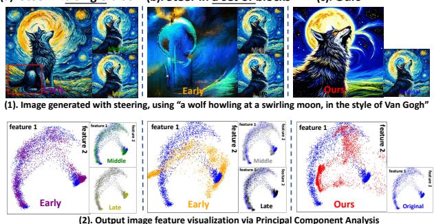  
Figure 6: Images generated by injecting vectors into diferent block combinations, along with the respective feature visualizations. The feature distribution after steering (red points in ’Ours’) shifts away from the original style distribution ( blue points in ’Original’), yet retains a similar overall structure.

Block Combinations for Steering Vector Injection. Our method injects the steering vector into consecutive early and middle blocks (� = 3, . . . , 10). As shown in Table 3, we provide quantitative results of injecting into a single early, middle or late block, as well as into multiple early, middle, or late blocks. We also show the generated image examples and visualize their corresponding feature distributions via Principal Component Analysis (PCA) in Figure 6. Results reveal that injecting into a single or multiple middle/late blocks causes nearly no changes, whereas injecting into a single early block may bring minor structural modifications. However, injecting into multiple early blocks leads to substantial, undesirable image distortion. We conclude that early blocks are crucial for overall image structure, while both early and middle blocks are critical for coherently constructing the main semantics of the image.

Block-wise Local Steering. To further analyze the alignment of steering directions across blocks, we independently construct and inject a local steering vector for each block $b \in [ 1 , 1 0 ]$ . As shown in the last row of Table 3, the erasure efectiveness of this per-block local steering is close to that of our method, indicating that the optimal steering directions are highly consistent across blocks and that a vector extracted from the middle block can efectively steer multiple blocks. However, multiple local vectors slightly reduce aesthetic quality, likely due to incoherent interventions that introduce subtle artifacts, while also increasing computational cost. Therefore, we choose a single middle vector instead of multiple local ones.

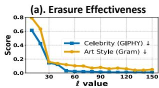

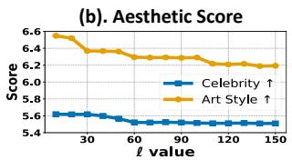

Figure 7: Sensitivity analysis of the steering strength ℓ. We evaluate how erasure efectiveness (GIPHY and Gram) and post-erasure image aesthetics vary with ℓ.  
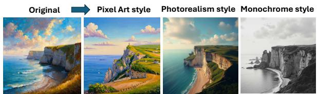

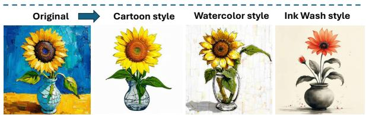  
A painting of a sunflower in a cracked vase, in the style of Van Gogh.

Sensitivity Analysis of the Steering Strength �. We present sensitivity analysis of ł in Figure 7. For celebrity, the erasure effectiveness increases sharply between � = 10 and � = 60, reaching a stable low value thereafter, while the aesthetic score decreases slightly and then plateaus. For art style, efectiveness improves rapidly up to � = 30, after which the gain slows. The aesthetic score first declines, stabilizes between � = 30 and � = 50, and then drops again beyond � = 50, likely because style information is globally distributed and is more susceptible to stronger steering than celebrity features. Based on this trade-of, we select � = 70 for celebrity and � = 40 for art style to balance erasure and aesthetic quality. Notably, for both concepts, there exists a stable plateau (� ∈ [30, 60] for art style and � ∈ [60, 100] for celebrity) where the method consistently removes the target while preserving image quality. This indicates the robustness of our method to the choice of �.

## 4.4 Multi-Style Steering

While existing baseline methods primarily focus on removing the target concept without specifying the final output after erasure, our method supports more flexible steering—redirecting the target concept’s representation toward diverse, specified semantic distributions. For example, as shown in Figure 8, our method can transform an art style into diferent ones. This flexibility stems from style-specific steering vectors, each guiding the target concept’s representation toward a predefined output distribution. Applying the corresponding vectors allows users to achieve both target concept erasure and fine-grained control over desired semantic outcomes.

Figure 8: Example images show multi-style steering for con trolled style transformation: Monet style is steered into pixel art, photorealism, and monochrome, while Van Gogh style is steered into cartoon, watercolor, and ink wash styles.  
Table 4: Robustness comparison between our method and baselines against four types of adversarial attacks targeting nudity on FLUX.1. All presented values are NudeNet scores.
<table><tr><td>Method</td><td>Ring-A-Bell↓</td><td>I2P↓</td><td>MMA-Diffusion↓</td><td>P4D↓</td></tr><tr><td>FLUX.1 (base)</td><td>0.435</td><td>0.148</td><td>0.075</td><td>0.238</td></tr><tr><td>SLD</td><td>0.495</td><td>0.151</td><td>0.056</td><td>0.227</td></tr><tr><td>NP</td><td>0.461</td><td>0.160</td><td>0.117</td><td>0.229</td></tr><tr><td>STG</td><td>0.482</td><td>0.154</td><td>0.148</td><td>0.234</td></tr><tr><td>UCE</td><td>0.415</td><td>0.147</td><td>0.086</td><td>0.187</td></tr><tr><td>ESD</td><td>0.127</td><td>0.065</td><td>0.021</td><td>0.071</td></tr><tr><td>CA</td><td>0.212</td><td>0.104</td><td>0.020</td><td>0.130</td></tr><tr><td>Ours</td><td>0.057</td><td>0.014</td><td>0.016</td><td>0.013</td></tr></table>

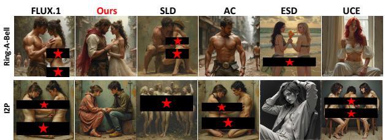  
Figure 9: Visual examples of nudity erasure against adversarial prompts generated by Ring-A-Bell and I2P. Our method exhibits strong robustness against adversarial prompts.

## 4.5 Robustness to Adversarial Attack

We evaluate the robustness of our method against four adversarial attacks. Since certain attacks can only generate adversarial prompts targeting the ’nudity’ concept, our analysis focuses on these attacks. As illustrated in the FLUX.1 results in Table 4 and Figure 9, compared to the baselines, our approach exhibits the strongest defense performance across all tested attack types, obtaining the lowest NudeNet scores. This suggests that our method significantly reduces the proportion of generated nudity-related concepts.

## 5 Conclusion

In this paper, we investigate the intrinsic properties of MM-DiT and propose a tuning-free concept erasure framework. By analyzing the generative roles of diferent blocks, we reveal that semantic representations of target concepts are predominantly concentrated in the middle blocks. Building on this insight, we construct a steering vector that guides the model toward safe semantics, and inject it into key blocks at every denoising timestep, thereby achieving concept erasure while preserving the overall image quality. Our method not only improves generation safety but also provides a foundation for future research on controllable image generation.

## 6 Acknowledgments

This work was supported by the National Key Research and Development Program of China (No.2024YFC3307402).

## References

[1] Nick Hasty, Ihor Kroosh, Dmitry Voitekh, and Dmytro Korduban. 2019. Giphy celebrity detector. https://github.com/Giphy/celeb-detection-oss.

[2] Josh Achiam, Steven Adler, Sandhini Agarwal, Lama Ahmad, Ilge Akkaya, Florencia Leoni Aleman, Diogo Almeida, Janko Altenschmidt, Sam Altman, Shyamal Anadkat, et al. 2023. Gpt-4 technical report. arXiv preprint arXiv:2303.08774 (2023).

[3] Fazl Barez, Tingchen Fu, Ameya Prabhu, Stephen Casper, Amartya Sanyal, Adel Bibi, Aidan O’Gara, Robert Kirk, Ben Bucknall, Tim Fist, et al. 2025. Open problems in machine unlearning for ai safety. arXiv preprint arXiv:2501.04952 (2025).

[4] P Bedapudi. 2019. Nudenet: Neural nets for nudity classification, detection and selective censoring. (2019).

[5] Anh Bui, Long Vuong, Khanh Doan, Trung Le, Paul Montague, Tamas Abraham, and Dinh Phung. 2024. Erasing undesirable concepts in difusion models with adversarial preservation. arXiv preprint arXiv:2410.15618 (2024).

[6] Zhi-Yi Chin, Chieh-Ming Jiang, Ching-Chun Huang, Pin-Yu Chen, and Wei-Chen Chiu. 2023. Prompting4debugging: Red-teaming text-to-image difusion models by finding problematic prompts. arXiv preprint arXiv:2309.06135 (2023).

[7] Sumanth Dathathri, Andrea Madotto, Janice Lan, Jane Hung, Eric Frank, Piero Molino, Jason Yosinski, and Rosanne Liu. 2019. Plug and play language models: A simple approach to controlled text generation. arXiv preprint arXiv:1912.02164 (2019).

[8] Kamil Deja et al. 2025. Saeuron: Interpretable concept unlearning in difusion models with sparse autoencoders. arXiv preprint arXiv:2501.18052 (2025).

[9] Patrick Esser, Sumith Kulal, Andreas Blattmann, Rahim Entezari, Jonas Müller, Harry Saini, Yam Levi, Dominik Lorenz, Axel Sauer, Frederic Boesel, et al. 2024. Scaling rectified flow transformers for high-resolution image synthesis. In Fortyfirst international conference on machine learning.

[10] Masane Fuchi and Tomohiro Takagi. 2024. Erasing Concepts from Text-to-Image Difusion Models with Few-shot Unlearning.. In BMVC.

[11] Tatiana Gaintseva, Andreea-Maria Oncescu, Chengcheng Ma, Ziquan Liu, Martin Benning, Gregory G. Slabaugh, Jiankang Deng, and Ismail Elezi. 2025. CASteer: Cross-Attention Steering for Controllable Concept Erasure. https: //api.semanticscholar.org/CorpusID:276961220

[12] Rohit Gandikota, Joanna Materzynska, Jaden Fiotto-Kaufman, and David Bau. 2023. Erasing concepts from difusion models. In Proceedings ofthe IEEE/CVF international conference on computer vision. 2426–2436.

[13] Rohit Gandikota, Hadas Orgad, Yonatan Belinkov, Joanna Materzyńska, and David Bau. 2024. Unified concept editing in difusion models. In Proceedings of the IEEE/CVF winter conference on applications ofcomputer vision. 5111–5120.

[14] Daiheng Gao, Shilin Lu, Wenbo Zhou, Jiaming Chu, Jie Zhang, Mengxi Jia, Bang Zhang, Zhaoxin Fan, and Weiming Zhang. 2025. Eraseanything: Enabling concept erasure in rectified flow transformers. In Forty-second International Conference on Machine Learning.

[15] Leon A Gatys, Alexander S Ecker, and Matthias Bethge. 2015. A neural algorithm of artistic style. arXiv preprint arXiv:1508.06576 (2015)

[16] Chao Gong, Kai Chen, Zhipeng Wei, Jingjing Chen, and Yu-Gang Jiang. 2024. Reliable and eficient concept erasure of text-to-image difusion models. In European Conference on Computer Vision. Springer, 73–88.

[17] Martin Heusel, Hubert Ramsauer, Thomas Unterthiner, Bernhard Nessler, and Sepp Hochreiter. 2017. Gans trained by a two time-scale update rule converge to a local nash equilibrium. Advances in neural information processing systems 30 (2017).

[18] Jonathan Ho, Ajay Jain, and Pieter Abbeel. 2020. Denoising difusion probabilistic models. Advances in neural information processing systems 33 (2020), 6840–6851.

[19] Edward J Hu, Yelong Shen, Phillip Wallis, Zeyuan Allen-Zhu, Yuanzhi Li, Shean Wang, Liang Wang, Weizhu Chen, et al. 2022. Lora: Low-rank adaptation of large language models. Iclr 1, 2 (2022), 3.

[20] Anubhav Jain, Yuya Kobayashi, Takashi Shibuya, Yuhta Takida, Nasir Memon, Julian Togelius, and Yuki Mitsufuji. 2024. Trasce: Trajectory steering for concept erasure. arXiv preprint arXiv:2412.07658 (2024).

[21] Nupur Kumari, Bingliang Zhang, Sheng-Yu Wang, Eli Shechtman, Richard Zhang, and Jun-Yan Zhu. 2023. Ablating concepts in text-to-image difusion models. In Proceedings ofthe IEEE/CVF international conference on computer vision. 22691– 22702.

[22] Black Forest Labs. 2024. FLUX. https://blackforestlabs.ai/announcing-blackforest-labs/. Accessed: [19.11.2025]

[23] LAION-AI. 2022. aesthetic-predictor. https://github.com/LAION-AI/aestheticpredictor.

[24] Chak Tou Leong, Yi Cheng, Jiashuo Wang, Jian Wang, and Wenjie Li. 2023. Selfdetoxifying language models via toxification reversal. In Proceedings ofthe 2023

Conference on Empirical Methods in Natural Language Processing. 4433–4449.

[25] Leyang Li, Shilin Lu, Yan Ren, and Adams Wai-Kin Kong. 2025. Set you straight: Auto-steering denoising trajectories to sidestep unwanted concepts. In Proceedings of the 33rd ACM International Conference on Multimedia. 9257–9266.

[26] Tsung-Yi Lin, Michael Maire, Serge Belongie, James Hays, Pietro Perona, Deva Ramanan, Piotr Dollár, and C Lawrence Zitnick. 2014. Microsoft coco: Common objects in context. In European conference on computer vision. Springer, 740–755.

[27] Yaron Lipman, Ricky TQ Chen, Heli Ben-Hamu, Maximilian Nickel, and Matthew Le. 2022. Flow matching for generative modeling. In The eleventh international conference on learning representations.

[28] Haotian Liu, Chunyuan Li, Yuheng Li, and Yong Jae Lee. 2024. Improved baselines with visual instruction tuning. In Proceedings of the IEEE/CVF conference on computer vision and pattern recognition. 26296–26306.

[29] Xingchao Liu, Chengyue Gong, and Qiang Liu. 2023. Flow straight and fast: Learning to generate and transfer data with rectified flow. In International conference on learning representations (ICLR).

[30] Shilin Lu, Zilan Wang, Leyang Li, Yanzhu Liu, and Adams Wai-Kin Kong. 2024. Mace: Mass concept erasure in difusion models. In Proceedings ofthe IEEE/CVF Conference on Computer Vision and Pattern Recognition. 6430–6440.

[31] Chenlin Meng, Yutong He, Yang Song, Jiaming Song, Jiajun Wu, Jun-Yan Zhu, and Stefano Ermon. 2021. Sdedit: Guided image synthesis and editing with stochastic diferential equations. arXiv preprint arXiv:2108.01073 (2021).

[32] Byeonghu Na, Mina Kang, Jiseok Kwak, Minsang Park, Jiwoo Shin, SeJoon Jun, Gayoung Lee, Jin-Hwa Kim, and Il-Chul Moon. 2026. Training-free safe text embedding guidance for text-to-image difusion models. Advances in Neural Information Processing Systems 38 (2026), 85984–86014.

[33] William Peebles and Saining Xie. 2023. Scalable difusion models with transformers. In Proceedings ofthe IEEE/CVF international conference on computer vision. 4195–4205.

[34] Alec Radford, Jong Wook Kim, Chris Hallacy, Aditya Ramesh, Gabriel Goh, Sandhini Agarwal, Girish Sastry, Amanda Askell, Pamela Mishkin, Jack Clark, et al. 2021. Learning transferable visual models from natural language supervision. In International conference on machine learning. PmLR, 8748–8763.

[35] Colin Rafel, Noam Shazeer, Adam Roberts, Katherine Lee, Sharan Narang, Michael Matena, Yanqi Zhou, Wei Li, and Peter J Liu. 2020. Exploring the limits of transfer learning with a unified text-to-text transformer. Journal of machine learning research 21, 140 (2020), 1–67.

[36] Nina Rimsky, Nick Gabrieli, Julian Schulz, Meg Tong, Evan Hubinger, and Alexander Turner. 2024. Steering llama 2 via contrastive activation addition. In Proceedings ofthe 62nd Annual Meeting ofthe Association for Computational Linguistics (Volume 1: Long Papers). 15504–15522.

[37] Pau Rodriguez, Arno Blaas, Michal Klein, Luca Zappella, Nicholas Apostolof, Xavier Suau, et al. 2025. Controlling language and difusion models by transporting activations. In International Conference on Learning Representations, Vol. 2025. 89812–89855.

[38] Robin Rombach, Andreas Blattmann, Dominik Lorenz, Patrick Esser, and Björn Ommer. 2022. High-resolution image synthesis with latent difusion models. In Proceedings of the IEEE/CVF conference on computer vision and pattern recognition. 10684–10695.

[39] Olaf Ronneberger, Philipp Fischer, and Thomas Brox. 2015. U-net: Convolutional networks for biomedical image segmentation. In International Conference on Medical image computing and computer-assisted intervention. Springer, 234–241.

[40] Patrick Schramowski, Manuel Brack, Björn Deiseroth, and Kristian Kersting. 2023. Safe latent difusion: Mitigating inappropriate degeneration in difusion models. In Proceedings ofthe IEEE/CVF conference on computer vision and pattern recognition. 22522–22531.

[41] Yang Song and Stefano Ermon. 2019. Generative modeling by estimating gradients of the data distribution. Advances in neural information processing systems 32 (2019).

[42] Yang Song, Jascha Sohl-Dickstein, Diederik P Kingma, Abhishek Kumar, Stefano Ermon, and Ben Poole. 2020. Score-based generative modeling through stochastic diferential equations. arXiv preprint arXiv:2011.13456 (2020).

[43] Nishant Subramani, Nivedita Suresh, and Matthew E Peters. 2022. Extracting latent steering vectors from pretrained language models. In Findings ofthe Association for Computational Linguistics: ACL 2022. 566–581.

[44] Yu-Lin Tsai, Chia-Yi Hsu, Chulin Xie, Chih-Hsun Lin, Jia You Chen, Bo Li, Pin-Yu Chen, Chia-Mu Yu, and Chun-Ying Huang. 2023. Ring-a-bell! how reliable are concept removal methods for difusion models?. In The Twelfth International Conference on Learning Representations.

[45] Alexander Matt Turner, Lisa Thiergart, Gavin Leech, David Udell, Juan J Vazquez, Ulisse Mini, and Monte MacDiarmid. 2023. Steering language models with activation engineering. arXiv preprint arXiv:2308.10248 (2023).

[46] Haoran Wang and Kai Shu. 2024. Trojan activation attack: Red-teaming large language models using steering vectors for safety-alignment. In Proceedings of the 33rd ACM International Conference on Information and Knowledge Management. 2347–2357.

[47] Kang Wei, Xin Yuan, Fushuo Huo, Chuan Ma, Long Yuan, Songze Li, Ming Ding, and Dacheng Tao. 2025. Responsible Difusion: A Comprehensive Survey on

Safety, Ethics, and Trust in Difusion Models. arXiv preprint arXiv:2509.22723 (2025).

[48] Yijun Yang, Ruiyuan Gao, Xiaosen Wang, Tsung-Yi Ho, Nan Xu, and Qiang Xu. 2024. Mma-difusion: Multimodal attack on difusion models. In Proceedings of the IEEE/CVF Conference on Computer Vision and Pattern Recognition. 7737–7746.

[49] Jaehong Yoon, Shoubin Yu, Vaidehi Ramesh Patil, Huaxiu Yao, and Mohit Bansal. 2025. Safree: Training-free and adaptive guard for safe text-to-image and video generation. In International Conference on Learning Representations, Vol. 2025. 56439–56465.

[50] Gong Zhang, Kai Wang, Xingqian Xu, Zhangyang Wang, and Humphrey Shi. 2024. Forget-me-not: Learning to forget in text-to-image difusion models. In

Proceedings ofthe IEEE/CVF conference on computer vision and pattern recognition. 1755–1764.

[51] Richard Zhang, Phillip Isola, Alexei A Efros, Eli Shechtman, and Oliver Wang. 2018. The unreasonable efectiveness of deep features as a perceptual metric. In Proceedings of the IEEE conference on computer vision and pattern recognition. 586–595.

[52] Hongjue Zhao, Haosen Sun, Jiangtao Kong, Xiaochang Li, Qineng Wang, Liwei Jiang, Qi Zhu, Tarek Abdelzaher, Yejin Choi, Manling Li, et al. 2026. Odesteer: A unified ode-based steering framework for llm alignment. arXiv preprint arXiv:2602.17560 (2026).