# SketchSense: Learning to Interpret Imperfect Sketch Guidance for Image Inpainting

Zian Yang Fudan University 23307140016@m.fudan.edu.cn

## Abstract

Sketch-guided image inpainting provides intuitive structural control, yet real sketches often mix reliable global intent with locally crowded, displaced, incomplete, or deliberately unconventional strokes. Existing approaches typically either retain the input sketch as a fixed condition through out denoising or refine it into a clean structure before RGB synthesis. The former assumes uniformly reliable strokes and can propagate local errors throughout generation; the latter must resolve ambiguous structure before emerging appearance and semantic context become available. We propose SketchSense, a framework that interprets imperfect sketch guidance by synchronously denoising interacting RGB and structure streams. Bidirectional Attention Fusion couples appearance generation with structural recovery, producing a refined structure that exposes the model’s evolving sketch interpretation. A phrase-level objective aligns the semantic grounding of the two streams. Sketch-Aware Spatial Regulationfurther adapts sketch use to local generation states by modulating attention and the fusion process, while an optional signed prior injects preserveversus-correct intent into feature representations and attention behavior. Experiments on natural and structurally complex imagery show substantial gains over existing methods in both restoration quality and structuralfidelity.

## 1. Introduction

Image inpainting synthesizes coherent content in masked regions while preserving compatibility with the observed image. Sketches complement prompts and masks by directly specifying spatial layout, object boundaries, and local artistic intent. Their sparse, editable form lets users mark critical contours without providing a complete structural map. Prior work has demonstrated their value for interactive, shape-guided, and structure-aware inpainting [13, 14, 16, 21], particularly when plausible restoration depends on fine contours, ornamental patterns, or complex structural

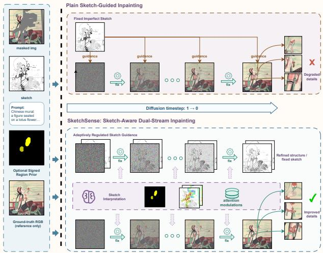  
Figure 1. Motivation and overview of SketchSense. Fixed-sketch conditioning can propagate locally degraded strokes. Sketch-Sense synchronously denoises RGB and structure, regulates sketch use through learned attention modulations and an optional signed prior, and exposes its interpretation as refined structure.

organization.

The key challenge is that a user sketch is neither a uniformly accurate target nor merely a weak hint. It often captures the intended global layout and useful boundaries, while local strokes may be crowded, displaced, incomplete, or distorted [13, 16]. Conversely, an unconventional shape may reflect deliberate artistic intent. Treating every stroke as equally reliable can transfer drawing errors to the restored image, whereas globally weakening the condition can discard structures the user wants to preserve. Sketch reliability is therefore spatially heterogeneous, and geometry alone may not distinguish an error from deliberate design. The model must instead relate the sketch to evolving appearance, structure, and semantics, then adapt its use across locations. This need is especially acute in murals, artworks, and illustrations, where dense contours and organized patterns amplify local interpretation errors [2, 9].

As illustrated in Fig. 1, a fixed sketch can propagate errors from locally degraded strokes, whereas SketchSense interprets and regulates the same guidance during synchronous denoising.

Many conditional generation pipelines use a sketch, edge map, or line drawing as a fixed external condition throughout denoising [18, 23]. Spatial weighting and attention control can vary where or how strongly the condition is read [3, 7], but the underlying sketch remains fixed. These controls rescale its influence without exposing an evolving interpretation, so local errors may persist throughout denoising.

Another strategy first recovers a clean structure and then synthesizes RGB. Although this structure-first formulation exposes an intermediate result and is common in sketch refinement and structure-prior inpainting [2, 9, 13], it must resolve structural ambiguity before appearance cues such as color, material, and texture emerge. Errors in that estimate are then inherited by the RGB generator as fixed conditions. This is restrictive in structurally complex imagery, where the meaning of a stroke and its visual realization are closely coupled. These limitations motivate recovering appearance and structure together.

We present SketchSense, a sketch-guided inpainting framework built around synchronous RGB–structure understanding. Two interacting branches jointly denoise RGB and structure latents: the RGB branch reconstructs the image, while the structure branch turns the imperfect sketch into refined structure at the same denoising step. Bidirectional Attention Fusion exchanges time-aligned information, allowing appearance and text context to inform structure recovery while progressively refined structure guides RGB synthesis. The refined-structure trajectory exposes the model’s interpretation of the input sketch and supports inspection or iterative revision.

During training, modality differences can cause the same object to be localized differently by text-conditioned attention in the RGB and structure branches. We therefore introduce Phrase-Level Cross-Branch Semantic Consistency, an auxiliary objective that aligns their phrase-conditioned spatial attention while retaining modality-specific representations.

Locally heterogeneous sketch evidence is not equally useful at every location or transformer block. Global scales and fixed region weights cannot capture this variation, especially because blocks respond differently to conditioning [3]. We therefore introduce Intrinsic Sketch-Aware Spatial Regulation, which uses evolving dual-branch states and local geometry to modulate attention according to sketch reliability and gate the fusion process across space and blocks.

Sketch geometry alone may not reveal whether an unconventional stroke should be preserved or corrected. Explicit Signed Sketch-Use Modeling addresses this ambiguity with an optional signed spatial prior that communicates local intent. The prior modulates token representations, sketch-source attention, and retrieved sketch features.

In summary, our contributions are threefold:

• We propose a synchronous RGB–structure framework for interpreting imperfect sketch guidance. Bidirectional Attention Fusion and phrase-level semantic consistency couple the two branches, which produce restored RGB and an observable refined structure.

• We introduce Intrinsic Sketch-Aware Spatial Regulation, which learns to adapt sketch attention and the fusion process across locations and transformer blocks.

• We introduce Explicit Signed Sketch-Use Modeling to express local preservation-or-correction intent when geometry alone is ambiguous, using an optional prior to regulate sketch representation and use.

## 2. Related Work

## 2.1. Sketch- and Structure-Guided Image Inpainting

Sketch- and structure-guided inpainting augments masks and text with visual conditions that specify missing geometry. SmartBrush combines text with shape guidance for object inpainting, while Structure Matters introduces auxiliary structure to reduce semantic discrepancy in diffusion inpainting [14, 21]. Together, these methods establish structural conditions as effective interfaces for controllable restoration. When the input structure is imperfect, SketchRefiner refines a user sketch before inpainting, and structure-prior pipelines recover line or edge representations before color and detail synthesis [2, 9, 13]. These approaches generally treat structure either as a condition to follow or as a completed intermediate result. The former does not distinguish reliable strokes from ambiguous local evidence, whereas the latter resolves ambiguity before appearance cues emerge. Neither formulation directly addresses a single sketch whose reliability and intended use vary across regions. SketchSense instead interprets structure jointly with RGB recovery and retains the refined structure as an observable result.

## 2.2. Joint Multimodal Generation and Semantic Coupling

Joint diffusion models couple RGB with dense modalities through interacting branches [8, 22], while diffusiontransformer control methods process image and condition tokens jointly for flexible visual conditioning [18]. Related text–region grounding methods associate textual concepts with spatial support: attention refocusing improves text– layout correspondence through cross- and self-attention control [15], and MTADiffusion combines edge prediction with mask–text alignment for object inpainting [6]. These works establish effective multimodal interaction and spatial semantic alignment. Generic multimodal coupling, however, does not ensure that two modality branches ground the same concept in the same spatial region, while existing grounding mechanisms typically align text and layout within one generation path. SketchSense focuses on this cross-branch mismatch: concurrently denoised RGB and structure branches may localize the same object phrase differently. It therefore combines bidirectional feature exchange with an auxiliary phrase-level objective that aligns spatial grounding across the two modalities.

## 2.3. Spatially Adaptive Conditional Control

Spatial control methods regulate where and how strongly a condition affects diffusion generation. S-CFG replaces a global classifier-free guidance scale with semantic-regiondependent guidance [17], Conditional Balance studies layer-dependent sensitivity to conditioning [3], and attention modulation provides region-specific control over intermediate attention maps [7]. These methods provide useful mechanisms for spatial adherence, condition strength, and layer selection, generally assuming that the intended meaning of the condition is already known. Imperfect sketches add a distinct ambiguity because a local deviation may be an error to correct or an intentional shape to preserve. The model must infer the reliability of sketch evidence, while the user may also wish to specify its intended use. SketchSense addresses both cases through intrinsic statedependent regulation and an optional signed spatial prior, without treating sketch reliability as a single global quantity.

## 3. Method

Figure 2 summarizes the inference path and training objectives. SketchSense synchronously denoises RGB and structure streams, exchanges their evolving evidence through Bidirectional Attention Fusion, and spatially regulates sketch use. The RGB stream restores appearance, while the structure stream interprets imperfect guidance as refined structure.

## 3.1. Synchronous RGB–Structure Understanding

Let $z _ { x , t }$ and $z _ { e , t }$ be the noisy RGB and edge latents at the shared timestep, x and e the visible conditions, m the hole mask, p the prompt, and $z _ { s }$ the sketch latent. Their initial image-token states are

$$
\begin{array} { r l } & { ~ H _ { x } ^ { 0 } = \mathcal { P } _ { x } ( z _ { x , t } , x , m , p ) , } \\ & { H _ { \mathrm { s t r } } ^ { 0 } = [ H _ { e } ^ { 0 } ; H _ { s } ^ { 0 } ] } \\ & { ~ = [ \mathcal { P } _ { e } ( z _ { e , t } , e , m , p ) ; \mathcal { P } _ { s } ( z _ { s } ) ] . } \end{array}\tag{1}
$$

Here ${ \mathcal P } _ { x }$ and $\mathcal { P } _ { e }$ abstract native FLUX Fill preparation, projection, and prompt conditioning, $\mathcal { P } _ { s }$ packs and projects the sketch, and the semicolon denotes token-axis concatenation. Sketch tokens remain available as source evidence throughout denoising, while the edge-target tokens evolve under both structural and appearance context at every transformer block. Edge supervision is used during training; at inference, this trajectory records the model’s progressive interpretation of the imperfect sketch.

## 3.1.1. Bidirectional Attention Fusion

As shown in Fig. 3, each fusion block reuses its native image-token QKV and adds a dedicated joint-attention QKV LoRA [5]. For $b \in \{ x , \mathrm { s t r } \}$

$$
( \bar { Q } _ { b } ^ { l } , \bar { K } _ { b } ^ { l } , \bar { V } _ { b } ^ { l } ) = \mathrm { Q K V } _ { b } ^ { l } ( H _ { b } ^ { l } ) + \mathcal { L } _ { b } ^ { l } ( H _ { b } ^ { l } ) ,\tag{2}
$$

where $H _ { \mathrm { s t r } } ^ { l } = [ H _ { e } ^ { l } ; H _ { s } ^ { l } ]$ and $\mathcal { L } _ { b } ^ { l }$ supplies the fusion-specific $\Delta Q K V$ . Using the edge-target query span $\bar { Q } _ { e } ^ { l }$ and the full structure-side key/value span, the block forms

$$
\begin{array} { l } { { { \cal M } _ { x  \mathrm { s t r } } ^ { l } = \mathrm { A t t n } \big ( \bar { Q } _ { x } ^ { l } , \bar { K } _ { \mathrm { s t r } } ^ { l } , \bar { V } _ { \mathrm { s t r } } ^ { l } \big ) , } } \\ { { { \cal M } _ { e  x } ^ { l } = \mathrm { A t t n } \big ( \bar { Q } _ { e } ^ { l } , \bar { K } _ { x } ^ { l } , \bar { V } _ { x } ^ { l } \big ) . } } \end{array}\tag{3}
$$

RGB queries therefore retrieve the current edge hypothesis together with the original sketch evidence, and edge queries retrieve appearance and semantic context from the RGB state. Sharing the native projections retains their pretrained representation, while the low-rank residual specializes the cross-branch retrieval at each block.

The two directional messages are jointly projected and split into branch-specific candidate residuals:

$$
( \Delta H _ { x } ^ { l } , \Delta H _ { e } ^ { l } ) = \mathrm { S p l i t } \big ( W _ { 0 } ^ { l } [ M _ { x  \mathrm { s t r } } ^ { l } ; M _ { e  x } ^ { l } ] \big ) .\tag{4}
$$

The zero-initialized $W _ { 0 } ^ { l }$ preserves the pretrained starting behavior; Sec. 3.2.1 controls the spatial injection of both candidate residuals. When branch resolutions differ, exchanged features are spatially aligned. The same construction is used in the double- and single-stream FLUX block families, with their respective native projections and dedicated low-rank adapters.

## 3.1.2. Phrase-Level Cross-Branch Semantic Consistency

Shared prompts can still yield different phrase grounding across branches. We extract local noun phrases ${ \mathcal { P } } ( p ) =$ $\operatorname { L L M } ( p )$ , match each phrase to its prompt tokens, and aggregate its attention over the matched span and heads into $A _ { b , k } ^ { l } .$ . The phrase-conditioned spatial distributions and their discrepancy are

$$
\begin{array} { r l } & { \pi _ { b , k } ^ { l } = \mathrm { N o r m } \big ( \mathrm { P o o l } _ { b } ( A _ { b , k } ^ { l } ) \big ) , \qquad b \in \{ x , e \} , } \\ & { \quad d _ { l k } = \mathrm { J S } ( \pi _ { x , k } ^ { l } \| \pi _ { e , k } ^ { l } ) , } \end{array}
$$

Here $\mathrm { P o o l } _ { b }$ aggregates each branch response onto the common spatial support used by the loss, and $\mathrm { N o r m } ( a ) \ =$ softmax(zscore(a)/T). Let $c _ { b , l k } = 1 - \mathcal { H } ( \pi _ { b , k } ^ { l } ) /$ log N be

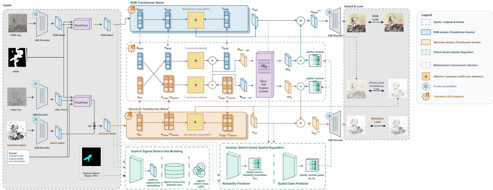  
Figure 2. Overview of SketchSense. Synchronous RGB and structure branches exchange information through Bidirectional Attention Fu sion. Spatial regulation adapts sketch attention and fusion injection, and an optional signed prior expresses local preservation or correction intent. Training uses edge supervision, phrase consistency, and branch losses; inference returns restored RGB and refined structure.

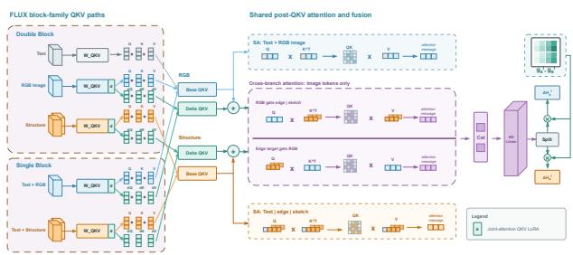  
Figure 3. Bidirectional Attention Fusion with adapted QKV reuse. Native QKV provides the shared base, and a dedicated jointattention QKV LoRA produces fusion-specific $\Delta Q K V$ . Directional messages pass through a zero-initialized projection, split into $\Delta H _ { x } ^ { l }$ and $\Delta H _ { e } ^ { l } ,$ and enter their receiving branches through $g _ { x } ^ { l }$ and $g _ { e } ^ { l }$ .

the normalized-entropy confidence over the N positions of the common support, and let $c _ { l k } = \operatorname* { m a x } ( c _ { x , l k } , c _ { e , l k } )$ . The soft weight and objective are

$$
\begin{array} { r } { \omega _ { l k } = \sigma \left( \frac { \mathrm { s g } \left( d _ { l k } \right) - \mu } { \tau } \right) } \\ { \cdot \left[ c _ { 0 } + c _ { 1 } \mathrm { c l i p } \left( \frac { c _ { l k } } { c _ { \mathrm { r e f } } } , 0 , 1 \right) \right] , } \\ { \mathscr { L } _ { \mathrm { p h r a s e } } = \frac { 1 } { \left| \Omega \right| } \displaystyle \sum _ { ( l , k ) \in \Omega } \omega _ { l k } d _ { l k } . } \end{array}\tag{5}
$$

Ω contains successfully matched, numerically valid block– phrase pairs. Parser confidence screening removes unreliable phrases, while $\omega _ { l k }$ emphasizes mismatched, spatially confident pairs without changing the JS gradient through its stop-gradient term.

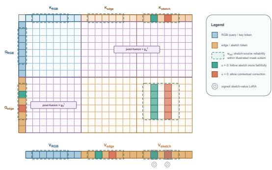  
Figure 4. Locations of sketch-aware modulation. The reliability map $w _ { \mathrm { r e l } }$ and signed signal u regulate sketch-source attention and value adaptation. Spatial gates ${ \bf \nabla } { g } _ { x } ^ { l }$ and $g _ { e } ^ { l }$ scale post-fusion residuals; colors schematically mark mechanism roles.

## 3.2. Sketch-Aware Spatial Regulation

As summarized in Fig. 4, SketchSense combines intrinsic state-conditioned regulation with an optional explicit signed prior. Together, they modulate sketch-source attention and cross-branch residual injection; their mechanisms are detailed below.

## 3.2.1. Intrinsic Sketch-Aware Spatial Regulation

Figure 5 details the reliability and residual-gate predictors. Let $H _ { e } ^ { l }$ and $H _ { s } ^ { l }$ be paired edge and sketch states, S the raw sketch, M the hole mask, and $t ^ { l }$ the timestep embedding. Reliability combines a token-state path with a pixel-space

geometry path:

$$
\begin{array} { r l } & { z _ { \mathrm { s t a t e } } ^ { l } = \Phi _ { \mathrm { s t a t e } } ^ { l } \left( H _ { e } ^ { l } , H _ { s } ^ { l } , H _ { s } ^ { l } - H _ { e } ^ { l } , t ^ { l } \right) , } \\ & { ~ z _ { \mathrm { g e o } } ^ { l } = Z _ { 0 } ^ { l } \big ( \mathcal { P } _ { h _ { l } , w _ { l } } \left( \Phi _ { \mathrm { g e o } } ^ { l } ( [ S , M , S \odot M ] ) \right) \big ) , } \\ & { ~ a ^ { l } = W _ { \mathrm { o u t , 0 } } ^ { l } ( z _ { \mathrm { s t a t e } } ^ { l } + z _ { \mathrm { g e o } } ^ { l } ) , } \\ & { ~ w _ { \mathrm { r e l } } ^ { l } = \exp \left( \log \alpha _ { \mathrm { m a x } } \cdot \operatorname { t a n h } ( a ^ { l } ) \right) . } \end{array}\tag{6}
$$

The adapter $Z _ { 0 } ^ { l }$ and output $W _ { \mathrm { o u t , 0 } } ^ { l }$ are zero-initialized, so $w _ { \mathrm { r e l } } ^ { l }$ starts at one. With edge-side hole-mask tokens $m ^ { l } ,$ source reliability is confined to restoration queries and supported sketch sources:

$$
\bar { w } _ { j } ^ { l } = 1 + m _ { j } ^ { l } ( w _ { \mathrm { r e l } , j } ^ { l } - 1 ) , \qquad \ell _ { i j } ^ { e  s , l }  \ell _ { i j } ^ { e  s , l } + m _ { i } ^ { l } \log \bar { w } _ { \underline { { j } } } ^ { l } .\tag{7}
$$

The token-state path measures agreement between the current edge interpretation and the sketch. The pixel-space path extracts fine sketch and mask geometry before adaptive pooling $\mathcal { P } _ { h _ { l } , w _ { l } }$ converts it into token features for the current transformer block. The bounded exponential converts their combined evidence into a positive multiplicative reliability: values above one promote sketch retrieval and values below one attenuate it.

For fusion residual $\Delta H _ { b } ^ { l } ,$ , branch state $H _ { b } ^ { l } ,$ , mask tokens $m _ { b } ^ { l } .$ , and global conditioning $v ^ { l }$ , the block-specific injection is

$$
\begin{array} { r l } & { g _ { b } ^ { l } = \sigma \big ( G _ { \mathrm { r e s } } ^ { l } \left( H _ { b } ^ { l } , \Delta H _ { b } ^ { l } , m _ { b } ^ { l } , v ^ { l } \right) \big ) , } \\ & { O _ { b } ^ { l } = O _ { b , \mathrm { s e l f } } ^ { l } + g _ { b } ^ { l } \odot \Delta H _ { b } ^ { l } . } \end{array}\tag{8}
$$

where $b \in \{ x , e \}$ and $O _ { b , \mathrm { s e l f } } ^ { l }$ is the native update. On the structure side, $\Delta H _ { e } ^ { l }$ has support on the edge-target token span, while the sketch tokens retain their source role along this residual path. Thus reliability controls sketch-source selection, whereas $g _ { b } ^ { l }$ controls how much of the candidate cross-branch residual is injected. The gate jointly observes the receiving state and proposed message, while the mask and global vector provide restoration support and timestep– prompt conditioning.

## 3.2.2. Explicit Signed Sketch-Use Modeling

Figure 6 illustrates the explicit prior. Let $q \in [ - 1 , 1 ] ^ { H \times W }$ express signed sketch-use intent and $r \in [ 0 , 1 ] ^ { \bar { H } \times W }$ its support, with $u = q \odot r$ . Positive, negative, and zero u encourage sketch preservation, permit contextual correction, and indicate neutral use, respectively. A zero-initialized spatial encoder adds a branch-specific prior embedding during initial token preparation:

$$
\widetilde { H } _ { b } ^ { 0 } = H _ { b } ^ { 0 } + E _ { b } ( u , r , | u | ) , \qquad b \in \{ x , e , s \} .\tag{9}
$$

The encoder converts $\left[ u , r , | u | \right]$ into branch-specific token embeddings and begins with $E _ { b } ~ = ~ 0$ . Here u carries supported direction and strength, r records prior support,

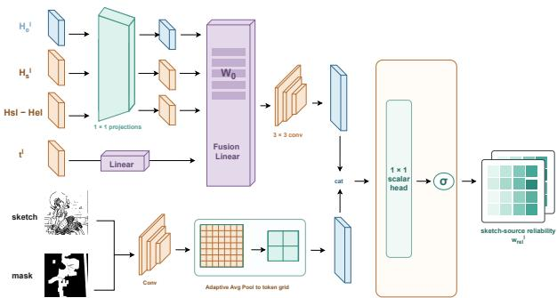

(a) Sketch-source reliability predictor.  
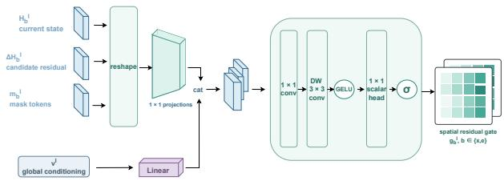  
(b) Spatial residual-gate predictor.

Figure 5. Intrinsic Sketch-Aware Spatial Regulation. (a) Edge– sketch states and raw geometry produce source reliability $w _ { \mathrm { r e l } } ^ { l }$ (b) Branch state, candidate residual, mask tokens, and global con ditioning produce the residual gate $g _ { b } ^ { l }$ for $b \in \{ x , e \}$  
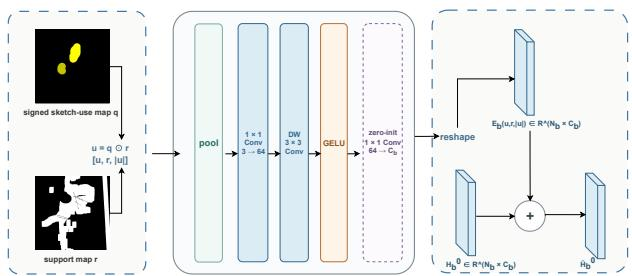  
Figure 6. Additive signed-prior embedding. With $u = q \odot r ,$ a zero-initialized encoder maps [u, r, |u|] to the branch-specific $E _ { b } ,$ which forms $\widetilde { H } _ { b } ^ { 0 } = H _ { b } ^ { 0 } + E _ { b }$ . The support map r localizes prior activation.

and the hole mask m supplies restoration support. Subsequent block-wise signed modulation is applied through the source-key bias and sketch-value LoRA defined below.

For restoration branch $b \in \{ x , e \}$ , query $i ,$ sketch source $j ,$ , and head h, the prior adjusts source selection by

$$
\ell _ { b , i j } ^ { l , h }  \ell _ { b , i j } ^ { l , h } + m _ { b , i } ^ { l } \beta _ { b } ^ { l , h } u _ { j } , \qquad \beta _ { b } ^ { l , h } = \beta _ { \operatorname* { m a x } } \operatorname { t a n h } ( \bar { \beta } _ { b } ^ { l , h } ) .\tag{10}
$$

The signed term raises or lowers supported sketch-key logits with a learned layer-, head-, and branch-specific sensitivity. It consequently affects both the RGB path reading structure and the edge path reading sketch evidence. The bounded coefficient $\overline { { \beta _ { b } ^ { l , h } } }$ keeps this modulation within a fixed scale while allowing different heads to respond differently to the prior.

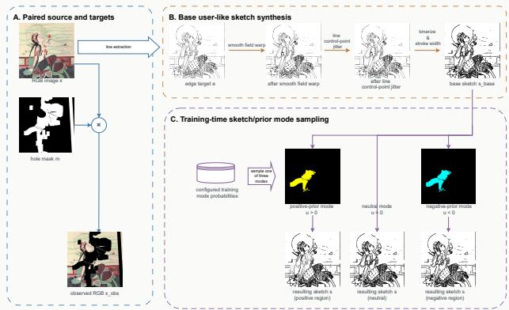  
Figure 7. Training example synthesis. Paired RGB and edge targets produce a base sketch, followed by one sampled mode: faithful $u > 0 .$ neutral $u \ : = \ : 0 .$ , or correction-oriented $u \ : < \ : 0$ . The inpainting mask selects restoration pixels, and r selects signedprior support.

The value path applies intent-specific LoRA residuals to the normalized and modulated sketch hidden state $\widehat { H } _ { s } ^ { l }$ before splitting it into heads:

$$
\begin{array} { r l } & { \Delta V _ { s } ^ { l } = \omega _ { + } ( u ) B _ { + } ^ { l } A _ { + } ^ { l } \widehat { H } _ { s } ^ { l } + \omega _ { - } ( u ) B _ { - } ^ { l } A _ { - } ^ { l } \widehat { H } _ { s } ^ { l } , } \\ & { \widetilde { V } _ { s } ^ { l , h } = V _ { s } ^ { l , h } + \mathrm { S p l i t } _ { h } ( \Delta V _ { s } ^ { l } ) , } \end{array}\tag{11}
$$

where $\omega _ { + } ( u ) = \mathrm { m a x } ( u , 0 )$ and ω− $( u ) = \operatorname* { m a x } ( - u , 0 )$ . The embedding, source-key bias, and value transformation expose the same signed intent to token state, sketch selection, and retrieved sketch content, respectively. Separate positive and negative low-rank factors permit preservation and correction regions to transform the sketch contribution differently, while neutral regions retain the base value path.

## 3.3. Training Example Construction

We use paired edge annotations when available and otherwise extract edge targets with MuGE [25]. From each target, we synthesize a base user-like sketch primarily through smooth deformation fields, following prior sketch augmentation practice [13, 16]. We then select a local region and sample one treatment: a positive mode replaces it with more faithful target-derived structure, a negative mode applies stronger warping with optional stroke removal or an unrelated donor patch, and a neutral mode keeps the base sketch. These modes yield $u > 0 , u < 0$ , and $u = 0$ training examples, respectively, while preserving the remaining sketch context, as shown in Fig. 7.

## 3.4. Training Objective

For RGB and edge latents $z _ { b } , b \in \{ x , e \}$ , flow matching [4, 12] uses noise $\epsilon _ { b } \sim \mathcal { N } ( 0 , I )$ and schedule $\sigma _ { t } \colon$

$$
z _ { b , t } = ( 1 - \sigma _ { t } ) z _ { b } + \sigma _ { t } \epsilon _ { b } , \qquad v _ { b } ^ { \star } = \epsilon _ { b } - z _ { b } .\tag{12}
$$

Both streams share timestep t and predict velocities $\hat { v } _ { b }$ With binary restoration mask m and prior support r, let $m _ { b , i }$ and ${ r _ { b , i } }$ be their pooled values at branch token i. The spatia weight and normalized branch objective are

$$
\begin{array} { l } { \displaystyle { W _ { b , i } = 1 + \eta _ { m } m _ { b , i } + \eta _ { r } r _ { b , i } , } } \\ { \displaystyle { \mathcal L _ { b } = \mathbb E \left[ \frac { \sum _ { i } W _ { b , i } \| \hat { v } _ { b , i } - { v } _ { b , i } ^ { \star } \| _ { 2 } ^ { 2 } } { D _ { b } \sum _ { i } W _ { b , i } } \right] , } } \end{array}\tag{13}
$$

where $D _ { b }$ is the token feature dimension. The RGB term supervises appearance restoration, the edge term supervises refined structure, and both operate at the same timestep. Together with $\operatorname { E q . }$ (5), the complete objective is

$$
\mathcal { L } = \frac { \lambda _ { x } \mathcal { L } _ { x } + \lambda _ { e } \mathcal { L } _ { e } } { \lambda _ { x } + \lambda _ { e } } + \lambda _ { \mathrm { p h r a s e } } \mathcal { L } _ { \mathrm { p h r a s e } } .\tag{14}
$$

Loss weights and sampling ratios are fixed throughout training.

## 4. Experiments

## 4.1. Experimental Setup

We train on ArtBench [10], COCO [11], and DhMural1714 [9], sampled with probabilities 0.3, 0.6, and 0.1, respectively. SketchSense builds on FLUX.1 Fill [dev] [1] and operates at $5 1 2 \times 5 1 2$ . Training takes approximately seven days on one NVIDIA A100 using BF16, a batch size of 12, and Adafactor with a learning rate of $1 0 ^ { - 5 }$ ; inference uses a guidance scale of 25. All methods use matched input conditions, and PSNR, SSIM [20], and LPIPS [24] are computed within the inpainting mask.

## 4.2. Quantitative Results

## 4.2.1. Comparison with Existing Methods

Table 1 shows that SketchSense consistently outperforms the compared methods across the Easy, Medium, and Hard subsets. The gains persist as difficulty increases, while the variants with and without the signed prior achieve similar aggregate RGB metrics.

## 4.3. Qualitative Results

## 4.3.1. Comparison with Existing Methods

Figure 8 shows that SketchSense produces more coherent RGB restorations and refined structures than the compared methods across DhMural1714, ArtBench, and COCO. The improvement is especially visible in large or structurally complex holes, where the recovered appearance remains consistent with the predicted structure.

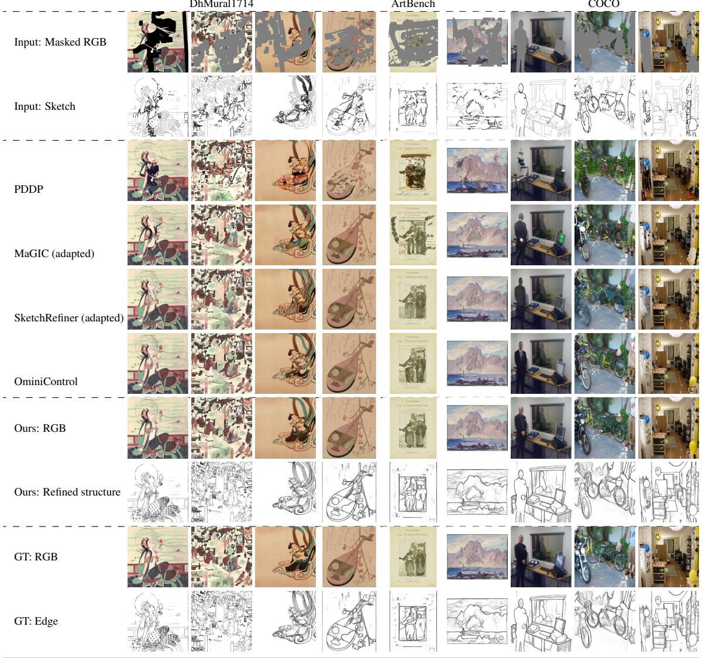

Figure 8. Qualitative comparison on matched examples from DhMural1714, ArtBench, and COCO. Sketches are faded outside the inpaint ing mask for visualization; SketchSense additionally outputs refined structure.
<table><tr><td></td><td colspan="3">Easy</td><td colspan="3">Medium</td><td colspan="3">Hard</td></tr><tr><td>Method</td><td>PSNR ↑</td><td>SSIM ↑</td><td>LPIPS↓</td><td>PSNR ↑</td><td>SSIM↑</td><td>LPIPS↓</td><td>PSNR ↑</td><td>SSIM ↑</td><td>LPIPS ↓</td></tr><tr><td>PDDP [16]</td><td>12.714</td><td>0.7820</td><td>0.2050</td><td>11.350</td><td>0.6533</td><td>0.3019</td><td>10.450</td><td>0.5237</td><td>0.3883</td></tr><tr><td>MaGIC (adapted) [19]</td><td>15.972</td><td>0.8176</td><td>0.1306</td><td>14.402</td><td>0.6994</td><td>0.2029</td><td>12.712</td><td>0.5658</td><td>0.2876</td></tr><tr><td>SketchRefiner (adapted) [13]</td><td>17.602</td><td>0.8359</td><td>0.1285</td><td>16.156</td><td>0.7285</td><td>0.2034</td><td>14.386</td><td>0.5916</td><td>0.3020</td></tr><tr><td>OminiControl [18]</td><td>18.103</td><td>0.8431</td><td>0.0921</td><td>16.083</td><td>0.7274</td><td>0.1609</td><td>13.902</td><td>0.5824</td><td>0.2479</td></tr><tr><td>SketchSense without signed prior</td><td>19.428</td><td>0.8584</td><td>0.0720</td><td>17.301</td><td>0.7502</td><td>0.1282</td><td>14.933</td><td>0.6121</td><td>0.2040</td></tr><tr><td>SketchSense with signed prior</td><td>19.442</td><td>0.8587</td><td>0.0723</td><td>17.290</td><td>0.7506</td><td>0.1299</td><td>14.898</td><td>0.6128</td><td>0.2061</td></tr></table>

Table 1. Quantitative comparison across the Easy, Medium, and Hard subsets. All metrics are computed within the inpainting mask.

## 4.3.2. Effect of Local Region Guidance

Figure 9 illustrates how local signed guidance changes the interpretation of selected sketch content while preserving the overall composition. The corresponding RGB and

refined-structure outputs show that the resulting changes remain localized near the indicated structures.

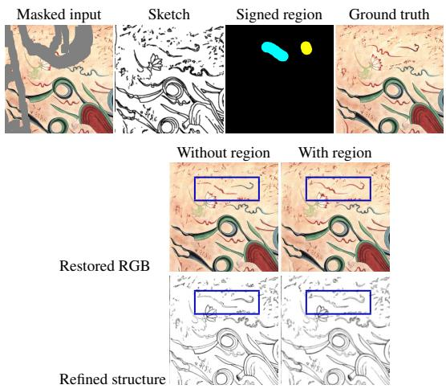  
Figure 9. Effect of local signed region guidance. The upper row shows the masked input, sketch, signed region map, and ground truth; yellow indicates sketch preservation and cyan permits contextual correction. The lower grid compares restored RGB and refined structure, with blue boxes marking the region of interest.

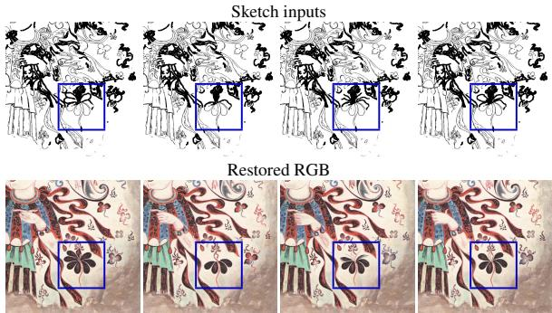  
Figure 10. Effect of different sketch inputs under a shared restoration setting. Each column pairs a sketch with its RGB restoration; blue boxes mark the shared region of interest.

## 4.3.3. Same Image with Different Sketch Inputs

Figure 10 varies the sketch within a shared restoration setting. Local stroke differences produce distinct yet coherent RGB completions, demonstrating that SketchSense responds to the supplied structural evidence.

## 4.4. Ablation Studies

## 4.4.1. Component Ablation

Table 2 compares the complete model with component removals and a sequential variant that fixes the recovered structure before restoring RGB. SketchSense achieves the best SSIM, LPIPS, and Edge F1. Removing intrinsic regulation slightly raises PSNR but degrades the perceptual and structural metrics.

<table><tr><td>Variant</td><td>PSNR ↑ SSIM ↑ LPIPS ↓ Edge F1 @2px ↑</td><td></td><td></td></tr><tr><td>w/o cross-branch fusion</td><td>15.61</td><td>0.6531 0.2260</td><td>0.6882</td></tr><tr><td>Sequential RGB-structure recovery</td><td>17.27</td><td>0.6828 0.1746</td><td>0.6882</td></tr><tr><td>w/o intrinsic spatial regulation</td><td>17.50</td><td>0.6736 0.2242</td><td>0.7325</td></tr><tr><td>w/o explicit signed modeling</td><td>17.23</td><td>0.6835 0.1720</td><td>0.7398</td></tr><tr><td>SketchSense</td><td>17.49</td><td>0.6848 0.1707</td><td>0.7469</td></tr></table>

Table 2. Component ablation. All metrics are computed inside the inpainting hole.

<table><tr><td>Mode</td><td>Variant</td><td>PSNR ↑ SSIM ↑ LPIPS ↓ Region F1 @2px ↑</td><td></td><td></td><td></td></tr><tr><td>Neutral</td><td>w/o explicit</td><td>17.02</td><td>0.6851</td><td>0.1733</td><td>0.7019</td></tr><tr><td></td><td>SketchSense</td><td>17.02</td><td>0.6850</td><td>0.1733</td><td>0.7047</td></tr><tr><td>Positive</td><td>w/o explicit</td><td>17.69</td><td>0.6949</td><td>0.1627</td><td>0.7344</td></tr><tr><td></td><td>SketchSense</td><td>17.77</td><td>0.6971</td><td>0.1611</td><td>0.8107</td></tr><tr><td>Negative</td><td>w/o explicit</td><td>16.97</td><td>0.6702</td><td>0.1805</td><td>0.5935</td></tr><tr><td></td><td>SketchSense</td><td>17.03</td><td>0.6715</td><td>0.1788</td><td>0.6266</td></tr></table>

Table 3. Results by signed-region mode. RGB metrics are measured in the hole, and Region F1@2px in the evaluated region.

## 4.4.2. Signed-Region Breakdown

Table 3 compares SketchSense with a variant without explicit signed modeling on balanced neutral, positive, and negative conditions, corresponding to no prior, faithful sketch use, and contextual correction. The explicit prior leaves neutral results nearly unchanged while improving Region F1 under both positive and negative guidance.

## 4.4.3. Spatial Gate Analysis

To inspect whether cross-branch residual injection varies as designed, we visualize one representative held-out example at denoising step 35 in Fig. 11. The maps and blockwise means exhibit both spatial and block-dependent variation, consistent with the intended block-specific gating. Because this is a single-example diagnostic, we do not treat it as aggregate performance evidence.

## 5. Conclusion

We presented SketchSense, a sketch-guided inpainting framework that jointly restores RGB content and interprets imperfect sketch guidance. Synchronous RGB and structure streams exchange evidence through Bidirectional Attention Fusion, while sketch-aware spatial regulation adapts sketch use to local generation states. An optional signed prior conveys local preserve-or-correct intent, and the refined structure makes the model’s interpretation observable. Experiments on natural images and complex artwork show consistent improvements over existing inpainting and sketch-conditioned methods across all evaluated difficulty groups. Future work will focus on more efficient dual-stream modeling, higher-resolution restoration, and simpler interaction for specifying uncertain sketch regions.

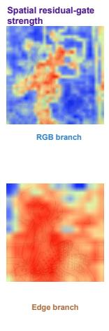

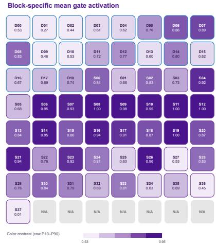  
Figure 11. Representative spatial residual-gate visualization at denoising step 35. Gate activation varies across spatial locations, branches, and transformer blocks.

## References

[1] Black Forest Labs. FLUX.1 Fill [dev]. Hugging Face model card, 2024. 6

[2] Chenjie Cao, Qiaole Dong, and Yanwei Fu. Zits++: Image inpainting by improving the incremental transformer on structural priors, 2023. 1, 2

[3] Nadav Z. Cohen, Oron Nir, and Ariel Shamir. Conditional balance: Improving multi-conditioning trade-offs in image generation. In Proceedings of the IEEE/CVF Conference on Computer Vision and Pattern Recognition (CVPR), pages 2641–2650, 2025. 2, 3

[4] Patrick Esser, Sumith Kulal, Andreas Blattmann, Rahim Entezari, Jonas Muller, Harry Saini, Yam Levi, Dominik¨ Lorenz, Axel Sauer, Frederic Boesel, Dustin Podell, Tim Dockhorn, Zion English, and Robin Rombach. Scaling rectified flow transformers for high-resolution image synthesis. In Proceedings of the 41st International Conference on Machine Learning, pages 12606–12633. PMLR, 2024. 6

[5] Edward J. Hu, Yelong Shen, Phillip Wallis, Zeyuan Allen-Zhu, Yuanzhi Li, Shean Wang, Lu Wang, and Weizhu Chen. LoRA: Low-rank adaptation of large language models. In International Conference on Learning Representations, 2022. 3

[6] Jun Huang, Ting Liu, Yihang Wu, Xiaochao Qu, Luoqi Liu, and Xiaolin Hu. Mtadiffusion: Mask text alignment diffusion model for object inpainting. In Proceedings of the IEEE/CVF Conference on Computer Vision and Pattern Recognition (CVPR), pages 18325–18334, 2025. 2

[7] Yunji Kim, Jiyoung Lee, Jin-Hwa Kim, Jung-Woo Ha, and Jun-Yan Zhu. Dense text-to-image generation with attention modulation. In Proceedings of the IEEE/CVF International Conference on Computer Vision (ICCV), pages 7701–7711, 2023. 2, 3

[8] Byung-Ki Kwon, Qi Dai, Hyoseok Lee, Chong Luo, and Tae-Hyun Oh. JointDiT: Enhancing RGB-depth joint mod-

eling with diffusion transformers. In Proceedings of the IEEE/CVF International Conference on Computer Vision (ICCV), pages 25261–25271, 2025. 2

[9] Luxi Li, Qin Zou, Fan Zhang, Hongkai Yu, Long Chen, Chengfang Song, Xianfeng Huang, Xiaoguang Wang, and Qingquan Li. Line drawing-guided progressive inpainting for mural damage. Journal on Computing and Cultural Her itage, 18(3):1–20, 2025. 1, 2, 6

[10] Peiyuan Liao, Xiuyu Li, Xihui Liu, and Kurt Keutzer. The ArtBench dataset: Benchmarking generative models with artworks, 2022. 6

[11] Tsung-Yi Lin, Michael Maire, Serge Belongie, James Hays, Pietro Perona, Deva Ramanan, Piotr Dollar, and C. Lawrence´ Zitnick. Microsoft COCO: Common objects in context. In Computer Vision – ECCV 2014, pages 740–755. Springer, Cham, 2014. 6

[12] Yaron Lipman, Ricky T. Q. Chen, Heli Ben-Hamu, Maximilian Nickel, and Matt Le. Flow matching for generative modeling. In The Eleventh International Conference on Learning Representations, 2023. 6

[13] Chang Liu, Shunxin Xu, Jialun Peng, Kaidong Zhang, and Dong Liu. Toward interactive image inpainting via robust sketch refinement. IEEE Transactions on Multimedia, 26: 9973–9987, 2024. 1, 2, 6, 7

[14] Haipeng Liu, Yang Wang, Biao Qian, Meng Wang, and Yong Rui. Structure matters: Tackling the semantic discrepancy in diffusion models for image inpainting. In Proceedings of the IEEE/CVF Conference on Computer Vision and Pattern Recognition (CVPR), pages 8038–8047, 2024. 1, 2

[15] Quynh Phung, Songwei Ge, and Jia-Bin Huang. Grounded text-to-image synthesis with attention refocusing. In Proceedings of the IEEE/CVF Conference on Computer Vision and Pattern Recognition (CVPR), pages 7932–7942, 2024. 2

[16] Nakul Sharma, Aditay Tripathi, Anirban Chakraborty, and Anand Mishra. Sketch-guided image inpainting with partial discrete diffusion process. In Proceedings of the IEEE/CVF Conference on Computer Vision and Pattern Recognition (CVPR) Workshops, pages 6024–6034, 2024. 1, 6, 7

[17] Dazhong Shen, Guanglu Song, Zeyue Xue, Fu-Yun Wang, and Yu Liu. Rethinking the spatial inconsistency in classifierfree diffusion guidance. In Proceedings of the IEEE/CVF Conference on Computer Vision and Pattern Recognition (CVPR), pages 9370–9379, 2024. 3

[18] Zhenxiong Tan, Songhua Liu, Xingyi Yang, Qiaochu Xue, and Xinchao Wang. Ominicontrol: Minimal and universal control for diffusion transformer. In Proceedings of the IEEE/CVF International Conference on Computer Vision (ICCV), pages 14940–14950, 2025. 2, 7

[19] Hao Wang, Yongsheng Yu, Tiejian Luo, Heng Fan, and Libo Zhang. MaGIC: Multi-modality guided image completion. In The Twelfth International Conference on Learning Representations, 2024. 7

[20] Zhou Wang, Alan C. Bovik, Hamid R. Sheikh, and Eero P. Simoncelli. Image quality assessment: From error visibility to structural similarity. IEEE Transactions on Image Pro cessing, 13(4):600–612, 2004. 6

[21] Shaoan Xie, Zhifei Zhang, Zhe Lin, Tobias Hinz, and Kun Zhang. Smartbrush: Text and shape guided object inpainting with diffusion model. In Proceedings of the IEEE/CVF Conference on Computer Vision and Pattern Recognition (CVPR), pages 22428–22437, 2023. 1, 2

[22] Jingyang Zhang, Shiwei Li, Yuanxun Lu, Tian Fang, David Neil McKinnon, Yanghai Tsin, Long Quan, and Yao Yao. JointNet: Extending text-to-image diffusion for dense distribution modeling. In The Twelfth International Conference on Learning Representations, 2024. 2

[23] Lvmin Zhang, Anyi Rao, and Maneesh Agrawala. Adding conditional control to text-to-image diffusion models. In Proceedings of the IEEE/CVF International Conference on Computer Vision (ICCV), pages 3836–3847, 2023. 2

[24] Richard Zhang, Phillip Isola, Alexei A. Efros, Eli Shechtman, and Oliver Wang. The unreasonable effectiveness of deep features as a perceptual metric. In Proceedings of the IEEE Conference on Computer Vision and Pattern Recognition (CVPR), pages 586–595, 2018. 6

[25] Caixia Zhou, Yaping Huang, Mengyang Pu, Qingji Guan, Ruoxi Deng, and Haibin Ling. MuGE: Multiple granularity edge detection. In Proceedings of the IEEE/CVF Conference on Computer Vision and Pattern Recognition (CVPR), pages 25952–25962, 2024. 6