# Structured Local Diferential Modeling for AI-Generated Image Detection

Jiazhen Yang1, Ruijin Jin2, Junjun Zheng2, Xiangheng Kong2, Zunlei Feng1, Jie Lei3,

1 Zhejiang University 2 Taobao & Tmall Group of Alibaba 3 Zhejiang University of Technology

## Abstract

The rapid advancement of AI-generated content has made the reliable detection of generated images an increasingly critical challenge. Existing detection methods are often dominated during training by semantically salient components with high signal-to-noise ratios (SNRs), thereby suppressing subtler forensic cues associated with the underlying generation mechanisms and embedded in low-level statistical structures. From an information-theoretic perspective, we present a key insight: efective detection in the low-level statistical space requires mitigating the dominance of semantic components while emphasizing and amplifying responses to low-SNR forgery traces. Building on this insight, we propose RippleNet, an AI-generated image detection framework based on local differential signals. RippleNet adaptively identifies forgerysensitive regions and constructs multi-directional, multi-scale diferential representations within local neighborhoods, explicitly characterizing anomalous patterns in neighborhood statistics. More importantly, we refine the attention mechanism to operate within the local diferential representation space, enabling the model to establish explicit dependencies at a finer statistical granularity. This design facilitates the capture of pixel-level forgery traces that are dificult to model using conventional convolutions or image-wide patch-level attention. Extensive experiments on multiple public benchmarks and under cross-generator evaluation settings demonstrate that RippleNet achieves consistently competitive performance.

## Introduction

Recent advances in image generation (Cao et al. 2025) have substantially improved the photorealism of synthetic images, while heightening concerns over content authenticity and making generalizable generated image detection increasingly important (Xu et al. 2025; Mahara and Rishe 2026).

Existing methods generally operate in either the semantic space or the low-level statistical space. Semantic methods (Ojha, Li, and Lee 2023; Zhang et al. 2025; Zhou et al. 2026) exploit high-level representations learned by deep networks or large-scale pretrained models (Radford et al. 2021) to distinguish generated images from real ones. Although efective under in-distribution settings, their discriminative cues may become entangled with training semantics, limiting transfer to unseen generators and increasingly realistic content. In contrast, low-level statistical methods (Tan et al. 2024b; Liang et al. 2025; Zhong et al. 2023; Qi et al.

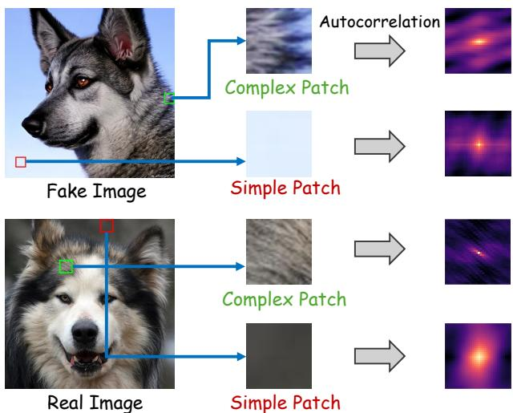  
Figure 1: Autocorrelation diferences between real and generated images in complex and simple patches. Based on the Wiener–Khinchin theorem, real images exhibit clear directional structures in complex regions and slight noise fluctuations in smooth regions, whereas generated images often lack directional continuity and display overly smoothed, radially symmetric responses in smooth regions.

2026) target generation-induced anomalies in spectral distributions, noise patterns, and local textures. As these cues are less dependent on image semantics and more closely related to synthesis mechanisms, they are generally considered more promising for cross-generator generalization.

However, statistical space detection still faces a key challenge: forgery artifacts are often weak, local, and low-SNR, making them susceptible to dominant semantic structures during whole-image aggregation and end-to-end optimization. As illustrated in 2, NPR (Tan et al. 2024b) models local relationships, while FerretNet (Liang et al. 2025) extracts noise responses. Although both methods capture useful forensic cues, their image-level representations still retain prominent content-related textures. From an informationtheoretic perspective (Tishby, Pereira, and Bialek 2000), when high-SNR semantic structures coexist with low-SNR forgery artifacts, optimization tends to favor the former because they are easier to fit and reduce the training loss more rapidly. This bias may suppress the modeling of weak forgery artifacts and encourage content-dependent shortcuts, thereby limiting cross-generator generalization. Based on this, we formulate the central hypothesis of this work: The key to low-level statistical space generalization detection lies in mitigating the dominance of high-SNR semantic components while enhancing the response to low-SNR forgery artifacts, thereby compelling the model to learn more transferable cues associated with generative mechanisms.

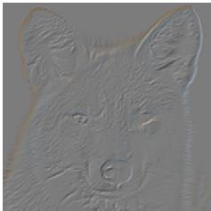  
(a) NPR

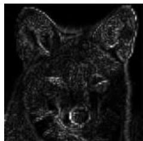  
(b) FerretNet

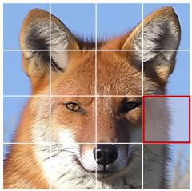

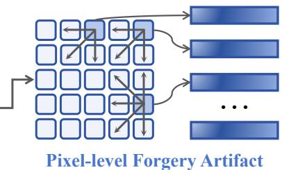  
(c) RippleNet (Ours)  
Figure 2: Comparison of forgery representations from NPR (Tan et al. 2024b), FerretNet (Liang et al. 2025), and RippleNet. NPR and FerretNet construct image-level cues from local correlations or filtered noise, which may retain semantic textures and weaken subtle artifacts during convolutional aggregation. In contrast, RippleNet encodes neighborhood diferential responses as independent tokens and models their dependencies directly in the token space.

Based on this viewpoint, we revisit the diferences between real and generated images from the perspective of local structures and diferential statistics. As shown in 1, real images, shaped by physical imaging pipelines, tend to exhibit more consistent and reproducible neighborhood statistics. In complex texture regions, their residual responses preserve stable directional correlations. In simple regions, sensor noise still produces weak yet repeatable fluctuations despite the absence of salient textures. In contrast, although generative models can faithfully reproduce global semantics and prominent textures, they often struggle to maintain statistical consistency across multiple directions and scales during local reconstruction. This limitation gives rise to characteristic anomalies, such as weakened neighborhood correlations and excessive smoothing, which can be quantified through local diferential correlation statistics.

Building on this insight, we propose RippleNet, a generated image detection framework centered on low-SNR diferential signals. As shown in 2, RippleNet first localizes regions sensitive to forgery artifacts and then models the propagation and continuity of neighborhood diferences across multiple directions and scales, jointly capturing local structural relations and statistical dependencies. To further preserve weak forgery responses during global aggregation, we encode local diferential artifacts as independent tokens and perform attention-based modeling directly in this representation space. This allows the model to establish cross-location dependencies at a finer statistical granularity, reduce interference from semantic components, and improve generalization to unseen generative architectures. We make the following key contributions:

❶ New perspective on statistical space forgery detection. From the perspectives of generative mechanisms and information-theoretic bias, we argue that suppressing semantic dominance and emphasizing low-SNR statistical discrepancies can improve cross-generator generalization.

❷ Novel forgery artifact modeling framework. We propose RippleNet, a forgery detection method tailored to low-level diferential statistics, enhancing forgery artifact representations by modeling neighborhood residual relationships and cross location interactions through attention.

❸ Experimental validation of generalizable detection. We evaluate our method on multiple public cross generator benchmarks and show that it exhibits more stable generalization under diferent generative paradigms.

## Related Work

Synthetic Detection in Semantic Space. Semantic methods leverage high-level representations from deep networks or pretrained vision–language models such as CLIP (Radford et al. 2021). UnivFD (Ojha, Li, and Lee 2023) performs detection using frozen CLIP features, while C2P-CLIP (Tan et al. 2025) improves feature–semantic alignment through class prompts. Efort (Yan et al. 2024b) separates semantic and forgery-related information into orthogonal subspaces, and VIBNet (Zhang et al. 2025) employs a variational information bottleneck to suppress irrelevant information. Although efective on multiple benchmarks, these methods may couple discriminative cues with training semantics, limiting generalization to unseen generators.

Synthetic Detection in Low-Level Statistical Space. Lowlevel methods detect generation-induced anomalies in geometry and color (Sarkar et al. 2024; Jia et al. 2025), spectral statistics (Tan et al. 2024a; Karageorgiou et al. 2025), local correlations (Tan et al. 2024b; Li et al. 2025b; Yuan et al. 2026), and noise or texture patterns (Zhong et al. 2023; Chen, Yao, and Niu 2024; Liang et al. 2025). Reconstruction-based methods such as DIRE (Wang et al. 2023) and STD-FD (Lou et al. 2025) characterize distributional deviations, while Diference-in-Diference (Qi et al. 2026) further exploits second-order reconstruction-error diferences. Although less dependent on semantics, these cues may still retain contentrelated structures, limiting cross-domain generalization.

Semantic–Artifact Feature Integration. Recent studies combine semantic representations with low-level forensic cues. AIDE (Yan et al. 2024a) integrates CLIP features with noise patterns from low- and high-frequency patches, while CO-SPY (Cheng et al. 2025) combines semantic and reconstruction-error features. More recently, Forensic-Concept (Zhou et al. 2026) organizes decision-critical regions into transferable forensic concepts and injects them across backbones, whereas TranX-Adapter (Wang et al. 2026) improves artifact–semantic interaction in MLLMs through optimal-transport and cross-attention modules. These methods demonstrate the complementarity of semantic and forensic cues, although their efectiveness depends on aligning and fusing heterogeneous representations.

## Motivation

## Frequency Dependent Reconstruction Biases

Although modern generative models can reproduce global semantics and coarse structures with high fidelity, their synthesis processes may still introduce frequency dependent biases in fine-scale components. For convolutional generators, transposed convolution may produce periodic spectral replicas because of uneven overlap, whereas interpolation followed by convolution tends to suppress fine-scale responses through its inherent low-pass behavior. Despite diferent signatures, both mechanisms can alter the frequency organization and local structural consistency of synthesized images.

Difusion models exhibit a related imbalance during noising and denoising. Since fine scale components generally carry less energy, they enter a low-SNR regime earlier and must be reconstructed from less reliable observations. Let θ denote the model parameters, L the generation objective, and $\| \nabla _ { \theta } \mathcal { L } \| _ { f }$ the efective gradient contribution associated with frequency component $f .$ Under a simplified frequency-wise view, its magnitude can be approximately characterized as

$$
\begin{array} { r } { \| \nabla _ { \theta } \mathcal { L } \| _ { f } \propto \mathrm { S N R } _ { f } ^ { 1 / 2 } . } \end{array}\tag{1}
$$

This relation indicates that low-SNR frequency components provide weaker efective optimization signals and are therefore more likely to be underrepresented during learning. Consequently, generated images may preserve global content while exhibiting reduced consistency in fine-scale structures.

Although these biases originate from diferent generative mechanisms, they may share a common manifestation in abnormal directional and scale-dependent local variations.

## An Information-Theoretic View of Representation Imbalance

The preceding analysis explains how generative processes may leave weak inconsistencies in fine-scale structures. However, these cues may not be efectively preserved during detector training because they compete with more salient and easily fitted content structures. From the informationbottleneck (IB) perspective, representation learning seeks $Z = h _ { \theta } ( X )$ that remains predictive of the label $\bar { Y }$ while discarding task-irrelevant input information:

$$
\operatorname* { m a x } _ { \theta } I ( Z ; Y ) - \beta I ( Z ; X ) ,\tag{2}
$$

where $\beta$ controls the compression–prediction trade-of. $_ \mathrm { A l } .$ though this objective does not explicitly favor any particular input component, finite-data optimization tends to prioritize factors that are strongly correlated with the training labels and easier to fit. In generated-image detection, these factors often correspond to salient content and coarse structural regularities, whereas generation-related discrepancies are typically weaker and less prominent. Let $X _ { s }$ and $X _ { a }$ denote the dominant structural and weak artifact-related components, respectively. A shortcut-dominated representation can be qualitatively characterized by

$$
\| \nabla _ { X _ { s } } h _ { \theta } ( X ) \| \gg \| \nabla _ { X _ { a } } h _ { \theta } ( X ) \| ,\tag{3}
$$

indicating substantially greater sensitivity to structural variations than to artifact-related ones. Such imbalance may cause the detector to encode content correlations specific to the training distribution, limiting transfer to unseen generators.

Taken together, generative models may leave subtle statistical inconsistencies that are often overshadowed by dominant content cues during detector training. This motivates a representation strategy that emphasizes transferable forgery evidence while reducing reliance on global image content. Further theoretical analysis is provided in Appendix.

## Method

To capture subtle generation related traces that may be obscured by dominant content structures, we propose RippleNet, a detection framework built on local diferential statistics. RippleNet first selects complementary regions with diferent texture complexities, then constructs multi-directional and multi-scale neighborhood diferential representations and incorporates frequency priors to model their dependencies. By consolidating local anomalous responses into coherent discriminative evidence, RippleNet reduces direct reliance on global content structures. The overall framework is illustrated in 3.

## Forgery Sensitive Patch Selection

As observed in 1, real and fake images exhibit distinct local diferential statistics across regions with diferent texture complexity. Whole-image modeling may mix weak artifact cues with dominant structural responses during aggregation (Tan et al. 2024b; Liang et al. 2025). We therefore introduce Forgery Sensitive Patch Selection (FSPS), which selects texture-complex and texture-simple patches as complementary inputs for subsequent diferential modeling.

Given an input image $I ,$ we partition it into a set of nonoverlapping patches ${ \bar { \mathcal { P } } } .$ . For each patch $p \in \mathcal { P }$ , we measure its texture complexity using the total variation (TV) energy along four directions $(  , \downarrow , \searrow , \nearrow )$

$$
\begin{array} { l } { \displaystyle { T V ( p ) = \sum _ { ( i , j ) \in p } \left( \left. I _ { i , j } - I _ { i , j + 1 } \right. + \left. I _ { i , j } - I _ { i + 1 , j } \right. \right. } } \\ { \displaystyle { \left. + \left. I _ { i , j } - I _ { i + 1 , j + 1 } \right. + \left. I _ { i , j } - I _ { i + 1 , j - 1 } \right. \right) } , } \end{array}\tag{4}
$$

Here, $I _ { i , j }$ denotes the grayscale intensity at spatial location $( i , j )$ . We rank all patches by $\mathrm { T V } ( p )$ and select m patches from each end of the ranking. The m highest-scoring patches form the texture-complex patch (TCP) set $\mathcal { P } _ { \mathrm { T C } }$ , while the m lowest-scoring patches form the texture-simple patch (TSP) set $\mathcal { P } _ { \mathrm { T S } }$ . These complementary texture regimes guide subsequent modeling toward regions where forgery cues may be more evident, providing a more discriminative prior for diferential representation learning.

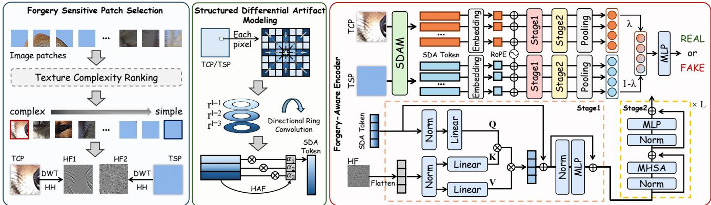  
Figure 3: Overview of RippleNet. Forgery Sensitive Patch Selection module analyzes local texture complexity to select Texture-Complex Patches (TCPs) and Texture-Simple Patches (TSPs) that provide complementary forgery evidence, and extracts their high-frequency components via DWT for subsequent modeling. Structured Diferential Artifact Modeling module constructs multi-directional and multi-scale diferential representations at each spatial location and refines them through Directional Ring Convolution (DRC) and Hierarchical Attention Fusion (HAF). Forgery Aware Encoder independently encodes the two patch types, incorporates high-frequency guidance as a frequency domain prior, and employs multi-head self-attention to progressively model dependencies among diferential tokens.

## Structured Diferential Artifact Modeling

To enhance the detector’s sensitivity to forgery cues, we introduce Structured Diferential Artifact Modeling (SDAM), which transforms local variations into structured representations by jointly modeling directional organization and scaledependent responses. This design highlights deviations in local geometric consistency and energy distribution.

Multi-directional and Multi-scale Residual Construction. Given an input patch $p \in \mathbb { R } ^ { h \times w }$ , SDAM constructs a radially expanding diferential sequence at each spatial location $x _ { i , j }$ along eight directions. We define $\mathcal { D } = \{ \uparrow , \downarrow , \right. , \left. , \nearrow , \uparrow ^ { \sim }$ $, \searrow , \swarrow \}$ , where each direction $d _ { k } \in \mathcal { D }$ corresponds to a unit ofset vector $( \Delta _ { i } ^ { ( k ) } , \Delta _ { j } ^ { ( k ) } )$ , with $k \in \{ 0 , \ldots , 7 \}$ . Given a maximum radial step $L ,$ , the residual at step $l \in \{ 1 , \ldots , L \}$ along direction $d _ { k }$ is defined as

$$
r _ { i , j } ^ { ( k , l ) } = I _ { i + \Delta _ { i } ^ { ( k ) } l , j + \Delta _ { j } ^ { ( k ) } l } - I _ { i + \Delta _ { i } ^ { ( k ) } ( l - 1 ) , j + \Delta _ { j } ^ { ( k ) } ( l - 1 ) } .\tag{5}
$$

This operation measures incremental variations between adjacent radial positions, capturing how local dependencies evolve across directions and scales. Concatenating all residuals yields the local diferential descriptor

$$
\mathbf { r } _ { i , j } = [ r _ { i , j } ^ { ( k , l ) } ] _ { k = 0 , \ldots , 7 ; l = 1 , \ldots , L } \in \mathbb { R } ^ { 8 \times L } .\tag{6}
$$

Directional Ring Convolution. Single-direction diferences are insuficient to capture disruptions in directional consistency and local symmetry. We therefore introduce Directional Ring Convolution (DRC) to model cyclic dependencies among the eight directions. At scale l, it is defined as

$$
\tilde { r } _ { i , j } ^ { ( k , l ) } = \sum _ { { t = - \lfloor K / 2 \rfloor } } ^ { \lfloor K / 2 \rfloor } w _ { t } r _ { i , j } ^ { ( ( k + t ) \mathrm { ~ m o d ~ } 8 , l ) } ,\tag{7}
$$

where $\kappa$ is the kernel size and $w _ { t }$ denotes learnable weights. The modulo operation preserves circular adjacency in the directional domain, producing direction-enhanced diferential features $\tilde { \mathbf { r } } _ { i , j } = [ \tilde { r } _ { i , j } ^ { ( k , l ) } ] _ { k = 0 , \ldots , 7 ; l = 1 , \ldots , L }$

Hierarchical Attention Fusion. Diferent neighborhood scales provide complementary artifact evidence. Short-range residuals are sensitive to subtle texture variations, whereas larger neighborhoods better reflect deviations in structural consistency. We therefore employ Hierarchical Attention Fusion (HAF) to adaptively aggregate cross-scale information. Let $\tilde { \mathbf { r } } _ { i , j } ^ { ( l ) } \in \mathbb { R } ^ { C }$ denote the feature at scale l. We stack the features across all scales into A and generate scale-attention weights using a lightweight MLP:

$$
\pmb { \alpha } = \mathrm { S o f t m a x } \Big ( W _ { 2 } \phi ( W _ { 1 } \mathbf { A } + b _ { 1 } ) + b _ { 2 } \Big ) ,\tag{8}
$$

where $\phi ( \cdot )$ denotes GELU activation, $W _ { 1 }$ and $W _ { 2 }$ are learnable parameters, $b _ { 1 }$ and $b _ { 2 }$ are bias terms. The fused pixellevel forgery embedding is given by

$$
\hat { \mathbf { r } } _ { i , j } = \sum _ { l = 1 } ^ { L } \pmb { \alpha } _ { l } \odot \tilde { \mathbf { r } } _ { i , j } ^ { ( l ) } \in \mathbb { R } ^ { D } ,\tag{9}
$$

where $\odot$ denotes channel-wise weighting. HAF adaptively emphasizes the most informative scales according to local content, yielding a more discriminative representation.

## Forgery Aware Encoder

To aggregate local diferential artifacts into global discriminative evidence, we design a Forgery Aware Encoder (FAE). Since artifact cues are often reflected by the spatial cooccurrence and consistency of neighborhood diferential patterns rather than isolated responses, FAE models dependencies across spatial locations based on representation similarity. Two encoders with identical architectures but separate parameters are used for $\mathcal { P } _ { \mathrm { T C } }$ and $\mathcal { P } _ { \mathrm { T S } }$ , enabling specialized modeling under distinct texture regimes.

Diferential Artifact Tokenization. Given the artifact representation $\hat { \mathbf { r } } _ { i , j }$ produced by SDAM, we project and serialize the local descriptors into tokens $\mathbf { E } _ { s } \in \bar { \mathbb { R } } ^ { N \times D }$ . A 2D rotary positional embedding (RoPE) is applied to preserve spatial continuity and relative positional relationships.

Table 1: Comparison of RippleNet and other forgery detection models on the GenImage Benchmark in terms of ACC (%). All methods are trained on SDv1.4. Bold indicates the best result, and underline denotes the second-best.
<table><tr><td rowspan=1 colspan=1>Methods</td><td rowspan=1 colspan=1>Midj</td><td rowspan=1 colspan=1>SDv1.4</td><td rowspan=1 colspan=1>SDv1.5</td><td rowspan=1 colspan=1>ADM</td><td rowspan=1 colspan=1>GLIDE</td><td rowspan=1 colspan=1>Wukong</td><td rowspan=1 colspan=1>VQDM</td><td rowspan=1 colspan=1>BigGAN</td><td rowspan=1 colspan=1>Avg.</td></tr><tr><td rowspan=1 colspan=1>F3Net (Qian et al. 2020)</td><td rowspan=1 colspan=1>77.9</td><td rowspan=1 colspan=1>99.0</td><td rowspan=1 colspan=1>99.1</td><td rowspan=1 colspan=1>51.2</td><td rowspan=1 colspan=1>54.9</td><td rowspan=1 colspan=1>97.9</td><td rowspan=1 colspan=1>59.0</td><td rowspan=1 colspan=1>49.2</td><td rowspan=1 colspan=1>73.5</td></tr><tr><td rowspan=1 colspan=1>FreqNet (Tan et al. 2024a)</td><td rowspan=1 colspan=1>89.6</td><td rowspan=1 colspan=1>98.8</td><td rowspan=1 colspan=1>98.6</td><td rowspan=1 colspan=1>66.8</td><td rowspan=1 colspan=1>96.5</td><td rowspan=1 colspan=1>97.3</td><td rowspan=1 colspan=1>75.8</td><td rowspan=1 colspan=1>81.4</td><td rowspan=1 colspan=1>88.1</td></tr><tr><td rowspan=1 colspan=1>FatFormer (Liu et al. 2024)</td><td rowspan=1 colspan=1>92.7</td><td rowspan=1 colspan=1>100.0</td><td rowspan=1 colspan=1>99.9</td><td rowspan=1 colspan=1>75.9</td><td rowspan=1 colspan=1>88.0</td><td rowspan=1 colspan=1>99.9</td><td rowspan=1 colspan=1>98.8</td><td rowspan=1 colspan=1>55.8</td><td rowspan=1 colspan=1>88.9</td></tr><tr><td rowspan=1 colspan=1>NPR (Tan et al. 2024b)</td><td rowspan=1 colspan=1>81.0</td><td rowspan=1 colspan=1>98.2</td><td rowspan=1 colspan=1>97.9</td><td rowspan=1 colspan=1>76.9</td><td rowspan=1 colspan=1>89.8</td><td rowspan=1 colspan=1>96.9</td><td rowspan=1 colspan=1>84.1</td><td rowspan=1 colspan=1>84.2</td><td rowspan=1 colspan=1>88.6</td></tr><tr><td rowspan=1 colspan=1>DRCT (Chen et al. 2024)</td><td rowspan=1 colspan=1>91.5</td><td rowspan=1 colspan=1>95.0</td><td rowspan=1 colspan=1>94.4</td><td rowspan=1 colspan=1>79.4</td><td rowspan=1 colspan=1>89.2</td><td rowspan=1 colspan=1>94.7</td><td rowspan=1 colspan=1>90.0</td><td rowspan=1 colspan=1>81.7</td><td rowspan=1 colspan=1>89.5</td></tr><tr><td rowspan=1 colspan=1>AIDE (Yan et al. 2024a)</td><td rowspan=1 colspan=1>79.4</td><td rowspan=1 colspan=1>99.7</td><td rowspan=1 colspan=1>99.8</td><td rowspan=1 colspan=1>78.5</td><td rowspan=1 colspan=1>91.8</td><td rowspan=1 colspan=1>98.7</td><td rowspan=1 colspan=1>80.3</td><td rowspan=1 colspan=1>66.9</td><td rowspan=1 colspan=1>86.9</td></tr><tr><td rowspan=1 colspan=1>VIBNet (Zhang et al. 2025)</td><td rowspan=1 colspan=1>88.1</td><td rowspan=1 colspan=1>99.6</td><td rowspan=1 colspan=1>99.2</td><td rowspan=1 colspan=1>73.8</td><td rowspan=1 colspan=1>74.2</td><td rowspan=1 colspan=1>98.3</td><td rowspan=1 colspan=1>89.3</td><td rowspan=1 colspan=1>72.6</td><td rowspan=1 colspan=1>86.9</td></tr><tr><td rowspan=1 colspan=1>Effort (Yan et al. 2024b)</td><td rowspan=1 colspan=1>82.4</td><td rowspan=1 colspan=1>99.8</td><td rowspan=1 colspan=1>99.8</td><td rowspan=1 colspan=1>78.7</td><td rowspan=1 colspan=1>93.3</td><td rowspan=1 colspan=1>97.4</td><td rowspan=1 colspan=1>91.7</td><td rowspan=1 colspan=1>77.6</td><td rowspan=1 colspan=1>91.1</td></tr><tr><td rowspan=1 colspan=1>FerretNet (Liang et al. 2025)</td><td rowspan=1 colspan=1>88.3</td><td rowspan=1 colspan=1>98.6</td><td rowspan=1 colspan=1>98.4</td><td rowspan=1 colspan=1>74.5</td><td rowspan=1 colspan=1>97.4</td><td rowspan=1 colspan=1>97.8</td><td rowspan=1 colspan=1>81.6</td><td rowspan=1 colspan=1>80.9</td><td rowspan=1 colspan=1>89.7</td></tr><tr><td rowspan=1 colspan=1>TranX-Adapter (Wang et al. 2026)</td><td rowspan=1 colspan=1>94.6</td><td rowspan=1 colspan=1>96.4</td><td rowspan=1 colspan=1>96.4</td><td rowspan=1 colspan=1>87.0</td><td rowspan=1 colspan=1>88.0</td><td rowspan=1 colspan=1>94.9</td><td rowspan=1 colspan=1>90.1</td><td rowspan=1 colspan=1>85.9</td><td rowspan=1 colspan=1>91.9</td></tr><tr><td rowspan=1 colspan=1>CKNNA (Zhou et al. 2026)</td><td rowspan=1 colspan=1>95.0</td><td rowspan=1 colspan=1>99.6</td><td rowspan=1 colspan=1>99.4</td><td rowspan=1 colspan=1>69.2</td><td rowspan=1 colspan=1>85.1</td><td rowspan=1 colspan=1>99.6</td><td rowspan=1 colspan=1>94.3</td><td rowspan=1 colspan=1>94.1</td><td rowspan=1 colspan=1>92.0</td></tr><tr><td rowspan=1 colspan=1>RippleNet</td><td rowspan=1 colspan=1>89.2</td><td rowspan=1 colspan=1>98.8</td><td rowspan=1 colspan=1>98.6</td><td rowspan=1 colspan=1>93.6</td><td rowspan=1 colspan=1>96.6</td><td rowspan=1 colspan=1>97.9</td><td rowspan=1 colspan=1>92.2</td><td rowspan=1 colspan=1>88.2</td><td rowspan=1 colspan=1>94.4</td></tr></table>

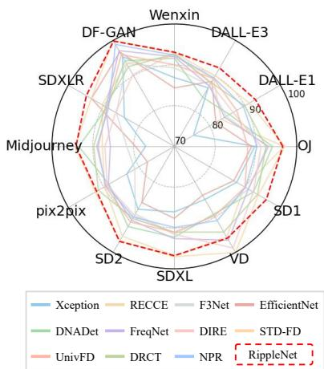  
Figure 4: Comparison of RippleNet and other models on DeepfaceGen.

Frequency-Guided Cross-Attention. To enhance sensitivity to high-frequency biases induced by generative processes, we introduce Frequency-Guided Cross-Attention (FGCA) in the first encoder layer. For each patch, DWT is applied to extract the high-frequency subband HH, which is resized and flattened into a frequency embedding $\mathbf { \bar { E } } _ { f } \in \mathbb { R } ^ { N \times D }$ aligned with ${ \bf E } _ { s }$ . The two embeddings are projected as

$$
Q _ { s } = \mathbf { E } _ { s } W _ { Q } , K _ { f } = \mathbf { E } _ { f } W _ { K } , V _ { f } = \mathbf { E } _ { f } W _ { V } ,\tag{10}
$$

where $W _ { Q } , W _ { K } , W _ { V } \in \mathbb { R } ^ { D \times d _ { \mathrm { m o d e l } } }$ . The cross-attention output is defined as

$$
\mathbf { H } = \mathrm { S o f t m a x } \left( \frac { Q _ { s } K _ { f } ^ { \top } } { \sqrt { d _ { \mathrm { m o d e l } } } } \right) V _ { f } .\tag{11}
$$

This mechanism enables diferential tokens to attend to high-frequency responses, enhancing sensitivity to spectral anomalies and fine-grained distortions.

Relational Self-Attention. Following frequency interaction, FAE stacks multi-head self-attention (MHSA) layers to model dependencies among diferential tokens. By establishing interactions across locations according to representation similarity, MHSA captures the co-occurrence and consistency of artifact patterns. This preserves fine-grained spatial relationships during encoding and reduces the attenuation of weak artifact cues during aggregation.

Dual-Branch Fusion and Classification. The two branches independently encode the texture-complex and texturesimple patch sets, producing

$$
\mathcal { H } _ { \mathrm { T C } } = \{ \mathbf { H } _ { \mathrm { T C } } ^ { ( 1 ) } , \ldots , \mathbf { H } _ { \mathrm { T C } } ^ { ( m ) } \} , \qquad \mathcal { H } _ { \mathrm { T S } } = \{ \mathbf { H } _ { \mathrm { T S } } ^ { ( 1 ) } , \ldots , \mathbf { H } _ { \mathrm { T S } } ^ { ( m ) } \} .\tag{12}
$$

We first apply mean pooling over the token sequence of each patch and then average across patches:

$$
{ \bf z } _ { \mathrm { T C } } = \frac { 1 } { m } \sum _ { q = 1 } ^ { m } \mathrm { P o o l } \bigg ( { \bf H } _ { \mathrm { T C } } ^ { ( q ) } \bigg ) , \qquad { \bf z } _ { \mathrm { T S } } = \frac { 1 } { m } \sum _ { q = 1 } ^ { m } \mathrm { P o o l } \bigg ( { \bf H } _ { \mathrm { T S } } ^ { ( q ) } \bigg )\tag{13}
$$

A learnable coeficient $\lambda \in ( 0 , 1 )$ balances the complementary contributions of the two texture regimes:

$$
{ \bf z } = \lambda { \bf z } _ { \mathrm { T C } } + ( 1 - \lambda ) { \bf z } _ { \mathrm { T S } } , \qquad \lambda = \sigma ( \beta ) ,\tag{14}
$$

where $\beta$ is learnable and $\sigma ( \cdot )$ denotes the Sigmoid function. The fused representation is fed into the classification head:

$$
\hat { y } = \mathrm { M L P } ( \mathbf { z } ) ,\tag{15}
$$

yielding the final real-versus-fake prediction.

## Experiments

## Experimental Setup

Datasets. To evaluate the efectiveness of diferent methods in cross generative model and cross dataset scenarios, we adopt the following four settings.

❶ GenImage Benchmark (Zhu et al. 2023). We train on the SDv1.4 (Ho, Jain, and Abbeel 2020) subset and evaluate on images generated by seven difusion models and one GAN.

❷ DeepFaceGen Benchmark (Bei et al. 2024). We adopt the oficial data split, partitioning the dataset into training, validation, and test sets with a ratio of 7 :1 :2, this benchmark evaluates faces generated by 12 instant-guided methods.

❸ DifusionForensics Benchmark (Wang et al. 2023). We train on the SDv1.4 subset of GenImage and perform crossdataset validation on DifusionForensics across multiple difusion generation frameworks.

❹ COSPY Benchmark (Cheng et al. 2025). We train on the SDv1.4 subset of GenImage and test on the portion of COSPY collected after 2024 to assess generalization to more recently developed generative models.

More dataset details are provided in Appendix.

Evaluation Metrics. We report Accuracy (ACC), Average Precision (AP), and Area Under the ROC Curve (AUC). Across all experiments, forged images are treated as the positive class and real images as the negative class.

Implementation Details. During training phase, we use the AdamW optimizer with an initial learning rate of $1 \times 1 0 ^ { - 4 }$ betas = (0.9, 0.999), and weight decay of $1 \times 1 0 ^ { - 4 }$ . The batch size is 64. A StepLR scheduler is adopted with a decay factor of 0.7 per epoch. All experiments are implemented in PyTorch and run on a single NVIDIA RTX A6000 GPU. Additional implementation details and hyperparameters are included in the Appendix.

Table 2: ACC (%) and AP (%) comparison of RippleNet and other forgery detection models on the DifusionForensics dataset. All methods are trained on GenImage/SDv1.4. Bold indicates the best result, and underline denotes the second-best.
<table><tr><td></td><td colspan="2">ADM</td><td colspan="2">DDPM</td><td colspan="2">IDDPM</td><td colspan="2">LDM</td><td colspan="2">PNDM</td><td colspan="2">VQ-Diffusion SD1</td><td colspan="2">SD2</td><td colspan="2">Mean</td></tr><tr><td>Methods</td><td>ACC</td><td>AP</td><td>ACC</td><td>AP</td><td>ACC</td><td>AP</td><td>ACC AP</td><td>ACC</td><td>AP</td><td>ACC</td><td>AP</td><td>ACC</td><td>AP</td><td>ACC</td><td>AP ACC</td><td>AP</td></tr><tr><td>F3Net</td><td>55.0</td><td>60.5</td><td>55.0</td><td>32.3</td><td>46.0 44.4</td><td>45.0</td><td>38.9</td><td>46.4</td><td>45.0</td><td>44.3</td><td>42.3</td><td>81.1</td><td>94.4</td><td>65.0</td><td>70.8</td><td>54.7 53.6</td></tr><tr><td>FreqNet</td><td>58.4</td><td>70.1</td><td>64.1</td><td>78.1</td><td>50.0 33.3</td><td>88.3</td><td>98.5</td><td>49.8</td><td>56.7</td><td>88.9</td><td>99.3</td><td>98.7 99.7</td><td>97.8</td><td>99.9</td><td>74.5</td><td>79.5</td></tr><tr><td>Fusion</td><td>54.3</td><td>59.8</td><td>57.1</td><td>35.3</td><td>47.2 45.6</td><td>43.8</td><td>37.5</td><td>46.9</td><td>50.1</td><td>43.6</td><td>41.2</td><td>89.5 97.1</td><td>76.3</td><td>79.2</td><td>57.3</td><td>51.3</td></tr><tr><td>FatFormer</td><td>74.0</td><td>96.8</td><td>81.3</td><td>97.2</td><td>66.3 85.6</td><td>83.3</td><td>93.9</td><td>71.6</td><td>88.6</td><td>93.3</td><td>98.8</td><td>99.3 99.9</td><td>91.9</td><td>99.1</td><td>82.6</td><td>95.0</td></tr><tr><td>AIDE</td><td>60.8</td><td>88.8</td><td>67.2</td><td>62.6</td><td>56.8 74.8</td><td>84.5</td><td>97.5</td><td>67.8</td><td>89.8</td><td>86.5</td><td>97.0</td><td>99.8 100.0</td><td>94.3</td><td>98.7</td><td>77.2</td><td>88.7</td></tr><tr><td>VIBNet</td><td>70.4</td><td>87.3</td><td>95.5</td><td>99.5</td><td>68.4 84.1</td><td>65.5</td><td>84.2</td><td>77.0</td><td>90.2</td><td>95.8</td><td>99.4</td><td>98.6 100.0</td><td>93.0</td><td>98.5</td><td>83.0</td><td>92.9</td></tr><tr><td>Effort</td><td>85.9</td><td>97.8</td><td>87.8</td><td>97.2</td><td>78.5 92.0</td><td>92.1</td><td>99.3</td><td>87.3</td><td>96.6</td><td>86.1</td><td>97.7</td><td>97.8 99.6</td><td>86.2</td><td>98.4</td><td>87.7</td><td>97.3</td></tr><tr><td>NPR</td><td>60.8</td><td>84.4</td><td>81.0</td><td>99.6</td><td>73.6 97.1</td><td>100.0</td><td>100.0</td><td>70.0</td><td>85.8</td><td>97.7</td><td>100.0</td><td>99.4 99.8</td><td>88.5</td><td>100.0</td><td>83.9</td><td>95.8</td></tr><tr><td>FerretNet</td><td>71.9</td><td>93.5</td><td>82.5</td><td>96.3</td><td>70.0 87.0</td><td>100.0</td><td>100.0</td><td>75.8</td><td>92.3</td><td>85.3</td><td>98.7</td><td>99.3 100.0</td><td>86.9</td><td>98.0</td><td>84.0</td><td>95.7</td></tr><tr><td>RippleNet</td><td>84.7</td><td>99.0</td><td>88.7</td><td>98.2</td><td>77.0 94.1</td><td>93.1</td><td>99.7</td><td>87.0</td><td>95.3</td><td>90.0</td><td>99.7</td><td>98.8 99.9</td><td></td><td>92.7 99.8</td><td>89.0</td><td>98.2</td></tr></table>

<table><tr><td>TCP</td><td>TSP</td><td>DRC</td><td>HAF</td><td>FGCA</td><td>Avg.</td></tr><tr><td>√</td><td>X</td><td>√</td><td>√</td><td>√</td><td>78.4</td></tr><tr><td>X</td><td>√</td><td>√</td><td>√</td><td>√</td><td>82.4</td></tr><tr><td>√</td><td>√</td><td>x</td><td>x</td><td>√</td><td>88.3</td></tr><tr><td>√</td><td>√</td><td>√</td><td>x</td><td>√</td><td>90.2</td></tr><tr><td>√</td><td>√</td><td>x</td><td>√</td><td>√</td><td>91.1</td></tr><tr><td>√</td><td>√</td><td>√</td><td>√</td><td>X</td><td>91.2</td></tr><tr><td>7</td><td>√</td><td>√</td><td>」</td><td>√</td><td>94.4</td></tr></table>

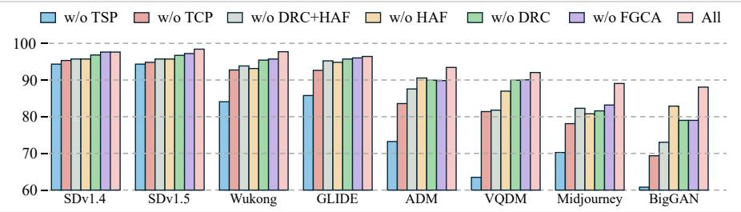  
Figure 5: Ablation study of core model components on the GenImage benchmark. The left table reports average detection accuracy under diferent module combinations, while the right plot shows per-generator performance.

## Comparison with Competing Methods.

Performance on GenImage. We first evaluate crossgenerator generalization on GenImage. As shown in 1, RippleNet achieves the highest average ACC of 94.4%, outperforming the strongest baseline, CKNNA, by 2.4 percentage points. Although several baselines perform strongly on individual generators, their accuracy varies substantially across models. In contrast, RippleNet maintains at least 88.2% ACC on all generators and achieves a notable advantage on ADM, indicating more balanced performance across heterogeneous generation architectures.

Performance on DeepFaceGen. Following the protocol of prior work (Lou et al. 2025), we evaluate all methods on DeepFaceGen using AUC under the oficial 7:1:2 training, validation, and test split. As shown in 4, RippleNet achieves the best average AUC of 95.12% and consistently strong performance across all 12 generation methods, demonstrating stable generalization across diverse face-generation paradigms.

Performance on DifusionForensics. We further evaluate cross-dataset generalization on eight difusion generators from DifusionForensics. As reported in 2, RippleNet achieves the best mean ACC and AP of 89.0% and 98.2%, respectively. Compared with the strongest baseline, Efort, it improves ACC by 1.3 and AP by 0.9 percentage points, confirming its efectiveness in capturing transferable artifacts across difusion models.

Table 3: ACC performance comparison of RippleNet and other methods on COSPY.
<table><tr><td>Method</td><td>SegMoE</td><td>SD-3-m</td><td>PG-v2.5</td><td>FLUX.1-sch</td><td>FLUX.1-dev</td><td>Mean</td></tr><tr><td>NPR</td><td>96.2</td><td>67.7</td><td>76.6</td><td>82.2</td><td>76.9</td><td>79.9</td></tr><tr><td>FerretNet</td><td>98.7</td><td>76.3</td><td>83.1</td><td>94.6</td><td>95.1</td><td>89.6</td></tr><tr><td>RippleNet</td><td>98.8</td><td>85.9</td><td>87.3</td><td>96.5</td><td>92.6</td><td>92.2</td></tr></table>

Performance on COSPY. As shown in 3, we evaluate generalization to five recent generators on the challenging COSPY benchmark. RippleNet achieves the best result on four generators and the highest ACC of 92.2%, exceeding FerretNet by 2.6 percentage points. These results demonstrate strong generalization to newly developed models.

More experimental results are provided in Appendix.

## Ablation Studies

To quantify the contribution of each design, we conduct ablation studies on GenImage for Forgery-Sensitive Patch Selection (FSPS), Structured Diferential Artifact Modeling (SDAM), and Frequency-Guided Cross-Attention (FGCA).

Efectiveness of FSPS. As shown in 5, using only TCPs or TSPs reduces the average ACC from 94.4% to 78.4% and 82.4%, respectively. This substantial degradation confirms that the two texture regimes provide complementary artifact evidence. Their joint use exposes diferential irregularities under contrasting local statistics, providing more informative inputs for subsequent modeling.

Table 4: Ablation study of key hyperparameters on the GenImage benchmark. We evaluate the impact of patch size, patch number, patch selection strategy, and step number on performance across eight generators. The reported values denote ACC (%).
<table><tr><td rowspan="2">Generator</td><td colspan="3">Patch Size</td><td rowspan="2"></td><td colspan="3">Patch Number</td><td rowspan="2">TCP+TSP</td><td rowspan="2">Patch Select</td><td rowspan="2">TMP+TSP 2</td><td colspan="3">Step Number</td></tr><tr><td>8×8</td><td>16×16</td><td>24×24 32×32</td><td>1</td><td>2</td><td>3 4</td><td>TCP+TMP</td><td>3</td><td>4</td></tr><tr><td>Midj</td><td>78.6</td><td>89.2</td><td>87.1</td><td>80.2</td><td>89.2</td><td>83.7</td><td>85.5 82.8</td><td>89.2</td><td>80.5</td><td>77.9</td><td>81.3</td><td>89.2</td><td>82.8</td></tr><tr><td>SDv1.4</td><td>96.7</td><td>98.8</td><td>97.9</td><td>98.3</td><td>98.8</td><td>98.3</td><td>98.8 98.5</td><td>98.8</td><td>96.3</td><td>96.9</td><td>99.3</td><td>98.8</td><td>98.5</td></tr><tr><td>SDv1.5</td><td>96.5</td><td>98.6</td><td>97.9</td><td>98.2</td><td>98.6 98.3</td><td></td><td>98.6</td><td>98.3 98.6</td><td>96.0</td><td>96.9</td><td>99.2</td><td>98.6</td><td>98.3</td></tr><tr><td>ADM</td><td>89.6</td><td>93.6</td><td>93.2</td><td>92.6</td><td>93.6</td><td>93.1</td><td>90.4 94.2</td><td>93.6</td><td>78.7</td><td>90.9</td><td>89.7</td><td>93.6</td><td>94.2</td></tr><tr><td>GLIDE</td><td>95.4</td><td>96.6</td><td>96.8</td><td>94.4</td><td>96.6</td><td>97.7</td><td>97.7 96.5</td><td>96.6</td><td>85.9</td><td>93.2</td><td>96.7</td><td>96.6</td><td>96.5</td></tr><tr><td>Wukong</td><td>93.3</td><td>97.9</td><td>96.9</td><td>97.3</td><td>97.9</td><td>97.0</td><td>97.9 98.0</td><td>97.9</td><td>94.7</td><td>93.6</td><td>98.2</td><td>97.9</td><td>98.0</td></tr><tr><td>VQDM</td><td>87.4</td><td>92.2</td><td>92.5</td><td>91.8</td><td>92.2</td><td>92.7</td><td>90.9 95.2</td><td>92.2</td><td>78.8</td><td>90.8</td><td>91.6</td><td>92.2</td><td>95.2</td></tr><tr><td>BigGAN</td><td>84.6</td><td>88.2</td><td>86.8</td><td>81.4</td><td>88.2</td><td>86.5</td><td>79.0</td><td>84.5 88.2</td><td>85.4</td><td>76.8</td><td>73.1</td><td>88.2</td><td>84.5</td></tr><tr><td>Avg.</td><td>90.3</td><td>94.4</td><td>93.6</td><td>91.8</td><td>94.4</td><td>93.9</td><td>92.4</td><td>93.5 94.4</td><td>87.0</td><td>89.6</td><td>91.1</td><td>94.4</td><td>93.5</td></tr></table>

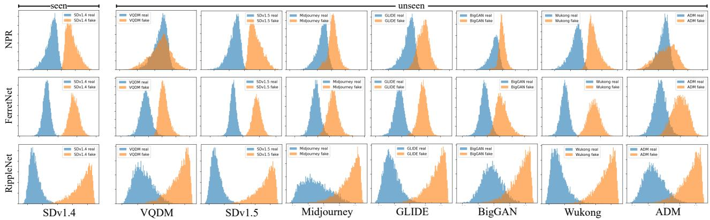  
Figure 6: Inter-class separability comparison among RippleNet, NPR and FerretNet.

Efectiveness of SDAM. Removing DRC or HAF decreases the average ACC by 3.3 and 4.2 percentage points, respectively, while removing both yields a larger drop of 6.1 points. These results show that independent directional residuals are insuficient: DRC captures cyclic dependencies across directions, whereas HAF emphasizes informative neighborhood scales. Their combination produces more discriminative and transferable diferential representations.

Efectiveness of FGCA. Removing FGCA reduces the average ACC from 94.4% to 91.2%. This result verifies that high-frequency responses provide complementary evidence to spatial diferential representations, helping the encoder capture spectral anomalies shared across generators.

Hyperparameter Analysis. As reported in 4, a patch size of 16 × 16 achieves the highest average ACC of 94.4%, while smaller patches provide insuficient context and larger patches introduce structural interference. Selecting one TCP and one TSP performs best; increasing the patch number provides no consistent gain. Among patch combinations, TCP+TSP outperforms TCP+TMP and TMP+TSP by 7.4 and 4.8 percentage points, confirming the complementarity of the two texture extremes. Finally, L = 3 achieves the best result, whereas fewer steps limit the receptive range and additional steps may introduce irrelevant variations.

Additional ablation studies, robustness, and computational cost analysis are provided in Appendix.

## Visualization

To examine cross-generator separability, we compare the prediction-score distributions of RippleNet, NPR, and FerretNet across diferent generators. As shown in 6, RippleNet consistently produces clearer separation between real and generated samples, with smaller distributional variations across generators. This indicates that its learned representations are less sensitive to generator-specific shifts and support more stable cross-model discrimination.

## Conclusion

This paper analyzes representation bias in generated-image detection from an information-theoretic perspective and argues that efective discrimination requires suppressing dominant high-SNR semantic components while strengthening generation-mechanism deviations manifested as low-SNR forgery artifacts. Building on this insight, we propose RippleNet, which uses forgery-sensitive patch selection to focus on regions where artifacts are more likely to emerge, and combines neighborhood diferential modeling with finegrained attention encoding to learn artifact representations less dependent on semantic content. Extensive experiments demonstrate that RippleNet achieves stable and competitive performance across multiple cross-generator benchmarks, exhibiting strong generalization to unseen generative models.

## References

2022. Midjourney. https://www.midjourney.com/home/.

2022. Wukong. https://xihe.mindspore.cn/modelzoo/ wukong.

Bei, Y.; Lou, H.; Geng, J.; Liu, E.; Cheng, L.; Song, J.; Song, M.; and Feng, Z. 2024. A large-scale universal evaluation benchmark for face forgery detection. arXiv preprint arXiv:2406.09181.

black forest labs. 2024. FLUX.1: A new era of creation. https://blackforestlabs.ai/.

Brock, A.; Donahue, J.; and Simonyan, K. 2018. Large scale GAN training for high fidelity natural image synthesis. arXiv preprint arXiv:1809.11096.

Cao, P.; Zhou, F.; Song, Q.; and Yang, L. 2025. Controllable generation with text-to-image difusion models: A survey. IEEE Transactions on Pattern Analysis and Machine Intelligence.

Chen, B.; Zeng, J.; Yang, J.; and Yang, R. 2024. Drct: Diffusion reconstruction contrastive training towards universal detection of difusion generated images. In Forty-first International Conference on Machine Learning.

Chen, J.; Yao, J.; and Niu, L. 2024. A single simple patch is all you need for ai-generated image detection. arXiv preprint arXiv:2402.01123.

Cheng, S.; Lyu, L.; Wang, Z.; Zhang, X.; and Sehwag, V. 2025. CO-SPY: Combining Semantic and Pixel Features to Detect Synthetic Images by AI. In Proceedings ofthe Computer Vision and Pattern Recognition Conference, 13455– 13465.

Deng, J.; Dong, W.; Socher, R.; Li, L.-J.; Li, K.; and Fei-Fei, L. 2009. Imagenet: A large-scale hierarchical image database. In 2009 IEEE conference on computer vision and pattern recognition, 248–255. Ieee.

Dhariwal, P.; and Nichol, A. 2021. Difusion models beat gans on image synthesis. Advances in neural information processing systems, 34: 8780–8794.

Gu, S.; Chen, D.; Bao, J.; Wen, F.; Zhang, B.; Chen, D.; Yuan, L.; and Guo, B. 2022. Vector quantized difusion model for text-to-image synthesis. In Proceedings of the IEEE/CVF conference on computer vision and pattern recognition, 10696–10706.

Gupta, Y.; Jaddipal, V. V.; Prabhala, H.; Paul, S.; and Von Platen, P. 2024. Progressive knowledge distillation of stable difusion xl using layer level loss. arXiv preprint arXiv:2401.02677.

Ho, J.; Jain, A.; and Abbeel, P. 2020. Denoising difusion probabilistic models. Advances in neural information processing systems, 33: 6840–6851.

Jia, Z.; Huang, C.; Zhu, Y.; Fei, H.; Duan, X.; Yuan, Z.; Deng, Y.; Zhang, J.; Zhang, J.; and Zhou, J. 2025. Secret Lies in Color: Enhancing AI-Generated Images Detection with Color Distribution Analysis. In Proceedings of the Computer Vision and Pattern Recognition Conference, 13445–13454.

Karageorgiou, D.; Papadopoulos, S.; Kompatsiaris, I.; and Gavves, E. 2025. Any-resolution ai-generated image detection by spectral learning. In Proceedings of the Computer Vision and Pattern Recognition Conference, 18706–18717.

Li, C.; Wang, X.; Li, M.; Miao, B.; Sun, P.; Zhang, Y.; Ji, X.; and Zhu, Y. 2025a. Bridging the Gap Between Ideal and Real-world Evaluation: Benchmarking AI-Generated Image Detection in Challenging Scenarios. In Proceedings of the IEEE/CVF International Conference on Computer Vision, 20379–20389.

Li, D.; Kamko, A.; Akhgari, E.; Sabet, A.; Xu, L.; and Doshi, S. 2024. Playground v2. 5: Three insights towards enhancing aesthetic quality in text-to-image generation. arXiv preprint arXiv:2402.17245.

Li, O.; Cai, J.; Hao, Y.; Jiang, X.; Hu, Y.; and Feng, F. 2025b. Improving synthetic image detection towards generalization: An image transformation perspective. In Proceedings of the 31st ACM SIGKDD Conference on Knowledge Discovery and Data Mining V. 1, 2405–2414.

Liang, S.; Liu, J.; Chen, R.; and Guan, Q. 2025. FerretNet: Eficient Synthetic Image Detection via Local Pixel Dependencies. arXiv preprint arXiv:2509.20890.

Liu, H.; Tan, Z.; Tan, C.; Wei, Y.; Wang, J.; and Zhao, Y. 2024. Forgery-aware adaptive transformer for generalizable synthetic image detection. In Proceedings ofthe IEEE/CVF Conference on Computer Vision and Pattern Recognition, 10770–10780.

Liu, L.; Ren, Y.; Lin, Z.; and Zhao, Z. 2022. Pseudo numerical methods for difusion models on manifolds. arXiv preprint arXiv:2202.09778.

Lou, H.; Feng, Z.; Geng, J.; Liu, E.; Lei, J.; Cheng, L.; Song, J.; Song, M.; and Bei, Y. 2025. STD-FD: Spatio-Temporal Distribution Fitting Deviation for AIGC Forgery Identification. In Forty-second International Conference on Machine Learning.

Mahara, A.; and Rishe, N. 2026. Methods and trends in detecting AI-generated images: A comprehensive review. Com puter Science Review, 60: 100908.

Nichol, A.; Dhariwal, P.; Ramesh, A.; Shyam, P.; Mishkin, P.; McGrew, B.; Sutskever, I.; and Chen, M. 2021. Glide: Towards photorealistic image generation and editing with textguided difusion models. arXiv preprint arXiv:2112.10741.

Nichol, A. Q.; and Dhariwal, P. 2021. Improved denoising difusion probabilistic models. In International conference on machine learning, 8162–8171. PMLR.

Ojha, U.; Li, Y.; and Lee, Y. J. 2023. Towards universal fake image detectors that generalize across generative models. In Proceedings of the IEEE/CVF Conference on Computer Vision and Pattern Recognition, 24480–24489.

Qi, X.; Ye, K.; Shi, C.; Yang, Y.; Zhou, H.; and Zhu, J. 2026. A Diference-in-Diference Approach to Detecting AI-Generated Images. arXiv preprint arXiv:2602.23732.

Qian, Y.; Yin, G.; Sheng, L.; Chen, Z.; and Shao, J. 2020. Thinking in frequency: Face forgery detection by mining frequency-aware clues. In European conference on computer vision, 86–103. Springer.

Radford, A.; Kim, J. W.; Hallacy, C.; Ramesh, A.; Goh, G.; Agarwal, S.; Sastry, G.; Askell, A.; Mishkin, P.; Clark, J.; et al. 2021. Learning transferable visual models from natural language supervision. In International conference on machine learning, 8748–8763. PmLR.

Ramesh, A.; Pavlov, M.; Goh, G.; Gray, S.; Voss, C.; Radford, A.; Chen, M.; and Sutskever, I. 2021. Zero-shot text-to-image generation. In International conference on machine learning, 8821–8831. Pmlr.

Rombach, R.; Blattmann, A.; Lorenz, D.; Esser, P.; and Ommer, B. 2022. High-resolution image synthesis with latent difusion models. In Proceedings of the IEEE/CVF conference on computer vision and pattern recognition, 10684– 10695.

Sarkar, A.; Mai, H.; Mahapatra, A.; Lazebnik, S.; Forsyth, D. A.; and Bhattad, A. 2024. Shadows don’t lie and lines can’t bend! generative models don’t know projective geometry... for now. In Proceedings of the IEEE/CVF conference on computer vision and pattern recognition, 28140–28149.

Schuhmann, C.; Beaumont, R.; Vencu, R.; Gordon, C.; Wightman, R.; Cherti, M.; Coombes, T.; Katta, A.; Mullis, C.; Wortsman, M.; et al. 2022. Laion-5b: An open largescale dataset for training next generation image-text models. Advances in neural information processing systems, 35: 25278–25294.

Tan, C.; Tao, R.; Liu, H.; Gu, G.; Wu, B.; Zhao, Y.; and Wei, Y. 2025. C2p-clip: Injecting category common prompt in clip to enhance generalization in deepfake detection. In Proceedings of the AAAI Conference on Artificial Intelligence, volume 39, 7184–7192.

Tan, C.; Zhao, Y.; Wei, S.; Gu, G.; Liu, P.; and Wei, Y. 2024a. Frequency-aware deepfake detection: Improving generalizability through frequency space domain learning. In Proceedings of the AAAI Conference on Artificial Intelligence, volume 38, 5052–5060.

Tan, C.; Zhao, Y.; Wei, S.; Gu, G.; Liu, P.; and Wei, Y. 2024b. Rethinking the up-sampling operations in cnn-based generative network for generalizable deepfake detection. In Proceedings of the IEEE/CVF Conference on Computer Vision and Pattern Recognition, 28130–28139.

Tishby, N.; Pereira, F. C.; and Bialek, W. 2000. The information bottleneck method. arXiv preprint physics/0004057.

Wang, W.; Huang, Y.; Xu, J.; Yu, Y.; Yan, J.; Ding, S.; Zhou, P.; and Luo, Y. 2026. TranX-Adapter: Bridging Artifacts and Semantics within MLLMs for Robust AI-generated Image Detection. arXiv preprint arXiv:2602.21716.

Wang, Z.; Bao, J.; Zhou, W.; Wang, W.; Hu, H.; Chen, H.; and Li, H. 2023. Dire for difusion-generated image detection. In Proceedings of the IEEE/CVF International Conference on Computer Vision, 22445–22455.

Xu, Q.; Chen, D.; Chen, J.; Lyu, S.; and Wang, C. 2025. Recent Advances on Generalizable Difusion-generated Image Detection. arXiv preprint arXiv:2502.19716.

Yan, S.; Li, O.; Cai, J.; Hao, Y.; Jiang, X.; Hu, Y.; and Xie, W. 2024a. A sanity check for ai-generated image detection. arXiv preprint arXiv:2406.19435.

Yan, Z.; Wang, J.; Wang, Z.; Jin, P.; Zhang, K.-Y.; Chen, S.; Yao, T.; Ding, S.; Wu, B.; and Yuan, L. 2024b. Efort: Eficient orthogonal modeling for generalizable ai-generated image detection. arXiv preprint arXiv:2411.15633, 2(6): 7.

Yuan, L.; Li, X.; Zhang, Y.; Zhang, J.; Li, H.; and Gao, X. 2026. Mlep: Multi-granularity local entropy patterns for generalized ai-generated image detection. Advances in Neural Information Processing Systems, 38: 68981–69000.

Zhang, H.; He, Q.; Bi, X.; Li, W.; Liu, B.; and Xiao, B. 2025. Towards Universal AI-Generated Image Detection by Variational Information Bottleneck Network. In Proceedings ofthe Computer Vision and Pattern Recognition Conference, 23828–23837.

Zhong, N.; Xu, Y.; Li, S.; Qian, Z.; and Zhang, X. 2023. Patchcraft: Exploring texture patch for eficient ai-generated image detection. arXiv preprint arXiv:2311.12397.

Zhou, M.; Zhou, Z.; Sun, K.; Luo, Y.; Ji, J.; Sun, X.; and Ji, R. 2026. ForensicConcept: Transferable Forensic Concepts for AIGI Detection. arXiv preprint arXiv:2606.07034.

Zhu, M.; Chen, H.; Yan, Q.; Huang, X.; Lin, G.; Li, W.; Tu, Z.; Hu, H.; Hu, J.; and Wang, Y. 2023. Genimage: A million-scale benchmark for detecting ai-generated image. Advances in Neural Information Processing Systems, 36: 77771–77782.

In the Supplementary Material, we first present a more systematic and formal exposition of the theoretical motivation and core design principles of RippleNet. Subsequently, we provide the complete details of the experimental setup, including more comprehensive descriptions of the datasets and configurations of the training hyperparameters. Building on this foundation, we further supplement the detailed experimental results that were not included in the main text and ofer an additional series of ablation studies.

## Theoretical Motivation of RippleNet

Difusion models have become the dominant paradigm for image generation, producing images with highly realistic global structure and strong low-frequency fidelity. Nevertheless, systematic discrepancies often remain in fine-scale details, especially in high-frequency components. To motivate the design of RippleNet, we analyze this phenomenon from two complementary perspectives. First, we discuss why difusion training tends to under-emphasize high-frequency components. Second, from the viewpoint of the information bottleneck, we explain why conventional detectors are easily biased toward semantic content rather than subtle forgery traces. Together, these observations motivate the architectural choices of RippleNet.

Frequency-Domain Gradient Imbalance in Difusion Training. In difusion models, the learning dynamics of diferent frequency components are closely related to their signal-to-noise ratios (SNR). Since high-frequency components typically have lower energy and are more susceptible to corruption by injected noise, they tend to contribute less efectively to optimization, which may result in persistent distortions in synthesized high-frequency details.

Consider a standard DDPM, whose objective at timestep t is defined as

$$
\mathcal { L } ( \theta ) = \mathbb { E } _ { x _ { 0 } , \epsilon , t } \left[ \Vert \epsilon - \epsilon _ { \theta } ( x _ { t } , t ) \Vert _ { 2 } ^ { 2 } \right] ,\tag{16}
$$

where

$$
x _ { t } = \sqrt { \alpha _ { t } } x _ { 0 } + \sqrt { 1 - \alpha _ { t } } \epsilon ,\tag{17}
$$

$\alpha _ { t }$ denotes the timestep-dependent decay coeficient, $\epsilon \sim$ $\mathcal { N } ( 0 , I )$ , and $\epsilon _ { \theta }$ is the noise prediction network parameterized by $\theta .$

Let ${ \hat { x } } _ { 0 } ( f )$ and $\hat { \epsilon } ( f )$ denote the Fourier coeficients of the clean image and the noise at frequency channel $f ,$ respectively. Then the noisy input at frequency f can be written as

$$
\hat { x } _ { t } ( f ) = \sqrt { \alpha _ { t } } \hat { x } _ { 0 } ( f ) + \sqrt { 1 - \alpha _ { t } } \hat { \epsilon } ( f ) .\tag{18}
$$

If $P _ { x } ( f )$ and $P _ { \epsilon } ( f )$ denote the signal and noise power at frequency $f ,$ , the corresponding channel-wise SNR is

$$
\mathrm { S N R } _ { f } = \frac { \alpha _ { t } P _ { x } ( f ) } { ( 1 - \alpha _ { t } ) P _ { \epsilon } ( f ) } .\tag{19}
$$

Under the mean squared error objective, the gradient contribution of frequency channel $f$ can be approximated as

$$
\nabla _ { \boldsymbol { \theta } } \mathcal { L } _ { f } \approx \mathbb { E } \Bigl [ \bigl ( \hat { \epsilon } ( f ) - \hat { \epsilon } _ { \boldsymbol { \theta } } ( f ) \bigr ) \cdot \nabla _ { \boldsymbol { \theta } } \hat { \epsilon } _ { \boldsymbol { \theta } } ( f ) \Bigr ] .\tag{20}
$$

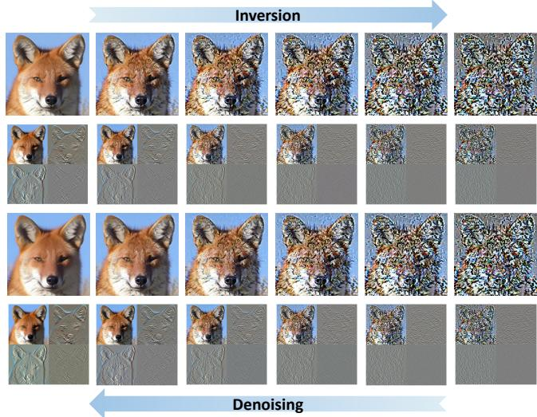  
Figure 7: Wavelet decomposition exposes the high-frequency degradation occurring along difusion reconstruction process.

Assuming that, at the early stage of training, the scale of $\nabla _ { \boldsymbol { \theta } } \hat { \epsilon } _ { \boldsymbol { \theta } } ( f )$ does not vary substantially across frequency channels, the expected gradient magnitude is mainly governed by the prediction error magnitude:

$$
\left. \nabla _ { \theta } \mathcal { L } \right. _ { f } \propto \sqrt { \mathbb { E } \left[ \left( \hat { \epsilon } ( f ) - \hat { \epsilon } _ { \theta } ( f ) \right) ^ { 2 } \right] } .\tag{21}
$$

Because high frequency components generally exhibit lower signal energy and are more easily submerged in noise during the forward difusion process, their efective SNR is typically lower. This suggests that

$$
\left\| \nabla _ { \theta } \mathcal { L } \right\| _ { f } \propto \mathrm { S N R } _ { f } ^ { 1 / 2 } ,\tag{22}
$$

implying that high frequency channels tend to provide weaker optimization signals during training. As a consequence, the reverse process may preserve low-frequency structure well while leaving more detectable inconsistencies in highfrequency details.

Detector Bias from an Information Bottleneck Perspective. Beyond the intrinsic spectral properties of generative models, the representation bias of the detector itself also afects how forgery traces are exploited. Let X denote the input image, $Y$ the label, and $Z \doteq h _ { \theta } ( X )$ the intermediate representation extracted by a detector. From the information bottleneck perspective, representation learning can be approximately characterized as

$$
\operatorname* { m a x } _ { \theta } I ( Z ; Y ) - \beta I ( Z ; X ) ,\tag{23}
$$

where $I ( \cdot ; \cdot )$ denotes mutual information and $\beta$ controls the degree of compression.

From a structural perspective, the image can be decomposed into a semantic component $X _ { s }$ and a residual component $X _ { r }$ :

$$
X = X _ { s } + X _ { r } , \qquad \langle X _ { s } , X _ { r } \rangle = 0 .\tag{24}
$$

Here, $X _ { s }$ mainly captures low-frequency structure and semantic layout, while $X _ { r }$ contains fine-grained residual variations, including subtle textural and statistical irregularities. In standard discriminative learning, $X _ { s }$ usually exhibits stronger and more stable correlation with the label, and therefore tends to dominate the learned representation:

$$
I ( Z ; X _ { s } ) \gg I ( Z ; X _ { r } ) .\tag{25}
$$

Correspondingly, the detector is often much more sensitive to perturbations along semantic directions than residual ones:

$$
\| \nabla _ { X _ { s } } h _ { \theta } ( X ) \| \gg \| \nabla _ { X _ { r } } h _ { \theta } ( X ) \| .\tag{26}
$$

This bias is problematic for generated image detection. Although semantic structure is often visually salient, the cues that generalize across generators are more likely to reside in weak residual signals rather than dominant content patterns. As a result, detectors that rely primarily on semantic features may understand image content well but still fail to consistently capture generator-specific artifacts, leading to limited cross domain generalization.

Design Motivation of RippleNet. The above analysis directly motivates the design of RippleNet, which aims to suppress semantic dominance and enhance the modeling of weak forgery related residual cues. Specifically, FSPS selects forgery sensitive regions to reduce semantically redundant content at the input stage. SDAM explicitly models directional statistical dependencies within local pixel neighborhoods, transforming subtle residual cues into learnable structural representations. FAE further performs pixel-level attention over these residual patterns and injects frequency guided high frequency priors into the early stages of pixellevel MHSA. Through this design, RippleNet encourages the detector to focus on fine-grained statistical inconsistencies that are weakly tied to image semantics but more closely related to the underlying generative process, thereby improving generalization across generators and datasets.

## Experimental Setup Details

## More Dataset Details

GenImage (Zhu et al. 2023). GenImage contains forged images generated by eight generative models, along with an equal number of real images randomly sampled from ImageNet (Deng et al. 2009). Among these generators, seven are difusion-based, including SDv1.4 (Rombach et al. 2022), SDv1.5 (Rombach et al. 2022), Midjourney (mid 2022), ADM (Dhariwal and Nichol 2021), GLIDE (Nichol et al. 2021), VQDM (Gu et al. 2022), and Wukong (wuk 2022), while the remaining one, BigGAN (Brock, Donahue, and Simonyan 2018), is GAN-based. Following the standard benchmark protocol, we use 162,000 forged images generated by SDv1.4 and an equal number of real images for training, and evaluate all methods on the oficial test subsets to ensure a fair assessment of cross-model generalization.

DeepFaceGen (Bei et al. 2024). DeepFaceGen is a largescale face forgery benchmark. Following prior evaluation protocols, we select forged face samples generated by recent on-the-fly guidance methods, covering 12 generative frameworks, including DALL·E (Ramesh et al. 2021) and Stable

Difusion (SD) (Rombach et al. 2022). The training, validation, and test splits strictly follow the oficial benchmark configuration to ensure fair and comparable evaluation.

DifusionForensics (Wang et al. 2023). DifusionForensics is a benchmark designed to evaluate the generalization ability of detectors across diverse difusion-based image generators. It covers multiple representative difusion frameworks, including ADM, DDPM, IDDPM (Nichol and Dhariwal 2021), LDM, PNDM (Liu et al. 2022), VQ-Difusion, SDv1, and SDv2, while real images are collected from LSUN and ImageNet. Owing to the diversity of difusion architectures and sampling paradigms involved, this benchmark provides a suitable testbed for assessing whether a detector can capture generator-agnostic forensic cues rather than overfitting to artifacts specific to a single model family.

COSPY (Cheng et al. 2025). COSPY is a challenging benchmark for evaluating the generalization ability of generatedimage detectors. In our experiments, rather than using all generators in COSPY, we specifically select those released after 2024 to assess model generalizability under more recent generative advances. The selected generators include SegMoE-SD (Gupta et al. 2024), SD-3-medium (Rombach et al. 2022), PG-v2.5-1024 (Li et al. 2024), FLUX.1-schnell (black forest labs 2024), and FLUX.1-dev.

## More Hyperparameter Details

RippleNet consists of three core modules: FSPS (Forgery-Sensitive Patch Selection), SDAM (Structured Diferential Artifact Modeling), and FAE (Forgery-Aware Encoder). In the FSPS stage, we first convert the input image to grayscale and partition it into non overlapping 16 × 16 patches. We then select the patch with the highest texture complexity and the patch with the lowest texture complexity from the sorted texture complexity list as forgery sensitive patches, forming the sets $\mathcal { P } _ { \mathrm { T C } }$ and $\mathcal { P } _ { \mathrm { T S } }$ , respectively. Discrete Wavelet Transform (DWT) is applied to these regions, and the HH highfrequency subband is extracted to capture potential forgery traces. In the SDAM module, for each pixel within each forgery-sensitive patch, we construct multi-directional and multi-scale residual features using eight directions and step size L = 3, explicitly modeling the local inconsistencies introduced by the generative process. In the FAE stage, we apply 2D Rotary Position Embedding (RoPE) to pixel-level tokens and stack one layer of Frequency Guided Cross Attention (FGCA) and four layers of pixel-level Multi-Head Self-Attention (MHSA) to jointly exploit forgery cues from both the pixel and frequency domains.

## Additional Experimental Results

## Detailed Results on DeepFaceGen

In the main text, we presented a radar chart illustrating the overall performance of RippleNet and various competitive detection methods on the DeepFaceGen benchmark, providing an intuitive comparison of their AUC metrics. In this section, we further provide the complete numerical AUC results for more fine-grained quantitative analysis. The AUC scores of all methods across the DeepFaceGen subsets are summarized in 5.

Table 5: AUC (%) comparison of RippleNet and other forgery detection models on the DeepFaceGen.
<table><tr><td></td><td>Midjourney</td><td>DALL-E1</td><td>DALL-E3</td><td>Wenxin</td><td>SD1</td><td>SDXLR</td><td>OJ</td><td>pix2pix</td><td>SD2</td><td>SDXL</td><td>VD</td><td>DF-GAN</td><td>Average</td></tr><tr><td>Xception</td><td>77.01</td><td>75.45</td><td>86.59</td><td>86.87</td><td>87.64</td><td>84.13</td><td>89.72</td><td>83.42</td><td>87.79</td><td>86.06</td><td>85.02</td><td>95.42</td><td>85.42</td></tr><tr><td>EfficientNet</td><td>79.52</td><td>81.74</td><td>88.41</td><td>84.34</td><td>86.83</td><td>93.46</td><td>89.00</td><td>77.61</td><td>85.91</td><td>87.65</td><td>83.84</td><td>96.71</td><td>86.25</td></tr><tr><td>F3Net</td><td>81.65</td><td>84.73</td><td>87.23</td><td>89.28</td><td>90.95</td><td>86.40</td><td>92.72</td><td>81.21</td><td>89.11</td><td>91.43</td><td>89.52</td><td>93.45</td><td>88.14</td></tr><tr><td>RECCE</td><td>87.64</td><td>83.25</td><td>89.17</td><td>92.13</td><td>89.83</td><td>90.46</td><td>96.90</td><td>89.71</td><td>95.43</td><td>96.75</td><td>95.67</td><td>93.54</td><td>91.70</td></tr><tr><td>DNADet</td><td>93.44</td><td>85.62</td><td>83.90</td><td>91.60</td><td>92.40</td><td>89.03</td><td>94.04</td><td>88.52</td><td>92.70</td><td>92.28</td><td>89.21</td><td>94.22</td><td>90.58</td></tr><tr><td>FreqNet</td><td>85.69</td><td>84.25</td><td>87.13</td><td>91.98</td><td>90.94</td><td>89.40</td><td>93.08</td><td>88.66</td><td>90.92</td><td>92.61</td><td>96.55</td><td>97.11</td><td>90.69</td></tr><tr><td>DIRE</td><td>87.01</td><td>86.65</td><td>87.84</td><td>92.84</td><td>92.35</td><td>86.61</td><td>91.28</td><td>89.01</td><td>89.54 91.54</td><td></td><td>98.78</td><td>90.32</td><td>90.69</td></tr><tr><td>DRCT</td><td>89.78</td><td>89.91</td><td>88.05</td><td>92.72</td><td>93.56</td><td>89.51</td><td>92.45</td><td>91.51</td><td>90.41</td><td>91.01</td><td>94.25</td><td>92.54</td><td>90.48</td></tr><tr><td>UnivFD</td><td>88.67</td><td>87.64</td><td>89.21</td><td>90.01</td><td>90.01</td><td>89.01</td><td>88.01</td><td>89.54</td><td>91.45 91.01</td><td></td><td>89.68</td><td>95.98</td><td>91.30</td></tr><tr><td>NPR</td><td>89.01</td><td>89.54</td><td>89.41</td><td>92.35</td><td>90.12</td><td>88.64</td><td>90.28</td><td>89.30</td><td>90.01</td><td>89.87</td><td>91.01</td><td>98.88</td><td>89.85</td></tr><tr><td>STD-FD</td><td>94.36</td><td>91.21</td><td>90.01</td><td>92.90</td><td>93.77</td><td>93.50</td><td>97.05</td><td>92.34</td><td>96.71</td><td>97.05</td><td>100.00</td><td>100.00</td><td>94.90</td></tr><tr><td>RippleNet</td><td>94.10</td><td>92.95</td><td>92.20</td><td>93.10</td><td>96.05</td><td>94.90</td><td>96.60</td><td>92.00</td><td>96.90</td><td>96.80</td><td>96.00</td><td>99.80</td><td>95.12</td></tr></table>

Table 6: ACC (%) and AP (%) comparison of RippleNet and other forgery detection models on the Ojha dataset. All methods are trained on GenImage/SDv1.4. Bold indicates the best result, and underline denotes the second-best.
<table><tr><td rowspan="2">Methods</td><td colspan="2">DALLE</td><td colspan="2">Glide_100_10</td><td colspan="2">Glide_100_27</td><td colspan="2">Glide_50_27</td><td colspan="2">Guided</td><td colspan="2">LDM_100</td><td colspan="2">LDM_200</td><td colspan="2">LDM_200_cfg</td><td colspan="2">Mean</td></tr><tr><td>ACC</td><td>AP</td><td>ACC</td><td>AP</td><td>ACC</td><td>AP</td><td>ACC</td><td>AP</td><td>ACC</td><td>AP</td><td>ACC</td><td>AP</td><td>ACC</td><td>AP</td><td>ACC</td><td>AP</td><td>ACC</td><td>AP</td></tr><tr><td>F3Net</td><td>69.0</td><td>79.8</td><td>47.5</td><td>45.1</td><td>47.3</td><td>43.8</td><td>47.0</td><td>41.0</td><td>51.9</td><td>54.4</td><td>65.9</td><td>77.6</td><td>63.5</td><td>77.0</td><td>66.1</td><td>78.7</td><td>57.3</td><td>62.2</td></tr><tr><td>FreqNet</td><td>52.7</td><td>81.7</td><td>71.5</td><td>85.0</td><td>71.9</td><td>94.7</td><td>74.6</td><td>95.3</td><td>57.0</td><td>64.9</td><td>94.8</td><td>99.4</td><td>94.2</td><td>99.4</td><td>92.2</td><td>99.1</td><td>76.1</td><td>89.9</td></tr><tr><td>FatFormer</td><td>83.0</td><td>95.7</td><td>85.4</td><td>96.5</td><td>84.6</td><td>96.4</td><td>84.8</td><td>96.4</td><td>65.5</td><td>88.9</td><td>92.6</td><td>98.9</td><td>92.4</td><td>99.0</td><td>89.8</td><td>97.7</td><td>84.8</td><td>96.2</td></tr><tr><td>AIDE</td><td>78.7 95.5</td><td></td><td>93.0</td><td>99.1</td><td>92.4</td><td>99.0</td><td>93.0</td><td>99.0</td><td>60.7 93.4</td><td></td><td></td><td>97.0 99.7</td><td>96.2</td><td>99.6</td><td>97.0</td><td>98.2</td><td></td><td>88.5 97.9</td></tr><tr><td>Fusion</td><td>59.1</td><td>79.4</td><td>63.0</td><td>77.2</td><td>48.7</td><td>44.8</td><td>87.5</td><td>97.9</td><td>53.5</td><td>67.3</td><td>89.4</td><td>98.7</td><td>90.9</td><td>97.5</td><td>91.2</td><td>97.8</td><td>72.9</td><td>82.6</td></tr><tr><td>VIB-Net</td><td>93.2</td><td>98.0</td><td>72.1</td><td>90.6</td><td>71.0</td><td>90.3</td><td>68.8</td><td>89.4</td><td>73.2</td><td>92.5</td><td>94.5</td><td>98.3</td><td>94.7</td><td>98.5</td><td>87.0</td><td>95.7</td><td>81.8</td><td>94.2</td></tr><tr><td>Effort</td><td>90.0 95.4</td><td></td><td>91.1</td><td>96.9</td><td>91.0</td><td>96.7</td><td>90.8</td><td>96.7</td><td>83.7 98.0</td><td></td><td></td><td>90.0 96.4</td><td>89.7</td><td>95.7</td><td>90.0</td><td>96.5</td><td>89.5 96.5</td><td></td></tr><tr><td>NPR</td><td>77.2</td><td>93.7</td><td>91.2</td><td>99.9</td><td>90.4</td><td>99.8</td><td>92.5</td><td>99.8</td><td>62.5</td><td>80.9</td><td></td><td>86.2 98.8</td><td>86.4</td><td>98.9</td><td>85.5</td><td>99.1</td><td>84.0</td><td>96.4</td></tr><tr><td>FerretNet</td><td>88.5</td><td>96.8</td><td>96.0</td><td>99.3</td><td>95.5</td><td>99.1</td><td>95.5</td><td>99.2</td><td>75.4</td><td>97.0</td><td>97.2</td><td>99.0</td><td>98.2</td><td>100.0</td><td>98.2</td><td>99.9</td><td>93.1</td><td>98.8</td></tr><tr><td>RippleNet</td><td>95.6 98.5</td><td></td><td>95.0</td><td>97.8</td><td>95.2</td><td>98.6</td><td>94.5</td><td>98.6</td><td>83.9</td><td>99.0</td><td></td><td>95.6 98.8</td><td>95.5</td><td>99.0</td><td>94.4</td><td>98.2</td><td>93.7</td><td>98.6</td></tr></table>

## Experimental Results on Ojha

Using the SDv1.4 subset of GenImage for training, we further evaluate the cross model generalization of diferent detectors on the test sets introduced by Ojha et al. (Ojha, Li, and Lee 2023). This benchmark contains forged images generated by ADM, GLIDE, DALL·E, and LDM under diferent parameter settings and sampling strategies, together with real images randomly sampled from LAION (Schuhmann et al. 2022) and ImageNet. As shown in 6, we report the detailed performance of RippleNet and several advanced baselines on this cross model benchmark. The results show that RippleNet consistently maintains strong performance across diverse difusion models and sampling settings, substantially outperforming existing detectors and demonstrating superior generalization ability.

## More Ablation Studies

FGCA Placement. To assess the optimal insertion point of the FGCA within the pixel-level encoder, we fix the number of FGCA layers and place it at diferent positions: before, inter, or after the pixel-level MHSA stacks. Results on Gen-Image are shown in 8. When FGCA is inserted before the first MHSA layer (Before-MHSA), the model achieves the highest ACC on GenImage. In contrast, placing FGCA in the middle or the final stage leads to noticeable performance degradation. We attribute this to the fact that introducing frequency-domain information at an early stage enables effective frequency renormalization of pixel-level tokens, providing more forgery-aware representations for the subsequent MHSA layers. Conversely, late-stage correction cannot fully rectify the representations already formed in earlier layers, yielding limited benefits overall.

High-frequency Feature Extraction. To identify the most suitable high frequency extraction operator for FGCA, we compare several commonly used choices, including Sobel, Laplacian, FFT, DCT, and the DWT adopted in our model. As shown in 8, spatial operators such as Sobel and Laplacian can capture local edge variations, but are limited in characterizing the broader frequency-domain artifacts introduced by generative models. Although FFT and DCT provide strong frequency representations, they lack explicit spatial localization, making it dificult to align the extracted high-frequency cues with pixel-level tokens. In contrast, DWT ofers a more balanced spatial frequency decomposition. In particular, its HH subband can more efectively capture transferable high frequency forgery traces while preserving spatial correspondence with pixel-level features, thereby achieving the best performance among all operators.

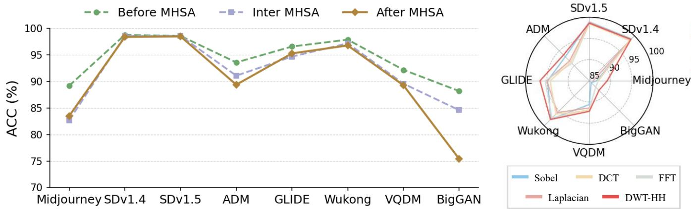

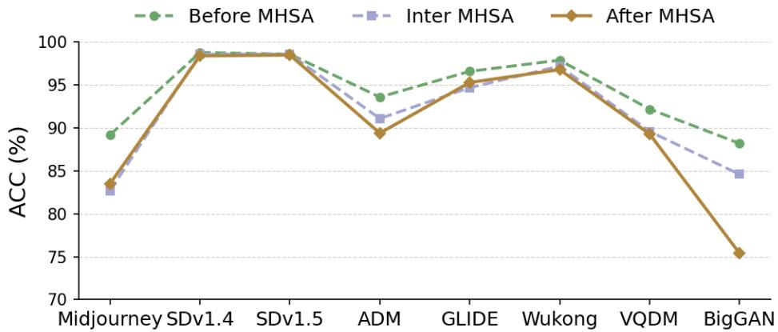  
Figure 8: Ablation studies on RippleNet. Left: comparison of FGCA placement at diferent stages of the pixel-level MHSA (Before MHSA, Inter MHSA, After MHSA) across multiple GenImage test subsets. Right: comparison of diferent high-frequency extraction methods, including Sobel, Laplacian, DCT, FFT, and DWT-HH.

## Robustness to Common Post-processing

Common post-processing operations can modify or suppress forensic traces, making robustness a persistent challenge for generated-image detection. Importantly, this sensitivity is not specific to RippleNet, but represents a common limitation among lightweight, artifact-oriented detectors, whose discriminative evidence can be readily altered by compression, resampling, and smoothing. Recent large-scale evaluations have similarly revealed substantial limitations of existing detectors under real-world image transformations (Li et al. 2025a). Achieving stronger robustness therefore often requires dedicated degradation-aware training or representation design.

To examine this issue, we evaluate resizing with scale factors of 0.75 and 1.25, rotation by 45◦, JPEG compression with quality factors of 95 and 75, and Gaussian blur with kernel sizes of 3 and 5. None of the compared methods uses post-processing augmentation during training. The experiment therefore measures their inherent zero-shot sensitivity to unseen transformations rather than robustness obtained through dedicated optimization.

As shown in 7, all evaluated lightweight detectors exhibit varying degrees of degradation after post-processing, with JPEG compression and Gaussian blur causing the most pronounced changes. These operations directly suppress or reorganize the high-frequency and local statistical traces used by artifact-oriented detectors. The results therefore reflect a broader limitation of this class of eficient detection methods rather than a weakness unique to the proposed framework. Dedicated transformation-aware augmentation or consistency regularization could further improve robustness and remains complementary to our representation design.

Table 7: Evaluation under common post-processing on GenImage in terms of AP (%). None of the methods uses post-processing augmentation during training. Bold and underline denote the best and second-best results, respectively.
<table><tr><td rowspan="2">Method</td><td rowspan="2">Clean</td><td colspan="2">Resize</td><td rowspan="2">Rotation 45°</td><td colspan="2">JPEG</td><td colspan="2">Gaussian Blur</td></tr><tr><td>S=0.75</td><td>S=1.25</td><td>Q=95</td><td>Q=75</td><td>K=3</td><td>K=5</td></tr><tr><td>NPR</td><td>95.8</td><td>83.6</td><td>81.2</td><td>90.2</td><td>56.1</td><td>48.7</td><td>68.4</td><td>62.9</td></tr><tr><td>FerretNet</td><td>99.0</td><td>93.8</td><td>94.4</td><td>97.9</td><td>60.8</td><td>49.6</td><td>73.6</td><td>71.0</td></tr><tr><td>Effort</td><td>97.9</td><td>94.6</td><td>95.3</td><td>96.7</td><td>82.4</td><td>75.6</td><td>86.6</td><td>82.2</td></tr><tr><td>RippleNet</td><td>99.7</td><td>96.6</td><td>95.8</td><td>98.7</td><td>67.5</td><td>54.8</td><td>79.9</td><td>74.3</td></tr></table>

Table 8: Computational cost overhead.
<table><tr><td></td><td>FerretNet</td><td>DIRE</td><td>UnivFD</td><td>RippleNet</td></tr><tr><td>Parameters (M)</td><td>1.4</td><td>23.5</td><td>85.5</td><td>8.6</td></tr><tr><td>GFLOPs</td><td>1.74</td><td>4.1</td><td>17.6</td><td>4.28</td></tr><tr><td>Inference Time (ms)</td><td>22.9</td><td>2425.4</td><td>93.8</td><td>46.5</td></tr><tr><td>GenImage (ACC,%)</td><td>89.7</td><td>71.2</td><td>91.1</td><td>94.4</td></tr></table>

## Computational Overhead.

8 compares RippleNet with representative baselines in terms of model size, FLOPs, inference latency, and detection accuracy. RippleNet achieves the highest GenImage accuracy (94.4%) with only 8.6M parameters, remaining far smaller than large-scale pretrained detectors such as UnivFD (85.5M). Its computational cost is also moderate (4.28 GFLOPs), substantially lower than UnivFD (17.6 GFLOPs) and far more eficient than reconstruction based methods such as DIRE, whose inference is considerably slower. While RippleNet is moderately heavier than FerretNet, it improves accuracy by 4.7 percentage points, showing that the gain comes from more efective forgery modeling rather than simply scaling up computation. In general, RippleNet ofers a strong trade-of of accuracy and eficiency, suggesting favorable practical eficiency.