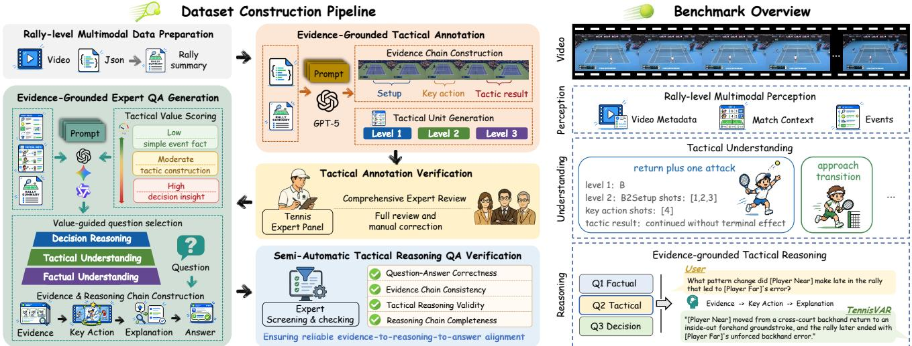
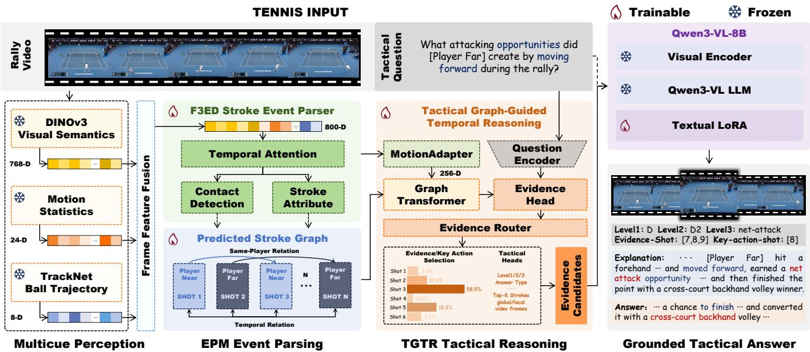
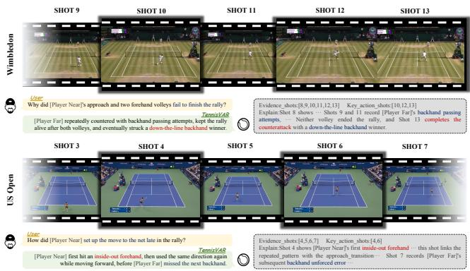

# TennisVAR: A Stroke-Evidence-Grounded Multimodal Large Language Model for Tactical Reasoning in Tennis Videos

Yifan Mei1, Qinglin Shi1, Changli Wu1,2†, Jiayuan Rao3, Jiayi Ji1, Liujuan Cao1∗

1 Key Laboratory of Multimedia Trusted Perception and Eficient Computing,

Ministry of Education of China, Xiamen University

2 Shanghai Innovation Institute

3 School of Artificial Intelligence, Shanghai Jiao Tong University

## Abstract

Sports-video understanding is moving beyond event recogni tion toward explaining how actions collectively shape match progression. However, existing tennis-video methods either perceive individual strokes without modeling their tactical dependencies or generate high-level analyses without grounding them in the underlying events. To bridge this perception-tounderstanding gap, we formulate stroke-evidence-grounded tactical reasoning, a new rally-level task that requires models to jointly predict an open-ended answer, a hierarchical tactic label, an ordered sequence of supporting strokes, and decisive key actions, with each evidence stroke anchored to its racket–ball contact frame. We further introduce TRACE (Tactical Reasoning with Action-Chain Evidence in Tennis), a large-scale expert-annotated benchmark containing 11,189 rally videos, 41,485 stroke events, 25,429 tactical units, and 11,189 question–answer pairs. TRACE unifies fine-grained stroke attributes, cross-stroke tactical relations, hierarchical tactic annotations, and evidence-grounded questions across factual perception, tactical understanding, and decision reasoning. Building on TRACE, we propose TennisVAR (Tennis Video Action-chain Reasoner), an evidence-grounded multimodal large language model that follows an “event–relation– evidence–tactic” reasoning paradigm. An Event Parsing Module converts continuous rallies into explicit stroke-event sequences, while a Tactical Graph-Guided Temporal Reasoner jointly models rally progression and same-player decision dependencies to identify question-relevant evidence and decisive actions. TennisVAR achieves 73.04 T-F1@8, 56.19 T-IoU@4, and 70.98 hierarchical tactic F1, outperforming the strongest supervised baselines by 19.94, 33.03, and 6.08 points, respectively. More importantly, it substantially improves the localization and attribution of stroke-level evidence supporting its predictions.

Project page: https://whynotgit2025.github.io/TennisVAR/.

## Introduction

Sports video understanding is evolving from action recognition and event localization toward rally-level description, relational reasoning, and tactical analysis (Deliège et al. 2021; Shao et al. 2020). Advances in multimodal large language models (MLLMs) (Zhang, Li, and Bing 2023; Maaz et al.

2024; Bai et al. 2025a) have substantially improved eventlevel understanding. Yet understanding a sports match requires more than recognizing individual actions; it also requires explaining how those actions interact to shape the progression of play. This is particularly important in tennis, where the natural unit of understanding is an entire rally rather than an isolated stroke.

Existing tennis-video research has progressed along two largely separate directions. Ball-tracking methods and finegrained event benchmarks can localize racket–ball contacts and recognize attributes such as the hitter, stroke type, direction, and outcome (Huang et al. 2019; Liu et al. 2025). They provide precise event-level perception, but largely treat strokes independently and cannot explain their tactical interactions. Recent video-language models instead represent rallies as ordered stroke sequences and generate professional commentary and analysis (Li et al. 2026; Xia et al. 2025; Rao et al. 2025; Xia et al. 2026), enabling higher-level semantic understanding. However, their predictions may rely on rally outcomes or language priors without explicit grounding in the underlying events. This creates a fundamental perception-to-understanding gap: existing methods neither reconstruct how earlier strokes shape subsequent decisions nor identify the specific strokes supporting a tactical conclusion, making it dificult to verify whether an analysis truly reflects the rally process.

To bridge this gap, we formulate stroke-evidencegrounded tactical reasoning, which requires models to derive tactical conclusions from the specific stroke events that support them. Given a rally video and a natural-language question, a model must jointly predict an open-ended answer, a hierarchical tactical label, an ordered sequence of supporting strokes, and a subset of decisive key actions, with each evidence stroke anchored to its corresponding racket–ball contact frame. The task therefore evaluates not only whether a tactical answer is correct, but also whether the model can reconstruct and ground the reasoning process behind it.

To support this task, we construct TRACE (Tactical Reasoning with Action-Chain Evidence in Tennis), a largescale, expert-annotated benchmark for rally-level tactical reasoning. TRACE contains 11,189 rally videos, 41,485 stroke events, 25,429 tactical units, and 11,189 question–answer pairs. Each rally is annotated with fine-grained stroke attributes, cross-stroke tactical relations, and explicit links between tactical answers and their supporting evidence. TRACE further introduces a hierarchical tactic ontology with 6/17/25 classes and organizes its questions and evidence chains into three progressive reasoning levels:factual perception, tactical understanding, and decision reasoning. By unifying stroke perception, relational reasoning, tactical prediction, and evidence attribution, TRACE provides a systematic test of whether a model can move from recognizing individual events to understanding the tactical progression of an entire rally.

General-purpose MLLMs remain limited in rally-level tactical reasoning. While they can recognize individual strokes and generate fluent descriptions, they often fail to organize temporally distributed events into a coherent tactical chain, distinguish setup strokes from decisive actions and outcomes, or identify the evidence that supports a tactical conclusion (Fu et al. 2025; Wu et al. 2024a; Xiao et al. 2024). The central challenge is therefore not merely recognizing what happened, but modeling how strokes functionally depend on one another and jointly shape the rally. Without explicit relational structures and supervised evidence selection, MLLMs may generate plausible analyses that are weakly grounded in the actual match process.

To address this challenge, we propose TennisVAR (Tennis Video Action-chain Reasoner), an evidence-grounded MLLM that performs structured reasoning from stroke events to tactical conclusions. TennisVAR first introduces an Event Parsing Module (EPM) that converts a continuous rally video into an ordered sequence of semantically explicit stroke events, providing discrete and interpretable primitives for reasoning. It then employs a Tactical Graph-Guided Temporal Reasoner (TGTR), which constructs a typed graph over these events and jointly models two complementary dependencies: the temporal progression between consecutive strokes and the same player’s decision transitions across intervening opponent returns. Conditioned on the question, TGTR identifies supporting evidence and decisive actions and integrates them for hierarchical tactical prediction and answer generation. This structured “event–relation–evidence–tactic” paradigm explicitly reconstructs how a tactic unfolds across strokes, making each tactical conclusion traceable to the rally events that support it.

Our main contributions are threefold:

• We formulate stroke-evidence-grounded tactical reasoning, a new task that jointly predicts tactical answers, hierarchical labels, supporting strokes, and decisive actions, extending sports-video understanding from event recognition to evidence-grounded tactical reasoning.

• We introduce TRACE, the first large-scale expertannotated benchmark that unifies fine-grained stroke events, cross-stroke tactical relations, hierarchical tactics, and evidence-grounded question answering.

• We propose TennisVAR, an evidence-grounded MLLM with an “event–relation–evidence–tactic” paradigm. It explicitly parses stroke events and models rally progression and same-player decision dependencies for traceable tactical prediction.

## Related Work

## Fine-Grained Sports Video Understanding

Sports benchmarks increasingly expose fine-grained temporal and semantic structure. SoccerNet-v2 supports action spotting and replay grounding in broadcast soccer (Deliège et al. 2021); FineGym and FineDiving decompose complex routines into structured actions or phases (Shao et al. 2020; Xu et al. 2022); and F3Set provides dense timestamps for fast, frequent events, including tennis strokes (Liu et al. 2025). Domain-specific vision–language work further addresses soccer understanding and commentary generation (Rao et al. 2025, 2024). These studies establish structured events as an important basis for sports understanding, but primarily evaluate event predictions or generated descriptions. Our work instead evaluates whether a high-level tactical judgment is supported by the relevant domain events.

## Tennis Video Understanding and Tactical Analysis

Tennis analysis has progressed from ball tracking to structured rally modeling. TrackNet estimates fast ball trajectories with heatmap representations (Huang et al. 2019), and F3Set provides precise contact timestamps and compositional stroke labels (Liu et al. 2025). TennisTV evaluates MLLMs on ordered stroke sequences at stroke and rally levels (Bao and Zhang 2025), while TennisExpert combines structured parsing with hierarchical temporal memory for analytical commentary (Liu et al. 2026). These methods improve perception and domain-specific generation, but do not treat the supporting strokes of each tactical conclusion as an explicit prediction target. TRACE associates each tactical answer with semantically indexed evidence strokes, their contact frames, and a subset of decisive key actions. Models must therefore predict both the answer and the ordered strokes that justify it, enabling direct evaluation of event– tactic reasoning.

## Evidence-Grounded Video Reasoning

General-purpose video-language models enable open-ended interaction with video content (Zhang, Li, and Bing 2023; Maaz et al. 2024; Bai et al. 2025a; Zhou et al. 2025), while benchmarks such as Video-MME and LongVideoBench evaluate temporal reasoning over extended videos (Fu et al. 2025; Wu et al. 2024a). Grounded VideoQA further examines whether answers are supported by relevant evidence: NExT-QA and NExT-GQA study causal and temporal reasoning (Xiao et al. 2021, 2024), MMR-V considers multiple temporally distributed evidence segments (Zhu et al. 2026), and CaST-Bench evaluates multi-evidence causal chains (Zhang et al. 2026). These works demonstrate that answer correctness alone is insuficient for reliable video reasoning. Unlike generic temporal grounding, TRACE represents evidence as chronologically ordered stroke events with explicit tennis semantics. It jointly evaluates hierarchical tactical prediction, evidence-stroke localization, key-action identification, and contact-frame accuracy. To our knowledge, TRACE is the first tennis-video benchmark to make the stroke-level evidence supporting tactical answers an explicit target of both supervision and evaluation.

  
Figure 1: Construction pipeline and benchmark overview of TRACE. Left: Densely annotated strokes are organized into tactical units consisting of setup strokes, key actions, and locally observable outcomes. Expert-verified units are then used to construct evidence-grounded QA instances. Right: TRACE contains three progressive reasoning levels: factual perception, tactical understanding, and decision reasoning. Each rally may contain multiple tactical units but is paired with one QA instance.

## Task Formulation and Benchmark Construction

## Task Formulation

Given a rally video V with N ordered strokes and a question q, the model predicts

$$
( a , \mathbf { z } , \pmb { \mathcal { E } } , \mathcal { K } , r ) = f _ { \theta } ( \mathcal { V } , q ) , \mathcal { K } \subseteq \pmb { \mathcal { E } } \subseteq \{ 1 , \dots , N \} ,\tag{1}
$$

where a is an open-ended answer, ${ \bf z } = ( z ^ { 1 } , z ^ { 2 } , z ^ { 3 } )$ is a hierarchical tactic label, E is the ordered set of supporting strokes, K contains the decisive key actions, and r is an evidencegrounded rationale. Each evidence stroke is linked to its racket–ball contact frame, allowing semantic evidence identification and temporal localization to be evaluated jointly.

For benchmark construction, each rally is also organized into question-independent tactical units. Each unit specifies a hierarchical tactic, the executing player, setup strokes, key actions, and a locally observable outcome. In contrast, E and K are question-conditioned and include only the strokes needed to answer q. TRACE organizes questions into three levels: Q1: Factual perception. Questions target directly observable stroke or rally facts, such as the hitter, technique, direction, or termination type. Q2: Tactical understanding. Questions require reasoning across strokes to identify tactical setups, directional patterns, attack–defense transitions, or ofensive–defensive responses. Q3: Decision reasoning. Questions examine evidence-supported decisions and their locally observable consequences, such as a player’s response to a net approach and the resulting benefit or risk.

## TRACE Benchmark Construction

TRACE extends the densely timestamped tennis events in F3Set (Liu et al. 2025) from event detection to multi-stroke tactical reasoning and evidence-grounded QA. Its source videos cover men’s and women’s professional matches from

Grand Slams, tour-level tournaments, the Olympic Games, and team competitions. As shown in Fig. 1, the benchmark is constructed in three stages.

Rally structuring. We convert the original annotations into an ordered sequence of stroke facts, including the hitter, court region, action, technique, direction, forward movement, and outcome. Player identities are replaced with the camera-relative roles [Player Near] and [Player Far]. Rally length, winner, and termination type are then derived to form a structured rally summary.

Tactical annotation. We define a three-level tactical hierarchy containing 6, 17, and 25 classes, respectively, including a no-primary-tactic class for rallies without a salient tactical structure. Based on the structured rally facts, a language model proposes candidate tactical units, each describing the corresponding tactical setup, key actions, and locally observable outcome. Before formal annotation, three tennis experts are calibrated using a shared set of examples. Each candidate tactical unit is reviewed by at least two experts, while ambiguous cases are jointly adjudicated. Units involving unsupported intent inference, irrelevant setup strokes, or unobservable outcomes are corrected or discarded.

QA and Evidence annotation. To reduce model-specific phrasing bias, we use multiple language-model families to independently generate candidate question–answer pairs from the verified tactical units and rally facts. With the identities of the generating models concealed, human annotators select and rewrite the candidates based on tactical relevance, evidence completeness, and reasoning value. For each retained QA instance, we annotate the minimal supporting-stroke set E, its decisive key-action subset K, and a rationale organized as “tactical setup–key action–observable outcome.” All fields must remain consistent with the verified rally events. Further details are provided in the supplementary material.

  
Figure 2: Overview of TennisVAR. Event Parsing reconstructs contact-centered strokes from complementary visual cues. Tactical Reasoning organizes them through temporal and same-player relations, routes question-relevant evidence, and predicts the hierarchical tactic. Selected events and sparse global frames support grounded answer generation.

## Benchmark Scale and Statistics

TRACE contains 11,189 rallies from 109 matches featuring 72 players, including 41,485 stroke events, 25,429 expertverified tactical units, and 11,189 open-ended QA instances. Each rally is paired with one QA instance and contains 2.27 tactical units on average.

The data are split at the source-match level into 7,119 training, 1,805 validation, and 2,265 test rallies, preventing match-specific information from being shared across subsets. The three-level 6/17/25 tactical hierarchy covers serve, return, baseline construction, net transition, and defensive counterattack tactics. The QA dataset contains 3,643 Q1, 6,376 Q2, and 1,170 Q3 instances.

## Method

## Overview

TennisVAR reorganizes a rally from a frame sequence into a question-conditioned tactical event structure. Given $\nu =$ $\{ \bar { I _ { t } } \} _ { t = 1 } ^ { T }$ and question $q ,$ its computation is

$$
\hat { S } = P _ { \theta _ { P } } ( \mathcal { V } ) , ( \hat { \mathbf { z } } , \hat { \mathcal { E } } , \hat { \mathcal { K } } ) = R _ { \theta _ { R } } ( \hat { S } , q ) , ( \hat { a } , \hat { r } ) = D _ { \theta _ { D } } ( \mathcal { C } ( q ) ) ,\tag{2}
$$

where $\Theta = ( \theta _ { P } , \theta _ { R } , \theta _ { D } ) ; \hat { S }$ is a predicted stroke-event sequence; $\hat { \mathbf { z } } , \hat { \mathcal { E } } .$ , and Kˆ are the tactic, supporting strokes, and key actions; and aˆ and rˆ are the answer and rationale. Evidence contact frames are inherited from Sˆ rather than predicted separately.

As shown in Fig. 2, the Event Parsing Module (EPM) converts the video into contact-centered semantic strokes, while Tactical Graph-Guided Temporal Reasoning (TGTR) models their dependencies and routes the question-relevant action chain into tactical prediction. The language model only verbalizes this evidence-bearing structure.

## Event Parsing Module

Racket–ball contacts are brief but tactically decisive. To preserve them, we fuse appearance, short-term motion, and balltrajectory cues:

$$
{ \bf x } _ { t } = \phi _ { \mathrm { f u s e } } \left( [ { \bf x } _ { t } ^ { \mathrm { a p p } } ; { \bf x } _ { t } ^ { \mathrm { m o t } } ; { \bf x } _ { t } ^ { \mathrm { b a l l } } ] \right) .\tag{3}
$$

DINOv3 (Siméoni et al. 2026) captures players and court context, the motion stream captures abrupt changes, and TrackNet (Huang et al. 2019) provides the ball trajectory.

A local-to-global F3ED encoder (Liu et al. 2025) localizes contacts and predicts observable stroke attributes. Temporal decoding produces

$$
\hat { \cal S } = \{ s _ { i } \} _ { i = 1 } ^ { \hat { N } } , \qquad s _ { i } = ( \tau _ { i } , { \bf x } _ { \tau _ { i } } , \pmb { \eta } _ { i } ) ,\tag{4}
$$

where $\tau _ { i }$ is the contact frame, $\mathbf { x } _ { \tau _ { i } }$ is its fused visual feature, and $\eta _ { i }$ contains the hitter, stroke type, direction, and outcome. This sequence is the shared interface between visual perception and tactical reasoning. We train contact detection with continuous-target focal binary cross-entropy (Lin et al. 2017) and supervise attributes only at annotated contacts:

$$
\begin{array} { r } { \mathcal { L } _ { \mathrm { e v t } } = \mathcal { L } _ { \mathrm { d e t } } + \lambda _ { \mathrm { a t t r } } \mathcal { L } _ { \mathrm { a t t r } } . } \end{array}\tag{5}
$$

The EPM therefore establishes the contact-aligned semantic units on which all subsequent relations and evidence predictions are defined.

## Tactical Graph-Guided Temporal Reasoner

A tactic emerges from dependencies among strokes rather than from any stroke in isolation. TGTR captures both the chronological exchange and each player’s action transitions across intervening returns.

Relational event structure. Each stroke forms a node whose token combines its visual feature, timestamp, rally position, and attributes. We construct

$$
\mathcal { G } = ( \mathcal { V } _ { s } , \mathcal { R } _ { \mathrm { t i m e } } \cup \mathcal { R } _ { \mathrm { p l a y e r } } ) ,\tag{6}
$$

where $\mathcal { R } _ { \mathrm { t i m e } }$ links adjacent strokes and $\mathcal { R } _ { \mathrm { p l a y e r } }$ links successive actions by the same predicted player across an intervening return. Relation-conditioned message passing (Schlichtkrull et al. 2018) followed by a Transformer (Vaswani et al. 2017) yields contextualized stroke tokens $\left\{ \mathbf { g } _ { i } \right\}$ and a rally representation $\mathbf { g } _ { \mathcal { G } }$ . All nodes and relations come from EPM predictions.

Evidence-routed tactical inference. Because a rally may contain several tactical patterns, two question-conditioned heads score whether stroke i supports the answer $( h = E )$ or is a key action $( h = K )$ :

$$
u _ { i } ^ { h } = f _ { h } ( [ \mathbf { g } _ { i } ; \mathbf { q } ] ) , \qquad p _ { i } ^ { h } = \sigma ( u _ { i } ^ { h } ) , \qquad h \in \{ E , K \} .\tag{7}
$$

Let $\mathbf { p } ^ { h } \ : = \ : ( p _ { i } ^ { h } ) _ { i = 1 } ^ { \hat { N } }$ . The selected evidence is ordered by contact time, key actions are restricted to this set, and $\hat { \mathcal F } ~ = ~ \left( \tau _ { i } \right) _ { i \in \hat { \mathcal E } }$ . With $\alpha _ { i } ~ = ~ \mathrm { s o f t m a x } _ { i } ( u _ { i } ^ { E } )$ , the Evidence Router forms

$$
{ \bf g } _ { R } = \mathrm { F u s e } \left( { \bf g } _ { \mathcal { G } } , \sum _ { i } \alpha _ { i } { \bf g } _ { i } , { \bf q } \right) .\tag{8}
$$

The three tactic heads operate on $\mathbf { g } _ { R } ,$ , so evidence participates in tactical prediction rather than being attached afterward.

Learning in the predicted event space. To avoid oracle stroke indices, we align annotated evidence frames $\mathcal { F }$ with predicted contacts $\hat { \mathcal { T } } = \left\{ \tau _ { i } \right\}$ through maximum-cardinality, minimum-ofset one-to-one matching:

$$
\pi ^ { \star } = \arg \operatorname* { m i n } _ { \pi \in \Pi _ { \delta } ^ { \operatorname* { m a x } } } \sum _ { ( f , \tau ) \in \pi } | f - \tau | .\tag{9}
$$

Here $\Pi _ { \delta } ^ { \mathrm { m a x } }$ contains admissible maximum-cardinality matchings within temporal tolerance δ. Matched events receive evidence and Key-action labels. Let $\begin{array} { r l } { \mathcal { L } _ { \mathrm { t a c } } } & { { } = } \end{array}$ $\textstyle \sum _ { \ell = 1 } ^ { 3 } \lambda _ { \ell } \mathcal { L } _ { \ell }$ . TGTR is optimized by

$$
{ \mathcal { L } } _ { \mathrm { T G T R } } = \lambda _ { E } { \mathcal { L } } _ { E } + \lambda _ { K } { \mathcal { L } } _ { K } + { \mathcal { L } } _ { \mathrm { t a c } } + \lambda _ { S } { \mathcal { L } } _ { S } .\tag{10}
$$

Here $\mathcal { L } _ { E }$ and $\mathcal { L } _ { K }$ are grounding losses, $\mathcal { L } _ { \ell }$ supervises tactic level ℓ, and $\mathcal { L } _ { S }$ is an auxiliary semantic loss. Training in the predicted event space reduces the gap between training and inference.

Answer realization and inference. The language model receives sparse global frames, local windows around selected contacts, and a serialized event table:

$$
\begin{array} { r } { \mathcal { C } ( q ) = [ q ; \mathcal { V } _ { g } ; \mathcal { V } _ { l } ( \hat { \mathcal { E } } ) ; \mathcal { T } _ { c } ] . } \end{array}\tag{11}
$$

The table $\mathcal { T } _ { c }$ contains event identifiers, timestamps, attributes, and grounding scores. Qwen3-VL (Bai et al. 2025a) generates the answer and rationale, while the tactic, evidence, and key-action fields come from TGTR. At inference, all events, relations, and evidence are predicted from $( \nu , q )$ no oracle input is used.

## Experiments

## Experimental Setup

TennisVAR uses Qwen3-VL-8B (Bai et al. 2025a) as its vision-language generator. The EPM employs an F3ED encoder that combines DINOv3 appearance features, shortterm motion features, and TrackNet ball-trajectory features, followed by local temporal modules and a temporal Transformer. It is trained for 40 epochs with AdamW (Loshchilov and Hutter 2019), a batch size of 64, and a learning rate of $2 \times 1 0 ^ { - 4 }$ . TGTR is trained for 120 epochs with AdamW, a batch size of 64, and a learning rate of $1 . 5 \times 1 0 ^ { - 3 }$ . We set $\lambda _ { E } = \lambda _ { K } = 2 . 0 , \lambda _ { 1 } = \lambda _ { 2 } = \lambda _ { 3 } = 1 . 0 ,$ and $\lambda _ { S } = 0 . 5 .$ For answer generation, all pretrained Qwen3-VL parameters are frozen and rank-32 LoRA modules (Hu et al. 2022) are optimized for 5 epochs with a learning rate of $2 \times 1 0 ^ { - 5 }$ and an efective batch size of 32. Training uses 8×NVIDIA H20 96GB GPUs.

## Main Results

Evaluation metrics. We evaluate the model from three aspects: evidence localization, understanding, and linguistic quality. For evidence localization, we use Temporal F1@8, Temporal F1@16, Temporal IoU@4, Frame Accuracy@8, and Frame Accuracy@16 to measure how well the predicted evidence strokes match the reference evidence under diferent temporal and frame-level criteria. For understanding, we use Hierarchical Tactic F1 and Key-action Accuracy. Hierarchical Tactic F1 evaluates tactical predictions under a hierarchical taxonomy, while Key-action Accuracy measures whether the decisive stroke in a rally is correctly identified. For linguistic quality, we use BLEU-4 (Papineni et al. 2002), ROUGE-L (Lin 2004), and CIDEr (Vedantam, Zitnick, and Parikh 2015). Together, these metrics assess whether the model truly understands tactical information and grounds its answers in video evidence, rather than relying only on language patterns or response templates. The Total score is computed by first averaging the metrics within each group and then combining the evidence, tactical, and language groups with weights of 0.50, 0.30, and 0.20, respectively. All metrics are reported on a 0–100 scale.

Baselines. We compare TennisVAR with zero-shot openweight and proprietary MLLMs. Open-weight models include Llama-4-Scout and Llama-4-Maverick (Meta AI 2025), DeepSeek-VL2 (Wu et al. 2024b), Qwen2.5-VL-3B/7B (Bai et al. 2025b), and Qwen3-VL-8B (Bai et al. 2025a). Proprietary models include Gemini-3-Pro and Gemini-3.1-Pro (Google DeepMind 2025, 2026), Claude-Opus-4.6 and Claude-Sonnet-4.6 (Anthropic 2026a,b), and GPT-5.5 (OpenAI 2026). We additionally fine-tune InternVL3-8B (Zhu et al. 2025), Qwen2.5-VL-7B, and Qwen3-VL-8B on TRACE. All baseline models are evaluated on the same test set.

Overall comparison. As shown in Table 1, TennisVAR achieves the best performance across all ten component metrics as well as the overall score, demonstrating strong and balanced capabilities in evidence localization, tactical understanding, and answer generation. Zero-shot MLLMs can often produce plausible responses, yet remain substantially less efective at identifying the stroke-level evidence that supports them. For example, GPT-5.5 obtains a Temporal F1@8 of 37.03 and a Temporal IoU@4 of 24.54, whereas Tennis-VAR achieves 73.04 and 56.19, respectively. This contrast suggests that general-purpose models may draw on language priors and coarse global video context, but have dificulty precisely grounding their answers in the relevant strokes.

<table><tr><td rowspan="2">Setting Model</td><td rowspan="2"></td><td colspan="5">Evidence</td><td colspan="2">Tactical</td><td colspan="3">Text</td><td rowspan="2">Total</td></tr><tr><td>T-F1@8 T-F1@16 T-IoU@4 F-Acc@8 F-Acc@16 Hier.F1 Key Acc.</td><td></td><td></td><td></td><td></td><td></td><td></td><td>R-L</td><td>CIDEr</td><td>B-4</td></tr><tr><td rowspan="6">Opeon-ouuce Zeroo-shot</td><td>Llama-4-Scout</td><td>0.09</td><td>0.09</td><td>0.00</td><td>0.00</td><td>0.00</td><td>5.52</td><td>0.00</td><td>19.81</td><td>1.88</td><td>7.08</td><td>2.76</td></tr><tr><td>Llama-4-Maverick</td><td>0.92</td><td>1.28</td><td>0.89</td><td>0.00</td><td>0.00</td><td>6.24</td><td>2.47</td><td>19.41</td><td>2.25</td><td>7.82</td><td>3.58</td></tr><tr><td>DeepSeek-VL2</td><td>2.97</td><td>4.23</td><td>1.60</td><td>0.00</td><td>0.53</td><td>1.51</td><td>3.50</td><td>7.38</td><td>0.51</td><td>3.19</td><td>2.42</td></tr><tr><td>Qwen2.5-VL-3B</td><td>5.92</td><td>10.69</td><td>3.95</td><td>0.44</td><td>0.84</td><td>2.93</td><td>10.07</td><td>0.63</td><td>0.03</td><td>0.20</td><td>4.19</td></tr><tr><td>Qwen2.5-VL-7B</td><td>10.62</td><td>16.55</td><td>9.88</td><td>1.96</td><td>3.89</td><td>7.73</td><td>20.91</td><td>10.45</td><td>0.74</td><td>3.64</td><td>9.57</td></tr><tr><td>Qwen3-VL-8B</td><td>17.94</td><td>21.47</td><td>10.87</td><td>1.50</td><td>3.99</td><td>8.15</td><td>22.96</td><td>19.75</td><td>2.20</td><td>6.78</td><td>12.16</td></tr><tr><td rowspan="6">Clos-uce Zero-sshot</td><td>Gemini-3-Pro</td><td>30.15</td><td>47.53</td><td>12.65</td><td>2.13</td><td>6.42</td><td>11.50</td><td>24.11</td><td>26.83</td><td>3.13</td><td>9.98 17.89</td><td></td></tr><tr><td>Gemini-3.1-Pro</td><td>30.59</td><td>48.36</td><td>12.41</td><td>3.54</td><td>8.55</td><td>13.33</td><td>26.02</td><td>26.66</td><td>3.05</td><td>9.63</td><td>18.87</td></tr><tr><td>Claude-Sonnet-4.6</td><td>27.95</td><td>38.20</td><td>19.50</td><td>0.00</td><td>0.00</td><td>12.51</td><td>16.28</td><td>22.15</td><td>0.28</td><td>5.80</td><td>14.77</td></tr><tr><td>Claude-Opus-4.6</td><td>27.09</td><td>36.21</td><td>18.23</td><td>0.00</td><td>0.00</td><td>14.59</td><td>16.59</td><td>22.47</td><td>0.39</td><td>5.92</td><td>14.75</td></tr><tr><td>GPT-5.5</td><td>37.03</td><td>49.49</td><td>24.54</td><td>1.31</td><td>2.57</td><td>12.67</td><td>16.50</td><td>26.33</td><td>2.16</td><td>9.00</td><td>18.36</td></tr><tr><td>InternVL3-8B</td><td>53.10</td><td>68.84</td><td>23.16</td><td>27.42</td><td>43.89</td><td>59.91</td><td>44.75</td><td>55.28 23.82</td><td></td><td></td><td>32.99 44.81</td></tr><tr><td rowspan="3">SF</td><td>Qwen2.5-VL-7B</td><td>45.93</td><td>66.60</td><td>19.61</td><td>21.41</td><td>35.58</td><td>64.90</td><td>45.76</td><td>54.05</td><td></td><td></td><td>22.3131.60 42.71</td></tr><tr><td>Qwen3-VL-8B</td><td>49.46</td><td>67.96</td><td>21.06</td><td>25.52</td><td>39.56</td><td>64.49</td><td>47.13</td><td>56.20</td><td>25.32</td><td></td><td>34.45 44.83</td></tr><tr><td>TennisVAR (Ours)</td><td>73.04</td><td>76.59</td><td>56.19</td><td>47.86</td><td>51.66</td><td>70.98</td><td>52.27</td><td>57.98</td><td></td><td>27.12 36.28 57.11</td><td></td></tr></table>

Table 1: Comparison with representative zero-shot and supervised fine-tuning baselines. Higher is better for all metrics. Best and second-best results are shown in bold and underlined, respectively.

TennisVAR also substantially outperforms the supervised fine-tuning baselines. Compared with the strongest SFT baselines on the corresponding metrics, TennisVAR improves Temporal F1@8, Temporal F1@16, Temporal IoU@4, Frame Accuracy@8, and Frame Accuracy@16 by 19.94, 7.75, 33.03, 20.44, and 7.77 percentage points, respectively. The particularly large gain in Temporal IoU@4 indicates that TennisVAR not only retrieves relevant segments of a rally but also aligns the predicted evidence more precisely with the underlying stroke events.

The model also delivers consistent improvements in tactical reasoning. TennisVAR achieves a Hierarchical Tactic F1 of 70.98 and a Key-action Accuracy of 52.27, exceeding the strongest SFT baselines by 6.08 and 5.14 percentage points, respectively. These results are consistent with the intended role of question-conditioned graph reasoning: modeling dependencies across strokes helps the model identify tactically decisive stages of a rally, rather than inferring tactical labels primarily from isolated local observations.

TennisVAR consistently improves all conventional textgeneration metrics, outperforming Qwen3-VL-8B by 1.78, 1.80, and 1.83 percentage points on ROUGE-L, CIDEr, and BLEU-4, respectively. Notably, several general-purpose models achieve competitive text-similarity scores despite substantially weaker evidence localization. This observation suggests that lexical-overlap-based metrics primarily capture surface-level agreement with reference answers and may not fully reflect whether an answer is supported by the correct strokes. We therefore evaluate answer quality jointly with stroke-level evidence localization, providing a more comprehensive assessment of evidence-grounded tactical reasoning.

Performance across reasoning levels. Table 3 compares TennisVAR with the three SFT baselines on factual perception (Q1), tactical understanding (Q2), and decision reasoning (Q3). TennisVAR consistently achieves the best performance at all three levels. On Q1, it surpasses the strongest baseline by 23.66 points in T-F1@8, 42.72 points in T-IoU@4, and 6.55 points in Hierarchical F1. On Q2, the corresponding gains are 19.04, 30.56, and 4.63 points. Although Q3 is the most demanding level, TennisVAR retains clear margins of 14.71 T-F1@8, 20.21 T-IoU@4, and 5.90 Hierarchical Tactic F1 over the strongest SFT baselines, demonstrating that its advantage persists as tactical dependencies become more complex.

## Qualitative Analysis

Figure 3 shows how TennisVAR grounds tactical answers in ordered stroke evidence. In the Wimbledon example, it connects repeated backhand passing attempts with the final down-the-line winner to explain why two volleys failed to finish the rally. In the US Open example, it links repeated inside-out forehands and forward movement to the subsequent net approach. These cases illustrate how the EPM recovers contact-aligned strokes and Tactical Reasoning organizes them into question-relevant evidence chains.

<table><tr><td>Setting</td><td>T-F1@8 T-IoU@4 F-Acc@8 F-Acc@16 Hier. F1</td><td>T-F1@16</td><td></td><td></td><td></td><td></td><td>Key Acc.</td><td>R-L</td><td>CIDEr</td><td>B-4</td><td>Total</td></tr><tr><td>Video-only</td><td>49.46</td><td>67.96</td><td>21.06</td><td>25.52</td><td>39.56</td><td>64.49</td><td>47.13</td><td>56.20</td><td>25.32</td><td>34.45</td><td>44.83</td></tr><tr><td>w/o EPM</td><td>61.58</td><td>63.52</td><td>40.73</td><td>34.53</td><td>40.53</td><td>68.89</td><td>45.14</td><td>57.45</td><td>26.41</td><td>35.61</td><td>49.16</td></tr><tr><td>w/o DINOv3</td><td>59.91</td><td>70.29</td><td>43.70</td><td>38.41</td><td>46.98</td><td>69.76</td><td>44.06</td><td>57.66</td><td>26.66</td><td>35.78</td><td>51.01</td></tr><tr><td>w/o TrackNet</td><td>62.13</td><td>73.62</td><td>55.70</td><td>47.77</td><td>50.79</td><td>69.08</td><td>50.33</td><td>57.32</td><td>26.31</td><td>35.30</td><td>54.84</td></tr><tr><td>w/o Motion</td><td>64.22</td><td>74.17</td><td>54.91</td><td>46.70</td><td>49.80</td><td>67.56</td><td>49.32</td><td>57.46</td><td>26.33</td><td>35.46</td><td>54.46</td></tr><tr><td>w/o TGTR</td><td>55.90</td><td>68.72</td><td>41.57</td><td>32.32</td><td>44.26</td><td>66.70</td><td>41.35</td><td>55.62</td><td>24.27</td><td>33.47</td><td>48.04</td></tr><tr><td>w/o Evidence Router</td><td>63.56</td><td>71.24</td><td>54.60</td><td>44.68</td><td>49.05</td><td>60.80</td><td>46.45</td><td>56.91</td><td>25.98</td><td>35.04</td><td>52.26</td></tr><tr><td>TennisVAR (Ours)</td><td>73.04</td><td>76.59</td><td>56.19</td><td>47.86</td><td>51.66</td><td>70.98</td><td>52.27</td><td>57.98</td><td>27.12</td><td>36.28</td><td>57.11</td></tr></table>

Table 2: Component ablation results. The best result in each column is highlighted in bold.

<table><tr><td>Level Model</td><td></td><td>T-F1@8 T-IoU@4 Hier.F1</td><td>22.49</td><td>66.62</td></tr><tr><td>Q1</td><td>Qwen3-VL-8B-SFT Qwen2.5-VL-7B-SFT InternVL3-8B-SFT TennisVAR</td><td>50.33 44.37 59.84 83.50</td><td>21.45 27.63 70.35</td><td>65.22 63.45 73.17</td></tr><tr><td>Q2</td><td>Qwen3-VL-8B-SFT Qwen2.5-VL-7B-SFT InternVL3-8B-SFT TennisVAR</td><td>51.06 48.73 52.04 71.08</td><td>21.56 20.06 21.98 52.54</td><td>63.19 64.91 55.40 69.54</td></tr><tr><td>Q3</td><td>Qwen3-VL-8B-SFT Qwen2.5-VL-7B-SFT InternVL3-8B-SFT TennisVAR</td><td>37.36 33.56 40.17 54.88</td><td>13.94 11.65 17.43 37.64</td><td>60.48 60.14 51.59 66.38</td></tr></table>

Table 3: Performance across reasoning levels. The best result within each level is shown in bold.

## Ablation Studies

Ablation settings. Table 2 evaluates the two core designs. Video-only removes both EPM and TGTR. w/o TGTR retains parsed events but removes Tactical Reasoning, while w/o Evidence Router retains relational reasoning without questionconditioned evidence routing. For the EPM, we further remove appearance, trajectory, and motion cues individually. All variants share the same generator and training protocol.

Event Parsing Module. Adding EPM to the video-only model without TGTR improves Temporal F1@8 by 6.44 points and Temporal IoU@4 by 20.51 points, indicating that contact-centered semantic events provide stronger temporal grounding than raw frames. Conversely, removing EPM from the full model reduces these metrics by 11.46 and 15.46 points, respectively. Among the EPM inputs, removing DI-NOv3 causes the largest overall performance drop of 6.10 points, while removing TrackNet or motion decreases Temporal F1@8 by 10.91 and 8.82 points. These results suggest that appearance provides the primary semantic context, while trajectory and motion ofer complementary contact cues.

Tactical Reasoning. Removing TGTR from the full model decreases Total by 9.07 points, Temporal F1@8 by 17.14 points, Temporal IoU@4 by 14.62 points, and Key-action Accuracy by 10.92 points. Within TGTR, removing the Evidence Router lowers Hierarchical Tactic F1 by 10.18 points and Total by 4.85 points. These results confirm that relational event modeling recovers cross-stroke tactical structure, while evidence routing connects that structure to the question-specific tactic.

  
Figure 3: Qualitative examples of evidence-grounded tactical reasoning. TennisVAR links temporally distributed strokes to its answer and rationale.

## Conclusion

We introduced stroke-evidence-grounded tactical reasoning, a new rally-level task that evaluates both tactical predictions and the stroke events supporting them. To support this task, we constructed TRACE, a large-scale expertannotated benchmark that unifies fine-grained stroke events, cross-stroke tactical relations, hierarchical tactics, and ordered evidence attribution. We further proposed TennisVAR, an evidence-grounded MLLM following an “event–relation– evidence–tactic” paradigm. By parsing explicit stroke events and modeling rally progression and same-player decision dependencies, TennisVAR substantially improves evidence localization, key-action identification, and tactical prediction. These results demonstrate the importance of structured event reasoning and explicit evidence grounding for reliable tennis-video understanding.

## References

Anthropic. 2026a. Introducing Claude Opus 4.6. https: //www.anthropic.com/news/claude-opus-4-6. Published: 2026-02-05; accessed: 2026-07-23.

Anthropic. 2026b. Introducing Claude Sonnet 4.6. https: //www.anthropic.com/news/claude-sonnet-4-6. Published: 2026-02-17; accessed: 2026-07-23.

Bai, S.; Cai, Y.; Chen, R.; Chen, K.; Chen, X.; Cheng, Z.; Deng, L.; Ding, W.; Gao, C.; Ge, C.; et al. 2025a. Qwen3-vl technical report.

Bai, S.; Chen, K.; Liu, X.; Wang, J.; Ge, W.; Song, S.; Dang, K.; Wang, P.; Wang, S.; Tang, J.; Zhong, H.; Zhu, Y.; Yang, M.; Li, Z.; Wan, J.; Wang, P.; Ding, W.; Fu, Z.; Xu, Y.; Ye, J.; Zhang, X.; Xie, T.; Cheng, Z.; Zhang, H.; Yang, Z.; Xu, H.; and Lin, J. 2025b. Qwen2.5-VL Technical Report.

Bao, Z.; and Zhang, L. 2025. TennisTV: Do Multimodal Large Language Models Understand Tennis Rallies?

Deliège, A.; Cioppa, A.; Giancola, S.; Seikavandi, M. J.; Dueholm, J. V.; Nasrollahi, K.; Ghanem, B.; Moeslund, T. B.; and Droogenbroeck, M. V. 2021. SoccerNet-v2: A Dataset and Benchmarks for Holistic Understanding of Broadcast Soccer Videos. In IEEE Conference on Computer Vision and Pattern Recognition Workshops, CVPR Workshops 2021, virtual, June 19-25, 2021, 4508–4519. Computer Vision Foundation / IEEE.

Fu, C.; Dai, Y.; Luo, Y.; Li, L.; Ren, S.; Zhang, R.; Wang, Z.; Zhou, C.; Shen, Y.; Zhang, M.; Chen, P.; Li, Y.; Lin, S.; Zhao, S.; Li, K.; Xu, T.; Zheng, X.; Chen, E.; Shan, C.; He, R.; and Sun, X. 2025. Video-MME: The First-Ever Comprehensive Evaluation Benchmark of Multi-modal LLMs in Video Analysis. In IEEE/CVF Conference on Computer Vision and Pattern Recognition, CVPR 2025, Nashville, TN, USA, June 11-15, 2025, 24108–24118. Computer Vision Foundation / IEEE.

Google DeepMind. 2025. Gemini 3 Pro Model Card. https://deepmind.google/models/model-cards/gemini-3- pro/. Model released November 2025; model card accessed: 2026-07-23.

Google DeepMind. 2026. Gemini 3.1 Pro Model Card. https://deepmind.google/models/model-cards/gemini-3-1- pro/. Published: 2026-02-19; accessed: 2026-07-23.

Hu, E. J.; Shen, Y.; Wallis, P.; Allen-Zhu, Z.; Li, Y.; Wang, S.; Wang, L.; and Chen, W. 2022. LoRA: Low-Rank Adaptation of Large Language Models. In The Tenth International Conference on Learning Representations, ICLR 2022, Virtual Event, April 25-29, 2022. OpenReview.net.

Huang, Y.; Liao, I.; Chen, C.; Ik, T.; and Peng, W. 2019. TrackNet: A Deep Learning Network for Tracking Highspeed and Tiny Objects in Sports Applications. In 16th IEEE International Conference on Advanced Video and Signal Based Surveillance, AVSS 2019, Taipei, Taiwan, September 18-21, 2019, 1–8. IEEE.

Li, H.; Deng, A.; Liu, J.; Rahmani, H.; Guo, Y.; Schiele, B.; Bennamoun, M.; and Ke, Q. 2026. Sports-QA: A Large-Scale Video Question Answering Benchmark for Complex and Professional Sports. Int. J. Comput. Vis., 134(5): 196.

Lin, C.-Y. 2004. ROUGE: A Package for Automatic Evaluation of Summaries. In Text Summarization Branches Out, 74–81. Association for Computational Linguistics.

Lin, T.; Goyal, P.; Girshick, R. B.; He, K.; and Dollár, P. 2017. Focal Loss for Dense Object Detection. In IEEE International Conference on Computer Vision, ICCV 2017, Venice, Italy, October 22-29, 2017, 2999–3007. IEEE Computer Society.

Liu, Z.; Jiang, K.; Ma, M.; Hou, Z.; Lin, Y.; and Dong, J. S. 2025. F3Set: Towards Analyzing Fast, Frequent, and Fine-grained Events from Videos. In The Thirteenth International Conference on Learning Representations, ICLR 2025, Singapore, April 24-28, 2025. OpenReview.net.

Liu, Z.; Weng, X.; Hu, L.; Hou, Z.; Jiang, K.; Dong, J. S.; and Liu, Y. 2026. TennisExpert: towards expert-level analytical sports video understanding.

Loshchilov, I.; and Hutter, F. 2019. Decoupled Weight Decay Regularization. In 7th International Conference on Learning Representations, ICLR 2019, New Orleans, LA, USA, May 6-9, 2019. OpenReview.net.

Maaz, M.; Rasheed, H. A.; Khan, S.; and Khan, F. 2024. Video-ChatGPT: Towards Detailed Video Understanding via Large Vision and Language Models. In Ku, L.; Martins, A.; and Srikumar, V., eds., Proceedings of the 62nd Annual Meeting of the Association for Computational Linguistics (Volume 1: Long Papers), ACL 2024, Bangkok, Thailand, August 11-16, 2024, 12585–12602. Association for Computational Linguistics.

Meta AI. 2025. The Llama 4 Herd: The Beginning of a New Era of Natively Multimodal AI Innovation. https: //ai.meta.com/blog/llama-4-multimodal-intelligence/. Accessed: 2026-07-23.

OpenAI. 2026. GPT-5.5 System Card. https://openai.com/ index/gpt-5-5-system-card/. Published: 2026-04-23; accessed: 2026-07-28.

Papineni, K.; Roukos, S.; Ward, T.; and Zhu, W. 2002. Bleu: a Method for Automatic Evaluation of Machine Translation. In Proceedings of the 40th Annual Meeting of the Association for Computational Linguistics, July 6-12, 2002, Philadelphia, PA, USA, 311–318. ACL.

Rao, J.; Wu, H.; Jiang, H.; Zhang, Y.; Wang, Y.; and Xie, W. 2025. Towards Universal Soccer Video Understanding. In IEEE/CVF Conference on Computer Vision and Pattern Recognition, CVPR 2025, Nashville, TN, USA, June 11-15, 2025, 8384–8394. Computer Vision Foundation / IEEE.

Rao, J.; Wu, H.; Liu, C.; Wang, Y.; and Xie, W. 2024. MatchTime: Towards Automatic Soccer Game Commentary Generation. In Al-Onaizan, Y.; Bansal, M.; and Chen, Y., eds., Proceedings ofthe 2024 Conference on Empirical Methods in Natural Language Processing, EMNLP 2024, Miami, FL, USA, November 12-16, 2024, 1671–1685. Association for Computational Linguistics.

Schlichtkrull, M. S.; Kipf, T. N.; Bloem, P.; van den Berg, R.; Titov, I.; and Welling, M. 2018. Modeling Relational Data with Graph Convolutional Networks. In Gangemi, A.; Navigli, R.; Vidal, M.; Hitzler, P.; Troncy, R.; Hollink, L.; Tordai,

A.; and Alam, M., eds., The Semantic Web - 15th International Conference, ESWC 2018, Heraklion, Crete, Greece, June 3-7, 2018, Proceedings, volume 10843 ofLecture Notes in Computer Science, 593–607. Springer.

Shao, D.; Zhao, Y.; Dai, B.; and Lin, D. 2020. FineGym: A Hierarchical Video Dataset for Fine-Grained Action Understanding. In 2020 IEEE/CVF Conference on Computer Vision and Pattern Recognition, CVPR 2020, Seattle, WA, USA, June 13-19, 2020, 2613–2622. Computer Vision Foundation / IEEE.

Siméoni, O.; Vo, H. V.; Seitzer, M.; Baldassarre, F.; Oquab, M.; Jose, C.; Khalidov, V.; Szafraniec, M.; Yi, S. E.; Ramamonjisoa, M.; Massa, F.; Haziza, D.; Wehrstedt, L.; Wang, J.; Darcet, T.; Moutakanni, T.; Sentana, L.; Roberts, C.; Vedaldi, A.; Tolan, J.; Brandt, J.; Couprie, C.; Mairal, J.; Jégou, H.; Labatut, P.; and Bojanowski, P. 2026. DINOv3. Trans. Mach. Learn. Res., 2026.

Vaswani, A.; Shazeer, N.; Parmar, N.; Uszkoreit, J.; Jones, L.; Gomez, A. N.; Kaiser, L.; and Polosukhin, I. 2017. Attention is All you Need. In Guyon, I.; von Luxburg, U.; Bengio, S.; Wallach, H. M.; Fergus, R.; Vishwanathan, S. V. N.; and Garnett, R., eds., Advances in Neural Information Processing Systems 30: Annual Conference on Neural Information Processing Systems 2017, December 4-9, 2017, Long Beach, CA, USA, 5998–6008.

Vedantam, R.; Zitnick, C. L.; and Parikh, D. 2015. CIDEr: Consensus-based image description evaluation. In IEEE Conference on Computer Vision and Pattern Recognition, CVPR 2015, Boston, MA, USA, June 7-12, 2015, 4566–4575. IEEE Computer Society.

Wu, H.; Li, D.; Chen, B.; and Li, J. 2024a. LongVideoBench: A Benchmark for Long-context Interleaved Video-Language Understanding. In Globersons, A.; Mackey, L.; Belgrave, D.; Fan, A.; Paquet, U.; Tomczak, J. M.; and Zhang, C., eds., Advances in Neural Information Processing Systems 37: Annual Conference on Neural Information Processing Systems 2024, NeurIPS 2024, Vancouver, BC, Canada, December 10 - 15, 2024.

Wu, Z.; Chen, X.; Pan, Z.; Liu, X.; Liu, W.; Dai, D.; Gao, H.; Ma, Y.; Wu, C.; Wang, B.; Xie, Z.; Wu, Y.; Hu, K.; Wang, J.; Sun, Y.; Li, Y.; Piao, Y.; Guan, K.; Liu, A.; Xie, X.; You, Y.; Dong, K.; Yu, X.; Zhang, H.; Zhao, L.; Wang, Y.; and Ruan, C. 2024b. Deepseek-vl2: Mixture-of-experts visionlanguage models for advanced multimodal understanding.

Xia, H.; Ge, H.; Zou, J.; Choi, H. W.; Zhang, X.; Suradja, D.; Rui, B.; Tran, E.; Jin, W.; Ye, Z.; Lin, X.; Lai, C.; Zhang, S.; Miao, J.; Chen, S.; Tracy, R.; Ordonez, V.; Shen, W.; and Chen, H. 2026. SportR: A Benchmark for Multimodal Large Language Model Reasoning in Sports. In The Fourteenth International Conference on Learning Representations.

Xia, H.; Yang, Z.; Zou, J.; Tracy, R.; Wang, Y.; Lu, C.; Lai, C.; He, Y.; Shao, X.; Xie, Z.; Wang, Y.; Shen, W.; and Chen, H. 2025. SPORTU: A Comprehensive Sports Understanding Benchmark for Multimodal Large Language Models. In The Thirteenth International Conference on Learning Representations, ICLR 2025, Singapore, April 24-28, 2025. OpenReview.net.

Xiao, J.; Shang, X.; Yao, A.; and Chua, T. 2021. NExT-QA: Next Phase of Question-Answering to Explaining Temporal Actions. In IEEE Conference on Computer Vision and Pattern Recognition, CVPR 2021, virtual, June 19-25, 2021, 9777–9786. Computer Vision Foundation / IEEE.

Xiao, J.; Yao, A.; Li, Y.; and Chua, T. 2024. Can I Trust Your Answer? Visually Grounded Video Question Answering. In IEEE/CVF Conference on Computer Vision and Pattern Recognition, CVPR 2024, Seattle, WA, USA, June 16-22, 2024, 13204–13214. IEEE.

Xu, J.; Rao, Y.; Yu, X.; Chen, G.; Zhou, J.; and Lu, J. 2022. FineDiving: A Fine-grained Dataset for Procedure-aware Action Quality Assessment. In IEEE/CVF Conference on Computer Vision and Pattern Recognition, CVPR 2022, New Orleans, LA, USA, June 18-24, 2022, 2939–2948. IEEE.

Zhang, H.; Li, X.; and Bing, L. 2023. Video-LLaMA: An Instruction-tuned Audio-Visual Language Model for Video Understanding. In Feng, Y.; and Lefever, E., eds., Proceedings ofthe 2023 Conference on Empirical Methods in Natural Language Processing, EMNLP 2023 - System Demonstrations, Singapore, December 6-10, 2023, 543–553. Association for Computational Linguistics.

Zhang, M.; Pan, J.; Kumar, A.; Saini, R.; Erdogan, M.; Yang, H.-K.; Kang, C.; Huang, Y.; Sato, Y.; and Kong, Q. 2026. CaST-Bench: Benchmarking Causal Chain-Grounded Spatio-Temporal Reasoning for Video Question Answering.

Zhou, Y.; Li, L.; Qiu, S.; Yang, Z.; Zhao, Y.; Han, S.; He, Y.; Li, K.; Ji, H.; Zhao, Z.; Tong, H.; Wang, L.; and Yao, H. 2025. GLIMPSE: Do Large Vision-Language Models Truly Think With Videos or Just Glimpse at Them? In Christodoulopoulos, C.; Chakraborty, T.; Rose, C.; and Peng, V., eds., Proceedings of the 2025 Conference on Empirical Methods in Natural Language Processing, EMNLP 2025, Suzhou, China, November 4-9, 2025, 27842–27856. Association for Computational Linguistics.

Zhu, J.; Wang, W.; Chen, Z.; Liu, Z.; Ye, S.; Gu, L.; Tian, H.; Duan, Y.; Su, W.; Shao, J.; et al. 2025. Internvl3: Exploring advanced training and test-time recipes for open-source multimodal models.

Zhu, K.; Jin, Z.; Yuan, H.; Li, J.; Tu, S.; Cao, P.; Chen, Y.; Liu, K.; and Zhao, J. 2026. MMR-V: What’s Left Unsaid? A Benchmark for Multimodal Deep Reasoning in Videos. In The Fourteenth International Conference on Learning Representations.