# Towards Physics-Faithful Generation of Scientific Diagrams

Minghui Zhang<sup>1,2</sup> <sup>♠</sup>, Jinxin Shi<sup>1</sup> <sup>♠</sup>, Yifan Chang<sup>1</sup>, Liangliang Zhao<sup>1</sup>, Yuandong Pu<sup>1</sup>, Qian Yu<sup>1</sup>, Ming Hu<sup>1</sup>, Hanxiao Zhang<sup>2</sup>, Yun Gu<sup>2</sup>, Yirong Chen<sup>1</sup>, Yu Qiao<sup>1</sup>, Bo Zhang<sup>1</sup>, Xiangchao Yan<sup>1(B)</sup>, Bin Fu<sup>1(B,</sup> <sup>♣)</sup> and Yihao Liu<sup>1(B,</sup> <sup>♣)</sup>

<sup>1</sup>Shanghai Artificial Intelligence Laboratory, Shanghai, China, <sup>2</sup>Shanghai Jiao Tong University, Shanghai, China

Text-to-image generation has reached photorealistic quality, yet state-of-the-art systems remain unreliable when asked to produce scientific diagrams, whose value depends not on appearance but on physical faithfulness: correct force directions, valid coordinate systems, consistent thermodynamic states, and equations that match the depicted scenario. Generic models, trained on web imagery with physically shallow captions, routinely produce diagrams that look plausible but are physically wrong, which is actively harmful in education and scientific communication. Here we present Princigram, a physicsfaithful scientific-diagram generator, together with the data pipeline behind it. Our central advance is Structured Physical Chain-of-Thought (SP-CoT): a physics-grounded, per-subdiscipline schema that decomposes a physics diagram into an explicit multi-step reasoning chain (scene and object identification, state analysis, force or process analysis, coordinate systems and governing laws, and a synthesis of key relationships) across six physics subdisciplines (mechanics, electromagnetism, physical optics, thermodynamics, acoustics and quantum mechanics). Unlike free-form chain-of-thought, SP-CoT follows a fixed schema with strict fidelity rules that separate visually grounded facts from physically inferred reasoning and type all mathematics symbolically, and it is used both as dense training supervision and, at inference, as a structured “thinking” prompt the generator conditions on. Using it we curate and structurally annotate a corpus of 4.3 million physics images spanning the six subdisciplines, within which a high-quality subset of 115,037 images carries expert-level annotation, and on this corpus we adapt a unified multimodal backbone. We further introduce VeriphyT2IBench, a benchmark whose questions are derived from each held-out diagram’s own structured annotation rather than authored separately: every diagram is compiled into an item-specific bank of binary questions covering its objects, forces, states and their attributes, which a judge model answers so that a score decomposes into named physical facts rather than a single holistic number. Evaluated on the physics subset of the public GenExam benchmark and on VeriphyT2IBench against a broad suite of open and closed models, Princigram demonstrates that explicit physics-structured supervision improves the physical faithfulness of generated scientific diagrams.

## 1. Introduction

Text-to-image (T2I) generation has progressed from producing recognizable objects to synthesizing photorealistic scenes with fine-grained control over style, layout, and text rendering. The trajectory runs from autoregressive token models [1] through denoising difusion [2, 3, 4] and its latent [5] and transformer-based [6] formulations, to cascaded and large-scale systems [7, 8, 9, 10, 11] and, most recently, to rectified-flow and flow-matching generators [12, 13, 14, 15, 16]. In parallel, unified multimodal models have begun to couple understanding and generation in a single network, whether by early-fusion token modelling [17, 18], by combining next-token prediction with difusion [19, 20, 21, 22], or by decoupling the visual encoders that serve the two tasks [23, 24]. Contrastive image-text pretraining [25] and web-scale corpora [26] supplied the representations and the data that made this progression possible, and capabilities once considered out of reach, such as rendering legible text inside an image, are now addressed directly [27, 28]. For the vast majority of natural-image prompts, the dominant failure mode is now subtle: a slightly wrong count, an awkward hand, an imperfect reflection [29, 30, 31].

Scientific diagrams are diferent in kind. A free-body diagram, a pressure-volume (��) diagram, an optical ray diagram, or a Doppler illustration is not judged by how real it looks but by whether it is physically correct. A diagram is wrong if a force points the wrong way or a reaction force is missing, if an isobaric process is not drawn as a horizontal line, if refraction bends light the wrong way at an interface, or if wavefronts fail to compress toward the direction of motion. These are not stylistic preferences but constraints imposed by the underlying physics, and a diagram that violates them is not merely lower quality but misinformation, harmful in the educational and scientific-communication settings where such figures are used. This is a diferent target from the one current evaluation optimizes for. Prompt-adherence benchmarks ask whether the requested objects, attributes, counts, and spatial relations are present [29, 30, 32], and preference models score how appealing an image is to a human rater [33]. Neither asks whether the depicted physics is self-consistent. Automatic scorers ofer no remedy either: a CLIP-style alignment scorer [34] can rate a physically incorrect diagram as well matched to its prompt, and an open-vocabulary detector [35] localizes the named objects yet cannot verify the geometric relations (directions, incidences, and orderings) that decide physical correctness (Figure 1). The scientific-figure literature has so far concentrated on the inverse direction, teaching models to read diagrams, charts, and figures rather than to draw them [36, 37, 38, 39, 40], which leaves the generation of physically faithful diagrams comparatively unexamined.

Two compounding gaps explain the weak performance of generic systems on scientific diagrams. First, a data gap: large web-scale corpora [26] contain relatively few high-quality, physically accurate diagrams, and their alt-text captions are short and physically shallow (“a diagram of a pendulum”), carrying none of the constraints (forces, directions, governing equations) that make the diagram correct. Second, a supervision gap: even when accurate diagrams are present, standard caption supervision never encodes why the diagram looks the way it does, so a model learns the surface appearance of physics figures without learning the rules that generate them. That caption quality, and not only image quality, governs what a generator learns is by now well established: replacing web alt-text with dense synthetic descriptions is what drove much of the recent gain in prompt adherence [41, 10, 42]. Those descriptions, however, remain descriptions of appearance. What a physics diagram needs is supervision on the reasoning behind the appearance, in the spirit of the explicit intermediate steps that unlocked reasoning in language models [43], but tied to the marks actually drawn on the page. Recent multidisciplinary T2I benchmarks make this concrete: on the physics portion of GenExam [44], even strong closed models score in the single digits under strict, fine-grained scoring, and open models are near zero.

We argue that closing the supervision gap is the key lever, and that it can be achieved with data rather than architectural change. Here we present Princigram, a physics-faithful scientific-diagram generator, and the data pipeline behind it. The name states the goal: to render the figure that a set of physical principles entails, rather than one that merely resembles figures of its kind. The core of our approach is Structured Physical Chain-of-Thought (SP-CoT) (Section 2.1): for each physics subdiscipline we define a JSON schema that lays out the physical reasoning behind a diagram as an explicit chain of steps: identifying objects and attributes, characterizing the system state, performing the force or process analysis, declaring the coordinate system and governing laws, and synthesizing the key physical relationship. In the spirit of the intermediate reasoning steps that unlocked language-model reasoning [43], but constrained to a fixed physics schema rather than free-form text, this chain is used two ways: as dense supervision when a diagram is annotated with its populated schema, and, at inference, as a structured “thinking” prompt that a language model fills in before the generator draws. Crucially, the schema enforces strict fidelity rules that distinguish what must be read directly of the image (objects, drawn arrows, labeled states) from what may be inferred by physical reasoning (motion regimes, governing equations, idealizing assumptions), and types all mathematics symbolically. This turns a flat image-caption pair into an image paired with an auditable chain of physical reasoning.

Using this framework, we assemble a large-scale corpus of physics imagery (4.3 million images), structurally annotate all of it across mechanics, electromagnetism, physical optics, thermodynamics, acoustics, and quantum mechanics, and raise a high-quality subset of 115 037 image–annotation pairs to expert-level annotation (Section 2.2). We adapt unified multimodal backbones [24, 22] to physics-faithful generation by training on these structured annotations, so that the same model that reasons over the physics also renders the diagram (Section 2.3). We report results on two such backbones to show that the gains follow the supervision rather than a particular architecture. To measure physical faithfulness at the level of individual physical facts, we build VeriphyT2IBench (Section 2.5), a benchmark of held-out annotated diagrams in which each item’s structured analysis is compiled into an item-specific bank of binary questions about its objects, forces, states and their attributes. A judge model answers these questions about each generation, so the score decomposes per attribute rather than collapsing to a single holistic number. On the physics subset of GenExam and on VeriphyT2IBench, we compare Princigram against a broad suite of open and closed models (Sections 2.4 and 2.5), and introduce an automatic, structured-key-value evaluator that reuses the annotation schema to score physical correctness at scale (Section 2.6). Full data, model, training, and evaluation details are provided in the Methods (Supplementary Information, Section S1).

## 2. Results

We organize the results around the four components of the work: Structured Physical Chain-of-Thought (SP-CoT, Section 2.1), the corpus built with it (Section 2.2), the Princigram generator trained on it (Section 2.3), and the evaluation of physical faithfulness on public and in-house benchmarks (Sections 2.4 to 2.6). Full procedural detail for every component is deferred to the Methods (Section S1).

## 2.1. Structured Physical Chain-of-Thought (SP-CoT)

The central result of this work is a representation rather than a network: Structured Physical Chainof-Thought (SP-CoT), a single schema that makes the physics of a diagram explicit and auditable. A flat caption such as “a block on an inclined plane with a spring” records what appears but not why it is arranged that way. The physics (the direction of the normal force, the decomposition of gravity along and perpendicular to the incline, the choice of coordinate axes) is exactly what distinguishes a correct free-body diagram from a wrong one, and exactly what flat captions omit. We therefore replace flat captions with an SP-CoT: a JSON object that lays out the diagram’s physical content as an explicit, multi-step reasoning chain. Each populated schema, the structured annotation of a diagram, is one instance of this chain of thought.

Although each subdiscipline has its own vocabulary, the reasoning structure of a physics diagram is shared. We exploit this to define a single five-step template, instantiated per subdiscipline (Table 1): (1) Scenario, scene and object/system identification; (2) Parameters, state or parameterization; (3) Structure, interaction or structural analysis (force analysis in mechanics, process and energytransfer analysis in thermodynamics, geometry-and-wave analysis in acoustics, circuit topology or field distribution in electromagnetism, optical-path and phase analysis in physical optics, and boundary conditions or basis states in quantum mechanics); (4) Laws, coordinate system and governing laws; and (5) Synthesis of the key physical relationship and idealizing assumptions.

The defining feature of the framework is that it explicitly separates what can be seen from what must

## a) Failure in scientific diagram by MLLM models.

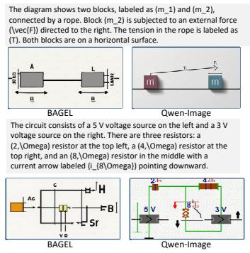  
d) Towards Physics-Faithful Generation of Scientific Diagrams

## b) Understanding-Generation Inconsistency

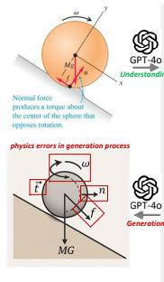

The diagram shows a sphere rol ing on a supporting surface, rotating with angular velocity (\omega) in the sense indicated by the curved arrow above it, with (x)- and (y)- axes drawn through the sphere's center. The weight (Mg) acts vertical y downward at the <sup>ng</sup> center and the friction force (f) acts along the surface at the contact region. The normal force (n) acts perpendicular to the contact surface, but its point of application is not directly below the center: it is displaced forward in the direction of motion, so the line of action of (n) does not pass through the center. The normal force therefore has a nonzero moment arm and exerts a torque about the sphere's center directed opposite to (\omega), which opposes the rotation.n This is the origin of rol ing resistance, and it il ustrates the more general principle that a force produces a torque about a point whenever its line of action misses that point.

## c) Unreliable evaluators for scientific image generation.

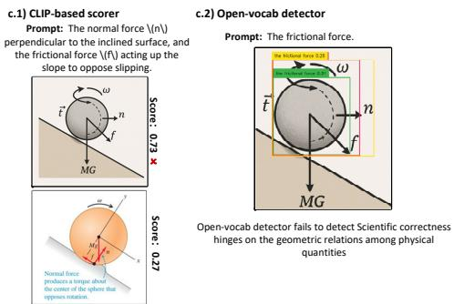  
The higher score (0.73) goes to the image with the wrong friction direction.

Structured Physical Chain-of-Thought (SP-CoT): keeps data construction, captioning, training, and evaluation structured, finitely describable, and extensible.  
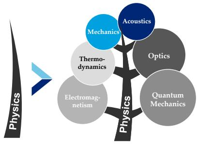

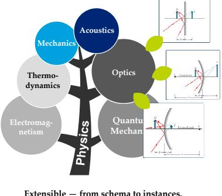

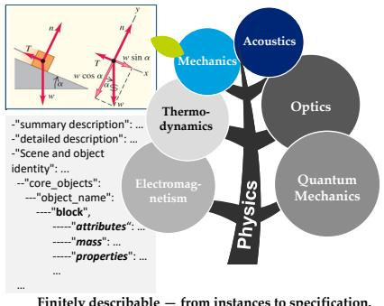  
Figure 1 | Several challenges to physics-faithful scientific-diagram generation, and our approach. (a) State-of-the-art multimodal generators produce diagrams that violate basic physics, such as mislabeled forces or incorrect circuit topology. (b) The failure is generative rather than perceptual: a model that correctly describes the physics of a scene still generates it incorrectly. (c) Appearance-based evaluation is unreliable in this setting, a CLIP-style scorer prefers the physically incorrect image (c.1), and an open-vocabulary detector cannot verify the geometric relations that determine correctness (c.2). (d) Structured Physical Chain-of-Thought (SP-CoT) addresses both problems by keeping data construction, annotation, training, and evaluation structured, finitely describable, and extensible.

be reasoned. Each subdiscipline designates exactly two steps as strictly faithful to the image, chosen according to where its physics is visually carried (Table 1): in mechanics, object identification (Step 1) and force analysis (Step 3); in thermodynamics, state identification (Step 2) and the visualized process path (Step 3); in acoustics, scene identification (Step 1) and the system components (Step 2); and in electromagnetism, physical optics, and quantum mechanics, component or source identification (Step 2) together with the structural layout of Step 3 (circuit topology or field distribution, the optical path, and the spatial regions or basis states, respectively). For these steps the annotator may record only elements that are explicitly drawn, and may not invent any object, force, or state that is not visible. The remaining steps may be inferred by physical reasoning when they can be logically deduced from the drawn elements. When information is missing it must be encoded as an empty string or list rather than guessed. All mathematics is required to be valid LAT X, giving a consistent, renderable, machine-parseable representation that the automatic evaluator of Section 2.6 reuses directly. This visible/inferred split is what makes the annotations trustworthy: grounded fields can be checked against the pixels, while inferred fields capture the physics the diagram is meant to teach. We state the schema precisely in Section S1.3: each field $f = ( \kappa _ { f } , \nu _ { f } )$ carries a type type(�) ∈ {ent, rel, val} (entity, relation, or value) and a grounding $g ( f ) \in \{ \mathsf { v i s } , \mathsf { i n f } \}$ , and a valid annotation of an image � obeys the fidelity rule

$$
g ( f ) = { \mathsf { v i s } } \implies \nu _ { f } \in \mathrm { d r a w n } ( x ) ,\tag{1}
$$

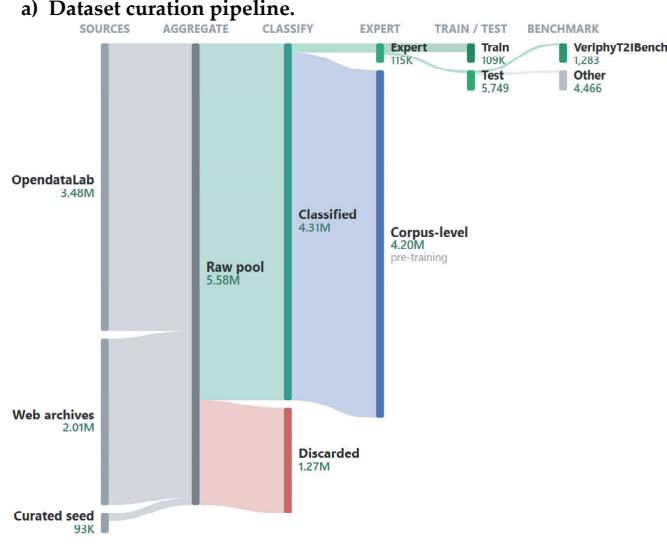

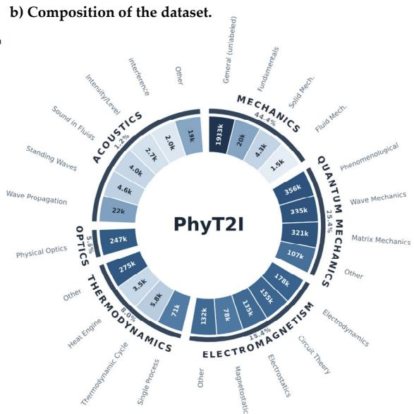  
c) Overview of the Pretrain, SFT, and Evaluation via the Structured Physical Chain-of-Thought (SP-CoT) .

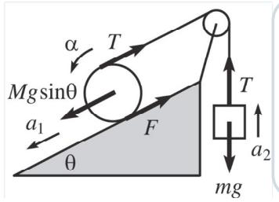

The diagram shows a block on an inclined plane with angle \ ( \theta \), connected by a rope over a pulley to a hanging mass. The forces acting on the block include \( Mg\sin\ theta \), tension \( T \), and friction \( F \). The block has an acceleration \( a\_1 \) down the incline. The hanging mass experiences gravitational force \( mg \), tension \( T \), and has an upward acceleration \( a\_2 \). The pulley has an angular acceleration \( \alpha \).

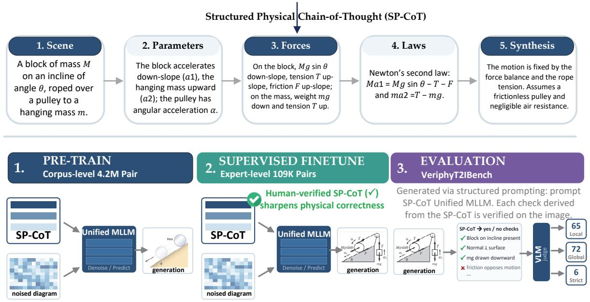  
Figure 2 | Overview of Princigram: data construction, structured supervision, and training–evaluation.

so every visible field must name an element actually drawn. The complete per-subdiscipline templates are given in Section S2.

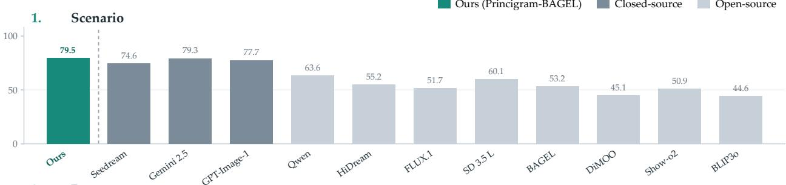

2. Parameters  
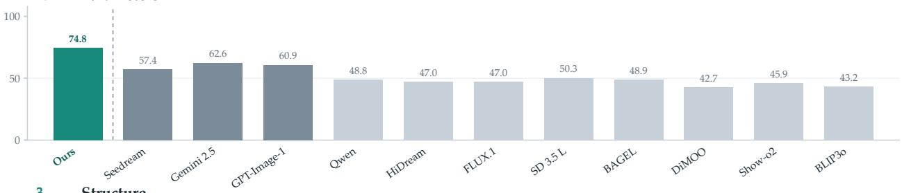  
3. Structure

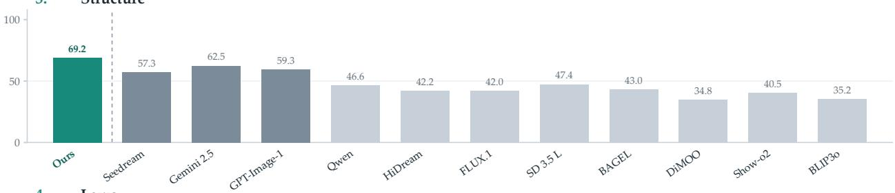

4. Laws  
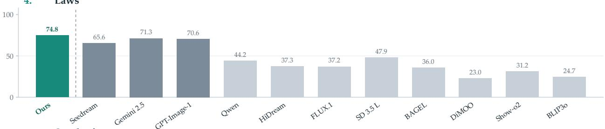

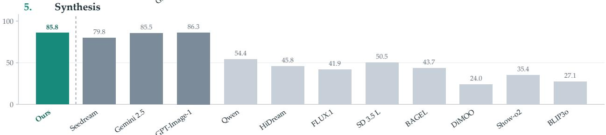  
Figure 3 | Per-step faithfulness across the five SP-CoT schema steps (Scenario, Parameters, Structure, Laws, Synthesis). Princigram-BAGEL (teal) is compared against closed- and open-source models.

## 2.2. A large-scale corpus of physics diagrams

We scope the first version of Princigram to physics, organized into six subdisciplines: mechanics, electromagnetism, physical optics, thermodynamics, acoustics, and quantum mechanics. Physics is an ideal first domain: its diagrams are governed by a small set of well-understood laws, which makes “faithfulness” precisely definable and gives a clear target for both annotation and evaluation.

Table 1 | The unified five-step schema, instantiated across the six physics subdisciplines. The column headings abbreviate the five steps: Scenario, identification of the scene, system, or phenomenon; Parameters, the state or parameterization; Structure, the interaction or structural analysis; Laws, the coordinate system and governing laws; and Synthesis. Cells marked <sup>†</sup> are constrained to be strictly faithful to the image: only elements explicitly drawn may be recorded there. The unmarked cells may be physically inferred from the drawn elements. Every subdiscipline grounds exactly two steps, but which two depends on where its physics is visually carried: mechanics grounds the drawn force arrows, thermodynamics the plotted states and process path, and the field subdisciplines the components and the structural or geometric layout that relates them.
<table><tr><td rowspan=1 colspan=7>Subdiscipline         1. Scenario     2. Parameters  3. Structure    4. Laws          5. Synthesis</td></tr><tr><td rowspan=2 colspan=7>Mechanics              Objects &amp;        Motion state,    Force analysis  Coordinate sys- Key relation-ship, assump-</td></tr><tr><td rowspan=1 colspan=4></td><td rowspan=1 colspan=2>tem, Newton's</td></tr><tr><td rowspan=1 colspan=4>constraints†      ables</td><td rowspan=1 colspan=2>laws</td><td rowspan=1 colspan=1>tions</td></tr><tr><td rowspan=1 colspan=6>Electromagnetism    Sub-domain,    Components    Circuit topol-    Conventions,</td><td rowspan=1 colspan=1>Key relation-</td></tr><tr><td rowspan=1 colspan=2></td><td rowspan=1 colspan=2>problem type   &amp; sources,</td><td rowspan=1 colspan=2>ogy / field       Kirchhoff /</td><td rowspan=4 colspan=1>ship, assump-tionsKey relation-</td></tr><tr><td rowspan=3 colspan=2>Physical optics</td><td rowspan=1 colspan=1></td><td rowspan=1 colspan=2>parameters†</td><td rowspan=1 colspan=1>distribution,</td><td rowspan=1 colspan=1>Maxwell laws</td></tr><tr><td rowspan=1 colspan=2></td><td rowspan=1 colspan=1>state†</td><td rowspan=1 colspan=1></td></tr><tr><td rowspan=1 colspan=2>Phenomenon    Components</td><td rowspan=1 colspan=2>Optical path,    Principles, con-</td></tr><tr><td rowspan=1 colspan=2></td><td rowspan=1 colspan=2>type (interfer-  &amp; parameters</td><td rowspan=1 colspan=2>path &amp; phase   dition equa-</td><td rowspan=1 colspan=1>ship, assump-</td></tr><tr><td rowspan=1 colspan=4>ence, ...)        (λ, d, a, L)†</td><td rowspan=1 colspan=1>difference†</td><td rowspan=1 colspan=1>tions</td><td rowspan=1 colspan=1>tions</td></tr><tr><td rowspan=1 colspan=4>Thermodynamics     System defini-  Thermodynamic P</td><td rowspan=1 colspan=2>rocess path    Governing</td><td rowspan=1 colspan=1>Key findings,</td></tr><tr><td rowspan=1 colspan=4>tion, problem   states $P , V , T ^ { \dagger }$ </td><td rowspan=1 colspan=2>&amp; energy         laws, equations</td><td rowspan=3 colspan=1>assumptionsKey relation-</td></tr><tr><td rowspan=2 colspan=4>typeAcoustics               Scene &amp; phe-    Components</td><td rowspan=1 colspan=2>transfer†</td></tr><tr><td rowspan=1 colspan=1>Geometry &amp;</td><td rowspan=1 colspan=1>Conventions,</td></tr><tr><td rowspan=1 colspan=3>nomenon (e.g.</td><td rowspan=1 colspan=1>&amp; parameters</td><td rowspan=1 colspan=1>wave analysis</td><td rowspan=1 colspan=1>principles,</td><td rowspan=1 colspan=1>ship, assump-</td></tr><tr><td rowspan=1 colspan=2></td><td rowspan=1 colspan=2>Doppler)†         $( f _ { s } , \upsilon _ { o } , c ) ^ { \dagger }$ </td><td rowspan=1 colspan=1></td><td rowspan=1 colspan=1>equations</td><td rowspan=1 colspan=1>tions</td></tr><tr><td rowspan=1 colspan=2>Quantum mechanics</td><td rowspan=1 colspan=1>Formalism, sce-</td><td rowspan=1 colspan=1>Hamiltonian</td><td rowspan=1 colspan=1>Boundary con-</td><td rowspan=1 colspan=1>Evolution &amp;</td><td rowspan=1 colspan=1>Key phenom-</td></tr><tr><td rowspan=1 colspan=7>ena, assump-of freedom      parameters†     &amp; eigenstates†   equations        tions</td></tr></table>

We combine four complementary sources, trading scale against precision: a manually curated gold seed of high-quality, unambiguous diagrams selected against an explicit source-selection principle; large-scale mining from OpenDataLab [45]; targeted crawling of physics references from public web archives; and a procurement pipeline for high-resolution original English-language physics textbooks (high-school through graduate level), governed by a formal requirements-and-acceptance specification covering format, scope, and language. After de-duplication, resolution filtering, and a subdiscipline classifier that routes each image to one of the six domains and discards non-physics content, these sources yield roughly 4.3 million physics images, every one of which is structurally annotated with the framework of Section 2.1 (Figure 2a, Table 2). The corpus is distributed very unevenly across subdisciplines, reflecting how often each is drawn: mechanics and quantum mechanics together account for more than two thirds of it, whereas optics is comparatively rare (Figure 2b, Methods, Section S1.1).

We annotate at two levels, because the two uses of the data have diferent quality requirements. Annotation at corpus scale gives the breadth needed to associate physics-structured text with faithful pixels across every subdiscipline. On top of it, a high-quality subset of 115,037 images receives expert-level annotation, which is what supervision on physical correctness, and any evaluation of it, must rest on (Table 2). This second tier deliberately re-weights the corpus toward the subdisciplines with the richest diagrammatic conventions: electromagnetism and mechanics, rather than the corpus leaders, contribute the most expert-annotated pairs, and optics, the rarest subdiscipline in the corpus, is lifted from 1% of the corpus to 7% of the expert tier. Within the expert tier we hold out a test split of 5,749 pairs and use the remaining 109,288 for training. A balanced 1,283-item subset of the held-out split forms VeriphyT2IBench, the benchmark evaluated in Section 2.5.

Table 2 | Corpus and annotation statistics per subdiscipline. The corpus is annotated at two levels. Full corpus counts every image retained after de-duplication, resolution filtering, and subdiscipline classification. All of these carry a structured annotation produced with the framework of Section 2.1. Expert-level counts the subset whose annotations are additionally expert-grade, and which is partitioned into a training set (Train) and a held-out Test set. VeriphyT2IBench is a balanced subset of Test used as the evaluation benchmark (Section 2.5). Counts are numbers of images.
<table><tr><td rowspan="2">Subdiscipline</td><td>Full corpus</td><td colspan="4">Expert-level subset</td></tr><tr><td>Structured</td><td>Total</td><td>Train</td><td></td><td>Test VeriphyT2IBench</td></tr><tr><td>Mechanics</td><td>1,938,649</td><td>27,583</td><td>26,204</td><td>1,379</td><td>300</td></tr><tr><td>Electromagnetism</td><td>240,025</td><td>41,927</td><td>39,831</td><td>2,096</td><td>173</td></tr><tr><td>Physical optics</td><td>48,282</td><td>8,419</td><td>7,999</td><td>420</td><td>168</td></tr><tr><td>Thermodynamics</td><td>346,904</td><td>9,026</td><td>8,575</td><td>451</td><td>163</td></tr><tr><td>Acoustics</td><td>641,477</td><td>6,489</td><td>6,165</td><td>324</td><td>320</td></tr><tr><td>Quantum mechanics</td><td>1,098,529</td><td>21,593</td><td>20,514</td><td>1,079</td><td>159</td></tr><tr><td>Total</td><td>4,313,866</td><td>115,037</td><td>109,288</td><td>5,749</td><td>1,283</td></tr></table>

## 2.3. Princigram generates physics-faithful diagrams

Princigram is built on a unified multimodal backbone [24] that handles both multimodal understanding and image generation within a single model, so that text and image tokens are processed jointly. We adopt this unified design because structured-annotation supervision is most efective when the same model that reasons over the physics also renders the diagram. The model is trained in two stages, which draw on the two annotation levels of Table 2: pre-training on (structured-annotation, image) pairs from the full corpus, to associate physics-structured text with faithful pixels at breadth, and supervised fine-tuning on the expert-level subset, to align the model with natural-language use and sharpen physical correctness. Both stages optimize the same subdiscipline-balanced objective on the serialized annotation, and the backbone enters only through its generative loss (a rectifiedflow loss for BAGEL, a masked-difusion loss for Lumina-DiMOO [22]), which is precisely why the same supervision transfers across backbones (Section S1.3). At inference time we close the gap between short user prompts and the structured conditioning the model was trained on with an SP-CoT (“thinking”) pipeline: a language model first expands the raw prompt into the subdiscipline schema, and Princigram then generates conditioned on the populated schema. Architecture, training recipe, and the inference pipeline are detailed in Sections S1.3 to S1.5.

Qualitatively, Princigram produces diagrams whose drawn elements are consistent with the stated physics (forces with correct directions and sources, process paths with the correct shape on a �� diagram, and wavefronts consistent with the depicted phenomenon), where generic baselines produce plausible-looking but physically inconsistent figures. Side-by-side comparisons against a broad suite of open and closed generators are shown per subdiscipline in Section S3.1, and an ablation that isolates the structured supervision in Section S3.3.

Table 3 | GenExam Physics subjects results. Per-subject columns report the relaxed score (%) for each of the six physics topics: Circuits (circuit analysis), E&M (electromagnetism), Mech. (mechanics), Optics, QM (quantum mechanics), and Thermo. (thermodynamics). Strict and Relaxed are the two aggregate scoring modes of the GenExam MLLM judge: strict requires all scoring points to be satisfied, while relaxed awards partial credit. All scores are percentages, higher is better. Per column, the best value is in bold and the second best is underlined.
<table><tr><td rowspan="2">Model</td><td colspan="6">Per-subject (relaxed)</td><td colspan="2">Overall</td></tr><tr><td>Circuits</td><td>E&amp;M</td><td>Mech.</td><td>Optics</td><td>QM</td><td>Thermo.</td><td>Strict</td><td>Relaxed</td></tr><tr><td>Seedream 4.0 [46]</td><td>36.8</td><td>60.0</td><td>47.4</td><td>66.2</td><td>60.1</td><td>50.6</td><td>3.5</td><td>49.0</td></tr><tr><td>FLUX.1 Kontext max [14]</td><td>14.5</td><td>29.3</td><td>33.1</td><td>38.3</td><td>35.7</td><td>17.7</td><td>0.0</td><td>25.6</td></tr><tr><td>Qwen-Image [15]</td><td>14.7</td><td>35.1</td><td>37.7</td><td>28.8</td><td>28.6</td><td>22.9</td><td>0.0</td><td>26.3</td></tr><tr><td>HiDream-I1-Full [16]</td><td>8.8</td><td>26.0</td><td>23.6</td><td>24.8</td><td>25.1</td><td>8.2</td><td>0.0</td><td>17.7</td></tr><tr><td>FLUX.1 dev [14]</td><td>9.7</td><td>19.1</td><td>11.4</td><td>36.0</td><td>20.7</td><td>14.0</td><td>0.0</td><td>14.4</td></tr><tr><td>SD 3.5 Large [13]</td><td>5.0</td><td>19.1</td><td>16.8</td><td>21.5</td><td>26.9</td><td>3.4</td><td>0.0</td><td>13.2</td></tr><tr><td>BAGEL [24]</td><td>7.2</td><td>24.6</td><td>14.0</td><td>20.7</td><td>24.1</td><td>5.1</td><td>0.0</td><td>13.8</td></tr><tr><td>Show-o2-7B [21]</td><td>4.6</td><td>18.2</td><td>16.2</td><td>19.0</td><td>19.5</td><td>7.5</td><td>0.0</td><td>11.9</td></tr><tr><td>BLIP3o-NEXT-GRPO-Text-3B [47]</td><td>3.7</td><td>20.9</td><td>15.6</td><td>7.9</td><td>13.3</td><td>7.8</td><td>0.0</td><td>10.5</td></tr><tr><td>Princigram-DiMOO</td><td>31.5</td><td>58.7</td><td>65.8</td><td>68.5</td><td>48.0</td><td>49.8</td><td>8.0</td><td>50.4</td></tr><tr><td>Princigram-BAGEL</td><td>42.4</td><td>72.2</td><td>60.0</td><td>76.8</td><td>43.8</td><td>49.6</td><td>5.3</td><td>54.8</td></tr></table>

## 2.4. Benchmarking physical faithfulness on GenExam

We evaluate on the physics subset of GenExam [44], a multidisciplinary T2I “exam” benchmark that pairs each prompt with a ground-truth reference and fine-grained scoring points and uses an MLLM judge to produce strict and relaxed scores. The subset is organized by its own subject taxonomy: circuits, electromagnetism, mechanics, optics, quantum mechanics, and thermodynamics. We compare against a broad suite of open and closed models, and report Princigram on two backbones, BAGEL and Lumina-DiMOO (which we abbreviate DiMOO). On the full GenExam benchmark, open models score near zero under strict scoring and only modestly under relaxed scoring [44], which sets the dificulty of the physics subset in context. Table 3 reports per-subject and aggregate scores under the structured-prompt protocol (Methods, Section S1.7).

## 2.5. VeriphyT2IBench: structured, per-attribute evaluation

GenExam provides a common external yardstick, but a single judge score cannot say which physical attribute a diagram gets wrong. We therefore introduce VeriphyT2IBench, an in-house benchmark of 1,283 held-out, structurally annotated diagrams balanced across the six subdisciplines (Table 2, Methods, Section S1.8).

What distinguishes VeriphyT2IBench is not the use of a judge (like GenExam, it scores generations with a vision–language model) but that the questions the judge answers are derived from each item’s structured annotation rather than authored separately. Every diagram’s annotation is compiled into an item-specific bank of binary (yes/no) questions: a rule-generated local bank that enumerates the drawn objects, forces, states and their attributes (existence, relation and direction, and value questions), and a small model-generated global bank of whole-diagram questions. The judge (GPT-4o) is shown only the generated image and the questions, never the gold answers, and answers each “Yes” or “No”. Each answer is then matched against the gold answer stored with the question, so a score decomposes into named physical facts (“normal force present: yes; the �� sin � component drawn: no”) rather than a single opaque number. Two properties follow.

The question list is dynamic and item-specific. An item receives as many local questions as its physics is rich: a single block on an incline yields on the order of a dozen, whereas a dense optical figure or a multi-stage thermodynamic cycle yields dozens to over a hundred, covering every object, state, process and direction. No two items share a question list, and the length of an item’s local list is a direct, annotation-derived measure of how much its diagram must get right. We use exactly this quantity to define the dificulty tertiles analysed below. A benchmark with a fixed question format cannot express this, because the number of things that can go wrong in a physics diagram is a property of the physics, not of the test designer.

The gold answers are grounded in expert-verified annotations. Because VeriphyT2IBench is drawn from the expert-level tier (Methods, Section S1.1), its questions and their gold answers come from annotations a human expert has checked against the diagram, not from labels accepted as a model produced them.

We report three scoring modes. Local and Global scoring are the judge’s accuracy, the fraction of questions answered correctly, on the local and global banks respectively. Because the local bank enumerates individual physical facts while the global bank asks a few whole-diagram questions, Local is the more demanding of the two and every model scores lower under it. Strict scoring (Table 6) instead counts an item as correct only if its fraction of wrong answers stays within a per-item tolerance $\tau \in \{ 0 \% , 5 \% , 1 0 \% \}$ on the local bank. $\mathrm { A t } \tau = 0 \%$ every question of the item must be answered correctly, so it reports the fraction of items answered perfectly. Writing $c _ { q } = \mathbf { 1 } [ J ( \hat { x } , q ) = y _ { q } ]$ for whether the judge � answers question � correctly on a generation �ˆ against its gold answer $y _ { q }$ (Section S1.3),

$$
\operatorname { L o c a l } ( \hat { x } ) = \frac { 1 } { | Q _ { \log } | } \sum _ { q \in Q _ { \log } } c _ { q } , \qquad \operatorname { S t r i c t } _ { \tau } ( \hat { x } ) = \mathbf { 1 } \Big [ \sum _ { q \in Q _ { \log } } ( 1 - c _ { q } ) \ \leq \ \tau \left| Q _ { \log } \right| \Big ] ,\tag{2}
$$

with Global defined like Local over the global bank $Q _ { g \mathrm { l o } }$

Main results. Table 4 reports per-subject and overall scores in both modes. Princigram built on BAGEL attains the best overall score under both modes, 75.69 Local and 82.54 Global, and is the best model on every subject under Global scoring and on five of the six subjects under Local scoring. The exception is optics, where the closed reference systems Gemini 2.5 Flash Image (82.33) and GPT-Image-1 (79.54) remain ahead of our 78.92. Princigram built on DiMOO is second almost everywhere under Global scoring and on four of six subjects under Local scoring. The most informative comparison is against the unmodified backbone: BAGEL alone scores 46.38 Local and 62.15 Global, so training on the structured annotations adds 29.31 points Local and 20.39 points Global without changing the architecture. Among open-weight baselines the strongest are Qwen-Image at 51.79 Local and BAGEL itself at 62.15 Global, which Princigram exceeds by 23.90 and 20.39 points. The closed reference systems are considerably stronger: the best of them reach 69.98 Local (Gemini 2.5 Flash Image) and 68.56 Global (GPT-Image-1), and Princigram still leads them by 5.71 and 13.98 points despite a 14B open backbone. The gains are not confined to one subdiscipline. Thermodynamics is the hardest subject for every model, where the best baseline reaches only 58.90 Local and no open-weight baseline exceeds 32.91, yet Princigram reaches 66.95.

Per-step faithfulness. Decomposing the same evaluation by the five SP-CoT steps (Figure 3) shows where the gain is concentrated. Princigram is the strongest system on four of the five steps (79.5 Scenario, 74.8 Parameters, 69.2 Structure, and 74.8 Laws) and within half a point of the best on the fifth, scoring 85.8 on Synthesis against GPT-Image-1’s 86.3. Its separation from the strong closed reference systems falls almost entirely on the three intermediate reasoning steps, where it leads the best closed model by 12.2 points on Parameters, 6.7 on Structure and 3.5 on Laws, while on the two appearance-anchored endpoints (Scenario and Synthesis) those systems are level. Against open-weight models the margin is far larger and widens toward the reasoning steps. On Laws, the step that most requires inferring a coordinate system and governing equations rather than reading them of the page, Princigram reaches 74.8 where the best open-weight baseline manages only 47.9 and several fall to 23–37. The comparison against the unmodified backbone is sharpest of all: structured supervision lifts BAGEL on every step, by roughly 26 points on Scenario, Parameters and Structure, and by 38.8 and 42.1 on Laws (36.0→74.8) and Synthesis (43.7→85.8). The advantage is thus concentrated, as intended, on the steps that demand physical reasoning rather than surface appearance.

Efect of prompt dificulty. Table 5 splits each subject by prompt dificulty, where dificulty is the number of QA checks an item carries and therefore the number of physical constraints the diagram must satisfy. Every model degrades from Easy to Hard, but by very diferent amounts, and the ordering of the three groups is consistent: the open-weight baselines collapse, the closed reference systems hold up considerably better, and Princigram degrades least. Thermodynamics is the clearest case. The best open-weight baseline falls from 61.33 on Easy to 27.40 on Hard, the best closed system from 67.66 to 53.13, while Princigram falls only from 72.13 to 64.99. Its margin over the best baseline at each level therefore widens from 4.47 points on Easy to 11.86 points on Hard. In acoustics the same widening appears more sharply still, from 1.27 points on Easy to 14.06 on Hard. In optics and acoustics Princigram is essentially flat across the three levels, and its Hard score even exceeds its Easy score, 80.44 against 79.01 in optics and 77.39 against 71.13 in acoustics. Structured supervision therefore helps most where the physics is most constrained, which is precisely what the framework is designed to do. Optics is the one subject that resists this pattern: Gemini 2.5 Flash Image leads at every dificulty level and is itself nearly flat (83.21 to 82.32), suggesting that the optical-path constraints our schema encodes are the ones a strong general system is already most likely to satisfy.

Strict scoring. The scores above award partial credit. Table 6 instead scores an item as correct only if the fraction of its local questions the judge answers wrongly stays within a per-item tolerance �, reported at � ∈ {0%, 5%, 10%}. Under a zero tolerance (� = 0%, every question of the item correct) every model scores 0.00 on every subject except electromagnetism, where Gemini 2.5 Flash Image, GPT-Image-1, and Princigram alike reach only 0.31, so no current system reliably produces a diagram whose every checked attribute is right. Tolerating 5% and 10% of the questions wrong separates the models, and Princigram leads every column but one, reaching 25.62 on electromagnetism at � = 10% against 14.47 for the best baseline. The exception is again optics at � = 10%, where Gemini 2.5 Flash Image reaches 18.45 against our 9.52. Even so, the absolute numbers stay low across the board, which shows that fully faithful scientific-diagram generation is far from solved and that our gains, though large in relative terms, leave substantial headroom.

## 2.6. Automatic faithfulness evaluation

The per-attribute scores of Section 2.5 are produced automatically, with no human in the loop at scoring time, and the evaluator reuses the annotation directly rather than asking a general judge for one holistic verdict. Each item’s structured analysis is compiled by rule into the local yes/no checklist, a vision–language model adds a small global checklist, and an of-the-shelfjudge model answers every question about the generated image. Faithfulness is then reported as named per-attribute outcomes (e.g. “normal force present and correctly directed: yes; the �� sin � component drawn: no”) rather than a single opaque number (Methods, Section S1.9). Because the annotation is already typed and machine-parseable, the checklist is built without training a bespoke extractor: the judge is the only learned component, and it never sees the gold answers. The schema’s visible/inferred split further tags each check as grounded or inferred, a distinction the current equal-weight scoring does not yet use but that a future weighted or preference-based score could.

Table 4 | VeriphyT2IBench main results. Per-subject columns report the score (%) for each of the six physics topics: E&M (electromagnetism), Mech. (mechanics), Optics, QM (quantum mechanics), Thermo. (thermodynamics), and Acou. (acoustics). Local and Global are the judge’s yes/no accuracy on VeriphyT2IBench’s two question banks: the rule-generated local bank of per-attribute (object/- force/state) questions, and the model-generated global bank of whole-diagram questions. Overall is the aggregate over the six subjects under the corresponding mode. All scores are percentages, higher is better. Within each mode, the best value per column is in bold and the second best is underlined.
<table><tr><td></td><td colspan="6">Per-subject</td><td></td></tr><tr><td>Model</td><td>E&amp;M</td><td>Mech.</td><td>Optics</td><td>QM</td><td>Thermo.</td><td>Acou.</td><td>Overall</td></tr><tr><td colspan="8">Local scoring</td></tr><tr><td>Seedream 4.0 [46]</td><td>65.55</td><td>56.19</td><td>77.81</td><td>69.67</td><td>42.91</td><td>62.42</td><td>64.80</td></tr><tr><td>Gemini 2.5 Flash Image [48]</td><td>67.75</td><td>61.63</td><td>82.33</td><td>73.27</td><td>58.90</td><td>68.44</td><td>69.98</td></tr><tr><td>GPT-Image-1 [49]</td><td>69.58</td><td>60.25</td><td>79.54</td><td>71.35</td><td>49.24</td><td>66.88</td><td>68.32</td></tr><tr><td>Qwen-Image [15]</td><td>47.05</td><td>43.20</td><td>73.06</td><td>47.18</td><td>32.91</td><td>52.31</td><td>51.79</td></tr><tr><td>HiDream-I1-Full [16]</td><td>45.26</td><td>41.44</td><td>55.51</td><td>49.75</td><td>29.34</td><td>50.20</td><td>46.48</td></tr><tr><td>FLUX.1 dev [14]</td><td>48.89</td><td>40.25</td><td>54.60</td><td>40.05</td><td>23.72</td><td>46.04</td><td>45.18</td></tr><tr><td>SD 3.5 Large [13]</td><td>51.49</td><td>48.96</td><td>64.81</td><td>45.34</td><td>30.83</td><td>51.89</td><td>51.65</td></tr><tr><td>BAGEL [24]</td><td>43.51</td><td>44.85</td><td>51.66</td><td>51.03</td><td>31.57</td><td>54.18</td><td>46.38</td></tr><tr><td>DiMOO [22]</td><td>31.95</td><td>35.09</td><td>45.06</td><td>41.39</td><td>22.41</td><td>45.37</td><td>37.01</td></tr><tr><td>Show-02-7B [21]</td><td>36.79</td><td>41.22</td><td>53.97</td><td>44.43</td><td>31.38</td><td>46.48</td><td>42.88</td></tr><tr><td>BLIP3o-NEXT-GRPO-Text-3B [47]</td><td>36.36</td><td>36.02</td><td>41.68</td><td>45.36</td><td>22.44</td><td>41.46</td><td>37.65</td></tr><tr><td>Princigram-DiMOO</td><td>76.00</td><td>68.24</td><td>75.64</td><td>73.41</td><td>60.40</td><td>68.39</td><td>72.05</td></tr><tr><td>Princigram-BAGEL</td><td>78.59</td><td>71.59</td><td>78.92</td><td>77.59</td><td>66.95</td><td>73.01</td><td>75.69</td></tr><tr><td colspan="8">Global scoring</td></tr><tr><td>Seedream 4.0 [46]</td><td>59.94</td><td>66.00</td><td>75.83</td><td>58.99</td><td>66.82</td><td>66.38</td><td>65.07</td></tr><tr><td>Gemini 2.5 Flash Image [48]</td><td>61.13</td><td>65.48</td><td>77.14</td><td>60.75</td><td>67.63</td><td>69.45</td><td>66.14</td></tr><tr><td>GPT-Image-1 [49]</td><td>64.69</td><td>68.83</td><td>77.38</td><td>61.76</td><td>72.60</td><td>68.96</td><td>68.56</td></tr><tr><td>Qwen-Image [15]</td><td>55.94</td><td>60.53</td><td>72.62</td><td>51.82</td><td>63.01</td><td>60.37</td><td>60.20</td></tr><tr><td>HiDream-I1-Full [16]</td><td>54.19</td><td>58.67</td><td>66.31</td><td>52.58</td><td>59.65</td><td>58.90</td><td>57.96</td></tr><tr><td>FLUX.1 dev [14]</td><td>52.06</td><td>57.73</td><td>64.17</td><td>51.32</td><td>55.72</td><td>59.51</td><td>56.32</td></tr><tr><td>SD 3.5 Large [13]</td><td>56.06</td><td>60.53</td><td>68.21</td><td>52.96</td><td>61.62</td><td>60.12</td><td>59.58</td></tr><tr><td>BAGEL [24]</td><td>56.38</td><td>61.07</td><td>68.81</td><td>60.38</td><td>64.05</td><td>68.34</td><td>62.15</td></tr><tr><td>DiMOO [22]</td><td>50.62</td><td>58.20</td><td>59.88</td><td>54.47</td><td>56.53</td><td>59.02</td><td>55.95</td></tr><tr><td>Show-o2-7B [21]</td><td>53.52</td><td>59.33</td><td>66.59</td><td>55.67</td><td>60.35</td><td>58.62</td><td>58.44</td></tr><tr><td>BLIP3o-NEXT-GRPO-Text-3B [47]</td><td>52.00</td><td>57.87</td><td>60.12</td><td>54.97</td><td>57.23</td><td>58.65</td><td>56.35</td></tr><tr><td>Princigram-DiMOO</td><td>76.18</td><td>80.47</td><td>79.64</td><td>71.07</td><td>77.46</td><td>76.81</td><td>77.25</td></tr><tr><td>Princigram-BAGEL</td><td>80.56</td><td>83.40</td><td>83.93</td><td>83.77</td><td>83.47</td><td>81.23</td><td>82.54</td></tr><tr><td></td><td></td><td></td><td></td><td></td><td></td><td></td><td></td></tr></table>

## 3. Discussion

We have shown that the principal obstacle to generating physically faithful scientific diagrams is a supervision gap, not an architectural one, and that it can be closed by making the physics behind each diagram an explicit chain of reasoning. By replacing flat captions with SP-CoT, a unified multistep chain that separates what is visually grounded from what is physically inferred and types all mathematics symbolically, we obtain supervision that is dense, auditable, and aligned across six physics subdisciplines, and a generator, Princigram, that produces diagrams more consistent with the underlying physics than generic baselines.

Table 5 | VeriphyT2IBench results by prompt dificulty level. Per-subject scores (%) are split into Easy / Medium / Hard prompts for each of the six physics subjects (E&M, Mechanics, Optics, Quantum Mechanics, Thermodynamics, and Acoustics). The dificulty of each item is measured by the length of its QA list, the number of question and answer checks in its structured annotation. Within each subdiscipline, items are partitioned into Easy, Medium, and Hard by the tertiles of this QA count: the bottom, middle, and top third. A longer QA list implies more physical constraints to satisfy, and hence a more complex diagram that is harder to generate faithfully, so Hard collects the items with the most QA checks. Higher is better. Per column, the best value is in bold and the second best is underlined.
<table><tr><td></td><td colspan="3">E&amp;M</td><td colspan="3">Mechanics</td><td colspan="3">Optics</td></tr><tr><td>Model</td><td>Easy</td><td>Med.</td><td>Hard</td><td>Easy</td><td>Med.</td><td>Hard</td><td>Easy</td><td>Med.</td><td>Hard</td></tr><tr><td>Seedream 4.0 [46]</td><td>75.32</td><td>68.70</td><td>53.89</td><td>66.08</td><td>58.97</td><td>50.67</td><td>80.81</td><td>76.11</td><td>76.36</td></tr><tr><td>Gemini 2.5 Flash Image [48]</td><td>80.56</td><td>71.33</td><td>54.34</td><td>67.84</td><td>61.79</td><td>58.73</td><td>83.21</td><td>80.51</td><td>82.32</td></tr><tr><td>GPT-Image-1 [49]</td><td>80.41</td><td>72.64</td><td>57.29</td><td>68.19</td><td>62.82</td><td>55.70</td><td>81.79</td><td>79.34</td><td>77.48</td></tr><tr><td>Qwen-Image [15]</td><td>63.36</td><td>49.30</td><td>34.06</td><td>61.04</td><td>45.78</td><td>35.12</td><td>75.05</td><td>71.93</td><td>72.22</td></tr><tr><td>HiDream-I1-Full [16]</td><td>60.27</td><td>45.88</td><td>34.75</td><td>59.13</td><td>42.33</td><td>34.80</td><td>60.05</td><td>59.93</td><td>49.59</td></tr><tr><td>FLUX.1 dev [14]</td><td>58.95</td><td>51.78</td><td>39.05</td><td>58.17</td><td>41.89</td><td>32.94</td><td>61.71</td><td>56.96</td><td>47.97</td></tr><tr><td>SD 3.5 Large [13]</td><td>67.20</td><td>53.32</td><td>38.45</td><td>62.25</td><td>51.59</td><td>41.95</td><td>66.97</td><td>68.73</td><td>60.29</td></tr><tr><td>BAGEL [24]</td><td>61.89</td><td>45.55</td><td>29.90</td><td>60.53</td><td>48.16</td><td>37.20</td><td>63.47</td><td>56.10</td><td>40.41</td></tr><tr><td>DiMOO [22]</td><td>47.29</td><td>33.36</td><td>22.51</td><td>55.68</td><td>36.50</td><td>27.98</td><td>52.60</td><td>48.77</td><td>37.71</td></tr><tr><td>Show-o2-7B [21]</td><td>56.14</td><td>39.16</td><td>23.99</td><td>59.67</td><td>42.77</td><td>33.63</td><td>65.83</td><td>52.50</td><td>46.96</td></tr><tr><td>BLIP3o-NEXT-GRPO-Text-3B [47]</td><td>53.58</td><td>36.84</td><td>25.64</td><td>54.56</td><td>36.69</td><td>30.40</td><td>48.63</td><td>44.73</td><td>35.85</td></tr><tr><td>Princigram-DiMOO</td><td>82.11</td><td>79.35</td><td>69.09</td><td>74.41</td><td>72.28</td><td>64.74</td><td>78.05</td><td>75.60</td><td>74.17</td></tr><tr><td>Princigram-BAGEL</td><td>84.74</td><td>83.28</td><td>69.97</td><td>76.77</td><td>75.93</td><td>68.34</td><td>79.01</td><td>77.80</td><td>80.44</td></tr></table>

<table><tr><td rowspan="2">Model</td><td colspan="3">Quantum Mechanics</td><td colspan="3">Thermodynamics</td><td colspan="3">Acoustics</td></tr><tr><td>Easy</td><td>Med.</td><td>Hard</td><td>Easy</td><td>Med.</td><td>Hard</td><td>Easy</td><td>Med.</td><td>Hard</td></tr><tr><td>Seedream 4.0 [46]</td><td>70.97</td><td>70.16</td><td>64.42</td><td>64.75</td><td>53.32</td><td>34.29</td><td>64.88</td><td>65.36</td><td>58.43</td></tr><tr><td>Gemini 2.5 Flash Image [48]</td><td>74.13</td><td>74.05</td><td>67.52</td><td>66.77</td><td>67.12</td><td>53.13</td><td>69.86</td><td>72.93</td><td>63.33</td></tr><tr><td>GPT-Image-1 [49]</td><td>75.41</td><td>70.04</td><td>65.79</td><td>67.66</td><td>58.44</td><td>42.48</td><td>69.19</td><td>69.32</td><td>62.90</td></tr><tr><td>Qwen-Image [15]</td><td>54.33</td><td>49.30</td><td>39.74</td><td>61.33</td><td>40.70</td><td>24.90</td><td>57.42</td><td>51.08</td><td>50.31</td></tr><tr><td>HiDream-I1-Full [16]</td><td>56.83</td><td>49.11</td><td>44.70</td><td>55.96</td><td>35.57</td><td>22.98</td><td>56.04</td><td>51.80</td><td>45.14</td></tr><tr><td>FLUX.1 dev [14]</td><td>50.94</td><td>38.99</td><td>34.63</td><td>52.31</td><td>29.58</td><td>17.27</td><td>51.48</td><td>46.67</td><td>43.78</td></tr><tr><td>SD 3.5 Large [13]</td><td>54.81</td><td>43.42</td><td>40.98</td><td>59.99</td><td>36.12</td><td>24.22</td><td>55.94</td><td>49.37</td><td>52.21</td></tr><tr><td>BAGEL [24]</td><td>64.95</td><td>49.81</td><td>42.30</td><td>57.60</td><td>35.39</td><td>27.40</td><td>62.72</td><td>54.86</td><td>48.68</td></tr><tr><td>DiMOO [22]</td><td>52.09</td><td>39.96</td><td>37.14</td><td>50.82</td><td>26.61</td><td>17.52</td><td>50.81</td><td>48.11</td><td>41.34</td></tr><tr><td>Show-o2-7B [21]</td><td>52.70</td><td>45.56</td><td>38.82</td><td>56.71</td><td>34.79</td><td>26.88</td><td>53.04</td><td>47.27</td><td>43.74</td></tr><tr><td>BLIP3o-NEXT-GRPO-Text-3B [47]</td><td>52.17</td><td>47.32</td><td>40.03</td><td>48.88</td><td>26.25</td><td>18.67</td><td>48.45</td><td>42.93</td><td>37.96</td></tr><tr><td>Princigram-DiMOO</td><td>75.58</td><td>73.46</td><td>70.53</td><td>68.93</td><td>64.79</td><td>58.68</td><td>67.84</td><td>70.50</td><td>69.85</td></tr><tr><td>Princigram-BAGEL</td><td>81.34</td><td>78.37</td><td>75.28</td><td>72.13</td><td>73.57</td><td>64.99</td><td>71.13</td><td>73.33</td><td>77.39</td></tr></table>

Table 6 | VeriphyT2IBench strict scores on the local question bank. An item counts as correct only if the fraction of its local questions the judge answers wrongly stays within the per-item tolerance Tol.; the score is then the fraction (%) of items that pass. Tol. = 0% requires every question of the item to be answered correctly, while 5% and 10% tolerate that fraction of wrong answers per item. Results are reported for each of the six physics subjects. Higher is better. Per column, the best value is in bold and the second best is underlined; columns in which every model scores 0.00 are left unmarked.
<table><tr><td></td><td colspan="3">E&amp;M</td><td colspan="3">Mechanics</td><td colspan="3">Optics</td></tr><tr><td>Model</td><td>Tol. 0%</td><td>Tol. 5%</td><td>Tol. 10%</td><td>Tol.0%</td><td>Tol. 5%</td><td>Tol. 10%</td><td>Tol. 0%</td><td>Tol. 5%</td><td>Tol. 10%</td></tr><tr><td>Seedream 4.0 [46]</td><td>0.00</td><td>0.94</td><td>7.81</td><td>0.00</td><td>0.33</td><td>0.33</td><td>0.00</td><td>2.38</td><td>10.12</td></tr><tr><td>Gemini 2.5 Flash Image [48]</td><td>0.31</td><td>4.40</td><td>14.47</td><td>0.00</td><td>0.00</td><td>2.01</td><td>0.00</td><td>0.60</td><td>18.45</td></tr><tr><td>GPT-Image-1 [49]</td><td>0.31</td><td>2.50</td><td>11.56</td><td>0.00</td><td>0.00</td><td>1.67</td><td>0.00</td><td>2.98</td><td>10.12</td></tr><tr><td>Qwen-Image [15]</td><td>0.00</td><td>0.62</td><td>2.50</td><td>0.00</td><td>0.00</td><td>0.33</td><td>0.00</td><td>1.19</td><td>8.33</td></tr><tr><td>HiDream-I1-Full [16]</td><td>0.00</td><td>0.62</td><td>2.50</td><td>0.00</td><td>0.33</td><td>0.67</td><td>0.00</td><td>0.00</td><td>1.79</td></tr><tr><td>FLUX.1 dev [14]</td><td>0.00</td><td>0.62</td><td>2.50</td><td>0.00</td><td>0.00</td><td>0.00</td><td>0.00</td><td>0.60</td><td>1.79</td></tr><tr><td>SD 3.5 Large [13]</td><td>0.00</td><td>1.25</td><td>7.50</td><td>0.00</td><td>0.00</td><td>0.67</td><td>0.00</td><td>0.00</td><td>5.95</td></tr><tr><td>BAGEL [24]</td><td>0.00</td><td>1.88</td><td>5.31</td><td>0.00</td><td>0.00</td><td>1.00</td><td>0.00</td><td>0.60</td><td>1.79</td></tr><tr><td>DiMOO [22]</td><td>0.00</td><td>0.00</td><td>0.31</td><td>0.00</td><td>0.00</td><td>0.33</td><td>0.00</td><td>1.19</td><td>4.76</td></tr><tr><td>Show-02-7B [21]</td><td>0.00</td><td>0.32</td><td>2.86</td><td>0.00</td><td>0.00</td><td>1.34</td><td>0.00</td><td>0.00</td><td>2.99</td></tr><tr><td>BLIP3o-NEXT-GRPO-Text-3B [47]</td><td>0.00</td><td>0.00</td><td>1.88</td><td>0.00</td><td>0.00</td><td>0.33</td><td>0.00</td><td>0.00</td><td>0.00</td></tr><tr><td>Princigram-DiMOO</td><td>0.00</td><td>2.51</td><td>18.81</td><td>0.00</td><td>1.00</td><td>5.00</td><td>0.00</td><td>0.00</td><td>2.98</td></tr><tr><td>Princigram-BAGEL</td><td>0.31</td><td>7.19</td><td>25.62</td><td>0.00</td><td>1.33</td><td>5.33</td><td>0.00</td><td>3.57</td><td>9.52</td></tr></table>

<table><tr><td rowspan="2">Model</td><td colspan="3">Quantum Mechanics</td><td colspan="3">Thermodynamics</td><td colspan="3">Acoustics</td></tr><tr><td>Tol. 0%</td><td>Tol. 5%</td><td>Tol. 10%</td><td>Tol. 0%</td><td>Tol. 5%</td><td>Tol. 10%</td><td>Tol. 0%</td><td>Tol. 5%</td><td>Tol. 10%</td></tr><tr><td>Seedream 4.0 [46]</td><td>0.00</td><td>0.00</td><td>0.63</td><td>0.00</td><td>0.58</td><td>1.16</td><td>0.00</td><td>0.00</td><td>0.61</td></tr><tr><td>Gemini 2.5 Flash Image [48]</td><td>0.00</td><td>1.26</td><td>4.40</td><td>0.00</td><td>1.16</td><td>5.78</td><td>0.00</td><td>0.00</td><td>0.00</td></tr><tr><td>GPT-Image-1 [49]</td><td>0.00</td><td>0.63</td><td>1.89</td><td>0.00</td><td>0.00</td><td>3.47</td><td>0.00</td><td>0.00</td><td>0.00</td></tr><tr><td>Qwen-Image [15]</td><td>0.00</td><td>0.00</td><td>0.00</td><td>0.00</td><td>0.00</td><td>0.00</td><td>0.00</td><td>0.00</td><td>0.00</td></tr><tr><td>HiDream-I1-Full [16]</td><td>0.00</td><td>0.00</td><td>0.63</td><td>0.00</td><td>0.00</td><td>0.58</td><td>0.00</td><td>0.00</td><td>0.00</td></tr><tr><td>FLUX.1 dev [14]</td><td>0.00</td><td>0.00</td><td>0.00</td><td>0.00</td><td>0.00</td><td>1.16</td><td>0.00</td><td>0.00</td><td>0.00</td></tr><tr><td>SD 3.5 Large [13]</td><td>0.00</td><td>0.00</td><td>0.00</td><td>0.00</td><td>0.00</td><td>0.58</td><td>0.00</td><td>0.61</td><td>0.61</td></tr><tr><td>BAGEL [24]</td><td>0.00</td><td>0.00</td><td>0.63</td><td>0.00</td><td>0.00</td><td>2.89</td><td>0.00</td><td>0.00</td><td>0.61</td></tr><tr><td>DiMOO [22]</td><td>0.00</td><td>0.00</td><td>0.00</td><td>0.00</td><td>0.00</td><td>0.58</td><td>0.00</td><td>0.61</td><td>0.61</td></tr><tr><td>Show-02-7B [21]</td><td>0.00</td><td>0.00</td><td>0.00</td><td>0.00</td><td>0.00</td><td>2.91</td><td>0.00</td><td>0.63</td><td>1.26</td></tr><tr><td>BLIP3o-NEXT-GRPO-Text-3B [47]</td><td>0.00</td><td>0.00</td><td>0.00</td><td>0.00</td><td>0.00</td><td>1.16</td><td>0.00</td><td>0.61</td><td>0.61</td></tr><tr><td>Princigram-DiMOO</td><td>0.00</td><td>0.00</td><td>1.26</td><td>0.00</td><td>0.58</td><td>3.47</td><td>0.00</td><td>0.61</td><td>3.07</td></tr><tr><td>Princigram-BAGEL</td><td>0.00</td><td>1.26</td><td>7.55</td><td>0.00</td><td>3.47</td><td>9.25</td><td>0.00</td><td>1.23</td><td>6.75</td></tr></table>

## 3.1. Why structured physical supervision helps

A flat caption supervises a generator on appearance. A structured analysis supervises it on the reasoning that produces that appearance. Three properties of the framework explain the efect. First, the schema makes the latent variables of a diagram explicit (forces, states, processes, governing laws), so the training signal pushes the model toward diagrams whose drawn marks are consistent with stated physics rather than merely typical of the subdiscipline. Second, the visible/inferred split keeps the grounded fields verifiable against the pixels while still exposing the model to the physics the diagram is meant to teach, which prevents the annotations from drifting into hallucinated detail. Third, because the first and last steps of the schema are structurally identical across subdisciplines, representation is shared, and improvements in one domain (e.g. rendering a directed force arrow) transfer to analogous directed quantities in others. The same structure that improves generation also enables interpretable evaluation: the key-value form of the annotations lets an automatic evaluator report which physical attribute is right or wrong, rather than a single opaque score.

## 3.2. What a unified backbone contributes

We train Princigram on two unified multimodal backbones that difer in both mechanism and scale: BAGEL [24], a 14B mixture-of-transformers model, and DiMOO [22], a 7B discrete-difusion model. For both, the unmodified backbone is itself among our baselines, so the efect of structured supervision can be measured directly and with no change to the architecture. On VeriphyT2IBench, BAGEL improves from 46.38 to 75.69 Local and from 62.15 to 82.54 Global, and DiMOO from 37.01 to 72.05 Local and from 55.95 to 77.25 Global. On the GenExam physics subset, BAGEL improves from 13.8 to 54.8 relaxed, a fourfold gain. That two mechanistically dissimilar models improve by comparable margins argues that what we are adding is supervision, not an architectural advantage particular to one design.

It would be tempting to conclude that unified models are simply the right architecture for scientific diagrams, but our baselines say otherwise. Before structured supervision, the unified models are the weaker group: the best open unified baseline (BAGEL) trails the best open text-to-image baseline (Qwen-Image) by 5.41 points Local on VeriphyT2IBench and by 12.5 points relaxed on GenExam, and the DiMOO backbone is the single weakest open model of any kind on Local, at 37.01. Coupling understanding and generation in one network therefore buys no head start on physical faithfulness by itself. What it buys is the capacity to be taught: DiMOO begins last among open systems and, trained on structured analyses, ends second overall at 72.05, a 35.04-point rise that is the largest of any model and larger even than BAGEL’s 29.31. The unified design is best read not as a source of physical knowledge but as the interface through which physical knowledge can be delivered, because the network that must hold the analysis is the network that draws.

Scale is not the explanation either. Princigram-DiMOO has 7B parameters, roughly a third of Qwen-Image, yet exceeds it by 20.26 points Local and 24.1 points relaxed, and on GenExam it edges past Seedream 4.0, a closed reference system. Within our own results the ordering of the two backbones is consistent but modest, with Princigram-BAGEL ahead of Princigram-DiMOO by 3.64 points Local, far smaller than the 29-to-35-point rise each shows over its own untrained baseline. The dominant variable is what the model is trained on, not how large it is or which unified formulation it uses.

## 3.3. Future Work

Princigram builds on the rapid progress of unified multimodal models and high-fidelity T2I generators [24, 13, 14, 15, 18, 23, 21], but targets an axis those systems are not optimized for (physical correctness) and addresses it through data and supervision rather than a new backbone. It is complementary to multidisciplinary evaluation eforts such as GenExam [44]: where such benchmarks reveal that current models fail on scientific exams, our framework provides a route to the training signal needed to close that gap, and our structured-key-value evaluator ofers a finer-grained, physics-aware alternative to single-score MLLM judging.

Several limitations remain. The current scope is physics and, within it, the six subdisciplines for which we have defined schemas. Other sciences, such as chemistry and biology, would each require their own structured templates. The two annotation tiers carry diferent guarantees. The expert-level subset, which supports fine-tuning and all evaluation, is verified by human experts. The corpus-level tier that supplies pre-training is machine-generated and unverified, so at that scale the quality of the inferred fields still depends on the annotating model’s physical reasoning, constrained but not guaranteed by the fidelity rules. Evaluation of physical faithfulness is itself an open problem: GenExam’s MLLM judge and our binary-checklist evaluator both rely on a vision-language model to answer the checks, and so remain proxies for expert judgment. Finally, the strongest closed models still set the reference, and the absolute scores on the physics subset remain low across the field, indicating substantial headroom.

SP-CoT is designed to extend. Quantum mechanics already demonstrates the point: its diagrams share almost no visual vocabulary with a free-body diagram, yet the same five-step, visible/inferred structure accommodates them once Step 3 is allowed to describe a state space rather than a force balance. The immediate next steps are geometric optics and the remaining quantitative sciences, to which the structure generalizes naturally. Beyond generation, physics-faithful diagram synthesis enables controllable, correct figure drafting for textbooks, problem sets, and lecture notes, and the large-scale generation of physically correct diagrams as training or augmentation data for scientific-document understanding and visual question answering. We see the structured-annotation framework, an auditable, machine-parseable encoding of the physics behind a figure, as the reusable contribution: a substrate for training, for evaluation, and potentially for preference optimization against the automatic faithfulness score.

## References

[1] Aditya Ramesh, Mikhail Pavlov, Gabriel Goh, Scott Gray, Chelsea Voss, Alec Radford, Mark Chen, and Ilya Sutskever. “Zero-shot text-to-image generation”. In: International conference on machine learning. Pmlr. 2021, pp. 8821–8831.

[2] Jonathan Ho, Ajay Jain, and Pieter Abbeel. “Denoising Difusion Probabilistic Models”. In: Advances in Neural Information Processing Systems (2020).

[3] Yang Song, Jascha Sohl-Dickstein, Diederik P. Kingma, Abhishek Kumar, Stefano Ermon, and Ben Poole. “Score-Based Generative Modeling through Stochastic Diferential Equations”. In: International Conference on Learning Representations. 2021.

[4] Alex Nichol, Prafulla Dhariwal, Aditya Ramesh, Pranav Shyam, Pamela Mishkin, Bob McGrew, Ilya Sutskever, and Mark Chen. “GLIDE: Towards Photorealistic Image Generation and Editing with Text-Guided Difusion Models”. In: International Conference on Machine Learning. 2022.

[5] Robin Rombach, Andreas Blattmann, Dominik Lorenz, Patrick Esser, and Björn Ommer. “High-Resolution Image Synthesis with Latent Difusion Models”. In: IEEE/CVF Conference on Computer Vision and Pattern Recognition. 2022.

[6] William Peebles and Saining Xie. “Scalable Difusion Models with Transformers”. In: IEEE/CVF International Conference on Computer Vision. 2023.

[7] Chitwan Saharia, William Chan, Saurabh Saxena, Lala Li, Jay Whang, Emily Denton, Seyed Kamyar Seyed Ghasemipour, Burcu Karagol Ayan, S. Sara Mahdavi, Rapha Gontijo Lopes, Tim Salimans, Jonathan Ho, David J. Fleet, and Mohammad Norouzi. “Photorealistic Text-to-Image Difusion Models with Deep Language Understanding”. In: Advances in Neural Information Processing Systems (2022).

[8] Aditya Ramesh, Prafulla Dhariwal, Alex Nichol, Casey Chu, and Mark Chen. “Hierarchical Text-Conditional Image Generation with CLIP Latents”. In: arXiv preprint arXiv:2204.06125 (2022).

[9] Dustin Podell, Zion English, Kyle Lacey, Andreas Blattmann, Tim Dockhorn, Jonas Müller, Joe Penna, and Robin Rombach. “SDXL: Improving Latent Difusion Models for High-Resolution Image Synthesis”. In: International Conference on Learning Representations. 2024.

[10] Junsong Chen, Jincheng Yu, Chongjian Ge, Lewei Yao, Enze Xie, Yue Wu, Zhongdao Wang, James Kwok, Ping Luo, Huchuan Lu, and Zhenguo Li. “PixArt-�: Fast Training of Difusion Transformer for Photorealistic Text-to-Image Synthesis”. In: International Conference on Learning Representations. 2024.

[11] Lei Bai, Zongsheng Cao, Yang Chen, Zhiyao Cui, Shangheng Du, Yue Fan, Shiyang Feng, Zijie Guo, Haonan He, Liang He, et al. “Scaling the Horizon, Not the Parameters: Reaching Trillion-Parameter Performance with a 35B Agent”. In: arXiv preprint arXiv:2606.30616 (2026).

[12] Yaron Lipman, Ricky T. Q. Chen, Heli Ben-Hamu, Maximilian Nickel, and Matt Le. “Flow Matching for Generative Modeling”. In: International Conference on Learning Representations. 2023.

[13] Patrick Esser, Sumith Kulal, Andreas Blattmann, Rahim Entezari, Jonas Müller, Harry Saini, Yam Levi, Dominik Lorenz, Axel Sauer, Frederic Boesel, Dustin Podell, Tim Dockhorn, Zion English, Kyle Lacey, Alex Goodwin, Yannik Marek, and Robin Rombach. “Scaling Rectified Flow Transformers for High-Resolution Image Synthesis”. In: International Conference on Machine Learning (ICML). Vol. 235. 2024.

[14] Black Forest Labs. FLUX.1. https://blackforestlabs.ai. 2024.

[15] Chenfei Wu, Jiahao Li, Jingren Zhou, Junyang Lin, Kaiyuan Gao, Kun Yan, Sheng-ming Yin, Shuai Bai, Xiao Xu, Yilei Chen, Yuxiang Chen, Zecheng Tang, Zekai Zhang, Zhengyi Wang, An Yang, Bowen Yu, Chen Cheng, Dayiheng Liu, Deqing Li, Hang Zhang, Hao Meng, Hu Wei, Jingyuan Ni, Kai Chen, Kuan Cao, Liang Peng, Lin Qu, Minggang Wu, Peng Wang, Shuting Yu, Tingkun Wen, Wensen Feng, Xiaoxiao Xu, Yi Wang, Yichang Zhang, Yongqiang Zhu, Yujia Wu, Yuxuan Cai, and Zenan Liu. “Qwen-Image Technical Report”. In: arXiv preprint arXiv:2508.02324 (2025).

[16] Qi Cai, Jingwen Chen, Yang Chen, Yehao Li, Fuchen Long, Yingwei Pan, Zhaofan Qiu, Yiheng Zhang, Fengbin Gao, Peihan Xu, Yimeng Wang, Kai Yu, Wenxuan Chen, Ziwei Feng, Zijian Gong, Jianzhuang Pan, Yi Peng, Rui Tian, Siyu Wang, Bo Zhao, Ting Yao, and Tao Mei. “HiDream-I1: A High-Eficient Image Generative Foundation Model with Sparse Difusion Transformer”. In: arXiv preprint arXiv:2505.22705 (2025).

[17] Chameleon Team. “Chameleon: Mixed-Modal Early-Fusion Foundation Models”. In: arXiv preprint arXiv:2405.09818 (2024).

[18] Xinlong Wang, Xiaosong Zhang, Zhengxiong Luo, Quan Sun, Yufeng Cui, Jinsheng Wang, Fan Zhang, Yueze Wang, Zhen Li, Qiying Yu, Yingli Zhao, Yulong Ao, Xuebin Min, Tao Li, Boya Wu, Bo Zhao, Bowen Zhang, Liangdong Wang, Guang Liu, Zheqi He, Xi Yang, Jingjing Liu, Yonghua Lin, Tiejun Huang, and Zhongyuan Wang. “Emu3: Next-Token Prediction is All You Need”. In: arXiv preprint arXiv:2409.18869 (2024).

[19] Chunting Zhou, Lili Yu, Arun Babu, Kushal Tirumala, Michihiro Yasunaga, Leonid Shamis, Jacob Kahn, Xuezhe Ma, Luke Zettlemoyer, and Omer Levy. “Transfusion: Predict the Next Token and Difuse Images with One Multi-Modal Model”. In: arXiv preprint arXiv:2408.11039 (2024).

[20] Jinheng Xie, Weijia Mao, Zechen Bai, David Junhao Zhang, Weihao Wang, Kevin Qinghong Lin, Yuchao Gu, Zhijie Chen, Zhenheng Yang, and Mike Zheng Shou. “Show-o: One Single Transformer to Unify Multimodal Understanding and Generation”. In: arXiv preprint arXiv:2408.12528 (2024).

[21] Jinheng Xie, Zhenheng Yang, and Mike Zheng Shou. “Show-o2: Improved Native Unified Multimodal Models”. In: arXiv preprint arXiv:2506.15564 (2025).

[22] Yi Xin, Qi Qin, Siqi Luo, Kaiwen Zhu, Juncheng Yan, Yan Tai, Jiayi Lei, Yuewen Cao, Keqi Wang, Yibin Wang, Jinbin Bai, Qian Yu, Dengyang Jiang, Yuandong Pu, Haoxing Chen, Le Zhuo, Junjun He, Gen Luo, Tianbin Li, Ming Hu, Jin Ye, Shenglong Ye, Bo Zhang, Chang Xu, Wenhai Wang, Hongsheng Li, Guangtao Zhai, Tianfan Xue, Bin Fu, Xiaohong Liu, Yu Qiao,

and Yihao Liu. “Lumina-DiMOO: An Omni Difusion Large Language Model for Multi-Modal Generation and Understanding”. In: arXiv preprint arXiv:2510.06308 (2025).

[23] Xiaokang Chen, Zhiyu Wu, Xingchao Liu, Zizheng Pan, Wen Liu, Zhenda Xie, Xingkai Yu, and Chong Ruan. “Janus-Pro: Unified Multimodal Understanding and Generation with Data and Model Scaling”. In: arXiv preprint arXiv:2501.17811 (2025).

[24] Chaorui Deng, Deyao Zhu, Kunchang Li, Chenhui Gou, Feng Li, Zeyu Wang, Shu Zhong, Weihao Yu, Xiaonan Nie, Ziang Song, Guang Shi, and Haoqi Fan. “Emerging Properties in Unified Multimodal Pretraining”. In: arXiv preprint arXiv:2505.14683 (2025).

[25] Alec Radford, Jong Wook Kim, Chris Hallacy, Aditya Ramesh, Gabriel Goh, Sandhini Agarwal, Girish Sastry, Amanda Askell, Pamela Mishkin, Jack Clark, Gretchen Krueger, and Ilya Sutskever. “Learning Transferable Visual Models from Natural Language Supervision”. In: International Conference on Machine Learning. 2021.

[26] Christoph Schuhmann, Romain Beaumont, Richard Vencu, Cade Gordon, Ross Wightman, Mehdi Cherti, Theo Coombes, Aarush Katta, Clayton Mullis, Mitchell Wortsman, Patrick Schramowski, Srivatsa Kundurthy, Katherine Crowson, Ludwig Schmidt, Robert Kaczmarczyk, and Jenia Jitsev. “LAION-5B: An Open Large-Scale Dataset for Training Next Generation Image-Text Models”. In: Advances in Neural Information Processing Systems (2022).

[27] Jingye Chen, Yupan Huang, Tengchao Lv, Lei Cui, Qifeng Chen, and Furu Wei. “TextDifuser: Difusion Models as Text Painters”. In: Advances in Neural Information Processing Systems (2023).

[28] Yuxiang Tuo, Wangmeng Xiang, Jun-Yan He, Yifeng Geng, and Xuansong Xie. “AnyText: Multilingual Visual Text Generation and Editing”. In: International Conference on Learning Representations. 2024.

[29] Dhruba Ghosh, Hannaneh Hajishirzi, and Ludwig Schmidt. “GenEval: An Object-Focused Framework for Evaluating Text-to-Image Alignment”. In: Advances in Neural Information Processing Systems (2023).

[30] Kaiyi Huang, Kaiyue Sun, Enze Xie, Zhenguo Li, and Xihui Liu. “T2I-CompBench: A Comprehensive Benchmark for Open-world Compositional Text-to-image Generation”. In: Advances in Neural Information Processing Systems (2023).

[31] Hila Chefer, Yuval Alaluf, Yael Vinker, Lior Wolf, and Daniel Cohen-Or. “Attend-and-Excite: Attention-Based Semantic Guidance for Text-to-Image Difusion Models”. In: ACM SIGGRAPH. 2023.

[32] Yushi Hu, Benlin Liu, Jungo Kasai, Yizhong Wang, Mari Ostendorf, Ranjay Krishna, and Noah A. Smith. “TIFA: Accurate and Interpretable Text-to-Image Faithfulness Evaluation with Question Answering”. In: IEEE/CVF International Conference on Computer Vision. 2023.

[33] Jiazheng Xu, Xiao Liu, Yuchen Wu, Yuxuan Tong, Qinkai Li, Ming Ding, Jie Tang, and Yuxiao Dong. “ImageReward: Learning and Evaluating Human Preferences for Text-to-Image Generation”. In: Advances in Neural Information Processing Systems (2023).

[34] Jialuo Li, Wenhao Chai, Xingyu Fu, Haiyang Xu, and Saining Xie. “Science-t2i: Addressing scientific illusions in image synthesis”. In: Proceedings of the Computer Vision and Pattern Recognition Conference. 2025, pp. 2734–2744.

[35] Shilong Liu, Zhaoyang Zeng, Tianhe Ren, Feng Li, Hao Zhang, Jie Yang, Qing Jiang, Chunyuan Li, Jianwei Yang, Hang Su, et al. “Grounding dino: Marrying dino with grounded pre-training for open-set object detection”. In: European conference on computer vision. Springer. 2024, pp. 38–55.

[36] Aniruddha Kembhavi, Mike Salvato, Eric Kolve, Minjoon Seo, Hannaneh Hajishirzi, and Ali Farhadi. “A Diagram is Worth a Dozen Images”. In: European Conference on Computer Vision. 2016.

[37] Ting-Yao Hsu, C. Lee Giles, and Ting-Hao K. Huang. “SciCap: Generating Captions for Scientific Figures”. In: Findings of the Association for Computational Linguistics: EMNLP. 2021.

[38] Ahmed Masry, Do Xuan Long, Jia Qing Tan, Shafiq Joty, and Enamul Hoque. “ChartQA: A Benchmark for Question Answering about Charts with Visual and Logical Reasoning”. In: Findings of the Association for Computational Linguistics: ACL. 2022.

[39] Lei Li, Yuqi Wang, Runxin Xu, Peiyi Wang, Xiachong Feng, Lingpeng Kong, and Qi Liu. “Multimodal ArXiv: A Dataset for Improving Scientific Comprehension of Large Vision-Language Models”. In: Annual Meeting of the Association for Computational Linguistics. 2024.

[40] Pan Lu, Hritik Bansal, Tony Xia, Jiacheng Liu, Chunyuan Li, Hannaneh Hajishirzi, Hao Cheng, Kai-Wei Chang, Michel Galley, and Jianfeng Gao. “MathVista: Evaluating Mathematical Reasoning of Foundation Models in Visual Contexts”. In: International Conference on Learning Representations. 2024.

[41] James Betker, Gabriel Goh, Li Jing, Tim Brooks, Jianfeng Wang, Linjie Li, Long Ouyang, Juntang Zhuang, Joyce Lee, Yufei Guo, Wesam Manassra, Prafulla Dhariwal, Casey Chu, Yunxin Jiao, and Aditya Ramesh. “Improving Image Generation with Better Captions”. In: OpenAI Technical Report (2023).

[42] Xianhang Li, Haoqin Tu, Mude Hui, Zeyu Wang, Bingchen Zhao, Junfei Xiao, Sucheng Ren, Jieru Mei, Qing Liu, Huangjie Zheng, Yuyin Zhou, and Cihang Xie. “What If We Recaption Billions of Web Images with LLaMA-3?” In: arXiv preprint arXiv:2406.08478 (2024).

[43] Jason Wei, Xuezhi Wang, Dale Schuurmans, Maarten Bosma, Brian Ichter, Fei Xia, Ed H. Chi, Quoc V. Le, and Denny Zhou. “Chain-of-Thought Prompting Elicits Reasoning in Large Language Models”. In: Advances in Neural Information Processing Systems (2022).

[44] Zhaokai Wang, Penghao Yin, Xiangyu Zhao, Changyao Tian, Yu Qiao, Wenhai Wang, Jifeng Dai, and Gen Luo. “GenExam: A Multidisciplinary Text-to-Image Exam”. In: arXiv preprint arXiv:2509.14232 (2025).

[45] Conghui He, Wei Li, Zhenjiang Jin, Chao Xu, Bin Wang, and Dahua Lin. “OpenDataLab: Empowering General Artificial Intelligence with Open Datasets”. In: arXiv preprint arXiv:2407.13773 (2024).

[46] Team Seedream. “Seedream 4.0: Toward Next-generation Multimodal Image Generation”. In: arXiv preprint arXiv:2509.20427 (2025).

[47] Jiuhai Chen, Zhiyang Xu, Xichen Pan, Yushi Hu, Can Qin, Tom Goldstein, Lifu Huang, Tianyi Zhou, Saining Xie, Silvio Savarese, Le Xue, Caiming Xiong, and Ran Xu. “BLIP3-o: A Family of Fully Open Unified Multimodal Models—Architecture, Training and Dataset”. In: arXiv preprint arXiv:2505.09568 (2025).

[48] Google DeepMind. Gemini 2.5 Flash Image. https://ai.google.dev/gemini-api/docs/ models/gemini-2.5-flash-image. 2025.

[49] OpenAI. Addendum to GPT-4o System Card: 4o Image Generation. https://openai.com/ index/gpt-4o-image-generation-system-card-addendum/. 2025.

[50] Qwen Team. Qwen3-VL. https://github.com/QwenLM/Qwen3-VL. 2025.

# Supplementary Information

## S1. Methods

This Methods section provides full procedural detail for the data pipeline, the annotation framework, the Princigram model, training, inference, and evaluation summarized in the main text.

## S1.1. Data collection and curation

We scope the corpus to physics, organized into six subdisciplines: mechanics, electromagnetism, physical optics, thermodynamics, acoustics, and quantum mechanics. We combine four data sources (Table 2): (i) a manually curated gold seed selected by annotators against an explicit, written set of source-selection principles; (ii) large-scale mining of physics-relevant imagery from OpenDataLab [45]; (iii) targeted crawling of physics textbooks and reference materials from public web archives; and (iv) a procurement pipeline for high-resolution, original English-language physics textbooks supplied as original-quality PDFs, governed by a formal requirements-and-acceptance specification (format: original-quality PDF; scope: physics subdiscipline textbooks/workbooks from high-school through graduate level, including problem sets and professional/engineering texts; language: English).

Raw images pass a multi-stage filter before they are eligible for structured annotation: (i) deduplication and resolution/aspect-ratio thresholds; (ii) a subdiscipline classifier that routes each image to one of the six physics domains and discards non-physics content; and (iii) a diagram-quality screen that removes photographs, decorative figures, and images whose physical content is too sparse to annotate.

Two annotation levels. The surviving corpus is annotated at two levels, and the distinction is one of provenance as well as of quality. Every image in the corpus receives a structured annotation generated automatically by a vision-language model, Qwen3-VL-235B-A22B [50], prompted with the per-subdiscipline template of Section S2 and required to return the schema as strict JSON. This is what makes annotation at the scale of millions of images feasible, and it supplies the breadth used for pre-training. A high-quality subset is then verified by human experts, who check the machine-generated annotation against the diagram and correct it, with particular attention to the strictly-image-faithful steps, where a hallucinated object or a force in the wrong direction would otherwise propagate into supervision. This second tier is what supervised fine-tuning and all evaluation rest on, since a benchmark can be no more reliable than the annotations its questions are compiled from. Both tiers use the same schema and the same fidelity rules; they difer in whether a human has verified the result, not in its structure. Per-subdiscipline counts for both are reported in Table 2.

## S1.2. Physics-structured annotation framework

SP-CoT instantiates the unified five-step schema of Table 1 per subdiscipline; a diagram’s populated schema is its structured annotation. Each annotation is a strict JSON object; all mathematical content is typed symbolically (Section S1.3), and missing information must be encoded as an empty string "" or empty list [] rather than guessed.

Fidelity rules. Every subdiscipline designates exactly two steps as strictly faithful to the image (Table 1): mechanics, scene/object identification (Step 1) and force analysis (Step 3); thermodynamics, state identification (Step 2) and the visualized process path (Step 3); acoustics, scene identification (Step 1) and the system components (Step 2); electromagnetism, component/source identification (Step 2) and the structural part of Step 3 (circuit topology or field distribution); physical optics, component identification (Step 2) and the geometric layout of Step 3 (the optical path); quantum mechanics, component parameterization (Step 2) and the geometric definitions of Step 3 (spatial regions and boundary conditions, or the basis and its eigenstates). For these steps the annotator may record only objects, labels, arrows, forces, components, connections, and states that are explicitly drawn, and may not invent any element that is not visible; in particular, numerical values may not be supplied where the diagram shows only variables or abstract symbols. The remaining steps may be inferred by physical reasoning when they can be logically deduced from the drawn elements. The full per-subdiscipline templates are given in Section S2.

## S1.3. Physics-structured annotation: a formal framework

We give a single formal object (the structured annotation, one instance of SP-CoT) and show that pretraining (Section S1.5), supervised fine-tuning (Section S1.6) and the VeriphyT2IBench verification protocol (Section S1.8) are three uses of that same object. This makes precise the claim of the main text that the gains follow the supervision rather than the architecture: the annotation, its serialization, and the binary checklist compiled from it are backbone-agnostic, and only the generative loss changes with the backbone.

Structured annotations as typed, grounded objects. Let S be the set of six physics subdisciplines $( | S | = 6 \colon$ mechanics, electromagnetism, physical optics, thermodynamics, acoustics, quantum mechanics), and let a diagram be an image � assigned to a subdiscipline $s \in S$ by the routing classifier of Section S1.1. Each subdiscipline fixes a template $\mathcal { T } _ { s }$ that instantiates the unified five-step schema of Table 1. A structured annotation is the populated schema

$$
a \ = \ \big ( a ^ { ( 1 ) } , \ldots , a ^ { ( 5 ) } \big ) , \qquad a ^ { ( k ) } \ = \ \big \{ \ : f = \big ( \kappa _ { f } , \nu _ { f } \big ) \ : \big \} ,\tag{3}
$$

where step � is a set of fields � with key $\kappa _ { f }$ (e.g. force.direction) and value $\nu _ { f }$ . Every field carries a type

$$
\mathrm { t y p e } ( f ) \in \{ \mathrm { E N T } , \mathrm { R E L } , \mathrm { V A L } \} ,\tag{4}
$$

distinguishing entities (an object, force, component, or state that is present), relations (a direction, a process type, a topological connection), and values (a numeric or symbolic quantity, always typed in LAT<sub>E</sub>X). Missing information is recorded as the empty value $\nu _ { f } = \emptyset$ (an empty string or list), never guessed.

The defining property of the framework is a grounding map that labels every field as read from the pixels or inferred by physical reasoning,

$$
g ( f ) \in \{ \mathsf { v i s } , \mathsf { i n f } \} .\tag{5}
$$

Each subdiscipline designates exactly two of the five steps as strictly image-faithful, a set $\mathcal { G } _ { s } ~ \subset$ $\{ 1 , \ldots , 5 \}$ with $| \mathcal { G } _ { s } | = 2$ (Table 1). Grounding is determined by the step,

$$
g ( f ) = { \mathsf { v i s ~ i f f } } \ f \in a ^ { ( k ) } \ { \mathrm { w i t h } } \ k \in { \mathcal { G } } _ { s } .\tag{6}
$$

The fidelity rule constrains the visible fields to elements actually drawn: a valid annotation of � must satisfy

$$
\forall f : g ( f ) = \mathsf { v i s } \implies \nu _ { f } \in \mathop { \mathrm { d r a w n } } ( x ) ,\tag{7}
$$

where drawn(�) is the set of objects, labels, arrows, forces, components, connections, and states explicitly present in the image. In particular, a numeric value may not be supplied for a visible field where the diagram shows only a symbol. Inferred fields $( g ( f ) = \operatorname { i n f } )$ may be deduced from the drawn elements when logically entailed, and are ∅ otherwise.

Annotation and verification operators. Corpus-scale annotation is produced by a vision–language model A (Qwen3-VL-235B-A22B [50]) prompted with $\mathcal { T } _ { s }$ and required to return strict JSON obeying (7):

$$
a \ = \ \mathsf { A } ( x , \mathcal { T } _ { s } ) , \qquad \mathcal { D } _ { \mathrm { f u l l } } = \big \{ ( x , s , a ) \big \} .\tag{8}
$$

The expert tier applies a human verification operator H that corrects � against �, with priority on the visible steps $\mathcal { G } _ { s }$ , yielding $\mathcal { D } _ { \exp } = \{ ( x , s , \mathrm { H } ( x , a ) ) : ( x , s , a ) \in \mathcal { D } _ { \mathrm { f u l l } } ^ { 0 } \}$ on a high-quality subset $\mathcal { D } _ { \mathrm { f u l l } } ^ { 0 }$ . Both tiers share the schema, the types (4) and the grounding (5). They difer only in whether H has been applied.

Serialization and conditioning. A deterministic serializer � renders an annotation as a conditioning token sequence,

$$
c = \sigma ( a ) \in \mathcal { V } ^ { * } ,\tag{9}
$$

over the model vocabulary V. Because � preserves the keys, types and LAT X values verbatim, the same string that conditions generation is machine-parseable back into $a ,$ which is what lets the evaluator of Section S1.9 reuse it without a separate parser.

Unified generative training objective. Let $G _ { \theta }$ be the unified backbone and $\mathcal { L } _ { \mathrm { g e n } } ( \theta ; x , c )$ its conditional generation loss for target image � given conditioning �. Pre-training and supervised fine-tuning minimize the same subdiscipline-balanced risk,

$$
\begin{array} { r } { \mathcal { L } ( \boldsymbol { \theta } ; \mathcal { D } ) \ = \ \mathbb { E } _ { s \sim w } \ \mathbb { E } _ { ( \boldsymbol { x } , \boldsymbol { a } ) \sim \mathcal { D } _ { s } } \ \mathcal { L } _ { \mathrm { g e n } } \big ( \boldsymbol { \theta } ; \boldsymbol { x } , \boldsymbol { \sigma } ( \boldsymbol { a } ) \big ) , } \end{array}\tag{10}
$$

difering only in the data tier and mixture: pre-training uses $\mathcal { D } = \mathcal { D } _ { \mathrm { f u l l } }$ for breadth, SFT continues on $\mathcal { D } = \mathcal { D } _ { \exp }$ for expert-verified correctness, and the weights $\begin{array} { r } { w = ( w _ { s } ) _ { s \in S } , \sum _ { s } w _ { s } = 1 } \end{array}$ , re-balance the severe corpus imbalance of Table 2 (a fraction of generic image–text data is retained during pre-training to preserve general rendering ability).

The loss $\mathcal { L } _ { \mathrm { g e n } }$ is the only architecture-dependent term. For the rectified-flow backbone (BAGEL [24]) generation is in the latent $z = \mathcal { E } ( x )$ of a frozen VAE E: with $\epsilon \sim { \cal N } ( 0 , { \bf I } )$ , a flow time $t \sim p _ { t }$ on [0, 1] and the interpolant $z _ { t } = ( 1 - t ) z + t \epsilon .$ , the model regresses the velocity $\dot { z } _ { t } = \epsilon - z _ { : }$

$$
\mathcal { L } _ { \mathrm { g e n } } ^ { \mathrm { R F } } ( \theta ; x , c ) = \mathbb { E } _ { \epsilon , t } \big \| \nu _ { \theta } ( z _ { t } , t , c ) - ( \epsilon - z ) \big \| _ { 2 } ^ { 2 } .\tag{11}
$$

For the discrete masked-difusion backbone (DiMOO [22]) the image is a token grid $y = Q ( x ) \in$ $\{ 1 , \ldots , K \} ^ { N }$ from a VQ tokenizer �. With a masked subset $M \subset \{ 1 , \ldots , N \}$ of ratio $\gamma ( t )$ the model predicts the masked tokens,

$$
\mathcal { L } _ { \mathrm { g e n } } ^ { \mathrm { M D M } } ( \theta ; x , c ) = \mathbb { E } _ { t , M } \Big [ - \frac { 1 } { \vert M \vert } \sum _ { i \in M } \log p _ { \theta } \big ( y _ { i } \mid y _ { \bar { M } } , c \big ) \Big ] .\tag{12}
$$

Substituting either (11) or (12) into (10) leaves the pipeline unchanged, which is exactly why the structured-annotation supervision transfers across backbones.

Structured-prompt inference. At inference time, the user supplies a free-form prompt $p ,$ ranging from a brief colloquial request to a detailed specification. A prompt-expansion model Φ identifies the physics subdiscipline $\hat { s } ,$ selects the corresponding schema $T _ { \hat { s } }$ from Section S2, and directly populates a complete SP-CoT annotation �ˆ:

$$
\begin{array} { r } { ( \hat { s } , \hat { a } ) = \Phi \left( p , \{ T _ { s } \} _ { s \in S } \right) , \qquad \hat { x } \sim G _ { \theta } \left( \cdot  { \mid } \sigma ( \hat { a } ) \right) . } \end{array}\tag{13}
$$

Here, S denotes the six physics subdisciplines and � is the deterministic serializer. At inference, we retain the template’s JSON structure and step-level fidelity partition while replacing the imageoriented instruction with prompt-grounded schema population. In addition to the five-step physical core defined in Equation (3), the complete JSON contains the summary\_description and detailed\_description fields, all generated in a single conversion. Fields corresponding to imagefaithful steps contain only information supported by the prompt, either explicitly stated or unambiguously implied; the remaining fields may include information reliably inferred from the input and governing physics, while indeterminate fields remain empty. The output is checked for JSON validity and schema consistency; failed outputs are regenerated, with up to three retries. The validated JSON is serialized by � and used as the generator’s conditioning input, normalizing prompts of varying styles and detail into the structured representation used during training.

Evaluation as binary-checklist verification. The annotation of a held-out item is read as its specification and compiled into a checklist of binary (yes/no) checks, rather than scored by a holistic judge. A rule-based compiler turns the non-empty fields of the grounded steps into a local question bank $Q _ { \mathrm { l o c } } ( a )$ , drawing on the field types of (4): presence questions from entity fields (“does the image show �?”), value-grounded questions from value fields (“is the angle labelled $3 0 ^ { \circ } ? ^ { \dprime } )$ , and direction or distractor questions from relational fields. A vision–language model produces a global bank $Q _ { \mathrm { g l o } } ( a )$ of holistic faithfulness questions. Every question � carries a gold answer $y _ { q } \in \{ 0 , 1 \}$ fixed by the annotation. Empty fields, required by (7) wherever the diagram is silent, generate no question, so an item is never penalized for an omission its reference does not specify.

Verification is answer-matching, not numeric comparison. A vision judge � answers each question from the generated image alone, with the gold answer withheld, and a check passes if its answer matches the gold:

$$
\hat { y } _ { q } = J ( \hat { x } , q ) \in \{ 0 , 1 \} , \qquad c _ { q } = { \bf 1 } \left[ \hat { y } _ { q } = y _ { q } \right] .\tag{14}
$$

The two banks give two readings, the mean check-pass rate over each,

$$
\operatorname { L o c a l } ( \hat { x } , a ) = \frac { 1 } { | Q _ { \mathrm { l o c } } ( a ) | } \sum _ { q \in Q _ { \mathrm { l o c } } ( a ) } c _ { q } , \qquad \operatorname { G l o b a l } ( \hat { x } , a ) = \frac { 1 } { | Q _ { \mathrm { g l o } } ( a ) | } \sum _ { q \in Q _ { \mathrm { g l o } } ( a ) } c _ { q } ,\tag{15}
$$

so Local aggregates per-attribute correctness while Global rates whole-diagram faithfulness. A question the judge fails to answer is counted wrong. A third, strict reading admits an item only when its number of wrong local checks stays within a tolerance � of the checklist length,

$$
\begin{array} { r } { \mathrm { S t r i c t } _ { \tau } ( \hat { x } , a ) = \mathbf { 1 } \Big [ \sum _ { q \in Q _ { \mathrm { l o c } } ( a ) } ( 1 - c _ { q } ) \ \leq \ \tau \left| Q _ { \mathrm { l o c } } ( a ) \right| \Big ] , } \end{array}\tag{16}
$$

and reports the fraction of items that satisfy $\mathbf { i t } ,$ at $\tau \in \{ 0 \% , 5 \% , 1 0 \% \}$ (Table 6); at $\tau = 0$ every local check must pass. Finally, the size of the local bank is an annotation-derived dificulty,

$$
d ( a ) = | Q _ { \mathrm { l o c } } ( a ) | ,\tag{17}
$$

whose within-subdiscipline tertiles define the Easy/Medium/Hard strata of Table 5: a diagram is hard exactly when its physics imposes many simultaneous checks.

## S1.4. Model architecture

Princigram is built on a unified multimodal backbone [24] that couples a language-model transformer with a visual generation pathway, processing text and image tokens jointly so that the model can consume structured annotations as conditioning text and emit images in the same forward process. We adopt this unified design so that the model that reasons over the physics also renders the diagram.

Algorithm 1 Physics-structured annotation for faithful generation and evaluation   
Require: raw images X; subdisciplines S and templates $\{ \mathcal { T } _ { s } \} ;$ ; annotator A, expert verifier H; backbone   
$G _ { \theta }$ with loss $\mathcal { L } _ { \mathrm { g e n } } ;$ prompt expander $\operatorname { E } ;$ mixture �; tolerance �   
$/ / \nearrow$ Corpus construction (Section S1.1)   
1: $\mathcal { D } _ { \mathrm { f u l l } }  \emptyset$   
2: for $x \in \chi$ surviving de-dup / resolution / quality filters do   
3: $s \gets \mathrm { C L A S S I F Y } ( x ) ; \quad a \gets \mathrm { A } ( x , \mathcal { T } _ { s } )$ ⊲ strict JSON obeying (7)   
4: $\mathcal { D } _ { \mathrm { f u l l } }  \mathcal { D } _ { \mathrm { f u l l } } \cup \{ ( x , s , a ) \}$   
5: end for   
6: $\mathcal { D } _ { \exp }  \{ ( x , s , \mathrm { H } ( x , a ) ) : ( x , s , a ) \in \mathcal { D } _ { \mathrm { f u l l } } ^ { 0 } \}$ ⊲ expert-verified subset   
// Two-stage training (Sections $S 1 . 5$ and S1.6)   
7: $\theta \gets \arg \operatorname* { m i n } _ { \theta } \mathcal { L } ( \theta ; \mathcal { D } _ { \mathrm { f u l l } } )$ ⊲ pre-train, Eq. (10)   
8: $\theta \gets \arg \operatorname* { m i n } _ { \theta } \mathcal { L } ( \theta ; \mathcal { D } _ { \exp } )$ ⊲ fine-tune, Eq. (10)   
// Structured-prompt inference (Section S1.3)   
9: function Generate $\mathbf { \eta } ( p )$   
10: $( \hat { s } , \hat { a } ) \gets \Phi \left( p , \{ T _ { s } \} _ { s \in S } \right)$ ⊲ Eq. (13)   
11: return $\hat { x } \sim G _ { \theta } \left( \cdot \mid \sigma ( \hat { a } ) \right)$   
12: end function   
// Binary-checklist evaluation (Sections S1.8 and S1.9)   
13: function $\boldsymbol { \mathrm { S c o R E } } ( \hat { \boldsymbol { x } } , \boldsymbol { a } )$   
14: compile local/global checklists $Q _ { \mathrm { l o c } } , Q _ { \mathrm { g l o } }$ from � ⊲ binary yes/no checks   
15: $c _ { q } \gets \mathbf { 1 } [ J ( \hat { x } , q ) = y _ { q } ]$ for every check � ⊲ VLM judge, Eq. (14)   
16: return Local, Global, Strict<sub>�</sub> ⊲ Eqs. (15), (16)   
17: end function

## S1.5. Pre-training

Pre-training conditions the model to associate physics-structured text with faithful diagram pixels. We train on (structured-annotation, image) pairs drawn from the corpus-level annotation tier (Table 2), using the structured JSON, or a serialized rendering of it, as the conditioning signal. We balance the data mixture across subdisciplines to avoid collapsing onto the most frequent domain, and retain a portion of generic image-text data to preserve the backbone’s general rendering ability (text legibility, layout, line art).

## S1.6. Supervised fine-tuning

We fine-tune the pre-trained backbone on the expert-level subset (Table 2), using the per-subdiscipline schema as the conditioning signal and the paired diagram as the generation target. The dense, physicsgrounded conditioning pushes the model toward diagrams whose drawn elements are consistent with the stated physics; the visible/inferred separation lets the model learn the mapping from physical reasoning to the corresponding visual marks; and the shared structure of Steps 1 and 5 across subdisciplines yields cross-domain transfer. We balance the fine-tuning mixture across subdisciplines to counteract the corpus imbalance in Table 2.

## S1.7. GenExam evaluation protocol

We evaluate on the physics subset of GenExam [44], following its own subject taxonomy (circuits, electromagnetism, mechanics, optics, quantum mechanics, thermodynamics) and its MLLM-judge scoring and reporting per-subject and aggregate strict/relaxed scores. For Princigram and for any baseline run in structured mode, the original benchmark prompt is first expanded into the subdiscipline schema before generation: the raw prompt is appended to the structured template (“Given thefollowing description, fill in the above template structure: {PROMPT}”) and populated by a language model. This isolates the contribution of structured conditioning from the raw-prompt baseline.

## S1.8. VeriphyT2IBench

We construct VeriphyT2IBench, an in-house physics benchmark of 1,283 diagrams drawn as a balanced subset of the held-out test split (Table 2), so that no benchmark item is seen in training. Because each item carries a full structured analysis, we turn that analysis into an item-specific set of checkable questions, rather than scoring a generation with a single holistic judgment.

Two question banks. For each item we prepare two banks of binary (yes/no) questions, each stored with a gold yes/no answer. The local bank is generated by rule directly from the structured fields: entity fields yield existence questions (“Does the image show a normal force on the block?”); typed or directional fields yield relational questions (“Is the relative-motion vector labelled �®?”; “Is this process segment isobaric?”); and value fields yield value questions (“Is the incline angle labelled 30<sup>◦</sup>?”). Because these questions enumerate the drawn objects, forces, states and their attributes, an item receives as many local questions as its physics is rich, from roughly a dozen for a single free body to over a hundred for a dense optical figure; empty annotation fields, which the fidelity rules require wherever the diagram is silent, generate no question, so an item is never queried about something its reference does not specify. The global bank is a small set of whole-diagram questions (about five per item) generated by a vision–language model to probe overall physical faithfulness rather than individual attributes.

Judging. A generated image is scored by a judge vision–language model (GPT-4o). For each item the judge is shown the generated image together with the item’s questions, without their gold answers, and is instructed to answer every question with exactly “Yes” or “No”; its answers are then compared, question by question, against the gold answers, and an unparseable answer is counted as wrong. Judging is run at temperature 0 with high image detail. Every question thus returns an individual pass or fail tagged with the physical attribute it concerns, so a model’s score decomposes into interpretable per-attribute outcomes rather than a single opaque number.

Scoring modes. Local and Global scoring report the accuracy, that is the fraction of questions answered correctly, over the local and global banks respectively, aggregated per subject and overall (Table 4). Because the local bank enumerates individual physical facts while the global bank asks a few whole-diagram questions, Local measures how many facts are right and is the more demanding of the two. Strict scoring instead asks whether an entire item is essentially correct: an item counts as passed only if its fraction of wrong answers does not exceed a per-item tolerance �, evaluated on the local bank at � ∈ {0%, 5%, 10%} (Table 6). At � = 0% every question of the item must be answered correctly, so the strict score is the fraction of items with no error at all, which stays near zero across the field. Raising � tolerates a small percentage of wrong answers per item. Note that � is a tolerance on the fraction of wrong answers within an item, not on any numeric attribute value.

Dificulty strata. The number of local questions an item carries is a model-independent proxy for how many objects and steps its diagram contains, and hence for how hard it is to render faithfully. Within each subdiscipline we partition items into Easy, Medium and Hard by the tertiles of this local-question count, and report performance per stratum (Table 5).

## S1.9. Automatic evaluation reuses the annotation

The scoring of Section S1.8 is fully automatic and reuses the structured annotation directly, with no human in the loop at scoring time and no separately trained extractor. The local checklist $Q _ { \mathrm { l o c } } ( a )$ is compiled from the annotation by rule (each question’s gold answer $y _ { q }$ is fixed by the corresponding field), the global checklist $Q _ { \mathrm { g l o } } ( a )$ is produced by a vision–language model, and a judge model answers both against the generated image, a check passing if the judge’s answer matches the gold (Equations (14) to (16)). Because the serializer � preserves the schema’s keys, types and typed values verbatim (Equation (9)), the same annotation that conditions generation is parsed back to build the checklist, so the evaluator needs no bespoke key-value extractor. The visible/inferred split of the schema (Equation (5)) tags each check as grounded or inferred; the current scores weight all local checks equally, but this tagging is what a future weighted or preference-based score could exploit to treat strictly-image-faithful attributes diferently from inferred ones.

## S2. Structured-annotation templates

This appendix gives the full per-subdiscipline annotation templates. All six are reproduced below: mechanics, thermodynamics, acoustics, electromagnetism, physical optics, and quantum mechanics. Each instantiates the unified five-step schema of Table 1 with subdiscipline-specific vocabulary, while Steps 1 and 5 (identification and synthesis-with-assumptions) keep an identical shape across all six, which is the structural sharing exploited in Section 3.1.

## S2.1. Mechanics

```csv
Prompt
Template S1. Prompt for mechanics diagram annotation
You are a physics diagram annotator specializing in mechanics. Your task is to analyse the given
diagram and populate the structured schema below.
Fidelity rules. Step 1 (Scene & Object Identification) and Step 3 (Force Analysis) must be strictly
faithful to the image: include only objects, labels, arrows, and forces that are explicitly drawn;
do not invent any object, parameter, or force that is not visible. Step 2 (Motion State Analysis),
Step 4 (Coordinate System & Laws), and Step 5 (Synthesis & Conclusion) may be reasoned from
the diagram when they can be logically deduced. Always prefer "" / [] over assumptions. All
mathematics must be valid LAT X.
Please output your result in JSON format ONLY, as follows:
{
"output": {
"summary_description": "[Concise summary of the physical scenario, strictly
based on the image.]",
"detailed_description": "[Detailed caption of visible elements and layout.]",
"detailed_analysis": {
"step1_scene_and_object_identification": {
"core_objects": [
{ "object_name": "", "attributes": { "mass": "", "properties": "" } }
],
"environment_and_constraints": ""
},
"step2_motion_state_analysis": {
"system_state": "",
"motion_description": "",
"kinematic_variables": { "velocity_v": "", "acceleration_a": "" }
```

Template S2. Prompt for thermodynamics diagram annotation Template S2. Prompt for thermodynamics diagram annotation   
You are a physics diagram annotator specializing in thermodynamics. Your task is to analyse the   
given diagram and populate the structured schema below.   
Fidelity rules. Step 2 (State Identification) and the visualized process path in Step 3 must be   
strictly faithful: include only components (pistons, cylinders), states (points on a �� diagram),   
state-variable labels (� , � , � ), process paths (arrows between states), and heat/work indicators   
(�, �) that are explicitly drawn. Step 1 (Scene Identification), the process-type classification in   
Step 3, Step 4 (Principles & Equations), and Step 5 (Synthesis) may be inferred (e.g. classify a   
horizontal �� segment as isobaric, apply the corresponding law). All mathematics must be valid   
LAT<sub>E</sub>X.   
Please output your result in JSON format ONLY, as follows:   
{   
"caption": {   
"category": "Thermodynamics",   
"summary\_description": "[Concise summary, strictly based on the image.]",   
"detailed\_description": "[Detailed description: diagram type (e.g. P-V),   
labeled axes, state points, process paths, schematics.]",   
"detailed\_analysis": {   
"step1\_scene\_identification\_and\_system\_definition": {   
"physical\_domain": "Thermodynamics",   
"system\_definition": "[e.g. n moles of ideal monatomic gas in a cylinder.]",   
"problem\_type": "[Single Process / Cycle / Heat Engine Schematic]"   
},   
"step2\_state\_identification\_and\_parameterization": {   
"thermodynamic\_states": [   
{ "state\_name": "[A, 1, ...]",   
"state\_variables": [

},   
"step3\_force\_analysis": [   
{ "analyzed\_object\_name": "",   
"forces": [   
{ "force\_name": "", "symbol": "", "source": "",   
"direction": "", "magnitude\_expression\_latex": "" }   
]   
}   
],   
"step4\_coordinate\_system\_and\_laws": {   
"chosen\_coordinate\_system": "",   
"governing\_physical\_law": "",   
"equations": [ { "context\_description": "", "equation\_latex": "" } ]   
},   
"step5\_synthesis\_and\_conclusion": {   
"key\_physical\_relationship": "",   
"simplifying\_assumptions": []   
}   
}   
Your response must be ONLY the JSON object, with no additional text, explanations, or commentary.

## S2.2. Thermodynamics

##

{ "symbol\_latex": "[P\_A, V\_A, T\_A]", "description": "",   
"value\_latex": "" } ] }   
]   
},   
"step3\_process\_and\_interaction\_analysis": {   
"processes": [   
{ "process\_name": "[A -> B]",   
"process\_type": "[Isobaric/Isothermal/Adiabatic/Isochoric ...]",   
"energy\_transfers": [   
{ "type": "[Heat/Work]", "direction": "[Into/Out of system ...]",   
"symbol\_latex": "[Q\_{AB}, W\_{AB}]" } ] }   
]   
},   
"step4\_principles\_and\_equation\_formulation": {   
"governing\_physical\_laws": [ "[First Law, Ideal Gas Law, ...]" ],   
"equations": [ { "context\_description": "",   
"equation\_latex": "\\Delta U\_{AB} = Q\_{AB} - W\_{AB}" } ]   
},   
"step5\_synthesis\_and\_assumption\_declaration": {   
"key\_findings\_or\_relationships": "[net work per cycle, efficiency, ...]",   
"simplifying\_assumptions": [ "[ideal gas, quasi-static, frictionless ...]" ]   
}   
}   
}   
Your response must be ONLY the JSON object, with no additional text, explanations, or commentary.

## S2.3. Acoustics

Prompt

## Template S3. Prompt for acoustics diagram annotation

You are a physics diagram annotator specializing in acoustics. Your task is to analyse the given diagram and populate the structured schema below.

Fidelity rules. Step 1 (Scene Identification) and the system components in Step 2 must be strictly faithful to the image: include only sources, observers, media, boundaries, wavefronts, and motion arrows that are explicitly drawn. Step 3 (Geometry & Wave Analysis), Step 4 (Principles & Equations), and Step 5 (Synthesis) may be inferred when they can be logically deduced from the drawn elements. Always prefer "" / [] over assumptions. All mathematics must be valid LAT X. Please output your result in JSON format ONLY, as follows:

{   
"caption": {   
"category": "Acoustics",   
"summary\_description": "[Concise summary, strictly based on the image.]",   
"detailed\_description": "[source, observer, medium, wavefronts, motion arrows.]",   
"detailed\_analysis": {   
"step1\_scene\_identification\_and\_phenomenon\_judgment": {   
"physical\_domain": "Acoustics",   
"sub\_domain": "[Wave Propagation / Interference / ...]",   
"phenomenon\_type": "[Doppler / Standing Wave / Beats / ...]"   
},   
"step2\_system\_component\_identification\_and\_parameterization": {   
"system\_components": [   
{ "name": "[S, O]", "type": "[Source/Medium/Observer/Boundary]",

"parameters": [ { "symbol\_latex": "[f\_s, v\_o, c, L]",   
"description": "", "value\_latex": "" } ] }   
]   
},   
"step3\_geometry\_and\_wave\_analysis": {   
"spatial\_arrangement": { "description": II II   
"relative\_motion\_vector\_latex": "" },   
"wave\_properties": { "wave\_type": "[Transverse/Longitudinal]",   
"wave\_form": "[Plane/Spherical/Standing]",   
"wavelength\_expression\_latex": "\\lambda = c/f\_s" }   
},   
"step4\_principles\_and\_equation\_formulation": {   
"coordinate\_system\_and\_conventions": { "description": "" },   
"governing\_physical\_principles": [ "[Doppler Effect / Superposition ...]" ],   
"equations": [ { "context\_description": "",   
"equation\_latex": "f\_o = f\_s \\left( \\frac{c + v\_o}{c} \\right)" } ]   
},   
"step5\_synthesis\_and\_assumption\_declaration": {   
"key\_findings\_or\_relationships": "",   
"simplifying\_assumptions": [ "[non-dispersive medium, point source ...]" ]   
}   
}   
Your response must be ONLY the JSON object, with no additional text, explanations, or commentary.

## S2.4. Electromagnetism

The electromagnetism schema must cover two structurally diferent families of diagram: lumpedelement circuits and continuous field configurations. Rather than splitting the subdiscipline, Step 3 ofers both a circuit\_topology and a field\_distribution block, and the annotator populates whichever the diagram supports, leaving the other empty. Step 1 records the family explicitly (sub\_domain, problem\_type) so that the choice is auditable.

## Template S4. Prompt for electromagnetism diagram annotation

You are a physics diagram annotator specializing in electromagnetism. Your task is to analyse the given diagram and populate the structured schema below.

Fidelity rules. Step 2 (Component/Source Identification) and the structural parts of Step 3 (Circuit Topology / Field Distribution) must be strictly faithful to the image: include only components, sources, labels, value annotations, arrows (e.g. for current), and connections that are explicitly drawn, and do not invent any component, parameter, or structural relationship that is not visible. Step 1 (Scene Identification), Step 4 (Principles & Equations), and Step 5 (Synthesis) require expert physical reasoning derived from the visible elements. In Step 3, fill in either the circuit topology or the field distribution according to the problem type, and leave the other empty. All mathematics must be valid LAT X, and missing information must be left as "" / [] rather than guessed.

Please output your result in JSON format ONLY, as follows:

"caption": {   
"category": "Electromagnetism",   
"summary\_description": "[Concise summary, strictly based on the image.]",

"detailed\_description": "[Component layout, labels, symbols, current-direction   
arrows, field-line distributions.]",   
"detailed\_analysis": {   
"step1\_scene\_identification\_and\_type\_judgment": {   
"physical\_domain": "Electromagnetism",   
"sub\_domain": "[Circuit Theory / Electrostatics / Magnetostatics /   
Electrodynamics]",   
"problem\_type": "[e.g. DC RC transient, AC RLC series, point charge in a   
uniform E-field, Ampere's law for a solenoid]"   
},   
"step2\_component\_source\_identification\_and\_parameterization": {   
"components\_and\_sources": [   
{ "name": "[R1, C1, q1 ...]",   
"type": "[Resistor / Capacitor / Voltage Source / Point Charge /   
Current-Carrying Wire]",   
"parameters": [   
{ "symbol\_latex": "[R\_1, C\_1, V\_s, q\_1]", "description": "",   
"value\_latex": "[e.g. 100\\Omega, 10\\mu F, U\_0\\cos(\\omega t)]" } ] }   
]   
},   
"step3\_structural\_topology\_and\_state\_analysis": {   
"//": "Fill in either the circuit topology or the field distribution.",   
"circuit\_topology": {   
"connection\_type": "[Series / Parallel / Bridge]",   
"nodes": "[e.g. ['A', 'B', 'Ground']]",   
"loops": "[e.g. ['Loop 1: V\_s-R1-C1', ...]]"   
},   
"field\_distribution": {   
"source\_geometry": "[Point / Infinite Line / Infinite Plane]",   
"field\_geometry": "[Radial / Uniform / Cylindrically Symmetric]"   
},   
"system\_state": "[DC Steady-State / AC Steady-State / Transient /   
Electrostatic Equilibrium / Magnetostatic]"   
},   
"step4\_inference\_of\_principles\_and\_equation\_formulation": {   
"coordinate\_system\_and\_conventions": {   
"spatial\_coordinate\_system": "[Cartesian / Cylindrical / Spherical]",   
"circuit\_conventions": "[Passive sign convention, assumed current   
directions for KCL]"   
},   
"governing\_physical\_laws": [   
"[Ohm's Law, KVL, KCL, Gauss's Law, Ampere's Law, Lorentz Force Law ...]"   
],   
"equations": [   
{ "context\_description": "[e.g. Applying KVL to Loop 1]",   
"equation\_latex": "\\oint \\vec{E} \\cdot d\\vec{A} =   
\\frac{Q\_{enc}}{\\epsilon\_0}" }   
]   
},   
"step5\_synthesized\_output\_and\_assumption\_declaration": {   
"key\_findings\_or\_relationships": "[e.g. resonance frequency of the circuit,   
electric field expression at a specific point]",   
"simplifying\_assumptions": [   
"[ideal wire (zero resistance), ideal voltage source, uniform magnetic   
field, quasi-static approximation, no fringing fields ...]" ]   
}   
}   
}   
Your response must be ONLY the JSON object, with no additional text, explanations, or commentary.

## S2.5. Physical optics

The optics schema targets physical optics: interference, difraction, and polarization. Its distinguishing element is Step 3, which records the optical path explicitly, since the physics of these diagrams is carried by path and phase diferences rather than by forces or states. Step 4 accordingly replaces a flat list of equations with typed phenomenon\_conditions (maxima, minima, transmission), each carrying its own condition equation and the range of its order index.

## Template S5. Prompt for physical-optics diagram annotation

You are a physics diagram annotator specializing in physical optics. Your task is to analyse the given diagram and populate the structured schema below.   
Fidelity rules. Step 2 (System Component Identification) and the geometric layout in Step 3 (Optical Path Analysis) must be strictly faithful to the image: include only components (light sources, slits, gratings, screens), labels (�, �, �, �, �), and drawn ray paths that are explicitly shown, and do not invent any component or parameter that is not visible. Step 1 (Phenomenon Judgment), Step 4 (Principles & Equations), and Step 5 (Synthesis) require expert physical reasoning derived from the visible elements. All mathematics must be valid LAT X, and missing information must be left as "" / [] rather than guessed.

Please output your result in JSON format ONLY, as follows:

{   
"caption": {   
"category": "Physical Optics",   
"summary\_description": "[Concise summary, strictly based on the image.]",   
"detailed\_description": "[Light source, aperture/element type, observation   
screen, labeled distances and angles.]",   
"detailed\_analysis": {   
"step1\_scene\_identification\_and\_phenomenon\_judgment": {   
"physical\_domain": "Optics",   
"sub\_domain": "Physical Optics",   
"phenomenon\_type": "[Interference / Diffraction / Polarization /   
Combined Interference and Diffraction]"   
},   
"step2\_system\_component\_identification\_and\_parameterization": {   
"system\_components": [   
{ "name": "[S1, G, P1 ...]",   
"type": "[Light Source / Single Slit / Double Slit / Diffraction   
Grating / Polarizer / Analyzer / Observation Screen]",   
"parameters": [   
{ "symbol\_latex": "[\\lambda, d, a, L, N]",   
"description": "[wavelength, slit separation, slit width,   
distance to screen, lines per unit length]",   
"value\_latex": "" } ] }   
]   
},   
"step3\_optical\_path\_and\_phase\_analysis": {   
"geometric\_layout": {   
"description": "[Path of light through the system, e.g. a plane wave is   
incident normally on a grating and observed at an angle theta.]"   
},   
"path\_and\_phase\_difference": {   
"context": "[What causes the difference, e.g. path difference between   
waves from two adjacent slits.]",   
"path\_difference\_latex": "\\Delta x = d\\sin(\\theta)",   
"phase\_difference\_latex": "\\Delta\\phi =   
\\frac{2\\pi}{\\lambda}d\\sin(\\theta)"

}   
},   
"step4\_principles\_and\_equation\_formulation": {   
"governing\_physical\_principles": [   
"[Huygens' Principle, Principle of Superposition, Malus's Law ...]"   
],   
"phenomenon\_conditions": [   
{ "condition\_type": "[Constructive Interference (Maxima) / Destructive   
Interference (Minima) / Diffraction Minima / Polarization   
Transmission]",   
"equation\_latex": "[e.g. d\\sin(\\theta) = m\\lambda,   
a\\sin(\\theta) = m\\lambda,   
I = I\_0\\cos^2(\\theta)]",   
"variable\_definitions": "[e.g. m = 0, \\pm 1, \\pm 2, ...]" }   
]   
},   
"step5\_synthesis\_and\_assumption\_declaration": {   
"key\_findings\_or\_relationships": "[e.g. angular separation of bright   
fringes, fringe spacing on the screen (y\_m).]",   
"simplifying\_assumptions": [   
"[Fraunhofer (far-field) approximation (L >> a), paraxial (small-angle)   
approximation, monochromatic and coherent source, infinitesimally   
narrow slits ...]" ]   
}   
}   
Your response must be ONLY the JSON object, with no additional text, explanations, or commentary.

## S2.6. Quantum mechanics

Quantum mechanics is the subdiscipline whose diagrams are least uniform: a potential well, an energylevel diagram, a photoelectric-efect apparatus, and a Stern–Gerlach setup share almost no visual vocabulary. The schema absorbs this by declaring the formalism up front (Step 1: formalism\_type, scenario\_type, degrees\_of\_freedom) and by giving Step 3 two alternative state descriptions, spatial boundary conditions for wave-mechanics problems and a basis with eigenstates for spin and atomic problems. Step 4 separates evolution equations from measurement equations, so that dynamics and the Born rule are recorded as distinct fields.

## Prompt

## Template S6. Prompt for quantum-mechanics diagram annotation

You are a physics diagram annotator specializing in quantum mechanics. Your task is to analyse the given diagram and populate the structured schema below.

Fidelity rules. Step 2 (Component Parameterization) and the geometric definitions in Step 3 (State Analysis) must be strictly faithful to the image: record potential profiles �(�) (steps, wells), explicit labels (� , �, �, Φ, �), specific ket vectors (|+�⟩), and experimental apparatus (Stern– Gerlach magnets, circuits) exactly as drawn. Do not invent numerical values or components if only variables or abstract symbols are shown. Step 1 (Scene Identification), Step 4 (Equation Formulation), and Step 5 (Synthesized Output) require expert physical reasoning derived from the visible elements. All mathematics must be valid LAT X, and missing information must be left as "" / [] rather than guessed.

Please output your result in JSON format ONLY, as follows:

```jsonl
{
"caption": {
"category": "Quantum Mechanics",
"summary_description": "[Concise summary, strictly based on the image, e.g.
energy-level transitions in a hydrogen atom generating an emission
spectrum, or light incident on a metal plate demonstrating the
photoelectric effect.]",
"detailed_description": "[Potential shapes V(x), orbitals, incoming photons,
energy-level diagrams, experimental circuits, Stern-Gerlach magnets.]",
"detailed_analysis": {
"step1_scene_identification": {
"physical_domain": "Quantum Mechanics",
"formalism_type": "[Wave Mechanics / Matrix Mechanics /
Phenomenological (Energy Balance)]",
"scenario_type": "[Potential Well / Hydrogen Atom / Photoelectric Effect /
EM Wave-Photon / Spin System]",
"degrees_of_freedom": "[1D Spatial / 3D Spherical / Spin /
Photon Frequency]"
},
"step2_component_parameterization": {
"interaction_landscape_and_hamiltonian": {
"description": "[Environment/components, e.g. Coulomb potential
V(r)=-ke^2/r, metal surface with work function Phi, external field B]",
"core_operator_or_energy_term_latex": "[e.g. \\hat{H} =
-\\frac{\\hbar^2}{2m}\\nabla^2 + V(r), E_k = hf - \\Phi]"
},
"system_parameters": [
{ "symbol_latex": "[V_0, a, \\lambda, \\Phi, n, m]",
"description": "[barrier height, well width, wavelength, work
function, principal quantum number, mass]",
"value_from_diagram_latex": "[Value if explicit, else empty]" }
]
},
"step3_state_analysis": {
"//": "Define the state space: spatial regions (wells) OR basis states
(spins/atoms).",
"spatial_boundary_conditions": {
"regions": "[e.g. Region I (x<0) V=0, Region II (0<x<L) V=0]",
"boundary_equations_latex": "[e.g. \\psi(0) = 0, \\psi(L) = 0]"
},
"basis_and_eigenstates": {
"basis_description": "[e.g. hydrogen orbitals |n,l,m>, spin z-basis]",
"initial_state_vector_latex": "[e.g. |\\Psi(0)\\rangle =
\\frac{1}{\\sqrt{2}}(|+\\rangle + |-\\rangle)]"
}
},
"step4_equation_formulation": {
"governing_laws": "[Schrodinger Equation, Born Rule, Energy Conservation]",
"dynamic_equations_latex": [
{ "name": "Evolution/State Equation",
"equation": "[e.g. i\\hbar \\frac{\\partial}{\\partial t}\\Psi =
\\hat{H}\\Psi, E_n = \\hbar\\omega(n+1/2)]" }
],
"measurement_equations_latex": [
{ "name": "Observable/Probability",
"equation": "[e.g. \\hat{S}_z |\\pm\\rangle =
\\pm \\frac{\\hbar}{2} |\\pm\\rangle,
P(E_n) = |\\langle n|\\Psi \\rangle|^2]" }
]
},
```

"step5\_synthesized\_output": {   
"key\_phenomena\_and\_results": "[e.g. quantized energy spectrum, tunneling   
probability T>0, photoelectric emission occurs if hf > Phi]",   
"simplifying\_assumptions": [   
"[non-relativistic approximation, time-independent potential, ideal   
photon gas, infinite potential walls ...]" ]   
}   
}   
Your response must be ONLY the JSON object, with no additional text, explanations, or commentary.

## S2.7. A gallery of structured annotations

Samples S1–S18 instantiate the annotation framework on eighteen diagrams drawn from the corpus, three per subdiscipline, selected to span distinct diagram genres within each domain (for example, an inclined-plane free-body construction, a rolling-with-slipping analysis and a two-body pulley system in mechanics, or a Carnot and an Otto cycle in thermodynamics) rather than to flatter the model. Each card juxtaposes the reference diagram with a condensed rendering of its expert-verified structured analysis, organised along the five schema steps of Table 1; all mathematical content is transcribed verbatim from the annotation, in the symbolic form the schema mandates, so that governing relations such as $M a _ { 1 } = M g$ sin � − � − � or � sin � = �� appear exactly as they are stored.

The cards make three properties of the framework visible at once. First, the two steps that each subdiscipline designates as strictly faithful to the image (Table 1) are marked with a dagger (<sup>†</sup>); these fields report only what is drawn, and reading them against the adjacent diagram is precisely the verification the fidelity rules are designed to support, whereas the unmarked steps carry the physical reasoning inferred from those grounded observations. Second, the identification and synthesis steps retain an identical role across all six domains, so that heterogeneous diagrams (a pulley on an incline, a crossed-field velocity selector, a spherical-mirror ray construction, a �–� cycle, a pipe resonance, a hydrogenic radial distribution) are reduced to a single, uniform representation. Third, because every field is a typed key–value entry rather than free-form prose, each card is machine-parseable in the same form consumed during training and reused, per item, to derive the questions VeriphyT2IBench scores a generation against (Section 2.5). Together the eighteen samples illustrate how the schema converts a flat image–caption pair into an auditable chain of physical reasoning, uniformly across the six subdisciplines.

Sample S1 Mechanics  
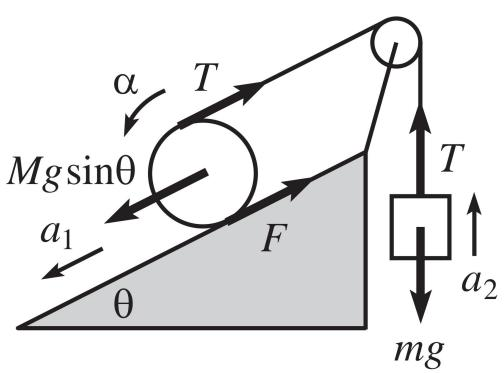  
Reference diagram from the corpus.

## Fundamentals of mechanics

1 Scenario<sup>†</sup>. A block of mass � on an incline of angle $\theta ,$ roped over a pulley to a hanging mass �.

2 Parameters. Dynamic: the block accelerates down-slope $\left( a _ { 1 } \right)$ , the hanging mass upward (�<sub>2</sub>); the pulley has angular acceleration �. 3 Structure<sup>†</sup>. On the block, �� sin � down-slope, tension � up-slope, friction � up-slope; on the mass, weight �� down and tension � up. 4 Laws. Newton’s second law: $M a _ { 1 } = M g$ sin $\theta - T - F$ and $m a _ { 2 } =$ � − ��.

5 Synthesis. The motion is fixed by the force balance and the rope tension. Assumes a frictionless pulley and negligible air resistance.

Sample S2 Mechanics  
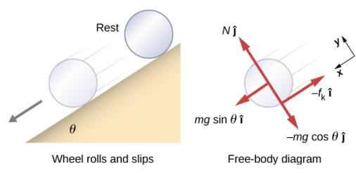  
Reference diagram from the corpus.

## Sample S3 Mechanics

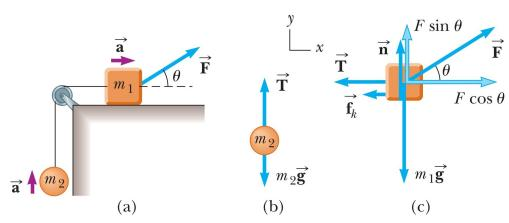  
Reference diagram from the corpus.

Sample S4 Electromagnetism  
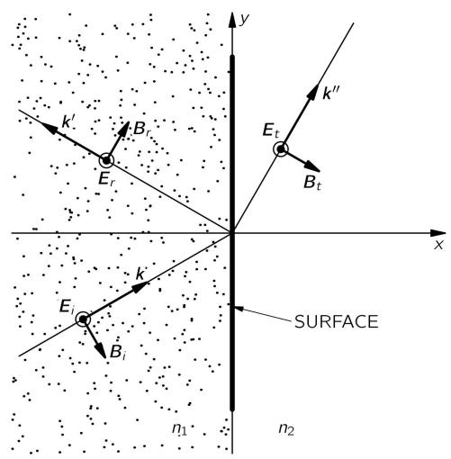  
Reference diagram from the corpus.

## Fundamentals of mechanics

1 Scenario<sup>†</sup>. A wheel of mass � rolling and slipping down an incline of angle $\theta ,$ with its free-body diagram.

2 Parameters. The wheel translates down the incline while slipping (kinetic-friction regime).

3 Structure<sup>†</sup>. Normal force $N \hat { \jmath } ,$ gravity components �� sin �ˆ� (downslope) and −�� cos � ˆ�, kinetic friction $- f _ { k }$ ˆ�.

4 Laws. Newton’s second law along the incline: $m a = m g$ sin $\theta - f _ { k } .$ 5 Synthesis. The motion follows from gravity, the normal force and friction. Assumes kinetic friction due to slipping and a rigid incline.

## Fundamentals of mechanics

1 Scenario<sup>†</sup>. Two masses: $m _ { 1 }$ on a horizontal surface pulled by a force $\vec { F }$ at angle �, roped over a pulley to a hanging mass �<sub>2</sub>.

2 Parameters. Dynamic: �<sub>1</sub> moves horizontally and �<sub>2</sub> vertically, with acceleration �®.

3 Structure<sup>†</sup>. On �<sub>1</sub>: applied ${ \vec { F } } ,$ normal �® (up), kinetic friction $\vec { f } _ { k }$ (opposing motion), weight $m _ { 1 } \vec { g }$ (down); on $m _ { 2 } { : }$ tension $\vec { T }$ (up), weight � �® (down).

4 Laws. Newton’s second law: $m _ { 1 } a = F$ cos $\theta - f _ { k } ,$ $n = m _ { 1 } g - F$ sin �, and �<sub>2</sub>� = � − �<sub>2</sub>�.

5 Synthesis. The acceleration follows from the net force on both masses. Assumes a frictionless massless pulley and an inextensible string.

## Electrodynamics

1 Scenario. A plane electromagnetic wave reflected and transmitted at a boundary between media of index $n _ { 1 }$ and $n _ { 2 } .$

2 Parameters<sup>†</sup>. Incident $( E _ { i } , B _ { i } , \vec { k } )$ , reflected $( E _ { r } , B _ { r } , \vec { k } ^ { \prime } )$ and transmitted $( E _ { t } , B _ { t } , \vec { k } ^ { \prime \prime } )$ fields drawn at the interface.

3 Structure<sup>†</sup>. Plane-wave field geometry: reflection and transmission across the surface, in Cartesian �–� coordinates.

4 Laws. Snell’s law � sin $\theta _ { i } = n _ { 2 }$ sin $\theta _ { t }$ , with the electromagnetic boundary conditions at the interface.

5 Synthesis. Fixes the angles and amplitudes of the reflected and transmitted waves. Assumes an ideal plane wave and no absorption.

## Sample S5 Electromagnetism

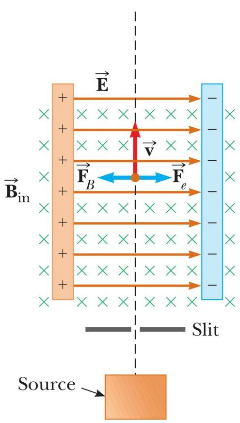  
Reference diagram from the corpus.

Sample S6 Electromagnetism  
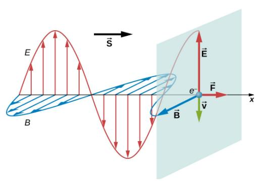  
Reference diagram from the corpus.

## Electrodynamics

1 Scenario. A charged particle moving through crossed (perpendicu lar) electric and magnetic fields — a velocity selector.

2 Parameters<sup>†</sup>. A uniform field �<sup>®</sup> between charged plates and a uniform $\vec { B } _ { \mathrm { i n } }$ into the page; particle velocity �®.

3 Structure<sup>†</sup>. Uniform fields in the region; the electric force $\vec { F } _ { e }$ and magnetic force ${ \vec { F } } _ { B }$ act oppositely on the moving charge.

4 Laws. Lorentz force with the balance $\vec { F } _ { e } + \vec { F } _ { B } = 0 , \mathrm { i . e . } q E = q \nu B .$

5 Synthesis. Selects the speed $\nu = E / B$ at which the forces balance.   
Assumes uniform fields and negligible gravity.

## Electrodynamics

1 Scenario. A plane electromagnetic wave propagating along � (Poynting vector �<sup>®</sup>), with an electron placed in its fields.

2 Parameters<sup>†</sup>. Transverse electric field �<sup>®</sup> and magnetic field $\vec { B } ;$ electron of charge � moving with velocity �®.

3 Structure<sup>†</sup>. A transverse plane wave with $\vec { E }$ and $\vec { B }$ mutually perpendicular; the electron experiences a force ${ \vec { F } } .$

4 Laws. Maxwell’s equations and the Lorentz force $\vec { F } = q ( \vec { E } + \vec { \nu } \times \vec { B } )$

Sample S7 Physical optics  
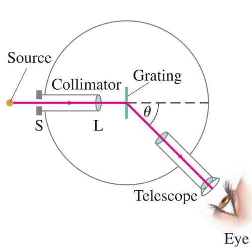  
Reference diagram from the corpus.

Sample S8 Physical optics  
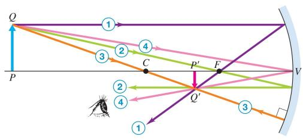  
Reference diagram from the corpus.

## Sample S9 Physical optics

(a) Convex hyperbolic

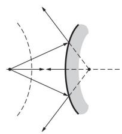

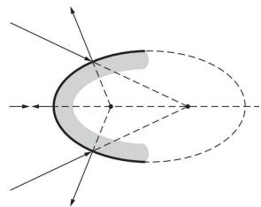  
(c) Concave hyperbolic

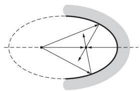  
(d) Concave elliptical

Reference diagram from the corpus.  
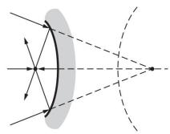

## Difraction-grating spectrometer

1 Scenario. A slit source �, a collimator lens �, a transmission grating, a telescope and the eye, along an optical axis (dashed).

2 Parameters<sup>†</sup>. Components as labelled; one difracted order leaves the grating at angle � to the axis.

3 Structure<sup>†</sup>. Source → collimator → collimated plane wave → grating (difracts) → order at � → telescope → eye.

4 Laws. Grating equation � sin � = ��; thin-lens collimation $\begin{array} { r } { { \frac { 1 } { f } } = } \end{array}$   
1<sub>�</sub> + 1<sub>�′</sub> with � ≈ �.

5 Synthesis. The collimator forms a plane wave that the grating angularly disperses by wavelength. Assumes the source at the focal plane and near-normal incidence.

## Geometric optics: spherical mirror

1 Scenario. Image formation by a concave spherical mirror: an upright object ��, with vertex �, focus � and centre of curvature �. 2 Parameters<sup>†</sup>. Object point � (base �) and image point �<sup>′</sup> (top �<sup>′</sup>); principal points �, �, � and construction rays 1–4.

5 Synthesis. All rays from one object point meet at one image point.   
Assumes paraxial rays and an ideal mirror.

4 Laws. Law of reflection; the parallel-, focal- and centre-rays fix the image point.

3 Structure<sup>†</sup>. Rays from � reflect at the mirror and converge to �<sup>′</sup>, forming an inverted real image below the axis.

## Geometric optics: conic mirrors

1 Scenario. Four ray diagrams of conic-section mirror segments (convex/concave, hyperbolic/elliptical) with foci �<sub>1</sub>, �<sub>2</sub> on the optical axis.

2 Parameters<sup>†</sup>. Reflective segments cut from a hyperbola or an ellipse; the foci marked on the axis.

3 Structure<sup>†</sup>. Rays reflect at each local surface element by the law of reflection; the conic foci set where rays converge or appear to diverge.

4 Laws. Law of reflection, with the focus-sum property of the ellipse and the focus-diference property of the hyperbola.

5 Synthesis. Conic mirrors redirect rays between their foci. Assumes ideal specular reflection.

Sample S10 Thermodynamics  
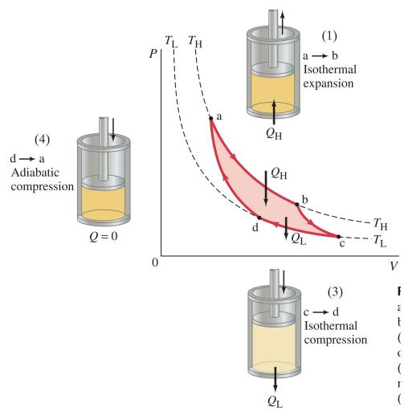  
Reference diagram from the corpus.

Sample S11 Thermodynamics  
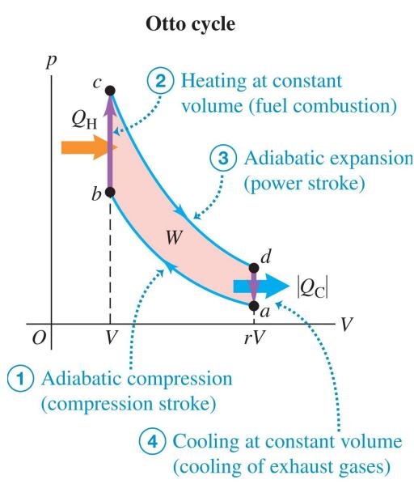  
Reference diagram from the corpus.

## Thermodynamic cycle

1 Scenario. An ideal gas in a piston–cylinder assembly executing a Carnot cycle, shown on a $P { - } V$ diagram.

2 Parameters<sup>†</sup>. States $a , b$ at $T _ { H }$ and $c , d$ at $T _ { L }$ , each with its $( P , V , T )$

3 Structure<sup>†</sup>. $a \to b$ isothermal expansion $( Q _ { H }$ in), � → � adiabatic expansion, � →� isothermal compression $( Q _ { L }$ out), � → � adiabatic compression.

4 Laws. First law and the ideal-gas law: $\Delta U _ { a b } = Q _ { H } - W _ { a b } , W _ { a b } =$ ���<sub>�</sub> ln $\left( V _ { b } / V _ { a } \right)$

5 Synthesis. The eficiency is set by $T _ { H }$ and $T _ { L }$ . Assumes an ideal gas and quasi-static, reversible processes.

## Thermodynamic cycle

1 Scenario. An ideal gas in a piston–cylinder assembly executing an Otto cycle, shown on a �–� diagram.

2 Parameters<sup>†</sup>. Four states $a , b , c ,$ � marking the corners of the cycle. 3 Structure<sup>†</sup>. �→ � adiabatic compression, �→ � isochoric heating (�<sub>�</sub> in), � → � adiabatic expansion, � → � isochoric cooling $( Q _ { C }$ out). 4 Laws. First law and the ideal-gas law; over the cycle $\Delta U = Q _ { H } -$ $Q _ { C } - W$

5 Synthesis. The eficiency follows from the heat input and net work. Assumes an ideal gas, quasi-static reversible processes and a frictionless piston.

## Sample S12 Thermodynamics

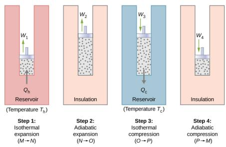  
Reference diagram from the corpus.

## Sample S13 Acoustics

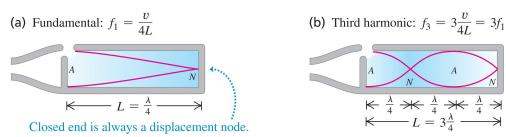  
Reference diagram from the corpus.

## Thermodynamic cycle

1 Scenario. An ideal gas in a piston–cylinder executing a Carnot cycle, drawn as four piston stages between a hot $\left( T _ { h } \right)$ and a cold (�<sub>�</sub>) reservoir.

2 Parameters<sup>†</sup>. Four states �, �, �, � at the corners of the cycle.

3 Structure<sup>†</sup>. � → � isothermal expansion $( Q _ { h } \ \mathrm { i n } , \ W _ { 1 } ) , \ N \to O$ adiabatic expansion $( W _ { 2 } ) , O \to P$ isothermal compression $( Q _ { c }$ out, $W _ { 3 } )$ , � → � adiabatic compression $( W _ { 4 } )$

4 Laws. First law and the ideal-gas law: $\Delta U _ { M N } = Q _ { h } - W _ { 1 } , W _ { 1 } =$ $n R T _ { h } \ln ( V _ { N } / V _ { M } )$

5 Synthesis. The eficiency is set by the reservoir temperatures $T _ { h } , T _ { c }$ Assumes an ideal gas and quasi-static, reversible processes.

## Standing waves in pipes

1 Scenario<sup>†</sup>. A standing wave in a closed pipe: (a) the fundamental and (b) the third harmonic.

2 Parameters<sup>†</sup>. A displacement node � at the closed end and antinode � at the open end; pipe length $L = \lambda / 4$ (fundamental), 3�/4 (third).

3 Structure. A longitudinal standing wave, with $\lambda \ : = \ : 4 L$ for the fundamental and $\lambda = 4 L / 3$ for the third harmonic.

4 Laws. Closed-pipe standing-wave conditions: $f _ { 1 } = \nu / 4 L$ and $f _ { 3 } =$ $3 \nu / 4 L = 3 f _ { 1 }$

5 Synthesis. The harmonics are set by the pipe length and the speed of sound. Assumes a non-dispersive medium, a rigid pipe and no dissipation.

Sample S14 Acoustics  
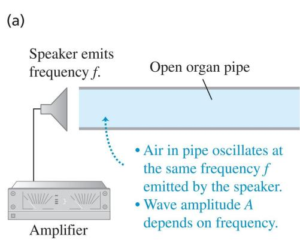

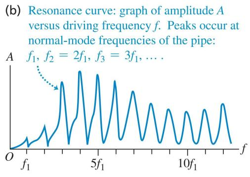  
Reference diagram from the corpus.

Sample S15 Acoustics  
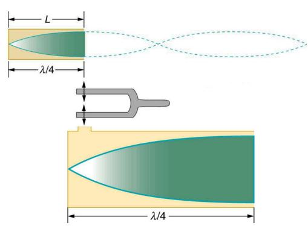  
Reference diagram from the corpus.

## Resonance in pipes

1 Scenario<sup>†</sup>. A speaker drives an open organ pipe at frequency �, exciting resonance.

2 Parameters<sup>†</sup>. A sound source (the speaker, frequency � ) feeding the open pipe; the air oscillates at the driving frequency �.

3 Structure. A longitudinal standing wave in the pipe; the amplitudeversus-frequency curve peaks at the normal modes.

4 Laws. Resonance condition: peaks at $f _ { n } = n f _ { 1 }$ , integer multiples of the fundamental.

5 Synthesis. The pipe resonates at integer multiples of � . Assumes a non-dispersive medium, a point source and no dissipation.

## Resonance in pipes

1 Scenario<sup>†</sup>. A tuning fork exciting a standing wave in a closed pipe of length �, at resonance.

2 Parameters<sup>†</sup>. A tuning-fork source at the open end and a closed pipe of length �, with a displacement node at the closed end.

3 Structure. A longitudinal standing wave whose pipe length is a quarter wavelength.

4 Laws. Closed-pipe resonance condition � = �/4 (fundamental).

5 Synthesis. The pipe resonates in its fundamental quarterwavelength mode. Assumes a non-dispersive homogeneous medium and a rigid pipe.

Sample S16 Quantum mechanics  
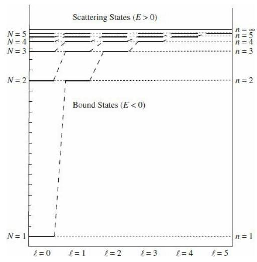  
Reference diagram from the corpus.

Sample S17 Quantum mechanics  
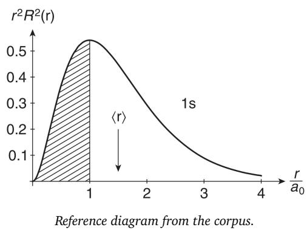

Sample S18 Quantum mechanics  
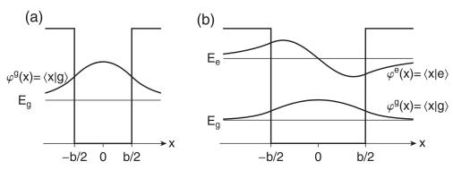  
Reference diagram from the corpus.

## Wave mechanics, 1D

1 Scenario. An energy-level diagram of a one-dimensional potential well, showing bound $\left( E < 0 \right)$ and scattering $\left( E > 0 \right)$ states.

2 Parameters<sup>†</sup>. Hamiltonian $\begin{array} { r } { \hat { H } = - \frac { \hbar ^ { 2 } } { 2 m } \nabla ^ { 2 } + V ( x ) } \end{array}$ ; states labelled by quantum numbers �, � and ℓ.

3 Structure<sup>†</sup>. Two regimes, $E < 0$ (bound) and $E > 0$ (scattering), populated by the energy eigenstates.

4 Laws. The Schrödinger equation �ℏ $\begin{array} { r } { \partial _ { t } \Psi = \hat { H } \Psi , } \end{array}$

5 Synthesis. A discrete set of bound levels below a continuous scattering spectrum. Assumes a time-independent potential.

## Atomic structure: hydrogen

1 Scenario. The radial probability distribution $r ^ { 2 } R ^ { 2 } ( r )$ of the hydrogen 1s orbital, versus $r / a _ { 0 } .$

2 Parameters<sup>†</sup>. Coulomb potential $V ( r ) = - k e ^ { 2 } / r ;$ Hamiltonian $\hat { H } =$ $\begin{array} { r l } {  { - \frac { \hbar ^ { 2 } } { 2 m } \nabla ^ { 2 } + V ( r ) _ { \mathrm { \Omega } } } } & { { } } \end{array}$ ; Bohr radius $a _ { 0 } .$

3 Structure<sup>†</sup>. Radial domain $r \geq 0$ with $\psi ( 0 ) = 0 ;$ the state is the hydrogen orbital |1�⟩.

4 Laws. Radial Schrödinger equation $\begin{array} { r } { - \frac { \hbar ^ { 2 } } { 2 m } R ^ { \prime \prime } ( r ) + V ( r ) R ( r ) = E R ( r ) ; } \end{array}$ probability $P ( r ) = r ^ { 2 } R ^ { 2 } ( \bar { r } )$

5 Synthesis. The radial distribution peaks near the Bohr radius �<sub>0</sub>.   
Assumes a non-relativistic, central potential.

## Wave mechanics, 1D

1 Scenario. A one-dimensional potential well of width $^ { b , }$ showing the ground- and excited-state wavefunctions $\varphi _ { g } , \varphi _ { e }$ at energies $E _ { g } , E _ { e }$

2 Parameters<sup>†</sup>. Hamiltonian $\begin{array} { r } { \hat { H } = - \frac { \hbar ^ { 2 } } { 2 m } \frac { d ^ { 2 } } { d x ^ { 2 } } + V ( x ) ; } \end{array}$ the well spans $- b / 2 < x < b / 2$

3 Structure<sup>†</sup>. Boundary conditions $\begin{array} { r } { \psi ( - b / 2 ) = \psi ( b / 2 ) = 0 ; } \end{array}$ eigenstates $\varphi _ { g } = \langle x | g \rangle$ and $\varphi _ { e } = \langle x | e \rangle$

4 Laws. The Schrödinger equation �ℏ $\begin{array} { r } { \partial _ { t } \Psi = \hat { H } \Psi , } \end{array}$

5 Synthesis. Quantized levels, here the ground and first excited state. Assumes a time-independent potential.

## S2.8. Complete structured annotations

Whereas Section S2.7 condenses each annotation to a single line per schema step, this appendix reproduces the complete structured record for one diagram in each subdiscipline (Cases S1–S6), rendered field by field in the hierarchical form used by our annotation viewer, with the reference diagram shown alongside. Each case is the machine-generated, expert-verified JSON object exactly as it is stored: numbered step bands carry both a human-readable title and the underlying machine key (e.g. step1\_scene\_and\_object\_identification); every key is shown with its value; nested objects, forces and states are set as indented sub-entries; all mathematical content is retained verbatim in its stored form; and fields left empty under the fidelity rules are marked explicitly as empty. The empty markers are themselves informative, recording where the annotator declined to assert a value the diagram does not license. Read against the condensed cards of Section S2.7, these records expose the full granularity of the supervision signal that a flat caption would collapse to a single sentence.

Case S1 Mechanics: complete structured annotation  
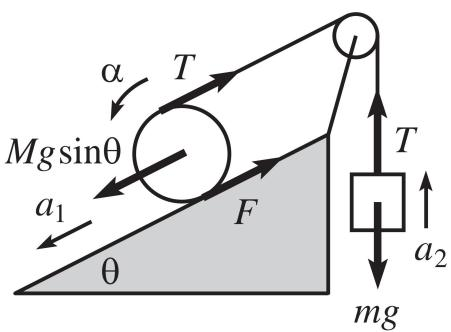

Reference diagram.

CATEGORY Fundamentals of Mechanics

SUMMARY A pulley system with a block on an inclined plane and a hanging mass.

DETAILED The diagram shows a block on an inclined plane with angle �, connected by a rope over a pulley to a hanging mass. The forces acting on the block include �� sin �, tension �, and friction �. The block has an acceleration �<sub>1</sub> down the incline. The hanging mass experiences gravitational force ��, tension �, and has an upward acceleration � . The pulley has an angular acceleration �.

Scene and object identification step1\_scene\_and\_object\_identification   
CORE OBJECTS   
⊲ Block on Incline   
MASS M · PROPERTIES Inclined at angle �   
⊲ Hanging Mass   
MASS m · PROPERTIES empty   
⊲ Pulley   
MASS empty · PROPERTIES Connected to block and mass   
ENVIRONMENT Inclined plane with angle �, pulley system   
Motion state analysis step2\_motion\_state\_analysis   
STATE Dynamic   
MOTION Block accelerates down the incline, mass accelerates upward.   
KINEMATICS VELOCITY V empty · ACCELERATION A �<sub>1</sub>, �<sub>2</sub>   
Force analysis step3\_force\_analysis   
⊲ Block on Incline   
FORCES   
⊲ Gravitational Component   
SYMBOL �� sin � · SOURCE Gravity · DIRECTION Down the incline · MAGNITUDE �� sin �   
⊲ Tension   
SYMBOL � · SOURCE Rope · DIRECTION Up the incline · MAGNITUDE �   
⊲ Friction   
SYMBOL � · SOURCE Surface · DIRECTION Up the incline · MAGNITUDE �   
⊲ Hanging Mass   
FORCES   
⊲ Gravitational Force   
SYMBOL �� · SOURCE Gravity · DIRECTION Downward · MAGNITUDE ��

SYMBOL � · SOURCE Rope · DIRECTION Upward · MAGNITUDE �   
Coordinate system and laws step4\_coordinate\_system\_and\_laws   
COORDINATES Inclined plane coordinates for block, vertical for mass   
LAW Newton’s Second Law   
EQUATIONS   
⊲ Block on incline   
EQUATION �� = �� sin � − � − �   
⊲ Hanging mass   
EQUATION ��<sub>2</sub> = � − ��   
Synthesis and conclusion step5\_synthesis\_and\_conclusion

KEY RELATIONSHIP The system’s motion is determined by the balance of forces and the tension in the rope. ASSUMPTIONS Neglect air resistance; Assume pulley is frictionless

## Case S2 Electromagnetism: complete structured annotation

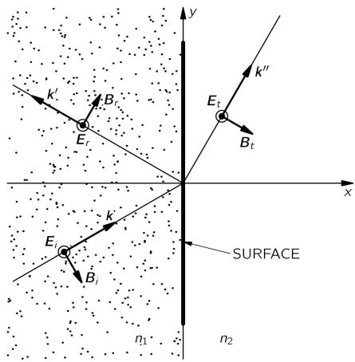

## CATEGORY Electromagnetism

SUMMARY Diagram showing electromagnetic wave interaction with a surface, illustrating incident, reflected, and transmitted waves.

DETAILED The diagram depicts a surface separating two media with refractive indices $n _ { 1 }$ and $n _ { 2 }$ . An incident wave with electric field $E _ { i }$ and magnetic field $B _ { i }$ approaches the surface with wave vector k. The reflected wave has electric field $E _ { r }$ , magnetic field $B _ { r }$ , and wave vector $\mathbf { k } ^ { \prime } .$ . The transmitted wave has electric field $E _ { t s }$ magnetic field $B _ { t } ,$ and wave vector $\mathbf { k } ^ { \prime \prime }$ . The coordinate system is defined with � and $y$ axes.

Reference diagram.

Scene identification and type judgment step1\_scene\_identification\_and\_type\_judgment   
DOMAIN Electromagnetism   
SUB-DOMAIN Electrodynamics   
PROBLEM Wave Reflection and Transmission at a Boundary   
Component source identification and parameterization step2\_component\_source\_identification\_and\_   
parameterization   
COMPONENTS   
⊲ E\_i   
TYPE Electric Field   
PARAMETERS   
⊲ $E _ { i }$   
DESCRIPTION Incident Electric Field · VALUE empty   
⊲ B\_i   
TYPE Magnetic Field   
PARAMETERS   
⊲ �<sub>�</sub>

DESCRIPTION Incident Magnetic Field · VALUE empty   
⊲ E\_r   
TYPE Electric Field   
PARAMETERS   
⊲ �<sub>�</sub>   
DESCRIPTION Reflected Electric Field · VALUE empty   
⊲ B\_r   
TYPE Magnetic Field   
PARAMETERS   
⊲ �<sub>�</sub>   
DESCRIPTION Reflected Magnetic Field · VALUE empty   
⊲ E\_t   
TYPE Electric Field   
PARAMETERS   
⊲ �<sub>�</sub>   
DESCRIPTION Transmitted Electric Field · VALUE empty   
⊲ B\_t   
TYPE Magnetic Field   
PARAMETERS   
⊲ �<sub>�</sub>   
DESCRIPTION Transmitted Magnetic Field · VALUE empty   
Structural topology and state analysis step3\_structural\_topology\_and\_state\_analysis   
CIRCUIT CONNECTION empty · NODES empty · LOOPS empty   
FIELD SOURCE GEOM. Plane Wave · FIELD GEOM. Reflection and Transmission   
STATE Electromagnetic Wave Interaction   
Inference of principles and equation formulation step4\_inference\_of\_principles\_and\_equation\_formulation   
CONVENTIONS COORDINATES Cartesian (x,y) · CONVENTIONS empty   
LAWS Snell’s Law; Boundary Conditions for Electromagnetic Fields   
EQUATIONS   
⊲ Snell’s Law for Refraction   
EQUATION � sin(�<sub>�</sub>) = � sin(�<sub>�</sub>)   
⊲ Boundary Condition for Electric Fields   
EQUATION �<sub>�</sub> + � = �<sub>�</sub>   
Synthesized output and assumption declaration step5\_synthesized\_output\_and\_assumption\_declaration   
KEY FINDINGS Determine the angles and magnitudes of reflected and transmitted waves.   
ASSUMPTIONS Idealized plane wave; No absorption at the boundary

## Case S4 Thermodynamics: complete structured annotation

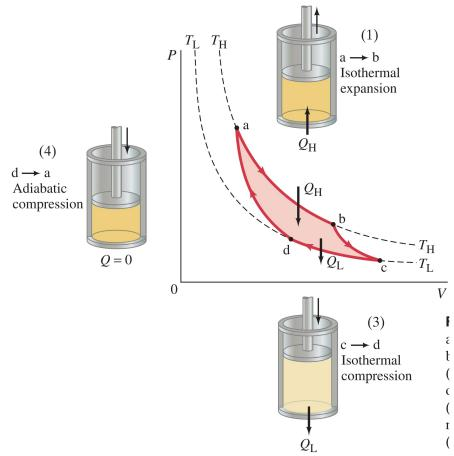  
Reference diagram.

## CATEGORY Thermodynamics

SUMMARY An ideal gas undergoes a Carnot cycle consisting of four stages, as shown on a P-V diagram.

DETAILED The diagram is a P-V diagram with labeled axes for pressure (P) and volume (V). It shows four states labeled a, b, c, and d. The process paths are indicated with arrows: a to b (isothermal expansion), b to c (adiabatic expansion), c to d (isothermal compression), and d to a (adiabatic compression). There are schematics of a piston-cylinder assembly for each process, with heat transfer labeled as Q\_H and Q\_L.

```csv
Scene identification and system definition step1_scene_identification_and_system_definition
DOMAIN Thermodynamics
SYSTEM An ideal gas confined in a piston-cylinder assembly undergoing a Carnot cycle.
PROBLEM Thermodynamic Cycle
State identification and parameterization step2_state_identification_and_parameterization
STATES
⊲ a
VARIABLES
⊲ �<sub>�,</sub> �<sub>�,</sub> �<sub>�</sub>
DESCRIPTION Pressure, Volume, and Temperature at state a · VALUE empty
⊲ b
VARIABLES
⊲ �<sub>�,</sub> �<sub>�,</sub> �<sub>�</sub>
DESCRIPTION Pressure, Volume, and Temperature at state b · VALUE empty
⊲ c
VARIABLES
⊲ �<sub>� ,</sub> �<sub>� ,</sub> �<sub>�</sub>
DESCRIPTION Pressure, Volume, and Temperature at state c · VALUE empty
⊲ d
VARIABLES
⊲ �<sub>� ,</sub> �<sub>� ,</sub> �<sub>�</sub>
DESCRIPTION Pressure, Volume, and Temperature at state d · VALUE empty
Process and interaction analysis step3_process_and_interaction_analysis
PROCESSES
⊲ a -> b
TYPE Isothermal Expansion
ENERGY
⊲ �<sub>�</sub>
TYPE Heat · DIRECTION Into system
⊲ b -> c
TYPE Adiabatic Expansion · ENERGY empty
```

⊲ c -> d   
TYPE Isothermal Compression   
ENERGY   
⊲ �<sub>�</sub>   
TYPE Heat · DIRECTION Out of system   
⊲ d -> a   
TYPE Adiabatic Compression · ENERGY empty   
Principles and equation formulation step4\_principles\_and\_equation\_formulation   
LAWS First Law of Thermodynamics; Ideal Gas Law   
EQUATIONS   
⊲ First Law applied to isothermal expansion a -> b   
EQUATION Δ�<sub>��</sub> = �<sub>�</sub> − �<sub>��</sub>   
⊲ Work done during isothermal expansion a -> b   
EQUATION �<sub>��</sub> = ���<sub>�</sub> ln  <sup>��</sup><sub>��</sub>    
Synthesis and assumption declaration step5\_synthesis\_and\_assumption\_declaration

KEY FINDINGS The eficiency of the Carnot cycle is determined by the temperatures T\_H and T\_L.

ASSUMPTIONS The working substance is an ideal gas; All processes are quasi-static and reversible; The piston is massless and frictionless; The cylinder walls are perfectly insulating

## Case S5 Acoustics: complete structured annotation

SUMMARY A closed pipe demonstrates standing waves at the fundamental frequency and third harmonic.

DETAILED The diagram shows a closed pipe with a displacement node at the closed end and an antinode at the open end. (a) illustrates the fundamental frequency with one node and one antinode, while (b) shows the third harmonic with two nodes and two antinodes. The length of the pipe is related to the wavelength of the sound.

Scene identification and phenomenon judgment step1\_scene\_identification\_and\_phenomenon\_judgment   
DOMAIN Acoustics   
SUB-DOMAIN Standing Waves in Pipes   
PHENOMENON Standing Wave in a Closed Pipe   
System component identification and parameterization step2\_system\_component\_identification\_and\_   
parameterization   
COMPONENTS   
⊲ A   
TYPE Antinode · PARAMETERS empty   
⊲ N   
TYPE Node · PARAMETERS empty   
⊲ L   
TYPE Pipe Length   
PARAMETERS   
⊲ �   
DESCRIPTION Length of the pipe · VALUE <sup>�</sup> for fundamental, <sup>3�</sup><sub>4</sub> for third harmonic

Geometry and wave analysis step3\_geometry\_and\_wave\_analysis   
ARRANGEMENT DESCRIPTION The pipe is closed at one end, creating a node, and open at the other, creating an   
antinode. · REL. MOTION empty   
WAVE WAVE TYPE Longitudinal · WAVE FORM Standing Wave · WAVELENGTH � = 4� for fundamental, � =   
<sup>4�</sup><sub>3</sub> for third harmonic   
Principles and equation formulation step4\_principles\_and\_equation\_formulation   
CONVENTIONS DESCRIPTION The closed end is a displacement node, and the open end is a displacement antinode.   
PRINCIPLES Standing Wave Conditions in a Closed Pipe   
EQUATIONS   
⊲ Fundamental frequency equation   
EQUATION �<sub>1</sub> = <sup>�</sup><sub>4�</sub>   
⊲ Third harmonic frequency equation   
EQUATION �<sub>3</sub> = 3 <sup>�</sup><sub>4�</sub> = 3 �<sub>1</sub>   
Synthesis and assumption declaration step5\_synthesis\_and\_assumption\_declaration   
KEY FINDINGS The fundamental frequency and harmonics are determined by the length of the pipe and the speed   
of sound.   
ASSUMPTIONS The medium is non-dispersive and homogeneous; The pipe is perfectly rigid; Energy dissipation is   
neglected

Case S6 Quantum mechanics: complete structured annotation  
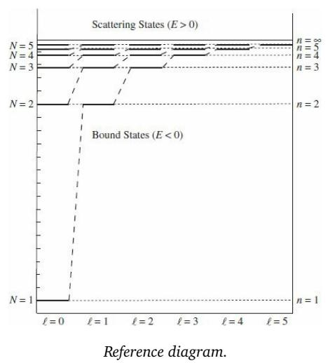

0) and scattering states (E > 0). The vertical axis represents energy, while the horizontal axis shows diferent angular momentum states labeled as \ell = 0, 1, 2, 3, 4, 5. Bound states are shown for N = 1 and N = 2, while scattering states are shown for N = 3, 4, 5. Each energy level is labeled with quantum numbers N and n.

<table><tr><td>Scene identification step1_scene_identification</td></tr><tr><td>DOMAIN Quantum Mechanics</td></tr><tr><td>FORMALISM Wave Mechanics</td></tr><tr><td></td></tr><tr><td>SCENARIO Potential Well D.O.F. 1D Spatial</td></tr><tr><td>Component parameterization step2_component_parameterization</td></tr><tr><td>HAMILTONIAN DESCRIPTION Potential well with discrete energy levels for bound states and continuous levels for</td></tr><tr><td>scattering states.·OPERATOR  $\begin{array} { r } { \hat { H } = - \frac { \hbar ^ { 2 } } { 2 m } \nabla ^ { 2 } + V ( x ) } \end{array}$ </td></tr><tr><td></td></tr><tr><td>PARAMETERS</td></tr><tr><td>▶N</td></tr></table>

DESCRIPTION Principal Quantum Number · VALUE empty   
⊲ �   
DESCRIPTION Radial Quantum Number · VALUE empty   
<sub>⊲</sub> ℓ   
DESCRIPTION Angular Momentum Quantum Number · VALUE empty   
State analysis step3\_state\_analysis   
BOUNDARY REGIONS Region I (E < 0), Region II (E > 0) · BOUNDARY EQS empty   
BASIS BASIS DESCRIPTION Energy eigenstates for bound and scattering states. · INITIAL STATE empty   
Equation formulation step4\_equation\_formulation   
LAWS Schrödinger Equation   
DYNAMICS   
⊲ Evolution/State Equation   
EQUATION �ℏ <sup>�</sup><sub>��</sub> Ψ = �ˆΨ   
MEASUREMENT empty   
Synthesized output step5\_synthesized\_output   
KEY PHENOMENA Quantized energy levels for bound states and continuous spectrum for scattering states.   
ASSUMPTIONS Time-independent potential

## S3. Qualitative and quantitative comparisons

## S3.1. Qualitative analysis

To complement the aggregate scores with direct visual evidence, we show, for nine prompts spanning the six subdisciplines, the diagram that every evaluated model produces from an identical caption (Figures 4 to 12). Each panel pairs the prompt with the generated figures and lists, for reference, the per-model faithfulness on that prompt’s own question bank; the output of Princigram is outlined in the accent colour. The examples make concrete the failure modes summarised by the quantitative results: general-purpose systems tend to render a photorealistic or decorative scene that disregards the requested physical structure (forces, directions, coordinate axes, and governing relations), whereas Princigram reproduces the labelled quantities and the relationships between them that the prompt calls for.

Show-o2

## Mechanics

The diagram shows a horizontal beam supported at points A and B. A point load of 2500 lb acts vertically downward at the left end; a distributed load of 75 lb/ft acts between points C and D; and a further point load of 3000 lb acts vertically downward near the right end. The support and load spacings are marked 6 ft, 12 ft, and 2 ft.

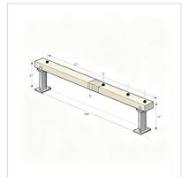

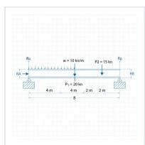

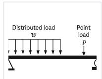

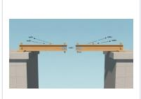

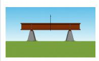


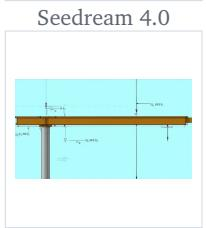

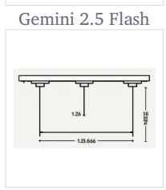


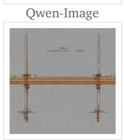

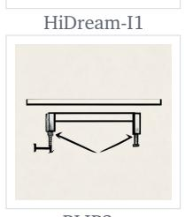

  
Princigram-BAGEL

Figure 4 | Mechanics: Qualitative comparison between our method and competing methods.

## Mechanics

Two blocks $m _ { 1 }$ and $m _ { 2 }$ on a horizontal surface are connected by a rope. Block $m _ { 2 }$ is pulled by an external force �<sup>®</sup> directed to the right, and the rope tension is labelled �.

  
Princigram-BAGEL

Figure 5 | Mechanics: Qualitative comparison between our method and competing methods.

## Physical optics

A horizontal interface separates air above from a transparent medium below (light-blue shading). A dashed vertical line marks the surface normal at the point of incidence. An incident ray arrives from the upper right at angle � to the normal and refracts into the lower medium, bending toward the normal as it enters the higher-index material; no reflected ray is drawn.

  
Figure 6 | Physical optics: Qualitative comparison between our method and competing methods.

## Physical optics

A collimated beam of wavelength � strikes a narrow vertical slit of width � formed by two plates. Dashed rays radiate from the slit toward a screen on the right, which shows a red intensity envelope with a central maximum and side lobes. Two angular positions are marked, $\theta _ { 2 } = 4 5 ^ { \circ }$ and a smaller $\theta _ { 1 }$ , measured from the central axis.


  
Figure 7 | Physical optics: Qualitative comparison between our method and competing methods.

Princigram-BAGEL

## Electromagnetism

An operational amplifier drives a 200 mV source through a 10 kΩ resistor into the inverting input, with the non-inverting input grounded and ±15 V supplies. The feedback network uses 40 kΩ and 20 kΩ resistors, with a 30 kΩ resistor to ground at their junction. The output voltage $\upsilon _ { o }$ appears across a 10 kΩ load, and current directions $i _ { a }$ and $i _ { o }$ are indicated.

  
Figure 8 | Electromagnetism: Qualitative comparison between our method and competing methods.

## Electromagnetism

An electron (�<sup>−</sup>) enters the region between two parallel plates with initial velocity $\upsilon _ { 0 }$ along the �-axis. The upper plate is positive and the lower negative, giving a uniform downward electric field, so the electron’s path curves upward and it exits with velocity �<sub>1</sub> at an angle �.

  
Figure 9 | Electromagnetism: Qualitative comparison between our method and competing methods.  
Princigram-BAGEL

HiDream-I1

FLUX.1 dev

## Acoustics

A cylindrical tube is driven by a piston on the left moving with velocity $\nu _ { p } ( t )$ . The tube has length � and diameter 2�, and an arrow indicates the direction of the piston’s motion.

  
Seedream 4.0


  
SD 3.5 Large

  
BAGEL

  
DiMOO

  
Show-o2

  
BLIP3o

  
Princigram-BAGEL

Figure 10 | Acoustics: Qualitative comparison between our method and competing methods.

## Quantum mechanics

A one-dimensional potential well has three regions: regions I and III are infinite potential barriers and region II has zero potential. The particle’s total energy is $E _ { \mathrm { t o t } } ,$ the potential �(�) is infinite in I and III and zero in II, and the well width is �.

  
Seedream 4.0


  
GPT-Image-1


  
SD 3.5 Large

  
BAGEL  
Qwen-Image

  
DiMOO

  
Show-o2

  
BLIP3o

  
Princigram-BAGEL

Figure 11 | Quantum mechanics: Qualitative comparison between our method and competing methods.

## Thermodynamics

A closed system consisting of a cylindrical container exchanges heat with its surroundings: $Q _ { \mathrm { i n } } = 1 5$ kJ enters and $Q _ { \mathrm { o u t } } = 3$ kJ leaves. The net energy change is $\Delta E = Q _ { \mathrm { n e t } } = 1 2 \mathrm { k J }$

  
Figure 12 | Thermodynamics: Qualitative comparison between our method and competing methods.

## S3.2. Checklist-grounded per-attribute evaluation

Beyond the side-by-side images of Section S3.1, Figure 13 shows how VeriphyT2IBench turns each generation into a quantitative, per-attribute verdict. For two representative prompts (a mechanics retaining-wall diagram and an electromagnetism circuit), it pairs the diagrams produced by Princigram, Qwen-Image, and FLUX.1 dev with an excerpt of the item’s compiled checklist: each row is a binary physics question, tagged global or local and carrying its expert-verified gold answer, followed by the judge’s Yes/No response for every model, marked correct or incorrect. The per-image counts (for the mechanics prompt, 44/54 for Princigram against 13/54 and 10/54) are the local-bank scores of Equation (2) made concrete: the same visible errors seen in the images translate directly into failed checklist items, which is what the aggregate scores of Section 2.5 summarise.

## S3.3. Ablating the structured annotation

The quantitative results attribute Princigram’s gains to the structured supervision rather than to the backbone or the image data; visually the efect is stark. Figure 14 isolates SP-CoT as a single ingredient: the same model and pipeline are trained with and without the structured physical annotation (everything else held fixed), and both regimes render three mechanics prompts. Stripped of the structured labels, the model degenerates into plausible but physically meaningless artwork: the scene drifts (a child on a staircase for a pulley prompt), the geometry and topology are wrong, and every on-figure symbol collapses into illegible gibberish. Trained with SP-CoT, the same architecture places each mass, pulley, angle, and velocity where the prompt demands and renders every symbol $( m _ { 1 } , m _ { 2 } , \theta , 8 . 0 0 \mathrm { k g } , 6 . 0 0 \mathrm { k g } , \upsilon _ { 1 } )$ legibly. Structured physical labeling, not photorealism, is what makes the generations faithful.

Mechanics The diagram shows a horizontal beam supported at points A and B. There is a point load of 2500 lb applied vertically downward at the left end of the beam. A distributed load of 75 lb/ft is applied between points C and D. Another point load of 3000 lb is applied vertically downward near the right end of the beam. The distances between the supports and loads are marked as 6 ft, 12 ft, and 2 ft.


<table><tr><td>Part of the checklist summary:</td><td>Ours</td><td>Qwen FLUX.1</td><td></td></tr><tr><td>Physics check· gold answer GLoBAL Is the distance between point C and point D labeled as 8 ft in the image?gold No</td><td>√</td><td>√</td><td>√</td></tr><tr><td>CLocAL Does the image explicitly label the mass of the object &#x27;Beam&#x27;?gold No</td><td>No √</td><td>No J</td><td>No √</td></tr><tr><td>CLOCAL Is the magnitude expression of the force &#x27;Point Load at Right&#x27; on &#x27;Beam&#x27; equal to</td><td>No √ Yes</td><td>No X No</td><td>No X</td></tr></table>

Electromagnetism The circuit consists of a 5 Ω resistor in series with two parallel branches. One branch has a 20 Ω resistor with a voltage source V1, and the other branch has a 15 Ω resistor with a voltage source V2. A 1 A current source is connected in parallel with these branches. The current I1 is indicated as 0 A.


<table><tr><td>Physics check · gold answer</td><td>Ours</td><td></td><td>Qwen FLUX.1</td></tr><tr><td>GLoBALDoes the image depict a 10 Ω resistor in any part of the circuit? gold No</td><td>√</td><td>V</td><td>√</td></tr><tr><td></td><td>No</td><td>No</td><td>No</td></tr><tr><td>LocAL Does the image show a point charge in the diagram? gold No</td><td>√ No</td><td>√ No</td><td>√ No</td></tr><tr><td>CLOCAL</td><td></td><td></td><td></td></tr><tr><td>Does the image clearly show a resistor labeled by 15 Ω? gold Yes</td><td>√ Yes</td><td>X No</td><td>X No</td></tr></table>

Figure 13 | Checklist-grounded evaluation. Generated diagrams are assessed using expert-verified VeriphyT2IBench criteria. Checks and crosses indicate criterion satisfaction, while fractions report local-criterion accuracy.

With SP-CoT

Case 1 A pulley system with two masses: mass �<sub>1</sub> rests on an inclined plane at angle �, connected by a rope over a pulley to a hanging mass �<sub>2</sub>.

With SP-CoT  
  
✗ Scene drifts to a child on a staircase ✗ Annotations are illegible gibberish ✗ Pulley and hanging mass misplaced

  
✓ Correct incline with block � ✓ Edge pulley & hanging �<sub>2</sub> ✓ Angle � labelled at the base

Case 2 An 8.00 kg block on a horizontal table, connected by a rope over a pulley at the table’s edge to a 6.00 kg block hanging vertically.  
  
✗ Meaningless labels “Brw Tal”, “a”, “n” ✗ Numeric masses absent ✗ Pulley/hanging topology wrong

  
✓ 8.00 kg block on the table ✓ Edge-mounted pulley ✓ 6.00 kg mass hanging, masses correct

Case 3 Two blocks 1 and 2 on a horizontal surface: block 1 moves toward block 2 with initial velocity �<sub>1</sub>, while block 2 connects through a spring to a fixed wall.  
  
✗ Layout corrupted into an L-shaped wall ✗ Spring drawn as a detached loop ✗ Blocks 1/2 and � missing, captions nonsense

  
✓ Block 1 with velocity arrow � ✓ Approaches block 2 ✓ Spring links block 2 to the fixed wall

Figure 14 | Ablation of the structured annotation. Without the structured annotation the model produces figures that look plausible but whose geometry and topology are wrong and whose on-figure symbols are illegible, with it, the same architecture generates the entities, relations and values the prompt specifies. Checks and crosses list the per-panel observations.