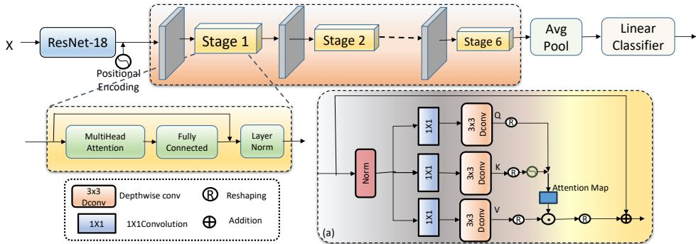

# UniCon-Former: Unified Convolution Transformer is All You Need for Hand Gesture Recognition

Mallika Garg1 , Debashis Ghosh2 , and Pyari Mohan Pradhan2

1 Indian Institute of Technology Kharagpur, INDIA

Indian Institute of Technology Roorkee, INDIA

mallika@ec.iitr.ac.in, debashis.ghosh@ece.iitr.ac.in, pyarimohan.pradhan@gmail.com

Abstract. Convolutional Neural Networks (CNNs) capture local features eficiently but struggle with global context due to their limited receptive field. On the other hand, transformers efectively capture global dependencies through self-attention but sufer from high redundancy and computational costs. Thus, to leverage the advantages of both CNNs and transformers, we propose a unified model (UniCon-Former) that aims to provide robust and eficient performance on dynamic hand gesture recognition. The unified approach helps the model to learn both local and global features. At the beginning of each transformer stage, the convolution projections help in decreasing the dimension of the input vectors of the transformer block. This creates a pyramidal structure at each transformer stage. These features enable the UniCon-Former to reduce resource usage than vanilla transformers, making it flexible for learning multi-scale and high-resolution features, which is required in hand gesture recognition. We have performed experiments with NVGesture and Briareo datasets and achieved state-of-the-art results with fewer parameters and MACs.

Keywords: Multi-modal recognition · Multi-head Attention, · Multiscale Pyramid Attention · Multiscale Multi-head Attention · Video Transformer

## 1 Introduction

Hand gesture recognition has captured researchers’ attention as it can be used in many applications like Human-computer interaction, Gaming, Virtual and augmented reality [23], Sign language recognition [18], Healthcare [31]. Gestures can be static or dynamic. Static gestures involve holding a specific hand, and dynamic gestures involve continuous movement of body parts, particularly the hands and arms, to convey meaning or information.

With the advancements in vision-based pattern recognition technology, researchers have increasingly shifted towards using self-learned features extracted by deep learning models . Today, more research is being done to design an efficient transformer model with comparable or better performance. To reduce the computational complexity, self-attention in a transformer is replaced by a generalized concept of token mixer which says that transformers need a mixer to facilitate communication and interaction between tokens (or patches) in the input sequence. These mixers enable the exchange of information among tokens, allowing the model to capture dependencies and relationships across the input sequence more efectively. Also, despite the revolution in transformer-based methods, their utility in gesture recognition is very limited. In [7], the vanilla transformer recognizes dynamic hand gestures. This model learns long-range dependencies and global context that help the model learn highly flexible hand shapes and adapt to various hand sizes without requiring significant architectural changes. But the self-attention mechanism in transformer can lead to high redundancy because it performs blind similarity comparisons among all tokens, which can be computationally expensive and ineficient.

To address this limitation, both CNN and transformer are used in combination to integrate their respective strengths into a unified framework. Although much work has been done on models that aggregate convolution with the transformer model in the field of Visual Recognition [19], Medical Image Segmentation [20], Scene Text Understanding [4]. But still this combination has not been explored in the literature for gesture recognition tasks. We combine the strengths of convolution and the transformer. At each stage of the transformer, the input to the transformer progressively decreases with the use of convolution before feeding the input to the transformer. This helps to create a pyramid structure of the transformer stage and learn multiscale features by progressively shrinking the attention dimension at each stage.

Thus, the proposed UniCon-Former has the following major contributions:

1. A novel Unified Convolution Transformer, UniCon-Former network for dynamic hand gesture recognition.

2. We combine convolution with the transformer model to leverage the strengths of CNNs, such as capturing local features while also incorporating the benefits of transformers, including capturing global context information.

3. The pyramid hierarchy of features learned at diferent stages of the transformer helps the model to learn multiscale features which play a significant role in gesture recognition, as hand shape and size can vary, which also adds to the decrease of the computation cost.

4. The efectiveness of the proposed framework is validated using two publicly available datasets: the NVidia Dynamic Hand Gesture and the Briareo dataset. Our model achieves state-of-the-art results when compared to existing methods with fewer parameters and less complexity.

## 2 Method

In the proposed UniCon-Former, the input is fed to the ResNet-18 model to get the frame-level features of the input gesture sequence, denoted by F(X). We pass the input from all the convolutional layers of the ResNet-18 model [13] and then through the average pool layer, the output features are obtained. These features are fed to the proposed transformer blocks. The input layer of the model is made to adapt for all the input modalities as proposed in [22]. The output features from ResNet are of dimensions $N = B \times T \times D$ , where B is the batch size, T is the number of frames and D is the dimension of features extracted from ResNet-18 which is the same as the input of the first stage of the transformer block, $d _ { m o d e l } = 5 1 2$ . For convenience, we represent $B \times T$ as L. So, the features now can be represented as $L \times D$

  
Fig. 1: The proposed model with Unified convolutional transformer. First, the input features are given to the convolution block and then through the MHA. a) shows the flow of input from the C-block to the MHA.

We add positional embedding as in a traditional transformer and fed the input features F as Query (Q), Key (K), and Value (V) to the proposed UniCon-Former model. The UniCon-Former consists of a C-Block and the Multihead attention which creates a pyramid of attention features at each stage.

## 2.1 Convolution Transformer Block

Before the input features F are given to the Multi-head attention block (MHA), they are passed through the convolution block (C-block). All three vectors Query (Q), Key (K), and Value (V) are passed through the C-block. This helps to combine the advantages of the convolution block i.e. shared weights, local receptive fields, and spatial sub-sampling) with the advantages of the transformer. The C-block comprises the depthwise-separable convolutional operation on the input features given as,

$$
\mathbf { Q } = C o n v ( F ) ,\tag{1}
$$

Here, the Conv is the depthwise separable convolution implemented by: Depthwise Conv, BatchNorm2d, Point-wise Conv2d. All the 3 vectors are passed from the C-block to give Q, K, and V. The class token [14] is added to the resulting vectors which are then passed through the MHA block.

The attention from these vectors is calculated through MHA. Then, the attention vector is passed through the sequence of 2 linear layers, let us represent it as FC and we use a dropout of 0.1 before and after the FC layers. Then, we add a skip connection to the output of the FC and normalize the complete output which can be written as,

$$
E ( x ) = N o r m ( x + F C ( M u l t i H e a d ( { \bf Q } , { \bf K } , { \bf V } ) ) ) ,\tag{2}
$$

where $E ( x )$ is the complete transformer encoder and x is the input feature to UniCon-Former model. The encoded information is then average pooled over all the frames as,

$$
H ( x ) = A v g P o o l ( E ( x ) ) ,\tag{3}
$$

where $H ( x )$ is the average pooling operation over the m frames. The $H ( x )$ output is then passed through a linear classifier to get the output probability distribution.

## 2.2 Multi-Modal Late Fusion

Multimodal methods have recently gained significant popularity and have been applied in various applications. The key aspect behind this method is to leverage multiple modalities to achieve far better results, compared to the model which processes a single modality. Dynamic hand gesture datasets such as NVGesture and Briareo provide images in diferent modalities (i.e. RGB, Depth, and infrared images) since they are captured using RGB-G sensors. Following [7], we adopt a late fusion technique that combines predictions from each modality independently. To produce the final prediction, we choose the maximum probability from all single-modal inputs across diferent combinations represented as

$$
y = \arg \operatorname* { m a x } _ { j } \sum _ { i } ^ { n } P ( \omega _ { j } | x _ { i } ) ,\tag{4}
$$

where n is the number of modalities over which the results are to be aggregated, and $P ( \omega _ { j } | x _ { i } )$ is the probability distribution of the $i ^ { t h }$ frames of a given input, which belongs to class ωj.

## 3 Experiments and Discussion

## 3.1 Implementation Details

We implemented our work in $\mathrm { P y }$ Torch. The model is trained on Nvidia GeForce GTX 1080 Ti GPU hardware. It is optimized using the Adam optimizer with a learning rate of 1e-4 and a weight decay at the 50th and 75th epoch over the categorical cross-entropy loss. Following the approach in [7], we cropped the image to a size of $2 2 4 \times 2 2 4$ pixels to extract features from a pretrained model ResNet-18. To mitigate the over-fitting issue, we used data augmentation techniques such as scaling, cropping, and rotation. We follow the same training procedure as in [7], and trained separate models for each modality. Finally, we have applied decision-level fusion using a late fusion approach.

Table 1: Results for diferent modalities on NVGesture [22] and Briareo [21] dataset. # is the number of input modalities used. Bold are the best results obtained for each set of modalities.
<table><tr><td rowspan="3">#</td><td colspan="3">Input data</td><td colspan="4">Accuracy</td></tr><tr><td rowspan="2"></td><td rowspan="2">Color Depth IR Normals</td><td rowspan="2">Optical flow</td><td colspan="2">NVGesture</td><td colspan="2">Briareo</td></tr><tr><td>Transformer [7]</td><td>Ours</td><td>Transformer [7]</td><td>Ours</td></tr><tr><td rowspan="3">1</td><td rowspan="3">√</td><td rowspan="3">√ √</td><td rowspan="3">√</td><td></td><td>76.50%</td><td>81.67%</td><td>90.60% 96.53%</td></tr><tr><td>83.00%</td><td>85.27%</td><td>92.40%</td><td>97.57%</td></tr><tr><td>64.70% 82.40%</td><td>67.63% 83.61%</td><td>95.10% 95.80%</td><td>97.92% 97.57%</td></tr><tr><td rowspan="11">2</td><td rowspan="2">√ √ V</td><td rowspan="2">√</td><td></td><td rowspan="2">V</td><td>72.00%</td><td>74.58%</td><td></td><td>96.53%</td></tr><tr><td></td><td>84.60% 87.55%</td><td>94.10%</td><td>97.92%</td></tr><tr><td rowspan="10">√</td><td rowspan="3">√</td><td rowspan="3">√ √</td><td></td><td>79.00%</td><td>83.40%</td><td>95.50%</td><td>98.26%</td></tr><tr><td></td><td>81.70%</td><td></td><td>95.10%</td><td>97.91%</td></tr><tr><td>√</td><td>84.60%</td><td>84.23% 85.06%</td><td>96.50%</td><td>96.88%</td></tr><tr><td>√</td><td>√</td><td></td><td>87.30%</td><td>85.06%</td><td>96.20%</td><td>97.57%</td></tr><tr><td rowspan="2"></td><td rowspan="2">√</td><td>√</td><td></td><td>83.60%</td><td>82.78%</td><td>97.20%</td><td>97.57%</td></tr><tr><td></td><td>V</td><td></td><td>83.40%</td><td></td><td>97.22%</td></tr><tr><td rowspan="2"></td><td rowspan="2">√</td><td></td><td>√</td><td></td><td>84.65%</td><td></td><td>97.56%</td></tr><tr><td>√</td><td>√</td><td>一</td><td>77.39%</td><td>一</td><td>97.91%</td></tr><tr><td rowspan="2">√</td><td rowspan="2">√ √</td><td rowspan="2">√</td><td>√</td><td></td><td>84.44%</td><td></td><td>96.88%</td></tr><tr><td></td><td>85.30%</td><td>87.14%</td><td>95.10%</td><td>97.92%</td></tr><tr><td rowspan="11">3</td><td>V √</td><td>V</td><td></td><td>√</td><td>86.10%</td><td>86.72%</td><td>95.80%</td><td>97.57%</td></tr><tr><td></td><td></td><td>√</td><td>√</td><td>85.30%</td><td>87.34%</td><td>96.90%</td><td>96.88%</td></tr><tr><td>√</td><td>√</td><td>√</td><td>√</td><td>87.10%</td><td>85.89%</td><td>97.20%</td><td>97.57%</td></tr><tr><td>√</td><td>√</td><td></td><td>√</td><td></td><td>85.51%</td><td></td><td>97.92%</td></tr><tr><td></td><td></td><td>√</td><td>V</td><td></td><td>85.06%</td><td></td><td>98.61%</td></tr><tr><td rowspan="3">√</td><td></td><td></td><td>√ √</td><td></td><td>87.14%</td><td></td><td>96.88%</td></tr><tr><td>√</td><td>V</td><td>V</td><td>一</td><td>84.85%</td><td></td><td>98.26%</td></tr><tr><td></td><td>√</td><td>√ V</td><td>一</td><td>85.89%</td><td></td><td>96.87%</td></tr><tr><td rowspan="3">√</td><td>V</td><td></td><td>√</td><td>V</td><td>85.89%</td><td></td><td>97.57%</td></tr><tr><td>√</td><td>√</td><td>√</td><td>87.60%</td><td>87.14%</td><td>96.20%</td><td>97.57%</td></tr><tr><td>√ √</td><td>√</td><td>V</td><td></td><td>87.97%</td><td></td><td>98.61%</td></tr><tr><td rowspan="5">4</td><td>√</td><td>√</td><td>√</td><td>√</td><td>一</td><td>87.97%</td><td></td><td>97.92%</td></tr><tr><td>√</td><td></td><td>√</td><td>√ √</td><td>一</td><td>86.72%</td><td></td><td>96.88%</td></tr><tr><td></td><td>√</td><td></td><td>√</td><td></td><td></td><td></td><td></td></tr><tr><td></td><td></td><td>√</td><td>√</td><td>一</td><td>87.34%</td><td>一</td><td>97.57%</td></tr><tr><td>√</td><td>√</td><td>√ √</td><td>√</td><td>-</td><td>87.97%</td><td>-</td><td>96.88%</td></tr></table>

## 3.2 Results and Discussion

NVGesture: We compare the performance of the proposed model with the vanilla transformer model used for gesture recognition [7] and the results are shown in Table 1. For each input modality (color, depth, IR, normals, and optical flow), our model UniCon-Former performs better than the vanilla transformer. From the table, we can see that an increase of 6.76%, 2.73%, 4.53%, 1.47%, and 3.58% is seen when the model is independently trained on color, depth, IR, normals, and optical flow, respectively. This increase is quite considerable, with 85.27% for the depth modality.

Table 2: Comparison results for single modality on NVGesture dataset [22].
<table><tr><td>Input modality</td><td>Method</td><td>Accuracy</td></tr><tr><td rowspan="10">Color</td><td>Spat. st. CNN [24] iDT-HOG [26]</td><td>54.60% 59.10%</td></tr><tr><td>C3D [25]</td><td>69.30%</td></tr><tr><td></td><td></td></tr><tr><td>R3D-CNN [22]</td><td>74.10%</td></tr><tr><td>GestFormer [10]</td><td>75.41%</td></tr><tr><td>Res3ATN [5]</td><td>62.70%</td></tr><tr><td>ConvMixFormer [12]</td><td>76.04%</td></tr><tr><td>PreRNN [27]</td><td>76.50%</td></tr><tr><td>Transformer [7]</td><td>76.50%</td></tr><tr><td>MVTN [11] I3D [26]</td><td>77.50% 78.40%</td></tr><tr><td></td><td></td></tr><tr><td>ResNeXt-101 [16]</td><td>78.63%</td></tr><tr><td>MTUT [1]*</td><td>81.33%</td></tr><tr><td>MsMHA-VTN [9]</td><td>81.42%</td></tr><tr><td>UniCon-Former</td><td>81.67%</td></tr><tr><td></td><td>Human [22]</td><td>88.40%</td></tr><tr><td rowspan="10">Depth</td><td>SNV [28]</td><td>70.70%</td></tr><tr><td>C3D [25]</td><td></td></tr><tr><td></td><td>78.80%</td></tr><tr><td>GestFormer [10]</td><td>80.21%</td></tr><tr><td>R3D-CNN [22]</td><td>80.30%</td></tr><tr><td>ConvMixFormer [12]</td><td>80.83%</td></tr><tr><td>I3D [26]</td><td>82.30% 83.00%</td></tr><tr><td>Transformer [7]</td><td></td></tr><tr><td>ResNeXt-101 [16] PreRNN [27]</td><td>83.82%</td></tr><tr><td>MTUT [1]*</td><td>84.40% 84.85%</td></tr><tr><td rowspan="6"></td><td>MsMHA-VTN [9]</td><td>85.00%</td></tr><tr><td>MVTN [11]</td><td></td></tr><tr><td>UniCon-Former</td><td>85.21%</td></tr><tr><td></td><td>85.27%</td></tr><tr><td>iDT-HOF [2] Temp. st. CNN [24]</td><td>61.80%</td></tr><tr><td></td><td>68.00%</td></tr><tr><td rowspan="8">Optical flow</td><td>Transformer [7]</td><td>72.00%</td></tr><tr><td>MVTN [11]</td><td>72.50%</td></tr><tr><td>GestFormer [10]</td><td></td></tr><tr><td>ConvMixFormer [12]</td><td>72.61% 74.17%</td></tr><tr><td>UniCon-Former</td><td>74.58%</td></tr><tr><td>ConvMixFormer [12]</td><td>80.21%</td></tr><tr><td>GestFormer [10]</td><td>81.66%</td></tr><tr><td>Transformer [7]</td><td>82.40%</td></tr><tr><td rowspan="5"></td><td>MVTN [11]</td><td>83.75%</td></tr><tr><td>UniCon-Former</td><td>83.61%</td></tr><tr><td>R3D-CNN [22]</td><td>63.50%</td></tr><tr><td>ConvMixFormer [12]</td><td></td></tr><tr><td></td><td>63.54%</td></tr><tr><td rowspan="5">Infrared</td><td>GestFormer [10]</td><td>63.54%</td></tr><tr><td>Transformer [7]</td><td>64.70%</td></tr><tr><td></td><td></td></tr><tr><td>MVTN [11]</td><td>70.42%</td></tr><tr><td>UniCon-Former</td><td>67.63%</td></tr></table>

Table 3: Comparison results for multi-modal inputs on NVGesture dataset [22]. \* indicates the model is pre trained on Kinetics [15], in addition to ImageNet [3].
<table><tr><td>Method</td><td>Input modality</td><td>Accuracy</td></tr><tr><td> $\overline { { \mathrm { ~ { ~ T w o - s t . ~ C N N s ~ } [ 2 4 ] ~ } } }$ </td><td> $\mathrm { c o l o r + f i o w }$ </td><td>65.60%</td></tr><tr><td>iDT [2]</td><td> $\overline { { \mathrm { C o l o r ~ + ~ } \mathrm { f l o w } } }$ </td><td>73.00%</td></tr><tr><td>R3D-CNN [22]</td><td> $\mathrm { C o l o r + f l o w }$ </td><td>79.30%</td></tr><tr><td>R3D-CNN [22]</td><td> $\mathrm { C o l o r + d e p t h + f l o w }$ </td><td>81.50%</td></tr><tr><td>R3D-CNN [22]</td><td> $\mathrm { C o l o r + d e p t h + i r }$ </td><td>82.00%</td></tr><tr><td>R3D-CNN [22]</td><td> $\mathrm { { d e p t h } + \mathrm { { f l o w } } }$ </td><td>82.40%</td></tr><tr><td>R3D-CNN [22]</td><td>all</td><td>83.80%</td></tr><tr><td>MSD-2DCNN [8]</td><td>Color+depth</td><td>84.00%</td></tr><tr><td>8-MFFs-3f1c [17]</td><td> $\overline { { \mathrm { C o l o r } + \mathrm { f l o w } } }$ </td><td>84.70%</td></tr><tr><td>STSNN [30]</td><td> $\overline { { \mathrm { ~ C o l o r } + \mathrm { f l o w } } }$ </td><td>85.13%</td></tr><tr><td>PreRNN [27]</td><td> $\overline { { \mathrm { C o l o r } + \mathrm { d e p t h } } }$ </td><td>85.00%</td></tr><tr><td>I3D [26]</td><td> $\overline { { \mathrm { C o l o r } + \mathrm { d e p t h } } }$ </td><td>83.80%</td></tr><tr><td>I3D [26]</td><td> $\mathrm { C o l o r + f l o w }$ </td><td>84.40%</td></tr><tr><td>I3D [26]</td><td> $\mathrm { C o l o r + d e p t h + f l o w }$ </td><td>85.70%</td></tr><tr><td>GPM [8]</td><td> $\mathrm { C o l o r + d e p t h }$ </td><td>86.10%</td></tr><tr><td> $\overline { { \mathrm { ~ M T U T } _ { \mathrm { R G B - D } } \ [ 1 ] ^ { * } } }$ </td><td> $\mathrm { \overline { { C o l o r \mathrm { ~ + ~ } d e p t h } } }$ </td><td>85.50%</td></tr><tr><td> $\operatorname { M T U T } _ { \mathrm { R G B - D + f l o w } } \ [ 1 ] ^ { * }$ </td><td> $\mathrm { C o l o r + d e p t h }$ </td><td>86.10%</td></tr><tr><td> $\operatorname { M T U T } _ { \mathrm { R G B - D + f l o w } } \ [ 1 ] ^ { * }$ </td><td> $\mathrm { C o l o r + d e p t h + f l o w }$ </td><td>86.90%</td></tr><tr><td> $\overline { { \mathrm { T r a n s f o r m e r ~ } [ 7 ] } }$ </td><td> $\mathrm { \ d e p t h + n o r m a l s }$ </td><td>87.30%</td></tr><tr><td> $\mathrm { T r a n s f o r m e r } \ [ 7 ]$ </td><td> $\mathrm { C o l o r + d e p t h + n o r m a l s + i r }$ </td><td>87.60%</td></tr><tr><td> $\overline { { { \mathrm { N A S 2 } } \ [ { 2 9 } ] ^ { * } } }$ </td><td> $\overline { { \mathrm { C o l o r } + \mathrm { d e p t h } } }$ </td><td>86.93%</td></tr><tr><td> $\mathrm { N A S 1 + N A S 2 \ [ 2 9 ] ^ { \ast } }$ </td><td> $\mathrm { C o l o r + d e p t h }$ </td><td>88.38%</td></tr><tr><td> $\overline { { \mathrm { C o n v M i x F o r m e r } } }$ </td><td> $\mathrm { { d e p t h } + \ o p }$ </td><td>82.16%</td></tr><tr><td>ConvMixFormer</td><td> $\mathrm { { d e p t h + n o r m a l + \mathrm { i r } } }$ </td><td>84.02%</td></tr><tr><td>ConvMixFormer</td><td> $\mathrm { d e p t h + i r + n o r m a l + f l o w }$ </td><td>85.49%</td></tr><tr><td>GestFormer [10]</td><td> $\mathrm { \ d e p t h + n o r m a l s }$ </td><td>82.78%</td></tr><tr><td>GestFormer [10]</td><td> $\mathrm { d e p t h + c o l o r + i r }$ </td><td>84.24%</td></tr><tr><td>GestFormer [10]</td><td> $\mathrm { \ d e p t h + c o l o r + i r + n o r m a l }$ </td><td>85.62%</td></tr><tr><td>GestFormer [10]</td><td> $\mathrm { d e p t h + c o l o r + i r + n o r m a l + f l o w }$ </td><td>85.85%</td></tr><tr><td>MVTN [11]</td><td> $\mathrm { { d e p t h + n o r m a l s } }$ </td><td>85.64%</td></tr><tr><td> $\mathrm { M V T N \ [ 1 1 ] }$ </td><td> $\mathrm { { d e p t h + c o l o r + i r } }$ </td><td>87.80%</td></tr><tr><td>UniCon-Former</td><td> $\mathbf { C o l o r } + \mathbf { n o r m a l } \mathrm { + \ i r }$ </td><td>87.34%</td></tr><tr><td> $\mathbf { U n i C o n - F o r m e r }$ </td><td> $\mathbf { d e p t h } + \mathbf { i r } + \mathbf { c o l o r } + \mathbf { f l o w }$ </td><td>87.97%</td></tr><tr><td> $\mathbf { U n i C o n - F o r m e r }$ </td><td> $\mathbf { d e p t h } + \mathbf { C o l o r } + \mathbf { f l o w } + \mathbf { n o r m a l }$ </td><td>87.97%</td></tr><tr><td></td><td></td><td></td></tr><tr><td> $\mathbf { U n i C o n - F o r m e r }$ </td><td> $\mathbf { C o l o r } + \mathbf { d e p t h } + \mathbf { i r } + \mathbf { n o r m a l } + \mathbf { f o w }$ </td><td>87.97%</td></tr></table>

Further, when we experimented with 2 modalities, we observed incremental accuracy for each experiment with the best accuracy of 85.06% on depth and normal or color and normal. This is because the model can learn multiscale features over each transformer stage. On further increasing the input modalities, the accuracy increases to 87.34% with the combined input of color, it, and normal. A little increase in accuracy us observed at 87.98% for 4 modality inputs which remains the same on further increasing the input modalities. Thus, overall we also observe that the proposed UniCon-Former performs better than the traditional transformer.

Table 4: Comparison of the results obtained for diferent modalities on Briareo dataset [21].
<table><tr><td>Method</td><td>Input Modality</td><td>Accuracy</td></tr><tr><td>C3D-HG [21]</td><td>Color</td><td>72.20%</td></tr><tr><td>C3D-HG [21]</td><td>depth</td><td>76.00%</td></tr><tr><td>C3D-HG [21]</td><td>ir</td><td>87.50%</td></tr><tr><td>NUI-CNN [6]</td><td>depth</td><td>90.30%</td></tr><tr><td>NUI-CNN [6]</td><td>Color</td><td>83.30%</td></tr><tr><td>NUI-CNN [6]</td><td>ir</td><td>86.10%</td></tr><tr><td>LSTM-HG [21]</td><td>3D joint features</td><td>94.40%</td></tr><tr><td>NUI-CNN [6]</td><td>depth + ir</td><td>92.00%</td></tr><tr><td>NUI-CNN [6]</td><td>Color + depth + ir</td><td>90.90%</td></tr><tr><td>Transformer [7]</td><td>normals</td><td>95.80%</td></tr><tr><td>Transformer [7]</td><td>depth + normals</td><td>96.20%</td></tr><tr><td>Transformer [7]</td><td>ir + normals</td><td>97.20%</td></tr><tr><td>GestFormer [10]</td><td>ir</td><td>98.13%</td></tr><tr><td>GestFormer [10]</td><td>ir + normals</td><td>97.57%</td></tr><tr><td>MVTN [11]</td><td>normals</td><td>98.26 %</td></tr><tr><td>MVTN [11]</td><td>color + depth + normals</td><td>98.61%</td></tr><tr><td>MVTN [11]</td><td>depth + ir + normal</td><td>98.61%</td></tr><tr><td>UniCon-Former</td><td>ir</td><td>97.92 %</td></tr><tr><td>UniCon-Former</td><td>Color + ir</td><td>98.26%</td></tr><tr><td>UniCon-Former</td><td>Color+ ir + flow</td><td>98.61%</td></tr><tr><td></td><td></td><td></td></tr><tr><td></td><td>UniCon-Former Color+ ir + flow + depth 98.61%</td><td></td></tr></table>

Also, in Table 2 and Table 3, we compare the proposed model with other methods on single and multimodal inputs, respectively. From table 2, we can conclude that our model has outperformed other methods expect MVTN [11] for normals and Infrared. Similarly, we compare the results for multimodal inputs in Table 3 and conclude that the best accuracy is obtained with 4 modalities.

Briareo: We have also experimented with the Briareo dataset and compared the results with traditional transformer [7] as reported in Table 1. We observe that we have outperformed [7] with 6.55%, 5.60%, 2.97%, 1.85% increment on color, depth, IR, and normals input, respectively. We also observe that best accuracy of 97.92% for single modality is obtained on infrared input and it further increases to 98.26% with double modality and 98.61% with 3 modality input. Also, a comparison with the other methods are shown in Table 4 and it significantly outperforms other methods.

Table 5: Comparison in terms of the number of parameters (M) and MACs. The numbers of MACs are counted by fvcore library.
<table><tr><td>Methods</td><td>Params (M)</td><td>MACs (G)</td></tr><tr><td>NAS1 [29]</td><td>93.90</td><td>60.44</td></tr><tr><td>NAS2 [29]</td><td>251.40</td><td>116.20</td></tr><tr><td>ResNeXt-101 [16]</td><td>52.28</td><td></td></tr><tr><td>R3D-CNN [22]</td><td>38.00</td><td></td></tr><tr><td>NUI-CNN [6]</td><td>28.00</td><td></td></tr><tr><td>C3D-HG [21]</td><td>26.70</td><td></td></tr><tr><td>Transformer [7]</td><td>24.30</td><td>62.92</td></tr><tr><td>GestFormer [10]</td><td>24.08</td><td>60.40</td></tr><tr><td>UniCon-Former</td><td>19.58</td><td>60.25</td></tr></table>

## 3.3 Parameter Eficiency

Table 5 compares UniCon-Former with state-of-the-art methods based on the number of parameters and MACs. A trade-of between the complexity and performance concludes that with lesser number of parameters and less complexity our model achieves state-of-the-art results.

## 4 Conclusion

We proposed a novel Unified Convolution Transformer Network (UniCon-Former) for dynamic hand gesture recognition that learns the multiscale feature at different stages of the transformer. This helps to tackle the problem of hand shape and size variation by extracting contextual information at diferent levels in a hierarchical manner which helps to reduce the computational cost. Extensive experiments on the Briareo and NVGesture datasets are performed which shows that our model is better than the traditional transformer model. These results validate the design considerations and highlight the efectiveness of the proposed model for dynamic hand gesture recognition tasks with less model complexity and parameters.

## References

1. Abavisani, M., Joze, H.R.V., Patel, V.M.: Improving the performance of unimodal dynamic hand-gesture recognition with multimodal training. In: Proceedings of the IEEE/CVF conference on computer vision and pattern recognition. pp. 1165– 1174. IEEE Computer Society, Los Alamitos, CA, USA (2019). https://doi.org/ 10.1109/CVPR.2019.00126, https://doi.ieeecomputersociety.org/10.1109/ CVPR.2019.00126

2. Carreira, J., Zisserman, A.: Quo vadis, action recognition? a new model and the kinetics dataset. In: proceedings of the IEEE Conference on Computer Vision and Pattern Recognition. pp. 6299–6308. IEEE Computer Society, Los Alamitos, CA, USA (2017)

3. Deng, J., Dong, W., Socher, R., Li, L.J., Li, K., Fei-Fei, L.: Imagenet: A large-scale hierarchical image database. In: 2009 IEEE Conference on Computer Vision and Pattern Recognition. pp. 248–255 (2009)

4. Deshmukh, G., Susladkar, O., Makwana, D., Mittal, S., et al.: Textual alchemy: Coformer for scene text understanding. In: Proceedings of the IEEE/CVF Winter Conference on Applications of Computer Vision. pp. 2931–2941 (2024)

5. Dhingra, N., Kunz, A.: Res3atn-deep 3d residual attention network for hand gesture recognition in videos. In: 2019 international conference on 3D vision (3DV). pp. 491–501. IEEE, Quebec City, Canada (2019)

6. D’Eusanio, A., Simoni, A., Pini, S., Borghi, G., Vezzani, R., Cucchiara, R.: Multimodal hand gesture classification for the human–car interaction. In: Informatics. vol. 7, p. 31. MDPI AG, Switzerland (2020)

7. D’Eusanio, A., Simoni, A., Pini, S., Borghi, G., Vezzani, R., Cucchiara, R.: A transformer-based network for dynamic hand gesture recognition. In: 2020 International Conference on 3D Vision (3DV). pp. 623–632 (2020)

8. Fan, D., Lu, H., Xu, S., Cao, S.: Multi-task and multi-modal learning for rgb dynamic gesture recognition. IEEE Sensors Journal 21(23), 27026–27036 (2021)

9. Garg, M., Ghosh, D., Pradhan, P.M.: Multiscaled multi-head attention-based video transformer network for hand gesture recognition. IEEE Signal Processing Letters 30, 80–84 (2023)

10. Garg, M., Ghosh, D., Pradhan, P.M.: Gestformer: Multiscale wavelet pooling transformer network for dynamic hand gesture recognition. In: Proceedings of the IEEE/CVF Conference on Computer Vision and Pattern Recognition (CVPR) Workshops. pp. 2473–2483 (June 2024)

11. Garg, M., Ghosh, D., Pradhan, P.M.: Mvtn: A multiscale video transformer network for hand gesture recognition. In: European Conference on Computer Vision. pp. 15–33. Springer (2024)

12. Garg, M., Ghosh, D., Pradhan, P.M.: Convmixformer- a resource-eficient convolution mixer for transformer-based dynamic hand gesture recognition. In: 2025 IEEE/CVF Winter Conference on Applications of Computer Vision (WACV). pp. 6156–6166. IEEE, Arizona, USA (2025)

13. He, K., Zhang, X., Ren, S., Sun, J.: Deep residual learning for image recognition. In: Proceedings of the IEEE conference on computer vision and pattern recognition. pp. 770–778. IEEE, Las Vegas, NV, USA (2016)

14. Jeevan, P., Sethi, A.: Resource-eficient hybrid x-formers for vision. In: Proceedings of the IEEE/CVF Winter Conference on Applications of Computer Vision. pp. 2982–2990 (2022)

15. Kay, W., Carreira, J., Simonyan, K., Zhang, B., Hillier, C., Vijayanarasimhan, S., Viola, F., Green, T., Back, T., Natsev, P., et al.: The kinetics human action video dataset. arXiv preprint arXiv:1705.06950 (2017)

16. Köpüklü, O., Gunduz, A., Kose, N., Rigoll, G.: Real-time hand gesture detection and classification using convolutional neural networks. In: 2019 14th IEEE international conference on automatic face & gesture recognition (FG 2019). pp. 1–8. IEEE Computer Society, Los Alamitos, CA, USA (2019)

17. Kopuklu, O., Kose, N., Rigoll, G.: Motion fused frames: Data level fusion strategy for hand gesture recognition. In: Proceedings of the IEEE conference on computer vision and pattern recognition workshops. pp. 2103–2111. IEEE Computer Society, Los Alamitos, CA, USA (2018)

18. Kumar, P., Gauba, H., Roy, P.P., Dogra, D.P.: Coupled hmm-based multi-sensor data fusion for sign language recognition. Pattern Recognition Letters 86, 1–8 (2017)

19. Li, K., Wang, Y., Zhang, J., Gao, P., Song, G., Liu, Y., Li, H., Qiao, Y.: Uniformer: Unifying convolution and self-attention for visual recognition. IEEE Transactions on Pattern Analysis and Machine Intelligence 45(10), 12581–12600 (2023)

20. Lin, X., Yan, Z., Deng, X., Zheng, C., Yu, L.: Convformer: Plug-and-play cnnstyle transformers for improving medical image segmentation. In: International Conference on Medical Image Computing and Computer-Assisted Intervention. pp. 642–651. Springer (2023)

21. Manganaro, F., Pini, S., Borghi, G., Vezzani, R., Cucchiara, R.: Hand gestures for the human-car interaction: The briareo dataset. In: Image Analysis and Processing– ICIAP 2019: 20th International Conference. pp. 560–571. Springer, Trento, Italy (2019)

22. Molchanov, P., Yang, X., Gupta, S., Kim, K., Tyree, S., Kautz, J.: Online detection and classification of dynamic hand gestures with recurrent 3d convolutional neural network. In: Proceedings of the IEEE conference on computer vision and pattern recognition. pp. 4207–4215. IEEE Computer Society, Los Alamitos, CA, USA (2016)

23. Ohkawa, T., He, K., Sener, F., Hodan, T., Tran, L., Keskin, C.: Assemblyhands: Towards egocentric activity understanding via 3d hand pose estimation. In: Proceedings of the IEEE/CVF Conference on Computer Vision and Pattern Recognition. pp. 12999–13008. IEEE, Vancouver, Canada (2023)

24. Simonyan, K., Zisserman, A.: Two-stream convolutional networks for action recognition in videos. Advances in neural information processing systems 27, 568–576 (2014)

25. Tran, D., Bourdev, L., Fergus, R., Torresani, L., Paluri, M.: Learning spatiotemporal features with 3d convolutional networks. In: Proceedings of the IEEE international conference on computer vision. pp. 4489–4497. IEEE Computer Society, Los Alamitos, CA, USA (2015)

26. Wang, H., Oneata, D., Verbeek, J., Schmid, C.: A robust and eficient video representation for action recognition. International journal of computer vision 119, 219–238 (2016)

27. Yang, X., Molchanov, P., Kautz, J.: Making convolutional networks recurrent for visual sequence learning. In: Proceedings of the IEEE Conference on Computer Vision and Pattern Recognition. pp. 6469–6478. IEEE, Salt Lake City, UT, USA (2018)

28. Yang, X., Tian, Y.: Super normal vector for activity recognition using depth sequences. In: Proceedings of the IEEE conference on computer vision and pattern recognition. pp. 804–811. IEEE, Columbus, OH, USA (2014)

29. Yu, Z., Zhou, B., Wan, J., Wang, P., Chen, H., Liu, X., Li, S.Z., Zhao, G.: Searching multi-rate and multi-modal temporal enhanced networks for gesture recognition. IEEE Transactions on Image Processing 30, 5626–5640 (2021)

30. Zhang, W., Wang, J., Lan, F.: Dynamic hand gesture recognition based on shortterm sampling neural networks. IEEE/CAA Journal of Automatica Sinica 8(1), 110–120 (2020)

31. Zhao, H., Ma, Y., Wang, S., Watson, A., Zhou, G.: Mobigesture: Mobility-aware hand gesture recognition for healthcare. Smart Health 9, 129–143 (2018)