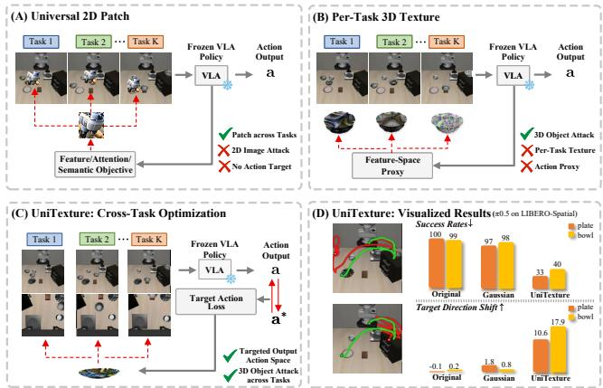
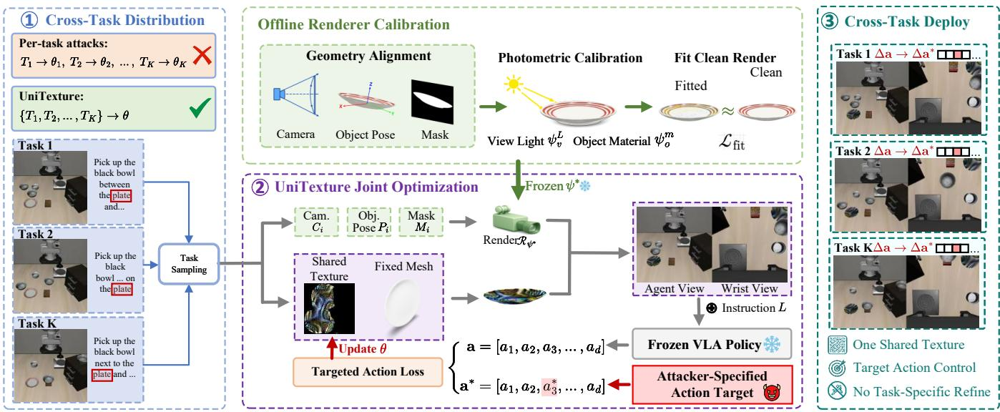
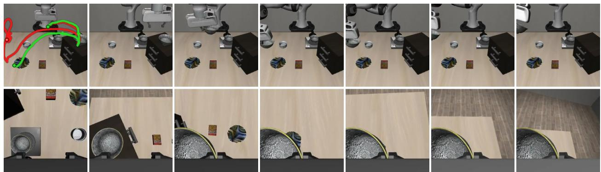
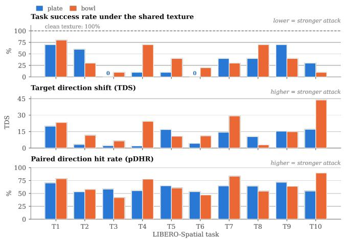

# UniTexture: Cross-Task Universal Adversarial Textures for Vision-Language-Action Models

Yukun Dai, Mingzhe Dai, Tianshi Wang1, Fengling Li2,

Jingjing Li3, Lei Zhu1

1Tongji University

2Mohamed bin Zayed University of Artificial Intelligence   
3University of Electronic Science and Technology of China yukundai@tongji.edu.cn, daimingzhe@bupt.edu.cn, tswang0116@163.com, fenglingli2023@gmail.com, lijin117@yeah.net, leizhu0608@gmail.com

## Abstract

Vision-Language-Action (VLA) models have emerged as generalist robotic policies capable of following diverse language instructions and performing a wide range of manipulation tasks. However, their direct control over embodied agents also exposes them to adversarial interference that may cause unsafe physical behaviors. Existing attacks on robotic policies are typically optimized for a single task or instruction, leaving the cross-task vulnerabilities of multitask VLAs largely unexplored. We introduce UniTexture, a cross-task universal adversarial texture attack that uses a single textured 3D object to induce targeted deviations in VLA action predictions across multiple tasks. UniTexture backpropagates gradients from the policy’s action outputs to surface texture parameters through a diferentiable renderer. It jointly optimizes the shared texture over a distribution of tasks, instructions, states, and viewpoints using a targeted action-space objective, steering predicted actions toward attacker-defined targets without optimizing a separate texture for each task. We evaluate Uni-Texture on OpenVLA and π0.5 across diverse manipulation tasks and multiple evaluation settings. UniTexture reduces the mean task success rate from 90.0% under benign conditions to 48.4% under attack, induces target-aligned action shifts, and further exhibits cross-suite and cross-model transfer without re-optimization. Together, these findings reveal shared crosstask vulnerabilities in multitask VLAs that can be systematically exploited through a single adversarial surface texture.

## Introduction

Vision-language-action (VLA) models are emerging as generalist policies for robotic manipulation. By grounding natural-language instructions and visual observations in robot actions, a single policy can execute diverse tasks without requiring a separately engineered controller for each behavior (Brohan et al. 2023; Zitkovich et al. 2023; O’Neill et al. 2024; Kim et al. 2024; Black et al. 2024). This versatility, however, also broadens the attack surface: a single adversarial visual pattern may influence multiple behaviors governed by the same policy. Moreover, an erroneous VLA prediction is not merely a semantic mistake. Because the predicted action is executed in the environment, adversarial interference may lead to unsafe motion, failed manipulation, or physical damage.

  
Figure 1: Overview and comparison of UniTexture. (A) Universal 2D patches transfer across tasks but lack 3D surface constraints and explicit action targets. (B) Existing 3D texture attacks are object-bound but require task-specific textures and feature-space proxies. (C) UniTexture optimizes one shared object-bound texture across tasks using targets in the VLA’s native action space. (D) On $\pi _ { 0 . 5 }$ in LIBERO-Spatial, UniTexture reduces task success and induces larger target-direction action shifts than the original and Gaussian baselines.

Existing visual attacks on VLAs have progressed along several complementary directions. Image-space attacks demonstrate the sensitivity of VLA action predictions to adversarial observations (Wang et al. 2024). Universal physical patches further show that a single two-dimensional pattern can afect multiple tasks, viewpoints, and model architectures (Lu et al. 2026a). Separately, Tex3D maps adversarial textures onto three-dimensional object surfaces, preserving their spatial correspondence as the object moves across viewpoints and interaction trajectories (Chen et al. 2026). However, universal patches lack object-surface constraints and direct targeted control in the policy’s action space, whereas Tex3D optimizes separate textures for individual tasks. Whether a single geometry-aware texture can consistently control a multitask VLA without per-task optimization therefore remains unclear.

This setting is more demanding than causing an isolated task failure. Across tasks, the instruction, scene context, nominal action distribution, and interaction trajectory all change. The target object’s pose, visibility, and image footprint also evolve during manipulation and across camera views. Consequently, gradients from diferent tasks must produce one texture that remains efective under these coupled variations. Targeted control introduces a further requirement: the objective must encode the attacker’s intended behavior in the policy’s action space, rather than treating arbitrary feature displacement as a proxy for success. The attack must satisfy these requirements while remaining fixed on the same physical object.

We introduce UniTexture, a cross-task universal adversarial texture attack for VLAs, as illustrated in Figure 1. Given a frozen target VLA, a target object, and a collection of manipulation tasks, UniTexture jointly optimizes a single shared surface texture over a cross-task training distribution. We first calibrate a diferentiable renderer using clean multiview observations by aligning the scene geometry and estimating photometric parameters, after which all rendering parameters are frozen. During attack optimization, we use task-balanced sampling to obtain task-conditioned observations, object poses, and language instructions. The renderer composites the shared texture into each observation, while targeted objectives defined in the model’s native action representation propagate gradients from the VLA outputs to the texture parameters. Only the texture is updated, and the resulting texture is applied unchanged across all tasks, without separate per-task optimization or refinement.

We evaluate UniTexture on OpenVLA (Kim et al. 2024) and π (Intelligence et al. 2025) using LIBERO-Spatial and LIBERO-Goal (Liu et al. 2023). For each model-object-suite configuration, a single texture isjointly optimized for all tasks in the corresponding suite. Across the evaluated settings, UniTexture reduces the mean task success rate from 90.0% under benign conditions to 48.4% under attack, while consistently shifting predicted actions toward attacker-specified targets. Cross-suite and cross-model evaluations further demonstrate that the optimized textures retain attack efectiveness beyond the task distribution and model used during optimization, without re-optimization. These findings expose a deployment-level vulnerability: task diversity alone does not prevent a single adversarial object appearance from repeatedly influencing a multitask robotic policy.

Our contributions are summarized as follows:

• Cross-task universal 3D texture attack. We formulate a threat model in which a single object-bound texture is jointly optimized across multiple tasks and applied unchanged, without per-task optimization or refinement.

• Targeted action-space optimization. We develop model-compatible objectives and metrics that directly encode attacker-specified targets in each VLA’s native action space, rather than relying on feature-space proxies or untargeted failure.

• Comprehensive cross-task evaluation. Experiments on OpenVLA and $\pi _ { 0 . 5 }$ across LIBERO-Spatial and LIBERO-Goal demonstrate cross-task attack efectiveness, targeted action manipulation, and transfer across task suites and model architectures.

## Related Work

## Vision-Language-Action Models

Vision-language-action (VLA) models integrate visual perception, language conditioning, and action generation into unified policies for robot control (Zitkovich et al. 2023). Because a single policy is reused across diverse tasks, shared visual inputs create a common attack surface across behaviors. However, VLA architectures difer substantially in their action representations: OpenVLA (Kim et al. 2024) uses autoregressive action tokens, the π family (Black et al. 2024; Intelligence et al. 2025) employs flow-matching action experts, and recent variants introduce continuous prediction or alternative action tokenizations (Kim, Finn, and Liang 2025; Pertsch et al. 2025). This heterogeneity motivates attack objectives defined in each model’s native action space.

## Adversarial Attacks on VLA Models

Building on classical digital and physical attacks (Szegedy et al. 2014; Madry et al. 2018; Eykholt et al. 2018; Athalye et al. 2018), VLA attacks include training-time backdoors (Zhou et al. 2025), language-based attacks (Jones et al. 2025), and deployment-time visual attacks (Wang et al. 2024; Cheng et al. 2024; Lu et al. 2026b; Zhang et al. 2026; Guo et al. 2025; Cui et al. 2026). Existing visual attacks mainly pursue universality or geometric persistence. Imagespace attacks reveal vulnerabilities in VLA action prediction (Wang et al. 2024), while UPA-RFAS (Lu et al. 2026a) and VLA-Hijack (Fu et al. 2026) optimize transferable 2D patches through feature-, attention-, or semantic-level objectives. These patches, however, are composited in the image plane rather than bound to object geometry. Tex3D (Chen et al. 2026), building on texture attacks against navigation agents (Liu et al. 2020), maps adversarial textures onto 3D object surfaces through diferentiable rendering, but optimizes separate textures for individual tasks and relies on a visual-feature proxy for π-family policies. UniTexture addresses the intersection of these directions by jointly optimizing one object-bound texture across tasks using attackerspecified targets in each VLA’s native action space.

## Method

## Threat Model and Problem Formulation

We attack a frozen VLA policy F that maps an RGB observation and a language instruction to robot actions. The attacker controls only the surface appearance of a single object in the workspace: it may repaint that object’s texture, but cannot modify the policy weights, the instruction, the camera pose, the sensing pipeline, or any other object in the scene. Given a task suite $\boldsymbol { \mathcal { S } } = \{ \tau _ { 1 } , \dots , \tau _ { K } \}$ , a target object, and an attacker-chosen target action a⋆, the attacker optimizes one texture ofline and then deploys the repainted object unchanged on every task in ${ \mathcal { S } } .$ . Gradients of F are available during optimization, but $F$ is never updated.

Let $\theta \overset { \cdot } { \in } [ 0 , 1 ] ^ { H \times W \times 3 }$ denote the UV texture map of the target object. We optimize θ while keeping the object’s mesh geometry fixed. Each demonstration frame supplies a tuple $\bar { \xi } = ( \bar { I } , \dot { \bar { L } } , C , P , M )$ : a policy-aligned observation I, its instruction $L ,$ camera parameters ${ \check { C } } ,$ the object’s 6-DoF pose $P ,$ , and the object’s image-space support mask M. Writing $\mathcal { R } _ { \psi }$ for the diferentiable rendering of the textured object under rendering parameters $\psi ,$ the attacked observation is the composite

  
Figure 2: Overview of UniTexture. (1) A task suite induces a cross-task distribution: rather than fitting a separate texture per task, UniTexture optimizes one shared texture θ for all tasks. Before joint optimization, an ofline calibration stage fits per-view lighting $\psi _ { v } ^ { L }$ and per-object material $\psi _ { o } ^ { m }$ so that the rendered clean object matches the simulator’s appearance; the resulting $\psi ^ { \star }$ is then frozen. (2) During joint optimization, each sampled frame supplies its rendering condition $( \hat { C } _ { i } ^ { ' } , P _ { i } , M _ { i } ) ;$ ; the shared texture is rendered on the fixed mesh, composited into the agent view (OpenVLA and $\pi _ { 0 . 5 } )$ and the wrist view $( \pi _ { 0 . 5 } )$ , and passed with the instruction L to the frozen VLA policy. A targeted action loss compares the predicted action a with the attacker-specified target $\mathbf { a } ^ { \star }$ and backpropagates to θ alone. (3) The optimized texture is deployed unchanged across all tasks.

$$
\Omega ( \theta ; I , C , P , M , \psi ) = M \odot \mathcal { R } _ { \psi } ( \theta ; C , P ) + ( 1 - M ) \odot I .\tag{1}
$$

Using the calibrated rendering parameters $\psi ^ { \star }$ defined below, we write the attacked policy input as $\begin{array} { r l } { \widetilde { I } } & { { } = } \end{array}$ $\Omega ( \theta ; I , C , P , M , \psi ^ { \star } )$ . UniTexture optimizes a single shared texture over the target task distribution,

$$
\boldsymbol { \theta } ^ { \star } = \underset { \boldsymbol { \theta } } { \mathrm { a r g m i n } } \ \underset { \tau \sim p ( \tau ) } { \mathbb { E } } \underset { \boldsymbol { \xi } \sim \mathcal { D } _ { \tau } } { \mathbb { E } } \left[ \mathcal { L } _ { \mathrm { t g t } } \left( F ( \widetilde { I } , L ) ; \mathbf { a } ^ { \star } \right) \right] .\tag{2}
$$

where $p ( \tau )$ is the task-sampling distribution over $s , \mathcal { D } ,$ τ is the demonstration distribution of task τ, and $\mathbf { a } ^ { \star }$ is the attackerspecified target action.

## Calibrating and Freezing the Renderer

Gradients reaching θ through (1) are only useful when the rendered object is photometrically consistent with the policy observations; otherwise, the attack may optimize against rendering artifacts. We therefore calibrate

$$
\begin{array} { r l r } & { \psi = \left( \{ \psi _ { v } ^ { L } \} _ { v \in \mathcal { V } } , \{ \psi _ { o } ^ { m } \} _ { o \in \mathcal { O } } \right) , } & \\ & { \psi _ { v } ^ { L } = \left( p _ { v } ^ { W } , \{ c _ { v } ^ { q } \} _ { q \in \mathcal { Q } } \right) , } & { v \in \mathcal { V } , } \\ & { \psi _ { o } ^ { m } = \left( \{ m _ { o } ^ { q } \} _ { q \in \mathcal { Q } } , m _ { o } ^ { \mathrm { s h } } \right) , } & { o \in \mathcal { O } , } \end{array}\tag{3}
$$

comprising view-specific lighting parameters $\psi _ { v } ^ { L }$ and objectspecific material parameters $\psi _ { o } ^ { m }$ . Here, $\mathcal { V } = \{ \mathrm { a g e n t } , \mathrm { w i s t } \}$ denotes the policy views, O denotes the calibrated objects, and $\mathcal { Q } = \mathrm { \{ \dot { a } m b , \dot { d i } f f , s p e c \} }$ indexes the ambient, difuse, and specular components. For each view $v , p _ { v } ^ { W }$ denotes the world-space light position and $c _ { v } ^ { q }$ denotes the RGB color or intensity of lighting component $q .$ . For each object $o , m _ { o } ^ { q }$ denotes the corresponding material coeficient and $m _ { o } ^ { \mathrm { s h } }$ denotes its shininess parameter.

The lighting parameters for each view are shared across all objects and tasks, whereas the material parameters for each object are shared across all views and tasks, with each $m _ { o } ^ { q }$ broadcast across the RGB channels. The world-space light position is transformed into the object frame for each sample using its pose $P .$

Let $\mathcal { D } _ { \mathrm { c a l } }$ denote the clean calibration distribution obtained by first sampling a view–object pair and then a calibration frame $\zeta = ( \bar { I } , \bar { C , P , M } )$ for that pair. We obtain the calibrated parameters from frames containing the original texture $\theta _ { 0 }$ by minimizing the masked photometric discrepancy:

$$
\psi ^ { \star } = \underset { \psi } { \mathrm { a r g m i n } } \ \underset { \zeta \sim \mathcal { D } _ { \mathrm { c a l } } } { \mathbb { E } } \left[ \mathcal { H } \left( M \odot \mathcal { R } _ { \psi } ( \theta _ { 0 } ; C , P ) , M \odot I \right) \right] .\tag{4}
$$

where $\mathcal { H }$ denotes the Smooth-L1 loss over masked object pixels, and $\psi ^ { \star }$ is fixed during texture optimization.

## Model-Specific Targeted Objectives

To accommodate heterogeneous VLA action interfaces, we instantiate $\mathcal { L } _ { \mathrm { t g t } }$ for autoregressive tokens and flow-matching action chunks.

Autoregressive action tokens. Autoregressive action-token policies represent each action dimension as a discrete token and generate the resulting token sequence autoregressively. We apply targeted token supervision (Wang et al. 2024) to optimize the shared object texture through diferentiable rendering. Let $Q _ { \mathrm { { a c t } } }$ denote the policy’s action tokenizer. Given the attacked observation $\widetilde { I }$ defined above, we define

$$
\mathbf { z } ^ { \star } = Q _ { \mathrm { a c t } } ( \mathbf { a } ^ { \star } ) ,
$$

$$
\mathcal { L } _ { \mathrm { t g t } } ^ { \mathrm { t o k } } ( \theta ) = - \frac { 1 } { \left| \mathcal { T } \right| } \sum _ { j \in \mathcal { I } } \log p _ { F } \left( z _ { j } ^ { \star } \big | \tilde { I } , L \right) ,\tag{5}
$$

where $z _ { j } ^ { \star }$ is the target token for action dimension $j , p _ { F } ( z _ { j } ^ { \star } \mid$ $\widetilde { I } , L )$ denotes the conditional probability that the frozen policy $\dot { F }$ assigns to this token, and $\mathcal { I }$ contains the attackerselected dimensions. In implementation, we mask all nontarget action-token positions so that they do not contribute to the targeted loss.

Flow-matching action chunks. Policies with flowmatching action experts generate continuous action chunks. Let $A \in \mathbb { R } ^ { H _ { a } \times d }$ denote the clean action chunk associated with a demonstration frame, where $H _ { a }$ is the number of action steps and d is the total number of action dimensions. We construct the targeted chunk $A ^ { \star }$ by replacing only the attacker-selected action dimension $j$ across the entire action horizon:

$$
A _ { h , k } ^ { \star } = \left\{ \begin{array} { l l } { \mathrm { c l i p } _ { [ - 1 , 1 ] } ( a ^ { \star } ) , } & { k = j , } \\ { A _ { h , k } , } & { k \neq j , } \end{array} \right. \quad h = 1 , \ldots , H _ { a } .\tag{6}
$$

Here, h indexes the action steps, k indexes the action dimensions, and $a ^ { \star }$ is the attacker-specified target value.

The targeted chunk is then interpolated with Gaussian noise ϵ at flow time t:

$$
x _ { t } = t \epsilon + ( 1 - t ) A ^ { \star } , \qquad u _ { t } = \epsilon - A ^ { \star } .\tag{7}
$$

Here, ϵ is a Gaussian noise chunk with the same shape as $A ^ { \star }$ $t \in [ 0 , 1 ]$ is the flow-matching time, $x _ { t }$ is the corresponding noisy action chunk, and $u _ { t }$ is its target velocity.

Given $x _ { t } ,$ the frozen $\pi _ { 0 . 5 }$ action expert predicts a velocity field. We minimize its flow-matching residual only on the attacker-selected action dimension $j \colon$

$$
\mathcal { L } _ { \mathrm { t g t } } ^ { \mathrm { f o w } } ( \theta ) = \frac { 1 } { H _ { a } } \sum _ { h = 1 } ^ { H _ { a } } \left[ v _ { F } ( \tilde { I } , L , x _ { t } , t ) _ { h , j } - ( u _ { t } ) _ { h , j } \right] ^ { 2 } .\tag{8}
$$

Here, vF denotes the velocity field predicted by the frozen $\pi _ { 0 . 5 }$ policy $F .$ . The indices $( \dot { h } , \dot { \jmath } )$ select the targeted action dimension at action step $h ;$ all non-target action dimensions are excluded from the loss.

## Optimization

We optimize only the shared texture $\theta ,$ keeping the policy $F ,$ object geometry, and calibrated renderer parameters ψ⋆ fixed. At each outer iteration, we sample a minibatch of frames and apply R consecutive texture updates. For each update, we re-render the texture under the frame-specific conditions $( C _ { i } , P _ { i } , M _ { i } )$ , composite the object using (1), evaluate the targeted objective, and update θ with AdamW. The texture is then clamped elementwise to [0, 1]. Algorithm 1 summarizes the procedure.

Algorithm 1 UniTexture: cross-task universal texture   
Require: frozen policy $F ;$ task suite $s ;$ target-object mesh;   
demonstration distributions $\{ \mathcal { D } _ { \tau } \} ;$ ; target specification   
$( \mathbf { a } ^ { \star } , \mathcal { I } ) ;$ outer iterations $N ;$ inner updates R   
1: fit $\psi ^ { \star }$ on clean frames by (4); freeze $\psi ^ { \star }$   
2: initialize $\theta  \theta _ { \mathrm { i n i t } }$   
3: for $n = 1$ to N do   
4: sample $\boldsymbol { B } = \{ \xi _ { i } \} _ { i = 1 } ^ { B }$ with $\tau _ { i } \sim p ( \tau )$ and $\xi _ { i } \sim \mathcal { D } _ { \tau _ { i } }$   
5: for $\cdot r = 1$ to R do   
6: $\tilde { I } _ { i } \gets \Omega ( \theta ; I _ { i } , C _ { i } , P _ { i } , M _ { i } , \psi ^ { \star } ) , i = 1 , \dots , B$   
7: $\begin{array} { r } { \mathcal { L } \gets \frac { 1 } { B } \sum _ { i } \mathcal { L } _ { \mathrm { t g t } } ( \tilde { I } _ { i } , L _ { i } ; \mathbf { a } ^ { \star } , \mathcal { I } ) } \end{array}$   
8: $\theta \gets \tilde { \mathrm { A d a m W } } ( \theta , \nabla _ { \theta } \mathcal { L } )$   
9: $\theta \gets \mathrm { c l i p } ( \theta , 0 , \dot { 1 } )$   
10: end for   
11: end for   
12: return texture $\theta ^ { \star }$

## Experiments

## Experimental Setup

Victim Policies and Task Suites. We attack two VLA models that instantiate the action interfaces described above. For the autoregressive action-token interface, we use the suite-specific OpenVLA (Kim et al. 2024) checkpoints openvl $\mathsf { a } - 7 \mathsf { b } - \mathsf { f i }$ netuned-libero-spatial and openvl $\mathtt { a } - 7 \mathrm { b } - \mathtt { f } \mathtt { i }$ inetuned-libero-goal. Forthe flow-matching action-chunk interface, we use the oficial $\pi _ { 0 . 5 }$ (Intelligence et al. 2025) checkpoint pi05\_libero. OpenVLA consumes the agent view, whereas $\pi _ { 0 . 5 }$ consumes both the agent and wrist views together with proprioceptive state; we composite the rendered textured object into every visual stream while leaving proprioception unchanged. We evaluate both policies on LIBERO-Spatial and LIBERO-Goal (Liu et al. 2023), each comprising 10 language-conditioned manipulation tasks. Both suites contain the same plate and bowl objects across all tasks, enabling within-suite cross-task evaluation and controlled cross-suite transfer without changing the target object. Because Open-VLA uses suite-specific fine-tuned checkpoints, its crosssuite evaluation transfers the texture across both task suites and fine-tuned checkpoints, whereas $\pi _ { 0 . 5 }$ retains the same checkpoint across suites.

Attack Configuration. For each policy-suite pair, we optimize separate object-bound textures for the plate and bowl, with each texture shared across all 10 tasks in the suite. Unless otherwise stated, we target the z-translation dimension $( j = 2 )$ with $a ^ { \star } = + 1$ , corresponding to an upward command. Each texture is optimized for 1001 outer iterations using AdamW with batch size $^ { 8 , }$ an initial learning rate of $1 0 ^ { - 5 }$ , and cosine decay. For each sampled minibatch, we perform 50 consecutive texture updates before sampling the next minibatch. We render at $2 2 4 \times 2 2 4$ using PyTorch3D (Ravi et al. 2020) with soft Phong shading and 8 faces per pixel.

Evaluation Protocol. Each setting covers all 10 tasks with 10 rollouts each, totaling 100 episodes. Following the official LIBERO initialization and OpenVLA evaluation protocols (Liu et al. 2023; Kim et al. 2024), we execute 10 dummy actions after resetting the simulator and begin evaluation only after objects settle. OpenVLA predicts one action per step, whereas $\pi _ { 0 . 5 }$ executes the first five actions of each predicted chunk before re-querying, following the OpenPI LIBERO protocol. At each query, clean and attacked predictions are computed from the same simulator state and, for $\pi _ { 0 . 5 } ,$ , the same flow-sampling noise. Only attacked actions are executed; clean predictions serve as step-aligned counterfactuals along the attacked trajectory.

<table><tr><td rowspan="3">Condition</td><td colspan="4">OpenVLA</td><td colspan="4"> $\pi _ { 0 . 5 }$ </td></tr><tr><td colspan="2">Spatial</td><td colspan="2">Goal</td><td colspan="2">Spatial</td><td colspan="2">Goal</td></tr><tr><td>plate</td><td>bowl</td><td>plate</td><td>bowl</td><td>plate</td><td>bowl</td><td>plate</td><td>bowl</td></tr><tr><td colspan="9">SR (%, lower indicates stronger task disruption)</td></tr><tr><td>Clean</td><td>84.0</td><td></td><td></td><td></td><td>99.0</td><td></td><td></td><td>97.0</td></tr><tr><td>Original</td><td>80.0</td><td>77.0</td><td>80.0 77.0</td><td>78.0</td><td>100.0</td><td>99.0</td><td>96.0</td><td>95.0</td></tr><tr><td>Gaussian</td><td>80.0</td><td>53.0</td><td>67.0</td><td>62.0</td><td>97.0</td><td>98.0</td><td>97.0</td><td>95.0</td></tr><tr><td>UniTexture</td><td>53.0</td><td>25.0</td><td>58.0</td><td>29.0</td><td>33.0</td><td>40.0</td><td>77.0</td><td>72.0</td></tr><tr><td colspan="9">TDS / TDA ( TDS for rendered conditions; TDA for Clean)</td></tr><tr><td>Clean</td><td>-19.2</td><td></td><td></td><td></td><td>-21.0</td><td></td><td></td><td>-26.9</td></tr><tr><td>Original</td><td>0.2</td><td>-0.8</td><td>-0.1</td><td>0.4</td><td>-0.1</td><td>0.2</td><td>0.1</td><td>0.3</td></tr><tr><td>Gaussian</td><td>1.5</td><td>0.6</td><td>1.6</td><td>2.2</td><td>1.8</td><td>0.8</td><td>0.4</td><td>0.3</td></tr><tr><td>UniTexture</td><td>3.0</td><td>-2.4</td><td>1.9</td><td>2.5</td><td>10.6</td><td>17.9</td><td>6.6</td><td>4.9</td></tr><tr><td colspan="9">pDHR / DHR (%; pDHR for rendered conditions; DHR for Clean)</td></tr><tr><td>Clean</td><td>14.8</td><td></td><td>14.2</td><td></td><td>14.0</td><td></td><td>16.0</td><td></td></tr><tr><td>Original</td><td>23.4</td><td>29.1</td><td>21.8</td><td>26.0</td><td>16.6</td><td>39.3</td><td>23.0</td><td>28.5</td></tr><tr><td>Gaussian UniTexture</td><td>27.4 37.6</td><td>30.3 33.3</td><td>27.6 33.8</td><td>28.0 32.5</td><td>44.0 61.0</td><td>42.6 65.5</td><td>31.7 49.3</td><td>29.6 44.7</td></tr></table>

Table 1: Within-suite results and non-adversarial controls. Each UniTexture is jointly optimized across all ten tasks of one suite and deployed without task-specific refinement; each model-object-suite setting is evaluated over 100 episodes. Clean observations bypass rendering, so each clean result spans the corresponding plate and bowl columns.

Our metrics distinguish nominal behavior, attack-induced action shifts, and task outcomes. For an episode with T steps, let i index the step, j the targeted action dimension, and σ the attacker-specified direction.

We first characterize the absolute clean behavior using the Target Direction Action(TDA) and Direction Hit Rate(DHR):

$$
\begin{array} { l } { \displaystyle \mathrm { T D A } = \frac { 1 } { T } \sum _ { i = 1 } ^ { T } \sigma a _ { i , j } ^ { \mathrm { c l e a n } } \times 1 0 0 , } \\ { \displaystyle \mathrm { D H R } = \frac { 1 } { T } \sum _ { i = 1 } ^ { T } \mathbf { 1 } \left\{ \sigma a _ { i , j } ^ { \mathrm { c l e a n } } \geq 0 . 0 1 \right\} \times 1 0 0 \% . } \end{array}
$$

Here, 1 is the indicator function, returning 1 when the condition holds and 0 otherwise. TDA measures the mean signed clean action along the target direction, while DHR is the percentage of clean steps following that direction with magnitude at least 0.01.

For rendered conditions, we measure the change induced by the texture relative to the paired clean prediction. The Target Direction Shift(TDS) and Paired Direction Hit Rate(pDHR) are

$$
\mathrm { T D S } = \frac { 1 } { T } \sum _ { i = 1 } ^ { T } \sigma \left( a _ { i , j } ^ { \mathrm { a d v } } - a _ { i , j } ^ { \mathrm { c l e a n } } \right) \times 1 0 0 ,
$$

$$
\mathrm { p D H R } = \frac { 1 } { T } \sum _ { i = 1 } ^ { T } \mathbf { 1 } \left\{ \sigma \left( a _ { i , j } ^ { \mathrm { a d v } } - a _ { i , j } ^ { \mathrm { c l e a n } } \right) \geq 0 . 0 1 \right\} \times 1 0 0 \% .
$$

TDA and DHR characterize the clean policy’s nominal directional behavior, whereas TDS and pDHR isolate the directional efect attributable to the attack. A positive TDS therefore provides direct evidence that the attack steers the predicted action toward the attacker-specified direction relative to a state-matched clean prediction.

Finally, Task Success Rate(SR) is the percentage of successfully completed episodes, with lower values indicating stronger task disruption.

Non-Adversarial Texture Controls. To disentangle targeted optimization from renderer-induced discrepancies and appearance changes, we include a renderer-free clean reference and two non-adversarial texture controls. Clean observation uses the observation image produced directly by LIBERO, bypassing our rendering and compositing pipeline. Rendered original texture passes the object’s original asset texture through the frozen calibrated renderer and the same compositing procedure used by UniTexture, isolating changes introduced by rendering and composition. Rendered Gaussian-noise texture instead uses an unoptimized Gaussian-noise texture while keeping the rendering and compositing procedure unchanged, sampled once from $\mathcal { N } ( 0 . 5 , 0 . 2 ^ { 2 } )$ and held fixed throughout evaluation. Neither texture control is optimized using ${ \mathcal { L } } _ { \mathrm { t g t } }$ . All three conditions use the same tasks, initial states, rollout budgets, and policy execution settings as the adversarial evaluation.

## Results

Within-Suite Cross-Task Attack. Table 1 shows that a single texture jointly optimized across a suite reduces task success in all eight model–object–suite settings without task-specific refinement. For OpenVLA, SR drops from the renderer-free clean baselines of 84% on Spatial and 80% on Goal to 53%/25% (plate/bowl) and 58%/29%, respectively; for $\pi _ { 0 . 5 } ,$ , it falls from 99% and 97% to 33%/40% and

  
Figure 3: Representative failed $\pi _ { 0 . 5 }$ rollout under a UniTexture attack on the plate in LIBERO-Spatial. The leftmost agent view shows projected gripper-center trajectories for the clean rollout (green; TDA = −12.4, DHR = 12.5%) and attacked rollout (red; TDS = 18.3, pDHR = 58.6%), interpolated from centers tracked every 20 frames. The remaining panels show the attacked rollout in temporal order, with agent views above wrist views.

  
Figure 4: Per-task results of the two object-specific UniTexture attacks against $\pi _ { 0 . 5 }$ on LIBERO-Spatial. The plate and bowl textures yield aggregate SRs of 33% and 40%, respectively, in Table 1. Each texture is jointly optimized across all ten tasks and deployed unchanged, with 10 rollouts per task. T1–T10 follow the suite’s standard task order; the panels show SR, TDS, and pDHR from top to bottom, and the dashed line marks the 100% clean-reference SR. Both textures produce positive TDS on every task, while the resulting reduction in SR varies across tasks.

77%/72%. UniTexture also yields lower SR than both the rendered original-texture and Gaussian-noise controls in every setting, indicating that the degradation is not explained by rendering and compositing discrepancies or an arbitrary texture change alone. At the suite-aggregate level, the reduction relative to clean ranges from 20 points for $\pi _ { 0 . 5 }$ on Goal-plate to 66 points on Spatial-plate, showing broad but architecture- and suite-dependent efectiveness.

Targeted Control versus Disruption. For $\pi _ { 0 . 5 }$ , UniTexture achieves both targeted control and task disruption, most clearly on Spatial. The TDS reaches 10.6/17.9, and pDHR reaches 61.0%/65.5% for plate/bowl, while SR falls to

33%/40%. On Goal, positive TDS of 6.6/4.9 and pDHR of 49.3%/44.7% coexist with substantially higher SR of 77%/72%. Thus, a persistent target-aligned shift does not necessarily translate into task failure.

OpenVLA exhibits a diferent pattern. UniTexture reduces SR to 53%/25% on Spatial and 58%/29% on Goal, but its TDS remains modest and becomes negative (−2.4) in the Spatial-bowl setting. This setting produces OpenVLA’s largest success reduction despite shifting the action in the opposite direction on average, directly separating disruption from targeted control. OpenVLA also has lower clean SR than $\pi _ { 0 . 5 }$ on the evaluated suites (80–84% versus 97–99%), which should temper cross-policy comparisons of absolute attacked SR. We attribute this decoupling to OpenVLA’s discrete autoregressive action interface. The token-level objective can alter the targeted action token and propagate its efect through subsequent decoding, disrupting the action sequence without inducing a coherent signed displacement in the targeted dimension. By contrast, the flow-matching objective directly steers a continuous action chunk, yielding the larger positive TDS and pDHR observed for $\pi _ { 0 . 5 }$

Gaussian-noise textures already produce nontrivial pDHR, reaching 44.0%, so pDHR should be interpreted relative to its matched control. Nevertheless, UniTexture exceeds the corresponding Gaussian pDHR in all eight settings. Overall, UniTexture provides stronger target-aligned control for $\pi _ { 0 . 5 } ,$ whereas OpenVLA can be substantially disrupted without reliable steering in the attacker-specified direction.

Figure 3 illustrates how target-aligned action shifts accumulate into task-level disruption. In this episode, the clean behavior predominantly opposes the targeted +z direction, with a TDA of −12.4 and a DHR of 12.53%. UniTexture nevertheless induces a large positive paired shift, reaching a TDS of 18.3 and a pDHR of 58.6%. Compared with the smooth clean reference trajectory (green), the attacked trajectory (red) alternates between downward corrective motions and attack-induced upward motions before task failure.

Task-Level Coverage of Shared Textures. Figure 4 expands the $\pi _ { 0 . 5 }$ LIBERO-Spatial results in Table 1 into their task-level outcomes. The targeted efect spans the entire suite:

<table><tr><td>Policy</td><td>Suite</td><td>Object</td><td>SR</td><td>TDS</td><td>pDHR (%)</td></tr><tr><td colspan="6">Cross-suite (same policy, texture reused on the other suite) OpenVLA</td></tr><tr><td>OpenVLA OpenVLA</td><td>S→Ġ S→G G→S</td><td>plate bowl plate</td><td>65.0 39.0 72.0</td><td>1.5 5.3 2.9</td><td>33.0 35.2</td></tr><tr><td>OpenVLA</td><td>G→S</td><td>bowl</td><td>24.0</td><td>-1.6</td><td>32.5 31.9</td></tr><tr><td></td><td>S→G</td><td>plate</td><td>74.0</td><td>3.0</td><td>42.7</td></tr><tr><td>π0.5</td><td>S→G</td><td>bowl</td><td>81.0</td><td></td><td></td></tr><tr><td>π0.5</td><td></td><td></td><td></td><td>5.1</td><td>44.2</td></tr><tr><td>π0.5 π0.5</td><td>G→S G→S</td><td>plate bowl</td><td>78.0 53.0</td><td>6.6 13.4</td><td>60.3 59.5</td></tr><tr><td colspan="6">Cross-model (same suite, texture reused on the other policy)</td></tr><tr><td>O→ π</td><td>Spatial</td><td>plate</td><td>92.0</td><td>3.4</td><td>52.2</td></tr><tr><td>O→ π</td><td>Spatial</td><td>bowl</td><td>95.0</td><td>2.2</td><td>50.0</td></tr><tr><td>O→ π</td><td>Goal</td><td>plate</td><td>94.0</td><td>1.0</td><td>36.6</td></tr><tr><td>O→ π</td><td>Goal</td><td>bowl</td><td>97.0</td><td>1.0</td><td>36.3</td></tr><tr><td>π→0</td><td>Spatial</td><td>plate</td><td>61.0</td><td>3.4</td><td>33.9</td></tr><tr><td>π→0</td><td>Spatial</td><td>bowl</td><td>26.0</td><td>0.7</td><td>34.8</td></tr><tr><td>π→0</td><td>Goal</td><td>plate</td><td>55.0</td><td>2.5</td><td>32.6</td></tr><tr><td>π →0</td><td>Goal</td><td>bowl</td><td>41.0</td><td>1.7</td><td>30.7</td></tr><tr><td></td><td></td><td></td><td></td><td></td><td></td></tr></table>

Table 2: Cross-suite and cross-model transfer without re-optimization. Arrows indicate the optimization-toevaluation direction; S/G and O/π denote Spatial/Goal and OpenVL $. \mathrm { A } / \pi _ { 0 . 5 } .$ , respectively. OpenVLA cross-suite transfer also changes the suite-specific checkpoint.

both object-specific shared textures produce positive TDS on all ten tasks, with pDHR ranging from 42% to 90% across all 20 task–object pairs. The attack also reduces SR below the 100% per-task reference in every pair, including complete failure on two plate tasks. These results show that the suite-level efectiveness is not driven by a small subset of vulnerable tasks: each shared texture induces the specified action direction throughout the task suite without task-specific refinement. Diferences in residual SR instead characterize how individual tasks respond to the induced action shift, rather than whether the attack reaches them.

Cross-Suite and Cross-Model Transfer. Table 2 evaluates direct texture reuse when either the task suite or the victim policy changes. Cross-suite transfer reduces SR below both the renderer-free clean baseline and the corresponding Gaussian-texture control in all eight settings. For $\pi _ { 0 . 5 } .$ , the directional objective also transfers consistently: TDS remains positive in all four settings, with pDHR ranging from 42.7% to 60.3%. Cross-model transfer is asymmetric in task disruption. Textures optimized for $\pi _ { 0 . 5 }$ reduce OpenVLA SR to 26%–61%, whereas textures optimized for OpenVLA leave $\pi _ { 0 . 5 }$ SR at 92%–97%.

This asymmetry reflects a substantial diference in robustness to object appearance. Under the matched nonadversarial controls, replacing the rendered original texture with a Gaussian-noise texture reduces OpenVLA’s Spatial– bowl SR from 77% to 53%, whereas $\pi _ { 0 . 5 }$ changes only from 99% to 98%. This sensitivity becomes more pronounced under adversarial textures. The directly optimized OpenVLA– Spatial–bowl texture, the transferred OpenVLA–Goal–bowl texture, and the transferred π0.5–Spatial–bowl texture produce nearly identical SRs of 25%, 24%, and 26%, respectively. Despite this severe disruption, all three exhibit nearzero or negative TDS and pDHR of only 31.9%–34.8%, close to the Gaussian control of 30.3%. Weak directional metrics therefore do not indicate an inefective attack: the textures strongly disrupt OpenVLA, but do so by destabilizing its visual–action mapping rather than by inducing a coherent shift in the specified direction. We attribute this failure mode to OpenVLA’s limited robustness to object appearance, which allows texture-induced instability to overwhelm the directional signal encouraged by the targeted objective. In contrast, $\pi _ { 0 . 5 }$ remains stable under the Gaussian texture and exhibits strong targeted control in the same Spatial–bowl setting, reaching TDS of 17.9 and pDHR of 65.5%.

<table><tr><td>Dim.</td><td>Semantics</td><td>SR</td><td>TDS</td><td>pDHR (%)</td></tr><tr><td>0</td><td>+x</td><td>62.0</td><td>4.8</td><td>48.1</td></tr><tr><td>0</td><td>-x</td><td>38.0</td><td>5.6</td><td>55.3</td></tr><tr><td>1</td><td>+y</td><td>68.0</td><td>3.8</td><td>50.8</td></tr><tr><td>1</td><td>-y</td><td>45.0</td><td>4.3</td><td>55.1</td></tr><tr><td>2</td><td>+z</td><td>33.0</td><td>10.6</td><td>61.0</td></tr><tr><td>2</td><td>-z</td><td>91.0</td><td>2.7</td><td>36.4</td></tr></table>

Table 3: Efect of the targeted action dimension and direction (π0.5-Spatial-plate). The upward z target used throughout the paper is the most efective choice, while its downward counterpart is the least efective.

Which Action Target Matters. Table 3 varies the targeted action dimension and direction while holding the policy, object, task suite, and optimization configuration fixed. Under our evaluation coordinate convention, +z and −z denote upward and downward motion, +y and −y denote leftward and rightward motion in the camera view, and +x and −x denote motion toward and away from the camera, respectively.

The evaluated horizontal targets remain controllable, with pDHR between 48.1% and 55.1%, but produce weaker task disruption, with SR between 45% and 68%. The opposite vertical target, −z, is the least efective on both criteria, retaining an SR of 91% while reaching only 2.7 TDS and 36.4% pDHR. We attribute this directional asymmetry to the manipulation geometry: a persistent upward bias pulls the end efector away from the interaction surface and disrupts reaching and contact, whereas a downward bias often agrees with the nominal approach motion.

## Conclusion

UniTexture shows that task diversity does not inherently protect a multitask VLA from a shared visual attack surface: one object-bound texture can induce cross-task adversarial efects without per-task refinement. By jointly optimizing the texture over a task distribution, UniTexture turns a persistent object appearance into an attack shared across diferent instructions, scenes, and trajectories. Results on OpenVLA and $\pi _ { 0 . 5 }$ demonstrate attacker-specified directional shifts and task disruption, while cross-suite and asymmetric cross-model transfer show that some efects extend beyond the optimization setting. These findings argue that VLA robustness should be evaluated against persistent perturbations shared across tasks, rather than only task-specific attacks.

## References

Athalye, A.; Engstrom, L.; Ilyas, A.; and Kwok, K. 2018. Synthesizing robust adversarial examples. In International conference on machine learning, 284–293. PMLR.

Black, K.; Brown, N.; Driess, D.; Esmail, A.; Equi, M.; Finn, C.; Fusai, N.; Groom, L.; Hausman, K.; Ichter, B.; et al. 2024. π0: A Vision-Language-Action Flow Model for General Robot Control. arXiv preprint arXiv:2410.24164.

Brohan, A.; Brown, N.; Carbajal, J.; Chebotar, Y.; Dabis, J.; Finn, C.; Gopalakrishnan, K.; Hausman, K.; Herzog, A.; Hsu, J.; et al. 2023. Rt-1: Robotics transformer for real-world control at scale. In Robotics: Science and Systems.

Chen, J.; Huang, S.; Du, J.; Chen, S.; Tian, Y.; Wei, M.; Yu, C.; and Yin, Z. 2026. Tex3D: Objects as Attack Surfaces via Adversarial 3D Textures for Vision-Language-Action Models. arXiv preprint arXiv:2604.01618.

Cheng, H.; Xiao, E.; Yu, C.; Yao, Z.; Cao, J.; Zhang, Q.; Wang, J.; Sun, M.; Xu, K.; Gu, J.; and Xu, R. 2024. Manipulation Facing Threats: Evaluating Physical Vulnerabilities in End-to-End Vision Language Action Models. arXiv preprint arXiv:2409.13174.

Cui, R.; Zhang, Z.; Pang, J.; Chi, H.; Guo, J.; Zhang, S.; Xie, S.; Jin, X.; Mu, Y.; Yang, J.; Yao, G.; Zhan, X.; Zhang, Y.-Q.; and Zhao, H. 2026. LIBERO-Safety: A Comprehensive Benchmark for Physical and Semantic Safety in Vision-Language-Action Models. In European Conference on Computer Vision.

Eykholt, K.; Evtimov, I.; Fernandes, E.; Li, B.; Rahmati, A.; Xiao, C.; Prakash, A.; Kohno, T.; and Song, D. 2018. Robust physical-world attacks on deep learning visual classification. In Proceedings of the IEEE conference on computer vision and pattern recognition, 1625–1634.

Fu, J.; Jiang, K.; Jia, J.; Chen, Z.; Chen, X.; Hong, L.; Gao, S.; Tan, C.; Yang, D.; and Zhang, W. 2026. VLA-Hijack: A Transferable Patch Attack against Vision-Language-Action Models via Visual Proprioception Hijacking. arXiv preprint arXiv:2605.28083.

Guo, J.; Wu, Z.; Tu, C.; Ma, Y.; Kong, X.; Liu, Z.; Ji, J.; Zhang, S.; Chen, Y.; Chen, K.; Dou, Q.; Yang, Y.; Liu, X.; Zhao, H.; Lv, W.; and Li, S. 2025. On Robustness of Vision-Language-Action Model against Multi-Modal Perturbations. arXiv preprint arXiv:2510.00037.

Intelligence, P.; Black, K.; Brown, N.; Darpinian, J.; Dhabalia, K.; Driess, D.; Esmail, A.; Equi, M.; Finn, C.; Fusai, N.; Galliker, M. Y.; Ghosh, D.; Groom, L.; Hausman, K.; Ichter, B.; Jakubczak, S.; Jones, T.; Ke, L.; LeBlanc, D.; Levine, S.; Li-Bell, A.; Mothukuri, M.; Nair, S.; Pertsch, K.; Ren, A. Z.; Shi, L. X.; Smith, L.; Springenberg, J. T.; Stachowicz, K.; Tanner, J.; Vuong, Q.; Walke, H.; Walling, A.; Wang, H.; Yu, L.; and Zhilinsky, U. 2025. π : a Vision-Language-Action Model with Open-World Generalization. arXiv:2504.16054.

Jones, E. K.; Robey, A.; Zou, A.; Ravichandran, Z.; Pappas, G. J.; Hassani, H.; Fredrikson, M.; and Kolter, J. Z. 2025. Adversarial Attacks on Robotic Vision Language Action Models. arXiv preprint arXiv:2506.03350.

Kim, M. J.; Finn, C.; and Liang, P. 2025. Fine-Tuning Vision-Language-Action Models: Optimizing Speed and Success. In Robotics: Science and Systems.

Kim, M. J.; Pertsch, K.; Karamcheti, S.; Xiao, T.; Balakrishna, A.; Nair, S.; Rafailov, R.; Foster, E. P.; Sanketi, P. R.; Vuong, Q.; et al. 2024. OpenVLA: An Open-Source Vision-Language-Action Model. In Agrawal, P.; Kroemer, O.; and Burgard, W., eds., 8thAnnual Conference on Robot Learning, volume 270 of Proceedings of Machine Learning Research, 2679–2713. PMLR.

Liu, A.; Huang, T.; Liu, X.; Xu, Y.; Ma, Y.; Chen, X.; Maybank, S. J.; and Tao, D. 2020. Spatiotemporal attacks for embodied agents. In Computer Vision–ECCV 2020: 16th European Conference, Glasgow, UK, August 23–28, 2020, Proceedings, Part XVII 16, 122–138. Springer.

Liu, B.; Zhu, Y.; Gao, C.; Feng, Y.; Liu, Q.; Zhu, Y.; and Stone, P. 2023. LIBERO: Benchmarking Knowledge Transfer for Lifelong Robot Learning. In Oh, A.; Naumann, T.; Globerson, A.; Saenko, K.; Hardt, M.; and Levine, S., eds., Advances in Neural Information Processing Systems, volume 36, 44776–44791. Curran Associates, Inc.

Lu, H.; Yu, Y.; Yang, Y.; Yi, C.; Zhang, Q.; Shen, B.; Kot, A. C.; and Jiang, X. 2026a. When Robots Obey the Patch: Universal Transferable Patch Attacks on Vision-Language-Action Models. arXiv:2511.21192.

Lu, X.; Chen, J.; Xiao, S.; Jin, Z.; Chen, Z.; Yu, H.; Qian, B.; Zhou, R.; Ji, X.; and Xu, W. 2026b. Phantom Menace: Exploring and Enhancing the Robustness of VLA Models Against Physical Sensor Attacks. In Proceedings ofthe AAAI Conference on Artificial Intelligence.

Madry, A.; Makelov, A.; Schmidt, L.; Tsipras, D.; and Vladu, A. 2018. Towards Deep Learning Models Resistant to Adversarial Attacks. In International Conference on Learning Representations.

O’Neill, A.; Rehman, A.; Maddukuri, A.; Gupta, A.; Padalkar, A.; Lee, A.; Pooley, A.; Gupta, A.; Mandlekar, A.; Jain, A.; et al. 2024. Open x-embodiment: Robotic learning datasets and rt-x models: Open x-embodiment collaboration 0. In 2024 IEEE International Conference on Robotics and Automation (ICRA), 6892–6903. IEEE.

Pertsch, K.; Stachowicz, K.; Ichter, B.; Driess, D.; Nair, S.; Vuong, Q.; Mees, O.; Finn, C.; and Levine, S. 2025. FAST: Eficient Action Tokenization for Vision-Language-Action Models. arXiv preprint arXiv:2501.09747.

Ravi, N.; Reizenstein, J.; Novotny, D.; Gordon, T.; Lo, W.-Y.; Johnson, J.; and Gkioxari, G. 2020. Accelerating 3d deep learning with pytorch3d. arXiv preprint arXiv:2007.08501.

Szegedy, C.; Zaremba, W.; Sutskever, I.; Bruna, J.; Erhan, D.; Goodfellow, I.; and Fergus, R. 2014. Intriguing properties of neural networks. In 2nd International Conference on Learning Representations, ICLR 2014.

Wang, T.; Han, C.; Liang, J. C.; Yang, W.; Liu, D.; Zhang, L. X.; Wang, Q.; Luo, J.; and Tang, R. 2024. Exploring the adversarial vulnerabilities of vision-language-action models in robotics. arXiv preprint arXiv:2411.13587.

Zhang, Y.; Zhang, B.; Fan, J.; Shen, J.; Cai, Y.; Yang, Y.; and Ji, J. 2026. RedVLA: Physical Red Teaming for Vision-Language-Action Models. arXivpreprint arXiv:2604.22591.

Zhou, X.; Tie, G.; Zhang, G.; Wang, H.; Zhou, P.; and Sun, L. 2025. BadVLA: Towards Backdoor Attacks on Vision-Language-Action Models via Objective-Decoupled Optimization. arXiv preprint arXiv:2505.16640.

Zitkovich, B.; Yu, T.; Xu, S.; Xu, P.; Xiao, T.; Xia, F.; Wu, J.; Wohlhart, P.; Welker, S.; Wahid, A.; Vuong, Q.; Vanhoucke, V.; Tran, H.; Soricut, R.; Singh, A.; Singh, J.; Sermanet, P.; Sanketi, P. R.; Salazar, G.; Ryoo, M. S.; Reymann, K.; Rao, K.; Pertsch, K.; Mordatch, I.; Michalewski, H.; Lu, Y.; Levine, S.; Lee, L.; Lee, T.-W. E.; Leal, I.; Kuang, Y.; Kalashnikov, D.; Julian, R.; Joshi, N. J.; Irpan, A.; Ichter, B.; Hsu, J.; Herzog, A.; Hausman, K.; Gopalakrishnan, K.; Fu, C.; Florence, P.; Finn, C.; Dubey, K. A.; Driess, D.; Ding, T.; Choromanski, K. M.; Chen, X.; Chebotar, Y.; Carbajal, J.; Brown, N.; Brohan, A.; Arenas, M. G.; and Han, K. 2023. RT-2: Vision-Language-Action Models Transfer Web Knowledge to Robotic Control. In Tan, J.; Toussaint, M.; and Darvish, K., eds., Proceedings of The 7th Conference on Robot Learning, volume 229 of Proceedings ofMachine Learning Research, 2165–2183. PMLR.