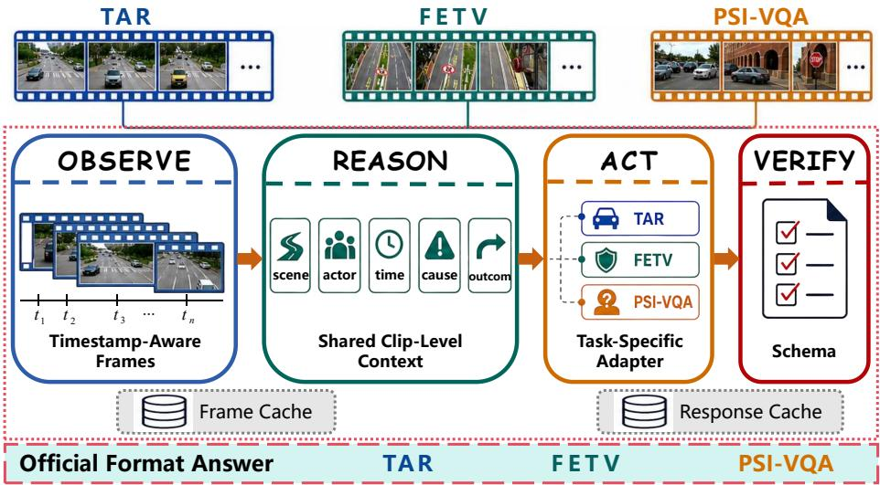

# UniTrafic-Agent: Unified Trafic Video Reasoning for AI City Challenge 2026 Track 3 with Two Out-of-Domain Evaluations

Peng Li1, Qianqian Xu2,3⋆, Shilong Bao2, Yangbangyan Jiang4, and Qingming Huang1,2⋆

1 School of Computer Science and Technology, University of Chinese Academy of Sciences (UCAS), Beijing, China

2 State Key Laboratory of AI Safety, Institute of Computing Technology (ICT), Chinese Academy of Sciences (CAS), Beijing, China

3 Beijing Academy of Artificial Intelligence (BAAI), Beijing, China 4 School of Artificial Intelligence and Robotics, Hunan University, Changsha, China lipeng251@mails.ucas.ac.cn, qmhuang@ucas.ac.cn, xuqianqian@ict.ac.cn, baoshilong@ict.ac.cn, jiangyangbangyan@hnu.edu.cn

Abstract. Trafic video understanding has become an important problem in intelligent transportation, as road videos provide direct evidence for accidents, violations, and interactions between vehicles and vulnerable road users. A useful system should explain how a trafic event develops, why it happens, and when the relevant interaction occurs, yet this remains dificult for multimodal large language models (MLLMs) because trafic videos contain sparse events and varied viewpoints. We introduce UniTrafic-Agent, the MR-CAS solution for Track 3 of the 10th AI City Challenge, which includes Trafic Anomaly Reasoning (TAR) and two out-of-domain evaluations: FETV for fisheye trafic events and PSI-VQA for pedestrian intention reasoning. UniTrafic-Agent follows an observe–reason–act–verify workflow that samples timestamped visual evidence, reasons over all questions from the same clip in one request, and converts responses through task-specific action adapters. On the oficial Public leaderboards, MR-CAS ranks 16th on TAR with a score of 0.5780, 2nd on FETV with 0.4884, and 4th on PSI-VQA with 64.4161. The code is available at https://github.com/Roclp/UniTraffic-Agent.

Keywords: Trafic video understanding · Multimodal large language models · Agentic reasoning · Out-of-domain generalization

## 1 Introduction

Trafic video understanding has attracted increasing attention with the widespread deployment of cameras on urban roads, at intersections, along highways, and in vehicles. Recent trafic–language systems, including TraficVLM [7], TrafficVILA [23], and STER-VLM [21], reflect the growing interest in interpreting safety-critical events from video. Such events may involve vehicles running red lights, pedestrians hesitating at curbs, or drivers yielding to other road users. Understanding them requires a system not only to recognize relevant actors and road conditions, but also to track their behavior over time and relate observed motion to the eventual outcome [13, 24, 25].

MLLMs provide a flexible interface for this problem by jointly processing sampled frames and natural-language instructions [18,20,22,29]. However, traffic videos pose challenges beyond conventional image and short-video question answering. Critical evidence may occur in only a few frames, viewpoints vary considerably across surveillance cameras, fisheye lenses, and dashcams, and a single clip may be associated with multiple questions. Moreover, answering each question independently can lead to inconsistent predictions [2, 10, 17, 26, 33].

Track 3 of the 10th AI City Challenge [28] provides a benchmark for traffic video understanding. Its main Trafic Anomaly Reasoning (TAR) task covers multiple question types. Two optional out-of-domain tasks further evaluate generalization across cameras. Fisheye Trafic Event Understanding (FETV) [1] requires structured violation records containing actor, trajectory, road, environmental, and temporal information. Pedestrian Scenario Intention Visual Question Answering (PSI-VQA) evaluates crossing-intent prediction and the localization of supporting evidence for a designated pedestrian in dashcam videos [4,15].

To address this challenge, we introduce UniTrafic-Agent, a unified traficvideo agent based on an observe–reason–act–verify workflow. During observation, the agent constructs a compact frame set that combines global video coverage with samples near question-specific timestamps. During reasoning, all questions and output fields associated with a clip are processed jointly to establish a shared event interpretation. Task-specific adapters then convert this interpretation into the oficial format required by each task. Finally, a verifier checks identifiers and retries unresolved cases using cached visual evidence.

Our contributions are summarized as follows:

Unified trafic-video agent framework. We introduce UniTrafic-Agent, which supports heterogeneous trafic-understanding tasks across surveillance, fisheye, and dashcam videos through an observe–reason–act–verify workflow. Timestamp-aware observation and reasoning. We combine global frame coverage with question-specific temporal evidence and perform clip-level joint reasoning to improve prediction consistency.

– Task-specific action adapters. We develop task-specific action adapters and validation procedures for diferent tasks. MR-CAS ranks 2nd on FETV and 4th on PSI-VQA on the oficial Public leaderboards.

## 2 Related Work

Multimodal large language models and agents. In recent years, multimodal large language models (MLLMs) have shown strong capabilities in image question answering and video description, including GPT-4V [22], Gemini [29], LLaVA [18], and Video-ChatGPT [20]. VideoCLIP [30], VideoCoCa [32], and TimeChat [26] further study video–text representation and temporal grounding. Trafic-oriented systems adapt MLLMs to road scenes through phase-aware inputs, high-resolution views, reference examples, specialized prompts, or multi-agent reasoning [5,7,10, 12, 16, 21, 23]. SpatialAgent [14] shows how an LLM agent can coordinate perception tools for AI City spatial QA. UniTrafic-Agent follows this agent-based direction for trafic video reasoning across CCTV, fisheye, and dashcam settings.

Trafic anomaly and temporal reasoning. Trafic anomaly research covers detection [6, 27, 31], weakly supervised localization [19], accident understanding [9], and causal reasoning [13]. Query-conditioned models such as QVHighlights [17] and TimeChat [26] further connect language queries to temporal video intervals. Track 3 extends these settings by requiring one system to handle multiple question types and camera domains: TAR supports diverse anomaly-reasoning questions for the same clip [11], FETV builds on fisheye trafic perception [1, 8], and PSI-VQA extends pedestrian crossing benchmarks [15,24,25] with cue explanations and decision-relevant intervals [3]. These tasks motivate our video-level inference and task-specific action adapters.

## 3 UniTrafic-Agent

UniTrafic-Agent is designed as a unified inference workflow for heterogeneous trafic-video tasks. Instead of treating each question or output field as an isolated query, the system uses the video clip as the basic reasoning unit. For each clip, it first builds a timestamped visual observation, then asks an MLLM to infer a shared event context, including the relevant actors, road layout, temporal evolution, and outcome. This shared context is finally mapped to benchmarkspecific predictions by task-specific action adapters. As shown in Figure 1, TAR, FETV, and PSI-VQA use the same observation strategy, model interface, caching mechanism, and verification procedure, while their adapters specify the required input schema, answer space, formatting examples, and submission format.

## 3.1 Timestamp-Aware Observation

Processing every frame of a video is impractical for a hosted MLLM because of input-length and computational constraints. We therefore construct a compact frame set that balances global coverage with task-specific temporal evidence. The sampler first selects G frames uniformly distributed over the entire clip. It then adds a duration-adaptive temporal grid for broader temporal coverage. For TAR and PSI-VQA, questions may provide explicit timestamps; in such cases, we additionally sample a local neighborhood from −1 to +1 seconds around each timestamp anchor. If the candidate set exceeds the frame budget M, endpoints and frames closest to timestamp anchors are kept first, and the remaining slots are filled from the regular grid. Duplicate frames are removed and the final frames are ordered chronologically. Each frame is paired with its timestamp. The prompt states that adjacent inputs may be separated by several seconds, and frames near timestamp anchors are sent with higher visual detail. Decoded JPEGs are cached so retries and recovery runs use identical visual evidence.

  
Fig. 1: Overview of UniTrafic-Agent. The observe–reason–act–verify workflow shares timestamp-aware observation, clip-level event reasoning, and output verification across TAR, FETV, and PSI-VQA, while task-specific action adapters convert the shared event interpretation into each oficial submission format.

## 3.2 Video-Level Event Reasoning

Trafic clips in Track 3 contain multiple questions and output fields that refer to the same underlying event. UniTrafic-Agent therefore builds a shared event context before producing task-specific answers. For each clip, the model is instructed to examine the road layout, identify the relevant actors, and trace the event from its initial state to its final outcome. It then answers all associated questions or fields in a single request using this shared context. This video-level reasoning reduces inconsistencies in actor identity, causal explanations, and temporal boundaries across outputs that describe the same event.

## 3.3 Task-Specific Action Adapters

Although the three benchmarks share the same observation and reasoning protocol, they difer substantially in their answer spaces and submission formats. We therefore implement a task-specific action adapter for each benchmark to map the shared reasoning output to the required submission format.

TAR. The TAR adapter jointly handles all question types for a video. It constrains BCQ and MCQ answers while supporting free-form descriptions, causal explanations, summaries, and temporal intervals. The resulting predictions are matched to oficial identifiers and written to the required CSV format.

FETV. The FETV adapter generates a structured 13-field violation record covering the violator, trajectory, road context, timestamp, and event description. It distinguishes positions in the 3×3 grid from lane indices defined by the direction of travel, normalizes categorical values, and produces the oficial JSON output.

PSI-VQA. The PSI-VQA adapter tracks the pedestrian marked by a red box and distinguishes observed motion from inferred crossing intent. It produces BCQ, MCQ, visual-cue, and temporal answers. Decision-relevant intervals cover the period from when the pedestrian begins to afect the driving decision until the relevant action ends or the pedestrian leaves the field of view. Predictions are converted to the oficial CSV format.

## 3.4 Verification and Recovery

Verification restores oficial identifiers, normalizes categorical values, validates temporal intervals, and checks output completeness without modifying semantically valid answers. Frame and response caches avoid redundant computation and preserve successful predictions during recovery. Raw responses and validation results are retained for error analysis.

## 4 Experiments

## 4.1 Datasets

TAR. The TAR test set [28] contains 960 human-verified questions for 80 CCTV clips trimmed from 17 public YouTube videos. The training data are collected from eight public trafic and anomaly datasets [6, 9, 13, 19, 27, 31], resulting in substantial variation in viewpoint, duration, and event type.

FETV. The FETV test set [1] contains 200 fisheye clips with trafic violations and normal trafic scenes. Each clip is annotated with the violator, trajectory, road geometry, environment, event time, and event description.

PSI-VQA. The PSI-VQA test set [15] contains 328 questions for 40 dashcam clips. All questions concern a marked pedestrian and cover crossing intent, supporting visual cues, multiple-choice reasoning, or temporal localization.

## 4.2 Evaluation Metrics

Following the oficial protocol [28], we evaluate UniTrafic-Agent on TAR, FETV, and PSI-VQA using the AI City Challenge evaluation system.

Table 1: Oficial Public leaderboard results for MR-CAS and the leading entries on TAR, FETV, and PSI-VQA.
<table><tr><td colspan="3">Evaluation Rank MR-CAS Leader</td></tr><tr><td>TAR</td><td>16 0.5780</td><td>0.6788</td></tr><tr><td>FETV</td><td>2 0.4884</td><td>0.4891</td></tr><tr><td>PSI-VQA</td><td>4 64.4161</td><td>70.6397</td></tr></table>

TAR. For TAR, BCQ and MCQ are evaluated by accuracy, while seven openended task types are evaluated by BERTScore F1 [34]. The final TAR score is the unweighted mean over the nine scored task types, where $\tau _ { \mathrm { o p e n } }$ denotes the seven open-ended task types:

$$
S _ { \mathrm { T A R } } = \frac { 1 } { 9 } \left( S _ { \mathrm { B C Q } } + S _ { \mathrm { M C Q } } + \sum _ { t \in \mathcal { T } _ { \mathrm { o p e n } } } S _ { t } \right) .\tag{1}
$$

FETV. FETV scores structured violation attributes and event descriptions [1]. The structured fields are summarized by the oficial MacroF1 term, while the description is evaluated by normalized CIDEr and BERTScore. The final FETV score follows the oficial weighted formula:

$$
S _ { \mathrm { F E T V } } = 0 . 2 5 \cdot \mathrm { { C I D E r } _ { n o r m } + 0 . 2 5 \cdot \mathrm { { B E R T S c o r e } + 0 . 5 \cdot \mathrm { { M a c r o F 1 } } . } }\tag{2}
$$

PSI-VQA. PSI-VQA evaluates four pedestrian-intent subtasks [15]: Macro-F1 for PSI-T1, cue-level F1 for PSI-T2, accuracy for PSI-T3, and temporal mIoU for PSI-T4. The four normalized subtask scores are combined with equal weight:

$$
S _ { \mathrm { P S I } } = 0 . 2 5 \cdot \mathrm { P S I } { \mathrm { - } } \mathrm { T } 1 + 0 . 2 5 \cdot \mathrm { P S I } { \mathrm { - } } \mathrm { T } 2 + 0 . 2 5 \cdot \mathrm { P S I } { \mathrm { - } } \mathrm { T } 3 + 0 . 2 5 \cdot \mathrm { P S I } { \mathrm { - } } \mathrm { T } 4 .\tag{3}
$$

## 4.3 Implementation Details

For all three tasks, each video is processed in a single request with at most 32 sampled frames, including 16 globally distributed frames. Frames are cached as JPEG images with quality 100 and a maximum side length of 768 pixels, and frames near question-provided timestamps use the high-detail setting.Video-level requests run in parallel for throughput. All API calls use temperature 0 with up to three transport retries. We use gpt-5.5 as the primary model. Cases that remain missing or unparsable after API or validation failures are recovered with gpt-5.4 using the same prompt and cached frames. Public training annotations are used only to construct answer-format examples. We do not use private data, manually annotate the test set, or edit individual test predictions.

Table 2: TAR final and component results for MR-CAS and the leading Public entry. Gap denotes MR-CAS minus Leader.
<table><tr><td>Metric</td><td>MR-CAS Leader</td><td>Gap</td></tr><tr><td>Official mean</td><td>0.5780</td><td>0.6788 -0.1008</td></tr><tr><td>BCQ</td><td>0.9187</td><td>1.0000 -0.0813</td></tr><tr><td>MCQ</td><td>0.9500</td><td>0.9500 0.0000</td></tr><tr><td>BCQ-OE</td><td>0.5585</td><td>0.6686 -0.1101</td></tr><tr><td>MCQ-OE</td><td>0.9604</td><td>0.9693 -0.0089</td></tr><tr><td>Open-QA</td><td>0.4042</td><td>0.4986-0.0944</td></tr><tr><td>Causal linkage</td><td>0.4192</td><td>0.5310 -0.1118</td></tr><tr><td>Scene description</td><td>0.2667</td><td>0.4373 -0.1706</td></tr><tr><td>Temporal description</td><td>0.3248</td><td>0.5137 -0.1889</td></tr><tr><td>Summarization</td><td>0.3992</td><td>0.5409 -0.1417</td></tr><tr><td>Temporal localization</td><td>0.6936</td><td>0.7803 -0.0867</td></tr></table>

## 4.4 Oficial Challenge Results

Table 1 summarizes our oficial Public leaderboard results together with the leading score for each task. MR-CAS ranks 2nd on FETV, 4th on PSI-VQA, and 16th on TAR, with the FETV result within 0.0007 of 1st place.

TAR Table 2 shows that MR-CAS performs well on constrained questions, matching the leader on MCQ accuracy and reaching 0.9604 on MCQ-OE F1. The main gap comes from long-form tasks, including scene description, temporal description, and summarization. These tasks require not only identifying the anomalous event, but also selecting reference-aligned details and temporal abstractions. The relatively strong temporal mIoU suggests that the model often localizes the event, but still struggles to express the evidence at the same level of granularity as the reference answer.

FETV MR-CAS achieves 0.4884 on FETV, only 0.0007 below the leading Public score. Table 3 shows that the system is competitive on description, violator type, image-position fields, and final lane, indicating that timestamp-aware observation and the FETV action adapter help locate and track the violating actor. The main weakness is road-topology reasoning, especially intersection type, where fisheye distortion makes geometric interpretation dificult.

PSI-VQA Table 4 reports the PSI-VQA component results. MR-CAS ranks 4th overall and scores higher than the leading entry on Open-QA Cue-F1, indicating that the model capture useful visual evidence for the target pedestrian. However, BCQ and temporal localization scores remain lower than the leader. This suggests that cue recognition alone is not suficient for PSI-VQA, where accurate performance also depends on reliable crossing-intent judgment and alignment between the predicted interval and the driver-relevant decision window.

Table 3: FETV final and component results for MR-CAS and the leading Public entry. Gap denotes MR-CAS minus Leader.
<table><tr><td>Metric MR-CAS</td><td> Leader</td><td>Gap</td></tr><tr><td>Final score</td><td>0.4884 0.4891</td><td>-0.0007</td></tr><tr><td>Categorical mean Description</td><td>0.5358 0.5612 0.4411</td><td>-0.0254 +0.0240</td></tr><tr><td>Violation type</td><td>0.4171 0.2542</td><td>-0.0240</td></tr><tr><td>Violator type</td><td>0.2302 0.4442</td><td>+0.0101</td></tr><tr><td>Color</td><td>0.4543 0.1911</td><td>0.1981-0.0070</td></tr><tr><td>Initial position</td><td>0.2647 0.1942</td><td>+0.0705</td></tr><tr><td>Final position</td><td>0.2734 0.2123</td><td>+0.0611</td></tr><tr><td>Initial lane</td><td>0.2218</td><td>-0.0270</td></tr><tr><td></td><td>0.1948</td><td>+0.0358</td></tr><tr><td>Final lane</td><td>0.2507 0.2149</td><td></td></tr><tr><td>Intersection type</td><td>0.5749</td><td>1.0000 -0.4251</td></tr><tr><td>Weather</td><td>1.0000</td><td>1.0000 0.0000</td></tr><tr><td>Light condition</td><td>1.0000</td><td>1.0000 0.0000</td></tr><tr><td></td><td></td><td></td></tr><tr><td>Date</td><td>1.0000</td><td>1.0000 0.0000</td></tr><tr><td>Time</td><td>0.9950</td><td>0.9950 0.0000</td></tr></table>

Table 4: PSI-VQA final and component results for MR-CAS and the leading Public entry. Gap denotes MR-CAS minus Leader.
<table><tr><td>Metric</td><td>MR-CAS</td><td>Leader</td><td>Gap</td></tr><tr><td>Final score</td><td>64.4161</td><td>70.6397</td><td>-6.2236</td></tr><tr><td>BCQ</td><td>0.5934</td><td>0.7084</td><td>-0.1150</td></tr><tr><td>BCQ acc.</td><td>0.6000</td><td>0.7273</td><td>-0.1273</td></tr><tr><td>Open-QA Cue</td><td>0.6389</td><td>0.5833</td><td>+0.0556</td></tr><tr><td>MCQ</td><td>0.7692</td><td>0.7912</td><td>-0.0220</td></tr><tr><td>Temporal localization</td><td>0.5751</td><td>0.7427</td><td>-0.1676</td></tr></table>

Cross-Domain Analysis FETV and PSI-VQA provide two out-of-domain evaluations beyond TAR: fisheye intersection videos with structured violation records, and dashcam pedestrian-intent videos with a marked target actor. Without task-specific fine-tuning, UniTrafic-Agent ranks 2nd on FETV and 4th on PSI-VQA, showing the efectiveness of transfer to fisheye and dashcam settings.

## 5 Conclusion

We introduce UniTrafic-Agent for Track 3 of the 10th AI City Challenge. By combining timestamp-aware observation, clip-level event reasoning, and taskspecific action adapters, UniTrafic-Agent shows strong out-of-domain generalization, with MR-CAS ranking 2nd on FETV and 4th on PSI-VQA, while also performing well on selected TAR and PSI-VQA components. Remaining errors mainly arise from reference-aligned long-form generation, fisheye road geometry, pedestrian intent prediction, and temporal boundary estimation. These results suggest that explicit actor tracking and geometry-aware temporal reasoning are promising directions for future trafic-video agents.

## References

1. Abduljawad, A., Shaik, N.S., S S, M., Chang, M.C., Hsieh, J.W., Gochoo, M.: FETV: Fisheye trafic event and violation dataset. https://github.com/MoyoG/ FETV (2026) 2, 3, 5, 6

2. Bao, S., Xu, Q., Li, F., Han, B., Yang, Z., Cao, X., Huang, Q.: Towards sizeinvariant salient object detection: A generic evaluation and optimization approach. IEEE Transactions on Pattern Analysis and Machine Intelligence (2025) 2

3. Bao, S., Xu, Q., Yang, Z., Cao, X., Huang, Q.: Rethinking collaborative metric learning: Toward an eficient alternative without negative sampling. IEEE Transactions on Pattern Analysis and Machine Intelligence 45(1), 1017–1035 (2022) 3

4. Bao, S., Xu, Q., Yang, Z., He, Y., Cao, X., Huang, Q.: Improved diversitypromoting collaborative metric learning for recommendation. IEEE Transactions on Pattern Analysis and Machine Intelligence 46(12), 9004–9022 (2024) 2

5. Bao, S., Xu, Q., Yang, Z., He, Y., Cao, X., Huang, Q.: Aucpro: Auc-oriented provable robustness learning. IEEE Transactions on Pattern Analysis and Machine Intelligence 47(6), 4579–4596 (2025) 3

6. Chen, X., Xu, H., Ruan, M., Bian, M., Chen, Q., Huang, Y.: SO-TAD: A surveillance-oriented benchmark for trafic accident detection. Neurocomputing 618, 129061 (2025). https://doi.org/10.1016/j.neucom.2024.129061 3, 5

7. Dinh, Q.M., Ho, M.K., Dang, A.Q., Tran, H.P.: TraficVLM: A controllable visual language model for trafic video captioning. In: Proceedings of the IEEE/CVF Conference on Computer Vision and Pattern Recognition Workshops. pp. 7134– 7143 (2024) 1, 3

8. Gochoo, M., Otgonbold, M.E., Ganbold, E., Hsieh, J.W., Chang, M.C., Chen, P.Y., Dorj, B., Al Jassmi, H., Batnasan, G., Alnajjar, F., Abduljabbar, M., Lin, F.P.: FishEye8K: A benchmark and dataset for fisheye camera object detection. In: Proceedings of the IEEE/CVF Conference on Computer Vision and Pattern Recognition Workshops. pp. 5304–5312 (2023) 3

9. Gu, S., Wang, X., Ying, D., Zhao, H., Yang, R., Jin, M., Li, B., Pavone, M., Yeung-Levy, S., Wang, J., et al.: Accidentbench: Benchmarking multimodal understanding and reasoning in vehicle accidents and beyond. arXiv preprint arXiv:2509.26636 (2025) 3, 5

10. Ha, V.T.D., Tran, T.H., Dong, G.T., Chu, N.C., Vu, H., Nguyen, T.C.: Domainaware enhancements to vision-language models for urban trafic safety question answering. In: 2025 IEEE/CVF International Conference on Computer Vision Workshops (ICCVW). pp. 5425–5433. IEEE (2025) 2, 3

11. Hua, C., Xu, Q., Bao, S., Yang, Z., Huang, Q.: Reconboost: Boosting can achieve modality reconcilement. arXiv preprint arXiv:2405.09321 (2024) 3

12. Hua, C., Xu, Q., Yang, Z., Wang, Z., Bao, S., Huang, Q.: Openworldauc: Towards unified evaluation and optimization for open-world prompt tuning. arXiv preprint arXiv:2505.05180 (2025) 3

13. Huang, C., Wang, B., Wang, W., Wen, J., Liu, C., Shen, L., Cao, X.: Vad-r1: Towards video anomaly reasoning via perception-to-cognition chain-of-thought. Advances in neural information processing systems 38, 118486–118518 (2026) 2, 3, 5

14. Huang, H.W., Cheng, J.H., Chen, K.M., Yang, C.Y., Alattar, B., Lin, Y.R., Kim, P., Kim, S., Kim, K., Huang, C.I., Hwang, J.N.: Warehouse spatial question answering with LLM agent. arXiv preprint arXiv:2507.10778 (2025) 3

15. ISE-ICE Lab: PSI-VQA: AI City Challenge 2026 Track 3 out-of-domain pedestrian intent vqa dataset. https://huggingface.co/datasets/ise-ice-lab/PSI\_VQA (2026) 2, 3, 5, 6

16. Kachhadiya, R., Patil, D., Anastasiu, D.C.: Multi-agent cooperation for trafic safety description and analysis. In: Proceedings of the IEEE/CVF International Conference on Computer Vision Workshops. pp. 5486–5494 (2025) 3

17. Lei, J., Berg, T.L., Bansal, M.: Detecting moments and highlights in videos via natural language queries. Advances in Neural Information Processing Systems 34, 11846–11858 (2021) 2, 3

18. Liu, H., Li, C., Wu, Q., Lee, Y.J.: Visual instruction tuning. In: Advances in Neural Information Processing Systems (2023) 2

19. Lv, H., Zhou, C., Cui, Z., Xu, C., Li, Y., Yang, J.: Localizing anomalies from weakly-labeled videos. IEEE Transactions on Image Processing 30, 4505–4515 (2021). https://doi.org/10.1109/TIP.2021.3072863 3, 5

20. Maaz, M., Rasheed, H., Khan, S., Khan, F.S.: Video-ChatGPT: Towards detailed video understanding via large vision and language models. In: Proceedings of the 62nd Annual Meeting of the Association for Computational Linguistics (Volume 1: Long Papers). pp. 12585–12602 (2024) 2

21. Nguyen-Nhu, T.A., Minh, T.D.H., To-Thanh, D., Le-Gia, P., Vo-Lan, T., Nguyen, T.H.: Ster-vlm: Spatio-temporal with enhanced reference vision-language models. In: 2025 IEEE/CVF International Conference on Computer Vision Workshops (IC-CVW). pp. 5516–5525. IEEE (2025) 1, 3

22. OpenAI: GPT-4V(ision) System Card. https://openai.com/index/gpt- 4vsystem-card/ (2023) 2

23. Park, B., Yang, W., Yuan, S., Anwar, S.M., Marsic, I.: TraficVILA: A multimodal framework for trafic safety description and analysis. In: Proceedings of the IEEE/CVF International Conference on Computer Vision Workshops. pp. 5460– 5468 (2025) 1, 3

24. Rasouli, A., Kotseruba, I., Kunic, T., Tsotsos, J.K.: PIE: A large-scale dataset and models for pedestrian intention estimation and trajectory prediction. In: Proceedings of the IEEE/CVF International Conference on Computer Vision. pp. 6261– 6270 (2019) 2, 3

25. Rasouli, A., Kotseruba, I., Tsotsos, J.K.: Are they going to cross? a benchmark dataset and baseline for pedestrian crosswalk behavior. In: 2017 IEEE International Conference on Computer Vision Workshops (ICCVW). pp. 206–213. IEEE (2017) 2, 3

26. Ren, S., Yao, L., Li, S., Sun, X., Hou, L.: Timechat: A time-sensitive multimodal large language model for long video understanding. In: 2024 IEEE/CVF Conference on Computer Vision and Pattern Recognition (CVPR). pp. 14313–14323. IEEE (2024) 2, 3

27. Sultani, W., Chen, C., Shah, M.: Real-world anomaly detection in surveillance videos. In: Proceedings of the IEEE Conference on Computer Vision and Pattern Recognition (2018) 3, 5

28. Tang, Z., Wang, S., Anastasiu, D.C., Chang, M.C., et al.: The 10th AI City Challenge. In: ECCV Workshops. Malm"o, Sweden (2026) 2, 5

29. Team, G., Anil, R., Borgeaud, S., Alayrac, J.B., Yu, J., Soricut, R., Schalkwyk, J., Dai, A.M., Hauth, A., Millican, K., et al.: Gemini: a family of highly capable multimodal models. arXiv preprint arXiv:2312.11805 (2023) 2

30. Xu, H., Ghosh, G., Huang, P.Y., Okhonko, D., Aghajanyan, A., Metze, F., Zettlemoyer, L., Feichtenhofer, C.: VideoCLIP: Contrastive pre-training for zero-shot video-text understanding. In: Proceedings of the Conference on Empirical Methods in Natural Language Processing. pp. 6787–6800 (2021) 2

31. Xu, Y., Hu, H., Huang, C., Nan, Y., Liu, Y., Wang, K., Liu, Z., Lian, S.: Tad: A large-scale benchmark for trafic accidents detection from video surveillance. IEEE Access 13, 2018–2033 (2024) 3, 5

32. Yan, S., Zhu, T., Wang, Z., Cao, Y., Zhang, M., Ghosh, S., Wu, Y., Yu, J.: Video-CoCa: Video-text modeling with zero-shot transfer from contrastive captioners. arXiv preprint arXiv:2212.04979 (2022) 2

33. Yang, Z., Xu, Q., Hou, W., Bao, S., He, Y., Cao, X., Huang, Q.: Revisiting aucoriented adversarial training with loss-agnostic perturbations. IEEE Transactions on Pattern Analysis and Machine Intelligence 45(12), 15494–15511 (2023) 2

34. Zhang, T., Kishore, V., Wu, F., Weinberger, K.Q., Artzi, Y.: Bertscore: Evaluating text generation with bert. arXiv preprint arXiv:1904.09675 (2019) 6