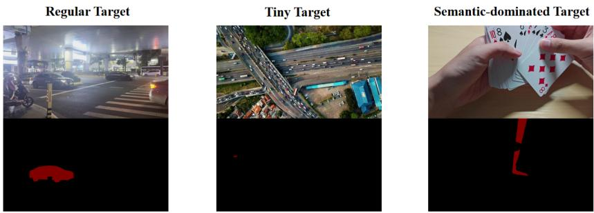
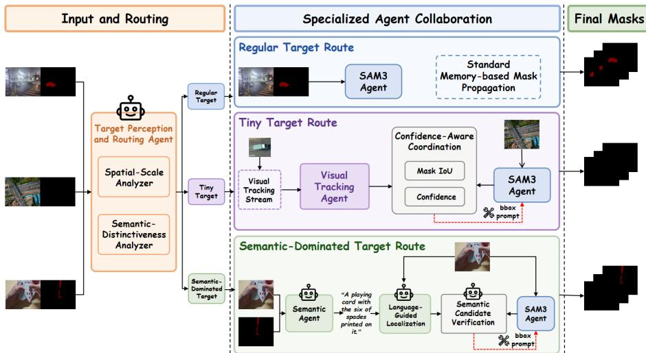
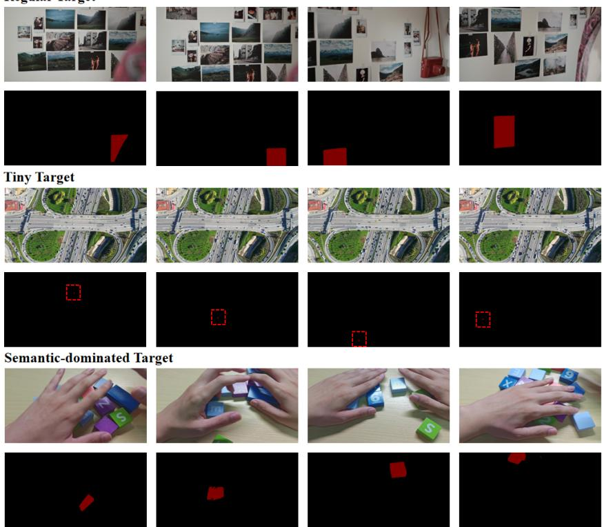

# VOS-Agent: The 1st Place Solution for the 8th LSVOS Challenge (MOSEv2 Track)

Canyang Wu1, Jinrong Zhang1, Xusheng He1, Ce Bian1, Xianjing Han2, and Jianlong Wu1,3

1 Harbin Institute of Technology, Shenzhen

2 Nanyang Technological University

3 Shenzhen Loop Area Institute

Team: HITsz-Dragon

Abstract. Complex video object segmentation requires robust target propagation under severe occlusion, disappearance and reappearance. Although SAM3 provides strong promptable mask propagation, a uniform inference path remains unreliable for tiny targets with insuficient visual evidence and semantic-dominated targets whose identities depend on explicit attributes. To this end, we present VOS-Agent, a collaborative framework that retains SAM3 as the shared dense segmentation module and conditionally activates specialized agents according to target characteristics. A Target Perception and Routing Agent assigns each sequence to a regular, tiny, or semantic-dominated route. Tiny targets are supported by a Visual Tracking Agent through confidence-aware box prompts, while semantic-dominated targets are handled by an MLLMbased Semantic Agent through description-guided localization and candidate verification. On the MOSEv2 test set, VOS-Agent achieves 69.82% on the oficial J&F˙ metric and ranks first in the MOSEv2 Track of the 8th LSVOS Challenge at ECCV 2026.

Keywords: Video object segmentation · Semi-Supervised · MOSEv2

## 1 Introduction

The 8th Large-scale Video Object Segmentation (LSVOS) Challenge aims to advance video object segmentation toward increasingly complex and realistic scenarios. The challenge includes three tracks: Complex Video Object Segmentation (MOSEv2), Text-based Referring Motion Expression Video Segmentation (MeViSv2-Text), and Audio-based Referring Motion Expression Video Segmentation (MeViSv2-Audio) [9]. The MOSEv2 track focuses on tracking and segmenting objects under challenging real-world conditions [7], while the MeViSv2- Text and MeViSv2-Audio tracks investigate motion-expression-guided video segmentation using textual and spoken descriptions, respectively [6]. This paper focuses on the MOSEv2 track.

Semi-supervised video object segmentation (VOS) aims to delineate one or more target objects throughout a video, given their segmentation masks in an initial frame. Recent researches have substantially improved mask propagation and long-term association on established VOS benchmarks [1,3,4,8,10,12]. However, high performance on videos containing salient and relatively isolated objects does not necessarily translate to robustness in unconstrained environments. MOSE and its more challenging successor, MOSEv2, were introduced to evaluate VOS under crowded scenes, severe occlusion, object disappearance and reappearance, small or camouflaged targets, adverse illumination and weather conditions, and visually similar distractors [5, 7].

  
Fig. 1: Visualization of the three target types in the MOSEv2 dataset, highlighting the challenges posed by tiny targets and semantic-dominated targets in complex environments. Tiny targets provide insuficient visual evidence for stable long-range correspondence while semantic-dominated targets remain dificult to indentity as mutiple nearby instances share similiar low-level appearance.

A dominant line of VOS research improves temporal correspondence and memory construction. XMem organizes complementary memory stores for efficient long-term propagation [4], while Cutie introduces object-level memory reading to reduce matching noise in distractor-rich scenes [3]. SAM2 provides a general framework for prompt-conditioned mask propagation [10], and subsequent methods improve its robustness through multi-path memory search or distractor-aware memory management [8, 12]. SAM3 further integrates conceptconditioned detection with video mask propagation, providing a strong foundation for promptable video segmentation [1].

Despite these advances, complex VOS still presents heterogeneous failure modes that cannot always be addressed by a single uniform inference path. In MOSEv2, as shown in Fig. 1, tiny objects may occupy only a few pixels and provide insuficient visual evidence for stable long-range correspondence. They are therefore particularly vulnerable to background clutter, occlusion, and accumulated localization errors. Other targets have suficient spatial extent but remain dificult to identify because multiple nearby instances share similar lowlevel appearance. Their identities may instead depend on higher-level attributes such as text, logos, symbols, colors, or distinctive clothing. We refer to targets whose identity is primarily determined by such explicit semantic attributes as semantic-dominated targets.

Despite the strong promptable segmentation and temporal propagation capabilities of foundation models such as SAM3, these two failure modes remain dificult to resolve through a uniform inference path. For tiny targets, insuficient visual evidence limits reliable localization and long-term propagation. For semantic-dominated targets, low-level visual correspondence alone is often inadequate for preserving identity among similar instances. At their core, both failures arise from the same limitation: SAM3 propagates the target primarily through prompt-conditioned visual features and temporal memory. When the target representation is either severely under-resolved or visually ambiguous, the tracker lacks suficient evidence to determine where the target is or which instance should be preserved.

To this end, we propose VOS-Agent, a task-oriented collaborative multiagent framework for complex video object segmentation. VOS-Agent comprises four components: a Target Perception and Routing Agent, a SAM3 Segmentation Agent, a Visual Tracking Agent, and an MLLM-based Semantic Agent. The Perception and Routing Agent analyzes the initial target scale and semantic distinctiveness and assigns each sequence to a regular, tiny, or semantic-dominated processing route. Regular targets are handled directly by the SAM3 Agent. For tiny targets, the Visual Tracking Agent uses the initial target crop as a visual template and collaborates with SAM3 through confidence-aware bounding-box prompts [2]. For semantic-dominated targets, the Semantic Agent constructs a discriminative description of the target, performs language-guided localization, and compares candidate regions before returning the selected prompt to SAM3 [13]. The specialized agents operate primarily at the target-localization and identity-reasoning level, whereas the SAM3 Agent converts their guidance into dense pixel-level masks.

Overall, VOS-Agent provides a modular and training-free solution for complex video object segmentation. By routing heterogeneous targets to specialized processing paths, the framework preserves the strong pixel-level mask generation capability of SAM3 while complementing it with visual-exemplar tracking for tiny targets and semantic identity reasoning for semantic-dominated targets. VOS-Agent achieves a $\mathcal { I } \& \mathcal { F } ^ { * }$ score of 69.82% on the MOSEv2 test set and ranks 1st in the MOSEv2 Track of the 8th LSVOS Challenge at ECCV 2026.

## 2 Solution

## 2.1 Problem Formulation

Given a video sequence $\mathcal { V } = \{ I _ { t } \} _ { t = } ^ { T } $ and the ground-truth mask $M _ { 1 }$ of a target object in the first frame, semi-supervised video object segmentation aims to predict a sequence of masks $\{ \widehat { M } _ { t } \} _ { t = 2 } ^ { T }$ that consistently delineates the same target throughout the video.

## 2.2 Framework Overview

As illustrated in Fig. 2, VOS-Agent consists of four core components: a Target Perception and Routing Agent, a SAM3 Segmentation Agent, a Visual Tracking Agent, and a Semantic Agent. Given the first frame and its target mask, the Routing Agent assigns the target to one of three processing routes. Regular targets are processed directly by the SAM3 Agent. For tiny targets, the Visual Tracking Agent recursively estimates the target location and provides a corrective box prompt when its high-confidence prediction disagrees with SAM3. For semantic-dominated targets, the Semantic Agent performs description-guided localization and candidate verification to preserve target identity.

  
Fig. 2: Overview of the proposed VOS-Agent framework. Given the first frame and its target mask, the Target Perception and Routing Agent categorizes the target as regular, tiny, or semantic-dominated according to its spatial scale and semantic distinctiveness. Regular targets are processed directly by the SAM3 Agent. For tiny targets, the Visual Tracking Agent recursively estimates the target location and provides a corrective box prompt when its high-confidence prediction disagrees with SAM3. For semanticdominated targets, the Semantic Agent performs description-guided localization and candidate verification to preserve target identity.

## 2.3 Target Perception and Routing Agent

The Routing Agent analyzes two complementary properties of the reference target: its spatial scale and its semantic distinctiveness.

Spatial-scale analysis. Let $A ( M _ { 1 } )$ denote the foreground area of the initial target mask, and let $A ( I _ { 1 } )$ denote the image area. We define the normalized target area as

$$
r _ { \mathrm { a r e a } } = { \frac { A ( M _ { 1 } ) } { A ( I _ { 1 } ) } } .\tag{1}
$$

A target is categorized as tiny when $r _ { \mathrm { a r e a } } < \tau _ { \mathrm { a r e a } } .$ , where $\tau _ { \mathrm { a r e a } }$ is selected on the validation set. This criterion reflects the observation that very small targets provide limited pixel-level evidence and are particularly susceptible to feature degradation, background interference, and accumulated localization errors.

Semantic-distinctiveness analysis. For a non-tiny target, an MLLM examines the reference crop and its surrounding context and determines whether explicit semantic attributes are required to preserve target identity. The decision is written as

$$
\begin{array} { r } { s _ { \mathrm { s e m } } = \mathcal { A } _ { \mathrm { s e m - c l s } } ( I _ { 1 } , M _ { 1 } ) , \qquad s _ { \mathrm { s e m } } \in \{ 0 , 1 \} . } \end{array}\tag{2}
$$

Examples of discriminative attributes include printed text, logos, symbols, distinctive colors, playing-card identities, or unusual clothing. A target is considered semantic-dominated when these attributes are necessary to distinguish it from nearby instances with similar low-level appearance.

The final routing decision is

$$
z = \left\{ \begin{array} { l l } { \mathrm { t i n y , ~ } } & { r _ { \mathrm { a r e a } } < \tau _ { \mathrm { a r e a } } , } \\ { \mathrm { s e m a n t i c , ~ } } & { r _ { \mathrm { a r e a } } \geq \tau _ { \mathrm { a r e a } } \mathrm { ~ a n d ~ } s _ { \mathrm { s e m } } = 1 , } \\ { \mathrm { r e g u l a r , ~ } } & { \mathrm { o t h e r w i s e . } } \end{array} \right.\tag{3}
$$

## 2.4 SAM3 Segmentation Agent

The SAM3 Agent serves as the shared dense segmentation and temporal propagation module in all processing routes. [1].

The initial mask $M _ { 1 }$ initializes a target masklet and its conditioning memory. For each subsequent frame $I _ { t } ,$ the tracker predicts the current target mask by combining the current-frame features with a memory bank constructed from the initial conditioning frame and confidently tracked previous frames.

For regular targets, no additional prompt is introduced after initialization, and SAM3 performs standard memory-based mask propagation. For tiny and semantic-dominated targets, a specialized agent may provide a bounding-box prompt on a selected frame. The prompt is used to refine the current masklet and provide an updated conditioning reference for subsequent propagation.

## 2.5 Tracking Agent–SAM3 Agent Collaboration

Tiny targets often provide insuficient pixel-level evidence for stable long-term mask propagation. We therefore instantiate the Visual Tracking Agent with SU-Track, which performs recursive single-object tracking using visual templates and a local search region [2].

The tracker is initialized with the target box derived from the first-frame mask:

$$
B _ { 1 } ^ { \mathrm { t r k } } = \bar { B } ( M _ { 1 } ) , \qquad Z ^ { \mathrm { s t a } } = \mathrm { C r o p } ( I _ { 1 } , B _ { 1 } ^ { \mathrm { t r k } } ) ,\tag{4}
$$

where $Z ^ { \mathrm { s t a } }$ denotes the static target template retained throughout the sequence. SUTrack additionally maintains a dynamic template $Z _ { t - 1 } ^ { \mathrm { d y n } }$ , which is updated online according to its confidence-based template update strategy.

For each subsequent frame, a search region is cropped around the previous tracking result:

$$
X _ { t } = \mathrm { C r o p } \left( I _ { t } , \mathrm { E x p a n d } \left( B _ { t - 1 } ^ { \mathrm { t r k } } \right) \right) .\tag{5}
$$

The Tracking Agent then estimates the current target box and its confidence from the static template, the dynamic template, and the current search region:

$$
\left( B _ { t } ^ { \mathrm { t r k } } , c _ { t } ^ { \mathrm { t r k } } \right) = \mathcal { A } _ { \mathrm { t r k } } \left( Z ^ { \mathrm { s t a } } , Z _ { t - 1 } ^ { \mathrm { d y n } } , X _ { t } \right) .\tag{6}
$$

In parallel, the SAM3 Agent propagates its target masklet and produces a native mask $M _ { t } ^ { \mathrm { s a m } }$ . Let $B _ { t } ^ { \mathrm { s a m } }$ denote the tight bounding box enclosing this mask. The agreement between the two agents is measured as

$$
q _ { t } ^ { \mathrm { t r k } } = \operatorname { I o U } \left( B _ { t } ^ { \mathrm { s a m } } , B _ { t } ^ { \mathrm { t r k } } \right) .\tag{7}
$$

A low agreement does not by itself indicate that the tracking result is more reliable. We therefore accept the auxiliary tracking prompt only when the two predictions disagree and the tracking confidence is suficiently high:

$$
\eta _ { t } ^ { \mathrm { t r k } } = \mathbb { I } \left[ q _ { t } ^ { \mathrm { t r k } } < \tau _ { \mathrm { i o u } } \mathrm { ~ } \land \mathrm { ~ } c _ { t } ^ { \mathrm { t r k } } \geq \tau _ { \mathrm { c o n f } } \right] .\tag{8}
$$

When $\eta _ { t } ^ { \mathrm { t r k } } = 1$ , the tracking box is introduced as an additional box prompt on frame t. SAM3 uses the accepted box prompt to refine the mask on the current frame and to update its conditioning state for subsequent mask propagation. If the tracking prompt is rejected, the native SAM3 prediction is retained.

The two agents consequently maintain complementary temporal states. SU-Track recursively estimates target location from its previous tracking result and template state, whereas SAM3 propagates a dense mask through its video memory. The Tracking Agent intervenes only when it provides a confident localization that is inconsistent with the native SAM3 prediction. SAM3 then converts the accepted coarse box into a dense mask and continues propagation from the corrected conditioning state.

## 2.6 Semantic Agent–SAM3 Agent Collaboration

Semantic-dominated targets are generally large enough to be segmented, but their identities may not be reliably preserved through low-level visual correspondence alone. This situation commonly occurs when several nearby instances share similar shapes, textures, or colors, while the designated target is distinguished by explicit attributes such as text, logos, symbols, or distinctive clothing. We therefore employ an MLLM-based Semantic Agent to complement SAM3 with identity-level reasoning.

The Semantic Agent first generates a discriminative description from the initial target:

$$
\begin{array} { r } { D = \mathcal { A } _ { \mathrm { s e m } } ^ { \mathrm { d e s c } } \big ( I _ { 1 } , M _ { 1 } \big ) , } \end{array}\tag{9}
$$

where D summarizes the visible attributes that distinguish the designated target from same-category distractors.

For each subsequent frame, the Semantic Agent performs language-guided localization using the target description:

$$
\begin{array} { r } { B _ { t } ^ { \mathrm { s e m } } = \mathcal { A } _ { \mathrm { s e m } } ^ { \mathrm { l o c } } \big ( I _ { t } , D \big ) , } \end{array}\tag{10}
$$

where $B _ { t } ^ { \mathrm { s e m } }$ denotes the semantic localization result. In parallel, the SAM3 Agent propagates its target masklet and produces the native mask $M _ { t } ^ { \mathrm { s a m } }$ . Let $B _ { t } ^ { \mathrm { s a m } }$ denote the tight bounding box enclosing this mask. Their spatial agreement is measured by

$$
\begin{array} { r } { q _ { t } ^ { \mathrm { s e m } } = \operatorname { I o U } \left( B _ { t } ^ { \mathrm { s a m } } , B _ { t } ^ { \mathrm { s e m } } \right) . } \end{array}\tag{11}
$$

When $q _ { t } ^ { \mathrm { s e m } } \geq \tau _ { \mathrm { s e m } } .$ , the two agents provide consistent localization and the native SAM3 prediction is retained. When their agreement falls below $\tau _ { \mathrm { s e m } } ,$ the Semantic Agent performs explicit candidate verification. We first extract the reference target and the two current-frame candidates:

$$
\begin{array} { r l } & { \quad R _ { 1 } ^ { \mathrm { r e f } } = \mathrm { C r o p } \big ( I _ { 1 } , { \mathcal { B } } ( M _ { 1 } ) \big ) , } \\ & { \quad R _ { t } ^ { \mathrm { s a m } } = \mathrm { C r o p } \big ( I _ { t } , B _ { t } ^ { \mathrm { s a m } } \big ) , } \\ & { \quad R _ { t } ^ { \mathrm { s e m } } = \mathrm { C r o p } \big ( I _ { t } , B _ { t } ^ { \mathrm { s e m } } \big ) . } \end{array}\tag{12}
$$

The Semantic Agent then compares both candidates with the initial target and its discriminative description:

$$
y _ { t } ^ { \mathrm { s e m } } = \mathcal { A } _ { \mathrm { s e m } } ^ { \mathrm { j u d g e } } \left( R _ { 1 } ^ { \mathrm { r e f } } , D , R _ { t } ^ { \mathrm { s a m } } , R _ { t } ^ { \mathrm { s e m } } \right) , \qquad y _ { t } ^ { \mathrm { s e m } } \in \{ \mathrm { s a m } , \mathrm { s e m a n t i c } \} .\tag{13}
$$

Here, $y _ { t } ^ { \mathrm { s e m } } =$ semantic indicates that the language-guided candidate is judged to be more consistent with the designated target than the native SAM3 candidate. The semantic correction is accepted only when the two agents disagree and the semantic candidate is selected:

$$
\eta _ { t } ^ { \mathrm { s e m } } = \mathbb { I } \left[ q _ { t } ^ { \mathrm { s e m } } < \tau _ { \mathrm { s e m } } ~ \wedge ~ y _ { t } ^ { \mathrm { s e m } } = \mathrm { s e m a n t i c } \right] .\tag{14}
$$

When $\eta _ { t } ^ { \mathrm { s e m } } = 1$ , the semantic bounding box is introduced as an additional conditioning prompt on frame t to refine the mask.

The Semantic Agent intervenes only when the language-guided localization conflicts with the native SAM3 prediction and is judged to better preserve the original target identity. SAM3 then refines the accepted bounding-box prompt into a dense mask and updates its conditioning state for subsequent propagation.

## 3 Experiment

## 3.1 Dataset and Challenge Protocol

We evaluate VOS-Agent on the MOSEv2 track of the 8th Large-scale Video Object Segmentation Challenge at ECCV 2026. MOSEv2 contains 5,024 videos, 10,074 annotated objects from 200 categories, and more than 701,000 highquality masks [7]. Compared with conventional VOS benchmarks, it contains more frequent disappearance and reappearance events, smaller and less conspicuous targets, severe occlusion, crowded scenes, adverse weather, low-light environments, multi-shot sequences, camouflaged objects, non-physical targets, and cases that require external knowledge. The first-frame mask of each evaluated target is provided, while the masks of the remaining frames must be inferred.

Table 1: Quantitative comparison of VOS-Agent with existing solutions on the MO-SEv2 test set. We report the overall $\mathcal { I } \& \dot { \mathcal { F } }$ , region similarity J, boundary accuracy ${ \dot { \mathcal { F } } } _ { : }$ and performance on disappearance (d) and reappearance (r) scenarios.
<table><tr><td>Participant</td><td> $\overline { { \mathcal { I } \& \mathcal { F } } }$ </td><td> $\mathcal { I }$ </td><td> $\overline { { \mathcal { F } } }$ </td><td> $\overline { { \mathcal { I } \& \mathcal { F } _ { \mathrm { d } } } }$ </td><td> $\overline { { J \& \mathcal { F } _ { \mathrm { r } } } }$ </td><td> $\mathcal { F }$ </td><td> $\mathcal { I } \& \mathcal { F }$ </td></tr><tr><td>HITsz-Dragon</td><td>69.82</td><td>68.21</td><td>71.43</td><td>79.12</td><td>34.87</td><td>73.76</td><td>70.99</td></tr><tr><td>mmm</td><td>66.20</td><td>64.79</td><td>67.60</td><td>81.57</td><td>26.88</td><td>69.74</td><td>67.26</td></tr><tr><td>kjeong</td><td>64.37</td><td>63.16</td><td>65.59</td><td>80.26</td><td>27.53</td><td>67.09</td><td>65.12</td></tr></table>

Table 2: Ablation study on the MOSEv2 test set. The best result in each column is shown in bold. The subscripts d and r denote disappearance and reappearance scenarios, respectively.
<table><tr><td>Method</td><td> $\mathcal { I } \& \dot { \mathcal { F } }$ </td><td> $\mathcal { I }$ </td><td> $\dot { \mathcal { F } }$ </td><td> $\mathcal { I } \& \dot { \mathcal { F } _ { \mathrm { d } } }$ </td><td> $\mathcal { I } \& \dot { \mathcal { F } _ { \mathrm { r } } }$ </td><td> $\mathcal { F }$ </td><td> $\mathcal { I } \& \mathcal { F }$ </td></tr><tr><td>SAM3 Agent</td><td>62.49</td><td>61.38</td><td>63.59</td><td>78.93</td><td>25.31</td><td>65.41</td><td>63.40</td></tr><tr><td>Routing + Semantic Agent + SAM3 Agent</td><td>67.07</td><td>65.68</td><td>68.47</td><td>79.12</td><td>31.24</td><td>70.35</td><td>68.02</td></tr><tr><td>Full VOS-Agent</td><td>69.82</td><td>68.21</td><td>71.43</td><td>79.12</td><td>34.87</td><td>73.76</td><td>70.99</td></tr></table>

## 3.2 Implementation Details

The SAM3 Agent is implemented using the oficial SAM3 model [1]. The Target Perception and Routing Agent is instantiated with Qwen3.5-397B-A17B [11]. The Visual Tracking Agent is instantiated with SUTrack [2] and receives the RGB crop enclosed by the first-frame mask as its visual exemplar. The Semantic Agent is instantiated with Qwen3.5-397B-A17B [11], which performs targetdescription generation, language-guided localization, and candidate comparison.

## 3.3 Main Results

Tab. 1 reports the final performance of VOS-Agent on the MOSEv2 test set. Our method ranks 1st in the challenge leaderboard and achieves 69.82 on the oficial $\mathcal { I } \& \dot { \mathcal { F } }$ metric. This result suggests that routing heterogeneous targets to specialized tracking and semantic reasoning agents, while retaining SAM3 as the shared mask-propagation module, is efective for handling tiny targets, semanticdominated targets, and frequent disappearance–reappearance patterns.

As shown in Fig. 3, the qualitative results further illustrate the behavior of VOS-Agent across diferent target types. For regular targets, SAM3 produces accurate and temporally consistent masks without additional intervention. For tiny targets, the Tracking Agent maintains stable localization despite the extremely small object scale, allowing SAM3 to recover compact masks across successive frames. For semantic-dominated targets, the Semantic Agent preserves the identity of the designated instance among visually similar objects and prevents instance switching. These examples strongly demonstrate that the specialized agents provide complementary guidance for challenging localization and identity disambiguation cases.

  
Fig. 3: Qualitative visualization of segmentation results on the MOSEv2 test set. The visualizations demonstrate that the tracking and segmentation contours for both tiny and semantic-dominated targets remain clean, tight, and temporally stable, validating the eficacy of VOS-Agent.

## 3.4 Ablation Study

To validate the efectiveness of each core agent, we evaluate three configurations directly on the oficial MOSEv2 test set: (1) use the SAM3 Agent alone and applies the same propagation path to all targets; (2) introduce the Target Perception and Routing Agent together with the Semantic Agent; (3) the complete VOS-Agent further activates the Visual Tracking Agent for tiny targets.

As shown in Tab. 2, introducing target routing and the Semantic Agent improves the primary $\mathcal { I } \& \dot { \mathcal { F } }$ score from 62.49 to 67.07, demonstrating the benefit of explicit identity reasoning for semantic-dominated targets. Adding the Visual Tracking Agent further raises the score to 69.82. Overall, VOS-Agent improves $\mathcal { I } \& \dot { \mathcal { F } }$ by 7.33 points, indicating that the tracking and semantic agents provide complementary localization cues for heterogeneous target types.

## 4 Conclusion

In this report, we presented VOS-Agent, our solution to the MOSEv2 Track of the 8th LSVOS Challenge. VOS-Agent complements SAM3 with categoryspecific tracking and semantic reasoning for tiny and semantic-dominated targets, improving robustness to target loss, identity ambiguity, and reappearance without fine-tuning the SAM3 backbone. Our method achieves 69.82% $\mathcal { I } \& \dot { \mathcal { F } }$ on the MOSEv2 test set and ranks first in the challenge, showing that specialized agent collaboration is an efective strategy for complex semi-supervised VOS.

## References

1. Carion, N., Gustafson, L., Hu, Y.T., Debnath, S., Hu, R., Coll-Vinent, D.S., Ryali, C., Alwala, K.V., Khedr, H., Huang, A., Lei, J., Ma, T., Guo, B., Kalla, A., Marks, M., Greer, J., Wang, M., Sun, P., Rädle, R., Afouras, T., Mavroudi, E., Xu, K., Wu, T.H., Zhou, Y., Momeni, L., HAZRA, R., Ding, S., Vaze, S., Porcher, F., Li, F., Li, S., Kamath, A., Cheng, H.K., Dollar, P., Ravi, N., Saenko, K., Zhang, P., Feichtenhofer, C.: SAM 3: Segment anything with concepts. In: ICLR (2026), https://openreview.net/forum?id=r35clVtGzw 2, 5, 8

2. Chen, X., Kang, B., Geng, W., Zhu, J., Liu, Y., Wang, D., Lu, H.: Sutrack: Towards simple and unified single object tracking. In: AAAI. vol. 39, pp. 2239–2247 (2025) 3, 5, 8

3. Cheng, H.K., Oh, S.W., Price, B., Lee, J.Y., Schwing, A.: Putting the object back into video object segmentation. In: CVPR. pp. 3151–3161 (2024) 2

4. Cheng, H.K., Schwing, A.G.: Xmem: Long-term video object segmentation with an atkinson-shifrin memory model. In: ECCV. pp. 640–658. Springer (2022) 2

5. Ding, H., Liu, C., He, S., Jiang, X., Torr, P.H., Bai, S.: Mose: A new dataset for video object segmentation in complex scenes. In: CVPR. pp. 20224–20234 (2023) 2

6. Ding, H., Liu, C., He, S., Ying, K., Jiang, X., Loy, C.C., Jiang, Y.G.: MeViS: A multi-modal dataset for referring motion expression video segmentation. IEEE TPAMI 47(12), 11400–11416 (2025) 1

7. Ding, H., Ying, K., Liu, C., He, S., Jiang, X., Jiang, Y.G., Torr, P.H., Bai, S.: Mosev2: A more challenging dataset for video object segmentation in complex scenes. arXiv preprint arXiv:2508.05630 (2025) 1, 2, 7

8. Ding, S., Qian, R., Dong, X., Zhang, P., Zang, Y., Cao, Y., Guo, Y., Lin, D., Wang, J.: Sam2long: Enhancing sam 2 for long video segmentation with a training-free memory tree. In: ICCV. pp. 13614–13624 (2025) 2

9. LSVOS Challenge Organizers: The 8th large-scale video object segmentation challenge. https://lsvos.github.io/ (2026), eCCV 2026 Challenge 1

10. Ravi, N., Gabeur, V., Hu, Y.T., Hu, R., Ryali, C., Ma, T., Khedr, H., Rädle, R., Rolland, C., Gustafson, L., et al.: Sam 2: Segment anything in images and videos. In: ICLR. vol. 2025, pp. 28085–28128 (2025) 2

11. Team, Q.: Qwen3. 5: Accelerating productivity with native multimodal agents, february 2026. URL https://qwen. ai/blog pp. 51991–52008 (2026) 8

12. Videnovic, J., Lukezic, A., Kristan, M.: A distractor-aware memory for visual object tracking with sam2. In: CVPR. pp. 24255–24264 (2025) 2

13. Zhang, Z., Ding, S., Dong, X., He, S., Lin, J., Tang, J., Zang, Y., Cao, Y., Lin, D., Wang, J.: Advancing complex video object segmentation via progressive concept construction. In: ICLR (2026), https://openreview.net/forum?id=hDM3YphhVx 3