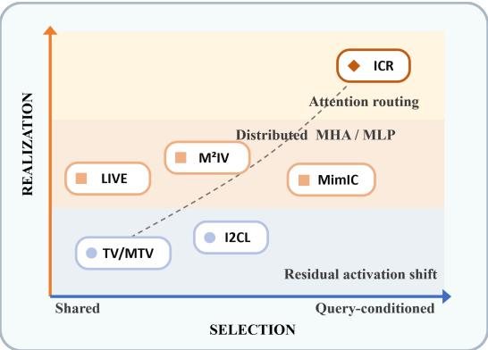
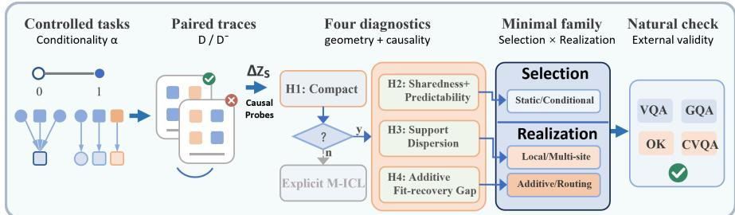
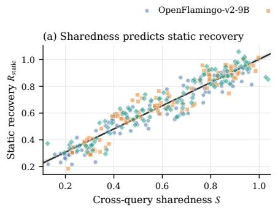
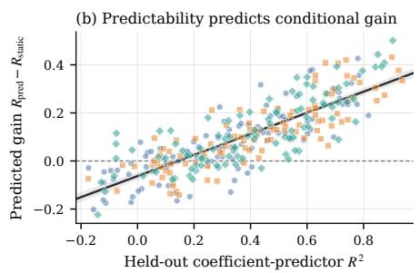
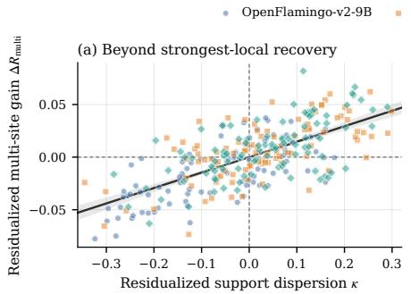
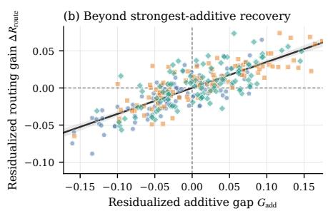

# When Is a Task Vector Enough? An Empirical Theory of Implicit Multimodal ICL

Jiaqian Li1

Brown University

Abstract. Implicit multimodal in-context learning compresses demonstrations into internal interventions, ranging from static task vectors to query-conditioned transformations and attention routing. Despite their common goal, these methods difer substantially in how the intervention depends on the query and where it modifies the model, leaving unclear which additional complexity is necessary for a given task. We propose the Selection–Realization Hypothesis. It views demonstrations as inducing a compact family of internal changes from which the query selects, while the model’s computation constrains how the selected change can be implemented. We evaluate this account using controlled multimodal tasks in which query dependence varies without changing the underlying task primitives or prompt format. By contrasting correct demonstrations with matched counterfactuals, we measure the structure of explicit M-ICL and test whether it predicts intervention behavior. We find that the success of a static task vector is closely tied to how much of the demonstrationinduced change is shared across queries. Additional intervention complexity becomes useful when explicit M-ICL contains query-specific or distributed structure that a local additive shift cannot recover. These relationships extend to natural VQA benchmarks and support cost-aware method selection without access to test performance. Our results provide a unified empirical theory of when demonstrations can be compressed into a task vector and when a more expressive intervention is warranted.

Keywords: Multimodal in-context learning · Representation learning · Activation interventions · Task vectors

## 1 Introduction

Multimodal large language models can adapt to new tasks from a small set of image–text demonstrations without updating their parameters. This capability, known as multimodal in-context learning (M-ICL), enables a single model to infer novel label mappings, follow task-specific output formats, and recognize visual concepts introduced only through context [6, 28, 29]. Its flexibility, however, comes with substantial inference cost: multimodal demonstrations consume many tokens and must be repeatedly encoded and attended to for every new query. Implicit M-ICL addresses this limitation by compressing demonstrations into internal interventions that can be reused without retaining the original examples in the inference context [9, 12, 15, 17, 18, 24].

Existing implicit M-ICL methods realize this idea in markedly diferent ways. Multimodal task vectors extract compact representations from selected attention heads and reuse them across queries [9]. LIVE and M2IV distribute learned vectors across attention or MLP components, allowing demonstration information to be represented at multiple computational sites [17, 24]. MimIC further makes the magnitude of head-level shifts depend on the current query, whereas ICR directly modifies attention logits through an input-conditioned router [12,15]. These approaches therefore difer along two conceptually distinct dimensions: how the demonstration-derived

  
Fig. 1: Conceptual design space of implicit M-ICL methods. Existing approaches difer in whether intervention selection is shared or queryconditioned and whether its realization uses local activation shifts, distributed MHA/MLP modifications, or attention routing. The dashed curve indicates increasing intervention expressivity rather than measured performance.

intervention is selected for each query, and how that intervention is realized within the model.

Prior work shows that ICL can form compact task- or function-level representations that causally influence model behavior [8,9,20,30]. Yet multimodal ICL remains sensitive to the composition and presentation of demonstrations, particularly the correspondence between visual and textual information [3, 14, 25]. These findings establish both the promise and the dificulty of compressing demonstrations, but they do not reveal which intervention design is actually necessary. Existing methods are usually evaluated as complete systems, so differences in intervention capacity, optimization, and supervision are entangled with the mechanism being tested. A query-conditioned method may outperform a static vector because the task genuinely requires query-dependent computation, but it may also benefit from a more flexible parameterization. The same ambiguity applies when comparing a local shift with a distributed or routingbased intervention. Downstream accuracy alone therefore cannot explain why additional complexity helps.

This paper asks whether the simplest adequate intervention can instead be predicted from the computation performed by explicit M-ICL. We call an intervention suficient when it recovers a fixed target fraction of the behavioral gain produced by explicit demonstrations. Among suficient alternatives, the intervention with the lowest deployment cost is treated as minimal. This definition shifts the problem from finding a universally strongest method to identifying how much complexity a particular demonstration-induced computation requires.

We propose the Selection–Realization Hypothesis to provide such an account. We hypothesize that a demonstration set defines a compact family of internal transformations. The current image–text query determines which transformation, or combination of transformations, is selected, while the structure of the explicit in-context computation determines how it must be realized inside the model. This view separates two sources of intervention complexity. Selection complexity describes whether the same transformation is reused across queries or whether its composition must vary with the input. Realization complexity describes whether the selected transformation can be implemented as a localized additive shift, requires coordinated changes across attention and MLP components, or must alter attention-mediated information flow. Static task vectors, multi-site vectors, query-conditioned shifts, and attention routing then become nested cases of a common intervention hierarchy rather than unrelated architectural choices. Figure 1 organizes representative implicit M-ICL methods along these selection and realization dimensions, providing a unified view of their otherwise heterogeneous designs.

We test the hypothesis by comparing the computations induced by correct demonstrations with those induced by matched counterfactuals. Controlled multimodal tasks allow query dependence to vary while the underlying task structure remains fixed. We find that demonstration-induced changes are compact but not always shared across queries. Their variation across queries and computational sites predicts both when a static vector fails and what additional flexibility is useful. The same diagnostics remain informative on natural tasks, where they support cost-aware method selection beyond the controlled setting.

Our study shifts the goal from finding the most expressive implicit M-ICL architecture to identifying the least costly intervention that preserves the behavior of explicit M-ICL. It ofers an empirical theory in which intervention complexity is predicted from measurable properties of the demonstration-induced computation, rather than justified post hoc by benchmark performance.

## 2 A Unified Formulation of Implicit M-ICL

Let $D = \{ ( x _ { i } , y _ { i } ) \} _ { i = 1 } ^ { m }$ denote a set of multimodal demonstrations, and let x denote a new image–text query. A frozen model with parameters \theta performs explicit M-ICL according to $p _ { \theta } ( y \mid x , D )$ , whereas zero-shot inference uses $p _ { \theta } ( y \mid x )$ . Implicit M-ICL instead compresses the demonstrations into a cached representation $S ( D )$ and intervenes on the model while processing the query:

$$
p _ { \mathbb { Z } } ( y \mid x , D ) = p _ { \theta } \big ( y \mid x ; \mathbb { Z } ( x , S ( D ) ) \big ) .\tag{1}
$$

The demonstrations are therefore absent from the inference context. The objective is to recover their behavioral efect, without requiring every intermediate computation to match explicit M-ICL.

To characterize that efect, let $z _ { s } ( x ; D )$ denote the computation recorded at site s. Depending on the intervention being studied, s may refer to a residual state, a module output, or an attention-logit representation. For every demonstration set, we construct matched counterfactuals $D _ { 1 } ^ { - } , \ldots , D _ { K } ^ { - }$ that preserve the prompt structure while disrupting the demonstrated input–output correspondence. We define the resulting computation change as

$$
\varDelta z _ { s } ( x ; D ) = z _ { s } ( x ; D ) - \frac { 1 } { K } \sum _ { j = 1 } ^ { K } z _ { s } ( x ; D _ { j } ^ { - } ) .\tag{2}
$$

Using a matched context prevents changes caused only by prompt length or query position from being attributed to the demonstrated mapping. The exact construction of the counterfactuals is described in Section 4.

For a fixed D, the collection of changes observed across queries defines a demonstration-induced transformation,

$$
\mathcal { T } _ { D } ( x ) \approx \sum _ { k = 1 } ^ { r } c _ { k } ( x , D ) B _ { k } ( D ) ,\tag{3}
$$

where $B _ { k } ( D )$ is a reusable basis element and $c _ { k } ( x , D )$ specifies how strongly it is expressed for the current query. Selection is shared when these coeficients remain approximately constant across queries and conditional when they vary systematically with x. Realization is determined by the computational objects represented by the basis elements and the sites at which they act.

For an activation-based intervention at site $s ,$ this formulation reduces to

$$
\Delta z _ { s } ( x ; D ) \approx v _ { s } ( D ) + U _ { s } ( D ) c _ { s } ( x , D ) ,\tag{4}
$$

where

$$
v _ { s } ( D ) = \frac { 1 } { N } \sum _ { i = 1 } ^ { N } \varDelta z _ { s } ( x _ { i } ; D )\tag{5}
$$

is the component shared across the estimation queries. The columns of $U _ { s } ( D )$ span the remaining cross-query variation, and $c _ { s } ( x , D )$ gives the coordinates of the current query within this subspace. A static task vector retains only the shared component, whereas a conditional intervention also estimates the queryspecific coordinates.

This formulation keeps compactness and static-vector suficiency distinct. A low-rank basis may reconstruct the changes on held-out queries even when those queries occupy diferent points within the learned subspace. It also leaves open how the recovered change must be realized inside the model.

## 3 The Selection–Realization Hypothesis

The Selection–Realization Hypothesis begins with a necessary condition: the changes induced by a fixed demonstration set must exhibit reusable low-dimensional structure across queries. This structure allows us to ask how a query selects an appropriate transformation and how that transformation is instantiated within the model. We develop this account through four testable hypotheses.

H1: Demonstration-induced changes are compact. For a fixed demonstration set, the changes observed across queries should occupy a space whose efective dimension is small relative to the maximum dimension supported by the model width and the number of estimation queries. A basis estimated from one group of queries should therefore reconstruct changes on held-out queries. More importantly, intervening within this learned space should recover more of the behavioral efect of explicit M-ICL than an equally sized random subspace.

H2: Sharedness and predictability determine intervention selection. Let $v _ { s } ( D )$ denote the shared component defined in Section 2. We measure the fraction of demonstration-induced energy that is shared across queries as

$$
\mathrm { S h a r e d } _ { s } ( D ) = \frac { \left. v _ { s } ( D ) \right. _ { F } ^ { 2 } } { \left. v _ { s } ( D ) \right. _ { F } ^ { 2 } + \frac { 1 } { N } \sum _ { i = 1 } ^ { N } \left. \varDelta z _ { s } ( x _ { i } ; D ) - v _ { s } ( D ) \right. _ { F } ^ { 2 } } .\tag{6}
$$

A static intervention should recover more of the efect of explicit M-ICL when this quantity is high. However, low sharedness alone does not guarantee that conditioning will help. The remaining coeficients must also be predictable from the query without access to the demonstrations. We measure this property using the held-out $R ^ { 2 }$ of a predictor that maps the zero-shot query representation to $c _ { s } ( x , D )$ . If recovery depends on genuine query-specific selection, assigning otherwise valid coeficients to the wrong queries should reduce performance.

H3: The distribution of causal support determines intervention location. A transformation may be shared across queries without being localized to a single computational site. We estimate its causal support by measuring the recovery obtained when matched additive interventions are applied separately at candidate sites. When this support is concentrated, the strongest local intervention should be suficient. As support becomes more dispersed, a multi-site intervention should provide a larger gain. This comparison holds the selection mechanism and total intervention budget fixed, so any advantage can be attributed to where the efect is realized rather than to additional rank or parameters.

H4: An additive fit–recovery gap indicates an operator-level limitation. An additive intervention may reconstruct the representations produced by explicit M-ICL without reproducing its behavior. We refer to this discrepancy as the additive fit–recovery gap. When additive reconstruction and functional recovery are both high, modifying attention should ofer little additional benefit. When reconstruction remains high but recovery does not, an attention-logit intervention may recover behavioral efects that activation shifts miss. A routing gain that follows this gap under matched prediction and parameter budgets would provide evidence that the limitation lies in how the transformation is implemented, rather than in its dimensionality alone.

  
Fig. 2: Overview of the empirical framework. Controlled episodes yield paired computation changes $\varDelta z _ { s }$ from correct and counterfactual demonstrations. H1 tests whether these changes admit compact compression; H2 determines whether selection can remain static or must depend on the query; and H3–H4 determine whether the selected transformation can be realized locally, across multiple sites, or through routing. Decision rules calibrated on the controlled tasks are frozen before natural-task evaluation.

## 4 Empirical Framework

We first generate controlled episodes in which query dependence is varied while the available task primitives and prompt format remain fixed. Paired traces from correct and counterfactual demonstrations are then used to estimate the four diagnostics in Section 3. Matched interventions test whether these diagnostics identify the required selection and realization mechanisms. Finally, a decision rule calibrated only on the controlled data is frozen and evaluated on natural multimodal tasks. Figure 2 summarizes the empirical procedure.

## 4.1 Controlled Multimodal Task Family

We construct episodes from synthetic scenes containing objects with independently varied attributes and relations. Each episode samples a fixed library of rules $\mathcal { R } = \{ r _ { 0 } , r _ { 1 } , . . . , r _ { J } \}$ from the same set of visual and textual primitives. Every query contains a gating attribute $g ( x ) \in \{ 0 , 1 \}$ and, when $g ( x ) = 1$ , a selector $q ( x ) \in \{ 1 , \ldots , J \}$ . Both are recoverable from designated visual attributes or textual cues that are present in every condition. The semantic answer is

$$
a ( x ) = \left\{ \begin{array} { l l } { r _ { 0 } ( x ) , } & { g ( x ) = 0 , } \\ { r _ { q ( x ) } ( x ) , } & { g ( x ) = 1 . } \end{array} \right.\tag{7}
$$

The first branch therefore reuses one rule across queries, whereas the second requires the current query to select a rule. An episode-specific permutation $\pi _ { D }$ maps the semantic answer to an arbitrary single-token output symbol, $y =$ $\pi _ { D } ( a ( x ) )$ ), so that the rule and output mapping must be inferred from the demonstrations.

The conditionality level $\alpha \in [ 0 , 1 ]$ denotes the proportion of queries assigned to the second branch. We use the same proportion in the demonstrations and query splits of each episode, ensuring that the manipulation changes selection complexity rather than introducing a distribution shift. At $\alpha = 0 ,$ , one rule is shared across all queries, and at $\alpha = 1$ , every query selects its rule from the episode library. Intermediate values produce controlled mixtures of these two cases.

For every correct demonstration set D, we construct five counterfactual sets $D _ { j } ^ { - }$ by applying an independently sampled derangement to all demonstration output symbols. The images, questions, example order, and token lengths remain unchanged. Unlike an independent per-example shufle, this operation preserves a coherent episode-level mapping and the marginal label distribution while making that mapping incorrect for the target episode. We use these sets in Equation 2 to remove efects caused only by the presence and format of the demonstrations.

## 4.2 Paired Traces and Diagnostic Estimation

For each demonstration set and query, we record paired forward passes under D and $D _ { j } ^ { - }$ at the final query token. The recorded sites include the residual stream, MHA and MLP outputs, and attention logits across decoder layers. Queries are partitioned before analysis into basis-estimation, predictor-training, validation, and test splits. The test split is not used to select ranks, sites, thresholds, or intervention hyperparameters.

H1 is tested by fitting the shared component and low-rank basis on the estimation traces, with rank selected by the 90% variance criterion. We report efective rank and evaluate reconstruction and functional recovery on held-out queries. A rank- and norm-matched random basis controls for low dimensionality alone.

For H2, sharedness and held-out coeficient-prediction $R ^ { 2 }$ measure whether query-varying structure can be selected from the zero-shot query. Static and predicted conditional interventions use the same basis, while coeficient shufling tests whether recovery depends on the correct query–transformation correspondence.

H3 and H4 concern realization rather than selection. To estimate causal support, we apply the same matched additive probe separately at candidate MHA and MLP outputs and form a site profile from their positive recovery contributions. Its normalized entropy defines the support-dispersion score κ. Residualstream sites remain candidates for the localized intervention but are not combined with their constituent MHA and MLP outputs when computing κ. For H4, we measure the strongest additive intervention’s representational fit and behavioral recovery on held-out diagnostic queries. Their diference,

$$
G _ { \mathrm { a d d } } = \mathrm { F i t _ { a d d } - R e c o v e r y _ { a d d } } ,\tag{8}
$$

is positive when an additive intervention reconstructs the explicit-M-ICL representation more successfully than it recovers behavior. Routing gain is evaluated on a disjoint test split, and its association with $G _ { \mathrm { a d d } }$ is tested while controlling for additive recovery. This prevents the result from being driven solely by the additive term shared by the two quantities.

## 4.3 Matched Selection and Realization Tests

The intervention comparison is factorial rather than a single nested hierarchy. Along the selection axis, the static condition uses the shared component for every query. The oracle conditional condition inserts the coeficients recovered from each query’s explicit-M-ICL trace and therefore serves only as an upper bound on additive conditional suficiency. The deployable conditional condition instead uses coeficients predicted from the zero-shot query representation.

Along the realization axis, the selected transformation is inserted at one activation site, distributed across multiple MHA or MLP sites, or implemented by modifying attention logits. Crossing the first two realization choices with static and conditional selection gives the four additive families evaluated later; attention routing is evaluated with the same query-side predictor used by the conditional additive alternative. This design allows H2 to vary selection while holding realization fixed, H3 to vary intervention location while holding selection fixed, and H4 to vary operator type relative to the strongest matched additive intervention.

All comparisons use the same episodes and queries. Local and multi-site interventions have the same total rank and injected norm, while predicted conditional and routing variants are matched in trainable parameter and supervision budgets. The random-basis and coeficient-shufling controls test H1 and H2, respectively. For H3 and H4, the relevant evidence is not a main efect of greater expressivity, but whether the gain of the more complex realization follows the corresponding diagnostic under these matched budgets.

## 4.4 Theory-Guided Selection and Natural-Task Validation

The four diagnostics define a family selector without access to natural-task test performance. A compactness gate first determines whether implicit compression is supported by held-out reconstruction and recovery on a calibration split. For compact transformations, sharedness and coeficient predictability determine static versus conditional selection. Support dispersion determines whether an additive transformation remains local or is distributed across sites, and the additive fit–recovery gap determines whether routing is admitted as a candidate. These decisions produce a set $\mathcal { C } ( D )$ of intervention families consistent with the measured computation.

Let $d ( D )$ denote the diagnostics measured from explicit-M-ICL calibration traces. The selector chooses

$$
{ \widehat { \mathcal { Z } } } ( D ) = \operatorname { a r g m i n } _ { \mathcal { Z } \in { \mathcal { C } } ( D ) } \operatorname { C o s t } ( { \mathcal { Z } } ) \quad { \mathrm { s u b j e c t ~ t o } } \quad { \widehat { \operatorname { R e c o v e r y } } } ( { \mathcal { Z } } \mid d ( D ) ) \geq \rho ,\tag{9}
$$

where $\rho$ is a suficiency threshold fixed on the controlled validation split before natural-task evaluation. The diagnostic thresholds and the mapping from $d ( D )$ to predicted recovery are calibrated on the same controlled validation episodes and then frozen. If compactness fails or no candidate is predicted to reach $\rho ,$ the selector abstains from implicit compression and retains explicit M-ICL.

## 5 Experiments

## 5.1 Experimental Setup

We evaluate OpenFlamingo-v2-9B [2], Idefics2-8B [13], and LLaVA-NeXT-7B [19] on the controlled task family and on VQAv2 [7], GQA [11], OK-VQA [21], and CVQA [26]. All experiments use 16 shots. For each $\alpha \in \{ 0 , 0 . 2 5 , 0 . 5 , 0 . 7 5 , 1 \}$ , we sample 20 controlled episodes per backbone, with four disjoint 100-query splits for basis estimation, coeficient-predictor training, validation, and testing. Validation queries are used to select ranks and intervention sites, fix diagnostic thresholds, and perform early stopping. All reported results use only the test queries. All conditional families use the same two-layer GELU selector (width 256), which maps frozen zero-context query representations to r intervention coeficients and is trained by MSE with validation-based early stopping. The intervention rank is the smallest rank explaining 90% of estimation-set variance, capped at 32. Coeficients are predicted from the zero-shot query representation by a two-layer MLP with hidden size 128 and GELU activation. We train it with AdamW for at most 1,000 steps, using learning rate $1 0 ^ { - 3 }$ , weight decay $1 0 ^ { - 4 }$ , and early stopping on a held-out portion of the predictor-training split. Natural-task experiments follow the 16-shot protocol of $\mathrm { M ^ { 2 } I V }$ [17]. For each model–dataset pair, diagnostics are averaged over 20 demonstration sets and 256 calibration queries disjoint from the evaluation queries. Intervention families are matched in total rank and injected norm. Correlations and 95% confidence intervals use 10,000 model–demonstration-set cluster-bootstrap samples. Runtime is measured on the same GPU under an identical workload and includes extraction, prediction, and diagnostic overhead.

## 5.2 Evaluation Metrics

Behavioral recovery. Let AccD, Acc0, and AccI denote explicit-M-ICL, zeroshot, and intervention performance. We normalize recovery as

$$
{ \mathrm { R e c o v e r y } } ( { \mathbb { Z } } ) = { \frac { \operatorname { A c c } _ { \mathcal { T } } - \operatorname { A c c } _ { 0 } } { \operatorname { A c c } _ { D } - \operatorname { A c c } _ { 0 } } } .\tag{10}
$$

We report this quantity only when explicit M-ICL exceeds zero-shot performance by at least five percentage points. Recovery is not clipped. The suficiency threshold used by the family selector is fixed at $\rho = 0 . 6 5$ before natural-task evaluation.

Selection diagnostics. H1 uses held-out reconstruction $R ^ { 2 }$ and the efective rank of the centered demonstration-induced changes. For singular values $\sigma _ { j }$

$$
r _ { \mathrm { e f f } } = \frac { \left( \sum _ { j } \sigma _ { j } ^ { 2 } \right) ^ { 2 } } { \sum _ { j } \sigma _ { j } ^ { 4 } } .\tag{11}
$$

H2 uses sharedness from Equation $6 ,$ held-out coeficient- predictor $R ^ { 2 }$ , and conditional gain $\varDelta R _ { \mathrm { c o n d } } = R _ { \mathrm { c o n d } } - R _ { \mathrm { s t a t i c } }$ . The controlled parameter α generates query dependence but is not used by the selector.

Realization diagnostics. For each non-overlapping MHA or MLP site $s \in S .$ , let $\gamma _ { s } = [ \mathrm { R e c o v e r y } ( \mathcal { T } _ { s } ) ] .$ + and $p _ { s } = { \gamma _ { s } } / { \sum _ { s ^ { \prime } \in { \mathcal { S } } } \gamma _ { s ^ { \prime } } }$ . Support dispersion is

$$
\kappa = - \frac { 1 } { \log | S | } \sum _ { s \in S } p _ { s } \log p _ { s } .\tag{12}
$$

Residual sites remain localized intervention candidates but are excluded from κ because they aggregate MHA and MLP outputs. H4 uses the additive fit– recovery gap $G _ { \mathrm { a d d } }$ from Equation 8; routing gain is $\varDelta R _ { \mathrm { r o u t e } } = R _ { \mathrm { r o u t e } } - R _ { \mathrm { a d d } } ,$ Diagnostics are estimated from calibration queries and gains from disjoint evaluation queries. The H3 and H4 correlations additionally control for strongest-local and strongest-additive recovery, respectively.

## 5.3 Results

H1: Demonstration-induced changes are held-out queries, whereas matched Efective rank rises with α and across natural tasks, but remains far below model width. Learned bases also retain a clear advantage over random bases in both reconstruction and recovery. Together, these results support H1, although compactness does not imply that one direction is shared by all queries.

compact. The learned spaces transfer to random spaces do not (Table 1).

H2: Sharedness and predictability determine static-vector suficiency. Table 2 reports the controlled sweep. Static recovery declines sharply as more queries

Table 1: Compactness of demonstrationinduced transformations. L/R: learned/random reconstruction; O/R: oracle/random recovery.
<table><tr><td>Setting</td><td> $r _ { \mathrm { e f f } }$  L/R Recon.</td><td>O/R Rec.</td></tr><tr><td>α = 0</td><td>1.1 0.88/0.01</td><td>0.95/0.02</td></tr><tr><td>α = 0.5</td><td>5.8 0.82/0.02</td><td>0.91/-0.01</td></tr><tr><td>α = 1</td><td>12.4 0.75/0.02</td><td>0.86/0.04</td></tr><tr><td>VQAv2</td><td>18.5 0.68/0.04</td><td>0.78/0.05</td></tr><tr><td>GQA</td><td>25.2 0.61/0.03</td><td>0.71/0.02</td></tr><tr><td>OK-VQA</td><td>21.4 0.55/0.05</td><td>0.63/0.06</td></tr><tr><td>CVQA</td><td>28.7 0.58/0.04</td><td>0.65/0.03</td></tr></table>

require conditional selection, whereas the oracle conditional intervention remains efective. The predicted intervention recovers much of this advantage, but shuffling its coeficients across queries removes it. Thus the gain cannot be explained by rank or activation magnitude alone.

Figure 3 tests the measured diagnostics rather than the generating parameter α. Sharedness predicts static recovery $( \rho _ { s } = 0 . 9 6 )$ , while held-out coeficientpredictor $R ^ { 2 }$ predicts the gain from conditional selection $( \rho _ { s } = 0 . 8 0 )$ . The remaining gap between oracle and predicted conditioning shows why low sharedness alone is insuficient: the query-varying coeficients must also be predictable.

H3–H4: Realization gains follow support and operator mismatch. Table 3 shows that increasing realization complexity is not uniformly beneficial. With conditional selection held fixed, distributing the same total rank and norm across multiple sites improves recovery by 0.04–0.09. Routing provides little additional benefit on the controlled tasks and VQAv2, but exceeds the strongest additive intervention by 0.04–0.06 on GQA, OK-VQA, and CVQA.

Table 2: Controlled results averaged over models and demonstration sets. Each cell reports accuracy $( \% ) ~ /$ normalized recovery.
<table><tr><td>Intervention</td><td> $\alpha = 0$ </td><td></td><td> $\alpha = 0 . 2 5$ </td><td></td><td> $\alpha = 0 . 5$ </td><td></td><td> $\alpha = 0 . 7 5$ </td><td></td><td> $\alpha = 1 . 0$ </td><td></td><td>Average</td><td></td></tr><tr><td>zero-shot</td><td></td><td> $2 6 . 7 ~ / ~ 0 . 0 0$ </td><td></td><td> $2 3 . 9 \ / \ 0 . 0 0$ </td><td></td><td> $2 6 . 4 \ : / \ : 0 . 0 0$ </td><td></td><td> $2 4 . 3 \ : / \ : 0 . 0 0$ </td><td>25.0</td><td></td><td>0.00 25.3</td><td>0.00</td></tr><tr><td>Explicit M-ICL</td><td>91.1/</td><td>1.00</td><td>89.2</td><td>1.00</td><td></td><td> $8 8 . 6 ~ / ~ 1 . 0 0$ </td><td>85.4 /</td><td>1.00</td><td>84.5</td><td></td><td>1.00 87.8</td><td>1.00</td></tr><tr><td>Static additive</td><td>85.9</td><td>0.92</td><td>78.8</td><td>0.84</td><td></td><td> $6 6 . 8 \ / \ 0 . 6 5$ </td><td>59.1</td><td>0.57</td><td>44.6</td><td></td><td>0.33 67.1</td><td>0.66</td></tr><tr><td>Oracle conditional</td><td>87.9</td><td>0.95</td><td>84.0</td><td>0.92</td><td>83.0</td><td>0.91</td><td>78.1</td><td>0.88</td><td>76.2</td><td></td><td>0.86 81.8</td><td>0.90</td></tr><tr><td>Predicted conditional 84.7</td><td></td><td>0.90</td><td>78.1</td><td>0.83</td><td>74.3</td><td>0.77</td><td>66.5</td><td>0.69</td><td>63.1</td><td></td><td>0.64 73.3</td><td>0.77</td></tr><tr><td>Shuffled coefficients</td><td>82.1</td><td>0.86</td><td>70.9</td><td>0.72</td><td>55.6</td><td>0.47</td><td>46.9</td><td>0.37</td><td>33.9</td><td></td><td>0.15 57.9</td><td>7 0.51</td></tr><tr><td>Random subspace</td><td>28.0</td><td>0.02 23.2</td><td></td><td>-0.01 25.8</td><td></td><td></td><td>-0.01 23.1</td><td>-0.02 27.4</td><td></td><td></td><td>0.04 25.5</td><td>0.00 1</td></tr></table>

  
Fig. 3: Testing H2 on held-out queries. Each point is one model–episode–condition observation. Panel (a) relates sharedness to static recovery; panel (b) relates coeficientpredictor $R ^ { 2 }$ to the gain of predicted conditioning. Lines show fitted trends with clusterbootstrap 95% confidence intervals.

Figure 4 explains when these gains arise. After controlling for strongest-local recovery, support dispersion remains associated with multi-site gain $( \rho _ { \mathrm { p a r t i a l } } =$ 0.67), supporting H3. Likewise, the additive fit–recovery gap predicts routing gain after controlling for strongest-additive recovery $( \rho _ { \mathrm { p a r t i a l } } = 0 . 7 7 )$ . This supports H4 while showing that routing is warranted specifically when additive realization is insuficient.

Natural-task validation and theory-guided selection. We freeze the diagnostic thresholds using only the controlled calibration data. For each natural model– dataset pair, the selector determines an admissible selection–realization family from calibration traces and deploys the lowest-cost compatible method predicted to reach $\rho = 0 . 6 5$ . Method-to-family assignments are fixed before evaluation, and the selector does not observe natural-task test accuracy. Table 4 shows that the selector remains within 0.21–0.37 percentage points of the post-hoc best method, with mean regret 0.29. Its relative cost is 0.58, a 19% reduction from always using

Table 3: Functional recovery of matched intervention families. Natural-task results are averaged across the three LVLMs.
<table><tr><td>Intervention</td><td>Selection</td><td>Realization</td><td>Controlled</td><td>VQAv2</td><td>GQA</td><td>OK-VQA</td><td>CVQA</td></tr><tr><td>Local static</td><td>Static</td><td>Single-site additive</td><td>0.66</td><td>0.64</td><td>0.49</td><td>0.43</td><td>0.45</td></tr><tr><td>Local conditional</td><td>Conditional</td><td>Single-site additive</td><td>0.77</td><td>0.72</td><td>0.61</td><td>0.54</td><td>0.57</td></tr><tr><td>Multi-site static</td><td>Static</td><td>Multi-site additive</td><td>0.71</td><td>0.65</td><td>0.56</td><td>0.50</td><td>0.52</td></tr><tr><td>Multi-site conditional</td><td>Conditional</td><td>Multi-site additive</td><td>0.83</td><td>0.76</td><td>0.69</td><td>0.63</td><td>0.66</td></tr><tr><td>Attention routing</td><td>Conditional</td><td>Attention logits</td><td>0.84</td><td>0.75</td><td>0.73</td><td>0.68</td><td>0.72</td></tr></table>

  
Fig. 4: Partial-residual tests of H3–H4. Panel (a) relates support dispersion to multisite gain after controlling for strongest-local recovery; panel (b) relates the additive fit–recovery gap to routing gain after controlling for strongest-additive recovery. Lines show fitted trends with cluster-bootstrap 95% confidence intervals.

M2IV and a 42% reduction from always using routing. Therefore, the theory supports lower-cost method selection before test performance is known, rather than merely identifying the most expressive intervention.

## 6 Related Work

Implicit multimodal in-context learning. Representation-based approaches seek to reproduce the efect of demonstrations without retaining them in the inference context. Early work showed that task information can be extracted and transferred through in-context, task, or function vectors [8, 20, 30]. I2CL compresses demonstrations into a context vector and combines it with query activations during zero-shot inference [18]. This paradigm has been extended to multimodal models through attention-head task vectors, learned VQA interventions, and vectors distributed across MHA and MLP components [9, 17, 24]. More expressive approaches introduce input dependence through query-conditioned shift magnitudes, state-dependent steering, or attention routing [12, 15, 16].

Understanding in-context learning. ICL has been interpreted as implicit Bayesian inference, gradient descent, or meta-optimization [1, 5, 23, 31]. Mechanistic studies provide complementary accounts in which induction heads retrieve contextassociated patterns and compact task or function representations causally influence model outputs [8, 22, 27, 30]. Studies of multimodal ICL further show that behavior depends on demonstration retrieval, ordering, modality balance, and prompt construction [3, 4, 14, 25], while recent analyses identify cross-modal circuits associated with label copying and task execution [10].

Table 4: Natural-task accuracy (%) under the 16-shot protocol, averaged over the three models. Relative cost is end-to-end GPU time normalized to ICR and includes diagnostic overhead.
<table><tr><td>Method</td><td>VQAv2</td><td>GQA</td><td>OK-VQA</td><td>CVQA</td><td>Avg.</td><td>Cost↓</td></tr><tr><td>zero-shot</td><td>43.10</td><td>52.42</td><td>31.04</td><td>31.09</td><td>39.41</td><td></td></tr><tr><td>Explicit M-ICL</td><td>60.08</td><td>69.70</td><td>51.37</td><td>56.39</td><td>59.39</td><td></td></tr><tr><td>Task Vector [8]</td><td>47.88</td><td>60.26</td><td>38.24</td><td>43.02</td><td>47.35</td><td>0.06</td></tr><tr><td>I2CL [18]</td><td>52.02</td><td>61.93</td><td>44.13</td><td>49.42</td><td>51.88</td><td>0.12</td></tr><tr><td>LIVE [24]</td><td>62.22</td><td>69.20</td><td>53.47</td><td>55.42</td><td>60.08</td><td>0.70</td></tr><tr><td>M2IV [17]</td><td>63.93</td><td>73.81</td><td>55.37</td><td>60.11</td><td>63.31</td><td>0.72</td></tr><tr><td>MimIC [12]</td><td>63.13</td><td>72.94</td><td>54.87</td><td>60.76</td><td>62.93</td><td>0.84</td></tr><tr><td>ICR [15]</td><td>62.81</td><td>73.48</td><td>56.14</td><td>61.35</td><td>63.45</td><td>1.00</td></tr><tr><td>Theory-selected</td><td>63.56</td><td>73.51</td><td>55.93</td><td>61.09</td><td>63.52</td><td>0.58</td></tr></table>

## 7 Future Directions

Our diagnostics could support a reusable library of interventions indexed by their selection and realization profiles, recovery and efective locations. For a new task, a small calibration set could retrieve or compose suitable entries, enabling more adaptive and eficient implicit M-ICL.

## 8 Conclusion

We present an empirical theory of implicit multimodal in-context learning that explains when a static task vector is suficient and when more expressive interventions are required. Our account separates transformation selection from realization: static vectors sufice when demonstration-induced computation is shared across queries, query-conditioned interventions are needed when transformation coeficients vary predictably with the input, multi-site interventions address dispersed causal support, and routing is warranted when additive interventions fail to recover behavior. We evaluate these claims through controlled tasks, matched-capacity comparisons, causal controls, and natural multimodal benchmarks. By connecting measurable properties of explicit M-ICL to intervention success, our framework provides an evidence-based principle for selecting the minimal suficient implicit M-ICL method.

## References

1. Akyürek, E., Schuurmans, D., Andreas, J., Ma, T., Zhou, D.: What learning algorithm is in-context learning? investigations with linear models (2023), https: //arxiv.org/abs/2211.15661

2. Awadalla, A., Gao, I., Gardner, J., Hessel, J., Hanafy, Y., Zhu, W., Marathe, K., Bitton, Y., Gadre, S., Sagawa, S., Jitsev, J., Kornblith, S., Koh, P.W., Ilharco, G., Wortsman, M., Schmidt, L.: Openflamingo: An open-source framework for training large autoregressive vision-language models (2023), https://arxiv.org/ abs/2308.01390

3. Baldassini, F.B., Shukor, M., Cord, M., Soulier, L., Piwowarski, B.: What makes multimodal in-context learning work? (2024), https://arxiv.org/abs/2404. 15736

4. Chen, S., Han, Z., He, B., Liu, J., Buckley, M., Qin, Y., Torr, P., Tresp, V., Gu, J.: Can multimodal large language models truly perform multimodal in-context learning? (2024), https://arxiv.org/abs/2311.18021

5. Dai, D., Sun, Y., Dong, L., Hao, Y., Ma, S., Sui, Z., Wei, F.: Why can gpt learn incontext? language models implicitly perform gradient descent as meta-optimizers (2023), https://arxiv.org/abs/2212.10559

6. Doveh, S., Perek, S., Mirza, M.J., Lin, W., Alfassy, A., Arbelle, A., Ullman, S., Karlinsky, L.: Towards multimodal in-context learning for vision & language models (2024), https://arxiv.org/abs/2403.12736

7. Goyal, Y., Khot, T., Summers-Stay, D., Batra, D., Parikh, D.: Making the v in vqa matter: Elevating the role of image understanding in visual question answering (2017), https://arxiv.org/abs/1612.00837

8. Hendel, R., Geva, M., Globerson, A.: In-context learning creates task vectors (2023), https://arxiv.org/abs/2310.15916

9. Huang, B., Mitra, C., Arbelle, A., Karlinsky, L., Darrell, T., Herzig, R.: Multimodal task vectors enable many-shot multimodal in-context learning (2024), https:// arxiv.org/abs/2406.15334

10. Huang, Y., Roth, K., Bouniot, Q., Xu, W., Akata, Z.: Dissecting multimodal incontext learning: Modality asymmetries and circuit dynamics in modern transformers (2026), https://arxiv.org/abs/2601.20796

11. Hudson, D.A., Manning, C.D.: Gqa: A new dataset for real-world visual reasoning and compositional question answering (2019), https://arxiv.org/abs/1902. 09506

12. Jiang, Y., Fu, J., Hao, C., Hu, X., Peng, Y., Geng, X., Yang, X.: Mimic in-context learning for multimodal tasks (2025), https://arxiv.org/abs/2504.08851

13. Laurençon, H., Tronchon, L., Cord, M., Sanh, V.: What matters when building vision-language models? (2024), https://arxiv.org/abs/2405.02246

14. Li, J., Hu, Q., Li, J., Wang, W.: Stare at the structure: Steering icl exemplar selection with structural alignment (2025), https://arxiv.org/abs/2508.20944

15. Li, J., Li, Y., Han, L., Tang, R., Wang, W.: Train once, reuse everywhere: Generalizable implicit in-context learning by routing attention (2026), https: //arxiv.org/abs/2509.22854

16. Li, J., Li, Y., Huang, K.H.: Steering vector fields for context-aware inference-time control in large language models (2026), https://arxiv.org/abs/2602.01654

17. Li, Y., Cao, Y., He, H., Cheng, Q., Fu, X., Xiao, X., Wang, T., Tang, R.: M2iv: Towards eficient and fine-grained multimodal in-context learning via representation engineering (2025), https://arxiv.org/abs/2504.04633

18. Li, Z., Xu, Z., Han, L., Gao, Y., Wen, S., Liu, D., Wang, H., Metaxas, D.N.: Implicit in-context learning (2025), https://arxiv.org/abs/2405.14660

19. Liu, H., Li, C., Li, Y., Lee, Y.J.: Improved baselines with visual instruction tuning (2024), https://arxiv.org/abs/2310.03744

20. Liu, S., Ye, H., Xing, L., Zou, J.: In-context vectors: Making in context learning more efective and controllable through latent space steering (2024), https:// arxiv.org/abs/2311.06668

21. Marino, K., Rastegari, M., Farhadi, A., Mottaghi, R.: Ok-vqa: A visual question answering benchmark requiring external knowledge (2019), https://arxiv.org/ abs/1906.00067

22. Olsson, C., Elhage, N., Nanda, N., Joseph, N., DasSarma, N., Henighan, T., Mann, B., Askell, A., Bai, Y., Chen, A., Conerly, T., Drain, D., Ganguli, D., Hatfield-Dodds, Z., Hernandez, D., Johnston, S., Jones, A., Kernion, J., Lovitt, L., Ndousse, K., Amodei, D., Brown, T., Clark, J., Kaplan, J., McCandlish, S., Olah, C.: Incontext learning and induction heads (2022), https://arxiv.org/abs/2209.11895

23. von Oswald, J., Niklasson, E., Randazzo, E., Sacramento, J., Mordvintsev, A., Zhmoginov, A., Vladymyrov, M.: Transformers learn in-context by gradient descent (2023), https://arxiv.org/abs/2212.07677

24. Peng, Y., Hao, C., Yang, X., Peng, J., Hu, X., Geng, X.: Live: Learnable in-context vector for visual question answering (2024), https://arxiv.org/abs/2406.13185

25. Qin, L., Chen, Q., Fei, H., Chen, Z., Li, M., Che, W.: What factors afect multimodal in-context learning? an in-depth exploration (2024), https://arxiv.org/ abs/2410.20482

26. Romero, D., Lyu, C., Wibowo, H.A., Lynn, T., Hamed, I., Kishore, A.N., Mandal, A., Dragonetti, A., Abzaliev, A., Tonja, A.L., Balcha, B.F., Whitehouse, C., Salamea, C., Velasco, D.J., Adelani, D.I., Meur, D.L., Villa-Cueva, E., Koto, F., Farooqui, F., Belcavello, F., Batnasan, G., Vallejo, G., Caulfield, G., Ivetta, G., Song, H., Ademtew, H.B., Maina, H., Lovenia, H., Azime, I.A., Cruz, J.C.B., Gala, J., Geng, J., Ortiz-Barajas, J.G., Baek, J., Dunstan, J., Alemany, L.A., Nagasinghe, K.R.Y., Benotti, L., D’Haro, L.F., Viridiano, M., Estecha-Garitagoitia, M., Cabrera, M.C.B., Rodríguez-Cantelar, M., Jouitteau, M., Mihaylov, M., Imam, M.F.M., Adilazuarda, M.F., Gochoo, M., Otgonbold, M.E., Etori, N., Niyomugisha, O., Silva, P.M., Chitale, P., Dabre, R., Chevi, R., Zhang, R., Diandaru, R., Cahyawijaya, S., Góngora, S., Jeong, S., Purkayastha, S., Kuribayashi, T., Cliford, T., Jayakumar, T., Torrent, T.T., Ehsan, T., Araujo, V., Kementchedjhieva, Y., Burzo, Z., Lim, Z.W., Yong, Z.X., Ignat, O., Nwatu, J., Mihalcea, R., Solorio, T., Aji, A.F.: Cvqa: Culturally-diverse multilingual visual question answering benchmark (2024), https://arxiv.org/abs/2406.05967

27. Singh, A.K., Moskovitz, T., Hill, F., Chan, S.C.Y., Saxe, A.M.: What needs to go right for an induction head? a mechanistic study of in-context learning circuits and their formation (2024), https://arxiv.org/abs/2404.07129

28. Sun, Q., Cui, Y., Zhang, X., Zhang, F., Yu, Q., Luo, Z., Wang, Y., Rao, Y., Liu, J., Huang, T., Wang, X.: Generative multimodal models are in-context learners (2024), https://arxiv.org/abs/2312.13286

29. Tai, Y., Fan, W., Zhang, Z., Zhu, F., Zhao, R., Liu, Z.: Link-context learning for multimodal llms (2023), https://arxiv.org/abs/2308.07891

30. Todd, E., Li, M.L., Sharma, A.S., Mueller, A., Wallace, B.C., Bau, D.: Function vectors in large language models (2024), https://arxiv.org/abs/2310.15213

31. Xie, S.M., Raghunathan, A., Liang, P., Ma, T.: An explanation of in-context learning as implicit bayesian inference (2022), https://arxiv.org/abs/2111.02080

## Storyline

## 1. Why interesting?

a. Explicit M-ICL: demonstrations adapt a frozen model but are reprocessed for every query.

b. Implicit M-ICL : cache this efect; use the least expressive intervention that preserves explicit M-ICL.

## 2. How done now?

a. Static task vectors add one query-invariant shift; multi-site variants spread fixed shifts across components.

b. Conditional methods use query-specific coeficients; routing changes computation paths.

c. Comparisons often mismatch sites, capacity, training, or tuning.

## 3. What is missing, and So What?

a. Gains confound query dependence, site/operator, and extra capacity.

b. No diagnostic says when a static task vector sufices; the wrong choice loses accuracy or eficiency.

## 4. Proposed approach (P).

a. Separate selection (shared vs. query-specific) from realization (where/how the transformation acts).

b. H1: a compact transformation family exists; H2: shared selection implies static vectors, predictable variation implies conditional coeficients.

c. H3: dispersed causal support requires multiple sites; H4: routing is needed only after additive shifts fit representations but fail behavior.

d. Rank, coeficient predictability, support dispersion, and recovery gap select the minimal method family.

## 5. Experimental questions.

## a. When is a task vector enough?

c1: Shared, mixed, and fully query-conditioned episodes; vary the fraction of queries requiring rule selection while holding task primitives and prompts fixed.

c2: Match examples, prompts, supervision, rank, and parameters; verify explicit M-ICL > zero-shot.

c3: Static recovery increases with sharedness; true coeficients > shufled coeficients.

c4: Conditional > static/random if coeficients are query-predictable.

## b. Where/how is intervention complexity needed?

c1: Pair residual/attention/feed-forward/logit efects on the same episodes.

c2: Match rank, norm, layers, parameters, and coeficient predictor.

c3: Multi-site advantage follows support dispersion, not parameter count.

c4: Routing advantage requires an additive functional-recovery gap.

## c. Do the diagnostics generalize with natural confounders?

u1: Models: Idefics2-8B, LLaVA-NeXT-7B, OpenFlamingo-v2-9B; datasets: VQAv2, GQA, OK-VQA, CVQA.

u2: Match 16-shot examples, queries, decoding, and supervision.

u3: Reproduce all four method families under one protocol.

u4: Test whether diagnostics predict recovery and the minimal method family across models and tasks.