# Matched Outcomes, Divergent Gaze: How Foveated MLLMs Search Compared to Humans ⋆

Mohamed Amine KERKOURI1, Marouane TLIBA2, Aladine CHETOUANI2, Ulas BAGCI3, and Alessandro BRUNO4

1 F-initiatives, Paris, France

2 Université Sorbonne Paris Nord, villetaneuse, France 3 Northwestern University, Chicago , IL, USA 4 IULM university, Milan, Italy

Abstract. Human visual search is serial: the fovea must land on a candidate to confirm it, and those landings form a scanpath. Whether multimodal large language models (MLLMs), given the same foveated input, search as humans do bears on their use as models of human vision and on attention-alignment scores. We compare three general-purpose MLLMs with human eye-movement scanpaths on goal-directed search (COCO-Search18), driving each model fixation by fixation through an identical, human-matched foveated view and assessing it along three axes: the decision of target presence, the eficiency of reaching the target, and the gaze process itself. The axes dissociate. On the decision and on target acquisition the models match or exceed humans, detecting present targets near ceiling and reaching them on the first saccade more often than people do. The gaze process is not human. Under the human-matched condition, all three share one signature: low-entropy, large-amplitude, self-consistent scanpaths that agree with themselves far more closely than two humans agree with each other. That is consistent with a single-pass, non-serial architecture rather than a limit of acuity. Matched retinal input reproduces where humans look but not how the looking unfolds in time, and no degradation regime recovers human-like search at human-like success. The gap sits on a process axis that answer-alignment and saliency metrics do not measure. Because they miss it, such metrics cannot certify human-like vision, and zero-shot models suit outcome and spatial questions but not temporal, process-level ones.

Keywords: Visual search · Foveated vision · Multimodal LLMs · Eye movements · COCO-Search18 · Human-model alignment

## 1 Introduction

Human goal-directed visual search is a serial process. The fovea resolves fine detail only within ∼1–2◦ of gaze, so a target detected coarsely in the periphery must be fixated before it can be confirmed; search unfolds as a sequence of saccades whose targeting, extent and termination are well characterised, theoretically [20,21], computationally [5,45,52,53], and empirically on datasets such as COCO-Search18 for target-present and target-absent search [7, 8]. This seriality is imposed by the optics of the eye and is what a foveated agent must pay to search.

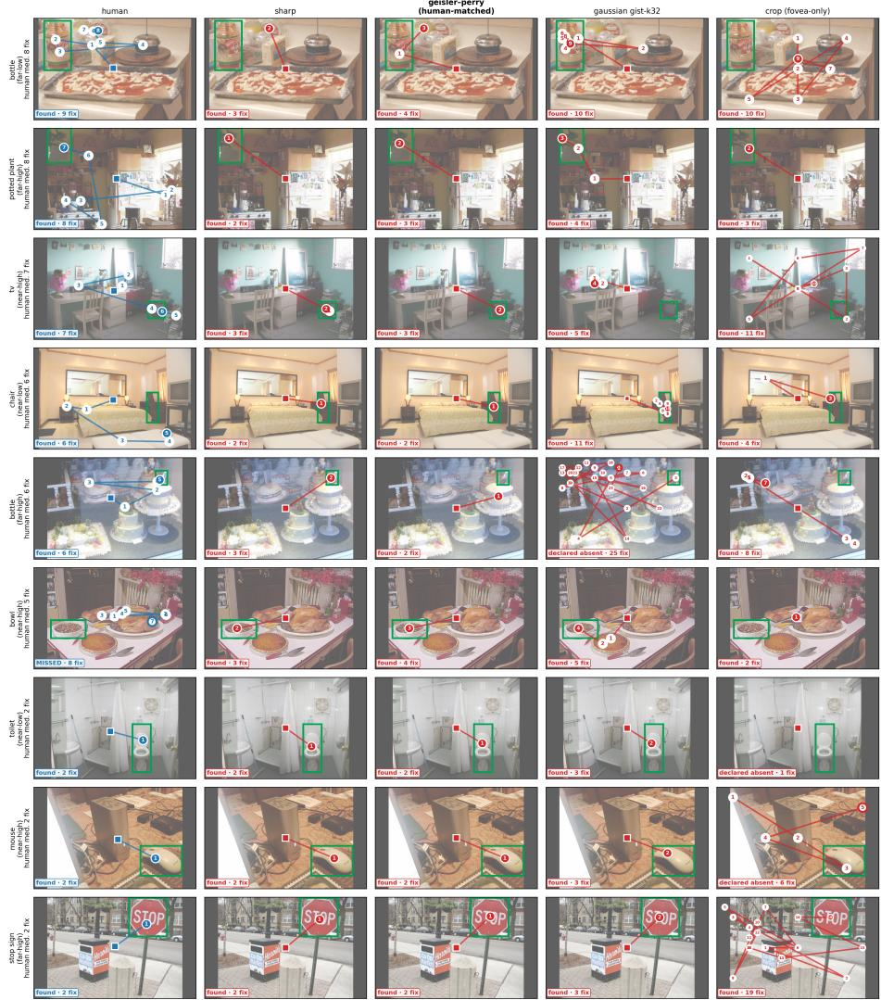  
Fig. 1: The dissociation on individual trials. Rows are (scene, target) target-present trials ordered by human search dificulty; columns are one human observer and Qwen3.5- 35B-A3B (seed 0) under four conditions. Green box, target; square, first fixation; numbered circles, fixation order; filled final marker, target found. Where the human accumulates fixations across the scene before confirming the target, the model under sharp and geisler–perry, visually indistinguishable conditions, issues one large saccade to the target and stops: the same outcome reached by a diferent process, and the divergence is in the order and extent of fixations rather than in their location. Row 6 is a human miss the model does not make. Under gist-k=32 and crop the model does not search longer but terminates in false absence. Rows are illustrative, selected as trials spanning the range of human search dificulty; quantitative claims on the finding axis rest on all 141 target-present trials.

This motivates a falsifiable hypothesis: if a model views a scene through the same foveated, acuity-limited aperture as a human (sharp at gaze, degraded in the periphery, displaceable only by re-fixating) then matched retinal input ought to induce matched search behaviour. The assumption is load-bearing for two common practices: using multimodal large language models (MLLMs) as stand-ins for human observers, and reading attention-alignment scores (the overlap between model attention and human fixations) as evidence that a model “sees like us”. Both take behavioural or spatial agreement to license a claim about process. We test this by decomposing “human-like search” into three axes and asking on which, if any, an MLLM resembles a human: decision (target present or absent?), finding (does gaze reach the target, at what cost?), and gaze (are the eye-movement dynamics human-like?). Three general-purpose MLLMs from three families (Qwen3.5-35B-A3B [39], GLM-4.6V-Flash [46], Gemma-4- E4B [16]) search COCO-Search18 fixation-by-fixation through a byte-identical foveation harness, against ten human scanpaths per scene.

The axes dissociate (Fig. 2). On decision and finding the models are humanor-better (near-ceiling present-target detection and first-saccade target fixation 0.97/0.97/0.80 versus the human 0.49, at comparable eventual success and no more fixations) yet on gaze they are non-human, the three sharing one lowentropy, large-amplitude, highly self-consistent signature that agrees with itself far more than with any human (cross-seed ScanMatch 0.84/0.91/0.71 against the inter-observer ceiling 0.53). Fig. 1 shows what this looks like on individual trials: the model lands on the target while the human is still accumulating fixations, so the two agree on the answer and on roughly where to look while difering in how the looking unfolds. The correct outcome is produced by a shared, non-human process, consistent with a single-pass, non-serial architecture rather than a limit of acuity, as matched retinal input reproduces where humans look but not how looking unfolds (§4.2). Our contributions follow: answer-alignment and saliency metrics are blind to this process axis and cannot certify human-like vision; zeroshot MLLMs suit outcome and spatial questions but not process and temporal ones; and a non-serial searcher that matches human outcomes is a null model for the human serial bottleneck. We do not propose a scanpath predictor or compete on accuracy.

## 2 Related work

Human search and its models. COCO-Search18 provides laboratory human fixations for target-present and target-absent search [7, 8] and anchors scanpath predictors, inverse-reinforcement-learning and transformer models [37, 52, 53], adversarially and self-supervised trained variants [26, 44], domain-adapted and stochastic generators for out-of-domain stimuli [25,27] and ideal-observer/Bayesian searchers benchmarked on common data [5,45]. Classically, search mixes parallel peripheral evaluation with serial focal inspection [21, 49], and search asymmetries emerge from natural-image statistics rather than task-specific training [20]. These predict or explain human attention; we characterise an MLLM’s process against the same reference, taking seriality as the property we test.

Foveation as a modelling constraint. The Geisler–Perry acuity fallof [15] supplies our human-matched renderer. Foveated architectures have been studied both as models of human representation, emergent properties of foveated perceptual systems [11], central–peripheral division in scene recognition [47], and human-like representation under variable resolution [18, 19], and as search mechanisms, with foveal detectors trained to search directly [38]. Foveatedobserver models capture human performance that non-foveated metrics miss, medical search [31], foveated transformers [22], scene-understanding time [48], dual “what”/“where” saccade selection [10], and semantically guided foveal models predict human scanpaths on COCO-Search18 [35] [36], as do architectures for viewing geometries where only part of the scene is resolvable at once [24]. Most pointedly, biologically constrained networks viewing scenes foveally produce human-like scanpaths without being trained to [40, 55]. That foveation has repeatedly suficed to induce human-like search motivates our question; for a general-purpose MLLM it does not (Sec. 4.3).

MLLM versus human vision. A growing literature asks whether MLLMs perceive as humans do, cognitive paradigms [6, 12, 14, 34], which find that models “see but do not perceive”, and attention comparison via eye-tracking [17], [43], [42], [29] where attention similarity and task performance dissociate [43]; critiques of linguistic-prior reliance separate spatial from semantic guidance [23, 50]. Closest, MLLM competence and the human process come apart: a serial deficit inferred from reaction time [4], human-trivial search on which VLMs barely beat chance [2], correct region with wrong answer [30], the mirror of our right-answer/non-human-process finding, but on a static map, and a capability– strategy gap accuracy benchmarks miss. We difer in measuring the fixationby-fixation process, with an explicit stopping decision, on an axis these do not assess.

Agentic, search-trained MLLMs. A parallel line adds active perception to raise accuracy, LLM-guided search [51], tree-based zoom [41], reinforcementlearned focusing [1, 32, 33], and embodied variants [13, 54]; chain-of-thought can even degrade an embodied searcher [56]. These optimise what is answered by learning where to look. We instead characterise how a general-purpose model explores under a fixed foveation constraint, without search-specific training; trained agents are the most pertinent next comparison (Sec. 6) but out of scope. A related but distinct line allocates compute rather than acuity, reducing or merging visual tokens for eficiency [3, 57]; these are budget-allocation mechanisms, not models of peripheral vision.

MLLMs match/beat humans on decision and finding, diverge on gaze

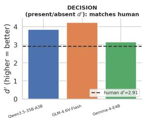

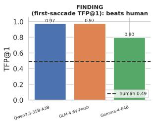

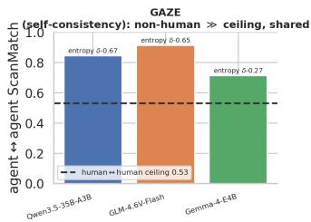  
Fig. 2: The three-axis dissociation at the human-matched condition. Decision $( d ^ { \prime } ,$ present/absent): the models match or exceed the human reference. Finding (first-saccade TFP@1): the models exceed the human rate (0.49) by a wide margin. Gaze (cross-seed self-consistency): all three lie above the human↔human ceiling (0.53) and apart from the human (bar height, cross-seed ScanMatch; annotation, gaze-entropy Clif’s δ), with Gemma-4-E4B nearest. The correct outcome is produced by a shared, non-human process.

## 3 Method

Data. The human reference is COCO-Search18 [7]: ten observers per scene issuing a gamepad present/absent decision on 1680×1050 px scenes subtending ${ \sim } 5 4 ^ { \circ } \times 3 5 ^ { \circ } ~ ( {  } { \sim } 3 0 \mathrm { p x } / \mathrm { d e g } )$ . We use the validation split and a frozen, categorystratified subset of 141 target-present and 144 target-absent scenes (all ten human scanpaths each); the unit of analysis is the (scene, target) trial.

Foveation bracket. At the gaze point a deterministic renderer applies one of four condition families (nine conditions in total; Fig. 4): sharp; geisler–perry (GP), the Geisler and Perry [15] acuity fallof (the only condition calibrated to human acuity; its mild appearance reflects that peripheral information at this viewing geometry is more legible than intuition suggests, and follows the calibrated fallof of Sec. S1); gaussian “gist-k” (“gist” denotes the coarse peripheral information surviving foveation), the same fallof with the peripheral cutof demand scaled by k ∈ {8, 16, 24, 32, 48, 128}, so that GP is the k=1 member of this family, run with the eye’s measured constants, and the gaussian conditions are the same equation deliberately detuned (a synthetic degradation not tuned to human behaviour); and crop, a fovea-only disc.

Procedure. As depicted in Fig. 3, each episode begins at a forced central fixation; at every step the model observes the scene rendered at its gaze point (earlier glimpses retained in context) and returns one directive: look, found, or absent. We use “scanpath”/“gaze” for the model’s sequence of requested fixation coordinates: an operational analogue of oculomotor scanning, not a claim that the model has eye movements. No search policy is imposed; the 50-glimpse cap never forces termination (episodes end on the model’s own found/absent decision). Decisions use a single free-form generation per step at temperature 0.6 under 5 seeds; the harness, prompt (see the supplementary material) and renderer are identical across models. The Geisler–Perry fallof is computed in the native 1680×1050 frame and each glimpse is then downscaled uniformly to a 1024-px maximum side, preserving the fallof geometry up to a global scale.

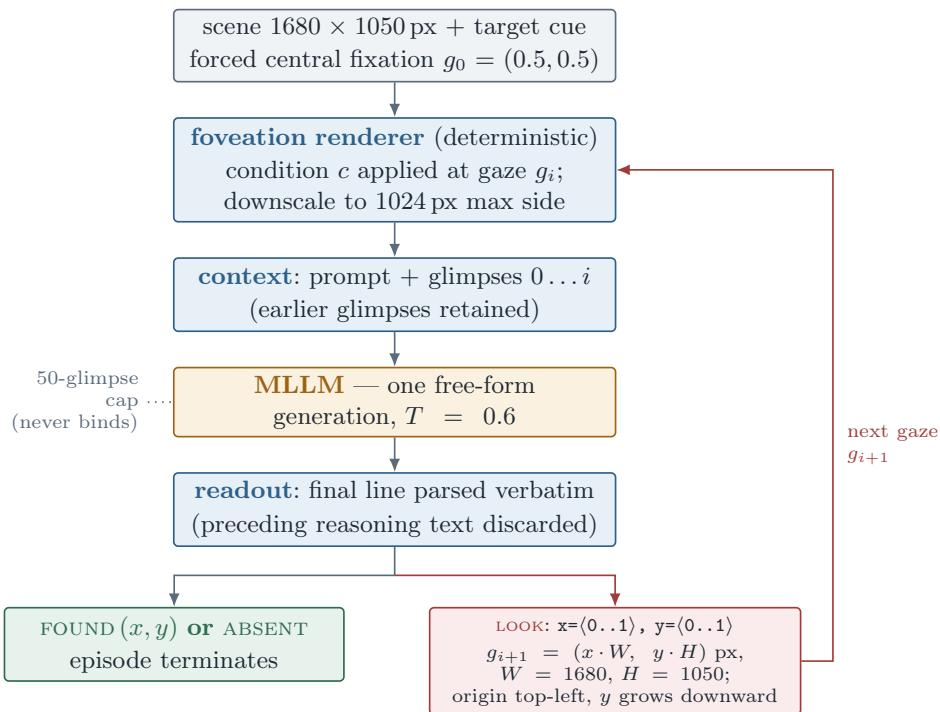  
Fig. 3: The search loop. Each episode begins at a forced central fixation; the renderer applies the active foveation condition at the current gaze point, the resulting glimpse is appended to the context, and the model returns a single directive line. A look directive supplies normalised coordinates that are mapped to display pixels and become the next gaze point, closing the loop (red); found or absent terminates the episode (green). No search policy is imposed and the glimpse cap never forces termination: every episode ends on the model’s own decision.

Directive readout. Each generation ends with a single directive line, parsed verbatim: LOOK: $\mathbf { x } { = } \langle 0 \ldots 1 \rangle$ , $y = \langle 0 \ldots 1 \rangle$ , FOUND: $\mathbf { x } { = } \langle 0 \ldots 1 \rangle$ , $y = \langle 0 \ldots 1 \rangle$ , or ABSENT. Coordinates are normalised to the unit square with the origin at the top-left and y growing downward, a convention fixed in the prompt (Sec. S12, in supplementary materials); the requested point is mapped to display pixels and becomes the next gaze position. Only the final directive line is consumed, so any preceding reasoning text does not afect the readout. The 50-glimpse cap bounds runaway episodes but never terminates one: every episode ends on the model’s own found/absent decision. The first-saccade rate is therefore not an artefact of coordinate parsing: it is corroborated by high eventual success (TFP-end 0.98/0.98/0.93), low median fixation counts (2/2/3), and stability across hit tolerances (max $| \varDelta \mathrm { T F P @ 1 } | \leq 0 . 0 9 5$ over $\pm 0 . 5 / 1 / 1 . 5 ^ { \circ }$ , Table S8).

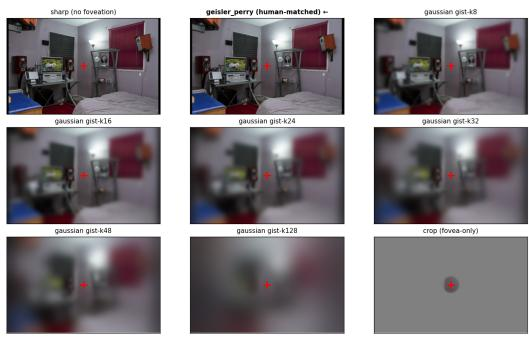  
Fig. 4: The foveation bracket applied to one scene at a fixed gaze point (red +). Only geisler–perry is human-matched, and at this geometry it is mild, nearly indistinguishable from sharp; the gaussian gist ladder and crop are synthetic anchors.

Models. Qwen3.5-35B-A3B (a 35B mixture-of-experts, 3B active; reasoningtuned), GLM-4.6V-Flash (≈9B; reasoning-tuned) and Gemma-4-E4B (≈4B; instructiontuned, run with thinking disabled), which difer in architecture, family and training recipe; as these factors covary, any cross-model trend is reported descriptively.5

Measures. Search is interpreted only on trials passing the one-shot existence test, whose detection ceiling is near-identical across models (Sec. 4.1). We report, for decision, existence accuracy and signal-detection d′ (criterion in Sec. S4); for finding, target-fixation probability (TFP) by saccade, with a hit defined as a fixation within 1◦ of the target box, and fixation count; and for gaze, the per-scanpath signature (saccade amplitude, entropy, refixation, length, center bias, turning angle, coverage) as Clif’s δ against humans, scanpath similarity [9] against the human↔human ceiling, and a cross-model PCA. All measures are defined in Sec. S3; durations are human-only.

## 4 Results

The three models were evaluated on 285 scenes, 5 seeds and nine conditions (3 models × 285 scenes × 5 seeds × nine conditions = 38,475 episodes), all completed (Sec. S10). Quantities are reported at the human-matched GP condition unless a sweep is specified; complete per-condition tables for all three models appear in the supplement.

## 4.1 Decision and finding: models match or exceed humans

Decision. One-shot present-target detection is near-ceiling and comparable across models (target-present / target-absent existence accuracy 0.99/0.81, 0.99/0.81, 0.97/0.80; false-positive bias on absent scenes 0.19/0.19/0.20), so subsequent search divergences cannot be attributed to detection failure and the existencepassed sets are comparable. In the agentic task the present/absent decision is highly sensitive for every model $( d ^ { \prime } \ 3 . 8 4 / 4 . 2 3 / 3 . 1 4 .$ against the human 2.91; Sec. S4), and absent scenes are declared absent at 0.93/0.91/0.96 — distinct from the one-shot existence accuracy (∼0.80) reported above. Finding. Every model fixates the target on the first saccade far more often than humans (TFP@1 0.97/0.97/0.80 against 0.49; Table 1) and attains comparable eventual success (TFP-end 0.98/0.98/0.93 against 0.93), while issuing no more fixations than humans (median 2/2/3 against 3). On the two axes of principal practical interest, whether the decision is correct and whether the target is found, the models are therefore human-or-better; assessed at the level of outcomes alone, they would be judged human-like. One target-absent behaviour is, however, already non-human on the search axis: Qwen3.5-35B-A3B declares absence after a single fixation (NFix-TA 1) versus the human median 5, an eficiency win that is itself not human-like.

Table 1: Outcome by foveation condition (existence-passed trials); each entry is Qwen/GLM/Gemma (Q/G/Gm) against the human reference (first row; per-model n difers slightly). Finding and outcome measures match or exceed the human values; the dynamic gaze divergence is quantified in Table 2, though target-absent search length (NFix-TA) also difers from humans for Qwen. TFP@1/TFP-end: target fixated on the first / by the final saccade (TP); NFix-TP/-TA: median fixations on targetpresent/absent trials; TA decl.-abs: target-absent declared-absent rate; dens. CC: correlation of model and human fixation-density maps.
<table><tr><td rowspan="2">condition</td><td colspan="3">TFP@1</td><td colspan="3">TFP-end</td><td colspan="3">NFix-TP</td><td colspan="3">NFix-TA</td><td colspan="3">TA decl.-abs</td><td colspan="3">dens. CC</td></tr><tr><td>Q</td><td>G</td><td>Gm</td><td>Q</td><td>G</td><td>Gm</td><td>Q</td><td>G</td><td>Gm</td><td>Q</td><td>G</td><td>Gm</td><td>Q</td><td>G</td><td>Gm</td><td>Q</td><td>G</td><td>Gm</td></tr><tr><td>human</td><td></td><td>0.49</td><td></td><td></td><td>0.93</td><td></td><td></td><td>3</td><td></td><td></td><td>5</td><td></td><td></td><td></td><td></td><td></td><td></td><td></td></tr><tr><td>sharp</td><td>0.97</td><td>0.97</td><td>0.80</td><td>0.97</td><td>0.98</td><td>0.93</td><td>2</td><td>2</td><td>3</td><td>1</td><td>4</td><td>6</td><td>0.94</td><td>0.91</td><td>0.96</td><td>0.55</td><td>0.54</td><td>0.49</td></tr><tr><td>GP</td><td>0.97</td><td>0.97</td><td>0.80</td><td>0.98</td><td>0.98</td><td>0.93</td><td>2</td><td>2</td><td>3</td><td>1</td><td>4</td><td>5</td><td>0.93</td><td>0.91</td><td>0.96</td><td>0.58</td><td>0.63</td><td>0.50</td></tr><tr><td>k8</td><td>0.93</td><td>0.84</td><td>0.64</td><td>0.95</td><td>0.89</td><td>0.86</td><td>3</td><td>2</td><td>3</td><td>2</td><td>4</td><td>6</td><td>0.84</td><td>0.77</td><td>0.81</td><td>0.65</td><td>0.45</td><td>0.26</td></tr><tr><td>k16</td><td>0.78</td><td>0.71</td><td>0.42</td><td>0.91</td><td>0.80</td><td>0.75</td><td>3</td><td>3</td><td>4</td><td>4</td><td>4</td><td>6</td><td>0.78</td><td>0.77</td><td>0.68</td><td>0.70</td><td>0.38</td><td>0.45</td></tr><tr><td>k24</td><td>0.56</td><td>0.49</td><td>0.28</td><td>0.81</td><td>0.65</td><td>0.65</td><td>3</td><td>3</td><td>6</td><td>6</td><td>4</td><td>6</td><td>0.72</td><td>0.68</td><td>0.58</td><td>0.74</td><td>0.46</td><td>0.29</td></tr><tr><td>k32</td><td>0.42</td><td>0.33</td><td>0.19</td><td>0.71</td><td>0.53</td><td>0.59</td><td>3</td><td>3</td><td>6</td><td>7</td><td>4.5</td><td>7</td><td>0.62</td><td>0.65</td><td>0.52</td><td>0.70</td><td>0.43</td><td>0.26</td></tr><tr><td>k48</td><td>0.28</td><td>0.18</td><td>0.10</td><td>0.56</td><td>0.36</td><td>0.47</td><td>5</td><td>4</td><td>6</td><td>7</td><td>4</td><td>7</td><td>0.46</td><td>0.65</td><td>0.54</td><td>0.49</td><td>0.33</td><td>0.25</td></tr><tr><td>k128</td><td>0.15</td><td>0.09</td><td>0.01</td><td>0.31</td><td>0.22</td><td>0.39</td><td>6</td><td>4</td><td>6</td><td>6</td><td>4</td><td>6</td><td>0.85</td><td>0.86</td><td>0.78</td><td>0.18</td><td>0.14</td><td>0.19</td></tr><tr><td>crop</td><td>0.04</td><td>0.04</td><td>0.00</td><td>0.20</td><td>0.11</td><td>0.16</td><td>3</td><td>3</td><td>5</td><td>2</td><td>3</td><td>5</td><td>0.68</td><td>0.50</td><td>0.67</td><td>0.25</td><td>0.11</td><td>0.15</td></tr></table>

## 4.2 Gaze dynamics: a shared, non-human signature

Under the conditions in which outcomes coincide with humans, the eye-movement process does not, and the deviation has the same direction for all three models (Table 2, Fig. 5b; the pattern is visible on single trials in Fig. 1). Gaze entropy lies below the human value (Clif’s $\delta \ : - . 6 7 / - . 6 5 / - . 2 7 )$ , indicating spatially concentrated sampling, and saccade amplitudes exceed it $\left( + . 5 0 / + . 6 1 / + . 2 3 \right)$ , indicating direct movements to the target. The scanpaths are moreover highly selfconsistent: cross-seed (agent↔agent) ScanMatch is 0.84/0.91/0.71, far above the human↔human agreement ceiling (0.53), so each model reproduces its own scanpath more closely than two humans agree. A principal-component analysis of the five-statistic signature places all three models, under the legible conditions, in a region disjoint from the human reference (Fig. 5b). That three unrelated models occupy the same region is the multivariate expression of the gaze divergence. These efects survive per-metric mixed-efects models with crossed scene and rater random intercepts (gaze entropy and saccade amplitude have 95% intervals excluding zero for all three models; Sec. S9).

Table 2: Gaze axis at the human-matched condition and at two intermediate degradations, re-analysed from the per-condition tables of the submission (Tables S3–S4). Clif’s δ against the human distribution $( | \delta | > 0 . 3 3$ in bold; sign is agent − human) and cross-seed self-consistency. At GP the deviation is shared: low entropy, large amplitudes, near-human center bias. At k16–k24 the amplitude efect vanishes, refixation rises, and Gemma-4-E4B’s entropy reverses sign, so the GP signature is a property of the legible regime rather than a fixed ofset; self-consistency above the ceiling is what persists for the two reasoning-tuned models.
<table><tr><td colspan="5">cond. model entropy δ sacc. amp δ refix. δ center biasδ agent↔agent</td></tr><tr><td colspan="4">human↔human ceiling</td><td>0.53</td></tr><tr><td>GP</td><td>Qwen3.5-35B-A3B -.67</td><td>+.50</td><td>+.04</td><td>-.18 0.84</td></tr><tr><td></td><td>GLM-4.6V-Flash -.65</td><td>+.61</td><td>-.13 -.31</td><td>0.91</td></tr><tr><td>Gemma-4-E4B</td><td>-.27</td><td>+.23</td><td>+.13 +.06</td><td>0.71</td></tr><tr><td>k16</td><td>Qwen3.5-35B-A3B -.56</td><td>-.03</td><td>+.49 +.01</td><td>0.78</td></tr><tr><td></td><td>GLM-4.6V-Flash -.53</td><td>+.20</td><td>+.30 -.05</td><td>0.80</td></tr><tr><td>Gemma-4-E4B</td><td>+.19</td><td>+.07</td><td>+.27 +.24</td><td>0.59</td></tr><tr><td rowspan="3">k24</td><td>Qwen3.5-35B-A3B -.33</td><td>-.08</td><td>+.52 +.02</td><td>0.70</td></tr><tr><td>GLM-4.6V-Flash</td><td>-.41 +.02</td><td>+.45</td><td>-.02 0.71</td></tr><tr><td>Gemma-4-E4B +.36</td><td>+.16</td><td>+.38 +.19</td><td>0.48</td></tr></table>

## 4.3 No regime recovers human-like search; a single-pass account

Where the gaze gap is narrowest, the models are failing rather than searching. At GP the models operate far above the human first-saccade rate, so the gaze comparison is made at unequal task dificulty; the intermediate conditions k16 and k24 bring TFP@1 to 0.78/0.71/0.42 and 0.56/0.49/0.28 against the human 0.49, and there the gaze signature partly converges (Table 2). The convergence is not evidence of human-like search. At k24 eventual success has already fallen to 0.81/0.65/0.65 against the human 0.93, so the models are not matching the human process at matched dificulty but failing to resolve the scene; what rises with the convergence is refixation $( \delta + . 5 2 / + . 4 5 / + . 3 8 $ , against $+ . 0 4 / - . 1 3 / + . 1 3$ at GP), the revisiting of cells the model cannot resolve, which is the failure signature of Sec. S8 rather than the inspection-driven refixation of a serial searcher. The argument of Sec. 4.1 therefore extends from outcomes to gaze: there is no operating point at which a model is human-like on both axes at once. Across the legible range what persists is determinism (cross-seed ScanMatch 0.78/0.80 at k16 and 0.70/0.71 at k24 for the two reasoning-tuned

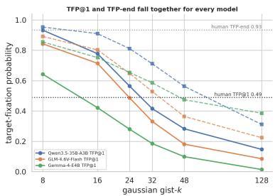  
(a) No human-like regime.

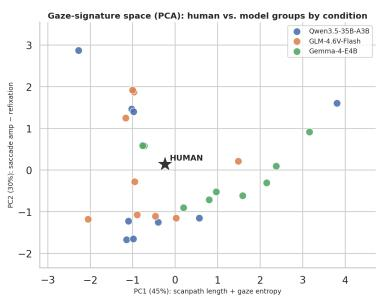  
(b) Gaze-signature PCA (per group).

Fig. 5: (a) First-saccade targeting (solid) and eventual success (dashed) as functions of the degradation factor k for the three models, with human reference levels; the two quantities fall together, so no k yields human-like search at human-like success. (b) Principal-component analysis of the per-(model, condition) five-statistic gaze signature (PC1, 45%: scanpath length and gaze entropy; PC2, 30%: saccade amplitude versus refixation). Under the legible conditions each model sits in a region ofset from the human reference (⋆); points approach the human only under severe degradation, with Gemma-4-E4B nearest.

models, against the 0.53 ceiling) while Gemma-4-E4B falls to 0.48 at k24, below the ceiling, and is the exception.

Sweeping the synthetic degradation does not yield a level at which a model searches like a human (TFP@1 ≈ 0.49) while still locating the target (TFP-end ≈ 0.93). For none of the three models (Fig. 5a) do these quantities separate: they decline together, so by the degradation that lowers first-saccade targeting to the human rate (k=32 for Qwen3.5-35B-A3B, TFP@1/TFP-end 0.42/0.71; k=16 for Gemma-4-E4B, 0.42/0.75), eventual success has already collapsed. The divergence is not an efect of acuity: the human-matched condition is behaviourally indistinguishable from sharp for every model (e.g. TFP@1 0.97 against 0.97; Tables 1–2), even though it measurably degrades the periphery. Nor is it a diference of spatial prior: center bias is human-like for all three (sub-threshold δ, Table 2), so the models look in broadly human-relevant places, whereas the order and dynamics of their fixations (low entropy, large saccades, high determinism) do not. The missing component is serial sampling, not the spatial prior; we do not manipulate architecture directly, so this attribution is by elimination (acuity and spatial prior ruled out) and a causal test imposing serial sampling is left to future work. As evidence is removed the models do not lengthen search gracefully: refixation rises, then at the most severe degradation the declared-absent rate rebounds as they default to absent, a model-internal failure signature needing no human reference (Fig. 1, gist-k=32 and crop columns; Sec. S8).

## 4.4 Generality and robustness

The dissociation and the shared gaze signature hold across three distinct model families, suggesting a property of the foveated-MLLM paradigm rather than of a single instance. The first-saccade advantage holds within every eccentricityby-size dificulty stratum (Sec. S9) and is insensitive to the target-box tolerance: across tolerances of 0.5, 1 and 1.5◦, TFP@1 shifts by at most ∼0.1. The high cross-seed determinism is not an artifact of low-temperature decoding; in a temperature sweep on our anchor model (Qwen3.5-35B-A3B) it remains well above the inter-observer ceiling even at temperature 1.0 on the legible conditions (Sec. S9). Cross-seed and human inter-observer agreement are not identical constructs (no matched human intra-observer baseline exists in COCO-Search18), so we treat the determinism gap as suggestive, resting it on this temperature-1.0 persistence. The magnitude of the gaze deviation follows a consistent ordering across models: Gemma-4-E4B is the most human-like model, with the smallest efect on five of the seven statistics (entropy, saccade amplitude, scanpath length, center bias, coverage; e.g. gaze-entropy δ −.27 vs. Qwen −.67; cross-seed Scan-Match 0.71 vs. 0.84), and its number of fixations (search extent) is the only fixed efect whose mixed-efects 95% interval contains zero (Sec. S9). Because architecture, recipe and sparsity covary across three models, we read this as weaker single-pass targeting, not a more human-like strategy, and report it descriptively.

## 5 Discussion

Metrics and surrogacy. The models match the present/absent answer and partially match the human saliency map (density correlation 0.58/0.63/0.50) yet diverge on every temporal measure of gaze. Because answer-alignment and saliency scores are computed on outcomes or a time-collapsed map, a high value is necessary but not suficient: zero-shot MLLMs are adequate surrogates for outcome and spatial questions but not process and temporal ones, a property of the class that model selection does not remove.

A non-human searcher as a null model. Conversely, a system attaining humanor-better outcomes without a serial bottleneck is a useful null: it isolates the behaviours due to seriality from the detection and spatial priors it already reproduces.

## 6 Limitations and scope

Our scope is general-purpose models under a fixed foveation constraint: searchtrained agentic, pointing-native and frontier closed-source models—the most pertinent next comparison—are not evaluated. The cross-model trend is confounded (architecture, recipe, sparsity) and reported descriptively; the gaze signature is measured under a single prompt whose memory clause may partly shape refixation; and fixation durations are human-only.

## 7 Conclusion

Three MLLMs, driven fixation by fixation through a foveation calibrated to human acuity, match or exceed humans on the decision and on target acquisition. Their gaze does not follow: at the legible conditions all three share one low-entropy, large-amplitude, highly self-consistent signature, and no degradation regime recovers human-like search at human-like success, where the signature converges the models are failing to resolve the scene rather than searching.

Matched retinal input therefore reproduces where humans look but not how the looking unfolds, a dissociation consistent with a single-pass reader carrying a human-like spatial prior rather than with a limit of acuity. Because answeralignment and saliency scores are computed on outcomes or on a time-collapsed map, they cannot certify correspondence on this process axis; conversely, a searcher attaining human-or-better outcomes without a serial bottleneck is a null model against which the behavioural cost of seriality can be isolated.

## References

1. Bai, H., Zhou, Y., Wu, Y., Chan, C.M., Wen, P., Pan, K., Han, S., Guo, Y.: Glanceor-gaze: Incentivizing lmms to adaptively focus search via reinforcement learning. arXiv preprint arXiv:2601.13942 (2026)

2. Berman, S., Deng, J.: Vlms have tunnel vision: Evaluating nonlocal visual reasoning in leading vlms. Advances in Neural Information Processing Systems 38, 78972– 78993 (2026)

3. Bolya, D., Fu, C.Y., Dai, X., Zhang, P., Feichtenhofer, C., Hofman, J.: Token merging: Your vit but faster. arXiv preprint arXiv:2210.09461 (2022)

4. Budny, N., Ghods, K., Campbell, D., Marjieh, R., Joshi, A., Kumar, S., Cohen, J.D., Webb, T.W., Grifiths, T.L.: Visual serial processing deficits explain divergences in human and vlm reasoning. arXiv preprint arXiv:2509.25142 (2025)

5. Bujia, G., Sclar, M., Vita, S., Solovey, G., Kamienkowski, J.E.: Modeling human visual search in natural scenes: A combined bayesian searcher and saliency map approach. Frontiers in Systems Neuroscience 16, 882315 (2022)

6. Burden, J., Prunty, J., Slater, B., Tehenan, M., Davis, G., Cheke, L.: I spy with my model’s eye: Visual search as a behavioural test for mllms. arXiv preprint arXiv:2510.19678 (2025)

7. Chen, Y., Yang, Z., Ahn, S., Samaras, D., Hoai, M., Zelinsky, G.: Coco-search18 fixation dataset for predicting goal-directed attention control. Scientific reports 11(1), 8776 (2021)

8. Chen, Y., Yang, Z., Chakraborty, S., Mondal, S., Ahn, S., Samaras, D., Hoai, M., Zelinsky, G.: Characterizing target-absent human attention. In: Proceedings of the IEEE/CVF Conference on Computer Vision and Pattern Recognition. pp. 5031–5040 (2022)

9. Cristino, F., Mathôt, S., Theeuwes, J., Gilchrist, I.D.: Scanmatch: A novel method for comparing fixation sequences. Behavior research methods 42(3), 692–700 (2010)

10. Daucé, E., Albiges, P., Perrinet, L.U.: A dual foveal-peripheral visual processing model implements eficient saccade selection. Journal of Vision 20(8), 22–22 (2020)

11. Deza, A., Konkle, T.: Emergent properties of foveated perceptual systems. arXiv preprint arXiv:2006.07991 (2020)

12. Fu, X., Hu, Y., Li, B., Feng, Y., Wang, H., Lin, X., Roth, D., Smith, N.A., Ma, W.C., Krishna, R.: Blink: Multimodal large language models can see but not perceive. In: European Conference on Computer Vision. pp. 148–166. Springer (2024)

13. Fung, A., Tan, A.H., Wang, H., Benhabib, B., Nejat, G.: Mllm-search: A zeroshot approach to finding people using multimodal large language models. Robotics 14(8), 102 (2025)

14. Gao, H., Huang, Z., Xu, L., Tang, J., Li, X., Liu, Y., Li, H., Hu, T., Lin, M., Yang, X., et al.: Pixels, patterns, but no poetry: To see the world like humans. arXiv preprint arXiv:2507.16863 (2025)

15. Geisler, W.S., Perry, J.S.: Real-time foveated multiresolution system for lowbandwidth video communication. In: Human vision and electronic imaging III. vol. 3299, pp. 294–305. SPIE (1998)

16. Gemma Team, et al.: Gemma 4 technical report (2026), https://arxiv.org/abs/ 2607.02770

17. Ghamati, K., Dehkordi, M.B., Zaraki, A.: Which ai sees like us? investigating the cognitive plausibility of language and vision models via eye-tracking in humanrobot interaction. Sensors 25(15), 4687 (2025)

18. Gizdov, A., Ullman, S., Harari, D.: Variable resolution improves visual question answering under a limited pixel budget. In: European Conference on Computer Vision. pp. 289–298. Springer (2024)

19. Gizdov, A., Ullman, S., Harari, D.: Seeing more with less: Human-like representations in vision models. In: 2025 IEEE/CVF Conference on Computer Vision and Pattern Recognition (CVPR). pp. 4408–4417. IEEE (2025)

20. Gupta, S.K., Zhang, M., Wu, C.C., Wolfe, J., Kreiman, G.: Visual search asymmetry: Deep nets and humans share similar inherent biases. Advances in neural information processing systems 34, 6946–6959 (2021)

21. Heaton, R., Hummel, J., Lleras, A., Buetti, S.: A computational account of serial and parallel processing in visual search. Journal of Vision 20(11), 844 (2020). https://doi.org/10.1167/jov.20.11.844

22. Jonnalagadda, A., Wang, W.Y., Manjunath, B., Eckstein, M.P.: Foveater: Foveated transformer for image classification. arXiv preprint arXiv:2105.14173 (2021)

23. Kanade, A.S., Ganu, T.: Do you see me: A multidimensional benchmark for evaluating visual perception in multimodal llms. In: Proceedings of the 19th Conference of the European Chapter of the Association for Computational Linguistics (Volume 1: Long Papers). pp. 7285–7326 (2026)

24. Kerkouri, M.A., Tliba, M., Chetouani, A., Sayeh, M.R.: Salypath360: Saliency and scanpath prediction framework for omnidirectional images. In: Human Vision and Electronic Imaging (2022), https://api.semanticscholar.org/CorpusID: 245650724

25. Kerkouri, M.A., Tliba, M., Chetouani, A., Bruno, A.: A domain adaptive deep learning solution for scanpath prediction of paintings. In: Proceedings of the 19th International Conference on Content-Based Multimedia Indexing. p. 57–63. CBMI ’22, Association for Computing Machinery, New York, NY, USA (2022). https: //doi.org/10.1145/3549555.3549597, https://doi.org/10.1145/3549555. 3549597

26. Kerkouri, M.A., Tliba, M., Chetouani, A., Bruno, A.: An inter-observer consistent deep adversarial training for visual scanpath prediction. In: 2023 IEEE International Conference on Image Processing (ICIP). pp. 2595–2599 (2023). https://doi.org/10.1109/ICIP49359.2023.10222686

27. Kerkouri, M.A., Tliba, M., Chetouani, A., Bruno, A.: Spgen: Stochastic scanpath generation for paintings using unsupervised domain adaptation (2026), https: //arxiv.org/abs/2602.22049

28. Kerkouri, M.A., Tliba, M., Sellam, Z., Distante, C., Bruno, A., Chetouani, A.: Closing the foveal gap: Perceptually grounded scanpath comparison with disc iou. In: Proceedings of the 2026 Symposium on Eye Tracking Research and Applications. ETRA ’26, Association for Computing Machinery, New York, NY, USA (2026). https://doi.org/10.1145/3797246.3805860, https://doi.org/10. 1145/3797246.3805860

29. Kerkouri, M.A., Tliba, M., Wang, B., Chetouani, A., Bagci, U., Bruno, A.: What they saw, not just where they looked: Semantic scanpath similarity via vlms and nlp metrics. In: Proceedings of the 2026 Symposium on Eye Tracking Research and Applications. ETRA ’26, Association for Computing Machinery, New York, NY, USA (2026). https://doi.org/10.1145/3797246.3806223, https://doi. org/10.1145/3797246.3806223

30. Khayatkhoei, M., Chhikara, P., Ilievski, F., et al.: Mllms know where to look: Training-free perception of small visual details with multimodal llms. In: International Conference on Learning Representations. vol. 2025, pp. 68194–68213 (2025)

31. Lago, M.A., Abbey, C.K., Eckstein, M.P.: Foveated model observers for visual search in 3D medical images. IEEE Transactions on Medical Imaging 40(3), 1021– 1031 (2021). https://doi.org/10.1109/TMI.2020.3044530

32. Lai, X., Li, J., Li, W., Liu, T., Li, T., Zhao, H.: Mini-o3: Scaling up reasoning patterns and interaction turns for visual search. arXiv preprint arXiv:2509.07969 (2025)

33. Li, K., Yao, L., Wu, J., Yu, T., Chen, J., Bai, H., Hou, L., Hong, L., Zhang, W., Zhang, N.L.: Insight-o3: Empowering multimodal foundation models with generalized visual search. arXiv preprint arXiv:2512.18745 (2025)

34. Lin, J., Ye, S., Xu, D., Ouyang, W., Lau, R.W.: Do mllms exhibit human-like perceptual behaviors? hvsbench: A benchmark for mllm alignment with human perceptual behavior. In: Proceedings of the IEEE/CVF Conference on Computer Vision and Pattern Recognition. pp. 1818–1827 (2026)

35. Luzio, J., Bernardino, A., Moreno, P.: Semantic-based active perception for humanoid visual tasks with foveal sensors. arXiv preprint arXiv:2404.10836 (2024)

36. Luzio, J., Bernardino, A., Moreno, P.: Human scanpath prediction in target-present visual search with semantic-foveal Bayesian attention. In: 2025 IEEE International Conference on Development and Learning (ICDL). pp. 1–8. IEEE, Prague, Czech Republic (Sep 2025)

37. Mondal, S., Yang, Z., Ahn, S., Samaras, D., Zelinsky, G., Hoai, M.: Gazeformer: Scalable, efective and fast prediction of goal-directed human attention. In: Proceedings of the IEEE/CVF conference on computer vision and pattern recognition. pp. 1441–1450 (2023)

38. Paula, B., Moreno, P.: Learning to search for and detect objects in foveal images using deep learning. In: Iberian Conference on Pattern Recognition and Image Analysis. pp. 223–237. Springer (2023)

39. Qwen Team: Qwen3.5: Towards native multimodal agents (February 2026), https: //qwen.ai/blog?id=qwen3.5

40. Schwinn, L., Precup, D., Eskofier, B., Zanca, D.: Behind the machine’s gaze: Neural networks with biologically-inspired constraints exhibit human-like visual attention. arXiv preprint arXiv:2204.09093 (2022)

41. Shen, H., Zhao, K., Zhao, T., Xu, R., Zhang, Z., Zhu, M., Yin, J.: Zoomeye: Enhancing multimodal llms with human-like zooming capabilities through treebased image exploration. In: Proceedings of the 2025 Conference on Empirical Methods in Natural Language Processing. pp. 6613–6629 (2025)

42. Sood, E., Kögel, F., Strohm, F., Dhar, P., Bulling, A.: Vqa-mhug: A gaze dataset to study multimodal neural attention in visual question answering. In: Proceedings of the 25th Conference on Computational Natural Language Learning. pp. 27–43 (2021)

43. Sood, E., Tannert, S., Frassinelli, D., Bulling, A., Vu, N.T.: Interpreting attention models with human visual attention in machine reading comprehension. In: Pro-

ceedings of the 24th conference on computational natural language learning. pp. 12–25 (2020)

44. Tliba, M., Kerkouri, M.A., Chetouani, A., Bruno, A.: Self supervised scanpath prediction framework for painting images. In: 2022 IEEE/CVF Conference on Computer Vision and Pattern Recognition Workshops (CVPRW). pp. 1538–1547 (2022). https://doi.org/10.1109/CVPRW56347.2022.00160

45. Travi, F., Ruarte, G., Bujia, G., Kamienkowski, J.E.: Visions: Visual search in natural scenes benchmark. Advances in Neural Information Processing Systems 35, 11987–12000 (2022)

46. V Team, et al.: GLM-4.5V and GLM-4.1V-Thinking: Towards versatile multimodal reasoning with scalable reinforcement learning (2025), https://arxiv.org/abs/ 2507.01006

47. Wang, P., Cottrell, G.W.: Central and peripheral vision for scene recognition: A neurocomputational modeling exploration. Journal of vision 17(4), 9–9 (2017)

48. Wen, Z., Skaza, J., Murlidaran, S., Wang, W.Y., Eckstein, M.P.: Predicting reaction time to comprehend scenes with foveated scene understanding maps. arXiv preprint arXiv:2505.12660 (2025)

49. Wolfe, J.M.: Guided search 6.0: An updated model of visual search. Psychonomic bulletin & review 28(4), 1060–1092 (2021)

50. Wu, M., Wang, Z., Wang, F., Yang, J., Pollefeys, M., Zhang, T.: From indoor to open world: Revealing the spatial reasoning gap in mllms. In: Proceedings of the IEEE/CVF Conference on Computer Vision and Pattern Recognition. pp. 16789– 16799 (2026)

51. Wu, P., Xie, S.: V\*: Guided visual search as a core mechanism in multimodal llms. In: Proceedings of the IEEE/CVF Conference on Computer Vision and Pattern Recognition. pp. 13084–13094 (2024)

52. Yang, Z., Huang, L., Chen, Y., Wei, Z., Ahn, S., Zelinsky, G., Samaras, D., Hoai, M.: Predicting goal-directed human attention using inverse reinforcement learning. In: Proceedings of the IEEE/CVF conference on computer vision and pattern recognition. pp. 193–202 (2020)

53. Yang, Z., Mondal, S., Ahn, S., Xue, R., Zelinsky, G., Hoai, M., Samaras, D.: Unifying top-down and bottom-up scanpath prediction using transformers. In: Proceedings of the IEEE/CVF Conference on Computer Vision and Pattern Recognition. pp. 1683–1693 (2024)

54. Yu, H., Han, Y., Zhang, X., Yin, B., Chang, B., Han, X., Liu, X., Zhang, J., Pavone, M., Feng, C., et al.: Thinking in 360deg: Humanoid visual search in the wild. In: Proceedings of the IEEE/CVF Conference on Computer Vision and Pattern Recognition. pp. 22445–22455 (2026)

55. Zanca, D., Zugarini, A., Dietz, S., Altstidl, T.R., Ndjeuha, M.A.T., Chakraborty, M., Jami, N.V.S.J., Schwinn, L., Eskofier, B.M.: Contrastive language-image pretrained models are zero-shot human scanpath predictors. IEEE Transactions on Artificial Intelligence (2025)

56. Zhao, X., Zhou, G., Wu, Q.: Vln-mme: Diagnosing mllms as language-guided visual navigation agents. In: Proceedings of the 64th Annual Meeting of the Association for Computational Linguistics (Volume 1: Long Papers). pp. 28207–28231 (2026)

57. Zheng, M., Chen, H., Guo, T., Zhu, C., Zheng, B., Xu, C., Wang, Y.: Enhancing large language models through adaptive tokenizers. Advances in Neural Information Processing Systems 37, 113545–113568 (2024)

## Supplementary Material

Matched Outcomes, Divergent Gaze: How Foveated MLLMs Search Compared to Humans

This document specifies the experimental methods in full, gives formal definitions of every behavioural measure and the statistical procedures used to analyse them, and reports the complete per-model results summarised in the main paper. We first describe the stimuli and the foveation model (Sec. S1) and the search procedure (Sec. S2); we then define all metrics and the inferential methodology (Sec. S3). The three behavioural axes (decision, finding, and gaze) are reported in Secs. S4–S6, followed by the multivariate analysis (Sec. S7), the mechanistic analyses (Sec. S8), robustness and cross-model variation (Sec. S9), data completeness (Sec. S10), the implications and scope of the study (Sec. S11), and the prompt (Sec. S12). All analyses use three vision-language models, Qwen3.5-35B-A3B (a 35B-parameter mixture-of-experts with 3B active parameters; reasoning-tuned), GLM-4.6V-Flash (≈9B; reasoningtuned) and Gemma-4-E4B (≈4B; instruction-tuned), together with the human reference, on a frozen, category-stratified COCO-Search18 subset of 141 targetpresent and 144 target-absent scenes, with ten human scanpaths per scene and 5 model seeds per scene and condition.

## S1 Stimuli and the foveation model

Stimuli, target categories and human scanpaths are drawn from COCO-Search18 [7], in which observers searched 1680×1050 px scenes subtending ${ \sim } 5 4 ^ { \circ } { \times } 3 5 ^ { \circ }$ of visual angle for a cued object and reported its presence or absence; the corresponding angular resolution is $\rho \approx 3 0 \mathrm { p x / d e g }$ . Visual angle is obtained throughout by $\theta = d / \rho$ for a pixel distance d. The unit of analysis is the trial $t = ( \mathrm { s c e n e } , \mathrm { t a r g e t } )$

Foveation is imposed by a deterministic renderer applied at the current gaze point $g .$ Following Geisler and Perry [15], the highest spatial frequency resolvable by the eye at retinal eccentricity e (in degrees) is

$$
f _ { c } ( e ) = \frac { e _ { 2 } \ln ( 1 / C T _ { 0 } ) } { \alpha \left( e + e _ { 2 } \right) } \mathrm { c y c / d e g } , e _ { 2 } = 2 . 3 ^ { \circ } , \alpha = 0 . 1 0 6 , C T _ { 0 } = 1 / 6 4 .\tag{S1}
$$

A Gaussian image pyramid is constructed and, at every pixel of eccentricity $e ,$ the canonical level $L = \log _ { 2 } ( \mathrm { l o c a l N y q u i s t } / f _ { c } ( e ) )$ is selected so that the local image cutof equals the $\mathrm { e y e ^ { \prime } s , }$ yielding a sharp centre and a smooth peripheral fallof. The four bracket conditions are (i) sharp, no foveation; (ii) geisler–perry (GP), Eq. (S1) at $\rho { = } 3 0$ , viewing distance 0.6 m, the only human-matched condition, and mild at this geometry; (iii) gaussian “gist-k” (gist: the coarse, lowresolution peripheral information that survives foveation), identical in form but with the peripheral cutof demand scaled by a factor $k \in \{ 8 , 1 6 , 2 4 , 3 2 , 4 8 , 1 2 8 \}$ , a synthetic degradation not tuned to human behaviour; and (iv) crop, a foveaonly disc of radius ${ \sim } 2 . 5 ^ { \circ }$ with the periphery removed. The renderer is identical across models (main Fig. 4 shows the bracket on one scene).

## S2 Search procedure

Each episode begins at a forced central fixation. At step i the model receives the scene rendered under the active foveation condition at its current gaze point (earlier glimpses retained in context) and must return exactly one directive: $\operatorname { L O O K } ( x , y )$ , to move the gaze to a new point and continue; found(x, y), to terminate with a present decision at $( x , y ) ;$ ; or absent, to terminate with an absent decision. The procedure imposes no search policy: the choice of where to look and when to stop is the model’s alone, and the episode is never terminated on a target hit. A uniform cap of 50 glimpses bounds runaway episodes. Each glimpse is rendered at the human display resolution and downscaled to a 1024- px maximum side before presentation, identically across conditions and models. Decisions are produced by a single free-form generation per step at sampling temperature 0.6; each (scene, condition) is searched under 5 independent seeds. The harness, prompt and renderer are byte-for-byte identical across the three models, so that any behavioural diference is attributable to the model rather than to the protocol.

## S3 Metrics and statistical methodology

Notation. A scanpath is an ordered sequence of fixations $s = ( f _ { 0 } , f _ { 1 } , \dots , f _ { L } )$ with $f _ { i } = ( x _ { i } , y _ { i } )$ in display pixels and $f _ { 0 }$ the central start; its length in fixations is $| s | = L { + } 1$ . For a target-present trial, B denotes the target bounding box and $B ^ { \oplus \tau }$ its dilation by a tolerance τ (default $\tau { = } 1 ^ { \circ } { = } \rho \operatorname { p x } )$ . A fixation hits the target if $f _ { i } \in B ^ { \oplus \tau }$ , and the first-hit index is $h ( s ) = \operatorname* { m i n } \{ i : f _ { i } \in B ^ { \oplus \tau } \}$ (with $h ( s ) = \infty$ if the target is never fixated). For each trial we have up to 5 model scanpaths (one per seed) and ten human scanpaths; the existence-passed set restricts analysis to trials a model answered correctly on the one-shot detection test (defined below), applied identically to every model.

## S3.1 Detection and decision

The one-shot existence test presents the full sharp scene with the question “is there a {target}?”. Existence accuracy is the proportion of correct yes/no answers (separately for target-present and target-absent scenes), and the yes-bias is the false-positive rate on target-absent scenes, Pr(answer=yes | absent). The agentic present/absent decision is summarised by signal-detection theory. With hit rate $H = \operatorname* { P r } ( \operatorname { F O U N D } \mid \mathrm { T P } )$ and false-alarm rate $F = \mathrm { P r } ( \mathrm { F O U N D \mid T A ) }$ , and the loglinear correction $H ^ { \prime } = ( n _ { H } + 0 . 5 ) / ( n _ { \mathrm { T P } } + 1 ) , F ^ { \prime } = ( n _ { F } + 0 . 5 ) / ( n _ { \mathrm { T A } } + 1 )$ , sensitivity and bias are

$$
\begin{array} { r } { d ^ { \prime } = \phi ^ { - 1 } ( H ^ { \prime } ) - \phi ^ { - 1 } ( F ^ { \prime } ) , \qquad c = - \frac { 1 } { 2 } \big [ \phi ^ { - 1 } ( H ^ { \prime } ) + \phi ^ { - 1 } ( F ^ { \prime } ) \big ] , } \end{array}\tag{S2}
$$

where $\varPhi ^ { - 1 }$ is the inverse standard-normal CDF. The human reference uses the recorded gamepad present/absent responses.

## S3.2 Finding (eficiency of target acquisition)

The target-fixation probability (TFP) curve gives, by saccade $n ,$ the probability that gaze has reached the target. Over the existence-passed trial set $\tau .$

$$
\mathrm { T F P } _ { n } \ = \ \frac { 1 } { | \mathcal { T } | } \sum _ { t \in \mathcal { T } } \frac { 1 } { | S _ { t } | } \sum _ { s \in S _ { t } } \mathbf { 1 } \big [ h ( s ) \leq n \big ] ,\tag{S3}
$$

with $S _ { t }$ the scanpaths of trial t. TFP@1 counts the first saccade after the forced central fixation $f _ { 0 }$ , applied identically to models and humans. We report firstsaccade targeting TFP@1 and eventual success $\mathrm { T F P - e n d } = \mathrm { T F P } _ { 1 5 }$ . The same definition is used for the strata and hit-tolerance analyses, so that a single estimator underlies every TFP value in the paper. Search extent is the number of fixations per episode, $\mathrm { N u m F i x } = | s |$ , reported as the per-group median.

## S3.3 Stopping (target-absent termination)

On target-absent scenes we report the declared-absent rate — the fraction of episodes terminated with absent — and the median number of fixations preceding the decision.

## S3.4 Gaze dynamics (intrinsic scanpath signature)

The following per-scanpath statistics characterise the eye-movement process independently of task outcome; all lengths are in degrees of visual angle. The i-th saccade has amplitude $a _ { i } = \lVert f _ { i } - f _ { i - 1 } \rVert / \rho$ and direction $\phi _ { i } = \mathrm { a t a n 2 } ( y _ { i } - y _ { i - 1 } , x _ { i } -$ $x _ { i - 1 } )$ ; the turning angle between successive saccades is $\begin{array} { r } { \Delta \phi _ { i } = \mathrm { w r a p } ( \phi _ { i + 1 } - \phi _ { i } ) \in \ d } \end{array}$ $( - 1 8 0 ^ { \circ }$ , 180◦]. Scanpath length is $\textstyle \ell = \sum _ { i } a _ { i } ;$ center bias is the mean fixation eccentricity $\begin{array} { r } { \frac { 1 } { | s | } { \bf \bar { \sum } } _ { i } \| f _ { i } - c \| / \rho } \end{array}$ about the scene centre $c ;$ convex-hull coverage is the area $\left( \mathrm { d e g ^ { 2 } } \right)$ of the convex hull of $\{ f _ { i } \}$ . Spatial dispersion is quantified by gaze entropy: the display is partitioned into a 14×9 grid, and with $p _ { g }$ the fraction of fixations in cell $^ { g , }$

$$
\mathrm { G a z e E n t r o p y \ = \ - \sum _ { \it g } } p _ { g } \ \mathrm { l o g } _ { \mathrm { 2 } } p _ { g } \quad \mathrm { ( b i t s ) . }\tag{S4}
$$

The refixation rate is the fraction of fixations that land in an already-visited grid cell, an inhibition-of-return signature. Each statistic is summarised by its pergroup median and by the efect size against the human distribution (Sec. S3.7).

## S3.5 Scanpath similarity

Pairwise scanpath similarity uses ScanMatch [9]; we retain it for comparability with the published human↔human ceiling, noting that grid quantisation discards foveal scale [28] and that similarity can also be scored semantically rather than geometrically [29]. Fixations are quantised to the 14×9 grid and aligned by Needleman–Wunsch global alignment with a substitution score that decreases linearly with inter-cell Euclidean distance (threshold 3.5, gap penalty 0), normalised by the maximal self-alignment score to the unit interval (higher is more similar). ScanMatch is computed in three modes: agent↔human (each model scanpath against each human scanpath of the trial), agent↔agent (cross-seed model pairs, a measure of determinism), and human↔human (all $\binom { \mathrm { i } 0 } { 2 }$ human pairs per scene), the last of which is the inter-observer agreement ceiling, 0.53 for ScanMatch.

## S3.6 Fixation-density agreement

A continuous fixation-density map is formed by kernel density estimation, $\hat { D } ( { \mathbf { u } } ) \propto$ $\textstyle \sum _ { i } { \mathcal { N } } ( { \mathbf { u } } ; f _ { i } , \sigma ^ { 2 } I )$ with $\sigma = \rho$ (the central fixation is excluded). Agreement with the human map is reported as the linear correlation coeficient CC (Pearson correlation of the two maps), the normalised scanpath saliency NSS (the mean of the z-scored model map sampled at human fixation locations), and the Kullback– Leibler divergence $\begin{array} { r } { \mathrm { K L } = \sum _ { \mathbf { u } } D _ { h } \log ( D _ { h } / D _ { m } ) } \end{array}$ of the human map from the model map.

## S3.7 Statistical methodology

Efect sizes against the human distribution use Clif’s δ, the nonparametric dominance statistic

$$
\delta ( A , B ) = { \frac { \# \{ a > b \} - \# \{ a < b \} } { | A | | B | } } \in [ - 1 , 1 ] ,\tag{S5}
$$

with sign convention agent − human; $\vert \delta \vert > 0 . 3 3$ is treated as non-trivial. Distributional efects are confirmed by linear mixed-efects models with crossed random intercepts for scene and rater (human subject or model seed),

$$
\begin{array} { r } { y _ { i j k } = \beta _ { 0 } + \sum _ { c } \beta _ { c } { \bf 1 } [ \mathrm { c o n d } _ { j } = c ] + u _ { i } + v _ { k } + \varepsilon _ { i j k } , \qquad u _ { i } , v _ { k } , \varepsilon \sim \mathrm { i n d e p . ~ G a u s s i a n } , } \end{array}\tag{S6}
$$

where i indexes scene, k rater, j scanpath, and the human condition is the reference level; we report the fixed efect $\hat { \beta } _ { c }$ (agent−human) and its 95% confidence interval, treating a CI that excludes zero as significant. Finally, the joint structure of five of the seven gaze statistics — gaze entropy, saccade amplitude, refixation, scanpath length and center bias (coverage is dropped from the PCA as collinear with scanpath length and entropy, and turning-angle efects are inconsistent in sign across conditions, so both enter Table S3 only) — is summarised by a principal-component analysis of the standardised per-group median vectors, giving two interpretable axes (loadings in Table S5).

## S4 Decision axis

Table S1: Detection and decision measures. One-shot existence accuracy and yes-bias (full sharp scene), the in-harness present/absent sensitivity $d ^ { \prime }$ and criterion c at the human-matched condition (Eq. (S2)).
<table><tr><td>model</td><td colspan="5">TP exist. TA exist. yes-bias d&#x27; (GP) criterion</td></tr><tr><td>human</td><td></td><td></td><td></td><td>2.91</td><td>0.03</td></tr><tr><td>Qwen3.5-35B-A3B</td><td>0.99</td><td>0.81</td><td>0.19</td><td>3.84</td><td>-0.41</td></tr><tr><td>GLM-4.6V-Flash</td><td>0.99</td><td>0.81</td><td>0.19</td><td>4.23</td><td>-0.24</td></tr><tr><td>Gemma-4-E4B</td><td>0.97</td><td>0.80</td><td>0.20</td><td>3.14</td><td>0.38</td></tr></table>

DECISION axis: signal-detection d' and criterion (in-harness present/absent)  
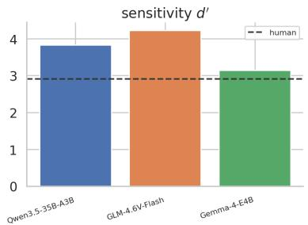

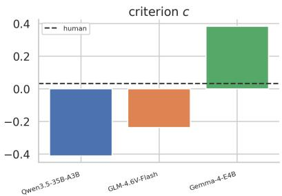  
Fig. S1: Signal-detection sensitivity (d′) and criterion (c) for the in-harness present/absent decision, per model against the human reference.

All three models detect targets near ceiling (target-present existence accuracy 0.99/0.99/0.97) with a comparable false-positive bias on absent scenes (0.19/0.19/0.20), so subsequent search divergences cannot be attributed to detection failure and the existence-passed sets are comparable across models. In the agentic task the present/absent decision is highly sensitive for every model $( d ^ { \prime } \ 3 . 8 4 / 4 . 2 3 / 3 . 1 4$ , against the human 2.91), establishing that the decision axis is human-or-better. Model $d ^ { \prime }$ is elicited from the agentic found/absent terminations and human $d ^ { \prime }$ from the recorded gamepad response; this is a deliberate elicitation asymmetry rather than a confound, as both index the same present/absent judgment. Spatial targeting is measured in-harness (Sec. S5), where the coordinate convention is fixed in the prompt; the resulting first-saccade rate is corroborated by high eventual success (TFP-end 0.98/0.98/0.93) and low median fixation counts $( 2 / 2 / 3 )$ , and is stable across hit tolerances (Table S8), so it is not an artefact of coordinate parsing.

## S5 Finding axis

Table S2: Outcome by foveation condition; each entry is Qwen / GLM / Gemma against the human reference (first row). TFP@1 and TFP-end follow Eq. (S3); NumFix entries are per-group medians; the last two columns give target-absent declared-absent rate and fixation-density CC with the human map.
<table><tr><td rowspan="2">condition</td><td colspan="3">TFP@1</td><td colspan="3">TFP-end</td><td colspan="3">NFix-TP</td><td colspan="3">NFix-TA</td><td colspan="3">TA decl.-abs</td><td colspan="3">dens. CC</td></tr><tr><td>Q</td><td>G</td><td>Gm</td><td>Q</td><td>G</td><td>Gm</td><td>Q</td><td>G</td><td>Gm</td><td>Q</td><td>G</td><td>Gm</td><td>Q</td><td>G</td><td>Gm</td><td>Q</td><td>G</td><td>Gm</td></tr><tr><td>human</td><td></td><td>0.49</td><td></td><td></td><td>0.93</td><td></td><td></td><td>3</td><td></td><td></td><td>5</td><td></td><td></td><td></td><td></td><td></td><td></td><td></td></tr><tr><td>sharp</td><td>0.97</td><td>0.97</td><td>0.80</td><td>0.97</td><td>0.98</td><td>0.93</td><td>2</td><td>2</td><td>3</td><td>1</td><td>4</td><td>6</td><td>0.94</td><td>0.91</td><td>0.96</td><td>0.55</td><td>0.54</td><td>0.49</td></tr><tr><td>GP</td><td>0.97</td><td>0.97</td><td>0.80</td><td>0.98</td><td>0.98</td><td>0.93</td><td>2</td><td>2</td><td>3</td><td>1</td><td>4</td><td>5</td><td>0.93</td><td>0.91</td><td>0.96</td><td>0.58</td><td>0.63</td><td>0.50</td></tr><tr><td>k8</td><td>0.93</td><td>0.84</td><td>0.64</td><td>0.95</td><td>0.89</td><td>0.86</td><td>3</td><td>2</td><td>3</td><td>2</td><td>4</td><td>6</td><td>0.84</td><td>0.77</td><td>0.81</td><td>0.65</td><td>0.45</td><td>0.26</td></tr><tr><td>k16</td><td>0.78</td><td>0.71</td><td>0.42</td><td>0.91</td><td>0.80</td><td>0.75</td><td>3</td><td>3</td><td>4</td><td>4</td><td>4</td><td>6</td><td>0.78</td><td>0.77</td><td>0.68</td><td>0.70</td><td>0.38</td><td>0.45</td></tr><tr><td>k24</td><td>0.56</td><td>0.49</td><td>0.28</td><td>0.81</td><td>0.65</td><td>0.65</td><td>3</td><td>3</td><td>6</td><td>6</td><td>4</td><td>6</td><td>0.72</td><td>0.68</td><td>0.58</td><td>0.74</td><td>0.46</td><td>0.29</td></tr><tr><td>k32</td><td>0.42</td><td>0.33</td><td>0.19</td><td>0.71</td><td>0.53</td><td>0.59</td><td>3</td><td>3</td><td>6</td><td>7</td><td>4.5</td><td>7</td><td>0.62</td><td>0.65</td><td>0.52</td><td>0.70</td><td>0.43</td><td>0.26</td></tr><tr><td>k48</td><td>0.28</td><td>0.18</td><td>0.10</td><td>0.56</td><td>0.36</td><td>0.47</td><td>5</td><td>4</td><td>6</td><td>7</td><td>4</td><td>7</td><td>0.46</td><td>0.65</td><td>0.54</td><td>0.49</td><td>0.33</td><td>0.25</td></tr><tr><td>k128</td><td>0.15</td><td>0.09</td><td>0.01</td><td>0.31</td><td>0.22</td><td>0.39</td><td>6</td><td>4</td><td>6</td><td>6</td><td>4</td><td>6</td><td>0.85</td><td>0.86</td><td>0.78</td><td>0.18</td><td>0.14</td><td>0.19</td></tr><tr><td>crop</td><td>0.04</td><td>0.04</td><td>0.00</td><td>0.20</td><td>0.11</td><td>0.16</td><td>3</td><td>3</td><td>5</td><td>2</td><td>3</td><td>5</td><td>0.68</td><td>0.50</td><td>0.67</td><td>0.25</td><td>0.11</td><td>0.15</td></tr></table>

Under the human-matched condition every model fixates the target on the first saccade far more often than humans (TFP@1 0.97/0.97/0.80 versus 0.49) and reaches comparable eventual success (TFP-end 0.98/0.98/0.93 versus 0.93), while issuing no more fixations than humans (median NumFix 2/2/3 versus 3). The advantage is therefore one of first-saccade eficiency rather than eventual accuracy. Target-absent search extent varies across the three models: Qwen3.5- 35B-A3B terminates after a single fixation (median 1), GLM-4.6V-Flash searches longer (4), and Gemma-4-E4B searches to the human median (5 versus 5). On the finding axis the models are thus human-or-better throughout.

## S6 Gaze axis

Where outcomes coincide with humans, the eye-movement process does not, and the deviation is in the same direction for all three models: gaze entropy lies below the human value (Clif’s $\delta \ : - . 6 7 / - . 6 5 / - . 2 7 )$ , indicating spatially concentrated sampling, and saccade amplitudes exceed it $\left( + . 5 0 / + . 6 1 / + . 2 3 \right)$ , indicating direct jumps to the target. The magnitude of the deviation varies across the three models, with Gemma-4-E4B’s efects roughly half those of the two reasoningtuned models, but at this condition the sign is invariant, so the signature is shared rather than idiosyncratic. The directional and turning-angle distributions (Fig. S4) corroborate this characterisation and show that it does not depend on the choice of summary statistic.

Cross-seed self-consistency exceeds the inter-observer ceiling for every model and follows the same ordering as the intrinsic signature (agent↔agent Scan-Match 0.84/0.91/0.71 versus the 0.53 ceiling): each model reproduces its own scanpath far more closely than two humans agree, Gemma-4-E4B least so. Agent↔human similarity remains at or below the ceiling, so no model is more similar to a human than two humans are to each other.

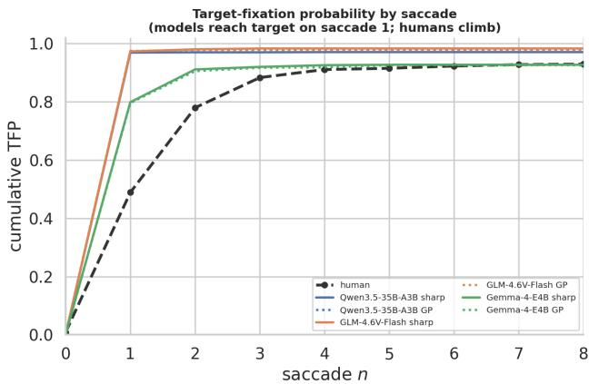  
Fig. S2: Cumulative target-fixation probability by saccade (Eq. (S3)) under sharp (solid) and the human-matched GP (dotted) for the three models, against humans (dashed). The models reach the target on the first saccade; human probability accrues over several fixations.

## S7 Multivariate structure of the gaze signature

A principal-component analysis of the per-group median signature vectors reduces the five statistics to two interpretable axes (Table S5); the leading component combines exploration extent (scanpath length and gaze entropy) and the second contrasts saccade amplitude against refixation. In this space every model, under every legible condition, occupies a region disjoint from the human reference (main Fig. 5b), approaching it only under degradation severe enough that the target is no longer found. That three architecturally distinct models from three families share this region is the multivariate expression of the gaze divergence.

## S8 Mechanism of the divergence

The divergence is consistent with a single-pass architecture rather than an acuity efect. The human-matched condition is behaviourally indistinguishable from no foveation for every model and statistic, even though it measurably degrades the periphery (Fig. S5; e.g. first-saccade targeting 0.97 under GP versus 0.97 under sharp). A parallel vision encoder resolves a legible frame in a single pass and saccades directly to the target; matching the retinal input therefore does not reconstruct the serial sampling constraint that produces human search.

Table S3: Intrinsic gaze signature: Clif’s δ against the human distribution (Eq. (S5); |δ| > 0.33 in bold; sign is agent − human) for every statistic and condition, for all three models. Human medians: gaze entropy 1.58 bits, saccade amplitude 8.57◦, refixation 0.00, scanpath length 19.4◦, center bias 10.0◦.
<table><tr><td>model</td><td>condition</td><td>gaze entropy</td><td>saccade amp</td><td>refixation</td><td>scanpath len</td><td>center bias</td><td>turn angle</td><td>coverage</td></tr><tr><td>Q</td><td>sharp</td><td>-.68</td><td>+.52</td><td>+.03</td><td>-.27</td><td>-.20</td><td>+.03</td><td>-.75</td></tr><tr><td></td><td>GP</td><td>-.67</td><td>+.50</td><td>+.04</td><td>−.26</td><td>-.18</td><td>+.05</td><td>-.74</td></tr><tr><td></td><td>k8</td><td>-.69</td><td>+.20</td><td>+.36</td><td>-.27</td><td>−.05</td><td>+.06</td><td>-.65</td></tr><tr><td></td><td>k16</td><td>-.56</td><td>−.03</td><td>+.49</td><td>-.21</td><td>+.01</td><td>+.12</td><td>-.46</td></tr><tr><td></td><td>k24</td><td>-.33</td><td>-.08</td><td>+.52</td><td>-.07</td><td>+.02</td><td>+.14</td><td>-.18</td></tr><tr><td></td><td>k32</td><td>-.15</td><td>-.07</td><td>+.50</td><td>+.05</td><td>+.00</td><td>+.24</td><td>-.03</td></tr><tr><td></td><td>k48</td><td>+.12</td><td>+.01</td><td>+.54</td><td>+.28</td><td>−.04</td><td>+.45</td><td>+.18</td></tr><tr><td></td><td>k128</td><td>+.33</td><td>+.73</td><td>+.27</td><td>+.57</td><td>+.17</td><td>+.67</td><td>+.46</td></tr><tr><td>G</td><td>crop</td><td>−.24</td><td>+.31</td><td>+.26</td><td>-.10</td><td>-.33</td><td>+.58</td><td>-.11</td></tr><tr><td></td><td>sharp</td><td>-.65</td><td>+.60</td><td>−.12</td><td>-.28</td><td>−.29</td><td>-.18</td><td>-.77</td></tr><tr><td></td><td>GP</td><td>-.65</td><td>+.61</td><td>−.13</td><td>-.28</td><td>-.31</td><td>-.21</td><td>-.77</td></tr><tr><td></td><td>k8</td><td>−.65</td><td>+.43</td><td>+.08</td><td>−.28</td><td>−.21</td><td>-.06</td><td>-.71</td></tr><tr><td></td><td>k16</td><td>-.53</td><td>+.20</td><td>+.30</td><td>-.17</td><td>−.05</td><td>+.17</td><td>-.50</td></tr><tr><td></td><td>k24</td><td>-.41</td><td>+.02</td><td>+.45</td><td>-.06</td><td>−.02</td><td>+.16</td><td>-.34</td></tr><tr><td></td><td>k32</td><td>-.26</td><td>-.04</td><td>+.49</td><td>+.07</td><td>-.05</td><td>+.19</td><td>-.17</td></tr><tr><td></td><td>k48</td><td>−.10</td><td>−.03</td><td>+.52</td><td>+.25</td><td>+.00</td><td>+.19</td><td>+.06</td></tr><tr><td></td><td>k128</td><td>+.01</td><td>+.42</td><td>+.43</td><td>+.61</td><td>+.14</td><td>+.38</td><td>+.29</td></tr><tr><td></td><td>crop</td><td>-.51</td><td>-.08</td><td>+.65</td><td>-.06</td><td>−.35</td><td>+.31</td><td>-.37</td></tr><tr><td>Gm</td><td>sharp</td><td>-.28</td><td>+.24</td><td>+.13</td><td>-.00</td><td>+.06</td><td>+.19</td><td>-.28</td></tr><tr><td></td><td>GP</td><td>-.27</td><td>+.23</td><td>+.13</td><td>+.00</td><td>+.06</td><td>+.19</td><td>-.26</td></tr><tr><td></td><td>k8</td><td>-.10</td><td>+.01</td><td>+.31</td><td>+.14</td><td>+.27</td><td>+.24</td><td>+.00</td></tr><tr><td></td><td>k16</td><td>+.19</td><td>+.07</td><td>+.27</td><td>+.35</td><td>+.24</td><td>+.30</td><td>+.27</td></tr><tr><td></td><td>k24</td><td>+.36</td><td>+.16</td><td>+.38</td><td>+.56</td><td>+.19</td><td>+.40</td><td>+.49</td></tr><tr><td></td><td>k32</td><td>+.49</td><td>+.20</td><td>+.41</td><td>+.66</td><td>+.11</td><td>+.45</td><td>+.61</td></tr><tr><td></td><td>k48</td><td>+.60</td><td>+.30</td><td>+.45</td><td>+.76</td><td>-.00</td><td>+.56</td><td>+.69</td></tr><tr><td></td><td>k128</td><td>+.70</td><td>+.52</td><td>+.44</td><td>+.88</td><td>+.02</td><td>+.62</td><td>+.82</td></tr><tr><td></td><td>crop</td><td>-.08</td><td>+.09</td><td>+.70</td><td>+.42</td><td>-.19</td><td>+.48</td><td>+.07</td></tr></table>

The matched property is spatial; the divergent property is temporal. The models’ spatial prior is approximately human: center bias is statistically indistinguishable from the human value (sub-threshold δ in Table S3) and fixation density correlates positively with the human map (CC 0.58/0.63/0.50; full agreement measures in Table S6), so the models look in broadly human-relevant places. What difers is the temporal organisation of looking: the order, amplitude and determinism of fixations (Fig. S6). The missing component is serial sampling, not the spatial prior.

No degradation regime recovers human-like search. Sweeping the synthetic degradation does not produce a regime that is simultaneously human-like in firstsaccade targeting and in eventual success (Fig. S7): the two quantities decline together. At the degradation level that lowers first-saccade targeting to the human rate (0.49), namely k=32 for Qwen3.5-35B-A3B and k=16 for Gemma-4- E4B, eventual success has already fallen well below the human level (TFP-end 0.71 and 0.75 respectively). There is no operating point at which the models search like humans and still find the target.

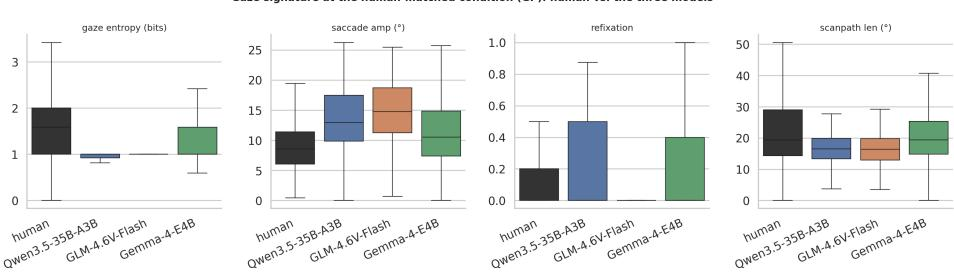  
Fig. S3: Per-scanpath gaze-statistic distributions at the human-matched condition, human against the three models. The reasoning-tuned models concentrate gaze (low entropy) and make large saccades; Gemma-4-E4B lies closest to the human distribution on the entropy, amplitude and scanpath-length panels (Qwen3.5-35B-A3B is closest on refixation).

Failure mode under vanishing evidence. As the periphery is degraded the models do not lengthen their search in a graceful, human-like manner. Refixation first rises as cells are revisited, and at the most severe degradation the target-absent declared-absent rate rebounds as the models default to an “absent” response (Fig. S8). Because one clause of the prompt encourages the use of glimpse memory, the absolute refixation level is in part prompt-shaped; the failure signature is the trend across degradation, not its absolute value. This pattern, rising refixation followed by default-absent termination, is model-internal and requires no human reference to detect.

## S9 Robustness and cross-model variation

The first-saccade advantage is not an artifact of easy targets: it holds in every eccentricity × size stratum, including the hardest (Table S7). It is likewise insensitive to the target-box tolerance: recomputing TFP@1 at ±0.5◦, ±1◦ and ±1.5◦ shifts any value by at most the amounts in Table S8, and the model–human gap holds at every tolerance.

The distributional efects survive the mixed-efects model of Eq. (S6), which controls for both scene and rater (Table S9): the gaze-entropy, saccade-amplitude and first-saccade efects have confidence intervals excluding zero for all three models. Two features of the cross-model ordering are notable. First, Gemma-4-E4B’s efects are the smallest on five of the seven gaze statistics (entropy, saccade amplitude, scanpath length, center bias, coverage), making it the most human-like model overall; Qwen3.5-35B-A3B is closest to humans on refixation and turning angle (Table S3). Second, at the human-matched condition its search-extent efect is the single fixed efect whose interval includes zero (∆- 0.03), making its number of fixations statistically indistinguishable from the human value. We interpret this ordering as a consequence of weaker single-pass targeting (which forces additional, smaller, more variable fixations) rather than a more human-like search strategy. The three models difer in architecture, training recipe (only Gemma-4-E4B is not reasoning-tuned) and mixture-of-experts sparsity; these factors covary and cannot be separated with three observations, so the ordering is reported descriptively. The high cross-seed determinism is not an artifact of low-temperature decoding: in a temperature sweep on the anchor model (Qwen3.5-35B-A3B) it remains well above the inter-observer ceiling even at temperature 1.0 on the legible conditions (Fig. S10), and the deployed-temperature self-consistency of all three models (Table S4) shows the same ordering.

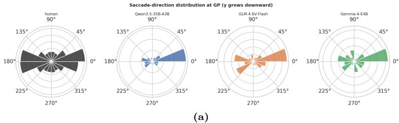

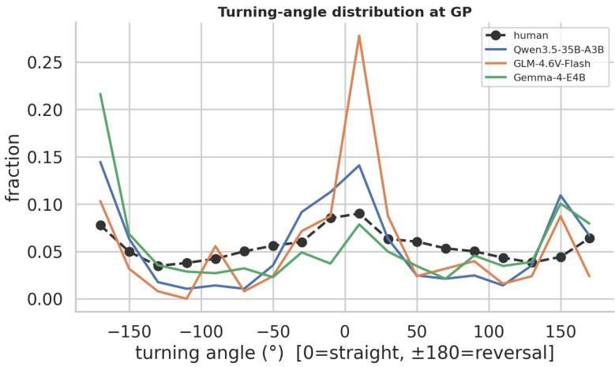  
(b)  
Fig. S4: Distribution of (a) saccade directions and (b) turning angles at the humanmatched condition. The models’ directional and meander structure departs from the human reference, consistent with the entropy and amplitude efects.

## S10 Data completeness

All three models completed the full design (285 scenes, 5 seeds and nine conditions), with no trials excluded from the final analysis. Two protocol details bear on the integrity of the records. GLM-4.6V-Flash’s one-shot detection responses were re-collected after an initial server interruption, recovering its detection ceiling without afecting its search records. Gemma-4-E4B emitted its terminal present/absent decision in a coordinate format requiring canonical normalisation before parsing; the afected episodes were reconstructed from their logged turn sequences, each verified to reproduce the recorded gaze path up to the decision, and the residual truncated episodes were re-collected under the identical protocol. Neither procedure altered the other models’ records, and all reported quantities are computed from the recorded scanpaths under the single set of definitions given in Sec. S3.

Table S4: Scanpath similarity (ScanMatch, Sec. S3.5) by condition: agent↔human (AH) and agent↔agent (AA, cross-seed determinism) for each model. The human↔human agreement ceiling is 0.53.
<table><tr><td colspan="3">Qwen3.5-35B-A3B</td><td colspan="3">GLM-4.6V-Flash</td><td colspan="2">Gemma-4-E4B</td></tr><tr><td>condition</td><td>AH</td><td>AA</td><td>AH</td><td>AA</td><td></td><td>AH</td><td>AA</td></tr><tr><td>human ceiling</td><td colspan="7">0.53</td></tr><tr><td>sharp</td><td>0.500</td><td>0.839</td><td>0.484</td><td>0.903</td><td>0.473</td><td></td><td>0.712</td></tr><tr><td>GP</td><td>0.505</td><td>0.843</td><td>0.485</td><td>0.913</td><td>0.469</td><td></td><td>0.713</td></tr><tr><td>k8</td><td>0.527</td><td>0.814</td><td>0.491</td><td>0.868</td><td></td><td>0.462</td><td>0.697</td></tr><tr><td>k16</td><td>0.521</td><td>0.776</td><td>0.476</td><td>0.800</td><td></td><td>0.405</td><td>0.594</td></tr><tr><td>k24</td><td>0.479</td><td>0.696</td><td>0.445</td><td>0.712</td><td></td><td>0.324</td><td>0.477</td></tr><tr><td>k32</td><td>0.420</td><td>0.597</td><td>0.402</td><td>0.613</td><td></td><td>0.275</td><td>0.424</td></tr><tr><td>k48</td><td>0.332</td><td>0.499</td><td>0.320</td><td>0.495</td><td></td><td>0.240</td><td>0.373</td></tr><tr><td>k128</td><td>0.244</td><td>0.407</td><td>0.266</td><td>0.423</td><td></td><td>0.217</td><td>0.397</td></tr><tr><td>crop</td><td>0.246</td><td>0.484</td><td>0.275</td><td>0.528</td><td></td><td>0.218</td><td>0.459</td></tr></table>

Table S5: Principal components of the standardised five-statistic gaze signature across all groups, with the loadings that render the axes interpretable.
<table><tr><td colspan="3">component variance dominant loadings</td></tr><tr><td>PC1</td><td></td><td>45% +0.62 gaze entropy, +0.62 scanpath len, +0.41 center bias</td></tr><tr><td>PC2</td><td></td><td>30% +0.69 saccade amp, -0.63 refixation, -0.35 center bias</td></tr></table>

## S11 Implications and scope

Evaluation metrics. The dissociation has a direct methodological consequence. The models match the human present/absent answer and partially match the human fixation-density map (CC 0.58/0.63/0.50) while diverging on every temporal measure of the gaze process. Because answer-alignment scores and single-shot saliency overlap are computed on outcomes or on a time-collapsed spatial map, neither is sensitive to the axis on which the divergence occurs; a high score on either is therefore necessary but not suficient evidence of human-like vision, and certifying process-level correspondence requires sequence-level, temporal measurement of the kind defined here.

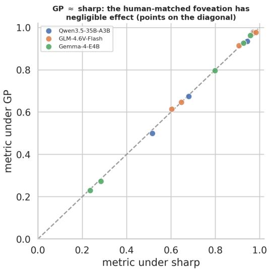  
Fig. S5: Each statistic under sharp (abscissa) versus the human-matched GP condition (ordinate), per model. Points lie on the identity line: the human-matched foveation changes behaviour negligibly.

Suitability as human-vision surrogates. It follows that zero-shot multimodal models are adequate surrogates for studies of outcome and spatial allocation (detectability, approximate region of interest, present/absent rates) and inadequate for studies of process and temporal dynamics (scanpath prediction, fixation counts and amplitudes, stopping behaviour, the time course of evidence accumulation). Because the inadequacy is a shared property of the class rather than of any instance, it is not removed by model selection within this family.

A null model for serial search. Conversely, a system that attains human-orbetter outcomes without a serial sampling bottleneck is a useful null model: contrasting a serial searcher (human or model) against this parallel one-pass reference isolates the behaviours attributable to seriality (eccentricity-dependent search cost, inspection-driven refixation, graded confirmatory stopping) from those attributable to detection ability or spatial priors, which the null already reproduces.

Scope. This study examined general-purpose models under a fixed foveation constraint. It did not evaluate search-trained agentic models with learned zoom or tool-use policies, pointing-native or frontier closed-source models, or an explicit probe of semantic guidance; nor did it run per-model temperature sweeps beyond the anchor model. None of these bears on the three central findings, which already hold across three distinct model families.

Table S6: Fixation-density agreement with the human map (Sec. S3.6) under sharp and the human-matched condition: linear correlation CC, normalised scanpath saliency NSS, and Kullback–Leibler divergence KL. CC and NSS (higher is closer) are highest for GLM-4.6V-Flash; KL (lower is closer) is lowest for Gemma-4-E4B. All three models correlate positively with the human map.
<table><tr><td rowspan="3">model</td><td>SHARP GEISLER-PERRY</td></tr><tr><td>CC NSS KL CC NSS KL</td></tr><tr><td>Qwen3.5-35B-A3B 0.55 0.57 1.39 0.58 0.60 1.30</td></tr><tr><td>GLM-4.6V-Flash Gemma-4-E4B</td><td>0.540.541.190.630.63 0.74 0.490.480.470.500.48 0.46</td></tr></table>

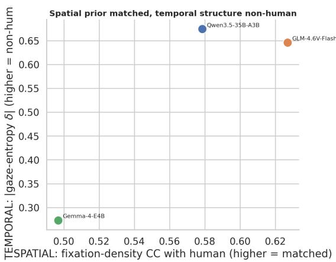  
Fig. S6: Spatial agreement with humans (fixation-density CC, abscissa) against temporal divergence (absolute gaze-entropy efect, ordinate). The models match where humans look while diverging in how the looking unfolds.

Table S7: First-saccade targeting by eccentricity × target-size stratum (sharp), human against the three models.
<table><tr><td>stratum (n)</td><td>human TFP@1 sharp TFP@1 (Q / G / Gm)</td></tr><tr><td>near-small (44)</td><td>0.54 0.96 0.97/ 0.76</td></tr><tr><td>near-large (26)</td><td>0.65 0.97 / 0.98 / 0.85</td></tr><tr><td>far-small (26)</td><td>0.37 1.00 / 0.98 / 0.64</td></tr><tr><td>far-large (45)</td><td>0.39 0.96 / 0.96 / 0.89</td></tr></table>

Table S8: Maximum absolute change in TFP@1 across box tolerances of 0.5, 1 and 1.5 degrees, per model.
<table><tr><td>model</td><td>max |∆TFP@1| over ±0.5/1/1.5°</td></tr><tr><td>Qwen3.5-35B-A3B</td><td>0.063</td></tr><tr><td>GLM-4.6V-Flash</td><td>0.076</td></tr><tr><td>Gemma-4-E4B</td><td>0.095</td></tr></table>

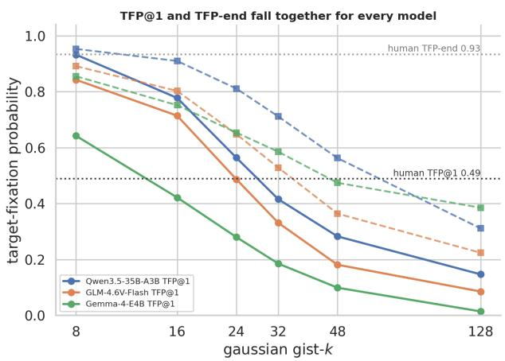  
Fig. S7: First-saccade targeting (solid) and eventual success (dashed) as functions of the synthetic degradation factor k, for the three models, with human reference levels. The two curves fall together; no k yields human-like search at human-like success.

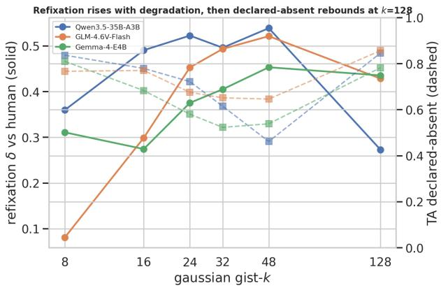  
Fig. S8: As degradation increases, the refixation efect (solid) rises (the models revisit locations) and then the declared-absent rate (dashed) rebounds at the most severe degradation as the models default to an absent response.

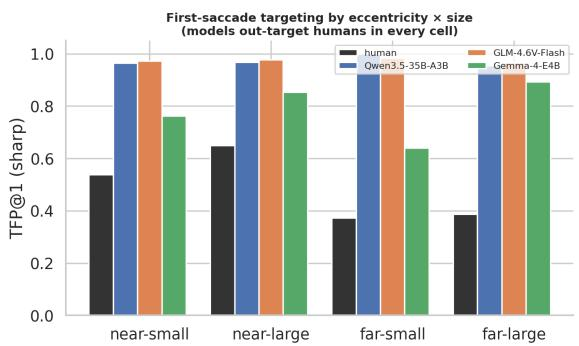  
Fig. S9: First-saccade targeting per dificulty stratum; the models exceed humans in every eccentricity × size cell, including the hardest.

Table S9: Linear mixed-efects fixed efects against the human reference (Eq. (S6); ∆ [95% CI]) under sharp and the human-matched condition, with crossed scene and rater random intercepts. Bold indicates a confidence interval that excludes zero.
<table><tr><td>model</td><td>metric</td><td>sharp ∆ [95% CI]</td><td></td><td>GP ∆ [95% CI]</td></tr><tr><td rowspan="2"></td><td></td><td>Qwen3.5-35B-A3B gaze entropy -0.62 [-0.69, -0.56] -0.61 [−0.67, -0.54] saccade amp. +4.57 [+3.19, +5.95] +4.53 [+3.15, +5.91]</td><td></td><td></td></tr><tr><td>NumFix TFP@1</td><td></td><td></td><td>-1.53 [−1.94, -1.13] -1.49 [−1.89, -1.08]</td></tr><tr><td>GLM-4.6V-Flash</td><td>gaze entropy −0.60 [−0.67, −0.52] −0.60 [−0.67, −0.52] saccade amp. +5.58 [+4.84, +6.32] +5.62 [+4.88, +6.35] NumFix</td><td></td><td></td><td>+0.47 [+0.40, +0.54] +0.48[+0.41, +0.55]</td></tr><tr><td></td><td>TFP@1</td><td>+0.48 [+0.40, +0.56] +0.48 [+0.40, +0.56]</td><td></td><td>-1.51 [−1.89, −1.13] −1.60 [−1.98, −1.22]</td></tr><tr><td>Gemma-4-E4B</td><td></td><td></td><td></td><td></td></tr><tr><td></td><td></td><td></td><td></td><td>gaze entropy −0.23 [−0.33, −0.14] −0.22 [−0.31, −0.12]</td></tr><tr><td></td><td></td><td></td><td></td><td></td></tr><tr><td></td><td></td><td>saccade amp. +2.17 [+1.34, +3.00] +2.20 [+1.37, +3.03]</td><td></td><td></td></tr><tr><td></td><td>NumFix</td><td></td><td></td><td></td></tr><tr><td></td><td></td><td>-0.26 [−0.78, +0.27] −0.03 [−0.55, +0.49]</td><td></td><td></td></tr><tr><td></td><td>TFP@1</td><td>+0.31 [+0.19, +0.42] +0.30[+0.19, +0.41]</td><td></td><td></td></tr></table>

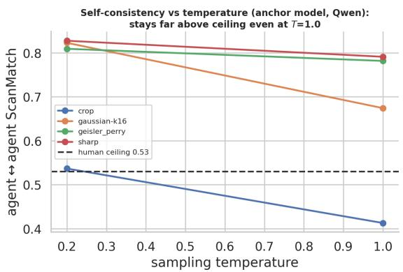  
Fig. S10: Cross-seed self-consistency as a function of sampling temperature (anchor model, Qwen, core conditions), against the human↔human ceiling 0.53.

## S12 Prompt

You are controlling a single eye that searches a photograph for a   
specific object.   
You can only see clearly at the point you are currently looking;   
everything else is   
blurred, with sharpness falling off the farther it is from your gaze,   
like human   
peripheral vision. To inspect another region you must move your gaze   
there.   
Each turn you receive the image as it currently looks from your gaze   
point. Earlier   
turns show where you looked before and what you saw; use that history to   
decide where   
to look next and to avoid re-checking the same spots.   
Coordinates are normalized: x and y are each between 0.0 and 1.0. (0,0)   
is the   
top-left corner, (1,1) the bottom-right; x grows rightward, y grows   
downward.   
Your job is a PRESENT/ABSENT decision: is the target object in this image   
? On every turn   
do exactly one of:   
- move your gaze to a new point to keep searching;   
- decide the target is PRESENT (FOUND): you can clearly see it at your   
gaze point;   
- decide the target is ABSENT: you are confident it is nowhere in the   
image.   
Think briefly if you want, then end your reply with ONE directive line in   
EXACTLY one   
of these forms and nothing after it:   
LOOK: x=<0..1>, y=<0..1>   
FOUND: x=<0..1>, y=<0..1>   
ABSENT