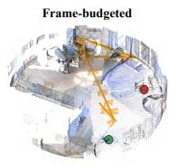
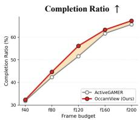
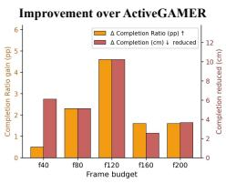
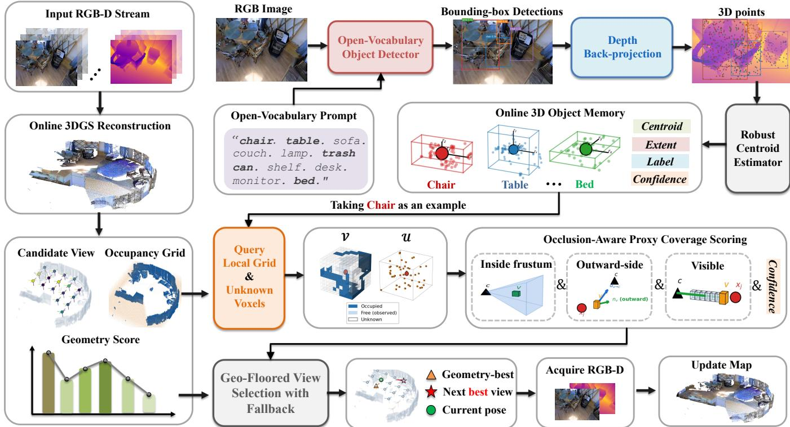
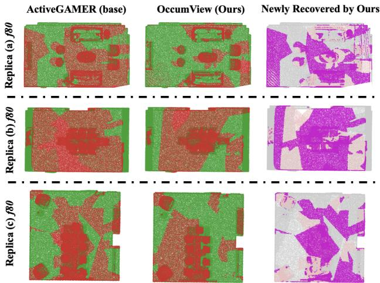
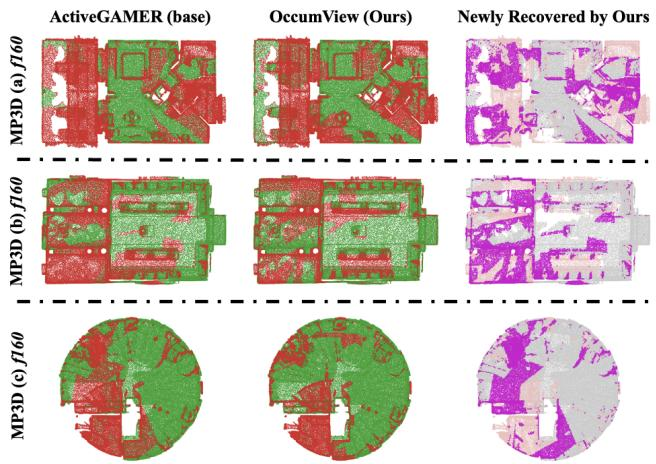
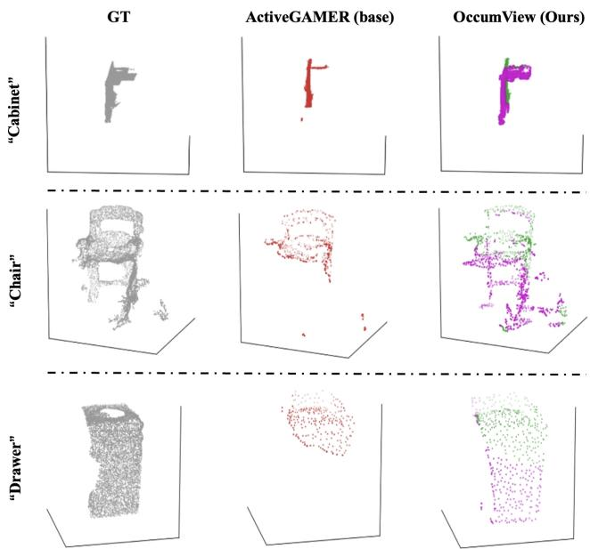

# OccamView: Object-Conditioned View Selection for Frame-Budgeted Active 3D Gaussian Reconstruction

Hongbo Gao1,2,\*, Wei Zhang1,\*, Zeyu Ni2, Dihao Zhu2, Ruifeng Li1,

Yunke Wang2, Chang Xu2

1Harbin Institute of Technology 2The University of Sydney \*Equal contribution

## Abstract

Active 3D Gaussian reconstruction fundamentally relies on selecting informative next-best views under limited sens- ing budgets. Existing active 3DGS methods primarily plan viewpoints according to geometric information gain, treat- ing object-induced hidden regions in the same manner as general unexplored space. Under tight frame budgets, such geometry-driven strategies may prioritize global scene cov- erage while leaving partially observed objects incompletely reconstructed. To address this limitation, we propose OccamView, an object-conditioned view-selection framework for frame-budgeted active 3D Gaussian reconstruction. Rather than predicting unseen object geometry or performing shape completion, OccamView maintains an online object mem-ory from open-vocabulary detections grounded in measured RGB-D observations and represents unresolved local occu- pancy around detected objects as conservative hidden-region proxies. Candidate viewpoints are then evaluated using an occlusion-aware rox -covera e score. Furthermore, we intro- duce a Geo-Floor mechanism that restricts object-conditioned re-ranking to geometrically competitive candidates, allowing object-conditioned cues to guide complementary observations while preserving the geometry-driven exploration behavior of the underlying planner. Experiments on Replica and Matter- port3D under a unified frame-budgeted protocol show that OccamView consistently reduces Completion and improves Completion Ratio across five frame budgets, with particularly pronounced gains under limited frame budgets. These results demonstrate that lightweight object-conditioned cues efectively complement geometry-driven active view planning.

## Introduction

Active 3D reconstruction requires an agent to decide where to look next to build an accurate scene model from limited observations (Isler et al. 2016; Bircher et al. 2016; Pan et al. 2022; Jiang, Lei, and Daniilidis 2024; Chen et al. 2024). This problem is especially important for online 3D Gaussian Splatting (3DGS) reconstruction (Kerbl et al. 2023; Keetha et al. 2024; Matsuki et al. 2024; Li et al. 2025; Jin et al. 2024), where each RGB-D frame incurs sensing, motion, and com- putation costs. With ample frames, continued exploration can mitigate individual view-selection errors; under limited bud- gets, however, each decision becomes more consequential (Jin et al. 2025; Li et al. 2025; Wilson et al. 2025; Xie et al. 2025; Strong et al. 2025). We therefore study frame-budgeted active 3DGS reconstruction, where the budget is measured by observed RGB-D frames rather than planning decisions, as shown in Figure 1.

  
Figure 1: Performance comparison between ActiveGAMER and OccamView on MP3D across frame budgets, showing a qualitative reconstruction example, Completion Ratio (C.R.) curves, and OccamView’s absolute gains in C.R. (pp) and Completion reduction (cm).

Existing active reconstruction systems commonly select views using geometric information gain (Isler et al. 2016; Delmerico et al. 2018; Bircher et al. 2016). ActiveG-AMER (Chen et al. 2025), for example, couples an online 3DGS reconstruction pipeline with a geometric next-best- view (NBV) policy and serves as a strong backbone for active 3DGS mapping. Although general and training-free, such policies score unknown space primarily by geometry and do not explicitly distinguish object-adjacent unknown regions from other unexplored space (Isler et al. 2016; Delmerico et al. 2018; Bircher et al. 2016; Chen et al. 2025). This limitation matters most under tight frame budgets, when a few view choices largely determine which surfaces remain missing.

Our key observation is that missing geometry often re- mains near partially observed objects (Liu et al. 2018). A frontal or side view may localize an object while leaving nearby rear or self-occluded regions unseen (Maver and Bajcsy 2002; Chen et al. 2025). Although these regions need not be recoverable surfaces or match the object’s true amodal extent, nearby unk voxels provide a conservative objectconditioned cue for view selection (Liu et al. 2018; Breyer et al. 2022): among geometrically plausible candidates, views covering these regions may improve completion over simi- larly scored alternatives.

Based on this observation, we propose OccamView, a drop-in view-selection module for frame-budgeted active 3DGS reconstruction. OccamView retains ActiveGAMER’s reconstruction and planning backbone (Chen et al. 2025)

and modifies only view selection. Every K frames, an openvocabulary detector (Liu et al. 2024) is applied to the current RGB image, and detections are back-projected using measured depth to maintain an online object memory. Around each detected object, OccamView queries the backbone occupancy grid and uses local unk voxels as an object-conditioned hidden-region proxy. This proxy is deliberately modest: it is not a generated shape completion and does not claim to recover an object’s true amodal extent. Instead, it represents the local unexplored occupancy mass around an object that the agent has already detected and localized in 3D.

To use this proxy for planning, OccamView scores each candidate view by occlusion-aware proxy coverage (Maver and Bajcsy 2002). A proxy voxel contributes only if it lies in the candidate frustum, the candidate camera observes it from the outward side of the object, and a ray cast through the occupancy grid is not blocked by occupied space (Hornung et al. 2013). This avoids crediting views that merely point toward an object-centered unknown region but cannot actually observe it. The proxy score is combined with the backbone geometric information gain (Chen et al. 2025) under a geo-floor that restricts re-ranking to candidates whose normalized geometric gain is at least a fixed fraction of the current maximum. Thus, OccamView augments rather than replaces geometric NBV.

We evaluate OccamView using ActiveGAMER’s metrics and five-seed protocol on Replica and Matterport3D (MP3D) (Chen et al. 2025; Straub et al. 2019; Chang et al. 2017) under five frame budgets ranging from 40 to 200 observed RGB-D frames. Across all five budgets on both datasets, OccamView consistently reduces Completion (cm) and improves Completion Ratio, with particularly pronounced gains under lower frame budgets on Replica.

Our contributions are:

• We stud active 3DGS reconstruction under a framebudgeted protocol in which all methods are compared using the same number of observed RGB-D frames rather than the same number of planning decisions.

• We introduce OccamView, an object-conditioned viewselection module that constructs an online object memory from measured RGB-D detections and extracts local unk voxels around detected objects as a hidden-region proxy.

• We design an occlusion-aware proxy coverage score and a geo-floored selection rule that allow the object-conditioned score to reorder geometrically competitive candidate views without replacing the backbone geomet- ric NBV objective.

• We evaluate OccamView on Replica and real MP3D scenes using ActiveGAMER’s metrics, datasets, and five- seed evaluation protocol, showing improved completion under tight frame budgets and analyzing the role of the geo-floor through ablations.

## Related Work

View Selection and Next-Best-View Planning. Next-bestview (NBV) planning aims to select informative sensing poses under limited view budgets (Isler et al. 2016; Bircher et al. 2016). Classical methods build on explicit geomet-ric representations such as occupancy grids and volumetric maps, scoring candidate views by information gain, fron- tier coverage, or unknown-region visibility (Isler et al. 2016; Bircher et al. 2016; Pito 1999), while neural NBV meth-ods estimate view utility from rendering or geometric uncer- tainty, often at the cost of per-scene optimization or dense candidate evaluation (Pan et al. 2022; Feng et al. 2024). With the emergence of 3D Gaussian Splatting (3DGS) (Kerbl et al. 2023), Gaussian-based active reconstruction has be-come attractive for online mapping: ActiveGAMER adopts rendering-based geometric information gain (Chen et al. 2025), GS-Planner samples NBVs toward unobserved regions in Gaussian maps (Jin et al. 2024), and HGS-Planner hierarchically balances global exploration and local refinement (Xu et al. 2025). However, these view-utility formulations remain geometry-centric, providing limited mechanisms for priori- tizing object-induced hidden regions, such as occluded or backside parts of partially observed objects, under tight view budgets.

Object-Aware Hidden-Region View Selection. Objectaware and semantic active reconstruction introduces objectlevel or semantic cues into view selection (Liu et al. 2018; Zheng et al. 2019), but typically requires explicit object anal-ysis, semantic labeling, or additional scene-understanding modules. Another line leverages shape prediction or com- pletion to guide object-centric view planning from partial observations (Pan et al. 2024; Dhami, Sharma, and Tokekar 2023; Menon et al. 2023), yet the predicted geometry may lack direct support from online observations and is dificult to verify during scene-level reconstruction. In contrast, our method uses detected objects only as lightweight cues to bias a geometry-driven 3DGS NBV policy toward object-induced hidden regions, without dense semantic labels or full objectgeometry generation.

## Preliminaries

## Frame-Budgeted Active 3D Gaussian Reconstruction

We consider active reconstruction of an unknown indoor scene with a 3D Gaussian Splatting (3DGS) map under a fixed frame budget. At planning step t, the agent has ac-quired posed RGB-D observations $\{ o _ { n } \} _ { n = 1 } ^ { N _ { t } }$ , where $o _ { n } =$ $( I _ { n } , D _ { n } , p _ { n } )$ comprises an RGB image, a depth map, and the corresponding camera pose, and $N _ { t }$ denotes the number of observations acquired up to step t.

The system maintains a 3DGS map $\mathcal { G } _ { t }$ for reconstruction and an occupancy grid ${ \mathcal { O } } _ { t }$ for exploration. Each voxel cen- tered at v has state

$$
\mathcal { O } _ { t } ( \mathbf { v } ) \in \{ \mathrm { o c c } , \mathrm { F R E E } , \mathbf { U N K } \} .\tag{1}
$$

Here, occ, free, and unk denote observed occupied, ob- served free, and unobserved or unresolved space, respec- tively. The occupancy grid is used only for exploration and view scoring, while the scene remains represented by $\mathcal { G } _ { t }$

At each planning step, the system samples a candidate view set $\mathcal { C } _ { t } = \{ c _ { 1 } , \ldots , c _ { m } \}$ and selects one for execution.

  
Figure 2: OccamView performs object-conditioned view selection for frame-budgeted active 3DGS reconstruction. It constructs an online object memory from open-vocabulary detections and measured RGB-D observations, and uses nearby unknown (unk) voxels as conservative hidden-region proxies. Candidate views are evaluated by occlusion-aware proxy coverage, while a geo-floor restricts re-ranking to geometrically competitive candidates before the combined geometric and proxy-coverage score selects the next view.

We measure the budget by the number of observed RGB-D frames rather than the number of planning steps, because tra- jectories to diferent target views may yield diferent numbers of intermediate observations. All methods terminate after ac- quiring the same number of frames B, ensuring comparison under an equal sensing budget.

## Geometric NBV in ActiveGAMER

We build on ActiveGAMER (Chen et al. 2025), which scores each candidate view $c \in { \mathcal { C } } _ { t }$ using a rendering-based geomet- ric information gain $\mathrm { I G } _ { \mathrm { g e o } } ( c )$ and selects

$$
c _ { \mathrm { g e o } } ^ { \star } = \arg \operatorname* { m a x } _ { c \in \mathcal { C } _ { t } } { \mathrm { I G } _ { \mathrm { g e o } } ( c ) } .\tag{2}
$$

OccamView retains ActiveGAMER’s 3DGS reconstruction, pose tracking, occupancy-grid update, candidate generation, and geometric information-gain computation, and modifies only the final candidate selection.

## Method

## Overview

Figure 2 illustrates the overall pipeline of OccamView. Oc- camView is a drop-in view-selection module for frame- budgeted active 3D Gaussian reconstruction. It augments the backbone geometric NBV policy with conservative object-conditioned evidence while modifying only the fi-nal candidate-selection stage. To obtain this evidence, our method constructs an online object memory from openvocabulary object detections and measured RGB-D obser-vations, and extracts nearby unk voxels from the occupancy grid as object-conditioned hidden-region proxies. These proxies represent unresolved local space around observed objects rather than predicted or completed object geometry. Candidate views are scored by their occlusion-aware cover- age of the proxy voxels. Final selection is restricted to can- didates that satisfy a prescribed geometric information-gain floor. Within this subset, the combined geometric and proxy- coverage score determines the ranking. Thus, geometric in- formation gain determines candidate eligibility, while object-conditioned evidence influences the ranking only among ge- ometrically competitive candidates. When no reliable object-conditioned evidence is available, OccamView falls back to the original ActiveGAMER selection rule.

## Object-Conditioned Hidden-Region Proxy

OccamView maintains an online memory of objects observed by the agent. We use t to index planning steps and N to denote the index of the latest RGB-D frame available at planning step t. A detection update is triggered every K newly acquired RGB-D frames, at which point an open-vocabulary detector is applied to the latest RGB image $I _ { N _ { t } } \colon$

$$
\begin{array} { r } { \mathcal { B } _ { t } = \left\{ ( b , \ell , s ) \in \mathrm { D e t } _ { \phi } ( I _ { N _ { t } } ; \mathcal { Q } ) : s \geq \eta _ { \mathrm { d e t } } \right\} , } \end{array}\tag{3}
$$

where $B _ { t }$ denotes the set of bounding-box detections at the tth planning step, $N _ { t }$ is the index of the latest acquired RGB-D frame, $\mathrm { D e t } _ { \phi }$ denotes GroundingDINO (Liu et al. 2024), and Q is an object-centric vocabulary containing movable indoor objects and furniture. Structural categories such as walls, floors, ceilings, and doors are excluded because OccamView targets object-conditioned hidden regions rather than large scene-layout structures. At non-update planning steps, no new detections are queried, and the object memory is carried over from the previous step.

For each detection $( b , \ell , s ) \in B _ { t }$ , valid depth pixels inside the bounding box are back-projected to the camera frame and transformed into the world frame:

$$
\mathcal { P } _ { b } ^ { w } = \left\{ \mathbf { R } _ { N _ { t } } ^ { w c } \pi ^ { - 1 } ( \mathbf { u } , D _ { N _ { t } } ( \mathbf { u } ) ) + \mathbf { t } _ { N _ { t } } ^ { w c } \mid \mathbf { u } \in \Omega _ { b } \right\} ,\tag{4}
$$

where $\Omega _ { b }$ denotes the set of in-box pixels with valid depth, $D _ { N _ { t } }$ is the depth map of the latest acquired RGB-D frame, and $( \mathbf { R } _ { N _ { t } } ^ { w c } , \mathbf { t } _ { N _ { t } } ^ { w \bar { c } } )$ denotes the camera-to-world pose. Detec- tions with insuficient valid depth pixels are discarded.

The depth-grounded object centroid is then computed as

$$
\begin{array} { r } { \mathbf { x } _ { b } = f _ { \mathrm { c e n } } ( \mathcal { P } _ { b } ^ { w } ) , } \end{array}\tag{5}
$$

where $f _ { \mathrm { c e n } } ( \cdot )$ denotes a robust centroid estimator over the back-projected 3D points. This centroid is computed entirely from measured RGB-D observations and therefore in- troduces no predicted object geometry.

Detections are incrementally merged into an object mem-ory $\mathcal { M } _ { t } = \{ { m } _ { j } \}$ . A detection is associated with an existing object if its centroid lies within a spatial threshold $\delta _ { \mathrm { m e r g e } }$ and its label matches the stored label; otherwise, a new object is initialized. Each memory entry is represented as $m _ { j } = ( \mathbf { x } _ { j } , \mathbf { r } _ { j } , \boldsymbol { \ell } _ { j } , w _ { j } )$ , storing a centroid $\mathbf { x } _ { j } .$ , an observed per-axis extent $\mathbf { r } _ { j }$ , an aggregate label $\ell _ { j } ,$ and a confidence weight $w _ { j } .$ . We set $w _ { j }$ to the maximum detection confidence among observations associated with object $j$ . The resulting memory therefore summarizes persistent object observations without inferring unseen geometry.

For each stored object, OccamView queries a bounded axis-aligned voxel neighborhood centered at $\mathbf { x } _ { j } \mathbf { : }$

$$
\begin{array} { r } { \mathcal { V } _ { j } = \left\{ \mathbf { v } : | v _ { k } - x _ { j , k } | \leq h _ { j , k } , \ k \in \left\{ x , y , z \right\} \right\} , } \end{array}\tag{6}
$$

where v denotes a voxel center and the neighborhood halfextent $\mathbf { h } _ { j }$ is determined from the observed object extent $\mathbf { r } _ { j }$ with a fixed padding and is bounded to avoid degenerate neighborhoods.

The object-conditioned hidden-region proxy is defined as the subset of local voxels that remain unknown in the explo- ration occupancy grid:

$$
\mathcal { U } _ { j } = \left\{ \mathbf { v } \in \mathcal { V } _ { j } : \mathcal { O } _ { t } ( \mathbf { v } ) = \mathbf { u } \mathbf { v } \mathbf { K } \right\} .\tag{7}
$$

These voxels are not interpreted as recovered hidden surfaces or generated shape completions. Instead, they represent un- resolved local occupancy surrounding a detected object and provide a conservative object-conditioned cue for view selection.

Finally, for each proxy voxel $\textbf { v } \in \ \mathcal { U } _ { j }$ , we define the centroid-relative outward direction

$$
\mathbf { n } _ { \mathbf { v } } = { \frac { \mathbf { v } - \mathbf { x } _ { j } } { \lVert \mathbf { v } - \mathbf { x } _ { j } \rVert } } ,\tag{8}
$$

which serves as a geometric reference for evaluating whether a candidate view observes the proxy voxel from the outward side in the subsequent view-selection stage.

## Occlusion-Aware Proxy Coverage

The proxy voxels extracted in the previous subsection in- dicate local unresolved occupancy around detected objects, but not every proxy voxel provides useful guidance for view selection. A candidate view should receive credit only when it has the geometric potential to directly observe a proxy voxel. OccamView therefore evaluates candidate views us- ing a confidence-weighted, occlusion-aware proxy-coverage score that jointly considers field-of-view inclusion, viewing direction, and occupancy-based visibility.

Let $\mathcal { A } _ { t } = \{ j : w _ { j } \geq \tau _ { \mathrm { c o n f } } \}$ denote the set of stored objects whose confidence weight exceeds a predefined threshold. The proxy-coverage score of a candidate view c is defined as

$$
\begin{array} { l } { \displaystyle \mathrm { A C } ( c ) = \sum _ { j \in { \mathcal { A } } _ { t } } w _ { j } \sum _ { \mathbf { v } \in { \mathcal { U } } _ { j } } \mathbf { 1 } [ \mathbf { v } \in \mathrm { f r u s t u m } ( c ) ] } \\ { \displaystyle \quad \cdot \mathbf { 1 } \Big [ \Big \langle o ( \widehat { c ) - \mathbf { v } } , \mathbf { n } _ { \mathbf { v } } \Big \rangle > 0 \Big ] \cdot \mathbf { 1 } [ \mathrm { v i s } ( o ( c ) , \mathbf { v } ) ] . } \end{array}\tag{9}
$$

Here, $o ( c )$ denotes the camera center of candidate pose $c ,$ and $\widehat { \mathbf { a } } = \mathbf { a } / \lVert \mathbf { a } \rVert$ denotes vector normalization. Each object’s contribution is weighted by its confidence weight $w _ { j }$ , al- lowing more confidently detected objects to contribute more strongly to the proxy-coverage score.

The first indicator requires the proxy voxel to lie inside the candidate camera frustum. The second indicator requires the candidate camera center to lie on the outward side of the proxy voxel relative to the object centroid, as indicated by $\mathbf { n _ { v } }$ . This encourages complementary observations rather than repeatedly viewing the same object side. The visibility term vis $( o ( c ) , \mathbf { v } )$ is evaluated by ray-casting through the occupancy grid $\mathcal { O } _ { t } . \mathbf { A }$ proxy voxel contributes only if the cor- responding ray is not blocked by occupied space, preventing the score from rewarding viewpoints that merely face a proxy region but cannot directly observe it because of known ge- ometry.

Consequently, a candidate receives a high proxy-coverage score only when it can observe many confidently detected object-conditioned proxy voxels from geometrically favor-able and unoccluded viewpoints. The resulting score pro- vides a conservative object-conditioned complement to the backbone geometric information gain while remaining fully grounded in measured RGB-D observations.

## Geo-Floored View Selection

The object-conditioned proxy coverage is designed to complement rather than replace the backbone geometric objective. We therefore combine the backbone geometric informa- tion gain and the proxy-coverage score after normalization over the current candidate set:

$$
S ( c ) = { \widehat { \mathrm { I G } } } _ { \mathrm { g e o } } ( c ) + \lambda { \widehat { \mathrm { A C } } } ( c ) ,\tag{10}
$$

where $\widehat { \mathrm { I G } } _ { \mathrm { g e o } }$ and $\widehat { \mathrm { A C } }$ denote the normalized geometric in- formation gain and proxy-coverage score, respectively, and λ controls the contribution of the object-conditioned cue. Both scores are independently normalized to [0, 1] over the current candidate set, thereby removing diferences in their numerical scales before combination.

Directly maximizing the combined score may select can- didates with strong object-conditioned evidence but insufficient geometric exploration value. Instead of allowing the proxy score to compete with the backbone objective over the entire candidate set, OccamView first restricts selection to candidates that remain geometrically competitive.

Let

$$
g ^ { \star } = \operatorname* { m a x } _ { c \in \mathcal { C } _ { t } } \widehat { \mathrm { I G } } _ { \mathrm { g e o } } ( c ) .\tag{11}
$$

The geo-floored candidate set is defined as

$$
\mathcal { C } _ { t } ^ { \mathrm { f i o o r } } = \left\{ c \in \mathcal { C } _ { t } : \widehat { \mathrm { I G } } _ { \mathrm { g e o } } ( c ) \geq \tau g ^ { \star } \right\} ,\tag{12}
$$

where $\tau \in [ 0 , 1 ]$ specifies the minimum normalized geo- metric score required for a candidate to remain eligible for selection. The final next-best view is chosen according to

$$
c ^ { \star } = \arg \operatorname* { m a x } _ { c \in \mathcal { C } _ { t } ^ { \mathrm { f l o o r } } } S ( c ) .\tag{13}
$$

By construction,

$$
\widehat { \operatorname { I G } } _ { \mathrm { g e o } } ( c ^ { \star } ) \geq \tau g ^ { \star } .\tag{14}
$$

Therefore, the geometric information gain determines which candidates remain eligible, whereas the object-conditioned proxy score serves only to rank candidates within the geo- floored set. This design preserves the geometry-driven ex- ploration behavior of the backbone while allowing object-conditioned cues to diferentiate among geometrically com- petitive viewpoints. The guarantee is local to the current candidate set and should not be interpreted as a bound on the closed-loop planning trajectory.

## Fallback Strategy and Parameters

OccamView uses the object-conditioned cue only when it provides meaningful guidance for view selection. Whenever the object memory is empty, no stored object has valid proxy voxels, or all candidate views receive zero proxy-coverage scores, OccamView falls back to the original ActiveGAMER selection rule:

$$
c ^ { \star } = c _ { \mathrm { g e o } } ^ { \star } .\tag{15}
$$

This fallback ensures that OccamView preserves the origi- nal geometry-driven behavior whenever no efective object-conditioned evidence is available.

Unless otherwise specified, object detections are updated every K = 10 frames, and the geo-floor threshold is fixed to τ = 0.85 throughout all experiments. All remaining im-plementation parameters are kept fixed across datasets. Oc- camView requires no additional training, introduces no mod- ification to the underlying 3DGS reconstruction pipeline, and directly reuses the backbone occupancy grid, candidate gen- eration, and geometric information-gain computation.

<table><tr><td>Method</td><td>Comp. (cm)↓</td><td>C.R. (%)↑</td><td>Acc. (cm)↓</td></tr><tr><td>Replica, f40</td><td></td><td></td><td></td></tr><tr><td>Baseline Ours</td><td>28.52</td><td>55.5 63.8 (↑ 8.3)</td><td>1.005 0.986 (↓ 0.019)</td></tr><tr><td></td><td>16.28 (↓ 12.24)</td><td></td><td></td></tr><tr><td>Replica, f80</td><td></td><td></td><td></td></tr><tr><td>Baseline</td><td>9.04</td><td>73.2</td><td>0.991</td></tr><tr><td>Ours</td><td>5.07 (↓ 3.97)</td><td>80.1 (↑ 6.9)</td><td>1.028 (↑ 0.037)</td></tr><tr><td>Replica, f120</td><td></td><td></td><td></td></tr><tr><td>Baseline</td><td>4.47</td><td>83.3</td><td>1.020</td></tr><tr><td>Ours</td><td>3.59 (↓ 0.88)</td><td>86.0 (↑ 2.7)</td><td>1.078 (↑ 0.058)</td></tr><tr><td>Replica, f160</td><td></td><td></td><td></td></tr><tr><td>Baseline</td><td>3.34</td><td>87.0</td><td>1.057</td></tr><tr><td>Ours</td><td>2.95 (↓ 0.39)</td><td>88.7 (↑ 1.7)</td><td>1.117 (↑ 0.060)</td></tr><tr><td></td><td></td><td></td><td></td></tr><tr><td>Replica, f200</td><td></td><td></td><td></td></tr><tr><td>Baseline Ours</td><td>2.63 2.57 (↓ 0.06)</td><td>90.0 90.6 (↑ 0.6)</td><td>1.080 1.148 (↑ 0.068)</td></tr></table>

Table 1: Main results on Replica. Mean performance over eight scenes under matched frame budgets. Parenthesized values indicate absolute changes relative to the ActiveG- AMER baseline.

## Experiments

## Experimental Setup

Task and protocol. We evaluate frame-budgeted active 3DGS reconstruction, where all methods terminate after ac- quiring the same number of observed RGB-D frames rather than after the same number of planning iterations. This matched-frame protocol ensures an equal sensing budget across methods. To evaluate performance under progres- sively increasing observation budgets, we report results under five frame budgets: f40, f80, f120, f160, and f200, corresponding to 40, 80, 120, 160, and 200 observed RGB-D frames, respectively.

Datasets. We evaluate on eight synthetic scenes from Replica (Straub et al. 2019) and five selected large-scale realworld scenes from Matterport3D (MP3D) (Chang et al. 2017), featuring substantial occlusion and complex spatial layouts.

Metrics. We evaluate geometric reconstruction using three metrics: Accuracy (cm), Completion (cm), and Completion Ratio (C.R., %), where C.R. is computed using a 5 cm thresh-old. These metrics are computed by uniformly sampling 3D points from the ground-truth meshes and comparing them with point clouds uniformly extracted from the reconstructed 3D Gaussian maps. All results are averaged over five seeds.

Baseline. We compare our method against ActiveG-AMER (Chen et al. 2025), a strong recent framework for active 3D Gaussian reconstruction. Both methods are evalu- ated under identical frame budgets and experimental settings for a controlled comparison.

  
Figure 3: Qualitative comparison on Replica under the f80 frame budget. Green and red denote reconstructed and miss- ing ground-truth points, respectively. The right column high- lights regions additionally recovered by OccamView com- pared with ActiveGAMER (magenta); gray denotes regions reconstructed by both methods. (a) room0, (b) room2, and (c) ofice4.

## Main Results on Replica

Table 1 reports the mean reconstruction results over eight Replica scenes under matched frame budgets. OccamView consistently improves reconstruction quality across all five frame budgets, achieving lower Completion and higher Com- pletion Ratio (C.R.) than ActiveGAMER. The gains are most pronounced under limited observation budgets. At f40, Completion decreases from 28.52 cm to 16.28 cm and C.R. increases from 55.5% to 63.8%; at f80, Completion de-creases from 9.04 cm to 5.07 cm and C.R. increases from 73.2% to 80.1%. Accuracy remains comparable, with abso- lute diferences from ActiveGAMER below 0.068 cm across all budgets. These results suggest that the proposed proxy- coverage score is particularly efective under constrained ob- servation budgets, where large portions of the scene remain unexplored.

Scene-level qualitative results. Figure 3 further shows that OccamView recovers substantial, spatially coherent sur- face regions that remain missing under ActiveGAMER. The newly recovered geometry is concentrated in previously under-observed or occluded regions and forms continuous surfaces rather than isolated points. These observations sug- gest that OccamView prioritizes complementary viewpoints that expand coverage in such regions.

## Main Results on MP3D

Table 2 reports the mean reconstruction results over five real-world MP3D scenes under matched frame budgets. Oc- camView consistently improves reconstruction quality across all five budgets, achieving lower Completion and higher Completion Ratio (C.R.) than ActiveGAMER. The largest improvements in both Completion and C.R. occur at f120, where Completion decreases from 30.50 cm to 20.27 cm and C.R. increases from 51.5% to 56.1%. The improvement re- mains evident at f200, with a 3.66 cm reduction in Completion and a 1.6 percentage-point increase in C.R. Accuracy is also lower in four of the five settings, with only a minor increase of 0.060 cm at f80. These results indicate that the proposed proxy-coverage score remains efective in large-scale real-world environments with cluttered geometry and challenging visibility conditions.

<table><tr><td>Method</td><td>Comp. (cm)↓</td><td>C.R. (%)↑</td><td>Acc.(cm)↓</td></tr><tr><td>MP3D, f40 Baseline</td><td>84.55</td><td>31.8</td><td>2.875</td></tr><tr><td>Ours</td><td>78.45 (↓ 6.10)</td><td>32.3 (↑ 0.5)</td><td>2.835 (↓ 0.040)</td></tr><tr><td>MP3D, f80 Baseline Ours</td><td>58.83 53.71 (↓ 5.12)</td><td>42.3 44.6 (↑ 2.3)</td><td>2.851 2.911 (↑ 0.060)</td></tr><tr><td>MP3D, f120 Baseline</td><td>30.50</td><td>51.5</td><td>2.575</td></tr><tr><td>Ours</td><td>20.27 (↓ 10.23)</td><td>56.1 (↑ 4.6)</td><td>2.475 (↓ 0.100)</td></tr><tr><td></td><td></td><td></td><td></td></tr><tr><td>MP3D, f160</td><td></td><td></td><td></td></tr><tr><td>Baseline</td><td>17.27</td><td></td><td></td></tr><tr><td></td><td></td><td>61.6</td><td>2.398</td></tr><tr><td>Ours</td><td>14.72 (↓ 2.55)</td><td>63.2 (↑ 1.6)</td><td>2.272 (↓ 0.126)</td></tr><tr><td></td><td></td><td></td><td></td></tr><tr><td>MP3D, f200</td><td></td><td></td><td></td></tr><tr><td>Baseline</td><td>15.87</td><td>65.6</td><td>2.342</td></tr><tr><td>Ours</td><td>12.21 (↓ 3.66)</td><td>67.2 (↑ 1.6)</td><td>2.241 (↓ 0.101)</td></tr></table>

Table 2: Main results on MP3D. Mean performance over five real-world scenes under matched frame bud ets. Paren- thesized values indicate absolute changes relative to the Ac- tiveGAMER baseline.

Scene-level qualitative results. Figure 4 presents scenelevel comparisons at f160. Across the three representative MP3D scenes, OccamView recovers additional surfaces that remain missing under ActiveGAMER, particularly in clut- tered and occluded regions. The newly recovered geometry is spatially coherent and spans multiple parts of each scene. These observations corroborate the quantitative improve- ments in Completion and C.R., indicating that OccamView guides the agent toward complementary views of previously under-observed regions.

## Object-level qualitative analysis

Figure 5 presents object-level reconstructions of representative MP3D objects. Compared with ActiveGAMER, Oc-camView recovers larger portions of partially observed ob- jects, particularly their backsides and self-occluded surfaces. The newly recovered surfaces, highlighted in magenta, are spatially coherent rather than isolated points. OccamView neither predicts unobserved geometry nor performs shape completion. Instead, the occlusion-aware proxy-coverage score favors complementary viewpoints around detected ob- jects, yielding more complete object reconstructions while keeping all recovered geometry grounded in acquired RGB- D observations.

<table><tr><td></td><td colspan="3">Replica</td><td colspan="3">MP3D</td></tr><tr><td>T</td><td>Acc. (cm)↓</td><td>Comp. (cm)↓</td><td>C.R. (%)↑</td><td>Acc. (cm)↓</td><td>Comp. (cm)↓</td><td>C.R. (%)↑</td></tr><tr><td>0.00</td><td>1.146</td><td>6.45</td><td>84.2</td><td>2.593</td><td>21.46</td><td>61.0</td></tr><tr><td>0.70</td><td>1.137</td><td>2.87</td><td>89.2</td><td>2.493</td><td>16.91</td><td>61.6</td></tr><tr><td>0.85 (Ours)</td><td>1.117</td><td>2.95</td><td>88.7</td><td>2.272</td><td>14.72</td><td>63.2</td></tr><tr><td>0.95</td><td>1.080</td><td>3.36</td><td>87.0</td><td>2.322</td><td>14.52</td><td>64.4</td></tr></table>

Table 3: Ablation on the geo-floor threshold τ at frame budget B=160 over five seeds. Accuracy and Completion are reported in cm, and Completion Ratio is measured at 5 cm. Boldface and underlining indicate the best and second-best results in each column, respectively.

  
Figure 4: Qualitative comparison of reconstruction com-pleteness on MP3D under the f160 frame budget. Green and red denote covered and missing ground-truth points un- der the 5 cm completion threshold, respectively. The right column highlights regions additionally recovered by Oc- camView compared with ActiveGAMER, while gray denotes regions recovered by both methods. (a) HxpKQynjfin, (b) pLe4wQe7qrG, and (c) GdvgFV5R1Z5.

## Ablation on the Geo-Floor Threshold

The geo-floor threshold τ controls the extent to which geometric information gain constrains object-conditioned reranking. A smaller τ admits a broader set of candidates for re-ranking, whereas a larger τ restricts the object-conditioned score to candidates closer to the geometric optimum.

As shown in Table 3, removing the geometric floor (τ=0.00) substantially degrades Completion on both datasets. This result indicates that applying the object-conditioned score without geometric filtering can prioritize views with limited reconstruction utility. A more permis- sive threshold (τ=0.70) performs best on Replica, whereas a stricter threshold (τ=0.95) performs best on MP3D, sug-gesting that the preferred degree of re-ranking varies across scene distributions. We adopt τ=0.85 as the default because it provides the most balanced performance across the two datasets: it achieves the second-best Completion and Com- pletion Ratio on both Replica and MP3D, while remaining close to the best Accuracy.

  
Figure 5: Object-level reconstruction visualization. Representative MP3D objects comparing ActiveGAMER and Oc-camView. Gray denotes the ground-truth surface. Red in- dicates surfaces reconstructed by ActiveGAMER, whereas green and magenta denote surfaces reconstructed by Oc- camView, with magenta highlighting regions additionally recovered by OccamView.

## Conclusion

Under limited frame budgets, existing geometry-driven next- best-view policies for active 3D Gaussian reconstruction do not explicitly distinguish object-related unknown regions from general unexplored space. We introduce OccamView, an object-conditioned view-selection module that maintains an online object memory from measured RGB-D observations and uses local unknown voxels around observed objects as conservative hidden-region proxies. An occlusion-aware proxy-coverage score is combined with geometric informa- tion gain under a geo-floor constraint, restricting object-conditioned re-ranking to geometrically competitive can- didates. OccamView improves reconstruction completeness while remaining lightweight, training-free, and compatible with existing active 3D Gaussian reconstruction frameworks.

Bircher, A.; Kamel, M.; Alexis, K.; Oleynikova, H.; and Sieg- wart, R. 2016. Receding horizon" next-best-view" planner for 3d exploration. In 2016 IEEE international conference on robotics and automation (ICRA), 1462–1468. IEEE.

Breyer, M.; Ott, L.; Siegwart, R.; and Chung, J. J. 2022. Closed-loop next-best-view planning for target-driven grasp- ing. In 2022 IEEE/RSJ International Conference on Intelligent Robots and Systems (IROS), 1411–1416. IEEE.

Chang, A.; Dai, A.; Funkhouser, T.; Halber, M.; Niessner, M.; Savva, M.; Song, S.; Zeng, A.; and Zhang, Y. 2017. Mat- terport3d: Learning from rgb-d data in indoor environments. arXiv preprint arXiv:1709.06158.

Chen, L.; Zhan, H.; Chen, K.; Xu, X.; Yan, Q.; Cai, C.; and Xu, Y. 2025. Activegamer: Active gaussian mapping through eficient rendering. In Proceedings ofthe IEEE/CVF Conference on Computer Vision and Pattern Recognition, 16486–16497.

Chen, X.; Li, Q.; Wang, T.; Xue, T.; and Pang, J. 2024. Gennbv: Generalizable next-best-view policy for active 3d reconstruction. In Proceedings of the IEEE/CVF Conference on Computer Vision and Pattern Recognition, 16436–16445.

Delmerico, J.; Isler, S.; Sabzevari, R.; and Scaramuzza, D. 2018. A comparison of volumetric information gain metrics for active 3D object reconstruction. Autonomous Robots, 42(2): 197–208.

Dhami, H.; Sharma, V. D.; and Tokekar, P. 2023. Pred- nbv: Prediction-guided next-best-view planning for 3d object reconstruction. In 2023 IEEE/RSJ International Conference on Intelligent Robots and Systems (IROS), 7149–7154. IEEE.

Feng, Z.; Zhan, H.; Chen, Z.; Yan, Q.; Xu, X.; Cai, C.; Li, B.; Zhu, Q.; and Xu, Y. 2024. Naruto: Neural active reconstruction from uncertain target observations. In Proceedings of the IEEE/CVF Conference on Computer Vision and Pattern Recognition, 21572–21583.

Hornung, A.; Wurm, K. M.; Bennewitz, M.; Stachniss, C.; and Burgard, W. 2013. OctoMap: An eficient probabilis- tic 3D mapping framework based on octrees. Autonomous robots, 34(3): 189–206.

Isler, S.; Sabzevari, R.; Delmerico, J.; and Scaramuzza, D. 2016. An information gain formulation for active volumetric 3D reconstruction. In 2016 IEEE international conference on robotics and automation (ICRA), 3477–3484. IEEE.

Jiang, W.; Lei, B.; and Daniilidis, K. 2024. Fisherrf: Active view selection and mapping with radiance fields using fisher information. In European Conference on Computer Vision, 422–440. Springer.

Jin, L.; Zhong, X.; Pan, Y.; Behley, J.; Stachniss, C.; and Popović, M. 2025. Activegs: Active scene reconstruction using gaussian splatting. IEEE Robotics and Automation Letters.

Jin, R.; Gao, Y.; Wang, Y.; Wu, Y.; Lu, H.; Xu, C.; and Gao, F. 2024. Gs-planner: A gaussian-splatting-based planning framework for active high-fidelity reconstruction. In 2024 IEEE/RSJ International Conference on Intelligent Robots and Systems (IROS), 11202–11209. IEEE.

Keetha, N.; Karhade, J.; Jatavallabhula, K. M.; Yang, G.; Scherer, S.; Ramanan, D.; and Luiten, J. 2024. Splatam: Splat track & map 3d gaussians for dense rgb-d slam. In Proceedings of the IEEE/CVF conference on computer vision and pattern recognition, 21357–21366.

Kerbl, B.; Kopanas, G.; Leimkühler, T.; Drettakis, G.; et al. 2023. 3d gaussian splatting for real-time radiance field ren- dering. ACM Trans. Graph., 42(4): 139–1.

Li, Y.; Kuang, Z.; Li, T.; Hao, Q.; Yan, Z.; Zhou, G.; and Zhang, S. 2025. Activesplat: High-fidelity scene reconstruc- tion through active gaussian splatting. IEEE Robotics and Automation Letters.

Liu, L.; Xia, X.; Sun, H.; Shen, Q.; Xu, J.; Chen, B.; Huang, H.; and Xu, K. 2018. Object-aware guidance for autonomous scene reconstruction. ACM Transactions on Graphics (TOG), 37(4): 1–12.

Liu, S.; Zeng, Z.; Ren, T.; Li, F.; Zhang, H.; Yang, J.; Jiang, Q.; Li, C.; Yang, J.; Su, H.; et al. 2024. Grounding dino: Marrying dino with grounded pre-training for open-set object detection. In European conference on computer vision, 38– 55. Springer.

Matsuki, H.; Murai, R.; Kelly, P. H.; and Davison, A. J. 2024. Gaussian splatting slam. In Proceedings of the IEEE/CVF conference on computer vision andpattern recognition 18039–18048.

Maver, J.; and Bajcsy, R. 2002. Occlusions as a guide for planning the next view. IEEE transactions on pattern analysis and machine intelligence, 15(5): 417–433.

Menon, R.; Zaenker, T.; Dengler, N.; and Bennewitz, M. 2023. Nbv-sc: Next best view planning based on shape completion for fruit mapping and reconstruction. In 2023 IEEE/RSJ international conference on intelligent robots and systems (IROS), 4197–4203. IEEE.

Pan, S.; Hu, H.; Wei, H.; Dengler, N.; Zaenker, T.; Dawood, M.; and Bennewitz, M. 2024. Integrating one-shot view planning with a single next-best view via long-tail multiview sampling. IEEE Transactions on Robotics, 41: 394–414.

Pan, X.; Lai, Z.; Song, S.; and Huang, G. 2022. Activenerf: Learning where to see with uncertainty estimation. In European Conference on Computer Vision, 230–246. Springer.

Pito, R. 1999. A solution to the next best view problem for automated surface acquisition. IEEE Transactions onpattern analysis and machine intelligence, 21(10): 1016–1030.

Straub, J.; Whelan, T.; Ma, L.; Chen, Y.; Wijmans, E.; Green, S.; Engel, J. J.; Mur-Artal, R.; Ren, C.; Verma, S.; et al. 2019. The replica dataset: A digital replica of indoor spaces. arXiv preprint arXiv:1906.05797.

Strong, M.; Lei, B.; Swann, A.; Jiang, W.; Daniilidis, K.; and Kennedy, M. 2025. Next best sense: Guiding vision and touch with fisherrf for 3d gaussian splatting. In 2025 IEEE International Conference on Robotics and Automation (ICRA), 3204–3210. IEEE.

Wilson, J.; Almeida, M.; Mahajan, S.; Labrie, M.; Ghafari, M.; Ghasemalizadeh, O.; Sun, M.; Kuo, C.-H.; and Sen, A. 2025. Pop-gs: Next best view in 3d-gaussian splatting with p-optimality. In Proceedings of the Computer Vision and Pattern Recognition Conference, 3646–3655.

Xie, Y.; Cai, Y.; Zhang, Y.; Yang, L.; and Pan, J. 2025. Gauss- mi: Gaussian splatting shannon mutual information for active 3d reconstruction. arXiv preprint arXiv:2504.21067.

Xu, Z.; Jin, R.; Wu, K.; Zhao, Y.; Zhang, Z.; Zhao, J.; Gao, F.; Gan, Z.; and Ding, W. 2025. Hgs-planner: Hierarchical planning framework for active scene reconstruction using 3d gaussian splatting. In 2025 IEEE International Conference on Robotics and Automation (ICRA), 14161–14167. IEEE.

Zheng, L.; Zhu, C.; Zhang, J.; Zhao, H.; Huang, H.; Niessner, M.; and Xu, K. 2019. Active scene understanding via on- line semantic reconstruction. In Computer Graphics Forum, volume 38, 103–114. Wiley Online Library.