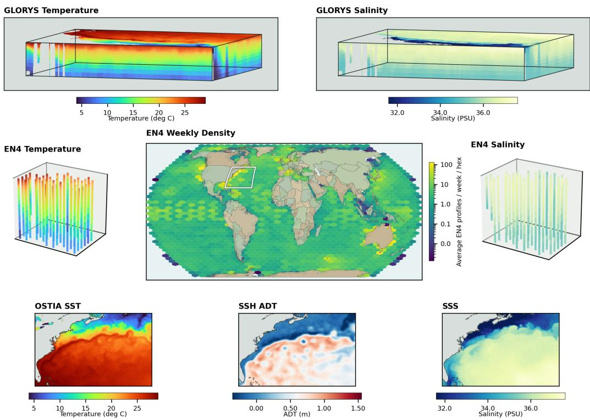
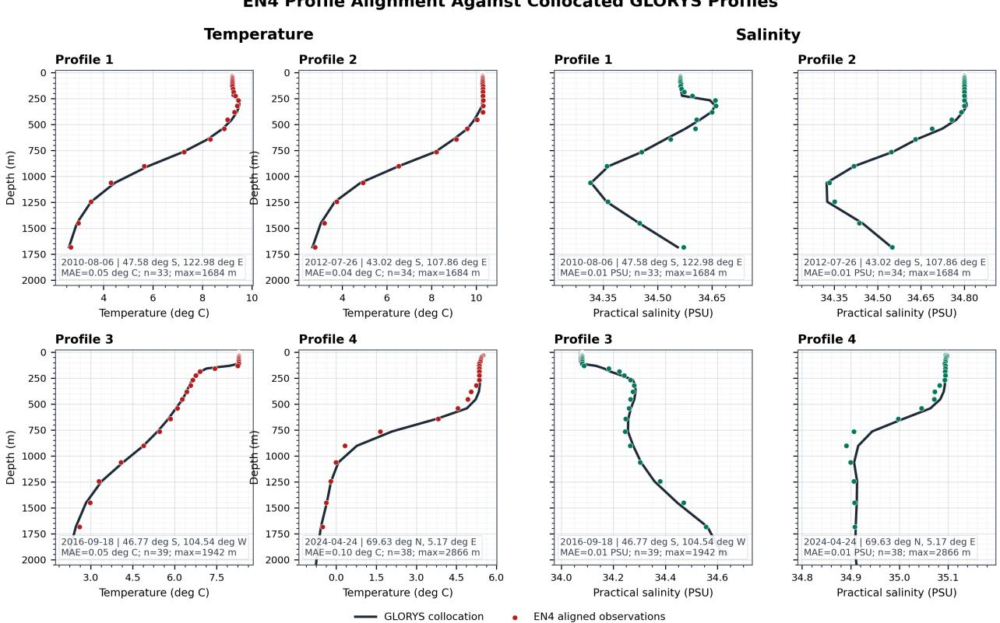
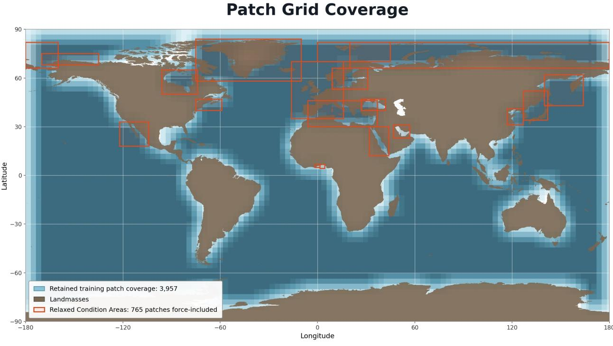
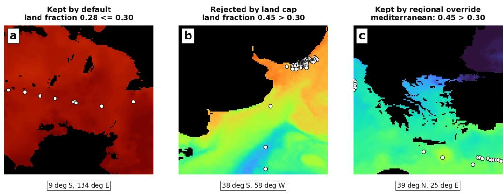
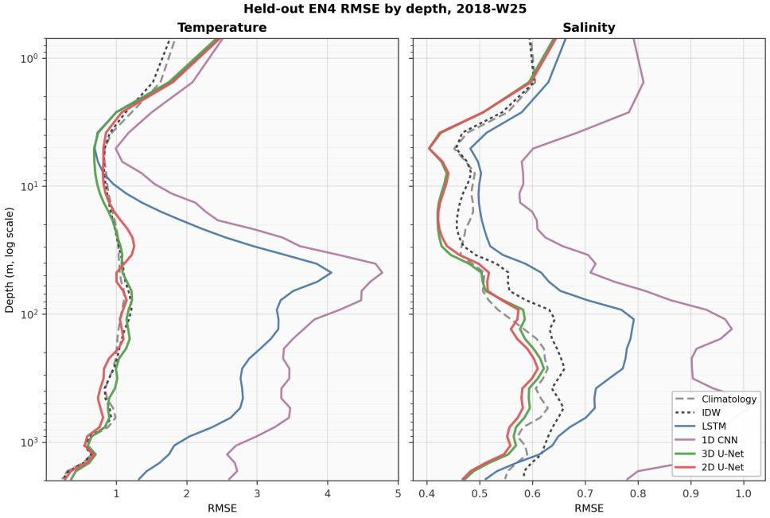
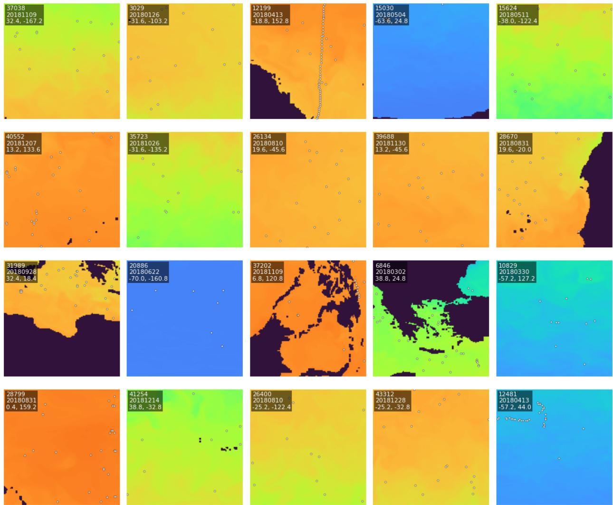
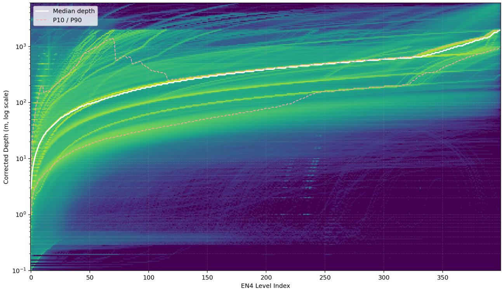

# OceanDepths: A Global Dataset of Paired Subsurface and Surface Ocean Observations

Simon Donike 1, Ruben Cartuyvels 2, Antonino Ian Ferola 2, Elisa Carli 2, Diego Fernandez Prieto 2, and Marie-Helene Rio2

1Image Processing Laboratory, University of Valencia, Av. de Blasco Ibáñez 13, 46010, Spain, simon.donike@uv.es 2ESA-ESRIN, Via Galileo Galilei 1, 00044 Frascati RM, Italy

## Abstract

Despite comprising over 70% of its surface, the world’s oceans are critically underobserved compared to the land surface or the atmosphere. Understanding the global ocean requires jointly observing its surface and subsurface structure, yet no standardized, high-resolution dataset couples satellite surface fields to co-located in situ depth profiles in an AI-ready format. Existing resources either consist of model-reconstructed gridded products rather than observations, cover only a single variable or basin, or operate at resolutions too coarse for mesoscale dynamics. We introduce OceanDepths, the first open, global, regridded AI-ready dataset that pairs satellitederived sea surface temperature (SST), sea surface salinity (SSS), and sea surface height (SSH) L4 products with co-located EN4 subsurface temperature and salinity profiles, complemented by matched GLORYS12 ocean reanalysis data to support comparisons or multi-stage learning. The dataset spans 2000–2024 at 0.1◦×0.1◦ spatial resolution and at weekly temporal resolution, covering the entire globe’s sea surface and with over 9.5 million paired profiles interpolated to 50 standardized depth levels. We provide a configurable system to split the globe in equally sized spatial patches. The 4D multivariate structure, high resolution, long temporal extent, and extreme sparsity of subsurface observations (∼0.01% per depth level) make OceanDepths a challenging testbed for novel AI methods. We demonstrate subsurface state reconstruction as an example task with simple baseline models, but also envision OceanDepths to support the development of observation-based forecast methods and other related tasks. Available at: https://huggingface.co/datasets/ESA-philab/OceanDepths.

## 1 Introduction

The global ocean plays a central role in regulating Earth’s climate, absorbing over 90% of the excess heat trapped by greenhouse gases and roughly 30% of anthropogenic CO2 emissions [17]. Understanding the three-dimensional structure of ocean temperature and salinity, known as the thermohaline structure, is essential for monitoring ocean heat content, tracking water mass formation and circulation, predicting extreme events, and constraining climate projections.

Satellite remote sensing of the ocean is inherently limited to the surface, but ofers near-globa coverage of variables such as sea surface temperature (SST), sea surface salinity (SSS), and sea surface height (SSH) at high spatial and temporal resolution. The Argo program [34], with its fleet of approximately 4000 autonomous profiling floats, provides the most systematic sampling of subsurface temperature and salinity in the upper 2000 m, but its spatial coverage still is extremely sparse relative to satellite observations and to the ocean’s surface: the Core float array targets a nominal $3 ^ { \circ } \times 3 ^ { \circ }$ spacing.

  
Figure 1: Global distribution of the EN4 density per week and examples of surface observations and reanalysis data. OceanDepths aggregates all profiles gathered between 2000 and 2024 with sea surface temperature, salinity and height observational products accompanied by the GLORYS12V1 reanalysis product. The SST, ADT, SSS, GLORYS12, and profile T and S are shown for the white square around New York on the map in the middle.

This asymmetry between dense satellite surface observations and sparse in situ subsurface measurements has motivated research into physics-based [33] or data-driven surface-to-subsurface reconstruction where the goal is to infer the vertical thermohaline structure from satellite-observed surface fields [30, 20, 28, 31, 27, 26, 36, 5, 21]. Another research direction that has recently gained traction is spatiotemporal forecasting of ocean states with deep learning [14, 9, 7, 10, 2]. Recent developments in both directions however, largely rely on reanalysis data or data generated by physical simulations. The few exceptions to this pattern are limited in scope to specific basins, like the Gulf of Mexico or the Mediterranean. The AI and oceanography communities would clearly benefit from a large, standardized, global dataset, but the current available datasets have the following limitations.

1. No standardized paired dataset. Most existing works construct their own training data using ad hoc procedures, without making it publicly available. This makes direct comparison of methods dificult and hinders reproducibility.

2. Reconstructed products, not observation pairs. The published datasets that do exist [28, 31, 18] are typically reconstructed gridded fields, i.e., the output of a model, rather than the raw paired observations that could serve as training data for new methods.

3. Limited variable coverage. Datasets cover only temperature [28] or only salinity [31], and similarly, surface inputs are often restricted to one or two variables rather than the full complement of SST, SSS, and SSH.

4. Regional scope. Many deep learning studies are restricted to specific basins: the South China Sea [36], the Northwestern Pacific [5], the Gulf of Mexico [21], or the Atlantic [27].

5. Insuficient resolution. Existing global datasets operate at 0.25◦ to 1.4◦ spatial resolution and monthly temporal resolution [28, 31, 14], which is too coarse to resolve the mesoscale dynamics at O(10–100 km) that dominate ocean variability in many regions.

6. Over-reliance on reanalyses. In the absence of standardized observational datasets, many modeling eforts resort to ocean reanalyses such as GLORYS12 [17] for both training and/or evaluation. For instance, benchmarks derive their inputs and ground truth entirely from GLO-RYS12 [14, 9], and AI models [35, 7, 10, 2] are trained against the same reanalysis data. While reanalyses provide convenient dense fields, they are model outputs that inherit systematic biases from the underlying numerical model and assimilation scheme. Models trained and evaluated exclusively against such targets risk learning to reproduce errors rather than the true ocean state.

7. Heterogeneous grids. The application of many computer vision-inspired methods would be simplified significantly if data were on a common grid in space and time, but current datasets do not provide this [16].

To address these limitations, we introduce OceanDepths, visually introduced in Figure 1: a global, high-resolution, AI-ready dataset of paired subsurface and surface ocean observations. OceanDepths pairs L4 products (optimal interpolations of satellite observed) SST, SSS, and SSH1 with co-located subsurface temperature and salinity profiles at $0 . 1 ^ { \circ } \times 0 . 1 ^ { \circ }$ spatial resolution and weekly temporal resolution, spanning 2000–2024. We include dense subsurface reanalysis data from GLORYS12 [17] at the same spatial and temporal resolution, which is meant to complement the observational data, not replace it. We see the global paired subsurface–surface observations spanning almost 25 years as the main strength of OceanDepths. We use profiles from the EN4 dataset, which compiles profiles from diferent sources including Argo [12]. Profiles are interpolated to the depth levels of GLORYS12, putting them on a common depth grid and enabling direct comparison between observational and model-based targets. The weekly cadence and global coverage make OceanDepths suitable not only for vertical reconstruction but also for modeling ocean dynamics, like in (sub)seasonal forecasting or climate studies.

Beyond its value for ocean science, OceanDepths presents distinctive challenges and opportuni ties for the AI and computer vision communities. The global gridded data at 0.1◦ resolution provides a large-scale, real-world testbed for spatial generative and predictive models. The 25-year weekly record (1283 time steps) enables the development of methods that capture medium to long-term temporal dynamics. The data is inherently four-dimensional (latitude, longitude, depth, and time) and can be processed as local patches or globally, inviting research on multi-scale approaches. Finally, and most distinctively, the subsurface observations are extremely sparse: with a median of 13–16 Argo profiles per 128×128 patch, the per-depth-level observation rate is just over 0.01%, corresponding to ∼99.9% missing data. This far exceeds the sparsity regimes explored by current methods for learning from incomplete observations [8, 37]. Handling such extreme and spatially irregular sparsity will require novel architectures, such as graph- or mesh-based approaches that operate directly on irregularly sampled data [3, 11], or new training objectives that can learn from near-empty grids. Our contributions are summarized as follows:

1. We present an open, global, AI-ready dataset of paired satellite surface observations and in situ subsurface profiles at 0.1◦ resolution and weekly frequency, with 9.5 million profiles across 1283 weekly time steps (Section 3).

2. We define a standardized evaluation protocol and provide baseline results for a representative task: subsurface ocean state reconstruction (Section 4).

3. We release all data, code, and baselines as open-source resources for the oceanography and the AI communities. The code consists of reusable data export and preprocessing scripts, as well as a configurable patching system and pytorch DataLoaders.

## 2 Related Work

Table 1 shows an overview of existing datasets along with OceanDepths with existing datasets.

Subsurface profiles. The Argo program [34] maintains a global fleet of ∼4000 autonomous profiling floats that measure temperature and salinity profiles. Each float descends to a parking depth (typically 1000 m), drifts with the currents, and periodically descends to a target depth (2000 m or for the small subset of Deep Argo floats; 6000 m) before ascending to the surface while measuring temperature and salinity at multiple depth levels. In addition to CTD measurements like those provided by Argo floats, a variety of subsurface measurement techniques exist, such as MBT, XBT, or CDT [1]. Datasets such as EN4 (UK Met Ofice) [12] and World Ocean Database (WOD, by NOAA) [22] bundle such subsurface measurements from various sources and apply bias corrections and quality control to diferent extents. Raw profiles are measured at irregular depth levels that vary between floats and individual casts.

Reanalysis and analysis products. Global ocean reanalyses and objective analyses provide spatially dense, dynamically consistent 3D fields and are widely used as training targets or eval uation references in AI for oceanography. GLORYS12 [17] is a global reanalysis at (1/12◦, daily) that assimilates satellite altimetry, SST, sea ice, and in situ profiles through a variational data assimilation system coupled to the NEMO ocean model. Objective analyses such as ARMOR3D [13], the In Situ Analysis System (ISAS) [15], the World Ocean Atlas (WOA) [19], the Institute of Atmospheric Physics’ product (IAPv4) [6] or the Roemmich-Gilson Argo Climatology (RG-Clim) [24] combine profiles with optimal interpolation or statistical methods into a dense grid. While these products ofer the appealing property of gap-free global coverage, they are model outputs rather than direct observations. Reanalyses inherit systematic biases from the underlying numerical mode (e.g., difusive mixing, imperfect boundary conditions) and from the assimilation scheme, which smooths observations onto the model grid and can introduce spurious correlations. For instance, GLORYS12 [17] reports a residual seasonal temperature bias above 100 m and independent observations along the 59.5◦ N Atlantic section found significant diferences in heat content at 700–2000 m and in overflow waters [32]. Analysis products rely on statistical relationships that may not hold everywhere, such as in dynamically complex regions, and that over-smooth variables. Our dataset addresses this by providing both raw and matched EN4 profiles together with GLORYS12 and dense surface observations, enabling users to train and evaluate against either target and to quantify the discrepancy directly.

Table 1: Comparison of existing public global ocean subsurface–surface datasets. Variables: T = temperature, S = salinity, U/V = currents, H = sea surface height or ADT (absolute dynamic topography), SST = sea surface temperature, SSS = sea surface salinity, W = wind, B = biological variables, nutrients, oxygen, SR/TR = spatial/temporal resolution G = Global. †: Preserves native sensor resolutions (2 km–0.25◦) without resampling to a common grid.
<table><tr><td>Dataset</td><td>Surface</td><td>Subsurf.</td><td>Depth (m) Levels</td><td></td><td>SR</td><td>TR</td><td>Period</td></tr><tr><td colspan="6">Interpolation / Analysis</td><td></td><td></td></tr><tr><td>ARMOR3D [13]</td><td></td><td>T, S</td><td>1500</td><td>50</td><td>1/8°</td><td>D</td><td>1993-...</td></tr><tr><td>ISAS [15]</td><td></td><td>T, S</td><td>5500</td><td>187</td><td>0.5°</td><td>M</td><td>2002-2020</td></tr><tr><td>WOA [19]</td><td></td><td>T, S, B</td><td>5500</td><td>102</td><td>0.25-1°</td><td>M</td><td>1971-2022</td></tr><tr><td>IAPv4 [6]</td><td></td><td>T</td><td>6000</td><td>119</td><td>1°</td><td>M</td><td>1940-2023</td></tr><tr><td>RG-Clim [24]</td><td></td><td>T, S</td><td>2000</td><td>58</td><td>1°</td><td>M</td><td>2004-2018</td></tr><tr><td colspan="8">Reanalysis</td></tr><tr><td>GLORYS12 [17]</td><td>SST, H, Ice</td><td>T, S, U, V</td><td>5728</td><td>50</td><td>1/12°</td><td>D</td><td>1993-...</td></tr><tr><td>OceanFcstB. [14]</td><td>SST, H, W</td><td>T, S, U, V</td><td>650</td><td>23</td><td>1.41°</td><td>D</td><td>1993-2020</td></tr><tr><td>OceanB. [9]</td><td>SST, H, W</td><td>T, S, U, V</td><td>5728</td><td>50</td><td>1/12°</td><td>D</td><td>2024</td></tr><tr><td colspan="8">Reconstruction</td></tr><tr><td>DORS [28]</td><td></td><td>T</td><td>2000</td><td>23</td><td>1°</td><td>M</td><td>1993-2020</td></tr><tr><td>DORS0.25° [29]</td><td></td><td>T</td><td>2000</td><td>23</td><td>0.25°</td><td>M</td><td>1993-2023</td></tr><tr><td>IAP Salinity [31]</td><td></td><td>S</td><td>2000</td><td>41</td><td>0.25°</td><td>M</td><td>1993-2018</td></tr><tr><td>Liu 2024 [18]</td><td></td><td>T, S</td><td>2000</td><td>187</td><td>0.25°</td><td>M</td><td>2012-2020</td></tr><tr><td colspan="8">Observational</td></tr><tr><td>Argo [34]</td><td></td><td>T, S, U, V, B</td><td>2000</td><td></td><td>Pt.</td><td></td><td>1999-...</td></tr><tr><td>WOD [22]</td><td></td><td>T, S, B</td><td>7800</td><td></td><td>Pt.</td><td></td><td>1772-2022</td></tr><tr><td>EN4 [12]</td><td></td><td>T, S</td><td></td><td>400</td><td>Pt.</td><td></td><td>1900-...</td></tr><tr><td>Aquarius-A. [23]</td><td>SSS</td><td>S</td><td>10</td><td>2</td><td>Pt.</td><td></td><td>2011-2015</td></tr><tr><td>OceanTACO [16]</td><td>SST, SSS, H, W</td><td>T, S</td><td>2000</td><td></td><td>Nat.†</td><td>D</td><td>2015-2025</td></tr><tr><td>OceanDepths</td><td>SST, SSS, H</td><td>T, S</td><td>5728</td><td>50</td><td>0.1°</td><td>W</td><td>2000-2024</td></tr></table>

Reconstructed gridded products. Several works have produced global or regional gridded datasets of subsurface ocean variables derived from satellite observations and/or subsurface profiles, using machine learning or statistical methods. [33] The Deep Ocean Remote Sensing (DORS) dataset [28] provides global subsurface temperature at 23 depth levels from 1993–2020, reconstructed using ConvLSTM networks from satellite SST, absolute dynamic topography (ADT), and sea surface wind fields combined with EN4 profiles, at 1◦×1◦ monthly resolution. A higher-resolution version, DORS0.25◦ [29], extends the record to 2023 at 0.25◦ using Deep Forest models. Tian et al. [31] published a global subsurface salinity dataset at 0.25◦ and monthly resolution for 1993–2018, reconstructed with MLPs from satellite ADT, SST, and sea surface wind combined with coarse gridded salinity. Liu [18] proposed a physics-informed reconstruction of upper-ocean temperature and salinity at 0.25◦. All of the mentioned products are reconstructed products, i.e., model outputs that have been gap-filled and smoothed, rather than raw paired observations suitable for training new models.

Ocean forecasting benchmarks. Recent eforts have produced AI-oriented benchmarks for ocean prediction, but are heavily based on reanalysis data. Most notably, OceanForecastBench (OceanFcstB.) [14] provides a training dataset derived from GLORYS12 data, covering 4 subsurface variables across 23 depth levels and 4 surface variables, regridded to 1.41◦ resolution for 1993– 2020. OceanBench (OceanB.) [9] defines evaluation tracks with observational data for short-range forecasting using GLORYS12, ERA5 and physical model forecasts as training data. Both benchmarks include observational data but only for evaluation and in smaller quantities: e.g., OceanBench only includes observational data such as profiles for the year 2024, and OceanForecastBench only for 2022-2023, while OceanDepths includes observations spanning 2000–2024. OceanForecastBench is additionally limited by its coarse spatial resolution of 1.41◦ (compared to 0.1◦ in OceanDepths.

Multi-sensor collections. In a parallel work, OceanTACO [16] (in review, only preprint available) provides a harmonized, global multi-sensor sea state dataset spanning 2015–2025 (vs. 2000–2024 for OceanDepths), integrating satellite altimetry, SST, SSS, surface winds, GLORYS12 reanalysis, and Argo [34] in situ profiles under a unified cloud-optimized specification at daily temporal resolution. OceanTACO, like OceanBench and OceanForecastBench, only propose Argo profiles as an evaluation resource, and consequently, they include only 400K profiles gathered between 2023 and 2025 (vs. 9.5M in OceanDepths, for 2000-2024). OceanTACO does not resample spatial resolutions across modalities to a common grid, does not interpolate depth levels onto a standard vertical coordinate, and does not provide a patching system that tiles the globe into fixed-size tensors directly ingestible by deep learning models. This makes OceanDepths more into a more AI-ready resource. NASA’s Aquarius–Argo (Aquarius-A.) validation dataset [23] provides collocated satellite SSS and Argo surface measurements for the Aquarius mission period (2011–2015), but only extends up to 10m of depth.

The key features of our dataset are summarized as follows.

1. Paired observations. Unlike other sources [17, 31, 28, 29] which consist of reconstructions or reanalyses, OceanDepths provides raw paired observations for the development of observationbased AI methods.

2. High spatial resolution. At 0.1◦, our dataset is finer than all global datasets except Ocean-TACO [16] where variables are not on a common grid.

3. Weekly temporal resolution and historical record of 25 years. Existing datasets like OceanTACO, OceanBench and OceanForecastBench only provide subsurface profiles as an evaluation resource and only for 1-2 years.

4. Coverage of variables. SST, SSS, SSH (ADT) are provided as surface variables, in addition to temperature and salinity as subsurface variables.

5. Paired reanalysis. The inclusion of matched dense EN4 profiles on the GLORYS12 reanalysis hypercubes alongside the surface observations is unique and enables curriculum or multi-stage learning, and immediate comparison.

6. Global geographical coverage.

7. AI-ready format. Data is on a common grid and a configurable patching system is provided, supporting easy loading as tensors.

Table 2: Dataset summary statistics.
<table><tr><td>Property</td><td>Value</td></tr><tr><td>Spatial coverage</td><td>Global, 3,600×1,800 px at 0.1° resolution (4,338,138 ocean cells)</td></tr><tr><td>Temporal coverage</td><td>January 2000 – July 2024, weekly resolution (1283 target weeks) 9,485,977 (9.4 M valid temperature; 7.0 M valid salinity)</td></tr><tr><td>Total Argo profiles Surface variables per sample</td><td>SST (OSTIA), SSS &amp; surface density (MULTIOBS), ADT (DUACS)</td></tr><tr><td>Depth levels</td><td>50 GLORYS standard levels (0.49 m to 5,728 m)</td></tr><tr><td>Patch dataset</td><td>358 K patch–date samples (1282 px, no overlap) − 343 K train / 15 K eval</td></tr><tr><td>Median profiles per patch-date</td><td>13-16</td></tr><tr><td>Source files</td><td>169 EN4/Argo, 843 GLORYS, 5,326 OSTIA, 5,326 sea-level, 5,326 SSS</td></tr><tr><td>Storage format</td><td>Zarr (profiles) + GeoTIFF/ZSTD (dense rasters) + Parquet (indices)</td></tr></table>

## 3 The OceanDepths Dataset

Table 2 summarizes the key properties of OceanDepths. This section describes the data sources, construction pipeline, storage format and patching system of OceanDepths. All data export and processing scripts, along with pytorch DataLoader code, which are made publicly available under a permissive CC BY 4.0 license: https://huggingface.co/datasets/ESA-philab/OceanDepths.

We are not currently planning to update our dataset continuously as new data becomes available, we provide our dataset as a static resource to be used for training and intercomparable evaluation by the ML community.

## 3.1 Data Sources

OceanDepths integrates three complementary data sources: subsurface observations, remotely sensed surface observations, and a dense reanalysis.

## 3.1.1 Subsurface Profiles.

We use quality-controlled profiles from the EN4.2.22 archive [12], which integrates Argo [34] float profiles with ship-based CTD and other hydrographic measurements such as XBT [1]. Each profile provides temperature (TEMP) and bias-corrected salinity (PSAL\_CORRECTED) at instrument-specific corrected depths (DEPTH\_CORRECTED), with up to 400 depth samples per profile. Raw profiles are measured at irregular depth levels that vary between floats and individual casts.

## 3.1.2 Satellite Surface Observations.

We use gridded satellite products for three surface variables that jointly constrain the upper-ocean state. In order to have continuous and uniform information, we assume that L4 data products are

close enough to raw observations (no physical model or assimilation used)3 while providing ease of use, and we select:

• Sea Surface Temperature (SST): The OSTIA (Operational Sea Surface Temperature and Ice Analysis) L4 product with daily gap-free SST at 0.05◦ native resolution, from the UK Met Ofice.4

• Sea Surface Salinity (SSS): The MULTIOBS global sea surface salinity product from the Copernicus Marine Service5 with daily SSS and surface density fields at 0.125◦ that combines multiple satellite and in situ sources.

• Sea Surface Height – Absolute Dynamic Topography (ADT): The DUACS L4 multisatellite altimetry product6 at 0.125◦ native resolution, providing daily absolute dynamic topography (ADT) and geostrophic currents.

## 3.1.3 GLORYS12 Ocean Reanalysis.

The GLORYS12V1 (Global Ocean Physics Reanalysis) [17] is a global ocean reanalysis based on the NEMO ocean model at 1/12◦ (∼8 km) horizontal resolution with 50 vertical levels spanning 0.49 m to 5728 m depth, assimilating in situ profiles (including Argo), satellite altimetry, SST, and sea ice concentration via a reduced-order Kalman filter. GLORYS12 consists of daily snapshots of 3D temperature (thetao) and salinity (so) fields. Its depth levels are used as the standard vertical coordinate throughout OceanDepths. Note that although GLORYS12 assimilates satellite SST and altimeter sea-level anomalies, some disagreement between GLORYS12 and the surface observations in OceanDepths can be expected due to diferences in the processing systems that produced the products. GLORYS12 provides a spatially dense source that complements the point-wise profiles. This enables users to:

• Train on reanalysis and validate against EN4 observations, or vice versa.

• Train on reanalysis and finetune on Argo profiles in a second stage.

• Study the discrepancies between observed and reanalysis subsurface structure.

• Use reanalysis as a dense spatial complement to sparse Argo sampling.

## 3.2 Data Processing

## 3.2.1 Step 1: EN4 profile selection and quality control.

We ingest all EN4 yearly archives from 2000-2024 (169 files) and extract profiles with valid temperature and/or salinity measurements. Profiles are filtered to retain only those with finite depth temperature pairs.

  
Figure 2: EN4–GLORYS12 profile alignment example. Example from the South Atlantic in September 2018. The depth-interpolated profiles closely track the GLORYS12 reanalysis across the full water column for both modalities, with occasional discrepancies (which is expected due to limitations of the reanalysis method and/or uncertainties in the profile measurements).

## 3.2.2 Step 2: Interpolating profiles to the GLORYS12 depth levels.

To ensure consistency, all profiles are projected onto the 50 fixed depth levels of the GLORYS12 reanalysis (Section 3.1.3) via linear interpolation. Figure 7 shows the distribution of EN4 index-levels with their associated depth, highlighting the fact that building training tensors from the raw dataset is not straightforward. For a profile with finite, sorted samples $( z _ { i } , x _ { i } )$ , where $z _ { i }$ denotes corrected depth and $x _ { i }$ either temperature or salinity, duplicate depths are first averaged. For each GLORYS target depth $g _ { k }$ , we define the nearest observed profile depth

$$
z _ { k } ^ { * } = \arg \operatorname* { m i n } _ { z _ { i } } | z _ { i } - g _ { k } |
$$

and accept an interpolated value only if

$$
g _ { k } \in \left[ z _ { 1 } , z _ { n } \right] \quad { \mathrm { a n d } } \quad \left| z _ { k } ^ { * } - g _ { k } \right| \leq \operatorname* { m a x } \left( 0 . 1 g _ { k } , 1 0 \operatorname { m } \right) .
$$

Accepted values are computed by one-dimensional linear interpolation,

$$
\tilde { x } ( g _ { k } ) = x _ { j } + \frac { g _ { k } - z _ { j } } { z _ { j + 1 } - z _ { j } } \left( x _ { j + 1 } - x _ { j } \right) , \qquad z _ { j } \le g _ { k } \le z _ { j + 1 } .
$$

This depth-adaptive acceptance criterion is more restrictive near the surface (where profiles are densely sampled) and more permissive at depth (where sampling is sparser). No values are produced outside the observed depth range. All rejected target depths are marked as missing, and no extrapolation is performed outside the observed depth range. This alignment step yields 9.5M profiles with valid temperature and 7.0M with valid salinity. Figure 2 shows examples of aligned EN4 and GLORYS12 profiles.

## 3.2.3 Step 3: Raster product regridding and spatial profile collocation.

All surface products and GLORYS12 are regridded onto a common $0 . 1 ^ { \circ } \times 0 . 1 ^ { \circ }$ global grid of 3600×1800 pixels. We use nearest-neighbor selection for sources with matching resolution and bilinear interpolation otherwise.

EN4 profiles are not horizontally interpolated; they are assigned only to their nearest $0 . 1 ^ { \circ } \times 0 . 1 ^ { \circ }$ cell. This produces a maximum point-to-cell-center mismatch of 7.9 km at the equator, comparable to the native GLORYS12 grid scale, and should only afect local comparisons across sharp fronts.

## 3.2.4 Step 4: Temporal collocation.

For temporal alignment, weekly SST, ADT, and SSS fields, as well as a weekly GLORYS12 cube, are computed as centered 7-day means around the weekly chosen target dates, ensuring that the surface observations are representative of the weekly period and that there is temporal coherence across products. EN4 profiles are assigned to the week (centered around the same target dates) in which the measurement was performed.

## 3.2.5 Step 5: Satellite collocation and context sampling.

For each retained EN4 profile, we sample all surface and GLORYS12 variables from the co-located $0 . 1 ^ { \circ } \times 0 . 1 ^ { \circ }$ grid cell and save these as context to the associated profile, along with the index of the grid cell in the raster the profile got assigned to.

## 3.2.6 Step 6: Data format, compression, and access.

All dense rasters (surface observations and GLORYS12) are linearly quantized to 8-bit GeoTIFFs to reduce storage and I/O while retaining observational precision. Valid values use integer codes 0, . . . , 254, with code 255 reserved for nodata, and are decoded as

$$
\hat { x } = x _ { \mathrm { m i n } } + \frac { q } { 2 5 4 } ( x _ { \mathrm { m a x } } - x _ { \mathrm { m i n } } ) .
$$

Temperatures are stored in Kelvin, introducing a +273.15 shift for Celsius inputs, with SST stretched over [270.15, 308.15] K; SSS is stretched over [30, 40] PSU; and ADT over [−2, 2] m. The stretch bounds, units, nodata code, decode formula, quantization step, and maximum absolute quantization error are written into each GeoTIFF’s metadata. Excluding any (extremely rare) clipping outside the fixed stretch range, the worst-case rounding loss is half a quantization step: 0.075 K for temperature values, 0.020 PSU for salinity values, and 0.0079 m for values in meters (ADT).

OceanDepths is distributed in the following three complementary formats.

Dense rasters (GeoTIFF). Spatially dense GLORYS12 fields and satellite surface products are stored as multi-band GeoTIFF files with ZSTD compression and quantized as described above. Each raster covers the full 3600×1800 global grid at a single weekly time step.

Training grid | 0.1 degree GLORYS land mask | tile size 128 px | stride 32 px | retained patches only

  
Figure 3: Global overlapping patch grid coverage for the training dataset. Retained patches $( \leq 3 0 \%$ land, transparent blue) and force-included patches for enclosed basins (in red boxes) cover all major ocean regions. Discarded patches (>30% land) are excluded. Transparency indicates overlap density from the 75% overlap tiling.

Aligned profiles (Zarr). EN4 observations are stored in a Zarr archive with profile-level arrays for temperature, salinity, and validity masks projected onto the 50 GLORYS12 depth levels. These files include the collocated (in time and space) surface observations of ADT, SSS and SST, as well as GLORYS12 estimates of T, S at every depth level. Supporting parquet index files provide eficient spatiotemporal querying.

Raw profiles (Zarr). The original EN4 observations are also stored in their unaltered form, containing all measurements and quality flags for reproducibility.

## 3.3 Configurable Patching and Data Splits

OceanDepths comes with ready-to-use pytorch DataLoaders that support a variety of functions such as patched overlaps, land-pixel cutofs, and a set of relaxed cutof rules for certain areas (Figure 3). We provide configuration files that allow easy changes to relevant settings (e.g., patch size). Here, we describe the recommended standard settings. See Figure 6 for more examples.

The patch catalogue is constructed on the GLORYS12 land-mask that has been resampled to $0 . 1 ^ { \circ }$ . The global grid is tiled into 128×128 pixel patches, corresponding to $1 2 . 8 ^ { \circ } \times 1 2 . 8 ^ { \circ }$ , with a stride of 32 pixels (3.2 ), i.e., 75% overlap. For each candidate patch, land fraction is computed from a binary land mask; patches with more than 30% land are discarded. To retain enclosed or narrow basins of interest, that would otherwise be over-filtered, patches whose centers fall inside configured regional boxes are kept under relaxed land-fraction thresholds: Mediterranean $( \leq 6 0 \%$ land), Baltic Sea (≤85%), Red Sea (≤85%), and Hudson Bay $( \leq 9 5 \% )$ , as illustrated in Figure 4. The configuration files allow to add, edit or remove such areas or constrains.

  
Figure 4: Patch land-fraction filtering with land areas (black), EN4 locations and SST. a: Kept by default. b: Argentinian coast, rejected by default. c: Aegean Sea, included due to relaxed region-based rules.

Evaluation splits are date-based. The year 2018 is reserved for evaluation, and all other years form the training set, preventing spatial leakage between splits. The training set at $1 2 8 \times 1 2 8$ crop size contains 343 K non-overlapping patches, and the evaluation set 15 K. With the recommended strided patching, these values grow to 4.8 M and 205 K, respectively.

## 4 Baseline Experiment

We provide an example task and evaluation of baseline methods that demonstrate the use of OceanDepths: the reconstruction of subsurface ocean state as given by its thermohaline structure.

Given a 128×128 spatial patch at a given weekly date, the model receives a surface context image for a given variable (either SST or SSS) $\mathbf { e } \in \mathbb { R } ^ { 1 \times H \times W }$ , sparse Argo observations for the same variable (T or $\mathbf { S } ) \ \mathbf { x } \in \mathbb { R } ^ { D \times \dot { H } \times W }$ with a validity mask, and a land/ocean mask. It predicts the dense 3D field $\hat { \mathbf { y } } \in \mathbb { R } ^ { D \times H \times W } \ ( D { = } 5 0$ depth levels, $H = W { = } 1 2 8 )$ . We evaluate against the held-out EN4 profiles and against the dense GLORYS12 cube.

## 4.0.1 Methods.

We compare four baseline methods. All learning-based methods have been adapted to take SST as an additional input.

• A climatology baseline computed by aggregating all EN4 training samples in each $1 2 8 \times 1 2 8$ patch and interpolating these by inverse-distance weighting, to approximate weekly mean observations over the 2000-2024 (excluding 2018) timeframe per location,

• Nearest-profile inverse-distance weighting interpolation of the profiles in $\mathcal { P } _ { \mathrm { i n } }$

• A point-wise LSTM adapted from [4],

• A point-wise CNN adapted from [27],

• Spatial U-Net [25] encoder-decoders with 2D/3D convolutions.

Table 3: Subsurface reconstruction results (evaluation year 2018, week 25, $| \mathcal { P } _ { \mathrm { v a l } } | = 0 . 2 | \mathcal { P } | )$ Performance is reported for temperature and salinity against held-out EN4 profiles, averaged across depth levels no deeper than 2000 m. Best values highlighted in bold.
<table><tr><td></td><td colspan="3">Temperature</td><td colspan="3">Salinity</td></tr><tr><td>Method</td><td>RMSE</td><td>MAE</td><td> $R ^ { 2 }$ </td><td>RMSE</td><td>MAE</td><td> $R ^ { 2 }$ </td></tr><tr><td>Climatology</td><td>0.974</td><td>0.510</td><td>0.964</td><td>0.543</td><td>0.170</td><td>0.717</td></tr><tr><td>IDW</td><td>0.979</td><td>0.521</td><td>0.964</td><td>0.566</td><td>0.174</td><td>0.678</td></tr><tr><td>LSTM</td><td>2.420</td><td>1.645</td><td>0.701</td><td>0.623</td><td>0.295</td><td>0.633</td></tr><tr><td>1D CNN</td><td>3.073</td><td>2.377</td><td>0.370</td><td>0.797</td><td>0.536</td><td>0.338</td></tr><tr><td>3D U-Net</td><td>1.101</td><td>0.645</td><td>0.937</td><td>0.518</td><td>0.177</td><td>0.738</td></tr><tr><td>2D U-Net</td><td>1.092</td><td>0.610</td><td>0.941</td><td>0.515</td><td>0.166</td><td>0.744</td></tr></table>

## 4.0.2 Metrics.

The baseline methods are evaluated using root mean squared error (RMSE), mean absolute error (MAE), and the coeficient of determination $( R ^ { 2 } )$ . These metrics are reported both at each individual depth level up to 2000 m (Figure 5) and in a depth-integrated form Table 3. Since some EN4 observations are necessary for running inference for the spatial reconstruction models, we calculate the metrics on a subset of profiles. We split the available profiles P into an input set $\mathcal { P } _ { \mathrm { i n } }$ and a heldout validation set $\mathcal { P } _ { \mathrm { v a l } } ,$ with $\mathcal { P } _ { \mathrm { i n } } \cap \mathcal { P } _ { \mathrm { v a l } } = \emptyset , | \mathcal { P } _ { \mathrm { i n } } | = 0 . 8 | \mathcal { P } |$ , and $| \mathcal { P } _ { \mathrm { v a l } } | = 0 . 2 | \mathcal { P } |$ . The reconstruction methods are provided only with $\mathcal { P } _ { \mathrm { i n } }$ , and performance is evaluated exclusively at the profile locations and depth levels of $\mathcal { P } _ { \mathrm { v a l } }$ . For a prediction $\begin{array} { r } { \hat { y } _ { p , } } \end{array}$ z and EN4 observation $y _ { p , \ast }$ z at profile p and depth z, the held-out metrics are computed over all valid pairs $( p , z ) \in \mathcal { P } _ { \mathrm { v a l } }$

## 4.0.3 Results.

Table 3 summarizes the reconstruction quality on held-out EN4 profiles, averaged over depth levels. The results show that predicting the climatology and IDW remain strong temperature baselines, especially for RMSE and MAE, indicating that much of the weekly thermal structure is already captured by the seasonal background and nearby profiles. The learned U-Net baselines are nevertheless competitive for temperature and improve the explained variance. The benefit of spatial context is clearer for salinity, where both U-Net variants outperform the point-wise LSTM and 1D CNN, and where the 2D U-Net achieves the best scores overall. This suggests that salinity reconstruction benefits more from horizontal spatial context (such as water-mass structure and fronts) to reconstruct coherent patch fields. In contrast, column-wise models are limited to local vertical priors. Figure 5 shows that the U-Net baselines remain more stable across upper and intermediate ocean depth levels, while point-wise baselines exhibit larger errors which increase at deeper levels.

## 5 Conclusion

We have introduced OceanDepths, an open, global, AI-ready dataset of paired satellite surface and in situ subsurface ocean observations spanning several decades. By co-locating SST, SSS, and ADT with Argo profiles and matched GLORYS12 [17] reanalysis data at 0.1◦ spatial resolution and weekly intervals over 2000–2024 (9.5 M profiles, 1283 weekly dates), OceanDepths provides a unified resource that has the potential to support a range of ocean-related ML tasks. We have demonstrated that the task of subsurface ocean state reconstruction, one task that is enabled by OceanDepths, provides a challenging ML setting where predicting the climatology often performs better than simple ML baselines. We hope that OceanDepths can further spur research at the intersection of ML and oceanography.

  
Figure 5: RMSE per depth against held-out EN4 samples. T and S reconstruction error by depth level, averaged over the global 2018 week-25 validation set.

Limitations. OceanDepths inherits the sampling biases of the Argo network: coverage is sparser in marginal seas, near coasts, under ice, and below 2,000 m. While the reliance on L4 products, the depth-wise interpolation, and weekly aggregation make the dataset much easier to use and create a shared baseline setup for future experiments, this type of aggregation is not necessarily optimal for every user.

Availability. The dataset ( \_ cmd star :nN {O } > T i Sp ces m \qty  od { \_ grab D:w []\ cm \_1 d grab :w }{ \p o\_n thi c value \ o \_t }{ TrimSpaces \ 120}{ g b yt ), co de, and repro ducible loading examples are publicly available on Hugging Face under a CC BY 4.0 license: https://huggingface.co/datasets/ ESA-philab/OceanDepths.

Acknowledgements. We thank the Met Ofice Hadley Centre for EN4.2.2 [12] and OSTIA, the Consiglio Nazionale delle Ricerche for MULTIOBS, CLS for DUACS, and Mercator Ocean International for GLORYS12V1 [17]. This study used E.U. Copernicus Marine Service Information. The Argo observations were collected and made freely available by the International Argo Program and its contributing national programs; Argo is part of the Global Ocean Observing System (doi:10.17882/42182). LLMs (Claude Code) were used for writing and coding assistance. We remain fully responsible for the conceptualization and execution of the research described in this manuscript, and we confirm that it describes our work completely and accurately. We carefully verified the content and all references.

## References

[1] Abraham, J.P., Baringer, M., Bindof, N.L., Boyer, T., Cheng, L.J., Church, J.A., Conroy, J.L., Domingues, C.M., Fasullo, J.T., Gilson, J., Goni, G., Good, S.A., Gorman, J.M., Gouretski, V., Ishii, M., Johnson, G.C., Kizu, S., Lyman, J.M., Macdonald, A.M., Minkowycz, W.J., Mofitt, S.E., Palmer, M.D., Piola, A.R., Reseghetti, F., Schuckmann, K., Trenberth, K.E., Velicogna, I., Willis, J.K.: A review of global ocean temperature observations: Implications for ocean heat content estimates and climate change. Reviews of Geophysics 51(3), 450–483 (2013). https://doi.org/10.1002/rog.20022

[2] Agarwal, N., Smith, T.A., Frolov, S., Slivinski, L.C.: Skillful global ocean emulation and the role of correlation-aware loss. arXiv preprint arXiv:2604.18727 (2026)

[3] Alexe, M., Boucher, E., Lean, P., Pinnington, E., Laloyaux, P., McNally, A., Lang, S., Chantry, M., Burrows, C., Chrust, M., Pinault, F., Villeneuve, E., Bormann, N., Healy, S.: Graphdop: Towards skilful data-driven medium-range weather forecasts learnt and initialised directly from observations. arXiv preprint arXiv:2412.15687 (2024)

[4] Buongiorno Nardelli, B.: A deep learning network to retrieve ocean hydrographic profiles from combined satellite and in situ measurements. Remote Sensing 12(19), 3151 (2020). https://doi.org/10.3390/rs12193151

[5] Chae, J.Y., Donohue, K.A., Park, J.H.: TS-Cast: deep learning for subsurface ocean reconstruction from satellite observations in the northwestern pacific. Ocean Science 22(4), 2161–2177 (Jul 2026). https://doi.org/10.5194/os-22-2161-2026

[6] Cheng, L., Pan, Y., Tan, Z., Zheng, H., Zhu, Y., Wei, W., Du, J., Yuan, H., Li, G., Ye, H., Gouretski, V., Li, Y., Trenberth, K.E., Abraham, J., Jin, Y., Reseghetti, F., Lin, X., Zhang, B., Chen, G., Mann, M.E., Zhu, J.: Iapv4 ocean temperature and ocean heat content gridded dataset. Earth System Science Data 16(8), 3517–3546 (2024). https://doi.org/10.5194/ essd-16-3517-2024

[7] Cui, Y., Wu, R., Zhang, X., Zhu, Z., Liu, B., Shi, J., Chen, J., Liu, H., Zhou, S., Su, L., Jing, Z., An, H., Wu, L.: Forecasting the eddying ocean with a deep neural network. Nature Communications 16(1), 2268 (2025). https://doi.org/10.1038/s41467-025-57389-2

[8] Daras, G., Shah, K., Dagan, Y., Gollakota, A., Dimakis, A.G., Klivans, A.: Ambient difusion: Learning clean distributions from corrupted data. In: Advances in Neural Information Processing Systems. vol. 36, pp. 288–313. Neural Information Processing Systems Foundation, Inc. (NeurIPS) (2023). https://doi.org/10.52202/075280-0015

[9] El Aouni, A., Gaudel, Q., Johnson, J.E., Regnier, C., Le Sommer, J., van Gennip, S., Fablet, R., Drevillon, M., Drillet, Y., Le Traon, P.: Oceanbench: A benchmark for data-driven global ocean forecasting systems. In: Belgrave, D., Zhang, C., Lin, H., Pascanu, R., Koniusz, P., Ghassemi, M., Chen, N. (eds.) Advances in Neural Information Processing Systems. vol. 38. Curran Associates, Inc. (2025). https://doi.org/10. 52202/085713-0303, https://proceedings.neurips.cc/paper\_files/paper/2025/file/ 0d1635dfa43efe7477f9b6dab3168fd8-Paper-Datasets\_and\_Benchmarks\_Track.pdf

[10] Gao, Y., Wu, H., Xu, F., Xiang, Y., Gou, R., Shu, R., Wen, Q., Wu, X., Wang, K., Huang, X.: NeuralOM: Neural ocean model for subseasonal-to-seasonal simulation. In: Proceedings

of the AAAI Conference on Artificial Intelligence. vol. 40, pp. 14756–14764 (2026). https: //doi.org/10.1609/aaai.v40i17.38495

[11] Garnier, P., Lannelongue, V., Viquerat, J., Hachem, E.: MeshMask: Physics-based simulations with masked graph neural networks. In: International Conference on Learning Representations (2025)

[12] Good, S.A., Martin, M.J., Rayner, N.A.: En4: Quality controlled ocean temperature and salinity profiles and monthly objective analyses with uncertainty estimates. Journal of Geophysical Research: Oceans 118(12), 6704–6716 (2013). https://doi.org/10.1002/2013JC009067

[13] Guinehut, S., Dhomps, A.L., Larnicol, G., Le Traon, P.Y.: High resolution 3-D temperature and salinity fields derived from in situ and satellite observations. Ocean Science 8(5), 845–857 (2012). https://doi.org/10.5194/os-8-845-2012

[14] Han, Y., Jia, H., Wang, X., Wang, H., Wu, W., Zheng, J., Xiao, P.: Oceanforecastbench: A benchmark data set for data-driven global ocean forecasting. Journal of Geophysical Research: Machine Learning and Computation 3(4), e2025JH000838 (2026). https://doi.org/10.1029/ 2025JH000838

[15] Kolodziejczyk, N., Prigent-Mazella, A., Gaillard, F.: ISAS temperature, salinity, dissolved oxygen gridded fields. SEANOE (2023). https://doi.org/10.17882/52367

[16] Lehmann, N., Aybar, C., Shah, A., Passaro, M., Bamber, J.L., Zhu, X.X.: OceanTACO: A multi-sensor global ocean sea surface state dataset. Earth System Science Data Discussions (2026). https://doi.org/10.5194/essd-2026-232, preprint, under review.

[17] Lellouche, J.M., Greiner, E., Bourdallé-Badie, R., Garric, G., Melet, A., Drévillon, M., Bricaud, C., Hamon, M., Le Galloudec, O., Regnier, C., Candela, T., Testut, C.E., Gasparin, F., Ruggiero, G., Benkiran, M., Drillet, Y., Le Traon, P.Y.: The Copernicus global 1/12° oceanic and sea ice GLORYS12 reanalysis. Frontiers in Earth Science 9, 698876 (2021). https://doi. org/10.3389/feart.2021.698876

[18] Liu, S., Hu, S.: Seeing through the sea with satellites: Reconstructing ocean subsurface temperature and salinity with satellite observations. Earth System Science Data Discussions 2024, 1–29 (2024). https://doi.org/10.5194/essd-2024-334

[19] Locarnini, R.A., Mishonov, A.V., Baranova, O.K., Reagan, J.R., Boyer, T.P., Seidov, D., Wang, Z., Garcia, H.E., Bouchard, C., Cross, S.L., Paver, C.R., Dukhovskoy, D.: World ocean atlas 2023, volume 1: Temperature. NOAA Atlas NESDIS 89, NOAA National Centers for Environmental Information (2024). https://doi.org/10.25923/54bh-1613

[20] Meng, L., Yan, C., Zhuang, W., Zhang, W., Yan, X.H.: Reconstruction of three-dimensional temperature and salinity fields from satellite observations. Journal of Geophysical Research: Oceans 126(11), e2021JC017605 (2021). https://doi.org/10.1029/2021JC017605

[21] Miranda, J.R., Zavala-Romero, O., Hiron, L., Chassignet, E.P., Subrahmanyam, B., Meunier, T., Helber, R.W., Pallas-Sanz, E., Tenreiro, M.: Neural synthetic profiles from remote sensing and observations (NeSPReSO) — reconstructing temperature and salinity fields in the Gulf of Mexico. Ocean Modelling 196, 102550 (Jul 2025). https://doi.org/10.1016/j.ocemod.2025.102550

[22] Mishonov, A.V., Boyer, T.P., Baranova, O.K., Bouchard, C.N., Cross, S.L., Garcia, H.E., Locarnini, R.A., Paver, C.R., Reagan, J.R., Wang, Z., Seidov, D., Grodsky, A.I., Beauchamp, J.G.: World ocean database 2023. NOAA Atlas NESDIS 97, NOAA National Centers for Environmental Information (2024). https://doi.org/10.25923/z885-h264

[23] NASA Goddard Space Flight Center: Sea surface salinity: Validation dataset containing Aquarius SSS and Argo float observations. NASA Earth Sciences (2018), updated 25 September 2018. https://earth.gsfc.nasa.gov/cryo/data/sea-surface-salinity

[24] Roemmich, D., Gilson, J.: The 2004–2008 mean and annual cycle of temperature, salinity, and steric height in the global ocean from the argo program. Progress in Oceanography 82(2), 81–100 (Aug 2009). https://doi.org/10.1016/j.pocean.2009.03.004

[25] Ronneberger, O., Fischer, P., Brox, T.: U-Net: Convolutional Networks for Biomedical Image Segmentation, pp. 234–241. Springer International Publishing (2015). https://doi.org/10. 1007/978-3-319-24574-4\_28

[26] Sammartino, M., Della Cioppa, L., Colella, S., Buongiorno Nardelli, B.: A physics-informed deep neural network for the joint prediction of 3d chlorophyll-a and hydrographic fields in the mediterranean sea. Environmental Modelling & Software 194, 106660 (Oct 2025). https://doi.org/10.1016/j.envsoft.2025.106660

[27] Smith, P.A.H., Sørensen, K.A., Buongiorno Nardelli, B., Chauhan, A., Christensen, A., St. John, M., Rodrigues, F., Mariani, P.: Reconstruction of subsurface ocean state variables using convolutional neural networks with combined satellite and in situ data. Frontiers in Marine Science 10, 1218514 (2023). https://doi.org/10.3389/fmars.2023.1218514

[28] Su, H., Jiang, J., Wang, A., Zhuang, W., Yan, X.H.: Subsurface temperature reconstruction for the global ocean from 1993 to 2020 using satellite observations and deep learning. Remote Sensing 14(13), 3198 (2022). https://doi.org/10.3390/rs14133198

[29] Su, H., Zhang, F., Teng, J., Wang, A., Huang, Z.: Reconstructing high-resolution subsurface temperature of the global ocean using deep forest with combined remote sensing and in situ observations. ISPRS Journal of Photogrammetry and Remote Sensing 218, 389–404 (2024). https://doi.org/10.1016/j.isprsjprs.2024.09.022

[30] Su, H., Zhang, T., Lin, M., Lu, W., Yan, X.H.: Predicting subsurface thermohaline structure from remote sensing data based on long short-term memory neural networks. Remote Sensing of Environment 260, 112465 (2021). https://doi.org/10.1016/j.rse.2021.112465

[31] Tian, T., Cheng, L., Wang, G., Abraham, J., Wei, W., Ren, S., Zhu, J., Song, J., Leng, H.: Reconstructing ocean subsurface salinity at high resolution using a machine learning approach. Earth System Science Data 14(11), 5037–5060 (2022). https://doi.org/10.5194/ essd-14-5037-2022

[32] Verezemskaya, P., Barnier, B., Gulev, S.K., Gladyshev, S., Molines, J.M., Gladyshev, V., Lellouche, J.M., Gavrikov, A.: Assessing eddying (1/12°) ocean reanalysis GLORYS12 using the 14-yr instrumental record from 59.5°n section in the atlantic. Journal of Geophysical Research: Oceans 126(6), e2020JC016317 (Jun 2021). https://doi.org/10.1029/2020JC016317

[33] Wang, J., Flierl, G.R., LaCasce, J.H., McClean, J.L., Mahadevan, A.: Reconstructing the ocean’s interior from surface data. Journal of Physical Oceanography 43(8), 1611–1626 (Aug 2013). https://doi.org/10.1175/JPO-D-12-0204.1

[34] Wong, A.P.S., Wijfels, S.E., Riser, S.C., Pouliquen, S., Hosoda, S., Roemmich, D., Gilson, J., Johnson, G.C., Martini, K., Murphy, D.J., Scanderbeg, M., Bhaskar, T.V.S.U., Buck, J.J.H., Merceur, F., Carval, T., Maze, G., Cabanes, C., André, X., Pofa, N., Yashayaev, I., Barker, P.M., Guinehut, S., Belbéoch, M., Ignaszewski, M., Baringer, M.O., Schmid, C., Lyman, J.M., McTaggart, K.E., Purkey, S.G., Zilberman, N., Alkire, M.B., Swift, D., Owens, W.B., Jayne, S.R., Hersh, C., Robbins, P., West-Mack, D., Bahr, F., Yoshida, S., Sutton, P.J.H., Cancouët, R., Coatanoan, C., Dobbler, D., Juan, A.G., Gourrion, J., Kolodziejczyk, N., Bernard, V., Bourlès, B., Claustre, H., D’Ortenzio, F., Le Reste, S., Le Traon, P.Y., Rannou, J.P., Saout-Grit, C., Speich, S., Thierry, V., Verbrugge, N., Angel-Benavides, I.M., Klein, B., Notarstefano, G., Poulain, P.M., Vélez-Belchí, P., Suga, T., Ando, K., Iwasaska, N., Kobayashi, T., Masuda, S., Oka, E., Sato, K., Nakamura, T., Sato, K., Takatsuki, Y., Yoshida, T., Cowley, R., Lovell, J.L., Oke, P.R., van Wijk, E.M., Carse, F., Donnelly, M., Gould, W.J., Gowers, K., King, B.A., Loch, S.G., Mowat, M., Turton, J., Rama Rao, E.P., Ravichandran, M., Freeland, H.J., Gaboury, I., Gilbert, D., Greenan, B.J.W., Ouellet, M., Ross, T., Tran, A., Dong, M., Liu, Z., Xu, J., Kang, K., Jo, H., Kim, S.D., Park, H.M.: Argo data 1999–2019: Two million temperature-salinity profiles and subsurface velocity observations from a global array of profiling floats. Frontiers in Marine Science 7, 700 (2020). https://doi.org/10.3389/fmars.2020.00700

[35] Xiang, Y., Gao, Y., Wu, H., Zhang, Q., Shu, R., Zhou, X., Wu, X., Huang, X.: Advancing ocean state estimation with eficient and scalable ai. arXiv preprint arXiv:2511.06041 (2025)

[36] Zhao, Q., Li, S., Cai, Y., Zhong, G., Peng, S.: Reconstruction of the subsurface temperature and salinity in the south china sea using deep-learning techniques with a physical guidance. Remote Sensing 17(17), 2954 (2025). https://doi.org/10.3390/rs17172954

[37] Zhou, Z., Wang, C., Ye, H., Guan, Y., Yu, T.: Incomplete data, complete dynamics: A difusion approach. arXiv preprint arXiv:2509.20098 (2025)

  
Figure 6: Random selection of surface-level training patches from the dataset, illustrating the diversity of ocean regions, SST gradients, and coastline configurations encountered during training.

A Appendix: Extra figures

  
Figure 7: EN4 depth index compared to depth in meters. Heatmap of corrected depth (m, log scale) vs. EN4 level index, with median (white) and P10/P90 (pink dotted lines) curves. The irregular, profile-dependent depth sampling motivates the interpolation onto the fixed 50-level GLORYS12 coordinate.