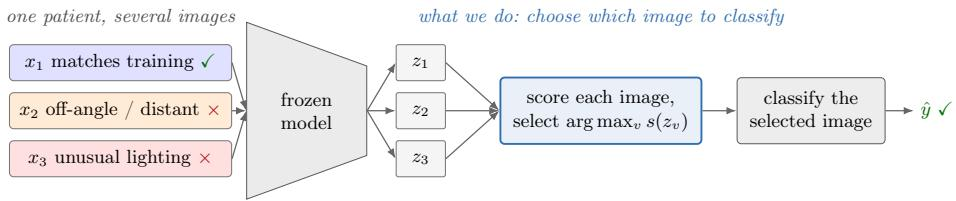
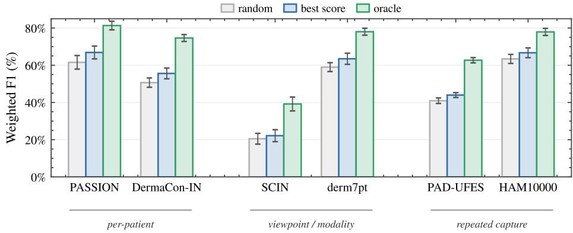
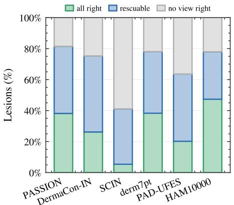
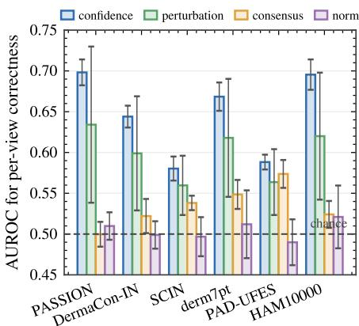

# Picking the Right Image to Classify: Reliable-Input Selection in Teledermatology

Fabian Gröger∗,1,2, Marco Weishaupt∗,2, Philippe Gottfrois1,3, Simone Lionetti2, Linda Wermelinger1,2, Nipun Ranasekara1,2, Ludovic Amruthalingam2, Alexander A. Navarini†,1,3, and Marc Pouly†,2

1 University of Basel 2 Lucerne University of Applied Sciences and Arts 3 University Hospital Basel ∗ equal contribution † equal advising

Abstract. Dermatology models face distribution shifts in teledermatology settings, where submitted images difer from the training data in lighting, angle, distance, focus, and framing. These test-time images are ordinary clinical photographs, but some fall outside the model’s training conditions, leading the model to often misclassify them due to shifts in acquisition between training and deployment. When multiple images of the same case exist (several photos of one patient or lesion), a natural way to improve accuracy is therefore to select the image the model is most likely to classify correctly. We call this task reliable-input selection. An oracle that, for each case, selects a correctly classified image when one exists raises weighted F1 by about 20 percentage points on average across six dermatology datasets and nine frozen backbones. This oracle is an upper bound that sees the labels, whereas a selector must choose blindly. Capturing this gain in practice is hard. A selector that needs no pretraining data applies to any frozen model, including those whose data is not public. It must judge reliability from quantities the model exposes at inference: its embeddings, their norms, and its confidence. We benchmark four such training-data-free selectors: the embedding norm, the neighborhood consensus among a case’s images, the stability of the prediction under small perturbations, and the model’s own confidence. No training-data-free selector substantially narrows this oracle gap. The best of them is the model’s own confidence, but it recovers only a small part of the gap on the clinical datasets. A small labeled reference set does not help either: the best selector overall, a fusion of confidence and Mahalanobis distance, still leaves most of the gap. To our knowledge, this is the first study to introduce and benchmark reliable input selection, a clinically important, unsolved task.

Keywords: Dermatology · Reliable-input selection · Acquisition shift.

## 1 Introduction

Dermatology models are often trained on controlled, standardized clinical photographs and applied afterwards to images captured at test time under diferent angles, distances, or lighting conditions. Such acquisition shifts are a welldocumented cause of accuracy loss [7, 23]. These images are ordinary clinical photographs, not anomalies, so an out-of-distribution detector would not flag them and the model classifies them as usual. But because it was not trained for these conditions, it often misclassifies them, apparently confident [11].

  
Fig. 1. Reliable-input selection. In teledermatology a patient submits several images of their skin condition, varying in body site and acquisition. Here one matches the model’s training conditions (standardized) and two difer in angle, distance, or lighting (of-condition). A frozen model embeds each image as $z _ { v }$ and classifies the standardized image correctly (✓) but the of-condition images incorrectly (×), silent failures that selection avoids. The task is to score the images and classify the selected one.

When multiple images of the same case are available, they can arise in several ways, three of which we study: repeated captures of one lesion, several viewpoints or modalities of one lesion, or several photographs of one patient covering different body sites, as in teledermatology. Rather than classifying an arbitrary image, one can select the image the model is most likely to classify correctly, a task we call reliable-input selection (Fig. 1). Here we show that an oracle that, for each case, selects a correctly classified image when one exists raises weighted F1 by about 20 percentage points on average without a stronger model or further training, a gain that current systems rarely exploit.

A selector that needs no pretraining data applies to any frozen model, and works from the frozen embeddings alone, with at most a small set of labeled images to calibrate a probe. We benchmark four such training-data-free selectors, together with reference-set selectors that may also use a small labeled set, across six datasets and nine backbones, and the results are largely negative. No selector recovers much of the gap. The model’s own confidence helps on the multi-image clinical datasets but does not beat a fixed best view, the simple strategy of always using the single strongest acquisition type, where such a type is identifiable. Even a small labeled reference set leaves most of the gap.

Our contributions are: (1) To our knowledge, we are the first to introduce and benchmark reliable-input selection: choosing, among a case’s images, the one a deployed dermatology model classifies most reliably, without its pretraining data. (2) We quantify a large oracle gap (about 20 percentage points of weighted F1 on average over six datasets) and show that four training-data-free selectors leave most of it. The strongest, classifier confidence, recovers at most about a quarter of the gap and does not beat a fixed best view where one is available. (3) We trace the dificulty to the task itself rather than to a specific backbone or a simple methodological fix, and even a small labeled reference set helps little: the best such selector, a fusion of confidence and a class-conditional Mahalanobis distance, also recovers at most about a quarter of the gap.

## 2 Related Work

Generalization under acquisition shift. A large body of literature documents that accuracy drops when test inputs deviate from the training distribution. Geirhos et al. [7] showed that networks matching humans on clean images are far less robust to image distortions. Taori et al. [23] showed that robustness to synthetic perturbations does not transfer to natural shifts and that the main known remedy is training on larger, more diverse data. These studies establish that shift degrades accuracy, but none select among several available images for a given case at inference time. To our knowledge, no prior work studies this choice, and we are the first to introduce and benchmark it. Test-time adaptation [17] updates the model to fit each shifted input, and multi-modal priors [28] add side information. Both change the model or its training, whereas we leave the model fixed and only choose which of a case’s images to classify.

Confidence, OOD detection, and sample rejection. Selective prediction equips models with a reject option, abstaining on inputs deemed unreliable [6, 11], often via confidence or out-of-distribution scores such as maximum softmax probability [12], ODIN [18], and Mahalanobis distance [16]. Our task difers in two ways. We do not abstain but select among several valid images of one case, so the case is always processed. And the failure is not an anomaly: an unfamiliar but valid acquisition produces an ordinary, in-distribution embedding that outlier and density scores miss, yet the model misclassifies it.

Foundation models and video in dermatology. Domain-specific foundation models provide strong dermatology embeddings with little labeled data [15, 26, 27], while audits of the field’s data basis reveal wide coverage gaps across skin tones and conditions [9], which makes deployment-time reliability important. Video pipelines exploit redundancy across frames for more resilient detection [1], and selecting reliable frames is a direct companion to such systems.

## 3 Methods

## 3.1 The Reliable-Input Selection Task

Each case has V images $\{ x _ { 1 } , \ldots , x _ { V } \}$ , where a case is a single lesion or, in the per-patient datasets below, one patient. A frozen backbone maps them to embeddings $\{ z _ { 1 } , \ldots , z _ { V } \}$ , a selection rule picks one index v, and the prediction on $x _ { v }$ is reported. The metric is the final downstream performance of the selected images, which we report as weighted F1 because the diagnostic classes are imbalanced. We use six publicly available dermatology datasets, two in each of three multi-image regimes, and our primary focus is the per-patient regime, the closest match to real-world teledermatology. Multiple images per patient (diferent body sites): PASSION [8], patient-submitted images from sub-Saharan Africa across Fitzpatrick skin types III–VI (1,022 cases, 4 conditions, 2–18 images per case, median 3), and DermaCon-IN [19], a clinical collection from India (1,457 cases, 8 classes, 2–13 images), where a case is a patient and selection is per-patient image triage rather than a choice among aligned views. Distinct viewpoints or modalities of one lesion, the aligned datasets and the only ones for which a fixed best view is defined: SCIN [25], whose cases give three images of one lesion from distinct viewpoints (close-up, at an angle, at a distance), from which we take the highest-weighted expert label, keep the 20 most frequent conditions, and drop records lacking all three views or a label, leaving 1,045 lesions, and derm7pt [13], a clinical and a dermoscopic image of each lesion. Repeated captures of one lesion: HAM10000 [24] (repeated dermoscopy, 1,956 lesions, 2–6 captures) and PAD-UFES-20 [22] (repeated smartphone photos, 512 lesions, 2–8 captures).

## 3.2 Backbones

We evaluate nine backbones spanning multiple pretraining paradigms, with no fine-tuning. These include PanDerm [27] (dermatology, masked image modeling), MONET [14] (contrastive CLIP), supervised [5] and masked-autoencoding [10] ImageNet ViTs, as well as DINO [3] and DINOv2 [21] (self-distillation). For DINOv2, we test four variants: plain, register [4], patch-mean, and register-pluspatch-mean. Spanning these paradigms tests whether the dificulty is a property of one model or of the task. None of the backbones is trained on our evaluation datasets: the ImageNet backbones use no dermatology data, PanDerm is pretrained on a corpus that excludes public benchmarks [27], and MONET on dermatology image-text pairs drawn from the medical literature [14].

## 3.3 Selectors

A selector assigns each image a score and takes the per-case arg max. We group selectors by what they are allowed to use.

Baseline and references. Our baseline is random (classify any of the case’s images): the realistic default, and the only choice defined for every dataset. We also report two ways to use a case’s images without selecting one: majority vote (the most frequent prediction across the images, random tie-breaks) and soft vote (the argmax of their mean predicted probability). Two non-deployable references bound what selection could achieve. Best fixed always classifies the same acquisition type, the one with the highest average F1. It is defined only when every case shares the same set of acquisition types, such as SCIN’s three viewpoints or derm7pt’s two modalities, and is undefined when a case’s images are not aligned this way. The per-case oracle picks a correctly classified image when one exists, which marks the upper bound any selector could reach.

Training-data-free. The realistic deployment setting, in which selectors use only the frozen embeddings and the given probe. The embedding norm selector scores each image by LevyScore [20], log pdf χ (∥z∥): the typicality of the norm ∥z∥ under an isotropic Gaussian latent space, in which it follows a $\chi _ { K }$ distribution that recent self-supervised objectives encourage [2]. Neighborhood consensus scores each image by its mean cosine similarity to the case’s other images and prefers the most central one, on the assumption that the more an image’s embedding deviates from the rest, the less reliable its prediction. Perturbation stability prefers the image whose prediction changes least under small Gaussian perturbations of its embedding, on the assumption that a reliable prediction is locally robust. Classifier confidence is the probe’s maximum softmax probability.

Reference-set selectors (small labeled set). To establish an upper reference for the benefit of a small labeled set, we also include two selectors fitted on the practitioner’s own labeled set (still without the model’s pretraining data). The Mahalanobis selector favors the image that looks most typical of its predicted class, measured by the Mahalanobis distance from its embedding to the class mean and covariance. The fusion selector sums this typicality score with the classifier’s confidence, both standardized. The class-conditional mean and covariance are estimated on the same split that fits the probe (Sec. 3.4), not a separate hold-out, so they use no labeled data beyond the probe’s.

## 3.4 Evaluation Protocol

On the frozen features, we evaluate two standard readout probes, a linear (logistic) probe and a kNN probe (k=5, cosine distance), which is the established protocol for assessing frozen representations [3, 21], and both yield the same trends here. Per seed we draw a stratified 60/40 train/test split of cases. Each probe is fit on the training split for one acquisition type and applied to every image of each held-out case. For each backbone we average each metric over the 10 seeds and training-view choices. Because the classes are imbalanced, we report weighted F1. Error bars show ±1 standard deviation across the nine backbones. Accuracy shows the same trends.

## 4 Experiments and Results

## 4.1 The Oracle Gap

We first measure the gain a perfect selection could recover. An oracle that, for each case, picks a correct image when one exists reaches F1 far above random selection (Fig. 2), adding about 20 percentage points on average. A fixed best acquisition, defined only on the aligned datasets (SCIN viewpoints, derm7pt modalities), sits just 2 to 8 F1 points above random. As it is not deployable, we use it as a realistic target rather than the baseline we measure gains against.

## 4.2 Selectors

We next ask how much of the gap any selector recovers, and find that none recovers much. Table 1 gives each method’s weighted-F1 gain over random. The embedding norm adds essentially nothing and neighborhood consensus barely helps. The strongest training-data-free selector is the model’s own confidence (+3.7 on average, up to +5 on the clinical datasets). A small labeled reference set helps a little more: a fusion of confidence with a class-conditional Mahalanobis score is the best selector (+4.4). Both recover at most about a quarter of the oracle gap, so reliable-input selection remains unsolved. Aggregating all of a case’s images rather than selecting one leaves most of the gap too: soft voting reaches +4.4, as much as the best selector, and majority voting only +1.6 (it collapses to near-random where V=2 forces tie-breaks).

  
Fig. 2. A large oracle gap that current selectors barely narrow. Weighted F1 on the six datasets, grouped by multi-image regime (mean over nine frozen backbones and 10 seeds, error bars show ±1 standard deviation across backbones). An oracle that picks a correct image per case (green) reaches F1 well above random selection (gray), whereas the best training-data-free selector (blue) recovers only a small part of that gap. We baseline against random throughout. A fixed best view is omitted, as it is defined only for the aligned datasets and is not deployable (see Sec. 4.1).

## 4.3 Sources of Dificulty

Selection can help only in the mixed cases shown in Fig. 3 (left), where a case has both correctly and incorrectly classified images. The panel splits every case into all-correct (selection irrelevant), no-image-correct (no selector can help), or mixed. This room is not the bottleneck: the mixed group is substantial across datasets, from 31% (HAM10000) to 49% (DermaCon-IN) of cases, so there is ample opportunity to rescue. (On SCIN a further 59% of cases have no correct image at all and are beyond any selector’s reach.)

The bottleneck is signal: whether any training-data-free score can identify the correct image among the mixed cases, which we measure as the AUROC of each score for per-image correctness (Fig. 3, right). The embedding norm sits at chance and neighborhood consensus barely above it. Only the model’s own confidence is clearly above chance (AUROC 0.58 to 0.70, highest on PASSION), with perturbation stability, which derives from it, in between. A usable perimage reliability signal exists, but lives only in the classifier’s confidence, is at best moderate, and is too weak to exploit the room that exists.

Table 1. No selector recovers much of the oracle gap (weighted-F1 gain over random selection, percentage points, mean over nine backbones, 10 seeds). The strongest trainingdata-free selector is the model’s own confidence. A fusion with a class-conditional Mahalanobis score (a small labeled reference set) is best overall, yet both leave the bulk of the oracle gap (last row) unexploited. Majority vote and soft vote aggregate a case’s images instead of selecting one. Datasets are grouped by multi-image regime. The standard deviation across backbones is at most 3 points.
<table><tr><td></td><td colspan="2">per-patient</td><td colspan="2">viewpoint / modality</td><td colspan="2">repeated capture</td><td rowspan="2"></td></tr><tr><td>Method</td><td></td><td>PASSION DermaCon-IN SCIN</td><td></td><td>derm7pt</td><td>PAD-UFES HAM10000 mean</td><td></td></tr><tr><td>majority vote</td><td>+3.9</td><td>+2.6</td><td>+1.3</td><td>+0.2</td><td>+0.7</td><td>+1.0</td><td>+1.6</td></tr><tr><td>soft vote</td><td>+6.3</td><td>+6.0</td><td>+2.4</td><td>+4.8</td><td>+3.6</td><td>+3.6</td><td>+4.4</td></tr><tr><td>training-data-free</td><td></td><td></td><td></td><td></td><td></td><td></td><td></td></tr><tr><td>embedding norm</td><td>+0.1</td><td>+0.4</td><td>-0.2</td><td>+0.6</td><td>+0.4</td><td>+0.2</td><td>+0.3</td></tr><tr><td>neighborhood consensus</td><td>+1.1</td><td>+0.7</td><td>+1.0</td><td>+1.0</td><td>+0.5</td><td>+0.5</td><td>+0.8</td></tr><tr><td>perturbation stability</td><td>+3.5</td><td>+3.3</td><td>+1.1</td><td>+3.0</td><td>+2.1</td><td>+2.0</td><td>+2.5</td></tr><tr><td>classifier confidence</td><td>+5.2</td><td>+4.8</td><td>+1.6</td><td>+4.5</td><td>+2.8</td><td>+3.3</td><td>+3.7</td></tr><tr><td>with reference set</td><td></td><td></td><td></td><td></td><td></td><td></td><td></td></tr><tr><td>Mahalanobis</td><td>+1.8</td><td>+1.4</td><td>+1.6</td><td>+7.1</td><td>+2.4</td><td>+0.4</td><td>+2.4</td></tr><tr><td>fusion (conf. + geom.)</td><td>+4.8</td><td>+4.4</td><td>+2.3</td><td>+7.7</td><td>+4.0</td><td>+2.9</td><td>+4.4</td></tr><tr><td>oracle</td><td>+19.8</td><td>+24.0</td><td>+18.7</td><td>+19.0</td><td>+21.7</td><td>+14.5</td><td>+19.6</td></tr></table>

This explains the small gains directly: a selector’s accuracy is the all-correct fraction plus the mixed fraction times its hit rate on the mixed cases, and even the confidence selector raises that hit rate only modestly above random, far short of the oracle. Ample room with a weak signal leaves little to capture (Table 1).

Selection is also not replaceable by a single fixed choice. On SCIN, the oracle’s correct picks spread almost evenly across the three viewpoints (36%, 33%, 31%). The best image changes from case to case, beyond any fixed viewpoint.

## 4.4 Generality of the Result

The failure to recover the gap is tied to the dataset, not the backbone: the oracle gap’s standard deviation across the nine backbones is under 2 points, far smaller than its variation across datasets (Table 1). It is also not removed by a simple methodological change. It also recurs across all three regimes: the oracle gap is large in every one (+14 to +24 points), and the confidence selector recovers most in the per-patient regime (+5) and less elsewhere (+3). The embedding norm is at chance across all nine backbones, because the images of a case are nearly indistinguishable in norm and position. The gap is also not an artifact of keeping 20 classes: restricting SCIN to the K most frequent conditions $( K \in \{ 5 , 1 0 , 1 5 , 2 0 \} )$ ) leaves the oracle 16 (at the full 20 conditions) to 23 (at 5) weighted-F1 points above the best training-data-free selector.

  
Fig. 3. Why selection is hard: ample room, weak signal. Left: every case is all-correct (selection irrelevant), no-image-correct (unrescuable), or mixed (rescuable). The mixed group is large, so there is room to rescue. Right: AUROC of each trainingdata-free score for per-image correctness on the mixed cases. The embedding norm and neighborhood consensus sit at chance. Only the classifier’s confidence is clearly above it, and even then only moderately, too weak to exploit that room. All panels use all six datasets, in the same order as Fig. 2. The dermoscopy datasets (derm7pt, HAM10000) show the same pattern as the clinical ones. Means over nine backbones and 10 seeds. Error bars on the right panel show ±1 standard deviation across backbones.

## 5 Discussion and Conclusion

Reliable input selection is clinically relevant, since the choice of input alone adds about 20 percentage points of weighted F1 on average across six datasets, led by the clinical teledermatology collections. Yet the task remains unsolved without the model’s pretraining data: across nine backbones, no training-datafree selector recovers more than a small fraction of the gap, and even a small labeled reference set leaves most of it.

A selector can only succeed if the model exposes a reliable signal of its own competence, which current frozen encoders do not provide. A likely obstacle is the heavy augmentation used in self-supervised pretraining. While it pushes encoders toward invariance to the acquisition changes at issue here, the resulting embeddings remain far from truly invariant. Two images of the same case receive diferent predictions 34% to 69% of the time (50% on average). Their embeddings move, on average, about 0.62× as far as embeddings of entirely diferent cases, indicating a within- to between-case cosine-distance ratio of 0.36 to 1.0 across datasets. A promising direction is therefore to train or adapt encoders whose embeddings track input reliability rather than discarding it. The absolute scores reflect benchmark dificulty (a hard 20-class SCIN task, small usable subset, noisy labels), but our claim is relative: the oracle gap and the failure of every selector to recover it hold across datasets, backbones, and seeds.

Acknowledgments. S.L., L.A., L.W., N.R., and M.P. are supported by the Swiss National Science Foundation (SNSF) under grant 20HW-1\_228541.

Disclosure of Interests. The authors have no competing interests to declare that are relevant to the content of this article.

## References

1. Ahmed, S.T., Guthur, A.S., Rai, P.K., N., P.S.: Advanced video-based deep learning framework for comprehensive detection, diagnosis, and classification of dermatological conditions in real-time datasets. Procedia Computer Science 259, 424–432 (2025). doi:10.1016/j.procs.2025.03.344

2. Balestriero, R., LeCun, Y.: LeJEPA: Provable and scalable self-supervised learning without the heuristics. arXiv:2511.08544 (2025)

3. Caron, M., Touvron, H., Misra, I., et al.: Emerging properties in selfsupervised vision transformers. In: Proceedings of the IEEE/CVF International Conference on Computer Vision (ICCV) (2021)

4. Darcet, T., Oquab, M., Mairal, J., Bojanowski, P.: Vision transformers need registers. In: International Conference on Learning Representations (ICLR) (2024)

5. Dosovitskiy, A., Beyer, L., Kolesnikov, A., et al.: An image is worth 16x16 words: Transformers for image recognition at scale. In: International Conference on Learning Representations (ICLR) (2021)

6. Geifman, Y., El-Yaniv, R.: Selective classification for deep neural networks. In: Advances in Neural Information Processing Systems (NeurIPS) (2017)

7. Geirhos, R., Medina Temme, C.R., Rauber, J., et al.: Generalisation in humans and deep neural networks. In: Advances in Neural Information Processing Systems. vol. 31 (2018)

8. Gottfrois, P., Gröger, F., Andriambololoniaina, F.H., Amruthalingam, L., Gonzalez-Jimenez, A., Hsu, C., Kessy, A., Lionetti, S., Mavura, D., Ng’ambi, W., et al.: Passion for dermatology: Bridging the diversity gap with pigmented skin images from sub-saharan africa. In: International Conference on Medical Image Computing and Computer-Assisted Intervention. pp. 703– 712. Springer (2024)

9. Gröger, F., Lionetti, S., Gottfrois, P., et al.: A global atlas of digital dermatology to map innovation and disparities. arXiv:2601.00840 (2025)

10. He, K., Chen, X., Xie, S., Li, Y., Dollár, P., Girshick, R.: Masked autoencoders are scalable vision learners. In: Proceedings of the IEEE/CVF Conference on Computer Vision and Pattern Recognition (CVPR). pp. 15979– 15988 (2022). doi:10.1109/CVPR52688.2022.01553

11. Hendrickx, K., Perini, L., Van der Plas, D., Meert, W., Davis, J.: Machine learning with a reject option: a survey. Machine Learning 113(5), 3073–3110 (2024). doi:10.1007/s10994-024-06534-x

12. Hendrycks, D., Gimpel, K.: A baseline for detecting misclassified and outof-distribution examples in neural networks. In: International Conference on Learning Representations (ICLR) (2017)

13. Kawahara, J., Daneshvar, S., Argenziano, G., Hamarneh, G.: Seven-point checklist and skin lesion classification using multitask multimodal neural nets. IEEE Journal of Biomedical and Health Informatics 23(2), 538–546 (2019). doi:10.1109/JBHI.2018.2824327

14. Kim, C., Gadgil, S.U., DeGrave, A.J., et al.: Transparent medical image AI via an image-text foundation model grounded in medical literature. Nature Medicine 30(4), 1154–1165 (2024). doi:10.1038/s41591-024-02887-x

15. Kiraly, A.P., Baur, S., Philbrick, K., Mahvar, F., Yatziv, L., Chen, T., Sterling, B., George, N., Jamil, F., Tang, J., et al.: Health AI developer foundations. arXiv:2411.15128 (2024)

16. Lee, K., Lee, K., Lee, H., Shin, J.: A simple unified framework for detecting out-of-distribution samples and adversarial attacks. In: Advances in Neural Information Processing Systems (NeurIPS) (2018)

17. Liang, J., He, R., Tan, T.: A comprehensive survey on test-time adaptation under distribution shifts. International Journal of Computer Vision 133(1), 31–64 (2025). doi:10.1007/s11263-024-02181-w

18. Liang, S., Li, Y., Srikant, R.: Enhancing the reliability of out-of-distribution image detection in neural networks. In: International Conference on Learning Representations (ICLR) (2018)

19. Madarkar, S.S., Madarkar, M., Venkatesh, M., Prakash, T., Mopuri, K.R., MV, V., Sathwika, K., Kasturi, A., Raj, G., Supranitha, P., et al.: Dermaconin: A multiconcept-annotated dermatological image dataset of indian skin disorders for clinical ai research. Advances in Neural Information Processing Systems 38 (2025)

20. Maes, L., Scieur, D., Balestriero, R.: LevyScore: a fast sample-wise confidence score of pretrained joint embedding model. In: Workshop on Unifying Representations in Neural Models (UniReps) (2025), https://openreview. net/forum?id=sKRhHq9QyZ

21. Oquab, M., Darcet, T., Moutakanni, T., et al.: DINOv2: Learning robust visual features without supervision. Transactions on Machine Learning Research (2024), https://openreview.net/forum?id=a68SUt6zFt

22. Pacheco, A.G.C., Lima, G.R., Salomão, A.S., et al.: PAD-UFES-20: A skin lesion dataset composed of patient data and clinical images collected from smartphones. Data in Brief 32, 106221 (2020). doi:10.1016/j.dib.2020.106221

23. Taori, R., Dave, A., Shankar, V., et al.: Measuring robustness to natural distribution shifts in image classification. In: Advances in Neural Information Processing Systems. vol. 33, pp. 18583–18599 (2020)

24. Tschandl, P., Rosendahl, C., Kittler, H.: The HAM10000 dataset, a large collection of multi-source dermatoscopic images of common pigmented skin lesions. Scientific Data 5, 180161 (2018). doi:10.1038/sdata.2018.161

25. Ward, A., Li, J., Wang, J., et al.: Creating an empirical dermatology dataset through crowdsourcing with web search advertisements. JAMA Network Open 7(11), e2446615 (2024). doi:10.1001/jamanetworkopen.2024.46615

26. Yan, S., Hu, M., Jiang, Y., Li, X., Fei, H., Tschandl, P., Kittler, H., Ge, Z.: Derm1M: a million-scale vision-language dataset aligned with clinical ontology knowledge for dermatology. In: Proceedings of the IEEE/CVF Inter-

national Conference on Computer Vision (ICCV) (2025), https://arxiv. org/abs/2503.14911

27. Yan, S., Yu, Z., Primiero, C., et al.: A multimodal vision foundation model for clinical dermatology. Nature Medicine 31(8), 2691–2702 (2025). doi:10.1038/s41591-025-03747-y

28. Zhou, H., Halilaj, L., Monka, S., Schmid, S., Zhu, Y., Xiong, B., Staab, S.: Robust visual representation learning with multi-modal prior knowledge for image classification under distribution shift. arXiv:2410.15981 (2025)