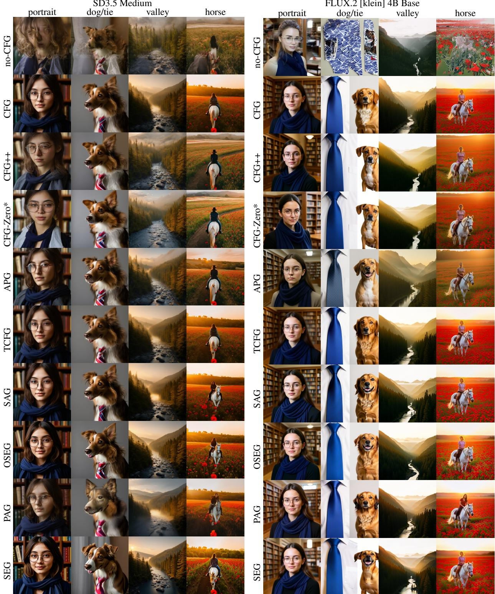
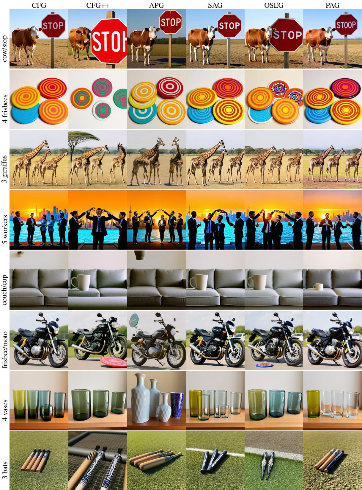
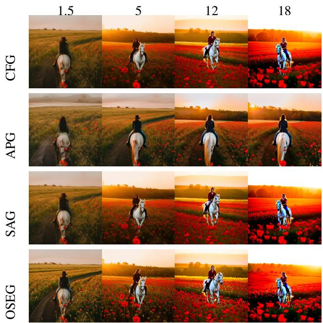
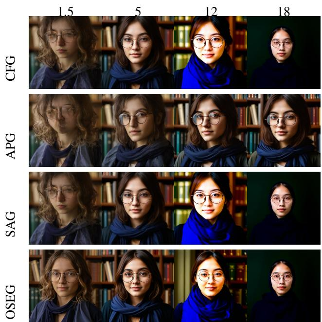
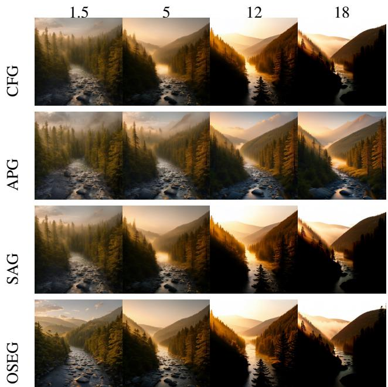

# REVISITING CLASSIFIER-FREE GUIDANCE METHODS IN LATENT DIFFUSION MODELS

A PREPRINT

Artem Sergievskii HSE University

Artyom Turevich\* HSE University

Sergey Kastryulin Yandex, HSE University

August 18, 2026

## ABSTRACT

Inference-time quality-enhancement methods are an effective and widely adopted means of improving diffusion models without expensive retraining. We study a family of training-free techniques conceptually rooted in Classifier-Free Guidance (CFG), most of which were originally proposed on older U-Net diffusion models and validated using metrics that assess image quality in isolation, without accounting for compositional alignment or semantic correspondence between the generated image and its associated text prompt. We re-evaluate eight such methods on two open-weight rectified-flow transformers under a fixed per-model protocol and three compositional-alignment benchmarks. No method consistently improves on CFG across the measured criteria. APG obtains several nominal best scores, but the corresponding gains often remain within the estimated evaluation uncertainty. Attention-perturbation methods provide isolated gains on SD3.5 Medium and more frequent degradations on FLUX.2 [klein] 4B Base, while CFG remains a competitive lower-cost baseline.

Keywords diffusion models · classifier-free guidance · text-to-image · benchmark

## 1 Introduction

Classifier-free guidance (CFG) [1] is the standard inference-time control in conditional diffusion models. It improves prompt alignment without changing model weights, but high guidance scales can reduce diversity and introduce oversaturation or structural artifacts. These failures motivated several training-free alternatives.

The alternatives are difficult to compare because their studies use different models, datasets, resolutions, and they were published at different times, often sequentially. Most evidence comes from U-Net Stable Diffusion variants or class-conditional ImageNet models and emphasizes FID, CLIP score, or Inception Score. These metrics do not directly test counting, relations, dense prompt following, or text rendering.

We compare eight methods under a fixed per-model protocol on two models: Stable Diffusion 3.5 Medium [2, 3] and FLUX.2 [klein] 4B Base [4]. Evaluation uses GenEval [5], DPG-Bench [6], three selected OneIG-Bench families [7], and paired prompt bootstrap. Only a few gains exceed the shared reference margins: SAG improves selected SD3.5 metrics, while no alternative does so on the FLUX headline metrics.

The comparison therefore does not identify a general replacement for CFG. Nominal leaders change across benchmarks.   
The alternatives are better treated as model- and metric-specific choices than as universal upgrades.

We contribute implementations and configurations for both models,2 a controlled comparison with benchmarkindependent parameter selection, and an uncertainty-aware evaluation with qualitative examples and a comparison with the metrics and gains reported in the original papers.

## 2 Related Work

Guidance for diffusion models. Classifier guidance uses an external classifier to trade diversity for sample fidelity [8]. CFG removes this auxiliary network by jointly learning conditional and unconditional predictions [1]. Its scale controls prompt adherence, but large values can amplify saturation and artifacts. This trade-off makes inference-time guidance useful without making its scale or update rule interchangeable across models.

The methods studied here follow two broad designs. CFG++ [9], CFG-Zero\* [10], APG [11], and TCFG [12] modify the CFG update through interpolation, initialization, projection, or damping. SAG [13], PAG [14], SEG [15], and OSEG [16] instead construct a weaker prediction by perturbing attention and guide away from it. Related training-free approaches change the time interval over which guidance is applied, anneal the condition, or use a weak model, as in interval guidance [17], CADS [18], and autoguidance [19]. They fall outside our controlled set of CFG-derived updates.

Evaluation of text-to-image models. Original guidance papers commonly report global quality or similarity metrics under different model, sampler, and dataset choices. This demonstrates gains in their intended settings, but does not provide a direct ranking on current text-to-image systems. Newer benchmarks test prompt-level behavior: TIFA uses visual questions [20], T2I-CompBench measures compositional relations [21], GenEval focuses on object composition, and DPG-Bench evaluates dense prompts. OneIG-Bench separates object, text, reasoning, and style abilities, while ImageReward [22] models human preferences. These metrics are complementary rather than interchangeable.

Transfer to transformer backbones. Most studied methods were developed or first tested on U-Net architectures. Prediction-level modifications require few structural choices, but attention perturbation depends on the modified blocks. Diffusion transformers use joint, dual-stream, or single-stream layouts without direct U-Net counterparts, and perturbation guidance is sensitive to layer and head selection [23]. We therefore include adaptation and layer selection in the comparison rather than reusing the original U-Net choices without validation.

## 3 Setup and Protocol

Benchmark scope. We compare no-CFG and vanilla CFG with CFG++, CFG-Zero\*, APG, TCFG, SAG, PAG, SEG, and OSEG. Each method is an inference-time modification of a frozen model, with its definition fixed within each model. Sampling and evaluation settings are held constant so that only the guidance rule and its selected parameters change.

Model adaptation. Prediction-level methods are matched to each model’s parameterization and scheduler. Attention methods additionally require transformer block selection, performed separately per model. We denote the N-th dual text–image block by dN and the N-th self-only block by sN. This notation keeps the reported choices comparable despite the different transformer layouts.

Hyperparameter selection. Parameters are fixed before benchmark evaluation. Starting from the ranges in each paper, we use a small fixed prompt set and vary one parameter at a time: guidance and method-specific scales, ranks, blur strengths, or layer choices. The prompts cover simple scenes, multiple objects, and spatial relations. We reject settings that repeatedly produce oversaturation, halos, duplicated structures, loss of detail, or collapse, then choose a prompt-faithful candidate without a consistent visible failure. No benchmark score is used for selection. This avoids tuning directly to the reported test sets while keeping the search small enough to repeat for both models. Final setting and representative sweep grids are provided in Appendices A and C.

Models and evaluation. We evaluate on two open-weight rectified-flow models: Stable Diffusion 3.5 Medium [2, 3], a 2.5B MM-DiT with joint text–image attention, and FLUX.2 [klein] 4B Base [4], a 4B hybrid dual/single-stream transformer. We use the full prompt sets on selected benchmarks. Methods share prompts, seeds, scheduler, resolution, and sampling budget within each model: 25 steps for SD3.5 and 30 for FLUX; inference used V100 32GB GPUs. GenEval measures object composition, DPG-Bench dense-prompt faithfulness, and the selected OneIG families cover General Object, Text Rendering, and Knowledge Reasoning. These tasks probe different alignment failures rather than a single aggregate quality dimension. Style-oriented OneIG families were not generated.

Uncertainty. We use 10,000 paired prompt-bootstrap replicates with synchronized sampling for every method and CFG. Each replicate samples the original number of prompts with replacement and applies the same indices to all methods. GenEval is resampled within tasks, and the nonlinear OneIG text score is recomputed per replicate. For each benchmark, centered method–CFG errors are pooled over guided alternatives; their 95th percentile is the shared bootstrap margin. Differences inside it are treated as unresolved rather than as evidence of equivalence.

## 4 Results

## 4.1 Quantitative Results

Table 1 reports the five headline scores for both models. The same shared paired-bootstrap margins are shown above each model block. Colors encode the difference from CFG under this rule, while bold identifies the nominal column maximum independently of the margin.

Table 1: Headline scores for both models. GE is GenEval; DPG is mean×100; Obj, Txt, and Rsn are the selected OneIG families. Gray denotes differences within one shared reference margin of CFG; green/red denote larger gains/losses. A stronger shade beyond two margins is used only for visual emphasis. Bold marks the column maximum.
<table><tr><td></td><td colspan="5">SD3.5 Medium</td><td colspan="5">FLUX.2 [klein] 4B Base</td></tr><tr><td>Method 95% ∆ margin</td><td>GE ±0.027</td><td>DPG ±0.76</td><td>Obj ±0.019</td><td>Txt ±0.044</td><td>Rsn ±0.005</td><td>GE ±0.028</td><td>DPG ±0.85</td><td>Obj ±0.018</td><td>Txt ±0.042</td><td>Rsn ±0.004</td></tr><tr><td>no-CFG CFG</td><td>0.367 0.655</td><td>73.51 84.35</td><td>0.526 0.713</td><td>0.037 0.443</td><td>0.160 0.257</td><td>0.346</td><td>73.22</td><td>0.666</td><td>0.177</td><td>0.188</td></tr><tr><td>CFG++</td><td></td><td></td><td></td><td></td><td></td><td>0.786</td><td>83.30</td><td>0.782</td><td>0.736</td><td>0.281</td></tr><tr><td></td><td>0.617</td><td>84.29</td><td>0.749</td><td>0.459</td><td>0.232</td><td>0.704</td><td>83.35</td><td>0.784</td><td>0.753</td><td>0.284</td></tr><tr><td>CFG-Zero*</td><td>0.638</td><td>84.19</td><td>0.720</td><td>0.409</td><td>0.231</td><td>0.726</td><td>82.91</td><td>0.792</td><td>0.723</td><td>0.279</td></tr><tr><td>APG</td><td>0.671</td><td>84.54</td><td>0.763</td><td>0.471</td><td>0.250</td><td>0.792</td><td>83.50</td><td>0.781</td><td>0.768</td><td>0.283</td></tr><tr><td>TCFG</td><td>0.644</td><td>83.45</td><td>0.739</td><td>0.426</td><td>0.245</td><td>0.774</td><td>83.00</td><td>0.776</td><td>0.734</td><td>0.278</td></tr><tr><td>SAG</td><td>0.715</td><td>84.41</td><td>0.725</td><td>0.408</td><td>0.269</td><td>0.762</td><td>83.33</td><td>0.776</td><td>0.681</td><td>0.273</td></tr><tr><td>SEG</td><td>0.623</td><td>84.03</td><td>0.697</td><td>0.434</td><td>0.243</td><td>0.724</td><td>83.21</td><td>0.785</td><td>0.648</td><td>0.255</td></tr><tr><td>OSEG</td><td>0.650</td><td>84.61</td><td>0.723</td><td>0.384 0.351</td><td>0.259 0.220</td><td>0.743 0.735</td><td>83.11 83.35</td><td>0.772</td><td>0.662</td><td>0.261</td></tr><tr><td>PAG</td><td>0.595</td><td>82.56</td><td>0.702</td><td></td><td></td><td></td><td></td><td>0.763</td><td>0.694</td><td>0.267</td></tr></table>

The no-CFG baseline falls below CFG by more than two margins on every headline metric for both models. This shows that guidance is beneficial under the tested sampling regimes, but the alternatives to CFG show a less uniform pattern. Only a small number of their nominal gains exceed the shared margins, whereas resolved decreases occur across several methods and metrics.

On SD3.5, SAG produces the largest GenEval score and improves reasoning beyond the margin. CFG++, APG, and TCFG exceed the margin on OneIG object, with APG obtaining the nominal maximum. These gains remain local to particular metrics. CFG++ and CFG-Zero\* decrease reasoning, CFG++ also decreases GenEval, and APG and TCFG have resolved losses on reasoning. Among attention-based methods, SEG decreases GenEval and reasoning, OSEG decreases text rendering, and PAG has resolved losses on GenEval, DPG-Bench, text rendering, and reasoning. No positive DPG-Bench difference exceeds its margin.

The FLUX.2 [klein] 4B Base comparison contains no positive change beyond a shared margin on any headline metric. APG nominally leads GenEval, DPG-Bench, and text rendering, but all three differences from CFG remain unresolved. CFG++ and CFG-Zero\* have GenEval losses beyond margin. SEG, OSEG, and PAG also decrease GenEval, and each attention-based method decreases text rendering, reasoning, or both. The SD3.5 gains of SAG therefore do not transfer to FLUX under the selected configuration.

Appendix B gives the GenEval category scores and DPG-Bench L1/L2 breakdowns. These tables help identify which prompt properties contribute to an aggregate result, but their isolated maxima should not be interpreted as a general method ranking. All evaluated OneIG families already appear in table 1.

## 4.2 Qualitative Overview

Figure 1 compares all methods at their selected settings, while fig. 2 shows FLUX.2 [klein] 4B Base cases in which an alternative corrects a relation or count for one prompt but introduces an error for another. Together, the examples illustrate prompt-level variation and do not replace the quantitative evaluation.

  
Figure 1: Selected-setting outputs for SD3.5 Medium (left) and FLUX.2 [klein] 4B Base (right). Rows are methods. Columns use four shared prompts: a portrait of a woman wearing round glasses in a library; a dog to the right of a tie; a misty mountain valley with a river at sunrise; and a woman riding a white horse through red poppies.

  
Figure 2: Selected FLUX.2 [klein] 4B Base cases where alternatives introduce errors relative to CFG (top) or improve its output (bottom). Columns are methods and rows are prompts.

## 4.3 Originally Reported Gains

Each method was introduced with an improvement over CFG, but the evaluation protocols are heterogeneous. Table 2 compares the measured property in each original paper with our SD3.5 GenEval result. Most studies use global quality or similarity metrics such as FID, CLIP score, Inception Score, precision and recall, or aesthetic score. CFG-Zero\* is the closest case to our setting because it also reports T2I-CompBench on SD3/SD3.5.

The two evaluations do not produce a common ordering. Relative to the shared SD3.5 GenEval margin, the SAG increase and the decreases of CFG++, SEG, and PAG are resolved, while CFG-Zero\*, APG, TCFG, and OSEG remain within the margin. This comparison does not invalidate the original results: the base models, prompts, samplers, and metrics differ. It instead shows that an improvement in an image-quality metric does not determine the change in compositional alignment under our protocol.

Table 2: What each method’s original paper measured against CFG, versus our result. “Comp.?” marks whether the paper used a compositional-alignment benchmark comparable to ours. The last column is our SD3.5 GenEval Overall (CFG = 0.655) with the signed difference.
<table><tr><td>Method</td><td>Original eval vs CFG</td><td>Comp.?</td><td>GenEval (∆)</td></tr><tr><td>CFG++</td><td>FID, CLIP, inversion (SD/SDXL)</td><td>no</td><td>0.617 (-0.038)</td></tr><tr><td>CFG-Zero*</td><td>T2I-CompBench, CLIP, Aesth. (SD3/3.5)</td><td>yes</td><td>0.638 (-0.017)</td></tr><tr><td>APG</td><td>FID, recall, saturation</td><td>no</td><td>0.671 (+0.016)</td></tr><tr><td>TCFG</td><td>FID, CLIP (MS-COCO; SD3)</td><td>no</td><td>0.644 (-0.011)</td></tr><tr><td>SAG</td><td>FID, IS (ImageNet, SD1.5)</td><td>no</td><td>0.715 (+0.060)</td></tr><tr><td>PAG</td><td>FID, IS (SD1.5, ImageNet)</td><td>no</td><td>0.595 (-0.060)</td></tr><tr><td>SEG</td><td>FID, CLIP (SDXL, MS-COCO)</td><td>no</td><td>0.623 (-0.032)</td></tr><tr><td>OSEG</td><td>FID / perceptual (SEG family)</td><td>no</td><td>0.650 (-0.005)</td></tr></table>

## 5 Discussion

Our results do not identify a universal winner among the tested guidance methods for modern rectified-flow transformers. The methods were originally introduced on earlier model generations, often with U-Net backbones and different evaluation protocols. Those results describe their original settings, but gains of the same magnitude need not transfer to current transformer architectures.

The comparison between the two models supports this concern, although it does not establish a general historical trend. On SD3.5, only a few improvements from different methods exceed the shared bootstrap margins. On the newer FLUX.2 [klein] 4B Base model, several alternatives obtain nominally higher scores, but none of these gains exceeds the corresponding margin. At the same time, resolved decreases relative to CFG occur for multiple methods and benchmark families. The weaker positive effects on FLUX are consistent with the hypothesis that guidance modifications may offer less room for improvement as base models become stronger. Testing more model generations is necessary before this can be treated as a broader conclusion.

This result should not be read as evidence that guidance itself has become unimportant. CFG improves every headline benchmark substantially over no-CFG for both models. Guidance therefore remains an important part of the tested sampling pipelines. However, the tested alternatives, whether they modify the guidance update or construct a different weak prediction, provide no consistent gain over vanilla CFG and sometimes reduce alignment. Plain CFG therefore remains a competitive reference point.

The qualitative comparisons lead to the same mixed interpretation. Outputs from different guided methods are often similar, but they are not identical. For some prompts, an alternative repairs a structural defect, recovers a missing object, or improves counting and spatial placement. For other prompts, the same type of intervention removes an object, changes the requested count, or weakens a relation that CFG represents correctly. These examples show how a method can help individual generations without producing a consistent gain in the aggregate evaluation.

## 6 Limitations

Our study has several limitations. It covers two rectified-flow transformers and a limited set of automatic alignment benchmarks. We evaluate one selected configuration for each method and model, chosen through qualitative sweeps on a fixed prompt set before benchmark evaluation. A wider parameter and layer search could change individual rankings, while human evaluation and perceptual quality metrics could reveal effects that the current benchmarks do not measure.

The shared bootstrap margins also describe uncertainty under our prompt samples and evaluation procedure; they are not guarantees for other prompt distributions.

Within this scope, the main distinction is between guidance and the particular form of guidance. Taken together, these results separate the benefit of guidance from the benefit of a particular guidance rule. The former is clear in both pipelines; evidence for the latter is limited to isolated model–metric pairs and is accompanied by recurring losses.

## Acknowledgments

This research was supported in part through computational resources of HPC facilities at HSE University

## References

[1] Jonathan Ho and Tim Salimans. Classifier-free diffusion guidance. arXiv preprint arXiv:2207.12598, 2022.

[2] Patrick Esser, Sumith Kulal, Andreas Blattmann, Rahim Entezari, Jonas Müller, Harry Saini, Yam Levi, Dominik Lorenz, Axel Sauer, Frederic Boesel, et al. Scaling rectified flow transformers for high-resolution image synthesis. In Forty-first international conference on machine learning, 2024.

[3] Stability AI. Stable diffusion 3.5 medium. https://huggingface.co/stabilityai/stable-diffusion-3. 5-medium, 2024.

[4] Black Forest Labs. FLUX.2 [klein]: Towards interactive visual intelligence. https://bfl.ai/blog/ flux2-klein-towards-interactive-visual-intelligence, 2026.

[5] Dhruba Ghosh, Hannaneh Hajishirzi, and Ludwig Schmidt. Geneval: An object-focused framework for evaluating text-to-image alignment. Advances in Neural Information Processing Systems, 36:52132–52152, 2023.

[6] Xiwei Hu, Rui Wang, Yixiao Fang, Bin Fu, Pei Cheng, and Gang Yu. Ella: Equip diffusion models with llm for enhanced semantic alignment. arXiv preprint arXiv:2403.05135, 2024.

[7] Jingjing Chang, Yixiao Fang, Peng Xing, Shuhan Wu, Wei Cheng, Rui Wang, Xianfang Zeng, Gang Yu, and Hai-Bao Chen. Oneig-bench: Omni-dimensional nuanced evaluation for image generation. Advances in Neural Information Processing Systems, 38, 2025.

[8] Prafulla Dhariwal and Alexander Nichol. Diffusion models beat gans on image synthesis. Advances in neural information processing systems, 34:8780–8794, 2021.

[9] Hyungjin Chung, Jeongsol Kim, Geon Yeong Park, Hyelin Nam, and Jong Chul Ye. Cfg++: Manifold-constrained classifier free guidance for diffusion models. In International Conference on Learning Representations, 2025.

[10] Weichen Fan, Amber Yijia Zheng, Raymond A Yeh, and Ziwei Liu. Cfg-zero\*: Improved classifier-free guidance for flow matching models. arXiv preprint arXiv:2503.18886, 2025.

[11] Seyedmorteza Sadat, Otmar Hilliges, and Romann M Weber. Eliminating oversaturation and artifacts of high guidance scales in diffusion models. In The Thirteenth International Conference on Learning Representations, 2025.

[12] Mingi Kwon, Shinseong Kim, Jaeseok Jeong, Yi Ting Hsiao, and Youngjung Uh. Tcfg: Tangential damping classifier-free guidance. In Proceedings of the Computer Vision and Pattern Recognition Conference, pages 2620–2629, 2025.

[13] Susung Hong, Gyuseong Lee, Wooseok Jang, and Seungryong Kim. Improving sample quality of diffusion models using self-attention guidance. In Proceedings of the IEEE/CVF International Conference on Computer Vision, pages 7462–7471, 2023.

[14] Donghoon Ahn, Hyoungwon Cho, Jaewon Min, Wooseok Jang, Jungwoo Kim, SeonHwa Kim, Hyun Hee Park, Kyong Hwan Jin, and Seungryong Kim. Self-rectifying diffusion sampling with perturbed-attention guidance. In European Conference on Computer Vision, pages 1–17. Springer, 2024.

[15] Susung Hong. Smoothed energy guidance: Guiding diffusion models with reduced energy curvature of attention. Advances in Neural Information Processing Systems, 37:66743–66772, 2024.

[16] Masud An Nur Islam Fahim, Nazmus Saqib, and Joon-Min Gil. OSEG: Improving diffusion sampling through orthogonal smoothed energy guidance. In Proceedings of the IEEE/CVF Winter Conference on Applications of Computer Vision, pages 5996–6005, 2026.

[17] Tuomas Kynkäänniemi, Miika Aittala, Tero Karras, Samuli Laine, Timo Aila, and Jaakko Lehtinen. Applying guidance in a limited interval improves sample and distribution quality in diffusion models. Advances in Neural Information Processing Systems, 37:122458–122483, 2024.

[18] Seyedmorteza Sadat, Jakob Buhmann, Derek Bradley, Otmar Hilliges, and Romann Weber. Cads: Unleashing the diversity of diffusion models through condition-annealed sampling. In International Conference on Learning Representations, 2024.

[19] Tero Karras, Miika Aittala, Tuomas Kynkäänniemi, Jaakko Lehtinen, Timo Aila, and Samuli Laine. Guiding a diffusion model with a bad version of itself. Advances in Neural Information Processing Systems, 37:52996–53021, 2024.

[20] Yushi Hu, Benlin Liu, Jungo Kasai, Yizhong Wang, Mari Ostendorf, Ranjay Krishna, and Noah A Smith. Tifa: Accurate and interpretable text-to-image faithfulness evaluation with question answering. In Proceedings ofthe IEEE/CVF International Conference on Computer Vision, pages 20406–20417, 2023.

[21] Kaiyi Huang, Kaiyue Sun, Enze Xie, Zhenguo Li, and Xihui Liu. T2i-compbench: A comprehensive benchmark for open-world compositional text-to-image generation. Advances in Neural Information Processing Systems, 36: 78723–78747, 2023.

[22] Jiazheng Xu, Xiao Liu, Yuchen Wu, Yuxuan Tong, Qinkai Li, Ming Ding, Jie Tang, and Yuxiao Dong. Imagereward: Learning and evaluating human preferences for text-to-image generation. Advances in Neural Information Processing Systems, 36:15903–15935, 2023.

[23] Donghoon Ahn, Jiwon Kang, Sanghyun Lee, Minjae Kim, Jaewon Min, Wooseok Jang, Sangwu Lee, Sayak Paul, Susung Hong, and Seungryong Kim. Where and how to perturb: On the design of perturbation guidance in diffusion and flow models. Advances in Neural Information Processing Systems, 38:128348–128396, 2025.

## A Hyperparameter Settings

Final per-method configurations selected by the qualitative procedure described in the main paper, per base model. Both runs use a single forward pass per prediction; attention-perturbation methods add one extra pass. Knobs not listed take their pipeline defaults.

Table 3: Final hyperparameters per method, SD3.5 Medium (25 steps).  
Method Settings   
no-CFG $w = 1$   
CFG w = 4.0   
CFG++ λ = 0.75   
CFG- ${ \mathrm { - } } Z { \mathrm { e r o } } ^ { \ast }$ w = 3.5, zero-init steps = 0   
APG w = 7, step radius = 20, momentum = −0.4   
TCFG w = 6, rank = 1   
SAG w = 5, sag scale = 0.4, layer d0   
SEG w = 3, seg scale = 3, blur σ = 10, layer d8   
OSEG w = 4, oseg scale = 2.5, blur $\sigma = 1 0 ,$ , layer d8   
PAG w = 2.5, pag scale = 1.0, layer s0

Table 4: Final hyperparameters per method, FLUX.2 [klein] 4B Base (30 steps).  
Method Settings   
no-CFG guidance off   
CFG w = 7.0   
CFG++ w = 1.2   
CFG-Zero\* w = 7.0, zero-init steps = 2   
APG w = 10, momentum = −0.5, η = 0, step radius = 0   
TCFG w = 12, rank = 1   
SAG w = 5, sag scale = 0.4, blur σ = 3, layer d0   
SEG w = 4, seg scale = 2.0, blur σ = 10, layers d4, s2   
OSEG w = 4, oseg scale = 0.75, blur σ = 5, layer s2   
PAG w = 4.5, pag scale = 1.5, layers d4, s1

## B Detailed Benchmark Results

The tables below provide the GenEval and DPG-Bench category breakdowns for both models. All evaluated OneIG families already appear in the headline table of the main paper and are not repeated here. The colors provide a descriptive comparison with CFG: gray indicates near-parity, green/red indicate the direction of change, and stronger shades indicate larger differences. They are visual guides and do not denote statistical significance for individual categories.

Table 5: GenEval category scores for both models. Overall is the macro average.
<table><tr><td rowspan=2 colspan=15>SD3.5 Medium                                FLUX.2 [klein] 4B BaseMethod   singletwocount color pos  attrOverall</td></tr><tr><td rowspan=1 colspan=7></td></tr><tr><td rowspan=13 colspan=1>no-CFGCFGCFG++CFG-Zero*APGTCFGSAGSEGOSEGPAG</td><td rowspan=1 colspan=7>0.767 0.500 0.194 0.419 0.097 0.2260.367</td><td rowspan=1 colspan=7>0.800 0.242 0.225 0.596 0.120 0.0900.346</td></tr><tr><td rowspan=1 colspan=7>1.000 0.833 0.484 0.806 0.226 0.5810.655</td><td rowspan=1 colspan=2>0.988 0.889 0</td><td rowspan=1 colspan=5>.788 0.862 0.560 0.6300.786</td></tr><tr><td rowspan=1 colspan=1>1.000 0</td><td rowspan=1 colspan=2>.833 0.484</td><td rowspan=1 colspan=3>0.742 0.161 0.484</td><td rowspan=1 colspan=1>0.617</td><td rowspan=1 colspan=1>0.988</td><td rowspan=1 colspan=1>0.848</td><td rowspan=1 colspan=1>0.550</td><td rowspan=1 colspan=1>0.840</td><td rowspan=2 colspan=3>0.450 0.5500.7040.726</td></tr><tr><td rowspan=1 colspan=1>1.000</td><td rowspan=1 colspan=1>0.733</td><td rowspan=1 colspan=1>0.4840</td><td rowspan=1 colspan=1>.839</td><td rowspan=1 colspan=1>0.258</td><td rowspan=1 colspan=1>0.516</td><td rowspan=1 colspan=1>0.638</td><td rowspan=1 colspan=1>1.000</td><td rowspan=1 colspan=1>0.818</td><td rowspan=1 colspan=1>0.663</td><td rowspan=1 colspan=1>0.883</td><td rowspan=1 colspan=1>0.410</td><td rowspan=1 colspan=1>0.580</td></tr><tr><td rowspan=2 colspan=1>1.000</td><td rowspan=2 colspan=1>0.833</td><td rowspan=2 colspan=1>0.581</td><td rowspan=2 colspan=1>0.774</td><td rowspan=2 colspan=1> 0.258</td><td rowspan=2 colspan=1>0.581</td><td rowspan=2 colspan=1>0.671</td><td rowspan=1 colspan=1></td><td rowspan=2 colspan=1>0.889</td><td rowspan=2 colspan=1>0.738</td><td rowspan=2 colspan=1>0.883</td><td rowspan=1 colspan=1></td><td rowspan=1 colspan=1></td><td rowspan=2 colspan=1>0.792</td></tr><tr><td rowspan=1 colspan=1>1.000</td><td rowspan=1 colspan=1>0.620</td><td rowspan=1 colspan=1>0.620</td></tr><tr><td rowspan=1 colspan=1>1.000</td><td rowspan=1 colspan=1>0.767</td><td rowspan=1 colspan=1>0.548</td><td rowspan=1 colspan=1>0.677</td><td rowspan=1 colspan=1>0.290</td><td rowspan=1 colspan=1>0.581</td><td rowspan=1 colspan=1>0.644</td><td rowspan=1 colspan=1>0.988</td><td rowspan=1 colspan=1>0.859</td><td rowspan=1 colspan=1>0.788</td><td rowspan=1 colspan=1>0.851</td><td rowspan=1 colspan=1>0.550</td><td rowspan=1 colspan=1>0.610</td><td rowspan=1 colspan=1>0.774</td></tr><tr><td rowspan=1 colspan=1>1.000</td><td rowspan=1 colspan=1>0.967</td><td rowspan=1 colspan=1>0.645</td><td rowspan=1 colspan=1>0.7740</td><td rowspan=1 colspan=1>.226</td><td rowspan=1 colspan=2>0.677 0.715</td><td rowspan=1 colspan=1>0.988</td><td rowspan=1 colspan=1>0.869</td><td rowspan=1 colspan=1>0.725</td><td rowspan=1 colspan=1>0.862</td><td rowspan=1 colspan=1>0.550</td><td rowspan=1 colspan=1>0.580</td><td rowspan=1 colspan=1>0.762</td></tr><tr><td rowspan=3 colspan=1>0.9670.967</td><td rowspan=1 colspan=1>0.833</td><td rowspan=1 colspan=1>0.548</td><td rowspan=1 colspan=1>0.710</td><td rowspan=1 colspan=1>0.161</td><td rowspan=1 colspan=1>0.516</td><td rowspan=1 colspan=1>0.623</td><td rowspan=1 colspan=1>1.000</td><td rowspan=1 colspan=1>0.808</td><td rowspan=1 colspan=1>0.663</td><td rowspan=1 colspan=1>0.872</td><td rowspan=1 colspan=1>0.490</td><td rowspan=1 colspan=1>0.510</td><td rowspan=1 colspan=1>0.724</td></tr><tr><td rowspan=1 colspan=1></td><td rowspan=2 colspan=1>0.613</td><td rowspan=2 colspan=1>0.677</td><td rowspan=2 colspan=1>0.1940</td><td rowspan=2 colspan=2>.5810.650</td><td rowspan=1 colspan=1></td><td rowspan=1 colspan=1></td><td rowspan=1 colspan=1></td><td rowspan=1 colspan=1></td><td rowspan=1 colspan=1></td><td rowspan=2 colspan=1>0.520</td><td rowspan=4 colspan=1>0.7430.735</td></tr><tr><td rowspan=1 colspan=1>0.867</td><td rowspan=1 colspan=1>1.000</td><td rowspan=1 colspan=1>0.879</td><td rowspan=1 colspan=1>0.700</td><td rowspan=1 colspan=1>0.8510</td><td rowspan=1 colspan=1>.510</td></tr><tr><td rowspan=2 colspan=1>1.000</td><td rowspan=2 colspan=1>0.700</td><td rowspan=2 colspan=1>0.419</td><td rowspan=2 colspan=1>0.742</td><td rowspan=2 colspan=1>0.226</td><td rowspan=2 colspan=2>0.4840.595</td><td rowspan=2 colspan=1>0.988</td><td rowspan=2 colspan=1>0.859</td><td rowspan=1 colspan=1></td><td rowspan=1 colspan=1></td><td rowspan=1 colspan=1></td><td rowspan=1 colspan=1></td></tr><tr><td rowspan=1 colspan=1>0.738</td><td rowspan=1 colspan=1>0.787</td><td rowspan=1 colspan=1>0.520</td><td rowspan=1 colspan=1>0.520</td></tr></table>

Table 6: DPG-Bench L1 scores for both models. DPG is mean×100.
<table><tr><td rowspan=2 colspan=10>SD3.5 Medium                              FLUX.2 [klein] 4B BaseMethod    DPG AttrEntityOther Global Relation</td></tr><tr><td rowspan=1 colspan=4>DPG Attr Entit Other Global Relation</td></tr><tr><td rowspan=2 colspan=1>no-CFG</td><td rowspan=1 colspan=5></td><td></td><td></td><td></td><td></td></tr><tr><td rowspan=1 colspan=5>73.51 79.8782.4868.8977.57  91.65</td><td rowspan=1 colspan=2>73.22 83.7082.1361.60</td><td rowspan=1 colspan=1>81.76</td><td rowspan=1 colspan=1>91.80</td></tr><tr><td rowspan=1 colspan=1>CFG</td><td rowspan=1 colspan=2>84.35 88.4790.58</td><td rowspan=1 colspan=1>84.44</td><td rowspan=1 colspan=1>83.18</td><td rowspan=1 colspan=1>94.03</td><td rowspan=1 colspan=1>83.30 89.82 90.15</td><td rowspan=1 colspan=1>81.60</td><td rowspan=1 colspan=1>81.46</td><td rowspan=1 colspan=1>93.19</td></tr><tr><td rowspan=2 colspan=1>CFG++CFG-Zero*</td><td rowspan=1 colspan=2>84.2987.0790.08</td><td rowspan=1 colspan=1>81.11</td><td rowspan=1 colspan=1>85.05</td><td rowspan=1 colspan=1>94.03</td><td rowspan=1 colspan=1>83.35 89.62 90.03</td><td rowspan=1 colspan=1>81.20</td><td rowspan=1 colspan=1>82.07</td><td rowspan=1 colspan=1>93.73</td></tr><tr><td rowspan=1 colspan=2>84.1988.47 90.58</td><td rowspan=1 colspan=1>80.00</td><td rowspan=1 colspan=1>79.44</td><td rowspan=1 colspan=1>93.68</td><td rowspan=1 colspan=1>82.91 89.64 90.03</td><td rowspan=1 colspan=1>83.20</td><td rowspan=1 colspan=1>81.16</td><td rowspan=1 colspan=1>93.54</td></tr><tr><td rowspan=1 colspan=1>APG</td><td rowspan=1 colspan=2>84.54 88.82 90.99</td><td rowspan=1 colspan=1>80.00</td><td rowspan=1 colspan=1>83.18</td><td rowspan=1 colspan=1>94.75</td><td rowspan=1 colspan=1>83.50 89.48 90.40</td><td rowspan=1 colspan=1>78.00</td><td rowspan=1 colspan=1>81.46</td><td rowspan=1 colspan=1>93.93</td></tr><tr><td rowspan=1 colspan=1>TCFG</td><td rowspan=1 colspan=2>83.4587.8989.53</td><td rowspan=1 colspan=1>84.44</td><td rowspan=1 colspan=1>83.18</td><td rowspan=1 colspan=1>94.27</td><td rowspan=1 colspan=1>83.00 89.74 90.10</td><td rowspan=1 colspan=1>82.00</td><td rowspan=1 colspan=1>81.16</td><td rowspan=1 colspan=1>93.27</td></tr><tr><td rowspan=1 colspan=1>SAG</td><td rowspan=1 colspan=2>84.41 88.77 90.53</td><td rowspan=1 colspan=1>78.89</td><td rowspan=1 colspan=1>83.18</td><td rowspan=1 colspan=1>94.27</td><td rowspan=1 colspan=1>83.33 89.90 90.10</td><td rowspan=1 colspan=1>80.00</td><td rowspan=1 colspan=1>80.85</td><td rowspan=1 colspan=1>93.46</td></tr><tr><td rowspan=1 colspan=1>SEG</td><td rowspan=1 colspan=2>84.03 87.83 89.78</td><td rowspan=1 colspan=1>83.33</td><td rowspan=1 colspan=1>80.37</td><td rowspan=1 colspan=1>93.68</td><td rowspan=1 colspan=1>83.21 89.20 90.36</td><td rowspan=1 colspan=1>80.00</td><td rowspan=1 colspan=1>83.89</td><td rowspan=1 colspan=1>94.08</td></tr><tr><td rowspan=1 colspan=1>OSEG</td><td rowspan=1 colspan=2>84.61 87.65 90.68</td><td rowspan=1 colspan=1>80.00</td><td rowspan=1 colspan=1>81.31</td><td rowspan=1 colspan=1>94.75</td><td rowspan=1 colspan=1>83.11 89.52 89.77</td><td rowspan=1 colspan=1>82.00</td><td rowspan=1 colspan=1>82.67</td><td rowspan=1 colspan=1>93.62</td></tr><tr><td rowspan=1 colspan=1>PAG</td><td rowspan=1 colspan=1>82.56</td><td rowspan=1 colspan=1>87.24 88.92</td><td rowspan=1 colspan=1>77.78</td><td rowspan=1 colspan=1>82.24</td><td rowspan=1 colspan=1>94.27</td><td rowspan=1 colspan=1>83.35 89.66 90.03</td><td rowspan=1 colspan=1>79.20</td><td rowspan=1 colspan=1>81.76</td><td rowspan=1 colspan=1>93.35</td></tr></table>

Table 7: DPG-Bench L2 attribute scores for both models.
<table><tr><td rowspan=1 colspan=10>SD3.5 Medium                      FLUX.2 [klein] 4B BaseMethod      color other shapesizetexturecolor other shape sizetexture</td></tr><tr><td rowspan=1 colspan=1></td><td rowspan=1 colspan=5></td><td rowspan=1 colspan=4></td></tr><tr><td rowspan=1 colspan=1>no-CFG</td><td rowspan=1 colspan=2>83.46 78.78</td><td rowspan=1 colspan=1>78.46</td><td rowspan=1 colspan=2>66.6778.60</td><td rowspan=1 colspan=4>87.05 82.71 75.54 69.0183.49</td></tr><tr><td rowspan=1 colspan=1>CFG</td><td rowspan=1 colspan=2>92.93 87.50</td><td rowspan=1 colspan=1>80.00</td><td rowspan=1 colspan=2>70.9787.64</td><td rowspan=1 colspan=3>93.18 87.4782.97 76.86</td><td rowspan=1 colspan=1>89.90</td></tr><tr><td rowspan=1 colspan=1>CFG++</td><td rowspan=1 colspan=1>91.73</td><td rowspan=1 colspan=1>85.47</td><td rowspan=1 colspan=1>78.46</td><td rowspan=1 colspan=1>77.42</td><td rowspan=1 colspan=1>85.06</td><td rowspan=1 colspan=1>93.68 86.92</td><td rowspan=1 colspan=1>83.41</td><td rowspan=1 colspan=1>78.10</td><td rowspan=1 colspan=1>88.75</td></tr><tr><td rowspan=1 colspan=1>CFG-Zero*</td><td rowspan=1 colspan=2>93.53 86.92</td><td rowspan=1 colspan=1>81.54</td><td rowspan=1 colspan=1>74.19</td><td rowspan=1 colspan=1>86.53</td><td rowspan=1 colspan=1>93.3386.47</td><td rowspan=1 colspan=1>83.84</td><td rowspan=1 colspan=1>76.86</td><td rowspan=1 colspan=1>89.59</td></tr><tr><td rowspan=1 colspan=1>APG</td><td rowspan=1 colspan=1>93.83</td><td rowspan=1 colspan=1>87.50</td><td rowspan=1 colspan=1>84.62</td><td rowspan=1 colspan=1>72.04</td><td rowspan=1 colspan=1>86.90</td><td rowspan=1 colspan=1>92.98 87.25</td><td rowspan=1 colspan=1>83.84</td><td rowspan=1 colspan=1>75.62</td><td rowspan=1 colspan=1>89.29</td></tr><tr><td rowspan=1 colspan=1>TCFG</td><td rowspan=1 colspan=1>92.03</td><td rowspan=1 colspan=1>88.37</td><td rowspan=1 colspan=1>80.00</td><td rowspan=1 colspan=1>70.97</td><td rowspan=1 colspan=1>86.35</td><td rowspan=1 colspan=1>93.23 87.36</td><td rowspan=1 colspan=1>82.53</td><td rowspan=1 colspan=1>77.27</td><td rowspan=1 colspan=1>89.66</td></tr><tr><td rowspan=1 colspan=1>SAG</td><td rowspan=1 colspan=1>94.29</td><td rowspan=1 colspan=1>88.95</td><td rowspan=1 colspan=1>84.62</td><td rowspan=1 colspan=1>70.97</td><td rowspan=1 colspan=1>85.42</td><td rowspan=1 colspan=1>93.43 86.70</td><td rowspan=1 colspan=1>80.35</td><td rowspan=1 colspan=1>80.17</td><td rowspan=1 colspan=1>90.14</td></tr><tr><td rowspan=1 colspan=1>SEG</td><td rowspan=1 colspan=1>92.33</td><td rowspan=1 colspan=1>85.47</td><td rowspan=1 colspan=1>83.08</td><td rowspan=1 colspan=1>70.97</td><td rowspan=1 colspan=1>87.27</td><td rowspan=1 colspan=1>92.8886.47</td><td rowspan=1 colspan=1>82.97</td><td rowspan=1 colspan=1>76.45</td><td rowspan=1 colspan=1>88.99</td></tr><tr><td rowspan=1 colspan=1>OSEG</td><td rowspan=1 colspan=2>92.63 87.50</td><td rowspan=1 colspan=1>80.00</td><td rowspan=1 colspan=1>73.12</td><td rowspan=1 colspan=1>85.06</td><td rowspan=1 colspan=1>93.033 87.36</td><td rowspan=1 colspan=1>82.971</td><td rowspan=1 colspan=1>77.69</td><td rowspan=1 colspan=1>89.11</td></tr><tr><td rowspan=1 colspan=1>PAG</td><td rowspan=1 colspan=1>91.88</td><td rowspan=1 colspan=1>86.05</td><td rowspan=1 colspan=1>83.08</td><td rowspan=1 colspan=1>69.89</td><td rowspan=1 colspan=1>85.79</td><td rowspan=1 colspan=1>92.7787.14</td><td rowspan=1 colspan=1>83.41</td><td rowspan=1 colspan=1>80.17</td><td rowspan=1 colspan=1>89.53</td></tr></table>

Table 8: DPG-Bench L2 non-attribute scores for SD3.5 Medium.
<table><tr><td rowspan=2 colspan=9>Method        partstate wholeglobal1 count   text non-sp. spatial</td></tr><tr><td rowspan=2 colspan=1>no-CFG</td></tr><tr><td rowspan=1 colspan=8>81.05 77.5483.49 77.5767.6173.68  85.71 92.07</td></tr><tr><td rowspan=1 colspan=1>CFG</td><td rowspan=1 colspan=2>86.27 85.14</td><td rowspan=1 colspan=1>91.97</td><td rowspan=1 colspan=3>83.1883.10 89.47</td><td rowspan=1 colspan=1>94.64</td><td rowspan=1 colspan=1>93.99</td></tr><tr><td rowspan=1 colspan=1>CFG++</td><td rowspan=1 colspan=2>79.74 82.97</td><td rowspan=1 colspan=1>92.36</td><td rowspan=1 colspan=1>85.05</td><td rowspan=1 colspan=1>81.69</td><td rowspan=1 colspan=1>78.95</td><td rowspan=1 colspan=1>96.43</td><td rowspan=1 colspan=1>93.86</td></tr><tr><td rowspan=1 colspan=1>CFG-Zero*</td><td rowspan=1 colspan=1>84.31</td><td rowspan=1 colspan=1>84.42</td><td rowspan=1 colspan=1>92.29</td><td rowspan=1 colspan=1>79.44</td><td rowspan=1 colspan=1>77.46</td><td rowspan=1 colspan=1>89.47</td><td rowspan=1 colspan=1>92.86</td><td rowspan=1 colspan=1>93.73</td></tr><tr><td rowspan=1 colspan=1>APG</td><td rowspan=1 colspan=1>84.31</td><td rowspan=1 colspan=1>85.51</td><td rowspan=1 colspan=1>92.61</td><td rowspan=1 colspan=1>83.18</td><td rowspan=1 colspan=1>77.46</td><td rowspan=1 colspan=1>89.47</td><td rowspan=1 colspan=1>91.07</td><td rowspan=1 colspan=1>95.01</td></tr><tr><td rowspan=1 colspan=1>TCFG</td><td rowspan=1 colspan=1>83.01</td><td rowspan=1 colspan=1>82.61</td><td rowspan=1 colspan=1>91.39</td><td rowspan=1 colspan=1>83.18</td><td rowspan=1 colspan=1>83.10</td><td rowspan=1 colspan=1>89.47</td><td rowspan=1 colspan=1>92.86</td><td rowspan=1 colspan=1>94.37</td></tr><tr><td rowspan=1 colspan=1>SAG</td><td rowspan=1 colspan=1>85.62</td><td rowspan=1 colspan=1>86.23</td><td rowspan=1 colspan=1>91.78</td><td rowspan=1 colspan=1>83.18</td><td rowspan=1 colspan=1>77.46</td><td rowspan=1 colspan=1>84.21</td><td rowspan=1 colspan=1>92.86</td><td rowspan=1 colspan=1>94.37</td></tr><tr><td rowspan=1 colspan=1>SEG</td><td rowspan=1 colspan=1>84.97</td><td rowspan=1 colspan=1>81.88</td><td rowspan=1 colspan=1>91.65</td><td rowspan=1 colspan=1>80.37</td><td rowspan=1 colspan=1>81.69</td><td rowspan=1 colspan=1>89.47</td><td rowspan=1 colspan=1>91.07</td><td rowspan=1 colspan=1>93.86</td></tr><tr><td rowspan=1 colspan=1>OSEG</td><td rowspan=1 colspan=1>86.93</td><td rowspan=1 colspan=1>85.51</td><td rowspan=1 colspan=1>91.97</td><td rowspan=1 colspan=1>81.31</td><td rowspan=1 colspan=1>78.87</td><td rowspan=1 colspan=1>84.218</td><td rowspan=1 colspan=1>94.64</td><td rowspan=1 colspan=1>94.76</td></tr><tr><td rowspan=1 colspan=1>PAG</td><td rowspan=1 colspan=1>81.708</td><td rowspan=1 colspan=1>2.97</td><td rowspan=1 colspan=1>90.69</td><td rowspan=1 colspan=1>82.24</td><td rowspan=1 colspan=1>74.65</td><td rowspan=1 colspan=1>89.47</td><td rowspan=1 colspan=1>91.07</td><td rowspan=1 colspan=1>94.50</td></tr></table>

Table 9: DPG-Bench L2 non-attribute scores for FLUX.2 [klein] 4B Base.
<table><tr><td rowspan=2 colspan=9>Method         part state wholeglobal count  text non-sp. spatial</td></tr><tr><td rowspan=1 colspan=1></td><td rowspan=1 colspan=4></td></tr><tr><td rowspan=1 colspan=1>no-CFG</td><td rowspan=1 colspan=3>80.47 81.5282.43</td><td rowspan=1 colspan=1>81.76</td><td rowspan=1 colspan=3>57.50 78.00  84.91</td><td rowspan=1 colspan=1>92.25</td></tr><tr><td rowspan=1 colspan=1>CFG</td><td rowspan=1 colspan=3>84.77 84.6991.82</td><td rowspan=1 colspan=1>81.466</td><td rowspan=1 colspan=1>78.50</td><td rowspan=1 colspan=1>94.00</td><td rowspan=1 colspan=1>86.79</td><td rowspan=1 colspan=1>93.61</td></tr><tr><td rowspan=1 colspan=1>CFG++</td><td rowspan=1 colspan=1>85.16</td><td rowspan=1 colspan=2>84.7991.61</td><td rowspan=1 colspan=1>82.07</td><td rowspan=1 colspan=1>77.50</td><td rowspan=1 colspan=1>96.00</td><td rowspan=1 colspan=1>87.42</td><td rowspan=1 colspan=1>94.15</td></tr><tr><td rowspan=1 colspan=1>CFG-Zero*</td><td rowspan=1 colspan=1>85.74</td><td rowspan=1 colspan=2>85.1191.48</td><td rowspan=1 colspan=1>81.16</td><td rowspan=1 colspan=1>80.00</td><td rowspan=1 colspan=1>96.00</td><td rowspan=1 colspan=1>86.79</td><td rowspan=1 colspan=1>93.98</td></tr><tr><td rowspan=1 colspan=1>APG</td><td rowspan=1 colspan=1>85.94</td><td rowspan=1 colspan=2>84.1692.14</td><td rowspan=1 colspan=1>81.46</td><td rowspan=1 colspan=1>74.00</td><td rowspan=1 colspan=1>94.00</td><td rowspan=1 colspan=1>85.53</td><td rowspan=1 colspan=1>94.48</td></tr><tr><td rowspan=1 colspan=1>TCFG</td><td rowspan=1 colspan=1>83.98</td><td rowspan=1 colspan=2>84.1691.95</td><td rowspan=1 colspan=1>81.16</td><td rowspan=1 colspan=1>79.00</td><td rowspan=1 colspan=1>94.00</td><td rowspan=1 colspan=1>86.16</td><td rowspan=1 colspan=1>93.73</td></tr><tr><td rowspan=1 colspan=1>SAG</td><td rowspan=1 colspan=1>84.38</td><td rowspan=1 colspan=2>83.9591.95</td><td rowspan=1 colspan=1>80.85</td><td rowspan=1 colspan=1>76.00</td><td rowspan=1 colspan=1>96.00</td><td rowspan=1 colspan=1>84.91</td><td rowspan=1 colspan=1>94.02</td></tr><tr><td rowspan=1 colspan=1>SEG</td><td rowspan=1 colspan=1>83.59</td><td rowspan=1 colspan=2>85.1192.14</td><td rowspan=1 colspan=1>83.89</td><td rowspan=1 colspan=1>76.50</td><td rowspan=1 colspan=1>94.00</td><td rowspan=1 colspan=1>88.68</td><td rowspan=1 colspan=1>94.44</td></tr><tr><td rowspan=1 colspan=1>OSEG</td><td rowspan=1 colspan=1>83.20</td><td rowspan=1 colspan=1>84.16</td><td rowspan=1 colspan=1>91.61</td><td rowspan=1 colspan=1>82.67</td><td rowspan=1 colspan=1>78.50</td><td rowspan=1 colspan=1>96.00</td><td rowspan=1 colspan=1>87.42</td><td rowspan=1 colspan=1>94.02</td></tr><tr><td rowspan=1 colspan=1>PAG</td><td rowspan=1 colspan=1>84.57</td><td rowspan=1 colspan=1>83.74</td><td rowspan=1 colspan=1>91.88</td><td rowspan=1 colspan=1>81.76</td><td rowspan=1 colspan=1>75.00</td><td rowspan=1 colspan=1>96.00</td><td rowspan=1 colspan=1>85.53</td><td rowspan=1 colspan=1>93.86</td></tr></table>

## C Hyperparameter Sweep Grids

These qualitative sweeps were used only to select stable per-method settings before running the benchmarks.

Figure 3: Guidance-scale sweep for the white-horse prompt.  
  
Figure 4: Guidance-scale sweep for the portrait prompt.

  
Figure 5: Guidance-scale sweep for the mountain-valley prompt.