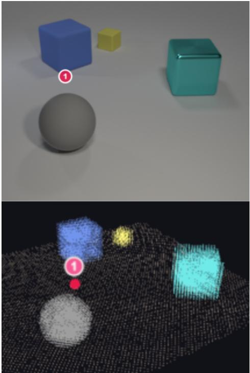
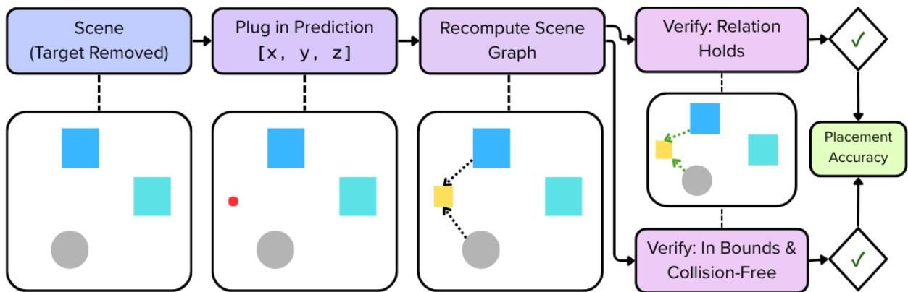
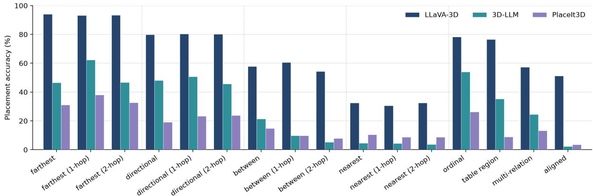
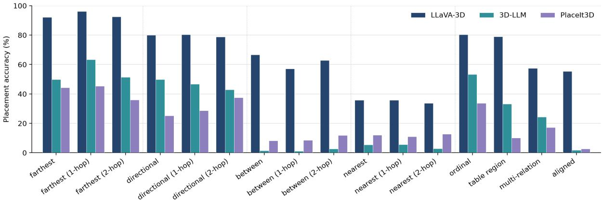

# ReRef-3D: A Benchmark for Spatial Referring Expression-Guided 3D Scene Rearrangement

Mary Lynn Martin Yifei Zhang Martha Palmer Maria Leonor Pacheco

University of Colorado Boulder

{mary.martin, yifei.zhang, martha.palmer, maria.pacheco}@colorado.edu

## Abstract

We introduce ReRef-3D, a benchmark for language-guided placement in 3D scenes. It contains 33,826 instructions across 998 CLEVR-derived scenes, spanning 16 placement families and direct, one-hop, and two-hop references. Each instruction must be resolved into a valid new placement position. Given that an instruction defines a region of acceptable placements rather than one coordinate, our evaluation inserts a prediction into the scene, recomputes relations, and tests relation satisfaction and physical validity. Each instruction also includes a verified naturalized rewrite. After fine-tuning, LLaVA-3D, 3D-LLM, and PlaceIt3D produce valid placements for 68.3%, 31.6%, and 22.4% of instructions, respectively. Across models, relation satisfaction surpasses physical validity, relations such as nearest and between are the most difficult, and phrasing has minimal effect on performance.

## 1 Introduction

Spatial language shapes how people describe actions in the physical world. Most 3D visionlanguage benchmarks evaluate understanding of a fixed scene through grounding, question answering, captioning, or text-based planning (Hong et al., 2023; Chen et al., 2024b; Zhu et al., 2025). Embodied manipulation systems instead generate actions, but are generally evaluated through task-specific policies and output spaces (Shridhar et al., 2021, 2022; Jiang et al., 2023; Huang et al., 2023). An underexplored intermediate capability is therefore the ability of 3D vision-language models (VLMs) to convert a spatial instruction into a continuous, verifiable change to the scene.

We introduce ReRef-3D, a benchmark that targets this gap by requiring models to resolve a selfcontained relational instruction into a new 3D location. Consider the instruction in Figure 1, where a model must follow a two-hop reference chain to identify the anchor block, then predict a position adjacent to it that is on the table and free of collisions.

  
Figure 1: The marker labeled 1 indicates the paired target location for the instruction, “Place the gray ball next to the block that is to the left of the yellow block that is behind the cyan block.” Shown in 2D and 3D.

The closest prior benchmark, PlaceIt3D, provides the object to place as a separate asset (Abdelreheem et al., 2025), whereas ReRef-3D describes the moved object and its destination constraints within the instruction. Unlike grounding tasks, the model must change the scene rather than identifying content that is already present. The task connects 3D scene understanding with spatial action specification without assuming a particular robot or control policy.

Language-guided rearrangement introduces several challenges. Spatial instructions are often used to define a valid region of placements rather than a single correct coordinate (Kim et al., 2024; Abdelreheem et al., 2025). In Figure 1, many positions place the gray ball next to the intended block, and the marked location is only one of them. This means that distance from a single annotated point is an incomplete measure of success. Instead, the logical approach is to evaluate the scene after the object has been moved. It is also important to consider that a geometrically correct relation may produce an incorrect placement. The target may fall outside of the tabletop, intersect another object, or become occluded in the rendered view (Liu et al., 2023b). Furthermore, instructions may combine multiple constraints or use relations such as between, nearest, andfarthest, which depend on several objects or the arrangement of the scene (Liu et al., 2021).

ReRef-3D uses simple, easily recognized objects so errors are more likely to reflect failures in reference resolution or placement reasoning than visual perception. Known scene geometry also allows recomputation of relations, clearance, and visibility after each proposed placement. Each example includes a structured 3D scene, a self-contained instruction, symbolic spatial constraints, and a verified goal location, which is only one valid solution.

Our main contributions are:

• Scene-referential placement. We define a task that requires interpreting spatial anchors and constraints before predicting a new 3D location.

• Controlled linguistic and geometric complexity. We combine direct, one-hop, two-hop, and ordinal references with different placement families spanning directional, between, distancebased, and table-region constraints.

• Procedural generation with verification. We retain placements when they satisfy the relations, stay within the workspace, visible, and avoid collisions, with no VLM or human annotation.

• Evaluation beyond a single reference coordinate. We convert coordinate and region outputs to a common representation and score postmove relation satisfaction, physical validity, and coordinate-based diagnostics.

• Two phrasings of every instruction. We provide each expression in templated form and as a semantically verified naturalized rewrite, so robustness to phrasing is measurable.

## 2 Background and Related Work

Spatial referring expressions and 3D grounding. RefCOCO, RefCOCO+, and RefCOCOg are widely used datasets with natural images (Yu et al., 2016; Mao et al., 2016). CLEVR-Ref+ takes a different approach by using controlled synthetic scenes with functional programs and compositional expressions for diagnostic evaluation (Liu et al., 2019). In 3D, ReferIt3D and ScanRefer focus on a single referent, while ScanEnts3D grounds other objects mentioned in the expression and Multi3DRefer has multiple referents (Achlioptas et al., 2020; Chen et al., 2020; Abdelreheem et al., 2023; Zhang et al., 2023). Relation-aware methods like ViL3DRel, EDA, and VIGOR focus on modeling anchor objects and referential order (Chen et al., 2022; Wu et al., 2023; Wang et al., 2024).

Spatial reasoning and 3D VLMs. Existing spatial reasoning benchmarks cover qualitative relations, metric properties, and multi-step inference. VSR and What’sUp assess spatial reasoning in natural or controlled images, while SpartQA and StepGame isolate compositional spatial reasoning (Liu et al., 2023a; Kamath et al., 2023; Mirzaee et al., 2021; Shi et al., 2022). SpatialVLM, SpatialRGPT, RoboSpatial, and SpaRE use spatial supervision that involves metric reasoning, grounded regions, multiple reference frames, or synthetic data generation (Chen et al., 2024a; Cheng et al., 2024; Song et al., 2026; Ogezi and Shi, 2025).

ScanQA and SQA3D evaluate question answering and reasoning in reconstructed environments (Azuma et al., 2022; Ma et al., 2023). Generalpurpose models include 3D-LLM, LL3DA, LEO, Grounded 3D-LLM, and LLaVA-3D (Hong et al., 2023; Chen et al., 2023; Huang et al., 2024; Chen et al., 2024b; Zhu et al., 2025). These large multimodal models (LMMs) allow combinations of grounding, QA, dialogue, planning, and embodied reasoning in 3D domains. Their outputs are commonly in the form of textual responses, object references, or high level plans; however, continuous spatial prediction is less frequently evaluated.

Language-guided object placement and rearrangement. Language-conditioned manipulation systems map instructions to object poses, actions, or spatial affordances. CLIPort, PerAct, VIMA, and VoxPoser use pick-and-place actions, discretized poses, multimodal prompts, or spatial value maps (Shridhar et al., 2021, 2022; Jiang et al., 2023; Huang et al., 2023). StructFormer, StructDiffusion, and LGMCTS address object rearrangement using pose generation, generative structure prediction, and constraint-based planning (Liu et al., 2021, 2023b; Chang et al., 2024).

Other methods have language-specified goals as locations or spatial distributions. LINGO-SPACE grounds compositional expressions as distributions over a target space and RoboPoint predicts imagespace affordance points using auto-generated supervision (Kim et al., 2024; Yuan et al., 2024). RoboSpatial uses paired 2D and 3D supervision to evaluate spatial affordances and manipulation (Song et al., 2026). Most closely related, PlaceIt3D predicts valid placement regions for an object provided separately from the scene (Abdelreheem et al., 2025). ReRef-3D instead describes the moved object and the anchors defining its destination within one self-contained instruction.

## 3 Dataset Generation

## 3.1 Task Definition

We represent a scene as $S = ( \mathcal { O } , \mathcal { R } , \mathcal { D } )$ , where $\mathcal { O } = \{ o _ { 1 } , . . . , o _ { n } \}$ is the set of objects, R is the relational structure, and D contains the camerarelative direction vectors to define spatial relations.

Each object $o _ { i }$ has semantic attributes (color, shape, size, and material) as well as geometric information: a three-dimensional center $\begin{array} { r l } { \mathbf { p } _ { i } } & { { } = } \end{array}$ $( x _ { i } , y _ { i } , z _ { i } )$ and a ground-plane position $\begin{array} { r l } { \mathbf { q } _ { i } } & { { } = } \end{array}$ $( x _ { i } , y _ { i } )$ . We use tabletop to refer to the bounded, planar support surface on which all scene objects rest and within which valid placements may occur. Rearrangement is therefore represented on the ground plane, with the tabletop workspace denoted by $\tau \subset \mathbb { R } ^ { 2 }$ . The primary prediction is the target’s new ground-plane position, while its vertical coordinate is determined by its radius so that the object remains supported by the surface.

Given a scene S and a rearrangement expression $e ,$ the task is to predict a new position for the target described by $e .$ Let $t _ { e }$ be the uniquely identified target, and $\mathcal { C } ( e ) = \{ c _ { 1 } , . . . , c _ { K } \}$ denote the instruction’s spatial constraints. Moving $t _ { e }$ to a position $\mathbf { q }$ produces the updated scene $S ^ { \prime } = \operatorname { M o v e } ( S , t _ { e } , \mathbf { q } )$ and the feasible placement set is

$$
\mathcal { F } ( S , e ) = \left\{ \mathbf { q } \in \mathcal { T } \left| \begin{array} { l l } { K } \\ { \displaystyle \bigwedge _ { k = 1 } ^ { K } c _ { k } ( S ^ { \prime } , t _ { e } ) = 1 , } \\ { \mathrm { P h y s V a l i d } ( S ^ { \prime } , t _ { e } ) = 1 } \end{array} \right. \right\} ,\tag{1}
$$

where $\tau$ is the tabletop workspace.

The annotated goal $\mathbf { q } ^ { * }$ is one verified member of $\mathcal { F } ( S , e )$ . It serves as the supervision target for coordinate models and the reference for distance diagnostics, but it is not the only correct placement.

Each record contains a scene identifier, a rearrangement expression, the annotated target and anchors, a symbolic constraint representation, a placement type, a verified goal location, and a data split.

## 3.2 CLEVR-Ref+ Starting Point

ReRef-3D is constructed from CLEVR-derived scenes and builds on the controlled object vocabulary, scene geometry, camera-relative relations, and description machinery of CLEVR-Ref+ (Liu et al., 2019). The source scenes contain objects that vary in color, shape, size, material, and position.

To support language-guided rearrangement, we introduce new templates and functional operators that identify a target and specify its desired postmove configuration within one expression, as:

“Place the small red block to the left of the green cylinder.”

This example identifies both the object to move and the anchor that defines its intended location.

Our templates extend beyond pairwise directions to all placement families in Section 3.5, combined with direct, one-hop, two-hop, and ordinal anchor descriptions to vary placement geometry and referential complexity independently. The placement constraints, goal generation, and post-move verification are new, while CLEVR-Ref+ provides the scenes, object vocabulary, and program-execution framework. Splits are assigned by scene, yielding 23,334 training expressions over 699 scenes, 5,248 validation expressions over 151 scenes, and 5,244 test expressions over 148 scenes: 33,826 expressions across 998 scenes.

## 3.3 Generation Strategy

Generation operates over scene-object pairs. Each object is considered a potential target, and the procedure attempts to produce a controlled number of valid expressions for that object. This avoids generating examples in proportion to the number of referring expressions and reduces target-level imbalance. The procedure also controls the relative frequency of placement types, so no family dominates the dataset. Regardless of how a target is selected during construction, the final expression must identify it uniquely.

## 3.4 3D Scene Representation

Each scene contains object-centered semantic and geometric information. Objects are assigned one of two radii, $r _ { i } = 0 . 3 5 \mathrm { i f } o _ { i }$ is small and $r _ { i } = 0 . 7 0$ if it is large, and the vertical center of a moved target is set to $z _ { t } = r _ { t } ,$ which keeps it resting on the table.

The scene also provides the camera-relative unit vectors $\hat { \mathbf { d } } _ { \mathrm { l e f t } } , \hat { \mathbf { d } } _ { \mathrm { r i g h t } } , \hat { \mathbf { d } } _ { \mathrm { f r o n t } }$ , and $\hat { \mathbf { d } } _ { \mathrm { b e h i n d } }$ , where vectors for opposite relations point in opposite directions $( \hat { \mathbf { d } } _ { \mathrm { l e f t } } = - \hat { \mathbf { d } } _ { \mathrm { r i g h t } }$ and $\hat { \mathbf { d } } _ { \mathrm { f r o n t } } = - \hat { \mathbf { d } } _ { \mathrm { b e h i n d } } )$

The relational representation records directional and between relations, along with the nearest-tofarthest ordering of objects relative to each reference object. These values are recomputed after every proposed move. Image-plane coordinates and depth are used to estimate whether the target would be hidden behind another object.

## 3.5 Spatial Relation Modeling

Placement constraint families. ReRef-3D contains the following placement families:

• Pairwise directional: the target must be left, right, in front of, or behind one anchor.

• Aligned: the target must satisfy a directional relation within a narrow angular cone and remain close to the anchor.

• Between: the target must lie between two anchors.

• Nearest and farthest: the target must occupy an extreme position in the distance ordering around an anchor; nearest also requires adjacency.

• Multi-relation: the target must satisfy two directional constraints simultaneously.

• Ordinally anchored: the anchor is identified by its ordinal position among same-shape objects before a directional relation is applied.

• Table-region: the target must be placed in a named center, edge, or corner region in the camera frame.

Placement geometry is independent of reference complexity. Direct, one-hop, two-hop, and ordinal expressions may resolve to the same anchor and use the same placement geometry; they differ only in the language required to identify that anchor.

Throughout, subscripts t and a denote the moved target and anchor, and $\mathbf { q } _ { t }$ and ${ \bf q } _ { a }$ their ground-plane positions. The scalars $u _ { r }$ and $\ell _ { r }$ are components of their displacement.

Directional relations. For target t, anchor a, and directional relation r, let $\hat { \mathbf { d } } _ { r } ^ { \perp }$ be a unit vector perpendicular to $\hat { \mathbf { d } } _ { r }$ . We decompose the target-anchor displacement into the axial component, along the relation direction,

$$
\boldsymbol { u } _ { r } = \left( \mathbf { q } _ { t } - \mathbf { q } _ { a } \right) ^ { \top } \hat { \mathbf { d } } _ { r }\tag{2}
$$

and the lateral component, perpendicular to it,

$$
\ell _ { r } = \left( \mathbf { q } _ { t } - \mathbf { q } _ { a } \right) ^ { \top } \hat { \mathbf { d } } _ { r } ^ { \perp } .\tag{3}
$$

The relation holds when the displacement lies within a cone around the anchor axis:

$$
c _ { r } ( t , a ) = \mathbb { I } \left[ u _ { r } > \tau ~ \land ~ | \ell _ { r } | \leq \rho u _ { r } \right] ,\tag{4}
$$

where $\tau = 0 . 2$ and $\rho = 1 . 0$ , corresponding to a $4 5 ^ { \circ }$ half-angle.

This cone requires movement in the requested direction to exceed the lateral offset, and the positive axial margin τ excludes positions nearly coincident with the anchor. CLEVR’s native relations instead use loose half-planes of the form $( \mathbf { q } _ { t } - \mathbf { q } _ { a } ) ^ { \top } \hat { \mathbf { d } } _ { r } > 0 .$ which admit placements that are technically on the correct side of an anchor but far off-axis. The same cone is used for sampling and verification.

Aligned relations. Expressions containing terms such as directly require a stricter version of the corresponding directional relation. Let $g = 0 . 3$ denote the minimum required gap between objects, and let $d _ { \mathrm { c l e a r } } = r _ { t } + r _ { a } + g$ denote the collisionfree clearance between the target and anchor. Using the same axial and lateral components, an aligned relation holds when

$$
\begin{array} { r l } & { u _ { r } > \tau , } \\ & { | \ell _ { r } | \leq \operatorname* { m a x } ( \varepsilon _ { 0 } , \tan \theta u _ { r } ) , } \\ & { ~ u _ { r } \leq d _ { \mathrm { c l e a r } } + \beta . } \end{array}\tag{5}
$$

where $\theta = 7 ^ { \circ } , \varepsilon _ { 0 } = 0 . 1 2$ , and $\beta = 0 . 6 .$

The angular tolerance applies a consistent alignment criterion across distances. A fixed lateral band, such as the earlier value $\delta \ : = \ : 0 . 3 5$ , corresponds to roughly $1 5 ^ { \circ }$ at short range and can admit visibly off-axis goals. The bound $u _ { r } \leq d _ { \mathrm { c l e a r } } + \beta$ also prevents aligned placements from being too far from the anchor.

Between relations. A between relation uses two anchors, $a _ { 1 }$ and $a _ { 2 }$ . Let $\textbf { s } = \textbf { q } _ { a _ { 2 } } - \textbf { q } _ { a _ { 1 } }$ be the segment joining them, and let $\hat { \mathbf { s } } ^ { \perp }$ be a perpendicular unit vector. Candidate target positions have the form

$$
\mathbf { q } _ { t } = \mathbf { q } _ { a _ { 1 } } + \lambda \mathbf { s } + w \hat { \mathbf { s } } ^ { \perp } ,\tag{6}
$$

where $\lambda \qquad \in \qquad [ 0 . 2 , 0 . 8 ]$ and w ∈ $[ - 0 . 3 \| \mathbf { s } \| _ { 2 } , 0 . 3 \| \mathbf { s } \| _ { 2 } ]$

This band is used only for proposal generation; after the move, the scene relations are recomputed and the target must be identified as between the required anchor pair.

  
"Place the yellow cube in front of the blue cube and to the left of the gray sphere."  
Figure 2: Placement verification used during dataset generation and evaluation. The red marker indicates a proposed target location in a top-down view of the scene. After the target is placed at this location, the scene graph is recomputed and checked against the instruction. Only relevant edges are shown; the full scene graph is maintained internally. Green edges indicate verified relations.

Nearest and farthest relations. A nearest instruction, such as “next to” or “closest to,” requires the moved target to become the closest object to the anchor and to remain adjacent to it:

$$
\begin{array} { r l } & { \| \mathbf { q } _ { t } - \mathbf { q } _ { a } \| _ { 2 } < \displaystyle \operatorname* { m i n } _ { j \notin \{ t , a \} } \| \mathbf { q } _ { j } - \mathbf { q } _ { a } \| _ { 2 } , } \\ & { \| \mathbf { q } _ { t } - \mathbf { q } _ { a } \| _ { 2 } \leq d _ { \mathrm { c l e a r } } + \beta _ { \mathrm { a d j } } . } \end{array}\tag{7}
$$

where $\beta _ { \mathrm { a d j } } = 0 . 6$ . The adjacency bound prevents a distant object in a sparse scene from satisfying “next to” only because it is the nearest object.

A farthest instruction requires

$$
\| \mathbf { q } _ { t } - \mathbf { q } _ { a } \| _ { 2 } > \operatorname* { m a x } _ { j \notin \{ t , a \} } \| \mathbf { q } _ { j } - \mathbf { q } _ { a } \| _ { 2 } .\tag{8}
$$

The complete distance ordering is recomputed after the move, so both relations are evaluated in the updated scene.

Table-region placement. Table-region instructions are the only anchor-free placement family and specify one of nine absolute regions: the center, four edges, or four corners.

Because the CLEVR camera views the square table at a rotation of roughly $4 1 ^ { \circ }$ , these regions are defined in the camera frame. Candidate positions are projected onto the scene’s front and left unit vectors, so “front” refers to the direction toward the camera and “left” to camera-left. Region membership is determined using fixed fractional thresholds based on the per-axis reach of the projected table, with the same thresholds used during generation and verification. Sampling is biased toward the requested edge or corner so that accepted goals are near the visible boundary rather than near the central object cluster.

Multi-relation placement. For a multi-relation instruction containing $( r _ { 1 } , a _ { 1 } )$ and $( r _ { 2 } , a _ { 2 } )$ , a valid placement must satisfy both constraints, $c _ { r _ { 1 } } ( t , a _ { 1 } ) \wedge c _ { r _ { 2 } } ( t , a _ { 2 } )$ . Candidates are sampled from the overlap of the two relation-specific proposal regions and then verified in the updated scene.

Goal generation. Each accepted example includes the annotated goal $\mathbf { q } ^ { \star }$ defined in Section 3.1, generated in three stages. First, candidates are drawn uniformly from a relation-specific proposal region: a directional or narrow aligned cone, a band around an anchor segment, a nearest-neighbor annulus, a far field, or a named table region. Second, each candidate is filtered for workspace boundaries, collisions, and occlusion. It must satisfy $| x | , | y | \leq 3 . 0 $ , remain at least $\boldsymbol { r } _ { t } + \boldsymbol { r } _ { j } + \boldsymbol { g }$ from every other object j, and remain visible. Finally, the move is applied to a copy of the scene, the scene graph is recomputed, and the constraints are checked, as shown in Figure 2. Candidates that fail verification are discarded, and constraints with no feasible goal produce no example.

Because the first candidate to pass every check is retained, the procedure produces varied draws from the verified portion of each relation-specific proposal region rather than a fixed canonical offset. This matches an evaluation that accepts any valid placement satisfying the instruction and discourages models from learning a single offset. Deterministic candidates are used only when the feasible region is too narrow for sampling. Sampling is reproducible because each item draws from its own pseudo-random seed, fixed by the scene and placement specification rather than by the order in which items are generated; rerunning the pipeline therefore reproduces the same $\mathbf { q } ^ { \star }$ for every example.

## 3.6 Instruction Generation

Each rearrangement expression combines a uniquely resolving target description, one or more anchor descriptions, an action verb, and one or more placement predicates. It is paired with a functional symbolic representation that resolves the relevant objects before applying the terminal placement constraint.

Before goal generation, the symbolic representation is executed against the source scene. This step confirms that the attribute filters, relational descriptions, ordinal operations, and uniqueness constraints resolve the intended objects. The procedure also rejects no-op instructions. If $C _ { e } ( S , t _ { e } )$ denotes the requested condition in the original scene before any move, an accepted example must satisfy $C _ { e } ( S , t _ { e } ) = 0$ , so the target must be relocated.

## 3.7 Improving Expression Naturalness

Candidate generation. Template generation provides precise control over spatial meaning but can produce mechanically phrased instructions. Meanwhile, unconstrained model-generated referring expressions may be verbose or pragmatically misaligned (Ma et al., 2025). We therefore use Qwen3- 8B (Yang et al., 2025) to generate four rewrites under explicit semantic constraints, followed by separate verification and selection.

The generation prompt preserves every object, attribute, and relation while allowing linguistic variation, balancing semantic fidelity and paraphrase diversity (Bandel et al., 2022). We use deterministic decoding and only retain outputs containing four rewrites in the required format. Full prompts and generation settings are provided in Appendix B.1.

Candidate verification and selection. Inspired by prior work on semantics-preserving LLM paraphrasing (Jayawardena and Yapa, 2024), we use Gemini 3.5 Flash to verify the four rewrites and select the best candidate. For each record, the model receives the original template expression, gold symbolic relations, and all four candidates.

Gemini first filters out candidates that fail to preserve the intended semantics. Invalid candidates receive semantic error labels and are excluded from further evaluation. Valid candidates are scored on a three-point scale for grammatical correctness, fluency and natural wording, and clarity. The model then ranks the valid candidates and selects the highest-ranked rewrite. If none is valid, the original template expression is retained. Full prompts are provided in Appendix B.2.

Human evaluation. Two annotators independently evaluated four rewrites for each of 100 sampled expressions. Annotation details and instructions are provided in Appendix C.

Both annotators judged all 400 candidates to be semantically valid, and Gemini agreed for 366 (91.5%). The 34 disagreements were concentrated in distance-based relations, where Gemini applied a stricter lexical interpretation than the dataset convention, often treating near, next to, or in proximity to as insufficient realizations of nearest\_to and far away or away of farthest\_from.

The annotators selected the same best candidate for only 40 of the 100 expressions $( \kappa = 0 . 1 9 )$ which likely reflects subjective preference among several semantically valid and similarly natural rewrites. On those 40, Gemini matched the human consensus in 25 cases (62.5%, $\kappa = 0 . 4 8 )$ suggesting stronger alignment when the preferred rewrite was less ambiguous to human judges.

## 4 Evaluated Models

We selected models that can be adapted to a shared placement task while differing in scene representation, language conditioning, and output format. Each model must consume a 3D scene, condition on the input instruction, and produce an output that can be converted to a target placement. Two are general 3D VLMs and one is purpose-built for placement. This lets us separate limitations of spatial understanding from limitations caused by a model’s representation or output design. All three receive the instruction as an imperative and must resolve the anchor objects from the text alone.

3D-LLM (Hong et al., 2023) operates on a precomputed point-feature cloud, built by backprojecting features from rendered views and voxelizing them, and generates the goal as text. LLaVA-3D (Zhu et al., 2025) lifts posed RGB-D observations into 3D using depth, camera intrinsics, and poses. It requires no precomputed feature cloud and also generates the goal as text, testing whether view-based 3D grounding is sufficient for placement. PlaceIt3D (Abdelreheem et al., 2025) is designed for language-guided placement: it receives the object to place as a learned asset embedding and predicts a placement region over scene superpoints, testing whether placement-specific design outperforms general models.

  
Figure 3: Placement accuracy (%) by relation family for matched runs using relaxed tolerance. Results shown here are for templated expressions. Results for naturalized expressions are located in Appendix D.2.

Because these models emit different things, every prediction is converted to a single 3D placement before scoring. Generated text is parsed as a world coordinate and PlaceIt3D’s region is reduced to a representative point. Architectures and training configurations are given in Appendix A and the prompt format for each model in Appendix A.1.

## 5 Evaluation

## 5.1 Evaluation Setup

We fine-tune each model separately on the templated and naturalized instructions and evaluate each checkpoint on both sets. This gives matched and cross-type conditions on the same scenes.

Metrics. Placement accuracy, our primary metric, requires both relation satisfaction and physical validity once the prediction is inserted, as well as recomputing the scene graph. We report these two components separately. We also report two distance measures against the annotated goal q<sup>⋆</sup>: mean distance, the average Euclidean distance from the prediction to q<sup>⋆</sup> in scene units, and Acc@1.0, the fraction of predictions falling within one scene unit of it, where the placement workspace spans six units per axis. Because q<sup>⋆</sup> is only one of many valid placements, both are localization diagnostics rather than measures of task success.

Relation tolerance. Generation uses conservative thresholds to produce unambiguous goals, so at evaluation time relations are scored with both the original thresholds (1.0×) and relaxed thresholds (1.5×). Relaxation widens all relational criteria except between, and physical validity is unaffected. Main results use 1.5×; strict results are in Appendix D.1.<sup>1</sup>

## 6 Results and Analysis

Table 1 shows the results when training and evaluation use the same instruction type. LLaVA-3D leads by a wide margin and is the only model with strong localization (mean distance ≈1.1; Acc@1.0 ≈61%). Both 3D-LLM and PlaceIt3D are far from the annotated point (≈3.2), though 3D-LLM satisfies relations more often. This illustrates the difference between distance and task-success rankings. For all models, relation satisfaction exceeds placement accuracy, indicating that some semantically correct predictions are rejected by physical validity.

Naturalization is shown to be neutral or beneficial overall: placement accuracy changes by +1.6 points for LLaVA-3D, +4.7 for PlaceIt3D, and −0.7 for 3D-LLM.

Robustness to phrasing. Table 2 shows evaluation of every checkpoint on both sets of instructions. LLaVA-3D transfers with minimal loss (off-diagonal drops ≤1.4 points), indicating that it grounds objects and relations instead of wording.

PlaceIt3D demonstrates invariance, as replacing the entire instruction wording leaves every metric unchanged. This provides evidence that PlaceIt3D relies on a mostly language-agnostic prior. Its predictions also only correlate weakly with the annotated goal (r ≈ 0.14), even though its region representation can express almost exact placements, so neither superpoint resolution nor the region-based output format can account for this gap.

<table><tr><td>Model</td><td>Expressions</td><td>Placement acc. ↑</td><td>Relation sat. ↑</td><td>Physical valid. ↑</td><td>Mean dist. ↓</td><td>Acc@1.0↑</td></tr><tr><td rowspan="2">LLaVA-3D</td><td>Template</td><td>66.7</td><td>92.5</td><td>72.6</td><td>1.11</td><td>60.8</td></tr><tr><td>Natural</td><td>68.3</td><td>92.5</td><td>74.0</td><td>1.08</td><td>62.4</td></tr><tr><td rowspan="2">3D-LLM</td><td>Template</td><td>32.3</td><td>44.9</td><td>63.2</td><td>3.20</td><td>17.5</td></tr><tr><td>Natural</td><td>31.6</td><td>43.3</td><td>62.0</td><td>3.27</td><td>16.3</td></tr><tr><td rowspan="2">PlaceIt3D</td><td>Template</td><td>17.7</td><td>32.3</td><td>54.6</td><td>3.22</td><td>19.8</td></tr><tr><td>Natural</td><td>22.4</td><td>33.6</td><td>67.7</td><td>3.08</td><td>21.9</td></tr></table>

Table 1: Matched train/evaluation results (relaxed tolerance). All rates are percentages; mean distance is in scene units and acts only as a localization diagnostic. Best per column in bold.

<table><tr><td colspan="2"></td><td colspan="2">Evaluated on</td></tr><tr><td>Model</td><td>Trained on</td><td>Template</td><td>Natural</td></tr><tr><td rowspan="2">LLaVA-3D</td><td>Template</td><td>66.7</td><td>65.3</td></tr><tr><td>Natural</td><td>67.8</td><td>68.3</td></tr><tr><td rowspan="2">3D-LLM</td><td>Template</td><td>32.3</td><td>31.8</td></tr><tr><td>Natural</td><td>31.5</td><td>31.6</td></tr><tr><td rowspan="2">PlaceIt3D</td><td>Template</td><td>17.7</td><td>17.7</td></tr><tr><td>Natural</td><td>22.4</td><td>22.4</td></tr></table>

Table 2: Placement accuracy (%) for every train×evaluation language combination (relaxed tolerance). Diagonal cells are the matched conditions of Table 1.

<table><tr><td colspan="3">LLaVA-3D</td><td colspan="2">3D-LLM</td><td colspan="2">PlaceIt3D</td></tr><tr><td>Relation group</td><td>T</td><td>N</td><td>T</td><td>N</td><td>T</td><td>N</td></tr><tr><td>Farthest</td><td>93.6</td><td>93.7</td><td>51.9</td><td>54.9</td><td>34.0</td><td>41.9</td></tr><tr><td>Directional</td><td>80.1</td><td>79.8</td><td>48.2</td><td>46.5</td><td>22.1</td><td>30.5</td></tr><tr><td>Between</td><td>57.6</td><td>62.2</td><td>12.2</td><td>1.8</td><td>10.8</td><td>9.5</td></tr><tr><td>Nearest</td><td>31.9</td><td>35.1</td><td>4.2</td><td>4.7</td><td>9.3</td><td>11.9</td></tr><tr><td>Other</td><td>65.8</td><td>68.0</td><td>29.1</td><td>28.2</td><td>13.0</td><td>15.9</td></tr></table>

Table 3: Placement accuracy by relation group, averaged over families in each group, for templated (T) and naturalized (N) matched runs. Farthest, Directional, Between, and Nearest span direct, one-hop, and twohop variants. Other covers ordinal, table-region, multirelation, and aligned placements. Per-family values for templated expressions appear in Figure 3. Per-family values for naturalized expressions are in Appendix D.2.

Relation difficulty. Table 3 summarizes performance by relation group and Figure 3 gives the full per-family breakdown for templated expressions. Farthest is the easiest relation across all three models, likely because it allows a relatively large valid region. Nearest and between are the most difficult, given that nearest requires placement close to a specific anchor and between must satisfy constraints relative to two anchors. LLaVA-3D is the only model that is able to perform meaningfully on these relations (32–62%). Both are below 13% for 3D-LLM and PlaceIt3D. It is also of note that 3D-LLM’s performance on between drops sharply with naturalized expressions.

Sources of failure. For all models, relation satisfaction is higher than placement accuracy, indicating that physical validity is a limiting factor. For LLaVA-3D, the difference is 25.8 points because coordinate supervision does not show whether nearby positions are already occupied. PlaceIt3D’s results suggest that a placement-specific architecture is not enough. Unfreezing its scene encoder did not improve performance. This points to limitations in the mask objective, conditioning scheme, or adaptation to this task. Its improvement from naturalized training (17.7 → 22.4) also comes from higher physical validity (54.6 → 67.8) since checkpoints perform identically across instruction sets.

## 7 Conclusion and Future Directions

The task is learnable but unsolved. The strongest model produces valid placements for roughly two thirds of instructions, the other two for below one third. All three satisfy requested relations more often than they produce valid scenes, and wording has minimal effect. This suggests that placement is not a direct consequence of grounding ability. All code and data will be released to the community.

Three natural extensions follow. Separating object identification and placement would isolate reference resolution from placement generation to reveal how grounding errors propagate. Evaluation could include more 3D models, depth-lifted image-space predictors, proprietary models with structured outputs, and spatial value-map policies. Releasing feasible regions in lieu of single verified coordinates would support region-based losses and uncertainty-aware outputs.

## Limitations

Each item provides a verified goal even though evaluation accepts any valid placement. This means that coordinate regression targets an arbitrary point in the feasible set and distance acts only as a diagnostic. Compute limits our comparison to one fine-tuning run per condition, without hyperparameter search, so small differences can reflect seed variance or unequal adaptation budgets.

The benchmark provides synthetic scenes with one camera. This isolates spatial reasoning, but does not necessarily capture the complexity of real scans. Naturalized instructions are LLM-generated and semantically checked. On 100 examples, two annotators agreed on the best rewrite for 40 items $( \kappa = 0 . 1 9 )$ . However, annotator feedback indicated that in most cases several candidates were valid and natural, helping explain the limited agreement.

## Acknowledgments

This work was supported in part by computational resources provided by CU Research Computing at the University of Colorado Boulder.

## References

Ahmed Abdelreheem, Filippo Aleotti, Jamie Watson, Zawar Qureshi, Abdelrahman Eldesokey, Peter Wonka, Gabriel Brostow, Sara Vicente, and Guillermo Garcia-Hernando. 2025. Placeit3d: Language-guided object placement in real 3d scenes. Preprint, arXiv:2505.05288.

Ahmed Abdelreheem, Kyle Olszewski, Hsin-Ying Lee, Peter Wonka, and Panos Achlioptas. 2023. Scanents3d: Exploiting phrase-to-3d-object correspondences for improved visio-linguistic models in 3d scenes. Preprint, arXiv:2212.06250.

Panos Achlioptas, Ahmed Abdelreheem, Fei Xia, Mohamed Elhoseiny, and Leonidas Guibas. 2020. Referit3d: Neural listeners for fine-grained 3d object identification in real-world scenes. 16th European Conference on Computer Vision (ECCV).

Daichi Azuma, Taiki Miyanishi, Shuhei Kurita, and Motoaki Kawanabe. 2022. Scanqa: 3d question answering for spatial scene understanding. Preprint, arXiv:2112.10482.

Elron Bandel, Ranit Aharonov, Michal Shmueli-Scheuer, Ilya Shnayderman, Noam Slonim, and Liat Ein-Dor. 2022. Quality controlled paraphrase generation. In Proceedings of the 60th Annual Meeting of the Association for Computational Linguistics (Volume 1: Long Papers), pages 596–609, Dublin, Ireland. Association for Computational Linguistics.

Haonan Chang, Kai Gao, Kowndinya Boyalakuntla, Alex Lee, Baichuan Huang, Harish Udhaya Kumar, Jinjin Yu, and Abdeslam Boularias. 2024. Lgmcts: Language-guided monte-carlo tree search for executable semantic object rearrangement. Preprint, arXiv:2309.15821.

Boyuan Chen, Zhuo Xu, Sean Kirmani, Brian Ichter, Danny Driess, Pete Florence, Dorsa Sadigh, Leonidas Guibas, and Fei Xia. 2024a. Spatialvlm: Endowing vision-language models with spatial reasoning capabilities. Preprint, arXiv:2401.12168.

Dave Zhenyu Chen, Angel X. Chang, and Matthias Nießner. 2020. Scanrefer: 3d object localization in rgb-d scans using natural language. Preprint, arXiv:1912.08830.

Shizhe Chen, Pierre-Louis Guhur, Makarand Tapaswi, Cordelia Schmid, and Ivan Laptev. 2022. Language conditioned spatial relation reasoning for 3d object grounding. Preprint, arXiv:2211.09646.

Sijin Chen, Xin Chen, Chi Zhang, Mingsheng Li, Gang Yu, Hao Fei, Hongyuan Zhu, Jiayuan Fan, and Tao Chen. 2023. Ll3da: Visual interactive instruction tuning for omni-3d understanding, reasoning, and planning. Preprint, arXiv:2311.18651.

Yilun Chen, Shuai Yang, Haifeng Huang, Tai Wang, Runsen Xu, Ruiyuan Lyu, Dahua Lin, and Jiangmiao Pang. 2024b. Grounded 3d-llm with referent tokens. Preprint, arXiv:2405.10370.

An-Chieh Cheng, Hongxu Yin, Yang Fu, Qiushan Guo, Ruihan Yang, Jan Kautz, Xiaolong Wang, and Sifei Liu. 2024. Spatialrgpt: Grounded spatial reasoning in vision language models. Preprint, arXiv:2406.01584.

Yining Hong, Haoyu Zhen, Peihao Chen, Shuhong Zheng, Yilun Du, Zhenfang Chen, and Chuang Gan. 2023. 3d-llm: Injecting the 3d world into large language models. Preprint, arXiv:2307.12981.

Jiangyong Huang, Silong Yong, Xiaojian Ma, Xiongkun Linghu, Puhao Li, Yan Wang, Qing Li, Song-Chun Zhu, Baoxiong Jia, and Siyuan Huang. 2024. An embodied generalist agent in 3d world. Preprint, arXiv:2311.12871.

Wenlong Huang, Chen Wang, Ruohan Zhang, Yunzhu Li, Jiajun Wu, and Li Fei-Fei. 2023. Voxposer: Composable 3d value maps for robotic manipulation with language models. Preprint, arXiv:2307.05973.

Lasal Jayawardena and Prasan Yapa. 2024. ParaFusion: A large-scale LLM-driven english paraphrase dataset infused with high-quality lexical and syntactic diversity. Preprint, arXiv:2404.12010.

Yunfan Jiang, Agrim Gupta, Zichen Zhang, Guanzhi Wang, Yongqiang Dou, Yanjun Chen, Li Fei-Fei, Anima Anandkumar, Yuke Zhu, and Linxi Fan. 2023. Vima: General robot manipulation with multimodal prompts. Preprint, arXiv:2210.03094.

Amita Kamath, Jack Hessel, and Kai-Wei Chang. 2023. What’s "up" with vision-language models? investigating their struggle with spatial reasoning. Preprint, arXiv:2310.19785.

Dohyun Kim, Nayoung Oh, Deokmin Hwang, and Daehyung Park. 2024. Lingo-space: Languageconditioned incremental grounding for space. Preprint, arXiv:2402.01183.

Fangyu Liu, Guy Emerson, and Nigel Collier. 2023a. Visual spatial reasoning. Preprint, arXiv:2205.00363.

Runtao Liu, Chenxi Liu, Yutong Bai, and Alan Yuille. 2019. Clevr-ref+: Diagnosing visual reasoning with referring expressions. Preprint, arXiv:1901.00850.

Weiyu Liu, Yilun Du, Tucker Hermans, Sonia Chernova, and Chris Paxton. 2023b. Structdiffusion: Languageguided creation of physically-valid structures using unseen objects. Preprint, arXiv:2211.04604.

Weiyu Liu, Chris Paxton, Tucker Hermans, and Dieter Fox. 2021. Structformer: Learning spatial structure for language-guided semantic rearrangement of novel objects. Preprint, arXiv:2110.10189.

Xiaojian Ma, Silong Yong, Zilong Zheng, Qing Li, Yitao Liang, Song-Chun Zhu, and Siyuan Huang. 2023. Sqa3d: Situated question answering in 3d scenes. Preprint, arXiv:2210.07474.

Ziqiao Ma, Jing Ding, Xuejun Zhang, Dezhi Luo, Jiahe Ding, Sihan Xu, Yuchen Huang, Run Peng, and Joyce Chai. 2025. Vision-language models are not pragmatically competent in referring expression generation. In Second Conference on Language Modeling.

Junhua Mao, Jonathan Huang, Alexander Toshev, Oana Camburu, Alan Yuille, and Kevin Murphy. 2016. Generation and comprehension of unambiguous object descriptions. Preprint, arXiv:1511.02283.

Roshanak Mirzaee, Hossein Rajaby Faghihi, Qiang Ning, and Parisa Kordjmashidi. 2021. Spartqa: : A textual question answering benchmark for spatial reasoning. Preprint, arXiv:2104.05832.

Michael Ogezi and Freda Shi. 2025. Spare: Enhancing spatial reasoning in vision-language models with synthetic data. Preprint, arXiv:2504.20648.

Zhengxiang Shi, Qiang Zhang, and Aldo Lipani. 2022. Stepgame: A new benchmark for robust multi-hop spatial reasoning in texts. Preprint, arXiv:2204.08292.

Mohit Shridhar, Lucas Manuelli, and Dieter Fox. 2021. Cliport: What and where pathways for robotic manipulation. Preprint, arXiv:2109.12098.

Mohit Shridhar, Lucas Manuelli, and Dieter Fox. 2022. Perceiver-actor: A multi-task transformer for robotic manipulation. Preprint, arXiv:2209.05451.

Chan Hee Song, Valts Blukis, Jonathan Tremblay, Stephen Tyree, Yu Su, and Stan Birchfield. 2026. Robospatial: Teaching spatial understanding to 2d and 3d vision-language models for robotics. Preprint, arXiv:2411.16537.

Shijie Wang, Dahun Kim, Ali Taalimi, Chen Sun, and Weicheng Kuo. 2024. Learning visual grounding from generative vision and language model. Preprint, arXiv:2407.14563.

Yanmin Wu, Xinhua Cheng, Renrui Zhang, Zesen Cheng, and Jian Zhang. 2023. Eda: Explicit text-decoupling and dense alignment for 3d visual grounding. In 2023 IEEE/CVF Conference on Computer Vision and Pattern Recognition (CVPR), page 19231–19242. IEEE.

An Yang, Anfeng Li, Baosong Yang, Beichen Zhang, Binyuan Hui, Bo Zheng, Bowen Yu, Chang Gao, Chengen Huang, Chenxu Lv, Chujie Zheng, Dayiheng Liu, Fan Zhou, Fei Huang, Feng Hu, Hao Ge, Haoran Wei, Huan Lin, Jialong Tang, and 41 others. 2025. Qwen3 technical report. Preprint, arXiv:2505.09388.

Licheng Yu, Patrick Poirson, Shan Yang, Alexander C. Berg, and Tamara L. Berg. 2016. Modeling context in referring expressions. Preprint, arXiv:1608.00272.

Wentao Yuan, Jiafei Duan, Valts Blukis, Wilbert Pumacay, Ranjay Krishna, Adithyavairavan Murali, Arsalan Mousavian, and Dieter Fox. 2024. Robopoint: A vision-language model for spatial affordance prediction for robotics. Preprint, arXiv:2406.10721.

Yiming Zhang, ZeMing Gong, and Angel X. Chang. 2023. Multi3drefer: Grounding text description to multiple 3d objects. Preprint, arXiv:2309.05251.

Chenming Zhu, Tai Wang, Wenwei Zhang, Jiangmiao Pang, and Xihui Liu. 2025. Llava-3d: A simple yet effective pathway to empowering lmms with 3dawareness. Preprint, arXiv:2409.18125.

## A Model and Implementation Details

Table 4 summarizes how each model represents the scene, receives the instruction, and emits a placement, and Table 5 lists the fine-tuning configuration. All three models are trained on the same instructions and goals with the same splits; only the representation, supervision target, and adaptation strategy differ.

## A.1 Instruction Format

All models receive the instruction verbatim, with no answer-format suffix. The prompt never reveals the coordinates of the anchor objects. The examples below use the instruction put the yellow block to the left of the green ball.

<table><tr><td></td><td>LLaVA-3D</td><td>3D-LLM</td><td>PlaceIt3D (PlaceWizard)</td></tr><tr><td>Language backbone 3D input</td><td>Vicuna/LLaMA-7B posed RGB-D frames lifted</td><td>Flan-T5-XL (~3B) precomputed lifted 2D fea-</td><td>Flan-T5-XL (~3B) point cloud with ～1024 su-</td></tr><tr><td>Geometry source</td><td>to 3D patch tokens rendered RGB + depth +</td><td>tures [N, 1408] + voxel in- dices feature maps back-projected</td><td>perpoints occupancy grid → point</td></tr><tr><td>Target conditioning</td><td>camera pose/intrinsics instruction text only</td><td>via depth and camera instruction text only</td><td>cloud + clusters asset embedding + instruc-</td></tr><tr><td>Output</td><td>text[x, y, z]</td><td>text [x, y, z]</td><td>tion placement mask, rotation</td></tr><tr><td>Supervision</td><td>goal coordinate string</td><td>goal coordinate string</td><td>bucket, anchor mask placement-region mask over</td></tr><tr><td>Adaptation</td><td>LoRA on frozen 7B</td><td>Q-Former + decoder; scene</td><td>ground points full model; point encoder</td></tr><tr><td>Params (total / train-7.08B / 181M (2.6%)</td><td></td><td>encoder frozen 4.08B / 372M (9.1%)</td><td>frozen 3.00B / 275M (9.2%)</td></tr><tr><td>able) Initialization</td><td>LLaVA-3D-7B</td><td>BLIP-2 3D pretrained checkpoint</td><td>PlaceWizard pretrained</td></tr></table>

Table 4: Implementation summary. The two general models coerce placement into coordinate text; the placementspecific model predicts a region and never emits a coordinate.

<table><tr><td></td><td>LLaVA-3D</td><td>3D-LLM</td><td>PlaceIt3D</td></tr><tr><td>Epochs</td><td>3</td><td>20</td><td>20</td></tr><tr><td>Effective batch</td><td>16</td><td>4</td><td>16</td></tr><tr><td>Peak LR</td><td>2e-4</td><td>1e-4</td><td>1e-4</td></tr><tr><td>Min LR</td><td></td><td>1e-5</td><td>1e-5</td></tr><tr><td>Schedule</td><td>cosine</td><td>cosine</td><td>cosine</td></tr><tr><td>Warmup</td><td>3%</td><td>1000 steps</td><td>1000 steps</td></tr><tr><td>Weight decay</td><td>0.0</td><td>0.05</td><td>0.05</td></tr><tr><td>Precision</td><td>bf16</td><td>AMP</td><td>AMP</td></tr><tr><td>Adapter rank</td><td>64 (α=16)</td><td></td><td></td></tr><tr><td>Decoding</td><td>greedy</td><td>5 beams</td><td>argmax mask</td></tr><tr><td>Seed</td><td></td><td>42</td><td>42</td></tr></table>

Table 5: Fine-tuning configuration. Each model uses one 80 GB H100. LLaVA-3D converges in far fewer epochs because only low-rank adapters are trained.

## LLaVA-3D

human: <video>\nput the yellow block to the left of the green ball gpt: [1.234, -0.567, 0.350]

## 3D-LLM

question: put the yellow block to the left of the green ball

answers: ["[1.234, -0.567, 0.350]"]

## PlaceIt3D

prompt: put the yellow block to the left of the green ball

target: [SEG] placement mask + [ROT]

rotation bucket + [ANC] anchor mask

## B Expression Naturalization Details

This appendix provides the full prompts and implementation details for the candidate generation and verification + selection stages described in Section 3.7

## B.1 Candidate Generation Settings

Qwen3-8B generates four candidate rewrites in a single inference call. We initially use deterministic decoding with temperature 0 and disable thinking mode to improve reproducibility and reduce unintended semantic variation. The maximum generation length is set to 512 new tokens. The model is instructed to return only a JSON object containing exactly four rewrites.

Outputs that fail validation are regenerated with higher temperatures to encourage diversity. In the penultimate retry round, 71 of 95 remaining records were successfully recovered, leaving 24 records. A final retry at temperature 1.2 recovered 16 additional records. The remaining eight records were left unresolved and retained as failed generations.

## Generation System Prompt

You are a precise natural-language rewriting assistant for spatial placement instructions.

Your task is to rewrite a template-like placement expression into multiple concise, fluent, human-like instructions while preserving its exact symbolic meaning.

The symbolic relations are the ground truth. The template expression supplies the intended object descriptions and instruction style.

## SEMANTIC REQUIREMENTS

1. Preserve every distinct object appearing in the symbolic relations.

2. Preserve every spatial relation exactly.

3. Preserve the direction and roles of every relation:

\- figure is the object being located relative to the anchor.

\- anchor is the reference object.

\- For between, preserve both anchors.

4. Preserve all identifying attributes explicitly present in the template expression, such as color, size, material, or shape.

5. Do not infer or verbalize attributes merely because they appear inside a symbolic object identifier.

6. Keep multi-step relation chains attached to the correct objects.

7. Produce a placement instruction, not a scene description.

8. Use exactly one main placement action, such as "place," "put," "move," or "position."

9. Mention the placement target only once whenever a clear grammatical construction allows it.

## RELATION MEANINGS

\- left\_of(A, B): A must be to the left of B.

\- right\_of(A, B): A must be to the right of B.

\- in\_front\_of(A, B): A must be in front of B.

\- behind(A, B): A must be behind B.

\- between(A, B, C): A must be between B and C.

nearest\_to(A, B): A must be the nearest or closest object to B.

\- farthest\_from(A, B): A must be the farthest object from B.

## IMPORTANT DISTINCTIONS

"nearest\_to" must remain superlative. Do not weaken it to "near," "beside," or "next to."

\- "farthest\_from" must remain superlative. Do not weaken it to "far from" or "far away from."

\- "left of" and "right of" are not interchangeable.

\- "in front of" and "behind" are not interchangeable.

\- Do not reverse figure and anchor.

\- A relation must not be omitted merely because another relation might imply it geometrically.

## NATURALNESS GUIDELINES

\- Use conventional spatial phrases.

\- Remove mechanical or template-like wording.

\- Avoid unnecessary repetition.

\- Connect multiple relations naturally with relative clauses, participial phrases, or other unambiguous constructions.

\- Prefer concise, single-sentence instructions.

\- Vary sentence structure and placement verbs across rewrites.

\- Make each rewrite meaningfully different, not just a punctuation change.

\- Ensure modifiers and relative clauses clearly attach to the intended object.

## PROHIBITED CHANGES

Do not add, remove, merge, or substitute objects.

\- Do not add object attributes.

\- Do not remove attributes stated in the template.

\- Do not add actions such as rotating, touching, aligning, picking up, stacking, or facing.

\- Do not introduce "and then," "make sure," or "ensure" as a second action.

\- Do not add, remove, reverse, weaken, strengthen, or infer spatial relations.

\- Do not add spatial relations not explicitly present in the symbolic input.

Do not refer to the image, scene, symbols, predicates, or rewriting process.

\- Do not output explanations or reasoning.

## PAIR ID REQUIREMENT

\- Copy the input "pair\_id" into the output exactly as provided.

\- Do not omit, modify, regenerate, or renumber the pair ID.

\- The pair ID must be a top-level field in the output JSON.

Before answering, silently perform these steps:

1. Build a ledger of all indexed objects.

2. Translate each symbolic relation into an exact directed fact.

3. Draft the requested rewrites.

4. Check every rewrite against the ledger: - all and only the required objects are present;

\- all relations are explicitly preserved;

\- direction and attachment are correct;

\- no attributes, actions, or relations were added;

nearest/farthest relations remain superlative.

5. Confirm that the output pair ID exactly matches the input pair ID.

6. Discard and replace any rewrite that fails a check.

- \`ARGUMENT\_ROLE\_ERROR\`

- \`ATTRIBUTE\_ERROR\`

Return valid JSON only, using exactly this schema:

{   
"pair\_id": "<exact pair\_id from the   
input>",   
"rewrites": [   
"rewrite 1",   
"rewrite 2",   
"rewrite 3",   
"rewrite 4"   
]   
}

## Generation User Prompt

Generate exactly {NUM\_REWRITES} distinct   
rewrites.

INPUT   
{   
"pair\_id": {PAIR\_ID\_JSON\_STRING},   
"template\_expression":   
{EXPRESSION\_JSON\_STRING},   
"relations": {RELATIONS\_JSON}   
}

- Treat "relations" as the semantic ground   
truth.

- Use the template expression for the   
permitted object descriptions.

- Copy "pair\_id" exactly from the input   
into the top-level "pair\_id" field of   
the output.

- Output valid JSON only.

## B.2 Candidate Verification and Selection Settings

We process the full dataset with the Gemini 3.5 Flash Batch API and store both the complete verification results and a compact JSONL file containing each pair\_id and its selected naturalized expression.

## Verification + Selection System Prompt

You are a strict semantic verifier and   
naturalness judge for spatial placement   
instructions.

For each record, you will receive:

\- an original template expression;

\- gold symbolic relations;

\- four candidate rewrites.

Evaluate the candidates in two stages.

STAGE 1: SEMANTIC VERIFICATION

Judge each candidate independently.

A candidate is semantically valid only if it:

1. preserves the placement target;

2. preserves every anchor or reference object;

3. preserves every spatial relation, including its direction and argument roles;

4. keeps distinct indexed objects as distinct entities;

5. preserves both anchors in between relations;

6. preserves multi-step relation chains and modifier attachment;

7. preserves all identifying attributes stated in the original expression;

8. remains a spatial placement instruction with the same intended function;

9. does not add unsupported objects, attributes, actions, or spatial relations.

Use the gold symbolic relations as the ground truth for the required relations and argument roles. Use the original expression as the ground truth for explicitly stated object attributes and instructional intent.

Do not infer additional relations from   
geometry, common sense, or object   
identifiers.

For every invalid candidate, assign one or   
more of these error labels:

```markdown
- `WRONG_TARGET`
```

- \`MISSING\_OR\_CHANGED\_OBJECT\`

\- \`MISSING\_RELATION\`

\- \`ADDED\_RELATION\`

\- \`REVERSED\_RELATION\`

- \`BETWEEN\_RELATION\_ERROR\`

- \`RELATION\_CHAIN\_ERROR\`

- \`MODIFIER\_ATTACHMENT\_ERROR\`

\- \`CHANGED\_INSTRUCTION\_INTENT\`

\- \`UNSUPPORTED\_ADDITION\`

- \`OTHER\_SEMANTIC\_ERROR\`

Exclude every semantically invalid   
candidate from Stage 2.

## STAGE 2: NATURALNESS VERIFICATION

Evaluate only the semantically valid candidates.

Assign integer scores from 1 to 3 for:

1. Grammatical correctness

\- 1: serious grammatical problems

\- 2: understandable but contains noticeable grammatical issues

\- 3: grammatically correct

4. the candidate with fewer unnecessary   
relative clauses or redundant words.

3. the candidate that is more concise   
without omitting meaning;

Do not reward lexical or syntactic   
diversity for its own sake. A candidate   
should not rank higher merely because   
it differs more from the original   
template.

Rank all semantically valid candidates from   
most natural to least natural.

First compare the three naturalness scores,   
using clarity as the first

If two or more candidates still have   
identical scores, prefer, in order:

1. the candidate with clearer modifier   
attachment and reference structure;

2. the candidate with more idiomatic   
spatial wording;

Do not change a candidate's scores merely   
to avoid ties.

If candidates remain genuinely   
indistinguishable after applying these   
criteria, rank the lower candidate\_id first.

Semantic correctness always takes priority   
over naturalness.

If no candidate is semantically valid:

- return an empty ranking;   
- set \`best\_candidate\_id\` to \`0\`.

{   
"candidates": [   
{   
"candidate\_id": 1,   
"semantically\_valid": true,   
"semantic\_error\_labels": [],

"grammatical\_correctness": 3,   
"fluency\_and\_natural\_wording": 3,   
"clarity": 3   
}   
],   
"ranking": [1, 3, 2],   
"best\_candidate\_id": 1   
}   
For invalid candidates, set all three   
naturalness scores to null.   
The candidates array must contain exactly   
four entries with candidate\_id values   
1, 2, 3, and 4. Include every   
semantically valid candidate in the   
ranking, ordered from best to worst. Do   
not include invalid candidates in the   
ranking.

## Verification + Selection User Prompt

Original expression:   
{EXPRESSION}   
Gold relations:   
{RELATIONS\_JSON}   
Candidate rewrites:   
1. {CANDIDATE\_1}   
2. {CANDIDATE\_2}   
3. {CANDIDATE\_3}   
4. {CANDIDATE\_4}   
For each candidate:   
1. Determine whether it is semantically   
valid.   
2. If valid, score it from 1 to 3 for:   
- grammatical\_correctness   
- fluency\_and\_natural\_wording   
- clarity   
3. If invalid, do not assign naturalness   
scores.   
Then rank all and only the valid candidates   
from most natural to least natural.   
The first candidate ID in the ranking must   
be the best candidate.   
If no candidate is valid:   
- ranking must be []   
- best\_candidate\_id must be 0   
Return only the required structured JSON   
result.

## C Human Annotation Details

## C.1 Annotators

Two adult English-speaking evaluators based in the United States completed the human evaluation. One was an author with relevant research experience, and the other was an external volunteer recruited through the authors’ personal network who had recently completed a bachelor’s degree in computer science and had not participated in dataset construction. Both evaluators were informed of the purpose of the evaluation and consented to participate. The external evaluator received no financial compensation; participation was voluntary, and there was no employment, academic, or supervisory relationship between the evaluator and the authors.

Table 6 reports the full agreement results for the human evaluation and Gemini comparison described in Section 3.7.

<table><tr><td>Evaluation</td><td>Agreement</td><td>κ</td></tr><tr><td>Human semantic validity</td><td>100.0%</td><td></td></tr><tr><td>Gemini-human semantic validity</td><td>91.5%</td><td></td></tr><tr><td>Human best selection</td><td>40.0%</td><td>0.19</td></tr><tr><td>Gemini-human consensus</td><td>62.5%</td><td>0.48</td></tr></table>

Table 6: Human and Gemini evaluation results.

## C.2 Annotation Instructions

For each example, annotators were shown the original template expression, the gold symbolic relations, and four candidate rewrites. Each candidate was evaluated independently according to the following procedure.

## Stage 1: Semantic Validity

Annotators first determined whether each candidate preserved the meaning of the original expression.

Valid The target object, reference objects, spatial relations, and relation directions are all preserved.

Invalid An important object or relation is added, removed, changed, reversed, or attached incorrectly.

A candidate was considered semantically valid only if it:

• preserved the placement target;

• preserved all reference objects;

• preserved every spatial relation and its direction;

• preserved the roles of the target and anchors;

• kept indexed objects distinct;

• preserved both anchors in a between relation;

• preserved relation chains and modifier attachment;

• preserved identifying attributes;

• remained a placement instruction; and

• did not introduce unsupported information.

The gold symbolic relations were treated as the ground truth for spatial relations and argument roles. Annotators were instructed not to infer additional relations from common sense or geometry.

If a candidate was invalid, annotators selected one or more of the following reasons:

• Wrong target

• Missing or changed object

• Missing relation

• Added relation

• Reversed relation

• Target/anchor role error

• Between-relation error

• Relation-chain error

• Modifier-attachment error

• Missing or changed attribute

• Changed instruction intent

• Unsupported addition

• Other semantic error

Invalid candidates were not evaluated for naturalness.

## Stage 2: Naturalness

For each semantically valid candidate, annotators assigned a score from 1 to 3 for each of the following dimensions.

## Grammatical correctness.

1 Noticeable grammatical problems.

2 Mostly correct, with minor issues.

3 Grammatically correct.

Fluency and natural wording.

1 Awkward or unnatural.

2 Acceptable but somewhat awkward.

3 Fluent and natural.

Clarity.

1 Difficult or ambiguous to interpret.

2 Mostly clear, with minor ambiguity.

3 Immediately clear and unambiguous.

Annotators were instructed not to reward a candidate merely because its wording differed more substantially from the original template expression.

## Final Selection

Annotators ranked only the semantically valid candidates from most natural to least natural. They then answered:

Which candidate is the best overall rewrite?

The available choices were:

• Candidate A

• Candidate B

• Candidate C

• Candidate D

• None are semantically valid

## D Additional Results and Ablations

## D.1 Tolerance

Table 7 shows that relaxing relation thresholds raises placement accuracy by about 2 points without changing model rankings. Between uses a separate geometric test and is unaffected.

<table><tr><td>Model</td><td>Instructions</td><td>Strict</td><td>Relaxed</td></tr><tr><td>LLaVA-3D</td><td>Template</td><td>64.6</td><td>66.7</td></tr><tr><td rowspan="3">3D-LLM</td><td>Natural</td><td>65.8</td><td>68.3</td></tr><tr><td>Template</td><td>30.5</td><td>32.3</td></tr><tr><td>Natural</td><td>29.8</td><td>31.6</td></tr><tr><td rowspan="2">PlaceIt3D</td><td>Template</td><td>15.9</td><td>17.7</td></tr><tr><td>Natural</td><td>20.3</td><td>22.4</td></tr></table>

Table 7: Matched placement accuracy (%) under strict (1.0×) and relaxed (1.5×) relation tolerances.

## D.2 Per-Family Results for Naturalized Expressions

Figure 4 gives the same breakdown under naturalized instructions; the difficulty ordering and model ranking are unchanged (Table 3). What the figure adds is where the aggregate shifts come from. PlaceIt3D’s gain is broad rather than concentrated, largest on farthest (34.0 → 41.9) and directional (22.1 → 30.5) relations, while LLaVA-3D’s smaller gain falls on the two hardest groups, nearest (31.9 → 35.1) and between (57.6 → 62.2).

## D.3 All Conditions and Metrics

Table 8 reports every metric for all twelve train×evaluation cells. Two patterns are visible at this granularity. First, PlaceIt3D’s cross-language cells match their matched-language counterparts within 0.2 points in every metric. This confirms its predictions are effectively independent of instruction wording. Second, LLaVA-3D’s relation satisfaction is nearly constant (91.2–92.5%) across all four cells while its physical validity moves with training language. This implies that its language sensitivity is in collision avoidance, not relation understanding.

## E Qualitative Examples and Failure Analysis

## E.1 Representative Predictions

Table 9 shows six validation examples with all three models’ predictions. These were chosen to illustrate observed failure modes, but they are not representative of average performance. Examples 1–2 are typical of the accuracy gap; LLaVA-3D lands on or near the goal and both other models answer near a table edge. Example 3 shows how strict the between test is—LLaVA-3D is 0.05 units from the goal yet fails, because the recomputed betweenrelation depends on both anchors rather than on proximity. Example 4 is the dominant LLaVA-3D failure: the relation holds but the placement collides with existing geometry. Example 5 shows the opposite case, where all three models satisfy a directional relation from very different positions, since behind admits a large valid region; this is why distance and placement accuracy rank models differently. Example 6 is a shared failure on nearest phrased as “next to,” where every model places the object too far from the intended anchor.

## E.2 Where the Errors Come From

Table 10 decomposes predictions into error buckets. For LLaVA-3D, the largest bucket is relationsatisfying but physically invalid placements (25.8% of all items), which is exactly the gap between its relation satisfaction and its placement accuracy: its remaining errors are concentrated in collision avoidance, not in language understanding. For the two weaker models physical invalidity is more frequent in absolute terms (36.8% and 45.4%) but less consequential, because most of their predictions fail the relation anyway. Near-misses— predictions within 0.5 units of the goal that still fail the relation—are rare for all models (≤ 2.3%), so the evaluator is not rejecting a large pool of essentially correct answers. Conversely, 8–19% of items are scored correct despite being more than 2 units from the annotated goal, which confirms that the annotated point is one solution among many and that distance alone would misrank models.

  
Figure 4: Placement accuracy (%) by relation family for matched runs using relaxed tolerance. Results shown here are for natural expressions.

<table><tr><td rowspan="2">Model</td><td colspan="2">Instructions</td><td colspan="2">Placement acc.</td><td rowspan="2"></td><td rowspan="2">Phys. valid</td><td rowspan="2">Mean dist.</td></tr><tr><td>Train</td><td>Eval</td><td>Strict</td><td>Relaxed</td></tr><tr><td rowspan="4">LLaVA-3D</td><td>Template</td><td>Template</td><td>64.6</td><td>66.7</td><td>92.5</td><td>72.6</td><td>1.11</td></tr><tr><td>Template</td><td>Natural</td><td>63.2</td><td>65.3</td><td>91.2</td><td>71.9</td><td>1.15</td></tr><tr><td>Natural</td><td>Template</td><td>65.5</td><td>67.8</td><td>92.3</td><td>73.8</td><td>1.08</td></tr><tr><td>Natural</td><td>Natural</td><td>65.8</td><td>68.3</td><td>92.5</td><td>74.0</td><td>1.08</td></tr><tr><td rowspan="4">3D-LLM</td><td>Template</td><td>Template</td><td>30.5</td><td>32.3</td><td>44.9</td><td>63.2</td><td>3.20</td></tr><tr><td>Template</td><td>Natural</td><td>30.0</td><td>31.8</td><td>43.8</td><td>63.5</td><td>3.26</td></tr><tr><td>Natural</td><td>Template</td><td>29.7</td><td>31.5</td><td>42.9</td><td>62.4</td><td>3.29</td></tr><tr><td>Natural</td><td>Natural</td><td>29.8</td><td>31.6</td><td>43.3</td><td>62.0</td><td>3.27</td></tr><tr><td rowspan="4">PlaceIt3D</td><td>Template</td><td>Template</td><td>15.9</td><td>17.7</td><td>32.3</td><td>54.6</td><td>3.22</td></tr><tr><td>Template</td><td>Natural</td><td>15.8</td><td>17.7</td><td>32.3</td><td>54.6</td><td>3.22</td></tr><tr><td>Natural</td><td>Template</td><td>20.4</td><td>22.4</td><td>33.4</td><td>67.8</td><td>3.11</td></tr><tr><td>Natural</td><td>Natural</td><td>20.3</td><td>22.4</td><td>33.6</td><td>67.7</td><td>3.08</td></tr></table>

Table 8: Complete validation results for all train×evaluation language combinations. All rates are percentages; mean distance is in scene units. Relation satisfaction, physical validity, and distance use the relaxed tolerance; strict and relaxed placement accuracy are computed from the same predictions.

## E.3 Prediction Distributions

The two weaker models fail in different ways, which aggregate accuracy hides. Table 11 characterizes each model’s output distribution against the goal distribution. LLaVA-3D’s predictions correlate strongly with the goal on both horizontal axes $( r \approx 0 . 8 7 )$ and spread over 157 half-unit cells, so it is genuinely regressing a location. 3D-LLM emits a small vocabulary of coordinate strings; a single unit cell accounts for 34.7% of its predictions and its most frequent output string alone accounts for 11.1%, with the mass concentrated at table edges and corners. Its correlation with the goal is weak but clearly positive $( r _ { x } = 0 . 5 0 , r _ { y } = 0 . 3 1 )$ consistent with a model that has learned coarse regions rather than continuous coordinates. PlaceIt3D shows the least instruction dependence; its correlation with the goal is near zero $( r _ { x } = 0 . 1 3 ,$ $r _ { y } = 0 . 1 5 )$ even though its predictions vary across items and within scenes. It also changes its answer for 91.4% of scenes with multiple instructions. In other words, it is not collapsed to a constant, but what it varies is largely unrelated to what the instruction asks for.

<table><tr><td rowspan="2"></td><td rowspan="2"># Instruction (family)</td><td rowspan="2">Goal</td><td colspan="3">LLaVA-3D</td><td colspan="4">3D-LLM</td><td colspan="4">PlaceIt3D</td></tr><tr><td></td><td>Pred.</td><td>RP</td><td></td><td>Pred.</td><td></td><td>RP</td><td></td><td>Pred.</td><td></td><td>R P</td></tr><tr><td></td><td>1 Place the gray ball in front of the cyan ball and to the left of the purple cylinder (multi- relation)</td><td></td><td></td><td></td><td></td><td></td><td>(0.0, -3.0)(0.0, −3.0)√√(−3.0, -3.0)</td><td>× √</td><td></td><td></td><td>(2.8, −2.6)</td><td>×√</td><td></td></tr><tr><td></td><td>2 Position the gray ball as close as possible (−0.5, −0.5) (−0.1, 0.1) √ √ (−1.0, −3.0) × × (2.8, −2.6) × √ to the cyan block (nearest)</td><td></td><td></td><td></td><td></td><td></td><td></td><td></td><td></td><td></td><td></td><td></td><td></td></tr><tr><td></td><td>3 Set the cyan block between the green cylin- (0.5, −1.2) (0.5, −1.2) × √ (−0.5, −3.0) × × (2.8, −1.5) × √ der and the gray ball (between)</td><td></td><td></td><td></td><td></td><td></td><td></td><td></td><td></td><td></td><td></td><td></td><td></td></tr><tr><td></td><td>4 Position the small gray matte ball behind (−2.5, 0.9) (−2.1, 1.4) √ × (−2.9, −3.0) × √ (2.5, −2.6) × √ the small blue matte cylinder (pairwise)</td><td></td><td></td><td></td><td></td><td></td><td></td><td></td><td></td><td></td><td></td><td></td><td></td></tr><tr><td></td><td>5 Set the large purple matte ball behind the (−2.5, −2.1) (−2.9, 0.9) √ √ (−2.9, −3.0) √ √ (−1.0, 1.1) √ √ small gray shiny block (pairwise)</td><td></td><td></td><td></td><td></td><td></td><td></td><td></td><td></td><td></td><td></td><td></td><td></td></tr><tr><td></td><td>6 Put the blue ball next to the cyan cylinder (1.3, −2.0) (1.3, −2.9) × √ (−1.0, −3.0) × × (2.5, −2.5) × √ (nearest)</td><td></td><td></td><td></td><td></td><td></td><td></td><td></td><td></td><td></td><td></td><td></td><td></td></tr></table>

Table 9: Representative validation items with predictions from the templated fine-tuned checkpoints. Coordinates are the horizontal (x, y) components; R marks relation satisfaction and P physical validity. Placement accuracy requires both.

<table><tr><td colspan="4">LLaVA-3D 3D-LLM PlaceIt3D</td></tr><tr><td>Relation satisfied, but collision</td><td>25.8</td><td>12.6</td><td>14.6</td></tr><tr><td>Physically invalid</td><td>27.4</td><td>36.8</td><td>45.4</td></tr><tr><td>Near miss (d &lt; 0.5, relation unsatisfied)</td><td>2.3</td><td>0.2</td><td>0.5</td></tr><tr><td>Correct placement with d &gt; 2</td><td>13.3</td><td>18.7</td><td>7.9</td></tr></table>

Table 10: Percentage of validation examples in each failure or edge-case category for the matched template runs under the relaxed tolerance.
<table><tr><td colspan="4">LLaVA-3D 3D-LLM PlaceIt3D Goal</td></tr><tr><td>rx with goal</td><td>0.86</td><td>0.50</td><td>0.13</td></tr><tr><td>ry with goal</td><td>0.88</td><td>0.31</td><td>0.15</td></tr><tr><td>SD x</td><td>2.22</td><td>2.38 1.90</td><td>2.01</td></tr><tr><td>SD y</td><td>2.12</td><td>1.74</td><td>1.85 1.95</td></tr><tr><td>Modal cell share</td><td>9.9</td><td>34.7</td><td>16.5</td></tr><tr><td>(%) Distinct cells</td><td>157</td><td>27</td><td>66</td></tr></table>

Table 11: Spatial distribution statistics for predicted and annotated goal locations.

## F Reproducibility Details

Shared data and splits. All models are built from the same rearrangement corpus and the same scene-level split assignment, so identical scenes appear in each split for every model. Naturalized instructions are merged by pair identifier. This guarantees that a given item has the same scene, target, anchors, relation, and goal under both phrasings.

Scoring. Metrics are computed by a single shared evaluator that is applied to all models. This is the reason that predictions with different native formats can be compared. Each set of predictions is scored twice at both relation tolerances, so strict and relaxed numbers do not reflect different runs.

Computational budget and infrastructure. All jobs used a single NVIDIA H100: a full 80 GB card for every fine-tuning run and for 3D-LLM evaluation, and a 3g.40gb MIG partition (roughly three sevenths of a card) for LLaVA-3D and PlaceIt3D evaluation. We report wall-clock device-hours, counting a MIG partition as one device. The six reported fine-tuning runs total about 40 GPU-hours: 5.2 and 5.3 hours for LLaVA-3D on templated and naturalized instructions, 4.2 and 4.2 for PlaceIt3D, and 10.6 and 10.4 for 3D-LLM. The twelve reported evaluation runs, including the matched and both cross-phrasing conditions for all three models, add about 8 GPU-hours, for roughly 48 GPUhours across all reported experiments. Including 3D-LLM feature lifting, zero-shot runs that we do not report, failed or superseded reruns of the reported models, and exploratory models that did not enter the paper, the project consumed approximately 107 GPU-hours in total.

## F.1 Artifact Licenses

This work builds on the CLEVR dataset and generation framework. CLEVR data are released under the Creative Commons Attribution 4.0 license and the CLEVR dataset-generation code is distributed under a BSD license. These licenses permit the adaptations and distribution used in this work, subject to their respective attribution and notice requirements.