# Representation Is Not Enough: Body-Localized Thermal Evidence for Contactless Stress and Craving Sensing in Opioid Use Disorder

Sachin Deb, Harshit Sharma, Asif Salekin

Arizona State University

sachinde@asu.edu, hsharm62@asu.edu, asif.salekin@asu.edu

## Abstract

Removing the wearable from physiological monitoring also removes its supervision: the signal indicating where on the body and when a stress response occurred. Contactless stress sensing therefore becomes a weakly supervised evidencelocalization problem, where a single clip label must be traced back to the body regions and moments that produced it. We argue this problem is solved by one principle: preserve localized evidence under weak supervision, keeping evidence tied to body regions, temporal evolution, and encoder-specific representations until the final decision. We realize this in FABLE-ThERm, a weakly supervised architecture that fuses frozen foundation-model encoders at the embedding level, with theory explaining why localized fusion succeeds where feature concatenation and prediction averaging fail. We study this in opioid use disorder (OUD), where stress is a leading relapse trigger and wearables are difficult to sustain through early recovery, making contactless sensing enabling rather than merely convenient. From a fixed thermal camera, FABLE-THERM reaches 0.938 AUROC on held-out participants, and its representation transfers to self-reported craving, providing, to our knowledge, the first evidence that craving is recoverable from contactless thermal video. Beyond improving accuracy, localized evidence enables a participant-level analysis of why deployment fails, not merely that it does. The central finding is that improving representation alone is insufficient for equitable deployment: collecting more data from the underserved group would recover only about half of the cohort gap, the remainder reflecting person-to-person heterogeneity that additional data cannot remove. This modality-agnostic decomposition applies to any model with an identifiable subpopulation. Together with the first cohort-structured contactless thermal OUD benchmark, our results show that preserving localized evidence enables both accurate contactless sensing and a principled understanding of who a model fails, and why.

## 1 Introduction

Imagine detecting stress with a thermal camera mounted on a wall instead of a wearable, the conventional approach to physiological stress sensing (Schmidt et al. 2018). A camera is far less burdensome, but it also removes the supervision provided by wearable biomarkers, which reveal where and when a stress response occurs (Shah, Kumari, and Jain 2024). Left with only one coarse label per clip, the model must identify itself the few regions and moments that support it.

This is a weakly supervised evidence-localization problem, and we argue it is solved by one principle: preserve localized evidence under weak supervision—keeping each region's and moment's potential evidence intact and deciding which matter only at the final decision. We instantiate this principle in FABLE-TíERM, a weakly supervised ensemble of frozen foundation models (FMs) that treats multiple encoders as a single multiple-instance learning (MIL) problem while preserving spatial and temporal provenance throughout inference. We study it in opioid use disorder (OUD), where stress is a leading relapse trigger (Volkow, Koob, and McLellan 2016), yet those who would benefit most from continuous monitoring are least well served by wearables that must be worn, charged, and tolerated through recovery (Moon et al. 2025). A thermal camera removes that burden, sensing autonomic arousal at a distance (Ioannou, Gallese, and Merla 2014; Cardone and Merla 2017), and on a cohort-structured thermal benchmark of Control and OUD participants that we collect and release, FABLE-TíERm turns that raw signal into a reliable stress readout.

We evaluate FABLE-THERM along three axes. First, it generalizes to unseen participants, reaching 0.938 AUROC, 0.203 above the strongest of 27 baselines. Second, retrained on self-reported craving labels, a related but distinct relapseassociated construct, it reaches 0.752 AUROC and outperforms the strongest craving baseline, providing a feasibility demonstration that contactless thermal sensing carries craving-related signals. Third, it transfers unchanged to the public StressNet dataset despite differences in sensor, stressor, and spatial resolution. Notably, trained with or without the OUD cohort while resolving performance participant by participant, we decompose the FABLE-THERm's deployment deficit into a representation term (recovered by training on the underserved group) and a within-cohort heterogeneity term (person-to-person variation that persists despite it). These are comparable $( \Delta _ { \mathrm { r e p r } } { = } 0 . 1 5 8$ VS. $\Delta _ { \mathrm { h e t e r } } { = } 0 . 1 6 9 .$ ≈48/52), showing that improving representation alone is insufficient for equitable deployment: collecting more data from the underserved group closes only about half the gap, the rest reflecting inter-individual heterogeneity. This is the paper's scientific finding through evaluation.

Contributions. The novelty is not frozen encoders, MIL, or ensembling individually—each is established—but their integration into a weakly supervised framework that keeps evidence body-localized until the decision. Concretely:

1. A problem formulation: we recast contactless thermal stress or craving sensing as weakly supervised evidence localization: which regions, over which moments, support a thermal video window label (Sec. 3).

2. FABLE-TíERM, an ensemble of E frozen encoders whose evidence stays tied to (view, region) instances until a single learned gate fuses it at the embedding level. Three properties new to multi-view MIL each motivate a design choice. Attention pooling over regional trajectories is order-blind (Prop. 1), so we add a parameter-free trajectory-statistics path whose signed slope restores time order. The E-view ensemble is exactly one MIL problem over E× N (view, region) pairs (Prop. 2), so we pool once over the product bag; the allocation factorizes into a shared region scorer and a per-window view gate, letting the model reallocate across encoders clip by clip. And fusion is well-posed only under a shared aggregation operator (Prop. 3), so we tie the encoder branch weights; untying them collapses AUROC by up to 0.19 despite more parameters. Embedding-level fusion reaches 0.938 AUROC vs. 0.736 (feature-level) and 0.735 (posteriorlevel) fusion of the same features (Sec. 4). Props. 2–3 are a design rule for any fusion of multiple frozen FM encoders; not a thermal-specific construction.

3. A public cohort-structured thermal benchmark: 71 sessions from 67 participants (42 Control, 25 OUD; 16,273 windows) from a fixed thermal camera under a shared protocol, with two label sets: task-induced stress on all windows and self-reported craving on the 4,863 OUD windows; so one corpus supports both a general stress task and a harder, clinically salient craving task the frst evidence, to our knowledge, that OUD craving is recoverable from contactless thermal video at all. To our knowledge, it is the first openly available benchmark pairing contactless thermal video of a clinical OUD cohort with a matched control group; we release derived representations, cohort labels, and fixed person-disjoint splits publicly, with raw clinical video under an IRB data-use agreement (Sec. 5.1).

4. A cohort-transfer decomposition separating a subgroup's deficit into representation vs. heterogeneity terms with participant-level significance (Sec. 6.2). It needs nothing thermal or OUD-specific; any model with an identifiable subpopulation and a held-out slice can compute it, so we argue it should be default reporting whenever an equity claim rests on data collection.

## 2 Related Work

We summarize the literature most relevant to this work; Appendix A provides a fuller treatment and structured comparison with the closest methods.

Stress sensing and thermal psychophysiology. Physiological stress recognition was built on contact sensors (Schmidt et al. 2018); camera-based methods reduce contact but change the supervision signal, via rPPG (Al-Jebrni et al. 2020) or datasets pairing video with contact references (Sabour et al. 2021), with subject dependence and inconsistent labeling recurring as barriers (Giannakakis et al. 2022). In addiction science the challenge is specific: stress reactivity and craving are related but distinct; stress often induces craving in OUD, yet craving also occurs without stress and varies across individuals and early abstinence (Sinha 2009; Sinha et al. 2000; Fox et al. 2008). So we supervise stress from task structure while treating craving as a separate self-reported outcome (Section 5), making person-to-person variability an expected phenomenon rather than noise. HHISS studies heterogeneity across participants and OUD status using wearables (Xiao et al. 2025); we study it without one. Craving itself has been tracked through wearables (Luo et al. 2026), but to our knowledge not from contactless thermal video. Thermally, imaging reflects perfusion, perspiration, and vasomotor tone rather than a single channel (Ioannou, Gallese, and Merla 2014; Cardone and Merla 2017). Early work localized stress to fixed facial regions (Shastri et al. 2012), but the responding site and even the direction of temperature change vary across people, development, and stressors (Nazzari et al. 2025), and a review of 315 studies reports inconsistent emissivity, distance, and ambient-control protocols (Stanić and Geršak 2025). Fixed ROIs thus encode one cohort's physiology as universal and can fail silently on new populations; we instead learn relationships among regions. Existing thermal methods still rely on predefined ROIs, auxiliary sensing, or healthy participants under a single protocol (Kumar et al. 2021; Xiao et al. 2023; Liu et al. 2024b); Brügge et al. (2026) is the closest weak-supervision approach, but its instances are purely temporal, whereas ours are spatiotemporal.

Foundation models, MIL, and Disparity in health. Frozen self-supervised encoders transfer across domains (Oquab et al. 2024; Dosovitskiy et al. 2021), and thermal-FMs have emerged (Liu et al. 2024a; Maheshwari et al. 2026). Multiple-instance learning is standard for weak supervision (Ilse, Tomczak, and Welling 2018; Campanella et al. 2019; Kurata et al. 2025), but existing methods assume static instances from a single encoder—assumptions Section 4 relaxes. Separately, algorithmic bias in health care is well documented (Obermeyer et al. 2019; Chen et al. 2021), yet most work attributes disparities primarily to under-representation; Section 6.2 tests an alternative by decomposing performance differences into representation and within-population heterogeneity on a corpus.

## 3 Problem Formulation

Participant $p _ { i }$ contributes a thermal video window $X _ { i } \ =$ $( x _ { i 1 } , \ldots , x _ { i T } )$ , where $x _ { i t }$ is a single frame, with one binary label $y _ { i }$ from the elicitation condition, and a model predicts $\hat { p } _ { i } = f _ { \theta } ( X _ { i } )$ . This label $y _ { i }$ does not specify where or when the response occurs, so the model must recover that latent structure; evaluation with person-disjoint splits must then test whether the recovered evidence generalizes across cohorts.

Learning under weak supervision. In thermal video, three important quantities are latent: the responding body region n, the time t at which the response develops, and the surrounding body context needed to distinguish true responses from nuisance variation (e.g., the same warming everywhere is ambient; a warm site against an otherwise stable body is a response). Existing approaches remove this ambiguity by assumption, using global pooling or fixed ROIs, but such assumptions can fail silently when physiology differs across cohorts. We instead model the latent structure explicitly. Each window is treated as a bag $B _ { i } = \{ h _ { i 1 } , \ldots , h _ { i N } \}$ of body-localized regional trajectories, and learning asks which instances support the window label $y _ { i }$ . This is a MIL problem yielding three design requirements addressed in Section 4: (R1) preserve where, since global pooling dilutes localized responses; (R2) preserve how the response evolves, since warming and cooling trajectories may share the same mean; and (R3) interpret each region relative to the rest of the body.

Evaluation under cohort shift. Because performance may differ across cohorts, aggregate accuracy is not the right objective. In a practical health setting, selecting models by average AUROC alone can hide failures on the underserved cohort. Because our corpus is majority-Control (42 versus 29), a model can improve average performance while degrading OUD performance. We therefore evaluate each cohort both when it is included in training and when it is held out entirely. These paired measurements make the representationvs.-heterogeneity decomposition of Section 6.2 possible.

## 4 FABLE-Therm Architecture

## 4.1 Overview

Figure 1 shows the pipeline. A thermal-video window is body-masked, tiled into N regions (a global token plus a grid), and passed through E frozen encoders, each producing a short embedding trajectory per region. The aggregator—the only trained component—then (i) collapses each trajectory into a region vector, (ii) lets regions attend to one another and pools them into one bag embedding per encoder, and (iii) fuses the E bag embeddings with a learned per-window gate, which a final head maps to the stress probability. The contribution is this aggregator, not the encoders. Standard attention MIL (Ilse, Tomczak, and Welling 2018) assumes static instances from a single source; here each instance is a trajectory, E encoders give complementary views of each region, and the weak label must supervise both where and when. FABLE-THERM therefore departs from standard MIL on three axes, each backed by a proposition: (D1) instances are trajectories, not points, and attention pooling is provably order-blind (Prop. 1); (D2) the E branches share one aggregation operator, since untied operators leave the fused embedding ill-posed (Prop. 3); and (D3) a learned perwindow gate fuses pooled embeddings, dominating featureand posterior-level fusion (Prop. 2, Obs. 4). The subsections develop each in turn.

## 4.2 Representation

Localized tiling. To keep small regional responses from being averaged away, we retain both a global token and a grid of local regions. A segmenter (Qiao, Chen, and Yuille 2021) suppresses the background (since walls and equipment can dominate the image and correlate with room or cohort) by masking each frame, $\tilde { x } _ { i t } = M _ { i t } x _ { i t }$ . Each window is tiled into $N = \overline { { 1 } } + R C$ tokens: one global token plus an $R \times C$ grid (R rows, C columns). Because the architecture depends only on N, adapting to a new thermal sensor requires only changing the grid; dataset-specific frame rates, window sizes, and grid dimensions are in Appendix C.

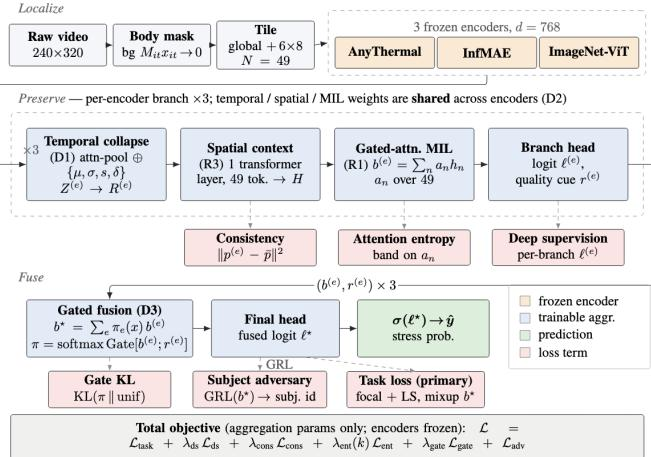  
Figure 1: Model: Localize → Preserve → Fuse. Illustrated for Dataset I, 3 frozen encoders each drive an identically structured branch (temporal collapse → spatial context → gated MIL → head) whose temporal, spatial, and MIL weights are a single shared operator across encoders (D2); only the aggregation parameters are trained. A per-window gate fuses the branch embeddings once, at the embedding level (D3). Red boxes mark the six training losses at their tap points. Blue = trainable, orange = frozen.

Frozen encoders. With only 67 participants, fine-tuning a backbone would mostly memorize identity, so we freeze the encoders and spend the limited supervision on the aggregator (compared against LoRA variations in Section 6.3). Because no single FM is clearly best for thermal affect, we use three with complementary pretraining: AnyThermal, a thermaldistilled DINOv2 ViT-B/14 (Oquab et al. 2024; Maheshwari et al. 2026); InfMAE, an infrared masked autoencoder (Liu et al. 2024a); and ImageNet-ViT (Dosovitskiy et al. 2021). All stay frozen and emit d=768-dimensional embeddings, so each encoder e maps region n to a trajectory $Z _ { \cdot , n } ^ { ( e ) }$ over the T frames. Note: These FMs were selected empirically (Appendix H).

## 4.3 Weakly Supervised Aggregation

Each branch turns one encoder's regional trajectories into a bag embedding $b ^ { ( e ) }$ in three steps.

Temporal collapse (D1; R2). Attention over time, $\alpha _ { t , n }$ ∝ $\exp ( w _ { 2 } ^ { \top }$ tanh $\left( W _ { 1 } Z _ { t , n } \right) ,$ , yields a weighted average $\bar { Z } _ { n } \ =$ $\textstyle \sum _ { t } \alpha _ { t , n } Z _ { t , n }$ that captures when evidence appears. But it is blind to how evidence evolves: attention pooling is orderinvariant, so a steadily warming or cooling region can collapse to the same vector (Prop. 1, Appendix B). We therefore add a parameter-free path summarizing each trajectory by four descriptors—mean $\mu _ { n }$ , standard deviation $\sigma _ { n } .$ signed slope $s _ { n } .$ and mean successive change $\delta _ { n }$ —added residually, $\tilde { R _ { n } } \dot { = } \mathrm { L N } ( \bar { Z } _ { n } + \mathrm { M L P } [ \mu _ { n } ; \sigma _ { n } ; s _ { n } ; \bar { \delta _ { n } } ] )$ . The signed slope $s _ { n }$ is antisymmetric under time reversal, supplying exactly the order-sensitive signal attention discards.

Spatial context (R3). A region is informative only relative to the body: a warm cheek beside a warm nose reads differently than beside a cool one. A single transformer layer therefore lets regions attend to one another before pooling, $H = \mathrm { L N } ( \tilde { R } + \mathrm { F F N } ( \tilde { R } ) )$ with $\tilde { R } = \mathrm { L N } ( R + \mathrm { M H S A } ( R ) ) ;$ residual connections preserve local evidence when context is uninformative.

Gated MIL pooling (R1). The weak label $y _ { i }$ names the window, not the region, so the model must learn to assign credit across regions, the move that makes this MIL. For encoder $e ,$ gated attention (Ilse, Tomczak, and Welling 2018) computes region weights $a _ { n } ^ { ( e ) } =$ softma $\mathfrak { c } _ { n } \big ( w ^ { \top } ( \operatorname { t a n h } ( V h _ { n } ^ { ( e ) } ) \odot \sigma ( U h _ { n } ^ { ( e ) } ) ) \big )$ over the region embeddings $h _ { n } ^ { ( e ) }$ (the rows of H) and pools them into the branch embedding $\begin{array} { r } { b ^ { ( e ) } = \sum _ { n } a _ { n } ^ { ( e ) } h _ { n } ^ { ( e ) } } \end{array}$ . The weights $a _ { n } ^ { ( e ) }$ are non-negative and sum to one over the N regions. A small per-encoder head then maps $b ^ { ( e ) }$ to a branch logit $\ell ^ { ( e ) }$ (supervised directly) and a scalar routing cue $r ^ { ( e ) }$ the fusion gate reads. We treat $a _ { n } ^ { ( e ) }$ as pooling coefficients, not causal explanations (SHAP analysis in Appendix I).

## 4.4 Multi-Encoder Fusion

One product bag (D3). A naive ensemble would train E independent MIL models, one per encoder, and combine their E predictions after the fact. FABLE-THERM instead performs one pooling operation over a single bag containing every (encoder, region) pair, so the encoders are fused as views of one problem rather than as separate models. A per-window gate fuses the E branch embeddings $b ^ { ( e ) }$ $\begin{array} { r } { b ^ { \star } = \sum _ { e } \pi _ { e } ( x ) b ^ { ( e ) } } \end{array}$ where the gate weights $\pi ( x )$ = softmaxe Gate $( [ b ^ { ( e ) } ; r ^ { ( e ) } ] )$ score each encoder from its own branch embedding $b ^ { ( e ) }$ and routing cue $r ^ { ( e ) }$ , and sum to one over the $E$ encoders. Substituting $\begin{array} { r } { b ^ { ( e ) } = \sum _ { n } a _ { n } ^ { ( e ) } h _ { n } ^ { ( e ) } } \end{array}$ gives

$$
b ^ { \star } = \sum _ { e = 1 } ^ { E } \sum _ { n = 1 } ^ { N } c _ { e , n } ( x ) h _ { n } ^ { ( e ) } , \qquad c _ { e , n } ( x ) : = \pi _ { e } ( x ) a _ { n } ^ { ( e ) } ,\tag{1}
$$

where the combined weights are non-negative and sum to one over all EN instances, $\bar { c } _ { e , n } ( x ) \geq 0$ and $\begin{array} { r } { \sum _ { e , n } c _ { e , n } ( x ) = 1 } \end{array}$ Equation (1) is therefore a single attention-MIL pooling over the product bag of EN (view, region) instances, not $\breve { E }$ separate poolings combined afterward (Prop. 2, Appendix B). The weights factorize as $c _ { e , n } = \pi _ { e } ( x ) a _ { n } ^ { ( e ) }$ : the region scorer $a _ { n } ^ { ( e ) }$ decides which regions carry evidence, while the perwindow gate $\pi _ { e } ( x )$ decides which encoder to trust. Because the gate is recomputed for each window, the model reallocates weight across encoders window by window, which is the source of the fusion gain (Section 6.3). The cue $r ^ { ( e ) }$ enters only through Gate(·), so its effect is already carried by $\pi _ { e } ( x ) ;$ it is an uncalibrated softplus scalar used for routing, not a confidence or uncertainty estimate.

Why sharing is required (D2). Adding branch embeddings in Eq. (1) is meaningful only if a channel means the same thing across encoders. But embedding coordinates can be arbitrary: permuting a branch's channels leaves its own prediction unchanged, since its head can absorb the permutation. Two branches may therefore settle on different channel orderings, and adding embeddings across different orderings is like summing vectors in mismatched coordinate systems: the result has no stable meaning. Sharing the aggregator pins all branches to one ordering: untied operators leave the fused embedding identifiable only up to an independent per-branch reordering $( S _ { d } ^ { E } )$ ; sharing collapses this to a single reordering $( S _ { d } )$ the final head absorbs (Prop. 3, Appendix B). This is a statement about well-posedness, and it is testable: untying the operator causes a large accuracy drop (Section 6.3).

Why embedding-level (Obs. 4). Of the three fusion depths, feature-level concatenation forces one aggregator to reconcile incompatible geometries, and posterior-level fusion depends only on the E branch logits, where two windows with identical logits are indistinguishable to it regardless of their spatial evidence (Obs. 4, Appendix B). Embeddinglevel fusion pools each encoder's regions first, then fuses: late enough to keep each representation, early enough to fuse structured evidence rather than a single score. Section 6.3 measures both limits.

## 4.5 Training

Only the aggregator is trained, minimizing a sum of six terms (equations and details in Appendix B), each targeting a specific failure mode, briefly outlined below.

$$
\mathcal { L } = \mathcal { L } _ { \mathrm { t a s k } } + \lambda _ { \mathrm { d s } } \mathcal { L } _ { \mathrm { d s } } + \lambda _ { \mathrm { c o n s } } \mathcal { L } _ { \mathrm { c o n s } } + \lambda _ { \mathrm { e n t } } ( k ) \mathcal { L } _ { \mathrm { e n t } } + \lambda _ { \mathrm { g a t e } } \mathcal { L } _ { \mathrm { g a t e } } + \mathcal { L } _ { \mathrm { a d v } } .
$$

Task loss $( \mathcal { L } _ { \mathrm { t a s k } } ) \mathrm { : }$ focal loss with label smoothing on a mixup of $b ^ { \star }$ ; mixup is applied after pooling, since mixing raw thermograms would blend bodies and masks into implausible frames. Deep supervision $( { \mathcal { L } } _ { \mathrm { d s } } ) { \mathrm { : } }$ supervises every branch logit $\ell ^ { ( e ) }$ , so each encoder stays predictive rather than letting the gate ride one dominant branch. Consistency $( { \mathcal { L } } _ { \mathrm { c o n s } } ) { : }$ ties branch probabilities to their mean, so encoders agree on the shared event instead of fitting view-specific noise. Entropy band $( \mathcal { L } _ { \mathrm { e n t } }$ , novel): a two-sided penalty pinning attention entropy near an intermediate target ρ log N rather than merely maximizing or minimizing it. This preserves how much spatial evidence is kept: a one-cell collapse is fragile to pose and mask error, while diffuse attention reverts to the global averaging we set out to avoid, and the band holds the model between the two. Gate KL $( { \mathcal { L } } _ { \mathrm { g a t e } } ) { \mathrm { : } }$ pulls the fusion gate toward uniform, so an encoder is trusted over others only when the evidence earns it. Subject adversary $( { \mathcal { L } } _ { \mathrm { a d v } } ) ;$ a gradientreversal identity classifier on $b ^ { \star }$ that blocks identity shortcuts under person-disjoint evaluation; ramped in gradually and active only in Control→OUD.

Loss weights are selected on validation rather than factorially ablated, so the experiments support the complete system.

Participant centering. Because baseline body temperature varies across people, features are centered by a label-free per-participant mean, so the classifier responds to each person's deviations rather than absolute temperature. The mean is estimated from up to 24 unlabeled windows, including at test time, making the method transductive: FABLE-THERM requires a short (≈1.5-min) calibration period per participant and is not a cold-start detector. Classification thresholds are selected on the validation participants only.

## 5 Evaluation Design

The evaluation used different datasets to test different claims, rather than relying on one result to support population, dataset, and construct generalization simultaneously.

RQ1 (person/cohort transfer): Does regional aggregation generalize to unseen participants, and what is lost when a model trained only on Control participants is applied to OUD? RQ2 (external transfer): Does the architecture generalize to the public StressNet dataset despite differences in stressor, sensor, spatial coverage, and grid size? RQ3 (endpoint transfer): Does the learned representation retain useful information for craving when supervision changes from task labels to self-report?—Answering these needs three datasets: our own cohort-structured corpus (RQ1 and RQ3) and the public StressNet corpus (RQ2). Datasets, protocols, baselines, and metrics are outlined below:

## 5.1 Datasets: cohort-structured thermal corpus

We collected the primary corpus (Dataset I) because no public dataset pairs contactless thermal video of a clinical OUD cohort with a matched control group under a shared protocol. Under IRB approval # we recorded 67 participants across 71 sessions: 42 control adults and 25 individuals with opioid use disorder (OUD), four of whom were recorded twice (giving 29 OUD sessions). Because splits, windows, and results are defined at the session level, we report the 42/29 session counts throughout; the four repeated participants' sessions are used only for training, so no individual appears in both train and test. The OUD cohort spans different medication and treatment-phase states, reflecting naturally occurring variations. Data collection followed an established protocol from (Xiao et al. 2023). Sessions ran in a private room; a fixed thermal camera recorded the participant. Stress is induced by task structure (non-stress baselines vs. validated Stroop, singa-song, and mental-arithmetic blocks) (Kirschbaum, Pirke, and Hellhammer 1993; Xiao et al. 2023); separately, OUD participants self-report craving after each task block, giving the independent RQ3 target—so stress is never a proxy for craving, and craving occurs under both block types (Appendix C). Full recruitment, apparatus, task sequence, and annotation protocol are in Appendix C.

Dataset I: the resulting corpus. Windowing yields 16,273 windows (Control 11,410; OUD 4,863) under the single protocol above. Labels are 77.5% stress, so the accuracy floor is ≈ 0.775. For RQ1, the stress prior is a property of the protocol, not of the cohort (Control 76.7%, OUD 79.2%), so the cohort gap cannot be explained by label composition.

Protocols. Four person-disjoint settings. Three share one group-stratified split (train 47 / val 10 / test 14) and are evaluated on Test-Both (3,306 windows), Test-Control (8 participants, 2,306), and Test-OUD (6, 1,000). The fourth, Control→OUD, trains and validates on Control only (36/6) and tests on all 29 OUD sessions (25 individuals; 4,863 windows). Splits are fixed and shared by every method.

Datasets II and III. StressNet (Kumar et al. 2021) supplies 5,054 protocol-filtered windows over a subject-disjoint 26/5/3 fold; Dataset III reuses the 4,863 OUD windows with a task-block craving rating replacing the stress target (55.5% craving) over a 21/4/4 split. Both are bounded tests (Sec. 7).

Baselines and metrics. Twenty-seven methods on identical splits and three seeds span six families—linear probes, LoRA, weight-space ensembles, learned multimodal fusion, fixed posterior combination rules, and non-deep tabular ensembles (full list and citations in Appendix D). Three published MIL aggregators (Ilse, Tomczak, and Welling 2018; Shao et al. 2021; Li, Li, and Eliceiri 2021) are reserved for Sec. 6.3. AUROC is primary because it is threshold-free; F1 is reported, and accuracy is read against the ≈ 0.775 floor (Brodersen et al. 2010).

Uncertainty and significance protocol. Because our claims concern transfer to unseen people, completed sampling analyses resample the participant, not the window, using a participant-level cluster bootstrap (B=2000). Comparisons reuse the same participant draws across paired terms and report percentile 95% CIs and one-sided empirical bootstrap tail probabilities; variation across training seeds is reported separately as seed SD. A family-wide FDR-corrected comparison against every baseline has not been run and is not claimed. Full procedure in Appendix D.

## 6 Results

## 6.1 RQ1: person and cohort transfer

On held-out participants from both OUD and control cohorts in Dataset I, FABLE-THERM reaches 0.938 AUROC— 0.203 above the strongest of 27 general baselines (TMC, 0.735), and above the three published MIL aggregators too, which peak at 0.736 on Test-Both and 0.679 on Control→OUD (analyzed separately in Section 6.3). On the harder Control→OUD split, FABLE-THERM still reaches 0.771. Appendix D (Table D.1) reports these margins in full; the paired-participant significance analysis is below.

Two patterns common in health applications appear here. First, ranking and operating point come apart: Random Forest hits 0.802 accuracy but ranks at only 0.612 AUROC, riding the 77.5% stress prior rather than truly separating the classes. Second, adapting the encoder does not help when labels are scarce: LoRA never exceeds 0.686 (Appendix D).

## 6.2 RQ1, continued: decomposing the cohort gap

Aggregate scores hide the finding that matters, and FABLE-TíERM makes it reachable: because the same architecture trains with or without the OUD cohort while still scoring each held-out participant, we can decompose why it underperforms on OUD, not merely report that it does—an attribution a global representation could not support. On heldout OUD participants FABLE-THERM scores 0.810 AUROC, well below 0.979 on Control. Figure 2 splits that 0.169 gap into two causes: representation (does the model fail simply because it never trained on OUD physiology?—if so, more data closes the gap) and heterogeneity (does a model that did train on OUD still fail to generalize person-to-person?—if so, more data of the same kind will not help).

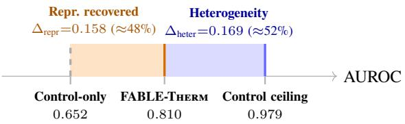  
Figure 2: The cohort gap, decomposed (higher AUROC is better). For the same six held-out OUD participants, adding OUD data raises AUROC from 0.652 to 0.810 (orange, $\Delta _ { \mathrm { r e p r } } { = } 0 . 1 5 8 )$ , leaving a comparable gap to the 0.979 Control ceiling (blue, $\Delta _ { \mathrm { h e t e r } } { = } 0 . 1 6 9 )$ . The two terms account for roughly 48% and 52% of the total deficit, showing that heterogeneity is a co-equal barrier.

A matched decomposition. To isolate representation without confounding it with a change of test set, we evaluate one fixed set—the six Test-OUD participants—under two regimes: the model trained with OUD (0.810) and the Control-only model applied to those same six without retraining $( \mathrm { A U R O C _ { c t r l - o n l y @ 6 } } ^ { - } = \ 0 . 6 5 2 \pm . 0 1 1 )$ . The drop between them is what representation buys, on one population; the heterogeneity term is the distance from the Control ceiling that persists even with OUD in training.

$$
\begin{array} { r l } & { \Delta _ { \mathrm { { r e p r } } } = 0 . 8 1 0 - 0 . 6 5 2 = 0 . 1 5 8 ( \mathrm { m a t c h e d } , n { = } 6 ) } \\ & { \Delta _ { \mathrm { { h e t e r } } } = 0 . 9 7 9 - 0 . 8 1 0 = 0 . 1 6 9 ( \mathrm { C o n t r o l } \mathrm { c e i l i n g } - \mathrm { O U D } ) } \end{array}
$$

$\Delta _ { \mathrm { r e p r } }$ is the part including the cohort removes; $\Delta _ { \mathrm { h e t e r } }$ is the part it does not touch. We find the two terms comparable— 0.158 versus 0.169, roughly a 48/52 split of the total deficit— so the deficit is not simply an absence of OUD data: withincohort variability is a comparably sized contributor. Testing on the shared six-participant estimate by participant bootstrap (B=2000), heterogeneity exceeds representation in 61.45% of resamples. On the aligned seed-43 prediction triplet, the paired difference is $\Delta _ { \mathrm { h e t e r } } - \Delta _ { \mathrm { r e p r } } = 0 . 0 2 1$ , with 95% CI [-0.076, 0.200] and one-sided $p ^ { \mathrm { ~ - ~ } } = ~ 0 . 3 8 6$ . Thus the terms are comparable, but their ordering is not statistically resolved. The component intervals are [0.099, 0.229] for $\Delta _ { \mathrm { h e t e r } }$ and [-0.015, 0.200] for $\Delta _ { \mathrm { r e p r } } ;$ these sampling intervals are seed-43 estimates and are kept distinct from the three-seed means above. The full per-protocol breakdown is in Appendix D (Table D.4).

The implication is uncomfortable for a common equity remedy: “collecting more data from the underserved group” is necessary but recovers only about half the deficit, the remainder reflecting between-person variation within the OUD cohort (plausibly medication, comorbidity, thermoregulation, etc.; none measured here). Deployments relying only on additional OUD data will therefore under-deliver and should also support per-person calibration. More broadly, the decomposition is modality-agnostic: any model with an identifiable subpopulation and a held-out cohort can compute the same representation-versus-heterogeneity split. It turns “does sampling the underserved group help?" from an assumption into a measurable quantity, which we argue should be reported whenever equity claims rest on data collection.

## 6.3 Ablating: what each design choice buys

This is the controlled comparison that carries the architectural claims: holding the frozen front-end, splits, and seeds fixed and varying only the aggregator, so any difference is attributable to the design choice rather than to features or data. Every configuration below sees identical inputs from Dataset I. Table G.1 summarizes the head-to-head, and Table G.2 gives the per-encoder breakdown; we read the key rows off in turn (from Appendix G).

The branch helps before fusion. A single-encoder FABLE-THERM branch reaches 0.747 AUROC (ImageNet-ViT) and 0.727 (AnyThermal), exceeding ABMIL, DSMIL, and TransMIL on the same features; so even before ensembling, treating instances as trajectories beats treating them as points (D1). Grouped Kernel-SHAP (Appendix I) confirms localized trajectories carry the evidence, moving the logit 4.76× more than random trajectories.

Provenance should survive to the decision stage. We compare the three fusion depths on identical features, splits, and seeds. Feature-level fusion (Concat-3, one aggregator over concatenated encoders) tops out at 0.736 on Test-Both (Table G.2, best Concat-3); posterior-level fusion (learned combination of per-encoder logits) tops out at 0.735, realized by the TMC baseline in the main sweep (Table D.1); and FABLE-THERM's embedding-level fusion with the learned gate reaches 0.938 (Table G.1), also lifting the best nonembedding Control→OUD result from 0.679 to 0.771 (Table G.2, final row). Every feature- and posterior-level variant falls between 0.66 and 0.74 on Test-Both while embeddinglevel fusion exceeds 0.93, showing that fusion depth, not encoder choice, is the operative variable (Observation 4). The mechanism is the learned per-window gate reallocating credit across encoders (Prop. 2(ii)), a flexibility unavailable to fixed combination rules or single-view aggregators.

The shared operator is necessary, not convenient (Prop. 3, measured). The untied competitor gives each encoder its own temporal, spatial, and gated-MIL operators, then applies learned attention to the three branch logits, using 1.80× the trainable parameters of the shared model (compared in Table G.1). Despite the extra capacity, it reaches only 0.744 ±.012 AUROC on Test-Both and 0.674 ±.053 on Test-OUD, against 0.938 ±.004 and 0.810 ±.002 for FABLE-THERM—a collapse of 0.194 and 0.136 AUROC. Its seed SD is also markedly larger—3× on Test-Both (.012 vs. .004) and over 20× on Test-OUD; the instability Proposition 3 predicts when the fused embedding is pinned down only up to an independent per-branch relabeling. The gauge collapse of Proposition 3 is therefore not cosmetic: sharing the operator is what makes embedding-level fusion well-posed, and untying it, even with more parameters, does not recover the performance. This is not thermal-specific: any system that fuses embeddings from multiple frozen FMs (multi-encoder pathology, multimodal medical fusion, remote sensing) faces the same per-branch relabeling ambiguity, and the sharedoperator construction is a general remedy.

## 6.4 RQ2: external transfer (StressNet)

Does the architecture generalize to a second dataset, retrained on its own subject-disjoint split? On the public StressNet corpus FABLE-THERM averages 0.808 ± 0.112 AUROC across three subject-disjoint folds (we report the average, not a handpicked best fold). The wide spread (±0.112) is the lesson of Sec. 6.2 reappearing: which people land in the test fold moves the score more than the method does. We claim only that the pipeline operates under a second sensor, stressor, and grid resolution $( N { = } 9 7 ;$ Appendix E), not a new benchmark.

## 6.5 RQ3: endpoint transfer to craving

Substituting a self-reported craving rating for the stress target on the 29 OUD sessions (25 individuals), FABLE-THERM attains 0.752 AUROC, beating the strongest craving baseline (MIMMO, a multi-input multi-output ensemble (Ferianc and Rodrigues 2023)). To our knowledge, this is the first evidence that OUD craving is recoverable from contactless thermal video at all. We frame it as a feasibility probe, not a detector: those 4,863 windows carry just 172 independent labels and 16 of 29 sessions are single-class, so the supportable claim is that a body-localized representation carries cravingassociated signal (Appendix F).

## 7 Threats to Validity

We bound each claim rather than collect caveats at the end. Ablation scope: the headline comparison is system-level (FABLE-THERM uses an Optuna-tuned recipe, most baselines a vanilla loop); Table G.1 isolates the aggregator and measures the shared-operator choice directly, but the statistics path, spatial attention, and auxiliary losses are argued, not each ablated (Appendix G.1). Small samples: with 6–29 sessions per protocol, bootstrap intervals are wide, so we report uncertainty explicitly and do not lean on unresolved effect ordering. Bounded external tests: StressNet is retrained on its own split (RQ2) and craving reuses the OUD windows with few independent labels (RQ3), so both are feasibility checks, not benchmarks. Normalized appearance: per-region scaling removes absolute temperature, so the model learns appearance, not calibrated units. Label semantics: stress labels are elicitation conditions, not verified states. Calibration: participant centering is transductive, so FABLE-TíERm is not a cold-start detector. Unaudited subgroups: cohort tests do not replace audits across age, sex, skin properties, disability, and medication. Discrimination, not benefit: we measure accuracy, not whether acting on a prediction helps anyone.

## 8 Responsible Deployment and Release

Intended deployment. The intended role is opt-in clinical decision support: a revocable check-in, not diagnosis, substance-use inference, or a replacement for clinical judgment. Thermal video is body-derived and person-linkable, not anonymous (Stanić and Geršak 2025), and the validity of affective inference remains contested even for facial images (Mohammad 2022); accordingly, we predict elicitation conditions rather than “true" internal states, and such signals increasingly fall under cognitive-biometric protections (Ienca and Malgieri 2024). Deployment assumes a short participantspecific calibration period because the method is transductive and therefore not a cold-start detector. It also requires cohort-specific operating thresholds rather than a universal 0.5, since decisions are made at a threshold, not by AUROC. At our validation-selected threshold, OUD bears the greater operational burden: FPR is 0.495 versus 0.090 for Control (5.5× higher), and FNR is 0.144 versus 0.073 (Table J.1), the deployment-facing manifestation of $\Delta _ { \mathrm { h e t e r } }$ . Every elevated prediction should be reviewed by a clinician, never acted on automatically. Because roughly half of the OUD deficit reflects within-cohort heterogeneity (Sec. 6.2), collecting more data alone will not remove the disparity; deployments without participant-specific calibration are unlikely to perform reliably for this population. The reported cohort-specific operating points provide the quantities needed to estimate burden and risk before a clinical study.

Prohibited uses. The method must not be used for surveillance, coercive decision-making, or non-consensual inference, including law enforcement, probation or parole, employment, insurance, and benefits or treatment eligibility. These restrictions are enforced through the artifact license, not left as recommendations. Continuous stress or craving inference can become a surveillance tool for a population already subject to supervisory drug testing (Cheetham et al. 2022), and because reducing sensing burden also lowers the barrier to misuse, deployment safeguards must accompany the released artifact rather than be left to downstream users.

Release and governance. We publicly release all code, derived frozen representations, training and evaluation scripts, fixed splits, per-seed predictions, the attribution checkpoint, and a machine-readable non-use license—enough to reproduce every result without the raw video and, because StressNet is public, the external-transfer experiment end to end. Raw clinical recordings remain protected under an IRB-governed data-use agreement. Reproduction and sensorporting instructions are in Appendix J.

## 9 Conclusion

Contactless sensing removes not only the wearable but also the supervision indicating where and when a physiological response occurs. FABLE-TíERM shows that preserving localized evidence turns this loss into an opportunity: the representation becomes not only more accurate but also interrogable. Because performance remains participant-resolved, deployment failures become questions rather than statistics. On our cohort, improving representation alone recovers only about half of the deployment gap, with the remainder reflecting within-cohort heterogeneity. More broadly, whenever an identifiable subpopulation exists, "collect more data" is a hypothesis rather than a remedy, one any model can test by training with and without that group, but only localized evidence explains who a model fails and why, and that is what equitable deployment requires.

## References

Abdelrahman, Y.; et al. 2017. Cognitive heat: Exploring the usage of thermal imaging to unobtrusively estimate cognitive load. Proceedings of the ACM on Interactive, Mobile, Wearable and Ubiquitous Technologies, 1(3): 1–20.

Akiba, T.; et al. 2019. Optuna: A next-generation hyperparameter optimization framework. In Proceedings of the 25th ACM SIGKDD International Conference on Knowledge Discovery & Data Mining, 2623-2631.

Al-Jebrni, A. H.; et al. 2020. AI-enabled remote and objective quantification of stress at scale. Biomedical Signal Processing and Control, 59: 101929.

Anderson, B. J.; et al. 2018. Ethical considerations in opioid craving induction research. Journal of Addiction Medicine, 12(4): 253–259.

Baillet, E.; et al. 2024. Craving changes in first 14 days of addiction treatment: an outcome predictor of 5 years substance use status? Translational Psychiatry, 14(1): 497.

Breiman, L. 2001. Random forests. Machine Learning, 45(1): 5–32.

Brodersen, K. H.; et al. 2010. The balanced accuracy and its posterior distribution. Proceedings of the 20th International Conference on Pattern Recognition (ICPR), 3121–3124.

Brügge, N. S.; et al. 2026. Task-aware multiple instance learning for stress detection from facial video data. Journal of Affective Disorders, 405: 121472.

Calderon-Uribe, S.; et al. 2026. Peripheral thermoregulation patterns of stress and relaxation assessed via infrared thermography and linear discriminant analysis. Journal of Thermal Biology, 139: 104507.

Campanella, G.; et al. 2019. Clinical-grade computational pathology using weakly supervised deep learning on whole slide images. Nature Medicine, 25(8): 1301–1309.

Cardone, D.; and Merla, A. 2017. New frontiers for applications of thermal infrared imaging devices: Computational psychophysiology in the neurosciences. Sensors, 17(5): 1042.

Cheetham, A.; et al. 2022. The impact of stigma on people with opioid use disorder, opioid treatment, and policy. Substance Abuse and Rehabilitation, 13: 1–12.

Chen, I. Y.; et al. 2021. Ethical machine learning in healthcare. Annual Review of Biomedical Data Science, 4: 123–144.

Chen, T.; and Guestrin, C. 2016. XGBoost: A scalable tree boosting system. In Proceedings of the 22nd ACM SIGKDD International Conference on Knowledge Discovery and Data Mining (KDD), 785-794.

Di Giacinto, A.; et al. 2014. Thermal signature of fear conditioning in mild post-traumatic stress disorder. Neuroscience, 266: 216–223.

Dosovitskiy, A.; et al. 2021. An image is worth 16x16 words: Transformers for image recognition at scale. In International Conference on Learning Representations (ICLR).

Engert, V.; et al. 2014. Exploring the use of thermal infrared imaging in human stress research. PLOS ONE, 9(3): e90782.

Ferianc, M.; and Rodrigues, M. 2023. MIMMO: Multi-input massive multi-output neural network. In Proceedings of the IEEE/CVF Conference on Computer Vision and Pattern Recognition Workshops (CVPRW).

Fox, H. C.; et al. 2008. Enhanced sensitivity to stress and drug/alcohol craving in abstinent cocaine-dependent individuals compared to social drinkers. Neuropsychopharmacology, 33(4): 796–805.

Ganin, Y.; et al. 2016. Domain-adversarial training of neural networks. Journal of Machine Learning Research, 17(59): 1–35.

Garbey, M.; et al. 2007. Contact-free measurement of cardiac pulse based on the analysis of thermal imagery. IEEE Transactions on Biomedical Engineering, 54(8): 1418–1426.

Garipov, T.; et al. 2018. Loss surfaces, mode connectivity, and fast ensembling of DNNs. In Advances in Neural Information Processing Systems (NeurIPS).

Geurts, P.; Ernst, D.; and Wehenkel, L. 2006. Extremely randomized trees. Machine Learning, 63(1): 3–42.

Ghassemi, M.; et al. 2020. A review of challenges and opportunities in machine learning for health. AMIA Summits on Translational Science Proceedings, 2020: 191.

Giannakakis, G.; et al. 2022. Review on psychological stress detection using biosignals. IEEE Transactions on Affective Computing, 13(1): 440–460.

Gioia, F.; et al. 2021. Discriminating stress from cognitive load using contactless thermal imaging devices. In 43rd Annual International Conference of the IEEE Engineering in Medicine and Biology Society (EMBC), 608–611.

Gioia, F.; et al. 2022. Towards a contactless stress classification using thermal imaging. Sensors, 22(3): 976.

Golden, C.; Freshwater, S. M.; and Golden, Z. 1978. Stroop color and word test.

Grunevski, S.; Kong, J.; and Konova, A. 2024. Predictive Relationship Between Different Timescales of Opioid Craving and Opioid Use. Drug and Alcohol Dependence, 260: 109974.

Han, X.; et al. 2024. FuseMoE: Mixture-of-experts transformers for fleximodal fusion. In Advances in Neural Information Processing Systems (NeurIPS).

Han, Z.; et al. 2021. Trusted multi-view classification. In International Conference on Learning Representations (ICLR).

Huang, G.; et al. 2017. Snapshot ensembles: Train 1, get M for free. In International Conference on Learning Representations (ICLR).

Ienca, M.; and Malgieri, G. 2024. Beyond neural data: Cognitive biometrics and mental privacy. Neuron, 112(18): 3017–3028.

Ilse, M.; Tomczak, J.; and Welling, M. 2018. Attention-based deep multiple instance learning. In International Conference on Machine Learning (ICML), 2127–2136.

Ioannou, S.; Gallese, V.; and Merla, A. 2014. Thermal infrared imaging in psychophysiology: Potentialities and limits. Psychophysiology, 51(10): 951–963.

Izmailov, P.; et al. 2018. Averaging weights leads to wider optima and better generalization. In Conference on Uncertainty in Artificial Intelligence (UAI).

Jacobs, R. A.; et al. 1991. Adaptive mixtures of local experts. Neural Computation, 3(1): 79–87.

Ke, G.; et al. 2017. LightGBM: A highly efficient gradient boosting decision tree. In Advances in Neural Information Processing Systems (NeurIPS).

Kirschbaum, C.; Pirke, K.-M.; and Hellhammer, D. H. 1993. The ‘Trier Social Stress Test'-a tool for investigating psychobiological stress responses in a laboratory setting. Neuropsychobiology, 28(1- 2): 76–81.

Kittler, J.; et al. 1998. On combining classifiers. IEEE Transactions on Pattern Analysis and Machine Intelligence, 20(3): 226–239.

Kosonogov, V.; De Zorzi, L.; Honoré, J.; Martínez-Velázquez, E. S.; Nandrino, J.-L.; Martinez-Selva, J. M.; and Sequeira, H. 2017. Facial thermal variations: A new marker of emotional arousal. PLOS ONE, 12(9): e0183592.

Kumar, S.; et al. 2021. StressNet: Detecting stress in thermal videos. In Proceedings of the IEEE/CVF Winter Conference on Applications of Computer Vision (WACV), 999–1009.

Kurata, Y.; Homma, T.; Oka, K.; et al. 2025. Multiple instance learning using pathology foundation models effectively predicts kidney disease diagnosis and clinical classification. Scientific Reports, 15(1): 19567.

Lakshminarayanan, B.; Pritzel, A.; and Blundell, C. 2017. Simple and scalable predictive uncertainty estimation using deep ensembles. In Advances in Neural Information Processing Systems (NeurIPS).

Li, B.; Li, Y.; and Eliceiri, K. W. 2021. Dual-stream multiple instance learning network for whole slide image classification with self-supervised contrastive learning. In Proceedings of the IEEE/CVF Conference on Computer Vision and Pattern Recognition (CVPR), 14318–14328.

Lin, T.-Y.; et al. 2017. Focal loss for dense object detection. In Proceedings of the IEEE International Conference on Computer Vision (ICCV), 2980–2988.

Liu, F.; et al. 2024a. InfMAE: A foundation model in the infrared modality. In European Conference on Computer Vision (ECCV).

Liu, I.; et al. 2024b. Your blush gives you away: Detecting hidden mental states with remote photoplethysmography and thermal imaging. PeerJ Computer Science, 10: e1912.

Loshchilov, I.; and Hutter, F. 2019. Decoupled weight decay regularization. In International Conference on Learning Representations (ICLR).

Lundberg, S. M.; and Lee, S.-I. 2017. A Unified Approach to Interpreting Model Predictions. In Advances in Neural Information Processing Systems (NeurIPS), volume 30.

Luo, Y.; et al. 2026. Personalized entropy-informed deep learning for identifying opioid misuse. Nature Mental Health, 1–13.

MacLean, R. R.; Sofuoglu, M.; and Rosenheck, R. 2019. Stress and opioid use disorder: A systematic review. Addictive Behaviors, 98: 106010.

Maddox, W. J.; et al. 2019. A simple baseline for Bayesian uncertainty in deep learning. In Advances in Neural Information Processing Systems (NeurIPS).

Maheshwari, R.; et al. 2026. AnyThermal: A task-agnostic vision foundation model for thermal images. arXiv preprint arXiv:2601.18598.

Mohammad, S. M. 2022. Ethics sheet for automatic emotion recognition and sentiment analysis. Computational Linguistics, 48(2): 239-278.

Moon, S. J. E.; et al. 2025. A brief report: Lessons learned using wearable technology to collect data from adults receiving medications for opioid use disorder. Journal of Substance Use, 30(6): 929–935.

Nazzari, S.; et al. 2025. Infrared thermal imaging (ITI), a noninvasive window into early emotion regulation: A systematic review. Developmental Psychobiology, 67(5): e70071.

Obermeyer, Z.; et al. 2019. Dissecting racial bias in an algorithm used to manage the health of populations. Science, 366(6464): 447–453.

Ollander, S.; et al. 2016. A comparison of wearable and stationary sensors for stress detection. In 2016 IEEE International Conference on Systems, Man, and Cybernetics (SMC), 004362–004366. IEEE.

Oquab, M.; et al. 2024. DINOv2: Learning robust visual features without supervision. Transactions on Machine Learning Research (TMLR).

Qiao, S.; Chen, L.-C.; and Yuille, A. 2021. DetectoRS: Detecting objects with recursive feature pyramid and switchable atrous convolution. Proceedings of the IEEE/CVF Conference on Computer Vision and Pattern Recognition (CVPR), 10213–10224.

Sabour, R. M.; Benezeth, Y.; De Oliveira, P.; Chappe, J.; and Yang, F. 2021. Ubfc-phys: A multimodal database for psychophysiological studies of social stress. IEEE Transactions on Affective Computing, 14(1): 622–636.

Schmidt, P.; et al. 2018. Introducing WESAD, a multimodal dataset for wearable stress and affect detection. In Proceedings of the 20th ACM International Conference on Multimodal Interaction (ICMI), 400–408.

Shah, K.; Kumari, R.; and Jain, M. 2024. Unveiling stress markers: A systematic review investigating psychological stress biomarkers. Developmental Psychobiology, 66(5): e22490.

Shao, Z.; et al. 2021. TransMIL: Transformer based correlated multiple instance learning for whole slide image classification. In Advances in Neural Information Processing Systems (NeurIPS).

Shastri, D.; et al. 2012. Perinasal imaging of physiological stress and its affective potential. IEEE Transactions on Affective Computing, 3(3): 366–378.

Shatte, A. B. R.; Hutchinson, D. M.; and Teague, S. J. 2019. Machine learning in mental health: A scoping review of methods and applications. Psychological Medicine, 49(9): 1426–1448.

Sinha, R. 2009. Modeling stress and drug craving in the laboratory: implications for addiction treatment development. Addiction biology, 14(1): 84–98.

Sinha, R.; et al. 2000. Psychological stress, drug-related cues and cocaine craving. Psychopharmacology, 152(2): 140–148.

Stanić, V.; and Geršak, G. 2025. Facial thermal imaging: A systematic review with guidelines and measurement uncertainty estimation. Measurement, 242: 115879.

Theroude, P.; et al. 2026. The nose knows: Thermal responses to active psychological stressors. PLOS ONE, 21(1): e0338108.

Vaezi Joze, H. R.; et al. 2020. MMTM: Multimodal transfer module for CNN fusion. In Proceedings of the IEEE/CVF Conference on Computer Vision and Pattern Recognition (CVPR).

Volkow, N. D.; Koob, G. F.; and McLellan, A. T. 2016. Neurobiologic advances from the brain disease model of addiction. New England Journal of Medicine, 374(4): 363–371.

Wen, Y.; Tran, D.; and Ba, J. 2020. BatchEnsemble: An alternative approach to efficient ensemble and lifelong learning. In International Conference on Learning Representations (ICLR).

Xiao, Y.; et al. 2023. Reading between the heat: Co-teaching body thermal signatures for non-intrusive stress detection. Proceedings of the ACM on Interactive, Mobile, Wearable and Ubiquitous Technologies, 7(4): 1–30.

Xiao, Y.; et al. 2025. Human Heterogeneity Invariant Stress Sensing. Proceedings of the ACM on Interactive, Mobile, Wearable and Ubiquitous Technologies, 9(3): 1–42.

Xue, Z.; and Marculescu, R. 2023. Dynamic multimodal fusion. In Proceedings of the IEEE/CVF Conference on Computer Vision and Pattern Recognition (CVPR).

Zhang, H.; et al. 2018. mixup: Beyond empirical risk minimization. In International Conference on Learning Representations (ICLR).

Zhang, Q.; et al. 2023. Provable dynamic fusion for low-quality multimodal data. In International Conference on Machine Learning (ICML).

Zhao, S.; et al. 2023. Affective and physiological responses to laboratory stress induction. In Proceedings of the ACM on Interactive, Mobile, Wearable and Ubiquitous Technologies, volume 7, 1–26.

## Appendix

Supporting material for “Representation Is Not Enough: Body-Localized Thermal Evidence for Contactless Stress and Craving Sensing in Opioid Use Disorder"

Code and data availability. Code and test data to reproduce the results in this paper are available at https://drive. google.com/drive/folders/1ZshKBEA5jcKXgfahKGvXK\_ sbPMdvWwXF?usp=sharing. The full dataset will be released upon acceptance of the paper.

How to read this appendix. The section order follows the first use of each appendix reference in the submitted paper: related work (A), the complete model and the scope of its formal statements (B), data and labels $( \mathbf { C } ) ,$ primary-corpus results (D), the external StressNet study (E), craving (F), aggregator comparisons (G), implementation (H), attribution (I), reproducibility (J), and governance (K). Throughout, a “measured result" means a configuration represented by a row in a table. Mechanistic explanations that have not been isolated by a matched ablation are identified as hypotheses or design rationale.

## A Extended Related Work

This section expands Section 2 of the body. Table A.1 compares the closest systems. We deliberately omit headline scores: the studies use different stressors, targets, populations, splits, and label definitions, so a score column would invite an invalid ranking.

A.1 Literature outside computer science. The design rests on four non-CS literatures, summarized here because they constrain what a thermal model may claim. (a) Thermal psychophysiology. Infrared thermography reflects interacting changes in superficial perfusion and vasomotor tone, perspiration, respiration, muscle activity, and metabolism, not a single stress channel (Ioannou, Gallese, and Merla 2014; Cardone and Merla 2017). Contactless pulse and respiration estimation (Garbey et al. 2007) shows thermal video preserves fast periodic physiology alongside slow drift, which is why a transient regional fluctuation may be physiologically real yet irrelevant to a stress label. (b) Regional nonuniversality. Nose-tip temperature tracks arousal rather than valence (Kosonogov et al. 2017); continuous nasal measurement shows larger cooling under social than cognitive stress (Theroude et al. 2026); facial regions discriminate stress from cognitive load (Gioia et al. 2021); fingertip thermography has been explored for stress-relaxation separation (Calderon-Uribe et al. 2026); and a systematic review reports mixed directions of change across face and hand ROIs in children (Nazzari et al. 2025). Thermal imaging has also been applied to cognitive workload (Abdelrahman et al. 2017) and fear conditioning in PTSD (Di Giacinto et al. 2014). (c) Measurement validity. Stanić and Geršak (2025) review 315 facial-thermography studies and find inconsistent reporting of camera calibration, emissivity, geometry, acclimatization, ambient temperature, airflow, occlusion, motion, and ROI definition; they propose explicit acquisition and uncertainty guidelines. Our masking, normalization, whole-body context, and person-disjoint evaluation are designed to reduce, not eliminate, these sources. (d) Addiction medicine and health equity. Stress is an established relapse trigger under the brain-disease model of addiction (Volkow, Koob, and McLellan 2016); algorithmic bias in health systems is documented at scale (Obermeyer et al. 2019; Chen et al. 2021; Ghassemi et al. 2020). Beyond the sources cited in the body, this literature draws on: OUD stigma and its link to punitive policy (Cheetham et al. 2022); the construct-validity critique of affect inference (Mohammad 2022); cognitive-biometric and mental-privacy law (Ienca and Malgieri 2024); and machine learning in mental health more broadly (Shatte, Hutchinson, and Teague 2019).

## B Full Method Specification

Supports Section 4 of the body. Notation follows the body.   
Numbers are provided with respect to Dataset I.

B.1 Window construction. For a window beginning at clock time $\tau _ { i }$ , the T=25 target times are $\begin{array} { r } { q _ { i t } = \tau _ { i } + \bar { ( t - 1 ) } \frac { 5 } { 2 5 } } \end{array}$ $t = 1 , \ldots , 2 5$ . For each target time the builder selects the nearest recorded timestamp in the high-resolution reference stream and matches the same physical frame in the other encoder streams. A window is rejected if a match exceeds tolerance, repeats a frame, or leaves the task interval. Timestamp alignment is a logical prerequisite for branch-wise fusion: without it, the three branches would describe different instants. The first and last target times are 4.8 seconds apart; $\cdot 5 \mathrm { - } \mathrm { s }$ window" denotes the builder's nominal interval, not five seconds between the first and last sample. This short span supports local latent changes, but it is not long enough by itself to identify slow thermal equilibration or recovery dynamics.

B.2 Thermal rendering and its physical scope. For every region in every frame, valid pixels are min-max mapped independently to 8-bit, $\begin{array} { r } { I _ { r } ( q ) = 2 5 5 \frac { r ( q ) - r _ { \mathrm { m i n } } } { r _ { \mathrm { m a x } } - r _ { \mathrm { m i n } } } } \end{array}$ , replicated to three channels, resized, and normalized;"a zero image is used when no valid range exists. This makes heterogeneous thermal matrices compatible with pretrained image encoders and emphasizes within-region spatial structure. It also removes calibrated absolute temperature, a uniform warming or cooling of a region, and calibrated comparisons between regions. Accordingly, the learned trajectory describes changes in an encoder's representation of normalized regional appearance; it must not be interpreted as a temperature slope in degrees or as direct evidence of vasoconstriction (body Section 7(iii)). A frozen encoder $\phi _ { e }$ then produces $F _ { i } ^ { ( e ) } [ t , n ] = \phi _ { e } ( I _ { i , t , n } ) \in \mathbb { R } ^ { 7 6 8 }$ , cached once, retaining time and region axes.

B.3 Projection. The frozen backbones do not share a coordinate system despite equal dimensionality, so each is aligned before the shared operator: ${ \cal Z } ^ { ( e ) } = \mathrm { D r o p o u t } ( \mathrm { L N } ( F ^ { ( e ) } \bar { W } _ { e } +$ $b _ { e } ) ) \in \mathbb { R } ^ { T \times N \times d }$ . Temporal collapse, spatial attention, and MIL pooling share parameters across encoders; only projections and branch heads are encoder-specific.

B.4 Temporal descriptors. With $\tilde { t }$ the mean-centered frame index,

$$
\begin{array} { r } { \mu _ { n } = \frac { 1 } { T } \sum _ { t } Z _ { t , n } , \quad \sigma _ { n } = \Bigl [ \frac { 1 } { T } \sum _ { t } ( Z _ { t , n } - \mu _ { n } ) ^ { 2 } \Bigr ] ^ { 1 / 2 } , } \end{array}
$$

Table A.1: Representative work closest to thermal and weakly supervised stress recognition. Scores are intentionally omitted (incompatible populations, stressors, splits, and label definitions). Supports Section 2 of the body.
<table><tr><td>Study</td><td>Signal and spatial support</td><td>Modeling and supervision</td><td>Relevance to the present work</td></tr><tr><td>Shastri et al. (2012)</td><td>Perinasal thermal video</td><td>Morphological/wavelet per- spiration extraction; lab and surgeon-expertise comparisons</td><td>Demonstrates a contactless sympathetic channel, but relies on a tracked, prespecified facial ROI and hand-crafted dynamics.</td></tr><tr><td>Engert et al. (2014)</td><td>Six facial thermal imprints with conventional stress markers</td><td>Longitudinal statistics; multi- variate phase classification</td><td>Shows regional sensitivity while document- ing difficulty separating anticipation, stress, and recovery in a small healthy sample.</td></tr><tr><td>Gioia et al. (2022)</td><td>Multiple predefined facial ROIs (± ECG/EDA/resp.)</td><td>Thermal statistics, recursive feature elimination, SVM</td><td>Supports thermal-only subject-independent recognition, but fixes ROI and feature vo- cabulary before learning.</td></tr><tr><td>Kumar et al. (2021)</td><td>Facial thermal video with ECG/ICG reference</td><td>Heat-emission representation, spatiotemporal ISTI reconstruc- tion</td><td>Learns video dynamics via a physiologically grounded cardiac intermediary; spatial sup- port remains facial.</td></tr><tr><td>Xiao et al. (2023)</td><td>Body thermal video plus EDA during training</td><td>Privileged-modality co- teaching, thermal-only deploy- ment</td><td>Establishes whole-body thermal stress sens- ing, but uses a concurrent wearable teacher to shape thermal learning.</td></tr><tr><td>Liu et al. (2024b)</td><td>Facial thermal video and RGB rPPG</td><td>Feature-level fusion, conven- tional classifiers, SHAP</td><td>Complementary camera-derived physiology and explainability; fixed-feature facial multi- modal design.</td></tr><tr><td>Brügge et al. (2026)</td><td>RGB facial-video snippets</td><td>Task-conditioned temporal at- tention, top-/bottom-k MIL</td><td>Direct precedent for weak task-level supervi- sion and temporal localization; models visi- ble facial behaviour rather than regional body thermodynamics.</td></tr><tr><td>This work</td><td>Whole-body thermal video, global token + configurable region grid</td><td>Frozen multi-encoder features; dual-path temporal collapse; spatial set attention; gated MIL; branch-wise late fusion</td><td>Localizes evidence in space and time under window labels; no contact-sensor teacher; cohort-resolved evaluation is part of the claim.</td></tr></table>

$$
s _ { n } = \frac { \sum _ { t } \tilde { t } Z _ { t , n } } { \sum _ { t } \tilde { t } ^ { 2 } } , \quad \delta _ { n } = \frac { 1 } { T - 1 } \sum _ { t = 1 } ^ { T - 1 } | Z _ { t + 1 , n } - Z _ { t , n } | .
$$

These represent latent level, dispersion, signed trend, and short-term variation. They are parameter-free and computed before any learned mixing, so the distinction between a stable, a directional, and an irregular trajectory is available to the head rather than reconstructed by it.

B.5 Spatial contextualization and MIL pooling. For each branch, the temporal descriptor of every token is first contextualized with the other spatial tokens by the shared spatialattention operator. A gated MIL scorer then assigns normalized region weights $\bar { a } ^ { ( e ) } \in \Delta ^ { N - 1 }$ and pools the contextualized instances $h _ { n } ^ { ( e ) }$ as $\begin{array} { r } { b ^ { ( e ) } = \sum _ { n } a _ { n } ^ { ( e ) } h _ { n } ^ { ( e ) } } \end{array}$ . Thus time is summarized within a region before regions exchange context, and evidence is localized over regions only after that exchange. The global token is simply one member of this bag; it is not privileged by a fixed pooling rule.

B.6 Fusion policy. $\begin{array} { r } { b ^ { \star } ~ = ~ \sum _ { e } \pi _ { e } ( x ) b ^ { ( e ) } } \end{array}$ with $\pi ( x ) ~ =$ softmaxe ${ \mathrm { ( G a t e } } ( [ b ^ { ( e ) } ; r ^ { ( e ) } ] ) { \mathrm { ) } }$ and $r ^ { ( e ) } = \mathrm { s o f t p l u s } ( q ^ { ( e ) } ) + \epsilon .$ The gate is a per-window function of the branch embeddings and their quality cues, so the view weights are recomputed for every window. $r ^ { ( e ) }$ has no separate probabilistic calibration objective and is interpreted only as a learned branch-quality feature the gate may read—not a calibrated predictive variance and not a stand-alone confidence score. All primarycorpus and craving results use this learned gate; a hard uniform variant $( \pi _ { e } \equiv 1 / E )$ is available and used only where noted.

B.7 Full objective. For batch size B and E=3 branches,

$$
\begin{array} { r } { \mathcal { L } = \mathcal { L } _ { \mathrm { t a s k } } + \lambda _ { d s } \mathcal { L } _ { d s } + \lambda _ { \mathrm { c o n s } } \mathcal { L } _ { \mathrm { c o n s } } + \lambda _ { \mathrm { e n t } } ( k ) \mathcal { L } _ { \mathrm { e n t } } + \lambda _ { \mathrm { g a t e } } \mathcal { L } _ { \mathrm { g a t e } } + \mathcal { L } _ { \mathrm { a d v } } , } \end{array}\tag{2}
$$

with k the epoch and ${ \mathcal { L } } _ { \mathrm { a d v } }$ applied through gradient reversal $R _ { \lambda _ { a d v } ( k ) } ( b ^ { \star } )$ . Table B.1 maps each term to the failure mode it addresses and states where it attaches. Inactive terms carry zero weight; gate regularization is irrelevant under hard uniform fusion, and the subject adversary is disabled in the selected within-group configuration.

Task loss. With $p _ { i } = \sigma ( \ell _ { i } )$ and label smoothing $\tilde { y } _ { i } = ( 1 -$ $\varepsilon ) y _ { i } + \varepsilon / 2 ,$ the focal form is $\begin{array} { r } { \mathcal { L } _ { \mathrm { t a s k } } = \frac { 1 } { B } \sum _ { i } \alpha _ { t , i } ( \bar { 1 } - p _ { t , i } \dot { ) } ^ { \gamma } c _ { i } } \end{array}$ with $p _ { t , i } = \tilde { y } _ { i } p _ { i } + ( 1 - \tilde { y } _ { i } ) ( 1 - p _ { i } )$ and ci the smoothed BCE (Lin et al. 2017). Balanced sampling already changes how often each class is seen, so an additional positive-class weight would double-correct the prior; focal modulation instead down-weights easy examples. When focal loss is disabled the implementation uses smoothed BCE. Mixup is applied to the fused embedding, not to raw thermograms—mixing thermograms would combine bodies, masks, and temperatures in physically implausible ways (Zhang et al. 2018). Deep supervision: $\begin{array} { r } { \mathcal { L } _ { d s } = \frac { 1 } { E } \sum _ { e } \mathcal { L } _ { \mathrm { t a s k } } ( \ell ^ { ( e ) } , y ) } \end{array}$ , which makes equal fusion weighting meaningful by ensuring each branch is independently predictive. Consistency: $\begin{array} { r } { \mathcal { L } _ { \mathrm { c o n s } } = \frac { 1 } { B E } \sum _ { i , e } ( p _ { i } ^ { ( e ) } - } \end{array}$ $\bar { p } _ { i } ) ^ { 2 }$ . Entropy band: $\begin{array} { r } { \mathcal { L } _ { \mathrm { e n t } } = \frac { 1 } { B E } \sum _ { i , e } [ H ( a _ { i } ^ { ( e ) } ) - \rho \log N ] ^ { 2 } } \end{array}$ targeting intermediate selectivity—a one-cell solution is fragile to pose and mask error, while uniform attention recreates global averaging. Its weight is ramped during warmup. Gate $\begin{array} { r } { K L \colon \mathcal { L } _ { \mathrm { g a t e } } \stackrel {  } { = } \frac { 1 } { B } \sum _ { i } \mathrm { K L } ( \bar { \pi } _ { i } \| u ) } \end{array}$ against uniform u. Subject adversary: $\begin{array} { r } { \mathcal { L } _ { \mathrm { a d v } } = \frac { 1 } { B } \sum _ { i } \mathrm { C E } ( \phi ( R _ { \lambda _ { a d v } ( k ) } ( b _ { i } ^ { \star } ) ) , s _ { i } ) } \end{array}$ over training-participant identity $s _ { i }$ (Ganin et al. 2016), ramped because removing identity before the task is learned can also erase useful physiology.

Table B.1: Loss terms as a map from failure mode to constraint. Supports body Section 4, "Training objective". The paper does not factorially ablate these terms; they are design rationale, not measured effects.
<table><tr><td></td><td>Term Attaches to</td><td>Failure mode addressed</td></tr><tr><td> $\mathcal { L } _ { \mathrm { t a s k } }$ </td><td>fused logit (mixup of b*) class imbalance; hard labels</td><td>treated as certain</td></tr><tr><td> $\mathcal { L } _ { d s }$ </td><td>each branch logit  $\ell ^ { ( e ) }$ </td><td>fusion rescuing uninformative branches</td></tr><tr><td> ${ \mathcal { L } } _ { \mathrm { c o n s } }$ </td><td>branch probabilities</td><td>view-specific noise mas- querading as complementarity</td></tr><tr><td> ${ \mathcal { L } } _ { \mathrm { e n t } }$ </td><td>MIL weights  $a _ { n }$ </td><td>attention collapse to one cell / drift to uniform</td></tr><tr><td> $\mathcal { L } _ { \mathrm { g a t e } }$   ${ \mathcal { L } } _ { \mathrm { a d v } }$ </td><td>fusion policy π b* via GRL</td><td>premature encoder monopoly identity shortcut surviving a person-disjoint split</td></tr></table>

B.8 Participant centering. For the proposed model, the denominator is a global, per-feature standard deviation estimated from at most 256 randomly sampled training windows (sampling seed 0). The numerator subtracts a participantspecific per-feature mean estimated from at most 24 of that participant's available windows, sampled without replacement and averaged over time. Consequently, held-out participants require an unlabeled calibration batch of up to 24 windows at inference. These are not necessarily the first 24 windows or a calm baseline; the archived implementation can sample them across that participant's task blocks. Across all 71 session records, this procedure sampled 397 nonstress windows among 1,685 centering windows (23.56%): 231/989 for Control and 166/696 for OUD. On the two heldout within-group cohorts specifically, the counts are 43/192 for Test-Control and 35/144 for Test-OUD. Because no labels are read, this is transductive calibration rather than label leakage, but it is an operational assumption and can encode a participant's task mixture. A streaming or pre-task deployment must instead specify a causal calibration period and evaluate it prospectively.

The published MIL heads in Appendix G are trained and evaluated under the same participant-centering transform as FABLE-THERM, so Tables G.1 and G.2 vary the aggregator alone.

B.9 Formal statements and their scope. Supports Propositions 1–3 and Observation 4 of the body.

Proposition 1 (attention pooling is order-blind). Let $\alpha _ { t , n } = { \mathrm { s o f t m a x } } _ { t } g ( Z _ { t , n } )$ where g depends only on frame content. Fix a permutation π of $\{ 1 , \ldots , T \}$ and set $Z _ { t , n } ^ { \prime } =$ $Z _ { \pi ( t ) , n }$ . Then $g ( Z _ { t , n } ^ { \prime } ) = g ( Z _ { \pi ( t ) , n } )$ and $\begin{array} { r } { \sum _ { s } \exp { g ( Z _ { s , n } ^ { \prime } ) } = } \end{array}$ $\begin{array} { r } { \sum _ { s } \exp { g ( Z _ { s , n } ) } } \end{array}$ because the sum is over all frames.

Hence $\alpha _ { t , n } ^ { \prime } ~ = ~ \alpha _ { \pi ( t ) , n }$ and $\begin{array} { r } { \bar { Z } _ { n } ^ { \prime } ~ = ~ \sum _ { t } \alpha _ { \pi ( t ) , n } Z _ { \pi ( t ) , n } ~ = ~ } \end{array}$ $\begin{array} { r } { \sum _ { u } \alpha _ { u , n } Z _ { u , n } = \bar { Z } _ { n } . \boxed { \begin{array} { r l } \end{array} } } \end{array}$

Scope of Proposition 1. This result applies to content-only attention pooling with no positional code or order-sensitive preprocessing. It is not a claim about attention in general: positional embeddings, temporal convolutions, or recurrent layers can encode order, and these alternatives were not tested in the reported tables. The four descriptors split accordingly. $\mu _ { n }$ and $\sigma _ { n }$ are symmetric functions of the frame multiset and are therefore permutation-invariant, adding no information the attention path lacks; they are retained because they are cheap and stabilize the residual. $s _ { n }$ is order-dependent and antisymmetric under time reversal $( \tilde { t } \mapsto - \tilde { t } \operatorname { g i v e s } s _ { n } \mapsto - s _ { n } )$ and $\delta _ { n }$ is order-dependent though reversal-invariant, separating smooth drift from oscillation. The statistics path supplies these two order-sensitive summaries to this particular content-only path. Its empirical increment has not been isolated by a removal ablation, and the short nominal 5-s span plus per-region/per-frame rendering in B.1–B.2 bounds any physiological interpretation.

Proposition 2 (product-bag equivalence). Fix a window x. With $a ^ { ( e ) } \in \Delta ^ { N - 1 }$ and the learned gate $\pi ( x ) \in \Delta ^ { E - 1 }$ set $c _ { e , n } ( x ) = \pi _ { e } ( x ) a _ { n } ^ { ( e ) }$ . Non-negativity is immediate, and $\begin{array} { r } { \sum _ { e , n } c _ { e , n } ( x ) = \sum _ { e } \pi _ { e } ( x ) \sum _ { n } a _ { n } ^ { ( e ) } = \sum _ { e } \pi _ { e } ( x ) = 1 } \end{array}$ , SO c(x) is a distribution over the EN product instances and $\begin{array} { r } { b ^ { \star } = \sum _ { e , n } c _ { e , n } ( x ) h _ { n } ^ { ( e ) } } \end{array}$ is an attention-MIL pooling of $\boldsymbol { B } =$ $\{ ( e , n ) \} . \boxed { \begin{array} { r l } \end{array} }$

Scope of Proposition $2 . \ : c _ { e , n } ( x ) = \pi _ { e } ( x ) a _ { n } ^ { ( e ) } $ is the chain rule $\begin{array} { r } { p ( e , n ) = p ( e ) p ( n \mid e ) } \end{array}$ and hence parameterizes all of $\Delta ^ { E N - 1 }$ for each $x ;$ the factorization is not a restriction on which allocations are reachable. Its content is procedural and window-adaptive: $a ^ { ( e ) }$ is produced by the shared scorer from view e alone, and the gate $\pi ( x )$ re-weights views per window, so the within-branch distribution $a ^ { ( e ) }$ is view-local and view credit is recomputed for every window rather than fixed. The final product credit $c _ { e , n }$ is not view-local, because $\pi _ { e } ( x )$ depends jointly on all branch embeddings. The proposition is an algebraic description of the model, not evidence that the factorization is more expressive, causal, or more accurate than an unconstrained joint scorer over the EN instances. That scorer is the matched ablation this comparison would need; we have not run it.

Proposition 3 (gauge reduction). Let $\textit { P } \in \textit { S } _ { d }$ act by permuting channels. LayerNorm computes its mean and variance as symmetric functions of the channels, so $\mathrm { L N } _ { P \gamma , P \beta } ( P x ) = \mathrm { \bar { ~ } } P \mathrm { L N } _ { \gamma , \beta } ( x )$ . The gated scorer satisfies $w ^ { \top } ( \operatorname { t a n h } ( V P ^ { - 1 } P x ) \odot \sigma ( U P ^ { - 1 } P x ) ) = w ^ { \top }$ (tanh(Vx) Θ $\sigma ( U x ) )$ once $U , V$ are post-multiplied by $P ^ { - 1 }$ , so the pooling weights $a _ { n }$ are unchanged. Post-multiplying the branch's final projection by P therefore sends $h _ { n } \mapsto P h _ { n }$ and $\begin{array} { r } { b = \bar { \sum _ { n } { a _ { n } h _ { n } } } \mapsto \bar { P b } } \end{array}$ , while Head $\circ P ^ { - 1 }$ restores the logit exactly.

If the $\theta _ { e }$ are untied, this construction may be applied independently in each branch with distinct $P _ { e } { \mathrm { : } }$ every $\ell ^ { ( e ) }$ is preserved, hence $\mathcal { L } _ { d s }$ and ${ \mathcal { L } } _ { \mathrm { c o n s } }$ are preserved, while $\begin{array} { r } { b ^ { \star } \mapsto \sum _ { e } \pi _ { e } ( x ) P _ { e } b ^ { ( e ) } } \end{array}$ . Because the gate reads $b ^ { ( e ) }$ , its weights $\pi ( x )$ also shift under the $P _ { e } ,$ so the fused embedding is unanchored in two ways at once; no single reparameterization of FinalHead can restore it for general $P _ { e }$ If $\theta _ { e } \equiv \theta _ { : }$ a single parameter set is permuted, forcing $P _ { e } \equiv P ;$ then $b ^ { \star } \mapsto P \bar { b ^ { \star } }$ and FinalHead o $P ^ { - 1 }$ leaves the fused prediction invariant. The gauge group therefore collapses from $\boldsymbol { \mathcal { S } } _ { d } ^ { E }$ to the diagonal $\textstyle S _ { d } .$ □

Scope of Proposition 3. Three qualifications are essential. First, the encoder-specific learned projections in B.3 already offer a mechanism for aligning branch coordinates, even when downstream operators are untied. Second, the fused task loss does see $\bar { b } ^ { \star }$ , so training an untied model would impose some alignment through that term alone; the claim is that nothing else in the objective constrains it and that the loss surface carries an E-fold independent permutation symmetry, not that untied fusion cannot be trained. Third, the argument establishes identifiability of the fused representation, not superior accuracy; the empirical comparison of fusion depths is Table G.2, but its “separate MIL + logit attention" comparator changes both parameter sharing and fusion depth. It is therefore not the matched untiedoperator test implied by the proposition. A true test copies the complete operator once per branch while holding fusion, normalization, losses, width, and tuning budget fixed; we have not run it. The closest available comparator, which instead changes fusion depth as well as parameter sharing, is discussed in Appendix G.1.

Observation 4 (posterior fusion is a rank-E bottleneck). A posterior rule is by definition a function $\psi ( \ell ^ { ( 1 ) } , \dots , \ell ^ { ( E ) } )$ of the E per-view logits. If $\ell ^ { ( e ) } ( x ) ~ = ~ \ell ^ { ( e ) } ( x ^ { \prime } )$ for all e then $\psi$ returns the same value on x and $x ^ { \prime } .$ , irrespective of the allocations $c ( x ) , c ( x ^ { \prime } )$ or the pooled evidence $b ^ { ( e ) } ( x ) , b ^ { ( e ) } ( x ^ { \prime } )$ . Embedding fusion distinguishes such a pair whenever $b ^ { \star } ( x ) \neq b ^ { \star } ( x ^ { \prime } )$ . The fixed combination rules of Kittler et al. (1998), deep ensembles, and quality-weighted late fusion are all of this form.

Parameter accounting. Under sharing, E branches cost $| \theta | + E ( 7 6 8 d + | \mathrm { H e a d } | )$ parameters rather than $E ( | \theta | +$ $7 6 8 d + | \mathrm { H e a d } | )$ . With d=96 (Table H.1) the projection $W _ { e }$ dominates the per-branch cost while θ—the transformer layer, statistics MLP, and gated scorer—is amortized across all three views, which is why the aggregator remains small enough to train on 16,273 windows without overfitting within one epoch (Appendix H.3).

## C Datasets and Splits

Supports body Section 5.

C.1 Dataset I (our collection). 16,273 windows, 71 sessions from 67 participants (Control 42 / 11,410 windows; OUD 29 sessions from 25 individuals / 4,863). Overal 77.5% stress. Cohort-wise: Control 8,754 stress / 2,656 non-stress (76.7%); OUD 3,851 / 1,012 (79.2%). Blocks labelled stress, stroop, song, arithmetic, badreceive $y { = } 1 ; \mathrm { j e l l y }$ and count receive $y { = } 0$ . Labels therefore encode the elicitation condition. Each window is a $2 5 \times 4 9 \times 7 6 8$ tensor per encoder. This is a corpus we collected; the remainder of this subsection gives the collection protocol and separates the full session protocol from the seven blocks retained in the analytical corpus.

Recruitment and consent. The collecting institution's IRB approved the study; all participants gave informed consent. Control participants were recruited from the local community and university population; OUD participants through clinical and community partners. Participation was voluntary and OUD participants received IRB-approved gift-card compensation for their time. The OUD cohort is 25 unique individuals; four participants were each recorded in two separate sessions, approximately six months apart and under different treatment and medication conditions, giving 29 OUD sessions. Because splits, windows, and results are defined at the session level, we report 29 OUD sessions throughout and note the 25 individuals here. These recordings were collected across both medication states—some before and some after the participant's daily medication for OUD (MOUD). We include both so the corpus reflects naturally occurring variation in medication timing; we do not treat medication state as a studied variable. To keep evaluation strictly persondisjoint, the four participants with two sessions are used only for training and excluded from the held-out evaluation sets, so no individual appears in both training and test. Demographics are summarized in Table C.1.

Apparatus and setting. Sessions ran in a private room—either a university research facility or a hospital with only the participant and a trained experimenter present, to protect comfort and confidentiality while participants disclosed stress- and craving-related experience. Participants stood 8–12 ft from a display presenting the visual stimuli. A fixed long-wave infrared thermal camera recorded the participant at 5 fps as $2 4 0 \times 3 2 0$ temperature matrices; this is the only sensor FABLE-TíERm uses at inference. In this dataset, stress labels are assigned from task condition and craving from post-block self-report.

Protocol rationale. The design follows SUD laboratory studies in which controlled stress exposure elicits cravingrelated subjective and physiological responses (Sinha et al. 2000; Fox et al. 2008; Sinha 2009). In-the-wild craving data carry heavy label noise—episodes are brief, self-reports delayed or missed, triggers uncontrolled—so we instead collect under stronger temporal control. Because direct opioidcraving induction (e.g. enforced abstinence) raises ethical and standardization concerns (Anderson et al. 2018), we use validated stress-induction tasks as reproducible physiological probes. Crucially, we do not treat stress as a proxy label for craving: stress is defined by task structure, whereas craving is measured independently by self-report after each block.

Task sequence. Following laboratory affect/stresselicitation protocols (Xiao et al. 2023; Zhao et al. 2023), the source session interleaves calm and stress-elicitation activities. The analytical stress corpus uses exactly seven task codes. The negative (non-stress/neutral/baseline) class contains ${ \dot { \big ] } } \in \mathbb { 1 } \mathbb { 1 } \mathrm { \Sigma } \mathrm { \Sigma } $ (a 3-min jellyfish video intended to restore a calm state) and count (self-paced counting from 0 to $5 9 ,$ approximately 1 min). The positive class contains st ress (passive stress-inducing video), stroop (colour-word interference), song (the 30-s socially evaluative sing-a-song preparation phase; singing itself is excluded), ari t hmet i c (approximately 3 min of serial subtraction), and bad (approximately 2 min recalling a distressing personal memory). Retained window counts are jelly 2,725, count 943, stress 6,709, stroop 874, song 411, arithmetic 2,729, and bad 1,882, summing to the reported 16,273 windows. Figure C.1 visualizes this exact analytical-corpus distribution and the task-to-class mapping used for model training and evaluation. The task-defined stress target is an elicitation-condition label, backed by literature, not a clinical diagnosis of stress (Golden, Freshwater, and Golden 1978; Kirschbaum, Pirke, and Hellhammer 1993).

<table><tr><td>Group</td><td>Age</td><td>Gender</td><td>Race/Ethnicity</td></tr><tr><td>Control (n=42)</td><td> $3 0 . 8 \pm 9 . 6$  [22-65]</td><td>Female 70.0% Male 30.0%</td><td>White 60.0%, Asian 32.0%, Black 6.0%, Other 2.0%</td></tr><tr><td>OUD (n=25)</td><td> $3 5 . 7 \pm 4 . 2$  [29-47]</td><td>Female 75.0%, Male 20.8%, Non-binary 4.2%</td><td>White 58.3%, Black 29.2%, Other 8.3%, Am. Indian/AK Native 4.2%</td></tr></table>

Table C.1: Participant demographics (mean ± SD [range] or %). OUD row is over the 25 unique individuals (29 sessions).

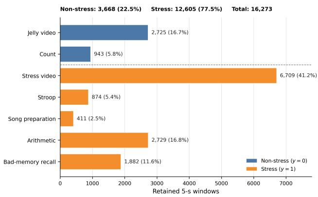  
Figure C.1: Distribution of the task windows used for stress/non-stress prediction. Exact counts and full-corpus percentages for the 16,273 retained 5-s windows in Dataset I. Jelly video and Count are assigned non-stress (y=0); Stress video, Stroop, Song preparation, Arithmetic, and Badmemory recall are assigned stress (y=1). The totals are 3,668 non-stress windows (22.5%) and 12,605 stress windows (77.5%). These are overlapping model windows rather than independent trials, and task identity defines the elicitationcondition label but is not supplied to the model as an input feature.

Stress and craving annotation. Stress labels were defined by task structure (baseline vs. stress blocks), leveraging established stress-induction protocols that elicit reliable and reproducible physiological responses (Ollander et al. 2016; Zhao et al. 2023). Craving, in contrast, was assessed independently through self-report because it is a subjective motivational state that cannot be determined solely from task identity (MacLean, Sofuoglu, and Rosenheck 2019; Sinha et al. 2000; Fox et al. 2008; Sinha 2009). Although stressinducing tasks may create conditions in which craving can arise, craving is not assumed to occur during every stress block and may also occur during non-stress periods, as shown in Appendix C.2. Following each task block, participants with OUD were asked to rate their perceived opioid craving as craving or not; control participants were not asked about opioid craving.

Because craving can persist over short time intervals rather than occurring only at a single instant (Baillet et al. 2024; Grunevski, Kong, and Konova 2024), each post-task craving report was treated as reflecting the participant's craving state over the corresponding task interval. This let us assign craving labels to the physiological windows within that interval while keeping craving defined as a participant-reported subjective state. For the binary craving target (RQ3), non-craving and craving windows follow directly from these reports (label distributions in Appendix C.2); task identity is never used as the craving label.

C.2 Dataset Characteristics. This section characterizes the distribution of physiological windows and craving labels in the collected dataset. This analysis matters because craving is a subjective state: even under an identical task protocol, sessions differ in whether craving occurs, how often, and during which task blocks it is reported.

Table C.2 reports the session-level breakdown. Window counts are comparable across sessions (totals range 45—59, median 50), so the heterogeneity is not an artifact of uneven data volume. Craving prevalence, however, is sharply uneven: of the 29 sessions, 10 contain no craving windows at all and 6 are entirely craving, leaving only 13 with both labels present. In other words, 16 of 29 sessions (55%) are single-class. Pooled across the corpus the split looks nearbalanced (55.5% craving over 4,863 windows), but that aggregate masks the fact that most individual sessions sit at one extreme or the other. Because only 172 independent participant-task labels underlie these 4,863 windows, the effective supervision is far sparser than the window count suggests, and it is distributed very unevenly across people.

At task level, over the same seven retained task codes, craving rates vary substantially by task: approximately 0.40 for Count, 0.41 for Jelly, 0.53 for Stress, 0.64 for Song, 0.64 for Arithmetic, 0.66 for Stroop, and 0.68 for Bad-memory recall. No task is purely one class for craving, so task identity is not the label.

Together these two views—single-class-dominated sessions and non-deterministic tasks—show that craving labels are heterogeneous along both axes. The practical consequences are the ones the body of the paper acts on: supervision is sparse, and a subject-independent split is essential (a random-window split would leak a session's single-class label into its own test windows).

Table C.2: Session-level distribution of craving labels across the 29 OUD sessions (25 individuals; 4 participants were recorded twice across different medication and treatment phase states, approximately six months apart). Windows are comparable in count across sessions, but craving prevalence is highly heterogeneous—16 of 29 sessions are single-class (no craving or all craving), and only 13 contain both labels.
<table><tr><td>Session profile</td><td># sessions</td><td>craving share</td></tr><tr><td>No craving (all non-craving)</td><td>10</td><td>0%</td></tr><tr><td>Mixed (both classes present)</td><td>13</td><td>1-99%</td></tr><tr><td>All craving</td><td>6</td><td>100%</td></tr><tr><td>Total</td><td>29</td><td>55.5%</td></tr></table>

Corpus: 55.5% craving, 172 independent task-block labels; 16/29 sessions single-class. Per-session window totals range 45–59 (median 50).

C.3 Dataset II (StressNet). 305 trials from 34 participants under a cold-pressor protocol with session-level labels (session 2 = no stress, session 3 = stress) (Kumar et al. 2021). Video at ≈ 7.5 fps after source decimation; each example spans 100 source frames (13.3 s) with a 50-frame stride, retaining every fourth frame to yield 25 sampled frames without shortening the temporal span. 97 regions (one global token plus a 4 × 24 grid), so the same aggregation model operates on $2 5 \times 9 7 \times 7 6 8$ . Full construction yields 7,777 windows; following the cold-pressor timing protocol, all methods use only windows beginning after 65 s, leaving 5,054 (2,566 no-stress, 2,488 stress). The fixed subject-disjoint fold uses 26/5/3 participants and 3,897/704/453 windows; test participants are 108, 132, 161. This single fold was drawn at random from the possible subject-disjoint partitions, not selected for performance, and is then fixed across the proposed method, every baseline, and seeds {42, 100, 2023}, so the within-fold comparison is controlled and person-disjoint.

C.4 Dataset III (craving). Reuses the 4,863 OUD windows with the per-block binary craving self-report replacing the stress target (craving vs. non-craving; see the annotation protocol above). This gives 2,698 craving (55.5%) and 2,165 non-craving windows from 29 OUD sessions (25 individuals). All evaluations leveraged a fixed person-disjoint 21/4/4 split, three seeds. Craving uses a longer 20 s window than the stress task (5 s), selected empirically over shorter alternatives. A longer window helps because craving is a slower, sustained motivational state rather than a discrete stimuluslocked response: its thermal signature is a gradual autonomic drift that unfolds over tens of seconds, so a short window captures only a fraction of the trajectory, and a longer one integrates more of the underlying dynamics, raising signalto-noise. It also aligns the input extent with the supervision, since the craving label is assigned once per task block rather than at a single instant.

## D Full Baseline Results (Primary Corpus)

Table D.1 summarizes the best member of each baseline family (referenced from body Section 6); the per-method breakdown follows. AUROC is the controlled comparison; FABLE-THERM persists a validation-selected threshold while most baselines retain 0.5, so accuracy and F1 describe saved operating points rather than a calibration comparison. "Controlled" here means the same person-disjoint split and target, not identical preprocessing or tuning: FABLE-THERM uses participant centering, the general baseline harness uses global train-only standardization, and LoRA uses a separate raw-image path (Appendix B.8 and D.2). The AUROC gaps are therefore system-level comparisons. Values are verbatim from the result CSVs.

D.1 Reading Table D.2. Three observations support claims made in body Section 6. (a) Random Forest and Extra-Trees post the highest baseline accuracy (0.802, 0.793) with near-chance ranking (0.612, 0.621), the clearest demonstration that accuracy is prior-driven here. (b) Several methods invert across protocols: TMC is the best Test-Both baseline but the median rule is the best Control-to-OUD baseline, so within-distribution ranking does not predict crosscohort ranking. Any model-selection procedure that uses only within-distribution validation is therefore selecting on the wrong criterion for the target population. (c) The LoRA rows show high Control-to-OUD accuracy (0.686–0.763) with low AUROC (0.590–0.608), i.e. collapse toward the majority class. The corresponding positive-class floors are Test-Control 0.792, Test-OUD 0.778, Test-Both 0.788, and Control-to-OUD 0.792. Thus FABLE-THERM's Test-OUD accuracy of 0.784 is 0.006 above its own split's majority predictor, not below a 0.792 floor; its AUROC 0.810 is the more informative ranking metric.

The 0.203 Test-Both AUROC margin over the best general baseline is arithmetically 0.938 — 0.735. Table G.2 narrows the architectural comparison.

D.2 LoRA harness disclosure. LoRA baselines use rank-$8 , \ \alpha { = } 1 6$ , dropout-0.05 adapters (PEFT) injected into the query/value projections for AnyThermal (DINOv2 naming) and the fused QKV projection for ImageNet-ViT and InfMAE (timm naming), with a trainable Linear(19,200, 2) head over flattened 25 × 768 features. Trainable adapter parameters are ≈ 295k (AnyThermal, 48 tensors), ≈ 295k (ImageNet-ViT, 24 tensors), and ≈ 270k (InfMAE, 22 tensors) against frozen backbones of 86.6M/85.8M/96.7M, under 0.4% of each. Training uses AdamW (lr $1 0 ^ { - 3 }$ , weight decay $1 0 ^ { - 4 } ) \ /$ class-weighted cross-entropy, bf16 mixed precision , and early stopping on validation balanced accuracy (patience 30, up to 100 epochs), over seeds {1234, 1235, 1236}—a different convention from the {42, 100, 2023} used elsewhere. Split files are identical, so results remain person-disjoint and comparable, but “identical harness" does not literally apply to this family. FABLE-THERm uses frozen features and trains no LoRA adapters.

Table D.1: RQ1. Best AUROC per baseline family under the shared person-disjoint splits (3 seeds); k = methods in family. Underline marks the best of the 29 general baselines per column; the published-MIL block below is analyzed in Section 6.3 and is not counted among the 29. Full per-method tables in Appendix D. AUROC is the controlled comparison: FABLE-TíERM uses a validation-selected threshold while most baselines retain 0.5, so accuracy and F1 (Appendix D) describe operating points rather than calibration.
<table><tr><td></td><td></td><td colspan="2">AUROC</td></tr><tr><td>Baseline family (best member)</td><td>k</td><td>Test-Both</td><td>Ctrl→OUD</td></tr><tr><td>Frozen linear probe (Concat-3)</td><td>4</td><td>0.675</td><td>0.621</td></tr><tr><td>LoRA fine-tuning (ImageNet-ViT)</td><td>3</td><td>0.686</td><td>0.608</td></tr><tr><td>Weight-space ens. (Snapshot)</td><td>6</td><td>0.720</td><td>0.613</td></tr><tr><td>Learned fusion (TMC)</td><td>6</td><td>0.735</td><td>0.657</td></tr><tr><td>Fixed comb. rules (Median/Min)</td><td>6</td><td>0.657</td><td>0.662</td></tr><tr><td>Tabular ens. (XGBoost)</td><td>4</td><td>0.642</td><td>0.582</td></tr><tr><td>Published MIL, best (TransMIL/ABMIL)</td><td>3</td><td>0.736</td><td>0.679</td></tr><tr><td>FABLE-THERM, single encoder</td><td>1</td><td>0.747</td><td>0.649</td></tr><tr><td>FABLE-THERM (learned fusion)</td><td></td><td> $\mathbf { 0 . 9 3 8 \pm . 0 0 4 }$ </td><td> $\mathbf { 0 . 7 7 1 \pm . 0 1 3 }$ </td></tr></table>

D.3 The cohort gap recurs across model families. Table D.3 shows that the Control→OUD asymmetry is not observed only for FABLE-THERM. Eighteen of the twenty-nine baselines also score lower on Test-OUD than Test-Control in AUROC, and the ImageNet-ViT linear probe collapses to exactly 0.500 on Test-OUD while reaching 0.705 on Test-Control. This repeated pattern is consistent with cohort shift, but it does not identify its cause. Clinical heterogeneity, sample size, site, ambient conditions, protocol execution, label noise, and representation shortfall can all contribute.

The symbol $\Delta _ { \mathrm { h e t e r } } = 0 . 9 7 9 - 0 . 8 1 0$ in Table D.4 is therefore best read as an observed residual cohort gap, not a pure estimate of within-OUD physiological heterogeneity. Likewise, $\Delta _ { \mathrm { r e p r } } = 0 . 8 1 0 - 0 . { \overset { \cdot } { 6 } } 5 { \overset { \cdot } { 2 } }$ is a matched-set performance increment from including OUD data during training, not a representation-only causal effect. The arithmetic decomposition is descriptive and the reported paired bootstrap does not separate these mechanisms.

D.4 Uncertainty in the decomposition. The reported bootstrap uses 2,000 participant-level resamples at seed 43, the 61.45% ordering frequency, p = 0.386, and the displayed difference interval. With only six Test-OUD participants, the sampling distribution is necessarily coarse.

D.5 StressNet on the primary corpus: a diagnostic comparison. The comparison above uses FABLE-THERM's own cohort split throughout. As a further check, we verified against an established foundation-model approach for thermal-video stress recognition, StressNet (Kumar et al. 2021), applied directly to our own cohort rather than to its native cold-pressor dataset (the reverse direction, FABLE-THERM on the StressNet dataset, is Appendix E). Stress-Net's original supervision reconstructs an ECG-derived heatemission/ISTI signal; our corpus provides no ECG channel, so we did not attempt to reproduce that pathway. Instead we trained and evaluated StressNet directly against the same task-defined ground-truth labels used throughout this work (Appendix C.1), with 100-frame windows and a person-disjoint random train/validation/test split. Tables D.6 and D.7 report the result beside FABLE-ThERM, whose numbers are those already reported in Tables D.3, D.2, D.4, and D.5. Pooled over all windows in this configuration, StressNet reaches accuracy 0.595 ±0.062, balanced accuracy 0.593 ±0.067, AUROC 0.506 ±0.182, and F1 0.440 ±0.311 (mean±std, seeds 42/100/2023)—near chance on the controlled AUROC metric and with substantially higher variance than FABLE-THERM, consistent with the person-disjoint, task-labelled setting being genuinely hard for a method built around a cardiac intermediary it cannot access here. This is a diagnostic transfer, not a faithful reproduction of Stress-Net's original ECG-supervised objective and not a matched head-to-head architectural ablation: window duration, representation, normalization, and tuning differ. It should not be used to claim that the original StressNet method is inferior on its intended problem. Domain-specific thermal baselines beyond this adaptation remain useful future comparisons.

## E StressNet (RQ2) Full Results

Supports body Section 6.4. Reminder of scope: one randomly selected, fixed subject-disjoint fold with 26/5/3 participants and three test participants (Appendix C.3), evaluated over three training seeds ({42, 100, 2023}); within-fold controlled, not dataset-wide. The body reports FABLE-TíERm's mean±std AUROC on this fold, $0 . { \dot { 9 } } 6 { \dot { 2 } } \pm 0 . 0 1 7$ , as the honest external estimate. Boldface in Tables E.1-E.2 therefore identifies the maximum on this selected fold only, not a datasetlevel state-of-the-art result.

E.1 What the StressNet variance means. Standard deviations on this fold reach ±0.220 (MIMMO F1) and ±0.243 (late max F1). With three test participants, per-seed variation and participant identity are entangled, so the fold ranking should be read as a controlled comparison under fixed conditions rather than as a stable ordering. This is the same caveat the body states in Section 6.4: because the fold was fixed after a single random draw rather than averaged across draws, method differences within it should not be read as a dataset-wide ranking.

Table D.2: Full primary-corpus results: within-distribution Test-Both and cross-cohort Control-to-OUD transfer, mean±std over 3 seeds. The exact positive-class accuracy floors are 0.788 and 0.792, respectively; 0.775 is the full-corpus rate, not either test-set floor. Underline: best baseline per column; bold: best overall.
<table><tr><td rowspan="2">Method</td><td colspan="3">Test-Both (within-distribution)</td><td colspan="3">Control-to-OUD (cross-cohort)</td></tr><tr><td>Acc</td><td>F1</td><td>AUROC</td><td>Acc</td><td>F1</td><td>AUROC</td></tr><tr><td>Frozen linear probe (logistic regression on global token)</td><td></td><td></td><td></td><td></td><td></td><td></td></tr><tr><td>AnyThermal</td><td>0.640</td><td>0.745</td><td>0.667 ±.00</td><td>0.448</td><td>0.512</td><td>0.613 ±.00</td></tr><tr><td>ImageNet-ViT</td><td>0.612</td><td>0.713</td><td>0.644 ±.00</td><td>0.518</td><td>0.608</td><td>0.615 ±.00</td></tr><tr><td>InfMAE</td><td>0.668</td><td>0.790</td><td>0.575 ±.00</td><td>0.437</td><td>0.510</td><td>0.569 ±.00</td></tr><tr><td>Concat-3</td><td>0.638</td><td>0.741</td><td>0.675 ±.00</td><td>0.440</td><td>0.496</td><td>0.621 ±.00</td></tr><tr><td>LoRA fine-tuning (adapted backbone + linear head)</td><td></td><td></td><td></td><td></td><td></td><td></td></tr><tr><td>AnyThermal</td><td>0.533</td><td>0.613</td><td>0.683 ±.031</td><td>0.548</td><td>0.642</td><td>0.608 ±.022</td></tr><tr><td>ImageNet-ViT</td><td>0.408</td><td>0.417</td><td>0.686 ±.014</td><td>0.686</td><td>0.784</td><td>0.590 ±.039</td></tr><tr><td>InfMAE</td><td>0.519</td><td>0.596</td><td>0.640 ±.023</td><td>0.763</td><td>0.861</td><td>0.595 ±.017</td></tr><tr><td>Weight-space / randomization ensembles</td><td></td><td></td><td></td><td></td><td></td><td></td></tr><tr><td>Deep Ensemble (Lakshminarayanan, Pritzel, and Blundell 2017)</td><td>0.691</td><td>0.781</td><td>0.716 ±.025</td><td>0.462</td><td>0.536</td><td>0.618 ±.005</td></tr><tr><td>Snapshot Ensemble (Huang et al. 2017)</td><td>0.699</td><td>0.786</td><td>0.720 ±.010</td><td>0.405</td><td>0.451</td><td>0.613 ±.004</td></tr><tr><td>Fast Geometric Ens. (Garipov et al. 2018)</td><td>0.683</td><td>0.774</td><td>0.711 ±.002</td><td>0.398</td><td>0.440</td><td>0.613 ±.007</td></tr><tr><td>SWA-Gaussian (Maddox et al. 2019)</td><td>0.694</td><td>0.785</td><td>0.711 ±.003</td><td>0.425</td><td>0.487</td><td>0.595 ±.015</td></tr><tr><td>BatchEnsemble (Wen, Tran, and Ba 2020)</td><td>0.670</td><td>0.770</td><td>0.686 ±.031</td><td>0.463</td><td>0.533</td><td>0.626 ±.005</td></tr><tr><td>MIMMO (Ferianc and Rodrigues 2023)</td><td>0.688</td><td>0.782</td><td>0.706 ±.018</td><td>0.401</td><td>0.434</td><td>0.631 ±.009</td></tr><tr><td>Learned multimodal fusion</td><td></td><td></td><td></td><td></td><td></td><td></td></tr><tr><td>Mixture-of-Experts (Jacobs et al. 1991)</td><td>0.563</td><td>0.661</td><td>0.641 ±.009</td><td>0.541</td><td>0.636</td><td>0.580 ±.023</td></tr><tr><td>FuseMoE (Han et al. 2024)</td><td>0.650</td><td>0.746</td><td>0.688 ±.015</td><td>0.470</td><td>0.531</td><td>0.615 ±.018</td></tr><tr><td>DynMM (Xue and Marculescu 2023)</td><td>0.655</td><td>0.752</td><td>0.688 ±.012</td><td>0.424</td><td>0.470</td><td>0.614 ±.005</td></tr><tr><td>QMF (Zhang et al. 2023)</td><td>0.642</td><td>0.739</td><td>0.665 ±.006</td><td>0.405</td><td>0.438</td><td>0.649 ±.009</td></tr><tr><td>MMTM (Vaezi Joze et al. 2020)</td><td>0.679</td><td>0.770</td><td>0.706 ±.025</td><td>0.451</td><td>0.527</td><td>0.594 ±.008</td></tr><tr><td>Trusted Multi-View (Han et al. 2021)</td><td>0.710</td><td>0.802</td><td>0.735 ±.022</td><td>0.610</td><td>0.708</td><td>0.657 ±.019</td></tr><tr><td>Fixed posterior combination rules (Kittler et al. 1998)</td><td></td><td></td><td></td><td></td><td></td><td></td></tr><tr><td>Sum rule</td><td>0.598</td><td>0.702</td><td>0.624 ±.013</td><td>0.393</td><td>0.416</td><td>0.639 ±.012</td></tr><tr><td>Product rule</td><td>0.638</td><td>0.740</td><td>0.649 ±.013</td><td>0.397</td><td>0.419</td><td>0.661 ±.007</td></tr><tr><td>Max rule</td><td>0.656</td><td>0.754</td><td>0.632 ±.012</td><td>0.410</td><td>0.443</td><td>0.627 ±.012</td></tr><tr><td>Min rule</td><td>0.654</td><td>0.753</td><td>0.657 ±.013</td><td>0.410</td><td>0.443</td><td>0.659 ±.009</td></tr><tr><td>Median rule</td><td>0.593</td><td>0.697</td><td>0.630 ±.020</td><td>0.397</td><td>0.424</td><td>0.662 ±.014</td></tr><tr><td>Majority vote</td><td>0.593</td><td>0.697</td><td>0.600 ±.005</td><td>0.397</td><td>0.424</td><td>0.599 ±.023</td></tr><tr><td>Non-deep tabular ensembles (pooled frozen features)</td><td></td><td></td><td></td><td></td><td></td><td></td></tr><tr><td>Random Forest (Breiman 2001)</td><td>0.802</td><td>0.887</td><td>0.612 ±.009</td><td>0.792</td><td>0.884</td><td>0.589 ±.004</td></tr><tr><td>ExtraTrees (Geurts, Ernst, and Wehenkel 2006)</td><td>0.793</td><td>0.882</td><td>0.621 ±.005</td><td>0.790</td><td>0.883</td><td>0.611 ±.004</td></tr><tr><td>XGBoost (Chen and Guestrin 2016)</td><td>0.665</td><td>0.775</td><td>0.642 ±.010</td><td>0.716</td><td>0.823</td><td>0.582 ±.006</td></tr><tr><td>LightGBM (Ke et al. 2017)</td><td>0.682</td><td>0.790</td><td>0.642 ±.004</td><td>0.739</td><td>0.844</td><td>0.565 ±.011</td></tr><tr><td>FABLE-THERM (learned fusion)</td><td>0.884</td><td>0.926</td><td>0.938 ±.004</td><td>0.817</td><td>0.894</td><td>0.771 ±.013</td></tr></table>

E.2 Why the original StressNet number is not the right comparison target. StressNet's own published stressdetection result is measured under a single 80%/10%/10% split of individual (subject, session) trial files, shuffled without any subject grouping; their released training code performs a flat random shuffle over dataset indices and slices the shuffled list directly into train/validation/test, with no held-out-subject list at any stage. Because each dataset item is one (subject, session) recording, a participant's stress and non-stress sessions can land on opposite sides of that split, so the published number is not obtained under a person-disjoint protocol. Our StressNet-dataset evaluation above instead uses a fixed subject-disjoint fold (Appendix C.3: 26/5/3 participants, no participant appearing on both sides). Any result scored under our protocol is therefore expected to sit below the original paper's headline number for this reason alone, independent of reimplementation differences: our fold removes a same-subject leakage pathway that the original evaluation never controlled for.

## F Craving (RQ3) Full Results

Supports body Section 6.5. Positive prevalence is 55.5%; accuracy, balanced accuracy, and F1 use a common fixed 0.5 threshold, and AUROC is threshold-free. LoRA and MILablation heads are omitted for this endpoint.

F.1 Scope of the feasibility claim. To our knowledge, Table F.1 is the first demonstration that self-reported craving can be decoded from thermal video, and it establishes that result at a usable operating point: FABLE-TíERM attains the best accuracy (0.667) and balanced accuracy (0.660) in the table, with MIMMO the closest baseline at 0.603 balanced accuracy. Four features of the table delimit what it supports. (a) Rankings are metric-dependent. AnyThermal (0.970), Concat-3 (0.967), and the Min rule (0.796) exceed FABLE-THERM's 0.752 AUROC. AUROC measures ranking independently of threshold; balanced accuracy measures decisions at the reported 0.5 threshold. High AUROC without a transportable operating point is of limited use for deployment, which is the regime FABLE-ThERm targets. The body result is an operating-point result. (b) The tabular ensembles fall below chance (0.155–0.247 AUROC), indicating systematic inversion on these held-out participants rather than a stable craving classifier. (c) Several ensembles return exactly 0.500 AUROC with ±0.000, i.e. degenerate constant predictors. (d) Four participants are in the test split, 16/29 sessions are single-class, and all windows in a participant-task block inherit one report; the effective sample size is closer to 172 block labels than 4,863 windows. The archived experiment therefore establishes out-of-person ranking and operatingpoint associations with block-level craving reports—the first such evidence for thermal video in this setting.

Table D.3: Within-group per-cohort breakdown: train on both cohorts, evaluate separately on held-out Test-Control (8 subjects, 2,306 windows) and Test-OUD (6 subjects, 1,000 windows). Same baselines, seeds, and conventions as Table D.2. These are the two protocols that make the decomposition in body Table 2 computable.
<table><tr><td></td><td colspan="3">Test-Control</td><td colspan="3">Test-OUD</td></tr><tr><td>Method</td><td>Acc</td><td>F1</td><td>AUROC</td><td>Acc</td><td>F1</td><td>AUROC</td></tr><tr><td>Frozen linear probe</td><td></td><td></td><td></td><td></td><td></td><td></td></tr><tr><td>AnyThermal</td><td>0.637</td><td>0.747</td><td> $0 . 6 4 9 \pm . 0 0$ </td><td>0.649</td><td>0.740</td><td> $0 . 7 1 9 \pm . 0 0$ </td></tr><tr><td>ImageNet-ViT</td><td>0.592</td><td>0.683</td><td> $0 . 7 0 5 \pm . 0 0$ </td><td>0.657</td><td>0.772</td><td> $0 . 5 0 0 \pm . 0 0$ </td></tr><tr><td>InfMAE</td><td>0.663</td><td>0.782</td><td> $0 . 5 8 9 \pm . 0 0$ </td><td>0.681</td><td>0.806</td><td> $0 . 5 2 3 \pm . 0 0$ </td></tr><tr><td>Concat-3</td><td>0.640</td><td>0.749</td><td> $0 . 6 6 1 \pm . 0 0$ </td><td>0.632</td><td>0.720</td><td> $0 . 7 2 8 \pm . 0 0$ </td></tr><tr><td>LoRA fine-tuning</td><td></td><td></td><td></td><td></td><td></td><td></td></tr><tr><td>AnyThermal</td><td>0.523</td><td>0.594</td><td> $0 . 7 2 6 \pm . 0 5 4$ </td><td>0.555</td><td>0.644</td><td>0.588 ±.042</td></tr><tr><td>ImageNet-ViT</td><td>0.457</td><td>0.485</td><td> $\underline { { 0 . 7 8 7 } } \pm . 0 1 8$ </td><td>0.298</td><td>0.230</td><td>0.440 ±.021</td></tr><tr><td>InfMAE</td><td>0.494</td><td>0.562</td><td> $0 . 6 8 1 \pm . 0 2 9$ </td><td>0.577</td><td>0.646</td><td> $0 . 5 7 8 \pm . 0 0 9$ </td></tr><tr><td>Weight-space / randomization ensembles</td><td></td><td></td><td></td><td></td><td></td><td></td></tr><tr><td>Deep Ensemble</td><td>0.683</td><td>0.768</td><td> $0 . 7 3 5 { \scriptstyle \pm . 0 1 1 }$ </td><td>0.707</td><td>0.807</td><td> $0 . 6 8 4 \pm . 0 6 3$ </td></tr><tr><td>Snapshot Ensemble</td><td>0.692</td><td>0.777</td><td> $0 . 7 0 9 \pm . 0 0 8$ </td><td>0.718</td><td>0.804</td><td> $\underline { { 0 . 7 7 0 } } \pm . 0 0 6$ </td></tr><tr><td>Fast Geometric Ens.</td><td>0.687</td><td>0.777</td><td> $0 . 7 0 7 \pm . 0 0 6$ </td><td>0.674</td><td>0.765</td><td> $0 . 7 2 3 \pm . 0 0 8$ </td></tr><tr><td>SWA-Gaussian</td><td>0.706</td><td>0.794</td><td> $0 . 7 1 8 \pm . 0 1 9$ </td><td>0.666</td><td>0.762</td><td> $0 . 6 9 4 \pm . 0 5 7$ </td></tr><tr><td>BatchEnsemble</td><td>0.658</td><td>0.749</td><td> $0 . 7 1 2 \pm . 0 2 2$ </td><td>0.696</td><td>0.811</td><td> $0 . 6 1 7 \pm . 0 2 9$ </td></tr><tr><td>MIMMO</td><td>0.678</td><td>0.765</td><td> $0 . 7 2 4 \pm . 0 1 1$ </td><td>0.711</td><td>0.812</td><td> $0 . 6 8 1 \pm . 0 5 1$ </td></tr><tr><td>Learned multimodal fusion</td><td></td><td></td><td></td><td></td><td></td><td></td></tr><tr><td>Mixture-of-Experts</td><td>0.518</td><td>0.597</td><td> $0 . 6 5 0 \pm . 0 2 1$ </td><td>0.668</td><td>0.776</td><td> $0 . 6 5 1 \pm . 0 2 5$ </td></tr><tr><td>FuseMoE</td><td>0.637</td><td>0.730</td><td> $0 . 7 0 1 \pm . 0 3 0$ </td><td>0.680</td><td>0.778</td><td> $0 . 6 7 8 \pm . 0 4 4$ </td></tr><tr><td>DynMM</td><td>0.648</td><td>0.746</td><td> $0 . 6 8 8 \pm . 0 0 8$ </td><td>0.673</td><td>0.765</td><td> $0 . 7 0 0 { \scriptstyle \pm . 0 2 7 }$ </td></tr><tr><td>QMF</td><td>0.632</td><td>0.726</td><td> $0 . 6 8 6 \pm . 0 1 0$ </td><td>0.665</td><td>0.765</td><td> $0 . 6 3 1 \pm . 0 3 5$ </td></tr><tr><td>MMTM</td><td>0.652</td><td>0.737</td><td> $0 . 7 2 3 \pm . 0 1 3$ </td><td>0.741</td><td>0.831</td><td> $0 . 7 0 2 \pm . 0 4 3$ </td></tr><tr><td>Trusted Multi-View</td><td>0.700</td><td>0.788</td><td> $0 . 7 7 5 \pm . 0 1 0$ </td><td>0.734</td><td>0.832</td><td> $0 . 6 7 8 \pm . 0 3 7$ </td></tr><tr><td>Fixed posterior combination rules</td><td></td><td></td><td></td><td></td><td></td><td></td></tr><tr><td>Sum rule</td><td>0.563</td><td>0.666</td><td> $0 . 6 1 6 \pm . 0 1 8$ </td><td>0.680</td><td>0.776</td><td> $0 . 6 6 5 \pm . 0 1 0$ </td></tr><tr><td>Product rule</td><td>0.613</td><td>0.717</td><td> $0 . 6 4 4 \pm . 0 2 2$ </td><td>0.696</td><td>0.789</td><td> $0 . 6 7 1 \pm . 0 0 8$ </td></tr><tr><td>Max rule</td><td>0.644</td><td>0.742</td><td> $0 . 6 2 7 \pm . 0 1 5$ </td><td>0.683</td><td>0.779</td><td> $0 . 6 6 9 \pm . 0 3 0$ </td></tr><tr><td>Min rule</td><td>0.642</td><td>0.741</td><td> $0 . 6 7 5 \pm . 0 2 4$ </td><td>0.681</td><td>0.778</td><td> $0 . 6 4 6 \pm . 0 2 2$ </td></tr><tr><td>Median rule</td><td>0.562</td><td>0.664</td><td> $0 . 6 3 2 \pm . 0 2 7$ </td><td>0.665</td><td>0.764</td><td> $0 . 6 5 5 \pm . 0 3 1$ </td></tr><tr><td>Majority vote</td><td>0.562</td><td>0.664</td><td> $0 . 5 8 8 \pm . 0 1 1$ </td><td>0.665</td><td>0.764</td><td> $0 . 6 4 2 \pm . 0 1 3$ </td></tr><tr><td>Non-deep tabular ensembles</td><td></td><td></td><td></td><td></td><td></td><td></td></tr><tr><td>Random Forest</td><td>0.812</td><td>0.892</td><td> $0 . 6 5 8 \pm . 0 1 2$ </td><td>0.778</td><td>0.875</td><td> $0 . 6 3 8 \pm . 0 0 4$ </td></tr><tr><td>ExtraTrees</td><td>0.799</td><td>0.885</td><td> $0 . 6 6 8 \pm . 0 0 8$ </td><td>0.778</td><td>0.875</td><td> $0 . 6 2 5 \pm . 0 0 7$ </td></tr><tr><td>XGBoost</td><td>0.613</td><td>0.717</td><td> $0 . 6 6 8 \pm . 0 1 1$ </td><td>0.786</td><td>0.879</td><td> $0 . 6 5 3 \pm . 0 1 9$ </td></tr><tr><td>LightGBM</td><td>0.638</td><td>0.744</td><td> $0 . 6 7 5 \pm . 0 0 8$ </td><td>0.782</td><td>0.877</td><td> $0 . 6 5 3 \pm . 0 0 8$ </td></tr><tr><td>FABLE-THERM (learned fusion)</td><td>0.927</td><td>0.953</td><td> $\mathbf { 0 . 9 7 9 } \pm . 0 0 2$ </td><td>0.784</td><td>0.862</td><td> $\mathbf { 0 . 8 1 0 \bot . 0 0 2 }$ </td></tr></table>

## G Full Aggregator Comparison

Table G.1 (referenced from body Section 6.3) summarizes the headline aggregator comparison across Test-Both and Test-OUD; Table G.2 gives the full per-encoder form across Test-Both and Control-to-OUD.

G.1 What these tables establish. Tables G.1 and G.2 give a consistent ordering. Regional trajectories beat static-vector instances under the three published MIL heads we tested. The proposed single-encoder branch is the strongest singleencoder entry on Test-Both (0.747). The full three-encoder model is highest on every protocol in either table, reaching 0.938 on Test-Both and 0.810 on Test-OUD. Scope. Normalization and splits are matched across these rows, so the instance-representation contrast is attributable to the aggregator. The “separate MIL + logit attention" row additionally moves fusion from the embedding to the logit level, so its margin reflects fusion depth as well as parameter sharing.

Table D.4: FABLE-TíERM resolved by cohort and training composition. The matched decomposition (Sec. 6.2) evaluates the Control-only model on the same six Test-OUD participants; the significance test comparing $\Delta _ { \mathrm { r e p r } }$ against $\Delta _ { \mathrm { h e t e r } }$ favors heterogeneity in 61.45% of paired seed-43 participant resamples but is not significant $( p = 0 . { \bar { 3 } } 8 6 ;$ differènce 95% CI [−0.076, 0.200]).
<table><tr><td>Protocol</td><td>OUD in train?</td><td>AUROC</td><td> $\operatorname { A c c } .$ </td></tr><tr><td>Test-Control</td><td>yes</td><td>0.979</td><td>0.927</td></tr><tr><td>Test-Both</td><td>yes</td><td>0.938</td><td>0.884</td></tr><tr><td> $\mathrm { T e s t - O U D } \left( 6 \right)$ </td><td>yes</td><td>0.810</td><td>0.784</td></tr><tr><td> $\mathrm { C o n t r o l { \to } O U D \ ( 2 9 ) }$ </td><td>no</td><td>0.771</td><td>0.817</td></tr><tr><td>Control-only @ the same 6</td><td>no</td><td>0.652</td><td>0.785</td></tr><tr><td> $\Delta _ { \mathrm { r e p r } } = 0 . 8 1 0 - \ @ 6$ </td><td></td><td>0.158</td><td></td></tr><tr><td> $\dot { \Delta } _ { \mathrm { h e t e r } } = 0 . 9 7 9 - 0 . 8 1 0$ </td><td></td><td>0.169</td><td></td></tr></table>

Table D.5: FABLE-THERM across the four person-disjoint protocols (mean±std, 3 seeds). Expanded form of body Table 2.
<table><tr><td>Setting</td><td>Accuracy</td><td>AUROC</td><td>Positive-class F1</td></tr><tr><td>Test-Both</td><td> $0 . 8 8 4 \pm 0 . 0 0 8$ </td><td> $0 . 9 3 8 \pm \mathrm { 0 . 0 0 4 }$ </td><td> $0 . 9 2 6 \pm 0 . 0 0 6$ </td></tr><tr><td>Test-Control</td><td> $0 . 9 2 7 \pm 0 . 0 0 8$ </td><td> $0 . 9 7 9 { \scriptstyle \pm 0 . 0 0 2 }$ </td><td> $0 . 9 5 3 \pm 0 . 0 0 6$ </td></tr><tr><td>Test-OUD</td><td> $0 . 7 8 4 \pm 0 . 0 1 0$ </td><td> $0 . 8 1 0 { \scriptstyle \pm 0 . 0 0 2 }$ </td><td> $0 . 8 6 2 \pm 0 . 0 0 8$ </td></tr><tr><td>Control-to-OUD</td><td> $0 . 8 1 7 \pm 0 . 0 0 7$ </td><td> $0 . 7 7 1 { \scriptstyle \pm 0 . 0 1 3 }$ </td><td> $0 . 8 9 4 \pm 0 . 0 0 5$ </td></tr></table>

Takeaway. Under matched normalization and splits, treating instances as regional trajectories rather than static vectors improves every MIL head tested, and the shared-operator three-encoder model is the strongest configuration on both cohorts.

## H Implementation and Hyperparameters Supports body Section 4 and Section 8.

H.1 System. PyTorch (torch 2.8, CUDA 12.8, Python 3.13), single NVIDIA RTX 5090 (32 GB). Inputs are 25 sampled frames; features come from three frozen encoders and only the aggregation network is updated. Hyperparameter search uses Optuna 4.8 (Akiba et al. 2019) with the default TPE sampler and a median pruner (2 startup trials, 15 warmup steps). The three feature artifacts correspond to (i) AnyThermal, the thermaldistilled DINOv2 ViT-B/14; (ii) InfMAE, the infrared masked autoencoder; and (iii) the timm checkpoint vit\_base\_patch16\_224(pretrained=True, num\_classes=0) with ImageNet input normalization. The third artifact is therefore called ImageNet-ViT throughout.

H.2 Training loop. Mixed precision via torch.amp.autocast/GradScaler; gradient clipping (max-norm 5.0) after unscaling, to control variance introduced by the class-balanced sampler and focal loss; cosine schedule with linear warmup and decoupled AdamW weight decay (Loshchilov and Hutter 2019); stochastic weight averaging (Izmailov et al. 2018) over the final

30% of epochs, applied only when SWA weights beat the best single checkpoint on validation; and per-epoch threshold selection on the validation split, never on test. Early stopping and checkpoint selection use validation balanced accuracy (Brodersen et al. 2010) at the per-epochtuned threshold, patience 25. Evaluation is deterministic under seeds {42, 100, 2023}; the first seed's weights and validation-tuned threshold are persisted.

H.3 Search protocol. Optuna tunes width d, heads, learning rate, batch size, warmup, dropout, weight decay, and every loss weight on train→val only, over a “gentle" space biased toward slower learning and stronger regularization; the frozen-feature model overfits an unconstrained space within one epoch. Each protocol runs 5 trials × 200 epochs; the best trial is retrained for 3 seeds.

H.4 Preliminary four-encoder check (LanguageBind). We also extracted LanguageBind features on the same 49- token background-masked grid (768-d) and reran the withingroup protocol with a four-encoder MIL model. The purpose was to ask whether performance had already saturated with three encoders and whether LanguageBind added signal. We used the same fixed person-disjoint split, the same 3 seeds {42, 100, 2023}, and the same SWA / focal / per-subjectnormalization / per-epoch threshold-tuning machinery. Each seed early-stopped well before the 200-epoch cap (epochs 26, 34, and 30), consistent with the 3-encoder early-stopping behaviour reported elsewhere in this appendix. Table H.2 reports the outcome: adding LanguageBind did not improve performance, so we retained the three-encoder configuration (AnyThermal, ImageNet-ViT, InfMAE) used throughout the rest of the paper.

Table D.6: Within-group protocols: FABLE-TíERm (already reported in Tables D.3/D.2/D.5) vs. StressNet (Kumar et al. 2021) retrained and evaluated on our own cohort under task-defined labels, 100-frame windows, and a person-disjoint random split (mean±std, seeds 42/100/2023).
<table><tr><td></td><td></td><td></td><td colspan="3">FABLE-THERM</td><td colspan="3">StressNet (ours-relabelled)</td></tr><tr><td>Protocol</td><td>n subj. n win.</td><td></td><td>Acc</td><td>F1</td><td>AUROC</td><td>Acc</td><td>F1</td><td>AUROC</td></tr><tr><td>Test-Control</td><td>8</td><td>2,306</td><td>0.927</td><td>0.953</td><td>0.979</td><td> $0 . 5 8 2 \pm . 2 6 5$ </td><td> $0 . 5 7 8 \pm . 4 0 9$ </td><td> $0 . 4 8 4 \pm . 0 3 5$ </td></tr><tr><td>Test-OUD</td><td>6</td><td>1,000</td><td>0.784</td><td>0.862</td><td>0.810</td><td> $0 . 5 7 3 \pm . 2 4 9$ </td><td> $0 . 5 6 7 \pm . 4 0 1$ </td><td> $0 . 5 5 1 \pm . 0 2 4$ </td></tr><tr><td>Test-Both</td><td>14</td><td> $^ { 3 , 3 0 6 }$ </td><td>0.884</td><td>0.926</td><td>0.938</td><td> $0 . 5 8 0 \pm . 2 6 0$ </td><td> $0 . 5 7 5 { \scriptstyle \pm . 4 0 6 }$ </td><td> $0 . 5 1 2 { \scriptstyle \pm . 0 2 0 }$ </td></tr></table>

Table D.7: Cross-cohort protocol: FABLE-ThERM (already reported in Tables D.4/D.5) vs. StressNet trained on Control and evaluated on OUD, same relabeling and split convention as Table D.6.
<table><tr><td></td><td></td><td></td><td colspan="3">FABLE-THERM</td><td colspan="3">StressNet (ours-relabelled)</td></tr><tr><td>Protocol</td><td></td><td>n subj. n win.</td><td>Acc</td><td>F1</td><td>AUROC</td><td>Acc</td><td>F1</td><td>AUROC</td></tr><tr><td>Control→OUD</td><td>29</td><td>4,863</td><td>0.817</td><td>0.894</td><td>0.771</td><td> $0 . 4 6 6 \pm . 2 4 3$ </td><td>0.459 ±.362</td><td> $0 . 4 4 6 \pm . 0 3 4$ </td></tr></table>

Table E.1: StressNet baseline and ensemble comparison on one selected, fixed subject-disjoint fold (mean±population std over seeds {42, 100, 2023}). MIL methods are in Table E.2. Underline: best non-MIL baseline; bold: best overall.
<table><tr><td>Method</td><td>Accuracy</td><td>Balanced accuracy</td><td>F1</td><td>AUROC</td></tr><tr><td colspan="5">Frozen linear probes</td></tr><tr><td>AnyThermal</td><td> $0 . 4 5 9 \pm . 0 0 0$ </td><td> $0 . 4 5 2 \pm . 0 0 0$ </td><td> $0 . 1 5 2 \pm . 0 0 0$ </td><td> $0 . 5 9 7 \pm . 0 0 0$ </td></tr><tr><td>ImageNet-ViT</td><td> $0 . 6 7 6 \pm . 0 0 0$ </td><td> $0 . 6 7 0 \pm . 0 0 0$ </td><td> $0 . 5 4 5 \pm . 0 0 0$ </td><td> $0 . 8 6 3 \pm . 0 0 0$ </td></tr><tr><td>InfMAE</td><td> $0 . 7 3 7 \pm . 0 0 0$ </td><td> $0 . 7 3 3 \pm . 0 0 0$ </td><td> $0 . 6 4 9 \pm . 0 0 0$ </td><td> $0 . 9 0 2 \pm . 0 0 0$ </td></tr><tr><td>Concat-3</td><td> $0 . 4 7 7 \pm . 0 0 0$ </td><td> $0 . 4 6 9 \pm . 0 0 0$ </td><td> $0 . 1 4 4 \pm . 0 0 0$ </td><td> $0 . 6 0 1 \pm . 0 0 0$ </td></tr><tr><td colspan="3">Non-deep tabular ensembles</td><td></td><td></td></tr><tr><td>Random Forest</td><td> $0 . 5 2 1 \pm . 0 0 8$ </td><td> $0 . 5 1 2 \pm . 0 0 8$ </td><td> $0 . 1 1 7 \pm . 0 2 0$ </td><td> $0 . 8 1 6 \pm . 0 1 6$ </td></tr><tr><td>ExtraTrees</td><td> $0 . 5 2 2 \pm . 0 1 2$ </td><td> $0 . 5 1 4 \pm . 0 1 2$ </td><td> $0 . 1 2 3 \pm . 0 3 8$ </td><td> $0 . 7 8 3 \pm . 0 0 8$ </td></tr><tr><td>XGBoost</td><td> $0 . 5 6 0 \pm . 0 0 7$ </td><td> $0 . 5 5 2 \pm . 0 0 8$ </td><td> $0 . 2 2 5 \pm . 0 2 5$ </td><td> $0 . 8 6 8 \pm . 0 1 8$ </td></tr><tr><td>LightGBM</td><td> $0 . 5 4 8 \pm . 0 0 7$ </td><td> $0 . 5 4 0 \pm . 0 0 7$ </td><td> $0 . 2 0 4 \pm . 0 2 1$ </td><td> $0 . 8 4 7 \pm . 0 2 2$ </td></tr><tr><td colspan="3">Weight-space / randomization ensembles</td><td></td><td></td></tr><tr><td>Deep Ensemble</td><td> $0 . 6 8 7 \pm . 0 2 3$ </td><td> $0 . 6 8 1 \pm . 0 2 4$ </td><td> $0 . 5 5 8 \pm . 0 5 0$ </td><td> $0 . 9 2 0 \pm . 0 0 4$ </td></tr><tr><td>Snapshot Ensemble</td><td> $0 . 7 4 5 \pm . 0 7 1$ </td><td> $0 . 7 4 1 \pm . 0 7 2$ </td><td> $0 . 6 6 4 \pm . 1 1 1$ </td><td> $0 . 8 8 0 \pm . 0 3 5$ </td></tr><tr><td>Fast Geometric Ens.</td><td> $0 . 6 4 0 \pm . 0 8 4$ </td><td> $0 . 6 3 4 \pm . 0 8 6$ </td><td> $0 . 4 1 9 \pm . 1 9 5$ </td><td> $0 . 9 1 4 \pm . 0 1 5$ </td></tr><tr><td>SWA-Gaussian</td><td> $0 . 6 6 7 \pm . 0 5 0$ </td><td> $0 . 6 6 2 \pm . 0 5 1$ </td><td> $0 . 5 1 1 \pm . 1 1 2$ </td><td> $0 . 8 7 4 \pm . 0 2 9$ </td></tr><tr><td>BatchEnsemble</td><td> $0 . 7 4 5 \pm . 0 1 6$ </td><td> $0 . 7 4 1 \pm . 0 1 6$ </td><td> $0 . 6 6 8 \pm . 0 3 5$ </td><td> $0 . 9 2 4 \pm . 0 3 6$ </td></tr><tr><td>MIMMO</td><td> $0 . 6 8 7 \pm . 1 3 0$ </td><td> $0 . 6 8 2 \pm . 1 3 2$ </td><td> $0 . 5 6 4 \pm . 2 2 0$ </td><td> $0 . 8 6 2 \pm . 0 9 2$ </td></tr><tr><td colspan="3">Naive early/late fusion</td><td></td><td></td></tr><tr><td>Early concatenation</td><td> $0 . 6 6 6 \pm . 0 7 4$ </td><td> $0 . 6 6 0 \pm . 0 7 5$ </td><td> $0 . 4 8 2 \pm . 1 7 6$ </td><td> $0 . 8 3 0 \pm . 0 8 8$ </td></tr><tr><td>Late mean</td><td> $0 . 7 5 1 \pm . 0 3 8$ </td><td> $0 . 7 4 7 \pm . 0 3 9$ </td><td> $0 . 6 6 2 \pm . 0 6 7$ </td><td> $0 . 9 0 0 { \scriptstyle \pm . 0 7 6 }$ </td></tr><tr><td>Late max</td><td> $0 . 6 2 0 \pm . 0 8 7$ </td><td> $0 . 6 1 3 \pm . 0 8 8$ </td><td> $0 . 3 5 1 \pm . 2 4 3$ </td><td> $0 . 8 2 5 { \scriptstyle \pm . 0 1 6 }$ </td></tr><tr><td>Late vote</td><td> $\underline { { 0 . 7 7 6 } } \pm . 0 9 8$ </td><td> $\underline { { 0 . 7 7 2 } } \pm . 1 0 0$ </td><td> $0 . 6 8 6 { \scriptstyle \pm . 1 8 6 }$ </td><td> $0 . 8 0 7 \pm . 0 9 7$ </td></tr><tr><td colspan="3">Learned multi-encoder fusion</td><td></td><td></td></tr><tr><td>Mixture-of-Experts</td><td> $0 . 6 1 7 \pm . 0 1 4$ </td><td> $0 . 6 1 4 \pm . 0 1 3$ </td><td> $0 . 5 4 8 \pm . 0 3 7$ </td><td> $0 . 6 7 9 \pm . 0 8 4$ </td></tr><tr><td>FuseMoE</td><td> $0 . 7 0 2 \pm . 0 8 5$ </td><td> $0 . 6 9 7 \pm . 0 8 6$ </td><td> $0 . 5 5 8 \pm . 1 9 0$ </td><td> $0 . 9 0 8 \pm . 0 4 8$ </td></tr><tr><td>DynMM</td><td> $0 . 6 0 8 \pm . 0 9 4$ </td><td> $0 . 6 0 3 \pm . 0 9 5$ </td><td> $0 . 4 6 8 \pm . 1 5 7$ </td><td> $0 . 7 4 4 \pm . 1 1 9$ </td></tr><tr><td>QMF</td><td> $0 . 6 9 5 \pm . 0 7 4$ </td><td> $0 . 6 9 0 { \scriptstyle \pm . 0 7 5 }$ </td><td> $0 . 5 5 7 \pm . 1 4 7$ </td><td> $0 . 9 1 2 \pm . 0 3 4$ </td></tr><tr><td>MMTM</td><td> $0 . 6 4 4 \pm . 0 3 9$ </td><td> $0 . 6 3 8 \pm . 0 4 0$ </td><td> $0 . 4 6 5 \pm . 0 9 5$ </td><td> $0 . 8 7 9 \pm . 0 1 1$ </td></tr><tr><td>Trusted Multi-View</td><td> $0 . 6 7 6 \pm . 0 6 9$ </td><td> $0 . 6 7 0 \pm . 0 7 1$ </td><td> $0 . 4 9 1 \pm . 1 7 0$ </td><td> $0 . 8 4 3 \pm . 0 2 0$ </td></tr><tr><td colspan="3">Fixed posterior combination rules</td><td></td><td></td></tr><tr><td>Sum</td><td> $0 . 6 7 4 \pm . 0 2 1$ </td><td> $0 . 6 6 8 \pm . 0 2 2$ </td><td> $0 . 5 1 6 \pm . 0 5 2$ </td><td> $0 . 8 4 6 \pm . 0 5 8$ </td></tr><tr><td>Product</td><td> $0 . 6 7 6 \pm . 0 2 8$ </td><td> $0 . 6 6 9 \pm . 0 2 9$ </td><td> $0 . 5 1 8 \pm . 0 6 6$ </td><td> $0 . 8 7 9 \pm . 0 4 6$ </td></tr><tr><td>Max</td><td> $0 . 6 8 5 \pm . 0 4 6$ </td><td> $0 . 6 7 9 \pm . 0 4 7$ </td><td> $0 . 5 4 2 \pm . 0 9 6$ </td><td> $0 . 8 2 1 \pm . 0 7 0$ </td></tr><tr><td>Min</td><td> $0 . 6 8 5 \pm . 0 4 6$ </td><td> $0 . 6 7 9 \pm . 0 4 7$ </td><td> $0 . 5 4 2 \pm . 0 9 6$ </td><td> $0 . 8 9 5 \pm . 0 3 7$ </td></tr><tr><td>Median</td><td> $0 . 6 7 8 \pm . 0 1 7$ </td><td> $0 . 6 7 2 { \scriptstyle \pm . 0 1 8 }$ </td><td> $0 . 5 2 7 \pm . 0 4 1$ </td><td> $0 . 8 8 6 \pm . 0 2 7$ </td></tr><tr><td>Majority vote</td><td> $0 . 6 7 8 \pm . 0 1 7$ </td><td> $0 . 6 7 2 { \scriptstyle \pm . 0 1 8 }$ </td><td> $0 . 5 2 7 \pm . 0 4 1$ </td><td> $0 . 7 6 9 \pm . 0 6 5$ </td></tr><tr><td>FABLE-THERM</td><td> $\mathbf { 0 . 8 2 3 \bot . 0 4 2 }$ </td><td> $\mathbf { 0 . 8 2 0 \bot . 0 4 4 }$ </td><td> $\mathbf { 0 . 7 8 2 \bot . 0 7 0 }$ </td><td> $\mathbf { 0 . 9 6 2 \pm . 0 1 7 }$ </td></tr></table>

Table E.2: StressNet MIL comparison on the same selected fixed fold (mean±population std, three seeds). Concat $\cdot 3 = \mathrm { e a r l y }$ concatenation of the three frozen encoders; “single encoder" = the proposed branch without ensemble fusion. Underline: best baseline; bold: best overall,
<table><tr><td>Aggregator</td><td>Encoder/input</td><td>Accuracy</td><td>Balanced acc.</td><td>F1</td><td>AUROC</td></tr><tr><td rowspan="5">ABMIL (Ilse, Tomczak, and Welling 2018)</td><td>AnyThermal (gated)</td><td> $0 . 5 8 5 \pm . 0 2 2$ </td><td> $0 . 5 7 7 \pm . 0 2 2$ </td><td> $0 . 3 0 7 \pm . 0 5 8$ </td><td> $0 . 7 2 0 \pm . 0 4 4$ </td></tr><tr><td>ImageNet-ViT (gated)</td><td> $\underline { { 0 . 7 8 0 } } \pm . 0 8 4$ </td><td> $\underline { { 0 . 7 7 6 } } \pm . 0 8 6$ </td><td> $\underline { { 0 . 7 0 2 } } \pm . 1 3 5$ </td><td> $0 . 9 4 9 \pm . 0 2 5$ </td></tr><tr><td>InfMAE (gated)</td><td> $0 . 7 1 5 \pm . 0 6 1$ </td><td> $0 . 7 1 1 \pm . 0 6 3$ </td><td> $0 . 6 0 3 \pm . 1 4 7$ </td><td> $0 . 8 9 1 \pm . 0 6 6$ </td></tr><tr><td>Concat-3 (gated)</td><td> $0 . 6 6 6 \pm . 0 7 4$ </td><td> $0 . 6 6 0 \pm . 0 7 5$ </td><td> $0 . 4 8 2 \pm . 1 7 6$ </td><td> $0 . 8 3 0 \pm . 0 8 8$ </td></tr><tr><td>Concat-3 (plain)</td><td> $0 . 6 5 9 \pm . 0 3 0$ </td><td> $0 . 6 5 5 \pm . 0 2 9$ </td><td> $0 . 5 8 0 \pm . 0 1 0$ </td><td> $0 . 7 7 9 \pm . 0 7 7$ </td></tr><tr><td rowspan="5">TransMIL (Shao et al. 2021)</td><td>AnyThermal</td><td> $0 . 5 8 9 \pm . 0 4 3$ </td><td> $0 . 5 8 2 \pm . 0 4 4$ </td><td> $0 . 3 3 4 \pm . 1 7 2$ </td><td>0.775 ±.080</td></tr><tr><td>ImageNet-ViT</td><td> $0 . 7 3 4 \pm . 0 4 2$ </td><td> $0 . 7 2 9 \pm . 0 4 3$ </td><td> $0 . 6 2 8 \pm . 0 8 4$ </td><td> $0 . 8 8 4 \pm . 0 6 7$ </td></tr><tr><td>InfMAE</td><td> $0 . 5 8 8 \pm . 0 5 1$ </td><td> $0 . 5 8 6 \pm . 0 5 0$ </td><td> $0 . 5 1 4 \pm . 1 2 9$ </td><td> $0 . 6 5 7 \pm . 0 7 6$ </td></tr><tr><td>Concat-3</td><td> $0 . 7 1 7 \pm . 0 4 4$ </td><td> $0 . 7 1 1 \pm . 0 4 5$ </td><td> $0 . 5 8 8 \pm . 0 8 5$ </td><td> $0 . 8 8 5 \pm . 0 6 3$ </td></tr><tr><td>AnyThermal</td><td> $0 . 5 5 7 \pm . 0 3 4$ </td><td> $0 . 5 5 0 \pm . 0 3 5$ </td><td> $0 . 3 0 9 \pm . 0 5 6$ </td><td> $0 . 6 5 9 \pm . 1 0 1$ </td></tr><tr><td rowspan="4">DSMIL (Li, Li, and Eliceiri 2021)</td><td>ImageNet-ViT</td><td> $0 . 6 9 0 \pm . 0 4 6$ </td><td> $0 . 6 8 5 \pm . 0 4 7$ </td><td> $0 . 5 7 6 \pm . 0 8 5$ </td><td> $0 . 8 4 7 \pm . 0 4 2$ </td></tr><tr><td>InfMAE</td><td> $0 . 7 3 1 \pm . 0 4 7$ </td><td> $0 . 7 2 8 \pm . 0 4 9$ </td><td> $0 . 6 5 7 \pm . 0 9 4$ </td><td> $0 . 8 3 9 \pm . 0 8 6$ </td></tr><tr><td>Concat-3</td><td> $0 . 6 6 0 \pm . 0 3 4$ </td><td> $0 . 6 5 5 \pm . 0 3 4$ </td><td> $0 . 5 2 9 \pm . 0 3 3$ </td><td> $0 . 8 5 1 \pm . 0 9 5$ </td></tr><tr><td>AnyThermal</td><td> $0 . 6 6 6 \pm . 0 5 2$ </td><td> $0 . 6 6 1 \pm . 0 5 2$ </td><td> $0 . 5 4 3 \pm . 1 0 6$ </td><td> $0 . 7 8 0 \pm . 0 6 1$ </td></tr><tr><td rowspan="2">Proposed MIL (single enc.)</td><td>ImageNet-ViT</td><td> $0 . 6 7 8 \pm . 0 5 4$ </td><td> $0 . 6 7 3 \pm . 0 5 3$ </td><td> $0 . 5 5 3 \pm . 0 6 0$ </td><td> $0 . 8 6 1 \pm . 0 9 4$ </td></tr><tr><td>InfMAE</td><td> $0 . 7 3 7 \pm . 0 7 7$ </td><td> $0 . 7 3 5 { \scriptstyle \pm . 0 7 7 }$ </td><td> $0 . 7 0 4 \pm . 0 8 7$ </td><td> $0 . 8 3 4 \pm . 0 9 7$ </td></tr><tr><td>FABLE-THERM</td><td>Three-encoder fusion</td><td> $\mathbf { 0 . 8 2 3 \bot . 0 4 2 }$ </td><td> $\mathbf { 0 . 8 2 0 \bot . 0 4 4 }$ </td><td> $\mathbf { 0 . 7 8 2 \bot . 0 7 0 }$ </td><td> $\mathbf { 0 . 9 6 2 \pm . 0 1 7 }$ </td></tr></table>

Table F.1: Subject-independent craving vs. non-craving detection in the OUD cohort, 20 s windows, mean±std over three seeds. Bold: best mean; underline: second best. Read with the supervision caveat: 4,863 windows carry only 172 independent block-level labels. † marks high-AUROC entries whose fixed-0.5 balanced accuracy $\mathrm { i s } \leq 0 . 5 4 $ ; these values remain part of the AUROC ranking and expose a ranking/operating-point divergence discussed in F.1.
<table><tr><td>Method</td><td>Accuracy</td><td>Balanced accuracy</td><td>F1</td><td>AUROC</td></tr><tr><td colspan="5">Frozen linear probe (logistic regression on global token)</td></tr><tr><td>AnyThermal</td><td> $0 . 4 8 8 \pm . 0 0 0$ </td><td> $0 . 5 2 5 \pm . 0 0 0$ </td><td> $0 . 6 4 4 \pm . 0 0 0$ </td><td> $\mathbf { 0 . 9 7 0 { \scriptstyle \pm . 0 0 0 } } ^ { \dagger }$ </td></tr><tr><td>ImageNet-ViT</td><td> $0 . 2 2 6 \pm . 0 0 0$ </td><td> $0 . 2 2 2 \pm . 0 0 0$ </td><td> $0 . 1 6 5 \pm . 0 0 0$ </td><td> $0 . 1 6 2 \pm . 0 0 0$ </td></tr><tr><td>InfMAE</td><td> $0 . 5 1 9 \pm . 0 0 0$ </td><td> $0 . 5 2 8 \pm . 0 0 0$ </td><td> $0 . 5 5 5 { \scriptstyle \pm . 0 0 0 }$ </td><td> $0 . 5 3 7 \pm . 0 0 0$ </td></tr><tr><td>Concat-3</td><td> $0 . 4 9 0 \pm . 0 0 0$ </td><td> $0 . 5 2 7 \pm . 0 0 0$ </td><td> $0 . 6 4 4 \pm . 0 0 0$ </td><td> $0 . 9 6 7 \pm . 0 0 0 ^ { \dagger }$ </td></tr><tr><td colspan="5">Weight-space / randomization ensembles</td></tr><tr><td>Deep Ensemble</td><td> $0 . 5 4 9 \pm . 0 5 0$ </td><td> $0 . 5 7 8 \pm . 0 4 6$ </td><td> $0 . 6 6 3 \pm . 0 2 5$ </td><td> $0 . 5 2 9 \pm . 0 4 8$ </td></tr><tr><td>Snapshot Ensemble</td><td> $0 . 4 8 7 \pm . 0 3 6$ </td><td> $0 . 5 0 0 { \scriptstyle \pm . 0 0 0 }$ </td><td> $0 . 4 2 1 \pm . 2 9 8$ </td><td> $0 . 5 0 0 { \scriptstyle \pm . 0 0 0 }$ </td></tr><tr><td>Fast Geometric Ens.</td><td> $0 . 5 1 3 \pm . 0 3 6$ </td><td> $0 . 5 0 0 { \scriptstyle \pm . 0 0 0 }$ </td><td> $0 . 2 1 1 \pm . 2 9 8$ </td><td> $0 . 5 0 0 { \scriptstyle \pm . 0 0 0 }$ </td></tr><tr><td>SWA-Gaussian</td><td> $0 . 5 3 4 \pm . 0 0 9$ </td><td> $0 . 5 4 4 \pm . 0 3 2$ </td><td> $0 . 4 4 3 \pm . 3 1 3$ </td><td> $0 . 7 3 3 \pm . 1 6 9$ </td></tr><tr><td>BatchEnsemble</td><td> $0 . 4 3 9 \pm . 0 9 4$ </td><td> $0 . 4 6 5 \pm . 1 0 6$ </td><td> $0 . 5 5 1 \pm . 1 3 5$ </td><td> $0 . 3 9 8 \pm . 1 4 9$ </td></tr><tr><td>MIMMO</td><td> $\underline { { 0 . 5 7 6 } } \pm . 0 7 1$ </td><td> $\underline { { 0 . 6 0 3 } } \pm . 0 6 3$ </td><td> $\mathbf { 0 . 6 8 0 \acute { \pm } . 0 2 8 }$ </td><td> $0 . 5 6 5 \pm . 0 4 6$ </td></tr><tr><td colspan="5">Learned multimodal fusion</td></tr><tr><td>Mixture-of-Experts</td><td> $0 . 4 9 1 \pm . 0 8 7$ </td><td> $0 . 5 2 1 \pm . 0 8 8$ </td><td> $0 . 6 2 2 \pm . 0 6 9$ </td><td> $0 . 5 3 6 \pm . 2 8 6$ </td></tr><tr><td>FuseMoE</td><td> $0 . 5 3 8 \pm . 1 0 4$ </td><td> $0 . 5 4 3 \pm . 1 2 2$ </td><td> $0 . 4 7 9 \pm . 2 7 7$ </td><td> $0 . 5 7 5 \pm . 0 5 2$ </td></tr><tr><td>DynMM</td><td> $0 . 4 2 7 \pm . 1 7 0$ </td><td> $0 . 4 5 3 \pm . 1 7 8$ </td><td> $0 . 5 4 9 \pm . 1 7 1$ </td><td> $0 . 4 2 4 \pm . 2 6 4$ </td></tr><tr><td>QMF</td><td> $0 . 4 8 0 \pm . 0 3 8$ </td><td> $0 . 5 1 2 \pm . 0 4 0$ </td><td> $0 . 6 2 1 \pm . 0 3 7$ </td><td> $0 . 6 4 3 \pm . 0 2 6$ </td></tr><tr><td>MMTM</td><td> $0 . 5 1 5 { \scriptstyle \pm . 0 1 2 }$ </td><td> $0 . 5 4 1 \pm . 0 1 7$ </td><td> $0 . 6 2 4 \pm . 0 2 9$ </td><td> $0 . 6 3 0 { \scriptstyle \pm . 0 8 4 }$ </td></tr><tr><td>Trusted Multi-View</td><td> $0 . 5 6 0 \pm . 0 3 8$ </td><td> $0 . 5 9 0 \pm . 0 3 4$ </td><td> $\underline { { 0 . 6 7 3 } } \pm . 0 1 6$ </td><td> $0 . 5 1 2 { \scriptstyle \pm . 0 1 5 }$ </td></tr><tr><td colspan="5">Fixed posterior combination rules</td></tr><tr><td>Sum rule</td><td> $0 . 4 5 6 \pm . 0 3 8$ </td><td> $0 . 4 8 7 \pm . 0 4 6$ </td><td> $0 . 5 9 7 \pm . 0 6 1$ </td><td> $0 . 5 0 0 { \scriptstyle \pm . 0 2 0 }$ </td></tr><tr><td>Product rule</td><td> $0 . 5 0 1 \pm . 0 2 7$ </td><td> $0 . 5 3 6 \pm . 0 2 5$ </td><td> $0 . 6 4 7 \pm . 0 1 0$ </td><td> $0 . 6 5 5 { \scriptstyle \pm . 0 3 4 }$ </td></tr><tr><td>Max rule</td><td> $0 . 5 0 6 \pm . 0 3 2$ </td><td> $0 . 5 4 0 \pm . 0 3 0$ </td><td> $0 . 6 4 9 \pm . 0 1 4$ </td><td> $0 . 5 0 6 \pm . 0 5 8$ </td></tr><tr><td>Min rule</td><td> $0 . 5 0 6 \pm . 0 3 2$ </td><td> $0 . 5 4 0 \pm . 0 3 0$ </td><td> $0 . 6 4 9 \pm . 0 1 4$ </td><td> $0 . 7 9 6 \pm . 0 7 0 \AA ^ { \dagger }$ </td></tr><tr><td>Median rule</td><td> $0 . 4 5 8 \pm . 0 3 5$ </td><td> $0 . 4 8 8 \pm . 0 4 3$ </td><td> $0 . 5 9 6 \pm . 0 5 9$ </td><td> $0 . 5 9 4 \pm . 1 1 3$ </td></tr><tr><td>Majority vote</td><td> $0 . 4 5 8 \pm . 0 3 5$ </td><td> $0 . 4 8 8 \pm . 0 4 3$ </td><td> $0 . 5 9 6 \pm . 0 5 9$ </td><td> $0 . 4 5 1 \pm . 0 2 4$ </td></tr><tr><td colspan="5">Non-deep tabular ensembles (pooled frozen features)</td></tr><tr><td>Random Forest</td><td> $0 . 2 0 3 \pm . 0 0 5$ </td><td> $0 . 2 2 0 \pm . 0 0 6$ </td><td> $0 . 3 3 8 \pm . 0 0 7$ </td><td> $0 . 2 3 1 \pm . 0 1 6$ </td></tr><tr><td>ExtraTrees</td><td> $0 . 1 7 3 \pm . 0 1 3$ </td><td> $0 . 1 8 7 \pm . 0 1 3$ </td><td> $0 . 2 9 5 \pm . 0 1 9$ </td><td> $0 . 2 4 7 \pm . 0 1 0$ </td></tr><tr><td>XGBoost</td><td> $0 . 2 6 4 \pm . 0 0 2$ </td><td> $0 . 2 6 7 \pm . 0 0 1$ </td><td> $0 . 2 7 6 \pm . 0 1 2$ </td><td> $0 . 1 5 5 { \scriptstyle \pm . 0 0 3 }$ </td></tr><tr><td>LightGBM</td><td> $0 . 2 3 2 \pm . 0 0 8$ </td><td> $0 . 2 3 9 \pm . 0 0 8$ </td><td> $0 . 2 8 1 \pm . 0 0 1$ </td><td> $0 . 2 1 0 \pm . 0 2 5$ </td></tr><tr><td>FABLE-THERM (proposed)</td><td> $\mathbf { 0 . 6 6 7 \pm . 0 5 4 }$ </td><td> $\mathbf { 0 . 6 6 0 \bot . 0 6 7 }$ </td><td> $0 . 5 8 2 \pm . 1 6 5$ </td><td> $0 . 7 5 2 \pm . 0 2 3$ </td></tr></table>

Table G.1: What each aggregator assumes, and what it scores. Rows use the same frozen-encoder family, mixed-cohort split. and participant-centering transform (B.8). The separate-MIL row gives each encoder a dedicated temporal/spatial/MIL pipeline and learns attention over branch logits, so it changes fusion depth as well as parameter sharing. AUROC is reported for Test-Both and Test-OUD. Table G.2 instead reports Test-Both and Control-to-OUD, so its right column is not the expanded form of the T-OUD column here.
<table><tr><td>Aggregator</td><td>Instance</td><td>Views</td><td>T-Both</td><td>T-OUD</td></tr><tr><td>ABMIL</td><td>static vector</td><td>1</td><td>0.712</td><td>0.670</td></tr><tr><td>TransMIL</td><td>static vector</td><td>1</td><td>0.736</td><td>0.653</td></tr><tr><td>DSMIL</td><td>static vector</td><td>1</td><td>0.698</td><td>0.606</td></tr><tr><td>FABLE-THERM branch</td><td>reg. trajectory</td><td>1</td><td>0.747</td><td>0.706</td></tr><tr><td>Separate MIL + logit attn.</td><td>reg. trajectory</td><td>3 sep.</td><td>0.744 ±0.012</td><td>0.674 ±0.053</td></tr><tr><td>FÁBLE-THERM</td><td>reg. trajectory</td><td>3 shd.</td><td>0.938 ±.004</td><td>0.810 ±.002</td></tr></table>

Table G.2: Aggregator ablation, full form. Published MIL heads and our single-encoder branch are each instantiated per encoder and on early concatenation (Concat-3); the last row is the full three-encoder late-fusion model. Underline: best singleencoder/Concat-3 entry per AUROC column; bold: best overall. Mean±std over 3 seeds.
<table><tr><td></td><td></td><td colspan="3">Test-Both</td><td colspan="3">Control-to-OUD</td></tr><tr><td>Aggregator</td><td>Encoder</td><td>Acc</td><td>F1</td><td>AUROC</td><td>Acc</td><td>F1</td><td>AUROC</td></tr><tr><td rowspan="4">ABMIL</td><td>AnyThermal</td><td>0.681</td><td>0.778</td><td> $0 . 6 7 6 \pm . 0 2 1$ </td><td>0.567</td><td>0.669</td><td>0.624 ±.023</td></tr><tr><td>ImageNet-ViT</td><td>0.609</td><td>0.707</td><td> $0 . 7 1 2 \pm . 0 1 8$ </td><td>0.617</td><td>0.701</td><td>0.672 ±.012</td></tr><tr><td>InfMAE</td><td>0.625</td><td>0.735</td><td>0.604 ±.028</td><td>0.540</td><td>0.648</td><td>0.568 ±.033</td></tr><tr><td>Concat-3</td><td>0.717</td><td>0.808</td><td>0.711 ±.031</td><td>0.639</td><td>0.737</td><td>0.679 ±.031</td></tr><tr><td rowspan="5">TransMIL</td><td>AnyThermal</td><td>0.638</td><td>0.734</td><td>0.710 ±.066</td><td>0.747</td><td>0.842</td><td>0.665 ±.018</td></tr><tr><td>ImageNet-ViT</td><td>0.600</td><td>0.688</td><td>0.714 ±.015</td><td>0.700</td><td>0.804</td><td>0.625 ±.071</td></tr><tr><td>InfMAE</td><td>0.616</td><td>0.721</td><td>0.637 ±.019</td><td>0.512</td><td>0.581</td><td>0.630 ±.030</td></tr><tr><td>Concat-3</td><td>0.658</td><td>0.753</td><td>0.736 ±.021</td><td>0.611</td><td>0.722</td><td>0.605 ±.016</td></tr><tr><td>AnyThermal</td><td>0.659</td><td>0.765</td><td>0.632 ±.040</td><td>0.456</td><td>0.527</td><td>0.608 ±.032</td></tr><tr><td rowspan="4">DSMIL</td><td>ImageNet-ViT</td><td>0.545</td><td>0.633</td><td>0.661 ±.017</td><td>0.574</td><td>0.676</td><td>0.578 ±.009</td></tr><tr><td>InfMAE</td><td>0.639</td><td>0.742</td><td>0.650 ±.025</td><td>0.481</td><td>0.561</td><td>0.593 ±.040</td></tr><tr><td>Concat-3</td><td>0.608</td><td>0.705</td><td>0.698 ±.048</td><td>0.586</td><td>0.689</td><td>0.606 ±.010</td></tr><tr><td>AnyThermal</td><td>0.691</td><td>0.782</td><td>0.727 ±.020</td><td>0.746</td><td>0.845</td><td>0.649 ±.004</td></tr><tr><td rowspan="3">Proposed MIL (single enc.)</td><td>ImageNet-ViT</td><td>0.538</td><td>0.611</td><td>0.747 ±.013</td><td>0.680</td><td>0.787</td><td>0.635 ±.018</td></tr><tr><td>InfMAE</td><td>0.651</td><td>0.752</td><td>0.675 ±.023</td><td>0.538</td><td>0.632</td><td>0.569 ±.022</td></tr><tr><td>3 enc., learned late fusion</td><td>0.884</td><td>0.926</td><td>0.938 ±.004</td><td>0.817</td><td>0.894</td><td>0.771 ±.013</td></tr></table>

Table H.1: Optuna-selected configurations (5 trials, 200 epochs each; validation balanced accuracy 0.938 and 0.965). Shared fixed settings: grad-clip 5.0, patience 25, final training 200 epochs, seeds {42, 100, 2023}. “" marks a value inactive under the selected configuration.
<table><tr><td>Hyperparameter</td><td>Within-group</td><td>Control-to-OUD</td></tr><tr><td>Width d</td><td>96</td><td>96</td></tr><tr><td>Attention heads</td><td>4</td><td>2</td></tr><tr><td>Learning rate</td><td> $1 . 6 7 \times 1 0 ^ { - 4 }$ </td><td> $2 . 0 8 \times 1 0 ^ { - 5 }$ </td></tr><tr><td>Warmup epochs</td><td>19</td><td>29</td></tr><tr><td>Batch size</td><td>32</td><td>32</td></tr><tr><td>Dropout</td><td>0.568</td><td>0.447</td></tr><tr><td>Weight decay</td><td> $5 . 6 5 \times 1 0 ^ { - 4 }$ </td><td> $1 . 4 8 \times 1 0 ^ { - 4 }$ </td></tr><tr><td>Token dropout</td><td>0.263</td><td>0.290</td></tr><tr><td>Feature noise (std)</td><td>0.112</td><td>0.078</td></tr><tr><td>Label smoothing</td><td>0.132</td><td>0.055</td></tr><tr><td>Mixup η</td><td>0.466</td><td>0.270</td></tr><tr><td>Focal loss</td><td>disabled</td><td>enabled</td></tr><tr><td>focusing γ</td><td></td><td>0.901</td></tr><tr><td>class weight  $\alpha _ { t }$ </td><td></td><td>0.383</td></tr><tr><td>Deep supervision  $\lambda _ { d s }$ </td><td>0.030</td><td>0.027</td></tr><tr><td>Consistency  $\lambda _ { \mathrm { c o n s } }$ </td><td>0.419</td><td>0.556</td></tr><tr><td>Entropy  $\lambda _ { \mathrm { e n t } }$ </td><td>0.0164</td><td>0.0110</td></tr><tr><td>Adversarial  $\lambda _ { a d v }$ </td><td>0</td><td>0.05</td></tr><tr><td>Per-subject normalization</td><td>on</td><td>on</td></tr></table>

Table H.2: 4-encoder (AnyThermal + ImageNet-ViT + Inf-MAE + LanguageBind) vs. the 3-encoder configuration used throughout this paper (AnyThermal + ImageNet-ViT + Inf-MAE; Table D.5), within-group protocol only, mean±std over 3 seeds. The 4-encoder row uses uniform gating and un-tuned (non-Optuna) hyperparameters, so the comparison mixes three factors (encoder count, gate mode, hyperparameter tuning) at once and cannot isolate LanguageBind's individual contribution. Control-to-OUD and the matchedcohort settings are outside the scope of this preliminary check. Adding LanguageBind did not improve results accuracy and F1 are lower on all three settings and AUROC is lower on two of three (Test-Control AUROC is marginally higher, 0.984 vs. 0.979)—so we retained the three-encoder configuration for all other results reported in this paper.

<table><tr><td>Setting</td><td>Accuracy</td><td>AUROC</td><td>F1</td></tr><tr><td colspan="4">3-encoder, learned gate, Optuna-tuned (Table D.5)</td></tr><tr><td>Test-Both</td><td></td><td>0.884 ±0.008 0.938 ±0.004</td><td> $0 . 9 2 6 \pm 0 . 0 0 6$ </td></tr><tr><td></td><td>Test-Control 0.927 ±0.008</td><td> $0 . 9 7 9 { \scriptstyle \pm 0 . 0 0 2 }$ </td><td> $0 . 9 5 3 { \scriptstyle \pm 0 . 0 0 6 }$ </td></tr><tr><td>Test-OUD</td><td></td><td>0.784 ±0.010 0.810 ±0.002</td><td> $0 . 8 6 2 \pm 0 . 0 0 8$ </td></tr><tr><td colspan="4">4-encoder (+LanguageBind), uniform gate, non-Optuna defaults</td></tr><tr><td>Test-Both</td><td></td><td>0.867 ±0.013 0.933 ±0.014</td><td> $0 . 9 1 3 \pm 0 . 0 0 7$ </td></tr><tr><td></td><td>Test-Control 0.907 ±0.011 0.984 ±0.006</td><td></td><td> $0 . 9 3 9 \pm 0 . 0 0 7$ </td></tr><tr><td>Test-OUD</td><td></td><td>0.774 ±0.017 0.781 ±0.035</td><td>0.855 ±0.006</td></tr></table>

## I Attribution Protocol and Maps

Supports body Section 6.3 (Grouped Kernel-SHAP result).

I.1 Visual pipeline and reading conventions. The visualization suite follows the same order as the computation. First, the participant is segmented and the image background is set to zero before any encoder sees the frame (Figure I.2). The masked frame is then partitioned by a fixed 6 × 8 image-space grid. Each grid location forms a regional token, while a separate whole-frame token summarizes the complete masked image. Repeating this construction for 25 consecutive frames turns each grid location into a regional trajectory; it is this complete trajectory, rather than an isolated pixel or a single frame, that the subsequent attention and SHAP visualizations describe. The 48 grid cells and the whole-frame token together form the $N { = } 4 9$ tokens of Appendix B. Throughout, a local cell is written RrCc for the token at row r (counted from the top of the frame) and column c (counted from the left), with $r \in \{ 1 , \ldots , 6 \}$ and $c \in \{ 1 , \ldots , 8 \}$

Figure I.3 shows how the regional tokens enter the prediction for one example stress window. The displayed $6 \times 8$ values are the branch-averaged MIL attention weights used to pool the regional tokens; the accompanying encoder-gate weights show how strongly the final fusion uses the three branch outputs for that window. These attention weights say where the pooling mechanism places weight, but they do not say whether a cell raises or lowers the stress score. The signed grouped-SHAP maps below answer that second question: red cells increase the fused stress logit relative to the participant-centered reference, blue cells decrease it, and color magnitude indicates the size of that change.

The grid is fixed in image coordinates and is not an anatomical atlas. A cell that appears outside the silhouette in one displayed frame may overlap the participant in another of the 25 frames as the body moves. If a cell remains outside the participant throughout the window, its input is zero after background masking; a non-negligible attention or SHAP value there therefore indicates sensitivity to the masked representation, its boundary, or the pattern of empty grid slots—not evidence that the model measured background temperature. This convention is essential when reading both the successful and failed examples later in this section.

I.2 Grouped Kernel-SHAP. A player is one token's complete trajectory: all 25 frames and 768 channels for that token are revealed or masked jointly across AnyThermal, ImageNet-ViT, and InfMAE. This yields 49 interpretable players rather than attempting to explain ≈ 2.8M scalar inputs independently, and it matches the explanatory unit to the model's claim, which is about regional trajectories rather than isolated channels. We explain the final fused logit using zero in the normalized feature space as the missing-feature reference; because inputs are participant-centered, this corresponds to that participant's reference representation and not a raw zero-temperature image. Kernel-SHAP (Lundberg and Lee 2017) is approximated with 256 antithetically paired coalitions per window under a constrained weighted leastsquares solve enforcing local accuracy.

I.3 Sampling. The attribution set is selected independently of model confidence: from the fixed person-disjoint test split we draw two windows from every available participant-class stratum (54 windows from all 14 held-out participants; one OUD participant has no non-stress window). We average within participant and then across participants, so participants with more windows cannot dominate the aggregate maps.

I.4 Population-level findings and their status. The aggregate attribution (summarized on all held-out participants) is non-uniform, with the largest mean absolute contributions in several lower-central grid trajectories (R6C6, R5C5, R4C4). The whole-frame token remains material (mean |SHAP| $= 0 . 2 4 4$ logit units) but is not dominant, indicating that localized trajectories add information beyond the global descriptor. Control and OUD maps differ visibly in where magnitude concentrates; we treat this as a hypothesis about cohortdependent model behaviour, not an anatomical or causal finding. The linear system satisfies local accuracy to numerical precision (max absolute residual $8 . 9 \times 1 0 ^ { - 1 \mathbf { \overline { { 6 } } } } )$ , which is an implementation check and not evidence of explanatory fidelity. Two external checks: masking the five largest-|SHAP trajectories changes the logit by 0.708 on average versus 0.149 for five random trajectories $( 4 . 7 6 \times ) ;$ and an independent coalition draw preserves the regional mean-absoluteimportance ranking (Spearman $\rho = 0 . 8 3 2 )$ , so the pattern is not an artifact of one Monte Carlo sample. These populationlevel quantities are visualized in Figure I.4 and retained as numerical checks; Appendix I.5 below instead uses five individual case studies to expose participant-to-participant variation that an average map can conceal.

I.5 Five held-out OUD case studies. The aggregate quantities in Appendix I.4 summarize all held-out participants, which is the right basis for a population-level claim but can obscure participant-to-participant variation that the psychophysiology literature already anticipates (Appendix A.1(b)): regional thermal responses to stress are not anatomically universal across individuals. To make that variation visible rather than merely asserted, Figures I.5– I.9 repeat the identical grouped Kernel-SHAP protocol of Appendix I.2-I.3 (256 antithetic coalitions per window, participant-centered reference) separately for five held-out OUD participants (O01, O02, O03, O05, O06) rather than pooled across them. For each participant we contrast FABLE-ThERm's most confidently scored stress window against a non-stress window from the same person. Panels (a) and (d) show all 25 frame outlines with the centroid path, the elicitation task, and FABLE-THERm's predicted p(stress); panels (b) and (e) give the signed grouped-SHAP map over the 6 × 8 region grid (red supports stress, blue supports non-stress); panels (c) and (f) rank the eight most influential regions by signed contribution. The numbered markers link the same image-space grid coordinate between the motion panel and the SHAP map.

The five participants do not agree on where the evidence sits. The single strongest stress-supporting cell is R4C7 for O01, R5C7 for O02, R6C7 for O03, R3C6 for O05, and R4C4 for O06—five different cells, none of which repeats as the top contributor for a second participant. O01's and O02's evidence concentrates in lateral-trunk and forearm cells; O03's strongest cells sit at the right margin of the grid during a motion-heavy Stroop window; O05's and O06's strongest cells are upper-body and facial. This is the perparticipant analogue of the aggregate observation in Appendix I.4 (Control and OUD maps differ in where magnitude concentrates) and is consistent with the regional nonuniversality documented for facial and peripheral thermography (Appendix A.1(b)); it is not independent evidence beyond that literature. We report this as a qualitative case study, not a population claim: five participants are not a sample large enough to characterize where evidence localizes for the cohort as a whole, and each pair uses one selected stress window and one selected non-stress window rather than an average over that participant's windows.

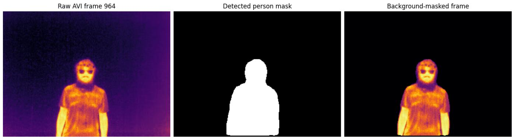  
Figure I.2: From raw thermal frame to model input. Left: the rendered thermal frame used for visualization. Center: the detected participant mask. Right: the background-masked thermal frame supplied to the frozen encoders before 6 × 8 tiling. Pixels outside the person mask are zeroed in the underlying thermal matrix, while in-mask temperatures are preserved. The rendered detector image is never substituted for the physiological measurement.

I.6 Correctly classified vs. misclassified stress windows. Figures I.5–I.9 contrast a stress window against a non-stress window. A different failure-analysis question is: for the same true label, why does the model get one window right and another window from the same person wrong? Figures I.10 and I.11 answer this for one held-out Control participant (C02) and one held-out OUD participant (O04), using the identical grouped Kernel-SHAP protocol (Appendix I.2– I.3: 256 antithetic coalitions, participant-centered reference, seed-42 checkpoint) applied to two windows that both carry the true label stress but land on opposite sides of that checkpoint's validation-selected decision threshold (0.375, not 0.5; Appendix H.2). Both selected pairs happen to come from the same elicitation task (stress block) for their participant, so the contrast is not confounded by task identity: same person, same task, same true label, opposite model decision. Because both windows share the true label, ranking regions by evidence for that label would rank both rows identically; instead we rank by absolute impact and let the sign of the marked cells carry the story (red pushes toward stress, blue toward non-stress).

For C02, the correctly classified window $( p ( { \mathrm { s t r e s s } } ) =$ 0.935) combines positive evidence distributed across the head/upper-body area and the moving right/lower body boundary (including R2C6, R5C6, and R6C7). In the misclassified window from the same stress block (p(stress) = 0.159), the two largest effects instead sit at the rightmost grid boundary and strongly oppose stress (R5C8: —1.627; R6C8: —0.732). They outweigh R6C7 (+0.690), the strongest cell supporting the true label. This is the clearest example of the proposed failure signature: the prediction is controlled by spatially peripheral, background-adjacent slots rather than by a stable pattern over the participant.

The O04 comparison shows why that interpretation must not be overgeneralized. Its correctly classified window (p(stress) = 0.948) is supported by several cells on or near the silhouette (R4C4, R2C6, and R5C5). Its misclassified window (p(stress) = 0.097) is again dominated by a localized contribution toward non-stress, but the largest such cell (R5C4: —0.942) lies on or near the lower torso in the motion panel rather than at an obviously empty image boundary; it overwhelms the positive R3C4 contribution (+0.679). Thus, out-of-body or boundary sensitivity is directly visible in the C02 failure but is not a universal explanation for every error What the two cohorts share is a spatially concentrated negative contribution that overrides evidence for the true stress label.

These maps support a diagnostic, not a physiological causal claim. Because a marker is drawn over all 25 outlines, an apparently empty cell in any one outline can still contain the moving participant elsewhere in the window. Only a cell that remains unoccupied across the trajectory should be described as out-of-body. Large effects in such cells indicate reliance on the geometry of the masked input or on empty-slot patterns—a potential shortcut and a useful target for occupancy-aware regularization or auditing—rather than a thermal stress response measured outside the body.

I.7 Per-encoder attribution and 25-frame window probabilities. The analyses above all explain the fused logit l\* = FinalHead(b\*), the final head's output on the fused embedding b\* of Eq. (1), with $\hat { p } = \sigma ( \ell ^ { \star } )$ the reported stress probability. A separate question is how the three frozen encoders individually value the regions the fused model relies on. This is well-posed here because of how branch logits are computed (Appendix B): each encoder's branch logit $\ell ^ { ( e ) }$ is a function of that encoder's own projected, temporally collapsed, spatially contextualized, MIL-pooled bag $\bar { b ^ { ( e ) } } \mathrm { ~ a l o n e } \mathrm { - } \ell ^ { ( e ) } \stackrel { \textstyle - } { = } \mathrm { H e a d } _ { e } ( b ^ { ( e ) } )$ never reads the other two encoders' tensors. A branch is therefore explainable by the identical grouped Kernel-SHAP construction used throughout this appendix, substituting $\ell ^ { ( e ) }$ for $\ell ^ { \star }$ and masking only encoder e's 49 tokens per coalition (the other two encoders tensors are left unmasked but are inert to $\ell ^ { ( e ) }$ by construction). We reuse the same 256 coalitions and weights already drawn for the fused explanation of each window, so the three branch explanations and the fused explanation of a given window are computed from matched coalition draws.

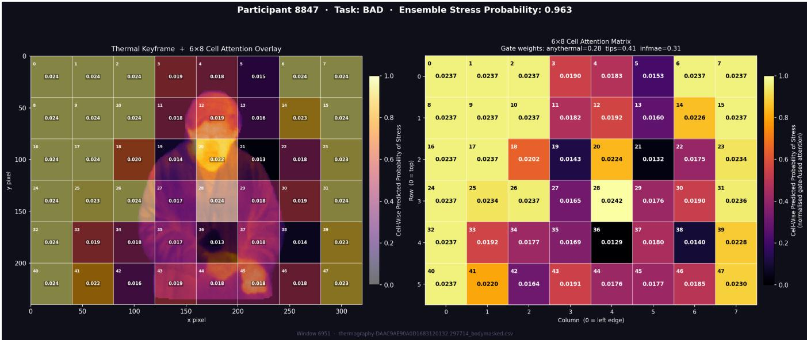  
Figure I.3: Tiling, regional attention, and stress display for participant 8847 during the BAD task. Left: branch-averaged MIL attention over the fixed 6 × 8 grid, superimposed on the masked participant. Right: the same 48 weights as a matrix, together with the fused prediction p(stress) = 0.963 and the window-specific gate weights for AnyThermal (0.28), ImageNet-ViT (0.41), and InfMAE (0.31). Attention is a normalized pooling coefficient, not a signed contribution or a causal physiological map; signed marginal effects are evaluated with grouped SHAP in the figures below.

For one correctly classified stress window per cohort (the top rows of Figures I.10 and I.11), we rank the 48 local trajectories once by the fused model's signed SHAP value and retain the six strongest stress-supporting trajectories. Figure I.12 then asks each encoder the same question: how much does that complete regional trajectory, spanning all 25 frames, change this encoder's own branch logit? The bars are therefore regional SHAP contributions accumulated over the 25-frame input trajectory. They are not 25 separate framelevel probabilities. Each encoder produces one branch probability for the complete window, shown in the panel subtitle, and the fusion produces one final window probability.

For C02, the complete-window branch probabilities are 0.92 for AnyThermal, 0.89 for ImageNet-ViT, and 0.89 for InfMAE; their fusion gives $p ( \mathrm { s t r e s s } ) \ : = \ : 0 . 9 3 5$ . For O04, the corresponding probabilities are 0.92, 0.90, and 0.93, and the fused probability is 0.948. The encoders therefore agree on the stress decision while telling different spatial stories. InfMAE has the largest branch-SHAP value on five of the six displayed trajectories for C02 and four of six for O04, whereas ImageNet-ViT is near zero or slightly negative on several of the same trajectories (C02 R4C4: —0.006; O04 R5C5: –0.025; O04 R5C7: —0.045). The pattern is not uniform, however: AnyThermal is largest at C02 R4C4 (0.385, compared with InfMAE's 0.106) and O04 R5C5 (0.617, compared with InfMAE's 0.549).

Because the branch heads use independently scaled representations, their logit magnitudes are not mutually calibrated (Appendix B.6). So bar heights are compared within an encoder's explanation rather than across encoders. Read that way, the branch attributions answer a question the fused map cannot: the three encoders converge on nearly the same whole-window probability (0.89–0.93 on the two examined windows) while assigning their evidence to different regional trajectories. Complementarity is therefore observable in the attributions themselves rather than inferred from the fusion gain alone, giving the learned window-specific gate a mechanistic rationale that matches its measured benefit in Table D.2.

## J Reproducibility Artifact

Supports body Section 8. The artifact is organized so that a third party can reproduce the paper at three increasing levels of data access.

J.1 Tier 1 — fully public, no request required. The StressNet pipeline (RQ2) end to end: window construction, region tiling, frozen-feature extraction, the aggregation

column

Grouped Kernel-SHAP on person-disjoint held-out windows (n = 14 participants) Attribution unit: complete token trajectory; whole-frame mean $| \mathsf { S } \bar { \mathsf { H } } \mathsf { A } \mathsf { P } | = \mathsf { \bar { 0 } } . 2 4 4$

column  
column  
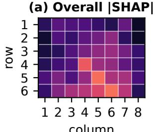

(b) Stress: signed SHAP  
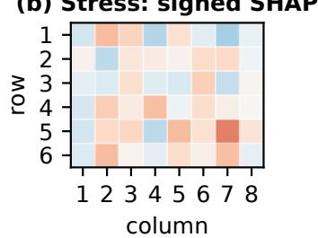

(c) Non-stress: signed SHAP  
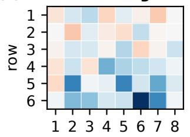

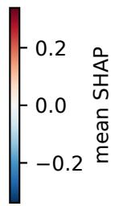

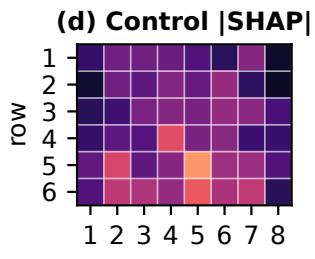

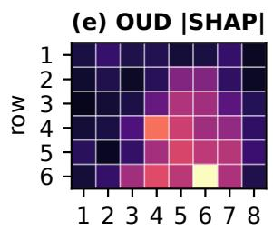

(f) Highest-impact regions  
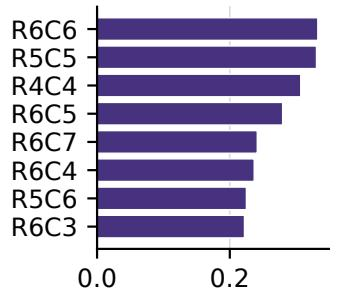

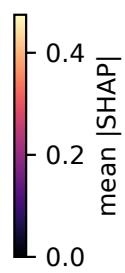  
mean [SHAP value| (logit units)  
Figure I.4: Population-level grouped Kernel-SHAP over all 14 held-out participants (Appendix I.2–I.3: 256 antithetic coalitions per window, participant-centered reference). (a) Overall mean |SHAP| over the 6 × 8 grid; whole-frame token mean |SHAP| is 0.244 logit units. (b)–(c) Signed mean SHAP restricted to stress-labelled and non-stress-labelled windows respectively (red supports stress, blue supports non-stress). (d)–(e) Overall mean [SHAP split by cohort; read only as a hypothesis about cohortdependent model behaviour (Appendix I.4), not an anatomical or causal finding. (f) The eight regions ranked by mean |SHAP|; the top three (R6C6, R5C5, R4C4) are the lower-central trajectories cited in the text.

model, the fixed subject-disjoint fold definition, training and evaluation scripts, and the table-generating script. StressNet is public (Kumar et al. 2021), so Tables E.1 and E.2 are reproducible without contacting the authors. This is the recommended entry point for anyone applying the method to a new thermal corpus.

J.2 Tier 2 — derived features, release conditional on consent. Per-encoder frozen feature tensors for the primary corpus $( 2 5 \times 4 9 \times 7 6 8$ per window per encoder), the fixed split files (fixed\_split.json, fixed\_split\_control\_oud.json), per-seed prediction files,confusion matrices,balancedaccuracy/precision/recall breakdowns, selected hyperparameters, and the seed-42 attribution checkpoint. Region tiling and participant centering may reduce direct visual reconstructibility, but they do not make these records anonymous: the features remain person-linkable, and craving labels disclose sensitive information about people with OUD. Reidentification risk and the scope of the original consent are separate questions. Release of this tier is therefore conditional on explicit IRB/consent authority, a documented threat assessment, data-use terms, and removal of unnecessary participant/task metadata; otherwise it belongs under the governed procedure in J.3.

J.3 Tier 3— raw recordings, governed request. Primarycorpus raw thermal recordings are human-participant data and cannot be presumed public. Access follows a documented request procedure consistent with the approved protocol; code and derived test data for the tiers above are available at the repository linked at the start of this appendix.

J.4 Applying the method to a new domain. The architecture depends only on the token count N, so porting requires: a person/object mask, a tiling choice $( N = 1 + R C )$ , any frozen encoder emitting a per-region embedding, and window labels. We provide the StressNet configuration $( N { = } 9 7 )$ alongside the primary configuration (N=49) precisely to demonstrate that the grid is a parameter and not a hard-coded body model.

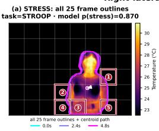

Each SHAPplayer is one gridcell's complete traectory across25 frames 768 channels, and all tree frozen encoders.Numbers1-5 linkte marked evidence cells betwen te motion pane and SHAPmap.Reference: zeroater partician centering: otput: final fused stes logit  
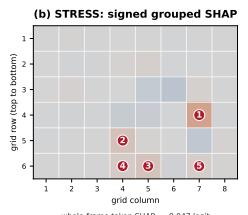

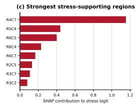

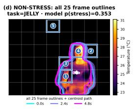

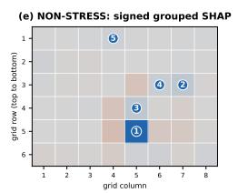

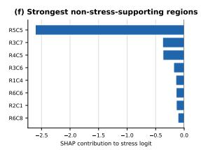  
Figure I.5: Single-participant grouped Kernel-SHAP, held-out OUD participant O01: right-lateral stress evidence contrasted with a motion-rich non-stress comparison. Stress window: task Stroop, p(stress) = 0.870, whole-frame token SHAP = —0.047 logit. Non-stress window: task Jelly (calming video), p(stress) = 0.353, whole-frame token SHAP = —0.289 logit. Top row (a-c): the selected stress window's 25-frame motion trace, signed 6 × 8 grouped-SHAP map, and ranked stress-supporting regions. Bottom row (d–f): the same three views for a non-stress window from O01. Numbered markers link identical imagespace grid coordinates across the motion and SHAP panels; red raises and blue lowers the fused stress logit relative to the participant-centered reference (Appendix I.5).

J.5 Operating-point provenance. Table J.1 uses the saved seed-42 learned-fusion checkpoint and one validationselected threshold, 0.374906, chosen to maximize validation accuracy (not balanced accuracy). That identical threshold is then applied to both held-out cohorts. The Control confusion counts are TP 1,694, FP 43, FN 133, TN 436; the OUD counts are TP 666, FP 110, FN 112, TN 112. Intervals use 2,000 participant-cluster resamples. In addition to the intervals printed in the table, Control FNR is [0.009, 0.171] and specificity [0.796, 0.987]; OUD FNR is [0.052, 0.246] and sensitivity [0.754, 0.948]. With eight and six participants, these intervals quantify substantial uncertainty and do not turn the selected threshold into a deployment recommendation.

Table J.1: Per-cohort deployment operating point at the model's validation-selected threshold (seed 42), with participant-bootstrap 95% CIs. FPR = unwanted-check-in rate; FNR = missed-stress rate. The comparison is within one model at the same threshold, but population, site, and cohort composition remain entangled; it is descriptive rather than causal. Supports body Section 8.
<table><tr><td>Cohort</td><td>FPR</td><td>FNR</td><td>Sensitivity</td><td>Specificity</td></tr><tr><td>Control (n=8)</td><td>0.090</td><td>0.073</td><td>0.927</td><td>0.910</td></tr><tr><td rowspan="2">OUD (n=6)</td><td></td><td>FPR 95% CI: [0.013, 0.204]</td><td>Sens. 95% CI: [0.829, 0.991]</td><td></td></tr><tr><td>0.495</td><td>0.144</td><td>0.856</td><td>0.505</td></tr><tr><td></td><td></td><td></td><td>FPR 95% CI: [0.300, 0.715] Spec. 95% CI: [0.285, 0.700]</td><td></td></tr></table>

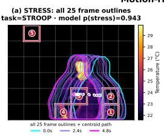

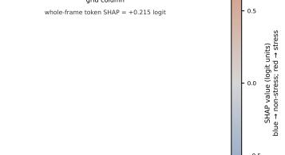

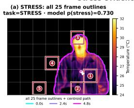  
FABLE-Therm single-participant grouped Kernel-SHAP: held-out OUD participant O02 Stress evidence spanning the visible face and bilateral hand/forearm regions

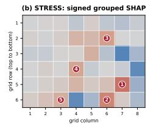

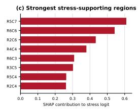

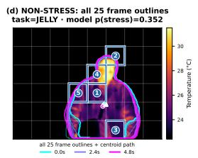

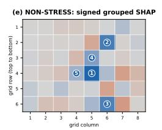

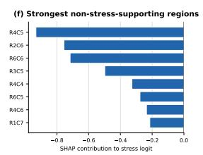  
wrure-1rdrre Luker onnr = -u.4TD rugi Each SHAP player is one grid clls comple trajector across25 frames, 768 channel, nd alltre froze encoders. umbers 1-5 linkthe marked evidenc clls betwen the motion pane and SHAPmap.Reference: zero ater particiant centering output: final fused strss logit

Figure I.6: Single-participant grouped Kernel-SHAP, held-out OUD participant O02: stress evidence spanning the visible face and bilateral hand/forearm regions. Stress window: task Stress-induction block, $p ( \mathrm { s t r e s s } ) = 0 . 7 3 0$ , whole-frame token SHAP = —0.105 logit. Non-stress window: task Jelly, $p ( \mathrm { s t r e s s } ) = 0 . 3 5 2$ , whole-frame token $\mathrm { S H A P = - 0 . 4 1 5 }$ logit. Panel layout and attribution protocol follow Figure I.5 (Appendix I.5)

## FABLE-Therm single-participant grouped Kernel-SHAP: held-out OUD participant O03 Motion-rich stress window with a matched non-stress comparison

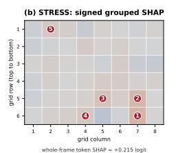

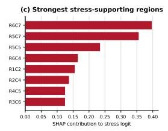

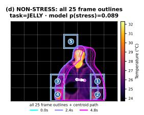

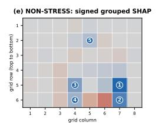

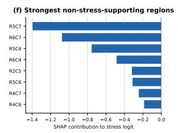  
wnole-Irame token SHAP = -U.482 1ogit Each SHAP player is one gridcell's complete traector across2 frames,768 channels, and all tree frozen encoders. Numbers 1- linkte marked evidence cells betwen te motion panel and SHAPmap.Reference: ero ater particiant centering output: final fused strss logit  
Figure I.7: Single-participant grouped Kernel-SHAP, held-out OUD participant O03: a motion-rich stress window against a matched non-stress comparison. Stress window: task Stroop, p(stress) $= 0 . 9 4 3 ,$ whole-frame token $\mathrm { S H A P } = + 0 . 2 \bar { 1 5 }$ logit. Non-stress window: task Jelly, $p ( \mathrm { s t r e s s } ) = 0 . 0 8 9$ , whole-frame token $\mathrm { S H A P = - 0 . 4 8 2 }$ logit. Panel layout and attribution protocol follow Figure I.5 (Appendix I.5).

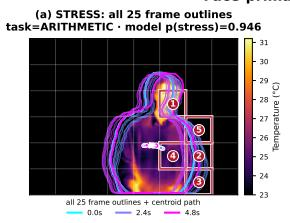  
FABLE-Therm single-participant grouped Kernel-SHAP: held-out OUD participant O05 Face-primary stress evidence with a matched non-stress comparison

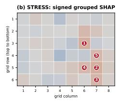

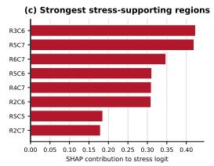

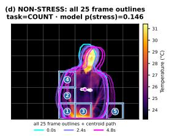

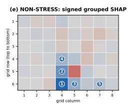  
wrore-1rarre token snar = -u.4∠0 rogrt Each SHAP player is one gridcell's complete traector across2 frames, 768 channels, nd all tree frozen encoders. Numbers 1- linkte marked evidence cells betwen te motion panel and SHAPmap Reference: ero ater particiant centering output: final fused strss logit

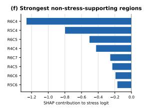

Figure I.8: Single-participant grouped Kernel-SHAP, held-out OUD participant O05: face-primary stress evidence against a matched non-stress comparison. Stress window: task Arithmetic, $p ( \mathrm { s t r e s s } ) = 0 . 9 4 6$ , whole-frame token $\mathrm { S H A P } = + 0 . 2 \bar { 7 } 5$ logit. Non-stress window: task Count, p(stress) = 0.146, whole-frame token $\mathrm { S H A P } = - 0 . 4 2 6$ logit. Panel layout and attribution protocol follow Figure I.5 (Appendix I.5).

## FABLE-Therm single-participant grouped Kernel-SHAP: held-out OUD participant O06 Upper-face and central-body stress evidence with a matched non-stress comparison

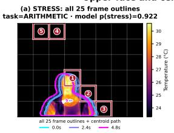

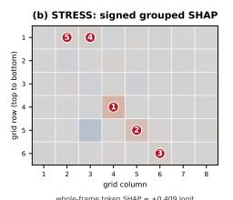

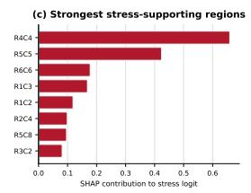

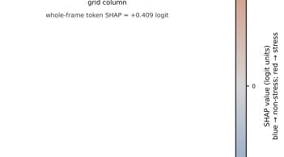

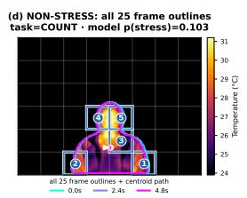

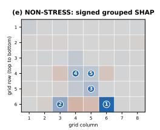

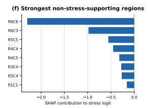  
wnore-Trame token Smar = -U.u/∠ Iogit Each SHAP player is one gridcell's complete traectory acros5 frames 768 chanels, and allthree frozen encoders. Numbers 1- linkthe marked evidence cells between the motion panel and SHAPmap. Reference: zer ater participan centering; output: final fused stres ogit  
Figure I.9: Single-participant grouped Kernel-SHAP, held-out OUD participant O06: upper-face and central-body stress evidence against a matched non-stress comparison. Stress window: task Arithmetic, p(stress) $= \ 0 . 9 2 2 .$ whole-frame token SHAP = +0.409 logit. Non-stress window: task Count, p(stress) = 0.103, whole-frame token $\mathrm { S H A P = - 0 . 0 7 2 }$ logit. Panel layout and attribution protocol follow Figure I.5 (Appendix I.5).

FABLE-Therm single-participant grouped Kernel-SHAP: held-out Control participant C02 Two stress windows from the same held-out participant, one correctly classified and one misclassified; identical color scale across both explanations (a) CORRECTLY CLASSIFIED STRESS: all 25 frame outlines task=STRESS· model p(stress)=0.935 (correct at threshold(θ)375kRECTLY CLASSIFIED STRESS: signed grouped SHAP (c) Highest-impact regions

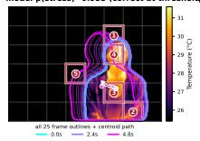

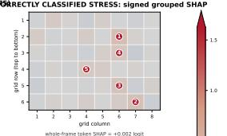

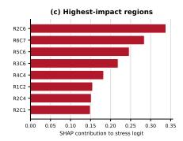

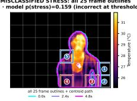

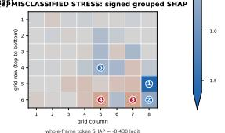

Figure I.10: Correctly classified vs. misclassified stress windows, held-out Control participant C02, both from the stress elicitation block. Top row: $p ( \mathrm { s t r e s s } ) = 0 . 9 3 5$ (correct at threshold 0.375). Bottom row: $p ( \mathrm { s t r e s s } ) = 0 . 1 5 9$ (incorrect). Regions are ranked by absolute SHAP impact (Appendix I.6); red supports stress and blue supports non-stress. The failed prediction is dominated by the peripheral R5C8 and R6C8 trajectories at the right grid boundary. Attribution protocol follows Appendix I.2–I.3.

FABLE-Therm single-participant grouped Kernel-SHAP: held-out OUD participant O04 Two stress windows from the same held-out participant, one correctly classified and one misclassified; identical color scale across both explanations task=STRESS · model p(stress)=0.948 (correct at threshold(θ)375èRECTLY CLASSIFIED STRESS: signed grouped SHAP

Figure I.11: Correctly classified vs. misclassified stress windows, held-out OUD participant O04, both from the stress elicitation block. Top row: p(stress) = 0.948 (correct at threshold 0.375). Bottom row: p(stress) = 0.097 (incorrect). Regions are ranked by absolute SHAP impact (Appendix I.6); red supports stress and blue supports non-stress. Here the strongest error-driving trajectory, R5C4, remains on or near the body, showing that boundary reliance is not the only observed failure pattern. Attribution protocol follows Appendix I.2–I.3.

FABLE-Therm per-encoder branch grouped Kernel-SHAP on correctly classified stress windows Same 49-token protocol, applied to each frozen encoder's own branch logit rather than the fused logit (a) Control participant C02: top 6 fused-model tiles task=STRESS · fused p(stress)=0.935 branch p(stress): AnyThermal p=0.92· ImageNet-ViT p=0.89· InfMAE p=0.89 (b) Per-encoder branch attribution on the fused model's top tiles

  
Figure I.12: Per-encoder branch grouped Kernel-SHAP on one correctly classified stress window per cohort (top: Control C02; bottom: OUD O04; same windows as the top rows of Figures I.10 and I.11). Tiles are ranked once by the fused model's signed SHAP (most stress-supporting first, left panel); bars in the right panel show each encoder's own branch-SHAP value for the complete 25-frame trajectory at that tile, in that encoder's own branch-logit units (not mutually calibrated across encoders; Appendix I.7). The subtitle reports one p(stress) per encoder for the entire 25-frame window; it is not a sequence of frame-wise probabilities.

## K Ethics, Governance, and Non-Uses

Supports body Section 8.

K.1 Intended benefit pathway. An opt-in, non-contact signal could support low-burden check-ins when wearing, charging, or maintaining a sensor is impractical. The appropriate role is to prompt a person-centred conversation or offer support—never to diagnose stress, infer substance use, or replace self-report and clinical judgment.

K.2 Prohibited uses, as licence terms. Law enforcement; probation, parole, or drug-court supervision; employment screening or workplace monitoring; insurance underwriting; determination of eligibility for benefits, housing, or treatment; and any covert or non-consensual monitoring. We state these as licence conditions rather than recommendations because a contactless sensor is usable without the subject's cooperation, which is exactly the property that makes advisory language insufficient. A licence can govern authorized recipients, but it cannot by itself prevent copying, independent reimplementation, or all downstream misuse; technical access controls, contracts, audit, and enforcement are also required.

K.3 Conditions for a responsible pilot. Explicit and revocable consent; a clear and stated benefit to the participant; short retention or on-device processing; access and deletion controls; human review of every model-prompted action; prospective multi-site validation with common calibration procedures; pre-specified subgroup audits; and governance co-designed with people with OUD, clinicians, and community advocates. FABLE-TíERm is a research prototype and does not currently satisfy these requirements.

K.4 Failure modes and who bears them. False positives can trigger unwanted intervention or stigma; false negatives can create false reassurance. At the seed-42 operating point in Table J.1, both error types are higher for OUD participants than for Control participants, which means the population targeted for benefit carries the higher observed error rate in that analysis. The intervals are wide and the study is not a deployment validation. Any deployment that cannot support a per-person calibration period should not be deployed for this population.

K.5 On “privacy-preserving". Thermal imaging avoids conventional colour appearance but records a body-derived signal, is person-linkable, and is not anonymous. Our subjectadversarial term (Appendix B.7) is a training-time pressure against identity encoding, not a privacy guarantee, and we make no formal privacy claim; body-derived affective signals of this kind increasingly fall under special-category and cognitive-biometric data protections (Ienca and Malgieri 2024).