# SCOUT: Semantic Concept Discovery for Open-Vocabulary Editing of Face Recognition Templates

Leon Todorov1 Peter Rot1 Peter Peer2 Vitomir Strucˇ 1 Klemen Grm1

University of Ljubljana: 1Faculty of Electrical Engineering 2Faculty of Computer and Information Science

Leon.Todorov@fe.uni-lj.si Peter.Rot@fe.uni-lj.si Peter.Peer@fri.uni-lj.si

Vitomir.Struc@fe.uni-lj.si Klemen.Grm@fe.uni-lj.si

## Abstract

Face recognition templates are compact identity representations, yet they also encode rich semantic information about facial appearance. Prior work has shown that templates can be inverted to images or indirectly manipulated through image-editing pipelines, but direct semantic editing in template space remains largely unexplored. Existing interpretability methods for face recognition often rely on manual neuron inspection or predefined attribute labels, limiting scalability and semantic flexibility. To address this gap, we propose SCOUT (Semantic Concept Discovery for Open-VocabUlary Editing of Face Recognition Templates), an end-to-end framework for discovering and directly manipulating semantic concepts in face recognition templates using mechanistic interpretability. SCOUT learns sparse template representations, generates semantic hypothesesfor latentfeaturesfrom natural-language descriptions, and validates their stability. The resulting features act as controllable semantic directionsfor direct editing, avoiding costly edit–re-encode pipelines. Experiments with face recognition models using CNN, ViT, and Swin backbones show that SCOUT discovers interpretable concepts beyond standard attribute labels and enables controllable, identity-aware template manipulation with negligible impact on identity matching. We further show that edited templates can subsequently be decoded with independent inversion modelsfor visualization and evaluation.

## 1. Introduction

Face recognition (FR) systems represent identity through compact vector representations (templates) that enable efficient matching and storage [20]. Although templates are trained for discriminative identity inference, a growing body of work shows they encode substantially richer facial information than identity alone [41]. Modern template inversion and embedding-conditioned synthesis can also reconstruct photorealistic faces from embeddings with high identity fidelity [27, 28]. Beyond inversion, several studies have explored the semantic organization of FR embedding space. Direction-discovery methods [30] identify interpretable axes corresponding to facial regions (e.g., eyes, nose, lower face) or nuisance factors (pose, illumination, expression), often visualizing linear traversals by decoding embeddings back into pixel space. In parallel, languagebased approaches such as CLIP-SMU [25] aim to translate template content into natural-language descriptions by aligning templates with CLIP-derived text representations over predefined attribute descriptions. These works establish that FR templates reside in an embedding space that exhibits meaningful semantic structure and can be probed through either generative inversion or semantic alignment.

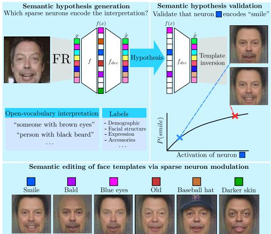  
Figure 1. SCOUT automatically discovers and validates semantic interpretations of sparse neurons in the sparse autoencoder (SAE) using face attributes defined by free-form text prompts or predefined labels. Once stable neuron–attribute associations are identified through inversion-based verification, the corresponding sparse features are used to directly manipulate semantic attributes in template space for efficient template augmentation.

Due to this semantic structure, the information content in FR templates can easily be manipulated, and certain characteristics independent of identity can be suppressed, strengthened, altered, or even added directly in the embedding space. This manipulation process, referred to as template editing, is critical in many scenarios, including privacy-preserving techniques that suppress sensitive attributes, e.g., sex, age, or ethnicity [26, 34], robustness and bias analysis through controlled perturbations of embeddings [22, 36], synthetic identity generation and augmentation from manipulated embeddings [39], and improved understanding of the encoding process of FR models.

However, existing methods for semantic manipulation of templates remain largely indirect or task-specific. Most fine-grained changes are still implemented by editing in image space or a generative latent space and then reencoding [2, 15] the edited image into the embedding space of the corresponding FR model. While feasible and effective, such processes introduce computational overhead and couple the manipulation operation to the failure modes of the synthesis pipelines used. Template-only transformations, such as those used to suppress attributes (e.g., age or gender) in privacy-preservation methods, are typically limited to coarse facial attributes [8, 12, 34], while general mechanisms for fine-grained, open-vocabulary semantic editing directly in standard FR embeddings, without image-level inversion, remain largely missing from the literature. Here, open-vocabulary refers to the ability to define semantic edits through free-form natural-language descriptions rather than a closed set of predefined (and often binary) attributes, enabling manipulation of concepts such as “wearing a baseball hat” or “having blue eyes”, as illustrated in Figure 1.

Addressing this gap requires not only a template-space editing operator, but also an automatic way to identify which components of an embedding correspond to meaningful, controllable semantics. Here, recent progress in mechanistic interpretability provides a compelling direction. Mechanistic interpretability aims to explain a model in terms of internal computational components and circuits, identifying which features or mechanisms inside a representation drive particular behaviors or outputs [7]. Sparse autoencoders (SAEs) have emerged as an unsupervised tool for decomposing dense neural representations into sparse, more monosemantic features [11]. In this work, we build on these advances and introduce a template-only system for semantic manipulation of face-recognition embeddings under open-vocabulary control. We propose SCOUT (Semantic Concept Discovery for Open-Vocabulary Editing of Face Recognition Templates), an end-to-end framework with three main contributions:

• An automatic method for discovering interpretable semantic features in learned sparse representations of face recognition templates, guided by natural-language descriptions (e.g., using CLIP).

• A direct template-space editing mechanism that uses the discovered features as controls for fine-grained semantic manipulation, without image-level editing or re-encoding of the input face.

• A method for creating controlled variations of face templates by modifying semantic attributes (e.g., adding a beard or changing the hairstyle), which can subsequently be visualized through template inversion methods such as Arc2Face.

## 2. Related work

## 2.1. Discovery of Interpretable Concepts

Early work on interpretable structure in learned embeddings relied on post-hoc methods such as Network Dissection [3] and TCAV [18], which typically require predefined concepts and human supervision. More recent approaches aim to automate concept discovery. MAIA [37] iteratively generates and tests hypotheses about neuron behavior using vision-language models and interpretability tools, while Prisma [16] supports large-scale mechanistic interpretability through sparse autoencoders (SAEs). In parallel, SAEbased methods such as MSAE [44] and Revelio [19], as well as open-vocabulary sparse decompositions such as SpLiCE [4], show that semantically meaningful structure can be recovered in general vision representations. However, these methods target broad vision settings. Face recognition is more structured: faces are typically aligned and normalized, and recent work shows [22,30] that FR embeddings exhibit geometric organization with respect to interpretable facial and image attributes. This suggests that semantic factors in FR templates may be more stable and analyzable than in generic visual representations, although existing vision-oriented methods are not adapted to the structured geometry of face-recognition templates.

Only limited work has explored mechanistic interpretability in biometrics. Prior studies have examined what information is encoded in face templates [41], their geometric relation to attributes [22], and, more recently, unsupervised discovery of semantically coherent directions for bias analysis [36]. FaceMINT [33], the work most closely related to ours, enables sparse feature analysis and feature-level interventions for face-recognition representations. However, semantic interpretation still relies largely on manual inspection, for example, through top-activating samples or human validation. Overall, biometrics still lacks end-to-end pipelines for open-vocabulary semantic discovery, sparse decomposition, validation, and direct manipulation of biometric templates. A summary of existing approaches and their characteristics is presented in Table 1.

## 2.2. Semantic Manipulation of Face Templates

Existing approaches for the semantic manipulation of face templates can be grouped into indirect edit–reencode pipelines, inversion-based manipulation, and direct template-space transformations such as privacy-preserving suppression, morphing, or semantic direction control.

Image Editing and Re-Encoding. Techniques from this group perform semantic manipulation outside the FR template space, either by directly editing the face image or by modifying a latent representation of the image in a generative model. Image-level methods apply semantic transformations to the input face [2, 15] and then pass the edited result through an FR model to obtain a modified template. Latent-space methods, in contrast, first project the face image into a generative latent space [32], apply semantic edits in that space [40], and then decode and re-encode the edited image. Together, these approaches form a standard edit– re-encode pipeline. In many cases, identity preservation is explicitly enforced using pretrained FR models such as Arc-Face [2,29]. These methods offer rich semantic control, but the manipulation remains indirect: edits are applied outside the template space and only later reflected in the biometric representation. As a result, they incur the cost of inversion, editing, generation, and feature extraction, while strong edits may also introduce identity drift.

Table 1. Overview of methods for semantic concept discovery in face recognition templates. $\checkmark :$ supported, ✗: not supported, ∼: partially supported or not the primary focus.
<table><tr><td>Works</td><td></td><td>Open-</td><td>Sparse vocabulary decomposition</td><td>discovery</td><td>Automatic Validation / Direct intervention editing</td><td></td></tr><tr><td rowspan="6">Gee nson</td><td>Net Dissection [3]</td><td>x</td><td>x</td><td>x</td><td>~</td><td>x</td></tr><tr><td>TCAV [18]</td><td>x</td><td>x</td><td>x</td><td>~</td><td>x</td></tr><tr><td>MAIA [37]</td><td>√</td><td>x</td><td>√</td><td>√</td><td>x</td></tr><tr><td>Prisma [16]</td><td>x</td><td>√</td><td>~</td><td>~</td><td>x</td></tr><tr><td>MSAE [44]</td><td>x</td><td>√</td><td>~</td><td>~</td><td>x</td></tr><tr><td>Revelio [19] SpLiCE [4]</td><td>x</td><td>√</td><td>2</td><td>2</td><td>x</td></tr><tr><td rowspan="5">Biomtrics</td><td></td><td>√</td><td>√</td><td>2</td><td>2</td><td>√</td></tr><tr><td>Terhorst et al. [41] Leroy et al. [22]</td><td>x</td><td>x</td><td>√</td><td>x</td><td>x</td></tr><tr><td>CLIP-SMU [25]</td><td>x √</td><td>x x</td><td>√ √</td><td>x x</td><td>x</td></tr><tr><td>DeepFace Decoder [30]</td><td>x</td><td>2</td><td>x</td><td>√</td><td>x</td></tr><tr><td>FaceMINT [33]</td><td>x</td><td>√</td><td>x</td><td>√</td><td>x 2</td></tr><tr><td colspan="2">SCOUT (ours)</td><td>√</td><td>√</td><td>√</td><td>√</td><td>√</td></tr></table>

Template Inversion with Guided Decoding. Another line of work uses FR templates as inputs to generative models that reconstruct face images. Methods such as Arc2Face [28] and Face Adapter [38] show that highquality face images can be reconstructed from templates, while CLIP-FTI [8] adds an auxiliary semantic signal, such as a text prompt, to guide the reconstruction toward a desired attribute. In this case, the template itself is not edited directly. Instead, the semantic content is manipulated indirectly by decoding the same template in a specific way, using the additional guidance signal. Related work also shows that such reconstructions can be used to inspect and visualize semantic directions in template space [30]. These methods show that FR templates contain rich semantic information that can be exposed through guided reconstruction. However, the semantic change is still produced by the decoder, rather than by an explicit and controllable transformation of the template itself.

Direct Template Transformation. Several approaches modify FR templates directly while preserving their compatibility with the original FR model. Such transformations are commonly used to change specific properties of the template, for example by suppressing sensitive or soft biometric information. PFRNet [5], for example, learns disentangled representations that remove selected attributes while preserving identity, and follow-up methods such as Multi-IVE [26] and ASPECD [34] extend this idea to multiple or categorical attributes. These methods show that FR templates can be transformed without image reconstruction or changes to the FR model. However, the transformations are typically designed for a predefined set of attributes, rather than flexible, open-vocabulary semantic editing.

Synthetic Identity Generation. Recent work also manipulates face embeddings to synthesize new identities: Hyper-Face [39] formulates dataset creation as a packing problem on the face-embedding hypersphere, while diffusion-based ID-Booth [42] or ID-Sync [35] target identity-consistent generation for data augmentation. These methods, however, focus on large-scale synthetic face generation rather than flexible semantic control over existing templates.

## 3. Methodology

In this section, we present SCOUT, the proposed framework for discovering and manipulating semantic concepts directly in face recognition template space. The key idea behind SCOUT is to first decompose dense FR templates into sparse, interpretable features and then identify which of these features correspond to user-defined semantic concepts. Once such concept-linked features are found, they can be used as direct controls for modifying the original template representation, while inversion models provide a way to visually inspect the resulting semantic changes in image space. As illustrated in Figure 2, SCOUT proceeds in four stages: sparse decomposition of FR templates with an SAE (Stage 1), concept discovery producing candidate concept–feature associations (Stage 2), inversionbased visualization of these associations in image space (Stage 3), and validation through feature-level interventions that quantify both semantic change and identity preservation (Stage 4).

## 3.1. Sparse Autoencoder Training (Stage 1)

Given an aligned and cropped face image I, an FR model produces a template $\textbf { x } \in \mathbb { R } ^ { d }$ . Using a BatchTopK SAE [6], we map x to an overcomplete latent representation $\mathbf { z } = f ( \mathbf { x } ) \in \mathbb { R } ^ { d _ { \operatorname { S A E } } }$ , where $d _ { \mathrm { S A E } } \gg d$ sets the dictionary size. During training, BatchTopK sparsification imposes a global activation budget k over each minibatch, retaining only the strongest latent activations and thereby controlling the effective sparsity of z. The input is reconstructed as $\hat { \mathbf { x } } = f _ { \mathrm { d e c } } ( \mathbf { z } )$ , and the SAE is trained to minimize the reconstruction error between xˆ and x. At inference time, the batchwise selection is replaced by a learned global activation threshold τ , enabling sample-wise encoding without batch context. Once trained, the SAE represents each dense

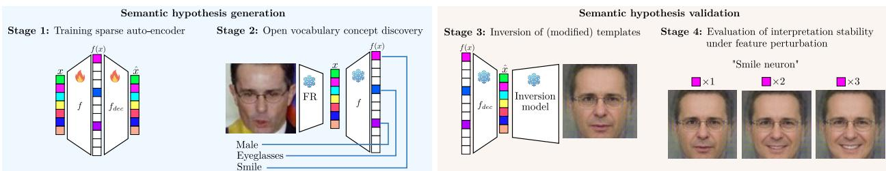  
Figure 2. High-level overview of SCOUT, the proposed framework for discovering and manipulating semantic concepts directly in face recognition template space. The framework consists of four stages: (1) training a sparse autoencoder on face templates, (2) assigning latent neurons to semantic concepts using labeled or open-vocabulary attributes, (3) reconstructing faces via template inversion, and (4) validating the discovered concepts through neuron-level interventions, where individual sparse features are perturbed to measure their semantic effect.

FR template as a sparse set of feature activations. Each feature is paired with a learned vector in the original template space, referred to as dictionary vector, which specifies how that feature contributes to reconstructing the input template. These template-space dictionary vectors provide the basic units for concept discovery and template-level intervention in the following stages.

## 3.2. Concept Discovery (Stage 2)

The goal of this stage is to assign semantic interpretations to the sparse features in z. For a queried concept c, we construct positive and negative exemplar sets, rank sparse features according to their selectivity for the concept, and finally verify the resulting concept-feature associations using top-activating samples. The output is a set of semantic hypotheses carried forward for downstream validation.

Concept Exemplar Set Construction. For a concept c, let $\mathcal { D } _ { c } ^ { + }$ and $\mathcal { D } _ { c } ^ { - }$ denote images that exhibit and lack the concept. These sets can be obtained in two ways: (1) in the closed-vocabulary setting via a supervised attribute classifier over a fixed taxonomy, and (2) in the open-vocabulary setting via a vision-language model queried with naturallanguage prompts. For open-vocabulary concepts, we query the vision-language model with two disjoint prompt banks: one used for Stage 2 discovery and feature validation, and one reserved for measuring interventions in Stage 4. Thus, prompts used to select a direction are not reused to evaluate it. In both cases, each training image I receives a concept confidence score used to select the top- and bottom-ranked images as $\mathcal { D } _ { c } ^ { + }$ and $\mathcal { D } _ { c } ^ { - }$

Selectivity-Based Feature Ranking. Once the exemplar sets are defined, we evaluate which features in z respond selectively to concept c. Let $z _ { n } ( I )$ denote the n-th component of z for image I. We compute the empirical activation rates

$$
r _ { n } ^ { + } ( c ) = \frac { 1 } { | \mathcal { D } _ { c } ^ { + } | } \sum _ { I \in \mathcal { D } _ { c } ^ { + } } \mathbb { 1 } [ z _ { n } ( I ) > \tau ] ,\tag{1}
$$

$$
r _ { n } ^ { - } ( c ) = \frac { 1 } { | \mathscr { D } _ { c } ^ { - } | } \sum _ { I \in \mathscr { D } _ { c } ^ { - } } \mathbb { 1 } [ z _ { n } ( I ) > \tau ] ,\tag{2}
$$

and define the selectivity score as

$$
S _ { n } ( c ) = r _ { n } ^ { + } ( c ) - r _ { n } ^ { - } ( c ) \in [ - 1 , 1 ] .\tag{3}
$$

Values near zero indicate weak discrimination between the two sets. High values indicate that feature n is active predominantly on concept-positive samples, whereas negative values indicate an association with concept absence. Features are ranked by $S _ { n } ( c )$ , and the top candidates are retained for subsequent validation and intervention. Using activation rates rather than activation magnitudes captures whether a feature is reliably present for a concept, consistent with the sparse nature of the representation.

Concept Agreement. The selectivity score measures differential activation, but does not verify whether the assigned concept label accurately describes what a feature encodes. We therefore validate each candidate association by checking whether the images that most strongly activate feature n are also classified as concept-positive.

For each candidate feature n, let $\mathcal { T } _ { n }$ denote the set of highest-activating images collected over the full training corpus. We define the concept agreement as

$$
A _ { n } ( c ) = \frac { 1 } { | \mathcal { T } _ { n } | } \sum _ { I \in \mathcal { T } _ { n } } \mathbb { 1 } \left[ s _ { c } ^ { \mathrm { d i s c } ( I ) } > \frac { 1 } { 2 } \right] ,\tag{4}
$$

where $s _ { c } ^ { \mathrm { d i s c } } ( I )$ is the discovery confidence score used to form the exemplar sets. In the open-vocabulary setting, it is computed with the discovery prompt bank. High values of $A _ { n } ( c )$ indicate that the images most strongly driving feature n are consistently assigned to concept c, whereas mismatched high-activating samples act as distractors. A minimum concept-agreement threshold is then used to discard weakly aligned features and obtain the final concept–feature associations.

## 3.3. Concept Visualization via Inversion (Stage 3)

The concept–feature associations identified in Stage 2 define semantic hypotheses about individual sparse features. Stage 3 uses inversion to inspect these hypotheses in image space. Given an FR template x, the DeepFace

Table 2. FR encoders used in our experiments. The four models span CNN and transformer backbones with distinct margin-based losses and are trained on different large-scale datasets.
<table><tr><td>Model</td><td>Loss</td><td>Backbone</td><td>Training set</td></tr><tr><td>ADA-iR50</td><td>AdaFace [20]</td><td>iResNet-50 [13]</td><td>MS1MV2 [9]</td></tr><tr><td>ARC-iR100</td><td>ArcFace [9]</td><td>iResNet-100 [13]</td><td>WebFace42M [45]</td></tr><tr><td>ADA-ViT</td><td>AdaFace [20]</td><td>ViT-Base [10]</td><td>WebFace4M [45]</td></tr><tr><td>SWIN-T</td><td>CosFace [43]</td><td>Swin-Tiny [24]</td><td>MS1MV2 [9]</td></tr></table>

Decoder (DFD) [21, 30] provides a lightweight regressionbased reconstruction, while Arc2Face [28] provides an independently trained diffusion-based view in the ARCiR100 space. These decoders are auxiliary, i.e., they visualize original or intervened templates but neither produce the template-space intervention nor feed a reconstructed image back through the FR encoder. Agreement across the two therefore reduces the likelihood that an observed semantic effect is decoder-specific.

## 3.4. Feature-level Intervention Analysis (Stage 4)

The final stage validates the semantic hypotheses from Stage 2 by actively changing the template along individual sparse feature vectors. We refer to such a controlled change as a feature-level intervention. For a selected feature $n ,$ let $\mathbf { d } _ { n } \in \mathbb { R } ^ { d }$ denote its template-space dictionary vector. Using its $\ell _ { 2 }$ -normalized form $\widetilde { { \bf d } } _ { n } = { \bf d } _ { n } / \| { \bf d } _ { n } \|$ , we define the manipulated template as

$$
\begin{array} { r } { \mathbf { x } ^ { \prime } ( \alpha ) = \left( \mathbf { x } + \alpha \widetilde { \mathbf { d } } _ { n } \right) / \left. \mathbf { x } + \alpha \widetilde { \mathbf { d } } _ { n } \right. , } \end{array}\tag{5}
$$

where $\alpha \in \mathbb { R }$ controls the intervention strength. Normalizing ${ \bf d } _ { n }$ makes α comparable across features, while reprojecting keeps $\mathbf { x } ^ { \prime } ( \alpha )$ on the unit hypersphere.

To inspect the effect of the intervention in image space, we reconstruct $I ^ { \prime } ( \alpha )$ from $\mathbf { x } ^ { \prime } ( \alpha )$ using the inversion models from Stage 3. The interventions considered here are local and asymmetric: positive traversal $( \alpha > 0 )$ amplifies the selected feature, whereas negative traversal $( \alpha < 0 )$ is not assumed to realize its semantic opposite. We quantify the effect through two complementary metrics that capture semantic control and identity preservation.

Attribute Gain $( \Delta _ { c } ) .$ . We quantify semantic amplification with the evaluation confidence score $s _ { c } ^ { \mathrm { e v a l } }$ , computed with the reserved evaluation prompt bank,

$$
\Delta _ { c } ( \alpha ) = s _ { c } ^ { \mathrm { e v a l } } ( I ^ { \prime } ( \alpha ) ) - s _ { c } ^ { \mathrm { e v a l } } ( I ^ { \prime } ( 0 ) ) .\tag{6}
$$

Higher positive values indicate stronger expression of the queried concept, whereas values near zero or below indicate little or no amplification.

Template Similarity (θc). We measure the displacement between the manipulated and original templates using cosine similarity,

$$
\theta _ { c } ( \alpha ) = \cos ( { \bf x } ^ { \prime } ( \alpha ) , { \bf x } ) .\tag{7}
$$

Table 3. SAE statistics on Glint360K (∼ 17M templates) for the four SCOUT models, alongside FaceMINT [33] TopK SAE reference results. $\mathbf { M S E } = \mathbb { E } [ \| \mathbf { x } - \hat { \mathbf { x } } \| ^ { 2 } ]$ , alive% is the fraction of features activated at least once, and | cos |dict is the mean pairwise similarity between template-space dictionary vectors.
<table><tr><td>Method</td><td>Backbone</td><td>dSAE</td><td>k</td><td>MSE</td><td>alive%</td><td>cos(x, x)</td><td>| cos |dict</td></tr><tr><td rowspan="4">SCUT</td><td>ADA-iR50</td><td>8192</td><td>32</td><td>0.0008</td><td>100.00</td><td>0.7743</td><td>0.0465</td></tr><tr><td>ADA-ViT</td><td>8192</td><td>32</td><td>0.0007</td><td>100.00</td><td>0.8099</td><td>0.0547</td></tr><tr><td>ARC-iR100</td><td>8192</td><td>32</td><td>0.0008</td><td>100.00</td><td>0.7694</td><td>0.0450</td></tr><tr><td>SWIN-T</td><td>8192</td><td>32</td><td>0.0006</td><td>100.00</td><td>0.8284</td><td>0.0579</td></tr><tr><td>Face MN</td><td>ADA-iR50</td><td>65536</td><td>400</td><td>0.0003</td><td>99.82</td><td>0.9998</td><td>0.0767</td></tr><tr><td></td><td>SWIN-T</td><td>65536</td><td>200</td><td>0.0000</td><td>88.15</td><td>1.0000</td><td>0.0365</td></tr></table>

This provides a descriptive measure of template displacement. Fixed-FMR identity evaluation is performed separately using FNMR at a frozen verification threshold.

## 4. Experiments

This section describes the experimental setting used to evaluate SCOUT. We first introduce the datasets, FR backbones, and concept-scoring setup used throughout the study, then summarize key implementation details and the evaluation protocol.

## 4.1. Experimental Setup

Datasets. We use Glint360K [1] for Stage 1 SAE training and Stage 2 concept discovery, including selectivity ranking and concept-agreement computation. For downstream inversion-based inspection and feature-level intervention analysis, we use LFW [14]. For comparison against image-space editing baselines, we use CelebA-HQ [17].

Face Recognition Templates. We evaluate SCOUT on four representative FR encoders spanning CNN and transformer backbones, distinct margin-based training objectives, and different training data sources, as summarized in Table 2. All models operate on aligned 112×112 face crops and produce ℓ -normalized 512-d templates, enabling a controlled assessment of whether the pipeline transfers across heterogeneous template geometries rather than being tied to a single FR model.

Concept Scoring. We instantiate separate discovery and evaluation scores with CLIP ViT-L/14 [31]. Stage 2 uses three positive and three negative discovery prompts to obtain $s _ { c } ^ { \mathrm { { \bar { d i s c } } } }$ for exemplar construction and feature selection. After the direction is fixed, Stage 4 uses disjoint pools of five positive and five negative evaluation prompts, with no overlap with the discovery prompts. We evaluate all 100 possible 3-vs.-3 subsets and report the mean and pointwise ±1 standard deviation across the resulting population curves. This protocol additionally evaluates robustness to evaluation-prompt wording.

## 4.2. Implementation Details

Concept-Discovery Settings. In all concept-discovery experiments, we use $| \mathcal { D } _ { c } ^ { + } | = | \mathcal { D } _ { c } ^ { - } | = 1 , 0 2 4$ . Features are

α  
θc: 1.000  
∆c: 0.585 $\theta _ { c } \colon 0 . 9 2 5$  
  
α = 0.40  
∆c: 0.000

$$
\Delta _ { c } \mathrm { : } 0 . 2 7 4
$$

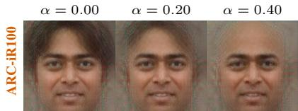  
∆c: 0.000

∆c: 0.220  
  
∆c: 0.000  
∆c: 0.754  
θc: 1.000

$$
\theta _ { c } \colon 0 . 9 8 0
$$

$$
\theta _ { c } \colon 0 . 9 2 9
$$

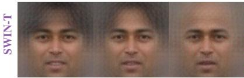  
∆c: 0.000  
∆c: 0.024

<table><tr><td>Model</td><td>n</td><td>Sn (c)</td><td>An(c)</td><td>∆c(0.2)</td><td>∆c(0.4)</td></tr><tr><td>ADA-iR50</td><td></td><td>5971 0.719</td><td>99.9%</td><td>0.200</td><td>0.527</td></tr><tr><td>ARC-iR100</td><td>915</td><td>0.572</td><td>99.9%</td><td>0.197</td><td>0.495</td></tr><tr><td>ADA-ViT</td><td></td><td>4430 0.794 100.0%</td><td></td><td>0.107</td><td>0.487</td></tr><tr><td>SWIN-T</td><td></td><td>5713 0.593</td><td>92.3%</td><td>0.042</td><td>0.283</td></tr></table>

∆c: 0.734

$$
\theta _ { c } \colon 0 . 9 8 1
$$

$$
\theta _ { c } \colon 0 . 9 3 0
$$

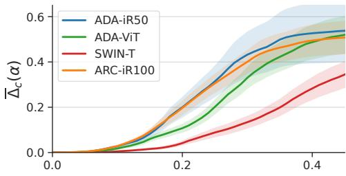

  
Figure 3. Full pipeline demonstration for $c = b a l d$ across four FR backbones. Left: the same input template is manipulated at $\alpha \in \{ 0 . 0 0 , 0 . 2 0 , 0 . 4 0 \}$ and decoded with the corresponding DFD; ∆c is averaged across disjoint evaluation-prompt subsets, while θ denotes template cosine similarity. Right: the table reports feature index n, Stage-2 selectivity $S _ { n } ( c )$ , concept agreement $A _ { n } ( c )$ , and evaluation-prompt mean gains at $\alpha = 0 . 2 , 0 . 4 .$ . Curves show the mean over 100 LFW templates and all evaluation-prompt subsets; shading denotes the pointwise ±1 standard deviation across evaluation-prompt subsets.

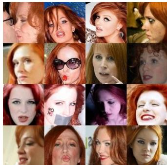  
(a) SWIN-T: c = long red hair  
n = 6823

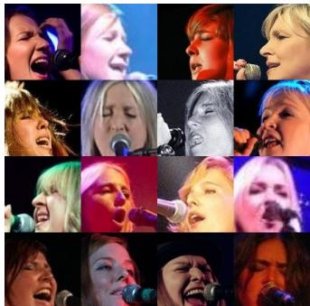  
(b) ADA-ViT: c = singing n = 623

(c) ADA-iR50: c = forehead dot  
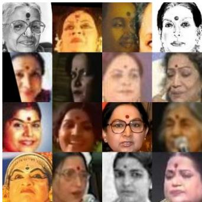  
n = 5005

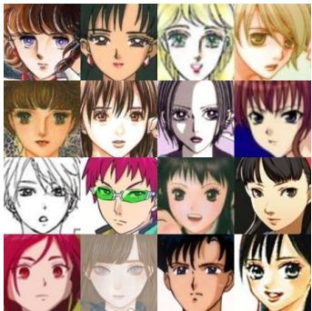  
(d) ARC-iR100: c = animatedfaces  
n = 4709  
Sn(c) = 0.502, An(c) = 0.825.  
Sn(c) = 0.768, An(c) = 0.807.  
Figure 4. Representative open-vocabulary features recovered by SCOUT across different FR backbones. Each block of images shows the top 16 identity-deduplicated activating samples for one recovered feature together with its queried concept c, feature index $n ,$ selectivity $S _ { n } ( c )$ , and concept agreement $A _ { n } ( c )$ . The reported statistics are computed on the full retrieved top-activating set. The semantic consistency of these examples indicates that SCOUT can recover meaningful features beyond a small predefined face-attribute taxonomy.

Sn(c) = 0.593, An(c) = 0.841.  
Sn(c) = 0.514, An(c) = 0.899.  
Table 4. Fixed-FMR identity evaluation on LFW: FNMR (%) at a threshold calibrated on clean impostor pairs to $\mathrm { { F M R } = 1 0 ^ { - 2 } }$ and frozen after manipulation. Perturbed statistics summarize the full SAE-direction sweep.
<table><tr><td></td><td></td><td colspan="3">Perturbed (α = 1)</td></tr><tr><td>Model</td><td>Clean</td><td>Mean</td><td>p95</td><td>Worst</td></tr><tr><td>ADA-iR50</td><td>0.33</td><td>0.43</td><td>0.53</td><td>0.67</td></tr><tr><td>ADA-ViT</td><td>0.23</td><td>0.41</td><td>0.53</td><td>0.73</td></tr><tr><td>SWIN-T</td><td>0.20</td><td>0.41</td><td>0.50</td><td>0.67</td></tr><tr><td>ARC-iR100</td><td>0.27</td><td>0.42</td><td>0.50</td><td>0.63</td></tr></table>

ranked by $S _ { n } ( c )$ , the top 10 are retained, and concept agreement is computed on the top $| \mathcal { T } _ { n } | = 1 0 , 0 0 0$ identitydeduplicated activating samples. We keep only the features satisfying $A _ { n } ( c ) \geq 8 0 \%$ as final candidates.

For SCOUT, we use $d _ { \mathrm { S A E } } { = } 8 , 1 9 2$ and mean sparsity $k { = } 3 2 .$ . To prevent feature collapse, we include the auxiliary dead-latent reconstruction loss of Gao et al. [11]. Across all four encoders, our SAEs achieve low reconstruction error (in terms of MSE), 100% alive features, and low mean pairwise dictionary-vector similarity, indicating a diverse, non-redundant feature set.

Table 3 summarizes reconstruction quality and reports FaceMINT [33] TopK SAE results under the same metrics, included as the conceptually closest baseline to our Batch-TopK configuration. Compared with FaceMINT, SCOUT has lower reconstruction cosine similarity, which is expected given our substantially more compact SAE configuration. In SCOUT, the SAE serves primarily as a sparse feature dictionary for concept discovery, rather than as a highfidelity reconstruction model. We therefore favor a compact configuration that supports efficient large-scale concept search while still yielding stable, diverse feature directions. Computational Complexity. All experiments were run on a single NVIDIA RTX 3090. The one-time costs per FR encoder are SAE training on Glint360K (≈ 20 min) and DFD training (≈ 1 day). After the training, the full perconcept SCOUT pipeline, from concept scoring through intervention-based evaluation, completes in under five minutes per concept.

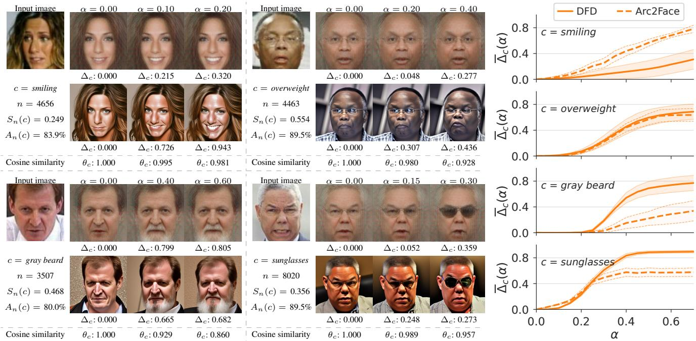  
Figure 5. Cross-decoder validation in the shared ARC-iR100 space. Left: one intervened template per concept is decoded by DFD and Arc2Face; $\Delta _ { c }$ is averaged across the disjoint evaluation-prompt subsets, while the shared template-level $\theta _ { c }$ is shown once per intervention strength. Metadata n, $S _ { n } ( c )$ , and $A _ { n } ( c )$ are obtained in Stage 2. Right: attribute-gain curves over 100 random LFW templates. Thick solid and dashed lines denote the DFD and Arc2Face means across evaluation-prompt subsets, respectively; thin matching boundaries and shading denote the ±1 standard deviation across evaluation-prompt subsets.

## 4.3. Evaluation Protocol

Primary Case Study. For the main end-to-end demonstration, the Stage-2 discovery bank for c = bald contains positive prompts {“bald person”, “hairless head”, “visible scalp”} and negative prompts {“thick hair”, “voluminous hair”, “hair parting”}. The other discovery banks are specified analogously. Stage-4 semantic-gain curves follow the disjoint evaluation-prompt protocol above and use the same 100 random LFW templates. Their lines and bands report the mean and pointwise ±1 standard deviation across evaluation-prompt subsets.

Fixed-FMR Identity Evaluation. We sweep every SAE direction at the strong intervention strength α = 1, yielding a conservative, worst-case estimate. For each LFW pair, one template is manipulated while the other remains fixed. For each FR model, we calibrate a verification threshold on clean impostor pairs at $\mathrm { F M R } = 1 0 ^ { - 2 }$ , freeze it, and reuse it after manipulation. We report clean FNMR and the mean,

95th-percentile, and worst perturbed FNMR across directions.

Comparison to Image-Space Editing Baselines. We compare SCOUT to two image-space editing baselines, Style-CLIP [29] and W+ Adapter [23]. Because both baselines operate on inverted high-quality face images, we use 100 randomly sampled CelebA-HQ [17] images per attribute. All curves include all four FR backbones. For all three methods, we sweep the manipulation strength and compare identity preservation at the same mean attribute gain. For each image–backbone pair, we retain the increasing branch of the gain–identity trace up to its individual maximum. At each gain, we average template similarity over the traces that attain it. Curves terminate when fewer than 10% of the pooled traces support the gain. The endpoint therefore represents the maximum population-supported gain. For SCOUT, $\theta _ { c }$ is measured directly between the original and manipulated templates, while $\overline { { \Delta } } _ { c }$ is computed from the corresponding decodings. For StyleCLIP and W+ Adapter, both metrics are computed after image editing and reencoding.

Cross-Decoder Validation. To assess whether the recovered directions remain semantically coherent across inversion backends, we decode the same template-space interventions for four additional concepts with both DFD and Arc2Face. These comparisons use only ARC-iR100, since Arc2Face is conditioned on ArcFace embeddings.

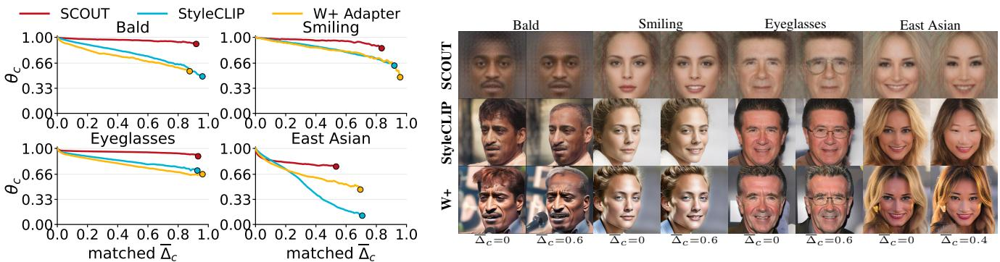

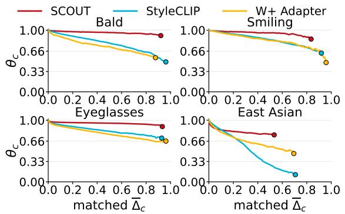  
Figure 6. Identity preservation at matched mean attribute gain on CelebA-HQ (100 samples per attribute). Left: $\theta _ { c }$ versus $\overline { { \Delta } } _ { c }$ for SCOUT, StyleCLIP, and W+ Adapter; dots mark each method’s maximum population-supported $( \overline { { \Delta } } _ { \mathrm { m a x } } , \theta )$ , reported per concept in Section 5. Right: representative matched-gain edits; target gains are shown below each image.

## 5. Results

Full Pipeline Demonstration. We first trace the queried concept $c = b a l d$ through the full SCOUT pipeline. Figure 3 reports the selected feature for each backbone together with its index $n ,$ selectivity $S _ { n } ( c )$ , and concept agreement $A _ { n } ( c )$ , revealing strong alignment with the query. Under disjoint evaluation-prompt scoring, mean baldness gain increases with α across all four FR backbones. $\mathrm { A t } \ \alpha = 0 . 4 .$ $\overline { { \Delta } } _ { c }$ ranges from 0.283 to 0.527. The bands quantify variation across evaluation-prompt subsets, while template similarity remains largely preserved.

Open-Vocabulary Concept Discovery. Beyond the primary case study, SCOUT also recovers coherent conceptlinked sparse features for broader free-form queries. Figure 4 shows representative examples together with the corresponding feature index n, selectivity $S _ { n } ( c )$ , and concept agreement $A _ { n } ( c )$ The identity-deduplicated top activations remain semantically consistent within each recovered feature, including concepts that would be difficult to capture with a small predefined face-attribute taxonomy. This demonstrates the utility of open-vocabulary querying for discovering semantically meaningful sparse features in settings where no predefined attribute vocabulary is available.

Cross-Decoder Validation. Figure 5 shows that the DFD and Arc2Face mean curves move in the same semantic direction for all four concepts, although the gain magnitude varies between decoders. Variation across evaluationprompt subsets does not alter the overall population-level trends, making a decoder-specific explanation less likely.

Fixed-FMR Identity Evaluation. Table 4 shows that, even at $\alpha = 1$ , the most disruptive direction increases FNMR by at most 0.50 percentage points, i.e., verification behavior at the frozen operating point remains essentially unchanged.

Figure 6 extends the comparison to four concepts and reports each method’s maximum population-supported gain. SCOUT reaches strong gains while preserving identity across all four concepts. For bald and smiling,

SCOUT attains $( \overline { { \Delta } } _ { \mathrm { m a x } } , \theta )$ of (0.92, 0.91) and (0.84, 0.86), with markedly higher identity preservation than Style-CLIP, (0.96, 0.49) and (0.92, 0.63), and W+ Adapter, (0.88, 0.55) and (0.96, 0.47). For eyeglasses, SCOUT reaches (0.93, 0.90), compared with StyleCLIP (0.93, 0.71) and W+ Adapter (0.96, 0.66). For East Asian, imagespace methods attain higher maximum gain but with substantially lower identity preservation: StyleCLIP reaches (0.71, 0.12) and W+ Adapter (0.69, 0.46), while SCOUT reaches (0.53, 0.76). Thus, direct template-level intervention offers a stronger fidelity–edit trade-off. This comparison is conservative for StyleCLIP and W+ Adapter, since their reference point already includes an intermediate inversion step rather than the original source image.

## 6. Conclusion

We introduced SCOUT, a framework for discovering, validating, and manipulating concept-linked sparse features directly in face recognition template space from naturallanguage queries. By combining sparse autoencoders with open-vocabulary concept scoring, concept-agreement validation, inversion-based inspection, and feature-level intervention, SCOUT exposes direct semantic controls without relying on an image-space edit–re-encode pipeline. Across diverse CNN- and transformer-based FR encoders, the recovered directions remain semantically coherent beyond predefined attribute taxonomies, transfer across independent inversion models, and preserve identity under intervention, comparing favorably with image-space baselines. FR templates thus admit direct, interpretable semantic control. Future work will investigate synthetic data generation from controlled template-space interventions, to produce attribute-targeted, identity-preserving variations.

Acknowledgments. This research was supported by the ARIS project J2-50069 (MIXBAI) and the ARIS Programme P2-0250, Metrology and Biometric Systems.

## References

[1] X. An, X. Zhu, Y. Gao, Y. Xiao, Y. Zhao, Z. Feng, L. Wu, B. Qin, M. Zhang, D. Zhang, et al. Partial fc: Training 10 million identities on a single machine. In Proceedings of the IEEE/CVF International Conference on Computer Vision, pages 1445–1449, 2021.

[2] Q. Bai, Z. Shi, Y. Xu, H. Ouyang, Q. Wang, C. Yang, X. Wang, G. Wetzstein, Y. Shen, and Q. Chen. Real-time 3d-aware portrait editing from a single image. In European Conference on Computer Vision, pages 344–362. Springer, 2024.

[3] D. Bau, B. Zhou, A. Khosla, A. Oliva, and A. Torralba. Network dissection: Quantifying interpretability of deep visual representations. In Proceedings of the IEEE Conference on Computer Vision and Pattern Recognition (CVPR), pages 6541–6549, 2017.

[4] U. Bhalla, A. Oesterling, S. Srinivas, F. P. Calmon, and H. Lakkaraju. Interpreting clip with sparse linear concept embeddings (splice). Advances in Neural Information Processing Systems, 37:84298–84328, 2024.

[5] B. Bortolato, M. Ivanovska, P. Rot, J. Krizaj, P. Terhˇ orst,¨ N. Damer, P. Peer, and V. Struc. Learning privacy-enhancingˇ face representations through feature disentanglement. In 2020 15th IEEE International Conference on Automatic Face and Gesture Recognition (FG 2020), pages 495–502. IEEE, 2020.

[6] B. Bussmann, P. Leask, and N. Nanda. Batchtopk sparse autoencoders. arXiv preprint arXiv:2412.06410, 2024.

[7] H. Cunningham, A. Ewart, L. Riggs, R. Huben, and L. Sharkey. Sparse autoencoders find highly interpretable features in language models. arXiv preprint arXiv:2309.08600, 2023.

[8] L. Dai, Z. Shen, Z. Zhou, P. Yu, and Z. Xia. Clip-fti: Finegrained face template inversion via clip-driven attribute conditioning. In Proceedings of the AAAI Conference on Artificial Intelligence, volume 40, pages 3479–3487, 2026.

[9] J. Deng, J. Guo, N. Xue, and S. Zafeiriou. Arcface: Additive angular margin loss for deep face recognition. In Proceedings of the IEEE/CVF conference on computer vision and pattern recognition, pages 4690–4699, 2019.

[10] A. Dosovitskiy, L. Beyer, A. Kolesnikov, D. Weissenborn, X. Zhai, T. Unterthiner, M. Dehghani, M. Minderer, G. Heigold, S. Gelly, J. Uszkoreit, and N. Houlsby. An image is worth 16x16 words: Transformers for image recognition at scale. In International Conference on Learning Representations, 2021.

[11] L. Gao, T. Dupre la Tour, H. Tillman, G. Goh, R. Troll,´ A. Radford, I. Sutskever, J. Leike, and J. Wu. Scaling and evaluating sparse autoencoders. arXiv preprint arXiv:2406.04093, 2024.

[12] M. Grimmer and C. Busch. Ladimo: face morph generation through biometric template inversion with latent diffusion. In 2024 IEEE International Joint Conference on Biometrics (IJCB), pages 1–7. IEEE, 2024.

[13] K. He, X. Zhang, S. Ren, and J. Sun. Deep residual learning for image recognition. In Proceedings of the IEEE Conference on Computer Vision and Pattern Recognition, pages 770–778, 2016.

[14] G. B. Huang, M. Mattar, T. Berg, and E. Learned-Miller. Labeled faces in the wild: A database for studying face recognition in unconstrained environments. In Workshop onfaces in’Real-Life’Images: detection, alignment, and recognition, 2008.

[15] Y. Jiang, Z. Huang, X. Pan, C. C. Loy, and Z. Liu. Talk-toedit: Fine-grained facial editing via dialog. In Proceedings ofthe IEEE/CVF International Conference on Computer Vision, pages 13799–13808, 2021.

[16] S. Joseph, P. Suresh, L. Hufe, E. Stevinson, R. Graham, Y. Vadi, D. Bzdok, S. Lapuschkin, L. Sharkey, and B. A. Richards. Prisma: An open source toolkit for mechanistic interpretability in vision and video. arXiv preprint arXiv:2504.19475, 2025.

[17] T. Karras, T. Aila, S. Laine, and J. Lehtinen. Progressive growing of gans for improved quality, stability, and variation. In International Conference on Learning Representations, 2018.

[18] B. Kim, M. Wattenberg, J. Gilmer, C. Cai, J. Wexler, F. Viegas, and R. Sayres. Interpretability beyond feature at-´ tribution: Quantitative testing with concept activation vectors (TCAV). In Proceedings ofthe 35th International Conference on Machine Learning, pages 2668–2677, 2018.

[19] D. Kim, X. Thomas, and D. Ghadiyaram. Revelio: Interpreting and leveraging semantic information in diffusion models. In Proceedings of the IEEE/CVF International Conference on Computer Vision (ICCV), pages 4659–4669, October 2025.

[20] M. Kim, A. K. Jain, and X. Liu. Adaface: Quality adaptive margin for face recognition. In Proceedings ofthe IEEE/CVF conference on computer vision and pattern recognition, pages 18750–18759, 2022.

[21] J. Krizaj, R. O. Plesh, M. Banavar, S. Schuckers, andˇ V. Struc. Deep face decoder: Towards understanding theˇ embedding space of convolutional networks through visual reconstruction of deep face templates. Engineering Applications ofArtificial Intelligence, 132:107941, 2024.

[22] P. Leroy, A. Mastropietro, M. Nurisso, and F. Vaccarino. Attributes shape the embedding space of face recognition models. In A. Singh, M. Fazel, D. Hsu, S. Lacoste-Julien, F. Berkenkamp, T. Maharaj, K. Wagstaff, and J. Zhu, editors, Proceedings of the 42nd International Conference on Machine Learning, volume 267 of Proceedings of Machine Learning Research, pages 33960–33983. PMLR, 13–19 Jul 2025.

[23] X. Li, X. Hou, and C. C. Loy. When stylegan meets stable diffusion: a W+ adapter for personalized image generation. In Proceedings of the IEEE/CVF Conference on Computer Vision and Pattern Recognition, pages 2187–2196, 2024.

[24] Z. Liu, Y. Lin, Y. Cao, H. Hu, Y. Wei, Z. Zhang, S. Lin, and B. Guo. Swin transformer: Hierarchical vision transformer using shifted windows. In Proceedings ofthe IEEE/CVF International Conference on Computer Vision, pages 10012– 10022, 2021.

[25] A. Manojlovska, R. Ramachandra, G. Spathoulas, V. Struc,ˇ and K. Grm. Interpreting face recognition templates using natural language descriptions. In IEEE/CVF Winter Conference on Applications of Computer Vision Workshops (WACVW), pages 806–815, 2025.

[26] P. Melzi, H. O. Shahreza, C. Rathgeb, R. Tolosana, R. Vera-Rodriguez, J. Fierrez, S. Marcel, and C. Busch. Multi-ive: Privacy enhancement of multiple soft-biometrics in face embeddings. In Proceedings of the IEEE/CVF Winter Conference on Applications of Computer Vision, pages 323–331, 2023.

[27] H. Otroshi Shahreza, V. K. Hahn, and S. Marcel. Vulnerability of state-of-the-art face recognition models to template inversion attack. IEEE Transactions on Information Forensics and Security, 19:4585–4600, 2024.

[28] F. P. Papantoniou, A. Lattas, S. Moschoglou, J. Deng, B. Kainz, and S. Zafeiriou. Arc2face: A foundation model for id-consistent human faces. In European Conference on Computer Vision, pages 241–261. Springer, 2024.

[29] O. Patashnik, Z. Wu, E. Shechtman, D. Cohen-Or, and D. Lischinski. Styleclip: Text-driven manipulation of stylegan imagery. In Proceedings ofthe IEEE/CVF international conference on computer vision, pages 2085–2094, 2021.

[30] R. Plesh, J. Krizaj, K. Bahmani, M. Banavar, V.ˇ Struc, andˇ S. Schuckers. Discovering interpretable feature directions in the embedding space of face recognition models. In 2024 IEEE International Joint Conference on Biometrics (IJCB), pages 1–10. IEEE, 2024.

[31] A. Radford, J. W. Kim, C. Hallacy, A. Ramesh, G. Goh, S. Agarwal, G. Sastry, A. Askell, P. Mishkin, J. Clark, G. Krueger, and I. Sutskever. Learning transferable visual models from natural language supervision. arXiv preprint arXiv:2103.00020, 2021.

[32] E. Richardson, Y. Alaluf, O. Patashnik, Y. Nitzan, Y. Azar, S. Shapiro, and D. Cohen-Or. Encoding in style: a stylegan encoder for image-to-image translation. In Proceedings of the IEEE/CVF conference on computer vision and pattern recognition, pages 2287–2296, 2021.

[33] P. Rot, R. Jutresa, P. Peer, V.ˇ Struc, W. Scheirer, and K. Grm.ˇ Facemint: A library for gaining insights into biometric face recognition via mechanistic interpretability. Image and Vision Computing, page 105804, 2025.

[34] P. Rot, P. Terhorst, P. Peer, and V. ¨ Struc. Aspecd: Adaptable ˇ soft-biometric privacy-enhancement using centroid decoding for face verification. In 2024 IEEE 18th International Conference on Automatic Face and Gesture Recognition (FG), pages 1–11. IEEE, 2024.

[35] J. Sabadin, D. Tomaseviˇ c, B. Meden, P. Peer, and V.´ Struc.ˇ Idsync: Improving diffusion models through identity classification. In Proceedings of the IEEE International Conference on Automatic Face and Gesture Recognition (FG), pages 1–10, 2026.

[36] I. Serna. Discovering intersectional bias via directional alignment in face recognition embeddings, 2026.

[37] T. R. Shaham, S. Schwettmann, F. Wang, A. Rajaram, E. Hernandez, J. Andreas, and A. Torralba. A multimodal automated interpretability agent. In Forty-first International Conference on Machine Learning, 2024.

[38] H. O. Shahreza, A. George, and S. Marcel. Face reconstruction from face embeddings using adapter to a face foundation model. In Proceedings of the Computer Vision and Pattern Recognition Conference, pages 5584–5593, 2025.

[39] H. O. Shahreza and S. Marcel. Hyperface: Generating synthetic face recognition datasets by exploring face embedding hypersphere. arXiv preprint arXiv:2411.08470, 2024.

[40] Y. Shen, C. Yang, X. Tang, and B. Zhou. Interfacegan: Interpreting the disentangled face representation learned by gans. IEEE transactions on pattern analysis and machine intelligence, 44(4):2004–2018, 2020.

[41] P. Terhorst, D. F¨ ahrmann, N. Damer, F. Kirchbuchner, and¨ A. Kuijper. Beyond identity: What information is stored in biometric face templates? In 2020 IEEE international joint conference on biometrics (IJCB), pages 1–10. IEEE, 2020.

[42] D. Tomaseviˇ c, F. Boutros, C. Lin, N. Damer, V.´ Struc, andˇ P. Peer. Id-booth: Identity-consistent face generation with diffusion models. In 2025 IEEE 19th International Conference on Automatic Face and Gesture Recognition (FG), pages 1–10, 2025.

[43] H. Wang, Y. Wang, Z. Zhou, X. Ji, D. Gong, J. Zhou, Z. Li, and W. Liu. Cosface: Large margin cosine loss for deep face recognition. In Proceedings of the IEEE conference on computer vision and pattern recognition, pages 5265–5274, 2018.

[44] V. Zaigrajew, H. Baniecki, and P. Biecek. Interpreting clip with hierarchical sparse autoencoders. arXiv preprint arXiv:2502.20578, 2025.

[45] Z. Zhu, G. Huang, J. Deng, Y. Ye, J. Huang, X. Chen, J. Zhu, T. Yang, D. Du, J. Lu, and J. Zhou. Webface260m: A benchmark for million-scale deep face recognition. IEEE Transactions on Pattern Analysis and Machine Intelligence, 45(2):2627–2644, 2023.