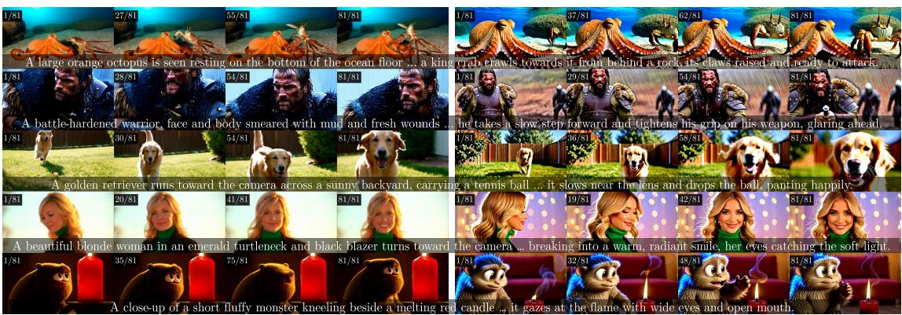
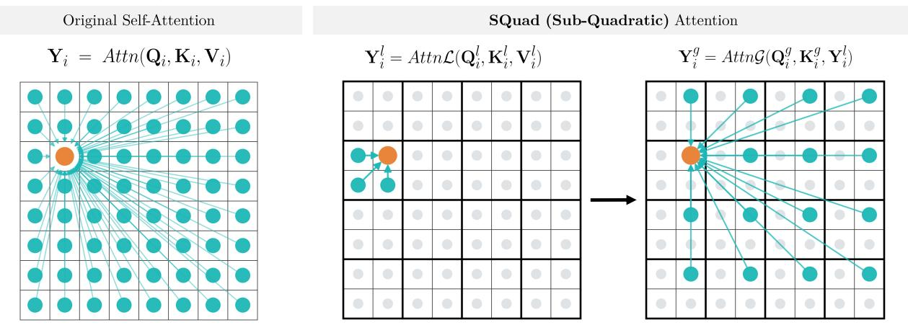
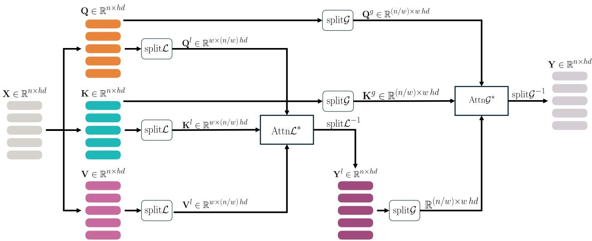
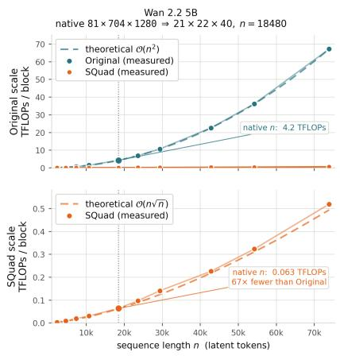
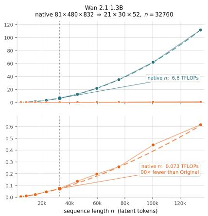
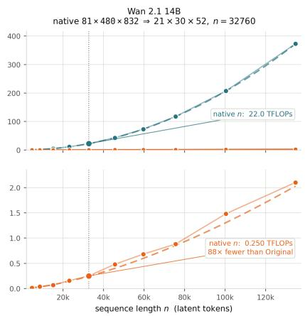

# SQuad: Sub-Quadratic Attention Distillation for Eficient Video Generation

Animesh Karnewar, Denis Korzhenkov, Amirhossein Habibian, Mohsen Ghafoorian

(a) Wan 2.2 5B Original  
(b) Wan 2.2 5B SQuad distilled (Ours)  
  
VBench : 83.08 Attn. Latency : 47.10ms Attn. TFLOPs : 4.205 NFE: 100  
VBench : 83.20 Attn. Latency : 4.27ms Attn. TFLOPs : 0.063 NFE: 6

Figure 1: Eficient video generation with SQuad. Given the same prompts, the original Wan 2.2 5B model (a) produces high-quality videos but at significant computational cost. Our SQuad-distilled model (b) preserves the quality while substantially reducing the computational cost.

Video Difusion Transformers (DiTs) spend most of their compute inside the Self-Attention operation, whose cost grows quadratically, $O ( n ^ { 2 } )$ , with the number of latent tokens �. For the task of video generation, the token count is large, so this term dominates runtime and memory, and thereby caps the resolution and duration we can generate. Linear $O ( n )$ and low-rank $O ( n k )$ surrogates of Self-Attention trade the full softmax $\bar { Q } K ^ { T }$ for cheaper kernels, but rarely recover the original’s expressivity, leaving a stubborn quality gap. Motivated by this, we propose SQuad, a Sub-Quadratic Attention Distillation framework that achieves a complexity of $O ( n { \sqrt { n } } )$ in the resulting distilled Attention, naturally balancing the eficiency v/s expressivity trade-of. Instead of training our own Video DiT from scratch, which is prohibitively expensive, we fit a pretrained full softmax Self-Attention DiT into our proposed SQuad-Attention one by distilling the former in two stages: Flow-Matching Supervised Fine-Tuning (SFT), followed by improved Distribution Matching Distillation (DMD2) which additionally makes the sampling more eficient. On the Wan 2.2 5B text-to-video model, SQuAD matches the quadratic teacher on VBench (83.20 v/s 83.08) while cutting the per-step per-block attention FLOPs by ∼67× and attention latency by ∼11×, and end-to-end DiT latency by 2×, all while also generating a video in only 6 Neural Functional Evaluations (NFEs) instead of the default 100.

  
Figure 2: SQuad attention. Left: full softmax Self-Attention at O(�2) complexity. Right: SQuad factorizes it into a local pass within $O ( { \sqrt { n } } )$ windows followed by a global pass across the windows, giving a full receptive field at $O ( n { \sqrt { n } } )$ complexity with a true softmax throughout.

## 1 Introduction

Video generation has quickly become one of the most exciting frontiers of generative modeling. DiTs [1] now produce high-resolution, temporally coherent clips of remarkable visual quality [2, 3, 4]. On today’s hardware, however, these models generate only a few seconds of video in a single pass [4]. Longer videos are stitched together by generating short clips one after another, each conditioned on the last—a process that ultimately drifts and loses coherence as the video grows [5, 6, 7, 8, 9, 10]. Generating longer videos with higher resolution natively, therefore remains a central goal of the field. Underlying all of these models is the softmax Self-Attention mechanism [11], which lets every token attend to every other token and is widely seen as the main driver of the expressivity and scalability of modern transformers. Softmax Self-Attention matters far beyond video: it is the backbone of nearly every domain that transformers now dominate. Studying how our proposed modification generalizes across all of these settings would be fascinating, but in favor of a concrete and carefully evaluated research, we focus on video generation with a well-defined scope, where the cost of attention is the highest and the potential payof is perhaps one of the greatest, if not the greatest.

The biggest challenge is computational cost. Softmax Self-Attention scales quadratically with the number of tokens, $O ( n ^ { 2 } )$ , in both time and memory [11]. In video, a single token indexes a point in space and time, and their number easily reaches tens of thousands per frame-volume. At this scale the quadratic term dominates the entire generation budget and caps the resolution, duration, and throughput the GPU hardware can aford. The obvious fix is to make the attention cheaper. Linear $O ( n )$ attention and related $O ( n k )$ approximations [12, 13, 14] replace the softmax with a kernelized or low-rank surrogate and bring the cost down. But these surrogates rarely match the expressivity of the full softmax Self-Attention. The non-linearity and the sharp, input-dependent selectivity that make softmax Self-Attention so efective are exactly what the approximations give up. The result is a stubborn quality gap, and it is widest in the high-fidelity, detail-sensitive regime of video generation.

Faced with this trade-of, prior works have looked for a middle ground. Whether it is linearizing a pretrained model or distilling its attention into kernel-based approximations [12, 13], or even replacing the attention altogether with structured state-space models such as S4 and Mamba [15, 16], on their own, neither substitution quite matches the performance and scalability of full softmax Self-Attention. Hence the field has increasingly turned to hybrid designs that interleave a few expensive quadratic full softmax Self-Attention blocks with many cheaper eficient ones [17]. This idea has recently reached video generation as well [18, 19, 20, 21, 22, 23, 24]. These hybrids recover much of the lost quality, yet they pay for it with complex-heterogeneous architectures, delicate choices about which layers stay quadratic, and more-exacerbatingly, a lingering dependence on the very softmax Self-Attention operation they set out to replace.

Considering this scenario, we take a diferent route with SQuad, a Sub-Quadratic Attention Distillation framework for eficient video generation. Rather than abandoning softmax Self-Attention, we lean into one of its well-known properties: in video DiTs, the attention maps are sparse and heavy-tailed. Almost all of the attention mass falls on a small set of critical tokens, while the rest of the softmax $( Q K ^ { \top } / \sqrt { d } )$ entries stay close to zero [20, 25, 26, 27]. We turn this observation into a framework that lowers the attention cost from $O ( n ^ { 2 } )$ to $O ( n { \sqrt { n } } )$ while keeping a genuine softmax throughout, unlike the linear variants (glance over fig. 2). Our proposed version of attention is rather simple but surprisingly efective. We propose a fixed, reduced communication pattern with two steps: locally, tokens mix within $O ( { \sqrt { n } } )$ -sized windows; while globally, tokens at the same position in each window mix across all windows. On the Wan 2.2 5B text-to-video generation model, as well as 2.1 1.3B, SQuad distills the quadratic full softmax Self-Attention into our proposed sub-quadratic SQuad-Attention with almost no loss in quality, while cutting latency and TFLOPs substantially (see fig. 1).

## 2 Related Work

We cover the more relevant related works on eficient attention methods (section 2.1), and Distillation of Video Generators (section 2.2) here, while defer the broader coverage on Text-to-Video generation models to the supplementary (section C).

## 2.1 Eficient Attention / Token Merging

Because this is such an important problem, a large body of work has sought to solve it. One line replaces or approximates the softmax. Attention Surgery [18] linearizes a pretrained video difusion transformer by distilling its softmax attention into a hybrid softmax/linear form while preserving quality. ReHyAt [19] blends the two as well, but computes the softmax component as a chunk-wise recurrence while using linear attention for farther-away chunks, allowing constant runtime memory. A second, larger line keeps the exact softmax but evaluates it only over a sparse subset of token pairs, exploiting the observation that video attention maps are highly sparse and structured. VSA [20] makes this sparsity trainable: a coarse stage pools tokens into tiles to locate critical regions, and a fine stage computes token-level attention only within them, as a single diferentiable kernel usable in both training and inference. Radial Attention [21] instead fixes a static $O ( n$ log �) mask motivated by “spatio-temporal energy decay”, shrinking each token’s attention window as temporal distance grows. Jenga [23] is likewise training-free, combining dynamic attention carving with space-filling curve-based token flattening at inference time. We compare with these methods as our primary eficiency baselines, but note that SQuad difers from all of these in two ways. Unlike the linear/hybrid surrogates, it retains a genuine softmax throughout; and unlike the sparse-mask methods, its reduced communication pattern isfixed and structured, which lowers the complexity to $O ( n { \sqrt { n } } )$ without the complex data-dependent token-selection steps.

## 2.2 Distilling Video Generators

We find that for SQuad, a simple Flow-Matching [28] SFT is not enough to recover the original’s quality after swapping the softmax for SQuad-Attention; some form of teacher distillation is required. For T2V generation, such distillation is currently done in two complementary ways.

Model (capability) distillation matches what happens inside the teacher, not just what comes out of it. The idea is to pull the student’s intermediate features towards those of a stronger network: REPA [29] aligns a difusion transformer’s hidden states with a self-supervised encoder like DINO, REPA-E [30] carries this through the VAE end-to-end, and Wang et al. [31] study when such alignment helps and when to switch it of. All of this leans on a now-familiar observation — that difusion backbones already learn good, transferable features on their own [32]. Neodragon [33] takes the same idea to video, matching a teacher’s activations to shrink a model down for on-device generation.

Step distillation instead aims to reduce the NFEs needed at inference. Progressive schemes halve the sampler’s step count [34, 35]; consistency-based methods map any trajectory point to its endpoint [36, 37, 38, 39]; adversarial schemes add a GAN objective for one-to-four-step generation [40, 41]; distribution-matching methods minimize a reverse-KL between student and teacher via a score diference [42, 43], extended to video by CausVid [44], Self Forcing [45], and the Motion Consistency Model [46]; and recent flow-map methods learn the two-time map of the flow directly [47, 48, 49].

Rather than inventing yet another distillation method for our proposed SQuad-Attention, we simply adopt DMD2 [43], which strikes a good balance between the two objectives above: as a distribution-matching method it allows us to recover the capability lost to SQuad-Attention, while also reduces the step-count, allowing us to generate videos with far fewer NFEs.

## 3 Method

We first begin with full softmax Self-Attention, and fix the notation we build on (section 3.1) and then define the SQuad-Attention operator (section 3.2). The broader discussion on latent video difusion setup, and the details of how we train, are deferred to sections A and B of supplementary respectively. We recommend reading section A prior to continuing.

## 3.1 Preliminaries: Full softmax Self-Attention

The DiT ${ \mathcal { D } } _ { \theta }$ is a composition of � identical blocks (with $L = 3 0$ for Wan 2.2 5B). The latent $z _ { \sigma }$ is first flattened and patchified into a sequence of � token features, which the blocks then refine in tandem:

$$
\begin{array} { r l } & { \mathbf { X } ^ { ( 0 ) } = \mathrm { e m b e d } ( z _ { \sigma } ) , } \\ & { \mathbf { X } ^ { ( \ell ) } = \mathcal { B } _ { \theta } ^ { ( \ell ) } \big ( \mathbf { X } ^ { ( \ell - 1 ) } , \sigma , \mathbf { p } \big ) , \quad \ell = 1 , \ldots , L , } \end{array}\tag{1}
$$

where $\sigma$ is the current noise-level and p is the text prompt. The flow-velocity is read out from $\mathbf { X } ^ { ( L ) }$ by a final projection. Each block $\mathcal { B } _ { \theta } ^ { ( \ell ) }$ applies three residual sub-layers — a self-attention over the � video tokens, a cross-attention to the text prompt p, and a token-wise feed-forward network — each modulated by the timestep $\sigma$ (omitted in following for brevity):

$$
\begin{array} { r l } & { \mathbf { X }  \mathbf { X } + \mathrm { S e l f A t t n } ( \mathbf { X } ) , } \\ & { \mathbf { X }  \mathbf { X } + \mathrm { C r o s s A t t n } ( \mathbf { X } , \mathbf { p } ) , } \\ & { \mathbf { X }  \mathbf { X } + \mathrm { F F N } ( \mathbf { X } ) . } \end{array}\tag{2}
$$

SQuad modifies only the self-attention while the cross-attention and the feed-forward network are left untouched. In what follows we therefore drop the block index and write $\mathbf { X } \in \mathbb { R } ^ { n \times h d }$ for the token features entering a single block’s self-attention. This so-called Self-Attention operation that forms the backbone of

  
Figure 3: Illustration of the SQuad Attention operation. The starred operators Attn $\mathcal { L } ^ { * }$ and $\mathbf { A t t n } Q ^ { * }$ apply the attention operations per-head and concatenate the outputs.

essentially every modern Transformer, difusion or otherwise, is remarkably simple. A sequence of � input tokens is first projected into three sequences queries, keys, and values as

$$
\mathbf { Q } = \mathbf { X } \mathbf { W } _ { Q } , \quad \mathbf { K } = \mathbf { X } \mathbf { W } _ { K } , \quad \mathbf { V } = \mathbf { X } \mathbf { W } _ { V } ,\tag{3}
$$

with learned projection matrices $\mathbf { W } _ { \{ Q , K , V \} } \in \mathbb { R } ^ { h d \times h d }$ . Here � is the number of tokens; for video latents it is the size of a spatio-temporal volume, $n = T \times H \times W$ , as described earlier. Each of $\mathbf { Q } , \mathbf { K } ,$ , and V is then split along its feature dimension into ℎ heads of dimension �, giving per-head sequences $\mathbf { Q } _ { i } , \mathbf { K } _ { i } , \mathbf { V } _ { i } \in \mathbb { R } ^ { n \times d }$ for $i \in \{ 1 , \ldots , h \}$ . A rotary position embedding (RoPE) [50] is applied to the queries and keys only,

$$
\begin{array} { r } { \mathbf { Q } _ { i }  \mathrm { R o P E } ( \mathbf { Q } _ { i } ) , \qquad \mathbf { K } _ { i }  \mathrm { R o P E } ( \mathbf { K } _ { i } ) , } \end{array}\tag{4}
$$

while the values $\mathbf { V } _ { i }$ are left unchanged. The full softmax self-attention for the �-th head is then

$$
\mathbf { Y } _ { i } \ = \ \mathrm { A t t n } ( \mathbf { Q } _ { i } , \mathbf { K } _ { i } , \mathbf { V } _ { i } ) \ = \ \mathrm { s o f t m a x } \Bigg ( \frac { \mathbf { Q } _ { i } \mathbf { K } _ { i } ^ { \top } } { \sqrt { d } } \Bigg ) \mathbf { V } _ { i }\tag{5}
$$

Such that, softmax is a row-wise operator and $\mathbf { Y } _ { i } \in \mathbb { R } ^ { n \times d }$ . The per-head outputs are concatenated back along the feature dimension,

$$
\mathbf { Y } \ = \ \operatorname { c o n c a t } ( \mathbf { Y } _ { 1 } , \ldots , \mathbf { Y } _ { h } ) \ \in \ \mathbb { R } ^ { n \times h d } ,\tag{6}
$$

yielding an output sequence Y with the same shape as the input X. The $n \times n$ score matrix $\mathbf { Q } _ { i } \mathbf { K } _ { i } ^ { \top }$ inside the softmax is the source of the quadratic cost: forming and applying it takes $O ( n ^ { 2 } )$ work per head.

The Cross-Attention sub-layer is mechanically identical, except that the keys and values are projected from the text-prompt embedding p rather than from X. Its cost is therefore cheap: the prompt length (512 tokens for Wan 2.2 5B) is typically far smaller than the number of visual tokens �.

## 3.2 SQuad

Our proposal is a simple change. Where a standard DiT block computes $\mathbf { Y } = { \mathrm { S e l f A t t n } } ( \mathbf { X } )$ via the full softmax Attn of eq. (5), we compute $\textbf { Y } = \mathrm { \ S Q u a d A t t { n } ( { \bf X } ) }$ . leaving every other part of the DiT blocks as it is.

A composition of two attentions. SQuadAttn is not a new kind of attention. It is the composition of two ordinary softmax attentions, a local pass AttnL and a global pass AttnG. Writing the composition as a nesting makes the data flow explicit,

$$
\begin{array} { r } { { \displaystyle { \bf Y } _ { i } ~ = ~ \mathrm { \cal A t t n } { \mathcal G } \Big ( { \bf Q } _ { i } , ~ { \bf K } _ { i } , \underbrace { \mathrm {  ~ \cal ~ A t t n } { \mathcal L } \big ( { \bf Q } _ { i } , { \bf K } _ { i } , { \bf V } _ { i } \big ) } _ { { \bf Y } _ { i } ^ { l } } \Big ) } . } \\ { { \displaystyle { \bf V } _ { i } ^ { g } } } \end{array}\tag{7}
$$

Figure 2 gives the conceptual picture: the local pass mixes tokens inside a window, and the global pass then mixes across windows. Note that the two passes are not fused, and neither are their outputs pooled or summed or aggregated. Instead the value stream acts as a shared scratch between them. As eq. (7) shows, the local output enters the global pass in the value slot. The global mixing therefore operates on tokens that have already been locally mixed, and a full receptive field is recovered even though neither pass alone is dense (see supplementary section D).

Construction of the local and global token views. Both $\mathrm { A t t n } \mathcal { L }$ and $\mathtt { A t t n } \mathcal { G }$ are formally the Attn of eq. (5), while they difer only in how the queries and keys are laid out. Crucially, this re-viewing happens before the split into heads. Given a window size �, we first rearrange the projected $\mathbf { Q } , \mathbf { K } , \mathbf { V } \in \mathbb { R } ^ { n \times \bar { h } d }$ into a local and a global view,

$$
\begin{array} { r l } & { \{ \mathbf { Q } , \mathbf { K } , \mathbf { V } \} ^ { l } = \mathrm { s p l i t } \mathcal { L } \left( \{ \mathbf { Q } , \mathbf { K } , \mathbf { V } \} \right) \in \mathbb { R } ^ { w \times ( n / w ) h d } , } \\ & { \quad \{ \mathbf { Q } , \mathbf { K } \} ^ { g } = \mathrm { s p l i t } \mathcal { G } \left( \{ \mathbf { Q } , \mathbf { K } \} \right) \in \mathbb { R } ^ { ( n / w ) \times w h d } , } \end{array}\tag{8}
$$

and only then split into heads exactly as in section 3.1. The head dimension � is unchanged; the number of heads absorbs the axis that is no longer attended over. So the local view yields $\left( n / w \right)$ ℎ heads over sequences of length �, and the global view yields �ℎ heads over sequences of length $\left( n / w \right)$ . Both rearrangements are pure re-indexings. They carry no parameters and no arithmetic, and each is exactly invertible. We thus refer to their inverses split $\dot { \mathcal { L } } ^ { - 1 }$ and $\mathrm { s p l i t } G ^ { - 1 }$ which simply revert the rearrangement of the tokens.

Concretely, for a video latent with token grid of $T \times H \times W$ size and a window of $w = w _ { t } \times w _ { h } \times w _ { w }$ size, the two views are the einops rearrangements

$$
\begin{array} { r l } & { \mathrm { s p l i t \mathcal { L } : \textbf { b } ( p t \textbf { w t } ) \Lambda ( p h \textbf { w h } ) \Lambda ( p w \textbf { w } ) \textbf { h } d } } \\ & { \qquad \to \textbf { b } \mathrm { ( w t \textbf { w h } \textbf { w w } ) \Lambda ( p t \textbf { p h } p w \textbf { h } ) \Lambda ( d } , } \end{array}\tag{9}
$$

$$
\begin{array} { r l } & { \mathrm { s p l i t } \mathcal { G } : \textbf { b } \mathrm { ( p t ~ \boldsymbol { w } t ) } \mathrm { ( p h ~ \boldsymbol { w } h ) } \mathrm { ( p \boldsymbol { w } ~ \boldsymbol { w } \boldsymbol { w } ) } \mathrm { ~ h ~ \boldsymbol { d } ~ } } \\ & { \mathrm { ~ \boldsymbol ~ { \beta }  \boldsymbol { b } ~ \mathrm { ( p t ~ \ p h ~ \ p w ) } ~ \Lambda ( \boldsymbol { w t } ~ \boldsymbol { w h } ~ \boldsymbol { w } \boldsymbol { w } ~ \boldsymbol { h } ) ~ \boldsymbol { d } , } } \end{array}
$$

where b is the batch size, and $\mathsf { p t } = T / w _ { t } , \mathsf { p h } = H / w _ { h } , \mathsf { p w } = W / w _ { w }$ count the windows along each axis. In both cases the second axis of the result is the one attended over and the third collects the remaining positions into the head count, leaving the head dimension � untouched. When the token extents are not divisible by the window shape, our implementation pads the grid and masks the padded positions in the attention.

Given the definitions of the local and global split operations, both AttnL and AttnG have each the same three steps: split, attend, and unsplit,

$$
\begin{array} { r l } & { \mathrm { A t t n } \mathcal { L } ( \cdot ) = \mathrm { s p l i t } \mathcal { L } ^ { - 1 } \Big ( \mathrm { A t t n } \big ( \mathbf { Q } _ { i } ^ { l } , \mathbf { K } _ { i } ^ { l } , \mathbf { V } _ { i } ^ { l } \big ) \Big ) , } \\ & { \mathrm { A t t n } \mathcal { G } ( \cdot ) = \mathrm { s p l i t } \mathcal { G } ^ { - 1 } \Big ( \mathrm { A t t n } \big ( \mathbf { Q } _ { i } ^ { g } , \mathbf { K } _ { i } ^ { g } , \mathrm { s p l i t } \mathcal { G } ( \mathbf { Y } _ { i } ^ { l } ) \big ) \Big ) . } \end{array}\tag{10}
$$

Table 1: VBench evaluation comparing our SQuad to the original baseline, DMD distilled original, and various trained as well as training-free eficient attention methods. We show selected representative dimensions here due to space constraints.
<table><tr><td rowspan="2">Method</td><td colspan="2">VBench</td><td colspan="6">Quality Dimensions</td><td colspan="6">Semantic Dimensions</td></tr><tr><td></td><td>al.</td><td>q: Sem.</td><td>Backg.</td><td>Ti.</td><td>Moton</td><td>Dyn.</td><td>Aest.</td><td>Iimag</td><td>o</td><td>M-bi:.</td><td>A.</td><td>Co0or</td><td>SPpat.</td><td>Scene</td></tr><tr><td></td><td></td><td>Base DiT: Wan 2.2 5B</td><td></td><td></td><td></td><td>Generation resolution:</td><td></td><td>81x704x1280</td><td></td><td>Token length:</td><td></td><td>n = 18480</td><td></td><td></td><td></td></tr><tr><td>Original</td><td>83.08</td><td>83.98</td><td>79.48</td><td>92.56</td><td>96.19</td><td>99.49</td><td>98.11</td><td>65.28 66.33</td><td>67.75</td><td>89.08</td><td>71.02</td><td>97.20</td><td>83.68</td><td>81.83</td><td>54.10</td></tr><tr><td>DMD</td><td>82.54</td><td>83.36</td><td>79.28</td><td>94.70</td><td>94.69</td><td>96.73</td><td>96.89</td><td>75.83 66.94</td><td>69.00</td><td>92.85</td><td>75.37</td><td>98.00</td><td>83.50</td><td>79.18</td><td>52.82</td></tr><tr><td>VSA</td><td>84.14</td><td>84.93</td><td>81.00</td><td>95.02</td><td>95.66</td><td>98.36</td><td>98.34</td><td>66.94 68.62</td><td>70.91</td><td>94.53</td><td>81.14</td><td>98.80</td><td>84.77</td><td>85.71</td><td>53.65</td></tr><tr><td>Jenga</td><td></td><td></td><td></td><td></td><td></td><td></td><td></td><td></td><td></td><td></td><td></td><td></td><td></td><td></td><td></td></tr><tr><td>Training free</td><td>83.08</td><td>84.14</td><td>78.82</td><td>91.88</td><td>94.52</td><td>97.47</td><td>97.14</td><td>87.22 66.73</td><td>69.29</td><td>90.49</td><td>71.57</td><td>98.20</td><td>84.93</td><td>79.06</td><td>51.12</td></tr><tr><td>- With training</td><td>84.36</td><td>85.07</td><td>81.54</td><td>94.44</td><td>95.84</td><td>99.01</td><td>97.72</td><td>71.94 68.60</td><td>70.18</td><td>94.43</td><td>79.56</td><td>97.60</td><td>83.41</td><td>87.87</td><td>54.99</td></tr><tr><td>Radial Attention</td><td>84.56</td><td>85.46</td><td>80.96</td><td>94.44</td><td>95.85</td><td>98.77</td><td>97.08</td><td>84.17 68.03</td><td>69.98</td><td>92.53</td><td>76.11</td><td>98.40</td><td>88.90</td><td>83.10</td><td>53.91</td></tr><tr><td>Attention Surgery</td><td>83.39</td><td>84.55</td><td>78.74</td><td>94.15</td><td>95.25</td><td>98.38</td><td>97.39 75.00</td><td>68.01</td><td>69.79</td><td>92.04</td><td>72.56</td><td>97.60</td><td>83.12</td><td>82.50</td><td>51.21</td></tr><tr><td>ReHyAt</td><td></td><td></td><td></td><td></td><td></td><td></td><td></td><td></td><td></td><td></td><td></td><td></td><td></td><td></td><td></td></tr><tr><td>- 20 Blocks</td><td>83.70</td><td>84.46</td><td>80.66</td><td>96.31</td><td>96.52</td><td>98.08</td><td>97.87</td><td>61.94 69.05</td><td>69.63</td><td>94.87</td><td>81.31</td><td>97.40</td><td>84.69</td><td>82.10</td><td>53.94</td></tr><tr><td>- 30 Blocks</td><td>83.22</td><td>83.62</td><td>81.61</td><td>97.06</td><td>97.22</td><td>98.66</td><td>98.18</td><td>42.22 68.79</td><td>69.84</td><td>95.73</td><td>84.45</td><td>97.00</td><td>83.80</td><td>84.90</td><td>55.99</td></tr><tr><td>SQuad (Ours)</td><td></td><td></td><td></td><td></td><td></td><td></td><td></td><td></td><td></td><td></td><td></td><td></td><td></td><td></td><td></td></tr><tr><td>20 Blocks - 30 Blocks</td><td>82.90</td><td>83.45</td><td>80.73</td><td>95.12</td><td>95.64</td><td>97.31</td><td>97.27 65.28</td><td>68.21</td><td>68.93</td><td>94.95</td><td>82.26</td><td>98.20</td><td>82.89</td><td>85.06</td><td>53.71</td></tr><tr><td></td><td>83.20</td><td>83.78</td><td>80.88</td><td>95.77</td><td>96.41 97.79</td><td>98.16</td><td>57.22</td><td>68.70</td><td>68.47</td><td>95.87</td><td>83.23</td><td>97.40</td><td>82.98</td><td>84.35</td><td>54.43</td></tr><tr><td></td><td>Base DiT:</td><td></td><td>: Wan 2.1 1.3B</td><td></td><td></td><td>Generation resolution:</td><td></td><td>81x480x832</td><td></td><td>Token length:</td><td></td><td>n = 32760</td><td></td><td></td><td></td></tr><tr><td>Original</td><td>83.26</td><td>84.25</td><td>79.30</td><td>93.05</td><td>96.11</td><td>99.02</td><td>97.92</td><td>71.94 67.74</td><td>66.27</td><td>90.41</td><td>74.39</td><td>96.80</td><td>86.35</td><td>77.87</td><td>52.71</td></tr><tr><td>DMD</td><td>83.04</td><td>85.07</td><td>74.94</td><td>93.94</td><td>94.78</td><td>97.29</td><td>97.77 85.28</td><td>68.51</td><td>70.06</td><td>86.41</td><td>69.70</td><td>97.20</td><td>80.88</td><td>68.85</td><td>48.20</td></tr><tr><td>SQuad (Ours)</td><td></td><td></td><td></td><td></td><td></td><td></td><td></td><td>85.56</td><td></td><td>89.21</td><td>75.09</td><td></td><td></td><td></td><td></td></tr><tr><td>- 20 Blocks</td><td>82.74</td><td>84.43</td><td>76.00</td><td>93.09</td><td>95.03</td><td>97.64</td><td>97.58</td><td>66.85</td><td>67.78</td><td></td><td></td><td>97.20</td><td>82.45</td><td>70.44</td><td>44.30</td></tr><tr><td>– 30 Blocks</td><td>82.70</td><td>84.27</td><td>76.44</td><td>93.21</td><td>95.32</td><td>98.39</td><td>97.77</td><td>82.50 65.44</td><td>66.50</td><td>91.61</td><td>75.00</td><td>95.20</td><td>85.76</td><td>70.48</td><td>45.62</td></tr></table>

Both operators therefore consume and return tensors of the original shape R�×ℎ�. This is what makes them composable in eq. (7). Figure 3 illustrates the flow of the operations mathematically defined in eq. (10).

We analyze the resulting complexity in section E, and derive the optimal window size in section F of the supplementary material. But even without the derivation, it can be intuitively observed that $w = { \sqrt { n } }$ is the optimal choice for the window size balancing the number of tokens in the local and the global attention passes, ultimately giving us $O ( n { \sqrt { n } } )$ Sub-Quadratic complexity. Hence the name SQuad.

Distillation. Replacing SelfAttn with SQuadAttn changes the function each block computes, so the pretrained weights no longer fit. Rather than train a SQuad model from scratch, we demonstrate that a pretrained quadratic DiT can be fitted into our modified one by distillation, in two stages. We first perform a simple Flow-Matching SFT, which re-seats the network under the new attention. We then apply DMD2 step distillation, which recovers the teacher’s generation quality and reduces the sampling NFEs at the same time. We defer the details of both stages to section B of the supplementary.

## 4 Experiments

## 4.1 Experimental Setup

Models. We conduct all our experiments on the Wan 2.2 5B as well as the older Wan 2.1 1.3B [4].

Metrics. Our setup is designed to evaluate the eficacy of our proposed method over two axes: preservation of the generation quality, and improvement in the eficiency. We evaluate our experiments towards the first axis with the VBench [51] suite of metrics as well as human user preference study, and along the second using the typical eficiency metrics such as TFLOPs, GPU latency, and NFEs.

Human preference study. To compare two methods, we randomly sampled long gpt-enhanced prompts from VBench and showed the users the prompts with a varying randomly ordered left/right videos and asked them to pick their preferred video or mark the comparison as a tie. This process resulted in 1,179 paired comparisons, from 24 distinct humans on 648 distinct prompts and 1,036 distinct videos, some with the same prompt but varying random seeds.

Datasets. For our Stage-1 SFT we use the videos from the VIPE 1M dataset [52], and the descriptive captions for those generated by us using the Qwen3-8B-Instruct [53] model. We will release these captions for further research. For the Stage-2 DMD2 step distillation, we only use the captions, since this version of DMD bootstraps the student and does not require video data.

## 4.2 Main Experiments

We first present our evaluation of our proposed method SQuad in comparison to the original baseline models Wan 2.2 5B as well as the older Wan 2.1 1.3B since they operate on diferent resolutions natively, thus producing token lengths of diferent sizes. Specifically the token length for the 5B model at 704p resolution is $n = 1 8 4 8 0$ while for the 1.3B model at 480p resolution is $n = 3 2 7 6 0$ . We experiment on these two settings to demonstrate the generalization and robustness of our proposed change, while present a broader comparison against various eficient attention methods on the 5B model.

As presented in table 1 On Wan 2.2 5B, SQuad attains a VBench Total score of 83.20, efectively matching the full softmax Self-Attention of the original DiT 83.08. Crucially, it does so while introducing zero additional parameters and with a simple implementation which is hardware device friendly by design, not requiring any specialized GPU fused kernels or on-device optimizations. The competing eficient-attention method, Radial Attention [21], that posts higher VBech total (84.56) than ours proposes an $O ( n \log ( n ) )$ method, yet, as demonstrated in the table 4, we surpass their latency as well as TFLOPs without requiring specialized GPU kernels in the implementation. Lastly, as presented in table 2, 31% of the users couldn’t distinguish between our and their generations while 35% preferred ours. This strengthens the fact that our proposed method holds up to the compared eficient attention methods when it comes to video generation quality.

Table 4 shows that SQuad decisively improves eficiency from the original baseline. On Wan 2.2 5B it reduces the per-block latency from 62.01 to 19.04 ms (3.3× faster), and compute from 9.681 to 5.548 TFLOPs (1.7× fewer), all with zero added parameters, unlike VSA [20], Attention Surgery [18], and ReHyAt [19], which each carry 72–283M extra weights. We note that the added learnable parameters is presented here merely as a representation of their method’s complex nature. Our gains grow with model scale and sequence length. Although we couldn’t perform distillation experiments, we still run the eficiency evaluations on the larger Wan 2.1 14B backbone, and find that SQuad reduces compute from 41.959 to 20.223 TFLOPs and latency from 300.29 to 59.24 ms (ref table 4). This is the expected signature of trading an $O ( n ^ { 2 } )$ operation for an $O ( n { \sqrt { n } } )$ one: the deeper the token grid, the larger the payof. Lastly, beyond the primary Wan 2.2 5B model, we apply the identical SQuad distillation to Wan 2.1 1.3B to test that the method is not tied to a single backbone or single token-length setting. The eficiency results (Table 4) transfer directly; the corresponding Wan 2.1 quality evaluations are reported in Table 1.

Table 2: User study. Base model for all is Wan 2.2 5B.
<table><tr><td rowspan="2">Baseline Method</td><td colspan="3">Human Preference %</td></tr><tr><td></td><td>SQuad No pref. Baseline</td><td></td></tr><tr><td>Original 100 NFEs</td><td>41%</td><td>33%</td><td>26%</td></tr><tr><td>DMD 6 NFEs</td><td>33%</td><td>37%</td><td>30%</td></tr><tr><td>DMD Rad. Attn. 6 NFEs</td><td>35%</td><td>31%</td><td>34%</td></tr></table>

Table 3: Ablation of SFT and DMD for SQuad on 30 Blocks.
<table><tr><td rowspan="2">SFT</td><td rowspan="2">DMD</td><td rowspan="2">NFE</td><td colspan="3">VBench</td></tr><tr><td>Tot.</td><td>Qual.</td><td>Sem.</td></tr><tr><td>L</td><td></td><td>100</td><td>73.03</td><td>75.66</td><td>62.48</td></tr><tr><td></td><td>L</td><td>6</td><td>80.91</td><td>82.23</td><td>75.65</td></tr><tr><td>L</td><td>L</td><td>6</td><td>82.99</td><td>83.69</td><td>80.19</td></tr></table>

## 4.3 Hardware Compilation and Performance

The complexity analysis of section E establishes that SQuad reduces the attention cost from $O ( n ^ { 2 } )$ to $O ( n { \sqrt { n } } )$ and the Block-level TFLOPs counts as well as the Block-level Latencies of table 4 confirm that this translates into a real reduction in arithmetic work. Neither quantity, however, is what a practitioner actually waits for. Asymptotic complexity ignores constants, memory trafic, and kernel eficiency; FLOP counts credit every multiply-add equally, even though a large fused GEMM and a bandwidth-bound softmax over an � × � score matrix reach wildly diferent fractions of peak throughput. An attention operator can therefore look cheap on paper and still fail to deliver, either because the work it removes was never the bottleneck or because the reshaping it introduces costs more than the multiplications it saves. The only way to settle the question is to measure wall-clock time on the device. We report that measurement here, in both of the execution modes a user is likely to deploy: PyTorch eager mode and a torch.compile compiled mode in table 5.

What we time. We time a single forward pass of the DiT — the quantity that the sampler invokes once per function evaluation — rather than the whole generation pipeline. Text encoding and VAE decoding are excluded: they are shared verbatim by every method we compare and would otherwise dilute the efect under study. Timing uses pairs of torch.cuda.Event(enable\_timing=True) objects registered as forward-pre and forward hooks on the transformer module. Because the hooks sit on the outermost module wrapper and only record events, they measure the compiled region without entering it, and so remain valid under fullgraph=True compilation; the same instrumentation is used unchanged in both modes. Each measured interval is bracketed on the CUDA stream and read back only after a torch.cuda.synchronize(), so the reported numbers are true device latencies and contain no host-side asynchrony artifacts. Classifier-free guidance is disabled (� = 0; recall from section B that CFG is distilled into the student), so each denoising step issues exactly one transformer forward and our NFE count equals the number of timed forwards.

Protocol and statistics. We profile a fixed list of 30 prompts spanning varied scenes, subjects, and camera motion. The first 5 prompts are executed but discarded: they populate the allocator caches, trigger cuDNN/cuBLAS autotuning, and—in compiled mode—absorb the one-of graph capture and max-autotune kernel search, none of which reflect steady-state cost. The remaining 25 prompts are counted, and with NFE = 6 this yields 25 × 6 = 150 timed forward passes per mode, which we pool before aggregating. We report the mean over this pooled sample. The RNG is re-seeded before every prompt, so a given prompt sees identical noise in the eager and compiled passes and the two modes are compared on exactly the same work. Every method in table 5 is measured with this identical harness, on the same machine, in the same session-level environment.

Table 4: Eficiency comparisons
<table><tr><td>Method</td><td>NFE</td><td>#Par.</td><td>Lat.</td><td>TFLOPs</td></tr><tr><td colspan="5">Base DiT: Wan 2.2 5B (81x704x1280)</td></tr><tr><td>Original DiT</td><td>100</td><td>0</td><td>62.01ms</td><td>9.7</td></tr><tr><td>VSA</td><td>6</td><td>283M</td><td>24.13ms</td><td>6.2</td></tr><tr><td>Jenga</td><td>6</td><td>0</td><td>22.63ms</td><td>6.2</td></tr><tr><td>Radial Attention</td><td>6</td><td>0</td><td>25.50ms</td><td>7.0</td></tr><tr><td>Attention Surgery</td><td>6</td><td>72M</td><td>33.53ms</td><td>6.8</td></tr><tr><td>ReHyAt</td><td>6</td><td>72M</td><td>58.56ms</td><td>6.5</td></tr><tr><td>SQuad (Ours)</td><td>6</td><td>0</td><td>19.04ms</td><td>5.5</td></tr><tr><td colspan="5">Other variants (81x480x832)</td></tr><tr><td>Wan 2.1 1.3B Orig.</td><td>100</td><td>0</td><td>88.36ms</td><td>9.4</td></tr><tr><td>– SQuad (Ours)</td><td>6</td><td>0</td><td>15.22ms</td><td>2.9</td></tr><tr><td>Wan 2.1 14B Orig.</td><td>100</td><td>0</td><td>300.29ms</td><td>41.9</td></tr><tr><td>– SQuad (Ours)</td><td>6</td><td>0</td><td>59.24ms</td><td>20.2</td></tr></table>

Table 5: End-to-end latency of a single DiT forward pass, measured in PyTorch eager mode and under torch.compile (max-autotune). All rows are the Wan 2.2 5B backbone at 81x704x1280.
<table><tr><td rowspan="2">Method</td><td rowspan="2">NFE</td><td colspan="2">End-to-End DiT Latency</td></tr><tr><td>Eager</td><td>Compiled</td></tr><tr><td>Original DiT</td><td>100</td><td>870ms</td><td>667ms</td></tr><tr><td>VSA</td><td>6</td><td>724ms</td><td>434ms</td></tr><tr><td>Jenga</td><td>6</td><td>680ms</td><td>427ms</td></tr><tr><td>Radial Attention</td><td>6</td><td>765ms</td><td>619ms</td></tr><tr><td>Attention Surgery</td><td>6</td><td>1006ms</td><td>537ms</td></tr><tr><td>ReHyAt</td><td>6</td><td>1757ms</td><td>544ms</td></tr><tr><td>SQuad (Ours)</td><td>6</td><td>520ms</td><td>314ms</td></tr></table>

## 4.4 Ablation Experiments

We now finally detail the process of experimentation through which we found the best configuration of our proposed SQuad method reported in table 1. In principle, all design choices following the O (�√�) framework work reasonably, but since we are not training from scratch and distilling a pretrained model, some choices work better. Since it made more conceptual sense to us, we actually started the experiments with the global → local order of the proposed attentions.

Both training stages are necessary. For now. Thus, on the global → local order of application, Table 3 disentangles Stage-1 SFT from Stage-2 DMD2. It is clear that when all 30 blocks of the model are replaced with SQuad-Attention: SFT alone collapses (VBench Tot. 73.03), and DMD2 alone reaches only 80.91, but the two stages together recover the full 82.99 VBench Tot.

Window characterization. Then the next question is what shape or characterization of the windows should we use. Table 7 studies how the choice of window geometry, at a roughly fixed token budget near the sub-quadratic target ⌈√� ⌉ = 136, for � = 18480 afects quality, contrasting aspect-ratio preserving, spatial-only, temporal-only, and isotropic windows. We find that the temporal windows are the easiest to train and produce the best quality videos. This could be attributed to the asymetric nature of the DiT patchification (1x temporal while 2x spatial), but further analysis is required to reason properly.

The need for and the order of the two passes. Finally, we attempt to experimentally answer the question: what order should the two passes run in. Table 6 shows that, used in isolation, the local-only and global-only passes are the cheapest but don’t work properly as the restricted receptive field limits their generation quality strongly. Composing the two restores full quality, and a uniform local → global pass is the best with VBench total of 83.20 We also experimented with blockwise alternating order of the two passes, and found it to perform worse than the uniform local → global pass.

Table 6: Ablation of local/global attention and their ordering on SQuad applied to all 30 Blocks. Attention latencies are in ms and × columns are improvements relative to the Original Attention.
<table><tr><td rowspan="2">Method</td><td rowspan="2">Local</td><td rowspan="2">Global</td><td rowspan="2">Order</td><td rowspan="2">Block TFLOPs</td><td rowspan="2">Block Lat.</td><td rowspan="2">Attn. TFLOPs</td><td rowspan="2">Attn. Lat.</td><td rowspan="2"> $\mathrm { T F L O P s }$  ×</td><td rowspan="2">Lat. X</td><td colspan="3">VBench</td></tr><tr><td>Tot.</td><td>Qual.</td><td>Sem.</td></tr><tr><td>Original</td><td></td><td>一</td><td>一</td><td>9.680</td><td>61.80</td><td>4.205</td><td>47.10</td><td>1.0</td><td>1.0</td><td>83.08</td><td>83.98</td><td>79.48</td></tr><tr><td rowspan="2">SQuad</td><td>V</td><td></td><td>一</td><td>5.523</td><td>19.46</td><td>0.038</td><td>3.61</td><td>110.7</td><td>13.0</td><td>62.62</td><td>73.65</td><td>18.50</td></tr><tr><td></td><td>V</td><td></td><td>5.509</td><td>17.86</td><td>0.025</td><td>2.88</td><td>168.2</td><td>16.4</td><td>62.63</td><td>71.48</td><td>27.24</td></tr><tr><td>(Ours)</td><td>V</td><td>V</td><td>L→G</td><td>5.548</td><td>19.55</td><td>0.063</td><td>4.27</td><td>66.7</td><td>11.0</td><td>83.20</td><td>83.78</td><td>80.88</td></tr><tr><td rowspan="2"></td><td>V</td><td>V</td><td>G→L</td><td>5.548</td><td>19.93</td><td>0.063</td><td>4.25</td><td>66.7</td><td>11.1</td><td>82.99</td><td>83.69</td><td>80.19</td></tr><tr><td>V</td><td>V</td><td>alternate</td><td></td><td>一</td><td>一</td><td>一</td><td>一</td><td></td><td>82.87</td><td>83.57</td><td>80.06</td></tr></table>

Table 7: Window characterization ablation. Here $N = 1 8 4 8 0$ tokens, so the window target is $\lceil \sqrt { N } \rceil = 1 3 6 ;$ “Target dif.” is each window’s #Tokens minus this target.
<table><tr><td>Window shape</td><td>Dims</td><td>#Tok.</td><td>diff.</td><td>VBench Tot.</td></tr><tr><td>AR-preserving</td><td>4×5×7</td><td>140</td><td>+4</td><td>81.99</td></tr><tr><td>Spat.</td><td>1 × 9× 16</td><td>144</td><td>+8</td><td>82.31</td></tr><tr><td>Spat. isotropic</td><td>1 × 12 × 12</td><td>144</td><td>+8</td><td>81.55</td></tr><tr><td>Temp.</td><td>21×2×4</td><td>168</td><td>+32</td><td>82.99</td></tr><tr><td>Temp. isotropic</td><td>21×3×3</td><td>189</td><td>+53</td><td>81.80</td></tr><tr><td>Isotropic (small)</td><td>5×5×5</td><td>125</td><td>-11</td><td>81.55</td></tr><tr><td>Isotropic (large)</td><td> $6 \times 6 \times 6$ </td><td>216</td><td>+80</td><td>81.69</td></tr></table>

## 5 Conclusion

We introduced SQuad, a Sub-Quadratic Attention Distillation framework that makes the attention in a pretrained video DiT sub-quadratic without abandoning the softmax that gives it its expressivity. Beyond the concrete eficiency gains, our broader aim is to shine light on a simple hypothesis: the full $O ( n ^ { 2 } )$ complexity of token-to-token communication may not be necessary. Cheaperfactorizations that keep the softmax intact, rather than replace it with linear or low-rank surrogates, are an under-explored middle ground. We hope SQuad encourages this direction not only as a distillation target for existing models, but also as a candidate attention mechanism for pretraining large models from scratch.

Limitations and future work. First, our distillation strategy couples the SQuad attention with step distillation (DMD2); a version that stays purely within Flow-Matching, without step reduction, is the most immediate next step and would isolate the attention change from the sampling speedup. Second, our proposed SQuad applies two passes of reduced complexity attention, but we hypothesize that composing more than the two passes could, in principle, trade a little more depth for a cheaper and more expressive attention operator. Finally, SQuad is not specific to video: applying this simple idea to other domains and modalities remains an interesting and insightful avenue.

## References

[1] William Peebles and Saining Xie. Scalable difusion models with transformers. In Proceedings of the IEEE/CVF International Conference on Computer Vision (ICCV), 2023.

[2] Tim Brooks, Bill Peebles, Connor Holmes, Will DePue, Yufei Guo, Li Jing, David Schnurr, Joe Taylor, Troy Luhman, Eric Luhman, Clarence Ng, Ricky Wang, and Aditya Ramesh. Video generation models as world simulators. OpenAI Technical Report, 2024.

[3] Andreas Blattmann, Tim Dockhorn, Sumith Kulal, Daniel Mendelevitch, Maciej Kilian, Dominik Lorenz, Yam Levi, Zion English, Vikram Voleti, Adam Letts, et al. Stable video difusion: Scaling latent video difusion models to large datasets. arXiv preprint arXiv:2311.15127, 2023.

[4] Wan Team. Wan: Open and advanced large-scale video generative models. arXiv preprint arXiv:2503.20314, 2025.

[5] Wuyang Li, Wentao Pan, Po-Chien Luan, Yang Gao, and Alexandre Alahi. Stable video infinity: Infinitelength video generation with error recycling. In International Conference on Learning Representations (ICLR), 2026. arXiv:2510.09212.

[6] Justin Cui, Jie Wu, Ming Li, Tao Yang, Xiaojie Li, Rui Wang, Andrew Bai, Yuanhao Ban, and Cho-Jui Hsieh. Self-forcing++: Towards minute-scale high-quality video generation. In International Conference on Learning Representations (ICLR), 2026. arXiv:2510.02283.

[7] Jinxiu Liu, Xuanming Liu, Kangfu Mei, Yandong Wen, Ming-Hsuan Yang, and Weiyang Liu. Streaming autoregressive video generation via diagonal distillation. In International Conference on Learning Representations (ICLR), 2026.

[8] Junsong Chen, Yuyang Zhao, Jincheng Yu, Ruihang Chu, Junyu Chen, Shuai Yang, Xianbang Wang, Yicheng Pan, Daquan Zhou, Huan Ling, Haozhe Liu, Hongwei Yi, Hao Zhang, Muyang Li, Yukang Chen, Han Cai, Sanja Fidler, Ping Luo, Song Han, and Enze Xie. Sana-video: Eficient video generation with block linear difusion transformer. In International Conference on Learning Representations (ICLR), 2026. arXiv:2509.24695.

[9] Yufei Huang, Liangyu Yuan, Changxi Chi, Yunfan Liu, Cheng Tan, Siyuan Li, Jingbo Zhou, Haitao Lin, Chang Yu, and Stan Z. Li. Steinsgate: Adding causality to difusions for long video generation via path integral. In International Conference on Learning Representations (ICLR), 2026.

[10] Shuai Yang, Wei Huang, Ruihang Chu, Yicheng Xiao, Yuyang Zhao, Xianbang Wang, Muyang Li, Enze Xie, Yingcong Chen, Yao Lu, Song Han, and Yukang Chen. Longlive: Real-time interactive long video generation. In International Conference on Learning Representations (ICLR), 2026.

[11] Ashish Vaswani, Noam Shazeer, Niki Parmar, Jakob Uszkoreit, Llion Jones, Aidan N. Gomez, Łukasz Kaiser, and Illia Polosukhin. Attention is all you need. In Advances in Neural Information Processing Systems (NeurIPS), 2017.

[12] Angelos Katharopoulos, Apoorv Vyas, Nikolaos Pappas, and François Fleuret. Transformers are rnns: Fast autoregressive transformers with linear attention. In International Conference on Machine Learning (ICML), 2020.

[13] Krzysztof Choromanski, Valerii Likhosherstov, David Dohan, Xingyou Song, Andreea Gane, Tamas Sarlos, Peter Hawkins, Jared Davis, Afroz Mohiuddin, Lukasz Kaiser, David Belanger, Lucy Colwell, and Adrian Weller. Rethinking attention with performers. In International Conference on Learning Representations (ICLR), 2021.

[14] Sinong Wang, Belinda Z. Li, Madian Khabsa, Han Fang, and Hao Ma. Linformer: Self-attention with linear complexity. arXiv preprint arXiv:2006.04768, 2020.

[15] Albert Gu, Karan Goel, and Christopher Ré. Eficiently modeling long sequences with structured state spaces. In International Conference on Learning Representations (ICLR), 2022.

[16] Albert Gu and Tri Dao. Mamba: Linear-time sequence modeling with selective state spaces. In Conference on Language Modeling (COLM), 2024.

[17] Opher Lieber, Barak Lenz, Hofit Bata, Gal Cohen, Jhonathan Osin, Itay Dalmedigos, Erez Safahi, Shaked Meirom, Yonatan Belinkov, Shai Shalev-Shwartz, Omri Abend, Raz Alon, Tomer Asida, Amir Bergman, Roman Glozman, Michael Gokhman, Avshalom Manevich, Nir Ratner, Noam Rozen, Erez Shwartz, Mor Zusman, and Yoav Shoham. Jamba: A hybrid transformer-mamba language model. arXiv preprint arXiv:2403.19887, 2024.

[18] Mohsen Ghafoorian, Denis Korzhenkov, and Amirhossein Habibian. Attention surgery: An eficient recipe to linearize your video difusion transformer. arXiv preprint arXiv:2509.24899, 2025.

[19] Mohsen Ghafoorian and Amirhossein Habibian. Rehyat: Recurrent hybrid attention for video difusion transformers. arXiv preprint arXiv:2601.04342, 2026.

[20] Peiyuan Zhang et al. Vsa: Faster video difusion with trainable sparse attention. arXiv preprint arXiv:2505.13389, 2025.

[21] Xingyang Li, Muyang Li, Tianle Cai, Haocheng Xi, Shuo Yang, Yujun Lin, Lvmin Zhang, Songlin Yang, Jinbo Hu, Kelly Peng, Maneesh Agrawala, Ion Stoica, Kurt Keutzer, and Song Han. Radial attention: �(� log �) sparse attention with energy decay for long video generation. In Advances in Neural Information Processing Systems (NeurIPS), 2025. arXiv:2506.19852.

[22] Shuo Yang, Haocheng Xi, Yilong Zhao, Muyang Li, Jintao Zhang, Han Cai, Yujun Lin, Xiuyu Li, Chenfeng Xu, Jianfei Chen, Song Han, Kurt Keutzer, and Ion Stoica. Sparse videogen2: Accelerate video generation with sparse attention via semantic-aware permutation. arXiv preprint arXiv:2505.18875, 2025.

[23] Yuechen Zhang, Jinbo Xing, Bin Xia, Shaoteng Liu, Bohao Peng, Xin Tao, Pengfei Wan, Eric Lo, and Jiaya Jia. Training-free eficient video generation via dynamic token carving. In Advances in Neural Information Processing Systems (NeurIPS), 2025. arXiv:2505.16864.

[24] Mohsen Ghafoorian, Denis Korzhenkov, Adil Karjauv, Ioannis Lelekas, Noor Fathima, Spyridon Stasis, Hanno Ackermann, Boris van Breugel, Markus Nagel, Fatih Porikli, et al. Mobilewan: Closing the quality gap for mobile video difusion. arXiv preprint arXiv:2607.06173, 2026.

[25] Haocheng Xi, Shuo Yang, Yilong Zhao, Chenfeng Xu, Muyang Li, Xiuyu Li, Yujun Lin, Han Cai, Jintao Zhang, Dacheng Li, Jianfei Chen, Ion Stoica, Kurt Keutzer, and Song Han. Sparse videogen: Accelerating video difusion transformers with spatial-temporal sparsity. In International Conference on Machine Learning (ICML), 2025.

[26] Shuo Yang, Haocheng Xi, et al. Sparse videogen2: Accelerate video generation with sparse attention via semantic-aware permutation. arXiv preprint arXiv:2505.18875, 2025.

[27] others. Sparse-vdit: Unleashing the power of sparse attention to accelerate video difusion transformers. arXiv preprint arXiv:2506.03065, 2025.

[28] Yaron Lipman, Ricky TQ Chen, Heli Ben-Hamu, Maximilian Nickel, and Matt Le. Flow matching for generative modeling. arXiv preprint arXiv:2210.02747, 2022.

[29] Sihyun Yu, Sangkyung Kwak, Huiwon Jang, Jongheon Jeong, Jonathan Huang, Jinwoo Shin, and Saining Xie. Representation alignment for generation: Training difusion transformers is easier than you think. In International Conference on Learning Representations (ICLR), 2025. arXiv:2410.06940.

[30] Xingjian Leng, Jaskirat Singh, Yunzhong Hou, Zhenchang Xing, Saining Xie, and Liang Zheng. Repa-e: Unlocking vae for end-to-end tuning with latent difusion transformers. arXiv preprint arXiv:2504.10483, 2025.

[31] Ziqiao Wang, Wangbo Zhao, Yuhao Zhou, Zekai Li, Zhiyuan Liang, Mingjia Shi, Xuanlei Zhao, Pengfei Zhou, Kaipeng Zhang, Zhangyang Wang, Kai Wang, and Yang You. Repa works until it doesn’t: Early-stopped, holistic alignment supercharges difusion training. arXiv preprint arXiv:2505.16792, 2025.

[32] Weilai Xiang, Hongyu Yang, Di Huang, and Yunhong Wang. Denoising difusion autoencoders are unified self-supervised learners. In Proceedings ofthe IEEE/CVF International Conference on Computer Vision (ICCV), 2023. arXiv:2303.09769.

[33] Animesh Karnewar, Denis Korzhenkov, Ioannis Lelekas, et al. Neodragon: Mobile video generation using difusion transformer. arXiv preprint arXiv:2511.06055, 2025.

[34] Tim Salimans and Jonathan Ho. Progressive distillation for fast sampling of difusion models. In International Conference on Learning Representations (ICLR), 2022. arXiv:2202.00512.

[35] Chenlin Meng, Robin Rombach, Ruiqi Gao, Diederik P. Kingma, Stefano Ermon, Jonathan Ho, and Tim Salimans. On distillation of guided difusion models. In Proceedings ofthe IEEE/CVF Conference on Computer Vision and Pattern Recognition (CVPR), 2023. arXiv:2210.03142.

[36] Yang Song, Prafulla Dhariwal, Mark Chen, and Ilya Sutskever. Consistency models. In International Conference on Machine Learning (ICML), 2023. arXiv:2303.01469.

[37] Simian Luo, Yiqin Tan, Longbo Huang, Jian Li, and Hang Zhao. Latent consistency models: Synthesizing high-resolution images with few-step inference. arXiv preprint arXiv:2310.04378, 2023.

[38] Dongjun Kim, Chieh-Hsin Lai, Wei-Hsiang Liao, Naoki Murata, Yuhta Takida, Toshimitsu Uesaka, Yutong He, Yuki Mitsufuji, and Stefano Ermon. Consistency trajectory models: Learning probability flow ode trajectory of difusion. In International Conference on Learning Representations (ICLR), 2024. arXiv:2310.02279.

[39] Cheng Lu and Yang Song. Simplifying, stabilizing and scaling continuous-time consistency models. arXiv preprint arXiv:2410.11081, 2024.

[40] Axel Sauer, Dominik Lorenz, Andreas Blattmann, and Robin Rombach. Adversarial difusion distillation. In European Conference on Computer Vision (ECCV), 2024. arXiv:2311.17042.

[41] Shanchuan Lin, Xin Xia, Yuxi Ren, Ceyuan Yang, Xuefeng Xiao, and Lu Jiang. Difusion adversarial post-training for one-step video generation. In International Conference on Machine Learning (ICML), 2025. arXiv:2501.08316.

[42] Tianwei Yin, Michaël Gharbi, Richard Zhang, Eli Shechtman, Frédo Durand, William T. Freeman, and Taesung Park. One-step difusion with distribution matching distillation. In Proceedings of the IEEE/CVF Conference on Computer Vision and Pattern Recognition (CVPR), 2024. arXiv:2311.18828.

[43] Tianwei Yin, Michaël Gharbi, Taesung Park, Richard Zhang, Eli Shechtman, Fredo Durand, and William T Freeman. Improved distribution matching distillation for fast image synthesis. Advances in neural information processing systems, 37:47455–47487, 2024.

[44] Tianwei Yin, Qiang Zhang, Richard Zhang, William T. Freeman, Fredo Durand, Eli Shechtman, and Xun Huang. From slow bidirectional to fast autoregressive video difusion models. In Proceedings of the IEEE/CVF Conference on Computer Vision and Pattern Recognition (CVPR), 2025. arXiv:2412.07772.

[45] Xun Huang, Zhengqi Li, Guande He, Mingyuan Zhou, and Eli Shechtman. Self forcing: Bridging the train-test gap in autoregressive video difusion. arXiv preprint arXiv:2506.08009, 2025.

[46] Yuanhao Zhai, Kevin Lin, Zhengyuan Yang, Linjie Li, Jianfeng Wang, Chung-Ching Lin, David Doermann, Junsong Yuan, and Lijuan Wang. Motion consistency model: Accelerating video difusion with disentangled motion-appearance distillation. In Advances in Neural Information Processing Systems (NeurIPS), 2024. arXiv:2406.06890.

[47] Zhengyang Geng, Mingyang Deng, Xingjian Bai, J. Zico Kolter, and Kaiming He. Mean flows for one-step generative modeling. arXiv preprint arXiv:2505.13447, 2025.

[48] Amirmojtaba Sabour, Sanja Fidler, and Karsten Kreis. Align your flow: Scaling continuous-time flow map distillation. arXiv preprint arXiv:2506.14603, 2025.

[49] Nicholas M. Bofi, Michael S. Albergo, and Eric Vanden-Eijnden. Flow map matching with stochastic interpolants: A mathematical framework for consistency models. arXiv preprint arXiv:2406.07507, 2024.

[50] Jianlin Su, Yu Lu, Shengfeng Pan, Ahmed Murtadha, Bo Wen, and Yunfeng Liu. Roformer: Enhanced transformer with rotary position embedding. arXiv preprint arXiv:2104.09864, 2021.

[51] Ziqi Huang, Yinan He, Jiashuo Yu, Fan Zhang, Chenyang Si, Yuming Jiang, Yuanhan Zhang, Tianxing Wu, Qingyang Jin, Nattapol Chanpaisit, Yaohui Wang, Xinyuan Chen, Limin Wang, Dahua Lin, Yu Qiao, and Ziwei Liu. VBench: Comprehensive benchmark suite for video generative models. In Proceedings ofthe IEEE/CVF Conference on Computer Vision and Pattern Recognition, pages 21807–21818, 2024. doi: 10.1109/CVPR52733.2024.02060.

[52] Jiahui Huang, Qunjie Zhou, Hesam Rabeti, Aleksandr Korovko, Huan Ling, Xuanchi Ren, Tianchang Shen, Jun Gao, Dmitry Slepichev, Chen-Hsuan Lin, Jiawei Ren, Kevin Xie, Joydeep Biswas, Laura Leal-Taixé, and Sanja Fidler. ViPE: Video pose engine for 3d geometric perception. arXiv preprint arXiv:2508.10934, 2025. doi: 10.48550/arXiv.2508.10934. URL https://arxiv.org/abs/2508. 10934.

[53] An Yang, Anfeng Li, Baosong Yang, Beichen Zhang, Binyuan Hui, Bo Zheng, Bowen Yu, Chang Gao, Chengen Huang, Chenxu Lv, Chujie Zheng, Dayiheng Liu, Fan Zhou, Fei Huang, Feng Hu, Hao Ge, Haoran Wei, Huan Lin, Jialong Tang, Jian Yang, Jianhong Tu, Jianwei Zhang, Jianxin Yang, Jiaxi Yang, Jing Zhou, Jingren Zhou, Junyang Lin, Kai Dang, Keqin Bao, Kexin Yang, Le Yu, Lianghao Deng, Mei Li, Mingfeng Xue, Mingze Li, Pei Zhang, Peng Wang, Qin Zhu, Rui Men, Ruize Gao, Shixuan Liu, Shuang Luo, Tianhao Li, Tianyi Tang, Wenbiao Yin, Xingzhang Ren, Xinyu Wang, Xinyu Zhang, Xuancheng Ren, Yang Fan, Yang Su, Yichang Zhang, Yinger Zhang, Yu Wan, Yuqiong Liu, Zekun Wang, Zeyu Cui, Zhenru Zhang, Zhipeng Zhou, and Zihan Qiu. Qwen3 technical report. arXiv preprint arXiv:2505.09388, 2025. doi: 10.48550/arXiv.2505.09388. URL https://arxiv.org/abs/2505.09388.

[54] Robin Rombach, Andreas Blattmann, Dominik Lorenz, Patrick Esser, and Björn Ommer. High-resolution image synthesis with latent difusion models. In Proceedings ofthe IEEE/CVF Conference on Computer Vision and Pattern Recognition (CVPR), 2022. arXiv:2112.10752.

[55] Weijie Kong, Qi Tian, Zijian Zhang, Rox Min, et al. Hunyuanvideo: A systematic framework for large video generative models. arXiv preprint arXiv:2412.03603, 2024.

[56] Zangwei Zheng, Xiangyu Peng, Tianji Yang, Chenhui Shen, Shenggui Li, Hongxin Liu, Yukun Zhou, Tianyi Li, and Yang You. Open-sora: Democratizing eficient video production for all. arXiv preprint arXiv:2412.20404, 2024.

[57] Yang Jin, Zhicheng Sun, Ningyuan Li, Kun Xu, Kun Xu, Hao Jiang, Nan Zhuang, Quzhe Huang, Yang Song, Yadong Mu, and Zhouchen Lin. Pyramidal flow matching for eficient video generative modeling. In International Conference on Learning Representations (ICLR), 2025. arXiv:2410.05954.

[58] Yoav HaCohen, Nisan Chiprut, Benny Brazowski, Daniel Shalem, Dudu Moshe, Eitan Richardson, Eran Levin, Guy Shiran, Nir Zabari, Ori Gordon, Poriya Panet, Sapir Weissbuch, Victor Kulikov, Yaki Bitterman, Zeev Melumian, and Ofir Bibi. Ltx-video: Realtime video latent difusion. arXiv preprint arXiv:2501.00103, 2024.

[59] NVIDIA. Cosmos world foundation model platform for physical ai. arXiv preprint arXiv:2501.03575, 2025.

# SQuad: Sub-Quadratic Attention Distillation for Eficient Video Generation

## Supplementary Material

## A Preliminaries: Latent Video Difusion Transformers

Modern text-to-video generators are, almost universally, latent video Difusion Transformers (DiTs) trained in two stages [54]: a variational autoencoder is first learned as a continuous tokenizer, and a DiT is then trained to generate in that continuous tokenized latent space with a flow-matching objective.

Stage 1 — continuous tokenizer. A causal 3D variational autoencoder is trained to compress and reconstruct videos. An encoder $\varepsilon _ { \psi }$ maps an RGB clip $Z \in \mathbb { R } ^ { 3 \times F \times H _ { p } \times W _ { p } }$ (with � frames of spatial size $H _ { p } \times W _ { p } )$ to the parameters of a Gaussian latent posterior,

$$
{ \bf \Phi } ( \mu , s ) = \mathcal { E } _ { \psi } ( Z ) , \qquad z = \mu + s \odot \epsilon ^ { \prime } , \epsilon ^ { \prime } \sim N ( \bf 0 , I ) ,\tag{A1}
$$

where the reparameterized latent $\boldsymbol { z } \in \mathbb { R } ^ { c \times T \times H \times W }$ is far smaller than $Z ,$ and a decoder $\mathcal { G } _ { \psi }$ reconstructs the video, $\hat { Z } = \mathcal G _ { \psi } ( z )$ . The pair is trained end-to-end with a reconstruction loss and a KL term that pulls the posterior towards a unit Gaussian,

$$
{ \mathcal { L } } _ { \mathrm { V A E } } = \underbrace { \left\| Z - { \mathcal { G } } _ { \psi } ( z ) \right\| } _ { \mathrm { r e c o n s t r u c t i o n } } + \beta \underbrace { D _ { \mathrm { K L } } \bigl ( N ( \mu , s ^ { 2 } ) \left\| N ( \mathbf { 0 } , \mathbf { I } ) \right) } _ { \mathrm { l a t e n t r e g u l a r i z a t i o n } } .\tag{A2}
$$

In practice ${ \mathcal { L } } _ { \mathrm { V A E } }$ is often augmented with perceptual and adversarial losses to train more robust tokenizers. For Wan 2.2 5B the VAE compresses by ∼4× temporally and 16× spatially into $c = 4 8$ latent channels. Once trained, it is frozen and serves as the tokenizer for Stage 2: the latent grid $T \times H \times W$ is flattened into a sequence of $n = T H W$ tokens that the DiT operates on.

Stage 2 — flow-matching DiT. A DiT ${ \mathcal { D } } _ { \theta }$ is trained over the frozen latents with the rectified-flow (flowmatching) objective [28]. Taking a clean latent $z _ { 0 }$ from the Stage-1 encoder and Gaussian noise $\epsilon \sim \mathcal { N } ( \mathbf { 0 } , \mathbf { I } )$ the noisy latent at level $\sigma \in [ 0 , 1 ]$ is the straight-line interpolant

$$
z _ { \sigma } = \left( 1 - \sigma \right) z _ { 0 } + \sigma \epsilon ,\tag{A3}
$$

and ${ \mathcal { D } } _ { \theta }$ is trained to predict the constant velocity $\epsilon - z _ { 0 }$ of this path which points from the data towards the unit Gaussian by minimizing

$$
\mathcal { L } _ { \mathrm { F M } } = \mathbb { E } _ { z _ { 0 } , \epsilon , \sigma } \Big \| \mathcal { D } _ { \theta } ( z _ { \sigma } , \sigma , \mathbf { p } ) - ( \epsilon - z _ { 0 } ) \Big \| _ { 2 } ^ { 2 } ,\tag{A4}
$$

where p is the text-prompt embedding. In practice $z _ { 0 }$ is a reparameterized sample $z \ ( { \mathrm { e q . } } \ ( \mathrm { A l } ) )$ for robustness, though using the posterior mean $\pmb { \mu }$ instead also works comparably.

Sampling. At inference, generation runs the flow in reverse. Starting from pure noise $z _ { 1 } \sim { \cal N } ( { \bf 0 , I } )$ and conditioned on a prompt p, we integrate the learned velocity field from $\sigma = 1$ to $\sigma = 0$ with iterative Euler steps,

$$
z _ { \sigma - \Delta \sigma } = z _ { \sigma } - \Delta \sigma \mathcal { D } _ { \theta } ( z _ { \sigma } , \sigma , \mathbf { p } ) ,\tag{A5}
$$

over a schedule of Neural Functional Evaluations (NFEs) to obtain the clean latent $z _ { 0 }$ . The decoder $\mathcal { G } _ { \psi }$ finally maps it back to an RGB video, $\hat { Z } = \mathcal G _ { \psi } ( z _ { 0 } )$ . We note that several further ingrained details such as patchification of the latent grid, and classifier-free guidance (which doubles the number of Euler-step NFEs) are standard de-facto practice; we omit them here for lucidity, but note that they are present and duly handled in all our experiments.

## B Method: Two-stage distillation

Replacing full attention with SQuad changes the function the network computes, so the pretrained weights no longer fit. We recover —and then accelerate— the model in two stages. Stage 1 re-fits the SQuad network to the teacher’s behaviour with the original flow-matching objective. Stage 2 distills the many-step model into a few-step generator with distribution-matching distillation. Throughout, the frozen pretrained Wan 2.2 model serves as the teacher.

Stage 1: flow-matching supervised fine-tuning. We instantiate the SQuad transformer ${ \mathcal { D } } _ { \theta }$ from the pretrained weights and fine-tune it with the same rectified-flow loss used to train the backbone. For a clean latent $z _ { 0 } .$ , noise $\epsilon \sim \mathcal { N } ( \mathbf { 0 } , \mathbf { I } )$ , and a sampled noise level $\sigma _ { : }$ , we form the interpolant $z _ { \sigma }$ of eq. (A3) and regress the velocity:

$$
{ \mathcal { L } } _ { \mathrm { S F T } } ( \theta ) = \mathbb { E } _ { z _ { 0 } , \epsilon , \sigma } \Big \| \mathcal { D } _ { \theta } ( z _ { \sigma } , \sigma , \mathbf { p } ) - \mathbf { \Omega } \big ( \epsilon - z _ { 0 } \big ) \Big \| _ { 2 } ^ { 2 } .\tag{A6}
$$

The noise level $\sigma$ is drawn from a logit-normal schedule. This stage adapts the query/key/value and output projections — and the rest of the network — to the new attention pattern, restoring generation quality under a standard 50-step sampler. We train Stage 1 for 8k iterations.

Stage 2: distribution-matching distillation. Stage 1 yields a competitive but still multi-step model. To make it fast we distill it into a few-step generator with DMD2. Three networks are involved: the few-step student generator $G _ { \theta }$ (initialized from the Stage 1 SQuad model), a frozen teacher $\mathcal { D } _ { \phi } ^ { \mathrm { t e a } }$ (the pretrained model, giving the real score), and a trainable critic $\mathcal { D } _ { \psi } ^ { \mathrm { f a k e } }$ (a copy of the SQuad model that tracks the student’s own distribution).

The student maps noise to a clean latent in a few steps; denote a generated sample ${ \hat { z } } _ { 0 } .$ . Following the flow parametrization, from a prediction at level $\sigma$ we read of the implied clean latent $\hat { z } _ { 0 } = z _ { \sigma } - \sigma \mathcal { D } _ { \theta } ( z _ { \sigma } , \sigma , \mathbf { p } )$ DMD matches the distribution of $\hat { z } _ { 0 }$ to the teacher’s by pushing the student down the gradient of the KL divergence between the two, which reduces to the diference of two scores evaluated on a re-noised sample $\hat { z } _ { \tau } = ( 1 - \tau ) \hat { z } _ { 0 } + \tau \epsilon ^ { \prime }$ at a randomly sampled level �:

$$
\nabla _ { \theta } \mathrm { K L } \propto \mathbb { E } \Big [ \left( s _ { \mathrm { f a k e } } \big ( \hat { z } _ { \tau } , \tau \big ) - s _ { \mathrm { r e a l } } \big ( \hat { z } _ { \tau } , \tau \big ) \right) \frac { \partial \hat { z } _ { 0 } } { \partial \theta } \Big ] .\tag{A7}
$$

Here $s _ { \mathrm { f a k e } }$ is the critic’s velocity/score on the student distribution and $s _ { \mathrm { r e a l } }$ is the teacher’s. The teacher score uses classifier-free guidance,

$$
s _ { \mathrm { r e a l } } \ = \ \mathcal { D } _ { \phi } ^ { \mathrm { t e a } } ( \hat { z } _ { \tau } , \tau , \emptyset ) \ + \ \omega \big ( \mathcal { D } _ { \phi } ^ { \mathrm { t e a } } ( \hat { z } _ { \tau } , \tau , \mathbf { p } ) - \mathcal { D } _ { \phi } ^ { \mathrm { t e a } } ( \hat { z } _ { \tau } , \tau , \emptyset ) \big ) ,\tag{A8}
$$

with guidance scale $\omega$ and $\emptyset$ the null prompt. In practice we normalize the distribution-matching gradient by its magnitude and inject it through a stop-gradient surrogate loss, so that $- \nabla _ { \boldsymbol { \theta } } \mathcal { L } _ { \mathrm { D M D } }$ equals the gradient in eq. (A7).

The critic is what makes eq. (A7) usable: it must estimate the score of the current student distribution, which drifts as $\theta$ updates. We therefore train $\mathcal { D } _ { \psi } ^ { \mathrm { f a k e } }$ online, by flow-matching on the student’s own samples,

$$
\mathcal { L } _ { \mathrm { c r i t i c } } ( \psi ) \ = \ \mathbb { E } \Big \| \mathcal { D } _ { \psi } ^ { \mathrm { f a k e } } \big ( \hat { z } _ { \tau } , \tau , \mathbf { p } \big ) \ - \ \big ( \epsilon ^ { \prime } - \hat { z } _ { 0 } \big ) \ \Big \| _ { 2 } ^ { 2 } .\tag{A9}
$$

Generator and critic are optimized on a two-timescale schedule: the critic is updated several times per generator update so that its score estimate stays accurate. We run Stage 2 for 15–30k iterations, distilling down to a 6-step generator. Because classifier-free guidance is itself distilled into the student, the reported NFEs are literal forward passes of the network.

## C Related Work: Text-to-Video Generation

Difusion models have rapidly become the dominant paradigm for text-to-video generation. The transition from U-Net backbones to the Difusion Transformer (DiT) [1] architecture, which replaces convolutions with a scalable stack of self-attention blocks operating on spatio-temporal latent tokens, has been central to the recent leap in visual quality and temporal coherence. Building on this method, a broad family of large-scale video generators has emerged, including HunyuanVideo [55], Open-Sora [56], Pyramidal Flow [57], LTX-Video [58], Cosmos [59], Neodragon [33], and the Wan 2.1/2.2 suite [4]. We conduct our experiments primarily on the Wan 2.2 model, chosen for its architectural relevance, simplicity, and, above all, its popularity as an open video foundation model.

## D Full Receptive Field in a Single SQuad Layer

In section 3.2 we claimed that although neither the local pass AttnL nor the global pass AttnG is dense on its own, their composition recovers a full receptive field within a single layer. We prove that here.

Indexing. It is convenient to name tokens by their position in the windowed view rather than by their flat index. Let $p = n / w$ be the number of windows and index every token by the pair $( c , j )$ , where $c \in \{ 1 , \ldots , p \}$ is its window and $j \in \{ 1 , \ldots , w \}$ is its slot inside that window. The two rearrangements of eq. (8) attend over exactly one of these indices each: split $\mathcal { L }$ attends over $j$ at fixed $^ { c , }$ and splitG attends over � at fixed $j$ Writing the resulting softmax weights for head ℎ as

$$
\begin{array} { r } { \beta _ { j  j ^ { \prime } } ^ { c , h } \ = \ \mathrm { s o f t m a x } \Big ( \frac { 1 } { j ^ { \prime } } \langle \mathbf { Q } _ { c , j , h } , \mathbf { K } _ { c , j ^ { \prime } , h } \rangle \Big ) } \end{array}\tag{A10}
$$

for the local pass, and

$$
\begin{array} { r } { \alpha _ { c  c ^ { \prime } } ^ { j , h } = \underset { c ^ { \prime } } { \operatorname { s o f t m a x } } ( \frac { 1 } { \sqrt { d } }  \mathbf { Q } _ { c , j , h } , \mathbf { K } _ { c ^ { \prime } , j , h }  ) } \end{array}\tag{A11}
$$

for the global pass, the two passes read

$$
( \mathbf { Y } _ { l } ) _ { c , j , h } = \sum _ { j ^ { \prime } = 1 } ^ { w } \beta _ { j  j ^ { \prime } } ^ { c , h } \mathbf { V } _ { c , j ^ { \prime } , h } ,
$$

$$
( \mathbf { Y } _ { g } ) _ { c , j , h } = \sum _ { c ^ { \prime } = 1 } ^ { p } \alpha _ { c  c ^ { \prime } } ^ { j , h } ( \mathbf { Y } _ { l } ) _ { c ^ { \prime } , j , h } .\tag{A12}
$$

Each is a proper softmax attention: the weights are non-negative and $\begin{array} { r } { \sum _ { j ^ { \prime } } \beta _ { j \to j ^ { \prime } } ^ { c , h } = \sum _ { c ^ { \prime } } \alpha _ { c \to c ^ { \prime } } ^ { j , h } = 1 } \end{array}$

Unrolling the composition. Substituting the first line of eq. (A12) into the second gives the output of a single SQuad layer at token $( c , j )$

$$
\begin{array} { l } { { ( { { \bf { Y } } _ { g } } ) _ { c , j , h } = \displaystyle \sum _ { c ^ { \prime } = 1 } ^ { p } \alpha _ { c  c ^ { \prime } } ^ { j , h } \displaystyle \sum _ { j ^ { \prime } = 1 } ^ { w } \beta _ { j  j ^ { \prime } } ^ { c ^ { \prime } , h } { { \bf { V } } _ { c ^ { \prime } , j ^ { \prime } , h } } } } \\ { { = \displaystyle \sum _ { c ^ { \prime } = 1 } ^ { p } \displaystyle \sum _ { j ^ { \prime } = 1 } ^ { w } \underbrace { \alpha _ { c  c ^ { \prime } } ^ { j , h } \beta _ { j  j ^ { \prime } } ^ { c ^ { \prime } , h } } _ { { j ^ { \prime } = 1 } } \gamma _ { ( c , j )  ( c ^ { \prime } , j ^ { \prime } ) } ^ { h } { { \bf { V } } _ { c ^ { \prime } , j ^ { \prime } , h } } . } } \end{array}\tag{A13}
$$

The double sum ranges over all $p \cdot w = n$ tokens. So the output at $( c , j )$ is a weighted average of every value in the sequence, with efective weights $\gamma _ { ( c , j )  ( c ^ { \prime } , j ^ { \prime } ) } ^ { h } = \alpha _ { c  c ^ { \prime } } ^ { j , h } \beta _ { j  j ^ { \prime } } ^ { c ^ { \prime } , h }$ . These form a valid distribution as well, since

$$
\sum _ { c ^ { \prime } } \sum _ { j ^ { \prime } } \gamma _ { ( c , j )  ( c ^ { \prime } , j ^ { \prime } ) } ^ { h } ~ = ~ \sum _ { c ^ { \prime } } \alpha _ { c  c ^ { \prime } } ^ { j , h } \sum _ { j ^ { \prime } } \beta _ { j  j ^ { \prime } } ^ { c ^ { \prime } , h } ~ = ~ 1 .\tag{A14}
$$

Reachability. Concretely, information travels from any source token $( c ^ { \prime } , j ^ { \prime } )$ to any target token $( c , j )$ along a two-hop path. The local pass first carries $( c ^ { \prime } , j ^ { \prime } )$ to $( c ^ { \prime } , j )$ , moving within the source window to the slot � that the target occupies. The global pass then carries $( c ^ { \prime } , j )$ to $( c , j )$ , moving across windows at that shared slot. Both hops exist for every choice of indices, so every source reaches every target.

Two remarks follow. First, the efective weight $\gamma _ { ( c , j )  ( c ^ { \prime } , j ^ { \prime } ) } ^ { h }$ is a product of two softmax weights, so it is strictly positive whenever both hops are, meaning the layer has no structural zeros in its receptive field. Second, the reachability is achieved in one layer, not accumulated over depth as in strictly local attention such as sliding windows. SQuad is therefore a drop-in replacement for full attention rather than a local approximation of it, which is what allows a pretrained quadratic model to be fitted to it by distillation alone.

On the ordering. The argument is symmetric in the two passes. Running global before local gives $\gamma _ { ( c , j )  ( c ^ { \prime } , j ^ { \prime } ) } ^ { h } = \beta _ { j  j ^ { \prime } } ^ { c , h } \alpha _ { c  c ^ { \prime } } ^ { j ^ { \prime } , h }$ , which is again a full receptive field, difering only in which intermediate token the two hops route through: $( c , j ^ { \prime } )$ instead of $( c ^ { \prime } , j )$ . The two orders are therefore equally dense but not identical as functions, which is what motivates the ordering ablation of table 6.

## E Complexity of SQuad Attention

We derive here the cost of a single SQuad layer as a function of the window size �, counting the work spent forming and applying the softmax score matrices. Throughout, � is the sequence length, ℎ the number of heads, � the head dimension, and $p = n / w$ the number of windows.

Cost of one softmax attention. For a batch of � independent attentions, each over a sequence of length � with head dimension $d ,$ the two matrix products inside eq. (5) cost

$$
\underbrace { B \cdot s ^ { 2 } \cdot d } _ { \mathbf { Q } \mathbf { K } ^ { \intercal } } ~ + ~ \underbrace { B \cdot s ^ { 2 } \cdot d } _ { \mathbf { a p p l y i n g t o V } } ~ = ~ O \big ( B ~ s ^ { 2 } d \big ) .\tag{A15}
$$

We use this as the unit of accounting. The full softmax attention of section 3.1 is the case $B = h , s = n .$ giving the familiar $O ( h n ^ { 2 } d )$

Cost of the two passes. The rearrangements of eq. (9) determine � and � for each pass. Recall that the attended axis becomes the sequence, and the remaining positions are folded into the head count.

For the local pass, the sequence is the within-window position, so $s = w$ , and the head count absorbs the � windows, so $B = p h$ . Substituting into eq. (A15),

$$
{ \begin{array} { l } { C _ { \mathcal { L } } ~ = ~ \underbrace { \left( p ~ h \right) } _ { \mathrm { { a t t e n t i o n s } } } \cdot \underbrace { w ^ { 2 } } _ { \mathrm { { l e n g t h } } ^ { 2 } } \cdot \underbrace { d } _ { \mathrm { { f e a t . } } } ~ = ~ h d ~ { \frac { n } { w } } w ^ { 2 } ~ = ~ h d n w . } \end{array} }\tag{A16}
$$

For the global pass, the sequence is the window index, so $s = p = n / w$ , and the head count absorbs the � within-window slots, so $B = w h$ . This gives

$$
C _ { G } \ = \ \underbrace { \left( w \ h \right) } _ { \mathrm { a t t e n t i o n s } } \cdot \underbrace { \left( \frac { n } { w } \right) ^ { 2 } } _ { \mathrm { l e n g t h } ^ { 2 } } \cdot \underbrace { d } _ { \mathrm { f e a t . } } \ = \ h d \frac { n ^ { 2 } } { w } .\tag{A17}
$$

Total. Since SQuad composes the two passes, their costs add, and the total attention cost of a SQuad layer is

$$
C ( w ) \ = \ C _ { \mathcal { L } } + C _ { \mathcal { G } } \ = \ h d \left( n w + \frac { n ^ { 2 } } { w } \right) .\tag{A18}
$$

The two terms pull in opposite directions. Enlarging the window makes the local pass more expensive (longer sequences within a window) and the global pass cheaper (fewer windows to attend across); shrinking it does the reverse. Note also the two extremes: $w = n$ places every token in a single window and recovers full quadratic attention through the local pass, while $w = 1$ does the same through the global pass. The interesting regime is in between.

## F The Optimal Window Size

Because eq. (A18) is a sum of one term increasing in � and one decreasing in �, it has an interior minimum. Treating � as continuous and diferentiating,

$$
{ \frac { \mathrm { d } C } { \mathrm { d } w } } \ = \ h \ d \left( n - { \frac { n ^ { 2 } } { w ^ { 2 } } } \right) ,\tag{A19}
$$

and setting this to zero gives

$$
n = \frac { n ^ { 2 } } { w ^ { 2 } } \quad \Longrightarrow \quad w ^ { 2 } = n \quad \Longrightarrow \quad w ^ { \star } = \sqrt { n } .\tag{A20}
$$

This is a minimum rather than a maximum, since $\mathrm { d } ^ { 2 } C / \mathrm { d } w ^ { 2 } = 2 h d n ^ { 2 } / w ^ { 3 } > 0$ for all $w > 0 ,$ . Equivalently, $w ^ { \star }$ is the point at which the two terms of eq. (A18) balance: substituting $w = { \sqrt { n } }$ makes both � � and $n ^ { 2 } / \dot { w }$ equal to $n ^ { \hat { 3 } / 2 }$

Resulting complexity. Evaluating eq. (A18) at the optimum,

$$
C ( w ^ { \star } ) \ = \ h d \left( n \sqrt { n } + \frac { n ^ { 2 } } { \sqrt { n } } \right) \ = \ 2 h d n ^ { 3 / 2 } \ = \ O \big ( n \sqrt { n } \big ) .\tag{A21}
$$

Table A1: Ablation of local/global attention and their ordering (SQuad 20 Blocks). Best results are in bold. Attention TFLOPs/Latency are residuals (attn1 minus its projection/norm submodules); latencies are in ms and × columns are improvements relative to the Original.
<table><tr><td rowspan="2">Method</td><td rowspan="2">Local</td><td rowspan="2">Global</td><td rowspan="2">Order</td><td rowspan="2">Block TFLOPs</td><td rowspan="2">Block Lat.</td><td rowspan="2">Attn. TFLOPs</td><td rowspan="2">Attn. Lat.</td><td rowspan="2">TFLOPs X</td><td rowspan="2">Lat. X</td><td colspan="2">VBench</td></tr><tr><td>Tot.</td><td>Qual. Sem.</td></tr><tr><td>Original</td><td></td><td></td><td></td><td>9.680</td><td>61.80</td><td>4.205</td><td>47.10</td><td>1.0</td><td>1.0</td><td>83.08 83.98</td><td>79.48</td></tr><tr><td rowspan="2">SQuad 20 Blocks</td><td>V</td><td></td><td></td><td>5.523</td><td>19.46</td><td>0.038</td><td>3.61</td><td>110.7</td><td>13.0</td><td>81.86 83.64</td><td>74.74</td></tr><tr><td></td><td>V</td><td></td><td>5.509</td><td>17.86</td><td>0.025</td><td>2.88</td><td>168.2</td><td>16.4</td><td>82.31 82.98</td><td>79.61</td></tr><tr><td></td><td></td><td>V</td><td>L→G</td><td>5.548</td><td>19.55</td><td>0.063</td><td>4.27</td><td>66.7</td><td>11.0</td><td>82.90 83.44</td><td>80.73</td></tr><tr><td></td><td>V</td><td>V</td><td>G→L</td><td>5.548</td><td>19.93</td><td>0.063</td><td>4.25</td><td>66.7</td><td>11.1</td><td>82.73 83.46</td><td>79.76</td></tr><tr><td></td><td>L</td><td></td><td>alternate</td><td></td><td>一</td><td></td><td>一</td><td></td><td>82.86</td><td>83.39</td><td>80.73</td></tr></table>

Setting the window size to $\sqrt { n }$ is therefore exactly the regime in which SQuad attains sub-quadratic $O ( n { \sqrt { n } } )$ complexity, at the cost of only two softmax passes instead of one. This is the configuration of our best model. In the video setting � must additionally factor into a valid window shape $w _ { t } w _ { h } w _ { w } ,$ so we pick the admissible shape closest to $\sqrt { n }$ while preserving the aspect ratio of the latent volume; table 6 and our window-shape ablation study the efect of departing from this choice.

Hardware and software environment. All latencies are measured on a single NVIDIA H100 80 GB HBM3 (compute capability 9.0, 132 streaming multiprocessors, 79.2 GiB of usable HBM3), with one GPU visible to the process so that no measurement is perturbed by co-tenancy. The software stack is PyTorch 2.9.1 (CUDA build 12.8, cuDNN 9.10.2) with diffusers 0.36.0, and the caching allocator is configured with expandable\_segments:True to avoid fragmentation stalls across the 30-prompt sweep. Weights and all attention computation are in bfloat16. The compiled mode wraps the transformer with torch.compile(dynamic=False, fullgraph=True, mode="max-autotune"); static shapes are appropriate here because the latent grid is fixed by the generation resolution. Measurements are taken at our headline generation setting of $8 1 \times 7 0 4 \times 1 2 8 0$ (i.e. � = 18480 latent tokens) with NFE = 6, and peak memory is recorded alongside each run (≈ 60 GB in both modes for SQuad).

Analyzing the results. Table 5 reports the mean single-forward latency for every method in both modes, and the two columns tell complementary stories. SQuad is the fastest method in both: at 520 ms eager and 314 ms compiled it is 1.67× and 2.12× faster than the full-attention Original, and it still leads the closest eficient baseline (Jenga, at 680 and 427 ms) by 1.31× and 1.36× respectively. That the advantage holds in both columns is the point: a ranking established in one execution mode need not survive the other, since compilation fuses pointwise work and removes Python dispatch overhead unevenly across methods.

The eager column is where this unevenness becomes diagnostic. Two of the baselines are actually slower than the 870 ms full-attention Original that they set out to accelerate, despite reporting lower FLOP counts in table 4: Attention Surgery costs 1006 ms and ReHyAt 1757 ms. Their speedups materialize only after compilation, at 537 and 544 ms respectively, which is to say that their theoretical savings are not realizable by the stock PyTorch executor. They depend instead on specialized, hand-tuned GPU kernels, such as custom sparse-attention or chunked-recurrence implementations, to convert a FLOP reduction into a wall-clock reduction. This is a real deployment cost. Such kernels must be written, maintained, and re-tuned for each new accelerator generation, and until they exist for a given target the advertised eficiency simply does not appear.

  
(a) Wan 2.2 5B

  
(b) Wan 2.1 1.3B

  
(c) Wan 2.1 14B  
Figure A1: Attention FLOPs per block vs. sequence length �, across three backbones. Top: full-softmax Original against its $O ( n ^ { 2 } )$ reference, with SQuad overlaid. Bottom: SQuad on its own scale against the $O ( n { \sqrt { n } } )$ reference. Markers are measured; dashed lines are the theoretical curves.

SQuad requires none of this. Its two passes are ordinary softmax attentions separated by pure re-indexing (eq. (7)), so the modified transformer is handed unchanged to the most vanilla compilation setting PyTorch ofers, a single torch.compile call, with no custom CUDA, no bespoke attention kernel, and no operator registration. The 1.66× that compilation adds on top of the architectural gain therefore comes for free, from a compiler that knows nothing about SQuad. We take this as the practical counterpart to the method’s conceptual simplicity: an eficiency gain that is available to anyone who can call torch.compile is far more likely to be adopted than one gated behind a kernel-engineering efort, and it transfers to new hardware the moment the compiler does.

## G FLOPs Scaling Analysis

The complexity result of section E is asymptotic, and the latency study of section 4.3 is a single operating point. This section sits between the two: it measures the actual attention FLOPs of a single block, as a function of sequence length �, across the full range of resolutions each backbone could plausibly generate. The question it answers is whether the $O ( n { \sqrt { n } } )$ promise is realized in practice, or whether constants erode it.

What is measured. For each backbone we build one real transformer block in each of its two forms, Original and SQuad, and profile the Self-Attention cost with DeepSpeed’s FLOPs profiler. We sweep ten real video shapes per model at the native aspect ratio, spanning roughly a 30× range in �, and repeat the sweep for all three backbones. Crucially, the window is re-solved at every resolution rather than held fixed, since SQuad is $O ( n { \sqrt { n } } )$ only when the window volume � tracks $\sqrt { n }$ . We keep the two constraints the method itself imposes: every window spans the full temporal extent $( w _ { t } = T )$ , so temporal mixing stays exact and only the spatial extents grow with $n ;$ and $w _ { h } : w _ { w }$ follows the latent grid’s aspect ratio, so windows remain geometrically similar to the frame instead of degenerating into strips. Reassuringly, this rule independently recovers the trained $2 1 \times 2 \times 4$ window at both backbones’ native resolutions, which confirms that the sweep and the trained models describe one method. Figure A1 plots the result; every marker is a genuine measurement, and the dashed line through each provides the theoretical function curve for reference.

Table A2: Ablation of SFT and DMD for SQuad 20 Blocks. Best results are in bold.
<table><tr><td rowspan="2">Method</td><td rowspan="2">SFT</td><td rowspan="2">DMD</td><td rowspan="2">NFE</td><td colspan="3">VBench</td></tr><tr><td>Tot.</td><td>Qual.</td><td>Sem.</td></tr><tr><td>SQuad</td><td>L</td><td></td><td>100</td><td>82.58</td><td>83.70</td><td>78.12</td></tr><tr><td>20 Blocks</td><td></td><td>L</td><td>6</td><td>82.73</td><td>83.50</td><td>79.65</td></tr><tr><td>(Ours)</td><td>L</td><td>L</td><td>6</td><td>82.73</td><td>83.46</td><td>79.76</td></tr></table>

The measured curves match the theory. The Original attention overlays its $O ( n ^ { 2 } )$ reference almost exactly across the entire range, on all three backbones. This is a useful sanity check on the measurement itself: the profiled quadratic cost is the quadratic cost the analysis predicts, with no hidden constant drift. The SQuad curve, plotted on its own scale in the lower panel of each figure, follows the $O ( n { \sqrt { n } } )$ reference closely across the whole sweep and grows far more slowly than the quadratic curve everywhere. Read on the shared Original scale (upper panels), SQuad is a nearly flat line pinned to zero, which is the visual form of the reduction: at the native operating point it costs 0.063, 0.073, and 0.250 TFLOPs for the 5B, 1.3B, and 14B backbones, against 4.2, 6.6, and 22.0 TFLOPs for full attention, i.e. 67×, 90×, and 88× fewer.

Conformance to the theoretical curves is quantitative. Because both references are absolute rather than fitted, the agreement can be stated as a ratio instead of read of a plot. Across all thirty measured points the Original cost lands within 0.4% of $4 h d n ^ { 2 }$ , so the quadratic baseline is matched essentially exactly. The SQuad measurements sit within 21% of the idealized $O ( n { \sqrt { n } } )$ optimum and 8% above it on average, with no systematic drift as � grows: the largest and smallest sequence lengths conform equally well, which is the signature of a genuinely sub-quadratic operator rather than a quadratic one with a small constant. The residual gap is fully explained by integrality, and not by any missing term in the analysis. The optimum $m ^ { \star } = { \sqrt { n } }$ is generally irrational, whereas a realizable window must satisfy $m = T \cdot w _ { h } \cdot w _ { w }$ for integer extents, and a window that does not divide the latent grid forces a little reflect padding. Scoring the measurements against the closed-form cost $4 h d ( n m + n ^ { 2 } / m )$ of the window actually used, rather than against the unreachable optimum, removes this discrepancy: the measured values then agree to within 0.7% on average, with 26 of 30 points inside 3%. The theory therefore predicts the measured FLOPs of every configuration, and the only price paid in practice is that of rounding a window to whole tokens.

The gain grows with both sequence length and model scale. Because the two curves have diferent asymptotic order, their ratio is not a constant: the reduction widens as the grid grows. On the 5B backbone the attention-FLOPs reduction rises from 67× at the native � = 18480 to 129× at $n = 7 3 9 2 0 ;$ on Wan 2.1 1.3B it rises from 90× to 181×, and on 14B from 88× to 177× at � = 134820. The efect also strengthens with model width, since wider models spend a larger share of a block inside attention. This is the regime video generation is moving toward, higher resolutions and longer clips, and it is exactly where a sub-quadratic operator compounds: the larger and longer the generation, the more of the quadratic term SQuad removes.

## H Additional Ablation Experiments

The ablations in the main paper are run at the SQuad 30-block configuration, the setting we ultimately adopt. Here we repeat both of them at 20 blocks, where only the middle two-thirds of the network is converted and ten blocks retain full softmax attention. The 20-block results are interesting less for their absolute numbers than for what the contrast between the two block counts reveals: the design choices that look optional under a shallow replacement become decisive under a deep one.

Local and global passes at 20 blocks. Table A1 repeats the local/global ablation of table 6 at 20 blocks. The striking observation is how little separates the configurations. Every variant, including the single-pass ones, lands within 1.22 points of the full-attention Original on VBench Total, and local-only attention alone reaches 81.86. Compare this with the 30-block case, where dropping either pass is catastrophic: local-only falls to 62.62 Total and 18.50 Semantic, and global-only to 62.63 and 27.24. Ten unmodified full-attention blocks are evidently enough to paper over an impoverished communication pattern in the other twenty. They can supply the global mixing that a local-only replacement removes, so the network never has to rely on the reduced pattern for long-range interaction.

This is precisely why the 20-block setting is the weaker place to study the method. It understates the importance of composing the two passes, and it makes the ordering look like a matter of taste: L→G leads G→L by 0.17 Total here, against 0.21 at 30 blocks, and the alternating variant is within noise of both. The ordering preference we report in the main paper is therefore not an artifact of the 20-block regime; it survives, and slightly widens, when the replacement is deep enough that the reduced pattern must carry the model on its own.

SFT and DMD at 20 blocks. Table A2 repeats the two-stage training ablation. The same pattern appears, even more sharply. At 20 blocks the three rows are essentially indistinguishable, spanning 0.15 points of Total (82.58 to 82.73): SFT alone, DMD2 alone, and the two together all land in the same place, and one could reasonably conclude that either stage sufices. At 30 blocks that conclusion would be badly wrong. The same three rows span 9.96 points, SFT alone collapses to 73.03, DMD2 alone reaches only 80.91, and just their combination recovers the full 82.99.

The reading we take from this is that the two stages are not redundant but load-bearing, and that their necessity scales with how much of the network the SQuad replacement disturbs. A shallow replacement leaves enough of the pretrained function intact that either stage can re-seat it; a deep one perturbs the network far enough that step distillation and flow-matching supervised fine-tuning each recover something the other cannot. Reporting only the 20-block ablation would have hidden this entirely, which is why the deeper configuration is the one we ablate in the main paper.