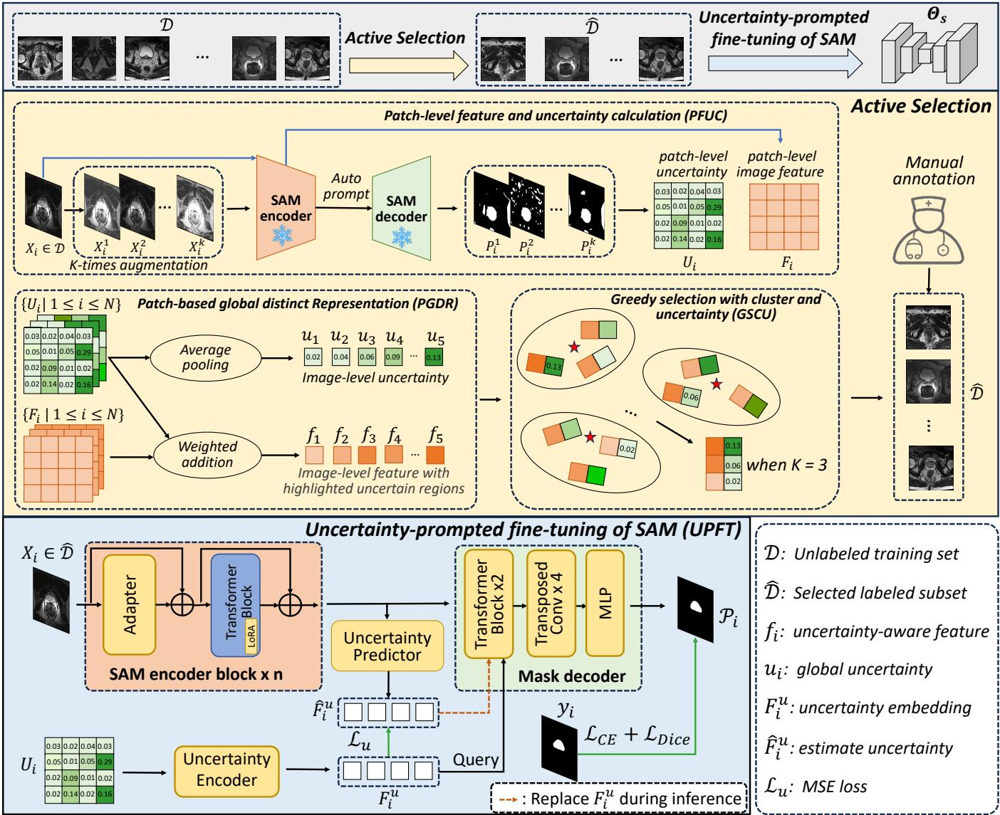
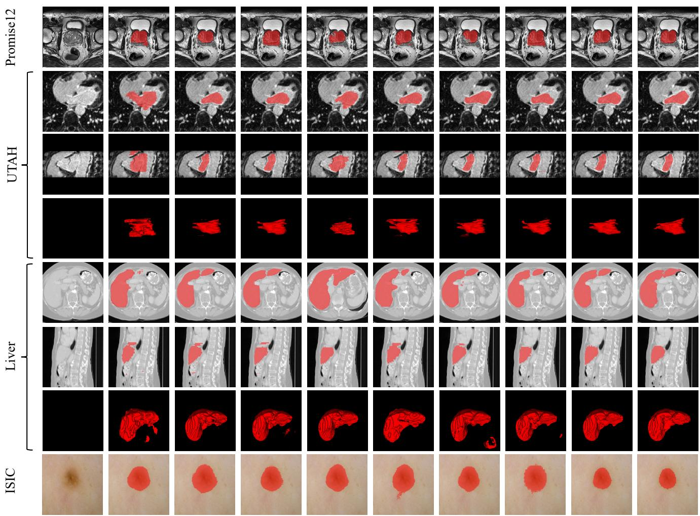
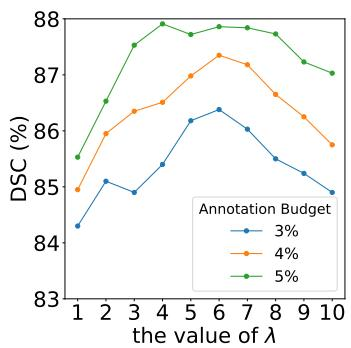
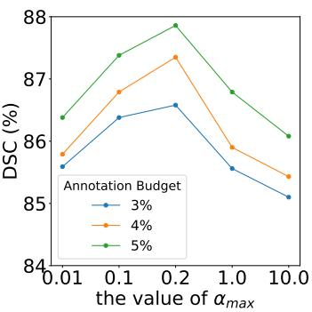
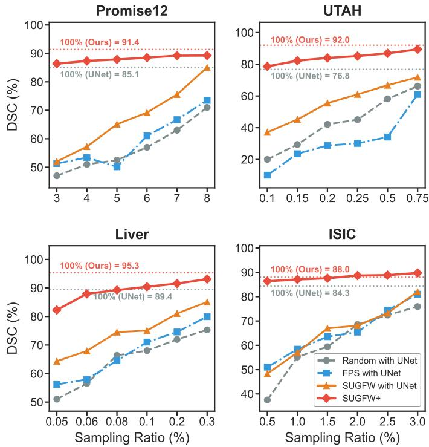

# SUGFW+: An Uncertainty-guided Feature Weighting Framework for Cold Start Active Adaptation of SAM in Medical Image Segmentation

Xiaochuan Maa, Ning Zhub, Jia Fua, Lanfeng Zhonga,c, Hanyu Jiangd, Bin Songd, Kang Lia,∗, Guotai Wanga,c,∗

aSchool of Mechanical and Electrical Engineering, University of Electronic Science and Technology of China, Chengdu, China.

bGlassgow College, University ofElectronic Science and Technology ofChina, Chengdu, China.

cShanghai Artificial Intelligence Laboratory, Shanghai, China.

dDepartment of Radiology, West China Hospital, Sichuan University, Chengdu, China.

## Abstract

Cold Start Active Learning (CSAL) is important in improving the performance of a medical image segmentation model with low annotation budget by querying a small subset for annotation from an unlabeled training set. Existing CSAL methods typically rely on ineficient dataset-specific Self-Supervised Learning (SSL) to map the unlabeled images into a feature space for sample 6selection. Recently, the advent of foundation models such as the Segment Anything Model (SAM) ofer a promising alternative as 2the pre-trained model can provide strong generalizable feature embeddings, and allow high performance in downstream tasks after 0fine-tuning (adaptation). However, how to systematically exploit SAM’s inherent embeddings for cold-start sample selection during adaptation with low annotation budget remains underexplored. To address this, we propose an extended SAM-based Uncertainty-gguided Feature Weighting (SUGFW+) framework for CSAL and adaptation of SAM. Specifically, it leverages the SAM for Patch-ulevel Feature and Uncertainty Calculation (PFUC), and introduces a Patch-based Global Distinct Representation (PGDR) module that aggregates patch-level embeddings into highly discriminative, uncertainty-aware image-level features. These features are then 7utilized by a Greedy Selection with Cluster and Uncertainty (GSCU) strategy to combine diversity and uncertainty during sample 1selection. Unlike prior CSAL methods that decouple sample selection from model training, SUGFW+ tightly integrates these two stages via an Uncertainty-Prompted Fine-Tuning (UPFT) process of SAM in model training. Extensive experiments on four public datasets demonstrate that SUGFW+ achieves state-of-the-art performance against existing CSAL methods. Code is available at https://github.com/HiLab-git/SUGFW-plus.

s.Keywords: Cold start active learning, Domain adaptation, Sample selection, Uncertainty estimation c

## 11. Introduction

Deep learning models have achieved strong performance in 1medical image segmentation with large amount of annotated 1data, but dense annotations required by medical image seg-6mentation tasks are labor-intensive and time-consuming to ob-.tain (Mazurowski et al., 2023). Active learning (AL) (Tharwat 8and Schenck, 2023; Luth et al., 2025) can reduce the annotation ¨ budget while maintaining competitive performance by strategically selecting only a small set of informative samples for an-:notation. Since diferent subsets may capture distinct aspects of ithe data distribution, the choice of annotated samples plays a Xcritical role in ensuring the model performance. Existing AL rmethods focus primarily on two core properties: representativeness (diversity) and uncertainty. Representativeness-based methods (Parvaneh et al., 2022; Bae et al., 2024) aim to make the selected subset statistically consistent with the global data distribution, whereas uncertainty-based methods (Thoma et al., 2025; Fuchsgruber et al., 2024) identify samples for which the model yields ambiguous predictions. Additionally, hybrid approaches (Bae et al., 2025; He et al., 2024; Luo et al., 2024; Zhong et al., 2025) have been developed to synergistically integrate both criteria. However, conventional AL methods sufer from a critical limitation at the initial stage: they typically require a small annotated set in the target dataset to initialize the model before meaningful selection. Furthermore, traditional AL relies on multi-round queries, which is computationally expensive and time-consuming for annotators. If constrained to a single query round to reduce both annotation and training time, these methods struggle to select an efective query batch for obtaining high model performance.

Cold Start Active Learning (CSAL) (Zhu et al., 2025) aims to address the cold start or single round sample selection problem without any exiting label the target dataset. While existing approaches commonly adopt Self-Supervised Learning (SSL) (Chen et al., 2020; He et al., 2020) coupled with traditional active learning selection strategies (Jin et al., 2022a,b; Hacohen et al., 2022; Yehuda et al., 2022; Nguyen et al., 2022), training an SSL model for each segmentation task is computationally expensive. To overcome this limitation, foundation models have recently been developed as robust pretrained feature extractors (Wan et al., 2023; Zhu et al., 2025; Safaei and Patel, 2025) that can be directly used for feature embedding of a downstream dataset, which avoids dataset-specific pretraining and therefore improves both feature generalizability and eficiency. Compared with other pretrained models such as DINO (Caron et al., 2021), the Segment Anything Model (SAM) (Kirillov et al., 2023) is specifically designed for image segmentation tasks, and the corresponding feature representations have potential to improve sample selection efectiveness in CSAL of segmentation models. In addition, the zero-shot inference capability of SAM allows obtaining a class-agnostic segmentation result, which provides more semantic information that can benefit sample selection for segmentation.

Beyond the potential for sample selection, foundation models have been shown to be strong pre-trained backbones, allowing achieving high performance in various downstream tasks after fine-tuning with a small set of labeled samples (Zhang and Metaxas, 2024). While Parameter-Eficient Fine-Tuning (PEFT) strategies like LoRA (Hu et al., 2022) and adapters (Chen et al., 2024a) have been widely used for this purpose, their eficacy is often constrained in low-budget regimes where scarce annotations trigger severe overfitting or representation degradation. Especially in CSAL setting, due to limited annotation budget, the number of labeled samples after querying is extremely low in the downstream task dataset, which increases challenges for efectively fine-tuning foundation models like SAM in such scenarios.

To address the above issues and improve CSAL performance under low annotation budget in medical image segmentation, we propose an extended SAM-based Uncertainty-guided Feature Weighting (SUGFW+) framework that leverages SAM for efective sample selection and model training in CSAL. First, for the unannotated downstream dataset, SAM was used to obtain patch-level image features alongside with uncertainty estimation. Then, an image-level feature representation is obtained by uncertainty-weighted integration of patch-level features. Subsequently, querying samples are selected in the uncertainty-aware feature space by considering each sample’s uncertainty and representativeness simultaneously. Finally, to leverage these selected samples to train a downstream segmentation model, we further perform an uncertainty-prompted fine-tuning strategy that adapts SAM to the downstream task by using uncertainty as a prompt to drive the model to be aware of hard regions for more efective learning. The contribution of this work is three-fold:

• We introduce SUGFW+, a novel CSAL framework that utilizes SAM’s feature representation with uncertainty estimation for efective sample selection and downstream fine-tuning, leadint to both high annotation eficiency and segmentation performance for a new unannotated dataset.

• To optimize sample selection, we introduce a SAM-based Patch-level Feature and Uncertainty Calculation (PFUC) method, and a Patch-based Global Distinct Representation (PGDR) strategy to obtain a uncertainty-aware global feature representation, followed by a Greedy Selection with Clustering and Uncertainty (GSCU) strategy that combines SAM-derived uncertainty and representativeness for selecting querying samples.

• To efectively train a downstream segmentation model with the query set, we propose an Uncertainty-Prompted Fine-Tuning (UPFT) method that adapts SAM to the downstream task with explicit uncertainty awareness for more informative learning.

This work is a substantial extension of our preliminary conference publication (Ma et al., 2025) where PGDR and GSCU were introduced to select querying samples for training a standard UNet backbone. This work significantly extended it in two key aspects: 1) We replace the UNet backbone with SAM and design an uncertainty-prompted fine-tuning method UPFT, so that SAM’s pre-trained representations are used for both sample selection and model training in a unified framework. 2) We substantially expand the experimental evaluation to more medical image segmentation datasets, and comparisons against more recent state-of-the-art CSAL methods. Ultimately, extensive experiments across these four medical image segmentation datasets demonstrate that the proposed SUGFW+ achieves state-of-the-art performance, and even outperforms fully supervised UNet while reducing the annotation cost to 0.1% to 3.0% on these datasets.

## 2. Related work

## 2.1. Cold start active learning

Active learning (AL) aims to reduce annotation cost by iteratively selecting the most informative unlabeled samples for labeling. Early AL methods are broadly categorized into three streams. Uncertainty-based methods select samples for which the current model is least confident, using metrics such as entropy, margin sampling, or Bayesian disagreement (Gal and Ghahramani, 2016; Beluch et al., 2018). Diversity-based methods aim to cover the feature space by selecting a representative subset, often via clustering or core-set selection (Sener and Savarese, 2018; Sinha et al., 2019). Hybrid approaches combine both criteria, balancing exploration of the feature space with exploitation of model uncertainty (Ash et al., 2020). However, these conventional AL methods typically require an initial annotated set to warm up the model, and their reliance on multiround queries incurs prohibitive time and computational costs.

To address these limitations, Cold Start Active Learning (CSAL) aims at selecting the most useful subset of training images for annotation from an unlabeled dataset. Unlike general AL that has an initialized model trained with few labeled samples to guide sample selection, CSAL is more challenging due to the unavailability of such an initial model. Traditionally, many methods rely on SSL to extract image features and then select samples with diversity or uncertainty (Jin et al., 2022b,a; Hacohen et al., 2022). For example, Jin et al. (2022b) utilized a Farthest Point Selection (FPS) strategy to ensure uniform distribution of selected samples. Jin et al. (2022a) employed birch hierarchical clustering and selected the samples with the highest information density from each cluster. Hacohen et al. (2022) selected the sample with the highest density within each cluster, ensuring that the chosen points are less afected by clustering noise. Yehuda et al. (2022) selected the most representative initial samples by iteratively choosing points that cover the largest number of uncovered samples within a fixed radius. Chen et al. (2024b) selected the hardest-to-contrast samples within each cluster after SSL as typical data. Recently, some researchers have turned to foundation models for feature extraction. (Zhu et al., 2025; Safaei and Patel, 2025; Yuan et al., 2020) in CSAL. Most of them simply use the pre-trained feature extractors to obtain representations of unlabeled samples, and use traditional clustering and representativeness-based methods for sample selection. However, the ignorance of uncertainty information in these methods could lead to limited performance. In contrast, our method exploits the zero-shot inference ability of SAM to produce region-level meaningful uncertainty estimations before any target-domain training for more informed query.

## 2.2. Adaptation ofSAMfor medical image segmentation

The adaptation of the SAM (Kirillov et al., 2023) to medical image segmentation has been extensively investigated in recent years (Ali et al., 2025). Early studies primarily focused on preserving SAM’s strong prompt-driven segmentation paradigm. For instance, Dai et al. (2023) proposed an augmented pointprompt strategy to improve segmentation performance, while Li et al. (2024) demonstrated that selecting a point near the center of a lesion or organ yields superior segmentation results. Considering the gap between pre-trained features and downstream segmentation tasks, several works aims to adapt SAM for medical image segmentation through task-specific fine-tuning. SAM-Med2D (Cheng et al., 2023) freezes the image encoder while introducing trainable adapter layers, refining the prompt encoder, and modifying the mask decoder during training. Similarly, MedSAM (Ma et al., 2024) tailors SAM for medical image segmentation by keeping the prompt encoder fixed and fine-tuning both the image encoder and the mask decoder. Despite their efectiveness, these methods still rely on human-provided prompts, such as points or bounding boxes, which limit their scalability and practical applicability. To move toward fully automatic segmentation, MA-SAM (Chen et al., 2024a) inserts adapters and LoRA layers into the image encoder’s transformer blocks to capture medical imaging contexts and fully fine-tunes the mask decoder. Nonetheless, the existing SAM adaptation methods operate in a fully-supervised setting, which requires a relatively large set of annotated images with high annotation cost. In contrast, this work deals with SAM adaptation under a CSAL scenario, where only a very small initial batch of images are suggested for annotation, and we leverage the uncertainty information derived from SAM’s features and predictions for both informative sample selection and efficient model adaptation, enabling the model to be efectively optimized with a minimal annotation budget.

## 3. Method

## 3.1. Method overview

Considering an unlabeled training set $\mathcal { D } = \{ X _ { i } \} _ { i = 1 } ^ { N }$ with N samples, we aim to select a subset $\hat { \mathcal { D } } = \{ X _ { j } \} _ { j = 1 } ^ { M }$ with M samples for annotation in a single query that are then used for model training, where $M \ll N$ . The challenge is twofold: first, the selected Dˆ should be highly representative of D without any label guidance; second, the subsequent fine-tuning on $\hat { \mathcal D }$ should be efective enough to achieve strong performance despite the limited annotated samples.

The overall structure of our framework SUGFW+ for CSAL is illustrated in Fig. 1. It consists of two main steps: 1) SAMbased Uncertainty-Guided Feature Weighting (SUGFW) for cold-start sample selection (i.e., querying for annotation), and 2) Uncertainty-Prompted Fine-Tuning (UPFT) of SAM with the small set of query samples.

## 3.2. SUGFW for sample querying

In SUGFW, a Patch-level Feature and Uncertainty Calculation (PFUC) module is first used to obtain patch-level image features and uncertainty by applying the “everything mode” of SAM (Kirillov et al., 2023) with K-time augmentation. Subsequently, we employ a Patch-based Global Distinct Representation (PGDR) strategy to derive distinctive image-level representations. Then, a Greedy Selection with Cluster and Uncertainty (GSCU) strategy is employed to select samples that are both representative and informative for annotation.

## 3.2.1. Patch-levelfeature and uncertainty calculation

CSAL requires a feature extractor to map the unannotated dataset into a feature space. Compared with pretrained encoders like those in CLIP and DINO that obtain high-level taskagnostic feature representations, SAM (Kirillov et al., 2023) is more appealing due to not only that the encoder is pre-trained with segmentation tasks, but also that its decoder can obtain segmentation results to provide more semantic information and uncertainty estimation that can assist sample selection in CSAL. Therefore, we propose Patch-level Feature and Uncertainty Calculation (PFUC) based on SAM, which leverages the SAM’s image encoder $E _ { i m g }$ to obtain patch-level features, and take advantage of the masks predicted by a mask decoder $D _ { m }$ conditioned on a prompt encoder $E _ { p }$ to obtain uncertainty estimation of each patch.

Specifically, for a given image $X _ { i } ~ \in ~ \mathcal { R } ^ { H \times W }$ , where H and W denote the image size, the feature map corresponding to the output of $E _ { i m g }$ is denoted as:

$$
F _ { i } = E _ { i m g } ( X _ { i } ) ,\tag{1}
$$

where $F _ { i } \in \mathcal { R } ^ { C _ { 0 } \times H ^ { \prime } \times W ^ { \prime } }$ , with $C _ { 0 }$ being the feature dimension and $H ^ { \prime } \times W ^ { \prime }$ being the feature map size, respectively. Given a prompt $\mathcal { P } ,$ the preliminarily predicted mask $M _ { i } ^ { \prime }$ for $X _ { i }$ is:

$$
M _ { i } ^ { \prime } = D _ { m } ( E _ { i m g } ( X _ { i } ) , E _ { p } ( \mathcal { P } ) ) ,\tag{2}
$$

To avoid human intervention during the sample selection stage, we utilize SAM’s “everything mode”, where SAM generates a grid of points as the prompt $\mathcal { P }$ to obtain a segmentation output that is a set of class-agnostic regions. To reduce noise and reject background regions, we take a union of the segmented regions with a size smaller than half of the image, obtaining a binary foreground segmentation mask $M _ { i } ,$ which is formulated as:

$$
M _ { i } = \bigcup _ { n = 1 } ^ { N _ { i } } M _ { i } ^ { \prime } ( n ) \bar { \mathcal { I } } [ | M _ { i } ^ { \prime } ( n ) | < H W / 2 ] ,\tag{3}
$$

  
Figure 1: Overview of our proposed SUGFW+ framework for CSAL in medical image segmentation. It consists of two core components: 1) SAM-based Uncertainty-Guided Feature Weighting (SUGFW) for selecting a small set of query samples from the unannotated target dataset, and 2) Uncertainty-Prompted Fine-Tuning (UPFT) of SAM with the query set for model training. SUGFW consists of three steps: 1) SAM-based Patch-level Feature and Uncertainty Calculation (PFUC), 2) Patch-based Global Distinct Representation (PGDR) and 3) Greedy Selection with Cluster and Uncertainty (GSCU).

where $N _ { i }$ is the number of regions in $M _ { i } ^ { \prime } ,$ and $M _ { i } ^ { \prime } ( n )$ represents the size of the n-th region. $\boldsymbol { { \mathit { I } } } ( \cdot )$ is the indicator function that returns 1 if the condition is satisfied and 0 otherwise, $| M _ { i } ^ { \prime } ( n ) |$ represents the size of $M _ { i } ^ { \prime } ( n )$

Furthermore, to obtain an uncertainty estimation of the image, we first apply K augmentations to $X _ { i }$ , including intensity and spatial transformations. Subsequently, we utilize Eq. (2) and Eq. (3) to derive the segmentation results $M _ { i } ^ { k }$ for the k-th augmentation. By taking an average of the K predictions, a soft prediction mask is denoted as:

$$
\bar { M } _ { i } = \frac { 1 } { K } \sum _ { k = 1 } ^ { K } M _ { i } ^ { k }\tag{4}
$$

As the size of $\bar { M _ { i } }$ is $H \times W$ , we down-sample it to $H ^ { \prime } \times W ^ { \prime }$ to match the size of feature map $F _ { i }$ , and denote the downsampeled version of $\bar { M _ { i } }$ as $\tilde { M _ { i } }$ . From $\tilde { M _ { i } }$ , the softness of the mask value for each element can represent the uncertainty of the corresponding image patch, leading to an uncertainty map $U _ { i } \in \mathcal { R } ^ { H ^ { \prime } \times \mathbf { \bar { W } } ^ { \prime } }$ , and the r-th element of $U _ { i }$ is obtained by calculating the entropy, which is formulated as:

$$
U _ { i } ( r ) = - [ \bar { M } _ { i } ( r ) l o g \bar { M } _ { i } ( r ) + ( 1 - \bar { M } _ { i } ( r ) ) l o g ( 1 - \bar { M } _ { i } ( r ) ) ] ,\tag{5}
$$

where a lower $U _ { i } ( r )$ indicates that SAM has a more reliable understanding of the corresponding region under the perturbations added to the input, corresponding to a lower uncertainty. Note that this SAM-derived uncertainty cannot totally represent the uncertainty relevant to the target segmentation task, so we take $U _ { i }$ as a surrogate uncertainty map.

## 3.2.2. Patch-based global distinct representation

According to the feature map $F _ { i }$ and surrogate uncertainty map $U _ { i }$ , the patch-level features in $F _ { i }$ should be aggregated into a global image-level feature representation for the following sample selection step. Therefore, we propose a Patchbased Global Distinct Representation (PGDR) strategy, where the patch-level image features are weighted and fused based on their surrogate uncertainty, resulting in an uncertainty-aware global feature $f _ { i } { \mathrm { : } }$

$$
f _ { i } = \sum _ { r = 1 } ^ { H ^ { \prime } \times W ^ { \prime } } F _ { i } ( r ) \cdot \frac { e ^ { \lambda \cdot U _ { i } ( r ) } } { \sum _ { r = 1 } ^ { R } e ^ { \lambda \cdot U _ { i } ( r ) } } ,\tag{6}
$$

where $\lambda \geq 1 . 0$ is a hyper-parameter that amplifies the contribution of high-uncertainty regions, emphasizing informative samples for the subsequent selection stage.

Alongside $f _ { i } ,$ we also aggregate the patch-level uncertainty in $U _ { i }$ into an image-level surrogate uncertainty score $u _ { i }$ by applying average pooling to $U _ { i } { \mathrm { : } }$

$$
u _ { i } = \frac { 1 } { H ^ { \prime } \times W ^ { \prime } } \sum _ { r = 1 } ^ { H ^ { \prime } \times W ^ { \prime } } U _ { i } ( r ) ,\tag{7}
$$

## 3.2.3. Greedy selection with cluster and uncertainty

With the image-level global representation $f _ { i }$ and the surrogate uncertainty $u _ { i } ,$ to ensure that the selected samples are both informative and representative, we propose a Greedy Selection with Cluster and Uncertainty (GSCU) strategy. Firstly, the $\mathrm { K } \mathrm { - }$ means clustering algorithm is applied to the image-level features $f _ { i } ,$ and the cluster number C is the same as the number of samples to be selected, i.e., annotation budget in CSAL. For $X _ { i }$ its assigned class $c _ { i }$ is obtained by:

$$
c _ { i } = \arg \operatorname* { m i n } _ { c \in \{ 1 , 2 , . . . , C \} } \| f _ { i } - \mu _ { c } \| ^ { 2 } ,\tag{8}
$$

where C represents the number of clusters and $\mu _ { c }$ denotes the centroid of the cluster. Then, we select one sample from each cluster to get the query batch. Here, the strategy to select the sample in each cluster plays an important role for the efectiveness of querying. First, simply selecting the centroid of each cluster will focus too much on the representativeness while ignoring uncertainty of $f _ { i } .$ . Second, selecting the most uncertain sample from each cluster may also be suboptimal as the $u _ { i }$ value is just an estimation rather than accurate measurement of the uncertainty for the target segmentation task, due to the classagnostic segmentation output of SAM. To deal with this problem, our GSCU strategy encourages diversity of surrogate uncertainty while keeping feature representativeness for sample selection. For the first querying sample, we select the one with the median surrogate uncertainty in a random cluster. For subsequent selections, a sample is greedily selected from another random cluster so that its minimum distance to the surrogate uncertainties of all currently selected samples is maximized. Specifically, let ${ \mathcal { D } } ^ { m }$ denote the set of query samples after the m-th selection, when selecting one more query sample from a new cluster C, the (m + 1)-th query sample is determined by:

$$
X _ { m + 1 } = \arg \operatorname* { m a x } _ { X _ { i } \in C } ( \operatorname* { m i n } _ { X _ { j } \in \mathcal { D } ^ { m } } \left| u _ { i } - u _ { j } \right| ) ,\tag{9}
$$

Through this GSCU strategy, we obtain a subset $\hat { \mathcal D }$ with M querying samples that represents the distribution of the training set in both feature space and the surrogate uncertainty space. The chosen samples are then annotated by the human annotator. After that, we use supervised training on these samples in $\hat { \mathcal D }$ to train the task-specific automatic segmentation model, as detailed in the following.

## 3.3. Uncertainty-prompted fine-tuning of SAM

Rather than training a separate segmentation model from scratch, we adapt SAM itself as the downstream model to enhance the performance by leveraging its pre-trained weights. Existing works on PEFT based on adapters (Chen et al., 2024a) and LoRA (Hu et al., 2022) have shown high performance for fine-tuning foundation models. However, in this work, there are two unique considerations that are diferent from standard PEFT or SAM adaptation settings. First, in our CSAL setting, the size of $\hat { \mathcal D }$ is much smaller than that of annotated image set for common PEFT, making the fine-tuning more challenging. Second, SAM is originally an interactive segmentation model, while we aim to obtain an automatic segmentation model after the PEFT. To deal with these problems, we propose Uncertainty-Prompted Fine-Tuning (UPFT) of SAM in downstream model training.

Specifically, we use the surrogate uncertainty map $U _ { i }$ estimated from SAM’s mask outputs as a spatial prompt, which avoids manual prompting and provides informative guidance for model adaptation. The SAM’s original prompt encoder is therefore replaced by an uncertainty encoder $E _ { u n }$ to obtain an uncertainty embedding $F _ { i } ^ { u } = E _ { u n } ( U _ { i } )$ . Then $F _ { i } ^ { u }$ is injected into the mask decoder $D _ { m } ,$ and used as quires in the cross attention blocks in the decoder as implemented in the original SAM architecture. Note that calculating $U _ { i }$ requires K forward passes of SAM, which is time-consuming and computationally expensive for inference. To deal with this problem, we further introduce a lightweight uncertainty predictor $g ( \cdot )$ that directly estimates the uncertainty embedding based on $F _ { i } \colon$

$$
\hat { F } _ { i } ^ { u } = g ( F _ { i } , \bar { U } ) ) ,\tag{10}
$$

where $\bar { U }$ is the average surrogate uncertainty map across the training set D, and $g ( \cdot )$ is implemented as a lightweight transformer and trained with the Mean Squared Error (MSE) loss:

$$
\mathcal { L } _ { u } = \Vert \hat { F } _ { i } ^ { u } - F _ { i } ^ { u } \Vert _ { 2 } ^ { 2 } ,\tag{11}
$$

During the training stage, the segmentation model’s prediction for $X _ { i } \in \hat { \mathcal { D } }$ is prompted by $F _ { i } ^ { u }$ , and denoted as:

$$
P _ { i } = D _ { m } ( E _ { i m g } ( X _ { i } ) , F _ { i } ^ { u } ) ,\tag{12}
$$

where $P _ { i }$ is supervised by the manual annotation through a Dice loss $\mathcal { L } _ { D i c e }$ and a cross entropy loss $\mathcal { L } _ { C E }$ as used in standard supervised training. The total loss for model training is:

$$
\mathcal { L } = \omega \cdot \mathcal { L } _ { D i c e } + ( 1 - \omega ) \cdot \mathcal { L } _ { C E } + \alpha _ { t } \cdot \mathcal { L } _ { u } .\tag{13}
$$

where ω controls the balance between $\mathcal { L } _ { D i c e }$ and $\mathcal { L } _ { C E }$ $\begin{array} { r l } { \alpha _ { t } } & { { } = } \end{array}$ $m i n ( \alpha _ { m a x } , \alpha _ { m a x } \cdot \frac { t } { T } )$ is the weight for $\mathcal { L } _ { u }$ set by a ramp-up strategy, with $\alpha _ { m a x }$ being the maximum weight and $T$ being the the warm-up iterations. During model adaptation, we add LoRA layers to the image encoder $E _ { i m g } ,$ and L is backpropagated to update the LoRA layers, mask decoder $D _ { m } ,$ , uncertainty encoder $E _ { u n }$ and the uncertainty predictor $g ( \cdot )$ . During inference, $E _ { u n }$ is discarded, and we use Eq. (10) to obtain the surrogate uncertainty embedding $\hat { F } _ { i } ^ { u }$ , and it replaces $F _ { i } ^ { u }$ in Eq. (12) to obtain the segmentation output.

## 4. Experiments and results

## 4.1. Datasets

We evaluated our method in four public medical imaging datasets with various modalities, anatomy structures, and imaging protocols to assess its efectiveness and generalization. The datasets include:

1) The Promise12 dataset (Litjens et al., 2014) that is for prostate segmentation in T2-weighted Magnetic Resonance Imaging (MRI). It comprises 100 transverse MRI scans acquired from 6 clinical centers, with voxel spacing ranging from 0.4–0.75 mm in-plane and 3–4 mm slice thickness. Following the oficial split, the dataset is divided into training, validation, and test sets in a ratio of 5:2:3.

2) The UTAH dataset (Xiong et al., 2021) that consists of 154 3D MRI scans of atrial fibrillation patients from multiple institutions. The images were scanned with an isotropic resolution of 0.625 mm3 , each accompanied by expert-annotated left atrial cavity segmentations. Following the oficial partition, the 3D images were divided into 80, 20 and 54 cases for training, validation and testing, respectively.

3) The MSD Liver dataset (Antonelli et al., 2022) from the Medical Segmentation Decathlon (MSD) for liver segmentation in contrast-enhanced abdominal Computed Tomography (CT). It comprises 131 3D CT volumes with highly variable spatial resolution and slice thickness, reflecting the heterogeneity of clinical imaging protocols in diferent institutions. Each volume is annotated with per-voxel segmentation masks of the liver parenchyma. We aim to segment the whole liver, and split the dataset into training, validation, and testing sets at a ratio of 7:1:2.

4) The ISIC 2018 dataset (Codella et al., 2019) from the International Skin Imaging Collaboration for skin lesion segmentation. It consists of 3,694 high-resolution 2D dermoscopic images encompassing a wide spectrum of skin conditions, including melanomas, nevi, and seborrheic keratoses. Following the oficial split, the dataset is divided into 2,595 images for training, 100 for validation, and 1,000 for testing.

## 4.2. Implementation details

Our experiments were implemented in PyTorch on a Linux server equipped with 4 NVIDIA GeForce RTX 2080Ti GPUs. For all the four datasets, the 2D images or slices in 3D volumes were resized to 512 × 512 pixels during pre-processing, and intensity values above the 99.5th percentile were clipped to suppress outliers. For the 3D datasets, we used slice-level annotation and segmentation, as SAM supports only 2D inputs and the inter-slice spacing has a large variance. The training sets of Promise12, UTAH, and Liver contain 960, 5,041, and 13,792 slices, respectively, and ISIC 2018 contains 2,595 2D images.

For CSAL, we set the slice-level annotation budget to the range of 3% to 8% for Promise12, 0.10% to 0.75% for UTAH, 0.05% to 0.30% for Liver, and 0.50% to 3.00% for ISIC 2018, corresponding to a maximum of 100 annotated slices per dataset.

The ViT-Base checkpoint of the pre-trained SAM was used in the experiment. For the surrogate uncertainty estimation with SAM, we used the “everything” mode with a $3 2 \times 3 2$ grid of 1,024 points over the image as the foreground prompt, and set K to 10 following previous works (Wang et al., 2019). The data augmentation used for uncertainty estimation and model finetuning include gamma correction, random flip, random rotation, posterization, and adjustment of contrast, sharpness and brightness. In the UPFT stage, we used LoRA with a rank of 32 in the frozen image encoder, and kept parameters in the uncertainty encoder, uncertainty predictor and mask decoder learnable. The model was finetuned for 300 epochs using the AdamW optimizer, with a batch size of 16, an initial learning rate of 0.0008, a weight decay of 0.1, and $( \beta _ { 1 } , \beta _ { 2 } ) \ : = \ : ( 0 . 9 , 0 . 9 9 9 )$ . ω was set to 0.8 according to Chen et al. (2024a). The ramp-up iteration for $\alpha _ { t }$ was 300, and we set the two key hyper-parameter of our method as $\lambda = 6$ and $\alpha _ { m a x } = 0 . 0 2$ according to the best performance in ablation study.

For quantitative evaluation of the segmentation results, we used the Dice Similarity Coeficient (DSC) and the 95th percentile Hausdorf Distance (HD95). For each casse of the 3D datasets (Promise12, UTAH, and Liver), the slice-level segmentation results were stacked into a 3D volume, and both metrics were calculated in the 3D space.

## 4.3. Comparison with state-of-the-art methods

We compared our method with seven state-of-the-art CSAL methods. 1) Random: randomly selecting samples; 2) ALPS (Yuan et al., 2020): choosing the sample closest to the cluster center; 3) CALR (Jin et al., 2022a): performing hierarchical clustering and selecting the cluster centers; 4) FPS (Jin et al., 2022b): combining clustering with Farthest Point Sampling on features; 5) ProbCover (Yehuda et al., 2022): constructing a graph on features and selecting a set of samples that maximizes the probability coverage within a specified distance threshold; 6) TypiClust (Hacohen et al., 2022): partitioning the feature space into clusters and selecting the most typical sample (the one with the highest local density) from each cluster; 7) CEC (Safaei and Patel, 2025): utilizing calibrated entropy and neighbor-aware uncertainty to select the most informative samples. For a fair comparison, all these methods used the same SAM ViT-Base encoder for feature extraction, and global average pooling over encoder’s output feature map is used to obtain image-level feature. Note that in our preliminary work (Ma et al., 2025), the diferent sample selection methods were compared with the same U-Net model for training. In this work, we compare the sample selection methods with our UPFT-based SAM as the segmentation model. The SUGFW+ in this work is also compared with its preliminary version SUGFW in Sec. 4.4.

## 4.3.1. Result for prostate segmentation

Table 1 shows performance of diferent CSAL methods on the Promise12 dataset for prostate segmentation under a range

Table 1: Quantitative comparison of diferent CSAL methods on the Promise12 dataset. The best results are in bold, and the second-best are underlined. ∗ indicates that the p-value < 0.05 in paired t-test compared to the second-best results.
<table><tr><td rowspan="2">Metric</td><td rowspan="2">Method</td><td colspan="6">Annotation Budget</td></tr><tr><td>3.0%</td><td>4.0%</td><td>5.0%</td><td>6.0%</td><td>7.0%</td><td>8.0%</td></tr><tr><td rowspan="7">DSC (%) ↑</td><td>Random</td><td>84.03±5.87</td><td> $8 5 . 7 2 { \scriptstyle \pm 4 . 8 6 }$ </td><td> $8 5 . 7 4 { \pm } 4 . 3 3 $ </td><td> $8 6 . 2 4 { \scriptstyle \pm 6 . 7 9 }$ </td><td> $8 6 . 5 5 { \scriptstyle \pm 6 . 2 7 }$ </td><td> $8 6 . 6 4 { \scriptstyle \pm 6 . 6 0 }$ </td></tr><tr><td>ALPS (Yuan et al., 2020)</td><td> $8 1 . 4 3 { \pm } 8 . 3 9$ </td><td> $8 2 . 4 6 { \pm } 1 0 . 1 4$ </td><td> $8 4 . 9 7 { \scriptstyle \pm 7 . 0 9 }$ </td><td> $8 6 . 4 4 { \pm } 5 . 3 7$ </td><td> $8 7 . 9 2 { \pm } 4 . 4 8 $ </td><td> $8 8 . 3 9 { \scriptstyle \pm 5 . 6 5 }$ </td></tr><tr><td>CALR (Jin et al., 2022a)</td><td> $8 2 . 8 9 { \pm } 5 . 7 4 $ </td><td> $8 4 . 4 4 { \scriptstyle \pm 6 . 9 0 }$ </td><td> $8 5 . 7 2 { \scriptstyle \pm 5 . 5 9 }$ </td><td> $8 6 . 6 3 { \scriptstyle \pm 5 . 5 6 }$ </td><td> $8 6 . 8 4 { \pm } 7 . 8 0 $ </td><td> $8 7 . 5 3 { \pm } 7 . 0 8$ </td></tr><tr><td>FPS (Jin et al., 2022b)</td><td> $\underline { { 8 4 . 2 4 2 6 . 1 5 } }$ </td><td> $8 5 . 4 0 { \pm } 5 . 4 8 $ </td><td> $8 6 . 9 5 { \scriptstyle \pm 6 . 3 1 }$ </td><td> $8 7 . 1 6 { \pm } 4 . 4 8 $ </td><td> $8 7 . 3 2 { \pm } 5 . 5 0 $ </td><td> $8 8 . 2 1 { \scriptstyle \pm 3 . 5 6 }$ </td></tr><tr><td>Probcover (Yehuda et al., 2022)</td><td> $8 3 . 0 8 { \pm } 4 . 8 2 $ </td><td> $8 6 . 2 2 { \scriptstyle \pm 4 . 8 2 }$ </td><td> $8 6 . 4 9 { \scriptstyle \pm 5 . 2 6 }$ </td><td> $8 6 . 7 0 { \scriptstyle \pm 4 . 1 5 }$ </td><td> $8 8 . 5 3 { \pm } 3 . 5 6 $ </td><td> $8 8 . 8 8 { \pm } 3 . 5 2 $ </td></tr><tr><td>Typiclust (Hacohen et al., 2022)</td><td> $8 2 . 7 8 { \scriptstyle \pm 6 . 7 9 }$ </td><td> $8 4 . 2 4 { \pm } 4 . 9 5 $ </td><td> $8 5 . 3 9 { \pm } 5 . 7 5 $ </td><td> $8 6 . 1 1 { \scriptstyle \pm 4 . 2 4 }$ </td><td> $8 8 . 1 6 { \pm } 5 . 4 3 $ </td><td> $8 8 . 6 4 { \pm } 4 . 3 3 $ </td></tr><tr><td>CEC (Safaei and Patel, 2025) SUGFW+ (Ours)</td><td> $8 2 . 4 1 { \pm } 7 . 6 9$   $\mathbf { 8 6 . 3 8 { \pm } 5 . 6 0 ^ { \ast } }$ </td><td> $8 3 . 6 2 { \pm } 8 . 3 0 $ </td><td> $8 5 . 4 0 { \scriptstyle \pm 6 . 1 7 }$ </td><td> $8 5 . 6 0 { \pm } 4 . 2 1 $ </td><td> $8 6 . 1 4 { \pm } 4 . 8 8 $ </td><td> $8 6 . 5 3 { \scriptstyle \pm 5 . 3 2 }$ </td></tr><tr><td rowspan="10">HD95 (mm) ↓</td><td>Random</td><td></td><td> $\mathbf { 8 7 . 3 5 { \pm } 3 . 9 0 ^ { \ast } }$ </td><td> $\mathbf { 8 7 . 8 6 { \pm } 5 . 8 6 ^ { \ast } }$ </td><td> $\mathbf { 8 8 . 5 1 \pm 3 . 9 2 ^ { \ast } }$ </td><td> $\mathbf { 8 9 . 2 0 { \pm } 3 . 1 1 ^ { \ast } }$ </td><td> $\mathbf { 8 9 . 2 5 { \pm } 3 . 1 0 ^ { \ast } }$ </td></tr><tr><td></td><td> $3 . 7 4 \pm 3 . 1 2$ </td><td> $3 . 6 7 { \pm } 7 . 6 2 $ </td><td> $3 . 2 4 \pm 3 . 2 2$ </td><td> $2 . 4 1 { \pm } 4 . 5 1 $ </td><td> $1 . 9 8 { \pm } 1 . 9 1 $ </td><td> $1 . 7 9 { \pm } 1 . 3 7$ </td></tr><tr><td>ALPS (Yuan et al., 2020)</td><td> $5 . 9 1 \pm 7 . 2 3 $ </td><td> $2 . 9 5 { \pm } 2 . 8 8 $ </td><td> $2 . 7 6 { \pm } 2 . 6 6$ </td><td> $\underline { { 2 . 0 0 \pm 1 . 7 4 } }$ </td><td> $\underline { { 1 . 5 8 { \pm } 0 . 8 3 } }$ </td><td> $\underline { { 1 . 5 6 \pm 2 . 2 2 } }$ </td></tr><tr><td>CALR (Jin et al., 2022a)</td><td> $6 . 5 0 { \scriptstyle \pm 6 . 5 0 }$ </td><td> $5 . 7 3 { \scriptstyle \pm 6 . 9 8 }$ </td><td> $4 . 7 7 { \pm } 1 1 . 0 9$ </td><td> $4 . 7 7 { \pm } 7 . 2 4 $ </td><td> $3 . 9 0 { \pm } 4 . 2 1 $ </td><td> $2 . 6 9 { \pm } 6 . 9 2$ </td></tr><tr><td>FPS (Jin et al., 2022b)</td><td> $\underline { { 3 . 4 7 \pm 4 . 8 4 } }$ </td><td> $3 . 0 0 { \scriptstyle \pm 3 . 5 0 } $ </td><td> $2 . 0 2 { \pm } 1 . 5 9 $ </td><td> $3 . 0 0 { \pm } 4 . 8 0 \ $ </td><td> $1 . 7 3 { \pm } 1 . 5 4 $ </td><td> $1 . 8 3 { \pm } 1 . 4 3$ </td></tr><tr><td>Probcover (Yehuda et al., 2022)</td><td> $3 7 . 8 0 { \pm } 1 1 2 . 8 8 $ </td><td> $2 . 1 2 { \pm } 1 . 4 6$ </td><td> $3 . 0 0 { \pm } 3 . 7 3 $ </td><td> $3 . 7 4 \pm 4 . 4 4$ </td><td> $1 . 7 1 { \pm } 1 . 3 5$ </td><td> $2 . 9 7 { \pm } 5 . 3 9 $ </td></tr><tr><td>Typiclust (Hacohen et al., 2022)</td><td> $1 8 . 2 0 { \scriptstyle \pm 7 5 . 8 5 }$ </td><td> $4 . 1 0 { \pm } 3 . 4 6 $ </td><td> $4 . 1 6 { \pm } 4 . 7 7$ </td><td> $2 . 4 9 { \pm } 6 . 0 8$ </td><td> $2 . 0 9 { \pm } 2 . 1 9$ </td><td> $1 . 6 2 { \pm } 1 . 7 3 $ </td></tr><tr><td>CEC (Safaei and Patel, 2025)</td><td> $1 3 . 7 0 { \scriptstyle \pm 2 4 . 8 7 }$ </td><td> $6 . 1 9 { \scriptstyle \pm 8 . 0 4 }$ </td><td> $4 . 9 8 { \pm } 4 . 6 1 $ </td><td> $3 . 0 5 { \pm } 3 . 6 1 $ </td><td> $2 . 7 1 { \pm } 2 . 1 7$ </td><td> $2 . 3 4 \pm 2 . 1 1$ </td></tr><tr><td>SUGFW+ (Ours)</td><td> $2 . 9 2 { \pm } 4 . 1 7 ^ { \ast }$ </td><td> $\mathbf { 2 . 1 0 { \pm } 1 . 9 1 }$ </td><td> $\mathbf { 1 . 9 4 \pm 1 . 7 3 }$ </td><td> $\mathbf { 1 . 5 8 { \pm } 0 . 9 5 ^ { \ast } }$ </td><td> $\mathbf { 1 . 3 7 { \pm } 0 . 6 6 ^ { \ast } }$ </td><td> $\mathbf { 1 . 3 5 { \pm } 0 . 6 7 ^ { \ast } }$ </td></tr></table>

Table 2: Quantitative comparison of diferent CSAL methods on the UTAH dataset. The best results are in bold, and the second-best are underlined. ∗ indicates that the p-value < 0.05 in paired t-test compared to the second-best results.
<table><tr><td rowspan="2">Metric</td><td rowspan="2">Method</td><td colspan="6">Annotation Budget</td></tr><tr><td>0.10%</td><td>0.15%</td><td>0.20%</td><td>0.25%</td><td>0.50%</td><td>0.75%</td></tr><tr><td rowspan="6">DSC (%) ↑</td><td>Random</td><td> $7 0 . 9 6 { \pm } 1 1 . 9 6$ </td><td> $7 5 . 1 7 { \scriptstyle \pm 5 . 3 2 }$ </td><td> $\underline { { 8 1 . 5 1 \pm 4 . 8 4 } }$ </td><td> $8 2 . 5 1 { \scriptstyle \pm 4 . 0 6 }$ </td><td> $8 5 . 0 0 { \pm } 3 . 5 8 $ </td><td> $8 7 . 6 7 { \scriptstyle \pm 3 . 2 3 }$ </td></tr><tr><td>ALPS (Yuan et al., 2020)</td><td> $7 3 . 8 0 { \scriptstyle \pm 6 . 4 8 }$ </td><td> $7 7 . 2 4 \pm 5 . 6 9$ </td><td> $8 0 . 7 2 { \scriptstyle \pm 5 . 1 9 }$ </td><td> $\underline { { 8 3 . 7 3 \pm 4 . 5 8 } }$ </td><td> $\underline { { 8 5 . 6 8 \pm 5 . 0 8 } }$ </td><td> $8 7 . 6 1 { \pm } 4 . 2 1 $ </td></tr><tr><td>CALR (Jin et al., 2022a)</td><td> $7 3 . 7 8 { \pm } 5 . 5 9$ </td><td> $7 4 . 9 6 { \pm } 5 . 4 0 $ </td><td> $8 1 . 2 8 { \pm } 4 . 4 7$ </td><td> $8 0 . 7 2 { \scriptstyle \pm 4 . 8 9 }$ </td><td> $8 2 . 8 4 \pm 5 . 7 2$ </td><td>88.66±3.44</td></tr><tr><td>FPS (Jin et al., 2022b)</td><td> $4 6 . 9 7 { \scriptstyle \pm 1 2 . 5 4 }$ </td><td> $6 9 . 7 4 \pm 1 3 . 3 0 $ </td><td> $7 0 . 1 6 { \pm } 1 4 . 7 9$ </td><td> $7 1 . 5 8 { \pm } 1 0 . 9 4$ </td><td> $7 1 . 7 6 { \pm } 7 . 6 2$ </td><td>82.57±7.74</td></tr><tr><td>Probcover (Yehuda et al., 2022)</td><td> $6 2 . 7 2 { \pm } 1 2 . 8 3$ </td><td> $7 4 . 7 8 { \scriptstyle \pm 5 . 2 1 }$ </td><td> $7 6 . 8 3 { \pm } 5 . 1 7$ </td><td> $7 6 . 9 0 { \scriptstyle \pm 4 . 7 8 }$ </td><td> $7 8 . 4 1 { \scriptstyle \pm 4 . 6 2 }$ </td><td>83.30±4.13</td></tr><tr><td>Typiclust (Hacohen et al., 2022) CEC (Safaei and Patel, 2025)</td><td> $7 4 . 0 3 { \pm } 5 . 2 5 $ </td><td> $7 0 . 1 4 { \pm } 8 . 7 5 $ </td><td> $8 1 . 2 3 { \pm } 5 . 5 3 $ </td><td> $8 2 . 5 7 { \scriptstyle \pm 4 . 9 0 }$ </td><td> $8 4 . 2 7 { \pm } 4 . 8 8 $ </td><td>88.40±3.46</td></tr><tr><td rowspan="10"></td><td>SUGFW+ (Ours)</td><td> $7 3 . 4 0 { \scriptstyle \pm 9 . 3 8 }$   $\mathbf { 7 8 . 7 0 { \pm } 5 . 6 6 ^ { \ast } }$ </td><td>78.30±5.48  $\mathbf { 8 2 . 2 6 { \pm } 5 . 0 5 ^ { \circ } }$ </td><td> $8 0 . 9 4 { \pm } 4 . 8 8 $   $\mathbf { 8 4 . 0 2 { \pm } 4 . 9 9 ^ { \ast } }$ </td><td> $8 3 . 3 7 { \scriptstyle \pm 4 . 5 0 }$   $\mathbf { 8 5 . 1 7 \pm 4 . 3 2 ^ { \ast } }$ </td><td> $8 4 . 4 3 { \pm } 4 . 3 9 $   $\mathbf { 8 6 . 9 4 \pm 4 . 0 2 ^ { \ast } }$ </td><td>88.17±3.84</td></tr><tr><td></td><td></td><td></td><td></td><td></td><td></td><td>89.44±3.59*</td></tr><tr><td>Random</td><td>43.51±23.62</td><td> $2 5 . 6 1 \pm 1 3 . 9 6$ </td><td> $2 5 . 3 2 { \scriptstyle \pm 8 . 4 3 }$ </td><td> $2 5 . 5 4 { \pm } 7 . 6 0$ </td><td> $2 8 . 0 0 { \pm } 1 0 . 5 1 $ </td><td>32.95±14.63</td></tr><tr><td>ALPS (Yuan et al., 2020) CALR (Jin et al., 2022a)</td><td>28.43±9.86</td><td> $2 7 . 1 5 { \pm } 1 2 . 8 2$ </td><td> $3 1 . 4 5 { \pm } 1 0 . 0 9$ </td><td>17.82±7.55</td><td> $\underline { { 1 3 . 0 9 \pm 5 . 9 4 } }$ </td><td>13.51±9.32</td></tr><tr><td>FPS (Jin et al., 2022b)</td><td> $4 6 . 4 2 { \scriptstyle \pm 3 8 . 0 6 }$ </td><td> $2 6 . 9 4 { \pm } 2 0 . 1 9$ </td><td>26.17±8.86</td><td> $2 4 . 9 2 { \pm } 8 . 1 3$ </td><td>20.02±5.80</td><td>9.92±5.71</td></tr><tr><td>Probcover (Yehuda et al., 2022)</td><td> $4 3 . 8 5 { \pm } 1 2 . 6 6$   $4 4 . 0 4 { \pm } 1 9 . 9 7 $ </td><td> $3 0 . 4 0 { \scriptstyle \pm 1 0 . 9 6 }$   $\underline { { 2 1 . 2 1 \pm 5 . 7 2 } }$ </td><td> $2 9 . 0 5 { \scriptstyle \pm 7 . 6 7 }$  23.80±8.47</td><td> $2 8 . 3 5 { \pm } 1 0 . 1 4$   $2 4 . 2 4 { \pm } 7 . 7 4 $ </td><td> $2 7 . 3 5 { \pm } 7 . 8 8 $  23.88±7.08</td><td>15.27±5.29</td></tr><tr><td>Typiclust (Hacohen et al., 2022)</td><td> $2 8 . 8 6 { \pm } 1 1 . 3 1$ </td><td> $3 0 . 2 2 { \scriptstyle \pm 1 4 . 8 6 }$ </td><td> $2 4 . 8 6 { \pm } 8 . 1 6$ </td><td> $2 0 . 2 6 { \pm } 1 0 . 2 4$ </td><td> $2 6 . 3 9 { \scriptstyle \pm 7 . 9 3 }$ </td><td>16.53±3.35</td></tr><tr><td>CEC (Safaei and Patel, 2025)</td><td> $2 9 . 5 0 { \scriptstyle \pm 2 5 . 0 9 }$ </td><td> $2 1 . 9 7 { \scriptstyle \pm 7 . 7 4 }$ </td><td> $2 6 . 1 5 { \pm } 9 . 1 5$ </td><td> $3 1 . 2 4 \pm 1 3 . 4 9$ </td><td> $2 7 . 8 3 { \pm } 9 . 4 9$ </td><td>10.87±7.23  $1 1 . 8 0 { \scriptstyle \pm 6 . 0 7 }$ </td></tr><tr><td>SUGFW+ (Ours)</td><td></td><td> $\mathbf { 1 9 . 9 8 { \pm } 7 . 7 2 \AA ^ { * } }$ </td><td> $1 7 . 0 3 { \pm } 3 . 7 4 ^ { \ast }$ </td><td> $\mathbf { 1 5 . 1 9 { \pm } 3 . 7 7 ^ { \ast } }$ </td><td> $1 2 . 3 9 { \pm } 9 . 6 3 ^ { \ast }$ </td><td></td></tr><tr><td></td><td> $\mathbf { 2 4 . 8 6 { \pm } 1 9 . 1 1 ^ { \ast } }$ </td><td></td><td></td><td></td><td></td><td> $\mathbf { 7 . 3 0 { \pm } 4 . 2 9 \mathrm { ^ \ast } }$ </td></tr></table>

## 4.3.2. Resultfor left atrium segmentation

For left atrium segmentation on the UTAH dataset, the results of CSAL methods under six diferent annotation budgets ranging from 0.10% to 0.75% are shown in Table 2. At the 0.10% budget, our method achieves a DSC of 78.70%, which is significantly higher than Random baseline (70.96%) and top existing methods including TypiClust (Hacohen et al., 2022) (74.03%) and ALPS (Yuan et al., 2020) (73.80%). This advantage is maintained as the budget increases, with our method reaching a DSC of 89.44% at only a 0.75% annotation budget. For HD95, our method consistently shows superior results across all budget levels, notably achieving the lowest HD95 of 7.30 mm at the 0.75% budget. As shown in the visual comparison of Fig. 2, models trained with the existing CSAL methods of annotation budgets. At a 3% annotation budget, our method achieves a DSC of 86.38%, outperforming the best existing method FPS (84.24%) by a clear margin. As the annotation budget increases to 8%, our method reaches a DSC of 89.25%, outperforming the second-best method Probcover (88.88%). Compared to the top existing methods ProbCover (Yehuda et al., 2022) and FPS (Jin et al., 2022b), our approach obtains more consistent improvements across both DSC and HD95 metrics, especially in the extremely low annotation budgets (3%– 5%). Visual comparison of the segmentaiton results in Fig. 2 further demonstrates this superiority. In the Promise12 row of Fig. 2, our method exhibits the highest overlap and closest fit to the ground truth contour.

Table 3: Quantitative comparison of diferent CSAL methods on the MSD Liver dataset. The best results are in bold, and the second-best are underlined. ∗ indicates that the p-value < 0.05 in paired t-test compared to the second-best results.
<table><tr><td rowspan="2">Metric</td><td rowspan="2">Method</td><td colspan="6">Annotation Budget</td></tr><tr><td>0.05%</td><td>0.06%</td><td>0.08%</td><td>0.10%</td><td>0.20%</td><td>0.30%</td></tr><tr><td rowspan="6">DSC (%) ↑</td><td>Random ALPS (Yuan et al., 2020)</td><td>68.99±9.51</td><td> $7 0 . 0 9 { \scriptstyle \pm 6 . 8 5 }$ </td><td> $7 4 . 3 2 { \pm } 6 . 1 2$ </td><td> $7 7 . 8 6 { \pm } 5 . 5 4 $ </td><td> $8 4 . 3 4 { \pm } 4 . 9 9 $ </td><td>90.37±4.71</td></tr><tr><td></td><td> $6 3 . 7 9 { \scriptstyle \pm 9 . 3 0 }$ </td><td> $7 8 . 9 0 { \scriptstyle \pm 4 . 7 0 }$ </td><td> $8 3 . 1 7 { \pm } 4 . 2 8 $ </td><td> $8 5 . 6 4 { \pm } 4 . 0 2 $ </td><td> $9 0 . 9 9 { \scriptstyle \pm 3 . 8 0 }$ </td><td> $9 2 . 5 7 { \pm } 3 . 3 1 $ </td></tr><tr><td>CALR (Jin et al., 2022a)</td><td> $6 2 . 1 9 { \pm } 1 1 . 3 6$ </td><td> $6 7 . 3 5 { \pm } 9 . 9 1 $ </td><td> $7 1 . 2 4 { \pm } 8 . 4 3 $ </td><td> $7 5 . 4 9 { \pm } 7 . 1 6$ </td><td> $8 4 . 2 4 { \pm } 5 . 0 0 $ </td><td> $9 1 . 9 7 { \scriptstyle \pm 5 . 2 9 }$ </td></tr><tr><td>FPS (Jin et al., 2022b)</td><td> $7 2 . 1 5 { \pm } 5 . 0 7$ </td><td> $7 5 . 5 8 { \pm } 6 . 0 1$ </td><td> $7 6 . 1 3 { \scriptstyle \pm 5 . 8 9 }$ </td><td> $7 6 . 8 2 { \scriptstyle \pm 5 . 6 7 }$ </td><td> $7 7 . 9 8 { \pm } 5 . 4 5$ </td><td> $8 9 . 5 8 { \pm } 4 . 0 6 $ </td></tr><tr><td>Probcover (Yehuda et al., 2022)</td><td> $5 8 . 7 0 { \scriptstyle \pm 9 . 2 2 }$ </td><td> $7 7 . 1 3 { \pm } 4 . 1 8$ </td><td> $7 8 . 6 4 { \pm } 5 . 1 2$ </td><td> $8 0 . 3 7 { \scriptstyle \pm 6 . 3 3 }$ </td><td> $8 3 . 0 3 { \pm } 7 . 6 6$ </td><td> $8 4 . 1 5 { \scriptstyle \pm 6 . 2 3 }$ </td></tr><tr><td>Typiclust (Hacohen et al., 2022) CEC (Safaei and Patel, 2025)</td><td> $\underline { { 7 7 . 0 7 \pm 6 . 7 2 } }$   $5 2 . 5 8 { \pm } 1 0 . 1 7 $ </td><td> $7 7 . 1 6 { \pm } 6 . 8 3 $ </td><td> $8 1 . 4 9 { \scriptstyle \pm 6 . 2 1 }$   $6 1 . 4 7 { \pm } 9 . 1 4$ </td><td> $8 4 . 9 3 { \scriptstyle \pm 5 . 5 2 }$ </td><td> $\mathbf { 9 1 . 5 8 { \pm } 4 . 7 8 }$ </td><td> $9 2 . 3 4 { \pm } 4 . 3 0 $ </td></tr><tr><td rowspan="6"></td><td>SUGFW+ (Ours)</td><td> $\mathbf { 8 2 . 2 7 { \pm } 4 . 6 7 ^ { \ast } }$ </td><td> $5 8 . 2 5 { \pm } 1 0 . 0 3 $   $\mathbf { 8 7 . 9 4 \pm 3 . 6 1 ^ { \ast } }$ </td><td> $\mathbf { 8 9 . 2 6 { \pm } 4 . 1 7 ^ { \ast } }$ </td><td> $6 3 . 5 8 { \pm } 8 . 2 2 $   $\mathbf { 9 0 . 4 1 { \pm } 4 . 2 6 ^ { \ast } }$ </td><td> $6 8 . 5 2 { \scriptstyle \pm 6 . 5 8 }$   $\underline { { 9 1 . 5 3 { \pm } 4 . 5 1 } }$ </td><td> $9 0 . 7 0 { \scriptstyle \pm 4 . 9 6 }$   $\mathbf { 9 3 . 1 1 \pm 4 . 6 5 ^ { \ast } }$ </td></tr><tr><td>Random</td><td> $3 1 . 7 6 { \pm } 1 1 . 8 7$ </td><td> $2 4 . 5 7 { \pm } 1 0 . 7 2 $ </td><td> $2 1 . 5 0 { \pm } 1 0 . 2 8 $ </td><td> $1 8 . 6 1 { \pm } 1 0 . 1 2 \ $ </td><td> $1 5 . 0 1 { \scriptstyle \pm 9 . 6 1 }$ </td><td> $1 2 . 1 8 { \pm } 7 . 8 7$ </td></tr><tr><td>ALPS (Yuan et al., 2020)</td><td> $2 7 . 1 8 { \pm } 9 . 3 5 $ </td><td> $2 5 . 6 5 { \pm } 1 0 . 6 5$ </td><td> $2 3 . 0 4 { \pm } 1 1 . 0 8 $ </td><td> $2 1 . 1 3 { \pm } 1 1 . 4 5$ </td><td> $1 8 . 0 7 { \scriptstyle \pm 1 1 . 8 6 }$ </td><td> $\underline { { 1 0 . 5 3 \pm 1 0 . 5 0 } }$ </td></tr><tr><td>CALR (Jin et al., 2022a)</td><td> $\underline { { 2 4 . 2 3 \pm 1 0 . 7 7 } }$ </td><td> $3 4 . 2 1 { \scriptstyle \pm 9 . 3 6 }$ </td><td> $2 6 . 2 7 { \scriptstyle \pm 9 . 7 9 }$ </td><td> $1 9 . 2 8 { \pm } 1 0 . 1 7$ </td><td> $\underline { { 1 1 . 9 4 \pm 1 0 . 7 8 } }$ </td><td> $1 8 . 1 7 { \scriptstyle \pm 9 . 6 8 }$ </td></tr><tr><td>FPS (Jin et al., 2022b)</td><td>31.72±12.60</td><td> $2 9 . 5 5 { \scriptstyle \pm 9 . 1 3 }$ </td><td> $2 4 . 9 5 { \scriptstyle \pm 9 . 4 7 }$ </td><td> $2 0 . 7 7 { \scriptstyle \pm 9 . 8 6 }$ </td><td> $1 3 . 7 4 \pm 1 0 . 7 5$ </td><td>10.74±10.40</td></tr><tr><td>HD95 (mm) ↓ Probcover (Yehuda et al., 2022)</td><td>22.48±6.75</td><td> $\mathbf { 1 1 . 1 9 { \pm } 2 . 6 9 }$ </td><td> $1 7 . 2 9 { \pm } 4 . 9 3 $ </td><td> $2 0 . 1 2 { \scriptstyle \pm 6 . 9 8 }$ </td><td> $2 5 . 6 4 { \scriptstyle \pm 9 . 7 1 }$ </td><td> $1 5 . 2 3 { \pm } 7 . 6 1$ </td></tr><tr><td rowspan="4"></td><td>Typiclust (Hacohen et al., 2022)</td><td>32.54±11.97</td><td>29.24±12.41</td><td> $2 6 . 3 0 { \scriptstyle \pm 1 1 . 7 8 }$ </td><td> $2 3 . 6 0 { \pm } 1 1 . 1 4$ </td><td> $1 9 . 0 1 { \pm } 1 0 . 3 3 $ </td><td>14.17±9.87</td></tr><tr><td>CEC (Safaei and Patel, 2025)</td><td> $3 0 . 7 6 { \pm } 7 . 7 8 $ </td><td>27.74±7.85</td><td> $2 2 . 3 1 { \pm } 8 . 6 1$ </td><td> $1 8 . 3 6 { \pm } 9 . 3 7 $ </td><td> $1 3 . 2 0 { \scriptstyle \pm 1 0 . 4 0 }$ </td><td> $1 1 . 7 7 { \scriptstyle \pm 9 . 4 3 }$ </td></tr><tr><td>SUGFW+ (Ours)</td><td> $2 9 . 0 0 { \pm } 1 2 . 1 9 $ </td><td>16.14±12.52</td><td> $\mathbf { 1 3 . 6 8 { \pm } 1 1 . 1 7 ^ { \ast } }$ </td><td> $\mathbf { 1 1 . 7 0 { \pm } 9 . 9 4 ^ { \ast } }$ </td><td> $\mathbf { 8 . 7 7 \pm 8 . 2 6 ^ { \ast } }$ </td><td> $7 . 3 5 { \pm } 5 . 4 2 ^ { \ast }$ </td></tr><tr><td></td><td></td><td></td><td></td><td></td><td></td><td></td></tr></table>

Table 4: Quantitative comparison of diferent CSAL methods on the ISIC 2018 dataset. The best results are in bold, and the second-best are underlined. ∗ indicates that the p-value < 0.05 in paired t-test compared to the second-best results.
<table><tr><td rowspan="2">Metric</td><td rowspan="2">Method</td><td colspan="6">Annotation Budget</td></tr><tr><td>0.5 %</td><td>1.0%</td><td>1.5%</td><td>2.0%</td><td>2.5%</td><td>3.0%</td></tr><tr><td rowspan="9">DSC (%) ↑</td><td>Random</td><td> $8 3 . 6 7 { \pm } 1 5 . 7 5 $ </td><td> $8 3 . 9 9 { \scriptstyle \pm 1 5 . 9 1 }$ </td><td> $8 4 . 0 8 { \pm } 1 5 . 1 8$ </td><td> $8 4 . 4 6 { \pm } 1 6 . 3 1$ </td><td> $8 6 . 2 3 { \pm } 1 6 . 1 8$ </td><td> $8 6 . 4 2 { \scriptstyle \pm 1 6 . 0 6 }$ </td></tr><tr><td>ALPS (Yuan et al., 2020)</td><td> $8 2 . 6 0 { \pm } 2 1 . 7 9 $ </td><td> $8 2 . 5 2 { \pm } 1 5 . 0 0 $ </td><td> $\underline { { 8 6 . 5 6 \pm 1 7 . 0 2 } }$ </td><td> $8 7 . 2 1 { \pm } 1 3 . 0 8 $ </td><td> $\underline { { 8 7 . 6 7 \pm 1 4 . 2 3 } }$ </td><td> $8 8 . 9 8 { \pm } 1 3 . 0 7 $ </td></tr><tr><td>CALR (Jin et al., 2022a)</td><td> $\underline { { 8 4 . 0 0 \pm 1 5 . 0 0 } }$ </td><td> $\underline { { 8 5 . 2 6 \pm 1 4 . 5 5 } }$ </td><td> $8 5 . 2 3 { \pm } 1 7 . 1 6$ </td><td> $8 6 . 7 4 { \pm } 1 2 . 5 9$ </td><td> $8 7 . 1 8 { \pm } 1 2 . 5 6 $ </td><td> $8 8 . 4 5 { \pm } 1 4 . 3 8 $ </td></tr><tr><td>FPS (Jin et al., 2022b)</td><td> $8 2 . 9 1 { \pm } 1 5 . 1 9$ </td><td> $8 3 . 8 6 { \pm } 1 7 . 8 2 $ </td><td> $8 5 . 1 0 { \pm } 1 4 . 5 0 $ </td><td> $8 6 . 1 4 { \pm } 1 2 . 3 7$ </td><td> $8 7 . 1 9 { \pm } 1 3 . 9 1 $ </td><td> $8 7 . 5 0 { \pm } 1 1 . 7 4 $ </td></tr><tr><td>Probcover (Yehuda et al., 2022)</td><td> $7 9 . 9 5 { \pm } 1 5 . 1 4$ </td><td> $8 0 . 6 5 { \pm } 1 8 . 3 1 $ </td><td> $8 4 . 4 7 { \pm } 1 7 . 8 2 $ </td><td> $8 4 . 5 7 { \pm } 1 8 . 8 7$ </td><td> $8 4 . 9 2 { \pm } 1 7 . 3 3 $ </td><td> $8 7 . 2 2 { \pm } 1 5 . 8 6 $ </td></tr><tr><td>Typiclust (Hacohen et al., 2022)</td><td> $6 1 . 5 0 { \pm } 1 7 . 8 7$ </td><td> $8 3 . 4 3 { \pm } 1 4 . 9 6$ </td><td> $8 4 . 2 2 { \pm } 1 9 . 7 5 $ </td><td> $8 7 . 2 5 { \pm } 1 2 . 7 2 $ </td><td> $8 7 . 5 5 { \pm } 1 3 . 5 6 $ </td><td> $8 8 . 8 4 \pm 1 3 . 1 2 $ </td></tr><tr><td>CEC (Safaei and Patel, 2025)</td><td> $8 0 . 0 8 { \pm } 2 1 . 9 0 $ </td><td> $8 4 . 1 8 { \pm } 1 6 . 3 5 $ </td><td> $8 4 . 5 7 { \pm } 1 2 . 5 3 $ </td><td> $8 6 . 3 6 { \pm } 1 3 . 6 5$ </td><td> $8 6 . 7 1 { \scriptstyle \pm 1 5 . 7 4 }$ </td><td> $8 7 . 3 2 { \pm } 1 6 . 0 1 $ </td></tr><tr><td> $\mathbf { S U G F W + ( O u r s ) }$ </td><td> $\mathbf { 8 6 . 3 6 { \pm } 1 3 . 5 0 ^ { \ast } }$ </td><td> $\mathbf { 8 7 . 0 8 { \pm } 1 3 . 7 4 \AA ^ { * } }$ </td><td> $\mathbf { 8 7 . 5 9 { \pm } 1 4 . 2 2 \AA }$ </td><td> $\mathbf { 8 8 . 6 9 { \pm } 1 2 . 5 0 ^ { \ast } }$ </td><td> $\mathbf { 8 8 . 8 6 \pm 1 5 . 4 8 ^ { \ast } }$ </td><td> $\mathbf { 8 9 . 7 5 { \pm } 1 2 . 4 4 ^ { \ast } }$ </td></tr><tr><td>Random</td><td>18.59±38.89</td><td> $2 5 . 0 2 { \pm } 3 2 . 6 9$ </td><td> $1 9 . 4 4 { \pm } 4 0 . 7 1 $ </td><td> $3 1 . 5 8 { \pm } 3 7 . 5 6 $ </td><td> $1 4 . 9 1 { \pm } 3 7 . 8 1 $ </td><td> $1 9 . 4 9 { \scriptstyle \pm 3 8 . 4 7 }$ </td></tr><tr><td rowspan="8">HD95 (pixel) ↓</td><td>ALPS (Yuan et al., 2020)</td><td>29.22±50.64</td><td> $1 8 . 8 5 { \pm } 3 9 . 2 8 $ </td><td> $2 1 . 8 0 { \pm } 4 4 . 8 1 $ </td><td> $2 0 . 7 3 { \scriptstyle \pm 4 0 . 5 0 }$ </td><td> $1 7 . 2 6 { \pm } 3 6 . 7 6$ </td><td>17.39±37.11</td></tr><tr><td>CALR (Jin et al., 2022a)</td><td>40.47±47.46</td><td> $2 3 . 3 4 { \pm } 3 8 . 2 6$ </td><td> $2 2 . 5 2 { \scriptstyle \pm 3 4 . 7 7 }$ </td><td> $2 1 . 1 0 { \pm } 3 5 . 7 5 $ </td><td> $1 8 . 1 9 { \scriptstyle \pm 3 8 . 2 3 }$ </td><td>15.78±30.36</td></tr><tr><td>FPS (Jin et al., 2022b)</td><td> $3 4 . 3 5 { \pm } 4 9 . 0 5$ </td><td> $2 7 . 4 1 { \pm } 4 0 . 4 3 $ </td><td> $1 9 . 9 1 { \pm } 3 4 . 8 9$ </td><td> $2 1 . 9 6 { \pm } 3 9 . 8 2$ </td><td> $2 0 . 4 6 { \scriptstyle \pm 3 5 . 0 0 }$ </td><td> $1 6 . 7 7 { \pm } 3 8 . 1 5$ </td></tr><tr><td>Probcover (Yehuda et al., 2022)</td><td>23.33±44.34</td><td> $2 7 . 6 7 { \pm } 3 7 . 8 8$ </td><td> $2 2 . 0 9 { \pm } 4 0 . 3 3 $ </td><td> $1 8 . 6 7 { \pm } 3 3 . 1 7 $ </td><td> $1 8 . 2 8 { \pm } 4 0 . 9 8 $ </td><td>20.65±42.60</td></tr><tr><td>Typiclust (Hacohen et al., 2022)</td><td>22.90±39.57</td><td> $2 5 . 6 8 { \pm } 3 2 . 2 5 $ </td><td> $1 8 . 1 8 { \pm } 4 0 . 5 0 $ </td><td> $1 6 . 4 6 { \pm } 3 6 . 4 7$ </td><td> $1 4 . 9 9 { \scriptstyle \pm 3 6 . 4 5 }$ </td><td>20.17±38.00</td></tr><tr><td>CEC (Safaei and Patel, 2025)</td><td> $2 2 . 4 1 { \pm } 4 1 . 8 6 $ </td><td> $1 8 . 1 3 { \pm } 3 6 . 4 5$ </td><td> $\underline { { 1 7 . 3 2 } } \pm 3 9 . 8 9 $ </td><td> $\underline { { 1 6 . 3 9 \pm 3 4 . 4 7 } }$ </td><td> $1 4 . 2 1 \pm 3 2 . 7 7$ </td><td> $1 5 . 3 4 { \pm } 3 2 . 6 6 $ </td></tr><tr><td> $\mathbf { S U G F W + ( O u r s ) }$ </td><td> $\mathbf { 1 7 . 5 9 { \pm } 3 6 . 1 4 ^ { \ast } }$ </td><td> $\mathbf { 1 7 . 3 1 { \pm } 3 5 . 1 9 ^ { \ast } }$ </td><td> $\mathbf { 1 6 . 2 5 { \pm } 3 1 . 7 3 ^ { \ast } }$ </td><td> $\mathbf { 1 6 . 1 2 } { \pm } 3 4 . \mathbf { 0 6 }$ </td><td> $\mathbf { 1 4 . 0 7 } { \pm } 3 5 . 3 1 $ </td><td> $\mathbf { 1 } 3 . 3 2 { \pm } 3 3 . 9 6 ^ { \ast }$ </td></tr><tr><td></td><td></td><td></td><td></td><td></td><td></td><td></td></tr></table>

often sufer from erroneous over-segmentation or fail to capture the complete structure under extremely limited supervision. In contrast, the model trained with our sample selection strategy achieves a more precise and integrated segmentation of the target region, closely aligning with the ground truth.

## 4.3.3. Result for liver segmentation

performed the best existing method Probcover in four out of the six annotation budget settings. Though Probcover shows competitive HD95 results at the 0.05% and 0.06% annotation budgets, the HD95 value fluctuates with an increase of annotation ratio, e.g., HD95 increases from 11.19 mm to 25.64 mm when the annotation ratio increases from 0.06% to 0.20%. In contrast, our method obtains a consistent decline of HD95 with increase of annotation budgets, showing its stability over Probcover. The visualization results in Fig. 2 further confirm that our method provides more contiguous and anatomically precise liver contours, whereas alternative methods often sufer from over-segmentation or fail to capture the complete morphology of the liver under the low annotation budgets in CSAL.

For liver segmentation, as reported in Table 3, our proposed SUGFW+ consistently outperforms state-of-the-art CSAL methods diferent low annotation budgets. At an ultra-low budget of 0.05%, our method achieves a DSC of 82.27%, markedly surpassing the Random baseline (68.99%) and the second-best method TypiClust (77.07%). As the annotation budget scales to 0.30%, our approach maintains its dominance, reaching a DSC of 93.11%. Regarding the HD95 metric, our method also out-

GroundTruth  
Ours  
Image  
Random  
ALPS  
CALR  
FPS  
CEC  
  
Figure 2: Visual comparison of our method and other CSAL methods. All datasets are presented in axial views; additionally, the sagittal views and 3D reconstructions are provided for the left atrium and liver segmentations.

Table 5: Ablation study on the sample selection strategy SUGFW on Promise12 and ISIC 2018 datasets. $U _ { P F U C }$ means unceratinty estiamtion based on PFUC, and FPGDR means image-level feature extraction based on PGDR. UPFT of SAM is used for model training after querying.
<table><tr><td rowspan="2">Method</td><td rowspan="2"> $U _ { P F U C }$ </td><td rowspan="2"> $F _ { P G D R }$ </td><td rowspan="2">GSCU</td><td colspan="3">Promise12</td><td colspan="3">ISIC 2018</td></tr><tr><td>3.0%</td><td>4.0%</td><td>5.0%</td><td>0.5%</td><td>1.0%</td><td>1.5%</td></tr><tr><td>Random</td><td>X</td><td>X</td><td>X</td><td> $8 4 . 0 3 { \scriptstyle \pm 5 . 8 7 }$ </td><td> $8 5 . 7 2 { \scriptstyle \pm 4 . 8 6 }$ </td><td> $8 5 . 7 4 { \pm } 4 . 3 3 $ </td><td> $8 3 . 6 7 { \scriptstyle \pm 1 5 . 7 5 }$ </td><td> $8 3 . 9 9 { \pm } 1 5 . 9 1 $ </td><td> $8 4 . 0 8 { \pm } 1 5 . 1 8$ </td></tr><tr><td>Un only</td><td>√</td><td>X</td><td>X</td><td> $8 5 . 7 3 { \scriptstyle \pm 5 . 0 5 }$ </td><td> $8 6 . 6 0 { \scriptstyle \pm 4 . 0 7 }$ </td><td> $8 7 . 7 1 { \scriptstyle \pm 4 . 0 0 }$ </td><td> $8 5 . 9 4 \pm 1 2 . 4 0 $ </td><td> $8 6 . 0 9 { \scriptstyle \pm 1 3 . 3 1 }$ </td><td> $8 6 . 9 4 \pm 1 3 . 5 6 $ </td></tr><tr><td>w/o GSCU</td><td>√</td><td>√</td><td>X</td><td> $8 1 . 2 2 { \pm } 6 . 1 8$ </td><td> $8 5 . 3 2 { \scriptstyle \pm 6 . 7 8 }$ </td><td> $8 7 . 5 5 { \pm } 5 . 2 4 $ </td><td> $8 2 . 4 6 { \pm } 1 7 . 3 8$ </td><td> $8 3 . 7 2 { \pm } 1 4 . 8 5$ </td><td> $8 6 . 2 6 { \pm } 1 2 . 2 6$ </td></tr><tr><td>w/o PGDR</td><td>√</td><td>X</td><td>√</td><td> $8 5 . 1 3 { \scriptstyle \pm 4 . 6 6 }$ </td><td> $8 5 . 3 0 { \pm } 5 . 2 5 $ </td><td> $8 7 . 4 9 { \scriptstyle \pm 5 . 6 1 }$ </td><td> $8 3 . 8 5 { \pm } 1 6 . 2 3 $ </td><td> $8 6 . 1 9 { \pm } 1 3 . 5 1 $ </td><td> $8 6 . 5 8 { \pm } 1 1 . 4 7$ </td></tr><tr><td>SUGFW</td><td>√</td><td>√</td><td>√</td><td> $\mathbf { 8 6 . 3 8 { \pm } 5 . 6 0 }$ </td><td> $\mathbf { 8 7 . 3 5 { \pm } 3 . 9 0 }$ </td><td> $\mathbf { 8 7 . 8 6 \pm 5 . 8 6 }$ </td><td> $\mathbf { 8 6 . 3 6 { \pm } 1 3 . 5 0 }$ </td><td> $\mathbf { 8 7 . 0 8 { \pm } 1 3 . 7 4 }$ </td><td> $\mathbf { 8 7 . 5 9 { \pm } 1 4 . 2 2 }$ </td></tr></table>

Table 6: Ablation study on model training methods on Promise12 and ISIC 2018 datasets. The query samples are selected by our SUGFW strategy.
<table><tr><td rowspan="2">Method</td><td rowspan="2">Trainable Params (M)</td><td colspan="3">Promise12</td><td colspan="3">ISIC 2018</td></tr><tr><td>3.0%</td><td>4.0%</td><td>5.0%</td><td>0.5%</td><td>1.0%</td><td>1.5%</td></tr><tr><td>SwinUNet</td><td>62.19</td><td> $6 0 . 5 9 { \scriptstyle \pm 2 . 0 1 }$ </td><td> $6 4 . 4 7 { \scriptstyle \pm 5 . 4 3 }$ </td><td> $7 2 . 6 3 { \pm } 2 . 8 6$ </td><td> $5 7 . 8 5 { \pm } 2 7 . 7 6 $ </td><td>59.26±27.40</td><td>61.44±26.10</td></tr><tr><td>nnUNet</td><td>32.42</td><td> $6 3 . 0 7 { \scriptstyle \pm 1 0 . 5 1 }$ </td><td> $6 8 . 4 1 \pm 7 . 3 1 $ </td><td> $7 6 . 0 5 { \scriptstyle \pm 5 . 0 3 }$ </td><td> $7 0 . 8 7 { \pm } 2 5 . 8 0$ </td><td> $7 4 . 0 3 { \pm } 2 6 . 1 2$ </td><td>76.96±23.83</td></tr><tr><td>DINOUNet</td><td>11.18</td><td> $8 5 . 7 2 { \scriptstyle \pm 4 . 6 0 }$ </td><td> $8 6 . 3 4 { \pm } 4 . 0 8$ </td><td> $8 6 . 7 5 { \scriptstyle \pm 3 . 9 5 }$ </td><td> $8 5 . 1 1 { \pm } 1 5 . 7 5 $ </td><td> $8 5 . 9 4 \pm 1 3 . 4 9 $ </td><td>86.77±13.37</td></tr><tr><td>Ours w/o Un</td><td>28.67</td><td> $8 5 . 0 1 { \scriptstyle \pm 5 . 6 7 }$ </td><td> $8 6 . 7 2 { \scriptstyle \pm 4 . 2 3 }$ </td><td> $8 7 . 5 2 { \pm } 5 . 3 8 $ </td><td> $8 6 . 0 2 { \scriptstyle \pm 1 3 . 8 0 }$ </td><td> $8 6 . 8 8 { \pm } 1 4 . 9 3 $ </td><td>87.02±13.54</td></tr><tr><td>Ours</td><td>29.86</td><td> $\mathbf { 8 6 . 3 8 { \pm } 5 . 6 0 }$ </td><td> $\mathbf { 8 7 . 3 5 { \pm } 3 . 9 0 }$ </td><td> $\mathbf { 8 7 . 8 6 \pm 5 . 8 6 }$ </td><td> $\mathbf { 8 6 . 3 6 { \pm } 1 3 . 5 0 }$ </td><td> $\mathbf { 8 7 . 0 8 { \pm } 1 3 . 7 4 }$ </td><td> $\mathbf { 8 7 . 5 9 { \pm } 1 4 . 2 2 }$ </td></tr></table>

## 4.3.4. Result for skin lesion segmentation

Table 4 shows the quantitative evaluation results for 2D skin lesion segmentation on the ISIC dataset. At a minimal 0.5% budget, our proposed SUGFW+ achieves a DSC of 86.36%, significantly outperforming the Random baseline (83.67%) and the leading existing CSAL methods such as CALR (Jin et al., 2022a) (84.00%) and FPS (Jin et al., 2022b) (82.91%). This superiority is sustained as the annotation budget scales, with our method reaching a DSC of 89.75% at the 3.0% budget level. Notably, while ALPS (Yuan et al., 2020) outperformed the other existing CSAL methods under the 2.5% and 3.0% annotation budgets, its performance is lower than the random baseline when the annotation budget decreases to 0.5% and 1.0%. In contrast, our method consistently obtains the highest DSC and lowest HD95 values across the entire spectrum of low-budget scenarios. The visualization results for ISIC at the bottom of Fig. 2 further confirm that our method excels at capturing the irregular boundaries and varied textures of skin lesions under a low annotation budget.

## 4.4. Ablation study

To evaluate the contribution of each module in our SUGFW+ framework that combines SUGFW and UPFT, we conducted ablation studies covering both sample selection and model training on the Promise12 and ISIC datasets at diferent low annotation budgets. In addition, we used the Promise12 dataset to analyze the efect of key hyper-parameters (λ and $\alpha _ { m a x } )$ of our method.

## 4.4.1. Efectiveness of SUGFW for sample selection

To investigate the efectiveness of our querying strategy SUGFW, we compare it against four variants in Table 5: 1) Random Selection: sampling entirely at random without any active learning criterion; 2) Uncertainty Only: selecting samples with the uncertainty $u _ { i }$ obtained by PFUC across the dataset; (3) w/o GSCU: omitting the greedy diversity constraint by randomly selecting one sample from each cluster in the feature space of $f _ { i }$ defined in Eq. (6); and 4) w/o PGDR: replacing the uncertainty-weighted feature fusion in Eq. (6) with conventional global average pooling to obtain image-level feature for clustering. For each querying method, the queried samples are used to train the segmentation model based on UPFT of SAM.

As shown in Table 5, the Random baseline yields the lowest performance across all budgets, while adding the SAMderived uncertainty criterion improves the performance consistently. Compared to our selection strategy, removing GSCU at the lowest annotation budget causes a significant DSC drop from 86.38% to 81.22% on Promise12, and from 86.36% to 82.46% on ISIC. Similarly, the removal of PGDR causes DSC to degrade to 85.13% on Promise12 (annotation ratio 3.0%) and 83.85% on ISIC (annotation ratio 0.5%), respectively. This demonstrates that conventional global average pooling is inadequate, and the uncertainty-guided feature fusion in PGDR is more efective for image feature representation. Ultimately, combining all the modules in our sample selection method lead to the best performance on both datasets under the diferent annotation ratios.

  
Figure 3: Hyper-parameter analysis of λ and $\alpha _ { m a x }$ on the Promise12 dataset.

## 4.4.2. Efectiveness ofour UPFTfor model training

To demonstrate the superiority our UPFT-based SAM adaptation for training the segmentation model after annotation, we compare it with three state-of-the-art segmentation models: 1) SwinUNet, a Transformer-based U-Net variant with hierarchical shifted windows (Cao et al., 2022); 2) nnUNet, a selfconfiguring convolutional framework that adapts preprocessing and architecture to dataset characteristics (Isensee et al., 2021); and 3) DINOUNet that utilizes frozen DINOv3 encoder coupled with a U-Net decoder for segmentation (Li et al., 2025). In addition, we consider a variant of our method by removing the uncertainty prompt module (Ours w/o Uncertainty), i.e., just using SAM encoder with LoRA and decoder for fine-tuning. For a fair comparison, all these models were trained with the same set of query samples obtained by SUGFW.

Table 5 shows that the conventional medical image segmentation models have a low performance under the low annotation budget, even the query samples are provided by our method. Notably, SwinUNet (Cao et al., 2022), despite the larger model size (62.19M) than the other models, achieves DSC of only 60.59% on Promise12 and 57.85% on ISIC at the annotation ratios of 3.0% and 0.5%, respectively. Similarly, nnUNet (Isensee et al., 2021) with a model size of 32.42M also struggles in these extreme low-budget regimes. In contrast, the three foundation model-based methods outperformed the traditional models trained from scratch, showing higher performance under the limited annotated samples with even fewer trainable parameters. Importantly, our framework consistently outperforms DI-NOUNet and Ours w/o Uncertainty across all budgets. On the Promise12 dataset with a budget of 3.0%, the use of uncertainty prompt improves the DSC from 85.01% to 86.38% when finetuning SAM, and on the ISIC 2018 dataset with annotation budget of 0.5%, it also improves the DSC from 86.02% to 86.36%, while maintaining a highly comparable parameter overhead. These results demonstrates the efectiveness of our UPFT-based SAM in learning from limited labeled data in CSAL.

## 4.4.3. Hyper-parameter study

Our method has two main hyper-parameters: λ in Eq. (6) for scaling the patch-wise uncertainty during fusion, and $\alpha _ { m a x }$ that controls the weight of uncertainty prediction loss in Eq. (13).

As illustrated in Fig. 3 (left), we evaluate the impact of λ across an extended range from 1 to 10 on the Promise12 dataset.

The segmentation performance shows a clear ascending trend as λ increases from 1.0 to 6.0, with the highest DSC scores at $\lambda = 6 . 0$ across the three annotation budgets, suggesting that moderately amplifying the contribution of surrogate uncertainty during patch-level feature aggregation is helpful for more effective image-level representation. However, when λ becomes even larger, the performance begins to degrade, which is likely due to that over-amplification of the surrogate uncertainty will ignore the common regions in the image, reducing the representativeness of image-level features. Therefore, we set $\lambda = 6 . 0$ in the experiments.

Furthermore, as shown in Fig. 3 (right), we vary $\alpha _ { \mathrm { m a x } }$ logarithmically from 0.01 to 10.0. The model performance is relatively sub-optimal when the weight is too small $( \alpha _ { \mathrm { m a x } } = 0 . 0 1 )$ ). As $\alpha _ { \mathrm { m a x } }$ increases to 0.20, the framework achieves the optimal segmentation performance across all annotation budgets. In addition, setting $\alpha _ { \mathrm { m a x } }$ too high (e.g., 1.0 or 10.0) causes a noticeable performance drop, which is due to the relatively decreased weight of the supervised segmentation loss. Therefore, we set $\alpha _ { \mathrm { m a x } } = 0 . 2 0$ to obtain an optimal balance between the loss terms.

  
Figure 4: Extended analysis of SUGFW and SUGFW+.

## 4.5. Comparison with Full Supervision and SUGFW

To further demonstrate the robustness and superiority of our SUGFW+ (using UPFT of SAM for model training), we compared it with the preliminary version SUGFW (using UNet for model training) and the full annotation upper bound on the four datasets, and the results are shown in Fig. 4. With the UNet backbone for model training, SUFGW outperformed random selection and FPS on the four datasets under diferent annotation budgets. On the Promise12 dataset, with an annotation ratio of 8%, SUGFW obtained a performance close to that of full annotation. It can be observed that replacing the UNet backbone with our UPFT-based SAM (i.e., SUGFW+) substantially improved the performance on all the four datasets. Especially on the Promise12 dataset, the latter improved the DSC score from 85.1% to 91.4% for the fully annotated supervised training. Our SUGFW+ with only 3% annotation even outperformed the fully supervised UNet, and improved the average DSC score by around 35 percentage points compared with SUGFW. On the UTAH and ISIC 2018 datasets, our SUGFW+ also outperformed the fully supervised UNet while reducing the annotation cost to 0.1% and 0.5% respectively, and largely outperformed FPS and SUGFW using UNet. The results demonstrate that the segmentation model plays an important role in efective learning with the small number of annotated samples selected by CSAL, and the combination of SUGFW and our UPFT-based SAM can efectively obtain high-performance segmentation models under an extrmely low annotation budget.

## 5. Discussion

The proposed framework demonstrates profound eficacy in CSAL for medical image segmentation, and consistently establishes a new state-of-the-art across diverse medical datasets. The experimental results show that both sample selection strategy and the segmentation model are critical for obtaining a high performance. Traditional CSAL methods often focus on the sample selection strategy and use standard segmentation models like UNet for training. Though the strategical sample selection method is efective, the performance is still limited by the segmentation model and the training strategy. Results in Fig. 4 show that the UPFT-based SAM could improve the DSC of fully supervised learning by 5.7%, 11.2%, 5.9% and 3.7% percentage points on the Promise12, UTAH, MSD Liver and ISIC 2018 datasets, respectively, demonstrating its superiority over traditional UNet models. Table 6 and Fig. 4 also demonstrate that UPFT-based SAM outperformed other segmentation models in the CSAL setting, showing the importance of our UPFTbased SAM in learning from small annotated data in CSAL.

Our sample selection strategy SUGFW is also critical in performance improvement even with the strong UPFT-based SAM model. Table 1 shows that ALPS, CLAR and CEC performed worse than Random selection with an annotation budget of 3.0% to 5.0%, demonstrating the reduced efectiveness of existing methods under extremely low annotation budget in CSAL. Our SUFGW is the only one method that outperformed Random selection on all the experimental datasets under all the considered low annotation budgets, indicating its high robustness and generalizability. Its success can be attributed to the core methodological innovations: Firstly, our PFUC strategy leveraged the foundation model SAM for feature extraction, and PGDR weights patch-level features based on uncertainty, resulting in a global representation that is far more discriminative. Secondly, the GSCU strategy efectively balances representativeness and diversity. While clustering ensures geometric coverage of the feature space, the greedy mechanism ensures coverage of the uncertainty spectrum. This dual approach prevents the selection of redundant easy samples or outliers, providing the model with a training subset that optimally mimics the distribution of the full dataset.

While our framework demonstrates efective performance in CSAL, we identify a couple of limitations that can be addressed in the future. First, the eficiency of the sample selection phase could be further improved. Our uncertainty estimation in PFUC relies on K-time augmentation and the “everything mode” of SAM. While such a configuration remains computationally manageable for common medical datasets and does not impact real-time clinical deployment, it introduces a potential overhead when scaling to massive, petabyte-scale unlabeled repositories. Therefore, more eficient uncertainty estimation methods could be investigated to minimize time costs while maintaining high-fidelity sample selection. Second, this work has only considered 2D images or slices for annotation and model training due to the 2D structure of SAM. It is of interest to extend our framework to 3D networks by using a corresponding 3D version of SAM in the future.

## 6. Conclusion

We presented SUGFW+, a novel cold start active learning framework that efectively adapts SAM for medical image segmentation under very limited annotation budget. By introducing the Patch-level Feature and Uncertainty Calculation (PFUC) via SAM and Patch-based Global Distinct Representation (PGDR), we obtain uncertainty-aware distinctive feature representations of the unannotated images, and then the Greedy Selection with Cluster and Uncertainty (GSCU) strategy encourages sample representativeness in the feature and uncertainty space simultaneously. Furthermore, the integration of Uncertainty-Prompted Fine-tuning (UPFT) of SAM ensures that the model learns robustly from the limited annotated samples. Extensive evaluations on four datasets demonstrated the superiority of our framework over existing CSAL methods, and it ofers a promising solution for drastically reducing the annotation burden while keeping high performance in medical image segmentation.

## Acknowledgment

This work was supported by the National Natural Science Foundation of China (62271115), and the Natural Science Foundation of Sichuan Province (2025ZNSFSC0455, 2026NS-FSCZY0030).

## References

Ali, M., Wu, T., Hu, H., Luo, Q., Xu, D., Zheng, W., Jin, N., Yang, C., Yao, J., 2025. A review of the segment anything model (sam) for medical image analysis: Accomplishments and perspectives. Computerized Medical Imaging and Graphics 119, 102473.

Antonelli, M., Reinke, A., Bakas, S., Farahani, K., Kopp-Schneider, A., Landman, B.A., Litjens, G., Menze, B., Ronneberger, O., Summers, R.M., et al., 2022. The medical segmentation decathlon. Nature Communications 13, 4128.

Ash, J.T., Zhang, C., Krishnamurthy, A., Langford, J., Agarwal, A., 2020. Deep batch active learning by diverse, uncertain gradient lower bounds, in: International Conference on Learning Representations, pp. 1–13.

Bae, W., Noh, J., Sutherland, D.J., 2024. Generalized coverage for more robust low-budget active learning, in: European conference on computer vision, pp. 318–334.

Bae, W., Sutherland, D.J., Oliveira, G.L., 2025. Uncertainty Herding: One Active Learning Method for All Label Budgets, in: ICLR 2025: The Thirteenth International Conference on Learning Representations, pp. 1–13.

Beluch, W.H., Genewein, T., Nurnberger, A., K¨ ohler, J.M.,¨ 2018. The power of ensembles for active learning in image classification, in: Proceedings of the IEEE conference on computer vision and pattern recognition, pp. 9368–9377.

Cao, H., Wang, Y., Chen, J., Jiang, D., Zhang, X., Tian, Q., Wang, M., 2022. Swin-unet: Unet-like pure transformer for medical image segmentation, in: European conference on computer vision, Springer. pp. 205–218.

Caron, M., Touvron, H., Misra, I., Jegou, H., Mairal, J., Bo-´ janowski, P., Joulin, A., 2021. Emerging properties in selfsupervised vision transformers, in: ICCV, pp. 9630–9640.

Chen, C., Miao, J., Wu, D., Zhong, A., Yan, Z., Kim, S., Hu, J., Liu, Z., Sun, L., Li, X., et al., 2024a. MA-SAM: Modalityagnostic sam adaptation for 3D medical image segmentation. Medical Image Analysis 98, 103310.

Chen, L., Bai, Y., Huang, S., Lu, Y., Wen, B., Yuille, A., Zhou, Z., 2024b. Making your first choice: to address cold start problem in medical active learning, in: Medical Imaging with Deep Learning, pp. 496–525.

Chen, T., Kornblith, S., Norouzi, M., Hinton, G., 2020. A simple framework for contrastive learning of visual representations, in: International conference on machine learning, pp. 1597–1607.

Cheng, J., Ye, J., Deng, Z., Chen, J., Li, T., Wang, H., Su, Y., Huang, Z., Chen, J., Sun, L.J.H., He, J., Zhang, S., Zhu, M., Qiao, Y., 2023. SAM-Med2D. arXiv preprint arXiv:2308.16184 .

Codella, N., Rotemberg, V., Tschandl, P., Celebi, M.E., Dusza, S., Gutman, D., Helba, B., Kalloo, A., Liopyris, K., Marchetti, M., et al., 2019. Skin lesion analysis toward melanoma detection 2018: A challenge hosted by the international skin imaging collaboration. arXiv preprint arXiv:1902.03368 .

Dai, H., Ma, C., Yan, Z., Liu, Z., Shi, E., Li, Y., Shu, P., Wei, X., Zhao, L., Wu, Z., et al., 2023. Samaug: Point prompt augmentation for segment anything model. arXiv preprint arXiv:2307.01187 .

Fuchsgruber, D., Wollschlager, T., Charpentier, B., Oroz, A.,¨ Gunnemann, S., 2024. Uncertainty for active learning on¨ graphs, in: Proceedings of the 41st International Conference on Machine Learning, pp. 14275–14307.

Gal, Y., Ghahramani, Z., 2016. Dropout as a bayesian approximation: Representing model uncertainty in deep learning, in: International Conference on Machine Learning, PMLR. pp. 1050–1059.

Hacohen, G., Dekel, A., Weinshall, D., 2022. Active Learning on a Budget: Opposite Strategies Suit High and Low Budgets, in: International Conference on Machine Learning, pp. 8175–8195.

He, K., Fan, H., Wu, Y., Xie, S., Girshick, R., 2020. Momentum contrast for unsupervised visual representation learning, in: Proceedings of the IEEE/CVF conference on computer vision and pattern recognition, pp. 9729–9738.

He, Y., Cai, L., Liao, J., Foo, C.S., 2024. Hybrid active learning with uncertainty-weighted embeddings. Transactions on Machine Learning Research .

Hu, E.J., Shen, Y., Wallis, P., Allen-Zhu, Z., Li, Y., Wang, S., Wang, L., Chen, W., 2022. LoRA: Low-Rank Adaptation of Large Language Models, in: International Conference on Learning Representations, pp. 1–16.

Isensee, F., Jaeger, P.F., Kohl, S.A., Petersen, J., Maier-Hein, K.H., 2021. nnu-net: a self-configuring method for deep learning-based biomedical image segmentation. Nature methods 18, 203–211.

Jin, Q., Yuan, M., Li, S., Wang, H., Wang, M., Song, Z., 2022a. Cold-start active learning for image classification. Information sciences 616, 16–36.

Jin, Q., Yuan, M., Qiao, Q., Song, Z., 2022b. One-shot active learning for image segmentation via contrastive learning and diversity-based sampling. Knowledge-Based Systems 241, 108278.

Kirillov, A., Mintun, E., Ravi, N., Mao, H., Rolland, C., Gustafson, L., Xiao, T., Whitehead, S., Berg, A.C., Lo, W.Y., et al., 2023. Segment anything, in: Proceedings of the IEEE/CVF international conference on computer vision, pp. 4015–4026.

Li, H., Gao, Y., Yuan, F., Wang, X., Gao, X., 2025. Dino u-net: Exploiting high-fidelity dense features from foundation models for medical image segmentation. arXiv preprint arXiv:2508.20909 .

Li, H., Liu, H., Hu, D., Wang, J., Oguz, I., 2024. Assessing testtime variability for interactive 3D medical image segmentation with diverse point prompts, in: 2024 IEEE International Symposium on Biomedical Imaging (ISBI), pp. 1–5.

Litjens, G., Toth, R., Van De Ven, W., Hoeks, C., Kerkstra, S., Van Ginneken, B., Vincent, G., Guillard, G., Birbeck, N., Zhang, J., et al., 2014. Evaluation of prostate segmentation

algorithms for MRI: the promise12 challenge. Medical Image Analysis 18, 359–373.

Luo, Z., Luo, X., Gao, Z., Wang, G., 2024. An uncertaintyguided tiered self-training framework for active source-free domain adaptation in prostate segmentation, in: International Conference on Medical Image Computing and Computer-Assisted Intervention, pp. 107–117.

Luth, C.T., Traub, J., Kahl, K.C., Bungert, T.J., Klein, L.,¨ Kramer, L., Jaeger, P.F., Isensee, F., Maier-Hein, K., 2025.¨ nnActive: A Framework for Evaluation of Active Learning in 3D Biomedical Segmentation. Transactions on Machine Learning Research .

Ma, J., He, Y., Li, F., Han, L., You, C., Wang, B., 2024. Segment anything in medical images. Nature Communications 15, 654.

Ma, X., Fu, J., Zhong, L., Zhu, N., Wang, G., 2025. SUGFW: A SAM-Based Uncertainty-Guided Feature Weighting Framework for Cold Start Active Learning, in: International Conference on Medical Image Computing and Computer-Assisted Intervention, pp. 579–588.

Mazurowski, M.A., Dong, H., Gu, H., Yang, J., Konz, N., Zhang, Y., 2023. Segment anything model for medical image analysis: an experimental study. Medical Image Analysis 89, 102918.

Nguyen, V.L., Shaker, M.H., Hullermeier, E., 2022. How to¨ measure uncertainty in uncertainty sampling for active learning. Machine Learning 111, 89–122.

Parvaneh, A., Abbasnejad, E., Teney, D., Hafari, G.R., Van Den Hengel, A., Shi, J.Q., 2022. Active learning by feature mixing, in: Proceedings of the IEEE/CVF conference on computer vision and pattern recognition, pp. 12237–12246.

Safaei, B., Patel, V.M., 2025. Active learning for visionlanguage models, in: 2025 IEEE/CVF Winter Conference on Applications of Computer Vision (WACV), pp. 4902–4912.

Sener, O., Savarese, S., 2018. Active learning for convolutional neural networks: A core-set approach, in: International Conference on Learning Representations, pp. 1–12.

Sinha, S., Ebrahimi, S., Darrell, T., 2019. Variational adversarial active learning, in: Proceedings of the IEEE/CVF international conference on computer vision, pp. 1–11.

Tharwat, A., Schenck, W., 2023. A survey on active learning: State-of-the-art, practical challenges and research directions. Mathematics 11, 820.

Thoma, M., Preintner, T., Aghajanzadeh, E., Sampath, S.B., Mori, P., Fasfous, N., Vemparala, M.R., Frickenstein, A., Mueller-Gritschneder, D., Schlichtmann, U., 2025. Uncertainty Aware Training to Improve Uncertainty Active Learning for Semantic Segmentation, in: Proceedings of the IEEE/CVF Conference on Computer Vision and Pattern Recognition, pp. 4410–4420.

Wan, T., Xu, K., Yu, T., Wang, X., Feng, D., Ding, B., Wang, H., 2023. A survey of deep active learning for foundation models. Intelligent Computing 2, 0058.

Wang, G., Li, W., Aertsen, M., Deprest, J., Ourselin, S., Vercauteren, T., 2019. Aleatoric uncertainty estimation with test-time augmentation for medical image segmentation with convolutional neural networks. Neurocomputing 338, 34–45.

Xiong, Z., Xia, Q., Hu, Z., Huang, N., Bian, C., Zheng, Y., Vesal, S., Ravikumar, N., Maier, A., Yang, X., et al., 2021. A global benchmark of algorithms for segmenting the left atrium from late gadolinium-enhanced cardiac magnetic resonance imaging. Medical Image Analysis 67, 101832.

Yehuda, O., Dekel, A., Hacohen, G., Weinshall, D., 2022. Active learning through a covering lens. Advances in Neural Information Processing Systems 35, 22354–22367.

Yuan, M., Lin, H.T., Boyd-Graber, J., 2020. Cold-start Active Learning through Self-supervised Language Modeling, in: Proceedings of the 2020 Conference on Empirical Methods in Natural Language Processing (EMNLP), pp. 1–12.

Zhang, S., Metaxas, D., 2024. On the challenges and perspectives of foundation models for medical image analysis. Medical Image Analysis 91, 102996.

Zhong, L., Qian, K., Liao, X., Huang, Z., Liu, Y., Zhang, S., Wang, G., 2025. UniSAL: Unified Semi-supervised Active Learning for histopathological image classification. Medical Image Analysis 102, 103542.

Zhu, N., Ma, X., Zhang, S., Wang, G., 2025. MedCAL-Bench: A Comprehensive Benchmark on Cold-Start Active Learning with Foundation Models for Medical Image Analysis. arXiv preprint arXiv:2508.03441 .