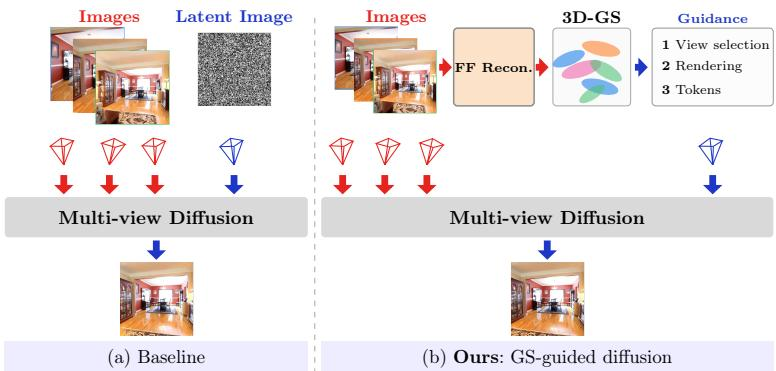
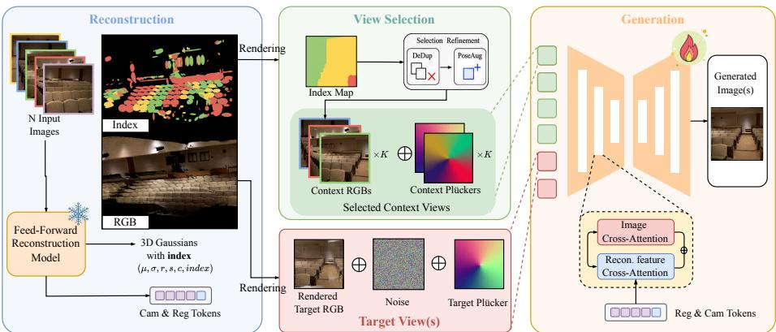
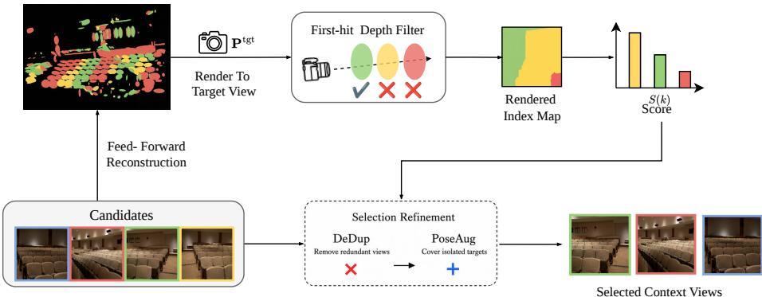
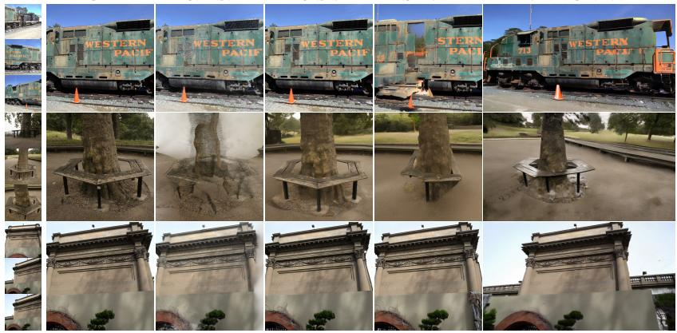
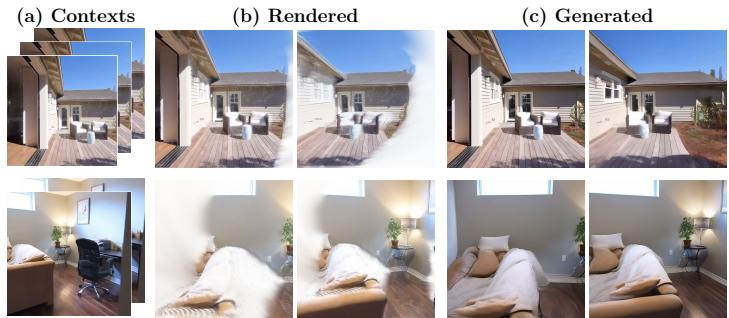
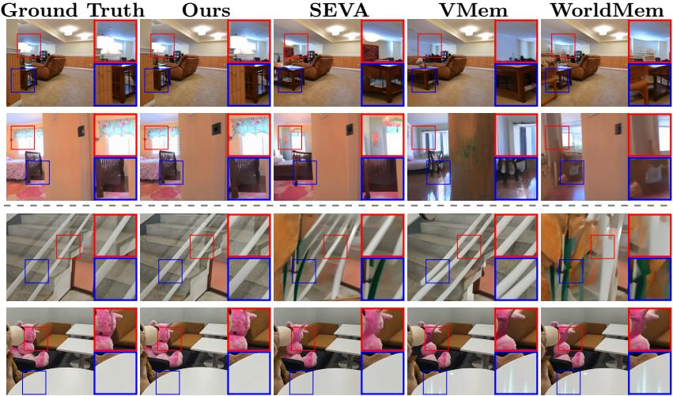
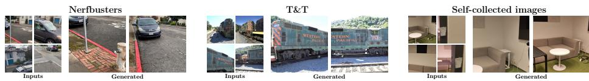
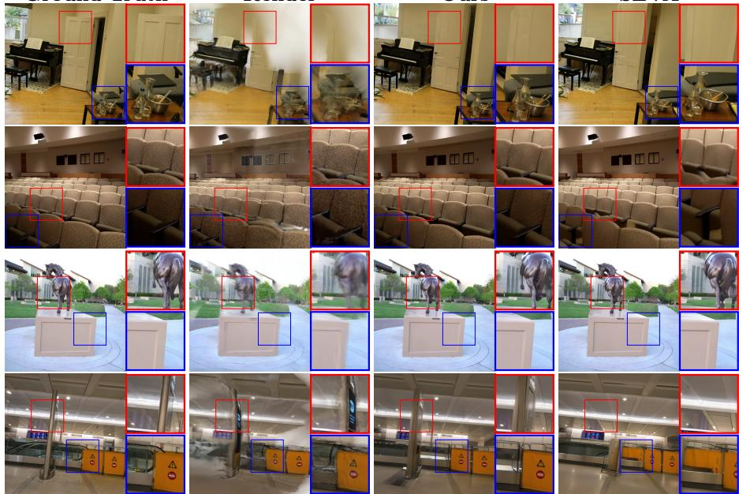

# SplatGuide: Geometric Priors from 3D Gaussians for Pose-Free Novel View Synthesis

Yejun Zhang1⋆, Zihan Wang1⋆, Xu Ji1⋆, Yihao Wang1, Yuxin Hou2, Junyuan Fang1, Juho-Matti Kilpeläinen1, Arno Solin1,3, Hamed Rezazadegan Tavakoli4, Esa Rahtu5, and Juho Kannala1,6

1Aalto University, Finland 2Deep Render, UK 3ELLIS Institute Finland 4Nokia Technologies, Finland 5Tampere University, Finland 6University of Oulu, Finland

{firstname.lastname, zihan.1.wang, xu.1.ji}@aalto.fi hamed.rezazadegan\_tavakoli@nokia.com esa.rahtu@tuni.fi yuxin.hou@deeprender.ai

  
Fig. 1: SplatGuide vs. difusion baseline. (a) The baseline passes camera poses directly to a multi-view difusion model. (b) SplatGuide first uses a feed-forward reconstruction (FF Recon.) model to build a 3DGS scene from unposed images, then reuses it to supply rendered images, visibility-aware view selection, and feature tokens as geometric guidance.

Abstract. Generating photorealistic novel views from unposed images requires both 3D geometric understanding and the ability to synthesize unseen content. A natural strategy combines feed-forward 3DGS reconstruction with multi-view difusion. Yet prior pipelines extract at most one signal from the reconstruction, either pixel rendering or learned features, while none exploits per-Gaussian visibility for occlusion-aware reference selection. This information disconnect leaves renderable geometry, visibility cues, and learned features unused. SplatGuide closes this disconnect by reusing a single 3DGS scene across three complementary roles. Rendered images provide pixel-aligned geometric conditioning. Per-Gaussian source-view indices are rendered into a target-view voting map for occlusion-aware reference selection. Reconstruction tokens supply feature-level guidance via cross-attention. All three signals

derive from the same reconstruction forward pass. Across RealEstate10K, DL3DV, Tanks-and-Temples, and Mip-NeRF 360, SplatGuide achieves state-of-the-art pose-free novel view synthesis. On RealEstate10K, with a moderate number of input views, it surpasses the ground-truth-pose baseline.

## 1 Introduction

Imagine synthesizing a photorealistic walkthrough of a room from a handful of casual phone snapshots, with no camera calibration, no controlled capture, and no pose annotations. This is the goal of pose-free novel view synthesis (NVS), and it demands two capabilities that today live in separate worlds. Feed-forward 3D reconstruction models [9, 26, 27, 34] recover camera poses and scene geometry in a single forward pass, yet they can only interpolate between observed viewpoints and cannot hallucinate content in unobserved regions. Multi-view difusion models [2, 6, 17, 20, 23, 28, 41, 42] generate photorealistic images at novel viewpoints, yet they depend on accurate, pre-computed poses, a requirement that is rarely met outside controlled benchmarks. Combining reconstruction with difusion is therefore a natural strategy: reconstruction grounds the geometry, and difusion synthesizes what the reconstruction cannot see.

Existing combinations, however, pass the reconstruction output to the generator through a single narrow channel. Pose-only methods [6, 41, 42] forward the estimated camera parameters and discard the reconstructed scene entirely, causing novel-view quality to fall well below the ground-truth-pose ceiling. Pixellevel methods [3,32,39,40,44] render the reconstructed geometry into images that condition a video difusion backbone, anchoring the spatial layout but restricting generation to trajectory interpolation and tying the pipeline to a specific architecture. Feature-level methods [20,31] inject dense latent features via crossattention or alignment losses, improving spatial consistency but requiring dense features from models like VGGT [26] at prohibitive computational cost. Moreover, all of these pipelines select reference views by pose distance or temporal recency, heuristics that ignore occlusion and break down under tight context budgets.

The common blind spot is not the absence of a particular module, but a structural information disconnect: feed-forward reconstruction already produces a complete 3D Gaussian Splatting (3DGS) [10] scene that encodes renderable geometry, per-Gaussian source-view ownership, and learned feature representations, yet existing pipelines extract at most one of these signals and discard the rest. The cost of this disconnect surfaces at both ends of the pipeline. On the conditioning side, restoring the discarded renderings and features to a predicted-pose baseline markedly improves both fidelity and perceptual quality (Tab. 4). On the selection side, reference-view selection hinges on exactly the per-Gaussian visibility that existing pipelines throw away, and the choice of selection policy alone separates the strongest strategies from the weakest by a wide margin (Tab. 3). Pose-free NVS is thus bottlenecked not by what reconstruction fails to provide, but by what existing pipelines fail to use.

We present SplatGuide, which closes the information disconnect by reusing a single 3DGS scene across three complementary roles (Fig. 1). Rather than inventing new modules, SplatGuide recovers information that the reconstruction already provides but that existing pipelines throw away: (1) Geometric signal: rendering the 3DGS scene at target and reference poses produces pixelaligned images that provide direct geometric conditioning for the difusion model. (2) Visibility signal: each Gaussian naturally records the index of its source view; rendering these indices into a target-view voting map yields an occlusion-aware reference selector that clearly outperforms pose-based and recency-based strategies under tight context budgets. (3) Feature signal: camera and register tokens extracted from the reconstruction backbone are injected via cross-attention, supplying scene-level context that pixel-aligned renderings cannot convey. All three signals derive from a single reconstruction forward pass, require no additional 3D primitives, and keep the backbone frozen.

Our contributions are:

– We identify the information disconnect as the structural bottleneck of posefree NVS and propose SplatGuide, which closes it by bridging rendered images, per-Gaussian visibility, and reconstruction tokens from a single reconstructed 3DGS scene to the difusion generator.

– We introduce a visibility-aware view selector that renders per-Gaussian sourceview indices into a target-view voting map, delivering occlusion-aware reference selection at negligible cost and large gains over pose-based and recencybased strategies under tight context budgets.

– We achieve state-of-the-art pose-free NVS on four benchmarks, surpassing the ground-truth-pose baseline on RealEstate10K given suficient input views, and demonstrate modularity: the reconstruction backbone can be substituted zero-shot without retraining, so the framework benefits directly from advances in feed-forward reconstruction.

## 2 Related Work

Pose-Free Novel View Synthesis. NeRF [18] and 3DGS [10] achieve photorealistic novel view synthesis but require accurate camera poses, typically obtained from Structure-from-Motion (SfM) [22] pipelines. Feed-forward reconstruction models remove this dependency: DUSt3R [27], MASt3R [12], and VGGT [26] jointly predict camera poses and 3D point clouds from input images, while InstantSplat [5] accelerates convergence with sparse-view priors.

NoPo-Splat [34] marks a turning point by reconstructing a 3DGS scene and synthesizing novel views in a single forward pass without any pose input, opening the direction of pose-free novel view synthesis. Subsequent works follow two routes. On the reconstruction side, AnySplat [9], WorldMirror [16], and RayZer [8] scale feed-forward 3DGS to larger and more diverse scenes, yet they can only interpolate between observed viewpoints and cannot hallucinate unobserved content. On the generation side, end-to-end multi-view difusion models such as Matrix3D [17] and Fillerbuster [30] jointly predict poses and generate novel views, but lack explicit 3D geometric constraints, leading to inconsistencies in observed regions.

Combining reconstruction with difusion is therefore a natural strategy: ViewCrafter [40] conditions a video difusion model on DUSt3R-predicted poses and rendered point maps, while CAT3D [6] and SEVA [42] accept predicted poses directly but degrade severely because they are trained on ground-truth poses. These pipelines extract at most one signal from the reconstruction output and discard the rest; SplatGuide instead reuses the full 3DGS scene across three complementary conditioning signals.

Conditioning Difusion with 3D Reconstruction Priors. Existing methods that inject reconstruction priors into difusion each bridge only one of the three information signals. For the geometric signal, ViewCrafter [40] and its followups [39, 41] render reconstructed point clouds at target poses and feed the resulting images into video difusion models [2,15,35], providing a strong geometric anchor but tying the pipeline to a video backbone and limiting generation to sparse trajectory interpolation; earlier reprojection-based methods [3, 32, 44] share this single signal under further constraints such as per-scene optimization or single-frame inpainting. For the feature signal, Gen3C [20] injects dense latent features via cross-attention, and Geometry Forcing [31] aligns difusion representations with geometric foundation model features; both improve spatial consistency but require dense features from models like VGGT at prohibitive computational cost. Neither paradigm exploits the visibility signal already encoded in the reconstructed scene; SplatGuide bridges all three signals from a single reconstruction pass.

View Selection for Multi-View Generation. Scaling multi-view difusion to large view sets hinges on selecting informative reference views. Temporally local conditioning [21,25,28,36,38] suits contiguous video but not general multi-view settings. Spatial strategies rank candidates by pose distance [6, 42] or field-of-view overlap [33,37], lacking explicit occlusion reasoning, while VMem [13] models visibility with surfel-indexed memory but requires aggressive downsampling of 3D primitives, yielding coarse geometric discrimination. Our selector instead reads per-Gaussian source-view indices already produced by the reconstruction backbone, providing occlusion-aware selection at negligible cost without additional 3D primitives.

## 3 Method

Problem Formulation. Given a set of N unposed RGB reference images $\mathcal { T } ^ { \mathrm { r e f } }$ = $\{ \mathbf { I } _ { i } ^ { \mathrm { r e f } } \} _ { i = 1 } ^ { N }$ capturing the same static scene, our goal is to synthesize M target views $\bar { \mathcal { T } } ^ { \mathrm { t g t } } \overset { \sim } { = } \{ \bar { \mathbf { I } } _ { j } ^ { \mathrm { t g t } } \} _ { j = 1 } ^ { M }$ at the corresponding query camera poses $\mathcal { P } ^ { \mathrm { t g t } } = \{ \mathbf { P } _ { j } ^ { \mathrm { t g t } } \} _ { j = 1 } ^ { M }$ . For each target view, we model the generation as

$$
p ( \mathbf { I } _ { j } ^ { \mathrm { t g t } } \mid \mathcal { T } ^ { \mathrm { r e f } } , \mathcal { C } , \mathbf { P } _ { j } ^ { \mathrm { t g t } } ) ,\tag{1}
$$

  
Fig. 2: Overview of SplatGuide. Reconstruction: A feed-forward model takes N unposed images and produces 3D Gaussians with per-Gaussian source-view indices $( \mu , \sigma , r , s , c ,$ index), along with camera and register tokens. View Selection: The per-Gaussian indices are rendered into a target-view index map; pixel-wise voting retrieves the top-K reference views, whose RGBs and Plücker coordinates form the selected context views. Generation: The rendered target RGB, noise, and target Plücker are concatenated with the context views and fed into the difusion model, which is further conditioned on reconstruction tokens via cross-attention to produce the final photorealistic image.

where $\begin{array} { r } { \mathcal { C } = f _ { \mathrm { r e c o n } } ( \mathcal { T } ^ { \mathrm { r e f } } ) } \end{array}$ denotes target-independent reconstruction conditioning from the reference images, comprising estimated reference poses $\mathcal { P } ^ { \mathrm { r e f } }$ , a reconstructed 3DGS scene $\mathcal { G } _ { : }$ , and reconstruction features.

## 3.1 Model Architecture

Overview. As illustrated in Fig. 2, SplatGuide follows a three-stage pipeline of reconstruction, selection, and generation. A feed-forward backbone estimates the reference camera poses and reconstructs a 3DGS scene G from the unposed inputs. The resulting renderings, source-view indices, and reconstruction tokens respectively provide pixel-level conditioning, visibility-aware reference selection, and feature-level guidance. Together, these signals guide $f _ { \mathrm { d i f f } }$ to synthesize the target views.

Reconstruction Model. The reconstruction model recovers camera poses and scene geometry from the unposed input. The feed-forward model $f _ { \mathrm { r e c o n } }$ processes the reference set $\mathcal { T } ^ { \mathrm { r e f } }$ and outputs both poses and an explicit 3DGS scene:

$$
( { \mathcal { P } } ^ { \mathrm { r e f } } , { \mathcal { G } } ) = f _ { \mathrm { r e c o n } } ( { \mathcal { T } } ^ { \mathrm { r e f } } ) .\tag{2}
$$

We adopt backbones that predict pixel-aligned Gaussians, $i . e .$ , every pixel of every reference view regresses one Gaussian. Each $g _ { i } \in \mathcal G$ therefore carries a source-view index $v ( i ) \in \{ 1 , \ldots , V \}$ that is determined by construction at reconstruction time: no Gaussian is fused or merged across views, so the index requires neither extra supervision nor any tie-breaking heuristic. This property is shared by all reconstruction backbones we evaluate, and it is the only requirement a backbone must satisfy to be used as a drop-in replacement. From the reconstructed scene ${ \mathcal { G } } _ { : }$ we render coarse but geometrically consistent images at both target poses $\mathcal { P } ^ { \mathrm { t g t } }$ to obtain $\hat { \mathcal { T } } ^ { \mathrm { t g t } }$ and estimated reference poses $\mathcal { P } ^ { \mathrm { r e f } }$ to obtain ${ \hat { \mathcal { T } } } ^ { \mathrm { r e f } }$ , via standard 3DGS rendering [10]:

$$
\hat { \mathbf { I } } _ { \mathbf { P } } = \sum _ { k \in \mathcal { N } ( \mathbf { P } ) } \mathbf { c } _ { k } \alpha _ { k } ^ { \prime } \prod _ { l = 1 } ^ { k - 1 } ( 1 - \alpha _ { l } ^ { \prime } ) ,\tag{3}
$$

where $\mathbf { c } _ { k }$ and $\alpha _ { k } ^ { \prime }$ are the learned color and projected opacity of the k-th Gaussian, and $\mathcal { N } ( \mathbf { P } )$ denotes the depth-sorted set of Gaussians visible from pose P. Setting $\mathbf { P } = \mathbf { P } _ { j } ^ { \mathrm { t g t } }$ or $\mathbf { P } = \mathbf { P } _ { i } ^ { \mathrm { r e f } }$ yields the rendered target images $\hat { \mathbf { I } } ^ { \mathrm { t g t } }$ and reference images $\hat { \mathbf { I } } ^ { \mathrm { r e f } }$ , respectively. These rendered images constitute the primary geometric anchor of our pipeline: unlike pure 2D conditioning, they encode both geometry and appearance from the reconstructed scene and inherently maintain multi-view consistency. Our ablation (Tab. 4) confirms that the rendered image is the largest single contributor to generation quality.

Difusion Model. The difusion-based generator $f _ { \mathrm { d i f f } }$ , built on SEVA [42], refines the coarse rendered images $\hat { \bf \cal I } ^ { \mathrm { t g t } }$ into photorealistic novel views $\mathbf { I } ^ { \mathrm { t g t } }$ , receiving geometric guidance at two complementary levels: pixel-level conditioning via rendered images and feature-level conditioning via injected reconstruction tokens.

Rendering as Geometric Conditioning. The primary geometric signal comes from the rendered images produced by $f _ { \mathrm { r e c o n } }$ . We choose channel-wise concatenation for injection because it preserves the pixel-aligned spatial correspondence between the rendered geometry and the generated content. Following the SEVA conditioning framework, each reference image $\mathbf { I } ^ { \mathrm { r e f } }$ is encoded into a latent $\mathbf { z } = \mathcal { E } ( \mathbf { I } ^ { \mathrm { r e f } } )$ via the VAE encoder $\mathcal { E } ( \cdot )$ and concatenated with its Plücker ray embedding and a binary mask distinguishing reference from target views. For target views, we replace the latent with the noisy state $\mathbf { z } _ { t }$ . We extend this by encoding the rendered images $\hat { \mathbf { I } } ^ { \mathrm { r e f } }$ and $\hat { \mathbf { I } } ^ { \mathrm { t g t } }$ into the latent space and concatenating them as an additional channel group $\mathbf { z } _ { \mathrm { r e n d e r } } \in \mathbb { R } ^ { H \times W \times C } ;$

$$
\mathbf { z } _ { \mathrm { c o n d } } = [ \mathbf { z } _ { t } , \mathbf { z } _ { \mathrm { r e n d e r } } , \mathbf { e } _ { \mathrm { p l k } } , \mathbf { m } ] \in \mathbb { R } ^ { H \times W \times ( 2 C + C _ { \mathrm { p l k } } + 1 ) } ,\tag{4}
$$

where $\mathbf { e } _ { \mathrm { p l k } } \in \mathbb { R } ^ { H \times W \times C _ { \mathrm { p l k } } }$ encodes the 6D Plücker coordinates for each pixel ray and $\mathbf { m } \in \{ 0 , 1 \} ^ { H \times W \times 1 }$ indicates valid regions. To accommodate the additional $C$ channels, we expand the first convolutional layer of the U-Net from $C + C _ { \mathrm { p l k } } + 1$ to $2 C + C _ { \mathrm { p l k } } + 1$ input channels, initializing the new weights to zeros so that the pre-trained model behavior is preserved at the start of training.

Tokens as Feature Conditioning. Rendered images provide pixel-aligned geometric conditioning but cannot convey scene-level context beyond the visible surfaces, such as global structure and texture statistics. We therefore inject reconstruction tokens from $f _ { \mathrm { r e c o n } }$ into the difusion model. For each reference view i we extract from the last layer of the reconstruction backbone one camera token $\mathbf { t } _ { i } ^ { \mathrm { c a m } } \in \mathbb { R } ^ { d _ { r } }$ used for pose prediction, and four register tokens $\{ \mathbf { t } _ { i , l } ^ { \mathrm { r e g } } \} _ { l = 1 } ^ { 4 } \in \mathbb { R } ^ { 4 \times d _ { \tau } }$ $\left( d _ { r } { = } 1 0 2 4 \right)$ , which aggregate non-local information across patches [4]. A learned linear projection maps each token to the cross-attention dimension of the difusion U-Net, and the tokens are injected through dedicated cross-attention layers, analogous to how SEVA [42] injects CLIP [19] features. Our ablation (Tab. 4) confirms that these feature cues are complementary to rendered images, further improving both fidelity and perceptual quality.

The final conditioning C thus comprises reference latents, rendered latents, Plücker ray embeddings, the binary view-type mask, and the camera and register tokens.

Training Objective. We train only the difusion model while keeping the reconstruction backbone frozen. Following standard latent difusion practice [24], we minimize the noise-prediction objective:

$$
\mathcal { L } = \mathbb { E } _ { \mathbf { z } _ { 0 } , \epsilon , t } [ | | \epsilon - \epsilon _ { \theta } ( \mathbf { z } _ { t } , t , \mathcal { C } ) | | _ { 2 } ^ { 2 } ] ,\tag{5}
$$

where ${ \bf z } _ { 0 } = \mathcal { E } ( { \bf I } ^ { \mathrm { t g t } } )$ is the VAE-encoded target, $\epsilon \sim \mathcal { N } ( \mathbf { 0 } , \mathbf { I } ) , t \sim \mathcal { U } ( 1 , T )$ , and $\mathbf { z } _ { t }$ is the noised latent at timestep t.

## 3.2 Gaussians as Context Views Selector

Scaling pose-free NVS to practical settings requires handling candidate pools that far exceed the context budget of the difusion model; our experiments show that the selection policy alone accounts for a 7 dB range in output quality (Tab. 3), making view selection a first-order design decision. We design a hybrid strategy that combines scene-based visibility reasoning with a lightweight posebased augmentation. As illustrated in Fig. 3, the selector (1) reconstructs a 3D Gaussian proxy with source-view indices, (2) renders an occlusion-aware viewindex map in the target view, and (3) selects reference views via visibility-based scoring, directly reusing the 3DGS scene $\mathcal { G }$ already produced by the reconstruction backbone.

Importantly, spatial proximity between cameras does not necessarily imply shared visible content due to occlusions. Given a target camera $\mathbf { P } ^ { \mathrm { t g t } }$ and reconstructed Gaussians $\mathcal { G } = \{ g _ { i } \} _ { i = 1 } ^ { G }$ with their source-view indices $v ( i )$ from Sec. 3.1, we estimate how much of the surface visible from $\mathbf { P } ^ { \mathrm { t g t } }$ is explained by each candidate view. Since selection only requires coarse visibility, we downsample the Gaussian set to reduce computational overhead. Reusing the projection and rasterization operations of 3D Gaussian Splatting [10], we render a view-index map under a hard first-hit depth test: at each pixel $p ,$ only the nearest Gaussian is kept and writes a distinct palette color $c _ { v ( i ) }$ encoding its source view, while pixels with no valid Gaussian are ignored. Whereas v(i) is unambiguous per Gaussian, a target ray typically intersects Gaussians originating from several diferent views; the first-hit test resolves this competition by awarding the pixel to the nearest surface only, and palette colors are never alpha-blended, which keeps index recovery exact. Each target pixel thus votes for the source view that best explains its visible surface, and the view index ${ \hat { v } } ( p )$ is recovered by nearest-color lookup. We then define a visibility score

  
Fig. 3: Overview of the proposed view selection pipeline. We reuse the reconstructed 3D Gaussians with per-Gaussian source-view indices, render an occlusion-aware targetview index map via first-hit visibility, and aggregate pixel votes into per-view visibility scores S(k) to determine Top-K Indices. The final selection is refined by DeDup, which filters spatially redundant candidates, and PoseAug, which augments the context set with pose-proximal views for isolated targets, ensuring a complete and diverse set of K reference images.

$$
S ( k ) = \sum _ { p } \mathbb { I } \big [ \hat { v } ( p ) = k \big ] ,\tag{6}
$$

which counts the target pixels dominated by geometry from view k. We rank candidates by $S ( k )$ in descending order and greedily select the highest-scoring views until the context budget is exhausted.

Beyond Geometric Coverage. Ranking by S(k) alone, as in prior visibility-based retrieval [13], optimizes purely for geometric coverage. Coverage, however, does not guarantee informative conditioning: a faraway candidate can observe much of the target surface yet deliver appearance evidence that is too coarse, and several top-ranked candidates frequently explain the same surfaces. We therefore refine the ranking with two lightweight components. DeDup discards candidates whose visible Gaussians largely coincide with those of already selected views, preventing the limited budget from being spent on near-duplicate viewpoints. PoseAug fills the remaining slots with a max-min proximity rule that guards against the complementary failure mode: a target left distant from every chosen context. With S the current context set and $\mathbf { t } _ { k } , \mathbf { t } _ { j } ^ { \mathrm { t g t } }$ the camera centers of candidate k and target j, PoseAug locates the most isolated target,

$$
j ^ { \star } = \arg \operatorname* { m a x } _ { j \in \{ 1 , \dots , M \} } \ \operatorname* { m i n } _ { k \in \cal S } \left\| \mathbf { t } _ { k } - \mathbf { t } _ { j } ^ { \mathrm { t g t } } \right\| _ { 2 } ,\tag{7}
$$

and admits the unselected candidate nearest to it, $\begin{array} { r } { k ^ { \star } = \arg \operatorname* { m i n } _ { k \not \in { \cal S } } \left\| \mathbf { t } _ { k } - \mathbf { t } _ { j ^ { \star } } ^ { \mathrm { t g t } } \right\| _ { 2 } ; } \end{array}$ the rule repeats until the budget is saturated, so every target retains at least one nearby context. The supplementary material ablates both components, confirming that they are complementary to the visibility ranking.

## 4 Experiments

We evaluate SplatGuide on four benchmarks spanning in-domain and out-ofdomain scenes. Comparison experiments show that our full pipeline matches or surpasses ground-truth-pose methods, controlled selection experiments isolate the efect of visibility-aware view selection, and ablations verify that each conditioning signal provides complementary gains.

Implementation Details. Our difusion backbone builds on SEVA [42], and we adopt WorldMirror [16] as the reconstruction model. Both the reconstruction backbone $f _ { \mathrm { r e c o n } }$ and the VAE remain frozen throughout training; $f _ { \mathrm { r e c o n } }$ produces the rendered images and tokens that constitute the conditioning C but receives no gradient updates. Only the difusion model is trained, using the Adam optimizer with a learning rate of $1 \times 1 0 ^ { - 5 }$ on 8 H200 GPUs with a batch size of 32. Classifier-free guidance is not used during training. At inference time, we use the DDIM sampler [24] with classifier-free guidance [7].

Training and Test Data. We train the difusion model on DL3DV [14] with 10,510 scenes and RealEstate10K [43] with 67,477 training videos, both containing mixed indoor and outdoor scenes. We evaluate on two in-domain datasets, RealEstate10K and DL3DV, and two out-of-domain datasets, Mip-NeRF 360 [1] and Tanks and Temples [11], to test generalization. Further details are provided in the supplementary material.

## 4.1 Novel View Synthesis Results

Following standard practice [6, 42], we report PSNR, SSIM, and LPIPS. We compare against regression-based methods, including AnySplat, WorldMirror, and RayZer, as well as difusion-based methods, including SEVA, Fillerbuster, and ViewCrafter. We note that methods such as Gen3C [20] and Geometry Forcing [31] require ground-truth camera poses and are therefore not directly comparable to our pose-free setting. ViewCrafter uses a separate evaluation setup detailed in the supplementary.

GT  
Render  
Ours  
SEVA  
ViewCrafter  
  
Fig. 4: Visual comparison of novel view synthesis. Columns from left to right: ground truth, the coarse 3DGS render serving as our geometric prior, our SplatGuide result, SEVA, and ViewCrafter. SplatGuide produces sharper structures and fewer artifacts than both baselines, benefiting from the explicit geometric guidance provided by the rendered image and injected tokens.

Table 1: Quantitative comparison on the in-domain RealEstate10K (top) and DL3DV (bottom) datasets. Best results among unposed methods are in bold, and second-best are underlined.
<table><tr><td rowspan="2"></td><td rowspan="2">GT pose</td><td colspan="3">3-view</td><td colspan="3">6-view</td><td colspan="3">9-view</td></tr><tr><td>PSNR↑</td><td>SSIM↑</td><td>LPIPS↓</td><td>PSNR↑</td><td>SSIM↑</td><td>LPIPS↓</td><td>PSNR↑</td><td>SSIM↑</td><td>LPIPS↓</td></tr><tr><td colspan="10">RealEstate10K</td></tr><tr><td>SEVA</td><td>√</td><td>27.57</td><td>0.89</td><td>0.07</td><td>29.24</td><td>0.90</td><td>0.06</td><td>29.63</td><td>0.91</td><td>0.05</td></tr><tr><td>AnySplat</td><td>X</td><td>19.81</td><td>0.71</td><td>0.24</td><td>23.23</td><td>0.79</td><td>0.16</td><td>24.13</td><td>0.82</td><td>0.15</td></tr><tr><td>WorldMirror</td><td>X</td><td>21.13</td><td>0.77</td><td>0.16</td><td>22.89</td><td>0.81</td><td>0.12</td><td>23.35</td><td>0.83</td><td>0.11</td></tr><tr><td>Fillerbuster</td><td>X</td><td>19.13</td><td>0.63</td><td>0.27</td><td>19.81</td><td>0.65</td><td>0.24</td><td>20.59</td><td>0.67</td><td>0.22</td></tr><tr><td>ViewCrafter</td><td>X</td><td>20.18</td><td>0.74</td><td>0.23</td><td>22.97</td><td>0.81</td><td>0.19</td><td>23.22</td><td>0.82</td><td>0.17</td></tr><tr><td>SEVA</td><td>X</td><td>23.47</td><td>0.77</td><td>0.13</td><td>26.20</td><td>0.82</td><td>0.07</td><td>27.14</td><td>0.83</td><td>0.06</td></tr><tr><td>Ours</td><td>X</td><td>26.52</td><td>0.84</td><td>0.07</td><td>29.29</td><td>0.87</td><td>0.04</td><td>30.00</td><td>0.88</td><td>0.04</td></tr><tr><td colspan="10">DL3DV</td></tr><tr><td>SEVA</td><td>√</td><td>15.13</td><td>0.43</td><td>0.41</td><td>16.62</td><td>0.48</td><td>0.33</td><td>17.68</td><td>0.52</td><td>0.27</td></tr><tr><td>AnySplat</td><td>X</td><td>10.04</td><td>0.29</td><td>0.61</td><td>12.15</td><td>0.33</td><td>0.56</td><td>13.78</td><td>0.37</td><td>0.51</td></tr><tr><td>WorldMirror</td><td>X</td><td>13.11</td><td>0.31</td><td>0.54</td><td>13.98</td><td>0.34</td><td>0.47</td><td>15.01</td><td>0.41</td><td>0.42</td></tr><tr><td>RayZer</td><td>X</td><td>14.65</td><td>0.35</td><td>0.64</td><td>16.28</td><td>0.40</td><td>0.54</td><td>17.75</td><td>0.46</td><td>0.46</td></tr><tr><td>Matrix3D</td><td>X</td><td>12.73</td><td>0.31</td><td>0.53</td><td>13.35</td><td>0.32</td><td>0.50</td><td>一</td><td>1</td><td>-</td></tr><tr><td>ViewCrafter</td><td>X</td><td>11.16</td><td>0.28</td><td>0.61</td><td></td><td></td><td></td><td></td><td></td><td></td></tr><tr><td>SEVA</td><td>X</td><td>12.50</td><td>0.35</td><td>0.55</td><td>13.49</td><td>0.37</td><td>0.48</td><td>14.26</td><td>0.38</td><td>0.43</td></tr><tr><td>Ours</td><td>X</td><td>14.96</td><td>0.42</td><td>0.39</td><td>16.21</td><td>0.46</td><td>0.31</td><td>16.99</td><td>0.48</td><td>0.27</td></tr></table>

Geometric conditioning bridges the pose gap. SEVA (unposed) denotes the oficial SEVA model [42] run with DUSt3R-predicted poses provided by the SEVA codebase. As shown in Tab. 1, on RealEstate10K, SplatGuide improves over this strongest pose-only difusion baseline by +3.05 dB at 3 views, and with 9 views it surpasses even the ground-truth-pose SEVA, showing that the complete framework compensates for the accuracy loss of predicted poses when suficient views are available. The same trend holds on DL3DV, where SplatGuide achieves the best LPIPS across all view counts; RayZer reports higher PSNR at 6 and 9 views but with substantially weaker perceptual quality, e.g., LPIPS of 0.54 vs. our 0.31 at 6 views. As Tab. 2 shows, on the out-of-domain Mip-NeRF 360 and Tanks and Temples benchmarks, SplatGuide remains the best among all unposed methods across view counts, confirming that geometric conditioning transfers to diverse scenes without domain-specific tuning. Fig. 4 corroborates these gains visually: SplatGuide produces sharper structures and fewer artifacts than both difusion baselines.

Table 2: Quantitative comparison on out-of-domain datasets. All methods operate without ground-truth poses. Best results are in bold, and second-best are underlined.
<table><tr><td rowspan="3">Method</td><td colspan="6">Tanks and Temples</td><td colspan="8"></td></tr><tr><td colspan="3">3-view</td><td colspan="3">6-view</td><td colspan="3">3-view</td><td colspan="2">6-view</td><td colspan="3">9-view</td></tr><tr><td></td><td></td><td></td><td></td><td>|PSNR↑ SSIM↑ LPIPS↓ |PSNR↑ SSIM↑ LPIPS↓ |PSNR↑ SSIM↑ LPIPS↓ |PSNR↑ SSIM↑ LPIPS↓ |PSNR↑</td><td></td><td></td><td></td><td></td><td></td><td></td><td></td><td>SSIM↑ LPIPS↓</td><td></td></tr><tr><td colspan="2">Regression-based methods:</td><td></td><td></td><td></td><td></td><td></td><td></td><td></td><td></td><td></td><td></td><td></td><td></td><td></td></tr><tr><td>AnySplat</td><td>16.04</td><td>0.46</td><td>0.35</td><td>18.00 0.52</td><td>0.30</td><td>8.26</td><td>0.20</td><td>0.66</td><td>10.30</td><td>0.23</td><td>0.60</td><td>11.42</td><td>0.26</td><td>0.56</td></tr><tr><td>WorldMirror</td><td>17.45</td><td>0.55</td><td>0.27</td><td>19.06</td><td>0.56</td><td>0.25 11.90</td><td>0.24</td><td>0.61</td><td>12.52</td><td>0.26</td><td>0.55</td><td>13.07</td><td>0.26</td><td>0.52</td></tr><tr><td colspan="3">Diffusion-based methods:</td><td></td><td></td><td></td><td></td><td></td><td></td><td></td><td></td><td></td><td></td><td></td><td></td></tr><tr><td>Fillerbuster</td><td>17.18</td><td>0.46</td><td>0.30</td><td>18.60</td><td>0.52</td><td>0.27</td><td>12.55 0.20</td><td>0.62</td><td>13.15</td><td>0.20</td><td>0.59</td><td>13.82</td><td>0.21</td><td>0.57</td></tr><tr><td>ViewCrafter</td><td>18.31</td><td>0.51</td><td>0.26</td><td>20.89</td><td>0.61</td><td>0.14</td><td>11.54 0.19</td><td>0.63</td><td>11.84</td><td>0.20</td><td>0.61</td><td>12.25</td><td>0.21</td><td>0.59</td></tr><tr><td>SEVA</td><td>19.45</td><td>0.58</td><td>0.15</td><td>21.59</td><td>0.64</td><td>0.10</td><td>13.89 0.25</td><td>0.49</td><td>14.80</td><td>0.26</td><td>0.43</td><td>15.07</td><td>0.27</td><td>0.41</td></tr><tr><td>Ours</td><td>20.01</td><td>0.60</td><td>0.12</td><td>21.95</td><td>0.67</td><td>0.09</td><td>14.64 0.27</td><td>0.46</td><td>15.43</td><td>0.28</td><td>0.40</td><td>16.01</td><td>0.30</td><td>0.35</td></tr></table>

Generation complements reconstruction. SplatGuide surpasses pure reconstruction baselines by large margins, e.g., +5.39 dB over WorldMirror and +6.71 dB over AnySplat on the RealEstate10K 3-view split. This gap confirms that reconstruction models alone can only interpolate observed regions and cannot hallucinate plausible content in unobserved areas, whereas our difusion-based generation fills these regions with high fidelity guided by the reconstructed geometric prior. Moreover, the advantage persists on out-of-domain scenes, showing that the difusion model’s learned generative prior remains valuable when reconstruction quality degrades on unseen distributions.

Extrapolation beyond observed viewpoints. Generative NVS matters most when targets depart substantially from all reference views, precisely the regime where render-and-refine pipelines are expected to struggle. Fig. 5 examines this setting: as the target leaves the observed trajectory, the 3DGS render turns sparse and incomplete, yet it still pins down the layout of the visible geometry, and the difusion model completes the remaining content into a coherent novel view.

## 4.2 Inference-Time View Selection

To isolate the efect of selection policy from the generator, we fix the difusion model and vary only the selection strategy. We compare against four reimplemented baselines: temporal recency Temporal [25], camera-distance ranking

  
Fig. 5: View extrapolation under large viewpoint changes. For each scene we show (a) the selected context views, (b) coarse 3DGS renders at target poses far from all context cameras, and (c) the corresponding generated novel views. The degraded renders still anchor the visible layout, which the difusion model completes into coherent images.

Table 3: Comparison of view selection policies with a fixed generator. All methods use the same reconstruction and difusion backbones; only the selection policy difers.
<table><tr><td></td><td colspan="3">B=6 (sparse)</td><td colspan="3">B=9 (mid)</td><td colspan="3">B=16 (ample)</td></tr><tr><td>Method</td><td>PSNR↑</td><td>SSIM↑</td><td>LPIPS↓</td><td>PSNR↑</td><td>SSIM↑</td><td>LPIPS↓</td><td>PSNR↑</td><td>SSIM↑</td><td>LPIPS↓</td></tr><tr><td>Temporal(DFoT)</td><td>20.88</td><td>0.71</td><td>0.22</td><td>21.50</td><td>0.75</td><td>0.18</td><td>26.53</td><td>0.86</td><td>0.10</td></tr><tr><td>CamDist(SEVA)</td><td>24.34</td><td>0.80</td><td>0.11</td><td>25.44</td><td>0.81</td><td>0.10</td><td>27.71</td><td>0.88</td><td>0.07</td></tr><tr><td>FoV(WorldMem)</td><td>26.52</td><td>0.83</td><td>0.09</td><td>27.61</td><td>0.84</td><td>0.07</td><td>29.25</td><td>0.90</td><td>0.06</td></tr><tr><td>Surfel(Vmem)</td><td>26.93</td><td>0.84</td><td>0.09</td><td>27.86</td><td>0.85</td><td>0.08</td><td>29.12</td><td>0.90</td><td>0.07</td></tr><tr><td>Ours</td><td>28.25</td><td>0.85</td><td>0.06</td><td>28.91</td><td>0.86</td><td>0.06</td><td>29.94</td><td>0.91</td><td>0.05</td></tr></table>

CamDist [42], surfel-based visibility coverage Surfel [13], and field-of-view overlap FoV [33]. All methods draw from the same pool of 32 candidate references under three context budgets: B=6 for the sparse regime, B=9 for the mid regime, and B=16 for the ample regime.

Quantitative Results. The results reveal a striking 7 dB range across selection policies on RealEstate10K at B=6. Our hybrid method achieves the best results across all budgets, with the largest gains in the sparse regime: +1.3 dB over the best existing strategy Surfel and +3.9 dB over CamDist at B=6. The advantage narrows at B=16, where the strongest spatial strategies converge within 1 dB: visibility-aware selection matters most precisely when the context budget is tight, the regime most relevant to practical deployment.

Qualitative Observations. Fig. 6 illustrates two representative failure modes. In the top two rows, pose-based baselines select clusters of nearly identical views, wasting the budget on redundant content and causing texture bleeding near depth discontinuities, while the surfel-based VMem selector over-concentrates on already well-covered surfaces; our method selects complementary views, producing sharper edges and fewer missing regions. In the bottom two rows, strong foreground occluders dominate the frames chosen by pose-only methods, whereas our first-hit voting suppresses such candidates and retrieves views that see around the obstruction. These patterns are consistent across scenes and align with the quantitative gaps in Tab. 3.

Table 4: Ablation study on geometric conditioning on DL3DV with 9 views. We progressively add rendering images, camera tokens and register tokens to the baseline to measure each component’s contribution.th ruth d Truth und Truth rsGround Truth OursGround Truth OursGround Truth OursOurs SEVA OursSEVA Ours SEVA OurSE
<table><tr><td>Method</td><td>PSNR ↑ SSIM ↑ LPIPS↓</td><td></td><td></td></tr><tr><td>Baseline + predicted pose</td><td>15.64</td><td>0.33</td><td>0.38</td></tr><tr><td>+ rendering image</td><td>16.30</td><td>0.35</td><td>0.33</td></tr><tr><td>+ rendering image + cam &amp; reg 16.63</td><td></td><td>0.36</td><td>0.32</td></tr></table>

  
Fig. 6: Qualitative comparison of view-selection policies. Top two rows: our method recovers fine details by selecting complementary views. Bottom two rows: our visibilityaware selection suppresses occluder-dominated candidates and reveals hidden geometry.

## 4.3 Ablation of Geometric Conditioning

Tab. 4 presents a staged ablation that progressively adds geometric conditioning components. To reduce computational cost, all variants are trained and evaluated on a representative subset of DL3DV with 9 reference views.

Starting from the predicted-pose baseline, adding the rendering image alone yields a +0.66 dB gain, confirming that rendering serves as the primary geometric anchor. Further adding camera and register tokens yields the best overall quality at 16.63 PSNR and 0.32 LPIPS, a 16% relative LPIPS reduction from the baseline. Token-level guidance thus complements pixel-level rendering rather than replacing it: renderings anchor the spatial layout, while tokens supply global scene context that resolves texture and style ambiguities.

Table 5: Scaling the candidate pool on long-trajectory Tanks-and-Temples scenes (Long-LRM split) with a fixed context budget B=9. Larger pools consistently improve quality without degrading palette-encoded index recovery.
<table><tr><td>Pool size V</td><td>32</td><td>64</td><td>96</td><td>128</td></tr><tr><td>PSNR↑</td><td>16.06</td><td>16.40</td><td>16.87</td><td>17.21</td></tr><tr><td>SSIM↑</td><td>0.41</td><td>0.42</td><td>0.43</td><td>0.47</td></tr><tr><td>LPIPS↓</td><td>0.28</td><td>0.25</td><td>0.25</td><td>0.23</td></tr></table>

  
Fig. 7: Novel view synthesis on large-scale scenes with 100+ input images. Each group shows four example inputs (left 2×2 grid) and two generated novel views (right), on Nerfbusters [29], Tanks-and-Temples, and self-collected casual captures.

Table 6: Zero-shot generalization across reconstruction backbones on RealEstate10K. Our difusion model, trained exclusively with WorldMirror priors, successfully transfers to AnySplat without retraining.
<table><tr><td></td><td colspan="3">3-view</td><td colspan="3">6-view</td><td colspan="3">9-view</td></tr><tr><td>Method</td><td>PSNR↑</td><td>SSIM↑</td><td>LPIPS↓</td><td>PSNR↑</td><td>SSIM↑</td><td>LPIPS↓</td><td>PSNR↑</td><td>SSIM↑</td><td>LPIPS↓</td></tr><tr><td>Ours (AnySplat)</td><td>26.56</td><td>0.83</td><td>0.08</td><td>29.97</td><td>0.87</td><td>0.05</td><td>31.29</td><td>0.88</td><td>0.04</td></tr><tr><td>Ours (WorldMirror)</td><td>26.52</td><td>0.84</td><td>0.07</td><td>29.29</td><td>0.87</td><td>0.04</td><td>30.00</td><td>0.88</td><td>0.04</td></tr></table>

Scaling to Larger Candidate Pools. Casual captures routinely yield pools far larger than the 32 candidates used above, stressing both the selector and the palette encoding, whose colors for a growing view count V lie ever closer in RGB space. On long-trajectory Tanks-and-Temples scenes from the Long-LRM split [45], we fix the budget to B=9 and enlarge the pool from 32 to 128 candidates. As Tab. 5 shows, quality rises monotonically with pool size, by +1.15 dB PSNR overall, with no palette-decoding failures even at V=128: with more candidates available, each target finds contexts nearby, so the generator bridges a shorter extrapolation gap. Fig. 7 illustrates this regime on casually captured scenes and public benchmarks with over 100 input images.

## 4.4 Generalizability to Diferent Reconstruction Models

To test whether the framework depends on a specific reconstruction backbone, we replace WorldMirror [16] with AnySplat [9] zero-shot, without any fine-tuning of the difusion model, and evaluate on the identical RealEstate10K [43] test split with all other components held constant.

As shown in Tab. 6, the AnySplat variant achieves competitive or superior performance across all view counts, with gains of up to +1.29 dB at 9 views. Any feed-forward model producing camera poses and a pixel-aligned 3DGS scene can thus serve as a drop-in replacement, and a stronger backbone translates directly into better generation quality: the modular separation between reconstruction and generation lets the framework absorb future advances in feed-forward reconstruction without retraining.

Portability of the Conditioning Interface. The conditioning interface is largely backbone-agnostic: rendered images enter through channel-wise concatenation in the latent space, which any latent difusion model supports by expanding its input convolution with zero-initialized weights, and reconstruction tokens enter through cross-attention layers present in most U-Net and DiT architectures. The visibility-aware selector runs entirely upstream of the generator, so it transfers to any backbone with a bounded context budget. Only the Plücker-and-mask input layout and the context-window length follow SEVA’s design; we adopt SEVA for its strong pose-conditioned prior, and validating other multi-view difusion backbones is left to future work.

## 5 Conclusion

We present SplatGuide, a framework for pose-free novel view synthesis that repurposes a single 3DGS reconstruction as a unified interface for pixel-level rendering, feature-level token guidance, and visibility-aware view selection. By systematically bridging the information disconnect between reconstruction and generation, SplatGuide closes the gap between predicted and ground-truth poses, even surpassing the ground-truth-pose baseline on RealEstate10K with suficient input views, and demonstrates that visibility-aware selection is a first-order design decision for scalable generation. A key strength of our design is its modularity: reconstruction and generation are fully decoupled, so each component can be upgraded independently, as validated by our zero-shot backbone substitution experiment, and future advances in feed-forward reconstruction translate directly into higher-quality synthesis.

Limitations. Our failure modes are correlated: renderings, tokens, and sourceview indices all come from the same reconstruction G, so wherever the feedforward backbone degrades, such as on textureless surfaces, wide baselines, repetitive structures, or dynamic content, all three signals degrade at once and the generator has no independent geometric cue left. Dynamic scenes are the sharpest case, as motion both corrupts the reconstruction and breaks the firsthit correspondence behind the view-index map.

Acknowledgements. We acknowledge funding by Nokia Technologies, the Research Council of Finland (projects 339730, 352788, 353138, 353139, 362407, 362408, 362409, 372999, 373778, 373780, 373997, 373999), and the Finnish Doctoral Program Network in Artificial Intelligence, AI-DOC (decision number VN/3137/2024-OKM-6). We acknowledge CSC – IT Center for Science, Finland, and the Aalto Science-IT project for the computational resources.

## References

1. Barron, J.T., Mildenhall, B., Verbin, D., Srinivasan, P.P., Hedman, P.: Mipnerf 360: Unbounded anti-aliased neural radiance fields. In: Proceedings of the IEEE/CVF Conference on Computer Vision and Pattern Recognition. pp. 5470– 5479 (2022)

2. Cao, C., Yu, C., Liu, S., Wang, F., Xue, X., Fu, Y.: Mvgenmaster: Scaling multiview generation from any image via 3d priors enhanced difusion model. In: Proceedings of the IEEE/CVF Conference on Computer Vision and Pattern Recognition (CVPR). pp. 6045–6056 (June 2025)

3. Chan, E.R., Nagano, K., Chan, M.A., Bergman, A.W., Park, J.J., Levy, A., Aittala, M., Mello, S.D., Karras, T., Wetzstein, G.: GeNVS: Generative novel view synthesis with 3D-aware difusion models. In: ICCV (2023)

4. Darcet, T., Oquab, M., Mairal, J., Bojanowski, P.: Vision transformers need registers. In: International Conference on Learning Representations (2024)

5. Fan, Z., Cong, W., Wen, K., Wang, K., Zhang, J., Ding, X., Xu, D., Ivanovic, B., Pavone, M., Pavlakos, G., et al.: Instantsplat: Unbounded sparse-view pose-free gaussian splatting in 40 seconds. arXiv preprint arXiv:2403.20309 2(3), 4 (2024)

6. Gao, R., Holynski, A., Henzler, P., Brussee, A., Martin-Brualla, R., Srinivasan, P., Barron, J.T., Poole, B.: Cat3d: Create anything in 3d with multi-view difusion models. In: Advances in Neural Information Processing Systems (2024)

7. Ho, J., Salimans, T.: Classifier-free difusion guidance. arXiv preprint arXiv:2207.12598 (2022)

8. Jiang, H., Tan, H., Wang, P., Jin, H., Zhao, Y., Bi, S., Zhang, K., Luan, F., Sunkavalli, K., Huang, Q., et al.: Rayzer: A self-supervised large view synthesis model. In: Proceedings of the IEEE/CVF International Conference on Computer Vision (2025)

9. Jiang, L., Mao, Y., Xu, L., Lu, T., Ren, K., Jin, Y., Xu, X., Yu, M., Pang, J., Zhao, F., et al.: Anysplat: Feed-forward 3d gaussian splatting from unconstrained views. In: SIGGRAPH Asia 2025 Conference Papers (2025)

10. Kerbl, B., Kopanas, G., Leimkühler, T., Drettakis, G.: 3d gaussian splatting for real-time radiance field rendering. ACM Trans. Graph. 42(4), 139:1–139:14 (2023)

11. Knapitsch, A., Park, J., Zhou, Q.Y., Koltun, V.: Tanks and temples: Benchmarking large-scale scene reconstruction. ACM Transactions on Graphics 36(4) (2017)

12. Leroy, V., Cabon, Y., Revaud, J.: Grounding image matching in 3d with mast3r. In: European Conference on Computer Vision. pp. 71–91. Springer (2024)

13. Li, R., Torr, P., Vedaldi, A., Jakab, T.: Vmem: Consistent interactive video scene generation with surfel-indexed view memory. In: Proceedings of the IEEE/CVF International Conference on Computer Vision (2025)

14. Ling, L., Sheng, Y., Tu, Z., Zhao, W., Xin, C., Wan, K., Yu, L., Guo, Q., Yu, Z., Lu, Y., et al.: Dl3dv-10k: A large-scale scene dataset for deep learning-based 3d vision. In: Proceedings of the IEEE/CVF Conference on Computer Vision and Pattern Recognition. pp. 22160–22169 (2024)

15. Liu, F., Sun, W., Wang, H., Wang, Y., Sun, H., Ye, J., Zhang, J., Duan, Y.: Reconx: Reconstruct any scene from sparse views with video difusion model. In: International Conference on Learning Representations (2025)

16. Liu, Y., Min, Z., Wang, Z., Wu, J., Wang, T., Yuan, Y., Luo, Y., Guo, C.: Worldmirror: Universal 3d world reconstruction with any-prior prompting. In: International Conference on Machine Learning (2026)

17. Lu, Y., Zhang, J., Fang, T., Nahmias, J.D., Tsin, Y., Quan, L., Cao, X., Yao, Y., Li, S.: Matrix3d: Large photogrammetry model all-in-one. In: Proceedings of the IEEE/CVF Conference on Computer Vision and Pattern Recognition (2025)

18. Mildenhall, B., Srinivasan, P.P., Tancik, M., Barron, J.T., Ramamoorthi, R., Ng, R.: Nerf: Representing scenes as neural radiance fields for view synthesis. Communications of the ACM 65(1), 99–106 (2022)

19. Radford, A., Kim, J.W., Hallacy, C., Ramesh, A., Goh, G., Agarwal, S., Sastry, G., Askell, A., Mishkin, P., Clark, J., et al.: Learning transferable visual models from natural language supervision. In: International conference on machine learning. pp. 8748–8763. PmLR (2021)

20. Ren, X., Shen, T., Huang, J., Ling, H., Lu, Y., Nimier-David, M., Müller, T., Keller, A., Fidler, S., Gao, J.: Gen3c: 3d-informed world-consistent video generation with precise camera control. In: Proceedings of the IEEE/CVF Conference on Computer Vision and Pattern Recognition (2025)

21. Rombach, R., Esser, P., Ommer, B.: Geometry-free view synthesis: Transformers and no 3d priors. In: Proceedings of the IEEE/CVF International Conference on Computer Vision. pp. 14356–14366 (2021)

22. Schonberger, J.L., Frahm, J.M.: Structure-from-motion revisited. In: Proceedings of the IEEE conference on computer vision and pattern recognition. pp. 4104–4113 (2016)

23. Shi, Y., Wang, P., Ye, J., Mai, L., Li, K., Yang, X.: Mvdream: Multi-view difusion for 3d generation. In: International Conference on Learning Representations (2024)

24. Song, J., Meng, C., Ermon, S.: Denoising difusion implicit models. In: International Conference on Learning Representations (2021)

25. Song, K., Chen, B., Simchowitz, M., Du, Y., Tedrake, R., Sitzmann, V.: Historyguided video difusion. In: International Conference on Machine Learning (2025)

26. Wang, J., Chen, M., Karaev, N., Vedaldi, A., Rupprecht, C., Novotny, D.: Vggt: Visual geometry grounded transformer. In: Proceedings of the IEEE/CVF Conference on Computer Vision and Pattern Recognition (2025)

27. Wang, S., Leroy, V., Cabon, Y., Chidlovskii, B., Revaud, J.: Dust3r: Geometric 3d vision made easy. In: CVPR (2024)

28. Wang, Z., Yuan, Z., Wang, X., Li, Y., Chen, T., Xia, M., Luo, P., Shan, Y.: Motionctrl: A unified and flexible motion controller for video generation. In: ACM SIGGRAPH 2024 Conference Papers. pp. 1–11 (2024)

29. Warburg, F., Weber, E., Tancik, M., Holynski, A., Kanazawa, A.: Nerfbusters: Removing ghostly artifacts from casually captured nerfs. In: Proceedings of the IEEE/CVF International Conference on Computer Vision (2023)

30. Weber, E., Müller, N., Kant, Y., Agrawal, V., Zollhöfer, M., Kanazawa, A., Richardt, C.: Fillerbuster: Unified generative scene completion model for casual captures. In: International Conference on 3D Vision (2026)

31. Wu, H., Wu, D., He, T., Guo, J., Ye, Y., Duan, Y., Bian, J.: Geometry forcing: Marrying video difusion and 3d representation for consistent world modeling. In: International Conference on Learning Representations (2026)

32. Wu, J.Z., Zhang, Y., Turki, H., Ren, X., Gao, J., Shou, M.Z., Fidler, S., Gojcic, Z., Ling, H.: Difix3d+: Improving 3D reconstructions with single-step difusion models. In: Proceedings of the IEEE/CVF Conference on Computer Vision and Pattern Recognition (2025)

33. Xiao, Z., Lan, Y., Zhou, Y., Ouyang, W., Yang, S., Zeng, Y., Pan, X.: Worldmem: Long-term consistent world simulation with memory. In: Advances in Neural Information Processing Systems (2025)

34. Ye, B., Liu, S., Xu, H., Li, X., Pollefeys, M., Yang, M.H., Peng, S.: No pose, no problem: Surprisingly simple 3d gaussian splats from sparse unposed images. In: International Conference on Learning Representations (2025)

35. Yin, X., Zhang, Q., Chang, J., Feng, Y., Fan, Q., Yang, X., Pun, C.M., Zhang, H., Cun, X.: Gsfixer: Improving 3d gaussian splatting with reference-guided video difusion priors. In: International Conference on Machine Learning (2026)

36. Yu, J.J., Forghani, F., Derpanis, K.G., Brubaker, M.A.: Long-term photometric consistent novel view synthesis with difusion models. In: Proceedings of the IEEE/CVF International Conference on Computer Vision. pp. 7094–7104 (2023)

37. Yu, J., Bai, J., Qin, Y., Liu, Q., Wang, X., Wan, P., Zhang, D., Liu, X.: Context as memory: Scene-consistent interactive long video generation with memory retrieval. In: SIGGRAPH Asia 2025 Conference Papers (2025)

38. Yu, J., Qin, Y., Wang, X., Wan, P., Zhang, D., Liu, X.: Gamefactory: Creating new games with generative interactive videos. In: Proceedings of the IEEE/CVF International Conference on Computer Vision (2025)

39. YU, M., Hu, W., Xing, J., Shan, Y.: Trajectorycrafter: Redirecting camera trajectory for monocular videos via difusion models. In: ICCV (2025)

40. Yu, W., Xing, J., Yuan, L., Hu, W., Li, X., Huang, Z., Gao, X., Wong, T.T., Shan, Y., Tian, Y.: Viewcrafter: Taming video difusion models for high-fidelity novel view synthesis. IEEE Transactions on Pattern Analysis and Machine Intelligence (2025)

41. Zhang, S., Xu, H., Guo, S., Xie, Z., Bao, H., Xu, W., Zou, C.: Spatialcrafter: Unleashing the imagination of video difusion models for scene reconstruction from limited observations. In: Proceedings of the IEEE/CVF International Conference on Computer Vision. pp. 27794–27805 (2025)

42. Zhou, J., Gao, H., Voleti, V., Vasishta, A., Yao, C.H., Boss, M., Torr, P., Rupprecht, C., Jampani, V.: Stable virtual camera: Generative view synthesis with difusion models. In: Proceedings of the IEEE/CVF International Conference on Computer Vision (2025)

43. Zhou, T., Tucker, R., Flynn, J., Fyfe, G., Snavely, N.: Stereo magnification: Learning view synthesis using multiplane images. ACM Transactions on Graphics 37(4), 1–12 (2018)

44. Zhou, Z., Tulsiani, S.: SparseFusion: Distilling view-conditioned difusion for 3D reconstruction. In: CVPR (2023)

45. Ziwen, C., Tan, H., Zhang, K., Bi, S., Luan, F., Hong, Y., Fuxin, L., Xu, Z.: Longlrm: Long-sequence large reconstruction model for wide-coverage gaussian splats. In: Proceedings of the IEEE/CVF International Conference on Computer Vision (2025)

# SplatGuide: Supplementary Material

## A Additional Implementation Details

We adopt a dual-resolution strategy: inputs are resized to 448×448 for the reconstruction backbone to balance computational cost, while the difusion model and 3DGS rendering operate at $5 7 6 \times 5 7 6$ to match the SEVA baseline. For benchmark evaluation, we first align the target camera poses with the reconstructed scene. We use WorldMirror to place the reference and target cameras in the same coordinate system. We reconstruct the 3DGS using the reference RGBs and the aligned reference poses. We then render the 3DGS at the aligned target poses. Target RGBs are used only for camera alignment and metric computation. They are not used to build the 3DGS or provide features to the generation model. We initialize the difusion model from the pre-trained SEVA weights, with all newly added layers zero-initialized and the VAE frozen throughout training. We train for 25,000 steps on 8 H200 GPUs. At inference time, we use the DDIM sampler with 50 steps and a classifier-free guidance scale of 2.0, following the default SEVA configuration. We set the context window length to T=21 following SEVA, where T is the total number of reference and target views, unless otherwise specified.

## B Additional Evaluation Details

RayZer and Matrix3D We evaluate RayZer [2] using provided checkpoints trained on DL3DV with 16 context views at $2 5 6 \times 2 5 6$ resolution. Since its image-index embeddings make it sensitive to view counts, we pad our inputs to match the required 16 views. While RayZer achieves high PSNR, these metrics are inflated by the low evaluation resolution and do not reflect superior quality. Visual analysis uncovers significant mosaic-like artifacts, indicating that input padding fails to resolve the model’s structural sensitivity to mismatches between training and testing view counts. We also evaluate Matrix3D [3], which processes input images at $8 9 6 \times 8 9 6$ resolution and generates outputs at $5 1 2 \times 5 1 2$ . Due to its maximum context limit of 8 views, we restrict our evaluation to the 3-view and 6-view splits. Unlike our fully unposed framework, Matrix3D requires groundtruth camera intrinsics as input; we therefore provide these intrinsics during testing.

Camera Pose Error Tab. A1 reports camera pose accuracy using Rotation Error $\mathbf { R } _ { e r r }$ and Translation Error ${ \mathbf { T } } _ { e r r } .$ We first align the predicted poses $\mathcal { P } _ { \mathrm { p r e d } }$ with the ground truth ${ \mathcal { P } } _ { \mathrm { g t } }$ by setting the first frame to identity and rescaling predicted translations to match the ground-truth scale. The scale factor is the median ratio of ground-truth to predicted translation norms, computed over reference frames only. After alignment, $\mathbf { R } _ { e r r }$ measures the mean geodesic distance between rotation matrices and ${ \bf T } _ { e r r }$ measures the mean Euclidean distance between translation vectors over all N frames:

Table A1: Camera pose error comparison between DUSt3R and WorldMirror as reconstruction backbones.
<table><tr><td>Method</td><td> $\mathbf { R } _ { e r r } ( ^ { \circ } )$  →  $\mathbf { T } _ { e r r } \downarrow$ </td></tr><tr><td>DUSt3R</td><td>0.69 0.06</td></tr><tr><td>WorldMirror</td><td>0.27 0.02</td></tr></table>

$$
\mathbf { R } _ { e r r } = \frac { 1 } { N } \sum _ { i = 1 } ^ { N } \frac { 1 8 0 } { \pi } \operatorname { a r c c o s } \left( \frac { \mathrm { t r } ( \mathbf { R } _ { \mathrm { g t } } ^ { ( i ) T } \mathbf { R } _ { \mathrm { p r e d } } ^ { ( i ) } ) - 1 } { 2 } \right)\tag{1}
$$

$$
\mathbf { T } _ { e r r } = \frac { 1 } { N } \sum _ { i = 1 } ^ { N } | | \mathbf { t } _ { \mathrm { p r e d } } ^ { ( i ) } - \mathbf { t } _ { \mathrm { g t } } ^ { ( i ) } | | _ { 2 }\tag{2}
$$

## C Additional Qualitative Results

We provide more qualitative visualizations of novel view synthesis results across diverse datasets. Fig. A1 shows generation quality on MipNeRF 360, Tanks and Temples, and DL3DV datasets, with red and blue zoom boxes highlighting detailed regions to assess texture fidelity and geometric accuracy.

## D Inference Time View Selection

In this section, we provide additional analysis of the inference-time view selection policies introduced in the main paper. Unless otherwise specified, we use 32 candidate reference views and a 6-view context budget (B=6) at each generation, matching the sparse regime in the main paper.

View-Index Rendering Implementation. As described in the main paper, we render a view-index map by downsampling the reconstructed 3D Gaussians and encoding each source view with a distinct palette color. We apply a hard depth filter before color decoding. At each pixel, we keep the closest valid Gaussian and ignore all other Gaussians. Pixels with no valid Gaussian are excluded from voting. Thus, colors from diferent source views are not blended in the index map. We downsample to approximately 10% of the original Gaussian count to reduce computational overhead while preserving coarse geometric visibility. The palette colors $\{ c _ { k } \} _ { k = 1 } ^ { V }$ are generated by uniform sampling in HSV color space and converting to RGB, ensuring suficient perceptual distance between view indices for robust nearest-color lookup during index recovery.

Ground Truth  
Render  
Ours  
SEVA  
  
Fig. A1: Qualitative Results on the MipNeRF360, Tanks and Temples, and DL3DV Datasets. Red and blue boxes highlight detailed regions with corresponding magnified views showing texture fidelity and geometric accuracy.

Curated challenging dataset for view selection analysis. Standard benchmarks mostly feature simple scene geometry and smooth camera motion, so diferent selection rules often choose very similar views. To stress-test selection policies, we collect a small dataset of short handheld video sequences in everyday indoor and outdoor environments. From each video we uniformly subsample a fixed number of frames as candidate reference views and select a few target views for evaluation.

The captured scenes exhibit three recurring geometric patterns.

– Occlusion: small objects are partially or fully blocked by foreground structures, so that nearby views see only the occluder while slightly diferent viewpoints reveal the object.

– Corridor: long walkways with repeated structures and strong perspective, where many neighboring views become redundant if selected simultaneously. Staircase: multi-level geometry with railings and noticeable height changes, where small camera shifts significantly alter which surfaces are visible.

Quantitative comparison on captured scenes. Tab. A2 reports a quantitative comparison of selection policies on these captured sequences. On scenes with strong occlusions and depth variation, purely pose-based methods such as CamDist and FoV perform the weakest. The Surfel-based method brings a slight improvement, and our Gaussian-visibility selection achieves the best overall image quality.

Table A2: Quantitative comparison of view-selection policies on our captured realworld scenes with a 6-view context budget. Metrics are averaged over all target views.
<table><tr><td>Method</td><td>PSNR↑</td><td>SSIM↑</td><td>LPIPS↓</td></tr><tr><td>CamDist</td><td>18.37</td><td>0.58</td><td>0.31</td></tr><tr><td>Surfel</td><td>18.52</td><td>0.59</td><td>0.30</td></tr><tr><td>FoV</td><td>18.27</td><td>0.58</td><td>0.30</td></tr><tr><td>Ours</td><td>19.30</td><td>0.61</td><td>0.26</td></tr></table>

Table A3: Ablation of selection variants on RealEstate10K with 32 candidates and a 6-view context budget.
<table><tr><td>Method</td><td>PSNR↑</td><td>SSIM↑</td><td>LPIPS↓</td></tr><tr><td>Ours</td><td>28.25</td><td>0.85</td><td>0.06</td></tr><tr><td> $\mathrm { w / o }$  PoseAug</td><td>26.50</td><td>0.83</td><td>0.08</td></tr><tr><td> $\mathrm { w / o }$  DeDup</td><td>27.94</td><td>0.84</td><td>0.06</td></tr><tr><td> $\mathrm { w / o }$   $\mathrm { _ { \mathrm { ~ 0 ~ P o s e A u g } } + D e D u p }$ </td><td>25.13</td><td>0.81</td><td>0.11</td></tr></table>

Ablation on selection variants on RealEstate10K. Our hybrid selector combines Gaussian-visibility scores $S ( k )$ with two additional components: PoseAug, which fills remaining context budget slots with views ranked by camera distance to the target pose, and $D e D u p .$ , a lightweight spatial-diversity heuristic that discourages selecting nearly-identical views by encouraging coverage across diferent image regions.

To isolate the contribution of each component, we conduct an ablation on RealEstate10K with 32 candidates and a 6-view context budget, using the same fixed generator as in the main paper. Tab. A3 shows that both PoseAug and DeDup provide consistent gains. Removing PoseAug alone causes a 1.75 dB drop, while removing both components degrades PSNR by 3.12 dB, confirming that the pose-based fallback and diversity filtering are complementary to visibilitybased ranking.

DeDup spatial filtering mechanism. The DeDup component partitions the target image into a $2 \times 2$ grid of tiles and computes tile-restricted visibility scores $S _ { \mathrm { v i s } } ^ { ( b ) } ( k )$ for each tile b. During greedy selection, we choose views that maximize the marginal gain:

$$
\varDelta ( k ) = \lambda _ { \mathrm { g l o b a l } } S _ { \mathrm { v i s } } ( k ) + \lambda _ { \mathrm { t i l e } } \sum _ { b = 1 } ^ { 4 } \operatorname* { m a x } \{ 0 , S _ { \mathrm { v i s } } ^ { ( b ) } ( k ) - C _ { b } \}\tag{3}
$$

Table A4: Inference cost on a single RTX 4090 with batch size 1 and a candidate pool of 32 views. Sampling times for SEVA and for our model are measured under the same DDIM configuration. Rendering and selection together account for less than 0.01% of our end-to-end latency. The reconstruction cost is not exclusive to our method: the unposed SEVA baseline also requires a reconstruction pass to obtain poses, so the two pipelines difer mainly in sampling time.
<table><tr><td>Stage</td><td>Component</td><td>Time (s)</td></tr><tr><td>Reconstruction</td><td>WorldMirror forward pass</td><td>3.73</td></tr><tr><td rowspan="2">Selection</td><td>3DGS rendering (RGB + index map)</td><td>0.005</td></tr><tr><td>full selection incl. DeDup and PoseAug</td><td>0.006</td></tr><tr><td rowspan="2">Generation</td><td>SEVA sampling (baseline)</td><td>62.9</td></tr><tr><td>SplatGuide sampling (ours)</td><td>71.8</td></tr><tr><td colspan="2">End-to-end (ours)</td><td>75.5</td></tr></table>

where $C _ { b } = \operatorname* { m a x } _ { u \in \cal { S } } S _ { \mathrm { v i s } } ^ { ( b ) } ( u )$ tracks the best current coverage of tile b among already-selected views S. This prevents selecting redundant views that observe the same regions while encouraging spatial diversity across the image.

## E Inference Cost Analysis

Tab. A4 reports a stage-wise breakdown of inference cost. Two observations follow.

First, the visibility-aware selector is essentially free. Rendering the view-index map and aggregating votes over a pool of 32 candidates takes 0.006 s in total, four orders of magnitude below the sampling cost, because it reuses the 3DGS scene and the rasterizer already required for pixel-level conditioning and adds no separate 3D data structure. This substantiates the claim that occlusion-aware selection is obtained at negligible cost: the accuracy gains over pose-based and surfel-based policies reported in the main paper are not purchased with compute.

Second, the geometric conditioning itself is not free, and we report its cost explicitly. Sampling rises from 62.9 s to 71.8 s, an increase of 8.9 s or roughly 14%, arising from the extra rendered-latent channel group and the additional crossattention layers that consume reconstruction tokens. The 3.73 s reconstruction pass is the other component of our end-to-end cost, but it is not an overhead unique to our method, since the unposed SEVA baseline likewise depends on a reconstruction pass for pose estimation. We consider the sampling increase a favorable trade: the same reconstruction pass simultaneously supplies pixel-level conditioning, feature-level tokens, and the selection signal, so one forward pass is amortized across all three uses rather than paid for separately.

We report wall-clock time rather than FLOPs because the dominant cost is iterative DDIM sampling, whose latency is governed by the number of sequential denoising steps and is therefore not captured by a single-pass FLOP count. All measurements above fit on a single consumer card, and the selector adds no persistent state beyond the downsampled Gaussian set, which is roughly 10% of the full reconstruction.

Table A5: Comparison of ViewCrafter results under diferent evaluation protocols on RealEstate10K benchmark. Here we use 3 input-views as an example.
<table><tr><td colspan="4">Method PSNR ↑SSIM ↑LPIPS↓</td></tr><tr><td>ViewCrafter (SEVA)</td><td>22.81</td><td>0.83</td><td>0.16</td></tr><tr><td>ViewCrafter (All-view)</td><td>22.80</td><td>0.81</td><td>0.16</td></tr><tr><td>ViewCrafter (Test-align)</td><td>20.18</td><td>0.74</td><td>0.23</td></tr><tr><td>Ours</td><td>26.52</td><td>0.84</td><td>0.07</td></tr></table>

## F ViewCrafter Evaluation Details

The oficial ViewCrafter codebase does not provide an evaluation pipeline for multi-view input scenarios. To enable a fair comparison, we explored two reproduction approaches.

Approach 1, All-view reconstruction: We input all reference and target images into DUSt3R [4] to obtain a complete point cloud and camera poses for all views. Subsequently, we remove the point cloud corresponding to target views while retaining only the reference view point cloud for subsequent point rendering. As shown in Tab. A5, this approach yields results closely aligned with those reported for ViewCrafter in the SEVA paper, suggesting that SEVA may have adopted a similar evaluation strategy.

However, this approach has a potential issue: although target point clouds are removed after reconstruction, using all views during the reconstruction phase yields more accurate poses and geometry for reference views, particularly in sparse-view scenarios. This introduces information leakage from target views, creating an unfair advantage that does not reflect the true capability of synthesizing novel views from reference views alone.

Approach 2, Test-time alignment: To ensure a fair comparison, we adopt the test-time camera pose alignment strategy, where reconstruction is performed using only reference views. Similar stricter protocol is applied identically to our method and all baselines, and all results reported in the main paper are based on this consistent setup.

Our method outperforms ViewCrafter across all datasets under both evaluation protocols, confirming that the improvements are not artifacts of the evaluation setup.

## G Evaluation Dataset Split

We adhere to established evaluation protocols across all benchmarks to ensure fair comparison. For RealEstate10K and Mip-NeRF 360, we use the test splits defined in ReconFusion [5] and the oficial release [1], respectively. For Tanks and Temples, we follow ViewCrafter’s test scene selection but extend the evaluation from single-input to 3-view and 6-view settings. For DL3DV, we adopt the 20- scene subset introduced in Long-LRM [6], with strict separation from the training data. The specific DL3DV scenes selected for evaluation are:

0bfdd020cf475b9c68e4b469d1d1a2d0cad303eefe8b78fb2307855afdaac8be   
6d81c5ab0d480fd43d78b75ff372a8113ad38e2c03f1d69627c009883054d4c2   
8cb2e97d26a639f05a571476240a8fa86988e6853f0f13cc05830d1578002aad   
093ef327b4e4f9d4ee52c02a354a53558a8652157fb0d58f3b4a708734afb334   
119fd56d3797e2d349ca64ddcc5851463cd13b5974b5b2e4566ed5cf7e02e6c1   
16 f f8 f 32f70 9 1 9393 6 442 f7 f01999827 144f60 89 306 7   
183dd248f6a86e07c5adf9de8ee2d0abe45b1216331c03678e89634c2e9b1c7f   
0569e83fdc248a51fc0ab082ce5e2baff15755c53c207f545e6d02d91f01d166   
918c8dad730c3b804306c5da8486124be4aa0612e85fb825338fd350c912e1b0   
8324b3ca22085040c2a0ecb7284e0cdf776b1f846b73a7c0df893587cb4a45f8   
35317e621976e87f0c143e66fc61fb8cddb4ff134304da7a00e32ac1983105b4   
35872363e17af5d173b6a0b09fcf5de94627ad5dc5f8a9ad4c579f3e70b4797a   
41036716da7efda334c1d434c4141d15642e0e02f881a01b6c8c36f8bea64c45   
493816813d2d6d248eb3c2b0b77b63e54235266e9a06e270fd0d282f13960493   
0853979305f7ecb80bd8fc2c8df916410d471ef04ed5f1a64e9651baa41d7695   
1264931635e127fb905c8953cbc2deadd0c763e633af7fbd9405a61ca849710c   
a17a984ca90a9b5840fdf85b15104b0d18e25975981c1aa90fcdfd6eeeb285f3   
a62c330f5403e2e41a82a74c4e865b705c5706843b992fae2fe2e538b122d984   
adf35184a12d4cfa3f4248b87aa5adb4f39f179df460d6d76136e13d37299a2a   
e5684b3292bfd77db297839fc37ee4cce7fd59775af1a6a4827e3b4f59c036d3

## References

1. Barron, J.T., Mildenhall, B., Verbin, D., Srinivasan, P.P., Hedman, P.: Mip-nerf 360: Unbounded anti-aliased neural radiance fields. In: Proceedings of the IEEE/CVF Conference on Computer Vision and Pattern Recognition. pp. 5470–5479 (2022)

2. Jiang, H., Tan, H., Wang, P., Jin, H., Zhao, Y., Bi, S., Zhang, K., Luan, F., Sunkavalli, K., Huang, Q., et al.: Rayzer: A self-supervised large view synthesis model. In: Proceedings of the IEEE/CVF International Conference on Computer Vision (2025)

3. Lu, Y., Zhang, J., Fang, T., Nahmias, J.D., Tsin, Y., Quan, L., Cao, X., Yao, Y., Li, S.: Matrix3d: Large photogrammetry model all-in-one. In: Proceedings of the IEEE/CVF Conference on Computer Vision and Pattern Recognition (2025)

4. Wang, S., Leroy, V., Cabon, Y., Chidlovskii, B., Revaud, J.: Dust3r: Geometric 3d vision made easy. In: CVPR (2024)

5. Wu, R., Mildenhall, B., Henzler, P., Park, K., Gao, R., Watson, D., Srinivasan, P.P., Verbin, D., Barron, J.T., Poole, B., Holynski, A.: Reconfusion: 3d reconstruction with difusion priors. In: Proceedings of the IEEE/CVF Conference on Computer Vision and Pattern Recognition (2024)

6. Ziwen, C., Tan, H., Zhang, K., Bi, S., Luan, F., Hong, Y., Fuxin, L., Xu, Z.: Longlrm: Long-sequence large reconstruction model for wide-coverage gaussian splats. In: Proceedings of the IEEE/CVF International Conference on Computer Vision (2025)